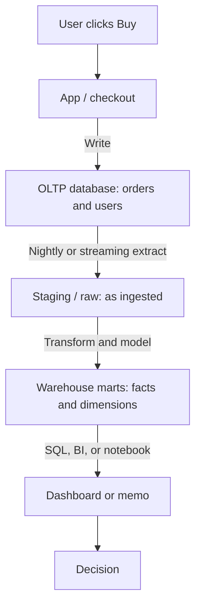
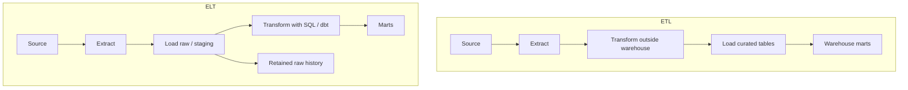
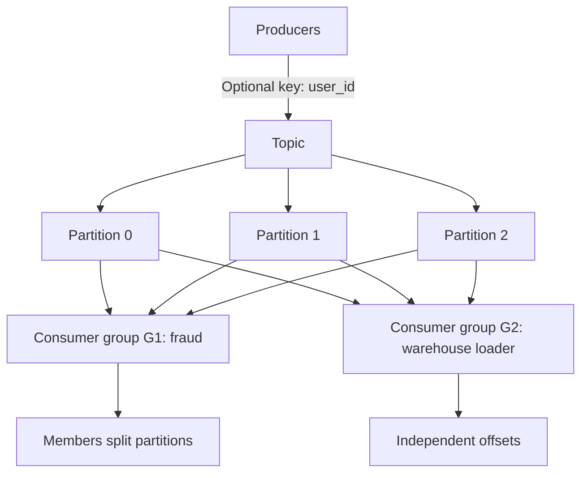

# The Zero-to-Hero Data Analyst & Data Engineer Roadmap

*Mohammad Bilal's complete, self-paced path from first principles to professional-level data work - spreadsheets, SQL, Python, statistics, visualization, warehousing, ETL/ELT, orchestration, dbt, Spark, Kafka, and cloud platforms - told as a connected story in which each new idea solves a problem left by the previous one.*

**Scope:** Data analyst × data engineer · 20 phases · no artificial weekly deadline.

First principles → SQL → Stats → Pipelines → Spark → Kafka → Hire

---

## How to Read This Document

### Start here if data work is completely new to you

**Data** is recorded information: a sale, a click, a temperature, a name, or any other fact you can store. A **data analyst** uses recorded facts to answer questions and support decisions. A **data engineer** builds the paths that collect, clean, store, and deliver those facts. A **query** is a precise request for information, a **pipeline** is a repeatable series of data-moving steps, and a **data model** describes how the stored facts relate to one another.

Begin each topic with a small table you can inspect with your own eyes. Predict the result before you run a formula, query, or script. Then compare your prediction with the output and explain any difference. That habit matters more than remembering tool names because it teaches you to notice when data is incomplete, duplicated, or misleading.

**Words you will meet often:** a **schema** describes the expected shape of stored data; **SQL** is a language for asking relational databases questions; a **metric** is a defined measurement used to track something; **grain** states what one row represents; a **warehouse** stores data prepared for analysis; **ETL** means extract, transform, then load, while **ELT** transforms after loading; **orchestration** schedules and coordinates data jobs; **batch** processing handles a collected group at once; **stream** processing handles continuing events; and a **partition** is one deliberately separated part of a larger dataset.

The sections are connected. Read them in order the first time because each one begins with a problem that the previous idea could not solve. Each section begins by explaining **why what you just learned wasn't enough**, and closes by showing you **the remaining problem that leads to the next idea**. Read it in order the first time through - window functions only make sense because of what broke in basic `GROUP BY`.

**There is no clock on this document.** No week numbers, no day-by-day plan, no "finish by." Data skills do not compress into a fixed number of days, and pretending otherwise is how people memorize disconnected tool names instead of building understanding. Move at the pace your own understanding requires. The only valid unit of progress here is: *can I now explain why the previous concept wasn't enough, and how this one fixes it?*

Every concept in this roadmap answers the same set of questions, because that set of questions *is* how data knowledge actually accumulates:

- What is it, in plain language?
- Why does it exist - what problem forced someone to invent it?
- What did people do before it existed, and what broke?
- How does it solve that problem, step by step, inside the computer or system?
- What does it cost? (Every solution trades something for something.)
- Where does its own limitation show up - and what does *that* limitation force us to invent next?

That last question is the engine of the whole roadmap. Nothing here is "just a topic to cover." Every topic is a *reaction* to the topic before it.

### Two Jobs, One Shared Flow of Data

This document covers both **Data Analyst** and **Data Engineer** paths because they share the same basic knowledge (SQL, modeling, Python, metrics) and then diverge:

| Role | Primary question | Main work |
| --- | --- | --- |
| **Data Analyst** | What does the data *mean*, and what should we *do*? | Querying, stats, visualization, storytelling, metrics |
| **Data Engineer** | How does trustworthy data *get here*, reliably, when the amount of work grows? | Pipelines, warehouses, orchestration, quality, platforms |

Phases 1-10 build the shared foundation and take you to a strong analyst. Phases 11-20 deepen modeling, warehouses, pipelines, platforms, and hiring readiness. If you only want analysis, finish through Phase 10, then skim 11-12 and jump to 19-20. If you want engineering, do not skip the analyst phases - engineers who cannot think in metrics build pipelines nobody trusts.

### The Beginner-Friendly Pattern Every Topic Follows

Those questions are answered in the same order every single time. Once you have read one section you know the shape of all of them:

| Element | What it gives you |
| --- | --- |
| **Why You Are Learning This** | The previous concept's limitation, stated plainly, before any new machinery is introduced |
| **See It Before You Memorize It** | Videos, interactive tools, written docs, a GitHub implementation, and a practice platform - placed *here*, not in a dead list at the bottom |
| **Step-by-Step Explanation** | A precise, step-by-step explanation in words |
| **The Idea That Fixed It** | The main idea in one clear sentence that made the concept stick |
| **Internal Working, Step by Step** | A prose and diagram "animation" of exactly what happens underneath |
| **Picture It Like This** | Something you can picture without a screen |
| **Complexity / Trade-offs** | What improved, what it cost, and why |
| **Small Working Example** | A minimal, working version you can run |
| **How to Explain This in an Interview** | What the concept looks like when it is tested |
| **Practice** | Problems graded easy to hard |
| **Why the Next Topic Is Needed** | The exact limitation that makes the next concept necessary |

**Diagram conventions.** Diagrams are plain ASCII inside code fences. `|` and `v` mean "then this happens", `+--` joins related paths, `-->` and `->` mean data movement, `X` marks a failure point, and boxes drawn with `+---+` are systems or tables. Time runs downward.

---

> **Integrated Git practice:** Each linked phase-project card in [`Projects.md`](./Projects.md) ends with one specific Git checkpoint. Test the finished project first, commit only its named project path, verify the commit and clean working tree, then continue. Use [`Git.md` Phases 2-3](./Git.md#phase-2) if staging or commit selection is unfamiliar.

---

## The Whole-Journey Map

```text
 PHASE 1                 PHASE 2               PHASE 3                PHASE 4
 DATA THINKING           SPREADSHEETS &         PYTHON FOR DATA        SQL FOUNDATIONS
                         DATA LITERACY
    |                       |                      |                      |
    v                       v                      v                      v
 Analyst vs Engineer,    Tables, types,       Variables, loops,      SELECT, WHERE,
 the data lifecycle      PivotTables,         functions, files       ORDER BY, LIMIT
                         dirty data habits

 PHASE 5                 PHASE 6               PHASE 7                PHASE 8
 SQL JOINS &             ADVANCED SQL          STATISTICS FOR         PANDAS &
 AGGREGATIONS            (CTEs, WINDOWS)       ANALYSTS               WRANGLING
    |                       |                      |                      |
    v                       v                      v                      v
 INNER/LEFT JOIN,        CTEs, window          Distributions,        DataFrames,
 GROUP BY, HAVING        functions,            sampling,             cleaning, groupby,
                         subqueries            hypothesis tests      merge, reshape

 PHASE 9                 PHASE 10              PHASE 11               PHASE 12
 VISUALIZATION &         EDA, METRICS &        RELATIONAL MODELING    WAREHOUSE &
 STORYTELLING            ANALYTICS             (OLTP)                 DIMENSIONAL MODEL
    |                       |                      |                      |
    v                       v                      v                      v
 Charts that answer      North-star metrics,   Keys, 3NF, indexes,   Star/snowflake,
 questions; dashboards   funnels, cohorts,     query plans           SCD, facts/dims
                         insight memos

 PHASE 13                PHASE 14              PHASE 15               PHASE 16
 ETL / ELT &             ORCHESTRATION &       dbt & ANALYTICS        CLOUD DATA
 FILE FORMATS            CONTAINERS            ENGINEERING            PLATFORMS
    |                       |                      |                      |
    v                       v                      v                      v
 Batch vs stream,        Airflow DAGs,         Models, tests,        Warehouse + lake
 Parquet/ORC,            Docker, retries       docs, semantic layer  patterns in cloud
 idempotency

 PHASE 17                PHASE 18              PHASE 19               PHASE 20
 SPARK &                 STREAMING WITH        PORTFOLIO &            INTERVIEWS
 DISTRIBUTED COMPUTE     KAFKA                 DATA QUALITY
    |                       |                      |                      |
    v                       v                      v                      v
 Partitions, shuffles,   Topics, consumer      Projects that prove   SQL, cases, DE
 narrow vs wide deps     groups, delivery      skill; GX / contracts design, behavioral
```

Every arrow above is a real dependency that gets argued for in the text - not just drawn in a diagram.

---

## Phase Index

| # | Phase | Goal | You'll be ready to move on when you can... |
| --- | --- | --- | --- |
| 01 | [Data Thinking](#phase-1---data-thinking-how-decisions-get-made-from-raw-events) | Know what problem each role solves | Explain the path from raw event to decision, and where analyst vs engineer sits |
| 02 | [Spreadsheets & Literacy](#phase-2---spreadsheets--data-literacy) | See data as typed, messy tables | Clean a dirty sheet and answer a business question with a PivotTable |
| 03 | [Python for Data](#phase-3---python-for-data) | Automate what spreadsheets cannot | Read a CSV, loop over rows, write a function that returns a summary |
| 04 | [SQL Foundations](#phase-4---sql-foundations) | Ask questions of tables | Write SELECT / WHERE / ORDER BY / LIMIT from a blank editor |
| 05 | [Joins & Aggregations](#phase-5---sql-joins--aggregations) | Combine and summarize tables | Explain INNER vs LEFT JOIN and when GROUP BY collapses rows |
| 06 | [Advanced SQL](#phase-6---advanced-sql) | Answer time-aware analytic questions | Write a window function for running totals and a CTE that is readable |
| 07 | [Statistics](#phase-7---statistics-for-analysts) | Separate signal from noise | Explain mean vs median, sampling bias, and what a p-value is *not* |
| 08 | [Pandas](#phase-8---pandas--wrangling) | Wrangle data programmatically | Clean, join, group, and reshape a messy dataset without Excel |
| 09 | [Visualization](#phase-9---visualization--storytelling) | Make charts that change minds | Choose the right chart for the question and avoid common lies |
| 10 | [EDA & Metrics](#phase-10---eda-metrics--analytics) | Turn curiosity into decisions | Define a metric, explore a dataset, and write a short insight memo |
| 11 | [Relational Modeling](#phase-11---relational-modeling-oltp) | Design correct OLTP schemas | Normalize to 3NF and explain when an index helps a query plan |
| 12 | [Warehouse & Dimensional](#phase-12---warehouses--dimensional-modeling) | Model for analytics when the amount of work grows | Draw a star schema and choose an SCD strategy for a changing attribute |
| 13 | [ETL/ELT & Formats](#phase-13---etl--elt-pipelines) | Move and store data efficiently | Contrast ETL vs ELT and justify Parquet over CSV for a warehouse load |
| 14 | [Orchestration & Containers](#phase-14---orchestration-airflow--containers) | Run pipelines reliably | Write an Airflow DAG with retries and explain why Docker freezes the runtime |
| 15 | [dbt & Analytics Eng](#phase-15---analytics-engineering-with-dbt) | Transform in the warehouse like software | Build staged/mart models with tests and docs on a sample project |
| 16 | [Cloud Platforms](#phase-16---cloud-data-platforms) | Deploy the stack where companies run | Map batch/lake/warehouse pieces onto one cloud you can demo |
| 17 | [Spark](#phase-17---big-data-with-spark) | Process data beyond one machine | Explain partitions, shuffles, and a simple Spark job end to end |
| 18 | [Kafka Streaming](#phase-18---streaming-with-apache-kafka) | Move events in near real time | Explain topics, consumer groups, and at-least-once vs exactly-once trade-offs |
| 19 | [Portfolio & Quality](#phase-19---projects-data-quality--portfolio) | Prove skill and protect trust | Ship a public project with lineage notes and data-quality checks |
| 20 | [Interviews](#phase-20---interview-mastery) | Get hired | Solve SQL + case + design prompts out loud with clear trade-offs |

### Anchor Resources (bookmark these)

- Free DE course: [DataTalksClub/data-engineering-zoomcamp](https://github.com/DataTalksClub/data-engineering-zoomcamp)
- DE handbook: [DataExpert-io/data-engineer-handbook](https://github.com/DataExpert-io/data-engineer-handbook)
- Awesome DE: [igorbarinov/awesome-data-engineering](https://github.com/igorbarinov/awesome-data-engineering)
- Pandas practice: [guipsamora/pandas_exercises](https://github.com/guipsamora/pandas_exercises)
- Pandas source: [pandas-dev/pandas](https://github.com/pandas-dev/pandas)
- dbt sandbox: [dbt-labs/jaffle-shop](https://github.com/dbt-labs/jaffle-shop)
- SQL practice: [LeetCode Database](https://leetcode.com/problemset/database/), [SQLBolt](https://sqlbolt.com/), [Mode SQL Tutorial](https://mode.com/sql-tutorial)
- Notebooks: [donnemartin/data-science-ipython-notebooks](https://github.com/donnemartin/data-science-ipython-notebooks)
- Learn SQL repo: [WebDevSimplified/Learn-SQL](https://github.com/WebDevSimplified/Learn-SQL)

---

<a id="phase-1"></a>

# PHASE 1 - Data Thinking: How Decisions Get Made from Raw Events

**Track:** Shared Foundation

**WHAT YOU WILL BE ABLE TO DO:** Understand the path from a click, transaction, or sensor reading to a business decision - and where analysts and engineers sit on that path.

**WHAT YOU SHOULD KNOW FIRST:** None - this is the ground floor.

## 1.1 Data Lifecycle & Analyst vs Engineer

**WHY YOU ARE LEARNING THIS - WHERE THE ROADMAP STARTS:** Every later tool - SQL, Pandas, Airflow, Spark - exists to move one step of this lifecycle. If you never see the whole path, you will confuse *tools* with *jobs*. Analysts who skip this invent dashboards nobody uses. Engineers who skip this build pipelines that deliver garbage on time. This phase exists to remove that ambiguity before it can compound.

**THE PROBLEM THIS SOLVES:** Organizations made decisions from gut feel, paper ledgers, and one-off Excel exports emailed around as `final_v3.xlsx`. That worked for a shop with twenty customers. It collapses when you have millions of events, multiple teams asking conflicting questions, and regulators asking "where did this number come from?" Without a shared map of how raw events become decisions, every team invents its own private definition of "revenue," and the company argues about numbers instead of acting on them.

**SEE IT BEFORE YOU MEMORIZE IT**

- Best animated explanation: [What is Data Pipeline? (ByteByteGo)](https://www.youtube.com/watch?v=kGT4PcTEPP8) - builds the end-to-end path from source systems to decisions with clear animation
- Alternative: [How I'd Learn Data Engineering in 2026 (Data with Baraa)](https://www.youtube.com/watch?v=1nVGaNbvuXg) - role map and learning order from a practicing engineer
- Another angle: [Fundamentals of Data Engineering (Matt Housley and Joe Reis, GOTO)](https://www.youtube.com/watch?v=VdGVmqiJkeg) - the mental model behind modern data platforms
- Interactive simulator/website: [Kaggle Datasets](https://www.kaggle.com/datasets) - pick any public dataset and write one paragraph: what decision could this support, and who would own the pipeline?
- Second interactive: [SQLBolt](https://sqlbolt.com/) - even before deep SQL, feel what "asking a table a question" means in Lesson 1
- Written documentation: [DataExpert-io/data-engineer-handbook](https://github.com/DataExpert-io/data-engineer-handbook) - curated map of the modern data stack
- GitHub implementation: [DataTalksClub/data-engineering-zoomcamp](https://github.com/DataTalksClub/data-engineering-zoomcamp) - a full free course that walks the lifecycle with real tools
- Practice platform: [Exercism](https://exercism.org/) - pick a language track and practice writing small, testable transforms (the micro-skill every lifecycle step needs)

**STEP-BY-STEP EXPLANATION**

Data work is a pipeline of trust, not a pile of tools. Something happens in the world - an order is placed, a page is viewed, a payment fails. An application or device captures that event as a row, log line, or API payload. Batch or stream jobs move that data toward systems built for analysis. Messy source tables become clean, documented, tested tables with a declared grain. Humans then ask questions with SQL, Python, or BI tools and produce metrics, charts, and recommendations. A team changes a product, price, process, or forecast. That decision creates new events, and the loop continues.

**Data Engineers** own reliability of capture, movement, and modeling when the amount of work grows: freshness, schema contracts, failure recovery, and cost. **Data Analysts** own rigor of questioning and decision support: metric definitions, statistical caution, visualization that does not lie, and memos that change minds. Analytics engineers often sit in the middle, using SQL plus software habits to make modeled tables trustworthy for analysts. The important point is not the job title on a LinkedIn profile. It is which failure mode you own when the number is wrong or late.

**THE MAIN IDEA IN SIMPLE WORDS:** Stop treating "data work" as a single skill. Treat it as a lifecycle with clear handoffs. Once you can point to where an event is generated, where it is stored, how it is moved, how it is modeled, and how it is decided upon, every later tool has a home. Tools then become answers to specific lifecycle failures instead of fashion accessories.

**WHAT HAPPENS INSIDE, ONE STEP AT A TIME**



Follow one purchase through that diagram and you will see why "the dashboard is wrong" is almost never a chart problem. The bug might be capture (event never fired), movement (job failed silently), modeling (double-counted refunds), analysis (wrong filter), or decision (metric looked at without context). Engineers and analysts debug different boxes. Professionals can name which box failed.

**PICTURE IT LIKE THIS**

A restaurant: cooks and prep (engineers) keep ingredients flowing from suppliers to the kitchen with consistent prep and temperature control. Servers and the chef tasting the plate (analysts) decide whether the menu is working and what to change tomorrow. If the kitchen is chaotic, no amount of elegant plating saves dinner. If the kitchen is perfect but nobody tastes, you serve food nobody ordered. Both crafts are required; confusing them produces either beautiful nonsense or reliable irrelevance.

**WHAT YOU GAIN, WHAT IT COSTS, AND WHERE IT CAN FAIL**

| Choice | What it buys | What it costs |
| --- | --- | --- |
| Spreadsheet-only analytics | Fast for small teams, zero platform cost | Breaks on volume, version chaos, no lineage |
| Analysts querying production DB | Fresh numbers, no warehouse lag | Locks, outage risk, schema not built for analytics |
| Separate warehouse + pipelines | Scale, safety, history, isolation | Engineering cost, freshness lag unless streaming |
| Perfect models before any dashboard | Clean foundation, fewer rewrites | Months with zero business value |
| One "data person" doing both roles | Simple org chart early on | Burnout and shallow ownership of both crafts |

**SMALL WORKING EXAMPLE**

```python
# A tiny lifecycle sketch - not production, just the idea made runnable.
from dataclasses import dataclass
from datetime import datetime
from collections import defaultdict


@dataclass
class Event:
    user_id: str
    event_name: str
    ts: datetime
    amount: float | None = None


# 1) Capture (app writes events)
raw_events = [
    Event("u1", "page_view", datetime(2026, 8, 1, 10, 0)),
    Event("u1", "add_to_cart", datetime(2026, 8, 1, 10, 2)),
    Event("u1", "purchase", datetime(2026, 8, 1, 10, 5), amount=49.0),
    Event("u2", "page_view", datetime(2026, 8, 1, 11, 0)),
    Event("u2", "purchase", datetime(2026, 8, 1, 11, 8), amount=20.0),
]


# 2) Move + model (engineer-shaped work): keep only purchases as a "fact"
def to_purchase_facts(events: list[Event]) -> list[dict]:
    facts = []
    for e in events:
        if e.event_name == "purchase" and e.amount is not None:
            facts.append(
                {
                    "user_id": e.user_id,
                    "purchased_at": e.ts,
                    "revenue": e.amount,
                }
            )
    return facts


# 3) Analyze (analyst-shaped work): revenue by user
def revenue_by_user(facts: list[dict]) -> dict[str, float]:
    totals: dict[str, float] = defaultdict(float)
    for row in facts:
        totals[row["user_id"]] += row["revenue"]
    return dict(totals)


facts = to_purchase_facts(raw_events)
print(facts)
print(revenue_by_user(facts))
# [{'user_id': 'u1', ... 'revenue': 49.0}, {'user_id': 'u2', ...}]
# {'u1': 49.0, 'u2': 20.0}
```

**HOW TO EXPLAIN THIS IN AN INTERVIEW:** "What's the difference between a data analyst and a data engineer?" Answer in lifecycle terms, not tool lists. Mention that both care about metric definitions and data quality, but own different failure modes: engineers own late/missing/duplicated pipes; analysts own misleading definitions, bad segments, and charts that imply causation they cannot support. Strong candidates also say where the two must collaborate - usually on the metric contract.

**PRACTICE UNTIL IT FEELS FAMILIAR**

| Difficulty | Task |
| --- | --- |
| Easy | Draw the lifecycle for "daily active users" at a mobile app, naming each box |
| Easy | List three ways an analyst number can be wrong even if the SQL query runs |
| Medium | Interview someone about their job and map which lifecycle steps they touch |
| Medium | Take any Kaggle dataset and write: decision supported, owner of capture, owner of analysis |
| Hard | Read the Zoomcamp README and map each week to a lifecycle step, noting gaps |

**WHY THE NEXT TOPIC IS NEEDED - Structured / Semi-structured / Unstructured Data:** Knowing the lifecycle tells you *that* data must move from world to decision. It does not yet tell you *what shapes* that data comes in - tables, JSON documents, images, logs - and why those shapes force different tools. That is the next crack.

---

## 1.2 Structured, Semi-structured, Unstructured Data & Data as a Product

**WHY YOU ARE LEARNING THIS:** "We have data" is not a useful sentence until you know the shape. A relational table, a JSON API payload, and a folder of PDFs are all "data," but they demand different storage, different queries, and different quality checks. Separately, modern teams treat datasets as *products* with owners, SLAs, and consumers - because orphaned tables become landfill.

**THE PROBLEM THIS SOLVES:** Teams dumped everything into shared folders and databases with names like `data2_new`. Nobody knew whether a field was required, who owned freshness, or whether yesterday's CSV matched today's schema. Analysts spent more time archaeology-digging than analyzing. Engineers could not promise reliability because "the data" had no contract. Semi-structured logs and nested JSON made this worse: the data looked flexible until the first dashboard assumed a field that sometimes was an object and sometimes a string.

**SEE IT BEFORE YOU MEMORIZE IT**

- Best animated explanation: [Data Pipeline Overview thinking (ByteByteGo)](https://www.youtube.com/watch?v=kGT4PcTEPP8) - revisit with an eye for source *shapes*, not only pipes
- Alternative: [ETL explained with a clear example (Chandoo)](https://www.youtube.com/watch?v=wDTzxdShbd8) - transform thinking before you meet warehouses
- Another angle: [Fundamentals of Data Engineering (GOTO)](https://www.youtube.com/watch?v=VdGVmqiJkeg) - how platforms absorb structured and semi-structured sources
- Interactive simulator/website: [db-fiddle.com](https://www.db-fiddle.com/) - create a tiny structured table and query it
- Second interactive: [Python Tutor](https://pythontutor.com/) - step through parsing a nested `dict` that mimics JSON
- Written documentation: [pandas docs - data structures overview](https://pandas.pydata.org/docs/user_guide/dsintro.html) - how tabular tools expect rectangular data
- GitHub implementation: [DataExpert-io/data-engineer-handbook](https://github.com/DataExpert-io/data-engineer-handbook) - glossary and stack notes for source types
- Practice platform: [Kaggle](https://www.kaggle.com/) - open one CSV (structured), one JSON-lines dataset, and one text/image set; write the shape of each

**STEP-BY-STEP EXPLANATION**

**Structured data** fits a predefined schema: rows and columns with types, primary keys, and relationships. SQL databases and tidy spreadsheets live here. **Semi-structured data** has organization (keys, nesting, tags) without a rigid global schema: JSON, XML, many application logs. You can query it, but you often discover schema at read time, and fields may be missing or differently typed across records. **Unstructured data** has no tabular schema for free: text documents, images, audio, video. Useful signal exists, but you must extract features or use specialized models before classical analytics applies.

**Data as a product** means a dataset has a product owner, a declared grain, a quality SLA (freshness, completeness, uniqueness), documentation of fields, and known consumers. It is the opposite of a side-effect table left behind by a one-off script. When data is a product, analysts stop guessing what `status = 3` means, and engineers stop changing column names without a versioning conversation.

**THE MAIN IDEA IN SIMPLE WORDS:** Match storage and tooling to shape, then wrap the result in a product contract. Structured facts go into tables with schemas. Semi-structured events are parsed into structured columns as early as it is safe. Unstructured sources get an extraction step before they enter metric pipelines. Ownership and SLAs turn "a table that exists" into "a dataset you can trust."

**WHAT HAPPENS INSIDE, ONE STEP AT A TIME**

```text
 Sources
 +------------------+   +------------------+   +------------------+
 | Postgres orders  |   | API JSON events  |   | PDF invoices     |
 | (structured)     |   | (semi-structured)|   | (unstructured)   |
 +--------+---------+   +--------+---------+   +--------+---------+
          |                      |                      |
          | parse/validate       | flatten JSON         | OCR / extract
          v                      v                      v
 +----------------------------------------------------------------+
 |              Structured analytics tables (product)             |
 |  owner, grain, SLA, dictionary, tests                          |
 +-----------------------------+----------------------------------+
                               |
                               v
                        Dashboards / models / memos
```

Notice the asymmetry: everything *ends* rectangular if you want classical BI metrics. The work is different on the left. Structured sources need modeling and keys. Semi-structured sources need schema-on-read discipline and careful null handling. Unstructured sources need extraction that can fail, so quality checks matter even more.

**PICTURE IT LIKE THIS**

A city archive: tax records in labeled binders (structured), sticky-note-filled envelopes with labeled flaps (semi-structured), and a box of unlabeled photographs (unstructured). You can answer "total tax by district" from the binders immediately. Sticky-note envelopes need sorting rules before they join the binders. Photographs need a cataloger to tag them before they support any count. Calling all three "the archive" without saying which shelf you mean is how meetings waste an hour.

**WHAT YOU GAIN, WHAT IT COSTS, AND WHERE IT CAN FAIL**

| Choice | What it buys | What it costs |
| --- | --- | --- |
| Force everything into rigid tables early | Simple BI, clear types | Lossy parsing; fights rapidly changing events |
| Keep raw JSON forever, query with path expressions | Flexibility, full fidelity | Slow queries, tribal knowledge, fragile dashboards |
| Treat datasets as products with owners/SLAs | Trust, discoverability, fewer duplicate tables | Process overhead; requires stewardship culture |
| Ignore unstructured until "later" | Focus on quick wins | Blind spots in support tickets, contracts, images |
| One mega-table for all entities | Simple to find "the" table | Ambiguous grain, null spam, unusable joins |

**SMALL WORKING EXAMPLE**

```python
import json
from typing import Any


def classify_shape(sample: Any) -> str:
    if isinstance(sample, list) and sample and isinstance(sample[0], dict):
        keys = set(sample[0])
        if all(isinstance(row, dict) and set(row) == keys for row in sample):
            return "structured-or-rectangular"
    if isinstance(sample, (dict, list)):
        return "semi-structured"
    if isinstance(sample, (str, bytes)):
        return "unstructured-or-blob"
    return "unknown"


# Structured rows (table-shaped)
orders = [
    {"order_id": 1, "user_id": "u1", "amount": 49.0},
    {"order_id": 2, "user_id": "u2", "amount": 20.0},
]

# Semi-structured event (nested, optional fields)
raw_json = '{"user":{"id":"u1"},"items":[{"sku":"A"},{"sku":"B"}],"coupon":null}'
event = json.loads(raw_json)


def flatten_event(e: dict) -> dict:
    return {
        "user_id": e.get("user", {}).get("id"),
        "item_count": len(e.get("items") or []),
        "has_coupon": e.get("coupon") is not None,
    }


# Data-as-product metadata (the contract, not the data)
dataset_product = {
    "name": "fct_orders",
    "owner": "analytics-engineering",
    "grain": "one row per order_id",
    "sla_freshness_hours": 24,
    "consumers": ["finance-revenue-dashboard", "growth-funnel"],
}

print(classify_shape(orders))
print(flatten_event(event))
print(dataset_product["grain"])
```

**HOW TO EXPLAIN THIS IN AN INTERVIEW:** Interviewers love "how would you model this clickstream?" Strong answers name the source shape, say what must be parsed into columns, declare grain, and mention ownership/quality. Weak answers jump straight to a favorite tool. Bonus points for distinguishing raw landing zones (keep fidelity) from consumer marts (enforce structure).

**PRACTICE UNTIL IT FEELS FAMILIAR**

| Difficulty | Task |
| --- | --- |
| Easy | Label five datasets you know as structured, semi-structured, or unstructured |
| Easy | Write a one-paragraph data product brief for a `users` table (owner, grain, SLA) |
| Medium | Flatten a nested JSON event into tabular columns, documenting null rules |
| Medium | Find two public Kaggle datasets of different shapes and compare query readiness |
| Hard | Design a landing + mart layout for mixed CSV + JSON API sources with ownership |

**WHY THE NEXT TOPIC IS NEEDED - Spreadsheets & Data Literacy:** Product thinking and shape awareness still leave most humans' first contact with data as a grid of cells. That grid teaches types, filters, and aggregation - and also teaches every bad habit (merged cells, colors-as-data, `final_final_v3.xlsx`) that later tools exist to fix. Spreadsheets are the next stop.

> **Phase 1 complete?** [Build the Phase 1 mini-project](./Projects.md#data-phase-1-project) · [Continue to Phase 2](#phase-2---spreadsheets--data-literacy)

<a id="phase-2"></a>

# PHASE 2 - Spreadsheets & Data Literacy

**Track:** Shared Foundation

**WHAT YOU WILL BE ABLE TO DO:** Treat tables as typed, filterable facts - and learn the hygiene that makes later SQL and Python saner.

**WHAT YOU SHOULD KNOW FIRST:** Phase 1 (lifecycle and data shapes).

## 2.1 Tidy Tables, Types, and Dirty Data

**WHY YOU ARE LEARNING THIS:** If you cannot answer a question in a clean spreadsheet, SQL will only help you get the wrong answer faster. Spreadsheets are the smallest complete analytics environment: rows, columns, filters, aggregations, charts. They are also where most dirty-data habits are learned. This section exists to install the hygiene that every later tool assumes.

**THE PROBLEM THIS SOLVES:** People stored "reports" that looked like slides: merged title cells, blank spacer rows, colors meaning "urgent," and monthly columns stretching sideways forever (`Jan`, `Feb`, `Mar`...). Humans could read those sheets. Machines - and future you writing a PivotTable or a SQL load - could not. Types were decorative: a column mixed `100`, `"N/A"`, and `""` and still got summed until it silently skipped values. Duplicate entity names (`NY`, `New York`, `new york`) shattered every group-by.

**SEE IT BEFORE YOU MEMORIZE IT**

- Best animated explanation: [What is ETL with a clear example (Chandoo)](https://www.youtube.com/watch?v=wDTzxdShbd8) - transform thinking with a concrete business example before pipelines
- Alternative: [Data Analysis with Python (freeCodeCamp)](https://www.youtube.com/watch?v=r-uOLxNrNk8) - early modules reinforce tabular thinking even when the tool is Python
- Another angle: [How I'd Learn Data Engineering in 2026 (Data with Baraa)](https://www.youtube.com/watch?v=1nVGaNbvuXg) - where spreadsheet literacy sits in a larger path
- Interactive simulator/website: [Kaggle Datasets](https://www.kaggle.com/datasets) - download a messy CSV and tidy it by hand first
- Second interactive: [Python Tutor](https://pythontutor.com/) - step through a small cleaning loop that normalizes strings and types
- Written documentation: Excel or Google Sheets help for data types, filters, and Remove Duplicates
- GitHub implementation: [guipsamora/pandas_exercises](https://github.com/guipsamora/pandas_exercises) - later you will automate this hygiene; skim an exercise now to see the end state
- Practice platform: [Exercism](https://exercism.org/) - practice pure cleaning functions (trim, parse, validate) without a spreadsheet UI

**STEP-BY-STEP EXPLANATION**

A useful table has one row equal to one thing at a declared grain (one order, one daily user, one ticket), and one column equal to one attribute with one type (date, number, category, boolean). There are no merged cells, no colors-as-data, and no subtotal rows mixed into the fact rows. Hadley Wickham's "tidy data" idea captures the same law: each variable is a column, each observation is a row, each value is a cell.

Dirty data is not a moral failing; it is the default state of human-entered and system-exported files. The recurring dirt patterns are: missing values disguised as sentinels (`-999`, `"n/a"`), inconsistent categories, broken dates (`01/02/03` with unknown locale), leading/trailing spaces, duplicate keys, and wide layouts that encode a dimension (month) as many columns instead of one. Cleaning is the act of making the table match its claimed grain and types so that filters and aggregations mean something.

**THE MAIN IDEA IN SIMPLE WORDS:** Separate *presentation* from *data*. Keep a tidy fact table that machines can aggregate. Build pretty summary sheets as outputs that never feed other calculations. Once that split is real, PivotTables, SQL, and Pandas stop fighting you.

**WHAT HAPPENS INSIDE, ONE STEP AT A TIME**

```text
 Raw sheet (dirty)                     Tidy table
+-------------------------+           +-----------------------------+
| Region | Jan | Feb |    |           | region | month   | revenue  |
| East   | 10  | 12  |    |  tidy     | East   | 2026-01 | 10       |
| West   | 8   | 9   |    |  ----->   | East   | 2026-02 | 12       |
|        |     |     |    |           | West   | 2026-01 | 8        |
+-------------------------+           | West   | 2026-02 | 9        |
                                      +-----------------------------+
                                                 |
                                                 v
                                      typed columns, unique keys,
                                      no subtotals mixed into facts
```

Cleaning pipeline in practice:

```text
 Load -> normalize headers -> trim strings -> unify categories
     -> parse dates/numbers -> replace sentinels with NULL
     -> drop/repair duplicate keys -> validate grain -> freeze tidy output
```

Each arrow is a rule you can write down. If you cannot write the rule, you do not yet understand the dirt.

**PICTURE IT LIKE THIS**

A library card catalog: each card is a row; author, title, and year are columns. If someone staples three books onto one card and writes "misc" in the year field, the catalog still *looks* full - and every search lies. Tidying is rewriting the catalog so one card means one book, and year is always a year.

**WHAT YOU GAIN, WHAT IT COSTS, AND WHERE IT CAN FAIL**

| Choice | What it buys | What it costs |
| --- | --- | --- |
| Wide monthly columns (Jan/Feb/...) | Easy typing for humans | Painful to filter/chart; not tidy |
| Tidy long format | Works with every later tool | Slightly harder to "read" by eye |
| Colors / comments as data | Fast annotation for humans | Invisible to formulas and pipelines |
| Deleting "bad" rows quickly | Clean-looking sheet today | Silent bias; lost audit trail |
| Keeping a raw + clean copy | Reproducible cleaning | Discipline and storage |

**SMALL WORKING EXAMPLE**

```python
# Tidy a tiny wide table into long form (preview of Pandas later)
wide = [
    {"region": "East", "Jan": 10, "Feb": 12},
    {"region": "West", "Jan": 8, "Feb": 9},
]

long = []
for row in wide:
    for month, value in [("2026-01", row["Jan"]), ("2026-02", row["Feb"])]:
        long.append({"region": row["region"], "month": month, "revenue": value})

# Dirty category normalization
raw_regions = ["NY", "New York", "new york", " NY "]
canon = {"ny": "New York", "new york": "New York"}
cleaned = [canon[r.strip().lower()] for r in raw_regions]
print(long)
print(cleaned)
```

**HOW TO EXPLAIN THIS IN AN INTERVIEW:** Expect "how would you clean this Excel dump?" Talk grain, types, missing-value policy, duplicates, and tidy shape *before* any fancy model. Interviewers listen for whether you preserve raw data and document rules, or proudly describe irreversible deletes.

**PRACTICE UNTIL IT FEELS FAMILIAR**

| Difficulty | Task |
| --- | --- |
| Easy | Take any spreadsheet and write its grain in one sentence |
| Easy | Find and fix five dirty cells (types, spaces, sentinels) in a sample sheet |
| Medium | Untidy a wide budget sheet into long format by hand |
| Medium | Document a cleaning checklist your team could reuse |
| Hard | Rebuild a "report-looking" sheet into raw tidy + presentation layers |

**WHY THE NEXT TOPIC IS NEEDED - PivotTables, Lookups, and Automation Limits:** A tidy table is necessary, but analysis means slicing and combining tables - region by month, customer to order, SKU to price list. Spreadsheets give you PivotTables and lookups for that. They also show you exactly where the grid stops scaling.

---

## 2.2 PivotTables, Lookups, and Spreadsheet Automation Limits

**WHY YOU ARE LEARNING THIS:** Aggregation and combination are the core verbs of analysis. PivotTables are the first aggregation engine most people meet: they `GROUP BY` dimensions and compute `SUM` / `COUNT` / `AVG` measures visually. Lookups (`VLOOKUP` / `XLOOKUP` / `INDEX-MATCH`) are the first joins. Mastering them builds intuition you will later formalize in SQL. Hitting their limits is what justifies Python and databases.

**THE PROBLEM THIS SOLVES:** With only filtered rows and hand-written `SUM` formulas, every new question meant a new fragile formula block. People copied summary tables by hand into slide decks. When the source refreshed, nothing recomputed safely. Multi-table questions ("orders with customer segment") became nested lookups that broke when columns moved. Files grew to tens of megabytes, shared drives filled with conflicting copies, and "who changed the formula?" became unanswerable.

**SEE IT BEFORE YOU MEMORIZE IT**

- Best animated explanation: [ETL with a clear example (Chandoo)](https://www.youtube.com/watch?v=wDTzxdShbd8) - watch as "transform" thinking, then recreate the summary as a PivotTable
- Alternative: [SQL in 100 Seconds (Fireship)](https://www.youtube.com/watch?v=zsjvFFKOm3c) - preview of the language that replaces brittle spreadsheet aggregation
- Another angle: [freeCodeCamp SQL course](https://www.youtube.com/watch?v=HXV3zeQKqGY) - early SELECT/GROUP BY mental model mapped back to pivots
- Interactive simulator/website: Google Sheets or Excel - rebuild the same summary with a PivotTable and with formulas
- Second interactive: [Mode SQL Tutorial](https://mode.com/sql-tutorial) - skim aggregation lessons and map each to a Pivot field well
- Written documentation: your spreadsheet tool's PivotTable and XLOOKUP docs
- GitHub implementation: [WebDevSimplified/Learn-SQL](https://github.com/WebDevSimplified/Learn-SQL) - see the SQL form of the same ideas
- Practice platform: [SQLBolt](https://sqlbolt.com/) - Lessons on filtering and grouping mirror Pivot filters and value fields

**STEP-BY-STEP EXPLANATION**

A PivotTable has four field roles: rows (group labels), columns (optional second group axis), values (aggregated measures), and filters (slice predicates). Under the hood it is the same operation SQL expresses as `GROUP BY` plus aggregate functions. Lookups attach attributes from a second table by matching a key - a manual, often many-to-one join. `XLOOKUP` improves on classic `VLOOKUP` by not requiring the key to be in the leftmost column and by handling missing keys more cleanly.

Spreadsheet automation - recorded macros, Apps Script, Power Query - can repeat cleaning steps. It helps until logic branches, tests matter, code review matters, or data volume exceeds comfortable grid size. Collaboration is another hard limit: databases and git-backed code handle concurrent work and history better than a binary workbook emailed around.

**THE MAIN IDEA IN SIMPLE WORDS:** Use spreadsheets as a sharp knife for exploration and small reporting, not as the system of record for large analytical workloads. Learn PivotTables and lookups deeply so SQL feels familiar, then notice which pain (volume, reproducibility, multi-user concurrency, complex transforms) is telling you to graduate.

**WHAT HAPPENS INSIDE, ONE STEP AT A TIME**

```text
 orders tidy                  Pivot layout
+---------------------+       Rows: region
| region | amount     |       Values: SUM(amount)
| East   | 10         |  -->  Filters: month = 2026-01
| East   | 12         |
| West   | 8          |       Result:
+---------------------+       East 22
                              West 8

 Lookup join (many orders -> one customer segment)
+----------+             +----------+------------+
| order_id | customer_id | customer_id | segment |
+----------+-------------+----------+------------+
| 1        | C1          | C1         | SMB      |
| 2        | C2          | C2         | Enterprise|
+----------+-------------+----------+------------+
         \_____ XLOOKUP(customer_id) _____/
                        |
                        v
              order_id + segment on each order row
```

When lookup keys duplicate on the right table, spreadsheets quietly return the first match. That single behavior is the ancestor of a whole class of SQL fan-out bugs you will meet in Phase 5.

**PICTURE IT LIKE THIS**

A PivotTable is a set of labeled bins on a warehouse floor: toss each invoice into the bin for its region, then weigh each bin. A lookup is asking the customer service desk for the segment tag of a customer ID and stapling that tag onto every invoice. The bins and tags work until overnight trucks dump a million invoices on the floor - then you need a sorting machine (a database) and a written procedure (code).

**WHAT YOU GAIN, WHAT IT COSTS, AND WHERE IT CAN FAIL**

| Choice | What it buys | What it costs |
| --- | --- | --- |
| PivotTables for summaries | Fast, visual aggregation | Weak audit trail; easy to mis-set value field |
| Formula-only summaries | Explicit cell logic | Fragile ranges; painful to extend |
| XLOOKUP / INDEX-MATCH | Multi-table attributes | Silent first-match on duplicates; slow on huge sheets |
| Macros / Power Query | Repeatable cleaning in-tool | Harder testing/review than real code |
| Staying in sheets too long | Familiarity | Version chaos, performance walls, hidden errors |

**SMALL WORKING EXAMPLE**

```python
from collections import defaultdict

orders = [
    {"region": "East", "month": "2026-01", "amount": 10},
    {"region": "East", "month": "2026-01", "amount": 12},
    {"region": "West", "month": "2026-01", "amount": 8},
    {"region": "East", "month": "2026-02", "amount": 7},
]

# Pivot-like: SUM(amount) by region for one month
def pivot_sum(rows, month):
    totals = defaultdict(float)
    for r in rows:
        if r["month"] == month:
            totals[r["region"]] += r["amount"]
    return dict(totals)


customers = {"C1": "SMB", "C2": "Enterprise"}
order_keys = [{"order_id": 1, "customer_id": "C1"}, {"order_id": 2, "customer_id": "C2"}]


def lookup_segment(order, customer_map):
    return customer_map.get(order["customer_id"])  # None if missing - like XLOOKUP not found


print(pivot_sum(orders, "2026-01"))
print([(o["order_id"], lookup_segment(o, customers)) for o in order_keys])
```

**HOW TO EXPLAIN THIS IN AN INTERVIEW:** "Walk me through how you would summarize messy sales data for leadership." Good answers start with tidy grain, then Pivot or SQL aggregation, then caveats (refunds, timezone, duplicates). Mentioning when you would abandon spreadsheets - size, reproducibility, concurrent editors - signals maturity.

**PRACTICE UNTIL IT FEELS FAMILIAR**

| Difficulty | Task |
| --- | --- |
| Easy | Build a PivotTable of sales by region and month |
| Easy | Use XLOOKUP (or INDEX-MATCH) to attach segment to orders |
| Medium | Recreate the same Pivot summary three ways: Pivot, formulas, then later SQL |
| Medium | Break a lookup on purpose with duplicate keys and explain what happened |
| Hard | Document the exact moment your current workbook should migrate to code/SQL |

**WHY THE NEXT TOPIC IS NEEDED - Python for Data:** Spreadsheets stop scaling when cleaning needs ten steps repeated daily, when files exceed memory comfort, or when you need tests and version control. That is the moment a programming language becomes the spreadsheet that can run itself.

> **Phase 2 complete?** [Build the Phase 2 mini-project](./Projects.md#data-phase-2-project) · [Continue to Phase 3](#phase-3---python-for-data)

<a id="phase-3"></a>

# PHASE 3 - Python for Data

**Track:** Shared Foundation

**WHAT YOU WILL BE ABLE TO DO:** Use Python as a tool for reading files, transforming rows, and automating boring cleaning - not as software engineering for its own sake.

**WHAT YOU SHOULD KNOW FIRST:** Phase 2 (comfort with tables, types, and aggregation ideas).

## 3.1 Python Foundations for Analysis and Pipelines

**WHY YOU ARE LEARNING THIS:** Analysts and engineers both live in Python. Analysts use it for wrangling and analysis; engineers use it for pipelines and orchestration. The shared floor is types, functions, control flow, and clear transforms you can test. Without that floor, Pandas becomes copy-paste magic and Airflow DAGs become unreadable.

**THE PROBLEM THIS SOLVES:** Spreadsheet macros and ad-hoc SQL did not compose. You could not reliably reuse a cleaning step across twenty files, write a unit test for a metric, or hand a teammate a script that produced the same result on their machine. People re-did the same clicks daily. When logic grew branches ("if region is EU, apply VAT rules"), formula sheets became impossible to audit.

**SEE IT BEFORE YOU MEMORIZE IT**

- Best animated explanation: [How to Learn Python for Data Engineers Fast (Data with Baraa)](https://www.youtube.com/watch?v=GRo-HX_Ova8) - pragmatic Python scoped to data work
- Alternative: [Data Analysis with Python (freeCodeCamp)](https://www.youtube.com/watch?v=r-uOLxNrNk8) - full path through Numpy, Pandas, and plotting
- Another angle: [Python Pandas Tutorial Part 1 (Corey Schafer)](https://www.youtube.com/watch?v=ZyhVh-qRZPA) - loading and inspecting tabular data (useful preview even before Phase 8)
- Interactive simulator/website: [Python Tutor](https://pythontutor.com/) - step through loops, lists, and dicts line by line
- Second interactive: [Kaggle Learn Python](https://www.kaggle.com/learn/python) - short hands-on lessons in the browser
- Written documentation: [Python official tutorial](https://docs.python.org/3/tutorial/)
- GitHub implementation: [donnemartin/data-science-ipython-notebooks](https://github.com/donnemartin/data-science-ipython-notebooks)
- Practice platform: [Exercism Python track](https://exercism.org/tracks/python)

**STEP-BY-STEP EXPLANATION**

For data work you need confident working knowledge in scalars and collections (`int`, `float`, `str`, `bool`, `list`, `dict`, `set`), control flow (`if`, `for`, comprehensions), and functions that behave like contracts: given this input shape, return that output shape. Mutating global state makes pipelines undebuggable; prefer pure functions for transforms and keep I/O at the edges.

Python is popular in data work for practical reasons. Its syntax is readable, and useful libraries such as Pandas, Requests, and database drivers are readily available. It is fast enough for the amount of data an analyst usually handles before a distributed tool such as Spark is needed. Engineers also use Python because scheduling tools and cloud software development kits support it. This phase is not asking you to become a backend engineer. It teaches you to automate repeated work and test your logic.

**THE MAIN IDEA IN SIMPLE WORDS:** Treat cleaning and metric logic as small functions with examples. Once `normalize_country(" usa ") == "US"` is a tested function, every spreadsheet click that used to fix country names becomes a line you can run over a million rows.

**WHAT HAPPENS INSIDE, ONE STEP AT A TIME**

```text
 CSV rows on disk
        |
        v
 +------------------+
 | read -> list[dict]|
 +--------+---------+
          |
          v
 +------------------+     pure functions
 | clean_row(row)   | ---------------------+
 +--------+---------+                      |
          |                                v
          v                         unit tests / examples
 +------------------+
 | aggregate(rows)  |
 +--------+---------+
          |
          v
     summary dict / output file
```

Memory picture for a simple loop (what Python Tutor draws):

```text
 stack frame: summarize()          heap
 +------------------------+        +------------------+
 | totals = -------------+-------> | dict {"East":22} |
 | row (current)          |        +------------------+
 +------------------------+
```

**PICTURE IT LIKE THIS**

A bakery recipe card that says "mix until right" cannot scale to a factory. A recipe that says "mix 12 minutes at speed 2, batter temperature 24C" can. Python functions are recipe cards with exact steps. Spreadsheet clicking is "mix until right."

**WHAT YOU GAIN, WHAT IT COSTS, AND WHERE IT CAN FAIL**

| Choice | What it buys | What it costs |
| --- | --- | --- |
| Pure transform functions | Testable, reusable logic | Slightly more upfront structure |
| Scripts with copy-paste blocks | Fast first answer | Drift, bugs, fear of changing anything |
| Dicts-of-dicts for everything | Flexibility | Later pain vs real tabular libraries |
| Learning only Pandas syntax first | Quick charts | Hollow understanding when bugs appear |
| Over-engineering classes early | Feels "pro" | Slows analysis; hard for teammates |

**SMALL WORKING EXAMPLE**

```python
from collections import defaultdict


def normalize_country(raw: str) -> str:
    aliases = {"usa": "US", "u.s.": "US", "united states": "US", "uk": "GB"}
    key = raw.strip().lower()
    return aliases.get(key, key.upper())


def clean_row(row: dict) -> dict:
    return {
        "country": normalize_country(row["country"]),
        "revenue": float(row["revenue"]),
    }


def revenue_by_country(rows: list[dict]) -> dict[str, float]:
    totals: dict[str, float] = defaultdict(float)
    for raw in rows:
        row = clean_row(raw)
        totals[row["country"]] += row["revenue"]
    return dict(totals)


sample = [
    {"country": " usa ", "revenue": "10"},
    {"country": "UK", "revenue": "5"},
    {"country": "US", "revenue": "7"},
]
assert normalize_country(" usa ") == "US"
print(revenue_by_country(sample))  # {'US': 17.0, 'GB': 5.0}
```

**HOW TO EXPLAIN THIS IN AN INTERVIEW:** Interviewers may ask you to whiteboard a small cleaning function or explain how you would structure a script vs a notebook. They are testing whether you can turn a messy business rule into clear logic with edge cases named out loud (nulls, aliases, bad types).

**PRACTICE UNTIL IT FEELS FAMILIAR**

| Difficulty | Task |
| --- | --- |
| Easy | Write `normalize_country` with five aliases and three tests |
| Easy | Sum a list of dicts by a key using a loop (no Pandas) |
| Medium | Parse numbers that may include commas or blank strings safely |
| Medium | Refactor a messy script into pure functions + a thin `main` |
| Hard | Implement a tiny validation report: count nulls and bad types per field |

**WHY THE NEXT TOPIC IS NEEDED - Files, APIs, Virtual Environments, Notebooks vs Scripts:** Core Python lets you express transforms. Real data work must also *acquire* data from files and APIs, isolate dependencies so scripts run on other machines, and choose the right interface - notebook for exploration, script for repetition. That operational layer is next.

---

## 3.2 Files, APIs, Virtual Environments, Notebooks vs Scripts

**WHY YOU ARE LEARNING THIS:** Analysis does not start with a clean DataFrame already in memory. It starts with a CSV on disk, a JSON API, or a database export. Dependency hell and "works on my machine" waste weeks. Notebooks are wonderful for thinking and dangerous as production artifacts. This section exists to make acquisition and reproducibility part of the craft.

**THE PROBLEM THIS SOLVES:** People downloaded files manually, double-clicked them into Excel, and called it a pipeline. API data was copied from browser tools. Packages were installed globally until two projects needed different versions of Pandas. Notebooks with cells executed out of order produced numbers nobody could reproduce Friday afternoon. When an analyst left the company, the process left with them.

**SEE IT BEFORE YOU MEMORIZE IT**

- Best animated explanation: [Data Analysis with Python (freeCodeCamp)](https://www.youtube.com/watch?v=r-uOLxNrNk8) - file-based analysis workflow in practice
- Alternative: [How to Learn Python for Data Engineers Fast (Data with Baraa)](https://www.youtube.com/watch?v=GRo-HX_Ova8) - environment and project habits for data work
- Another angle: [Python Pandas Tutorial (Corey Schafer)](https://www.youtube.com/watch?v=ZyhVh-qRZPA) - reading CSVs as the gateway skill
- Interactive simulator/website: [Python Tutor](https://pythontutor.com/) - trace file-free versions of your parsing logic
- Second interactive: [Kaggle](https://www.kaggle.com/) - notebooks vs scripted kernels on real datasets
- Written documentation: [pathlib docs](https://docs.python.org/3/library/pathlib.html) and [venv docs](https://docs.python.org/3/library/venv.html)
- GitHub implementation: [DataTalksClub/data-engineering-zoomcamp](https://github.com/DataTalksClub/data-engineering-zoomcamp) - project layout, dependencies, and data ingestion patterns
- Practice platform: [Exercism](https://exercism.org/) plus building a tiny local project with `requirements.txt`

**STEP-BY-STEP EXPLANATION**

Files: prefer `pathlib.Path` over string paths; use the `csv` and `json` modules before reaching for heavier tools; always think encoding (`utf-8`) and newlines. APIs: HTTP GETs return text that you parse as JSON; handle status codes, pagination, and rate limits; never hardcode secrets in source. Virtual environments: `python -m venv .venv` then install project packages so versions are pinned in `requirements.txt` or a lock file.

Notebooks vs scripts: notebooks excel at narrative exploration - plots, digressions, mid-stream hypotheses. Scripts excel at repetition - scheduled jobs, CI, clear entry points. A healthy habit is explore in a notebook, then extract stable functions into `.py` modules the notebook (or pipeline) imports. Out-of-order notebook execution is a reproducibility bug, not a quirky style.

**THE MAIN IDEA IN SIMPLE WORDS:** Separate acquisition, transformation, and presentation into stages you can rerun. Pin the environment. Promote explored logic into scripts when it must be trusted twice.

**WHAT HAPPENS INSIDE, ONE STEP AT A TIME**

```text
 External world
 +-------------+     HTTP GET      +------------------+
 | REST API    | ----------------> | JSON bytes       |
 +-------------+                   +--------+---------+
                                            |
                                            v
                                   json.loads -> dict/list
                                            |
 +-------------+     Path.read     +--------+---------+
 | CSV on disk | ----------------> | text rows        |
 +-------------+                   +--------+---------+
                                            |
                                            v
                                   csv.DictReader -> list[dict]
                                            |
                                            v
                                   clean / aggregate functions
                                            |
                                            v
                                   save output / print summary

 Project layout
 project/
   .venv/
   requirements.txt
   src/transforms.py
   scripts/refresh_daily.py
   notebooks/explore.ipynb
```

**PICTURE IT LIKE THIS**

A notebook is a chef's messy R&D kitchen where recipes are invented. A script in a virtual environment is the laminated procedure posted on the factory wall, with the exact brand of flour specified. Both are necessary. Shipping the R&D kitchen to customers every night is how food poisoning happens - metaphorically, how wrong metrics ship.

**WHAT YOU GAIN, WHAT IT COSTS, AND WHERE IT CAN FAIL**

| Choice | What it buys | What it costs |
| --- | --- | --- |
| Notebooks for exploration | Fast feedback, inline charts | Reproducibility risk if undisciplined |
| Scripts for pipelines | Clear runs, schedulable, reviewable | Slower for first-look discovery |
| Virtual envs + pinned deps | Reproducible installs | A bit of setup ceremony |
| Global package installs | Quick start | Version conflicts across projects |
| Manual downloads in UI | Zero code | Not automatable; no audit trail |
| Secrets in source code | Convenience | Security incidents |

**SMALL WORKING EXAMPLE**

```python
import csv
import json
from pathlib import Path

# --- Files ---
root = Path("data")
root.mkdir(exist_ok=True)
csv_path = root / "orders.csv"
csv_path.write_text("order_id,amount\n1,10\n2,20\n", encoding="utf-8")

with csv_path.open(newline="", encoding="utf-8") as f:
    rows = list(csv.DictReader(f))
print(rows)

# --- JSON (API-shaped) ---
payload = json.loads('{"data":[{"id":1},{"id":2}],"next_page":null}')
ids = [item["id"] for item in payload["data"]]
print(ids)

# --- Notebook vs script rule of thumb (as code structure) ---
def transform(rows: list[dict]) -> float:
    return sum(float(r["amount"]) for r in rows)


def main() -> None:
    # scripts call main(); notebooks import transform() and explore
    total = transform(rows)
    print({"revenue": total})


if __name__ == "__main__":
    main()
```

**HOW TO EXPLAIN THIS IN AN INTERVIEW:** "How do you make an analysis reproducible?" Talk environment pinning, raw data snapshots, seed/parameters, and extracting logic from notebooks. For API data, mention idempotent pulls and storing raw payloads before parsing - a very engineer-literate analyst answer.

**PRACTICE UNTIL IT FEELS FAMILIAR**

| Difficulty | Task |
| --- | --- |
| Easy | Read a CSV with `csv.DictReader` and print column names |
| Easy | Create a venv and freeze `requirements.txt` for a tiny project |
| Medium | Write a script that pulls a public API page and saves raw JSON to disk |
| Medium | Convert a messy notebook into `transforms.py` + thin notebook |
| Hard | Add pagination handling and basic retry/backoff to an API puller |

**WHY THE NEXT TOPIC IS NEEDED - SQL Foundations:** Python can filter lists of dicts, but organizations store critical data in relational databases designed for declarative querying, concurrency, and huge tables. The language of those tables is SQL - and it is not optional for serious data work.

> **Phase 3 complete?** [Build the Phase 3 mini-project](./Projects.md#data-phase-3-project) · [Continue to Phase 4](#phase-4---sql-foundations)

<a id="phase-4"></a>

# PHASE 4 - SQL Foundations

**Track:** Shared Foundation

**WHAT YOU WILL BE ABLE TO DO:** Ask precise questions of tables using `SELECT`, filters, ordering, and expressions - including the strange logic of NULLs.

**WHAT YOU SHOULD KNOW FIRST:** Phase 3 (can think in rows/columns and write small transforms).

## 4.1 SELECT, WHERE, ORDER BY, LIMIT, and NULLs

**WHY YOU ARE LEARNING THIS:** SQL is the shared language of analysts, analytics engineers, and data engineers. Spreadsheets hide the query behind clicks; Python loops make you spell out *how* to scan rows. SQL lets you declare *what* result you want from a table, and the database decides how to get it. Every later topic - joins, windows, warehouses - assumes you can write a correct `SELECT`.

**THE PROBLEM THIS SOLVES:** People exported giant CSVs and filtered in Excel until files crashed. Application databases were queried with one-off scripts that pulled entire tables into memory. There was no standard way to say "the top 10 customers by spend last week" that both a PM and a database engine understood. NULLs - the database representation of "unknown / missing" - created silent wrong answers when people treated them like zeros or empty strings.

**SEE IT BEFORE YOU MEMORIZE IT**

- Best animated explanation: [SQL in 100 Seconds (Fireship)](https://www.youtube.com/watch?v=zsjvFFKOm3c) - dense mental model of what SQL is for
- Alternative: [SQL for Beginners (freeCodeCamp / freeCodeCamp.org)](https://www.youtube.com/watch?v=HXV3zeQKqGY) - long-form foundations with practice
- Another angle: [CS50 SQL (Harvard)](https://www.youtube.com/watch?v=WXk7yDqsKxs) - rigorous introduction from first principles
- Interactive simulator/website: [SQLBolt](https://sqlbolt.com/) - browser lessons with immediate feedback
- Second interactive: [Mode SQL Tutorial](https://mode.com/sql-tutorial) - analytics-flavored practice
- Written documentation: [SQLite SELECT docs](https://www.sqlite.org/lang_select.html) or your warehouse's SELECT reference
- GitHub implementation: [WebDevSimplified/Learn-SQL](https://github.com/WebDevSimplified/Learn-SQL)
- Practice platform: [LeetCode Database](https://leetcode.com/problemset/database)

**STEP-BY-STEP EXPLANATION**

A relational table is a set of rows with named columns. `SELECT` chooses columns (or expressions). `FROM` names the table. `WHERE` keeps rows that match a predicate. `ORDER BY` sorts the result. `LIMIT` (or `FETCH` / `TOP` depending on dialect) truncates the result for inspection or top-N style questions. Execution order is not the same as written order: conceptually, databases go `FROM` -> `WHERE` -> `SELECT` -> `ORDER BY` -> `LIMIT`, which is why aliases defined in `SELECT` are often unavailable in `WHERE`.

NULLs propagate through expressions: `1 + NULL` is NULL; `NULL = NULL` is not true. Use `IS NULL` / `IS NOT NULL`, and learn `COALESCE` to supply defaults intentionally. Confusing NULL with zero causes undercounts and broken averages. Confusing NULL with empty string causes messy text filters.

**THE MAIN IDEA IN SIMPLE WORDS:** Declarative querying over typed tables, with three-valued logic (true / false / unknown) for missing data. You describe the result set; the engine chooses scans, indexes, and joins (later) to produce it.

**WHAT HAPPENS INSIDE, ONE STEP AT A TIME**

```text
 Written SQL                         Conceptual order
 SELECT name, amount                 FROM orders
 FROM orders                         WHERE amount > 50
 WHERE amount > 50                   SELECT name, amount
 ORDER BY amount DESC                ORDER BY amount DESC
 LIMIT 3                             LIMIT 3

 Table orders
 +----+--------+--------+
 | id | name   | amount |
 +----+--------+--------+
 | 1  | Ada    | 40     |   filtered out
 | 2  | Bekele | 80     |   kept
 | 3  | Chen   | NULL   |   unknown > 50 -> dropped
 | 4  | Deepa  | 120    |   kept
 +----+--------+--------+
          |
          v WHERE amount > 50
 +----+--------+--------+
 | 2  | Bekele | 80     |
 | 4  | Deepa  | 120    |
 +----+--------+--------+
          |
          v ORDER BY amount DESC, LIMIT 3
 Deepa 120
 Bekele 80
```

**PICTURE IT LIKE THIS**

SQL is a library request form: "Give me titles published after 2020, sorted by most borrowed, first five." You do not walk the shelves yourself (unless the librarian's plan is a full scan). NULL is a card that says "publication year unknown" - it is not year zero, and it should not sort or compare as if it were.

**WHAT YOU GAIN, WHAT IT COSTS, AND WHERE IT CAN FAIL**

| Choice | What it buys | What it costs |
| --- | --- | --- |
| `SELECT *` while exploring | Speed of curiosity | Breaks when schemas change; over-fetches |
| Explicit column lists | Stable contracts | More typing |
| Filtering in SQL (`WHERE`) | Less data moved over the network | Must understand NULL logic |
| Filtering in Python after pull | Familiar language | Slow and expensive when the amount of work grows |
| `LIMIT` during exploration | Safe peeking | Forgetting it in production reports |

**SMALL WORKING EXAMPLE**

```sql
-- SQLite / Postgres-flavored foundations
CREATE TABLE orders (
  id INTEGER PRIMARY KEY,
  customer_name TEXT,
  amount REAL,
  status TEXT
);

INSERT INTO orders (id, customer_name, amount, status) VALUES
  (1, 'Ada', 40, 'paid'),
  (2, 'Bekele', 80, 'paid'),
  (3, 'Chen', NULL, 'pending'),
  (4, 'Deepa', 120, 'paid');

SELECT customer_name, amount
FROM orders
WHERE amount > 50
ORDER BY amount DESC
LIMIT 3;

-- NULL-safe patterns
SELECT customer_name, COALESCE(amount, 0) AS amount_or_zero
FROM orders
WHERE amount IS NULL OR status = 'pending';
```

```python
# Same filter logic in Python for contrast (SQL should win at scale)
rows = [
    {"name": "Ada", "amount": 40},
    {"name": "Bekele", "amount": 80},
    {"name": "Chen", "amount": None},
    {"name": "Deepa", "amount": 120},
]
filtered = [r for r in rows if r["amount"] is not None and r["amount"] > 50]
filtered.sort(key=lambda r: r["amount"], reverse=True)
print(filtered[:3])
```

**HOW TO EXPLAIN THIS IN AN INTERVIEW:** Live SQL screens almost always start here. Narrate as you write: grain of the table, what `WHERE` excludes, how NULLs behave, why you `ORDER BY` before `LIMIT`. Mentioning written vs logical clause order is a quiet seniority signal.

**PRACTICE UNTIL IT FEELS FAMILIAR**

| Difficulty | Task |
| --- | --- |
| Easy | SQLBolt lessons 1-4 without looking at solutions first |
| Easy | Write `SELECT` / `WHERE` / `ORDER BY` / `LIMIT` on a sample table from memory |
| Medium | Find rows where a numeric column is NULL and explain impact on `AVG` |
| Medium | Mode SQL Tutorial: basic filtering exercises |
| Hard | LeetCode Database easy problems that require careful NULL handling |

**WHY THE NEXT TOPIC IS NEEDED - Expressions, Casting, CASE, and Functions:** Filtering rows is not enough. Real questions need derived columns - tax-inclusive price, year extracted from a timestamp, buckets like "high/medium/low." SQL expressions and functions are the next layer.

---

## 4.2 Expressions, Casting, CASE, and String/Date Functions

**WHY YOU ARE LEARNING THIS:** Raw columns rarely match the shape of a business question. You need calculated fields, type conversions, conditional logic, and string/date surgery. Doing that in SQL pushes work to the engine and keeps pipelines thinner. Doing it blindly creates subtle bugs - timezone mistakes, integer division, locale-specific date parses.

**THE PROBLEM THIS SOLVES:** Analysts exported data and created helper columns in Excel for every variant: `amount * 1.1`, `LEFT(code,2)`, nested `IF`s. Those helper columns drifted from the warehouse. Databases already knew how to cast types and apply functions set-wise; people just were not using them. `CASE` expressions - SQL's structured conditional - were underused, so logic lived in BI tools as opaque calculated fields.

**SEE IT BEFORE YOU MEMORIZE IT**

- Best animated explanation: [SQL Full Course for Beginners (Alex The Analyst)](https://www.youtube.com/watch?v=OT1RErkfLNQ) - practical expressions and cleaning-in-SQL patterns
- Alternative: [freeCodeCamp SQL](https://www.youtube.com/watch?v=HXV3zeQKqGY) - functions and CASE in a structured course flow
- Another angle: [Data with Baraa SQL playlist](https://www.youtube.com/playlist?list=PLNcg_FV9n7qZY_2eAtUzEUulNjTJREhQe) - modern SQL teaching with visuals
- Interactive simulator/website: [SQL Fiddle](https://sqlfiddle.com/) - try casts and CASE across dialects carefully
- Second interactive: [db-fiddle.com](https://www.db-fiddle.com/) - quick experiments with dates and strings
- Written documentation: your dialect's string/date function reference (Postgres, BigQuery, Snowflake differ)
- GitHub implementation: [WebDevSimplified/Learn-SQL](https://github.com/WebDevSimplified/Learn-SQL)
- Practice platform: [LeetCode Database](https://leetcode.com/problemset/database) and [Mode SQL Tutorial](https://mode.com/sql-tutorial)

**STEP-BY-STEP EXPLANATION**

Expressions combine columns, literals, and operators. Casting (`CAST(x AS DATE)`, `x::date` in Postgres) converts types explicitly when implicit conversion is dangerous. `CASE WHEN ... THEN ... ELSE ... END` is the portable conditional. String functions (`LOWER`, `TRIM`, `SUBSTRING`, `||` or `CONCAT`) normalize text. Date functions extract parts (`DATE_TRUNC`, `EXTRACT`), compute differences, and align time zones when the dialect supports it.

Dialect differences matter more here than in basic `SELECT`. Always check docs for your warehouse. The analytical habit is the same everywhere: push deterministic, row-local transforms into SQL; keep ambiguous business interpretation documented next to the query.

**THE MAIN IDEA IN SIMPLE WORDS:** Make derived fields first-class in the query, using explicit casts and `CASE`, so the result set arrives analysis-ready without a second dirty pass in Excel.

**WHAT HAPPENS INSIDE, ONE STEP AT A TIME**

```text
 orders
 +----+----------+------------+------------+
 | id | amount   | country    | created_at |
 +----+----------+------------+------------+
 | 1  | 100.00   | ' us '     | 2026-08-01 |
 | 2  | 50.00    | 'DE'       | 2026-08-02 |
 +----+----------+------------+------------+
          |
          v expressions in SELECT
 SELECT
   id,
   amount * 1.1 AS amount_with_tax,
   UPPER(TRIM(country)) AS country_code,
   CASE WHEN amount >= 100 THEN 'high' ELSE 'low' END AS bucket,
   CAST(created_at AS DATE) AS order_date
 ...

 Result
 +----+------------------+--------------+--------+------------+
 | id | amount_with_tax  | country_code | bucket | order_date |
 +----+------------------+--------------+--------+------------+
 | 1  | 110.00           | US           | high   | 2026-08-01 |
 | 2  | 55.00            | DE           | low    | 2026-08-02 |
 +----+------------------+--------------+--------+------------+
```

**PICTURE IT LIKE THIS**

Raw columns are ingredients. Expressions are mise en place: trim the herbs, convert cups to grams, separate spicy vs mild into labeled bowls (`CASE`). If each cook converts units differently every night, the restaurant's recipes mean nothing. Centralizing conversion in SQL (or in a modeled mart later) is how the kitchen stays consistent.

**WHAT YOU GAIN, WHAT IT COSTS, AND WHERE IT CAN FAIL**

| Choice | What it buys | What it costs |
| --- | --- | --- |
| Transform in SQL | One source of truth; less data exported | Dialect-specific function knowledge |
| Transform in Python/Excel after export | Familiar tools | Drift; slower; harder governance |
| Implicit casts | Shorter queries | Silent wrong types; subtle bugs |
| Explicit `CAST` / `CASE` | Clarity, safer logic | Verbosity |
| Timezone-naive timestamps | Simplicity | Incorrect day boundaries for global products |

**SMALL WORKING EXAMPLE**

```sql
SELECT
  id,
  amount * 1.1 AS amount_with_tax,
  UPPER(TRIM(country)) AS country_code,
  CASE
    WHEN amount >= 100 THEN 'high'
    WHEN amount >= 50 THEN 'medium'
    ELSE 'low'
  END AS spend_bucket,
  CAST(created_at AS DATE) AS order_date
FROM orders
WHERE UPPER(TRIM(country)) IN ('US', 'DE')
ORDER BY amount_with_tax DESC;
```

```python
# Equivalent row-local logic (SQL preferred when data already lives in DB)
from datetime import date

def enrich(row: dict) -> dict:
    amount = float(row["amount"])
    country = row["country"].strip().upper()
    if amount >= 100:
        bucket = "high"
    elif amount >= 50:
        bucket = "medium"
    else:
        bucket = "low"
    return {
        "id": row["id"],
        "amount_with_tax": amount * 1.1,
        "country_code": country,
        "spend_bucket": bucket,
        "order_date": date.fromisoformat(row["created_at"]),
    }


print(enrich({"id": 1, "amount": "100", "country": " us ", "created_at": "2026-08-01"}))
```

**HOW TO EXPLAIN THIS IN AN INTERVIEW:** You will be asked to derive buckets, parse dates, or clean strings in SQL during take-homes. Speak about NULL-safe `CASE`, why you `TRIM/LOWER` before joining later, and that you will confirm dialect functions rather than inventing them.

**PRACTICE UNTIL IT FEELS FAMILIAR**

| Difficulty | Task |
| --- | --- |
| Easy | Create a `CASE` bucket column on a numeric field |
| Easy | Normalize a messy text column with `TRIM` / `LOWER` / `UPPER` |
| Medium | Compute tax-inclusive amounts and sort by the expression |
| Medium | Extract year-month from timestamps for monthly reporting |
| Hard | Write a query that safely casts mixed-type unclean columns and reports failures |

**WHY THE NEXT TOPIC IS NEEDED - SQL Joins & Aggregations:** Single-table queries break as soon as the answer needs columns from more than one table, or needs "total by region" collapse. Joins and `GROUP BY` are the tools that unlock multi-table and summary questions.

> **Phase 4 complete?** [Build the Phase 4 mini-project](./Projects.md#data-phase-4-project) · [Continue to Phase 5](#phase-5---sql-joins--aggregations)

<a id="phase-5"></a>

# PHASE 5 - SQL Joins & Aggregations

**Track:** Shared Foundation

**WHAT YOU WILL BE ABLE TO DO:** Combine tables correctly and summarize rows without lying to yourself about grain.

**WHAT YOU SHOULD KNOW FIRST:** Phase 4 (solid single-table SQL, NULL literacy).

## 5.1 INNER, LEFT, RIGHT, FULL Joins and Fan-out

**WHY YOU ARE LEARNING THIS:** Normalized databases split reality across tables - customers, orders, items - to avoid update anomalies. Analysis has to stitch them back together. Joins are that stitch. Without a precise mental model of join types and fan-out, you will inflate revenue, drop customers, and not notice until a meeting goes badly.

**THE PROBLEM THIS SOLVES:** People ran lookups in spreadsheets and hoped keys were unique. Or they denormalized everything into one wide table that went stale. Multi-table SQL without join literacy produced Cartesian products: every order paired with every customer accidentally, and totals quietly multiplied. "We joined the tables" became a sentence that hid fatal ambiguity.

**SEE IT BEFORE YOU MEMORIZE IT**

- Best animated explanation: [SQL Joins Explained Visually (Data with Baraa)](https://www.youtube.com/watch?v=aY7z4HcHm5M) - set diagrams that stick
- Alternative: [Animated SQL Joins (Anton Putra)](https://www.youtube.com/watch?v=Yh4CrPHVBdE) - motion builds intuition for match behavior
- Another angle: [Data with Baraa SQL playlist](https://www.youtube.com/playlist?list=PLNcg_FV9n7qZY_2eAtUzEUulNjTJREhQe) - joins in a full course arc
- Interactive simulator/website: [SQL Join Visualizer](https://dev-toolbox.tech/tools/sql-join-visualizer) - toggle join types on sample sets
- Second interactive: [SQLBolt](https://sqlbolt.com/) - join lessons with exercises
- Written documentation: [Mode SQL Tutorial - Joins](https://mode.com/sql-tutorial)
- GitHub implementation: [WebDevSimplified/Learn-SQL](https://github.com/WebDevSimplified/Learn-SQL)
- Practice platform: [LeetCode Database](https://leetcode.com/problemset/database)

**STEP-BY-STEP EXPLANATION**

An **INNER JOIN** keeps only key matches present in both tables. A **LEFT JOIN** keeps every row from the left table and fills right columns with NULL when missing. **RIGHT JOIN** is the mirror image (less common; often rewritten as a left join with flipped tables). **FULL OUTER JOIN** keeps rows from either side, with NULLs opposite unmatched keys (support varies by dialect). A **CROSS JOIN** pairs every row with every row - rarely what you want unless building a scaffold (e.g., all dates x all stores).

**Fan-out** happens when the match key is not unique on one side. One customer with three orders produces three rows after joining customer attributes onto orders - expected. One order accidentally matching two customer dimension rows with the same ID produces duplicated order revenue - a bug. Always know the grain of each table and the expected relationship (one-to-one, one-to-many, many-to-many via a bridge).

**THE MAIN IDEA IN SIMPLE WORDS:** Treat joins as set operations with an explicit relationship cardinality check. Choose join type based on which unmatched rows must survive, and validate row counts before and after joining.

**WHAT HAPPENS INSIDE, ONE STEP AT A TIME**

```text
 customers            orders
 +----+------+        +----+--------+--------+
 | id | name |        | id | cust_id| amount |
 +----+------+        +----+--------+--------+
 | 1  | Ada  |        | 10 | 1      | 50     |
 | 2  | Beau |        | 11 | 1      | 70     |
 | 3  | Cy   |        | 12 | 2      | 20     |
 +----+------+        +----+--------+--------+

 INNER JOIN on customers.id = orders.cust_id
 -> Ada+50, Ada+70, Beau+20   (Cy disappears)

 LEFT JOIN customers to orders
 -> Ada+50, Ada+70, Beau+20, Cy+NULL   (Cy survives)

 Fan-out bug sketch
 orders (grain: order)   bad_dim_customer (duplicate ids)
 +--------+--------+     +----+---------+
 | order  | cust   |     | id | segment |
 +--------+--------+     +----+---------+
 | 10     | 1      |     | 1  | SMB     |
                         | 1  | ENT     |  <- duplicate key
 AFTER JOIN: order 10 appears twice -> revenue doubles
```

Row-count checklist:

```text
 before: count orders = 1000
 after left join to customers: still 1000? good (many-to-one)
 after join to order_items: 1000 -> 2500? maybe ok if items fan out
 after join to dim with dup keys: 1000 -> 1300 unexpected? investigate
```

**PICTURE IT LIKE THIS**

INNER JOIN is a party that only admits people who brought both RSVP and ticket. LEFT JOIN admits everyone on the guest list (left) and notes who forgot their ticket. Fan-out is when the printer accidentally produces two name tags for one guest ID - the catering count doubles and nobody notices until the bill.

**WHAT YOU GAIN, WHAT IT COSTS, AND WHERE IT CAN FAIL**

| Choice | What it buys | What it costs |
| --- | --- | --- |
| INNER JOIN | Only complete matches | Drops unmatched facts/dims silently |
| LEFT JOIN | Preserves left grain | More NULLs to handle downstream |
| FULL OUTER JOIN | See mismatches both ways | Heavier; not in MySQL historically |
| Joining before aggregating carefully | Detailed rows | Easy revenue double-count |
| Pre-deduplicating dimensions | Safer joins | Extra modeling work |

**SMALL WORKING EXAMPLE**

```sql
SELECT c.name, o.id AS order_id, o.amount
FROM customers c
INNER JOIN orders o ON c.id = o.cust_id;

SELECT c.name, o.id AS order_id, o.amount
FROM customers c
LEFT JOIN orders o ON c.id = o.cust_id;

-- Fan-out detection: find dimension keys with duplicates
SELECT id, COUNT(*) AS n
FROM dim_customer
GROUP BY id
HAVING COUNT(*) > 1;
```

```python
# Minimal mental model in Python
customers = {1: "Ada", 2: "Beau", 3: "Cy"}
orders = [(10, 1, 50), (11, 1, 70), (12, 2, 20)]

inner = [(customers[cid], oid, amt) for oid, cid, amt in orders if cid in customers]
left = []
order_by_cust = {}
for oid, cid, amt in orders:
    order_by_cust.setdefault(cid, []).append((oid, amt))
for cid, name in customers.items():
    if cid in order_by_cust:
        for oid, amt in order_by_cust[cid]:
            left.append((name, oid, amt))
    else:
        left.append((name, None, None))
print(inner)
print(left)
```

**HOW TO EXPLAIN THIS IN AN INTERVIEW:** "What's the difference between INNER and LEFT JOIN?" is table stakes. Strong candidates continue into fan-out and how they validate counts. Drawing a tiny two-table example on a whiteboard beats reciting definitions.

**PRACTICE UNTIL IT FEELS FAMILIAR**

| Difficulty | Task |
| --- | --- |
| Easy | Draw INNER vs LEFT results for a 3x3 toy dataset |
| Easy | SQLBolt join lessons to completion |
| Medium | Write a query that finds customers with no orders (anti-join pattern) |
| Medium | Detect duplicate keys that would fan out a fact table |
| Hard | LeetCode problems combining multi-table joins with careful grain |

**WHY THE NEXT TOPIC IS NEEDED - GROUP BY, HAVING, and Aggregation Correctness:** Joins produce row-level detail. Business questions usually need collapsed summaries - revenue by region, active users by week. `GROUP BY` is the collapse. Doing it on the wrong grain after a fan-out join is how dashboards lie with perfect SQL syntax.

---

## 5.2 GROUP BY, HAVING, and Aggregation Correctness

**WHY YOU ARE LEARNING THIS:** Aggregation answers "how many / how much / typical" across groups. `GROUP BY` defines the buckets; aggregate functions (`SUM`, `COUNT`, `AVG`, `MIN`, `MAX`) compute measures; `HAVING` filters *after* aggregation. Correctness depends on grain discipline: aggregate facts once, attach dimensions carefully, never sum a pre-aggregated metric without understanding weight.

**THE PROBLEM THIS SOLVES:** People summed the same order multiple times after joining line items, then celebrated record revenue. Or they used `WHERE` when they meant `HAVING`, filtering raw rows instead of groups. `COUNT(*)` vs `COUNT(column)` vs `COUNT(DISTINCT ...)` were mixed casually, so NULLs and duplicates changed numbers mysteriously. Average-of-averages produced executive slides that failed a gut check.

**SEE IT BEFORE YOU MEMORIZE IT**

- Best animated explanation: [SQL Joins visual (Data with Baraa)](https://www.youtube.com/watch?v=aY7z4HcHm5M) - then mentally place GROUP BY after the join
- Alternative: [Alex The Analyst SQL course](https://www.youtube.com/watch?v=OT1RErkfLNQ) - group by and reporting patterns
- Another angle: [Fireship SQL in 100 Seconds](https://www.youtube.com/watch?v=zsjvFFKOm3c) - re-watch focusing on aggregation's role
- Interactive simulator/website: [Mode SQL Tutorial](https://mode.com/sql-tutorial) - aggregations section
- Second interactive: [SQL Fiddle](https://sqlfiddle.com/) - test `HAVING` vs `WHERE` live
- Written documentation: dialect docs for aggregate functions and `GROUP BY` rules
- GitHub implementation: [WebDevSimplified/Learn-SQL](https://github.com/WebDevSimplified/Learn-SQL)
- Practice platform: [LeetCode Database](https://leetcode.com/problemset/database)

**STEP-BY-STEP EXPLANATION**

After `WHERE` filters rows, `GROUP BY` partitions remaining rows into groups sharing the same values of grouping columns. Aggregates collapse each partition to one output row. In strict SQL modes, every selected non-aggregated column must appear in `GROUP BY`. `HAVING` applies predicates to aggregated results (e.g., keep regions with `SUM(amount) > 1000`). `WHERE` cannot see aggregate results because it runs earlier.

Correctness patterns: aggregate to the fact grain before joining exploding dimensions when needed; use `COUNT(DISTINCT user_id)` for unique users; prefer summing from the correct grain table (`orders`, not duplicated join output); remember `AVG` ignores NULLs but is sensitive to outliers (stats phase deepens this).

**THE MAIN IDEA IN SIMPLE WORDS:** Separate row filtering (`WHERE`), grouping keys (`GROUP BY`), and group filtering (`HAVING`), and always ask "what does one output row represent?" before trusting a `SUM`.

**WHAT HAPPENS INSIDE, ONE STEP AT A TIME**

```text
 orders after join (detail rows)
 region | order_id | amount
 East   | 1        | 10
 East   | 2        | 12
 West   | 3        | 8

 GROUP BY region, SUM(amount)
 region | sum_amount | row_count
 East   | 22         | 2
 West   | 8          | 1

 WHERE vs HAVING
 WHERE amount > 10     -- filters orders before groups form
 HAVING SUM(amount)>20 -- filters groups after SUM

 Wrong grain warning
 order_items join -> multiple rows per order_id
 SUM(order.amount) on item-level rows => inflated revenue
 Fix: SUM(items.line_amount) OR aggregate orders separately first
```

 FROM -> WHERE -> GROUP BY -> HAVING -> SELECT -> ORDER BY -> LIMIT

**PICTURE IT LIKE THIS**

Grouping is sorting contest ballots into piles by candidate, then counting each pile. `WHERE` excludes invalid ballots before piles form. `HAVING` throws away piles that did not meet a threshold after counting. If someone photocopies ballots (fan-out join) before counting, the election looks unanimous and wrong.

**WHAT YOU GAIN, WHAT IT COSTS, AND WHERE IT CAN FAIL**

| Choice | What it buys | What it costs |
| --- | --- | --- |
| Aggregate in SQL | Efficient, close to data | Must get grain right |
| Aggregate in Pandas later | Flexible iteration | Heavier data pulls |
| `COUNT(*)` | Row counts including NULL-heavy rows | Not always "unique entities" |
| `COUNT(DISTINCT ...)` | Unique entities | More expensive; still not a magic uniqueness guarantee across days |
| Nested subqueries to fix grain | Correct totals | Readability hit (CTEs help next phase) |

**SMALL WORKING EXAMPLE**

```sql
SELECT
  region,
  COUNT(*) AS order_rows,
  COUNT(DISTINCT customer_id) AS customers,
  SUM(amount) AS revenue,
  AVG(amount) AS avg_order
FROM orders
WHERE status = 'paid'
GROUP BY region
HAVING SUM(amount) > 1000
ORDER BY revenue DESC;

-- Correctness pattern: aggregate line items, then join orders
WITH item_totals AS (
  SELECT order_id, SUM(line_amount) AS items_revenue
  FROM order_items
  GROUP BY order_id
)
SELECT o.region, SUM(i.items_revenue) AS revenue
FROM orders o
JOIN item_totals i ON o.id = i.order_id
GROUP BY o.region;
```

```python
from collections import defaultdict

rows = [
    {"region": "East", "customer_id": "c1", "amount": 10},
    {"region": "East", "customer_id": "c1", "amount": 12},
    {"region": "West", "customer_id": "c2", "amount": 8},
]

grouped = defaultdict(lambda: {"revenue": 0.0, "customers": set()})
for r in rows:
    g = grouped[r["region"]]
    g["revenue"] += r["amount"]
    g["customers"].add(r["customer_id"])

for region, g in grouped.items():
    print(region, g["revenue"], len(g["customers"]))
```

**HOW TO EXPLAIN THIS IN AN INTERVIEW:** Aggregation questions test whether you protect grain. Say the grain out loud, choose `COUNT` carefully, and use `HAVING` correctly. If you join first, explain why the `SUM` is still valid - or how you would restructure with a subquery/CTE.

**PRACTICE UNTIL IT FEELS FAMILIAR**

| Difficulty | Task |
| --- | --- |
| Easy | Revenue and order count by region with `GROUP BY` |
| Easy | Filter groups with `HAVING` for revenue threshold |
| Medium | Compare `COUNT(*)`, `COUNT(user_id)`, `COUNT(DISTINCT user_id)` on a table with NULLs/dupes |
| Medium | Fix an inflated total caused by join fan-out |
| Hard | Multi-level rollup query with correct distinct metrics |

**WHY THE NEXT TOPIC IS NEEDED - Advanced SQL (Subqueries and CTEs):** Complex grain fixes and multi-step logic become unreadable as nested subqueries. Named temporary result sets - CTEs - and nested questions need a cleaner structure. That is Phase 6.

> **Phase 5 complete?** [Build the Phase 5 mini-project](./Projects.md#data-phase-5-project) · [Continue to Phase 6](#phase-6---advanced-sql)

<a id="phase-6"></a>

# PHASE 6 - Advanced SQL

**Track:** Shared Foundation

**WHAT YOU WILL BE ABLE TO DO:** Structure multi-step queries clearly and answer time-aware analytic questions without destroying grain.

**WHAT YOU SHOULD KNOW FIRST:** Phase 5 (joins, group by, grain discipline).

## 6.1 Subqueries and CTEs

**WHY YOU ARE LEARNING THIS:** Real analytical questions are multi-step: filter a cohort, aggregate it, then join back to details; find top regions, then list their customers. You can nest subqueries inside `FROM` / `WHERE` / `SELECT`, but readability collapses. Common Table Expressions (CTEs, the `WITH` clause) name those steps so humans can follow the argument.

**THE PROBLEM THIS SOLVES:** Analysts pasted intermediate results into new temporary tables by hand, or wrote subqueries six layers deep that only the author could edit. Business logic was invisible. Code review was impossible. The same intermediate aggregation was recomputed inconsistently across dashboards because it had no name.

**SEE IT BEFORE YOU MEMORIZE IT**

- Best animated explanation: [Data with Baraa SQL playlist](https://www.youtube.com/playlist?list=PLNcg_FV9n7qZY_2eAtUzEUulNjTJREhQe) - CTEs and structured query design in context
- Alternative: [Alex The Analyst SQL course](https://www.youtube.com/watch?v=OT1RErkfLNQ) - subquery patterns in practical reporting
- Another angle: [freeCodeCamp SQL](https://www.youtube.com/watch?v=HXV3zeQKqGY) - subquery coverage inside a full curriculum
- Interactive simulator/website: [Mode SQL Tutorial](https://mode.com/sql-tutorial) - subqueries / CTEs lessons
- Second interactive: [db-fiddle.com](https://www.db-fiddle.com/) - rewrite a nested subquery as a CTE live
- Written documentation: CTE section in Postgres/BigQuery/Snowflake docs
- GitHub implementation: [WebDevSimplified/Learn-SQL](https://github.com/WebDevSimplified/Learn-SQL)
- Practice platform: [LeetCode Database](https://leetcode.com/problemset/database)

**STEP-BY-STEP EXPLANATION**

A **subquery** is a query used inside another query. In `WHERE id IN (SELECT ...)`, it provides a set for membership tests. In `FROM (SELECT ...) AS t`, it provides a derived table. Correlated subqueries reference outer columns and can be powerful but expensive if misunderstood.

A **CTE** introduces a named result: `WITH cohort AS (...), totals AS (...) SELECT ...`. Engines may inline or materialize CTEs depending on dialect and version; write for clarity first, optimize with evidence second. CTEs also enable recursive patterns (org charts, graph walks) in databases that support `WITH RECURSIVE`.

**THE MAIN IDEA IN SIMPLE WORDS:** Give each logical step a name. Queries become essays with sections instead of nested puzzles.

**WHAT HAPPENS INSIDE, ONE STEP AT A TIME**

```text
 Question: customers whose 2026 spend > 500, with their email

 WITH paid_orders AS (
     SELECT customer_id, SUM(amount) AS spend
     FROM orders
     WHERE status = 'paid' AND order_date >= '2026-01-01'
     GROUP BY customer_id
 ),
 big_spenders AS (
     SELECT customer_id, spend
     FROM paid_orders
     WHERE spend > 500
 )
 SELECT c.email, b.spend
 FROM big_spenders b
 JOIN customers c ON c.id = b.customer_id
 ORDER BY b.spend DESC;

 Pipeline view
 orders --filter/group--> paid_orders --filter--> big_spenders --join--> result
```

Equivalent nested form (harder to read):

```text
 SELECT c.email, t.spend
 FROM (
   SELECT customer_id, SUM(amount) AS spend
   FROM orders
   WHERE status = 'paid' AND order_date >= '2026-01-01'
   GROUP BY customer_id
   HAVING SUM(amount) > 500
 ) t
 JOIN customers c ON c.id = t.customer_id;
```

**PICTURE IT LIKE THIS**

A CTE is a labeled mise-en-place bowl: "bowl A = washed greens, bowl B = sliced almonds." A deeply nested subquery is a sentence with six parenthetical asides. Both can produce the same salad; only one lets another cook finish the recipe.

**WHAT YOU GAIN, WHAT IT COSTS, AND WHERE IT CAN FAIL**

| Choice | What it buys | What it costs |
| --- | --- | --- |
| CTEs for steps | Readable, reviewable logic | Occasional optimizer quirks if over-fragmented |
| Nested subqueries | Compact for tiny cases | Cognitive load; edit fear |
| Temp tables | Materialized checkpoints | Permission/process overhead; cleanup |
| Correlated subqueries | Expressive row-wise logic | Can be slow vs joins/window functions |
| One giant query without names | Fewer lines | Bus-factor of 1 |

**SMALL WORKING EXAMPLE**

```sql
WITH monthly AS (
  SELECT
    DATE_TRUNC('month', order_date) AS month,
    customer_id,
    SUM(amount) AS spend
  FROM orders
  WHERE status = 'paid'
  GROUP BY 1, 2
),
first_month AS (
  SELECT customer_id, MIN(month) AS cohort_month
  FROM monthly
  GROUP BY customer_id
)
SELECT f.cohort_month, COUNT(*) AS new_customers
FROM first_month f
GROUP BY f.cohort_month
ORDER BY f.cohort_month;
```

```python
# Same staged logic in Python (CTE mindset)
from collections import defaultdict

orders = [
    {"customer_id": 1, "month": "2026-01", "amount": 100},
    {"customer_id": 1, "month": "2026-02", "amount": 40},
    {"customer_id": 2, "month": "2026-02", "amount": 80},
]

monthly = defaultdict(float)
for o in orders:
    monthly[(o["month"], o["customer_id"])] += o["amount"]

first_month = {}
for (month, cid), _spend in monthly.items():
    first_month[cid] = min(month, first_month.get(cid, month))

cohort_counts = defaultdict(int)
for cid, m in first_month.items():
    cohort_counts[m] += 1
print(dict(cohort_counts))
```

**HOW TO EXPLAIN THIS IN AN INTERVIEW:** Take-homes reward CTEs. Interviewers skim structure before details. Name CTEs after business ideas (`eligible_users`, `weekly_revenue`), not `t1` / `t2`. Be ready to discuss when a subquery in `WHERE` should become a join.

**PRACTICE UNTIL IT FEELS FAMILIAR**

| Difficulty | Task |
| --- | --- |
| Easy | Rewrite a nested `FROM (SELECT ...)` as a CTE |
| Easy | Find customers above average spend using a subquery or CTE |
| Medium | Multi-CTE cohort count (first purchase month) |
| Medium | Compare correlated subquery vs join for "orders above customer average" |
| Hard | LeetCode medium SQL problems solved with readable CTEs only |

**WHY THE NEXT TOPIC IS NEEDED - Window Functions:** CTEs help you stage aggregations, but classic `GROUP BY` still collapses rows. Many questions need both detail and aggregate context on the same row - rank within region, running total, previous day's value. Window functions keep the grain and add perspective.

---

## 6.2 Window Functions (Ranking, Running Totals, LAG/LEAD)

**WHY YOU ARE LEARNING THIS:** `GROUP BY` destroys detail rows. Window functions compute aggregates and rankings *across related rows* while keeping each input row visible. That unlocks running totals, share of total, first/last in group, and period-over-period change - the bread and butter of analytics SQL.

**THE PROBLEM THIS SOLVES:** Analysts self-joined a table to itself for "yesterday's value," or ran multiple queries and stitched results in Excel. Ranking required sorting exports and manually numbering. Running totals used fragile spreadsheet formulas. Self-join approaches were slow and easy to get wrong on ties and missing days.

**SEE IT BEFORE YOU MEMORIZE IT**

- Best animated explanation: [SQL Window Functions (Data with Baraa)](https://www.youtube.com/watch?v=o666k19mZwE) - visual framing of partitions and frames
- Alternative: [Window Functions course-style walkthrough (Data with Baraa)](https://www.youtube.com/watch?v=Wvg4PjbMTO8)
- Another angle: [SQL Window Functions (Maven Analytics)](https://www.youtube.com/watch?v=rIcB4zMYMas)
- Interactive simulator/website: [Mode SQL Tutorial - Window Functions](https://mode.com/sql-tutorial)
- Second interactive: [db-fiddle.com](https://www.db-fiddle.com/) - experiment with `ROWS BETWEEN` frames
- Written documentation: window function pages for your warehouse dialect
- GitHub implementation: [WebDevSimplified/Learn-SQL](https://github.com/WebDevSimplified/Learn-SQL)
- Practice platform: [LeetCode Database](https://leetcode.com/problemset/database)

**STEP-BY-STEP EXPLANATION**

A window function looks like `SUM(amount) OVER (PARTITION BY region ORDER BY day ROWS UNBOUNDED PRECEDING)`. **PARTITION BY** is the group boundary (like `GROUP BY` keys) but does not collapse rows. **ORDER BY** inside `OVER` defines ordering for ranking and framing. The **frame** clause controls which peer rows contribute to the aggregate (e.g., running sum vs whole-partition sum).

Core families: ranking (`ROW_NUMBER`, `RANK`, `DENSE_RANK`); analytic aggregates (`SUM`, `AVG`, `COUNT` over windows); offset (`LAG`, `LEAD`); distribution (`NTILE`). Ties behave differently across ranking functions - know which you want before you ship a "top 3" leaderboard.

**THE MAIN IDEA IN SIMPLE WORDS:** Keep the row grain, add columns that look sideways across related rows. Aggregation becomes a perspective, not a collapse.

**WHAT HAPPENS INSIDE, ONE STEP AT A TIME**

```text
 day | region | amount
 d1  | East   | 10
 d2  | East   | 5
 d3  | East   | 7
 d1  | West   | 4

 SUM(amount) OVER (PARTITION BY region ORDER BY day
                   ROWS UNBOUNDED PRECEDING) AS running
 day | region | amount | running
 d1  | East   | 10     | 10
 d2  | East   | 5      | 15
 d3  | East   | 7      | 22
 d1  | West   | 4      | 4

 LAG(amount) OVER (PARTITION BY region ORDER BY day) AS prev
 -> previous day's amount inside the same region (NULL for first day)

 ROW_NUMBER vs RANK on ties (scores 100, 100, 90)
 ROW_NUMBER: 1,2,3
 RANK:       1,1,3
 DENSE_RANK: 1,1,2
```

```text
 For each input row:
   1) find its partition peers
   2) order peers if ORDER BY present
   3) apply frame to pick a subset
   4) compute function on that subset
   5) write result onto the current row
```

**PICTURE IT LIKE THIS**

`GROUP BY` is asking each classroom to send only the class average to the principal - individual students disappear. A window function is writing each student's score *and* the class average on every report card. `LAG` is looking at yesterday's attendance sheet for the same class.

**WHAT YOU GAIN, WHAT IT COSTS, AND WHERE IT CAN FAIL**

| Choice | What it buys | What it costs |
| --- | --- | --- |
| Window functions | Detail + context in one pass | Slightly heavier mental model; dialect frame quirks |
| Self-joins for previous row | Works on ancient engines | Verbose, easy to miss edge cases |
| Collapse with GROUP BY only | Simple totals | Cannot show row-level + total together |
| `ROW_NUMBER` for top-N | Deterministic unique ranks | Arbitrary ordering among ties unless you add keys |
| `RANK` for competition style | Shared places on ties | Gaps in ranking numbers |

**SMALL WORKING EXAMPLE**

```sql
SELECT
  day,
  region,
  amount,
  SUM(amount) OVER (
    PARTITION BY region
    ORDER BY day
    ROWS BETWEEN UNBOUNDED PRECEDING AND CURRENT ROW
  ) AS running_revenue,
  LAG(amount) OVER (
    PARTITION BY region
    ORDER BY day
  ) AS prev_day_amount,
  amount - LAG(amount) OVER (
    PARTITION BY region
    ORDER BY day
  ) AS day_change,
  ROW_NUMBER() OVER (
    PARTITION BY region
    ORDER BY amount DESC
  ) AS revenue_rank_in_region
FROM daily_region_revenue;
```

```python
# Running total + lag for one region (window mindset)
rows = [
    {"day": 1, "amount": 10},
    {"day": 2, "amount": 5},
    {"day": 3, "amount": 7},
]
running = 0
prev = None
for r in rows:
    running += r["amount"]
    print(
        {
            "day": r["day"],
            "amount": r["amount"],
            "running": running,
            "prev": prev,
            "change": None if prev is None else r["amount"] - prev,
        }
    )
    prev = r["amount"]
```

**HOW TO EXPLAIN THIS IN AN INTERVIEW:** Window functions separate strong SQL candidates from average ones. Practice explaining `PARTITION BY` vs `GROUP BY`, and when you want `ROW_NUMBER` vs `RANK`. On a whiteboard, sketch three rows and fill running sum by hand before coding.

**PRACTICE UNTIL IT FEELS FAMILIAR**

| Difficulty | Task |
| --- | --- |
| Easy | Running total of daily revenue by region |
| Easy | Use `LAG` to compute day-over-day change |
| Medium | Top 3 customers per region with `ROW_NUMBER` |
| Medium | Share of total: `amount / SUM(amount) OVER (PARTITION BY region)` |
| Hard | Gaps-and-islands or sessionization-style window problem on LeetCode |

**WHY THE NEXT TOPIC IS NEEDED - Statistics for Analysts:** SQL can compute averages, ranks, and changes precisely - and still mislead you. A higher average may be noise; a conversion lift may be sampling luck. Statistics is the literacy that keeps pretty queries from becoming false confidence.

> **Phase 6 complete?** [Build the Phase 6 mini-project](./Projects.md#data-phase-6-project) · [Continue to Phase 7](#phase-7---statistics-for-analysts)

<a id="phase-7"></a>

# PHASE 7 - Statistics for Analysts

**Track:** Analyst Depth

**WHAT YOU WILL BE ABLE TO DO:** Separate signal from noise with descriptive statistics, sampling literacy, and a sane relationship to hypothesis tests and A/B experiments.

**WHAT YOU SHOULD KNOW FIRST:** Phase 6 (you can compute metrics in SQL); basic algebra comfort.

## 7.1 Descriptive Statistics and Distributions

**WHY YOU ARE LEARNING THIS:** A single number - especially a mean - is often a lie of omission. Distributions tell you shape: skew, spread, multimodality, outliers. Analysts who only ship averages miss that "average revenue" rose while most customers spent less and a few whales spent more. Descriptive statistics are how you characterize a column before you model or test anything.

**THE PROBLEM THIS SOLVES:** Reports led with means because they were easy. Leadership optimized metrics that moved because of outliers or mix shifts. People compared medians and means casually without knowing when each is appropriate. Histograms were skipped; so teams argued about "the number" while looking at different realities.

**SEE IT BEFORE YOU MEMORIZE IT**

- Best animated explanation: [StatQuest: Mean, Median, Mode (Josh Starmer)](https://www.youtube.com/watch?v=SzZ6GpcfoQY) - crystal-clear center-of-data intuition
- Alternative: [TED-Ed on visualization / seeing data](https://www.youtube.com/watch?v=5Zg-C8AAIGg) - why pictures of distributions beat tables of means
- Another angle: [Seeing Theory (Brown University)](https://seeing-theory.brown.edu/) - interactive probability and distributions
- Interactive simulator/website: [Seeing Theory](https://seeing-theory.brown.edu/) - play with distributions visually
- Second interactive: [Guess the Correlation](https://guessthecorrelation.com/) - calibrate your eye for relationships
- Written documentation: any intro stats chapter on summary statistics (OpenIntro Stats is a solid free option)
- GitHub implementation: [donnemartin/data-science-ipython-notebooks](https://github.com/donnemartin/data-science-ipython-notebooks) - statistics notebooks to skim
- Practice platform: [Kaggle](https://www.kaggle.com/) - compute describe-stats on a real dataset

**STEP-BY-STEP EXPLANATION**

Center: **mean** (sensitive to outliers), **median** (reliable midpoint), **mode** (most frequent; more natural for categories). Spread: **range**, **IQR** (interquartile range), **variance** / **standard deviation**. Shape: skew (long right tail is common in revenue), kurtosis (tail heaviness), multimodal mixtures (e.g., free vs paid users). Always plot: histogram or box plot beats a table of moments.

For analysis practice: start with `COUNT`, null rate, distinct count, mean/median, percentiles (p50/p90/p99), and a quick segmented compare (by platform, country). Percentiles matter for product performance (latency) as much as finance (spend). Correlation measures linear association - it is not causation, and it misses nonlinear patterns; that is why guessing correlation by eye is a useful humbling exercise.

**THE MAIN IDEA IN SIMPLE WORDS:** Describe the distribution before you debate the mean. Prefer a small pack of numbers (median, IQR, p90) plus a plot over a single average.

**WHAT HAPPENS INSIDE, ONE STEP AT A TIME**

```text
 Sample amounts: 4, 5, 6, 7, 100

 sorted: 4 5 6 7 100
 mean = (4+5+6+7+100)/5 = 24.4   <- pulled by 100
 median = 6                       <- stable center
 IQR = Q3 - Q1 = 7 - 5 = 2        <- middle half spread

 Histogram sketch (bins)
 0-10:  ####
 10-20:
 ...
 90-100: #

 Right-skewed revenue: mean > median
 Symmetric bell: mean ~= median
 Two peaks: means may sit in a valley between modes - misleading
```

```text
 Exploratory pack for a numeric column
 +------------------+
 | null %           |
 | mean / median    |
 | std / IQR        |
 | p90 / p99        |
 | histogram        |
 | top segments     |
 +------------------+
```

**PICTURE IT LIKE THIS**

City "average income" can rise because a few billionaires moved in while typical families got poorer. The median household is the family in the middle of the lined-up neighborhood. If you only quote the mean, you are quoting the billionaires' gravitational pull.

**WHAT YOU GAIN, WHAT IT COSTS, AND WHERE IT CAN FAIL**

| Choice | What it buys | What it costs |
| --- | --- | --- |
| Mean | Familiar, algebraic convenience | Distorted by outliers / skew |
| Median | reliable center | Less nice mathematically for some models |
| Std deviation | Spread for roughly symmetric data | Misleads on heavy skew |
| Percentiles / IQR | Actionable tail and middle view | Need more explanation for some audiences |
| Reporting only one number | Simple slides | Hidden shape risk |

**SMALL WORKING EXAMPLE**

```python
import statistics as stats

xs = [4, 5, 6, 7, 100]

def describe(nums: list[float]) -> dict:
    s = sorted(nums)
    n = len(s)
    q1 = s[n // 4]
    q3 = s[(3 * n) // 4]
    return {
        "n": n,
        "mean": stats.mean(s),
        "median": stats.median(s),
        "stdev": stats.pstdev(s),
        "q1": q1,
        "q3": q3,
        "iqr": q3 - q1,
        "p90": s[int(0.9 * (n - 1))],
    }


print(describe(xs))
```

```sql
SELECT
  COUNT(*) AS n,
  AVG(amount) AS mean_amount,
  PERCENTILE_CONT(0.5) WITHIN GROUP (ORDER BY amount) AS median_amount,
  PERCENTILE_CONT(0.9) WITHIN GROUP (ORDER BY amount) AS p90_amount
FROM orders
WHERE amount IS NOT NULL;
-- Exact percentile syntax varies by warehouse; concept does not.
```

**HOW TO EXPLAIN THIS IN AN INTERVIEW:** Case interviews often hand you a metric movement. Ask about distribution and mix before inventing a story. Saying "I'd check median and a histogram, not only average" is a high-signal analyst habit.

**PRACTICE UNTIL IT FEELS FAMILIAR**

| Difficulty | Task |
| --- | --- |
| Easy | Compute mean vs median on a toy set with one outlier |
| Easy | Play Guess the Correlation for 15 rounds and note your bias |
| Medium | Build a describe pack (nulls, mean, median, p90) for a Kaggle numeric column |
| Medium | Find a multimodal column by plotting; explain why mean misleads |
| Hard | Explain a real metric move using mix shift vs true distribution shift |

**WHY THE NEXT TOPIC IS NEEDED - Sampling, Inference, and A/B Testing Literacy:** Describing *this* dataset is not the same as claiming what is true about the world or that an experiment "worked." Inference and experiment literacy stop you from overfitting noise.

---

## 7.2 Sampling, Inference, and A/B Testing Literacy

**WHY YOU ARE LEARNING THIS:** Most analytics claims jump from "in our sample / in our dashboard window" to "therefore the product change worked" without a bridge. Sampling bias, underpowered tests, p-hacking, and peeking destroy trust. You do not need to become a research statistician, but you must know what a p-value is *not*, why random assignment matters, and when to say "we cannot conclude that."

**THE PROBLEM THIS SOLVES:** Teams shipped features because a metric ticked up the next day. Analysts dug until they found a segment that looked significant (multiple comparisons). Experiments were stopped early when charts looked good. Biased samples - survey only happy users, logs only successful requests - produced confident wrong strategies.

**SEE IT BEFORE YOU MEMORIZE IT**

- Best animated explanation: [StatQuest: p-values explained](https://www.youtube.com/watch?v=vemZtEM63GY)
- Alternative: [StatQuest: Hypothesis Testing](https://www.youtube.com/watch?v=0oc49DyA3hU)
- Another angle: [Seeing Theory](https://seeing-theory.brown.edu/) - frequentist ideas visually
- Interactive simulator/website: [Seeing Theory](https://seeing-theory.brown.edu/) - confidence intervals / hypothesis modules
- Second interactive: [Guess the Correlation](https://guessthecorrelation.com/) - humility about pattern detection
- Written documentation: a short A/B testing guide from a reputable source (e.g., experiment design chapters in product analytics books / engineering blogs)
- GitHub implementation: [donnemartin/data-science-ipython-notebooks](https://github.com/donnemartin/data-science-ipython-notebooks)
- Practice platform: [Kaggle](https://www.kaggle.com/) - critique an experiment writeup in a public notebook discussion

**STEP-BY-STEP EXPLANATION**

**Population** vs **sample**: your warehouse often *is* the population of logged events, but product truth still involves users who did not appear, cookies that reset, and bots. **Bias** is systematic error from how data was collected. **Variance** is noise from randomness; larger samples reduce variance but do not fix bias.

**Hypothesis testing** (literacy level): you assume a null (e.g., no difference in conversion), compute how surprising the observed difference would be under that null, and get a p-value. A small p-value means "surprising under the null," not "probability the null is true," and not "effect is large." Practical significance (effect size) matters as much as statistical significance. **A/B tests** use random assignment to make treatment groups comparable; without randomization, selection effects confound you. Safety checks and limits: pre-register primary metric, power the test for a minimum detectable effect, avoid unlimited peeking, watch novelty effects and SRM (sample ratio mismatch).

**THE MAIN IDEA IN SIMPLE WORDS:** Randomize when you can, measure uncertainty explicitly, and separate "statistically noticeable" from "worth shipping."

**WHAT HAPPENS INSIDE, ONE STEP AT A TIME**

```text
 A/B sketch
 users randomly split
      |            |
      v            v
   Control A    Treatment B
   conv 10.0%   conv 10.6%
      \            /
       \          /
        v        v
   Is 0.6pp difference plausible as noise at this N?
        |
        v
   pre-registered test -> p-value + confidence interval + decision rule

 Peeking problem
 Day1: p=0.2 -> keep going
 Day2: p=0.04 -> stop and ship   <-- inflated false positive risk

 Bias sketch
 Survey link in app settings -> only power users answer -> "everyone loves feature"
```

**PICTURE IT LIKE THIS**

Judging a restaurant by asking only people who finished a 10-course tasting menu is sampling bias. Flipping a coin ten times and stopping when you see a streak of heads is peeking. A p-value is not a trophy; it is a "how weird is this if nothing real happened?" meter - and weirdness can come from fishing across twenty metrics.

**WHAT YOU GAIN, WHAT IT COSTS, AND WHERE IT CAN FAIL**

| Choice | What it buys | What it costs |
| --- | --- | --- |
| Randomized A/B test | Causal credibility | Engineering + time; not always feasible |
| Observational before/after | Cheap | Confounders (seasonality, marketing) |
| Low p-value threshold | Fewer false ships | Missed real effects (power) |
| Many metrics without correction | More "wins" | False discoveries |
| Large samples | Detect small effects | May detect trivial effects; still biased if collection is biased |

**SMALL WORKING EXAMPLE**

```python
import math
import random


def conversion_rate(successes: int, n: int) -> float:
    return successes / n


def two_proportion_z(s1, n1, s2, n2) -> float:
    # literacy demo, not a production stats library
    p1, p2 = s1 / n1, s2 / n2
    p = (s1 + s2) / (n1 + n2)
    se = math.sqrt(p * (1 - p) * (1 / n1 + 1 / n2))
    return (p2 - p1) / se


# Simulate under null (no real effect): both 10% conversion
random.seed(7)
n = 2000
s1 = sum(1 for _ in range(n) if random.random() < 0.10)
s2 = sum(1 for _ in range(n) if random.random() < 0.10)
z = two_proportion_z(s1, n, s2, n)
print({"c_rate": conversion_rate(s1, n), "t_rate": conversion_rate(s2, n), "z": z})
# |z| around 0-2 typically under null; do not treat one simulation as truth
```

**HOW TO EXPLAIN THIS IN AN INTERVIEW:** "How would you evaluate a feature launch?" Talk primary metric, safety checks and limits, randomization, novelty, segments as exploratory not conclusive, and practical significance. Calling out peeking and multiple comparisons marks you as safe to own experiments.

**PRACTICE UNTIL IT FEELS FAMILIAR**

| Difficulty | Task |
| --- | --- |
| Easy | Explain p-value in two sentences without the word "probability the hypothesis is true" |
| Easy | List three biased sampling schemes in product analytics |
| Medium | Design an A/B test brief: hypothesis, primary metric, MDE, duration inputs |
| Medium | Critique a fake result that peeked daily until p<0.05 |
| Hard | Compute a simple two-proportion test and interpret effect size vs significance |

**WHY THE NEXT TOPIC IS NEEDED - Pandas & Wrangling:** Statistics tells you what to look for. You still need a fast, programmable way to clean, join, group, and reshape tables outside the database - especially for files, notebooks, and iterative exploration. Pandas is that tool.

> **Phase 7 complete?** [Build the Phase 7 mini-project](./Projects.md#data-phase-7-project) · [Continue to Phase 8](#phase-8---pandas--wrangling)

<a id="phase-8"></a>

# PHASE 8 - Pandas & Wrangling

**Track:** Analyst Depth

**WHAT YOU WILL BE ABLE TO DO:** Wrangle tabular data programmatically - clean types, handle missingness, join/group/reshape - without Excel.

**WHAT YOU SHOULD KNOW FIRST:** Phase 3 (Python), Phase 5 ideas (joins/group by), Phase 7 (what clean distributions look like).

## 8.1 DataFrames, Cleaning, Types, Missing Data

**WHY YOU ARE LEARNING THIS:** Pandas gives you a DataFrame - a labeled, column-typed table in memory - with expressive operations for the dirty work analysts do daily. SQL is still king inside warehouses; Pandas shines for files, API payloads, notebook exploration, and glue code. Ignoring dtypes and missing-data semantics is how silent bugs enter Python analyses.

**THE PROBLEM THIS SOLVES:** People looped over lists of dicts for everything, reinventing joins and group-bys badly. Or they stayed in Excel until files were 200MB and crashing. CSV loads inferred strings for everything; dates stayed text; `"NA"` was not null; numeric columns with one bad cell became `object` dtype and refused to sum correctly.

**SEE IT BEFORE YOU MEMORIZE IT**

- Best animated explanation: [Pandas explained with animation (Manim / related explainers)](https://www.youtube.com/watch?v=J5JcKZr9Bys) - mental model for DataFrame operations
- Alternative: [Pandas for Data Science (Rob Mulla)](https://www.youtube.com/watch?v=DkjCaAMBGWM) - practical analyst workflow
- Another angle: [Python Pandas Tutorial (Corey Schafer)](https://www.youtube.com/watch?v=ZyhVh-qRZPA) - careful fundamentals
- Interactive simulator/website: [Pandas Tutor](https://pandastutor.com/) - visualizes how DataFrame operations transform tables
- Second interactive: [Python Tutor](https://pythontutor.com/) - for the small Python pieces around Pandas
- Written documentation: [pandas user guide](https://pandas.pydata.org/docs/user_guide/index.html)
- GitHub implementation: [pandas-dev/pandas](https://github.com/pandas-dev/pandas) and exercises at [guipsamora/pandas_exercises](https://github.com/guipsamora/pandas_exercises)
- Practice platform: [Kaggle Pandas course](https://www.kaggle.com/learn/pandas)

**STEP-BY-STEP EXPLANATION**

A DataFrame is a collection of columns (Series) sharing an index. Operations are usually column-oriented and vectorized: prefer `df["amount"] * 1.1` over row loops. Cleaning workflow: load with explicit options (`parse_dates`, `na_values`), inspect with `info` / `head` / `describe`, fix dtypes (`astype`, `to_numeric`, `to_datetime`), standardize categories, and decide a missing-data policy.

Missing data in Pandas uses `NaN` / `NaT` / `NA` depending on version and dtype. Know the difference between dropping (`dropna`), filling (`fillna`), and keeping nulls for upstream honesty. A filled zero is a business claim ("we treat unknown as zero") - make it explicit.

**THE MAIN IDEA IN SIMPLE WORDS:** Put tables into a structure that knows columns and types, then clean with vectorized, testable operations instead of cell clicking.

**WHAT HAPPENS INSIDE, ONE STEP AT A TIME**

```text
 CSV text
 amount,country,ts
 10, us ,2026-08-01
 ,DE,not-a-date
 5,de,2026-08-02
        |
        v read_csv + na_values + parse_dates (where possible)
 +--------+---------+--------+
 | amount | country | ts     |
 | 10.0   | ' us '  | date   |
 | NaN    | 'DE'    | NaT    |
 | 5.0    | 'de'    | date   |
 +--------+---------+--------+
        |
        v strip/lower country, to_numeric amount, coerce dates
 +--------+---------+--------+
 | amount | country | ts     |
 | 10.0   | us      | 08-01  |
 | NaN    | de      | NaT    |
 | 5.0    | de      | 08-02  |
 +--------+---------+--------+
```

```text
 Method chain habit
 df = (
   raw
   .assign(country=lambda x: x["country"].str.strip().str.lower())
   .assign(amount=lambda x: pd.to_numeric(x["amount"], errors="coerce"))
 )
```

**PICTURE IT LIKE THIS**

A DataFrame is a well-labeled shipping pallet: each column is a labeled stack of the same kind of box. Cleaning is refusing to stack a "maybe number maybe text" column under the "amount" label. Missing boxes get a clear empty marker, not a fake zero brick that makes the weight look real.

**WHAT YOU GAIN, WHAT IT COSTS, AND WHERE IT CAN FAIL**

| Choice | What it buys | What it costs |
| --- | --- | --- |
| Pandas in notebooks | Fast iteration on files/APIs | Memory limits vs SQL engines |
| Explicit dtype cleaning | Fewer silent bugs | Upfront work |
| `errors="coerce"` | Bad parses become NaN | Can hide widespread corruption if unchecked |
| Dropping null rows | Simple models/plots | Selection bias |
| Filling with mean/zero | Complete grids | Distorts distributions and metrics |

**SMALL WORKING EXAMPLE**

```python
import pandas as pd

raw = pd.DataFrame(
    {
        "amount": ["10", None, "5", "N/A"],
        "country": [" us ", "DE", "de", "US"],
        "ts": ["2026-08-01", "2026-08-02", "not-a-date", "2026-08-03"],
    }
)

df = raw.copy()
df["country"] = df["country"].str.strip().str.lower()
df["amount"] = pd.to_numeric(df["amount"], errors="coerce")
df["ts"] = pd.to_datetime(df["ts"], errors="coerce")

print(df.dtypes)
print(df)
print(df["amount"].isna().mean())  # fraction missing
```

**HOW TO EXPLAIN THIS IN AN INTERVIEW:** Take-homes often include a dirty CSV. Narrate dtype fixes and null policy before fancy modeling. Mentioning `errors="coerce"` plus a quality report (count of coerced nulls) shows production sense.

**PRACTICE UNTIL IT FEELS FAMILIAR**

| Difficulty | Task |
| --- | --- |
| Easy | Load a CSV and print `info()`; fix one dtype |
| Easy | Complete a beginner exercise in guipsamora/pandas_exercises |
| Medium | Build a cleaning function that returns both clean df and a null report |
| Medium | Visualize a column in Pandas Tutor and explain each step |
| Hard | Parse a messy date column with multiple formats robustly |

**WHY THE NEXT TOPIC IS NEEDED - GroupBy, Merge, Concat, Melt/Pivot:** Clean single tables are not enough. Analysis needs combining tables and changing shapes - wide to long, long to wide - the same verbs you met as PivotTables and SQL joins, now in Python.

---

## 8.2 GroupBy, Merge, Concat, Melt/Pivot

**WHY YOU ARE LEARNING THIS:** Wrangling is mostly four verbs: aggregate (`groupby`), join (`merge`), stack datasets (`concat`), and reshape (`melt` / `pivot`). Mastering them makes Pandas a complete spreadsheet+SQL hybrid for in-memory work. Misusing them recreates fan-out bugs and untidy layouts from Phase 2/5.

**THE PROBLEM THIS SOLVES:** Analysts wrote nested loops to combine files, or copy-pasted sheets below each other until columns misaligned. Wide month columns returned. People used `merge` with default inner joins and lost rows unknowingly. `groupby` without understanding `as_index` / aggregation dicts produced shapeless results that broke the next step.

**SEE IT BEFORE YOU MEMORIZE IT**

- Best animated explanation: [Complete Python Pandas Data Science Tutorial (Keith Galli)](https://www.youtube.com/watch?v=2uvysYbKdjM) - groupby/merge in practical flow
- Alternative: [Pandas freeCodeCamp course](https://www.youtube.com/watch?v=gtjxAH8uaP0)
- Another angle: [Rob Mulla Pandas](https://www.youtube.com/watch?v=DkjCaAMBGWM)
- Interactive simulator/website: [Pandas Tutor](https://pandastutor.com/) - especially merge/groupby visualizations
- Second interactive: [Kaggle](https://www.kaggle.com/learn/pandas)
- Written documentation: [Merge, join, concatenate](https://pandas.pydata.org/docs/user_guide/merging.html) and [Reshaping](https://pandas.pydata.org/docs/user_guide/reshaping.html)
- GitHub implementation: [guipsamora/pandas_exercises](https://github.com/guipsamora/pandas_exercises)
- Practice platform: [Kaggle](https://www.kaggle.com/) + Exercism for supporting Python skills

**STEP-BY-STEP EXPLANATION**

`groupby(keys).agg(...)` partitions rows and computes aggregates - SQL `GROUP BY` in Python. `merge(left, right, on=..., how=...)` is join with explicit `how` (`inner`, `left`, `right`, `outer`). Always check shapes before and after. `concat` stacks along rows or columns; align columns deliberately. `melt` turns wide data tidy (long); `pivot_table` builds spreadsheet-like summaries (with aggregation). Prefer `pivot_table` over `pivot` when duplicates exist.

Chaining these verbs cleanly beats one enormous expression nobody can debug. Validate with row counts, null rates on key columns after merges, and spot checks against SQL when the source of truth is a warehouse.

**THE MAIN IDEA IN SIMPLE WORDS:** Reuse the relational verbs you already know - join, aggregate, reshape - inside a programmable DataFrame API with explicit `how` and aggregation functions.

**WHAT HAPPENS INSIDE, ONE STEP AT A TIME**

```text
 merge how='left'
 orders  +  customers
 keep all orders; customer cols NULL if missing

 groupby('region').agg(revenue=('amount','sum'), n=('amount','size'))
 region rows collapse to one per region

 melt (wide -> long)
 +--------+-----+-----+          +--------+-------+-------+
 | region | Jan | Feb |   -->    | region | month | value |
 +--------+-----+-----+          +--------+-------+-------+
 | East   | 10  | 12  |          | East   | Jan   | 10    |
                                 | East   | Feb   | 12    |

 pivot_table (long -> summary)
 index=region, columns=month, values=value, aggfunc='sum'
```

```text
 Shape checks
 left_rows=1000, right_unique_keys=50
 after left merge on key: expect 1000 rows if right key unique
 if 1300 -> duplicate keys on right -> investigate
```

**PICTURE IT LIKE THIS**

`merge` is stapling customer info onto each order slip. `groupby` is rubber-banding slips by region and writing a total on the band. `melt` is rewriting a wall calendar (months as columns) into a diary (one date per line). `concat` is stacking this week's slips under last week's - only if both use the same column labels.

**WHAT YOU GAIN, WHAT IT COSTS, AND WHERE IT CAN FAIL**

| Choice | What it buys | What it costs |
| --- | --- | --- |
| `how='inner'` merge | Only complete matches | Silent row loss |
| `how='left'` merge | Preserves left grain | Null handling needed |
| Many small groupbys | Clear steps | More intermediate memory |
| Giant pivot with many dims | Compact report | Sparse tables; slow; hard to test |
| Reshaping to tidy long form | Tool-friendly data | Slightly less "human printable" |

**SMALL WORKING EXAMPLE**

```python
import pandas as pd

orders = pd.DataFrame(
    {
        "order_id": [1, 2, 3],
        "customer_id": [10, 10, 11],
        "region": ["East", "East", "West"],
        "amount": [10, 12, 8],
    }
)
customers = pd.DataFrame({"customer_id": [10, 11], "segment": ["SMB", "ENT"]})

detail = orders.merge(customers, on="customer_id", how="left")
summary = detail.groupby("region", as_index=False).agg(
    revenue=("amount", "sum"),
    orders=("order_id", "nunique"),
)

wide = pd.DataFrame({"region": ["East", "West"], "Jan": [22, 8], "Feb": [7, 5]})
long = wide.melt(id_vars="region", var_name="month", value_name="revenue")
back = long.pivot_table(index="region", columns="month", values="revenue", aggfunc="sum")

print(detail)
print(summary)
print(long)
print(back)
```

**HOW TO EXPLAIN THIS IN AN INTERVIEW:** Expect a wrangling exercise: multiple CSVs, a messy wide table, a required summary. Speak join type and grain, show shape asserts, and reshape to tidy before aggregating. Pandas confident working knowledge plus SQL confident working knowledge is a common hiring bar.

**PRACTICE UNTIL IT FEELS FAMILIAR**

| Difficulty | Task |
| --- | --- |
| Easy | `groupby` revenue by region and sort |
| Easy | Left merge orders to customers and count null segments |
| Medium | Melt a wide month table and pivot back |
| Medium | Complete merge/groupby exercises in pandas_exercises |
| Hard | Combine concat of monthly files + merge + groupby into one reproducible script |

**WHY THE NEXT TOPIC IS NEEDED - Visualization & Storytelling:** Clean aggregated tables still do not change minds by themselves. Humans need honest charts and a narrative. Visualization is how analysis becomes communication - and how lies can sneak in through axis tricks.

> **Phase 8 complete?** [Build the Phase 8 mini-project](./Projects.md#data-phase-8-project) · [Continue to Phase 9](#phase-9---visualization--storytelling)

<a id="phase-9"></a>

# PHASE 9 - Visualization & Storytelling

**Track:** Analyst Depth

**WHAT YOU WILL BE ABLE TO DO:** Choose charts that answer questions honestly, then package them into dashboards and narratives people can act on.

**WHAT YOU SHOULD KNOW FIRST:** Phase 8 (you can produce clean summary tables); Phase 7 (distributions and uncertainty literacy).

## 9.1 Choosing Honest Charts

**WHY YOU ARE LEARNING THIS:** A chart is an argument. The same table can support insight or deception depending on geometry: truncated axes, dual axes, cherry-picked ranges, area charts that imply precision they lack. Visualization literacy is part of analytics ethics, not decoration.

**THE PROBLEM THIS SOLVES:** Default chart buttons turned everything into 3D exploding pies. People compared magnitudes with mismatched baselines. Line charts connected categorical nonsense. Color encoded four different things at once. Stakeholders "saw" trends that were visual artifacts. Trust died when someone rebuilt the chart correctly.

**SEE IT BEFORE YOU MEMORIZE IT**

- Best animated explanation: [TED-Ed: How to spot a misleading graph](https://www.youtube.com/watch?v=5Zg-C8AAIGg)
- Alternative: [HBR storytelling with data ideas](https://www.youtube.com/watch?v=r5_34YnCmMY) - narrative framing around visuals
- Another angle: [Data to Viz](https://www.data-to-viz.com/) - decision tree from data shape to chart family
- Interactive simulator/website: [Data to Viz](https://www.data-to-viz.com/) - pick chart types from input shape
- Second interactive: [Python Graph Gallery](https://python-graph-gallery.com/) - copyable examples with code
- Written documentation: plotting library docs you actually use (Matplotlib/Seaborn/Plotly)
- GitHub implementation: [donnemartin/data-science-ipython-notebooks](https://github.com/donnemartin/data-science-ipython-notebooks)
- Practice platform: [Kaggle](https://www.kaggle.com/) - recreate a chart honestly from a public dataset

**STEP-BY-STEP EXPLANATION**

Match chart to question: comparison among categories -> bar; trend over ordered time -> line; distribution -> histogram/box; relationship of two numerics -> scatter; part-to-whole -> careful stacked bar or (rarely) pie with few slices. Encode magnitude with position/length first; color second; avoid 3D. Start baselines at zero for bar magnitudes unless you have a strong annotated reason. Show uncertainty when sample size is small. Label axes with units and dates. Prefer one message per chart.

Honesty checklist: Does the visual ranking match the data ranking? Is the time window justified? Are colors colorblind-safe? Is the grain clear in the subtitle ("weekly active users, WhatsApp Android, May-Jul 2026")?

**THE MAIN IDEA IN SIMPLE WORDS:** Choose encodings that make accurate comparisons easy, and annotate the caveats that geometry cannot show (NULLs excluded, incomplete month, definition changes).

**WHAT HAPPENS INSIDE, ONE STEP AT A TIME**

```text
 Question: which region sold more?
 Good: horizontal bars, zero baseline
 East ████████████ 120
 West ████████ 80

 Misleading: truncated axis from 70..120
 East          ████████ 120
 West     ████ 80          <- gap looks enormous

 Question: did conversion improve over time?
 Good: line with full date axis + note on sample size
 Bad: dual axis revenue + conversion inviting false causation

 Chart choice map
 categorical compare -> bar
 time series         -> line
 distribution        -> hist/box
 correlation eye     -> scatter
 composition         -> stacked bar (ordered), few-slice pie only if forced
```

**PICTURE IT LIKE THIS**

A map that stretches Greenland to the size of Africa is still "a map," but it is a bad argument about area. Charts are maps of data. Using the wrong projection (encoding) makes people believe wrong geography (business conclusions).

**WHAT YOU GAIN, WHAT IT COSTS, AND WHERE IT CAN FAIL**

| Choice | What it buys | What it costs |
| --- | --- | --- |
| Simple bar/line charts | Accurate comparisons | Less "wow" |
| Dual-axis charts | Compact overlay | Easy false narratives |
| Truncated axes | Emphasize small changes | Exaggerate differences |
| Interactive hover tooltips | Detail on demand | Can hide context if static export is what leaders see |
| Many series in one chart | Density | Spaghetti; cognitive overload |

**SMALL WORKING EXAMPLE**

```python
# Honest bar comparison with Matplotlib
import matplotlib.pyplot as plt

regions = ["East", "West", "North"]
revenue = [120, 80, 95]

fig, ax = plt.subplots()
ax.barh(regions, revenue)
ax.set_xlabel("Revenue (USD thousands)")
ax.set_title("Revenue by region - Q2 2026")
ax.set_xlim(0, max(revenue) * 1.15)  # zero baseline implicit for barh left
for i, v in enumerate(revenue):
    ax.text(v + 1, i, str(v), va="center")
fig.tight_layout()
# fig.savefig("revenue_by_region.png")
```

**HOW TO EXPLAIN THIS IN AN INTERVIEW:** Case interviews may show a misleading chart and ask what is wrong. Practice naming the violation (baseline, cherry-pick, wrong chart type, omitted denominator). Offering a redraw plan beats aesthetic critique.

**PRACTICE UNTIL IT FEELS FAMILIAR**

| Difficulty | Task |
| --- | --- |
| Easy | Rebuild a pie chart as a bar chart and compare readability |
| Easy | Find one misleading chart online and write three fixes |
| Medium | Plot a distribution + median line for a skewed metric |
| Medium | Use data-to-viz to pick a chart for a dataset you already cleaned |
| Hard | Create before/after visuals of the same data: deceptive vs honest |

**WHY THE NEXT TOPIC IS NEEDED - Dashboards and BI Tools:** One honest chart answers one question. Organizations need living collections of charts with filters, ownership, and refresh - dashboards - plus tools that non-Python stakeholders can use. That operational layer is next.

---

## 9.2 Dashboards and BI Tools (Tableau / Power BI / Plotly)

**WHY YOU ARE LEARNING THIS:** Dashboards are productized analytics: curated metrics, controlled filters, scheduled refresh, and a shared place to look. BI tools (Tableau, Power BI) and code-first dashboards (Plotly Dash, Streamlit) exist so insights are not trapped in personal notebooks. Bad dashboards become metric cemeteries; good ones become decision surfaces.

**THE PROBLEM THIS SOLVES:** Every stakeholder received a different Excel attachment. Definitions drifted. Refresh meant someone re-ran a query on Monday. Mobile executives screenshot partial charts without filters visible. Teams built 40-chart walls with no hierarchy of importance, so nobody knew what mattered.

**SEE IT BEFORE YOU MEMORIZE IT**

- Best animated explanation: [HBR / storytelling focus](https://www.youtube.com/watch?v=r5_34YnCmMY) - structure the narrative a dashboard should support
- Alternative: [Data Analysis with Python (freeCodeCamp)](https://www.youtube.com/watch?v=r-uOLxNrNk8) - plotting foundations that transfer to Plotly
- Another angle: [Data with Baraa DE path](https://www.youtube.com/watch?v=1nVGaNbvuXg) - where BI sits relative to engineering
- Interactive simulator/website: [Python Graph Gallery](https://python-graph-gallery.com/) - Plotly/Matplotlib patterns
- Second interactive: [data-to-viz.com](https://www.data-to-viz.com/) - keep chart choice honest inside dashboards
- Written documentation: Tableau / Power BI / Plotly docs for your chosen stack
- GitHub implementation: [donnemartin/data-science-ipython-notebooks](https://github.com/donnemartin/data-science-ipython-notebooks)
- Practice platform: [Kaggle](https://www.kaggle.com/) - publish a notebook "dashboard" section with clear hierarchy

**STEP-BY-STEP EXPLANATION**

Dashboard design principles: one page, one job; north-star metric near top; filters that match real decisions (date, region, platform); avoid dual meanings for the same color; show last refresh time and metric definitions; link to the SQL/model source. BI tools excel at governed semantic layers and click-explore for business users. Code-first dashboards excel when visuals must live next to custom Python logic or version control.

Plotly (and similar) bridges code and interactivity: hover, zoom, filter callbacks. Tableau/Power BI emphasize drag-and-drop plus enterprise distribution. The tool is secondary to metric contracts and honest charts. A beautiful dashboard on a wrong grain is still wrong.

**THE MAIN IDEA IN SIMPLE WORDS:** Treat a dashboard as a product with users, a job-to-be-done, and an owner - not as a dumping ground for every chart anyone requested in 2024.

**WHAT HAPPENS INSIDE, ONE STEP AT A TIME**

```text
 Data models / warehouse marts
            |
            v
   Semantic definitions (revenue, DAU, ...)
            |
            +------------------+
            |                  |
            v                  v
     BI tool extracts     Code dashboard
     (Tableau/PBI)        (Plotly/Streamlit)
            |                  |
            +--------+---------+
                     v
              Dashboard page
 +--------------------------------------+
 | North-star: Weekly active buyers     |
 | sparkline + wow change               |
 |--------------------------------------|
 | Breakdown bars (region)              |
 | Funnel / conversion                  |
 | [Date] [Region] filters              |
 | Freshness: 2026-08-06 06:00 UTC      |
 +--------------------------------------+
```

**PICTURE IT LIKE THIS**

A car dashboard does not show every sensor in the engine. It shows speed, fuel, and warning lights - the few things a driver must act on. The OBD port exists for mechanics (deep dive notebooks/SQL). If you bolt forty gauges onto the windshield, you cause accidents.

**WHAT YOU GAIN, WHAT IT COSTS, AND WHERE IT CAN FAIL**

| Choice | What it buys | What it costs |
| --- | --- | --- |
| Tableau / Power BI | Business-user self serve, governance features | License cost; logic can hide in UI |
| Plotly / Streamlit | Code review, custom logic, flexibility | More engineering; less click-explore for PMs |
| Many dashboard pages | Room for requests | Attention dilution |
| Few KPIs + drill paths | Clarity | "Where is my pet chart?" pushback |
| Live query every view | Freshness | Cost/latency spikes |
| Extracts / materializations | Speed, cost control | Staleness |

**SMALL WORKING EXAMPLE**

```python
# Tiny Plotly bar "dashboard tile" from a summary table
import pandas as pd
import plotly.express as px

summary = pd.DataFrame(
    {"region": ["East", "West", "North"], "revenue": [120, 80, 95]}
)
fig = px.bar(
    summary,
    x="region",
    y="revenue",
    title="Revenue by region (USD thousands) - Q2 2026",
)
fig.update_layout(yaxis_title="Revenue", xaxis_title="Region")
# fig.show()
# In Dash/Streamlit you would wrap this figure in a filterable app layout.
```

**HOW TO EXPLAIN THIS IN AN INTERVIEW:** "Design a dashboard for X" is a product sense question. Clarify users and decisions, pick 3-5 metrics, define grain/freshness, sketch layout, and mention how you prevent metric sprawl. Tool fanboying without definitions is a weak answer.

**PRACTICE UNTIL IT FEELS FAMILIAR**

| Difficulty | Task |
| --- | --- |
| Easy | Sketch a one-page dashboard wireframe for an e-commerce KPI set |
| Easy | Add refresh time and metric definitions to an existing chart pack |
| Medium | Build a Plotly or BI starter dashboard with two filters |
| Medium | Cut a 20-chart dashboard to 5; write why each survivor earns space |
| Hard | Document a semantic definition + owner + source query for each KPI tile |

**WHY THE NEXT TOPIC IS NEEDED - EDA, Metrics & Analytics:** Charts and dashboards assume you already know what to look for. Exploratory Data Analysis is the disciplined curiosity that discovers structure, and metric design is how you decide what "better" means before you draw it.

> **Phase 9 complete?** [Build the Phase 9 mini-project](./Projects.md#data-phase-9-project) · [Continue to Phase 10](#phase-10---eda-metrics--analytics)

<a id="phase-10"></a>

# PHASE 10 - EDA, Metrics & Analytics

**Track:** Analyst Depth

**WHAT YOU WILL BE ABLE TO DO:** Turn curiosity into decisions: explore datasets systematically, design metrics that match product reality, and write insight memos that change minds.

**WHAT YOU SHOULD KNOW FIRST:** Phases 4-9 (SQL/Pandas/stats/viz literacy).

## 10.1 Exploratory Data Analysis Workflow

**WHY YOU ARE LEARNING THIS:** EDA is structured skepticism. Before modeling, dashboarding, or claiming a trend, you learn what is in the data: grain, coverage, weird values, seasonality, join fan-out, definition traps. Skipping EDA is how teams industrialize first impressions.

**THE PROBLEM THIS SOLVES:** Analysts jumped to a cool chart or a machine learning model on day one. They discovered mid-presentation that $30\%$ of rows were test users, timestamps were UTC vs local mixed, and the "customer_id" was null for guest checkout. Cleanup then invalidated all prior charts. There was no shared checklist, so quality depended on individual heroics.

**SEE IT BEFORE YOU MEMORIZE IT**

- Best animated explanation: [Data Analysis with Python (freeCodeCamp)](https://www.youtube.com/watch?v=r-uOLxNrNk8) - end-to-end exploration habits
- Alternative: [Rob Mulla Pandas workflow](https://www.youtube.com/watch?v=DkjCaAMBGWM) - practical EDA pacing
- Another angle: [StatQuest mean/median](https://www.youtube.com/watch?v=SzZ6GpcfoQY) - keep distribution checks in your EDA pack
- Interactive simulator/website: [Kaggle](https://www.kaggle.com/) - competitions and datasets force EDA before models
- Second interactive: [Pandas Tutor](https://pandastutor.com/) - verify that wrangling steps during EDA do what you think
- Written documentation: pandas profiling concepts / ydata-profiling docs (optional tool) plus your own checklist
- GitHub implementation: [guipsamora/pandas_exercises](https://github.com/guipsamora/pandas_exercises) and [donnemartin/data-science-ipython-notebooks](https://github.com/donnemartin/data-science-ipython-notebooks)
- Practice platform: [Kaggle](https://www.kaggle.com/) - publish an EDA notebook with a clear question

**STEP-BY-STEP EXPLANATION**

A durable EDA workflow: (1) Write the question and decision at stake. (2) Identify tables and claimed grain. (3) Measure row counts, time range, null rates, duplicate keys. (4) Univariate describe + plots. (5) Bivariate relationships that matter to the question. (6) Segment checks (platform, country, new vs returning). (7) Data quality traps (bots, spikes on deploy days, timezone seams). (8) Only then finalize metrics/charts for communication.

EDA is not endless wandering. Time-box it. Capture findings in a short log: "Guest checkouts lack customer_id - $18\%$ of orders." Those notes become the appendix that saves your future self.

**THE MAIN IDEA IN SIMPLE WORDS:** Explore with a checklist tied to a decision, not with vibes. Stop when you can state caveats and a next analytical step clearly.

**WHAT HAPPENS INSIDE, ONE STEP AT A TIME**

```text
 Decision question
 "Why did checkout conversion drop last week?"
        |
        v
 Inventory tables: events, users, orders
        |
        v
 Sanity pack
 +-------------------------------+
 | min/max timestamps            |
 | daily volume plot             |
 | null % key columns            |
 | duplicate primary keys        |
 | test account filters          |
 +-------------------------------+
        |
        v
 Hypothesis-driven slices
 new vs returning, platform, country, payment method
        |
        v
 Findings -> metric definitions -> visual story -> memo
```

```text
 Daily volume
 count
  ^
  |          spike (deploy? bot?)
  |         /
  |   -----/------------\
  |__/                   \___
  +-------------------------> day
```

**PICTURE IT LIKE THIS**

EDA is walking a used house with a flashlight before you buy: water stains, crooked floors, breaker box labels. Skipping the walkthrough because the listing photos were pretty is how you buy a flooded basement. Dashboards are listing photos. EDA is the inspection.

**WHAT YOU GAIN, WHAT IT COSTS, AND WHERE IT CAN FAIL**

| Choice | What it buys | What it costs |
| --- | --- | --- |
| Checklist EDA | Fewer late surprises | Feels slower at first |
| Jump straight to model/dashboard | Instant activity | Rework; wrong confidence |
| Auto-profiling tools | Broad coverage quickly | Shallow without question focus |
| Endless exploration | Lots of plots | No decision; analysis paralysis |
| Logging caveats | Trust and reuse | Discipline |

**SMALL WORKING EXAMPLE**

```python
import pandas as pd


def eda_sanity(df: pd.DataFrame, time_col: str | None = None) -> dict:
    report = {
        "rows": len(df),
        "cols": df.shape[1],
        "null_frac": df.isna().mean().to_dict(),
        "dtypes": {c: str(t) for c, t in df.dtypes.items()},
    }
    if time_col and time_col in df:
        ts = pd.to_datetime(df[time_col], errors="coerce")
        report["time_min"] = str(ts.min())
        report["time_max"] = str(ts.max())
        report["daily_counts"] = ts.dt.date.value_counts().sort_index().to_dict()
    return report


orders = pd.DataFrame(
    {
        "order_id": [1, 2, 2, 3],
        "amount": [10.0, None, 12.0, 8.0],
        "created_at": ["2026-08-01", "2026-08-01", "2026-08-02", "2026-08-03"],
    }
)
print(eda_sanity(orders, "created_at"))
print("duplicate order_id rows:", orders["order_id"].duplicated().sum())
```

**HOW TO EXPLAIN THIS IN AN INTERVIEW:** "How would you start with a new dataset?" is a classic. Walk the checklist. Ask about grain and the business decision. Interviewers are listening for whether you seek failure modes before insights.

**PRACTICE UNTIL IT FEELS FAMILIAR**

| Difficulty | Task |
| --- | --- |
| Easy | Run a sanity pack on any Kaggle CSV and write five bullets |
| Easy | Find duplicate keys and null rates for primary fields |
| Medium | EDA notebook that ends with three hypotheses worth testing |
| Medium | Explain a volume spike using deploy/marketing calendar context |
| Hard | Full EDA memo that changes a stakeholder's prior belief with caveats |

**WHY THE NEXT TOPIC IS NEEDED - Metric Design, Funnels, Cohorts, and Insight Memos:** Exploration finds structure. Organizations still need stable definitions of success - metrics, funnel stages, cohort lenses - and a writing format that turns analysis into action.

---

## 10.2 Metric Design, Funnels, Cohorts, and Insight Memos

**WHY YOU ARE LEARNING THIS:** Metrics are compressed strategy. A bad north-star creates local optima (optimize clicks, destroy trust). Funnels locate drop-offs in multi-step behaviors. Cohorts separate lifecycle effects from calendar effects. Insight memos are how analysts ship decisions, not just charts. This section closes the analyst foundation by tying numbers to action.

**THE PROBLEM THIS SOLVES:** Teams tracked whatever was easy to log. Vanity metrics rose while revenue fell. Funnels mixed platforms with different step names. Cohorts were ignored, so retention looked like a product failure when it was a mix of old vs new users. Analyses ended as slide dumps without a recommended decision, owner, or expected follow-up.

**SEE IT BEFORE YOU MEMORIZE IT**

- Best animated explanation: [HBR storytelling](https://www.youtube.com/watch?v=r5_34YnCmMY) - structure the memo like a story with a point
- Alternative: [Data with Baraa DE 2026](https://www.youtube.com/watch?v=1nVGaNbvuXg) - how metrics connect to platform work
- Another angle: [ByteByteGo pipelines](https://www.youtube.com/watch?v=kGT4PcTEPP8) - remember metrics sit at the end of a trust pipeline
- Interactive simulator/website: [Kaggle](https://www.kaggle.com/) - practice cohort/funnel tables on public data
- Second interactive: [Mode SQL Tutorial](https://mode.com/sql-tutorial) - SQL patterns for funnel-like queries
- Written documentation: your company's metric dictionary template (or draft one)
- GitHub implementation: [DataTalksClub/data-engineering-zoomcamp](https://github.com/DataTalksClub/data-engineering-zoomcamp) - see how analytics depends on solid upstream data
- Practice platform: [LeetCode Database](https://leetcode.com/problemset/database) for SQL muscle; Kaggle for end-to-end memos

**STEP-BY-STEP EXPLANATION**

**Metric design:** define name, business purpose, formula, grain, filters (who is included), owner, and known failure modes. Prefer rates with clear denominators over naked counts when comparing unequal populations. Safety check metrics catch harmful optimization (e.g., refund rate beside conversion).

**Funnels:** ordered stages with counts and conversion rates between stages. Watch for step definition mismatch and users who skip steps. **Cohorts:** groups sharing a start event (signup week); track retention/revenue by age. Cohort charts stop you from mistaking composition shifts for product changes.

**Insight memos:** lead with the answer, then evidence, then caveats, then recommended action and how you would measure success. Put charts after the claim they support. Write for a busy reader who will skim eight sentences.

**THE MAIN IDEA IN SIMPLE WORDS:** Define the metric contract before the dashboard art; use funnels and cohorts as diagnostic lenses; ship writing that forces a decision.

**WHAT HAPPENS INSIDE, ONE STEP AT A TIME**

```text
 Metric contract card
 +------------------------------------------+
 | Name: Activated buyer                    |
 | Purpose: measure early value delivery    |
 | Formula: users with purchase in 7 days   |
 |          / new signups                   |
 | Grain: user, signup_week                 |
 | Owner: growth analytics                  |
 | Guardrail: refund rate, support tickets  |
 +------------------------------------------+

 Funnel
 View item -> Add to cart -> Checkout start -> Purchase
 100%         40%           25%               10%
              ^ drop         ^ drop

 Cohort retention (signup week W)
 age_week: 0     1     2     3
 W21       100%  40%   28%   22%
 W22       100%  38%   26%   ...

 Memo skeleton
 1) Answer in one paragraph
 2) 2-4 evidence bullets / charts
 3) Caveats & data quality
 4) Decision ask + owner + success check date
```

```sql
-- Tiny funnel counts (event table)
SELECT
  COUNT(DISTINCT CASE WHEN event = 'view' THEN user_id END) AS viewed,
  COUNT(DISTINCT CASE WHEN event = 'cart' THEN user_id END) AS carted,
  COUNT(DISTINCT CASE WHEN event = 'purchase' THEN user_id END) AS purchased
FROM events
WHERE event_date BETWEEN DATE '2026-08-01' AND DATE '2026-08-07';
```

**PICTURE IT LIKE THIS**

A north-star metric is a team compass; if it points at "pages printed" in a digital company, everyone optimizes paper. Funnels are airport security lines - you measure where people leave, not only how many boarded. Cohorts are graduating classes - you judge a school by how each class does over time, not by mixing seniors and freshmen into one average. The insight memo is the brief to the mayor: recommendation first, charts in the appendix.

**WHAT YOU GAIN, WHAT IT COSTS, AND WHERE IT CAN FAIL**

| Choice | What it buys | What it costs |
| --- | --- | --- |
| Single north-star + safety checks and limits | Focus | Risk if star is poorly chosen |
| Many equally loud KPIs | Coverage | No prioritization |
| Rigid funnel steps | Comparable conversion | Misses skip-ahead behavior |
| Cohort views | Lifecycle truth | More complex storytelling |
| Memo with clear ask | Decisions | Requires courage and ownership |

**SMALL WORKING EXAMPLE**

```python
from collections import defaultdict

events = [
    ("u1", "view"),
    ("u1", "cart"),
    ("u1", "purchase"),
    ("u2", "view"),
    ("u2", "cart"),
    ("u3", "view"),
]


def funnel(events, stages):
    users_by_stage = {}
    seen = defaultdict(set)
    for user, event in events:
        seen[event].add(user)
    for stage in stages:
        users_by_stage[stage] = seen.get(stage, set())
    # cumulative funnel: user must appear in stage event (simple version)
    counts = [len(users_by_stage[s]) for s in stages]
    rates = [None]
    for i in range(1, len(counts)):
        rates.append(counts[i] / counts[i - 1] if counts[i - 1] else 0.0)
    return list(zip(stages, counts, rates))


print(funnel(events, ["view", "cart", "purchase"]))


def insight_memo(answer: str, evidence: list[str], caveats: list[str], ask: str) -> str:
    lines = [f"Answer: {answer}", "", "Evidence:"]
    lines += [f"- {e}" for e in evidence]
    lines += ["", "Caveats:"] + [f"- {c}" for c in caveats]
    lines += ["", f"Decision ask: {ask}"]
    return "\n".join(lines)


print(
    insight_memo(
        answer="Checkout conversion fell mainly on Android due to payment errors, not demand.",
        evidence=["Android purchase/view rate -3.1pp WoW", "Payment error code P12 spiked Tue-Wed"],
        caveats=["iOS unchanged", "Bot filter v2 deployed Monday - validated not causal"],
        ask="Approve rollback of payments SDK on Android; re-measure Friday.",
    )
)
```

**HOW TO EXPLAIN THIS IN AN INTERVIEW:** Product/analytics interviews love metric design and funnel diagnosis. Define denominator carefully. Propose safety checks and limits. For take-homes, a crisp memo scores higher than twelve unlabeled charts. Say what you would measure after the decision ships.

**PRACTICE UNTIL IT FEELS FAMILIAR**

| Difficulty | Task |
| --- | --- |
| Easy | Write a metric contract card for DAU or weekly revenue |
| Easy | Compute a 3-stage funnel from a toy event list |
| Medium | Build a signup-week retention table (cohort age columns) |
| Medium | Rewrite a vague analysis into the memo skeleton above |
| Hard | End-to-end: EDA + metric + funnel + honest chart + memo on a Kaggle dataset |

**WHY THE NEXT TOPIC IS NEEDED BEYOND Phase 10:** With analyst foundations in place - thinking, spreadsheets, Python, SQL, stats, Pandas, visualization, metrics - the next limitations are organizational scale: many sources, conflicting definitions, slow manual refreshes, and warehouses that need engineered modeling, orchestration, and transformation frameworks. That is where data engineering phases begin: relational modeling, dimensional warehouses, ETL/ELT, Airflow, dbt, cloud platforms, Spark, and streaming.

---

> **Phase 10 complete?** [Build the Phase 10 mini-project](./Projects.md#data-phase-10-project) · [Continue to Phase 11](#phase-11---relational-modeling-oltp)

<a id="phase-11"></a>

# PHASE 11 - Relational Modeling (OLTP)

**Track:** Engineering Depth

**WHAT YOU WILL BE ABLE TO DO:** Design transactional schemas that stay correct under inserts and updates - keys, relationships, normalization to 3NF, then indexes and query plans that make those schemas fast enough to use.

**WHAT YOU SHOULD KNOW FIRST:** Phase 4-5 SQL (you can query tables); Phase 1 grain thinking.

## 11.1 Keys, Relationships, and Normalization to 3NF

**WHY YOU ARE LEARNING THIS:** Analytical questions assume trustworthy source tables. If the operational database stores the same customer address in twenty places, one update creates contradictions that every downstream dashboard inherits. Relational modeling exists so OLTP systems can take money, inventory, and identity seriously: one fact, one place, relationships enforced by keys.

**THE PROBLEM THIS SOLVES:** Early systems stuffed everything into wide flat files or one giant table: order id, customer name, customer city, product name, product price, quantity - repeated on every line. Change a customer's city and you update dozens of historical rows (or forget some). Insert a new product with no orders yet and you had nowhere clean to put it. Delete the last order for a product and you accidentally deleted the product's price. Those are insert, update, and delete anomalies - the pain normalization was invented to stop.

**SEE IT BEFORE YOU MEMORIZE IT**

- Best animated explanation: [Database Normalization Explained (Decomplexify)](https://www.youtube.com/watch?v=GFQaEYEc8_8) - stepwise normal forms with clear examples
- Alternative: [Postgres in 100 Seconds (Fireship)](https://www.youtube.com/watch?v=n2Fluyr3lbc) - modern relational engine context
- Another angle: [B-Trees and database structure (Spanning Tree)](https://www.youtube.com/watch?v=K1a2Bk8NrYQ) - why keys and ordered storage matter underneath
- Interactive simulator/website: [dbdiagram.io](https://dbdiagram.io/) - draw entities, keys, and relationships visually
- Second interactive: [learnpg.xyz](https://learnpg.xyz/) - practice relational SQL against a real Postgres feel
- Written documentation: any solid relational design chapter; also tidy-data thinking at [vita.had.co.nz/papers/tidy-data.html](https://vita.had.co.nz/papers/tidy-data.html) for the analytical cousin of clean tables
- GitHub implementation: [DataExpert-io/data-engineer-handbook](https://github.com/DataExpert-io/data-engineer-handbook) - modeling notes in a broader DE map
- Practice platform: [LeetCode Database](https://leetcode.com/problemset/database) plus designing a small schema on dbdiagram.io

**STEP-BY-STEP EXPLANATION**

A **primary key** uniquely identifies a row. A **foreign key** is a column (or set) that must match a primary key elsewhere, encoding a relationship. Relationships are one-to-one, one-to-many, or many-to-many (the last needs a bridge/junction table). **Normalization** is a sequence of design rules that remove redundancy:

- **1NF:** atomic cells, no repeating groups; row grain is clear.
- **2NF:** 1NF plus every non-key attribute depends on the *whole* primary key (no partial dependency on part of a composite key).
- **3NF:** 2NF plus no transitive dependency (non-key attributes do not depend on other non-key attributes).

In practice you model entities (Customer, Order, Product, OrderItem), declare keys, and push attributes to the entity that owns them. Over-normalization can force painful multi-join reads for every screen; under-normalization reintroduces anomalies. OLTP systems usually aim for ~3NF for write-correctness, then serve analytics from a warehouse (Phase 12) rather than denormalizing the checkout database into a reporting swamp.

**THE MAIN IDEA IN SIMPLE WORDS:** Store each fact once, identify it with keys, and let relationships (not copy-paste columns) connect entities. Anomalies disappear because there is only one place to update.

**WHAT HAPPENS INSIDE, ONE STEP AT A TIME**

```text
 Unnormalized order lines (anomaly magnet)
 +---------+----------+--------+----------+-------+
 | order_id| cust_name| city   | prod     | price |
 +---------+----------+--------+----------+-------+
 | 1       | Ada      | Doha   | Widget   | 10    |
 | 1       | Ada      | Doha   | Gadget   | 20    |
 | 2       | Ada      | Doha   | Widget   | 10    |
 +---------+----------+--------+----------+-------+
 Update Ada's city -> must touch every row
 Delete last Widget order -> risk losing Widget's price

 Normalized toward 3NF
 customers                products
 +----+------+-------+    +----+--------+-------+
 | id | name | city  |    | id | name   | price |
 +----+------+-------+    +----+--------+-------+
 | 1  | Ada  | Doha  |    | 9  | Widget | 10    |
 +----+------+-------+    | 8  | Gadget | 20    |
                          +----+--------+-------+

 orders                   order_items
 +----+-----------+       +----------+--------+-----+
 | id | cust_id FK|       | order_id | prod_id| qty |
 +----+-----------+       +----------+--------+-----+
 | 1  | 1         |       | 1        | 9      | 1   |
 | 2  | 1         |       | 1        | 8      | 2   |
 +----+-----------+       | 2        | 9      | 1   |
                          +----------+--------+-----+

 Dependency check (3NF intuition)
 city depends on customer, not on order_id
 price depends on product, not on order_id
 qty depends on (order_id, product_id)
```

**PICTURE IT LIKE THIS**

A school that writes a student's home address on every homework sheet will mis-deliver mail after one move. A school that stores address once on the student record and only writes student_id on homework can update one card. Foreign keys are the "see student record #142" stamps. Junction tables are club membership lists: students and clubs are many-to-many, so membership rows connect them.

**WHAT YOU GAIN, WHAT IT COSTS, AND WHERE IT CAN FAIL**

| Choice | What it buys | What it costs |
| --- | --- | --- |
| ~3NF OLTP schema | Correct writes, less redundancy | More joins for reads |
| Wide denormalized OLTP table | Fewer joins for some screens | Update anomalies, storage bloat |
| Natural keys (email as PK) | Human-readable | Pain when business keys change |
| Surrogate keys (serial/UUID) | Stable identity | Extra joins; UUID index width |
| Enforced FKs | Integrity | Slight write overhead; migration care |

**SMALL WORKING EXAMPLE**

```sql
CREATE TABLE customers (
  customer_id INTEGER PRIMARY KEY,
  name TEXT NOT NULL,
  city TEXT NOT NULL
);

CREATE TABLE products (
  product_id INTEGER PRIMARY KEY,
  name TEXT NOT NULL,
  price_cents INTEGER NOT NULL CHECK (price_cents >= 0)
);

CREATE TABLE orders (
  order_id INTEGER PRIMARY KEY,
  customer_id INTEGER NOT NULL REFERENCES customers(customer_id),
  ordered_at TIMESTAMP NOT NULL
);

CREATE TABLE order_items (
  order_id INTEGER NOT NULL REFERENCES orders(order_id),
  product_id INTEGER NOT NULL REFERENCES products(product_id),
  qty INTEGER NOT NULL CHECK (qty > 0),
  PRIMARY KEY (order_id, product_id)
);

-- Many-to-many example: products tagged with labels
CREATE TABLE tags (
  tag_id INTEGER PRIMARY KEY,
  tag_name TEXT UNIQUE NOT NULL
);
CREATE TABLE product_tags (
  product_id INTEGER REFERENCES products(product_id),
  tag_id INTEGER REFERENCES tags(tag_id),
  PRIMARY KEY (product_id, tag_id)
);
```

```python
# Tiny integrity checks you would also enforce in the DB
orders = [{"order_id": 1, "customer_id": 1}]
customers = {1, 2}
order_items = [{"order_id": 1, "product_id": 9, "qty": 1}]

assert all(o["customer_id"] in customers for o in orders)
assert all(i["qty"] > 0 for i in order_items)
# Composite key uniqueness
keys = [(i["order_id"], i["product_id"]) for i in order_items]
assert len(keys) == len(set(keys))
```

**HOW TO EXPLAIN THIS IN AN INTERVIEW:** "Normalize this order form to 3NF" is a classic. Name entities, pick primary keys, draw FK arrows, and explain which anomaly each split removes. Mention when you would *not* chase BCNF purity in an OLTP hot path, and that analytics gets a different model (star schema) later.

**PRACTICE UNTIL IT FEELS FAMILIAR**

| Difficulty | Task |
| --- | --- |
| Easy | Draw customers/orders/products/order_items on dbdiagram.io with PKs/FKs |
| Easy | List insert/update/delete anomalies in a provided wide table |
| Medium | Normalize a spreadsheet of student/course/instructor to 3NF |
| Medium | Model a many-to-many (students-courses) with a bridge table |
| Hard | Take a real checkout form and produce DDL plus a short anomaly writeup |

**WHY THE NEXT TOPIC IS NEEDED - Indexes, EXPLAIN, and Query Plans:** A correct 3NF schema still fails in production if every lookup scans millions of rows. Indexes and query plans are how relational databases make normalized designs fast enough for real traffic.

---

## 11.2 Indexes, EXPLAIN, and Query Plans

**WHY YOU ARE LEARNING THIS:** Normalization creates more tables and more joins. Without indexes, the database answers "find customer 42" by reading every row. Indexes are ordered side structures (often B-trees) that turn point lookups and range filters into logarithmic work. `EXPLAIN` shows whether the planner used them - the difference between theory and the query that pages your on-call phone.

**THE PROBLEM THIS SOLVES:** Applications were correct but slow. Teams added CPUs, then blamed "Postgres is slow," while every request did sequential scans on unindexed foreign keys. Or they indexed every column, slowed writes to a crawl, and still missed the composite index the `WHERE` clause needed. Without reading plans, optimization was superstition.

**SEE IT BEFORE YOU MEMORIZE IT**

- Best animated explanation: [Database Indexing Explained](https://www.youtube.com/watch?v=lYh6LrSIDvY) - why indexes change lookup cost
- Alternative: [How indexing works (Arpit Bhayani)](https://www.youtube.com/watch?v=3G293is403I) - practitioner-depth intuition
- Another angle: [B-Trees (Spanning Tree)](https://www.youtube.com/watch?v=K1a2Bk8NrYQ) - the data structure under most relational indexes
- Interactive simulator/website: [learnpg.xyz](https://learnpg.xyz/) - run queries and inspect behavior
- Second interactive: [dbdiagram.io](https://dbdiagram.io/) - mark candidate index columns while designing
- Written documentation: Postgres `EXPLAIN` docs / your engine's explain reference
- GitHub implementation: [DataTalksClub/data-engineering-zoomcamp](https://github.com/DataTalksClub/data-engineering-zoomcamp) - later modules touch performance-aware loading
- Practice platform: use `EXPLAIN` on local Postgres/SQLite for join-heavy practice queries

**STEP-BY-STEP EXPLANATION**

A **B-tree index** stores sorted keys with pointers to heap rows (or index-only tuples). Equality and range predicates on the leading columns can seek instead of scan. **Composite indexes** matter: `(customer_id, ordered_at)` helps `WHERE customer_id = ? ORDER BY ordered_at` more than the reverse if filters always start with customer. **Covering indexes** include enough columns to answer without touching the table. Writes pay for indexes: each insert/update/delete maintains them.

`EXPLAIN` (and `EXPLAIN ANALYZE` when safe) reveals node types: Seq Scan, Index Scan, Bitmap Heap Scan, Nested Loop, Hash Join, Merge Join, estimated rows vs actual. The skill is matching a slow node to a missing index, a bad join order, or a skewed estimate - not memorizing every node name.

**THE MAIN IDEA IN SIMPLE WORDS:** Keep a sorted shortcut for selective predicates, and verify with the planner instead of guessing.

**WHAT HAPPENS INSIDE, ONE STEP AT A TIME**

```text
 Table orders (heap)                 Index on customer_id (B-tree sketch)
 row# | cust | amount                key -> row pointers
 1    | 10   | 50                    10 -> (1, 4)
 2    | 11   | 20                    11 -> (2)
 3    | 12   | 80                    12 -> (3)
 4    | 10   | 15

 WHERE customer_id = 10
 Without index: read rows 1..4 (seq scan)
 With index: seek 10 -> fetch rows 1 and 4

 EXPLAIN shape (simplified)
 Seq Scan on orders  (cost=0..1000 rows=50000)
   Filter: customer_id = 10

 vs

 Index Scan using orders_customer_id_idx
   Index Cond: (customer_id = 10)

 Composite index (customer_id, ordered_at)
 Supports:
   WHERE customer_id = 10
   WHERE customer_id = 10 AND ordered_at >= '2026-01-01'
 Weak for:
   WHERE ordered_at >= '2026-01-01'  -- leading column skipped
```

**PICTURE IT LIKE THIS**

A book without an index forces you to flip every page for "Mentions of Doha." The index at the back lists page numbers. A composite index is like a two-level library catalog: author first, then title. Looking up by title alone still means scanning many cards. `EXPLAIN` is asking the librarian which plan they intend before they walk the stacks.

**WHAT YOU GAIN, WHAT IT COSTS, AND WHERE IT CAN FAIL**

| Choice | What it buys | What it costs |
| --- | --- | --- |
| B-tree on FK / filter columns | Fast lookups and joins | Extra storage; slower writes |
| Index every column | Feels safe | Write amplification; ignored useless indexes |
| Composite matching query shape | Huge wins on real filters | Must match column order |
| `EXPLAIN` habit | Evidence-based tuning | Needs prod-like stats to trust |
| Premature micro-indexes | Activity | Complexity without measured pain |

**SMALL WORKING EXAMPLE**

```sql
CREATE INDEX orders_customer_id_idx ON orders (customer_id);
CREATE INDEX orders_customer_ordered_idx ON orders (customer_id, ordered_at);

EXPLAIN
SELECT o.order_id, o.ordered_at, SUM(i.qty * p.price_cents) AS total_cents
FROM orders o
JOIN order_items i ON i.order_id = o.order_id
JOIN products p ON p.product_id = i.product_id
WHERE o.customer_id = 42
  AND o.ordered_at >= TIMESTAMP '2026-01-01'
GROUP BY o.order_id, o.ordered_at;

-- SQLite variant for local practice:
-- EXPLAIN QUERY PLAN SELECT * FROM orders WHERE customer_id = 42;
```

```python
# Conceptual selectivity: index helps when few rows match
n_rows = 1_000_000
matching = 25
print({"selectivity": matching / n_rows, "index_likely_helps": matching / n_rows < 0.05})
```

**HOW TO EXPLAIN THIS IN AN INTERVIEW:** Expect "how would you speed this query up?" Answer with: measure (`EXPLAIN ANALYZE`), check selectivity, propose a concrete index matching `WHERE`/`JOIN`/`ORDER BY`, and mention write cost. Drawing a tiny B-tree sketch beats saying "add indexes" vaguely.

**PRACTICE UNTIL IT FEELS FAMILIAR**

| Difficulty | Task |
| --- | --- |
| Easy | Create an index on a FK and compare `EXPLAIN` before/after |
| Easy | Explain why `(a,b)` may not help `WHERE b = ?` |
| Medium | Design indexes for a slow join query you write yourself |
| Medium | Interpret a plan that shows Seq Scan + Filter and fix it |
| Hard | Find a write-heavy table where an extra index hurts more than it helps |

**WHY THE NEXT TOPIC IS NEEDED - Warehouses & Dimensional Modeling:** OLTP 3NF plus indexes is optimized for correct, fast transactions - not for scanning years of history across dozens of joins for every dashboard. Analytics needs a different shape: warehouses and dimensional models built for OLAP-style questions.

> **Phase 11 complete?** [Build the Phase 11 mini-project](./Projects.md#data-phase-11-project) · [Continue to Phase 12](#phase-12---warehouses--dimensional-modeling)

<a id="phase-12"></a>

# PHASE 12 - Warehouses & Dimensional Modeling

**Track:** Engineering Depth

**WHAT YOU WILL BE ABLE TO DO:** Separate analytical workloads from transactional systems, then model analytics as facts and dimensions with declared grain - including slowly changing dimensions when history matters.

**WHAT YOU SHOULD KNOW FIRST:** Phase 11 (relational OLTP literacy); Phase 5 (joins/grain).

## 12.1 OLTP vs OLAP and the Data Warehouse

**WHY YOU ARE LEARNING THIS:** The database that takes payments should not also answer "revenue by region by week for five years" for fifty analysts at once. OLTP and OLAP have opposite access patterns. A **data warehouse** (and its lakehouse cousins) exists as a system of record for analysis: historical, integrated, subject-oriented, and safe to scan.

**THE PROBLEM THIS SOLVES:** Analysts queried production replicas with huge joins, locked rows, and accidental `UPDATE` nightmares (on systems that allowed it). Or they dumped CSVs nightly into folders named by person. Definitions of "revenue" multiplied. There was no single place that integrated CRM + billing + product events for historical questions.

**SEE IT BEFORE YOU MEMORIZE IT**

- Best animated explanation: [Data Warehouse vs Data Lake (Alex The Analyst)](https://www.youtube.com/watch?v=-bSkREem8dM) - clarifies roles of systems
- Alternative: [What is Data Pipeline? (ByteByteGo)](https://www.youtube.com/watch?v=kGT4PcTEPP8) - how data moves into analytical stores
- Another angle: [Data Pipeline Overview (ByteByteGo)](https://www.youtube.com/watch?v=Yj9qOWnipTQ)
- Interactive simulator/website: [dbdiagram.io](https://dbdiagram.io/) - sketch an analytics-facing schema separately from OLTP
- Second interactive: [Mode SQL Tutorial](https://mode.com/sql-tutorial) - practice analytical SQL shapes
- Written documentation: [DataExpert-io/data-engineer-handbook](https://github.com/DataExpert-io/data-engineer-handbook) warehouse/stack notes
- GitHub implementation: [DataTalksClub/data-engineering-zoomcamp](https://github.com/DataTalksClub/data-engineering-zoomcamp)
- Practice platform: load a public dataset into DuckDB/BigQuery sandbox and separate "app-like" vs "analytics-like" queries

**STEP-BY-STEP EXPLANATION**

**OLTP** systems optimize for many small reads/writes, strict integrity, current state. Schemas lean normalized. **OLAP** / analytics optimize for fewer, larger scans, aggregations, historical comparisons. Warehouses load integrated data from multiple sources on a schedule (or stream), store history, and present subject areas (sales, product, finance). Modern cloud warehouses separate storage and compute; lakehouses add open table formats on object storage. The conceptual win is the same: do not force one physical design to be both checkout-correct and BI-friendly.

**THE MAIN IDEA IN SIMPLE WORDS:** Copy and reshape data into a system built for questions, leaving the transactional system free to take orders.

**WHAT HAPPENS INSIDE, ONE STEP AT A TIME**

```text
 OLTP (current truth, write-optimized)
 +------------------+
 | App DB (3NF)     |  <-- checkout, inventory, auth
 +--------+---------+
          |
     extract (batch/stream)
          |
          v
 +------------------+
 | Staging / raw    |  append-only landing
 +--------+---------+
          |
     transform / model
          |
          v
 +------------------+
 | Warehouse /      |  <-- dashboards, ad hoc SQL, ML features
 | Lakehouse marts  |
 +------------------+

 Access pattern contrast
 OLTP:  UPDATE account SET balance = balance - 5 WHERE id = 42
 OLAP:  SELECT week, SUM(amount) FROM fct_payments GROUP BY week
```

**PICTURE IT LIKE THIS**

The restaurant kitchen line (OLTP) must plate orders in minutes with exact tickets. The accountant’s ledger room (warehouse) keeps years of receipts organized for questions like "which dish made money in summer?" Letting fifty accountants walk through the hot line during dinner service is how both dinner and books fail.

**WHAT YOU GAIN, WHAT IT COSTS, AND WHERE IT CAN FAIL**

| Choice | What it buys | What it costs |
| --- | --- | --- |
| Separate warehouse | Safety, history, integration | Pipeline complexity, freshness lag |
| Query prod directly | Zero copy lag | Risk, contention, poor history |
| Data lake only (files) | Cheap flexible storage | Needs table formats/governance to avoid swamp |
| Warehouse + curated marts | Trusted metrics | Modeling discipline |

**SMALL WORKING EXAMPLE**

```python
# Conceptual separation: OLTP current state vs warehouse history rows
olt_customers = {1: {"name": "Ada", "city": "Doha"}}  # mutable current

warehouse_dim_customer_history = [
    {"customer_key": 1, "name": "Ada", "city": "Doha", "valid_from": "2024-01-01", "valid_to": None},
]

def oltp_update_city(customer_id: int, city: str) -> None:
    olt_customers[customer_id]["city"] = city  # overwrites current

def wh_append_city_change(customer_id: int, city: str, on: str) -> None:
    # analytics keeps history (SCD details in 12.3)
    for row in warehouse_dim_customer_history:
        if row["customer_key"] == customer_id and row["valid_to"] is None:
            row["valid_to"] = on
    warehouse_dim_customer_history.append(
        {"customer_key": customer_id, "name": "Ada", "city": city, "valid_from": on, "valid_to": None}
    )

oltp_update_city(1, "London")
wh_append_city_change(1, "London", "2026-08-01")
print(olt_customers[1])
print(warehouse_dim_customer_history)
```

**HOW TO EXPLAIN THIS IN AN INTERVIEW:** "Warehouse vs database vs lake" questions test whether you separate workloads and name trade-offs (freshness, cost, governance). Strong answers mention integration and history, not only vendor logos.

**PRACTICE UNTIL IT FEELS FAMILIAR**

| Difficulty | Task |
| --- | --- |
| Easy | List five queries that belong in OLTP vs five in a warehouse |
| Easy | Draw prod DB -> staging -> warehouse boxes for one source |
| Medium | Explain when a lakehouse is preferable to a classic warehouse |
| Medium | Document freshness requirements for two different stakeholders |
| Hard | Design a minimal warehouse landing plan for 3 source systems |

**WHY THE NEXT TOPIC IS NEEDED - Star Schema, Snowflake, Grain, Facts & Dimensions:** A warehouse without an analytics-friendly model still forces 20-table joins that look like OLTP. Dimensional modeling - facts, dimensions, grain - is the redesign that makes BI SQL short and consistent.

---

## 12.2 Star Schema, Snowflake, Grain, Facts & Dimensions

**WHY YOU ARE LEARNING THIS:** Dimensional modeling rearranges data around business processes. **Fact tables** store additive measurements at a declared **grain**. **Dimensions** store descriptive context (who, what, where, when). A **star schema** connects facts to denormalized dimensions; a **snowflake** normalizes dimensions further. Getting grain right is the whole game: wrong grain makes every `SUM` a potential lie.

**THE PROBLEM THIS SOLVES:** Warehouse copies of 3NF OLTP schemas made analysts recreate ten joins for "sales by region." Or teams built one monster wide table with ambiguous repeated columns. Nobody could answer "what does one row mean?" Metric arguments were secretly grain arguments.

**SEE IT BEFORE YOU MEMORIZE IT**

- Best animated explanation: [Star Schema Explained (Kahan Data Solutions)](https://www.youtube.com/watch?v=gRE3E7VUzRU)
- Alternative: [Star vs Snowflake (codebasics)](https://www.youtube.com/watch?v=hQvCOBv_-LE)
- Another angle: [Modeling styles (Kahan)](https://www.youtube.com/watch?v=qXXNhLv986I)
- Interactive simulator/website: [dbdiagram.io](https://dbdiagram.io/) - draw a star: fact in center, dims around
- Second interactive: [Pragmatic Works style walkthrough](https://www.youtube.com/watch?v=mPnnygpy2lY) then recreate the diagram yourself
- Written documentation: Kimball-style dimensional modeling summaries in DE handbooks
- GitHub implementation: [dbt-labs/jaffle-shop](https://github.com/dbt-labs/jaffle-shop) - marts that smell like facts/dims
- Practice platform: [DataTalksClub/data-engineering-zoomcamp](https://github.com/DataTalksClub/data-engineering-zoomcamp)

**STEP-BY-STEP EXPLANATION**

Declare grain in one sentence: "one row per order line per day" or "one row per completed order." Fact columns are typically numeric and additive (`quantity`, `sale_amount`) or carefully semi-additive. Dimension tables hold attributes used to slice (`dim_customer`, `dim_product`, `dim_date`). Stars denormalize attributes into dimensions for simple joins; snowflakes split dimension hierarchies into subtables (product -> category -> department) at the cost of more joins. **Conformed dimensions** are shared across facts so "Customer" means the same thing in sales and support marts.

**THE MAIN IDEA IN SIMPLE WORDS:** Build analytics tables around processes and grain, not around application object graphs.

**WHAT HAPPENS INSIDE, ONE STEP AT A TIME**

```text
 Star schema
                     dim_date
                         |
                         v
 dim_customer ---> fct_order_lines <--- dim_product
                         |
                         v
                     dim_store

 fct_order_lines grain: one row per order_line_id
 measures: qty, extended_price, discount
 FKs: customer_key, product_key, date_key, store_key

 Snowflake hint (product hierarchy normalized)
 fct ---> dim_product ---> dim_category ---> dim_department

 Grain failure
 If grain is order_line but you store order_shipping_fee on every line,
 SUM(shipping_fee) multiplies shipping by number of lines.
```

**PICTURE IT LIKE THIS**

A fact is the receipt line ("2x Widget, $20"). Dimensions are the stamped labels around it: which store, which day, which customer segment, which product category. A star puts those labels on wide rubber stamps ready to mark. A snowflake keeps nested stamp drawers (category inside department) you must open in sequence.

**WHAT YOU GAIN, WHAT IT COSTS, AND WHERE IT CAN FAIL**

| Choice | What it buys | What it costs |
| --- | --- | --- |
| Star schema | Simple BI SQL, fast mental model | Denormalized dim storage |
| Snowflake | Less dim redundancy | More joins; harder for business users |
| Wide facts with clear grain | Fast process analytics | Must police semi-additive measures |
| One huge universal fact | Feels centralized | Ambiguous grain; sparse nulls |

**SMALL WORKING EXAMPLE**

```sql
CREATE TABLE dim_date (
  date_key INTEGER PRIMARY KEY, -- e.g. 20260801
  full_date DATE NOT NULL,
  week_start DATE NOT NULL,
  month_start DATE NOT NULL
);

CREATE TABLE dim_product (
  product_key INTEGER PRIMARY KEY,
  product_id INTEGER NOT NULL,
  product_name TEXT NOT NULL,
  category TEXT NOT NULL
);

CREATE TABLE fct_order_lines (
  order_line_id BIGINT PRIMARY KEY,
  date_key INTEGER NOT NULL REFERENCES dim_date(date_key),
  product_key INTEGER NOT NULL REFERENCES dim_product(product_key),
  customer_key INTEGER NOT NULL,
  qty INTEGER NOT NULL,
  extended_price NUMERIC NOT NULL
);

SELECT d.month_start, p.category, SUM(f.extended_price) AS revenue
FROM fct_order_lines f
JOIN dim_date d ON d.date_key = f.date_key
JOIN dim_product p ON p.product_key = f.product_key
GROUP BY d.month_start, p.category;
```

```python
# Grain assertion helper
lines = [
    {"order_line_id": 1, "shipping_fee": 5.0},
    {"order_line_id": 2, "shipping_fee": 5.0},  # duplicated fee -> dangerous
]
# Prefer shipping on an order-grain fact, not line-grain
order_shipping = {"order_id": 10, "shipping_fee": 5.0}
assert order_shipping["shipping_fee"] == 5.0
print("line-level sum of shipping would wrongly be", sum(l["shipping_fee"] for l in lines))
```

**HOW TO EXPLAIN THIS IN AN INTERVIEW:** Whiteboard a star for an e-commerce process. State grain first. Name facts vs dimensions. Explain star vs snowflake without dogma - "I'd snowflake only if hierarchy maintenance demands it."

**PRACTICE UNTIL IT FEELS FAMILIAR**

| Difficulty | Task |
| --- | --- |
| Easy | Write grain sentences for orders vs order lines vs daily inventory snapshots |
| Easy | Draw a star for subscriptions with dim_date and dim_plan |
| Medium | Find a semi-additive measure and explain wrong `SUM` usage |
| Medium | Map jaffle-shop models to facts/dimensions |
| Hard | Design conformed `dim_customer` usable by sales and support facts |

**WHY THE NEXT TOPIC IS NEEDED - Slowly Changing Dimensions:** Dimensions describe entities that change - customers move, plans rename, categories reorg. Overwriting loses history; never-changing dims lie about the past. SCD patterns encode how history should work.

---

## 12.3 Slowly Changing Dimensions (SCD Type 1 & 2)

**WHY YOU ARE LEARNING THIS:** When a customer's city changes, finance may want today's city on all reports (correct the attribute), while product analytics may need the city *as it was at order time* (preserve history). **SCD Type 1** overwrites; **SCD Type 2** versions rows with validity windows (or equivalent). Choosing deliberately is how warehouses tell the truth over time.

**THE PROBLEM THIS SOLVES:** ETL jobs overwrote dimension attributes nightly. Historical revenue by region silently rewrote the past when territories changed. Or teams duplicated full snapshots daily without a key strategy, exploding storage and confusing which row to join. Analysts joined facts to "current dim only" and mislabeled last year's customers.

**SEE IT BEFORE YOU MEMORIZE IT**

- Best animated explanation: [SCD explained (Seattle Data Guy)](https://www.youtube.com/watch?v=1FZ7et0pN4c)
- Alternative: [SCD Type 1/2/3 (practical walkthrough)](https://www.youtube.com/watch?v=sZFCYpojP4I)
- Another angle: [Star schema modeling (Kahan)](https://www.youtube.com/watch?v=gRE3E7VUzRU) - dims in context before versioning
- Interactive simulator/website: [dbdiagram.io](https://dbdiagram.io/) - add valid_from/valid_to columns to a dim
- Second interactive: [dbt jaffle shop](https://github.com/dbt-labs/jaffle-shop) - study how transform layers prepare dim-like tables
- Written documentation: Kimball SCD pattern summaries / warehouse vendor SCD guides
- GitHub implementation: [DataTalksClub/data-engineering-zoomcamp](https://github.com/DataTalksClub/data-engineering-zoomcamp)
- Practice platform: implement Type 1 vs Type 2 updates on a toy dim in SQL

**STEP-BY-STEP EXPLANATION**

**Type 1:** overwrite the attribute; history of that attribute is discarded. Use for typo fixes ("Jon" -> "John") or when history is irrelevant. **Type 2:** add a new dimension row for the changed attributes; prior row closes (`valid_to`, `is_current=false`). Facts store the `customer_key` (surrogate) that applied at event time, so old facts keep old attributes. **Type 3** (awareness only) keeps a small amount of prior value in extra columns ("previous_city") - limited and less common for rich history.

Joining Type 2 dims requires either fact surrogate keys set correctly at load time, or point-in-time joins on natural keys between `valid_from` and `valid_to`. Bugs here rewrite history in subtle ways.

**THE MAIN IDEA IN SIMPLE WORDS:** Make time part of the dimension contract. Overwrite when the past should change; version when the past must remain queryable.

**WHAT HAPPENS INSIDE, ONE STEP AT A TIME**

```text
 Type 1 (overwrite)
 before: customer_key=1 city=Doha
 after:  customer_key=1 city=London
 All facts now appear as London when joined on key=1

 Type 2 (version)
 +-----+------+--------+------------+------------+-----------+
 | key | id   | city   | valid_from | valid_to   | is_current|
 +-----+------+--------+------------+------------+-----------+
 | 1   | C-9  | Doha   | 2024-01-01 | 2026-08-01 | false     |
 | 2   | C-9  | London | 2026-08-01 | NULL       | true      |
 +-----+------+--------+------------+------------+-----------+

 Fact rows
 order on 2025-05-01 -> customer_key=1 (Doha)
 order on 2026-08-15 -> customer_key=2 (London)

 Point-in-time join (if facts only have natural id + timestamp)
 fact.customer_id = dim.customer_id
 AND fact.ts >= dim.valid_from
 AND (fact.ts < dim.valid_to OR dim.valid_to IS NULL)
```

**PICTURE IT LIKE THIS**

Type 1 is editing a contact card in ink with whiteout - the old address is gone. Type 2 is keeping a stack of dated contact cards; each receipt staples a copy of the card that was valid that day. Accounting audits want the stack. Marketing mail may want only the top card.

**WHAT YOU GAIN, WHAT IT COSTS, AND WHERE IT CAN FAIL**

| Choice | What it buys | What it costs |
| --- | --- | --- |
| SCD Type 1 | Simple dims, easy loads | Loses attribute history |
| SCD Type 2 | True historical reporting | Larger dims; careful ETL keys |
| Always Type 2 for everything | Maximum history | Storage + complexity for noise changes |
| Snapshot every day without keys | Crude history | Bloat; awkward joins |

**SMALL WORKING EXAMPLE**

```python
from dataclasses import dataclass


@dataclass
class DimRow:
    key: int
    customer_id: str
    city: str
    valid_from: str
    valid_to: str | None
    is_current: bool


def scd2_update(rows: list[DimRow], customer_id: str, new_city: str, on: str, next_key: int) -> int:
    for r in rows:
        if r.customer_id == customer_id and r.is_current:
            if r.city == new_city:
                return next_key  # no-op
            r.valid_to = on
            r.is_current = False
            rows.append(
                DimRow(next_key, customer_id, new_city, on, None, True)
            )
            return next_key + 1
    rows.append(DimRow(next_key, customer_id, new_city, on, None, True))
    return next_key + 1


dims = [DimRow(1, "C-9", "Doha", "2024-01-01", None, True)]
next_key = scd2_update(dims, "C-9", "London", "2026-08-01", 2)
print(dims, "next_key", next_key)
```

```sql
-- Point-in-time join sketch
SELECT f.order_id, d.city AS city_at_order_time
FROM fct_orders f
JOIN dim_customer d
  ON f.customer_id = d.customer_id
 AND f.ordered_at >= d.valid_from
 AND (d.valid_to IS NULL OR f.ordered_at < d.valid_to);
```

**HOW TO EXPLAIN THIS IN AN INTERVIEW:** SCD questions separate people who have loaded dimensions from people who only memorized star diagrams. Explain Type 1 vs 2 with a customer address example, and how facts retain the correct surrogate key.

**PRACTICE UNTIL IT FEELS FAMILIAR**

| Difficulty | Task |
| --- | --- |
| Easy | Decide Type 1 vs 2 for typo fix vs territory change |
| Easy | Hand-simulate two SCD2 updates on a paper table |
| Medium | Implement SCD2 close-and-insert in SQL |
| Medium | Write a point-in-time join for facts with natural keys only |
| Hard | Design keys + ETL outline for Type 2 product category reparenting |

**WHY THE NEXT TOPIC IS NEEDED - ETL / ELT Pipelines:** Dimensional models do not fill themselves. You need reliable extract/transform/load (or load-then-transform) pipelines that can rerun safely and scale - Phase 13.

> **Phase 12 complete?** [Build the Phase 12 mini-project](./Projects.md#data-phase-12-project) · [Continue to Phase 13](#phase-13---etl--elt-pipelines)

<a id="phase-13"></a>

# PHASE 13 - ETL / ELT Pipelines

**Track:** Engineering Depth

**WHAT YOU WILL BE ABLE TO DO:** Move data from sources into analytical systems reliably - choosing ETL vs ELT, then building loads that are idempotent, incremental, and stored in efficient columnar formats.

**WHAT YOU SHOULD KNOW FIRST:** Phase 12 (you know what you are loading into); Phase 3 (Python/files).

## 13.1 Extract, Transform, Load vs ELT

**WHY YOU ARE LEARNING THIS:** Pipelines are the circulatory system of analytics. **ETL** transforms before loading a curated warehouse. **ELT** loads raw-ish data first, then transforms inside the warehouse with SQL (often dbt). The choice changes where compute happens, how raw history is preserved, and who owns transformation logic.

**THE PROBLEM THIS SOLVES:** People emailed CSVs, ran desktop Power Query (useful, but local), or wrote one-off scripts that only worked on their laptop. When source schemas changed, jobs failed silently or wrote partial tables. There was no shared pattern for "raw vs curated," so every pipeline reinvented trust.

**SEE IT BEFORE YOU MEMORIZE IT**

- Best animated explanation: [What is Data Pipeline? (ByteByteGo)](https://www.youtube.com/watch?v=kGT4PcTEPP8)
- Alternative: [ETL with a clear example (Chandoo)](https://www.youtube.com/watch?v=wDTzxdShbd8)
- Another angle: [IBM-style pipelines overview](https://www.youtube.com/watch?v=6kEGUCrBEU0) and [ByteByteGo overview](https://www.youtube.com/watch?v=Yj9qOWnipTQ)
- Interactive simulator/website: [docs.getdbt.com](https://docs.getdbt.com/) - ELT transforms as code (preview of Phase 15)
- Second interactive: [Airflow docs](https://airflow.apache.org/docs/) - orchestration around pipelines (Phase 14)
- Written documentation: [DataExpert-io/data-engineer-handbook](https://github.com/DataExpert-io/data-engineer-handbook)
- GitHub implementation: [DataTalksClub/data-engineering-zoomcamp](https://github.com/DataTalksClub/data-engineering-zoomcamp)
- Practice platform: rebuild a tiny extract -> transform -> load on local files, then an ELT variant with SQL after load

**STEP-BY-STEP EXPLANATION**

**Extract** pulls from APIs, databases, files, event streams. **Transform** cleans, joins, conforms keys, applies business rules. **Load** writes to the target system. In classic ETL, a dedicated engine transforms outside the warehouse, loading mostly final tables. In ELT, the warehouse/lakehouse ingests raw or lightly typed data, then SQL models produce staging/intermediate/marts. Cloud warehouses made ELT popular because SQL compute scales elastically and keeps logic reviewable as code.

Neither is universally "better." ETL can reduce sensitive raw sprawl and push heavy transforms closer to sources. ELT preserves raw landings for reprocessing and centralizes transforms with analysts/analytics engineers. Hybrid is common: light normalize on ingest, heavy business logic in-warehouse.

**THE MAIN IDEA IN SIMPLE WORDS:** Make movement and transformation an explicit, repeatable system with clear layers (raw vs curated), not a pile of personal scripts.

**WHAT HAPPENS INSIDE, ONE STEP AT A TIME**



Both approaches share these failure modes:

- Schema drift → contract tests
- Partial writes → idempotent reloads (13.2)
- Late data → watermarking / reprocessing windows

**PICTURE IT LIKE THIS**

ETL is washing and chopping vegetables in a prep kitchen, then delivering ready mise en place to the dining restaurant. ELT is delivering crates to the restaurant's walk-in first, then prep cooks (SQL models) chop inside - keeping crates for audit if a recipe changes tomorrow.

**WHAT YOU GAIN, WHAT IT COSTS, AND WHERE IT CAN FAIL**

| Choice | What it buys | What it costs |
| --- | --- | --- |
| ETL | Curated-at-arrival; less raw sprawl | Reprocessing needs upstream compute; logic outside warehouse |
| ELT | Raw retention; SQL transforms as code | Warehouse cost; governance of raw zones |
| Hybrid | Practical balance | Two places to understand logic |
| Desktop-only loads | Fast personal wins | Not operational; bus factor 1 |

**SMALL WORKING EXAMPLE**

```python
import csv
from pathlib import Path


def extract_csv(path: Path) -> list[dict]:
    with path.open(newline="", encoding="utf-8") as f:
        return list(csv.DictReader(f))


def transform(rows: list[dict]) -> list[dict]:
    out = []
    for r in rows:
        out.append(
            {
                "order_id": int(r["order_id"]),
                "amount": float(r["amount"]),
                "country": r["country"].strip().upper(),
            }
        )
    return out


def load_csv(rows: list[dict], path: Path) -> None:
    if not rows:
        path.write_text("order_id,amount,country\n", encoding="utf-8")
        return
    with path.open("w", newline="", encoding="utf-8") as f:
        w = csv.DictWriter(f, fieldnames=["order_id", "amount", "country"])
        w.writeheader()
        w.writerows(rows)


# ETL-shaped local pipeline
raw = Path("raw_orders.csv")
raw.write_text("order_id,amount,country\n1,10, us \n2,5,de\n", encoding="utf-8")
load_csv(transform(extract_csv(raw)), Path("curated_orders.csv"))

# ELT-shaped: load raw first, transform later with SQL engine
Path("staging_orders.csv").write_text(raw.read_text(encoding="utf-8"), encoding="utf-8")
print("staging ready for SQL transforms")
```

**HOW TO EXPLAIN THIS IN AN INTERVIEW:** Ask whether the team values raw reprocessing and SQL-centralized logic (ELT) or curated ingress (ETL). Mention schema contracts and layering. Vendor tools are secondary to the pattern.

**PRACTICE UNTIL IT FEELS FAMILIAR**

| Difficulty | Task |
| --- | --- |
| Easy | Draw ETL vs ELT for the same API source |
| Easy | Implement a local extract/transform/load on two CSVs |
| Medium | List which transforms belong in ingest vs in-warehouse for a case |
| Medium | Zoomcamp: map week projects to ETL/ELT stages |
| Hard | Design a hybrid pipeline with PII redaction before lake landing |

**WHY THE NEXT TOPIC IS NEEDED - Idempotency, Incremental Loads, and Columnar Formats:** Knowing ETL vs ELT is architecture. Production needs re-runnable loads, incremental water marks, and file formats that make analytical scans cheap - next.

---

## 13.2 Idempotency, Incremental Loads, and Columnar Formats (Parquet)

**WHY YOU ARE LEARNING THIS:** Pipelines fail halfway. If rerunning doubles revenue rows, you cannot sleep. **Idempotency** means the same successful load applied twice leaves the same correct result. **Incremental loads** move only new/changed data so you are not reprocessing the world daily. **Columnar formats** like Parquet make warehouse/lake scans fast and cheap compared to CSV.

**THE PROBLEM THIS SOLVES:** Nightly jobs appended blindly, creating duplicates after retries. Full-table reloads worked until tables weighed terabytes. CSV landings wasted IO reading five columns out of eighty. Late-arriving facts corrupted "complete day" partitions with no merge strategy.

**SEE IT BEFORE YOU MEMORIZE IT**

- Best animated explanation: [Apache Parquet Explained](https://www.youtube.com/watch?v=5NA57Pfpdr4)
- Alternative: [Column-oriented storage / Parquet](https://www.youtube.com/watch?v=Zt7rqtJ3uWA)
- Another angle: [ByteByteGo pipelines](https://www.youtube.com/watch?v=kGT4PcTEPP8) - rethink retries with idempotency in mind
- Interactive simulator/website: [DuckDB in 100 seconds context](https://www.youtube.com/watch?v=uHm6FEb2Re4) then practice locally with Parquet
- Second interactive: [Airflow docs](https://airflow.apache.org/docs/) - retries imply idempotent tasks
- Written documentation: Parquet format overview + your warehouse load docs (MERGE/UPSERT)
- GitHub implementation: [DataTalksClub/data-engineering-zoomcamp](https://github.com/DataTalksClub/data-engineering-zoomcamp)
- Practice platform: write a load that can safely rerun without duplicating keys

**STEP-BY-STEP EXPLANATION**

Idempotent patterns include: load to a staging table then atomic swap; `DELETE` partition then insert; `MERGE`/`UPSERT` on natural keys; write immutable partitions keyed by date with deterministic filenames. Incremental extraction uses watermarks (`updated_at > last_success`) or change data capture. Remember late data: watermarks need lookback or reconciliation.

Parquet stores data by column with compression and statistics (min/max) enabling predicate pushdown. Analytical queries reading few columns scan far less than row-oriented CSV/JSON. Combine with partitioning (e.g., `date=2026-08-01/`) carefully - too many tiny files create their own pain ("small files problem").

**THE MAIN IDEA IN SIMPLE WORDS:** Design loads so retries are safe, increments are correct under lateness, and storage matches columnar scan patterns.

**WHAT HAPPENS INSIDE, ONE STEP AT A TIME**

```text
 Non-idempotent append (bug)
 run1 inserts ids 1,2
 fail after retry logic inserts 1,2 again -> duplicates

 Idempotent partition replace
 target/date=2026-08-01/   <- replace entire partition contents atomically
 rerun -> same end state

 Incremental watermark
 last_success = 2026-08-06 03:00
 extract WHERE updated_at >= last_success - lookback
 merge into target on natural key

 Parquet vs CSV read (conceptual)
 CSV: read all bytes of all columns
 Parquet: read only column chunks for selected columns + skip row groups via stats
```

**PICTURE IT LIKE THIS**

Idempotency is a "paid" stamp on an invoice: paying twice does not double the bill if the clerk checks the stamp. Incremental load is only processing today's mail, with a rule for mail postmarked yesterday that arrived late. Parquet is shelving a library by topic columns so you can pull only the "price" shelf instead of opening every book.

**WHAT YOU GAIN, WHAT IT COSTS, AND WHERE IT CAN FAIL**

| Choice | What it buys | What it costs |
| --- | --- | --- |
| Full reload | Simple correctness | Expensive when the amount of work grows |
| Incremental + MERGE | Efficient daily ops | Late data edge cases |
| Partition replace | Easy idempotency per day | Not ideal for CDC row fixes inside day |
| Parquet/columnar | Faster cheaper scans | Less friendly for whole-row transactional updates |
| Tiny files per event | Naive streaming landings | Metadata/planning overhead |

**SMALL WORKING EXAMPLE**

```python
# Idempotent-in-memory merge (UPSERT) sketch
from dataclasses import dataclass


@dataclass
class Row:
    id: int
    amount: float
    updated_at: str


def upsert(target: dict[int, Row], incoming: list[Row]) -> None:
    for row in incoming:
        prev = target.get(row.id)
        if prev is None or row.updated_at >= prev.updated_at:
            target[row.id] = row


state: dict[int, Row] = {}
upsert(state, [Row(1, 10.0, "2026-08-01T10:00:00"), Row(2, 5.0, "2026-08-01T10:00:00")])
upsert(state, [Row(1, 12.0, "2026-08-01T11:00:00")])  # retry-safe update
upsert(state, [Row(1, 12.0, "2026-08-01T11:00:00")])  # exact rerun: no change
print(state)

# Parquet write/read when pyarrow/pandas available:
# df.to_parquet("orders/date=2026-08-01/part.parquet")
# pd.read_parquet("orders/", columns=["order_id", "amount"])
```

```sql
-- Partition-style idempotency with DELETE + INSERT (warehouse SQL sketch)
DELETE FROM fct_orders WHERE order_date = DATE '2026-08-01';
INSERT INTO fct_orders
SELECT * FROM staging_orders WHERE order_date = DATE '2026-08-01';
```

**HOW TO EXPLAIN THIS IN AN INTERVIEW:** "What happens if the job runs twice?" is the golden pipeline question. Answer with idempotency strategy, watermark/late data, and why Parquet/columnar landing helps scan cost. Mention small-files and MERGE costs if you want seniority points.

**PRACTICE UNTIL IT FEELS FAMILIAR**

| Difficulty | Task |
| --- | --- |
| Easy | Make a buggy append script idempotent via upsert dict |
| Easy | Explain three idempotency strategies for a daily batch |
| Medium | Design watermark + lookback for late events |
| Medium | Convert a CSV dataset to Parquet and compare scan columns |
| Hard | Specify MERGE keys and partition layout for a slowly changing fact |

**WHY THE NEXT TOPIC IS NEEDED - Orchestration (Airflow) & Containers:** A correct pipeline function still needs scheduling, dependency graphs, retries, and reproducible runtimes. Orchestrators and containers turn scripts into operable systems.

> **Phase 13 complete?** [Build the Phase 13 mini-project](./Projects.md#data-phase-13-project) · [Continue to Phase 14](#phase-14---orchestration-airflow--containers)

<a id="phase-14"></a>

# PHASE 14 - Orchestration (Airflow) & Containers

**Track:** Engineering Depth

**WHAT YOU WILL BE ABLE TO DO:** Schedule and monitor data work as DAGs with retries and sensors, and package runtimes with Docker so the same pipeline runs on your laptop and in prod.

**WHAT YOU SHOULD KNOW FIRST:** Phase 13 (pipeline stages exist as runnable units).

## 14.1 DAGs, Operators, Sensors, Retries

**WHY YOU ARE LEARNING THIS:** Pipelines have dependencies: warehouse load waits on extract; dbt marts wait on raw; reports wait on marts. Cron for twenty unrelated scripts does not express that graph, nor centralized logs, SLAs, or retry policy. **Airflow** (and cousins) models work as a **DAG** - directed acyclic graph - of tasks with operators, sensors, and retries.

**THE PROBLEM THIS SOLVES:** A shell cron fired at 2:00am. If extract failed, transform still ran on yesterday's files and "succeeded." Nobody knew without opening five servers. Retries double-loaded non-idempotent jobs. Cross-team dependencies were Slack messages: "is your table ready?"

**SEE IT BEFORE YOU MEMORIZE IT**

- Best animated explanation: [Airflow for beginners (codebasics)](https://www.youtube.com/watch?v=P6gsMOoXFLU)
- Alternative: [Airflow tutorial (Darshil Parmar)](https://www.youtube.com/watch?v=5peQThvQmQk)
- Another angle: [Airflow deep dive style (coder2j)](https://www.youtube.com/watch?v=K9AnJ9_ZAXE) and [What is a DAG?](https://www.youtube.com/watch?v=1Yh5S-S6wsI)
- Interactive simulator/website: [Airflow documentation](https://airflow.apache.org/docs/)
- Second interactive: local Airflow tutorial quick-start in the official docs
- Written documentation: Airflow concepts: DAGs, operators, sensors, XComs (use sparingly)
- GitHub implementation: [apache/airflow](https://github.com/apache/airflow) and Zoomcamp orchestration weeks
- Practice platform: [DataTalksClub/data-engineering-zoomcamp](https://github.com/DataTalksClub/data-engineering-zoomcamp)

**STEP-BY-STEP EXPLANATION**

A **DAG** declares tasks and edges without cycles. **Operators** are task templates (`BashOperator`, `PythonOperator`, provider operators for warehouses). **Sensors** wait for a condition (file arrival, upstream partition). **Retries** with backoff handle transient failures - but only if tasks are idempotent (Phase 13). Scheduling uses timetable/`schedule` plus `catchup` decisions for historical backfills. The Airflow UI shows task state: success, failed, up for retry, skipped.

Keep tasks coarse enough to operate (extract zone A, load staging, run dbt) and thin on business logic inside the orchestrator - Airflow schedules; dbt/Spark/SQL transforms.

**THE MAIN IDEA IN SIMPLE WORDS:** Encode dependencies and operational policy as data, visible in a UI, not as tribal cron lore.

**WHAT HAPPENS INSIDE, ONE STEP AT A TIME**

```text
 DAG: daily_sales
 extract_orders ----+
                    +--> load_staging --> dbt_run --> quality_checks
 extract_customers -+

 Time
 06:00 scheduler creates run for 2026-08-06
 task extract_orders: success
 task extract_customers: fail -> retry 1 -> success
 task load_staging: waits for both upstreams (trigger rule all_success)
 task dbt_run: runs
 task quality_checks: fails -> pipeline red, marts not published

 Sensor pattern
 wait_for_s3_file -> process_file
      (poke every 60s until true or timeout)
```

**PICTURE IT LIKE THIS**

A film production call sheet: makeup cannot start before actors arrive; cameras wait on lighting; if rain sensors trip, outdoor scenes delay. Cron alone is yelling "everyone start at 6am" into a megaphone. The DAG is the call sheet with dependencies and what to do when a truck is late (retry).

**WHAT YOU GAIN, WHAT IT COSTS, AND WHERE IT CAN FAIL**

| Choice | What it buys | What it costs |
| --- | --- | --- |
| Airflow DAGs | Visible deps, retries, history | Infra + DAG code discipline |
| Only cron | Simple | Hidden deps; weak observability |
| Many tiny tasks | Fine-grained retries | UI noise; scheduling overhead |
| Fat tasks with all logic | Fewer tasks | Hard retries; orchestrator becomes a junk drawer |
| Aggressive catchup | Auto backfill | Surprise compute bills / write storms |

**SMALL WORKING EXAMPLE**

```python
# Airflow 2.x style sketch (illustrative; run inside an Airflow env)
from datetime import datetime, timedelta

try:
    from airflow import DAG
    from airflow.operators.python import PythonOperator
except ImportError:  # local readability without Airflow installed
    DAG = None


def extract():
    print("extract")


def load():
    print("load")


def transform():
    print("transform")


if DAG is not None:
    with DAG(
        dag_id="daily_sales",
        start_date=datetime(2026, 1, 1),
        schedule="@daily",
        catchup=False,
        default_args={
            "retries": 2,
            "retry_delay": timedelta(minutes=5),
        },
        tags=["warehouse"],
    ) as dag:
        t_extract = PythonOperator(task_id="extract", python_callable=extract)
        t_load = PythonOperator(task_id="load", python_callable=load)
        t_transform = PythonOperator(task_id="transform", python_callable=transform)
        t_extract >> t_load >> t_transform
else:
    # Dependency order without Airflow
    extract(); load(); transform()
```

**HOW TO EXPLAIN THIS IN AN INTERVIEW:** Sketch a DAG for a concrete pipeline, name failure handling, and insist tasks are idempotent. Mention sensors vs hard sleeps, and why business logic belongs in dbt/Spark rather than giant PythonOperators.

**PRACTICE UNTIL IT FEELS FAMILIAR**

| Difficulty | Task |
| --- | --- |
| Easy | Draw a 5-task DAG with dependencies for an ELT day |
| Easy | Explain retries + why non-idempotent tasks make retries dangerous |
| Medium | Write a minimal Airflow DAG locally via official quickstart |
| Medium | Add a sensor/wait pattern for upstream readiness |
| Hard | Design backfill strategy with catchup off and manual date runs |

**WHY THE NEXT TOPIC IS NEEDED - Docker for Reproducible Data Work:** DAGs schedule code, but that code needs libraries, drivers, and system deps. Containers freeze the runtime so "works on my machine" stops being the deployment plan.

---

## 14.2 Docker for Reproducible Data Work

**WHY YOU ARE LEARNING THIS:** Data tools depend on Python packages, JDBC drivers, system libraries, and exact versions of Spark/dbt/Airflow. **Docker** packages application code plus runtime into an image you can run identically on a laptop, CI, and a server. For data engineers, Docker is how local stacks (Postgres + Airflow + warehouse emulator) become shareable.

**THE PROBLEM THIS SOLVES:** Onboarding took a week of "install Java 11, no 17, no 11 again." A pipeline failed in prod because a colleague upgraded Pandas globally. CI could not reproduce the analyst's notebook environment. Servers drifted like pets instead of cattle.

**SEE IT BEFORE YOU MEMORIZE IT**

- Best animated explanation: [Docker for Data Engineers](https://www.youtube.com/watch?v=COMEVcZtx1s)
- Alternative: [Airflow + Docker workflows in beginner series](https://www.youtube.com/watch?v=P6gsMOoXFLU) - notice containerized setups
- Another angle: [Data Engineering Zoomcamp](https://github.com/DataTalksClub/data-engineering-zoomcamp) environment setup videos/weeks
- Interactive simulator/website: Docker Desktop / Docker Engine tutorial docs
- Second interactive: [Airflow docs](https://airflow.apache.org/docs/) Docker Compose quickstart
- Written documentation: Dockerfile reference + compose file basics
- GitHub implementation: [apache/airflow](https://github.com/apache/airflow) deployment options; Zoomcamp docker setups
- Practice platform: containerize a tiny Python ingest script end-to-end

**STEP-BY-STEP EXPLANATION**

A **Dockerfile** declares base image, dependencies, and start command. `docker build` produces an **image**; `docker run` creates a **container** (a running instance). Volumes mount data; networks connect containers (API app to Postgres). **Docker Compose** describes multi-service stacks in one YAML. For data work, pin versions, prefer non-root users in real deployments, and keep secrets out of images.

Containers do not replace orchestrators; they complement them. Airflow workers may run tasks in containers; Spark jobs may ship as images; dbt runs in CI containers with credentials injected at runtime.

**THE MAIN IDEA IN SIMPLE WORDS:** Ship the environment with the code. If the image runs, the dependency story is closed enough to debug the *logic*.

**WHAT HAPPENS INSIDE, ONE STEP AT A TIME**

```text
 Dockerfile
 FROM python:3.11-slim
 WORKDIR /app
 COPY requirements.txt .
 RUN pip install -r requirements.txt
 COPY ingest.py .
 CMD ["python", "ingest.py"]

 build -> image ingest:1.0
 run   -> container with isolated libs

 Compose sketch
 services:
   postgres: ...
   ingest: build: . depends_on: [postgres]
   airflow: ...

 Laptop / CI / Server
 same image digest -> same runtime behavior (given same mounts/env)
```

**PICTURE IT LIKE THIS**

Docker is a shipping container standard: the truck, ship, and crane all agree on the box size. You pack your pipeline kitchen inside the box. Without containers, every restaurant rebuilds a custom kitchen on every pier (server) and wonders why the soup tastes different.

**WHAT YOU GAIN, WHAT IT COSTS, AND WHERE IT CAN FAIL**

| Choice | What it buys | What it costs |
| --- | --- | --- |
| Dockerized tools | Reproducibility, easier onboarding | Image build/cache learning curve |
| Bare-metal installs | Slightly less indirection | Drift; "works here" failures |
| Fat images with everything | Convenience | Size, attack surface, slow pulls |
| Compose for local stacks | Realistic multi-service dev | Not always identical to prod K8s |
| Secrets in Dockerfile | Tempting | Security incident waiting to happen |

**SMALL WORKING EXAMPLE**

```dockerfile
# Dockerfile
FROM python:3.11-slim
WORKDIR /app
COPY requirements.txt .
RUN pip install --no-cache-dir -r requirements.txt
COPY ingest.py .
CMD ["python", "ingest.py"]
```

```python
# ingest.py
print("running ingest in a containerized runtime")

# requirements.txt
# pandas==2.2.2

# Build/run (shell):
# docker build -t ingest:1.0 .
# docker run --rm ingest:1.0
```

```yaml
# docker-compose.yml (sketch)
services:
  ingest:
    build: .
    environment:
      - DB_URL=postgresql://user:pass@db:5432/app
    depends_on:
      - db
  db:
    image: postgres:16
    environment:
      POSTGRES_PASSWORD: pass
```

**HOW TO EXPLAIN THIS IN AN INTERVIEW:** Explain why containers help data platforms, how you'd run Airflow/dbt locally with Compose, and how secrets and version pins work. You do not need to be a Kubernetes expert for most DE interviews, but you should sound fluent in images vs containers vs compose.

**PRACTICE UNTIL IT FEELS FAMILIAR**

| Difficulty | Task |
| --- | --- |
| Easy | Write a Dockerfile for a one-file Python ingest |
| Easy | Differentiate image vs container in your own words |
| Medium | Compose Postgres + a loader script with a volume mount |
| Medium | Run Airflow via official Docker Compose quickstart |
| Hard | Slim an image and document base digest pinning for CI |

**WHY THE NEXT TOPIC IS NEEDED - Analytics Engineering with dbt:** Orchestration runs steps; containers make them reproducible. The dominant pattern for in-warehouse SQL transforms - models, tests, docs, ref graphs - is dbt, which turns ELT SQL into software engineering.

> **Phase 14 complete?** [Build the Phase 14 mini-project](./Projects.md#data-phase-14-project) · [Continue to Phase 15](#phase-15---analytics-engineering-with-dbt)

<a id="phase-15"></a>

# PHASE 15 - Analytics Engineering with dbt

**Track:** Engineering Depth

**WHAT YOU WILL BE ABLE TO DO:** Treat warehouse SQL transforms as a software project: layered models, `ref()`/`source()` lineage, tests, docs, and CI.

**WHAT YOU SHOULD KNOW FIRST:** Phase 12-14 (warehouse targets, ELT mindset, orchestration literacy).

## 15.1 Models, Layers (staging/intermediate/marts), ref() and source()

**WHY YOU ARE LEARNING THIS:** ELT without structure becomes a folder of contradictory SQL files. **dbt** (data build tool) standardizes models as `SELECT` statements materialized as tables/views, wired by `ref()` lineage and `source()` declarations for raw inputs. Layering - staging, intermediate, marts - keeps raw quirks quarantined and business marts coherent.

**THE PROBLEM THIS SOLVES:** Analysts edited production SQL in BI tools with no git history. One person's `revenue.sql` disagreed with another's. Renaming a staging column broke twelve downstream queries discovered at 9am standup. There was no graph of dependencies - only tribal knowledge.

**SEE IT BEFORE YOU MEMORIZE IT**

- Best animated explanation: [What is dbt? (dbt Labs)](https://www.youtube.com/watch?v=rItxGK0cYj8)
- Alternative: [dbt for analytics engineering (Seattle Data Guy)](https://www.youtube.com/watch?v=8FZZivIfJVo)
- Another angle: [dbt models (Kahan)](https://www.youtube.com/watch?v=SVvRP8CS0qY) and [NextWork dbt](https://www.youtube.com/watch?v=gsUqW1IookY)
- Interactive simulator/website: [docs.getdbt.com](https://docs.getdbt.com/)
- Second interactive: [dbt Learn / jaffle shop tutorials](https://github.com/dbt-labs/jaffle-shop)
- Written documentation: dbt Docs - models, sources, ref, materializations
- GitHub implementation: [dbt-labs/jaffle-shop](https://github.com/dbt-labs/jaffle-shop) and [dbt-labs/jaffle_shop_duckdb](https://github.com/dbt-labs/jaffle_shop_duckdb)
- Practice platform: run jaffle_shop_duckdb locally end-to-end

**STEP-BY-STEP EXPLANATION**

A **model** is a SQL (or Python) definition dbt builds into a relation. `source('raw', 'orders')` names an external landing table. `ref('stg_orders')` points at another model - dbt builds the DAG and runs in order. Typical layers:

- **Staging:** 1:1 with sources, light rename/cast/type cleanup, views or tables.
- **Intermediate:** business joining/construction not yet final marts.
- **Marts:** user-facing facts/dims / wide analytical tables.

Materializations (`view`, `table`, `incremental`, `ephemeral`) trade freshness, cost, and reuse. Project style guides matter more than clever macros early on.

**THE MAIN IDEA IN SIMPLE WORDS:** Make SQL modular, dependency-aware, and rebuildable - like software modules with imports (`ref`) instead of copy-paste.

**WHAT HAPPENS INSIDE, ONE STEP AT A TIME**

```text
 sources.yml                     models
 raw.orders ---------> stg_orders ---------> int_order_items
 raw.customers ------> stg_customers --\         |
                                        +--> fct_orders (mart)
                                        /
                               stg_payments

 dbt run order (simplified)
 1) stg_* from sources
 2) int_* from refs
 3) marts from refs

 ref() graph ensures fct_orders cannot run before stg_orders succeeds
```

```sql
-- models/staging/stg_orders.sql
select
  id as order_id,
  user_id as customer_id,
  cast(order_date as date) as order_date,
  status
from {{ source('raw', 'orders') }}

-- models/marts/fct_orders.sql
select
  o.order_id,
  o.customer_id,
  o.order_date,
  p.amount
from {{ ref('stg_orders') }} o
join {{ ref('stg_payments') }} p using (order_id)
```

**PICTURE IT LIKE THIS**

Staging is rinsing produce and putting it in labeled bins. Intermediate is making sauces. Marts are plated dishes on the pass for servers (BI tools). `ref()` is the ticket system that prevents plating before sauce is ready. Without it, cooks shout across a chaotic kitchen and serve raw chicken.

**WHAT YOU GAIN, WHAT IT COSTS, AND WHERE IT CAN FAIL**

| Choice | What it buys | What it costs |
| --- | --- | --- |
| Layered dbt project | Clarity, reuse, lineage | Upfront structure |
| One-off SQL in BI | Speed for tiny asks | Drift, no tests, no graph |
| Everything as tables | Fast reads | Storage + build time |
| Everything as views | Always fresh logic | Repeated compute cost |
| Incremental models | Scale | Complexity around keys/watermarks |

**SMALL WORKING EXAMPLE**

```yaml
# models/staging/_sources.yml
version: 2
sources:
  - name: raw
    tables:
      - name: orders
      - name: customers
```

```sql
-- models/staging/stg_customers.sql
with src as (
  select * from {{ source('raw', 'customers') }}
)
select
  id as customer_id,
  lower(trim(name)) as customer_name,
  country
from src
```

```bash
# typical commands
dbt deps
dbt run --select stg_orders+
dbt docs generate
```

**HOW TO EXPLAIN THIS IN AN INTERVIEW:** Explain staging vs marts, why `ref` beats hard-coded table names, and how incremental models fit large facts. Mention jaffle shop if you have actually run it.

**PRACTICE UNTIL IT FEELS FAMILIAR**

| Difficulty | Task |
| --- | --- |
| Easy | Clone jaffle_shop_duckdb and run `dbt build` |
| Easy | Draw your project's source -> stg -> mart DAG |
| Medium | Add a new staging model + mart using only `ref`/`source` |
| Medium | Convert a hardcoded table name chain into `ref`s |
| Hard | Design incremental strategy for a large fact model |

**WHY THE NEXT TOPIC IS NEEDED - Tests, Documentation, and CI:** Models without tests still ship silent wrong numbers. dbt's tests/docs plus CI on pull requests are how analytics code earns production trust.

---

## 15.2 Tests, Documentation, and CI for Analytics Code

**WHY YOU ARE LEARNING THIS:** A green `dbt run` only means SQL executed. It does not mean primary keys are unique, freign keys hold, or revenue is non-negative. **Tests**, **documentation**, and **CI** make failures loud before executives see them. This is analytics engineering's quality bar.

**THE PROBLEM THIS SOLVES:** Broken joins produced fan-out for a week. Null keys crashed dashboards on Monday. Metric definitions lived in Slack. Pull requests for SQL were rare; people edited main directly. Trust eroded until every meeting started with "are these numbers right?"

**SEE IT BEFORE YOU MEMORIZE IT**

- Best animated explanation: [dbt overview (dbt Labs)](https://www.youtube.com/watch?v=rItxGK0cYj8) - revisit focusing on trust/testing culture
- Alternative: [BugBytes dbt](https://www.youtube.com/watch?v=C9wEdUjTNk8) - practical project flow
- Another angle: [Seattle Data Guy on dbt](https://www.youtube.com/watch?v=8FZZivIfJVo)
- Interactive simulator/website: [docs.getdbt.com](https://docs.getdbt.com/) testing & documentation pages
- Second interactive: jaffle shop tests as living examples
- Written documentation: dbt test docs; generic CI ideas with GitHub Actions
- GitHub implementation: [dbt-labs/jaffle-shop](https://github.com/dbt-labs/jaffle-shop), [great-expectations/great_expectations](https://github.com/great-expectations/great_expectations) for complementary DQ
- Practice platform: add tests to a toy dbt project and fail CI on purpose

**STEP-BY-STEP EXPLANATION**

dbt generic tests include `unique`, `not_null`, `accepted_values`, `relationships`. Singular tests are custom SQL asserting zero failing rows. Schema.yml holds column descriptions and tests - documentation that travels with code. `dbt docs` generates a browsable site with lineage. CI typically runs on PRs: install deps, `dbt build` against a lightweight warehouse/DuckDB, fail on test errors. Pair with code review norms: grain stated, model layer correct, no undeclared sources.

Great Expectations and warehouse observability tools complement dbt tests (Phase 19) for profiling and monitoring in production.

**THE MAIN IDEA IN SIMPLE WORDS:** Assert contracts on data the same way unit tests assert contracts on functions - automatically, on every change.

**WHAT HAPPENS INSIDE, ONE STEP AT A TIME**

```text
 PR opened -> CI
   dbt deps
   dbt build --select state:modified+   (or full project on small DW)
   tests fail? -> block merge
   tests pass? -> review -> merge -> prod job runs dbt build

 schema.yml sketch
 models:
   - name: fct_orders
     description: one row per order
     columns:
       - name: order_id
         description: primary key
         tests: [unique, not_null]
       - name: customer_id
         tests:
           - relationships:
               to: ref('dim_customer')
               field: customer_id

 Lineage docs
 source.raw.orders -> stg_orders -> fct_orders -> BI dashboard
```

**PICTURE IT LIKE THIS**

Restaurant health inspections (tests) plus published recipes (docs) plus a rule that new menu items must pass a tasting in the training kitchen (CI) before weekend service (prod). Without that, each cook invents "house special" nightly and customers get food poisoning - metaphorically, finance gets fake revenue.

**WHAT YOU GAIN, WHAT IT COSTS, AND WHERE IT CAN FAIL**

| Choice | What it buys | What it costs |
| --- | --- | --- |
| Generic dbt tests | Fast contract coverage | Not enough for complex business rules alone |
| Singular SQL tests | Flexible assertions | More SQL to maintain |
| Strict CI on all PRs | Safety | Needs a CI warehouse/DuckDB strategy |
| Docs as afterthought | Speed now | Onboarding debt forever |
| Too many fragile tests | Loudness | Alert fatigue; ignored red builds |

**SMALL WORKING EXAMPLE**

```yaml
# models/marts/schema.yml
version: 2
models:
  - name: fct_orders
    description: "One row per completed order (grain: order_id)."
    columns:
      - name: order_id
        description: "Primary key"
        tests:
          - unique
          - not_null
      - name: amount
        tests:
          - not_null
          - dbt_utils.accepted_range:
              min_value: 0
              inclusive: true
```

```sql
-- tests/assert_revenue_matches_payments.sql
select order_id
from {{ ref('fct_orders') }} o
left join {{ ref('stg_payments') }} p using (order_id)
where coalesce(o.amount, 0) != coalesce(p.amount, 0)
```

```yaml
# .github/workflows/dbt.yml (sketch)
name: dbt
on: [pull_request]
jobs:
  build:
    runs-on: ubuntu-latest
    steps:
      - uses: actions/checkout@v4
      - run: pip install dbt-duckdb
      - run: dbt deps && dbt build
```

**HOW TO EXPLAIN THIS IN AN INTERVIEW:** "How do you prevent bad data in marts?" Answer with layered models + tests + CI + ownership. Give a concrete example: unique order_id test catching fan-out. Mention docs/lineage for stakeholder trust.

**PRACTICE UNTIL IT FEELS FAMILIAR**

| Difficulty | Task |
| --- | --- |
| Easy | Add `unique`/`not_null` tests to a jaffle shop model |
| Easy | Write a column description that states grain |
| Medium | Create a singular test that catches a known fan-out bug |
| Medium | Set up a minimal GitHub Action that runs `dbt build` |
| Hard | Design a test suite + CI strategy for a multi-mart project |

**WHY THE NEXT TOPIC IS NEEDED - Cloud Data Platforms:** dbt needs somewhere to run SQL when the amount of work grows. Cloud warehouses and lakehouses - BigQuery, Snowflake, Databricks-style platforms - plus cost/access/environment discipline - are the next layer.

> **Phase 15 complete?** [Build the Phase 15 mini-project](./Projects.md#data-phase-15-project) · [Continue to Phase 16](#phase-16---cloud-data-platforms)

<a id="phase-16"></a>

# PHASE 16 - Cloud Data Platforms

**Track:** Engineering Depth

**WHAT YOU WILL BE ABLE TO DO:** Be literate across modern cloud analytical platforms (BigQuery, Snowflake, lakehouse patterns), and operate them with cost control, access discipline, and separate environments.

**WHAT YOU SHOULD KNOW FIRST:** Phase 12-15 (warehouse modeling + ELT/dbt habits).

## 16.1 BigQuery / Snowflake / Lakehouse Literacy

**WHY YOU ARE LEARNING THIS:** Most serious analytics compute now lives on managed platforms that separate storage from compute, bill for usage, and speak SQL dialects with quirks. **Lakehouse** patterns add open formats (Parquet/Iceberg/Delta) on object storage with warehouse-like table management. Literacy means knowing what is shared vs vendor-specific so you can design, estimate cost, and avoid lock-in myths and fanboy gaps alike.

**THE PROBLEM THIS SOLVES:** Teams bought on-prem appliances sized for peak Friday, idle all week. Or they dumped files in S3 with no table metadata and called it a "lake" while every query listed CSV hell. Vendor tutorials taught clicks without explaining slots/warehouses/clusters - until the bill arrived.

**SEE IT BEFORE YOU MEMORIZE IT**

- Best animated explanation: [Warehouse vs lake framing (Alex The Analyst)](https://www.youtube.com/watch?v=-bSkREem8dM)
- Alternative: [DuckDB (Fireship)](https://www.youtube.com/watch?v=uHm6FEb2Re4) - lightweight analytical SQL engine useful for local/lake patterns
- Another angle: [ByteByteGo pipelines](https://www.youtube.com/watch?v=kGT4PcTEPP8) - platform pieces in an end-to-end path
- Interactive simulator/website: vendor free tiers / sandboxes (BigQuery sandbox, Snowflake trial) plus DuckDB locally
- Second interactive: [docs.getdbt.com](https://docs.getdbt.com/) adapters list - see how dbt targets many platforms
- Written documentation: BigQuery, Snowflake, and Spark/Iceberg intros from official docs
- GitHub implementation: [DataTalksClub/data-engineering-zoomcamp](https://github.com/DataTalksClub/data-engineering-zoomcamp), [igorbarinov/awesome-data-engineering](https://github.com/igorbarinov/awesome-data-engineering)
- Practice platform: run the same mart SQL on DuckDB locally and one cloud warehouse sandbox

**STEP-BY-STEP EXPLANATION**

These products share several ideas: storing values by column, separating large tables into planned parts, using SQL to ask questions, changing computing power as demand changes, controlling access through IAM, and using staging areas for incoming files. **BigQuery** focuses on managed queries priced by scanned data or reserved capacity and connects closely with Google tools. **Snowflake** uses virtual warehouses-computing clusters you can start, stop, and resize-and provides strong data-sharing features. **Lakehouse** tools such as Databricks place Spark or another processing engine over object storage and use table formats that support reliable transactions.

Your modeling and dbt habits transfer. Dialects differ (`DATE_TRUNC`, backticks vs quotes, `MERGE` details). Performance patterns (partition prune, avoid `SELECT *`, prune early) transfer too.

**THE MAIN IDEA IN SIMPLE WORDS:** Rent elastic analytical compute over durable storage, and treat SQL marts as the product - portable enough that the platform is a choice, not an identity.

**WHAT HAPPENS INSIDE, ONE STEP AT A TIME**

```text
 Object storage / managed storage
 +----------------------------------+
 | Parquet / native table files     |
 +----------------+-----------------+
                  |
        +---------+----------+
        v                    v
  Warehouse compute      Lakehouse engine
  (BQ slots /            (Spark / SQL
   Snowflake WH)          warehouses)
        |                    |
        +---------+----------+
                  v
            dbt models / BI

 Query life
 SQL text -> parse/plan -> prune partitions -> scan columns -> shuffle/aggregate -> result
 Bill drivers: data scanned, compute time, storage, cloud egress
```

**PICTURE IT LIKE THIS**

Cloud warehouses are power-company grids for analytics: you do not build a private power plant sized for Black Friday lights year-round. Lakehouses are renting warehouse space (object storage) and bringing your own forklifts (compute engines) that agree on pallet standards (table formats).

**WHAT YOU GAIN, WHAT IT COSTS, AND WHERE IT CAN FAIL**

| Choice | What it buys | What it costs |
| --- | --- | --- |
| BigQuery-style serverless | Little cluster babysitting | Must master scan-based cost habits |
| Snowflake-style warehouses | Explicit compute sizing/isolation | Idle warehouses burn money if left on |
| Lakehouse open formats | Engine flexibility, storage control | More moving parts / governance work |
| Single vendor deep integration | Speed of delivery | Switching cost; pricing concentration |

**SMALL WORKING EXAMPLE**

```sql
-- Portable-ish mart query; dialect tweaks may be needed
SELECT
  DATE_TRUNC('month', order_date) AS month,
  SUM(amount) AS revenue
FROM fct_orders
WHERE order_date >= DATE '2026-01-01'
GROUP BY 1
ORDER BY 1;

-- Cost-aware habits (conceptually)
-- * partition/cluster on filter fields
-- * select only needed columns
-- * materialize heavy marts instead of rescanning raw daily
```

```python
# Local lakehouse-ish exploration with DuckDB (if installed)
# import duckdb
# con = duckdb.connect()
# con.execute("CREATE VIEW orders AS SELECT * FROM read_parquet('data/orders/*.parquet')")
# print(con.execute("SELECT COUNT(*) FROM orders").fetchone())
print("Use DuckDB locally to rehearse columnar SQL before cloud spend")
```

**HOW TO EXPLAIN THIS IN AN INTERVIEW:** Compare platforms at the pattern level (compute model, pricing unit, lake vs warehouse). Admit dialect differences. Tie answers to workload: elastiс BI, data science features, streaming landings.

**PRACTICE UNTIL IT FEELS FAMILIAR**

| Difficulty | Task |
| --- | --- |
| Easy | Write a one-page comparison: BQ vs Snowflake vs lakehouse for your context |
| Easy | Run identical aggregations in DuckDB on Parquet |
| Medium | Estimate which query attributes drive cost on a scan-priced engine |
| Medium | Port a dbt project between two adapters in a sandbox |
| Hard | Design table partitioning/clustering for a multi-tenant fact table |

**WHY THE NEXT TOPIC IS NEEDED - Cost Control, Access, Environments:** Platform literacy without cost/access/env discipline produces surprise bills, leaked PII, and "works in prod-only" chaos. Operations habits come next.

---

## 16.2 Cost Control, Access, and Environments (dev/prod)

**WHY YOU ARE LEARNING THIS:** Elastic platforms fail open financially: a bad cross join can cost real money in minutes. Access fails open socially: too many people with raw PII. Environment discipline (`dev`/`staging`/`prod`) stops experiments from overwriting the executive dashboard's tables. This section is platform adulthood.

**THE PROBLEM THIS SOLVES:** Shared "admin" accounts. Unlimited personal sandboxes scanning full raw history. No query timeouts. Prod credentials on laptops. A junior test `SELECT `* joined two multi-TB tables during peak hours. Finance learned about analytics from an invoice, not a review.

**SEE IT BEFORE YOU MEMORIZE IT**

- Best animated explanation: [Warehouse vs lake (Alex)](https://www.youtube.com/watch?v=-bSkREem8dM) - revisit with "who pays for scans?" mindset
- Alternative: [dbt CI mindset (BugBytes / dbt content)](https://www.youtube.com/watch?v=C9wEdUjTNk8) - separate environments via targets
- Another angle: Zoomcamp cloud weeks in [DataTalksClub/data-engineering-zoomcamp](https://github.com/DataTalksClub/data-engineering-zoomcamp)
- Interactive simulator/website: cloud IAM tutorials + billing dashboards in a free tier
- Second interactive: [docs.getdbt.com](https://docs.getdbt.com/) environments / targets
- Written documentation: vendor cost best practices + least-privilege IAM guides
- GitHub implementation: [igorbarinov/awesome-data-engineering](https://github.com/igorbarinov/awesome-data-engineering)
- Practice platform: create two dbt targets (`dev`, `prod`) writing to different schemas

**STEP-BY-STEP EXPLANATION**

Cost controls: partition pruning, clustering, avoiding `SELECT *`, result caching awareness, materializing hot marts, warehouse auto-suspend, query/scan limits, budgets/alerts. Access: least privilege roles, column/row security for PII, service accounts for pipelines vs human users, secret managers. Environments: separate schemas/databases/projects; CI writes to ephemeral/dev; prod applies via controlled jobs after merge; never manual prod edits without audit.

Treat raw zones as restricted; marts as wider read access. Document data classification. Align with legal retention.

**THE MAIN IDEA IN SIMPLE WORDS:** Make spend, permission, and change management first-class design constraints - not aftercare when something explodes.

**WHAT HAPPENS INSIDE, ONE STEP AT A TIME**

```text
 Environments
 +---------+     PR CI      +---------+     merge+job    +---------+
 |  dev    | -------------> | staging | ---------------> |  prod   |
 | sandbox |                | tests   |                  |  BI     |
 +---------+                +---------+                  +---------+
   write: analysts            write: CI                   write: orchestrated SA
   read: raw sample           read: masked/full           read: roles by team

 Cost tripwires
 budget alert -> Slack
 query bytes > threshold -> kill / require approval
 warehouse idle > N minutes -> suspend

 Access
 human_analyst -> role marts_reader (no raw PII)
 airflow_sa    -> role loader_writer (staging + raw limited)
```

**PICTURE IT LIKE THIS**

A hotel master key for every intern is a security incident. Separate staff keys (roles), a training floor (dev), and a guest-facing floor (prod). Cost control is the breaker panel that trips when someone turns on every oven at once.

**WHAT YOU GAIN, WHAT IT COSTS, AND WHERE IT CAN FAIL**

| Choice | What it buys | What it costs |
| --- | --- | --- |
| Strict env separation | Safe experimentation | More setup; promotion process |
| Shared prod playground | Convenience | Outages and mystery changes |
| Aggressive scan limits | Bill protection | Occasional blocked legitimate queries |
| Broad admin access | Unblocks quickly | Audit nightmares; PII risk |
| Materialized marts | Cheaper repeated reads | Staleness + build cost |

**SMALL WORKING EXAMPLE**

```yaml
# profiles.yml sketch (dbt)
analytics:
  target: dev
  outputs:
    dev:
      type: duckdb
      path: dev.duckdb
      schema: analytics_dev
    prod:
      type: duckdb
      path: prod.duckdb
      schema: analytics_prod
```

```python
# Tiny policy helper: refuse SELECT * in a SQL linter sketch
def forbid_select_star(sql: str) -> None:
    normalized = " ".join(sql.lower().split())
    if "select *" in normalized:
        raise ValueError("SELECT * banned in prod marts; name columns explicitly")


forbid_select_star("select order_id, amount from fct_orders")
try:
    forbid_select_star("SELECT * FROM fct_orders")
except ValueError as e:
    print(e)
```

**HOW TO EXPLAIN THIS IN AN INTERVIEW:** Platform design interviews often include cost and security. Speak least privilege, env separation, and two concrete cost controls. Mention how CI uses non-prod targets.

**PRACTICE UNTIL IT FEELS FAMILIAR**

| Difficulty | Task |
| --- | --- |
| Easy | Define roles: reader, loader, admin - what each can access |
| Easy | Set a personal budget alert in a cloud sandbox |
| Medium | Configure dbt `dev` vs `prod` schemas and practice promotion |
| Medium | Rewrite three expensive queries to prune partitions/columns |
| Hard | Draft an access + cost policy one-pager for a 20-person data team |

**WHY THE NEXT TOPIC IS NEEDED - Big Data with Spark:** Warehouses handle a huge share of analytics SQL. When transforms need general distributed compute, custom multi-language pipelines, or massive joins beyond comfortable warehouse patterns, Spark-style engines enter - Phase 17.

> **Phase 16 complete?** [Build the Phase 16 mini-project](./Projects.md#data-phase-16-project) · [Continue to Phase 17](#phase-17---big-data-with-spark)

<a id="phase-17"></a>

# PHASE 17 - Big Data with Spark

**Track:** Engineering Depth

**WHAT YOU WILL BE ABLE TO DO:** Understand distributed compute with Spark: partitions, lazy evaluation, and the join/shuffle performance basics that decide whether a job finishes or melts the cluster.

**WHAT YOU SHOULD KNOW FIRST:** Phase 8 (DataFrame mental model); Phase 13 (Parquet/pipelines); Phase 16 (when warehouses are not enough).

## 17.1 Distributed Compute, Partitions, and Lazy Evaluation

**WHY YOU ARE LEARNING THIS:** Single-machine Pandas eventually hits RAM and CPU walls. **Spark** spreads DataFrame operations across executors on a cluster (or local mode for learning). Data is split into **partitions** processed in parallel. Transformations are **lazy** - they build a plan until an action forces computation. That model is why Spark can optimize whole pipelines and why "I called five maps" did not yet do anything.

**THE PROBLEM THIS SOLVES:** Teams vertical-scaled one giant box, or wrote hand-rolled multiprocessing. Failures lost hours of work with weak lineage. SQL warehouses covered many cases, but custom multi-stage feature engineering and huge multi-format ingests still needed a general distributed engine.

**SEE IT BEFORE YOU MEMORIZE IT**

- Best animated explanation: [Spark explained visually (Data with Baraa)](https://www.youtube.com/watch?v=nKRwjXRs4mY)
- Alternative: [Apache Spark in 100 Seconds (Fireship)](https://www.youtube.com/watch?v=IELMSD2kdmk)
- Another angle: [Spark tutorial style (Ansh Lamba)](https://www.youtube.com/watch?v=FNJze2Ea780)
- Interactive simulator/website: [spark.apache.org documentation](https://spark.apache.org/docs/latest/)
- Second interactive: local PySpark quickstarts / Databricks community edition style sandboxes
- Written documentation: Spark SQL / DataFrame programming guides
- GitHub implementation: [apache/spark](https://github.com/apache/spark), Zoomcamp Spark materials
- Practice platform: [DataTalksClub/data-engineering-zoomcamp](https://github.com/DataTalksClub/data-engineering-zoomcamp)

**STEP-BY-STEP EXPLANATION**

Cluster roles (simplified): **driver** builds the plan; **executors** run tasks on partitions. Transformations (`select`, `filter`, `withColumn`) are lazy; actions (`count`, `write`, `collect`) trigger jobs. Catalyst optimizer rewrites plans; Tungsten execution optimizes CPU/memory paths. Partition count influences parallelism - too few underutilizes, too many schedules overhead. Reading Parquet with partition columns (`date=...`) enables pruning.

Mental rule: prefer DataFrame/Spark SQL APIs over RDD spaghetti unless you must. Think in columns and plans, not row loops.

**THE MAIN IDEA IN SIMPLE WORDS:** Parallelize immutable transformations over partitions with a lazy plan that can be optimized and restarted.

**WHAT HAPPENS INSIDE, ONE STEP AT A TIME**

```text
 Dataset file splits -> partitions p1 p2 p3 p4
        |      |      |      |
        v      v      v      v
     executor tasks in parallel
        \      |      |      /
         \     |      |     /
            driver collects metadata / triggers stages

 Lazy line
 df2 = df.filter(...).select(...)   # builds plan only
 df2.count()                        # action: job runs

 Narrow vs wide (preview)
 filter/select: narrow (no shuffle)
 groupBy/join: wide (shuffle) - details in 17.2
```

**PICTURE IT LIKE THIS**

A factory with many workstations (executors) assembling parts from totes (partitions). The manager (driver) does not assemble every piece; they schedule. Lazy evaluation is writing the full assembly instructions before turning the machines on, so you can cancel a useless step before wasting power.

**WHAT YOU GAIN, WHAT IT COSTS, AND WHERE IT CAN FAIL**

| Choice | What it buys | What it costs |
| --- | --- | --- |
| Spark cluster | Scale beyond one machine | Ops complexity; job tuning |
| Pandas on one box | Simple, interactive | Hard ceiling on size |
| Many small partitions | High parallelism potential | Scheduling overhead ("task spam") |
| Few huge partitions | Less overhead | Idle cores; OOM risk |
| Lazy plans | Whole-stage optimization | Harder debugging if you misunderstand actions |

**SMALL WORKING EXAMPLE**

```python
# PySpark sketch (requires pyspark installed)
try:
    from pyspark.sql import SparkSession

    spark = (
        SparkSession.builder.master("local[*]")
        .appName("phase17")
        .getOrCreate()
    )
    df = spark.createDataFrame(
        [(1, "us", 10.0), (2, "de", 5.0), (3, "us", 7.0)],
        "id INT, country STRING, amount DOUBLE",
    )
    # transformations are lazy
    filtered = df.filter(df.amount >= 7).select("id", "country", "amount")
    print(filtered.explain(True))  # see plan
    print(filtered.count())  # action
    spark.stop()
except ImportError:
    print("Install pyspark to run this locally; plan: filter then select then count")
```

**HOW TO EXPLAIN THIS IN AN INTERVIEW:** Explain driver/executor, partition, lazy vs action, and when you'd choose Spark vs warehouse SQL. `explain` familiarity is a plus.

**PRACTICE UNTIL IT FEELS FAMILIAR**

| Difficulty | Task |
| --- | --- |
| Easy | Run a local PySpark DataFrame filter/count |
| Easy | Identify transformations vs actions in a sample script |
| Medium | Read partitioned Parquet and show partition pruning in plan |
| Medium | Change partition count and measure runtime on a sample job |
| Hard | Break down a Zoomcamp Spark notebook into plan stages |

**WHY THE NEXT TOPIC IS NEEDED - Joins, Shuffles, and Performance Basics:** Lazy plans still hide the expensive part: wide transformations that move data across the network. Joins and shuffles are where Spark jobs usually hurt.

---

## 17.2 Joins, Shuffles, and Performance Basics

**WHY YOU ARE LEARNING THIS:** Distributed joins require matching keys that may live on different machines. Spark **shuffles** data across the network to co-locate keys - powerful and expensive. Broadcast joins, skew handling, partition sizing, and avoiding unnecessary wide steps are the performance basics that separate "Spark is slow" from "our join was a cartesian accident."

**THE PROBLEM THIS SOLVES:** Analysts ported naive SQL to Spark, joined two huge facts without pruning, triggered massive shuffles, flooded disks, and blamed the framework. Default configs hid skew until one partition held $80\%$ of a hot key (popular country, null keys). `collect()` pulled millions of rows to the driver and crashed it.

**SEE IT BEFORE YOU MEMORIZE IT**

- Best animated explanation: [Spark visual (Baraa)](https://www.youtube.com/watch?v=nKRwjXRs4mY) - rewatch focusing on shuffle intuition
- Alternative: [Fireship Spark](https://www.youtube.com/watch?v=IELMSD2kdmk)
- Another angle: [Ansh Lamba Spark](https://www.youtube.com/watch?v=FNJze2Ea780)
- Interactive simulator/website: [Spark docs - performance tuning](https://spark.apache.org/docs/latest/sql-performance-tuning.html)
- Second interactive: Spark UI (Jobs/Stages/Tasks) while running a local join
- Written documentation: join strategies / AQE notes in Spark SQL guides
- GitHub implementation: [apache/spark](https://github.com/apache/spark)
- Practice platform: Zoomcamp + deliberate "bad join vs broadcast join" experiments

**STEP-BY-STEP EXPLANATION**

**Shuffle** redistributes records by key across partitions - disk and network heavy. **Sort-merge joins** shuffle both sides; **broadcast hash joins** send a small side to all executors, avoiding a large shuffle when one table fits broadcast thresholds. Filter early, project only needed columns, and partition facts by common join/filter keys when writing. Skew: salt hot keys or isolate them. Prefer writing Parquet with reasonable file sizes; watch the Spark UI for stragglers.

Never `collect()` big data to Python lists "just to Pandas it" unless sampled. Let Spark write results out.

**THE MAIN IDEA IN SIMPLE WORDS:** Treat network movement as the scarce resource. Choose join strategy and data layout to minimize shuffles and balance partitions.

**WHAT HAPPENS INSIDE, ONE STEP AT A TIME**

```text
 Big join without broadcast
 big_fact (partitioned by date)  x  dim (medium)
 both shuffle by key ----> join ----> result
 network heavy

 Broadcast join
 dim (small) ---- broadcast to all executors
 big_fact scanned locally ---- hash probe dim ----> result
 little/no shuffle of big_fact by join key

 Skew cartoon
 key=US  -> ||||||||||||||||| (huge)
 key=IS  -> |
 one task runs forever while others idle
```

**PICTURE IT LIKE THIS**

A shuffle is forcing every warehouse worker to mail their boxes to rooms labeled by customer ID before pairing receipts - necessary sometimes, expensive always. Broadcast is photocopying a small price list to every worker so giant receipt stacks never move. Skew is one "Customer US" room that receives a mountain while "Customer Iceland" gets a single envelope.

**WHAT YOU GAIN, WHAT IT COSTS, AND WHERE IT CAN FAIL**

| Choice | What it buys | What it costs |
| --- | --- | --- |
| Broadcast join | Avoids big shuffle | Memory pressure if "small" is not small |
| Sort-merge join | General large-large joins | Heavy shuffle |
| More shuffle partitions | Can reduce huge task size | Too many tiny tasks overhead |
| Early filter/project | Less data moved | Requires knowing predicates early |
| `collect()` to driver | Convenient for tiny results | Driver OOM on real data |

**SMALL WORKING EXAMPLE**

```python
try:
    from pyspark.sql import SparkSession
    from pyspark.sql.functions import broadcast, col

    spark = SparkSession.builder.master("local[*]").appName("joins").getOrCreate()
    fact = spark.createDataFrame(
        [(1, 10, 100.0), (2, 10, 50.0), (3, 11, 70.0)],
        "order_id INT, customer_id INT, amount DOUBLE",
    )
    dim = spark.createDataFrame(
        [(10, "SMB"), (11, "ENT")],
        "customer_id INT, segment STRING",
    )
    # hint broadcast for small dim
    joined = fact.join(broadcast(dim), "customer_id", "inner")
    joined.explain(True)
    joined.write.mode("overwrite").parquet("out/orders_with_segment")
    spark.stop()
except ImportError:
    print("Broadcast join: send small dim to all executors; avoid shuffling the fact by key")
```

**HOW TO EXPLAIN THIS IN AN INTERVIEW:** Draw a join and mark where shuffle happens. Mention broadcast thresholds, skew, and Spark UI. Saying "we'd just add more executors" without fixing data movement is a junior tell.

**PRACTICE UNTIL IT FEELS FAMILIAR**

| Difficulty | Task |
| --- | --- |
| Easy | Explain narrow vs wide transformation with examples |
| Easy | Find broadcast vs sort-merge in an `explain` plan |
| Medium | Manufacture skew and observe straggler tasks in Spark UI |
| Medium | Optimize a job by filtering before join and dropping columns |
| Hard | Design partition keys for a lake table used in frequent joins |

**WHY THE NEXT TOPIC IS NEEDED - Streaming with Kafka:** Batch Spark/warehouse jobs assume data arrives in chunks. When product surfaces need continuous events - clicks, IoT, CDC - you need a log-based transport and consumer model. Kafka is the common backbone.

---

> **Phase 17 complete?** [Build the Phase 17 mini-project](./Projects.md#data-phase-17-project) · [Continue to Phase 18](#phase-18---streaming-with-apache-kafka)

<a id="phase-18"></a>

# PHASE 18 - Streaming with Apache Kafka

**Track:** Engineering Depth

**WHAT YOU WILL BE ABLE TO DO:** Understand log-based event streaming: topics, partitions, producers, consumers, delivery semantics, and when batch is still the right answer.

**WHAT YOU SHOULD KNOW FIRST:** Phase 13-14 (pipelines and orchestration); Phase 17 helps for stream processors that land in Spark/Flink.

## 18.1 Topics, Partitions, Producers, and Consumers

**WHY YOU ARE LEARNING THIS:** Batch jobs assume "the day is closed." Product analytics, fraud, inventory sync, and CDC do not wait for midnight. You need a durable, replayable transport where many independent consumers can read the same events without coupling to each other. Kafka popularized that model: a distributed commit log.

**THE PROBLEM THIS SOLVES:** Point-to-point queues and webhook fans meant each new consumer required a new integration. If the email service was down, events were gone. Replaying last Tuesday's traffic after a bug fix was a research project. Shared databases as "integration buses" created coupling and lock storms. Teams needed a buffer that kept history long enough to reprocess and scaled by splitting ordered streams.

**SEE IT BEFORE YOU MEMORIZE IT**

- Best animated explanation: [Apache Kafka Fundamentals (ByteByteGo)](https://www.youtube.com/watch?v=-RDyEFvnTXI)
- Alternative: [Why is Kafka fast? (ByteByteGo)](https://www.youtube.com/watch?v=UNUz1-msbOM)
- Another angle: [Kafka in 100 Seconds (Fireship)](https://www.youtube.com/watch?v=uvb00oaa3k8)
- Hands-on beginner path: [Kafka Tutorial for Beginners (TechWorld with Nana)](https://www.youtube.com/watch?v=QkdkLdMBuL0)
- Interactive website: [Confluent Developer tutorials](https://developer.confluent.io/tutorials/)
- Second interactive: [What is Apache Kafka? (Confluent)](https://developer.confluent.io/what-is-apache-kafka/)
- Written documentation: Kafka docs on topics, partitions, consumer groups
- GitHub / course: [DataTalksClub/data-engineering-zoomcamp](https://github.com/DataTalksClub/data-engineering-zoomcamp) streaming week
- Practice platform: local Docker Kafka quickstart from Confluent Developer

**STEP-BY-STEP EXPLANATION**

A **topic** is a named stream of records. Topics are split into **partitions** - each partition is an ordered, append-only log. Producers write records (optionally with a **key** that hashes to a partition, preserving per-key order). Consumers read with an **offset** bookmark. A **consumer group** divides partitions among members for parallelism: each partition is consumed by at most one member of a group, but multiple groups can independently read the full topic (analytics and fraud and search indexing all subscribe separately). Retention keeps data for a time or size window so late consumers or reprocessing can catch up. That replayability is the superpower versus ephemeral queues.

**THE MAIN IDEA IN SIMPLE WORDS:** Treat integration as a durable log, not a fragile RPC. Producers do not know consumers. Consumers advance offsets. New consumers can start from the beginning or from "now."

**WHAT HAPPENS INSIDE, ONE STEP AT A TIME**



**PICTURE IT LIKE THIS**

Kafka is a shared chalkboard ledger in a warehouse office. Drivers write new order lines at the bottom of their aisle (partition). Accounting, shipping, and analytics each keep a finger on the last line they copied (offset). A new intern can start at the top of yesterday's board and catch up without asking drivers to rewrite history.

**WHAT YOU GAIN, WHAT IT COSTS, AND WHERE IT CAN FAIL**

| Choice | What it buys | What it costs |
| --- | --- | --- |
| More partitions | Higher parallelism | More files/overhead; reorder across keys |
| Keyed messages | Per-key order | Hot keys create hot partitions |
| Long retention | Easy replay | Storage cost |
| Many consumer groups | Independent apps | Multiply read load |
| Compaction topics | Latest value per key | Different semantics than pure log |

**SMALL WORKING EXAMPLE**

```python
# Conceptual API sketch (library names vary: confluent-kafka, kafka-python)
# producer.send("orders", key=b"user_42", value=order_json)
# consumer.subscribe(["orders"])
# for msg in consumer:
#     handle(msg.value)
#     # commit offset after successful side effect (at-least-once pattern)

def partition_for_key(key: str, n_partitions: int) -> int:
    return hash(key) % n_partitions

print(partition_for_key("user_42", 6))
```

**HOW TO EXPLAIN THIS IN AN INTERVIEW:** Draw topic -> partitions -> consumer group. Explain why order is per partition, not global. Mention offsets and replay. "We use Kafka" without a consumer-group story is incomplete.

**PRACTICE UNTIL IT FEELS FAMILIAR**

| Difficulty | Task |
| --- | --- |
| Easy | Run Kafka in Docker; produce and consume a hello message |
| Easy | Explain consumer group rebalance in one paragraph |
| Medium | Key by `user_id` and prove ordering within a partition |
| Medium | Two consumer groups read the same topic independently |
| Hard | Design topics for checkout events vs CDC of `orders` table |

**WHY THE NEXT TOPIC IS NEEDED - Delivery Semantics:** Publishing is easy. Guaranteeing that side effects happen once under retries, crashes, and rebalances is the hard part. That is delivery semantics and idempotent consumers.

## 18.2 Delivery Semantics and When Streaming Is Worth It

**WHY YOU ARE LEARNING THIS:** Networks fail. Consumers crash after writing to a database but before committing offsets (duplicate). Or they commit offsets before the write finishes (loss). "Exactly once" marketing slides hide end-to-end reality: you design for at-least-once plus idempotency, or use transactional patterns carefully.

**THE PROBLEM THIS SOLVES:** Teams assumed "Kafka is exactly once" and double-charged customers on retries. Or they chose streaming for a dashboard that only needed hourly refresh and paid months of ops complexity for minutes of latency nobody used.

**SEE IT BEFORE YOU MEMORIZE IT**

- Best animated explanation: [Why is Kafka fast? (ByteByteGo)](https://www.youtube.com/watch?v=UNUz1-msbOM) - internals that also inform reliability trade-offs
- Alternative: [Kafka Fundamentals (ByteByteGo)](https://www.youtube.com/watch?v=-RDyEFvnTXI)
- Another angle: Nana / Confluent beginner labs on consumers and offsets
- Interactive website: [Confluent Developer tutorials](https://developer.confluent.io/tutorials/)
- Written documentation: Kafka docs on delivery semantics, transactions, idempotent producers
- GitHub / course: Zoomcamp streaming materials; handbook streaming links
- Practice platform: build an at-least-once consumer with an idempotency key table

**STEP-BY-STEP EXPLANATION**

**At-most-once:** fire and forget or commit before processing - can lose data. **At-least-once:** process then commit (or auto-commit carefully) - can duplicate. **Exactly-once end-to-end** requires coordinated transactions or idempotent sinks across Kafka and external systems - possible in bounded designs, not free. Practical pattern: produce with idempotent producer settings; consume at-least-once; make sinks idempotent using natural keys (`event_id` unique constraint). Choose streaming when latency SLAs, multiple consumers, or continuous CDC justify ops cost. Prefer batch/ELT when stakeholders are fine with hourly/daily marts.

**THE MAIN IDEA IN SIMPLE WORDS:** Separate transport reliability from business idempotency. Retries are normal. Design consumers so duplicates do not corrupt metrics or money.

**WHAT HAPPENS INSIDE, ONE STEP AT A TIME**

```text
 msg arrives offset=100
        |
        v
 process -> write DB row with event_id UNIQUE
        |
   success? --no--> retry (safe if unique key)
        |
       yes
        v
 commit offset 101
```

**PICTURE IT LIKE THIS**

Mail carriers may deliver the same package twice if you do not sign. Your porch policy (idempotency) is "accept only one box with tracking number X," not "assume the post office never doubles."

**WHAT YOU GAIN, WHAT IT COSTS, AND WHERE IT CAN FAIL**

| Choice | What it buys | What it costs |
| --- | --- | --- |
| At-least-once + idempotent sink | Correct under retries | Need stable event IDs |
| Kafka transactions | Stronger exactly-once behavior within Kafka and compatible tools | More moving parts; the destination must also support the transaction |
| Batch hourly | Simple ops | Higher latency |
| Streaming everything | Low latency potential | Overkill and fragile for many teams |

**SMALL WORKING EXAMPLE**

```python
# Pseudocode idempotent sink
seen = set()  # stand-in for DB unique constraint

def handle(event_id: str, payload: dict) -> None:
    if event_id in seen:
        return  # duplicate delivery
    apply_business_logic(payload)
    seen.add(event_id)
    # then commit Kafka offset


def apply_business_logic(payload: dict) -> None:
    print("upsert", payload.get("order_id"))
```

**HOW TO EXPLAIN THIS IN AN INTERVIEW:** Ask "what happens twice?" If they cannot answer, the design is incomplete. Also ask when Kafka is overkill versus a scheduled ELT job.

**PRACTICE UNTIL IT FEELS FAMILIAR**

| Difficulty | Task |
| --- | --- |
| Easy | Define at-most / at-least / exactly-once with examples |
| Medium | Implement idempotent writes with a unique `event_id` |
| Medium | Write a decision memo: batch vs streaming for a KPI dashboard |
| Hard | Design EOS-ish path from Kafka to warehouse with failure cases listed |

**WHY THE NEXT TOPIC IS NEEDED - Projects & Quality:** Tools are not a career. You prove the chain with shipped projects and explicit quality gates - tests, freshness, reconciliation - that make stakeholders trust the numbers.

---

> **Phase 18 complete?** [Build the Phase 18 mini-project](./Projects.md#data-phase-18-project) · [Continue to Phase 19](#phase-19---projects-data-quality--portfolio)

<a id="phase-19"></a>

# PHASE 19 - Projects, Data Quality & Portfolio

**Track:** Ship & Hire

**WHAT YOU WILL BE ABLE TO DO:** Prove the full chain with portfolio projects and treat data quality as a first-class feature, not a hope.

**WHAT YOU SHOULD KNOW FIRST:** Analyst track through Phase 10; Engineer track through Phase 15+ (Spark/Kafka optional when justified).

## 19.1 Building Analyst and Engineer Portfolio Projects

**WHY YOU ARE LEARNING THIS:** Hiring managers do not hire certificates. They hire evidence you can own a business question or a reliable pipeline. A portfolio forces integration: SQL + cleaning + metrics + communication for analysts; ingest + model + orchestrate + test for engineers.

**THE PROBLEM THIS SOLVES:** Learners stayed in tutorial hell - twenty unfinished notebooks, zero public artifacts, no README that states grain or limitations. Interviews then had nothing concrete to probe, so candidates recited tool names.

**SEE IT BEFORE YOU MEMORIZE IT**

- Best project-shape visual: [What is Data Pipeline? (ByteByteGo)](https://www.youtube.com/watch?v=kGT4PcTEPP8)
- Portfolio patterns: [SQL Data Warehouse Portfolio Project playlist (Data with Baraa)](https://www.youtube.com/playlist?list=PLNcg_FV9n7qaUWeyUkPfiVtMbKlrfMqA8)
- Git for analysts: [What is Git and GitHub? (Alex The Analyst)](https://www.youtube.com/watch?v=QzvA7r-WndM)
- Interactive website: [Kaggle](https://www.kaggle.com/) datasets and public writeups to study
- Second interactive: [dbt Jaffle Shop quickstart](https://docs.getdbt.com/guides/clone-jaffle-shop)
- Written documentation: your README must state problem, architecture, how to run, grain, known limitations
- GitHub templates: [DataTalksClub/data-engineering-zoomcamp](https://github.com/DataTalksClub/data-engineering-zoomcamp), [DataExpert-io/data-engineer-handbook](https://github.com/DataExpert-io/data-engineer-handbook)
- Practice platform: publish GitHub + short writeup + dashboard screenshots with green tests

**STEP-BY-STEP EXPLANATION**

**Analyst portfolio (aim 3-5 sharp pieces):** (1) multi-table SQL analysis answering a real question; (2) end-to-end extract -> Pandas clean -> viz -> memo; (3) dashboard with defined metrics; (4) optional experiment/cohort study. **Engineer portfolio (aim 2-4):** (1) batch ELT into a warehouse with dbt marts, tests, and Airflow; (2) Spark/Parquet job on sizable data; (3) optional Kafka path; (4) quality checks and a failure postmortem. Scope tightly. Overbuilt Kubernetes for a 5MB CSV smells fake. Under-documented gold mines also fail - nobody can run them.

**THE MAIN IDEA IN SIMPLE WORDS:** Ship a thin vertical slice end-to-end with honesty about limitations, rather than a horizontal sprawl of half tools.

**WHAT HAPPENS INSIDE, ONE STEP AT A TIME**

```text
 Idea
   -> scoped question + success metric / SLA
   -> architecture diagram (ASCII is fine)
   -> build thin path that runs
   -> tests + README
   -> publish
   -> tell the story in interviews
```

**PICTURE IT LIKE THIS**

A chef's portfolio is not "I watched cooking shows." It is dishes people can taste. Your GitHub should be edible: clone, run, see results.

**WHAT YOU GAIN, WHAT IT COSTS, AND WHERE IT CAN FAIL**

| Choice | What it buys | What it costs |
| --- | --- | --- |
| Few sharp projects | Hireability | Requires taste and finish |
| Many tiny tutorials | Activity feeling | Weak signal |
| Fancy infra for tiny data | Looks advanced | Smells fake |
| Private-only work | Comfort | Interviewers cannot review |

**SMALL WORKING EXAMPLE**

```text
Suggested DE project layout
/README.md
/architecture.md
/ingest/
/transform/dbt/
/orchestrate/dags/
/tests/
/docs/metrics.md
```

```python
# Minimal README checklist as data
checklist = [
    "problem statement",
    "architecture diagram",
    "how to run (make / scripts)",
    "metric / grain definitions",
    "tests and how to execute them",
    "known limitations",
]
print("\n".join(f"- [ ] {c}" for c in checklist))
```

**HOW TO EXPLAIN THIS IN AN INTERVIEW:** Be ready to defend every technology choice in one sentence of problem it solved. Walk through a failure you hit and how tests catch it now.

**PRACTICE UNTIL IT FEELS FAMILIAR**

| Difficulty | Task |
| --- | --- |
| Easy | Publish one polished SQL analysis with README |
| Medium | Ship Airflow + dbt project with green tests |
| Medium | Analyst: dashboard + metric contract + insight memo |
| Hard | Add cost/quality metrics and a short postmortem of a real bug |

**WHY THE NEXT TOPIC IS NEEDED - Data Quality:** A project that "runs" but silently drifts is a liability. Quality checks and observability turn pipelines into trustworthy products.

## 19.2 Data Quality, Tests, and Observability

**WHY YOU ARE LEARNING THIS:** Downstream users assume marts are correct. Schemas evolve, sources go quiet, joins fan out, and currency columns flip units. Quality gates - dbt tests, Great Expectations-style assertions, freshness checks, reconciliations - catch lies before executives do.

**THE PROBLEM THIS SOLVES:** Teams discovered breakage via Slack screenshots ("revenue is zero"). Debugging meant archaeology. Without contracts, every pipeline was "works on my machine yesterday."

**SEE IT BEFORE YOU MEMORIZE IT**

- Best practical intro: [Great Expectations Tutorial (Anuj Syal)](https://www.youtube.com/watch?v=oxOj30rl_xs)
- Portfolio angle: [Data Quality with Great Expectations (Avery Smith)](https://www.youtube.com/watch?v=7Nk0HiiWi_Q)
- dbt tests: [dbt docs - tests](https://docs.getdbt.com/docs/build/data-tests) and Jaffle Shop examples
- Interactive website: [greatexpectations.io](https://greatexpectations.io/) docs and galleries
- Written documentation: dbt unique/not_null/accepted_values/relationships; freshness SLAs
- GitHub: [dbt-labs/jaffle-shop](https://github.com/dbt-labs/jaffle-shop), Zoomcamp quality patterns
- Practice platform: add a failing test on purpose, see CI/orchestrator block the promote

**STEP-BY-STEP EXPLANATION**

Layer quality: **schema tests** (types, nullability, uniqueness), **relationship tests** (FK orphans), **business tests** (revenue >= 0, status in allowed set), **freshness** (max timestamp SLA), **reconciliation** (source sum ~= target sum within tolerance). Great Expectations and similar tools express "expect column values to be between" as code. dbt encodes many checks next to models. Observability adds: job duration anomalies, row-count drops, and alerting when gates fail. Quality without ownership fails - every critical table needs a named steward.

**THE MAIN IDEA IN SIMPLE WORDS:** Treat bad data as a deploy failure. Block promotion when contracts break.

**WHAT HAPPENS INSIDE, ONE STEP AT A TIME**

```text
 raw load
   -> staging tests (not_null keys)
   -> mart build
   -> mart tests (unique grain, relationships)
   -> freshness check
   -> reconcile vs source sample
   -> publish OR page on-call
```

**PICTURE IT LIKE THIS**

Restaurants do not wait for customers to report raw chicken. Health checks happen before service. Your marts need a pass/fail ticket, not a guest complaint on Twitter.

**WHAT YOU GAIN, WHAT IT COSTS, AND WHERE IT CAN FAIL**

| Choice | What it buys | What it costs |
| --- | --- | --- |
| Many strict tests | High trust | Alert fatigue if flaky |
| Only unique/not_null | Easy start | Misses business lies |
| Reconciliation daily | Catches silent drops | Needs stable definitions |
| Soft alerts only | Less blockage | Bad data still ships |

**SMALL WORKING EXAMPLE**

```yaml
# dbt-style test sketch (schema.yml)
models:
  - name: fct_orders
    columns:
      - name: order_id
        tests: [unique, not_null]
      - name: status
        tests:
          - accepted_values:
              values: ['paid', 'pending', 'cancelled']
```

```python
def reconcile(source_sum: float, target_sum: float, tol: float = 0.01) -> bool:
    if source_sum == 0:
        return target_sum == 0
    return abs(source_sum - target_sum) / abs(source_sum) <= tol

assert reconcile(1000.0, 998.0, tol=0.01)
```

**HOW TO EXPLAIN THIS IN AN INTERVIEW:** "How do you know the pipeline is right?" Answer with tests, freshness, reconciliation, and who gets paged. Tool names without failure stories are weak.

**PRACTICE UNTIL IT FEELS FAMILIAR**

| Difficulty | Task |
| --- | --- |
| Easy | Add unique + not_null tests to a mart |
| Medium | Write a reconciliation check for daily revenue |
| Medium | Implement one Great Expectations suite on a CSV |
| Hard | Design alert thresholds that avoid noise but catch outages |

**WHY THE NEXT TOPIC IS NEEDED - Interview Mastery:** Projects and quality create stories. Interviews test whether you can reproduce the thinking live - SQL, cases, pipeline design, and behavior - under time pressure.

---

> **Phase 19 complete?** [Build the Phase 19 mini-project](./Projects.md#data-phase-19-project) · [Continue to Phase 20](#phase-20---interview-mastery)

<a id="phase-20"></a>

# PHASE 20 - Interview Mastery

**Track:** Ship & Hire

**WHAT YOU WILL BE ABLE TO DO:** Communicate SQL skill, analytics judgment, and (for engineers) pipeline design clearly under pressure.

**WHAT YOU SHOULD KNOW FIRST:** Phases above plus at least two finished projects you can defend.

## 20.1 SQL Interviews

**WHY YOU ARE LEARNING THIS:** SQL is the shared language of data roles. Screens filter for joins, null logic, aggregation grain, and window functions faster than any other skill.

**THE PROBLEM THIS SOLVES:** Candidates "knew SQL" from GUI builders but froze when asked for the latest order per user or a rolling 7-day sum. Interviews expose whether you can think in sets.

**SEE IT BEFORE YOU MEMORIZE IT**

- Best visual review: [SQL Joins Visually Explained (Data with Baraa)](https://www.youtube.com/watch?v=aY7z4HcHm5M)
- Windows review: [SQL Window Functions Basics (Data with Baraa)](https://www.youtube.com/watch?v=o666k19mZwE)
- Interactive website: [LeetCode Database](https://leetcode.com/problemset/database/)
- Second interactive: [SQLBolt](https://sqlbolt.com/), [Mode SQL Tutorial](https://mode.com/sql-tutorial)
- Join visualizer: [SQL JOIN Visualizer](https://www.dev-toolbox.tech/tools/sql-join-visualizer)
- Practice platform: timed sets (25-40 minutes) three times a week

**STEP-BY-STEP EXPLANATION**

Common patterns: filter + aggregate; multi-join with explicit grain; `GROUP BY` correctness; `LEFT JOIN` anti-join (`IS NULL`); dedupe with `ROW_NUMBER`; running totals and lags; date spines; handling NULLs in predicates and averages. Narrate assumptions. Say the grain before you `SUM`. Prefer readable CTEs over nested sludge.

**THE MAIN IDEA IN SIMPLE WORDS:** Interview SQL is set thinking under a clock - state grain, handle NULLs, prove no fan-out, then code.

**WHAT HAPPENS INSIDE, ONE STEP AT A TIME**

```text
 Prompt: "latest order per user"
   -> restate grain: 1 row per user_id
   -> window ROW_NUMBER partition user order time desc
   -> filter rn = 1
   -> check ties policy with interviewer
```

**PICTURE IT LIKE THIS**

A cooking show timed challenge is not "have you ever cooked." It is "make this dish now, narrating why you salt before you sear."

**WHAT YOU GAIN, WHAT IT COSTS, AND WHERE IT CAN FAIL**

| Choice | What it buys | What it costs |
| --- | --- | --- |
| Window dedupe | Clear "latest" logic | Need tie-break rules |
| `DISTINCT ON` (Postgres) | Concise | Less portable |
| Correlated subquery | Sometimes simple | Easy to get slow/wrong |

**SMALL WORKING EXAMPLE**

```sql
SELECT user_id, order_id, created_at, amount
FROM (
  SELECT
    o.*,
    ROW_NUMBER() OVER (
      PARTITION BY user_id
      ORDER BY created_at DESC, order_id DESC
    ) AS rn
  FROM orders o
) t
WHERE rn = 1;
```

**HOW TO EXPLAIN THIS IN AN INTERVIEW:** Talk while coding. Silent struggle reads worse than structured debugging. Test a NULL and a duplicate edge case aloud.

**PRACTICE UNTIL IT FEELS FAMILIAR**

| Difficulty | Task |
| --- | --- |
| Easy | 5 LeetCode easy SQL timed |
| Medium | Latest row per entity + running sum in one session |
| Hard | Gaps-and-islands or consecutive login days style prompt |

**WHY THE NEXT TOPIC IS NEEDED - Analytics Cases:** SQL proves you can fetch truth. Cases prove you can decide what truth matters when the metric moves.

## 20.2 Analytics Case Interviews

**WHY YOU ARE LEARNING THIS:** Analyst interviews simulate the job: revenue dropped, conversion dipped, a stakeholder wants a dashboard. Structure beats bravado.

**THE PROBLEM THIS SOLVES:** Candidates jumped to random cuts ("maybe it's mobile?") without clarifying the metric, checking data quality, or proposing a measurement plan after the decision.

**SEE IT BEFORE YOU MEMORIZE IT**

- Storytelling frame: [Telling Stories with Data (HBR)](https://www.youtube.com/watch?v=r5_34YnCmMY)
- A/B literacy: [Simple explanation of A/B Testing (codebasics)](https://www.youtube.com/watch?v=eiIhTbFP0ls)
- Interactive: practice with a friend using a timer; use Kaggle datasets as props
- Written: metric contract cards from Phase 10

**STEP-BY-STEP EXPLANATION**

Case loop: (1) clarify metric definition and time window; (2) sanity-check data quality and pipeline freshness; (3) segment (platform, geo, new vs returning); (4) form ranked hypotheses; (5) propose analyses and decisions; (6) define success metrics and safety checks and limits for any ship. Separate "data broken" from "world changed."

**THE MAIN IDEA IN SIMPLE WORDS:** Diagnose before you prescribe. Write the metric first.

**WHAT HAPPENS INSIDE, ONE STEP AT A TIME**

```text
 "Revenue down 10%"
   -> which revenue? timezone? currency?
   -> is the pipeline fresh? row counts?
   -> segment: platform x country x new/returning
   -> hypotheses ranked
   -> next measurement + decision ask
```

**PICTURE IT LIKE THIS**

A doctor does not amputate because you said your arm hurts. They take history, rule out measurement error, then treat.

**WHAT YOU GAIN, WHAT IT COSTS, AND WHERE IT CAN FAIL**

| Choice | What it buys | What it costs |
| --- | --- | --- |
| Structured case framework | Clarity under stress | Feels slower at first |
| Jumping to solutions | Looks decisive | Often wrong |
| Too many cuts | Completeness theater | No narrative |

**SMALL WORKING EXAMPLE**

```python
def case_outline(metric: str) -> list[str]:
    return [
        f"Clarify definition of {metric}",
        "Check freshness and row-count anomalies",
        "Segment by platform / region / user tenure",
        "Rank hypotheses with expected evidence",
        "Propose decision + guardrail metrics",
    ]

print("\n".join(case_outline("checkout_conversion")))
```

**HOW TO EXPLAIN THIS IN AN INTERVIEW:** Interviewers reward crisp clarifying questions. Ask one or two high-use ones early.

**PRACTICE UNTIL IT FEELS FAMILIAR**

| Difficulty | Task |
| --- | --- |
| Easy | 15-minute metric clarification drill |
| Medium | 30-minute "metric dropped" mock with a friend |
| Hard | Full case + SQL follow-up on the same prompt |

**WHY THE NEXT TOPIC IS NEEDED - DE System Design:** Analysts diagnose decisions. Engineers are asked how data would arrive reliably enough for those decisions to be possible.

## 20.3 Data Engineering System Design Interviews

**WHY YOU ARE LEARNING THIS:** DE interviews probe whether you can design ingest, storage, transforms, SLAs, backfills, and failure modes - not whether you memorized a logo soup.

**THE PROBLEM THIS SOLVES:** Candidates listed Kafka, Spark, Airflow, Snowflake in one breath without grain, idempotency, or late data. Designs looked impressive and could not survive a retry.

**SEE IT BEFORE YOU MEMORIZE IT**

- Pipeline foundation: [What is Data Pipeline? (ByteByteGo)](https://www.youtube.com/watch?v=kGT4PcTEPP8)
- Warehouse contrast: [Database vs Warehouse vs Lake (Alex The Analyst)](https://www.youtube.com/watch?v=-bSkREem8dM)
- Kafka when needed: [ByteByteGo Kafka Fundamentals](https://www.youtube.com/watch?v=-RDyEFvnTXI)
- Course architectures: Zoomcamp project READMEs

**STEP-BY-STEP EXPLANATION**

Design loop: requirements (latency, volume, consumers) -> sources -> landing/raw (immutable if possible) -> modeled layers (dbt) -> serving (BI/features) -> orchestration -> quality/alerts -> backfill strategy. Call out idempotent keys, partition dates, SCD needs, PII, cost. Prefer boring batch when SLAs allow.

**THE MAIN IDEA IN SIMPLE WORDS:** Design for replay and failure first. Happy path last.

**WHAT HAPPENS INSIDE, ONE STEP AT A TIME**

```text
 Interviewer: "Stripe -> revenue dashboard"
   -> freshness SLA? grain of revenue?
   -> extract (API/CDC) to raw
   -> staging + fct/dim via dbt
   -> Airflow schedule + retries
   -> tests + reconcile vs Stripe
   -> backfill story for late refunds
```

**PICTURE IT LIKE THIS**

Building a kitchen for a restaurant means loading docks, cold storage, prep, tickets, and health checks - not only buying a shiny oven brand.

**WHAT YOU GAIN, WHAT IT COSTS, AND WHERE IT CAN FAIL**

| Choice | What it buys | What it costs |
| --- | --- | --- |
| Batch ELT | Simplicity | Latency |
| Streaming | Low latency | Ops + exactly-once hard parts |
| SCD2 everywhere | History | Storage and complexity |
| Raw immutable lake | Auditability | Governance needed |

**SMALL WORKING EXAMPLE**

```text
Whiteboard checklist
[ ] grain + SLA
[ ] raw vs curated
[ ] idempotency / partition key
[ ] orchestration + retries
[ ] tests + freshness + reconcile
[ ] backfill / late data
[ ] PII / access
[ ] cost controls
```

**HOW TO EXPLAIN THIS IN AN INTERVIEW:** Draw boxes, then attack your own design with "what if the job fails at step 3?" Promote yourself by showing recovery.

**PRACTICE UNTIL IT FEELS FAMILIAR**

| Difficulty | Task |
| --- | --- |
| Easy | Design daily ELT for one SaaS API to a warehouse |
| Medium | Add late-arriving facts and SCD2 customer dimensions |
| Hard | Streaming clickstream + batch finance reconcile architecture |

**WHY THE NEXT TOPIC IS NEEDED - Behavioral:** Technical designs fail in real jobs when collaboration fails. Behavioral interviews probe ownership, conflict, and learning speed.

## 20.4 Behavioral Interviews and Mock Loops

**WHY YOU ARE LEARNING THIS:** Teams hire humans who ship with others. STAR stories from your projects - conflict, failure, impact - are the evidence.

**THE PROBLEM THIS SOLVES:** Candidates claimed "team player" without a single concrete story, or blamed tools for failures they did not own.

**SEE IT BEFORE YOU MEMORIZE IT**

- Practice aloud with a timer; record yourself
- Use your Phase 19 projects as story sources
- Written: keep a brag document of incidents, decisions, and metrics moved

**STEP-BY-STEP EXPLANATION**

STAR: Situation, Task, Action, Result (prefer quantified). Prepare stories for: disagreement, production failure, ambiguous requirements, mentoring, prioritization, and a time you were wrong. Mock loops stitch SQL + case/design + behavioral into one session so stamina is trained.

**THE MAIN IDEA IN SIMPLE WORDS:** Store stories like you store metrics - written, rehearsed, honest.

**WHAT HAPPENS INSIDE, ONE STEP AT A TIME**

```text
 Prompt: "Tell me about a failure"
   -> Situation: pipeline double-counted refunds
   -> Task: restore trust before QBR
   -> Action: reconcile, fix idempotency, add test, postmortem
   -> Result: caught in CI twice since; stakeholder trust restored
```

**PICTURE IT LIKE THIS**

A flight review after turbulence is more useful than claiming you never hit weather. Interviewers want the review, not the myth of perfect flights.

**WHAT YOU GAIN, WHAT IT COSTS, AND WHERE IT CAN FAIL**

| Choice | What it buys | What it costs |
| --- | --- | --- |
| Honest failure + learning | Trust | Ego discomfort |
| Blame-only stories | Temporary cover | Red flags |
| No prep | "Authenticity" | Rambling |

**SMALL WORKING EXAMPLE**

```python
stories = [
    {"theme": "failure", "project": "orders_elt", "result": "added reconcile test"},
    {"theme": "conflict", "project": "metric_def", "result": "wrote contract doc"},
    {"theme": "ownership", "project": "airflow_sla", "result": "cut freshness misses 80%"},
]
for s in stories:
    print(f"{s['theme']}: {s['project']} -> {s['result']}")
```

**HOW TO EXPLAIN THIS IN AN INTERVIEW:** End answers with the result and what you changed in your process. That is maturity.

**PRACTICE UNTIL IT FEELS FAMILIAR**

| Difficulty | Task |
| --- | --- |
| Easy | Write 5 STAR bullets from your projects |
| Medium | 45-minute mock: SQL + behavioral |
| Hard | Full loop: SQL + case or DE design + behavioral |

**WHY THE NEXT TOPIC IS NEEDED BEYOND This Document:** The roadmap ends; the job does not. Production invents the next limitation - a broken SLA, a new source, a privacy rule - and that limitation becomes your next concept. Keep the habit: what broke, why, what we invent next.

---

> **Phase 20 complete?** [Build the Phase 20 mini-project](./Projects.md#data-phase-20-project) · [Build the complete data portfolio project](./Projects.md#data-main-portfolio-project) · [Return to the phase index](#phase-index)

---

## Appendix A - Suggested Path Splits

**If you want Data Analyst first**

1 -> 2 -> 3 -> 4 -> 5 -> 6 -> 7 -> 8 -> 9 -> 10 -> (skim 11-12) -> 19 -> 20

**If you want Data Engineer first (still do not skip SQL depth)**

1 -> 3 -> 4 -> 5 -> 6 -> 8 -> 11 -> 12 -> 13 -> 14 -> 15 -> 16 -> 17 -> 18 -> 19 -> 20
(Add 7, 9, 10 enough to partner with analysts and define metrics.)

**If you want Analytics Engineer**

Double down on 4-6, 10-12, 15-16, with enough 13-14 to ship.

---

## Appendix B - Resource Index (YouTube + GitHub + Interactive Sites)

### Flagship GitHub

| Resource | Why |
| --- | --- |
| [DataTalksClub/data-engineering-zoomcamp](https://github.com/DataTalksClub/data-engineering-zoomcamp) | Free end-to-end DE course |
| [DataExpert-io/data-engineer-handbook](https://github.com/DataExpert-io/data-engineer-handbook) | Massive curated DE links |
| [igorbarinov/awesome-data-engineering](https://github.com/igorbarinov/awesome-data-engineering) | Tooling map |
| [guipsamora/pandas_exercises](https://github.com/guipsamora/pandas_exercises) | Pandas drills |
| [dbt-labs/jaffle-shop](https://github.com/dbt-labs/jaffle-shop) | dbt sandbox |
| [dbt-labs/jaffle_shop_duckdb](https://github.com/dbt-labs/jaffle_shop_duckdb) | Local dbt quickstart |
| [apache/airflow](https://github.com/apache/airflow) | Orchestration |
| [apache/spark](https://github.com/apache/spark) | Distributed compute |
| [pandas-dev/pandas](https://github.com/pandas-dev/pandas) | DataFrame library |
| [WebDevSimplified/Learn-SQL](https://github.com/WebDevSimplified/Learn-SQL) | SQL exercises |

### Animated / Visual Videos

| Topic | Video |
| --- | --- |
| Pipelines | [ByteByteGo Data Pipeline](https://www.youtube.com/watch?v=kGT4PcTEPP8) |
| SQL short | [Fireship SQL 100s](https://www.youtube.com/watch?v=zsjvFFKOm3c) |
| SQL joins | [Anton Putra](https://www.youtube.com/watch?v=Yh4CrPHVBdE) / [Data with Baraa](https://www.youtube.com/watch?v=aY7z4HcHm5M) |
| Windows | [Data with Baraa](https://www.youtube.com/watch?v=o666k19mZwE) |
| B-Trees | [Spanning Tree](https://www.youtube.com/watch?v=K1a2Bk8NrYQ) |
| Normalization | [Decomplexify](https://www.youtube.com/watch?v=GFQaEYEc8_8) |
| Star schema | [Kahan Data Solutions](https://www.youtube.com/watch?v=gRE3E7VUzRU) |
| SCD | [Seattle Data Guy](https://www.youtube.com/watch?v=1FZ7et0pN4c) |
| Parquet | [Data Mozart](https://www.youtube.com/watch?v=5NA57Pfpdr4) |
| Stats | [StatQuest](https://www.youtube.com/watch?v=SzZ6GpcfoQY) |
| Pandas animation | [Code Remedies Manim](https://www.youtube.com/watch?v=J5JcKZr9Bys) |
| Spark | [Data with Baraa](https://www.youtube.com/watch?v=nKRwjXRs4mY) / [Fireship](https://www.youtube.com/watch?v=IELMSD2kdmk) |
| Kafka | [ByteByteGo](https://www.youtube.com/watch?v=-RDyEFvnTXI) / [Fireship](https://www.youtube.com/watch?v=uvb00oaa3k8) |
| dbt | [dbt Labs](https://www.youtube.com/watch?v=rItxGK0cYj8) |
| Docker for DE | [Anuj Syal](https://www.youtube.com/watch?v=COMEVcZtx1s) |
| Data quality | [Great Expectations tutorial](https://www.youtube.com/watch?v=oxOj30rl_xs) |

### Interactive Websites

| Site | Use for |
| --- | --- |
| [SQLBolt](https://sqlbolt.com/) | Guided SQL |
| [SQL JOIN Visualizer](https://www.dev-toolbox.tech/tools/sql-join-visualizer) | Join intuition |
| [Mode SQL Tutorial](https://mode.com/sql-tutorial) | Business SQL |
| [Pandas Tutor](https://pandastutor.com/) | DataFrame steps |
| [Python Tutor](https://pythontutor.com/visualize.html) | Python visuals |
| [Seeing Theory](https://seeing-theory.brown.edu/) | Stats visuals |
| [Guess the Correlation](https://guessthecorrelation.com/) | Scatter intuition |
| [From Data to Viz](https://www.data-to-viz.com/) | Chart choice |
| [dbdiagram.io](https://dbdiagram.io/) | ERD / star schemas |
| [learnpg.xyz](https://learnpg.xyz/) | Postgres practice |
| [Confluent Developer](https://developer.confluent.io/tutorials/) | Kafka labs |
| [dbt Docs / Quickstarts](https://docs.getdbt.com/docs/get-started-dbt) | Analytics eng |
| [LeetCode Database](https://leetcode.com/problemset/database/) | SQL drills |
| [Kaggle Learn](https://www.kaggle.com/learn) | Python / Pandas |

---

*End of roadmap. Start at Phase 1. Do not skip the bridges.*
