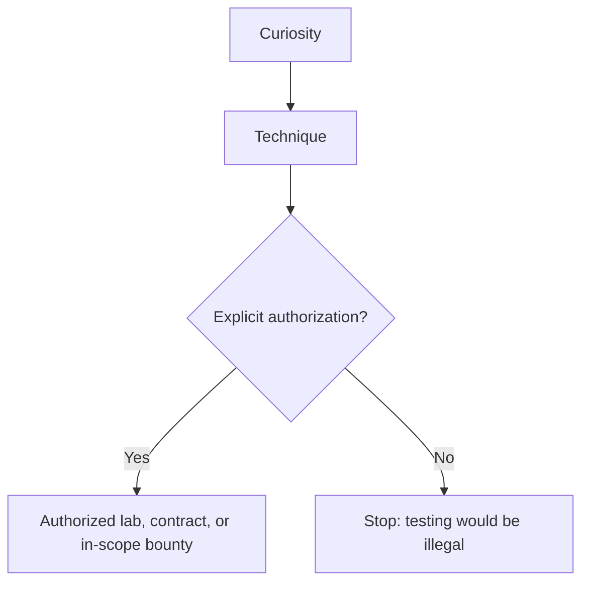
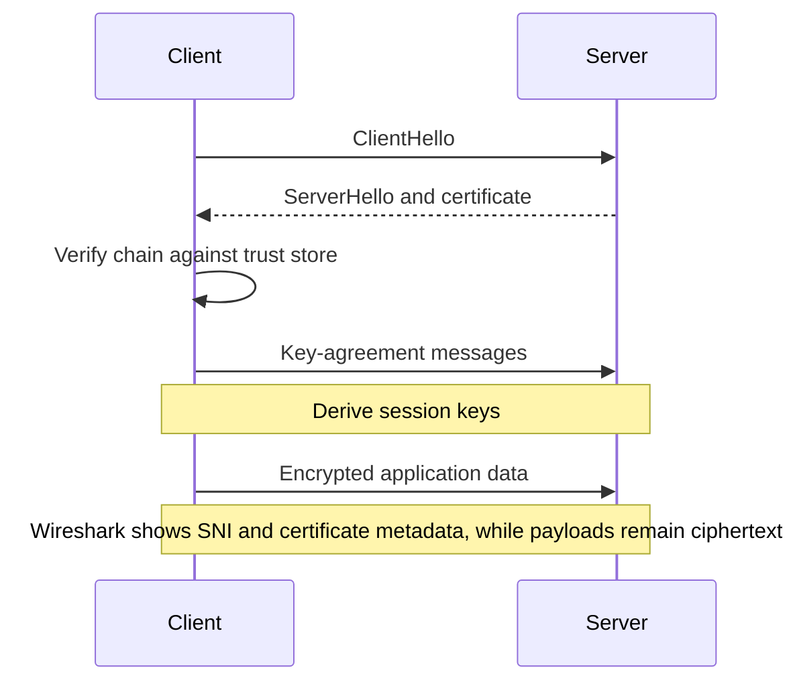
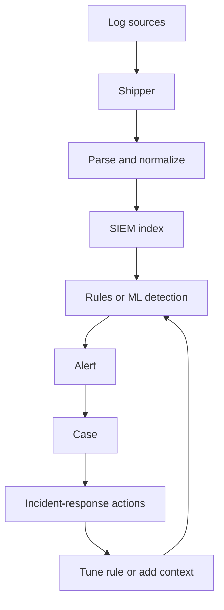
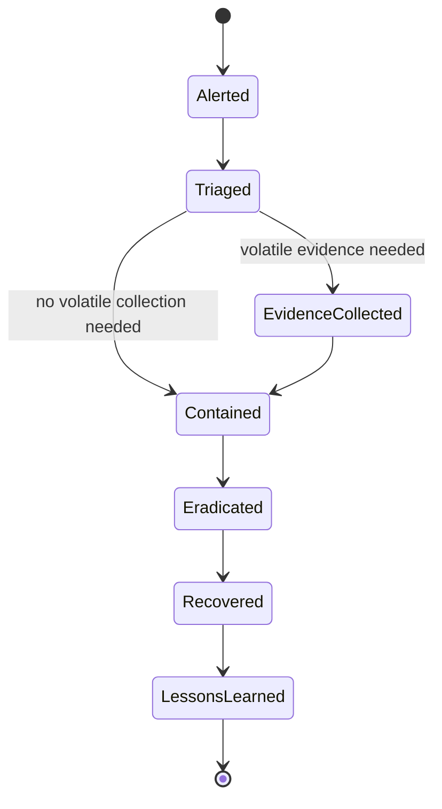
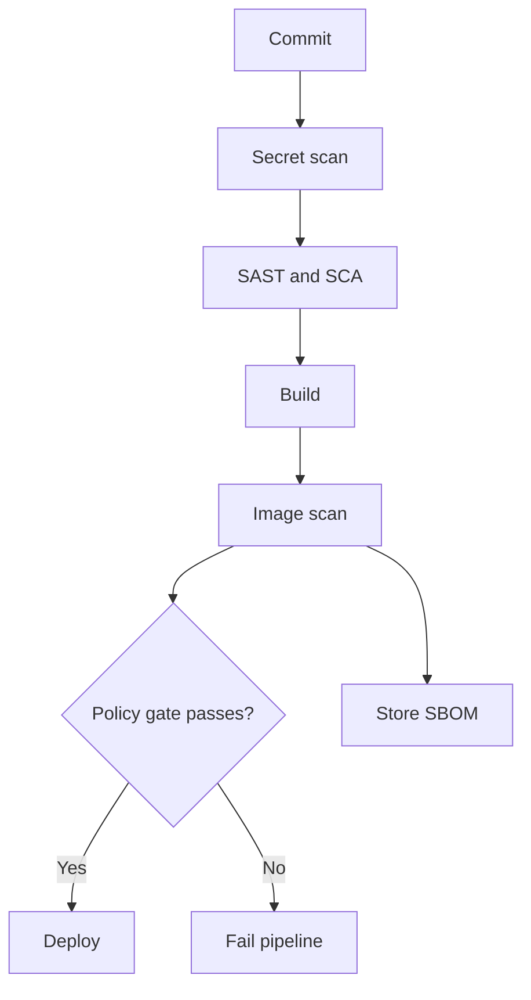

# The Zero-to-Hero ICT / Cybersecurity Engineer Roadmap

*Mohammad Bilal's complete, self-paced path from first principles to professional-level cybersecurity work: security mindset, networking, Linux/Windows, cryptography, identity, threat modeling, web appsec, network defenses, hardening, vuln management, pentesting, Active Directory, SOC/SIEM/detection engineering, DFIR, cloud and container security, DevSecOps, malware basics, GRC, portfolio labs, and hiring readiness - told as a connected story in which each new idea solves a problem left by the previous one.*

*Resources curated with Composio (web search, YouTube, GitHub) against [OWASP Top 10](https://owasp.org/Top10/), [PortSwigger Web Security Academy](https://portswigger.net/web-security), [MITRE ATT&CK](https://attack.mitre.org/), [HackTricks](https://github.com/HackTricks-wiki/hacktricks), [PayloadsAllTheThings](https://github.com/swisskyrepo/PayloadsAllTheThings), [juice-shop/juice-shop](https://github.com/juice-shop/juice-shop), [fabacab/awesome-cybersecurity-blueteam](https://github.com/fabacab/awesome-cybersecurity-blueteam), [meirwah/awesome-incident-response](https://github.com/meirwah/awesome-incident-response), [brootware/awesome-cyber-security-university](https://github.com/brootware/awesome-cyber-security-university), and 2026 Security Engineer / SOC / pentest roadmaps.*

**Scope:** 40 concepts · 20 phases · connected step by step, with no artificial weekly deadline.

Foundations → Defend → Attack → Detect → Respond → Hire

---

## How to Read This Document

### Start here if cybersecurity is completely new to you

An **asset** is something worth protecting, such as an account, file, computer, or service. A **threat** is a possible source of harm. A **vulnerability** is a weakness that harm could use. **Risk** combines what may happen with how damaging it would be, and a **security control** is a safeguard that lowers that risk. An **incident** is an event that may threaten security and must be checked and handled.

For every technique, begin with the thing being protected and the allowed behavior. Then study how that behavior can fail, how you would notice the failure, and how you would recover. Practice only in systems you own or are explicitly allowed to test. The goal is not to collect attack names; it is to make safer decisions and explain the evidence behind them.

**Words you will meet often:** **authentication** checks who someone is; **authorization** checks what that identity may do; **encryption** hides readable data using a key; a **hash** creates a fixed-size fingerprint used for checking or safe comparison; an **exploit** is a method that uses a vulnerability; **hardening** means reducing unnecessary ways a system can be attacked; **least privilege** means giving only the access needed for the current job; a **SIEM** gathers and searches security events; **detection** is a rule or method for noticing suspicious behavior; **incident response** is the organized work of confirming, containing, removing, and learning from an incident; and a **penetration test** is an authorized attempt to find and prove security weaknesses.

The sections are connected. Read them in order the first time because each one begins with a problem that the previous idea could not solve. Each section begins by explaining **why what you just learned wasn't enough**, and closes by showing you **the remaining problem that leads to the next idea**. Read it in order the first time through - SIEM detections only make sense after you understand logs and attacker TTPs, and cloud IAM only makes sense after you feel the pain of long-lived secrets.

**There is no clock on this document.** No week numbers, no day-by-day plan, no "finish by." Cybersecurity skill does not compress into a fixed number of days, and pretending otherwise is how people memorize tool names instead of building judgment. Move at the pace your own understanding requires. The only valid unit of progress here is: *can I now explain why the previous concept wasn't enough, and how this one fixes it?*

Every concept in this roadmap answers the same set of questions, because that set of questions *is* how security knowledge actually accumulates:

- What is it, in plain language?
- Why does it exist - what problem forced someone to invent it?
- What did people do before it existed, and what broke?
- How does it solve that problem, step by step, inside the computer or system?
- What does it cost? (Every control trades something for something.)
- Where does its own limitation show up - and what does *that* limitation force us to invent next?

That last question is the engine of the whole roadmap. Nothing here is "just a topic to cover." Every topic is a *reaction* to the topic before it.

### Three Security Roles, One Shared Foundation

This document covers **Security Engineer**, **SOC / Blue Team**, and **Penetration Tester / Red Team** depth, because they share the same basic knowledge (networks, systems, crypto, identity, threat models) and then diverge:

| Role | Primary question | Main work |
| --- | --- | --- |
| **Security Engineer** | How do we *design and build* systems that stay safe under attack? | Hardening, IAM, AppSec, cloud/K8s controls, DevSecOps |
| **SOC / Blue Team** | How do we *detect and respond* when something goes wrong? | Logs, SIEM, Sigma, IR, forensics, ATT&CK mapping |
| **Pentester / Red Team** | How would a skilled adversary *break* this, legally and reportably? | Recon, exploit chains, AD, web bugs, reporting |

Phases 1-10 build the shared foundation through vuln management. Phases 11-12 deepen offensive craft. Phases 13-14 deepen detection and response. Phases 15-18 deepen cloud, containers, malware, and GRC. Phases 19-20 are portfolio and hiring. If you only want SOC, do not skip Phases 4-8 - analysts who cannot think in protocols and auth fail on real investigations. If you want pentesting, still finish detection phases - the best attackers know how defenders see them.

### Ethics and Scope (non-negotiable)

> [!CAUTION]
> Practice only on systems you own or have **written authorization** to test (labs, CTFs, bug bounty programs in scope). Unauthorized access is illegal. Every offensive technique in this document exists so you can defend better and report better - not so you can harm.

### The Beginner-Friendly Pattern Every Topic Follows

Those questions are answered in the same order every single time. Once you have read one section you know the shape of all of them:

| Element | What it gives you |
| --- | --- |
| **Why You Are Learning This** | The previous concept's limitation, stated plainly |
| **See It Before You Memorize It** | Videos, interactive tools, docs, GitHub, practice - placed *here* |
| **Step-by-Step Explanation** | A precise, step-by-step explanation in words |
| **The Idea That Fixed It** | The main idea in one clear sentence that made the concept stick |
| **Internal Working, Step by Step** | A prose and diagram "animation" of what happens underneath |
| **Picture It Like This** | Something you can picture without a screen |
| **Complexity / Trade-offs** | What improved, what it cost, and why |
| **Small Working Example** | A minimal, working version you can run |
| **How to Explain This in an Interview** | What the concept looks like when it is tested |
| **Practice** | Problems graded easy to hard |
| **Why the Next Topic Is Needed** | The exact limitation that makes the next concept necessary |

**Diagram conventions.** Diagrams are plain ASCII inside code fences. `|` and `v` mean "then this happens", `+--` joins related paths, `-->` and `->` mean request or traffic flow, `X` marks a failure or compromise point, and boxes drawn with `+---+` are hosts, networks, or controls. Time usually runs downward.

---

## The Whole-Journey Map

```text
 PHASE 1                 PHASE 2               PHASE 3                PHASE 4
 SECURITY MINDSET        NETWORKING FOR        LINUX & WINDOWS        CRYPTOGRAPHY
 & CIA TRIAD             SECURITY              FOR SECURITY
    |                       |                      |                      |
    v                       v                      v                      v
 Risk, CIA,                 OSI/TCP-IP,            CLI, permissions,     Hash, symmetric,
 AAA, ethics                ports, DNS,            processes, logs        asymmetric, TLS
                            packets

 PHASE 5                 PHASE 6               PHASE 7                PHASE 8
 IDENTITY & AUTH         THREAT MODELING       WEB APP SECURITY       NETWORK DEFENSES
    |                    & ATT&CK              (OWASP)                & FIREWALLS
    v                       |                      |                      |
 Sessions, MFA,             v                      v                      v
 OAuth, RBAC             Kill chain,           Injection, XSS,        Segmentation,
                         ATT&CK map            SSRF, CSRF,            VPN, IDS/IPS
                                               access control

 PHASE 9                 PHASE 10              PHASE 11               PHASE 12
 HARDENING &             VULN MGMT &           PENTEST                ACTIVE DIRECTORY
 ENDPOINTS               SCANNING              METHODOLOGY            & WINDOWS ATTACKS
    |                       |                      |                      |
    v                       v                      v                      v
 CIS baselines,          CVSS, scanners,       Recon → exploit →      Kerberos, lateral
 EDR intuition           patch priorities      report                 movement, priv esc

 PHASE 13                PHASE 14              PHASE 15               PHASE 16
 SOC / SIEM /            DFIR & IR             CLOUD SECURITY         CONTAINERS,
 DETECTION ENG.                                                    K8S & DEVSECOPS
    |                       |                      |                      |
    v                       v                      v                      v
 Logs, Sigma,            Triage, memory,       IAM least priv,        Images, RBAC,
 ATT&CK detections       disk, malware triage  shared responsibility  CI security gates

 PHASE 17                PHASE 18              PHASE 19               PHASE 20
 MALWARE BASICS          GRC & RISK            PORTFOLIO &            INTERVIEWS
                         MANAGEMENT            LABS                       |
    |                       |                      |                      v
    v                       v                      v                 Security+, CySA+,
 Static/dynamic,         Policies, NIST,       Home lab, writeups,   PNPT/OSCP paths,
 YARA intuition          risk registers        detections shipped    system design stories
```

---

## Phase Index

| # | Phase | Goal | You'll be ready to move on when you can... |
| --- | --- | --- | --- |
| 01 | [Security Mindset](#phase-1---security-mindset-risk-before-tools) | Think in risk and CIA | Explain confidentiality vs integrity vs availability with examples |
| 02 | [Networking for Security](#phase-2---networking-for-security) | Read traffic like a defender | Map a packet path and name common ports |
| 03 | [Linux & Windows](#phase-3---linux-and-windows-for-security) | Operate systems under pressure | work through CLI, permissions, and logs on both OS families |
| 04 | [Cryptography](#phase-4---cryptography-for-defenders-and-builders) | Use crypto correctly | Contrast hash vs encrypt vs sign, and explain TLS at a high level |
| 05 | [Identity & Auth](#phase-5---identity-and-access-management) | Control who can do what | Design MFA + least privilege for a simple app |
| 06 | [Threat Modeling](#phase-6---threat-modeling-and-mitre-attck) | Anticipate abuse | Draw a STRIDE/ATT&CK-backed model for a web app |
| 07 | [Web App Security](#phase-7---web-application-security-owasp) | Find and fix web bugs | Exploit and remediate SQLi/XSS in a lab legally |
| 08 | [Network Defenses](#phase-8---network-defenses) | Segment and filter | Propose firewall rules and VPN placement |
| 09 | [Hardening](#phase-9---hardening-and-endpoint-security) | Shrink attack surface | Apply a CIS-style baseline to a VM |
| 10 | [Vuln Management](#phase-10---vulnerability-management) | Prioritize risk | Rank findings by exploitability and business impact |
| 11 | [Pentest Methodology](#phase-11---penetration-testing-methodology) | Attack with process | Run a scoped lab engagement and write a report outline |
| 12 | [Active Directory](#phase-12---active-directory-attacks-and-defenses) | Break and defend AD | Explain Kerberos auth and a lateral movement path |
| 13 | [SOC & Detection](#phase-13---soc-siem-and-detection-engineering) | Detect with evidence | Write a Sigma-style rule mapped to ATT&CK |
| 14 | [DFIR](#phase-14---digital-forensics-and-incident-response) | Respond and investigate | Triage an alert into containment steps |
| 15 | [Cloud Security](#phase-15---cloud-security-fundamentals) | Secure shared clouds | Harden IAM and logging on AWS/Azure-style accounts |
| 16 | [Containers & DevSecOps](#phase-16---containers-kubernetes-and-devsecops) | Secure the pipeline | Spot risky Docker/K8s defaults and add a CI scan |
| 17 | [Malware Basics](#phase-17---malware-analysis-basics) | Analyze safely | Static-scan a sample in an isolated lab |
| 18 | [GRC & Risk](#phase-18---governance-risk-and-compliance) | Speak risk language | Map controls to a simple NIST/ISO-style framework |
| 19 | [Portfolio](#phase-19---portfolio-and-labs) | Prove skill with artifacts | Publish labs, writeups, and detections |
| 20 | [Interviews](#phase-20---interview-mastery-for-cybersecurity-roles) | Get hired | Tell security stories end-to-end under pressure |

### Anchor Resources (bookmark these)

- OWASP: [Top 10:2021](https://owasp.org/Top10/) · [Cheat Sheet Series](https://cheatsheetseries.owasp.org/)
- Labs: [PortSwigger Web Security Academy](https://portswigger.net/web-security) · [TryHackMe](https://tryhackme.com/) · [Hack The Box](https://www.hackthebox.com/) · [OverTheWire](https://overthewire.org/wargames/) · [picoCTF](https://picoctf.org/)
- Frameworks: [MITRE ATT&CK](https://attack.mitre.org/) · [SigmaHQ/sigma](https://github.com/SigmaHQ/sigma) · [redcanaryco/atomic-red-team](https://github.com/redcanaryco/atomic-red-team)
- Offensive refs: [HackTricks-wiki/hacktricks](https://github.com/HackTricks-wiki/hacktricks) · [swisskyrepo/PayloadsAllTheThings](https://github.com/swisskyrepo/PayloadsAllTheThings) · [danielmiessler/SecLists](https://github.com/danielmiessler/SecLists)
- Vulnerable apps: [juice-shop/juice-shop](https://github.com/juice-shop/juice-shop) · DVWA / WebGoat (local only)
- Blue team: [fabacab/awesome-cybersecurity-blueteam](https://github.com/fabacab/awesome-cybersecurity-blueteam) · [meirwah/awesome-incident-response](https://github.com/meirwah/awesome-incident-response) · [sottlmarek/DevSecOps](https://github.com/sottlmarek/DevSecOps)
- Learning lists: [brootware/awesome-cyber-security-university](https://github.com/brootware/awesome-cyber-security-university) · [0xsyr0/Awesome-Cybersecurity-Handbooks](https://github.com/0xsyr0/Awesome-Cybersecurity-Handbooks) · [lissy93/personal-security-checklist](https://github.com/lissy93/personal-security-checklist)
- 2026 paths: [Vibe Engines Security Engineer Roadmap](https://vibeengines.com/roadmap/security-engineer) · [HADESS Learning Path](https://hadess.io/cybersecurity-learning-path/)
- Channels: [John Hammond](https://www.youtube.com/@_JohnHammond) · [NetworkChuck](https://www.youtube.com/@NetworkChuck) · [LiveOverflow](https://www.youtube.com/@LiveOverflow) · [IppSec](https://www.youtube.com/@ippsec) · [Professor Messer](https://www.youtube.com/@professormesser) · [HackerSploit](https://www.youtube.com/@HackerSploit)
- Courses: [Harvard CS50 Intro to Cybersecurity (freeCodeCamp)](https://www.youtube.com/watch?v=9HOpanT0GRs) · [Google Cybersecurity Certificate overview](https://www.youtube.com/watch?v=_DVVNOGYtmU) · Professor Messer Security+ playlist

---

<a id="phase-1"></a>

# PHASE 1 - Security Mindset: Risk Before Tools

**Track:** Foundations

**WHAT YOU WILL BE ABLE TO DO:** Stop treating security as a list of tools. Start thinking in assets, threats, vulnerabilities, and controls.

**WHAT YOU SHOULD KNOW FIRST:** Curiosity and willingness to practice only in authorized labs.

## 1.1 CIA Triad, AAA, and What "Secure" Means

**WHY YOU ARE LEARNING THIS:** Without shared language, teams argue past each other. **Confidentiality**, **Integrity**, and **Availability** (CIA), plus **Authentication**, **Authorization**, and **Accounting** (AAA), are the vocabulary every control maps to.

**THE PROBLEM THIS SOLVES:** People installed random "security products" with no goal. Availability got sacrificed for secrecy. Or secrecy was perfect and the business could not operate.

**SEE IT BEFORE YOU MEMORIZE IT**

- [Cybersecurity for Beginners | Google Cybersecurity Certificate](https://www.youtube.com/watch?v=_DVVNOGYtmU)
- [Harvard CS50’s Intro to Cybersecurity - Full University Course](https://www.youtube.com/watch?v=9HOpanT0GRs)
- [How I Would Learn Cyber Security if I Could Start Over (Cyber with Ben)](https://www.youtube.com/watch?v=b12JrM-6DBY)
- [HADESS Cybersecurity Learning Path 2026](https://hadess.io/cybersecurity-learning-path/)
- [lissy93/personal-security-checklist](https://github.com/lissy93/personal-security-checklist)
- Write CIA impacts for three news breach stories

**STEP-BY-STEP EXPLANATION**

Confidentiality: only the right people see the data. Integrity: data and systems are not silently altered. Availability: systems work when needed. Authentication proves identity. Authorization decides permission. Accounting (audit) records who did what. $\text{risk}=\text{likelihood}\times\text{impact on assets}$. Controls reduce risk; they never erase it. Defense in depth stacks independent controls so one failure is not catastrophic.

**THE MAIN IDEA IN SIMPLE WORDS:** Define the asset and the failure mode first. Then pick controls that reduce that specific risk.

**WHAT HAPPENS INSIDE, ONE STEP AT A TIME**

```text
 Asset (payroll DB)
   |
   v
 Threats (theft, ransomware, insider)
   |
   v
 Vulnerabilities (weak auth, unpatched, overshare)
   |
   v
 Controls (MFA, backups, least privilege, encryption)
   |
   v
 Residual risk (accepted / transferred / monitored)
```

**PICTURE IT LIKE THIS**

A bank vault (confidentiality + integrity) with fire exits and backup branches (availability). Locks without exits are unsafe. Exits without locks are unsafe.

**WHAT YOU GAIN, WHAT IT COSTS, AND WHERE IT CAN FAIL**

| Choice | Buys | Costs |
| --- | --- | --- |
| Max secrecy | Fewer leaks | Friction, shadow IT |
| Max availability | Uptime | More exposure surface |
| Many stacked controls | Resilience | Complexity, false sense of safety |

**SMALL WORKING EXAMPLE**

```python
cia = {"C": "only authorized eyes", "I": "no silent tampering", "A": "usable when needed"}
aaa = {"AuthN": "who are you?", "AuthZ": "what may you do?", "Acct": "what did you do?"}
print(cia)
print(aaa)
```

**HOW TO EXPLAIN THIS IN AN INTERVIEW:** Define CIA with one business example each. What is residual risk? Difference between AuthN and AuthZ?

**PRACTICE UNTIL IT FEELS FAMILIAR**

| Difficulty | Task |
| --- | --- |
| Easy | Map password hashing to C/I/A (which does it primarily serve?) |
| Medium | For a hospital EHR, list one control per CIA letter |
| Hard | Argue when availability should outrank confidentiality (with ethics) |

**WHY THE NEXT TOPIC IS NEEDED:** CIA is a scoreboard, not a network map. Packets ignore your vocabulary until you understand how machines talk - networking for security.

---

## 1.2 Ethics, Scope, and the Attacker Mindset Without Becoming the Attacker

**WHY YOU ARE LEARNING THIS:** Security work requires thinking like an adversary. Without ethics and legal scope, that skill becomes crime. Authorized practice (labs, CTFs, contracts, bounty scope) is the only place offensive techniques belong.

**THE PROBLEM THIS SOLVES:** Script kiddie culture: run exploits "to learn" on random IPs. Careers and freedom ended. Defenders also failed because they never studied real attacker paths.

**SEE IT BEFORE YOU MEMORIZE IT**

- [Everything you NEED to know as Cybersecurity Beginner (Tech with Jono)](https://www.youtube.com/watch?v=X-O1-l0gP5Q)
- [How to Get Into Cybersecurity in 2026 (InfoSec Job Board)](https://www.infosecjobboard.com/blog/how-to-get-into-cybersecurity-2026)
- [Infosec Learning Roadmap (Coursera)](https://www.coursera.org/resources/infosec-learning-roadmap)
- Create a personal rule: "no scan outside lab VMs / explicit scope"

**STEP-BY-STEP EXPLANATION**

Rules of engagement (ROE) define what is allowed, when, and how findings are reported. Responsible disclosure and bug bounty programs formalize permission. The attacker mindset means asking: "What can go wrong if this assumption fails?" - then building controls and detections. Curiosity is good. Unauthorized access is not.

**THE MAIN IDEA IN SIMPLE WORDS:** Same skills, different authorization boundary. Permission is the product feature that makes security work legal.

**WHAT HAPPENS INSIDE, ONE STEP AT A TIME**



**PICTURE IT LIKE THIS**

A locksmith who practices on lock boards and customer doors with a work order - never random houses "for research."

**WHAT YOU GAIN, WHAT IT COSTS, AND WHERE IT CAN FAIL**

| Path | Buys | Costs |
| --- | --- | --- |
| Only theory | Safety | Weak intuition |
| Authorized labs | Real skill | Time, sometimes money |
| Unauthorized testing | Nothing useful | Legal risk |

**SMALL WORKING EXAMPLE**

```python
ALLOWED = {"tryhackme", "htb", "local-lab", "in-scope-bounty"}
target = "local-lab"
assert target in ALLOWED, "Refuse: not authorized"
print("proceed:", target)
```

**HOW TO EXPLAIN THIS IN AN INTERVIEW:** How do you decide if a test is legal? What belongs in a rules-of-engagement doc?

**PRACTICE UNTIL IT FEELS FAMILIAR**

| Difficulty | Task |
| --- | --- |
| Easy | List five legal practice platforms |
| Medium | Draft a 5-bullet ROE for testing your own home lab |
| Hard | Explain responsible disclosure steps for a found bug on a public site |

**WHY THE NEXT TOPIC IS NEEDED:** Ethics without packets is still abstract. Networks are the battlefield every control and exploit travels on.

---

> **Phase 1 complete?** [Build the Phase 1 mini-project](./Projects.md#cyber-phase-1-project) · [Continue to Phase 2](#phase-2---networking-for-security)

<a id="phase-2"></a>

# PHASE 2 - Networking for Security

**Track:** Foundations

**WHAT YOU WILL BE ABLE TO DO:** Read network behavior well enough to spot abuse, place controls, and follow investigations.

**WHAT YOU SHOULD KNOW FIRST:** Phase 1 mindset.

## 2.1 OSI / TCP-IP, Ports, and Packet Paths

**WHY YOU ARE LEARNING THIS:** Almost every intrusion moves over a network. If you cannot explain what a port, IP, DNS query, or TCP handshake is, firewalls, IDS, and lateral movement stay magic words.

**THE PROBLEM THIS SOLVES:** People memorized "port 443 is HTTPS" without understanding sessions, DNS, or why NAT and proxies change what logs show.

**SEE IT BEFORE YOU MEMORIZE IT**

- [Computer Networking Course - Network Engineering (freeCodeCamp)](https://www.youtube.com/watch?v=qiQR5rTSshw)
- [Every Networking Concept Explained In 20 Minutes (TechWorld with Nana)](https://www.youtube.com/watch?v=xj_GjnD4uyI)
- [Computer Networking Full Course (Kunal Kushwaha)](https://www.youtube.com/watch?v=IPvYjXCsTg8)
- NetworkChuck networking / cybersecurity playlists
- Companion: this repo's [`Networks.md`](./Networks.md)
- Capture traffic on a lab VM with Wireshark and identify DNS + TLS

**STEP-BY-STEP EXPLANATION**

TCP/IP layers: link, internet (IP), transport (TCP/UDP), application. TCP is reliable and connection-oriented; UDP is lightweight. Well-known ports: 22 SSH, 53 DNS, 80/443 HTTP(S), 3389 RDP, 445 SMB. Three-way handshake (SYN, SYN-ACK, ACK). DNS maps names to IPs and is a common abuse/exfil channel. Defenders care about who talks to whom, on which port, how often, and whether that is normal for the asset.

**THE MAIN IDEA IN SIMPLE WORDS:** Security visibility is mostly "who connected to what, carrying what." Learn the plumbing first.

**WHAT HAPPENS INSIDE, ONE STEP AT A TIME**

```text
 Client --> DNS (53) --> resolve api.example
 Client --> TCP handshake --> :443
 Client --> TLS --> HTTP request
 Firewall / IDS sit on the path and decide allow / alert / drop
```

**PICTURE IT LIKE THIS**

A postal system: address (IP), apartment number (port), certified mail (TCP), postcard (UDP), phone book (DNS).

**WHAT YOU GAIN, WHAT IT COSTS, AND WHERE IT CAN FAIL**

| Protocol | Buys | Costs |
| --- | --- | --- |
| TCP | Reliability | Overhead, state |
| UDP | Speed | No delivery guarantee |
| Flat open network | Simplicity | Attacker freedom after one foothold |

**SMALL WORKING EXAMPLE**

```python
PORTS = {22: "ssh", 53: "dns", 80: "http", 443: "https", 3389: "rdp", 445: "smb"}
for p, name in PORTS.items():
    print(f"{p:>5} -> {name}")
```

**HOW TO EXPLAIN THIS IN AN INTERVIEW:** Explain TCP handshake. Why is DNS critical for both users and attackers? What does a firewall ACL actually match?

**PRACTICE UNTIL IT FEELS FAMILIAR**

| Difficulty | Task |
| --- | --- |
| Easy | List 8 common ports and services |
| Medium | Draw packet flow from laptop to HTTPS site through home router NAT |
| Hard | Explain how an attacker uses DNS tunneling at a high level |

**WHY THE NEXT TOPIC IS NEEDED:** Networks move bytes. Attackers and admins both live on operating systems that produce those bytes - Linux and Windows confident working knowledge is next.

---

## 2.2 Sniffing, Segmentation, and Why Flat Networks Fail

**WHY YOU ARE LEARNING THIS:** Once you can read packets, the next wall appears: one compromised host can reach everything. Segmentation, VLANs, and least-network-privilege limit blast radius. Packet capture teaches what "normal" looks like so anomalies stand out.

**THE PROBLEM THIS SOLVES:** Flat corporate LANs meant ransomware walked sideways in minutes. No capture skills meant "the SIEM said alert" with no ability to validate.

**SEE IT BEFORE YOU MEMORIZE IT**

- Wireshark sample captures + display filters
- [Best Hands-On Cybersecurity Labs 2026](https://thecybersecuritytrail.com/guide/best-hands-on-cybersecurity-labs-practice-platforms-in-2026/)
- TryHackMe networking rooms (authorized lab)

**STEP-BY-STEP EXPLANATION**

pcap analysis uses filters (e.g. `dns`, `tcp.port == 443`). Segmentation separates trust zones: user, server, DMZ, management. East-west traffic needs controls, not only north-south edge firewalls. Zero Trust ideas extend this: authenticate and authorize every session, assume breach.

**THE MAIN IDEA IN SIMPLE WORDS:** Assume a host will fall. Design so its neighbors are not free candy.

**WHAT HAPPENS INSIDE, ONE STEP AT A TIME**

```text
 [Users] --fw--> [App tier] --fw--> [DB]
     |                 |
     X lateral?       allow only 5432 from app SG
 Flat LAN: any --> any (X bad)
```

**PICTURE IT LIKE THIS**

Fire doors and compartments on a ship. One flooded room should not sink the vessel.

**WHAT YOU GAIN, WHAT IT COSTS, AND WHERE IT CAN FAIL**

| Design | Trade-off |
| --- | --- |
| Heavy segmentation | Safer vs operational pain |
| Capture everywhere | Visibility vs cost/privacy |
| Allow-lists | Strong vs brittle change mgmt |

**SMALL WORKING EXAMPLE**

```python
# toy ACL evaluator
acl = [("10.0.1.0/24", "10.0.2.5", 5432, "allow")]
src, dst, port = "10.0.1.9", "10.0.2.5", 5432
print("allow" if any(True for _ in acl if dst == "10.0.2.5" and port == 5432) else "deny")
```

**HOW TO EXPLAIN THIS IN AN INTERVIEW:** What is east-west traffic? Why DMZ? When is packet capture the wrong first tool?

**PRACTICE UNTIL IT FEELS FAMILIAR**

| Difficulty | Task |
| --- | --- |
| Easy | Define VLAN in one sentence |
| Medium | Design 3 zones for a small company web app |
| Hard | Argue Zero Trust vs classic perimeter for a remote workforce |

**WHY THE NEXT TOPIC IS NEEDED:** Zone diagrams are useless if you cannot log into the boxes and see processes, users, and files - OS skill next.

---

> **Phase 2 complete?** [Build the Phase 2 mini-project](./Projects.md#cyber-phase-2-project) · [Continue to Phase 3](#phase-3---linux-and-windows-for-security)

<a id="phase-3"></a>

# PHASE 3 - Linux and Windows for Security

**Track:** Foundations

**WHAT YOU WILL BE ABLE TO DO:** Be dangerous (productively) on both major OS families: work through, inspect, harden basics, read logs.

**WHAT YOU SHOULD KNOW FIRST:** Phase 2 networking intuition.

## 3.1 Linux CLI, Permissions, Processes, and Logs

**WHY YOU ARE LEARNING THIS:** Servers, containers, security tools, and many lab boxes are Linux. Privilege models (`chmod`, sudo, SUID), process inspection, and log paths are daily blue and red team work.

**THE PROBLEM THIS SOLVES:** GUI-only learners froze in SSH sessions. Attackers who understood `bash` history and cron owned boxes that "looked patched."

**SEE IT BEFORE YOU MEMORIZE IT**

- [Introduction to Linux - Full Course for Beginners (freeCodeCamp)](https://www.youtube.com/watch?v=sWbUDq4S6Y8)
- [The 50 Most Popular Linux & Terminal Commands (freeCodeCamp)](https://www.youtube.com/watch?v=ZtqBQ68cfJc)
- [Introduction to Linux & Terminal Commands (Kunal Kushwaha)](https://www.youtube.com/watch?v=iwolPf6kN-k)
- [OverTheWire Bandit](https://overthewire.org/wargames/bandit/) - free terminal fundamentals
- [brootware/awesome-cyber-security-university](https://github.com/brootware/awesome-cyber-security-university)

**STEP-BY-STEP EXPLANATION**

Users and groups; file modes `rwx`; sticky/SUID/SGID pitfalls; `ps`, `ss`/`netstat`, `journalctl`/`/var/log`; package managers; systemd services. Least privilege on accounts beats running everything as root. Bash scripting automates triage.

**THE MAIN IDEA IN SIMPLE WORDS:** The shell is a microscope for the machine. Learn to look before you install another scanner.

**WHAT HAPPENS INSIDE, ONE STEP AT A TIME**

```text
 login --> shell
 inspect: whoami, id, ps, ss -tulpn
 files: ls -la, find, grep
 logs: journalctl -u ssh /var/log/auth.log
 privilege: sudo -l  (misconfig = path to root)
```

**PICTURE IT LIKE THIS**

A workshop: knowing which drawer holds which tool beats owning a bigger toolbox you cannot open.

**WHAT YOU GAIN, WHAT IT COSTS, AND WHERE IT CAN FAIL**

| Habit | Buys | Costs |
| --- | --- | --- |
| Root for everything | Speed | Total compromise on mistake |
| Scripting triage | Repeatability | Need review (dangerous scripts) |

**SMALL WORKING EXAMPLE**

```python
import os, stat
mode = 0o644
print(oct(mode), "owner rw, group r, other r")
print("SUID bit set?" , bool(mode & stat.S_ISUID))
```

**HOW TO EXPLAIN THIS IN AN INTERVIEW:** Explain Linux permissions numerically. What is SUID risk? Where do you look for failed SSH logins?

**PRACTICE UNTIL IT FEELS FAMILIAR**

| Difficulty | Task |
| --- | --- |
| Easy | Complete Bandit levels 0-10 |
| Medium | Write a bash one-liner to list listening ports |
| Hard | Find and explain a deliberate SUID binary in a lab VM |

**WHY THE NEXT TOPIC IS NEEDED:** Linux is half the estate. Enterprise identity and many endpoints are Windows - same depth required there.

---

## 3.2 Windows Internals Enough to Investigate

**WHY YOU ARE LEARNING THIS:** Endpoints, AD clients, and much malware live on Windows. Event logs, services, registry awareness, PowerShell, and privilege models are required for both IR and AD attacks later.

**THE PROBLEM THIS SOLVES:** Analysts who only knew Linux could not read Event Viewer or understand token privileges. Pentests stalled at the first Windows host.

**SEE IT BEFORE YOU MEMORIZE IT**

- Professor Messer / NetworkChuck Windows admin & Security+ OS topics
- Microsoft Learn: Windows security baselines (skim concepts)
- TryHackMe Windows Fundamentals rooms

**STEP-BY-STEP EXPLANATION**

NTFS ACLs, local vs domain accounts, services (SCM), Event Viewer channels (Security, System, PowerShell), UAC, Scheduled Tasks. PowerShell is both admin glue and attacker living-off-the-land. Sysinternals (Process Explorer, Autoruns) for investigations.

**THE MAIN IDEA IN SIMPLE WORDS:** Treat Windows as a first-class citizen, not an afterthought GUI.

**WHAT HAPPENS INSIDE, ONE STEP AT A TIME**

```text
 User logon --> token + groups
 Process create --> Security log events
 Persistence --> Run keys / tasks / services
 IR: timeline events + process tree
```

**PICTURE IT LIKE THIS**

A city hall with badge readers (tokens), CCTV (event logs), and maintenance tunnels (LOLBins) - you must know the building plan.

**WHAT YOU GAIN, WHAT IT COSTS, AND WHERE IT CAN FAIL**

| Tooling | Trade-off |
| --- | --- |
| Heavy PowerShell logging | Detectability vs noise/storage |
| Local admin everywhere | Convenience vs ransomware paradise |

**SMALL WORKING EXAMPLE**

```python
# conceptual mapping only
windows_logs = {
    "Security": ["logon", "logoff", "privilege use"],
    "PowerShell": ["script block logging"],
    "Sysmon": ["process create", "network connect"],  # if deployed
}
print(windows_logs["Security"])
```

**HOW TO EXPLAIN THIS IN AN INTERVIEW:** What is a Windows access token? Why is local admin so dangerous? Name three persistence locations.

**PRACTICE UNTIL IT FEELS FAMILIAR**

| Difficulty | Task |
| --- | --- |
| Easy | Locate Security log and filter failed logons in a lab VM |
| Medium | Explain UAC bypass concept at interview level (no exploit steps) |
| Hard | Build a tiny lab: enable PowerShell logging and generate a known event |

**WHY THE NEXT TOPIC IS NEEDED:** You can operate systems, but secrets still travel and rest as data - cryptography decides whether stolen bytes are useful.

---

> **Phase 3 complete?** [Build the Phase 3 mini-project](./Projects.md#cyber-phase-3-project) · [Continue to Phase 4](#phase-4---cryptography-for-defenders-and-builders)

<a id="phase-4"></a>

# PHASE 4 - Cryptography for Defenders and Builders

**Track:** Foundations

**WHAT YOU WILL BE ABLE TO DO:** Use cryptography correctly: know what each primitive is for, and never roll your own.

**WHAT YOU SHOULD KNOW FIRST:** Phase 3 OS comfort.

## 4.1 Hashing, Symmetric, Asymmetric, and Signatures

**WHY YOU ARE LEARNING THIS:** Security controls constantly claim "we encrypt" or "we hash passwords." Mixing those up creates fatal designs (encrypted passwords that can be decrypted by anyone with the key, or "encrypted" tokens that are only encoded).

**THE PROBLEM THIS SOLVES:** Base64 called encryption. MD5 for passwords. Homegrown ciphers. TLS "because the padlock icon."

**SEE IT BEFORE YOU MEMORIZE IT**

- [Cryptography for Developers](https://cryptography-for-devs.github.io/)
- [nakov/Practical-Cryptography-for-Developers-Book](https://github.com/nakov/Practical-Cryptography-for-Developers-Book)
- [Learn Cryptography in a Single Post (PyShine)](https://pyshine.com/Learn-Cryptography-in-One-Post-Complete-Tutorial-Symmetric-Asymmetric-Hashing-TLS-Quick-Start/)
- LiveOverflow crypto / encoding vs encryption videos

**STEP-BY-STEP EXPLANATION**

Hash: one-way fingerprint (integrity, password storage with slow KDF like bcrypt/Argon2 + salt). Symmetric (AES-GCM): same key encrypt/decrypt, fast for bulk. Asymmetric (RSA/ECC): public encrypt / private decrypt or private sign / public verify - solves key distribution. Signatures prove origin + integrity. Encoding (Base64) is not encryption. Prefer vetted libraries (`cryptography` in Python).

**THE MAIN IDEA IN SIMPLE WORDS:** Pick the primitive that matches the security goal. Never invent algorithms.

**WHAT HAPPENS INSIDE, ONE STEP AT A TIME**

```text
 Goal: hide data in transit/rest  -> authenticated encryption (AES-GCM)
 Goal: verify file not changed     -> hash (+ signature if origin matters)
 Goal: store passwords             -> slow salted KDF (Argon2/bcrypt)
 Goal: distribute secrets at scale -> asymmetric + TLS protocols
```

**PICTURE IT LIKE THIS**

A wax seal (signature) proves who closed the letter. A locked box (encryption) hides contents. A shredder-and-fingerprint (hash) lets you check sameness without reconstructing the letter.

**WHAT YOU GAIN, WHAT IT COSTS, AND WHERE IT CAN FAIL**

| Mistake | Why it hurts |
| --- | --- |
| Fast hash for passwords | GPU cracking |
| ECB mode | Pattern leaks |
| Custom crypto | Silent catastrophic failure |

**SMALL WORKING EXAMPLE**

```python
import hashlib, secrets
password = b"correct-horse"
salt = secrets.token_bytes(16)
digest = hashlib.pbkdf2_hmac("sha256", password, salt, 200_000)
print(salt.hex(), digest.hex()[:32], "...")
```

**HOW TO EXPLAIN THIS IN AN INTERVIEW:** Hash vs MAC vs signature? Why salt passwords? Why AES-GCM over naive AES?

**PRACTICE UNTIL IT FEELS FAMILIAR**

| Difficulty | Task |
| --- | --- |
| Easy | Classify: Base64, SHA-256, AES-GCM, RSA verify |
| Medium | Implement salted password verify with pbkdf2 (as above) |
| Hard | Explain forward secrecy intuition for TLS 1.3 |

**WHY THE NEXT TOPIC IS NEEDED:** Crypto primitives need a protocol to protect real users on the wire - TLS - and identity systems that decide who holds which keys and sessions.

---

## 4.2 TLS, Certificates, and Trust Chains

**WHY YOU ARE LEARNING THIS:** Most modern services speak TLS. Misconfigured certificates, expired trust, or HTTP downgrades defeat encryption. Understanding handshake goals (confidentiality, integrity, server auth) unlocks HTTPS debugging and MITM awareness.

**THE PROBLEM THIS SOLVES:** Teams shipped HTTP "internally" forever. Users clicked through cert warnings. Private CAs with no inventory. Attackers on local networks intercepted sessions.

**SEE IT BEFORE YOU MEMORIZE IT**

- Oracle/docs style TLS overview articles + browser cert viewer practice
- BadSSL.com (in browser) to see failure modes
- Inspect certificate chain for a public site (browser or `openssl s_client`)

**STEP-BY-STEP EXPLANATION**

TLS 1.3: agree keys, authenticate server via certificate chain to a trusted CA, then encrypt application data. Certificates bind public keys to identities. Pinning and mTLS are advanced patterns. HSTS reduces downgrade. Certificate transparency helps detect mis-issuance.

**THE MAIN IDEA IN SIMPLE WORDS:** Encrypt the channel, authenticate the endpoint, rotate and monitor certificates.

**WHAT HAPPENS INSIDE, ONE STEP AT A TIME**



**PICTURE IT LIKE THIS**

Showing a passport (certificate) at the border (client) issued by a government you trust (CA). Fake passport without trusted issuer fails.

**WHAT YOU GAIN, WHAT IT COSTS, AND WHERE IT CAN FAIL**

| Choice | Trade-off |
| --- | --- |
| Public CA | Easy trust vs dependency |
| Private CA | Control vs operational burden |
| mTLS | Strong identity vs client cert ops |

**SMALL WORKING EXAMPLE**

```python
# conceptual only - do not parse PEM here
print("TLS goals: confidentiality + integrity + server authentication")
print("Broken if: HTTP, expired cert, wrong hostname, untrusted CA")
```

**HOW TO EXPLAIN THIS IN AN INTERVIEW:** What does a browser verify in a cert? What is a MITM with a rogue CA? Why HSTS?

**PRACTICE UNTIL IT FEELS FAMILIAR**

| Difficulty | Task |
| --- | --- |
| Easy | Screenshot and label a certificate chain for example.com |
| Medium | Explain difference between encryption in transit vs at rest |
| Hard | Design cert rotation for microservices with brief downtime budget |

**WHY THE NEXT TOPIC IS NEEDED:** TLS protects pipes. Identity systems decide who gets a session after the pipe is safe - authentication and authorization next.

---

> **Phase 4 complete?** [Build the Phase 4 mini-project](./Projects.md#cyber-phase-4-project) · [Continue to Phase 5](#phase-5---identity-and-access-management)

<a id="phase-5"></a>

# PHASE 5 - Identity and Access Management

**Track:** Core Security

**WHAT YOU WILL BE ABLE TO DO:** Design and critique how systems decide who someone is and what they may do.

**WHAT YOU SHOULD KNOW FIRST:** Phase 4 crypto literacy.

## 5.1 Passwords, Sessions, Cookies, MFA, and Tokens

**WHY YOU ARE LEARNING THIS:** Most breaches still start with identity failures: stolen passwords, session fixation, missing MFA, or tokens that never expire. AppSec and cloud security both collapse to IAM mistakes.

**THE PROBLEM THIS SOLVES:** Shared passwords in spreadsheets. Infinite session lifetimes. MFA only for "important" admins. JWTs treated as magical unforgeable truth without verifying signatures or audience.

**SEE IT BEFORE YOU MEMORIZE IT**

- OWASP Authentication / Session Management Cheat Sheets
- NetworkChuck MFA / password manager explainers
- [OWASP Cheat Sheet Series](https://cheatsheetseries.owasp.org/)

**STEP-BY-STEP EXPLANATION**

> [!WARNING]
> Store passwords with slow salted KDFs. Prefer passkeys/WebAuthn where possible. Sessions: opaque server-side IDs or well-designed tokens with short TTL, rotation, secure cookie flags (`HttpOnly`, `Secure`, `SameSite`). MFA adds a second factor (something you have/are). OAuth 2.0 / OIDC separate authorization of apps from login. Never log tokens.

**THE MAIN IDEA IN SIMPLE WORDS:** Identity is a control plane. Protect it harder than the data plane.

**WHAT HAPPENS INSIDE, ONE STEP AT A TIME**

```text
 Login --> verify password (+ MFA)
      --> create session / issue tokens
      --> authorize each request
 Logout / expiry / revoke --> kill session
```

**PICTURE IT LIKE THIS**

A hotel key card (session) after showing ID at the desk (AuthN). The card opens only your floor (AuthZ). If you lose the card, front desk invalidates it (revocation).

**WHAT YOU GAIN, WHAT IT COSTS, AND WHERE IT CAN FAIL**

| Mechanism | Buys | Costs |
| --- | --- | --- |
| Passwords only | Familiar | Phishing, reuse |
| MFA | Huge risk drop | UX friction |
| Long-lived API keys | Simple scripts | Leak = lasting breach |

**SMALL WORKING EXAMPLE**

```python
import secrets, hashlib
session_id = secrets.token_urlsafe(32)
print("store only hash server-side:", hashlib.sha256(session_id.encode()).hexdigest()[:16], "...")
```

**HOW TO EXPLAIN THIS IN AN INTERVIEW:** Cookie flags that matter? JWT pitfalls? When prefer server sessions vs tokens?

**PRACTICE UNTIL IT FEELS FAMILIAR**

| Difficulty | Task |
| --- | --- |
| Easy | List three MFA types and phishing resistance |
| Medium | Threat-model a "remember me" checkbox |
| Hard | Design token revocation for a fleet of microservices |

**WHY THE NEXT TOPIC IS NEEDED:** Knowing how auth works is not enough - you must systematically ask how it can be abused. Threat modeling and ATT&CK give that map.

---

## 5.2 Authorization: RBAC, Least Privilege, and Broken Access Control

**WHY YOU ARE LEARNING THIS:** Authentication without authorization is a locked front door with all interior doors open. Broken access control is #1 in OWASP Top 10:2021 for a reason - IDOR and privilege escalation dominate real apps.

**THE PROBLEM THIS SOLVES:** "Is logged in" checks without "owns this object" checks. Admin role granted for convenience. Cloud IAM `*` actions.

**SEE IT BEFORE YOU MEMORIZE IT**

- [OWASP Top 10 A01 Broken Access Control](https://owasp.org/Top10/2021/)
- PortSwigger access-control labs
- OWASP Juice Shop access control challenges

**STEP-BY-STEP EXPLANATION**

RBAC assigns permissions to roles, users to roles. ABAC adds attributes/context. Least privilege: minimum rights for the task, time-bounded. Vertical escalation = become admin. Horizontal = access peer's data (IDOR). Deny by default. Test every direct object reference.

**THE MAIN IDEA IN SIMPLE WORDS:** Every request must answer: is *this* principal allowed to do *this* action on *this* object?

**WHAT HAPPENS INSIDE, ONE STEP AT A TIME**

```text
 Request (user=42, GET /invoices/99)
   |
   v
 AuthN ok? --> AuthZ: invoice.owner == 42?
   |-- yes --> return
   |-- no  --> 403 (do not leak existence carelessly)
```

**PICTURE IT LIKE THIS**

An employee badge opens the building; a separate ACL decides which cabinets. Badge alone is not enough.

**WHAT YOU GAIN, WHAT IT COSTS, AND WHERE IT CAN FAIL**

| Model | Trade-off |
| --- | --- |
| Coarse RBAC | Simple vs over-privilege |
| Fine ABAC | Precise vs complexity |
| Deny-by-default | Safer vs more engineering |

**SMALL WORKING EXAMPLE**

```python
def can_read_invoice(user_id, invoice):
    return invoice["owner_id"] == user_id or "finance" in invoice.get("roles", [])

print(can_read_invoice(7, {"owner_id": 7, "roles": []}))
print(can_read_invoice(7, {"owner_id": 9, "roles": []}))
```

**HOW TO EXPLAIN THIS IN AN INTERVIEW:** Explain IDOR with an example. RBAC vs ABAC. How test access control in QA?

**PRACTICE UNTIL IT FEELS FAMILIAR**

| Difficulty | Task |
| --- | --- |
| Easy | Find an IDOR pattern in Juice Shop or a PortSwigger lab |
| Medium | Rewrite a route from "if session" to object-level check |
| Hard | Design least-privilege roles for a 5-service SaaS |

**WHY THE NEXT TOPIC IS NEEDED:** Access rules need a catalog of how adversaries actually move - threat modeling and MITRE ATT&CK.

---

> **Phase 5 complete?** [Build the Phase 5 mini-project](./Projects.md#cyber-phase-5-project) · [Continue to Phase 6](#phase-6---threat-modeling-and-mitre-attck)

<a id="phase-6"></a>

# PHASE 6 - Threat Modeling and MITRE ATT&CK

**Track:** Core Security

**WHAT YOU WILL BE ABLE TO DO:** Anticipate abuse before writing detections or exploits. Speak ATT&CK fluently.

**WHAT YOU SHOULD KNOW FIRST:** Phases 1-5.

## 6.1 STRIDE, Assets, and Data-Flow Diagrams

**WHY YOU ARE LEARNING THIS:** Controls scattered without a model waste money and miss the real paths. Threat modeling walks the design and asks structured "what can go wrong?" questions early - cheaper than after production.

**THE PROBLEM THIS SOLVES:** Security reviews that only checked password length. Penetration tests that rediscovered issues architecture could have prevented. No DFDs, only vibes.

**SEE IT BEFORE YOU MEMORIZE IT**

- [Vibe Engines Security Engineer Roadmap](https://vibeengines.com/roadmap/security-engineer)
- Microsoft STRIDE documentation (concept skim)
- Draw a DFD for a login + payments toy app and list 6 threats

**STEP-BY-STEP EXPLANATION**

STRIDE: Spoofing, Tampering, Repudiation, Information disclosure, Denial of service, Elevation of privilege. Start with assets and trust boundaries. Data flow diagrams show processes, stores, external entities. Rank threats; mitigate, transfer, accept. Revisit when architecture changes.

**THE MAIN IDEA IN SIMPLE WORDS:** Model the system as an attacker would - on paper - before the attacker does it live.

**WHAT HAPPENS INSIDE, ONE STEP AT A TIME**

```text
 External User -> [Web] -> [API] -> [(DB)]
 Trust boundary at Web/API
 STRIDE each arrow and store
 Mitigations: AuthN, signing, audit logs, encryption, rate limits, priv separation
```

**PICTURE IT LIKE THIS**

A home security survey: doors, windows, valuables, lighting - before buying random gadgets.

**WHAT YOU GAIN, WHAT IT COSTS, AND WHERE IT CAN FAIL**

| Approach | Trade-off |
| --- | --- |
| Lightweight STRIDE workshop | Speed vs depth |
| Formal heavy models | Rigor vs stale docs |

**SMALL WORKING EXAMPLE**

```python
stride = list("STRIDE")
threats = {
    "S": "spoof identity",
    "T": "tamper data",
    "R": "deny actions",
    "I": "leak data",
    "D": "exhaust resources",
    "E": "gain privilege",
}
print(threats)
```

**HOW TO EXPLAIN THIS IN AN INTERVIEW:** Walk STRIDE on a URL shortener. What is a trust boundary?

**PRACTICE UNTIL IT FEELS FAMILIAR**

| Difficulty | Task |
| --- | --- |
| Easy | Define each STRIDE letter in your own words |
| Medium | DFD + 8 threats for a password-reset flow |
| Hard | Threat model OAuth login with a malicious client |

**WHY THE NEXT TOPIC IS NEEDED:** Generic STRIDE needs a shared catalog of real techniques. MITRE ATT&CK is that catalog.

---

## 6.2 MITRE ATT&CK: TTPs as a Shared Map

**WHY YOU ARE LEARNING THIS:** Blue and red teams talked past each other using tool names. ATT&CK maps tactics (why) and techniques (how) so detections, tests, and reports align. Detection engineering starts here.

**THE PROBLEM THIS SOLVES:** Alert names like "malware.exe" with no tactic. Purple team exercises with no coverage matrix. SOC analysts memorizing SIEM queries without knowing what behavior they hunt.

**SEE IT BEFORE YOU MEMORIZE IT**

- [MITRE ATT&CK Navigator](https://attack.mitre.org/)
- [MITRE ATT&CK to Detection Rule Practitioner Guide (2026)](https://www.decryptiondigest.com/blog/how-to-read-mitre-attack-technique-write-detection-rule)
- [redcanaryco/atomic-red-team](https://github.com/redcanaryco/atomic-red-team)
- Pick one technique (e.g. T1059) and read Procedure Examples + Detection

**STEP-BY-STEP EXPLANATION**

Matrix: tactics across columns (Initial Access ... Exfiltration / Impact), techniques as cells. Map your telemetry to techniques you can see. Atomic Red Team simulates techniques safely in labs. Coverage matrices show gaps. Reports should cite techniques, not only CVEs.

**THE MAIN IDEA IN SIMPLE WORDS:** Describe adversary behavior in ATT&CK IDs so engineering and IR share one map.

**WHAT HAPPENS INSIDE, ONE STEP AT A TIME**

```text
 Technique page
   |-- Procedure examples (what to simulate)
   |-- Detection (log sources / ideas)
   |-- Mitigations
 Your work: telemetry? --> rule --> validate with Atomic test
```

**PICTURE IT LIKE THIS**

A field guide for animal tracks: same language for trackers and park rangers.

**WHAT YOU GAIN, WHAT IT COSTS, AND WHERE IT CAN FAIL**

| Use | Buys | Costs |
| --- | --- | --- |
| ATT&CK everywhere | Shared language | Over-mapping noise |
| Atomic tests | Proof of detection | Need safe lab |

**SMALL WORKING EXAMPLE**

```python
technique = {
    "id": "T1110",
    "name": "Brute Force",
    "tactic": "Credential Access",
    "telemetry": ["auth logs", "failed logon spikes"],
}
print(technique)
```

**HOW TO EXPLAIN THIS IN AN INTERVIEW:** Tactic vs technique vs procedure? How would you measure detection coverage?

**PRACTICE UNTIL IT FEELS FAMILIAR**

| Difficulty | Task |
| --- | --- |
| Easy | Name the tactic for phishing |
| Medium | Build a mini coverage sheet: 10 techniques vs available logs |
| Hard | Propose detections for a technique your lab cannot yet see - list missing telemetry |

**WHY THE NEXT TOPIC IS NEEDED:** ATT&CK tells you what adversaries do. The most common internet-facing battlefield is still the web application - OWASP next.

---

> **Phase 6 complete?** [Build the Phase 6 mini-project](./Projects.md#cyber-phase-6-project) · [Continue to Phase 7](#phase-7---web-application-security-owasp)

<a id="phase-7"></a>

# PHASE 7 - Web Application Security (OWASP)

**Track:** Offense & Defense

**WHAT YOU WILL BE ABLE TO DO:** Understand, exploit (in labs), and fix the web vulnerabilities that dominate real breaches.

**WHAT YOU SHOULD KNOW FIRST:** Phases 2, 5, 6. Basic HTTP.

## 7.1 Injection and XSS (OWASP A03 and Friends)

**WHY YOU ARE LEARNING THIS:** Untrusted input interpreted as code or markup is still the classic killer. SQL injection and XSS teach the broader lesson: separate code from data, encode output, validate input.

**THE PROBLEM THIS SOLVES:** String-concatenated SQL. `innerHTML` with user content. WAF-only "fixes" without code changes. CSRF tokens thought to stop XSS.

**SEE IT BEFORE YOU MEMORIZE IT**

- [OWASP Top 10:2021](https://owasp.org/Top10/2021/)
- [SQL Injection Prevention Cheat Sheet](https://cheatsheetseries.owasp.org/cheatsheets/SQL_Injection_Prevention_Cheat_Sheet.html)
- [PortSwigger Web Security Academy](https://portswigger.net/web-security) - free and best-in-class
- [juice-shop/juice-shop](https://github.com/juice-shop/juice-shop)
- [swisskyrepo/PayloadsAllTheThings](https://github.com/swisskyrepo/PayloadsAllTheThings)
- [Ethical Hacking 101: Web App Penetration Testing (freeCodeCamp)](https://www.youtube.com/watch?v=2_lswM1S264)

**STEP-BY-STEP EXPLANATION**

SQLi: attacker alters query structure. Fix with parameterized queries / ORM bind parameters. XSS: attacker injects script into victims' browsers (reflected, stored, DOM). Fix with output encoding, CSP, careful sinks. Command injection: same class on shells. Prefer allow-lists. Burp Suite is the standard web testing proxy for authorized tests.

**THE MAIN IDEA IN SIMPLE WORDS:** Never let untrusted bytes become structure (SQL/HTML/shell). Parameterize and encode.

**WHAT HAPPENS INSIDE, ONE STEP AT A TIME**

```text
 User input --> (X concat into SQL) --> DB executes attacker logic
 User input --> parameterized statement --> data only
 User input --> (X raw HTML) --> victim browser runs script
 User input --> encoded text node + CSP --> safe render
```

**PICTURE IT LIKE THIS**

Putting customer notes into a filing clerk's instructions vs putting them in a sealed envelope labeled "data only."

**WHAT YOU GAIN, WHAT IT COSTS, AND WHERE IT CAN FAIL**

| Defense | Buys | Costs |
| --- | --- | --- |
| Parameterized SQL | Stops SQLi | Discipline in every query |
| CSP | Limits XSS impact | Tune carefully |
| WAF alone | Temporary shield | Bypassable; not root cause fix |

**SMALL WORKING EXAMPLE**

```python
# SAFE pattern (sqlite3)
import sqlite3
conn = sqlite3.connect(":memory:")
conn.execute("CREATE TABLE users(id INT, name TEXT)")
conn.execute("INSERT INTO users VALUES (1, 'ada')")
user_input = "ada' OR '1'='1"
cur = conn.execute("SELECT * FROM users WHERE name = ?", (user_input,))
print("rows", cur.fetchall())  # no injection
```

**HOW TO EXPLAIN THIS IN AN INTERVIEW:** Blind SQLi idea? Stored vs reflected XSS? Why encoding context matters (HTML vs JS vs URL)?

**PRACTICE UNTIL IT FEELS FAMILIAR**

| Difficulty | Task |
| --- | --- |
| Easy | Complete PortSwigger SQL injection apprentice labs |
| Medium | Complete XSS labs + fix a toy Flask app |
| Hard | Chain reflected XSS with session cookie theft scenario in lab only |

**WHY THE NEXT TOPIC IS NEEDED:** Injection teaches input boundaries. Server-side request forgery and CSRF teach trust boundaries between browsers, servers, and internal networks.

---

## 7.2 SSRF, CSRF, and Modern Access-Control Bugs

**WHY YOU ARE LEARNING THIS:** Apps that fetch URLs (SSRF) become proxies into cloud metadata and internal admin panels. Browsers that auto-send cookies enable CSRF when state-changing requests lack anti-CSRF defenses. Combined with broken access control, these are high-impact and interview-favorite topics.

**THE PROBLEM THIS SOLVES:** Webhook features with no allow-list. Cookie-based sessions without `SameSite` or tokens. Hidden security by obscure URLs.

**SEE IT BEFORE YOU MEMORIZE IT**

- [OWASP A10 SSRF](https://owasp.org/Top10/2021/A10_2021-Server-Side_Request_Forgery_%28SSRF%29/)
- SSRF / CSRF cheat sheets on OWASP
- PortSwigger SSRF + CSRF labs
- [HackTricks-wiki/hacktricks](https://github.com/HackTricks-wiki/hacktricks)

**STEP-BY-STEP EXPLANATION**

SSRF: server requests attacker-controlled URL; hit `169.254.169.254` metadata, internal HTTP, or scan RFC1918. Mitigate: allow-lists, block link-local, no redirects, network egress controls. CSRF: forged cross-site request with victim cookies. Mitigate: anti-CSRF tokens, `SameSite` cookies, prefer non-cookie auth for APIs. Always re-check AuthZ server-side.

**THE MAIN IDEA IN SIMPLE WORDS:** Do not let the server become the attacker's browser; do not let the victim's browser become the attacker's messenger.

**WHAT HAPPENS INSIDE, ONE STEP AT A TIME**

```text
 SSRF: Attacker -> App -> Internal IP / metadata (X)
 Fix: allow-list + egress filter
 CSRF: Evil site -> Victim browser -> Victim bank (cookies auto)
 Fix: CSRF token + SameSite
```

**PICTURE IT LIKE THIS**

SSRF is tricking a receptionist into phoning the vault room for you. CSRF is forging a signed slip using someone's automatic stamp.

**WHAT YOU GAIN, WHAT IT COSTS, AND WHERE IT CAN FAIL**

| Control | Trade-off |
| --- | --- |
| Strict URL allow-list | Safe vs inflexible webhooks |
| SameSite=Lax/Strict | CSRF help vs some cross-site flows break |

**SMALL WORKING EXAMPLE**

```python
from urllib.parse import urlparse
ALLOWED_hosts = {"images.example.com"}

def safe_fetch_url(url: str) -> bool:
    u = urlparse(url)
    return u.scheme in {"https"} and u.hostname in ALLOWED_HOSTS

print(safe_fetch_url("https://images.example.com/a.png"))
print(safe_fetch_url("http://169.254.169.254/latest/meta-data/"))
```

**HOW TO EXPLAIN THIS IN AN INTERVIEW:** Cloud metadata SSRF impact? CSRF vs XSS difference? Is CSRF dead in pure Bearer-token SPAs?

**PRACTICE UNTIL IT FEELS FAMILIAR**

| Difficulty | Task |
| --- | --- |
| Easy | PortSwigger CSRF lab |
| Medium | PortSwigger SSRF lab + write remediation notes |
| Hard | Threat-model a PDF-renderer feature for SSRF |

**WHY THE NEXT TOPIC IS NEEDED:** Web apps sit on networks that still need perimeter and segmentation controls - firewalls, VPN, IDS.

---

> **Phase 7 complete?** [Build the Phase 7 mini-project](./Projects.md#cyber-phase-7-project) · [Continue to Phase 8](#phase-8---network-defenses)

<a id="phase-8"></a>

# PHASE 8 - Network Defenses

**Track:** Defense

**WHAT YOU WILL BE ABLE TO DO:** Place and critique network controls that reduce blast radius and add detection points.

**WHAT YOU SHOULD KNOW FIRST:** Phases 2 and 6.

## 8.1 Firewalls, VPN, IDS/IPS

**WHY YOU ARE LEARNING THIS:** Hosts will be wrong sometimes. Network policy is the seatbelt. Firewalls enforce intent; VPN extends trust carefully; IDS/IPS watch or block known-bad patterns - with false positive trade-offs.

**THE PROBLEM THIS SOLVES:** "Big firewall" at the edge and any-any inside. Always-on VPN that dumps remote users into flat LAN. IPS in drop mode without tuning - outages blamed on security.

**SEE IT BEFORE YOU MEMORIZE IT**

- NetworkChuck firewall / VLAN / VPN videos
- Vendor-neutral ACL design guides + this repo [`Networks.md`](./Networks.md)
- Build pfSense/OPNsense or cloud SG rules in a home lab

**STEP-BY-STEP EXPLANATION**

Stateless vs stateful firewalls. Allow-lists over deny-lists when possible. Security groups as cloud firewalls. Site-to-site vs remote access VPN; prefer modern zero-trust network access patterns when replacing flat VPN. IDS (Suricata/Snort ideas) alerts; IPS can drop. Network detection is not a substitute for identity and patching.

**THE MAIN IDEA IN SIMPLE WORDS:** Default deny between zones. Allow only business-needed flows. Log decisions.

**WHAT HAPPENS INSIDE, ONE STEP AT A TIME**

```text
 Internet --> Edge FW --> DMZ --> App FW --> Internal
 Remote user --> VPN/ZTNA --> only app portal (not whole LAN)
 IDS tap --> SIEM alerts
```

**PICTURE IT LIKE THIS**

Bouncers at sectioned venues vs one unlocked warehouse. VIP lane (VPN) still should not open every backstage door.

**WHAT YOU GAIN, WHAT IT COSTS, AND WHERE IT CAN FAIL**

| Control | Trade-off |
| --- | --- |
| IPS inline | Active block vs availability risk |
| Broad VPN | Access vs lateral risk |
| Microseg | Strong vs policy sprawl |

**SMALL WORKING EXAMPLE**

```python
# toy security group
sg = {("0.0.0.0/0", 443): "allow", ("10.0.0.0/8", 22): "allow"}
print("SSH from internet?", sg.get(("0.0.0.0/0", 22), "deny"))
```

**HOW TO EXPLAIN THIS IN AN INTERVIEW:** Stateful vs stateless? When IDS not IPS? Why split DMZ?

**PRACTICE UNTIL IT FEELS FAMILIAR**

| Difficulty | Task |
| --- | --- |
| Easy | Write allow rules for a 3-tier web app |
| Medium | Critique an any-any lab firewall and fix it |
| Hard | Design remote access without flat VPN |

**WHY THE NEXT TOPIC IS NEEDED:** Network policy helps, but endpoints still execute malware and misconfigs - host hardening and EDR intuition next.

---

## 8.2 Secure Network Design Patterns

**WHY YOU ARE LEARNING THIS:** Copy-pasted diagrams fail real orgs. You need repeatable patterns: 3-tier apps, management plane isolation, jump hosts, egress control, and logging of denies.

**THE PROBLEM THIS SOLVES:** Jump boxes that were also browsing boxes. Management ports on the internet. No egress filters - C2 happy path.

**SEE IT BEFORE YOU MEMORIZE IT**

- Cloud security group best-practice posts (AWS/Azure style)
- [decalage2/awesome-security-hardening](https://github.com/decalage2/awesome-security-hardening)

**STEP-BY-STEP EXPLANATION**

Isolate management interfaces. Bastion/jump with MFA and session recording. Restrict egress to needed FQDNs/IPs. Separate prod/non-prod. Monitor denied flows - they are free telemetry.

**THE MAIN IDEA IN SIMPLE WORDS:** Make the easy path the safe path; make attacker paths noisy and narrow.

**WHAT HAPPENS INSIDE, ONE STEP AT A TIME**

```text
 Admins --> MFA bastion --> prod SSH (recorded)
 Prod egress --> proxy allow-list --> internet
 Deny logs --> SIEM
```

**PICTURE IT LIKE THIS**

Staff entrance with badge cameras vs loading dock left open "because trucks need it" without checks.

**WHAT YOU GAIN, WHAT IT COSTS, AND WHERE IT CAN FAIL**

| Pattern | Cost of skipping |
| --- | --- |
| Egress control | Easy exfil/C2 |
| Mgmt isolation | Instant ransomware admin |

**SMALL WORKING EXAMPLE**

```python
print("patterns:", ["bastion", "egress allow-list", "prod/nonprod split", "deny logging"])
```

**HOW TO EXPLAIN THIS IN AN INTERVIEW:** What is a bastion host? Why log denies?

**PRACTICE UNTIL IT FEELS FAMILIAR**

| Difficulty | Task |
| --- | --- |
| Easy | Sketch mgmt vs data plane |
| Medium | List egress needs for a typical web app |
| Hard | Red-team your own diagram: find 3 bypasses |

**WHY THE NEXT TOPIC IS NEEDED:** Even perfect network diagrams lose to unpatched, over-privileged endpoints - hardening time.

---

> **Phase 8 complete?** [Build the Phase 8 mini-project](./Projects.md#cyber-phase-8-project) · [Continue to Phase 9](#phase-9---hardening-and-endpoint-security)

<a id="phase-9"></a>

# PHASE 9 - Hardening and Endpoint Security

**Track:** Defense

**WHAT YOU WILL BE ABLE TO DO:** Shrink attack surface with baselines; understand what EDR/AV actually buy you.

**WHAT YOU SHOULD KNOW FIRST:** Phase 3 OS skills.

## 9.1 CIS-Style Baselines and Attack Surface Reduction

**WHY YOU ARE LEARNING THIS:** Default OS installs optimize for convenience. Attackers optimize for defaults. Hardening applies known-good baselines (CIS, vendor security baselines) so every host starts from a smaller, documented surface.

**THE PROBLEM THIS SOLVES:** Golden images with debugging tools forever. SMBv1 "for that one scanner." Local admin shared password. No disk encryption on laptops.

**SEE IT BEFORE YOU MEMORIZE IT**

- [decalage2/awesome-security-hardening](https://github.com/decalage2/awesome-security-hardening)
- CIS Benchmarks overview (concept level)
- Harden a lab Ubuntu + Windows VM; diff before/after open ports

**STEP-BY-STEP EXPLANATION**

Remove unused services, enforce disk encryption, secure boot where applicable, disable risky legacy protocols, configure automatic updates carefully, apply least privilege locally, standardize images with Infrastructure as Code. Document exceptions with owners and expiry.

**THE MAIN IDEA IN SIMPLE WORDS:** Defaults favor attackers. Baselines favor defenders - if maintained.

**WHAT HAPPENS INSIDE, ONE STEP AT A TIME**

```text
 Fresh OS --> apply baseline --> golden image --> fleet
 Exceptions register --> review quarterly
 Drift detection --> alert
```

**PICTURE IT LIKE THIS**

Closing unused windows and locking the basement before installing an expensive alarm.

**WHAT YOU GAIN, WHAT IT COSTS, AND WHERE IT CAN FAIL**

| Hardening | Trade-off |
| --- | --- |
| Aggressive CIS | Secure vs app breakage |
| Frozen old image | Stable vs vuln debt |

**SMALL WORKING EXAMPLE**

```python
baseline_checks = ["disk encryption", "no shared local admin", "auto updates", "unnecessary services off"]
print("\n".join(f"[ ] {c}" for c in baseline_checks))
```

**HOW TO EXPLAIN THIS IN AN INTERVIEW:** What is configuration drift? Why golden images rot?

**PRACTICE UNTIL IT FEELS FAMILIAR**

| Difficulty | Task |
| --- | --- |
| Easy | List 10 hardening items for a Linux web server |
| Medium | Apply and document a baseline on a lab VM |
| Hard | Design exception process with expiry and owners |

**WHY THE NEXT TOPIC IS NEEDED:** Hardening reduces likelihood. You still need to find what slipped through - vulnerability management.

---

## 9.2 AV / EDR Intuition (Without Vendor Worship)

**WHY YOU ARE LEARNING THIS:** Signatures alone lost to polymorphic malware. EDR emphasizes behavioral telemetry: process trees, script activity, credential access attempts. Security engineers must know what sensors exist - and their blind spots.

**THE PROBLEM THIS SOLVES:** "We have antivirus" as a complete strategy. Disabling EDR because it was noisy. No response playbooks when EDR alerted.

**SEE IT BEFORE YOU MEMORIZE IT**

- [fabacab/awesome-cybersecurity-blueteam](https://github.com/fabacab/awesome-cybersecurity-blueteam)
- John Hammond / Huntress style detection storytelling videos

**STEP-BY-STEP EXPLANATION**

AV: known-bad matching. EDR: rich endpoint telemetry + analytics + response actions (isolate host). Still bypassable; pair with least privilege, ASR rules, application allow-listing where feasible. Telemetry feeds SOC (Phase 13).

**THE MAIN IDEA IN SIMPLE WORDS:** Endpoint sensors are necessary, not sufficient. Behavior + identity + network beats any single agent.

**WHAT HAPPENS INSIDE, ONE STEP AT A TIME**

```text
 Process create --> EDR event --> detections --> SOC
 Response: kill / isolate / collect
 Blind spots: firmware, offline hosts, disabled agents
```

**PICTURE IT LIKE THIS**

Dashcam plus police radio. Helps a lot; does not replace locked doors or sober driving.

**WHAT YOU GAIN, WHAT IT COSTS, AND WHERE IT CAN FAIL**

| Tool | Limitation |
| --- | --- |
| Signature AV | Novel malware |
| EDR | Cost, privacy, bypass, alert fatigue |

**SMALL WORKING EXAMPLE**

```python
print("EDR value: telemetry + response hooks")
print("Still need: patching, least privilege, backups, IR plan")
```

**HOW TO EXPLAIN THIS IN AN INTERVIEW:** EDR vs AV? What is isolate host? How would an attacker try to blind EDR (high level)?

**PRACTICE UNTIL IT FEELS FAMILIAR**

| Difficulty | Task |
| --- | --- |
| Easy | Compare AV vs EDR in a table |
| Medium | Map 5 EDR event types to ATT&CK tactics |
| Hard | Design backup plan if EDR agent is killed |

**WHY THE NEXT TOPIC IS NEEDED:** You hardened and instrumented. Now continuously find and fix weaknesses - vuln management.

---

> **Phase 9 complete?** [Build the Phase 9 mini-project](./Projects.md#cyber-phase-9-project) · [Continue to Phase 10](#phase-10---vulnerability-management)

<a id="phase-10"></a>

# PHASE 10 - Vulnerability Management

**Track:** Defense

**WHAT YOU WILL BE ABLE TO DO:** Run a sane vuln program: discover, prioritize by risk, remediate, verify.

**WHAT YOU SHOULD KNOW FIRST:** Phases 7-9.

## 10.1 Scanning, CVSS, and Prioritization Beyond the Score

**WHY YOU ARE LEARNING THIS:** Scanners produce mountains of CVEs. CVSS is a starting point, not a brain. Exploitability, asset criticality, exposure (internet-facing?), and compensating controls decide what you fix this week.

**THE PROBLEM THIS SOLVES:** Chasing every Critical while ignoring mediums on the crown-jewel domain controller. Scanning without ownership. Patching theater without verification.

**SEE IT BEFORE YOU MEMORIZE IT**

- NVD / CVSS documentation (concept)
- Run OpenVAS/Nuclei/Trivy in lab against intentionally vulnerable VMs only
- SecLists / nuclei templates awareness (authorized use)

**STEP-BY-STEP EXPLANATION**

Authenticated vs unauthenticated scans. Agent-based vs network. Deduplicate. Enrich with EPSS/KEV-style exploit signals when available. Ticketing with SLAs by severity × exposure. Exceptions with expiry. Re-scan to close the loop.

**THE MAIN IDEA IN SIMPLE WORDS:** Risk prioritization beats alphabetical CVE panic.

**WHAT HAPPENS INSIDE, ONE STEP AT A TIME**

```text
 Discover --> Enrich (asset + exploit intel) --> Prioritize
 --> Patch / mitigate --> Verify --> Report metrics
```

**PICTURE IT LIKE THIS**

Triage in an ER: gunshot over paper cut even if both are "injuries." Internet-facing RCE is the gunshot.

**WHAT YOU GAIN, WHAT IT COSTS, AND WHERE IT CAN FAIL**

| Signal | Use |
| --- | --- |
| CVSS | Base severity |
| Exposure | Internet vs isolated |
| Exploit intel | Likely to be attacked |
| Asset value | Business impact |

**SMALL WORKING EXAMPLE**

```python
findings = [
    {"cve": "A", "cvss": 9.8, "internet": True, "asset": "web"},
    {"cve": "B", "cvss": 9.0, "internet": False, "asset": "lab-pc"},
]
def rank(f):
    return (not f["internet"], -f["cvss"])
print(sorted(findings, key=rank))
```

**HOW TO EXPLAIN THIS IN AN INTERVIEW:** Limitations of CVSS? Authenticated scan why? How report risk to executives?

**PRACTICE UNTIL IT FEELS FAMILIAR**

| Difficulty | Task |
| --- | --- |
| Easy | Explain CVSS vs business risk |
| Medium | Prioritize a fake list of 10 vulns |
| Hard | Design SLA matrix for a 200-server estate |

**WHY THE NEXT TOPIC IS NEEDED:** Scanners find known weaknesses. Adversaries chain unknowns and logic bugs - structured pentesting methodology is how you learn that craft safely.

---

## 10.2 Patch Management and Secure Exceptions

**WHY YOU ARE LEARNING THIS:** Knowing a CVE exists without a path to patch is theater. Change windows, canaries, and rollback plans make security and uptime coexist. Unpatchable systems need compensating controls.

**THE PROBLEM THIS SOLVES:** "We'll patch next quarter" forever. Emergency patches that brick apps with no rollback. Infinite risk acceptances.

**SEE IT BEFORE YOU MEMORIZE IT**

- Vendor patch Tuesday / release note reading practice
- Patch a lab VM and document verification steps

**STEP-BY-STEP EXPLANATION**

Inventory is prerequisite. Separate critical out-of-band patches from routine. Test in lower environments. Compensating controls: WAF virtual patch, network isolate, disable feature. Track MTTR metrics.

**THE MAIN IDEA IN SIMPLE WORDS:** Remediation is a delivery problem as much as a security problem.

**WHAT HAPPENS INSIDE, ONE STEP AT A TIME**

 Vuln ticket --> owner --> change plan --> canary --> fleet --> verify scan clean

**PICTURE IT LIKE THIS**

Fixing a cracked support beam: schedule, temporary bracing (compensating control), inspection after.

**WHAT YOU GAIN, WHAT IT COSTS, AND WHERE IT CAN FAIL**

| Strategy | Trade-off |
| --- | --- |
| Fast fleet-wide | Speed vs breakage |
| Slow careful | Stability vs exposure window |

**SMALL WORKING EXAMPLE**

```python
print("exception fields:", ["reason", "owner", "compensating_control", "expiry", "review_date"])
```

**HOW TO EXPLAIN THIS IN AN INTERVIEW:** What is a compensating control? How handle EOL software?

**PRACTICE UNTIL IT FEELS FAMILIAR**

| Difficulty | Task |
| --- | --- |
| Easy | Draft an exception form template |
| Medium | Write patch verification checklist |
| Hard | Plan isolation for an unpatchable OT-like lab device |

**WHY THE NEXT TOPIC IS NEEDED:** Programs find known issues. Offensive methodology finds what scanners miss - pentest process next.

---

> **Phase 10 complete?** [Build the Phase 10 mini-project](./Projects.md#cyber-phase-10-project) · [Continue to Phase 11](#phase-11---penetration-testing-methodology)

<a id="phase-11"></a>

# PHASE 11 - Penetration Testing Methodology

**Track:** Offense

**WHAT YOU WILL BE ABLE TO DO:** Run offensive work as a professional process with scope, evidence, and clear reporting - never as random hacking.

**WHAT YOU SHOULD KNOW FIRST:** Phases 2-7, 10. Ethics from Phase 1.

## 11.1 Scopes, Recon, Enumeration, and Tooling Discipline

**WHY YOU ARE LEARNING THIS:** Without methodology, people spray Nmap and Metasploit, miss crown jewels, and cannot explain findings. Professional pentests follow phases: pre-engagement, recon, enumeration, exploitation, post-exploitation, reporting.

**THE PROBLEM THIS SOLVES:** Out-of-scope disasters. Tool output pasted as "reports." No evidence. Destructive tests on production without permission.

**SEE IT BEFORE YOU MEMORIZE IT**

- [Penetration Testing Methodology | Ethical Hacking for Beginners](https://www.youtube.com/watch?v=Sy_c-s5fkcc)
- [Simple Penetration Testing Tutorial for Beginners (Loi Liang Yang)](https://www.youtube.com/watch?v=B7tTQ272OHE)
- [Penetration Testing with Nmap (Nielsen Networking)](https://www.youtube.com/watch?v=wlqUO09J-nw)
- [HackTricks-wiki/hacktricks](https://github.com/HackTricks-wiki/hacktricks)
- [danielmiessler/SecLists](https://github.com/danielmiessler/SecLists)
- TryHackMe Jr Pentest / HTB Starting Point (authorized)

**STEP-BY-STEP EXPLANATION**

Pre-engagement: ROE, targets, timeboxes, emergency contacts, data handling. Passive recon (OSINT) vs active scanning. Enumerate services deeply before exploiting. Keep notes (CherryTree/Obsidian). Prefer understanding over one-click. Tools: Nmap, Burp, ffuf/gobuster, netexec/crackmapexec ideas, Impacket later for AD.

**THE MAIN IDEA IN SIMPLE WORDS:** Process beats payloads. Notes beat memory. Scope beats curiosity.

**WHAT HAPPENS INSIDE, ONE STEP AT A TIME**

```text
 ROE signed
 --> passive recon
 --> active enum (ports/services)
 --> prioritized attack surface
 --> controlled exploit attempts
 --> evidence + screenshots
 --> report
```

**PICTURE IT LIKE THIS**

A building inspection with a checklist and camera, not kicking random doors "to see what happens."

**WHAT YOU GAIN, WHAT IT COSTS, AND WHERE IT CAN FAIL**

| Style | Trade-off |
| --- | --- |
| Fully automated scan dump | Coverage vs insight |
| Careful manual | Quality vs time |

**SMALL WORKING EXAMPLE**

```python
phases = ["pre-eng", "recon", "enum", "exploit", "post-ex", "report"]
print(" -> ".join(phases))
```

**HOW TO EXPLAIN THIS IN AN INTERVIEW:** What belongs in ROE? Active vs passive recon? How avoid scope creep?

**PRACTICE UNTIL IT FEELS FAMILIAR**

| Difficulty | Task |
| --- | --- |
| Easy | Write a one-page ROE for your home lab |
| Medium | Nmap a lab target and write service enum notes |
| Hard | Full Starting Point box writeup with methodology sections |

**WHY THE NEXT TOPIC IS NEEDED:** Enumeration finds doors. Exploitation and post-ex teach impact - still in labs - and force you to write reports humans can fix.

---

## 11.2 Exploitation, Post-Exploitation, and Reporting

**WHY YOU ARE LEARNING THIS:** A shell is not the deliverable. Business impact, reproduction steps, evidence, and remediation are. Post-ex shows what an attacker could reach - credential harvesting, pivoting - within scope.

**THE PROBLEM THIS SOLVES:** Critical findings with no fix guidance. Destroying evidence. Privilege escalation without documenting the path for defenders.

**SEE IT BEFORE YOU MEMORIZE IT**

- [Penetration Testing with Metasploit overview (Nielsen Networking)](https://www.youtube.com/watch?v=Keld6Wi8aZ4)
- IppSec HTB walkthroughs (learn methodology, not blind copy)
- [Ethical Hacking Learning Roadmap (Coursera)](https://www.coursera.org/resources/ethical-hacking-learning-roadmap)
- Cert path later: eJPT → PNPT → OSCP (after lots of labs)

**STEP-BY-STEP EXPLANATION**

> [!CAUTION]
> Prove impact safely. Avoid destructive payloads on shared labs. Capture screenshots, requests, hashes of evidence. Post-ex: situational awareness, loot within scope, persistence only if allowed. Report structure: exec summary, scope, findings (severity, CVSS/ATT&CK, steps, impact, remediations), appendix. Write for engineers and for leadership.

**THE MAIN IDEA IN SIMPLE WORDS:** If the customer cannot fix it from your report, you failed professionally.

**WHAT HAPPENS INSIDE, ONE STEP AT A TIME**

```text
 Foothold --> enum privs --> escalate (if in scope)
 --> map access to crown jewels
 --> cleanup if required
 --> report with remediations
```

**PICTURE IT LIKE THIS**

A safety inspector's report with photos and required fixes - not a trophy photo of a broken lock.

**WHAT YOU GAIN, WHAT IT COSTS, AND WHERE IT CAN FAIL**

| Finding quality | Effect |
| --- | --- |
| Repro + fix | Patch happens |
| Vague panic | Ignored or chaos |

**SMALL WORKING EXAMPLE**

```python
finding = {
    "title": "SQL injection in /search",
    "severity": "High",
    "attack": "T1190",
    "fix": "Parameterized queries + WAF interim",
}
print(finding)
```

**HOW TO EXPLAIN THIS IN AN INTERVIEW:** What is in an executive summary? How rate severity? Ethical cleanup expectations?

**PRACTICE UNTIL IT FEELS FAMILIAR**

| Difficulty | Task |
| --- | --- |
| Easy | Template a finding writeup from a PortSwigger lab |
| Medium | Complete a full THM box writeup as if for a client |
| Hard | Peer-review a writeup for fixability and evidence |

**WHY THE NEXT TOPIC IS NEEDED:** Many enterprise paths end in Windows domains. Active Directory is the next mountain.

---

> **Phase 11 complete?** [Build the Phase 11 mini-project](./Projects.md#cyber-phase-11-project) · [Continue to Phase 12](#phase-12---active-directory-attacks-and-defenses)

<a id="phase-12"></a>

# PHASE 12 - Active Directory Attacks and Defenses

**Track:** Offense & Defense

**WHAT YOU WILL BE ABLE TO DO:** Explain AD authentication flows and common attack paths at a professional level; practice only in lab domains.

**WHAT YOU SHOULD KNOW FIRST:** Phase 3 Windows + Phase 11 methodology.

## 12.1 AD Basics and Kerberos (Enough to Reason)

**WHY YOU ARE LEARNING THIS:** AD is the keys-to-the-kingdom for most enterprises. Understanding users, groups, GPOs, LDAP, and Kerberos (TGT/TGS) is mandatory for both red and blue.

**THE PROBLEM THIS SOLVES:** Treating AD as "just passwords." Ignoring service accounts. No idea what a Golden Ticket conceptually is (you need the model before the myth).

**SEE IT BEFORE YOU MEMORIZE IT**

- TryHackMe Active Directory modules / HTB AD labs (authorized)
- HackTricks AD sections
- IppSec / related AD lab walkthroughs

**STEP-BY-STEP EXPLANATION**

Domain join, domain controllers, Kerberos tickets, NTLM legacy, SPNs, service accounts. BloodHound-style graph thinking: who can reach Domain Admin via nested rights? Defenders: tiered admin model, LAPS, protect DCs, monitor anomalous ticket behavior.

**THE MAIN IDEA IN SIMPLE WORDS:** AD is a graph of trust. Attackers walk edges; defenders remove edges and monitor walks.

**WHAT HAPPENS INSIDE, ONE STEP AT A TIME**

```text
 User --> AS-REQ --> TGT (KRBTGT)
 User --> TGS-REQ --> Service ticket
 User --> App (Kerberos auth)
 Misconfigs = edges to DA
```

**PICTURE IT LIKE THIS**

A master key registry for an office tower. Steal the registry process, and every door is at risk.

**WHAT YOU GAIN, WHAT IT COSTS, AND WHERE IT CAN FAIL**

| Control | Buys |
| --- | --- |
| Tiered admins | Limits blast radius |
| LAPS | Stops shared local admin |
| MFA on privileged | Harder takeover |

**SMALL WORKING EXAMPLE**

```python
print("learn objects: user, group, OU, GPO, SPN, DC")
print("graph question: paths to high privilege")
```

**HOW TO EXPLAIN THIS IN AN INTERVIEW:** TGT vs service ticket? Why service accounts matter? What is tiered administration?

**PRACTICE UNTIL IT FEELS FAMILIAR**

| Difficulty | Task |
| --- | --- |
| Easy | Define DC, domain, forest |
| Medium | Map a lab domain's groups on paper |
| Hard | Complete an AD lab path and write defender detections for it |

**WHY THE NEXT TOPIC IS NEEDED:** Offensive AD skill without detection skill creates cowboys. SOC and detection engineering close the loop.

---

## 12.2 Lateral Movement Themes and Defensive Countermeasures

**WHY YOU ARE LEARNING THIS:** After a foothold, attackers reuse credentials and remote admin protocols to move. Defenders invent segmentation of admin, credential safety checks and limits, and detections for unusual logon patterns.

**THE PROBLEM THIS SOLVES:** Flat admin rights. Same local admin hash everywhere. No monitoring of 4624/4625 patterns or remote service creation.

**SEE IT BEFORE YOU MEMORIZE IT**

- [meirwah/awesome-incident-response](https://github.com/meirwah/awesome-incident-response)
- ATT&CK Lateral Movement tactic pages

**STEP-BY-STEP EXPLANATION**

Themes (conceptual): credential reuse, remote execution via admin shares/WinRM/PsExec-like patterns, Kerberos abuses when misconfigured. Defenses: privileged access workstations, disable unnecessary protocols, monitor, rotate, network allow-lists between tiers. Do not memorize exploit steps - memorize detection and design lessons.

**THE MAIN IDEA IN SIMPLE WORDS:** Assume breach of one workstation. Design so Domain Admin is still far away and noisy to reach.

**WHAT HAPPENS INSIDE, ONE STEP AT A TIME**

```text
 Workstation foothold
 --> credential theft risk
 --> lateral to server
 --> privilege escalation
 Break chain: tiering + monitoring + least privilege
```

**PICTURE IT LIKE THIS**

One stolen badge should not open the CEO suite and the cash vault without alarms.

**WHAT YOU GAIN, WHAT IT COSTS, AND WHERE IT CAN FAIL**

| Weakness | Defender fix |
| --- | --- |
| Shared local admin | LAPS + unique passwords |
| Overbroad DA | Delegation + time-based rights |

**SMALL WORKING EXAMPLE**

```python
print("defender checklist: tiering, LAPS, MFA, logon anomalies, admin workstation")
```

**HOW TO EXPLAIN THIS IN AN INTERVIEW:** What logon types matter in IR? How would you detect unusual remote admin? (concepts)

**PRACTICE UNTIL IT FEELS FAMILIAR**

| Difficulty | Task |
| --- | --- |
| Easy | List 5 AD hardening controls |
| Medium | ATT&CK-map a lateral movement story from a lab writeup |
| Hard | Propose SIEM detections for your lab AD attack path |

**WHY THE NEXT TOPIC IS NEEDED:** You can describe attacks. Now build the detection factory - SOC, SIEM, Sigma.

---

> **Phase 12 complete?** [Build the Phase 12 mini-project](./Projects.md#cyber-phase-12-project) · [Continue to Phase 13](#phase-13---soc-siem-and-detection-engineering)

<a id="phase-13"></a>

# PHASE 13 - SOC, SIEM, and Detection Engineering

**Track:** Blue Team

**WHAT YOU WILL BE ABLE TO DO:** Turn telemetry into reliable detections with low noise and clear response paths.

**WHAT YOU SHOULD KNOW FIRST:** Phases 3, 6, 12 themes.

## 13.1 Logs, SIEM Pipelines, and SOC Workflow

**WHY YOU ARE LEARNING THIS:** Without centralized, parsed, retained logs, IR is guesswork. SIEM aggregates; SOC analysts triage; detection engineers build content. Home SIEM labs (Wazuh/Elastic/Splunk free tiers) teach the job.

**THE PROBLEM THIS SOLVES:** Log collection with no use cases. Alert spam. Analysts clicking "close" forever. No runbooks.

**SEE IT BEFORE YOU MEMORIZE IT**

- [How to Become a SOC Analyst in 2026](https://www.infosecjobboard.com/blog/how-to-become-soc-analyst-2026)
- [fabacab/awesome-cybersecurity-blueteam](https://github.com/fabacab/awesome-cybersecurity-blueteam)
- Example labs: search GitHub for Wazuh/Splunk SOC lab projects
- Build a tiny Wazuh or Elastic lab; ingest auth logs

**STEP-BY-STEP EXPLANATION**

Sources: endpoints, identity, network, cloud audit. Parse/normalize. Retention vs cost. SOC tiers: triage → deep investigate → hunt. Use cases driven by ATT&CK and business risks. Metrics: MTTD, MTTR, false positive rate. Runbooks beat heroics.

**THE MAIN IDEA IN SIMPLE WORDS:** Collect with purpose. Alert with a question to answer. Respond with a written path.

**WHAT HAPPENS INSIDE, ONE STEP AT A TIME**



**PICTURE IT LIKE THIS**

A 911 center: calls (logs) must be routed, prioritized, and answered with playbooks - not vibes.

**WHAT YOU GAIN, WHAT IT COSTS, AND WHERE IT CAN FAIL**

| Choice | Trade-off |
| --- | --- |
| Log everything | Forensics vs cost/noise |
| Sparse logging | Cheap vs blind |

**SMALL WORKING EXAMPLE**

```python
alert = {"rule": "brute_force", "host": "vpn1", "count": 40, "window": "5m"}
print("triage Qs: expected? user travel? success after? malware?")
```

**HOW TO EXPLAIN THIS IN AN INTERVIEW:** What is a false positive? Tier-1 vs Tier-2? Why normalization matters?

**PRACTICE UNTIL IT FEELS FAMILIAR**

| Difficulty | Task |
| --- | --- |
| Easy | List 10 log sources a SOC wants |
| Medium | Write a runbook for brute-force VPN alerts |
| Hard | Stand up a lab SIEM and generate a true-positive test |

**WHY THE NEXT TOPIC IS NEEDED:** Pipelines without content are empty warehouses. Detection-as-code with Sigma is next.

---

## 13.2 Detection Engineering with Sigma and ATT&CK

**WHY YOU ARE LEARNING THIS:** Vendor-specific queries do not travel. Sigma gives portable detection rules convertible to Splunk/KQL/etc. Good detections name the behavior, cite ATT&CK, define data sources, and get validated with Atomic tests.

**THE PROBLEM THIS SOLVES:** Regex soup alerts. No owner. No test. Broken after parser changes. Copy-paste rules that never fire because fields differ (classic Wazuh decoder lesson).

**SEE IT BEFORE YOU MEMORIZE IT**

- [SigmaHQ/sigma](https://github.com/SigmaHQ/sigma)
- [Sigma Rules - Vendor-Agnostic Detection 2026](https://ringsafe.in/sigma-rules-vendor-agnostic-detection/)
- [MITRE ATT&CK to Detection Rule Guide](https://www.decryptiondigest.com/blog/how-to-read-mitre-attack-technique-write-detection-rule)
- [redcanaryco/atomic-red-team](https://github.com/redcanaryco/atomic-red-team)

**STEP-BY-STEP EXPLANATION**

Sigma anatomy: title, logsource, detection map, condition, falsepositives, tags (`attack.txxxx`). Convert with sigma-cli. Validate on historical data; measure FP. Version in git. Pair with enrichment (asset owner, geo). Continuous tuning is the job.

**THE MAIN IDEA IN SIMPLE WORDS:** Detections are products: tested, versioned, mapped, and owned.

**WHAT HAPPENS INSIDE, ONE STEP AT A TIME**

```text
 ATT&CK technique --> required fields
 --> Sigma rule --> convert --> SIEM
 --> Atomic test --> true positive?
 --> tune / promote
```

**PICTURE IT LIKE THIS**

A smoke detector tested with canned smoke, mapped to a fire escape plan - not a random beepy toy.

**WHAT YOU GAIN, WHAT IT COSTS, AND WHERE IT CAN FAIL**

| Quality bar | Why |
| --- | --- |
| ATT&CK tag | Shared language |
| FP notes | Analyst trust |
| Test evidence | Survives change |

**SMALL WORKING EXAMPLE**

```python
sigma_like = {
    "title": "Many Failed Logins",
    "logsource": "auth",
    "condition": "failures >= 10 in 5m",
    "tags": ["attack.t1110"],
}
print(sigma_like)
```

**HOW TO EXPLAIN THIS IN AN INTERVIEW:** What makes a detection high quality? How handle noisy but useful signals?

**PRACTICE UNTIL IT FEELS FAMILIAR**

| Difficulty | Task |
| --- | --- |
| Easy | Read 3 Sigma rules and summarize behavior |
| Medium | Write a Sigma-style rule for your lab brute force |
| Hard | Validate with Atomic Red Team and record FP rate |

**WHY THE NEXT TOPIC IS NEEDED:** Detections raise hands. Someone must investigate and contain - DFIR.

---

> **Phase 13 complete?** [Build the Phase 13 mini-project](./Projects.md#cyber-phase-13-project) · [Continue to Phase 14](#phase-14---digital-forensics-and-incident-response)

<a id="phase-14"></a>

# PHASE 14 - Digital Forensics and Incident Response

**Track:** Blue Team

**WHAT YOU WILL BE ABLE TO DO:** Move from alert to containment and evidence-based narrative without destroying artifacts.

**WHAT YOU SHOULD KNOW FIRST:** Phase 13. OS skills.

## 14.1 IR Lifecycle and Triage

**WHY YOU ARE LEARNING THIS:** Incidents are chaotic. NIST-style IR phases (prepare, detect/analyze, contain, eradicate, recover, lessons learned) keep teams from making it worse. Triage decides severity and next actions fast.

**THE PROBLEM THIS SOLVES:** Reimaging before memory capture. No communication plan. Containment that breaks the business unnecessarily - or too slowly.

**SEE IT BEFORE YOU MEMORIZE IT**

- [SANS: Getting Started in DFIR](https://www.sans.org/mlp/start-in-dfir)
- [DFIR Diva free IR training plan](https://dfirdiva.com/free-incident-response-training-plan/)
- [meirwah/awesome-incident-response](https://github.com/meirwah/awesome-incident-response)
- CyberDefenders / DFIR THM rooms

**STEP-BY-STEP EXPLANATION**

Preparation: contacts, playbooks, tooling, backups tested. Analysis: scope users/hosts, malware? data at risk? Containment: network isolate, disable account, block IOC - choose precision. Eradication/recovery: reimage vs clean, credential resets, monitoring. Lessons learned with real changes. Chain of custody if legal matters.

**THE MAIN IDEA IN SIMPLE WORDS:** Preserve what you need, contain what is burning, communicate clearly.

**WHAT HAPPENS INSIDE, ONE STEP AT A TIME**



**PICTURE IT LIKE THIS**

Emergency room + fire department coordination: stabilize, then repair, then fire-code updates.

**WHAT YOU GAIN, WHAT IT COSTS, AND WHERE IT CAN FAIL**

| Action | Risk if wrong |
| --- | --- |
| Premature reimage | Lost attribution |
| Slow contain | Spread |

**SMALL WORKING EXAMPLE**

```python
ir_phases = ["prepare", "detect/analyze", "contain", "eradicate", "recover", "lessons"]
print(" -> ".join(ir_phases))
```

**HOW TO EXPLAIN THIS IN AN INTERVIEW:** When isolate vs watch? What is chain of custody? Who do you call first?

**PRACTICE UNTIL IT FEELS FAMILIAR**

| Difficulty | Task |
| --- | --- |
| Easy | Write a ransomware first-hour checklist |
| Medium | Tabletop: CEO laptop phish with MFA fatigue |
| Hard | Full timeline from a public breach report |

**WHY THE NEXT TOPIC IS NEEDED:** Triage needs evidence tools - disk and memory forensics basics.

---

## 14.2 Forensics Tooling Basics and Safe Malware Triage

**WHY YOU ARE LEARNING THIS:** You need enough forensics to answer: what executed, what changed, what contacted the network? Disk tools (Autopsy/TSK), memory (Volatility), and Windows timeline tools (Eric Zimmerman) appear in every DFIR path. Malware analysis starts with safe static triage in VMs.

**THE PROBLEM THIS SOLVES:** Running malware on your host. Only trusting AV labels. No hashes/IOCs shared with detections.

**SEE IT BEFORE YOU MEMORIZE IT**

- [SANS: How to start learning malware analysis](https://www.sans.org/blog/how-you-can-start-learning-malware-analysis)
- [Getting Into DFIR - DFIR Diva](https://dfirdiva.com/getting-into-dfir/)
- Autopsy, Volatility, REMnux, Ghidra, FLOSS (lab VMs)

**STEP-BY-STEP EXPLANATION**

Order of volatility. Snapshot VMs. Hash evidence. Memory reveals running implants. Disk reveals persistence. Static malware triage: hashes, strings, imports, packers - before dynamic detonation in isolated nets. Feed IOCs back to SIEM and EDR blocks.

**THE MAIN IDEA IN SIMPLE WORDS:** Investigate like you will teach the SOC tomorrow - with artifacts, not folklore.

**WHAT HAPPENS INSIDE, ONE STEP AT A TIME**

```text
 Isolate VM lab
 collect memory/disk
 hash + ticket
 analyze --> IOCs --> detections/blocks
 document timeline
```

**PICTURE IT LIKE THIS**

Crime scene photos and sealed bags before cleaning the room.

**WHAT YOU GAIN, WHAT IT COSTS, AND WHERE IT CAN FAIL**

| Method | Buys | Costs |
| --- | --- | --- |
| Static triage | Safe quick view | Limited if packed |
| Dynamic analysis | Behavior | Need isolated detonation lab |

**SMALL WORKING EXAMPLE**

```python
import hashlib
blob = b"pretend-evidence"
print("sha256", hashlib.sha256(blob).hexdigest())
```

**HOW TO EXPLAIN THIS IN AN INTERVIEW:** Order of volatility? Why hash evidence? When not to detonate malware?

**PRACTICE UNTIL IT FEELS FAMILIAR**

| Difficulty | Task |
| --- | --- |
| Easy | Install Autopsy in lab and open a practice image |
| Medium | Volatility help + list processes on a practice dump |
| Hard | Write an IOC report that Phase 13 detections can consume |

**WHY THE NEXT TOPIC IS NEEDED:** Many estates are not only on-prem. Cloud identity and misconfigs are the new domain controllers.

---

> **Phase 14 complete?** [Build the Phase 14 mini-project](./Projects.md#cyber-phase-14-project) · [Continue to Phase 15](#phase-15---cloud-security-fundamentals)

<a id="phase-15"></a>

# PHASE 15 - Cloud Security Fundamentals

**Track:** Modern Stack

**WHAT YOU WILL BE ABLE TO DO:** Secure cloud like an engineer: identity first, exposure second, logging always.

**WHAT YOU SHOULD KNOW FIRST:** Phases 5, 8, 10.

## 15.1 Shared Responsibility and IAM Least Privilege

**WHY YOU ARE LEARNING THIS:** Cloud breaches are often customer misconfigurations: public buckets, admin keys on laptops, `*` IAM. Shared responsibility clarifies what the provider secures vs what you must secure. Short-lived federated credentials beat long-lived access keys.

**THE PROBLEM THIS SOLVES:** Root account daily use. Access keys in Git. Public storage "temporary." No CloudTrail/Azure Activity Logs.

**SEE IT BEFORE YOU MEMORIZE IT**

- [Cloud Security Guide 2026 (RingSafe)](https://ringsafe.in/cloud-security-guide/)
- [Cloud IAM Best Practices 2026](https://www.infodivelabs.com/blog/cloud-iam-aws-azure-gcp)
- [AWS least privilege when the amount of work grows blog](https://aws.amazon.com/blogs/security/strategies-for-achieving-least-privilege-at-scale-part-1/)
- [HackTricks-wiki/hacktricks-cloud](https://github.com/HackTricks-wiki/hacktricks-cloud)
- Free-tier AWS/Azure lab: IAM user with MFA, disable root keys, enable audit logs

**STEP-BY-STEP EXPLANATION**

Provider: hardware, hypervisor, managed control plane baselines. You: identity, network config, data, application. MFA everywhere humans. Prefer roles/instance profiles/workload identity over static keys. SCPs/safety checks and limits. Secrets managers. Encrypt disks and objects. Continuously find public exposures.

**THE MAIN IDEA IN SIMPLE WORDS:** In cloud, identity is the perimeter. Log it. Least-privilege it. Federate it.

**WHAT HAPPENS INSIDE, ONE STEP AT A TIME**

```text
 Human --> IdP MFA --> short-lived role
 Workload --> OIDC/instance profile --> scoped permissions
 Audit logs --> SIEM
 Public exposure scanner --> ticket
```

**PICTURE IT LIKE THIS**

Renting an apartment: landlord secures the building structure; you lock your door and do not leave the spare key under the mat (and on GitHub).

**WHAT YOU GAIN, WHAT IT COSTS, AND WHERE IT CAN FAIL**

| Anti-pattern | Fix |
| --- | --- |
| Long-lived keys | Roles + rotation + discovery |
| Root daily | Break-glass only |
| * IAM | Scoped actions + conditions |

**SMALL WORKING EXAMPLE**

```python
policy_bad = {"Action": "*", "Resource": "*"}
policy_better = {"Action": ["s3:GetObject"], "Resource": ["arn:aws:s3:::app-bucket/reads/*"]}
print("prefer", policy_better)
```

**HOW TO EXPLAIN THIS IN AN INTERVIEW:** Shared responsibility for SaaS vs IaaS? Why disable root access keys? What is confused deputy (high level)?

**PRACTICE UNTIL IT FEELS FAMILIAR**

| Difficulty | Task |
| --- | --- |
| Easy | Enable audit logging in a cloud free tier |
| Medium | Rewrite a wildcard IAM policy to least privilege |
| Hard | Design CI deployment identity without stored cloud keys |

**WHY THE NEXT TOPIC IS NEEDED:** Cloud runs containers now. Kubernetes and pipelines need their own hardening story.

---

## 15.2 Cloud Networking, Logging, and Common Misconfigs

**WHY YOU ARE LEARNING THIS:** Public IPs, open security groups, missing logs, and overprivileged roles show up in every cloud pentest. Security engineers build safety checks and limits and detection on control-plane logs.

**THE PROBLEM THIS SOLVES:** SSH open to the world "for a minute." Disabled logging for cost. No alerts on IAM changes.

**SEE IT BEFORE YOU MEMORIZE IT**

- [Vibe Engines Security Engineer Roadmap](https://vibeengines.com/roadmap/security-engineer)
- Scout Suite / Prowler-style checks against a lab account (authorized)

**STEP-BY-STEP EXPLANATION**

Private subnets for data stores, bastions or ZTNA for admin, flow logs, config rules/policies as code, alert on root use and policy changes, encrypt and block public ACLs. Threat detect services help but do not replace IAM hygiene.

**THE MAIN IDEA IN SIMPLE WORDS:** Make secure configuration the default via policy-as-code, then detect drift.

**WHAT HAPPENS INSIDE, ONE STEP AT A TIME**

```text
 CSPM / config rules --> noncompliant resource --> auto ticket
 CloudTrail/Activity --> IAM change alerts
 Public bucket find --> break glass fix
```

**PICTURE IT LIKE THIS**

Leaving the store storeroom on the sidewalk because "the mall has security guards."

**WHAT YOU GAIN, WHAT IT COSTS, AND WHERE IT CAN FAIL**

| Control | Trade-off |
| --- | --- |
| Strict private networking | Safer vs ops complexity |
| Heavy logging | Visibility vs bill |

**SMALL WORKING EXAMPLE**

```python
misconfigs = ["0.0.0.0/0 ssh", "public bucket", "no audit logs", "admin access keys"]
print("hunt:", misconfigs)
```

**HOW TO EXPLAIN THIS IN AN INTERVIEW:** What is a public bucket risk story? Which control-plane events must alert?

**PRACTICE UNTIL IT FEELS FAMILIAR**

| Difficulty | Task |
| --- | --- |
| Easy | List top 10 cloud misconfigs |
| Medium | Fix open SG in lab and document |
| Hard | Write detection ideas for DisableLogging + CreateAccessKey |

**WHY THE NEXT TOPIC IS NEEDED:** VMs were yesterday's unit. Containers and CI are today's - DevSecOps next.

---

> **Phase 15 complete?** [Build the Phase 15 mini-project](./Projects.md#cyber-phase-15-project) · [Continue to Phase 16](#phase-16---containers-kubernetes-and-devsecops)

<a id="phase-16"></a>

# PHASE 16 - Containers, Kubernetes, and DevSecOps

**Track:** Modern Stack

**WHAT YOU WILL BE ABLE TO DO:** Secure the path from commit to runtime: dependencies, images, cluster RBAC, and CI gates.

**WHAT YOU SHOULD KNOW FIRST:** Phase 15 + basic Docker curiosity.

## 16.1 Container Image Risk and Kubernetes Hardening Themes

> **Git and supply-chain prerequisite:** Use [`Git.md`](./Git.md) [Phase 9](./Git.md#phase-9) for secret-history incident response and [Phase 15](./Git.md#phase-15) for signing, protected branches, untrusted CI, merge queues, and repository-health evidence.

**WHY YOU ARE LEARNING THIS:** Containers share kernels and often run as root by default. Kubernetes multiplies misconfig surface: RBAC wildcards, privileged pods, no NetworkPolicy, exposed dashboards. The 4C model (Cloud, Cluster, Container, Code) organizes defenses.

**THE PROBLEM THIS SOLVES:** Latest tags forever. Secrets in env vars in plain Deployments. cluster-admin for developers. Privileged debug pods left running.

**SEE IT BEFORE YOU MEMORIZE IT**

- [Kubernetes Security Fundamentals](https://k8s-security.guru/kubernetes-security/fundamentals/intro/)
- [K8s Security Checklist 2026](https://www.cloudanix.com/blog/kubernetes-security-checklist-2026-hardening-eks-aks-gke)
- [Container security best practices 2026](https://www.adayptus.com/blog/kubernetes-container-security-best-practices)
- [sottlmarek/DevSecOps](https://github.com/sottlmarek/DevSecOps)

**STEP-BY-STEP EXPLANATION**

Minimal base images, non-root users, scan images (Trivy), sign/verify images, secrets via CSI/secret manager, Restricted Pod Security Standards, NetworkPolicy default deny, API server private, audit logs to SIEM, runtime detection (Falco-style). Workload identity over node keys.

**THE MAIN IDEA IN SIMPLE WORDS:** Defaults are privileged. Change defaults. Enforce with admission policies.

**WHAT HAPPENS INSIDE, ONE STEP AT A TIME**

```text
 Code --> CI scan --> signed image --> cluster
 Pod security restricted
 NetworkPolicy default-deny
 Runtime alerts --> SIEM
```

**PICTURE IT LIKE THIS**

Shipping containers: locked boxes, sealed manifests, and a port authority - not open crates on a shared deck.

**WHAT YOU GAIN, WHAT IT COSTS, AND WHERE IT CAN FAIL**

| Shortcut | Consequence |
| --- | --- |
| Privileged pods | Host escape risk |
| Wildcard RBAC | Cluster takeover |

**SMALL WORKING EXAMPLE**

```python
dockerfile_advice = ["FROM minimal", "USER nonroot", "no secrets in layers", "pin digests"]
print("\n".join(dockerfile_advice))
```

**HOW TO EXPLAIN THIS IN AN INTERVIEW:** Why non-root containers? What is Pod Security Admission? Why NetworkPolicy?

**PRACTICE UNTIL IT FEELS FAMILIAR**

| Difficulty | Task |
| --- | --- |
| Easy | Scan a public image with Trivy in lab |
| Medium | Rewrite a Deployment to drop capabilities / non-root |
| Hard | Draft NetworkPolicies for a 3-tier app on kind/minikube |

**WHY THE NEXT TOPIC IS NEEDED:** Runtime clusters are fed by pipelines. Shift security left into CI without becoming a blocker theater.

---

## 16.2 DevSecOps: SAST, SCA, Secrets, and Gates

**WHY YOU ARE LEARNING THIS:** Security bolted on after release fails. DevSecOps adds automated checks to pipelines: dependency CVEs (SCA), code patterns (SAST), Dockerfile/K8s lint, secret scanning, IaC misconfig - with developer-friendly feedback.

**THE PROBLEM THIS SOLVES:** Security team as last-minute veto. 10,000 SAST findings ignored. Secrets in git history forever.

**SEE IT BEFORE YOU MEMORIZE IT**

- [sottlmarek/DevSecOps](https://github.com/sottlmarek/DevSecOps)
- Add gitleaks + Trivy to a sample CI workflow
- OWASP ASVS awareness for app teams

**STEP-BY-STEP EXPLANATION**

Threat model at design. Pre-commit secret scans. CI breaks on high SCA with reachable exploitability when possible. Protect main branches. Provenance (SBOM). Do not confuse scanner green checkmarks with secure software - still need design and tests.

**THE MAIN IDEA IN SIMPLE WORDS:** Make the fastest path to production include the security checks that matter.

**WHAT HAPPENS INSIDE, ONE STEP AT A TIME**



**PICTURE IT LIKE THIS**

Factory quality checks on the assembly line, not only at the customer door.

**WHAT YOU GAIN, WHAT IT COSTS, AND WHERE IT CAN FAIL**

| Gate | Trade-off |
| --- | --- |
| Block on all mediums | Safe vs throughput death |
| Warn only | Speed vs ignored risk |

**SMALL WORKING EXAMPLE**

```python
print("CI gates:", ["gitleaks", "sca", "sast", "image scan", "iac scan"])
```

**HOW TO EXPLAIN THIS IN AN INTERVIEW:** SAST vs DAST vs SCA? What is an SBOM? How introduce gates without mutiny?

**PRACTICE UNTIL IT FEELS FAMILIAR**

| Difficulty | Task |
| --- | --- |
| Easy | Run a secret scanner on a throwaway repo |
| Medium | Add CI security jobs to a sample app |
| Hard | Write a severity policy for break-the-build rules |

**WHY THE NEXT TOPIC IS NEEDED:** Pipelines catch many issues. Targeted malware analysis skill still matters when something lands anyway.

---

> **Phase 16 complete?** [Build the Phase 16 mini-project](./Projects.md#cyber-phase-16-project) · [Continue to Phase 17](#phase-17---malware-analysis-basics)

<a id="phase-17"></a>

# PHASE 17 - Malware Analysis Basics

**Track:** Specialization

**WHAT YOU WILL BE ABLE TO DO:** Triage suspicious binaries safely and extract IOCs for defenders.

**WHAT YOU SHOULD KNOW FIRST:** Phase 14. Isolated lab mandatory.

## 17.1 Static Analysis and YARA Thinking

**WHY YOU ARE LEARNING THIS:** Not every role needs reverse-engineering mastery, but security engineers should hash, string, classify, and write simple detection rules. YARA teaches pattern thinking shared with Sigma.

**THE PROBLEM THIS SOLVES:** Uploading mystery samples to random public sandboxes that share with vendors/adversaries carelessly. Reverse engineering on a production laptop.

**SEE IT BEFORE YOU MEMORIZE IT**

- SANS malware analysis starter blog (linked in Phase 14)
- REMnux, Ghidra, FLOSS, Detect It Easy (lab)
- Flare-VM / REMnux practice samples from authorized corpora

**STEP-BY-STEP EXPLANATION**

> [!CAUTION]
> Static: file type, hashes, strings, imports, packer signs, signatures. YARA rules match patterns. Be careful with legal/ethical sample handling. Document IOCs: hashes, C2 domains, mutexes, paths.

**THE MAIN IDEA IN SIMPLE WORDS:** Classify and extract facts before deep reversing. Feed defenders first.

**WHAT HAPPENS INSIDE, ONE STEP AT A TIME**

```text
 sample --> hash --> strings/imports --> YARA
 --> IOC list --> SIEM/EDR
 optional: deeper RE
```

**PICTURE IT LIKE THIS**

Identifying a suspicious package by shipping label and X-ray before opening it in a blast chamber.

**WHAT YOU GAIN, WHAT IT COSTS, AND WHERE IT CAN FAIL**

| Depth | When |
| --- | --- |
| Triage | SOC / IR default |
| Full RE | Specialist cases |

**SMALL WORKING EXAMPLE**

```python
yara_like = {"rule": "FakeAgent", "strings": ["evilmutex", "C2example"], "condition": "all of them"}
print(yara_like)
```

**HOW TO EXPLAIN THIS IN AN INTERVIEW:** What is a packed sample? How share IOCs safely? YARA vs AV signature?

**PRACTICE UNTIL IT FEELS FAMILIAR**

| Difficulty | Task |
| --- | --- |
| Easy | Hash a file and collect strings in lab |
| Medium | Write a simple YARA rule for a practice pattern |
| Hard | Build an IOC package from a public malware writeup |

**WHY THE NEXT TOPIC IS NEEDED:** Dynamic detonation shows behavior static misses - still only in isolated labs.

---

## 17.2 Dynamic Analysis Hygiene

**WHY YOU ARE LEARNING THIS:** Detonation reveals network callbacks and host changes. Without isolation, you become part of the botnet. Snapshots, fake net, and controlled time are basic hygiene.

**THE PROBLEM THIS SOLVES:** Bridged malware VMs on home Wi-Fi. No snapshots. Believing one sandbox vendor label as ground truth.

**SEE IT BEFORE YOU MEMORIZE IT**

- INetSim / FakeNet-style ideas in REMnux docs
- Detonate a known practice sample in isolated VM; record process + network notes

**STEP-BY-STEP EXPLANATION**

Host-only or simulated internet. Snapshot before/after. Capture procmon/sysmon-like events and pcap. Compare multiple sandboxes. Reset state always.

**THE MAIN IDEA IN SIMPLE WORDS:** Observe behavior in a cage. Never on your daily driver.

**WHAT HAPPENS INSIDE, ONE STEP AT A TIME**

```text
 snapshot --> detonate --> observe --> revert
 export IOCs only
```

**PICTURE IT LIKE THIS**

Crash-test dummy cars on a closed track.

**WHAT YOU GAIN, WHAT IT COSTS, AND WHERE IT CAN FAIL**

| Setup | Risk if wrong |
| --- | --- |
| Bridged network | Real victim participation |
| No revert | Lab contamination |

**SMALL WORKING EXAMPLE**

```python
print("dynamic checklist: isolated nic, snapshot, time sync, capture, revert")
```

**HOW TO EXPLAIN THIS IN AN INTERVIEW:** Why multiple sandboxes? What artifacts prove persistence?

**PRACTICE UNTIL IT FEELS FAMILIAR**

| Difficulty | Task |
| --- | --- |
| Easy | Create a revertible malware lab VM |
| Medium | Record a behavior timeline for a practice sample |
| Hard | Map observed behaviors to ATT&CK techniques |

**WHY THE NEXT TOPIC IS NEEDED:** Technical controls need organizational glue - policies, risk registers, compliance maps.

---

> **Phase 17 complete?** [Build the Phase 17 mini-project](./Projects.md#cyber-phase-17-project) · [Continue to Phase 18](#phase-18---governance-risk-and-compliance)

<a id="phase-18"></a>

# PHASE 18 - Governance, Risk, and Compliance

**Track:** Leadership Language

**WHAT YOU WILL BE ABLE TO DO:** Speak the language that funds security: risk, control objectives, and evidence.

**WHAT YOU SHOULD KNOW FIRST:** Enough technical depth from earlier phases to avoid hollow compliance.

## 18.1 Policies, Standards, and Frameworks (NIST/ISO Literacy)

**WHY YOU ARE LEARNING THIS:** Engineers who cannot map work to NIST CSF / ISO 27001-style control families struggle to get budget or pass audits. GRC is not the enemy of engineering - it is how organizations scale trust.

**THE PROBLEM THIS SOLVES:** Binder policies nobody reads. Checkbox audits with no technical tests. Security team isolated from business risk.

**SEE IT BEFORE YOU MEMORIZE IT**

- NIST CSF overview pages (official)
- [Cybersecurity Certifications 2026 paths](https://hackerdna.com/blog/cybersecurity-certifications) - how GRC intersects careers
- Map 10 of your lab controls to CSF functions: Identify/Protect/Detect/Respond/Recover

**STEP-BY-STEP EXPLANATION**

Policy = must/should rules. Standards = mandatory specifics. Procedures = how. Frameworks organize control objectives. Evidence: logs, tickets, configs, test results. Continuous control monitoring beats annual panic.

**THE MAIN IDEA IN SIMPLE WORDS:** Translate technical work into risk reduction and evidence - or it will be cut.

**WHAT HAPPENS INSIDE, ONE STEP AT A TIME**

```text
 Business risk --> control objective --> technical control
 --> evidence --> audit/assurance
```

**PICTURE IT LIKE THIS**

Building codes: they constrain builders and protect occupants. Good engineers help write practical codes.

**WHAT YOU GAIN, WHAT IT COSTS, AND WHERE IT CAN FAIL**

| Failure mode | Result |
| --- | --- |
| Paper only | Breach + audit fail |
| Tech only | Defunded / ignored |

**SMALL WORKING EXAMPLE**

```python
csf = ["Identify", "Protect", "Detect", "Respond", "Recover"]
print(csf)
```

**HOW TO EXPLAIN THIS IN AN INTERVIEW:** Policy vs standard vs guideline? What is assurance evidence?

**PRACTICE UNTIL IT FEELS FAMILIAR**

| Difficulty | Task |
| --- | --- |
| Easy | Write a 1-page acceptable use policy for your lab |
| Medium | Map Juice Shop remediations to OWASP + CSF |
| Hard | Draft a risk register with 8 entries and owners |

**WHY THE NEXT TOPIC IS NEEDED:** Frameworks need quantified risk decisions - accept, mitigate, transfer.

---

## 18.2 Risk Registers, Vendors, and Practical Compliance

**WHY YOU ARE LEARNING THIS:** Not every risk is fixed immediately. Registers track likelihood, impact, owners, treatments, and residual risk. Vendor risk matters because your SaaS is your attack surface. Compliance (PCI-ish thinking, privacy) constrains design.

**THE PROBLEM THIS SOLVES:** Infinite risk acceptance. Vendors with admin to prod and no review. Compliance projects that ignore actual threats.

**SEE IT BEFORE YOU MEMORIZE IT**

- Vendor questionnaire samples (concept)
- Build a risk register spreadsheet for a fictional startup

**STEP-BY-STEP EXPLANATION**

Qualitative scales done consistently beat fake precision. Tie risks to assets and scenarios. Third parties: least privilege integrations, DPAs, offboarding. Privacy by design. Security champions in product teams.

**THE MAIN IDEA IN SIMPLE WORDS:** Risk management is decision records - not fear.

**WHAT HAPPENS INSIDE, ONE STEP AT A TIME**

```text
 Scenario --> score --> treatment
 mitigate / transfer / accept (expiry)
 review cadence
```

**PICTURE IT LIKE THIS**

Insurance + locks + smoke detectors: different treatments for different parts of fire risk.

**WHAT YOU GAIN, WHAT IT COSTS, AND WHERE IT CAN FAIL**

| Treatment | When |
| --- | --- |
| Mitigate | Cheap vs impact |
| Transfer | Insurance/contract |
| Accept | Low impact, timed |

**SMALL WORKING EXAMPLE**

```python
risk = {"asset": "customer DB", "scenario": "ransomware", "treatment": "backups+MFA+EDR", "residual": "medium"}
print(risk)
```

**HOW TO EXPLAIN THIS IN AN INTERVIEW:** How present risk to a CFO? What is fourth-party risk?

**PRACTICE UNTIL IT FEELS FAMILIAR**

| Difficulty | Task |
| --- | --- |
| Easy | Define likelihood/impact scales |
| Medium | Vendor review checklist (15 questions) |
| Hard | Residual risk debate for unpatched legacy box |

**WHY THE NEXT TOPIC IS NEEDED:** Knowledge without artifacts does not hire. Portfolio labs prove you can do the work.

---

> **Phase 18 complete?** [Build the Phase 18 mini-project](./Projects.md#cyber-phase-18-project) · [Continue to Phase 19](#phase-19---portfolio-and-labs)

<a id="phase-19"></a>

# PHASE 19 - Portfolio and Labs

**Track:** Proof

**WHAT YOU WILL BE ABLE TO DO:** Produce hireable artifacts: labs, writeups, detections, and hardened projects with READMEs.

**WHAT YOU SHOULD KNOW FIRST:** Complete enough prior phases to have material.

## 19.1 Home Lab Architecture Worth Showing

**WHY YOU ARE LEARNING THIS:** Hiring managers trust evidence. A documented lab with SIEM, vulnerable apps, AD or cloud identity, and your detections beats a cert list alone. Keep it legal and screenshotted.

**THE PROBLEM THIS SOLVES:** Undocumented THM streaks. No GitHub. Cert dumps without projects.

**SEE IT BEFORE YOU MEMORIZE IT**

- [TryHackMe](https://tryhackme.com/) · [Hack The Box](https://www.hackthebox.com/) · [PortSwigger Academy](https://portswigger.net/web-security)
- [Best labs comparison 2026](https://thecybersecuritytrail.com/guide/best-hands-on-cybersecurity-labs-practice-platforms-in-2026/)
- [juice-shop/juice-shop](https://github.com/juice-shop/juice-shop)
- John Hammond lab / challenge videos for inspiration

**STEP-BY-STEP EXPLANATION**

Suggested lab: hypervisor, pfSense/router VM, Windows + Linux targets, Juice Shop, Wazuh/Elastic, optional GOAD/lite AD. Document network diagram, attack paths you ran, detections you wrote, remediations you applied. Blog or GitHub writeups with ATT&CK IDs.

**THE MAIN IDEA IN SIMPLE WORDS:** Show the loop: attack → detect → fix → retest.

**WHAT HAPPENS INSIDE, ONE STEP AT A TIME**

```text
 [Attacker box] --> [Targets]
       |               |
       +-----> [SIEM] <+
 README: diagram + findings + Sigma + patches
```

**PICTURE IT LIKE THIS**

A craftsman's workshop photos with before/after - not only certificates on the wall.

**WHAT YOU GAIN, WHAT IT COSTS, AND WHERE IT CAN FAIL**

| Artifact | Signal |
| --- | --- |
| Writeup + detection | Blue+red maturity |
| Hardened IaC | Engineer maturity |

**SMALL WORKING EXAMPLE**

```python
portfolio = ["network diagram", "3 writeups", "2 sigma rules", "1 hardened terraform/compose"]
print(portfolio)
```

**HOW TO EXPLAIN THIS IN AN INTERVIEW:** What belongs in a security project README? How show impact without leaking secrets?

**PRACTICE UNTIL IT FEELS FAMILIAR**

| Difficulty | Task |
| --- | --- |
| Easy | Publish one PortSwigger lab writeup |
| Medium | SIEM + Juice Shop detection demo repo |
| Hard | Full attack/detect/fix case study with metrics |

**WHY THE NEXT TOPIC IS NEEDED:** Artifacts open doors. Interviews test whether you can speak the work under pressure.

---

## 19.2 Writeups, Bug Bounty Hygiene, and Cert Timing

**WHY YOU ARE LEARNING THIS:** Writeups teach you twice. Bug bounty is optional income/practice with strict scope discipline. Certs (Security+, then CySA+ or PNPT, later OSCP) validate - they do not replace labs. Order: skills → cert, not the reverse.

**THE PROBLEM THIS SOLVES:** Buying OSCP before networking basics. Public writeups that spoil active HTM boxes carelessly. Out-of-scope bounty hunting.

**SEE IT BEFORE YOU MEMORIZE IT**

- [Cybersecurity Certifications 2026](https://hackerdna.com/blog/cybersecurity-certifications)
- [Ethical hacking certs comparison 2026](https://securityelites.com/ethical-hacking-certifications/)
- Professor Messer Security+ playlists

**STEP-BY-STEP EXPLANATION**

Recommended early cert: CompTIA Security+ (SY0-701) for HR screens. Blue path: CySA+. Red path: eJPT → PNPT → OSCP after serious lab hours. Write clearly: goal, steps, evidence, remediation, ATT&CK. Never violate bounty policy.

**THE MAIN IDEA IN SIMPLE WORDS:** Certs unlock screens. Portfolios unlock offers. Labs unlock both.

**WHAT HAPPENS INSIDE, ONE STEP AT A TIME**

```text
 Skills in lab --> writeup --> optional cert
 Security+ early for SOC screens
 OSCP only after methodology solid
```

**PICTURE IT LIKE THIS**

Driver license after practice hours - not instead of learning to drive.

**WHAT YOU GAIN, WHAT IT COSTS, AND WHERE IT CAN FAIL**

| Cert first | Risk |
| --- | --- |
| OSCP too early | Expensive fail / shallow |
| Security+ only | Pass HR, fail technical |

**SMALL WORKING EXAMPLE**

```python
paths = {
  "soc": ["Security+", "CySA+", "labs+SIEM portfolio"],
  "red": ["eJPT", "PNPT", "OSCP", "writeups"],
  "seceng": ["Security+", "cloud cert optional", "AppSec+cloud projects"],
}
print(paths["seceng"])
```

**HOW TO EXPLAIN THIS IN AN INTERVIEW:** When take OSCP? Security+ worth it? How talk about bounty work ethically?

**PRACTICE UNTIL IT FEELS FAMILIAR**

| Difficulty | Task |
| --- | --- |
| Easy | Pick your path: SOC / SecEng / Red and list 5 milestones |
| Medium | Draft Security+ study plan mapped to this roadmap |
| Hard | Publish a portfolio index README linking all artifacts |

**WHY THE NEXT TOPIC IS NEEDED:** Portfolio ready. Now survive interviews: technical, behavioral, and design.

---

> **Phase 19 complete?** [Build the Phase 19 mini-project](./Projects.md#cyber-phase-19-project) · [Continue to Phase 20](#phase-20---interview-mastery-for-cybersecurity-roles)

<a id="phase-20"></a>

# PHASE 20 - Interview Mastery for Cybersecurity Roles

**Track:** Hire

**WHAT YOU WILL BE ABLE TO DO:** Explain security end-to-end under time pressure for Security Engineer, SOC, and junior pentester interviews.

**WHAT YOU SHOULD KNOW FIRST:** Phase 19 artifacts you can discuss deeply.

## 20.1 Technical Drills Across Blue, Red, and SecEng

**WHY YOU ARE LEARNING THIS:** Interviews probe fundamentals: TLS, IAM, OWASP, ATT&CK, Linux, networking, and a deep dive into your project. Buzzwords without explaining how it works fail. Practice aloud.

**THE PROBLEM THIS SOLVES:** Memorized cert dumps. Cannot explain a writeup you copied. Freeze on "walk me through a web request."

**SEE IT BEFORE YOU MEMORIZE IT**

- [Complete CyberSecurity Roadmap 2026 (Sheryians)](https://www.youtube.com/watch?v=U-mAqnc6ZkI)
- [How to Become a SOC Analyst 2026](https://www.infosecjobboard.com/blog/how-to-become-soc-analyst-2026)
- Record yourself explaining SQLi fix + Sigma rule + IAM least privilege (10 min total)

**STEP-BY-STEP EXPLANATION**

Drill list: CIA examples, TCP handshake, DNS, hash vs encrypt, OAuth vs session, IDOR, SSRF, firewall allow rules, CVSS limits, ATT&CK tactic for phishing, IR first hour, cloud public bucket story, container as root risk. Always connect to your lab evidence.

**THE MAIN IDEA IN SIMPLE WORDS:** Clarity under pressure beats trivia volume.

**WHAT HAPPENS INSIDE, ONE STEP AT A TIME**

```text
 Question --> define --> why exists --> how works
 --> trade-off --> example from YOUR lab
```

**PICTURE IT LIKE THIS**

A guide who has hiked the trail, not only read the brochure.

**WHAT YOU GAIN, WHAT IT COSTS, AND WHERE IT CAN FAIL**

| Failure | Fix |
| --- | --- |
| Tool laundry list | Teach mechanisms |
| No examples | Use portfolio |

**SMALL WORKING EXAMPLE**

```python
drills = ["TLS", "IDOR", "Sigma", "Kerberos idea", "contain ransomware", "IAM * policy"]
for d in drills:
    print("explain:", d)
```

**HOW TO EXPLAIN THIS IN AN INTERVIEW:** This section is the interview - timed verbal answers with trade-offs.

**PRACTICE UNTIL IT FEELS FAMILIAR**

| Difficulty | Task |
| --- | --- |
| Easy | 30 definitions in one sitting |
| Medium | 45-min mock: networking + OWASP + your project |
| Hard | Blue-team case: alerts to containment narrative |

**WHY THE NEXT TOPIC IS NEEDED:** Many senior screens add design: "Secure this system." Practice structured security architecture answers.

---

## 20.2 Security System Design and Behavioral Stories

**WHY YOU ARE LEARNING THIS:** "Design authentication for a SaaS" or "Detect ransomware in our fleet" tests judgment: assets, threats, controls, telemetry, residual risk, rollout. Behavioral STAR stories prove you collaborated and learned from incidents/labs.

**THE PROBLEM THIS SOLVES:** Diagrams with only a firewall icon. No logging. No abuse cases. Blaming others in stories.

**SEE IT BEFORE YOU MEMORIZE IT**

- [Vibe Engines Security Engineer Roadmap](https://vibeengines.com/roadmap/security-engineer)
- Whiteboard: secure a URL shortener; then a CI/CD to K8s path

**STEP-BY-STEP EXPLANATION**

Clarify users/assets/threats. Propose controls layered (identity, app, network, data, detect, respond). Name trade-offs and metrics. STAR: situation, task, action, result - especially a time you fixed a finding, tuned a noisy alert, or stopped a risky change.

**THE MAIN IDEA IN SIMPLE WORDS:** Design for misuse and measurement first - product features second.

**WHAT HAPPENS INSIDE, ONE STEP AT A TIME**

```text
 Requirements --> assets --> threats --> controls
 --> telemetry --> IR hooks --> residual risk --> iterate
```

**PICTURE IT LIKE THIS**

City planning with fire codes and CCTV - not only a pretty skyline.

**WHAT YOU GAIN, WHAT IT COSTS, AND WHERE IT CAN FAIL**

| Overcontrol | Undercontrol |
| --- | --- |
| Unusable product | Inevitable breach |

**SMALL WORKING EXAMPLE**

```python
checklist = ["assets","threats","IAM","appsec","network","data","detect","respond","metrics"]
print(" -> ".join(checklist))
```

**HOW TO EXPLAIN THIS IN AN INTERVIEW:** Ask clarifying questions. State assumptions. Offer MVP hardening then next iterations.

**PRACTICE UNTIL IT FEELS FAMILIAR**

| Difficulty | Task |
| --- | --- |
| Easy | STAR story from a lab failure you fixed |
| Medium | 30-min design: employee VPN replacement with ZTNA ideas |
| Hard | Full loop: design + ATT&CK coverage + IR runbook outline |

**WHY THE NEXT TOPIC IS NEEDED:** Production invents the next limitation - a new SaaS integration, a zero-day, a cloud region outage - and that limitation becomes your next concept. Keep the habit: what broke, why, what we invent next.

---

> **Phase 20 complete?** [Build the Phase 20 mini-project](./Projects.md#cyber-phase-20-project) · [Build the complete cybersecurity portfolio project](./Projects.md#cyber-main-portfolio-project) · [Return to the phase index](#phase-index)

---

## Appendix A - Suggested Path Splits

**If you want SOC Analyst first**

1 → 2 → 3 → 4 → 5 → 6 → 8 → 9 → 10 → 13 → 14 → 19 → 20
(Add Security+ / CySA+. Skim 7 and 11 for attacker empathy.)

**If you want Security Engineer / AppSec / Cloud**

1 → 2 → 3 → 4 → 5 → 6 → 7 → 8 → 9 → 10 → 15 → 16 → 18 → 19 → 20
(Add web labs heavily; cloud IAM projects.)

**If you want Penetration Tester / Red Team**

1 → 2 → 3 → 4 → 5 → 6 → 7 → 10 → 11 → 12 → 13 (skim detections) → 19 → 20
(eJPT → PNPT → OSCP only after serious lab hours. Never skip ethics.)

**If you want DFIR specialty**

1 → 2 → 3 → 4 → 6 → 9 → 12 (concepts) → 13 → 14 → 17 → 19 → 20

**Platform ladder (authorized labs)**

[OverTheWire Bandit](https://overthewire.org/wargames/bandit/) → [picoCTF](https://picoctf.org/) / [PortSwigger](https://portswigger.net/web-security) → [TryHackMe](https://tryhackme.com/) → [Hack The Box](https://www.hackthebox.com/) → specialized AD/cloud labs

---

## Appendix B - Resource Index (YouTube + GitHub + Labs)

*Gathered and verified via Composio Search / YouTube / GitHub toolkits during roadmap authoring (session research, 2026).*

### Flagship GitHub

| Resource | Why |
| --- | --- |
| [HackTricks-wiki/hacktricks](https://github.com/HackTricks-wiki/hacktricks) | Living pentest/enum encyclopedia |
| [swisskyrepo/PayloadsAllTheThings](https://github.com/swisskyrepo/PayloadsAllTheThings) | Web payloads and bypass notes |
| [danielmiessler/SecLists](https://github.com/danielmiessler/SecLists) | Wordlists for authorized testing |
| [juice-shop/juice-shop](https://github.com/juice-shop/juice-shop) | Modern vulnerable web app |
| [SigmaHQ/sigma](https://github.com/SigmaHQ/sigma) | Portable detections |
| [redcanaryco/atomic-red-team](https://github.com/redcanaryco/atomic-red-team) | Safe technique tests |
| [fabacab/awesome-cybersecurity-blueteam](https://github.com/fabacab/awesome-cybersecurity-blueteam) | Blue team toolkit list |
| [meirwah/awesome-incident-response](https://github.com/meirwah/awesome-incident-response) | IR tools |
| [sottlmarek/DevSecOps](https://github.com/sottlmarek/DevSecOps) | DevSecOps library |
| [brootware/awesome-cyber-security-university](https://github.com/brootware/awesome-cyber-security-university) | Free learning path list |
| [0xsyr0/Awesome-Cybersecurity-Handbooks](https://github.com/0xsyr0/Awesome-Cybersecurity-Handbooks) | Red team notes collection |
| [decalage2/awesome-security-hardening](https://github.com/decalage2/awesome-security-hardening) | Hardening guides |
| [lissy93/personal-security-checklist](https://github.com/lissy93/personal-security-checklist) | Personal security hygiene |
| [nakov/Practical-Cryptography-for-Developers-Book](https://github.com/nakov/Practical-Cryptography-for-Developers-Book) | Crypto for builders |
| [HackTricks-wiki/hacktricks-cloud](https://github.com/HackTricks-wiki/hacktricks-cloud) | Cloud attack/defense notes |

### Channels and Flagship Videos

| Topic | Resource |
| --- | --- |
| Broad intro | [CS50 Intro to Cybersecurity](https://www.youtube.com/watch?v=9HOpanT0GRs) |
| Beginner framing | [Google Cybersecurity Certificate overview](https://www.youtube.com/watch?v=_DVVNOGYtmU) · [Tech with Jono](https://www.youtube.com/watch?v=X-O1-l0gP5Q) |
| Roadmap storytelling | [Cyber with Ben](https://www.youtube.com/watch?v=b12JrM-6DBY) |
| Networking | [freeCodeCamp Network+](https://www.youtube.com/watch?v=qiQR5rTSshw) · NetworkChuck |
| Linux | [freeCodeCamp Linux](https://www.youtube.com/watch?v=sWbUDq4S6Y8) |
| Web pentest course | [freeCodeCamp Web App Pentesting](https://www.youtube.com/watch?v=2_lswM1S264) |
| Methodology | [Instructor Alton](https://www.youtube.com/watch?v=Sy_c-s5fkcc) · [Loi Liang Yang](https://www.youtube.com/watch?v=B7tTQ272OHE) |
| HTB walkthrough craft | [IppSec](https://www.youtube.com/@ippsec) |
| Deep explanations | [LiveOverflow](https://www.youtube.com/@LiveOverflow) |
| Challenges / teaching | [John Hammond](https://www.youtube.com/@_JohnHammond) |
| Cert lectures | [Professor Messer](https://www.youtube.com/@professormesser) |

### Labs and Practice Platforms

| Platform | Use for |
| --- | --- |
| [PortSwigger Web Security Academy](https://portswigger.net/web-security) | Best free web bug class depth |
| [OverTheWire](https://overthewire.org/wargames/) | Linux terminal fundamentals |
| [picoCTF](https://picoctf.org/) | Beginner CTF |
| [TryHackMe](https://tryhackme.com/) | Structured guided paths |
| [Hack The Box](https://www.hackthebox.com/) | Realistic boxes later |
| [MITRE ATT&CK](https://attack.mitre.org/) | Technique map + Navigator |
| [OWASP Top 10](https://owasp.org/Top10/) | Web risk taxonomy |
| [OWASP Cheat Sheets](https://cheatsheetseries.owasp.org/) | Builder remediations |
| [Vibe Engines Security Engineer 2026](https://vibeengines.com/roadmap/security-engineer) | Ship-oriented stations |

### Cert Ladder (do not skip labs)

| Stage | Credential | Fits |
| --- | --- | --- |
| Early HR screen | CompTIA Security+ (SY0-701) | Most first security jobs |
| Blue specialize | CompTIA CySA+ | SOC / detection |
| Red start | eJPT | Guided offensive baseline |
| Red bridge | PNPT | Practical network pentest |
| Red career marker | OSCP | After substantial lab time |

---

*Practice only on authorized targets. Stay curious. Stay legal. Follow the bridges.*
