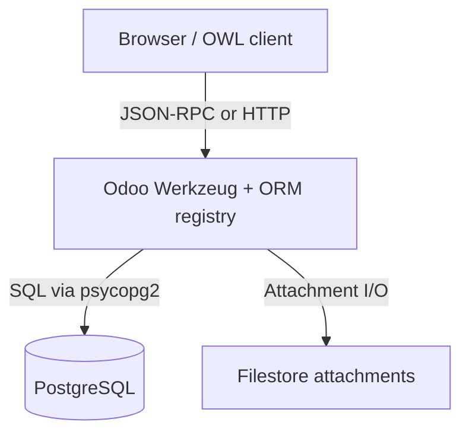
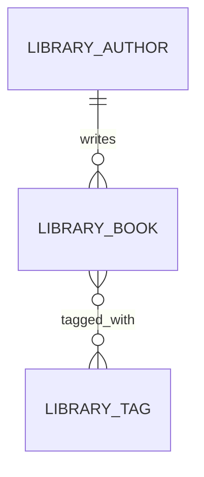
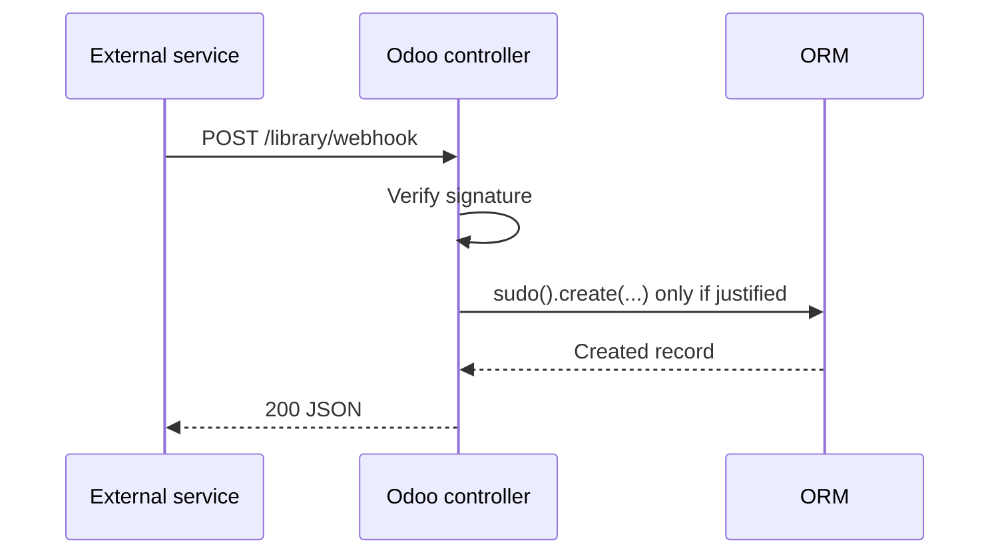
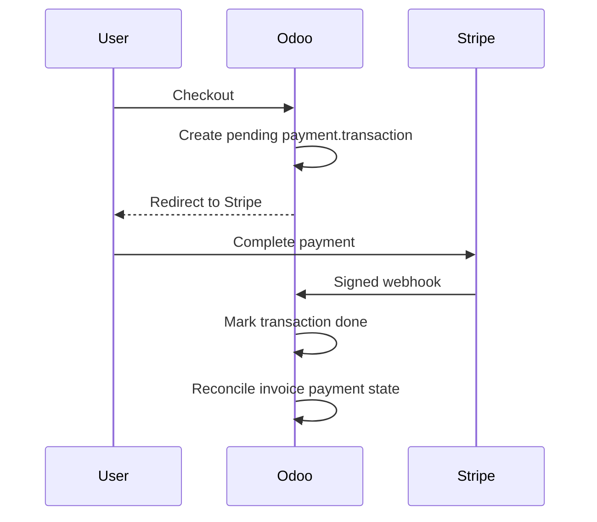

# The Zero-to-Hero Odoo Engineer Roadmap

*Mohammad Bilal's complete, self-paced path from ERP thinking to hire-ready Odoo development - architecture, modules, ORM, security, views, workflows, HTTP integrations, OWL frontend, PostgreSQL, testing, portfolio modules, and interview confident working knowledge - told as a connected story in which each new idea solves a problem left by the previous one.*

*Resources curated with Composio (web search, YouTube, GitHub) against [Odoo 18 Server Framework 101](https://www.odoo.com/documentation/18.0/developer/tutorials/server_framework_101/01_architecture.html), [Odoo developer tutorials](https://www.odoo.com/documentation/18.0/developer/tutorials.html), [backend reference](https://www.odoo.com/documentation/18.0/developer/reference/backend.html), [view architectures](https://www.odoo.com/documentation/18.0/developer/reference/user_interface/view_architectures.html), [data model](https://www.odoo.com/documentation/18.0/developer/reference/backend/data.html), [OWL components](https://www.odoo.com/documentation/18.0/developer/reference/frontend/owl_components.html), [Odoo 17 developer docs](https://www.odoo.com/documentation/17.0/developer.html), Ecosire/DeployMonkey/Braincuber/GetKnit/Cybrosys guides, [odoo/tutorials](https://github.com/odoo/tutorials), [odoo/odoo](https://github.com/odoo/odoo), [ged-odoo/odoo-js-training-public](https://github.com/ged-odoo/odoo-js-training-public), [NodenHQ/awesome-odoo](https://github.com/NodenHQ/awesome-odoo), [Bladefidz/learn-odoo](https://github.com/Bladefidz/learn-odoo), and [yavy-odoo/odoo-module-boilerplate](https://github.com/yavy-odoo/odoo-module-boilerplate).*

*Where this sits:* do this **after** solid Python and [`OOP.md`](./OOP.md) (classes, inheritance, composition). Odoo is Python OOP when the amount of work grows with XML, PostgreSQL, and JS. Build the matching Odoo phase projects in [`Projects.md`](./Projects.md) and drill [`Interview.md`](./Interview.md) for practice explaining ideas clearly under interview pressure.*

**Scope:** 40 concepts · 20 phases · connected step by step, with no artificial weekly deadline.

ERP → Modules → ORM → UI → HTTP → Ship → Hire

---

## How to Read This Document

### Start here if Odoo and ERP are completely new to you

**ERP** means enterprise resource planning: one connected business system for work such as sales, inventory, accounting, and staff records. **Odoo** is an ERP platform. A **module** adds or changes a business feature, a **model** describes a kind of business record, the **ORM** lets Python code work with database records, a **view** controls what the user sees, and a **record** is one stored item such as a customer or sales order.

Keep one small business story in mind as you read-for example, a library lending books or a shop selling products. Ask how each Odoo feature changes that story. Build the smallest version, enter a few records by hand, and check what appears in the database and on the screen. The framework vocabulary becomes manageable when every term is tied to a visible business action.

**Words you will meet often:** an **addon** is an Odoo module found on an addons path; a **manifest** is the file that describes a module and its dependencies; a **field** is one named value on a model; a **domain** is a list of conditions used to find records; an **ACL** grants model-level permissions; a **record rule** limits which individual rows a user may access; a **controller** receives web requests; a **webhook** is an HTTP message sent when an event occurs; **RPC** lets another program call Odoo operations remotely; **OWL** is Odoo's component system for interactive browser code; **QWeb** is its template system; and a **migration** changes existing data or code so it works with a newer version.

This is not a glossary of Odoo buzzwords. It is one connected explanation: every section exists because the section before it reached a practical limit. ERP thinking only matters once spreadsheet chaos burned you. Record rules only matter once model ACLs let users see rows they should not. OWL patches only matter once pure XML could not express the UX.

**There is no clock on this document.** Move when you can explain *why the previous idea was not enough*. That is the only unit of progress.

Every concept answers the same questions:

- What is it, in plain language?
- Why does it exist - what problem forced someone to invent it?
- What did people do before, and what broke?
- What happens inside, one step at a time?
- What does it cost?
- What limitation forces the next idea?

### Two Ways to Use the Same Foundation

| Role | Primary question |
| --- | --- |
| **Backend Odoo** | Models, ORM, security, workflows, upgrades? |
| **Full-stack Odoo** | Views, HTTP, RPC, payments, OWL, PostgreSQL tuning? |

Phases 1-10 build platform confident working knowledge (think ERP, ship modules). Phases 11-18 build extension and quality (inherit, integrate, test, tune). Phases 19-20 are portfolio and hiring. Skip neither - integrations without security are breaches; security without UX never gets adopted.

### The Beginner-Friendly Pattern Every Topic Follows

| Element | What it gives you |
| --- | --- |
| **Why You Are Learning This** | The previous limitation, stated plainly |
| **See It Before You Memorize It** | Videos, interactive tools, docs, GitHub, practice |
| **Step-by-Step Explanation** | A step-by-step explanation in words |
| **The Idea That Fixed It** | The main idea in one clear sentence |
| **What Happens Inside** | ASCII "animation" of what happens |
| **Picture It Like This** | An everyday comparison you can picture without a screen |
| **Trade-offs** | What you gain and what you give up |
| **Code** | Minimal runnable Odoo patterns |
| **Interview** | How an interviewer may ask about it |
| **Practice** | Easy → Medium → Hard |
| **Why the Next Topic Is Needed** | The remaining problem that makes the next topic useful |

**Diagram conventions.** `|` and `v` mean sequence, `+--` joins paths, `-->` means a call or dependency, `X` marks a failure, boxes are models or tiers. Time usually runs downward.

**Prerequisites:** Comfortable Python, [`OOP.md`](./OOP.md) phases 1-8 recommended (classes, inheritance, composition). [`CS.md`](./CS.md) networking basics help for phases 13-14 ([`Networks.md`](./Networks.md) phases 11-14 for HTTP/TLS depth).

---

> **Integrated Git practice:** Each linked phase-project card in [`Projects.md`](./Projects.md) ends with one specific Git checkpoint. Test the finished project first, commit only its named project path, verify the commit and clean working tree, then continue. Use [`Git.md` Phases 2-3](./Git.md#phase-2) if staging or commit selection is unfamiliar.

---

## The Whole-Journey Map

```text
 PHASE 1                 PHASE 2                PHASE 3                PHASE 4
 ODOO / ERP THINKING     3-TIER ARCHITECTURE    DEV ENVIRONMENT        MODULE ANATOMY
    |                       |                      |                      |
 Why one database          Client / server /      addons-path, -i/-u     manifest, data
 of business truth         PostgreSQL flow        dev mode               load order
    +-----------------------+----------------------+----------------------+
                                       |
                                       v
 PHASE 5                 PHASE 6                PHASE 7                PHASE 8
 MODELS & FIELDS         ORM QUERIES            RECORD RULES           VIEWS XML
    |                       |                      |                      |
 _name, fields,           domains, CRUD,          groups, ACL CSV,       form/list/kanban,
 relations                search_read              ir.rule row security   xpath inherit
    +-----------------------+----------------------+----------------------+
                                       |
                                       v
 PHASE 9                 PHASE 10               PHASE 11               PHASE 12
 ACTIONS & MENUS         BUSINESS LOGIC         INHERITANCE            WIZARDS
    |                       |                      |                      |
 act_window, menus,        constrains, compute,    _inherit extend,       TransientModel,
 context, bindings         onchange, workflow      _inherits delegate     target=new
    +-----------------------+----------------------+----------------------+
                                       |
                                       v
 PHASE 13                PHASE 14               PHASE 15               PHASE 16
 CONTROLLERS / WEBHOOKS  EXTERNAL API           INTEGRATIONS           OWL / JS FRONTEND
    |                       |                      |                      |
 @http.route, CSRF,        XML-RPC/JSON-RPC,      payment.provider,      assets bundles,
 idempotent handlers       pagination contracts   SaaS cron sync         OWL patch
    +-----------------------+----------------------+----------------------+
                                       |
                                       v
 PHASE 17                PHASE 18               PHASE 19               PHASE 20
 POSTGRESQL FOR ODOO     TEST / DEBUG / UPGRADE PORTFOLIO MODULES      INTERVIEWS / HIRE
    |                       |                      |                      |
 schema, ir_*, indexes,  TransactionCase,       matching phase builds  live debug,
 EXPLAIN, N+1 fixes       migrations, -u          Odoo.sh CI story        Interview.md
```

---

## Phase Index

| # | Phase | Goal | Move on when you can... |
| --- | --- | --- | --- |
| 01 | [Odoo Thinking / What ERP is](#phase-1---odoo-thinking--what-erp-is) | See ERP as shared truth | Contrast spreadsheet chaos vs modular monolith |
| 02 | [Architecture (3-tier)](#phase-2---architecture-3-tier) | Picture client, server, DB | Trace one button click through tiers |
| 03 | [Dev Environment Setup](#phase-3---dev-environment-setup) | Run Odoo locally | Use addons-path, `-i`, `-u`, dev mode correctly |
| 04 | [Module Anatomy](#phase-4---module-anatomy) | Read module folders | Explain manifest data load order |
| 05 | [Models & Fields](#phase-5---models--fields) | Declare models and fields | Model relations, computes, SQL constraints |
| 06 | [ORM Queries](#phase-6---orm-queries) | Search and CRUD fluently | Write domains and batch recordset ops |
| 07 | [Record Rules & Access](#phase-7---record-rules--access) | Secure models and rows | Configure groups, ACL CSV, ir.rule |
| 08 | [Views XML](#phase-8---views-xml) | Build UI in XML | Author views and xpath inherit |
| 09 | [Actions & Menus](#phase-9---actions--menus) | Wire navigation | Create act_window, menus, smart contexts |
| 10 | [Business Logic](#phase-10---business-logic) | Enforce workflows | Implement constrains, computes, action methods |
| 11 | [Inheritance](#phase-11---inheritance) | Extend without forking | Use `_inherit` and `_inherits` with super() |
| 12 | [Wizards & Transient Models](#phase-12---wizards--transient-models) | Multi-step dialogs | Build TransientModel wizards with bindings |
| 13 | [Controllers & HTTP / Webhooks](#phase-13---controllers--http--webhooks) | HTTP endpoints | Secure routes and idempotent webhooks |
| 14 | [External API](#phase-14---external-api) | Remote ORM access | Use RPC safely with integration users |
| 15 | [Integrations & Payment Gateways](#phase-15---integrations--payment-gateways) | Connect external systems | Explain payment flow and SaaS sync |
| 16 | [OWL / JavaScript Frontend](#phase-16---owl--javascript-frontend) | Extend web client | Register assets and patch OWL components |
| 17 | [PostgreSQL for Odoo](#phase-17---postgresql-for-odoo) | Tune data layer | Inspect schema and fix N+1 / indexes |
| 18 | [Testing, Debugging, Upgrades](#phase-18---testing-debugging-upgrades) | Ship quality | Write TransactionCase and migration scripts |
| 19 | [Portfolio Modules](#phase-19---portfolio-modules) | Prove skill | Ship README + tests mapped to Projects.md |
| 20 | [Interviews / Hire](#phase-20---interviews--hire) | Get hired | Debug AccessError and design module live |

### Anchor Resources (bookmark these)

- [Odoo 18 - Server Framework 101 Architecture](https://www.odoo.com/documentation/18.0/developer/tutorials/server_framework_101/01_architecture.html) · [Tutorials index](https://www.odoo.com/documentation/18.0/developer/tutorials.html)
- [Backend reference](https://www.odoo.com/documentation/18.0/developer/reference/backend.html) · [View architectures](https://www.odoo.com/documentation/18.0/developer/reference/user_interface/view_architectures.html) · [Data model](https://www.odoo.com/documentation/18.0/developer/reference/backend/data.html)
- [OWL components](https://www.odoo.com/documentation/18.0/developer/reference/frontend/owl_components.html) · [Odoo 17 developer docs](https://www.odoo.com/documentation/17.0/developer.html)
- [Ecosire custom module guide](https://www.ecosire.com/blog/custom-module-development) · [DeployMonkey external API](https://deploymonkey.com/odoo-external-api) · [GetKnit API guide](https://www.getknit.dev/blog/odoo-api-guide)
- [Braincuber webhooks](https://braincuber.com/odoo-webhooks) · [Ecosire Stripe](https://www.ecosire.com/blog/odoo-stripe-integration) · [Cybrosys payment acquirer](https://www.cybrosys.com/blog/how-to-create-a-payment-acquirer-in-odoo)
- [odoo/tutorials](https://github.com/odoo/tutorials) · [odoo/odoo](https://github.com/odoo/odoo) · [ged-odoo/odoo-js-training-public](https://github.com/ged-odoo/odoo-js-training-public)
- [NodenHQ/awesome-odoo](https://github.com/NodenHQ/awesome-odoo) · [Bladefidz/learn-odoo](https://github.com/Bladefidz/learn-odoo) · [yavy-odoo/odoo-module-boilerplate](https://github.com/yavy-odoo/odoo-module-boilerplate)
- [Odoo ERP overview (s-4zNx7wCFk)](https://www.youtube.com/watch?v=s-4zNx7wCFk) · [Odoo basics (5YIwP9-55Qk)](https://www.youtube.com/watch?v=5YIwP9-55Qk) · [ERP explained (EHiH7hp0PBU)](https://www.youtube.com/watch?v=EHiH7hp0PBU)
- [Custom module (zKIKCtq9PfM)](https://www.youtube.com/watch?v=zKIKCtq9PfM) · [Module walkthrough (uJPjmS5Arug)](https://www.youtube.com/watch?v=uJPjmS5Arug) · [ORM (ASPjB-WowBU)](https://www.youtube.com/watch?v=ASPjB-WowBU)
- [Architecture (WnsYmsq4Qr8)](https://www.youtube.com/watch?v=WnsYmsq4Qr8) · [Domains (k-hKNUZQi2o)](https://www.youtube.com/watch?v=k-hKNUZQi2o) · [OWL (YJg7dvwXQF8)](https://www.youtube.com/watch?v=YJg7dvwXQF8)
- [Inheritance (RzQPI_lFKL8)](https://www.youtube.com/watch?v=RzQPI_lFKL8) · [Deep ORM (zq4aw99kv48)](https://www.youtube.com/watch?v=zq4aw99kv48)
- **Projects bridge:** the matching Odoo phase builds in [`Projects.md`](./Projects.md)
- **Interview bridge:** [`Interview.md`](./Interview.md) timed speak + live debug drills after Phase 19 portfolio

---

<a id="phase-1"></a>

# PHASE 1 - Odoo Thinking / What ERP is

**Track:** Foundations

**WHAT YOU WILL BE ABLE TO DO:** See ERP as one database of truth before any module syntax

**WHAT YOU SHOULD KNOW FIRST:** See phase index and prior mastery checkpoints.

## 1.1 What ERP Really Is

**WHY YOU ARE LEARNING THIS:** Business software stopped being a pile of spreadsheets the moment companies needed sales, inventory, accounting, and HR to agree on the same customer and product records without manual re-entry.

**THE PROBLEM THIS SOLVES:** Sales logged deals in CRM, warehouse shipped from another sheet, finance invoiced from a third export, and every month someone reconciled three truths that should have been one.

**SEE IT BEFORE YOU MEMORIZE IT**

- [Odoo ERP overview - what one system replaces](https://www.youtube.com/watch?v=s-4zNx7wCFk)
- [Odoo basics for beginners](https://www.youtube.com/watch?v=5YIwP9-55Qk)
- [ERP explained without jargon](https://www.youtube.com/watch?v=EHiH7hp0PBU)
- [Odoo 18 developer docs - architecture mindset](https://www.odoo.com/documentation/18.0/developer/tutorials/server_framework_101/01_architecture.html)
- [Odoo 17 developer landing](https://www.odoo.com/documentation/17.0/developer.html)
- [Odoo backend documentation hub](https://www.odoo.com/documentation/18.0/developer/reference/backend.html)
- [odoo/odoo - see how apps share models](https://github.com/odoo/odoo)
- List three duplicate data points between Sales and Inventory in a spreadsheet company, then name the Odoo app that owns each once.

**STEP-BY-STEP EXPLANATION**

Enterprise Resource Planning (ERP) is not a buzzword for big software. It is the decision that **operational data has owners and workflows**, not files. When a quotation becomes a sales order, stock moves, manufacturing orders, and invoice lines should trace back to the same product, partner, and unit of measure without copy-paste.

Odoo ships as a **modular monolith**: one PostgreSQL database, one Python application server, one web client, and dozens of official apps (Sales, Inventory, Accounting, HR, Website, and more) that extend the same ORM registry. You are not learning forty unrelated products. You are learning how **shared models** (partners, products, users, companies) let vertical apps cooperate.

For a developer, ERP thinking means asking: *Which model owns this fact?* *Which state transition is legal?* *Who may read or write it?* Before you write XML or Python, you sketch entities and workflows the way [`OOP.md`](./OOP.md) taught you to sketch classes and invariants.

Odoo's open-source core plus optional enterprise apps is why startups and manufacturers both adopt it: you customize with modules instead of forking entire products. Your job is to extend the registry safely, not to reinvent accounting in a standalone script.

**THE MAIN IDEA IN SIMPLE WORDS:** Treat the company as one coherent model graph, not isolated apps.

**WHAT HAPPENS INSIDE, ONE STEP AT A TIME**

```text
SPREADSHEET CHAOS                    ODOO SINGLE TRUTH
+------------------+                  +---------------------------+
| sales.xlsx       |                  | res.partner (customer)    |
| stock.csv        |  --migrate-->    | product.product           |
| invoice_export   |                  | sale.order -> stock.picking|
+------------------+                  | account.move              |
        |                             +---------------------------+
        v                                       |
   manual reconcile                             v
        X                               one partner_id everywhere
```

**PICTURE IT LIKE THIS**

A hospital chart where every department reads the same patient ID beats three clipboards with slightly different spellings of the name.

**WHAT YOU GAIN, WHAT IT COSTS, AND WHERE IT CAN FAIL**

| Choice | What it buys | What it costs |
| --- | --- | --- |
| Best-of-breed tools per dept | Best tool per team | Integration tax and drift |
| Single ERP (Odoo) | One partner/product truth | Customization discipline required |
| Spreadsheets forever | Zero license cost | Audit nightmares when the amount of work grows |

**SMALL WORKING EXAMPLE**

```python
# Mental model: apps are namespaces over shared models (not separate databases)
APPS = {
    "sale": ["sale.order", "sale.order.line"],
    "stock": ["stock.picking", "stock.move"],
    "account": ["account.move", "account.move.line"],
}
SHARED = ["res.partner", "product.product", "res.company"]
# Odoo modules declare dependencies so stock loads after product exists.
```

**HOW TO EXPLAIN THIS IN AN INTERVIEW:** Expect 'Explain ERP vs CRM vs accounting module' and 'Why one database?' in junior Odoo screens.

**PRACTICE UNTIL IT FEELS FAMILIAR**

| Difficulty | Task |
| --- | --- |
| Easy | Draw three apps and one shared partner model. |
| Medium | Trace quote to invoice data flow in Odoo terms. |
| Hard | Argue when NOT to customize ERP (integrate instead). |

**WHY THE NEXT TOPIC IS NEEDED:** Knowing *why* one database exists forces the next question: how does Odoo physically run that database and UI?

---

## 1.2 Odoo Developer Mindset vs Script Thinking

**WHY YOU ARE LEARNING THIS:** Odoo rewards developers who think in **declarative modules, security groups, and ORM transactions**, not one-off scripts that bypass access rules and upgrade paths.

**THE PROBLEM THIS SOLVES:** A freelancer pasted SQL updates into production, bypassed ORM constraints, and the next module upgrade dropped columns their script assumed permanent.

**SEE IT BEFORE YOU MEMORIZE IT**

- [Odoo development introduction](https://www.youtube.com/watch?v=zKIKCtq9PfM)
- [Custom Odoo module walkthrough](https://www.youtube.com/watch?v=uJPjmS5Arug)
- [Odoo ORM mindset](https://www.youtube.com/watch?v=ASPjB-WowBU)
- [Server framework 101 tutorial series](https://www.odoo.com/documentation/18.0/developer/tutorials/server_framework_101.html)
- [Ecosire - custom module guide](https://www.ecosire.com/blog/custom-module-development)
- [Odoo developer tutorials index](https://www.odoo.com/documentation/18.0/developer/tutorials.html)
- [odoo/tutorials official learning repos](https://github.com/odoo/tutorials)
- Rewrite a fake `UPDATE res_partner SET credit_limit=0` script as a secured ORM method with a reason logged in chatter.

**STEP-BY-STEP EXPLANATION**

Script thinking says: fetch rows, mutate, commit. Odoo thinking says: **declare models**, let the framework create SQL, enforce ACLs and record rules, trigger computed fields, post messages, and survive upgrades with `-u module` migrations.

Modules are versioned packages with manifests (`__manifest__.py`), data files loaded in order, and Python imported through the registry. You test by installing/upgrading in a database, not by running a lone `.py` file against prod credentials (ever).

Security is not an afterthought: groups on menus, `ir.model.access` for CRUD, record rules for row-level filters. Skipping them creates features that work as admin and fail for real users.

Finally, Odoo is **transactional**: public methods run in environments (`env`) tied to a cursor, user, and context. Side effects belong in explicit business methods, constraints, or overridden `create/write`, not scattered across cron and SQL.

**THE MAIN IDEA IN SIMPLE WORDS:** Extend the framework through modules and the ORM; never fight the registry with raw shortcuts.

**WHAT HAPPENS INSIDE, ONE STEP AT A TIME**

```text
SCRIPT PATH (fragile)                 MODULE PATH (Odoo-native)
  python patch.py                       __manifest__.py
       |                                      |
       v                                      v
  psycopg2.execute                   models/*.py + security/*.csv
       |                                      |
       v                                      v
  no ACL audit                         ir.model.access + rules
       |                                      |
       v                                      v
  upgrade breaks                       manifest version + migrate
```

**PICTURE IT LIKE THIS**

Renting a room by picking the lock versus getting a key from the building manager: one works until the locks change.

**WHAT YOU GAIN, WHAT IT COSTS, AND WHERE IT CAN FAIL**

| Choice | What it buys | What it costs |
| --- | --- | --- |
| Quick SQL hotfix | Minutes to patch data | No audit trail; breaks upgrades |
| ORM + module | Survives upgrades; respects ACL | More files and ceremony |
| External ETL only | Loose coupling | Latency and duplicate masters |

**SMALL WORKING EXAMPLE**

```python
# Odoo-native: business method on model (runs with user ACLs)
from odoo import models, fields

class ResPartner(models.Model):
    _inherit = "res.partner"

    credit_hold = fields.Boolean(default=False)

    def action_clear_credit_hold(self):
        self.filtered(lambda p: p.credit_hold).write({"credit_hold": False})
        return True
```

**HOW TO EXPLAIN THIS IN AN INTERVIEW:** Interviewers probe 'Would you ever write raw SQL in Odoo?' - answer with migrations, `env.cr.execute` in tests, and ORM first.

**PRACTICE UNTIL IT FEELS FAMILIAR**

| Difficulty | Task |
| --- | --- |
| Easy | Name three things a manifest controls. |
| Medium | Contrast cron script vs `@api.model` method. |
| Hard | Design audit trail for manual credit limit changes. |

**WHY THE NEXT TOPIC IS NEEDED:** Developer mindset is useless without knowing where Python, PostgreSQL, and the browser sit in Odoo's three-tier layout.

---

**CHECK YOUR UNDERSTANDING AFTER PHASE 1:** Explain ERP as shared master data plus workflows, and contrast ORM-module work with ad hoc SQL scripts.

> **Phase 1 complete?** [Build the Phase 1 mini-project](./Projects.md#odoo-phase-1-project) · [Continue to Phase 2](#phase-2---architecture-3-tier)

<a id="phase-2"></a>

# PHASE 2 - Architecture (3-tier)

**Track:** Foundations

**WHAT YOU WILL BE ABLE TO DO:** Picture client, server, and database before editing a line of module code

**WHAT YOU SHOULD KNOW FIRST:** See phase index and prior mastery checkpoints.

## 2.1 Three-Tier Odoo Architecture

**WHY YOU ARE LEARNING THIS:** Odoo separates **presentation**, **application logic**, and **persistence** so teams can scale, cache, and secure each layer with clear boundaries.

**THE PROBLEM THIS SOLVES:** Teams edited production XML views directly in the filestore, restarted workers randomly, and could not tell whether bugs lived in JS, Python, or SQL.

**SEE IT BEFORE YOU MEMORIZE IT**

- [Odoo architecture overview](https://www.youtube.com/watch?v=WnsYmsq4Qr8)
- [How Odoo request flows](https://www.youtube.com/watch?v=k-hKNUZQi2o)
- [Server framework 101 - architecture chapter](https://www.youtube.com/watch?v=YJg7dvwXQF8)
- [Official architecture tutorial](https://www.odoo.com/documentation/18.0/developer/tutorials/server_framework_101/01_architecture.html)
- [Odoo 17 developer docs](https://www.odoo.com/documentation/17.0/developer.html)
- [Backend reference - ORM and HTTP](https://www.odoo.com/documentation/18.0/developer/reference/backend.html)
- [odoo/odoo tree - addons, odoo/service, odoo/http](https://github.com/odoo/odoo)
- Sketch tier boundaries for one button click that creates a sale order.

**STEP-BY-STEP EXPLANATION**

**Tier 1 - Web client:** The browser loads OWL/JavaScript assets, talks JSON-RPC to the server, renders views described in XML (forms, lists, kanban). Users never touch PostgreSQL directly.

**Tier 2 - Odoo server:** Python workers load the **registry** (all models, fields, access rights, views merged by inheritance). HTTP controllers, cron, and bus notifications live here. Business logic executes in the ORM with a cursor bound to one database.

**Tier 3 - PostgreSQL:** Tables map to models (`sale_order`, `ir_ui_view`, ...). The ORM generates SQL, manages transactions, and uses savepoints in tests.

A single HTTP request typically: authenticates session, resolves route, builds `Environment`, calls business methods, returns JSON or QWeb HTML. Custom modules hook every step via inherited models, assets, and controllers.

Deployment adds reverse proxies, worker counts, and filestore for attachments, but the mental three-tier picture stays stable.

**THE MAIN IDEA IN SIMPLE WORDS:** Browser talks to Python registry; registry talks to PostgreSQL; never skip the middle.

**WHAT HAPPENS INSIDE, ONE STEP AT A TIME**



**PICTURE IT LIKE THIS**

Restaurant: dining room (UI), kitchen (server/rules), pantry (database). Patrons do not walk into the pantry.

**WHAT YOU GAIN, WHAT IT COSTS, AND WHERE IT CAN FAIL**

| Choice | What it buys | What it costs |
| --- | --- | --- |
| Fat client logic | Snappy UI | Duplicated rules; security risk |
| Server ORM logic | One rule set; ACL enforced | Round trips for heavy UI |
| Direct DB access | Fast reports | Bypasses business invariants |

**SMALL WORKING EXAMPLE**

```python
# Simplified request path (conceptual)
# 1) HTTP -> 2) env['sale.order'].create(vals) -> 3) INSERT INTO sale_order ...

from odoo import http
from odoo.http import request

class QuickPing(http.Controller):
    @http.route("/my/ping", type="json", auth="user")
    def ping(self):
        return {"user": request.env.user.login, "db": request.env.cr.dbname}
```

**HOW TO EXPLAIN THIS IN AN INTERVIEW:** Be ready to whiteboard tiers and where custom Python vs XML vs JS belongs.

**PRACTICE UNTIL IT FEELS FAMILIAR**

| Difficulty | Task |
| --- | --- |
| Easy | Label each file type with a tier. |
| Medium | Trace login to opening a form view. |
| Hard | Explain multi-worker registry invalidation. |

**WHY THE NEXT TOPIC IS NEEDED:** Three tiers collapse into one running dev machine once you install Odoo and add addons paths.

---

## 2.2 Registry, ORM, and PostgreSQL Together

**WHY YOU ARE LEARNING THIS:** The **registry** is the in-memory map of merged models; the **ORM** translates record operations to SQL; **PostgreSQL** stores rows the ORM defines.

**THE PROBLEM THIS SOLVES:** Developers created tables manually, then wondered why Odoo's upgrade deleted them or why `search` returned empty (wrong model name, no module load).

**SEE IT BEFORE YOU MEMORIZE IT**

- [Odoo ORM deep dive intro](https://www.youtube.com/watch?v=RzQPI_lFKL8)
- [Models and fields tutorial angle](https://www.youtube.com/watch?v=zq4aw99kv48)
- [Server framework - models chapter video](https://www.youtube.com/watch?v=ASPjB-WowBU)
- [Odoo data model reference](https://www.odoo.com/documentation/18.0/developer/reference/backend/data.html)
- [Bladefidz/learn-odoo examples](https://github.com/Bladefidz/learn-odoo)
- [ORM API reference](https://www.odoo.com/documentation/18.0/developer/reference/backend/orm.html)
- [NodenHQ/awesome-odoo curated links](https://github.com/NodenHQ/awesome-odoo)
- Install a module and locate its table in PostgreSQL with `\d table_name`.

**STEP-BY-STEP EXPLANATION**

When Odoo starts (or after `-u`), it loads Python classes inheriting `models.Model`, merges `_inherit` chains, computes fields, validates views, and caches the result as the **registry** for that database.

Each model has `_name` (dotted technical name) and `_table` (SQL name, usually underscored). Fields declare columns, relational tables, or computed non-stored values. Calling `create`, `write`, `unlink`, or `search` builds SQL with proper joins for `many2one`, `one2many`, and `many2many`.

PostgreSQL features matter: constraints, indexes, JSONB for translations, and sequences for some legacy counters. Odoo manages schema migrations when modules bump versions.

Multi-company and multi-language ride on context keys (`allowed_company_ids`, `lang`) the ORM injects into domains and computed fields. Understanding registry + ORM explains why **module load order** and **dependencies** are not bureaucracy, they are correctness.

**THE MAIN IDEA IN SIMPLE WORDS:** Models declare intent; registry merges; ORM materializes SQL; PostgreSQL persists.

**WHAT HAPPENS INSIDE, ONE STEP AT A TIME**

```text
Module Python                Registry merge              PostgreSQL
-----------                    --------------              ------------
class SaleOrder(Model)    ->   model 'sale.order'     ->   table sale_order
  _name = 'sale.order'          fields + inherits           columns + FKs
  partner_id = fields...      access + rules              indexes
```

**PICTURE IT LIKE THIS**

City zoning map (registry), building permits (ORM API), land records office (PostgreSQL).

**WHAT YOU GAIN, WHAT IT COSTS, AND WHERE IT CAN FAIL**

| Choice | What it buys | What it costs |
| --- | --- | --- |
| Manual SQL tables | Full control | Invisible to ORM; upgrade risk |
| ORM models | Integrated security and UI | Must learn framework rules |
| NoSQL side store | Flexible events | Split brain with ERP truth |

**SMALL WORKING EXAMPLE**

```python
from odoo import fields, models

class LibraryBook(models.Model):
    _name = "library.book"
    _description = "Library Book"

    name = fields.Char(required=True, index=True)
    isbn = fields.Char(size=13)
    active = fields.Boolean(default=True)

# After -i library: SELECT * FROM library_book;
```

**HOW TO EXPLAIN THIS IN AN INTERVIEW:** 'What happens when you install a module?' and 'Where do fields live in SQL?' are core screening questions.

**PRACTICE UNTIL IT FEELS FAMILIAR**

| Difficulty | Task |
| --- | --- |
| Easy | Find `_name` and matching SQL table. |
| Medium | Explain registry rebuild after `-u`. |
| Hard | Trace many2many through relation table. |

**WHY THE NEXT TOPIC IS NEEDED:** Architecture on paper becomes real when you install Odoo locally with your addons path.

---

**CHECK YOUR UNDERSTANDING AFTER PHASE 2:** Draw browser, server/registry, and PostgreSQL, and explain how a model becomes a table.

> **Phase 2 complete?** [Build the Phase 2 mini-project](./Projects.md#odoo-phase-2-project) · [Continue to Phase 3](#phase-3---dev-environment-setup)

<a id="phase-3"></a>

# PHASE 3 - Dev Environment Setup

**Track:** Foundations

**WHAT YOU WILL BE ABLE TO DO:** Run Odoo locally with an addons path you control

**WHAT YOU SHOULD KNOW FIRST:** See phase index and prior mastery checkpoints.

## 3.1 Source, Docker, and Odoo.sh Mindset

> **Git prerequisite:** Use [`Git.md`](./Git.md) Phases [1-7](./Git.md#phase-1) for clone, branch, remote, and review mechanics before treating Odoo source or Odoo.sh branches as deployment magic.

**WHY YOU ARE LEARNING THIS:** You need a **repeatable dev environment** before custom modules: same version, same PostgreSQL major, same addons path every teammate uses.

**THE PROBLEM THIS SOLVES:** A tutorial used Odoo 16 snippets on a 17 database; views failed silently and ORM field types mismatched until the database was rebuilt.

**SEE IT BEFORE YOU MEMORIZE IT**

- [Odoo installation and setup walkthrough](https://www.youtube.com/watch?v=uJPjmS5Arug)
- [Local Odoo dev environment tips](https://www.youtube.com/watch?v=zKIKCtq9PfM)
- [Odoo.sh deployment concepts](https://www.youtube.com/watch?v=5YIwP9-55Qk)
- [Official developer setup docs](https://www.odoo.com/documentation/18.0/developer/tutorials.html)
- [yavy-odoo/odoo-module-boilerplate template](https://github.com/yavy-odoo/odoo-module-boilerplate)
- [Odoo source install notes in odoo/odoo README](https://github.com/odoo/odoo)
- [odoo/tutorials - official exercise modules](https://github.com/odoo/tutorials)
- Document your exact version, Python, and PostgreSQL in a TEAM_SETUP.md snippet.

**STEP-BY-STEP EXPLANATION**

Common paths: **source install** (git clone odoo/odoo, pip requirements, `./odoo-bin -d dev`), **Docker Compose** (official or community images with mounted addons), **Odoo.sh** (Git branches map to staging/production with built-in CI).

Pick one primary path for your team. Source gives maximum debugger access; Docker gives fastest onboarding; Odoo.sh mirrors how many consultancies ship.

Requirements typically include Python 3.10+, PostgreSQL 12+, node tooling for assets when building frontend, and wkhtmltopdf for reports on full stacks. Match **exact Odoo series** (17 vs 18) to docs you follow.

Create a dedicated database per experiment (`dev_bilal`, not `postgres`). Never develop against a copy of production without anonymized data and legal approval.

**THE MAIN IDEA IN SIMPLE WORDS:** Pin versions, isolate databases, mount your addons path, then install modules with `-i`.

**WHAT HAPPENS INSIDE, ONE STEP AT A TIME**

```bash
git clone odoo/odoo
pip install -r requirements.txt
./odoo-bin -d dev_bilal --addons-path=addons,custom_addons -i base --dev=all
```

**PICTURE IT LIKE THIS**

Shared kitchen: everyone uses the same oven temperature (version) or cakes fail for mysterious reasons.

**WHAT YOU GAIN, WHAT IT COSTS, AND WHERE IT CAN FAIL**

| Choice | What it buys | What it costs |
| --- | --- | --- |
| Source install | Best debugging | Longer setup |
| Docker | Fast spin-up | Volume/path confusion |
| Odoo.sh | Prod-like pipeline | Less low-level access |

**SMALL WORKING EXAMPLE**

```bash
# Minimal dev launch (adjust paths)
./odoo-bin \
  -d dev_bilal \
  --addons-path=/opt/odoo/addons,/opt/odoo/custom \
  --dev=xml,qweb,reload \
  -i base
```

**HOW TO EXPLAIN THIS IN AN INTERVIEW:** Expect 'How do you run Odoo locally?' and 'How do addons-path and `-u` differ?'

**PRACTICE UNTIL IT FEELS FAMILIAR**

| Difficulty | Task |
| --- | --- |
| Easy | Write install command with custom addons path. |
| Medium | Compare Docker vs source for a team of three. |
| Hard | Plan dev/staging/prod DB promotion safely. |

**WHY THE NEXT TOPIC IS NEEDED:** A running server is empty until you understand module folders and manifests.

---

## 3.2 Addons Path, `-i`, `-u`, and Dev Mode

**WHY YOU ARE LEARNING THIS:** Odoo discovers modules from **addons-path**; **install** creates schema, **upgrade** reapplies data and migrations, **dev flags** shorten feedback loops.

**THE PROBLEM THIS SOLVES:** Developers edited Python but forgot `-u`, watched stale registry code run, and blamed Odoo for 'random' behavior.

**SEE IT BEFORE YOU MEMORIZE IT**

- [Module install and upgrade explained](https://www.youtube.com/watch?v=ASPjB-WowBU)
- [Odoo developer mode features](https://www.youtube.com/watch?v=RzQPI_lFKL8)
- [Custom module from scratch](https://www.youtube.com/watch?v=s-4zNx7wCFk)
- [Ecosire custom module development guide](https://www.ecosire.com/blog/custom-module-development)
- [Server framework 101 - define module structure](https://www.odoo.com/documentation/18.0/developer/tutorials/server_framework_101/03_define_module_structure.html)
- [Module manifest reference](https://www.odoo.com/documentation/18.0/developer/reference/backend/module.html)
- [Bladefidz/learn-odoo module examples](https://github.com/Bladefidz/learn-odoo)
- Change a field label, `-u` your module, confirm UI updates without full restart.

**STEP-BY-STEP EXPLANATION**

The **addons path** is an ordered list of directories Odoo scans for folders containing `__manifest__.py`. Your custom code lives outside core `addons/` so upgrades to Odoo source do not overwrite your work.

`-i module_name` **installs** (loads data XML/CSV, creates tables). `-u module_name` **upgrades** (re-runs `noupdate` logic, migration scripts, view reload). After Python changes in dev, `--dev=reload` helps; after XML/security, `-u` is mandatory.

**Developer mode** unlocks UI technical menus: edit views in place, see field names, inspect actions. It is for dev databases only.

Log files (`odoo.log`) and `--log-level=debug_sql` are your friends when domains fail or access is denied.

**THE MAIN IDEA IN SIMPLE WORDS:** Treat install vs upgrade as schema/data lifecycle events, not interchangeable restart buttons.

**WHAT HAPPENS INSIDE, ONE STEP AT A TIME**

```text
edit models.py --> --dev=reload (python)
edit views.xml  --> -u my_module (registry merge)
edit security   --> -u my_module + re-login user
```

**PICTURE IT LIKE THIS**

House renovation: installing a room (install) vs remodeling existing wiring (upgrade).

**WHAT YOU GAIN, WHAT IT COSTS, AND WHERE IT CAN FAIL**

| Choice | What it buys | What it costs |
| --- | --- | --- |
| Restart only | Fast | Stale views and fields |
| `-u` after structural change | Correct registry | Slower; test data quirks |
| Drop database | Clean slate | Loses fixtures |

**SMALL WORKING EXAMPLE**

```bash
# Install new module
./odoo-bin -d dev_bilal -i library_mgmt --stop-after-init

# Upgrade after XML/security change
./odoo-bin -d dev_bilal -u library_mgmt --stop-after-init
```

**HOW TO EXPLAIN THIS IN AN INTERVIEW:** Screening question: 'You changed a view XML; what command do you run?'

**PRACTICE UNTIL IT FEELS FAMILIAR**

| Difficulty | Task |
| --- | --- |
| Easy | Explain `-i` vs `-u` in one sentence each. |
| Medium | Debug 'Module not found' on addons path. |
| Hard | Design team convention for init vs update scripts. |

**WHY THE NEXT TOPIC IS NEEDED:** With a running dev loop, you can open the anatomy of a single module folder.

---

**CHECK YOUR UNDERSTANDING AFTER PHASE 3:** Launch Odoo with custom addons path and correctly choose `-i`, `-u`, and dev mode.

> **Phase 3 complete?** [Build the Phase 3 mini-project](./Projects.md#odoo-phase-3-project) · [Continue to Phase 4](#phase-4---module-anatomy)

<a id="phase-4"></a>

# PHASE 4 - Module Anatomy

**Track:** Module Core

**WHAT YOU WILL BE ABLE TO DO:** Read every file in a minimal module and know its job

**WHAT YOU SHOULD KNOW FIRST:** See phase index and prior mastery checkpoints.

## 4.1 Manifest, Package Layout, and Loading Order

**WHY YOU ARE LEARNING THIS:** A module is a **versioned package** whose manifest tells Odoo what to load, in what order, and what it depends on.

**THE PROBLEM THIS SOLVES:** A team shipped views before security CSV; users saw menus but hit AccessError on every click.

**SEE IT BEFORE YOU MEMORIZE IT**

- [Odoo module structure tutorial](https://www.youtube.com/watch?v=zKIKCtq9PfM)
- [Build your first Odoo module](https://www.youtube.com/watch?v=uJPjmS5Arug)
- [Manifest and dependencies](https://www.youtube.com/watch?v=5YIwP9-55Qk)
- [Define module structure - official tutorial](https://www.odoo.com/documentation/18.0/developer/tutorials/server_framework_101/03_define_module_structure.html)
- [yavy-odoo module boilerplate layout](https://github.com/yavy-odoo/odoo-module-boilerplate)
- [Module manifest keys](https://www.odoo.com/documentation/18.0/developer/reference/backend/module.html)
- [odoo/tutorials estate module sample](https://github.com/odoo/tutorials)
- Scaffold `my_library` with models, views, security, data folders and empty `__init__.py` chain.

**STEP-BY-STEP EXPLANATION**

Standard layout:

```text
my_library/
  __init__.py          # imports models, controllers
  __manifest__.py      # metadata and data file list
  models/
  views/
  security/
  data/
  static/
```

`__manifest__.py` keys: `name`, `version`, `depends`, `data`, `demo`, `assets`, `license`, `application`. Odoo loads `depends` first, then `data` files **top to bottom**. Put `security/ir.model.access.csv` before views that expose models.

Python loads through `__init__.py` importing subpackages. Missing import means models never register even if XML exists.

**THE MAIN IDEA IN SIMPLE WORDS:** Manifest declares dependencies and ordered data; Python package imports register code.

**WHAT HAPPENS INSIDE, ONE STEP AT A TIME**

```text
depends: ['base','mail']
data:
  1 security/groups.xml
  2 security/ir.model.access.csv
  3 views/book_views.xml
  4 data/sequence.xml
--> user opens menu with ACL already present
```

**PICTURE IT LIKE THIS**

Recipe card listing ingredients (depends) and steps (data load order).

**WHAT YOU GAIN, WHAT IT COSTS, AND WHERE IT CAN FAIL**

| Choice | What it buys | What it costs |
| --- | --- | --- |
| Flat single file module | Quick hack | Unmaintainable at 500 lines |
| Structured module | Team-ready | More folders |
| Monolithic depends on everything | Fast prototype | Upgrade coupling |

**SMALL WORKING EXAMPLE**

```python
# __manifest__.py
{
    "name": "Library Management",
    "version": "18.0.1.0.0",
    "depends": ["base", "mail"],
    "data": [
        "security/library_security.xml",
        "security/ir.model.access.csv",
        "views/library_book_views.xml",
    ],
    "application": True,
    "license": "LGPL-3",
}
```

**HOW TO EXPLAIN THIS IN AN INTERVIEW:** 'Walk me through your last module folder' is standard; they listen for load order discipline.

**PRACTICE UNTIL IT FEELS FAMILIAR**

| Difficulty | Task |
| --- | --- |
| Easy | List manifest keys you always set. |
| Medium | Fix load order for security vs views. |
| Hard | Split module into base + report without circular depends. |

**WHY THE NEXT TOPIC IS NEEDED:** Skeleton exists to hold models and fields, the ORM vocabulary.

---

## 4.2 Dependencies, Auto-install, and Version Strings

**WHY YOU ARE LEARNING THIS:** Correct **`depends`** prevent half-registered models; **version** strings drive migrations and Odoo.sh builds.

**THE PROBLEM THIS SOLVES:** A payment customization depended on `website_sale` implicitly; fresh installs crashed because ecommerce was not installed.

**SEE IT BEFORE YOU MEMORIZE IT**

- [Module dependencies in Odoo](https://www.youtube.com/watch?v=ASPjB-WowBU)
- [Odoo versioning and upgrades](https://www.youtube.com/watch?v=RzQPI_lFKL8)
- [Enterprise vs community module deps](https://www.youtube.com/watch?v=EHiH7hp0PBU)
- [Ecosire custom module guide - dependencies section](https://www.ecosire.com/blog/custom-module-development)
- [dreispt/awesome-odoo module patterns](https://github.com/dreispt/awesome-odoo)
- [Odoo module versioning convention](https://www.odoo.com/documentation/18.0/developer/reference/backend/module.html)
- [odoo/odoo official addons manifests for examples](https://github.com/odoo/odoo/tree/master/addons)
- Create two modules where `library_loans` depends on `library_core` only.

**STEP-BY-STEP EXPLANATION**

Declare every module that defines models or views you reference. If your view inherits `sale.order` form, depend on `sale`. Transitive depends are not guaranteed across Odoo versions.

Version format `18.0.x.y.z` ties to Odoo series. Bump when you ship migration scripts in `migrations/18.0.x.y/pre-migrate.py` or post hooks.

`auto_install` modules activate when all listed deps are present (bridge modules). Use sparingly.

For enterprise features, mark dependency explicitly and document license expectations for clients.

**THE MAIN IDEA IN SIMPLE WORDS:** Explicit depends and series-aligned versions make installs reproducible.

**WHAT HAPPENS INSIDE, ONE STEP AT A TIME**

```text
library_loans/__manifest__.py
  depends: ['library_core', 'mail']

Odoo loads library_core first --> models exist --> loans views validate
```

**PICTURE IT LIKE THIS**

Lego set numbers on the box: build 10234 before wing addon 10234-1.

**WHAT YOU GAIN, WHAT IT COSTS, AND WHERE IT CAN FAIL**

| Choice | What it buys | What it costs |
| --- | --- | --- |
| Implicit depends | Shorter manifest | Install order bugs |
| Explicit minimal depends | Reliable installs | Must refactor when splitting |
| Over-broad depends | Works everywhere | Heavier install footprint |

**SMALL WORKING EXAMPLE**

```python
{
    "name": "Library Loans",
    "version": "18.0.1.0.0",
    "depends": ["library_core", "mail"],
    "data": ["views/loan_views.xml"],
}
```

**HOW TO EXPLAIN THIS IN AN INTERVIEW:** They ask 'What happens if depends is wrong?' - expect answer: ImportError, missing model, broken view arch.

**PRACTICE UNTIL IT FEELS FAMILIAR**

| Difficulty | Task |
| --- | --- |
| Easy | When do you bump module version? |
| Medium | Design depends for optional website feature. |
| Hard | Plan migration folder for renamed field. |

**WHY THE NEXT TOPIC IS NEEDED:** Module shell ready: time to define models and fields inside it.

---

**CHECK YOUR UNDERSTANDING AFTER PHASE 4:** Scaffold a module manifest with ordered security and views; explain depends and versioning.

> **Phase 4 complete?** [Build the Phase 4 mini-project](./Projects.md#odoo-phase-4-project) · [Continue to Phase 5](#phase-5---models--fields)

<a id="phase-5"></a>

# PHASE 5 - Models & Fields

**Track:** Orm Core

**WHAT YOU WILL BE ABLE TO DO:** Declare `_name`, fields, and relations the ORM can enforce

**WHAT YOU SHOULD KNOW FIRST:** See phase index and prior mastery checkpoints.

## 5.1 Models, `_name`, and Model Attributes

**WHY YOU ARE LEARNING THIS:** Every persistent entity is a **Model** class; `_name` is the global identifier every view, rule, and relation uses.

**THE PROBLEM THIS SOLVES:** Copy-paste renamed the class but not `_name`, causing duplicate model registration or views targeting a ghost model.

**SEE IT BEFORE YOU MEMORIZE IT**

- [Odoo models introduction](https://www.youtube.com/watch?v=zq4aw99kv48)
- [Create Odoo model step by step](https://www.youtube.com/watch?v=zKIKCtq9PfM)
- [Model inheritance preview](https://www.youtube.com/watch?v=ASPjB-WowBU)
- [Backend ORM reference](https://www.odoo.com/documentation/18.0/developer/reference/backend/orm.html)
- [Data model documentation](https://www.odoo.com/documentation/18.0/developer/reference/backend/data.html)
- [Server framework 101 - models chapter](https://www.odoo.com/documentation/18.0/developer/tutorials/server_framework_101/04_models.html)
- [odoo/tutorials - estate models](https://github.com/odoo/tutorials)
- Create `library.book` with `_description`, `_order`, and SQL constraint on ISBN format.

**STEP-BY-STEP EXPLANATION**

Subclass `models.Model` (persistent), `TransientModel` (wizard tables), or `AbstractModel` (mixins). Set `_name` dotted lowercase: `library.book`. Optional: `_description`, `_order`, `_rec_name`, `_sql_constraints`, `_check_company_auto`.

Odoo auto-adds metadata fields on models (`id`, `create_uid`, `write_date`, ...). Mail integration inherits `mail.thread` for chatter.

Model methods receive recordsets (`self`) not raw ids. Single record vs multi-record bugs are common: always use `ensure_one()` when logic assumes one row.

Naming conventions: models grouped by prefix (`library.book`, `library.author`) aid discovery and ACL CSV rows.

**THE MAIN IDEA IN SIMPLE WORDS:** `_name` registers the model; attributes tune SQL, ordering, and UX defaults.

**WHAT HAPPENS INSIDE, ONE STEP AT A TIME**

```text
class LibraryBook(models.Model):
    _name = 'library.book'
         |
         v
registry['library.book'] --> table library_book + ir_model row
```

**PICTURE IT LIKE THIS**

DMV form code (`library.book`) links every desk (view, rule, report) to the same record type.

**WHAT YOU GAIN, WHAT IT COSTS, AND WHERE IT CAN FAIL**

| Choice | What it buys | What it costs |
| --- | --- | --- |
| `_name` typo | Silent wrong target | Hard-to-debug UI empty lists |
| Prefix convention | Greppable modules | Longer names |
| Abstract mixins | DRY for mail/sequence | MRO complexity later |

**SMALL WORKING EXAMPLE**

```python
from odoo import fields, models

class LibraryBook(models.Model):
    _name = "library.book"
    _description = "Book"
    _order = "name"

    name = fields.Char(required=True)
    _sql_constraints = [
        ("isbn_unique", "unique(isbn)", "ISBN must be unique."),
    ]
```

**HOW TO EXPLAIN THIS IN AN INTERVIEW:** 'Difference between Model and TransientModel?' and 'What is `_rec_name`?' appear often.

**PRACTICE UNTIL IT FEELS FAMILIAR**

| Difficulty | Task |
| --- | --- |
| Easy | Add `_order` and explain effect. |
| Medium | Add SQL constraint for positive page count. |
| Hard | Design mixin abstract model for audit fields. |

**WHY THE NEXT TOPIC IS NEEDED:** Models hold fields; field types encode business structure and SQL shape.

---

## 5.2 Field Types, Parameters, and Relations

**WHY YOU ARE LEARNING THIS:** Fields map to columns or relation tables; **required**, **index**, **tracking**, and **related** parameters shape behavior and performance.

**THE PROBLEM THIS SOLVES:** A `many2one` without `ondelete` blocked partner deletion; a stored computed field without dependencies never updated.

**SEE IT BEFORE YOU MEMORIZE IT**

- [Odoo fields and relations](https://www.youtube.com/watch?v=RzQPI_lFKL8)
- [Many2one One2many Many2many explained](https://www.youtube.com/watch?v=YJg7dvwXQF8)
- [Computed fields intro](https://www.youtube.com/watch?v=k-hKNUZQi2o)
- [Fields API reference](https://www.odoo.com/documentation/18.0/developer/reference/backend/orm.html#fields)
- [Odoo data model - relational fields](https://www.odoo.com/documentation/18.0/developer/reference/backend/data.html)
- [Server framework - fields exercise](https://www.odoo.com/documentation/18.0/developer/tutorials/server_framework_101/05_fields.html)
- [Bladefidz/learn-odoo field examples](https://github.com/Bladefidz/learn-odoo)
- Model author with One2many books and Many2many tags; test ondelete cascade rules.

**STEP-BY-STEP EXPLANATION**

Scalars: `Char`, `Text`, `Integer`, `Float`, `Boolean`, `Date`, `Datetime`, `Selection`, `Html`, `Binary`, `Monetary` (needs `currency_field`).

Relations: `Many2one` (FK column), `One2many` (inverse of Many2one), `Many2many` (relation table). Always set `comodel_name`, sensible `string`, and `ondelete` on Many2one (`cascade`, `set null`, `restrict`).

Computed: `compute=`, optional `store=True`, `@api.depends`. Related: `related=` shortcuts without duplicating logic.

Use `tracking=True` on fields when inheriting `mail.thread` for audit UX. Use `groups=` to hide sensitive fields from unauthorized users in UI (not a security substitute).

**THE MAIN IDEA IN SIMPLE WORDS:** Pick the smallest field type that preserves invariants; relations express foreign keys explicitly.

**WHAT HAPPENS INSIDE, ONE STEP AT A TIME**



**PICTURE IT LIKE THIS**

Form fields on a paper contract: single values, references to other forms, or checklists linking many parties.

**WHAT YOU GAIN, WHAT IT COSTS, AND WHERE IT CAN FAIL**

| Choice | What it buys | What it costs |
| --- | --- | --- |
| Char for everything | Fast prototyping | No type validation |
| Proper Monetary + company currency | Correct totals | More setup |
| Unstored computed in list view | Always fresh | Slow when the amount of work grows |

**SMALL WORKING EXAMPLE**

```python
author_id = fields.Many2one("library.author", ondelete="restrict")
tag_ids = fields.Many2many("library.tag", string="Tags")
loan_count = fields.Integer(compute="_compute_loan_count")

@api.depends("loan_ids")
def _compute_loan_count(self):
    for book in self:
        book.loan_count = len(book.loan_ids)
```

**HOW TO EXPLAIN THIS IN AN INTERVIEW:** Expect relation diagram questions and 'What happens on delete?' scenarios.

**PRACTICE UNTIL IT FEELS FAMILIAR**

| Difficulty | Task |
| --- | --- |
| Easy | Add Many2one with ondelete restrict. |
| Medium | Stored computed total pages read. |
| Hard | Model company-dependent Monetary with validation. |

**WHY THE NEXT TOPIC IS NEEDED:** Fields exist to be queried; the ORM search API is next.

---

**CHECK YOUR UNDERSTANDING AFTER PHASE 5:** Define models with scalar and relational fields, constraints, and computed fields correctly.

> **Phase 5 complete?** [Build the Phase 5 mini-project](./Projects.md#odoo-phase-5-project) · [Continue to Phase 6](#phase-6---orm-queries)

<a id="phase-6"></a>

# PHASE 6 - ORM Queries

**Track:** Orm Core

**WHAT YOU WILL BE ABLE TO DO:** Search, read, write, and unlink with domains and environments

**WHAT YOU SHOULD KNOW FIRST:** See phase index and prior mastery checkpoints.

## 6.1 CRUD, Recordsets, and Environment

**WHY YOU ARE LEARNING THIS:** The ORM exposes **recordsets** (ordered sets of ids + model) and an **Environment** binding user, context, and cursor.

**THE PROBLEM THIS SOLVES:** Code called `browse(5).write()` on wrong model, or used sudo() everywhere and shipped a critical IDOR vulnerability.

**SEE IT BEFORE YOU MEMORIZE IT**

- [Odoo ORM CRUD operations](https://www.youtube.com/watch?v=ASPjB-WowBU)
- [Recordsets explained](https://www.youtube.com/watch?v=zq4aw99kv48)
- [Environment and context](https://www.youtube.com/watch?v=RzQPI_lFKL8)
- [ORM API reference - CRUD](https://www.odoo.com/documentation/18.0/developer/reference/backend/orm.html)
- [Odoo shell for interactive ORM](https://www.odoo.com/documentation/18.0/developer/reference/cli.html#shell)
- [Server framework - relations and ORM](https://www.odoo.com/documentation/18.0/developer/tutorials/server_framework_101/06_relations.html)
- [odoo/odoo tests using create/search patterns](https://github.com/odoo/odoo)
- In odoo shell, create 3 books, search unread, batch write category.

**STEP-BY-STEP EXPLANATION**

`create(vals_list)` returns recordset of new rows. `search(domain, limit=, order=)` returns ids matching domain. `browse(ids)` attaches ids without SQL until read/write. `write(vals)` updates; `unlink()` deletes (respects ondelete and rules).

`env` carries `user`, `context`, `cr`. `with_context(lang='fr_FR')` and `with_company(company)` clone env. **`sudo()`** bypasses ACL and record rules - use only in controlled server code with manual checks.

Recordsets support Python iteration, filtering, mapped fields: `books.mapped('author_id.name')`. Prefer ORM over raw SQL for business logic.

Batch operations: create accepts list of dicts; write/unlink on multi-record set is one SQL where possible.

**THE MAIN IDEA IN SIMPLE WORDS:** Think in recordsets and env, not loose ids and cursors.

**WHAT HAPPENS INSIDE, ONE STEP AT A TIME**

```text
env['library.book'].search([('active','=',True)])
        |
        v
recordset library.book(1, 4, 7)
        |
        +-> .write({'active': False})  # one UPDATE ... WHERE id IN (1,4,7)
```

**PICTURE IT LIKE THIS**

Library cart (recordset) pushed by one librarian (env/user) with one checkout policy (ACL).

**WHAT YOU GAIN, WHAT IT COSTS, AND WHERE IT CAN FAIL**

| Choice | What it buys | What it costs |
| --- | --- | --- |
| browse + write per id | Obvious | N+1 queries |
| Batch search/write | Efficient | Must understand domains |
| sudo() everywhere | Quick admin fixes | Security disaster |

**SMALL WORKING EXAMPLE**

```python
Book = self.env["library.book"]
draft = Book.search([("state", "=", "draft")], limit=10, order="create_date desc")
draft.write({"state": "available"})
new_ids = Book.create([{"name": "Dune"}, {"name": "Foundation"}])
```

**HOW TO EXPLAIN THIS IN AN INTERVIEW:** 'Difference search vs browse?' and 'When is sudo acceptable?' are frequent.

**PRACTICE UNTIL IT FEELS FAMILIAR**

| Difficulty | Task |
| --- | --- |
| Easy | Search active partners named 'Acme'. |
| Medium | Refactor loop of writes to batch. |
| Hard | Implement safe sudo helper with explicit checks. |

**WHY THE NEXT TOPIC IS NEEDED:** CRUD without domains is like SQL without WHERE: domains are the filter language.

---

## 6.2 Domains, Operators, and search_read

**WHY YOU ARE LEARNING THIS:** **Domains** are Polish-notation lists filtering rows; **`search_read`** fetches fields in one round trip for APIs and reports.

**THE PROBLEM THIS SOLVES:** Developers fetched all records then filtered in Python, timing out production on ten thousand partners.

**SEE IT BEFORE YOU MEMORIZE IT**

- [Odoo domains tutorial](https://www.youtube.com/watch?v=k-hKNUZQi2o)
- [search_read for external apps](https://www.youtube.com/watch?v=WnsYmsq4Qr8)
- [Domain operators deep dive](https://www.youtube.com/watch?v=YJg7dvwXQF8)
- [ORM search domain reference](https://www.odoo.com/documentation/18.0/developer/reference/backend/orm.html#search-domains)
- [GetKnit Odoo API guide - search_read patterns](https://www.getknit.dev/blog/odoo-api-guide)
- [DeployMonkey external API tutorial](https://deploymonkey.com/odoo-external-api)
- [odoo/tutorials RPC examples](https://github.com/odoo/tutorials)
- Write domain for books available OR due back this week with late fees.

**STEP-BY-STEP EXPLANATION**

Domain syntax: list of tuples `(field, operator, value)` and prefix operators `'&'`, `'|'`, `'!'`. Example OR: `['|', ('state','=','available'), ('state','=','loan')]`.

Relational traversals: `('author_id.country_id.code', '=', 'QA')`. Many2many: `('tag_ids.name', 'ilike', 'fiction')`.

`search_read(domain, fields=, limit=)` returns list of dicts - ideal for controllers and RPC clients. `read_group` aggregates (sum, count) for pivot graphs.

Dynamic domains in views use strings evaluated safely in UI; in Python use real lists. Combine with **`active_test=False`** in context to include archived records when needed.

**THE MAIN IDEA IN SIMPLE WORDS:** Push filtering to SQL via domains; fetch only needed columns with search_read.

**WHAT HAPPENS INSIDE, ONE STEP AT A TIME**

```text
Domain: [('active','=',True), ('loan_count','>',0)]
        |
        v
SQL WHERE active AND loan_count > 0
        |
        v
search_read(..., fields=['name','isbn']) --> minimal payload
```

**PICTURE IT LIKE THIS**

Library catalog search filters (domain) vs pulling every book into the hall (Python filter).

**WHAT YOU GAIN, WHAT IT COSTS, AND WHERE IT CAN FAIL**

| Choice | What it buys | What it costs |
| --- | --- | --- |
| Python-side filter | Flexible Python logic | Loads too many rows |
| Domain + search_read | Fast; index-friendly | Steep syntax learning |
| Raw SQL reports | Maximum speed | Bypasses ORM rules |

**SMALL WORKING EXAMPLE**

```python
domain = [
    "&",
    ("active", "=", True),
    "|",
    ("state", "=", "available"),
    ("return_date", "<", fields.Date.today()),
]
rows = self.env["library.loan"].search_read(domain, ["book_id", "partner_id", "return_date"])
```

**HOW TO EXPLAIN THIS IN AN INTERVIEW:** Live coding: build domain for last month's sales over 5000 in user's company.

**PRACTICE UNTIL IT FEELS FAMILIAR**

| Difficulty | Task |
| --- | --- |
| Easy | Domain for name ilike 'odoo'. |
| Medium | AND/OR domain on related field. |
| Hard | read_group monthly loan counts by author. |

**WHY THE NEXT TOPIC IS NEEDED:** Queries return rows users may not be allowed to see; access layers come next.

---

**CHECK YOUR UNDERSTANDING AFTER PHASE 6:** Write domains, batch CRUD on recordsets, and explain env, sudo, and search_read.

> **Phase 6 complete?** [Build the Phase 6 mini-project](./Projects.md#odoo-phase-6-project) · [Continue to Phase 7](#phase-7---record-rules--access)

<a id="phase-7"></a>

# PHASE 7 - Record Rules & Access

**Track:** Security

**WHAT YOU WILL BE ABLE TO DO:** Model ACLs plus row-level rules before exposing menus

**WHAT YOU SHOULD KNOW FIRST:** See phase index and prior mastery checkpoints.

## 7.1 ir.model.access and Groups

**WHY YOU ARE LEARNING THIS:** **Access rights** grant model-level CRUD per security group; without CSV rows, even admins may lack intended user flows.

**THE PROBLEM THIS SOLVES:** Views and menus shipped; users got AccessError on `library.book` because CSV was missing read perm for Library User group.

**SEE IT BEFORE YOU MEMORIZE IT**

- [Odoo security access rights](https://www.youtube.com/watch?v=uJPjmS5Arug)
- [Security groups explained](https://www.youtube.com/watch?v=zKIKCtq9PfM)
- [Model access CSV format](https://www.youtube.com/watch?v=5YIwP9-55Qk)
- [Security reference - access rights](https://www.odoo.com/documentation/18.0/developer/reference/backend/security.html)
- [Ecosire module guide - security section](https://www.ecosire.com/blog/custom-module-development)
- [Server framework - security chapter](https://www.odoo.com/documentation/18.0/developer/tutorials/server_framework_101/07_security.html)
- [yavy-odoo module boilerplate security folder](https://github.com/yavy-odoo/odoo-module-boilerplate)
- Create Manager vs User groups; CSV perm read/write/create/unlink matrix.

**STEP-BY-STEP EXPLANATION**

Define groups in XML (`res.groups`) with implied ids for hierarchy (User inherits Employee). **`ir.model.access.csv`** columns: id, name, model_id:id, group_id:id, perm_read, perm_write, perm_create, perm_unlink.

Use `noupdate=1` on groups in production data carefully. Test with **non-admin test user** assigned only target groups.

Menu items and buttons use `groups=` attribute to show/hide UI; this is not authorization alone - always enforce with ACL and rules.

Admin bypasses ACL checks but record rules still apply unless superuser flag in rare cases - do not rely on admin-only testing.

**THE MAIN IDEA IN SIMPLE WORDS:** Groups + ir.model.access.csv = who may touch which model at all.

**WHAT HAPPENS INSIDE, ONE STEP AT A TIME**

```text
User (library.group_user)
  perm_read=1 perm_write=1 perm_create=0 perm_unlink=0 on library.book

Manager (library.group_manager)
  all perm=1 on library.book
```

**PICTURE IT LIKE THIS**

Building badge levels: lobby access vs vault access, not just hiding elevator buttons.

**WHAT YOU GAIN, WHAT IT COSTS, AND WHERE IT CAN FAIL**

| Choice | What it buys | What it costs |
| --- | --- | --- |
| UI groups only | Pretty menus | API still exposed |
| ACL CSV complete | ORM enforces CRUD | Must maintain matrix |
| Single super group | Simple | Over-privileged users |

**SMALL WORKING EXAMPLE**

```csv
id,name,model_id:id,group_id:id,perm_read,perm_write,perm_create,perm_unlink
access_library_book_user,library.book.user,model_library_book,library.group_user,1,1,1,0
access_library_book_manager,library.book.manager,model_library_book,library.group_manager,1,1,1,1
```

**HOW TO EXPLAIN THIS IN AN INTERVIEW:** 'Difference groups vs access rights?' and 'Why AccessError after install?' debugging.

**PRACTICE UNTIL IT FEELS FAMILIAR**

| Difficulty | Task |
| --- | --- |
| Easy | Add read-only access for portal group. |
| Medium | Design group hierarchy for loan approvers. |
| Hard | Audit least-privilege for 5 models. |

**WHY THE NEXT TOPIC IS NEEDED:** Model-level CRUD is not enough when users should only see their branch rows.

---

## 7.2 Record Rules and Multi-company Isolation

**WHY YOU ARE LEARNING THIS:** **Record rules** append domain filters per model/group, enabling row-level security and company scoping.

**THE PROBLEM THIS SOLVES:** Sales reps saw every quotation worldwide because record rules were missing on `sale.order` custom model.

**SEE IT BEFORE YOU MEMORIZE IT**

- [Record rules in Odoo](https://www.youtube.com/watch?v=ASPjB-WowBU)
- [Multi-company rules](https://www.youtube.com/watch?v=EHiH7hp0PBU)
- [Security rules debugging](https://www.youtube.com/watch?v=RzQPI_lFKL8)
- [Record rules reference](https://www.odoo.com/documentation/18.0/developer/reference/backend/security.html#record-rules)
- [Odoo data model - company dependent fields](https://www.odoo.com/documentation/18.0/developer/reference/backend/data.html)
- [Braincuber webhooks - auth context reminder](https://braincuber.com/odoo-webhooks)
- [odoo/odoo base record rules examples](https://github.com/odoo/odoo/tree/master/odoo/addons/base/security)
- Rule: loan officers see loans where `user_id = user.id` only.

**STEP-BY-STEP EXPLANATION**

`ir.rule` records: model, domain_force (string evaluated with user/time), groups (optional), perm read/write/create/unlink flags.

Global rules combine with AND; group rules OR within same perm type. **`company_id` in domain** pattern: `['|',('company_id','=',False),('company_id','in', company_ids)]`.

Test rules with `user.with_user(test_user).search(...)`. Debugging: `--log-level=debug` and inspect rule evaluation.

sudo() skips record rules - another reason to treat it as hazardous. For controllers, use explicit env user or token auth mapping to real users.

**THE MAIN IDEA IN SIMPLE WORDS:** ACL asks 'may you touch this model?'; record rules ask 'which rows?'.

**WHAT HAPPENS INSIDE, ONE STEP AT A TIME**

```text
search sale.order
  + ACL: sales group may read model
  + rule: ('user_id','=',user.id)
  --> SQL adds AND user_id = current_user
```

**PICTURE IT LIKE THIS**

Open office vs locked drawer: ACL is building entry; record rule is desk drawer key.

**WHAT YOU GAIN, WHAT IT COSTS, AND WHERE IT CAN FAIL**

| Choice | What it buys | What it costs |
| --- | --- | --- |
| ACL only | Simple | All rows visible |
| Record rules | Row isolation | Harder debugging |
| Python filter in views | Quick hide | Leaks via RPC |

**SMALL WORKING EXAMPLE**

```xml
<record id="library_loan_rule_officer" model="ir.rule">
  <field name="name">Loans: officer own</field>
  <field name="model_id" ref="model_library_loan"/>
  <field name="domain_force">[('officer_id','=',user.id)]</field>
  <field name="groups" eval="[(4, ref('library.group_officer'))]"/>
</record>
```

**HOW TO EXPLAIN THIS IN AN INTERVIEW:** Scenario: 'User sees empty list but admin sees data' - walk through rules and company context.

**PRACTICE UNTIL IT FEELS FAMILIAR**

| Difficulty | Task |
| --- | --- |
| Easy | Write company-scoped domain template. |
| Medium | Debug rule AND vs OR stacking. |
| Hard | Design multi-company library with shared catalog. |

**WHY THE NEXT TOPIC IS NEEDED:** Secure models deserve views that expose fields without leaking hidden data.

---

**CHECK YOUR UNDERSTANDING AFTER PHASE 7:** Configure groups, access CSV, and record rules; test with non-admin users.

> **Phase 7 complete?** [Build the Phase 7 mini-project](./Projects.md#odoo-phase-7-project) · [Continue to Phase 8](#phase-8---views-xml)

<a id="phase-8"></a>

# PHASE 8 - Views XML

**Track:** Ui Layer

**WHAT YOU WILL BE ABLE TO DO:** Declare form, list, kanban, and search views in XML

**WHAT YOU SHOULD KNOW FIRST:** See phase index and prior mastery checkpoints.

## 8.1 Form, List, Kanban, and Search Views

**WHY YOU ARE LEARNING THIS:** Views are **declarative XML** describing UI layout; Odoo merges them at registry load and renders in OWL client.

**THE PROBLEM THIS SOLVES:** Developers hard-coded HTML in QWeb for standard CRUD screens and fought every upgrade on stock views.

**SEE IT BEFORE YOU MEMORIZE IT**

- [Odoo views XML tutorial](https://www.youtube.com/watch?v=zKIKCtq9PfM)
- [Form and list view basics](https://www.youtube.com/watch?v=uJPjmS5Arug)
- [Kanban view introduction](https://www.youtube.com/watch?v=5YIwP9-55Qk)
- [View architectures reference](https://www.odoo.com/documentation/18.0/developer/reference/user_interface/view_architectures.html)
- [View types overview](https://www.odoo.com/documentation/18.0/developer/reference/user_interface/view_records.html)
- [Server framework - views chapter](https://www.odoo.com/documentation/18.0/developer/tutorials/server_framework_101/08_views.html)
- [odoo/tutorials estate views XML](https://github.com/odoo/tutorials)
- Build form + tree + search with filters for available vs loaned books.

**STEP-BY-STEP EXPLANATION**

Core types: **form** (detail/edit), **list** (tree rows, formerly tree), **kanban** (cards by stage), **search** (filters/group by), **graph/pivot** for analytics.

Structure: `<record model="ir.ui.view">` with `arch` field as XML. Use `<header>` for statusbar buttons, `<sheet>` for body, `<chatter>` when mail enabled.

List: `editable="bottom"` for inline edit. Kanban: `<templates><t t-name="card">`. Search: `<filter domain=`, `<group expand=`.

Field widgets change UX: `widget="many2many_tags"`, `statusbar`, `monetary`. Domain on field: `domain="[('active','=',True)]"`.

**THE MAIN IDEA IN SIMPLE WORDS:** Describe UI in XML; bind fields by name to model columns.

**WHAT HAPPENS INSIDE, ONE STEP AT A TIME**

```text
ir.ui.view (form)
  arch:
    <form>
      <sheet>
        <field name="name"/>
        <field name="author_id"/>
      </sheet>
    </form>
--> OWL client renders bound inputs
```

**PICTURE IT LIKE THIS**

Floor plan (view arch) vs furniture (model fields): move walls in XML, not by hiding chairs with CSS only.

**WHAT YOU GAIN, WHAT IT COSTS, AND WHERE IT CAN FAIL**

| Choice | What it buys | What it costs |
| --- | --- | --- |
| Minimal form only | Fast MVP | Poor list workflows |
| Form+list+search+kanban | Complete UX | More XML maintenance |
| JS-only UI | Custom feel | Fights standard actions |

**SMALL WORKING EXAMPLE**

```xml
<record id="view_library_book_form" model="ir.ui.view">
  <field name="name">library.book.form</field>
  <field name="model">library.book</field>
  <field name="arch" type="xml">
    <form>
      <sheet>
        <group>
          <field name="name"/>
          <field name="isbn"/>
          <field name="author_id"/>
        </group>
      </sheet>
    </form>
  </field>
</record>
```

**HOW TO EXPLAIN THIS IN AN INTERVIEW:** 'Name main view types' and 'How do you add a button opening a wizard?'

**PRACTICE UNTIL IT FEELS FAMILIAR**

| Difficulty | Task |
| --- | --- |
| Easy | Add list view with two columns. |
| Medium | Kanban by book state with badges. |
| Hard | Search panel with custom filter domains. |

**WHY THE NEXT TOPIC IS NEEDED:** Standard views rarely fit forever; inheritance xpath patches them surgically.

---

## 8.2 View Inheritance with xpath

**WHY YOU ARE LEARNING THIS:** **View inheritance** injects or replaces nodes in existing arch without copying entire upstream XML.

**THE PROBLEM THIS SOLVES:** A developer duplicated the whole sale order form; every Odoo upgrade broke their forked 400-line XML.

**SEE IT BEFORE YOU MEMORIZE IT**

- [View inheritance xpath](https://www.youtube.com/watch?v=ASPjB-WowBU)
- [Extend standard views safely](https://www.youtube.com/watch?v=RzQPI_lFKL8)
- [xpath position attributes](https://www.youtube.com/watch?v=YJg7dvwXQF8)
- [View inheritance reference](https://www.odoo.com/documentation/18.0/developer/reference/user_interface/view_records.html#inheritance)
- [View architectures - xpath patterns](https://www.odoo.com/documentation/18.0/developer/reference/user_interface/view_architectures.html)
- [Ecosire guide - extending views](https://www.ecosire.com/blog/custom-module-development)
- [odoo/odoo sale view inherit examples](https://github.com/odoo/odoo/tree/master/addons/sale/views)
- Inherit partner form; add library card field after phone with xpath.

**STEP-BY-STEP EXPLANATION**

Inherit record sets `inherit_id` ref to parent view, same model. Inside arch, `<xpath expr="..." position="after|before|inside|replace|attributes">`.

Prefer precise xpath (`//field[@name='partner_id']`) over brittle indexes. **`position="attributes"`** adds `readonly`, `invisible`, `required` with `attribute` tags.

Multiple modules inherit same view; Odoo merges in dependency order. Conflicts surface at `-u` with xpath not found errors when upstream moves nodes.

Use **`optional="hide"`** on list columns for user toggles. Studio generates similar inherit views - know the raw XML anyway.

**THE MAIN IDEA IN SIMPLE WORDS:** Patch views with xpath, never fork entire standard arch unless unavoidable.

**WHAT HAPPENS INSIDE, ONE STEP AT A TIME**

```text
sale.view_order_form (base)
        +
my_sale.view_order_form_inherit (xpath after partner_id)
        =
merged arch in registry --> single form in UI
```

**PICTURE IT LIKE THIS**

Adding a power outlet on existing wall (xpath) vs rebuilding the house (copy-paste view).

**WHAT YOU GAIN, WHAT IT COSTS, AND WHERE IT CAN FAIL**

| Choice | What it buys | What it costs |
| --- | --- | --- |
| Copy full view | Total control | Upgrade pain |
| xpath inherit | Survives upstream tweaks | Breaks if anchor removed |
| Only JS hide | Fast | Data still exposed in RPC |

**SMALL WORKING EXAMPLE**

```xml
<record id="view_partner_form_library" model="ir.ui.view">
  <field name="name">res.partner.form.library</field>
  <field name="model">res.partner</field>
  <field name="inherit_id" ref="base.view_partner_form"/>
  <field name="arch" type="xml">
    <xpath expr="//field[@name='phone']" position="after">
      <field name="library_card_number"/>
    </xpath>
  </field>
</record>
```

**HOW TO EXPLAIN THIS IN AN INTERVIEW:** 'Explain xpath positions' and 'What if inherit xpath fails after upgrade?'

**PRACTICE UNTIL IT FEELS FAMILIAR**

| Difficulty | Task |
| --- | --- |
| Easy | Add field after named field. |
| Medium | Make field readonly when state done. |
| Hard | Chain two modules inheriting same anchor safely. |

**WHY THE NEXT TOPIC IS NEEDED:** Views need actions and menus to become reachable navigation.

---

**CHECK YOUR UNDERSTANDING AFTER PHASE 8:** Author form/list/search views and extend standard views with xpath inheritance.

> **Phase 8 complete?** [Build the Phase 8 mini-project](./Projects.md#odoo-phase-8-project) · [Continue to Phase 9](#phase-9---actions--menus)

<a id="phase-9"></a>

# PHASE 9 - Actions & Menus

**Track:** Ui Layer

**WHAT YOU WILL BE ABLE TO DO:** Wire window actions, menus, and security groups into navigation

**WHAT YOU SHOULD KNOW FIRST:** See phase index and prior mastery checkpoints.

## 9.1 Window Actions and Binding

**WHY YOU ARE LEARNING THIS:** **Act_window** records connect models to views, defaults, domains, and context for opening screens.

**THE PROBLEM THIS SOLVES:** Menu clicked but opened wrong model because action `res_model` typo pointed to old technical name.

**SEE IT BEFORE YOU MEMORIZE IT**

- [Odoo actions and menus](https://www.youtube.com/watch?v=s-4zNx7wCFk)
- [Window action deep dive](https://www.youtube.com/watch?v=5YIwP9-55Qk)
- [Context and domain on actions](https://www.youtube.com/watch?v=zKIKCtq9PfM)
- [Actions reference](https://www.odoo.com/documentation/18.0/developer/reference/backend/actions.html)
- [Menuitems in XML](https://www.odoo.com/documentation/18.0/developer/reference/backend/menus.html)
- [Server framework - actions chapter](https://www.odoo.com/documentation/18.0/developer/tutorials/server_framework_101/09_actions.html)
- [odoo/tutorials menu XML samples](https://github.com/odoo/tutorials)
- Action opening loans defaulting to current user as officer.

**STEP-BY-STEP EXPLANATION**

`ir.actions.act_window` fields: `name`, `res_model`, `view_mode` (list,form,kanban,...), optional `domain`, `context`, `limit`.

Context JSON strings set defaults: `{'default_partner_id': active_id}`. Smart buttons use `type="action"` with `%()` refs.

Server actions (`ir.actions.server`) run Python snippets or triggers - use for automation, not primary CRUD navigation.

Actions can be **bound** to models (Print / Action menu). `binding_model_id` + `binding_view_types` controls placement.

**THE MAIN IDEA IN SIMPLE WORDS:** Actions are typed shortcuts: which model, which views, with what defaults.

**WHAT HAPPENS INSIDE, ONE STEP AT A TIME**

```text
Menu -> action id 42 -> act_window
  res_model=library.book
  view_mode=list,form
  context={'search_default_available':1}
--> client opens book list filtered
```

**PICTURE IT LIKE THIS**

Elevator button panel: menu label, action is which floor (model/view) and default lighting (context).

**WHAT YOU GAIN, WHAT IT COSTS, AND WHERE IT CAN FAIL**

| Choice | What it buys | What it costs |
| --- | --- | --- |
| Manual URL hacking | Quick test | Not maintainable |
| Declarative act_window | Discoverable in UI | JSON context syntax quirks |
| Many duplicate actions | Per-role tweaks | Maintenance debt |

**SMALL WORKING EXAMPLE**

```xml
<record id="action_library_book" model="ir.actions.act_window">
  <field name="name">Books</field>
  <field name="res_model">library.book</field>
  <field name="view_mode">list,form,kanban</field>
  <field name="context">{'search_default_available': 1}</field>
</record>
```

**HOW TO EXPLAIN THIS IN AN INTERVIEW:** 'How smart buttons work?' ties to actions returning act_window dicts from Python.

**PRACTICE UNTIL IT FEELS FAMILIAR**

| Difficulty | Task |
| --- | --- |
| Easy | Create action + default context key. |
| Medium | Smart button opening filtered loans. |
| Hard | Server action vs cron choice for bulk email. |

**WHY THE NEXT TOPIC IS NEEDED:** Actions without menus are hidden; menus need groups and sequence discipline.

---

## 9.2 Menus, Submenus, and Group Visibility

**WHY YOU ARE LEARNING THIS:** **Menuitems** build app navigation trees; **`groups`** on menus align UX with security groups.

**THE PROBLEM THIS SOLVES:** Every user saw Admin settings because menu XML omitted `groups` even though ACL blocked access (confusing UX).

**SEE IT BEFORE YOU MEMORIZE IT**

- [Odoo menu structure](https://www.youtube.com/watch?v=uJPjmS5Arug)
- [Apps vs menus vs groups](https://www.youtube.com/watch?v=EHiH7hp0PBU)
- [Sequence and parent_id](https://www.youtube.com/watch?v=WnsYmsq4Qr8)
- [Menus reference XML](https://www.odoo.com/documentation/18.0/developer/reference/backend/menus.html)
- [Module boilerplate menu pattern](https://github.com/yavy-odoo/odoo-module-boilerplate)
- [NodenHQ awesome-odoo UX tips](https://github.com/NodenHQ/awesome-odoo)
- [Bladefidz/learn-odoo navigation examples](https://github.com/Bladefidz/learn-odoo)
- Root app menu Library with Books, Authors, Configuration submenus.

**STEP-BY-STEP EXPLANATION**

`<menuitem id="" name="" parent="" action="" sequence="" groups=""/>` . Root menus often set `web_icon` on module for app switcher.

Parent chain creates hierarchy: `menu_library_root` -> `menu_library_books` -> action ref. **`sequence`** controls ordering among siblings.

Hide menus from groups with `groups="library.group_manager"` - still enforce ACL on models. **`active=False`** on menuitem deprecates without deleting xml id.

Settings integration: inherit `res.config.settings` views for toggles, not random config menus scattered everywhere.

**THE MAIN IDEA IN SIMPLE WORDS:** Menus are navigation; security groups on menus reduce clutter, not authorization alone.

**WHAT HAPPENS INSIDE, ONE STEP AT A TIME**

```text
App: Library (sequence 10)
  +- Books (action_library_book)
  +- Loans   (action_library_loan)
  +- Config  (groups=manager only)
        +- Tags
```

**PICTURE IT LIKE THIS**

Store directory map: departments (menus) point to service desks (actions), not vault keys (ACL).

**WHAT YOU GAIN, WHAT IT COSTS, AND WHERE IT CAN FAIL**

| Choice | What it buys | What it costs |
| --- | --- | --- |
| Flat 20 menus | Everything visible | User overwhelm |
| Grouped menus + ACL | Clean UX + safe | More XML |
| Studio-only menus | Fast | Hard to version-control |

**SMALL WORKING EXAMPLE**

```xml
<menuitem id="menu_library_root" name="Library" sequence="10"
          web_icon="library_mgmt,static/description/icon.png"/>
<menuitem id="menu_library_books" name="Books" parent="menu_library_root"
          action="action_library_book" sequence="1"/>
<menuitem id="menu_library_config" name="Configuration" parent="menu_library_root"
          groups="library.group_manager" sequence="99"/>
```

**HOW TO EXPLAIN THIS IN AN INTERVIEW:** 'Walk through menu to SQL' narrative connects UI to ORM - practice out loud.

**PRACTICE UNTIL IT FEELS FAMILIAR**

| Difficulty | Task |
| --- | --- |
| Easy | Add submenu pointing to action. |
| Medium | Manager-only config menu pattern. |
| Hard | Multi-company menu visibility design. |

**WHY THE NEXT TOPIC IS NEEDED:** Navigation skeleton done; business rules live in Python constraints and computes.

---

**CHECK YOUR UNDERSTANDING AFTER PHASE 9:** Define act_window records, contexts, and menu trees with group-aware visibility.

> **Phase 9 complete?** [Build the Phase 9 mini-project](./Projects.md#odoo-phase-9-project) · [Continue to Phase 10](#phase-10---business-logic)

<a id="phase-10"></a>

# PHASE 10 - Business Logic

**Track:** Orm Core

**WHAT YOU WILL BE ABLE TO DO:** Constraints, computed fields, onchange, and workflow methods

**WHAT YOU SHOULD KNOW FIRST:** See phase index and prior mastery checkpoints.

## 10.1 Python Constraints and Computed Fields

**WHY YOU ARE LEARNING THIS:** **@api.constrains** enforce invariants; **computed fields** derive values with explicit dependencies.

**THE PROBLEM THIS SOLVES:** Loan return date before checkout date slipped through because only UI hid the error, no Python constraint existed.

**SEE IT BEFORE YOU MEMORIZE IT**

- [Constraints and computes](https://www.youtube.com/watch?v=k-hKNUZQi2o)
- [Stored vs non-stored computed](https://www.youtube.com/watch?v=RzQPI_lFKL8)
- [ValidationError patterns](https://www.youtube.com/watch?v=ASPjB-WowBU)
- [ORM constraints reference](https://www.odoo.com/documentation/18.0/developer/reference/backend/orm.html#constraints-and-indexes)
- [Data model computed fields](https://www.odoo.com/documentation/18.0/developer/reference/backend/data.html)
- [Server framework - business logic](https://www.odoo.com/documentation/18.0/developer/tutorials/server_framework_101/10_business_logic.html)
- [odoo/odoo constraint examples in addons](https://github.com/odoo/odoo)
- Constraint: return_date >= checkout_date; computed late_fee from dates.

**STEP-BY-STEP EXPLANATION**

`@api.constrains('field1', 'field2')` runs on write/create when listed fields appear in vals. Raise `ValidationError` with user message. SQL constraints (`_sql_constraints`) catch duplicates at DB level.

Computed: method `_compute_x` with `@api.depends`. Non-stored recalculates on read; **`store=True`** persists for search/sort but requires depends coverage and recomputation on dependency change.

**Inverse** methods allow editing computed fields that are stored writable. **Related** fields (`related='partner_id.email', store=True`) index partner email on your model.

Avoid side effects in compute methods (no create/write other records). Keep constraints fast (no heavy search loops without batching).

**THE MAIN IDEA IN SIMPLE WORDS:** Constraints guard truth; computes cache derived truth with declared dependencies.

**WHAT HAPPENS INSIDE, ONE STEP AT A TIME**

```text
write({'return_date': '2020-01-01'})  # checkout 2024
        |
        v
@api.constrains --> ValidationError
        |
        X  commit blocked
```

**PICTURE IT LIKE THIS**

Airplane weight limits checked at gate (constraint), not only painted on brochure (label).

**WHAT YOU GAIN, WHAT IT COSTS, AND WHERE IT CAN FAIL**

| Choice | What it buys | What it costs |
| --- | --- | --- |
| UI required only | Fast design | RPC bypass |
| Python + SQL constraints | Defense in depth | Error message UX work |
| Unstored compute in reports | Always correct | Performance cost |

**SMALL WORKING EXAMPLE**

```python
from odoo.exceptions import ValidationError

@api.constrains("checkout_date", "return_date")
def _check_dates(self):
    for loan in self:
        if loan.return_date and loan.return_date < loan.checkout_date:
            raise ValidationError("Return date must be after checkout.")

@api.depends("return_date", "checkout_date")
def _compute_late_days(self):
    today = fields.Date.context_today(self)
    for loan in self:
        end = loan.return_date or today
        loan.late_days = max(0, (end - loan.checkout_date).days - 14)
```

**HOW TO EXPLAIN THIS IN AN INTERVIEW:** 'Difference constrains vs onchange?' and 'When store computed fields?'

**PRACTICE UNTIL IT FEELS FAMILIAR**

| Difficulty | Task |
| --- | --- |
| Easy | Add ValidationError on negative fee. |
| Medium | Stored computed searchable field. |
| Hard | Constraint referencing related records efficiently. |

**WHY THE NEXT TOPIC IS NEEDED:** Constraints fire on save; onchange shapes interactive forms before save.

---

## 10.2 onchange, Workflow Actions, and State Fields

**WHY YOU ARE LEARNING THIS:** **@api.onchange** updates form UX live; **action methods** transition **`Selection` state** fields with side effects.

**THE PROBLEM THIS SOLVES:** State changed to 'done' in write() without checks, skipping invoice creation and leaving stock inconsistent.

**SEE IT BEFORE YOU MEMORIZE IT**

- [onchange and workflows](https://www.youtube.com/watch?v=zq4aw99kv48)
- [Statusbar and action buttons](https://www.youtube.com/watch?v=zKIKCtq9PfM)
- [Business methods best practices](https://www.youtube.com/watch?v=YJg7dvwXQF8)
- [onchange API reference](https://www.odoo.com/documentation/18.0/developer/reference/backend/orm.html#onchange)
- [Mail thread tracking on state changes](https://www.odoo.com/documentation/18.0/developer/reference/backend/mixins.html)
- [Ecosire business logic patterns](https://www.ecosire.com/blog/custom-module-development)
- [odoo/tutorials workflow buttons](https://github.com/odoo/tutorials)
- Loan: onchange partner sets default due date; button action_confirm locks book.

**STEP-BY-STEP EXPLANATION**

`@api.onchange('partner_id')` returns dict warning/domain/value updates for UI only - not persisted until save. Never rely on onchange for authorization.

Workflow pattern: `state = fields.Selection([...])` plus methods `action_confirm`, `action_cancel` called from `<button type="object">`. Check preconditions, write state, create linked records, post chatter messages.

Override **`create`/`write`** for cross-field invariants affecting API/RPC too. Use **`@api.model_create_multi`** for efficient batch create.

Return action dicts from buttons to open related records when UX needs navigation after server action.

**THE MAIN IDEA IN SIMPLE WORDS:** onchange guides the form; action methods commit business transitions.

**WHAT HAPPENS INSIDE, ONE STEP AT A TIME**

```text
User clicks Confirm
  -> action_confirm()
       check state draft
       write state=confirmed
       create stock move / fee line
       post message on chatter
  -> UI refreshes via client
```

**PICTURE IT LIKE THIS**

Checkout lane scanner beeps suggestions (onchange); paying completes order (action method).

**WHAT YOU GAIN, WHAT IT COSTS, AND WHERE IT CAN FAIL**

| Choice | What it buys | What it costs |
| --- | --- | --- |
| onchange for security | Feels interactive | Bypassable |
| action methods + constraints | Reliable workflow | More code paths |
| Automated state in write | DRY | Harder to trace UX |

**SMALL WORKING EXAMPLE**

```python
@api.onchange("partner_id")
def _onchange_partner(self):
    if self.partner_id:
        self.checkout_date = fields.Date.context_today(self)

def action_confirm(self):
    for loan in self:
        if loan.state != "draft":
            continue
        loan.book_id.write({"state": "loan"})
        loan.state = "confirmed"
    return True
```

**HOW TO EXPLAIN THIS IN AN INTERVIEW:** 'Design loan workflow states and buttons' is a classic live exercise.

**PRACTICE UNTIL IT FEELS FAMILIAR**

| Difficulty | Task |
| --- | --- |
| Easy | Add statusbar and one transition button. |
| Medium | Return act_window after confirm. |
| Hard | Idempotent confirm safe for RPC retry. |

**WHY THE NEXT TOPIC IS NEEDED:** Extending standard apps without copying models requires inheritance patterns.

---

**CHECK YOUR UNDERSTANDING AFTER PHASE 10:** Implement constrains, computed fields, onchange, and stateful action methods.

> **Phase 10 complete?** [Build the Phase 10 mini-project](./Projects.md#odoo-phase-10-project) · [Continue to Phase 11](#phase-11---inheritance)

<a id="phase-11"></a>

# PHASE 11 - Inheritance

**Track:** Extension

**WHAT YOU WILL BE ABLE TO DO:** Extend models and views with `_inherit` and delegation

**WHAT YOU SHOULD KNOW FIRST:** See phase index and prior mastery checkpoints.

## 11.1 Classical `_inherit` Model Extension

**WHY YOU ARE LEARNING THIS:** **`_inherit`** merges your Python/XML into an existing model's registry entry without duplicating tables.

**THE PROBLEM THIS SOLVES:** Developer copied `sale.order` model with new `_name`, forked data model, and lost every standard report.

**SEE IT BEFORE YOU MEMORIZE IT**

- [Odoo inheritance explained](https://www.youtube.com/watch?v=ASPjB-WowBU)
- [_inherit vs _inherits](https://www.youtube.com/watch?v=RzQPI_lFKL8)
- [Extending sale order example](https://www.youtube.com/watch?v=s-4zNx7wCFk)
- [Inheritance reference](https://www.odoo.com/documentation/18.0/developer/reference/backend/orm.html#inheritance-and-extension)
- [Server framework inheritance chapter](https://www.odoo.com/documentation/18.0/developer/tutorials/server_framework_101/11_inheritance.html)
- [Odoo data model extension patterns](https://www.odoo.com/documentation/18.0/developer/reference/backend/data.html)
- [odoo/odoo sale extensions in addons](https://github.com/odoo/odoo/tree/master/addons/sale)
- Extend `res.partner` with library membership dates; inherit form view.

**STEP-BY-STEP EXPLANATION**

Pattern: `_name = 'sale.order'` AND `_inherit = 'sale.order'` in same class adds fields/methods to existing model. Multiple modules extend same model; MRO determines super calls.

Override methods with `super()` to extend rather than replace. **`@api.model_create_multi` override** must call super for batch semantics.

View inheritance (phase 8) pairs with model inheritance. Security: new fields may need ACL updates only if new models introduced; extended models reuse existing access with care for new sensitive fields.

Avoid naming collisions on methods; prefix custom public methods if exposing to many modules.

**THE MAIN IDEA IN SIMPLE WORDS:** Same `_name`, add `_inherit`: extend table and behavior in place.

**WHAT HAPPENS INSIDE, ONE STEP AT A TIME**

```text
module A: sale.order fields
module B: _inherit sale.order adds x_studio_fee
        |
        v
one model sale.order, one table, merged Python MRO
```

**PICTURE IT LIKE THIS**

Adding rooms to existing house (extend) vs building duplicate house next door (new `_name`).

**WHAT YOU GAIN, WHAT IT COSTS, AND WHERE IT CAN FAIL**

| Choice | What it buys | What it costs |
| --- | --- | --- |
| New `_name` copy | Isolated | Breaks integrations |
| Extend with `_inherit` | Keeps compatibility with Odoo and its modules | Your extension may need changes when the original module changes during an upgrade |
| Monkey patch | Quick hack | Undefined order |

**SMALL WORKING EXAMPLE**

```python
class SaleOrder(models.Model):
    _inherit = "sale.order"

    library_pickup = fields.Boolean(default=False)

    def action_confirm(self):
        res = super().action_confirm()
        self.filtered("library_pickup")._notify_library_desk()
        return res
```

**HOW TO EXPLAIN THIS IN AN INTERVIEW:** 'Explain _inherit with super()' and 'What is MRO in Odoo context?'

**PRACTICE UNTIL IT FEELS FAMILIAR**

| Difficulty | Task |
| --- | --- |
| Easy | Add boolean field to partner via inherit. |
| Medium | Extend confirm with super call. |
| Hard | Resolve conflict two modules override same method. |

**WHY THE NEXT TOPIC IS NEEDED:** Sometimes you want composition: `_inherits` delegation instead of widening one table.

---

## 11.2 `_inherits` Delegation Inheritance

**WHY YOU ARE LEARNING THIS:** **`_inherits`** links a model to delegate fields to a parent record (composition), creating linked rows automatically.

**THE PROBLEM THIS SOLVES:** Profile data duplicated partner columns until `_inherits` kept one `res.partner` source of truth.

**SEE IT BEFORE YOU MEMORIZE IT**

- [Delegation inheritance](https://www.youtube.com/watch?v=zKIKCtq9PfM)
- [When to use _inherits](https://www.youtube.com/watch?v=5YIwP9-55Qk)
- [Mixin patterns in Odoo](https://www.youtube.com/watch?v=EHiH7hp0PBU)
- [Inheritance delegation docs](https://www.odoo.com/documentation/18.0/developer/reference/backend/orm.html#delegation)
- [mail.thread mixin usage](https://www.odoo.com/documentation/18.0/developer/reference/backend/mixins.html)
- [Bladefidz learn-odoo inheritance notes](https://github.com/Bladefidz/learn-odoo)
- [odoo/odoo product.product inherits product.template pattern](https://github.com/odoo/odoo/tree/master/addons/product/models)
- Model `library.member` delegating to partner with member-specific fields.

**STEP-BY-STEP EXPLANATION**

Define `_inherits = {'res.partner': 'partner_id'}` plus required Many2one delegate field. Creating member auto-creates partner; reading `member.email` proxies partner field.

Use when extending a core model without altering its table width for optional features. Unlink cascades must be configured via delegate ondelete.

Contrast **`_inherit` extension** (same model/table) vs **`_inherits` composition** (new table + linked parent). Mail mixins (`mail.thread`, `mail.activity.mixin`) use `_inherit` on abstract models - different pattern, know both.

**THE MAIN IDEA IN SIMPLE WORDS:** Delegate storage to parent model; child model adds specialized fields and behavior.

**WHAT HAPPENS INSIDE, ONE STEP AT A TIME**

```text
library.member                res.partner
  partner_id (required) ----> id
  membership_level            name, email (via delegation)
  create({name: 'Ali'}) --> creates both rows
```

**PICTURE IT LIKE THIS**

Employee badge links to person file: specialist record, identity stored once in HR master.

**WHAT YOU GAIN, WHAT IT COSTS, AND WHERE IT CAN FAIL**

| Choice | What it buys | What it costs |
| --- | --- | --- |
| Duplicate Char fields | Simple queries | Sync bugs |
| `_inherits` delegation | Single partner truth | Complex create/unlink |
| Only _inherit partner | One table | Pollutes partner for all apps |

**SMALL WORKING EXAMPLE**

```python
class LibraryMember(models.Model):
    _name = "library.member"
    _inherits = {"res.partner": "partner_id"}
    _description = "Library Member"

    partner_id = fields.Many2one("res.partner", required=True, ondelete="cascade")
    membership_level = fields.Selection([("bronze", "Bronze"), ("gold", "Gold")])
```

**HOW TO EXPLAIN THIS IN AN INTERVIEW:** Compare `_inherit` vs `_inherits` with partner example - frequent senior question.

**PRACTICE UNTIL IT FEELS FAMILIAR**

| Difficulty | Task |
| --- | --- |
| Easy | List delegate field requirement. |
| Medium | Create member via ORM and trace partner row. |
| Hard | Choose inherit vs inherits for clinic patient model. |

**WHY THE NEXT TOPIC IS NEEDED:** Short-lived UI flows use transient models and wizards instead of permanent tables.

---

**CHECK YOUR UNDERSTANDING AFTER PHASE 11:** Extend models with `_inherit` and compose with `_inherits`; override using super().

> **Phase 11 complete?** [Build the Phase 11 mini-project](./Projects.md#odoo-phase-11-project) · [Continue to Phase 12](#phase-12---wizards--transient-models)

<a id="phase-12"></a>

# PHASE 12 - Wizards & Transient Models

**Track:** Ui Layer

**WHAT YOU WILL BE ABLE TO DO:** Build multi-step dialogs with TransientModel and actions

**WHAT YOU SHOULD KNOW FIRST:** See phase index and prior mastery checkpoints.

## 12.1 TransientModel and Wizard Records

**WHY YOU ARE LEARNING THIS:** **TransientModel** tables are vacuumed automatically; perfect for wizards collecting input before one-shot server actions.

**THE PROBLEM THIS SOLVES:** Permanent `library.wizard.log` table grew to millions of rows because developers used Model instead of TransientModel.

**SEE IT BEFORE YOU MEMORIZE IT**

- [Odoo wizards introduction](https://www.youtube.com/watch?v=uJPjmS5Arug)
- [Transient models explained](https://www.youtube.com/watch?v=zKIKCtq9PfM)
- [Multi-record wizard patterns](https://www.youtube.com/watch?v=ASPjB-WowBU)
- [ORM TransientModel reference](https://www.odoo.com/documentation/18.0/developer/reference/backend/orm.html#transient-models)
- [Server framework wizards tutorial](https://www.odoo.com/documentation/18.0/developer/tutorials/server_framework_101/12_wizards.html)
- [View form target new for dialogs](https://www.odoo.com/documentation/18.0/developer/reference/user_interface/view_architectures.html)
- [odoo/odoo wizard examples in addons](https://github.com/odoo/odoo/tree/master/addons)
- Wizard to bulk-set book category from list view selection.

**STEP-BY-STEP EXPLANATION**

Subclass `models.TransientModel`. Records expire via autovacuum cron based on age and count limits. Access often wide for managers because data is ephemeral.

Wizard models hold fields mirroring user choices: date ranges, partner, boolean flags. **`default_get`** reads `active_ids` from context to know selected records.

Methods like `action_apply` validate, call business logic on real models, return `{'type': 'ir.actions.act_window_close'}` or reload client action.

Use **`@api.model`** defaults pulling `self.env.context.get('active_model')` for generic wizards.

**THE MAIN IDEA IN SIMPLE WORDS:** Collect input in transient rows; apply once; let vacuum discard leftovers.

**WHAT HAPPENS INSIDE, ONE STEP AT A TIME**

```text
List view select 5 books
  -> Action 'Set Category' (binding)
  -> wizard form (transient)
  -> action_apply writes library.book
  -> close dialog + optional reload
```

**PICTURE IT LIKE THIS**

Sticky note draft before filing official form: toss note after filing.

**WHAT YOU GAIN, WHAT IT COSTS, AND WHERE IT CAN FAIL**

| Choice | What it buys | What it costs |
| --- | --- | --- |
| Regular Model for wizard | Persists audit | DB bloat; privacy |
| TransientModel | Self-cleaning | Not for long audit trail |
| Client-only JS wizard | No server round trip | No ACL on apply path |

**SMALL WORKING EXAMPLE**

```python
class BookCategoryWizard(models.TransientModel):
    _name = "library.book.category.wizard"
    _description = "Set Category Wizard"

    category_id = fields.Many2one("library.category", required=True)

    def action_apply(self):
        books = self.env["library.book"].browse(self.env.context.get("active_ids", []))
        books.write({"category_id": self.category_id.id})
        return {"type": "ir.actions.act_window_close"}
```

**HOW TO EXPLAIN THIS IN AN INTERVIEW:** 'Why TransientModel?' and 'How active_ids reach wizard?'

**PRACTICE UNTIL IT FEELS FAMILIAR**

| Difficulty | Task |
| --- | --- |
| Easy | Wizard with one field and apply method. |
| Medium | default_get from active records. |
| Hard | Wizard spanning two models with validation. |

**WHY THE NEXT TOPIC IS NEEDED:** Wizards need form views and actions opening as modal dialogs.

---

## 12.2 Wizard Views, Actions, and Bindings

**WHY YOU ARE LEARNING THIS:** Open wizards with **`target='new'`** actions bound to list/form **Action** menus via context keys.

**THE PROBLEM THIS SOLVES:** Wizard opened full screen and lost list selection because action target was current, not new dialog.

**SEE IT BEFORE YOU MEMORIZE IT**

- [Wizard UI patterns](https://www.youtube.com/watch?v=5YIwP9-55Qk)
- [Action bindings](https://www.youtube.com/watch?v=RzQPI_lFKL8)
- [Context active_id vs active_ids](https://www.youtube.com/watch?v=k-hKNUZQi2o)
- [Actions window target new](https://www.odoo.com/documentation/18.0/developer/reference/backend/actions.html)
- [Ecosire module guide - wizards](https://www.ecosire.com/blog/custom-module-development)
- [View architectures form in dialog](https://www.odoo.com/documentation/18.0/developer/reference/user_interface/view_architectures.html)
- [odoo/tutorials wizard XML samples](https://github.com/odoo/tutorials)
- Bind wizard to book list Action menu; footer Apply/Cancel buttons.

**STEP-BY-STEP EXPLANATION**

Action: `res_model` wizard, `view_mode=form`, **`target=new`**. Binding: `binding_model_id` ref to `library.book`, `binding_view_types=list,form`.

Form footer buttons: `<button name="action_apply" type="object" class="btn-primary"/>`. Cancel uses special or close action.

Pass context in action XML: `{'default_book_id': active_id}` for single-record wizards. Multi-record uses active_ids only in Python.

Chained wizards: return another act_window from first wizard step for rare multi-page flows (keep steps minimal).

**THE MAIN IDEA IN SIMPLE WORDS:** Action target new + binding places wizard where users already work.

**WHAT HAPPENS INSIDE, ONE STEP AT A TIME**

```text
list select rows -> Action menu -> act_window(target=new)
  -> modal form on transient model
  -> Apply -> server method -> close / reload parent
```

**PICTURE IT LIKE THIS**

Pop-up confirmation at checkout vs walking to back office separate desk.

**WHAT YOU GAIN, WHAT IT COSTS, AND WHERE IT CAN FAIL**

| Choice | What it buys | What it costs |
| --- | --- | --- |
| target=current | Full page wizard | Loses list context feel |
| target=new modal | Focused UX | Mobile layout quirks |
| Inline list editable only | Fast edits | No complex validation UI |

**SMALL WORKING EXAMPLE**

```xml
<record id="action_book_category_wizard" model="ir.actions.act_window">
  <field name="name">Set Category</field>
  <field name="res_model">library.book.category.wizard</field>
  <field name="view_mode">form</field>
  <field name="target">new</field>
  <field name="binding_model_id" ref="model_library_book"/>
  <field name="binding_view_types">list</field>
</record>
```

**HOW TO EXPLAIN THIS IN AN INTERVIEW:** Demo: extend list view Action menu - common technical interview task.

**PRACTICE UNTIL IT FEELS FAMILIAR**

| Difficulty | Task |
| --- | --- |
| Easy | Add Apply/Cancel footer buttons. |
| Medium | Bind wizard to form smart action. |
| Hard | Wizard returning notification + reload list. |

**WHY THE NEXT TOPIC IS NEEDED:** Not every integration fits UI; HTTP controllers expose routes and webhooks.

---

**CHECK YOUR UNDERSTANDING AFTER PHASE 12:** Build TransientModel wizards with modal actions and list bindings.

> **Phase 12 complete?** [Build the Phase 12 mini-project](./Projects.md#odoo-phase-12-project) · [Continue to Phase 13](#phase-13---controllers--http--webhooks)

<a id="phase-13"></a>

# PHASE 13 - Controllers & HTTP / Webhooks

**Track:** Integration

**WHAT YOU WILL BE ABLE TO DO:** Serve JSON, HTTP, and webhook endpoints with auth discipline

**WHAT YOU SHOULD KNOW FIRST:** See phase index and prior mastery checkpoints.

## 13.1 HTTP Controllers and Routes

**WHY YOU ARE LEARNING THIS:** **@http.route** maps URLs to Python callables returning HTML, JSON, or werkzeug responses.

**THE PROBLEM THIS SOLVES:** Public route without auth let anyone dump partner data; CSRF missing on form route enabled forged posts.

**SEE IT BEFORE YOU MEMORIZE IT**

- [Odoo controllers tutorial](https://www.youtube.com/watch?v=WnsYmsq4Qr8)
- [HTTP routing types json vs http](https://www.youtube.com/watch?v=YJg7dvwXQF8)
- [auth public vs user vs none](https://www.youtube.com/watch?v=zq4aw99kv48)
- [Controllers reference](https://www.odoo.com/documentation/18.0/developer/reference/backend/http.html)
- [DeployMonkey REST/webhook guide](https://deploymonkey.com/odoo-external-api)
- [Braincuber Odoo webhooks article](https://braincuber.com/odoo-webhooks)
- [odoo/odoo http.py and controller samples](https://github.com/odoo/odoo)
- JSON route returning book count for authenticated user only.

**STEP-BY-STEP EXPLANATION**

Define `class MyController(http.Controller):` with routes like `@http.route('/library/status', type='json', auth='user')`.

**auth**: `user` (session), `public` (website visitor, sudo public user), `none` (no DB env unless you set db manually - rare). **csrf**: defaults True for http forms; disable only for verified API tokens with other protections.

`type='json'` expects JSON-RPC body; returns JSON serializable. `type='http'` renders QWeb templates or redirects.

Use `request.env` for ORM. Validate input; never trust query params for ids without access checks.

**THE MAIN IDEA IN SIMPLE WORDS:** Controllers are the HTTP front door; auth and CSRF are not optional details.

**WHAT HAPPENS INSIDE, ONE STEP AT A TIME**



**PICTURE IT LIKE THIS**

Reception desk window (controller) with ID check (auth) before handing files (records).

**WHAT YOU GAIN, WHAT IT COSTS, AND WHERE IT CAN FAIL**

| Choice | What it buys | What it costs |
| --- | --- | --- |
| auth=public wide open | Easy demo | Data leak |
| auth=user + ACL ORM | Secure default | Needs login/session |
| auth=none custom token | Machine clients | You own all validation |

**SMALL WORKING EXAMPLE**

```python
from odoo import http
from odoo.http import request

class LibraryController(http.Controller):
    @http.route("/library/api/book_count", type="json", auth="user")
    def book_count(self):
        count = request.env["library.book"].search_count([("active", "=", True)])
        return {"count": count}
```

**HOW TO EXPLAIN THIS IN AN INTERVIEW:** 'Difference type http vs json?' and 'When auth public?'

**PRACTICE UNTIL IT FEELS FAMILIAR**

| Difficulty | Task |
| --- | --- |
| Easy | Ping route auth=user. |
| Medium | QWeb page listing public events. |
| Hard | Rate-limited public JSON with API key header. |

**WHY THE NEXT TOPIC IS NEEDED:** External systems often call Odoo via RPC rather than custom controllers.

---

## 13.2 Webhooks, CSRF, and Idempotent Handlers

**WHY YOU ARE LEARNING THIS:** **Webhooks** push events to Odoo routes; design **signature verification**, **idempotency keys**, and **fast 200 responses**.

**THE PROBLEM THIS SOLVES:** Stripe double-charged because webhook handler created two payments when provider retried the same event id.

**SEE IT BEFORE YOU MEMORIZE IT**

- [Webhooks in Odoo overview](https://www.youtube.com/watch?v=k-hKNUZQi2o)
- [External event ingestion](https://www.youtube.com/watch?v=ASPjB-WowBU)
- [Braincuber webhook patterns](https://braincuber.com/odoo-webhooks)
- [DeployMonkey webhook REST tutorial](https://deploymonkey.com/odoo-external-api)
- [Cybrosys payment webhook analogies](https://www.cybrosys.com/blog/how-to-create-a-payment-acquirer-in-odoo)
- [GetKnit API integration guide](https://www.getknit.dev/blog/odoo-api-guide)
- [Ecosire Stripe integration references](https://www.ecosire.com/blog/odoo-stripe-integration)
- Log webhook payload to transient table; process async via cron queue model.

**STEP-BY-STEP EXPLANATION**

Pattern: `@http.route('/payment/stripe/webhook', auth='public', csrf=False, methods=['POST'])`. Read raw body for HMAC signature compare with secret. Map event type to handler methods.

Store **`external_event_id` unique** on payment transaction; ignore duplicates. Respond 200 quickly; heavy work via queue job or cron if processing exceeds provider timeout.

Never expose stack traces to callers. Log correlation ids. Use separate database cursor commits carefully - one webhook one business transaction.

Align with [`Networks.md`](./Networks.md) HTTP/TLS basics: terminate TLS at proxy, validate certificates on outbound calls too.

**THE MAIN IDEA IN SIMPLE WORDS:** Verify, dedupe, process, acknowledge - in that order.

**WHAT HAPPENS INSIDE, ONE STEP AT A TIME**

```text
Stripe POST webhook
  verify signature
  lookup event id in payment.transaction
  if exists: return 200 OK (idempotent)
  else: create tx, enqueue processing, return 200
```

**PICTURE IT LIKE THIS**

Registered mail slot: ignore duplicate tracking numbers; only process each letter once.

**WHAT YOU GAIN, WHAT IT COSTS, AND WHERE IT CAN FAIL**

| Choice | What it buys | What it costs |
| --- | --- | --- |
| Sync heavy work in request | Simple code | Provider retries storm |
| Idempotent + queue | Reliable | More moving parts |
| Skip signature verify | Fast test | Forged events |

**SMALL WORKING EXAMPLE**

```python
@http.route("/payment/stripe/webhook", type="http", auth="public", csrf=False, methods=["POST"])
def stripe_webhook(self):
    payload = request.httprequest.data
    sig = request.httprequest.headers.get("Stripe-Signature")
    event = verify_stripe(payload, sig)  # your helper
    Tx = request.env["payment.transaction"].sudo()
    if Tx.search_count([("stripe_event_id", "=", event["id"])]):
        return "OK"
    Tx.create_from_stripe_event(event)
    return "OK"
```

**HOW TO EXPLAIN THIS IN AN INTERVIEW:** Webhook debugging story is interview gold: signatures, retries, idempotency.

**PRACTICE UNTIL IT FEELS FAMILIAR**

| Difficulty | Task |
| --- | --- |
| Easy | Explain why csrf=False on webhook. |
| Medium | Design idempotency table fields. |
| Hard | Handle out-of-order payment events safely. |

**WHY THE NEXT TOPIC IS NEEDED:** Partners also pull data via XML-RPC/JSON-RPC external API.

---

**CHECK YOUR UNDERSTANDING AFTER PHASE 13:** Implement secured controllers and idempotent webhook handlers.

> **Phase 13 complete?** [Build the Phase 13 mini-project](./Projects.md#odoo-phase-13-project) · [Continue to Phase 14](#phase-14---external-api)

<a id="phase-14"></a>

# PHASE 14 - External API

**Track:** Integration

**WHAT YOU WILL BE ABLE TO DO:** Integrate via RPC, API keys, and documented contracts

**WHAT YOU SHOULD KNOW FIRST:** See phase index and prior mastery checkpoints.

## 14.1 XML-RPC and JSON-RPC Basics

**WHY YOU ARE LEARNING THIS:** Odoo exposes **RPC endpoints** (`/xmlrpc/2`, `/jsonrpc`) for authenticate, execute_kw CRUD from external apps.

**THE PROBLEM THIS SOLVES:** Integration hard-coded admin password in mobile app; leaked git repo became full database compromise.

**SEE IT BEFORE YOU MEMORIZE IT**

- [Odoo external API intro](https://www.youtube.com/watch?v=WnsYmsq4Qr8)
- [XML-RPC Python client](https://www.youtube.com/watch?v=5YIwP9-55Qk)
- [execute_kw patterns](https://www.youtube.com/watch?v=EHiH7hp0PBU)
- [External API documentation](https://www.odoo.com/documentation/18.0/developer/reference/external_api.html)
- [GetKnit Odoo API guide](https://www.getknit.dev/blog/odoo-api-guide)
- [DeployMonkey external API REST comparison](https://deploymonkey.com/odoo-external-api)
- [odoo/odoo doc/cla/external API examples](https://github.com/odoo/odoo)
- Python script: authenticate, search_read partners, create book via RPC.

**STEP-BY-STEP EXPLANATION**

Flow: `common.authenticate(db, login, password, {})` returns uid. `object.execute_kw(db, uid, password, model, method, args, kwargs)` calls ORM methods remotely.

Prefer **`search_read`** over search+read. Use **`fields`** limit. Batch creates with list of dicts in create args.

Security: dedicated integration user, minimal groups, strong password or better **API key** (Odoo 14+ user apikeys). Rotate credentials. Never embed admin.

For greenfield mobile, consider custom JSON controllers with OAuth2 proxy instead of raw RPC if you need finer auth.

**THE MAIN IDEA IN SIMPLE WORDS:** RPC is remote ORM: same ACL/rules apply to integration user.

**WHAT HAPPENS INSIDE, ONE STEP AT A TIME**

```text
External Python app
  authenticate -> uid
  execute_kw('library.book','search_read',[[domain]],{fields:[...]})
        |
        v
Odoo ORM (same as UI) -> PostgreSQL
```

**PICTURE IT LIKE THIS**

Phone banking app calling bank core: same account rules, different channel.

**WHAT YOU GAIN, WHAT IT COSTS, AND WHERE IT CAN FAIL**

| Choice | What it buys | What it costs |
| --- | --- | --- |
| Admin RPC user | Works day one | Blast radius huge |
| Least-privilege integration user | Contained damage | Group design work |
| Custom REST layer | Tailored auth | More code to maintain |

**SMALL WORKING EXAMPLE**

```python
import xmlrpc.client

url = "https://odoo.example.com"
common = xmlrpc.client.ServerProxy(f"{url}/xmlrpc/2/common")
uid = common.authenticate("prod", "integration@example.com", "secret", {})
models = xmlrpc.client.ServerProxy(f"{url}/xmlrpc/2/object")
books = models.execute_kw(
    "prod", uid, "secret",
    "library.book", "search_read",
    [[("active", "=", True)]],
    {"fields": ["name", "isbn"], "limit": 5},
)
```

**HOW TO EXPLAIN THIS IN AN INTERVIEW:** 'How external app creates sale order?' walkthrough expected.

**PRACTICE UNTIL IT FEELS FAMILIAR**

| Difficulty | Task |
| --- | --- |
| Easy | RPC search_read one model. |
| Medium | Create record with relational ids. |
| Hard | Compare RPC vs controller for mobile backend. |

**WHY THE NEXT TOPIC IS NEEDED:** RPC covers data sync; payment and SaaS tools need richer integration modules.

---

## 14.2 API Design, Pagination, and Error Contracts

**WHY YOU ARE LEARNING THIS:** Production integrations need **stable field contracts**, **pagination**, **versioned modules**, and **structured errors**.

**THE PROBLEM THIS SOLVES:** Mobile app broke when module upgrade renamed field; no versioning, no changelog, no compatibility layer.

**SEE IT BEFORE YOU MEMORIZE IT**

- [Integration architecture for Odoo](https://www.youtube.com/watch?v=zKIKCtq9PfM)
- [API pagination strategies](https://www.youtube.com/watch?v=RzQPI_lFKL8)
- [GetKnit integration patterns](https://www.getknit.dev/blog/odoo-api-guide)
- [External API best practices doc](https://www.odoo.com/documentation/18.0/developer/reference/external_api.html)
- [DeployMonkey REST wrapper patterns](https://deploymonkey.com/odoo-external-api)
- [Odoo developer reference backend](https://www.odoo.com/documentation/18.0/developer/reference/backend.html)
- [NodenHQ/awesome-odoo integration links](https://github.com/NodenHQ/awesome-odoo)
- Document JSON schema for `/library/api/books` v1 with limit/offset.

**STEP-BY-STEP EXPLANATION**

Publish integration guide: model names, required fields, state enums, idempotency rules. Use **`limit`/`offset`** or search on write_date watermark for sync.

Wrap public controllers returning `{ok: bool, error: {code, message}}`. Map ValidationError to 400, AccessError to 403.

Version modules (`18.0.2.0.0`) when breaking RPC consumers; maintain read compatibility fields deprecated one release.

Monitor with logs and heartbeat transactions. Align retries with [`Networks.md`](./Networks.md) timeout guidance.

**THE MAIN IDEA IN SIMPLE WORDS:** Treat integration surface like a public API product, not a private script.

**WHAT HAPPENS INSIDE, ONE STEP AT A TIME**

```text
Client sync loop:
  last_sync = watermark
  search_read domain write_date > last_sync
  paginate limit=100 offset=0..N
  upsert locally
  advance watermark
```

**PICTURE IT LIKE THIS**

Newspaper edition numbering: subscribers know when layout changes and can adapt.

**WHAT YOU GAIN, WHAT IT COSTS, AND WHERE IT CAN FAIL**

| Choice | What it buys | What it costs |
| --- | --- | --- |
| Ad hoc field names | Fast | Silent client breaks |
| Documented contract + versioning | Partner trust | Process overhead |
| Full GraphQL rewrite | Flexible queries | Overkill for many ERP syncs |

**SMALL WORKING EXAMPLE**

```python
@http.route("/library/api/v1/books", type="json", auth="user")
def books_v1(self, limit=50, offset=0):
    limit = min(int(limit), 200)
    rows = request.env["library.book"].search_read(
        [("active", "=", True)],
        ["name", "isbn"],
        limit=limit,
        offset=offset,
    )
    return {"ok": True, "data": rows, "limit": limit, "offset": offset}
```

**HOW TO EXPLAIN THIS IN AN INTERVIEW:** System design: 'Sync 50k products nightly from Odoo' - discuss pagination and watermarks.

**PRACTICE UNTIL IT FEELS FAMILIAR**

| Difficulty | Task |
| --- | --- |
| Easy | Add limit cap to route. |
| Medium | Watermark sync design on write_date. |
| Hard | Backward compatible field rename plan. |

**WHY THE NEXT TOPIC IS NEEDED:** Payments and SaaS connectors build on these API patterns with acquirer modules.

---

**CHECK YOUR UNDERSTANDING AFTER PHASE 14:** Use RPC safely and design versioned, paginated integration contracts.

> **Phase 14 complete?** [Build the Phase 14 mini-project](./Projects.md#odoo-phase-14-project) · [Continue to Phase 15](#phase-15---integrations--payment-gateways)

<a id="phase-15"></a>

# PHASE 15 - Integrations & Payment Gateways

**Track:** Integration

**WHAT YOU WILL BE ABLE TO DO:** Wire payment acquirers and third-party SaaS with Odoo patterns

**WHAT YOU SHOULD KNOW FIRST:** See phase index and prior mastery checkpoints.

## 15.1 Payment Acquirer Architecture

**WHY YOU ARE LEARNING THIS:** Odoo **`payment.provider`** modules implement tokenization, redirect flows, webhooks, and transaction state machines.

**THE PROBLEM THIS SOLVES:** Custom checkout iframed card fields without PCI scope review; audit failed, project rolled back.

**SEE IT BEFORE YOU MEMORIZE IT**

- [Odoo payment providers overview](https://www.youtube.com/watch?v=s-4zNx7wCFk)
- [Stripe with Odoo concepts](https://www.youtube.com/watch?v=5YIwP9-55Qk)
- [Cybrosys payment acquirer tutorial angle](https://www.youtube.com/watch?v=uJPjmS5Arug)
- [Cybrosys how to create payment acquirer](https://www.cybrosys.com/blog/how-to-create-a-payment-acquirer-in-odoo)
- [Ecosire Stripe integration guide](https://www.ecosire.com/blog/odoo-stripe-integration)
- [Payment provider development reference](https://www.odoo.com/documentation/18.0/developer/reference/standard_modules/payment.html)
- [odoo/odoo payment_stripe module source](https://github.com/odoo/odoo/tree/master/addons/payment_stripe)
- Trace transaction states draft pending done cancel on test Stripe checkout.

**STEP-BY-STEP EXPLANATION**

Extend `payment.provider` with code `_code = 'mygateway'`. Implement rendering, communication, webhook handling referencing **`payment.transaction`** states.

Flow: customer chooses provider -> transaction created -> redirect/API call -> webhook confirms -> invoice marked paid via standard hooks.

Reuse Odoo's refund/capture abstractions where possible instead of parallel payment models. Test with sandbox keys and provider CLI replay tools.

Document PCI boundaries: never log PAN/CVV; use provider tokens.

**THE MAIN IDEA IN SIMPLE WORDS:** Plug into payment.transaction lifecycle; do not invent parallel payment tables.

**WHAT HAPPENS INSIDE, ONE STEP AT A TIME**



**PICTURE IT LIKE THIS**

Hotel front desk swipe terminal: Odoo records stay, provider handles card vault.

**WHAT YOU GAIN, WHAT IT COSTS, AND WHERE IT CAN FAIL**

| Choice | What it buys | What it costs |
| --- | --- | --- |
| Fully custom payment model | Total control | Breaks ecommerce apps |
| payment.provider extension | Compatible UX | Must learn abstract API |
| Manual mark paid only | Simple B2B | No online capture |

**SMALL WORKING EXAMPLE**

```python
class PaymentProvider(models.Model):
    _inherit = "payment.provider"

    code = fields.Selection(
        selection_add=[("mygateway", "My Gateway")],
        ondelete={"mygateway": "set default"},
    )

    def _mygateway_get_api_url(self):
        self.ensure_one()
        return "https://api.sandbox.mygateway.com/v1/charges"
```

**HOW TO EXPLAIN THIS IN AN INTERVIEW:** 'Explain payment flow in Odoo ecommerce' plus webhook idempotency tie-in.

**PRACTICE UNTIL IT FEELS FAMILIAR**

| Difficulty | Task |
| --- | --- |
| Easy | List transaction states. |
| Medium | Sandbox test end-to-end checkout. |
| Hard | Partial capture refund flow design. |

**WHY THE NEXT TOPIC IS NEEDED:** Non-payment SaaS (CRM, shipping, analytics) uses similar module boundaries.

---

## 15.2 Third-Party SaaS Integrations

**WHY YOU ARE LEARNING THIS:** Integrate shipping, SMS, or analytics via **abstract interfaces**, **scheduled sync**, and **config settings**.

**THE PROBLEM THIS SOLVES:** Every method called ShipEngine directly; vendor switch required rewriting twelve models.

**SEE IT BEFORE YOU MEMORIZE IT**

- [Odoo integration patterns](https://www.youtube.com/watch?v=EHiH7hp0PBU)
- [Scheduled actions for sync](https://www.youtube.com/watch?v=ASPjB-WowBU)
- [GetKnit unified API angle](https://www.getknit.dev/blog/odoo-api-guide)
- [DeployMonkey integration guide](https://deploymonkey.com/odoo-external-api)
- [Braincuber webhooks for outbound events](https://braincuber.com/odoo-webhooks)
- [Ir cron and scheduled actions](https://www.odoo.com/documentation/18.0/developer/reference/backend/actions.html#scheduled-actions)
- [dreispt/awesome-odoo community modules list](https://github.com/dreispt/awesome-odoo)
- Settings page API key + cron sync carriers nightly with error chatter.

**STEP-BY-STEP EXPLANATION**

Pattern: `res.company` or settings transient stores API keys (`config_parameter` ir.config_parameter). Service class wraps HTTP client with timeouts/retries.

Inbound: controllers/webhooks (phase 13). Outbound: cron `ir.cron` calling `_sync_shipping_labels`. Failures post on `mail.channel` or dedicated log model.

Use **`queue_job`** community pattern mentally even if not installed: async for long integrations.

Map external ids on Odoo models (`shipengine_label_id`) for idempotent upsert.

**THE MAIN IDEA IN SIMPLE WORDS:** Hide vendor SDKs behind your module service layer and config settings.

**WHAT HAPPENS INSIDE, ONE STEP AT A TIME**

```text
Settings store API key
  cron every 15m
    -> ShippingConnector(env).sync_trackers()
         -> search shipments pending
         -> HTTP GET vendor
         -> write tracking refs
```

**PICTURE IT LIKE THIS**

Universal power adapter: Odoo socket, swappable plug for each vendor.

**WHAT YOU GAIN, WHAT IT COSTS, AND WHERE IT CAN FAIL**

| Choice | What it buys | What it costs |
| --- | --- | --- |
| Inline requests in models | Fast spike | Untestable spaghetti |
| Connector service class | Swappable vendors | Initial abstraction cost |
| iPaaS only outside Odoo | No Odoo dev | Split business logic |

**SMALL WORKING EXAMPLE**

```python
class ResConfigSettings(models.TransientModel):
    _inherit = "res.config.settings"

    ship_api_key = fields.Char(config_parameter="library.ship_api_key")

class LibraryShipment(models.Model):
    _name = "library.shipment"
    external_ref = fields.Char(index=True)

    def cron_sync_tracking(self):
        connector = ShippingConnector(self.env)
        for ship in self.search([("state", "=", "sent")]):
            connector.refresh_tracking(ship)
```

**HOW TO EXPLAIN THIS IN AN INTERVIEW:** Design integration module interview: settings, cron, webhook, error handling.

**PRACTICE UNTIL IT FEELS FAMILIAR**

| Difficulty | Task |
| --- | --- |
| Easy | Store API key in config_parameter. |
| Medium | Cron sync with try/except per record. |
| Hard | Swap vendors with adapter interface. |

**WHY THE NEXT TOPIC IS NEEDED:** Backend logic eventually meets users in OWL-powered web client assets.

---

**CHECK YOUR UNDERSTANDING AFTER PHASE 15:** Explain payment provider flow and design SaaS integrations with cron and settings.

> **Phase 15 complete?** [Build the Phase 15 mini-project](./Projects.md#odoo-phase-15-project) · [Continue to Phase 16](#phase-16---owl--javascript-frontend)

<a id="phase-16"></a>

# PHASE 16 - OWL / JavaScript Frontend

**Track:** Frontend

**WHAT YOU WILL BE ABLE TO DO:** Extend backend UI with OWL components and assets bundles

**WHAT YOU SHOULD KNOW FIRST:** See phase index and prior mastery checkpoints.

## 16.1 OWL Components and the Odoo Web Client

**WHY YOU ARE LEARNING THIS:** Odoo 17+ web client uses **OWL** (Odoo Web Library) components; assets declare JS/XML in manifest **`assets`** key.

**THE PROBLEM THIS SOLVES:** jQuery patch broke every upgrade because it fought internal component lifecycle and module bundling.

**SEE IT BEFORE YOU MEMORIZE IT**

- [OWL Odoo introduction](https://www.youtube.com/watch?v=YJg7dvwXQF8)
- [Odoo JS training public course angle](https://www.youtube.com/watch?v=zq4aw99kv48)
- [Component architecture overview](https://www.youtube.com/watch?v=k-hKNUZQi2o)
- [OWL components official doc](https://www.odoo.com/documentation/18.0/developer/reference/frontend/owl_components.html)
- [ged-odoo/odoo-js-training-public](https://github.com/ged-odoo/odoo-js-training-public)
- [Frontend framework reference](https://www.odoo.com/documentation/18.0/developer/reference/frontend.html)
- [odoo/odoo web/static/src owl sources](https://github.com/odoo/odoo/tree/master/addons/web/static/src)
- Register small widget showing loan count on partner form via patch.

**STEP-BY-STEP EXPLANATION**

OWL components: class extending Component, static template xml, props, state, hooks. Registered in registry alongside legacy widgets where still supported.

Manifest assets example: `'web.assets_backend': ['library_mgmt/static/src/js/**/*']`. Use **`/**`** glob carefully; rebuild assets with `-u` or dev mode.

Prefer **patching existing components** (`patch(FormController.prototype, {...})`) over duplicating entire client files.

Know when XML views suffice vs JS needed: custom kanban card layout, specialized onchange UX, client-side validation hints.

**THE MAIN IDEA IN SIMPLE WORDS:** Declare assets; patch or register OWL components; let bundler serve ES modules.

**WHAT HAPPENS INSIDE, ONE STEP AT A TIME**

```text
manifest assets -> backend bundle
  -> import { patch } from '@web/core/utils/patch'
  -> patch PartnerForm.setup ...
  -> browser loads with web client
```

**PICTURE IT LIKE THIS**

Adding custom dashboard gauge to car cockpit (OWL) vs rewiring entire engine (fork web client).

**WHAT YOU GAIN, WHAT IT COSTS, AND WHERE IT CAN FAIL**

| Choice | What it buys | What it costs |
| --- | --- | --- |
| XML views only | Maintainable | Limited interactivity |
| Targeted OWL patch | Powerful extension | Breaks if upstream renames |
| Fork web client | Total UI freedom | Unmergeable |

**SMALL WORKING EXAMPLE**

```javascript
/** @odoo-module **/
import { patch } from "@web/core/utils/patch";
import { FormController } from "@web/views/form/form_controller";

patch(FormController.prototype, {
    setup() {
        super.setup(...arguments);
        if (this.props.resModel === "library.book") {
            console.log("Library book form loaded");
        }
    },
});
```

**HOW TO EXPLAIN THIS IN AN INTERVIEW:** 'When do you need JS vs XML?' distinguishes backend vs full-stack Odoo devs.

**PRACTICE UNTIL IT FEELS FAMILIAR**

| Difficulty | Task |
| --- | --- |
| Easy | Declare assets entry in manifest. |
| Medium | Patch form controller for one model. |
| Hard | Custom OWL widget with props from field. |

**WHY THE NEXT TOPIC IS NEEDED:** Assets and patches must load in correct bundle order.

---

## 16.2 Asset Bundges, QWeb, and Legacy Interop

**WHY YOU ARE LEARNING THIS:** **Asset bundles** group JS/CSS; **QWeb** templates still render server HTML and some client templates.

**THE PROBLEM THIS SOLVES:** CSS loaded in wrong bundle never styled backend forms; developer cleared browser cache for days unnecessarily.

**SEE IT BEFORE YOU MEMORIZE IT**

- [Odoo assets and bundling](https://www.youtube.com/watch?v=RzQPI_lFKL8)
- [QWeb templates basics](https://www.youtube.com/watch?v=WnsYmsq4Qr8)
- [Frontend vs website assets](https://www.youtube.com/watch?v=5YIwP9-55Qk)
- [Assets reference](https://www.odoo.com/documentation/18.0/developer/reference/frontend/assets.html)
- [OWL components doc - templates](https://www.odoo.com/documentation/18.0/developer/reference/frontend/owl_components.html)
- [QWeb reporting templates](https://www.odoo.com/documentation/18.0/developer/reference/backend/reports.html)
- [ged-odoo odoo-js-training exercises](https://github.com/ged-odoo/odoo-js-training-public)
- Add SCSS snippet coloring late loan kanban cards in backend bundle.

**STEP-BY-STEP EXPLANATION**

Common bundles: `web.assets_backend`, `web.assets_frontend`, `web.assets_qweb`. Order matters; use `'before'`/`'after'`/`'replace'` directives in manifest tuples.

QWeb in reports (`report XML`) differs from OWL XML templates syntax - do not mix mentally. Portal website pages may use QWeb views in website module.

Debug assets: `--dev=assets` or disable asset minification in debug mode. Hard refresh after `-u module`.

Legacy public widgets fade; read existing module JS before copying StackOverflow snippets from Odoo 13 era.

**THE MAIN IDEA IN SIMPLE WORDS:** Pick correct bundle; use manifest directives; separate report QWeb from OWL XML.

**WHAT HAPPENS INSIDE, ONE STEP AT A TIME**

```text
__manifest__ assets:
  web.assets_backend
    - before web/static/src/scss/*
    - library_mgmt/static/src/scss/loan.scss
  -> compiled CSS in backend UI
```

**PICTURE IT LIKE THIS**

Loading truck compartments: backend CSS in wrong compartment never reaches store shelves.

**WHAT YOU GAIN, WHAT IT COSTS, AND WHERE IT CAN FAIL**

| Choice | What it buys | What it costs |
| --- | --- | --- |
| Global inline script tag | Quick | CSP and bundle bypass |
| Manifest assets | Supported path | Learning curve |
| Copy minified web assets | Forbidden anti-pattern | Upgrade nightmare |

**SMALL WORKING EXAMPLE**

```python
# __manifest__.py excerpt
"assets": {
    "web.assets_backend": [
        "library_mgmt/static/src/scss/library.scss",
        "library_mgmt/static/src/js/book_form_patch.js",
    ],
},
```

**HOW TO EXPLAIN THIS IN AN INTERVIEW:** Frontend Odoo interviews ask asset bundles and OWL vs jQuery history.

**PRACTICE UNTIL IT FEELS FAMILIAR**

| Difficulty | Task |
| --- | --- |
| Easy | Name two backend asset bundles. |
| Medium | Add SCSS with manifest order directive. |
| Hard | Debug missing asset after upgrade path. |

**WHY THE NEXT TOPIC IS NEEDED:** Frontend renders data stored in PostgreSQL; knowing schema helps performance tuning.

---

**CHECK YOUR UNDERSTANDING AFTER PHASE 16:** Register backend assets and patch OWL components without forking web client.

> **Phase 16 complete?** [Build the Phase 16 mini-project](./Projects.md#odoo-phase-16-project) · [Continue to Phase 17](#phase-17---postgresql-for-odoo)

<a id="phase-17"></a>

# PHASE 17 - PostgreSQL for Odoo

**Track:** Data Layer

**WHAT YOU WILL BE ABLE TO DO:** Read Odoo's schema, indexes, and query patterns in PostgreSQL

**WHAT YOU SHOULD KNOW FIRST:** See phase index and prior mastery checkpoints.

## 17.1 Tables, JSONB, and ir_* Metadata

**WHY YOU ARE LEARNING THIS:** Odoo creates **`model_table`** per model plus **`ir_*`** system tables tracking models, fields, views, and attachments metadata.

**THE PROBLEM THIS SOLVES:** Developer searched wrong table `library_books` plural; hours lost because Odoo uses singular underscored `_table` names.

**SEE IT BEFORE YOU MEMORIZE IT**

- [PostgreSQL for Odoo devs](https://www.youtube.com/watch?v=ASPjB-WowBU)
- [Inspect schema after install](https://www.youtube.com/watch?v=zKIKCtq9PfM)
- [ir_model and ir_model_fields](https://www.youtube.com/watch?v=EHiH7hp0PBU)
- [Odoo data model reference](https://www.odoo.com/documentation/18.0/developer/reference/backend/data.html)
- [ORM SQL logging debug_sql](https://www.odoo.com/documentation/18.0/developer/reference/cli.html)
- [PostgreSQL compatibility notes in Odoo docs](https://www.odoo.com/documentation/18.0/administration/on_premise/deploy.html)
- [odoo/odoo ORM sql generation code](https://github.com/odoo/odoo/tree/master/odoo/tools)
- `\d library_book` and query ir_model_fields for your custom fields.

**STEP-BY-STEP EXPLANATION**

Custom models -> `library_book`. Many2many -> rel table `library_book_tag_rel`. Translations store in JSONB columns on translatable fields. Attachments in `ir_attachment` with filestore path.

**ir_model**, **ir_model_fields** mirror registry for UI and studio. **ir_ui_view** stores arch XML. Deleting rows manually corrupts registry - use ORM/uninstall.

Sequences: `ir_sequence` for human-readable numbers. UUIDs rare; integer id standard.

Use **`--log-level=debug_sql`** sparingly to learn ORM SQL without guessing.

**THE MAIN IDEA IN SIMPLE WORDS:** PostgreSQL holds business rows and ir_* configuration; respect both layers.

**WHAT HAPPENS INSIDE, ONE STEP AT A TIME**

```text
library_book table
  id | name | author_id | ...
ir_model row: model=library.book, model=library.book
ir_model_fields rows for each field definition
```

**PICTURE IT LIKE THIS**

City land registry (PostgreSQL) plus zoning office filing cabinets (ir tables).

**WHAT YOU GAIN, WHAT IT COSTS, AND WHERE IT CAN FAIL**

| Choice | What it buys | What it costs |
| --- | --- | --- |
| Manual ir_ui_view edits in SQL | Fast hack | Registry corruption |
| ORM + module uninstall | Clean removal | Slower iteration |
| Read-only SQL analytics | BI speed | Must mirror rules manually |

**SMALL WORKING EXAMPLE**

```sql
-- After installing library_mgmt (read-only inspection)
SELECT model, name FROM ir_model WHERE model LIKE 'library.%';
SELECT name, ttype FROM ir_model_fields WHERE model = 'library.book';
SELECT id, name, isbn FROM library_book LIMIT 5;
```

**HOW TO EXPLAIN THIS IN AN INTERVIEW:** 'How find table for model?' -> `_table` default or model def.

**PRACTICE UNTIL IT FEELS FAMILIAR**

| Difficulty | Task |
| --- | --- |
| Easy | List columns of custom model table. |
| Medium | Find M2M relation table name pattern. |
| Hard | Explain ir_model purpose to DBA. |

**WHY THE NEXT TOPIC IS NEEDED:** Schema without indexes yields slow lists and reports when the amount of work grows.

---

## 17.2 Indexes, EXPLAIN, and ORM Performance

**WHY YOU ARE LEARNING THIS:** **Index=True** on fields, smart domains, and **`read_group`** keep list views snappy; **`EXPLAIN ANALYZE`** validates SQL.

**THE PROBLEM THIS SOLVES:** Partner search on unindexed email column timed out at 200k partners until index added.

**SEE IT BEFORE YOU MEMORIZE IT**

- [Odoo performance tips](https://www.youtube.com/watch?v=k-hKNUZQi2o)
- [Avoid N+1 in ORM](https://www.youtube.com/watch?v=RzQPI_lFKL8)
- [Stored fields and searching](https://www.youtube.com/watch?v=YJg7dvwXQF8)
- [ORM performance guidelines](https://www.odoo.com/documentation/18.0/developer/reference/backend/orm.html#performance)
- [PostgreSQL EXPLAIN basics (external)](https://www.postgresql.org/docs/current/sql-explain.html)
- [Odoo profiling tools](https://www.odoo.com/documentation/18.0/developer/reference/backend/performance.html)
- [odoo/odoo performance tests](https://github.com/odoo/odoo/tree/master/odoo/tests)
- Enable debug_sql; compare search with/without index on custom Char field.

**STEP-BY-STEP EXPLANATION**

Add **`index=True`** on fields used in domains and joins. Store computed fields you filter on. Prefetch: reading related fields in loop may batch if recordset built correctly; avoid repeated `search` in compute constraints.

Use **`mapped`**, **`filtered`**, **`sorted`** on recordsets before Python loops hit SQL repeatedly. For reports when the amount of work grows, consider SQL views (`_auto = False` models) with DBA review.

Pagination: default limits on actions; never `search([])` unbounded in cron. **`EXPLAIN`** on logged slow queries during staging load tests.

**THE MAIN IDEA IN SIMPLE WORDS:** Make SQL cheap: index filter columns, batch ORM, paginate everything.

**WHAT HAPPENS INSIDE, ONE STEP AT A TIME**

```text
Bad: for line in order_lines: line.product_id.name  # N+1
Better: names = order_lines.mapped('product_id.name')
SQL: JOIN product_product IN one query
```

**PICTURE IT LIKE THIS**

Checkout scanner reading barcodes in one pass (prefetch) vs walking to warehouse per item (N+1).

**WHAT YOU GAIN, WHAT IT COSTS, AND WHERE IT CAN FAIL**

| Choice | What it buys | What it costs |
| --- | --- | --- |
| Unindexed domain field | Works in dev | Production timeouts |
| index=True + stored compute | Searchable fast fields | Storage + recompute cost |
| Raw SQL everywhere | Tune max speed | Skips business rules |

**SMALL WORKING EXAMPLE**

```python
partner_email = fields.Char(index=True)
# In code:
partners = self.env["res.partner"].search([("email", "=", email)], limit=1)

# Shell: self.env.cr.execute('EXPLAIN ANALYZE SELECT ...')
```

**HOW TO EXPLAIN THIS IN AN INTERVIEW:** Performance question: 'List view slow on 100k rows - what do you check?'

**PRACTICE UNTIL IT FEELS FAMILIAR**

| Difficulty | Task |
| --- | --- |
| Easy | Add index=True to filtered Char. |
| Medium | Fix N+1 in loop using mapped. |
| Hard | Design read_group pivot without loading all rows. |

**WHY THE NEXT TOPIC IS NEEDED:** Performance regressions surface in tests and upgrades if you automate both.

---

**CHECK YOUR UNDERSTANDING AFTER PHASE 17:** Inspect PostgreSQL schema for models and apply index/prefetch performance habits.

> **Phase 17 complete?** [Build the Phase 17 mini-project](./Projects.md#odoo-phase-17-project) · [Continue to Phase 18](#phase-18---testing-debugging-upgrades)

<a id="phase-18"></a>

# PHASE 18 - Testing, Debugging, Upgrades

**Track:** Quality

**WHAT YOU WILL BE ABLE TO DO:** Test modules, debug access errors, and migrate across Odoo versions

**WHAT YOU SHOULD KNOW FIRST:** See phase index and prior mastery checkpoints.

## 18.1 TransactionCase, tags, and Test Data

**WHY YOU ARE LEARNING THIS:** Odoo **`TransactionCase`** rolls back DB changes per test; use **`@tagged`** to slice suites in CI.

**THE PROBLEM THIS SOLVES:** Tests mutated shared demo database, flaked nightly, and team disabled CI entirely.

**SEE IT BEFORE YOU MEMORIZE IT**

- [Odoo testing framework](https://www.youtube.com/watch?v=zq4aw99kv48)
- [Writing module tests](https://www.youtube.com/watch?v=ASPjB-WowBU)
- [HttpCase for controllers](https://www.youtube.com/watch?v=WnsYmsq4Qr8)
- [Testing reference](https://www.odoo.com/documentation/18.0/developer/reference/backend/testing.html)
- [odoo/odoo tests directory patterns](https://github.com/odoo/odoo/tree/master/odoo/addons/test_new_api/tests)
- [Server framework testing chapter](https://www.odoo.com/documentation/18.0/developer/tutorials/server_framework_101/13_testing.html)
- [yavy-odoo module boilerplate tests folder](https://github.com/yavy-odoo/odoo-module-boilerplate)
- Test loan confirm sets book state and raises ValidationError on bad dates.

**STEP-BY-STEP EXPLANATION**

Place tests in `tests/` package imported from `tests/__init__.py`. Subclass `TransactionCase` or `SavepointCase` for faster isolation.

Pattern: create data with `self.env['model'].create`, call method, assert state with `self.assertEqual`. Use **`Form` test helper** for onchange flows.

Tag slow tests `@tagged('post_install', '-at_install')`. Run: `odoo-bin --test-enable -i module --stop-after-init --test-tags /module`.

HttpCase hits routes with test client for controller auth tests.

**THE MAIN IDEA IN SIMPLE WORDS:** Automated tests lock business rules; rollback keeps DB clean.

**WHAT HAPPENS INSIDE, ONE STEP AT A TIME**

```text
test_create_loan
  create book + partner
  loan.action_confirm()
  assert book.state == 'loan'
  rollback cursor after test
```

**PICTURE IT LIKE THIS**

Fire drill with reset button: prove hose works without flooding town (DB).

**WHAT YOU GAIN, WHAT IT COSTS, AND WHERE IT CAN FAIL**

| Choice | What it buys | What it costs |
| --- | --- | --- |
| Manual QA only | Flexible | Regressions ship |
| TransactionCase suite | Regression net | Upfront time |
| Copy production DB to test | Realistic data | Privacy + flake risk |

**SMALL WORKING EXAMPLE**

```python
from odoo.tests import TransactionCase, tagged

@tagged("post_install")
class TestLibraryLoan(TransactionCase):
    def test_confirm_sets_book_on_loan(self):
        book = self.env["library.book"].create({"name": "Test"})
        loan = self.env["library.loan"].create({
            "book_id": book.id,
            "partner_id": self.env.user.partner_id.id,
        })
        loan.action_confirm()
        self.assertEqual(book.state, "loan")
```

**HOW TO EXPLAIN THIS IN AN INTERVIEW:** 'How test access rules?' -> with_user(simple_user).

**PRACTICE UNTIL IT FEELS FAMILIAR**

| Difficulty | Task |
| --- | --- |
| Easy | Assert create write values. |
| Medium | Test constraint raises ValidationError. |
| Hard | HttpCase webhook signature test. |

**WHY THE NEXT TOPIC IS NEEDED:** Tests pass today; upgrades break tomorrow without migration discipline.

---

## 18.2 Upgrades, Migrations, and Debugging Toolkit

**WHY YOU ARE LEARNING THIS:** **`-u` module**, **`migrations/` scripts**, and **logging** solve upgrade pain; **developer mode** inspects fields and rules live.

**THE PROBLEM THIS SOLVES:** Skipped migration renamed column; production `-u` failed mid-transaction, needed DBA restore.

**SEE IT BEFORE YOU MEMORIZE IT**

- [Odoo module migration basics](https://www.youtube.com/watch?v=RzQPI_lFKL8)
- [Debugging AccessError](https://www.youtube.com/watch?v=uJPjmS5Arug)
- [Upgrade staging workflow](https://www.youtube.com/watch?v=5YIwP9-55Qk)
- [Upgrade utils and migrations](https://www.odoo.com/documentation/18.0/developer/reference/upgrades.html)
- [Developer mode technical menus](https://www.odoo.com/documentation/18.0/applications/general/developer_mode.html)
- [Logging and log levels](https://www.odoo.com/documentation/18.0/developer/reference/cli.html#cmdoption-odoo-bin-log-level)
- [odoo/odoo openupgrade community references via awesome-odoo](https://github.com/NodenHQ/awesome-odoo)
- Write pre-migration script renaming column; test `-u` on copy DB.

**STEP-BY-STEP EXPLANATION**

Bump version in manifest; add `migrations/18.0.1.0.1/pre-migrate.py` or use upgrade scripts API per series docs. Always test upgrade on **staging clone** with production-scale data sample.

Debug AccessError: read traceback model/method, check groups, ir.model.access, record rules, company context. **`sudo()` in shell** only to locate missing rule, not as fix.

Use **`pdb` / `breakpoint()`** in dev workers; `--dev=reload` for python changes. For view errors, `-u` and read full ParseError xpath line.

**THE MAIN IDEA IN SIMPLE WORDS:** Versioned migrations plus staged `-u` beat heroic production SQL.

**WHAT HAPPENS INSIDE, ONE STEP AT A TIME**

```text
staging DB clone
  run -u module
  run tests
  fix migration
  promote to prod maintenance window
```

**PICTURE IT LIKE THIS**

Building renovation schedule: move furniture (data) before wall move (schema), not during opening hours.

**WHAT YOU GAIN, WHAT IT COSTS, AND WHERE IT CAN FAIL**

| Choice | What it buys | What it costs |
| --- | --- | --- |
| Manual prod SQL fix | Immediate | Untracked drift |
| Migration scripts in module | Repeatable | Must test edge data |
| Skip version bumps | Lazy | Blocks automated deploy |

**SMALL WORKING EXAMPLE**

```python
# migrations/18.0.1.0.1/pre-migrate.py
def migrate(cr, version):
    cr.execute(
        "UPDATE library_book SET legacy_code = old_code "
        "WHERE legacy_code IS NULL AND old_code IS NOT NULL"
    )
```

**HOW TO EXPLAIN THIS IN AN INTERVIEW:** 'Walk through upgrade you performed' and 'Debug AccessError steps' are senior staples.

**PRACTICE UNTIL IT FEELS FAMILIAR**

| Difficulty | Task |
| --- | --- |
| Easy | Enable debug mode and view metadata. |
| Medium | Write pre-migrate SQL script. |
| Hard | Plan zero-downtime upgrade strategy outline. |

**WHY THE NEXT TOPIC IS NEEDED:** Quality modules become portfolio proof for hiring.

---

**CHECK YOUR UNDERSTANDING AFTER PHASE 18:** Write TransactionCase tests and plan module migrations with staged upgrades.

> **Phase 18 complete?** [Build the Phase 18 mini-project](./Projects.md#odoo-phase-18-project) · [Continue to Phase 19](#phase-19---portfolio-modules)

<a id="phase-19"></a>

# PHASE 19 - Portfolio Modules

**Track:** Ship

**WHAT YOU WILL BE ABLE TO DO:** Ship demonstrable modules linked to Projects.md ODOO IDs

**WHAT YOU SHOULD KNOW FIRST:** See phase index and prior mastery checkpoints.

## 19.1 Designing a Demonstrable Odoo Module

**WHY YOU ARE LEARNING THIS:** Portfolio modules should show **model design, security, views, workflow, tests**, and a README tracing phases 1-18.

**THE PROBLEM THIS SOLVES:** Candidate demoed hello world field on partner; interviewer could not assess ORM, rules, or integration depth.

**SEE IT BEFORE YOU MEMORIZE IT**

- [Build portfolio Odoo module](https://www.youtube.com/watch?v=s-4zNx7wCFk)
- [Module case study walkthrough](https://www.youtube.com/watch?v=zKIKCtq9PfM)
- [Odoo tutorials estate project](https://www.youtube.com/watch?v=uJPjmS5Arug)
- [Beginner-friendly Odoo phase projects](./Projects.md#odoo-engineering)
- [odoo/tutorials official estate module](https://github.com/odoo/tutorials)
- [Bladefidz learn-odoo sample modules](https://github.com/Bladefidz/learn-odoo)
- [yavy-odoo/odoo-module-boilerplate README structure](https://github.com/yavy-odoo/odoo-module-boilerplate)
- Pick the matching project scope in Projects.md and build the smallest version first.

**STEP-BY-STEP EXPLANATION**

Strong examples: **Library loans** (workflow, rules), **Helpdesk SLA** (computed fields, cron), **Payment webhook stub** (controller + idempotency), **OWL dashboard widget** (frontend patch).

README sections mirroring [`Projects.md`](./Projects.md): problem, architecture ASCII, how to run (`-i module`), concepts map (ODOO phases), trade-offs, next bridge.

Keep scope shippable in days not months. Include screenshots/GIF of UI and test badge in CI if possible.

Tag repo with Odoo version series (`18.0`) prominently.

**THE MAIN IDEA IN SIMPLE WORDS:** One polished module beats five half-finished forks on GitHub.

**WHAT HAPPENS INSIDE, ONE STEP AT A TIME**

```text
README
  Problem -> Architecture -> Run commands
  -> Phase map (05 models, 07 security, 10 workflow)
  -> Demo video link
Recruiter skims in 3 minutes
```

**PICTURE IT LIKE THIS**

Driving test: examiner watches parallel park (workflow), not just engine start (install).

**WHAT YOU GAIN, WHAT IT COSTS, AND WHERE IT CAN FAIL**

| Choice | What it buys | What it costs |
| --- | --- | --- |
| Hello field fork | Shows install works | No hire signal |
| End-to-end vertical slice | Proves competence | Needs time discipline |
| Forked OCA module tweak | Shows git skill | Hard to attribute |

**SMALL WORKING EXAMPLE**

```markdown
## Library Loans (Odoo 18)

### Run
./odoo-bin -d demo -i library_mgmt --test-enable

### Concepts map
- Phase 05: library.book, library.loan models
- Phase 07: officer record rules
- Phase 10: confirm/cancel workflow
- Phase 18: tests/test_loan.py
```

**HOW TO EXPLAIN THIS IN AN INTERVIEW:** Bring portfolio repo to interview; live `-u` and test run impresses.

**PRACTICE UNTIL IT FEELS FAMILIAR**

| Difficulty | Task |
| --- | --- |
| Easy | Complete the matching project using the listed tech stack and steps. |
| Medium | Record 3-min demo GIF. |
| Hard | OCA contribution PR with tests. |

**WHY THE NEXT TOPIC IS NEEDED:** Public code needs hosting story: GitHub plus optional Odoo.sh deploy.

---

## 19.2 Odoo.sh, CI, and Open Source Hygiene

> **Professional Git bridge:** Pair this Odoo-specific flow with [`Git.md`](./Git.md#phase-14) Phases 14-15 for workflow selection, protected branches, untrusted CI, signed releases, and hotfix policy.

**WHY YOU ARE LEARNING THIS:** **Odoo.sh** builds branches; **OCA conventions** teach lint, manifest, and translation hygiene for professional repos.

**THE PROBLEM THIS SOLVES:** Module worked locally but failed Odoo.sh build because manifest missing license and tests never ran in CI.

**SEE IT BEFORE YOU MEMORIZE IT**

- [Odoo.sh workflow overview](https://www.youtube.com/watch?v=5YIwP9-55Qk)
- [Git branch staging production](https://www.youtube.com/watch?v=EHiH7hp0PBU)
- [OCA contribution basics](https://www.youtube.com/watch?v=ASPjB-WowBU)
- [Odoo.sh documentation](https://www.odoo.com/documentation/18.0/administration/odoo_sh.html)
- [NodenHQ awesome-odoo OCA links](https://github.com/NodenHQ/awesome-odoo)
- [Module manifest license requirements](https://www.odoo.com/documentation/18.0/developer/reference/backend/module.html)
- [OCA/maintainer-tools conventions](https://github.com/OCA/maintainer-tools)
- Connect GitHub repo to Odoo.sh trial; run test suite on push.

**STEP-BY-STEP EXPLANATION**

Odoo.sh: development branch auto installs changed modules; staging for UAT; production pinned. Learn `.odoo.sh` config if present in repo.

CI locally: `odoo-bin --test-enable --stop-after-init -i module` in GitHub Actions with PostgreSQL service container (pattern from community templates).

Add **`LICENSE`**, **`README`**, **`static/description/index.html`** for Apps store style listing even if not publishing. **`i18n/`** `.pot` if targeting multilingual clients.

Use the matching Odoo phase headings in [`Projects.md`](./Projects.md) to choose portfolio pieces.

**THE MAIN IDEA IN SIMPLE WORDS:** Ship like OCA: license, tests, CI, staged deploy.

**WHAT HAPPENS INSIDE, ONE STEP AT A TIME**

```text
git push origin feature/library
  -> Odoo.sh build
  -> run tests
  -> deploy staging
  -> manual promote prod
```

**PICTURE IT LIKE THIS**

Theater rehearsal (staging) before opening night (production).

**WHAT YOU GAIN, WHAT IT COSTS, AND WHERE IT CAN FAIL**

| Choice | What it buys | What it costs |
| --- | --- | --- |
| Manual FTP deploy | Old habit | No rollback story |
| Odoo.sh Git flow | Managed builds | Subscription cost |
| Docker prod only self-host | Control | You own ops burden |

**SMALL WORKING EXAMPLE**

```yaml
# .github/workflows/odoo-test.yml (sketch)
services:
  postgres:
    image: postgres:15
steps:
  - run: odoo-bin -d test --test-enable -i library_mgmt --stop-after-init
```

**HOW TO EXPLAIN THIS IN AN INTERVIEW:** Discuss Odoo.sh vs on-prem with trade-offs for consulting clients.

**PRACTICE UNTIL IT FEELS FAMILIAR**

| Difficulty | Task |
| --- | --- |
| Easy | Add LGPL-3 LICENSE file. |
| Medium | GitHub Action test job sketch. |
| Hard | Multi-module repo dependency install order in CI. |

**WHY THE NEXT TOPIC IS NEEDED:** Portfolio unlocks interview performance in phase 20.

---

**CHECK YOUR UNDERSTANDING AFTER PHASE 19:** Ship a versioned module with README, tests, and optional Odoo.sh CI story.

> **Phase 19 complete?** [Build the Phase 19 mini-project](./Projects.md#odoo-phase-19-project) · [Continue to Phase 20](#phase-20---interviews--hire)

<a id="phase-20"></a>

# PHASE 20 - Interviews / Hire

**Track:** Hire

**WHAT YOU WILL BE ABLE TO DO:** Speak Odoo architecture, debug live, and map to Interview.md drills

**WHAT YOU SHOULD KNOW FIRST:** See phase index and prior mastery checkpoints.

## 20.1 Odoo Technical Interview Loop

**WHY YOU ARE LEARNING THIS:** Typical loop: **Python/OOP screen**, **Odoo ORM + module design**, **debugging AccessError**, **integration scenario**, sometimes **frontend OWL**.

**THE PROBLEM THIS SOLVES:** Candidate memorized field types but could not trace menu to model to rule when AccessError appeared in live exercise.

**SEE IT BEFORE YOU MEMORIZE IT**

- [Odoo developer career tips](https://www.youtube.com/watch?v=s-4zNx7wCFk)
- [Technical interview preparation](https://www.youtube.com/watch?v=RzQPI_lFKL8)
- [Portfolio presentation](https://www.youtube.com/watch?v=zKIKCtq9PfM)
- [Interview.md timed speak drills](./Interview.md)
- [Projects.md capstone ODOO projects](./Projects.md)
- [Odoo developer documentation index](https://www.odoo.com/documentation/18.0/developer.html)
- [dreispt/awesome-odoo hiring resources](https://github.com/dreispt/awesome-odoo)
- 45-min mock: design library app modules, security, workflow, tests.

**STEP-BY-STEP EXPLANATION**

Prepare stories aligned with [`Interview.md`](./Interview.md): STAR for production bug, migration, performance win. Whiteboard: manifest load order, inherit vs inherits, payment webhook idempotency.

Live coding may be pseudo-code: write model fields, domain, record rule row, xpath snippet. Explain **why** before **how**.

Consultancies test client communication: estimate module scope, mention upgrade risk, document assumptions. Enterprise may deep dive accounting localization - know your claimed modules honestly.

Bring laptop with docker/source Odoo ready; verify demo DB installs your module offline.

**THE MAIN IDEA IN SIMPLE WORDS:** Interview is narrated trade-offs plus live trace through stack you built in phases 1-19.

**WHAT HAPPENS INSIDE, ONE STEP AT A TIME**

```text
Screen: Python + OOP
Tech: ORM/module design
Live: debug AccessError / xpath
Behavioral: STAR migration story
  -> offer
```

**PICTURE IT LIKE THIS**

Pilot exam: checklist plus simulator, not trivia flashcards only.

**WHAT YOU GAIN, WHAT IT COSTS, AND WHERE IT CAN FAIL**

| Choice | What it buys | What it costs |
| --- | --- | --- |
| Memorize API only | Pass short quiz | Fail live debug |
| Portfolio + narration | Strong signal | Prep time investment |
| Overclaim ERP expertise | Bold resume | Fails on accounting follow-up |

**SMALL WORKING EXAMPLE**

Mock answer outline (`AccessError`):

1. Read model + method in traceback
2. Reproduce as affected user (not admin)
3. Check ir.model.access for group
4. Check ir.rule domains + company context
5. Fix CSV/rule; add test with with_user

**HOW TO EXPLAIN THIS IN AN INTERVIEW:** Recruiters often assign take-home: scoped module in 4-8 hours - reuse portfolio patterns.

**PRACTICE UNTIL IT FEELS FAMILIAR**

| Difficulty | Task |
| --- | --- |
| Easy | Elevator pitch: what Odoo is. |
| Medium | 45-min mock module design out loud. |
| Hard | Debug provided broken xpath + rule repo. |

**WHY THE NEXT TOPIC IS NEEDED:** Hiring docs connect outward to Interview.md ongoing drills.

---

## 20.2 Offer, Growth, and Continuous Learning

**WHY YOU ARE LEARNING THIS:** Landing role is start: **OCA**, **release notes**, and **client upgrade cycles** keep skills current across Odoo versions.

**THE PROBLEM THIS SOLVES:** Developer learned only 14.0 patterns; 18.0 OWL client changes felt like starting over because release notes were ignored.

**SEE IT BEFORE YOU MEMORIZE IT**

- [Stay current with Odoo releases](https://www.youtube.com/watch?v=k-hKNUZQi2o)
- [OCA community contribution path](https://www.youtube.com/watch?v=YJg7dvwXQF8)
- [Odoo experience roadmap after hire](https://www.youtube.com/watch?v=WnsYmsq4Qr8)
- [Odoo 18 release notes](https://www.odoo.com/documentation/18.0/developer.html)
- [ged-odoo JS training for frontend depth](https://github.com/ged-odoo/odoo-js-training-public)
- [Odoo upgrade documentation](https://www.odoo.com/documentation/18.0/developer/reference/upgrades.html)
- [odoo/odoo changelog on GitHub](https://github.com/odoo/odoo)
- Subscribe release notes; upgrade one portfolio module per major series.

**STEP-BY-STEP EXPLANATION**

Junior path: customize modules, fix bugs, write tests. Mid: integrations, performance, OWL. Senior: architecture, upgrades, scoping, mentoring.

Join OCA GitHub, read PRs on modules you use. Follow [`Interview.md`](./Interview.md) for cross-topic loops (OOP + Odoo design).

Specialize vertically (inventory, manufacturing, accounting) once platform skills solid - recruiters pay for domain plus Odoo.

Give back: blog a bridge concept from this roadmap; teaching cements hire-level confident working knowledge.

**THE MAIN IDEA IN SIMPLE WORDS:** Treat Odoo as evolving platform; budget learning time each release.

**WHAT HAPPENS INSIDE, ONE STEP AT A TIME**

```text
Hired -> client projects -> upgrade season
  -> read release notes
  -> refresh OWL/RPC changes
  -> update portfolio module
  -> next interview cycle easier
```

**PICTURE IT LIKE THIS**

Medical license: continuing education credits each year, not one exam forever.

**WHAT YOU GAIN, WHAT IT COSTS, AND WHERE IT CAN FAIL**

| Choice | What it buys | What it costs |
| --- | --- | --- |
| Only client firefighting | Billable hours | Skills stale |
| Release note habit + OCA | Career longevity | Weekly time cost |
| Jump frameworks yearly | Resume buzz | No depth for senior Odoo |

**SMALL WORKING EXAMPLE**

```markdown
## Post-hire 90-day plan (example)
- Week 1-4: ship bugfix with test on client repo
- Week 5-8: lead one integration (payment or shipping)
- Week 9-12: present internal lunch on record rules + upgrade checklist
```

**HOW TO EXPLAIN THIS IN AN INTERVIEW:** Where do you see yourself: functional consultant vs technical lead vs integration specialist?

**PRACTICE UNTIL IT FEELS FAMILIAR**

| Difficulty | Task |
| --- | --- |
| Easy | Name two Odoo learning resources you will follow. |
| Medium | Plan upgrade portfolio 17->18 steps. |
| Hard | OCA PR proposal outline for bugfix. |

**WHY THE NEXT TOPIC IS NEEDED:** Continue cross-training in [`Interview.md`](./Interview.md) and ship capstones in [`Projects.md`](./Projects.md) ODOO section.

---

**CHECK YOUR UNDERSTANDING AFTER PHASE 20:** Run mock Odoo interviews with live debugging narrative and portfolio proof.

---

> **Phase 20 complete?** [Build the Phase 20 mini-project](./Projects.md#odoo-phase-20-project) · [Build the complete Odoo portfolio project](./Projects.md#odoo-main-portfolio-project) · [Return to the phase index](#phase-index)

---

## Appendix A - Suggested Path Splits

**If you want backend Odoo consultant track**

1 -> 2 -> 3 -> 4 -> 5 -> 6 -> 7 -> 8 -> 9 -> 10 -> 11 -> 12 -> 18 -> 19 -> 20

**If you want integration / API engineer track**

1 -> 2 -> 3 -> 4 -> 5 -> 6 -> 7 -> 13 -> 14 -> 15 -> 17 -> 18 -> 19 -> 20
(Add 10 for workflows; add [`Networks.md`](./Networks.md) 11-14 for HTTP/TLS depth.)

**If you want full-stack Odoo (OWL + backend)**

1 -> 2 -> 3 -> 4 -> 5 -> 8 -> 9 -> 10 -> 11 -> 16 -> 17 -> 18 -> 19 -> 20
(Return for 12-15 when client needs wizards, payments, or SaaS connectors.)

**If you are Python/OOP strong already**

1 (skim) -> 3 -> 4 -> 5 -> 6 -> 7 -> 10 -> 11 -> 13 -> 19 -> 20
(Fill 8-9 when UI interviews loom; fill 14-15 before integration roles.)

**If you are bridging from [`OOP.md`](./OOP.md)**

Finish OOP Phases 4-8 (encapsulation, inheritance, composition) -> **ODOO Phase 5-11** -> return to OOP SOLID if building large module boundaries.

---

## Appendix B - Resource Index (YouTube + GitHub + Docs)

*Gathered and verified via Composio Search / YouTube / GitHub toolkits during roadmap authoring.*

### Official Odoo Documentation

| Resource | Use for |
| --- | --- |
| [Server Framework 101](https://www.odoo.com/documentation/18.0/developer/tutorials/server_framework_101/01_architecture.html) | Architecture, modules, ORM foundation |
| [Developer tutorials](https://www.odoo.com/documentation/18.0/developer/tutorials.html) | Structured exercises |
| [Backend reference](https://www.odoo.com/documentation/18.0/developer/reference/backend.html) | ORM, security, actions |
| [View architectures](https://www.odoo.com/documentation/18.0/developer/reference/user_interface/view_architectures.html) | XML views, xpath |
| [Data model](https://www.odoo.com/documentation/18.0/developer/reference/backend/data.html) | Fields, relations, computes |
| [OWL components](https://www.odoo.com/documentation/18.0/developer/reference/frontend/owl_components.html) | Frontend extension |
| [Odoo 17 developer docs](https://www.odoo.com/documentation/17.0/developer.html) | Cross-version reference |
| [External API](https://www.odoo.com/documentation/18.0/developer/reference/external_api.html) | XML-RPC / JSON-RPC |

### Community Guides

| Resource | Use for |
| --- | --- |
| [Ecosire custom module](https://www.ecosire.com/blog/custom-module-development) | Module scaffolding |
| [DeployMonkey external API / REST](https://deploymonkey.com/odoo-external-api) | Controllers + RPC |
| [Braincuber webhooks](https://braincuber.com/odoo-webhooks) | Inbound events |
| [GetKnit API guide](https://www.getknit.dev/blog/odoo-api-guide) | Integration patterns |
| [Ecosire Stripe](https://www.ecosire.com/blog/odoo-stripe-integration) | Payments |
| [Cybrosys payment acquirer](https://www.cybrosys.com/blog/how-to-create-a-payment-acquirer-in-odoo) | payment.provider extension |

### Flagship GitHub

| Resource | Why |
| --- | --- |
| [odoo/tutorials](https://github.com/odoo/tutorials) | Official exercise modules |
| [odoo/odoo](https://github.com/odoo/odoo) | Core source and patterns |
| [ged-odoo/odoo-js-training-public](https://github.com/ged-odoo/odoo-js-training-public) | OWL training |
| [NodenHQ/awesome-odoo](https://github.com/NodenHQ/awesome-odoo) | Curated links |
| [dreispt/awesome-odoo](https://github.com/dreispt/awesome-odoo) | Community modules map |
| [Bladefidz/learn-odoo](https://github.com/Bladefidz/learn-odoo) | Learning modules |
| [yavy-odoo/odoo-module-boilerplate](https://github.com/yavy-odoo/odoo-module-boilerplate) | Module template |

### YouTube Playlist (roadmap anchors)

| Topic | Video |
| --- | --- |
| ERP / intro | [s-4zNx7wCFk](https://www.youtube.com/watch?v=s-4zNx7wCFk) · [5YIwP9-55Qk](https://www.youtube.com/watch?v=5YIwP9-55Qk) · [EHiH7hp0PBU](https://www.youtube.com/watch?v=EHiH7hp0PBU) |
| Modules / ORM | [zKIKCtq9PfM](https://www.youtube.com/watch?v=zKIKCtq9PfM) · [uJPjmS5Arug](https://www.youtube.com/watch?v=uJPjmS5Arug) · [ASPjB-WowBU](https://www.youtube.com/watch?v=ASPjB-WowBU) |
| Architecture / API | [WnsYmsq4Qr8](https://www.youtube.com/watch?v=WnsYmsq4Qr8) · [k-hKNUZQi2o](https://www.youtube.com/watch?v=k-hKNUZQi2o) · [YJg7dvwXQF8](https://www.youtube.com/watch?v=YJg7dvwXQF8) |
| Advanced | [RzQPI_lFKL8](https://www.youtube.com/watch?v=RzQPI_lFKL8) · [zq4aw99kv48](https://www.youtube.com/watch?v=zq4aw99kv48) |

### Curriculum Bridges

| Document | Relationship |
| --- | --- |
| [`Git.md`](./Git.md) | **Version-control prerequisite** - clone/branch/review, recovery, releases, and CI trust |
| [`OOP.md`](./OOP.md) | **Recommended prerequisite** - classes, inheritance, composition |
| [`CS.md`](./CS.md) / [`Networks.md`](./Networks.md) | **HTTP/TLS** for phases 13-14 |
| [Odoo projects in `Projects.md`](./Projects.md#odoo-engineering) | **Build layer** - complete the matching module after each mastery checkpoint |
| [`Interview.md`](./Interview.md) | **Hiring layer** - mocks after Phase 19 portfolio |

---

*End of roadmap. Start at Phase 1. Do not skip the bridges.*
