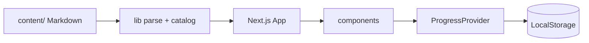

<div align="center">


<br/>

### Free tutorial school. One lesson, then that phase’s project. Zero backend.

**Live:** [interview-help.vercel.app](https://interview-help.vercel.app)

Computer Science · Git · Web · Data · AI · Networks · Cloud · DevOps · Cybersecurity · IT Administration · **Odoo**

<br/>

[](https://www.typescriptlang.org/)
[](https://nextjs.org/)
[](https://react.dev/)
[](https://tailwindcss.com/)
[](https://vitest.dev/)
[](https://interview-help.vercel.app)

<br/>

[](#the-catalog)
[-282A35?style=flat-square)](#tech-stack)
[](#content-source)
[](#deploy)

</div>

---

## At a glance

| Land | Learn | Prove |
|:---:|:---:|:---:|
| Paper home · course tiles · real counts | One lesson at a time · winding graph · playground | Phase builds · interview drills · browser progress |

```text
Home  →  Pick a course  →  Phase checkpoint  →  Lesson  →  Project
                ↓                                      ↓
           /progress graph                    Mark build complete → next phase
```

Architecture layers:

| Layer | Role | Where |
|:---|:---|:---|
| Presentation | Header, landing, lesson chrome, winding graph | `components/` |
| Application | Routes, progress API, playground | `app/`, `ProgressProvider` |
| Domain | Parse Markdown into courses, phases, briefs | `lib/` |
| Persistence | Visited lessons, completed projects | `localStorage` (`interview-help-progress-v2`) |

Hot-path rule: **Markdown in `content/` is canonical.** Rebuild the site and pages, search, and progress targets update with it.

---

## Tech stack

| Tool | Role |
|:---|:---|
| **Next.js 16** | App Router · static pages from Markdown |
| **React 19** | UI · winding roadmap · playground |
| **TypeScript** | End-to-end types |
| **Tailwind CSS v3** | Layout utilities; brand lives in `app/globals.css` |
| **react-markdown** | Lesson bodies (GFM, KaTeX, highlight) |
| **Monaco** | In-browser try-it / exercises |
| **Mermaid / KaTeX** | Diagrams and math |
| **Vitest** | Automated tests |
| **Lucide / react-icons** | Icons |

Client-only — no paid APIs, no database, no auth.

---

## Features

| Shared chrome | Visual language | Progress |
|:---|:---|:---|
| Sticky Quarry bar · hamburger on phone · search | Band `#282A35` · accent `#04AA6D` · paper `#F1F1F1` | Phase graph · themed reset dialog · export / import |

| Learning loop | Mobile | Deploy |
|:---|:---|:---|
| Lesson → phase project → interview drill | Full-width graph popup · checkpoint art scrolls · stacked pagers | Vercel · Next standalone · zero env secrets |

---

## The catalog

| Course | Route |
|:---|:---|
| Computer Science | `/courses/computer-science` |
| Git | `/courses/git` |
| Web Development | `/courses/web-development` |
| Data | `/courses/data` |
| Artificial Intelligence | `/courses/artificial-intelligence` |
| Computer Networks | `/courses/networks` |
| Cloud | `/courses/cloud` |
| DevOps | `/courses/devops` |
| Cybersecurity | `/courses/cybersecurity` |
| IT Administration | `/courses/it-administration` |
| Odoo | `/courses/odoo` |

Also: **`/`** home · **`/courses`** all tutorials · **`/projects`** phase builds · **`/interview`** spoken Q&A · **`/progress`** trail · **`/search`** · **`/playground`**.

A phase counts as done when you finish that phase’s project. Lessons alone do not raise the percent. The green marching path fills **up to the phase you are on** and stops there.

---

## Prerequisites

| Requirement | Notes |
|:---|:---|
| Node.js ≥ 20 · npm | Local development |
| Modern browser | LocalStorage for progress |

No database. No API keys.

---

## Setup

```bash
npm install
npm run dev
```

| Surface | URL |
|:---|:---|
| App | [http://localhost:3000](http://localhost:3000) |
| Production | [https://interview-help.vercel.app](https://interview-help.vercel.app) |

---

## Scripts

| Command | Purpose |
|:---|:---|
| `npm run dev` | Next.js development server |
| `npm run build` | Production build |
| `npm run start` | Serve production build |
| `npm run test` | Vitest (`tests/`) |
| `npm run validate:content` | Check Markdown against the catalog |

---

## Project layout

```text
quarry/
├── app/                         # Routes (courses, projects, interview, progress, playground)
├── components/                  # Landing, winding graph, lesson / project chrome
├── lib/                         # Catalog, Markdown parse, progress, playground
├── content/
│   ├── roadmaps/                # Eleven course sources
│   ├── guides/                  # Projects.md · Interview.md
│   └── templates/               # CV template
├── data/                        # Job tracker spreadsheet
├── scripts/                     # validate-content
├── tests/                       # Vitest
└── public/
```



---

## Design tokens

| Token | Role |
|:---|:---|
| Band `#282A35` | Header, checkpoint band, captions |
| Accent `#04AA6D` | CTAs, progress fill, left rules |
| Paper `#F1F1F1` | Page ground |
| Ink `#1A1A1A` | Body text |

Fonts: **Poppins** (display) · **Source Sans 3** (body) · **JetBrains Mono** (code).

---

## Content source

Markdown under `content/` is canonical.

| Path | Role |
|:---|:---|
| [`content/roadmaps`](./content/roadmaps) | Course source |
| [`content/guides/Projects.md`](./content/guides/Projects.md) | Phase project briefs |
| [`content/guides/Interview.md`](./content/guides/Interview.md) | Interview drills |
| [`content/templates`](./content/templates) | CV template |
| [`data/Job_Tracker.xlsx`](./data/Job_Tracker.xlsx) | Job tracker (`/downloads/job-tracker`) |

After you edit Markdown:

```bash
npm run validate:content
npm run test
npm run build
```

---

## Validation

```bash
npm run validate:content
npm run test
npm run build
```

Smoke: open `/`, pick a course, walk one lesson, open the phase project, mark the build complete, confirm `/progress` colors that node, Reset via the themed dialog (not the browser prompt).

---

## Deploy

### Vercel

Production: **[https://interview-help.vercel.app](https://interview-help.vercel.app)**

Import the repo with default Next.js settings. Each push rebuilds pages from current Markdown.

No environment variables required.

### Self-host

```bash
npm run build
npm run start
```

The production build uses Next.js standalone output.

---

## Author

**Mohammad Bilal** — Quarry is the website for these Interview Help roadmaps: software engineering, Git, data, networks, IT administration, AI, cybersecurity, Odoo, web, cloud, and DevOps.

---

<div align="center">


<br/>

**[Back to top](#at-a-glance)** · **[Open live](https://interview-help.vercel.app)**

<br/>

<sub>Quarry · 11 roadmaps · Next.js 16 · React 19 · Tailwind v3 · Vitest · Vercel</sub>

</div>
