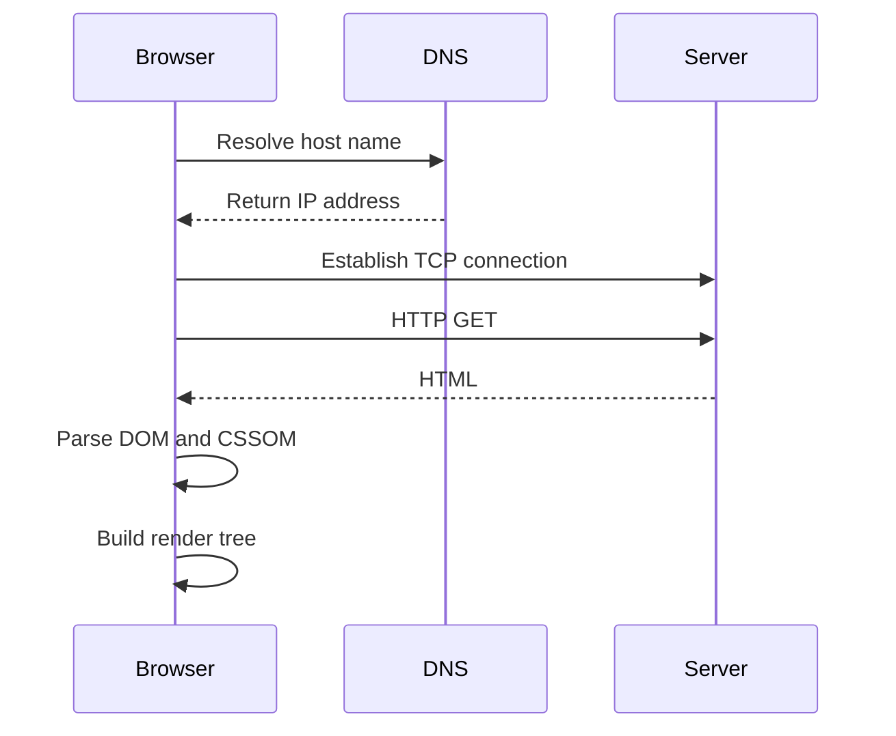
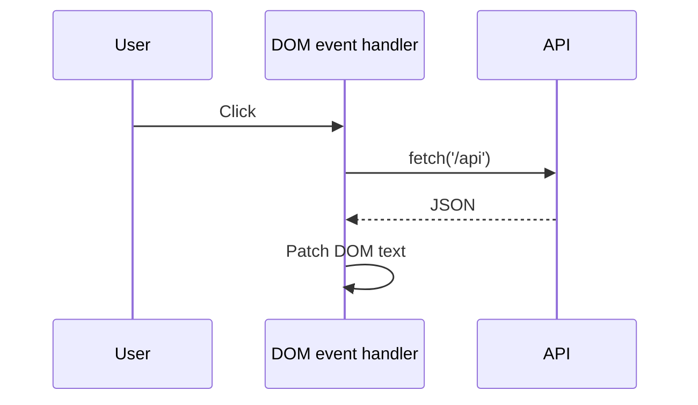
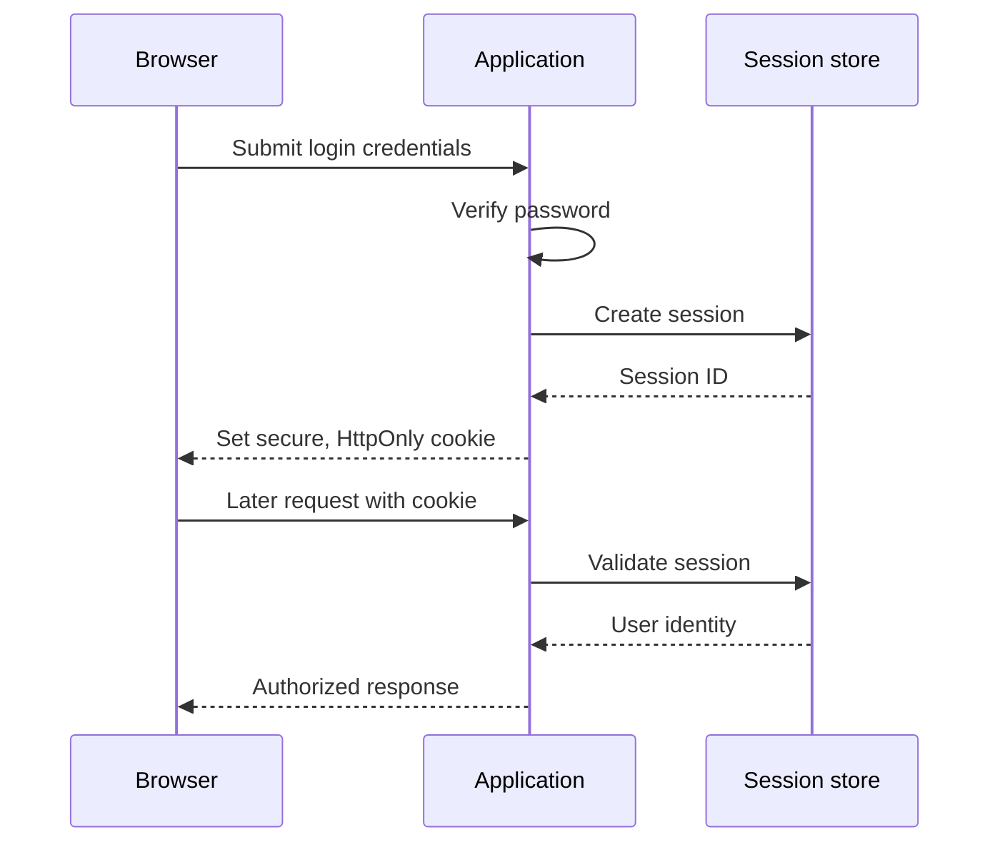
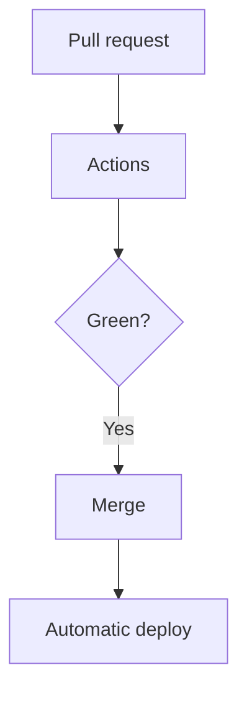

# The Zero-to-Hero Web Developer Roadmap

*Mohammad Bilal's complete, self-paced path from first HTML file to hire-ready full-stack web engineer - semantic markup, modern CSS, JavaScript and TypeScript, React and Next.js, Node.js and Express, REST APIs, databases, authentication, testing, performance, deployment, GraphQL, and portfolio/interview confident working knowledge - told as a connected story in which each new idea solves a problem left by the previous one.*

*Resources researched and link-verified with Composio on 2026-08-12 across YouTube, public web search, and GitHub, then checked against primary documentation from MDN, Chrome, TypeScript, React, Next.js, Node.js, Express, OpenAPI, PostgreSQL, Prisma, OWASP, the RFC Editor, Playwright, Docker, GraphQL, and Kubernetes. Every concept follows the CS.md visual-learning pattern: three curated videos, one interactive lab, written documentation, a GitHub implementation, and a practice platform.*

*Where this sits:* pair with [`Networks.md`](./Networks.md) Phases 12-14 for HTTP/TLS depth and [`CS.md`](./CS.md) Phases 13-16 for backend/security/testing theory. [`OOP.md`](./OOP.md) Part 0 helps if you are new to programming. CS Phase 13 becomes *protocol revision* once you finish Web Phases 1-12.

**Scope:** 40 concepts · 20 phases · connected step by step, with no artificial weekly deadline.

HTML/CSS → JavaScript → React/Next → Node/REST → Auth/DB/Test → Deploy → Hire

---

## How to Read This Document

### Start here if web development is completely new to you

The **browser** is the program that shows a website and sends requests. The **server** is another program that receives those requests and returns information. **HTML** gives a page its meaning and structure, **CSS** controls its appearance, and **JavaScript** adds behavior. An **API** is an agreed way for programs to ask each other for data or actions, while a **database** stores information that must remain after a request ends.

Keep one page open while you learn. Make one change, refresh it, and connect what you see to the exact line that caused it. Later, trace a request from the browser to the server and database, then back again. The frameworks are easier to understand once the basic trip is familiar.

**Words you will meet often:** the **DOM** is the browser's in-memory tree of page elements; **semantic HTML** uses elements whose names describe their meaning; **responsive design** makes a page work across screen sizes; a **component** is a reusable piece of interface; **state** is information that can change while the page runs; **asynchronous** work lets the program wait for slower tasks without freezing everything; **REST** is a common style for resource-based web APIs; **authentication** checks identity; **authorization** checks permission; a **session** stores an ongoing signed-in relationship; a **JWT** is a signed token carrying claims; an **ORM** lets code work with database records; a **migration** applies a planned database change; **server-side rendering (SSR)** creates page HTML on the server; and an **end-to-end test** checks a complete user path through the real application layers.

This is not a framework tutorial dump or a stack of unrelated notes. It is one connected explanation about pressure and response. A document needs meaning, so HTML appears. Meaning needs presentation, so CSS appears. Static presentation needs behavior, so JavaScript appears. Manual DOM work becomes fragile, so components appear. Components need durable data, so APIs and databases appear. Shared data needs identity, tests, performance work, and a reliable path to production. Every section opens at the limitation that forced the next tool to exist and closes at the crack that the following section will fill.

**There is no clock on this document.** No week numbers, no day-by-day plan, and no promise that understanding can be compressed into a fixed schedule. Move when you can explain why the previous idea was not enough, trace how the current idea works underneath, and name what it costs. That explanation-not time spent-is the unit of progress.

Read every concept in order on the first pass because the order is the argument. On revision, go directly to **Why You Are Learning This**, **What Happens Inside**, and **Why the Next Topic Is Needed**. Those three pieces reconstruct the causal chain; the resource list and implementation then reload the detail you have forgotten.

### Two Kinds of Work, One Shared Foundation

| Role | Primary question | Main work |
| --- | --- | --- |
| **Frontend Engineer** | How do users experience this interface fast and accessibly? | HTML/CSS/JS, React, performance, a11y |
| **Full-Stack Engineer** | How does data flow browser ↔ API ↔ database securely? | Node/Express, REST, SQL/ORM, auth, deploy |

Phases 1-10 front-load UI. Phases 11-18 backend and production. Phases 19-20 proof and hire.

### The Beginner-Friendly Pattern Every Topic Follows

| Element | What it gives you |
| --- | --- |
| **Why You Are Learning This** | The previous limitation |
| **See It Before You Memorize It** | Videos, docs, GitHub, practice |
| **Step-by-Step Explanation** | A step-by-step explanation in words |
| **The Idea That Fixed It** | Compact insight |
| **What Happens Inside** | ASCII diagram |
| **Picture It Like This** | Picture without a screen |
| **Trade-offs** | What you gain and what you give up |
| **Code** | Minimal runnable example |
| **Interview** | How an interviewer may ask about it |
| **Practice** | Easy → Hard |
| **Why the Next Topic Is Needed** | The remaining problem that makes the next topic useful |

---

## The Whole-Journey Map

```text
PHASE 1                 PHASE 2               PHASE 3                PHASE 4
 WEB THINKING            HTML                  CSS FUNDAMENTALS       CSS LAYOUT
    |                       |                      |                      |
 Browser/server           Semantics              Box model              Flex/Grid
 URL path                 Forms/a11y             Typography             Responsive

 PHASE 5                 PHASE 6               PHASE 7                PHASE 8
 JAVASCRIPT              TOOLING               TYPESCRIPT             REACT CORE
    |                       |                      |                      |
 DOM/events               DevTools/npm           Types/interfaces       Components/hooks
 fetch/async              Vite/env               Generics               Effects/forms

 PHASE 9                 PHASE 10              PHASE 11               PHASE 12
 REACT PATTERNS          NEXT.JS               NODE/EXPRESS           REST DESIGN
    |                       |                      |                      |
 Router/query             SSR/RSC               Middleware             Resources/status
 Context/server state     Server actions        Validation             Pagination/errors

 PHASE 13                PHASE 14              PHASE 15               PHASE 16
 DATABASES               AUTH                  TESTING                PERFORMANCE
    |                       |                      |                      |
 ORM/migrations           Sessions/JWT          RTL/Playwright         Web Vitals
 N+1/transactions         OAuth/RBAC            supertest              Caching/bundles

 PHASE 17                PHASE 18              PHASE 19               PHASE 20
 DEPLOY/CI               GRAPHQL/REALTIME      PORTFOLIO              INTERVIEWS
    |                       |                      |                      |
 Hosting/env              GraphQL/WS            README/demo            JS drills
 Docker/GHA               Webhooks              Capstone               Full-stack design
```

---

## Phase Index

| # | Phase | Goal | You'll be ready to move on when you can... |
| --- | --- | --- | --- |
| 01 | [Web Thinking](#phase-1---web-thinking) | See the browser-server contract and the request path before touching frameworks. | Explain client vs server, URL parts, and why the web is stateless HTTP on TCP. |
| 02 | [HTML Foundations](#phase-2---html-foundations) | Structure content so machines and humans both understand it. | Write semantic HTML, forms, and accessible markup without div soup. |
| 03 | [CSS Fundamentals](#phase-3---css-fundamentals) | Style and space content predictably. | Use cascade, specificity, and the box model without fighting layouts. |
| 04 | [CSS Layout & Responsive Design](#phase-4---css-layout--responsive-design) | Layout pages for phones, tablets, and desktops without brittle floats. | Build responsive UIs with Flexbox, Grid, and mobile-first media queries. |
| 05 | [JavaScript Fundamentals](#phase-5---javascript-fundamentals) | Add behavior: events, DOM updates, and async I/O. | Write modern JS: types, functions, arrays, objects, and DOM APIs. |
| 06 | [Browser APIs & Tooling](#phase-6---browser-apis--tooling) | Debug like a pro; package code with npm and bundlers. | Use DevTools, npm, Vite, and environment variables. |
| 07 | [TypeScript for Web](#phase-7---typescript-for-web) | Add static types to JavaScript for safer refactors when the amount of work grows. | Use interfaces, generics, and strict mode in frontend code. |
| 08 | [React Fundamentals](#phase-8---react-fundamentals) | Build UIs from components with declarative state. | Create React apps with components, props, state, and hooks. |
| 09 | [React Patterns & State](#phase-9---react-patterns--state) | Scale UI logic with routing, context, and server state libraries. | Route pages, share state safely, and fetch data in React apps. |
| 10 | [Next.js & Full-Stack React](#phase-10---nextjs--full-stack-react) | Ship React with routing, SSR, and API routes in one framework. | Build with Next.js App Router, server components, and server actions. |
| 11 | [Node.js & Express](#phase-11---nodejs--express) | Run JavaScript on the server with an HTTP framework. | Build REST servers with Node, Express, middleware, and error handling. |
| 12 | [REST API Design](#phase-12---rest-api-design) | Design resources, status codes, and versioning developers trust. | Model nouns as resources; use HTTP methods correctly; document with OpenAPI. |
| 13 | [Databases for Web Apps](#phase-13---databases-for-web-apps) | Persist data with relational schemas and an ORM. | Model entities in PostgreSQL/SQLite with Prisma or Drizzle. |
| 14 | [Authentication & Authorization](#phase-14---authentication--authorization) | Know who the user is and what they may do. | Implement sessions, JWT, password hashing, and RBAC basics. |
| 15 | [Testing Web Applications](#phase-15---testing-web-applications) | Automate confidence: unit, integration, and end-to-end. | Test React with Vitest/RTL; API with supertest; E2E with Playwright. |
| 16 | [Performance & Web Vitals](#phase-16---performance--web-vitals) | Fast sites convert; slow sites lose users and SEO rank. | Optimize LCP, INP, CLS; lazy-load; cache HTTP and CDN. |
| 17 | [Deployment & CI/CD](#phase-17---deployment--cicd) | Ship reliably: build pipelines, hosting, containers, env separation. | Deploy to Vercel/Railway/Fly; Docker basics; GitHub Actions CI. |
| 18 | [GraphQL, WebSockets & Modern APIs](#phase-18---graphql-websockets--modern-apis) | When REST is not enough: typed graphs, realtime, and webhooks. | Contrast GraphQL vs REST; use subscriptions/WebSockets; secure webhooks. |
| 19 | [Portfolio & Capstone Projects](#phase-19---portfolio--capstone-projects) | Public repos with READMEs beat certificate collections. | Ship 2-3 full-stack apps documented for recruiters. |
| 20 | [Web Developer Interviews](#phase-20---web-developer-interviews) | Speak HTML→deploy fluently under time pressure. | Drill frontend, backend, system design lite, and behavioral stories. |

### Anchor Resources (bookmark these)

- Roadmap map: [roadmap.sh/full-stack](https://roadmap.sh/full-stack) · [roadmap.sh/frontend](https://roadmap.sh/frontend) · [roadmap.sh/backend](https://roadmap.sh/backend)
- MDN: [Learn web development](https://developer.mozilla.org/en-US/docs/Learn_web_development) · [HTML](https://developer.mozilla.org/en-US/docs/Web/HTML) · [CSS](https://developer.mozilla.org/en-US/docs/Web/CSS) · [JavaScript](https://developer.mozilla.org/en-US/docs/Web/JavaScript)
- Courses: [freeCodeCamp Responsive Web Design](https://www.freecodecamp.org/learn/2022/responsive-web-design/) · [freeCodeCamp JS Algorithms](https://www.freecodecamp.org/learn/javascript-algorithms-and-data-structures/) · [The Odin Project](https://www.theodinproject.com/)
- Frameworks: [React docs](https://react.dev/) · [Next.js docs](https://nextjs.org/docs) · [Node.js docs](https://nodejs.org/docs/latest/api/) · [Express guide](https://expressjs.com/en/guide/routing.html)
- Data & auth: [Prisma docs](https://www.prisma.io/docs) · [OWASP Cheat Sheet Series](https://cheatsheetseries.owasp.org/)
- Testing & perf: [Playwright docs](https://playwright.dev/) · [web.dev performance](https://web.dev/performance/)
- GitHub lists: [enaqx/awesome-react](https://github.com/enaqx/awesome-react) · [unicodeveloper/awesome-nextjs](https://github.com/unicodeveloper/awesome-nextjs) · [bmorelli25/Become-A-Full-Stack-Web-Developer](https://github.com/bmorelli25/Become-A-Full-Stack-Web-Developer) · [lauragift21/awesome-learning-resources](https://github.com/lauragift21/awesome-learning-resources) · [zhashkevych/awesome-backend](https://github.com/zhashkevych/awesome-backend)
- Interview bank: [aershov24/full-stack-interview-questions](https://github.com/aershov24/full-stack-interview-questions)
- Projects in this repo: [`Projects.md`](./Projects.md) Web section · spoken drills [`Interview.md`](./Interview.md) Track W

---

<a id="phase-1"></a>

# PHASE 1 - Web Thinking

**Track:** Foundations

**WHAT YOU WILL BE ABLE TO DO:** See the browser-server contract and the request path before touching frameworks.

**WHAT YOU SHOULD KNOW FIRST:** None - this is the browser/server ground floor. [`OOP.md`](./OOP.md) Part 0 can wait until the backend half.

**WHAT YOU HAVE LEARNED SO FAR:** A web developer's first mistake is often to begin with a framework. This phase begins one layer lower. Before React, routing, or databases, there is a browser asking another machine for a resource. Once that journey is visible, every later tool has a precise place in the story instead of looking like magic.

## 1.1 The Web as Client-Server Documents

**WHY YOU ARE LEARNING THIS:** Browsers request resources; servers return bytes with metadata. Every framework is sugar on this. This is the pressure left behind by the previous step, and it is the reason this concept enters the roadmap here rather than as an isolated item to memorize.

**THE PROBLEM THIS SOLVES:** Static files on disk could not scale to millions of users or dynamic data.

**SEE IT BEFORE YOU MEMORIZE IT**

- Best animated explanation: [🌐 How the Web Really Works! DNS, HTTP & HTTPS Explained with Animations 🚀 (Thapa Technical)](https://www.youtube.com/watch?v=PANUQGHgxCI) - Title promises animations; short (9 min) visual walkthrough of DNS, HTTP & HTTPS.
- Alternative: [How The Web Works - The Big Picture (Academind)](https://www.youtube.com/watch?v=hJHvdBlSxug) - Academind provides a thorough, accurate high‑level client‑server overview; reputable channel, 12 min.
- Another angle: [DNS Explained in 100 Seconds (Fireship)](https://www.youtube.com/watch?v=UVR9lhUGAyU) - Fireship’s 2 min DNS‑focused animation adds a focused, practical perspective.
- Interactive simulator: [httpbin](https://httpbin.org/) - send requests and inspect the exact headers, status, and body returned by a real HTTP service
- Written documentation: [How the web works (MDN)](https://developer.mozilla.org/en-US/docs/Learn_web_development/Getting_started/Web_standards/How_the_web_works)
- GitHub implementation: [mdn/content](https://github.com/mdn/content) - inspect the source behind MDN's HTTP and browser-platform explanations
- Practice platform: [MDN web-mechanics exercises](https://developer.mozilla.org/en-US/docs/Learn_web_development/Getting_started/Web_standards/How_the_web_works) - narrate every hop for three different URLs

**STEP-BY-STEP EXPLANATION**

URL scheme/host/path/query/hash; HTML/CSS/JS roles; first paint vs hydration preview.

A URL is not an address in the same sense as a street number. It is an instruction: choose a protocol, find the machine responsible for a host name, ask that machine for a path, and optionally attach a query and fragment. DNS turns the human name into an IP address; a transport connection creates a reliable path; HTTP gives the bytes the shape of a request and response. Only then does the browser receive HTML and discover the CSS, JavaScript, images, and fonts required to finish the page.

The browser does not display the HTML file directly. It parses HTML into the DOM, parses CSS into the CSSOM, combines them into a render tree, calculates layout, and paints pixels. JavaScript may change the DOM or styles and force some of those stages to run again. That is why a page can have a fast server response and still feel slow: the network delivered the ingredients, but the browser still has work to assemble them.

Keep client and server responsibilities separate. The client owns presentation and immediate interaction; the server owns protected rules, shared data, and secrets. A browser is controlled by the user, so anything shipped to it can be inspected or changed. This boundary will explain later why client-side validation improves experience but never provides security, and why environment values included in a frontend bundle are public.

**THE MAIN IDEA IN SIMPLE WORDS:** Treat every page load as: resolve name, connect, request, response, parse, render.

**WHAT HAPPENS INSIDE, ONE STEP AT A TIME**



Read the flow from top to bottom. The important change is **treat every page load as: resolve name, connect, request, response, parse, render.** Each arrow is a boundary where DevTools, a log, a test, or a measurement can later prove what actually happened.

**PICTURE IT LIKE THIS**

Restaurant menu (HTML), plating (CSS), waiter scripts (JS), kitchen (server).

**WHAT YOU GAIN, WHAT IT COSTS, AND WHERE IT CAN FAIL**

| Choice | What it buys | What it costs |
| --- | --- | --- |
| Keep the earlier approach | Avoid introducing another concept | Static files on disk could not scale to millions of users or dynamic data. |
| Adopt this concept | Static hosting is cheap | dynamic apps need server logic and databases later. |
| Push beyond its natural limit | Delays the next abstraction | Dynamic pages and SPAs need more than file servers. |

**SMALL WORKING EXAMPLE**

```bash
curl -I https://example.com and label each response header you recognize.
```

**HOW TO EXPLAIN THIS IN AN INTERVIEW:** What happens when you open a URL? Name the first five steps. A strong answer starts from the limitation, traces the mechanism in the diagram, and ends with one cost from the trade-off table; naming the tool without that chain is only vocabulary.

**PRACTICE UNTIL IT FEELS FAMILIAR**

| Difficulty | Task |
| --- | --- |
| Easy | curl -I https://example.com and label each response header you recognize. Then annotate what each important line or step contributes. |
| Medium | Reproduce the internal flow for **The Web as Client-Server Documents** with one failure inserted; use the browser, logs, or tests to identify the exact boundary where it appears. |
| Hard | Build a small artifact that combines this concept with the previous phase, measure one trade-off above, and defend the design without naming a library until after the requirement is clear. |

**WHY THE NEXT TOPIC IS NEEDED:** Dynamic pages and SPAs need more than file servers. What you have built is now useful enough to expose that limitation clearly. The next concept is not a fashionable addition; it is the smallest answer to this new pressure.

---

## 1.2 Dev Environment and Project Shape

**WHY YOU ARE LEARNING THIS:** Editors, browsers, terminals, and a repeatable folder layout beat tutorial hopping. This is the pressure left behind by the previous step, and it is the reason this concept enters the roadmap here rather than as an isolated item to memorize.

**THE PROBLEM THIS SOLVES:** Copy-pasting into CodePen never ships; production needs modules, builds, and env vars.

**SEE IT BEFORE YOU MEMORIZE IT**

- Best animated explanation: [21+ Browser Dev Tools & Tips You Need To Know (Fireship)](https://www.youtube.com/watch?v=TcTSqhpm80Y) - Fireship uses fast‑paced animated demos of DevTools tricks; 9 min, high engagement.
- Alternative: [HTML vs DOM? Let’s debug them #DevToolsTips (Chrome for Developers)](https://www.youtube.com/watch?v=J-02VNxE7lE) - Chrome for Developers (Google) gives an accurate, concise HTML vs DOM explanation; official source.
- Another angle: [Chrome DevTools Complete Course - Learn to debug your frontend code (Mehul Mohan)](https://www.youtube.com/watch?v=Y3u2groOG-A) - complete and detailed 1 h 53 min course offers deep, practical debugging workflows beyond quick tips.
- Interactive simulator: [Chrome DevTools](https://developer.chrome.com/docs/devtools/) - inspect and edit a live page, then trace console and network activity
- Written documentation: [Visual Studio Code documentation](https://code.visualstudio.com/docs)
- GitHub implementation: [ChromeDevTools/devtools-frontend](https://github.com/ChromeDevTools/devtools-frontend) - study the actual frontend that powers Chrome DevTools
- Practice platform: [The Odin Project Foundations](https://www.theodinproject.com/paths/foundations/courses/foundations) - build and run projects with Git, terminal, editor, and browser tooling

**STEP-BY-STEP EXPLANATION**

package.json, node_modules, .env, gitignore, README, src vs public folders.

A development environment is a promise that the same repository can be understood and started twice. The editor is only one participant. The terminal runs tools, the browser runs the result, the package manager records dependencies, version control records changes, and the README tells another human how the pieces fit. If setup lives only in one person's memory, the project is not reproducible.

`package.json` is the executable index of a JavaScript project: it names dependencies and gives common operations stable commands. A lockfile records the exact dependency graph so two installations do not silently receive different transitive versions. `src/` contains code that passes through the toolchain; `public/` contains files copied as-is; `.gitignore` excludes generated dependencies, builds, local caches, and secrets. `.env.example` documents required configuration without containing credentials.

The clean-machine test is the standard to aim for: clone the repository, copy the example environment file, install from the lockfile, and run one documented command. When that sequence fails, the failure exposes hidden state. Fixing it early prevents the same hidden state from becoming a deployment incident in Phase 17.

**THE MAIN IDEA IN SIMPLE WORDS:** One command (`npm run dev`) should boot the app on a clean machine.

**WHAT HAPPENS INSIDE, ONE STEP AT A TIME**

repo/ src/ public/ package.json .env.example README.md

Read the flow from top to bottom. The important change is **one command (`npm run dev`) should boot the app on a clean machine.** Each arrow is a boundary where DevTools, a log, a test, or a measurement can later prove what actually happened.

**PICTURE IT LIKE THIS**

Workshop bench: tools fixed, project blueprints reusable.

**WHAT YOU GAIN, WHAT IT COSTS, AND WHERE IT CAN FAIL**

| Choice | What it buys | What it costs |
| --- | --- | --- |
| Keep the earlier approach | Avoid introducing another concept | Copy-pasting into CodePen never ships; production needs modules, builds, and env vars. |
| Adopt this concept | Monorepos and Docker come later | start with one app one repo. |
| Push beyond its natural limit | Delays the next abstraction | Raw HTML/CSS/JS fundamentals before frameworks. |

**SMALL WORKING EXAMPLE**

```tsx
Scaffold Vite + React or plain HTML repo with npm scripts documented.
```

**HOW TO EXPLAIN THIS IN AN INTERVIEW:** What belongs in .gitignore for a Node web app? A strong answer starts from the limitation, traces the mechanism in the diagram, and ends with one cost from the trade-off table; naming the tool without that chain is only vocabulary.

**PRACTICE UNTIL IT FEELS FAMILIAR**

| Difficulty | Task |
| --- | --- |
| Easy | Scaffold Vite + React or plain HTML repo with npm scripts documented. Then annotate what each important line or step contributes. |
| Medium | Reproduce the internal flow for **Dev Environment and Project Shape** with one failure inserted; use the browser, logs, or tests to identify the exact boundary where it appears. |
| Hard | Build a small artifact that combines this concept with the previous phase, measure one trade-off above, and defend the design without naming a library until after the requirement is clear. |

**WHY THE NEXT TOPIC IS NEEDED:** Raw HTML/CSS/JS fundamentals before frameworks. What you have built is now useful enough to expose that limitation clearly. The next concept is not a fashionable addition; it is the smallest answer to this new pressure.

---

> **Phase 1 complete?** [Build the Phase 1 mini-project](./Projects.md#web-phase-1-project) · [Continue to Phase 2](#phase-2---html-foundations)

<a id="phase-2"></a>

# PHASE 2 - HTML Foundations

**Track:** Frontend

**WHAT YOU WILL BE ABLE TO DO:** Structure content so machines and humans both understand it.

**WHAT YOU SHOULD KNOW FIRST:** Phase 1 - the new phase begins where its final bridge stops

**WHAT YOU HAVE LEARNED SO FAR:** Phase 1 showed that the server can return bytes, but bytes alone do not tell a browser which text is a heading, which control submits data, or which region is navigation. HTML supplies that shared vocabulary. The goal is not to make a page pretty; it is to make its meaning survive different browsers, devices, search engines, and assistive technologies.

## 2.1 Semantics, Structure, and Accessibility

**WHY YOU ARE LEARNING THIS:** `<header>`, `<nav>`, `<main>`, `<article>` carry meaning; `<div>` carries none. This is the pressure left behind by the previous step, and it is the reason this concept enters the roadmap here rather than as an isolated item to memorize.

**THE PROBLEM THIS SOLVES:** Div-only pages confuse screen readers and SEO; structure was bolted on visually in CSS.

**SEE IT BEFORE YOU MEMORIZE IT**

- Best animated explanation: [Semantic HTML Tags | HTML5 Semantic Elements Tutorial (Dave Gray)](https://www.youtube.com/watch?v=kX3TfdUqpuU) - Dave Gray’s tutorial includes visual demos of semantic tags; 24 min, solid production.
- Alternative: [Web Accessibility: What Is Semantic HTML? (Stefany Newman - Accessibility Instructor)](https://www.youtube.com/watch?v=4AjCRUuvwbI) - Stefany Newman, accessibility instructor, gives accurate semantics fundamentals; credible niche expert.
- Another angle: [Semantic HTML for accessible web design: Fix your site in minutes (Elementor)](https://www.youtube.com/watch?v=l89I-em1Lnc) - Elementor’s 2 min clip ties semantic HTML to SEO & accessibility, offering a practical business view.
- Interactive simulator: [W3C Nu HTML Checker](https://validator.w3.org/nu/) - paste a page and turn every semantic or structural error into a repair drill
- Written documentation: [HTML reference (MDN)](https://developer.mozilla.org/en-US/docs/Web/HTML)
- GitHub implementation: [mdn/content](https://github.com/mdn/content) - trace semantic HTML and accessibility examples back to maintained source
- Practice platform: [freeCodeCamp Responsive Web Design](https://www.freecodecamp.org/learn/2022/responsive-web-design/) - complete semantic and accessibility projects with automated checks

**STEP-BY-STEP EXPLANATION**

Headings hierarchy, landmarks, alt text, labels tied to inputs, keyboard focus order.

HTML is a tree of meaning, not a bag of rectangles. A heading introduces a section, a `nav` groups major navigation, a `main` identifies the page's primary content, and a `button` represents an action. Browsers convert that structure into both the DOM used by scripts and an accessibility tree used by assistive technology. Choosing the right element therefore gives behavior, keyboard support, and meaning before any ARIA attribute is added.

Headings should describe document hierarchy rather than desired font size. Landmarks let a screen-reader user jump between major regions. Form controls need programmatic names, images need alternatives appropriate to their purpose, and interactive elements must be reachable and operable from a keyboard. Visual order, DOM order, and focus order should agree; CSS can move a box without changing the reading order, which can create a page that looks correct and narrates incoherently.

Native semantics are the strong default because they encode years of browser behavior. ARIA can describe a missing semantic, but it does not automatically add keyboard interaction or state management. A custom `div` button requires recreating focusability, Enter and Space behavior, disabled state, and an accessible role. The ordinary `button` already has all of it.

**THE MAIN IDEA IN SIMPLE WORDS:** HTML describes *what*; CSS describes *how it looks*; never swap their jobs.

**WHAT HAPPENS INSIDE, ONE STEP AT A TIME**

```text
header/nav/main/footer tree
one h1 per page
label for=id on inputs
```

Read the flow from top to bottom. The important change is **hTML describes *what*; CSS describes *how it looks*; never swap their jobs.** Each arrow is a boundary where DevTools, a log, a test, or a measurement can later prove what actually happened.

**PICTURE IT LIKE THIS**

Blueprint labels on rooms vs paint color.

**WHAT YOU GAIN, WHAT IT COSTS, AND WHERE IT CAN FAIL**

| Choice | What it buys | What it costs |
| --- | --- | --- |
| Keep the earlier approach | Avoid introducing another concept | Div-only pages confuse screen readers and SEO; structure was bolted on visually in CSS. |
| Adopt this concept | Semantic tags slightly verbose | worth it for a11y and maintenance. |
| Push beyond its natural limit | Delays the next abstraction | CSS controls layout of semantic blocks. |

**SMALL WORKING EXAMPLE**

```javascript
Build accessible login form with labels, fieldset, aria-live for errors.
```

**HOW TO EXPLAIN THIS IN AN INTERVIEW:** Why is `<button>` better than `<div onclick>`? A strong answer starts from the limitation, traces the mechanism in the diagram, and ends with one cost from the trade-off table; naming the tool without that chain is only vocabulary.

**PRACTICE UNTIL IT FEELS FAMILIAR**

| Difficulty | Task |
| --- | --- |
| Easy | Build accessible login form with labels, fieldset, aria-live for errors. Then annotate what each important line or step contributes. |
| Medium | Reproduce the internal flow for **Semantics, Structure, and Accessibility** with one failure inserted; use the browser, logs, or tests to identify the exact boundary where it appears. |
| Hard | Build a small artifact that combines this concept with the previous phase, measure one trade-off above, and defend the design without naming a library until after the requirement is clear. |

**WHY THE NEXT TOPIC IS NEEDED:** CSS controls layout of semantic blocks. What you have built is now useful enough to expose that limitation clearly. The next concept is not a fashionable addition; it is the smallest answer to this new pressure.

---

## 2.2 Forms, Media, and Metadata

**WHY YOU ARE LEARNING THIS:** Most web apps are forms over HTTP; get method, encoding, and validation right. This is the pressure left behind by the previous step, and it is the reason this concept enters the roadmap here rather than as an isolated item to memorize.

**THE PROBLEM THIS SOLVES:** Unlabeled forms fail users and security reviews; metadata controls sharing and SEO.

**SEE IT BEFORE YOU MEMORIZE IT**

- Best animated explanation: [Learn HTML forms in 8 minutes 📝 (Bro Code)](https://www.youtube.com/watch?v=2O8pkybH6po) - use this first for a compact visual pass through controls, labels, methods, and submission before reading the protocol details below
- Alternative: [Learn HTML Forms In 25 Minutes (Web Dev Simplified)](https://www.youtube.com/watch?v=fNcJuPIZ2WE) - slows the same material down and builds a complete form, which makes the relationship between markup and submitted name-value pairs easier to see
- Another angle: [HTML Forms Tutorial: From Basics to Form Validation (Tech Hive)](https://www.youtube.com/watch?v=X9RZ4a88n3c) - concentrates on constraint validation and failure feedback, the exact boundary where browser convenience must be separated from server security
- Interactive simulator: [minigames.dev](https://minigames.dev/) - use Form Builder Rush to practise accessible controls and native form behaviour
- Written documentation: [Web forms (MDN)](https://developer.mozilla.org/en-US/docs/Learn_web_development/Extensions/Forms)
- GitHub implementation: [mdn/content](https://github.com/mdn/content) - explore form, media, responsive-image, and metadata examples
- Practice platform: [Frontend Mentor form challenges](https://www.frontendmentor.io/challenges?type=free&languages=HTML%7CCSS%7CJS) - implement real forms, validation states, images, and metadata

**STEP-BY-STEP EXPLANATION**

GET vs POST, enctype multipart, required/pattern, input types, meta viewport.

A form is the browser's built-in protocol adapter. Each successful control contributes a name-value pair; the form method decides how those pairs travel; the action chooses the destination; and the encoding decides how bytes are represented. `GET` places data in the URL, which makes searches bookmarkable and cacheable. `POST` places data in the request body, which suits changes and larger or sensitive payloads, although HTTPS-not the body-is what protects it in transit.

The `name` attribute is the key sent to the server; `id` connects a control to its label and to local document references. Native input types give mobile keyboards and browsers useful hints. Constraint attributes such as `required`, `min`, and `pattern` provide immediate feedback, but the server must repeat every rule because a caller can bypass the page entirely.

Media and metadata extend the same principle of describing intent. Responsive images let the browser choose an appropriate source before downloading; captions and text alternatives preserve meaning; the viewport declaration makes CSS pixels behave sensibly on mobile. Titles, descriptions, canonical URLs, and social-card metadata do not change the visible article, but they determine how the document is identified outside itself.

**THE MAIN IDEA IN SIMPLE WORDS:** Forms are the UI for HTTP methods you will design in REST APIs later.

**WHAT HAPPENS INSIDE, ONE STEP AT A TIME**

```text
form method action
  |
  v
server route
  |
  v
validation
  |
  v
redirect/JSON
```

Read the flow from top to bottom. The important change is **forms are the UI for HTTP methods you will design in REST APIs later.** Each arrow is a boundary where DevTools, a log, a test, or a measurement can later prove what actually happened.

**PICTURE IT LIKE THIS**

Paper form mailed to office (POST) vs bookmarkable search (GET).

**WHAT YOU GAIN, WHAT IT COSTS, AND WHERE IT CAN FAIL**

| Choice | What it buys | What it costs |
| --- | --- | --- |
| Keep the earlier approach | Avoid introducing another concept | Unlabeled forms fail users and security reviews; metadata controls sharing and SEO. |
| Adopt this concept | Client validation is UX | server validation is mandatory. |
| Push beyond its natural limit | Delays the next abstraction | Box model and spacing come from CSS. |

**SMALL WORKING EXAMPLE**

```javascript
Contact form with client hints + documented server rules (even if mocked).
```

**HOW TO EXPLAIN THIS IN AN INTERVIEW:** Difference between name and id on inputs? A strong answer starts from the limitation, traces the mechanism in the diagram, and ends with one cost from the trade-off table; naming the tool without that chain is only vocabulary.

**PRACTICE UNTIL IT FEELS FAMILIAR**

| Difficulty | Task |
| --- | --- |
| Easy | Contact form with client hints + documented server rules (even if mocked). Then annotate what each important line or step contributes. |
| Medium | Reproduce the internal flow for **Forms, Media, and Metadata** with one failure inserted; use the browser, logs, or tests to identify the exact boundary where it appears. |
| Hard | Build a small artifact that combines this concept with the previous phase, measure one trade-off above, and defend the design without naming a library until after the requirement is clear. |

**WHY THE NEXT TOPIC IS NEEDED:** Box model and spacing come from CSS. What you have built is now useful enough to expose that limitation clearly. The next concept is not a fashionable addition; it is the smallest answer to this new pressure.

---

> **Phase 2 complete?** [Build the Phase 2 mini-project](./Projects.md#web-phase-2-project) · [Continue to Phase 3](#phase-3---css-fundamentals)

<a id="phase-3"></a>

# PHASE 3 - CSS Fundamentals

**Track:** Frontend

**WHAT YOU WILL BE ABLE TO DO:** Style and space content predictably.

**WHAT YOU SHOULD KNOW FIRST:** Phase 2 - the new phase begins where its final bridge stops

**WHAT YOU HAVE LEARNED SO FAR:** Semantic HTML gives the document meaning, but an unstyled document cannot express hierarchy, spacing, brand, or emphasis. CSS enters as a separate language because appearance changes far more often than meaning. This phase builds the rules that decide which declaration wins and how every visible element occupies space.

## 3.1 Cascade, Specificity, and the Box Model

**WHY YOU ARE LEARNING THIS:** Every pixel on screen is a box: content, padding, border, margin. This is the pressure left behind by the previous step, and it is the reason this concept enters the roadmap here rather than as an isolated item to memorize.

**THE PROBLEM THIS SOLVES:** Global CSS files became unmaintainable without rules for override order.

**SEE IT BEFORE YOU MEMORIZE IT**

- Best animated explanation: [Learn CSS Specificity In 11 Minutes (Web Dev Simplified)](https://www.youtube.com/watch?v=CHyPGSpIhSs) - Web Dev Simplified explains CSS specificity with animated diagrams; 11 min, high engagement.
- Alternative: [CSS Layers Are Changing How Specificity Works (Web Dev Simplified)](https://www.youtube.com/watch?v=Pr1PezCc4FU) - Same channel’s deeper look at CSS layers and modern specificity; accurate and credible.
- Another angle: [How to Understand CSS Specificity (CSS Cascade) | CSS Beginner Tutorial (Professor K Explains)](https://www.youtube.com/watch?v=6QeYiCS3Yj8) - Professor K offers a beginner‑friendly, step‑by‑step walkthrough of the cascade and specificity.
- Interactive simulator: [CSS Diner](https://flukeout.github.io/) - solve selector puzzles before testing cascade and specificity changes in DevTools
- Written documentation: [CSS cascading and inheritance (MDN)](https://developer.mozilla.org/en-US/docs/Web/CSS/CSS_cascade)
- GitHub implementation: [mdn/content](https://github.com/mdn/content) - find runnable cascade, specificity, inheritance, and box-model samples
- Practice platform: [web.dev Learn CSS](https://web.dev/learn/css/) - complete cascade, specificity, inheritance, selector, and box-model modules

**STEP-BY-STEP EXPLANATION**

Selectors, inheritance, specificity weights, box-sizing border-box.

CSS is a conflict-resolution system before it is a design language. Several declarations may target the same property, so the browser resolves origin and importance, cascade layers, specificity, scoping proximity, and source order. Inheritance then carries selected values-such as color and font-from parent to child. When developers jump straight to increasing selector strength, stylesheets become an arms race that only `!important` can win.

The box model explains where the resolved styles go. Content has a width and height; padding surrounds the content; border surrounds the padding; margin separates the box from its neighbors. Under `content-box`, a declared width excludes padding and border. Under `border-box`, it includes them, which makes component dimensions far easier to reason about. Margin collapse, intrinsic sizes, overflow, and min-content constraints explain many layouts that appear to ignore the declared width.

Maintainable CSS keeps selector specificity deliberately low, gives components clear ownership, and lets layout containers control spacing through `gap`. Utility classes, BEM, modules, and CSS-in-JS organize ownership differently, but none cancels the cascade. The durable skill is to inspect which rule won and explain why.

**THE MAIN IDEA IN SIMPLE WORDS:** Prefer classes + low specificity; avoid !important arms races.

**WHAT HAPPENS INSIDE, ONE STEP AT A TIME**

```text
margin collapse
border-box vs content-box width math
```

Read the flow from top to bottom. The important change is **prefer classes + low specificity; avoid !important arms races.** Each arrow is a boundary where DevTools, a log, a test, or a measurement can later prove what actually happened.

**PICTURE IT LIKE THIS**

Paint on walls vs moving walls (margin).

**WHAT YOU GAIN, WHAT IT COSTS, AND WHERE IT CAN FAIL**

| Choice | What it buys | What it costs |
| --- | --- | --- |
| Keep the earlier approach | Avoid introducing another concept | Global CSS files became unmaintainable without rules for override order. |
| Adopt this concept | Utility-first (Tailwind) trades semantic CSS files for speed. | Learning curve |
| Push beyond its natural limit | Delays the next abstraction | Flexbox solves one-dimensional alignment. |

**SMALL WORKING EXAMPLE**

```javascript
Card component styled three ways: inline, one class, BEM block.
```

**HOW TO EXPLAIN THIS IN AN INTERVIEW:** What beats `#id .class`? A strong answer starts from the limitation, traces the mechanism in the diagram, and ends with one cost from the trade-off table; naming the tool without that chain is only vocabulary.

**PRACTICE UNTIL IT FEELS FAMILIAR**

| Difficulty | Task |
| --- | --- |
| Easy | Card component styled three ways: inline, one class, BEM block. Then annotate what each important line or step contributes. |
| Medium | Reproduce the internal flow for **Cascade, Specificity, and the Box Model** with one failure inserted; use the browser, logs, or tests to identify the exact boundary where it appears. |
| Hard | Build a small artifact that combines this concept with the previous phase, measure one trade-off above, and defend the design without naming a library until after the requirement is clear. |

**WHY THE NEXT TOPIC IS NEEDED:** Flexbox solves one-dimensional alignment. What you have built is now useful enough to expose that limitation clearly. The next concept is not a fashionable addition; it is the smallest answer to this new pressure.

---

## 3.2 Typography, Color, and Variables

**WHY YOU ARE LEARNING THIS:** Readable type scale and contrast matter more than fancy gradients. This is the pressure left behind by the previous step, and it is the reason this concept enters the roadmap here rather than as an isolated item to memorize.

**THE PROBLEM THIS SOLVES:** Hard-coded hex everywhere breaks theming and dark mode.

**SEE IT BEFORE YOU MEMORIZE IT**

- Best animated explanation: [CSS Variables in 100 Seconds (Fireship)](https://www.youtube.com/watch?v=NtRmIp4eMjs) - Fireship’s 1m56s video uses their signature animated whiteboard style to clearly illustrate CSS variables and theming.
- Alternative: [Color & custom properties - Designing in the Browser (Chrome for Developers)](https://www.youtube.com/watch?v=HxJnvCOC2vQ) - Chrome for Developers provides an accurate, in‑depth walkthrough of color and custom properties with real‑world examples.
- Another angle: [CSS Variables | Custom Properties Tutorial for beginners (Coding2GO)](https://www.youtube.com/watch?v=W5_5WvYjPeI) - Coding2GO offers a beginner‑focused, practical tutorial that walks through setting up and using CSS variables in a project.
- Interactive simulator: [WebAIM Contrast Checker](https://webaim.org/resources/contrastchecker/) - change foreground and background tokens and see WCAG contrast results immediately
- Written documentation: [CSS colors (MDN)](https://developer.mozilla.org/en-US/docs/Web/CSS/CSS_colors)
- GitHub implementation: [mdn/content](https://github.com/mdn/content) - inspect maintained examples for color, fonts, and custom properties
- Practice platform: [Frontend Mentor](https://www.frontendmentor.io/challenges) - reproduce typography, tokens, themes, and accessible color systems from designs

**STEP-BY-STEP EXPLANATION**

rem/em, line-height, system font stacks, CSS variables for theme tokens.

Typography is interface geometry. Font metrics determine line breaks, element height, and therefore layout; line-height determines whether paragraphs are readable; measure determines whether the eye can find the next line. A type scale creates hierarchy with a small set of related sizes instead of unrelated guesses. Relative units let that hierarchy respond to user preferences and context.

Color has two jobs: express a system and preserve information. Design tokens such as `--color-surface`, `--color-text`, and `--space-md` name roles rather than literal values, so a theme can change centrally. Contrast must remain sufficient in every state, and color should not be the only signal for error, success, focus, or selection. System preferences such as dark mode and reduced motion are inputs, not decorations.

Web fonts introduce a network dependency into layout. A fallback font may render first and then shift when the custom font arrives. Good font loading therefore balances brand, file size, glyph coverage, caching, and layout stability. The browser cannot make that trade-off for you because it does not know which quality matters most to the product.

**THE MAIN IDEA IN SIMPLE WORDS:** Design tokens in CSS variables propagate theme changes in one place.

**WHAT HAPPENS INSIDE, ONE STEP AT A TIME**

```text
:root { --color-bg
--space-md } @media (prefers-color-scheme: dark)
```

Read the flow from top to bottom. The important change is **design tokens in CSS variables propagate theme changes in one place.** Each arrow is a boundary where DevTools, a log, a test, or a measurement can later prove what actually happened.

**PICTURE IT LIKE THIS**

Brand style guide as CSS variables sheet.

**WHAT YOU GAIN, WHAT IT COSTS, AND WHERE IT CAN FAIL**

| Choice | What it buys | What it costs |
| --- | --- | --- |
| Keep the earlier approach | Avoid introducing another concept | Hard-coded hex everywhere breaks theming and dark mode. |
| Adopt this concept | Custom properties not supported in very old browsers (rare now). | Learning curve |
| Push beyond its natural limit | Delays the next abstraction | Flexbox and grid handle layout. |

**SMALL WORKING EXAMPLE**

```javascript
Light/dark toggle using only CSS variables + one class on html.
```

**HOW TO EXPLAIN THIS IN AN INTERVIEW:** rem vs px for font-size? A strong answer starts from the limitation, traces the mechanism in the diagram, and ends with one cost from the trade-off table; naming the tool without that chain is only vocabulary.

**PRACTICE UNTIL IT FEELS FAMILIAR**

| Difficulty | Task |
| --- | --- |
| Easy | Light/dark toggle using only CSS variables + one class on html. Then annotate what each important line or step contributes. |
| Medium | Reproduce the internal flow for **Typography, Color, and Variables** with one failure inserted; use the browser, logs, or tests to identify the exact boundary where it appears. |
| Hard | Build a small artifact that combines this concept with the previous phase, measure one trade-off above, and defend the design without naming a library until after the requirement is clear. |

**WHY THE NEXT TOPIC IS NEEDED:** Flexbox and grid handle layout. What you have built is now useful enough to expose that limitation clearly. The next concept is not a fashionable addition; it is the smallest answer to this new pressure.

---

> **Phase 3 complete?** [Build the Phase 3 mini-project](./Projects.md#web-phase-3-project) · [Continue to Phase 4](#phase-4---css-layout--responsive-design)

<a id="phase-4"></a>

# PHASE 4 - CSS Layout & Responsive Design

**Track:** Frontend

**WHAT YOU WILL BE ABLE TO DO:** Layout pages for phones, tablets, and desktops without brittle floats.

**WHAT YOU SHOULD KNOW FIRST:** Phase 3 - the new phase begins where its final bridge stops

**WHAT YOU HAVE LEARNED SO FAR:** A correctly styled box is still only one box. Real pages must arrange many boxes while content length and screen width keep changing. Flexbox and Grid are the browser's answer to that pressure: layout systems that express relationships rather than frozen coordinates.

## 4.1 Flexbox and Alignment

**WHY YOU ARE LEARNING THIS:** One-dimensional layouts (nav bars, toolbars, centered cards) belong in flex. This is the pressure left behind by the previous step, and it is the reason this concept enters the roadmap here rather than as an isolated item to memorize.

**THE PROBLEM THIS SOLVES:** Float hacks and table layouts broke when content length changed.

**SEE IT BEFORE YOU MEMORIZE IT**

- Best animated explanation: [Learn Flexbox CSS in 8 minutes (Slaying The Dragon)](https://www.youtube.com/watch?v=phWxA89Dy94) - Slaying The Dragon’s 8‑minute Flexbox guide includes animated diagrams that visualise axis, alignment and flex properties.
- Alternative: [Learn CSS Flexbox in 20 Minutes (Course) (Coding2GO)](https://www.youtube.com/watch?v=wsTv9y931o8) - Coding2GO’s 20‑minute Flexbox course is a complete and detailed, up‑to‑date (2024) explanation by a reputable educator.
- Another angle: [CSS Flexbox vs Grid - Are you using them right? (Coding2GO)](https://www.youtube.com/watch?v=aEj6k-gi9-s) - The Flexbox vs Grid comparison gives a practical perspective on when to choose Flexbox, complementing the core Flexbox lesson.
- Interactive simulator: [Flexbox Froggy](https://flexboxfroggy.com/) - place elements by changing one flex rule at a time across 24 visual levels
- Written documentation: [CSS flexible box layout (MDN)](https://developer.mozilla.org/en-US/docs/Web/CSS/CSS_flexible_box_layout)
- GitHub implementation: [thomaspark/flexboxfroggy](https://github.com/thomaspark/flexboxfroggy) - read the source of the Flexbox learning game and its level definitions
- Practice platform: [Frontend Mentor](https://www.frontendmentor.io/challenges) - rebuild cards, navigation, and dashboards using Flexbox intentionally

**STEP-BY-STEP EXPLANATION**

flex-direction, justify-content, align-items, gap, flex-wrap, flex-grow.

Flexbox lays out items along one main axis and aligns them along a cross axis. The container chooses direction, wrapping, distribution, and gaps; each child contributes an intrinsic size plus `flex-basis`, then negotiates free or missing space through grow and shrink factors. This negotiation is why flex layouts adapt when labels become longer or the viewport becomes narrower.

`justify-content` operates on the main axis, while `align-items` operates on the cross axis. The axes rotate with `flex-direction`, so memorizing 'horizontal' and 'vertical' creates confusion. `margin-inline-start: auto` can consume remaining main-axis space, which is why it elegantly pushes navigation actions to the edge. `min-width: 0` is sometimes required because flex items preserve their intrinsic minimum and otherwise refuse to shrink around long content.

Flexbox is strongest when the relationship is one-dimensional: a navigation row, a toolbar, a centered panel, or a vertical card stack. It can wrap into rows, but it does not align columns across those rows. When both rows and columns belong to the design, Grid expresses the intent more directly.

**THE MAIN IDEA IN SIMPLE WORDS:** Parent controls axis; children flex with grow/shrink/basis.

**WHAT HAPPENS INSIDE, ONE STEP AT A TIME**

```text
row nav: logo | grow | links
column card stack on mobile
```

Read the flow from top to bottom. The important change is **parent controls axis; children flex with grow/shrink/basis.** Each arrow is a boundary where DevTools, a log, a test, or a measurement can later prove what actually happened.

**PICTURE IT LIKE THIS**

Shelves that stretch items evenly along one axis.

**WHAT YOU GAIN, WHAT IT COSTS, AND WHERE IT CAN FAIL**

| Choice | What it buys | What it costs |
| --- | --- | --- |
| Keep the earlier approach | Avoid introducing another concept | Float hacks and table layouts broke when content length changed. |
| Adopt this concept | Flex alone weak for full page grids. | Learning curve |
| Push beyond its natural limit | Delays the next abstraction | Grid handles two-dimensional page layouts. |

**SMALL WORKING EXAMPLE**

```javascript
Navbar + hero + footer responsive with flex only.
```

**HOW TO EXPLAIN THIS IN AN INTERVIEW:** When use flex vs grid? A strong answer starts from the limitation, traces the mechanism in the diagram, and ends with one cost from the trade-off table; naming the tool without that chain is only vocabulary.

**PRACTICE UNTIL IT FEELS FAMILIAR**

| Difficulty | Task |
| --- | --- |
| Easy | Navbar + hero + footer responsive with flex only. Then annotate what each important line or step contributes. |
| Medium | Reproduce the internal flow for **Flexbox and Alignment** with one failure inserted; use the browser, logs, or tests to identify the exact boundary where it appears. |
| Hard | Build a small artifact that combines this concept with the previous phase, measure one trade-off above, and defend the design without naming a library until after the requirement is clear. |

**WHY THE NEXT TOPIC IS NEEDED:** Grid handles two-dimensional page layouts. What you have built is now useful enough to expose that limitation clearly. The next concept is not a fashionable addition; it is the smallest answer to this new pressure.

---

## 4.2 Grid, Media Queries, and Mobile-First

**WHY YOU ARE LEARNING THIS:** Grid names rows/columns; mobile-first queries add complexity upward. This is the pressure left behind by the previous step, and it is the reason this concept enters the roadmap here rather than as an isolated item to memorize.

**THE PROBLEM THIS SOLVES:** Desktop-first CSS required rewriting entire sites for phones.

**SEE IT BEFORE YOU MEMORIZE IT**

- Best animated explanation: [Learn CSS Grid - A 13 Minute Deep Dive (Slaying The Dragon)](https://www.youtube.com/watch?v=EiNiSFIPIQE) - Slaying The Dragon’s 13‑minute deep dive uses visual demos and animations to teach CSS Grid with media queries.
- Alternative: [Responsive CSS Grid Tutorial (Angela Design)](https://www.youtube.com/watch?v=68O6eOGAGqA) - Angela Design delivers a thorough, credible Grid tutorial with clear visual examples and responsive design focus.
- Another angle: [CSS Grid Course - The Only Grid Tutorial You'll Ever Need! (Coding2GO)](https://www.youtube.com/watch?v=JYfiaSKeYhE) - Coding2GO’s longer Grid course offers a step‑by‑step, project‑based approach, adding a practical implementation angle.
- Interactive simulator: [Grid Garden](https://cssgridgarden.com/) - grow a two-dimensional layout while learning tracks, spans, and grid areas
- Written documentation: [CSS grid layout (MDN)](https://developer.mozilla.org/en-US/docs/Web/CSS/CSS_grid_layout)
- GitHub implementation: [thomaspark/gridgarden](https://github.com/thomaspark/gridgarden) - connect each Grid Garden puzzle to its HTML, CSS, and solution logic
- Practice platform: [Frontend Mentor](https://www.frontendmentor.io/challenges) - implement responsive page layouts with Grid, container queries, and breakpoints

**STEP-BY-STEP EXPLANATION**

grid-template, fr units, minmax, auto-fit, breakpoints, clamp().

Grid treats rows and columns as a shared coordinate system. Tracks can be fixed, flexible with `fr`, constrained with `minmax`, or generated automatically. Items may occupy named areas or span lines, and the browser resolves the remaining space. This makes page-level relationships explicit: the sidebar and content share rows, and repeated cards share columns even when their content differs.

Responsive design is not a catalogue of device widths. It is the practice of allowing content to reflow and adding a breakpoint only where the current composition stops working. Mobile-first CSS begins with the narrow, linear version and uses `min-width` queries to add arrangement as space becomes available. Fluid functions such as `clamp()` and auto-fitting grids can remove breakpoints altogether.

Responsiveness also includes input type, zoom, orientation, reduced motion, and user-selected font size. A layout that fits a 390-pixel screenshot but clips at $200\%$ zoom is not responsive. Prefer normal flow, intrinsic sizing, logical properties, and content-driven tests; absolute coordinates should be the exception reserved for genuine overlays.

**THE MAIN IDEA IN SIMPLE WORDS:** Start narrow; add min-width media queries; use fluid type/spacing.

**WHAT HAPPENS INSIDE, ONE STEP AT A TIME**

```text
mobile single column
  |
  v
@media (min-width:768px) grid 2-col
```

Read the flow from top to bottom. The important change is **start narrow; add min-width media queries; use fluid type/spacing.** Each arrow is a boundary where DevTools, a log, a test, or a measurement can later prove what actually happened.

**PICTURE IT LIKE THIS**

Expanding floor plan adds rooms as budget allows.

**WHAT YOU GAIN, WHAT IT COSTS, AND WHERE IT CAN FAIL**

| Choice | What it buys | What it costs |
| --- | --- | --- |
| Keep the earlier approach | Avoid introducing another concept | Desktop-first CSS required rewriting entire sites for phones. |
| Adopt this concept | Too many breakpoints = maintenance pain | prefer fluid layouts. |
| Push beyond its natural limit | Delays the next abstraction | JavaScript makes pages interactive. |

**SMALL WORKING EXAMPLE**

```javascript
Dashboard layout: sidebar collapses to drawer under 768px.
```

**HOW TO EXPLAIN THIS IN AN INTERVIEW:** mobile-first vs desktop-first? A strong answer starts from the limitation, traces the mechanism in the diagram, and ends with one cost from the trade-off table; naming the tool without that chain is only vocabulary.

**PRACTICE UNTIL IT FEELS FAMILIAR**

| Difficulty | Task |
| --- | --- |
| Easy | Dashboard layout: sidebar collapses to drawer under 768px. Then annotate what each important line or step contributes. |
| Medium | Reproduce the internal flow for **Grid, Media Queries, and Mobile-First** with one failure inserted; use the browser, logs, or tests to identify the exact boundary where it appears. |
| Hard | Build a small artifact that combines this concept with the previous phase, measure one trade-off above, and defend the design without naming a library until after the requirement is clear. |

**WHY THE NEXT TOPIC IS NEEDED:** JavaScript makes pages interactive. What you have built is now useful enough to expose that limitation clearly. The next concept is not a fashionable addition; it is the smallest answer to this new pressure.

---

> **Phase 4 complete?** [Build the Phase 4 mini-project](./Projects.md#web-phase-4-project) · [Continue to Phase 5](#phase-5---javascript-fundamentals)

<a id="phase-5"></a>

# PHASE 5 - JavaScript Fundamentals

**Track:** Frontend

**WHAT YOU WILL BE ABLE TO DO:** Add behavior: events, DOM updates, and async I/O.

**WHAT YOU SHOULD KNOW FIRST:** Phase 4 - the new phase begins where its final bridge stops

**WHAT YOU HAVE LEARNED SO FAR:** HTML can describe a button and CSS can style it, but neither can decide what happens after the click. JavaScript turns a document into a program. The important shift is from painting a page once to managing state over time while users and networks produce events in an unpredictable order.

## 5.1 Language Core: Values, Functions, and Collections

**WHY YOU ARE LEARNING THIS:** JS is the programming layer of the web - dynamic, single-threaded, event-driven. This is the pressure left behind by the previous step, and it is the reason this concept enters the roadmap here rather than as an isolated item to memorize.

**THE PROBLEM THIS SOLVES:** Inline onclick strings and global variables do not scale to real apps.

**SEE IT BEFORE YOU MEMORIZE IT**

- Best animated explanation: [100+ JavaScript Concepts you Need to Know (Fireship)](https://www.youtube.com/watch?v=lkIFF4maKMU) - Fireship’s 12‑minute overview uses fast‑paced animations to cover over 100 core JavaScript concepts.
- Alternative: [JavaScript in 100 Seconds (Fireship)](https://www.youtube.com/watch?v=DHjqpvDnNGE) - Fireship’s 2‑minute ‘JavaScript in 100 Seconds’ gives a concise, accurate snapshot of the language fundamentals.
- Another angle: [Learn All the JavaScript Basics in 20 Minutes (Coding2GO)](https://www.youtube.com/watch?v=xKOyDDuQSVY) - Coding2GO’s 20‑minute tutorial provides a more detailed, hands‑on walkthrough of JavaScript basics for learners.
- Interactive simulator: [Python Tutor JavaScript](https://pythontutor.com/javascript.html) - step through variables, calls, objects, and scope with live memory diagrams
- Written documentation: [JavaScript Guide (MDN)](https://developer.mozilla.org/en-US/docs/Web/JavaScript/Guide)
- GitHub implementation: [freeCodeCamp/freeCodeCamp](https://github.com/freeCodeCamp/freeCodeCamp) - browse thousands of tested JavaScript lessons and project implementations
- Practice platform: [freeCodeCamp JavaScript Algorithms and Data Structures](https://www.freecodecamp.org/learn/javascript-algorithms-and-data-structures-v8/) - practise syntax, objects, functions, and algorithms

**STEP-BY-STEP EXPLANATION**

let/const, functions, arrow vs function, map/filter/reduce, destructuring, modules.

JavaScript values have types at runtime even though variables do not declare them. Primitives are copied as values; objects are referenced through identities; coercion can convert between representations, sometimes implicitly. Understanding that distinction explains why two identical object literals are not equal, why mutating a shared object is visible elsewhere, and why `const` prevents rebinding but does not freeze an object.

Functions are values and closures remember the lexical environment where they were created. That ability powers callbacks, event handlers, modules, and component hooks later in the roadmap. Arrays and objects provide the dominant data shapes; `map`, `filter`, and `reduce` express transformations, while mutation methods change existing state. Pure functions are easier to test because the same input produces the same output and no hidden state changes.

Modules replace global variables with explicit imports and exports. The browser or build tool constructs a dependency graph, evaluates each module once, and connects bindings. Keep side effects at boundaries-DOM, storage, clock, random, network-and let most application logic remain ordinary functions. That separation makes the later jump to TypeScript, React, and testing much smaller.

**THE MAIN IDEA IN SIMPLE WORDS:** Prefer const + pure functions; isolate side effects at boundaries.

**WHAT HAPPENS INSIDE, ONE STEP AT A TIME**

```text
module exports import
  |
  v
bundler (later)
  |
  v
browser
```

Read the flow from top to bottom. The important change is **prefer const + pure functions; isolate side effects at boundaries.** Each arrow is a boundary where DevTools, a log, a test, or a measurement can later prove what actually happened.

**PICTURE IT LIKE THIS**

Spreadsheet formulas (pure) vs macros (side effects).

**WHAT YOU GAIN, WHAT IT COSTS, AND WHERE IT CAN FAIL**

| Choice | What it buys | What it costs |
| --- | --- | --- |
| Keep the earlier approach | Avoid introducing another concept | Inline onclick strings and global variables do not scale to real apps. |
| Adopt this concept | Dynamic typing speeds prototyping | TypeScript fixes scale pain later. |
| Push beyond its natural limit | Delays the next abstraction | DOM connects JS to HTML on screen. |

**SMALL WORKING EXAMPLE**

```javascript
Todo list logic module with tests in Node (no DOM).
```

**HOW TO EXPLAIN THIS IN AN INTERVIEW:** map vs forEach? A strong answer starts from the limitation, traces the mechanism in the diagram, and ends with one cost from the trade-off table; naming the tool without that chain is only vocabulary.

**PRACTICE UNTIL IT FEELS FAMILIAR**

| Difficulty | Task |
| --- | --- |
| Easy | Todo list logic module with tests in Node (no DOM). Then annotate what each important line or step contributes. |
| Medium | Reproduce the internal flow for **Language Core: Values, Functions, and Collections** with one failure inserted; use the browser, logs, or tests to identify the exact boundary where it appears. |
| Hard | Build a small artifact that combines this concept with the previous phase, measure one trade-off above, and defend the design without naming a library until after the requirement is clear. |

**WHY THE NEXT TOPIC IS NEEDED:** DOM connects JS to HTML on screen. What you have built is now useful enough to expose that limitation clearly. The next concept is not a fashionable addition; it is the smallest answer to this new pressure.

---

## 5.2 DOM, Events, and Fetch

**WHY YOU ARE LEARNING THIS:** The browser exposes the page as an object tree you can read and mutate. This is the pressure left behind by the previous step, and it is the reason this concept enters the roadmap here rather than as an isolated item to memorize.

**THE PROBLEM THIS SOLVES:** Full page reloads for every action feel broken compared to native apps.

**SEE IT BEFORE YOU MEMORIZE IT**

- Best animated explanation: [JavaScript Event Loop & Asynchronous Programming (freeCodeCamp.org)](https://www.youtube.com/watch?v=jzOy07fw2vY) - freeCodeCamp’s 46‑minute video employs detailed animations and diagrams to explain the event loop and async model.
- Alternative: [What the heck is the event loop anyway? | Philip Roberts | JSConf EU (JSConf)](https://www.youtube.com/watch?v=8aGhZQkoFbQ) - JSConf’s classic talk by Philip Roberts offers a credible, in‑depth verbal explanation of the JavaScript event loop.
- Another angle: [Asynchronous JavaScript & EVENT LOOP from scratch 🔥 | Namaste JavaScript Ep.15 (Akshay Saini)](https://www.youtube.com/watch?v=8zKuNo4ay8E) - Akshay Saini’s 41‑minute tutorial gives a practical, from‑scratch walkthrough of async JavaScript and the event loop.
- Interactive simulator: [Loupe](http://latentflip.com/loupe/) - watch the call stack, Web APIs, callback queue, and event loop move in real time
- Written documentation: [HTML DOM API (MDN)](https://developer.mozilla.org/en-US/docs/Web/API/HTML_DOM_API)
- GitHub implementation: [mdn/content](https://github.com/mdn/content) - study maintained DOM, Fetch, Promise, and execution-model examples
- Practice platform: [The Modern JavaScript Tutorial tasks](https://javascript.info/) - solve DOM, events, promises, fetch, and async/await exercises

**STEP-BY-STEP EXPLANATION**

querySelector, addEventListener, event delegation, preventDefault, fetch/JSON.

The DOM is the browser's object representation of the document, not the original HTML text. Selectors find nodes, properties expose current state, and mutations change what the next render will show. Events travel through capture, target, and bubble phases, allowing one listener on a stable ancestor to handle many dynamic descendants through delegation.

JavaScript runs each task to completion on one main thread. Timers, network requests, and user input are coordinated by browser facilities; their callbacks enter task or microtask queues when ready. A Promise continuation runs as a microtask before the browser takes the next task, which explains ordering that surprises developers who think `await` creates another thread. Long synchronous work still blocks input and paint.

`fetch` resolves when response headers arrive, including for HTTP error statuses, so code must check `response.ok` before parsing. Loading, empty, error, and success are distinct UI states, not one happy path. Requests can finish out of order or after a view disappears; abort signals and ownership checks prevent stale responses from overwriting newer state.

**THE MAIN IDEA IN SIMPLE WORDS:** Listen on stable parents; update minimal DOM nodes; fetch returns Promises.

**WHAT HAPPENS INSIDE, ONE STEP AT A TIME**



Read the flow from top to bottom. The important change is **listen on stable parents; update minimal DOM nodes; fetch returns Promises.** Each arrow is a boundary where DevTools, a log, a test, or a measurement can later prove what actually happened.

**PICTURE IT LIKE THIS**

Light switches (events) rewiring display (DOM) without rebuilding house.

**WHAT YOU GAIN, WHAT IT COSTS, AND WHERE IT CAN FAIL**

| Choice | What it buys | What it costs |
| --- | --- | --- |
| Keep the earlier approach | Avoid introducing another concept | Full page reloads for every action feel broken compared to native apps. |
| Adopt this concept | Direct DOM thrashing is slow | frameworks batch updates later. |
| Push beyond its natural limit | Delays the next abstraction | Tooling and TypeScript come before React. |

**SMALL WORKING EXAMPLE**

```javascript
Weather widget: fetch public API, render loading/error/data states.
```

**HOW TO EXPLAIN THIS IN AN INTERVIEW:** Event bubbling vs capturing? A strong answer starts from the limitation, traces the mechanism in the diagram, and ends with one cost from the trade-off table; naming the tool without that chain is only vocabulary.

**PRACTICE UNTIL IT FEELS FAMILIAR**

| Difficulty | Task |
| --- | --- |
| Easy | Weather widget: fetch public API, render loading/error/data states. Then annotate what each important line or step contributes. |
| Medium | Reproduce the internal flow for **DOM, Events, and Fetch** with one failure inserted; use the browser, logs, or tests to identify the exact boundary where it appears. |
| Hard | Build a small artifact that combines this concept with the previous phase, measure one trade-off above, and defend the design without naming a library until after the requirement is clear. |

**WHY THE NEXT TOPIC IS NEEDED:** Tooling and TypeScript come before React. What you have built is now useful enough to expose that limitation clearly. The next concept is not a fashionable addition; it is the smallest answer to this new pressure.

---

> **Phase 5 complete?** [Build the Phase 5 mini-project](./Projects.md#web-phase-5-project) · [Continue to Phase 6](#phase-6---browser-apis--tooling)

<a id="phase-6"></a>

# PHASE 6 - Browser APIs & Tooling

**Track:** Frontend

**WHAT YOU WILL BE ABLE TO DO:** Debug like a pro; package code with npm and bundlers.

**WHAT YOU SHOULD KNOW FIRST:** Phase 5 - the new phase begins where its final bridge stops

**WHAT YOU HAVE LEARNED SO FAR:** As soon as JavaScript talks to the DOM and the network, failures stop being visible in the source alone. You need to inspect the page the browser actually built, the request it actually sent, and the bundle it actually loaded. Tooling grows out of this need for evidence and repeatability.

## 6.1 DevTools, Debugging, and Network Panel

**WHY YOU ARE LEARNING THIS:** Most bugs are wrong assumptions about requests, timing, or state. This is the pressure left behind by the previous step, and it is the reason this concept enters the roadmap here rather than as an isolated item to memorize.

**THE PROBLEM THIS SOLVES:** console.log alone cannot explain waterfall, CORS, or layout thrash.

**SEE IT BEFORE YOU MEMORIZE IT**

- Best animated explanation: [Debugging JavaScript - Chrome DevTools 101 (Chrome for Developers)](https://www.youtube.com/watch?v=H0XScE08hy8) - Chrome for Developers; 7m28s UI walkthrough of debugging panel; 916k views; high channel credibility
- Alternative: [Inspect Network Activity - Chrome DevTools 101 (Chrome for Developers)](https://www.youtube.com/watch?v=e1gAyQuIFQo) - Chrome for Developers; focused on Network panel; clear step‑by‑step guide; 414k views
- Another angle: [Demystifying the Browser Networking Tab in Developer Tools With Examples (Hussein Nasser)](https://www.youtube.com/watch?v=LBgfSwX4GDI) - Hussein Nasser; practical examples of network fields; 20m55s depth; 157k views
- Interactive simulator: [Chrome DevTools Network panel](https://developer.chrome.com/docs/devtools/network/) - record a page load and inspect timing, payload, cache, and failure details
- Written documentation: [Chrome DevTools](https://developer.chrome.com/docs/devtools/)
- GitHub implementation: [ChromeDevTools/devtools-frontend](https://github.com/ChromeDevTools/devtools-frontend) - connect debugging features to their production implementation
- Practice platform: [Chrome DevTools tutorials](https://developer.chrome.com/docs/devtools/) - reproduce console, source, network, memory, and performance debugging workflows

**STEP-BY-STEP EXPLANATION**

Elements, Console, Network (disable cache), Sources breakpoints, Lighthouse.

Debugging begins by replacing a story with observations. The Elements panel shows the DOM and computed styles the browser ended with, not what you intended to write. The Console exposes runtime errors and evaluated state. Sources breakpoints pause on the precise transition that created the wrong value. The Network panel shows whether a request was sent, how long each stage took, which headers crossed the boundary, and what actually came back.

A useful loop is reproduce, narrow, form a falsifiable hypothesis, inspect the nearest boundary, and change one variable. If a button appears dead, first confirm the event fires. If the handler fires, inspect state. If state is correct, inspect the DOM and styles. If a request fails, separate DNS or connection failure, CORS enforcement, HTTP status, invalid payload, and rendering failure rather than naming all of them 'the API'.

Performance tools record time rather than opinion. A waterfall reveals serialized dependencies; the Performance panel shows long tasks and layout work; accessibility tools reveal computed names and focus problems. These tools are most valuable before a framework abstraction hides the underlying browser behavior.

**THE MAIN IDEA IN SIMPLE WORDS:** Reproduce -> inspect request/response -> isolate minimal case.

**WHAT HAPPENS INSIDE, ONE STEP AT A TIME**

Network tab: status, timing, initiator, response preview

Read the flow from top to bottom. The important change is **reproduce -> inspect request/response -> isolate minimal case.** Each arrow is a boundary where DevTools, a log, a test, or a measurement can later prove what actually happened.

**PICTURE IT LIKE THIS**

Flight recorder vs guessing why engine failed.

**WHAT YOU GAIN, WHAT IT COSTS, AND WHERE IT CAN FAIL**

| Choice | What it buys | What it costs |
| --- | --- | --- |
| Keep the earlier approach | Avoid introducing another concept | console.log alone cannot explain waterfall, CORS, or layout thrash. |
| Adopt this concept | Over-reliance on extensions hides core skills. | Learning curve |
| Push beyond its natural limit | Delays the next abstraction | npm packages and bundlers organize real projects. |

**SMALL WORKING EXAMPLE**

```javascript
Debug broken fetch: log status, headers, CORS error message.
```

**HOW TO EXPLAIN THIS IN AN INTERVIEW:** How read waterfall in Network tab? A strong answer starts from the limitation, traces the mechanism in the diagram, and ends with one cost from the trade-off table; naming the tool without that chain is only vocabulary.

**PRACTICE UNTIL IT FEELS FAMILIAR**

| Difficulty | Task |
| --- | --- |
| Easy | Debug broken fetch: log status, headers, CORS error message. Then annotate what each important line or step contributes. |
| Medium | Reproduce the internal flow for **DevTools, Debugging, and Network Panel** with one failure inserted; use the browser, logs, or tests to identify the exact boundary where it appears. |
| Hard | Build a small artifact that combines this concept with the previous phase, measure one trade-off above, and defend the design without naming a library until after the requirement is clear. |

**WHY THE NEXT TOPIC IS NEEDED:** npm packages and bundlers organize real projects. What you have built is now useful enough to expose that limitation clearly. The next concept is not a fashionable addition; it is the smallest answer to this new pressure.

---

## 6.2 npm, Vite, and Environment Config

**WHY YOU ARE LEARNING THIS:** Modern web apps are modules compiled for the browser. This is the pressure left behind by the previous step, and it is the reason this concept enters the roadmap here rather than as an isolated item to memorize.

**THE PROBLEM THIS SOLVES:** Script tag soup without bundling cannot tree-shake or split code.

**SEE IT BEFORE YOU MEMORIZE IT**

- Best animated explanation: [Vite in 100 Seconds (Fireship)](https://www.youtube.com/watch?v=KCrXgy8qtjM) - Fireship; 2m29s fast‑paced animated overview of Vite; 1.12M views; strong visual style
- Alternative: [Vite Crash Course – Frontend Build Tool (freeCodeCamp.org)](https://www.youtube.com/watch?v=do62-z3z6FM) - freeCodeCamp.org; 40m15s up‑to‑date (2025) crash course; complete and detailed coverage; 92k views
- Another angle: [Learn Vite – Frontend Build Tool Course (freeCodeCamp.org)](https://www.youtube.com/watch?v=VAeRhmpcWEQ) - freeCodeCamp.org; 1h31m full course exploring config and environment variables; 259k views
- Interactive simulator: [StackBlitz](https://stackblitz.com/) - fork a browser-based npm project and compare package scripts, modules, and Vite builds
- Written documentation: [About npm](https://docs.npmjs.com/about-npm)
- GitHub implementation: [vitejs/vite](https://github.com/vitejs/vite) - inspect the dev server, plugin system, build pipeline, and examples
- Practice platform: [Vite Getting Started](https://vite.dev/guide/) - scaffold, configure, build, preview, and inspect a clean production bundle

**STEP-BY-STEP EXPLANATION**

package.json scripts, dependencies vs devDependencies, import.meta.env, .env.local.

npm solves dependency distribution and script naming. A package declares direct dependencies, while the lockfile captures the exact resolved graph. Production dependencies are required by the running application; development dependencies build, lint, or test it. Semantic version ranges are convenient for upgrades but dangerous without a reviewed lockfile because indirect changes can alter the result.

Vite serves source modules directly during development and transforms only what the browser requests, producing a fast feedback loop. A production build walks the import graph, transforms language features, extracts assets, splits chunks, eliminates unreachable exports where possible, and emits hashed files suitable for long-lived caching. Development and production are therefore different execution environments and both must be tested.

Environment variables are configuration, not a magic secret store. Any value substituted into client code becomes downloadable by every user. Prefix conventions such as `VITE_` intentionally mark public build-time values. Database credentials, private API keys, and signing secrets must remain behind a server boundary. An `.env.example` documents names; the actual secret values belong in local or deployment-managed storage.

**THE MAIN IDEA IN SIMPLE WORDS:** Secrets never in client bundle; VITE_ prefix only for public vars.

**WHAT HAPPENS INSIDE, ONE STEP AT A TIME**

```text
npm install
  |
  v
vite dev
  |
  v
import components
  |
  v
vite build dist/
```

Read the flow from top to bottom. The important change is **secrets never in client bundle; VITE_ prefix only for public vars.** Each arrow is a boundary where DevTools, a log, a test, or a measurement can later prove what actually happened.

**PICTURE IT LIKE THIS**

Factory assembly line (bundler) vs hand-carrying parts (script tags).

**WHAT YOU GAIN, WHAT IT COSTS, AND WHERE IT CAN FAIL**

| Choice | What it buys | What it costs |
| --- | --- | --- |
| Keep the earlier approach | Avoid introducing another concept | Script tag soup without bundling cannot tree-shake or split code. |
| Adopt this concept | Bundler config adds complexity | Vite defaults are sane. |
| Push beyond its natural limit | Delays the next abstraction | TypeScript catches bugs before runtime. |

**SMALL WORKING EXAMPLE**

```javascript
Vite project with dev/build/preview scripts and .env.example.
```

**HOW TO EXPLAIN THIS IN AN INTERVIEW:** dependency vs devDependency? A strong answer starts from the limitation, traces the mechanism in the diagram, and ends with one cost from the trade-off table; naming the tool without that chain is only vocabulary.

**PRACTICE UNTIL IT FEELS FAMILIAR**

| Difficulty | Task |
| --- | --- |
| Easy | Vite project with dev/build/preview scripts and .env.example. Then annotate what each important line or step contributes. |
| Medium | Reproduce the internal flow for **npm, Vite, and Environment Config** with one failure inserted; use the browser, logs, or tests to identify the exact boundary where it appears. |
| Hard | Build a small artifact that combines this concept with the previous phase, measure one trade-off above, and defend the design without naming a library until after the requirement is clear. |

**WHY THE NEXT TOPIC IS NEEDED:** TypeScript catches bugs before runtime. What you have built is now useful enough to expose that limitation clearly. The next concept is not a fashionable addition; it is the smallest answer to this new pressure.

---

> **Phase 6 complete?** [Build the Phase 6 mini-project](./Projects.md#web-phase-6-project) · [Continue to Phase 7](#phase-7---typescript-for-web)

<a id="phase-7"></a>

# PHASE 7 - TypeScript for Web

**Track:** Frontend

**WHAT YOU WILL BE ABLE TO DO:** Add static types to JavaScript for safer refactors when the amount of work grows.

**WHAT YOU SHOULD KNOW FIRST:** Phase 6 - the new phase begins where its final bridge stops

**WHAT YOU HAVE LEARNED SO FAR:** JavaScript's flexibility made the first interactive app easy to build, but that same flexibility makes a large refactor dangerous: the shape of a value exists only in a developer's memory until runtime. TypeScript moves part of that contract into a checker that can challenge incorrect assumptions before users do.

## 7.1 Types, Interfaces, and Strictness

**WHY YOU ARE LEARNING THIS:** Types document contracts between functions, components, and API payloads. This is the pressure left behind by the previous step, and it is the reason this concept enters the roadmap here rather than as an isolated item to memorize.

**THE PROBLEM THIS SOLVES:** Large JS codebases fail in production with undefined is not a function.

**SEE IT BEFORE YOU MEMORIZE IT**

- Best animated explanation: [TypeScript in 100 Seconds (Fireship)](https://www.youtube.com/watch?v=zQnBQ4tB3ZA) - Fireship; 2m25s animated summary of TypeScript strict mode; 1.18M views; high credibility
- Alternative: [What is TypeScript Strict Mode? (Harry Wolff)](https://www.youtube.com/watch?v=O4CtL-iw72U) - Harry Wolff; 16m4s detailed explanation of strict mode; 4.9k views; accurate content
- Another angle: [TypeScript Strict Mode Deep Dive: strictNullChecks & More (Sukrid LearnHub)](https://www.youtube.com/watch?v=QcN4-wpb_SQ) - Sukrid LearnHub; 13m54s deep dive into strictNullChecks and related flags; 2026‑06‑28 release (most recent)
- Interactive simulator: [TypeScript Playground](https://www.typescriptlang.org/play/) - toggle strict options and see inferred types and compiler errors immediately
- Written documentation: [TypeScript Handbook](https://www.typescriptlang.org/docs/handbook/intro.html)
- GitHub implementation: [microsoft/TypeScript](https://github.com/microsoft/TypeScript) - explore compiler tests that define inference and strict-mode behaviour
- Practice platform: [Beginner's TypeScript](https://www.totaltypescript.com/tutorials/beginners-typescript) - solve browser-based typing and inference exercises

**STEP-BY-STEP EXPLANATION**

Primitives, unions, interfaces, type vs interface, unknown vs any, strict null.

TypeScript describes sets of possible JavaScript values. A union narrows a value to known alternatives; an interface describes a structural contract; control-flow analysis reduces possibilities after checks. The checker disappears at build time, so types do not validate network data. Unknown input must still be parsed at runtime before the program may safely treat it as a typed value.

`any` turns checking off and lets unsound assumptions spread through every caller. `unknown` preserves the fact that a value has not yet been proven and forces a guard, parser, or schema before use. Strict null checking distinguishes a missing value from the value a function promises to return. Discriminated unions model state particularly well because each state carries only the fields valid for that state.

The payoff is not autocomplete alone. Types make contracts searchable, allow refactors to reveal affected callers, and turn impossible states into compilation errors. Good types follow domain decisions; they should not add abstraction merely to display cleverness. Begin at boundaries-component props, API responses, configuration-and let inference handle obvious local details.

**THE MAIN IDEA IN SIMPLE WORDS:** Model API responses explicitly; never trust any from fetch.

**WHAT HAPPENS INSIDE, ONE STEP AT A TIME**

```typescript
interface User { id: string
name: string } fetchUser(): Promise<User>
```

Read the flow from top to bottom. The important change is **model API responses explicitly; never trust any from fetch.** Each arrow is a boundary where DevTools, a log, a test, or a measurement can later prove what actually happened.

**PICTURE IT LIKE THIS**

Labels on shipping crates (types) vs mystery boxes (any).

**WHAT YOU GAIN, WHAT IT COSTS, AND WHERE IT CAN FAIL**

| Choice | What it buys | What it costs |
| --- | --- | --- |
| Keep the earlier approach | Avoid introducing another concept | Large JS codebases fail in production with undefined is not a function. |
| Adopt this concept | Compile step slows loop slightly | saves hours debugging. |
| Push beyond its natural limit | Delays the next abstraction | React components consume typed props. |

**SMALL WORKING EXAMPLE**

```javascript
Convert weather widget to TS with typed API response.
```

**HOW TO EXPLAIN THIS IN AN INTERVIEW:** any vs unknown? A strong answer starts from the limitation, traces the mechanism in the diagram, and ends with one cost from the trade-off table; naming the tool without that chain is only vocabulary.

**PRACTICE UNTIL IT FEELS FAMILIAR**

| Difficulty | Task |
| --- | --- |
| Easy | Convert weather widget to TS with typed API response. Then annotate what each important line or step contributes. |
| Medium | Reproduce the internal flow for **Types, Interfaces, and Strictness** with one failure inserted; use the browser, logs, or tests to identify the exact boundary where it appears. |
| Hard | Build a small artifact that combines this concept with the previous phase, measure one trade-off above, and defend the design without naming a library until after the requirement is clear. |

**WHY THE NEXT TOPIC IS NEEDED:** React components consume typed props. What you have built is now useful enough to expose that limitation clearly. The next concept is not a fashionable addition; it is the smallest answer to this new pressure.

---

## 7.2 Generics and Project TSConfig

**WHY YOU ARE LEARNING THIS:** Generics reuse logic across types; tsconfig enforces team rules. This is the pressure left behind by the previous step, and it is the reason this concept enters the roadmap here rather than as an isolated item to memorize.

**THE PROBLEM THIS SOLVES:** Copy-paste typed helpers explode maintenance.

**SEE IT BEFORE YOU MEMORIZE IT**

- Best animated explanation: [Learn TypeScript Generics In 13 Minutes (Web Dev Simplified)](https://www.youtube.com/watch?v=EcCTIExsqmI) - Web Dev Simplified; 12m52s clear visuals for generics; 422k views; reputable channel
- Alternative: [TypeScript Tutorial #18 - Generics (Net Ninja)](https://www.youtube.com/watch?v=IOzkOXSz9gE) - Net Ninja; 9m44s thorough code‑first tutorial on generics; 128k views; strong accuracy
- Another angle: [TypeScript Generics are EASY once you know this (ByteGrad)](https://www.youtube.com/watch?v=ymSRTXT-iK4) - ByteGrad; 22m21s practical examples and common pitfalls; 176k views
- Interactive simulator: [TypeScript Playground](https://www.typescriptlang.org/play/) - experiment with generics, constraints, unions, and utility types without setup
- Written documentation: [TypeScript Generics](https://www.typescriptlang.org/docs/handbook/2/generics.html)
- GitHub implementation: [type-challenges/type-challenges](https://github.com/type-challenges/type-challenges) - solve progressively harder generic and type-level exercises
- Practice platform: [Type Challenges](https://github.com/type-challenges/type-challenges) - progress from warm-ups to constrained generics and advanced utilities

**STEP-BY-STEP EXPLANATION**

Generic functions/components, utility types Partial/ Pick, path aliases.

A generic preserves a relationship between types without choosing the concrete type in advance. `ApiResponse<T>` says that the wrapper shape is stable while its payload varies; a generic identity function says the output has exactly the input's type. Constraints express the capabilities an implementation needs, preventing the generic from becoming an uncheckable placeholder.

Utility types transform contracts: `Pick` selects fields, `Omit` removes them, and `Partial` makes them optional. They are helpful when the derived shape truly follows the source shape, but harmful when they hide a separate domain concept. An update payload, for example, may have rules that are not simply 'every database field is optional'. Name the real contract when behavior differs.

`tsconfig.json` is team policy encoded for the compiler. Strictness flags, module resolution, target libraries, and path aliases determine what the project considers valid and what JavaScript it emits. Tighten strictness from the boundaries inward, fix causes instead of adding assertions, and keep application and test configurations aligned so code is checked in the environment where it actually runs.

**THE MAIN IDEA IN SIMPLE WORDS:** Turn on strict gradually; fix errors at boundaries first.

**WHAT HAPPENS INSIDE, ONE STEP AT A TIME**

```text
ApiResponse<T> wrapper
tsconfig strict true
```

Read the flow from top to bottom. The important change is **turn on strict gradually; fix errors at boundaries first.** Each arrow is a boundary where DevTools, a log, a test, or a measurement can later prove what actually happened.

**PICTURE IT LIKE THIS**

Adjustable wrench (generic) vs fixed size.

**WHAT YOU GAIN, WHAT IT COSTS, AND WHERE IT CAN FAIL**

| Choice | What it buys | What it costs |
| --- | --- | --- |
| Keep the earlier approach | Avoid introducing another concept | Copy-paste typed helpers explode maintenance. |
| Adopt this concept | Over-generic abstractions hurt readability. | Learning curve |
| Push beyond its natural limit | Delays the next abstraction | React is the dominant component model. |

**SMALL WORKING EXAMPLE**

```html
Typed fetch helper ApiResponse<T> used in two endpoints.
```

**HOW TO EXPLAIN THIS IN AN INTERVIEW:** What does strictNullChecks buy you? A strong answer starts from the limitation, traces the mechanism in the diagram, and ends with one cost from the trade-off table; naming the tool without that chain is only vocabulary.

**PRACTICE UNTIL IT FEELS FAMILIAR**

| Difficulty | Task |
| --- | --- |
| Easy | Typed fetch helper ApiResponse<T> used in two endpoints. Then annotate what each important line or step contributes. |
| Medium | Reproduce the internal flow for **Generics and Project TSConfig** with one failure inserted; use the browser, logs, or tests to identify the exact boundary where it appears. |
| Hard | Build a small artifact that combines this concept with the previous phase, measure one trade-off above, and defend the design without naming a library until after the requirement is clear. |

**WHY THE NEXT TOPIC IS NEEDED:** React is the dominant component model. What you have built is now useful enough to expose that limitation clearly. The next concept is not a fashionable addition; it is the smallest answer to this new pressure.

---

> **Phase 7 complete?** [Build the Phase 7 mini-project](./Projects.md#web-phase-7-project) · [Continue to Phase 8](#phase-8---react-fundamentals)

<a id="phase-8"></a>

# PHASE 8 - React Fundamentals

**Track:** Frontend

**WHAT YOU WILL BE ABLE TO DO:** Build UIs from components with declarative state.

**WHAT YOU SHOULD KNOW FIRST:** Phase 7 - the new phase begins where its final bridge stops

**WHAT YOU HAVE LEARNED SO FAR:** Typed modules organize logic, yet hand-editing the DOM still scatters one piece of UI across selectors, event handlers, and mutation code. React changes the unit of thought. A component owns a piece of state and declares the view that follows from it; the renderer performs the mutations needed to make the screen agree.

## 8.1 Components, JSX, Props, and State

**WHY YOU ARE LEARNING THIS:** React maps $\mathrm{UI}=f(\mathrm{state})$; you describe what, not how to mutate DOM. This is the pressure left behind by the previous step, and it is the reason this concept enters the roadmap here rather than as an isolated item to memorize.

**THE PROBLEM THIS SOLVES:** Manual DOM updates duplicated state and UI, causing bugs.

**SEE IT BEFORE YOU MEMORIZE IT**

- Best animated explanation: [PROPS in React explained 📧 (Bro Code)](https://www.youtube.com/watch?v=uvEAvxWvwOs) - Bro Code; 12m9s includes visual diagrams of props flow; 233k views; engaging style
- Alternative: [React.js components, props, and state explained (Engineer Man)](https://www.youtube.com/watch?v=UAssn1S0UkU) - Engineer Man; 8m53s concise, accurate walkthrough of components, props, and state; 22k views
- Another angle: [React State Vs Props (Web Dev Simplified)](https://www.youtube.com/watch?v=IYvD9oBCuJI) - Web Dev Simplified; 5m46s focused comparison of state vs props; practical perspective; 250k views
- Interactive simulator: [React Tic-Tac-Toe tutorial](https://react.dev/learn/tutorial-tic-tac-toe) - edit the official sandbox while practising components, props, state, and keys
- Written documentation: [React Learn](https://react.dev/learn)
- GitHub implementation: [react/react](https://github.com/facebook/react) - inspect React's reconciler, hooks packages, tests, and examples
- Practice platform: [React Learn](https://react.dev/learn) - complete the official component, state, reducer, and escape-hatch challenges

**STEP-BY-STEP EXPLANATION**

Function components, JSX rules, props, useState, conditional render, lists+keys.

React treats rendering as a calculation: given props and state, a component returns a description of UI. When state changes, React calls the component again, compares the new element tree with the previous one, and commits the necessary host changes. Components must therefore keep rendering pure; causing side effects during render makes repeated or interrupted renders unsafe.

Props carry data from an owner to a child. State belongs at the lowest common owner that must coordinate it. Updating state schedules a render rather than mutating the current snapshot, so reading state immediately after a setter still observes the render in progress. Functional updates are required when the next value depends on the previous one.

Keys preserve identity among siblings. They tell React whether a list item is the same conceptual item after insertion or reorder, which determines whether local state and DOM are reused. Array indexes are safe only when order and membership are stable. The larger lesson is that UI bugs often come from incorrect identity or duplicated state, not from JSX syntax.

**THE MAIN IDEA IN SIMPLE WORDS:** Single source of truth for UI state; keys stabilize list identity.

**WHAT HAPPENS INSIDE, ONE STEP AT A TIME**

```text
props down
  |
  v
useState
  |
  v
JSX re-render
  |
  v
React DOM diff
```

Read the flow from top to bottom. The important change is **single source of truth for UI state; keys stabilize list identity.** Each arrow is a boundary where DevTools, a log, a test, or a measurement can later prove what actually happened.

**PICTURE IT LIKE THIS**

Spreadsheet: change cell (state) -> all dependent views update.

**WHAT YOU GAIN, WHAT IT COSTS, AND WHERE IT CAN FAIL**

| Choice | What it buys | What it costs |
| --- | --- | --- |
| Keep the earlier approach | Avoid introducing another concept | Manual DOM updates duplicated state and UI, causing bugs. |
| Adopt this concept | Re-renders cost perf | memoization comes later. |
| Push beyond its natural limit | Delays the next abstraction | Effects sync with outside world. |

**SMALL WORKING EXAMPLE**

```javascript
Counter + todo list components with TypeScript props.
```

**HOW TO EXPLAIN THIS IN AN INTERVIEW:** Why keys in lists? A strong answer starts from the limitation, traces the mechanism in the diagram, and ends with one cost from the trade-off table; naming the tool without that chain is only vocabulary.

**PRACTICE UNTIL IT FEELS FAMILIAR**

| Difficulty | Task |
| --- | --- |
| Easy | Counter + todo list components with TypeScript props. Then annotate what each important line or step contributes. |
| Medium | Reproduce the internal flow for **Components, JSX, Props, and State** with one failure inserted; use the browser, logs, or tests to identify the exact boundary where it appears. |
| Hard | Build a small artifact that combines this concept with the previous phase, measure one trade-off above, and defend the design without naming a library until after the requirement is clear. |

**WHY THE NEXT TOPIC IS NEEDED:** Effects sync with outside world. What you have built is now useful enough to expose that limitation clearly. The next concept is not a fashionable addition; it is the smallest answer to this new pressure.

---

## 8.2 useEffect, Forms, and Composition

**WHY YOU ARE LEARNING THIS:** Side effects (fetch, timers, subscriptions) belong in useEffect with cleanup. This is the pressure left behind by the previous step, and it is the reason this concept enters the roadmap here rather than as an isolated item to memorize.

**THE PROBLEM THIS SOLVES:** Fetching in render causes infinite loops and race conditions.

**SEE IT BEFORE YOU MEMORIZE IT**

- Best animated explanation: [How Do React Hooks Actually Work? React.js Deep Dive #3 (Philip Fabianek)](https://www.youtube.com/watch?v=1VVfMVQabx0) - Deep dive into React hooks with clear diagrams; credible solo creator; 14 min duration; high likes/views
- Alternative: [useEffect Hook - Manage Component Lifecycle #reactjstutorial (Studytonight with Abhishek)](https://www.youtube.com/watch?v=UhdJikhstRw) - Focused walkthrough of useEffect lifecycle; accurate content; 22 min for depth; embeddable
- Another angle: [STOP using useState for React forms (there's an alternative method) (WebDevEducation)](https://www.youtube.com/watch?v=SaEc7jLWvGY) - Practical alternative to useState for forms; short 3:30 demo; complements useEffect discussion
- Interactive simulator: [React effects sandbox](https://react.dev/learn/synchronizing-with-effects) - run and modify the embedded examples to see effect setup and cleanup
- Written documentation: [Synchronizing with Effects](https://react.dev/learn/synchronizing-with-effects)
- GitHub implementation: [react/react](https://github.com/facebook/react) - trace effect and state behaviour through implementation tests
- Practice platform: [Full Stack Open Part 2](https://fullstackopen.com/en/part2) - build controlled forms, effects, data fetching, and reusable components

**STEP-BY-STEP EXPLANATION**

useEffect deps array, cleanup return, controlled inputs, lifting state up.

An effect synchronizes React with a system React does not control: a network connection, timer, DOM API, or external subscription. It runs after a commit; its cleanup undoes the previous synchronization before the next relevant run or unmount. The dependency list is not a scheduling preference-it describes every reactive value the effect reads.

Many apparent effects are calculations that belong during render or event handling. Deriving filtered data from props does not need an effect. Submitting a form belongs in the submit event. Keeping two state values synchronized often means one should be derived from the other. Removing unnecessary effects removes extra renders and entire classes of stale-value bugs.

Controlled inputs make React state the current value; uncontrolled inputs let the DOM hold it until read. Composition keeps reusable controls concerned with behavior and lets parents provide labels, layouts, and actions. For asynchronous work, cleanup should abort obsolete requests or ignore their result so an older response cannot overwrite a newer view.

**THE MAIN IDEA IN SIMPLE WORDS:** Effect = sync after paint; deps list is a contract; cleanup prevents leaks.

**WHAT HAPPENS INSIDE, ONE STEP AT A TIME**

```text
mount
  |
  v
effect fetch
  |
  v
cleanup abort
  |
  v
deps change
  |
  v
re-run
```

Read the flow from top to bottom. The important change is **effect = sync after paint; deps list is a contract; cleanup prevents leaks.** Each arrow is a boundary where DevTools, a log, a test, or a measurement can later prove what actually happened.

**PICTURE IT LIKE THIS**

Timer you must cancel when leaving room (cleanup).

**WHAT YOU GAIN, WHAT IT COSTS, AND WHERE IT CAN FAIL**

| Choice | What it buys | What it costs |
| --- | --- | --- |
| Keep the earlier approach | Avoid introducing another concept | Fetching in render causes infinite loops and race conditions. |
| Adopt this concept | Overuse of useEffect often means missing better data layer (later). | Learning curve |
| Push beyond its natural limit | Delays the next abstraction | Client routing and global state come next. |

**SMALL WORKING EXAMPLE**

```javascript
Login form controlled fields + fetch on submit + error state.
```

**HOW TO EXPLAIN THIS IN AN INTERVIEW:** When does useEffect run? A strong answer starts from the limitation, traces the mechanism in the diagram, and ends with one cost from the trade-off table; naming the tool without that chain is only vocabulary.

**PRACTICE UNTIL IT FEELS FAMILIAR**

| Difficulty | Task |
| --- | --- |
| Easy | Login form controlled fields + fetch on submit + error state. Then annotate what each important line or step contributes. |
| Medium | Reproduce the internal flow for **useEffect, Forms, and Composition** with one failure inserted; use the browser, logs, or tests to identify the exact boundary where it appears. |
| Hard | Build a small artifact that combines this concept with the previous phase, measure one trade-off above, and defend the design without naming a library until after the requirement is clear. |

**WHY THE NEXT TOPIC IS NEEDED:** Client routing and global state come next. What you have built is now useful enough to expose that limitation clearly. The next concept is not a fashionable addition; it is the smallest answer to this new pressure.

---

> **Phase 8 complete?** [Build the Phase 8 mini-project](./Projects.md#web-phase-8-project) · [Continue to Phase 9](#phase-9---react-patterns--state)

<a id="phase-9"></a>

# PHASE 9 - React Patterns & State

**Track:** Frontend

**WHAT YOU WILL BE ABLE TO DO:** Scale UI logic with routing, context, and server state libraries.

**WHAT YOU SHOULD KNOW FIRST:** Phase 8 - the new phase begins where its final bridge stops

**WHAT YOU HAVE LEARNED SO FAR:** A handful of components can share props directly. A real application has pages, nested layouts, remote data, mutations, caches, and state needed far from where it was created. This phase separates those different kinds of state so each one gets a tool designed for its lifetime and ownership.

## 9.1 Routing and Layout Composition

**WHY YOU ARE LEARNING THIS:** Multi-page feel in SPA via client-side router. This is the pressure left behind by the previous step, and it is the reason this concept enters the roadmap here rather than as an isolated item to memorize.

**THE PROBLEM THIS SOLVES:** Full reload per link destroys SPA benefits.

**SEE IT BEFORE YOU MEMORIZE IT**

- Best animated explanation: [React Router in Depth #4 - Nested Routes & Layouts (Net Ninja)](https://www.youtube.com/watch?v=l8CS9AMBSIQ) - Net Ninja uses visual diagrams for nested routes & layouts; 11 min; strong channel reputation
- Alternative: [Nested Routes Tutorial - React Router Dom V6 (PedroTech)](https://www.youtube.com/watch?v=PWi9V9d_Jsc) - Concise 8:38 tutorial on React Router v6 nested routes; solid accuracy and good view count
- Another angle: [React Router V7 Tutorial - Routing, Nested Routes, Data Loading, Layouts... (PedroTech)](https://www.youtube.com/watch?v=h7MTWLv3xvw) - complete and detailed 51 min coverage of React Router v7 features; future‑proof for newer version
- Interactive simulator: [React Router tutorial](https://reactrouter.com/tutorials/address-book) - build nested routes, loaders, actions, and error boundaries step by step
- Written documentation: [React Router routing](https://reactrouter.com/start/framework/routing)
- GitHub implementation: [remix-run/react-router](https://github.com/remix-run/react-router) - study route matching, nested layouts, loaders, and navigation
- Practice platform: [Full Stack Open Part 7](https://fullstackopen.com/en/part7) - implement routing, custom hooks, state management, and application structure

**STEP-BY-STEP EXPLANATION**

Routes, nested layouts, URL params, search params, nav links.

A router maps a URL to a component tree. The URL is durable, shareable application state: path segments identify resources or hierarchy, query parameters express optional views such as filters and sort order, and the fragment identifies a location within the document. If important navigation state exists only in memory, refresh and sharing destroy it.

Nested routing lets layout follow hierarchy. A parent route renders navigation and an outlet; children replace only the changing region. Route boundaries are natural places for data loading, pending UI, error handling, and code splitting because the browser already treats navigation as a distinct transition.

Client-side navigation intercepts an ordinary link, updates history, loads data or code, and renders without replacing the whole document. It should preserve the web's escape hatches: links need real destinations, Back and Forward must work, focus should move sensibly, and direct entry must resolve on the server. Routing is successful when JavaScript enhances navigation rather than inventing a parallel universe.

**THE MAIN IDEA IN SIMPLE WORDS:** URL is shareable state; route components own page-level data.

**WHAT HAPPENS INSIDE, ONE STEP AT A TIME**

```text
/users/:id
  |
  v
UserPage
  |
  v
fetch id from params
```

Read the flow from top to bottom. The important change is **uRL is shareable state; route components own page-level data.** Each arrow is a boundary where DevTools, a log, a test, or a measurement can later prove what actually happened.

**PICTURE IT LIKE THIS**

Building floor directory (routes) vs one giant room.

**WHAT YOU GAIN, WHAT IT COSTS, AND WHERE IT CAN FAIL**

| Choice | What it buys | What it costs |
| --- | --- | --- |
| Keep the earlier approach | Avoid introducing another concept | Full reload per link destroys SPA benefits. |
| Adopt this concept | Client routing hurts SEO without SSR (Phase 11). | Learning curve |
| Push beyond its natural limit | Delays the next abstraction | Global and server state reduce prop drilling. |

**SMALL WORKING EXAMPLE**

```tsx
3-page SPA: home, list, detail with React Router.
```

**HOW TO EXPLAIN THIS IN AN INTERVIEW:** URL params vs query params? A strong answer starts from the limitation, traces the mechanism in the diagram, and ends with one cost from the trade-off table; naming the tool without that chain is only vocabulary.

**PRACTICE UNTIL IT FEELS FAMILIAR**

| Difficulty | Task |
| --- | --- |
| Easy | 3-page SPA: home, list, detail with React Router. Then annotate what each important line or step contributes. |
| Medium | Reproduce the internal flow for **Routing and Layout Composition** with one failure inserted; use the browser, logs, or tests to identify the exact boundary where it appears. |
| Hard | Build a small artifact that combines this concept with the previous phase, measure one trade-off above, and defend the design without naming a library until after the requirement is clear. |

**WHY THE NEXT TOPIC IS NEEDED:** Global and server state reduce prop drilling. What you have built is now useful enough to expose that limitation clearly. The next concept is not a fashionable addition; it is the smallest answer to this new pressure.

---

## 9.2 Context, TanStack Query, and Form Patterns

**WHY YOU ARE LEARNING THIS:** Context for low-churn global UI state; TanStack Query for server cache. This is the pressure left behind by the previous step, and it is the reason this concept enters the roadmap here rather than as an isolated item to memorize.

**THE PROBLEM THIS SOLVES:** Prop drilling theme/auth through 8 layers is unmaintainable.

**SEE IT BEFORE YOU MEMORIZE IT**

- Best animated explanation: [React Query in 100 Seconds (Fireship)](https://www.youtube.com/watch?v=novnyCaa7To) - Fireship’s fast‑paced animated overview of TanStack Query in 2:33; high views/likes
- Alternative: [TanStack Query - How to become a React Query God (Austin Davis)](https://www.youtube.com/watch?v=mPaCnwpFvZY) - In‑depth 28 min tutorial on mastering TanStack Query; recent (2025) and detailed
- Another angle: [This Context API Mistake Ruins Your Whole React App (All Components Re-Render) (ByteGrad)](https://www.youtube.com/watch?v=16yMmAJSGek) - Context API mistake video gives practical perspective on state sharing; 5:37; complements query usage
- Interactive simulator: [TanStack Query examples](https://tanstack.com/query/latest/docs/framework/react/examples/simple) - change query keys and stale settings in runnable examples
- Written documentation: [TanStack Query Overview](https://tanstack.com/query/latest/docs/framework/react/overview)
- GitHub implementation: [TanStack/query](https://github.com/TanStack/query) - compare cache, invalidation, retry, and server-state examples
- Practice platform: [TanStack Query examples](https://tanstack.com/query/latest/docs/framework/react/examples/simple) - implement cache keys, invalidation, mutations, and optimistic updates

**STEP-BY-STEP EXPLANATION**

createContext, useContext sparingly, useQuery staleTime, mutations invalidate.

Not all state has the same owner. Local UI state belongs to a component; URL state belongs in the address; server state belongs to the server and is cached locally; low-churn cross-cutting values such as theme or current identity may belong in context. Treating every value as global state erases those lifetimes and makes invalidation impossible to reason about.

Context broadcasts a value to descendants. Every consumer observes a provider value change, so a large frequently changing object can trigger broad work. Split contexts by responsibility and keep transient state close to where it changes. TanStack Query addresses a different problem: keyed asynchronous server data with freshness, deduplication, retry, background refetch, mutation, and invalidation rules.

A query key is part of the data contract. If a filter changes the result, it belongs in the key. Mutations do not magically update every cached representation; they invalidate or update the affected keys. Forms have yet another lifecycle-field state, validation, submission, server errors-and deserve deliberate ownership rather than being pushed into either context or the server cache.

**THE MAIN IDEA IN SIMPLE WORDS:** Server state is async cache; UI state is local; do not merge blindly.

**WHAT HAPPENS INSIDE, ONE STEP AT A TIME**

```text
useQuery key
  |
  v
cache
  |
  v
background refetch
  |
  v
invalidate on mutation
```

Read the flow from top to bottom. The important change is **server state is async cache; UI state is local; do not merge blindly.** Each arrow is a boundary where DevTools, a log, a test, or a measurement can later prove what actually happened.

**PICTURE IT LIKE THIS**

Pantry inventory sheet (server cache) vs lights on/off (UI).

**WHAT YOU GAIN, WHAT IT COSTS, AND WHERE IT CAN FAIL**

| Choice | What it buys | What it costs |
| --- | --- | --- |
| Keep the earlier approach | Avoid introducing another concept | Prop drilling theme/auth through 8 layers is unmaintainable. |
| Adopt this concept | Context overuse causes rerender storms. | Learning curve |
| Push beyond its natural limit | Delays the next abstraction | Next.js adds SSR and full-stack routes. |

**SMALL WORKING EXAMPLE**

```javascript
Theme context + useQuery list/detail with loading/error UI.
```

**HOW TO EXPLAIN THIS IN AN INTERVIEW:** When choose Context vs TanStack Query? A strong answer starts from the limitation, traces the mechanism in the diagram, and ends with one cost from the trade-off table; naming the tool without that chain is only vocabulary.

**PRACTICE UNTIL IT FEELS FAMILIAR**

| Difficulty | Task |
| --- | --- |
| Easy | Theme context + useQuery list/detail with loading/error UI. Then annotate what each important line or step contributes. |
| Medium | Reproduce the internal flow for **Context, TanStack Query, and Form Patterns** with one failure inserted; use the browser, logs, or tests to identify the exact boundary where it appears. |
| Hard | Build a small artifact that combines this concept with the previous phase, measure one trade-off above, and defend the design without naming a library until after the requirement is clear. |

**WHY THE NEXT TOPIC IS NEEDED:** Next.js adds SSR and full-stack routes. What you have built is now useful enough to expose that limitation clearly. The next concept is not a fashionable addition; it is the smallest answer to this new pressure.

---

> **Phase 9 complete?** [Build the Phase 9 mini-project](./Projects.md#web-phase-9-project) · [Continue to Phase 10](#phase-10---nextjs--full-stack-react)

<a id="phase-10"></a>

# PHASE 10 - Next.js & Full-Stack React

**Track:** Full-Stack

**WHAT YOU WILL BE ABLE TO DO:** Ship React with routing, SSR, and API routes in one framework.

**WHAT YOU SHOULD KNOW FIRST:** Phase 9 - the new phase begins where its final bridge stops

**WHAT YOU HAVE LEARNED SO FAR:** A client-rendered React app can feel fast after it loads, but the first request may contain little useful HTML, and every team still needs routing, data loading, server code, and deployment conventions. Next.js joins those concerns around React and lets each route choose where and when its work happens.

## 10.1 App Router, Layouts, and Rendering Models

**WHY YOU ARE LEARNING THIS:** Next.js unifies frontend routes and backend endpoints in one deployable app. This is the pressure left behind by the previous step, and it is the reason this concept enters the roadmap here rather than as an isolated item to memorize.

**THE PROBLEM THIS SOLVES:** CRA SPAs hurt SEO and first paint on content sites.

**SEE IT BEFORE YOU MEMORIZE IT**

- Best animated explanation: [What is CSR SSR SSG and ISR (Hitesh Choudhary)](https://www.youtube.com/watch?v=YkxrbxoqHDw) - Hitesh Choudhary explains CSR/SSR/SSG/ISR with clear visuals; 16:57; popular and credible
- Alternative: [Next.js 13 Crash Course Tutorial #2 - SSR & Server Components (theory) (Net Ninja)](https://www.youtube.com/watch?v=YEG2_fSJswc) - Net Ninja’s Next.js 13 crash course covers app router & server components; 7:32 with diagrams
- Another angle: [Next.js 15 Tutorial - 49 - Server-side Rendering (SSR) (Codevolution)](https://www.youtube.com/watch?v=R8ZwbehCGP0) - Next.js 15 SSR tutorial (4:55) provides up‑to‑date version‑specific details
- Interactive simulator: [Next.js Learn](https://nextjs.org/learn) - build the official dashboard and observe static, dynamic, server, and client boundaries
- Written documentation: [Next.js App Router](https://nextjs.org/docs/app)
- GitHub implementation: [vercel/next.js](https://github.com/vercel/next.js) - inspect App Router, rendering, caching, and server-component examples
- Practice platform: [Next.js Dashboard course](https://nextjs.org/learn/dashboard-app) - build rendering, streaming, routing, search, and pagination features

**STEP-BY-STEP EXPLANATION**

app/ directory, layouts, loading.tsx, SSR vs SSG vs CSR, RSC overview.

Next.js uses the route tree as both a URL map and a rendering boundary. Layouts persist across child navigation, loading and error files define transition behavior, and server components can fetch data without shipping their implementation to the browser. Client components remain necessary where browser APIs, event handlers, or local interactive state are required.

Rendering choices answer when and where HTML becomes available. Static generation computes output ahead of requests and serves it cheaply. Dynamic server rendering computes per request when data or personalization demands it. Client rendering computes after JavaScript reaches the browser. Incremental regeneration and caching combine these models. The right choice is made per route or data dependency, not once for the whole application.

Server components reduce client JavaScript and keep secrets near the data source, but their serialized output crosses a boundary and cannot carry arbitrary runtime objects or event handlers. Hydration attaches client behavior to server-produced markup; a mismatch means the two environments rendered different trees. Understanding that boundary matters more than memorizing framework directives.

**THE MAIN IDEA IN SIMPLE WORDS:** Pick rendering per route: static where possible, dynamic where needed.

**WHAT HAPPENS INSIDE, ONE STEP AT A TIME**

```text
request
  |
  v
RSC payload + client components hydration
```

Read the flow from top to bottom. The important change is **pick rendering per route: static where possible, dynamic where needed.** Each arrow is a boundary where DevTools, a log, a test, or a measurement can later prove what actually happened.

**PICTURE IT LIKE THIS**

Print newspaper (SSG) vs live broadcast (SSR).

**WHAT YOU GAIN, WHAT IT COSTS, AND WHERE IT CAN FAIL**

| Choice | What it buys | What it costs |
| --- | --- | --- |
| Keep the earlier approach | Avoid introducing another concept | CRA SPAs hurt SEO and first paint on content sites. |
| Adopt this concept | RSC mental model has learning curve. | Learning curve |
| Push beyond its natural limit | Delays the next abstraction | Route handlers replace some Express needs. |

**SMALL WORKING EXAMPLE**

```javascript
Blog with SSG posts + dynamic dashboard route.
```

**HOW TO EXPLAIN THIS IN AN INTERVIEW:** SSR vs SSG vs CSR? A strong answer starts from the limitation, traces the mechanism in the diagram, and ends with one cost from the trade-off table; naming the tool without that chain is only vocabulary.

**PRACTICE UNTIL IT FEELS FAMILIAR**

| Difficulty | Task |
| --- | --- |
| Easy | Blog with SSG posts + dynamic dashboard route. Then annotate what each important line or step contributes. |
| Medium | Reproduce the internal flow for **App Router, Layouts, and Rendering Models** with one failure inserted; use the browser, logs, or tests to identify the exact boundary where it appears. |
| Hard | Build a small artifact that combines this concept with the previous phase, measure one trade-off above, and defend the design without naming a library until after the requirement is clear. |

**WHY THE NEXT TOPIC IS NEEDED:** Route handlers replace some Express needs. What you have built is now useful enough to expose that limitation clearly. The next concept is not a fashionable addition; it is the smallest answer to this new pressure.

---

## 10.2 Route Handlers, Server Actions, and Auth Hooks

**WHY YOU ARE LEARNING THIS:** Colocate API logic in app/api or server actions for mutations. This is the pressure left behind by the previous step, and it is the reason this concept enters the roadmap here rather than as an isolated item to memorize.

**THE PROBLEM THIS SOLVES:** Separate Express server doubles deploy complexity for many apps.

**SEE IT BEFORE YOU MEMORIZE IT**

- Best animated explanation: [Next.js Patterns: Authentication (Best Practices for Server Components, Actions, Middleware) (Delba)](https://www.youtube.com/watch?v=N_sUsq_y10U) - Delba presents authentication patterns with visual flowcharts; 12:14; recent (2024) and high engagement
- Alternative: [Next.js Server Actions vs API Routes: The Final Answer for 2025 (Tobi Mey)](https://www.youtube.com/watch?v=NWx8oVLEdwE) - Clear 7:22 comparison of Server Actions vs API Routes; accurate for 2025 version
- Another angle: [Next.js 15 Authentication COMPLETE Guide (+ Best Practices, Pitfalls) (ByteGrad)](https://www.youtube.com/watch?v=bwRj1O30JWg) - complete and detailed 37:45 guide on Next.js 15 authentication best practices; practical implementation focus
- Interactive simulator: [Vercel Academy](https://vercel.com/academy/nextjs-foundations) - implement server actions, validation, authentication, and deployment in one guided app
- Written documentation: [Next.js Route Handlers](https://nextjs.org/docs/app/getting-started/route-handlers)
- GitHub implementation: [vercel/next.js](https://github.com/vercel/next.js) - explore route handlers, server actions, middleware, and auth examples
- Practice platform: [Next.js authentication chapter](https://nextjs.org/learn/dashboard-app/adding-authentication) - add credentials, protected routes, validation, and secure server mutations

**STEP-BY-STEP EXPLANATION**

export async function GET/POST, revalidatePath, cookies/headers on server.

Route handlers expose ordinary HTTP endpoints inside the application; server actions expose server-side functions through framework-managed requests, commonly for mutations initiated by a form or component. Both execute in a trusted server environment, but they serve different contracts. Route handlers suit external clients and explicit HTTP semantics; actions suit tightly coupled UI mutations.

A server marker is not authorization. Every mutation must validate its input, establish the caller's identity, check permission against the target resource, perform the change atomically, and return a deliberately shaped result. Cache invalidation or path revalidation comes after the successful write so the UI does not continue to show an obsolete representation.

Cookies and headers are request-scoped inputs and can make a route dynamic. Server code can access secrets, but any value serialized into props or a response is no longer secret. Keeping database access in small server-only modules preserves the boundary and makes it possible to move the same rules to a dedicated Node service when scale or organization later requires one.

**THE MAIN IDEA IN SIMPLE WORDS:** Mutations that touch DB should run server-side only.

**WHAT HAPPENS INSIDE, ONE STEP AT A TIME**

```text
form action
  |
  v
server action
  |
  v
DB
  |
  v
revalidate
  |
  v
UI update
```

Read the flow from top to bottom. The important change is **mutations that touch DB should run server-side only.** Each arrow is a boundary where DevTools, a log, a test, or a measurement can later prove what actually happened.

**PICTURE IT LIKE THIS**

Kitchen (server) vs dining room (client).

**WHAT YOU GAIN, WHAT IT COSTS, AND WHERE IT CAN FAIL**

| Choice | What it buys | What it costs |
| --- | --- | --- |
| Keep the earlier approach | Avoid introducing another concept | Separate Express server doubles deploy complexity for many apps. |
| Adopt this concept | Vendor lock-in to Vercel patterns if you ignore Node basics. | Learning curve |
| Push beyond its natural limit | Delays the next abstraction | Node/Express still essential for microservices. |

**SMALL WORKING EXAMPLE**

```javascript
CRUD notes app with route handlers + SQLite/Prisma.
```

**HOW TO EXPLAIN THIS IN AN INTERVIEW:** Route handler vs server action? A strong answer starts from the limitation, traces the mechanism in the diagram, and ends with one cost from the trade-off table; naming the tool without that chain is only vocabulary.

**PRACTICE UNTIL IT FEELS FAMILIAR**

| Difficulty | Task |
| --- | --- |
| Easy | CRUD notes app with route handlers + SQLite/Prisma. Then annotate what each important line or step contributes. |
| Medium | Reproduce the internal flow for **Route Handlers, Server Actions, and Auth Hooks** with one failure inserted; use the browser, logs, or tests to identify the exact boundary where it appears. |
| Hard | Build a small artifact that combines this concept with the previous phase, measure one trade-off above, and defend the design without naming a library until after the requirement is clear. |

**WHY THE NEXT TOPIC IS NEEDED:** Node/Express still essential for microservices. What you have built is now useful enough to expose that limitation clearly. The next concept is not a fashionable addition; it is the smallest answer to this new pressure.

---

> **Phase 10 complete?** [Build the Phase 10 mini-project](./Projects.md#web-phase-10-project) · [Continue to Phase 11](#phase-11---nodejs--express)

<a id="phase-11"></a>

# PHASE 11 - Node.js & Express

**Track:** Backend

**WHAT YOU WILL BE ABLE TO DO:** Run JavaScript on the server with an HTTP framework.

**WHAT YOU SHOULD KNOW FIRST:** Phase 10 - the new phase begins where its final bridge stops

**WHAT YOU HAVE LEARNED SO FAR:** Framework server features are convenient until the backend needs its own lifecycle, protocol surface, workers, or deployment boundary. Node.js exposes the server runtime directly, and Express makes the HTTP pipeline explicit. This is where JavaScript stops being only the browser's language.

## 11.1 Node Runtime, Modules, and Express Basics

**WHY YOU ARE LEARNING THIS:** Node brings V8 + libuv to servers: event loop handles concurrent I/O. This is the pressure left behind by the previous step, and it is the reason this concept enters the roadmap here rather than as an isolated item to memorize.

**THE PROBLEM THIS SOLVES:** PHP-only mindset misses non-blocking I/O for APIs.

**SEE IT BEFORE YOU MEMORIZE IT**

- Best animated explanation: [JavaScript Visualized - Event Loop, Web APIs, (Micro)task Queue (Lydia Hallie)](https://www.youtube.com/watch?v=eiC58R16hb8) - Lydia Hallie's visual walkthrough of the event loop uses clear diagrams and animation, accurately covering queues and microtasks.
- Alternative: [How NodeJS Works? (Piyush Garg)](https://www.youtube.com/watch?v=y0aTs56DJWk) - Piyush Garg gives a thorough, educator‑style explanation of Node.js internals and the event loop with solid accuracy.
- Another angle: [#39 Understanding Middleware in Express | Working with Express JS | A Complete NODE JS Course (procademy)](https://www.youtube.com/watch?v=w5ix6zyphac) - Procademy's short lecture focuses on Express middleware, offering a practical perspective on integration.
- Interactive simulator: [StackBlitz Node starter](https://stackblitz.com/fork/node) - run Node in the browser and experiment with modules, events, and HTTP handlers
- Written documentation: [Introduction to Node.js](https://nodejs.org/en/learn/getting-started/introduction-to-nodejs)
- GitHub implementation: [nodejs/node](https://github.com/nodejs/node) - connect event-loop and runtime concepts to Node's implementation and tests
- Practice platform: [NodeSchool](https://nodeschool.io/) - practise Node modules, async I/O, streams, HTTP, and command-line workflows

**STEP-BY-STEP EXPLANATION**

CommonJS vs ESM, http.createServer, Express app/router, middleware chain.

Node.js combines the V8 JavaScript engine with operating-system bindings and an event loop. JavaScript callbacks run on one main thread, while the operating system and libuv wait for sockets, files, timers, and selected worker-pool operations. When an operation completes, its callback becomes eligible to run. This model handles many concurrent I/O-bound connections without dedicating one JavaScript thread to each request.

Concurrency is not parallel JavaScript execution. A long CPU-bound loop blocks every connection because the event loop cannot begin the next callback. CPU-heavy work belongs in worker threads, separate processes, queues, or specialized services. Promise microtasks also run before the loop moves on, so an unbounded microtask chain can starve other work even without a visible loop.

Express places middleware around Node's HTTP primitives. Each middleware may inspect or change the request, end the response, or pass control forward. Order is behavior: parsing must occur before validation, identity before authorization, and centralized error handling after routes. ESM and CommonJS are module systems, not server architectures; choose one convention and make the runtime and tooling agree.

**THE MAIN IDEA IN SIMPLE WORDS:** Middleware = composable request pipeline; order matters.

**WHAT HAPPENS INSIDE, ONE STEP AT A TIME**

```text
request
  |
  v
logger
  |
  v
json parser
  |
  v
auth
  |
  v
handler
  |
  v
response
```

Read the flow from top to bottom. The important change is **middleware = composable request pipeline; order matters.** Each arrow is a boundary where DevTools, a log, a test, or a measurement can later prove what actually happened.

**PICTURE IT LIKE THIS**

Airport security checkpoints (middleware) before gate (handler).

**WHAT YOU GAIN, WHAT IT COSTS, AND WHERE IT CAN FAIL**

| Choice | What it buys | What it costs |
| --- | --- | --- |
| Keep the earlier approach | Avoid introducing another concept | PHP-only mindset misses non-blocking I/O for APIs. |
| Adopt this concept | Callback hell replaced by async/await | still one thread - CPU heavy work blocks. |
| Push beyond its natural limit | Delays the next abstraction | REST design makes APIs predictable. |

**SMALL WORKING EXAMPLE**

```javascript
Express JSON API with health route and centralized error middleware.
```

**HOW TO EXPLAIN THIS IN AN INTERVIEW:** What is middleware? A strong answer starts from the limitation, traces the mechanism in the diagram, and ends with one cost from the trade-off table; naming the tool without that chain is only vocabulary.

**PRACTICE UNTIL IT FEELS FAMILIAR**

| Difficulty | Task |
| --- | --- |
| Easy | Express JSON API with health route and centralized error middleware. Then annotate what each important line or step contributes. |
| Medium | Reproduce the internal flow for **Node Runtime, Modules, and Express Basics** with one failure inserted; use the browser, logs, or tests to identify the exact boundary where it appears. |
| Hard | Build a small artifact that combines this concept with the previous phase, measure one trade-off above, and defend the design without naming a library until after the requirement is clear. |

**WHY THE NEXT TOPIC IS NEEDED:** REST design makes APIs predictable. What you have built is now useful enough to expose that limitation clearly. The next concept is not a fashionable addition; it is the smallest answer to this new pressure.

---

## 11.2 Validation, Logging, and Project Structure

**WHY YOU ARE LEARNING THIS:** Production APIs validate input, log requests, and separate routes from logic. This is the pressure left behind by the previous step, and it is the reason this concept enters the roadmap here rather than as an isolated item to memorize.

**THE PROBLEM THIS SOLVES:** Giant app.js files become unmergeable.

**SEE IT BEFORE YOU MEMORIZE IT**

- Best animated explanation: [Build a documented / type-safe API with hono, drizzle, zod, OpenAPI and scalar (Syntax)](https://www.youtube.com/watch?v=sNh9PoM9sUE) - shows one request contract flowing through validation, types, persistence, and generated documentation, which makes the boundary architecture concrete
- Alternative: [Fasity Complete Course - learn how to build REST API's (Awais Mirza)](https://www.youtube.com/watch?v=xdzqcG5dS7Q) - provides a longer implementation path for routing, schemas, plugins, and project structure when the compact example is no longer enough
- Another angle: [How To Handle Errors Like A Senior Dev (Web Dev Simplified)](https://www.youtube.com/watch?v=ovnyeq-Xxrc) - focuses on the failure path and centralized error translation, the part most happy-path API tutorials leave implicit
- Interactive simulator: [StackBlitz Node starter](https://stackblitz.com/fork/node) - build a small API and deliberately trigger validation, logging, and error paths
- Written documentation: [Zod](https://zod.dev/)
- GitHub implementation: [expressjs/express](https://github.com/expressjs/express) - inspect routing, middleware, validation boundaries, and error handling
- Practice platform: [roadmap.sh Backend projects](https://roadmap.sh/backend/projects) - build validated APIs with structured errors, logs, configuration, and tests

**STEP-BY-STEP EXPLANATION**

Zod schemas, celebrate/zod middleware, routers/ folder, controllers/services split.

A production endpoint is a boundary between untrusted input and trusted application logic. Validation converts raw parameters, headers, and bodies into a known shape or rejects them with a useful error. A schema library helps keep runtime checks aligned with TypeScript, but the schema must express domain rules rather than only primitive types.

Request handling becomes easier to reason about when divided into transport, application, and persistence responsibilities. Routes translate HTTP into a use-case call. Services enforce business rules. Repositories or data modules perform queries. This is not ceremony for its own sake; it prevents the framework request object from leaking into every decision and makes important rules testable without opening a port.

Logs should describe events with stable fields such as request ID, route, status, duration, actor, and error category. They must not contain passwords, tokens, or unnecessary personal data. A centralized error boundary maps known failures to deliberate status codes, records unexpected failures once, and avoids exposing stack traces to clients. Observability begins with being able to connect one user's failure across those records.

**THE MAIN IDEA IN SIMPLE WORDS:** Validate at boundary; fail fast with 400 + clear message.

**WHAT HAPPENS INSIDE, ONE STEP AT A TIME**

```text
routes
  |
  v
validate(Zod)
  |
  v
service
  |
  v
repo
  |
  v
JSON
```

Read the flow from top to bottom. The important change is **validate at boundary; fail fast with 400 + clear message.** Each arrow is a boundary where DevTools, a log, a test, or a measurement can later prove what actually happened.

**PICTURE IT LIKE THIS**

Bouncer checks ID before club entry.

**WHAT YOU GAIN, WHAT IT COSTS, AND WHERE IT CAN FAIL**

| Choice | What it buys | What it costs |
| --- | --- | --- |
| Keep the earlier approach | Avoid introducing another concept | Giant app.js files become unmergeable. |
| Adopt this concept | Layered structure feels heavy for tiny APIs - grow into it. | Learning curve |
| Push beyond its natural limit | Delays the next abstraction | REST conventions unify clients and docs. |

**SMALL WORKING EXAMPLE**

```javascript
Users API: CRUD routes, Zod validation, structured logs.
```

**HOW TO EXPLAIN THIS IN AN INTERVIEW:** Where validate email format? A strong answer starts from the limitation, traces the mechanism in the diagram, and ends with one cost from the trade-off table; naming the tool without that chain is only vocabulary.

**PRACTICE UNTIL IT FEELS FAMILIAR**

| Difficulty | Task |
| --- | --- |
| Easy | Users API: CRUD routes, Zod validation, structured logs. Then annotate what each important line or step contributes. |
| Medium | Reproduce the internal flow for **Validation, Logging, and Project Structure** with one failure inserted; use the browser, logs, or tests to identify the exact boundary where it appears. |
| Hard | Build a small artifact that combines this concept with the previous phase, measure one trade-off above, and defend the design without naming a library until after the requirement is clear. |

**WHY THE NEXT TOPIC IS NEEDED:** REST conventions unify clients and docs. What you have built is now useful enough to expose that limitation clearly. The next concept is not a fashionable addition; it is the smallest answer to this new pressure.

---

> **Phase 11 complete?** [Build the Phase 11 mini-project](./Projects.md#web-phase-11-project) · [Continue to Phase 12](#phase-12---rest-api-design)

<a id="phase-12"></a>

# PHASE 12 - REST API Design

**Track:** Backend

**WHAT YOU WILL BE ABLE TO DO:** Design resources, status codes, and versioning developers trust.

**WHAT YOU SHOULD KNOW FIRST:** Phase 11 - the new phase begins where its final bridge stops

**WHAT YOU HAVE LEARNED SO FAR:** Express can accept any path and return any JSON, which is freedom without a shared grammar. As more clients and developers depend on an API, arbitrary routes become a coordination problem. REST is a set of constraints and conventions that make the interface predictable enough to evolve.

## 12.1 Resources, Methods, and Status Codes

**WHY YOU ARE LEARNING THIS:** REST maps business nouns to URLs; HTTP methods express intent. This is the pressure left behind by the previous step, and it is the reason this concept enters the roadmap here rather than as an isolated item to memorize.

**THE PROBLEM THIS SOLVES:** RPC-style /doEverything endpoints confuse caches and clients.

**SEE IT BEFORE YOU MEMORIZE IT**

- Best animated explanation: [HTTP Status Codes Explained In 5 Minutes (ByteByteGo)](https://www.youtube.com/watch?v=qmpUfWN7hh4) - ByteByteGo uses animated graphics to explain HTTP status codes clearly within a short 5‑minute video.
- Alternative: [APIs Explained (in 4 Minutes) (Exponent)](https://www.youtube.com/watch?v=bxuYDT-BWaI) - Exponent provides a high‑view, concise explanation of REST APIs that accurately covers resources and methods.
- Another angle: [HTTP Request Methods | GET, POST, PUT, DELETE (Curious Code)](https://www.youtube.com/watch?v=tkfVQK6UxDI) - Curious Code focuses specifically on request methods (GET, POST, etc.) offering a practical developer‑centric view.
- Interactive simulator: [httpbin](https://httpbin.org/) - exercise GET, POST, PUT, PATCH, DELETE, headers, redirects, and status responses
- Written documentation: [HTTP request methods (MDN)](https://developer.mozilla.org/en-US/docs/Web/HTTP/Reference/Methods)
- GitHub implementation: [OAI/OpenAPI-Specification](https://github.com/OAI/OpenAPI-Specification) - read the machine-readable contract standard used by REST tooling
- Practice platform: [Postman API Fundamentals](https://academy.postman.com/) - create collections that exercise methods, headers, status codes, and assertions

**STEP-BY-STEP EXPLANATION**

Collections vs items, 201+Location, 204, 409 conflict, pagination query params.

REST models the interface around resources and representations. A URI identifies a noun such as `/orders/42`; the method expresses the operation; the status code reports the result. This separation lets generic clients, caches, logs, and documentation understand intent without learning a new verb for every endpoint.

`GET` retrieves, `POST` creates or invokes a non-idempotent operation, `PUT` replaces at a known URI, `PATCH` applies a partial change, and `DELETE` removes. Safety means a request is intended not to change server state. Idempotency means repeating it has the same intended effect as doing it once. These properties decide whether browsers, proxies, and clients may prefetch or retry.

Status codes are part of the contract: `200` for a successful representation, `201` plus `Location` for creation, `204` for success with no body, `400` for malformed input, `401` when authentication is required, `403` when identity lacks permission, `404` when the resource is absent, `409` for a state conflict, and `5xx` for server failure. Returning `200` with an error-shaped body discards information the entire HTTP stack already knows how to use.

**THE MAIN IDEA IN SIMPLE WORDS:** Use nouns not verbs; correct status; idempotent PUT/DELETE; POST creates.

**WHAT HAPPENS INSIDE, ONE STEP AT A TIME**

```text
POST /tasks
  |
  v
201 {id} | GET /tasks?page=2 | DELETE /tasks/3
  |
  v
204
```

Read the flow from top to bottom. The important change is **use nouns not verbs; correct status; idempotent PUT/DELETE; POST creates.** Each arrow is a boundary where DevTools, a log, a test, or a measurement can later prove what actually happened.

**PICTURE IT LIKE THIS**

Library catalog cards (resources) with standard checkout rules (methods).

**WHAT YOU GAIN, WHAT IT COSTS, AND WHERE IT CAN FAIL**

| Choice | What it buys | What it costs |
| --- | --- | --- |
| Keep the earlier approach | Avoid introducing another concept | RPC-style /doEverything endpoints confuse caches and clients. |
| Adopt this concept | HATEOAS rarely used fully | pragmatic REST wins. |
| Push beyond its natural limit | Delays the next abstraction | Persistence layer stores resources. |

**SMALL WORKING EXAMPLE**

```javascript
Design OpenAPI yaml for tasks API with 5 endpoints.
```

**HOW TO EXPLAIN THIS IN AN INTERVIEW:** PUT vs PATCH? A strong answer starts from the limitation, traces the mechanism in the diagram, and ends with one cost from the trade-off table; naming the tool without that chain is only vocabulary.

**PRACTICE UNTIL IT FEELS FAMILIAR**

| Difficulty | Task |
| --- | --- |
| Easy | Design OpenAPI yaml for tasks API with 5 endpoints. Then annotate what each important line or step contributes. |
| Medium | Reproduce the internal flow for **Resources, Methods, and Status Codes** with one failure inserted; use the browser, logs, or tests to identify the exact boundary where it appears. |
| Hard | Build a small artifact that combines this concept with the previous phase, measure one trade-off above, and defend the design without naming a library until after the requirement is clear. |

**WHY THE NEXT TOPIC IS NEEDED:** Persistence layer stores resources. What you have built is now useful enough to expose that limitation clearly. The next concept is not a fashionable addition; it is the smallest answer to this new pressure.

---

## 12.2 Pagination, Filtering, Errors, and Versioning

**WHY YOU ARE LEARNING THIS:** List endpoints must bound payload size; errors must be machine-readable. This is the pressure left behind by the previous step, and it is the reason this concept enters the roadmap here rather than as an isolated item to memorize.

**THE PROBLEM THIS SOLVES:** Returning 10k rows crashes mobile clients.

**SEE IT BEFORE YOU MEMORIZE IT**

- Best animated explanation: [API Pagination: Making Billions of Products Scrolling Possible (ByteByteGo)](https://www.youtube.com/watch?v=14K_a2kKTxU) - ByteByteGo’s pagination video features animated diagrams that illustrate scrolling and paging concepts clearly.
- Alternative: [What is API Versioning? Two Strategies for Designing Better APIs (Erik Wilde)](https://www.youtube.com/watch?v=vsb4ZkUytrU) - Erik Wilde gives an accurate, concise explanation of API versioning strategies, essential for version‑sensitive design.
- Another angle: [Deep Dive into REST API Design and Implementation Best Practices (Software Developer Diaries)](https://www.youtube.com/watch?v=7nm1pYuKAhY) - Software Developer Diaries provides a deeper dive into pagination, filtering, and error handling with practical examples.
- Interactive simulator: [Swagger Editor](https://editor.swagger.io/) - design an OpenAPI contract and catch schema, response, pagination, and error-model mistakes
- Written documentation: [RFC 9457 - Problem Details for HTTP APIs](https://www.rfc-editor.org/rfc/rfc9457.html)
- GitHub implementation: [OAI/OpenAPI-Specification](https://github.com/OAI/OpenAPI-Specification) - model pagination, reusable errors, and versioned API contracts
- Practice platform: [roadmap.sh API projects](https://roadmap.sh/projects?g=backend) - design pagination, filtering, stable errors, idempotency, and versioning

**STEP-BY-STEP EXPLANATION**

cursor vs offset pagination, filter/sort whitelist, {error, code, details} shape.

A collection endpoint becomes dangerous when its size is unbounded. Offset pagination is simple and supports page numbers, but later pages become expensive and concurrent inserts can shift rows between requests. Cursor pagination carries a stable ordered position, making sequential traversal efficient and resistant to movement, at the cost of arbitrary page jumps.

Filtering and sorting belong in the query because they select a representation of the same collection. The server must whitelist fields and impose deterministic tie-breakers so repeated requests have stable order. Error responses should have one documented shape with a machine-readable code, a human message, field details where appropriate, and a request identifier for support.

Compatibility is a design discipline before it is a version number. Adding optional response fields is usually safe; removing or renaming fields and changing meaning are not. Prefer additive evolution, deprecation windows, and consumer evidence. When a genuine breaking contract is unavoidable, explicit versioning gives old and new clients time to coexist, but every supported version multiplies maintenance and security work.

**THE MAIN IDEA IN SIMPLE WORDS:** Never leak stack traces; log internally, return safe JSON.

**WHAT HAPPENS INSIDE, ONE STEP AT A TIME**

```text
GET /tasks?limit=20&cursor=abc
  |
  v
{items, nextCursor}
```

Read the flow from top to bottom. The important change is **never leak stack traces; log internally, return safe JSON.** Each arrow is a boundary where DevTools, a log, a test, or a measurement can later prove what actually happened.

**PICTURE IT LIKE THIS**

Table of contents vs dumping entire book.

**WHAT YOU GAIN, WHAT IT COSTS, AND WHERE IT CAN FAIL**

| Choice | What it buys | What it costs |
| --- | --- | --- |
| Keep the earlier approach | Avoid introducing another concept | Returning 10k rows crashes mobile clients. |
| Adopt this concept | Offset pagination breaks on live inserts | cursors harder. |
| Push beyond its natural limit | Delays the next abstraction | SQL databases back most web APIs. |

**SMALL WORKING EXAMPLE**

```javascript
Paginated search endpoint with stable sort key.
```

**HOW TO EXPLAIN THIS IN AN INTERVIEW:** 401 vs 403? A strong answer starts from the limitation, traces the mechanism in the diagram, and ends with one cost from the trade-off table; naming the tool without that chain is only vocabulary.

**PRACTICE UNTIL IT FEELS FAMILIAR**

| Difficulty | Task |
| --- | --- |
| Easy | Paginated search endpoint with stable sort key. Then annotate what each important line or step contributes. |
| Medium | Reproduce the internal flow for **Pagination, Filtering, Errors, and Versioning** with one failure inserted; use the browser, logs, or tests to identify the exact boundary where it appears. |
| Hard | Build a small artifact that combines this concept with the previous phase, measure one trade-off above, and defend the design without naming a library until after the requirement is clear. |

**WHY THE NEXT TOPIC IS NEEDED:** SQL databases back most web APIs. What you have built is now useful enough to expose that limitation clearly. The next concept is not a fashionable addition; it is the smallest answer to this new pressure.

---

> **Phase 12 complete?** [Build the Phase 12 mini-project](./Projects.md#web-phase-12-project) · [Continue to Phase 13](#phase-13---databases-for-web-apps)

<a id="phase-13"></a>

# PHASE 13 - Databases for Web Apps

**Track:** Backend

**WHAT YOU WILL BE ABLE TO DO:** Persist data with relational schemas and an ORM.

**WHAT YOU SHOULD KNOW FIRST:** Phase 12 - the new phase begins where its final bridge stops

**WHAT YOU HAVE LEARNED SO FAR:** An API that stores everything in memory forgets the world whenever it restarts. Files preserve bytes but do not enforce relationships or coordinate concurrent changes. A relational database turns persistence into a model with constraints, queries, indexes, and transactions.

## 13.1 Relational Modeling and Migrations

**WHY YOU ARE LEARNING THIS:** Web apps need durable, queryable state across restarts and instances. This is the pressure left behind by the previous step, and it is the reason this concept enters the roadmap here rather than as an isolated item to memorize.

**THE PROBLEM THIS SOLVES:** In-memory arrays lose data on deploy.

**SEE IT BEFORE YOU MEMORIZE IT**

- Best animated explanation: [What is a database schema? (ness-intricity101)](https://www.youtube.com/watch?v=3BZz8R7mqu0) - The video uses visual diagrams to explain database schemas, making relational modeling easy to grasp.
- Alternative: [What is an ORM and what does it do? (Code With Bubb)](https://www.youtube.com/watch?v=EwpT466EyP4) - Code With Bubb delivers a clear, accurate overview of ORMs and their role, from a reputable educator.
- Another angle: [Selena Deckelmann: Sane schema migrations with Alembic and Postgres (Postgres Open)](https://www.youtube.com/watch?v=y4EQsBssn_0) - Postgres Open presents a practical, long‑form guide on schema migrations with Alembic, adding hands‑on perspective.
- Interactive simulator: [SQLBolt](https://sqlbolt.com/) - execute SQL lessons in the browser before mapping the same tables through an ORM
- Written documentation: [PostgreSQL Tutorial](https://www.postgresql.org/docs/current/tutorial.html)
- GitHub implementation: [prisma/prisma](https://github.com/prisma/prisma) - study schema, migration, client-generation, and relational-query examples
- Practice platform: [SQLBolt](https://sqlbolt.com/) - complete browser-based SQL lessons before reproducing the schema with Prisma migrations

**STEP-BY-STEP EXPLANATION**

Tables, PK/FK, 1:N relations, migrations, seeds, connection pooling intro.

Relational modeling begins with facts and constraints, not ORM classes. A table represents one kind of entity or relationship; a primary key identifies a row; a foreign key states that a referenced row must exist; uniqueness prevents duplicate identity; nullability distinguishes optional from required facts. These rules protect the data no matter which application path writes it.

Normalization separates facts that change independently. Repeating a customer's address in every order makes one real-world change require many coordinated updates and leaves disagreement possible. Referencing a customer removes that anomaly, while deliberately copied historical values may still belong on an order when the business needs a snapshot. The model follows meaning, not a rule to eliminate every duplicate byte.

A migration is a versioned state transition for the database. Safe changes consider old and new application versions running at the same time: add before requiring, backfill before constraining, deploy readers before removing writers, and remove obsolete columns last. An ORM can generate queries and migrations, but it cannot decide these rollout semantics or replace knowledge of SQL and constraints.

**THE MAIN IDEA IN SIMPLE WORDS:** Schema is contract; migrations version it; never edit prod DB by hand.

**WHAT HAPPENS INSIDE, ONE STEP AT A TIME**

User 1--* Task | migration SQL | prisma migrate dev

Read the flow from top to bottom. The important change is **schema is contract; migrations version it; never edit prod DB by hand.** Each arrow is a boundary where DevTools, a log, a test, or a measurement can later prove what actually happened.

**PICTURE IT LIKE THIS**

Filing cabinet with cross-references (FK).

**WHAT YOU GAIN, WHAT IT COSTS, AND WHERE IT CAN FAIL**

| Choice | What it buys | What it costs |
| --- | --- | --- |
| Keep the earlier approach | Avoid introducing another concept | In-memory arrays lose data on deploy. |
| Adopt this concept | ORM hides SQL until performance issues force EXPLAIN. | Learning curve |
| Push beyond its natural limit | Delays the next abstraction | Auth tables and sessions live in same DB. |

**SMALL WORKING EXAMPLE**

```javascript
Prisma schema User+Task with migration and seed script.
```

**HOW TO EXPLAIN THIS IN AN INTERVIEW:** When add index? A strong answer starts from the limitation, traces the mechanism in the diagram, and ends with one cost from the trade-off table; naming the tool without that chain is only vocabulary.

**PRACTICE UNTIL IT FEELS FAMILIAR**

| Difficulty | Task |
| --- | --- |
| Easy | Prisma schema User+Task with migration and seed script. Then annotate what each important line or step contributes. |
| Medium | Reproduce the internal flow for **Relational Modeling and Migrations** with one failure inserted; use the browser, logs, or tests to identify the exact boundary where it appears. |
| Hard | Build a small artifact that combines this concept with the previous phase, measure one trade-off above, and defend the design without naming a library until after the requirement is clear. |

**WHY THE NEXT TOPIC IS NEEDED:** Auth tables and sessions live in same DB. What you have built is now useful enough to expose that limitation clearly. The next concept is not a fashionable addition; it is the smallest answer to this new pressure.

---

## 13.2 Queries, N+1, and Transactions

**WHY YOU ARE LEARNING THIS:** ORM convenience can hide N+1 queries and broken invariants. This is the pressure left behind by the previous step, and it is the reason this concept enters the roadmap here rather than as an isolated item to memorize.

**THE PROBLEM THIS SOLVES:** Two requests updating balance race each other.

**SEE IT BEFORE YOU MEMORIZE IT**

- Best animated explanation: [ACID Properties in Databases With Examples (ByteByteGo)](https://www.youtube.com/watch?v=GAe5oB742dw) - gives the transaction model visually before the text connects atomicity and isolation to concurrent web requests
- Alternative: [N + 1 Queries: The Easiest Way To Improve Performance (Web Dev Simplified)](https://www.youtube.com/watch?v=3w2g50NojVQ) - turns an abstract performance warning into a visible one-query-per-row failure and then repairs the query shape
- Another angle: [SQL indexing best practices | How to make your database FASTER! (CockroachDB)](https://www.youtube.com/watch?v=BIlFTFrEFOI) - adds the database engine's perspective, showing why an index helps selected access paths while adding write and storage cost
- Interactive simulator: [PostgreSQL psql Simulator](https://devops-daily.com/games/postgres-terminal-simulator) - practise EXPLAIN, indexes, BEGIN, COMMIT, and ROLLBACK interactively
- Written documentation: [Prisma transactions](https://www.prisma.io/docs/orm/prisma-client/queries/transactions)
- GitHub implementation: [prisma/prisma](https://github.com/prisma/prisma) - trace transactions, relation loading, batching, and query-engine behaviour
- Practice platform: [Use The Index, Luke](https://use-the-index-luke.com/) - diagnose query plans, indexes, joins, pagination, and performance trade-offs

**STEP-BY-STEP EXPLANATION**

Eager load relations, select only needed columns, $transaction for atomic updates.

A database query is a request for a result, not a loop over rows. The optimizer chooses scans, joins, and indexes using schema and statistics. Selecting only required columns, filtering early, and matching indexes to actual predicates reduce work. `EXPLAIN` makes the chosen plan visible and turns performance from intuition into evidence.

The N+1 problem appears when code fetches a collection and then issues one related query per item. Latency and connection overhead grow with result size even if each query is fast. A join, batch query, eager load, or request-scoped loader changes that shape from one-plus-N round trips to a bounded number. The correct fix depends on row multiplication and memory, so measure the query plan rather than applying eager loading everywhere.

A transaction gives a group of changes one commit boundary. Atomicity prevents partial completion; isolation controls what concurrent transactions may observe. Locks, deadlocks, retries, and serialization failures are consequences of concurrency, not database bugs. Keep transactions short, perform external network calls outside them where possible, and retry only operations designed to be safely repeated.

**THE MAIN IDEA IN SIMPLE WORDS:** Measure queries; wrap multi-step invariants in transactions.

**WHAT HAPPENS INSIDE, ONE STEP AT A TIME**

```text
for user in users: fetch tasks  # N+1
  |
  v
include: { tasks: true }
```

Read the flow from top to bottom. The important change is **measure queries; wrap multi-step invariants in transactions.** Each arrow is a boundary where DevTools, a log, a test, or a measurement can later prove what actually happened.

**PICTURE IT LIKE THIS**

Bank transfer must debit+credit atomically.

**WHAT YOU GAIN, WHAT IT COSTS, AND WHERE IT CAN FAIL**

| Choice | What it buys | What it costs |
| --- | --- | --- |
| Keep the earlier approach | Avoid introducing another concept | Two requests updating balance race each other. |
| Adopt this concept | Transactions hold locks | keep them short. |
| Push beyond its natural limit | Delays the next abstraction | Auth builds on user table + tokens. |

**SMALL WORKING EXAMPLE**

```javascript
Fix N+1 in list endpoint; add transfer transaction test.
```

**HOW TO EXPLAIN THIS IN AN INTERVIEW:** What is N+1? A strong answer starts from the limitation, traces the mechanism in the diagram, and ends with one cost from the trade-off table; naming the tool without that chain is only vocabulary.

**PRACTICE UNTIL IT FEELS FAMILIAR**

| Difficulty | Task |
| --- | --- |
| Easy | Fix N+1 in list endpoint; add transfer transaction test. Then annotate what each important line or step contributes. |
| Medium | Reproduce the internal flow for **Queries, N+1, and Transactions** with one failure inserted; use the browser, logs, or tests to identify the exact boundary where it appears. |
| Hard | Build a small artifact that combines this concept with the previous phase, measure one trade-off above, and defend the design without naming a library until after the requirement is clear. |

**WHY THE NEXT TOPIC IS NEEDED:** Auth builds on user table + tokens. What you have built is now useful enough to expose that limitation clearly. The next concept is not a fashionable addition; it is the smallest answer to this new pressure.

---

> **Phase 13 complete?** [Build the Phase 13 mini-project](./Projects.md#web-phase-13-project) · [Continue to Phase 14](#phase-14---authentication--authorization)

<a id="phase-14"></a>

# PHASE 14 - Authentication & Authorization

**Track:** Full-Stack

**WHAT YOU WILL BE ABLE TO DO:** Know who the user is and what they may do.

**WHAT YOU SHOULD KNOW FIRST:** Phase 13 - the new phase begins where its final bridge stops

**WHAT YOU HAVE LEARNED SO FAR:** Persistence creates identity-shaped data, but it does not prove who is making the next request or whether that person may change a record. Authentication establishes identity; authorization checks permission. The difficult part is carrying that decision across stateless HTTP without turning one stolen value into permanent access.

## 14.1 Passwords, Sessions, and Cookies

**WHY YOU ARE LEARNING THIS:** Login is a security boundary; never store plaintext passwords. This is the pressure left behind by the previous step, and it is the reason this concept enters the roadmap here rather than as an isolated item to memorize.

**THE PROBLEM THIS SOLVES:** Rolling custom crypto fails audits.

**SEE IT BEFORE YOU MEMORIZE IT**

- Best animated explanation: [Session vs Token Authentication in 100 Seconds (Fireship)](https://www.youtube.com/watch?v=UBUNrFtufWo) - establishes the two storage models quickly so the detailed explanation can concentrate on their operational and security consequences
- Alternative: [Cross-Site Request Forgery (CSRF) Explained (PwnFunction)](https://www.youtube.com/watch?v=eWEgUcHPle0) - animates the attack created by automatically attached cookies and shows why SameSite and anti-CSRF tokens exist
- Another angle: [Cookies vs Sessions for Authentication – Which is Better? (LearnIT)](https://www.youtube.com/watch?v=kbdYuwkIQv8) - compares the choices as engineering trade-offs instead of treating either mechanism as a universal winner
- Interactive simulator: [PortSwigger CSRF labs](https://portswigger.net/web-security/learning-paths/csrf) - exploit and then repair cookie- and session-based CSRF failures
- Written documentation: [OWASP Authentication Cheat Sheet](https://cheatsheetseries.owasp.org/cheatsheets/Authentication_Cheat_Sheet.html)
- GitHub implementation: [OWASP/CheatSheetSeries](https://github.com/OWASP/CheatSheetSeries) - review maintained authentication, password, session, cookie, and CSRF guidance
- Practice platform: [PortSwigger Authentication labs](https://portswigger.net/web-security/learning-paths/authentication-vulnerabilities) - exploit and fix password, session, and cookie flaws

**STEP-BY-STEP EXPLANATION**

Hash+salt, session store, cookie flags, CSRF double-submit for cookie auth.

Passwords are verifiers, not recoverable secrets. Store them with a password-specific hashing function such as Argon2id using a unique salt and a deliberately expensive work factor. On login, run the same verification and use a constant-time library comparison. Rate limiting, breached-password checks, reset-token hygiene, and multi-factor authentication protect the larger flow that hashing alone cannot.

After login, a server-side session stores identity and state under a random identifier. The browser sends that identifier in a cookie; the server looks it up on each request. The cookie should be `HttpOnly` to resist script access, `Secure` to restrict transport to HTTPS, and use an intentional `SameSite` policy. Session identifiers must rotate at privilege changes and expire both by inactivity and absolute lifetime.

Cookies are automatically attached by the browser, which is convenient and creates CSRF risk. SameSite policies and anti-CSRF tokens prove that a state-changing request came through the intended site. XSS remains dangerous because malicious script can act as the logged-in user even when it cannot read an HttpOnly cookie. Authentication therefore depends on the whole browser security model.

**THE MAIN IDEA IN SIMPLE WORDS:** httpOnly secure cookies beat localStorage for session tokens.

**WHAT HAPPENS INSIDE, ONE STEP AT A TIME**



Read the flow from top to bottom. The important change is **httpOnly secure cookies beat localStorage for session tokens.** Each arrow is a boundary where DevTools, a log, a test, or a measurement can later prove what actually happened.

**PICTURE IT LIKE THIS**

Wristband at concert (session) not shouting name (localStorage).

**WHAT YOU GAIN, WHAT IT COSTS, AND WHERE IT CAN FAIL**

| Choice | What it buys | What it costs |
| --- | --- | --- |
| Keep the earlier approach | Avoid introducing another concept | Rolling custom crypto fails audits. |
| Adopt this concept | Server sessions need store (Redis) when the amount of work grows. | Learning curve |
| Push beyond its natural limit | Delays the next abstraction | JWT suits SPA/mobile APIs. |

**SMALL WORKING EXAMPLE**

```javascript
Register/login/logout with hashed passwords + session cookie.
```

**HOW TO EXPLAIN THIS IN AN INTERVIEW:** httpOnly cookie vs Authorization header? A strong answer starts from the limitation, traces the mechanism in the diagram, and ends with one cost from the trade-off table; naming the tool without that chain is only vocabulary.

**PRACTICE UNTIL IT FEELS FAMILIAR**

| Difficulty | Task |
| --- | --- |
| Easy | Register/login/logout with hashed passwords + session cookie. Then annotate what each important line or step contributes. |
| Medium | Reproduce the internal flow for **Passwords, Sessions, and Cookies** with one failure inserted; use the browser, logs, or tests to identify the exact boundary where it appears. |
| Hard | Build a small artifact that combines this concept with the previous phase, measure one trade-off above, and defend the design without naming a library until after the requirement is clear. |

**WHY THE NEXT TOPIC IS NEEDED:** JWT suits SPA/mobile APIs. What you have built is now useful enough to expose that limitation clearly. The next concept is not a fashionable addition; it is the smallest answer to this new pressure.

---

## 14.2 JWT, OAuth2 Overview, and RBAC

**WHY YOU ARE LEARNING THIS:** JWT carries signed claims; OAuth delegates login to providers. This is the pressure left behind by the previous step, and it is the reason this concept enters the roadmap here rather than as an isolated item to memorize.

**THE PROBLEM THIS SOLVES:** JWT in localStorage + XSS = stolen account.

**SEE IT BEFORE YOU MEMORIZE IT**

- Best animated explanation: [OAuth 2 Explained In Simple Terms (ByteByteGo)](https://www.youtube.com/watch?v=ZV5yTm4pT8g) - ByteByteGo delivers clear animated diagrams for OAuth2 concepts.
- Alternative: [Authentication Explained: When to Use Basic, Bearer, OAuth2, JWT & SSO (Hayk Simonyan)](https://www.youtube.com/watch?v=9JPnN1Z_iSY) - complete and detailed, accurate coverage of JWT, OAuth2, and related auth methods by a credible instructor.
- Another angle: [API Authentication: JWT, OAuth2, and More (ByteMonk)](https://www.youtube.com/watch?v=xJA8tP74KD0) - Practical API‑focused walk‑through of JWT and OAuth2 implementation.
- Interactive simulator: [OAuth 2.0 Playground](https://www.oauth.com/playground/) - walk through authorization-code exchanges and inspect every redirect and token
- Written documentation: [OAuth 2.0 Security BCP - RFC 9700](https://www.rfc-editor.org/rfc/rfc9700.html)
- GitHub implementation: [OWASP/CheatSheetSeries](https://github.com/OWASP/CheatSheetSeries) - review OAuth, JWT, authorization, and access-control guidance
- Practice platform: [PortSwigger OAuth labs](https://portswigger.net/web-security/oauth) - practise OAuth flows, state validation, account linking, and authorization failures

**STEP-BY-STEP EXPLANATION**

access vs refresh tokens, short TTL, OAuth code flow, roles vs permissions.

A JWT is a signed claim set, not an authentication strategy and not encrypted by default. A verifier can check integrity without a session lookup, but revocation, rotation, audience, issuer, algorithm choice, clock skew, and key management become application responsibilities. Short-lived access tokens limit exposure; refresh-token reuse detection and rotation address the longer session.

OAuth 2.0 delegates authorization: a client obtains permission to call a resource server without receiving the user's password. OpenID Connect adds an identity layer. In the authorization-code flow with PKCE, the browser returns a short-lived code and the client proves it is the same party that began the flow. Redirect URI validation and state or nonce checks prevent common substitution attacks.

Authorization happens after identity. Role-based access control groups permissions for operational convenience, but every request still needs a check against the action and resource. Ownership, tenancy, record state, and attribute-based rules often matter beyond role names. Enforce permission on the server near the protected operation; hiding a button is only presentation.

**THE MAIN IDEA IN SIMPLE WORDS:** Verify signature server-side; scope roles narrowly; refresh rotation.

**WHAT HAPPENS INSIDE, ONE STEP AT A TIME**

```text
OAuth code
  |
  v
token
  |
  v
API Authorization Bearer
  |
  v
RBAC check
```

Read the flow from top to bottom. The important change is **verify signature server-side; scope roles narrowly; refresh rotation.** Each arrow is a boundary where DevTools, a log, a test, or a measurement can later prove what actually happened.

**PICTURE IT LIKE THIS**

Hotel keycard (JWT) vs front desk (OAuth provider).

**WHAT YOU GAIN, WHAT IT COSTS, AND WHERE IT CAN FAIL**

| Choice | What it buys | What it costs |
| --- | --- | --- |
| Keep the earlier approach | Avoid introducing another concept | JWT in localStorage + XSS = stolen account. |
| Adopt this concept | JWT revocation is hard | prefer sessions for web unless needed. |
| Push beyond its natural limit | Delays the next abstraction | Tests prove auth rules stay true. |

**SMALL WORKING EXAMPLE**

```javascript
Protected routes: user vs admin role middleware tests.
```

**HOW TO EXPLAIN THIS IN AN INTERVIEW:** Where store refresh token? A strong answer starts from the limitation, traces the mechanism in the diagram, and ends with one cost from the trade-off table; naming the tool without that chain is only vocabulary.

**PRACTICE UNTIL IT FEELS FAMILIAR**

| Difficulty | Task |
| --- | --- |
| Easy | Protected routes: user vs admin role middleware tests. Then annotate what each important line or step contributes. |
| Medium | Reproduce the internal flow for **JWT, OAuth2 Overview, and RBAC** with one failure inserted; use the browser, logs, or tests to identify the exact boundary where it appears. |
| Hard | Build a small artifact that combines this concept with the previous phase, measure one trade-off above, and defend the design without naming a library until after the requirement is clear. |

**WHY THE NEXT TOPIC IS NEEDED:** Tests prove auth rules stay true. What you have built is now useful enough to expose that limitation clearly. The next concept is not a fashionable addition; it is the smallest answer to this new pressure.

---

> **Phase 14 complete?** [Build the Phase 14 mini-project](./Projects.md#web-phase-14-project) · [Continue to Phase 15](#phase-15---testing-web-applications)

<a id="phase-15"></a>

# PHASE 15 - Testing Web Applications

**Track:** Quality

**WHAT YOU WILL BE ABLE TO DO:** Automate confidence: unit, integration, and end-to-end.

**WHAT YOU SHOULD KNOW FIRST:** Phase 14 - the new phase begins where its final bridge stops

**WHAT YOU HAVE LEARNED SO FAR:** By this point the application has enough moving parts that changing one can break another far away. Manual clicking cannot cover every branch after every commit. Automated tests preserve important behavior as executable examples, with different layers trading speed for realism.

## 15.1 Unit and Component Tests

**WHY YOU ARE LEARNING THIS:** Refactors without tests are roulette. This is the pressure left behind by the previous step, and it is the reason this concept enters the roadmap here rather than as an isolated item to memorize.

**THE PROBLEM THIS SOLVES:** Manual QA every sprint does not scale.

**SEE IT BEFORE YOU MEMORIZE IT**

- Best animated explanation: [React Testing for Beginners: Start Here! (Programming with Mosh)](https://www.youtube.com/watch?v=8Xwq35cPwYg) - Mosh’s high‑production tutorial includes diagrams and visual aids throughout the testing guide.
- Alternative: [React Vite Testing Tutorial For Beginners - Vitest Testing Crash Course (PedroTech)](https://www.youtube.com/watch?v=CxSL0knFxAs) - PedroTech provides a thorough, accurate Vitest & React Testing Library walkthrough.
- Another angle: [React Testing Full Course 2026 | Vitest and React Testing Library Tutorial (RoadsideCoder)](https://www.youtube.com/watch?v=6dOpQIwyV6g) - Recent full‑course (2026) offering practical, up‑to‑date testing techniques.
- Interactive simulator: [Testing Playground](https://testing-playground.com/) - paste rendered markup and practise user-centred Testing Library queries
- Written documentation: [Vitest Guide](https://vitest.dev/guide/)
- GitHub implementation: [vitest-dev/vitest](https://github.com/vitest-dev/vitest) - inspect assertions, mocking, runners, browser mode, and real test suites
- Practice platform: [Testing Library examples](https://testing-library.com/docs/example-intro/) - write behaviour-first unit and component tests using accessible queries

**STEP-BY-STEP EXPLANATION**

Arrange-act-assert, query by role, userEvent, mock fetch.

A unit test isolates a small decision and gives the fastest feedback. A component test renders a meaningful UI unit and interacts through the interface a user can perceive. The test should assert behavior-what appears, what can be activated, what callback or navigation occurs-rather than the component's private state or implementation sequence.

Mocks replace boundaries, not everything. Mocking the network at the protocol level lets application code still perform a real request and exercise loading, error, and parsing behavior. Over-mocking produces tests that only confirm their own setup. Prefer accessible queries by role and name because they resemble user interaction and reveal missing semantics.

Tests are examples of contracts. Include ordinary success, empty state, validation failure, server failure, and the race or edge case most likely to regress. A test suite that is fast but cannot fail for a real bug is decorative; a suite that is realistic but too slow to run during development arrives too late. The pyramid is an economic balance between those risks.

**THE MAIN IDEA IN SIMPLE WORDS:** Test behavior users see, not implementation details.

**WHAT HAPPENS INSIDE, ONE STEP AT A TIME**

```text
render(<Login/>)
  |
  v
type
  |
  v
click
  |
  v
expect error message
```

Read the flow from top to bottom. The important change is **test behavior users see, not implementation details.** Each arrow is a boundary where DevTools, a log, a test, or a measurement can later prove what actually happened.

**PICTURE IT LIKE THIS**

Rehearsal before live show.

**WHAT YOU GAIN, WHAT IT COSTS, AND WHERE IT CAN FAIL**

| Choice | What it buys | What it costs |
| --- | --- | --- |
| Keep the earlier approach | Avoid introducing another concept | Manual QA every sprint does not scale. |
| Adopt this concept | Brittle snapshot tests false confidence. | Learning curve |
| Push beyond its natural limit | Delays the next abstraction | Integration tests hit real HTTP+DB. |

**SMALL WORKING EXAMPLE**

```javascript
RTL tests for login form success/failure paths.
```

**HOW TO EXPLAIN THIS IN AN INTERVIEW:** getByRole vs getByTestId? A strong answer starts from the limitation, traces the mechanism in the diagram, and ends with one cost from the trade-off table; naming the tool without that chain is only vocabulary.

**PRACTICE UNTIL IT FEELS FAMILIAR**

| Difficulty | Task |
| --- | --- |
| Easy | RTL tests for login form success/failure paths. Then annotate what each important line or step contributes. |
| Medium | Reproduce the internal flow for **Unit and Component Tests** with one failure inserted; use the browser, logs, or tests to identify the exact boundary where it appears. |
| Hard | Build a small artifact that combines this concept with the previous phase, measure one trade-off above, and defend the design without naming a library until after the requirement is clear. |

**WHY THE NEXT TOPIC IS NEEDED:** Integration tests hit real HTTP+DB. What you have built is now useful enough to expose that limitation clearly. The next concept is not a fashionable addition; it is the smallest answer to this new pressure.

---

## 15.2 API Integration and E2E Tests

**WHY YOU ARE LEARNING THIS:** Supertest exercises Express without manual curl; Playwright covers full flows. This is the pressure left behind by the previous step, and it is the reason this concept enters the roadmap here rather than as an isolated item to memorize.

**THE PROBLEM THIS SOLVES:** Mocks everywhere miss wiring bugs between layers.

**SEE IT BEFORE YOU MEMORIZE IT**

- Best animated explanation: [What is Playwright? (🎭 Playwright introduction tutorial, features & demo) (Testopic)](https://www.youtube.com/watch?v=wGr5rz8WGCE) - introduces the real-browser execution model and the evidence Playwright captures when a high-level test fails
- Alternative: [Get started with end-to-end testing: Playwright | Episode 1 - Introduction (Visual Studio Code)](https://www.youtube.com/watch?v=4-LwodVujTg) - uses the official tooling workflow to connect locators, assertions, traces, and repeatable test runs
- Another angle: [Playwright MiniProject: End-to-End Automation with the To-do App (Best Practices) 🔥 (Automation Step by Step)](https://www.youtube.com/watch?v=5wSztvWhx14) - follows one complete journey and exposes the fixture, cleanup, and flakiness decisions hidden by tiny demos
- Interactive simulator: [Playwright UI Mode](https://playwright.dev/docs/test-ui-mode) - time-travel through browser tests, locators, traces, and failures
- Written documentation: [Playwright](https://playwright.dev/docs/intro)
- GitHub implementation: [microsoft/playwright](https://github.com/microsoft/playwright) - study browser automation, fixtures, traces, locators, and end-to-end examples
- Practice platform: [Playwright writing tests](https://playwright.dev/docs/writing-tests) - automate a complete user journey and debug it through UI mode and traces

**STEP-BY-STEP EXPLANATION**

test DB, seed fixtures, supertest expect status/json, Playwright trace.

An API integration test crosses the HTTP boundary and usually uses the real routing, validation, service, and database behavior in an isolated environment. It catches wiring and contract errors that a service unit test cannot. Deterministic fixtures and transaction cleanup keep one test from contaminating another.

An end-to-end test drives a real browser against a deployed application shape. It verifies the paths no lower layer can see together: asset delivery, cookies, redirects, JavaScript, API, persistence, and browser behavior. That power makes E2E tests slower and more failure-prone, so reserve them for a small set of critical user journeys and diagnose flakes instead of normalizing retries.

Contract tests sit between services and assert that provider and consumer agree on request and response shapes. CI should run cheap checks first and expensive suites later, preserving artifacts such as traces, screenshots, logs, and videos when a high-level test fails. A failure without evidence becomes manual reproduction work.

**THE MAIN IDEA IN SIMPLE WORDS:** E2E few critical paths; integration more; unit many.

**WHAT HAPPENS INSIDE, ONE STEP AT A TIME**

```text
e2e: register
  |
  v
login
  |
  v
create task
  |
  v
logout
```

Read the flow from top to bottom. The important change is **e2E few critical paths; integration more; unit many.** Each arrow is a boundary where DevTools, a log, a test, or a measurement can later prove what actually happened.

**PICTURE IT LIKE THIS**

Fire drill (E2E) vs component inspection (unit).

**WHAT YOU GAIN, WHAT IT COSTS, AND WHERE IT CAN FAIL**

| Choice | What it buys | What it costs |
| --- | --- | --- |
| Keep the earlier approach | Avoid introducing another concept | Mocks everywhere miss wiring bugs between layers. |
| Adopt this concept | E2E flaky if environment unstable | isolate test data. |
| Push beyond its natural limit | Delays the next abstraction | Performance tests guard UX regressions. |

**SMALL WORKING EXAMPLE**

```javascript
One supertest CRUD suite + one Playwright happy path.
```

**HOW TO EXPLAIN THIS IN AN INTERVIEW:** How avoid flaky E2E? A strong answer starts from the limitation, traces the mechanism in the diagram, and ends with one cost from the trade-off table; naming the tool without that chain is only vocabulary.

**PRACTICE UNTIL IT FEELS FAMILIAR**

| Difficulty | Task |
| --- | --- |
| Easy | One supertest CRUD suite + one Playwright happy path. Then annotate what each important line or step contributes. |
| Medium | Reproduce the internal flow for **API Integration and E2E Tests** with one failure inserted; use the browser, logs, or tests to identify the exact boundary where it appears. |
| Hard | Build a small artifact that combines this concept with the previous phase, measure one trade-off above, and defend the design without naming a library until after the requirement is clear. |

**WHY THE NEXT TOPIC IS NEEDED:** Performance tests guard UX regressions. What you have built is now useful enough to expose that limitation clearly. The next concept is not a fashionable addition; it is the smallest answer to this new pressure.

---

> **Phase 15 complete?** [Build the Phase 15 mini-project](./Projects.md#web-phase-15-project) · [Continue to Phase 16](#phase-16---performance--web-vitals)

<a id="phase-16"></a>

# PHASE 16 - Performance & Web Vitals

**Track:** Production

**WHAT YOU WILL BE ABLE TO DO:** Fast sites convert; slow sites lose users and SEO rank.

**WHAT YOU SHOULD KNOW FIRST:** Phase 15 - the new phase begins where its final bridge stops

**WHAT YOU HAVE LEARNED SO FAR:** Correct software can still fail its users by loading slowly, jumping during render, or freezing after an interaction. Performance is not a final coat of polish; it is the accumulated cost of every resource, render, query, and cache decision made so far. This phase makes that cost measurable.

## 16.1 Core Web Vitals and Loading Strategy

**WHY YOU ARE LEARNING THIS:** Google Core Web Vitals measure real user pain. This is the pressure left behind by the previous step, and it is the reason this concept enters the roadmap here rather than as an isolated item to memorize.

**THE PROBLEM THIS SOLVES:** Huge unoptimized images dominate LCP.

**SEE IT BEFORE YOU MEMORIZE IT**

- Best animated explanation: [The ultimate guide to web performance (Beyond Fireship)](https://www.youtube.com/watch?v=0fONene3OIA) - Fireship uses fast-paced animated diagrams to illustrate LCP, INP, and CLS concepts clearly.
- Alternative: [SEO and Core Web Vitals in HTML | Sigma Web Development Course - Tutorial #6 (CodeWithHarry)](https://www.youtube.com/watch?v=CyRlWlaJnTY) - CodeWithHarry provides a thorough, accurate walkthrough of Core Web Vitals with high view count and strong credibility.
- Another angle: [How to Fix CLS Issues - More than 0.25 (Core Web Vitals Series - Part 1) (BlogVwant - A Vlog for Bloggers)](https://www.youtube.com/watch?v=wwI4m-94Z4w) - Practical, step‑by‑step guide focused on fixing CLS issues, offering a hands‑on perspective.
- Interactive simulator: [PageSpeed Insights](https://pagespeed.web.dev/) - run field and lab measurements for LCP, INP, CLS, accessibility, and SEO
- Written documentation: [Web Vitals](https://web.dev/articles/vitals)
- GitHub implementation: [GoogleChrome/lighthouse](https://github.com/GoogleChrome/lighthouse) - inspect how performance, accessibility, and SEO audits are implemented
- Practice platform: [PageSpeed Insights](https://pagespeed.web.dev/) - audit three deployed pages and turn the largest findings into measurable fixes

**STEP-BY-STEP EXPLANATION**

LCP element, font-display, preload critical assets, code splitting.

Core Web Vitals measure distinct parts of perceived experience. Largest Contentful Paint asks when the main content becomes visible. Interaction to Next Paint asks how quickly the page responds after an interaction. Cumulative Layout Shift measures unexpected movement. Field data from real users matters because laboratory runs cannot reproduce every device, network, cache, and interaction.

LCP improves when the critical resource is discoverable early, server response is fast, and rendering is not blocked by unnecessary CSS or JavaScript. INP improves by reducing long main-thread tasks, splitting work, and avoiding excessive rendering. CLS improves by reserving space for images, ads, fonts, and asynchronously inserted content. Each metric points to a different stage of the loading and rendering story.

Loading strategy is prioritization. Eager-load what proves the page useful, lazy-load what is below the fold or interaction-dependent, and preconnect or preload only when evidence shows the browser would otherwise discover a critical dependency too late. Every priority hint competes with something else; marking everything high priority marks nothing.

**THE MAIN IDEA IN SIMPLE WORDS:** Measure field data; fix largest contentful paint first.

**WHAT HAPPENS INSIDE, ONE STEP AT A TIME**

```text
HTML
  |
  v
blocking CSS/JS
  |
  v
LCP image late
  |
  v
poor score
```

Read the flow from top to bottom. The important change is **measure field data; fix largest contentful paint first.** Each arrow is a boundary where DevTools, a log, a test, or a measurement can later prove what actually happened.

**PICTURE IT LIKE THIS**

Store window display (LCP) before interior details load.

**WHAT YOU GAIN, WHAT IT COSTS, AND WHERE IT CAN FAIL**

| Choice | What it buys | What it costs |
| --- | --- | --- |
| Keep the earlier approach | Avoid introducing another concept | Huge unoptimized images dominate LCP. |
| Adopt this concept | Over-optimizing before measuring wastes time. | Learning curve |
| Push beyond its natural limit | Delays the next abstraction | Caching reduces repeat load time. |

**SMALL WORKING EXAMPLE**

```javascript
Run Lighthouse; fix one LCP issue; document before/after.
```

**HOW TO EXPLAIN THIS IN AN INTERVIEW:** LCP vs FCP? A strong answer starts from the limitation, traces the mechanism in the diagram, and ends with one cost from the trade-off table; naming the tool without that chain is only vocabulary.

**PRACTICE UNTIL IT FEELS FAMILIAR**

| Difficulty | Task |
| --- | --- |
| Easy | Run Lighthouse; fix one LCP issue; document before/after. Then annotate what each important line or step contributes. |
| Medium | Reproduce the internal flow for **Core Web Vitals and Loading Strategy** with one failure inserted; use the browser, logs, or tests to identify the exact boundary where it appears. |
| Hard | Build a small artifact that combines this concept with the previous phase, measure one trade-off above, and defend the design without naming a library until after the requirement is clear. |

**WHY THE NEXT TOPIC IS NEEDED:** Caching reduces repeat load time. What you have built is now useful enough to expose that limitation clearly. The next concept is not a fashionable addition; it is the smallest answer to this new pressure.

---

## 16.2 Caching, Compression, and Bundle Size

**WHY YOU ARE LEARNING THIS:** HTTP caching and gzip/brotli shrink repeat visits; tree-shaking shrinks JS. This is the pressure left behind by the previous step, and it is the reason this concept enters the roadmap here rather than as an isolated item to memorize.

**THE PROBLEM THIS SOLVES:** Shipping entire lodash for one function.

**SEE IT BEFORE YOU MEMORIZE IT**

- Best animated explanation: [How to make your JavaScript Bundle Smaller (Beyond Fireship)](https://www.youtube.com/watch?v=kwUfeWe7DCw) - connects dependency choice, tree shaking, and code splitting to the amount of JavaScript the browser must download and execute
- Alternative: [gzip file compression in 100 Seconds (Fireship)](https://www.youtube.com/watch?v=NLtt4S9ErIA) - isolates transfer compression so it is not confused with removing code or reducing runtime work
- Another angle: [Webpack - Ep. 25 - SplitChunks and the Bundle Analyzer (Law)](https://www.youtube.com/watch?v=ydJK4ncfIqQ) - demonstrates the measurement tools that reveal duplicated modules and chunk boundaries instead of optimizing by guesswork
- Interactive simulator: [Chrome Coverage panel](https://developer.chrome.com/docs/devtools/coverage/) - reveal unused JavaScript and CSS before splitting or removing bundles
- Written documentation: [Cache-Control (MDN)](https://developer.mozilla.org/en-US/docs/Web/HTTP/Reference/Headers/Cache-Control)
- GitHub implementation: [vitejs/vite](https://github.com/vitejs/vite) - explore Rollup integration, code splitting, assets, and optimized production builds
- Practice platform: [web.dev Performance](https://web.dev/performance/) - practise caching, compression, loading, code splitting, and bundle reduction

**STEP-BY-STEP EXPLANATION**

Cache-Control immutable, ETag, CDN edge cache, dynamic import(), analyze bundle.

Caching reuses work at several boundaries: the browser can reuse a response, a CDN can serve many users near the edge, an application cache can avoid repeated computation, and a database buffer can avoid disk. Freshness directives decide when reuse is allowed; validators such as ETags let a client ask whether stale content changed. Hashed asset names make immutable long-lived caching safe because changed content receives a new URL.

Compression reduces transferred bytes but consumes CPU and only helps compressible formats. Brotli or gzip work well for text; images and video need format-specific compression and correct sizing. A large JavaScript bundle costs download, parse, compile, and execution time, especially on modest devices. Tree shaking, route splitting, dynamic imports, and dependency review attack different parts of that cost.

Measure before and after with a repeatable profile. A smaller file can still execute more slowly, a cache can serve stale private data if keyed incorrectly, and excessive code splitting can create a serial request waterfall. Optimization is the practice of moving a measured bottleneck without creating a worse one elsewhere.

**THE MAIN IDEA IN SIMPLE WORDS:** Immutable assets hash filenames; HTML short cache.

**WHAT HAPPENS INSIDE, ONE STEP AT A TIME**

```text
CDN edge HIT
  |
  v
304
  |
  v
origin miss only on cold
```

Read the flow from top to bottom. The important change is **immutable assets hash filenames; HTML short cache.** Each arrow is a boundary where DevTools, a log, a test, or a measurement can later prove what actually happened.

**PICTURE IT LIKE THIS**

Pantry staples bought in bulk (cached assets).

**WHAT YOU GAIN, WHAT IT COSTS, AND WHERE IT CAN FAIL**

| Choice | What it buys | What it costs |
| --- | --- | --- |
| Keep the earlier approach | Avoid introducing another concept | Shipping entire lodash for one function. |
| Adopt this concept | Aggressive cache breaks deploy visibility without cache busting. | Learning curve |
| Push beyond its natural limit | Delays the next abstraction | Deployment puts optimizations live. |

**SMALL WORKING EXAMPLE**

```javascript
Add cache headers to static assets; lazy route split admin page.
```

**HOW TO EXPLAIN THIS IN AN INTERVIEW:** Cache-Control max-age vs no-store? A strong answer starts from the limitation, traces the mechanism in the diagram, and ends with one cost from the trade-off table; naming the tool without that chain is only vocabulary.

**PRACTICE UNTIL IT FEELS FAMILIAR**

| Difficulty | Task |
| --- | --- |
| Easy | Add cache headers to static assets; lazy route split admin page. Then annotate what each important line or step contributes. |
| Medium | Reproduce the internal flow for **Caching, Compression, and Bundle Size** with one failure inserted; use the browser, logs, or tests to identify the exact boundary where it appears. |
| Hard | Build a small artifact that combines this concept with the previous phase, measure one trade-off above, and defend the design without naming a library until after the requirement is clear. |

**WHY THE NEXT TOPIC IS NEEDED:** Deployment puts optimizations live. What you have built is now useful enough to expose that limitation clearly. The next concept is not a fashionable addition; it is the smallest answer to this new pressure.

---

> **Phase 16 complete?** [Build the Phase 16 mini-project](./Projects.md#web-phase-16-project) · [Continue to Phase 17](#phase-17---deployment--cicd)

<a id="phase-17"></a>

# PHASE 17 - Deployment & CI/CD

> **Git prerequisite:** Complete [`Git.md`](./Git.md) Phases [1-7](./Git.md#phase-1) before the pull-request/deployment flow, then pair this phase with Git [Phase 12](./Git.md#phase-12) for tags/releases and [Phase 15](./Git.md#phase-15) for protected CI and repository trust.

**Track:** Production

**WHAT YOU WILL BE ABLE TO DO:** Ship reliably: build pipelines, hosting, containers, env separation.

**WHAT YOU SHOULD KNOW FIRST:** Phase 16 - the new phase begins where its final bridge stops

**WHAT YOU HAVE LEARNED SO FAR:** A fast application on one laptop is not yet a product. It needs repeatable builds, separated configuration, a running environment, health checks, and a way to replace one version with the next without gambling on memory. Deployment turns the repository into an operated system.

## 17.1 Hosting Models and Environment Promotion

**WHY YOU ARE LEARNING THIS:** dev/staging/prod must differ only by config, not code. This is the pressure left behind by the previous step, and it is the reason this concept enters the roadmap here rather than as an isolated item to memorize.

**THE PROBLEM THIS SOLVES:** Works on my machine deploy surprises.

**SEE IT BEFORE YOU MEMORIZE IT**

- Best animated explanation: [Learn How Companies Deploy Code to Production Environment \[In 5 Mins!\] (Cloud Champ)](https://www.youtube.com/watch?v=J9JbzsufemE) - Cloud Champ uses animated flowcharts to depict staging‑to‑production deployment pipelines.
- Alternative: [Difference Between Development, Staging, and Prod Environment? (CodeWithHarry)](https://www.youtube.com/watch?v=H2p4wowlD3Q) - CodeWithHarry delivers an accurate, detailed explanation of dev, staging, and prod environments with strong viewership.
- Another angle: [7 Ways to Deploy a Node.js App (Fireship)](https://www.youtube.com/watch?v=uEVmD6n8Il0) - Fireship presents practical deployment options for Node.js apps, complementing the environment discussion.
- Interactive simulator: [Vercel New Project](https://vercel.com/new) - import a repository, configure environment variables, deploy, and inspect logs
- Written documentation: [The Twelve-Factor App](https://12factor.net/)
- GitHub implementation: [docker/getting-started](https://github.com/docker/getting-started) - run a complete containerised application and deployment walkthrough
- Practice platform: [Vercel deployment guide](https://vercel.com/docs/deployments) - deploy preview and production environments with correct secrets and logs

**STEP-BY-STEP EXPLANATION**

Static vs server vs edge, env vars per environment, health checks.

A deployment promotes an immutable build through environments rather than rebuilding different code for each one. Development optimizes feedback, staging rehearses production-like integration, and production serves real users. Configuration changes by environment; the artifact and migration history should not. This makes a rollback point knowable.

Static sites can be served from object storage and a CDN. Server applications need a runtime, process lifecycle, network routing, health checks, logs, and durable external services. Serverless functions trade server management for platform limits and cold starts. Containers package a process and its filesystem expectations, but databases and uploaded files still need deliberately managed persistence.

A health endpoint should distinguish whether the process is alive from whether it is ready to receive traffic. Shutdown should stop accepting work and finish or safely abandon in-flight requests. Secrets belong in platform-managed configuration, not images or source. Promotion is complete only when monitoring confirms the new version behaves under real traffic.

**THE MAIN IDEA IN SIMPLE WORDS:** Build once, promote artifact; secrets in platform vault.

**WHAT HAPPENS INSIDE, ONE STEP AT A TIME**

```text
push main
  |
  v
CI test/build
  |
  v
deploy staging
  |
  v
smoke
  |
  v
prod
```

Read the flow from top to bottom. The important change is **build once, promote artifact; secrets in platform vault.** Each arrow is a boundary where DevTools, a log, a test, or a measurement can later prove what actually happened.

**PICTURE IT LIKE THIS**

Same recipe, different kitchen locations (envs).

**WHAT YOU GAIN, WHAT IT COSTS, AND WHERE IT CAN FAIL**

| Choice | What it buys | What it costs |
| --- | --- | --- |
| Keep the earlier approach | Avoid introducing another concept | Works on my machine deploy surprises. |
| Adopt this concept | Free tiers sleep cold starts hurt demos. | Learning curve |
| Push beyond its natural limit | Delays the next abstraction | Docker packages server consistently. |

**SMALL WORKING EXAMPLE**

```javascript
Deploy Next app + Express API with separate env files documented.
```

**HOW TO EXPLAIN THIS IN AN INTERVIEW:** What belongs in staging only? A strong answer starts from the limitation, traces the mechanism in the diagram, and ends with one cost from the trade-off table; naming the tool without that chain is only vocabulary.

**PRACTICE UNTIL IT FEELS FAMILIAR**

| Difficulty | Task |
| --- | --- |
| Easy | Deploy Next app + Express API with separate env files documented. Then annotate what each important line or step contributes. |
| Medium | Reproduce the internal flow for **Hosting Models and Environment Promotion** with one failure inserted; use the browser, logs, or tests to identify the exact boundary where it appears. |
| Hard | Build a small artifact that combines this concept with the previous phase, measure one trade-off above, and defend the design without naming a library until after the requirement is clear. |

**WHY THE NEXT TOPIC IS NEEDED:** Docker packages server consistently. What you have built is now useful enough to expose that limitation clearly. The next concept is not a fashionable addition; it is the smallest answer to this new pressure.

---

## 17.2 Docker, CI Pipelines, and Rollbacks

**WHY YOU ARE LEARNING THIS:** Containers bundle runtime; CI runs tests on every PR. This is the pressure left behind by the previous step, and it is the reason this concept enters the roadmap here rather than as an isolated item to memorize.

**THE PROBLEM THIS SOLVES:** Manual ssh deploys without rollback plan fail at 2am.

**SEE IT BEFORE YOU MEMORIZE IT**

- Best animated explanation: [Top 5 Most-Used Deployment Strategies (ByteByteGo)](https://www.youtube.com/watch?v=AWVTKBUnoIg) - compares rolling, blue-green, canary, and related release shapes visually so their traffic and rollback behavior can be contrasted
- Alternative: [How to design a modern CI/CD Pipeline (DevOps Journey)](https://www.youtube.com/watch?v=KnSBNd3b0qI) - explains how checks, artifacts, promotion, and deployment fit into one ordered feedback system
- Another angle: [GitLab CI/CD Pipeline Tutorial for Beginners (Valentin Despa)](https://www.youtube.com/watch?v=z7nLsJvEyMY) - provides a concrete pipeline implementation after the vendor-neutral theory is understood
- Interactive simulator: [Play with Docker](https://labs.play-with-docker.com/) - build and run containers in a disposable browser lab before automating CI
- Written documentation: [Docker build best practices](https://docs.docker.com/build/building/best-practices/)
- GitHub implementation: [actions/starter-workflows](https://github.com/actions/starter-workflows) - adapt maintained CI, build, test, and deployment workflow templates
- Practice platform: [GitHub Skills: Actions](https://skills.github.com/) - create a workflow that tests, builds, deploys, and supports a safe rollback

**STEP-BY-STEP EXPLANATION**

multi-stage build, docker compose for web+db, CI lint/test/build.

A Docker image is a layered, immutable package built from instructions. Multi-stage builds keep compilers and development dependencies out of the runtime image; a non-root user and minimal base reduce attack surface. Containers make environments reproducible, but they do not make an unhealthy process reliable or remove the need for orchestration.

CI turns repository rules into a repeatable gate: install from the lockfile, type-check, lint, test, build, scan, and publish one artifact. CD promotes that same artifact through environments with explicit migration and verification steps. Ordering checks by speed and diagnostic value shortens the median failure loop.

Deployment strategies choose how old and new versions overlap. Rolling updates replace instances gradually; blue-green switches traffic between complete environments; canaries expose a small percentage before expansion. A rollback is safe only if database and configuration changes remain compatible. Feature flags separate code deployment from user release, but stale flags create permanent branches and must have owners and removal dates.

**THE MAIN IDEA IN SIMPLE WORDS:** Pipeline gate: lint -> test -> build -> deploy; tag releases.

**WHAT HAPPENS INSIDE, ONE STEP AT A TIME**



Read the flow from top to bottom. The important change is **pipeline gate: lint -> test -> build -> deploy; tag releases.** Each arrow is a boundary where DevTools, a log, a test, or a measurement can later prove what actually happened.

**PICTURE IT LIKE THIS**

Assembly line quality check before shipping crate.

**WHAT YOU GAIN, WHAT IT COSTS, AND WHERE IT CAN FAIL**

| Choice | What it buys | What it costs |
| --- | --- | --- |
| Keep the earlier approach | Avoid introducing another concept | Manual ssh deploys without rollback plan fail at 2am. |
| Adopt this concept | Docker on Windows/Mac adds VM overhead locally. | Learning curve |
| Push beyond its natural limit | Delays the next abstraction | GraphQL optional for flexible clients. |

**SMALL WORKING EXAMPLE**

```javascript
Dockerize API; GitHub Action runs tests on push.
```

**HOW TO EXPLAIN THIS IN AN INTERVIEW:** Blue-green vs rolling deploy? A strong answer starts from the limitation, traces the mechanism in the diagram, and ends with one cost from the trade-off table; naming the tool without that chain is only vocabulary.

**PRACTICE UNTIL IT FEELS FAMILIAR**

| Difficulty | Task |
| --- | --- |
| Easy | Dockerize API; GitHub Action runs tests on push. Then annotate what each important line or step contributes. |
| Medium | Reproduce the internal flow for **Docker, CI Pipelines, and Rollbacks** with one failure inserted; use the browser, logs, or tests to identify the exact boundary where it appears. |
| Hard | Build a small artifact that combines this concept with the previous phase, measure one trade-off above, and defend the design without naming a library until after the requirement is clear. |

**WHY THE NEXT TOPIC IS NEEDED:** GraphQL optional for flexible clients. What you have built is now useful enough to expose that limitation clearly. The next concept is not a fashionable addition; it is the smallest answer to this new pressure.

---

> **Phase 17 complete?** [Build the Phase 17 mini-project](./Projects.md#web-phase-17-project) · [Continue to Phase 18](#phase-18---graphql-websockets--modern-apis)

<a id="phase-18"></a>

# PHASE 18 - GraphQL, WebSockets & Modern APIs

**Track:** Advanced

**WHAT YOU WILL BE ABLE TO DO:** When REST is not enough: typed graphs, realtime, and webhooks.

**WHAT YOU SHOULD KNOW FIRST:** Phase 17 - the new phase begins where its final bridge stops

**WHAT YOU HAVE LEARNED SO FAR:** REST is an excellent default, but some products need clients to select nested data precisely or receive changes without asking again and again. GraphQL, WebSockets, server-sent events, and webhooks solve different shapes of that pressure. They are alternatives with costs, not upgrades to install automatically.

## 18.1 GraphQL Schema, Queries, and Trade-offs

**WHY YOU ARE LEARNING THIS:** Clients fetch exact shape; one endpoint; strong typing via schema. This is the pressure left behind by the previous step, and it is the reason this concept enters the roadmap here rather than as an isolated item to memorize.

**THE PROBLEM THIS SOLVES:** REST over-fetching mobile apps with 12 endpoints.

**SEE IT BEFORE YOU MEMORIZE IT**

- Best animated explanation: [GraphQL Explained in 100 Seconds (Fireship)](https://www.youtube.com/watch?v=eIQh02xuVw4) - supplies the schema, query, resolver, and response-shape vocabulary in one compact visual pass
- Alternative: [What Is GraphQL? REST vs. GraphQL (ByteByteGo)](https://www.youtube.com/watch?v=yWzKJPw_VzM) - frames GraphQL as a response to client-data coordination pressure and makes the REST trade-off explicit
- Another angle: [Learn GraphQL in 7 Minutes For Beginners (PedroTech)](https://www.youtube.com/watch?v=Zg4XIpnLWQg) - turns the conceptual graph into a small executable query before the section introduces N+1 and operational limits
- Interactive simulator: [Apollo Sandbox](https://studio.apollographql.com/sandbox/explorer) - explore schemas and run queries, variables, fragments, and mutations
- Written documentation: [Learn GraphQL](https://graphql.org/learn/)
- GitHub implementation: [graphql/graphql-js](https://github.com/graphql/graphql-js) - inspect the reference JavaScript implementation of GraphQL execution
- Practice platform: [Apollo GraphQL tutorials](https://www.apollographql.com/tutorials/) - build schemas, resolvers, clients, caching, and production graph features

**STEP-BY-STEP EXPLANATION**

schema types, resolvers, N+1 dataloader, introspection, complexity limits.

GraphQL exposes a typed graph and lets the client select fields from that graph. A single endpoint accepts a query, resolvers obtain the requested values, and the response mirrors the query shape. This addresses over-fetching and the coordination cost of creating a special REST representation for every screen, especially when clients need different slices of related data.

The flexibility moves cost to the server. A shallow-looking query can trigger expensive nested work, and naive field resolvers reproduce the N+1 problem. Data loaders, depth or complexity limits, persisted queries, authorization at the data boundary, and observability by operation are core infrastructure rather than optional polish.

GraphQL is not automatically superior to REST. HTTP caching is less direct, file transfer and simple resources may be clearer as ordinary endpoints, and clients still need cache identity and invalidation rules. Choose it when client-driven composition and a shared typed schema solve an observed coordination problem, not because the product has many tables.

**THE MAIN IDEA IN SIMPLE WORDS:** GraphQL shifts complexity to server; needs query cost guards.

**WHAT HAPPENS INSIDE, ONE STEP AT A TIME**

```text
Client query { user { tasks { title } } }
  |
  v
single round trip
```

Read the flow from top to bottom. The important change is **graphQL shifts complexity to server; needs query cost guards.** Each arrow is a boundary where DevTools, a log, a test, or a measurement can later prove what actually happened.

**PICTURE IT LIKE THIS**

Buffet plate size you choose vs fixed meal courses.

**WHAT YOU GAIN, WHAT IT COSTS, AND WHERE IT CAN FAIL**

| Choice | What it buys | What it costs |
| --- | --- | --- |
| Keep the earlier approach | Avoid introducing another concept | REST over-fetching mobile apps with 12 endpoints. |
| Adopt this concept | Caching harder than REST GET URLs. | Learning curve |
| Push beyond its natural limit | Delays the next abstraction | Realtime pushes updates to clients. |

**SMALL WORKING EXAMPLE**

```javascript
GraphQL server for User/Task with DataLoader fix N+1.
```

**HOW TO EXPLAIN THIS IN AN INTERVIEW:** GraphQL vs REST for public API? A strong answer starts from the limitation, traces the mechanism in the diagram, and ends with one cost from the trade-off table; naming the tool without that chain is only vocabulary.

**PRACTICE UNTIL IT FEELS FAMILIAR**

| Difficulty | Task |
| --- | --- |
| Easy | GraphQL server for User/Task with DataLoader fix N+1. Then annotate what each important line or step contributes. |
| Medium | Reproduce the internal flow for **GraphQL Schema, Queries, and Trade-offs** with one failure inserted; use the browser, logs, or tests to identify the exact boundary where it appears. |
| Hard | Build a small artifact that combines this concept with the previous phase, measure one trade-off above, and defend the design without naming a library until after the requirement is clear. |

**WHY THE NEXT TOPIC IS NEEDED:** Realtime pushes updates to clients. What you have built is now useful enough to expose that limitation clearly. The next concept is not a fashionable addition; it is the smallest answer to this new pressure.

---

## 18.2 WebSockets, SSE, and Webhooks

**WHY YOU ARE LEARNING THIS:** Polling wastes bandwidth; push models fit chat, live scores, integrations. This is the pressure left behind by the previous step, and it is the reason this concept enters the roadmap here rather than as an isolated item to memorize.

**THE PROBLEM THIS SOLVES:** setInterval fetch every second melts servers.

**SEE IT BEFORE YOU MEMORIZE IT**

- Best animated explanation: [WebSockets in 100 Seconds & Beyond with Socket.io (Fireship)](https://www.youtube.com/watch?v=1BfCnjr_Vjg) - Fireship uses fast-paced animated graphics to illustrate WebSocket mechanics in 8 min, high views/likes indicate clarity.
- Alternative: [HTTP Polling vs SSE vs WebSocket vs WebHooks (Hello Byte)](https://www.youtube.com/watch?v=JQoPuXAf92U) - Hello Byte provides a thorough, accurate comparison of HTTP Polling, SSE, WebSocket, and WebHooks with detailed explanations.
- Another angle: [Top 3 Things You Should Know About Webhooks! (ByteByteGo)](https://www.youtube.com/watch?v=x_jjhcDrISk) - ByteByteGo focuses specifically on Webhooks, offering practical tips and visual cues in a concise 4‑min video.
- Interactive simulator: [WebSocket King](https://websocketking.com/) - open a socket, send frames, reconnect, and compare the flow with ordinary HTTP
- Written documentation: [WebSocket API (MDN)](https://developer.mozilla.org/en-US/docs/Web/API/WebSockets_API)
- GitHub implementation: [websockets/ws](https://github.com/websockets/ws) - study production WebSocket clients, servers, heartbeats, and streaming examples
- Practice platform: [Postman WebSocket requests](https://learning.postman.com/docs/sending-requests/websocket/websocket/) - test message flows, reconnection, and realtime payload contracts

**STEP-BY-STEP EXPLANATION**

WS handshake, SSE one-way, webhook HMAC verification, idempotency keys.

Polling repeats a request on a schedule and is the simplest way to discover change, but it wastes work when nothing changes and adds delay equal to the interval. Server-sent events keep one HTTP response open for server-to-client text events and include reconnection behavior. WebSockets create a long-lived bidirectional message channel for interaction where both sides must speak at arbitrary times.

Long-lived connections introduce state: connection identity, heartbeat, reconnection, ordering, backpressure, and fan-out across server instances. Messages still need schemas, authorization, limits, and idempotency. A broker often separates producers from connected gateways when one process can no longer own the whole audience.

Webhooks solve a different direction: one server sends an HTTP request to another when an event occurs. The receiver must verify a signature over the raw body, reject stale replays, acknowledge quickly, queue slow work, and deduplicate retries. Delivery is normally at least once, so a handler that assumes exactly once will eventually perform a side effect twice.

**THE MAIN IDEA IN SIMPLE WORDS:** Verify webhook signatures; process idempotently; prefer SSE if one-way.

**WHAT HAPPENS INSIDE, ONE STEP AT A TIME**

```text
client WS connect
  |
  v
server push event
  |
  v
UI update
```

Read the flow from top to bottom. The important change is **verify webhook signatures; process idempotently; prefer SSE if one-way.** Each arrow is a boundary where DevTools, a log, a test, or a measurement can later prove what actually happened.

**PICTURE IT LIKE THIS**

Radio broadcast (SSE) vs phone call (WebSocket).

**WHAT YOU GAIN, WHAT IT COSTS, AND WHERE IT CAN FAIL**

| Choice | What it buys | What it costs |
| --- | --- | --- |
| Keep the earlier approach | Avoid introducing another concept | setInterval fetch every second melts servers. |
| Adopt this concept | WS sticky sessions complicate load balancing. | Learning curve |
| Push beyond its natural limit | Delays the next abstraction | Portfolio proves full-stack depth. |

**SMALL WORKING EXAMPLE**

```javascript
SSE notifications endpoint + signed webhook receiver stub.
```

**HOW TO EXPLAIN THIS IN AN INTERVIEW:** WebSocket vs SSE? A strong answer starts from the limitation, traces the mechanism in the diagram, and ends with one cost from the trade-off table; naming the tool without that chain is only vocabulary.

**PRACTICE UNTIL IT FEELS FAMILIAR**

| Difficulty | Task |
| --- | --- |
| Easy | SSE notifications endpoint + signed webhook receiver stub. Then annotate what each important line or step contributes. |
| Medium | Reproduce the internal flow for **WebSockets, SSE, and Webhooks** with one failure inserted; use the browser, logs, or tests to identify the exact boundary where it appears. |
| Hard | Build a small artifact that combines this concept with the previous phase, measure one trade-off above, and defend the design without naming a library until after the requirement is clear. |

**WHY THE NEXT TOPIC IS NEEDED:** Portfolio proves full-stack depth. What you have built is now useful enough to expose that limitation clearly. The next concept is not a fashionable addition; it is the smallest answer to this new pressure.

---

> **Phase 18 complete?** [Build the Phase 18 mini-project](./Projects.md#web-phase-18-project) · [Continue to Phase 19](#phase-19---portfolio--capstone-projects)

<a id="phase-19"></a>

# PHASE 19 - Portfolio & Capstone Projects

> **Repository evidence:** Use the atomic-history and review standards in [`Git.md`](./Git.md#phase-3) Phases 3, 7, and 12 rather than publishing only a final source-code dump.

**Track:** Proof

**WHAT YOU WILL BE ABLE TO DO:** Public repos with READMEs beat certificate collections.

**WHAT YOU SHOULD KNOW FIRST:** Phase 18 - the new phase begins where its final bridge stops

**WHAT YOU HAVE LEARNED SO FAR:** Knowledge becomes credible when it survives contact with a complete product. The portfolio phase forces the layers to meet: interface, API, data, security, tests, performance, and deployment. The artifact is not only the app; it is the evidence that explains the decisions behind it.

## 19.1 What Belongs in a Web Portfolio

**WHY YOU ARE LEARNING THIS:** Hiring managers skim GitHub for README clarity and running demos. This is the pressure left behind by the previous step, and it is the reason this concept enters the roadmap here rather than as an isolated item to memorize.

**THE PROBLEM THIS SOLVES:** Tutorial clones without write-ups look identical.

**SEE IT BEFORE YOU MEMORIZE IT**

- Best animated explanation: [Web Developer Portfolio Tips (Get The Interview!) (The Website Architect)](https://www.youtube.com/watch?v=WQWiyYqutj0) - organizes the portfolio around reviewer attention and evidence rather than decorative volume
- Alternative: [The Junior Web Developer Portfolio That’ll Get You Hired (Dylan Cole)](https://www.youtube.com/watch?v=bOTadUAiDBA) - shows what a junior candidate can realistically prove with a small number of focused projects
- Another angle: [Hire/Not-Hired: Fast Portfolio Reviews (Flux Academy)](https://www.youtube.com/watch?v=KO5eOtR2njU) - exposes the reviewer's real scanning behavior, making broken links, unclear roles, and missing explanations visible as hiring costs
- Interactive simulator: [Frontend Mentor](https://www.frontendmentor.io/challenges) - turn professional briefs into portfolio-ready responsive projects
- Written documentation: [About repository READMEs (GitHub Docs)](https://docs.github.com/en/repositories/managing-your-repositorys-settings-and-features/customizing-your-repository/about-readmes)
- GitHub implementation: [realworld-apps/realworld](https://github.com/realworld-apps/realworld) - compare the same production-grade app across many frontend and backend stacks
- Practice platform: [Frontend Mentor](https://www.frontendmentor.io/challenges) - ship polished projects with live demos, accessible UI, and evidence-rich READMEs

**STEP-BY-STEP EXPLANATION**

Live URL, architecture diagram, auth story, test badge, env setup under 5 min.

A portfolio is an evidence system for a reviewer with limited time. The deployed product proves that the happy path exists; the repository proves code ownership and change history; the README explains the problem, architecture, setup, trade-offs, and known limitations; tests and CI prove that quality claims are executable.

Two focused projects with clear decisions are stronger than ten tutorial clones. Each project should create a reason to discuss a different engineering pressure: accessibility and responsive design, data modeling and transactions, authentication and authorization, performance, realtime delivery, or deployment. Complexity is useful only when it serves the product and can be explained.

Make evaluation easy. Provide a stable demo, seeded account or safe walkthrough, screenshots, an architecture diagram, exact local commands, and a short list of decisions with alternatives rejected. Remove secrets, broken badges, dead links, generated clutter, and unexplained abandoned branches. The presentation is itself evidence of engineering judgment.

**THE MAIN IDEA IN SIMPLE WORDS:** One strong full-stack app beats ten half-finished tutorials.

**WHAT HAPPENS INSIDE, ONE STEP AT A TIME**

README: problem, stack, run, trade-offs, demo gif

Read the flow from top to bottom. The important change is **one strong full-stack app beats ten half-finished tutorials.** Each arrow is a boundary where DevTools, a log, a test, or a measurement can later prove what actually happened.

**PICTURE IT LIKE THIS**

Tasting menu with chef notes vs frozen dinners.

**WHAT YOU GAIN, WHAT IT COSTS, AND WHERE IT CAN FAIL**

| Choice | What it buys | What it costs |
| --- | --- | --- |
| Keep the earlier approach | Avoid introducing another concept | Tutorial clones without write-ups look identical. |
| Adopt this concept | Demo URLs rot | pin commit + Docker compose helps. |
| Push beyond its natural limit | Delays the next abstraction | Interview stories come from shipped work. |

**SMALL WORKING EXAMPLE**

```javascript
Upgrade one project README to hiring standard checklist.
```

**HOW TO EXPLAIN THIS IN AN INTERVIEW:** What trade-off would you highlight? A strong answer starts from the limitation, traces the mechanism in the diagram, and ends with one cost from the trade-off table; naming the tool without that chain is only vocabulary.

**PRACTICE UNTIL IT FEELS FAMILIAR**

| Difficulty | Task |
| --- | --- |
| Easy | Upgrade one project README to hiring standard checklist. Then annotate what each important line or step contributes. |
| Medium | Reproduce the internal flow for **What Belongs in a Web Portfolio** with one failure inserted; use the browser, logs, or tests to identify the exact boundary where it appears. |
| Hard | Build a small artifact that combines this concept with the previous phase, measure one trade-off above, and defend the design without naming a library until after the requirement is clear. |

**WHY THE NEXT TOPIC IS NEEDED:** Interview stories come from shipped work. What you have built is now useful enough to expose that limitation clearly. The next concept is not a fashionable addition; it is the smallest answer to this new pressure.

---

## 19.2 Capstone Patterns That Hire

**WHY YOU ARE LEARNING THIS:** SaaS dashboard, marketplace, or internal tool with auth+tests+deploy. This is the pressure left behind by the previous step, and it is the reason this concept enters the roadmap here rather than as an isolated item to memorize.

**THE PROBLEM THIS SOLVES:** Todo-only portfolios saturate the market.

**SEE IT BEFORE YOU MEMORIZE IT**

- Best animated explanation: [Everything You NEED to Know About WEB APP Architecture (ForrestKnight)](https://www.youtube.com/watch?v=sDlCSIDwpDs) - gives the end-to-end component map before the capstone is divided into small vertical slices
- Alternative: [Become a Fullstack Developer from Scratch – Full Beginner’s Tutorial (freeCodeCamp.org)](https://www.youtube.com/watch?v=LzMnsfqjzkA) - provides a long build-along for observing how frontend, API, and persistence meet, best used as comparison rather than copied architecture
- Another angle: [My Full-Stack Capstone Project: Building a Community App with React & Node.js (Escape Their Programming)](https://www.youtube.com/watch?v=2sH4MjPhIiQ) - adds a project-owner narrative about scope, integration, and presentation, which is the perspective this phase is designed to develop
- Interactive simulator: [roadmap.sh Projects](https://roadmap.sh/projects) - choose a capstone brief and track requirements from MVP through production polish
- Written documentation: [Full Stack Open](https://fullstackopen.com/en/)
- GitHub implementation: [realworld-apps/realworld](https://github.com/realworld-apps/realworld) - use the shared API specification as a serious full-stack capstone target
- Practice platform: [Full Stack Open](https://fullstackopen.com/en/) - turn its exercises into a tested, deployed capstone with frontend, API, DB, and auth

**STEP-BY-STEP EXPLANATION**

Multi-role auth, file upload, payment stub, admin analytics, CI green.

A capstone should grow in vertical slices. The first slice travels from interface to API to database and back for one small behavior. Later slices add identity, permissions, failure states, tests, performance measurement, and deployment. This keeps the application runnable and exposes integration mistakes before dozens of features depend on them.

Choose a problem with real state transitions rather than a static catalogue. Booking, collaboration, inventory, finance tracking, or workflow products force decisions about concurrency, ownership, validation, and history. Write acceptance criteria and a minimal data model before selecting libraries. The architecture should be the smallest one that meets current constraints.

The final artifact should contain operational evidence: CI history, migrations, structured errors, logs, performance results, accessibility checks, and a documented rollback or recovery story. Record what failed and what changed. A capstone becomes interview material when its trade-offs can be narrated as decisions under constraints rather than a list of technologies.

**THE MAIN IDEA IN SIMPLE WORDS:** Pick capstone matching target role (product vs agency vs startup).

**WHAT HAPPENS INSIDE, ONE STEP AT A TIME**

```text
User
  |
  v
CRUD
  |
  v
admin
  |
  v
deploy
  |
  v
postmortem blog
```

Read the flow from top to bottom. The important change is **pick capstone matching target role (product vs agency vs startup).** Each arrow is a boundary where DevTools, a log, a test, or a measurement can later prove what actually happened.

**PICTURE IT LIKE THIS**

Thesis project vs homework exercises.

**WHAT YOU GAIN, WHAT IT COSTS, AND WHERE IT CAN FAIL**

| Choice | What it buys | What it costs |
| --- | --- | --- |
| Keep the earlier approach | Avoid introducing another concept | Todo-only portfolios saturate the market. |
| Adopt this concept | Scope creep kills capstones | cut features, keep polish. |
| Push beyond its natural limit | Delays the next abstraction | Interviews test narration of your builds. |

**SMALL WORKING EXAMPLE**

```javascript
Plan capstone scope doc before coding week 2.
```

**HOW TO EXPLAIN THIS IN AN INTERVIEW:** How show backend depth in UI-heavy portfolio? A strong answer starts from the limitation, traces the mechanism in the diagram, and ends with one cost from the trade-off table; naming the tool without that chain is only vocabulary.

**PRACTICE UNTIL IT FEELS FAMILIAR**

| Difficulty | Task |
| --- | --- |
| Easy | Plan capstone scope doc before coding week 2. Then annotate what each important line or step contributes. |
| Medium | Reproduce the internal flow for **Capstone Patterns That Hire** with one failure inserted; use the browser, logs, or tests to identify the exact boundary where it appears. |
| Hard | Build a small artifact that combines this concept with the previous phase, measure one trade-off above, and defend the design without naming a library until after the requirement is clear. |

**WHY THE NEXT TOPIC IS NEEDED:** Interviews test narration of your builds. What you have built is now useful enough to expose that limitation clearly. The next concept is not a fashionable addition; it is the smallest answer to this new pressure.

---

> **Phase 19 complete?** [Build the Phase 19 mini-project](./Projects.md#web-phase-19-project) · [Continue to Phase 20](#phase-20---web-developer-interviews)

<a id="phase-20"></a>

# PHASE 20 - Web Developer Interviews

**Track:** Hire

**WHAT YOU WILL BE ABLE TO DO:** Speak HTML→deploy fluently under time pressure.

**WHAT YOU SHOULD KNOW FIRST:** Phase 19 - the new phase begins where its final bridge stops

**WHAT YOU HAVE LEARNED SO FAR:** The final wall is communication under constraint. Interviews compress months of engineering judgment into a short conversation. The goal is not to recite trivia but to expose a reliable reasoning process: clarify, model, choose, implement, test, measure, and discuss trade-offs aloud.

## 20.1 Frontend and JavaScript Drills

**WHY YOU ARE LEARNING THIS:** Screens test closures, async, DOM, React reconciliation, CSS layout. This is the pressure left behind by the previous step, and it is the reason this concept enters the roadmap here rather than as an isolated item to memorize.

**THE PROBLEM THIS SOLVES:** Cannot whiteboard flexbox under pressure.

**SEE IT BEFORE YOU MEMORIZE IT**

- Best animated explanation: [10 JavaScript Interview Questions You HAVE TO KNOW (James Q Quick)](https://www.youtube.com/watch?v=kUTbEcO-lrk) - James Q Quick mixes code animations with concise explanations of 10 key JavaScript interview questions.
- Alternative: [Top 30 JavaScript Interview Questions 2025 | JavaScript Interview Questions & Answers | Intellipaat (Intellipaat)](https://www.youtube.com/watch?v=MX48mv73jf8) - Intellipaat offers an extensive, up‑to‑date 1½‑hour Q&A covering a broad set of JavaScript interview topics.
- Another angle: [Top 10 JavaScript Interview Questions EXPLAINED! | Tanay Pratap Hindi (Tanay Pratap)](https://www.youtube.com/watch?v=tOo9c6SK_do) - Tanay Pratap presents the top 10 questions in Hindi with visual code walkthroughs, adding linguistic diversity.
- Interactive simulator: [JavaScript Quiz](https://javascriptquiz.com/) - test language edge cases, then explain each answer aloud instead of memorising it
- Written documentation: [Frontend Interview Handbook](https://www.frontendinterviewhandbook.com/)
- GitHub implementation: [aershov24/full-stack-interview-questions](https://github.com/aershov24/full-stack-interview-questions) - drill curated frontend, JavaScript, React, Node, and database questions
- Practice platform: [Frontend Interview Handbook](https://www.frontendinterviewhandbook.com/) - answer JavaScript, browser, CSS, React, and coding questions aloud

**STEP-BY-STEP EXPLANATION**

Event loop, prototype, closure, virtual DOM, hydration, a11y quick checks.

Frontend interview questions often disguise a model test as syntax. Closure questions test lexical scope and lifetime; promise-order questions test the event loop; DOM questions test event propagation and browser ownership; React questions test identity, state, and effect synchronization. Reconstruct behavior from the model instead of memorizing isolated outputs.

For coding work, clarify inputs and observable behavior, state a simple approach, identify complexity, implement in small steps, and test aloud. Browser exercises should include keyboard behavior, loading and failure states, cleanup, and network assumptions. A correct happy path with hidden race conditions is not a complete solution.

Practice in the medium and time limit you will face. After each attempt, record the conceptual trigger you missed, not only the final code. Re-solve after a delay until the reasoning can be reproduced without the solution in view. The transferable skill is recognizing which model explains the problem.

**THE MAIN IDEA IN SIMPLE WORDS:** Explain then code small function; narrate trade-offs aloud.

**WHAT HAPPENS INSIDE, ONE STEP AT A TIME**

```text
useState batching
  |
  v
re-render
  |
  v
commit
  |
  v
paint
```

Read the flow from top to bottom. The important change is **explain then code small function; narrate trade-offs aloud.** Each arrow is a boundary where DevTools, a log, a test, or a measurement can later prove what actually happened.

**PICTURE IT LIKE THIS**

Driving test: knowledge of how it works + judgment.

**WHAT YOU GAIN, WHAT IT COSTS, AND WHERE IT CAN FAIL**

| Choice | What it buys | What it costs |
| --- | --- | --- |
| Keep the earlier approach | Avoid introducing another concept | Cannot whiteboard flexbox under pressure. |
| Adopt this concept | Focused drills build confident working knowledge | memorizing answers without building creates brittle confidence. |
| Push beyond its natural limit | Delays the next abstraction | Backend drills follow naturally. |

**SMALL WORKING EXAMPLE**

```javascript
60s explain virtual DOM; implement debounce.
```

**HOW TO EXPLAIN THIS IN AN INTERVIEW:** What is closure used for in React? A strong answer starts from the limitation, traces the mechanism in the diagram, and ends with one cost from the trade-off table; naming the tool without that chain is only vocabulary.

**PRACTICE UNTIL IT FEELS FAMILIAR**

| Difficulty | Task |
| --- | --- |
| Easy | 60s explain virtual DOM; implement debounce. Then annotate what each important line or step contributes. |
| Medium | Reproduce the internal flow for **Frontend and JavaScript Drills** with one failure inserted; use the browser, logs, or tests to identify the exact boundary where it appears. |
| Hard | Build a small artifact that combines this concept with the previous phase, measure one trade-off above, and defend the design without naming a library until after the requirement is clear. |

**WHY THE NEXT TOPIC IS NEEDED:** Backend drills follow naturally. What you have built is now useful enough to expose that limitation clearly. The next concept is not a fashionable addition; it is the smallest answer to this new pressure.

---

## 20.2 Full-Stack Design and Behavioral

**WHY YOU ARE LEARNING THIS:** Design URL shortener, chat app, or e-commerce cart with API+DB+auth. This is the pressure left behind by the previous step, and it is the reason this concept enters the roadmap here rather than as an isolated item to memorize.

**THE PROBLEM THIS SOLVES:** Jumping to Kubernetes before REST design fails senior loops.

**SEE IT BEFORE YOU MEMORIZE IT**

- Best animated explanation: [How to Answer System Design Interview Questions (Complete Guide) (Exponent)](https://www.youtube.com/watch?v=L9TfZdODuFQ) - Exponent combines diagrammatic illustrations with clear narration on system‑design interview strategies.
- Alternative: [How to Prepare for System Design Interviews w/ Meta Staff Engineer (Hello Interview)](https://www.youtube.com/watch?v=Ru54dxzCyD0) - Hello Interview delivers a detailed, credible preparation guide from a Meta staff engineer’s viewpoint.
- Another angle: [Cracking the Behavioral Interview for Software Developers (Keep On Coding)](https://www.youtube.com/watch?v=ld0cvWnrVsU) - Keep On Coding focuses on behavioral interview techniques for developers, complementing the technical content.
- Interactive simulator: [Excalidraw](https://excalidraw.com/) - practise drawing browser, API, cache, queue, and database designs under interview time limits
- Written documentation: [System Design in a Hurry](https://www.hellointerview.com/learn/system-design/in-a-hurry/introduction)
- GitHub implementation: [donnemartin/system-design-primer](https://github.com/donnemartin/system-design-primer) - practise requirements, APIs, data models, scaling, and trade-off discussions
- Practice platform: [System Design Primer exercises](https://github.com/donnemartin/system-design-primer#system-design-interview-questions-with-solutions) - run timed full-stack design mocks and defend every trade-off

**STEP-BY-STEP EXPLANATION**

Entities, endpoints, caching, auth, scaling web tier, observability basics.

A full-stack design interview is a conversation that turns uncertainty into explicit constraints. Begin with users and critical actions, then estimate traffic and data shape. Draw the simplest end-to-end path-client, API, data store-and add caching, queues, replicas, or realtime channels only when a named bottleneck or reliability goal requires them.

Every technology choice should be justified by a property: a relational database for transactions and constraints, a CDN for geographically distributed immutable content, a queue to absorb bursts and decouple slow work. Discuss failure modes, security boundaries, observability, migrations, and trade-offs. Saying what is deliberately out of scope shows control of the problem.

Behavioral answers use the same engineering discipline. Describe a specific situation, the constraint and your responsibility, the actions you personally took, the measurable result, and what you learned or would change. Build a small story bank from the capstone and real collaboration, then practice concise answers aloud. The interview is complete when the reasoning is visible, not when every possible component appears on the diagram.

**THE MAIN IDEA IN SIMPLE WORDS:** Start requirements, API, schema, then scaling knobs.

**WHAT HAPPENS INSIDE, ONE STEP AT A TIME**

```text
Client
  |
  v
CDN
  |
  v
LB
  |
  v
API
  |
  v
DB
  |
  v
cache
```

Read the flow from top to bottom. The important change is **start requirements, API, schema, then scaling knobs.** Each arrow is a boundary where DevTools, a log, a test, or a measurement can later prove what actually happened.

**PICTURE IT LIKE THIS**

Architect explaining building before picking marble.

**WHAT YOU GAIN, WHAT IT COSTS, AND WHERE IT CAN FAIL**

| Choice | What it buys | What it costs |
| --- | --- | --- |
| Keep the earlier approach | Avoid introducing another concept | Jumping to Kubernetes before REST design fails senior loops. |
| Adopt this concept | Over-engineer early | interviewers want clarity not buzzwords. |
| Push beyond its natural limit | Delays the next abstraction | You are hire-ready when you teach the chain back to Phase 1. |

**SMALL WORKING EXAMPLE**

```javascript
45-min mock: design notes app with sharing + offline mention.
```

**HOW TO EXPLAIN THIS IN AN INTERVIEW:** How handle idempotent checkout POST? A strong answer starts from the limitation, traces the mechanism in the diagram, and ends with one cost from the trade-off table; naming the tool without that chain is only vocabulary.

**PRACTICE UNTIL IT FEELS FAMILIAR**

| Difficulty | Task |
| --- | --- |
| Easy | 45-min mock: design notes app with sharing + offline mention. Then annotate what each important line or step contributes. |
| Medium | Reproduce the internal flow for **Full-Stack Design and Behavioral** with one failure inserted; use the browser, logs, or tests to identify the exact boundary where it appears. |
| Hard | Build a small artifact that combines this concept with the previous phase, measure one trade-off above, and defend the design without naming a library until after the requirement is clear. |

**WHY THE NEXT TOPIC IS NEEDED:** You are hire-ready when you teach the chain back to Phase 1. What you have built is now useful enough to expose that limitation clearly. The next concept is not a fashionable addition; it is the smallest answer to this new pressure.

---

> **Phase 20 complete?** [Build the Phase 20 mini-project](./Projects.md#web-phase-20-project) · [Build the complete Web portfolio project](./Projects.md#web-main-portfolio-project) · [Return to the phase index](#phase-index)

---

## Appendix A - Suggested Path Splits

| Path | Phases | Notes |
| --- | --- | --- |
| **Frontend hire** | 1-10, 15-16, 19-20 | Skim 11-14 for API literacy; deep Networks HTTP |
| **Full-stack hire** | 1-20 | Default; ship capstone in 19 |
| **Backend-heavy** | 1-7 quick, 11-18 deep, 19-20 | Still build one React admin UI |

## Appendix B - Curriculum Bridges

| Topic | Read here | Deepen in |
| --- | --- | --- |
| Git collaboration and delivery | Web Phases 17, 19 | [`Git.md`](./Git.md) Phases 1-15 |
| HTTP/TCP/TLS | Web Phases 1, 12 | [`Networks.md`](./Networks.md) 10-14, [`CS.md`](./CS.md) 13 |
| SQL & indexes | Web Phase 13 | [`CS.md`](./CS.md) 14, [`Data.md`](./Data.md) 4-6 |
| Auth & injection | Web Phase 14 | [`CS.md`](./CS.md) 15, [`ICT_Cybersecurity.md`](./ICT_Cybersecurity.md) 7 |
| System design | Web Phase 20 | [`CS.md`](./CS.md) 17-18 |

## Appendix C - Resource Index

Use this appendix for lookup only. During learning, use the annotated resources inside each concept, where every link is attached to the exact question it helps answer.

- Foundations: [roadmap.sh full-stack map](https://roadmap.sh/full-stack), [MDN Learn Web Development](https://developer.mozilla.org/en-US/docs/Learn_web_development), and [The Odin Project](https://www.theodinproject.com/) provide the broad route; this roadmap supplies the causal order.
- Browser platform: [MDN HTML](https://developer.mozilla.org/en-US/docs/Web/HTML), [MDN CSS](https://developer.mozilla.org/en-US/docs/Web/CSS), and [MDN JavaScript](https://developer.mozilla.org/en-US/docs/Web/JavaScript) are references to consult after the story gives a feature context.
- Frameworks and runtime: [React](https://react.dev/), [Next.js](https://nextjs.org/docs), [Node.js](https://nodejs.org/docs/latest/api/), and [Express](https://expressjs.com/en/guide/routing.html) are primary documentation; prefer them over version-sensitive tutorial snippets.
- Data and security: [Prisma](https://www.prisma.io/docs) demonstrates the ORM layer, while the [OWASP Cheat Sheet Series](https://cheatsheetseries.owasp.org/) explains threats that framework examples often omit.
- Testing and performance: [Playwright](https://playwright.dev/) documents real-browser automation, and [web.dev performance](https://web.dev/performance/) connects measurements to browser work.
- Curated code collections: [awesome-react](https://github.com/enaqx/awesome-react), [awesome-nextjs](https://github.com/unicodeveloper/awesome-nextjs), and [awesome-backend](https://github.com/zhashkevych/awesome-backend) are discovery indexes, not linear curricula; inspect them only after you can state the problem you are trying to solve.
- Proof and rehearsal: use the Web section in [`Projects.md`](./Projects.md), spoken drills in [`Interview.md`](./Interview.md), and the [full-stack interview question bank](https://github.com/aershov24/full-stack-interview-questions) after the relevant phase can be explained without notes.

---

## Author

**Mohammad Bilal** - Web track for the Interview Help repo. Build the matching phase projects and pair them with [`Interview.md`](./Interview.md).
