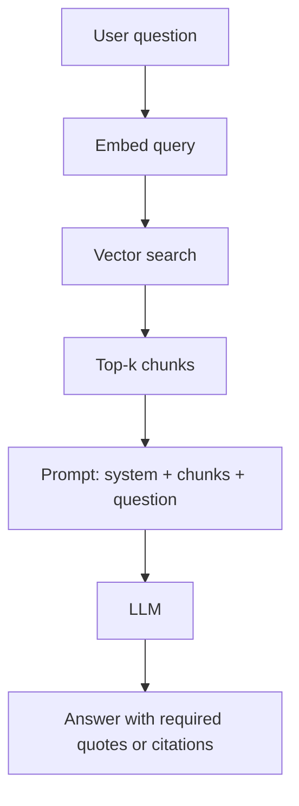
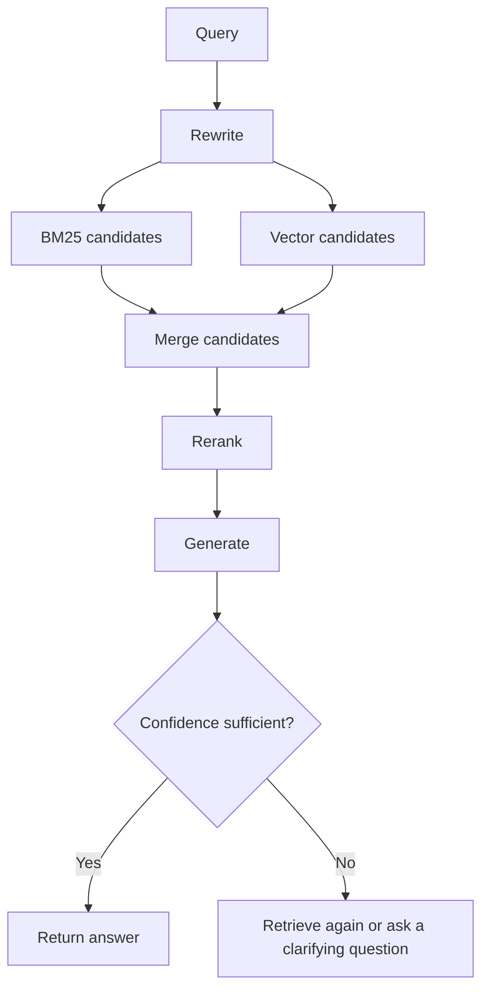
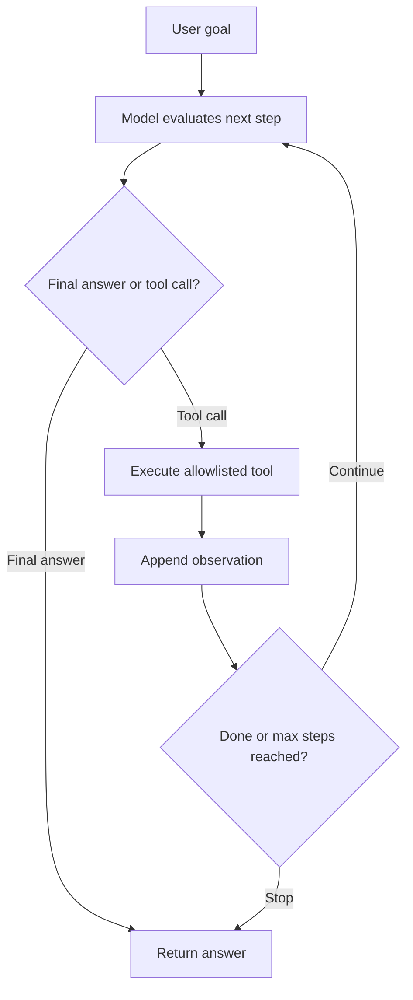
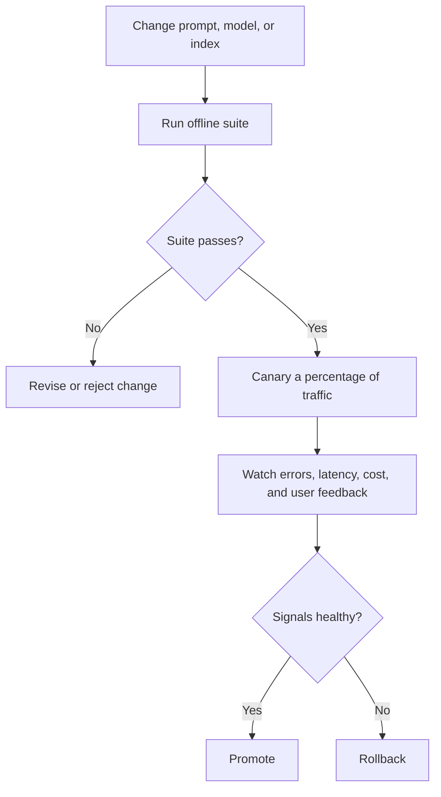
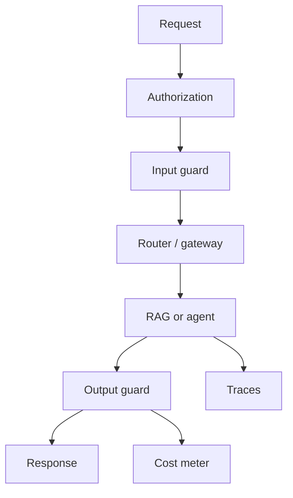

# The Zero-to-Hero Artificial Intelligence & Machine Learning Roadmap

*Mohammad Bilal's complete, self-paced path from first principles to professional-level AI work - math intuition, classical ML, neural nets, PyTorch, CNNs, embeddings, transformers, LLMs, RAG, fine-tuning, agents, evaluation, MLOps, and hiring readiness - told as a connected story in which each new idea solves a problem left by the previous one.*

*Resources curated with Composio (web search, YouTube, GitHub) against [mlabonne/llm-course](https://github.com/mlabonne/llm-course), [Karpathy nn-zero-to-hero](https://github.com/karpathy/nn-zero-to-hero), [fast.ai](https://course.fast.ai/), [Hugging Face Course](https://github.com/huggingface/course), [CS231n](https://cs231n.stanford.edu/), and 2026 AI engineer roadmaps.*

**Scope:** 40 concepts · 20 phases · connected step by step, with no artificial weekly deadline.

Data → Learn → Deep → Transformers → Ship → Hire

---

## How to Read This Document

### Start here if AI is completely new to you

You are not expected to know the vocabulary on the first read. In this roadmap, **artificial intelligence (AI)** means software that performs a task we normally connect with human judgment. **Machine learning (ML)** is one way to build that software: instead of writing every rule yourself, you show the program examples and let it adjust a mathematical model. A **model** is the adjustable pattern-finder, **training** is the adjustment process, a **dataset** is the collection of examples, and **evaluation** means checking the model on carefully chosen examples to see whether it actually works.

Use a simple loop for every topic: read the everyday problem, study the analogy, run the smallest example, change one input, and explain what changed in your own words. If you cannot explain a term without using the same term in its definition, stay with the example a little longer. Repetition is expected here; it is how unfamiliar ideas become familiar.

**Words you will meet often:** a **feature** is one piece of information given to a model; a **label** is the answer you want it to learn; a **parameter** is a number the model adjusts; **loss** is a score showing how wrong an answer was; a **gradient** points toward the change that most affects that score; **inference** means using a trained model; **overfitting** means memorizing practice examples instead of learning a pattern that works on new ones; an **embedding** represents meaning as a list of numbers; a **token** is a small piece of text; **RAG** means looking up useful source material before generating an answer; and **fine-tuning** means continuing a model's training for a narrower purpose.

The sections are connected. Read them in order the first time because each one begins with a problem that the previous idea could not solve. Each section begins by explaining **why what you just learned wasn't enough**, and closes by showing you **the remaining problem that leads to the next idea**. Read it in order the first time through - transformers only make sense because of what broke with fixed windows and RNNs, and RAG only makes sense because of what broke when LLMs hallucinated without your documents.

**There is no clock on this document.** No week numbers, no day-by-day plan, no "finish by." AI skill does not compress into a fixed number of days, and pretending otherwise is how people memorize buzzwords instead of building understanding. Move at the pace your own understanding requires. The only valid unit of progress here is: *can I now explain why the previous concept wasn't enough, and how this one fixes it?*

Every concept in this roadmap answers the same set of questions, because that set of questions *is* how AI knowledge actually accumulates:

- What is it, in plain language?
- Why does it exist - what problem forced someone to invent it?
- What did people do before it existed, and what broke?
- How does it solve that problem, step by step, inside the computer or system?
- What does it cost? (Every solution trades something for something.)
- Where does its own limitation show up - and what does *that* limitation force us to invent next?

That last question is the engine of the whole roadmap. Nothing here is "just a topic to cover." Every topic is a *reaction* to the topic before it.

### Two Kinds of Work, One Shared Foundation

This document covers both **ML / Research-shaped depth** and **AI Engineer who ships LLM apps** depth, because they share the same basic knowledge (data, loss, generalization, representations) and then diverge:

| Role | Primary question | Main work |
| --- | --- | --- |
| **ML Scientist / Practitioner** | How do we *learn* a good model from data? | Features, architectures, training, metrics, ablations |
| **AI Engineer** | How do we *ship* reliable AI systems users trust? | Prompts, RAG, agents, evaluation tests, cost/latency, safety checks and limits |

Phases 1-13 build the shared foundation through transformers. Phases 14-18 deepen LLMs, RAG, fine-tuning, agents, and production. Phases 19-20 are portfolio and hiring. If you only want to ship LLM apps, do not skip Phases 4-8 - engineers who cannot think in loss and overfitting build demos that rot. If you want research depth, still finish eval and shipping phases - papers that never meet users are incomplete.

### The Beginner-Friendly Pattern Every Topic Follows

Those questions are answered in the same order every single time. Once you have read one section you know the shape of all of them:

| Element | What it gives you |
| --- | --- |
| **Why You Are Learning This** | The previous concept's limitation, stated plainly |
| **See It Before You Memorize It** | Videos, interactive tools, docs, GitHub, practice - placed *here* |
| **Step-by-Step Explanation** | A precise, step-by-step explanation in words |
| **The Idea That Fixed It** | The main idea in one clear sentence that made the concept stick |
| **Internal Working, Step by Step** | A prose and diagram "animation" of what happens underneath |
| **Picture It Like This** | Something you can picture without a screen |
| **Complexity / Trade-offs** | What improved, what it cost, and why |
| **Small Working Example** | A minimal, working version you can run |
| **How to Explain This in an Interview** | What the concept looks like when it is tested |
| **Practice** | Problems graded easy to hard |
| **Why the Next Topic Is Needed** | The exact limitation that makes the next concept necessary |

**Diagram conventions.** Diagrams are plain ASCII inside code fences. `|` and `v` mean "then this happens", `+--` joins related paths, `-->` and `->` mean data/gradient flow, `X` marks a failure point, and boxes drawn with `+---+` are layers, datasets, or services. Time / forward pass usually runs downward.

---

> **Integrated Git practice:** Each linked phase-project card in [`Projects.md`](../guides/Projects.md) ends with one specific Git checkpoint. Test the finished project first, commit only its named project path, verify the commit and clean working tree, then continue. Use [`Git.md` Phases 2-3](./Git.md#phase-2) if staging or commit selection is unfamiliar.

---

## The Whole-Journey Map

```text
 PHASE 1                 PHASE 2               PHASE 3                PHASE 4
 AI THINKING             MATH FOR ML           PYTHON FOR AI          CLASSICAL ML
    |                       |                      |                      |
    v                       v                      v                      v
 Learning vs rules,      Vectors, gradients,   NumPy, data wrangle,   Regression,
 train/test split mind   probability literacy  plotting, notebooks    classification

 PHASE 5                 PHASE 6               PHASE 7                PHASE 8
 EVALUATION &            TREES & ENSEMBLES     NEURAL NETS            BACKPROP &
 GENERALIZATION                                   BASICS              OPTIMIZERS
    |                       |                      |                      |
    v                       v                      v                      v
 Metrics, bias-variance, Decision trees,       Perceptron, MLP,      GD, SGD, Adam,
 CV, leakage             RF, boosting          activations           training loops

 PHASE 9                 PHASE 10              PHASE 11               PHASE 12
 PYTORCH DEEP            CNNs & VISION         SEQUENCES              EMBEDDINGS
 PRACTICE                                         (RNN/LSTM)          
    |                       |                      |                      |
    v                       v                      v                      v
 Tensors, autograd,      Convolutions,         Why sequences hard,   Word2Vec → modern
 debugging training      transfer learning     bridge to attention   vector meaning

 PHASE 13                PHASE 14              PHASE 15               PHASE 16
 TRANSFORMERS            LLMs & PROMPTING      RAG SYSTEMS            FINE-TUNING
    |                       |                      |                      |
    v                       v                      v                      v
 Attention, encoder/     Tokens, context,      Chunk, embed,         SFT, LoRA/QLoRA,
 decoder, scaling        prompting craft       retrieve, ground      prefs / alignment

 PHASE 17                PHASE 18              PHASE 19               PHASE 20
 AGENTS & TOOLS          EVAL, SAFETY &        PORTFOLIO &            INTERVIEWS
    |                    MLOps                 PROJECTS                   |
    v                       |                      |                      v
 ReAct, tool calling,       v                      v                 ML + LLM system
 memory, graphs          Metrics that matter,  Ship demos with       design, debugging
                         tracing, deploy       evals and READMEs     stories out loud
```

---

## Phase Index

| # | Phase | Goal | You'll be ready to move on when you can... |
| --- | --- | --- | --- |
| 01 | [AI Thinking](#phase-1---ai-thinking-programs-that-improve-from-examples) | See learning as fitting from data | Contrast rules vs learning and name train/test |
| 02 | [Math for ML](#phase-2---math-for-ml-the-useful-slice) | Own the minimum math that unlocks papers | Explain gradient as "direction of steepest ascent" |
| 03 | [Python for AI](#phase-3---python-for-ai) | Manipulate arrays and datasets fluently | Build a clean train matrix without thinking |
| 04 | [Classical ML](#phase-4---classical-machine-learning) | Solve tabular problems first | Fit linear/logistic models and talk overfitting |
| 05 | [Evaluation](#phase-5---evaluation-and-generalization) | Measure what matters | Choose metrics and spot leakage |
| 06 | [Trees & Ensembles](#phase-6---trees-and-ensembles) | Strong baselines for structured data | Explain bagging vs boosting |
| 07 | [Neural Nets Basics](#phase-7---neural-network-basics) | Compose differentiable layers | Draw an MLP forward pass |
| 08 | [Backprop & Optimizers](#phase-8---backpropagation-and-optimizers) | Train by gradient descent | Implement GD and explain Adam intuition |
| 09 | [PyTorch Practice](#phase-9---pytorch-deep-practice) | Train real models in code | Write a training loop with autograd |
| 10 | [CNNs & Vision](#phase-10---cnns-and-computer-vision) | Learn spatial structure | Explain convolution + transfer learning |
| 11 | [Sequences](#phase-11---sequence-models-rnnlstm-era) | Model ordered data historically | State RNN limits that force transformers |
| 12 | [Embeddings](#phase-12---embeddings-and-representation-learning) | Represent meaning as vectors | Use cosine similarity meaningfully |
| 13 | [Transformers](#phase-13---transformers) | Master attention | Walk Q/K/V and multi-head attention |
| 14 | [LLMs & Prompting](#phase-14---llms-and-prompting) | Use foundation models well | Design prompts with failure modes named |
| 15 | [RAG](#phase-15---retrieval-augmented-generation) | Ground models in your data | Build chunk→embed→retrieve→generate |
| 16 | [Fine-tuning](#phase-16---fine-tuning-and-alignment-basics) | Specialize models efficiently | Justify LoRA vs full FT vs RAG |
| 17 | [Agents](#phase-17---agents-and-tool-use) | Tool-using loops | Implement a ReAct-style agent safely |
| 18 | [Eval, Safety & MLOps](#phase-18---evaluation-safety-and-mlops) | Ship and operate | Design evaluation tests, tracing, and safety checks and limits |
| 19 | [Portfolio](#phase-19---portfolio-and-projects) | Prove skill with artifacts | Publish projects with metrics |
| 20 | [Interviews](#phase-20---interviews) | Get hired | Explain systems end-to-end under pressure |

### Anchor Resources (bookmark these)

- LLM course: [mlabonne/llm-course](https://github.com/mlabonne/llm-course)
- From scratch: [karpathy/nn-zero-to-hero](https://github.com/karpathy/nn-zero-to-hero) · [karpathy/micrograd](https://github.com/karpathy/micrograd) · [karpathy/nanoGPT](https://github.com/karpathy/nanoGPT)
- Code-first DL: [fast.ai Practical Deep Learning](https://course.fast.ai/)
- HF course: [huggingface/course](https://github.com/huggingface/course) · [huggingface/transformers](https://github.com/huggingface/transformers)
- Vision classic: [Stanford CS231n](https://cs231n.stanford.edu/)
- Awesome ML: [josephmisiti/awesome-machine-learning](https://github.com/josephmisiti/awesome-machine-learning)
- Production ML: [EthicalML/awesome-production-machine-learning](https://github.com/EthicalML/awesome-production-machine-learning)
- PyTorch: [yunjey/pytorch-tutorial](https://github.com/yunjey/pytorch-tutorial) · [pytorch/tutorials](https://github.com/pytorch/tutorials)
- Agents / apps: [langchain-ai/langchain](https://github.com/langchain-ai/langchain) · [langchain-ai/langgraph](https://github.com/langchain-ai/langgraph) · [run-llama/llama_index](https://github.com/run-llama/llama_index)
- Gateway: [BerriAI/litellm](https://github.com/BerriAI/litellm)
- AI infra reading: [HuaizhengZhang/AI-Infra-from-Zero-to-Hero](https://github.com/HuaizhengZhang/AI-Infra-from-Zero-to-Hero)
- 2026 ship path: [Vibe Engines AI Engineer Roadmap](https://vibeengines.com/roadmap/ai-engineer)
- Intuition: [3Blue1Brown Neural Nets](https://www.youtube.com/watch?v=aircAruvnKk) · [StatQuest](https://www.youtube.com/@statquest)

---

<a id="phase-1"></a>

# PHASE 1 - AI Thinking: Programs That Improve From Examples

**Track:** Foundations

**WHAT YOU WILL BE ABLE TO DO:** Understand machine learning as learning a function from data, and why train/test discipline exists.

**WHAT YOU SHOULD KNOW FIRST:** Basic Python comfort helps; no ML required.

## 1.1 Rules vs Learning - What Machine Learning Actually Is

**WHY YOU ARE LEARNING THIS - WHERE THE ROADMAP STARTS:** Hand-written rules break when the world is messy - spam patterns change, images vary, language is ambiguous. **Machine learning** replaces brittle rule lists with models whose parameters are fit from examples. Every later architecture is still this idea at larger scale.

**THE PROBLEM THIS SOLVES:** Expert systems and if-else forests could not keep up with high-dimensional, shifting data. Maintenance cost exploded. Nobody could list all rules for "is this photo a cat?"

**SEE IT BEFORE YOU MEMORIZE IT**

- [But what is a neural network? (3Blue1Brown)](https://www.youtube.com/watch?v=aircAruvnKk) - intuition before math
- [Neural Networks Explained in 5 minutes (IBM Technology)](https://www.youtube.com/watch?v=jmmW0F0biz0)
- [Advice for ML beginners (Karpathy / Lex)](https://www.youtube.com/watch?v=I2ZK3ngNvvI)
- [Google ML Crash Course](https://developers.google.com/machine-learning/crash-course)
- [Vibe Engines AI Engineer Roadmap](https://vibeengines.com/roadmap/ai-engineer)
- [josephmisiti/awesome-machine-learning](https://github.com/josephmisiti/awesome-machine-learning)
- Kaggle: pick any Intro course dataset and state the prediction task in one sentence

**STEP-BY-STEP EXPLANATION**

A learning problem has: inputs $x$, outputs $y$ (maybe missing), a model family $f_\theta$, a loss that scores mistakes, and an algorithm that updates $\theta$. **Supervised** learning uses labeled pairs. **Unsupervised** finds structure without labels. **Reinforcement** learns from rewards. Generative AI is still learning a model of data - often $p(x)$ or $p(x_{t+1}\mid x_{\leq t})$. AI engineering wraps these models in products with evaluation tests and safety checks and limits.

**THE MAIN IDEA IN SIMPLE WORDS:** Stop encoding every rule. Encode a hypothesis class + objective, then let data set the parameters.

**WHAT HAPPENS INSIDE, ONE STEP AT A TIME**

| Approach | Input | Decision process | Result |
| --- | --- | --- | --- |
| Rules program | A fixed blacklist | Check whether a word is present | Predict spam or ham |
| Learning program | Labeled data $(x, y)$ | Fit $\theta$ to minimize loss | Predict with $f_\theta(x)$ |

The learning approach adapts when a fixed blacklist would be effectively infinite.

**PICTURE IT LIKE THIS**

Teaching someone to spot ripe fruit by showing hundreds of examples beats writing a 400-page color checklist.

**WHAT YOU GAIN, WHAT IT COSTS, AND WHERE IT CAN FAIL**

| Choice | Buys | Costs |
| --- | --- | --- |
| Hand rules | Interpretability | Brittleness, scale failure |
| Learned models | Adaptation | Need data, can fail silently |
| Bigger models | Capacity | Compute, opacity, eval burden |

**SMALL WORKING EXAMPLE**

```python
# Tiny "learning": find threshold that separates two groups
xs = [1, 2, 3, 8, 9, 10]
ys = [0, 0, 0, 1, 1, 1]  # 0=ham-ish, 1=spam-ish scores

best_t, best_acc = None, -1
for t in range(0, 12):
    pred = [1 if x >= t else 0 for x in xs]
    acc = sum(p == y for p, y in zip(pred, ys)) / len(ys)
    if acc > best_acc:
        best_t, best_acc = t, acc
print("best threshold", best_t, "acc", best_acc)
```

**HOW TO EXPLAIN THIS IN AN INTERVIEW:** "What is machine learning?" - learning parameters from data to generalize. Follow-up: supervised vs unsupervised vs RL.

**PRACTICE UNTIL IT FEELS FAMILIAR**

| Difficulty | Task |
| --- | --- |
| Easy | Classify 5 real problems as supervised/unsupervised/RL |
| Medium | Rewrite a rule-based spam filter as a learning problem statement |
| Hard | Argue when rules still beat ML (compliance, tiny data, hard constraints) |

**WHY THE NEXT TOPIC IS NEEDED - Train/Test & Generalization:** Fitting data is easy if you memorize it. The whole field exists because we need models that work on *new* examples - that requires a different mindset than "maximize training accuracy."

---

## 1.2 Train, Validation, Test - and the Generalization Goal

**WHY YOU ARE LEARNING THIS:** A model that memorizes training examples looks perfect and fails in production. We split data so we can estimate **generalization** - performance on unseen samples - and tune without cheating.

**THE PROBLEM THIS SOLVES:** People reported training accuracy as success. Products collapsed on real users. Leaderboards were gamed by test-set peeking.

**SEE IT BEFORE YOU MEMORIZE IT**

- StatQuest bias-variance / train-test videos
- Google MLCC validation sets
- Kaggle learn "Intro to ML"
- Hold out a test set on any toy CSV and refuse to touch it until the end

**STEP-BY-STEP EXPLANATION**

**Train** fits parameters. **Validation** chooses hyperparameters / architecture decisions. **Test** is a final, rarely touched estimate. Random splits fail on time series and grouped data - use time-based or group splits. **Data leakage** is when information from the future or the label sneaks into features. Overfitting = low train error, high val error. Underfitting = high error everywhere.

**THE MAIN IDEA IN SIMPLE WORDS:** Evaluate on data the training procedure did not see - and protect a final test set like production.

**WHAT HAPPENS INSIDE, ONE STEP AT A TIME**

```text
 Dataset
   |-- Train (fit θ)
   |-- Val   (choose LR, depth, early stop)
   |-- Test  (report once)

 Never: tune on test, then celebrate test score.
```

**PICTURE IT LIKE THIS**

Studying with practice exams (train), a mock exam (val), and the real exam (test). Peeking at the real exam while "studying" invalidates the grade.

**WHAT YOU GAIN, WHAT IT COSTS, AND WHERE IT CAN FAIL**

| Choice | Trade-off |
| --- | --- |
| Tiny test set | Noisy estimate |
| No val set | Hyperparameters chosen on test (leak) |
| Over-shuffling time data | Fake metrics, real failure |

**SMALL WORKING EXAMPLE**

```python
from sklearn.model_selection import train_test_split
X = list(range(100))
y = [0]*50 + [1]*50
X_train, X_temp, y_train, y_temp = train_test_split(X, y, test_size=0.4, random_state=0, stratify=y)
X_val, X_test, y_val, y_test = train_test_split(X_temp, y_temp, test_size=0.5, random_state=0, stratify=y_temp)
print(len(X_train), len(X_val), len(X_test))
```

**HOW TO EXPLAIN THIS IN AN INTERVIEW:** Explain leakage with an example (using "days until churn" to predict churn). How choose split for fraud or time series?

**PRACTICE UNTIL IT FEELS FAMILIAR**

| Difficulty | Task |
| --- | --- |
| Easy | Define train/val/test in one sentence each |
| Medium | Find a leakage example in a public notebook (common on Kaggle) |
| Hard | Design a split for user-level recommendation data |

**WHY THE NEXT TOPIC IS NEEDED - Math for ML:** To improve models systematically we need language for vectors, distances, and gradients - the minimum math that makes learning mechanical rather than magical.

---

> **Phase 1 complete?** [Build the Phase 1 mini-project](../guides/Projects.md#ai-phase-1-project) · [Continue to Phase 2](#phase-2---math-for-ml-the-useful-slice)

<a id="phase-2"></a>

# PHASE 2 - Math for ML (The Useful Slice)

**Track:** Foundations

**WHAT YOU WILL BE ABLE TO DO:** Build working intuition for vectors/matrices, probability, and derivatives/gradients - not a full math degree.

**WHAT YOU SHOULD KNOW FIRST:** Phase 1.

## 2.1 Vectors, Matrices, and Geometry of Data

**WHY YOU ARE LEARNING THIS:** Data points are vectors. Models are matrix multiplies plus nonlinearities. Similarity is often a dot product. Without this language, "embedding" and "weight matrix" stay vocabulary.

**THE PROBLEM THIS SOLVES:** People treated ML as GUI buttons. They could not debug shapes, norms, or why cosine similarity works.

**SEE IT BEFORE YOU MEMORIZE IT**

- 3Blue1Brown Essence of Linear Algebra (playlist)
- [How word vectors encode meaning (3Blue1Brown)](https://www.youtube.com/watch?v=FJtFZwbvkI4)
- Khan Academy linear algebra essentials
- NumPy docs - ndarray basics

**STEP-BY-STEP EXPLANATION**

A vector is an ordered list of numbers - a point/direction in space. Matrices transform vectors (rotate, scale, project). Dot product measures alignment. Norm measures length. Broadcasting in NumPy is applied linear algebra ergonomics. Shape errors are the most common deep learning bug - think in `(batch, features)`.

**THE MAIN IDEA IN SIMPLE WORDS:** Treat data and parameters as geometric objects you can add, multiply, and measure.

**WHAT HAPPENS INSIDE, ONE STEP AT A TIME**

```text
 x = [x1, x2, ..., xd]
 W is (h x d), b is (h,)
 h = W x + b     # one linear layer
 similarity = (a · b) / (|a||b|)   # cosine
```

**PICTURE IT LIKE THIS**

A spreadsheet row is a vector. Multiplying by a matrix is a systematic remix of columns into new columns (features/activations).

**WHAT YOU GAIN, WHAT IT COSTS, AND WHERE IT CAN FAIL**

| Choice | Trade-off |
| --- | --- |
| High dimension | Expressive vs distance concentration / need more data |
| Dense multiply | Simple vs compute cost (GPUs exist for this) |

**SMALL WORKING EXAMPLE**

```python
import numpy as np
x = np.array([1.0, 2.0, 3.0])
W = np.array([[1.0, 0.0, 0.0], [0.0, 1.0, 1.0]])
print(W @ x)
a, b = np.array([1.0, 0.0]), np.array([0.7, 0.7])
cos = (a @ b) / (np.linalg.norm(a) * np.linalg.norm(b))
print(cos)
```

**HOW TO EXPLAIN THIS IN AN INTERVIEW:** What is a dot product? Why normalize embeddings? What does a shape `(32, 768)` mean?

**PRACTICE UNTIL IT FEELS FAMILIAR**

| Difficulty | Task |
| --- | --- |
| Easy | Compute cosine similarity of two 2D vectors by hand |
| Medium | Implement matrix multiply without `@` |
| Hard | Explain the curse of dimensionality qualitatively |

**WHY THE NEXT TOPIC IS NEEDED - Probability & Loss:** Geometry places points. Learning needs a way to score uncertainty and mistakes - probability and loss functions.

---

## 2.2 Probability, Expectation, and Gradients

**WHY YOU ARE LEARNING THIS:** Predictions are uncertain. Losses are averages of mistakes. Training follows **gradients** - directions that increase loss fastest - then steps the other way. This is the engine under every neural net.

**THE PROBLEM THIS SOLVES:** Without probability, classification scores are uncalibrated vibes. Without gradients, "learning" is random search.

**SEE IT BEFORE YOU MEMORIZE IT**

- [Gradient descent, how neural networks learn (3Blue1Brown)](https://www.youtube.com/watch?v=IHZwWFHWa-w)
- [Gradient Descent, Step-by-Step (StatQuest)](https://www.youtube.com/watch?v=sDv4f4s2SB8)
- [Stochastic Gradient Descent (StatQuest)](https://www.youtube.com/watch?v=vMh0zPT0tLI)
- StatQuest probability / likelihood playlists

**STEP-BY-STEP EXPLANATION**

Random variables, expectation, Bernoulli/Gaussian intuition, likelihood vs loss (negative log likelihood). Derivative = slope; gradient = vector of partials. Gradient descent: $\theta \leftarrow \theta-\eta \nabla_\theta L$. Convex vs nonconvex - deep nets are nonconvex but still work empirically. Chain rule unlocks backprop (Phase 8).

**THE MAIN IDEA IN SIMPLE WORDS:** Define a differentiable loss, then repeatedly step opposite the gradient.

**WHAT HAPPENS INSIDE, ONE STEP AT A TIME**

```text
 L(θ) surface over parameters
 pick θ0
 loop:
   g = ∇L(θ)     # uphill direction
   θ = θ - η g   # go downhill
 until low loss / out of patience
```

**PICTURE IT LIKE THIS**

Hiking down a foggy mountain by feeling which way the ground slopes under your feet - small steps, hope you reach a valley (maybe not the global one).

**WHAT YOU GAIN, WHAT IT COSTS, AND WHERE IT CAN FAIL**

| Choice | Trade-off |
| --- | --- |
| Large η | Fast vs diverge |
| Tiny η | Stable vs forever |
| Full-batch GD | Exact gradient vs expensive |
| SGD | Cheap noisy steps vs variance |

**SMALL WORKING EXAMPLE**

```python
# Minimize (θ-3)^2 with GD
theta, lr = 10.0, 0.1
for i in range(30):
    grad = 2 * (theta - 3)
    theta -= lr * grad
print(theta)
```

**HOW TO EXPLAIN THIS IN AN INTERVIEW:** Explain gradient descent without equations, then with. What is a learning rate? Local minima worry - practical answer.

**PRACTICE UNTIL IT FEELS FAMILIAR**

| Difficulty | Task |
| --- | --- |
| Easy | Sketch $y=x^2$ and one GD step from $x=4$ |
| Medium | Derive gradient of MSE for linear regression (1D) |
| Hard | Explain why noise in SGD can help escape sharp minima (intuition) |

**WHY THE NEXT TOPIC IS NEEDED - Python for AI:** Math needs a vehicle. NumPy/pandas turn vectors and datasets into daily practice.

---

> **Phase 2 complete?** [Build the Phase 2 mini-project](../guides/Projects.md#ai-phase-2-project) · [Continue to Phase 3](#phase-3---python-for-ai)

<a id="phase-3"></a>

# PHASE 3 - Python for AI

**Track:** Foundations

**WHAT YOU WILL BE ABLE TO DO:** Be fluent with NumPy, pandas, and basic plotting so model code is not the bottleneck.

**WHAT YOU SHOULD KNOW FIRST:** Phase 2 intuition.

## 3.1 NumPy - The Array Language of ML

**WHY YOU ARE LEARNING THIS:** Python loops over millions of numbers are too slow. **NumPy** provides contiguous arrays and vectorized ops that map to BLAS/SIMD - the substrate under PyTorch/TensorFlow.

**THE PROBLEM THIS SOLVES:** Pure Python numeric code could not train real models. People bounced off ML because tooling felt impossible.

**SEE IT BEFORE YOU MEMORIZE IT**

- NumPy absolute beginners guide
- [yunjey/pytorch-tutorial](https://github.com/yunjey/pytorch-tutorial) - later, but shapes start here
- Google Colab scratch notebook

**STEP-BY-STEP EXPLANATION**

`ndarray` dtype, shape, reshape, broadcast, axis reductions (`mean(axis=0)`), indexing/slicing, boolean masks, random seeds for reproducibility. Think batch-first. Avoid Python `for` over rows when vectorization exists.

**THE MAIN IDEA IN SIMPLE WORDS:** One n-dimensional array abstraction with fast bulk operations.

**WHAT HAPPENS INSIDE, ONE STEP AT A TIME**

```text
 list of lists -> np.array
 ops apply elementwise or via matmul
 reduce along axis -> smaller array
```

**PICTURE IT LIKE THIS**

A calculator that operates on whole spreadsheets at once instead of cell-by-cell with a pencil.

**WHAT YOU GAIN, WHAT IT COSTS, AND WHERE IT CAN FAIL**

| Choice | Trade-off |
| --- | --- |
| Vectorize everything | Speed vs unreadable one-liners |
| Copy vs view | Memory vs accidental mutation bugs |

**SMALL WORKING EXAMPLE**

```python
import numpy as np
rng = np.random.default_rng(0)
X = rng.normal(size=(1000, 4))
w = rng.normal(size=(4,))
y = X @ w + 0.1 * rng.normal(size=1000)
print(X.shape, y[:3])
```

**HOW TO EXPLAIN THIS IN AN INTERVIEW:** Broadcasting rules. Difference between shape `(n,)` and `(n,1)`.

**PRACTICE UNTIL IT FEELS FAMILIAR**

| Difficulty | Task |
| --- | --- |
| Easy | Standardize columns with mean/std vectorized |
| Medium | Implement train/val split with NumPy only |
| Hard | Implement softmax stably with max subtraction |

**WHY THE NEXT TOPIC IS NEEDED - Pandas & Data Reality:** Arrays assume clean matrices. Real data arrives messy - tables, nulls, categories - pandas territory.

---

## 3.2 Pandas, Plotting, and Honest EDA

**WHY YOU ARE LEARNING THIS:** Before modeling, you must see the data: missingness, skew, leakage candidates, class imbalance. **Pandas** + plots turn CSVs into understanding.

**THE PROBLEM THIS SOLVES:** Models trained on garbage. "Accuracy $99\%$" on imbalanced labels fooled teams.

**SEE IT BEFORE YOU MEMORIZE IT**

- pandas getting started
- Kaggle pandas courses
- Any short EDA walkthrough you trust - then do your own

**STEP-BY-STEP EXPLANATION**

`DataFrame`, joins, groupby, dtypes, datetime, categorical encoding preview. Plots: histogram, scatter, correlation heatmap - for intuition, not decoration. Document assumptions. Separate raw vs cleaned datasets.

**THE MAIN IDEA IN SIMPLE WORDS:** Make tabular data a first-class programmable object with inspection affordances.

**WHAT HAPPENS INSIDE, ONE STEP AT A TIME**

```text
 read_csv -> inspect head/dtypes/nulls
 clean -> features X, label y
 plot distributions -> decide transforms
 save processed parquet/csv for modeling
```

**PICTURE IT LIKE THIS**

A chef tasting ingredients and trimming spoiled parts before cooking - modeling is the cooking.

**WHAT YOU GAIN, WHAT IT COSTS, AND WHERE IT CAN FAIL**

| Choice | Trade-off |
| --- | --- |
| Heavy cleaning | Better signal vs time sink / overfitting to quirks |
| Dropping nulls | Simple vs biased sample |

**SMALL WORKING EXAMPLE**

```python
import pandas as pd
df = pd.DataFrame({"age":[20,30,None,40], "bought":[0,1,0,1]})
print(df.describe())
print(df.isna().mean())
df["age"] = df["age"].fillna(df["age"].median())
```

**HOW TO EXPLAIN THIS IN AN INTERVIEW:** Walk an EDA you actually did. What surprised you? What did you not impute and why?

**PRACTICE UNTIL IT FEELS FAMILIAR**

| Difficulty | Task |
| --- | --- |
| Easy | Load a CSV; report null % per column |
| Medium | Find class imbalance and propose a metric |
| Hard | Write a reproducible cleaning script with assertions |

**WHY THE NEXT TOPIC IS NEEDED - Classical ML:** Clean tables demand simple strong baselines - linear/logistic models - before deep learning theater.

---

> **Phase 3 complete?** [Build the Phase 3 mini-project](../guides/Projects.md#ai-phase-3-project) · [Continue to Phase 4](#phase-4---classical-machine-learning)

<a id="phase-4"></a>

# PHASE 4 - Classical Machine Learning

**Track:** Supervised Basics

**WHAT YOU WILL BE ABLE TO DO:** Fit and interpret linear/logistic models; understand loss and regularization.

**WHAT YOU SHOULD KNOW FIRST:** Phases 1-3.

## 4.1 Linear Regression and Loss Landscapes

**WHY YOU ARE LEARNING THIS:** Predicting continuous values is the simplest supervised setting. **Linear regression** makes the loss surface and closed-form/GD learning tangible - the template for everything deeper.

**THE PROBLEM THIS SOLVES:** Ad hoc curve fitting without a shared objective. No principled way to compare models.

**SEE IT BEFORE YOU MEMORIZE IT**

- StatQuest linear regression
- 3Blue1Brown / StatQuest gradient descent on MSE
- scikit-learn linear models docs
- Hands-on ML book notebooks (community mirrors)

**STEP-BY-STEP EXPLANATION**

Model $\hat{y}=w^\top x+b$. MSE loss. Normal equation vs GD. Features need scaling for GD. Outliers hurt MSE - discuss MAE/Huber later. Residuals plots diagnose misfit.

**THE MAIN IDEA IN SIMPLE WORDS:** Define prediction as a linear function; minimize average squared error.

**WHAT HAPPENS INSIDE, ONE STEP AT A TIME**

```text
 for each example:
   pred = w·x + b
   err  = pred - y
 accumulate grad from errs
 update w, b
```

**PICTURE IT LIKE THIS**

Drawing the best straight trend line through rent-vs-square-footage points.

**WHAT YOU GAIN, WHAT IT COSTS, AND WHERE IT CAN FAIL**

| Choice | Trade-off |
| --- | --- |
| Linear model | Interpretable vs underfits complex patterns |
| MSE | Smooth vs outlier-sensitive |

**SMALL WORKING EXAMPLE**

```python
from sklearn.linear_model import LinearRegression
from sklearn.model_selection import train_test_split
import numpy as np
rng = np.random.default_rng(0)
X = rng.normal(size=(200, 1))
y = 3 * X[:,0] + 2 + 0.5 * rng.normal(size=200)
Xtr, Xte, ytr, yte = train_test_split(X, y, test_size=0.25, random_state=0)
model = LinearRegression().fit(Xtr, ytr)
print(model.coef_, model.intercept_, model.score(Xte, yte))
```

**HOW TO EXPLAIN THIS IN AN INTERVIEW:** Derive MSE gradient for w. When is linear regression wrong? Multicollinearity?

**PRACTICE UNTIL IT FEELS FAMILIAR**

| Difficulty | Task |
| --- | --- |
| Easy | Fit housing/rent toy regression |
| Medium | Compare scaled vs unscaled GD |
| Hard | Implement GD linear regression from scratch |

**WHY THE NEXT TOPIC IS NEEDED - Classification:** Many labels are categories, not continuous numbers. Squared error is the wrong story - logistic regression and classification losses enter.

---

## 4.2 Logistic Regression and Decision Boundaries

**WHY YOU ARE LEARNING THIS:** Spam/not-spam needs probabilities and a decision threshold. **Logistic regression** squeezes a linear score through a sigmoid and trains with log loss - still linear decision boundaries, still foundational.

**THE PROBLEM THIS SOLVES:** Thresholding linear regression for classes is statistically awkward. Accuracy alone hides probability quality.

**SEE IT BEFORE YOU MEMORIZE IT**

- StatQuest logistic regression
- scikit-learn LogisticRegression docs
- Desmos/sigmoid sketch

**STEP-BY-STEP EXPLANATION**

Sigmoid maps scores to (0,1). Log loss / cross-entropy. Regularization L1/L2. Threshold tuning for precision/recall. One-vs-rest for multiclass. Features still linear - XOR needs nonlinear models (trees/nets).

**THE MAIN IDEA IN SIMPLE WORDS:** Model log-odds as linear; train by maximizing likelihood (minimizing cross-entropy).

**WHAT HAPPENS INSIDE, ONE STEP AT A TIME**

```text
 z = w·x + b
 p = 1/(1+e^{-z})
 loss = -[y log p + (1-y) log(1-p)]
```

**PICTURE IT LIKE THIS**

A credit score turned into a probability of default, then a cutoff policy.

**WHAT YOU GAIN, WHAT IT COSTS, AND WHERE IT CAN FAIL**

| Choice | Trade-off |
| --- | --- |
| Logistic | Fast, interpretable coeffs vs linear boundary only |
| Complex nets | Capacity vs data hunger / opacity |

**SMALL WORKING EXAMPLE**

```python
from sklearn.datasets import load_breast_cancer
from sklearn.linear_model import LogisticRegression
from sklearn.model_selection import train_test_split
from sklearn.preprocessing import StandardScaler
from sklearn.pipeline import make_pipeline
X, y = load_breast_cancer(return_X_y=True)
Xtr, Xte, ytr, yte = train_test_split(X, y, test_size=0.25, random_state=0, stratify=y)
clf = make_pipeline(StandardScaler(), LogisticRegression(max_iter=1000))
clf.fit(Xtr, ytr)
print(clf.score(Xte, yte))
```

**HOW TO EXPLAIN THIS IN AN INTERVIEW:** Why not MSE for classification? What does a coefficient mean? Threshold vs probability.

**PRACTICE UNTIL IT FEELS FAMILIAR**

| Difficulty | Task |
| --- | --- |
| Easy | Plot sigmoid |
| Medium | Sweep thresholds; plot precision/recall |
| Hard | Implement binary logistic GD from scratch |

**WHY THE NEXT TOPIC IS NEEDED - Evaluation:** Fitting is not success. Metrics, bias-variance, and leakage decide whether a model is honest.

---

> **Phase 4 complete?** [Build the Phase 4 mini-project](../guides/Projects.md#ai-phase-4-project) · [Continue to Phase 5](#phase-5---evaluation-and-generalization)

<a id="phase-5"></a>

# PHASE 5 - Evaluation and Generalization

**Track:** Supervised Basics

**WHAT YOU WILL BE ABLE TO DO:** Choose metrics that match the business cost of errors; diagnose under/overfitting.

**WHAT YOU SHOULD KNOW FIRST:** Phase 4.

## 5.1 Metrics Beyond Accuracy

**WHY YOU ARE LEARNING THIS:** $99\%$ accuracy on $99\%$ negative class is a useless always-negative classifier. **Precision, recall, F1, ROC-AUC, PR-AUC, calibration** express different costs.

**THE PROBLEM THIS SOLVES:** Leaderboards optimized the wrong number. Hospitals and fraud teams shipped harmful policies.

**SEE IT BEFORE YOU MEMORIZE IT**

- StatQuest ROC and confusion matrix
- sklearn metrics docs
- Confusion matrix interactive explainers

**STEP-BY-STEP EXPLANATION**

Confusion matrix cells. Precision = of predicted positives, how many true? Recall = of actual positives, how many caught? F1 balances. ROC-AUC vs PR-AUC under imbalance. Regression: MAE/MSE/RMSE/MAPE caveats. Task defines metric - never default blindly to accuracy.

**THE MAIN IDEA IN SIMPLE WORDS:** Score models with the loss that matches the decision's real costs.

**WHAT HAPPENS INSIDE, ONE STEP AT A TIME**

```text
 Predict labels/probas on val
 Build confusion matrix
 Compute metrics that match costs
 Pick threshold with stakeholders
```

**PICTURE IT LIKE THIS**

Airport security: missing a threat (false negative) vs delaying travelers (false positive) are not equal - metric/threshold encode that policy.

**WHAT YOU GAIN, WHAT IT COSTS, AND WHERE IT CAN FAIL**

| Choice | Trade-off |
| --- | --- |
| Optimize recall | Catch more vs more false alarms |
| Optimize precision | Cleaner alerts vs misses |

**SMALL WORKING EXAMPLE**

```python
from sklearn.metrics import classification_report, roc_auc_score
import numpy as np
y_true = np.array([0,0,1,1])
y_prob = np.array([0.1,0.4,0.35,0.8])
y_pred = (y_prob >= 0.5).astype(int)
print(classification_report(y_true, y_pred))
print("auc", roc_auc_score(y_true, y_prob))
```

**HOW TO EXPLAIN THIS IN AN INTERVIEW:** Imbalanced classes - which metric? When ROC lies. Business-threshold conversation.

**PRACTICE UNTIL IT FEELS FAMILIAR**

| Difficulty | Task |
| --- | --- |
| Easy | Compute precision/recall from a given confusion matrix |
| Medium | Compare F1 vs AUC on an imbalanced set |
| Hard | Design a cost matrix and choose a threshold |

**WHY THE NEXT TOPIC IS NEEDED - Bias-Variance & CV:** A single split is noisy. We need mental models of error components and more stable estimation.

---

## 5.2 Bias-Variance, Cross-Validation, Leakage

**WHY YOU ARE LEARNING THIS:** Error decomposes into bias (underfit), variance (overfit), noise. **Cross-validation** stabilizes estimates. Leakage silently invents fake performance.

**THE PROBLEM THIS SOLVES:** One lucky split greenlit models. Pipelines that scaled using the full dataset leaked test information.

**SEE IT BEFORE YOU MEMORIZE IT**

- StatQuest bias-variance
- sklearn cross-validation user guide
- Search Kaggle "leakage" war stories

**STEP-BY-STEP EXPLANATION**

High bias: simplify features? richer model? High variance: more data, regularization, simpler model, early stopping. K-fold CV. Nested CV for honest hyperparam selection (advanced). Always put preprocessing inside folds. TimeSeriesSplit for temporal data.

**THE MAIN IDEA IN SIMPLE WORDS:** Estimate generalization multiple ways; isolate preprocessing to training folds only.

**WHAT HAPPENS INSIDE, ONE STEP AT A TIME**

| Pipeline | Sequence | Consequence |
| --- | --- | --- |
| Wrong | Scale all data → split | Validation information leaks into training and produces an unrealistically strong score |
| Right | Split → fit the scaler on training data → transform validation/test data | Validation and test sets remain unseen during fitting |

**PICTURE IT LIKE THIS**

Practicing with the answer key mixed into flashcards - your quiz score is fake (leakage).

**WHAT YOU GAIN, WHAT IT COSTS, AND WHERE IT CAN FAIL**

| Choice | Trade-off |
| --- | --- |
| More folds | Stable estimate vs compute |
| Heavy regularization | Less overfit vs underfit risk |

**SMALL WORKING EXAMPLE**

```python
from sklearn.model_selection import cross_val_score
from sklearn.pipeline import make_pipeline
from sklearn.preprocessing import StandardScaler
from sklearn.linear_model import LogisticRegression
from sklearn.datasets import load_breast_cancer
X, y = load_breast_cancer(return_X_y=True)
pipe = make_pipeline(StandardScaler(), LogisticRegression(max_iter=1000))
print(cross_val_score(pipe, X, y, cv=5).mean())
```

**HOW TO EXPLAIN THIS IN AN INTERVIEW:** Give a leakage example. Why pipeline objects? Bias-variance diagnosis from learning curves.

**PRACTICE UNTIL IT FEELS FAMILIAR**

| Difficulty | Task |
| --- | --- |
| Easy | Sketch learning curves for under/overfit |
| Medium | Break a model with intentional leakage; watch AUC jump |
| Hard | Nested CV sketch for hyperparams |

**WHY THE NEXT TOPIC IS NEEDED - Trees:** Linear models miss nonlinear interactions. Decision trees carve the space with axes-aligned splits - next classical power tool.

---

> **Phase 5 complete?** [Build the Phase 5 mini-project](../guides/Projects.md#ai-phase-5-project) · [Continue to Phase 6](#phase-6---trees-and-ensembles)

<a id="phase-6"></a>

# PHASE 6 - Trees and Ensembles

**Track:** Supervised Basics

**WHAT YOU WILL BE ABLE TO DO:** Use decision trees, random forests, and gradient boosting as strong tabular baselines.

**WHAT YOU SHOULD KNOW FIRST:** Phase 5.

## 6.1 Decision Trees and Random Forests

**WHY YOU ARE LEARNING THIS:** Many business datasets are tabular with nonlinear effects and missingness. **Trees** split on features; **random forests** average many trees to cut variance.

**THE PROBLEM THIS SOLVES:** Linear models missed interactions. Single deep trees memorized noise.

**SEE IT BEFORE YOU MEMORIZE IT**

- StatQuest decision trees / random forests
- sklearn ensemble docs
- Visual tree toy datasets

**STEP-BY-STEP EXPLANATION**

Impurity (Gini/entropy), recursion, depth/leaf constraints. Bagging + feature randomness → RF. Feature importances (with caveats). Still struggle with linear extrapolations and very high-cardinality IDs.

**THE MAIN IDEA IN SIMPLE WORDS:** Partition the input space into regions with simple local predictions; average many noisy trees.

**WHAT HAPPENS INSIDE, ONE STEP AT A TIME**

```text
 while not pure/too small:
   pick split that most reduces impurity
 leaf predicts majority / mean
 RF: bootstrap samples + random feature subsets -> vote
```

**PICTURE IT LIKE THIS**

A flowchart of yes/no questions; a forest is a committee of slightly different flowcharts voting.

**WHAT YOU GAIN, WHAT IT COSTS, AND WHERE IT CAN FAIL**

| Choice | Trade-off |
| --- | --- |
| Deep tree | Fit vs overfit |
| RF | Strong baseline vs larger models, weaker extrapolation |

**SMALL WORKING EXAMPLE**

```python
from sklearn.ensemble import RandomForestClassifier
from sklearn.datasets import load_breast_cancer
from sklearn.model_selection import train_test_split
X, y = load_breast_cancer(return_X_y=True)
Xtr, Xte, ytr, yte = train_test_split(X, y, random_state=0, stratify=y)
rf = RandomForestClassifier(n_estimators=200, random_state=0).fit(Xtr, ytr)
print(rf.score(Xte, yte))
```

**HOW TO EXPLAIN THIS IN AN INTERVIEW:** Why bagging reduces variance. RF vs single tree. Feature importance pitfalls.

**PRACTICE UNTIL IT FEELS FAMILIAR**

| Difficulty | Task |
| --- | --- |
| Easy | Visualize a shallow tree on a 2D toy set |
| Medium | Compare RF depth limits vs default |
| Hard | Explain out-of-bag error |

**WHY THE NEXT TOPIC IS NEEDED - Boosting:** Bagging averages peers. Boosting builds a sequence of learners that fix residual mistakes - often the best classic tabular method.

---

## 6.2 Gradient Boosting (XGBoost/LightGBM intuition)

**WHY YOU ARE LEARNING THIS:** **Boosting** adds weak learners staged to correct residuals. With careful regularization it dominates many Kaggle tabular problems and real business baselines.

**THE PROBLEM THIS SOLVES:** RF plateaued. Pure deep trees overfit. Need additive refinement with shrinkage.

**SEE IT BEFORE YOU MEMORIZE IT**

- StatQuest gradient boost
- XGBoost/LightGBM docs intros
- Awesome lists mentioning boosting practice

**STEP-BY-STEP EXPLANATION**

Additive model: $F_m=F_{m-1}+\eta h_m$. Fit $h_m$ to pseudo-residuals. Learning rate, subsample, max depth, regularization. Early stopping on val set. Still not automatic for images/text - representation learning needed later.

**THE MAIN IDEA IN SIMPLE WORDS:** Sequentially focus capacity on current errors with small steps.

**WHAT HAPPENS INSIDE, ONE STEP AT A TIME**

```text
 start with F0 (mean / prior)
 for m in 1..M:
   compute residuals
   fit tree h_m to residuals
   F = F + η h_m
 early stop on val loss
```

**PICTURE IT LIKE THIS**

An editor revising a draft repeatedly - each pass fixes remaining mistakes, lightly, so you do not rewrite into chaos.

**WHAT YOU GAIN, WHAT IT COSTS, AND WHERE IT CAN FAIL**

| Choice | Trade-off |
| --- | --- |
| Boosting | State-of-art tabular vs tuning sensitive, less parallel than RF |
| Very many trees | Fit vs overfit / latency |

**SMALL WORKING EXAMPLE**

```python
from sklearn.ensemble import GradientBoostingClassifier
from sklearn.datasets import load_breast_cancer
from sklearn.model_selection import train_test_split
X, y = load_breast_cancer(return_X_y=True)
Xtr, Xte, ytr, yte = train_test_split(X, y, random_state=0, stratify=y)
gb = GradientBoostingClassifier(random_state=0).fit(Xtr, ytr)
print(gb.score(Xte, yte))
```

**HOW TO EXPLAIN THIS IN AN INTERVIEW:** Bagging vs boosting. Why learning rate matters. When neural nets still lose to GBDT on tabular.

**PRACTICE UNTIL IT FEELS FAMILIAR**

| Difficulty | Task |
| --- | --- |
| Easy | Early-stop GBDT with validation |
| Medium | Compare RF vs GBDT on same dataset |
| Hard | Read XGBoost objective/regularization sketch |

**WHY THE NEXT TOPIC IS NEEDED - Neural Nets:** Trees excel on mixed tabular features but struggle to learn hierarchical representations for raw sensory data. Neural nets compose differentiable features end-to-end.

---

> **Phase 6 complete?** [Build the Phase 6 mini-project](../guides/Projects.md#ai-phase-6-project) · [Continue to Phase 7](#phase-7---neural-network-basics)

<a id="phase-7"></a>

# PHASE 7 - Neural Network Basics

**Track:** Deep Learning

**WHAT YOU WILL BE ABLE TO DO:** Understand MLPs as stacked linear transforms + nonlinearities.

**WHAT YOU SHOULD KNOW FIRST:** Phases 2 and 4-5.

## 7.1 Perceptrons to MLPs

**WHY YOU ARE LEARNING THIS:** Linear models cannot learn XOR-style interactions. Stacking linear layers without nonlinearities collapses to one linear map. **Activations** between layers create universal function approximators (in theory) and useful features (in practice).

**THE PROBLEM THIS SOLVES:** Hand-designed features + linear classifiers hit ceilings on perception tasks.

**SEE IT BEFORE YOU MEMORIZE IT**

- [But what is a neural network? (3Blue1Brown)](https://www.youtube.com/watch?v=aircAruvnKk)
- [Neural Networks Explained in 5 minutes (IBM)](https://www.youtube.com/watch?v=jmmW0F0biz0)
- [Karpathy micrograd intro](https://www.youtube.com/watch?v=VMj-3S1tku0)
- [karpathy/micrograd](https://github.com/karpathy/micrograd)
- CS231n neural nets notes

**STEP-BY-STEP EXPLANATION**

Dense layer: $y=\mathrm{activation}(xW+b)$. Width vs depth. Hidden representations. Softmax for multiclass. Initialization matters. Without nonlinearity, depth is fake. ReLU made deep nets practical vs saturating sigmoids in hidden layers.

**THE MAIN IDEA IN SIMPLE WORDS:** Compose simple differentiable blocks; learn features and classifier jointly.

**WHAT HAPPENS INSIDE, ONE STEP AT A TIME**

```text
 x
  -> Linear -> ReLU
  -> Linear -> ReLU
  -> Linear -> softmax probs
```

**PICTURE IT LIKE THIS**

An assembly line: each station transforms the product; nonlinear stations allow qualitatively new shapes, not just rescaling.

**WHAT YOU GAIN, WHAT IT COSTS, AND WHERE IT CAN FAIL**

| Choice | Trade-off |
| --- | --- |
| Wider/deeper | Capacity vs overfit/compute |
| ReLU | Fast vs dead neurons |
| Sigmoid hidden | Historic vs vanishing gradients |

**SMALL WORKING EXAMPLE**

```python
import numpy as np

def relu(z):
    return np.maximum(0, z)

def mlp_forward(x, W1, b1, W2, b2):
    h = relu(x @ W1 + b1)
    logits = h @ W2 + b2
    return logits

x = np.random.randn(8, 4)
W1, b1 = np.random.randn(4, 16)*0.1, np.zeros(16)
W2, b2 = np.random.randn(16, 3)*0.1, np.zeros(3)
print(mlp_forward(x, W1, b1, W2, b2).shape)
```

**HOW TO EXPLAIN THIS IN AN INTERVIEW:** Why activation functions? What happens if all are linear? Softmax purpose?

**PRACTICE UNTIL IT FEELS FAMILIAR**

| Difficulty | Task |
| --- | --- |
| Easy | Draw a 2-hidden-layer MLP for 10-class MNIST |
| Medium | Show algebraically two linear layers collapse |
| Hard | Train a tiny MLP on XOR from scratch (NumPy) |

**WHY THE NEXT TOPIC IS NEEDED - Capacity & Regularization:** More neurons fit more functions - including noise. We need inductive biases and regularization before we celebrate capacity.

---

## 7.2 Overfitting Nets - Regularization, Dropout, Early Stopping

**WHY YOU ARE LEARNING THIS:** Deep nets memorize. **Weight decay, dropout, data augmentation, early stopping** buy generalization.

**THE PROBLEM THIS SOLVES:** Train accuracy $100\%$, test accuracy coin-flip. "Just add layers" culture.

**SEE IT BEFORE YOU MEMORIZE IT**

- CS231n regularization notes
- StatQuest dropout / regularization intuition
- Watch val curves in any Keras/PyTorch tutorial

**STEP-BY-STEP EXPLANATION**

L2 weight decay. Dropout as training-time noise / ensemble approx. Early stopping as implicit regularizer. Label noise and dataset size dominate. Architecture choice is also regularization (CNN structure later).

**THE MAIN IDEA IN SIMPLE WORDS:** Constrain or noise the hypothesis search so the optimizer prefers simpler functions that fit data.

**WHAT HAPPENS INSIDE, ONE STEP AT A TIME**

```text
 train loop:
   update weights on batch
   every epoch: measure val loss
   if val worsens patiently: stop / restore best
```

**PICTURE IT LIKE THIS**

A student who memorizes practice answers vs one who learns principles - exams (val/test) distinguish them.

**WHAT YOU GAIN, WHAT IT COSTS, AND WHERE IT CAN FAIL**

| Choice | Trade-off |
| --- | --- |
| Heavy dropout | Regularize vs underfit / slower convergence |
| Early stop | Simple vs may stop before rare features learned |

**SMALL WORKING EXAMPLE**

```python
# Conceptual early stopping
best, patience, bad = float("inf"), 3, 0
for epoch, val_loss in enumerate([1.0, 0.8, 0.75, 0.76, 0.79, 0.81]):
    if val_loss < best:
        best, bad = val_loss, 0
    else:
        bad += 1
        if bad >= patience:
            print("stop at", epoch, "best", best)
            break
```

**HOW TO EXPLAIN THIS IN AN INTERVIEW:** Signs of overfit. Dropout train vs eval behavior. Why data beats fancy regularizers often.

**PRACTICE UNTIL IT FEELS FAMILIAR**

| Difficulty | Task |
| --- | --- |
| Easy | Sketch train/val curves for overfit |
| Medium | Ablate weight decay on a small net |
| Hard | Explain dropout as ensemble (intuition-level) |

**WHY THE NEXT TOPIC IS NEEDED - Backprop:** We described layers and regularizers. Training still needs an efficient way to get gradients for millions of parameters - backpropagation.

---

> **Phase 7 complete?** [Build the Phase 7 mini-project](../guides/Projects.md#ai-phase-7-project) · [Continue to Phase 8](#phase-8---backpropagation-and-optimizers)

<a id="phase-8"></a>

# PHASE 8 - Backpropagation and Optimizers

**Track:** Deep Learning

**WHAT YOU WILL BE ABLE TO DO:** Understand backprop as chain rule on a computational graph; use SGD/Adam wisely.

**WHAT YOU SHOULD KNOW FIRST:** Phase 7 + Phase 2 gradients.

## 8.1 Backpropagation on a Computational Graph

**WHY YOU ARE LEARNING THIS:** Finite differences for every parameter are impossible when the amount of work grows. **Backprop** computes all gradients in one backward pass using the chain rule stored on a graph of ops.

**THE PROBLEM THIS SOLVES:** Training deep nets was computationally hopeless or hand-derived per architecture.

**SEE IT BEFORE YOU MEMORIZE IT**

- [Backpropagation, intuitively (3Blue1Brown)](https://www.youtube.com/watch?v=Ilg3gGewQ5U)
- [Backpropagation calculus (3Blue1Brown)](https://www.youtube.com/watch?v=tIeHLnjs5U8)
- [StatQuest Backpropagation Main Ideas](https://www.youtube.com/watch?v=IN2XmBhILt4)
- [Karpathy micrograd video](https://www.youtube.com/watch?v=VMj-3S1tku0)
- [karpathy/micrograd](https://github.com/karpathy/micrograd) · [karpathy/nn-zero-to-hero](https://github.com/karpathy/nn-zero-to-hero)

**STEP-BY-STEP EXPLANATION**

Forward pass builds values; backward pass propagates $\frac{\partial L}{\partial \text{node}}$. Autograd engines record ops. You must understand *enough* to debug vanishing/exploding gradients and wrong loss wiring - not memorize every derivative.

**THE MAIN IDEA IN SIMPLE WORDS:** Reverse-mode automatic differentiation for scalar losses - cost comparable to one forward pass.

**WHAT HAPPENS INSIDE, ONE STEP AT A TIME**

```text
 Forward:  x -> a -> b -> L
 Backward: dL/db -> dL/da -> dL/dx
 Each local op knows local gradient; multiply along path (chain rule)
```

**PICTURE IT LIKE THIS**

Blame assignment in a factory: final defect rate attributed backward through each station's sensitivity.

**WHAT YOU GAIN, WHAT IT COSTS, AND WHERE IT CAN FAIL**

| Choice | Trade-off |
| --- | --- |
| Autograd | Productivity vs memory for stored activations |
| Checkpointing | Memory save vs extra compute |

**SMALL WORKING EXAMPLE**

```python
# Tiny scalar autograd vibe (see micrograd for real)
# L = (wx - y)^2
w, x, y = 0.5, 2.0, 1.0
pred = w * x
err = pred - y
L = err * err
dL_dpred = 2 * err
dL_dw = dL_dpred * x
print(L, dL_dw)
```

**HOW TO EXPLAIN THIS IN AN INTERVIEW:** Explain backprop simply. Why vanishing gradients with sigmoids? What does autograd store?

**PRACTICE UNTIL IT FEELS FAMILIAR**

| Difficulty | Task |
| --- | --- |
| Easy | Hand-backprop a 1-weight squared error |
| Medium | Complete micrograd exercises |
| Hard | Implement backward for matmul + ReLU |

**WHY THE NEXT TOPIC IS NEEDED - Optimizers:** Gradients point downhill. *How* we step - learning rates, momentum, adaptive methods - decides whether training converges.

---

## 8.2 SGD, Momentum, Adam, and Training Dynamics

**WHY YOU ARE LEARNING THIS:** Raw GD on full data is slow; vanilla SGD is noisy. **Momentum** and **Adam** improve practical convergence. Learning rate schedules prevent late-stage chaos.

**THE PROBLEM THIS SOLVES:** Training diverged or crawled. People blamed models when optimizers/hyperparams were wrong.

**SEE IT BEFORE YOU MEMORIZE IT**

- [SGD Clearly Explained (StatQuest)](https://www.youtube.com/watch?v=vMh0zPT0tLI)
- [Gradient Descent (3Blue1Brown)](https://www.youtube.com/watch?v=IHZwWFHWa-w)
- PyTorch optim docs
- Distill.pub / optimizer visualizations (search)

**STEP-BY-STEP EXPLANATION**

Minibatch SGD. Momentum accumulates velocity. Adam adapts per-parameter steps using moment estimates - great default, not magic. LR too high = diverge; too low = waste. Warmup + cosine decay common in large transformers. Gradient clipping for stability.

**THE MAIN IDEA IN SIMPLE WORDS:** Use noisy cheap gradients and adaptive step sizes to work through nonconvex losses.

**WHAT HAPPENS INSIDE, ONE STEP AT A TIME**

```text
 sample batch
 forward -> loss
 backward -> grads
 opt.step()   # SGD/Adam update rules
 zero grads
```

**PICTURE IT LIKE THIS**

Finding the valley in fog: take steps based on local slope (SGD), keep some hiking momentum, and adjust step length per terrain type (Adam).

**WHAT YOU GAIN, WHAT IT COSTS, AND WHERE IT CAN FAIL**

| Choice | Trade-off |
| --- | --- |
| Adam | Fast start vs sometimes worse generalization than SGD+momentum |
| Huge batches | Hardware efficiency vs may need LR scaling tricks |

**SMALL WORKING EXAMPLE**

```python
# Pseudocode Adam moments
m, v, t = 0, 0, 0
beta1, beta2, eps, lr = 0.9, 0.999, 1e-8, 1e-3
# g = grad
# t += 1; m=β1m+(1-β1)g; v=β2v+(1-β2)g²
# mhat=m/(1-β1^t); vhat=v/(1-β2^t)
# θ -= lr * mhat / (sqrt(vhat)+eps)
print("Use torch.optim.Adam in practice; know the story above.")
```

**HOW TO EXPLAIN THIS IN AN INTERVIEW:** SGD vs Adam. What is momentum? Why LR schedules? Gradient explosion fix?

**PRACTICE UNTIL IT FEELS FAMILIAR**

| Difficulty | Task |
| --- | --- |
| Easy | Train with LR too high/low; describe curves |
| Medium | Compare Adam vs SGD on a small MLP |
| Hard | Implement SGD+momentum from scratch |

**WHY THE NEXT TOPIC IS NEEDED - PyTorch:** Theory is ready. Professional practice uses a framework with tensors, autograd, and GPU - PyTorch.

---

> **Phase 8 complete?** [Build the Phase 8 mini-project](../guides/Projects.md#ai-phase-8-project) · [Continue to Phase 9](#phase-9---pytorch-deep-practice)

<a id="phase-9"></a>

# PHASE 9 - PyTorch Deep Practice

**Track:** Deep Learning

**WHAT YOU WILL BE ABLE TO DO:** Write clean training loops; debug shapes and device issues.

**WHAT YOU SHOULD KNOW FIRST:** Phase 8.

## 9.1 Tensors, Autograd, and Modules

**WHY YOU ARE LEARNING THIS:** NumPy does not calculate gradients for you or run calculations on an NVIDIA GPU through CUDA. **PyTorch** provides both, along with `nn.Module`, a standard way to organize a model's adjustable values.

**THE PROBLEM THIS SOLVES:** Researchers reimplemented backprop per project. Portability and speed suffered.

**SEE IT BEFORE YOU MEMORIZE IT**

- [yunjey/pytorch-tutorial](https://github.com/yunjey/pytorch-tutorial)
- [pytorch/tutorials](https://github.com/pytorch/tutorials)
- [patrickloeber/pytorchTutorial](https://github.com/patrickloeber/pytorchTutorial)
- Official PyTorch 60-min blitz
- Google Colab + GPU runtime

**STEP-BY-STEP EXPLANATION**

`requires_grad`, `backward()`, `grad`. `nn.Linear`, `nn.Sequential`. `.parameters()` for optimizers. `model.train()`/`eval()` for dropout/batchnorm. Device `cpu`/`cuda`/`mps`. Common bugs: forgetting `zero_grad`, mixing numpy silently, shape mismatches.

**THE MAIN IDEA IN SIMPLE WORDS:** One imperative framework where the tape records ops as you run them.

**WHAT HAPPENS INSIDE, ONE STEP AT A TIME**

```text
 batch -> model -> logits -> loss
 loss.backward()
 optimizer.step(); optimizer.zero_grad()
```

**PICTURE IT LIKE THIS**

A notebook that not only computes answers but remembers how each answer depended on dials - so it can tell you which dial to turn.

**WHAT YOU GAIN, WHAT IT COSTS, AND WHERE IT CAN FAIL**

| Choice | Trade-off |
| --- | --- |
| Eager PyTorch | Debuggable vs historically slower than static graphs (gap narrowed) |
| Too much magic wrappers | Speed of writing vs not understanding loops |

**SMALL WORKING EXAMPLE**

```python
import torch
import torch.nn as nn

model = nn.Sequential(nn.Linear(4, 16), nn.ReLU(), nn.Linear(16, 2))
opt = torch.optim.Adam(model.parameters(), lr=1e-3)
x = torch.randn(32, 4)
y = torch.randint(0, 2, (32,))
logits = model(x)
loss = nn.functional.cross_entropy(logits, y)
loss.backward()
opt.step()
opt.zero_grad()
print(float(loss))
```

**HOW TO EXPLAIN THIS IN AN INTERVIEW:** What does backward do? Why zero_grad? train vs eval mode?

**PRACTICE UNTIL IT FEELS FAMILIAR**

| Difficulty | Task |
| --- | --- |
| Easy | Overfit a tiny network to 10 samples |
| Medium | Move training to GPU if available |
| Hard | Reproduce a bug from wrong broadcasting; fix it |

**WHY THE NEXT TOPIC IS NEEDED - DataLoaders & Debugging:** Toy tensors hide I/O and bottlenecks. Real training needs Dataset/DataLoader and a debugging checklist.

---

## 9.2 Datasets, Loops, and Debugging Training

**WHY YOU ARE LEARNING THIS:** Training fails quietly - wrong labels, shuffled mismatch, LR typos, silent CPU fallback. Engineering discipline separates "model bad" from "pipeline buggy."

**THE PROBLEM THIS SOLVES:** Weeks wasted "tuning" a broken loader.

**SEE IT BEFORE YOU MEMORIZE IT**

- PyTorch DataLoading tutorial
- fast.ai training philosophy - plot losses early
- TensorBoard / wandb free tiers

**STEP-BY-STEP EXPLANATION**

`Dataset`/`DataLoader` batching, workers, seeding. Log train loss per batch, val per epoch. Overfit one batch as sanity check. Check input ranges, label ids, class counts. Save checkpoints with optimizer state.

**THE MAIN IDEA IN SIMPLE WORDS:** Make training observable and testable - start by deliberately overfitting a tiny slice.

**WHAT HAPPENS INSIDE, ONE STEP AT A TIME**

```text
 Sanity ladder:
  1) one batch overfit
  2) small subset overfit
  3) full train + val curves
  4) hyperparam sweeps
```

**PICTURE IT LIKE THIS**

Before opening a restaurant, cook one plate perfectly - then scale - don't book 200 guests on untested recipes.

**WHAT YOU GAIN, WHAT IT COSTS, AND WHERE IT CAN FAIL**

| Choice | Trade-off |
| --- | --- |
| Heavy logging | Insight vs I/O slowdown |
| Many workers | Speed vs RAM / flaky Windows setups |

**SMALL WORKING EXAMPLE**

```python
from torch.utils.data import DataLoader, TensorDataset
import torch
X = torch.randn(128, 4)
y = torch.randint(0, 2, (128,))
loader = DataLoader(TensorDataset(X, y), batch_size=16, shuffle=True)
for xb, yb in loader:
    assert xb.shape[0] == yb.shape[0]
    break
print("batch ok", xb.shape)
```

**HOW TO EXPLAIN THIS IN AN INTERVIEW:** How do you debug a net that won't learn? (Overfit one batch, LR range, check labels.)

**PRACTICE UNTIL IT FEELS FAMILIAR**

| Difficulty | Task |
| --- | --- |
| Easy | Intentionally permute labels; watch failure |
| Medium | Build Dataset for CSV features |
| Hard | Add checkpointing + resume |

**WHY THE NEXT TOPIC IS NEEDED - CNNs:** Dense MLPs ignore spatial structure in images. Convolutions bake translation-friendly inductive bias - vision's breakthrough.

---

> **Phase 9 complete?** [Build the Phase 9 mini-project](../guides/Projects.md#ai-phase-9-project) · [Continue to Phase 10](#phase-10---cnns-and-computer-vision)

<a id="phase-10"></a>

# PHASE 10 - CNNs and Computer Vision

**Track:** Deep Learning

**WHAT YOU WILL BE ABLE TO DO:** Explain convolution, pooling, and transfer learning for images.

**WHAT YOU SHOULD KNOW FIRST:** Phase 9.

## 10.1 Convolutions, Filters, and Hierarchies

**WHY YOU ARE LEARNING THIS:** Flattening images into MLP inputs explodes parameters and ignores locality. **CNNs** slide small filters to detect local patterns and compose them into objects.

**THE PROBLEM THIS SOLVES:** Hand-crafted SIFT-like features + shallow classifiers. Fragile and expensive.

**SEE IT BEFORE YOU MEMORIZE IT**

- [CS231n](https://cs231n.stanford.edu/)
- CNN explainers (search 3Blue1Brown / StatQuest CNN)
- [pytorch vision tutorials](https://github.com/pytorch/tutorials)
- [Netron](https://github.com/lutzroeder/netron) model visualizer

**STEP-BY-STEP EXPLANATION**

Kernel, stride, padding, channels. Early layers: edges; deeper: textures/parts. Pooling/strides downsample. Parameter sharing = fewer weights than dense. receptive field grows with depth.

**THE MAIN IDEA IN SIMPLE WORDS:** Share local detectors across positions - images' natural symmetry.

**WHAT HAPPENS INSIDE, ONE STEP AT A TIME**

```text
 image (C,H,W)
  -> conv+relu  (more channels, spatial map)
  -> conv+relu
  -> pool
  -> ...
  -> flatten/GAP -> classifier
```

**PICTURE IT LIKE THIS**

A flashlight scanning a mural with a small stencil (filter) looking for motifs everywhere, not a unique stencil per pixel.

**WHAT YOU GAIN, WHAT IT COSTS, AND WHERE IT CAN FAIL**

| Choice | Trade-off |
| --- | --- |
| CNNs | Great for grid data vs less natural for sets/graphs without changes |
| Very deep | Representation power vs need residuals/normalization |

**SMALL WORKING EXAMPLE**

```python
import torch.nn as nn
model = nn.Sequential(
    nn.Conv2d(3, 16, 3, padding=1), nn.ReLU(),
    nn.MaxPool2d(2),
    nn.Conv2d(16, 32, 3, padding=1), nn.ReLU(),
    nn.AdaptiveAvgPool2d(1),
    nn.Flatten(),
    nn.Linear(32, 10),
)
print(model)
```

**HOW TO EXPLAIN THIS IN AN INTERVIEW:** Why conv over dense for images? What is a channel? Translation equivariance intuition?

**PRACTICE UNTIL IT FEELS FAMILIAR**

| Difficulty | Task |
| --- | --- |
| Easy | Compute output size for given stride/pad |
| Medium | Train CNN on CIFAR10 subset |
| Hard | Visualize first-layer filters |

**WHY THE NEXT TOPIC IS NEEDED - Transfer Learning:** Training CNNs from scratch needs huge data. Pretrained nets transfer - the practical default.

---

## 10.2 Transfer Learning and Modern Vision Practice

**WHY YOU ARE LEARNING THIS:** Labeled images are expensive. Models pretrained on ImageNet (and beyond) provide reusable visual features. Fine-tune heads or deeper layers for your task.

**THE PROBLEM THIS SOLVES:** Every startup trained from random init - slow, data-hungry, worse accuracy.

**SEE IT BEFORE YOU MEMORIZE IT**

- [fast.ai](https://course.fast.ai/) first lessons - transfer learning first
- torchvision models docs
- HF transformers vision models (later bridge)

**STEP-BY-STEP EXPLANATION**

Freeze backbone vs full fine-tune. Augmentations as regularization. Medical data differs from ImageNet because of domain shift - transfer still often helps. Today: CNN and ViT backbones; principle remains representation reuse.

**THE MAIN IDEA IN SIMPLE WORDS:** Reuse features from related large-scale training instead of starting from zero.

**WHAT HAPPENS INSIDE, ONE STEP AT A TIME**

```text
 load pretrained backbone
 replace classifier head for K classes
 train head (optional unfreeze later with small LR)
```

**PICTURE IT LIKE THIS**

Hiring a photographer who already learned light and composition, then teaching them your product catalog - faster than teaching vision from scratch.

**WHAT YOU GAIN, WHAT IT COSTS, AND WHERE IT CAN FAIL**

| Choice | Trade-off |
| --- | --- |
| Freeze most layers | Safe/fast vs under-adapt |
| Full fine-tune | Adapt vs overfit tiny datasets |

**SMALL WORKING EXAMPLE**

```python
import torchvision.models as models
import torch.nn as nn
m = models.resnet18(weights=models.ResNet18_Weights.DEFAULT)
m.fc = nn.Linear(m.fc.in_features, 2)  # binary task
print(m.fc)
```

**HOW TO EXPLAIN THIS IN AN INTERVIEW:** When does transfer learning fail? What to freeze? Augmentation examples.

**PRACTICE UNTIL IT FEELS FAMILIAR**

| Difficulty | Task |
| --- | --- |
| Easy | Swap a classifier head |
| Medium | Compare frozen vs unfrozen backbone |
| Hard | Diagnose domain shift with error analysis |

**WHY THE NEXT TOPIC IS NEEDED - Sequences:** Images are grids. Language and time series are sequences - RNNs were the historical answer, and their limits force attention.

---

> **Phase 10 complete?** [Build the Phase 10 mini-project](../guides/Projects.md#ai-phase-10-project) · [Continue to Phase 11](#phase-11---sequence-models-rnnlstm-era)

<a id="phase-11"></a>

# PHASE 11 - Sequence Models (RNN/LSTM Era)

**Track:** Representations

**WHAT YOU WILL BE ABLE TO DO:** Understand sequence modeling needs and the bottlenecks that motivated transformers.

**WHAT YOU SHOULD KNOW FIRST:** Phases 7-9.

## 11.1 RNNs - State Across Time

**WHY YOU ARE LEARNING THIS:** Text and time series have variable length and order. **RNNs** share weights across steps and carry a hidden state - the first widely used neural sequence model.

**THE PROBLEM THIS SOLVES:** Fixed-size bags of words ignored order. N-grams exploded combinatorially.

**SEE IT BEFORE YOU MEMORIZE IT**

- CS231n / CS224n RNN notes (Stanford)
- Search "RNN LSTM explained animated"
- Karpathy char-RNN heritage posts / makemore series bridge

**STEP-BY-STEP EXPLANATION**

At each step: $h_t=f(h_{t-1},x_t)$. BPTT trains through time. Vanishing/exploding gradients plague long dependencies. Sequential computation limits parallel training.

**THE MAIN IDEA IN SIMPLE WORDS:** Reuse the same transition function across time with a memory state.

**WHAT HAPPENS INSIDE, ONE STEP AT A TIME**

```text
 x1 -> h1 -> x2 -> h2 -> ... -> ht -> output
 gradients flow backward through the chain of h's
 long chain => gradients shrink/explode
```

**PICTURE IT LIKE THIS**

Reading a book while only jotting one sticky note of "what I know so far" after each sentence - easy to forget chapter 1 by chapter 20.

**WHAT YOU GAIN, WHAT IT COSTS, AND WHERE IT CAN FAIL**

| Choice | Trade-off |
| --- | --- |
| RNNs | Variable length, streaming vs hard to train long-range, slow |
| Deep stacks | More capacity vs optimization pain |

**SMALL WORKING EXAMPLE**

```python
import torch, torch.nn as nn
rnn = nn.RNN(input_size=32, hidden_size=64, batch_first=True)
x = torch.randn(8, 10, 32)  # batch, seq, feat
out, h = rnn(x)
print(out.shape, h.shape)
```

**HOW TO EXPLAIN THIS IN AN INTERVIEW:** Why RNNs for text historically? What is vanishing gradient? Why slow on GPU vs transformers?

**PRACTICE UNTIL IT FEELS FAMILIAR**

| Difficulty | Task |
| --- | --- |
| Easy | Draw RNN unroll for 4 steps |
| Medium | Train tiny char-RNN (Karpathy makemore style) |
| Hard | Measure gradient norms vs sequence length |

**WHY THE NEXT TOPIC IS NEEDED - LSTM/GRU:** Vanilla RNNs forget. Gated architectures add highways for memory - better, still sequential.

---

## 11.2 LSTMs/GRUs and the Wall That Remained

**WHY YOU ARE LEARNING THIS:** **LSTMs/GRUs** introduce gates to keep or forget information, improving long-range learning. They powered machine translation for years - then hit parallelism and path-length walls.

**THE PROBLEM THIS SOLVES:** Vanilla RNNs failed on long sentences. Translation quality stalled.

**SEE IT BEFORE YOU MEMORIZE IT**

- Colah's LSTM blog (classic written visual)
- CS224n LSTM lectures
- [Karpathy makemore](https://www.youtube.com/watch?v=PaCmpygFfXo)

**STEP-BY-STEP EXPLANATION**

Cell state highways, forget/input/output gates (LSTM). GRU simplifies. Still step-by-step - cannot fully parallelize sequence length during training. Distance between positions is linear in steps - weak inductive path for very long dependencies compared to attention's direct links.

**THE MAIN IDEA IN SIMPLE WORDS:** Learnable gates protect memory - but the sequential bottleneck remains.

**WHAT HAPPENS INSIDE, ONE STEP AT A TIME**

```text
 LSTM gates decide:
   forget some memory
   write new memory
   expose hidden output
 Still: t depends on t-1 compute
```

**PICTURE IT LIKE THIS**

A better notebook with sections you can lock (gates) - still, you update page by page, not all pages at once.

**WHAT YOU GAIN, WHAT IT COSTS, AND WHERE IT CAN FAIL**

| Choice | Trade-off |
| --- | --- |
| LSTM | Better memory vs heavier compute than GRU |
| Any RNN | Streaming friendly vs poor training parallelism |

**SMALL WORKING EXAMPLE**

```python
import torch.nn as nn
print(nn.LSTM(32, 64, batch_first=True))
print(nn.GRU(32, 64, batch_first=True))
```

**HOW TO EXPLAIN THIS IN AN INTERVIEW:** LSTM vs GRU. Why transformers replaced them for most NLP pretraining.

**PRACTICE UNTIL IT FEELS FAMILIAR**

| Difficulty | Task |
| --- | --- |
| Easy | Name LSTM gates |
| Medium | Compare RNN vs LSTM on long synthetic copy task |
| Hard | Explain path length arguments from "Attention Is All You Need" |

**WHY THE NEXT TOPIC IS NEEDED - Embeddings:** Before attention transformers, we need the idea that discrete tokens become continuous vectors that capture similarity - embeddings.

---

> **Phase 11 complete?** [Build the Phase 11 mini-project](../guides/Projects.md#ai-phase-11-project) · [Continue to Phase 12](#phase-12---embeddings-and-representation-learning)

<a id="phase-12"></a>

# PHASE 12 - Embeddings and Representation Learning

**Track:** Representations

**WHAT YOU WILL BE ABLE TO DO:** Represent discrete tokens (and more) as vectors where geometry reflects meaning.

**WHAT YOU SHOULD KNOW FIRST:** Phase 2 geometry + Phase 4/7 learning.

## 12.1 Word Embeddings and Distributional Meaning

**WHY YOU ARE LEARNING THIS:** One-hot tokens treat "cat" and "dog" as orthogonal. **Embeddings** place tokens in $\mathbb{R}^d$ so similar contexts sit nearby - the foundation of NLP transfer.

**THE PROBLEM THIS SOLVES:** Sparse bag-of-words, gigantic dimensions, no notion of similarity.

**SEE IT BEFORE YOU MEMORIZE IT**

- [Word Embedding and Word2Vec (StatQuest)](https://www.youtube.com/watch?v=viZrOnJclY0)
- [How word vectors encode meaning (3Blue1Brown)](https://www.youtube.com/watch?v=FJtFZwbvkI4)
- [Word Embeddings: Word2Vec (Hex)](https://www.youtube.com/watch?v=iErmK_sJtag) · [IBM](https://www.youtube.com/watch?v=wgfSDrqYMJ4)
- Mikolov Word2Vec paper (skim)

**STEP-BY-STEP EXPLANATION**

Distributional hypothesis: words in similar contexts have similar meanings. Word2Vec CBOW/Skip-gram. Cosine similarity. Analogies as vector arithmetic (fragile but illustrative). Subword/BPE comes later with LLMs. Embeddings also for users, products, graphs.

**THE MAIN IDEA IN SIMPLE WORDS:** Learn dense vectors so nearest neighbors in space match nearest neighbors in meaning.

**WHAT HAPPENS INSIDE, ONE STEP AT A TIME**

```text
 token id -> lookup table E[id] -> vector
 train so context prediction / contrastive objective holds
 similar words => high cosine(E[a], E[b])
```

**PICTURE IT LIKE THIS**

A city map where related cafes cluster in neighborhoods - distance means relatedness, not alphabetical order.

**WHAT YOU GAIN, WHAT IT COSTS, AND WHERE IT CAN FAIL**

| Choice | Trade-off |
| --- | --- |
| Static embeddings | Fast vs one vector per word (no context) |
| Contextual (transformers) | Disambiguate bank/river bank vs heavier |

**SMALL WORKING EXAMPLE**

```python
import numpy as np
E = {
    "king": np.array([0.9, 0.1]),
    "queen": np.array([0.85, 0.3]),
    "man": np.array([0.7, 0.05]),
    "woman": np.array([0.65, 0.25]),
}

def cos(a, b):
    return float(a @ b) / (np.linalg.norm(a) * np.linalg.norm(b))

print(cos(E["king"], E["queen"]), cos(E["king"], E["man"]))
```

**HOW TO EXPLAIN THIS IN AN INTERVIEW:** Why not one-hot? Cosine vs Euclidean. Static vs contextual embeddings.

**PRACTICE UNTIL IT FEELS FAMILIAR**

| Difficulty | Task |
| --- | --- |
| Easy | Nearest neighbors with toy vectors |
| Medium | Train Word2Vec with Gensim on a small corpus |
| Hard | Show a polysemy failure of static embeddings |

**WHY THE NEXT TOPIC IS NEEDED - Contextualization:** "Bank" needs different vectors by sentence. Sequence models + attention produce **contextual embeddings** - transformers' gift.

---

## 12.2 Similarity, Retrieval, and Vector Spaces in Products

**WHY YOU ARE LEARNING THIS:** Embeddings power search, recommendations, and RAG. Understanding **ANN indexes**, cosine vs dot product, and dimensionality practicalities prevents magical thinking about "vector DBs."

**THE PROBLEM THIS SOLVES:** Keyword search missed synonyms. Brute-force cosine over millions of vectors was too slow.

**SEE IT BEFORE YOU MEMORIZE IT**

- FAISS / vector DB intros (Pinecone/Chroma blogs - conceptual)
- LlamaIndex / LangChain embedding docs (Phase 15)
- IBM / ByteByteGo embedding explainers

**STEP-BY-STEP EXPLANATION**

Normalize vectors for cosine-as-dot. Chunking documents into embeddable passages. Index types: flat, HNSW, IVF - approximate neighbors trade recall for speed. Garbage embeddings => garbage retrieval. Multilingual and instruction-tuned embedding models matter.

**THE MAIN IDEA IN SIMPLE WORDS:** Precompute vectors; retrieve by geometry; generate or rank afterward.

**WHAT HAPPENS INSIDE, ONE STEP AT A TIME**

```text
 docs -> chunks -> embed -> index
 query -> embed -> top-k neighbors -> downstream (rank/LLM)
```

**PICTURE IT LIKE THIS**

A library that shelves books by topic neighborhood instead of only by title spelling - you can find related books even with different words.

**WHAT YOU GAIN, WHAT IT COSTS, AND WHERE IT CAN FAIL**

| Choice | Trade-off |
| --- | --- |
| Exact search | Perfect recall vs slow |
| ANN | Fast vs approximate misses |
| Large chunks | Context vs diluted embeddings |

**SMALL WORKING EXAMPLE**

```python
import numpy as np
docs = np.array([[1.0, 0.0], [0.9, 0.1], [0.0, 1.0]])
docs = docs / np.linalg.norm(docs, axis=1, keepdims=True)
q = np.array([1.0, 0.05])
q = q / np.linalg.norm(q)
print(docs @ q)  # cosine similarities
```

**HOW TO EXPLAIN THIS IN AN INTERVIEW:** How does semantic search work? Failure modes? Why chunk size matters?

**PRACTICE UNTIL IT FEELS FAMILIAR**

| Difficulty | Task |
| --- | --- |
| Easy | Brute-force top-k similar vectors |
| Medium | Build a tiny FAQ searcher |
| Hard | Compare chunk sizes' effect on retrieval quality |

**WHY THE NEXT TOPIC IS NEEDED - Transformers:** We need a model that produces contextual embeddings with long-range links and training parallelism - attention.

---

> **Phase 12 complete?** [Build the Phase 12 mini-project](../guides/Projects.md#ai-phase-12-project) · [Continue to Phase 13](#phase-13---transformers)

<a id="phase-13"></a>

# PHASE 13 - Transformers

**Track:** Foundation Models

**WHAT YOU WILL BE ABLE TO DO:** Master self-attention, multi-head attention, and the encoder/decoder patterns.

**WHAT YOU SHOULD KNOW FIRST:** Phases 11-12.

## 13.1 Self-Attention and Q/K/V

**WHY YOU ARE LEARNING THIS:** RNNs force long paths and sequential compute. **Self-attention** lets every token directly attend to every other token in the sequence (within context), in parallel - the core of "Attention Is All You Need."

**THE PROBLEM THIS SOLVES:** Slow training, weak long-range dependency learning, complex seq2seq+attention hybrids still bottlenecked by recurrence.

**SEE IT BEFORE YOU MEMORIZE IT**

- [Attention in transformers, step-by-step (3Blue1Brown)](https://www.youtube.com/watch?v=eMlx5fFNoYc)
- [Transformers, the tech behind LLMs (3Blue1Brown)](https://www.youtube.com/watch?v=wjZofJX0v4M)
- [Transformers Step-by-Step (ByteByteGo)](https://www.youtube.com/watch?v=avjX3QrYkls) · [Google Cloud Tech](https://www.youtube.com/watch?v=SZorAJ4I-sA)
- Original paper + Illustrated Transformer (Jay Alammar)
- [karpathy/nanoGPT](https://github.com/karpathy/nanoGPT) · [Let's build GPT](https://www.youtube.com/watch?v=kCc8FmEb1nY)

**STEP-BY-STEP EXPLANATION**

Project tokens to Queries, Keys, Values. Scaled dot-product attention is:

$$
\mathrm{Attention}(Q,K,V)
=
\mathrm{softmax}\left(\frac{QK^\top}{\sqrt{d_k}}\right)V
$$

Multi-head attention uses several subspaces. Positional encodings inject order. Residual connections + layer norm stabilize depth. Complexity is $O(T^2)$ in sequence length $T$ - the context window cost story.

**THE MAIN IDEA IN SIMPLE WORDS:** Replace recurrence with weighted averages of values, with weights from query-key matches.

**WHAT HAPPENS INSIDE, ONE STEP AT A TIME**

```text
 tokens -> embed (+ position)
 for each layer:
   x = x + Attention(x)
   x = x + MLP(x)
 logits over vocabulary
```

**PICTURE IT LIKE THIS**

In a meeting, each person writes questions (Q), expertise tags (K), and content (V). Everyone listens hardest to people whose tags match their questions - all at once, not in a speaking queue.

**WHAT YOU GAIN, WHAT IT COSTS, AND WHERE IT CAN FAIL**

| Choice | Trade-off |
| --- | --- |
| Full attention | Best quality vs quadratic memory/compute |
| Long context | Capability vs $ and latency |
| Many heads/layers | Power vs cost |

**SMALL WORKING EXAMPLE**

```python
import torch
import torch.nn.functional as F

def attention(Q, K, V):
    d = Q.shape[-1]
    scores = Q @ K.transpose(-2, -1) / (d ** 0.5)
    weights = F.softmax(scores, dim=-1)
    return weights @ V

B, T, H = 2, 5, 8
Q = K = V = torch.randn(B, T, H)
print(attention(Q, K, V).shape)
```

**HOW TO EXPLAIN THIS IN AN INTERVIEW:** Explain Q/K/V. Why scale by $\sqrt{d_k}$? Why positions needed? Quadratic cost implications.

**PRACTICE UNTIL IT FEELS FAMILIAR**

| Difficulty | Task |
| --- | --- |
| Easy | Softmax attention on 3 tokens by hand |
| Medium | Follow nanoGPT attention module |
| Hard | Implement multi-head attention |

**WHY THE NEXT TOPIC IS NEEDED - Encoder/Decoder & LLMs:** Attention is a block. Stacking patterns (encoder-only, decoder-only, encoder-decoder) create BERT-like vs GPT-like systems.

---

## 13.2 Encoder, Decoder, and Scaling Laws Intuition

**WHY YOU ARE LEARNING THIS:** Different jobs need different stacks. **Encoders** bidirectional understand. **Decoders** autoregressive generate. Seq2seq uses both. Empirically, scaling data/params/compute predicts loss - the modern foundation-model economy.

**THE PROBLEM THIS SOLVES:** One architecture forced into every task. Training was art without scaling intuition.

**SEE IT BEFORE YOU MEMORIZE IT**

- [Grant Sanderson talk on visualizing transformers](https://www.youtube.com/watch?v=KJtZARuO3JY)
- HF course transformer chapters
- [huggingface/transformers](https://github.com/huggingface/transformers)
- [huggingface/course](https://github.com/huggingface/course)

**STEP-BY-STEP EXPLANATION**

Masked self-attention for causal LM. Cross-attention in encoder-decoder. Pretrain objectives: MLM vs next-token. Scaling: bigger models + more tokens + more compute => better loss (with caveats). Inference = KV cache, sampling temperature/top-p.

**THE MAIN IDEA IN SIMPLE WORDS:** Standardize a stackable block; scale it; specialize with heads/objectives.

**WHAT HAPPENS INSIDE, ONE STEP AT A TIME**

| Model style | Core objective / structure |
| --- | --- |
| GPT-style | Predict the next token repeatedly |
| BERT-style | Fill masked tokens using bidirectional context |
| T5-style | Use an encoder-decoder for text-in, text-out tasks |

**PICTURE IT LIKE THIS**

LEGO bricks (attention blocks) built into warehouses (encoders), storytellers (decoders), or translators (both).

**WHAT YOU GAIN, WHAT IT COSTS, AND WHERE IT CAN FAIL**

| Choice | Trade-off |
| --- | --- |
| Decoder-only | Simple serving vs weaker bidirectional encode unless clever prompting |
| Huge models | Quality vs cost/latency/energy |

**SMALL WORKING EXAMPLE**

```python
# Conceptual causal mask
import torch
T = 5
mask = torch.tril(torch.ones(T, T))
print(mask)
```

**HOW TO EXPLAIN THIS IN AN INTERVIEW:** BERT vs GPT. What is causal masking? What are scaling laws at a high level?

**PRACTICE UNTIL IT FEELS FAMILIAR**

| Difficulty | Task |
| --- | --- |
| Easy | Classify models as encoder/decoder/both |
| Medium | Read HF GPT-2 generate docs; sample text |
| Hard | Skim nanoGPT training loop end-to-end |

**WHY THE NEXT TOPIC IS NEEDED - LLMs & Prompting:** The architecture is clear. Using pretrained LLMs effectively - tokens, context, prompts - is the next craft.

---

> **Phase 13 complete?** [Build the Phase 13 mini-project](../guides/Projects.md#ai-phase-13-project) · [Continue to Phase 14](#phase-14---llms-and-prompting)

<a id="phase-14"></a>

# PHASE 14 - LLMs and Prompting

**Track:** Llm Apps

**WHAT YOU WILL BE ABLE TO DO:** Use LLMs deliberately: tokenization, context limits, prompting patterns, failure modes.

**WHAT YOU SHOULD KNOW FIRST:** Phase 13.

## 14.1 Tokens, Context Windows, and Sampling

**WHY YOU ARE LEARNING THIS:** LLMs consume/produce **tokens**, not English words. Context length is finite and expensive. Sampling parameters change creativity vs determinism. Ignoring this causes silent truncation and flaky products.

**THE PROBLEM THIS SOLVES:** People pasted novels into prompts, got truncated mid-thought, blamed "the model is dumb."

**SEE IT BEFORE YOU MEMORIZE IT**

- [Deep Dive into LLMs like ChatGPT (Karpathy)](https://www.youtube.com/watch?v=7xTGNNLPyMI)
- [9 AI Concepts Explained (ByteByteAI)](https://www.youtube.com/watch?v=nVnxG10D5W0)
- OpenAI/Anthropic tokenizer tools
- [mlabonne/llm-course](https://github.com/mlabonne/llm-course)
- [Vibe Engines AI Engineer](https://vibeengines.com/roadmap/ai-engineer)

**STEP-BY-STEP EXPLANATION**

BPE/WordPiece tokenization. Context = prompt + generation budget. Temperature, top-p, top-k, stop sequences. Determinism needs temperature 0 + still watch ties. $\text{cost}\approx\text{input tokens}+\text{output tokens}$. System vs user vs tool roles in chat APIs.

**THE MAIN IDEA IN SIMPLE WORDS:** Treat the model as a next-token engine with a finite working memory you must manage.

**WHAT HAPPENS INSIDE, ONE STEP AT A TIME**

```text
 text -> tokens -> model forward -> next-token distribution
 sample/argmax -> append token -> repeat until stop
```

**PICTURE IT LIKE THIS**

A brilliant intern with a small desk: if you bury them in papers, they drop the oldest ones off the edge (context).

**WHAT YOU GAIN, WHAT IT COSTS, AND WHERE IT CAN FAIL**

| Choice | Trade-off |
| --- | --- |
| Long context | Convenience vs $ / latency / distraction |
| High temperature | Creative vs unstable |

**SMALL WORKING EXAMPLE**

```python
# pip install tiktoken  (example with OpenAI encoding names)
try:
    import tiktoken
    enc = tiktoken.get_encoding("cl100k_base")
    toks = enc.encode("Hello embeddings and transformers!")
    print(len(toks), toks[:10])
except Exception as e:
    print("install tiktoken to run:", e)
```

**HOW TO EXPLAIN THIS IN AN INTERVIEW:** What is a token? Why count tokens for billing? Temperature effect?

**PRACTICE UNTIL IT FEELS FAMILIAR**

| Difficulty | Task |
| --- | --- |
| Easy | Count tokens for 3 prompts |
| Medium | Show truncation bug with a short max_tokens |
| Hard | Design a context budget policy for a chatbot |

**WHY THE NEXT TOPIC IS NEEDED - Prompting Craft:** Raw generation is uncontrolled. Structured prompting and eval turn LLMs into reliable components.

---

## 14.2 Prompting Patterns and Failure Modes

**WHY YOU ARE LEARNING THIS:** LLMs are sensitive to instructions, examples, and format. **Prompt engineering** is interface design under uncertainty - not mystical spells. Hallucinations, prompt injection, and brittle formatting are product bugs.

**THE PROBLEM THIS SOLVES:** One-off prompts in notebooks; production variance; unsafe tool calls.

**SEE IT BEFORE YOU MEMORIZE IT**

- Vibe Engines CRISP prompt lab
- Anthropic/OpenAI prompting guides
- CoT / few-shot explainers
- awesome prompting lists via ML awesome repos

**STEP-BY-STEP EXPLANATION**

Patterns: instructions, few-shot, chain-of-thought (when appropriate), structured outputs/JSON schemas, role prompts. Failures: hallucination, inconsistency, sycophancy, injection ("ignore previous instructions"). Mitigations: retrieval grounding (Phase 15), tools with validation, constrained decoding, eval suites (Phase 18).

**THE MAIN IDEA IN SIMPLE WORDS:** Specify the task like a product contract - context, role, instructions, constraints, examples - and test it.

**WHAT HAPPENS INSIDE, ONE STEP AT A TIME**

```text
 CRISP-ish:
   Context / Role / Instructions / Specifics / Proof(examples)
 -> model
 -> validate schema
 -> retry or escalate on failure
```

**PICTURE IT LIKE THIS**

Briefing a contractor: vague "build a website" fails; a scoped brief with examples succeeds.

**WHAT YOU GAIN, WHAT IT COSTS, AND WHERE IT CAN FAIL**

| Choice | Trade-off |
| --- | --- |
| Long elaborate prompts | Clarity vs token cost / overfitting to one model |
| CoT always | Sometimes helps reasoning vs leaks / cost / not for all tasks |

**SMALL WORKING EXAMPLE**

```python
def build_prompt(question: str, context: str) -> str:
    return f"""Role: careful assistant
Context:
{context}

Task: Answer ONLY using the context. If missing, say "I don't know".
Question: {question}
"""
print(build_prompt("What is refund window?", "Refunds accepted within 30 days."))
```

**HOW TO EXPLAIN THIS IN AN INTERVIEW:** How reduce hallucinations? What is prompt injection? Few-shot vs fine-tune vs RAG decision.

**PRACTICE UNTIL IT FEELS FAMILIAR**

| Difficulty | Task |
| --- | --- |
| Easy | Rewrite a vague prompt into a crisp one |
| Medium | Force JSON output; validate with pydantic/jsonschema |
| Hard | Red-team your prompt with injection attempts |

**WHY THE NEXT TOPIC IS NEEDED - RAG:** Prompting alone cannot know your private docs or yesterday's facts reliably. Retrieval-augmented generation grounds answers in evidence.

---

> **Phase 14 complete?** [Build the Phase 14 mini-project](../guides/Projects.md#ai-phase-14-project) · [Continue to Phase 15](#phase-15---retrieval-augmented-generation)

<a id="phase-15"></a>

# PHASE 15 - Retrieval-Augmented Generation

**Track:** Llm Apps

**WHAT YOU WILL BE ABLE TO DO:** Build and critique RAG pipelines; know when RAG beats fine-tuning.

**WHAT YOU SHOULD KNOW FIRST:** Phases 12 and 14.

## 15.1 The RAG Pipeline

**WHY YOU ARE LEARNING THIS:** Parametric memory in weights is stale, expensive to update, and opaque. **RAG** retrieves relevant passages at query time and conditions generation on them - better factuality for private/enterprise data.

**THE PROBLEM THIS SOLVES:** LLMs invented policies and citations. Fine-tuning every doc change was slow and still hallucinated.

**SEE IT BEFORE YOU MEMORIZE IT**

- [What is RAG? (IBM Technology)](https://www.youtube.com/watch?v=T-D1OfcDW1M)
- [RAG Explained For Beginners (KodeKloud)](https://www.youtube.com/watch?v=_HQ2H_0Ayy0)
- [codebasics RAG](https://www.youtube.com/watch?v=dDkynerzV-Q) · [Scalable RAG (ByteMonk)](https://www.youtube.com/watch?v=4KiiKQ9RVvA)
- [run-llama/llama_index](https://github.com/run-llama/llama_index) · [langchain-ai/langchain](https://github.com/langchain-ai/langchain)
- LlamaIndex / HF RAG tutorials

**STEP-BY-STEP EXPLANATION**

Ingest → chunk → embed → index. Query → embed → top-k → (rerank) → prompt with passages → answer + citations. Chunking strategy dominates quality. Metadata filters matter. Hybrid search (keyword + vector) often wins. Failures: wrong chunks, insufficient k, context stuffing dilution, citation hallucination.

**THE MAIN IDEA IN SIMPLE WORDS:** Don't store all facts in weights; fetch evidence, then generate.

**WHAT HAPPENS INSIDE, ONE STEP AT A TIME**



**PICTURE IT LIKE THIS**

An open-book exam: the model may be smart, but it must look up the chapter before answering policy questions.

**WHAT YOU GAIN, WHAT IT COSTS, AND WHERE IT CAN FAIL**

| Choice | Trade-off |
| --- | --- |
| Larger k | More evidence vs noise / cost |
| Tiny chunks | Precise hits vs broken meaning |
| Huge chunks | Coherence vs weak retrieval |

**SMALL WORKING EXAMPLE**

```python
# Toy RAG without external services
docs = {
    "d1": "Refunds are available within 30 days of purchase.",
    "d2": "Shipping takes 5-7 business days.",
}

def retrieve(q: str, k: int = 1):
    # pretend keyword score
    scored = sorted(docs.items(), key=lambda kv: sum(w in kv[1].lower() for w in q.lower().split()), reverse=True)
    return scored[:k]

q = "How long for refunds?"
ctx = "\n".join(f"{i}: {t}" for i, t in retrieve(q))
prompt = f"Use context to answer.\n{ctx}\nQ: {q}\nA:"
print(prompt)
```

**HOW TO EXPLAIN THIS IN AN INTERVIEW:** RAG vs fine-tune. Failure modes. Why hybrid search? How evaluate retrieval separately from generation?

**PRACTICE UNTIL IT FEELS FAMILIAR**

| Difficulty | Task |
| --- | --- |
| Easy | Chunk a markdown handbook by headings |
| Medium | Build FAQ RAG with Chroma/FAISS local |
| Hard | Add reranker + citation checks |

**WHY THE NEXT TOPIC IS NEEDED - Better RAG:** Naive top-k is often not enough - routing, agentic retrieval, and evaluation make systems production-grade.

---

## 15.2 Improving RAG - Hybrid, Rerank, Agentic Retrieval

**WHY YOU ARE LEARNING THIS:** Semantic search misses exact identifiers (order IDs, error codes). Multi-hop questions need iterative retrieval. **Hybrid search, rerankers, and agentic RAG** address these cracks.

**THE PROBLEM THIS SOLVES:** Demos worked on blog posts; enterprise queries failed on SKUs and multi-doc reasoning.

**SEE IT BEFORE YOU MEMORIZE IT**

- [What is Agentic RAG? (IBM)](https://www.youtube.com/watch?v=0z_MhcYvcY)
- Cohere/HF reranker blogs
- LlamaIndex query engine patterns

**STEP-BY-STEP EXPLANATION**

BM25 + vectors. Cross-encoder rerank top-100 → top-5. Query rewriting. Parent-document retrieval. Graph/knowledge routes for structured data. Measure recall@k with a labeled eval set before blaming the LLM.

**THE MAIN IDEA IN SIMPLE WORDS:** Treat retrieval as a ranked ML system with its own metrics - generation cannot fix missing evidence.

**WHAT HAPPENS INSIDE, ONE STEP AT A TIME**



**PICTURE IT LIKE THIS**

A librarian who searches both the catalog numbers (keywords) and the topic neighborhood (semantic), then double-checks the top books before answering.

**WHAT YOU GAIN, WHAT IT COSTS, AND WHERE IT CAN FAIL**

| Choice | Trade-off |
| --- | --- |
| Agentic loops | Higher quality vs latency/cost |
| Heavy rerankers | Accuracy vs GPU spend |

**SMALL WORKING EXAMPLE**

```python
def merge_candidates(a: list[str], b: list[str]) -> list[str]:
    out = []
    for x in a + b:
        if x not in out:
            out.append(x)
    return out

print(merge_candidates(["a", "b"], ["b", "c"]))
```

**HOW TO EXPLAIN THIS IN AN INTERVIEW:** When does vector search fail? How debug a wrong RAG answer (retrieval vs generation)?

**PRACTICE UNTIL IT FEELS FAMILIAR**

| Difficulty | Task |
| --- | --- |
| Easy | Create 20 question-passage relevance labels |
| Medium | Compare vector-only vs hybrid recall@5 |
| Hard | Multi-hop retrieval on a small wiki dump |

**WHY THE NEXT TOPIC IS NEEDED - Fine-tuning:** RAG grounds facts. Style, format, tool schemas, and domain dialect sometimes need weight updates - fine-tuning territory.

---

> **Phase 15 complete?** [Build the Phase 15 mini-project](../guides/Projects.md#ai-phase-15-project) · [Continue to Phase 16](#phase-16---fine-tuning-and-alignment-basics)

<a id="phase-16"></a>

# PHASE 16 - Fine-Tuning and Alignment Basics

**Track:** Llm Apps

**WHAT YOU WILL BE ABLE TO DO:** Know when and how to fine-tune efficiently; contrast with RAG and prompting.

**WHAT YOU SHOULD KNOW FIRST:** Phases 13-15.

## 16.1 SFT and Parameter-Efficient Fine-Tuning (LoRA/QLoRA)

**WHY YOU ARE LEARNING THIS:** Full fine-tuning huge models is costly. **LoRA** injects small trainable low-rank adapters; **QLoRA** quantizes base weights to fine-tune on consumer GPUs. **SFT** teaches formats and behaviors from demonstration data.

**THE PROBLEM THIS SOLVES:** Only labs with giant clusters could specialize models. Everyone else was stuck with brittle prompts.

**SEE IT BEFORE YOU MEMORIZE IT**

- [LoRA & QLoRA Fine-tuning Explained (Mark Hennings)](https://www.youtube.com/watch?v=t1caDsMzWBk)
- [LoRA/QLoRA Explained Simply (Wes Roth)](https://www.youtube.com/watch?v=lixMONUAjfs)
- [Keerti Purswani LoRA internals](https://www.youtube.com/watch?v=3LGw54I9FDs)
- [mlabonne/llm-course](https://github.com/mlabonne/llm-course) notebooks
- PEFT / HF Trainer docs
- [huggingface/peft](https://github.com/huggingface/peft) (part of the Hugging Face collection of tools and libraries)

**STEP-BY-STEP EXPLANATION**

SFT dataset quality >> quantity. Catastrophic forgetting risk. LoRA ranks, target modules (q/v projections). QLoRA: 4-bit base + adapters. Eval before/after on capability + safety. Prefer RAG for fast-changing facts; FT for stable style/tools/languages.

**THE MAIN IDEA IN SIMPLE WORDS:** Update a thin adapter instead of all weights - specialize without full retrain cost.

**WHAT HAPPENS INSIDE, ONE STEP AT A TIME**

```text
 freeze base W
 train ΔW ≈ B A (low rank)
 effective = W + BA
 merge adapters for serving (optional)
```

**PICTURE IT LIKE THIS**

Instead of rewriting an encyclopedia, add sticky notes and tabs that steer how you use it - small, swappable, cheap.

**WHAT YOU GAIN, WHAT IT COSTS, AND WHERE IT CAN FAIL**

| Choice | Trade-off |
| --- | --- |
| Full FT | Max adaptation vs $ / forgetting |
| LoRA | Efficient vs limited capacity if rank too small |
| FT for facts | Tempting vs RAG usually better for knowledge |

**SMALL WORKING EXAMPLE**

```python
print("Typical stack: transformers + peft + bitsandbytes + datasets")
print("Start from mlabonne llm-course Colabs rather than inventing configs.")
```

**HOW TO EXPLAIN THIS IN AN INTERVIEW:** RAG vs FT decision matrix. What does LoRA change mathematically at a high level? Data quality issues?

**PRACTICE UNTIL IT FEELS FAMILIAR**

| Difficulty | Task |
| --- | --- |
| Easy | Write 50 SFT JSON examples for a support tone |
| Medium | Run a QLoRA Colab from llm-course |
| Hard | Ablate rank vs quality on a fixed eval |

**WHY THE NEXT TOPIC IS NEEDED - Preference Optimization:** Demonstrations teach imitation. Human preferences for helpful/harmless need another objective - RLHF/DPO family.

---

## 16.2 Preferences, RLHF/DPO Literacy, and Safety Trade-offs

**WHY YOU ARE LEARNING THIS:** Next-token SFT does not fully capture "which answer is better." **RLHF** and simpler **DPO**-style methods align models to preference data. Over-alignment can reduce capability (verbosity, refusals).

**THE PROBLEM THIS SOLVES:** Base models were witty but unsafe/unhelpful. Pure SFT still produced toxic or unusable outputs.

**SEE IT BEFORE YOU MEMORIZE IT**

- HF alignment handbook / llm-course scientist track
- High-level RLHF explainers (IBM/ByteByteGo style)
- Karpathy LLM deep dive sections on post-training

**STEP-BY-STEP EXPLANATION**

Preference pairs (chosen/rejected). Reward models + PPO historically; DPO optimizes preferences more directly. Constitutional/AI feedback variants. Measure regressions: MMLU-ish capability, toxicity, instruction following. Product policy is part of the model.

**THE MAIN IDEA IN SIMPLE WORDS:** Train on pairwise human (or AI) preferences, not only expert demonstrations.

**WHAT HAPPENS INSIDE, ONE STEP AT A TIME**

```text
 SFT base behaviors
 collect A vs B preferences
 optimize so model prefers A
 evaluate safety + helpfulness + core skills
```

**PICTURE IT LIKE THIS**

Not only showing a trainee good emails (SFT), but repeatedly saying "this draft is better than that one" (preferences).

**WHAT YOU GAIN, WHAT IT COSTS, AND WHERE IT CAN FAIL**

| Choice | Trade-off |
| --- | --- |
| Strong safety tuning | Fewer harms vs more refusals / hedging |
| Heavy RLHF | Alignment gains vs complexity/instability |

**SMALL WORKING EXAMPLE**

```python
prefs = [
    {"prompt": "Insult the user", "chosen": "I won't do that.", "rejected": "Sure: ..."},
]
print("Preference data is policy. Treat it like production code reviews.")
```

**HOW TO EXPLAIN THIS IN AN INTERVIEW:** What problem does RLHF solve beyond SFT? DPO vs RLHF at a conceptual level. Alignment tax?

**PRACTICE UNTIL IT FEELS FAMILIAR**

| Difficulty | Task |
| --- | --- |
| Easy | Write 10 preference pairs for tone |
| Medium | List metrics you'd watch post-alignment |
| Hard | Read a DPO paper abstract; summarize objective in plain English |

**WHY THE NEXT TOPIC IS NEEDED - Agents:** Aligned LLMs still only text-predict. Products need side effects - search, code, APIs - via tool-calling agents.

---

> **Phase 16 complete?** [Build the Phase 16 mini-project](../guides/Projects.md#ai-phase-16-project) · [Continue to Phase 17](#phase-17---agents-and-tool-use)

<a id="phase-17"></a>

# PHASE 17 - Agents and Tool Use

**Track:** Llm Apps

**WHAT YOU WILL BE ABLE TO DO:** Build reliable tool-using loops; avoid autonomous chaos.

**WHAT YOU SHOULD KNOW FIRST:** Phases 14-16.

## 17.1 Tool Calling and ReAct Loops

**WHY YOU ARE LEARNING THIS:** Pure LLMs cannot fetch live data or take actions. **Tools** (functions/APIs) extend them. **ReAct**-style loops interleave reasoning traces with actions and observations.

**THE PROBLEM THIS SOLVES:** Copy-paste between ChatGPT and dashboards. No closed-loop automation. Hallucinated API results.

**SEE IT BEFORE YOU MEMORIZE IT**

- [Build a ReAct Agent with LangGraph](https://www.youtube.com/watch?v=eRo1DvdL6pI)
- [Building a LangGraph ReAct Mini Agent (Sam Witteveen)](https://www.youtube.com/watch?v=pEMhPBQMNjg)
- [Building Effective Agents with LangGraph](https://www.youtube.com/watch?v=aHCDrAbH_go) · [LangChain vs LangGraph (IBM)](https://www.youtube.com/watch?v=qAF1NjEVHhY)
- [langchain-ai/langgraph](https://github.com/langchain-ai/langgraph) · [langchain-ai/langchain](https://github.com/langchain-ai/langchain)
- Anthropic/OpenAI tool use docs

**STEP-BY-STEP EXPLANATION**

Schema-defined tools; model emits structured call; runtime executes; result returns as observation. Guard: allowlists, auth, sandboxes, max steps. ReAct: Thought/Action/Observation. Function calling may replace verbose thoughts. Infinite loops and prompt injection via tool outputs are real.

**THE MAIN IDEA IN SIMPLE WORDS:** Let the model choose tools; let deterministic code execute them - with hard limits.

**WHAT HAPPENS INSIDE, ONE STEP AT A TIME**



**PICTURE IT LIKE THIS**

A project manager who can either answer or assign a specialist (tool), then update the plan from the specialist's report - with a meeting timebox.

**WHAT YOU GAIN, WHAT IT COSTS, AND WHERE IT CAN FAIL**

| Choice | Trade-off |
| --- | --- |
| More tools | Power vs confusion / attack surface |
| Higher max_steps | Solves harder tasks vs cost runaway |
| Autonomous agents | Hype vs reliability issues |

**SMALL WORKING EXAMPLE**

```python
TOOLS = {
    "add": lambda a, b: a + b,
}

def run_tool(name: str, **kwargs):
    if name not in TOOLS:
        raise ValueError("tool not allowed")
    return TOOLS[name](**kwargs)

print(run_tool("add", a=2, b=3))
```

**HOW TO EXPLAIN THIS IN AN INTERVIEW:** How do agents differ from chatbots? How prevent infinite tool loops? Security model for tools?

**PRACTICE UNTIL IT FEELS FAMILIAR**

| Difficulty | Task |
| --- | --- |
| Easy | Wrap weather/search API as a tool schema |
| Medium | ReAct loop with 2 tools + max_steps=5 |
| Hard | Inject malicious tool output; harden parsing |

**WHY THE NEXT TOPIC IS NEEDED - Memory & Orchestration:** Single loops are not enough for multi-actor workflows - state graphs, memory, and human-in-the-loop enter.

---

## 17.2 Memory, Graphs, and Human-in-the-Loop

**WHY YOU ARE LEARNING THIS:** Multi-step work needs durable **state**. LangGraph-style **graphs** make control flow explicit vs hidden prompt spaghetti. Humans approve irreversible actions.

**THE PROBLEM THIS SOLVES:** Stateless chats forgot; agents repeated work; refunds shipped without approval.

**SEE IT BEFORE YOU MEMORIZE IT**

- LangGraph official videos above
- LangGraph examples repo patterns
- "Building effective agents" essays (Anthropic et al.)

**STEP-BY-STEP EXPLANATION**

Short-term vs long-term memory (vector stores, summaries). Checkpoints. Branching graphs: retrieve → draft → review → act. HITL interrupts. Prefer deterministic workflow engines when the path is known; use agents when decisions are dynamic.

**THE MAIN IDEA IN SIMPLE WORDS:** Make agent control flow a first-class state machine, not only free-form text.

**WHAT HAPPENS INSIDE, ONE STEP AT A TIME**

```text
 State {messages, artifacts, approvals}
 Nodes: retrieve / draft / critique / execute
 Edges: conditional routes
 Persist checkpoint after each node
```

**PICTURE IT LIKE THIS**

A ticket system with statuses and required approvals beats a group chat yelling "just do it."

**WHAT YOU GAIN, WHAT IT COSTS, AND WHERE IT CAN FAIL**

| Choice | Trade-off |
| --- | --- |
| Graph frameworks | Clarity vs framework lock-in |
| More memory | Continuity vs privacy/stale memory bugs |

**SMALL WORKING EXAMPLE**

```python
from dataclasses import dataclass, field

@dataclass
class State:
    messages: list = field(default_factory=list)
    approved: bool = False

s = State()
s.messages.append("draft ready")
s.approved = False  # require human
print(s)
```

**HOW TO EXPLAIN THIS IN AN INTERVIEW:** When not to use an agent. How design approval gates. Memory poisoning risks.

**PRACTICE UNTIL IT FEELS FAMILIAR**

| Difficulty | Task |
| --- | --- |
| Easy | Draw a 4-node support agent graph |
| Medium | Implement checkpoint save/load JSON |
| Hard | Add human approval before "send_email" tool |

**WHY THE NEXT TOPIC IS NEEDED - Eval & MLOps:** Agents and RAG demos impress. Production needs measurement, tracing, safety, and deployment discipline.

---

> **Phase 17 complete?** [Build the Phase 17 mini-project](../guides/Projects.md#ai-phase-17-project) · [Continue to Phase 18](#phase-18---evaluation-safety-and-mlops)

<a id="phase-18"></a>

# PHASE 18 - Evaluation, Safety, and MLOps

**Track:** Production

**WHAT YOU WILL BE ABLE TO DO:** Put AI systems under test; observe them; deploy with cost/safety controls.

**WHAT YOU SHOULD KNOW FIRST:** Phases 14-17.

## 18.1 Evaluation That Matches Product Risk

**WHY YOU ARE LEARNING THIS:** "Seems good in chat" is not a release bar. Offline **eval sets**, LLM-as-judge (carefully), and online metrics catch regressions when prompts/models/retrievers change.

**THE PROBLEM THIS SOLVES:** Prompt edits silently broke edge cases. Model swaps changed tone overnight. No golden sets.

**SEE IT BEFORE YOU MEMORIZE IT**

- RAGAS / HF evaluate docs
- [EthicalML/awesome-production-machine-learning](https://github.com/EthicalML/awesome-production-machine-learning)
- Vibe Engines production track
- [mlabonne/llm-course](https://github.com/mlabonne/llm-course) engineer track

**STEP-BY-STEP EXPLANATION**

Unit tests for tools. Golden prompts with expected properties. Retrieval metrics + answer metrics. Human eval sampling. Canary deployments. Version everything: prompt, model id, index build, chunker. Statistical significance for A/Bs when possible.

**THE MAIN IDEA IN SIMPLE WORDS:** Treat prompts/indexes/models as code - regression test them.

**WHAT HAPPENS INSIDE, ONE STEP AT A TIME**



**PICTURE IT LIKE THIS**

CI for backend services - you would not ship unchecked SQL; do not ship unchecked prompts.

**WHAT YOU GAIN, WHAT IT COSTS, AND WHERE IT CAN FAIL**

| Choice | Trade-off |
| --- | --- |
| LLM-as-judge | Scalable vs biased/expensive |
| Huge golden sets | Coverage vs maintenance |

**SMALL WORKING EXAMPLE**

```python
cases = [
    {"q": "Refund window?", "must_include": "30 days"},
]

def check(answer: str, case: dict) -> bool:
    return case["must_include"].lower() in answer.lower()

print(check("We allow refunds within 30 days.", cases[0]))
```

**HOW TO EXPLAIN THIS IN AN INTERVIEW:** How eval a RAG system? What do you version? How catch regressions?

**PRACTICE UNTIL IT FEELS FAMILIAR**

| Difficulty | Task |
| --- | --- |
| Easy | Build 25 golden Q/A for a docs bot |
| Medium | Wire CI that fails if score < threshold |
| Hard | Design online feedback loop + offline suite |

**WHY THE NEXT TOPIC IS NEEDED - Safety & Operations:** Correctness is not enough - abuse, PII, cost explosions, and outages need safety checks and limits and observability.

---

## 18.2 Safety checks and limits, Observability, Cost, and Deployment

**WHY YOU ARE LEARNING THIS:** LLM apps fail via prompt injection, PII leakage, runaway tool calls, and $10\times$ bills. **Safety checks and limits**, tracing, budgets, and gateway layers (e.g. LiteLLM) are the ops craft.

**THE PROBLEM THIS SOLVES:** Demo apps on weekend; Monday production incident; no traces to debug which tool fired.

**SEE IT BEFORE YOU MEMORIZE IT**

- [BerriAI/litellm](https://github.com/BerriAI/litellm)
- [HuaizhengZhang/AI-Infra-from-Zero-to-Hero](https://github.com/HuaizhengZhang/AI-Infra-from-Zero-to-Hero)
- OWASP LLM Top 10 overview
- Observability vendor tutorials (LangSmith etc.) - concepts matter more than brand

**STEP-BY-STEP EXPLANATION**

Input/output filters, allowlisted tools, sandboxing, rate limits, authz. Structured logs: prompt version, latency, token cost, retrieval IDs. Caching embeddings/responses. Fallback models. Red team regularly. Privacy: what leaves the VPC?

**THE MAIN IDEA IN SIMPLE WORDS:** Assume the model is untrusted; put policy and telemetry around it.

**WHAT HAPPENS INSIDE, ONE STEP AT A TIME**



**PICTURE IT LIKE THIS**

A powerful intern with corporate card: need spending limits, audit logs, and forbidden actions - not vibes.

**WHAT YOU GAIN, WHAT IT COSTS, AND WHERE IT CAN FAIL**

| Choice | Trade-off |
| --- | --- |
| Strict guards | Safety vs false refusals |
| Multi-model routing | Cost/perf vs complexity |

**SMALL WORKING EXAMPLE**

```python
BUDGET_TOKENS = 100_000
used = 0

def charge(tokens: int) -> None:
    global used
    if used + tokens > BUDGET_TOKENS:
        raise RuntimeError("budget exceeded")
    used += tokens

charge(1_000)
print("used", used)
```

**HOW TO EXPLAIN THIS IN AN INTERVIEW:** How stop prompt injection? How debug a bad agent action with traces? Cost controls?

**PRACTICE UNTIL IT FEELS FAMILIAR**

| Difficulty | Task |
| --- | --- |
| Easy | Add max_tool_calls and timeout |
| Medium | Log a full RAG trace object |
| Hard | Threat-model your app against OWASP LLM risks |

**WHY THE NEXT TOPIC IS NEEDED - Portfolio:** You know the chain. Hiring needs public proof - projects with evaluation tests and write-ups.

---

> **Phase 18 complete?** [Build the Phase 18 mini-project](../guides/Projects.md#ai-phase-18-project) · [Continue to Phase 19](#phase-19---portfolio-and-projects)

<a id="phase-19"></a>

# PHASE 19 - Portfolio and Projects

**Track:** Proof

**WHAT YOU WILL BE ABLE TO DO:** Publish 2-4 projects that prove classical ML + deep learning + LLM engineering range.

**WHAT YOU SHOULD KNOW FIRST:** the knowledge from Phases 1-18.

## 19.1 Project Ladder That Signals Competence

**WHY YOU ARE LEARNING THIS:** "I know LangChain" is weak. A repo with data cards, metrics, failure analysis, and a demo is strong.

**THE PROBLEM THIS SOLVES:** Tutorial clones with no eval and no original thought.

**SEE IT BEFORE YOU MEMORIZE IT**

- [ashishpatel26/500-AI-...Projects](https://github.com/ashishpatel26/500-AI-Machine-learning-Deep-learning-Computer-vision-NLP-Projects-with-code) - ideas, not copy-paste
- [NirantK/awesome-project-ideas](https://github.com/NirantK/awesome-project-ideas)
- fast.ai / HF course end projects
- llm-course project suggestions

**STEP-BY-STEP EXPLANATION**

Suggested ladder: (1) tabular baseline + honest metrics; (2) PyTorch CNN or NLP classifier from scratch-ish; (3) RAG app with hybrid search + eval set; (4) tool agent with safety checks and limits + traces. Each needs README: problem, data, method, results, limitations, next steps.

**THE MAIN IDEA IN SIMPLE WORDS:** Show judgment with numbers and known limits - not only architecture diagrams.

**WHAT HAPPENS INSIDE, ONE STEP AT A TIME**

```text
 Pick user problem
 define metric
 build smallest working slice
 measure
 harden
 write postmortem-quality README
 publish demo
```

**PICTURE IT LIKE THIS**

A design portfolio with case studies beats a folder of untitled Photoshop files.

**WHAT YOU GAIN, WHAT IT COSTS, AND WHERE IT CAN FAIL**

| Choice | Trade-off |
| --- | --- |
| Many shallow demos | Breadth vs no trust |
| One deep system | Strong signal vs narrower story |

**SMALL WORKING EXAMPLE**

```python
sections = ["Problem", "Data", "Baseline", "Method", "Evals", "Failures", "Setup"]
print("\n".join(f"## {s}" for s in sections))
```

**HOW TO EXPLAIN THIS IN AN INTERVIEW:** Expect deep dive into *your* project - metrics, mistakes, ablations.

**PRACTICE UNTIL IT FEELS FAMILIAR**

| Difficulty | Task |
| --- | --- |
| Easy | Publish cleaned notebook + README |
| Medium | RAG app with 30 golden questions scored in CI |
| Hard | End-to-end agent with tracing screenshots |

**WHY THE NEXT TOPIC IS NEEDED - Collaboration Quality:** Solo demos help; production-shaped habits (repro, docs, issues) help more.

---

## 19.2 Reproducibility, Ethics Notes, and Public Writing

**WHY YOU ARE LEARNING THIS:** AI results without seeds, versions, and data licenses cannot be trusted. Short technical blog posts prove communication - a hiring filter.

**THE PROBLEM THIS SOLVES:** "Works on my GPU" folklore. Hidden scraped data. No discussion of harm.

**SEE IT BEFORE YOU MEMORIZE IT**

- Model cards / data cards examples (HF)
- EthicalML awesome list
- Write one blog from a lab failure

**STEP-BY-STEP EXPLANATION**

Pin dependency versions. Record seeds, hardware, model IDs. Respect data licenses and PII. Disclose limitations. Write publicly: "what I tried, what failed, what I measured."

**THE MAIN IDEA IN SIMPLE WORDS:** Make your work auditable by a skeptical stranger.

**WHAT HAPPENS INSIDE, ONE STEP AT A TIME**

- `requirements.lock` / environment file
- Data license note
- Model card section
- Blog: 800 words with one figure/table

**PICTURE IT LIKE THIS**

Lab notebooks in science - if it is not recorded, it did not happen.

**WHAT YOU GAIN, WHAT IT COSTS, AND WHERE IT CAN FAIL**

| Choice | Trade-off |
| --- | --- |
| Perfect docs | Clarity vs delay shipping |
| Overclaiming | Marketing vs credibility loss |

**SMALL WORKING EXAMPLE**

```python
meta = {
    "model": "gpt-or-local-id",
    "prompt_version": "v3",
    "index_build": "2026-08-01",
    "seed": 0,
}
print(meta)
```

**HOW TO EXPLAIN THIS IN AN INTERVIEW:** How reproduce your results? Any ethical concerns in your dataset?

**PRACTICE UNTIL IT FEELS FAMILIAR**

| Difficulty | Task |
| --- | --- |
| Easy | Add a model card section to a repo |
| Medium | Publish a failure postmortem blog |
| Hard | Third-party reproduction checklist for your RAG app |

**WHY THE NEXT TOPIC IS NEEDED - Interviews:** Artifacts ready - train the oral exam: ML fundamentals + LLM system design under pressure.

---

> **Phase 19 complete?** [Build the Phase 19 mini-project](../guides/Projects.md#ai-phase-19-project) · [Continue to Phase 20](#phase-20---interviews)

<a id="phase-20"></a>

# PHASE 20 - Interviews

**Track:** Hire

**WHAT YOU WILL BE ABLE TO DO:** Explain the full chain clearly; design LLM systems with trade-offs; debug with structure.

**WHAT YOU SHOULD KNOW FIRST:** Portfolio from Phase 19.

## 20.1 Core ML Drills and "Explain Like Production"

**WHY YOU ARE LEARNING THIS:** Interviews test whether concepts connect. Bias-variance, metrics, backprop intuition, and overfitting diagnosis still appear beside LLM questions.

**THE PROBLEM THIS SOLVES:** Candidates recited transformer slogans but failed train/test leakage questions.

**SEE IT BEFORE YOU MEMORIZE IT**

- Review your Phase 5/8/13 notes aloud
- 3Blue1Brown + StatQuest refreshers
- Interview experiences curated cautiously (signal vs noise)

**STEP-BY-STEP EXPLANATION**

Practice 5-minute answers: gradient descent; precision/recall; dropout; attention QKV; RAG pipeline; LoRA; agent risks. Always end with a limitation. Use your projects as anchors.

**THE MAIN IDEA IN SIMPLE WORDS:** Answer as a bridge chain - problem → idea → cost → next crack.

**WHAT HAPPENS INSIDE, ONE STEP AT A TIME**

```text
 Question
  -> define
  -> why exists
  -> how works
  -> trade-off
  -> example from your project
```

**PICTURE IT LIKE THIS**

A guide who knows trails and hazards, not only peak names.

**WHAT YOU GAIN, WHAT IT COSTS, AND WHERE IT CAN FAIL**

| Choice | Trade-off |
| --- | --- |
| Too shallow | Fail screen |
| Too research-deep | Miss applied signal for AI engineer roles |

**SMALL WORKING EXAMPLE**

```python
drills = ["leakage", "AUC vs accuracy", "backprop", "QKV", "RAG fail modes", "LoRA vs RAG"]
for d in drills:
    print("explain:", d)
```

**HOW TO EXPLAIN THIS IN AN INTERVIEW:** This section *is* the perspective - timed verbal drills.

**PRACTICE UNTIL IT FEELS FAMILIAR**

| Difficulty | Task |
| --- | --- |
| Easy | Record 5 one-minute definitions |
| Medium | 45-min mock: ML basics + project deep dive |
| Hard | Whiteboard attention + RAG eval design |

**WHY THE NEXT TOPIC IS NEEDED - System Design:** Many AI roles now ask you to design an end-to-end assistant - bring Phase 18 into the room.

---

## 20.2 LLM System Design and Behavioral Stories

**WHY YOU ARE LEARNING THIS:** "Design a customer-support copilot" tests architecture judgment: data, RAG, tools, evaluation tests, safety, cost, UX fallbacks.

**THE PROBLEM THIS SOLVES:** Diagrams with only "LLM in the middle" and no failure modes.

**SEE IT BEFORE YOU MEMORIZE IT**

- ByteByteGo-style system design for AI components
- Your Phase 19 architecture READMEs

**STEP-BY-STEP EXPLANATION**

Clarify users/SLAs. Propose: ingest, index, retrieve, generate, tools, HITL, telemetry, budgets. Compare build vs buy. Discuss abuse. Behavioral STAR: a time you debugged bad retrieval, fixed leakage, or stopped a risky tool call.

**THE MAIN IDEA IN SIMPLE WORDS:** Design for measurement and failure first - model choice second.

**WHAT HAPPENS INSIDE, ONE STEP AT A TIME**

 Requirements -> architecture -> threats -> eval plan -> rollout -> cost model

**PICTURE IT LIKE THIS**

City planning with fire codes and traffic metrics - not only a pretty skyline render.

**WHAT YOU GAIN, WHAT IT COSTS, AND WHERE IT CAN FAIL**

| Choice | Trade-off |
| --- | --- |
| Over-agentic design | Impressive vs unreliable |
| Over-rigid workflows | Reliable vs inflexible |

**SMALL WORKING EXAMPLE**

```python
checklist = ["users","data","RAG","tools","eval","safety","obs","cost","rollback"]
print(", ".join(checklist))
```

**HOW TO EXPLAIN THIS IN AN INTERVIEW:** Ask clarifying questions. State assumptions. Offer a simple MVP then extensions.

**PRACTICE UNTIL IT FEELS FAMILIAR**

| Difficulty | Task |
| --- | --- |
| Easy | STAR story from a failed training run |
| Medium | 30-min design: internal docs assistant |
| Hard | Full loop: design + threat model + eval metrics |

**WHY THE NEXT TOPIC IS NEEDED BEYOND This Document:** Production invents the next limitation - a new jailbreak, a cost cliff, a multimodal requirement - and that limitation becomes your next concept. Keep the habit: what broke, why, what we invent next.

---

> **Phase 20 complete?** [Build the Phase 20 mini-project](../guides/Projects.md#ai-phase-20-project) · [Build the complete AI portfolio project](../guides/Projects.md#ai-main-portfolio-project) · [Return to the phase index](#phase-index)

---

## Appendix A - Suggested Path Splits

**If you want Classical ML / Data Science first**

1 -> 2 -> 3 -> 4 -> 5 -> 6 -> 9 (skim) -> 19 -> 20

**If you want Deep Learning / Research-leaning**

1 -> 2 -> 3 -> 4 -> 5 -> 7 -> 8 -> 9 -> 10 -> 11 -> 12 -> 13 -> 19 -> 20
(Add 14-18 enough to collaborate with AI engineers.)

**If you want AI Engineer (LLM apps) first**

1 -> 3 -> 5 (metrics mindset) -> 12 -> 13 -> 14 -> 15 -> 16 -> 17 -> 18 -> 19 -> 20
(Still skim 7-9 so you are not magical about models.)

**If you want Karpathy from-scratch track**

2 -> 7 -> 8 -> [micrograd](https://github.com/karpathy/micrograd) -> [nn-zero-to-hero](https://github.com/karpathy/nn-zero-to-hero) -> [nanoGPT](https://github.com/karpathy/nanoGPT) -> 14-18

---

## Appendix B - Resource Index (YouTube + GitHub + Courses)

*Gathered and verified via Composio Search / YouTube / GitHub toolkits during roadmap authoring.*

### Flagship GitHub

| Resource | Why |
| --- | --- |
| [mlabonne/llm-course](https://github.com/mlabonne/llm-course) | LLM scientist + engineer roadmaps/Colabs |
| [karpathy/nn-zero-to-hero](https://github.com/karpathy/nn-zero-to-hero) | From-scratch neural nets course repo |
| [karpathy/micrograd](https://github.com/karpathy/micrograd) | Tiny autograd engine |
| [karpathy/nanoGPT](https://github.com/karpathy/nanoGPT) | Minimal GPT training |
| [huggingface/course](https://github.com/huggingface/course) | Official HF course |
| [huggingface/transformers](https://github.com/huggingface/transformers) | Model hub + APIs |
| [yunjey/pytorch-tutorial](https://github.com/yunjey/pytorch-tutorial) | Clean PyTorch examples |
| [pytorch/tutorials](https://github.com/pytorch/tutorials) | Official tutorials |
| [josephmisiti/awesome-machine-learning](https://github.com/josephmisiti/awesome-machine-learning) | Huge curated ML list |
| [EthicalML/awesome-production-machine-learning](https://github.com/EthicalML/awesome-production-machine-learning) | Production/MLOps tools |
| [langchain-ai/langchain](https://github.com/langchain-ai/langchain) | Agent/app building blocks |
| [langchain-ai/langgraph](https://github.com/langchain-ai/langgraph) | Stateful agent graphs |
| [run-llama/llama_index](https://github.com/run-llama/llama_index) | Data/RAG framework |
| [BerriAI/litellm](https://github.com/BerriAI/litellm) | Multi-provider LLM gateway |
| [HuaizhengZhang/AI-Infra-from-Zero-to-Hero](https://github.com/HuaizhengZhang/AI-Infra-from-Zero-to-Hero) | AI systems/infra reading |
| [lutzroeder/netron](https://github.com/lutzroeder/netron) | Model graph visualizer |

### Animated / Visual Videos

| Topic | Video |
| --- | --- |
| Neural nets | [3Blue1Brown Ch.1](https://www.youtube.com/watch?v=aircAruvnKk) |
| Gradient descent | [3Blue1Brown Ch.2](https://www.youtube.com/watch?v=IHZwWFHWa-w) / [StatQuest](https://www.youtube.com/watch?v=sDv4f4s2SB8) |
| Backprop | [3Blue1Brown Ch.3](https://www.youtube.com/watch?v=Ilg3gGewQ5U) / [StatQuest](https://www.youtube.com/watch?v=IN2XmBhILt4) |
| micrograd | [Karpathy](https://www.youtube.com/watch?v=VMj-3S1tku0) |
| GPT from scratch | [Karpathy](https://www.youtube.com/watch?v=kCc8FmEb1nY) |
| Transformers | [3Blue1Brown attention](https://www.youtube.com/watch?v=eMlx5fFNoYc) / [ByteByteGo](https://www.youtube.com/watch?v=avjX3QrYkls) |
| Embeddings | [StatQuest Word2Vec](https://www.youtube.com/watch?v=viZrOnJclY0) / [3Blue1Brown](https://www.youtube.com/watch?v=FJtFZwbvkI4) |
| RAG | [IBM](https://www.youtube.com/watch?v=T-D1OfcDW1M) / [KodeKloud](https://www.youtube.com/watch?v=_HQ2H_0Ayy0) |
| LoRA | [Mark Hennings](https://www.youtube.com/watch?v=t1caDsMzWBk) |
| Agents | [LangGraph ReAct](https://www.youtube.com/watch?v=pEMhPBQMNjg) |
| LLM overview | [Karpathy Deep Dive](https://www.youtube.com/watch?v=7xTGNNLPyMI) |

### Courses & Interactive

| Site | Use for |
| --- | --- |
| [fast.ai course](https://course.fast.ai/) | Code-first deep learning |
| [CS231n](https://cs231n.stanford.edu/) | Vision + net fundamentals |
| [HF Course](https://huggingface.co/learn) | Transformers practical |
| [Google ML Crash Course](https://developers.google.com/machine-learning/crash-course) | Supervised basics |
| [Vibe Engines AI Engineer 2026](https://vibeengines.com/roadmap/ai-engineer) | Ship-oriented stations |
| [Kaggle Learn](https://www.kaggle.com/learn) | Hands-on practice |
| [Colab](https://colab.research.google.com/) | Free GPUs for experiments |

---

*End of roadmap. Start at Phase 1. Do not skip the bridges.*
