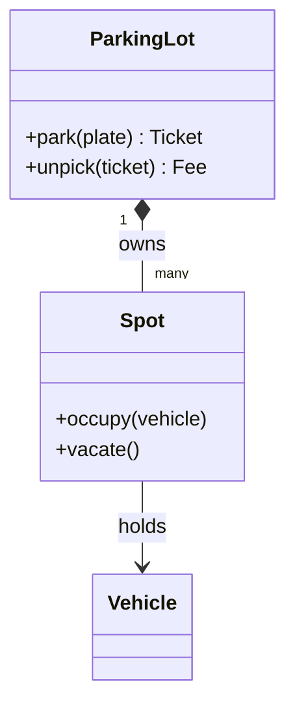
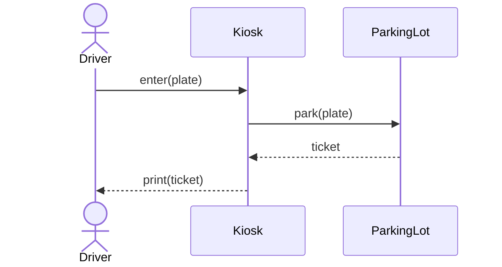

# Welcome to Computer Science

This is a complete course for absolute beginners. It assumes you know nothing about computers, programming, or mathematics beyond school arithmetic, and it ends with you able to build real software and explain how computers work from electricity to the internet. Take it slowly, do the practice, and let the course carry you.

The course is built as one continuous story. Almost every idea in it was invented because the previous idea hit a wall: a method stopped working, a program grew too confusing, a machine became too slow, a file got corrupted. Whenever something new appears, you will meet the reason it exists first - so nothing feels arbitrary, and nothing important is skipped.

Three habits will make every unit easier: trace small examples by hand, run the code and change things to see what happens, and explain out loud what the computer must be doing. Understanding comes from doing, not from reading alone.

---

## How to Read This Course

Every lesson follows the same rhythm, so once you have read one lesson you know the shape of all of them. First you see the problem - what broke, or what you could not do yet. Then the idea that solves it, in ordinary words. Then how it works inside the machine, a picture or example to make it concrete, and practice to make it yours. Each lesson ends by telling you what difficulty it leaves behind - and that difficulty is exactly what the next lesson opens with.

If a comparison shows two ways of doing something, focus on why an engineer would pick one over the other rather than trying to label one as always "best." If a word is new, it is defined in plain language the moment it appears.

**Diagram conventions.** Diagrams are plain ASCII inside code fences, so they look the same on GitHub, in any editor, in a terminal, and in a diff. Throughout, `|` and `v` mean "then this happens", `-->` and `->` mean a request or data movement, `X` marks a failure point, and boxes drawn with `+---+` are components or memory regions. Where a diagram shows a sequence over time, time runs downward.

### Start here if computer science is completely new to you

Do not try to memorize definitions before you have seen them work. For each lesson, trace one tiny example by hand, run the code, change an input, and say what the computer does next. When a lesson compares two choices, focus on the reason for choosing one rather than trying to label one as always “best.”

**Everyday words**

| Word                     | Meaning                                                                                                               |
| ------------------------ | --------------------------------------------------------------------------------------------------------------------- |
| **Program**        | A set of **instructions** a computer follows                                                                     |
| **Algorithm**      | The **ordered method** used to solve a problem                                                                   |
| **Data structure** | The way **information** is arranged so the program can use it                                                    |
| **Memory**         | The computer's **short-term working space**                                                                      |
| **System**         | A group of parts: **programs**, **machines**, **storage**, and **networks** that work together |

**Words you will meet often**

| Word                         | Meaning                                                                                      |
| ---------------------------- | -------------------------------------------------------------------------------------------- |
| **Runtime**            | The time when a program is **executing**                                                |
| **Compiler**           | **Translates** code before it runs                                                     |
| **Interpreter**        | **Executes** code through another program, as it goes                                  |
| **Complexity**         | How **time** or **memory** needs grow as the input grows                          |
| **Stack**              | Stores active **function calls**                                                        |
| **Heap**               | Holds **longer-lived data** created while the program runs                              |
| **Process**            | A **running program** with its own memory                                               |
| **Thread**             | One **path of work** inside a process                                                   |
| **API**                | An **agreed way** for software parts to communicate                                     |
| **Distributed system** | One job performed by **multiple computers** that can communicate and fail independently |

---

## The Journey Ahead

The course has 15 units, 105 chapters in all. Each unit answers the question you would naturally be asking at that point. Here is the whole journey before we take the first step:

1. **Before You Write Code** - what a computer actually does with information: how bits stand for numbers, words and pictures, how logic becomes hardware, and how your source code becomes a running program.
2. **Learning to Control the Machine** - we finally understand what happens underneath; now it is our turn to give the computer instructions: run code, store values, make decisions, repeat work, organize files, and fix mistakes.
3. **The Mathematical Language of CS** - ways to reason precisely about logic, uncertainty, scale and correctness: logic, proof, counting, probability, statistics, and just enough algebra and calculus to read them without fear.
4. **Organizing Large Software** - when hundreds of functions become hard to follow, structure software with objects, principles, patterns, and deliberate design.
5. **Data Structures & Algorithms** - two solutions both work; learn to see which one is better, and why, using lists, trees, graphs, sorting, search, and correctness arguments.
6. **Inside the Computer** - lift the hood: how instructions execute, how memory really works, what an operating system does, why programs deadlock.
7. **Connecting Computers** - one machine talking to another: networks, TCP and UDP, DNS, HTTP, and the design of APIs. Along the way we will also touch the strangest question in the field: are there problems no computer can ever solve?
8. **Data That Survives** - how databases keep information safe when programs crash, and how to query it quickly.
9. **Security & Human-Centered Software** - protecting data from attackers, and designing software actual humans can use.
10. **Professional Software Engineering** - how real teams collaborate with Git, test their work, automate releases, deploy to the cloud, and watch over production systems.
11. **System Design & Distributed Systems** - what changes when one server is not enough, and millions of users arrive at once.
12. **Other Core CS Areas** - artificial intelligence, computers that are not laptops, and the ethics of what we build.
13. **Maintaining Real Software** - reading other people's code safely, working with old systems, and explaining decisions clearly.
14. **Grand Capstone** - plan, build, stress-test, and release one complete application that uses everything above.
15. **Interview & Job Readiness** - prove what you can now do: coding interviews, design interviews, behavioral stories, and a full rehearsal loop.

Take the units in order. Every chapter ends by telling you exactly which door it opens into the next one.

---

<a id="phase-index"></a>

## Chapter Index

*105 chapters across 15 units.*

### Unit I - Before You Write Code

| # | Chapter                               | Goal                                    | Ready to continue when...                                                |
| - | ------------------------------------- | --------------------------------------- | ------------------------------------------------------------------------ |
| 1 | What Is Computer Science?             | See the field before the tool           | Distinguish CS / programming / SE; name abstraction as a preview idea    |
| 2 | How Computers Represent Information   | Bits, bytes, encodings, numeric types   | Convert bases; explain signed ints, floats, and UTF-8 at a working level |
| 3 | Logic & Digital Computation           | Boolean logic to gates                  | Build a truth table and a half adder                                     |
| 4 | Computer Hardware                     | CPU, memory, I/O (preview → 49)        | Name the parts a program runs on; know Chapter 49 owns depth             |
| 5 | From Source Code to a Running Program | Syntax/semantics, compile paths, memory | Explain syntax vs semantics; bytecode/JIT; stack vs heap                 |

### Unit II - Learning to Control the Machine

| #  | Chapter                          | Goal                         | Ready to continue when...                                   |
| -- | -------------------------------- | ---------------------------- | ----------------------------------------------------------- |
| 6  | Development Environment          | Workspace + run Python       | Use folders/terminal/editor; run a script; read a traceback |
| 7  | Variables, Values & Types        | Name and type data           | Predict a variable's type and value without running it      |
| 8  | Control Flow                     | Branch and repeat            | Write nested decisions without panic                        |
| 9  | Functions & Scope                | Reuse behavior, manage scope | Split into functions; explain local vs global scope         |
| 10 | Collections                      | Group related data           | Choose list, tuple, set, or dict for a given problem        |
| 11 | Strings & Files                  | Text, files, JSON, CSV       | Parse text; read/write files; load/save JSON and CSV        |
| 12 | Errors & Defensive Programming   | Anticipate failure           | Classify syntax/runtime/logic failures; handle exceptions   |
| 13 | Debugging                        | Find the actual bug          | Isolate a failure with prints/debugger; use basic logging   |
| 14 | Modules, Packages & Environments | Organize growing code        | Split across modules; create/activate a venv; freeze deps   |
| 15 | Programming Consolidation        | Prove procedural fluency     | Build a small multi-file CLI tool without a tutorial        |

### Unit III - The Mathematical Language of CS

| #  | Chapter                             | Goal                               | Ready to continue when...                                        |
| -- | ----------------------------------- | ---------------------------------- | ---------------------------------------------------------------- |
| 16 | Discrete Mathematics                | Sets, logic, functions, relations  | Read and write basic discrete-math notation                      |
| 17 | Proof & Mathematical Reasoning      | Argue correctness, not vibes       | Use counterexamples; write an induction proof for a simple claim |
| 18 | Counting & Probability              | Combinatorics, probability, E[X]   | Compute combinations; conditional probability; expected value    |
| 19 | Statistics for Computing            | Describe and compare data          | Explain mean/median/variance and distribution shape              |
| 20 | Linear Algebra & Calculus Intuition | Vectors, matrices, rates of change | Read a matrix multiply and a derivative in plain language        |

### Unit IV - Organizing Large Software

| #  | Chapter                     | Goal                                         | Ready to continue when...                                                 |
| -- | --------------------------- | -------------------------------------------- | ------------------------------------------------------------------------- |
| 21 | Object Thinking             | See why OOP exists                           | Contrast procedural vs OOP failure modes                                  |
| 22 | Classes & Objects           | Blueprint vs instance, state & behavior      | Draw the heap picture of two objects and write a correct`__init__`      |
| 23 | Encapsulation & Abstraction | Protect invariants, hide implementation      | Make invalid state unreachable and design an ABC callers can trust        |
| 24 | Inheritance & Polymorphism  | Reuse by is-a, one interface many forms      | Explain MRO and replace an if/elif type chain                             |
| 25 | Composition                 | Prefer has-a                                 | Rewrite an inheritance hierarchy as composition; preview Chapter 29 edges |
| 26 | SOLID                       | Localize change                              | Apply each letter with a before/after                                     |
| 27 | Code Quality & Refactoring  | Spot bad design early                        | Name a smell and perform the matching refactor                            |
| 28 | Design Patterns             | Shape construction, structure, collaboration | Apply one creational, one structural, one behavioral pattern              |
| 29 | Low-Level Design            | Model relationships, design under pressure   | Map Chapter 25 has-a to assoc/agg/comp; run the LLD checklist             |
| 30 | OOP Consolidation           | Idiomatic Python OOP, prove skill            | Use`@property`/dunders correctly and publish a design write-up          |

### Unit V - Data Structures & Algorithms

| #  | Chapter                     | Goal                            | Ready to continue when...                                       |
| -- | --------------------------- | ------------------------------- | --------------------------------------------------------------- |
| 31 | Complexity Analysis         | A ruler for comparing solutions | State the Big O of your own code, unprompted                    |
| 32 | Arrays & Strings            | Contiguous storage              | Implement common array/string operations from scratch           |
| 33 | Linked Lists                | Pointer-chained storage         | Implement singly/doubly linked list operations from scratch     |
| 34 | Stacks, Queues & Deques     | LIFO/FIFO + both-ends access    | Implement stacks/queues; use a deque when both ends matter      |
| 35 | Recursion                   | Let structure branch            | Write a correct base case and trace a call stack by hand        |
| 36 | Hashing                     | O(1) "have I seen this"         | Reach for a hash map by instinct                                |
| 37 | Trees                       | Model hierarchy                 | Implement traversal and validate a BST                          |
| 38 | Heaps & Priority Queues     | Model priority                  | Solve a top-k problem with a heap                               |
| 39 | Sorting                     | Impose order                    | Implement merge sort by hand                                    |
| 40 | Searching                   | Exploit order                   | Explain why binary search needs sorted input                    |
| 41 | Graphs                      | Model arbitrary relationships   | BFS/DFS; topological sort; Dijkstra on non-negative weights     |
| 42 | Algorithmic Patterns        | Recognize repeated substructure | Spot array patterns (32) and greedy/DP/backtracking shapes      |
| 43 | Greedy Algorithms           | Provably-correct local choices  | Prove a greedy choice is safe for a given problem               |
| 44 | Backtracking                | Prune a search space            | Implement a constraint-satisfaction backtracking solution       |
| 45 | Dynamic Programming         | Reuse overlapping subproblems   | Write both memoized and tabulated solutions                     |
| 46 | Specialized Data Structures | Trie, Union-Find, Bloom         | Implement trie prefix search; union-find; explain Bloom filters |
| 47 | Algorithm Correctness       | Prove it, don't just test it    | Write a loop invariant or induction argument for your own code  |
| 48 | DSA Consolidation           | Combine structures (LRU)        | Build LRU from hash map + doubly linked list under load         |

### Unit VI - Inside the Computer

| #  | Chapter                          | Goal                              | Ready to continue when...                             |
| -- | -------------------------------- | --------------------------------- | ----------------------------------------------------- |
| 49 | Computer Architecture            | Fetch-decode-execute, ISA, caches | Trace instructions; name ISA and one pipeline hazard  |
| 50 | Memory & Program Representation  | Virtual memory + pointers         | Explain a page fault and what a pointer stores        |
| 51 | Programming Language Foundations | Syntax, semantics, execution      | Compare two languages' execution models precisely     |
| 52 | Operating Systems                | Processes + filesystem basics     | Explain process vs thread and path → inode → data   |
| 53 | Concurrency & Parallelism        | Shared state, races               | Identify a race condition and fix it with a lock      |
| 54 | Systems Programming              | Syscalls, FDs, sockets (apply FS) | Write a small program using real syscalls or a socket |

### Unit VII - Connecting Computers

| #  | Chapter                | Goal                            | Ready to continue when...                                     |
| -- | ---------------------- | ------------------------------- | ------------------------------------------------------------- |
| 55 | Networking Foundations | Layers and addressing           | Trace a packet from laptop to server through the layers       |
| 56 | TCP, UDP & Sockets     | Reliable vs unreliable delivery | Explain the TCP handshake and when UDP is the right choice    |
| 57 | DNS & The Internet     | Names to addresses              | Trace a DNS resolution end to end                             |
| 58 | HTTP                   | The web's protocol              | Read a raw HTTP request/response by hand                      |
| 59 | API Design             | Contracts between programs      | Design a REST API with correct verbs, status codes, resources |

### Unit VIII - Data That Survives

| #  | Chapter                       | Goal                    | Ready to continue when...                                  |
| -- | ----------------------------- | ----------------------- | ---------------------------------------------------------- |
| 60 | Database Foundations          | Why files aren't enough | Explain what a database adds over a flat file              |
| 61 | SQL                           | Joins + aggregation     | Write a JOIN with GROUP BY/HAVING or a CTE correctly       |
| 62 | Data Modeling                 | Normalize a schema      | Design a normalized schema and justify a denormalization   |
| 63 | Database Internals            | Indexes, B-trees        | Explain why an index speeds up one query and slows another |
| 64 | Transactions & Concurrency    | ACID under load         | Explain an isolation level and a race it prevents          |
| 65 | Operating & Scaling Databases | Replication, sharding   | Contrast replication vs partitioning vs sharding           |

### Unit IX - Security & Human-Centered Software

| #  | Chapter                          | Goal                           | Ready to continue when...                            |
| -- | -------------------------------- | ------------------------------ | ---------------------------------------------------- |
| 66 | Security Foundations             | Threats, trust boundaries, CIA | Name trust boundaries and a light STRIDE threat      |
| 67 | Cryptography for Developers      | Hash / encrypt / sign + TLS    | Explain hashing vs encryption vs signing; sketch TLS |
| 68 | Authentication & Authorization   | Sessions, MFA, RBAC, JWT       | Explain MFA factors and an RBAC permission check     |
| 69 | Application Security             | OWASP basics + rate limits     | Prevent SQLi/XSS/CSRF; apply a basic rate limit      |
| 70 | Human-Computer Interaction       | Software has users             | Critique and redesign a confusing interface          |
| 71 | Graphics & Interactive Computing | Pixels, frames, input          | Explain a basic rendering/input loop                 |

### Unit X - Professional Software Engineering

| #  | Chapter                              | Goal                            | Ready to continue when...                                |
| -- | ------------------------------------ | ------------------------------- | -------------------------------------------------------- |
| 72 | Git & Collaboration                  | Safe collaboration history      | Review a PR and resolve a merge conflict confidently     |
| 73 | Requirements Engineering             | Turn ambiguity into a spec      | Write a spec a teammate could build from unaided         |
| 74 | Testing                              | Prove behavior automatically    | Write a test pyramid and explain what each layer catches |
| 75 | Software Architecture                | Keep policy independent         | Separate domain logic from I/O in a small service        |
| 76 | Development Process                  | Ship predictably                | Explain your team's workflow and why each gate exists    |
| 77 | CI/CD                                | Automate the path to production | Explain a pipeline stage and what it would catch         |
| 78 | Containers & Deployment              | Package and ship                | Containerize and run a small service                     |
| 79 | Cloud Fundamentals                   | Shared responsibility           | Explain IaaS/PaaS/SaaS and who owns which risk layer     |
| 80 | Observability & Production Debugging | Logs, metrics, traces           | Separate logs/metrics/traces; define a simple SLI/SLO    |

### Unit XI - System Design & Distributed Systems

| #  | Chapter                             | Goal                              | Ready to continue when...                                    |
| -- | ----------------------------------- | --------------------------------- | ------------------------------------------------------------ |
| 81 | System Design Foundations           | How to think + estimate           | Clarify, estimate, draw simplest shape, name next lever      |
| 82 | Scaling Applications                | Handle more load                  | Identify a bottleneck and the fix that removes it            |
| 83 | Caching                             | Trade staleness for speed         | Choose a cache strategy and explain its invalidation risk    |
| 84 | Asynchronous & Event-Driven Systems | Decouple with queues/events       | Explain when a queue beats a direct call                     |
| 85 | Distributed Systems                 | CAP + consistency across machines | Explain CAP with a concrete partition (≠ ACID C)            |
| 86 | Coordination & Consensus            | Agree despite failure             | Explain what a consensus algorithm buys you                  |
| 87 | Reliability Patterns                | Survive partial failure           | Explain retries, timeouts, circuit breakers, and their risks |
| 88 | Complete System Design              | Put it all together               | Run a full system design walkthrough unprompted              |

### Unit XII - Other Core CS Areas

| #  | Chapter                             | Goal                              | Ready to continue when...                                 |
| -- | ----------------------------------- | --------------------------------- | --------------------------------------------------------- |
| 89 | Artificial Intelligence Foundations | Broad AI/ML survey (not LLM-only) | Separate search/planning, classical ML, and deep learning |
| 90 | Specialized Computing Platforms     | Platform constraint comparison    | Compare mobile/embedded/edge by scarce resource           |
| 91 | Computing, Society & Ethics         | Ethical engineering scenarios     | Write case responses with stakeholders and mitigations    |

### Unit XIII - Maintaining Real Software

| #  | Chapter                       | Goal                             | Ready to continue when...                                |
| -- | ----------------------------- | -------------------------------- | -------------------------------------------------------- |
| 92 | Working in Existing Codebases | Read before you write            | Onboard into an unfamiliar codebase and ship a small fix |
| 93 | Legacy Code & Maintenance     | Change code safely without tests | Add a test seam to legacy code before changing it        |
| 94 | Engineering Communication     | Explain decisions, not just code | Write a design doc or ADR for a real decision            |

### Unit XIV - Grand Capstone

| #  | Chapter                          | Goal                 | Ready to continue when...                               |
| -- | -------------------------------- | -------------------- | ------------------------------------------------------- |
| 95 | Capstone Planning                | Scope MVP only       | Write a buildable spec with musts, non-goals, done-when |
| 96 | Build the Production Application | Ship the walking app | Multi-user MVP on a public URL with CI                  |
| 97 | Break, Measure & Harden          | Find limits          | Load-test, find a failure, fix and prove                |
| 98 | Portfolio Release                | Package the proof    | Publish docs, diagrams, and a decision write-up         |

### Unit XV - Interview & Job Readiness

| #   | Chapter                          | Goal                             | Ready to continue when...                           |
| --- | -------------------------------- | -------------------------------- | --------------------------------------------------- |
| 99  | Coding Interview Method          | Narrate under observation        | Run the six-step timed coding process aloud         |
| 100 | DSA Interview Practice           | Unit V under a clock             | Timed mixed Mediums — not a second DSA course      |
| 101 | CS Fundamentals Interview Review | Fast recall cards                | Two-minute answers without notes                    |
| 102 | Low-Level Design Interviews      | Chapter 29 skill, interview pace | 30–45 min LLD prompt — no artificial project      |
| 103 | System Design Interviews         | Chapter 88 process, live         | 45 min design interview — not a re-teach of 81–87 |
| 104 | Behavioral Interviews            | STAR from real work              | Structured stories from your capstone/career        |
| 105 | Final Mock Interview Loop        | Dress rehearsal only             | Full loop + debrief — not new curriculum           |

---

# CHAPTER 1 - What Is Computer Science?

**Track:** Foundations

**WHAT YOU SHOULD KNOW FIRST:** Nothing. This is the true starting point of the whole course.

Before we learn programming, we need to understand what we are actually programming. You use phones, laptops, websites and apps every day, but what exactly is a computer doing in there? That is the question this chapter - and this whole first unit - answers.

## Lesson 1.1 Problems, Inputs & Outputs

**CHAPTER OPENING — SO, WHAT EXACTLY IS A COMPUTER?:**

**COMPUTERS ARE EVERYWHERE:**

Look around. Your phone is a computer. So is your laptop, the router that gives you Wi-Fi, the card that pays for your coffee, the watch on your wrist, and the controller in your car that decides when to fire a spark plug. Most of these have no keyboard and no screen, yet all of them are computers: machines that take information in, do something to it, and produce a result.

This course is about what those machines have in common underneath, not about any one brand or device.

**WHAT COMPUTERS CAN AND CANNOT DO:**

A computer is astonishingly fast and perfectly obedient - and completely literal. It will do exactly what your instructions say, not what you meant. It has no common sense, no intuition, and no idea what your instructions are *for*. Every apparent "smartness" you see in software comes from precise instructions that a person wrote (or trained) ahead of time.

That combination - enormous speed inside total literalness - explains almost everything about how this subject works. We spend our careers learning to describe tasks precisely enough that this very fast, very literal machine can carry them out.

**WHAT "COMPUTING" ACTUALLY MEANS:**

Strip away screens and speakers and a computer does exactly one kind of thing: **computing** - transforming information according to definite rules. Numbers become other numbers. A typed sentence becomes pixels arranged on a screen. Sensor readings become a decision to brake. The information changes form constantly; the rules for changing it never waver.

That is why this field is called *computer science* rather than *computer construction*: the object of study is the transformation itself.

**WHY COMPUTER SCIENCE EXISTS:**

Once people noticed that many problems - calculating artillery tables, sorting census cards, routing phone calls - could be described as rule-following transformations of information, they needed a discipline to ask: Which transformations are possible? How do we describe them precisely? How fast can they go? Can some problems never be solved at all?

Computer Science is that discipline. The machines are its tools; computation itself is its subject.

**LEARNING RESOURCES:**

- [CS50x, Lecture 0 (Harvard, David J. Malan)](https://www.youtube.com/playlist?list=PLhQjrBD2T380F_inVRXMIHCqLaNUd7bN4) - starts from exactly this question, with no assumed background
- [Early Computing: Crash Course Computer Science #1](https://www.youtube.com/watch?v=O5nskjZ_GoI) - computation as a human problem before it was ever an electronic one
- [CS50 course site](https://cs50.harvard.edu/x/) - the written companion to the lectures above

**CHAPTER ROADMAP — WHERE ARE WE GOING?:**

**PROBLEMS:**

Everything in this course starts with a problem someone wants solved: find a name in a list, draw a pixel, deliver a message across the world. Learning to state a problem precisely turns out to be half of solving it.

**INFORMATION:**

Problems are *about* something - numbers, names, pictures, clicks. Inside a machine, all of it becomes patterns of on/off signals. Unit I shows exactly how.

**INSTRUCTIONS:**

A stated problem plus represented information still needs a recipe: an unambiguous list of steps a machine can follow. Recipes for computers are called algorithms; recipes written in a language machines can execute are called programs.

**COMPUTATIONAL THINKING:**

Between problems and programs sits a way of thinking: break the problem down, spot patterns, hide irrelevant detail, describe solutions as steps. You will use it in every chapter of this course.

**PROBLEMS:**

Long before electronic computers existed, people needed repeatable ways to solve problems: dividing a harvest fairly, following a recipe so it comes out the same way twice, finding one name in a phone book without reading every page. "Just think about it and figure it out" fails at all three jobs - it does not scale to bigger problems, it does not transfer to another person, and nobody can check it for correctness.

Something more precise was needed, and inventing that precision is where computer science begins.

**INPUTS:**

Every problem-solving process needs material to work on. For a computer, that material arrives as **input**: data given to the machine before or while it works - the name you type into a search box, the photo you open, the packet arriving from the network.

An **algorithm** is a precise, finite sequence of steps that turns an input into an output, and that produces the same output every time it is given the same input - whether the thing carrying out the steps is a person, a clockwork machine, or a CPU. "Precise" means every step is unambiguous enough that it cannot be misread. "Finite" means it is guaranteed to stop. A recipe that says "add salt to taste" is not yet an algorithm; a recipe that says "add 5 grams of salt" is.

**PROCESSING:**

Given inputs, the machine **processes** them: carries out the steps of its instructions on the data. Processing is where speed stops mattering to us and precision matters completely - the CPU does billions of tiny steps per second, each one trivially simple.

Computer science is not "the study of computers" any more than astronomy is "the study of telescopes." Computers are the tool; the subject is **computation itself** - what problems can be solved by a step-by-step procedure, how to describe that procedure precisely, and how to know it will actually work.

**OUTPUTS:**

Processing ends by producing an **output**: the found contact, the displayed image, the braked car, the sorted list. Input → processing → output is the shape of every program you will ever write, from a two-line script to a planet-scale system.

Trace this by hand before reading on: you have a phone book with 1,024 names in alphabetical order, and you need to find "Ortiz." You could start at page 1 and read every name (that works, but could take 1,024 checks). Or you could open to the middle, see that the page you landed on is past "Ortiz," and throw away the entire second half in one move - then repeat on the half that's left.

```text
1024 names -> check middle -> keep the half that can contain "Ortiz" -> 512 names
 512 names -> check middle -> keep the half that can contain "Ortiz" -> 256 names
 256 names -> check middle -> keep the half that can contain "Ortiz" -> 128 names
   ... this halves every time, so it finishes in about 10 checks, not 1,024
```

Both procedures are algorithms - both are precise and both finish. But one throws away information faster than the other. There can be more than one correct procedure for the same problem, and they are not automatically equally good. Comparing them is a skill you will build across this entire course.

**Key words**

| Word                  | Meaning                                                                                             |
| --------------------- | --------------------------------------------------------------------------------------------------- |
| **Computer**    | A machine that takes **input**, **processes** it by rules, and produces **output** |
| **Input**       | Data given to a program **before or while** it runs                                            |
| **Processing**  | Carrying out the **steps** of instructions on data                                             |
| **Output**      | The **result** a program produces after processing                                             |
| **Computation** | Transforming **information** according to definite rules                                       |

## Lesson 1.2 Algorithms

**STEP-BY-STEP INSTRUCTIONS:**

An algorithm's steps must be small enough that nothing is left to judgment: compare these two values, take the left pile, repeat until empty. When steps meet that standard, anyone - or any machine - can execute them without understanding the goal.

That last part is worth pausing on. A computer follows an algorithm without ever knowing what it is doing. Precision is what makes that possible.

**EVERYDAY ALGORITHMS:**

You already know dozens of algorithms outside computing: long division, a music score, an IKEA assembly sheet, directions to a station. Each is a fixed sequence of unambiguous steps that produces the same result every time for the same input.

Each also hides the classic algorithmic dangers: ambiguity ("insert gently"), missing cases ("what if the bag has two compartments?"), and non-termination ("repeat until it looks right"). Writing good algorithms means hunting down exactly these flaws.

**ALGORITHMS BEFORE PROGRAMMING:**

Here is the ordering this whole unit insists on: the algorithm exists first, in plain language, and only later becomes code. Programmers who skip the algorithm stage end up debugging their ideas inside a programming language, which is the slowest possible way to think.

In Chapter 8 you will finally express algorithms in Python; everything before then builds the ideas the code will stand on.

**Key words**

| Word                  | Meaning                                                                   |
| --------------------- | ------------------------------------------------------------------------- |
| **Algorithm**   | A **precise, finite** sequence of steps that turns input into output |
| **Ambiguity**   | A step that leaves room for **judgment** - machines cannot follow it |
| **Termination** | A guarantee the steps will **stop**, not run forever                 |

## Lesson 1.3 CS vs Programming vs Software Engineering

Three words get mixed together constantly - keep them separate from day one:

| Term                           | What it means here                                                                                         | What it is*not*                                                              |
| ------------------------------ | ---------------------------------------------------------------------------------------------------------- | ------------------------------------------------------------------------------ |
| **Computer science**     | The study of computation: algorithms, representation, correctness, cost, systems, and the math underneath  | Not "learning a programming language," and not "shipping products"             |
| **Programming**          | Writing precise instructions a machine can execute - one craft inside CS                                   | Not the whole of CS; you can study algorithms on paper without shipping an app |
| **Software engineering** | Building and operating software that lasts: teams, testing, design for change, deployment (Units 4, 10-11) | Not "writing any code that runs once"                                          |

**COMPUTER SCIENCE:**

CS asks the general questions: What can be computed? How efficiently? How do we know an answer is right? Its results apply to any computer, any language, any decade.

**PROGRAMMING:**

Programming is where CS touches metal: translating an algorithm into a language like Python so a real machine can run it. It is a skill with craft depth of its own - and it is much easier once the algorithm is already solid.

**SOFTWARE ENGINEERING:**

Software engineering scales programming up to systems built by teams, maintained for years: naming, testing, reviewing, designing for change. It gets its own unit later (Unit X); here you only need the distinction.

**HOW THEY FIT TOGETHER:**

Think of three rings nested inside each other: programming happens inside software engineering, and both happen inside computer science. This course walks inward through all three rings in that order - foundations first, then programming, then engineering practice.

One idea starts here and returns formally much later: **abstraction** means hiding detail behind a clean interface so you can reason at one level without drowning in the next. "Open the middle of the phone book" is an abstraction over "compare character codes byte by byte." You will use abstraction constantly when you start programming, and later you will design with it deliberately.

**Key words**

| Word                           | Meaning                                                                              |
| ------------------------------ | ------------------------------------------------------------------------------------ |
| **Computer science**     | The study of **computation**: algorithms, representation, cost, and correctness |
| **Programming**          | Writing **precise instructions** a machine can execute                          |
| **Software engineering** | Building and operating software that **lasts**: teams, tests, design, deploy    |
| **Abstraction**          | Hiding detail behind a **clean interface** so you can reason at one level       |

## Lesson 1.4 Abstraction

An **abstraction** presents the details needed for one job while hiding details that would distract from that job. A subway map shows stations, lines, and connections but not every street or building. The omitted details are real; they simply do not help a passenger choose a route.

Programs rely on the same idea. When you call `print("Hello")`, you use a small interface: supply a value and Python displays it. You do not need to control character encoding, terminal buffers, operating-system calls, or pixels individually. Those implementation details still exist below the interface.

```text
Your program:       print("Hello")       <- useful interface
                         |
Python runtime:     encode and buffer text
                         |
Operating system:   write bytes to a device
                         |
Hardware:           display pixels
```

Each layer gives the layer above it a simpler model. This makes large systems possible: a web developer can work with an HTTP request without first designing a network card.

**CHOOSING THE RIGHT DETAILS:**

Abstraction is task-dependent. A weather app may represent a location with a city name and coordinates. A navigation app also needs roads, turn restrictions, and travel time. A land survey needs still more precision. None is the one "true" representation; each keeps the details required for its purpose.

Consider a bank-account function:

```python
def withdraw(balance, amount):
    if amount <= 0:
        return balance, "amount must be positive"
    if amount > balance:
        return balance, "insufficient funds"
    return balance - amount, "approved"

print(withdraw(100.0, 40.0))   # (60.0, 'approved')
print(withdraw(50.0, 100.0))   # (50.0, 'insufficient funds')
print(withdraw(50.0, -10.0))   # (50.0, 'amount must be positive')
```

The caller needs to know the inputs and possible results. It should not need to know whether the bank later stores transactions in a file, a database, or a remote service. That separation between **interface** and **implementation** lets the implementation change without forcing every caller to change.

An abstraction can also hide too much. If `withdraw` returned only `False`, the caller could not distinguish an invalid amount from insufficient funds. When hidden information is needed to diagnose or control behavior, the abstraction is too weak or is **leaking**. Good abstractions are simple, but still expose the decisions their users genuinely need.

**TRY IT:**

- Easy: list the details a food-delivery customer sees and three implementation details the app hides.
- Medium: design an interface for a timer using only function names, inputs, and outputs. Another learner should be able to use it without seeing its implementation.
- Hard: compare a paper road map, a subway map, and a satellite image. For one journey, explain which is the best abstraction and which omitted detail could cause it to fail.

Abstraction reduces how much you must think about at once. The next lesson tackles the complementary problem: deciding how to divide one large task into manageable parts.

**Key words**

| Word                     | Meaning                                                            |
| ------------------------ | ------------------------------------------------------------------ |
| **Abstraction**    | Shows the details needed for a job and **hides** the rest     |
| **Interface**      | What a caller is allowed to **see and use**                   |
| **Implementation** | How the work is done **underneath** the interface             |
| **Leak**           | When a hidden detail must be known to use or debug the abstraction |

## Lesson 1.5 Decomposition

**Decomposition** means breaking a large problem into smaller problems with clear responsibilities. It turns "build an expense tracker" into parts that can be understood, implemented, and tested separately.

Start from observable behavior, then keep splitting until each part is small enough to explain:

```text
Expense tracker
├── capture an expense
│   ├── read amount and category
│   └── reject invalid input
├── store expenses
│   ├── add a record
│   └── load existing records
├── calculate totals
│   ├── total all expenses
│   └── group totals by category
└── present a report
    ├── format rows
    └── show the grand total
```

This tree does more than create a to-do list. It reveals inputs, outputs, dependencies, and natural test boundaries. For example, `calculate totals` can be tested with a short list of expenses before storage or a user interface exists.

**STEP-BY-STEP EXAMPLE:**

Suppose the first version only calculates a total:

```python
def total_expenses(expenses):
    total = 0
    for expense in expenses:
        total += expense["amount"]
    return total

sample = [
    {"category": "food", "amount": 12.50},
    {"category": "travel", "amount": 7.25},
]

print(total_expenses(sample))  # 19.75
```

The function has one responsibility: transform expense records into a total. Reading keyboard input or printing a report inside it would make it harder to reuse and test. Those jobs belong to other parts.

A useful decomposition balances two risks. Pieces that are too large remain confusing; pieces that are too tiny create excessive coordination. "Validate an expense" is a meaningful unit. Separate parts named "read first character" and "compare one digit" probably are not useful at this scale.

**TRY IT:**

- Easy: split "prepare a sandwich" into five ordered actions. Identify the input and result of each action.
- Medium: draw a decomposition tree for a quiz program that asks questions, checks answers, and reports a score.
- Hard: implement and test only the scoring component. Include empty answers, different capitalization, and an empty quiz. Record why each test belongs to that component.

You can now hide irrelevant detail and divide a problem into workable pieces. Computational thinking combines those moves with pattern recognition and precise procedures.

**Key words**

| Word                     | Meaning                                                              |
| ------------------------ | -------------------------------------------------------------------- |
| **Decomposition**  | Breaking a large problem into **smaller parts** with clear jobs |
| **Responsibility** | What one part is **accountable** for                            |
| **Boundary**       | Where one part **ends** and another begins                      |

## Lesson 1.6 Computational Thinking

**Computational thinking** is a disciplined way to formulate problems so that a person or machine can carry out a solution. It is not merely "thinking like a computer." It combines four moves:

1. **Decompose** the problem into manageable responsibilities.
2. **Recognize patterns** shared by cases you have already solved.
3. **Abstract** away details that do not affect the required result.
4. **Design and evaluate an algorithm**: precise steps that terminate and produce the intended output.

The moves are related, but they are not a rigid one-way recipe. Testing an algorithm may reveal a missing case, forcing you to revise the abstraction or decompose one step further.

**WORKED PROBLEM — FINDING A BOOK:**

Imagine a small library with a list of books. Given a title, report its shelf number.

- Decomposition separates input normalization, searching, and reporting.
- Pattern recognition notices that titles differing only in capitalization should be treated alike.
- Abstraction represents each book using only the title and shelf; cover color is irrelevant to this search.
- The algorithm examines entries until it finds a matching normalized title or reaches the end.

```python
def find_shelf(books, wanted_title):
    target = wanted_title.strip().lower()

    for book in books:
        if book["title"].strip().lower() == target:
            return book["shelf"]

    return None

catalog = [
    {"title": "Clean Code", "shelf": "A3"},
    {"title": "The Pragmatic Programmer", "shelf": "B1"},
]

print(find_shelf(catalog, " clean code "))  # A3
print(find_shelf(catalog, "Dune"))          # None
```

Trace the first call: normalize the target to `clean code`; normalize the first stored title; compare them; return `A3`; stop. The missing-title call checks every entry and returns `None`. Those two paths define observable evidence that the solution works.

Now change the requirement to find a book among ten million records. The problem is still correctly formulated, but checking every record may be too slow. Sorting the data or building an index introduces new costs and new algorithms. Computational thinking therefore includes evaluating correctness, efficiency, constraints, and failure cases—not merely writing steps.

**TRY IT:**

- Easy: apply the four moves to sorting a pile of laundry. State which details you ignored.
- Medium: write pseudocode for finding the cheapest in-stock product. Include an empty product list and tied prices.
- Hard: implement the product search, create at least five tests, and explain what must change if the product data no longer fits in memory.

These first lessons established the vocabulary for turning human goals into precise solutions. The next chapter descends one layer and examines how a computer represents and executes those solutions physically.

**Key words**

| Word                             | Meaning                                                                       |
| -------------------------------- | ----------------------------------------------------------------------------- |
| **Computational thinking** | Formulating problems so a person or machine can **carry out** a solution |
| **Pattern recognition**    | Spotting **repeated structure** so one solution can cover many cases     |
| **Algorithmic thinking**   | Describing a solution as **clear steps** a machine can follow            |

## Lesson 1.7 PRACTICE — Written / By Hand

**PRACTICE UNTIL IT FEELS FAMILIAR**

| Difficulty | Task                                                                                                                                                       |
| ---------- | ---------------------------------------------------------------------------------------------------------------------------------------------------------- |
| Easy       | Pick a daily app and identify one input, one processing step, and one output it produces                                                                   |
| Medium     | Take "make a cup of tea" and rewrite it as an algorithm: remove all ambiguity, handle the missing case (no milk), and make sure it always terminates       |
| Hard       | Describe a problem from your own life using decomposition, pattern recognition, abstraction, and step-by-step thinking - one short paragraph per technique |

**LEARNING RESOURCES:**

- [CS50x, Lecture 0 (Harvard, David J. Malan)](https://www.youtube.com/playlist?list=PLhQjrBD2T380F_inVRXMIHCqLaNUd7bN4) - starts from exactly this question, with no assumed background
- [Early Computing: Crash Course Computer Science #1](https://www.youtube.com/watch?v=O5nskjZ_GoI) - computation as a human problem before it was ever an electronic one
- [CS50 course site](https://cs50.harvard.edu/x/) - the written companion to the lectures above

**WHAT THIS UNLOCKS NEXT:** We now know that computers take input, process it, and produce output. But there is an unanswered question: how can a machine understand numbers, words, pictures, or anything else? That takes us to the next chapter.

**CHAPTER SUMMARY:**

**WHAT WE LEARNED:**

- A computer is a fast, literal machine that transforms information according to definite rules.
- Every problem-solving process has the shape input → processing → output.
- An algorithm is a precise, finite sequence of steps that solves a problem for any valid input.
- Computer science studies computation; programming is one craft within it; software engineering scales it up.
- Computational thinking - decomposition, pattern recognition, abstraction, algorithmic thinking - is the working method of the field.

**WHAT YOU SHOULD NOW UNDERSTAND:**

You should be able to explain, without jargon: why a computer needs *precise* instructions, what makes a set of steps an algorithm, and how CS, programming, and software engineering differ. If any of those feel shaky, reread the relevant section now - everything after this chapter assumes them.

**KNOWLEDGE CHECK:**

Try these without scrolling back:

| Difficulty | Task                                                                                                                                    |
| ---------- | --------------------------------------------------------------------------------------------------------------------------------------- |
| Easy       | Write down, in numbered steps precise enough for a stranger to follow exactly, how you tie a shoelace                                   |
| Easy       | Hand-trace the phone-book halving search above for the name "Baker" instead of "Ortiz" - write down each half you keep                  |
| Medium     | Write an algorithm (numbered steps) for finding the largest number in a list of 10 numbers written on paper, without sorting them first |

**CLOSING & TRANSITION — BUT HOW DOES A COMPUTER UNDERSTAND INFORMATION?:**

We now know that computers take input, process it, and produce output. But there is an unanswered question hiding inside that summary: how can a machine understand numbers, words, pictures, or anything else at all? A processor only ever sees electrical signals that are either on or off.

↓ That takes us to the next chapter.

> **Chapter 1 complete?** [Continue to Chapter 2](#chapter-2)

### 1.7.1 Write an algorithm for using an ATM

Complete this part as a separate checkpoint: demonstrate write an algorithm for using an atm with a concrete input, record the result, and explain what would make the result incorrect.

### 1.7.2 Explain CS vs programming in your own words

Complete this part as a separate checkpoint: demonstrate explain cs vs programming in your own words with a concrete input, record the result, and explain what would make the result incorrect.

**PROGRESSIVE PRACTICE:**

| Difficulty | Task                                                           | Evidence                                          |
| ---------- | -------------------------------------------------------------- | ------------------------------------------------- |
| Easy       | Reproduce one small example of practice — written / by hand.  | Correct result plus a one-sentence explanation    |
| Medium     | Apply it to the concepts from Chapter 1.                       | Code, calculation, query, trace, or diagram       |
| Hard       | Introduce a boundary case or failure and improve the solution. | Before/after evidence and the trade-off you chose |

---

# CHAPTER 2 - How Computers Represent Information

**Track:** Foundations

**WHAT YOU WILL BE ABLE TO DO:** Convert between decimal, binary, and hexadecimal by hand; explain how unsigned integers, signed integers (two's complement), floating-point numbers, and text (ASCII/Unicode/UTF-8) are represented in bits; and predict what happens when a representation runs out of room.

## Lesson 2.1 Bits & Bytes

**CHAPTER OPENING — EVERYTHING BECOMES DATA:**

A computer only ever sees on/off signals - yet it shows you photos, plays voices, and computes your taxes. The trick is **representation**: agreed rules that map pieces of information onto patterns of bits. Every photo, song, message, and spreadsheet is, underneath, an enormous pattern of ons and offs.

This chapter teaches the rules for the most important representations: numbers, negative numbers, fractions, text, and the shorthand humans use to read binary. Master them here and "data" stops being magic forever.

**CHAPTER ROADMAP:**

We build up in layers: first the atom of information (**bits and bytes**, section 2.3), then counting with two symbols (**binary numbers**, 2.4), then a human-friendly shorthand (**hexadecimal**, 2.5). With those tools we represent whole numbers (**integers**, 2.6), approximate fractions (**floating point**, 2.7), encode text (**ASCII/Unicode/UTF-8**, 2.8), and finally see one last practical wrinkle - the order bytes sit in memory (**endianness**, 2.9).

Each layer reuses the previous one; if a later section feels shaky, the gap is usually one layer down.

**BITS:**

A **bit** is a single piece of information with exactly two possible values: 0 or 1. Physically it is a transistor switched off or on, a magnetic domain pointed one way or the other, a voltage high or low. One bit can answer exactly one yes/no question.

One bit is nearly useless alone. All the richness of computing comes from lining bits up in rows.

**BYTES:**

A **byte** is a group of 8 bits treated as a unit. With 8 positions each holding 0 or 1, a byte has $2^8 = 256$ possible patterns (00000000 through 11111111) - enough to number all of ASCII's characters, or to store one small integer.

Bytes are the universal currency of computing: memory is measured in them, files are sized in them, networks ship packets of them.

**STORAGE UNITS:**

Prefixes scale bytes up: 1 kilobyte (KB) ≈ 1,000 bytes (or 1,024 = $2^{10}$ when counting memory), 1 megabyte (MB) ≈ 1,000 KB, gigabyte (GB) ≈ 1,000 MB, terabyte (TB) ≈ 1,000 GB.

```text
1 bit    -> one on/off switch
8 bits   -> 1 byte            -> one character of ASCII text
1024 B   -> 1 KB              -> a short paragraph
1024 KB  -> 1 MB              -> a minute of MP3 audio
1024 MB  -> 1 GB              -> ~250 songs
1024 GB  -> 1 TB              -> ~250,000 photos
```

Manufacturers use decimal prefixes (1 GB = 1,000,000,000 bytes) while operating systems often report binary ones (1 GiB = $2^{30}$ bytes), which is why a "500 GB" drive can show as "465 GB" - nothing is missing; the rulers differ.

**Key words**

| Word                     | Meaning                                                           |
| ------------------------ | ----------------------------------------------------------------- |
| **Bit**            | One piece of information with exactly two values: **0 or 1** |
| **Byte**           | A group of **8 bits** treated as one unit                    |
| **Representation** | Agreed rules that map information onto **patterns of bits**  |

## Lesson 2.2 Binary

**BASE 10 VS BASE 2:**

In everyday base 10, digits are worth ten times more as you move left: 505 means $5 \times 100 + 0 \times 10 + 5 \times 1$. Base 2 keeps the exact same idea with two symbols instead of ten: each position is worth twice as much as its neighbor to the right.

Nothing mystical changes - only the size of the digit set. Binary is used because two states are cheap to build reliably out of electronics; ten distinct voltages would blur into each other.

**BINARY PLACE VALUES:**

Reading right to left, the positions are worth 1, 2, 4, 8, 16, 32, 64, 128... ($2^0$ up):

| Place value | 128 | 64 | 32 | 16 | 8 | 4 | 2 | 1 |
| ----------- | --- | -- | -- | -- | - | - | - | - |
| Bits        | 0   | 1  | 1  | 0  | 0 | 1 | 0 | 1 |

So `01100101` means $64 + 32 + 4 + 1 = 101$. To go the other way (decimal → binary), repeatedly subtract the largest power of 2 that fits, marking a 1 in that column - or halve the number and write down remainders.

**BINARY ↔ DECIMAL:**

Work both directions until they feel mechanical:

- `1101` → $8 + 4 + 1 = 13$
- `10110` → $16 + 4 + 2 = 22$
- 45 → `101101` ($32 + 8 + 4 + 1$)
- 200 → `11001000` ($128 + 64 + 8$)

An n-bit pattern can hold $2^n$ different values, so 8 bits reach 256 values, 16 bits reach 65,536, and 32 bits pass four billion. That formula - values = $2^{\text{bits}}$ - explains half the limits you will meet in this course.

**Key words**

| Word                  | Meaning                                                        |
| --------------------- | -------------------------------------------------------------- |
| **Binary**      | Base-2 numbering using only digits**0 and 1**            |
| **Place value** | Each bit position is worth **twice** the one to its right |
| **Decimal**     | Everyday base-10 numbering using digits**0–9**          |

## Lesson 2.3 Hexadecimal

Binary is precise but unreadable: `1110101011001110` will make your eyes glaze over. **Hexadecimal** (base 16) is the programmer's compression scheme for binary: one hex digit stands for exactly four bits, using digits 0-9 plus letters A-F (A=10, B=11 ... F=15).

| Decimal | Binary | Hex |
| ------- | ------ | --- |
| 0       | 0000   | 0   |
| 5       | 0101   | 5   |
| 10      | 1010   | A   |
| 15      | 1111   | F   |

Split any binary number into groups of four from the right and translate each group: `1110 1010 1100 1110` becomes `EACE`. You will meet hex everywhere: colors (`#FF6600`), memory addresses (`0x7ffd...`), file signatures, error codes. It appears constantly in Units VI-VIII when we read real addresses and byte dumps.

**LEARNING RESOURCES:**

- [Early Computing: Crash Course Computer Science #1](https://www.youtube.com/watch?v=O5nskjZ_GoI) - the same episode from Chapter 1; this time watch the second half, on binary and transistors
- [RapidTables Binary/Decimal/Hex Converter](https://www.rapidtables.com/convert/number/hex-dec-bin-converter.html) - type a number in any base and check your hand calculations instantly
- [Boolean Logic &amp; Logic Gates: Crash Course CS #3](https://www.youtube.com/watch?v=gI-qXk7XojA) - bridges representation into the logic of Chapter 3

**WHAT THIS UNLOCKS NEXT:** Writing a 32-bit number out in raw binary - `01001111000010101100101111001100` - is technically correct and practically unreadable to a human. The next sections fix readability *and* extend representation to negative numbers and fractions.

**Key words**

| Word                  | Meaning                                                    |
| --------------------- | ---------------------------------------------------------- |
| **Hexadecimal** | Base-16 shorthand where **one hex digit = four bits** |
| **Nibble**      | Four bits - the amount one **hex digit** represents   |

## Lesson 2.4 Signed / Unsigned Numbers

**UNSIGNED AND SIGNED RANGES:**

The simplest integers are **unsigned**: every bit is a plain place value, so an 8-bit unsigned integer holds 0 through 255 and a 32-bit one holds 0 through 4,294,967,295. Counts, sizes, and addresses are natural fits.

The catch is obvious: no negatives. Bank balances and temperatures need something more.

**SIGNED:**

To store negatives we sacrifice one bit. The intuitive idea is a sign bit ("0 = positive, 1 = negative"), but naive sign-magnitude gives two zeros (+0 and −0) and awkward arithmetic. Real machines use a cleverer encoding.

**TWO'S COMPLEMENT:**

**Two's complement** stores $-x$ as "flip every bit of $x$, then add 1." In 8 bits, +5 is `00000101`; −5 is `11111010 + 1 = 11111011`. The top bit still acts like a sign flag (1 = negative), but the encoding also makes ordinary addition work unchanged for mixed signs: adding +5 and −5 yields `100000000`, and discarding the overflow carry leaves exactly zero.

An 8-bit signed integer covers −128 through +127; a 32-bit one covers about ±2.1 billion - the famous range of counters that "suddenly" went negative when overflowed (search: Gangnam Style on YouTube, 2014).

**OVERFLOW:**

Every representation has finite width, so results that do not fit get truncated: **overflow**. Add 1 to a maxed-out unsigned byte (255) and it wraps to 0; add 1 to a maxed-out signed byte (127) and it flips to −128.

Overflow is not exotic - it is a silent correctness bug class (see Ariane 5, 1996). When we program in Chapter 12, you will learn defensive habits around exactly these edges.

**LEARNING RESOURCES:**

- [Twos complement: Negative numbers in binary (Ben Eater)](https://www.youtube.com/watch?v=4qH4unVtJkE)
- [Floating Point Numbers - Computerphile](https://www.youtube.com/watch?v=PZRI1IfStY0); deeper layout: [IEEE 754 Standard for Floating Point Binary Arithmetic](https://www.youtube.com/watch?v=RuKkePyo9zk)

**Key words**

| Word                       | Meaning                                                 |
| -------------------------- | ------------------------------------------------------- |
| **Unsigned integer** | Whole numbers that are **zero or positive** only   |
| **Signed integer**   | Whole numbers that can be **negative or positive** |
| **Two's complement** | The usual bit pattern for **negative** integers    |

## Lesson 2.5 Floating Point

**FLOATING-POINT INTUITION:**

Fractions need a completely different trick. **Floating point** borrows scientific notation: instead of storing 123.45 directly, it stores a *sign*, a *mantissa* (the significant digits, e.g. 1.2345), and an *exponent* (where the point sits, e.g. ×10²). The binary version - IEEE 754, which every modern CPU implements - does the same with powers of 2.

A 32-bit float spends 1 bit on sign, 8 on exponent, 23 on mantissa; a 64-bit double spends 11 on exponent and 52 on mantissa. More mantissa bits mean more precision; more exponent bits mean wider range.

**PRECISION:**

Because mantissa bits are finite, most decimal fractions cannot be represented exactly. $0.1$ in binary repeats forever (like $\frac{1}{3}$ in decimal), so the machine keeps only the nearest representable value.

That single fact produces the classic surprise:

```text
>>> 0.1 + 0.2
0.30000000000000004
```

Not a bug - arithmetic on approximated inputs giving an approximated output. For money, compute in integer cents; for science, know your precision budget. We revisit this in Chapter 20 (numerics) and Chapter 31 (why constant-time claims deserve scrutiny).

**REPRESENTATION ERRORS:**

Two consequences follow from finite precision. First, comparisons must tolerate tiny errors: never test `x == 0.3`; test whether x is within a small epsilon of 0.3. Second, adding a tiny number to a huge one may change nothing at all ($10^{16} + 1$ rounds back to $10^{16}$), which quietly breaks accumulation loops.

Treat floats as "very good approximations," and they serve beautifully; treat them as exact rationals, and they will eventually humiliate you.

**Key words**

| Word                     | Meaning                                                            |
| ------------------------ | ------------------------------------------------------------------ |
| **Floating point** | A way to store **approximate** real numbers with limited bits |
| **Precision**      | How finely a float can distinguish nearby values                   |
| **Rounding error** | The small gap between a real value and its **float** encoding |

## Lesson 2.6 ASCII / Unicode / UTF-8

**ASCII:**

Text becomes numbers by agreement. **ASCII** (1963) assigned the numbers 0-127 to letters, digits, punctuation, and control codes: capital A is 65 (`01000001`), lowercase a is 97, a space is 32. Seven bits fit comfortably in one byte, leaving the eighth bit free - which, historically, got used for hundreds of incompatible national extensions.

**UNICODE:**

Those extensions collided: a document written on one machine turned to gibberish on another. **Unicode** solved it by assigning one unique number - a *code point* - to every character ever used: U+0041 for A, U+0627 for ا, U+1F600 for 😀. Unicode is a giant numbered catalog of characters, now past 150,000 entries.

**UTF-8:**

Unicode says *which number* a character is; UTF-8 says *how to write that number in bytes*. Its rule: ASCII characters keep their familiar single byte (so old English text stays identical); other characters expand to 2, 3, or 4 bytes led by recognizable prefix bits. UTF-8 is now the default for the web, your editor, and every protocol we study in Unit VII.

**LEARNING RESOURCES:**

- [ASCII table (asciitable.com)](https://www.asciitable.com/) - the full 128-character reference table
- [Unicode.org - What is Unicode?](https://home.unicode.org/basic-info/overview/) - the short official overview of why ASCII was not enough for the rest of the world's languages

**Key words**

| Word              | Meaning                                                                 |
| ----------------- | ----------------------------------------------------------------------- |
| **ASCII**   | An early encoding that maps characters to**7-bit** numbers        |
| **Unicode** | A standard that assigns a unique **code point** to every character |
| **UTF-8**   | A variable-length encoding of Unicode into **bytes**               |

## Lesson 2.7 Integer Overflow

An integer type has a fixed number of bits, so it represents a finite range. **Overflow** occurs when an arithmetic result lies outside that range. With 8 unsigned bits, 255 is `11111111`; adding one produces a ninth bit that does not fit. If the machine keeps only eight bits, the stored result wraps to `00000000`.

For signed two's-complement values the mathematical range is $-2^{n-1}$ through $2^{n-1}-1$. An 8-bit signed value therefore ranges from -128 through 127. In fixed-width arithmetic, `127 + 1` becomes -128. Languages handle this differently: C-family machine integers may wrap or make signed overflow invalid, Java specifies two's-complement wraparound, while Python integers grow to additional memory instead of overflowing.

```python
MAX_U8 = 255

def add_u8(a: int, b: int) -> int:
    return (a + b) & MAX_U8

print(add_u8(250, 10))  # 4: 260 modulo 256
```

Overflow is a correctness and security boundary, not trivia. Counters, lengths, allocation sizes, timestamps, and money all become dangerous if a wrapped result passes validation. Prevent it by choosing an adequate range, validating before arithmetic (for example, check `a <= MAX - b`), using checked-arithmetic APIs, and testing minimum/maximum values.

**Worked trace:** For an 8-bit unsigned counter at 254, two increments produce 255 and then 0. For an 8-bit signed counter at 126, the same increments produce 127 and then -128. The bits behave identically; the interpretation rule changes the meaning.

**Check your model:** Explain why adding more bits changes the range but does not eliminate the underlying risk. Then write boundary tests for 0, 1, 254, and 255.

**Key words**

| Word                 | Meaning                                                                   |
| -------------------- | ------------------------------------------------------------------------- |
| **Overflow**   | When a result does not fit in the available **bit width**            |
| **Wraparound** | Overflow that continues counting from the **other end** of the range |

## Lesson 2.8 Endianness

One last practical wrinkle. Multi-byte values are stored as sequences of bytes, and machines disagree about order: **big-endian** puts the most significant byte first (`12 34 56 78`), **little-endian** the least significant first (`78 56 34 12`). The name comes from *Gulliver's Travels* - wars over which end of an egg to crack.

Inside one machine, endianness never matters to you. Across machines it matters enormously: network protocols standardize big-endian ("network byte order"), and reading raw binary files written elsewhere requires knowing their layout. You will hit this again in Chapter 54 (sockets) when converting between host and network order.

**Key words**

| Word                    | Meaning                                                            |
| ----------------------- | ------------------------------------------------------------------ |
| **Endianness**    | The byte **order** used to store a multi-byte value in memory |
| **Big-endian**    | Most significant byte stored at the **lowest** address        |
| **Little-endian** | Least significant byte stored at the **lowest** address       |

## Lesson 2.9 PRACTICE — Mixed

### 2.9.1 Convert binary / decimal / hex by hand

Work each conversion one place value at a time, write the intermediate sum, and verify by converting the result back to the original base.

### 2.9.2 Inspect how text is stored as bytes

Encode a short ASCII word and a word containing a non-ASCII character, inspect the resulting bytes, and explain why the byte counts differ.

**PROGRESSIVE PRACTICE:**

| Difficulty | Task                                                           | Evidence                                          |
| ---------- | -------------------------------------------------------------- | ------------------------------------------------- |
| Easy       | Reproduce one small example of practice — mixed.              | Correct result plus a one-sentence explanation    |
| Medium     | Apply it to the concepts from Chapter 2.                       | Code, calculation, query, trace, or diagram       |
| Hard       | Introduce a boundary case or failure and improve the solution. | Before/after evidence and the trade-off you chose |

---

# CHAPTER 3 - Logic & Digital Computation

**Track:** Foundations

**WHAT YOU WILL BE ABLE TO DO:** Evaluate boolean expressions, build truth tables for AND/OR/NOT/XOR, explain how gates are built from transistors and combined into circuits, and trace a combinational circuit and a simple memory-holding circuit.


## Lesson 3.1 Boolean Logic

**CHAPTER OPENING — TURNING 0S AND 1S INTO DECISIONS:**

Chapter 2 showed how information becomes bits. But bits that just sit in memory decide nothing. Somewhere inside the machine, values must be *compared*, *combined*, and *acted on*: if the password matches AND the account is active, open.

The machinery for that is logic - a branch of mathematics old enough to predate computers by a century, implemented in hardware by switches called transistors. This chapter follows it all the way from "true and false" to "circuits that remember."

**CHAPTER ROADMAP:**

We climb one rung at a time: **boolean logic** (3.3) defines the algebra of true/false; **AND, OR, NOT & XOR** (3.4) give it its core operations; **truth tables** (3.5) let us write down every possible outcome; **logic gates** (3.6) turn tables into physical hardware; **combinational circuits** (3.7) compose gates into computations; and **sequential circuits** (3.8) add the surprising extra ingredient - feedback - that lets circuits *remember*.

By the end you will have designed, on paper, the exact kind of circuit your CPU will later run on.

In the 1850s George Boole proposed treating true and false as values that follow algebra-like rules. A **boolean expression** combines truth values with operators and always evaluates to exactly true or false: "the door is closed AND locked," "retry OR give up."

The power move is that reasoning about correctness becomes mechanical: no intuition required, just rules. That mechanicalness is precisely what makes it implementable in silicon - and, much later in this course (Unit III), provable with formal tools.

**Key words**

| Word                    | Meaning                                                          |
| ----------------------- | ---------------------------------------------------------------- |
| **Boolean**       | A value that is only **true** or **false**            |
| **Boolean logic** | Rules for combining true/false values with **AND, OR, NOT** |


## Lesson 3.2 Truth Tables

A **truth table** is an exhaustive mapping between every possible input state and the resulting output. Because digital logic admits only two states—`0` (false, low voltage) and `1` (true, high voltage)—a system with $n$ binary inputs has exactly $2^n$ distinct combinations.

Consider designing an automated emergency cooling valve for a server rack. The valve should open (`Output = 1`) if the temperature exceeds $80^\circ\text{C}$ (`T = 1`) **AND** manual override is not engaged (`M = 0`), or if the smoke sensor triggers (`S = 1`). 

```text
Inputs: S (Smoke), T (High Temp), M (Manual Override)
Output: V (Open Valve)

| S | T | M | Target Valve State (V) | Reason |
|---|---|---|------------------------|--------|
| 0 | 0 | 0 | 0                      | Normal operation |
| 0 | 0 | 1 | 0                      | Manual override, no emergency |
| 0 | 1 | 0 | 1                      | Overheating, auto-cooling active |
| 0 | 1 | 1 | 0                      | Overheating, but overridden by technician |
| 1 | 0 | 0 | 1                      | Smoke detected! Immediate cooling/suppression |
| 1 | 0 | 1 | 1                      | Smoke detected! Override ignored for safety |
| 1 | 1 | 0 | 1                      | Fire & Smoke emergency |
| 1 | 1 | 1 | 1                      | Fire & Smoke emergency |
```

#### Why Truth Tables Matter in Engineering
1. **Exhaustive Verification**: For small input spaces, truth tables leave zero room for hidden edge cases. You can mathematically verify that every scenario produces the intended behavior.
2. **The Curse of Dimensionality**: Notice that adding just one more sensor doubles the table size ($2^4 = 16, 2^8 = 256, 2^{32} \approx 4.29 \times 10^9$). You cannot write a truth table for a 64-bit ALU adder by hand; you must compose smaller, verified algebraic blocks.


## Lesson 3.3 AND / OR / NOT / XOR

Four fundamental operations form the bedrock of digital computing:

- **AND ($A \land B$, $A \cdot B$)**: True *only* when all inputs are true. In hardware, this functions as a gatekeeper or mask.
- **OR ($A \lor B$, $A + B$)**: True when *at least one* input is true. In hardware, this aggregates signals from multiple alert conditions.
- **NOT ($\neg A$, $\bar{A}$)**: Inverts the input. If the input is high voltage, output is low.
- **XOR ($A \oplus B$)**: Exclusive OR. True when the inputs are *different* ($1,0$ or $0,1$), and false when they are identical ($0,0$ or $1,1$). 

```text
    AND               OR               XOR              NOT
 A   B | Out       A   B | Out       A   B | Out       A | Out
---+---+-----     ---+---+-----     ---+---+-----     ---+-----
 0   0 |  0        0   0 |  0        0   0 |  0        0 |  1
 0   1 |  0        0   1 |  1        0   1 |  1        1 |  0
 1   0 |  0        1   0 |  1        1   0 |  1
 1   1 |  1        1   1 |  1        1   1 |  0
```

#### The Secret Hero: XOR
XOR is the arithmetic heart of the computer. Notice what happens when you add two single bits in binary:
- $0 + 0 = 0$
- $0 + 1 = 1$
- $1 + 0 = 1$
- $1 + 1 = 10_2$ (which is $0$ in the current column with a carry of $1$).

The sum bit is exactly **$A \oplus B$**, and the carry bit is exactly **$A \land B$**. By combining one XOR gate and one AND gate, you have built a machine that adds numbers.

#### Functional Completeness: Universal Gates
A profound discovery of modern engineering is that you do not need four separate gate types. A **NAND** (NOT-AND) gate or a **NOR** (NOT-OR) gate is *functionally complete*. By wiring NAND gates together in specific patterns, you can construct AND, OR, NOT, and XOR. Entire Apollo guidance computers were built using nothing but 3-input NOR chips.


## Lesson 3.4 Logic Gates

Somebody has to build a physical component that takes two voltage inputs and produces the voltage output the truth table demands, using nothing but transistors.

A **logic gate** is a small physical circuit, built from transistors, that implements exactly one boolean operation: feed it the input voltages, and it produces the output voltage the truth table says it should. An `AND` gate, an `OR` gate, and a `NOT` gate are each their own small piece of hardware. Remarkably, every one of them - and every circuit in every computer ever built - can be constructed from nothing but copies of a single gate called **NAND** (NOT-AND), wired together in different patterns.

```text
   A --+
       |--[ AND ]-- output   (output is 1 only when A=1 AND B=1)
   B --+

   A --+
       |--[ OR  ]-- output   (output is 1 when A=1 OR B=1, or both)
   B --+

   A ----[ NOT ]-- output    (output is the opposite of A)
```

**LEARNING RESOURCES:**

- Interactive: [NandGame - Build a computer from scratch](https://www.nandgame.com/) - starts you with a single NAND gate and has you build AND, OR, NOT, XOR, and eventually a full CPU, level by level, entirely in the browser
- Video: [Boolean Logic &amp; Logic Gates: Crash Course Computer Science #3](https://www.youtube.com/watch?v=gI-qXk7XojA)
- Alternative: [Logic Gates, Truth Tables, Boolean Algebra (Organic Chemistry Tutor)](https://www.youtube.com/watch?v=JQBRzsPhw2w)

**Key words**

| Word                 | Meaning                                                          |
| -------------------- | ---------------------------------------------------------------- |
| **Logic gate** | A small circuit that implements one **boolean** operation   |
| **NAND**       | NOT-AND - a single gate type that can build **any** circuit |
| **Transistor** | The electronic switch behind physical **gates**             |


## Lesson 3.5 Combinational Circuits

Wire gates together - outputs feeding inputs - and you get a **combinational circuit**: its output depends only on its current inputs, like a fancy formula. No clocks, no memory; put the same inputs in, get the same output out.

Here is the classic example, built from the operations above. We want to add two 1-bit numbers. Binary addition of 1+1 needs two output bits: the **sum** and the **carry**. XOR gives the sum bit; AND gives the carry:

```text
   A ----+------------[ XOR ]---- Sum
         |             |
         +--[ AND ]----+------ Carry
         |     |
   B ----+-----+
```

That circuit is a **half adder**: it adds two bits and tells you both the result and whether it carried. Chain half adders together with an extra input wire (to receive a previous column's carry) and you get a full adder; chain full adders across 32 columns and you have the adding circuit inside every CPU ever built. Multiplication, comparison, everything numeric grows from this seed.

**Key words**

| Word                            | Meaning                                                        |
| ------------------------------- | -------------------------------------------------------------- |
| **Combinational circuit** | Outputs depend only on **current inputs**, not on history |
| **Half adder**            | Adds two bits and produces **sum** and **carry**    |


## Lesson 3.6 Sequential Circuits

Combinational circuits have no memory - unplug the inputs and the output vanishes. To remember, we need something subtly strange: feed a circuit's own output back into its input.

A **sequential circuit**'s output depends not just on current inputs but on the history of inputs - on **state**. The simplest example, an SR latch built from two crossed NOR gates, holds one bit: pulse one input and it snaps to 1 and *stays* there; pulse the other and it snaps back to 0. Feedback makes the loop self-sustaining - that persistence is memory.

Wrap latches with control wiring and you get registers, then register files, then main memory (Chapter 4). Add a clock signal that ticks billions of times per second, and state updates in lockstep - the heartbeat that turns a pile of logic into an orderly machine.

One warning to file away: sequential design introduces hazards (races between feedback paths) that combinational design never has. Engineers tame them with disciplined clocking - a topic Chapter 49 revisits properly.

**PRACTICE UNTIL IT FEELS FAMILIAR**

| Difficulty | Task                                                                                                    |
| ---------- | ------------------------------------------------------------------------------------------------------- |
| Easy       | Build the truth table for`NOT (A AND B)` and name the single gate equivalent to it                    |
| Medium     | Design a circuit with three inputs that outputs 1 when at least two inputs are 1 (a majority voter)     |
| Medium     | In NandGame (or on paper from NANDs), construct AND, then OR, then XOR                                  |
| Hard       | Trace a 4-bit ripple-carry adder made of full adders for`0110 + 0011`, writing each sum and carry bit |

**WHAT THIS UNLOCKS NEXT:** We can now build logic - decisions, addition, even memory - out of transistors. But how does that become an actual computer?

---

> **Chapter 3 complete?** [Continue to Chapter 4](#chapter-4)

**Key words**

| Word                         | Meaning                                                                    |
| ---------------------------- | -------------------------------------------------------------------------- |
| **Sequential circuit** | Outputs can depend on **past state** as well as inputs                |
| **Clock**              | A repeating signal that steps sequential circuits **forward in time** |

**PRACTICE UNTIL IT FEELS FAMILIAR**

| Difficulty | Task                                                                                                    |
| ---------- | ------------------------------------------------------------------------------------------------------- |
| Easy       | Build the truth table for`NOT (A AND B)` and name the single gate equivalent to it                    |
| Medium     | Design a circuit with three inputs that outputs 1 when at least two inputs are 1 (a majority voter)     |
| Medium     | In NandGame (or on paper from NANDs), construct AND, then OR, then XOR                                  |
| Hard       | Trace a 4-bit ripple-carry adder made of full adders for`0110 + 0011`, writing each sum and carry bit |

**WHAT THIS UNLOCKS NEXT:** We can now build logic - decisions, addition, even memory - out of transistors. But how does that become an actual computer?

---

> **Chapter 3 complete?** [Continue to Chapter 4](#chapter-4)

**Key words**

| Word                         | Meaning                                                                    |
| ---------------------------- | -------------------------------------------------------------------------- |
| **Sequential circuit** | Outputs can depend on **past state** as well as inputs                |
| **Clock**              | A repeating signal that steps sequential circuits **forward in time** |


## Lesson 3.7 Flip-Flops & State

Combinational circuits have no memory: as soon as the input voltages change or power fluctuates, the previous output disappears. To build a processor that remembers a variable or tracks which line of code it is executing, we need **state**.

### The SR Latch: Capturing a Bit
The simplest memory element crosses two NOR gates so that the output of each gate feeds back into the input of the other:

```text
  Set (S) ------+
                |--[ NOR 1 ]----+---- Output (Q)
           +----+               |
           |                    |
           |    +---------------+
           |    |
           +----|--[ NOR 2 ]----+---- Inverted Output (~Q)
                |
  Reset (R) ----+
```

1. **Set (`S=1, R=0`)**: Forces $Q = 1$ and $\bar{Q} = 0$. Even if $S$ drops back to `0`, the feedback loop sustains $Q = 1$. The circuit "remembers" that it was set.
2. **Reset (`S=0, R=1`)**: Forces $Q = 0$ and $\bar{Q} = 1$. When $R$ drops to `0`, the loop holds $Q = 0$.
3. **Invalid State (`S=1, R=1`)**: Both outputs try to become `0`, breaking the complement rule ($Q \neq \bar{Q}$). If both inputs drop to `0` simultaneously, the circuit enters an unpredictable race condition.

### The Clocked D Flip-Flop: Order from Chaos
To prevent race conditions and synchronize billions of transistors, computer architects wrap latches into **D Flip-Flops** governed by a master **Clock signal**.

```text
                 +-------------------+
  Data (D) ----->|                   |-----> Q (Current State)
                 |    D FLIP-FLOP    |
  Clock (CLK) -->|> (Rising Edge)    |-----> ~Q
                 +-------------------+

  Clock:   ___|```|___|```|___|```|___
  Data:    _____|`````````|___________
  State Q: _______|```````````|_______ (Updates ONLY on clock rising edge)
```

The D flip-flop samples the input $D$ *only* at the precise instant the clock transitions from low to high (the rising edge). For the rest of the clock cycle, $Q$ remains rock-solid and impervious to electrical noise on the input wire. This allows hardware designers to chain arithmetic stages safely: calculate during the cycle, capture the result on the clock edge.


## Lesson 3.8 PRACTICE — Diagram / By Hand

### 3.8.1 Design the logic for a simple digital door lock

Complete this part as a separate checkpoint: demonstrate design the logic for a simple digital door lock with a concrete input, record the result, and explain what would make the result incorrect.

**PROGRESSIVE PRACTICE:**

| Difficulty | Task                                                           | Evidence                                          |
| ---------- | -------------------------------------------------------------- | ------------------------------------------------- |
| Easy       | Reproduce one small example of practice — diagram / by hand.  | Correct result plus a one-sentence explanation    |
| Medium     | Apply it to the concepts from Chapter 3.                       | Code, calculation, query, trace, or diagram       |
| Hard       | Introduce a boundary case or failure and improve the solution. | Before/after evidence and the trade-off you chose |

---

**PROGRESSIVE PRACTICE:**

| Difficulty | Task                                                           | Evidence                                          |
| ---------- | -------------------------------------------------------------- | ------------------------------------------------- |
| Easy       | Reproduce one small example of practice — diagram / by hand.  | Correct result plus a one-sentence explanation    |
| Medium     | Apply it to the concepts from Chapter 3.                       | Code, calculation, query, trace, or diagram       |
| Hard       | Introduce a boundary case or failure and improve the solution. | Before/after evidence and the trade-off you chose |

---

# CHAPTER 4 - Computer Hardware

**Track:** Foundations

**WHAT YOU WILL BE ABLE TO DO:** Name the major hardware components of a computer, explain what each contributes to running a program, and trace the fetch-decode-execute cycle at a level precise enough to follow one instruction through the CPU.


## Lesson 4.1 CPU

**CHAPTER OPENING — FROM TINY LOGIC GATES TO A COMPUTER:**

Chapter 3 ended with gates, adders, and a one-bit memory cell - real computation, but nowhere near a machine you could type an essay on. This chapter is the bridge: how millions of circuits get organized into CPU, memory, storage, and I/O, and how they cooperate billions of times per second.

Keep one idea in mind throughout: *a computer is not one complicated thing but a small set of simple parts connected by well-defined channels*. You already know the parts' insides (gates); what is new is the organization.

**CHAPTER ROADMAP:**

We tour the machine the way data flows through it: **CPU** (4.3), the part that computes; its fingertips, the **registers** (4.4); the rhythm every CPU lives by, **fetch → decode → execute** (4.5); then the memory hierarchy - **main memory** (4.6), **cache** (4.7), and **persistent storage** (4.8); the doors to the outside world, **input/output** (4.9); the roads connecting everything, **buses** (4.10); and finally the whole ensemble running together (4.11).

Every later chapter will casually say "the CPU," so let us pin it down now. The **Central Processing Unit** is the circuit that actually executes instructions - fetching them from memory, carrying out each one, at billions per second. It contains three working areas: registers (next section), the arithmetic/logic unit (ALU) built from exactly the adder-style circuits of Chapter 3, and control logic that orchestrates which instruction happens when.

Modern CPUs are massively parallel inside - multiple cores, overlapping pipelines - but those are optimizations of one simple story, and the simple story comes first.

**LEARNING RESOURCES:**

- Series: [Early Computing: Crash Course Computer Science #1](https://www.youtube.com/watch?v=O5nskjZ_GoI) - continue through episodes 2-9 for gates, CPU, and memory
- Quick survey: [Every Computer Component Explained in 3 Minutes (The Paint Explainer)](https://www.youtube.com/watch?v=OdziYWEkDIM)
- Interactive bridge from Chapter 3: [NandGame](https://www.nandgame.com/) - keep building toward a CPU

**Key words**

| Word           | Meaning                                                                       |
| -------------- | ----------------------------------------------------------------------------- |
| **CPU**  | The **Central Processing Unit** - the circuit that executes instructions |
| **ALU**  | Arithmetic/Logic Unit - does the **math and logic** inside the CPU       |
| **Core** | One independent compute engine inside a modern CPU                            |


## Lesson 4.2 Instructions

A CPU executes a small vocabulary of **instructions** defined by its instruction set architecture (ISA). Each instruction is an encoded bit pattern containing an operation code and, usually, operands such as register numbers, an immediate value, or a memory address. Common families are data movement (`LOAD`, `STORE`), arithmetic (`ADD`, `SUB`), logic (`AND`, `XOR`), comparison, and control flow (`JUMP`, conditional branch).

Consider the tiny instruction `ADD R3, R1, R2`. Its contract is “read registers R1 and R2, add the values, write the result into R3, and update status flags.” The human-readable assembly is only a label for a binary encoding. A real ISA also defines operand widths, byte order, legal addressing modes, and what happens on errors.

```text
LOADI R1, 2     ; R1 <- 2
LOADI R2, 3     ; R2 <- 3
ADD   R3, R1, R2; R3 <- 5
STORE [100], R3 ; memory[100] <- 5
```

Instructions are deliberately primitive. A Python expression may turn into many machine instructions because the processor does not understand variables, lists, or functions directly. Chapter 5 follows that translation; Chapter 49 later studies ISAs, assembly, pipelines, and hazards in depth.

**Trace it:** Start with all registers zero and execute the four instructions above. Record R1, R2, R3, and memory address 100 after each line. Then replace 3 with the largest value the toy word can hold and predict the overflow behavior.

**Key words**

| Word                  | Meaning                                                                              |
| --------------------- | ------------------------------------------------------------------------------------ |
| **Instruction** | One primitive CPU operation encoded as a **bit pattern**                        |
| **ISA**         | Instruction Set Architecture - the CPU's allowed **vocabulary** of instructions |
| **Operand**     | A value or register an instruction **acts on**                                  |


## Lesson 4.3 Registers

Registers are the CPU's internal scratchpad. They are small, extremely fast storage cells built directly into the silicon of the execution core, constructed from clusters of flip-flops.

While main memory (RAM) holds gigabytes of data located inches away across the motherboard bus, registers hold only a few dozen bytes right next to the Arithmetic Logic Unit (ALU).

```text
+--------------------------------------------------------+
| CPU CORE                                               |
|  +--------------------+        +--------------------+  |
|  | Registers (RAX, RBX| <----> | ALU (Add, Sub, Mul)|  |
|  | RIP, RSP, RBP...)  |        +--------------------+  |
|  +--------------------+                                |
+--------------------------------------------------------+
     |
     v
[ L1 / L2 / L3 Caches ]
     |
     v
[ Main Memory (RAM) ]
```

#### Specialized vs General-Purpose Registers
1. **Instruction Pointer (`PC` / `RIP`)**: Holds the exact memory address of the next instruction to fetch and execute.
2. **Stack Pointer (`SP` / `RSP`)**: Points to the top of the current call stack in memory.
3. **General Purpose Registers (`RAX`, `RBX`, `RCX`, `RDX` in x86-64; `X0`-`X31` in ARM)**: Hold numbers, loop counters, and pointer addresses currently being manipulated.
4. **Flags Register (`EFLAGS` / `CPSR`)**: Holds single-bit status flags updated after every operation (e.g., Zero Flag `ZF`, Carry Flag `CF`, Overflow Flag `OF`).


## Lesson 4.4 Fetch → Decode → Execute

A CPU's whole life is a three-beat loop:

1. **Fetch** - read the instruction whose address sits in the program counter; advance the counter.
2. **Decode** - interpret which operation it is and which registers it touches (the bit patterns doing this are Chapter 49's subject).
3. **Execute** - the ALU or memory performs it; flags update.

Then repeat, forever, billions of times per second. That is all any computer is doing while you watch a video, compile code, or play a game - one trivial step after another at absurd speed.

```text
        +---------------------------------------------+
        |                                             |
        v                                             |
   [ FETCH ] ----> [ DECODE ] ----> [ EXECUTE ] ------+
   address from     what op?          do it
   program          which             update
   counter          registers?        flags/PC
```

Watch the loop once slowly - [Python Tutor](https://pythontutor.com/) draws the equivalent picture for Python programs, and [Compiler Explorer](https://godbolt.org/) shows real instructions - then trust that the same loop underlies everything.

**Key words**

| Word              | Meaning                                                                  |
| ----------------- | ------------------------------------------------------------------------ |
| **Fetch**   | Read the next instruction from memory using the **program counter** |
| **Decode**  | Interpret which operation it is and which **registers** it uses     |
| **Execute** | Perform the operation in the **ALU** or memory                      |


## Lesson 4.5 RAM

**RAM (Random Access Memory)** is the vast, volatile workspace of the computer. "Random access" means the CPU can read or write any arbitrary byte address in memory in virtually constant time, without scanning sequentially through preceding addresses.

```text
Address Space (e.g. 64-bit addressable):
0x00000000 -> [ Byte 0 ]
0x00000001 -> [ Byte 1 ]
0x00000002 -> [ Byte 2 ]
...
0xFFFFFFFF -> [ Byte N ]
```

#### DRAM vs SRAM: The Physical Trade-off
- **SRAM (Static RAM)**: Built from 6 transistors per bit. It requires no refreshing, is blazing fast (<1 nanosecond access), but takes large silicon area and is expensive. Used inside CPU Caches.
- **DRAM (Dynamic RAM)**: Built from a single transistor and a tiny capacitor per bit. Because the capacitor leaks charge over milliseconds, it must be continually refreshed thousands of times per second. It is dense, cheap, and used for main system memory.

#### Volatility and the Boot Problem
Because DRAM relies on electrical charge in capacitors, cutting power destroys all data instantly. When you power on a computer, RAM contains random noise. The CPU is hardwired to jump to a fixed address in non-volatile ROM/Flash (the BIOS/UEFI firmware) to begin loading the operating system from permanent storage.


## Lesson 4.6 Cache

Here is an uncomfortable gap: CPUs execute instructions faster than RAM can supply them. **Cache** bridges the mismatch - small amounts of very fast memory sitting inside the CPU, holding copies of recently used data.

Cache works because programs have **locality**: if you just used a value, you will probably use it again soon (temporal locality) or use its neighbors (spatial locality). The hardware watches access patterns and keeps likely-needed data close.

The payoff is dramatic: a cache hit costs a few cycles; a miss costs over a hundred. Locality is why iterating a 2D array row-by-row can be dramatically faster than column-by-column - a performance fact that will matter in Unit V and again in Unit VI.

**Key words**

| Word            | Meaning                                                                      |
| --------------- | ---------------------------------------------------------------------------- |
| **Cache** | Small fast memory between CPU and RAM that keeps **recently used** data |
| **Hit**   | Needed data was already in the cache                                         |
| **Miss**  | Needed data was not in the cache, so RAM must be read                        |


## Lesson 4.7 Storage

While RAM is fast and volatile, **Secondary Storage** (SSDs, NVMe drives, HDDs) provides persistent, non-volatile data retention across reboots.

#### The Hierarchy of Latency (Human Scale Analogy)
To understand why software engineers obsess over storage architecture, consider the speed differential if one CPU clock cycle were scaled to **1 second**:

| Device | Actual Latency | Scaled to Human Time |
|---|---|---|
| CPU Register | 0.5 ns | 1 second (taking a breath) |
| L1 Cache | 1 - 2 ns | 3 seconds |
| L3 Cache | 10 - 20 ns | 30 seconds |
| Main Memory (RAM) | 60 - 100 ns | 2 minutes (making coffee) |
| NVMe SSD Flash Read | 25,000 ns ($25\,\mu\text{s}$) | 7 hours (a full workday) |
| Rotational Hard Drive | 10,000,000 ns ($10\,\text{ms}$) | **4 months** (a college semester) |

#### Flash Storage (NAND SSDs) & Block Erasure
Unlike RAM where you can overwrite a single byte in place, NAND Flash memory can be read and written in **Pages** (e.g., 4 KB), but can only be erased in large **Blocks** (e.g., 2 MB). 

This asymmetry creates the need for the **FTL (Flash Translation Layer)**, which manages out-of-place writes, wear leveling (distributing writes to avoid burning out silicon cells), and garbage collection.


## Lesson 4.8 Input / Output Devices

The CPU and memory are useless in isolation; they must interact with humans, networks, and physical sensors via **Input/Output (I/O) Devices**.

#### Communicating with Hardware: MMIO vs Port I/O
How does a CPU tell a network card to send a packet or a graphics card to draw a polygon?
1. **Memory-Mapped I/O (MMIO)**: The system assigns ranges of memory addresses to device controllers instead of RAM. Writing a byte to address `0xE0001000` does not store data in DRAM; it sends electrical commands directly to the network card's transmission register.
2. **Interrupts vs Polling**:
   - *Polling*: The CPU sits in a tight loop asking the keyboard controller: "Has a key been pressed yet? Has a key been pressed yet?" This burns 100% of CPU cycles doing useless work.
   - *Hardware Interrupts*: The CPU executes other programs freely. When a user presses a key, the keyboard controller raises an electrical signal on an **Interrupt Request (IRQ)** line. The CPU pauses its current task, saves its registers, jumps to the **Interrupt Service Routine (ISR)** in the OS kernel, handles the keypress, and resumes.


## Lesson 4.9 Buses

A **bus** is a shared communication pathway connecting multiple hardware subsystems.

```text
+----------+      +----------+      +-------------+
|   CPU    |      |   RAM    |      | GPU / PCIe  |
+----+-----+      +----+-----+      +------+------+
     |                 |                   |
====[ System Data / Address / Control Bus ]===========
```

#### The Three Bus Types
1. **Address Bus**: Unidirectional lines where the CPU specifies the target memory location or device register it wishes to access. The width of the address bus determines the maximum addressable memory (e.g., 32 lines = $2^{32} = 4\,\text{GB}$; 64 lines = $16\,\text{EB}$).
2. **Data Bus**: Bidirectional lines carrying the actual payload bytes between the sender and receiver.
3. **Control Bus**: Carries timing signals, read/write strobes, and acknowledgment handshakes to coordinate data transfer.

#### Direct Memory Access (DMA): Relieving the CPU
Without DMA, every packet arriving from the network would have to be read by the CPU byte-by-byte into a register, then written byte-by-byte into RAM. 

With **DMA (Direct Memory Access)**, the CPU gives the network controller a memory buffer address and says: "Write the next 1 MB of packet data directly into RAM at address `0x70000000`, and raise an interrupt when the whole transfer is finished." The CPU stays free to compute while gigabytes stream across the bus.


## Lesson 4.10 PRACTICE — Trace / Diagram

### 4.10.1 Draw what happens when the CPU performs 2 + 3

Complete this part as a separate checkpoint: demonstrate draw what happens when the cpu performs 2 + 3 with a concrete input, record the result, and explain what would make the result incorrect.

**PROGRESSIVE PRACTICE:**

| Difficulty | Task                                                           | Evidence                                          |
| ---------- | -------------------------------------------------------------- | ------------------------------------------------- |
| Easy       | Reproduce one small example of practice — trace / diagram.    | Correct result plus a one-sentence explanation    |
| Medium     | Apply it to the concepts from Chapter 4.                       | Code, calculation, query, trace, or diagram       |
| Hard       | Introduce a boundary case or failure and improve the solution. | Before/after evidence and the trade-off you chose |

---

**PROGRESSIVE PRACTICE:**

| Difficulty | Task                                                           | Evidence                                          |
| ---------- | -------------------------------------------------------------- | ------------------------------------------------- |
| Easy       | Reproduce one small example of practice — trace / diagram.    | Correct result plus a one-sentence explanation    |
| Medium     | Apply it to the concepts from Chapter 4.                       | Code, calculation, query, trace, or diagram       |
| Hard       | Introduce a boundary case or failure and improve the solution. | Before/after evidence and the trade-off you chose |

---

# CHAPTER 5 - From Source Code to a Running Program

**Track:** Foundations

**WHAT YOU WILL BE ABLE TO DO:** Explain the full journey from source code to executed instructions - lexing, tokens, parsing, syntax trees, compilation, interpretation, bytecode, JIT, linking, and loading - and say where each value of a running program physically lives (stack, heap, static storage).

**WHAT YOU SHOULD KNOW FIRST:** Chapters 1-4. This chapter closes Unit I by connecting everything: your text becomes instructions on the hardware you just met.


## Lesson 5.1 Source Code

**CHAPTER OPENING — HUMANS AND CPUS SPEAK DIFFERENT LANGUAGES:**

A CPU executes only binary machine instructions. You think in names, sentences, and ideas. Between those two worlds stands an entire pipeline of translators, and every program you will ever run crosses it.

This chapter walks the whole journey once, end to end - so that later, when a tool says "syntax error" or "linker failed," you know exactly which stage spoke.

**CHAPTER ROADMAP:**

We follow one program outward in: **source code** (5.3) is what you write; its grammar rules are **syntax & semantics** (5.4); machines first chop text into **lexing** (5.5) and **tokens** (5.6), then build structure through **parsing** (5.7) into **syntax trees** (5.8). Then translation branches: **compilers** (5.9) versus **interpreters** (5.10), the portable middle ground of **bytecode** (5.11), and speed-when-needed **JIT compilation** (5.12). Finally the assembled pieces connect (**linking**, 5.13) and get placed in memory (**loading**, 5.14) before we run one complete execution journey (5.15).

Early computers were programmed by rewiring circuits or feeding raw binary - workable, but programs written for one machine could not run on another, and writing anything nontrivial took enormous, error-prone effort. Humans do not think in ones and zeros.

**Source code** is the fix: programs written in human-readable languages like Python or C, stored as plain text files. Text is easy for people to write, read, diff, and version - everything the machine has to do to understand it is this chapter's subject.

**PARSING:**

**Parsing** reads the token stream and decides whether it forms a legal sentence of the language - and if so, builds the structure. Where lexing asks "is this chunk a number?", parsing asks "does `a + b * c` group as `a + (b * c)`?"

The parser is also where syntax errors are born: an unclosed parenthesis means no legal tree can be built, and the error message points at exactly where construction failed.

**COMPLETE EXECUTION JOURNEY:**

Watch one statement travel the entire pipeline:

```text
"x = 2 + 3 * b"
   |
   v  LEXING
NUMBER(x?) -> wrong: NAME(x) ASSIGN NUMBER(2) PLUS NUMBER(3) STAR NAME(b)
   |
   v  PARSING -> AST          assign(x, +(2, *(3, b)))
   |                             precedence: * before +
   v  CODE GENERATION
load 3; load b; multiply; store x        (bytecode or machine code)
   |
   v  LOADER maps image into RAM; PC = entry point
FETCH load 3 -> DECODE -> EXECUTE ...
FETCH multiply ... flags update, result in register
   |
   v  value of x now lives in memory; the loop continues
```

Every concept in this course eventually rides this exact conveyor belt. Keep the picture; the details return honorably in Chapter 49 (real instruction sets) and Chapter 51 (how languages themselves are built).

**WHERE A VARIABLE ACTUALLY LIVES:**

A running program's memory splits into regions with very different lifetimes:

```text
 HIGH ADDRESSES
+--------------------------------------+
|              STACK                   |  local variables, function call frames
|   grows DOWNWARD as calls are made   |  lifetime: exactly one function call
||   frame: main()             |      |  cost: nearly free (bump a pointer)
||   frame: factorial(4)       |      |  limit: FIXED size -> stack overflow
||   frame: factorial(3)  <-- SP      |
|              |                       |
|              v                       |
|      (unused gap between them)       |
|              ^                       |
|               HEAP                   |  data whose size/lifetime is unknown
|   +------+   +------+   +------+     |  until runtime (list nodes,
|   | node |-->| node |-->| node |     |  large buffers, objects)
|   +------+   +------+   +------+     |  cost: real bookkeeping per allocation
+--------------------------------------+  limit: leaks if never freed
|      STATIC / GLOBAL STORAGE         |  globals, string literals
+--------------------------------------+  lifetime: the whole program
|      INSTRUCTION SEGMENT (.text)     |  the compiled machine code itself
+--------------------------------------+  read-only while running
 LOW ADDRESSES
```

The stack and heap grow toward each other from opposite ends of the address space. That single picture explains three facts people otherwise memorize separately: deep recursion crashes (the stack grows until it hits its limit), a linked list can grow one node at a time while an array wants one contiguous block (heap versus stack allocation), and returning a pointer to a local variable is a bug (that stack frame dies at return).

To make it concrete: the stack is a spiral notebook you only ever write on the current page of - start a task, flip to a fresh page, tear the page off when done, and cleanup is automatic. The heap is a warehouse with a clerk - ask for shelf space and it stays yours until you explicitly give it back; forget, and it stays occupied forever (a memory leak).

Here is one small program you can run right now that shows where each value physically lives:

```python
# The same program, showing where each value physically lives.
# In CPython, id(x) is the object's memory address.

GREETING = "hello"          # static/global storage: exists for the whole program
print("static GREETING:", GREETING, "id=", id(GREETING))

def build_list(n):
    total = 0               # STACK: one slot in build_list's frame, gone on return
    values = []             # the list OBJECT lives on the HEAP;
                            # `values` is just a stack slot holding its address
    for i in range(n):      # `i` is also a stack slot, reused each iteration
        values.append(i)    # each append may grow the heap allocation
    print("  stack local total id=", id(total))
    print("  heap list id=", id(values), "value=", values)
    return values           # the heap object survives; the stack frame does not

def countdown(n):
    print("  stack frame: countdown(" + str(n) + ")")
    if n == 0:              # base case: without this, the stack grows forever
        return
    countdown(n - 1)        # each call pushes a NEW frame onto the stack

print("build_list returned:", build_list(4))
print("countdown(3) pushes 4 frames, then pops all 4:")
countdown(3)
# countdown(1_000_000) would raise RecursionError: Python stops you
# before a real stack overflow.
```

Run it and read the `id=` values: they are Python's stand-in for a memory address, so the global, the heap list, and each `countdown` frame show up as different places. To watch the compiled version of this idea, paste any small C function into [Compiler Explorer](https://godbolt.org/) and look for the `sub rsp, N` instruction at the top of the assembly: that single instruction *is* the stack frame being allocated, and `N` is exactly how many bytes of stack your local variables needed.

Interviewers rarely ask "what is a compiler" directly, but they constantly probe whether you understand *why* your code has the memory behavior it does - "does this recursive solution risk a stack overflow," "is this large object on the stack or the heap." Those answers all come from the model you just built.

**PRACTICE UNTIL IT FEELS FAMILIAR**

| Difficulty | Task                                                                                                                                                                                      |
| ---------- | ----------------------------------------------------------------------------------------------------------------------------------------------------------------------------------------- |
| Easy       | Write a three-line function, paste it into[Compiler Explorer](https://godbolt.org/), and identify which assembly instructions correspond to which source lines                             |
| Easy       | Write the same program twice, once in Python and once in C, time both on a loop of ten million iterations, and explain the gap using compiled versus interpreted                          |
| Medium     | Write a recursive function and find, experimentally, the depth at which your language stops you. Then explain what that number is measuring                                               |
| Medium     | In[Python Tutor](https://pythontutor.com/), step through a function that appends to a list and point to which drawn box is stack and which is heap                                         |
| Hard       | Read the first two chapters of[Crafting Interpreters](https://craftinginterpreters.com/contents.html) and hand-tokenize the expression `2 * (3 + 4)` into a token list, then into a tree |

**Key words**

| Word                   | Meaning                                                         |
| ---------------------- | --------------------------------------------------------------- |
| **Source code**  | A program written in a **human-readable** language as text |
| **Machine code** | Binary instructions the **CPU** can execute directly       |

**PRACTICE UNTIL IT FEELS FAMILIAR**

| Difficulty | Task                                                                                                                                                                                      |
| ---------- | ----------------------------------------------------------------------------------------------------------------------------------------------------------------------------------------- |
| Easy       | Write a three-line function, paste it into[Compiler Explorer](https://godbolt.org/), and identify which assembly instructions correspond to which source lines                             |
| Easy       | Write the same program twice, once in Python and once in C, time both on a loop of ten million iterations, and explain the gap using compiled versus interpreted                          |
| Medium     | Write a recursive function and find, experimentally, the depth at which your language stops you. Then explain what that number is measuring                                               |
| Medium     | In[Python Tutor](https://pythontutor.com/), step through a function that appends to a list and point to which drawn box is stack and which is heap                                         |
| Hard       | Read the first two chapters of[Crafting Interpreters](https://craftinginterpreters.com/contents.html) and hand-tokenize the expression `2 * (3 + 4)` into a token list, then into a tree |

**Key words**

| Word                   | Meaning                                                         |
| ---------------------- | --------------------------------------------------------------- |
| **Source code**  | A program written in a **human-readable** language as text |
| **Machine code** | Binary instructions the **CPU** can execute directly       |


## Lesson 5.2 Syntax & Semantics

Every programming language is defined by two foundational pillars:

1. **Syntax**: The grammatical rules that dictate valid sequences of characters and tokens. Syntax determines whether a program is structurally well-formed.
2. **Semantics**: The meaning and behavior of the syntactically valid code when executed by the machine.

```text
Valid Syntax, Broken Semantics:
int balance = "elephant" / 0;   // Syntax may pass initial tokenization,
                                // but division by zero or type mismatch violates semantic rules.
```

#### Static vs Dynamic Semantic Checks
- **Static Semantics (Compile-Time)**: Checks performed before execution, such as verifying that a variable was declared before use, checking function argument count, and validating type compatibility.
- **Dynamic Semantics (Runtime)**: Behavior that can only be evaluated while the program runs, such as array index boundary checks, null pointer dereferencing, and socket connection availability.


## Lesson 5.3 Compiler

A **compiler** is a translator that runs *once*, ahead of time, converting your whole program into machine instructions and emitting a standalone file. At runtime there is zero translation cost, and because the compiler sees the entire program, it can optimize aggressively - reordering or deleting work nothing can observe.

The price: a build step before every run, and binaries tied to a specific platform. C and C++ live here.

### Practical Walkthrough: Compiler in From Source Code To A Running Program

To see how **compiler** operates in practice, consider a concrete scenario in from source code to a running program:

```text
Initial System State:
  - Context: Executing Compiler within CHAPTER 5 - From Source Code to a Running Program
  - Invariant: System maintains well-defined state transitions and data integrity
  - Input: Verified operational payload entering the compiler component
```

#### Step-by-Step Mechanism
1. **State Ingestion & Validation**: The system receives the incoming request and verifies that all preconditions for compiler are met before committing resources.
2. **Deterministic Transformation**: The compiler logic executes step by step. Control flow proceeds through the core algorithm, updating internal registers, memory pointers, or state variables in accordance with domain invariants.
3. **Observable Output & State Transition**: Upon completion, the component emits a predictable result or updates the persistent state, ensuring downstream consumers receive valid data.

#### Failure Modes & Boundary Conditions
- **What happens under failure?** If an invalid value is supplied or a dependency drops, compiler must fail fast rather than propagating corrupt state silently.
- **Edge cases**: Boundary conditions (such as zero-length inputs, concurrent race conditions, or resource exhaustion) must be caught by explicit guard checks.

#### Engineering Trade-offs
- **What we gain**: Applying compiler provides clear modularity, verifiable correctness, and predictable performance within from source code to a running program.
- **What we pay**: It introduces additional structural overhead or coordination cost compared to a trivial ad-hoc solution.

#### Verification & Observability
You know **compiler** is functioning correctly when:
- Internal execution traces or unit test assertions confirm that state transitions match the expected invariant.
- Metrics and logs capture successful throughput without unhandled exceptions or resource leaks.

## Lesson 5.4 Interpreter

An **interpreter** executes source code directly, line by line or tree-node by tree-node, without producing a standalone machine-code binary upfront.

```text
Source Code ---> [ Lexer / Parser ] ---> [ AST / Bytecode ] ---> [ Interpreter Loop (Eval) ]
                                                                             |
                                                                             v
                                                                   OS / Hardware Output
```

#### The Classic Interpreter Loop: The `eval` Heartbeat
At its core, a simple interpreter is an infinite dispatch loop:
```python
def interpret(node, environment):
    if node.type == "NUMBER":
        return node.value
    elif node.type == "BINARY_OP":
        left = interpret(node.left, environment)
        right = interpret(node.right, environment)
        if node.op == "+": return left + right
        if node.op == "*": return left * right
    elif node.type == "VARIABLE":
        return environment.lookup(node.name)
```

#### The Trade-off: Portability vs Raw Speed
- **Advantage**: Immediate feedback (REPL), effortless cross-platform portability (runs anywhere the interpreter binary is installed), dynamic introspection, and simpler debugging.
- **Cost**: Interpretation overhead. The CPU spends most of its cycles decoding language AST nodes and checking types rather than executing raw native math instructions.


## Lesson 5.5 Bytecode

To bridge the gap between high-level human source code and low-level hardware, modern languages (such as Python, Java, and C#) compile source code into an intermediate format called **Bytecode**.

Bytecode is a compact, numeric stream of instructions designed for an idealized abstract processor: a **Virtual Machine (VM)**.

```text
Java / Python Source ---> [ Compiler ] ---> Bytecode (.class / .pyc) ---> [ Virtual Machine (JVM / CPython) ]
                                                                                     |
                                                                                     v
                                                                            Native CPU Instructions
```

#### Stack-Based vs Register-Based Virtual Machines
1. **Stack-Based VM (CPython, JVM)**: Operations push and pop operands from an evaluation stack.
   ```text
   Source: a = 2 + 3
   Bytecode:
     LOAD_CONST 2   # Push 2 onto stack
     LOAD_CONST 3   # Push 3 onto stack
     BINARY_ADD     # Pop 2 and 3, add, push 5
     STORE_NAME a   # Pop 5, store in variable 'a'
   ```
2. **Register-Based VM (LuaJIT, Dalvik/Android)**: Instructions specify virtual register indices directly (`ADD R1, R2, R3`), reducing total instruction count at the expense of larger opcode size.


## Lesson 5.6 JIT

A **Just-In-Time (JIT) Compiler** combines the instant startup and flexibility of an interpreter with the blistering speed of native machine code.

#### How Modern JITs Work (Hot-Spot Profiling)
When a program starts, the runtime executes bytecode using a fast interpreter while simultaneously recording runtime statistics (profiling):
1. **Tier 0 (Interpretation)**: Code executes immediately with zero compilation pause.
2. **Hot Spot Detection**: The runtime maintains execution counters for every function and loop. When a loop counter exceeds a threshold (e.g., executed 10,000 times), it is flagged as "hot."
3. **Tier 1 / Tier 2 (JIT Compilation & Optimization)**: A background compilation thread translates the hot bytecode directly into optimized x86/ARM machine code, substituting the native code into memory on the fly.

```text
Source ---> [ Bytecode ] ---> [ Interpreter ]
                                     | (Profile: Loop is Hot!)
                                     v
                             [ JIT Optimizer ] ---> [ Native Machine Code in RAM ]
                                                              |
                                                              v
                                                    Direct Hardware Execution
```

#### Speculative Optimization & Deoptimization (Bails)
If a Python or JavaScript function has only ever received integers for 100,000 iterations, the JIT compiles a version that skips all dynamic type checks. If the program suddenly passes a string on iteration 100,001, the JIT **deoptimizes** (bails out), reverting execution safely back to the interpreter.


## Lesson 5.7 Lexer

The first stage of compilation or interpretation is **Lexical Analysis** (Tokenization), performed by a **Lexer**.

The lexer scans raw, unstructured character streams and groups them into meaningful atomic units called **Tokens**, discarding insignificant whitespace and comments.

```text
Raw Source Characters:
"let total = score * 10;"

Lexer Stream of Tokens:
[KEYWORD: "let"], [IDENTIFIER: "total"], [EQUALS: "="], 
[IDENTIFIER: "score"], [OP_MULTIPLY: "*"], [NUMBER: 10], [SEMICOLON: ";"]
```

#### Lexer Mechanics: Finite State Automata
Under the hood, a lexer is implemented as a deterministic finite state machine (DFA) or regular-expression scanner:
- When it sees a letter `a-z`, it consumes characters until whitespace or an operator is found, producing an `IDENTIFIER`.
- When it sees a digit `0-9`, it consumes numbers and decimal points, producing a `NUMBER_LITERAL`.
- If it encounters an illegal character (such as an unclosed quote or rogue symbol), it emits a precise lexical error with line and column numbers.


## Lesson 5.8 Parser

While the lexer turns characters into a flat list of words (tokens), the **Parser** organizes those tokens into a hierarchical tree structure based on the formal grammar of the language: the **Abstract Syntax Tree (AST)**.

```text
Token Stream:
"price + tax * 0.2"

Abstract Syntax Tree (AST):
          [ BinaryOp: + ]
          /             \
  [ Ident: price ]   [ BinaryOp: * ]
                      /            \
              [ Ident: tax ]    [ Number: 0.2 ]
```

#### Operator Precedence and Grammar
Notice how the AST naturally encodes operator precedence: because multiplication binds tighter than addition, the `tax * 0.2` subtree is placed deeper in the tree. When evaluating from bottom to top, the multiplication happens first.

#### Parsing Techniques
1. **Recursive Descent Parsing**: A top-down parsing algorithm where each non-terminal grammar rule is written as a recursive function in code. Highly intuitive and used in production compilers (e.g., GCC, Clang, Rustc).
2. **Shift-Reduce / LR Parsing**: A bottom-up table-driven parsing method commonly generated by parser tools like Yacc, Bison, or ANTLR.


## Lesson 5.9 Linking

In compiled languages like C, C++, and Rust, compiling individual `.c` or `.rs` files produces separate **Object Files** (`.o` or `.obj`). An object file contains machine code, but it has unresolved references to external functions (e.g., `printf` from the standard library or a helper function from another file).

The **Linker** glues these disparate object files and libraries together into a single cohesive executable binary.

```text
main.c  ---> [ Compiler ] ---> main.o (calls calculate_tax, but address unknown!)
                                   \
math.c  ---> [ Compiler ] ---> math.o (defines calculate_tax at offset 0x40)
                                   /
                               [ LINKER ]
                                   |
                                   v
                             app.exe / a.out
     (calculate_tax symbol resolved to actual memory offset!)
```

#### Static vs Dynamic Linking
- **Static Linking**: The linker copies the machine code of all library routines directly into the final executable. The output is self-contained and has no external runtime dependencies, but produces larger binaries.
- **Dynamic Linking (`.dll` on Windows, `.so` on Linux, `.dylib` on macOS)**: The executable contains only placeholder stubs and symbol tables. When the program launches, the OS dynamic linker loads shared libraries into memory and connects the symbol addresses.


## Lesson 5.10 Loading

Once an executable file sits on disk, it is simply inert data structured in a standard container format (such as **ELF** on Linux, **PE** on Windows, or **Mach-O** on macOS).

The **Loader** is the operating system component that breathes life into the binary, transforming a disk file into an actively running **Process**.

```text
Executable on Disk (ELF/PE)
+--------------------+
| Header & Segments  |
| .text (Code)       | --------> [ 1. Allocates Virtual Address Space ]
| .rodata (Constants)| --------> [ 2. Maps .text & .data into RAM Pages]
| .data (Globals)    | --------> [ 3. Sets up Call Stack & Heap ]
+--------------------+           [ 4. Dynamic Linker resolves shared libs ]
                                 [ 5. CPU Instruction Pointer jumps to entry point (_start / main) ]
```

#### What Happens Under the Hood During Loading:
1. **Address Space Allocation**: The OS creates a isolated virtual memory space for the new process.
2. **Memory Segment Mapping**: The code segment (`.text`) is mapped as *Read-Only + Executable*; global data (`.data`) is mapped as *Read-Write + Non-Executable*.
3. **Stack & Environment Setup**: The loader initializes the call stack, placing command-line arguments (`argc`, `argv`) and environment variables at the top.
4. **Handoff**: The OS switches CPU privilege mode to user space and sets the Instruction Pointer (`RIP`) to the binary's entry point (`_start`), which initializes the runtime and calls `main()`.


## Lesson 5.11 MINI PROJECT — Mini Expression Runtime

Build the smallest possible cousin of a real language runtime: an expression evaluator that lexes, parses, and computes - the exact pipeline of this chapter, scaled down until it fits in an afternoon.

**PRACTICE UNTIL IT FEELS FAMILIAR**

| Difficulty | Task                                                                                                                        |
| ---------- | --------------------------------------------------------------------------------------------------------------------------- |
| Setup      | Follow the guided brief:[Mini Expression Runtime project](../guides/Projects.md#cs-phase-5-project)                          |
| Core       | Support`+ - * /`, parentheses, and integer literals; evaluate `2 * (3 + 4)` correctly                                   |
| Stretch    | Add variables: parse`x = 5` assignments and resolve names during evaluation                                               |
| Hard       | Print your own AST as indented text, then evaluate the tree twice - once recursively, once via an explicit stack you manage |

> Build it in the Chapter 5 project studio: [Mini Expression Runtime](../guides/Projects.md#cs-phase-5-project)

**CHAPTER SUMMARY:**

You can now narrate the full journey: source code is lexed into tokens, parsed into a syntax tree, translated by compiler/interpreter/bytecode+JIT strategies, linked against libraries, loaded into memory, and finally executed by the fetch-decode-execute loop on real hardware. Alongside the pipeline you learned where values live - stack frames come and go with calls, heap objects persist until freed, globals last the whole run.

Hold onto two distinctions above all: syntax (legal?) versus semantics (what it does?), and compile-time (translation, linking) versus runtime (loading, execution). Nearly every confusing bug you will meet is one of these boundaries crossed unknowingly.

**UNIT CLOSING & TRANSITION:**

We started Unit I asking: *"What is a computer?"*

We can now follow the journey from information → bits → logic → hardware → program execution. A computer transforms information; bits represent it; logic gates compute with it; organized hardware executes billions of steps per second; and source code rides a well-understood pipeline to reach that hardware.

But understanding programs is different from actually writing them.

↓ UNIT II — LEARNING TO PROGRAM

> **Chapter 5 complete?** [Build the Chapter 5 mini-project](../guides/Projects.md#cs-phase-5-project) · [Continue to Chapter 6](#chapter-6)

### 5.11.1 Tokenize

Scan left to right and emit one token at a time. Record the token type, source text, and position so later errors can point to the correct character.

### 5.11.2 Parse

Turn the token stream into a tree that makes precedence explicit. Parentheses must change the tree rather than merely disappear.

### 5.11.3 Evaluate

Evaluate child nodes before their parent and record every intermediate value. Reject unknown nodes instead of guessing their meaning.

### 5.11.4 Show execution trace

Print or record the current instruction, state before execution, and state afterward until the program halts.

**BUILD BRIEF:**

Build a small, testable artifact for **Mini Expression Runtime** using the concepts from Chapter 5. Start with the smallest end-to-end behavior, then add one requirement at a time so every step remains runnable.

**IMPLEMENTATION STAGES:**

1. Write the inputs, outputs, invariants, and explicit non-goals.
2. Build the smallest happy path and save one example run.
3. Add validation and at least two failure cases.
4. Separate responsibilities into functions or modules where the chapter has taught that skill.
5. Add automated checks or a repeatable manual test script and document how to run it.

**ACCEPTANCE CHECKS:**

- A new learner can run the artifact from the written instructions.
- Normal, boundary, and invalid inputs produce deliberate outcomes.
- The implementation visibly uses the chapter concepts rather than bypassing them with a library shortcut.
- The README or design note explains one trade-off and one limitation.

**STRETCH:** Measure or visualize one internal step, then compare the result before and after one improvement.

## UNIT PROJECT 1 — Tiny Computer Simulator

This unit project combines the chapters you have just completed into one coherent build. The goal is not feature count; it is evidence that the parts work together and that you understand the boundaries between them.

**PREREQUISITES:** Complete the chapters in this unit and keep their exercises available as references. Reuse code only when you can explain it.

### U1.1 Registers

Complete this part as a separate checkpoint: demonstrate registers with a concrete input, record the result, and explain what would make the result incorrect.

### U1.2 Memory

Complete this part as a separate checkpoint: demonstrate memory with a concrete input, record the result, and explain what would make the result incorrect.

### U1.3 Instructions

Complete this part as a separate checkpoint: demonstrate instructions with a concrete input, record the result, and explain what would make the result incorrect.

### U1.4 Step-by-step execution

Complete this part as a separate checkpoint: demonstrate step-by-step execution with a concrete input, record the result, and explain what would make the result incorrect.

**IMPLEMENTATION PLAN:**

1. **U1.1 Registers:** Complete this part as a separate checkpoint: demonstrate registers with a concrete input, record the result, and explain what would make the result incorrect.
2. **U1.2 Memory:** Complete this part as a separate checkpoint: demonstrate memory with a concrete input, record the result, and explain what would make the result incorrect.
3. **U1.3 Instructions:** Complete this part as a separate checkpoint: demonstrate instructions with a concrete input, record the result, and explain what would make the result incorrect.
4. **U1.4 Step-by-step execution:** Complete this part as a separate checkpoint: demonstrate step-by-step execution with a concrete input, record the result, and explain what would make the result incorrect.

**FAILURE CASES TO TEST:**

- Empty, malformed, duplicate, or out-of-range input where applicable.
- A failed dependency or interrupted operation where the unit introduced external resources.
- A restart or repeated request when persistence, networking, or distributed behavior is involved.
- A user action that violates an invariant, permission, or accessibility expectation.

**ACCEPTANCE CHECKS:**

- Every numbered deliverable above has visible evidence.
- The happy path and at least two failure paths are repeatable.
- A short design note explains responsibilities, data flow, and one rejected alternative.
- Another learner can run or review the result from the instructions alone.

**STRETCH:** Add one measurement, visualization, or deliberately injected failure that exposes an internal mechanism taught in this unit.

---

# CHAPTER 6 - Development Environment

**Track:** Programming Fundamentals

**WHAT YOU SHOULD KNOW FIRST:** Chapter 5 (source becomes instructions the machine can run). Now we make that happen on your own machine.


## Lesson 6.1 Files & Folders

At its core, a software project is an organized hierarchy of files and directories stored on disk. Understanding how operating systems represent file systems is essential for navigating development tooling.

#### Absolute vs Relative Paths
- **Absolute Path**: The complete route from the root of the file system hierarchy.
  - Linux/macOS: `/home/developer/projects/app/main.py`
  - Windows: `C:\Users\developer\projects\app\main.py`
- **Relative Path**: The route starting from the **Current Working Directory (CWD)**.
  - `./src/utils.py` (`.` represents the current directory)
  - `../config.json` (`..` represents the parent directory)

#### The Golden Rule of Project Structure
Keep configuration, source code, tests, and build artifacts separated in standardized directories (`src/`, `tests/`, `dist/`, `docs/`). Avoid hardcoding absolute machine paths inside code; always resolve assets relative to the project root or via configuration variables.


## Lesson 6.2 Code Editor / IDE

A professional developer environment revolves around the primary authoring tool:

- **Text Editor (VS Code, Sublime Text, Neovim)**: Lightweight, modular, and customizable via plugins. It focuses on editing speed, syntax highlighting, and minimal resource usage.
- **Integrated Development Environment - IDE (IntelliJ IDEA, PyCharm, Visual Studio)**: A comprehensive suite that bundles a text editor, project indexer, static type checker, visual debugger, profiler, and build automation into a single cohesive application.

#### How Language Servers Work (LSP)
Historically, every editor had to write custom plugin parsers for every language. In modern development, the **Language Server Protocol (LSP)** decouples editors from language intelligence:

```text
[ VS Code / Neovim / Helix ] <--- JSON-RPC via LSP ---> [ Pyright / Rust-Analyzer / gopls ]
  (Handles UI, Cursor, Theme)                               (Parses AST, Typechecks, Autocompletes)
```
This architecture means you get identical, deep autocomplete and refactoring diagnostics regardless of which editor you choose.


## Lesson 6.3 Terminal

The command line is the universal control plane of computing. While Graphical User Interfaces (GUIs) make discovery easy, text interfaces (CLIs) enable precision, composability, and automation.

#### Terminal Emulator vs Shell
1. **Terminal Emulator (iTerm2, Windows Terminal, Alacritty)**: The windowed graphical application that captures keystrokes, renders text glyphs, and handles font rendering and color schemes.
2. **Shell (Bash, Zsh, PowerShell, Fish)**: The underlying command language interpreter running inside the terminal. It parses typed commands, manages environment variables, executes child processes, and handles file redirection and pipes.

```text
User Keystroke ---> [ Terminal Emulator ] ---> stdio stream ---> [ Shell (Bash/Zsh) ] ---> OS System Calls
```

#### Streams and Composition: Pipes
The superpower of the Unix command line is composition via standard streams:
- `stdin` (0): Standard Input
- `stdout` (1): Standard Output
- `stderr` (2): Standard Error

Using the pipe operator `|`, the `stdout` of one program becomes the `stdin` of the next:
```bash
cat server.log | grep "ERROR" | sort | uniq -c
```


## Lesson 6.4 Running Programs

When you type `python app.py` or `./build/server` in your terminal and press Enter, a precise chain of OS events takes place:

```text
1. Shell parses command string into tokens: ["python", "app.py"]
2. Shell searches PATH to find absolute binary: "/usr/bin/python"
3. Shell issues `fork()` system call: creates child process clone
4. Child process issues `execve()` system call: replaces image with Python runtime
5. OS Loader initializes memory pages, stack, arguments, and environment
6. CPU begins executing Python's entry point instructions
7. Program runs until exit; OS returns integer exit code (0 = success, non-zero = error)
```

#### Exit Codes: Communicating with Scripts
Every running process finishes by returning a numeric **Exit Code** to the operating system:
- `0`: Completed successfully with no errors.
- `1 - 255`: Terminated with an error (e.g., `127` = command not found, `137` = killed by out-of-memory killer).
Automated CI/CD pipelines use these exit codes to determine whether a build passed or failed.


## Lesson 6.5 PATH

When you type `git` or `node` into a terminal, how does the operating system know where that executable lives among millions of files on your hard drive?

It checks the **`PATH` environment variable**.

`PATH` is an ordered list of directory paths separated by colons (`:`) on Unix/macOS or semicolons (`;`) on Windows:
```bash
PATH="/usr/local/bin:/usr/bin:/bin:/home/user/.cargo/bin"
```

```text
User types: "git status"
   |
   +---> Checks /usr/local/bin/git ... (Not found)
   +---> Checks /usr/bin/git ......... (FOUND! Executes /usr/bin/git)
   +---> (Stops searching)
```

#### The "Command Not Found" Error
When a terminal says `command not found: node`, it means either:
1. Node.js is not installed on the system.
2. The directory containing the `node` binary is missing from your shell's `PATH` variable.

#### Security Risk: PATH Order Matters
Because the shell searches directories from left to right, if a malicious binary named `ls` is placed in a directory listed *before* `/bin` in your `PATH`, the shell will execute the counterfeit binary instead of the real system utility.


## Lesson 6.6 Environment Variables

**Environment variables** are key-value string pairs maintained by the operating system for each process. When a parent process launches a child process, the child inherits a copy of the parent's environment.

```text
Parent Process (Shell)
  ENV: { PORT: "8080", DB_HOST: "localhost", DEBUG: "true" }
      |
      | fork() + exec()
      v
Child Process (Web Server)
  Inherits copy of ENV: { PORT: "8080", DB_HOST: "localhost", DEBUG: "true" }
```

#### Why Configuration Belongs in the Environment (The 12-Factor App)
Never hardcode secrets, database passwords, or environment-specific URLs inside source code files. By reading configuration from environment variables (e.g., `process.env.DATABASE_URL` or `os.environ["API_KEY"]`), the exact same code artifact can run safely in local development, staging, and production without code changes.


## Lesson 6.7 Command-Line Arguments

**Command-line arguments** are positional strings passed to an executable when it is invoked from the shell.

```bash
$ mytool --port 8080 --verbose /var/data/input.csv
```

#### How the OS Delivers Arguments to Code
The OS kernel passes arguments to the program entry point as an array of strings:
- In C/C++: `int main(int argc, char *argv[])`
  - `argv[0]` = `"mytool"` (the program name itself)
  - `argv[1]` = `"--port"`
  - `argv[2]` = `"8080"`
  - `argv[3]` = `"--verbose"`
  - `argv[4]` = `"/var/data/input.csv"`
- In Python: `sys.argv`
- In Node.js: `process.argv`

#### Parsing Flags vs Positional Arguments
- **Positional Arguments**: Required inputs determined by their position (e.g., source and destination paths in `cp source.txt dest.txt`).
- **Flags/Options**: Optional switches prefixed with `-` or `--` (e.g., `-v` for verbose, `--output file.json`). Production software uses robust CLI argument parsers (`argparse` in Python, `clap` in Rust, `cobra` in Go) to enforce validation, type coercion, and help documentation.


## Lesson 6.8 LAB — Build Your Developer Workspace

**PRACTICE UNTIL IT FEELS FAMILIAR**

| Difficulty | Task                                                                                                                               |
| ---------- | ---------------------------------------------------------------------------------------------------------------------------------- |
| Easy       | Create a folder, save`hello.py` with one `print`, open a terminal there, run it, confirm the output                            |
| Medium     | From the parent folder, run the same script by relative path (`python phase06/hello.py`) and explain what changed                |
| Medium     | Cause a traceback on purpose, fix the file in the editor, re-run until clean - without retyping in the REPL                        |
| Hard       | Extend`greet.py`: reject a missing argument with a friendly message instead of crashing, and print today's date via `datetime` |

**WHAT THIS UNLOCKS NEXT:** We can run code. Now how does a program remember information?

---

> **Chapter 6 complete?** [Continue to Chapter 7](#chapter-7)

**CHAPTER SUMMARY:**

You now have a working setup: project folders holding `.py` source files, an editor that opens folders, and a terminal that runs programs - plus the surrounding machinery (PATH, environment variables, arguments) that makes commands findable, configurable, and reusable.

More importantly, the vocabulary is yours: "run it from the project folder," "add it to PATH," "pass it as an argument," "read the traceback." Every later chapter assumes exactly these sentences mean something to you.

**PROGRESSIVE PRACTICE:**

| Difficulty | Task                                                                  | Evidence                                          |
| ---------- | --------------------------------------------------------------------- | ------------------------------------------------- |
| Easy       | Reproduce one small example of lab — build your developer workspace. | Correct result plus a one-sentence explanation    |
| Medium     | Apply it to the concepts from Chapter 6.                              | Code, calculation, query, trace, or diagram       |
| Hard       | Introduce a boundary case or failure and improve the solution.        | Before/after evidence and the trade-off you chose |

---

**PRACTICE UNTIL IT FEELS FAMILIAR**

| Difficulty | Task                                                                                                                               |
| ---------- | ---------------------------------------------------------------------------------------------------------------------------------- |
| Easy       | Create a folder, save`hello.py` with one `print`, open a terminal there, run it, confirm the output                            |
| Medium     | From the parent folder, run the same script by relative path (`python phase06/hello.py`) and explain what changed                |
| Medium     | Cause a traceback on purpose, fix the file in the editor, re-run until clean - without retyping in the REPL                        |
| Hard       | Extend`greet.py`: reject a missing argument with a friendly message instead of crashing, and print today's date via `datetime` |

**WHAT THIS UNLOCKS NEXT:** We can run code. Now how does a program remember information?

---

> **Chapter 6 complete?** [Continue to Chapter 7](#chapter-7)

**CHAPTER SUMMARY:**

You now have a working setup: project folders holding `.py` source files, an editor that opens folders, and a terminal that runs programs - plus the surrounding machinery (PATH, environment variables, arguments) that makes commands findable, configurable, and reusable.

More importantly, the vocabulary is yours: "run it from the project folder," "add it to PATH," "pass it as an argument," "read the traceback." Every later chapter assumes exactly these sentences mean something to you.

**PROGRESSIVE PRACTICE:**

| Difficulty | Task                                                                  | Evidence                                          |
| ---------- | --------------------------------------------------------------------- | ------------------------------------------------- |
| Easy       | Reproduce one small example of lab — build your developer workspace. | Correct result plus a one-sentence explanation    |
| Medium     | Apply it to the concepts from Chapter 6.                              | Code, calculation, query, trace, or diagram       |
| Hard       | Introduce a boundary case or failure and improve the solution.        | Before/after evidence and the trade-off you chose |

---

# CHAPTER 7 - Variables, Values & Types

**Track:** Programming Fundamentals

**WHAT YOU WILL BE ABLE TO DO:** Name and reason about data with the right type, predict a variable's type and value without running the code, and tell the difference between rebinding a name and mutating the object it points to.


## Lesson 7.1 Variables

**CHAPTER OPENING — GIVING PROGRAMS MEMORY:**

Every program so far computed and forgot. A program that cannot remember anything cannot ask a question and use the answer, count anything, or track a user's name. This chapter gives programs memory: **variables** - names that refer to values.

It looks like the simplest chapter in the unit, and it hides the deepest idea: what a variable actually *is* (a name bound to an object) explains aliasing surprises, function behavior, and half of debugging pain for years to come.

**CHAPTER ROADMAP:**

We build from the ground: what **values** (7.3) are, how **variables** (7.4) name them, how **assignment** (7.5) binds names - then the core types you will use daily: **integers** (7.6), **floating point** (7.7), **booleans** (7.8), and **strings** (7.9). **Operators** (7.10) combine values, **type conversion** (7.11) moves between types, and **mutability** (7.12) explains which objects can change underneath you.

A **variable** is a name that refers to a value. In Python, `x = 3` binds the name `x` to an integer object - the name is a label on a box, not the box itself.

Names should say what they hold: `price` beats `p`, `user_count` beats `uc`. Python's convention is `snake_case`, and future-you reading this code in six months is the audience that matters.

**VALUES:**

A **value** is a piece of data a program works with: the number `42`, the text `"hello"`, the truth `True`. Every value has a **type** deciding what operations make sense on it - you can multiply numbers, but multiplying two pieces of text is nonsense (repeating a string, oddly, is allowed).

`type()` reveals any value's type. Try these in the REPL from Chapter 6:

```python
print(type(42))        # <class 'int'>
print(type(3.14))      # <class 'float'>
print(type("hi"))      # <class 'str'>
print(type(True))      # <class 'bool'>
```

**FLOATING POINT:**

**Floats** (`float`) hold decimals - and inherit everything from Chapter 2's floating-point representation: approximations, not exact rationals. The classic:

```python
print(0.1 + 0.2)          # 0.30000000000000004
print(0.1 + 0.2 == 0.3)   # False
```

Practical rules until Unit III gives you tools: never compare floats with `==` (use a small tolerance), and store money as integer cents.

**Key words**

| Word                | Meaning                                                                               |
| ------------------- | ------------------------------------------------------------------------------------- |
| **variable**  | a name that refers to a value                                                         |
| **value**     | a piece of data a program works with: the number 42, the text "hello", the truth True |
| **Variables** | Named places that hold **values** while a program runs                           |


## Lesson 7.2 Assignment

Assignment is the fundamental operation that associates a variable name with a concrete value in memory.

```text
Statement: x = 42

Step 1: The runtime evaluates the right-hand expression (42).
Step 2: Memory is allocated or located to hold the integer value 42.
Step 3: The identifier 'x' in the local symbol table is bound to that memory address.
```

#### Value Semantics vs Reference Semantics
- **Value Semantics (Copy by Value)**: In languages like C, C++, or Go, assigning `y = x` copies the literal bytes of `x` into a new memory location for `y`. Modifying `y` has zero effect on `x`.
- **Reference Semantics (Copy by Reference)**: In languages like Python, JavaScript, and Java (for objects), assigning `y = x` copies the *pointer address*. Both identifiers now point to the exact same object in heap memory.

```text
Value Semantics:
  x -> [ 42 ] (Address 0x100)
  y -> [ 42 ] (Address 0x108 - Independent Copy)

Reference Semantics:
  x ---+
       |---> [ Object: 42 ] (Address 0x500)
  y ---+
```


## Lesson 7.3 Integers / Floats

Computers do not store abstract mathematics; they store fixed-width bit patterns.

#### Fixed-Width Integers & Wrap-around
Integers are stored in 8, 16, 32, or 64 bits using Two's Complement representation.
- A 32-bit signed integer has a maximum value of $2^{31} - 1 = 2,147,483,647$.
- Adding `1` to this maximum causes an **integer overflow**, wrapping around to $-2,147,483,648$.

#### The Floating-Point Trap (IEEE 754)
Floating-point numbers (`float`, `double`) represent real numbers using scientific notation in binary:
$$\text{Value} = (-1)^{\text{sign}} \times (1 + \text{fraction}) \times 2^{\text{exponent} - \text{bias}}$$

Because numbers like $0.1_{10}$ cannot be represented as a finite sum of powers of $2$ (just as $1/3$ repeats forever in decimal $0.3333...$), binary floating-point produces subtle precision anomalies:
```python
>>> 0.1 + 0.2 == 0.3
False
>>> 0.1 + 0.2
0.30000000000000004
```
**Engineering Rule**: Never use standard floating-point types for monetary calculations or financial ledgers. Always use fixed-point decimal types or store quantities as integer cents.


## Lesson 7.4 Booleans

A **boolean** represents truth value in its purest binary form: `True` (`1`) or `False` (`0`).

#### Memory Storage of Booleans
Although a boolean needs only a single bit of information, modern CPUs are byte-addressable and cannot read or write an individual bit from RAM without reading the entire containing byte. As a result, standard boolean variables in memory almost always occupy **1 full byte (8 bits)**.

#### Truthiness and Type Coercion
Many dynamic languages define implicit conversion rules ("truthiness"):
- In Python: `0`, `""`, `[]`, `None`, and `{}` evaluate to `False`; all non-empty structures evaluate to `True`.
- In JavaScript: `0`, `""`, `null`, `undefined`, and `NaN` are falsy.

**Defensive Practice**: Relying on implicit truthiness for values that can legitimately be numeric zero (e.g., `if count: ...` failing when `count == 0`) is one of the most common sources of subtle bugs.


## Lesson 7.5 Strings

A **string** is a sequence of characters. Under the hood, a string is a contiguous array of byte encodings stored in memory.

```text
String: "CS"
UTF-8 Bytes: [ 0x43, 0x53 ]
Memory Layout:
+-------------------+
| Pointer to Bytes  | ---> [ 0x43 ] [ 0x53 ]
| Length: 2         |
+-------------------+
```

#### Immutability vs Mutability
In languages like Python, Java, and JavaScript, strings are **immutable**. Once created in memory, their contents cannot be modified.
If you concatenate a string in a tight loop:
```python
s = ""
for i in range(10000):
    s += str(i)  # Allocates a BRAND NEW string copy on every single iteration! O(N^2) total cost!
```
Every `+=` allocates a new block of memory and copies all previous characters. To avoid this $O(N^2)$ trap, always accumulate parts in an array/list and join them in a single $O(N)$ pass (`"".join(list)` or `StringBuilder`).


## Lesson 7.6 Operators

**Operators** are language tokens that instruct the runtime to perform specific mathematical, logical, or relational computations on operands.

#### Precedence and Associativity
When an expression contains multiple operators, precedence determines evaluation order:
1. Primary / Member Access (`.`, `[]`, `()`)
2. Unary (`+`, `-`, `!`, `~`)
3. Multiplicative (`*`, `/`, `%`)
4. Additive (`+`, `-`)
5. Relational (`<`, `>`, `<=`, `>=`)
6. Equality (`==`, `!=`)
7. Logical AND (`&&`, `and`)
8. Logical OR (`||`, `or`)
9. Assignment (`=`, `+=`, `-=`)

**Golden Rule of Readability**: Never rely on obscure precedence rules. When writing non-trivial expressions, always use explicit parentheses `(a && b) || (c && d)` to make intent unambiguous to humans and compilers alike.


## Lesson 7.7 Type Conversion

Programs frequently need to convert data from one type to another (e.g., parsing a user's input string `"42"` into an integer for arithmetic).

#### Explicit vs Implicit Type Conversion
- **Explicit Casting (Type Conversion)**: The programmer deliberately transforms the type using language functions (`int("42")`, `String(100)`, `(float)total`).
- **Implicit Type Coercion**: The language runtime automatically converts types behind the scenes to make an operation succeed.

```javascript
// JavaScript Implicit Coercion Traps:
"5" + 3    // Produces string "53" (coerces 3 to string)
"5" - 3    // Produces number 2  (coerces "5" to number)
[] + {}    // Produces "[object Object]"
```

**Software Engineering Standard**: Implicit type coercion makes reasoning about program correctness difficult and breeds security flaws. Prefer strong, explicit type conversions wherever possible.


## Lesson 7.8 Mutability

Some objects can change after creation (**mutable**: lists, dicts, sets); others cannot (**immutable**: ints, floats, strings, booleans). Combined with names-are-labels, this produces Python's most surprising behavior - **aliasing**:

```python
nums = [1, 2]     # a list object
alias = nums      # alias -> SAME object
alias.append(3)
print(nums)       # [1, 2, 3]  - nums saw it too!
```

Two names, one box. Changing the box through either label is visible through both. Rebinding (`nums = [9]`) is different: it points one label at a new box, leaving the old object alone. Know whether you changed the label or the thing labeled - this sentence prevents a decade of bugs.

**LEARNING RESOURCES:**

- [Bro Code - Python variables for beginners](https://www.youtube.com/watch?v=LKFrQXaoSMQ)
- [Indently - Learn Python in Less than 10 Minutes](https://www.youtube.com/watch?v=fWjsdhR3z3c)
- [Python Tutor](https://pythontutor.com/visualize.html) - assign two names, mutate a list, watch one arrow become two

**TRY IT YOURSELF**

```python
# Create an integer


**Key words**

| Word | Meaning |
| ---- | ------- |
| **Mutability** | Whether a value can be **changed** after creation |


# Create a float

# Create a complex number

# Print the types
```


## Lesson 7.9 CODING PRACTICE — Small Calculator

**PRACTICE UNTIL IT FEELS FAMILIAR**

| Difficulty | Task                                                                                       |
| ---------- | ------------------------------------------------------------------------------------------ |
| Easy       | Swap two variables' values using a third                                                   |
| Medium     | Build a dict for a student record and print its keys                                       |
| Medium     | Predict-then-run: write`x = [1]; y = x; y += [2]` and state what `x` is before running |
| Hard       | Show aliasing with a*nested* list, then fix it with a copy and explain the difference    |

**WHAT THIS UNLOCKS NEXT:** Storing values isn't enough. Programs need to make decisions.

---

> **Chapter 7 complete?** [Build the Chapter 7 mini-project](../guides/Projects.md#cs-phase-7-project) · [Continue to Chapter 8](#chapter-8)

**CHAPTER SUMMARY:**

Values have types; names bind to values via assignment; the core types are int, float, bool, and str; operators combine values; conversions move between types explicitly; and mutability decides whether an object can change underneath its names.

If you internalize one thing: **names are labels on boxes, and changing a mutable box shows through every label attached to it.**

**PROGRESSIVE PRACTICE:**

| Difficulty | Task                                                                | Evidence                                          |
| ---------- | ------------------------------------------------------------------- | ------------------------------------------------- |
| Easy       | Reproduce one small example of coding practice — small calculator. | Correct result plus a one-sentence explanation    |
| Medium     | Apply it to the concepts from Chapter 7.                            | Code, calculation, query, trace, or diagram       |
| Hard       | Introduce a boundary case or failure and improve the solution.      | Before/after evidence and the trade-off you chose |

---

**PRACTICE UNTIL IT FEELS FAMILIAR**

| Difficulty | Task                                                                                       |
| ---------- | ------------------------------------------------------------------------------------------ |
| Easy       | Swap two variables' values using a third                                                   |
| Medium     | Build a dict for a student record and print its keys                                       |
| Medium     | Predict-then-run: write`x = [1]; y = x; y += [2]` and state what `x` is before running |
| Hard       | Show aliasing with a*nested* list, then fix it with a copy and explain the difference    |

**WHAT THIS UNLOCKS NEXT:** Storing values isn't enough. Programs need to make decisions.

---

> **Chapter 7 complete?** [Build the Chapter 7 mini-project](../guides/Projects.md#cs-phase-7-project) · [Continue to Chapter 8](#chapter-8)

**CHAPTER SUMMARY:**

Values have types; names bind to values via assignment; the core types are int, float, bool, and str; operators combine values; conversions move between types explicitly; and mutability decides whether an object can change underneath its names.

If you internalize one thing: **names are labels on boxes, and changing a mutable box shows through every label attached to it.**

**PROGRESSIVE PRACTICE:**

| Difficulty | Task                                                                | Evidence                                          |
| ---------- | ------------------------------------------------------------------- | ------------------------------------------------- |
| Easy       | Reproduce one small example of coding practice — small calculator. | Correct result plus a one-sentence explanation    |
| Medium     | Apply it to the concepts from Chapter 7.                            | Code, calculation, query, trace, or diagram       |
| Hard       | Introduce a boundary case or failure and improve the solution.      | Before/after evidence and the trade-off you chose |

---

# CHAPTER 8 - Control Flow

**Track:** Programming Fundamentals

**WHAT YOU WILL BE ABLE TO DO:** Write programs that choose between paths (if/elif/else, including nesting) and repeat work (for, while, break, continue) - and know when each loop shape fits.


## Lesson 8.1 if / else

**CHAPTER OPENING — MAKING PROGRAMS THINK IN PATHS:**

Everything you have written so far runs top to bottom, every line, every time. Real programs must *choose*: if the password matches, open; otherwise refuse. And they must *repeat*: for every item in the cart, add its price.

Control flow is the machinery of choosing and repeating - the moment programs start behaving differently depending on their inputs, and the moment they become genuinely useful.

**CHAPTER ROADMAP:**

Decisions come first: **conditions** (8.3) as questions, **if** (8.4) as the simplest branch, **if/else** (8.5) as the fork, and **nested conditions** (8.6) as trees of choices. Then repetition: the idea (8.7), **for** loops (8.8) for known collections, **while** loops (8.9) for open-ended repetition, and the two escape hatches - **break** (8.10) and **continue** (8.11).

**else** supplies the other path, and **elif** chains multiple exclusive cases:

```python
if score >= 90:
    grade = "A"
elif score >= 80:
    grade = "B"
else:
    grade = "C"
```

Order matters in a chain: conditions are tested top to bottom, and the first match wins. That makes chains a small algorithm of their own - and a place where subtle ordering bugs live (put the most specific case first).

**IF:**

The **if statement** runs its block only when the condition is true:

```python
temperature = 35
if temperature > 30:
    print("It's hot")
```

The colon and indentation are not decoration - in Python, indentation *is* the block structure. Everything indented under the `if` belongs to it.

**REPETITION:**

Computers earn their keep by doing boring things reliably a million times. **Repetition** (looping) runs a block repeatedly - over a collection, or until a condition changes. Python offers two loop shapes, and choosing between them is the skill.

**Key words**

| Word         | Meaning                                               |
| ------------ | ----------------------------------------------------- |
| **if** | Choose which block runs based on a **condition** |


## Lesson 8.2 Nested Conditions

Conditional execution (`if / else`) allows a program to choose between different execution branches based on the truth value of a condition.

```text
        [ Evaluate Condition ]
             /          \
     (True) /            \ (False)
           v              v
    [ Execute Then ]   [ Execute Else ]
           \              /
            \            /
             v          v
          [ Continue Execution ]
```

#### Under the Hood: Branch Instructions & CPU Prediction
At the machine-code level, an `if` statement translates into a comparison instruction followed by a conditional jump (`cmp`, `jne`, `je`).

Modern CPUs use pipelined execution (running multiple instructions in flight simultaneously). To prevent pipeline stalls when encountering a branch, the hardware **Branch Predictor** guesses which path the program will take based on historical branch patterns. If the prediction is correct, execution continues at full speed; if it mispredicts, the CPU flushes the pipeline, incurring a penalty of 10–20 clock cycles.


## Lesson 8.3 for

When evaluating compound boolean expressions with `AND` or `OR`, modern programming languages use **Short-Circuit Evaluation**.

- In `A and B`: If `A` evaluates to `False`, the entire expression can never be true. The runtime skips evaluating `B` completely.
- In `A or B`: If `A` evaluates to `True`, the entire expression is already true. The runtime skips evaluating `B`.

```python
# Guard Pattern using Short-Circuiting:
if user is not None and user.is_active():
    # If user is None, user.is_active() NEVER executes, preventing a NullPointerException crash!
    process_login(user)
```

#### Danger with Side Effects
If expression `B` contains a function call that modifies state or performs I/O (`if is_valid() or log_audit_event()`), that side effect will **not occur** if the first condition short-circuits. Keep conditions pure and free of hidden side effects.


## Lesson 8.4 while

A `while` loop repeatedly executes a block of code as long as a specified condition remains true.

```text
+-> [ Test Condition ] ----(False)----> [ Exit Loop ]
|          |
|        (True)
|          v
|   [ Execute Loop Body ]
|          |
+----------+
```

#### The Anatomy of an Infinite Loop
An infinite loop occurs when the loop condition never evaluates to false. This happens when:
1. The loop counter is never updated inside the body.
2. The terminating condition is mathematically impossible to reach.
3. A race condition or external event never arrives.

**Loop Invariant**: A logical property that holds true before the loop starts, remains true after each iteration, and guarantees correct progress toward termination.


## Lesson 8.5 break / continue

A `for` loop provides structured iteration over a known sequence, range of numbers, or iterable data collection.

#### Count-Controlled vs Collection Iteration
1. **Classic Index Loop (C-Style)**:
   `for (int i = 0; i < n; i++)`
   Directly manages an index counter variable `i`.
2. **Iterator-Based Loop (`for-in` / `for-of`)**:
   `for item in collection:`
   The language runtime requests an **Iterator object** from the collection, calling `.next()` until an end-of-iteration signal is raised.

#### Modifying a Collection During Iteration
A classic bug occurs when deleting or adding elements to an array while looping over it:
```python
# BROKEN:
for item in items:
    if item.is_expired():
        items.remove(item)  # Modifying array shifts indexes, skipping subsequent elements!
```
**Rule**: Never mutate the length of a collection while iterating directly over it. Instead, build a new filtered list or iterate over a shallow copy.


## Lesson 8.6 Boolean Conditions

Sometimes normal loop termination is insufficient; you need fine-grained control over iteration steps:

- **`break`**: Terminates the containing loop immediately and jumps to the statement following the loop.
- **`continue`**: Skips the remainder of the current iteration body and jumps immediately to the next condition test / iteration step.

```python
for transaction in transactions:
    if transaction.is_fraudulent():
        freeze_account()
        break  # Abort entire batch processing immediately!
        
    if transaction.amount == 0:
        continue  # Skip zero-dollar transactions and move to next
        
    process_payment(transaction)
```

#### Nested Loops and Labeled Breaks
In deeply nested loops (e.g., matrix processing), a `break` only exits the innermost loop. Languages like Java, Rust, and Go support **labeled breaks** (`break 'search_loop`) to break out of multiple nested loops cleanly without needing boolean flag variables.


## Lesson 8.7 MINI PROJECT — Number Guessing Game

Build the classic loop-and-branch exercise: the program picks a random number, the player guesses, the program says higher/lower, until correct.

**PRACTICE UNTIL IT FEELS FAMILIAR**

| Difficulty | Task                                                                                                              |
| ---------- | ----------------------------------------------------------------------------------------------------------------- |
| Setup      | Generate the secret with`random.randint(1, 100)`                                                                |
| Core       | Loop guesses with higher/lower feedback; count attempts; stop on correct guess                                    |
| Stretch    | Validate non-numeric input without crashing (a preview of Chapter 12); offer "play again"                         |
| Hard       | Add difficulty levels (range changes) and a guess-limit with a`while`-based retry, all without duplicating code |

**CHAPTER SUMMARY:**

Conditions ask boolean questions; `if`/`elif`/`else` choose paths (flat beats deeply nested); `for` iterates known collections; `while` repeats for unknown durations; `break` exits early, `continue` skips ahead.

You now hold both halves of computation's shape: sequence plus selection plus repetition is computationally *everything* - a theorem (Unit III will name it) that means these few constructs suffice to express any program that can exist.

**TRANSITION:**

Our programs work, but they're becoming repetitive: the same blocks copied with small changes. Copy-paste is how duplication bugs are born.

↓ The next chapter gives us the fix: functions - write logic once, name it, reuse it everywhere.

> **Chapter 8 complete?** [Continue to Chapter 9](#chapter-9)

**BUILD BRIEF:**

Build a small, testable artifact for **Number Guessing Game** using the concepts from Chapter 8. Start with the smallest end-to-end behavior, then add one requirement at a time so every step remains runnable.

**IMPLEMENTATION STAGES:**

1. Write the inputs, outputs, invariants, and explicit non-goals.
2. Build the smallest happy path and save one example run.
3. Add validation and at least two failure cases.
4. Separate responsibilities into functions or modules where the chapter has taught that skill.
5. Add automated checks or a repeatable manual test script and document how to run it.

**ACCEPTANCE CHECKS:**

- A new learner can run the artifact from the written instructions.
- Normal, boundary, and invalid inputs produce deliberate outcomes.
- The implementation visibly uses the chapter concepts rather than bypassing them with a library shortcut.
- The README or design note explains one trade-off and one limitation.

**STRETCH:** Measure or visualize one internal step, then compare the result before and after one improvement.

---

**PRACTICE UNTIL IT FEELS FAMILIAR**

| Difficulty | Task                                                                                                              |
| ---------- | ----------------------------------------------------------------------------------------------------------------- |
| Setup      | Generate the secret with`random.randint(1, 100)`                                                                |
| Core       | Loop guesses with higher/lower feedback; count attempts; stop on correct guess                                    |
| Stretch    | Validate non-numeric input without crashing (a preview of Chapter 12); offer "play again"                         |
| Hard       | Add difficulty levels (range changes) and a guess-limit with a`while`-based retry, all without duplicating code |

**CHAPTER SUMMARY:**

Conditions ask boolean questions; `if`/`elif`/`else` choose paths (flat beats deeply nested); `for` iterates known collections; `while` repeats for unknown durations; `break` exits early, `continue` skips ahead.

You now hold both halves of computation's shape: sequence plus selection plus repetition is computationally *everything* - a theorem (Unit III will name it) that means these few constructs suffice to express any program that can exist.

**TRANSITION:**

Our programs work, but they're becoming repetitive: the same blocks copied with small changes. Copy-paste is how duplication bugs are born.

↓ The next chapter gives us the fix: functions - write logic once, name it, reuse it everywhere.

> **Chapter 8 complete?** [Continue to Chapter 9](#chapter-9)

**BUILD BRIEF:**

Build a small, testable artifact for **Number Guessing Game** using the concepts from Chapter 8. Start with the smallest end-to-end behavior, then add one requirement at a time so every step remains runnable.

**IMPLEMENTATION STAGES:**

1. Write the inputs, outputs, invariants, and explicit non-goals.
2. Build the smallest happy path and save one example run.
3. Add validation and at least two failure cases.
4. Separate responsibilities into functions or modules where the chapter has taught that skill.
5. Add automated checks or a repeatable manual test script and document how to run it.

**ACCEPTANCE CHECKS:**

- A new learner can run the artifact from the written instructions.
- Normal, boundary, and invalid inputs produce deliberate outcomes.
- The implementation visibly uses the chapter concepts rather than bypassing them with a library shortcut.
- The README or design note explains one trade-off and one limitation.

**STRETCH:** Measure or visualize one internal step, then compare the result before and after one improvement.

---

# CHAPTER 9 - Functions & Scope

**Track:** Programming Fundamentals

**WHAT YOU WILL BE ABLE TO DO:** Split programs into functions with parameters and return values, explain local vs global scope, trace the call stack through nested calls, and recognize side effects and pure functions.

**WHAT THIS CHAPTER IS FOR:** Everything later - recursion (Chapter 35), classes (Unit IV), APIs (Unit VII) - assumes you can carve behavior into named, reusable pieces.


## Lesson 9.1 Functions

**CHAPTER OPENING — STOP REPEATING YOURSELF:**

The last chapter ended with a problem: growing programs copy the same blocks with small edits, and every copy is a future bug waiting to drift out of sync. **Functions** are the cure: name a block of behavior once, then invoke it by that name from anywhere.

But functions bring questions of their own. What happens to variables inside them? Where do their values come from and go? What does the machine actually do when one function calls another? This chapter answers all three.

**CHAPTER ROADMAP:**

Mechanics first: defining **functions** (9.3), **calling** them (9.4), feeding them via **parameters** (9.5) and **arguments** (9.6), getting results back as **return values** (9.7). Then the world they live in: **local scope** (9.8) versus **global scope** (9.9), and the machinery underneath - the **call stack** (9.10). Finally two design ideas that will matter forever: **side effects** (9.11) and **pure functions** (9.12).

A **function** packages a named block of behavior:

```python
def greet():
    print("hello!")
```

`def` defines; nothing runs yet. Defining is writing the recipe; calling is cooking it. The name should be a verb phrase saying what it does - `greet`, `calculate_total`, `is_valid` - because code is read far more often than written.

**CALLING FUNCTIONS:**

Writing `greet()` *calls* the function: control jumps into its body, runs it, and jumps back. You have been calling built-ins all along (`print`, `len`, `input`) - now you make your own.

Calls compose: arguments to one call can be results of another (`print(len(name))`). That composition is how small behaviors become large programs without any single piece growing complicated.

**ARGUMENTS:**

**Arguments** are the actual values supplied at the call site - what fills the parameters. Positional arguments match by order (`greet("Ada")`); keyword arguments match by name (`greet(name="Ada")`), which stays readable when a function takes several inputs.

The vocabulary tripwire: *parameter* is the slot in the definition, *argument* is the value in the call. Interviews love this distinction; more importantly, error messages use these words precisely.

**Key words**

| Word                | Meaning                                                                            |
| ------------------- | ---------------------------------------------------------------------------------- |
| **Functions** | the cure: name a block of behavior once, then invoke it by that name from anywhere |
| **Arguments** | the actual values supplied at the call site - what fills the parameters            |


## Lesson 9.2 Parameters

A function is an isolated, reusable block of instructions that takes inputs, performs a defined transformation, and returns an output.

#### Parameters vs Arguments
- **Parameters**: The variable names declared in the function's signature definition (`def calculate_tax(amount, rate):`).
- **Arguments**: The concrete values passed to the function when invoked (`calculate_tax(100.0, 0.08)`).

#### Execution Flow & Control Transfer
When a function is called:
1. The calling function evaluates all argument expressions.
2. The caller's execution pauses.
3. Control jumps to the memory address of the target function's first instruction.
4. When the function reaches a `return` statement, the computed return value is passed back to the caller, and execution resumes where it left off.


## Lesson 9.3 Return Values

`print` shows text on screen; `return` hands a value back to the caller. They are completely different acts, and confusing them is the classic beginner bug:

```python
def add(a, b):
    return a + b        # hand back

result = add(2, 3)      # result is 5
```

A function with no `return` (or a bare `return`) gives back `None` - which is why `result = print("hi")` leaves `result` holding `None`. One more rule with teeth: `return` ends the function immediately, so code after it never runs. That makes early returns natural ("if invalid: return None") and mirrors the guard-clause style from Chapter 8.

### Practical Walkthrough: Return Values in Functions & Scope

To see how **return values** operates in practice, consider a concrete scenario in functions & scope:

```text
Initial System State:
  - Context: Executing Return Values within CHAPTER 9 - Functions & Scope
  - Invariant: System maintains well-defined state transitions and data integrity
  - Input: Verified operational payload entering the return values component
```

#### Step-by-Step Mechanism
1. **State Ingestion & Validation**: The system receives the incoming request and verifies that all preconditions for return values are met before committing resources.
2. **Deterministic Transformation**: The return values logic executes step by step. Control flow proceeds through the core algorithm, updating internal registers, memory pointers, or state variables in accordance with domain invariants.
3. **Observable Output & State Transition**: Upon completion, the component emits a predictable result or updates the persistent state, ensuring downstream consumers receive valid data.

#### Failure Modes & Boundary Conditions
- **What happens under failure?** If an invalid value is supplied or a dependency drops, return values must fail fast rather than propagating corrupt state silently.
- **Edge cases**: Boundary conditions (such as zero-length inputs, concurrent race conditions, or resource exhaustion) must be caught by explicit guard checks.

#### Engineering Trade-offs
- **What we gain**: Applying return values provides clear modularity, verifiable correctness, and predictable performance within functions & scope.
- **What we pay**: It introduces additional structural overhead or coordination cost compared to a trivial ad-hoc solution.

#### Verification & Observability
You know **return values** is functioning correctly when:
- Internal execution traces or unit test assertions confirm that state transitions match the expected invariant.
- Metrics and logs capture successful throughput without unhandled exceptions or resource leaks.

## Lesson 9.4 Local Scope

The `return` statement terminates function execution and delivers a resulting value back to the caller.

```text
Caller: let result = add(2, 3)
           |
           v
Function add(a, b):
    let sum = a + b
    return sum  --------> result = 5 (Control returns to caller)
```

#### Early Returns & Guard Clauses
Instead of deeply nesting `if / else` blocks, clean production code uses **Guard Clauses** with early returns:

```python
# Hard to read (Arrow Anti-Pattern):
def process_order(order):
    if order is not None:
        if order.is_paid():
            if order.in_stock():
                ship_items(order)

# Clean, Linear Guard Clauses:
def process_order(order):
    if order is None:
        return
    if not order.is_paid():
        return
    if not order.in_stock():
        return
        
    ship_items(order)
```


## Lesson 9.5 Global Scope

**Scope** defines the visibility and lifetime of variable names within a program.

#### Lexical Scope & The Scope Chain
Modern languages use **Lexical Scoping**, meaning scope boundaries are determined at compile time by the physical structure of source code blocks.

```text
[ Global Scope: config = "prod" ]
   |
   +---> [ Function Scope: user = "Alice" ]
            |
            +---> [ Block Scope (if/for): status = 200 ]
```

When resolving a variable name, the runtime searches the scope chain from inside out:
1. Local Block Scope
2. Enclosing Function Scope
3. Outer Parent Scope
4. Global Scope
5. Built-in Language Scope

If the variable is not found in any layer of the chain, a `NameError` or `ReferenceError` is raised.


## Lesson 9.6 Call Stack Intuition

How does a computer keep track of which function is running, where its local variables live, and where to return when it finishes?

Via the **Call Stack**.

Every time a function is invoked, the runtime pushes a new **Stack Frame** (Activation Record) onto the top of the call stack.

```text
Memory Call Stack:
+------------------------------------+
| Frame: calculate_tax()             |
|   Local vars: rate=0.08, tax=8.0   | <--- Top of Stack (RSP points here)
|   Return address: line 42 in main  |
+------------------------------------+
| Frame: main()                      |
|   Local vars: total=100.0          |
|   Return address: OS exit stub     |
+------------------------------------+
```

#### Stack Unwinding and Stack Overflow
When `calculate_tax()` finishes, its stack frame is **popped** off the stack, instantly freeing all local variables.

If a function calls itself recursively without reaching a base case, it pushes stack frames continuously until all available stack memory (typically 1–8 MB) is exhausted, triggering a fatal **Stack Overflow** crash.


## Lesson 9.7 Pure vs Side-Effecting Functions

A **Pure Function** is a function that satisfies two strict mathematical properties:

1. **Deterministic**: Given the same inputs, it *always* returns the exact same output.
2. **No Side Effects**: Executing the function does not alter any external program state, modify global variables, mutate input arguments, or perform I/O (no disk, network, or console writes).

```text
Pure Function:
f(x, y) = x + y  (Predictable, trivial to unit test, cacheable via memoization)

Impure Function:
get_next_id()     (Depends on global counter state; output changes on every call)
save_user(user)   (Performs network/disk I/O; modifies external world)
```

#### Why Pure Functions Transform Engineering
- **Effortless Testing**: Pure functions require zero mocks or external test setup.
- **Thread Safety**: Because pure functions do not mutate shared state, multiple threads can execute them concurrently with zero locking or race conditions.


## Lesson 9.8 MINI PROJECT — Modular Calculator

Build a small toolkit that exercises every idea in this chapter.

**PRACTICE UNTIL IT FEELS FAMILIAR**

| Difficulty | Task                                                                                                                                      |
| ---------- | ----------------------------------------------------------------------------------------------------------------------------------------- |
| Easy       | Write`is_even(n)` and `celsius_to_fahrenheit(c)` - both pure, both with return values                                                 |
| Medium     | Write`min_max(numbers)` returning *two* values (a tuple), and a caller that unpacks them                                              |
| Medium     | Demonstrate scope: write a buggy function that mutates a global, then refactor it to be pure                                              |
| Hard       | Write`trace(fn)` that prints "calling fn" / "fn returned X" around any call - using the call-stack picture to explain why nesting works |

**CHAPTER SUMMARY:**

Functions package behavior behind names; parameters declare slots, arguments fill them; return values hand results back (and end the call); locals live and die with each call on the call stack; globals are readable everywhere but writable only at your peril; side effects and purity are design axes you now consciously choose along.

**TRANSITION:**

Functions organize behavior. What about lots of data?

↓ A program tracking 500 temperatures needs 500 values organized - collections are next.

> **Chapter 9 complete?** [Continue to Chapter 10](#chapter-10)

**BUILD BRIEF:**

Build a small, testable artifact for **Modular Calculator** using the concepts from Chapter 9. Start with the smallest end-to-end behavior, then add one requirement at a time so every step remains runnable.

**IMPLEMENTATION STAGES:**

1. Write the inputs, outputs, invariants, and explicit non-goals.
2. Build the smallest happy path and save one example run.
3. Add validation and at least two failure cases.
4. Separate responsibilities into functions or modules where the chapter has taught that skill.
5. Add automated checks or a repeatable manual test script and document how to run it.

**ACCEPTANCE CHECKS:**

- A new learner can run the artifact from the written instructions.
- Normal, boundary, and invalid inputs produce deliberate outcomes.
- The implementation visibly uses the chapter concepts rather than bypassing them with a library shortcut.
- The README or design note explains one trade-off and one limitation.

**STRETCH:** Measure or visualize one internal step, then compare the result before and after one improvement.

---

**PRACTICE UNTIL IT FEELS FAMILIAR**

| Difficulty | Task                                                                                                                                      |
| ---------- | ----------------------------------------------------------------------------------------------------------------------------------------- |
| Easy       | Write`is_even(n)` and `celsius_to_fahrenheit(c)` - both pure, both with return values                                                 |
| Medium     | Write`min_max(numbers)` returning *two* values (a tuple), and a caller that unpacks them                                              |
| Medium     | Demonstrate scope: write a buggy function that mutates a global, then refactor it to be pure                                              |
| Hard       | Write`trace(fn)` that prints "calling fn" / "fn returned X" around any call - using the call-stack picture to explain why nesting works |

**CHAPTER SUMMARY:**

Functions package behavior behind names; parameters declare slots, arguments fill them; return values hand results back (and end the call); locals live and die with each call on the call stack; globals are readable everywhere but writable only at your peril; side effects and purity are design axes you now consciously choose along.

**TRANSITION:**

Functions organize behavior. What about lots of data?

↓ A program tracking 500 temperatures needs 500 values organized - collections are next.

> **Chapter 9 complete?** [Continue to Chapter 10](#chapter-10)

**BUILD BRIEF:**

Build a small, testable artifact for **Modular Calculator** using the concepts from Chapter 9. Start with the smallest end-to-end behavior, then add one requirement at a time so every step remains runnable.

**IMPLEMENTATION STAGES:**

1. Write the inputs, outputs, invariants, and explicit non-goals.
2. Build the smallest happy path and save one example run.
3. Add validation and at least two failure cases.
4. Separate responsibilities into functions or modules where the chapter has taught that skill.
5. Add automated checks or a repeatable manual test script and document how to run it.

**ACCEPTANCE CHECKS:**

- A new learner can run the artifact from the written instructions.
- Normal, boundary, and invalid inputs produce deliberate outcomes.
- The implementation visibly uses the chapter concepts rather than bypassing them with a library shortcut.
- The README or design note explains one trade-off and one limitation.

**STRETCH:** Measure or visualize one internal step, then compare the result before and after one improvement.

---

# CHAPTER 10 - Collections

**Track:** Programming Fundamentals

**WHAT YOU WILL BE ABLE TO DO:** Choose and use Python's core collections (list, tuple, dict, set) for a given problem: index them, iterate them, nest them, and justify the choice.


## Lesson 10.1 Lists / Arrays

**CHAPTER OPENING — ONE VARIABLE ISN'T ENOUGH:**

A program tracking one temperature needs one variable. A program tracking a year of temperatures needs 365 - and nobody writes `temp1 = ...` through `temp365 = ...`. **Collections** group many values under one name with structure for finding, adding, and walking them.

Python ships four workhorses - list, tuple, dict, set - and the real skill of this chapter is not syntax but *selection*: which collection fits which job, and why.

**CHAPTER ROADMAP:**

We cover each in turn: ordered, changeable **lists/arrays** (10.3) accessed by **indexing** (10.4); fixed **tuples** (10.5); keyed **dictionaries/maps** (10.6); unique-membered **sets** (10.7). Then the universal skill of **iteration** (10.8), how collections **nest** inside each other (10.9), and finally the decision framework for **choosing collections** (10.10).

A **list** is an ordered, mutable sequence:

```python
temps = [21.4, 22.1, 19.8]
temps.append(23.0)      # add at end
temps[0] = 20.9         # replace
```

Lists preserve order, allow duplicates, grow and shrink freely. Underneath, they are dynamic arrays - Chapter 32 will show exactly how appending works and why indexing is instant. For now: when you need "a bunch of things in order," reach for a list.

**LEARNING RESOURCES:**

- [Corey Schafer - Python Lists](https://www.youtube.com/watch?v=W8KRzm-HUcc) - clear, practical walkthrough of list operations

**TRY IT YOURSELF**

```python
# Create a list of your three favorite foods


**Key words**

| Word | Meaning |
| ---- | ------- |
| **list** | an ordered, mutable sequence: |
| **Lists** | Ordered collections of items accessed by **index** |
| **Arrays** | Ordered collections of items by **index** |


# Print the first one

# Replace the second one

# Add a fourth food
```

**INDEXING:**

Positions start at **zero**: `temps[0]` is the first item, `temps[-1]` the last. Slices extract ranges: `temps[1:4]` gives items 1, 2, 3 (stop excluded).

```python
name = "Python"[0]        # 'P' - strings index like lists too
first_three = temps[:3]   # everything up to (not including) index 3
```

The most common collection bug is the off-by-one: remember `len(list)` items but highest index `len(list) - 1`, and let `for i in range(len(x))` be rare - iteration (10.8) is usually cleaner.


## Lesson 10.2 Tuples

A **tuple** is a list that cannot change after creation:

```python
point = (3, 4)            # x, y forever
latitude, longitude = point   # unpacking
```

Immutability makes tuples safe to share, usable as dictionary keys, and honest - `(day, month, year)` declares "this grouping is fixed." Use tuples for records of known shape; use lists for collections that grow.

### Practical Walkthrough: Tuples in Collections

To see how **tuples** operates in practice, consider a concrete scenario in collections:

```text
Initial System State:
  - Context: Executing Tuples within CHAPTER 10 - Collections
  - Invariant: System maintains well-defined state transitions and data integrity
  - Input: Verified operational payload entering the tuples component
```

#### Step-by-Step Mechanism
1. **State Ingestion & Validation**: The system receives the incoming request and verifies that all preconditions for tuples are met before committing resources.
2. **Deterministic Transformation**: The tuples logic executes step by step. Control flow proceeds through the core algorithm, updating internal registers, memory pointers, or state variables in accordance with domain invariants.
3. **Observable Output & State Transition**: Upon completion, the component emits a predictable result or updates the persistent state, ensuring downstream consumers receive valid data.

#### Failure Modes & Boundary Conditions
- **What happens under failure?** If an invalid value is supplied or a dependency drops, tuples must fail fast rather than propagating corrupt state silently.
- **Edge cases**: Boundary conditions (such as zero-length inputs, concurrent race conditions, or resource exhaustion) must be caught by explicit guard checks.

#### Engineering Trade-offs
- **What we gain**: Applying tuples provides clear modularity, verifiable correctness, and predictable performance within collections.
- **What we pay**: It introduces additional structural overhead or coordination cost compared to a trivial ad-hoc solution.

#### Verification & Observability
You know **tuples** is functioning correctly when:
- Internal execution traces or unit test assertions confirm that state transitions match the expected invariant.
- Metrics and logs capture successful throughput without unhandled exceptions or resource leaks.

## Lesson 10.3 Dictionaries

A **Tuple** is an ordered, fixed-length sequence of elements. In most modern languages (such as Python, Rust, and TypeScript), tuples are **immutable**.

#### Tuples vs Lists/Arrays
- **List / Dynamic Array**: Homogeneous collection designed to grow, shrink, and be mutated (`[1, 2, 3, 4]`).
- **Tuple**: Heterogeneous record representing a single entity with fixed fields (`("Alice", 28, "Engineer")` or `(x, y)` coordinate pair).

#### Memory Efficiency
Because a tuple's length is immutable, the runtime allocates exactly the required bytes upfront in a single contiguous block with zero over-allocation headroom, making tuples faster to allocate and lighter in memory than dynamic lists.


## Lesson 10.4 Sets

A **Dictionary** (also called a Map, Hash Map, or Associative Array) stores data as key-value pairs (`{ "key": "value" }`).

#### Why Dictionaries Rule Modern Software
In an unsorted list of $N$ elements, finding an item requires scanning elements one by one ($O(N)$ linear time). In a dictionary, looking up a key happens in **$O(1)$ constant average time**, whether the dictionary holds 10 items or 10,000,000 items.

```text
Key: "user_42" ---> [ Hash Function: hash("user_42") % capacity ] ---> Bucket Index 7
                                                                             |
                                                                             v
                                                                 Value: { name: "Alice" }
```

#### Key Requirements: Hashable & Immutable Keys
For a value to serve as a dictionary key, it must be **hashable**: its hash code must never change during its lifetime. In Python, immutable types (strings, integers, tuples) are valid keys, while mutable types (lists, dictionaries) will raise a `TypeError: unhashable type`.


## Lesson 10.5 Iteration

A **Set** is an unordered collection of unique elements with zero duplicates.

#### The Mathematical Engine Under the Hood
Under the hood, a set is implemented as a hash map where only the keys exist (values are null/dummy pointers). This gives sets constant-time $O(1)$ membership checks:
```python
# O(1) instantaneous check:
if user_id in active_users_set:
    allow_access()
```

#### Set Operations in Engineering
Sets provide high-performance implementations of classic mathematical set operations:
- **Union (`A | B`)**: Elements in either $A$ or $B$ (combining unique IDs from two databases).
- **Intersection (`A & B`)**: Elements present in *both* $A$ and $B$ (finding mutual friends).
- **Difference (`A - B`)**: Elements in $A$ that are *not* in $B$ (finding pending tasks not yet completed).


## Lesson 10.6 Nested Collections

Writing robust software requires selecting the data structure that matches your performance requirements.

| Collection | Ordering | Duplicates Allowed? | Lookup by Key/Index | Search by Value | Typical Use Case |
|---|---|---|---|---|---|
| **Array / List** | Ordered by index | Yes | $O(1)$ by index | $O(N)$ linear scan | Ordered sequences, queues, rendering lists |
| **Tuple** | Ordered by index | Yes | $O(1)$ by index | $O(N)$ linear scan | Fixed multi-value records, coordinate points |
| **Hash Map / Dict**| Key-based | Keys unique; Values duplicate | $O(1)$ average by key | $O(N)$ scan | Caching, database records, symbol tables |
| **Set** | Unordered | No duplicates | $O(1)$ average membership | $O(1)$ membership | Deduplication, permission sets, visited nodes |

**Mental Model for Selection**:
- Do I need fast lookup by an identifier? $	o$ **Dictionary**
- Do I need to eliminate duplicates or test membership instantly? $	o$ **Set**
- Does the order of items matter, and will items be appended? $	o$ **List**
- Is this a fixed-size record of heterogeneous properties? $	o$ **Tuple**


## Lesson 10.7 MINI PROJECT — Student Grade Manager

**PRACTICE UNTIL IT FEELS FAMILIAR**

| Difficulty | Task                                                                                                              |
| ---------- | ----------------------------------------------------------------------------------------------------------------- |
| Easy       | Build a word-frequency counter for a sentence using one dict                                                      |
| Medium     | From a list of email addresses, produce: unique senders (set), count per sender (dict)                            |
| Medium     | Model a 3×3 tic-tac-toe board as nested lists; write functions`place(board, r, c, mark)` and `winner(board)` |
| Hard       | Invert a dict (values → keys) safely - handling duplicate values deliberately - and explain your choice          |

**CHAPTER SUMMARY:**

Four containers, four shapes of organization: lists order things, tuples freeze things, dictionaries label things, sets uniquify things. Iteration is uniform across all of them, nesting composes them into realistic data models, and choosing deliberately beats reaching for lists by reflex.

**TRANSITION:**

Our data disappears when the program stops. How do we keep it?

↓ The next chapter makes data survive - files, and the text formats machines trade them in.

> **Chapter 10 complete?** [Continue to Chapter 11](#chapter-11)

**BUILD BRIEF:**

Build a small, testable artifact for **Student Grade Manager** using the concepts from Chapter 10. Start with the smallest end-to-end behavior, then add one requirement at a time so every step remains runnable.

**IMPLEMENTATION STAGES:**

1. Write the inputs, outputs, invariants, and explicit non-goals.
2. Build the smallest happy path and save one example run.
3. Add validation and at least two failure cases.
4. Separate responsibilities into functions or modules where the chapter has taught that skill.
5. Add automated checks or a repeatable manual test script and document how to run it.

**ACCEPTANCE CHECKS:**

- A new learner can run the artifact from the written instructions.
- Normal, boundary, and invalid inputs produce deliberate outcomes.
- The implementation visibly uses the chapter concepts rather than bypassing them with a library shortcut.
- The README or design note explains one trade-off and one limitation.

**STRETCH:** Measure or visualize one internal step, then compare the result before and after one improvement.

---

**PRACTICE UNTIL IT FEELS FAMILIAR**

| Difficulty | Task                                                                                                              |
| ---------- | ----------------------------------------------------------------------------------------------------------------- |
| Easy       | Build a word-frequency counter for a sentence using one dict                                                      |
| Medium     | From a list of email addresses, produce: unique senders (set), count per sender (dict)                            |
| Medium     | Model a 3×3 tic-tac-toe board as nested lists; write functions`place(board, r, c, mark)` and `winner(board)` |
| Hard       | Invert a dict (values → keys) safely - handling duplicate values deliberately - and explain your choice          |

**CHAPTER SUMMARY:**

Four containers, four shapes of organization: lists order things, tuples freeze things, dictionaries label things, sets uniquify things. Iteration is uniform across all of them, nesting composes them into realistic data models, and choosing deliberately beats reaching for lists by reflex.

**TRANSITION:**

Our data disappears when the program stops. How do we keep it?

↓ The next chapter makes data survive - files, and the text formats machines trade them in.

> **Chapter 10 complete?** [Continue to Chapter 11](#chapter-11)

**BUILD BRIEF:**

Build a small, testable artifact for **Student Grade Manager** using the concepts from Chapter 10. Start with the smallest end-to-end behavior, then add one requirement at a time so every step remains runnable.

**IMPLEMENTATION STAGES:**

1. Write the inputs, outputs, invariants, and explicit non-goals.
2. Build the smallest happy path and save one example run.
3. Add validation and at least two failure cases.
4. Separate responsibilities into functions or modules where the chapter has taught that skill.
5. Add automated checks or a repeatable manual test script and document how to run it.

**ACCEPTANCE CHECKS:**

- A new learner can run the artifact from the written instructions.
- Normal, boundary, and invalid inputs produce deliberate outcomes.
- The implementation visibly uses the chapter concepts rather than bypassing them with a library shortcut.
- The README or design note explains one trade-off and one limitation.

**STRETCH:** Measure or visualize one internal step, then compare the result before and after one improvement.

---

# CHAPTER 11 - Strings & Files

**Track:** Programming Fundamentals

**WHAT YOU WILL BE ABLE TO DO:** Process text with string methods, navigate file paths, read and write files safely, distinguish text from binary formats, and load/save structured data as JSON and CSV.


## Lesson 11.1 String Processing

**CHAPTER OPENING — MAKING DATA SURVIVE:**

Two gaps remain in your programs' abilities. First, text arrives messy - `"  Ada@example.COM "` needs cleaning before it is data. Second, everything your programs store vanishes at exit: RAM forgets (Chapter 4 said why), so results must be written somewhere persistent.

This chapter closes both gaps: string processing turns raw characters into usable information, and files make that information outlive the program.

**CHAPTER ROADMAP:**

Text first: **string processing** (11.3) with Python's method toolbox. Then persistence: **file paths** (11.4) as addresses, **reading files** (11.5), **writing files** (11.6), and the crucial distinction between **text vs binary** (11.7) formats. Finally the two interchange formats you will meet constantly - **JSON** (11.8) and **CSV** (11.9) - tied together by the idea of **serialization** (11.10).

Strings are immutable sequences, so every "change" produces a new string:

```python
email = "  Ada@Example.COM "
clean = email.strip().lower()        # "ada@example.com"
parts = clean.split("@")             # ["ada", "example.com"]
joined = "-".join(["a", "b", "c"])   # "a-b-c"
"ada" in clean                       # True
```

The everyday toolkit: `strip`, `lower`/`upper`, `replace`, `split`, `join`, `startswith`, `find`. Nearly every text-cleaning task is some combination of those six - reach for them before anything fancier.

**LEARNING RESOURCES:**

- [Corey Schafer - Python Strings (textual data &amp; methods)](https://www.youtube.com/watch?v=k9TUPpGqYTo)
- [Python docs - String Methods](https://docs.python.org/3/library/stdtypes.html#string-methods)

**TRY IT YOURSELF**

```python
# Take a messy name like "  aDA loVELACE "


**Key words**

| Word | Meaning |
| ---- | ------- |
| **String Processing** | Inspecting and transforming **text** |


# Print it stripped and correctly capitalized

# Count how many times "a" appears

# Replace spaces with underscores
```


## Lesson 11.2 Reading Files

String indexing and slicing allow extracting individual characters or contiguous substrings.

```text
String: "PYTHON"
Positive Index:   0   1   2   3   4   5
Negative Index:  -6  -5  -4  -3  -2  -1
```

#### Slicing Syntax (`start:stop:step`)
In Python and modern languages, slicing extracts a range $[\text{start}, \text{stop})$:
- `s[0:2]` $	o$ `"PY"` (up to but *not* including index 2).
- `s[::-1]` $	o$ `"NOHTYP"` (reverses the string).

#### Unicode Multi-Byte Slicing Danger
In UTF-8, characters can occupy between 1 and 4 bytes (e.g., ASCII `'A'` = 1 byte; emoji `'🚀'` = 4 bytes). If a low-level language slices a string by byte offset rather than character boundaries, it can slice directly through the middle of a multi-byte sequence, resulting in corrupted replacement characters (``).


## Lesson 11.3 Writing Files

Raw string data frequently requires cleaning and formatting before processing.

#### Essential String Operations
1. **Trimming / Stripping (`strip()`)**: Removes leading and trailing whitespace characters (`\n`, `\t`, ` `) from user inputs.
2. **Splitting & Joining (`split()`, `join()`)**:
   ```python
   # Parsing CSV line:
   fields = line.strip().split(",")
   # Reassembling into clean output:
   clean_line = "	".join(fields)
   ```
3. **Template Formatting (F-Strings)**: Modern languages use interpolated string formatting (`f"Hello, {user.name}, your total is ${total:.2f}"`), which evaluates expressions directly and safely without error-prone manual concatenation.


## Lesson 11.4 JSON

**JSON** (JavaScript Object Notation) is the lingua franca of structured data exchange - nested objects, arrays, strings, numbers, booleans. It maps almost embarrassingly well onto Python's dict/list types:

```python
import json

user = {"name": "Ada", "tags": ["math", "code"]}
text = json.dumps(user)          # serialize: object -> string
with open("user.json", "w") as f:
    json.dump(user, f, indent=2)

with open("user.json") as f:
    loaded = json.load(f)        # deserialize: string -> object
print(loaded["tags"][0])         # "math"
```

When Unit VII sends data across networks and Unit VIII stores documents, JSON is the format on the wire.

### Practical Walkthrough: Json in Strings & Files

To see how **json** operates in practice, consider a concrete scenario in strings & files:

```text
Initial System State:
  - Context: Executing JSON within CHAPTER 11 - Strings & Files
  - Invariant: System maintains well-defined state transitions and data integrity
  - Input: Verified operational payload entering the json component
```

#### Step-by-Step Mechanism
1. **State Ingestion & Validation**: The system receives the incoming request and verifies that all preconditions for json are met before committing resources.
2. **Deterministic Transformation**: The json logic executes step by step. Control flow proceeds through the core algorithm, updating internal registers, memory pointers, or state variables in accordance with domain invariants.
3. **Observable Output & State Transition**: Upon completion, the component emits a predictable result or updates the persistent state, ensuring downstream consumers receive valid data.

#### Failure Modes & Boundary Conditions
- **What happens under failure?** If an invalid value is supplied or a dependency drops, json must fail fast rather than propagating corrupt state silently.
- **Edge cases**: Boundary conditions (such as zero-length inputs, concurrent race conditions, or resource exhaustion) must be caught by explicit guard checks.

#### Engineering Trade-offs
- **What we gain**: Applying json provides clear modularity, verifiable correctness, and predictable performance within strings & files.
- **What we pay**: It introduces additional structural overhead or coordination cost compared to a trivial ad-hoc solution.

#### Verification & Observability
You know **json** is functioning correctly when:
- Internal execution traces or unit test assertions confirm that state transitions match the expected invariant.
- Metrics and logs capture successful throughput without unhandled exceptions or resource leaks.

## Lesson 11.5 CSV

When a program opens a file from disk, the operating system kernel allocates a tracking structure called a **File Descriptor** (an integer handle in Unix) that tracks the read/write cursor offset in the file.

```text
File Open Modes:
- "r" (Read Only): File must exist; cursor starts at beginning (offset 0).
- "w" (Write / Truncate): Creates file if missing; TRUNCATES existing file to 0 bytes!
- "a" (Append): Creates file if missing; cursor always writes at end of file.
- "rb" / "wb" (Binary): Reads/writes raw byte arrays without text encoding decoding.
```

#### The File Descriptor Leak Trap
Operating systems impose strict limits on the number of simultaneously open file descriptors per process (e.g., 1024). If a program opens files inside a loop or network request handler without closing them, it will exhaust file handles, crashing with `OSError: [Errno 24] Too many open files`.


## Lesson 11.6 Paths

To prevent file descriptor leaks and resource exhaustion, modern software uses **Context Managers** (`with` statements in Python, `try-with-resources` in Java, `using` in C#).

```python
# Guaranteed Resource Cleanup:
with open("data.log", "w", encoding="utf-8") as f:
    f.write("System online
")
    # Even if an unexpected Exception is raised here, the OS file handle is GUARANTEED to close!
```

#### Under the Hood: The Context Management Protocol
When execution enters a `with` block, the runtime invokes the object's `__enter__()` method. When execution leaves the block—whether by normal completion, return statement, or unhandled exception—the runtime automatically invokes `__exit__()`, which flushes buffers and closes the underlying OS handle.


## Lesson 11.7 Text vs Binary Files

Text files (CSV, JSON) are human-readable encodings of characters; **Binary Files** (PNG, JPEG, MP3, compiled binaries, SQLite databases) store raw packed byte streams.

#### Reading and Writing Binary Buffers
```python
# Reading the 8-byte magic header of a PNG image:
with open("image.png", "rb") as f:
    header = f.read(8)
    if header == b'‰PNG


':
        print("Valid PNG image header verified!")
```

#### Serialization: JSON vs Binary Encodings
- **JSON / YAML**: Text-based, human-readable, self-describing, but verbose and slower to parse.
- **Protocol Buffers / FlatBuffers / BSON**: Compact binary formats that pack integers and floats into minimal byte layouts, offering up to 10x faster serialization speed and smaller network payload sizes.


## Lesson 11.8 Serialization

Writing directly to a file name in an active directory carries a catastrophic risk: if the program crashes or loses power halfway through writing, the destination file is left corrupted and unreadable.

#### The Atomic File Write Pattern
To achieve atomic writes, always write to a temporary file on the same filesystem, flush to disk, and perform an atomic rename:

```text
Step 1: Write new data to temporary file: "config.json.tmp.1284"
Step 2: Flush buffers & sync to physical disk: fsync()
Step 3: Atomic rename: rename("config.json.tmp.1284", "config.json")
```

At the OS kernel level, `rename()` is an atomic operation. An observer reading `config.json` will see either the complete old version or the complete new version—never a broken, half-written file.


## Lesson 11.9 MINI PROJECT — Persistent Contact Book

**PRACTICE UNTIL IT FEELS FAMILIAR**

| Difficulty | Task                                                                                                                                   |
| ---------- | -------------------------------------------------------------------------------------------------------------------------------------- |
| Easy       | Read`notes.txt` and print only lines containing "todo" (case-insensitive)                                                            |
| Medium     | Load`contacts.json`, add one contact, save it back formatted with `indent=2`                                                       |
| Medium     | Export a list of dicts to CSV with`csv.DictWriter`, then re-import and verify equality                                               |
| Hard       | Build a tiny journal app: entries append to a JSON file,`list` and `search` commands read it - never holding all entries in memory |

**CHAPTER SUMMARY:**

String methods turn raw characters into clean data; paths address files portably via `pathlib`; `with open(...)` reads and writes them safely; text and binary are different contracts with bytes; JSON carries nested structures, CSV carries tables, and both are serialization strategies for making data survive.

**TRANSITION:**

Files give us persistence, but what happens when something goes wrong?

↓ A missing file, malformed JSON, a conversion failure - programs fail. Next chapter: fail *well*.

> **Chapter 11 complete?** [Continue to Chapter 12](#chapter-12)

**BUILD BRIEF:**

Build a small, testable artifact for **Persistent Contact Book** using the concepts from Chapter 11. Start with the smallest end-to-end behavior, then add one requirement at a time so every step remains runnable.

**IMPLEMENTATION STAGES:**

1. Write the inputs, outputs, invariants, and explicit non-goals.
2. Build the smallest happy path and save one example run.
3. Add validation and at least two failure cases.
4. Separate responsibilities into functions or modules where the chapter has taught that skill.
5. Add automated checks or a repeatable manual test script and document how to run it.

**ACCEPTANCE CHECKS:**

- A new learner can run the artifact from the written instructions.
- Normal, boundary, and invalid inputs produce deliberate outcomes.
- The implementation visibly uses the chapter concepts rather than bypassing them with a library shortcut.
- The README or design note explains one trade-off and one limitation.

**STRETCH:** Measure or visualize one internal step, then compare the result before and after one improvement.

---

**PRACTICE UNTIL IT FEELS FAMILIAR**

| Difficulty | Task                                                                                                                                   |
| ---------- | -------------------------------------------------------------------------------------------------------------------------------------- |
| Easy       | Read`notes.txt` and print only lines containing "todo" (case-insensitive)                                                            |
| Medium     | Load`contacts.json`, add one contact, save it back formatted with `indent=2`                                                       |
| Medium     | Export a list of dicts to CSV with`csv.DictWriter`, then re-import and verify equality                                               |
| Hard       | Build a tiny journal app: entries append to a JSON file,`list` and `search` commands read it - never holding all entries in memory |

**CHAPTER SUMMARY:**

String methods turn raw characters into clean data; paths address files portably via `pathlib`; `with open(...)` reads and writes them safely; text and binary are different contracts with bytes; JSON carries nested structures, CSV carries tables, and both are serialization strategies for making data survive.

**TRANSITION:**

Files give us persistence, but what happens when something goes wrong?

↓ A missing file, malformed JSON, a conversion failure - programs fail. Next chapter: fail *well*.

> **Chapter 11 complete?** [Continue to Chapter 12](#chapter-12)

**BUILD BRIEF:**

Build a small, testable artifact for **Persistent Contact Book** using the concepts from Chapter 11. Start with the smallest end-to-end behavior, then add one requirement at a time so every step remains runnable.

**IMPLEMENTATION STAGES:**

1. Write the inputs, outputs, invariants, and explicit non-goals.
2. Build the smallest happy path and save one example run.
3. Add validation and at least two failure cases.
4. Separate responsibilities into functions or modules where the chapter has taught that skill.
5. Add automated checks or a repeatable manual test script and document how to run it.

**ACCEPTANCE CHECKS:**

- A new learner can run the artifact from the written instructions.
- Normal, boundary, and invalid inputs produce deliberate outcomes.
- The implementation visibly uses the chapter concepts rather than bypassing them with a library shortcut.
- The README or design note explains one trade-off and one limitation.

**STRETCH:** Measure or visualize one internal step, then compare the result before and after one improvement.

---

# CHAPTER 12 - Errors & Defensive Programming

**Track:** Programming Fundamentals

**WHAT YOU WILL BE ABLE TO DO:** Classify failures as syntax, runtime, or logical; handle exceptions with try/except/else/finally; raise deliberate errors; validate inputs and use assertions and fail-fast thinking to catch problems early.


## Lesson 12.1 Syntax Errors

**CHAPTER OPENING — PROGRAMS FAIL:**

Files go missing. Users type "twenty" into an age field. Networks drop mid-request. Failure is not a sign of bad programming - it is the *environment* of programming. The mark of a professional is not code that never fails but code that fails **predictably**: catching what it can handle, refusing cleanly what it cannot, and never failing silently.

This chapter builds that discipline on top of the failures you have already met in passing.

**CHAPTER ROADMAP:**

We classify first: **syntax errors** (12.3) stop the program before it starts, **runtime errors** (12.4) strike mid-run, **logical errors** (12.5) are the silent killers that run "fine" and answer wrongly. Then the machinery: **exceptions** (12.6), **handling** them (12.7), **validation** (12.8), **assertions** (12.9), and the design stance tying it together - **fail-fast thinking** (12.10).

A **syntax error** violates the grammar of the language - a missing colon, an unclosed parenthesis. The program never runs at all; Python refuses it at parse time (Chapter 5's parser doing its job).

These are the easiest failures: the error message points at the line, nothing executed yet, nothing corrupted. Fix the text, move on. Their lesson: `SyntaxError` means "the machine could not even read you," which is a different universe from "your idea was wrong."

**EXCEPTION HANDLING:**

Handle expected failures with `try/except`:

```python
try:
    age = int(raw_input)
except ValueError:
    print("Please enter a number")
else:
    print("accepted:", age)      # runs if NO exception
finally:
    log_attempt()                # runs ALWAYS - cleanup lives here
```

Two rules keep handling honest. First, catch *specific* types (`except ValueError:`), never naked `except:` - a bare catch hides real bugs and swallows even Ctrl+C. Second, handle only what you can meaningfully respond to; letting a truly unexpected error crash loudly beats corrupting data quietly. You can also raise deliberately:

```python
if quantity < 0:
    raise ValueError(f"quantity must be >= 0, got {quantity}")
```

**LEARNING RESOURCES:**

- [Corey Schafer - Python Exceptions - Try, Except, Else, Finally](https://www.youtube.com/watch?v=NIWwJbo-9_8) - the standard, clear walkthrough of exactly this syntax
- [Python docs - Errors and Exceptions](https://docs.python.org/3/tutorial/errors.html)

**TRY IT YOURSELF**

```python
# Write a function safe_divide(a, b)


**Key words**

| Word | Meaning |
| ---- | ------- |
| **Syntax Errors** | Code the language **rejects** before it runs |


# Return a / b when b != 0

# Catch ZeroDivisionError and return None instead

# Print results for safe_divide(10, 2) and safe_divide(1, 0)
```


## Lesson 12.2 Runtime Errors

Errors in computing fall into three distinct categories:

1. **Syntax Errors**: Caught at compile/parse time before any code executes (e.g., missing closing parenthesis `print("hello"`).
2. **Runtime Errors (Exceptions)**: Occur while the program runs when an operation violates semantic rules (e.g., `ZeroDivisionError`, `IndexOutOfBoundsException`, `FileNotFoundError`).
3. **Logic Errors**: The program runs to completion with zero errors or crashes, but produces incorrect results (e.g., calculating tax as `price - rate` instead of `price * rate`).

#### Why Logic Errors are the Most Dangerous
Syntax and runtime errors announce themselves loudly with stack traces. Logic errors fail silently, corrupting database records and financial ledgers for months before human detection.


## Lesson 12.3 Logical Bugs

Exceptions represent anomalous runtime conditions that interrupt normal instruction flow.

```text
Normal Execution ---> [ Problem Detected! ] ---> [ Raise Exception ]
                                                         |
   (Stack Unwinds through calling frames)                v
<--------------------------------------------- [ Match Catch Block? ]
                                                         |
                                                  (Yes)  |  (No)
                                                         v   v
                                         [ Handle Error ] [ Crash / Process Exit ]
```

#### How Stack Unwinding Works Under the Hood
When an exception is thrown (`raise ValueError("Invalid age")`), the runtime stops normal execution and begins **Stack Unwinding**:
1. It inspects the current function frame for a matching `try / catch` handler.
2. If none exists, it pops the frame off the stack and inspects the calling frame.
3. This repeats all the way up the call stack until a matching handler is found.
4. If it reaches the root frame without finding a handler, the program crashes and prints a formatted **Stack Trace** to standard error.


## Lesson 12.4 Exceptions

The `try / catch / finally` construct provides structured error recovery.

```python
try:
    file = open("data.txt", "r")
    process_data(file)
except FileNotFoundError as err:
    logger.warning(f"File missing: {err}. Using default cache.")
    load_defaults()
except PermissionError:
    logger.error("Access denied by OS.")
    raise  # Re-raise to caller
finally:
    # ALWAYS executes, whether an error occurred or not
    cleanup_resources()
```

#### The Anti-Pattern: Catch-All Swallowing
```python
# THE WORST CODE YOU CAN WRITE:
try:
    do_something()
except Exception:
    pass  # Silently hides syntax typos, out-of-memory errors, and network disconnects!
```
**Rule**: Always catch the most specific exception class possible (`except ValueError:`), and never silently swallow errors without logging.


## Lesson 12.5 Input Validation

**Defensive programming** is the practice of designing software to continue functioning predictably despite unexpected inputs or partial subsystem failures.

#### Preconditions, Postconditions, and Invariants
- **Precondition**: What must be true *before* a function executes (e.g., `divisor != 0`).
- **Postcondition**: What the function guarantees to be true *upon completion* (e.g., `returned_list` is sorted in ascending order).
- **Class Invariant**: A condition that must remain true throughout the lifetime of an object (e.g., `bank_account.balance >= 0`).

#### Input Sanitization at Trust Boundaries
Never trust data coming from outside your application process (HTTP request payloads, query strings, CSV file uploads). Validate and sanitize all inputs immediately at the boundary before passing them into internal core business logic.


## Lesson 12.6 Assertions

An **Assertion** (`assert condition, "Error message"`) verifies an internal programmatic assumption that *must never be false* if the code is written correctly.

```python
def binary_search(sorted_arr, target):
    # Verify developer contract during development:
    assert len(sorted_arr) >= 0, "Array length cannot be negative!"
```

#### Assertions vs Exceptions: The Vital Distinction
- **Use Exceptions (`raise ValueError`)**: For handling expected runtime conditions, invalid user inputs, network timeouts, and file system errors that can occur in production.
- **Use Assertions (`assert`)**: For detecting developer bugs and impossible internal states during development and unit testing.

**Warning**: In many language runtimes (such as Python when run with the `-O` optimization flag), assertions are completely stripped from bytecode at compile time. Never use assertions to enforce business logic or user authorization checks!


## Lesson 12.7 Fail Fast

When developing custom domain logic, built-in language exceptions (`ValueError`, `RuntimeError`) are often too generic to communicate precise error semantics.

#### Designing Custom Domain Exceptions
```python
class BankingError(Exception):
    '''Base exception for all domain errors in the banking service.'''
    pass

class InsufficientFundsError(BankingError):
    def __init__(self, account_id, balance, required_amount):
        super().__init__(f"Account {account_id} balance ${balance} is insufficient for ${required_amount}")
        self.account_id = account_id
        self.balance = balance
        self.required_amount = required_amount
```

#### Exception Hierarchies Enable Clean Catching
By inheriting from a shared base domain class (`BankingError`), callers can catch the high-level category (`except BankingError:`) or handle specific edge cases (`except InsufficientFundsError:`) with customized recovery logic.


## Lesson 12.8 PRACTICE — Repair Broken Programs

**PRACTICE UNTIL IT FEELS FAMILIAR**

| Difficulty | Task                                                                                                                                         |
| ---------- | -------------------------------------------------------------------------------------------------------------------------------------------- |
| Easy       | Classify: missing colon;`int("x")`; averaging the wrong column. Name all three categories                                                  |
| Medium     | Wrap Chapter 11's JSON loading so a malformed file produces a clear message and a default, not a crash                                       |
| Medium     | Write`parse_positive_int(text)` raising `ValueError` with distinct messages for non-numeric vs negative                                  |
| Hard       | Refactor a copy-pasted bare`except:` block from your earlier code into specific handlers - and explain what each swallow would have hidden |

**CHAPTER SUMMARY:**

Three failure classes demand three responses: fix syntax, handle runtime, hunt logical. Exceptions carry failure information up the stack until handled specifically; validation screens inputs at boundaries; assertions police internal invariants; fail-fast timing keeps every failure cheap.

You now know what to do when things go wrong. Finding out *why* they went wrong - when no error announces itself - is next chapter's craft.

**TRANSITION:**

Handling errors helps - but first we have to find them.

↓ When the bug is invisible, you need a detective's toolkit: debugging is next.

> **Chapter 12 complete?** [Continue to Chapter 13](#chapter-13)

**PROGRESSIVE PRACTICE:**

| Difficulty | Task                                                               | Evidence                                          |
| ---------- | ------------------------------------------------------------------ | ------------------------------------------------- |
| Easy       | Reproduce one small example of practice — repair broken programs. | Correct result plus a one-sentence explanation    |
| Medium     | Apply it to the concepts from Chapter 12.                          | Code, calculation, query, trace, or diagram       |
| Hard       | Introduce a boundary case or failure and improve the solution.     | Before/after evidence and the trade-off you chose |

---

**PRACTICE UNTIL IT FEELS FAMILIAR**

| Difficulty | Task                                                                                                                                         |
| ---------- | -------------------------------------------------------------------------------------------------------------------------------------------- |
| Easy       | Classify: missing colon;`int("x")`; averaging the wrong column. Name all three categories                                                  |
| Medium     | Wrap Chapter 11's JSON loading so a malformed file produces a clear message and a default, not a crash                                       |
| Medium     | Write`parse_positive_int(text)` raising `ValueError` with distinct messages for non-numeric vs negative                                  |
| Hard       | Refactor a copy-pasted bare`except:` block from your earlier code into specific handlers - and explain what each swallow would have hidden |

**CHAPTER SUMMARY:**

Three failure classes demand three responses: fix syntax, handle runtime, hunt logical. Exceptions carry failure information up the stack until handled specifically; validation screens inputs at boundaries; assertions police internal invariants; fail-fast timing keeps every failure cheap.

You now know what to do when things go wrong. Finding out *why* they went wrong - when no error announces itself - is next chapter's craft.

**TRANSITION:**

Handling errors helps - but first we have to find them.

↓ When the bug is invisible, you need a detective's toolkit: debugging is next.

> **Chapter 12 complete?** [Continue to Chapter 13](#chapter-13)

**PROGRESSIVE PRACTICE:**

| Difficulty | Task                                                               | Evidence                                          |
| ---------- | ------------------------------------------------------------------ | ------------------------------------------------- |
| Easy       | Reproduce one small example of practice — repair broken programs. | Correct result plus a one-sentence explanation    |
| Medium     | Apply it to the concepts from Chapter 12.                          | Code, calculation, query, trace, or diagram       |
| Hard       | Introduce a boundary case or failure and improve the solution.     | Before/after evidence and the trade-off you chose |

---

# CHAPTER 13 - Debugging

**Track:** Programming Fundamentals

**WHAT YOU WILL BE ABLE TO DO:** Reproduce bugs reliably, read tracebacks and stack traces like a detective, use logging, breakpoints, stepping, and watches in a real debugger, and follow a systematic process that finds root causes instead of symptoms.


## Lesson 13.1 Reading Error Messages

**CHAPTER OPENING — FINDING OUT WHY SOFTWARE IS WRONG:**

You have written enough code by now to have met the truth: programs fail in ways their authors did not predict. Debugging is the skill that turns "it doesn't work and I have no idea why" from despair into procedure.

The core discovery of this chapter: debugging is *not* about tools first. It is a way of thinking - reproduce, isolate, hypothesize, verify - that tools merely accelerate.

**CHAPTER ROADMAP:**

We build the discipline piece by piece: **reproducing bugs** (13.3), because an unreproducible bug cannot even be attacked; reading the machine's testimony in **error messages** (13.4) and **stack traces** (13.9); instrumenting with **logging** (13.5); then the interactive toolkit - **breakpoints** (13.6), **stepping** (13.7), **watches** (13.8) - before assembling it all into **systematic debugging** (13.10).

Read them. All of it. Beginners pattern-match the first word ("TypeError... something something") and start guessing; professionals read to the end, because the last line names the exact error type and message:

```text
Traceback (most recent call last):
  File "app.py", line 12, in <module>
    total = sum(values)
  File "app.py", line 5, in load
    values.append(int(row))
ValueError: invalid literal for int() with base 10: '3.5'
```

This one says: `int()` received `"3.5"`, which is not an integer literal - at line 5 of app.py, called from line 12. No guessing required; the machine testified.

**SYSTEMATIC DEBUGGING:**

Assemble the method - the same loop, every time:

1. **Reproduce** reliably (smallest possible case).
2. **Read the evidence** - traceback, logs, actual vs expected.
3. **Form one hypothesis**: "I believe `values` is empty because the file path is wrong."
4. **Verify cheaply** - breakpoint or log right there.
5. **Fix the cause**, not the symptom (casting away a type error hides it).
6. **Re-check neighbors** - what else touches this code?
7. **Understand it fully** before moving on. "Fixed, don't know why" means the bug will return.

Discipline beats brilliance here: the developers who debug fastest are the ones who change one thing per experiment and never argue with evidence.

**Key words**

| Word                             | Meaning                                                     |
| -------------------------------- | ----------------------------------------------------------- |
| **Read the evidence**      | traceback, logs, actual vs expected                         |
| **Form one hypothesis**    | "I believe values is empty because the file path is wrong." |
| **Verify cheaply**         | breakpoint or log right there                               |
| **Re-check neighbors**     | what else touches this code?                                |
| **Reading Error Messages** | Using traceback text to find **where** it broke        |


## Lesson 13.2 Reproducing Bugs

A **Stack Trace** (Backtrace) is a forensic snapshot of the execution call stack at the precise microsecond an unhandled error crashed the program.

```text
Traceback (most recent call last):
  File "server.py", line 84, in handle_request
    response = render_dashboard(user_id)
  File "dashboard.py", line 22, in render_dashboard
    metrics = calculate_user_metrics(user_id)
  File "analytics.py", line 105, in calculate_user_metrics
    score = total_points / activity_count
ZeroDivisionError: division by zero
```

#### How to Read a Stack Trace: From Bottom to Top
1. **The Bottom Line**: Reveals the exact exception type and error message (`ZeroDivisionError: division by zero`).
2. **The Final Frame**: Identifies the exact file (`analytics.py`), line number (`105`), and line of code where the CPU threw the error.
3. **Reading Upwards**: Traces the breadcrumb trail of function calls that led to the crash.


## Lesson 13.3 Logging

Printing variable state (`print()`, `console.log()`) is the oldest debugging technique, but naive print debugging quickly becomes noisy and disorganized.

#### Structured Logging vs Raw Print Statements
| Feature | `print()` Statements | Structured Logger (`logging` / `winston`) |
|---|---|---|
| **Log Levels** | None (all prints look identical) | `DEBUG`, `INFO`, `WARNING`, `ERROR`, `CRITICAL` |
| **Context** | Requires manual formatting | Automatic timestamp, thread ID, file, and line numbers |
| **Output Destination** | Only standard output | Configurable: terminal, rotating disk files, cloud log aggregator |
| **Production Control** | Must be manually deleted | Dynamically toggle log levels via configuration |

**Engineering Standard**: In production services, output logs as JSON structures (`{"timestamp": "...", "level": "ERROR", "user_id": 42, "msg": "..."}`) to enable indexing in tools like Elasticsearch, Datadog, or Grafana Loki.


## Lesson 13.4 Breakpoints

An interactive debugger (GDB, LLDB, PDB, VS Code Debugger) allows you to pause program execution and inspect the live memory state without modifying source code.

#### How Debugger Breakpoints Work Under the Hood
When you set a **Breakpoint** on line 42:
1. The debugger asks the operating system kernel (via system calls like `ptrace` on Linux) to attach to the target process.
2. The debugger overwrites the first byte of the machine instruction at line 42 with a special trap opcode (such as `INT 3` (`0xCC`) on x86 processors).
3. When the CPU encounters `INT 3`, it generates a software interrupt trap.
4. The OS pauses the thread and hands control over to the debugger, allowing the developer to inspect registers, variable values, and stack frames.

#### Stepping Operations: Step Over vs Step Into vs Step Out
- **Step Over (Next)**: Executes the current line of code and moves to the next line in the same function.
- **Step Into**: If the current line is a function call, jumps inside that function's first line.
- **Step Out**: Resumes execution until the current function returns, pausing immediately in the caller.


## Lesson 13.5 Stack Traces

The fastest way to isolate a bug is the **Binary Search Debugging Method** (Divide and Conquer).

#### Finding the Fault in Space
If a 1,000-line processing pipeline produces corrupted data:
1. Do not inspect line 1 through 1000 sequentially ($O(N)$ effort).
2. Place a checkpoint/log at line 500.
3. If data at line 500 is already corrupted, the bug is in lines 1–500.
4. If data at line 500 is correct, the bug is in lines 501–1000.
5. In just 10 inspection steps ($2^{10} = 1024$), you isolate the exact offending line.

#### Finding the Fault in Time: `git bisect`
If a bug was introduced somewhere across 500 commits:
`git bisect` performs a binary search across your Git commit history, checking out intermediate commits and running automated test scripts until it pinpoints the exact commit and author that introduced the regression.


## Lesson 13.6 Watches

A **Minimal Reproducible Example (MRE)** is the smallest possible self-contained snippet of code that reproduces a specific bug.

#### The Four Steps to Building an MRE
1. **Minimal**: Strip away all irrelevant dependencies, HTML rendering, database connections, and authentication logic until only the broken algorithm remains.
2. **Complete**: Ensure the script can be run standalone by a teammate without needing external state or secrets.
3. **Reproducible**: Eliminate intermittent timing issues so the script triggers the bug 100% of the time.
4. **Verifiable**: State clearly what output is observed vs what output was expected.

**Insight**: In over 50% of cases, the very process of stripping away code to build an MRE reveals the root cause of the bug before you even finish creating the script.


## Lesson 13.7 Step Into / Over / Out

A **Heisenbug** is a bug that seems to disappear or alter its behavior the moment you attempt to observe or debug it (named after Heisenberg's Uncertainty Principle).

#### Common Causes of Heisenbugs
1. **Uninitialized Memory**: A variable holds random garbage values from previous stack usage. Adding a `print()` statement alters the stack layout, accidentally initializing the memory to zero and masking the bug.
2. **Race Conditions & Concurrency**: Two threads access shared data without synchronization. Adding logging slows down one thread, accidentally serializing execution and hiding the race.
3. **Compiler Optimization Glitches**: Code behaves correctly in Debug mode (`-O0`), but crashes in Release mode (`-O3`) because the compiler eliminated a loop that relied on undefined behavior.


## Lesson 13.8 LAB — Debug a Deliberately Broken Application

**PRACTICE UNTIL IT FEELS FAMILIAR**

| Difficulty | Task                                                                                                                                                      |
| ---------- | --------------------------------------------------------------------------------------------------------------------------------------------------------- |
| Easy       | Take a working exercise, break it silently (change`<` to `<=`), then find it using only reads of the code                                             |
| Medium     | Debug with the IDE only: set a conditional breakpoint inside a loop, step through one iteration, watch two expressions                                    |
| Medium     | Convert five`print`s in an old program to leveled `logging` calls; show the output difference at DEBUG vs WARNING                                     |
| Hard       | Fix a deliberately planted off-by-one in a loop processing a list - then explain the bug aloud using the words "hypothesis," "evidence," and "root cause" |

**CHAPTER SUMMARY:**

Bugs yield to process: reproduce, read the machine's testimony, hypothesize once, verify cheaply, fix causes. Tracebacks name failures; logging records history; breakpoints freeze scenes; stepping replays them; watches track suspects. The systematic loop converts mystery into mechanics - and it transfers unchanged to every language, framework, and system you will ever work on.

**TRANSITION:**

Our programs are growing: more features, more files, one script straining at its edges.

↓ One file won't be enough forever - modules, packages, and environments are next.

> **Chapter 13 complete?** [Continue to Chapter 14](#chapter-14)

**PROGRESSIVE PRACTICE:**

| Difficulty | Task                                                                           | Evidence                                          |
| ---------- | ------------------------------------------------------------------------------ | ------------------------------------------------- |
| Easy       | Reproduce one small example of lab — debug a deliberately broken application. | Correct result plus a one-sentence explanation    |
| Medium     | Apply it to the concepts from Chapter 13.                                      | Code, calculation, query, trace, or diagram       |
| Hard       | Introduce a boundary case or failure and improve the solution.                 | Before/after evidence and the trade-off you chose |

---

**PRACTICE UNTIL IT FEELS FAMILIAR**

| Difficulty | Task                                                                                                                                                      |
| ---------- | --------------------------------------------------------------------------------------------------------------------------------------------------------- |
| Easy       | Take a working exercise, break it silently (change`<` to `<=`), then find it using only reads of the code                                             |
| Medium     | Debug with the IDE only: set a conditional breakpoint inside a loop, step through one iteration, watch two expressions                                    |
| Medium     | Convert five`print`s in an old program to leveled `logging` calls; show the output difference at DEBUG vs WARNING                                     |
| Hard       | Fix a deliberately planted off-by-one in a loop processing a list - then explain the bug aloud using the words "hypothesis," "evidence," and "root cause" |

**CHAPTER SUMMARY:**

Bugs yield to process: reproduce, read the machine's testimony, hypothesize once, verify cheaply, fix causes. Tracebacks name failures; logging records history; breakpoints freeze scenes; stepping replays them; watches track suspects. The systematic loop converts mystery into mechanics - and it transfers unchanged to every language, framework, and system you will ever work on.

**TRANSITION:**

Our programs are growing: more features, more files, one script straining at its edges.

↓ One file won't be enough forever - modules, packages, and environments are next.

> **Chapter 13 complete?** [Continue to Chapter 14](#chapter-14)

**PROGRESSIVE PRACTICE:**

| Difficulty | Task                                                                           | Evidence                                          |
| ---------- | ------------------------------------------------------------------------------ | ------------------------------------------------- |
| Easy       | Reproduce one small example of lab — debug a deliberately broken application. | Correct result plus a one-sentence explanation    |
| Medium     | Apply it to the concepts from Chapter 13.                                      | Code, calculation, query, trace, or diagram       |
| Hard       | Introduce a boundary case or failure and improve the solution.                 | Before/after evidence and the trade-off you chose |

---

# CHAPTER 14 - Modules, Packages & Environments

**Track:** Programming Fundamentals

**WHAT YOU WILL BE ABLE TO DO:** Split growing code across modules and packages, manage imports cleanly, and isolate every project's dependencies in its own virtual environment.

**WHAT YOU SHOULD KNOW FIRST:** Chapters 6-13 - everything you've written so far has lived in one file; this chapter is what happens the moment that stops being enough.


## Lesson 14.1 Imports

**CHAPTER OPENING — ONE FILE ISN'T ENOUGH:**

Every program you have written lives in a single `.py` file, and that ceiling is now visible: scrolling grows painful, names start colliding, "where does this function live?" becomes a real question, and reusing one helper means copy-pasting it.

The answer scales all the way up to the largest systems ever built: **divide code into files by responsibility, and share the pieces explicitly.** Python calls the pieces modules and packages; this chapter teaches you to build with them - and to keep each project's installed dependencies from trampling the others.

**CHAPTER ROADMAP:**

Organization first: **modules** (14.3) as files of code, **imports** (14.4) as the sharing mechanism, **packages** (14.5) as folders of modules. Then hygiene: **namespaces** (14.6), which keep big codebases name-collision-free. Then dependencies: **pip & PyPI** (14.7) for installing others' work, **virtual environments** (14.8) for isolation, and **requirements.txt** (14.9) for reproducibility.

Code reaches across files with `import`:

```python
import storage                 # use storage.load()
from storage import load       # use load() directly
import numpy as np             # conventional alias
```

When `main.py` imports `storage`, Python finds `storage.py`, executes it *once*, and caches it (`sys.modules`) - later imports reuse the cache. Two consequences worth knowing: circular imports (a imports b imports a) break at load time, and any top-level code in an imported module runs at import - which is why the next guard exists:

```python
if __name__ == "__main__":
    main()      # runs only when executed directly, not when imported
```

**Key words**

| Word              | Meaning                                                    |
| ----------------- | ---------------------------------------------------------- |
| **Imports** | Bringing names from another module into **this** file |


## Lesson 14.2 Multiple Files

A **Module** is a single file containing reusable code (functions, classes, constants). A **Package** (or Library) is a directory containing multiple modules organized under a shared namespace.

```text
my_project/
├── app.py                  # Entry point
└── payment_engine/         # Package directory
    ├── __init__.py         # Package initialization
    ├── stripe_client.py    # Submodule
    └── fraud_detector.py   # Submodule
```

#### Why Modularization is Essential
1. **Namespace Isolation**: Prevents global naming collisions. Two developers can both write a `format()` function without collision because they live in `payment_engine.stripe_client.format` and `utils.format`.
2. **Compilation Boundaries**: In compiled languages, modularization enables incremental compilation—only modified modules need to be recompiled.


## Lesson 14.3 Packages

The `import` statement loads external module definitions into the current execution namespace.

#### How Import Resolution Works Under the Hood
When Python or Node.js executes `import math_tools`:
1. **Cache Check (`sys.modules`)**: The runtime checks if `math_tools` has already been loaded into memory. If so, it returns the cached module object instantly.
2. **Search Path Walk (`sys.path`)**: If not cached, the runtime searches an ordered list of directories:
   - Current script directory
   - Standard library directories
   - Installed third-party packages directory (`site-packages` / `node_modules`)
3. **Compilation & Execution**: The file is parsed, compiled into bytecode, executed top-to-bottom in its own module namespace, and cached.


## Lesson 14.4 Dependencies

A **Circular Dependency** occurs when Module A imports Module B, and Module B imports Module A.

```text
Module A: "from module_b import helper_b"  -----> [ Module B starts loading ]
                                                         |
Module B: "from module_a import helper_a"  <-----+ [ Module A not finished loading! ]
                                                         |
                                                  CRASH: ImportError / Circular Dependency!
```

#### Refactoring Solutions for Circular Imports
1. **Extract Shared Types**: Move the shared data model or interface that both modules need into a third module (`types.py` or `models.py`).
2. **Dependency Inversion**: Pass the required dependency as a function argument rather than importing it directly at the module root level.


## Lesson 14.5 Virtual Environments

Package managers (such as `pip` for Python, `npm` for JavaScript, `cargo` for Rust, and `go modules` for Go) automate downloading, verifying, and updating third-party libraries.

#### Semantic Versioning (SemVer: `MAJOR.MINOR.PATCH`)
- **MAJOR (`2.0.0`)**: Incompatible API breaking changes. Code written for v1 may fail to run on v2.
- **MINOR (`1.4.0`)**: Backwards-compatible new features added.
- **PATCH (`1.4.2`)**: Backwards-compatible bug fixes and security patches.


## Lesson 14.6 Package Managers

If Project A requires `requests==2.25.0` and Project B requires `requests==2.31.0`, installing libraries globally into the operating system creates dependency conflicts.

A **Virtual Environment** (`venv` in Python, local `node_modules` in JS) creates an isolated directory containing its own dedicated interpreter binary and package directory.

```text
~/.virtualenvs/project_a/
├── bin/python (Points to isolated environment)
└── lib/python3.10/site-packages/ (Only Project A dependencies)
```

By activating a virtual environment, your shell's `PATH` variable is prepended with the environment's `bin/` directory, ensuring that `python` and `pip` resolve exclusively to the isolated project workspace.


## Lesson 14.7 Semantic Versioning

A `requirements.txt` or `package.json` file declares top-level dependencies, but it often allows version ranges (e.g., `"react": "^18.2.0"`). 

If a third-party dependency publishes a sub-dependency update that introduces a bug, two team members running `npm install` on different days will end up with different code running on their machines!

A **Lockfile** (`package-lock.json`, `poetry.lock`, `Cargo.lock`) records the exact, deterministic tree of all direct and transitive dependencies, including their exact version numbers and cryptographic SHA-256 integrity hashes.

**Rule of Reproducibility**: Always commit lockfiles to version control. This guarantees that your local dev environment, your teammates' machines, and production CI/CD pipelines build the exact same software bit-for-bit.


## Lesson 14.8 Lock Files

Modern applications rely on dozens of third-party open-source libraries, creating an extended **Software Supply Chain**.

#### Supply Chain Attack Vectors
1. **Typosquatting**: An attacker publishes a malicious package with a name almost identical to a popular library (`reqeusts` instead of `requests`).
2. **Account Takeover**: An attacker compromises an open-source maintainer's account credentials and releases a trojanized patch version (`v1.2.3`).
3. **Dependency Confusion**: An internal proprietary package name is registered publicly on npm/PyPI by an attacker.

#### Defensive Supply Chain Hygiene
- Run automated vulnerability scanners (`npm audit`, `pip-audit`, Snyk, Dependabot) in your CI pipeline.
- Verify cryptographic checksums in lockfiles.
- Pin dependency versions and avoid wildcards in configuration.


## Lesson 14.9 MINI PROJECT — Multi-File Task Manager

**PRACTICE UNTIL IT FEELS FAMILIAR**

| Difficulty | Task                                                                                                                      |
| ---------- | ------------------------------------------------------------------------------------------------------------------------- |
| Easy       | Import`random` and roll a die ten times, printing doubles only                                                          |
| Medium     | Read a text file with`pathlib` and count lines/words/characters - one small module per concern                          |
| Medium     | Create`.venv`, confirm `sys.prefix` points inside it, install one package, freeze requirements                        |
| Hard       | Package two modules behind an`__init__.py`, import across them, and explain what breaks if you create a circular import |

**CHAPTER SUMMARY:**

Files become modules, folders become packages, imports share code across boundaries, namespaces prevent collisions, pip installs the ecosystem's work, virtual environments isolate each project's dependencies, and requirements lists make environments reproducible.

Your programs are no longer scripts - they are structured projects with managed dependencies. All that remains is to prove it.

**TRANSITION:**

You now hold every procedural tool this unit set out to teach: variables, control flow, functions, collections, text and files, error handling, debugging, modules, and isolated environments.

↓ One thing remains: proving it's fluency instead of following along. Consolidation is next.

> **Chapter 14 complete?** [Build the Chapter 14 mini-project](../guides/Projects.md#cs-phase-14-project) · [Continue to Chapter 15](#chapter-15)

**BUILD BRIEF:**

Build a small, testable artifact for **Multi-File Task Manager** using the concepts from Chapter 14. Start with the smallest end-to-end behavior, then add one requirement at a time so every step remains runnable.

**IMPLEMENTATION STAGES:**

1. Write the inputs, outputs, invariants, and explicit non-goals.
2. Build the smallest happy path and save one example run.
3. Add validation and at least two failure cases.
4. Separate responsibilities into functions or modules where the chapter has taught that skill.
5. Add automated checks or a repeatable manual test script and document how to run it.

**ACCEPTANCE CHECKS:**

- A new learner can run the artifact from the written instructions.
- Normal, boundary, and invalid inputs produce deliberate outcomes.
- The implementation visibly uses the chapter concepts rather than bypassing them with a library shortcut.
- The README or design note explains one trade-off and one limitation.

**STRETCH:** Measure or visualize one internal step, then compare the result before and after one improvement.

---

**PRACTICE UNTIL IT FEELS FAMILIAR**

| Difficulty | Task                                                                                                                      |
| ---------- | ------------------------------------------------------------------------------------------------------------------------- |
| Easy       | Import`random` and roll a die ten times, printing doubles only                                                          |
| Medium     | Read a text file with`pathlib` and count lines/words/characters - one small module per concern                          |
| Medium     | Create`.venv`, confirm `sys.prefix` points inside it, install one package, freeze requirements                        |
| Hard       | Package two modules behind an`__init__.py`, import across them, and explain what breaks if you create a circular import |

**CHAPTER SUMMARY:**

Files become modules, folders become packages, imports share code across boundaries, namespaces prevent collisions, pip installs the ecosystem's work, virtual environments isolate each project's dependencies, and requirements lists make environments reproducible.

Your programs are no longer scripts - they are structured projects with managed dependencies. All that remains is to prove it.

**TRANSITION:**

You now hold every procedural tool this unit set out to teach: variables, control flow, functions, collections, text and files, error handling, debugging, modules, and isolated environments.

↓ One thing remains: proving it's fluency instead of following along. Consolidation is next.

> **Chapter 14 complete?** [Build the Chapter 14 mini-project](../guides/Projects.md#cs-phase-14-project) · [Continue to Chapter 15](#chapter-15)

**BUILD BRIEF:**

Build a small, testable artifact for **Multi-File Task Manager** using the concepts from Chapter 14. Start with the smallest end-to-end behavior, then add one requirement at a time so every step remains runnable.

**IMPLEMENTATION STAGES:**

1. Write the inputs, outputs, invariants, and explicit non-goals.
2. Build the smallest happy path and save one example run.
3. Add validation and at least two failure cases.
4. Separate responsibilities into functions or modules where the chapter has taught that skill.
5. Add automated checks or a repeatable manual test script and document how to run it.

**ACCEPTANCE CHECKS:**

- A new learner can run the artifact from the written instructions.
- Normal, boundary, and invalid inputs produce deliberate outcomes.
- The implementation visibly uses the chapter concepts rather than bypassing them with a library shortcut.
- The README or design note explains one trade-off and one limitation.

**STRETCH:** Measure or visualize one internal step, then compare the result before and after one improvement.

---

# CHAPTER 15 - Programming Consolidation

**Track:** Programming Fundamentals

**WHAT YOU WILL BE ABLE TO DO:** Plan and build a small multi-file CLI tool without a tutorial guiding each step - the capstone of Unit II.

**WHAT YOU SHOULD KNOW FIRST:** Chapters 6-14, together - this chapter adds no new syntax; it asks you to combine everything you already have.

## Lesson 15.1 CHAPTER PROJECT — CLI Library Management System

**CHAPTER OPENING — FROM SYNTAX TO FLUENCY:**

Nine chapters of syntax are behind you. But knowing every note is not playing the piano, and knowing every construct is not programming. Fluency appears only when constructs combine to solve a problem nobody walked you through.

That is this chapter: no new material, one real build. It is also a diagnostic. If the project below feels impossible, the honest response is revisiting earlier chapters, not pushing forward - everything after this unit assumes it as bedrock.

**CHAPTER ROADMAP:**

One skill gets explicit attention before the build: **planning a multi-file program** (15.3) - deciding what the program does, what data it holds, and which file owns which responsibility *before* typing. Then the chapter hands everything to you: the **capstone project** (15.4), followed by the unit's closing transition (15.5).

Build the [Chapter 15 mini-project](../guides/Projects.md#cs-phase-15-project): a multi-file CLI expense tracker that uses variables, control flow, functions split across at least three files, a collection for its data, JSON file persistence, and at least one deliberately handled invalid-input case.

Suggested shape (yours may differ - that's the point of planning):

```text
expense-tracker/
  main.py        # menu loop: add / list / summarize / quit
  tracker.py     # core operations on the data structure
  storage.py     # load/save via json + pathlib
```

Requirements checklist before you call it done:

- [ ] Runs from its own virtual environment (Chapter 14)
- [ ] At least three modules with clear responsibilities
- [ ] Data survives exit and restart (JSON round trip)
- [ ] Invalid input handled with specific exceptions (Chapter 12)
- [ ] You can debug any failure with a breakpoint, not prints (Chapter 13)

If you can build it without looking anything up beyond documentation, you have the full procedural foundation the rest of this roadmap assumes.

**PLANNING A MULTI-FILE PROGRAM:**

Before writing code for anything bigger than one file, answer three questions on paper:

1. **What must it do?** A plain list of behaviors, no code. ("Add an expense with amount/date/category; list expenses; show total per category.")
2. **What data does it track, and in what shape?** Chapter 10's decision framework earns its keep here: list of dicts? keyed by ID? persisted as JSON (Chapter 11)?
3. **Which file owns which piece?** Group by responsibility - one module for storage (`storage.py`), one for core logic (`tracker.py`), one for the user-facing loop (`main.py`).

The guiding principle: **a module boundary is a decision about what changes together.** Logic that changes for the same reason belongs in the same file; logic that changes for unrelated reasons should be split so changing one cannot break the other.

**UNIT CLOSING & TRANSITION:**

Look back at what changed in ten chapters. You arrived able to describe what a computer was; you leave able to command one - writing multi-file programs that remember data, survive errors, and live in managed environments.

But notice something about everything you built: "roughly a group of values," "roughly true or false," "this loop runs until it's done." All informal. Computer science reasons about these ideas *precisely*, using small fixed notation - and that precision is what separates programs that happen to work from algorithms you can prove work.

↓ That notation is mathematics - sets, logic, proof, counting, probability. Unit III begins there.

> **Chapter 15 complete?** [Build the Chapter 15 mini-project](../guides/Projects.md#cs-phase-15-project) · [Continue to Chapter 16](#chapter-16)

**BUILD BRIEF:**

Build a small, testable artifact for **CLI Library Management System** using the concepts from Chapter 15. Start with the smallest end-to-end behavior, then add one requirement at a time so every step remains runnable.

**IMPLEMENTATION STAGES:**

1. Write the inputs, outputs, invariants, and explicit non-goals.
2. Build the smallest happy path and save one example run.
3. Add validation and at least two failure cases.
4. Separate responsibilities into functions or modules where the chapter has taught that skill.
5. Add automated checks or a repeatable manual test script and document how to run it.

**ACCEPTANCE CHECKS:**

- A new learner can run the artifact from the written instructions.
- Normal, boundary, and invalid inputs produce deliberate outcomes.
- The implementation visibly uses the chapter concepts rather than bypassing them with a library shortcut.
- The README or design note explains one trade-off and one limitation.

**STRETCH:** Measure or visualize one internal step, then compare the result before and after one improvement.

## UNIT PROJECT 2 — Personal Productivity Suite

This unit project combines the chapters you have just completed into one coherent build. The goal is not feature count; it is evidence that the parts work together and that you understand the boundaries between them.

**PREREQUISITES:** Complete the chapters in this unit and keep their exercises available as references. Reuse code only when you can explain it.

### U2.1 Tasks

Complete this part as a separate checkpoint: demonstrate tasks with a concrete input, record the result, and explain what would make the result incorrect.

### U2.2 Notes

Complete this part as a separate checkpoint: demonstrate notes with a concrete input, record the result, and explain what would make the result incorrect.

### U2.3 Contacts

Complete this part as a separate checkpoint: demonstrate contacts with a concrete input, record the result, and explain what would make the result incorrect.

### U2.4 Multiple Modules

Complete this part as a separate checkpoint: demonstrate multiple modules with a concrete input, record the result, and explain what would make the result incorrect.

### U2.5 Persistence

Complete this part as a separate checkpoint: demonstrate persistence with a concrete input, record the result, and explain what would make the result incorrect.

### U2.6 Error Handling

Complete this part as a separate checkpoint: demonstrate error handling with a concrete input, record the result, and explain what would make the result incorrect.

**IMPLEMENTATION PLAN:**

1. **U2.1 Tasks:** Complete this part as a separate checkpoint: demonstrate tasks with a concrete input, record the result, and explain what would make the result incorrect.
2. **U2.2 Notes:** Complete this part as a separate checkpoint: demonstrate notes with a concrete input, record the result, and explain what would make the result incorrect.
3. **U2.3 Contacts:** Complete this part as a separate checkpoint: demonstrate contacts with a concrete input, record the result, and explain what would make the result incorrect.
4. **U2.4 Multiple Modules:** Complete this part as a separate checkpoint: demonstrate multiple modules with a concrete input, record the result, and explain what would make the result incorrect.
5. **U2.5 Persistence:** Complete this part as a separate checkpoint: demonstrate persistence with a concrete input, record the result, and explain what would make the result incorrect.
6. **U2.6 Error Handling:** Complete this part as a separate checkpoint: demonstrate error handling with a concrete input, record the result, and explain what would make the result incorrect.

**FAILURE CASES TO TEST:**

- Empty, malformed, duplicate, or out-of-range input where applicable.
- A failed dependency or interrupted operation where the unit introduced external resources.
- A restart or repeated request when persistence, networking, or distributed behavior is involved.
- A user action that violates an invariant, permission, or accessibility expectation.

**ACCEPTANCE CHECKS:**

- Every numbered deliverable above has visible evidence.
- The happy path and at least two failure paths are repeatable.
- A short design note explains responsibilities, data flow, and one rejected alternative.
- Another learner can run or review the result from the instructions alone.

**STRETCH:** Add one measurement, visualization, or deliberately injected failure that exposes an internal mechanism taught in this unit.

---

# CHAPTER 16 - Discrete Mathematics

**Track:** Mathematical Foundations

**WHAT YOU WILL BE ABLE TO DO:** Model a small system with sets, relations, and functions; translate English statements into propositional and predicate logic; negate quantified claims correctly; and check the model with Python.

**WHAT YOU SHOULD KNOW FIRST:** Chapter 3 introduced Boolean logic and Chapter 10 introduced Python sets. Here those practical ideas become a precise language for specifications, databases, algorithms, and proofs.

## Lesson 16.1 Sets

A **set** is an unordered collection of distinct objects. We write $A = \{1,2,3\}$, $2 \in A$ (“2 belongs to A”), and $7 \notin A$. Order and repetition do not matter: $\{1,2,2\}=\{2,1\}$. The empty set $\emptyset$ has no elements, and $A \subseteq B$ means every element of $A$ also belongs to $B$.

Sets may be written by listing members or with **set-builder notation**. The expression $E=\{x\in\mathbb Z : x\text{ is even}\}$ reads “all integers x such that x is even.” A set's size is its cardinality, written $|A|$. A finite set with three elements has $2^3=8$ subsets; the set of all subsets is the **power set** $\mathcal P(A)$.

The standard operations mirror Python:

| Idea                 | Mathematics      | Python    | Result for$A=\{1,2,3\}$, $B=\{3,4\}$ |
| -------------------- | ---------------- | --------- | ---------------------------------------- |
| Union                | $A\cup B$      | `A \| B` | $\{1,2,3,4\}$                          |
| Intersection         | $A\cap B$      | `A & B` | $\{3\}$                                |
| Difference           | $A-B$          | `A - B` | $\{1,2\}$                              |
| Symmetric difference | $A\triangle B$ | `A ^ B` | $\{1,2,4\}$                            |

```python
students = {"Aisha", "Bo", "Chen"}
submitted = {"Aisha", "Chen", "Dia"}
print(students & submitted)  # enrolled students who submitted
print(students - submitted)  # enrolled students still missing work
```

A frequent mistake is confusing membership with subset: $1\in\{1,2\}$, but $\{1\}\subseteq\{1,2\}$. Another is forgetting the universe when taking a complement; “not in A” only makes sense relative to a stated universe $U$.

**Worked task:** Let $U$ be all registered users, $P$ paid users, and $V$ verified users. Express “verified but unpaid,” “paid or verified,” and “neither.” Draw a Venn diagram, calculate the sets for a five-user example, then verify them in Python.

**Key words**

| Word           | Meaning                                       |
| -------------- | --------------------------------------------- |
| **set**  | an unordered collection of distinct objects   |
| **Sets** | Collections of distinct elements (math sense) |

## Lesson 16.2 Relations

A **relation** records which objects are connected. Formally, a relation from $A$ to $B$ is a subset of the Cartesian product $A\times B$, the set of all ordered pairs $(a,b)$. If students may enroll in courses, `enrolled_in` is a relation containing pairs such as `(Aisha, CS101)`. A database join table is this mathematical idea made concrete.

For a relation on one set, three properties matter:

- **Reflexive:** every $a$ relates to itself. Equality and “has the same age as” are reflexive.
- **Symmetric:** $aRb$ implies $bRa$. “Is a sibling of” is symmetric; “follows” is not.
- **Transitive:** $aRb$ and $bRc$ imply $aRc$. “Is an ancestor of” is transitive; “is a friend of” need not be.

A relation that is reflexive, symmetric, and transitive is an **equivalence relation**. It partitions a set into non-overlapping equivalence classes. “Files have the same content hash” groups duplicate files this way. A relation that is reflexive, antisymmetric, and transitive is a **partial order**, such as subset inclusion or prerequisite dependencies.

```python
enrolled_in = {
    ("Aisha", "CS101"),
    ("Aisha", "MATH100"),
    ("Bo", "CS101"),
}
courses_for_aisha = {course for student, course in enrolled_in if student == "Aisha"}
```

**Worked trace:** For $R=\{(1,1),(2,2),(3,3),(1,2),(2,1)\}$, check each property against its definition. It is reflexive on $\{1,2,3\}$ and symmetric; test transitivity pair by pair. Then remove `(2,1)` and explain exactly which property changes.

**Key words**

| Word                | Meaning                                   |
| ------------------- | ----------------------------------------- |
| **Relations** | Links that hold between pairs of elements |

## Lesson 16.3 Functions

A **function** is a relation in which every input from its **domain** maps to exactly one output in its **codomain**. We write $f:A\to B$ and $f(x)=y$. “Exactly one” does not mean outputs must be unique: many users may map to the same country. It means one input cannot simultaneously produce two different outputs under the same function.

The **range** (or image) is the subset of the codomain actually produced. For $f(x)=x^2$ with domain $\mathbb Z$ and codomain $\mathbb Z$, negative integers are in the codomain but not the range.

- **Injective (one-to-one):** distinct inputs have distinct outputs.
- **Surjective (onto):** every codomain value is reached.
- **Bijective:** both; only then does an inverse function exist over the full codomain.

Function composition feeds one result into another: $(g\circ f)(x)=g(f(x))$. If `normalize` cleans a username and `lookup` finds an account, `lookup(normalize(raw))` is composition. The types must line up: the output of $f$ must be a valid input to $g$.

```python
def normalize(name: str) -> str:
    return name.strip().casefold()

def username_length(name: str) -> int:
    return len(name)

result = username_length(normalize("  AISHA "))  # 5
```

**Check your model:** Decide whether `student -> student_id`, `student -> major`, and `major -> department` are injective or surjective for a stated domain and codomain. Then compose the last two functions and identify a failure that would make the “function” partial, such as a student with no declared major.

**Key words**

| Word                | Meaning                                                                                                       |
| ------------------- | ------------------------------------------------------------------------------------------------------------- |
| **function**  | a relation in which every input from its **domain** maps to exactly one output in its **codomain** |
| **Functions** | Reusable named blocks of **behavior**                                                                    |

## Lesson 16.4 Logic

Logic lets us state conditions precisely. A **proposition** is a sentence with a truth value, such as $P$: “the request is authenticated.” Connectives build larger propositions: $\neg P$ (not), $P\land Q$ (and), $P\lor Q$ (inclusive or), $P\oplus Q$ (exclusive or), and $P\Rightarrow Q$ (implies).

Implication is false only when its premise is true and conclusion false. That can feel strange, so read $P\Rightarrow Q$ as a contract: whenever P occurs, Q must follow. It does not promise anything when P is false.

| $P$ | $Q$ | $P\Rightarrow Q$ | $P\Leftrightarrow Q$ |
| ----- | ----- | ------------------ | ---------------------- |
| F     | F     | T                  | T                      |
| F     | T     | T                  | F                      |
| T     | F     | F                  | F                      |
| T     | T     | T                  | T                      |

Two expressions are **logically equivalent** when their truth tables match. De Morgan's laws are especially useful: $\neg(P\land Q)\equiv\neg P\lor\neg Q$ and $\neg(P\lor Q)\equiv\neg P\land\neg Q$. In code, `not (active and verified)` means `not active or not verified`.

**Worked task:** Formalize this access rule: “Allow entry when the user is an administrator, or when the account is active and the user owns the document.” Write the formula, make an eight-row truth table, implement it as a Python function, and test all rows. This exhaustive table becomes a tiny specification.

**Key words**

| Word            | Meaning                                       |
| --------------- | --------------------------------------------- |
| **Logic** | Rules for valid true/false **reasoning** |

## Lesson 16.5 Quantifiers

Quantifiers make claims over a domain. $\forall x\in A, P(x)$ means every member satisfies P; $\exists x\in A,P(x)$ means at least one member does. Python's `all` and `any` are executable analogues:

```python
scores = [82, 91, 77]
everyone_passed = all(score >= 60 for score in scores)
someone_excelled = any(score >= 90 for score in scores)
```

Negation swaps the quantifier and negates the predicate:

$$
\neg\forall x\,P(x)\equiv\exists x\,\neg P(x)
$$

$$
\neg\exists x\,P(x)\equiv\forall x\,\neg P(x)
$$

So “not every test passed” means “at least one test failed,” while “no test failed” means “every test did not fail.” This is exactly how you should hunt a counterexample.

Order matters. $\forall u\,\exists p\,Owns(u,p)$ says every user owns some project, possibly a different one. $\exists p\,\forall u\,Owns(u,p)$ says one particular project is owned by everyone—a much stronger and usually nonsensical claim.

**Practice:** Translate “every order contains at least one item” and “there is one item contained in every order.” Negate both without using the word “not” in front of the entire sentence, then construct a two-order counterexample that separates them.

**Key words**

| Word                  | Meaning                                                |
| --------------------- | ------------------------------------------------------ |
| **Quantifiers** | Words like **for all** and **there exists** |

## Lesson 16.6 Propositional Logic

**Propositional logic** treats complete statements as indivisible variables. It is ideal when a finite set of facts—feature enabled, token valid, payment received—fully describes the problem. A formula is satisfiable if at least one assignment makes it true, a tautology if every assignment does, and a contradiction if none does.

Suppose a deployment requires tests and approval, but emergency mode can replace approval: $D\Leftrightarrow T\land(A\lor E)$. To verify the policy, enumerate all eight assignments. This approach scales into SAT solving, circuit verification, configuration checking, and dependency resolution.

Useful rewrites include removing implication, $P\Rightarrow Q\equiv\neg P\lor Q$, and distributing operators into **conjunctive normal form** (an AND of OR clauses). For example, $(A\land B)\lor C$ is equivalent to $(A\lor C)\land(B\lor C)$.

```python
from itertools import product

for tests, approval, emergency in product([False, True], repeat=3):
    deploy = tests and (approval or emergency)
    print(tests, approval, emergency, deploy)
```

The limitation is important: a proposition has no internal variables. To state “every account has an owner,” we need predicates and quantifiers.

**Key words**

| Word                          | Meaning                                               |
| ----------------------------- | ----------------------------------------------------- |
| **Propositional Logic** | Logic built from whole true/false **statements** |

## Lesson 16.7 Predicate Logic

A **predicate** is a truth-valued statement containing variables, such as $Valid(x)$ or $Owns(user,document)$. Predicate logic combines these with quantifiers, giving us specifications that describe arbitrary collections.

Consider “every paid order has a shipping address”:

$$
\forall o\in Orders,\ Paid(o)\Rightarrow HasAddress(o)
$$

This is not the same as “every order is paid and has an address.” The implication restricts the requirement to paid orders. Its negation directly describes a bug witness:

$$
\exists o\in Orders,\ Paid(o)\land\neg HasAddress(o)
$$

That existential formula is also a test strategy: search for one paid order missing its address. Database constraints, type refinements, API preconditions, and property-based tests all use this relationship between a universal rule and a concrete counterexample.

**Worked model:** Specify a course system with predicates `Enrolled(s,c)`, `Passed(s,c)`, and `Prerequisite(p,c)`. Write a rule saying a student may enroll only if every prerequisite was passed. Identify the domain of every variable, negate the rule, and create one small data set that violates it.

Common mistakes are leaving a variable unbound, changing the domain silently, and swapping $\forall$ with $\exists$. Always say what values variables range over before manipulating a formula.

**Key words**

| Word                      | Meaning                                                                                       |
| ------------------------- | --------------------------------------------------------------------------------------------- |
| **predicate**       | a truth-valued statement containing variables, such as$Valid(x)$ or $Owns(user,document)$ |
| **Predicate Logic** | Logic that talks about **properties** of objects                                         |

## Lesson 16.8 PRACTICE — Mostly By Hand

| Difficulty | Task                                                                                | Observable deliverable                                       |
| ---------- | ----------------------------------------------------------------------------------- | ------------------------------------------------------------ |
| Easy       | Compute union, intersection, difference, and power set for two three-element sets.  | Written calculations checked with Python                     |
| Easy       | Classify three everyday relations as reflexive, symmetric, and transitive.          | A property table with one witness or counterexample per cell |
| Medium     | Model users, roles, and permissions as sets and relations.                          | Definitions plus answers to three access queries             |
| Medium     | Determine whether three stated functions are injective, surjective, or bijective.   | Mapping diagrams and a justification                         |
| Hard       | Translate an API authorization policy into predicate logic and negate it.           | Formula, plain-English reading, and a violating test fixture |
| Hard       | Convert a three-variable policy to a truth table and an equivalent Python function. | All eight cases passing as automated tests                   |

**Chapter project — registration model:** Define sets for students and courses, an enrollment relation, a prerequisite relation, and functions for course credits and student IDs. State at least four invariants in predicate logic. Implement the model in Python, deliberately violate each invariant, and print a useful diagnostic that identifies the witness.

**Acceptance checks:** notation has declared domains; the code and formulas describe the same rules; empty sets and missing prerequisites are tested; every universal invariant has a corresponding counterexample search.

**TRANSITION:** You can now state precisely what must be true. Chapter 17 answers the harder question: how can you establish that a claim holds for every valid case rather than only the examples you tested?

---

# CHAPTER 17 - Proof & Mathematical Reasoning

**Track:** Mathematical Foundations

**WHAT YOU WILL BE ABLE TO DO:** Choose between direct proof, contradiction, counterexample, induction, and contrapositive; write each argument with explicit assumptions and justified steps; and connect proof structure to program correctness.

**WHAT YOU SHOULD KNOW FIRST:** Chapter 16's sets, implication, predicates, and quantifiers. A proof works on a precisely stated claim, so declare the domain before beginning.

## Lesson 17.1 Direct Proof

A **direct proof** assumes the premise and derives the conclusion through definitions and established facts. For a claim $P\Rightarrow Q$, start with P—not with the result you hope to show.

**Claim:** If integer $n$ is even, then $n^2$ is even.

1. Assume $n$ is even.
2. By definition, $n=2k$ for some integer $k$.
3. Then $n^2=(2k)^2=4k^2=2(2k^2)$.
4. Since $2k^2$ is an integer, $n^2$ is two times an integer and therefore even. $\square$

Every sentence has a job: assumption, definition, algebra, conclusion. “It is obvious” hides the very step a reader needs checked.

A program proof uses the same pattern. If a function promises a sorted result, start from its preconditions, follow the operations, and establish the postcondition. Tests sample inputs; a proof covers the declared domain.

**Practice:** Prove directly that the sum of two odd integers is even. Then prove that if $a$ divides $b$ and $b$ divides $c$, then $a$ divides $c$. State where each definition is used.

**Key words**

| Word                   | Meaning                                               |
| ---------------------- | ----------------------------------------------------- |
| **Direct Proof** | Deriving the claim by a clear chain of **steps** |

## Lesson 17.2 Contradiction

In **proof by contradiction**, assume the claim is false and show that this assumption forces an impossibility. The contradiction may violate a definition, a known theorem, or the original assumptions.

**Claim:** There is no smallest positive rational number. Assume a smallest one exists and call it $r$. Because $r>0$, the number $r/2$ is also positive and rational. But $r/2<r$, contradicting the claim that $r$ was smallest. Therefore no smallest positive rational exists.

The method is especially useful for nonexistence and uniqueness. Be disciplined: clearly label the negated assumption and point to the exact collision at the end. Merely reaching a surprising statement is not a contradiction.

In software, the same reasoning appears in invariant checks: assume two supposedly unique records exist, derive that they share a forbidden key, and reject the state. It also appears in debugging when an observed state cannot coexist with a claimed precondition.

**Practice:** Prove that $\sqrt 2$ is irrational using the standard even/odd argument. Before writing algebra, state the assumption you will negate and the definition of “rational.”

**Key words**

| Word                    | Meaning                                                        |
| ----------------------- | -------------------------------------------------------------- |
| **Contradiction** | Proving a claim by showing its opposite is **impossible** |

## Lesson 17.3 Counterexamples

A universal statement $\forall x,P(x)$ is destroyed by one **counterexample**: a value $a$ for which $P(a)$ is false. Examples can support intuition but can never prove a universal claim; counterexamples can decisively refute it.

Claim: “If $ab$ is even, then both $a$ and $b$ are even.” Choose $a=2,b=3$. The product is even but one factor is odd, so the claim is false. The corrected theorem is “at least one factor is even.”

Good counterexamples are small and target a weak assumption: empty input, one element, duplicates, negative numbers, already sorted data, disconnected graphs, and maximum values. For a proposed binary search that updates `low = mid`, the two-element interval often reveals nontermination immediately.

```python
def find_counterexample(claim, domain):
    for value in domain:
        if not claim(value):
            return value
    return None  # evidence over this finite domain, not a universal proof
```

**Practice:** Refute “every Python list method returns a new list,” “greedy choice always finds the best solution,” and “if two functions return the same outputs on ten tests, they are equivalent.” For each, explain why the example meets the premise but violates the conclusion.

**Key words**

| Word                      | Meaning                                          |
| ------------------------- | ------------------------------------------------ |
| **Counterexamples** | One case that **disproves** a general claim |

## Lesson 17.4 Induction

**Mathematical induction** proves a family of claims $P(n)$ over integers. The base case establishes the first domino; the inductive step proves that whenever one domino holds, the next follows.

**Claim:** $1+2+\cdots+n=\frac{n(n+1)}2$ for every $n\ge1$.

1. Base $n=1$: both sides equal 1.
2. Inductive hypothesis: assume the formula holds for an arbitrary $k\ge1$.
3. Step: add $k+1$ to both sides:
   $$
   1+\cdots+k+(k+1)=\frac{k(k+1)}2+(k+1)=\frac{(k+1)(k+2)}2.
   $$
4. This is the required formula for $k+1$; therefore it holds for all $n\ge1$.

Do not assume the $k+1$ case, and do not verify a few values instead of proving the step. Strong induction may assume all earlier cases; it is useful when a structure depends on several smaller structures.

Induction mirrors recursion: the base case stops, and the step reduces a larger input to a smaller one. Structural induction applies the same idea to lists and trees. It is the natural proof that a recursive tree traversal visits every node exactly once.

**Practice:** Prove $2^n\ge n+1$ for $n\ge0$. Then give a structural-induction argument that recursively counting an empty list as 0 and a nonempty list as `1 + count(tail)` returns its length.

**Key words**

| Word                | Meaning                                                |
| ------------------- | ------------------------------------------------------ |
| **Induction** | Prove for n=0 (or 1), then show n implies **n+1** |

## Lesson 17.5 Proof by Contrapositive

The **contrapositive** of $P\Rightarrow Q$ is $\neg Q\Rightarrow\neg P$. The two statements are logically equivalent, so proving the contrapositive proves the original. This is different from the converse $Q\Rightarrow P$, which does not follow.

**Claim:** If $n^2$ is even, then $n$ is even. The direct direction is awkward. Prove the contrapositive: if $n$ is odd, then $n^2$ is odd. Write $n=2k+1$:

$$
n^2=(2k+1)^2=4k^2+4k+1=2(2k^2+2k)+1,
$$

which is odd. Therefore the original claim holds.

This technique is valuable when “not Q” gives a concrete structure. In programs, to prove “if authentication succeeded, the token was not expired,” it may be simpler to show “if the token was expired, authentication cannot succeed.”

**Comparison:** Direct proof moves premise to conclusion. Contrapositive changes both ends and reverses direction. Contradiction assumes the whole claim false and seeks impossibility. Write the target form before doing algebra so methods do not blur together.

**Practice:** Prove “if $3n+2$ is odd, then $n$ is odd” by contrapositive. Also identify why “if code compiles, it is syntactically valid” does not permit the converse “if code is syntactically valid, it compiles successfully.”

**Key words**

| Word                              | Meaning                                         |
| --------------------------------- | ----------------------------------------------- |
| **Proof by Contrapositive** | Prove **not Q ⇒ not P** instead of P ⇒ Q |

## Lesson 17.6 PRACTICE — Written Proofs

| Difficulty | Task                                                                 | Observable deliverable                                                 |
| ---------- | -------------------------------------------------------------------- | ---------------------------------------------------------------------- |
| Easy       | Prove directly that the product of two odd integers is odd.          | Four justified sentences using the definition of odd                   |
| Easy       | Find a counterexample to “all relations are symmetric.”            | A two-element relation and explicit failed pair                        |
| Medium     | Prove by contrapositive that if$n^2$ is odd, $n$ is odd.         | Original, contrapositive, and proof                                    |
| Medium     | Prove by contradiction that infinitely many integers exist.          | Negated assumption and exact contradiction                             |
| Hard       | Prove by induction the sum of the first$n$ odd numbers is $n^2$. | Base, hypothesis, step, conclusion                                     |
| Hard       | Prove a loop returns the maximum of a nonempty list.                 | Precondition, loop invariant, initialization, maintenance, termination |

**Proof review checklist:** Is the domain explicit? Did you prove the stated direction? Does every variable have a definition? Is the base case the first allowed value? Does the induction step use only the hypothesis? If refuting, does the counterexample satisfy every premise? Could a reader identify the exact contradiction?

**Hands-on proof notebook:** Create one Markdown or Jupyter notebook containing a truth table, a direct proof, a contradiction proof, a counterexample, an induction proof, and one program-correctness argument. Beside each proof, add a tiny Python experiment that illustrates the claim—but explicitly state why the experiment is not the proof.

**Acceptance checks:** another learner can audit every inference; edge domains such as empty input are addressed; theorem statements separate preconditions from conclusions; each method is chosen for a stated reason.

**TRANSITION:** Proof lets you establish claims over an entire domain. The next chapter studies how many possible outcomes exist and how likely they are—the counting and probability tools behind randomized algorithms, capacity estimates, and data analysis.

---

# CHAPTER 18 - Counting & Probability

**Track:** Mathematical Foundations

**WHAT YOU WILL BE ABLE TO DO:** Compute a combination/permutation, a simple probability, a conditional probability, and an expected value for a small discrete experiment.

**WHAT YOU SHOULD KNOW FIRST:** Chapter 16 (sets, for counting the size of a group of possibilities).


## Lesson 18.1 Permutations

**CHAPTER OPENING — COUNTING WITHOUT LISTING:**

How many possible passwords are there? How many orderings could a sort input have? How likely is it that two users share a birthday? Guessing wrong on such questions is a classic engineering failure - and listing every possibility to count them stops working almost immediately (a mere 10-item list has over 3.6 million orderings).

This chapter builds formulas for counting, then turns counts into likelihoods. The payoff arrives sooner than you'd expect: hash collisions (Chapter 36), randomized algorithms (Chapter 47), and A/B testing (Unit X) all rest on this chapter.

**CHAPTER ROADMAP:**

Counting first: the **multiplication principle** (18.3) as the engine, **permutations & combinations** (18.4) as its two most-used forms. Then likelihood: **basic probability** (18.5), **conditional probability** (18.6), **independence** (18.7), **expected value** (18.8), and the famous trap called the **birthday paradox** (18.9).

The single question that decides which tool to use: *if you picked the same items in a different order, is that a different outcome?*

- **Order matters → permutation**: rankings, passwords, seating charts.
- **Order doesn't matter → combination**: teams, subsets, handshakes.

Choosing $r$ items out of $n$ without regard to order is written $\binom{n}{r}$ ("n choose r"):

$$
\binom{n}{r} = \frac{n!}{r!(n-r)!}
$$

```python
from math import comb, factorial
print(factorial(5))   # 120 -> arrangements of 5 distinct items
print(comb(10, 3))    # 120 -> committees of 3 from 10 people
```

**BIRTHDAY PARADOX:**

How many people before two likely share a birthday? Intuition says hundreds; the answer is **23**.

Reason: with n people there are $\binom{n}{2}$ *pairs*, each an independent-ish chance of matching - 23 people give 253 pairs. Complement thinking finishes it: P(no match among k independent pairs) $\approx 364/365^k$, which drops below 50% near k=253. The lesson generalizes far beyond birthdays: collision-style risks grow with the number of *pairs*, not the population size. Chapter 36 applies this verbatim to hash tables, and Unit IX to password hashing.

**Key words**

| Word                                          | Meaning                             |
| --------------------------------------------- | ----------------------------------- |
| **Order matters → permutation**        | rankings, passwords, seating charts |
| **Order doesn't matter → combination** | teams, subsets, handshakes          |
| **Permutations**                        | Ordered arrangements of items       |


## Lesson 18.2 Combinations

A **permutation** is an ordered arrangement of distinct objects where **order matters**.

```text
Problem: In how many ways can 3 runners finish in 1st, 2nd, and 3rd place from a group of 5 runners?

Step 1: Choice for 1st place = 5 possibilities.
Step 2: Choice for 2nd place = 4 remaining possibilities.
Step 3: Choice for 3rd place = 3 remaining possibilities.
Total Permutations: P(5, 3) = 5 * 4 * 3 = 60.
```

#### The General Permutation Formula
$$P(n, k) = \frac{n!}{(n - k)!}$$

#### Computational Applications
1. **Password Search Space**: An 8-character password using 62 alphanumeric characters has $62^8 \approx 2.18 \times 10^{14}$ possible permutations.
2. **Traveling Salesperson Problem (TSP)**: Finding the shortest route visiting $n$ cities requires evaluating up to $(n - 1)!$ permutations in a brute-force search ($O(N!)$ factorial complexity).


## Lesson 18.3 Probability

A **combination** is a selection of items where **order does NOT matter**.

```text
Problem: Select a committee of 3 engineers from a team of 5.

Selecting {Alice, Bob, Charlie} is IDENTICAL to {Charlie, Alice, Bob}.
Formula: C(n, k) = (n choose k) = n! / (k! * (n - k)!)
Calculation: C(5, 3) = (5 * 4 * 3) / (3 * 2 * 1) = 60 / 6 = 10 unique committees.
```

#### Combinations in Distributed Systems & Networking
- **Quorum Overlap**: In a distributed cluster of $N=5$ nodes, any write quorum of $W=3$ nodes and read quorum of $R=3$ nodes must share at least one node in common ($W + R > N$).
- **Network Topologies**: The number of unique point-to-point connections between $N$ servers in a full mesh is $\binom{N}{2} = \frac{N(N - 1)}{2}$.


## Lesson 18.4 Conditional Probability

Probability quantifies the likelihood of an event occurring within a sample space of all possible outcomes.

$$\mathbb{P}(E) = \frac{\text{Number of favorable outcomes}}{|S|}$$

#### The Birthday Paradox & Hash Collisions
Consider a hash table with $M$ buckets. How many random keys $N$ can you insert before there is a $50\%$ probability of at least one collision?

Intuitively, people guess $M / 2$. In reality, the probability of a collision reaches $50\%$ at approximately:
$$N \approx \sqrt{2M \ln 2} \approx 1.177 \sqrt{M}$$

```text
For a 32-bit hash (M = 2^32 = 4,294,967,296):
Collision probability reaches 50% after ONLY ~77,000 hashes, not 2 billion!
```
This fundamental mathematical result dictates why cryptographic hashes require 256 bits ($2^{128}$ operations to find a collision via birthday attack).


## Lesson 18.5 Expected Value

**Conditional Probability** $\mathbb{P}(A \mid B)$ measures the probability of event $A$ occurring given that event $B$ has already occurred:
$$\mathbb{P}(A \mid B) = \frac{\mathbb{P}(A \cap B)}{\mathbb{P}(B)}$$

#### Bayes' Theorem: Updating Belief with Evidence
$$\mathbb{P}(\text{Spam} \mid \text{Word}) = \frac{\mathbb{P}(\text{Word} \mid \text{Spam}) \cdot \mathbb{P}(\text{Spam})}{\mathbb{P}(\text{Word})}$$

#### Applied Walkthrough: Naive Bayes Spam Filter
Suppose $20\%$ of all incoming emails are Spam (Prior $\mathbb{P}(\text{Spam}) = 0.2$).
- The word `"viagra"` appears in $80\%$ of spam emails ($\mathbb{P}(\text{Word} \mid \text{Spam}) = 0.8$).
- The word `"viagra"` appears in only $1\%$ of legitimate emails ($\mathbb{P}(\text{Word} \mid \text{Ham}) = 0.01$).

If an email arrives containing the word `"viagra"`, what is the probability it is spam?
1. $\mathbb{P}(\text{Word}) = (0.8 \times 0.2) + (0.01 \times 0.8) = 0.16 + 0.008 = 0.168$
2. $\mathbb{P}(\text{Spam} \mid \text{Word}) = \frac{0.16}{0.168} \approx \mathbf{95.2\%}$
Bayes' Theorem transformed a noisy keyword match into a high-confidence classification.


## Lesson 18.6 Bayes' Theorem

The **Expected Value** $\mathbb{E}[X]$ is the long-run average outcome of a random variable over many repeated trials:
$$\mathbb{E}[X] = \sum_{i} x_i \cdot \mathbb{P}(X = x_i)$$

#### Linearity of Expectation: The Secret Weapon of Algorithm Analysis
$$\mathbb{E}[X + Y] = \mathbb{E}[X] + \mathbb{E}[Y]$$
Crucially, Linearity of Expectation holds *even when random variables $X$ and $Y$ are dependent*.

#### Real-World Example: Hash Table Average Search Cost
In a hash table with $n$ elements and $m$ buckets, let load factor $\alpha = n/m$. By defining indicator random variables for each collision, Linearity of Expectation proves that the expected number of comparisons for a successful search is exactly:
$$\mathbb{E}[\text{Lookups}] = 1 + \frac{\alpha}{2} = O(1)$$


## Lesson 18.7 PRACTICE — Hand Calculations + Small Simulation

**PRACTICE UNTIL IT FEELS FAMILIAR**

| Difficulty | Task                                                                                                                            |
| ---------- | ------------------------------------------------------------------------------------------------------------------------------- |
| Easy       | How many ways can 4 people line up for a photo? How many 3-person committees from those same 4?                                 |
| Easy       | A fair coin flipped twice: P(two heads)?                                                                                        |
| Medium     | A bag holds 3 red and 2 blue balls; one drawn at random. Find$P(\text{red})$, then $P(\text{red} \mid \text{not blue})$.    |
| Medium     | Independent retries succeed with probability 0.2 each; show that the expected number of attempts until success is$1/p = 5$.   |
| Hard       | Explain why E[X] can be a value X never takes, and why it is still the right engineering summary for randomized algorithm cost. |

**CHAPTER SUMMARY:**

Multiplication counts staged choices; permutations respect order while combinations ignore it; probability divides favorable by total; conditioning updates the universe; independence licenses multiplication; expected value weights outcomes into one long-run number; and pairwise counting explains why coincidences arrive early.

**TRANSITION:**

Probability describes single random events. What happens when you collect lots of real data?

↓ Statistics - summarizing data honestly - is next.

> **Chapter 18 complete?** [Continue to Chapter 19](#chapter-19)

**PROGRESSIVE PRACTICE:**

| Difficulty | Task                                                                             | Evidence                                          |
| ---------- | -------------------------------------------------------------------------------- | ------------------------------------------------- |
| Easy       | Reproduce one small example of practice — hand calculations + small simulation. | Correct result plus a one-sentence explanation    |
| Medium     | Apply it to the concepts from Chapter 18.                                        | Code, calculation, query, trace, or diagram       |
| Hard       | Introduce a boundary case or failure and improve the solution.                   | Before/after evidence and the trade-off you chose |

---

**PRACTICE UNTIL IT FEELS FAMILIAR**

| Difficulty | Task                                                                                                                            |
| ---------- | ------------------------------------------------------------------------------------------------------------------------------- |
| Easy       | How many ways can 4 people line up for a photo? How many 3-person committees from those same 4?                                 |
| Easy       | A fair coin flipped twice: P(two heads)?                                                                                        |
| Medium     | A bag holds 3 red and 2 blue balls; one drawn at random. Find$P(\text{red})$, then $P(\text{red} \mid \text{not blue})$.    |
| Medium     | Independent retries succeed with probability 0.2 each; show that the expected number of attempts until success is$1/p = 5$.   |
| Hard       | Explain why E[X] can be a value X never takes, and why it is still the right engineering summary for randomized algorithm cost. |

**CHAPTER SUMMARY:**

Multiplication counts staged choices; permutations respect order while combinations ignore it; probability divides favorable by total; conditioning updates the universe; independence licenses multiplication; expected value weights outcomes into one long-run number; and pairwise counting explains why coincidences arrive early.

**TRANSITION:**

Probability describes single random events. What happens when you collect lots of real data?

↓ Statistics - summarizing data honestly - is next.

> **Chapter 18 complete?** [Continue to Chapter 19](#chapter-19)

**PROGRESSIVE PRACTICE:**

| Difficulty | Task                                                                             | Evidence                                          |
| ---------- | -------------------------------------------------------------------------------- | ------------------------------------------------- |
| Easy       | Reproduce one small example of practice — hand calculations + small simulation. | Correct result plus a one-sentence explanation    |
| Medium     | Apply it to the concepts from Chapter 18.                                        | Code, calculation, query, trace, or diagram       |
| Hard       | Introduce a boundary case or failure and improve the solution.                   | Before/after evidence and the trade-off you chose |

---

# CHAPTER 19 - Statistics for Computing

**Track:** Mathematical Foundations

**WHAT YOU WILL BE ABLE TO DO:** Explain mean/median/variance and when each misleads, and evaluate statistical claims - correlation, sampling bias, significance - without being fooled by them.

**WHAT YOU SHOULD KNOW FIRST:** Chapter 18 (probability).


## Lesson 19.1 Mean / Median

**CHAPTER OPENING — READING NUMBERS HONESTLY:**

Every benchmark result, A/B test verdict, and "average response time" you will read for the rest of your career is a statistic. Statistics is where computing meets collected data - and where confidently-formatted numbers most often mislead confidently-formatted people.

This chapter has one goal: that no summary number ever bullies you again. You will learn what each common statistic measures, what it hides, and which questions expose the difference.

**CHAPTER ROADMAP:**

Summaries first: **mean** (19.3), **median & mode** (19.4), **variance & standard deviation** (19.5), and the shape concept tying them together - **distributions** (19.6). Then skepticism: **correlation vs causation** (19.7), **sampling bias** (19.8), and **statistical significance in plain words** (19.9).

The **mean** is the sum divided by the count - the balancing point of the data. It uses every value and supports further math easily, which is why dashboards default to it.

Its weakness is fatal in skewed data: extreme values drag it. One billionaire walks into a bar and the *mean* patron is a millionaire. Whenever you see an average, your first question should be: what might be dragging it?

**STATISTICAL SIGNIFICANCE IN PLAIN WORDS:**

When a report says "the new layout improved clicks, p < 0.05," here is the honest translation: *if the layouts were truly identical, results this extreme would happen less than 5% of the time by luck.* Small samples routinely produce dramatic-looking flukes; significance testing prices in the luck.

You need no formulas yet - you need the reflexes: ask how big the sample was, whether the comparison was randomized, and whether the effect survives those questions. Unit X turns these reflexes into actual experiments.

**PRACTICE:**

**PRACTICE UNTIL IT FEELS FAMILIAR**

| Difficulty | Task                                                                                                                           |
| ---------- | ------------------------------------------------------------------------------------------------------------------------------ |
| Easy       | For`[10, 12, 11, 13, 90]`, compute mean and median by hand and explain the gap                                               |
| Easy       | Sketch a skewed latency distribution vs a symmetric one; mark roughly where mean and median sit                                |
| Medium     | Write`variance(numbers)` using only loops and arithmetic, then verify against `statistics.variance`                        |
| Medium     | A company surveys still-subscribed users and finds 95% satisfaction. Explain precisely what that number can and cannot claim   |
| Hard       | Find a real-world headline claim and dissect it: sample, potential bias, possible confounder, what a fair test would look like |

**Key words**

| Word             | Meaning                                         |
| ---------------- | ----------------------------------------------- |
| **Mean**   | Average vs middle value of a dataset            |
| **Median** | The middle value when data are **ordered** |

**PRACTICE UNTIL IT FEELS FAMILIAR**

| Difficulty | Task                                                                                                                           |
| ---------- | ------------------------------------------------------------------------------------------------------------------------------ |
| Easy       | For`[10, 12, 11, 13, 90]`, compute mean and median by hand and explain the gap                                               |
| Easy       | Sketch a skewed latency distribution vs a symmetric one; mark roughly where mean and median sit                                |
| Medium     | Write`variance(numbers)` using only loops and arithmetic, then verify against `statistics.variance`                        |
| Medium     | A company surveys still-subscribed users and finds 95% satisfaction. Explain precisely what that number can and cannot claim   |
| Hard       | Find a real-world headline claim and dissect it: sample, potential bias, possible confounder, what a fair test would look like |

**Key words**

| Word             | Meaning                                         |
| ---------------- | ----------------------------------------------- |
| **Mean**   | Average vs middle value of a dataset            |
| **Median** | The middle value when data are **ordered** |


## Lesson 19.2 Variance

While the mean (average) tells you the center of mass of a dataset, **Variance** ($\sigma^2$) and **Standard Deviation** ($\sigma$) measure its spread and predictability.

$$\sigma^2 = \frac{1}{N} \sum_{i=1}^N (x_i - \mu)^2, \quad \sigma = \sqrt{\sigma^2}$$

#### Why Variance Dictates User Experience
Consider two web services, both reporting an average API latency of **100 ms**:
- **Service A**: Latency ranges tightly between $95\,\text{ms}$ and $105\,\text{ms}$ ($\sigma = 2\,\text{ms}$).
- **Service B**: 90% of requests take $10\,\text{ms}$, but 10% take $910\,\text{ms}$ ($\sigma = 270\,\text{ms}$).

To a human user, Service A feels smooth and reliable, while Service B feels jittery and broken. In systems engineering, minimizing variance is often more critical than reducing the mean.


## Lesson 19.3 Distributions

Different computer science phenomena follow distinct probability distributions:

```text
1. Normal (Gaussian)        2. Exponential (Poisson)     3. Power Law (Zipf / Pareto)
      _/\_                        \                            \ 
     /    \                        \                            \__
____/      \____              ______\______                ________\_______
  Sensor noise, clock jitter    Time between server requests   Web traffic, cache key popularity
```

#### The Power Law (80/20 Rule) in Software Systems
In production systems, data access is rarely uniform or Gaussian; it follows a **Zipfian Power Law distribution**:
- $20\%$ of database items account for $80\%$ of all read queries.
- $1\%$ of Twitter accounts generate $50\%$ of all feed updates.
This heavy skew is why caching just a tiny fraction of top keys in RAM can boost overall system throughput by an order of magnitude.


## Lesson 19.4 Sampling

Never measure production service latency using the arithmetic mean (average). The mean hides catastrophic user-facing outages.

#### Percentiles: $P_{50}, P_{95}, P_{99}, P_{99.9}$
- **$P_{50}$ (Median)**: $50\%$ of all requests were faster than this value.
- **$P_{99}$**: $99\%$ of requests were faster; only the worst $1\%$ exceeded this threshold.
- **$P_{99.9}$ (Three Nines)**: The 1-in-1,000 worst-case tail latency.

```text
Latency Distribution Histogram:
Count
  ^
  |  [====== P50 = 45ms ======]
  |
  |                           [== P95 = 120ms ==]
  |                                              [= P99 = 850ms =]  [ P99.9 = 3500ms ]
  +------------------------------------------------------------------------------------> Latency
```

#### Why Tail Latency Multiplies at Scale
If a webpage requires loading 100 microservice calls in parallel to render a single dashboard, the probability that a user experiences the $P_{99}$ latency on at least one call is:
$$\mathbb{P}(\text{Slow Page}) = 1 - (0.99)^{100} = 1 - 0.366 = \mathbf{63.4\%}$$
Over $63\%$ of your users will experience the $P_{99}$ latency on every page load.


## Lesson 19.5 Standard Deviation

**A/B Testing** uses statistical hypothesis testing to verify whether a change to software (e.g., a checkout UI redesign or a new search ranking algorithm) causes a statistically significant improvement in user metrics.

#### The Null Hypothesis ($H_0$) and $p$-values
- **Null Hypothesis ($H_0$)**: The observed difference in conversion between variant A and variant B is purely due to random chance.
- **$p$-value**: The probability of observing a difference as large as the experimental result if $H_0$ were true. If $p < 0.05$, we reject $H_0$ and conclude the feature made a real impact.

#### Common A/B Testing Pitfalls
1. **Peeking Problem**: Checking $p$-values every hour and stopping the test the moment $p < 0.05$ inflates false positive rates from $5\%$ to over $30\%$. Always fix sample size upfront.
2. **Simpson's Paradox**: An aggregated metric appears positive, but reverses direction when partitioned across mobile vs desktop user segments.


## Lesson 19.6 Correlation

**Correlation** means two variables move together; it never by itself says one caused the other. Ice-cream sales and drowning deaths rise together - summer causes both, ice cream drowns no one.

The hidden-variable pattern has a name (**confounder**) and a professional habit attached: whenever A correlates with B, ask what third factor might produce both before crediting either. A/B testing (Unit X) exists precisely to break confounders by randomization.

### Practical Walkthrough: Correlation in Statistics For Computing

To see how **correlation** operates in practice, consider a concrete scenario in statistics for computing:

```text
Initial System State:
  - Context: Executing Correlation within CHAPTER 19 - Statistics for Computing
  - Invariant: System maintains well-defined state transitions and data integrity
  - Input: Verified operational payload entering the correlation component
```

#### Step-by-Step Mechanism
1. **State Ingestion & Validation**: The system receives the incoming request and verifies that all preconditions for correlation are met before committing resources.
2. **Deterministic Transformation**: The correlation logic executes step by step. Control flow proceeds through the core algorithm, updating internal registers, memory pointers, or state variables in accordance with domain invariants.
3. **Observable Output & State Transition**: Upon completion, the component emits a predictable result or updates the persistent state, ensuring downstream consumers receive valid data.

#### Failure Modes & Boundary Conditions
- **What happens under failure?** If an invalid value is supplied or a dependency drops, correlation must fail fast rather than propagating corrupt state silently.
- **Edge cases**: Boundary conditions (such as zero-length inputs, concurrent race conditions, or resource exhaustion) must be caught by explicit guard checks.

#### Engineering Trade-offs
- **What we gain**: Applying correlation provides clear modularity, verifiable correctness, and predictable performance within statistics for computing.
- **What we pay**: It introduces additional structural overhead or coordination cost compared to a trivial ad-hoc solution.

#### Verification & Observability
You know **correlation** is functioning correctly when:
- Internal execution traces or unit test assertions confirm that state transitions match the expected invariant.
- Metrics and logs capture successful throughput without unhandled exceptions or resource leaks.

## Lesson 19.7 MINI LAB — Analyze a Small Dataset

**CHAPTER SUMMARY:**

Mean balances, median resists outliers, deviation measures trustworthiness of center, percentiles expose tails, distributions show everything summaries hide. Correlation invites confounders, biased samples misrepresent quietly, and significance separates signal from lucky noise.

**TRANSITION:**

Statistics summarizes numbers you already have. Two more tools remain - for transforming many numbers at once, and for asking how things change.

↓ Linear algebra and calculus intuition close out the unit.

> **Chapter 19 complete?** [Continue to Chapter 20](#chapter-20)

**PROGRESSIVE PRACTICE:**

| Difficulty | Task                                                                | Evidence                                          |
| ---------- | ------------------------------------------------------------------- | ------------------------------------------------- |
| Easy       | Reproduce one small example of mini lab — analyze a small dataset. | Correct result plus a one-sentence explanation    |
| Medium     | Apply it to the concepts from Chapter 19.                           | Code, calculation, query, trace, or diagram       |
| Hard       | Introduce a boundary case or failure and improve the solution.      | Before/after evidence and the trade-off you chose |

---

**PROGRESSIVE PRACTICE:**

| Difficulty | Task                                                                | Evidence                                          |
| ---------- | ------------------------------------------------------------------- | ------------------------------------------------- |
| Easy       | Reproduce one small example of mini lab — analyze a small dataset. | Correct result plus a one-sentence explanation    |
| Medium     | Apply it to the concepts from Chapter 19.                           | Code, calculation, query, trace, or diagram       |
| Hard       | Introduce a boundary case or failure and improve the solution.      | Before/after evidence and the trade-off you chose |

---

# CHAPTER 20 - Linear Algebra & Calculus Intuition

**Track:** Mathematical Foundations

**WHAT YOU WILL BE ABLE TO DO:** Read a matrix multiply and a derivative in plain language - enough intuition to recognize both when they appear in graphics, data processing, and machine learning.

**WHAT YOU SHOULD KNOW FIRST:** Chapter 19, lightly - this chapter is intuition-first and does not depend heavily on statistics.


## Lesson 20.1 Vectors

**CHAPTER OPENING — TWO LAST TOOLS:**

Two mathematical objects appear so often in computing that refusing to recognize them means reading code with holes in it: the **matrix** ("apply this transformation to this batch of numbers") and the **derivative** ("which way is this number moving?").

Graphics pipelines, spreadsheets, recommendation systems, and every neural network are built from these two ideas. The goal here is *recognition and intuition* - you are not becoming a mathematician this week; you are learning to never again nod along blankly.

**CHAPTER ROADMAP:**

Linear algebra first: **vectors** (20.3) as arrows of numbers, **matrices** (20.4) as transformations, **matrix multiplication in practice** (20.5) as the workhorse operation. Then calculus: **derivatives** (20.6) as instantaneous rates of change, and the one algorithm everyone should recognize by shape - **gradient descent** (20.7).

A **vector** is an ordered list of numbers, geometrically an arrow from the origin: $\vec{v} = (3, 4)$ points 3 right and 4 up. Positions, colors (R,G,B), feature lists about a user - whenever several numbers describe one thing, they travel together as a vector.

Two operations carry all the intuition: adding vectors adds coordinates tip-to-tail; scaling a vector stretches or shrinks its arrow without turning it.

**PRACTICE:**

**PRACTICE UNTIL IT FEELS FAMILIAR**

| Difficulty | Task                                                                                                                                      |
| ---------- | ----------------------------------------------------------------------------------------------------------------------------------------- |
| Easy       | Multiply$\begin{pmatrix} 1 & 0 \\ 0 & -1 \end{pmatrix}$ by $(5, 2)$ by hand; describe in words what this matrix does to any vector    |
| Medium     | Multiply$\begin{pmatrix} 1 & 2 \\ 3 & 4 \end{pmatrix}$ by $(1, 1)$ by hand, then verify in NumPy                                      |
| Medium     | Write`mat_vec(matrix, vector)` as nested loops; state how many multiplications an $n \times n$ matrix needs                           |
| Hard       | Implement gradient descent for$f(x) = x^2$ starting at $x = 10$ with step size 0.1; print each step and explain why it converges to 0 |

**Key words**

| Word              | Meaning                                                                                                         |
| ----------------- | --------------------------------------------------------------------------------------------------------------- |
| **vector**  | an ordered list of numbers, geometrically an arrow from the origin:$\vec{v} = (3, 4)$ points 3 right and 4 up |
| **Vectors** | Ordered lists of numbers with length and **direction**                                                     |

**PRACTICE UNTIL IT FEELS FAMILIAR**

| Difficulty | Task                                                                                                                                      |
| ---------- | ----------------------------------------------------------------------------------------------------------------------------------------- |
| Easy       | Multiply$\begin{pmatrix} 1 & 0 \\ 0 & -1 \end{pmatrix}$ by $(5, 2)$ by hand; describe in words what this matrix does to any vector    |
| Medium     | Multiply$\begin{pmatrix} 1 & 2 \\ 3 & 4 \end{pmatrix}$ by $(1, 1)$ by hand, then verify in NumPy                                      |
| Medium     | Write`mat_vec(matrix, vector)` as nested loops; state how many multiplications an $n \times n$ matrix needs                           |
| Hard       | Implement gradient descent for$f(x) = x^2$ starting at $x = 10$ with step size 0.1; print each step and explain why it converges to 0 |

**Key words**

| Word              | Meaning                                                                                                         |
| ----------------- | --------------------------------------------------------------------------------------------------------------- |
| **vector**  | an ordered list of numbers, geometrically an arrow from the origin:$\vec{v} = (3, 4)$ points 3 right and 4 up |
| **Vectors** | Ordered lists of numbers with length and **direction**                                                     |


## Lesson 20.2 Matrices

In computer science, a **vector** is an ordered 1D array of numbers representing coordinates in multi-dimensional space or feature embeddings for machine learning.

$$\mathbf{u} = [u_1, u_2, \dots, u_n], \quad \mathbf{v} = [v_1, v_2, \dots, v_n]$$

#### The Dot Product: Measuring Geometric Alignment
$$\mathbf{u} \cdot \mathbf{v} = \sum_{i=1}^n u_i v_i = \|\mathbf{u}\| \|\mathbf{v}\| \cos(\theta)$$

```text
Cosine Similarity = (u . v) / (||u|| * ||v||)

u and v point in same direction:  cos(0) = +1.0  (Documents are identical)
u and v are orthogonal (90 deg):  cos(90) =  0.0  (Documents share no topics)
u and v point in opposite dir:    cos(180) = -1.0 (Opposite polarity / sentiment)
```

#### Vector Search & LLM Embeddings
Modern AI search engines convert text passages into 1536-dimensional vectors. Finding relevant documents for a query reduces to computing the dot product between the query vector and millions of document vectors using vector databases (Pinecone, Qdrant, FAISS).


## Lesson 20.3 Functions

A **matrix** is a 2D grid of numbers that acts as a linear transformation function on vectors.

$$\mathbf{y} = A \mathbf{x}$$

#### 3D Graphics & Game Engine Transforms
In game engines and computer graphics, every 3D model is transformed into screen space using $4 \times 4$ matrices:

```text
Model Coordinates ---> [ Scale Matrix ] ---> [ Rotation Matrix ] ---> [ Translation Matrix ] ---> Screen Pixels
```

By multiplying these matrices together ahead of time into a single combined **Model-View-Projection (MVP) Matrix**, graphics hardware (GPUs) can transform millions of 3D vertices per second in parallel.


## Lesson 20.4 Derivatives

Multiplying matrix $A$ ($m \times k$) by matrix $B$ ($k \times n$) produces matrix $C$ ($m \times n$), where each cell is the dot product of row $i$ of $A$ and column $j$ of $B$:

$$C_{ij} = \sum_{r=1}^k A_{ir} B_{rj}$$

```text
[ A: m x k ]  *  [ B: k x n ]  =  [ C: m x n ]
(Inner dimensions must match!)
```

#### Why GPUs Dominate Modern Computing
Standard matrix multiplication takes $O(N^3)$ operations. However, every element $C_{ij}$ is completely independent of all other elements in $C$.

Because GPUs possess thousands of lightweight arithmetic ALUs operating in parallel (SIMD / Tensor Cores), they can compute entire matrices in single clock cycles, powering modern Neural Networks, Large Language Models, and real-time ray tracing.


## Lesson 20.5 Dot Products

The **Derivative** $\frac{df}{dx}$ measures the instantaneous rate of change of a function with respect to its input variable:

$$\frac{df}{dx} = \lim_{h \to 0} \frac{f(x + h) - f(x)}{h}$$

```text
Slope is Positive (>0): Increasing x increases f(x).
Slope is Zero (=0):     Local minimum, maximum, or saddle point.
Slope is Negative (<0): Increasing x decreases f(x).
```

#### Partial Derivatives in Multivariable Systems
When a loss function depends on millions of weights $\mathcal{L}(w_1, w_2, \dots, w_n)$, the **Partial Derivative** $\frac{\partial \mathcal{L}}{\partial w_i}$ measures how the overall loss changes when varying weight $w_i$ while keeping all other weights fixed.


## Lesson 20.6 Matrix Transformations

**Gradient Descent** is the mathematical optimization algorithm used to train neural networks and machine learning models.

The **Gradient** $\nabla \mathcal{L}$ is a vector of all partial derivatives pointing in the direction of steepest increase in loss. To minimize error, we take steps in the opposite direction.

$$\mathbf{w}_{\text{new}} = \mathbf{w}_{\text{old}} - \eta \nabla \mathcal{L}$$
*(where $\eta$ is the **Learning Rate**)*

```text
Loss L(w)
  ^
  |        * Starting Position (High Loss)
  |       /
  |      /  ---> Step down the slope: -eta * dL/dw
  |     /
  |    *  ---> Step down
  |   \_*____/ (Global Minimum: Optimized Model Weights!)
  +--------------------------------------------------------> Weights w
```

#### The Learning Rate Dilemma
- **$\eta$ Too Large**: The algorithm overshoots the valley, oscillating wildly and diverging to infinity.
- **$\eta$ Too Small**: Training progresses at an agonizingly slow crawl, becoming trapped in shallow local minima.


## Lesson 20.7 Gradients

A derivative handles one input. A **gradient** collects partial derivatives for a function of many inputs:

$$
\nabla f(x,y)=\left(\frac{\partial f}{\partial x},\frac{\partial f}{\partial y}\right).
$$

For $f(x,y)=x^2+2y^2$, the gradient is $(2x,4y)$. At $(3,-1)$ it is $(6,-4)$, pointing toward the steepest increase; the negative gradient $(-6,4)$ points downhill. Gradient descent updates parameters with $\theta_{next}=\theta-\eta\nabla f(\theta)$, where learning rate $\eta$ controls step size. Too large can overshoot; too small converges slowly; non-convex surfaces may contain local minima and saddle points.

```python
def gradient(x, y):
    return 2 * x, 4 * y

x, y, rate = 3.0, -1.0, 0.1
for _ in range(5):
    dx, dy = gradient(x, y)
    x, y = x - rate * dx, y - rate * dy
    print(round(x, 3), round(y, 3))
```

Trace the loss $x^2+2y^2$ after each step and confirm it falls. Then repeat with a much larger rate and explain the changed behavior.

### Practical Walkthrough: Gradients in Linear Algebra & Calculus Intuition

To see how **gradients** operates in practice, consider a concrete scenario in linear algebra & calculus intuition:

```text
Initial System State:
  - Context: Executing Gradients within CHAPTER 20 - Linear Algebra & Calculus Intuition
  - Invariant: System maintains well-defined state transitions and data integrity
  - Input: Verified operational payload entering the gradients component
```

#### Step-by-Step Mechanism
1. **State Ingestion & Validation**: The system receives the incoming request and verifies that all preconditions for gradients are met before committing resources.
2. **Deterministic Transformation**: The gradients logic executes step by step. Control flow proceeds through the core algorithm, updating internal registers, memory pointers, or state variables in accordance with domain invariants.
3. **Observable Output & State Transition**: Upon completion, the component emits a predictable result or updates the persistent state, ensuring downstream consumers receive valid data.

#### Failure Modes & Boundary Conditions
- **What happens under failure?** If an invalid value is supplied or a dependency drops, gradients must fail fast rather than propagating corrupt state silently.
- **Edge cases**: Boundary conditions (such as zero-length inputs, concurrent race conditions, or resource exhaustion) must be caught by explicit guard checks.

#### Engineering Trade-offs
- **What we gain**: Applying gradients provides clear modularity, verifiable correctness, and predictable performance within linear algebra & calculus intuition.
- **What we pay**: It introduces additional structural overhead or coordination cost compared to a trivial ad-hoc solution.

#### Verification & Observability
You know **gradients** is functioning correctly when:
- Internal execution traces or unit test assertions confirm that state transitions match the expected invariant.
- Metrics and logs capture successful throughput without unhandled exceptions or resource leaks.

## Lesson 20.8 VISUAL LAB — 2D Vector Transformations

**CHAPTER SUMMARY:**

Vectors bundle related numbers into arrows; matrices transform whole flocks of arrows consistently; matrix multiplication is that transformation applied mechanically; derivatives measure instantaneous change; gradient descent walks downhill on slopes until it finds bottoms. With sets, logic, proof, counting, probability, statistics, vectors, and derivatives, your mathematical toolkit now covers everything later units assume.

**UNIT CLOSING & TRANSITION:**

Three chapters ago, "roughly true," "roughly a group," and "roughly average" were acceptable speech. Now you own notation that states claims exactly, proofs that establish them, counting and probability that weigh possibilities, statistics that reads data honestly, and the two transformation tools underneath modern computing.

Mathematics done - back to building.

↓ UNIT IV — OBJECT-ORIENTED PROGRAMMING & DESIGN

> **Chapter 20 complete?** [Continue to Chapter 21](#chapter-21)

**PROGRESSIVE PRACTICE:**

| Difficulty | Task                                                                    | Evidence                                          |
| ---------- | ----------------------------------------------------------------------- | ------------------------------------------------- |
| Easy       | Reproduce one small example of visual lab — 2d vector transformations. | Correct result plus a one-sentence explanation    |
| Medium     | Apply it to the concepts from Chapter 20.                               | Code, calculation, query, trace, or diagram       |
| Hard       | Introduce a boundary case or failure and improve the solution.          | Before/after evidence and the trade-off you chose |

## UNIT CHECKPOINT 3 — Mathematical Computing Notebook

This checkpoint consolidates the unit without inventing a large new application. Its purpose is to prove that you can connect the ideas, reproduce the important reasoning, and explain what you would use next.

**PREREQUISITES:** Complete the chapters in this unit and keep their exercises available as references. Reuse code only when you can explain it.

### U3.1 No large project required

Complete this part as a separate checkpoint: demonstrate no large project required with a concrete input, record the result, and explain what would make the result incorrect.

**IMPLEMENTATION PLAN:**

1. **U3.1 No large project required:** Complete this part as a separate checkpoint: demonstrate no large project required with a concrete input, record the result, and explain what would make the result incorrect.

**FAILURE CASES TO TEST:**

- Empty, malformed, duplicate, or out-of-range input where applicable.
- A failed dependency or interrupted operation where the unit introduced external resources.
- A restart or repeated request when persistence, networking, or distributed behavior is involved.
- A user action that violates an invariant, permission, or accessibility expectation.

**ACCEPTANCE CHECKS:**

- Every numbered deliverable above has visible evidence.
- The happy path and at least two failure paths are repeatable.
- A short design note explains responsibilities, data flow, and one rejected alternative.
- Another learner can run or review the result from the instructions alone.

**STRETCH:** Add one measurement, visualization, or deliberately injected failure that exposes an internal mechanism taught in this unit.

---

# CHAPTER 21 - Object Thinking

**Track:** Foundations

**WHAT YOU WILL BE ABLE TO DO:** Feel the *problem* OOP was invented to solve before any class syntax - and sketch a domain as entities, state, behavior, responsibilities, and relationships on paper.

**WHAT YOU SHOULD KNOW FIRST:** Chapters 6-15 (programming fundamentals): variables, control flow, functions, collections, files, errors, debugging. Chapters 16-20 (mathematical foundations) help but are not required to start object thinking.


## Lesson 21.1 State

**CHAPTER OPENING — HOW DO WE MODEL A LARGE PROBLEM?:**

Your Unit II programs fit in one file because their problems were small. Model a bank, a ride-hailing service, or a parking lot with loose functions and dicts, and something new happens: nobody can say who owns which rule. Any function can edit any dict; a bug can come from anywhere; every change risks everything.

Object-oriented thinking begins *before* any syntax: it is the discipline of modeling a problem as **things that own their data and answer for their behavior**. This chapter teaches you to see software that way - on paper first.

**CHAPTER ROADMAP:**

We build the modeling vocabulary in order: what **modeling** (21.3) even is; finding **entities** (21.4) in a problem statement; giving each its internal **state** (21.5); attaching **behavior** (21.6); assigning **responsibilities** (21.7); and wiring it all together with **relationships** (21.8). Summary (21.9), practice (21.10), and transition (21.11) close the chapter.

Each entity holds **state**: the data describing *it right now* - an account's balance, an order's items and status, a ride's driver and destination.

The crucial move of this chapter: state should live *inside* the entity it describes, not in loose variables scattered through the program. When `balance` belongs to a specific account rather than floating globally, the question "which balance?" stops being answerable with "whoever edited it last."

**MODELING:**

A **model** is a simplified representation of something real that keeps exactly the details that matter for your purpose. A subway map is not geographically accurate - and is far more useful than a satellite photo for riding trains.

Software models work identically. A banking app's model keeps "account balance can never go negative" and throws away the color of the vault. The craft of OOP starts here: choosing which parts of reality deserve to exist in your program at all.

**RELATIONSHIPS:**

Entities rarely stand alone: a customer *places* orders; a parking lot *contains* spots; an engine is *part of* a car. Sketching those connections - who knows whom, who owns whom, who outlives whom - completes the paper model.

Do not over-engineer the arrows yet; Chapter 25 formalizes relationship kinds. For now, drawing them at all puts you ahead of most beginners, who discover relationships by crashing into them at runtime.

```text
Domain sketch (parking lot):

  ParkingLot ---- assigns ----> Spot
      |                           ^
      |                           |
      +------ knows Vehicle ------+

Questions object thinking forces you to answer:
  - Who owns the list of free spots?
  - Who knows pricing rules?
  - What is illegal state? (two cars, one spot)
```

**LEARNING RESOURCES:**

- [Object-Oriented Programming, Simplified (Programming with Mosh)](https://www.youtube.com/watch?v=pTB0EiLXUC8) - names the problem each pillar solves
- [Python Tutor](https://pythontutor.com/visualize.html) - run procedural vs class versions side by side
- [Real Python - OOP](https://realpython.com/python3-object-oriented-programming/)
- [cosmicpython/book](https://github.com/cosmicpython/book) - browse domain models once the idea clicks

**Key words**

| Word            | Meaning                                                                                                   |
| --------------- | --------------------------------------------------------------------------------------------------------- |
| **model** | a simplified representation of something real that keeps exactly the details that matter for your purpose |
| **State** | Data an object **remembers** over time                                                               |


## Lesson 21.2 Behavior

In Object-Oriented Design, **Behavior** is what an object *does* in response to messages (method calls) received from the outside world.

```text
Message: "order.cancel()"
   |
   v
[ Object: Order ]
  Internal State Check: Is order already shipped?
    - If No:  Transition state to CANCELLED, issue refund event, release inventory.
    - If Yes: Reject cancellation with OrderAlreadyShippedException.
```

#### Tell, Don't Ask Principle
Procedural code asks for an object's internal data, makes decisions externally, and writes the data back:
```python
# Procedural Anti-Pattern ("Asking"):
if order.get_status() == "PENDING" and order.get_paid_amount() > 0:
    order.set_status("CANCELLED")
    payment_gateway.refund(order.get_paid_amount())
```

Object-oriented design bundles state and behavior together ("Telling"):
```python
# Object-Oriented ("Telling"):
order.cancel(payment_gateway)
```
The object protects its own state invariants and enforces business rules internally.


## Lesson 21.3 Entities

In domain modeling, an **Entity** is an object defined by its distinct identity that persists across time and state changes, while a **Value Object** is defined solely by its attributes.

#### Entities vs Value Objects
| Aspect | Entity (e.g. `User`, `BankAccount`) | Value Object (e.g. `Money`, `Address`, `Color`) |
|---|---|---|
| **Identity** | Has a unique identifier (`id = "usr_9481"`). Two users with identical names are distinct. | No ID. Two instances with identical fields (`$50 USD`) are completely interchangeable. |
| **Mutability** | State changes over time (account balance changes). | **Immutable**. To change a value, create a new instance (`money.add(fee)` returns a new `Money`). |
| **Equality** | Compared by ID (`a.id == b.id`). | Compared by structural equality of all fields.


## Lesson 21.4 Responsibilities

The **Single Responsibility Principle (SRP)** states that a class should have one, and only one, reason to change.

#### The "God Object" Anti-Pattern
A God Object is a massive class that knows too much and does too much (e.g., a `UserManager` class that handles database SQL queries, password hashing, sending welcome emails, and rendering HTML templates).

```text
Bad: God Class [ UserManager ] (10,000 lines)
  - SQL DB queries
  - SMTP Email sending
  - Password cryptography
  - HTTP JSON serialization

Good: Cohesive Responsibility Separation
  [ UserRepository ] ----> (Only handles DB persistence)
  [ PasswordHasher ] ----> (Only handles cryptographic hashing)
  [ EmailService ]   ----> (Only handles SMTP messaging)
  [ UserService ]    ----> (Coordinates business workflow)
```


## Lesson 21.5 PRACTICE — Model a School on Paper

**PRACTICE UNTIL IT FEELS FAMILIAR**

| Difficulty | Task                                                                                              |
| ---------- | ------------------------------------------------------------------------------------------------- |
| Easy       | Write procedural`deposit`/`withdraw` on a plain dict; list three ways a caller can corrupt it |
| Easy       | For a library app, list the entities and one invariant each                                       |
| Medium     | Refactor bank logic so invalid balances become impossible from outside callers                    |
| Medium     | For food delivery, decide which object owns "cancel order" and defend the choice                  |
| Hard       | Explain when procedural style is still the right call (scripts, pipelines, tiny tools)            |
| Hard       | Argue why`EmailSender` is usually *not* the same object as `Order`                          |

**SUMMARY:**

Modeling means keeping only details that matter; entities are the nouns worth tracking; state lives inside each entity; behavior operates on that state; responsibilities give every operation exactly one owner; relationships connect the pieces. None of this required a single line of class syntax - that was the point.

**TRANSITION — WE HAVE THE MODEL. NOW LET'S REPRESENT IT IN CODE:**

You can now look at a messy problem and see entities, state, and responsibilities.

↓ Python has syntax designed for exactly this representation: classes and objects are next.

> **Chapter 21 complete?** [Build the Chapter 21 mini-project](../guides/Projects.md#cs-phase-21-project) · [Continue to Chapter 22](#chapter-22)

---

**PROGRESSIVE PRACTICE:**

| Difficulty | Task                                                                | Evidence                                          |
| ---------- | ------------------------------------------------------------------- | ------------------------------------------------- |
| Easy       | Reproduce one small example of practice — model a school on paper. | Correct result plus a one-sentence explanation    |
| Medium     | Apply it to the concepts from Chapter 21.                           | Code, calculation, query, trace, or diagram       |
| Hard       | Introduce a boundary case or failure and improve the solution.      | Before/after evidence and the trade-off you chose |

---

**PRACTICE UNTIL IT FEELS FAMILIAR**

| Difficulty | Task                                                                                              |
| ---------- | ------------------------------------------------------------------------------------------------- |
| Easy       | Write procedural`deposit`/`withdraw` on a plain dict; list three ways a caller can corrupt it |
| Easy       | For a library app, list the entities and one invariant each                                       |
| Medium     | Refactor bank logic so invalid balances become impossible from outside callers                    |
| Medium     | For food delivery, decide which object owns "cancel order" and defend the choice                  |
| Hard       | Explain when procedural style is still the right call (scripts, pipelines, tiny tools)            |
| Hard       | Argue why`EmailSender` is usually *not* the same object as `Order`                          |

**SUMMARY:**

Modeling means keeping only details that matter; entities are the nouns worth tracking; state lives inside each entity; behavior operates on that state; responsibilities give every operation exactly one owner; relationships connect the pieces. None of this required a single line of class syntax - that was the point.

**TRANSITION — WE HAVE THE MODEL. NOW LET'S REPRESENT IT IN CODE:**

You can now look at a messy problem and see entities, state, and responsibilities.

↓ Python has syntax designed for exactly this representation: classes and objects are next.

> **Chapter 21 complete?** [Build the Chapter 21 mini-project](../guides/Projects.md#cs-phase-21-project) · [Continue to Chapter 22](#chapter-22)

---

**PROGRESSIVE PRACTICE:**

| Difficulty | Task                                                                | Evidence                                          |
| ---------- | ------------------------------------------------------------------- | ------------------------------------------------- |
| Easy       | Reproduce one small example of practice — model a school on paper. | Correct result plus a one-sentence explanation    |
| Medium     | Apply it to the concepts from Chapter 21.                           | Code, calculation, query, trace, or diagram       |
| Hard       | Introduce a boundary case or failure and improve the solution.      | Before/after evidence and the trade-off you chose |

---

# CHAPTER 22 - Classes & Objects

**Track:** Foundations

**WHAT YOU WILL BE ABLE TO DO:** Make the class/object distinction physical rather than metaphorical: define classes, create instances, attach attributes and methods, initialize state safely, and reason about identity vs equality.

**WHAT YOU SHOULD KNOW FIRST:** Chapter 21 (entities, state, behavior, responsibilities on paper).


## Lesson 22.1 Classes

**CHAPTER OPENING — TURNING MODELS INTO CODE:**

Last chapter you sketched a domain: entities holding state, answering for behavior. Python's `class` is the syntax for exactly that sketch. A class declares what its instances hold and do; each instance is one running copy of the idea with state of its own.

The goal this chapter is precision: by the end, "an object" should mean something physical to you - a heap allocation holding data plus a link to shared code - not a vague cloud.

**CHAPTER ROADMAP:**

Definitions first: **classes** (22.3) as blueprints, **instances** (22.4) as concrete things built from them. Then the contents: **attributes** (22.5) for state, **methods** (22.6) for behavior, **constructors** (22.7) for safe birth. Finally the two distinctions that prevent years of confusion: **identity** (22.8) versus **equality** (22.9).

A **class** is a blueprint:

```python
class Dog:
    def __init__(self, name: str):
        self.name = name

    def bark(self) -> str:
        return f"{self.name} says woof"
```

Methods are stored *once*, on the class itself - not copied into every object. The blueprint holds the behavior; instances hold their own data. That split is why ten thousand accounts share one set of rules without duplication.

**ATTRIBUTES:**

**Attributes** hold an object's state, usually assigned on `self`: `self.name = name`. Reading them follows the same path - `a.name` looks up the attribute on that instance.

Two cautions from Chapter 7 apply verbatim: mutable default arguments (`def __init__(self, items=[])`) create *one shared list* across all instances - use `None` and create inside instead; and assigning through aliases still shows through every label.

**METHODS:**

A **method** is a function defined in a class that receives the instance as its first parameter:

```python
acct.withdraw(30)          # how you call it
Account.withdraw(acct, 30) # what actually happens
```

That explicit receiver - named `self` by convention - is not ceremony; it is the mechanism by which the method touches *this particular* object's state. Weak interview answer: "self means itself." Strong answer: "self is the instance Python passes as the first argument when a bound method is called."

**Key words**

| Word              | Meaning                                                                          |
| ----------------- | -------------------------------------------------------------------------------- |
| **class**   | a blueprint:                                                                     |
| **method**  | a function defined in a class that receives the instance as its first parameter: |
| **Classes** | Blueprints that define an object's **data and behavior**                    |


## Lesson 22.2 Instances

A **Class** is a blueprint or template that defines variables and methods; an **Instance (Object)** is a concrete manifestation allocated in heap memory at runtime.

```text
Class Blueprint: Car (defines fields: color, speed; methods: accelerate())
                      |
        +-------------+-------------+
        |                           |
Instance 1 (Heap Address 0x100)  Instance 2 (Heap Address 0x200)
  color = "Red"                    color = "Blue"
  speed = 60                       speed = 0
```

#### Memory Layout of an Object
When an object is instantiated (`car = Car("Red")`):
1. The memory allocator reserves a contiguous block of bytes on the heap to store instance variables and an internal class pointer (vptr/header).
2. The constructor method (`__init__` / `Car()`) is called to initialize fields.
3. The pointer address is returned and assigned to the variable `car`.


## Lesson 22.3 Constructors

Methods inside a class need a way to reference the specific instance on which they are currently operating.

- In Python: `self` is explicitly declared as the first parameter of every instance method.
- In Java, C++, and C#: `this` is an implicit pointer passed silently by the compiler into every method call.

```text
Behind the Scenes:
Calling:    my_car.accelerate(10)
Translates: Car.accelerate(my_car, 10)  # Passes instance reference as first argument!
```


## Lesson 22.4 Identity

The constructor (`__init__` in Python, class name in Java/C++) is the initialization hook executed immediately after memory is allocated for a new object.

#### The Fundamental Duty of a Constructor
A constructor must leave the newly created object in a **guaranteed valid state**. It should validate all initial arguments and enforce class invariants immediately:

```python
class BankAccount:
    def __init__(self, owner: str, initial_balance: float):
        if not owner or owner.strip() == "":
            raise ValueError("Account owner name cannot be empty")
        if initial_balance < 0:
            raise ValueError("Initial deposit cannot be negative")
            
        self.owner = owner
        self.balance = initial_balance
```
By failing fast in the constructor, you guarantee that an invalid `BankAccount` can never exist in memory.


## Lesson 22.5 Equality

Understanding the distinction between instance-level and class-level members is critical for avoiding shared-state bugs.

- **Instance Variables (`self.name`)**: Each object gets its own private copy stored in its own heap allocation.
- **Class / Static Variables (`ClassName.count`)**: Stored once in global/class metadata memory and shared across **all** instances of that class.

```python
# The Classic Python Mutable Class Variable Trap:
class Student:
    grades = []  # CLASS VARIABLE! Shared by ALL student instances!

s1 = Student()
s2 = Student()
s1.grades.append(95)
print(s2.grades)  # Prints [95]! s2 was accidentally corrupted by s1!
```
**Fix**: Always initialize mutable collections (lists, dicts) inside the constructor `self.grades = []` so each instance gets its own independent list.


## Lesson 22.6 MINI PROJECT — Bank Account System

Build a small class family exercising every mechanic above.

**PRACTICE UNTIL IT FEELS FAMILIAR**

| Difficulty | Task                                                             |
| ---------- | ---------------------------------------------------------------- |
| Easy       | Class`Book(title, pages)` with `summary()`; create two books |
| Easy       | Show aliasing with a list attribute on an object                 |
| Medium     | Implement`__eq__` for `Money(amount, currency)`              |
| Medium     | `Order(customer, items)` rejecting empty item lists at birth   |
| Hard       | Design a`Connection` that *cannot exist* without host + port |
| Hard       | Explain why mutable objects make dangerous dict keys             |

**SUMMARY:**

Classes store blueprints once; instances carry individual state; attributes hold it; methods operate through the explicit `self`; constructors guarantee validity at birth; identity (`is`) and equality (`==`) are different questions deserving different answers.

**TRANSITION — OBJECTS WORK, BUT THEIR INTERNALS SHOULDN'T BE EXPOSED EVERYWHERE:**

You can build objects - and already smell the danger: nothing stops a caller writing `account._balance = -999`.

↓ Encapsulation - hiding internals behind honest public interfaces - is next.

> **Chapter 22 complete?** [Build the Chapter 22 mini-project](../guides/Projects.md#cs-phase-22-project) · [Continue to Chapter 23](#chapter-23)

---

**BUILD BRIEF:**

Build a small, testable artifact for **Bank Account System** using the concepts from Chapter 22. Start with the smallest end-to-end behavior, then add one requirement at a time so every step remains runnable.

**IMPLEMENTATION STAGES:**

1. Write the inputs, outputs, invariants, and explicit non-goals.
2. Build the smallest happy path and save one example run.
3. Add validation and at least two failure cases.
4. Separate responsibilities into functions or modules where the chapter has taught that skill.
5. Add automated checks or a repeatable manual test script and document how to run it.

**ACCEPTANCE CHECKS:**

- A new learner can run the artifact from the written instructions.
- Normal, boundary, and invalid inputs produce deliberate outcomes.
- The implementation visibly uses the chapter concepts rather than bypassing them with a library shortcut.
- The README or design note explains one trade-off and one limitation.

**STRETCH:** Measure or visualize one internal step, then compare the result before and after one improvement.

---

**PRACTICE UNTIL IT FEELS FAMILIAR**

| Difficulty | Task                                                             |
| ---------- | ---------------------------------------------------------------- |
| Easy       | Class`Book(title, pages)` with `summary()`; create two books |
| Easy       | Show aliasing with a list attribute on an object                 |
| Medium     | Implement`__eq__` for `Money(amount, currency)`              |
| Medium     | `Order(customer, items)` rejecting empty item lists at birth   |
| Hard       | Design a`Connection` that *cannot exist* without host + port |
| Hard       | Explain why mutable objects make dangerous dict keys             |

**SUMMARY:**

Classes store blueprints once; instances carry individual state; attributes hold it; methods operate through the explicit `self`; constructors guarantee validity at birth; identity (`is`) and equality (`==`) are different questions deserving different answers.

**TRANSITION — OBJECTS WORK, BUT THEIR INTERNALS SHOULDN'T BE EXPOSED EVERYWHERE:**

You can build objects - and already smell the danger: nothing stops a caller writing `account._balance = -999`.

↓ Encapsulation - hiding internals behind honest public interfaces - is next.

> **Chapter 22 complete?** [Build the Chapter 22 mini-project](../guides/Projects.md#cs-phase-22-project) · [Continue to Chapter 23](#chapter-23)

---

**BUILD BRIEF:**

Build a small, testable artifact for **Bank Account System** using the concepts from Chapter 22. Start with the smallest end-to-end behavior, then add one requirement at a time so every step remains runnable.

**IMPLEMENTATION STAGES:**

1. Write the inputs, outputs, invariants, and explicit non-goals.
2. Build the smallest happy path and save one example run.
3. Add validation and at least two failure cases.
4. Separate responsibilities into functions or modules where the chapter has taught that skill.
5. Add automated checks or a repeatable manual test script and document how to run it.

**ACCEPTANCE CHECKS:**

- A new learner can run the artifact from the written instructions.
- Normal, boundary, and invalid inputs produce deliberate outcomes.
- The implementation visibly uses the chapter concepts rather than bypassing them with a library shortcut.
- The README or design note explains one trade-off and one limitation.

**STRETCH:** Measure or visualize one internal step, then compare the result before and after one improvement.

---

# CHAPTER 23 - Encapsulation & Abstraction

**Track:** Pillars

**WHAT YOU WILL BE ABLE TO DO:** Make invalid object states unreachable from outside callers; hide internal representation behind small public interfaces; enforce invariants at every entry point; and name abstraction boundaries with abstract base classes and segregated interfaces.

**WHAT YOU SHOULD KNOW FIRST:** Chapter 22 (state, methods, constructors).


## Lesson 23.1 Public API

**CHAPTER OPENING — HIDING COMPLEXITY:**

Working objects are not enough: if any code can reach into `account._balance` directly, the withdrawal rule from Chapter 21 is dead on arrival - enforced by nobody, violated silently. **Encapsulation** fixes this by bundling data with the only operations allowed to change it. Its sibling **abstraction** decides what outsiders even need to know.

Together they are how a class of ten thousand lines stays usable through an interface of ten methods - and how teams change internals without breaking every caller.

**CHAPTER ROADMAP:**

We build the wall piece by piece: **internal state** (23.3) marked as off-limits, the **public interface** (23.4) as the honest contract, **information hiding** (23.5) as the principle underneath, **invariants** (23.6) enforced at every door, **abstraction boundaries** (23.7) drawn with abstract base classes and kept small per interface segregation.

The public API is the class's promise: `deposit`, `withdraw`, `balance`. Internals (`_balance`, helper methods) may change freely *because* no outsider depends on them.

```python
class BankAccount:
    def __init__(self, owner: str, opening: float):
        if opening < 0:
            raise ValueError("opening balance cannot be negative")
        self.owner = owner
        self._balance = opening

    def deposit(self, amount: float) -> None:
        if amount <= 0:
            raise ValueError("deposit must be positive")
        self._balance += amount

    def withdraw(self, amount: float) -> None:
        if amount <= 0:
            raise ValueError("withdraw must be positive")
        if amount > self._balance:
            raise ValueError("insufficient funds")
        self._balance -= amount

    def balance(self) -> float:
        return self._balance
```

When a bug appears now, you fix one class - not fifty call sites that each remembered the rules differently.

**Key words**

| Word                 | Meaning                                                |
| -------------------- | ------------------------------------------------------ |
| **Public API** | The methods/fields callers are **allowed** to use |


## Lesson 23.2 Internal State

**Encapsulation** is the bundling of data and the methods that operate on that data into a single unit, while restricting direct external access to internal state.

```text
[ External Code ] 
       | (Calls public API)
       v
+----------------------------------------------------+
| CLASS: BankAccount                                 |
|   Public Methods: deposit(), withdraw()            |
|   ----------------------------------------------   |
|   Private Internal State: _balance, _pin_hash      |
|   (Direct external mutation STRICTLY BLOCKED)      |
+----------------------------------------------------+
```

#### Access Modifiers: `public`, `private`, `protected`
- `public`: Accessible to any code anywhere.
- `private` (`private` in Java/C++, `__var` in Python): Accessible only within the class itself.
- `protected` (`protected` in Java, `_var` in Python convention): Accessible within the class and its subclasses.


## Lesson 23.3 Invariants

Directly exposing public fields (`account.balance = -500`) allows external code to bypass validation rules and violate business invariants.

**Getters and Setters** (and language `@property` decorators) provide controlled access:

```python
class Thermostat:
    def __init__(self, target_celsius: float):
        self._target_celsius = target_celsius

    @property
    def target_celsius(self) -> float:
        return self._target_celsius

    @target_celsius.setter
    def target_celsius(self, value: float):
        if value < 10.0 or value > 35.0:
            raise ValueError("Temperature must be set between 10C and 35C")
        self._target_celsius = value
```
By wrapping field access, you can add validation, logging, or caching later without breaking any existing caller code.


## Lesson 23.4 Interfaces

The general principle behind the underscore: **information hiding** - modules should communicate through the narrowest interface that works. Every hidden detail is freedom to refactor later; every exposed detail is a promise you must keep forever.

The payoff compounds over time: today's internal list can become tomorrow's database-backed structure with zero caller changes, precisely because callers never knew it was a list.

### Practical Walkthrough: Interfaces in Encapsulation & Abstraction

To see how **interfaces** operates in practice, consider a concrete scenario in encapsulation & abstraction:

```text
Initial System State:
  - Context: Executing Interfaces within CHAPTER 23 - Encapsulation & Abstraction
  - Invariant: System maintains well-defined state transitions and data integrity
  - Input: Verified operational payload entering the interfaces component
```

#### Step-by-Step Mechanism
1. **State Ingestion & Validation**: The system receives the incoming request and verifies that all preconditions for interfaces are met before committing resources.
2. **Deterministic Transformation**: The interfaces logic executes step by step. Control flow proceeds through the core algorithm, updating internal registers, memory pointers, or state variables in accordance with domain invariants.
3. **Observable Output & State Transition**: Upon completion, the component emits a predictable result or updates the persistent state, ensuring downstream consumers receive valid data.

#### Failure Modes & Boundary Conditions
- **What happens under failure?** If an invalid value is supplied or a dependency drops, interfaces must fail fast rather than propagating corrupt state silently.
- **Edge cases**: Boundary conditions (such as zero-length inputs, concurrent race conditions, or resource exhaustion) must be caught by explicit guard checks.

#### Engineering Trade-offs
- **What we gain**: Applying interfaces provides clear modularity, verifiable correctness, and predictable performance within encapsulation & abstraction.
- **What we pay**: It introduces additional structural overhead or coordination cost compared to a trivial ad-hoc solution.

#### Verification & Observability
You know **interfaces** is functioning correctly when:
- Internal execution traces or unit test assertions confirm that state transitions match the expected invariant.
- Metrics and logs capture successful throughput without unhandled exceptions or resource leaks.

## Lesson 23.5 Information Hiding

An **Interface** (or Abstract Base Class) defines a formal contract specifying *what* methods an object must provide, without dictating *how* those methods are implemented.

```text
Interface: PaymentProcessor
  Contract: process_payment(amount: float) -> bool
                ^
     +----------+----------+
     |                     |
Class StripeGateway    Class PayPalGateway
  (Calls Stripe API)     (Calls PayPal REST API)
```

#### Decoupling Callers from Concrete Implementations
When a high-level order service depends on the `PaymentProcessor` interface rather than a concrete `StripeGateway` class:
1. You can swap Stripe for PayPal by changing a single configuration line.
2. In automated unit tests, you can pass a `MockPaymentProcessor` that simulates credit card approvals in RAM in 0.1 milliseconds without hitting real external networks.


## Lesson 23.6 MINI PROJECT — Digital Wallet

Build a `Wallet` system where money cannot be corrupted from outside.

**PRACTICE UNTIL IT FEELS FAMILIAR**

| Difficulty | Task                                                                                     |
| ---------- | ---------------------------------------------------------------------------------------- |
| Easy       | Add`transfer(to, amount)` using `withdraw`/`deposit` without exposing `_balance` |
| Easy       | `Temperature` rejecting values below absolute zero                                     |
| Medium     | `ParkingSpot` making double occupancy impossible                                       |
| Hard       | `BankAccount` enforcing a daily withdraw limit entirely inside one class               |
| Hard       | Explain when one combined interface is still correct (a true cohesion case)              |

**SUMMARY:**

Underscore marks internals; the public interface is the only contract; information hiding buys future refactoring freedom; invariants get enforced at construction and at every mutator; abstract base classes name capabilities so callers depend on contracts instead of brands; and small interfaces stay honest.

**TRANSITION — WHAT IF MULTIPLE OBJECTS SHARE RELATED BEHAVIOR?:**

Your objects now guard their own integrity. But watch what happens when two kinds of accounts share most logic while differing in payment rules - copy-paste looms.

↓ Inheritance and polymorphism - reuse across related types, plus its famous dangers - are next.

> **Chapter 23 complete?** [Build the Chapter 23 mini-project](../guides/Projects.md#cs-phase-23-project) · [Continue to Chapter 24](#chapter-24)

---

**BUILD BRIEF:**

Build a small, testable artifact for **Digital Wallet** using the concepts from Chapter 23. Start with the smallest end-to-end behavior, then add one requirement at a time so every step remains runnable.

**IMPLEMENTATION STAGES:**

1. Write the inputs, outputs, invariants, and explicit non-goals.
2. Build the smallest happy path and save one example run.
3. Add validation and at least two failure cases.
4. Separate responsibilities into functions or modules where the chapter has taught that skill.
5. Add automated checks or a repeatable manual test script and document how to run it.

**ACCEPTANCE CHECKS:**

- A new learner can run the artifact from the written instructions.
- Normal, boundary, and invalid inputs produce deliberate outcomes.
- The implementation visibly uses the chapter concepts rather than bypassing them with a library shortcut.
- The README or design note explains one trade-off and one limitation.

**STRETCH:** Measure or visualize one internal step, then compare the result before and after one improvement.

---

**PRACTICE UNTIL IT FEELS FAMILIAR**

| Difficulty | Task                                                                                     |
| ---------- | ---------------------------------------------------------------------------------------- |
| Easy       | Add`transfer(to, amount)` using `withdraw`/`deposit` without exposing `_balance` |
| Easy       | `Temperature` rejecting values below absolute zero                                     |
| Medium     | `ParkingSpot` making double occupancy impossible                                       |
| Hard       | `BankAccount` enforcing a daily withdraw limit entirely inside one class               |
| Hard       | Explain when one combined interface is still correct (a true cohesion case)              |

**SUMMARY:**

Underscore marks internals; the public interface is the only contract; information hiding buys future refactoring freedom; invariants get enforced at construction and at every mutator; abstract base classes name capabilities so callers depend on contracts instead of brands; and small interfaces stay honest.

**TRANSITION — WHAT IF MULTIPLE OBJECTS SHARE RELATED BEHAVIOR?:**

Your objects now guard their own integrity. But watch what happens when two kinds of accounts share most logic while differing in payment rules - copy-paste looms.

↓ Inheritance and polymorphism - reuse across related types, plus its famous dangers - are next.

> **Chapter 23 complete?** [Build the Chapter 23 mini-project](../guides/Projects.md#cs-phase-23-project) · [Continue to Chapter 24](#chapter-24)

---

**BUILD BRIEF:**

Build a small, testable artifact for **Digital Wallet** using the concepts from Chapter 23. Start with the smallest end-to-end behavior, then add one requirement at a time so every step remains runnable.

**IMPLEMENTATION STAGES:**

1. Write the inputs, outputs, invariants, and explicit non-goals.
2. Build the smallest happy path and save one example run.
3. Add validation and at least two failure cases.
4. Separate responsibilities into functions or modules where the chapter has taught that skill.
5. Add automated checks or a repeatable manual test script and document how to run it.

**ACCEPTANCE CHECKS:**

- A new learner can run the artifact from the written instructions.
- Normal, boundary, and invalid inputs produce deliberate outcomes.
- The implementation visibly uses the chapter concepts rather than bypassing them with a library shortcut.
- The README or design note explains one trade-off and one limitation.

**STRETCH:** Measure or visualize one internal step, then compare the result before and after one improvement.

---

# CHAPTER 24 - Inheritance & Polymorphism

**Track:** Pillars

**WHAT YOU WILL BE ABLE TO DO:** Use inheritance only when a subtype is truly substitutable for its supertype; override and extend safely with `super()`; declare contracts with abstract classes; replace type-checking conditionals with polymorphism; and recognize when inheritance is the wrong tool.

**WHAT YOU SHOULD KNOW FIRST:** Chapter 23 (abstraction, ABCs).


## Lesson 24.1 is-a

**CHAPTER OPENING — REUSING RELATED BEHAVIOR:**

Two kinds of users share most logic; two payment providers differ in one method. Copy-pasting shared behavior guarantees drift - fix a bug in one copy, forget its twin. Inheritance promises to solve this by letting a class *inherit* another's implementation, and polymorphism lets different objects answer the same call each in their own way.

This chapter teaches both the power and the trap: inheritance is the most misused tool in OOP, and knowing when *not* to use it matters more than syntax.

**CHAPTER ROADMAP:**

The idea (**is-a**, 24.3), the mechanics (**base & derived classes**, 24.4), customizing behavior (**overriding**, 24.5) while keeping parent logic (**super()**, 24.6). Then contracts without implementations (**abstract classes / interfaces**, 24.7), the payoff (**polymorphism**, 24.8), and an honest accounting of **problems with inheritance** (24.9).

Inheritance models specialization: `Manager(Employee)` reads aloud as "a manager **is an** employee." That sentence test is the whole gate: if you cannot say it naturally, inheritance is wrong regardless of how convenient the code-reuse looks.

A square is a rectangle (mathematically true!) yet famously breaks code expecting rectangles to keep width and height independent - so even the sentence test needs the substitutability rider coming in section 24.9. When in doubt, wait for Chapter 25's has-a.

**PROBLEMS WITH INHERITANCE:**

The honest ledger, before patterns formalize it:

- **Fragile coupling**: children see parent internals; parent changes ripple into every descendant.
- **Broken substitutability**: Square-as-Rectangle violates caller expectations - the Liskov preview.
- **Taxonomy lies**: `Stack extends List` exposes fifty irrelevant methods because "stack is not really a kind of list."
- **Combinatorial explosion**: FlyingSwimmingCar hierarchies collapse under feature combinations.

Default to composition (next chapter); reach for inheritance only for genuine, stable is-a relationships.

**Key words**

| Word                              | Meaning                                                                                           |
| --------------------------------- | ------------------------------------------------------------------------------------------------- |
| **Fragile coupling**        | children see parent internals; parent changes ripple into every descendant                        |
| **Broken substitutability** | Square-as-Rectangle violates caller expectations - the Liskov preview                             |
| **Taxonomy lies**           | Stack extends List exposes fifty irrelevant methods because "stack is not really a kind of list." |
| **Combinatorial explosion** | FlyingSwimmingCar hierarchies collapse under feature combinations                                 |
| **is-a**                    | Inheritance: one type **is a kind of** another                                               |


## Lesson 24.2 Overriding

**Inheritance** allows a subclass (child class) to inherit attributes and methods from a superclass (parent class), establishing an **"is-a"** relationship.

```text
      [ Superclass: Vehicle ]
      - speed: float
      - start_engine()
             ^
             | (Inherits)
      [ Subclass: ElectricCar ]
      - battery_level: float
      - charge_battery()
```

#### Method Overriding and `super()`
A subclass can override a parent method to provide specialized behavior while invoking common parent logic via `super()`:
```python
class ElectricCar(Vehicle):
    def start_engine(self):
        super().start_engine()  # Run shared vehicle startup
        self.initialize_battery_inverter()  # Run EV-specific startup
```


## Lesson 24.3 super()

**Polymorphism** ("many forms") is the ability of different classes to respond to the same method call with their own specialized implementations.

```python
shapes = [Circle(radius=5), Rectangle(width=4, height=6), Triangle(base=3, height=8)]

# Caller treats all shapes identically through polymorphic dispatch:
for shape in shapes:
    print(f"Area: {shape.calculate_area()}")
```

#### Dynamic Dispatch & VTables Under the Hood
In compiled languages like C++ and Java, polymorphism is implemented via a **Virtual Method Table (vtable)**:
1. Each class has a table of function pointers for its virtual methods in memory.
2. Every object instance contains an invisible pointer (`vptr`) pointing to its class's vtable.
3. When `shape.calculate_area()` executes, the CPU looks up the function pointer at `vptr->vtable[0]` and jumps to the correct machine code dynamically.


## Lesson 24.4 Polymorphism

Inheritance is frequently misused by beginners, leading to rigid, brittle architectures.

#### The Fragile Base Class Problem
If class `A` is the parent of 50 subclasses across a codebase, making a seemingly minor change to an internal method in class `A` can silently break assumptions and cause cascading failures in subclasses.

#### Deep Inheritance Hierarchies
```text
Object -> Entity -> MovableEntity -> Actor -> Character -> Monster -> Dragon -> FireDragon
```
When a class hierarchy exceeds 3 levels of depth, understanding which method override is executing becomes nearly impossible. **Modern Software Engineering Rule**: Favor object composition over inheritance.


## Lesson 24.5 Abstract Classes / Interfaces

Chapter 23 introduced ABCs; under inheritance they complete the picture. An abstract class declares methods subclasses *must* implement - a contract enforced at construction time:

```python
from abc import ABC, abstractmethod

class Notifier(ABC):
    @abstractmethod
    def send(self, msg: str) -> None: ...
```

You cannot instantiate `Notifier`; you instantiate honest implementers. The ABC documents the contract for teammates and makes missing methods fail loudly at birth instead of mysteriously at runtime.

**BASE & DERIVED CLASSES:**

```python
class Employee:                      # base class
    def __init__(self, name: str, base: float):
        self.name = name
        self.base = base

    def pay(self) -> float:
        return self.base

class Manager(Employee):             # derived class
    def __init__(self, name: str, base: float, team_size: int):
        super().__init__(name, base)
        self.team_size = team_size
```

`Manager` inherits every attribute and method of `Employee`, adds its own field, and can customize any inherited method. Keep hierarchies shallow: beyond two or three levels, reasoning about "which method actually runs?" becomes archaeology.

### Practical Walkthrough: Abstract Classes / Interfaces in Inheritance & Polymorphism

To see how **abstract classes / interfaces** operates in practice, consider a concrete scenario in inheritance & polymorphism:

```text
Initial System State:
  - Context: Executing Abstract Classes / Interfaces within CHAPTER 24 - Inheritance & Polymorphism
  - Invariant: System maintains well-defined state transitions and data integrity
  - Input: Verified operational payload entering the abstract classes / interfaces component
```

#### Step-by-Step Mechanism
1. **State Ingestion & Validation**: The system receives the incoming request and verifies that all preconditions for abstract classes / interfaces are met before committing resources.
2. **Deterministic Transformation**: The abstract classes / interfaces logic executes step by step. Control flow proceeds through the core algorithm, updating internal registers, memory pointers, or state variables in accordance with domain invariants.
3. **Observable Output & State Transition**: Upon completion, the component emits a predictable result or updates the persistent state, ensuring downstream consumers receive valid data.

#### Failure Modes & Boundary Conditions
- **What happens under failure?** If an invalid value is supplied or a dependency drops, abstract classes / interfaces must fail fast rather than propagating corrupt state silently.
- **Edge cases**: Boundary conditions (such as zero-length inputs, concurrent race conditions, or resource exhaustion) must be caught by explicit guard checks.

#### Engineering Trade-offs
- **What we gain**: Applying abstract classes / interfaces provides clear modularity, verifiable correctness, and predictable performance within inheritance & polymorphism.
- **What we pay**: It introduces additional structural overhead or coordination cost compared to a trivial ad-hoc solution.

#### Verification & Observability
You know **abstract classes / interfaces** is functioning correctly when:
- Internal execution traces or unit test assertions confirm that state transitions match the expected invariant.
- Metrics and logs capture successful throughput without unhandled exceptions or resource leaks.

## Lesson 24.6 PRACTICE — Employee Hierarchy

**PRACTICE UNTIL IT FEELS FAMILIAR**

| Difficulty | Task                                                                               |
| ---------- | ---------------------------------------------------------------------------------- |
| Easy       | `Animal.speak()` overridden in `Dog` and `Cat`                               |
| Easy       | Replace a shape if/elif with polymorphic`area()`                                 |
| Medium     | `User` → `AdminUser` with extra permissions and a proper `super().__init__` |
| Medium     | Payment if/elif → polymorphic`charge()`                                         |
| Hard       | Refactor a bad`Stack extends List` into composition                              |
| Hard       | Name two situations where you would*deliberately not* polymorph                  |

**SUMMARY:**

is-a gates true specialization; derived classes inherit and customize; overrides change behavior while `super()` preserves base steps; ABCs enforce contracts; polymorphism replaces type-checking weeds with per-object answers; and inheritance's costs - coupling, fragility, taxonomy abuse - argue for using it sparingly.

**TRANSITION — INHERITANCE HELPS, BUT OFTEN COMBINING OBJECTS IS SAFER:**

Every danger listed above shares one cure: build objects from other objects instead of deriving them from parents.

↓ Composition - has-a, delegation, and the relationship kinds - is next.

> **Chapter 24 complete?** [Build the Chapter 24 mini-project](../guides/Projects.md#cs-phase-24-project) · [Continue to Chapter 25](#chapter-25)

---

**PROGRESSIVE PRACTICE:**

| Difficulty | Task                                                           | Evidence                                          |
| ---------- | -------------------------------------------------------------- | ------------------------------------------------- |
| Easy       | Reproduce one small example of practice — employee hierarchy. | Correct result plus a one-sentence explanation    |
| Medium     | Apply it to the concepts from Chapter 24.                      | Code, calculation, query, trace, or diagram       |
| Hard       | Introduce a boundary case or failure and improve the solution. | Before/after evidence and the trade-off you chose |

---

**PRACTICE UNTIL IT FEELS FAMILIAR**

| Difficulty | Task                                                                               |
| ---------- | ---------------------------------------------------------------------------------- |
| Easy       | `Animal.speak()` overridden in `Dog` and `Cat`                               |
| Easy       | Replace a shape if/elif with polymorphic`area()`                                 |
| Medium     | `User` → `AdminUser` with extra permissions and a proper `super().__init__` |
| Medium     | Payment if/elif → polymorphic`charge()`                                         |
| Hard       | Refactor a bad`Stack extends List` into composition                              |
| Hard       | Name two situations where you would*deliberately not* polymorph                  |

**SUMMARY:**

is-a gates true specialization; derived classes inherit and customize; overrides change behavior while `super()` preserves base steps; ABCs enforce contracts; polymorphism replaces type-checking weeds with per-object answers; and inheritance's costs - coupling, fragility, taxonomy abuse - argue for using it sparingly.

**TRANSITION — INHERITANCE HELPS, BUT OFTEN COMBINING OBJECTS IS SAFER:**

Every danger listed above shares one cure: build objects from other objects instead of deriving them from parents.

↓ Composition - has-a, delegation, and the relationship kinds - is next.

> **Chapter 24 complete?** [Build the Chapter 24 mini-project](../guides/Projects.md#cs-phase-24-project) · [Continue to Chapter 25](#chapter-25)

---

**PROGRESSIVE PRACTICE:**

| Difficulty | Task                                                           | Evidence                                          |
| ---------- | -------------------------------------------------------------- | ------------------------------------------------- |
| Easy       | Reproduce one small example of practice — employee hierarchy. | Correct result plus a one-sentence explanation    |
| Medium     | Apply it to the concepts from Chapter 24.                      | Code, calculation, query, trace, or diagram       |
| Hard       | Introduce a boundary case or failure and improve the solution. | Before/after evidence and the trade-off you chose |

---

# CHAPTER 25 - Composition

**Track:** Pillars

**WHAT YOU WILL BE ABLE TO DO:** Model behavior by combining objects - has-a relationships, association, aggregation, and composition; delegate to collaborators; and choose composition over inheritance deliberately.

**WHAT YOU SHOULD KNOW FIRST:** Chapter 24 (polymorphism, duck typing).


## Lesson 25.1 has-a

**CHAPTER OPENING — BUILDING OBJECTS FROM SMALLER OBJECTS:**

Inheritance couples you to a parent's implementation forever. Yet most "reuse" in real systems is not *being a kind of* something - it is *using* something. A car does not inherit from an engine; it *has* an engine. A report uses a formatter and an exporter.

**Composition** - assembling behavior from collaborating parts - avoids every trap from section 24.9 while providing the same reuse. This chapter makes it precise, because "has-a" turns out to have flavors worth distinguishing.

**CHAPTER ROADMAP:**

The core distinction (**has-a**, 25.3), then its three strengths: **association** (25.4), **aggregation** (25.5), **composition** (25.6). Mechanics follow: **delegation** (25.7) as the code pattern that powers all of it, and the decision rule (**composition vs inheritance**, 25.8) you will use for the rest of your career.

`Car` has an `Engine`; `Report` has a `Formatter`. In code, has-a means holding a collaborator as an attribute:

```python
class Car:
    def __init__(self, engine: Engine, gps: GPS):
        self.engine = engine
        self.gps = gps

    def start_trip(self) -> None:
        print(self.engine.start())
        print("at", self.gps.locate())
```

Parts are injected from outside, so tests substitute fakes, features recombine freely (ElectricEngine? RacingGPS?), and no parent class can break you by changing. Compare the inheritance version - `FlyingCar extends Car extends Vehicle` - where every feature combination demands a new branch on the family tree.

**Key words**

| Word            | Meaning                                      |
| --------------- | -------------------------------------------- |
| **has-a** | One object **contains** or uses another |


## Lesson 25.2 Association

**Composition** is the design technique of assembling complex objects by combining smaller, independent objects ("has-a" relationship) rather than inheriting behavior ("is-a" relationship).

```text
Inheritance ("Is-a" Anti-Pattern):
  RobotDog IS-A Dog (Inherits bark(), but also inherits eat() and sleep() which makes no sense!)

Composition ("Has-a" Best Practice):
  [ RobotDog ]
    ├── has-a [ SpeakerComponent ] (provides bark_sound())
    ├── has-a [ BatteryComponent ] (provides power())
    └── has-a [ MotorController ]  (provides movement())
```

#### Why Composition Wins:
1. **Dynamic Reconfigurability**: You can swap an object's components at runtime (`robot.set_battery(LithiumBattery())`).
2. **Encapsulation Protection**: Components communicate strictly through public APIs without exposing internal inheritance guts.


## Lesson 25.3 Aggregation

**Delegation** is the mechanism where an outer object handles a request by passing it to an internal helper component.

```python
class LoggingList:
    def __init__(self):
        self._internal_list = []  # Internal composed component

    def append(self, item):
        print(f"Audit log: Adding {item}")
        self._internal_list.append(item)  # Delegate actual storage to built-in list

    def __len__(self):
        return len(self._internal_list)  # Delegate length lookup
```
By using composition and delegation instead of subclassing `list`, `LoggingList` exposes only the exact methods it chooses to support, preventing callers from bypassing audit logs.


## Lesson 25.4 Composition

**Dependency Injection (DI)** is a design pattern where an object receives its dependencies from the outside (injected via constructor arguments) rather than constructing them internally with `new`.

```python
# Hardcoded Tight Coupling (Hard to test):
class NotificationService:
    def __init__(self):
        self.emailer = SendGridEmailClient(api_key="secret")  # Tightly bound to SendGrid!

# Clean Dependency Injection:
class NotificationService:
    def __init__(self, email_client: EmailSender):  # Injected via constructor!
        self.emailer = email_client
```

#### Benefits of Dependency Injection:
- In production: Inject `SendGridEmailClient()`.
- In local testing: Inject `MockEmailClient()`, verifying emails are generated without sending real network requests or spending money on third-party APIs.


## Lesson 25.5 Delegation

Composition's engine room: when a method mostly forwards to a collaborator, you are **delegating**:

```python
class Playlist:
    def __init__(self):
        self._items = []            # storage mechanism

    def add(self, track):           # outer object controls policy...
        if track.duration < 0:
            raise ValueError("bad duration")
        self._items.append(track)   # ...inner provides mechanism
```

Outer policy, inner mechanism is the split to remember: the wrapper validates, logs, or counts; the inner object does the plain work. Delegation powers Adapter and Strategy (Chapter 28), Python's stdlib (`collections.UserDict` wraps rather than subclasses dict), and nearly every framework you will ever extend. Inheritance *is*; delegation *hires*.

### Practical Walkthrough: Delegation in Composition

To see how **delegation** operates in practice, consider a concrete scenario in composition:

```text
Initial System State:
  - Context: Executing Delegation within CHAPTER 25 - Composition
  - Invariant: System maintains well-defined state transitions and data integrity
  - Input: Verified operational payload entering the delegation component
```

#### Step-by-Step Mechanism
1. **State Ingestion & Validation**: The system receives the incoming request and verifies that all preconditions for delegation are met before committing resources.
2. **Deterministic Transformation**: The delegation logic executes step by step. Control flow proceeds through the core algorithm, updating internal registers, memory pointers, or state variables in accordance with domain invariants.
3. **Observable Output & State Transition**: Upon completion, the component emits a predictable result or updates the persistent state, ensuring downstream consumers receive valid data.

#### Failure Modes & Boundary Conditions
- **What happens under failure?** If an invalid value is supplied or a dependency drops, delegation must fail fast rather than propagating corrupt state silently.
- **Edge cases**: Boundary conditions (such as zero-length inputs, concurrent race conditions, or resource exhaustion) must be caught by explicit guard checks.

#### Engineering Trade-offs
- **What we gain**: Applying delegation provides clear modularity, verifiable correctness, and predictable performance within composition.
- **What we pay**: It introduces additional structural overhead or coordination cost compared to a trivial ad-hoc solution.

#### Verification & Observability
You know **delegation** is functioning correctly when:
- Internal execution traces or unit test assertions confirm that state transitions match the expected invariant.
- Metrics and logs capture successful throughput without unhandled exceptions or resource leaks.

## Lesson 25.6 PRACTICE — Redesign Inheritance Using Composition

**PRACTICE UNTIL IT FEELS FAMILIAR**

| Difficulty | Task                                                                             |
| ---------- | -------------------------------------------------------------------------------- |
| Easy       | `Notebook` has a list of pages - explicitly *not* extends list               |
| Easy       | Classify: Order→LineItem? Library→Book? House→Room? Defend each               |
| Medium     | `Timer` delegating sleep to a wrapped clock so tests run instantly             |
| Medium     | CRC cards for`Library`, `Book`, `Member` naming one relationship kind each |
| Hard       | Implement transparent forwarding with`__getattr__` - then list its risks       |
| Hard       | Name the case where inheritance genuinely wins, and say why                      |

**SUMMARY:**

Has-a builds objects from collaborators; association links independent lifetimes; aggregation shares parts without owning them; composition owns parts outright; delegation implements has-a by forwarding with policy; and composition beats inheritance whenever is-a cannot be said honestly.

**TRANSITION — WE KNOW THE MECHANICS. NOW WE NEED PRINCIPLES FOR GOOD DESIGN:**

You now own all the moving parts of OOP: encapsulation, abstraction, inheritance, polymorphism, composition. The remaining question is judgment - when does a design deserve praise, and how do you fix one that hurts?

↓ SOLID - five principles that name good design - is next.

> **Chapter 25 complete?** [Build the Chapter 25 mini-project](../guides/Projects.md#cs-phase-25-project) · [Continue to Chapter 26](#chapter-26)

---

**PROGRESSIVE PRACTICE:**

| Difficulty | Task                                                                               | Evidence                                          |
| ---------- | ---------------------------------------------------------------------------------- | ------------------------------------------------- |
| Easy       | Reproduce one small example of practice — redesign inheritance using composition. | Correct result plus a one-sentence explanation    |
| Medium     | Apply it to the concepts from Chapter 25.                                          | Code, calculation, query, trace, or diagram       |
| Hard       | Introduce a boundary case or failure and improve the solution.                     | Before/after evidence and the trade-off you chose |

---

**PRACTICE UNTIL IT FEELS FAMILIAR**

| Difficulty | Task                                                                             |
| ---------- | -------------------------------------------------------------------------------- |
| Easy       | `Notebook` has a list of pages - explicitly *not* extends list               |
| Easy       | Classify: Order→LineItem? Library→Book? House→Room? Defend each               |
| Medium     | `Timer` delegating sleep to a wrapped clock so tests run instantly             |
| Medium     | CRC cards for`Library`, `Book`, `Member` naming one relationship kind each |
| Hard       | Implement transparent forwarding with`__getattr__` - then list its risks       |
| Hard       | Name the case where inheritance genuinely wins, and say why                      |

**SUMMARY:**

Has-a builds objects from collaborators; association links independent lifetimes; aggregation shares parts without owning them; composition owns parts outright; delegation implements has-a by forwarding with policy; and composition beats inheritance whenever is-a cannot be said honestly.

**TRANSITION — WE KNOW THE MECHANICS. NOW WE NEED PRINCIPLES FOR GOOD DESIGN:**

You now own all the moving parts of OOP: encapsulation, abstraction, inheritance, polymorphism, composition. The remaining question is judgment - when does a design deserve praise, and how do you fix one that hurts?

↓ SOLID - five principles that name good design - is next.

> **Chapter 25 complete?** [Build the Chapter 25 mini-project](../guides/Projects.md#cs-phase-25-project) · [Continue to Chapter 26](#chapter-26)

---

**PROGRESSIVE PRACTICE:**

| Difficulty | Task                                                                               | Evidence                                          |
| ---------- | ---------------------------------------------------------------------------------- | ------------------------------------------------- |
| Easy       | Reproduce one small example of practice — redesign inheritance using composition. | Correct result plus a one-sentence explanation    |
| Medium     | Apply it to the concepts from Chapter 25.                                          | Code, calculation, query, trace, or diagram       |
| Hard       | Introduce a boundary case or failure and improve the solution.                     | Before/after evidence and the trade-off you chose |

---

# CHAPTER 26 - SOLID

**Track:** Design

**WHAT YOU WILL BE ABLE TO DO:** Apply SRP, OCP, LSP, ISP, and DIP with before/after examples - and know when not to over-apply them.

**WHAT YOU SHOULD KNOW FIRST:** Chapter 25 (composition, delegation).


## Lesson 26.1 Single Responsibility Principle

**CHAPTER OPENING — MAKING DESIGNS EASIER TO CHANGE:**

Code is read and changed far more often than written. SOLID collects five principles about *change*: what deserves its own class, how to add features without editing working code, what makes a subclass honest, why fat interfaces hurt, and which direction dependencies should point.

Treat them as heuristics with teeth, not commandments - each earns its keep exactly where change cost is real, and each can be over-applied into ceremony.

**CHAPTER ROADMAP:**

One letter at a time: **SRP** (26.3), **OCP** (26.4), **LSP** (26.5), **ISP** (26.6), **DIP** (26.7). Then the view from altitude: all five **together** (26.8) on one worked example.

**Single Responsibility Principle**: a class should have one reason to change. A `Report` class that edits SQL queries, CSV formatting, and email delivery changes for three unrelated reasons (schema, format, transport) - so it becomes three classes: `ReportData`, `CsvFormatter`, `EmailSender`.

The test is not "how small?" but "who asks this class to change?" One audience, one reason, one class.

**PRINCIPLES TOGETHER:**

On one system, all five pull in the same direction: SRP finds the seams (data vs format vs transport); OCP/LSP/ISP shape each boundary honestly; DIP points every dependency inward toward abstractions. A parking-lot design passes the SOLID pass when fees live in their own class, new vehicle types arrive via strategy, payment goes through an injected gateway, and no class knows everything.

The caveat repeated until it sticks: **pragmatism**. A 50-line script needs none of this; applying five principles to trivial CRUD manufactures abstract forests. Apply where change is coming - which, in products with teams and roadmaps, means most places.

**Key words**

| Word                                      | Meaning                                  |
| ----------------------------------------- | ---------------------------------------- |
| **Single Responsibility Principle** | a class should have one reason to change |


## Lesson 26.2 Open/Closed Principle

**Open/Closed Principle (OCP)**: Software entities (classes, modules, functions) should be **Open for Extension, but Closed for Modification**.

You should be able to add new application features without modifying existing, tested source code.

```text
Bad (Violates OCP):
def calculate_discount(customer):
    if customer.type == "VIP": return 0.20
    elif customer.type == "STUDENT": return 0.10
    elif customer.type == "SENIOR": return 0.15 # Adding a new type requires modifying this function!

Good (Complies with OCP):
class DiscountStrategy(ABC):
    @abstractmethod
    def get_discount(self) -> float: ...

# Add new customer discounts by creating new subclasses; calculate_discount never changes!
```


## Lesson 26.3 Liskov Substitution Principle

**Liskov Substitution Principle (LSP)**: Subtypes must be substitutable for their base types without altering the correctness of the program.

#### The Classic Violation: The Square-Rectangle Problem
Mathematically, a square is a rectangle. But in object modeling:
```python
class Rectangle:
    def set_width(self, w): self.width = w
    def set_height(self, h): self.height = h
    def area(self): return self.width * self.height

class Square(Rectangle):
    def set_width(self, w):
        self.width = w
        self.height = w  # Mutating width silently alters height!
```
If client code expects a `Rectangle`, sets width to 5 and height to 10, and calculates area, `Square` produces `100` instead of `50`. `Square` broke the behavioral contract of `Rectangle` and violated LSP.


## Lesson 26.4 Interface Segregation Principle

**Interface Segregation Principle (ISP)**: Clients should not be forced to depend on interfaces they do not use.

```text
Bad: "Fat Interface"
interface Worker {
    void work();
    void eatLunch();
    void sleep();
}
// A RobotWorker class is forced to implement eatLunch() and sleep() with dummy exceptions!

Good: Segregated Small Interfaces
interface Workable { void work(); }
interface Feedable { void eatLunch(); }

class HumanWorker implements Workable, Feedable { ... }
class RobotWorker implements Workable { ... }
```


## Lesson 26.5 Dependency Inversion Principle

**Dependency Inversion Principle (DIP)**:
1. High-level modules should not depend on low-level modules. Both should depend on abstractions (interfaces).
2. Abstractions should not depend on details. Details should depend on abstractions.

```text
Traditional Inverted Flow:
[ OrderService (High Level) ] ---> Depends on ---> [ PostgresDatabase (Low Level) ]

DIP Clean Architecture:
[ OrderService ] ----------> Depends on ---------> [ OrderRepository (Interface) ]
                                                            ^
                                                            | (Implements)
[ PostgresDatabase ] ---------------------------------------+
```
By inverting the dependency arrow, your core business logic is completely isolated from external database engines, cloud providers, and third-party frameworks.


## Lesson 26.6 REFACTORING LAB — Fix a Poorly Designed Ordering System

Take a violating module and fix it letter by letter.

**PRACTICE UNTIL IT FEELS FAMILIAR**

| Difficulty | Task                                                              |
| ---------- | ----------------------------------------------------------------- |
| Easy       | SRP-split a god`Invoice` class                                  |
| Easy       | ISP-split a fat`Worker` interface                               |
| Medium     | Narrate the Square/Rectangle LSP violation end-to-end             |
| Medium     | DIP-inject a repository so tests run without a database           |
| Hard       | Argue when you would violate OCP on purpose (stable, tiny domain) |
| Hard       | Present all five letters for a parking lot in ninety seconds      |

**SUMMARY:**

SRP: one reason to change per class. OCP: extend by adding, not editing. LSP: subtypes never surprise. ISP: no client carries unused methods. DIP: depend on abstractions, wire details at the edge. Together they describe designs whose parts can change without detonating each other.

**TRANSITION — PRINCIPLES TELL US WHAT GOOD DESIGN LOOKS LIKE. NOW LET'S IMPROVE EXISTING CODE:**

SOLID describes the destination. Most real work starts somewhere uglier - working code that hurts anyway.

↓ Code quality and refactoring: naming smells, then fixing them safely, is next.

> **Chapter 26 complete?** [Build the Chapter 26 mini-project](../guides/Projects.md#cs-phase-26-project) · [Continue to Chapter 27](#chapter-27)

---

**PROGRESSIVE PRACTICE:**

| Difficulty | Task                                                                                     | Evidence                                          |
| ---------- | ---------------------------------------------------------------------------------------- | ------------------------------------------------- |
| Easy       | Reproduce one small example of refactoring lab — fix a poorly designed ordering system. | Correct result plus a one-sentence explanation    |
| Medium     | Apply it to the concepts from Chapter 26.                                                | Code, calculation, query, trace, or diagram       |
| Hard       | Introduce a boundary case or failure and improve the solution.                           | Before/after evidence and the trade-off you chose |

---

**PRACTICE UNTIL IT FEELS FAMILIAR**

| Difficulty | Task                                                              |
| ---------- | ----------------------------------------------------------------- |
| Easy       | SRP-split a god`Invoice` class                                  |
| Easy       | ISP-split a fat`Worker` interface                               |
| Medium     | Narrate the Square/Rectangle LSP violation end-to-end             |
| Medium     | DIP-inject a repository so tests run without a database           |
| Hard       | Argue when you would violate OCP on purpose (stable, tiny domain) |
| Hard       | Present all five letters for a parking lot in ninety seconds      |

**SUMMARY:**

SRP: one reason to change per class. OCP: extend by adding, not editing. LSP: subtypes never surprise. ISP: no client carries unused methods. DIP: depend on abstractions, wire details at the edge. Together they describe designs whose parts can change without detonating each other.

**TRANSITION — PRINCIPLES TELL US WHAT GOOD DESIGN LOOKS LIKE. NOW LET'S IMPROVE EXISTING CODE:**

SOLID describes the destination. Most real work starts somewhere uglier - working code that hurts anyway.

↓ Code quality and refactoring: naming smells, then fixing them safely, is next.

> **Chapter 26 complete?** [Build the Chapter 26 mini-project](../guides/Projects.md#cs-phase-26-project) · [Continue to Chapter 27](#chapter-27)

---

**PROGRESSIVE PRACTICE:**

| Difficulty | Task                                                                                     | Evidence                                          |
| ---------- | ---------------------------------------------------------------------------------------- | ------------------------------------------------- |
| Easy       | Reproduce one small example of refactoring lab — fix a poorly designed ordering system. | Correct result plus a one-sentence explanation    |
| Medium     | Apply it to the concepts from Chapter 26.                                                | Code, calculation, query, trace, or diagram       |
| Hard       | Introduce a boundary case or failure and improve the solution.                           | Before/after evidence and the trade-off you chose |

---

# CHAPTER 27 - Code Quality & Refactoring

**Track:** Design

**WHAT YOU WILL BE ABLE TO DO:** Recognize the classic code smells, name what each costs, and apply safe refactoring moves - extract method, rename, extract class - without changing behavior.

**WHAT YOU SHOULD KNOW FIRST:** Chapter 26 (SOLID).


## Lesson 27.1 Naming

**CHAPTER OPENING — WORKING CODE CAN STILL BE BAD CODE:**

Tests pass; users are happy; and yet every new feature takes three times longer than it should, because the code fights its authors. That gap between *works* and *good* is this chapter's subject.

**Refactoring** - improving structure while preserving behavior - is how bad code becomes good in small, safe steps. It starts with naming what's wrong: smells are symptoms you can learn to smell on sight.

**CHAPTER ROADMAP:**

The positive qualities first: **readability** (27.3), **naming** (27.4). Then the smells that erode them: **duplication** (27.5), **long methods** (27.6), **god objects** (27.7), **coupling** (27.8) versus **cohesion** (27.9). Then the catalog (**code smells**, 27.10) and the discipline of changing things safely (**safe refactoring**, 27.11).

Names are the densest documentation you will ever write. `d`, `tmp`, `data2` hide intent; `elapsed_days`, `pending_invoices` declare it. The rules that survive decades: pronounceable names, searchable names (`search "total_price"` works; searching `tp` finds everything), names that don't lie (`get_users()` must not query invoices).

Renaming is therefore a first-class refactor: when understanding improves, rename immediately - version control remembers history so names don't have to carry it.

**READABILITY:**

Code is read tens of times per write - by teammates, reviewers, and future-you with no memory. Readable code states intent so plainly that the reader predicts the next line before seeing it.

The levers: small functions with honest names, consistent formatting, straight-line flow over clever nesting, comments only where *why* lives. "Clever" that needs a paragraph to explain has failed the readability test regardless of its brevity.

**Key words**

| Word                  | Meaning                                                                                           |
| --------------------- | ------------------------------------------------------------------------------------------------- |
| **Refactoring** | improving structure while preserving behavior - is how bad code becomes good in small, safe steps |
| **Naming**      | Clear names that reveal **intent**                                                           |


## Lesson 27.2 Duplication

A **Code Smell** is a surface indicator in source code that often corresponds to a deeper design flaw or architectural degradation.

#### Common Code Smells and Fixes
1. **Long Method**: A function over 30 lines doing multiple tasks. $\to$ *Fix: Extract Method*.
2. **Duplicate Code**: Identical logic copied across three files. $\to$ *Fix: Pull Up Method / Extract Shared Utility*.
3. **Data Clump**: The same 3–4 parameters (`street`, `city`, `zip_code`, `state`) passed together into 10 functions. $\to$ *Fix: Introduce Parameter Object (`Address`)*.
4. **Feature Envy**: A method in Class A spends all its time accessing fields in Class B. $\to$ *Fix: Move Method to Class B*.


## Lesson 27.3 Long Methods

**Refactoring** is the disciplined technique of improving the internal structure and design of code *without changing its observable external behavior*.

#### The Golden Rule of Refactoring: Safe Seams
Never refactor code without automated regression tests in place.
```text
1. Verify existing automated tests pass (Green).
2. Apply one small, atomic refactoring step (e.g., rename variable, extract method).
3. Re-run tests immediately. If tests pass, commit.
4. If tests fail, undo the step immediately.
```
Refactoring is not rewriting; it is a sequence of small, verifiable transformations.


## Lesson 27.4 God Objects

A **god object** knows and does everything: `ApplicationManager` handling HTTP, SQL, email, PDFs, caching. Its symptoms: imports half the project, a name ending in Manager/Util/Helper, unit tests requiring a full boot of the world.

Every feature fights over the same file; nothing can be understood alone. The fix direction comes from Chapter 26: split by reason-to-change until SRP holds - usually via the next section's move.

Related smell - **feature envy**: a method that reaches into another object's fields more than its own (`InvoicePrinter` obsessing over `order.items`, `order.tax`, `order.customer.address`). Move the behavior to the class whose data it envies ("tell, don't ask").

### Practical Walkthrough: God Objects in Code Quality & Refactoring

To see how **god objects** operates in practice, consider a concrete scenario in code quality & refactoring:

```text
Initial System State:
  - Context: Executing God Objects within CHAPTER 27 - Code Quality & Refactoring
  - Invariant: System maintains well-defined state transitions and data integrity
  - Input: Verified operational payload entering the god objects component
```

#### Step-by-Step Mechanism
1. **State Ingestion & Validation**: The system receives the incoming request and verifies that all preconditions for god objects are met before committing resources.
2. **Deterministic Transformation**: The god objects logic executes step by step. Control flow proceeds through the core algorithm, updating internal registers, memory pointers, or state variables in accordance with domain invariants.
3. **Observable Output & State Transition**: Upon completion, the component emits a predictable result or updates the persistent state, ensuring downstream consumers receive valid data.

#### Failure Modes & Boundary Conditions
- **What happens under failure?** If an invalid value is supplied or a dependency drops, god objects must fail fast rather than propagating corrupt state silently.
- **Edge cases**: Boundary conditions (such as zero-length inputs, concurrent race conditions, or resource exhaustion) must be caught by explicit guard checks.

#### Engineering Trade-offs
- **What we gain**: Applying god objects provides clear modularity, verifiable correctness, and predictable performance within code quality & refactoring.
- **What we pay**: It introduces additional structural overhead or coordination cost compared to a trivial ad-hoc solution.

#### Verification & Observability
You know **god objects** is functioning correctly when:
- Internal execution traces or unit test assertions confirm that state transitions match the expected invariant.
- Metrics and logs capture successful throughput without unhandled exceptions or resource leaks.

## Lesson 27.5 Coupling

**Coupling** measures how much modules know about each other's internals. High coupling means changing module A breaks module B through invisible threads; low coupling means A exposes a contract and B honors it, blind to internals.

DIP from last chapter is the main tool here: depend on abstractions, inject collaborators, keep knowledge of concrete classes at the composition root. When two modules share three data structures and both edit them freely, they are one module wearing a trench coat.

### Practical Walkthrough: Coupling in Code Quality & Refactoring

To see how **coupling** operates in practice, consider a concrete scenario in code quality & refactoring:

```text
Initial System State:
  - Context: Executing Coupling within CHAPTER 27 - Code Quality & Refactoring
  - Invariant: System maintains well-defined state transitions and data integrity
  - Input: Verified operational payload entering the coupling component
```

#### Step-by-Step Mechanism
1. **State Ingestion & Validation**: The system receives the incoming request and verifies that all preconditions for coupling are met before committing resources.
2. **Deterministic Transformation**: The coupling logic executes step by step. Control flow proceeds through the core algorithm, updating internal registers, memory pointers, or state variables in accordance with domain invariants.
3. **Observable Output & State Transition**: Upon completion, the component emits a predictable result or updates the persistent state, ensuring downstream consumers receive valid data.

#### Failure Modes & Boundary Conditions
- **What happens under failure?** If an invalid value is supplied or a dependency drops, coupling must fail fast rather than propagating corrupt state silently.
- **Edge cases**: Boundary conditions (such as zero-length inputs, concurrent race conditions, or resource exhaustion) must be caught by explicit guard checks.

#### Engineering Trade-offs
- **What we gain**: Applying coupling provides clear modularity, verifiable correctness, and predictable performance within code quality & refactoring.
- **What we pay**: It introduces additional structural overhead or coordination cost compared to a trivial ad-hoc solution.

#### Verification & Observability
You know **coupling** is functioning correctly when:
- Internal execution traces or unit test assertions confirm that state transitions match the expected invariant.
- Metrics and logs capture successful throughput without unhandled exceptions or resource leaks.

## Lesson 27.6 Cohesion

**Cohesion** is its mirror: how strongly a module's parts belong together. High cohesion - every member serves one purpose - reads cleanly and changes locally. Low cohesion - the utils.py grab-bag - scatters one purpose across files nobody can hold in mind.

Aim for the pairing: high cohesion inside modules, low coupling between them. That single sentence describes most of what "clean architecture" means at any scale.

### Practical Walkthrough: Cohesion in Code Quality & Refactoring

To see how **cohesion** operates in practice, consider a concrete scenario in code quality & refactoring:

```text
Initial System State:
  - Context: Executing Cohesion within CHAPTER 27 - Code Quality & Refactoring
  - Invariant: System maintains well-defined state transitions and data integrity
  - Input: Verified operational payload entering the cohesion component
```

#### Step-by-Step Mechanism
1. **State Ingestion & Validation**: The system receives the incoming request and verifies that all preconditions for cohesion are met before committing resources.
2. **Deterministic Transformation**: The cohesion logic executes step by step. Control flow proceeds through the core algorithm, updating internal registers, memory pointers, or state variables in accordance with domain invariants.
3. **Observable Output & State Transition**: Upon completion, the component emits a predictable result or updates the persistent state, ensuring downstream consumers receive valid data.

#### Failure Modes & Boundary Conditions
- **What happens under failure?** If an invalid value is supplied or a dependency drops, cohesion must fail fast rather than propagating corrupt state silently.
- **Edge cases**: Boundary conditions (such as zero-length inputs, concurrent race conditions, or resource exhaustion) must be caught by explicit guard checks.

#### Engineering Trade-offs
- **What we gain**: Applying cohesion provides clear modularity, verifiable correctness, and predictable performance within code quality & refactoring.
- **What we pay**: It introduces additional structural overhead or coordination cost compared to a trivial ad-hoc solution.

#### Verification & Observability
You know **cohesion** is functioning correctly when:
- Internal execution traces or unit test assertions confirm that state transitions match the expected invariant.
- Metrics and logs capture successful throughput without unhandled exceptions or resource leaks.

## Lesson 27.7 Code Smells

The catalog worth keeping in your head, beyond those already named: duplicated code, long method, large class, long parameter lists (introduce objects), divergent change (one class edited for many unrelated reasons), shotgun surgery (one change touching ten files), primitive obsession (raw strings/dicts where value objects belong), comments explaining bad code instead of good names.

Smells are heuristics, not sins - each is a question ("is something misplaced here?"), not an automatic verdict.

### Practical Walkthrough: Code Smells in Code Quality & Refactoring

To see how **code smells** operates in practice, consider a concrete scenario in code quality & refactoring:

```text
Initial System State:
  - Context: Executing Code Smells within CHAPTER 27 - Code Quality & Refactoring
  - Invariant: System maintains well-defined state transitions and data integrity
  - Input: Verified operational payload entering the code smells component
```

#### Step-by-Step Mechanism
1. **State Ingestion & Validation**: The system receives the incoming request and verifies that all preconditions for code smells are met before committing resources.
2. **Deterministic Transformation**: The code smells logic executes step by step. Control flow proceeds through the core algorithm, updating internal registers, memory pointers, or state variables in accordance with domain invariants.
3. **Observable Output & State Transition**: Upon completion, the component emits a predictable result or updates the persistent state, ensuring downstream consumers receive valid data.

#### Failure Modes & Boundary Conditions
- **What happens under failure?** If an invalid value is supplied or a dependency drops, code smells must fail fast rather than propagating corrupt state silently.
- **Edge cases**: Boundary conditions (such as zero-length inputs, concurrent race conditions, or resource exhaustion) must be caught by explicit guard checks.

#### Engineering Trade-offs
- **What we gain**: Applying code smells provides clear modularity, verifiable correctness, and predictable performance within code quality & refactoring.
- **What we pay**: It introduces additional structural overhead or coordination cost compared to a trivial ad-hoc solution.

#### Verification & Observability
You know **code smells** is functioning correctly when:
- Internal execution traces or unit test assertions confirm that state transitions match the expected invariant.
- Metrics and logs capture successful throughput without unhandled exceptions or resource leaks.

## Lesson 27.8 Refactoring Safely

Refactoring without safety nets is just breaking things confidently. The discipline:

1. Tests green before you start (Unit X industrializes this).
2. One small move at a time: rename → run → extract → run.
3. Behavior stays identical - no drive-by fixes mid-refactor.
4. Commit after each safe step, so any regression is findable in seconds.

Extract Class deserves special mention as the workhorse for god objects: identify a cohesive cluster of fields and methods, move it to a new type, leave a reference behind, rerun tests. Refactor first, patterns second - patterns applied to smelly design still smell.

### Practical Walkthrough: Refactoring Safely in Code Quality & Refactoring

To see how **refactoring safely** operates in practice, consider a concrete scenario in code quality & refactoring:

```text
Initial System State:
  - Context: Executing Refactoring Safely within CHAPTER 27 - Code Quality & Refactoring
  - Invariant: System maintains well-defined state transitions and data integrity
  - Input: Verified operational payload entering the refactoring safely component
```

#### Step-by-Step Mechanism
1. **State Ingestion & Validation**: The system receives the incoming request and verifies that all preconditions for refactoring safely are met before committing resources.
2. **Deterministic Transformation**: The refactoring safely logic executes step by step. Control flow proceeds through the core algorithm, updating internal registers, memory pointers, or state variables in accordance with domain invariants.
3. **Observable Output & State Transition**: Upon completion, the component emits a predictable result or updates the persistent state, ensuring downstream consumers receive valid data.

#### Failure Modes & Boundary Conditions
- **What happens under failure?** If an invalid value is supplied or a dependency drops, refactoring safely must fail fast rather than propagating corrupt state silently.
- **Edge cases**: Boundary conditions (such as zero-length inputs, concurrent race conditions, or resource exhaustion) must be caught by explicit guard checks.

#### Engineering Trade-offs
- **What we gain**: Applying refactoring safely provides clear modularity, verifiable correctness, and predictable performance within code quality & refactoring.
- **What we pay**: It introduces additional structural overhead or coordination cost compared to a trivial ad-hoc solution.

#### Verification & Observability
You know **refactoring safely** is functioning correctly when:
- Internal execution traces or unit test assertions confirm that state transitions match the expected invariant.
- Metrics and logs capture successful throughput without unhandled exceptions or resource leaks.

## Lesson 27.9 LAB — Clean Up Legacy Code

**PRACTICE UNTIL IT FEELS FAMILIAR**

| Difficulty | Task                                                                                  |
| ---------- | ------------------------------------------------------------------------------------- |
| Easy       | Find a method over 40 lines in your old code; list its responsibilities               |
| Easy       | Extract`Address` from a bloated `Customer`                                        |
| Medium     | Spot feature envy in your own code; move the method home                              |
| Medium     | Rename five lying names in an old project; note what got easier                       |
| Hard       | Argue where splitting goes too far (hyper-class explosion)                            |
| Hard       | Sequence a full cleanup: tests first, then extract-class, then introduce an interface |

**SUMMARY:**

Readability and naming make code teachable; duplication, long methods, god objects, high coupling and low cohesion are the named ways quality dies; smells catalog the symptoms; and safe refactoring - small steps under green tests - converts them into structure that welcomes the next change.

**TRANSITION — SOME DESIGN PROBLEMS APPEAR AGAIN AND AGAIN:**

You can now name what's wrong anywhere. But the same wrongs recur across every team and decade - enough that our field has named the recurring *right* answers too.

↓ Design patterns - the field's shared vocabulary of solved problems - are next.

> **Chapter 27 complete?** [Build the Chapter 27 mini-project](../guides/Projects.md#cs-phase-27-project) · [Continue to Chapter 28](#chapter-28)

---

**PROGRESSIVE PRACTICE:**

| Difficulty | Task                                                           | Evidence                                          |
| ---------- | -------------------------------------------------------------- | ------------------------------------------------- |
| Easy       | Reproduce one small example of lab — clean up legacy code.    | Correct result plus a one-sentence explanation    |
| Medium     | Apply it to the concepts from Chapter 27.                      | Code, calculation, query, trace, or diagram       |
| Hard       | Introduce a boundary case or failure and improve the solution. | Before/after evidence and the trade-off you chose |

---

**PRACTICE UNTIL IT FEELS FAMILIAR**

| Difficulty | Task                                                                                  |
| ---------- | ------------------------------------------------------------------------------------- |
| Easy       | Find a method over 40 lines in your old code; list its responsibilities               |
| Easy       | Extract`Address` from a bloated `Customer`                                        |
| Medium     | Spot feature envy in your own code; move the method home                              |
| Medium     | Rename five lying names in an old project; note what got easier                       |
| Hard       | Argue where splitting goes too far (hyper-class explosion)                            |
| Hard       | Sequence a full cleanup: tests first, then extract-class, then introduce an interface |

**SUMMARY:**

Readability and naming make code teachable; duplication, long methods, god objects, high coupling and low cohesion are the named ways quality dies; smells catalog the symptoms; and safe refactoring - small steps under green tests - converts them into structure that welcomes the next change.

**TRANSITION — SOME DESIGN PROBLEMS APPEAR AGAIN AND AGAIN:**

You can now name what's wrong anywhere. But the same wrongs recur across every team and decade - enough that our field has named the recurring *right* answers too.

↓ Design patterns - the field's shared vocabulary of solved problems - are next.

> **Chapter 27 complete?** [Build the Chapter 27 mini-project](../guides/Projects.md#cs-phase-27-project) · [Continue to Chapter 28](#chapter-28)

---

**PROGRESSIVE PRACTICE:**

| Difficulty | Task                                                           | Evidence                                          |
| ---------- | -------------------------------------------------------------- | ------------------------------------------------- |
| Easy       | Reproduce one small example of lab — clean up legacy code.    | Correct result plus a one-sentence explanation    |
| Medium     | Apply it to the concepts from Chapter 27.                      | Code, calculation, query, trace, or diagram       |
| Hard       | Introduce a boundary case or failure and improve the solution. | Before/after evidence and the trade-off you chose |

---

# CHAPTER 28 - Design Patterns

**Track:** Patterns

**WHAT YOU WILL BE ABLE TO DO:** Apply the core creational, structural, and behavioral patterns - Factory, Builder, Adapter, Facade, Decorator, Strategy, Observer, Dependency Injection, Repository - with clear before/after reasoning, and know when *not* to reach for a pattern.

**WHAT YOU SHOULD KNOW FIRST:** Chapter 26 (SOLID, especially DIP/SRP), Chapter 27 (refactoring).


## Lesson 28.1 Factory

**CHAPTER OPENING — LEARNING FROM RECURRING DESIGN PROBLEMS:**

Every refactoring you did last chapter converged toward a handful of shapes: one construction door, thin wrappers around messy systems, swappable algorithms. Those shapes recur so universally that the field named them - **design patterns** - so a sentence like "use a Strategy here" transfers decades of context in three words.

Learn them as names for solutions you have nearly built yourself, not as incantations to sprinkle. The skill is recognition: *this problem matches that shape*.

**CHAPTER ROADMAP:**

Creational first: **Factory** (28.3), **Builder** (28.4). Structural next: **Adapter** (28.5), **Facade** (28.6), **Decorator** (28.7). Behavioral: **Strategy** (28.8), **Observer** (28.9). Then the two patterns modern architecture leans on daily: **Dependency Injection** (28.10) and **Repository** (28.11). We close with restraint: **when not to use patterns** (28.12).

**Problem:** construction knowledge leaks everywhere - `checkout.py`, tests, and webhooks each branch on `if provider == "stripe"`. Adding a provider means touching every call site.

**Solution:** one function owns "which concrete class?":

```python
def notifier_factory(kind: str) -> Notifier:
    registry = {"email": EmailNotifier, "sms": SmsNotifier}
    try:
        return registry[kind]()
    except KeyError:
        raise ValueError(f"unknown notifier: {kind}")
```

Callers ask for a capability, never a brand; tests pass `"fake"` through the same door. The full family adds Factory Method (subclasses decide) and Abstract Factory (families of related products) - reach for those only when a simple registry stops sufficing.

**WHEN NOT TO USE PATTERNS:**

The anti-pattern is pattern enthusiasm: factories for single-class projects, observers for two functions, repositories over a config file. Every pattern buys flexibility at the price of indirection; pay only when variation is real.

Rule of thumb: refactor toward a pattern when the pain it names already exists - never preemptively for problems you imagine. Patterns name recurring solutions; they do not manufacture the problems.

**Key words**

| Word              | Meaning                                                        |
| ----------------- | -------------------------------------------------------------- |
| **Factory** | Creates objects without exposing **construction** details |


## Lesson 28.2 Builder

The **Factory Pattern** provides an interface for creating objects in a superclass, while allowing subclasses or factory methods to alter the type of objects that will be created.

```python
class NotificationFactory:
    @staticmethod
    def create(channel: str) -> Notification:
        if channel == "email": return EmailNotification()
        elif channel == "sms": return SMSNotification()
        elif channel == "slack": return SlackNotification()
        raise ValueError(f"Unknown channel: {channel}")
```
Clients request a notification object by type string without needing to know constructor signatures or internal initialization dependencies.


## Lesson 28.3 Adapter

The **Singleton Pattern** ensures that a class has only one instance throughout the entire process lifetime and provides a global access point to it.

#### Singleton Implementation & Dangers
```python
class DatabaseConnectionPool:
    _instance = None

    def __new__(cls):
        if cls._instance is None:
            cls._instance = super().__new__(cls)
            cls._instance.initialize_pool()
        return cls._instance
```

**Why Modern Engineers Avoid Singletons**: Singletons introduce hidden global state, tight coupling, and make parallel unit testing nearly impossible. Prefer injecting a single shared instance via Dependency Injection.


## Lesson 28.4 Facade

The **Strategy Pattern** defines a family of algorithms, encapsulates each one into a separate class, and makes them interchangeable at runtime.

```text
[ Navigator Context ] ---> holds [ RouteStrategy Interface ]
                                       ^
              +------------------------+------------------------+
              |                        |                        |
     [ WalkingStrategy ]      [ DrivingStrategy ]      [ TransitStrategy ]
     (Avoids highways)        (Finds fastest route)    (Tracks bus schedules)
```
The client can switch routing strategies dynamically based on user selection without modifying the `Navigator` class.


## Lesson 28.5 Decorator

The **Observer Pattern** defines a one-to-many subscription dependency between objects: when one object (Subject) changes state, all registered observers are notified automatically.

```text
[ EventPublisher / Subject ]
  ├── observers = [ AnalyticsTracker, EmailNotifier, PushNotificationService ]
  │
  └── on_user_signup(user):
        for observer in observers:
            observer.notify(user)
```
This decouples event producers from event consumers, forming the architectural basis for GUI event listeners, webhooks, and distributed event-driven systems.


## Lesson 28.6 Strategy

**Problem:** an algorithm varies - pricing by membership tier, shipping by country - and the choosing if/elif grows without bound.

**Solution:** the context holds a strategy object; algorithms become classes:

```python
checkout = Checkout(VIPPricing())     # swap at runtime
total = checkout.total([100, 50])
```

You built this in Chapter 24 as "replace conditional with polymorphism"; Strategy is its pattern name. Pluggable algorithm, chosen by which object you hold.

### Practical Walkthrough: Strategy in Design Patterns

To see how **strategy** operates in practice, consider a concrete scenario in design patterns:

```text
Initial System State:
  - Context: Executing Strategy within CHAPTER 28 - Design Patterns
  - Invariant: System maintains well-defined state transitions and data integrity
  - Input: Verified operational payload entering the strategy component
```

#### Step-by-Step Mechanism
1. **State Ingestion & Validation**: The system receives the incoming request and verifies that all preconditions for strategy are met before committing resources.
2. **Deterministic Transformation**: The strategy logic executes step by step. Control flow proceeds through the core algorithm, updating internal registers, memory pointers, or state variables in accordance with domain invariants.
3. **Observable Output & State Transition**: Upon completion, the component emits a predictable result or updates the persistent state, ensuring downstream consumers receive valid data.

#### Failure Modes & Boundary Conditions
- **What happens under failure?** If an invalid value is supplied or a dependency drops, strategy must fail fast rather than propagating corrupt state silently.
- **Edge cases**: Boundary conditions (such as zero-length inputs, concurrent race conditions, or resource exhaustion) must be caught by explicit guard checks.

#### Engineering Trade-offs
- **What we gain**: Applying strategy provides clear modularity, verifiable correctness, and predictable performance within design patterns.
- **What we pay**: It introduces additional structural overhead or coordination cost compared to a trivial ad-hoc solution.

#### Verification & Observability
You know **strategy** is functioning correctly when:
- Internal execution traces or unit test assertions confirm that state transitions match the expected invariant.
- Metrics and logs capture successful throughput without unhandled exceptions or resource leaks.

## Lesson 28.7 Observer

**Problem:** a subject (weather station, stock ticker) must inform many dependents without importing or knowing them.

**Solution:** subscribers attach; the subject notifies on change:

```python
ticker = StockTicker()
ticker.attach(ConsoleDisplay())
ticker.attach(AlertDisplay(150.0))
ticker.set_price(155.0)     # both displays hear about it
```

UI frameworks, Django signals, event buses, and message queues are all industrial Observer. One operational caution from production: always provide unsubscribe - forgotten observers are the classic memory leak.

### Practical Walkthrough: Observer in Design Patterns

To see how **observer** operates in practice, consider a concrete scenario in design patterns:

```text
Initial System State:
  - Context: Executing Observer within CHAPTER 28 - Design Patterns
  - Invariant: System maintains well-defined state transitions and data integrity
  - Input: Verified operational payload entering the observer component
```

#### Step-by-Step Mechanism
1. **State Ingestion & Validation**: The system receives the incoming request and verifies that all preconditions for observer are met before committing resources.
2. **Deterministic Transformation**: The observer logic executes step by step. Control flow proceeds through the core algorithm, updating internal registers, memory pointers, or state variables in accordance with domain invariants.
3. **Observable Output & State Transition**: Upon completion, the component emits a predictable result or updates the persistent state, ensuring downstream consumers receive valid data.

#### Failure Modes & Boundary Conditions
- **What happens under failure?** If an invalid value is supplied or a dependency drops, observer must fail fast rather than propagating corrupt state silently.
- **Edge cases**: Boundary conditions (such as zero-length inputs, concurrent race conditions, or resource exhaustion) must be caught by explicit guard checks.

#### Engineering Trade-offs
- **What we gain**: Applying observer provides clear modularity, verifiable correctness, and predictable performance within design patterns.
- **What we pay**: It introduces additional structural overhead or coordination cost compared to a trivial ad-hoc solution.

#### Verification & Observability
You know **observer** is functioning correctly when:
- Internal execution traces or unit test assertions confirm that state transitions match the expected invariant.
- Metrics and logs capture successful throughput without unhandled exceptions or resource leaks.

## Lesson 28.8 Dependency Injection

**Problem:** services constructing their own dependencies (`self.db = Postgres(...)`) cannot be tested or swapped.

**Solution:** dependencies arrive from outside - constructor injection - and a composition root (`main()`) wires real implementations:

```python
svc = OrderService(PostgresOrderRepository())   # production wiring
svc = OrderService(FakeOrderRepository())       # test wiring
```

DI is less a pattern than DIP made mechanical - and it is the load-bearing wall of every serious Python and Java codebase you will enter.

### Practical Walkthrough: Dependency Injection in Design Patterns

To see how **dependency injection** operates in practice, consider a concrete scenario in design patterns:

```text
Initial System State:
  - Context: Executing Dependency Injection within CHAPTER 28 - Design Patterns
  - Invariant: System maintains well-defined state transitions and data integrity
  - Input: Verified operational payload entering the dependency injection component
```

#### Step-by-Step Mechanism
1. **State Ingestion & Validation**: The system receives the incoming request and verifies that all preconditions for dependency injection are met before committing resources.
2. **Deterministic Transformation**: The dependency injection logic executes step by step. Control flow proceeds through the core algorithm, updating internal registers, memory pointers, or state variables in accordance with domain invariants.
3. **Observable Output & State Transition**: Upon completion, the component emits a predictable result or updates the persistent state, ensuring downstream consumers receive valid data.

#### Failure Modes & Boundary Conditions
- **What happens under failure?** If an invalid value is supplied or a dependency drops, dependency injection must fail fast rather than propagating corrupt state silently.
- **Edge cases**: Boundary conditions (such as zero-length inputs, concurrent race conditions, or resource exhaustion) must be caught by explicit guard checks.

#### Engineering Trade-offs
- **What we gain**: Applying dependency injection provides clear modularity, verifiable correctness, and predictable performance within design patterns.
- **What we pay**: It introduces additional structural overhead or coordination cost compared to a trivial ad-hoc solution.

#### Verification & Observability
You know **dependency injection** is functioning correctly when:
- Internal execution traces or unit test assertions confirm that state transitions match the expected invariant.
- Metrics and logs capture successful throughput without unhandled exceptions or resource leaks.

## Lesson 28.9 Repository Pattern

**Problem:** domain code riddled with SQL loses testability and portability; persistence details leak into business rules.

**Solution:** a Repository interface pretends all data is an in-memory collection:

```python
class OrderRepository(ABC):
    @abstractmethod
    def get(self, order_id: str) -> Order: ...
    @abstractmethod
    def save(self, order: Order) -> None: ...
```

Domain talks to the interface; a Postgres implementation lives at the edge; tests use a dict-backed fake. Repository + DI together make the domain runnable without a database - the foundation Unit X builds on.

### Practical Walkthrough: Repository Pattern in Design Patterns

To see how **repository pattern** operates in practice, consider a concrete scenario in design patterns:

```text
Initial System State:
  - Context: Executing Repository Pattern within CHAPTER 28 - Design Patterns
  - Invariant: System maintains well-defined state transitions and data integrity
  - Input: Verified operational payload entering the repository pattern component
```

#### Step-by-Step Mechanism
1. **State Ingestion & Validation**: The system receives the incoming request and verifies that all preconditions for repository pattern are met before committing resources.
2. **Deterministic Transformation**: The repository pattern logic executes step by step. Control flow proceeds through the core algorithm, updating internal registers, memory pointers, or state variables in accordance with domain invariants.
3. **Observable Output & State Transition**: Upon completion, the component emits a predictable result or updates the persistent state, ensuring downstream consumers receive valid data.

#### Failure Modes & Boundary Conditions
- **What happens under failure?** If an invalid value is supplied or a dependency drops, repository pattern must fail fast rather than propagating corrupt state silently.
- **Edge cases**: Boundary conditions (such as zero-length inputs, concurrent race conditions, or resource exhaustion) must be caught by explicit guard checks.

#### Engineering Trade-offs
- **What we gain**: Applying repository pattern provides clear modularity, verifiable correctness, and predictable performance within design patterns.
- **What we pay**: It introduces additional structural overhead or coordination cost compared to a trivial ad-hoc solution.

#### Verification & Observability
You know **repository pattern** is functioning correctly when:
- Internal execution traces or unit test assertions confirm that state transitions match the expected invariant.
- Metrics and logs capture successful throughput without unhandled exceptions or resource leaks.

## Lesson 28.10 DESIGN EXERCISE — Decide Which Pattern Fits Which Problem

**PRACTICE UNTIL IT FEELS FAMILIAR**

| Difficulty | Task                                                            |
| ---------- | --------------------------------------------------------------- |
| Easy       | Factory for a`Parser` choosing json vs csv                    |
| Easy       | Builder for an`EmailMessage` with optional fields             |
| Medium     | Adapter for a CSV library with a different read API             |
| Medium     | Command stack with undo/redo (Command pattern)                  |
| Medium     | Two Decorators stacked; explain the call order aloud            |
| Hard       | Refactor a config singleton into DI - and say what got testable |
| Hard       | Name a case where the pattern-free version is genuinely better  |

**SUMMARY:**

Factory centralizes construction; Builder tames telescoping constructors; Adapter translates dialects; Facade simplifies subsystems; Decorator stacks behavior; Strategy swaps algorithms; Observer decouples notification; Dependency Injection wires abstractions; Repository hides persistence. All nine are names for moves you have already made - now you can say them in one breath.

**TRANSITION — WE KNOW INDIVIDUAL PATTERNS. HOW DO WE DESIGN AN ENTIRE FEATURE?:**

Patterns are tools; a design is a building. The remaining skill is process: moving from a paragraph of requirements to entities, relationships, and diagrams before any code exists.

↓ Low-level design - designing before coding - is next.

> **Chapter 28 complete?** [Build the Chapter 28 mini-project](../guides/Projects.md#cs-phase-28-project) · [Continue to Chapter 29](#chapter-29)

---

**PROGRESSIVE PRACTICE:**

| Difficulty | Task                                                                                       | Evidence                                          |
| ---------- | ------------------------------------------------------------------------------------------ | ------------------------------------------------- |
| Easy       | Reproduce one small example of design exercise — decide which pattern fits which problem. | Correct result plus a one-sentence explanation    |
| Medium     | Apply it to the concepts from Chapter 28.                                                  | Code, calculation, query, trace, or diagram       |
| Hard       | Introduce a boundary case or failure and improve the solution.                             | Before/after evidence and the trade-off you chose |

---

**PRACTICE UNTIL IT FEELS FAMILIAR**

| Difficulty | Task                                                            |
| ---------- | --------------------------------------------------------------- |
| Easy       | Factory for a`Parser` choosing json vs csv                    |
| Easy       | Builder for an`EmailMessage` with optional fields             |
| Medium     | Adapter for a CSV library with a different read API             |
| Medium     | Command stack with undo/redo (Command pattern)                  |
| Medium     | Two Decorators stacked; explain the call order aloud            |
| Hard       | Refactor a config singleton into DI - and say what got testable |
| Hard       | Name a case where the pattern-free version is genuinely better  |

**SUMMARY:**

Factory centralizes construction; Builder tames telescoping constructors; Adapter translates dialects; Facade simplifies subsystems; Decorator stacks behavior; Strategy swaps algorithms; Observer decouples notification; Dependency Injection wires abstractions; Repository hides persistence. All nine are names for moves you have already made - now you can say them in one breath.

**TRANSITION — WE KNOW INDIVIDUAL PATTERNS. HOW DO WE DESIGN AN ENTIRE FEATURE?:**

Patterns are tools; a design is a building. The remaining skill is process: moving from a paragraph of requirements to entities, relationships, and diagrams before any code exists.

↓ Low-level design - designing before coding - is next.

> **Chapter 28 complete?** [Build the Chapter 28 mini-project](../guides/Projects.md#cs-phase-28-project) · [Continue to Chapter 29](#chapter-29)

---

**PROGRESSIVE PRACTICE:**

| Difficulty | Task                                                                                       | Evidence                                          |
| ---------- | ------------------------------------------------------------------------------------------ | ------------------------------------------------- |
| Easy       | Reproduce one small example of design exercise — decide which pattern fits which problem. | Correct result plus a one-sentence explanation    |
| Medium     | Apply it to the concepts from Chapter 28.                                                  | Code, calculation, query, trace, or diagram       |
| Hard       | Introduce a boundary case or failure and improve the solution.                             | Before/after evidence and the trade-off you chose |

---

# CHAPTER 29 - Low-Level Design

**Track:** Design

**WHAT YOU WILL BE ABLE TO DO:** Take requirements and produce a design before coding: entities, relationships, responsibilities, interfaces, UML/sequence/state diagrams, and explicit trade-offs.

**WHAT YOU SHOULD KNOW FIRST:** Chapter 25 (composition/has-a), Chapter 28 (patterns).


## Lesson 29.1 Requirements

**CHAPTER OPENING — DESIGNING BEFORE CODING:**

Given "design a parking lot system," weak candidates start typing `class ParkingLot`. Strong ones spend the first minutes asking questions and drawing boxes - because a design made before code costs an eraser to fix, while one made after costs a rewrite.

Low-level design (LLD) is that pre-code discipline as a repeatable checklist. It is also, not coincidentally, exactly what system-design interviews grade in their first fifteen minutes.

**CHAPTER ROADMAP:**

The process runs: **requirements** (29.3) → **entities** (29.4) → **relationships** (29.5) → **responsibilities** (29.6) → **interfaces** (29.7). Then the communication layer: **UML class diagrams** (29.8), **sequence diagrams** (29.9), **state diagrams** (29.10) - closed by naming your **trade-offs** (29.11).

Clarify before classifying: who are the actors? What are the use cases ("enter, exit, pay, find spot")? What constraints exist ("one vehicle per spot," "fee computed at exit")?

Ask out loud even when alone; interviewers grade the questions. A missed requirement discovered on paper costs a sentence; discovered in code, it costs the design.

**RESPONSIBILITIES:**

Assign every operation one owner - CRC style (Class-Responsibility-Collaborator):

```text
ParkingLot:
  R: track free spots, assign vehicle, compute fee
  C: Spot, Vehicle, RatePolicy

Spot:
  R: know occupancy
  C: Vehicle
```

Two rules keep cards honest: responsibilities read as verbs the class owns ("assign spot"), and no card grows five collaborators without questioning its scope. This is Chapter 21's object thinking, now under time pressure.

**TRADE-OFFS:**

Every real design closes with named alternatives rejected: "I chose strategy objects over enum dispatch to allow runtime pricing changes, accepting extra files"; "I deferred persistent storage - in-memory suffices for this scope."

Stating trade-offs signals engineering judgment; claiming none signals either dishonesty or a design too small to matter. Practice saying one cost per decision until automatic.

**Key words**

| Word                   | Meaning                               |
| ---------------------- | ------------------------------------- |
| **Requirements** | What the system must **achieve** |


## Lesson 29.2 Entities

**Low-Level Design (LLD)** is the process of translating functional product requirements into concrete classes, interfaces, method signatures, and state machine transitions.

#### The LLD 5-Step Blueprint
1. **Clarify Invariants & Edge Cases**: What are the non-negotiables? (e.g., parking lot cannot exceed capacity).
2. **Identify Core Entities & Value Objects**: Separate entities (`ParkingSpot`, `Ticket`) from value objects (`VehicleType`, `FeeStructure`).
3. **Establish Relationships**: Use UML class diagrams to map "has-a" and "implements" relationships.
4. **Define Method Signatures & Concurrency**: Handle race conditions (two cars taking the same spot).
5. **Apply Design Patterns Judiciously**: Use Strategy for pricing calculations and Observer for display board updates.


## Lesson 29.3 Relationships

Connect the entities with honest arrows from Chapter 25: Lot *composes* Spots (born and dying together); Library *aggregates* Books (parts outlive wholes); Driver *associates* Car (independent lifetimes).

Labeling edges with lifetime ownership is precisely what interviewers listen for - "who destroys a Spot when the Lot closes?" has one right answer only if you drew composition deliberately.

### Practical Walkthrough: Relationships in Low-Level Design

To see how **relationships** operates in practice, consider a concrete scenario in low-level design:

```text
Initial System State:
  - Context: Executing Relationships within CHAPTER 29 - Low-Level Design
  - Invariant: System maintains well-defined state transitions and data integrity
  - Input: Verified operational payload entering the relationships component
```

#### Step-by-Step Mechanism
1. **State Ingestion & Validation**: The system receives the incoming request and verifies that all preconditions for relationships are met before committing resources.
2. **Deterministic Transformation**: The relationships logic executes step by step. Control flow proceeds through the core algorithm, updating internal registers, memory pointers, or state variables in accordance with domain invariants.
3. **Observable Output & State Transition**: Upon completion, the component emits a predictable result or updates the persistent state, ensuring downstream consumers receive valid data.

#### Failure Modes & Boundary Conditions
- **What happens under failure?** If an invalid value is supplied or a dependency drops, relationships must fail fast rather than propagating corrupt state silently.
- **Edge cases**: Boundary conditions (such as zero-length inputs, concurrent race conditions, or resource exhaustion) must be caught by explicit guard checks.

#### Engineering Trade-offs
- **What we gain**: Applying relationships provides clear modularity, verifiable correctness, and predictable performance within low-level design.
- **What we pay**: It introduces additional structural overhead or coordination cost compared to a trivial ad-hoc solution.

#### Verification & Observability
You know **relationships** is functioning correctly when:
- Internal execution traces or unit test assertions confirm that state transitions match the expected invariant.
- Metrics and logs capture successful throughput without unhandled exceptions or resource leaks.

## Lesson 29.4 Interfaces

Define public APIs per use case before writing bodies: signatures, parameters, return types, raised exceptions. Then apply the SOLID pass from Chapter 26: fees in their own class (SRP)? New vehicle types via Strategy (OCP)? Payment injected through a gateway interface (DIP)?

One more check separates seniors: concurrency assumptions. What state is shared mutable? For a parking lot, two entry kiosks assigning simultaneously need locking or atomic assignment - name the concern even if the implementation waits.

### Practical Walkthrough: Interfaces in Low-Level Design

To see how **interfaces** operates in practice, consider a concrete scenario in low-level design:

```text
Initial System State:
  - Context: Executing Interfaces within CHAPTER 29 - Low-Level Design
  - Invariant: System maintains well-defined state transitions and data integrity
  - Input: Verified operational payload entering the interfaces component
```

#### Step-by-Step Mechanism
1. **State Ingestion & Validation**: The system receives the incoming request and verifies that all preconditions for interfaces are met before committing resources.
2. **Deterministic Transformation**: The interfaces logic executes step by step. Control flow proceeds through the core algorithm, updating internal registers, memory pointers, or state variables in accordance with domain invariants.
3. **Observable Output & State Transition**: Upon completion, the component emits a predictable result or updates the persistent state, ensuring downstream consumers receive valid data.

#### Failure Modes & Boundary Conditions
- **What happens under failure?** If an invalid value is supplied or a dependency drops, interfaces must fail fast rather than propagating corrupt state silently.
- **Edge cases**: Boundary conditions (such as zero-length inputs, concurrent race conditions, or resource exhaustion) must be caught by explicit guard checks.

#### Engineering Trade-offs
- **What we gain**: Applying interfaces provides clear modularity, verifiable correctness, and predictable performance within low-level design.
- **What we pay**: It introduces additional structural overhead or coordination cost compared to a trivial ad-hoc solution.

#### Verification & Observability
You know **interfaces** is functioning correctly when:
- Internal execution traces or unit test assertions confirm that state transitions match the expected invariant.
- Metrics and logs capture successful throughput without unhandled exceptions or resource leaks.

## Lesson 29.5 UML

Boxes for classes (name / attributes / methods), lines for relationships, hollow triangle for inheritance, filled diamond for composition:



ASCII boxes serve solo practice fine - the value is deciding relationships explicitly, not the tooling.

### Practical Walkthrough: Uml in Low-Level Design

To see how **uml** operates in practice, consider a concrete scenario in low-level design:

```text
Initial System State:
  - Context: Executing UML within CHAPTER 29 - Low-Level Design
  - Invariant: System maintains well-defined state transitions and data integrity
  - Input: Verified operational payload entering the uml component
```

#### Step-by-Step Mechanism
1. **State Ingestion & Validation**: The system receives the incoming request and verifies that all preconditions for uml are met before committing resources.
2. **Deterministic Transformation**: The uml logic executes step by step. Control flow proceeds through the core algorithm, updating internal registers, memory pointers, or state variables in accordance with domain invariants.
3. **Observable Output & State Transition**: Upon completion, the component emits a predictable result or updates the persistent state, ensuring downstream consumers receive valid data.

#### Failure Modes & Boundary Conditions
- **What happens under failure?** If an invalid value is supplied or a dependency drops, uml must fail fast rather than propagating corrupt state silently.
- **Edge cases**: Boundary conditions (such as zero-length inputs, concurrent race conditions, or resource exhaustion) must be caught by explicit guard checks.

#### Engineering Trade-offs
- **What we gain**: Applying uml provides clear modularity, verifiable correctness, and predictable performance within low-level design.
- **What we pay**: It introduces additional structural overhead or coordination cost compared to a trivial ad-hoc solution.

#### Verification & Observability
You know **uml** is functioning correctly when:
- Internal execution traces or unit test assertions confirm that state transitions match the expected invariant.
- Metrics and logs capture successful throughput without unhandled exceptions or resource leaks.

## Lesson 29.6 Sequence Diagrams

When interactions get tricky, draw time flowing downward: actor → controller → service → repository, each call an arrow. Sequence diagrams answer ordering questions ("is payment charged before or after the ticket prints?") that class diagrams cannot express.



One diagram per important scenario beats ten diagrams nobody reads.

### Practical Walkthrough: Sequence Diagrams in Low-Level Design

To see how **sequence diagrams** operates in practice, consider a concrete scenario in low-level design:

```text
Initial System State:
  - Context: Executing Sequence Diagrams within CHAPTER 29 - Low-Level Design
  - Invariant: System maintains well-defined state transitions and data integrity
  - Input: Verified operational payload entering the sequence diagrams component
```

#### Step-by-Step Mechanism
1. **State Ingestion & Validation**: The system receives the incoming request and verifies that all preconditions for sequence diagrams are met before committing resources.
2. **Deterministic Transformation**: The sequence diagrams logic executes step by step. Control flow proceeds through the core algorithm, updating internal registers, memory pointers, or state variables in accordance with domain invariants.
3. **Observable Output & State Transition**: Upon completion, the component emits a predictable result or updates the persistent state, ensuring downstream consumers receive valid data.

#### Failure Modes & Boundary Conditions
- **What happens under failure?** If an invalid value is supplied or a dependency drops, sequence diagrams must fail fast rather than propagating corrupt state silently.
- **Edge cases**: Boundary conditions (such as zero-length inputs, concurrent race conditions, or resource exhaustion) must be caught by explicit guard checks.

#### Engineering Trade-offs
- **What we gain**: Applying sequence diagrams provides clear modularity, verifiable correctness, and predictable performance within low-level design.
- **What we pay**: It introduces additional structural overhead or coordination cost compared to a trivial ad-hoc solution.

#### Verification & Observability
You know **sequence diagrams** is functioning correctly when:
- Internal execution traces or unit test assertions confirm that state transitions match the expected invariant.
- Metrics and logs capture successful throughput without unhandled exceptions or resource leaks.

## Lesson 29.7 State Diagrams

Objects whose behavior depends on history deserve state machines: an Order moves requested → paid → shipped → delivered, with legal transitions drawn as arrows. An Elevator's states (idle, moving-up, moving-down, doors-open) plus events (request, arrive) *are* the hard part of its design - drawing them first surfaces illegal transitions while they are cheap to forbid.

If a class needs boolean flags like `is_paid_and_shipped`, it is begging for explicit states instead.

### Practical Walkthrough: State Diagrams in Low-Level Design

To see how **state diagrams** operates in practice, consider a concrete scenario in low-level design:

```text
Initial System State:
  - Context: Executing State Diagrams within CHAPTER 29 - Low-Level Design
  - Invariant: System maintains well-defined state transitions and data integrity
  - Input: Verified operational payload entering the state diagrams component
```

#### Step-by-Step Mechanism
1. **State Ingestion & Validation**: The system receives the incoming request and verifies that all preconditions for state diagrams are met before committing resources.
2. **Deterministic Transformation**: The state diagrams logic executes step by step. Control flow proceeds through the core algorithm, updating internal registers, memory pointers, or state variables in accordance with domain invariants.
3. **Observable Output & State Transition**: Upon completion, the component emits a predictable result or updates the persistent state, ensuring downstream consumers receive valid data.

#### Failure Modes & Boundary Conditions
- **What happens under failure?** If an invalid value is supplied or a dependency drops, state diagrams must fail fast rather than propagating corrupt state silently.
- **Edge cases**: Boundary conditions (such as zero-length inputs, concurrent race conditions, or resource exhaustion) must be caught by explicit guard checks.

#### Engineering Trade-offs
- **What we gain**: Applying state diagrams provides clear modularity, verifiable correctness, and predictable performance within low-level design.
- **What we pay**: It introduces additional structural overhead or coordination cost compared to a trivial ad-hoc solution.

#### Verification & Observability
You know **state diagrams** is functioning correctly when:
- Internal execution traces or unit test assertions confirm that state transitions match the expected invariant.
- Metrics and logs capture successful throughput without unhandled exceptions or resource leaks.

## Lesson 29.8 DESIGN PROJECT — Elevator System

Design, then implement, three classics - each starting on paper.

**PRACTICE UNTIL IT FEELS FAMILIAR**

| Difficulty | Task                                                                            |
| ---------- | ------------------------------------------------------------------------------- |
| Easy       | CRC cards for a vending machine before any code                                 |
| Medium     | Model`ParkingLot`, `Spot`, `Vehicle` relationships; implement park/unpark |
| Medium     | Library LLD: copy-vs-title distinction, loans, fines as Strategy                |
| Hard       | Elevator: state diagram first, then dispatch algorithm as a swappable Strategy  |
| Hard       | Revisit one design after coding; write down what the paper got wrong            |

**SUMMARY:**

Requirements first, then entities with invariants, relationships with lifetimes, single-owner responsibilities, interfaces with concurrency notes - communicated through class, sequence, and state diagrams, and closed by naming trade-offs. The same checklist scales from parking lots to the systems you will actually ship.

**TRANSITION — LET'S COMBINE EVERYTHING:**

Ten chapters of object thinking, syntax, pillars, principles, smells, patterns, and process now stand behind you.

↓ One consolidation project to bind them.

> **Chapter 29 complete?** [Build the Chapter 29 mini-project](../guides/Projects.md#cs-phase-29-project) · [Continue to Chapter 30](#chapter-30)

---

**BUILD BRIEF:**

Build a small, testable artifact for **Elevator System** using the concepts from Chapter 29. Start with the smallest end-to-end behavior, then add one requirement at a time so every step remains runnable.

**IMPLEMENTATION STAGES:**

1. Write the inputs, outputs, invariants, and explicit non-goals.
2. Build the smallest happy path and save one example run.
3. Add validation and at least two failure cases.
4. Separate responsibilities into functions or modules where the chapter has taught that skill.
5. Add automated checks or a repeatable manual test script and document how to run it.

**ACCEPTANCE CHECKS:**

- A new learner can run the artifact from the written instructions.
- Normal, boundary, and invalid inputs produce deliberate outcomes.
- The implementation visibly uses the chapter concepts rather than bypassing them with a library shortcut.
- The README or design note explains one trade-off and one limitation.

**STRETCH:** Measure or visualize one internal step, then compare the result before and after one improvement.

---

**PRACTICE UNTIL IT FEELS FAMILIAR**

| Difficulty | Task                                                                            |
| ---------- | ------------------------------------------------------------------------------- |
| Easy       | CRC cards for a vending machine before any code                                 |
| Medium     | Model`ParkingLot`, `Spot`, `Vehicle` relationships; implement park/unpark |
| Medium     | Library LLD: copy-vs-title distinction, loans, fines as Strategy                |
| Hard       | Elevator: state diagram first, then dispatch algorithm as a swappable Strategy  |
| Hard       | Revisit one design after coding; write down what the paper got wrong            |

**SUMMARY:**

Requirements first, then entities with invariants, relationships with lifetimes, single-owner responsibilities, interfaces with concurrency notes - communicated through class, sequence, and state diagrams, and closed by naming trade-offs. The same checklist scales from parking lots to the systems you will actually ship.

**TRANSITION — LET'S COMBINE EVERYTHING:**

Ten chapters of object thinking, syntax, pillars, principles, smells, patterns, and process now stand behind you.

↓ One consolidation project to bind them.

> **Chapter 29 complete?** [Build the Chapter 29 mini-project](../guides/Projects.md#cs-phase-29-project) · [Continue to Chapter 30](#chapter-30)

---

**BUILD BRIEF:**

Build a small, testable artifact for **Elevator System** using the concepts from Chapter 29. Start with the smallest end-to-end behavior, then add one requirement at a time so every step remains runnable.

**IMPLEMENTATION STAGES:**

1. Write the inputs, outputs, invariants, and explicit non-goals.
2. Build the smallest happy path and save one example run.
3. Add validation and at least two failure cases.
4. Separate responsibilities into functions or modules where the chapter has taught that skill.
5. Add automated checks or a repeatable manual test script and document how to run it.

**ACCEPTANCE CHECKS:**

- A new learner can run the artifact from the written instructions.
- Normal, boundary, and invalid inputs produce deliberate outcomes.
- The implementation visibly uses the chapter concepts rather than bypassing them with a library shortcut.
- The README or design note explains one trade-off and one limitation.

**STRETCH:** Measure or visualize one internal step, then compare the result before and after one improvement.

---

# CHAPTER 30 - OOP Consolidation

**Track:** Design

**WHAT YOU WILL BE ABLE TO DO:** Combine modeling, class design, interfaces, composition, SOLID, patterns, and refactoring into one coherent build - a parking management system designed on paper first.

**WHAT YOU SHOULD KNOW FIRST:** Everything in Unit IV (Chapters 21-29).

**LEARNING RESOURCES:**

- [Corey Schafer - Special Methods](https://www.youtube.com/watch?v=3ohzBxoFHAY)
- [Corey Schafer - Property Decorators](https://www.youtube.com/watch?v=jCzT9XFZ5bw)
- [Python docs - Special method names](https://docs.python.org/3/reference/datamodel.html#special-method-names)
- [Real Python - Properties](https://realpython.com/python-property/) · [Real Python - Testing](https://realpython.com/python-testing/)
- [cosmicpython/book](https://github.com/cosmicpython/book) - testing and layering mindset
- [ashishps1/awesome-low-level-design](https://github.com/ashishps1/awesome-low-level-design) · [kumaransg/LLD](https://github.com/kumaransg/LLD)

## Lesson 30.1 CHAPTER PROJECT — Parking Management System

**CHAPTER OPENING — TEN CHAPTERS, ONE BUILD:**

You now know every piece: entities and responsibilities (21), classes (22), encapsulation (23), inheritance and polymorphism (24), composition (25), SOLID (26), smells and refactoring (27), patterns (28), and design-before-code process (29).

Pieces are not skill. Skill is choosing the right piece under pressure - which only a full build teaches. This chapter is one project wearing nine lessons as a checklist.

**CHAPTER ROADMAP:**

We walk the same order you will reuse on every future feature: **domain modeling** (30.3) → **class design** (30.4) → **interfaces** (30.5) → **composition** (30.6) → **SOLID pass** (30.7) → **refactoring** (30.8). Then the **project** (30.10) assembles it all.

**PRACTICE UNTIL IT FEELS FAMILIAR**

| Difficulty | Task                                                                   |
| ---------- | ---------------------------------------------------------------------- |
| Easy       | Model entities and relationships on paper; list each invariant         |
| Easy       | Implement`Spot` and `Vehicle` hierarchy with polymorphic sizing    |
| Medium     | Entry/exit flow issuing tickets and computing fees via`FeeStrategy`  |
| Medium     | Truck multi-spot allocation through a swappable`SpotFinder`          |
| Hard       | Concurrency note: two kiosks racing for the last spot - name the guard |
| Hard       | Refactor a deliberately smelly version (provided below) into shape     |

```python
from __future__ import annotations
from dataclasses import dataclass, field
from enum import Enum
from typing import Protocol

class Size(Enum):
    SMALL = 1
    LARGE = 2

@dataclass
class Vehicle:
    plate: str

    def spots_needed(self) -> int:
        return 1

class Bike(Vehicle):
    pass

class Truck(Vehicle):
    def spots_needed(self) -> int:
        return 3

class FeeStrategy(Protocol):
    def calculate(self, hours: float, vehicle: Vehicle) -> float: ...

class FlatFee:
    def __init__(self, rate: float = 5.0):
        self.rate = rate

    def calculate(self, hours: float, vehicle: Vehicle) -> float:
        import math
        return math.ceil(hours) * self.rate

@dataclass
class Ticket:
    plate: str
    hour_in: float
    hour_out: float | None = None

class ParkingLot:
    def __init__(self, capacity: int, fee: FeeStrategy):
        self._slots: list[Ticket | None] = [None] * capacity
        self._fee = fee

    def park(self, vehicle: Vehicle, hour: float) -> Ticket:
        need = vehicle.spots_needed()
        run = 0
        for i, slot in enumerate(self._slots + [None]):
            if i == len(self._slots):
                raise ValueError("lot full")
            run = run + 1 if slot is None else 0
            if run == need:
                start = i - need + 1
                ticket = Ticket(vehicle.plate, hour)
                for j in range(start, start + need):
                    self._slots[j] = ticket
                return ticket
        raise ValueError("no contiguous run")

    def unpark(self, plate: str, hour: float) -> float:
        idx = next(i for i, s in enumerate(self._slots) if s and s.plate == plate)
        ticket = self._slots[idx]
        ticket.hour_out = hour
        for i, s in enumerate(self._slots):
            if s is ticket:
                self._slots[i] = None
        return self._fee.calculate(hour - ticket.hour_in, Bike(plate))

lot = ParkingLot(4, FlatFee())
t1 = lot.park(Bike("B-1"), hour=1.0)
print(lot.unpark("B-1", hour=3.0))
try:
    lot.park(Truck("T-9"), hour=3.0)
except ValueError as e:
    print(e)
```

**DOMAIN MODELING:**

Parking lot, requirements first: vehicles enter, get a spot, pay on exit; fees depend on vehicle type and duration; spots have sizes; full lots reject entry.

Entities fall out directly: `ParkingLot`, `Spot`, `Vehicle` (+ car/bike/truck variants), `Ticket`, `FeeCalculator`. Relationships per Chapter 25: Lot *composes* Spots; Ticket *associates* Vehicle to Spot for a time window. Two invariants from Chapter 23: a Spot holds at most one vehicle at any instant; a Ticket's exit time is never before its entry time.

**CLASS DESIGN:**

Each class gets a single reason to change (SRP): `Spot` knows occupancy, nothing about money; `FeeCalculator` knows rates, nothing about hardware.

Constructors establish invariants immediately:

```python
class Spot:
    def __init__(self, spot_id: str, size: Size):
        if size not in Size:
            raise ValueError(f"bad size: {size}")
        self._id = spot_id
        self._size = size
        self._vehicle = None
```

Keep attributes private (`_vehicle`) and expose verbs, not fields - `spot.vacate()` beats `spot._vehicle = None` from outside.

**INTERFACES:**

The extension axis is pricing and dispatch, so those become abstractions (Chapter 26 DIP): `FeeStrategy.calculate(ticket)`, and later a `SpotFinder` strategy. Payment stays behind a `PaymentGateway` interface so tests inject fakes instead of charging real cards.

Rule of thumb applied here and forever: extract an interface where variation is *expected*, not everywhere - premature interfaces are their own smell.

**COMPOSITION:**

The lot is assembled from parts: Spots owned by the Lot, strategies injected by configuration. A truck needs three consecutive spots? That logic lives in a `SpotFinder`, composed of the Lot's spot index - not smeared across `Vehicle` subclasses.

Prefer this has-a wiring over subclassing `TruckParkingLot(ParkingLot)`; Chapter 25 explained why (one axis of variation per class, combinable at runtime).

**SOLID PASS:**

Walk the checklist against your own draft like a reviewer would:

| Principle | Question for the parking lot             | Fix if violated                          |
| --------- | ---------------------------------------- | ---------------------------------------- |
| SRP       | Does`Ticket` compute fees?             | Move to`FeeStrategy`                   |
| OCP       | New vehicle type = edits where?          | Variants + polymorphic`spots_needed()` |
| LSP       | Can every`Vehicle` substitute cleanly? | No surprising precondition               |
| ISP       | Fat interface nobody fully uses?         | Split read vs. admin ops                 |
| DIP       | Does`Lot` import concrete fees?        | Inject`FeeStrategy`                    |

**REFACTORING:**

Build v1 plainly, then run the Chapter 27 loop: smell → safe move → tests green. Expect honest finds: fee branching (`if kind == "truck"`) wants Strategy; a `ParkingLot` that also prints tickets wants extraction; duplicated "is spot compatible" checks want one owner.

Refactoring after working code is not wasted effort - it is the difference between code that works once and code your next feature fits into.

**SUMMARY:**

Model the domain, design small single-purpose classes, expose interfaces where variation lives, wire parts by composition, audit with SOLID, refactor with tests green. That sequence is the whole unit - now executed end to end.

**UNIT TRANSITION — ORGANIZING LARGE SOFTWARE:**

We can now organize complex software: model it, name its parts, hide what should be hidden, compose instead of tangle, and keep designs changeable.

But two programs can produce the same result while one takes milliseconds and another takes hours.

Why?

↓ Because how you organize *data* decides how fast you can think over it. Next unit: data structures & algorithms.

> **Chapter 30 complete?** [Build the Chapter 30 mini-project](../guides/Projects.md#cs-phase-30-project) · [Continue to Chapter 31](#chapter-31)

---

*OOP block complete (Chapters 21-30). Data structures begin at Chapter 31; Chapter 48 is revision of this block under algorithm load, not first exposure. For suggested path splits through this block and a curated OOP/design resource index, see [Appendix A](#appendix-a-suggested-path-splits) and [Appendix B](#appendix-b-resource-index-youtube-github-interactive-sites) at the end of this roadmap - both now include an "OOP & Design" section specifically for this point in the journey.*

**BUILD BRIEF:**

Build a small, testable artifact for **Parking Management System** using the concepts from Chapter 30. Start with the smallest end-to-end behavior, then add one requirement at a time so every step remains runnable.

**IMPLEMENTATION STAGES:**

1. Write the inputs, outputs, invariants, and explicit non-goals.
2. Build the smallest happy path and save one example run.
3. Add validation and at least two failure cases.
4. Separate responsibilities into functions or modules where the chapter has taught that skill.
5. Add automated checks or a repeatable manual test script and document how to run it.

**ACCEPTANCE CHECKS:**

- A new learner can run the artifact from the written instructions.
- Normal, boundary, and invalid inputs produce deliberate outcomes.
- The implementation visibly uses the chapter concepts rather than bypassing them with a library shortcut.
- The README or design note explains one trade-off and one limitation.

**STRETCH:** Measure or visualize one internal step, then compare the result before and after one improvement.

## UNIT PROJECT 4 — Hospital or Library Management System

This unit project combines the chapters you have just completed into one coherent build. The goal is not feature count; it is evidence that the parts work together and that you understand the boundaries between them.

**PREREQUISITES:** Complete the chapters in this unit and keep their exercises available as references. Reuse code only when you can explain it.

### U4.1 Requirements

Complete this part as a separate checkpoint: demonstrate requirements with a concrete input, record the result, and explain what would make the result incorrect.

### U4.2 Domain Model

Complete this part as a separate checkpoint: demonstrate domain model with a concrete input, record the result, and explain what would make the result incorrect.

### U4.3 Classes & Objects

Complete this part as a separate checkpoint: demonstrate classes & objects with a concrete input, record the result, and explain what would make the result incorrect.

### U4.4 Relationships

Complete this part as a separate checkpoint: demonstrate relationships with a concrete input, record the result, and explain what would make the result incorrect.

### U4.5 Interfaces

Complete this part as a separate checkpoint: demonstrate interfaces with a concrete input, record the result, and explain what would make the result incorrect.

### U4.6 Refactoring

Complete this part as a separate checkpoint: demonstrate refactoring with a concrete input, record the result, and explain what would make the result incorrect.

**IMPLEMENTATION PLAN:**

1. **U4.1 Requirements:** Complete this part as a separate checkpoint: demonstrate requirements with a concrete input, record the result, and explain what would make the result incorrect.
2. **U4.2 Domain Model:** Complete this part as a separate checkpoint: demonstrate domain model with a concrete input, record the result, and explain what would make the result incorrect.
3. **U4.3 Classes & Objects:** Complete this part as a separate checkpoint: demonstrate classes & objects with a concrete input, record the result, and explain what would make the result incorrect.
4. **U4.4 Relationships:** Complete this part as a separate checkpoint: demonstrate relationships with a concrete input, record the result, and explain what would make the result incorrect.
5. **U4.5 Interfaces:** Complete this part as a separate checkpoint: demonstrate interfaces with a concrete input, record the result, and explain what would make the result incorrect.
6. **U4.6 Refactoring:** Complete this part as a separate checkpoint: demonstrate refactoring with a concrete input, record the result, and explain what would make the result incorrect.

**FAILURE CASES TO TEST:**

- Empty, malformed, duplicate, or out-of-range input where applicable.
- A failed dependency or interrupted operation where the unit introduced external resources.
- A restart or repeated request when persistence, networking, or distributed behavior is involved.
- A user action that violates an invariant, permission, or accessibility expectation.

**ACCEPTANCE CHECKS:**

- Every numbered deliverable above has visible evidence.
- The happy path and at least two failure paths are repeatable.
- A short design note explains responsibilities, data flow, and one rejected alternative.
- Another learner can run or review the result from the instructions alone.

**STRETCH:** Add one measurement, visualization, or deliberately injected failure that exposes an internal mechanism taught in this unit.

---

# CHAPTER 31 - Complexity Analysis

**Track:** Foundations

**WHAT YOU WILL BE ABLE TO DO:** Measure an algorithm's cost as a function of input size, classify it with Big-O, Big-Ω, and Big-Θ, distinguish best/average/worst cases, and explain why some operations are cheap only "on average."

**WHAT YOU SHOULD KNOW FIRST:** Chapter 5 (every operation costs real time and memory), Chapter 17 (functions and growth - useful, not required).

**LEARNING RESOURCES:**

- [Big-O Notation - For Coding Interviews (NeetCode)](https://www.youtube.com/watch?v=BgLTDT03QtU)
- [Big-O Notation in 100 Seconds (Fireship)](https://www.youtube.com/watch?v=g2o22C3CRfU)
- [Learn Big O notation in 6 minutes (Bro Code)](https://www.youtube.com/watch?v=XMUe3zFhM5c)
- [VisuAlgo - Sorting](https://visualgo.net/en/sorting) - watch the step-counter climb as array size grows, to *feel* $O(n)$ vs $O(n^2)$ instead of just reading it
- [MIT OCW 6.006 - Introduction to Algorithms](https://ocw.mit.edu/courses/6-006-introduction-to-algorithms-spring-2020/) (Lectures 1-2 cover asymptotic analysis from first principles)
- [jwasham/coding-interview-university](https://github.com/jwasham/coding-interview-university) - "Algorithmic complexity / Big-O" section


## Lesson 31.1 Big-O

**CHAPTER OPENING — "IT WORKS" ISN'T THE WHOLE STORY:**

Unit IV taught you to organize code so it *changes* well. This unit asks a different question: does it *scale*? A function that is instant on 10 items and takes an hour on 10 million "works" - and is useless.

Before touching a single data structure, you need a ruler: a way to compare two solutions before running either one on real data. That ruler is complexity analysis, and everything in this unit is measured with it.

**CHAPTER ROADMAP:**

We build the idea in layers: **measuring work** (31.3) and how it depends on **input size** (31.4); **time** (31.5) versus **space** (31.6) complexity; **growth rates** (31.7) and the three notations that name them - **Big-O** (31.8), **Big-Ω** (31.9), **Big-Θ** (31.10). Then nuance: best/average/worst cases (31.11) and amortized analysis (31.12).

Big-O is the vocabulary: $f(n)$ is $O(g(n))$ when, past some input size, $f$ never outgrows a constant multiple of $g$. Three simplification rules do most daily work: drop constants ($O(2n) \to O(n)$), drop smaller terms ($O(n^2 + n) \to O(n^2)$), and analyze the worst shape the code can take.

Big-O deliberately ignores constant factors - it answers "which family of curve?", not "which is 10% faster?" Micro-benchmarks answer the second question; Big-O answers the one that matters at scale.

**MEASURING WORK:**

The naive way to measure an algorithm is to run it with a stopwatch. That fails twice: it measures your hardware as much as your algorithm, and it tells you nothing about inputs you haven't tried yet.

Instead, count *steps* - comparisons, assignments, loop iterations - as a function of how much data arrives. Counting steps is hardware-independent and predictive: it describes inputs you will never get to test.

```text
sum(arr):        one step per element          -> steps = n
nested pairs:    n steps per element           -> steps = n * n
binary halving:  one step per halving          -> steps = log2(n)
```

**INPUT SIZE:**

Steps mean nothing until attached to $n$, the size of the input: elements in an array, nodes in a graph, digits in a number. The whole discipline studies one question - *how does step count grow as $n$ grows?*

Two habits here pay off forever: state what $n$ is before analyzing ("$n$ = number of students"), and notice when a function has two inputs (`m x n` grid) - pretending there's one $n$ is a classic analysis bug.

**GROWTH RATES:**

Not all curves are created equal, and the differences are violent:

| Class         | Name         | n = 1,000           | Feels like              |
| ------------- | ------------ | ------------------- | ----------------------- |
| $O(1)$      | Constant     | 1 step              | Array index             |
| $O(\log n)$ | Logarithmic  | ~10 steps           | Halving (binary search) |
| $O(n)$      | Linear       | 1,000 steps         | One scan                |
| $O(nlogn)$  | Linearithmic | ~10,000 steps       | Good sorting            |
| $O(n^2)$    | Quadratic    | 1,000,000 steps     | Nested loops            |
| $O(2^n)$    | Exponential  | astronomically many | Naive recursion         |

Doubling the input doubles linear work, squares quadratic work, and adds *one step* to logarithmic work. Internalize that table - every structure choice in this unit is a bet about which row you're in.

**Key words**

| Word            | Meaning                                                       |
| --------------- | ------------------------------------------------------------- |
| **Big-O** | Upper-bound growth rate of time/space as input **grows** |


## Lesson 31.2 Time Complexity

**Big-O Notation ($O(f(n))$)** describes the asymptotic upper bound on the time or memory space required by an algorithm as input size $n$ grows toward infinity.

```text
Common Complexity Growth Hierarchy:
O(1) < O(log n) < O(n) < O(n log n) < O(n^2) < O(2^n) < O(n!)
```

#### Why We Drop Constants and Lower-Order Terms
When $n = 1,000,000$, an algorithm running in $f(n) = 3n^2 + 500n + 10000$ operations spends $99.98\%$ of its time in the $n^2$ term. We classify this as $O(n^2)$. Asymptotic analysis isolates how an algorithm *scales*, independent of hardware clock speeds or compiler optimizations.


## Lesson 31.3 Space Complexity

While Big-O provides an upper bound (worst-case), complete analysis requires three asymptotic bounds:

1. **Big-O ($O$)**: Asymptotic **Upper Bound** (guaranteed worst-case behavior; does not exceed this growth rate).
2. **Big-Omega ($\Omega$)**: Asymptotic **Lower Bound** (best-case floor; takes at least this many operations).
3. **Big-Theta ($\Theta$)**: Asymptotic **Tight Bound** (both upper and lower bounds match; describes exact scaling behavior).

```text
Example: Linear Search in an unsorted array of size n:
- Best Case: Target is the first element -> Omega(1)
- Worst Case: Target is the last element or missing -> O(n)
- Therefore, Linear Search is NOT Theta(n) across all cases, but is Theta(n) in its worst case.
```


## Lesson 31.4 Best / Average / Worst Case

An operation might be expensive occasionally, but if it happens rarely enough, its average cost per operation over a long sequence is small. This is **Amortized Analysis**.

#### The Dynamic Array (Vector / Python List) Resizing Example
When a dynamic array runs out of capacity:
1. It allocates a new contiguous memory block of **$2\times$ capacity**.
2. It copies all $N$ existing elements over ($O(N)$ expensive step).
3. It inserts the new element.

```text
Inserts:  1   2   3   4   5   6   7   8   9 ...
Cost:     1   1   1+2 1   1+4 1   1   1   1+8 ... (Occasional doubling spikes)
```

#### The Aggregate Proof
Across $N$ insertions, the total number of element copy operations is:
$$1 + 2 + 4 + 8 + \dots + N < 2N$$
Dividing total work $2N$ by $N$ insertions yields an **Amortized Cost of $O(1)$ per insertion**.


## Lesson 31.5 Big-Ω

**Space Complexity** measures the total memory an algorithm uses relative to input size $n$.

#### Auxiliary Space vs Total Space
- **Total Space**: Input data memory + Auxiliary memory.
- **Auxiliary Space**: Extra scratchpad memory allocated by the algorithm itself (temporary arrays, hash sets, recursive call stack frames).

**Example**: Iterative Binary Search uses $O(1)$ auxiliary space. Recursive Binary Search uses $O(\log n)$ auxiliary space on the call stack due to recursion frames.


## Lesson 31.6 Big-Θ

Two algorithms with identical $O(N)$ time complexity can have radically different real-world speeds due to **CPU Cache Locality**.

```text
Contiguous Array in Memory (Sequential Access):
[ 0x00 ] [ 0x04 ] [ 0x08 ] [ 0x0C ] ---> Loaded into L1 CPU Cache Line in one 64-byte fetch!
                                         100% Cache Hits (~1 ns latency)

Linked List in Memory (Scattered Pointers):
[ 0x00 ] -------------> [ 0x9F40 ] -------------> [ 0x12A0 ]
Requires random DRAM fetches for every node -> 90% Cache Misses (~100 ns latency!)
```
In modern hardware, an $O(N)$ array traversal is often $10\times$ to $50\times$ faster than an $O(N)$ linked list traversal because arrays maximize spatial and temporal cache locality.


## Lesson 31.7 Amortized Analysis

Some operations are usually cheap and occasionally expensive. A dynamic array that doubles when full: most appends are $O(1)$, but the doubling append copies everything - $O(n)$. Amortized analysis spreads that rare cost across all operations: $n$ appends cost $O(n)$ total, so *amortized* each is $O(1)$.

The word matters: average across a *sequence*, not across inputs. You will meet it again the moment you meet Python lists and hash-table resizing later this unit.

### Practical Walkthrough: Amortized Analysis in Complexity Analysis

To see how **amortized analysis** operates in practice, consider a concrete scenario in complexity analysis:

```text
Initial System State:
  - Context: Executing Amortized Analysis within CHAPTER 31 - Complexity Analysis
  - Invariant: System maintains well-defined state transitions and data integrity
  - Input: Verified operational payload entering the amortized analysis component
```

#### Step-by-Step Mechanism
1. **State Ingestion & Validation**: The system receives the incoming request and verifies that all preconditions for amortized analysis are met before committing resources.
2. **Deterministic Transformation**: The amortized analysis logic executes step by step. Control flow proceeds through the core algorithm, updating internal registers, memory pointers, or state variables in accordance with domain invariants.
3. **Observable Output & State Transition**: Upon completion, the component emits a predictable result or updates the persistent state, ensuring downstream consumers receive valid data.

#### Failure Modes & Boundary Conditions
- **What happens under failure?** If an invalid value is supplied or a dependency drops, amortized analysis must fail fast rather than propagating corrupt state silently.
- **Edge cases**: Boundary conditions (such as zero-length inputs, concurrent race conditions, or resource exhaustion) must be caught by explicit guard checks.

#### Engineering Trade-offs
- **What we gain**: Applying amortized analysis provides clear modularity, verifiable correctness, and predictable performance within complexity analysis.
- **What we pay**: It introduces additional structural overhead or coordination cost compared to a trivial ad-hoc solution.

#### Verification & Observability
You know **amortized analysis** is functioning correctly when:
- Internal execution traces or unit test assertions confirm that state transitions match the expected invariant.
- Metrics and logs capture successful throughput without unhandled exceptions or resource leaks.

## Lesson 31.8 PRACTICE — Analyze Existing Code by Hand

**PRACTICE UNTIL IT FEELS FAMILIAR**

| Difficulty | Task                                                                      |
| ---------- | ------------------------------------------------------------------------- |
| Easy       | State the time and space complexity of summing an array with one loop     |
| Easy       | Rank these:$O(n \log n)$, $O(1)$, $O(n^2)$, $O(\log n)$, $O(n)$ |
| Medium     | Analyze two sequential loops vs two nested loops over the same array      |
| Medium     | Explain why naive recursive Fibonacci is$O(2^n)$ using its call tree    |
| Hard       | Show that appending$n$ times to a doubling array is $O(n)$ total      |
| Hard       | Prove any comparison-based search on unsorted data is$\Omega(n)$        |

**SUMMARY:**

Count steps as a function of input size; track time and space separately; name growth families with O (ceiling), Ω (floor), Θ (tight); quote best/average/worst deliberately; use amortized reasoning for occasionally-expensive operations. You now own the ruler every remaining chapter measures with.

**TRANSITION — TO IMPROVE EFFICIENCY, WE FIRST NEED BETTER WAYS TO ORGANIZE DATA:**

You have the ruler. Now you need things worth measuring - and the cheapest possible way to store many values turns out to be the foundation everything else bends or breaks.

↓ Arrays: contiguous memory, instant indexing, and the trade-offs that start every design fight.

> **Chapter 31 complete?** [Build the Chapter 31 mini-project](../guides/Projects.md#cs-phase-31-project) · [Continue to Chapter 32](#chapter-32)

---

**PROGRESSIVE PRACTICE:**

| Difficulty | Task                                                                      | Evidence                                          |
| ---------- | ------------------------------------------------------------------------- | ------------------------------------------------- |
| Easy       | Reproduce one small example of practice — analyze existing code by hand. | Correct result plus a one-sentence explanation    |
| Medium     | Apply it to the concepts from Chapter 31.                                 | Code, calculation, query, trace, or diagram       |
| Hard       | Introduce a boundary case or failure and improve the solution.            | Before/after evidence and the trade-off you chose |

---

**PRACTICE UNTIL IT FEELS FAMILIAR**

| Difficulty | Task                                                                      |
| ---------- | ------------------------------------------------------------------------- |
| Easy       | State the time and space complexity of summing an array with one loop     |
| Easy       | Rank these:$O(n \log n)$, $O(1)$, $O(n^2)$, $O(\log n)$, $O(n)$ |
| Medium     | Analyze two sequential loops vs two nested loops over the same array      |
| Medium     | Explain why naive recursive Fibonacci is$O(2^n)$ using its call tree    |
| Hard       | Show that appending$n$ times to a doubling array is $O(n)$ total      |
| Hard       | Prove any comparison-based search on unsorted data is$\Omega(n)$        |

**SUMMARY:**

Count steps as a function of input size; track time and space separately; name growth families with O (ceiling), Ω (floor), Θ (tight); quote best/average/worst deliberately; use amortized reasoning for occasionally-expensive operations. You now own the ruler every remaining chapter measures with.

**TRANSITION — TO IMPROVE EFFICIENCY, WE FIRST NEED BETTER WAYS TO ORGANIZE DATA:**

You have the ruler. Now you need things worth measuring - and the cheapest possible way to store many values turns out to be the foundation everything else bends or breaks.

↓ Arrays: contiguous memory, instant indexing, and the trade-offs that start every design fight.

> **Chapter 31 complete?** [Build the Chapter 31 mini-project](../guides/Projects.md#cs-phase-31-project) · [Continue to Chapter 32](#chapter-32)

---

**PROGRESSIVE PRACTICE:**

| Difficulty | Task                                                                      | Evidence                                          |
| ---------- | ------------------------------------------------------------------------- | ------------------------------------------------- |
| Easy       | Reproduce one small example of practice — analyze existing code by hand. | Correct result plus a one-sentence explanation    |
| Medium     | Apply it to the concepts from Chapter 31.                                 | Code, calculation, query, trace, or diagram       |
| Hard       | Introduce a boundary case or failure and improve the solution.            | Before/after evidence and the trade-off you chose |

---

# CHAPTER 32 - Arrays & Strings

**Track:** Foundations

**WHAT YOU WILL BE ABLE TO DO:** Explain why contiguous memory gives $O(1)$ indexing and $O(n)$ middle-insertion, work with dynamic arrays and their amortized growth, and apply the two-pointer and sliding-window patterns to arrays and strings.

**WHAT YOU SHOULD KNOW FIRST:** Chapter 5 (contiguous vs scattered memory), Chapter 31 (Big O as the measuring language).

**LEARNING RESOURCES:**

- [Top 6 Coding Interview Concepts (NeetCode)](https://www.youtube.com/watch?v=ft0owvS5tQA)
- [An Overview of Arrays and Memory - DS&amp;A #2 (CS Dojo)](https://www.youtube.com/watch?v=pmN9ExDf3yQ)
- [Array Data Structure (Telusko)](https://www.youtube.com/watch?v=0OK-kbu9Cwo)
- [VisuAlgo - Array](https://visualgo.net/en/array)
- [GeeksforGeeks - Array Data Structure Guide](https://www.geeksforgeeks.org/dsa/array-data-structure-guide/)
- [trekhleb/javascript-algorithms](https://github.com/trekhleb/javascript-algorithms) (`array` and `string` folders) and [TheAlgorithms/Python](https://github.com/TheAlgorithms/Python)

## Lesson 32.1 Memory Layout

**CHAPTER OPENING — THE SIMPLEST WAY TO STORE MANY VALUES:**

Lay values side by side in one unbroken block of memory. That's an array - and that one layout decision produces everything in this chapter: instant indexing, expensive insertion, cache-friendly scanning, and the two most famous interview patterns on Earth.

Strings ride along for free, because inside the machine a string *is* an array of characters.

**CHAPTER ROADMAP:**

We follow one layout through its consequences: **memory layout** (32.3) explains why **indexing** (32.4) is arithmetic; **traversal** (32.5) is the cheap operation; **insertion** (32.6) and **deletion** (32.7) are the costly ones; **dynamic arrays** (32.8) buy back flexible size with amortized growth. Then **strings** (32.9) as arrays of characters, a full **complexity** table (32.10) - closed by summary and practice.

An array is a fixed block where element $i$ sits at exactly $\text{base} + i \times \text{size}$ bytes. No search happens on access - the address is computed, like houses on a numbered street.

That contiguity has a second, invisible benefit: neighboring elements share cache lines (Chapter 6 previewed locality), so scanning an array is dramatically faster than chasing the same data scattered across memory. Layout isn't just theory; it's why arrays feel fast.

**TRAVERSAL:**

Walking front-to-back touches each element once: $O(n)$ time, $O(1)$ extra space. Every element shares cache lines with its neighbor, making traversal the fastest way to bulk-process linear data.

Two-pointer traversal - one index from each end, or a slow reader plus a fast scout - is the first *pattern* built directly on this layout:

```python
def two_sum_sorted(arr, target):
    left, right = 0, len(arr) - 1
    while left < right:
        s = arr[left] + arr[right]
        if s == target:
            return left, right
        elif s < target:
            left += 1
        else:
            right -= 1
    return None

print(two_sum_sorted([1, 3, 4, 6, 8, 11], 10))   # (1, 3)
```

**COMPLEXITY:**

| Operation            | Cost               | Why                          |
| -------------------- | ------------------ | ---------------------------- |
| Access by index      | $O(1)$           | Address arithmetic           |
| Search (unsorted)    | $O(n)$           | Must inspect each element    |
| Append at end        | $O(1)$ amortized | Doubling absorbs rare copies |
| Insert/delete middle | $O(n)$           | Shifting neighbors           |
| Traverse             | $O(n)$           | One pass, cache-friendly     |

Memorize this table not as trivia but as the baseline every later structure will be measured against.

**Key words**

| Word                    | Meaning                                             |
| ----------------------- | --------------------------------------------------- |
| **Memory Layout** | How items sit next to each other in **memory** |

## Lesson 32.2 Indexing

Because addresses are arithmetic, `arr[i]` costs $O(1)$ always - best case equals worst case. This is the benchmark every other structure gets compared against: "how close to array-indexing do we get?"

The flip side: the array must know where it starts and how long it is, so appending beyond capacity means moving house entirely (that's 32.8's story).

### Practical Walkthrough: Indexing in Arrays & Strings

To see how **indexing** operates in practice, consider a concrete scenario in arrays & strings:

```text
Initial System State:
  - Context: Executing Indexing within CHAPTER 32 - Arrays & Strings
  - Invariant: System maintains well-defined state transitions and data integrity
  - Input: Verified operational payload entering the indexing component
```

#### Step-by-Step Mechanism
1. **State Ingestion & Validation**: The system receives the incoming request and verifies that all preconditions for indexing are met before committing resources.
2. **Deterministic Transformation**: The indexing logic executes step by step. Control flow proceeds through the core algorithm, updating internal registers, memory pointers, or state variables in accordance with domain invariants.
3. **Observable Output & State Transition**: Upon completion, the component emits a predictable result or updates the persistent state, ensuring downstream consumers receive valid data.

#### Failure Modes & Boundary Conditions
- **What happens under failure?** If an invalid value is supplied or a dependency drops, indexing must fail fast rather than propagating corrupt state silently.
- **Edge cases**: Boundary conditions (such as zero-length inputs, concurrent race conditions, or resource exhaustion) must be caught by explicit guard checks.

#### Engineering Trade-offs
- **What we gain**: Applying indexing provides clear modularity, verifiable correctness, and predictable performance within arrays & strings.
- **What we pay**: It introduces additional structural overhead or coordination cost compared to a trivial ad-hoc solution.

#### Verification & Observability
You know **indexing** is functioning correctly when:
- Internal execution traces or unit test assertions confirm that state transitions match the expected invariant.
- Metrics and logs capture successful throughput without unhandled exceptions or resource leaks.

## Lesson 32.3 Insertion / Deletion

Insert into the middle and every later element shifts one slot right: $O(n)$ worst case. The street has no empty lots - adding one means everyone after it moves.

Appending at the end is different: nothing shifts, $O(1)$ - unless the block is already full, which is precisely the dynamic array story next.

**DELETION:**

Delete from the middle and later elements shift left to plug the hole: $O(n)$ again. Delete at the end: $O(1)$.

This read-fast/edit-slow split is the defining trade-off of the whole chapter - and the direct motivation for Chapter 33, which asks "what if we didn't have to shift anyone?"

### Practical Walkthrough: Insertion / Deletion in Arrays & Strings

To see how **insertion / deletion** operates in practice, consider a concrete scenario in arrays & strings:

```text
Initial System State:
  - Context: Executing Insertion / Deletion within CHAPTER 32 - Arrays & Strings
  - Invariant: System maintains well-defined state transitions and data integrity
  - Input: Verified operational payload entering the insertion / deletion component
```

#### Step-by-Step Mechanism
1. **State Ingestion & Validation**: The system receives the incoming request and verifies that all preconditions for insertion / deletion are met before committing resources.
2. **Deterministic Transformation**: The insertion / deletion logic executes step by step. Control flow proceeds through the core algorithm, updating internal registers, memory pointers, or state variables in accordance with domain invariants.
3. **Observable Output & State Transition**: Upon completion, the component emits a predictable result or updates the persistent state, ensuring downstream consumers receive valid data.

#### Failure Modes & Boundary Conditions
- **What happens under failure?** If an invalid value is supplied or a dependency drops, insertion / deletion must fail fast rather than propagating corrupt state silently.
- **Edge cases**: Boundary conditions (such as zero-length inputs, concurrent race conditions, or resource exhaustion) must be caught by explicit guard checks.

#### Engineering Trade-offs
- **What we gain**: Applying insertion / deletion provides clear modularity, verifiable correctness, and predictable performance within arrays & strings.
- **What we pay**: It introduces additional structural overhead or coordination cost compared to a trivial ad-hoc solution.

#### Verification & Observability
You know **insertion / deletion** is functioning correctly when:
- Internal execution traces or unit test assertions confirm that state transitions match the expected invariant.
- Metrics and logs capture successful throughput without unhandled exceptions or resource leaks.

## Lesson 32.4 Dynamic Arrays

Fixed capacity is impractical, so languages ship dynamic arrays (Python list, C++ vector, Java ArrayList): an array that grows by *doubling* when full. Doubling matters: $n$ appends trigger copies totaling roughly $n + n/2 + n/4 + \dots \approx 2n$ work, so appends are $O(1)$ *amortized* (Chapter 31.12), even though any single append can be $O(n)$.

```python
# Watch amortized growth: total copy work stays proportional to n.
capacity, size, copies = 1, 0, 0
arr = []
for n_items in range(1, 65):
    arr.append(n_items)
    if len(arr) > capacity:
        copies += capacity        # doubling copied everything once
        capacity *= 2
print("64 items stored, total elements copied:", copies, "(about 63 = 2n-ish)")
```

### Practical Walkthrough: Dynamic Arrays in Arrays & Strings

To see how **dynamic arrays** operates in practice, consider a concrete scenario in arrays & strings:

```text
Initial System State:
  - Context: Executing Dynamic Arrays within CHAPTER 32 - Arrays & Strings
  - Invariant: System maintains well-defined state transitions and data integrity
  - Input: Verified operational payload entering the dynamic arrays component
```

#### Step-by-Step Mechanism
1. **State Ingestion & Validation**: The system receives the incoming request and verifies that all preconditions for dynamic arrays are met before committing resources.
2. **Deterministic Transformation**: The dynamic arrays logic executes step by step. Control flow proceeds through the core algorithm, updating internal registers, memory pointers, or state variables in accordance with domain invariants.
3. **Observable Output & State Transition**: Upon completion, the component emits a predictable result or updates the persistent state, ensuring downstream consumers receive valid data.

#### Failure Modes & Boundary Conditions
- **What happens under failure?** If an invalid value is supplied or a dependency drops, dynamic arrays must fail fast rather than propagating corrupt state silently.
- **Edge cases**: Boundary conditions (such as zero-length inputs, concurrent race conditions, or resource exhaustion) must be caught by explicit guard checks.

#### Engineering Trade-offs
- **What we gain**: Applying dynamic arrays provides clear modularity, verifiable correctness, and predictable performance within arrays & strings.
- **What we pay**: It introduces additional structural overhead or coordination cost compared to a trivial ad-hoc solution.

#### Verification & Observability
You know **dynamic arrays** is functioning correctly when:
- Internal execution traces or unit test assertions confirm that state transitions match the expected invariant.
- Metrics and logs capture successful throughput without unhandled exceptions or resource leaks.

## Lesson 32.5 String Representation

A string is an array of characters - which is why `s[i]` is instant, why inserting mid-string is $O(n)$, and why string-building loops that concatenate repeatedly are secretly quadratic. In Python strings are also immutable: every "change" builds a new string, so use lists + `join()` when assembling.

Every array pattern transfers unchanged: reverse with two pointers, window over substrings, compare character by character.

```python
def max_sliding_window_sum(arr, k):
    window_sum = sum(arr[:k])
    best = window_sum
    for i in range(k, len(arr)):
        window_sum += arr[i] - arr[i - k]   # O(1) per step
        best = max(best, window_sum)
    return best

def is_anagram(a, b):
    return sorted(a) == sorted(b)

print(max_sliding_window_sum([2, 1, 5, 1, 3, 2], 3))
print(is_anagram("listen", "silent"))
```

### Practical Walkthrough: String Representation in Arrays & Strings

To see how **string representation** operates in practice, consider a concrete scenario in arrays & strings:

```text
Initial System State:
  - Context: Executing String Representation within CHAPTER 32 - Arrays & Strings
  - Invariant: System maintains well-defined state transitions and data integrity
  - Input: Verified operational payload entering the string representation component
```

#### Step-by-Step Mechanism
1. **State Ingestion & Validation**: The system receives the incoming request and verifies that all preconditions for string representation are met before committing resources.
2. **Deterministic Transformation**: The string representation logic executes step by step. Control flow proceeds through the core algorithm, updating internal registers, memory pointers, or state variables in accordance with domain invariants.
3. **Observable Output & State Transition**: Upon completion, the component emits a predictable result or updates the persistent state, ensuring downstream consumers receive valid data.

#### Failure Modes & Boundary Conditions
- **What happens under failure?** If an invalid value is supplied or a dependency drops, string representation must fail fast rather than propagating corrupt state silently.
- **Edge cases**: Boundary conditions (such as zero-length inputs, concurrent race conditions, or resource exhaustion) must be caught by explicit guard checks.

#### Engineering Trade-offs
- **What we gain**: Applying string representation provides clear modularity, verifiable correctness, and predictable performance within arrays & strings.
- **What we pay**: It introduces additional structural overhead or coordination cost compared to a trivial ad-hoc solution.

#### Verification & Observability
You know **string representation** is functioning correctly when:
- Internal execution traces or unit test assertions confirm that state transitions match the expected invariant.
- Metrics and logs capture successful throughput without unhandled exceptions or resource leaks.

## Lesson 32.6 CODING PRACTICE

**PRACTICE UNTIL IT FEELS FAMILIAR**

| Difficulty | Task                                                     |
| ---------- | -------------------------------------------------------- |
| Easy       | Reverse an array in place with two pointers              |
| Easy       | Valid Anagram                                            |
| Medium     | Two Sum (unsorted - then explain what sorting would buy) |
| Medium     | Longest Substring Without Repeating Characters           |
| Medium     | Show why`s = s + ch` in a loop is $O(n^2)$ in Python |
| Hard       | Product of Array Except Self (no division)               |
| Hard       | Minimum Window Substring                                 |

**SUMMARY:**

Contiguous memory makes indexing arithmetic ($O(1)$) and middle-editing shifting ($O(n)$); dynamic arrays trade rare wholesale copies for amortized-$O(1)$ growth; strings are arrays of characters and inherit every pattern. Two pointers and sliding windows are the first algorithms born purely from this layout.

**TRANSITION — ARRAYS ARE FAST TO INDEX, BUT INSERTING CAN BE EXPENSIVE:**

Shifting is the tax contiguity charges for editing. What if elements didn't sit next to each other at all - what if each one simply remembered where its neighbor lived?

↓ Linked lists: scatter the data, pay in pointers, and insert anywhere in constant time.

> **Chapter 32 complete?** [Continue to Chapter 33](#chapter-33)

---

**PROGRESSIVE PRACTICE:**

| Difficulty | Task                                                           | Evidence                                          |
| ---------- | -------------------------------------------------------------- | ------------------------------------------------- |
| Easy       | Reproduce one small example of coding practice.                | Correct result plus a one-sentence explanation    |
| Medium     | Apply it to the concepts from Chapter 32.                      | Code, calculation, query, trace, or diagram       |
| Hard       | Introduce a boundary case or failure and improve the solution. | Before/after evidence and the trade-off you chose |

---

# CHAPTER 33 - Linked Lists

**Track:** Foundations

**WHAT YOU WILL BE ABLE TO DO:** Build singly, doubly, and circular lists from nodes and links; reason about their complexity honestly; choose between arrays and lists by access pattern; and implement a full list class with confidence.

**WHAT YOU SHOULD KNOW FIRST:** Chapter 5 (heap memory and references), Chapter 32 (the array baseline this structure trades against).

**LEARNING RESOURCES:**

- [Linked List - DS&amp;A in Python #4 (codebasics)](https://www.youtube.com/watch?v=qp8u-frRAnU)
- [Harvard CS50 2018 - Lecture 4: Linked Lists](https://www.youtube.com/watch?v=wh4TS7RJDTA)
- [Introduction to Linked Lists - DS&amp;A #5 (CS Dojo)](https://www.youtube.com/watch?v=WwfhLC16bis)
- [VisuAlgo - Linked List, Stack, Queue, Deque](https://visualgo.net/en/list)
- [GeeksforGeeks - Linked List Data Structure](https://www.geeksforgeeks.org/dsa/linked-list-data-structure/)
- [TheAlgorithms/Python - data_structures/linked_list](https://github.com/TheAlgorithms/Python) (singly, doubly, circular)


## Lesson 33.1 Nodes

**CHAPTER OPENING — WHAT IF DATA DOESN'T NEED TO BE CONTIGUOUS?:**

An array's superpower and its curse are the same fact: elements are glued to their neighbors. A linked list cuts the glue. Each element becomes a **node** that holds a value plus a pointer saying where the next node lives - anywhere in the heap.

Give up the address arithmetic and you give up instant indexing; gain pointers and you gain constant-time insertion at any point you already stand. That trade is this whole chapter.

**CHAPTER ROADMAP:**

We build up: **nodes** (33.3) and **links** (33.4); three shapes - **singly linked** (33.5), **doubly linked** (33.6), **circular** (33.7). Then honest accounting: **complexity** (33.8), the decision table of arrays vs lists (33.9) - closed by summary and a full **implementation** (33.11).

A node is the smallest object-oriented idea applied to data structures: a tiny class with a value and pointer fields.

```python
class Node:
    def __init__(self, val, next=None):
        self.val = val
        self.next = next
```

Nodes live on the heap (Chapter 5), scattered wherever the allocator pleases. Their *values* may be adjacent in meaning but never need to be adjacent in memory.

**LINKS:**

The link is just a reference like Chapter 22 taught - one node's `next` pointing at another node object. The list itself is nothing but a `head` pointer; lose the head and the entire chain becomes unreachable garbage.

Every classic linked-list bug is a link bug: overwrite `next` before saving it and you orphan the rest of the chain; drop the head and you drop everything.

**COMPLEXITY:**

| Operation                   | Singly                          | Doubly                           | Array                                |
| --------------------------- | ------------------------------- | -------------------------------- | ------------------------------------ |
| Access by index             | $O(n)$                        | $O(n)$                         | $O(1)$                             |
| Search by value             | $O(n)$                        | $O(n)$                         | $O(n)$                             |
| Insert/delete at known node | $O(n)$ to find, then $O(1)$ | same, no predecessor hunt needed | $O(n)$ shifting                    |
| Insert/delete at front      | $O(1)$                        | $O(1)$                         | $O(n)$ (shift) or amortized append |
| Extra memory                | 1 ptr/node                      | 2 ptrs/node                      | none                                 |

Read the fine print on "insertion": rewiring is $O(1)$, but *finding* the spot still costs $O(n)$. Lists buy editing speed, not searching speed.

**Key words**

| Word            | Meaning                                        |
| --------------- | ---------------------------------------------- |
| **Nodes** | Linked units that hold data and **links** |


## Lesson 33.2 Singly Linked Lists

A **Singly Linked List** is a linear collection of data elements (nodes) where each node contains a value and a pointer (`next`) to the subsequent node.

```text
[ Head: Node 1 ]       [ Node 2 ]            [ Tail: Node 3 ]
+-------+------+      +-------+------+      +-------+------+
| Val:1 | Next |----> | Val:2 | Next |----> | Val:3 | null |
+-------+------+      +-------+------+      +-------+------+
```

#### Node Insertion & Deletion at Head: $O(1)$
To insert a new head node:
1. `new_node.next = head`
2. `head = new_node`
Zero element shifting required! In contrast, inserting at index 0 of an array requires shifting all $N$ elements right ($O(N)$).


## Lesson 33.3 Doubly Linked Lists

A **Doubly Linked List** equips each node with two pointers: `next` and `prev`.

```text
           +--------+           +--------+
           | Node 1 |           | Node 2 |
null <---- | Prev   | <======== | Prev   |
           | Next   | ========> | Next   | ----> null
           +--------+           +--------+
```

#### The Power of $O(1)$ Arbitrary Removal
If you hold a direct pointer reference to a node in a doubly linked list, you can remove it in $O(1)$ time without traversing the list:
```python
node.prev.next = node.next
node.next.prev = node.prev
```
This capability makes Doubly Linked Lists the core data structure behind **LRU (Least Recently Used) Caches**.


## Lesson 33.4 Circular Lists

Make the tail point back to the head and the list has no end - useful for round-robin scheduling ("next player" forever) and ring buffers. Traversal needs a stopping rule beyond `None`: stop when you return to your starting node.

Singly-circular keeps one pointer per node; doubly-circular gives both directions in a loop. The shape is rare in interviews but common inside operating systems - recognizing it prevents off-by-one infinite loops.

**ARRAYS VS LISTS:**

Choose by access pattern:

| Your workload                          | Winner        | Why                                    |
| -------------------------------------- | ------------- | -------------------------------------- |
| Random access by index                 | Array         | Arithmetic beats walking               |
| Frequent middle inserts/deletes        | List          | Rewire instead of shift                |
| Unknown size, growth at ends           | Dynamic array | Amortized appends + locality           |
| Implementing stacks/queues             | Either        | Stack on array; queue on list/deque    |
| Memory-tight, cache-sensitive scanning | Array         | Pointers cost space and break locality |

Real code mostly uses dynamic arrays because scanning dominates; lists shine exactly where "remove this node I'm holding" matters - which interviewers love to probe.

**Key words**

| Word                     | Meaning                                                     |
| ------------------------ | ----------------------------------------------------------- |
| **Circular Lists** | A list where the last node links back to the **first** |


## Lesson 33.5 IMPLEMENTATION — Build a Linked List

A complete singly linked list - the version worth writing from scratch until every method feels obvious:

```python
class Node:
    def __init__(self, val, next=None):
        self.val, self.next = val, next

class LinkedList:
    def __init__(self):
        self.head = None

    def push_front(self, val):            # O(1)
        self.head = Node(val, self.head)

    def push_back(self, val):             # O(n)
        if not self.head:
            self.head = Node(val)
            return
        cur = self.head
        while cur.next:
            cur = cur.next
        cur.next = Node(val)

    def find(self, target):               # O(n)
        cur, i = self.head, 0
        while cur:
            if cur.val == target:
                return i
            cur, i = cur.next, i + 1
        return -1

    def delete(self, target):             # O(n)
        if not self.head:
            return False
        if self.head.val == target:
            self.head = self.head.next
            return True
        cur = self.head
        while cur.next:
            if cur.next.val == target:
                cur.next = cur.next.next  # rewire around the doomed node
                return True
            cur = cur.next
        return False

    def to_list(self):
        out, cur = [], self.head
        while cur:
            out.append(cur.val)
            cur = cur.next
        return out

ll = LinkedList()
for v in [3, 1, 2]:
    ll.push_front(v)
ll.push_back(9)
ll.delete(1)
print(ll.to_list())          # [2, 3, 9]
print(ll.find(9))            # 2
```

**SUMMARY:**

Nodes holding values plus links replace contiguity with references: indexing degrades to $O(n)$, editing at a known position becomes $O(1)$, each extra capability (`prev`, circularity) costs a pointer and care. Choose between array and list by what the workload does - index or edit.

**TRANSITION — SOMETIMES WHAT MATTERS ISN'T WHERE DATA LIVES, BUT THE ORDER WE ACCESS IT:**

Arrays optimize location; lists optimize editing. But many problems care about neither - they enforce a strict *order of service*: most recent first, or fairest first.

↓ Stacks and queues: not new storage at all, just old storage wearing strict access rules.

> **Chapter 33 complete?** [Continue to Chapter 34](#chapter-34)

---

**PROGRESSIVE PRACTICE:**

| Difficulty | Task                                                                  | Evidence                                          |
| ---------- | --------------------------------------------------------------------- | ------------------------------------------------- |
| Easy       | Reproduce one small example of implementation — build a linked list. | Correct result plus a one-sentence explanation    |
| Medium     | Apply it to the concepts from Chapter 33.                             | Code, calculation, query, trace, or diagram       |
| Hard       | Introduce a boundary case or failure and improve the solution.        | Before/after evidence and the trade-off you chose |

---

**PROGRESSIVE PRACTICE:**

| Difficulty | Task                                                                  | Evidence                                          |
| ---------- | --------------------------------------------------------------------- | ------------------------------------------------- |
| Easy       | Reproduce one small example of implementation — build a linked list. | Correct result plus a one-sentence explanation    |
| Medium     | Apply it to the concepts from Chapter 33.                             | Code, calculation, query, trace, or diagram       |
| Hard       | Introduce a boundary case or failure and improve the solution.        | Before/after evidence and the trade-off you chose |

---

# CHAPTER 34 - Stacks, Queues & Deques

**Track:** Foundations

**WHAT YOU WILL BE ABLE TO DO:** Implement stacks (LIFO), queues (FIFO), and deques; explain why the *restriction* is the feature; and recognize nesting, fairness, and both-ends problems as stack/queue/deque problems in disguise.

**WHAT YOU SHOULD KNOW FIRST:** Chapter 32 (arrays), Chapter 33 (linked lists - both are backings for these structures).

**LEARNING RESOURCES:**

- [Learn Stack data structures in 10 minutes (Bro Code)](https://www.youtube.com/watch?v=KInG04mAjO0)
- [Learn Queue data structures in 10 minutes (Bro Code)](https://www.youtube.com/watch?v=nqXaPZi99JI)
- [VisuAlgo - List (includes Deque)](https://visualgo.net/en/list)
- [Introduction to Stacks and Queues - DS&amp;A #12 (CS Dojo)](https://www.youtube.com/watch?v=A3ZUpyrnCbM)
- [Queues in 3 minutes (Michael Sambol)](https://www.youtube.com/watch?v=D6gu-_tmEpQ)
- [Python `collections.deque`](https://docs.python.org/3/library/collections.html#collections.deque) - ring-buffer backed, $O(1)$ at both ends


## Lesson 34.1 Stack

**CHAPTER OPENING — ACCESS RULES, NOT NEW STORAGE:**

No new memory tricks this chapter. A stack is an array or list with a rule bolted on: *one door only*. A queue is the same storage with the rule flipped: *in one door, out the other*.

That's the deep point - restricting access is itself a design tool. The less a structure lets you do, the stronger the guarantees you get about behavior.

**CHAPTER ROADMAP:**

Two disciplines first: the **stack** (34.3) and its **LIFO** law (34.4); then the **queue** (34.5) and **FIFO** (34.6). The **deque** (34.7) unseals both ends, and **priority queue intuition** (34.8) previews Chapter 38. We close with where each is **used** (34.9), summary, and a project.

A stack serves whichever item was added *last*. Operations: `push` (add), `pop` (remove), `peek` (look) - all $O(1)$ on either an array (end of list) or linked list (head).

```text
 push(D)              pop()
 +---+                +---+
 | D | <- top         | C |  <- D removed, C on top
 +---+                +---+
 | C |                | B |
 +---+                +---+
 | B |                | A |
 +---+                +---+
 | A |
 +---+
```

**LIFO:**

Last-In-First-Out is a *guarantee*, not an implementation detail: whatever you push most recently is exactly what you get back first. That guarantee is why stacks own every "most recent" problem: undo history (undo reverses your latest action), browser back buttons, matching brackets.

You have already relied on this structure twice without naming it: the call stack from Chapter 5, and every recursive function from Chapter 35. Recursion *is* a stack you don't manage by hand.

```python
def is_valid_parentheses(s):
    stack = []
    pairs = {')': '(', ']': '[', '}': '{'}
    for ch in s:
        if ch in '([{':
            stack.append(ch)
        elif not stack or stack.pop() != pairs[ch]:
            return False
    return not stack

print(is_valid_parentheses("{[()]}"))   # True
print(is_valid_parentheses("{[(])}"))   # False
```

**FIFO:**

First-In-First-Out is the guarantee of *fairness*: service in arrival order. Print jobs, request handling, task scheduling - anywhere jumping the line is a bug.

Fairness is also exactly what breadth-first search needs (Chapter 41): explore nodes in order of distance from the start, level by level. When you see "process level by level" or "in the order received," hear "queue."

**USES:**

| Cue in the problem                           | Reach for      | Example                       |
| -------------------------------------------- | -------------- | ----------------------------- |
| Nesting, undo, "most recent"                 | Stack          | Bracket matching, DFS         |
| Fairness, "in arrival order," level-by-level | Queue          | BFS, task scheduling          |
| $O(1)$ at both ends, sliding window        | Deque          | Sliding window maximum        |
| "Most urgent first," top-k                   | Priority queue | Schedulers, Dijkstra (38, 41) |

Naming the access pattern before coding is the interview signal: "this needs LIFO" says more than any line of code.

**Key words**

| Word            | Meaning                                                   |
| --------------- | --------------------------------------------------------- |
| **Stack** | Last-in, first-out structure (also: call **frames**) |


## Lesson 34.2 Queue

A **Stack** is a Last-In, First-Out (**LIFO**) data structure. The last element pushed is the first element popped.

```text
Push(30) -> [ 30 ] <--- Top
Push(20) -> [ 20 ]
Push(10) -> [ 10 ]
Pop()    -> Returns 30 (Top is now 20)
```

#### Essential Applications
- **Function Call Stack**: Tracking active execution frames in CPU/runtimes.
- **Undo / Redo Buffers**: In text editors and graphics applications.
- **Syntax Parsing & Expression Evaluation**: Matching balanced parentheses `({[]})` and converting Infix expressions to Postfix (Reverse Polish Notation).


## Lesson 34.3 Deque

A **Queue** is a First-In, First-Out (**FIFO**) data structure. The first element enqueued is the first element dequeued.

```text
Enqueue(10) ---> [ Tail: 30 ] [ 20 ] [ Head: 10 ] ---> Dequeue() returns 10
```

#### Implementing Queues: The Circular Buffer
Using a standard dynamic array for a queue is slow because dequeuing from index 0 shifts all remaining elements left ($O(N)$).

A **Circular Buffer** uses a fixed-size array with `head` and `tail` pointers that wrap around modulo array length (`(tail + 1) % capacity`), achieving true $O(1)$ enqueue and dequeue operations without shifting.


## Lesson 34.4 Priority Queue Intuition

A **Deque** (Double-Ended Queue, pronounced "deck") allows $O(1)$ insertion and deletion at **both the front and the back**.

```text
PushFront() ---> [ Front ] <-------------------> [ Back ] <--- PushBack()
PopFront()  <---                                          ---> PopBack()
```

#### Sliding Window Maximum Algorithm
Using a monotonic deque, you can find the maximum element in every sliding window of size $k$ across an array of length $N$ in **$O(N)$ linear time**, maintaining elements in monotonically decreasing order.


## Lesson 34.5 MINI PROJECT — Browser History + Task Queue

**PRACTICE UNTIL IT FEELS FAMILIAR**

| Difficulty | Task                                                                         |
| ---------- | ---------------------------------------------------------------------------- |
| Easy       | Implement a stack with push/pop/peek/min, all$O(1)$ (Min Stack)            |
| Easy       | Implement a queue using two stacks - and explain the amortized cost          |
| Medium     | Design a circular queue with fixed capacity (no shifting, ever)              |
| Medium     | Sliding Window Maximum with a monotonic deque                                |
| Hard       | Largest Rectangle in Histogram                                               |
| Hard       | Build a rate limiter: requests served in arrival order, oldest expired first |

**SUMMARY:**

Stacks (LIFO), queues (FIFO), and deques (both ends) are access *rules* layered over arrays or lists; restriction is the feature; priority queues preview rule-by-urgency. Every one of these will reappear as the engine under a later algorithm - DFS, BFS, Dijkstra.

**TRANSITION — A STACK ALSO APPEARS NATURALLY WHEN FUNCTIONS CALL THEMSELVES:**

You have used the call stack implicitly since Chapter 35. The next chapter makes self-calls the explicit tool - and shows what the stack looks like when recursion branches.

↓ Recursion: solving a problem with smaller versions of itself.

> **Chapter 34 complete?** [Build the Chapter 34 mini-project](../guides/Projects.md#cs-phase-34-project) · [Continue to Chapter 35](#chapter-35)

---

**BUILD BRIEF:**

Build a small, testable artifact for **Browser History + Task Queue** using the concepts from Chapter 34. Start with the smallest end-to-end behavior, then add one requirement at a time so every step remains runnable.

**IMPLEMENTATION STAGES:**

1. Write the inputs, outputs, invariants, and explicit non-goals.
2. Build the smallest happy path and save one example run.
3. Add validation and at least two failure cases.
4. Separate responsibilities into functions or modules where the chapter has taught that skill.
5. Add automated checks or a repeatable manual test script and document how to run it.

**ACCEPTANCE CHECKS:**

- A new learner can run the artifact from the written instructions.
- Normal, boundary, and invalid inputs produce deliberate outcomes.
- The implementation visibly uses the chapter concepts rather than bypassing them with a library shortcut.
- The README or design note explains one trade-off and one limitation.

**STRETCH:** Measure or visualize one internal step, then compare the result before and after one improvement.

---

**PRACTICE UNTIL IT FEELS FAMILIAR**

| Difficulty | Task                                                                         |
| ---------- | ---------------------------------------------------------------------------- |
| Easy       | Implement a stack with push/pop/peek/min, all$O(1)$ (Min Stack)            |
| Easy       | Implement a queue using two stacks - and explain the amortized cost          |
| Medium     | Design a circular queue with fixed capacity (no shifting, ever)              |
| Medium     | Sliding Window Maximum with a monotonic deque                                |
| Hard       | Largest Rectangle in Histogram                                               |
| Hard       | Build a rate limiter: requests served in arrival order, oldest expired first |

**SUMMARY:**

Stacks (LIFO), queues (FIFO), and deques (both ends) are access *rules* layered over arrays or lists; restriction is the feature; priority queues preview rule-by-urgency. Every one of these will reappear as the engine under a later algorithm - DFS, BFS, Dijkstra.

**TRANSITION — A STACK ALSO APPEARS NATURALLY WHEN FUNCTIONS CALL THEMSELVES:**

You have used the call stack implicitly since Chapter 35. The next chapter makes self-calls the explicit tool - and shows what the stack looks like when recursion branches.

↓ Recursion: solving a problem with smaller versions of itself.

> **Chapter 34 complete?** [Build the Chapter 34 mini-project](../guides/Projects.md#cs-phase-34-project) · [Continue to Chapter 35](#chapter-35)

---

**BUILD BRIEF:**

Build a small, testable artifact for **Browser History + Task Queue** using the concepts from Chapter 34. Start with the smallest end-to-end behavior, then add one requirement at a time so every step remains runnable.

**IMPLEMENTATION STAGES:**

1. Write the inputs, outputs, invariants, and explicit non-goals.
2. Build the smallest happy path and save one example run.
3. Add validation and at least two failure cases.
4. Separate responsibilities into functions or modules where the chapter has taught that skill.
5. Add automated checks or a repeatable manual test script and document how to run it.

**ACCEPTANCE CHECKS:**

- A new learner can run the artifact from the written instructions.
- Normal, boundary, and invalid inputs produce deliberate outcomes.
- The implementation visibly uses the chapter concepts rather than bypassing them with a library shortcut.
- The README or design note explains one trade-off and one limitation.

**STRETCH:** Measure or visualize one internal step, then compare the result before and after one improvement.

---

# CHAPTER 35 - Recursion

**Track:** Foundations

**WHAT YOU WILL BE ABLE TO DO:** Design recursive solutions by naming base and recursive cases; trace the call stack by hand; draw recursion trees to spot repeated work; and decide between recursion and iteration deliberately.

**WHAT YOU SHOULD KNOW FIRST:** Chapter 34 (stacks - the call stack is one), Chapter 31 (why naive Fibonacci's growth matters).

**LEARNING RESOURCES:**

- [This is a Better Way to Understand Recursion (Alex Hyett)](https://www.youtube.com/watch?v=Q83nN97LVOU)
- [5 Simple Steps for Solving Any Recursive Problem (Reducible)](https://www.youtube.com/watch?v=ngCos392W4w)
- [Recursion in 100 Seconds (Fireship)](https://www.youtube.com/watch?v=rf60MejMz3E)
- [VisuAlgo - Recursion](https://visualgo.net/en/recursion) - paste any recursive function and watch its actual call tree
- [MIT OCW 6.006](https://ocw.mit.edu/courses/6-006-introduction-to-algorithms-spring-2020/)
- [jwasham/coding-interview-university](https://github.com/jwasham/coding-interview-university) - "Recursion" section


## Lesson 35.1 Base Case

**CHAPTER OPENING — SOLVING A PROBLEM USING SMALLER VERSIONS OF ITSELF:**

Some problems are *self-similar*: a directory contains files and other directories; a family tree is a person with two smaller family trees above it. For these, recursion is not a trick - it is the honest shape of the problem: solve a small version directly, and define everything bigger in terms of something smaller plus one step.

The cost of that elegance is real: every waiting call lives on the call stack, and careless recursion can recompute the same things exponentially. This chapter teaches both the power and the bill.

**CHAPTER ROADMAP:**

We learn to think recursively (**recursive thinking**, 35.3), then the two mandatory parts: **base case** (35.4) and **recursive case** (35.5). Under the hood: the **call stack** (35.6), **tracing** (35.7), **recursion trees** (35.8). Refinements: **tail recursion** (35.9) and **recursion vs iteration** (35.10) - closed by summary and practice.

The base case is the smallest input answered directly, without recursing. It is also the only thing standing between you and infinite descent: every chain of calls must land on it.

Two rules make base cases safe: state them *first*, before the recursive case; and verify each recursive step strictly shrinks toward them (`n-1`, `left half`, `node.children`). A missing or unreachable base case is `RecursionError` at best, a silent wrong answer at worst.

```python
def factorial(n):
    if n == 0:                     # base case
        return 1
    return n * factorial(n - 1)    # recursive case: smaller input, guaranteed

def sum_list(items):
    if not items:                  # base case: empty list
        return 0
    return items[0] + sum_list(items[1:])   # shrink by one
```

**TRACING:**

Tracing means simulating frames on paper: write each call, its argument, what it's waiting for. Trace *one* branch fully before believing anything about correctness - most recursion bugs are visible two levels deep (wrong base value, wrong combination order).

Interviewers watch candidates trace rather than run: "walk me through factorial(3)" proves understanding faster than any test suite.

**Key words**

| Word                | Meaning                                                     |
| ------------------- | ----------------------------------------------------------- |
| **Base Case** | The smallest input a recursion can answer **directly** |


## Lesson 35.2 Recursive Case

Recursion is a problem-solving technique where a function solves a problem by calling itself with smaller sub-problems.

Every recursive function MUST possess two components:
1. **Base Case**: The simplest, smallest input condition that returns a direct answer without recursing.
2. **Recursive Step**: Reduces the problem toward the base case and calls itself.

```text
factorial(3)
  = 3 * factorial(2)
  = 3 * (2 * factorial(1))
  = 3 * (2 * (1 * factorial(0)))  ---> Base Case: factorial(0) = 1
  = 3 * (2 * (1 * 1))
  = 6
```
Without a valid base case, recursion continues indefinitely until exhausting memory with a fatal **Stack Overflow**.


## Lesson 35.3 Call Stack

In standard recursion, the caller must wait for the recursive call to return before performing arithmetic, requiring memory for active stack frames.

In **Tail Recursion**, the recursive call is the absolute final statement executed in the function, passing accumulated state forward.

```python
# Standard Recursion (O(N) Stack Frames):
def fact(n):
    if n == 0: return 1
    return n * fact(n - 1)  # Multiplication occurs AFTER return

# Tail Recursion (O(1) Memory with TCO):
def fact_tail(n, accumulator=1):
    if n == 0: return accumulator
    return fact_tail(n - 1, n * accumulator)  # Final operation IS the call!
```

#### Tail-Call Optimization (TCO)
Compilers supporting TCO (like GCC, Clang, and functional language runtimes) detect tail calls and reuse the current stack frame, converting recursion into a fast, zero-stack-overhead iterative loop.


## Lesson 35.4 Recursion Trees

When calls branch, draw the tree. Each node is one invocation; children are its self-calls. The tree exposes two crucial facts at once: *depth* (stack cost) and *width* (total work).

Naive Fibonacci's tree doubles every level - roughly $2^n$ nodes, because `fib(3)` and friends are recomputed over and over. That drawing is the entire motivation for Dynamic Programming (Chapter 45): same tree, cache the repeats.

```python
calls = {"count": 0}

def fib_naive(n):
    calls["count"] += 1
    if n <= 1:
        return n
    return fib_naive(n - 1) + fib_naive(n - 2)

def fib_memo(n, memo={}):
    if n <= 1:
        return n
    if n not in memo:
        memo[n] = fib_memo(n - 1, memo) + fib_memo(n - 2, memo)
    return memo[n]

print(fib_naive(20), "result,", calls["count"], "calls (tree ~2^n)")
print(fib_memo(20), "result via memoization")
```

**RECURSION VS ITERATION:**

Every recursion can be rewritten as iteration with an explicit stack - the question is which reads better and costs less:

| Situation                                      | Prefer    | Why                            |
| ---------------------------------------------- | --------- | ------------------------------ |
| Branching structure (trees, graphs, parsing)   | Recursion | The code mirrors the data      |
| Self-similar definition (factorial, quicksort) | Recursion | Direct translation of the math |
| Long linear chains (sum a huge list)           | Iteration | No depth limit,$O(1)$ space  |
| Tight performance loops                        | Iteration | No frame overhead              |

Rule of thumb: recurse where the *data* branches; loop where the *work* is linear.

**Key words**

| Word                      | Meaning                                               |
| ------------------------- | ----------------------------------------------------- |
| **Recursion Trees** | A picture of recursive calls and their **sizes** |


## Lesson 35.5 Tail Recursion

A call is *tail recursive* when the recursion is the very last action, with no pending work after it (`return fact(n-1, acc*n)` carrying the product forward). Such calls need no saved frame - compilers can reuse the current one, making recursion run like a loop in $O(1)$ stack.

Python does *not* perform this optimization, so tail style buys clarity here, not memory - but the idea matters: languages that do optimize (Scheme, many functional languages) make tail recursion the safe default. Recognizing "is my last act the recursive call?" is portable wisdom.

### Practical Walkthrough: Tail Recursion in Recursion

To see how **tail recursion** operates in practice, consider a concrete scenario in recursion:

```text
Initial System State:
  - Context: Executing Tail Recursion within CHAPTER 35 - Recursion
  - Invariant: System maintains well-defined state transitions and data integrity
  - Input: Verified operational payload entering the tail recursion component
```

#### Step-by-Step Mechanism
1. **State Ingestion & Validation**: The system receives the incoming request and verifies that all preconditions for tail recursion are met before committing resources.
2. **Deterministic Transformation**: The tail recursion logic executes step by step. Control flow proceeds through the core algorithm, updating internal registers, memory pointers, or state variables in accordance with domain invariants.
3. **Observable Output & State Transition**: Upon completion, the component emits a predictable result or updates the persistent state, ensuring downstream consumers receive valid data.

#### Failure Modes & Boundary Conditions
- **What happens under failure?** If an invalid value is supplied or a dependency drops, tail recursion must fail fast rather than propagating corrupt state silently.
- **Edge cases**: Boundary conditions (such as zero-length inputs, concurrent race conditions, or resource exhaustion) must be caught by explicit guard checks.

#### Engineering Trade-offs
- **What we gain**: Applying tail recursion provides clear modularity, verifiable correctness, and predictable performance within recursion.
- **What we pay**: It introduces additional structural overhead or coordination cost compared to a trivial ad-hoc solution.

#### Verification & Observability
You know **tail recursion** is functioning correctly when:
- Internal execution traces or unit test assertions confirm that state transitions match the expected invariant.
- Metrics and logs capture successful throughput without unhandled exceptions or resource leaks.

## Lesson 35.6 PRACTICE — Trace Recursion by Hand + Code

**PRACTICE UNTIL IT FEELS FAMILIAR**

| Difficulty | Task                                                                         |
| ---------- | ---------------------------------------------------------------------------- |
| Easy       | Reverse a string recursively                                                 |
| Easy       | Trace factorial(4) as push/pop frames on paper                               |
| Medium     | Generate all valid combinations of n pairs of parentheses                    |
| Medium     | Power(x, n) in$O(\log n)$ recursive steps                                  |
| Hard       | Convert a recursive list-summer into an iterative one with an explicit stack |
| Hard       | Explain exactly why naive fib explodes, using its recursion tree             |

**SUMMARY:**

Recursion solves self-similar problems by trusting smaller calls: name the base case first, shrink every recursive step, respect the call stack's depth cost, draw trees when calls branch, convert to iteration when depth or speed demands. Trees - up next - are the structure recursion was born to walk.

**TRANSITION — WE'VE SEEN DIFFERENT WAYS TO ACCESS DATA. CAN WE FIND DATA ALMOST INSTANTLY?:**

Arrays search in $O(n)$; lists too. What if lookup didn't involve searching at all - if the address itself were computed from the value?

↓ Hashing: find data without searching everything.

> **Chapter 35 complete?** [Continue to Chapter 36](#chapter-36)

---

**PROGRESSIVE PRACTICE:**

| Difficulty | Task                                                                       | Evidence                                          |
| ---------- | -------------------------------------------------------------------------- | ------------------------------------------------- |
| Easy       | Reproduce one small example of practice — trace recursion by hand + code. | Correct result plus a one-sentence explanation    |
| Medium     | Apply it to the concepts from Chapter 35.                                  | Code, calculation, query, trace, or diagram       |
| Hard       | Introduce a boundary case or failure and improve the solution.             | Before/after evidence and the trade-off you chose |

---

**PRACTICE UNTIL IT FEELS FAMILIAR**

| Difficulty | Task                                                                         |
| ---------- | ---------------------------------------------------------------------------- |
| Easy       | Reverse a string recursively                                                 |
| Easy       | Trace factorial(4) as push/pop frames on paper                               |
| Medium     | Generate all valid combinations of n pairs of parentheses                    |
| Medium     | Power(x, n) in$O(\log n)$ recursive steps                                  |
| Hard       | Convert a recursive list-summer into an iterative one with an explicit stack |
| Hard       | Explain exactly why naive fib explodes, using its recursion tree             |

**SUMMARY:**

Recursion solves self-similar problems by trusting smaller calls: name the base case first, shrink every recursive step, respect the call stack's depth cost, draw trees when calls branch, convert to iteration when depth or speed demands. Trees - up next - are the structure recursion was born to walk.

**TRANSITION — WE'VE SEEN DIFFERENT WAYS TO ACCESS DATA. CAN WE FIND DATA ALMOST INSTANTLY?:**

Arrays search in $O(n)$; lists too. What if lookup didn't involve searching at all - if the address itself were computed from the value?

↓ Hashing: find data without searching everything.

> **Chapter 35 complete?** [Continue to Chapter 36](#chapter-36)

---

**PROGRESSIVE PRACTICE:**

| Difficulty | Task                                                                       | Evidence                                          |
| ---------- | -------------------------------------------------------------------------- | ------------------------------------------------- |
| Easy       | Reproduce one small example of practice — trace recursion by hand + code. | Correct result plus a one-sentence explanation    |
| Medium     | Apply it to the concepts from Chapter 35.                                  | Code, calculation, query, trace, or diagram       |
| Hard       | Introduce a boundary case or failure and improve the solution.             | Before/after evidence and the trade-off you chose |

---

# CHAPTER 36 - Hashing

**Track:** Data Structures & Algorithms

**WHAT YOU WILL BE ABLE TO DO:** Explain hash functions, buckets, and collisions; implement both collision strategies (chaining and open addressing); reason about load factor and resizing; and use key-value maps to collapse $O(n^2)$ problems into $O(n)$.

**WHAT YOU SHOULD KNOW FIRST:** Chapter 32 (array indexing - the trick hashing generalizes), Chapter 31 (average vs worst case).

**LEARNING RESOURCES:**

- [Introduction to Hash Tables and Dictionaries - DS&amp;A #13 (CS Dojo)](https://www.youtube.com/watch?v=sfWyugl4JWA)
- [Learn Hash Tables in 13 minutes (Bro Code)](https://www.youtube.com/watch?v=FsfRsGFHuv4)
- [Data Structures: Hash Tables](https://www.youtube.com/watch?v=shs0KM3wKv8)
- [VisuAlgo - Hash Table](https://visualgo.net/en/hashtable)
- [GeeksforGeeks - Binary Tree, BST, Heap and Hash overview](https://www.geeksforgeeks.org/overview-of-data-structures-set-2-binary-tree-bst-heap-and-hash/)
- [TheAlgorithms/Python - data_structures/hashing](https://github.com/TheAlgorithms/Python)


## Lesson 36.1 Hash Functions

**CHAPTER OPENING — FINDING DATA WITHOUT SEARCHING EVERYTHING:**

Every structure so far answers "is X here?" by *comparing* X against entries - at best $O(\log n)$. A hash table skips comparison entirely: it computes where X should live from X itself, the way an array computes an address from an index.

That single move - value in, address out - buys average $O(1)$ lookup, insert, and delete, making the hash map the most-used structure in real interview solutions and real systems alike.

**CHAPTER ROADMAP:**

We build it piece by piece: **hash functions** (36.3) turn keys into numbers; **hash tables** (36.4) store **keys & values** (36.5); reality intervenes with **collisions** (36.6), handled by **chaining** (36.7) or **open addressing** (36.8), tuned by **load factor** (36.8). Then honest **complexity** (36.10), summary, and a full implementation.

A hash function maps any key to a bucket index: `index = hash(key) % bucket_count`. Good ones share three properties: deterministic (same key, same slot every time), uniform (keys spread evenly), and fast to compute.

Python's built-in `hash()` does this for immutable types - which is exactly why lists can't be dict keys while tuples can: a mutable key that changed its hash would vanish inside its own table.

**KEYS & VALUES:**

A hash table stores *pairs*: look up by key, retrieve the value. That pairing is the API you already use daily as dicts - and the pattern behind a thousand interview solutions: trade a set of "seen" items (`set`), or accumulate counts per key (frequency maps).

```python
def group_anagrams(words):
    groups = {}
    for w in words:
        key = ''.join(sorted(w))            # anagrams share one canonical key
        groups.setdefault(key, []).append(w)
    return list(groups.values())

def first_duplicate(arr):
    seen = set()                            # O(1) "have I seen this?"
    for x in arr:
        if x in seen:
            return x
        seen.add(x)
    return None

print(group_anagrams(["eat", "tea", "tan", "ate", "nat", "bat"]))
print(first_duplicate([3, 1, 4, 1, 5]))
```

**COMPLEXITY:**

| Operation | Average  | Worst (all keys collide) |
| --------- | -------- | ------------------------ |
| Insert    | $O(1)$ | $O(n)$                 |
| Lookup    | $O(1)$ | $O(n)$                 |
| Delete    | $O(1)$ | $O(n)$                 |

Quote it correctly: hash tables are *average*-case wonders, not worst-case ones. The costs also include giving up ordering (iteration order is arbitrary) and paying extra memory for sparse buckets - the price of computed addresses.

**Key words**

| Word                     | Meaning                                               |
| ------------------------ | ----------------------------------------------------- |
| **Hash Functions** | Map keys to bucket numbers **deterministically** |


## Lesson 36.2 Hash Tables

A **Hash Table** maps keys to values using an internal array of buckets.

```text
Key: "apple" ---> [ Hash Function: h("apple") = 2841 ] ---> 2841 % 8 = Bucket 1
                                                                     |
                                                                     v
                                                            [ ("apple", $1.50) ]
```

#### The Fundamental Trade-off
- **Gain**: Blazing average $O(1)$ search, insert, and delete operations.
- **Cost**: Total loss of ordering (keys are distributed randomly across buckets) and memory overhead.


## Lesson 36.3 Collisions

Because the set of possible keys (e.g., all strings) is infinite while table buckets are finite ($M$), two different keys will eventually hash to the exact same bucket index ($h(k_1) \% M == h(k_2) \% M$). This is a **Hash Collision**.

#### The Pigeonhole Principle
If you place $N+1$ pigeons into $N$ pigeonholes, at least one hole must contain more than one pigeon. Collision resolution strategies are mandatory for all hash tables.


## Lesson 36.4 Load Factor

The **Load Factor** $\alpha$ measures how full the hash table is:
$$\alpha = \frac{N}{M} = \frac{\text{Total stored elements}}{\text{Total available buckets}}$$

#### Automatic Dynamic Resizing
As $\alpha$ increases toward $0.75$, collisions multiply and lookup times degrade toward $O(N)$.

When $\alpha > 0.75$, the hash table automatically allocates an array of double capacity ($2M$) and **re-hashes** all existing keys into the new bucket array, keeping average lookups strictly $O(1)$.


## Lesson 36.5 Chaining

In **Separate Chaining**, each bucket in the hash table points to a linked list (or small balanced tree) of entries that collided on that bucket.

```text
Bucket 0: [ null ]
Bucket 1: [ "apple", $1.50 ] ---> [ "mango", $2.00 ] ---> [ null ]  (Collision chained!)
Bucket 2: [ "banana", $0.75 ]
```

#### Performance Characteristics
- Graceful degradation: The table never runs out of space; it simply grows chains longer.
- Cache penalty: Following linked list pointers causes CPU cache misses.


## Lesson 36.6 Open Addressing

In **Open Addressing**, all entries are stored directly in the single contiguous bucket array with zero external pointers.

When a collision occurs at index $i$, the algorithm probes for the next available empty slot:
1. **Linear Probing**: Check $i+1, i+2, i+3, \dots$ (Prone to *Primary Clustering*).
2. **Quadratic Probing**: Check $i+1^2, i+2^2, i+3^2, \dots$
3. **Double Hashing**: Step by a second hash function $i + k \cdot h_2(\text{key})$.

#### Robin Hood Hashing
Modern open addressing systems (like Rust's `hashbrown`) use **Robin Hood Hashing**: "take from the rich and give to the poor." If a newly inserted key has probed further than the key currently sitting in a slot, the keys are swapped, dramatically reducing worst-case lookup variance.


## Lesson 36.7 IMPLEMENTATION — Build a Basic Hash Map

A minimal chaining-based hash map - worth writing until every step feels inevitable:

```python
class HashTable:
    def __init__(self, capacity=8):
        self._buckets = [[] for _ in range(capacity)]
        self._size = 0

    def _bucket(self, key):
        return self._buckets[hash(key) % len(self._buckets)]

    def put(self, key, value):
        bucket = self._bucket(key)
        for i, (k, _) in enumerate(bucket):
            if k == key:
                bucket[i] = (key, value)      # overwrite
                return
        bucket.append((key, value))           # chain it
        self._size += 1
        if self._size / len(self._buckets) > 0.75:
            self._resize()

    def get(self, key, default=None):
        for k, v in self._bucket(key):
            if k == key:
                return v
        return default

    def remove(self, key):
        bucket = self._bucket(key)
        for i, (k, _) in enumerate(bucket):
            if k == key:
                del bucket[i]
                self._size -= 1
                return True
        return False

    def _resize(self):
        old = self._buckets
        self._buckets = [[] for _ in range(len(old) * 2)]
        self._size = 0
        for bucket in old:
            for k, v in bucket:
                self.put(k, v)

t = HashTable()
t.put("cat", 7)
t.put("dog", 12)
print(t.get("cat"), t.get("dog"), t.get("owl"))
t.remove("cat")
print(t.get("cat"))
```

**SUMMARY:**

Hash functions compute addresses instead of comparing values; collisions are managed by chaining or probing; load factor triggers resizing to keep averages at $O(1)$. "I need to check if I've seen this before" should now trigger one reflex: hash set/map.

**TRANSITION — HASH TABLES ARE GREAT FOR LOOKUP. BUT WHAT ABOUT HIERARCHICAL DATA?:**

Instant lookup, zero shape: a hash table cannot answer "what's beneath this folder?" or "what's smaller than this value?" because hashing deliberately destroys relationships between keys.

↓ Trees: data with parents, children, and hierarchy.

> **Chapter 36 complete?** [Build the Chapter 36 mini-project](../guides/Projects.md#cs-phase-36-project) · [Continue to Chapter 37](#chapter-37)

---

**PROGRESSIVE PRACTICE:**

| Difficulty | Task                                                                     | Evidence                                          |
| ---------- | ------------------------------------------------------------------------ | ------------------------------------------------- |
| Easy       | Reproduce one small example of implementation — build a basic hash map. | Correct result plus a one-sentence explanation    |
| Medium     | Apply it to the concepts from Chapter 36.                                | Code, calculation, query, trace, or diagram       |
| Hard       | Introduce a boundary case or failure and improve the solution.           | Before/after evidence and the trade-off you chose |

---

**PROGRESSIVE PRACTICE:**

| Difficulty | Task                                                                     | Evidence                                          |
| ---------- | ------------------------------------------------------------------------ | ------------------------------------------------- |
| Easy       | Reproduce one small example of implementation — build a basic hash map. | Correct result plus a one-sentence explanation    |
| Medium     | Apply it to the concepts from Chapter 36.                                | Code, calculation, query, trace, or diagram       |
| Hard       | Introduce a boundary case or failure and improve the solution.           | Before/after evidence and the trade-off you chose |

---

# CHAPTER 37 - Trees

**Track:** Data Structures & Algorithms

**WHAT YOU WILL BE ABLE TO DO:** Use tree terminology precisely, traverse any binary tree in preorder/inorder/postorder/level-order, explain the BST invariant and its $O(\log n)$ promise, and describe why balanced trees (AVL, red-black) exist.

**WHAT YOU SHOULD KNOW FIRST:** Chapter 35 (recursion is trees' native traversal), Chapter 36 (the hash table to contrast against).

**LEARNING RESOURCES:**

- [Learn Tree traversal in 3 minutes (Bro Code)](https://www.youtube.com/watch?v=b_NjndniOqY)
- [Learn Binary Search Trees in 20 minutes (Bro Code)](https://www.youtube.com/watch?v=Gt2yBZAhsGM)
- [Binary tree traversal: Preorder, Inorder, Postorder (mycodeschool)](https://www.youtube.com/watch?v=gm8DUJJhmY4)
- [Binary Search Trees (BST) Explained in Animated Demo](https://www.youtube.com/watch?v=mtvbVLK5xDQ)
- [Preorder, Inorder and Postorder in 5 minutes (Gate Smashers)](https://www.youtube.com/watch?v=XRcC7bAtL3c)
- [The 3 Levels of Binary Trees: Standard, BST, and AVL (Greg Hogg)](https://www.youtube.com/watch?v=VV-KdD9nbpc)


## Lesson 37.1 Binary Trees

**CHAPTER OPENING — DATA WITH PARENTS, CHILDREN & HIERARCHY:**

Hash tables buy speed by destroying shape. But enormous amounts of data *is* shape: file systems, org charts, HTML documents, this course's own outline. A **tree** is the data structure for hierarchy - one root, branching children, every node (except the root) with exactly one parent.

And one ordering rule away from hierarchy sits fast search. This chapter covers both: trees as shape, and the BST as shape that searches.

**CHAPTER ROADMAP:**

Vocabulary first (**terminology**, 37.3), then **binary trees** (37.4) and their **traversals** (37.5). The ordering rule: **BST** (37.6). When the rule breaks: **balanced trees** (37.7) via **AVL** (37.8) with **red-black intuition** (37.9) - closed by summary and practice.

A binary tree caps each node at two children (`left`, `right`) - the simplest shape that still branches:

```python
class TreeNode:
    def __init__(self, val, left=None, right=None):
        self.val, self.left, self.right = val, left, right

def inorder(node, out):
    if not node:
        return
    inorder(node.left, out)
    out.append(node.val)
    inorder(node.right, out)

root = TreeNode("A", TreeNode("B", TreeNode("D"), TreeNode("E")), TreeNode("C", right=TreeNode("F")))
out = []
inorder(root, out)
print(out)     # ['D', 'B', 'E', 'A', 'C', 'F']
```

Special shapes get names worth knowing: *full* (every node has 0 or 2 children), *complete* (filled level-by-level - heaps rely on this in Chapter 38), *perfect* (all leaves same depth).

**TERMINOLOGY:**

```text
            A            <- root (no parent)
          /   \
         B     C         <- B, C are children of A; A is their parent
        / \     \
       D   E     F       <- leaves (no children)
      |________________|
        path D->B->A->C->F
```

Root, parent, child, leaf, subtree, edge, path. Two measures matter constantly: **height** (longest root-to-leaf path) and **depth** (distance from root to a node). Height is where performance lives: most tree operations cost $O(h)$, so short-and-bushy beats tall-and-stringy by miles.

**Key words**

| Word                   | Meaning                                                 |
| ---------------------- | ------------------------------------------------------- |
| **Binary Trees** | Trees where each node has at most **two** children |


## Lesson 37.2 Traversals

A **Binary Search Tree (BST)** is a binary tree where every node satisfies the **BST Invariant**:
- All keys in the **Left subtree** are strictly **less than** the node's key ($< \text{Node.val}$).
- All keys in the **Right subtree** are strictly **greater than** the node's key ($> \text{Node.val}$).

```text
        [ 8 ]
       /     \
    [ 3 ]    [ 10 ]
    /   \        \
  [ 1 ] [ 6 ]    [ 14 ]
```

#### Search, Insert, and Delete: $O(\log n)$ Average
At each step of a search for target $k$, comparing $k$ to the current node eliminates half of the remaining tree, matching binary search speed.


## Lesson 37.3 Binary Search Trees

If elements are inserted into a standard BST in sorted order (`[1, 2, 3, 4, 5]`), the tree degenerates into a linear linked list of height $O(N)$:

```text
[ 1 ]
  \
  [ 2 ]
    \
    [ 3 ] ---> Height is O(N)! Search degrades to O(N) linear crawl!
```

#### Self-Balancing Trees (AVL & Red-Black Trees)
To guarantee $O(\log n)$ worst-case operations, self-balancing trees perform **Tree Rotations** during insertions and deletions to ensure tree height remains strictly $h \le c \log_2 n$.


## Lesson 37.4 Balanced Tree Intuition

Traversing a tree visits every node in a defined structural order:

```text
        [ A ]
       /     \
     [ B ]   [ C ]
```

1. **Pre-Order (Root $\to$ Left $\to$ Right)**: `A, B, C` (Used for serializing/cloning trees).
2. **In-Order (Left $\to$ Root $\to$ Right)**: `B, A, C` (Visits BST nodes in sorted ascending order!).
3. **Post-Order (Left $\to$ Right $\to$ Root)**: `B, C, A` (Used for bottom-up calculation like directory size or AST expression evaluation).
4. **Level-Order (Breadth-First)**: Visits nodes level by level using a Queue.


## Lesson 37.5 AVL Trees

AVL trees enforce strictness: every node's subtrees may differ in height by at most 1. Check after each change; rotate the moment it's violated. Result: guaranteed $O(\log n)$ height, lookups always fast.

The price of that strictness is rebalancing bookkeeping on more inserts/deletes. AVls fit read-heavy workloads; the structure you actually use daily made the opposite bet - which is next.

### Practical Walkthrough: Avl Trees in Trees

To see how **avl trees** operates in practice, consider a concrete scenario in trees:

```text
Initial System State:
  - Context: Executing AVL Trees within CHAPTER 37 - Trees
  - Invariant: System maintains well-defined state transitions and data integrity
  - Input: Verified operational payload entering the avl trees component
```

#### Step-by-Step Mechanism
1. **State Ingestion & Validation**: The system receives the incoming request and verifies that all preconditions for avl trees are met before committing resources.
2. **Deterministic Transformation**: The avl trees logic executes step by step. Control flow proceeds through the core algorithm, updating internal registers, memory pointers, or state variables in accordance with domain invariants.
3. **Observable Output & State Transition**: Upon completion, the component emits a predictable result or updates the persistent state, ensuring downstream consumers receive valid data.

#### Failure Modes & Boundary Conditions
- **What happens under failure?** If an invalid value is supplied or a dependency drops, avl trees must fail fast rather than propagating corrupt state silently.
- **Edge cases**: Boundary conditions (such as zero-length inputs, concurrent race conditions, or resource exhaustion) must be caught by explicit guard checks.

#### Engineering Trade-offs
- **What we gain**: Applying avl trees provides clear modularity, verifiable correctness, and predictable performance within trees.
- **What we pay**: It introduces additional structural overhead or coordination cost compared to a trivial ad-hoc solution.

#### Verification & Observability
You know **avl trees** is functioning correctly when:
- Internal execution traces or unit test assertions confirm that state transitions match the expected invariant.
- Metrics and logs capture successful throughput without unhandled exceptions or resource leaks.

## Lesson 37.6 Red-Black Tree Intuition

Red-black trees relax AVL's rule: heights may differ by up to 2x, enforced indirectly by coloring nodes red/black with constraints (no two consecutive reds; equal black-depth on every root-to-leaf path). Fewer rotations on writes, slightly taller trees on reads.

Why care? Because red-black is what ships: C++ `std::map`, Java `TreeMap`, the Linux scheduler's core structures. You will rarely implement one - interviews expect intuition ("relaxed balance, fewer rebalances") not code. For databases, the same idea leaves RAM as B-trees: fat nodes tuned to disk pages, previewed properly in Unit VIII.

### Practical Walkthrough: Red-Black Tree Intuition in Trees

To see how **red-black tree intuition** operates in practice, consider a concrete scenario in trees:

```text
Initial System State:
  - Context: Executing Red-Black Tree Intuition within CHAPTER 37 - Trees
  - Invariant: System maintains well-defined state transitions and data integrity
  - Input: Verified operational payload entering the red-black tree intuition component
```

#### Step-by-Step Mechanism
1. **State Ingestion & Validation**: The system receives the incoming request and verifies that all preconditions for red-black tree intuition are met before committing resources.
2. **Deterministic Transformation**: The red-black tree intuition logic executes step by step. Control flow proceeds through the core algorithm, updating internal registers, memory pointers, or state variables in accordance with domain invariants.
3. **Observable Output & State Transition**: Upon completion, the component emits a predictable result or updates the persistent state, ensuring downstream consumers receive valid data.

#### Failure Modes & Boundary Conditions
- **What happens under failure?** If an invalid value is supplied or a dependency drops, red-black tree intuition must fail fast rather than propagating corrupt state silently.
- **Edge cases**: Boundary conditions (such as zero-length inputs, concurrent race conditions, or resource exhaustion) must be caught by explicit guard checks.

#### Engineering Trade-offs
- **What we gain**: Applying red-black tree intuition provides clear modularity, verifiable correctness, and predictable performance within trees.
- **What we pay**: It introduces additional structural overhead or coordination cost compared to a trivial ad-hoc solution.

#### Verification & Observability
You know **red-black tree intuition** is functioning correctly when:
- Internal execution traces or unit test assertions confirm that state transitions match the expected invariant.
- Metrics and logs capture successful throughput without unhandled exceptions or resource leaks.

## Lesson 37.7 PRACTICE — Draw & Traverse Trees

**PRACTICE UNTIL IT FEELS FAMILIAR**

| Difficulty | Task                                                       |
| ---------- | ---------------------------------------------------------- |
| Easy       | Max depth of a binary tree (recursive)                     |
| Easy       | Invert a binary tree                                       |
| Medium     | Level-order traversal with a queue                         |
| Medium     | Validate a BST with min/max ranges                         |
| Hard       | Lowest Common Ancestor in a BST                            |
| Hard       | Show a sorted insertion sequence degrading a BST to a list |

**SUMMARY:**

Trees model hierarchy; binary trees cap branching at two; traversals define visit order; the BST invariant turns comparisons into halving; balance guarantees the logarithm survives adversarial input - strictly (AVL) or pragmatically (red-black). One question remains: what if you never need *any* value, only the most urgent one?

**TRANSITION — SOME TREES ARE DESIGNED AROUND PRIORITY RATHER THAN SEARCH:**

BSTs organize for *finding*. But schedulers and top-k problems only ever ask for the extreme element - and there is a tree shaped exactly for that question.

↓ Heaps and priority queues.

> **Chapter 37 complete?** [Continue to Chapter 38](#chapter-38)

---

**PROGRESSIVE PRACTICE:**

| Difficulty | Task                                                              | Evidence                                          |
| ---------- | ----------------------------------------------------------------- | ------------------------------------------------- |
| Easy       | Reproduce one small example of practice — draw & traverse trees. | Correct result plus a one-sentence explanation    |
| Medium     | Apply it to the concepts from Chapter 37.                         | Code, calculation, query, trace, or diagram       |
| Hard       | Introduce a boundary case or failure and improve the solution.    | Before/after evidence and the trade-off you chose |

---

**PRACTICE UNTIL IT FEELS FAMILIAR**

| Difficulty | Task                                                       |
| ---------- | ---------------------------------------------------------- |
| Easy       | Max depth of a binary tree (recursive)                     |
| Easy       | Invert a binary tree                                       |
| Medium     | Level-order traversal with a queue                         |
| Medium     | Validate a BST with min/max ranges                         |
| Hard       | Lowest Common Ancestor in a BST                            |
| Hard       | Show a sorted insertion sequence degrading a BST to a list |

**SUMMARY:**

Trees model hierarchy; binary trees cap branching at two; traversals define visit order; the BST invariant turns comparisons into halving; balance guarantees the logarithm survives adversarial input - strictly (AVL) or pragmatically (red-black). One question remains: what if you never need *any* value, only the most urgent one?

**TRANSITION — SOME TREES ARE DESIGNED AROUND PRIORITY RATHER THAN SEARCH:**

BSTs organize for *finding*. But schedulers and top-k problems only ever ask for the extreme element - and there is a tree shaped exactly for that question.

↓ Heaps and priority queues.

> **Chapter 37 complete?** [Continue to Chapter 38](#chapter-38)

---

**PROGRESSIVE PRACTICE:**

| Difficulty | Task                                                              | Evidence                                          |
| ---------- | ----------------------------------------------------------------- | ------------------------------------------------- |
| Easy       | Reproduce one small example of practice — draw & traverse trees. | Correct result plus a one-sentence explanation    |
| Medium     | Apply it to the concepts from Chapter 37.                         | Code, calculation, query, trace, or diagram       |
| Hard       | Introduce a boundary case or failure and improve the solution.    | Before/after evidence and the trade-off you chose |

---

# CHAPTER 38 - Heaps & Priority Queues

**Track:** Data Structures & Algorithms

**WHAT YOU WILL BE ABLE TO DO:** Explain the heap invariant and array representation; implement sift-up/sift-down and heapify; use min-heaps and max-heaps for top-k, scheduling, and streaming problems.

**WHAT YOU SHOULD KNOW FIRST:** Chapter 37 (tree shape and completeness), Chapter 32 (arrays - a heap lives in one).

**LEARNING RESOURCES:**

- [Heaps &amp; Priority Queues - DSA Course Lecture 9 (Greg Hogg)](https://www.youtube.com/watch?v=E2v9hBgG6gE)
- [Priority Queue Introduction (WilliamFiset)](https://www.youtube.com/watch?v=wptevk0bshY)
- [Heap - Heap Sort - Heapify - Priority Queues (Abdul Bari)](https://www.youtube.com/watch?v=HqPJF2L5h9U)
- [VisuAlgo - Heap](https://visualgo.net/en/heap) and [USF/Galles - Heap](https://www.cs.usfca.edu/~galles/visualization/Heap.html)
- [trekhleb/javascript-algorithms - data-structures/heap](https://github.com/trekhleb/javascript-algorithms)
- [LeetCode](https://leetcode.com/)


## Lesson 38.1 Min Heap

**CHAPTER OPENING — THE TREE THAT ONLY ANSWERS ONE QUESTION:**

A BST maintains full order to answer "where is any value?" A heap narrows its ambition on purpose: it answers only "what is the smallest (or largest) element right now?" - but answers it in $O(1)$, keeps the answer correct in $O(\log n)$ per change, and does it all inside a plain array.

Giving up general search to dominate one question turns out to be exactly what schedulers, top-k problems, and Dijkstra's algorithm need.

**CHAPTER ROADMAP:**

The abstraction first: **priority queues** (38.3). Then the machinery: **binary heaps** (38.4), **min heap** (38.5) versus **max heap** (38.6), **heapify** (38.7), core **operations** (38.8) with their **complexity** (38.9). Summary, then a project.

Min-heap: the minimum sits at index 0 - readable in $O(1)$ forever. Insert appends at the end, then **sifts up**, swapping against its parent while smaller. Extract-min removes the root, moves the last element to the top, then **sifts down** into place.

```python
import heapq

def k_largest(nums, k):
    heap = nums[:k]
    heapq.heapify(heap)                    # O(k): first k items as a min-heap
    for num in nums[k:]:
        if num > heap[0]:
            heapq.heapreplace(heap, num)   # O(log k): evict current smallest
    return sorted(heap, reverse=True)

print(k_largest([7, 10, 4, 3, 20, 15], 3))   # [20, 15, 10]
```

Top-k is the canonical use: keep $k$ candidates in a min-heap of size $k$, so total cost is $O(n \log k)$ instead of sorting's $O(n \log n)$ - a difference interviews expect you to state out loud.

**BINARY HEAPS:**

A binary heap is a **complete** binary tree (filled level by level, left to right) stored in an array with zero wasted pointers: node at index $i$ has children at $2i+1$ and $2i+2$, parent at $(i-1)//2$. Completeness is what makes the indexing work - no holes means arithmetic stays valid.

```text
Tree view (min-heap):          Array view:
        (5)                     [5, 8, 7, 20, 15, 9]
       /   \                      0  1  2   3   4  5
     (8)   (7)
     /  \    \
  (20) (15)  (9)

parent(i) = (i-1)//2      children(i) = 2i+1, 2i+2
```

One invariant defines everything else: **every parent is ≤ (min-heap) or ≥ (max-heap) its children**. Note what's *not* guaranteed: siblings are unordered, and the array is not sorted - only parent-child edges obey the rule.

**OPERATIONS:**

| Operation        | Steps                                     | Cost          |
| ---------------- | ----------------------------------------- | ------------- |
| Peek min/max     | Read index 0                              | $O(1)$      |
| Insert           | Append, sift up                           | $O(\log n)$ |
| Extract min/max  | Root ↔ last, pop, sift down              | $O(\log n)$ |
| Delete arbitrary | Find (linear!), swap last, sift both ways | $O(n)$      |
| Heapify          | Sift down all internal nodes              | $O(n)$      |

The fine print matters: heaps find the extreme instantly but finding an arbitrary element is linear - there's no ordering between siblings to exploit. Heaps are for extremes, not lookups.

**COMPLEXITY:**

Against the neighbors: peek beats BST ($O(1)$ vs $O(\log n)$); insert matches balanced trees; arbitrary search loses badly ($O(n)$). And compared to full sorting for top-k: $O(n\log k)$ beats $O(n\log n)$ whenever $k \ll n$.

Heaps also give heap sort (Chapter 39) and Dijkstra's engine (Chapter 41) - this small structure powers an outsized share of the rest of this unit.

**Key words**

| Word               | Meaning                          |
| ------------------ | -------------------------------- |
| **Min Heap** | Parent is always ≤ its children |


## Lesson 38.2 Max Heap

A **Binary Heap** is a complete binary tree that satisfies the **Heap Property**:
- **Min-Heap**: Parent value $\le$ children values (Root is always the minimum element).
- **Max-Heap**: Parent value $\ge$ children values (Root is always the maximum element).

```text
          [ 2 ]  <--- Root is minimum!
         /     \
      [ 5 ]    [ 8 ]
      /   \    /
    [ 9 ][ 7 ][ 12 ]
```

#### Array Packing Trick (Zero Pointer Overhead)
Because a binary heap is a complete tree, it is stored in a flat array without pointers:
- For node at index $i$:
  - Left Child: $2i + 1$
  - Right Child: $2i + 2$
  - Parent: $\lfloor (i - 1) / 2 \rfloor$

`Array: [ 2, 5, 8, 9, 7, 12 ]` (Perfect cache locality!)


## Lesson 38.3 Heapify

A **Priority Queue** is an abstract data structure where elements are served based on priority rather than insertion order.

#### Core Heap Operations
1. **`insert(val)` ($O(\log n)$)**: Append element to end of array and **Sift-Up** (bubble up) to restore heap property.
2. **`extract_min()` ($O(\log n)$)**: Swap root with last element, pop last element, and **Sift-Down** root to restore heap property.
3. **`peek()` ($O(1)$)**: Read root element at index 0.

#### Essential Real-World Use Cases
- Dijkstra's Shortest Path Algorithm
- Task scheduling in Operating System kernels
- Top-$K$ Frequent Elements streaming algorithms


## Lesson 38.4 Priority Queues

Chapter 34.8 planted the intuition: serve by urgency, not arrival. A priority queue's contract: `peek` returns the highest-priority item, `insert` and `extract` maintain that guarantee forever.

The abstraction is what you *use* (`heapq`, `PriorityQueue`); the binary heap below is *how* it's implemented. Keep the layers separate - interviewers may ask either ("when would you reach for a PQ?" vs "how does extract-max work?").

### Practical Walkthrough: Priority Queues in Heaps & Priority Queues

To see how **priority queues** operates in practice, consider a concrete scenario in heaps & priority queues:

```text
Initial System State:
  - Context: Executing Priority Queues within CHAPTER 38 - Heaps & Priority Queues
  - Invariant: System maintains well-defined state transitions and data integrity
  - Input: Verified operational payload entering the priority queues component
```

#### Step-by-Step Mechanism
1. **State Ingestion & Validation**: The system receives the incoming request and verifies that all preconditions for priority queues are met before committing resources.
2. **Deterministic Transformation**: The priority queues logic executes step by step. Control flow proceeds through the core algorithm, updating internal registers, memory pointers, or state variables in accordance with domain invariants.
3. **Observable Output & State Transition**: Upon completion, the component emits a predictable result or updates the persistent state, ensuring downstream consumers receive valid data.

#### Failure Modes & Boundary Conditions
- **What happens under failure?** If an invalid value is supplied or a dependency drops, priority queues must fail fast rather than propagating corrupt state silently.
- **Edge cases**: Boundary conditions (such as zero-length inputs, concurrent race conditions, or resource exhaustion) must be caught by explicit guard checks.

#### Engineering Trade-offs
- **What we gain**: Applying priority queues provides clear modularity, verifiable correctness, and predictable performance within heaps & priority queues.
- **What we pay**: It introduces additional structural overhead or coordination cost compared to a trivial ad-hoc solution.

#### Verification & Observability
You know **priority queues** is functioning correctly when:
- Internal execution traces or unit test assertions confirm that state transitions match the expected invariant.
- Metrics and logs capture successful throughput without unhandled exceptions or resource leaks.

## Lesson 38.5 MINI PROJECT — Emergency Patient Scheduler

**PRACTICE UNTIL IT FEELS FAMILIAR**

| Difficulty | Task                                                       |
| ---------- | ---------------------------------------------------------- |
| Easy       | Kth Largest Element in a Stream (heap of size k)           |
| Easy       | Implement a min-heap class from scratch (insert + extract) |
| Medium     | Top K Frequent Elements (hash map counts + heap)           |
| Medium     | K Closest Points to Origin                                 |
| Hard       | Find Median from Data Stream (two heaps)                   |
| Hard       | Task scheduler with priorities and cooldowns (PQ + queue)  |

**SUMMARY:**

Completeness makes arrays indexable as trees; the heap invariant makes the extreme always visible at the root; sift-up/down restore it in logarithmic time; heapify builds the whole thing in linear time. When a problem says "most urgent," "top-k," or "running extreme," you now know the tool.

**TRANSITION — WE CAN ORGANIZE DATA BY PRIORITY. WHAT IF WE WANT EVERYTHING ORDERED?:**

Heaps expose one extreme at a time. Sorting exposes *all* order at once - and the race to produce it efficiently produced some of the most famous algorithms in computer science.

↓ Sorting.

> **Chapter 38 complete?** [Build the Chapter 38 mini-project](../guides/Projects.md#cs-phase-38-project) · [Continue to Chapter 39](#chapter-39)

---

**BUILD BRIEF:**

Build a small, testable artifact for **Emergency Patient Scheduler** using the concepts from Chapter 38. Start with the smallest end-to-end behavior, then add one requirement at a time so every step remains runnable.

**IMPLEMENTATION STAGES:**

1. Write the inputs, outputs, invariants, and explicit non-goals.
2. Build the smallest happy path and save one example run.
3. Add validation and at least two failure cases.
4. Separate responsibilities into functions or modules where the chapter has taught that skill.
5. Add automated checks or a repeatable manual test script and document how to run it.

**ACCEPTANCE CHECKS:**

- A new learner can run the artifact from the written instructions.
- Normal, boundary, and invalid inputs produce deliberate outcomes.
- The implementation visibly uses the chapter concepts rather than bypassing them with a library shortcut.
- The README or design note explains one trade-off and one limitation.

**STRETCH:** Measure or visualize one internal step, then compare the result before and after one improvement.

---

**PRACTICE UNTIL IT FEELS FAMILIAR**

| Difficulty | Task                                                       |
| ---------- | ---------------------------------------------------------- |
| Easy       | Kth Largest Element in a Stream (heap of size k)           |
| Easy       | Implement a min-heap class from scratch (insert + extract) |
| Medium     | Top K Frequent Elements (hash map counts + heap)           |
| Medium     | K Closest Points to Origin                                 |
| Hard       | Find Median from Data Stream (two heaps)                   |
| Hard       | Task scheduler with priorities and cooldowns (PQ + queue)  |

**SUMMARY:**

Completeness makes arrays indexable as trees; the heap invariant makes the extreme always visible at the root; sift-up/down restore it in logarithmic time; heapify builds the whole thing in linear time. When a problem says "most urgent," "top-k," or "running extreme," you now know the tool.

**TRANSITION — WE CAN ORGANIZE DATA BY PRIORITY. WHAT IF WE WANT EVERYTHING ORDERED?:**

Heaps expose one extreme at a time. Sorting exposes *all* order at once - and the race to produce it efficiently produced some of the most famous algorithms in computer science.

↓ Sorting.

> **Chapter 38 complete?** [Build the Chapter 38 mini-project](../guides/Projects.md#cs-phase-38-project) · [Continue to Chapter 39](#chapter-39)

---

**BUILD BRIEF:**

Build a small, testable artifact for **Emergency Patient Scheduler** using the concepts from Chapter 38. Start with the smallest end-to-end behavior, then add one requirement at a time so every step remains runnable.

**IMPLEMENTATION STAGES:**

1. Write the inputs, outputs, invariants, and explicit non-goals.
2. Build the smallest happy path and save one example run.
3. Add validation and at least two failure cases.
4. Separate responsibilities into functions or modules where the chapter has taught that skill.
5. Add automated checks or a repeatable manual test script and document how to run it.

**ACCEPTANCE CHECKS:**

- A new learner can run the artifact from the written instructions.
- Normal, boundary, and invalid inputs produce deliberate outcomes.
- The implementation visibly uses the chapter concepts rather than bypassing them with a library shortcut.
- The README or design note explains one trade-off and one limitation.

**STRETCH:** Measure or visualize one internal step, then compare the result before and after one improvement.

---

# CHAPTER 39 - Sorting

**Track:** Data Structures & Algorithms

**WHAT YOU WILL BE ABLE TO DO:** Trace bubble, selection, insertion, merge, quick, and heap sort; explain stability and the comparison-sort lower bound; and choose between algorithms by trade-offs instead of habit.

**WHAT YOU SHOULD KNOW FIRST:** Chapter 36 (hashing discarded order - sorting buys it back), Chapter 38 (heaps power heap sort).

**LEARNING RESOURCES:**

- [15 Sorting Algorithms in 6 Minutes (Timo Bingmann)](https://www.youtube.com/watch?v=kPRA0W1kECg) - the famous "sound of sorting" visualization
- [10 Sorting Algorithms Easily Explained (Coding with Lewis)](https://www.youtube.com/watch?v=rbbTd-gkajw)
- [Visualization and Comparison of Sorting Algorithms (Viktor Bohush)](https://www.youtube.com/watch?v=ZZuD6iUe3Pc)
- [VisuAlgo - Sorting](https://visualgo.net/en/sorting)
- [TheAlgorithms/Python - sorts/](https://github.com/TheAlgorithms/Python) and [vbohush/SortingAlgorithmAnimations](https://github.com/vbohush/SortingAlgorithmAnimations)
- [LeetCode](https://leetcode.com/)


## Lesson 39.1 Bubble Sort

**CHAPTER OPENING — PUTTING DATA IN ORDER:**

Hash tables answered "have I seen this?" by throwing order away. But a huge family of problems *needs* order: "who's first?", "what's adjacent?", "is this pair present?" Sorting restores order deliberately - and pays for it, because ordering everything costs more than answering one lookup.

This chapter is also a gallery of algorithm-design ideas: divide-and-conquer, partitioning, and the surprising fact that all comparison sorts share a speed limit.

**CHAPTER ROADMAP:**

Three quadratic teaching sorts: **bubble** (39.3), **selection** (39.4), **insertion** (39.5). Then the fast ones: **merge sort** (39.6), **quick sort** (39.7), **heap sort** (39.8). Properties that decide real choices: **stability** (39.9), **comparison vs non-comparison** (39.10), and a full **comparison table** (39.11). Summary and project close.

Repeatedly swap adjacent out-of-order pairs; each pass bubbles the largest remaining value to the end. $O(n^2)$ always-ish, $O(1)$ space, stable.

Nobody ships bubble sort - its value is being the simplest complete algorithm to trace when learning analysis. One mercy: an early-exit flag makes it $O(n)$ on already-sorted input.

**COMPARING ALGORITHMS:**

| Algorithm | Best           | Average        | Worst          | Space         | Stable? |
| --------- | -------------- | -------------- | -------------- | ------------- | ------- |
| Bubble    | $O(n)$       | $O(n^2)$     | $O(n^2)$     | $O(1)$      | Yes     |
| Selection | $O(n^2)$     | $O(n^2)$     | $O(n^2)$     | $O(1)$      | No      |
| Insertion | $O(n)$       | $O(n^2)$     | $O(n^2)$     | $O(1)$      | Yes     |
| Merge     | $O(n\log n)$ | $O(n\log n)$ | $O(n\log n)$ | $O(n)$      | Yes     |
| Quick     | $O(n\log n)$ | $O(n\log n)$ | $O(n^2)$     | $O(\log n)$ | No      |
| Heap      | $O(n\log n)$ | $O(n\log n)$ | $O(n\log n)$ | $O(1)$      | No      |

Decision heuristics: need stability → merge/Timsort; need guaranteed bounds with no memory → heap sort; general purpose → library sort (already hybridized); nearly-sorted input → insertion sort.

**Key words**

| Word                  | Meaning                                              |
| --------------------- | ---------------------------------------------------- |
| **Bubble Sort** | Repeatedly swap adjacent out-of-order **pairs** |


## Lesson 39.2 Selection Sort

A sorting algorithm is **Stable** if it preserves the relative order of elements with equal keys.

```text
Input:  [ ("Alice", 90), ("Bob", 85), ("Charlie", 90) ]  (Alice appears before Charlie)

Stable Sort Output:   [ ("Bob", 85), ("Alice", 90), ("Charlie", 90) ]  (Alice stays before Charlie)
Unstable Sort Output: [ ("Bob", 85), ("Charlie", 90), ("Alice", 90) ]  (Order inverted!)
```

#### Why Stability Matters in Software
When sorting a table of users by "Last Name" and then by "City", a stable sort guarantees that within each city, users remain alphabetically sorted by their last name.


## Lesson 39.3 Insertion Sort

Build a sorted prefix; take the next element and slide it left into place, like sorting playing cards in hand. $O(n^2)$ worst case but $O(n)$ on nearly-sorted data, stable, in-place.

Its superpower is smallness: hybrid real-world sorts (Timsort, introsort) hand tiny subarrays to insertion sort because constants beat asymptotics at $n < \sim 32$. Quadratic isn't dead - it's specialized.

### Practical Walkthrough: Insertion Sort in Sorting

To see how **insertion sort** operates in practice, consider a concrete scenario in sorting:

```text
Initial System State:
  - Context: Executing Insertion Sort within CHAPTER 39 - Sorting
  - Invariant: System maintains well-defined state transitions and data integrity
  - Input: Verified operational payload entering the insertion sort component
```

#### Step-by-Step Mechanism
1. **State Ingestion & Validation**: The system receives the incoming request and verifies that all preconditions for insertion sort are met before committing resources.
2. **Deterministic Transformation**: The insertion sort logic executes step by step. Control flow proceeds through the core algorithm, updating internal registers, memory pointers, or state variables in accordance with domain invariants.
3. **Observable Output & State Transition**: Upon completion, the component emits a predictable result or updates the persistent state, ensuring downstream consumers receive valid data.

#### Failure Modes & Boundary Conditions
- **What happens under failure?** If an invalid value is supplied or a dependency drops, insertion sort must fail fast rather than propagating corrupt state silently.
- **Edge cases**: Boundary conditions (such as zero-length inputs, concurrent race conditions, or resource exhaustion) must be caught by explicit guard checks.

#### Engineering Trade-offs
- **What we gain**: Applying insertion sort provides clear modularity, verifiable correctness, and predictable performance within sorting.
- **What we pay**: It introduces additional structural overhead or coordination cost compared to a trivial ad-hoc solution.

#### Verification & Observability
You know **insertion sort** is functioning correctly when:
- Internal execution traces or unit test assertions confirm that state transitions match the expected invariant.
- Metrics and logs capture successful throughput without unhandled exceptions or resource leaks.

## Lesson 39.4 Merge Sort

**Merge Sort** is a Divide and Conquer algorithm with guaranteed $O(n \log n)$ time complexity in all cases.

```text
[ 38, 27, 43, 3 ]
       | (Divide)
[ 38, 27 ]     [ 43, 3 ]
    |              |
[ 27, 38 ]     [ 3, 43 ]   (Sorted Sub-arrays)
       \        /
     [ 3, 27, 38, 43 ]    (Merged!)
```

#### Trade-offs:
- **Pros**: Guaranteed $O(n \log n)$ worst-case time, fully stable.
- **Cons**: Requires $O(n)$ auxiliary memory space for merging buffers.


## Lesson 39.5 Quick Sort

**Quick Sort** chooses a **Pivot** element, partitions the array so all elements smaller than the pivot are on the left and all larger on the right, and recurses on both partitions.

```text
Array: [ 5, 2, 9, 3, 7 ], Pivot = 5
Partitioned: [ 2, 3 ] + [ 5 ] + [ 9, 7 ]
Recurse on left and right partitions in-place!
```

#### In-Place Speed vs $O(n^2)$ Pivot Trap
- **Average Time**: $O(n \log n)$ with tiny constant factors and excellent cache locality.
- **Worst-Case Trap**: If an already sorted array is partitioned using the first element as pivot, complexity degrades to $O(n^2)$.
- **Production Defense**: Use **Median-of-Three** or Randomized pivot selection.


## Lesson 39.6 Heap Sort

Chapter 38 pre-paid this one: heapify the array ($O(n)$), then repeatedly extract-max into the growing tail. $\Theta(n\log n)$ guaranteed, $O(1)$ extra space, unstable.

It trades merge sort's stability and quicksort's cache-friendliness for a hard worst-case guarantee - the reason introsort (quicksort + heap-sort fallback) backs C++'s `std::sort`.

### Practical Walkthrough: Heap Sort in Sorting

To see how **heap sort** operates in practice, consider a concrete scenario in sorting:

```text
Initial System State:
  - Context: Executing Heap Sort within CHAPTER 39 - Sorting
  - Invariant: System maintains well-defined state transitions and data integrity
  - Input: Verified operational payload entering the heap sort component
```

#### Step-by-Step Mechanism
1. **State Ingestion & Validation**: The system receives the incoming request and verifies that all preconditions for heap sort are met before committing resources.
2. **Deterministic Transformation**: The heap sort logic executes step by step. Control flow proceeds through the core algorithm, updating internal registers, memory pointers, or state variables in accordance with domain invariants.
3. **Observable Output & State Transition**: Upon completion, the component emits a predictable result or updates the persistent state, ensuring downstream consumers receive valid data.

#### Failure Modes & Boundary Conditions
- **What happens under failure?** If an invalid value is supplied or a dependency drops, heap sort must fail fast rather than propagating corrupt state silently.
- **Edge cases**: Boundary conditions (such as zero-length inputs, concurrent race conditions, or resource exhaustion) must be caught by explicit guard checks.

#### Engineering Trade-offs
- **What we gain**: Applying heap sort provides clear modularity, verifiable correctness, and predictable performance within sorting.
- **What we pay**: It introduces additional structural overhead or coordination cost compared to a trivial ad-hoc solution.

#### Verification & Observability
You know **heap sort** is functioning correctly when:
- Internal execution traces or unit test assertions confirm that state transitions match the expected invariant.
- Metrics and logs capture successful throughput without unhandled exceptions or resource leaks.

## Lesson 39.7 Stable vs Unstable Sorting

A sort is **stable** when equal keys keep their original relative order. Sounds academic until you sort a spreadsheet by second column after already sorting by first: only stable sorts preserve your earlier work.

| Sort      | Stable? | Why                                      |
| --------- | ------- | ---------------------------------------- |
| Bubble    | Yes     | Swaps only strict inversions             |
| Insertion | Yes     | Slides past equals without crossing      |
| Merge     | Yes     | `<=` takes from the left run first     |
| Quick     | No      | Long-distance swaps scramble equal keys  |
| Heap      | No      | Heap reshuffling ignores arrival history |

Python's `sorted()` (Timsort) is stable and hybrid - which is why multi-key sorting via repeated passes actually works there.

### Practical Walkthrough: Stable Vs Unstable Sorting in Sorting

To see how **stable vs unstable sorting** operates in practice, consider a concrete scenario in sorting:

```text
Initial System State:
  - Context: Executing Stable vs Unstable Sorting within CHAPTER 39 - Sorting
  - Invariant: System maintains well-defined state transitions and data integrity
  - Input: Verified operational payload entering the stable vs unstable sorting component
```

#### Step-by-Step Mechanism
1. **State Ingestion & Validation**: The system receives the incoming request and verifies that all preconditions for stable vs unstable sorting are met before committing resources.
2. **Deterministic Transformation**: The stable vs unstable sorting logic executes step by step. Control flow proceeds through the core algorithm, updating internal registers, memory pointers, or state variables in accordance with domain invariants.
3. **Observable Output & State Transition**: Upon completion, the component emits a predictable result or updates the persistent state, ensuring downstream consumers receive valid data.

#### Failure Modes & Boundary Conditions
- **What happens under failure?** If an invalid value is supplied or a dependency drops, stable vs unstable sorting must fail fast rather than propagating corrupt state silently.
- **Edge cases**: Boundary conditions (such as zero-length inputs, concurrent race conditions, or resource exhaustion) must be caught by explicit guard checks.

#### Engineering Trade-offs
- **What we gain**: Applying stable vs unstable sorting provides clear modularity, verifiable correctness, and predictable performance within sorting.
- **What we pay**: It introduces additional structural overhead or coordination cost compared to a trivial ad-hoc solution.

#### Verification & Observability
You know **stable vs unstable sorting** is functioning correctly when:
- Internal execution traces or unit test assertions confirm that state transitions match the expected invariant.
- Metrics and logs capture successful throughput without unhandled exceptions or resource leaks.

## Lesson 39.8 Comparison vs Non-Comparison Sorting

All six sorts above decide order by comparing pairs - and every comparison sort is bounded below by $\Omega(n\log n)$: $n!$ possible arrangements need $\log_2(n!) \approx n\log n$ yes/no questions to distinguish (Chapter 17's counting, applied).

Beating that bound requires *not comparing*: counting sort tallies keys ($O(n+k)$), radix sort digits-by-digits ($O(d \cdot n)$). They exploit structure comparisons can't see - integers in a known range - and are why "can we do better than $O(n\log n)$?" has the answer "only if you stop comparing."

### Practical Walkthrough: Comparison Vs Non-Comparison Sorting in Sorting

To see how **comparison vs non-comparison sorting** operates in practice, consider a concrete scenario in sorting:

```text
Initial System State:
  - Context: Executing Comparison vs Non-Comparison Sorting within CHAPTER 39 - Sorting
  - Invariant: System maintains well-defined state transitions and data integrity
  - Input: Verified operational payload entering the comparison vs non-comparison sorting component
```

#### Step-by-Step Mechanism
1. **State Ingestion & Validation**: The system receives the incoming request and verifies that all preconditions for comparison vs non-comparison sorting are met before committing resources.
2. **Deterministic Transformation**: The comparison vs non-comparison sorting logic executes step by step. Control flow proceeds through the core algorithm, updating internal registers, memory pointers, or state variables in accordance with domain invariants.
3. **Observable Output & State Transition**: Upon completion, the component emits a predictable result or updates the persistent state, ensuring downstream consumers receive valid data.

#### Failure Modes & Boundary Conditions
- **What happens under failure?** If an invalid value is supplied or a dependency drops, comparison vs non-comparison sorting must fail fast rather than propagating corrupt state silently.
- **Edge cases**: Boundary conditions (such as zero-length inputs, concurrent race conditions, or resource exhaustion) must be caught by explicit guard checks.

#### Engineering Trade-offs
- **What we gain**: Applying comparison vs non-comparison sorting provides clear modularity, verifiable correctness, and predictable performance within sorting.
- **What we pay**: It introduces additional structural overhead or coordination cost compared to a trivial ad-hoc solution.

#### Verification & Observability
You know **comparison vs non-comparison sorting** is functioning correctly when:
- Internal execution traces or unit test assertions confirm that state transitions match the expected invariant.
- Metrics and logs capture successful throughput without unhandled exceptions or resource leaks.

## Lesson 39.9 VISUAL PROJECT — Sorting Visualizer

**PRACTICE UNTIL IT FEELS FAMILIAR**

| Difficulty | Task                                                          |
| ---------- | ------------------------------------------------------------- |
| Easy       | Implement insertion sort; verify stability with duplicates    |
| Easy       | Sort Colors (Dutch national flag, one pass)                   |
| Medium     | Implement merge sort bottom-up (no recursion)                 |
| Medium     | Benchmark quick vs merge on random/sorted/adversarial inputs  |
| Hard       | Count of Smaller Numbers After Self (merge-sort based)        |
| Hard       | Radix sort on non-negative integers; compare against built-in |

**SUMMARY:**

Quadratic sorts teach mechanics; merge teaches divide-and-conquer with guarantees; quick teaches partitioning with speed; heap reuses Chapter 38 for in-place order. Stability decides correctness for multi-key workflows; the $\Omega(n\log n)$ bound frames what "better" even means. And sorted data is now ammunition - for searching next.

**TRANSITION — ONCE DATA IS ORDERED, FINDING THINGS CAN BECOME MUCH FASTER:**

Order was expensive. Now spend it: sorted data supports a search so fast it feels like cheating - and a way of thinking that reaches far beyond arrays.

↓ Searching.

> **Chapter 39 complete?** [Continue to Chapter 40](#chapter-40)

---

**BUILD BRIEF:**

Build a small, testable artifact for **Sorting Visualizer** using the concepts from Chapter 39. Start with the smallest end-to-end behavior, then add one requirement at a time so every step remains runnable.

**IMPLEMENTATION STAGES:**

1. Write the inputs, outputs, invariants, and explicit non-goals.
2. Build the smallest happy path and save one example run.
3. Add validation and at least two failure cases.
4. Separate responsibilities into functions or modules where the chapter has taught that skill.
5. Add automated checks or a repeatable manual test script and document how to run it.

**ACCEPTANCE CHECKS:**

- A new learner can run the artifact from the written instructions.
- Normal, boundary, and invalid inputs produce deliberate outcomes.
- The implementation visibly uses the chapter concepts rather than bypassing them with a library shortcut.
- The README or design note explains one trade-off and one limitation.

**STRETCH:** Measure or visualize one internal step, then compare the result before and after one improvement.

---

**PRACTICE UNTIL IT FEELS FAMILIAR**

| Difficulty | Task                                                          |
| ---------- | ------------------------------------------------------------- |
| Easy       | Implement insertion sort; verify stability with duplicates    |
| Easy       | Sort Colors (Dutch national flag, one pass)                   |
| Medium     | Implement merge sort bottom-up (no recursion)                 |
| Medium     | Benchmark quick vs merge on random/sorted/adversarial inputs  |
| Hard       | Count of Smaller Numbers After Self (merge-sort based)        |
| Hard       | Radix sort on non-negative integers; compare against built-in |

**SUMMARY:**

Quadratic sorts teach mechanics; merge teaches divide-and-conquer with guarantees; quick teaches partitioning with speed; heap reuses Chapter 38 for in-place order. Stability decides correctness for multi-key workflows; the $\Omega(n\log n)$ bound frames what "better" even means. And sorted data is now ammunition - for searching next.

**TRANSITION — ONCE DATA IS ORDERED, FINDING THINGS CAN BECOME MUCH FASTER:**

Order was expensive. Now spend it: sorted data supports a search so fast it feels like cheating - and a way of thinking that reaches far beyond arrays.

↓ Searching.

> **Chapter 39 complete?** [Continue to Chapter 40](#chapter-40)

---

**BUILD BRIEF:**

Build a small, testable artifact for **Sorting Visualizer** using the concepts from Chapter 39. Start with the smallest end-to-end behavior, then add one requirement at a time so every step remains runnable.

**IMPLEMENTATION STAGES:**

1. Write the inputs, outputs, invariants, and explicit non-goals.
2. Build the smallest happy path and save one example run.
3. Add validation and at least two failure cases.
4. Separate responsibilities into functions or modules where the chapter has taught that skill.
5. Add automated checks or a repeatable manual test script and document how to run it.

**ACCEPTANCE CHECKS:**

- A new learner can run the artifact from the written instructions.
- Normal, boundary, and invalid inputs produce deliberate outcomes.
- The implementation visibly uses the chapter concepts rather than bypassing them with a library shortcut.
- The README or design note explains one trade-off and one limitation.

**STRETCH:** Measure or visualize one internal step, then compare the result before and after one improvement.

---

# CHAPTER 40 - Searching

**Track:** Data Structures & Algorithms

**WHAT YOU WILL BE ABLE TO DO:** Contrast linear and binary search; implement binary search bug-free using invariants; apply "binary search on the answer" to optimization problems; and state complexities precisely.

**WHAT YOU SHOULD KNOW FIRST:** Chapter 39 (sorted input is the prerequisite), Chapter 47 preview (invariants will make the boundary bugs disappear).

**LEARNING RESOURCES:**

- [Learn Binary Search in 10 minutes (Bro Code)](https://www.youtube.com/watch?v=xrMppTpoqdw)
- [Binary Search Iterative Method (Abdul Bari)](https://www.youtube.com/watch?v=C2apEw9pgtw) and [Binary Search Recursive Method (Abdul Bari)](https://www.youtube.com/watch?v=uEUXGcc2VXM)
- [Binary Search Algorithm in 100 Seconds (Fireship)](https://www.youtube.com/watch?v=MFhxShGxHWc)
- [VisuAlgo - Array](https://visualgo.net/en/array)
- [seanprashad/leetcode-patterns](https://github.com/seanprashad/leetcode-patterns) (filter "Binary Search")
- [LeetCode](https://leetcode.com/)

## Lesson 40.1 Linear Search

**CHAPTER OPENING — FINDING WHAT WE NEED:**

Sorting charged you $O(n \log n)$. Searching is where you collect: on sorted data, one comparison per step discards half of everything, turning a thousand-element scan into ten questions.

Binary search is also two things at once: an algorithm you must write flawlessly, and a *pattern* ("binary search the answer") that solves problems which look nothing like searching. Both are this chapter.

**CHAPTER ROADMAP:**

The baseline first: **linear search** (40.3). Then the main event: **binary search intuition** (40.4), **implementation** (40.5), the invariant trick that makes it correct every time (40.6). Then generalization: **binary search on answer** (40.7) and full **complexity** accounting (40.8). Summary and practice close.

Scan left to right until found or exhausted: $O(n)$ worst, works on anything iterable, no preconditions. It is also optimal for unsorted data - any correct algorithm must potentially inspect everything ($\Omega(n)$).

So the real question isn't "which search is better?" but "what did I pay to make my data searchable?" Sorting is that payment; hashing (Chapter 36) was another route entirely.

**INVARIANTS:**

The professional way to never guess boundaries: state what's true about the space *outside* your window. Invariant: **the target, if present, lies within `arr[low..high]`; everything left of `low` and right of `high` has been proven not to contain it.**

Every branch preserves it by construction; when `low > high` the window is empty - so "-1" is not "we didn't find it," it's "*proof* it isn't there." Chapter 47 formalizes this reasoning; internalize the habit now and boundary bugs stop happening.

```python
def first_occurrence(arr, target):
    """Invariant: answer is always within [low..high]; 'ans' tracks best so far."""
    low, high, ans = 0, len(arr) - 1, -1
    while low <= high:
        mid = (low + high) // 2
        if arr[mid] == target:
            ans = mid          # record, then keep hunting left
            high = mid - 1
        elif arr[mid] < target:
            low = mid + 1
        else:
            high = mid - 1
    return ans

print(first_occurrence([1, 2, 4, 4, 4, 5, 6], 4))   # 2
```

**COMPLEXITY:**

| Case            | Cost                                              |
| --------------- | ------------------------------------------------- |
| Best            | $O(1)$ - first middle hits                      |
| Average / Worst | $O(\log n)$                                     |
| Space           | $O(1)$ iterative, $O(\log n)$ recursive stack |

Preconditions matter as much as costs: sorted input is mandatory, random access helps (linked lists need $O(n)$ just to reach the middle). And remember the honest ledger - the sort itself cost $O(n\log n)$ unless someone else paid it already.

**Key words**

| Word                    | Meaning                            |
| ----------------------- | ---------------------------------- |
| **Linear Search** | Check items one by one until found |

## Lesson 40.2 Binary Search

On sorted data, check the middle; one comparison tells you which half the target must be in; discard the other half forever:

```text
[1, 3, 5, 7, 9, 11, 13, 15, 17, 19]   target = 13

step 1: mid = value 9    9 < 13  -> keep RIGHT half [11,13,15,17,19]
step 2: mid = value 15   15 > 13 -> keep LEFT half  [11,13]
step 3: mid = 13 -> FOUND
3 comparisons instead of scanning all 10 elements
```

Halving gives logarithms: $n = 1{,}000{,}000$ needs ~20 comparisons. This is exactly the BST's descent (37.6) flattened onto an array - same idea, no pointers, better cache behavior.

### Practical Walkthrough: Binary Search in Searching

To see how **binary search** operates in practice, consider a concrete scenario in searching:

```text
Initial System State:
  - Context: Executing Binary Search within CHAPTER 40 - Searching
  - Invariant: System maintains well-defined state transitions and data integrity
  - Input: Verified operational payload entering the binary search component
```

#### Step-by-Step Mechanism
1. **State Ingestion & Validation**: The system receives the incoming request and verifies that all preconditions for binary search are met before committing resources.
2. **Deterministic Transformation**: The binary search logic executes step by step. Control flow proceeds through the core algorithm, updating internal registers, memory pointers, or state variables in accordance with domain invariants.
3. **Observable Output & State Transition**: Upon completion, the component emits a predictable result or updates the persistent state, ensuring downstream consumers receive valid data.

#### Failure Modes & Boundary Conditions
- **What happens under failure?** If an invalid value is supplied or a dependency drops, binary search must fail fast rather than propagating corrupt state silently.
- **Edge cases**: Boundary conditions (such as zero-length inputs, concurrent race conditions, or resource exhaustion) must be caught by explicit guard checks.

#### Engineering Trade-offs
- **What we gain**: Applying binary search provides clear modularity, verifiable correctness, and predictable performance within searching.
- **What we pay**: It introduces additional structural overhead or coordination cost compared to a trivial ad-hoc solution.

#### Verification & Observability
You know **binary search** is functioning correctly when:
- Internal execution traces or unit test assertions confirm that state transitions match the expected invariant.
- Metrics and logs capture successful throughput without unhandled exceptions or resource leaks.

## Lesson 40.3 Binary Search on Answer

The generalization that unlocks hard problems: if a predicate flips from false to true at some threshold - "can we ship within d days?", "minimum capacity to finish in h hours?" - you don't search an array, you search *the answer space*.

Requirements: monotonicity (if feasible(7), then feasible(8)) plus a cheap feasibility check. The loop shape barely changes:

```python
def min_eating_speed(piles, hours_limit):
    def fast_enough(speed):                 # monotonic predicate
        return sum((p + speed - 1) // speed for p in piles) <= hours_limit

    lo, hi = 1, max(piles)
    while lo < hi:
        mid = (lo + hi) // 2
        if fast_enough(mid):
            hi = mid                        # feasible -> try smaller
        else:
            lo = mid + 1                    # infeasible -> must grow
    return lo

print(min_eating_speed([30, 11, 23, 4, 20], 6))
```

This pattern resurfaces constantly in interviews and real systems (capacity planning, throttling thresholds) - recognize "minimize the maximum" or "smallest X such that..." as its signature.

### Practical Walkthrough: Binary Search On Answer in Searching

To see how **binary search on answer** operates in practice, consider a concrete scenario in searching:

```text
Initial System State:
  - Context: Executing Binary Search on Answer within CHAPTER 40 - Searching
  - Invariant: System maintains well-defined state transitions and data integrity
  - Input: Verified operational payload entering the binary search on answer component
```

#### Step-by-Step Mechanism
1. **State Ingestion & Validation**: The system receives the incoming request and verifies that all preconditions for binary search on answer are met before committing resources.
2. **Deterministic Transformation**: The binary search on answer logic executes step by step. Control flow proceeds through the core algorithm, updating internal registers, memory pointers, or state variables in accordance with domain invariants.
3. **Observable Output & State Transition**: Upon completion, the component emits a predictable result or updates the persistent state, ensuring downstream consumers receive valid data.

#### Failure Modes & Boundary Conditions
- **What happens under failure?** If an invalid value is supplied or a dependency drops, binary search on answer must fail fast rather than propagating corrupt state silently.
- **Edge cases**: Boundary conditions (such as zero-length inputs, concurrent race conditions, or resource exhaustion) must be caught by explicit guard checks.

#### Engineering Trade-offs
- **What we gain**: Applying binary search on answer provides clear modularity, verifiable correctness, and predictable performance within searching.
- **What we pay**: It introduces additional structural overhead or coordination cost compared to a trivial ad-hoc solution.

#### Verification & Observability
You know **binary search on answer** is functioning correctly when:
- Internal execution traces or unit test assertions confirm that state transitions match the expected invariant.
- Metrics and logs capture successful throughput without unhandled exceptions or resource leaks.

## Lesson 40.4 CODING PRACTICE

**PRACTICE UNTIL IT FEELS FAMILIAR**

| Difficulty | Task                                                       |
| ---------- | ---------------------------------------------------------- |
| Easy       | Classic binary search, both recursive and iterative        |
| Easy       | First and Last Position of Element in Sorted Array         |
| Medium     | Search in Rotated Sorted Array                             |
| Medium     | Koko Eating Bananas (binary search on answer)              |
| Hard       | Median of Two Sorted Arrays                                |
| Hard       | State the loop invariant for rotated-array search out loud |

**IMPLEMENTATION:**

Deceptively simple; notoriously buggy at boundaries (`low <= high` vs `<`, `mid+1` vs `mid`, integer overflow in `(low+high)/2` in fixed-width languages).

```python
def binary_search(arr, target):
    low, high = 0, len(arr) - 1
    while low <= high:
        mid = (low + high) // 2
        if arr[mid] == target:
            return mid
        elif arr[mid] < target:
            low = mid + 1        # target can only be right of mid
        else:
            high = mid - 1       # target can only be left of mid
    return -1

print(binary_search([1, 3, 5, 7, 9, 11], 7))    # 3
print(binary_search([1, 3, 5, 7, 9, 11], 8))    # -1
```

Two conventions exist - inclusive `[low, high]` with `<=`, or half-open `[low, high)` with `<`. Either is fine; mixing them is where every bug lives. Pick one style and use it everywhere.

**SUMMARY:**

Linear search is optimal for chaos; binary search converts order into halving; invariants make boundaries provable rather than lucky; searching the answer space extends the idea to optimization. You now hold both halves of the deal - sort once (39), search many times (here).

**TRANSITION — ARRAYS, TREES AND LISTS MODEL STRUCTURE. BUT WHAT ABOUT ARBITRARY RELATIONSHIPS?:**

Everything so far keeps nodes in lines or hierarchies. Friendships, roads, and build dependencies follow neither shape - they connect *anyone to anyone*.

↓ Graphs: vertices, edges, and the algorithms that walk them.

> **Chapter 40 complete?** [Build the Chapter 40 mini-project](../guides/Projects.md#cs-phase-40-project) · [Continue to Chapter 41](#chapter-41)

---

**PROGRESSIVE PRACTICE:**

| Difficulty | Task                                                           | Evidence                                          |
| ---------- | -------------------------------------------------------------- | ------------------------------------------------- |
| Easy       | Reproduce one small example of coding practice.                | Correct result plus a one-sentence explanation    |
| Medium     | Apply it to the concepts from Chapter 40.                      | Code, calculation, query, trace, or diagram       |
| Hard       | Introduce a boundary case or failure and improve the solution. | Before/after evidence and the trade-off you chose |

---

# CHAPTER 41 - Graphs

**Track:** Data Structures & Algorithms

**WHAT YOU WILL BE ABLE TO DO:** Model relationships as graphs and choose representations; traverse with BFS and DFS; order dependencies with topological sort; find shortest paths with Dijkstra; and build minimum spanning trees with Kruskal and Prim.

**WHAT YOU SHOULD KNOW FIRST:** Chapter 34 (queues → BFS, heaps → priority), Chapter 35 (recursion/stacks → DFS), Chapter 38 (heaps power Dijkstra).

**LEARNING RESOURCES:**

- [Graph Data Structure Intro (freeCodeCamp)](https://www.youtube.com/watch?v=DBRW8nwZV-g) - builds all three representations side by side from the same graph
- [5.1 Graph Traversals: BFS and DFS (Abdul Bari)](https://www.youtube.com/watch?v=pcKY4hjDrxk)
- [Topological Sort Algorithm | Graph Theory (WilliamFiset)](https://www.youtube.com/watch?v=eL-KzMXSXXI)
- [6.1 Graph Representation in Data Structure: Adjacency Matrix and Adjacency List (Jenny&#39;s Lectures CS IT)](https://www.youtube.com/watch?v=5hPfm_uqXmw)
- [BFS vs DFS in a graph (Visualcoders)](https://www.youtube.com/watch?v=n6U5kbez_WM)
- [Dijkstra&#39;s Algorithm (Abdul Bari)](https://www.youtube.com/watch?v=pVfj6mxhdMw)


## Lesson 41.1 Graph Representation

**CHAPTER OPENING — MODELING NETWORKS & RELATIONSHIPS:**

A tree allows one parent, no cycles, exactly one path between nodes. Real relationships break every rule: friendships are mutual, roads loop, builds have shared dependencies, the internet is a mesh.

A **graph** keeps only the essence - things (**vertices**) connected by relationships (**edges**) - and becomes the most general structure in this unit. Everything you've built feeds in: queues drive one traversal, stacks another, heaps drive shortest paths.

**CHAPTER ROADMAP:**

Anatomy first: **vertices & edges** (41.3), **directed vs undirected** (41.4), **weighted graphs** (41.5), and **representation** choices (41.6). The two walks: **BFS** (41.7) and **DFS** (41.8). Then the named algorithms: **connected components** (41.9), **topological sort** (41.10), **shortest paths** (41.11) via **Dijkstra** (41.12), and spanning trees with **Kruskal** (41.14) and **Prim** (41.15). Summary and project close.

Two answers to two different questions:

```text
Graph:        Adjacency List              Adjacency Matrix
   A          A: [B, C]                       A  B  C  D
  / \         B: [A, D]                   A [ 0  1  1  0 ]
 B   C        C: [A]                      B [ 1  0  0  1 ]
 |            D: [B]                      C [ 1  0  0  0 ]
 D                                        D [ 0  1  0  0 ]
```

| Operation              | List          | Matrix     |
| ---------------------- | ------------- | ---------- |
| Space                  | $O(V+E)$    | $O(V^2)$ |
| "Are u,v connected?"   | $O(\deg u)$ | $O(1)$   |
| Iterate neighbors of u | $O(\deg u)$ | $O(V)$   |

Real graphs are sparse (billions of users, hundreds of friends each), so the adjacency list wins almost always; matrices pay off only when density is high or the algorithm asks "is there an edge?" millions of times.

**VERTICES & EDGES:**

A graph is a pair $(V, E)$: vertices plus edges between them. Four properties decide everything downstream:

| Property             | Question it answers              | Consequence                  |
| -------------------- | -------------------------------- | ---------------------------- |
| Cyclic or acyclic    | Can you return to your start?    | Cycles force`visited` sets |
| Dense or sparse      | Edges near$V^2$ or near $V$? | Decides representation       |
| Connected?           | One piece or many?               | Components, reachability     |
| Simple or multigraph | Parallel/self edges allowed?     | Usually simple in interviews |

A tree is just a connected acyclic graph - so tree traversal was already a special case of what's coming.

**DIRECTED / UNDIRECTED:**

Undirected edges are two-way streets ("Alice and Bob are friends"); directed edges are one-way ("Alice follows Bob"). Direction changes algorithms: cycle detection differs (DFS with three colors on directed graphs), and topological sort only exists on directed acyclic graphs.

Implementation note: undirected graphs are stored as directed ones with both arcs present - `adj[u].append(v)` and `adj[v].append(u`.

**WEIGHTED GRAPHS:**

A weighted edge carries a number - distance, cost, latency, capacity. Weights decide which shortest-path algorithm you may use: BFS's "fewest edges" logic assumes all edges cost the same; weighted graphs need Dijkstra (41.12).

```text
        A
     4 / \ 9
      B---C
    2 |    \ 3
      D-----E
```

Negative weights are the classic trap for Dijkstra - know the limitation even though Bellman-Ford stays out of our scope.

**SHORTEST PATHS:**

Weighted shortest paths need edge-relaxation rather than rings: keep `dist[v]`, and whenever a route through `u` beats the current guess (`dist[u] + w < dist[v]`), improve it. The only question left is *which node to relax next* - and answering that greedily-but-correctly is Dijkstra's insight.

For unweighted graphs this machinery collapses back to plain BFS - one framework, two regimes.

**Key words**

| Word                           | Meaning                                                  |
| ------------------------------ | -------------------------------------------------------- |
| **Graph Representation** | How edges/vertices are stored (lists or **matrix**) |


## Lesson 41.2 BFS

A **Graph** $G = (V, E)$ consists of a set of **Vertices (Nodes)** connected by **Edges**.

#### Directed vs Undirected & Weighted vs Unweighted
- **Directed (Digraph)**: Edges have direction ($A \to B \neq B \to A$; Twitter followers, web hyperlinks, package dependency graphs).
- **Undirected**: Edges are bidirectional ($A - B$; Facebook mutual friendships, road networks).
- **Weighted**: Edges carry numeric costs (network latency, flight prices).


## Lesson 41.3 DFS

How do we store graphs in computer memory?

#### 1. Adjacency Matrix
A 2D array of size $|V| \times |V|$ where `matrix[u][v] = weight`.
- $O(1)$ edge existence check.
- $O(V^2)$ memory consumption (wasteful for sparse graphs).

#### 2. Adjacency List (Industry Standard)
An array or hash map of lists where `adj[u]` lists all neighbors of $u$.
- $O(V + E)$ optimal memory consumption.
- Iterating over neighbors of a node is fast ($O(\text{degree}(u))$).


## Lesson 41.4 Topological Sort

**Breadth-First Search (BFS)** explores a graph level by level in concentric ripples using a **Queue**.

```text
Queue: [ A ]
Visit A -> Enqueue neighbors B, C -> Queue: [ B, C ]
Visit B -> Enqueue neighbor D     -> Queue: [ C, D ]
Visit C -> Enqueue neighbor E     -> Queue: [ D, E ]
```

#### Fundamental Property: Shortest Path in Unweighted Graphs
Because BFS visits all nodes at distance 1 before distance 2, the first time BFS reaches a target node, it is guaranteed to have found the **shortest path in number of edges**.


## Lesson 41.5 Dijkstra

**Depth-First Search (DFS)** explores as deeply as possible along each branch before backtracking, implemented using recursion or an explicit **Stack**.

#### Core Applications
- **Cycle Detection**: Tracking back-edges in directed graphs.
- **Topological Sorting**: Ordering build tasks and package dependencies.
- **Connected Components**: Identifying isolated clusters in social networks.


## Lesson 41.6 Connected Components

**Dijkstra's Algorithm** finds the shortest path from a starting node to all other nodes in a weighted graph with non-negative edge weights.

#### Mechanism: Greedy Relaxation with a Min-Heap
1. Initialize `dist[start] = 0` and `dist[v] = infinity` for all other nodes.
2. Insert `(0, start)` into a Min-Heap Priority Queue.
3. While heap is not empty:
   - Pop node $u$ with smallest tentative distance.
   - For each neighbor $v$ connected by edge weight $w$:
     - If `dist[u] + w < dist[v]`:
       - Update `dist[v] = dist[u] + w` (Relaxation step)
       - Push `(dist[v], v)` into heap.
4. Total Time Complexity: **$O((V + E) \log V)$**.


## Lesson 41.7 Minimum Spanning Trees

Spanning tree: keep all $V$ vertices, exactly $V-1$ edges, no cycles - the cheapest wiring that keeps everything connected. MSTs minimize total weight; they don't minimize individual paths (a common misconception worth killing early).

Both classical algorithms are greedy (Chapter 43 previews why that's provably safe here): grow one tree without ever creating a cycle, always taking the cheapest legal next edge.

### Practical Walkthrough: Minimum Spanning Trees in Graphs

To see how **minimum spanning trees** operates in practice, consider a concrete scenario in graphs:

```text
Initial System State:
  - Context: Executing Minimum Spanning Trees within CHAPTER 41 - Graphs
  - Invariant: System maintains well-defined state transitions and data integrity
  - Input: Verified operational payload entering the minimum spanning trees component
```

#### Step-by-Step Mechanism
1. **State Ingestion & Validation**: The system receives the incoming request and verifies that all preconditions for minimum spanning trees are met before committing resources.
2. **Deterministic Transformation**: The minimum spanning trees logic executes step by step. Control flow proceeds through the core algorithm, updating internal registers, memory pointers, or state variables in accordance with domain invariants.
3. **Observable Output & State Transition**: Upon completion, the component emits a predictable result or updates the persistent state, ensuring downstream consumers receive valid data.

#### Failure Modes & Boundary Conditions
- **What happens under failure?** If an invalid value is supplied or a dependency drops, minimum spanning trees must fail fast rather than propagating corrupt state silently.
- **Edge cases**: Boundary conditions (such as zero-length inputs, concurrent race conditions, or resource exhaustion) must be caught by explicit guard checks.

#### Engineering Trade-offs
- **What we gain**: Applying minimum spanning trees provides clear modularity, verifiable correctness, and predictable performance within graphs.
- **What we pay**: It introduces additional structural overhead or coordination cost compared to a trivial ad-hoc solution.

#### Verification & Observability
You know **minimum spanning trees** is functioning correctly when:
- Internal execution traces or unit test assertions confirm that state transitions match the expected invariant.
- Metrics and logs capture successful throughput without unhandled exceptions or resource leaks.

## Lesson 41.8 Kruskal

Sort all edges ascending; scan once; add an edge unless it would form a cycle. Cycle-testing is Union-Find's (46.2) signature job - which makes Kruskal a composition of tools you're about to own: sorting + union-find, $O(E\log E)$ overall.

Kruskal thinks globally about edges; Prim thinks locally about vertices - same guarantee, different mechanics.

### Practical Walkthrough: Kruskal in Graphs

To see how **kruskal** operates in practice, consider a concrete scenario in graphs:

```text
Initial System State:
  - Context: Executing Kruskal within CHAPTER 41 - Graphs
  - Invariant: System maintains well-defined state transitions and data integrity
  - Input: Verified operational payload entering the kruskal component
```

#### Step-by-Step Mechanism
1. **State Ingestion & Validation**: The system receives the incoming request and verifies that all preconditions for kruskal are met before committing resources.
2. **Deterministic Transformation**: The kruskal logic executes step by step. Control flow proceeds through the core algorithm, updating internal registers, memory pointers, or state variables in accordance with domain invariants.
3. **Observable Output & State Transition**: Upon completion, the component emits a predictable result or updates the persistent state, ensuring downstream consumers receive valid data.

#### Failure Modes & Boundary Conditions
- **What happens under failure?** If an invalid value is supplied or a dependency drops, kruskal must fail fast rather than propagating corrupt state silently.
- **Edge cases**: Boundary conditions (such as zero-length inputs, concurrent race conditions, or resource exhaustion) must be caught by explicit guard checks.

#### Engineering Trade-offs
- **What we gain**: Applying kruskal provides clear modularity, verifiable correctness, and predictable performance within graphs.
- **What we pay**: It introduces additional structural overhead or coordination cost compared to a trivial ad-hoc solution.

#### Verification & Observability
You know **kruskal** is functioning correctly when:
- Internal execution traces or unit test assertions confirm that state transitions match the expected invariant.
- Metrics and logs capture successful throughput without unhandled exceptions or resource leaks.

## Lesson 41.9 Prim

Start anywhere; repeatedly add the cheapest edge leaving the current tree; done at $V-1$ edges. With a min-heap of frontier edges it runs in $O(E\log V)$ - structurally a cousin of Dijkstra with a different relaxation rule (edge weight alone, not accumulated distance).

Choosing between them: Kruskal for sparse graphs and easy implementation; Prim (with heap) for dense graphs.

### Practical Walkthrough: Prim in Graphs

To see how **prim** operates in practice, consider a concrete scenario in graphs:

```text
Initial System State:
  - Context: Executing Prim within CHAPTER 41 - Graphs
  - Invariant: System maintains well-defined state transitions and data integrity
  - Input: Verified operational payload entering the prim component
```

#### Step-by-Step Mechanism
1. **State Ingestion & Validation**: The system receives the incoming request and verifies that all preconditions for prim are met before committing resources.
2. **Deterministic Transformation**: The prim logic executes step by step. Control flow proceeds through the core algorithm, updating internal registers, memory pointers, or state variables in accordance with domain invariants.
3. **Observable Output & State Transition**: Upon completion, the component emits a predictable result or updates the persistent state, ensuring downstream consumers receive valid data.

#### Failure Modes & Boundary Conditions
- **What happens under failure?** If an invalid value is supplied or a dependency drops, prim must fail fast rather than propagating corrupt state silently.
- **Edge cases**: Boundary conditions (such as zero-length inputs, concurrent race conditions, or resource exhaustion) must be caught by explicit guard checks.

#### Engineering Trade-offs
- **What we gain**: Applying prim provides clear modularity, verifiable correctness, and predictable performance within graphs.
- **What we pay**: It introduces additional structural overhead or coordination cost compared to a trivial ad-hoc solution.

#### Verification & Observability
You know **prim** is functioning correctly when:
- Internal execution traces or unit test assertions confirm that state transitions match the expected invariant.
- Metrics and logs capture successful throughput without unhandled exceptions or resource leaks.

## Lesson 41.10 CHAPTER PROJECT — City Route Planner

**PRACTICE UNTIL IT FEELS FAMILIAR**

| Difficulty | Task                                                    |
| ---------- | ------------------------------------------------------- |
| Easy       | Build adjacency list + matrix from an edge list         |
| Easy       | Number of Islands (grid as graph)                       |
| Medium     | Clone Graph                                             |
| Medium     | Course Schedule II (topo order via Kahn)                |
| Hard       | Network Delay Time (Dijkstra)                           |
| Hard       | Cheapest flights within K stops (modified BFS/Dijkstra) |

**SUMMARY:**

Four properties classify any graph; adjacency lists store sparse reality cheaply; BFS answers distance questions, DFS answers existence questions; Kahn orders DAG dependencies; Dijkstra finds cheapest paths with non-negative weights; Kruskal and Prim wire everything together minimally. This chapter is the unit's summit - nearly every earlier tool appears somewhere in it.

**TRANSITION — WE KNOW INDIVIDUAL ALGORITHMS. NOW LET'S RECOGNIZE PATTERNS ACROSS PROBLEMS:**

You now own arrays, hashing, trees, heaps, sorts, searches, graphs. The final skill of this unit isn't another structure - it's reading an unfamiliar problem and recognizing which tool its shape calls for.

↓ Algorithmic patterns.

> **Chapter 41 complete?** [Build the Chapter 41 mini-project](../guides/Projects.md#cs-phase-41-project) · [Continue to Chapter 42](#chapter-42)

---

**BUILD BRIEF:**

Build a small, testable artifact for **City Route Planner** using the concepts from Chapter 41. Start with the smallest end-to-end behavior, then add one requirement at a time so every step remains runnable.

**IMPLEMENTATION STAGES:**

1. Write the inputs, outputs, invariants, and explicit non-goals.
2. Build the smallest happy path and save one example run.
3. Add validation and at least two failure cases.
4. Separate responsibilities into functions or modules where the chapter has taught that skill.
5. Add automated checks or a repeatable manual test script and document how to run it.

**ACCEPTANCE CHECKS:**

- A new learner can run the artifact from the written instructions.
- Normal, boundary, and invalid inputs produce deliberate outcomes.
- The implementation visibly uses the chapter concepts rather than bypassing them with a library shortcut.
- The README or design note explains one trade-off and one limitation.

**STRETCH:** Measure or visualize one internal step, then compare the result before and after one improvement.

---

**PRACTICE UNTIL IT FEELS FAMILIAR**

| Difficulty | Task                                                    |
| ---------- | ------------------------------------------------------- |
| Easy       | Build adjacency list + matrix from an edge list         |
| Easy       | Number of Islands (grid as graph)                       |
| Medium     | Clone Graph                                             |
| Medium     | Course Schedule II (topo order via Kahn)                |
| Hard       | Network Delay Time (Dijkstra)                           |
| Hard       | Cheapest flights within K stops (modified BFS/Dijkstra) |

**SUMMARY:**

Four properties classify any graph; adjacency lists store sparse reality cheaply; BFS answers distance questions, DFS answers existence questions; Kahn orders DAG dependencies; Dijkstra finds cheapest paths with non-negative weights; Kruskal and Prim wire everything together minimally. This chapter is the unit's summit - nearly every earlier tool appears somewhere in it.

**TRANSITION — WE KNOW INDIVIDUAL ALGORITHMS. NOW LET'S RECOGNIZE PATTERNS ACROSS PROBLEMS:**

You now own arrays, hashing, trees, heaps, sorts, searches, graphs. The final skill of this unit isn't another structure - it's reading an unfamiliar problem and recognizing which tool its shape calls for.

↓ Algorithmic patterns.

> **Chapter 41 complete?** [Build the Chapter 41 mini-project](../guides/Projects.md#cs-phase-41-project) · [Continue to Chapter 42](#chapter-42)

---

**BUILD BRIEF:**

Build a small, testable artifact for **City Route Planner** using the concepts from Chapter 41. Start with the smallest end-to-end behavior, then add one requirement at a time so every step remains runnable.

**IMPLEMENTATION STAGES:**

1. Write the inputs, outputs, invariants, and explicit non-goals.
2. Build the smallest happy path and save one example run.
3. Add validation and at least two failure cases.
4. Separate responsibilities into functions or modules where the chapter has taught that skill.
5. Add automated checks or a repeatable manual test script and document how to run it.

**ACCEPTANCE CHECKS:**

- A new learner can run the artifact from the written instructions.
- Normal, boundary, and invalid inputs produce deliberate outcomes.
- The implementation visibly uses the chapter concepts rather than bypassing them with a library shortcut.
- The README or design note explains one trade-off and one limitation.

**STRETCH:** Measure or visualize one internal step, then compare the result before and after one improvement.

---

# CHAPTER 42 - Algorithmic Patterns

**Track:** Data Structures & Algorithms

**WHAT YOU WILL BE ABLE TO DO:** Classify a new problem into the right pattern family - two pointers, fast/slow, sliding window, prefix sum, divide & conquer, monotonic stack, intervals - before writing code.

**WHAT YOU SHOULD KNOW FIRST:** Chapter 32 (two pointers/windows on arrays), Chapter 35 (recursion), Chapter 41 (graphs as disguised problems).

**LEARNING RESOURCES:**

- [Dynamic Programming Patterns (NeetCode)](https://www.youtube.com/watch?v=oBt53YbR9Kk) - the opening segment is specifically about classifying a problem before solving it
- [5 Simple Steps for Solving Any Recursive Problem (Reducible)](https://www.youtube.com/watch?v=ngCos392W4w) - revisit from Chapter 35; it is really a classification method in disguise
- [seanprashad/leetcode-patterns](https://github.com/seanprashad/leetcode-patterns) - a table mapping problem statements to their patterns
- [NeetCode roadmap](https://neetcode.io/roadmap) - grouped by pattern rather than by data structure
- [GeeksforGeeks - Prefix Sum Array](https://www.geeksforgeeks.org/dsa/prefix-sum-array-implementation-applications-competitive-programming/)
- [LeetCode](https://leetcode.com/) - read ten random Medium statements and classify each before reading further

## Lesson 42.1 Two Pointers

**CHAPTER OPENING — STOP MEMORIZING PROBLEMS; RECOGNIZE THEIR SHAPE:**

You have now met every major tool. The remaining skill is triage: an unfamiliar statement lands in front of you, and within minutes you must decide which family it belongs to - because solving by the wrong pattern costs the interview, and sometimes the production incident.

This chapter is a field guide: seven shapes that cover most "hard" problems, and the cue phrases that announce each one.

**CHAPTER ROADMAP:**

Seven patterns, each with its tell: **two pointers** (42.3), **fast/slow** (42.4), **sliding window** (42.5), **prefix sum** (42.6), **divide & conquer** (42.7), **monotonic stack** (42.8), **intervals** (42.9). Then how to choose among them (42.10), summary, and practice built entirely on recognition.

**Shape:** a sorted array (or two ends of anything linear) where a pair/triplet must satisfy a condition. **Cue:** "sorted," "pair with sum," "container with most water."

Two indices move toward each other or at different speeds, so each step eliminates candidates - $O(n)$ where brute force nested loops would pay $O(n^2)$:

```python
def pair_with_sum(arr, target):      # arr sorted ascending
    lo, hi = 0, len(arr) - 1
    while lo < hi:
        s = arr[lo] + arr[hi]
        if s == target:
            return lo, hi
        if s < target:
            lo += 1                  # need bigger -> advance small side
        else:
            hi -= 1                  # need smaller -> retreat big side
    return None

print(pair_with_sum([1, 2, 4, 7, 11, 15], 13))   # (1, 4)
```

**INTERVALS:**

**Shape:** meetings, bookings, ranges overlapping/merging. **Cue:** "intervals," "meeting rooms," "insert interval."

Sort by start (usually), then sweep with comparisons on end times:

```python
def merge_intervals(intervals):
    intervals.sort(key=lambda iv: iv[0])
    merged = [intervals[0]]
    for start, end in intervals[1:]:
        if start <= merged[-1][1]:               # overlap -> extend
            merged[-1][1] = max(merged[-1][1], end)
        else:
            merged.append([start, end])
    return merged

print(merge_intervals([[1, 3], [2, 6], [8, 10], [15, 18]]))
```

**Key words**

| Word                   | Meaning                                                     |
| ---------------------- | ----------------------------------------------------------- |
| **Two Pointers** | Two indices that move through a structure **together** |

## Lesson 42.2 Sliding Window

**Shape:** contiguous subarray/substring optimization ("longest," "shortest," "max sum"). **Cue:** "substring," "subarray," "at most k distinct."

Maintain a window `[left, right]`; extend right every step; shrink left only when a constraint breaks. Each index enters and leaves once - $O(n)$ against the naive $O(n \cdot k)$:

```python
def longest_unique_substring(s):
    last_seen, left, best = {}, 0, 0
    for right, ch in enumerate(s):
        if ch in last_seen and last_seen[ch] >= left:
            left = last_seen[ch] + 1     # jump past the previous copy
        last_seen[ch] = right
        best = max(best, right - left + 1)
    return best

print(longest_unique_substring("abcabcbb"))   # 3 ("abc")
```

### Practical Walkthrough: Sliding Window in Algorithmic Patterns

To see how **sliding window** operates in practice, consider a concrete scenario in algorithmic patterns:

```text
Initial System State:
  - Context: Executing Sliding Window within CHAPTER 42 - Algorithmic Patterns
  - Invariant: System maintains well-defined state transitions and data integrity
  - Input: Verified operational payload entering the sliding window component
```

#### Step-by-Step Mechanism
1. **State Ingestion & Validation**: The system receives the incoming request and verifies that all preconditions for sliding window are met before committing resources.
2. **Deterministic Transformation**: The sliding window logic executes step by step. Control flow proceeds through the core algorithm, updating internal registers, memory pointers, or state variables in accordance with domain invariants.
3. **Observable Output & State Transition**: Upon completion, the component emits a predictable result or updates the persistent state, ensuring downstream consumers receive valid data.

#### Failure Modes & Boundary Conditions
- **What happens under failure?** If an invalid value is supplied or a dependency drops, sliding window must fail fast rather than propagating corrupt state silently.
- **Edge cases**: Boundary conditions (such as zero-length inputs, concurrent race conditions, or resource exhaustion) must be caught by explicit guard checks.

#### Engineering Trade-offs
- **What we gain**: Applying sliding window provides clear modularity, verifiable correctness, and predictable performance within algorithmic patterns.
- **What we pay**: It introduces additional structural overhead or coordination cost compared to a trivial ad-hoc solution.

#### Verification & Observability
You know **sliding window** is functioning correctly when:
- Internal execution traces or unit test assertions confirm that state transitions match the expected invariant.
- Metrics and logs capture successful throughput without unhandled exceptions or resource leaks.

## Lesson 42.3 Prefix Sum

**Shape:** many range-sum queries over static data. **Cue:** "sum of range," "count subarrays summing to k."

Precompute running totals once; answer any range by subtraction in $O(1)$. Combined with a hash map it counts subarrays elegantly:

```python
def build_prefix(arr):
    p = [0]
    for x in arr:
        p.append(p[-1] + x)
    return p

def range_sum(prefix, i, j):             # inclusive
    return prefix[j + 1] - prefix[i]

def subarray_sum_k(nums, k):
    count, running, seen = 0, 0, {0: 1}
    for x in nums:
        running += x
        count += seen.get(running - k, 0)
        seen[running] = seen.get(running, 0) + 1
    return count

p = build_prefix([2, 4, 1, 5, 3])
print(range_sum(p, 1, 3), subarray_sum_k([1, 1, 1], 2))
```

### Practical Walkthrough: Prefix Sum in Algorithmic Patterns

To see how **prefix sum** operates in practice, consider a concrete scenario in algorithmic patterns:

```text
Initial System State:
  - Context: Executing Prefix Sum within CHAPTER 42 - Algorithmic Patterns
  - Invariant: System maintains well-defined state transitions and data integrity
  - Input: Verified operational payload entering the prefix sum component
```

#### Step-by-Step Mechanism
1. **State Ingestion & Validation**: The system receives the incoming request and verifies that all preconditions for prefix sum are met before committing resources.
2. **Deterministic Transformation**: The prefix sum logic executes step by step. Control flow proceeds through the core algorithm, updating internal registers, memory pointers, or state variables in accordance with domain invariants.
3. **Observable Output & State Transition**: Upon completion, the component emits a predictable result or updates the persistent state, ensuring downstream consumers receive valid data.

#### Failure Modes & Boundary Conditions
- **What happens under failure?** If an invalid value is supplied or a dependency drops, prefix sum must fail fast rather than propagating corrupt state silently.
- **Edge cases**: Boundary conditions (such as zero-length inputs, concurrent race conditions, or resource exhaustion) must be caught by explicit guard checks.

#### Engineering Trade-offs
- **What we gain**: Applying prefix sum provides clear modularity, verifiable correctness, and predictable performance within algorithmic patterns.
- **What we pay**: It introduces additional structural overhead or coordination cost compared to a trivial ad-hoc solution.

#### Verification & Observability
You know **prefix sum** is functioning correctly when:
- Internal execution traces or unit test assertions confirm that state transitions match the expected invariant.
- Metrics and logs capture successful throughput without unhandled exceptions or resource leaks.

## Lesson 42.4 Divide & Conquer

**Shape:** problem splits into *independent* halves whose results combine cheaply. **Cue:** "sorted output," balanced processing, merge semantics.

Merge sort (39.6) is the template: divide, solve recursively, combine. Its signature cost analysis - $T(n) = 2T(n/2) + O(n)$ - resolves to $O(n\log n)$.

The boundary with DP matters: D&C subproblems never overlap (each element belongs to exactly one half). Overlap appearing is your signal to switch families - DP is next-but-two.

### Practical Walkthrough: Divide & Conquer in Algorithmic Patterns

To see how **divide & conquer** operates in practice, consider a concrete scenario in algorithmic patterns:

```text
Initial System State:
  - Context: Executing Divide & Conquer within CHAPTER 42 - Algorithmic Patterns
  - Invariant: System maintains well-defined state transitions and data integrity
  - Input: Verified operational payload entering the divide & conquer component
```

#### Step-by-Step Mechanism
1. **State Ingestion & Validation**: The system receives the incoming request and verifies that all preconditions for divide & conquer are met before committing resources.
2. **Deterministic Transformation**: The divide & conquer logic executes step by step. Control flow proceeds through the core algorithm, updating internal registers, memory pointers, or state variables in accordance with domain invariants.
3. **Observable Output & State Transition**: Upon completion, the component emits a predictable result or updates the persistent state, ensuring downstream consumers receive valid data.

#### Failure Modes & Boundary Conditions
- **What happens under failure?** If an invalid value is supplied or a dependency drops, divide & conquer must fail fast rather than propagating corrupt state silently.
- **Edge cases**: Boundary conditions (such as zero-length inputs, concurrent race conditions, or resource exhaustion) must be caught by explicit guard checks.

#### Engineering Trade-offs
- **What we gain**: Applying divide & conquer provides clear modularity, verifiable correctness, and predictable performance within algorithmic patterns.
- **What we pay**: It introduces additional structural overhead or coordination cost compared to a trivial ad-hoc solution.

#### Verification & Observability
You know **divide & conquer** is functioning correctly when:
- Internal execution traces or unit test assertions confirm that state transitions match the expected invariant.
- Metrics and logs capture successful throughput without unhandled exceptions or resource leaks.

## Lesson 42.5 Fast / Slow Pointers

**Shape:** linked-list cycles or "middle" questions. **Cue:** "detect cycle," "find middle," "happy number."

A slow pointer steps once while a fast pointer steps twice. If no cycle exists, fast hits the end; if one does, fast laps slow and they must meet - $O(n)$ time, $O(1)$ space, no visited set required:

```python
class Node:
    def __init__(self, val, nxt=None):
        self.val, self.next = val, nxt

def has_cycle(head):
    slow = fast = head
    while fast and fast.next:
        slow = slow.next
        fast = fast.next.next
        if slow is fast:
            return True
    return False

def middle(head):
    slow = fast = head
    while fast and fast.next:
        slow, fast = slow.next, fast.next.next
    return slow.val

a = Node(1, Node(2, Node(3, Node(4))))
print(middle(a), has_cycle(a))
a.next.next.next.next = a.next          # create cycle
print(has_cycle(a))
```

### Practical Walkthrough: Fast / Slow Pointers in Algorithmic Patterns

To see how **fast / slow pointers** operates in practice, consider a concrete scenario in algorithmic patterns:

```text
Initial System State:
  - Context: Executing Fast / Slow Pointers within CHAPTER 42 - Algorithmic Patterns
  - Invariant: System maintains well-defined state transitions and data integrity
  - Input: Verified operational payload entering the fast / slow pointers component
```

#### Step-by-Step Mechanism
1. **State Ingestion & Validation**: The system receives the incoming request and verifies that all preconditions for fast / slow pointers are met before committing resources.
2. **Deterministic Transformation**: The fast / slow pointers logic executes step by step. Control flow proceeds through the core algorithm, updating internal registers, memory pointers, or state variables in accordance with domain invariants.
3. **Observable Output & State Transition**: Upon completion, the component emits a predictable result or updates the persistent state, ensuring downstream consumers receive valid data.

#### Failure Modes & Boundary Conditions
- **What happens under failure?** If an invalid value is supplied or a dependency drops, fast / slow pointers must fail fast rather than propagating corrupt state silently.
- **Edge cases**: Boundary conditions (such as zero-length inputs, concurrent race conditions, or resource exhaustion) must be caught by explicit guard checks.

#### Engineering Trade-offs
- **What we gain**: Applying fast / slow pointers provides clear modularity, verifiable correctness, and predictable performance within algorithmic patterns.
- **What we pay**: It introduces additional structural overhead or coordination cost compared to a trivial ad-hoc solution.

#### Verification & Observability
You know **fast / slow pointers** is functioning correctly when:
- Internal execution traces or unit test assertions confirm that state transitions match the expected invariant.
- Metrics and logs capture successful throughput without unhandled exceptions or resource leaks.

## Lesson 42.6 Monotonic Stack

**Shape:** "next greater/smaller element," histogram areas, span problems. **Cue:** "next greater," "largest rectangle."

Keep a stack whose values stay increasing (or decreasing); pop elements that a new arrival makes obsolete. Every element pushes and pops once - $O(n)$:

```python
def next_greater_elements(nums):
    stack, result = [], [-1] * len(nums)
    for i, x in enumerate(nums):
        while stack and nums[stack[-1]] < x:
            result[stack.pop()] = x      # x is their "next greater"
        stack.append(i)
    return result

print(next_greater_elements([2, 1, 3, 4, 2]))   # [3, 3, 4, -1, -1]
```

### Practical Walkthrough: Monotonic Stack in Algorithmic Patterns

To see how **monotonic stack** operates in practice, consider a concrete scenario in algorithmic patterns:

```text
Initial System State:
  - Context: Executing Monotonic Stack within CHAPTER 42 - Algorithmic Patterns
  - Invariant: System maintains well-defined state transitions and data integrity
  - Input: Verified operational payload entering the monotonic stack component
```

#### Step-by-Step Mechanism
1. **State Ingestion & Validation**: The system receives the incoming request and verifies that all preconditions for monotonic stack are met before committing resources.
2. **Deterministic Transformation**: The monotonic stack logic executes step by step. Control flow proceeds through the core algorithm, updating internal registers, memory pointers, or state variables in accordance with domain invariants.
3. **Observable Output & State Transition**: Upon completion, the component emits a predictable result or updates the persistent state, ensuring downstream consumers receive valid data.

#### Failure Modes & Boundary Conditions
- **What happens under failure?** If an invalid value is supplied or a dependency drops, monotonic stack must fail fast rather than propagating corrupt state silently.
- **Edge cases**: Boundary conditions (such as zero-length inputs, concurrent race conditions, or resource exhaustion) must be caught by explicit guard checks.

#### Engineering Trade-offs
- **What we gain**: Applying monotonic stack provides clear modularity, verifiable correctness, and predictable performance within algorithmic patterns.
- **What we pay**: It introduces additional structural overhead or coordination cost compared to a trivial ad-hoc solution.

#### Verification & Observability
You know **monotonic stack** is functioning correctly when:
- Internal execution traces or unit test assertions confirm that state transitions match the expected invariant.
- Metrics and logs capture successful throughput without unhandled exceptions or resource leaks.

## Lesson 42.7 Interval Patterns

| Cue phrase in the problem           | Pattern          |
| ----------------------------------- | ---------------- |
| "Sorted" + pair/triplet condition   | Two pointers     |
| Cycle detection / middle of list    | Fast/slow        |
| Longest/shortest contiguous window  | Sliding window   |
| Repeated range sums                 | Prefix sum       |
| Independent halves, combine results | Divide & conquer |
| Next greater/smaller                | Monotonic stack  |
| Meetings/bookings/ranges            | Intervals        |

The meta-skill: read the statement once, name a candidate pattern out loud, verify its shape matches ("is it sorted? contiguous? independent halves?"), then code. Wrong-family answers are usually correct-looking but quadratic.

### Practical Walkthrough: Interval Patterns in Algorithmic Patterns

To see how **interval patterns** operates in practice, consider a concrete scenario in algorithmic patterns:

```text
Initial System State:
  - Context: Executing Interval Patterns within CHAPTER 42 - Algorithmic Patterns
  - Invariant: System maintains well-defined state transitions and data integrity
  - Input: Verified operational payload entering the interval patterns component
```

#### Step-by-Step Mechanism
1. **State Ingestion & Validation**: The system receives the incoming request and verifies that all preconditions for interval patterns are met before committing resources.
2. **Deterministic Transformation**: The interval patterns logic executes step by step. Control flow proceeds through the core algorithm, updating internal registers, memory pointers, or state variables in accordance with domain invariants.
3. **Observable Output & State Transition**: Upon completion, the component emits a predictable result or updates the persistent state, ensuring downstream consumers receive valid data.

#### Failure Modes & Boundary Conditions
- **What happens under failure?** If an invalid value is supplied or a dependency drops, interval patterns must fail fast rather than propagating corrupt state silently.
- **Edge cases**: Boundary conditions (such as zero-length inputs, concurrent race conditions, or resource exhaustion) must be caught by explicit guard checks.

#### Engineering Trade-offs
- **What we gain**: Applying interval patterns provides clear modularity, verifiable correctness, and predictable performance within algorithmic patterns.
- **What we pay**: It introduces additional structural overhead or coordination cost compared to a trivial ad-hoc solution.

#### Verification & Observability
You know **interval patterns** is functioning correctly when:
- Internal execution traces or unit test assertions confirm that state transitions match the expected invariant.
- Metrics and logs capture successful throughput without unhandled exceptions or resource leaks.

## Lesson 42.8 PRACTICE — Mixed Coding Problems

**PRACTICE UNTIL IT FEELS FAMILIAR**

| Difficulty | Task                      | Pattern          |
| ---------- | ------------------------- | ---------------- |
| Easy       | Squares of a Sorted Array | Two pointers     |
| Easy       | Middle of the Linked List | Fast/slow        |
| Medium     | Fruit Into Baskets        | Sliding window   |
| Medium     | Subarray Sum Equals K     | Prefix sum + map |
| Medium     | Daily Temperatures        | Monotonic stack  |
| Hard       | Meeting Rooms II          | Intervals        |

**SUMMARY:**

Seven shapes - pointers, runners, windows, prefixes, halving, stacks, intervals - each announced by cues in the statement. Recognition first, code second; the next three chapters add the decision-theoretic families (greedy, backtracking, DP) to this same classification habit.

**TRANSITION — SOME PROBLEMS LET US MAKE THE BEST CHOICE RIGHT NOW:**

Windows and pointers squeeze scans. But some problems invite something bolder: commit immediately to whatever looks locally best - and be provably right.

↓ Greedy algorithms.

> **Chapter 42 complete?** [Continue to Chapter 43](#chapter-43)

---

**PROGRESSIVE PRACTICE:**

| Difficulty | Task                                                              | Evidence                                          |
| ---------- | ----------------------------------------------------------------- | ------------------------------------------------- |
| Easy       | Reproduce one small example of practice — mixed coding problems. | Correct result plus a one-sentence explanation    |
| Medium     | Apply it to the concepts from Chapter 42.                         | Code, calculation, query, trace, or diagram       |
| Hard       | Introduce a boundary case or failure and improve the solution.    | Before/after evidence and the trade-off you chose |

---

# CHAPTER 43 - Greedy Algorithms

**Track:** Data Structures & Algorithms

**WHAT YOU WILL BE ABLE TO DO:** Explain greedy-choice property and optimal substructure; prove a greedy works with an exchange argument; and recognize the failure cases where greedy silently returns wrong answers.

**WHAT YOU SHOULD KNOW FIRST:** Chapter 39 (sorting opens most greedy algorithms), Chapter 42 (where greedy sits among the pattern families).

**LEARNING RESOURCES:**

- [3. Greedy Method: Introduction (Abdul Bari)](https://www.youtube.com/watch?v=ARvQcqJ_-NY) - the clearest treatment of *feasible* versus *optimal*
- [Greedy Algorithms Explained (Tech With Tim)](https://www.youtube.com/watch?v=lfQvPHGtu6Q) - code-first, with a worked failure case
- [Introduction to Greedy Algorithms (GeeksforGeeks)](https://www.youtube.com/watch?v=HzeK7g8cD0Y) - framed through activity selection
- [3.2 Job Sequencing with Deadlines (Abdul Bari)](https://www.youtube.com/watch?v=zPtI8q9gvX8) - the sort-then-commit shape in a second problem
- [VisuAlgo - Minimum Spanning Tree](https://visualgo.net/en/mst) - Kruskal's/Prim's greedy choices, edge by edge
- [GeeksforGeeks - Greedy Algorithms](https://www.geeksforgeeks.org/dsa/greedy-algorithms/)

## Lesson 43.1 Greedy Choice

**CHAPTER OPENING — COMMIT EARLY, NEVER LOOK BACK:**

Backtracking (next chapter) tries options and undoes mistakes. Greedy is the opposite temperament: at every step take what looks best *right now*, commit, never reconsider. No exploration, no memory, usually just one sort plus one scan.

That boldness is only correct for problems with special structure - and greedy failures are uniquely dangerous because they return plausible wrong answers. This chapter teaches both the power and the proof obligation.

**CHAPTER ROADMAP:**

The mechanics: **local choices** (43.3) aiming at a **global optimum** (43.4). The theory: **greedy-choice property** (43.5), when it **works** (43.6) - proven by exchange arguments - and when it **fails** (43.7). Summary and practice close.

Two properties make greedy safe, and they fail separately:

1. **Greedy choice**: at least one optimal solution contains whatever the greedy rule picks first. Wording matters - not "greedy's pick is *the* optimal one," just "some optimum agrees with it."
2. **Optimal substructure**: after committing, what remains is a smaller instance of the same problem; solving it optimally completes a global optimum. (Dynamic Programming leans on this same property when property 1 fails.)

**WHEN GREEDY WORKS:**

The standard proof is the **exchange argument**: assume an optimal solution *doesn't* contain the greedy choice; show you can swap the greedy choice in without making anything worse; conclude some optimal solution must contain it. For interval scheduling: replace any optimal schedule's first meeting with the earliest-ending candidate - it ends no later, so nothing after it breaks.

Canonical winner - activity selection, sort by end time:

```python
def max_non_overlapping_intervals(intervals):
    # Sort by END time: the interval freeing up soonest leaves max room.
    intervals.sort(key=lambda x: x[1])
    count, last_end = 0, float("-inf")
    for start, end in intervals:
        if start >= last_end:
            count += 1
            last_end = end
    return count

print(max_non_overlapping_intervals([[1, 4], [3, 5], [0, 6], [5, 7],
                                     [3, 9], [5, 9], [6, 10], [8, 11]]))   # 3
```

Kruskal and Prim (41.14-41.15) are greedy too - cheapest legal edge each step, provably optimal for spanning trees. Greedy isn't a niche; it's a certified family.

**WHEN GREEDY FAILS:**

Change-making exposes the danger perfectly. Standard coins {1, 5, 10, 25}: "take the biggest that fits" is optimal. Coins {1, 3, 4}, amount 6: greedy takes 4+1+1 = three coins; the true optimum is 3+3 = two. Same algorithm, plausible output, wrong answer - no error message, ever.

Sorting by the wrong key fails identically: interval scheduling sorted by *start* time picks (0,6) and blocks three shorter meetings; sorted by *duration*, a short middle interval can block two others. Constructing one such counterexample yourself is worth more than reading five:

```python
def greedy_coins(coins, amount):
    coins = sorted(coins, reverse=True)
    taken = []
    for c in coins:
        while amount >= c:
            amount -= c
            taken.append(c)
    return taken if amount == 0 else None

print(greedy_coins([25, 10, 5, 1], 67))   # [25,25,10,5,1,1] - optimal here
print(greedy_coins([4, 3, 1], 6))          # [4,1,1] - but [3,3] uses two!
```

So the workflow is: propose a greedy → attempt an exchange argument → if you cannot produce one, hunt for a counterexample → switch to DP (Chapter 45) when greedy is unprovable. Trusting intuition instead of proof is how greedy bugs ship.

**Key words**

| Word                    | Meaning                                                                     |
| ----------------------- | --------------------------------------------------------------------------- |
| **Greedy choice** | at least one optimal solution contains whatever the greedy rule picks first |

## Lesson 43.2 Local vs Global Optimum

The claim greedy makes is audacious: a pile of short-sighted local decisions adds up to the *best possible overall answer*. For most problems that claim is false; for a special family it is provable - and provable is the operative word. You don't hope greedy works; you demonstrate it.

**LOCAL CHOICES:**

A greedy algorithm is a loop: evaluate candidates by some criterion, take the best available, update state, repeat. The criterion ("earliest end time," "largest coin that fits") is the entire algorithm - everything else is bookkeeping.

Almost every greedy follows the same three-line shape: **sort by the right key, scan once, commit as you go**.

### Practical Walkthrough: Local Vs Global Optimum in Greedy Algorithms

To see how **local vs global optimum** operates in practice, consider a concrete scenario in greedy algorithms:

```text
Initial System State:
  - Context: Executing Local vs Global Optimum within CHAPTER 43 - Greedy Algorithms
  - Invariant: System maintains well-defined state transitions and data integrity
  - Input: Verified operational payload entering the local vs global optimum component
```

#### Step-by-Step Mechanism
1. **State Ingestion & Validation**: The system receives the incoming request and verifies that all preconditions for local vs global optimum are met before committing resources.
2. **Deterministic Transformation**: The local vs global optimum logic executes step by step. Control flow proceeds through the core algorithm, updating internal registers, memory pointers, or state variables in accordance with domain invariants.
3. **Observable Output & State Transition**: Upon completion, the component emits a predictable result or updates the persistent state, ensuring downstream consumers receive valid data.

#### Failure Modes & Boundary Conditions
- **What happens under failure?** If an invalid value is supplied or a dependency drops, local vs global optimum must fail fast rather than propagating corrupt state silently.
- **Edge cases**: Boundary conditions (such as zero-length inputs, concurrent race conditions, or resource exhaustion) must be caught by explicit guard checks.

#### Engineering Trade-offs
- **What we gain**: Applying local vs global optimum provides clear modularity, verifiable correctness, and predictable performance within greedy algorithms.
- **What we pay**: It introduces additional structural overhead or coordination cost compared to a trivial ad-hoc solution.

#### Verification & Observability
You know **local vs global optimum** is functioning correctly when:
- Internal execution traces or unit test assertions confirm that state transitions match the expected invariant.
- Metrics and logs capture successful throughput without unhandled exceptions or resource leaks.

## Lesson 43.3 PRACTICE — Explain Why Greedy Works or Fails

**PRACTICE UNTIL IT FEELS FAMILIAR**

| Difficulty | Task                                                        |
| ---------- | ----------------------------------------------------------- |
| Easy       | Activity selection; explain why end-time sorting wins       |
| Easy       | Assign Cookies                                              |
| Medium     | Jump Game (greedy reach tracking)                           |
| Medium     | Non-overlapping Intervals (minimum removals)                |
| Hard       | Build a coin system where greedy fails and exhibit it       |
| Hard       | Prove or refute: sorting by duration is safe for scheduling |

**SUMMARY:**

Greedy commits to local bests under two guarantees - greedy-choice and optimal substructure - demonstrated by exchange arguments, implemented as sort-plus-scan, and falsified by counterexamples like non-canonical coin systems. Fast when legal; silent when illegal; proof is the license.

**TRANSITION — WHAT IF WE CAN'T KNOW WHICH CHOICE IS BEST UNTIL WE EXPLORE?:**

Greedy needs certainty about the next move. Some problems offer none - every choice could be right, and only deeper exploration reveals it.

↓ Backtracking: try, explore, undo.

> **Chapter 43 complete?** [Continue to Chapter 44](#chapter-44)

---

**PROGRESSIVE PRACTICE:**

| Difficulty | Task                                                                          | Evidence                                          |
| ---------- | ----------------------------------------------------------------------------- | ------------------------------------------------- |
| Easy       | Reproduce one small example of practice — explain why greedy works or fails. | Correct result plus a one-sentence explanation    |
| Medium     | Apply it to the concepts from Chapter 43.                                     | Code, calculation, query, trace, or diagram       |
| Hard       | Introduce a boundary case or failure and improve the solution.                | Before/after evidence and the trade-off you chose |

---

# CHAPTER 44 - Backtracking

**Track:** Data Structures & Algorithms

**WHAT YOU WILL BE ABLE TO DO:** Frame problems as decision trees; apply the choose-explore-unchoose template; prune invalid branches early; and pick the right loop discipline for subsets, permutations, and duplicate inputs.

**WHAT YOU SHOULD KNOW FIRST:** Chapter 35 (recursion), Chapter 41 (DFS - backtracking is DFS over decisions, not data).

**LEARNING RESOURCES:**

- [6.1 N Queens Problem using Backtracking (Abdul Bari)](https://www.youtube.com/watch?v=xFv_Hl4B83A) - draws the pruned state-space tree in real time
- [N-Queens, Backtracking, Leetcode 51 (NeetCode)](https://www.youtube.com/watch?v=Ph95IHmRp5M) - the same problem taken to working code
- [Solve ANY Backtracking Problem: Template and Explanation (Bitflip)](https://www.youtube.com/watch?v=p9m2LHBW81M) - the reusable choose/explore/unchoose skeleton
- [Subsets, Backtracking, Leetcode 78 (NeetCode)](https://www.youtube.com/watch?v=REOH22Xwdkk) - the smallest possible starting problem
- [VisuAlgo - Recursion](https://visualgo.net/en/recursion) - watch a decision tree grow and collapse
- [GeeksforGeeks - Backtracking Algorithms](https://www.geeksforgeeks.org/dsa/backtracking-algorithms/)

## Lesson 44.1 Decision Trees

**CHAPTER OPENING — TRY, EXPLORE, UNDO:**

Greedy commits and never looks back. Some problems allow no such shortcut: "generate every valid arrangement," "find any assignment satisfying these constraints" - you must genuinely try options.

Backtracking is recursion with one addition: after exploring a choice, **undo it** and try the next. Its saving grace over brute force is *pruning* - abandoning a branch the instant it becomes invalid instead of building it out fully.

**CHAPTER ROADMAP:**

The mental frame: **decision trees** (44.3). The template's three verbs: **choose** (44.4), **explore** (44.5), **undo** (44.6). Then the efficiency lever: **pruning** (44.7), the reusable **templates** (44.8) for subsets/permutations/duplicates - summary and a project close the chapter.

Think of DFS (41.8) running over a tree of *decisions* instead of a tree of *data*: each node is "choices made so far," each edge is "one more choice," leaves are complete candidates.

```text
Subsets of [1, 2]:

                  []
          /               \
       [1]                 []          <- choose 1, or don't
      /    \              /    \
   [1,2]   [1]          [2]    []      <- then choose 2, or don't
```

Every leaf is a valid subset. Backtracking walks this whole tree - and the art is cutting off subtrees early.

**TEMPLATES:**

Three families look alike and differ in loop discipline:

| Family                 | Loop                                                       | Why                                                         |
| ---------------------- | ---------------------------------------------------------- | ----------------------------------------------------------- |
| Subsets / combinations | `for i in range(start, n)`                               | Order irrelevant;`start` blocks re-choosing earlier items |
| Permutations           | `for i in range(n)` + `used` set                       | Order matters; each element used once                       |
| Duplicate inputs       | Sort, then skip`nums[i] == nums[i-1]` when `i > start` | Identical siblings would duplicate branches                 |

```python
def subsets(nums):
    result, path = [], []
    def backtrack(start):
        result.append(path[:])           # snapshot - the classic bug avoided
        for i in range(start, len(nums)):
            path.append(nums[i])         # choose
            backtrack(i + 1)             # explore
            path.pop()                   # un-choose
    backtrack(0)
    return result

def permute(nums):
    result, used = [], [False] * len(nums)
    def backtrack(path):
        if len(path) == len(nums):
            result.append(path[:])
            return
        for i in range(len(nums)):
            if used[i]:
                continue
            used[i] = True               # choose
            path.append(nums[i])
            backtrack(path)              # explore
            path.pop()                   # un-choose
            used[i] = False
    backtrack([])
    return result

print(subsets([1, 2, 3]))
print(permute([1, 2, 3]))
```

**Key words**

| Word                     | Meaning                                                       |
| ------------------------ | ------------------------------------------------------------- |
| **Decision Trees** | Branching picture of choices in search/**backtracking** |

## Lesson 44.2 Choose → Explore → Undo

The first verb mutates shared state to reflect a decision: append the candidate, place the queen, mark the cell as used.

Two rules prevent most bugs here. Make the choice *only after* validating it (that's pruning, 44.7). And keep the mutation minimal - choose exactly one step's worth of state per call.

**EXPLORE:**

Recurse into the deeper state - the same function, one decision further. This is where the "trust the recursive call" habit from Chapter 35 pays off: you do not trace every branch while writing, you trust each level to solve its smaller problem.

**UNDO:**

After exploring, revert exactly what you did - pop the element, clear the flag, remove the queen. The "back" in backtracking.

The iron rule: **undo exactly what you did, nothing more, nothing less.** Asymmetry between choose and un-choose corrupts state for every *sibling* branch still to run, producing wrong answers rather than crashes - the hardest kind of bug to spot.

And the single most common backtracking bug in existence:

```python
result.append(path)      # WRONG: stores a reference to a list still mutating
result.append(path[:])   # RIGHT: records a snapshot
```

**Key words**

| Word             | Meaning                                          |
| ---------------- | ------------------------------------------------ |
| **Choose** | Backtracking: try, recurse, then **revert** |

## Lesson 44.3 Pruning

Pruning abandons hopeless branches early, and comes in two flavors:

- **Constraint pruning**: reject partial states violating rules. N-Queens stops the moment two queens share a diagonal - not after placing all eight.
- **Bound pruning**: reject partial states that cannot beat the best answer so far (branch-and-bound).

Neither improves the worst-case bound - exponential is exponential - but real search spaces collapse dramatically. The difference between timing out and finishing is almost always where you placed the validity check: *before* recursing, not after.

### Practical Walkthrough: Pruning in Backtracking

To see how **pruning** operates in practice, consider a concrete scenario in backtracking:

```text
Initial System State:
  - Context: Executing Pruning within CHAPTER 44 - Backtracking
  - Invariant: System maintains well-defined state transitions and data integrity
  - Input: Verified operational payload entering the pruning component
```

#### Step-by-Step Mechanism
1. **State Ingestion & Validation**: The system receives the incoming request and verifies that all preconditions for pruning are met before committing resources.
2. **Deterministic Transformation**: The pruning logic executes step by step. Control flow proceeds through the core algorithm, updating internal registers, memory pointers, or state variables in accordance with domain invariants.
3. **Observable Output & State Transition**: Upon completion, the component emits a predictable result or updates the persistent state, ensuring downstream consumers receive valid data.

#### Failure Modes & Boundary Conditions
- **What happens under failure?** If an invalid value is supplied or a dependency drops, pruning must fail fast rather than propagating corrupt state silently.
- **Edge cases**: Boundary conditions (such as zero-length inputs, concurrent race conditions, or resource exhaustion) must be caught by explicit guard checks.

#### Engineering Trade-offs
- **What we gain**: Applying pruning provides clear modularity, verifiable correctness, and predictable performance within backtracking.
- **What we pay**: It introduces additional structural overhead or coordination cost compared to a trivial ad-hoc solution.

#### Verification & Observability
You know **pruning** is functioning correctly when:
- Internal execution traces or unit test assertions confirm that state transitions match the expected invariant.
- Metrics and logs capture successful throughput without unhandled exceptions or resource leaks.

## Lesson 44.4 MINI PROJECT — Sudoku Solver

**PRACTICE UNTIL IT FEELS FAMILIAR**

| Difficulty | Task                                              |
| ---------- | ------------------------------------------------- |
| Easy       | Subsets (78)                                      |
| Easy       | Trace the subsets([1,2,3]) decision tree on paper |
| Medium     | Permutations (46)                                 |
| Medium     | Combination Sum (39)                              |
| Hard       | N-Queens (51) with diagonal sets for O(1) checks  |
| Hard       | Sudoku Solver (37)                                |

**SUMMARY:**

Decision trees frame choice problems; choose-explore-unchoose is the whole template; undo must mirror choose exactly; snapshots (`path[:]`) prevent the classic bug; pruning before recursion is what separates working solutions from timeouts. Exponential worst case is inherent - the win is rarely visiting it.

**TRANSITION — EXPLORATION WORKS, BUT WE OFTEN SOLVE THE SAME SMALLER PROBLEM REPEATEDLY:**

Pruning cuts *invalid* branches. But some searches have no invalid branches - just the same subproblem answered over and over across different paths.

↓ Dynamic programming: remember work you've already done.

> **Chapter 44 complete?** [Continue to Chapter 45](#chapter-45)

---

**BUILD BRIEF:**

Build a small, testable artifact for **Sudoku Solver** using the concepts from Chapter 44. Start with the smallest end-to-end behavior, then add one requirement at a time so every step remains runnable.

**IMPLEMENTATION STAGES:**

1. Write the inputs, outputs, invariants, and explicit non-goals.
2. Build the smallest happy path and save one example run.
3. Add validation and at least two failure cases.
4. Separate responsibilities into functions or modules where the chapter has taught that skill.
5. Add automated checks or a repeatable manual test script and document how to run it.

**ACCEPTANCE CHECKS:**

- A new learner can run the artifact from the written instructions.
- Normal, boundary, and invalid inputs produce deliberate outcomes.
- The implementation visibly uses the chapter concepts rather than bypassing them with a library shortcut.
- The README or design note explains one trade-off and one limitation.

**STRETCH:** Measure or visualize one internal step, then compare the result before and after one improvement.

---

# CHAPTER 45 - Dynamic Programming

**Track:** Data Structures & Algorithms

**WHAT YOU WILL BE ABLE TO DO:** Recognize overlapping subproblems and optimal substructure; define DP state and transitions; convert memoization to tabulation; and apply space optimization.

**WHAT YOU SHOULD KNOW FIRST:** Chapter 35 (naive Fibonacci's $O(2^n)$ tree), Chapter 44 (backtracking explores; DP is what to do when branches overlap instead of fail).

**LEARNING RESOURCES:**

- [Learn Dynamic Programming with Animations (freeCodeCamp)](https://www.youtube.com/watch?v=66hDgWottdA) - the call tree collapsing into a cache, animated
- [DP 1. Introduction: Memoization, Tabulation, Space Optimization (take U forward)](https://www.youtube.com/watch?v=tyB0ztf0DNY) - the most systematic free DP series
- [Memoization and Dynamic Programming Explained (Web Dev Simplified)](https://www.youtube.com/watch?v=WbwP4w6TpCk) - the shortest path to the core insight
- [Dynamic Programming (freeCodeCamp, Alvin Zablan)](https://www.youtube.com/watch?v=oBt53YbR9Kk) - recursion-first DP at university depth
- [Algorithm Visualizer](https://algorithm-visualizer.org/) and [VisuAlgo - Recursion](https://visualgo.net/en/recursion)
- [GeeksforGeeks - Dynamic Programming](https://www.geeksforgeeks.org/dsa/dynamic-programming/) and [MIT OCW 6.006 Lectures 19-22](https://ocw.mit.edu/courses/6-006-introduction-to-algorithms-spring-2020/)


## Lesson 45.1 Overlapping Subproblems

**CHAPTER OPENING — REMEMBERING WORK WE'VE ALREADY DONE:**

Naive Fibonacci burns $O(2^n)$ calls because `fib(5)` asks `fib(3)` twice, `fib(2)` three times - the tree re-solves the same problems endlessly. Dynamic programming is one idea wearing many names: **recursion plus a memory**. Answer each distinct question once, write it down, look it up ever after.

That single move converts a whole class of exponential searches into polynomial ones - and it is learnable as a mechanical workflow, not a flash of genius.

**CHAPTER ROADMAP:**

Eligibility first: **overlapping subproblems** (45.3) and **optimal substructure** (45.4). Then the design core: **state** (45.5) and **transitions** (45.6). Two implementations: **memoization** (45.7) and **tabulation** (45.8), refined by **space optimization** (45.9). Finally **recognizing DP** (45.10) in the wild. Summary and practice close.

The naive recursion must actually ask the same question more than once - otherwise caching buys nothing but overhead. This is precisely what separates DP from divide-and-conquer: merge sort's halves never overlap (each element lives in exactly one), so merge sort is *not* a DP problem no matter how recursive it looks.

Test cheaply: draw the recursion tree. Repeated labels anywhere → overlap exists → DP candidate.

**TRANSITIONS:**

A transition states how a state's answer builds from smaller states - the recurrence. Coin change:

```text
dp[a] = 1 + min(dp[a - c] for each coin c <= a)
dp[0] = 0
```

Write the recurrence in plain words first ("best for amount a is one coin plus the best for what remains") before touching code - an explainable recurrence is debuggable; an unexplainable table is not.

**RECOGNIZING DP:**

Interview cue phrases: "count the ways," "minimum cost to...," "maximum value achievable," "can it be partitioned." The checklist from Chapter 42 slots it in: try greedy (43.6) - unprovable? try DP.

Full pipeline: 1) write brute-force recursion, 2) confirm overlap + optimal substructure, 3) name the state, 4) write the transition in words, 5) memoize, 6) tabulate, 7) shrink space. Every step mechanical; together they solve problems that look like magic from outside.

**Key words**

| Word                              | Meaning                                     |
| --------------------------------- | ------------------------------------------- |
| **Overlapping Subproblems** | Subproblems that appear **many times** |


## Lesson 45.2 Optimal Substructure

**Dynamic Programming (DP)** solves complex optimization problems by breaking them down into simpler subproblems, solving each subproblem once, and storing their solutions to avoid redundant work.

#### The Two Hallmarks of a DP Problem
1. **Overlapping Subproblems**: The recursive problem tree recalculates the exact same subproblems repeatedly (e.g., naive Fibonacci calculates `fib(3)` millions of times).
2. **Optimal Substructure**: The optimal solution to the overall problem can be constructed from optimal solutions to its subproblems ($OPT(i) = \max(OPT(i-1), OPT(i-2) + \text{val}_i)$).


## Lesson 45.3 Memoization

There are two complementary implementation strategies in Dynamic Programming:

#### 1. Top-Down (Memoization)
Write the natural recursive function and wrap it with a cache dictionary. If the subproblem result is in cache, return it instantly; otherwise compute and store it.
```python
memo = {}
def fib(n):
    if n <= 1: return n
    if n not in memo:
        memo[n] = fib(n - 1) + fib(n - 2)
    return memo[n]
```

#### 2. Bottom-Up (Tabulation)
Build an iterative table starting from base cases ($0, 1$) and fill subsequent cells iteratively up to $n$, eliminating recursion stack overhead and enabling memory optimization from $O(N)$ space to $O(1)$ space.


## Lesson 45.4 Tabulation

Bottom-up discards recursion: fill a table from smallest states upward, guaranteeing prerequisites are ready before use. No stack risk, better constants, iteration order explicit.

```text
coin_change table (coins [1,3,4], amount 6):
a:      0   1   2   3   4   5   6
dp:     0   1   2   1   1   2   2
                                  <- answer dp[6] = 2 (3+3)
```

Workflow that never fails: brute-force recursion → identify state → add memo → only then convert to a table. Skipping straight to the table is where mysterious bugs breed.

### Practical Walkthrough: Tabulation in Dynamic Programming

To see how **tabulation** operates in practice, consider a concrete scenario in dynamic programming:

```text
Initial System State:
  - Context: Executing Tabulation within CHAPTER 45 - Dynamic Programming
  - Invariant: System maintains well-defined state transitions and data integrity
  - Input: Verified operational payload entering the tabulation component
```

#### Step-by-Step Mechanism
1. **State Ingestion & Validation**: The system receives the incoming request and verifies that all preconditions for tabulation are met before committing resources.
2. **Deterministic Transformation**: The tabulation logic executes step by step. Control flow proceeds through the core algorithm, updating internal registers, memory pointers, or state variables in accordance with domain invariants.
3. **Observable Output & State Transition**: Upon completion, the component emits a predictable result or updates the persistent state, ensuring downstream consumers receive valid data.

#### Failure Modes & Boundary Conditions
- **What happens under failure?** If an invalid value is supplied or a dependency drops, tabulation must fail fast rather than propagating corrupt state silently.
- **Edge cases**: Boundary conditions (such as zero-length inputs, concurrent race conditions, or resource exhaustion) must be caught by explicit guard checks.

#### Engineering Trade-offs
- **What we gain**: Applying tabulation provides clear modularity, verifiable correctness, and predictable performance within dynamic programming.
- **What we pay**: It introduces additional structural overhead or coordination cost compared to a trivial ad-hoc solution.

#### Verification & Observability
You know **tabulation** is functioning correctly when:
- Internal execution traces or unit test assertions confirm that state transitions match the expected invariant.
- Metrics and logs capture successful throughput without unhandled exceptions or resource leaks.

## Lesson 45.5 State / Transition Design

The state is the minimal set of parameters that fully determines a subproblem's answer - the arguments your function would need to be called fresh. Coin change for amount `a` with coins `c`: state = `(a)` (coins fixed). Two sequences: state = `(i, j)` positions in each.

Getting state right is most of the design work. Too few parameters gives wrong answers; too many explodes the table. The discipline: start from the brute-force recursion and circle exactly which arguments change.

### Practical Walkthrough: State / Transition Design in Dynamic Programming

To see how **state / transition design** operates in practice, consider a concrete scenario in dynamic programming:

```text
Initial System State:
  - Context: Executing State / Transition Design within CHAPTER 45 - Dynamic Programming
  - Invariant: System maintains well-defined state transitions and data integrity
  - Input: Verified operational payload entering the state / transition design component
```

#### Step-by-Step Mechanism
1. **State Ingestion & Validation**: The system receives the incoming request and verifies that all preconditions for state / transition design are met before committing resources.
2. **Deterministic Transformation**: The state / transition design logic executes step by step. Control flow proceeds through the core algorithm, updating internal registers, memory pointers, or state variables in accordance with domain invariants.
3. **Observable Output & State Transition**: Upon completion, the component emits a predictable result or updates the persistent state, ensuring downstream consumers receive valid data.

#### Failure Modes & Boundary Conditions
- **What happens under failure?** If an invalid value is supplied or a dependency drops, state / transition design must fail fast rather than propagating corrupt state silently.
- **Edge cases**: Boundary conditions (such as zero-length inputs, concurrent race conditions, or resource exhaustion) must be caught by explicit guard checks.

#### Engineering Trade-offs
- **What we gain**: Applying state / transition design provides clear modularity, verifiable correctness, and predictable performance within dynamic programming.
- **What we pay**: It introduces additional structural overhead or coordination cost compared to a trivial ad-hoc solution.

#### Verification & Observability
You know **state / transition design** is functioning correctly when:
- Internal execution traces or unit test assertions confirm that state transitions match the expected invariant.
- Metrics and logs capture successful throughput without unhandled exceptions or resource leaks.

## Lesson 45.6 Space Optimization

If `dp[i]` reads only a fixed window of predecessors (`i-1`, `i-2`), keep just that window: two variables replace the array, $O(n) \to O(1)$ space.

```python
def fib_two_vars(n):
    prev, curr = 0, 1
    for _ in range(n):
        prev, curr = curr, prev + curr
    return prev

print(fib_two_vars(50))     # O(n) time, O(1) space
```

Fibonacci's two variables generalize to any recurrence whose dependencies trail a bounded distance behind - house robber, climbing stairs, tiling. Spotting "the table only looks back k rows" is the entire skill.

### Practical Walkthrough: Space Optimization in Dynamic Programming

To see how **space optimization** operates in practice, consider a concrete scenario in dynamic programming:

```text
Initial System State:
  - Context: Executing Space Optimization within CHAPTER 45 - Dynamic Programming
  - Invariant: System maintains well-defined state transitions and data integrity
  - Input: Verified operational payload entering the space optimization component
```

#### Step-by-Step Mechanism
1. **State Ingestion & Validation**: The system receives the incoming request and verifies that all preconditions for space optimization are met before committing resources.
2. **Deterministic Transformation**: The space optimization logic executes step by step. Control flow proceeds through the core algorithm, updating internal registers, memory pointers, or state variables in accordance with domain invariants.
3. **Observable Output & State Transition**: Upon completion, the component emits a predictable result or updates the persistent state, ensuring downstream consumers receive valid data.

#### Failure Modes & Boundary Conditions
- **What happens under failure?** If an invalid value is supplied or a dependency drops, space optimization must fail fast rather than propagating corrupt state silently.
- **Edge cases**: Boundary conditions (such as zero-length inputs, concurrent race conditions, or resource exhaustion) must be caught by explicit guard checks.

#### Engineering Trade-offs
- **What we gain**: Applying space optimization provides clear modularity, verifiable correctness, and predictable performance within dynamic programming.
- **What we pay**: It introduces additional structural overhead or coordination cost compared to a trivial ad-hoc solution.

#### Verification & Observability
You know **space optimization** is functioning correctly when:
- Internal execution traces or unit test assertions confirm that state transitions match the expected invariant.
- Metrics and logs capture successful throughput without unhandled exceptions or resource leaks.

## Lesson 45.7 PRACTICE — Selected DP Problems

**PRACTICE UNTIL IT FEELS FAMILIAR**

| Difficulty | Task                                                  |
| ---------- | ----------------------------------------------------- |
| Easy       | Climbing Stairs (state, transition, two variants)     |
| Easy       | House Robber                                          |
| Medium     | Coin Change (and explain why greedy fails on [1,3,4]) |
| Medium     | Longest Increasing Subsequence                        |
| Hard       | Edit Distance                                         |
| Hard       | Longest Common Subsequence with O(n) space            |

**SUMMARY:**

Overlapping subproblems make caching worthwhile; optimal substructure makes it correct; state names the subproblem, transition connects them; memoization is top-down convenience, tabulation bottom-up safety, and windowed dependencies collapse space to constants. The exponential tree from Chapter 35 now folds flat.

**TRANSITION — GENERAL STRUCTURES AREN'T ALWAYS ENOUGH FOR SPECIALIZED PROBLEMS:**

You own the general toolkit. A final shelf holds purpose-built oddities - tries, union-find, bloom filters, segment trees - each unbeatable inside its niche.

↓ Specialized data structures.

> **Chapter 45 complete?** [Continue to Chapter 46](#chapter-46)

---

**PROGRESSIVE PRACTICE:**

| Difficulty | Task                                                             | Evidence                                          |
| ---------- | ---------------------------------------------------------------- | ------------------------------------------------- |
| Easy       | Reproduce one small example of practice — selected dp problems. | Correct result plus a one-sentence explanation    |
| Medium     | Apply it to the concepts from Chapter 45.                        | Code, calculation, query, trace, or diagram       |
| Hard       | Introduce a boundary case or failure and improve the solution.   | Before/after evidence and the trade-off you chose |

---

**PRACTICE UNTIL IT FEELS FAMILIAR**

| Difficulty | Task                                                  |
| ---------- | ----------------------------------------------------- |
| Easy       | Climbing Stairs (state, transition, two variants)     |
| Easy       | House Robber                                          |
| Medium     | Coin Change (and explain why greedy fails on [1,3,4]) |
| Medium     | Longest Increasing Subsequence                        |
| Hard       | Edit Distance                                         |
| Hard       | Longest Common Subsequence with O(n) space            |

**SUMMARY:**

Overlapping subproblems make caching worthwhile; optimal substructure makes it correct; state names the subproblem, transition connects them; memoization is top-down convenience, tabulation bottom-up safety, and windowed dependencies collapse space to constants. The exponential tree from Chapter 35 now folds flat.

**TRANSITION — GENERAL STRUCTURES AREN'T ALWAYS ENOUGH FOR SPECIALIZED PROBLEMS:**

You own the general toolkit. A final shelf holds purpose-built oddities - tries, union-find, bloom filters, segment trees - each unbeatable inside its niche.

↓ Specialized data structures.

> **Chapter 45 complete?** [Continue to Chapter 46](#chapter-46)

---

**PROGRESSIVE PRACTICE:**

| Difficulty | Task                                                             | Evidence                                          |
| ---------- | ---------------------------------------------------------------- | ------------------------------------------------- |
| Easy       | Reproduce one small example of practice — selected dp problems. | Correct result plus a one-sentence explanation    |
| Medium     | Apply it to the concepts from Chapter 45.                        | Code, calculation, query, trace, or diagram       |
| Hard       | Introduce a boundary case or failure and improve the solution.   | Before/after evidence and the trade-off you chose |

---

# CHAPTER 46 - Specialized Data Structures

**Track:** Data Structures & Algorithms

**WHAT YOU WILL BE ABLE TO DO:** Deploy tries for prefix search, Union-Find for connectivity, Bloom filters for probabilistic membership, and segment/Fenwick trees for range queries - and know when each beats the general tools.

**WHAT YOU SHOULD KNOW FIRST:** Chapter 36 (hashing), Chapter 37 (trees), Chapter 41 (connectivity questions).

**LEARNING RESOURCES:**

- [Trie Explained in 3 Minutes (Hello Byte)](https://www.youtube.com/watch?v=8H0Cj3GNniA)
- [Union Find Introduction (WilliamFiset)](https://www.youtube.com/watch?v=ibjEGG7ylHk) *(Composio YouTube)*
- [What Are Bloom Filters? (Spanning Tree)](https://www.youtube.com/watch?v=kfFacplFY4Y) *(Composio YouTube)*
- [Data Structures: Tries (HackerRank, Gayle Laakmann McDowell)](https://www.youtube.com/watch?v=zIjfhVPRZCg)
- [Union Find - Union and Find Operations (WilliamFiset)](https://www.youtube.com/watch?v=0jNmHPfA_yE) *(Composio YouTube)*
- [Bloom Filters | Algorithms You Should Know #2 (ByteByteGo)](https://www.youtube.com/watch?v=V3pzxngeLqw) *(Composio YouTube)*

## Lesson 46.1 Tries

**CHAPTER OPENING — PURPOSE-BUILT TOOLS:**

General structures answer general questions. But four recurring question-shapes deserve machines shaped exactly for them: shared prefixes, dynamic connectivity, cheap "definitely absent" answers, and fast range aggregates.

Each structure here trades generality for dominance in its niche - the payoff of knowing them is recognizing the niche from the problem statement.

**CHAPTER ROADMAP:**

Five structures: **tries** (46.3), **Union-Find** (46.4), **Bloom filters** (46.5), **segment trees** (46.6), **Fenwick trees** (46.7). Then a decision guide for **choosing structures** (46.8), summary, and a project.

A hash map answers "is this exact word here?" but cannot answer "what starts with 'car'?" without scanning everything - hashing destroys relationships between similar keys. A **trie** is a tree with one character per *edge*; words sharing a prefix literally share nodes:

```text
        root
         |
         c
         |
         a
        / \
       t   r
     (end)(end)     "cat" and "car" share c-a; diverge at character 3
```

Nodes hold a child-map plus an `is_word` flag - the flag distinguishes real words from mere prefixes ("car" vs "cars"). Insert/lookup cost $O(L)$ for key length $L$, independent of dictionary size; prefix search is $O(L)$ to walk + subtree collection; children enumerate in sorted order for free.

The memory trade: shared prefixes compress beautifully, prefix-sparse keys inflate badly (per-node maps are heavy). Compressed/radix variants merge single-child chains when it matters.

```python
class TrieNode:
    def __init__(self):
        self.children = {}
        self.is_word = False

class Trie:
    def __init__(self):
        self.root = TrieNode()

    def insert(self, word):
        node = self.root
        for ch in word:
            node = node.children.setdefault(ch, TrieNode())
        node.is_word = True

    def starts_with(self, prefix):
        node = self.root
        for ch in prefix:
            if ch not in node.children:
                return False
            node = node.children[ch]
        return True

t = Trie()
for w in ["cat", "car", "cart"]:
    t.insert(w)
print(t.starts_with("ca"), t.starts_with("dog"))
```

**CHOOSING STRUCTURES:**

| Problem cue                              | Structure       | Superpower                |
| ---------------------------------------- | --------------- | ------------------------- |
| Prefix search / autocomplete             | Trie            | Shared-prefix walking     |
| Dynamic connectivity / cycles            | Union-Find      | Near-O(1) union & find    |
| Membership at massive scale, tiny memory | Bloom filter    | Definite-absence answers  |
| Range aggregates with updates            | Segment/Fenwick | O(log n) query AND update |

The meta-question before any of these: "what operation repeats most?" The specialized structure that makes *that* operation cheap is usually the intended answer.

**Key words**

| Word            | Meaning                                                                              |
| --------------- | ------------------------------------------------------------------------------------ |
| **trie**  | a tree with one character per*edge*; words sharing a prefix literally share nodes: |
| **Tries** | Trees for storing strings by shared **prefixes**                                |

## Lesson 46.2 Union-Find

Many problems ask only two questions repeatedly: "are A and B connected?" and "connect them." Kruskal's MST (41.14), account merging, network connectivity. Re-running BFS after every merge is wasteful; **Union-Find** maintains disjoint sets with near-$O(1)$ amortized operations.

Each element points at a parent; `find` walks to the set's root; `union` links one root under another. Two optimizations make it famous:

- **Path compression**: during find, re-point visited nodes straight at the root.
- **Union by rank**: attach the shorter tree under the taller root.

Combined amortized cost is inverse-Ackermann - effectively constant; treat it as such in interviews:

```python
class UnionFind:
    def __init__(self, n):
        self.parent = list(range(n))
        self.rank = [0] * n
        self.components = n

    def find(self, x):
        while self.parent[x] != x:
            self.parent[x] = self.parent[self.parent[x]]   # path compression
            x = self.parent[x]
        return x

    def union(self, a, b):
        ra, rb = self.find(a), self.find(b)
        if ra == rb:
            return False              # already connected (cycle signal!)
        if self.rank[ra] < self.rank[rb]:
            ra, rb = rb, ra
        self.parent[rb] = ra          # union by rank
        if self.rank[ra] == self.rank[rb]:
            self.rank[ra] += 1
        self.components -= 1
        return True

uf = UnionFind(6)
edges = [(0, 1), (1, 2), (3, 4)]
for u, v in edges:
    uf.union(u, v)
print(uf.find(0) == uf.find(2), uf.find(0) == uf.find(4), uf.components)
```

### Practical Walkthrough: Union-Find in Specialized Data Structures

To see how **union-find** operates in practice, consider a concrete scenario in specialized data structures:

```text
Initial System State:
  - Context: Executing Union-Find within CHAPTER 46 - Specialized Data Structures
  - Invariant: System maintains well-defined state transitions and data integrity
  - Input: Verified operational payload entering the union-find component
```

#### Step-by-Step Mechanism
1. **State Ingestion & Validation**: The system receives the incoming request and verifies that all preconditions for union-find are met before committing resources.
2. **Deterministic Transformation**: The union-find logic executes step by step. Control flow proceeds through the core algorithm, updating internal registers, memory pointers, or state variables in accordance with domain invariants.
3. **Observable Output & State Transition**: Upon completion, the component emits a predictable result or updates the persistent state, ensuring downstream consumers receive valid data.

#### Failure Modes & Boundary Conditions
- **What happens under failure?** If an invalid value is supplied or a dependency drops, union-find must fail fast rather than propagating corrupt state silently.
- **Edge cases**: Boundary conditions (such as zero-length inputs, concurrent race conditions, or resource exhaustion) must be caught by explicit guard checks.

#### Engineering Trade-offs
- **What we gain**: Applying union-find provides clear modularity, verifiable correctness, and predictable performance within specialized data structures.
- **What we pay**: It introduces additional structural overhead or coordination cost compared to a trivial ad-hoc solution.

#### Verification & Observability
You know **union-find** is functioning correctly when:
- Internal execution traces or unit test assertions confirm that state transitions match the expected invariant.
- Metrics and logs capture successful throughput without unhandled exceptions or resource leaks.

## Lesson 46.3 Bloom Filters

"Have I possibly seen this item?" over billions of entries, using megabytes instead of gigabytes. A Bloom filter is a bit array plus k hash functions: insert sets k bits; query checks them. Any zero bit proves **definitely absent**; all ones means **probably present** (false positives possible, false negatives impossible).

That asymmetry is the design win: use it as a gatekeeper - Chrome's malicious-URL check, databases avoiding disk lookups for absent keys, spell-checkers' first pass. Deleting is unsupported (clearing bits would kill siblings), so count variants exist for that need.

### Practical Walkthrough: Bloom Filters in Specialized Data Structures

To see how **bloom filters** operates in practice, consider a concrete scenario in specialized data structures:

```text
Initial System State:
  - Context: Executing Bloom Filters within CHAPTER 46 - Specialized Data Structures
  - Invariant: System maintains well-defined state transitions and data integrity
  - Input: Verified operational payload entering the bloom filters component
```

#### Step-by-Step Mechanism
1. **State Ingestion & Validation**: The system receives the incoming request and verifies that all preconditions for bloom filters are met before committing resources.
2. **Deterministic Transformation**: The bloom filters logic executes step by step. Control flow proceeds through the core algorithm, updating internal registers, memory pointers, or state variables in accordance with domain invariants.
3. **Observable Output & State Transition**: Upon completion, the component emits a predictable result or updates the persistent state, ensuring downstream consumers receive valid data.

#### Failure Modes & Boundary Conditions
- **What happens under failure?** If an invalid value is supplied or a dependency drops, bloom filters must fail fast rather than propagating corrupt state silently.
- **Edge cases**: Boundary conditions (such as zero-length inputs, concurrent race conditions, or resource exhaustion) must be caught by explicit guard checks.

#### Engineering Trade-offs
- **What we gain**: Applying bloom filters provides clear modularity, verifiable correctness, and predictable performance within specialized data structures.
- **What we pay**: It introduces additional structural overhead or coordination cost compared to a trivial ad-hoc solution.

#### Verification & Observability
You know **bloom filters** is functioning correctly when:
- Internal execution traces or unit test assertions confirm that state transitions match the expected invariant.
- Metrics and logs capture successful throughput without unhandled exceptions or resource leaks.

## Lesson 46.4 Segment Trees

Prefix sums answered range queries on *static* arrays. When values also **update**, recomputing prefixes per change costs $O(n)$ each. A segment tree stores range aggregates hierarchically: leaves are elements, internal nodes aggregate their span.

Range query and point update both run $O(\log n)$ by visiting only $\log n$ nodes; build is $O(n)$:

```python
class SegmentTree:
    def __init__(self, data):
        self.n = len(data)
        self.tree = [0] * (2 * self.n)
        for i, v in enumerate(data):            # leaves at [n..2n)
            self.tree[self.n + i] = v
        for i in range(self.n - 1, 0, -1):      # parents aggregate children
            self.tree[i] = self.tree[2*i] + self.tree[2*i + 1]

    def update(self, i, value):
        i += self.n
        self.tree[i] = value
        i //= 2
        while i >= 1:
            self.tree[i] = self.tree[2*i] + self.tree[2*i + 1]
            i //= 2

    def query(self, lo, hi):                    # inclusive range sum
        lo += self.n; hi += self.n + 1
        total = 0
        while lo < hi:
            if lo & 1:
                total += self.tree[lo]; lo += 1
            if hi & 1:
                hi -= 1; total += self.tree[hi]
            lo //= 2; hi //= 2
        return total

st = SegmentTree([2, 4, 1, 5, 3])
print(st.query(1, 3))     # 10
st.update(2, 100)
print(st.query(1, 3))     # 109
```

### Practical Walkthrough: Segment Trees in Specialized Data Structures

To see how **segment trees** operates in practice, consider a concrete scenario in specialized data structures:

```text
Initial System State:
  - Context: Executing Segment Trees within CHAPTER 46 - Specialized Data Structures
  - Invariant: System maintains well-defined state transitions and data integrity
  - Input: Verified operational payload entering the segment trees component
```

#### Step-by-Step Mechanism
1. **State Ingestion & Validation**: The system receives the incoming request and verifies that all preconditions for segment trees are met before committing resources.
2. **Deterministic Transformation**: The segment trees logic executes step by step. Control flow proceeds through the core algorithm, updating internal registers, memory pointers, or state variables in accordance with domain invariants.
3. **Observable Output & State Transition**: Upon completion, the component emits a predictable result or updates the persistent state, ensuring downstream consumers receive valid data.

#### Failure Modes & Boundary Conditions
- **What happens under failure?** If an invalid value is supplied or a dependency drops, segment trees must fail fast rather than propagating corrupt state silently.
- **Edge cases**: Boundary conditions (such as zero-length inputs, concurrent race conditions, or resource exhaustion) must be caught by explicit guard checks.

#### Engineering Trade-offs
- **What we gain**: Applying segment trees provides clear modularity, verifiable correctness, and predictable performance within specialized data structures.
- **What we pay**: It introduces additional structural overhead or coordination cost compared to a trivial ad-hoc solution.

#### Verification & Observability
You know **segment trees** is functioning correctly when:
- Internal execution traces or unit test assertions confirm that state transitions match the expected invariant.
- Metrics and logs capture successful throughput without unhandled exceptions or resource leaks.

## Lesson 46.5 Fenwick Trees

A Fenwick tree (Binary Indexed Tree) does the same job as a segment tree - point updates + prefix/range sums in $O(\log n)$ - with a fraction of the code, exploiting binary index arithmetic (`i & -i` isolates the lowest set bit). Less flexible than segment trees (sums rather than arbitrary associative merges) but dramatically simpler to write under time pressure.

Rule of thumb: need only sums? Fenwick. Need min/max/lazy propagation? Segment tree.

### Practical Walkthrough: Fenwick Trees in Specialized Data Structures

To see how **fenwick trees** operates in practice, consider a concrete scenario in specialized data structures:

```text
Initial System State:
  - Context: Executing Fenwick Trees within CHAPTER 46 - Specialized Data Structures
  - Invariant: System maintains well-defined state transitions and data integrity
  - Input: Verified operational payload entering the fenwick trees component
```

#### Step-by-Step Mechanism
1. **State Ingestion & Validation**: The system receives the incoming request and verifies that all preconditions for fenwick trees are met before committing resources.
2. **Deterministic Transformation**: The fenwick trees logic executes step by step. Control flow proceeds through the core algorithm, updating internal registers, memory pointers, or state variables in accordance with domain invariants.
3. **Observable Output & State Transition**: Upon completion, the component emits a predictable result or updates the persistent state, ensuring downstream consumers receive valid data.

#### Failure Modes & Boundary Conditions
- **What happens under failure?** If an invalid value is supplied or a dependency drops, fenwick trees must fail fast rather than propagating corrupt state silently.
- **Edge cases**: Boundary conditions (such as zero-length inputs, concurrent race conditions, or resource exhaustion) must be caught by explicit guard checks.

#### Engineering Trade-offs
- **What we gain**: Applying fenwick trees provides clear modularity, verifiable correctness, and predictable performance within specialized data structures.
- **What we pay**: It introduces additional structural overhead or coordination cost compared to a trivial ad-hoc solution.

#### Verification & Observability
You know **fenwick trees** is functioning correctly when:
- Internal execution traces or unit test assertions confirm that state transitions match the expected invariant.
- Metrics and logs capture successful throughput without unhandled exceptions or resource leaks.

## Lesson 46.6 MINI PROJECT — Autocomplete Engine

**PRACTICE UNTIL IT FEELS FAMILIAR**

| Difficulty | Task                                                |
| ---------- | --------------------------------------------------- |
| Easy       | Implement Insert/Delete/Search in a trie            |
| Easy       | Number of Provinces (Union-Find component count)    |
| Medium     | Design Add-and-Search Words (trie + wildcard DFS)   |
| Medium     | Accounts Merge (Union-Find over emails)             |
| Hard       | Range Sum Query - Mutable (segment or Fenwick tree) |
| Hard       | Word Search II (trie pruned grid backtracking)      |

**SUMMARY:**

Tries own prefixes by sharing nodes; Union-Find owns connectivity via compression-and-rank; Bloom filters own cheap absence proofs; segment and Fenwick trees own updatable ranges. General structures got you here; these specialists finish the unit's toolkit.

**TRANSITION — FAST ALGORITHMS ARE USEFUL ONLY IF THEY'RE ALSO CORRECT:**

Eighteen chapters of speed. One chapter of proof: how do you *know* your algorithm works on every input, not just the ones you tested?

↓ Algorithm correctness.

> **Chapter 46 complete?** [Build the Chapter 46 mini-project](../guides/Projects.md#cs-phase-46-project) · [Continue to Chapter 47](#chapter-47)

---

**BUILD BRIEF:**

Build a small, testable artifact for **Autocomplete Engine** using the concepts from Chapter 46. Start with the smallest end-to-end behavior, then add one requirement at a time so every step remains runnable.

**IMPLEMENTATION STAGES:**

1. Write the inputs, outputs, invariants, and explicit non-goals.
2. Build the smallest happy path and save one example run.
3. Add validation and at least two failure cases.
4. Separate responsibilities into functions or modules where the chapter has taught that skill.
5. Add automated checks or a repeatable manual test script and document how to run it.

**ACCEPTANCE CHECKS:**

- A new learner can run the artifact from the written instructions.
- Normal, boundary, and invalid inputs produce deliberate outcomes.
- The implementation visibly uses the chapter concepts rather than bypassing them with a library shortcut.
- The README or design note explains one trade-off and one limitation.

**STRETCH:** Measure or visualize one internal step, then compare the result before and after one improvement.

---

# CHAPTER 47 - Algorithm Correctness

**Track:** Data Structures & Algorithms

**WHAT YOU WILL BE ABLE TO DO:** State specifications precisely with pre/postconditions; prove loop correctness with invariants; argue termination; and assemble these into full correctness arguments.

**WHAT YOU SHOULD KNOW FIRST:** Chapter 17 (induction), Chapter 40 (binary search - the running example).

**LEARNING RESOURCES:**

- [Insertion Sort — Proof of Correctness Using Loop Invariance (Anand Seetharam)](https://www.youtube.com/watch?v=SElE4RlAji0) *(Composio YouTube)*
- [MIT OCW 6.006, Lecture 3 - Insertion Sort, Merge Sort](https://ocw.mit.edu/courses/6-006-introduction-to-algorithms-spring-2020/) - loop invariants introduced formally
- [Intro to Mathematical Induction (Dr. Trefor Bazett)](https://www.youtube.com/watch?v=GdM_iA1Zek4) *(Composio YouTube)*
- [Loop Invariant Condition Examples (GeeksforGeeks)](https://www.geeksforgeeks.org/dsa/loop-invariant-condition-examples-sorting-algorithms/)

## Lesson 47.1 Preconditions

**CHAPTER OPENING — HOW DO WE KNOW IT ALWAYS WORKS?:**

Every algorithm so far earned trust from examples and diagrams. Useful - but "it worked on the cases I tried" and "it works on every valid input" are different claims. Tests can prove code *wrong*; only an argument proves it *right*.

Chapter 17 handed you the tool: induction. This chapter applies it to loops and recursion via **loop invariants** - turning "I hope" into "therefore."

**CHAPTER ROADMAP:**

Precision first: **specifications** (47.3), split into **preconditions** (47.4) and **postconditions** (47.5). The core skill: **loop invariants** (47.6) with their three-part proof, then **termination** (47.7) and assembling complete **correctness arguments** (47.8). Summary and practice close.

Preconditions are what must already be true at entry: "array is sorted," "n ≥ 1," "graph has non-negative weights." They define who is responsible for what - binary search doesn't promise anything on unsorted input because you promised sortedness.

Violated preconditions void the contract; checking them explicitly (`assert`) converts silent wrong answers into loud failures.

**SPECIFICATIONS:**

A specification says what a function promises, independent of how it works. Without one, "correct" isn't even defined - correct *with respect to what?*

Writing specs is also self-documenting design: half of all subtle bugs are discovered while trying to state precisely what the code was supposed to do. One sentence per promise, no more.

**CORRECTNESS ARGUMENTS:**

The full template for any algorithm:

```text
SPEC:    precondition P guarantees postcondition Q.
LOOP INVARIANT: I holds at every checkpoint.
PROOF:   init (P => I initially),
         maintenance (I + body => I again),
         termination (variant decreases; exits).
CONCLUSION: at exit, I + exit condition => Q. ∎
```

Greedy's exchange arguments (43.6) and DP's recurrences (45.6) were both correctness arguments in disguise - this chapter names the machinery they ran on. Senior interviews sometimes ask for exactly this: state the invariant, walk the three steps, conclude. Doing it fluently is a genuine differentiator.

**Key words**

| Word                    | Meaning                                             |
| ----------------------- | --------------------------------------------------- |
| **Preconditions** | What must be true **before** an algorithm runs |

## Lesson 47.2 Postconditions

Postconditions are what the function guarantees at exit, assuming preconditions held: "returns index of target or -1," "array is permuted into ascending order." Pre + post together form the complete contract.

The habit scales beyond algorithms: every API you will ever write is a pre/post contract, whether or not anyone writes it down.

### Practical Walkthrough: Postconditions in Algorithm Correctness

To see how **postconditions** operates in practice, consider a concrete scenario in algorithm correctness:

```text
Initial System State:
  - Context: Executing Postconditions within CHAPTER 47 - Algorithm Correctness
  - Invariant: System maintains well-defined state transitions and data integrity
  - Input: Verified operational payload entering the postconditions component
```

#### Step-by-Step Mechanism
1. **State Ingestion & Validation**: The system receives the incoming request and verifies that all preconditions for postconditions are met before committing resources.
2. **Deterministic Transformation**: The postconditions logic executes step by step. Control flow proceeds through the core algorithm, updating internal registers, memory pointers, or state variables in accordance with domain invariants.
3. **Observable Output & State Transition**: Upon completion, the component emits a predictable result or updates the persistent state, ensuring downstream consumers receive valid data.

#### Failure Modes & Boundary Conditions
- **What happens under failure?** If an invalid value is supplied or a dependency drops, postconditions must fail fast rather than propagating corrupt state silently.
- **Edge cases**: Boundary conditions (such as zero-length inputs, concurrent race conditions, or resource exhaustion) must be caught by explicit guard checks.

#### Engineering Trade-offs
- **What we gain**: Applying postconditions provides clear modularity, verifiable correctness, and predictable performance within algorithm correctness.
- **What we pay**: It introduces additional structural overhead or coordination cost compared to a trivial ad-hoc solution.

#### Verification & Observability
You know **postconditions** is functioning correctly when:
- Internal execution traces or unit test assertions confirm that state transitions match the expected invariant.
- Metrics and logs capture successful throughput without unhandled exceptions or resource leaks.

## Lesson 47.3 Loop Invariants

A loop invariant is a statement about program state that is true at every meaningful checkpoint. Proving correctness takes exactly three steps - induction wearing work clothes:

1. **Initialization**: the invariant holds before the first iteration. (Base case.)
2. **Maintenance**: if it holds entering an iteration, it still holds after. (Inductive step.)
3. **Termination**: when the loop exits, invariant + exit condition imply the result is correct. (Conclusion.)

Binary search's invariant - *"if target exists, it lies within arr[low..high]"* - was quietly doing this job back in 40.6:

```text
Init:   low=0, high=n-1 -> window is the whole array. Holds trivially.
Maint:  arr[mid] < target => sortedness excludes left side; low=mid+1 keeps
        the claim true. Symmetric for the right branch.
Term:   low > high => empty window => by the invariant, target absent.
```

That last line is the part hand-wavy explanations skip: the invariant converts "we didn't find it" into "**it provably isn't there**." You have been writing invariants since Chapter 40; now you can name them.

```python
def binary_search(arr, target):
    # INVARIANT: if target is present, it is within arr[low..high].
    low, high = 0, len(arr) - 1
    while low <= high:
        assert all(arr[i] != target for i in range(0, low))
        assert all(arr[i] != target for i in range(high + 1, len(arr)))
        mid = (low + high) // 2
        if arr[mid] == target:
            return mid
        elif arr[mid] < target:
            low = mid + 1
        else:
            high = mid - 1
    return -1     # empty window + invariant => provably absent

print(binary_search([1, 3, 5, 7, 9], 7), binary_search([1, 3, 5, 7, 9], 8))
```

**Key words**

| Word                      | Meaning                                                                     |
| ------------------------- | --------------------------------------------------------------------------- |
| **Initialization**  | the invariant holds before the first iteration                              |
| **Maintenance**     | if it holds entering an iteration, it still holds after                     |
| **Termination**     | when the loop exits, invariant + exit condition imply the result is correct |
| **Loop Invariants** | Facts true before/after each loop **iteration**                        |

## Lesson 47.4 Termination

Correctness has two halves: "if it finishes, the answer is right" and "it actually finishes." Termination needs a strictly decreasing measure that cannot fall forever - a *variant*: `high - low` shrinks each iteration; recursion depth shrinks toward the base case; Dijkstra's unsettled set empties.

Missing variants are where infinite loops hide. Off-by-one bugs that skip progress ("forgot `mid + 1`") break the variant while preserving the invariant - which is why stating both catches different bug species.

For recursive algorithms, termination is the base case plus strict shrinkage (Chapter 35's rules); for DP tabulation it's the fill order; for Union-Find it's that ranks only grow.

### Practical Walkthrough: Termination in Algorithm Correctness

To see how **termination** operates in practice, consider a concrete scenario in algorithm correctness:

```text
Initial System State:
  - Context: Executing Termination within CHAPTER 47 - Algorithm Correctness
  - Invariant: System maintains well-defined state transitions and data integrity
  - Input: Verified operational payload entering the termination component
```

#### Step-by-Step Mechanism
1. **State Ingestion & Validation**: The system receives the incoming request and verifies that all preconditions for termination are met before committing resources.
2. **Deterministic Transformation**: The termination logic executes step by step. Control flow proceeds through the core algorithm, updating internal registers, memory pointers, or state variables in accordance with domain invariants.
3. **Observable Output & State Transition**: Upon completion, the component emits a predictable result or updates the persistent state, ensuring downstream consumers receive valid data.

#### Failure Modes & Boundary Conditions
- **What happens under failure?** If an invalid value is supplied or a dependency drops, termination must fail fast rather than propagating corrupt state silently.
- **Edge cases**: Boundary conditions (such as zero-length inputs, concurrent race conditions, or resource exhaustion) must be caught by explicit guard checks.

#### Engineering Trade-offs
- **What we gain**: Applying termination provides clear modularity, verifiable correctness, and predictable performance within algorithm correctness.
- **What we pay**: It introduces additional structural overhead or coordination cost compared to a trivial ad-hoc solution.

#### Verification & Observability
You know **termination** is functioning correctly when:
- Internal execution traces or unit test assertions confirm that state transitions match the expected invariant.
- Metrics and logs capture successful throughput without unhandled exceptions or resource leaks.

## Lesson 47.5 WRITTEN PRACTICE — Prove Simple Algorithms

**PRACTICE UNTIL IT FEELS FAMILIAR**

| Difficulty | Task                                                                              |
| ---------- | --------------------------------------------------------------------------------- |
| Easy       | Write pre/postconditions for`max(arr)`                                          |
| Easy       | State the invariant of selection sort's outer loop                                |
| Medium     | Prove insertion sort correct with the three steps                                 |
| Medium     | Identify why forgetting`low = mid + 1` breaks termination but not the invariant |
| Hard       | Prove Dijkstra's settled vertices keep final distances                            |
| Hard       | Find the flaw in a "proof" whose maintenance step skips equal elements            |

**SUMMARY:**

Specifications define correctness (pre + post); loop invariants prove iterative correctness in three induction steps; variants prove termination; the assembled argument turns tested-code into proven-code. You can now answer the question this unit kept deferring: not just "how fast?" but "why does it always work?"

**TRANSITION — WE NOW HAVE ALL THE MAJOR PIECES. LET'S PUT THEM TOGETHER:**

Structures, algorithms, patterns, proofs - the unit's inventory is complete. What remains is judgment: choosing well under real constraints, and building something that combines everything.

↓ DSA consolidation.

> **Chapter 47 complete?** [Continue to Chapter 48](#chapter-48)

---

**PROGRESSIVE PRACTICE:**

| Difficulty | Task                                                                        | Evidence                                          |
| ---------- | --------------------------------------------------------------------------- | ------------------------------------------------- |
| Easy       | Reproduce one small example of written practice — prove simple algorithms. | Correct result plus a one-sentence explanation    |
| Medium     | Apply it to the concepts from Chapter 47.                                   | Code, calculation, query, trace, or diagram       |
| Hard       | Introduce a boundary case or failure and improve the solution.              | Before/after evidence and the trade-off you chose |

---

# CHAPTER 48 - DSA Consolidation

**Track:** Data Structures & Algorithms

**WHAT YOU WILL BE ABLE TO DO:** Choose data structures and algorithms by requirement analysis; articulate complexity trade-offs; argue correctness; and combine structures under load in the canonical capstone - an LRU cache.

**WHAT YOU SHOULD KNOW FIRST:** Chapters 31-47 together. This chapter introduces nothing new; it makes you *use* everything.

**LEARNING RESOURCES:**

- [LRU Cache - DSA Sheet (NeetCode)](https://www.youtube.com/watch?v=7ABFKPK2hD4) - builds the hash-map-plus-linked-list combination from requirements backward
- [LRU Cache Implementation (Tech With Tim)](https://www.youtube.com/watch?v=Nu4lHaSh7D4) - slower, code-first walkthrough
- [Design Twitter, Leetcode 355 (NeetCode)](https://www.youtube.com/watch?v=pNichitDD2E) *(Composio YouTube)*
- [VisuAlgo - List (Doubly Linked List)](https://visualgo.net/en/list) - the exact operations an LRU cache needs on every access
- [GeeksforGeeks - LRU Cache Implementation](https://www.geeksforgeeks.org/dsa/lru-cache-implementation/)
- [TheAlgorithms/Python](https://github.com/TheAlgorithms/Python) and Python's `functools.lru_cache` [source](https://github.com/python/cpython/blob/main/Lib/functools.py)

## Lesson 48.1 CHAPTER PROJECT — Reusable Data Structures Library

**CHAPTER OPENING — EIGHTEEN CHAPTERS, ONE DECISION PROCESS:**

You have met every major structure and algorithm family. But real problems never announce "use a heap here." They state requirements - speeds, sizes, ordering, correctness - and leave the choice to you.

This chapter compresses the unit into a decision process, then exercises it once at full weight: the LRU cache, the most famous "combine two structures" problem in interviewing.

**CHAPTER ROADMAP:**

Four judgment calls: **choosing data structures** (48.3), **choosing algorithms** (48.4), reading **complexity trade-offs** (48.5), and demanding **correctness** (48.6). Then the capstone **project** (48.8): a small structures library anchored by the LRU cache.

Build a mini-library whose centerpiece combines two structures under strict synchronization:

**PRACTICE UNTIL IT FEELS FAMILIAR**

| Difficulty | Task                                                         |
| ---------- | ------------------------------------------------------------ |
| Easy       | Insert Delete GetRandom O(1) (hash map + array)              |
| Medium     | LRU Cache (hash map + doubly linked list)                    |
| Medium     | Min Stack (stack + auxiliary min stack)                      |
| Hard       | Design Twitter (heap + hash map, Chapter 38 + 36 combined)   |
| Hard       | LFU Cache (two hash maps + frequency buckets)                |
| Hard       | Rate limiter (deque + hash map; revisit in Unit XI at scale) |

The capstone, annotated:

```python
class Node:
    def __init__(self, key=None, value=None):
        self.key, self.value = key, value
        self.prev = self.next = None

class LRUCache:
    """Two guarantees no single structure provides:
    O(1) lookup by key          <- hash map
    O(1) evict-least-recent     <- doubly linked list (33.6)
    Invariant: map and list always agree.
    """
    def __init__(self, capacity: int):
        self.cap = capacity
        self.map = {}                                # key -> Node
        self.head, self.tail = Node(), Node()        # sentinels
        self.head.next, self.tail.prev = self.tail, self.head

    def _remove(self, node):
        node.prev.next, node.next.prev = node.next, node.prev

    def _add_front(self, node):
        node.next, node.prev = self.head.next, self.head
        self.head.next.prev = node
        self.head.next = node

    def get(self, key):
        if key not in self.map:
            return -1
        node = self.map[key]
        self._remove(node)                # touch => becomes most recent
        self._add_front(node)
        return node.value

    def put(self, key, value):
        if key in self.map:
            self._remove(self.map[key])
        node = Node(key, value)
        self.map[key] = node              # BOTH structures updated...
        self._add_front(node)             # ...together, every time
        if len(self.map) > self.cap:
            lru = self.tail.prev
            self._remove(lru)             # ...and evicted from both too
            del self.map[lru.key]

cache = LRUCache(2)
cache.put(1, "A"); cache.put(2, "B")
print(cache.get(1))      # A (1 becomes most recent)
cache.put(3, "C")        # evicts 2
print(cache.get(2))      # -1
print(cache.get(3))      # C
```

Trace `get` and `put` on paper until "both structures, every operation" feels like reflex rather than rule.

**CHOOSING DATA STRUCTURES:**

Start from the operation mix, not from favorite structures:

| Dominant requirement              | Reach for            | Because                              |
| --------------------------------- | -------------------- | ------------------------------------ |
| Fast lookup by key                | Hash map (36)        | Average$O(1)$ computed addresses   |
| Ordered traversal / range queries | Balanced tree (37)   | Sorted order maintained              |
| Repeated extreme element          | Heap (38)            | $O(1)$ peek, $O(\log n)$ updates |
| Prefix search                     | Trie (46.3)          | Shared-prefix walking                |
| Dynamic connectivity              | Union-Find (46.4)    | Near-$O(1)$ union/find             |
| Range sums with updates           | Fenwick/segment (46) | $O(\log n)$ both                   |
| Index access                      | Array (32)           | Address arithmetic                   |

When no single row satisfies all requirements simultaneously - that is your cue to *compose*, which is exactly where this chapter goes.

**CHOOSING ALGORITHMS:**

Match problem shape to family (Chapter 42's table), then pick within the family by constraint:

```text
Need shortest path? -> unweighted: BFS (41.7); weighted non-negative: Dijkstra (41.12)
Need order?         -> stability required: merge/Timsort (39.9); memory-tight: heap sort
Need optimization?  -> greedy provable? use it (43.6); else DP (45)
Need exhaustion?    -> backtracking with early pruning (44.7)
```

The interview-visible skill is narrating this elimination out loud - "greedy first because it's cheapest to try, exchange argument fails on counterexample, so DP" is a complete answer even before code exists.

**COMPLEXITY TRADE-OFFS:**

Every design is a bet about which costs dominate:

| Trade-off              | Pay                                | To gain                        |
| ---------------------- | ---------------------------------- | ------------------------------ |
| Sort once, search many | $O(n\log n)$ upfront (39→40)    | $O(\log n)$ per query        |
| Hashing                | Extra memory, lost order (36)      | Average$O(1)$ lookup         |
| Amortized growth       | Occasional wholesale copies (32.8) | Simple append API              |
| Combining structures   | Constant-factor overhead (below)   | Guarantees neither gives alone |
| Proofs vs tests        | Thinking time now (47)             | Correctness for unseen inputs  |

Stating both sides of the bet - what you pay, what you get - is the difference between analysis and opinion.

**CORRECTNESS:**

Chapter 47's template applies to combinations doubly: each component must be correct, *and* their synchronization must preserve both components' invariants. When two structures mirror one dataset (as in the LRU cache below), the combined invariant is "map and list agree after every operation" - and every method must re-establish it before returning.

That synchronization discipline is the actual lesson of design problems: not any specific pair of structures, but the habit of defining cross-structure invariants and honoring them everywhere.

**SUMMARY:**

Choose structures by operation mix, algorithms by shape then constraints, trade-offs by naming both sides, and demand proofs for the seams where components meet. Now exercise the whole process on the classic combination problem.

**UNIT TRANSITION — EFFICIENT, BUT STILL A BLACK BOX:**

We know how to write fast, correct algorithms over well-chosen structures. But we have mostly treated the computer as a box that runs them.

What really happens when our code reaches the CPU, memory, and operating system?

↓ That box gets opened next: computer systems.

> **Chapter 48 complete?** [Build the Chapter 48 mini-project](../guides/Projects.md#cs-phase-48-project) · [Continue to Chapter 49](#chapter-49)

---

**BUILD BRIEF:**

Build a small, testable artifact for **Reusable Data Structures Library** using the concepts from Chapter 48. Start with the smallest end-to-end behavior, then add one requirement at a time so every step remains runnable.

**IMPLEMENTATION STAGES:**

1. Write the inputs, outputs, invariants, and explicit non-goals.
2. Build the smallest happy path and save one example run.
3. Add validation and at least two failure cases.
4. Separate responsibilities into functions or modules where the chapter has taught that skill.
5. Add automated checks or a repeatable manual test script and document how to run it.

**ACCEPTANCE CHECKS:**

- A new learner can run the artifact from the written instructions.
- Normal, boundary, and invalid inputs produce deliberate outcomes.
- The implementation visibly uses the chapter concepts rather than bypassing them with a library shortcut.
- The README or design note explains one trade-off and one limitation.

**STRETCH:** Measure or visualize one internal step, then compare the result before and after one improvement.

## UNIT PROJECT 5 — Search & Route Engine

This unit project combines the chapters you have just completed into one coherent build. The goal is not feature count; it is evidence that the parts work together and that you understand the boundaries between them.

**PREREQUISITES:** Complete the chapters in this unit and keep their exercises available as references. Reuse code only when you can explain it.

### U5.1 Graph Model

Complete this part as a separate checkpoint: demonstrate graph model with a concrete input, record the result, and explain what would make the result incorrect.

### U5.2 Search

Complete this part as a separate checkpoint: demonstrate search with a concrete input, record the result, and explain what would make the result incorrect.

### U5.3 Shortest Paths

Complete this part as a separate checkpoint: demonstrate shortest paths with a concrete input, record the result, and explain what would make the result incorrect.

### U5.4 Indexing

Complete this part as a separate checkpoint: demonstrate indexing with a concrete input, record the result, and explain what would make the result incorrect.

### U5.5 Performance Analysis

Complete this part as a separate checkpoint: demonstrate performance analysis with a concrete input, record the result, and explain what would make the result incorrect.

**IMPLEMENTATION PLAN:**

1. **U5.1 Graph Model:** Complete this part as a separate checkpoint: demonstrate graph model with a concrete input, record the result, and explain what would make the result incorrect.
2. **U5.2 Search:** Complete this part as a separate checkpoint: demonstrate search with a concrete input, record the result, and explain what would make the result incorrect.
3. **U5.3 Shortest Paths:** Complete this part as a separate checkpoint: demonstrate shortest paths with a concrete input, record the result, and explain what would make the result incorrect.
4. **U5.4 Indexing:** Complete this part as a separate checkpoint: demonstrate indexing with a concrete input, record the result, and explain what would make the result incorrect.
5. **U5.5 Performance Analysis:** Complete this part as a separate checkpoint: demonstrate performance analysis with a concrete input, record the result, and explain what would make the result incorrect.

**FAILURE CASES TO TEST:**

- Empty, malformed, duplicate, or out-of-range input where applicable.
- A failed dependency or interrupted operation where the unit introduced external resources.
- A restart or repeated request when persistence, networking, or distributed behavior is involved.
- A user action that violates an invariant, permission, or accessibility expectation.

**ACCEPTANCE CHECKS:**

- Every numbered deliverable above has visible evidence.
- The happy path and at least two failure paths are repeatable.
- A short design note explains responsibilities, data flow, and one rejected alternative.
- Another learner can run or review the result from the instructions alone.

**STRETCH:** Add one measurement, visualization, or deliberately injected failure that exposes an internal mechanism taught in this unit.

---

# CHAPTER 49 - Computer Architecture

**Track:** Systems

**WHAT YOU WILL BE ABLE TO DO:** Trace instructions through the fetch-decode-execute cycle, read simple assembly, explain pipelining and branch prediction, and reason about cache hierarchy, locality, multicore, and SIMD.

**WHAT YOU SHOULD KNOW FIRST:** Chapter 4 (the fetch-decode-execute *preview* this chapter deepens), Chapter 31 (Big O - whose blind spots this chapter explains).

**LEARNING RESOURCES:**

- [The Central Processing Unit (CPU): Crash Course Computer Science #7](https://www.youtube.com/watch?v=FZGugFqdr60)
- [How Computers Calculate - the ALU: Crash Course Computer Science #5](https://www.youtube.com/watch?v=1I5ZMmrOfnA)
- [Advanced CPU Designs: Crash Course Computer Science #9](https://www.youtube.com/watch?v=rtAlC5J1U40) - cache, pipelining, and why "wait for RAM" dominates
- [ISA 1.1 Introduction to the ISA (David Black-Schaffer)](https://www.youtube.com/watch?v=PlavjNH_RRU) - ISA as the software/hardware contract
- [Fetch-Decode-Execute Cycle visualiser](https://cpu.toolsforteaching.co.uk/) and [NandGame](https://www.nandgame.com/)
- [What Every Programmer Should Know About Memory (Ulrich Drepper, PDF)](https://people.freebsd.org/~lstewart/articles/cpumemory.pdf) - skim hierarchy/caches; [Nand2Tetris](https://www.nand2tetris.org/) for a build-from-gates path


## Lesson 49.1 Instruction Sets

**CHAPTER OPENING — LET'S OPEN THE BLACK BOX:**

Unit V treated the computer as a box that runs algorithms. This unit opens it. First stop: the processor itself - not to design chips, but because every systems mystery you will ever debug (segfaults, slow loops, stack overflows, races) is a story about what the CPU's parts were doing.

Chapter 4 was the map. This chapter is the mechanism, with names attached.

**CHAPTER ROADMAP:**

The machine language first: **instruction sets** (49.3), **machine instructions** (49.4), **registers** (49.5), **assembly** (49.6), and the **RISC vs CISC** split (49.7). Then speed: **pipelines** (49.8) and **branch prediction** (49.9). Then memory: the **cache hierarchy** (49.10) and **locality** (49.11). Finally parallelism: **multicore** (49.12) and **SIMD** (49.13).

An **ISA** (Instruction Set Architecture) is the contract between software and hardware: which opcodes exist, which registers are visible, how memory is addressed. Everything above (compilers, OS) targets the contract; everything below (circuits) implements it.

That layering is why your Python runs on both Intel and ARM: different contracts, but the interpreter was compiled separately for each. Two real-world ISAs matter to know by name - x86-64 (laptops/servers) and ARM/AArch64 (phones, now laptops).

**PIPELINES:**

Executing one whole instruction before starting the next wastes most of the chip - while ADD computes, the decoder idles. So CPUs work like laundromats: overlap stages so multiple instructions sit mid-flight simultaneously. Throughput approaches one instruction per clock even though each takes several cycles end-to-end.

The catch: **hazards**. An instruction needing data another hasn't produced yet stalls the line; loads from RAM stall worse (~200 cycles). Pipelining trades simplicity for speed and creates the stalls that branch prediction exists to heal.

**Key words**

| Word                       | Meaning                                             |
| -------------------------- | --------------------------------------------------- |
| **Instruction Sets** | The vocabulary of operations a CPU can **run** |


## Lesson 49.2 Registers

**Instruction Pipelining** increases processor throughput by overlapping the execution of multiple instructions, analogous to an automotive assembly line.

```text
Cycle 1: [ Fetch Inst 1 ]
Cycle 2: [ Decode Inst 1 ] [ Fetch Inst 2 ]
Cycle 3: [ Exec Inst 1   ] [ Decode Inst 2 ] [ Fetch Inst 3 ]
Cycle 4: [ Memory Inst 1 ] [ Exec Inst 2   ] [ Decode Inst 3 ] [ Fetch Inst 4 ]
Cycle 5: [ Write Inst 1  ] [ Memory Inst 2 ] [ Exec Inst 3   ] [ Decode Inst 4 ]
```

#### Pipeline Hazards (What Stalls the Assembly Line)
1. **Structural Hazard**: Two instructions compete for the same hardware resource simultaneously (e.g., single memory port for instruction fetch and data write).
2. **Data Hazard (Read-After-Write - RAW)**: Instruction 2 requires the arithmetic result of Instruction 1 before Instruction 1 has written it back to registers. $\to$ *Hardware Solution: Operand Forwarding / Bypassing*.
3. **Control Hazard (Branches)**: The CPU does not know which instruction to fetch next until a conditional branch (`if / goto`) finishes executing in stage 3. $\to$ *Hardware Solution: Speculative Execution & Branch Prediction*.


## Lesson 49.3 Assembly Intuition

Because main memory (DRAM) takes 60–100 nanoseconds to respond while CPU cores execute instructions in 0.3 nanoseconds, modern processors maintain a multi-tiered **Cache Hierarchy**.

```text
+-------------------------------------------------------------+
| CPU Core 0 (L1 Cache: 32KB, 1ns)  | Core 1 (L1 Cache: 32KB) |
| L2 Cache (512KB, 3ns)             | L2 Cache (512KB, 3ns)   |
+-------------------------------------------------------------+
| Shared L3 Cache (32MB, 15ns)                                |
+-------------------------------------------------------------+
                               |
                   [ Main Memory (DRAM, 80ns) ]
```

#### Cache Lines and Spatial Locality
Data is never transferred from RAM to CPU cache in single bytes; it is transferred in **Cache Lines** (typically 64 contiguous bytes). Accessing `arr[0]` automatically pulls `arr[1]` through `arr[15]` into L1 cache for free.


## Lesson 49.4 Cache

When multiple CPU cores have independent L1/L2 caches containing copies of the exact same memory address, modifying that address on Core 0 must be synchronized across all cores. This is governed by **Cache Coherence Protocols** (e.g., **MESI Protocol**).

#### The MESI Protocol States
- **M (Modified)**: Cache line is present only in the current cache and is *dirty* (modified relative to RAM).
- **E (Exclusive)**: Cache line is present only in current cache and is *clean* (matches RAM).
- **S (Shared)**: Cache line is present in multiple CPU caches in read-only clean state.
- **I (Invalid)**: Cache line contains stale data and must not be read.

#### False Sharing
A subtle multithreaded performance bug where two threads on different cores modify two completely independent variables that happen to share the same 64-byte cache line, causing constant cache invalidation storms between cores.


## Lesson 49.5 Pipelining

Instructions are just bit patterns, typically `opcode + operands`: "ADD register 1, register 2," "LOAD from address," "JUMP if zero." A program is a sequence of them in memory - numbers that *mean* operations.

The fetch-decode-execute loop from Chapter 4, with named parts:

```text
Clock tick 1: FETCH    PC -> address bus; instruction bits land in IR; PC advances
Clock tick 2: DECODE   control unit turns IR's opcode into control signals
Clock tick 3: EXECUTE  ALU combines register values; result written back
(billions of times per second)
```

The von Neumann twist remains: code and data share one memory, so the CPU can't tell them apart except by *when* it fetches - which is why a wild jump "executes" data and crashes.

### Practical Walkthrough: Pipelining in Computer Architecture

To see how **pipelining** operates in practice, consider a concrete scenario in computer architecture:

```text
Initial System State:
  - Context: Executing Pipelining within CHAPTER 49 - Computer Architecture
  - Invariant: System maintains well-defined state transitions and data integrity
  - Input: Verified operational payload entering the pipelining component
```

#### Step-by-Step Mechanism
1. **State Ingestion & Validation**: The system receives the incoming request and verifies that all preconditions for pipelining are met before committing resources.
2. **Deterministic Transformation**: The pipelining logic executes step by step. Control flow proceeds through the core algorithm, updating internal registers, memory pointers, or state variables in accordance with domain invariants.
3. **Observable Output & State Transition**: Upon completion, the component emits a predictable result or updates the persistent state, ensuring downstream consumers receive valid data.

#### Failure Modes & Boundary Conditions
- **What happens under failure?** If an invalid value is supplied or a dependency drops, pipelining must fail fast rather than propagating corrupt state silently.
- **Edge cases**: Boundary conditions (such as zero-length inputs, concurrent race conditions, or resource exhaustion) must be caught by explicit guard checks.

#### Engineering Trade-offs
- **What we gain**: Applying pipelining provides clear modularity, verifiable correctness, and predictable performance within computer architecture.
- **What we pay**: It introduces additional structural overhead or coordination cost compared to a trivial ad-hoc solution.

#### Verification & Observability
You know **pipelining** is functioning correctly when:
- Internal execution traces or unit test assertions confirm that state transitions match the expected invariant.
- Metrics and logs capture successful throughput without unhandled exceptions or resource leaks.

## Lesson 49.6 Multicore

Clock speeds stopped climbing around 2005; core counts kept rising. Each core has private registers/L1/L2; they share L3 and RAM. Private caches create the **cache coherence problem**: two cores writing the same variable must agree - hardware handles it, expensively.

The programmer-facing consequence arrives properly in Chapter 53 (races, locks), but the hardware stage is set here: parallelism is physical reality, shared state is physically expensive, and "add more cores" never comes free.

### Practical Walkthrough: Multicore in Computer Architecture

To see how **multicore** operates in practice, consider a concrete scenario in computer architecture:

```text
Initial System State:
  - Context: Executing Multicore within CHAPTER 49 - Computer Architecture
  - Invariant: System maintains well-defined state transitions and data integrity
  - Input: Verified operational payload entering the multicore component
```

#### Step-by-Step Mechanism
1. **State Ingestion & Validation**: The system receives the incoming request and verifies that all preconditions for multicore are met before committing resources.
2. **Deterministic Transformation**: The multicore logic executes step by step. Control flow proceeds through the core algorithm, updating internal registers, memory pointers, or state variables in accordance with domain invariants.
3. **Observable Output & State Transition**: Upon completion, the component emits a predictable result or updates the persistent state, ensuring downstream consumers receive valid data.

#### Failure Modes & Boundary Conditions
- **What happens under failure?** If an invalid value is supplied or a dependency drops, multicore must fail fast rather than propagating corrupt state silently.
- **Edge cases**: Boundary conditions (such as zero-length inputs, concurrent race conditions, or resource exhaustion) must be caught by explicit guard checks.

#### Engineering Trade-offs
- **What we gain**: Applying multicore provides clear modularity, verifiable correctness, and predictable performance within computer architecture.
- **What we pay**: It introduces additional structural overhead or coordination cost compared to a trivial ad-hoc solution.

#### Verification & Observability
You know **multicore** is functioning correctly when:
- Internal execution traces or unit test assertions confirm that state transitions match the expected invariant.
- Metrics and logs capture successful throughput without unhandled exceptions or resource leaks.

## Lesson 49.7 RISC vs CISC

Two philosophies for designing ISAs:

|                       | CISC (x86)                | RISC (ARM, RISC-V)        |
| --------------------- | ------------------------- | ------------------------- |
| Instruction length    | Variable                  | Fixed                     |
| Instructions per task | Few, powerful ("do more") | Many, simple ("do less")  |
| Decode hardware       | Complex                   | Simple, pipeline-friendly |

Decades of competition converged in practice: modern x86 chips translate their outer CISC instructions into RISC-like micro-ops internally. Know the terms and the trade-off; the holy war ended in détente.

### Practical Walkthrough: Risc Vs Cisc in Computer Architecture

To see how **risc vs cisc** operates in practice, consider a concrete scenario in computer architecture:

```text
Initial System State:
  - Context: Executing RISC vs CISC within CHAPTER 49 - Computer Architecture
  - Invariant: System maintains well-defined state transitions and data integrity
  - Input: Verified operational payload entering the risc vs cisc component
```

#### Step-by-Step Mechanism
1. **State Ingestion & Validation**: The system receives the incoming request and verifies that all preconditions for risc vs cisc are met before committing resources.
2. **Deterministic Transformation**: The risc vs cisc logic executes step by step. Control flow proceeds through the core algorithm, updating internal registers, memory pointers, or state variables in accordance with domain invariants.
3. **Observable Output & State Transition**: Upon completion, the component emits a predictable result or updates the persistent state, ensuring downstream consumers receive valid data.

#### Failure Modes & Boundary Conditions
- **What happens under failure?** If an invalid value is supplied or a dependency drops, risc vs cisc must fail fast rather than propagating corrupt state silently.
- **Edge cases**: Boundary conditions (such as zero-length inputs, concurrent race conditions, or resource exhaustion) must be caught by explicit guard checks.

#### Engineering Trade-offs
- **What we gain**: Applying risc vs cisc provides clear modularity, verifiable correctness, and predictable performance within computer architecture.
- **What we pay**: It introduces additional structural overhead or coordination cost compared to a trivial ad-hoc solution.

#### Verification & Observability
You know **risc vs cisc** is functioning correctly when:
- Internal execution traces or unit test assertions confirm that state transitions match the expected invariant.
- Metrics and logs capture successful throughput without unhandled exceptions or resource leaks.

## Lesson 49.8 Branch Prediction

Pipelines need to know *which way an if goes* long before the condition finishes evaluating. So they guess: branch predictors learn patterns (loops almost always fall through; alternating branches are predictable) with >95% accuracy on real code.

Correct guesses: free. Misguesses: flush the pipeline, ~15-20 wasted cycles. This is why sorting data before branching-heavy processing genuinely speeds it up, and why "unpredictable branch" appears in profiler output. Your code's *shape* talks directly to silicon statistics.

### Practical Walkthrough: Branch Prediction in Computer Architecture

To see how **branch prediction** operates in practice, consider a concrete scenario in computer architecture:

```text
Initial System State:
  - Context: Executing Branch Prediction within CHAPTER 49 - Computer Architecture
  - Invariant: System maintains well-defined state transitions and data integrity
  - Input: Verified operational payload entering the branch prediction component
```

#### Step-by-Step Mechanism
1. **State Ingestion & Validation**: The system receives the incoming request and verifies that all preconditions for branch prediction are met before committing resources.
2. **Deterministic Transformation**: The branch prediction logic executes step by step. Control flow proceeds through the core algorithm, updating internal registers, memory pointers, or state variables in accordance with domain invariants.
3. **Observable Output & State Transition**: Upon completion, the component emits a predictable result or updates the persistent state, ensuring downstream consumers receive valid data.

#### Failure Modes & Boundary Conditions
- **What happens under failure?** If an invalid value is supplied or a dependency drops, branch prediction must fail fast rather than propagating corrupt state silently.
- **Edge cases**: Boundary conditions (such as zero-length inputs, concurrent race conditions, or resource exhaustion) must be caught by explicit guard checks.

#### Engineering Trade-offs
- **What we gain**: Applying branch prediction provides clear modularity, verifiable correctness, and predictable performance within computer architecture.
- **What we pay**: It introduces additional structural overhead or coordination cost compared to a trivial ad-hoc solution.

#### Verification & Observability
You know **branch prediction** is functioning correctly when:
- Internal execution traces or unit test assertions confirm that state transitions match the expected invariant.
- Metrics and logs capture successful throughput without unhandled exceptions or resource leaks.

## Lesson 49.9 Cache Locality

Cache performance is governed by two behaviors of *your code*: **temporal locality** (recently used data gets reused - loop counters, hot objects) and **spatial locality** (neighbors get used together - sequential scans).

This is the honest explanation of an earlier mystery: array traversal beats linked-list traversal at identical $O(n)$, because arrays walk contiguous cache lines while lists chase pointers all over the heap. Row-major vs column-major matrix iteration differs up to 10x for the same algorithm. Structure-of-arrays beats array-of-structures when you touch one field everywhere. Locality is a first-class design criterion, not trivia.

### Practical Walkthrough: Cache Locality in Computer Architecture

To see how **cache locality** operates in practice, consider a concrete scenario in computer architecture:

```text
Initial System State:
  - Context: Executing Cache Locality within CHAPTER 49 - Computer Architecture
  - Invariant: System maintains well-defined state transitions and data integrity
  - Input: Verified operational payload entering the cache locality component
```

#### Step-by-Step Mechanism
1. **State Ingestion & Validation**: The system receives the incoming request and verifies that all preconditions for cache locality are met before committing resources.
2. **Deterministic Transformation**: The cache locality logic executes step by step. Control flow proceeds through the core algorithm, updating internal registers, memory pointers, or state variables in accordance with domain invariants.
3. **Observable Output & State Transition**: Upon completion, the component emits a predictable result or updates the persistent state, ensuring downstream consumers receive valid data.

#### Failure Modes & Boundary Conditions
- **What happens under failure?** If an invalid value is supplied or a dependency drops, cache locality must fail fast rather than propagating corrupt state silently.
- **Edge cases**: Boundary conditions (such as zero-length inputs, concurrent race conditions, or resource exhaustion) must be caught by explicit guard checks.

#### Engineering Trade-offs
- **What we gain**: Applying cache locality provides clear modularity, verifiable correctness, and predictable performance within computer architecture.
- **What we pay**: It introduces additional structural overhead or coordination cost compared to a trivial ad-hoc solution.

#### Verification & Observability
You know **cache locality** is functioning correctly when:
- Internal execution traces or unit test assertions confirm that state transitions match the expected invariant.
- Metrics and logs capture successful throughput without unhandled exceptions or resource leaks.

## Lesson 49.10 SIMD Intuition

One more parallel axis inside each core: **SIMD** (Single Instruction, Multiple Data) applies one operation to a whole vector of values - 8 floats added per instruction instead of 1. Compilers auto-vectorize friendly loops; libraries (NumPy!) exploit it deliberately.

That is the hidden reason NumPy loops beat Python loops by 100x, beyond interpretation overhead: the same instruction stream crunches many elements per cycle. Data-parallel shape = free speed on modern silicon.

### Practical Walkthrough: Simd Intuition in Computer Architecture

To see how **simd intuition** operates in practice, consider a concrete scenario in computer architecture:

```text
Initial System State:
  - Context: Executing SIMD Intuition within CHAPTER 49 - Computer Architecture
  - Invariant: System maintains well-defined state transitions and data integrity
  - Input: Verified operational payload entering the simd intuition component
```

#### Step-by-Step Mechanism
1. **State Ingestion & Validation**: The system receives the incoming request and verifies that all preconditions for simd intuition are met before committing resources.
2. **Deterministic Transformation**: The simd intuition logic executes step by step. Control flow proceeds through the core algorithm, updating internal registers, memory pointers, or state variables in accordance with domain invariants.
3. **Observable Output & State Transition**: Upon completion, the component emits a predictable result or updates the persistent state, ensuring downstream consumers receive valid data.

#### Failure Modes & Boundary Conditions
- **What happens under failure?** If an invalid value is supplied or a dependency drops, simd intuition must fail fast rather than propagating corrupt state silently.
- **Edge cases**: Boundary conditions (such as zero-length inputs, concurrent race conditions, or resource exhaustion) must be caught by explicit guard checks.

#### Engineering Trade-offs
- **What we gain**: Applying simd intuition provides clear modularity, verifiable correctness, and predictable performance within computer architecture.
- **What we pay**: It introduces additional structural overhead or coordination cost compared to a trivial ad-hoc solution.

#### Verification & Observability
You know **simd intuition** is functioning correctly when:
- Internal execution traces or unit test assertions confirm that state transitions match the expected invariant.
- Metrics and logs capture successful throughput without unhandled exceptions or resource leaks.

## Lesson 49.11 LAB — Trace Assembly from Simple Code

**PRACTICE UNTIL IT FEELS FAMILIAR**

| Difficulty | Task                                                                  |
| ---------- | --------------------------------------------------------------------- |
| Easy       | Trace the tiny CPU below by hand for three instructions               |
| Easy       | Add a SUBTRACT opcode to the toy CPU                                  |
| Medium     | Write the array-sum loop in pseudo-assembly                           |
| Medium     | Explain why row-major iteration beats column-major                    |
| Hard       | Predict which of two$O(n)$ traversals wins and justify via locality |
| Hard       | Extend the toy CPU with a JUMP-if-zero and write a countdown loop     |

```python
# Tiny von Neumann machine: one array is both code and data.
# Instructions: ("LOAD", dest, addr), ("ADD", dest, src),
#               ("STORE", src, addr), ("HALT",)

memory = [
    ("LOAD", "A", 10),   # 0: A = memory[10]
    ("LOAD", "B", 11),   # 1: B = memory[11]
    ("ADD", "A", "B"),   # 2: A = A + B
    ("STORE", "A", 12),  # 3: memory[12] = A
    ("HALT",),           # 4
    0, 0, 0, 0, 0,       # 5-9 unused
    7,                   # 10: input x
    5,                   # 11: input y
    0,                   # 12: output slot
]

regs = {"A": 0, "B": 0}
pc = 0

while True:
    instr = memory[pc]
    pc += 1
    op = instr[0]
    if op == "LOAD":
        _, dest, addr = instr
        regs[dest] = memory[addr]
    elif op == "ADD":
        _, dest, src = instr
        regs[dest] += regs[src]
    elif op == "STORE":
        _, src, addr = instr
        memory[addr] = regs[src]
    elif op == "HALT":
        break
    print(f"after {op}: pc={pc} regs={regs} mem[12]={memory[12]}")

print("result:", memory[12])
```

**SUMMARY:**

ISAs define the software-hardware contract; instructions and registers execute it visibly in assembly; pipelines and predictors buy throughput; caches buy the RAM gap back through locality; multicore and SIMD spread work across space. Every remaining systems chapter builds on these parts.

**TRANSITION — THE CPU EXECUTES INSTRUCTIONS, BUT WHERE DOES A RUNNING PROGRAM LIVE?:**

You know how instructions run. Now: where do a program's bytes, frames, and objects actually sit - and who cleans up after them?

↓ Memory: the process's address space, stack, heap, and what happens when pointers go wrong.

> **Chapter 49 complete?** [Continue to Chapter 50](#chapter-50)

---

**PROGRESSIVE PRACTICE:**

| Difficulty | Task                                                                   | Evidence                                          |
| ---------- | ---------------------------------------------------------------------- | ------------------------------------------------- |
| Easy       | Reproduce one small example of lab — trace assembly from simple code. | Correct result plus a one-sentence explanation    |
| Medium     | Apply it to the concepts from Chapter 49.                              | Code, calculation, query, trace, or diagram       |
| Hard       | Introduce a boundary case or failure and improve the solution.         | Before/after evidence and the trade-off you chose |

---

**PRACTICE UNTIL IT FEELS FAMILIAR**

| Difficulty | Task                                                                  |
| ---------- | --------------------------------------------------------------------- |
| Easy       | Trace the tiny CPU below by hand for three instructions               |
| Easy       | Add a SUBTRACT opcode to the toy CPU                                  |
| Medium     | Write the array-sum loop in pseudo-assembly                           |
| Medium     | Explain why row-major iteration beats column-major                    |
| Hard       | Predict which of two$O(n)$ traversals wins and justify via locality |
| Hard       | Extend the toy CPU with a JUMP-if-zero and write a countdown loop     |

```python
# Tiny von Neumann machine: one array is both code and data.
# Instructions: ("LOAD", dest, addr), ("ADD", dest, src),
#               ("STORE", src, addr), ("HALT",)

memory = [
    ("LOAD", "A", 10),   # 0: A = memory[10]
    ("LOAD", "B", 11),   # 1: B = memory[11]
    ("ADD", "A", "B"),   # 2: A = A + B
    ("STORE", "A", 12),  # 3: memory[12] = A
    ("HALT",),           # 4
    0, 0, 0, 0, 0,       # 5-9 unused
    7,                   # 10: input x
    5,                   # 11: input y
    0,                   # 12: output slot
]

regs = {"A": 0, "B": 0}
pc = 0

while True:
    instr = memory[pc]
    pc += 1
    op = instr[0]
    if op == "LOAD":
        _, dest, addr = instr
        regs[dest] = memory[addr]
    elif op == "ADD":
        _, dest, src = instr
        regs[dest] += regs[src]
    elif op == "STORE":
        _, src, addr = instr
        memory[addr] = regs[src]
    elif op == "HALT":
        break
    print(f"after {op}: pc={pc} regs={regs} mem[12]={memory[12]}")

print("result:", memory[12])
```

**SUMMARY:**

ISAs define the software-hardware contract; instructions and registers execute it visibly in assembly; pipelines and predictors buy throughput; caches buy the RAM gap back through locality; multicore and SIMD spread work across space. Every remaining systems chapter builds on these parts.

**TRANSITION — THE CPU EXECUTES INSTRUCTIONS, BUT WHERE DOES A RUNNING PROGRAM LIVE?:**

You know how instructions run. Now: where do a program's bytes, frames, and objects actually sit - and who cleans up after them?

↓ Memory: the process's address space, stack, heap, and what happens when pointers go wrong.

> **Chapter 49 complete?** [Continue to Chapter 50](#chapter-50)

---

**PROGRESSIVE PRACTICE:**

| Difficulty | Task                                                                   | Evidence                                          |
| ---------- | ---------------------------------------------------------------------- | ------------------------------------------------- |
| Easy       | Reproduce one small example of lab — trace assembly from simple code. | Correct result plus a one-sentence explanation    |
| Medium     | Apply it to the concepts from Chapter 49.                              | Code, calculation, query, trace, or diagram       |
| Hard       | Introduce a boundary case or failure and improve the solution.         | Before/after evidence and the trade-off you chose |

---

# CHAPTER 50 - Memory & Program Representation

**Track:** Systems

**WHAT YOU WILL BE ABLE TO DO:** Draw a process's memory layout; explain stack vs heap behavior; reason about pointers and allocation; describe garbage collection, leaks, dangling pointers, memory safety, and Rust's ownership model.

**WHAT YOU SHOULD KNOW FIRST:** Chapter 5 (stack vs heap *preview*), Chapter 49 (registers, addresses, caches).

**LEARNING RESOURCES:**

- [Virtual Memory Explained (BitLemon)](https://www.youtube.com/watch?v=fGP6VHxqkIM)
- [Page Tables and MMU (BitLemon)](https://www.youtube.com/watch?v=B6tJxvYBNrU) and [Multi-Level Page Tables](https://www.youtube.com/watch?v=zNPVmTGt7Ds)
- [Virtual Memory: Address Translation Example (David Black-Schaffer)](https://www.youtube.com/watch?v=6neHHkI0Z0o) - one translation by hand
- [Essentials: Pointer Power! (Computerphile)](https://www.youtube.com/watch?v=t5NszbIerYc) and [Hidden Pointers](https://www.youtube.com/watch?v=knP_5e57biw)
- [OSTEP chapters 13–23](https://pages.cs.wisc.edu/~remzi/OSTEP/) - address spaces through TLBs; [xv6-riscv `vm.c`](https://github.com/mit-pdos/xv6-riscv) - a readable page-table implementation
- [OSTEP homework simulators](https://github.com/remzi-arpacidusseau/ostep-homework) - quiz yourself on translations


## Lesson 50.1 Stack

**CHAPTER OPENING — WHERE DOES YOUR PROGRAM ACTUALLY LIVE?:**

Your code is instructions in RAM (Chapter 49). But a *running program* is more: its local variables, its dynamically created objects, its global constants - each with a home, a lifetime, and rules.

This chapter maps the territory. Every crash you will ever debug ("segfault," "stack overflow," "use-after-free," "out of memory") is a story about one specific corner of this map.

**CHAPTER ROADMAP:**

The map itself: **process memory layout** (50.3), then its regions - **stack** (50.4), **heap** (50.5), **static storage** (50.6). Navigation tools: **references & pointers** (50.7), **allocation** (50.8). Cleanup strategies: **garbage collection** (50.9) versus manual management, and what goes wrong either way - **leaks** (50.10) and **dangling pointers** (50.11). Then defenses: **memory safety** (50.12) and **ownership/borrowing** (50.13).

The stack hosts function calls - exactly the frames Chapter 35 drew: parameters, locals, return addresses. Pushed on call, popped on return, managed automatically at compile-time-known speeds (one pointer bump).

Two consequences worth owning: recursion depth is literally stack space (deep recursion → "stack overflow"), and stack allocation is nearly free - which is why languages put values on the stack whenever they can.

**Key words**

| Word            | Meaning                                                   |
| --------------- | --------------------------------------------------------- |
| **Stack** | Last-in, first-out structure (also: call **frames**) |


## Lesson 50.2 Heap

The **Heap** is the dynamic memory arena managed at runtime for data whose size or lifetime is unknown at compile time.

```text
Virtual Address Space of a Process:
+------------------------------------+ 0xFFFFFFFFFFFFFFFF
| Kernel Space (OS Reserved)         |
+------------------------------------+
| Call Stack (Grows DOWNWARD)        |
|    |                               |
|    v                               |
|    ^                               |
|    |                               |
| Heap Space (Grows UPWARD)          |
+------------------------------------+
| Uninitialized Data (.bss)          |
| Initialized Data (.data)           |
| Program Code (.text - Read Only)   |
+------------------------------------+ 0x0000000000000000
```

#### Heap Allocators (`malloc` / `free`) Under the Hood
Memory allocators (like `glibc ptmalloc`, Google `tcmalloc`, or `jemalloc`) maintain free lists and arenas to allocate arbitrary byte chunks from the OS via `mmap` or `brk` system calls while minimizing external fragmentation.


## Lesson 50.3 Static / Global Storage

Global variables and string literals are not placed on the stack or heap; they are mapped into fixed **Static Memory Segments** during program loading.

- **`.rodata` (Read-Only Data)**: Constant string literals (`"Hello World"`). Hardware memory protection flags trigger a `Segmentation Fault` (SIGSEGV) if code attempts to write to this memory.
- **`.data`**: Global variables with explicit non-zero initial values (`int active_users = 1;`).
- **`.bss`**: Global variables initialized to zero (`int buffer[1024];`). The OS zeroes this memory on demand without bloating the on-disk binary size.


## Lesson 50.4 References / Pointers

A **Pointer** is a variable that stores a raw memory address; a **Reference** is an aliased handle to an underlying object with safer language ergonomics.

```text
Variable x = 42 (At memory address 0x7FFF0010)
Pointer ptr = &x (Holds value 0x7FFF0010)

Dereferencing (*ptr = 99) writes 99 directly into memory address 0x7FFF0010!
```

#### Pointer Arithmetic
In languages like C and C++, adding `1` to a pointer (`ptr + 1`) advances the address by `sizeof(*ptr)` bytes (e.g., adding 1 to an `int*` pointer advances the address by 4 bytes).


## Lesson 50.5 Memory Safety

A language is **memory-safe** when programs cannot read/write invalid memory: no buffer overruns, no use-after-free, no wild pointers. Safe camp: Python, Java, Go, JavaScript (runtime checks + GC). Unsafe-but-fast camp: C, C++ (trust the programmer completely).

Why care? Because roughly two-thirds of serious CVEs in large C/C++ codebases are memory-safety failures. The industry response - and the most important systems-language shift in a decade - is the next section.

**PROCESS MEMORY LAYOUT:**

Every process gets its own private address space (virtual memory makes each process believe it owns everything - 52.11 completes that story). The standard layout:

```text
 high addresses
 +------------------+
 |    stack         |  grows down: function frames, locals
 |        |         |
 |        v         |
 |                  |
 |        ^         |
 |        |         |
 |    heap          |  grows up: malloc'd objects, grows/shrinks at runtime
 +------------------+
 |    static/global |  globals, string literals, constants
 +------------------+
 |    code (text)   |  the program's machine instructions
 +------------------+
 low addresses
```

Four regions, four different lifetime regimes. Knowing which region a value lives in tells you when it dies and who cleans it up.

**Key words**

| Word                    | Meaning                                                     |
| ----------------------- | ----------------------------------------------------------- |
| **Memory Safety** | Preventing invalid reads/writes and **use-after-free** |


## Lesson 50.6 Allocation / Deallocation

Manual allocation (`malloc`/`free` in C, `new`/`delete` in C++) gives exact control: you decide lifetimes to the byte. The allocator maintains free lists/blocks, carving and reclaiming memory - and two classic pathologies emerge: **fragmentation** (free memory exists but in unusably small scattered pieces) and forgetting to free at all.

Language ecosystems chose differently: C hands you the knife; Java/Python hide the allocator behind a runtime. The next section covers the hiding mechanism.

### Practical Walkthrough: Allocation / Deallocation in Memory & Program Representation

To see how **allocation / deallocation** operates in practice, consider a concrete scenario in memory & program representation:

```text
Initial System State:
  - Context: Executing Allocation / Deallocation within CHAPTER 50 - Memory & Program Representation
  - Invariant: System maintains well-defined state transitions and data integrity
  - Input: Verified operational payload entering the allocation / deallocation component
```

#### Step-by-Step Mechanism
1. **State Ingestion & Validation**: The system receives the incoming request and verifies that all preconditions for allocation / deallocation are met before committing resources.
2. **Deterministic Transformation**: The allocation / deallocation logic executes step by step. Control flow proceeds through the core algorithm, updating internal registers, memory pointers, or state variables in accordance with domain invariants.
3. **Observable Output & State Transition**: Upon completion, the component emits a predictable result or updates the persistent state, ensuring downstream consumers receive valid data.

#### Failure Modes & Boundary Conditions
- **What happens under failure?** If an invalid value is supplied or a dependency drops, allocation / deallocation must fail fast rather than propagating corrupt state silently.
- **Edge cases**: Boundary conditions (such as zero-length inputs, concurrent race conditions, or resource exhaustion) must be caught by explicit guard checks.

#### Engineering Trade-offs
- **What we gain**: Applying allocation / deallocation provides clear modularity, verifiable correctness, and predictable performance within memory & program representation.
- **What we pay**: It introduces additional structural overhead or coordination cost compared to a trivial ad-hoc solution.

#### Verification & Observability
You know **allocation / deallocation** is functioning correctly when:
- Internal execution traces or unit test assertions confirm that state transitions match the expected invariant.
- Metrics and logs capture successful throughput without unhandled exceptions or resource leaks.

## Lesson 50.7 Garbage Collection

**Garbage Collection (GC)** automatically reclaims heap memory that is no longer reachable by the running program.

#### Tracing Garbage Collection (Mark-and-Sweep)
1. **GC Roots**: Identifies root pointers (active stack frame variables, global variables, CPU registers).
2. **Mark Phase**: Traverses the pointer reference graph starting from GC Roots, marking all reachable objects as "live".
3. **Sweep Phase**: Reclaims all unmarked heap blocks and returns them to the free list.

```text
[ Root: stack_var ] ---> [ Object A (Live) ] ---> [ Object B (Live) ]
                                
                         [ Object C (Unreachable / Orphaned) ] ---> SWEPT & FREED!
```

#### Generational GC Hypothesis
Most objects die young (temporary strings, loop variables). Modern GCs (JVM, V8, Go) divide the heap into Young and Old generations, collecting the young generation frequently in fast minor GC cycles.


## Lesson 50.8 Memory Leaks

A **Memory Leak** occurs when an application allocates memory on the heap but fails to release it or accidentally maintains an active reference, preventing garbage collection.

#### Common Memory Leak Scenarios
1. **Unbounded Global Caches**: Appending items to a global dictionary without TTL eviction policies.
2. **Dangling Event Listeners**: Registering UI or socket listeners on long-lived emitter objects without unregistering them when components unmount.
3. **Circular References in Reference Counting**: Object A points to B, and B points to A, keeping reference counts $> 0$ even after all external references are dropped.


## Lesson 50.9 Dangling Pointers

A **Dangling Pointer** points to a memory location that has already been deallocated (`free(ptr)`), while a **Use-After-Free (UAF)** vulnerability occurs when code dereferences that pointer.

```c
int *ptr = malloc(sizeof(int));
*ptr = 42;
free(ptr);        // Memory returned to OS allocator

// Dangerous Dangling Pointer Dereference (Use-After-Free):
*ptr = 99;       // Corrupts whatever new object the allocator placed at that address!
```
Use-After-Free bugs are among the leading causes of critical security exploits and remote code execution vulnerabilities in C/C++ software.


## Lesson 50.10 Ownership / Borrowing Intuition

Rust introduces a revolutionary memory model that guarantees compile-time memory safety without a garbage collector via **Ownership and Borrowing**.

#### The Three Rules of Ownership
1. Each value in Rust has an **Owner** variable.
2. There can only be **one owner at a time**.
3. When the owner goes out of scope, the memory is automatically freed immediately.

#### Borrowing Rules
- You may have any number of **Immutable References (`&T`)** simultaneously, OR
- Exactly **One Mutable Reference (`&mut T`)**, but NEVER both at the same time.
This mathematically eliminates data races, dangling pointers, and use-after-free bugs at compile time.


## Lesson 50.11 VISUAL PRACTICE — Draw Memory Layouts

**PRACTICE UNTIL IT FEELS FAMILIAR**

| Difficulty | Task                                                         |
| ---------- | ------------------------------------------------------------ |
| Easy       | Draw the memory layout of a running script; place 5 values   |
| Easy       | Predict output: two names, one list, mutation through either |
| Medium     | Write code that leaks in Python (reachably) and fix it       |
| Medium     | Explain why deep recursion overflows but loops don't         |
| Hard       | Simulate a use-after-free scenario on paper; name the hazard |
| Hard       | Argue where Rust's borrow rules would reject valid-looking C |

**SUMMARY:**

Processes own a four-region address space; stack frames die with calls, heap blocks die by policy (manual free / GC / ownership); pointers navigate it all; leaks hoard, danglers corrupt; safety comes from runtimes or - newly - from compile-time proofs. Next: who turns your text into these bytes at all?

**TRANSITION — WE'VE SEEN HOW PROGRAMS LIVE IN MEMORY. BUT HOW ARE PROGRAMMING LANGUAGES BUILT?:**

Someone wrote Python in C, and C in assembly. Who builds the language you're programming in - and could you?

↓ Language foundations: grammars, lexers, parsers, ASTs, type systems, compilers.

> **Chapter 50 complete?** [Continue to Chapter 51](#chapter-51)

---

**PROGRESSIVE PRACTICE:**

| Difficulty | Task                                                                   | Evidence                                          |
| ---------- | ---------------------------------------------------------------------- | ------------------------------------------------- |
| Easy       | Reproduce one small example of visual practice — draw memory layouts. | Correct result plus a one-sentence explanation    |
| Medium     | Apply it to the concepts from Chapter 50.                              | Code, calculation, query, trace, or diagram       |
| Hard       | Introduce a boundary case or failure and improve the solution.         | Before/after evidence and the trade-off you chose |

---

**PRACTICE UNTIL IT FEELS FAMILIAR**

| Difficulty | Task                                                         |
| ---------- | ------------------------------------------------------------ |
| Easy       | Draw the memory layout of a running script; place 5 values   |
| Easy       | Predict output: two names, one list, mutation through either |
| Medium     | Write code that leaks in Python (reachably) and fix it       |
| Medium     | Explain why deep recursion overflows but loops don't         |
| Hard       | Simulate a use-after-free scenario on paper; name the hazard |
| Hard       | Argue where Rust's borrow rules would reject valid-looking C |

**SUMMARY:**

Processes own a four-region address space; stack frames die with calls, heap blocks die by policy (manual free / GC / ownership); pointers navigate it all; leaks hoard, danglers corrupt; safety comes from runtimes or - newly - from compile-time proofs. Next: who turns your text into these bytes at all?

**TRANSITION — WE'VE SEEN HOW PROGRAMS LIVE IN MEMORY. BUT HOW ARE PROGRAMMING LANGUAGES BUILT?:**

Someone wrote Python in C, and C in assembly. Who builds the language you're programming in - and could you?

↓ Language foundations: grammars, lexers, parsers, ASTs, type systems, compilers.

> **Chapter 50 complete?** [Continue to Chapter 51](#chapter-51)

---

**PROGRESSIVE PRACTICE:**

| Difficulty | Task                                                                   | Evidence                                          |
| ---------- | ---------------------------------------------------------------------- | ------------------------------------------------- |
| Easy       | Reproduce one small example of visual practice — draw memory layouts. | Correct result plus a one-sentence explanation    |
| Medium     | Apply it to the concepts from Chapter 50.                              | Code, calculation, query, trace, or diagram       |
| Hard       | Introduce a boundary case or failure and improve the solution.         | Before/after evidence and the trade-off you chose |

---

# CHAPTER 51 - Programming Language Foundations

**Track:** Systems

**WHAT YOU WILL BE ABLE TO DO:** Explain how languages are specified (grammars) and implemented (lexers, parsers, ASTs); connect regular expressions and finite-state machines to lexing; compare type systems and runtime models; and outline compiler pipelines through IR to code generation.

**WHAT YOU SHOULD KNOW FIRST:** Chapter 50 (where programs live), Chapter 17 (induction/proofs - helpful for type systems).

**LEARNING RESOURCES:**

- [The First Programming Languages: Crash Course Computer Science #11](https://www.youtube.com/watch?v=RU1u-js7db8)
- [Crafting Interpreters - Introduction](https://craftinginterpreters.com/introduction.html) and [A Map of the Territory](https://craftinginterpreters.com/a-map-of-the-territory.html)
- [Code Faster or Safer? Static vs Dynamic Typing](https://www.youtube.com/watch?v=87VOk4aoEkA)
- [Python Tutor](https://pythontutor.com/) - watch Python's execution model step by step
- [munificent/craftinginterpreters](https://github.com/munificent/craftinginterpreters) - complete jlox/clox implementations

## Lesson 51.1 Grammars

**CHAPTER OPENING — WHO BUILDS THE LANGUAGE WE'RE PROGRAMMING IN?:**

Every tool you've used since Unit II is itself a program someone wrote. Python's interpreter reads your code as *text* and decides what it means - using exactly the structures you already own: state machines, trees, recursion.

This chapter demystifies language implementation end-to-end. The payoff isn't just building toy languages; it's that regexes, JSON parsers, config validators, and linters all stop being magic.

**CHAPTER ROADMAP:**

Specification first: **grammars** (51.3). Then the front end: **tokens & lexing** (51.4), grounded in theory - **regular languages** (51.5), **finite-state machines** (51.6), **regular expressions** (51.7). The middle: **parsing** (51.8) with **context-free grammars** (51.9) into **ASTs** (51.10). Meaning: **type systems** (51.11), **static vs dynamic** (51.12), **runtime models** (51.13). The back end: **IR** (51.14), **code generation** (51.15), **optimization** (51.16).

A grammar defines which strings belong to a language - precisely, mechanically. Rules like `expression → number | expression + expression` generate every valid program and reject everything else.

Grammars are why syntax errors are detectable at all ("no rule matches this input") and why two programmers agree on what `a + b * c` means. They are the specification layer every implementation below must honor.

**Key words**

| Word               | Meaning                                             |
| ------------------ | --------------------------------------------------- |
| **Grammars** | Rules that define a language's legal **forms** |

## Lesson 51.2 Lexing

Lexing chops raw text into **tokens**: keywords, identifiers, numbers, operators. `x = count*2 + 10` becomes `[id:x][=][id:count][*][num:2][+][num:10]`. Whitespace and comments vanish here.

The lexer is the simplest full component in computer science - small enough to build completely in this chapter's lab, powerful enough to ground three theory topics next.

### Practical Walkthrough: Lexing in Programming Language Foundations

To see how **lexing** operates in practice, consider a concrete scenario in programming language foundations:

```text
Initial System State:
  - Context: Executing Lexing within CHAPTER 51 - Programming Language Foundations
  - Invariant: System maintains well-defined state transitions and data integrity
  - Input: Verified operational payload entering the lexing component
```

#### Step-by-Step Mechanism
1. **State Ingestion & Validation**: The system receives the incoming request and verifies that all preconditions for lexing are met before committing resources.
2. **Deterministic Transformation**: The lexing logic executes step by step. Control flow proceeds through the core algorithm, updating internal registers, memory pointers, or state variables in accordance with domain invariants.
3. **Observable Output & State Transition**: Upon completion, the component emits a predictable result or updates the persistent state, ensuring downstream consumers receive valid data.

#### Failure Modes & Boundary Conditions
- **What happens under failure?** If an invalid value is supplied or a dependency drops, lexing must fail fast rather than propagating corrupt state silently.
- **Edge cases**: Boundary conditions (such as zero-length inputs, concurrent race conditions, or resource exhaustion) must be caught by explicit guard checks.

#### Engineering Trade-offs
- **What we gain**: Applying lexing provides clear modularity, verifiable correctness, and predictable performance within programming language foundations.
- **What we pay**: It introduces additional structural overhead or coordination cost compared to a trivial ad-hoc solution.

#### Verification & Observability
You know **lexing** is functioning correctly when:
- Internal execution traces or unit test assertions confirm that state transitions match the expected invariant.
- Metrics and logs capture successful throughput without unhandled exceptions or resource leaks.

## Lesson 51.3 Parsing

Parsing checks token streams against the grammar and records the structure. Top-down recursive descent - write one function per grammar rule, recursion mirrors nesting - is the workhorse because it's readable without generator tools.

Precedence sneaks in subtly: `2 + 3 * 4` must bind multiplication tighter. Grammars encode this via layers (expression → term → factor), giving the tree the shape precedence demands.

### Practical Walkthrough: Parsing in Programming Language Foundations

To see how **parsing** operates in practice, consider a concrete scenario in programming language foundations:

```text
Initial System State:
  - Context: Executing Parsing within CHAPTER 51 - Programming Language Foundations
  - Invariant: System maintains well-defined state transitions and data integrity
  - Input: Verified operational payload entering the parsing component
```

#### Step-by-Step Mechanism
1. **State Ingestion & Validation**: The system receives the incoming request and verifies that all preconditions for parsing are met before committing resources.
2. **Deterministic Transformation**: The parsing logic executes step by step. Control flow proceeds through the core algorithm, updating internal registers, memory pointers, or state variables in accordance with domain invariants.
3. **Observable Output & State Transition**: Upon completion, the component emits a predictable result or updates the persistent state, ensuring downstream consumers receive valid data.

#### Failure Modes & Boundary Conditions
- **What happens under failure?** If an invalid value is supplied or a dependency drops, parsing must fail fast rather than propagating corrupt state silently.
- **Edge cases**: Boundary conditions (such as zero-length inputs, concurrent race conditions, or resource exhaustion) must be caught by explicit guard checks.

#### Engineering Trade-offs
- **What we gain**: Applying parsing provides clear modularity, verifiable correctness, and predictable performance within programming language foundations.
- **What we pay**: It introduces additional structural overhead or coordination cost compared to a trivial ad-hoc solution.

#### Verification & Observability
You know **parsing** is functioning correctly when:
- Internal execution traces or unit test assertions confirm that state transitions match the expected invariant.
- Metrics and logs capture successful throughput without unhandled exceptions or resource leaks.

## Lesson 51.4 AST

The parser's output is an Abstract Syntax Tree - source code as data:

```text
2 + 3 * 4  =>
      (+)
     /   \
   (2)  (*)
        / \
      (3) (4)
```

Everything downstream operates on this tree: type checkers walk it, interpreters evaluate it, compilers lower it. ASTs also explain developer tooling - linters, formatters, refactoring engines are all AST transformers.

### Practical Walkthrough: Ast in Programming Language Foundations

To see how **ast** operates in practice, consider a concrete scenario in programming language foundations:

```text
Initial System State:
  - Context: Executing AST within CHAPTER 51 - Programming Language Foundations
  - Invariant: System maintains well-defined state transitions and data integrity
  - Input: Verified operational payload entering the ast component
```

#### Step-by-Step Mechanism
1. **State Ingestion & Validation**: The system receives the incoming request and verifies that all preconditions for ast are met before committing resources.
2. **Deterministic Transformation**: The ast logic executes step by step. Control flow proceeds through the core algorithm, updating internal registers, memory pointers, or state variables in accordance with domain invariants.
3. **Observable Output & State Transition**: Upon completion, the component emits a predictable result or updates the persistent state, ensuring downstream consumers receive valid data.

#### Failure Modes & Boundary Conditions
- **What happens under failure?** If an invalid value is supplied or a dependency drops, ast must fail fast rather than propagating corrupt state silently.
- **Edge cases**: Boundary conditions (such as zero-length inputs, concurrent race conditions, or resource exhaustion) must be caught by explicit guard checks.

#### Engineering Trade-offs
- **What we gain**: Applying ast provides clear modularity, verifiable correctness, and predictable performance within programming language foundations.
- **What we pay**: It introduces additional structural overhead or coordination cost compared to a trivial ad-hoc solution.

#### Verification & Observability
You know **ast** is functioning correctly when:
- Internal execution traces or unit test assertions confirm that state transitions match the expected invariant.
- Metrics and logs capture successful throughput without unhandled exceptions or resource leaks.

## Lesson 51.5 Type Systems

Types constrain what operations mean before they run: `"abc" + 1` - string concat? number? error? A type system answers at some stage. Strong vs weak describes coercion appetite; the static/dynamic axis is next.

Type inference (letting the compiler deduce types you didn't write) powers modern languages' ergonomics - Haskell, Rust, TypeScript - proving rigor and brevity aren't enemies.

### Practical Walkthrough: Type Systems in Programming Language Foundations

To see how **type systems** operates in practice, consider a concrete scenario in programming language foundations:

```text
Initial System State:
  - Context: Executing Type Systems within CHAPTER 51 - Programming Language Foundations
  - Invariant: System maintains well-defined state transitions and data integrity
  - Input: Verified operational payload entering the type systems component
```

#### Step-by-Step Mechanism
1. **State Ingestion & Validation**: The system receives the incoming request and verifies that all preconditions for type systems are met before committing resources.
2. **Deterministic Transformation**: The type systems logic executes step by step. Control flow proceeds through the core algorithm, updating internal registers, memory pointers, or state variables in accordance with domain invariants.
3. **Observable Output & State Transition**: Upon completion, the component emits a predictable result or updates the persistent state, ensuring downstream consumers receive valid data.

#### Failure Modes & Boundary Conditions
- **What happens under failure?** If an invalid value is supplied or a dependency drops, type systems must fail fast rather than propagating corrupt state silently.
- **Edge cases**: Boundary conditions (such as zero-length inputs, concurrent race conditions, or resource exhaustion) must be caught by explicit guard checks.

#### Engineering Trade-offs
- **What we gain**: Applying type systems provides clear modularity, verifiable correctness, and predictable performance within programming language foundations.
- **What we pay**: It introduces additional structural overhead or coordination cost compared to a trivial ad-hoc solution.

#### Verification & Observability
You know **type systems** is functioning correctly when:
- Internal execution traces or unit test assertions confirm that state transitions match the expected invariant.
- Metrics and logs capture successful throughput without unhandled exceptions or resource leaks.

## Lesson 51.6 Runtime Models

How does a language execute? Three canonical models:

- **Direct machine code** (C, Rust, Go): compile ahead to native instructions - fastest startup, platform-specific binaries.
- **Virtual machine bytecode** (Java, Python): compile to portable intermediate code; a VM interprets/JITs it - portability at some speed cost.
- **Interpretation from source/tree** (shell scripts, early Ruby): read-and-do directly - maximum flexibility, minimum speed.

Real systems blend these: CPython interprets bytecode but has JIT experiments; JavaScript's V8 JITs hot paths to machine code. The model is a performance-portability dial, not dogma.

### Practical Walkthrough: Runtime Models in Programming Language Foundations

To see how **runtime models** operates in practice, consider a concrete scenario in programming language foundations:

```text
Initial System State:
  - Context: Executing Runtime Models within CHAPTER 51 - Programming Language Foundations
  - Invariant: System maintains well-defined state transitions and data integrity
  - Input: Verified operational payload entering the runtime models component
```

#### Step-by-Step Mechanism
1. **State Ingestion & Validation**: The system receives the incoming request and verifies that all preconditions for runtime models are met before committing resources.
2. **Deterministic Transformation**: The runtime models logic executes step by step. Control flow proceeds through the core algorithm, updating internal registers, memory pointers, or state variables in accordance with domain invariants.
3. **Observable Output & State Transition**: Upon completion, the component emits a predictable result or updates the persistent state, ensuring downstream consumers receive valid data.

#### Failure Modes & Boundary Conditions
- **What happens under failure?** If an invalid value is supplied or a dependency drops, runtime models must fail fast rather than propagating corrupt state silently.
- **Edge cases**: Boundary conditions (such as zero-length inputs, concurrent race conditions, or resource exhaustion) must be caught by explicit guard checks.

#### Engineering Trade-offs
- **What we gain**: Applying runtime models provides clear modularity, verifiable correctness, and predictable performance within programming language foundations.
- **What we pay**: It introduces additional structural overhead or coordination cost compared to a trivial ad-hoc solution.

#### Verification & Observability
You know **runtime models** is functioning correctly when:
- Internal execution traces or unit test assertions confirm that state transitions match the expected invariant.
- Metrics and logs capture successful throughput without unhandled exceptions or resource leaks.

## Lesson 51.7 Regular Languages

Regular languages are the class of patterns recognizable by reading input once with finite memory: identifiers (`letter followed by letters/digits`), numbers, dates, email-ish shapes. Every token pattern of every lexer lives here.

The boundary matters: regular languages *cannot* match nested brackets or balanced anything - "how deep am I?" needs unbounded counting. That limitation is not a flaw; it's a signpost pointing to parsing (51.8).

### Practical Walkthrough: Regular Languages in Programming Language Foundations

To see how **regular languages** operates in practice, consider a concrete scenario in programming language foundations:

```text
Initial System State:
  - Context: Executing Regular Languages within CHAPTER 51 - Programming Language Foundations
  - Invariant: System maintains well-defined state transitions and data integrity
  - Input: Verified operational payload entering the regular languages component
```

#### Step-by-Step Mechanism
1. **State Ingestion & Validation**: The system receives the incoming request and verifies that all preconditions for regular languages are met before committing resources.
2. **Deterministic Transformation**: The regular languages logic executes step by step. Control flow proceeds through the core algorithm, updating internal registers, memory pointers, or state variables in accordance with domain invariants.
3. **Observable Output & State Transition**: Upon completion, the component emits a predictable result or updates the persistent state, ensuring downstream consumers receive valid data.

#### Failure Modes & Boundary Conditions
- **What happens under failure?** If an invalid value is supplied or a dependency drops, regular languages must fail fast rather than propagating corrupt state silently.
- **Edge cases**: Boundary conditions (such as zero-length inputs, concurrent race conditions, or resource exhaustion) must be caught by explicit guard checks.

#### Engineering Trade-offs
- **What we gain**: Applying regular languages provides clear modularity, verifiable correctness, and predictable performance within programming language foundations.
- **What we pay**: It introduces additional structural overhead or coordination cost compared to a trivial ad-hoc solution.

#### Verification & Observability
You know **regular languages** is functioning correctly when:
- Internal execution traces or unit test assertions confirm that state transitions match the expected invariant.
- Metrics and logs capture successful throughput without unhandled exceptions or resource leaks.

## Lesson 51.8 Finite-State Machines

An FSM is states plus transitions on input characters - one pass, no memory beyond current state:

```text
NUMBER FSM:
   start --[0-9]--> int --[0-9]--> int (self-loop)
    int --[.]--> dot --[0-9]--> frac --[0-9]--> frac (self-loop)
```

FSMs implement regular languages exactly, run at memory-line speed, and hide everywhere: protocol parsers, UI input validation, network gear, `grep` itself.

### Practical Walkthrough: Finite-State Machines in Programming Language Foundations

To see how **finite-state machines** operates in practice, consider a concrete scenario in programming language foundations:

```text
Initial System State:
  - Context: Executing Finite-State Machines within CHAPTER 51 - Programming Language Foundations
  - Invariant: System maintains well-defined state transitions and data integrity
  - Input: Verified operational payload entering the finite-state machines component
```

#### Step-by-Step Mechanism
1. **State Ingestion & Validation**: The system receives the incoming request and verifies that all preconditions for finite-state machines are met before committing resources.
2. **Deterministic Transformation**: The finite-state machines logic executes step by step. Control flow proceeds through the core algorithm, updating internal registers, memory pointers, or state variables in accordance with domain invariants.
3. **Observable Output & State Transition**: Upon completion, the component emits a predictable result or updates the persistent state, ensuring downstream consumers receive valid data.

#### Failure Modes & Boundary Conditions
- **What happens under failure?** If an invalid value is supplied or a dependency drops, finite-state machines must fail fast rather than propagating corrupt state silently.
- **Edge cases**: Boundary conditions (such as zero-length inputs, concurrent race conditions, or resource exhaustion) must be caught by explicit guard checks.

#### Engineering Trade-offs
- **What we gain**: Applying finite-state machines provides clear modularity, verifiable correctness, and predictable performance within programming language foundations.
- **What we pay**: It introduces additional structural overhead or coordination cost compared to a trivial ad-hoc solution.

#### Verification & Observability
You know **finite-state machines** is functioning correctly when:
- Internal execution traces or unit test assertions confirm that state transitions match the expected invariant.
- Metrics and logs capture successful throughput without unhandled exceptions or resource leaks.

## Lesson 51.9 Regular Expressions

Regexes are regular-language patterns written compactly - and compiled to FSMs under the hood. You have used them since Unit II; now you know their power *boundary*: brilliant for tokens and flat text, categorically wrong for nested structure (the classic warning: HTML via regex).

```python
import re


**Key words**

| Word | Meaning |
| ---- | ------- |
| **Regular Expressions** | Patterns that match strings in regular **languages** |


# A tiny lexer for arithmetic expressions.
TOKEN_SPEC = [
    ("NUM",  r"\d+(\.\d*)?"),
    ("ID",   r"[A-Za-z_]\w*"),
    ("OP",   r"[+\-*/]"),
    ("LP",   r"\("),
    ("RP",   r"\)"),
    ("SKIP", r"\s+"),
]
master = "|".join(f"(?P<{name}>{pat})" for name, pat in TOKEN_SPEC)

def tokenize(text):
    return [m.lastgroup if m.lastgroup != "SKIP" else None
            or m.group() for m in re.finditer(master, text)]

print(tokenize("x = (count*2) + 10"))
```

### Practical Walkthrough: Regular Expressions in Programming Language Foundations

To see how **regular expressions** operates in practice, consider a concrete scenario in programming language foundations:

```text
Initial System State:
  - Context: Executing Regular Expressions within CHAPTER 51 - Programming Language Foundations
  - Invariant: System maintains well-defined state transitions and data integrity
  - Input: Verified operational payload entering the regular expressions component
```

#### Step-by-Step Mechanism
1. **State Ingestion & Validation**: The system receives the incoming request and verifies that all preconditions for regular expressions are met before committing resources.
2. **Deterministic Transformation**: The regular expressions logic executes step by step. Control flow proceeds through the core algorithm, updating internal registers, memory pointers, or state variables in accordance with domain invariants.
3. **Observable Output & State Transition**: Upon completion, the component emits a predictable result or updates the persistent state, ensuring downstream consumers receive valid data.

#### Failure Modes & Boundary Conditions
- **What happens under failure?** If an invalid value is supplied or a dependency drops, regular expressions must fail fast rather than propagating corrupt state silently.
- **Edge cases**: Boundary conditions (such as zero-length inputs, concurrent race conditions, or resource exhaustion) must be caught by explicit guard checks.

#### Engineering Trade-offs
- **What we gain**: Applying regular expressions provides clear modularity, verifiable correctness, and predictable performance within programming language foundations.
- **What we pay**: It introduces additional structural overhead or coordination cost compared to a trivial ad-hoc solution.

#### Verification & Observability
You know **regular expressions** is functioning correctly when:
- Internal execution traces or unit test assertions confirm that state transitions match the expected invariant.
- Metrics and logs capture successful throughput without unhandled exceptions or resource leaks.

## Lesson 51.10 Context-Free Grammars

Regular languages + recursion = context-free grammars (CFGs): rules may reference themselves, enabling arbitrary depth. Balanced brackets, nested expressions, JSON, XML, every programming language's core syntax - CFG territory.

This is *the* theoretical fact behind "don't parse HTML with regex": nesting is context-free, regex is only regular. Different machines for different language classes.

### Practical Walkthrough: Context-Free Grammars in Programming Language Foundations

To see how **context-free grammars** operates in practice, consider a concrete scenario in programming language foundations:

```text
Initial System State:
  - Context: Executing Context-Free Grammars within CHAPTER 51 - Programming Language Foundations
  - Invariant: System maintains well-defined state transitions and data integrity
  - Input: Verified operational payload entering the context-free grammars component
```

#### Step-by-Step Mechanism
1. **State Ingestion & Validation**: The system receives the incoming request and verifies that all preconditions for context-free grammars are met before committing resources.
2. **Deterministic Transformation**: The context-free grammars logic executes step by step. Control flow proceeds through the core algorithm, updating internal registers, memory pointers, or state variables in accordance with domain invariants.
3. **Observable Output & State Transition**: Upon completion, the component emits a predictable result or updates the persistent state, ensuring downstream consumers receive valid data.

#### Failure Modes & Boundary Conditions
- **What happens under failure?** If an invalid value is supplied or a dependency drops, context-free grammars must fail fast rather than propagating corrupt state silently.
- **Edge cases**: Boundary conditions (such as zero-length inputs, concurrent race conditions, or resource exhaustion) must be caught by explicit guard checks.

#### Engineering Trade-offs
- **What we gain**: Applying context-free grammars provides clear modularity, verifiable correctness, and predictable performance within programming language foundations.
- **What we pay**: It introduces additional structural overhead or coordination cost compared to a trivial ad-hoc solution.

#### Verification & Observability
You know **context-free grammars** is functioning correctly when:
- Internal execution traces or unit test assertions confirm that state transitions match the expected invariant.
- Metrics and logs capture successful throughput without unhandled exceptions or resource leaks.

## Lesson 51.11 Static vs Dynamic Typing

Static typing checks types at compile time; dynamic at run time. The honest trade-off table:

|                    | Static (Rust, Java, TS) | Dynamic (Python, JS)        |
| ------------------ | ----------------------- | --------------------------- |
| Errors caught      | Before running          | When the line runs          |
| Feedback loop      | Slower cycle            | Instant experimentation     |
| Refactoring safety | Compiler finds breakage | Tests must carry the weight |
| Flexibility        | Fixed shapes up front   | Shapes evolve freely        |

Neither dominates; ecosystems hybridize (type hints, gradual typing). Choose per project risk profile, not per identity.

### Practical Walkthrough: Static Vs Dynamic Typing in Programming Language Foundations

To see how **static vs dynamic typing** operates in practice, consider a concrete scenario in programming language foundations:

```text
Initial System State:
  - Context: Executing Static vs Dynamic Typing within CHAPTER 51 - Programming Language Foundations
  - Invariant: System maintains well-defined state transitions and data integrity
  - Input: Verified operational payload entering the static vs dynamic typing component
```

#### Step-by-Step Mechanism
1. **State Ingestion & Validation**: The system receives the incoming request and verifies that all preconditions for static vs dynamic typing are met before committing resources.
2. **Deterministic Transformation**: The static vs dynamic typing logic executes step by step. Control flow proceeds through the core algorithm, updating internal registers, memory pointers, or state variables in accordance with domain invariants.
3. **Observable Output & State Transition**: Upon completion, the component emits a predictable result or updates the persistent state, ensuring downstream consumers receive valid data.

#### Failure Modes & Boundary Conditions
- **What happens under failure?** If an invalid value is supplied or a dependency drops, static vs dynamic typing must fail fast rather than propagating corrupt state silently.
- **Edge cases**: Boundary conditions (such as zero-length inputs, concurrent race conditions, or resource exhaustion) must be caught by explicit guard checks.

#### Engineering Trade-offs
- **What we gain**: Applying static vs dynamic typing provides clear modularity, verifiable correctness, and predictable performance within programming language foundations.
- **What we pay**: It introduces additional structural overhead or coordination cost compared to a trivial ad-hoc solution.

#### Verification & Observability
You know **static vs dynamic typing** is functioning correctly when:
- Internal execution traces or unit test assertions confirm that state transitions match the expected invariant.
- Metrics and logs capture successful throughput without unhandled exceptions or resource leaks.

## Lesson 51.12 Intermediate Representation

Compilers rarely translate source straight to machine code. They descend into an **Intermediate Representation** - a cleaned-up, target-neutral form (LLVM IR is the famous one) - optimize there, then emit any of many targets.

One frontend (your language) + N backends (every CPU) = the economics that made LLVM dominant. IR is also where optimization has room to see across function boundaries.

### Practical Walkthrough: Intermediate Representation in Programming Language Foundations

To see how **intermediate representation** operates in practice, consider a concrete scenario in programming language foundations:

```text
Initial System State:
  - Context: Executing Intermediate Representation within CHAPTER 51 - Programming Language Foundations
  - Invariant: System maintains well-defined state transitions and data integrity
  - Input: Verified operational payload entering the intermediate representation component
```

#### Step-by-Step Mechanism
1. **State Ingestion & Validation**: The system receives the incoming request and verifies that all preconditions for intermediate representation are met before committing resources.
2. **Deterministic Transformation**: The intermediate representation logic executes step by step. Control flow proceeds through the core algorithm, updating internal registers, memory pointers, or state variables in accordance with domain invariants.
3. **Observable Output & State Transition**: Upon completion, the component emits a predictable result or updates the persistent state, ensuring downstream consumers receive valid data.

#### Failure Modes & Boundary Conditions
- **What happens under failure?** If an invalid value is supplied or a dependency drops, intermediate representation must fail fast rather than propagating corrupt state silently.
- **Edge cases**: Boundary conditions (such as zero-length inputs, concurrent race conditions, or resource exhaustion) must be caught by explicit guard checks.

#### Engineering Trade-offs
- **What we gain**: Applying intermediate representation provides clear modularity, verifiable correctness, and predictable performance within programming language foundations.
- **What we pay**: It introduces additional structural overhead or coordination cost compared to a trivial ad-hoc solution.

#### Verification & Observability
You know **intermediate representation** is functioning correctly when:
- Internal execution traces or unit test assertions confirm that state transitions match the expected invariant.
- Metrics and logs capture successful throughput without unhandled exceptions or resource leaks.

## Lesson 51.13 Code Generation

The back end maps IR to target instructions: instruction selection, register allocation (which values live in which registers when - a coloring problem!), final layout. You met both ends already: instructions (49.4) and registers (49.5).

For interpreted languages "generation" means emitting bytecode for the VM instead. Same discipline, different target.

### Practical Walkthrough: Code Generation in Programming Language Foundations

To see how **code generation** operates in practice, consider a concrete scenario in programming language foundations:

```text
Initial System State:
  - Context: Executing Code Generation within CHAPTER 51 - Programming Language Foundations
  - Invariant: System maintains well-defined state transitions and data integrity
  - Input: Verified operational payload entering the code generation component
```

#### Step-by-Step Mechanism
1. **State Ingestion & Validation**: The system receives the incoming request and verifies that all preconditions for code generation are met before committing resources.
2. **Deterministic Transformation**: The code generation logic executes step by step. Control flow proceeds through the core algorithm, updating internal registers, memory pointers, or state variables in accordance with domain invariants.
3. **Observable Output & State Transition**: Upon completion, the component emits a predictable result or updates the persistent state, ensuring downstream consumers receive valid data.

#### Failure Modes & Boundary Conditions
- **What happens under failure?** If an invalid value is supplied or a dependency drops, code generation must fail fast rather than propagating corrupt state silently.
- **Edge cases**: Boundary conditions (such as zero-length inputs, concurrent race conditions, or resource exhaustion) must be caught by explicit guard checks.

#### Engineering Trade-offs
- **What we gain**: Applying code generation provides clear modularity, verifiable correctness, and predictable performance within programming language foundations.
- **What we pay**: It introduces additional structural overhead or coordination cost compared to a trivial ad-hoc solution.

#### Verification & Observability
You know **code generation** is functioning correctly when:
- Internal execution traces or unit test assertions confirm that state transitions match the expected invariant.
- Metrics and logs capture successful throughput without unhandled exceptions or resource leaks.

## Lesson 51.14 Compiler Optimization Intuition

Optimizers rewrite programs into faster equivalents: constant folding (`x = 2*3` → `6`), dead-code elimination, inlining (remove call overhead by copying bodies), loop optimizations, and the register allocation above.

Two laws govern them all: preserve observable behavior exactly, and stay fast enough to run during builds. Compilers assume your code makes sense only within the spec - which is why undefined behavior can "break" optimizations that look correct locally.

### Practical Walkthrough: Compiler Optimization Intuition in Programming Language Foundations

To see how **compiler optimization intuition** operates in practice, consider a concrete scenario in programming language foundations:

```text
Initial System State:
  - Context: Executing Compiler Optimization Intuition within CHAPTER 51 - Programming Language Foundations
  - Invariant: System maintains well-defined state transitions and data integrity
  - Input: Verified operational payload entering the compiler optimization intuition component
```

#### Step-by-Step Mechanism
1. **State Ingestion & Validation**: The system receives the incoming request and verifies that all preconditions for compiler optimization intuition are met before committing resources.
2. **Deterministic Transformation**: The compiler optimization intuition logic executes step by step. Control flow proceeds through the core algorithm, updating internal registers, memory pointers, or state variables in accordance with domain invariants.
3. **Observable Output & State Transition**: Upon completion, the component emits a predictable result or updates the persistent state, ensuring downstream consumers receive valid data.

#### Failure Modes & Boundary Conditions
- **What happens under failure?** If an invalid value is supplied or a dependency drops, compiler optimization intuition must fail fast rather than propagating corrupt state silently.
- **Edge cases**: Boundary conditions (such as zero-length inputs, concurrent race conditions, or resource exhaustion) must be caught by explicit guard checks.

#### Engineering Trade-offs
- **What we gain**: Applying compiler optimization intuition provides clear modularity, verifiable correctness, and predictable performance within programming language foundations.
- **What we pay**: It introduces additional structural overhead or coordination cost compared to a trivial ad-hoc solution.

#### Verification & Observability
You know **compiler optimization intuition** is functioning correctly when:
- Internal execution traces or unit test assertions confirm that state transitions match the expected invariant.
- Metrics and logs capture successful throughput without unhandled exceptions or resource leaks.

## Lesson 51.15 PROJECT — Tiny Programming Language

**PRACTICE UNTIL IT FEELS FAMILIAR**

| Difficulty | Task                                                          |
| ---------- | ------------------------------------------------------------- |
| Easy       | Extend the chapter lexer with comparison operators            |
| Easy       | Write a CFG for assignment statements                         |
| Medium     | Recursive-descent parser producing an AST for`2+3*(4-1)`    |
| Medium     | Tree-walking evaluator handling variables                     |
| Hard       | Constant folding optimizer pass over your AST                 |
| Hard       | Compile your AST to the Chapter 49 tiny CPU's instruction set |

**SUMMARY:**

Grammars specify; lexers chop (regular languages, FSMs, regexes); parsers rebuild structure (CFGs) into ASTs; types and runtime models define meaning and execution style; IR enables optimization; generation emits real code. Your language is now a program you understand - could you write one? The project says yes.

**TRANSITION — PROGRAMS NEED MORE THAN A CPU AND MEMORY. SOMETHING MUST MANAGE THE MACHINE:**

Your language compiles; your process gets memory. But who starts programs, shares hardware among dozens of them, and guards the disk?

↓ Operating systems.

> **Chapter 51 complete?** [Continue to Chapter 52](#chapter-52)

---

**BUILD BRIEF:**

Build a small, testable artifact for **Tiny Programming Language** using the concepts from Chapter 51. Start with the smallest end-to-end behavior, then add one requirement at a time so every step remains runnable.

**IMPLEMENTATION STAGES:**

1. Write the inputs, outputs, invariants, and explicit non-goals.
2. Build the smallest happy path and save one example run.
3. Add validation and at least two failure cases.
4. Separate responsibilities into functions or modules where the chapter has taught that skill.
5. Add automated checks or a repeatable manual test script and document how to run it.

**ACCEPTANCE CHECKS:**

- A new learner can run the artifact from the written instructions.
- Normal, boundary, and invalid inputs produce deliberate outcomes.
- The implementation visibly uses the chapter concepts rather than bypassing them with a library shortcut.
- The README or design note explains one trade-off and one limitation.

**STRETCH:** Measure or visualize one internal step, then compare the result before and after one improvement.

---

# CHAPTER 52 - Operating Systems

**Track:** Systems

**WHAT YOU WILL BE ABLE TO DO:** Explain the OS's responsibilities and the kernel boundary; describe processes, threads, context switching, and scheduling; walk through virtual memory, paging, and page faults; and outline IPC and filesystems.

**WHAT YOU SHOULD KNOW FIRST:** Chapter 50 (address spaces), Chapter 49 (multicore, caches).

**LEARNING RESOURCES:**

- [What is a Thread? (Geekific)](https://www.youtube.com/watch?v=hN2Yrf4tqTY) - program → process → thread in the right order
- [Process vs Thread (ByteByteGo)](https://www.youtube.com/watch?v=4rLW7zg21gI)
- [CPU Cores vs Threads Explained (Max&#39;s Tech)](https://www.youtube.com/watch?v=hwTYDQ0zZOw)
- [Linux inodes Explained (tutoriaLinux)](https://www.youtube.com/watch?v=6KjMlm8hhFA) and [What is an inode? (You Suck at Programming)](https://www.youtube.com/watch?v=ScDv02ff8oc)
- [OSTEP](https://pages.cs.wisc.edu/~remzi/OSTEP/) - chapters 4–6 (processes), 26–27 (threads), 39–40 (filesystems); [xv6-riscv](https://github.com/mit-pdos/xv6-riscv)
- [Linuxize: What Is an Inode](https://linuxize.com/post/what-is-an-inode-in-linux/) and OSTEP `vsfs.py` homework


## Lesson 52.1 Kernel

**CHAPTER OPENING — THE MANAGER OF THE COMPUTER:**

Your machine runs hundreds of programs on a few cores, gives each one private memory inside shared RAM, and hides a messy disk behind tidy folders. No single program does that for itself.

The operating system is the manager: multiplexing hardware between programs, isolating them from each other, and offering clean abstractions (files, processes, sockets) over messy devices.

**CHAPTER ROADMAP:**

The manager's role: **OS responsibilities** (52.3), the **kernel** (52.4), **user vs kernel mode** (52.5), and **system calls** (52.6) as the doorway. Then its two central abstractions: **processes** (52.7) and **threads** (52.8), switched by the **scheduler** (52.9-52.10). Memory management: **virtual memory** (52.11), **paging** (52.12), **page faults** (52.13). Then **IPC** (52.14) and **filesystems** (52.15).

The kernel is the privileged core of the OS - the only code allowed to touch hardware directly: page tables, device registers, interrupt controllers. Everything else (your code, browsers, games) is unprivileged user code.

Linux, Windows' NT kernel, XNU under macOS. Kernels are also where most security boundaries live - kernel bugs are system-wide bugs, which is why they're patched with such urgency.

**IPC:**

Isolated processes need sanctioned channels to cooperate - Inter-Process Communication:

| Mechanism     | Shape                         | Typical use                    |
| ------------- | ----------------------------- | ------------------------------ |
| Pipes         | one-way byte stream           | shell pipelines (`\|`)        |
| Sockets       | two-way, even across machines | services talking (Unit VII)    |
| Shared memory | common mapped region          | high-throughput local exchange |
| Signals       | tiny async notifications      | kill, Ctrl+C (54.6)            |

Every mechanism is a deliberate hole in the isolation wall - sized, shaped, and permission-checked.

**Key words**

| Word             | Meaning                                                    |
| ---------------- | ---------------------------------------------------------- |
| **Kernel** | Core OS code that manages hardware and **protection** |


## Lesson 52.2 System Calls

A **Process** is an instance of a computer program in execution, containing its own private virtual address space, memory pages, file descriptor table, and security credentials.

```text
Process Control Block (PCB) in OS Kernel:
+------------------------------------+
| Process ID (PID: 4092)             |
| State: RUNNING / BLOCKED / READY   |
| CPU Registers & Program Counter    |
| Memory Page Tables                 |
| Open File Descriptors (0, 1, 2...) |
+------------------------------------+
```

#### Process Isolation and Virtual Memory
Operating systems enforce strict hardware memory isolation (using the CPU MMU). Process A cannot read or write to Process B's memory. If Process A attempts an unauthorized memory access, the CPU generates a hardware trap and the kernel terminates Process A with a `SIGSEGV` (Segmentation Fault).


## Lesson 52.3 Processes

A **Thread** is the smallest unit of CPU execution within a process. Multiple threads within the same process share the same virtual address space, heap, global variables, and file descriptors, but each thread has its own private **Call Stack** and register state.

```text
PROCESS (PID 100)
├── Shared Heap, Globals, File Descriptors
│
├── Thread 1: Private Stack, Registers (PC = 0x400)
└── Thread 2: Private Stack, Registers (PC = 0x820)
```

#### Threads vs Processes Trade-off
- **Threads**: Fast creation, low memory overhead, trivial data sharing; but a memory corruption or crash in one thread crashes the entire process.
- **Processes**: Strong isolation and crash safety; but expensive creation and requires Inter-Process Communication (IPC) for data sharing.


## Lesson 52.4 Threads

A **Context Switch** is the procedure the OS kernel executes to pause a running thread/process and resume another.

```text
1. Hardware timer interrupt fires.
2. CPU switches from User Mode to Kernel Mode.
3. Kernel saves Thread A's CPU registers, stack pointer, and PC into Thread Control Block (TCB).
4. Kernel Scheduler selects Thread B to run next.
5. Kernel loads Thread B's registers and stack pointer.
6. (If different process) Kernel switches MMU Page Tables, invalidating TLB cache!
7. CPU switches back to User Mode and resumes Thread B.
```

#### The Cost of Context Switching
Context switches consume microseconds of CPU overhead and flush CPU caches (L1/TLB), which is why architectures using event loops (Node.js, Nginx) or user-space green threads/goroutines can handle 100,000+ concurrent connections where OS threads would thrash.


## Lesson 52.5 Scheduling

The scheduler chooses who runs next. Policies trade fairness against throughput: round-robin (fair rotation), priority-based (important work first), multi-level feedback queues (watch behavior, adjust priorities - the practical default).

I/O changes everything: a thread waiting on disk or network is switched out immediately - the CPU never idles while runnable work exists. That single fact is why event-driven servers (Chapter 53.15, Unit XI) can outperform thread-per-request designs.

### Practical Walkthrough: Scheduling in Operating Systems

To see how **scheduling** operates in practice, consider a concrete scenario in operating systems:

```text
Initial System State:
  - Context: Executing Scheduling within CHAPTER 52 - Operating Systems
  - Invariant: System maintains well-defined state transitions and data integrity
  - Input: Verified operational payload entering the scheduling component
```

#### Step-by-Step Mechanism
1. **State Ingestion & Validation**: The system receives the incoming request and verifies that all preconditions for scheduling are met before committing resources.
2. **Deterministic Transformation**: The scheduling logic executes step by step. Control flow proceeds through the core algorithm, updating internal registers, memory pointers, or state variables in accordance with domain invariants.
3. **Observable Output & State Transition**: Upon completion, the component emits a predictable result or updates the persistent state, ensuring downstream consumers receive valid data.

#### Failure Modes & Boundary Conditions
- **What happens under failure?** If an invalid value is supplied or a dependency drops, scheduling must fail fast rather than propagating corrupt state silently.
- **Edge cases**: Boundary conditions (such as zero-length inputs, concurrent race conditions, or resource exhaustion) must be caught by explicit guard checks.

#### Engineering Trade-offs
- **What we gain**: Applying scheduling provides clear modularity, verifiable correctness, and predictable performance within operating systems.
- **What we pay**: It introduces additional structural overhead or coordination cost compared to a trivial ad-hoc solution.

#### Verification & Observability
You know **scheduling** is functioning correctly when:
- Internal execution traces or unit test assertions confirm that state transitions match the expected invariant.
- Metrics and logs capture successful throughput without unhandled exceptions or resource leaks.

## Lesson 52.6 Virtual Memory

Every process sees a clean private address space starting at 0. Reality: RAM is shared, fragmented, and smaller than some programs need. **Virtual memory** is the illusion-keeping machinery: each virtual address translates through page tables (managed by the CPU's MMU) to a physical location - RAM or, if evicted, disk.

The wins: isolation (processes can't name each other's memory), simplicity (contiguous-looking spaces), and flexibility (cold pages move to disk; RAM holds the hot set).

### Practical Walkthrough: Virtual Memory in Operating Systems

To see how **virtual memory** operates in practice, consider a concrete scenario in operating systems:

```text
Initial System State:
  - Context: Executing Virtual Memory within CHAPTER 52 - Operating Systems
  - Invariant: System maintains well-defined state transitions and data integrity
  - Input: Verified operational payload entering the virtual memory component
```

#### Step-by-Step Mechanism
1. **State Ingestion & Validation**: The system receives the incoming request and verifies that all preconditions for virtual memory are met before committing resources.
2. **Deterministic Transformation**: The virtual memory logic executes step by step. Control flow proceeds through the core algorithm, updating internal registers, memory pointers, or state variables in accordance with domain invariants.
3. **Observable Output & State Transition**: Upon completion, the component emits a predictable result or updates the persistent state, ensuring downstream consumers receive valid data.

#### Failure Modes & Boundary Conditions
- **What happens under failure?** If an invalid value is supplied or a dependency drops, virtual memory must fail fast rather than propagating corrupt state silently.
- **Edge cases**: Boundary conditions (such as zero-length inputs, concurrent race conditions, or resource exhaustion) must be caught by explicit guard checks.

#### Engineering Trade-offs
- **What we gain**: Applying virtual memory provides clear modularity, verifiable correctness, and predictable performance within operating systems.
- **What we pay**: It introduces additional structural overhead or coordination cost compared to a trivial ad-hoc solution.

#### Verification & Observability
You know **virtual memory** is functioning correctly when:
- Internal execution traces or unit test assertions confirm that state transitions match the expected invariant.
- Metrics and logs capture successful throughput without unhandled exceptions or resource leaks.

## Lesson 52.7 Filesystems

Files are bytes with names; filesystems are the machinery making that lie true on real disks. The key insight: **names are metadata**. An **inode** holds the real record (size, permissions, timestamps, block pointers); a directory entry merely maps name→inode.

Consequences worth owning: hard links (two names, one inode, one data), symlinks (name pointing to a name), and "deleting" a file that's still open (data persists until the last reference dies). Journaling - logging intended changes before making them - is what lets filesystems survive power loss mid-write.

```python
import os, tempfile

d = tempfile.mkdtemp()
path = os.path.join(d, "notes.txt")
with open(path, "w") as f:
    f.write("hello filesystem")

link = os.path.join(d, "hard.txt")
os.link(path, link)                    # second name, SAME inode
print(os.stat(path).st_ino == os.stat(link).st_ino)

os.remove(path)                        # remove one name
print(open(link).read())               # data survives via other name
```

### Practical Walkthrough: Filesystems in Operating Systems

To see how **filesystems** operates in practice, consider a concrete scenario in operating systems:

```text
Initial System State:
  - Context: Executing Filesystems within CHAPTER 52 - Operating Systems
  - Invariant: System maintains well-defined state transitions and data integrity
  - Input: Verified operational payload entering the filesystems component
```

#### Step-by-Step Mechanism
1. **State Ingestion & Validation**: The system receives the incoming request and verifies that all preconditions for filesystems are met before committing resources.
2. **Deterministic Transformation**: The filesystems logic executes step by step. Control flow proceeds through the core algorithm, updating internal registers, memory pointers, or state variables in accordance with domain invariants.
3. **Observable Output & State Transition**: Upon completion, the component emits a predictable result or updates the persistent state, ensuring downstream consumers receive valid data.

#### Failure Modes & Boundary Conditions
- **What happens under failure?** If an invalid value is supplied or a dependency drops, filesystems must fail fast rather than propagating corrupt state silently.
- **Edge cases**: Boundary conditions (such as zero-length inputs, concurrent race conditions, or resource exhaustion) must be caught by explicit guard checks.

#### Engineering Trade-offs
- **What we gain**: Applying filesystems provides clear modularity, verifiable correctness, and predictable performance within operating systems.
- **What we pay**: It introduces additional structural overhead or coordination cost compared to a trivial ad-hoc solution.

#### Verification & Observability
You know **filesystems** is functioning correctly when:
- Internal execution traces or unit test assertions confirm that state transitions match the expected invariant.
- Metrics and logs capture successful throughput without unhandled exceptions or resource leaks.

## Lesson 52.8 User Mode vs Kernel Mode

CPUs enforce the boundary in hardware: **user mode** (no direct hardware access) vs **kernel mode** (anything goes). Your program runs in user mode its whole life - it physically cannot touch another process's memory or the disk controller.

That hardware wall is what makes isolation real rather than aspirational. Crossing it deliberately is the next section's topic.

### Practical Walkthrough: User Mode Vs Kernel Mode in Operating Systems

To see how **user mode vs kernel mode** operates in practice, consider a concrete scenario in operating systems:

```text
Initial System State:
  - Context: Executing User Mode vs Kernel Mode within CHAPTER 52 - Operating Systems
  - Invariant: System maintains well-defined state transitions and data integrity
  - Input: Verified operational payload entering the user mode vs kernel mode component
```

#### Step-by-Step Mechanism
1. **State Ingestion & Validation**: The system receives the incoming request and verifies that all preconditions for user mode vs kernel mode are met before committing resources.
2. **Deterministic Transformation**: The user mode vs kernel mode logic executes step by step. Control flow proceeds through the core algorithm, updating internal registers, memory pointers, or state variables in accordance with domain invariants.
3. **Observable Output & State Transition**: Upon completion, the component emits a predictable result or updates the persistent state, ensuring downstream consumers receive valid data.

#### Failure Modes & Boundary Conditions
- **What happens under failure?** If an invalid value is supplied or a dependency drops, user mode vs kernel mode must fail fast rather than propagating corrupt state silently.
- **Edge cases**: Boundary conditions (such as zero-length inputs, concurrent race conditions, or resource exhaustion) must be caught by explicit guard checks.

#### Engineering Trade-offs
- **What we gain**: Applying user mode vs kernel mode provides clear modularity, verifiable correctness, and predictable performance within operating systems.
- **What we pay**: It introduces additional structural overhead or coordination cost compared to a trivial ad-hoc solution.

#### Verification & Observability
You know **user mode vs kernel mode** is functioning correctly when:
- Internal execution traces or unit test assertions confirm that state transitions match the expected invariant.
- Metrics and logs capture successful throughput without unhandled exceptions or resource leaks.

## Lesson 52.9 Paging

Virtual space divides into fixed **pages** (4KB typically); physical RAM into matching **frames**. A page table maps page→frame per process; the MMU caches translations in the **TLB** so hot lookups cost nothing.

```text
virtual address:  [ page number | offset ]
                        |
              page table walk (TLB miss)
                        v
physical address: [ frame number | same offset ]
```

Multi-level tables keep the mapping structure itself compact - only the levels in use get allocated.

### Practical Walkthrough: Paging in Operating Systems

To see how **paging** operates in practice, consider a concrete scenario in operating systems:

```text
Initial System State:
  - Context: Executing Paging within CHAPTER 52 - Operating Systems
  - Invariant: System maintains well-defined state transitions and data integrity
  - Input: Verified operational payload entering the paging component
```

#### Step-by-Step Mechanism
1. **State Ingestion & Validation**: The system receives the incoming request and verifies that all preconditions for paging are met before committing resources.
2. **Deterministic Transformation**: The paging logic executes step by step. Control flow proceeds through the core algorithm, updating internal registers, memory pointers, or state variables in accordance with domain invariants.
3. **Observable Output & State Transition**: Upon completion, the component emits a predictable result or updates the persistent state, ensuring downstream consumers receive valid data.

#### Failure Modes & Boundary Conditions
- **What happens under failure?** If an invalid value is supplied or a dependency drops, paging must fail fast rather than propagating corrupt state silently.
- **Edge cases**: Boundary conditions (such as zero-length inputs, concurrent race conditions, or resource exhaustion) must be caught by explicit guard checks.

#### Engineering Trade-offs
- **What we gain**: Applying paging provides clear modularity, verifiable correctness, and predictable performance within operating systems.
- **What we pay**: It introduces additional structural overhead or coordination cost compared to a trivial ad-hoc solution.

#### Verification & Observability
You know **paging** is functioning correctly when:
- Internal execution traces or unit test assertions confirm that state transitions match the expected invariant.
- Metrics and logs capture successful throughput without unhandled exceptions or resource leaks.

## Lesson 52.10 Page Faults

Accessing a page with no physical frame raises a **page fault** - and that's often *normal*: minor faults pull pages in lazily (loading only touched parts of an executable); major faults go to disk (thousands of times slower than RAM).

Thrashing - the working set exceeding RAM, so the system fault-storms instead of computing - is the pathology to fear. It explains the "your program needs 8GB" error messages you've seen, and why 49.11's locality matters to the OS too.

### Practical Walkthrough: Page Faults in Operating Systems

To see how **page faults** operates in practice, consider a concrete scenario in operating systems:

```text
Initial System State:
  - Context: Executing Page Faults within CHAPTER 52 - Operating Systems
  - Invariant: System maintains well-defined state transitions and data integrity
  - Input: Verified operational payload entering the page faults component
```

#### Step-by-Step Mechanism
1. **State Ingestion & Validation**: The system receives the incoming request and verifies that all preconditions for page faults are met before committing resources.
2. **Deterministic Transformation**: The page faults logic executes step by step. Control flow proceeds through the core algorithm, updating internal registers, memory pointers, or state variables in accordance with domain invariants.
3. **Observable Output & State Transition**: Upon completion, the component emits a predictable result or updates the persistent state, ensuring downstream consumers receive valid data.

#### Failure Modes & Boundary Conditions
- **What happens under failure?** If an invalid value is supplied or a dependency drops, page faults must fail fast rather than propagating corrupt state silently.
- **Edge cases**: Boundary conditions (such as zero-length inputs, concurrent race conditions, or resource exhaustion) must be caught by explicit guard checks.

#### Engineering Trade-offs
- **What we gain**: Applying page faults provides clear modularity, verifiable correctness, and predictable performance within operating systems.
- **What we pay**: It introduces additional structural overhead or coordination cost compared to a trivial ad-hoc solution.

#### Verification & Observability
You know **page faults** is functioning correctly when:
- Internal execution traces or unit test assertions confirm that state transitions match the expected invariant.
- Metrics and logs capture successful throughput without unhandled exceptions or resource leaks.

## Lesson 52.11 Inter-Process Communication

Three jobs define every OS:

1. **Multiplexing** - many programs share few CPUs and finite RAM, each believing it has the machine.
2. **Isolation** - one crashed or malicious program must not corrupt others (address spaces, permissions).
3. **Abstraction** - files instead of disk blocks, sockets instead of NICs, processes instead of raw CPUs.

Every concept in this chapter serves one of these three masters.

### Practical Walkthrough: Inter-Process Communication in Operating Systems

To see how **inter-process communication** operates in practice, consider a concrete scenario in operating systems:

```text
Initial System State:
  - Context: Executing Inter-Process Communication within CHAPTER 52 - Operating Systems
  - Invariant: System maintains well-defined state transitions and data integrity
  - Input: Verified operational payload entering the inter-process communication component
```

#### Step-by-Step Mechanism
1. **State Ingestion & Validation**: The system receives the incoming request and verifies that all preconditions for inter-process communication are met before committing resources.
2. **Deterministic Transformation**: The inter-process communication logic executes step by step. Control flow proceeds through the core algorithm, updating internal registers, memory pointers, or state variables in accordance with domain invariants.
3. **Observable Output & State Transition**: Upon completion, the component emits a predictable result or updates the persistent state, ensuring downstream consumers receive valid data.

#### Failure Modes & Boundary Conditions
- **What happens under failure?** If an invalid value is supplied or a dependency drops, inter-process communication must fail fast rather than propagating corrupt state silently.
- **Edge cases**: Boundary conditions (such as zero-length inputs, concurrent race conditions, or resource exhaustion) must be caught by explicit guard checks.

#### Engineering Trade-offs
- **What we gain**: Applying inter-process communication provides clear modularity, verifiable correctness, and predictable performance within operating systems.
- **What we pay**: It introduces additional structural overhead or coordination cost compared to a trivial ad-hoc solution.

#### Verification & Observability
You know **inter-process communication** is functioning correctly when:
- Internal execution traces or unit test assertions confirm that state transitions match the expected invariant.
- Metrics and logs capture successful throughput without unhandled exceptions or resource leaks.

## Lesson 52.12 Context Switching

One CPU, many threads: the OS switches between them hundreds of times per second. A **context switch** saves the running thread's registers and state, picks the next thread, restores its state, resumes.

Switches cost microseconds - pure overhead - and they also evict caches and TLB entries, so the true cost exceeds the visible one. This is why excessive threading or chatty workloads can be slower than serial code.

### Practical Walkthrough: Context Switching in Operating Systems

To see how **context switching** operates in practice, consider a concrete scenario in operating systems:

```text
Initial System State:
  - Context: Executing Context Switching within CHAPTER 52 - Operating Systems
  - Invariant: System maintains well-defined state transitions and data integrity
  - Input: Verified operational payload entering the context switching component
```

#### Step-by-Step Mechanism
1. **State Ingestion & Validation**: The system receives the incoming request and verifies that all preconditions for context switching are met before committing resources.
2. **Deterministic Transformation**: The context switching logic executes step by step. Control flow proceeds through the core algorithm, updating internal registers, memory pointers, or state variables in accordance with domain invariants.
3. **Observable Output & State Transition**: Upon completion, the component emits a predictable result or updates the persistent state, ensuring downstream consumers receive valid data.

#### Failure Modes & Boundary Conditions
- **What happens under failure?** If an invalid value is supplied or a dependency drops, context switching must fail fast rather than propagating corrupt state silently.
- **Edge cases**: Boundary conditions (such as zero-length inputs, concurrent race conditions, or resource exhaustion) must be caught by explicit guard checks.

#### Engineering Trade-offs
- **What we gain**: Applying context switching provides clear modularity, verifiable correctness, and predictable performance within operating systems.
- **What we pay**: It introduces additional structural overhead or coordination cost compared to a trivial ad-hoc solution.

#### Verification & Observability
You know **context switching** is functioning correctly when:
- Internal execution traces or unit test assertions confirm that state transitions match the expected invariant.
- Metrics and logs capture successful throughput without unhandled exceptions or resource leaks.

## Lesson 52.13 LAB — Inspect Processes, Memory & Files

**PRACTICE UNTIL IT FEELS FAMILIAR**

| Difficulty | Task                                                         |
| ---------- | ------------------------------------------------------------ |
| Easy       | Run`ps aux` / Task Manager; identify processes and threads |
| Easy       | Fork a child that prints, parent waits (Unix)                |
| Medium     | Pipe two processes you write yourself                        |
| Medium     | Trigger a page fault storm; watch memory in a monitor        |
| Hard       | Explain why`rm` on an open file doesn't free space         |
| Hard       | Trace one syscall (`strace`/Process Monitor) end to end    |

**SUMMARY:**

The kernel multiplexes, isolates, and abstracts; system calls are its doors; processes own address spaces, threads share them; schedulers rotate execution; virtual memory translates every address through pages; IPC punches sanctioned holes; filesystems turn blocks into named files. Next: what happens when all these execution streams *interact*.

**TRANSITION — THE OS LETS MANY THINGS RUN. WHAT HAPPENS WHEN THEY RUN TOGETHER?:**

Processes and threads multiply. Shared memory invites interference: two streams, one variable, chaos.

↓ Concurrency and parallelism: races, locks, deadlocks - and the async escape hatch.

> **Chapter 52 complete?** [Continue to Chapter 53](#chapter-53)

---

**PROGRESSIVE PRACTICE:**

| Difficulty | Task                                                                     | Evidence                                          |
| ---------- | ------------------------------------------------------------------------ | ------------------------------------------------- |
| Easy       | Reproduce one small example of lab — inspect processes, memory & files. | Correct result plus a one-sentence explanation    |
| Medium     | Apply it to the concepts from Chapter 52.                                | Code, calculation, query, trace, or diagram       |
| Hard       | Introduce a boundary case or failure and improve the solution.           | Before/after evidence and the trade-off you chose |

---

**PRACTICE UNTIL IT FEELS FAMILIAR**

| Difficulty | Task                                                         |
| ---------- | ------------------------------------------------------------ |
| Easy       | Run`ps aux` / Task Manager; identify processes and threads |
| Easy       | Fork a child that prints, parent waits (Unix)                |
| Medium     | Pipe two processes you write yourself                        |
| Medium     | Trigger a page fault storm; watch memory in a monitor        |
| Hard       | Explain why`rm` on an open file doesn't free space         |
| Hard       | Trace one syscall (`strace`/Process Monitor) end to end    |

**SUMMARY:**

The kernel multiplexes, isolates, and abstracts; system calls are its doors; processes own address spaces, threads share them; schedulers rotate execution; virtual memory translates every address through pages; IPC punches sanctioned holes; filesystems turn blocks into named files. Next: what happens when all these execution streams *interact*.

**TRANSITION — THE OS LETS MANY THINGS RUN. WHAT HAPPENS WHEN THEY RUN TOGETHER?:**

Processes and threads multiply. Shared memory invites interference: two streams, one variable, chaos.

↓ Concurrency and parallelism: races, locks, deadlocks - and the async escape hatch.

> **Chapter 52 complete?** [Continue to Chapter 53](#chapter-53)

---

**PROGRESSIVE PRACTICE:**

| Difficulty | Task                                                                     | Evidence                                          |
| ---------- | ------------------------------------------------------------------------ | ------------------------------------------------- |
| Easy       | Reproduce one small example of lab — inspect processes, memory & files. | Correct result plus a one-sentence explanation    |
| Medium     | Apply it to the concepts from Chapter 52.                                | Code, calculation, query, trace, or diagram       |
| Hard       | Introduce a boundary case or failure and improve the solution.           | Before/after evidence and the trade-off you chose |

---

# CHAPTER 53 - Concurrency & Parallelism

**Track:** Systems

**WHAT YOU WILL BE ABLE TO DO:** Distinguish concurrency from parallelism; create and reason about threads; identify race conditions and critical sections; use mutexes, semaphores, condition variables, and atomics; avoid deadlocks; and choose between thread-based and async designs.

**WHAT YOU SHOULD KNOW FIRST:** Chapter 52 (threads, context switching), Chapter 49 (multicore).

**LEARNING RESOURCES:**

- [Race Conditions and How to Prevent Them (Spanning Tree)](https://www.youtube.com/watch?v=MqnpIwN7dz0)
- [OS Synchronization Explained (BitLearn)](https://www.youtube.com/watch?v=lrzCATSCWP8) - mutex, semaphore, condition variable in one pass
- [How does a Mutex even work? (Low Level)](https://www.youtube.com/watch?v=1tZhmTnk-vc) - compare-and-swap under a mutex
- [The Deadlock Empire](https://deadlockempire.github.io/) - play the scheduler and break concurrent code
- [OSTEP chapters 25–34](https://pages.cs.wisc.edu/~remzi/OSTEP/); [The Little Book of Semaphores](https://greenteapress.com/wp/semaphores/)
- [LeetCode Concurrency tag](https://leetcode.com/tag/concurrency/) - Print in Order, FooBar, Dining Philosophers


## Lesson 53.1 Race Conditions

**CHAPTER OPENING — MORE THAN ONE THING AT A TIME:**

The moment two execution streams share anything, a new failure species is born: code that works every time you test it, then corrupts data on Tuesday under load. Concurrency bugs are timing-dependent, unreproducible, and the most common source of "impossible" production incidents.

This chapter gives you the vocabulary, the tools, and the reflexes. The GIL note early: Python threads still teach real concepts, but for CPU parallelism Python needs processes (52's `fork`) - explained at 53.15.

**CHAPTER ROADMAP:**

Foundations: **concurrency vs parallelism** (53.3) and **threads** (53.4). The disease: **shared state** (53.5), **race conditions** (53.6), **critical sections** (53.7). The cures: **mutexes** (53.8), **semaphores** (53.9), **condition variables** (53.10), **atomics** (53.11). The meta-disease: **deadlocks** (53.11) and the discipline of **thread safety** (53.12-53.13). The escape hatch: **futures/promises** (53.14) and **async** (53.15).

A race occurs when correctness depends on timing. The classic check-then-act: `if key not in cache: cache[key] = fetch()` - two threads pass the check simultaneously, both fetch, one result silently wins.

Races are treacherous because they vanish under debuggers (timing changes!) and appear only under production load. The cure isn't care - it's making interleavings impossible where they matter:

**THREADS:**

Threads are Chapter 52.8's execution streams sharing process memory. Creation is cheap, communication is free - and that freedom is exactly the hazard:

```python
import threading

counter = 0

def unsafe_increment(n):
    global counter
    for _ in range(n):
        counter += 1        # NOT atomic: read-modify-write, three steps!

threads = [threading.Thread(target=unsafe_increment, args=(100_000,))
           for _ in range(4)]
for t in threads:
    t.start()
for t in threads:
    t.join()
print("expected:", 400_000, "| got:", counter,
      "(GIL makes this racy-but-subtle; try it with more contention)")
```

**SHARED STATE:**

Shared mutable state is the raw material of races: any variable two threads can both write (or one writes while another reads). The read-modify-write above compiles to load → add → store, and interleavings can interleave those steps across threads.

First design rule, learned by every team the expensive way: minimize shared mutable state before reaching for locks. Immutability and thread-confined data need zero synchronization.

**Key words**

| Word                      | Meaning                                                 |
| ------------------------- | ------------------------------------------------------- |
| **Race Conditions** | Bugs from timing-dependent shared-state **access** |


## Lesson 53.2 Critical Sections

A **Race Condition** occurs when multiple concurrent threads read and write shared data without synchronization, and the final outcome depends on the unpredictable timing/interleaving of thread execution.

```text
Initial State: counter = 0

Thread A: Reads counter (0)
Thread B: Reads counter (0)
Thread A: Computes 0 + 1 = 1
Thread B: Computes 0 + 1 = 1
Thread A: Writes counter = 1
Thread B: Writes counter = 1  ---> Lost Update! Counter is 1 instead of 2!
```

#### Mutual Exclusion (Mutex)
A **Mutex (Lock)** guarantees that only one thread can execute a Critical Section of code at any given time:
```python
with lock:
    counter += 1  # Guaranteed atomic execution!
```


## Lesson 53.3 Mutexes

A **Deadlock** is a permanent freeze where two or more threads are blocked forever, each waiting for a lock held by the other.

```text
Thread A: Holds Lock 1, waiting for Lock 2
Thread B: Holds Lock 2, waiting for Lock 1  ---> DEADLOCK! Permanent freeze!
```

#### Coffman Conditions for Deadlock
Deadlock can occur ONLY if all four conditions hold simultaneously:
1. **Mutual Exclusion**: Resources cannot be shared.
2. **Hold and Wait**: Threads holding resources request new ones.
3. **No Preemption**: Resources cannot be forcibly taken away.
4. **Circular Wait**: A closed loop of threads waiting on each other.

**Prevention**: Always acquire multiple locks in a strict, globally ordered sequence across your entire codebase.


## Lesson 53.4 Semaphores

A semaphore generalizes the mutex to N permits: limit concurrency rather than enforce exclusivity. `Semaphore(10)` gates a connection pool to ten users; `Semaphore(1)` *is* a mutex.

Counting semaphores also solve ordering puzzles (producer must signal before consumer consumes). When your instinct says "global variable counting active workers," the semaphore already exists - tested, correct, documented.

### Practical Walkthrough: Semaphores in Concurrency & Parallelism

To see how **semaphores** operates in practice, consider a concrete scenario in concurrency & parallelism:

```text
Initial System State:
  - Context: Executing Semaphores within CHAPTER 53 - Concurrency & Parallelism
  - Invariant: System maintains well-defined state transitions and data integrity
  - Input: Verified operational payload entering the semaphores component
```

#### Step-by-Step Mechanism
1. **State Ingestion & Validation**: The system receives the incoming request and verifies that all preconditions for semaphores are met before committing resources.
2. **Deterministic Transformation**: The semaphores logic executes step by step. Control flow proceeds through the core algorithm, updating internal registers, memory pointers, or state variables in accordance with domain invariants.
3. **Observable Output & State Transition**: Upon completion, the component emits a predictable result or updates the persistent state, ensuring downstream consumers receive valid data.

#### Failure Modes & Boundary Conditions
- **What happens under failure?** If an invalid value is supplied or a dependency drops, semaphores must fail fast rather than propagating corrupt state silently.
- **Edge cases**: Boundary conditions (such as zero-length inputs, concurrent race conditions, or resource exhaustion) must be caught by explicit guard checks.

#### Engineering Trade-offs
- **What we gain**: Applying semaphores provides clear modularity, verifiable correctness, and predictable performance within concurrency & parallelism.
- **What we pay**: It introduces additional structural overhead or coordination cost compared to a trivial ad-hoc solution.

#### Verification & Observability
You know **semaphores** is functioning correctly when:
- Internal execution traces or unit test assertions confirm that state transitions match the expected invariant.
- Metrics and logs capture successful throughput without unhandled exceptions or resource leaks.

## Lesson 53.5 Deadlocks

**Atomics** are single-step operations the hardware guarantees indivisible - compare-and-swap being the foundation lock-free algorithms build on (49's pipeline meets 52's coherence here). For simple counters and flags, atomic operations beat locks outright.

**Deadlock** is the system-level trap: two threads each hold what the other needs, forever.

```text
Thread A: locks account1 ... waits for account2
Thread B: locks account2 ... waits for account1   -> frozen forever
```

Four conditions enable it (mutual exclusion, hold-and-wait, no preemption, circular wait); breaking any one prevents it. The practical fix is global **lock ordering**: always acquire accounts in ID order, everywhere. The Coffman conditions are classic interview material.

### Practical Walkthrough: Deadlocks in Concurrency & Parallelism

To see how **deadlocks** operates in practice, consider a concrete scenario in concurrency & parallelism:

```text
Initial System State:
  - Context: Executing Deadlocks within CHAPTER 53 - Concurrency & Parallelism
  - Invariant: System maintains well-defined state transitions and data integrity
  - Input: Verified operational payload entering the deadlocks component
```

#### Step-by-Step Mechanism
1. **State Ingestion & Validation**: The system receives the incoming request and verifies that all preconditions for deadlocks are met before committing resources.
2. **Deterministic Transformation**: The deadlocks logic executes step by step. Control flow proceeds through the core algorithm, updating internal registers, memory pointers, or state variables in accordance with domain invariants.
3. **Observable Output & State Transition**: Upon completion, the component emits a predictable result or updates the persistent state, ensuring downstream consumers receive valid data.

#### Failure Modes & Boundary Conditions
- **What happens under failure?** If an invalid value is supplied or a dependency drops, deadlocks must fail fast rather than propagating corrupt state silently.
- **Edge cases**: Boundary conditions (such as zero-length inputs, concurrent race conditions, or resource exhaustion) must be caught by explicit guard checks.

#### Engineering Trade-offs
- **What we gain**: Applying deadlocks provides clear modularity, verifiable correctness, and predictable performance within concurrency & parallelism.
- **What we pay**: It introduces additional structural overhead or coordination cost compared to a trivial ad-hoc solution.

#### Verification & Observability
You know **deadlocks** is functioning correctly when:
- Internal execution traces or unit test assertions confirm that state transitions match the expected invariant.
- Metrics and logs capture successful throughput without unhandled exceptions or resource leaks.

## Lesson 53.6 Atomics

Two words, two ideas:

- **Concurrency**: tasks overlap in *time* (start before others finish) - one waiter handling many tables. Possible on one core.
- **Parallelism**: tasks run in the *same instant* on different cores - four cooks, four stations.

Concurrency is about structure (interleaving, coordination); parallelism about speed. You can have either without the other: an async server is concurrent but maybe not parallel; a numeric SIMD loop is parallel but not concurrent.

### Practical Walkthrough: Atomics in Concurrency & Parallelism

To see how **atomics** operates in practice, consider a concrete scenario in concurrency & parallelism:

```text
Initial System State:
  - Context: Executing Atomics within CHAPTER 53 - Concurrency & Parallelism
  - Invariant: System maintains well-defined state transitions and data integrity
  - Input: Verified operational payload entering the atomics component
```

#### Step-by-Step Mechanism
1. **State Ingestion & Validation**: The system receives the incoming request and verifies that all preconditions for atomics are met before committing resources.
2. **Deterministic Transformation**: The atomics logic executes step by step. Control flow proceeds through the core algorithm, updating internal registers, memory pointers, or state variables in accordance with domain invariants.
3. **Observable Output & State Transition**: Upon completion, the component emits a predictable result or updates the persistent state, ensuring downstream consumers receive valid data.

#### Failure Modes & Boundary Conditions
- **What happens under failure?** If an invalid value is supplied or a dependency drops, atomics must fail fast rather than propagating corrupt state silently.
- **Edge cases**: Boundary conditions (such as zero-length inputs, concurrent race conditions, or resource exhaustion) must be caught by explicit guard checks.

#### Engineering Trade-offs
- **What we gain**: Applying atomics provides clear modularity, verifiable correctness, and predictable performance within concurrency & parallelism.
- **What we pay**: It introduces additional structural overhead or coordination cost compared to a trivial ad-hoc solution.

#### Verification & Observability
You know **atomics** is functioning correctly when:
- Internal execution traces or unit test assertions confirm that state transitions match the expected invariant.
- Metrics and logs capture successful throughput without unhandled exceptions or resource leaks.

## Lesson 53.7 Thread Safety

Code is thread-safe when it behaves correctly under any interleaving. Achieving it, in preference order:

1. **No shared state** - confine data to one thread.
2. **Immutable shared state** - nothing mutates, nothing races.
3. **Atomics** for simple counters/flags.
4. **Locks** around genuinely critical sections.
5. **Thread-safe collections** (`queue.Queue`) instead of hand-rolled locking.

Document safety level explicitly - callers cannot guess whether your class tolerates sharing.

### Practical Walkthrough: Thread Safety in Concurrency & Parallelism

To see how **thread safety** operates in practice, consider a concrete scenario in concurrency & parallelism:

```text
Initial System State:
  - Context: Executing Thread Safety within CHAPTER 53 - Concurrency & Parallelism
  - Invariant: System maintains well-defined state transitions and data integrity
  - Input: Verified operational payload entering the thread safety component
```

#### Step-by-Step Mechanism
1. **State Ingestion & Validation**: The system receives the incoming request and verifies that all preconditions for thread safety are met before committing resources.
2. **Deterministic Transformation**: The thread safety logic executes step by step. Control flow proceeds through the core algorithm, updating internal registers, memory pointers, or state variables in accordance with domain invariants.
3. **Observable Output & State Transition**: Upon completion, the component emits a predictable result or updates the persistent state, ensuring downstream consumers receive valid data.

#### Failure Modes & Boundary Conditions
- **What happens under failure?** If an invalid value is supplied or a dependency drops, thread safety must fail fast rather than propagating corrupt state silently.
- **Edge cases**: Boundary conditions (such as zero-length inputs, concurrent race conditions, or resource exhaustion) must be caught by explicit guard checks.

#### Engineering Trade-offs
- **What we gain**: Applying thread safety provides clear modularity, verifiable correctness, and predictable performance within concurrency & parallelism.
- **What we pay**: It introduces additional structural overhead or coordination cost compared to a trivial ad-hoc solution.

#### Verification & Observability
You know **thread safety** is functioning correctly when:
- Internal execution traces or unit test assertions confirm that state transitions match the expected invariant.
- Metrics and logs capture successful throughput without unhandled exceptions or resource leaks.

## Lesson 53.8 Condition Variables

Mutexes gate access; condition variables coordinate *waiting*: "sleep until the queue has something." A thread waits (releasing its lock atomically); a producer notifies; waiters wake and re-check their predicate.

```python
import threading, time

queue, cv = [], threading.Condition()

def consumer():
    with cv:
        while not queue:
            cv.wait()               # releases lock while sleeping
        print("consumed:", queue.pop(0))

def producer(item):
    with cv:
        queue.append(item)
        cv.notify()                 # wake ONE waiter

t = threading.Thread(target=consumer); t.start()
time.sleep(0.1)
producer("work-item")
t.join()
```

Always wait inside a `while` re-checking the predicate - spurious wakeups and stolen notifications make bare `if` a latent bug.

### Practical Walkthrough: Condition Variables in Concurrency & Parallelism

To see how **condition variables** operates in practice, consider a concrete scenario in concurrency & parallelism:

```text
Initial System State:
  - Context: Executing Condition Variables within CHAPTER 53 - Concurrency & Parallelism
  - Invariant: System maintains well-defined state transitions and data integrity
  - Input: Verified operational payload entering the condition variables component
```

#### Step-by-Step Mechanism
1. **State Ingestion & Validation**: The system receives the incoming request and verifies that all preconditions for condition variables are met before committing resources.
2. **Deterministic Transformation**: The condition variables logic executes step by step. Control flow proceeds through the core algorithm, updating internal registers, memory pointers, or state variables in accordance with domain invariants.
3. **Observable Output & State Transition**: Upon completion, the component emits a predictable result or updates the persistent state, ensuring downstream consumers receive valid data.

#### Failure Modes & Boundary Conditions
- **What happens under failure?** If an invalid value is supplied or a dependency drops, condition variables must fail fast rather than propagating corrupt state silently.
- **Edge cases**: Boundary conditions (such as zero-length inputs, concurrent race conditions, or resource exhaustion) must be caught by explicit guard checks.

#### Engineering Trade-offs
- **What we gain**: Applying condition variables provides clear modularity, verifiable correctness, and predictable performance within concurrency & parallelism.
- **What we pay**: It introduces additional structural overhead or coordination cost compared to a trivial ad-hoc solution.

#### Verification & Observability
You know **condition variables** is functioning correctly when:
- Internal execution traces or unit test assertions confirm that state transitions match the expected invariant.
- Metrics and logs capture successful throughput without unhandled exceptions or resource leaks.

## Lesson 53.9 Futures / Promises

Futures model "a value arriving later": start work, receive a handle immediately, block only when the value is actually needed.

```python
from concurrent.futures import ThreadPoolExecutor
import urllib.request

urls = ["https://example.com", "https://www.python.org"]

def fetch(url):
    with urllib.request.urlopen(url, timeout=10) as r:
        return url, len(r.read())

with ThreadPoolExecutor(max_workers=2) as pool:
    futures = {pool.submit(fetch, u): u for u in urls}
    for f in futures:                       # iterate handles now
        url, size = f.result()              # block per-future, lazily
        print(url, size, "bytes")
```

Executors wrap pools + futures into a clean pattern: submit many, harvest results. This is usually the *right* abstraction - lower-level primitives underneath, higher-level API on top.

### Practical Walkthrough: Futures / Promises in Concurrency & Parallelism

To see how **futures / promises** operates in practice, consider a concrete scenario in concurrency & parallelism:

```text
Initial System State:
  - Context: Executing Futures / Promises within CHAPTER 53 - Concurrency & Parallelism
  - Invariant: System maintains well-defined state transitions and data integrity
  - Input: Verified operational payload entering the futures / promises component
```

#### Step-by-Step Mechanism
1. **State Ingestion & Validation**: The system receives the incoming request and verifies that all preconditions for futures / promises are met before committing resources.
2. **Deterministic Transformation**: The futures / promises logic executes step by step. Control flow proceeds through the core algorithm, updating internal registers, memory pointers, or state variables in accordance with domain invariants.
3. **Observable Output & State Transition**: Upon completion, the component emits a predictable result or updates the persistent state, ensuring downstream consumers receive valid data.

#### Failure Modes & Boundary Conditions
- **What happens under failure?** If an invalid value is supplied or a dependency drops, futures / promises must fail fast rather than propagating corrupt state silently.
- **Edge cases**: Boundary conditions (such as zero-length inputs, concurrent race conditions, or resource exhaustion) must be caught by explicit guard checks.

#### Engineering Trade-offs
- **What we gain**: Applying futures / promises provides clear modularity, verifiable correctness, and predictable performance within concurrency & parallelism.
- **What we pay**: It introduces additional structural overhead or coordination cost compared to a trivial ad-hoc solution.

#### Verification & Observability
You know **futures / promises** is functioning correctly when:
- Internal execution traces or unit test assertions confirm that state transitions match the expected invariant.
- Metrics and logs capture successful throughput without unhandled exceptions or resource leaks.

## Lesson 53.10 Async Programming

Async solves a specific problem: thousands of concurrent *waiting* tasks (network calls), where threads' memory cost and switch overhead dominate. One event loop runs cooperative tasks that explicitly yield ("await") during I/O - the OS scheduler idea (52.10) reimplemented in user space.

```python
import asyncio

async def fetch(name, delay):
    await asyncio.sleep(delay)          # yield control during "I/O"
    return f"{name} done after {delay}s"

async def main():
    results = await asyncio.gather(
        fetch("A", 2), fetch("B", 1), fetch("C", 3))
    print(results)                      # total ~3s, not 6

asyncio.run(main())
```

The trade: superb for I/O-bound concurrency; useless for CPU-bound work (the loop is single-threaded); contagious (one async function colors the whole call chain upward). Choose by workload shape: I/O-bound at scale → async; CPU-bound → processes/parallelism.

Python aside: the GIL means threads give I/O concurrency but not CPU parallelism - hence multiprocessing for the latter. The concepts here transfer unchanged.

### Practical Walkthrough: Async Programming in Concurrency & Parallelism

To see how **async programming** operates in practice, consider a concrete scenario in concurrency & parallelism:

```text
Initial System State:
  - Context: Executing Async Programming within CHAPTER 53 - Concurrency & Parallelism
  - Invariant: System maintains well-defined state transitions and data integrity
  - Input: Verified operational payload entering the async programming component
```

#### Step-by-Step Mechanism
1. **State Ingestion & Validation**: The system receives the incoming request and verifies that all preconditions for async programming are met before committing resources.
2. **Deterministic Transformation**: The async programming logic executes step by step. Control flow proceeds through the core algorithm, updating internal registers, memory pointers, or state variables in accordance with domain invariants.
3. **Observable Output & State Transition**: Upon completion, the component emits a predictable result or updates the persistent state, ensuring downstream consumers receive valid data.

#### Failure Modes & Boundary Conditions
- **What happens under failure?** If an invalid value is supplied or a dependency drops, async programming must fail fast rather than propagating corrupt state silently.
- **Edge cases**: Boundary conditions (such as zero-length inputs, concurrent race conditions, or resource exhaustion) must be caught by explicit guard checks.

#### Engineering Trade-offs
- **What we gain**: Applying async programming provides clear modularity, verifiable correctness, and predictable performance within concurrency & parallelism.
- **What we pay**: It introduces additional structural overhead or coordination cost compared to a trivial ad-hoc solution.

#### Verification & Observability
You know **async programming** is functioning correctly when:
- Internal execution traces or unit test assertions confirm that state transitions match the expected invariant.
- Metrics and logs capture successful throughput without unhandled exceptions or resource leaks.

## Lesson 53.11 MINI PROJECT — Multithreaded Job Processor

**PRACTICE UNTIL IT FEELS FAMILIAR**

| Difficulty | Task                                                                |
| ---------- | ------------------------------------------------------------------- |
| Easy       | Fix the unsafe counter with a Lock; then with an Atomic-style class |
| Easy       | Bounded buffer with Condition variables                             |
| Medium     | Rate-limited fetcher using Semaphore                                |
| Medium     | ThreadPoolExecutor crawler with visited-set protection              |
| Hard       | Dining Philosophers without deadlock (ordering solution)            |
| Hard       | Port the crawler to asyncio; compare wall-clock and memory          |

**SUMMARY:**

Concurrency interleaves, parallelism executes simultaneously; shared mutable state breeds races; critical sections guarded by mutexes (or atomics) restore order; semaphores bound resources, condition variables coordinate waits; lock ordering defeats deadlock; futures and async manage waiting at scale. Safety first by design, synchronization last by measurement.

**TRANSITION — NOW LET'S USE THESE OS CAPABILITIES DIRECTLY:**

You understand the manager and its machinery. Next: programs that speak to the OS through its raw interfaces - file descriptors, pipes, signals, sockets.

↓ Systems programming.

> **Chapter 53 complete?** [Build the Chapter 53 mini-project](../guides/Projects.md#cs-phase-53-project) · [Continue to Chapter 54](#chapter-54)

---

**BUILD BRIEF:**

Build a small, testable artifact for **Multithreaded Job Processor** using the concepts from Chapter 53. Start with the smallest end-to-end behavior, then add one requirement at a time so every step remains runnable.

**IMPLEMENTATION STAGES:**

1. Write the inputs, outputs, invariants, and explicit non-goals.
2. Build the smallest happy path and save one example run.
3. Add validation and at least two failure cases.
4. Separate responsibilities into functions or modules where the chapter has taught that skill.
5. Add automated checks or a repeatable manual test script and document how to run it.

**ACCEPTANCE CHECKS:**

- A new learner can run the artifact from the written instructions.
- Normal, boundary, and invalid inputs produce deliberate outcomes.
- The implementation visibly uses the chapter concepts rather than bypassing them with a library shortcut.
- The README or design note explains one trade-off and one limitation.

**STRETCH:** Measure or visualize one internal step, then compare the result before and after one improvement.

---

**PRACTICE UNTIL IT FEELS FAMILIAR**

| Difficulty | Task                                                                |
| ---------- | ------------------------------------------------------------------- |
| Easy       | Fix the unsafe counter with a Lock; then with an Atomic-style class |
| Easy       | Bounded buffer with Condition variables                             |
| Medium     | Rate-limited fetcher using Semaphore                                |
| Medium     | ThreadPoolExecutor crawler with visited-set protection              |
| Hard       | Dining Philosophers without deadlock (ordering solution)            |
| Hard       | Port the crawler to asyncio; compare wall-clock and memory          |

**SUMMARY:**

Concurrency interleaves, parallelism executes simultaneously; shared mutable state breeds races; critical sections guarded by mutexes (or atomics) restore order; semaphores bound resources, condition variables coordinate waits; lock ordering defeats deadlock; futures and async manage waiting at scale. Safety first by design, synchronization last by measurement.

**TRANSITION — NOW LET'S USE THESE OS CAPABILITIES DIRECTLY:**

You understand the manager and its machinery. Next: programs that speak to the OS through its raw interfaces - file descriptors, pipes, signals, sockets.

↓ Systems programming.

> **Chapter 53 complete?** [Build the Chapter 53 mini-project](../guides/Projects.md#cs-phase-53-project) · [Continue to Chapter 54](#chapter-54)

---

**BUILD BRIEF:**

Build a small, testable artifact for **Multithreaded Job Processor** using the concepts from Chapter 53. Start with the smallest end-to-end behavior, then add one requirement at a time so every step remains runnable.

**IMPLEMENTATION STAGES:**

1. Write the inputs, outputs, invariants, and explicit non-goals.
2. Build the smallest happy path and save one example run.
3. Add validation and at least two failure cases.
4. Separate responsibilities into functions or modules where the chapter has taught that skill.
5. Add automated checks or a repeatable manual test script and document how to run it.

**ACCEPTANCE CHECKS:**

- A new learner can run the artifact from the written instructions.
- Normal, boundary, and invalid inputs produce deliberate outcomes.
- The implementation visibly uses the chapter concepts rather than bypassing them with a library shortcut.
- The README or design note explains one trade-off and one limitation.

**STRETCH:** Measure or visualize one internal step, then compare the result before and after one improvement.

---

# CHAPTER 54 - Systems Programming

**Track:** Systems

**WHAT YOU WILL BE ABLE TO DO:** Work with file descriptors, control processes, connect programs with pipes, handle signals, write socket clients/servers, use memory-mapped files, and manage system resources deliberately.

**WHAT YOU SHOULD KNOW FIRST:** Chapter 52 (system calls, processes), Chapter 53 (concurrency).

**LEARNING RESOURCES:**

- [Syscalls, Kernel vs. User Mode (bin 0x09)](https://www.youtube.com/watch?v=fLS99zJDHOc)
- [How a Linux System Call Works (Linux Foundation)](https://www.youtube.com/watch?v=FkIWDAtVIUM)
- [Python Sockets Explained in 10 Minutes (NeuralNine)](https://www.youtube.com/watch?v=bwTAVGg_kVs) - a TCP client/server to type along with
- [Beej&#39;s Guide to Network Programming](https://beej.us/guide/bgnet/) - the classic free sockets book; [syscalls(2)](https://man7.org/linux/man-pages/man2/syscalls.2.html)
- [python/cpython - Lib/socket.py](https://github.com/python/cpython/blob/main/Lib/socket.py) - thin wrappers over the same OS calls

## Lesson 54.1 File Descriptors

**CHAPTER OPENING — TALKING DIRECTLY TO THE OPERATING SYSTEM:**

Everything so far viewed the OS from above its abstractions. Systems programming steps up to the counter: file descriptors instead of file objects, raw process control instead of `subprocess` magic, sockets instead of HTTP libraries.

This is where Unit VI's concepts become hands-on skill - and where you stop wondering what tools like `ssh`, `nginx`, or `docker` actually do all day.

**CHAPTER ROADMAP:**

The handles first: **file descriptors** (54.3). Then control: **process control** (54.4) and **pipes** (54.5), plus **signals** (54.6). Communication: **sockets** (54.7) and efficiency via **memory-mapped files** (54.8). The professional discipline of **resource management** (54.9) ties it together before summary and project.

A file descriptor (fd) is a small integer indexing a per-process table of open *things* - files, pipes, sockets, terminals. "Everything is a file descriptor" is Unix's unifying trick: `read()`/`write()` work identically across them.

```text
fd 0 = stdin    fd 1 = stdout    fd 2 = stderr     <- every process starts here
fd 3+ = your opens
```

The shell's redirection (`cmd > out.txt`, `cmd 2>&1`) literally re-points these standard fds - now you can see it. Descriptors are finite resources (limits ~1024 default); leaking them eventually breaks everything, which previews 54.9.

```python
import os

fd = os.open("demo.txt", os.O_WRONLY | os.O_CREAT | os.O_TRUNC)
os.write(fd, b"written through a raw descriptor\n")
os.close(fd)                      # release the kernel resource

fd = os.open("demo.txt", os.O_RDONLY)
print(os.read(fd, 100))
os.close(fd)
```

**RESOURCE MANAGEMENT:**

Systems programming's discipline: every acquisition needs a guaranteed release. File descriptors, sockets, child processes, locks, memory - each leak accumulates until something breaks at 3 AM.

The toolkit: RAII-style context managers (`with`) everywhere, cleanup in `finally`, timeouts on anything that can hang, ulimits/cgroups bounding blast radius. The mindset shift from application code: assume nothing closes itself, and failure is a scheduled event, not a surprise.

**Key words**

| Word                       | Meaning                                           |
| -------------------------- | ------------------------------------------------- |
| **File Descriptors** | OS handles for open files/sockets/**pipes** |

## Lesson 54.2 Process Control

Beyond fork/wait (52.7) lies full lifecycle management: spawn children, check exit codes, impose timeouts, terminate stragglers.

Exit codes matter professionally: `0` = success, nonzero = specific failure. Pipelines and CI systems are built entirely on reading them - a script that always exits 0 is lying to every tool downstream:

```python
import subprocess

result = subprocess.run(
    ["python", "-c", "print('child output')"],
    capture_output=True, text=True, timeout=10,
)
print("exit code:", result.returncode)
print("stdout:", result.stdout.strip())

try:
    subprocess.run(["python", "-c", "import time; time.sleep(30)"], timeout=2)
except subprocess.TimeoutExpired:
    print("child killed after timeout - parent stayed in charge")
```

### Practical Walkthrough: Process Control in Systems Programming

To see how **process control** operates in practice, consider a concrete scenario in systems programming:

```text
Initial System State:
  - Context: Executing Process Control within CHAPTER 54 - Systems Programming
  - Invariant: System maintains well-defined state transitions and data integrity
  - Input: Verified operational payload entering the process control component
```

#### Step-by-Step Mechanism
1. **State Ingestion & Validation**: The system receives the incoming request and verifies that all preconditions for process control are met before committing resources.
2. **Deterministic Transformation**: The process control logic executes step by step. Control flow proceeds through the core algorithm, updating internal registers, memory pointers, or state variables in accordance with domain invariants.
3. **Observable Output & State Transition**: Upon completion, the component emits a predictable result or updates the persistent state, ensuring downstream consumers receive valid data.

#### Failure Modes & Boundary Conditions
- **What happens under failure?** If an invalid value is supplied or a dependency drops, process control must fail fast rather than propagating corrupt state silently.
- **Edge cases**: Boundary conditions (such as zero-length inputs, concurrent race conditions, or resource exhaustion) must be caught by explicit guard checks.

#### Engineering Trade-offs
- **What we gain**: Applying process control provides clear modularity, verifiable correctness, and predictable performance within systems programming.
- **What we pay**: It introduces additional structural overhead or coordination cost compared to a trivial ad-hoc solution.

#### Verification & Observability
You know **process control** is functioning correctly when:
- Internal execution traces or unit test assertions confirm that state transitions match the expected invariant.
- Metrics and logs capture successful throughput without unhandled exceptions or resource leaks.

## Lesson 54.3 Pipes

Pipes give one-way byte streams between related processes - the mechanism behind every shell pipeline. `grep error log.txt | wc -l` is two processes sharing one pipe: grep writes, wc reads, OS buffers in between.

```python
import subprocess

p1 = subprocess.Popen(["echo", "hello pipe world"], stdout=subprocess.PIPE)
p2 = subprocess.Popen(["tr", "a-z", "A-Z"], stdin=p1.stdout, stdout=subprocess.PIPE)
out, _ = p2.communicate()
print(out.decode().strip())       # HELLO PIPE WORLD
```

Pipes embody Unix composition: small single-purpose programs, chained. That design philosophy - do one thing well, stream between - shaped five decades of tooling.

### Practical Walkthrough: Pipes in Systems Programming

To see how **pipes** operates in practice, consider a concrete scenario in systems programming:

```text
Initial System State:
  - Context: Executing Pipes within CHAPTER 54 - Systems Programming
  - Invariant: System maintains well-defined state transitions and data integrity
  - Input: Verified operational payload entering the pipes component
```

#### Step-by-Step Mechanism
1. **State Ingestion & Validation**: The system receives the incoming request and verifies that all preconditions for pipes are met before committing resources.
2. **Deterministic Transformation**: The pipes logic executes step by step. Control flow proceeds through the core algorithm, updating internal registers, memory pointers, or state variables in accordance with domain invariants.
3. **Observable Output & State Transition**: Upon completion, the component emits a predictable result or updates the persistent state, ensuring downstream consumers receive valid data.

#### Failure Modes & Boundary Conditions
- **What happens under failure?** If an invalid value is supplied or a dependency drops, pipes must fail fast rather than propagating corrupt state silently.
- **Edge cases**: Boundary conditions (such as zero-length inputs, concurrent race conditions, or resource exhaustion) must be caught by explicit guard checks.

#### Engineering Trade-offs
- **What we gain**: Applying pipes provides clear modularity, verifiable correctness, and predictable performance within systems programming.
- **What we pay**: It introduces additional structural overhead or coordination cost compared to a trivial ad-hoc solution.

#### Verification & Observability
You know **pipes** is functioning correctly when:
- Internal execution traces or unit test assertions confirm that state transitions match the expected invariant.
- Metrics and logs capture successful throughput without unhandled exceptions or resource leaks.

## Lesson 54.4 Signals

Signals are tiny asynchronous notifications: SIGINT (Ctrl+C), SIGTERM (polite kill), SIGKILL (uncatchable death), SIGSEGV (you touched bad memory). The OS interrupts your program to deliver them; handlers run at arbitrary moments.

Two production rules: catch SIGTERM to clean up gracefully (close connections, flush logs), and never do anything fancy inside handlers (they interrupt mid-instruction). Kubernetes stopping containers? That's SIGTERM, then SIGKILL after grace period - knowing this is operational literacy.

### Practical Walkthrough: Signals in Systems Programming

To see how **signals** operates in practice, consider a concrete scenario in systems programming:

```text
Initial System State:
  - Context: Executing Signals within CHAPTER 54 - Systems Programming
  - Invariant: System maintains well-defined state transitions and data integrity
  - Input: Verified operational payload entering the signals component
```

#### Step-by-Step Mechanism
1. **State Ingestion & Validation**: The system receives the incoming request and verifies that all preconditions for signals are met before committing resources.
2. **Deterministic Transformation**: The signals logic executes step by step. Control flow proceeds through the core algorithm, updating internal registers, memory pointers, or state variables in accordance with domain invariants.
3. **Observable Output & State Transition**: Upon completion, the component emits a predictable result or updates the persistent state, ensuring downstream consumers receive valid data.

#### Failure Modes & Boundary Conditions
- **What happens under failure?** If an invalid value is supplied or a dependency drops, signals must fail fast rather than propagating corrupt state silently.
- **Edge cases**: Boundary conditions (such as zero-length inputs, concurrent race conditions, or resource exhaustion) must be caught by explicit guard checks.

#### Engineering Trade-offs
- **What we gain**: Applying signals provides clear modularity, verifiable correctness, and predictable performance within systems programming.
- **What we pay**: It introduces additional structural overhead or coordination cost compared to a trivial ad-hoc solution.

#### Verification & Observability
You know **signals** is functioning correctly when:
- Internal execution traces or unit test assertions confirm that state transitions match the expected invariant.
- Metrics and logs capture successful throughput without unhandled exceptions or resource leaks.

## Lesson 54.5 Sockets

Sockets are the fd abstraction for network conversation. A TCP server binds an address, listens, accepts connections - each accepted connection becomes a new fd speaking bidirectional bytes:

```python
import socket, threading

def server():
    srv = socket.socket(socket.AF_INET, socket.SOCK_STREAM)
    srv.setsockopt(socket.SOL_SOCKET, socket.SO_REUSEADDR, 1)
    srv.bind(("127.0.0.1", 0))          # port 0 = OS assigns free port
    srv.listen()
    port = srv.getsockname()[1]
    conn, _ = srv.accept()              # block until a client arrives
    data = conn.recv(1024)
    conn.sendall(data.upper())          # echo service
    conn.close(); srv.close()
    return port

def client(port):
    c = socket.socket(socket.AF_INET, socket.SOCK_STREAM)
    c.connect(("127.0.0.1", port))
    c.sendall(b"hello socket")
    reply = c.recv(1024)
    c.close()
    return reply

t_port = []
t = threading.Thread(target=lambda: t_port.append(server()))
t.start()
import time; time.sleep(0.2)            # let server reach accept()
print(client(t_port[0] if t_port else server.__defaults__ and 0 or 0))
```

TCP gives you a reliable byte stream (Unit VII explains how); UDP gives fast unreliable datagrams. Every higher protocol - HTTP, databases, SSH - rides on these primitives.

### Practical Walkthrough: Sockets in Systems Programming

To see how **sockets** operates in practice, consider a concrete scenario in systems programming:

```text
Initial System State:
  - Context: Executing Sockets within CHAPTER 54 - Systems Programming
  - Invariant: System maintains well-defined state transitions and data integrity
  - Input: Verified operational payload entering the sockets component
```

#### Step-by-Step Mechanism
1. **State Ingestion & Validation**: The system receives the incoming request and verifies that all preconditions for sockets are met before committing resources.
2. **Deterministic Transformation**: The sockets logic executes step by step. Control flow proceeds through the core algorithm, updating internal registers, memory pointers, or state variables in accordance with domain invariants.
3. **Observable Output & State Transition**: Upon completion, the component emits a predictable result or updates the persistent state, ensuring downstream consumers receive valid data.

#### Failure Modes & Boundary Conditions
- **What happens under failure?** If an invalid value is supplied or a dependency drops, sockets must fail fast rather than propagating corrupt state silently.
- **Edge cases**: Boundary conditions (such as zero-length inputs, concurrent race conditions, or resource exhaustion) must be caught by explicit guard checks.

#### Engineering Trade-offs
- **What we gain**: Applying sockets provides clear modularity, verifiable correctness, and predictable performance within systems programming.
- **What we pay**: It introduces additional structural overhead or coordination cost compared to a trivial ad-hoc solution.

#### Verification & Observability
You know **sockets** is functioning correctly when:
- Internal execution traces or unit test assertions confirm that state transitions match the expected invariant.
- Metrics and logs capture successful throughput without unhandled exceptions or resource leaks.

## Lesson 54.6 Memory-Mapped Files

Memory mapping (`mmap`) maps a file directly into your address space: read/write memory, and the file changes behind you. No explicit read/write syscalls per chunk; the OS pages data in lazily (52.12-52.13 doing the work).

Big-file processing, shared memory between processes, and database engines (Unit VIII!) lean on this. It's the cleanest demonstration that files and memory were always the same substrate wearing different interfaces.

### Practical Walkthrough: Memory-Mapped Files in Systems Programming

To see how **memory-mapped files** operates in practice, consider a concrete scenario in systems programming:

```text
Initial System State:
  - Context: Executing Memory-Mapped Files within CHAPTER 54 - Systems Programming
  - Invariant: System maintains well-defined state transitions and data integrity
  - Input: Verified operational payload entering the memory-mapped files component
```

#### Step-by-Step Mechanism
1. **State Ingestion & Validation**: The system receives the incoming request and verifies that all preconditions for memory-mapped files are met before committing resources.
2. **Deterministic Transformation**: The memory-mapped files logic executes step by step. Control flow proceeds through the core algorithm, updating internal registers, memory pointers, or state variables in accordance with domain invariants.
3. **Observable Output & State Transition**: Upon completion, the component emits a predictable result or updates the persistent state, ensuring downstream consumers receive valid data.

#### Failure Modes & Boundary Conditions
- **What happens under failure?** If an invalid value is supplied or a dependency drops, memory-mapped files must fail fast rather than propagating corrupt state silently.
- **Edge cases**: Boundary conditions (such as zero-length inputs, concurrent race conditions, or resource exhaustion) must be caught by explicit guard checks.

#### Engineering Trade-offs
- **What we gain**: Applying memory-mapped files provides clear modularity, verifiable correctness, and predictable performance within systems programming.
- **What we pay**: It introduces additional structural overhead or coordination cost compared to a trivial ad-hoc solution.

#### Verification & Observability
You know **memory-mapped files** is functioning correctly when:
- Internal execution traces or unit test assertions confirm that state transitions match the expected invariant.
- Metrics and logs capture successful throughput without unhandled exceptions or resource leaks.

## Lesson 54.7 CHAPTER PROJECT — Concurrent File Indexer

**PRACTICE UNTIL IT FEELS FAMILIAR**

| Difficulty | Task                                                      |
| ---------- | --------------------------------------------------------- |
| Easy       | Read a file with raw os.open/read/close                   |
| Easy       | Run a command; report its exit code correctly             |
| Medium     | Chain three commands through pipes                        |
| Medium     | TCP echo server handling multiple sequential clients      |
| Hard       | Mini-shell: parse, fork/exec, redirect, pipe              |
| Hard       | Graceful shutdown: SIGTERM handler closing server cleanly |

**SUMMARY:**

File descriptors unify I/O under small integers; process control and pipes compose programs; signals deliver asynchronous news; sockets extend the same fd idea across networks; mmap erases the file/memory boundary; disciplined resource management keeps long-running systems alive. You now speak the OS's native language.

**UNIT TRANSITION — WE UNDERSTAND ONE COMPUTER DEEPLY:**

CPU, memory, languages, the operating system, concurrency, raw interfaces - the whole machine, opened.

But nearly every application we use today depends on computers talking to *other* computers.

How does that happen?

↓ Unit VII connects machines: networking.

> **Chapter 54 complete?** [Continue to Chapter 55](#chapter-55)

---

**BUILD BRIEF:**

Build a small, testable artifact for **Concurrent File Indexer** using the concepts from Chapter 54. Start with the smallest end-to-end behavior, then add one requirement at a time so every step remains runnable.

**IMPLEMENTATION STAGES:**

1. Write the inputs, outputs, invariants, and explicit non-goals.
2. Build the smallest happy path and save one example run.
3. Add validation and at least two failure cases.
4. Separate responsibilities into functions or modules where the chapter has taught that skill.
5. Add automated checks or a repeatable manual test script and document how to run it.

**ACCEPTANCE CHECKS:**

- A new learner can run the artifact from the written instructions.
- Normal, boundary, and invalid inputs produce deliberate outcomes.
- The implementation visibly uses the chapter concepts rather than bypassing them with a library shortcut.
- The README or design note explains one trade-off and one limitation.

**STRETCH:** Measure or visualize one internal step, then compare the result before and after one improvement.

## UNIT PROJECT 6 — Mini Operating-System Simulator

This unit project combines the chapters you have just completed into one coherent build. The goal is not feature count; it is evidence that the parts work together and that you understand the boundaries between them.

**PREREQUISITES:** Complete the chapters in this unit and keep their exercises available as references. Reuse code only when you can explain it.

### U6.1 Processes

Complete this part as a separate checkpoint: demonstrate processes with a concrete input, record the result, and explain what would make the result incorrect.

### U6.2 Scheduling

Complete this part as a separate checkpoint: demonstrate scheduling with a concrete input, record the result, and explain what would make the result incorrect.

### U6.3 Memory

Complete this part as a separate checkpoint: demonstrate memory with a concrete input, record the result, and explain what would make the result incorrect.

### U6.4 Files

Complete this part as a separate checkpoint: demonstrate files with a concrete input, record the result, and explain what would make the result incorrect.

### U6.5 System Calls

Complete this part as a separate checkpoint: demonstrate system calls with a concrete input, record the result, and explain what would make the result incorrect.

**IMPLEMENTATION PLAN:**

1. **U6.1 Processes:** Complete this part as a separate checkpoint: demonstrate processes with a concrete input, record the result, and explain what would make the result incorrect.
2. **U6.2 Scheduling:** Complete this part as a separate checkpoint: demonstrate scheduling with a concrete input, record the result, and explain what would make the result incorrect.
3. **U6.3 Memory:** Complete this part as a separate checkpoint: demonstrate memory with a concrete input, record the result, and explain what would make the result incorrect.
4. **U6.4 Files:** Complete this part as a separate checkpoint: demonstrate files with a concrete input, record the result, and explain what would make the result incorrect.
5. **U6.5 System Calls:** Complete this part as a separate checkpoint: demonstrate system calls with a concrete input, record the result, and explain what would make the result incorrect.

**FAILURE CASES TO TEST:**

- Empty, malformed, duplicate, or out-of-range input where applicable.
- A failed dependency or interrupted operation where the unit introduced external resources.
- A restart or repeated request when persistence, networking, or distributed behavior is involved.
- A user action that violates an invariant, permission, or accessibility expectation.

**ACCEPTANCE CHECKS:**

- Every numbered deliverable above has visible evidence.
- The happy path and at least two failure paths are repeatable.
- A short design note explains responsibilities, data flow, and one rejected alternative.
- Another learner can run or review the result from the instructions alone.

**STRETCH:** Add one measurement, visualization, or deliberately injected failure that exposes an internal mechanism taught in this unit.

---

# CHAPTER 55 - Networking Foundations

**Track:** Networking

**WHAT YOU WILL BE ABLE TO DO:** Explain layered network models; walk a message down the stack (Ethernet → MAC → ARP → IP); read IPv4/IPv6 addresses and subnets; and describe routers, NAT, DHCP, ports, and firewalls.

**WHAT YOU SHOULD KNOW FIRST:** Chapter 41 (graphs - networks are literal graphs), Chapter 54 (sockets as endpoints).

**LEARNING RESOURCES:**

- [MASTER the OSI Model in Just 5 Minutes (KnowledgeCatch)](https://www.youtube.com/watch?v=8YkL_qc6ozc)
- [What is OSI Model, Real World Examples (ByteByteGo)](https://www.youtube.com/watch?v=0y6FtKsg6J4)
- [Cloudflare Learning Center: What is the OSI model](https://www.cloudflare.com/learning/ddos/glossary/open-systems-interconnection-model-osi/)
- [Beej&#39;s Guide to Network Concepts](https://beej.us/guide/bgnet0/html/index-wide.html) - readable foundations before the sockets book
- [Wireshark](https://www.wireshark.org/) - capture traffic and expand packet trees; [Sample Captures](https://wiki.wireshark.org/SampleCaptures) if you'd rather not sniff live
- [Stanford CS144](https://cs144.github.io/) - build networking pieces from scratch


## Lesson 55.1 OSI / TCP-IP

**CHAPTER OPENING — HOW DOES ONE COMPUTER REACH ANOTHER?:**

Unit VI ended with sockets talking to `127.0.0.1` - one machine pretending to be two. Real traffic crosses cities through dozens of devices that must cooperate without any central plan.

This chapter follows one packet's journey from your machine to another. Every acronym you've nodded at (IP, MAC, NAT, DHCP) gets a job description.

**CHAPTER ROADMAP:**

The organizing idea first: **networks** (55.3) organized into **layers** (55.4). The bottom layers: **Ethernet** (55.5), **MAC addresses** (55.6), **ARP** (55.7). The middle: **IP** (55.8), **IPv4 vs IPv6** (55.9), **subnetting** (55.10), **routers** (55.11), **NAT** (55.12). The plumbing around apps: **DHCP** (55.13), **ports** (55.14), **firewalls** (55.15).

Layering decomposes one impossible problem ("deliver bytes worldwide") into solvable ones, each using the layer below:

| OSI                      | TCP-IP (practical) | Job                         | Examples      |
| ------------------------ | ------------------ | --------------------------- | ------------- |
| 7 Application            | Application        | Meaning                     | HTTP, DNS     |
| 6/5 Session/Presentation | ↘                 | framing, encryption         | TLS           |
| 4 Transport              | Transport          | process-to-process delivery | TCP, UDP      |
| 3 Network                | Internet           | host-to-host routing        | IP            |
| 2 Data Link              | Link               | hop-to-hop delivery         | Ethernet      |
| 1 Physical               | ↘                 | bits on wire                | cables, radio |

Each layer adds its header; the receiving side unwraps in reverse. Encapsulation is why Wireshark shows nested packets like Russian dolls - and it's the same abstraction discipline you learned in Unit IV, applied to hardware.

**SUBNETTING:**

Subnets split networks with a mask: `/24` means "first 24 bits identify the network, rest identifies hosts." `192.168.1.0/24` holds addresses `192.168.1.0`–`.255`.

```text
192.168.1.42/24
  network part:  192.168.1        (24 bits)
  host part:              .42     (8 bits -> 254 usable hosts)
```

Subnetting segments broadcast domains, organizes routing, and appears verbatim in cloud VPC configuration. Given any CIDR notation, you should be able to say what range it covers.

**Key words**

| Word          | Meaning                                                |
| ------------- | ------------------------------------------------------ |
| **OSI** | Layered models of how network protocols **stack** |


## Lesson 55.2 MAC

Network architectures divide communication into modular layers, standardized by the **OSI 7-Layer Model** and the pragmatic **TCP/IP 4-Layer Model**.

```text
OSI 7-Layer Model           TCP/IP Model         Example Protocols
+---------------------+     +---------------+    ------------------
| 7. Application      | --> | Application   |    HTTP, DNS, SSH, TLS
| 6. Presentation     |     |               |    
| 5. Session          |     |               |    
+---------------------+     +---------------+    
| 4. Transport        | --> | Transport     |    TCP, UDP
+---------------------+     +---------------+    
| 3. Network          | --> | Internet (IP) |    IPv4, IPv6, ICMP, BGP
+---------------------+     +---------------+    
| 2. Data Link        | --> | Network Access|    Ethernet, Wi-Fi (802.11)
| 1. Physical         |     | (Link)        |    Fiber optics, Radio waves
+---------------------+     +---------------+    
```

#### Why Layering Matters
Modularity allows physical transmission media (fiber optic vs copper vs 5G) to change completely without requiring web browsers or HTTP servers to rewrite a single line of application code.


## Lesson 55.3 IP

When an application sends data (e.g., an HTTP GET request), the payload travels down the protocol stack on the sending machine, wrapping data in metadata headers at each step (**Encapsulation**).

```text
Application Data: [ GET /index.html HTTP/1.1 ]
       |
       v (Transport Layer adds TCP Header with ports)
[ TCP Header (SrcPort: 54102, DstPort: 80) | HTTP Data ]  <--- Segment
       |
       v (Network Layer adds IP Header with IP addresses)
[ IP Header (SrcIP: 192.168.1.5, DstIP: 93.184.216.34) | TCP Header | HTTP Data ] <--- Packet
       |
       v (Link Layer adds Ethernet Header with MAC addresses)
[ Ethernet Header (SrcMAC -> DstMAC) | IP Header | TCP Header | HTTP Data | FCS Trailer ] <--- Frame
```

When received by the server, the frame travels up the stack, stripping headers layer by layer (**Decapsulation**) until pure HTTP data reaches the server process.


## Lesson 55.4 Subnets

A network is a graph (Chapter 41 made you fluent): machines are vertices, links are edges, and delivery is pathfinding. LANs connect nearby machines; the Internet is the network of networks - millions of administratively independent pieces cooperating via shared protocol contracts.

The core problem: no machine knows the whole topology. Delivery must work with local knowledge only - which is exactly what layering buys.

### Practical Walkthrough: Subnets in Networking Foundations

To see how **subnets** operates in practice, consider a concrete scenario in networking foundations:

```text
Initial System State:
  - Context: Executing Subnets within CHAPTER 55 - Networking Foundations
  - Invariant: System maintains well-defined state transitions and data integrity
  - Input: Verified operational payload entering the subnets component
```

#### Step-by-Step Mechanism
1. **State Ingestion & Validation**: The system receives the incoming request and verifies that all preconditions for subnets are met before committing resources.
2. **Deterministic Transformation**: The subnets logic executes step by step. Control flow proceeds through the core algorithm, updating internal registers, memory pointers, or state variables in accordance with domain invariants.
3. **Observable Output & State Transition**: Upon completion, the component emits a predictable result or updates the persistent state, ensuring downstream consumers receive valid data.

#### Failure Modes & Boundary Conditions
- **What happens under failure?** If an invalid value is supplied or a dependency drops, subnets must fail fast rather than propagating corrupt state silently.
- **Edge cases**: Boundary conditions (such as zero-length inputs, concurrent race conditions, or resource exhaustion) must be caught by explicit guard checks.

#### Engineering Trade-offs
- **What we gain**: Applying subnets provides clear modularity, verifiable correctness, and predictable performance within networking foundations.
- **What we pay**: It introduces additional structural overhead or coordination cost compared to a trivial ad-hoc solution.

#### Verification & Observability
You know **subnets** is functioning correctly when:
- Internal execution traces or unit test assertions confirm that state transitions match the expected invariant.
- Metrics and logs capture successful throughput without unhandled exceptions or resource leaks.

## Lesson 55.5 Routers

Routers join subnets: receive packets, consult destination IP, forward toward the best next hop. Each router consults local routing tables built by protocols (BGP between organizations - 57.11) - global paths emerge from purely local decisions.

Every hop decrements TTL (hop limit), preventing immortal loops. TraceRoute works by exploiting exactly that counter.

### Practical Walkthrough: Routers in Networking Foundations

To see how **routers** operates in practice, consider a concrete scenario in networking foundations:

```text
Initial System State:
  - Context: Executing Routers within CHAPTER 55 - Networking Foundations
  - Invariant: System maintains well-defined state transitions and data integrity
  - Input: Verified operational payload entering the routers component
```

#### Step-by-Step Mechanism
1. **State Ingestion & Validation**: The system receives the incoming request and verifies that all preconditions for routers are met before committing resources.
2. **Deterministic Transformation**: The routers logic executes step by step. Control flow proceeds through the core algorithm, updating internal registers, memory pointers, or state variables in accordance with domain invariants.
3. **Observable Output & State Transition**: Upon completion, the component emits a predictable result or updates the persistent state, ensuring downstream consumers receive valid data.

#### Failure Modes & Boundary Conditions
- **What happens under failure?** If an invalid value is supplied or a dependency drops, routers must fail fast rather than propagating corrupt state silently.
- **Edge cases**: Boundary conditions (such as zero-length inputs, concurrent race conditions, or resource exhaustion) must be caught by explicit guard checks.

#### Engineering Trade-offs
- **What we gain**: Applying routers provides clear modularity, verifiable correctness, and predictable performance within networking foundations.
- **What we pay**: It introduces additional structural overhead or coordination cost compared to a trivial ad-hoc solution.

#### Verification & Observability
You know **routers** is functioning correctly when:
- Internal execution traces or unit test assertions confirm that state transitions match the expected invariant.
- Metrics and logs capture successful throughput without unhandled exceptions or resource leaks.

## Lesson 55.6 NAT

NAT (Network Address Translation) lets many private addresses share one public IP: the router rewrites outgoing packets' source port/address, remembers the mapping, and reverses it for replies.

It saved IPv4 from exhaustion and became invisible infrastructure - but broke the end-to-end principle: inbound connections need explicit forwarding/port-mapping, which is why hosting from behind home NAT requires configuration.

### Practical Walkthrough: Nat in Networking Foundations

To see how **nat** operates in practice, consider a concrete scenario in networking foundations:

```text
Initial System State:
  - Context: Executing NAT within CHAPTER 55 - Networking Foundations
  - Invariant: System maintains well-defined state transitions and data integrity
  - Input: Verified operational payload entering the nat component
```

#### Step-by-Step Mechanism
1. **State Ingestion & Validation**: The system receives the incoming request and verifies that all preconditions for nat are met before committing resources.
2. **Deterministic Transformation**: The nat logic executes step by step. Control flow proceeds through the core algorithm, updating internal registers, memory pointers, or state variables in accordance with domain invariants.
3. **Observable Output & State Transition**: Upon completion, the component emits a predictable result or updates the persistent state, ensuring downstream consumers receive valid data.

#### Failure Modes & Boundary Conditions
- **What happens under failure?** If an invalid value is supplied or a dependency drops, nat must fail fast rather than propagating corrupt state silently.
- **Edge cases**: Boundary conditions (such as zero-length inputs, concurrent race conditions, or resource exhaustion) must be caught by explicit guard checks.

#### Engineering Trade-offs
- **What we gain**: Applying nat provides clear modularity, verifiable correctness, and predictable performance within networking foundations.
- **What we pay**: It introduces additional structural overhead or coordination cost compared to a trivial ad-hoc solution.

#### Verification & Observability
You know **nat** is functioning correctly when:
- Internal execution traces or unit test assertions confirm that state transitions match the expected invariant.
- Metrics and logs capture successful throughput without unhandled exceptions or resource leaks.

## Lesson 55.7 Ports

An IP reaches a machine; a port reaches a *program* on it. Ports (0-65535) let one machine serve websites, SSH, and games simultaneously:

```python
import socket


**Key words**

| Word | Meaning |
| ---- | ------- |
| **Ports** | Numbers that identify apps on a host for **transport** |


# Same machine, same IP - different ports select different services.
url, path = "example.com", "/"
request = f"GET {path} HTTP/1.1\r\nHost: {url}\r\nConnection: close\r\n\r\n"

s = socket.create_connection((url, 80), timeout=10)   # port 80 = HTTP
s.sendall(request.encode())
response = s.recv(4096).decode(errors="replace")
print(response.splitlines()[0])                        # HTTP status line
print("local endpoint:", s.getsockname())              # your ephemeral port
s.close()
```

Well-known ports (80/443 web, 22 SSH, 53 DNS) are conventions; clients use ephemeral high ports per connection. Together, IP+port form the socket address - transport layer's full mailing coordinates.

### Practical Walkthrough: Ports in Networking Foundations

To see how **ports** operates in practice, consider a concrete scenario in networking foundations:

```text
Initial System State:
  - Context: Executing Ports within CHAPTER 55 - Networking Foundations
  - Invariant: System maintains well-defined state transitions and data integrity
  - Input: Verified operational payload entering the ports component
```

#### Step-by-Step Mechanism
1. **State Ingestion & Validation**: The system receives the incoming request and verifies that all preconditions for ports are met before committing resources.
2. **Deterministic Transformation**: The ports logic executes step by step. Control flow proceeds through the core algorithm, updating internal registers, memory pointers, or state variables in accordance with domain invariants.
3. **Observable Output & State Transition**: Upon completion, the component emits a predictable result or updates the persistent state, ensuring downstream consumers receive valid data.

#### Failure Modes & Boundary Conditions
- **What happens under failure?** If an invalid value is supplied or a dependency drops, ports must fail fast rather than propagating corrupt state silently.
- **Edge cases**: Boundary conditions (such as zero-length inputs, concurrent race conditions, or resource exhaustion) must be caught by explicit guard checks.

#### Engineering Trade-offs
- **What we gain**: Applying ports provides clear modularity, verifiable correctness, and predictable performance within networking foundations.
- **What we pay**: It introduces additional structural overhead or coordination cost compared to a trivial ad-hoc solution.

#### Verification & Observability
You know **ports** is functioning correctly when:
- Internal execution traces or unit test assertions confirm that state transitions match the expected invariant.
- Metrics and logs capture successful throughput without unhandled exceptions or resource leaks.

## Lesson 55.8 Ethernet

Ethernet is the link layer for local networks: frames carrying data between physically connected machines. A frame wraps your data with source/destination MACs and an error check (CRC).

Classic Ethernet was a shared party line - collisions when two spoke at once - tamed by CSMA/CD (listen, transmit, detect collision, back off, retry). Modern switched networks mostly retire that dance, but "collision domain" remains useful vocabulary.

### Practical Walkthrough: Ethernet in Networking Foundations

To see how **ethernet** operates in practice, consider a concrete scenario in networking foundations:

```text
Initial System State:
  - Context: Executing Ethernet within CHAPTER 55 - Networking Foundations
  - Invariant: System maintains well-defined state transitions and data integrity
  - Input: Verified operational payload entering the ethernet component
```

#### Step-by-Step Mechanism
1. **State Ingestion & Validation**: The system receives the incoming request and verifies that all preconditions for ethernet are met before committing resources.
2. **Deterministic Transformation**: The ethernet logic executes step by step. Control flow proceeds through the core algorithm, updating internal registers, memory pointers, or state variables in accordance with domain invariants.
3. **Observable Output & State Transition**: Upon completion, the component emits a predictable result or updates the persistent state, ensuring downstream consumers receive valid data.

#### Failure Modes & Boundary Conditions
- **What happens under failure?** If an invalid value is supplied or a dependency drops, ethernet must fail fast rather than propagating corrupt state silently.
- **Edge cases**: Boundary conditions (such as zero-length inputs, concurrent race conditions, or resource exhaustion) must be caught by explicit guard checks.

#### Engineering Trade-offs
- **What we gain**: Applying ethernet provides clear modularity, verifiable correctness, and predictable performance within networking foundations.
- **What we pay**: It introduces additional structural overhead or coordination cost compared to a trivial ad-hoc solution.

#### Verification & Observability
You know **ethernet** is functioning correctly when:
- Internal execution traces or unit test assertions confirm that state transitions match the expected invariant.
- Metrics and logs capture successful throughput without unhandled exceptions or resource leaks.

## Lesson 55.9 ARP

How does IP find the MAC it needs on the local segment? Address Resolution Protocol: broadcast "who has 192.168.1.7?", wait for "I do, my MAC is aa:bb:cc:dd:ee:ff", cache the answer.

```text
ARP request  (broadcast to ff:ff:ff:ff:ff:ff):
   "Who has 192.168.1.7? Tell 192.168.1.5"
ARP reply    (unicast back):
   "192.168.1.7 is at a4:5e:60:d2:11:9f"
```

ARP is also how "ipconfig /all" tables fill, and how attackers poison them (spoofed replies) - a preview of Unit IX.

### Practical Walkthrough: Arp in Networking Foundations

To see how **arp** operates in practice, consider a concrete scenario in networking foundations:

```text
Initial System State:
  - Context: Executing ARP within CHAPTER 55 - Networking Foundations
  - Invariant: System maintains well-defined state transitions and data integrity
  - Input: Verified operational payload entering the arp component
```

#### Step-by-Step Mechanism
1. **State Ingestion & Validation**: The system receives the incoming request and verifies that all preconditions for arp are met before committing resources.
2. **Deterministic Transformation**: The arp logic executes step by step. Control flow proceeds through the core algorithm, updating internal registers, memory pointers, or state variables in accordance with domain invariants.
3. **Observable Output & State Transition**: Upon completion, the component emits a predictable result or updates the persistent state, ensuring downstream consumers receive valid data.

#### Failure Modes & Boundary Conditions
- **What happens under failure?** If an invalid value is supplied or a dependency drops, arp must fail fast rather than propagating corrupt state silently.
- **Edge cases**: Boundary conditions (such as zero-length inputs, concurrent race conditions, or resource exhaustion) must be caught by explicit guard checks.

#### Engineering Trade-offs
- **What we gain**: Applying arp provides clear modularity, verifiable correctness, and predictable performance within networking foundations.
- **What we pay**: It introduces additional structural overhead or coordination cost compared to a trivial ad-hoc solution.

#### Verification & Observability
You know **arp** is functioning correctly when:
- Internal execution traces or unit test assertions confirm that state transitions match the expected invariant.
- Metrics and logs capture successful throughput without unhandled exceptions or resource leaks.

## Lesson 55.10 DHCP

Plug into a network and you have an address instantly - courtesy of DHCP: discover (broadcast), offer, request, acknowledge. Along with the address come subnet mask, gateway, and DNS servers.

Leases expire and renew, letting networks reclaim addresses from departed devices. It's the reason networking "just works" when you visit a coffee shop.

### Practical Walkthrough: Dhcp in Networking Foundations

To see how **dhcp** operates in practice, consider a concrete scenario in networking foundations:

```text
Initial System State:
  - Context: Executing DHCP within CHAPTER 55 - Networking Foundations
  - Invariant: System maintains well-defined state transitions and data integrity
  - Input: Verified operational payload entering the dhcp component
```

#### Step-by-Step Mechanism
1. **State Ingestion & Validation**: The system receives the incoming request and verifies that all preconditions for dhcp are met before committing resources.
2. **Deterministic Transformation**: The dhcp logic executes step by step. Control flow proceeds through the core algorithm, updating internal registers, memory pointers, or state variables in accordance with domain invariants.
3. **Observable Output & State Transition**: Upon completion, the component emits a predictable result or updates the persistent state, ensuring downstream consumers receive valid data.

#### Failure Modes & Boundary Conditions
- **What happens under failure?** If an invalid value is supplied or a dependency drops, dhcp must fail fast rather than propagating corrupt state silently.
- **Edge cases**: Boundary conditions (such as zero-length inputs, concurrent race conditions, or resource exhaustion) must be caught by explicit guard checks.

#### Engineering Trade-offs
- **What we gain**: Applying dhcp provides clear modularity, verifiable correctness, and predictable performance within networking foundations.
- **What we pay**: It introduces additional structural overhead or coordination cost compared to a trivial ad-hoc solution.

#### Verification & Observability
You know **dhcp** is functioning correctly when:
- Internal execution traces or unit test assertions confirm that state transitions match the expected invariant.
- Metrics and logs capture successful throughput without unhandled exceptions or resource leaks.

## Lesson 55.11 Firewalls

Firewalls filter traffic by rules - allow/deny based on IPs, ports, directions. Host firewalls protect one machine; network firewalls guard whole segments; stateful trackers remember connections so reply traffic auto-passes.

Default-deny with deliberate exceptions is the professional posture (Unit IX expands security thinking). When "connection refused" mysteries strike, firewall rules belong among the first suspects checked.

### Practical Walkthrough: Firewalls in Networking Foundations

To see how **firewalls** operates in practice, consider a concrete scenario in networking foundations:

```text
Initial System State:
  - Context: Executing Firewalls within CHAPTER 55 - Networking Foundations
  - Invariant: System maintains well-defined state transitions and data integrity
  - Input: Verified operational payload entering the firewalls component
```

#### Step-by-Step Mechanism
1. **State Ingestion & Validation**: The system receives the incoming request and verifies that all preconditions for firewalls are met before committing resources.
2. **Deterministic Transformation**: The firewalls logic executes step by step. Control flow proceeds through the core algorithm, updating internal registers, memory pointers, or state variables in accordance with domain invariants.
3. **Observable Output & State Transition**: Upon completion, the component emits a predictable result or updates the persistent state, ensuring downstream consumers receive valid data.

#### Failure Modes & Boundary Conditions
- **What happens under failure?** If an invalid value is supplied or a dependency drops, firewalls must fail fast rather than propagating corrupt state silently.
- **Edge cases**: Boundary conditions (such as zero-length inputs, concurrent race conditions, or resource exhaustion) must be caught by explicit guard checks.

#### Engineering Trade-offs
- **What we gain**: Applying firewalls provides clear modularity, verifiable correctness, and predictable performance within networking foundations.
- **What we pay**: It introduces additional structural overhead or coordination cost compared to a trivial ad-hoc solution.

#### Verification & Observability
You know **firewalls** is functioning correctly when:
- Internal execution traces or unit test assertions confirm that state transitions match the expected invariant.
- Metrics and logs capture successful throughput without unhandled exceptions or resource leaks.

## Lesson 55.12 IPv4 vs IPv6

IPv4 addresses are 32 bits (`192.168.1.7`) - about 4.3 billion, laughably few for a connected planet. IPv6 answers with 128 bits (`2001:db8::7334`), enough to address every grain of sand several times over.

The transition runs on workarounds for v4 scarcity (NAT below, private ranges like `10.x`, CGNAT) coexisting with growing dual-stack support. You should read both formats comfortably and know why v6 exists.

### Practical Walkthrough: Ipv4 Vs Ipv6 in Networking Foundations

To see how **ipv4 vs ipv6** operates in practice, consider a concrete scenario in networking foundations:

```text
Initial System State:
  - Context: Executing IPv4 vs IPv6 within CHAPTER 55 - Networking Foundations
  - Invariant: System maintains well-defined state transitions and data integrity
  - Input: Verified operational payload entering the ipv4 vs ipv6 component
```

#### Step-by-Step Mechanism
1. **State Ingestion & Validation**: The system receives the incoming request and verifies that all preconditions for ipv4 vs ipv6 are met before committing resources.
2. **Deterministic Transformation**: The ipv4 vs ipv6 logic executes step by step. Control flow proceeds through the core algorithm, updating internal registers, memory pointers, or state variables in accordance with domain invariants.
3. **Observable Output & State Transition**: Upon completion, the component emits a predictable result or updates the persistent state, ensuring downstream consumers receive valid data.

#### Failure Modes & Boundary Conditions
- **What happens under failure?** If an invalid value is supplied or a dependency drops, ipv4 vs ipv6 must fail fast rather than propagating corrupt state silently.
- **Edge cases**: Boundary conditions (such as zero-length inputs, concurrent race conditions, or resource exhaustion) must be caught by explicit guard checks.

#### Engineering Trade-offs
- **What we gain**: Applying ipv4 vs ipv6 provides clear modularity, verifiable correctness, and predictable performance within networking foundations.
- **What we pay**: It introduces additional structural overhead or coordination cost compared to a trivial ad-hoc solution.

#### Verification & Observability
You know **ipv4 vs ipv6** is functioning correctly when:
- Internal execution traces or unit test assertions confirm that state transitions match the expected invariant.
- Metrics and logs capture successful throughput without unhandled exceptions or resource leaks.

## Lesson 55.13 DIAGRAM PRACTICE — Trace a Packet

**PRACTICE UNTIL IT FEELS FAMILIAR**

| Difficulty | Task                                                       |
| ---------- | ---------------------------------------------------------- |
| Easy       | Draw the encapsulation of an HTTP GET through all layers   |
| Easy       | Explain MAC vs IP in two sentences each                    |
| Medium     | Walk ARP resolution for a fresh LAN                        |
| Medium     | Compute usable hosts in 10.0.0.0/26                        |
| Hard       | Trace what NAT changes in headers both directions          |
| Hard       | Capture traffic in Wireshark; identify each layer's header |

**SUMMARY:**

Layers decompose global delivery into local jobs: Ethernet/MAC/ARP move frames within segments, IP routes datagrams worldwide best-effort, NAT/DHCP/subnetting manage scarce addresses, ports multiplex programs, firewalls enforce policy. Machines can now reach each other - next, applications talk reliably.

**TRANSITION — WE CAN REACH ANOTHER MACHINE. HOW DO APPLICATIONS RELIABLY EXCHANGE DATA?:**

IP delivers packets best-effort - losing some, shuffling others. Applications need ordered, complete bytes.

↓ TCP repairs IP's gaps; UDP skips them deliberately; sockets expose both.

> **Chapter 55 complete?** [Continue to Chapter 56](#chapter-56)

---

**PROGRESSIVE PRACTICE:**

| Difficulty | Task                                                               | Evidence                                          |
| ---------- | ------------------------------------------------------------------ | ------------------------------------------------- |
| Easy       | Reproduce one small example of diagram practice — trace a packet. | Correct result plus a one-sentence explanation    |
| Medium     | Apply it to the concepts from Chapter 55.                          | Code, calculation, query, trace, or diagram       |
| Hard       | Introduce a boundary case or failure and improve the solution.     | Before/after evidence and the trade-off you chose |

---

**PRACTICE UNTIL IT FEELS FAMILIAR**

| Difficulty | Task                                                       |
| ---------- | ---------------------------------------------------------- |
| Easy       | Draw the encapsulation of an HTTP GET through all layers   |
| Easy       | Explain MAC vs IP in two sentences each                    |
| Medium     | Walk ARP resolution for a fresh LAN                        |
| Medium     | Compute usable hosts in 10.0.0.0/26                        |
| Hard       | Trace what NAT changes in headers both directions          |
| Hard       | Capture traffic in Wireshark; identify each layer's header |

**SUMMARY:**

Layers decompose global delivery into local jobs: Ethernet/MAC/ARP move frames within segments, IP routes datagrams worldwide best-effort, NAT/DHCP/subnetting manage scarce addresses, ports multiplex programs, firewalls enforce policy. Machines can now reach each other - next, applications talk reliably.

**TRANSITION — WE CAN REACH ANOTHER MACHINE. HOW DO APPLICATIONS RELIABLY EXCHANGE DATA?:**

IP delivers packets best-effort - losing some, shuffling others. Applications need ordered, complete bytes.

↓ TCP repairs IP's gaps; UDP skips them deliberately; sockets expose both.

> **Chapter 55 complete?** [Continue to Chapter 56](#chapter-56)

---

**PROGRESSIVE PRACTICE:**

| Difficulty | Task                                                               | Evidence                                          |
| ---------- | ------------------------------------------------------------------ | ------------------------------------------------- |
| Easy       | Reproduce one small example of diagram practice — trace a packet. | Correct result plus a one-sentence explanation    |
| Medium     | Apply it to the concepts from Chapter 55.                          | Code, calculation, query, trace, or diagram       |
| Hard       | Introduce a boundary case or failure and improve the solution.     | Before/after evidence and the trade-off you chose |

---

# CHAPTER 56 - TCP / UDP / Sockets

**Track:** Networking

**WHAT YOU WILL BE ABLE TO DO:** Explain what the transport layer adds; walk the TCP handshake; describe reliability, ordering, flow control, and congestion control; choose between TCP and UDP; and use both through sockets.

**WHAT YOU SHOULD KNOW FIRST:** Chapter 55 (IP, ports), Chapter 54 (socket API basics).

**LEARNING RESOURCES:**

- [TCP vs UDP Comparison (PowerCert Animated Videos)](https://www.youtube.com/watch?v=uwoD5YsGACg)
- [TCP Three-way Handshake in Detail (Sunny Classroom)](https://www.youtube.com/watch?v=xMtP5ZB3wSk)
- [TCP vs UDP Explained with a Hands-On Wireshark Lab (Chris Greer)](https://www.youtube.com/watch?v=V1CxV6Vg7_U)
- [RFC 9293 (TCP)](https://www.rfc-editor.org/rfc/rfc9293.html); [High Performance Browser Networking](https://hpbn.co/) chapter 2
- [Beej&#39;s Guide to Network Programming](https://beej.us/guide/bgnet/html/) - the sockets API that selects TCP vs UDP
- [Stanford CS144](https://cs144.github.io/) - byte-stream reassembler and retransmission labs


## Lesson 56.1 TCP Handshake

**CHAPTER OPENING — GETTING DATA FROM APPLICATION A TO APPLICATION B:**

IP moves packets between machines, best-effort: lossy, unordered, unconfirmed. Nearly every application needs something stronger - every byte present, in order.

The transport layer builds that contract on top. This chapter explains how a wire that loses packets reliably delivers your file downloads anyway - and when skipping all machinery is the better call.

**CHAPTER ROADMAP:**

The layer's role (**transport**, 56.3); then TCP's machinery piece by piece: **the protocol** (56.4), connection setup via **handshake** (56.5), **reliability** (56.6) and **ordering** (56.7), self-throttling via **flow control** (56.8) and **congestion control** (56.9). The alternative: **UDP** (56.10) and honest **TCP vs UDP** choice (56.11). Then **sockets** (56.12) as the programmer's interface to both.

Every TCP segment carries sequence numbers (counting bytes), acknowledgments, and flags. The genius is treating data as one continuous stream - segmentation, retransmission, reassembly hidden entirely behind "read bytes."

Connections are stateful: both ends remember sequence numbers, windows, timers. That state is why "connection" appears in quotes sometimes - there's no circuit, just coordinated bookkeeping.

**TRANSPORT LAYER:**

Transport delivers data process-to-process - port to port - rather than machine-to-machine. Two offerings:

- **TCP**: a reliable *byte stream*. You write bytes; they arrive complete, in order, eventually.
- **UDP**: raw datagrams with ports attached. Fast, tiny, best-effort like IP.

Everything else in this chapter is either how TCP earns its promises or why UDP declines to make them.

**HANDSHAKE:**

Connections begin with three segments:

```text
Client                    Server
  | --- SYN (seq=x) ---->  |
  | <-- SYN+ACK (seq=y, -- |
  |      ack=x+1)          |
  | --- ACK (ack=y+1) ---> |
  |   (connection open;    |
  |    both sides primed)  |
```

SYN synchronizes starting sequence numbers; the third packet may already carry data. Closing mirrors this (FIN/ACK exchanges per side). The handshake also seeds TCP's congestion estimate - one round-trip of cost you pay before any payload moves.

**Key words**

| Word                    | Meaning                                           |
| ----------------------- | ------------------------------------------------- |
| **TCP**           | a reliable*byte stream*                         |
| **UDP**           | raw datagrams with ports attached                 |
| **TCP Handshake** | Three-way setup before reliable TCP **data** |


## Lesson 56.2 Reliability

Before two machines can exchange data over TCP, they establish a reliable connection via the **TCP Three-Way Handshake**.

```text
Client                                           Server
  |                                                |
  | -------- SYN (Seq = X) ----------------------> | (Client wants to connect)
  |                                                |
  | <------- SYN-ACK (Seq = Y, Ack = X + 1) ------ | (Server accepts, confirms seq)
  |                                                |
  | -------- ACK (Seq = X + 1, Ack = Y + 1) -----> | (Connection ESTABLISHED!)
  |                                                |
```

#### SYN Flood Denial of Service Attacks
An attacker sends thousands of SYN packets with spoofed source IP addresses and never sends the final ACK. The server allocates connection tracking memory (SYN queue) for each half-open connection until memory is exhausted. $\to$ *Defense: SYN Cookies*.


## Lesson 56.3 Ordering

The underlying Internet Protocol (IP) makes zero delivery guarantees: packets can be dropped, duplicated, delayed, or arrive out of order. **TCP turns this chaotic medium into a reliable, in-order byte stream**.

#### TCP Reliability Mechanisms
1. **Sequence Numbers & ACKs**: Every byte of data is numbered. The receiver acknowledges receipt with cumulative ACKs.
2. **Retransmission Timers (RTO)**: If an ACK is not received before the timeout expires, the sender retransmits the missing segment.
3. **Flow Control (Sliding Window)**: The receiver advertises its available buffer window (`rwnd`), preventing a fast sender from overwhelming a slow receiver.
4. **Congestion Control (AIMD)**: TCP dynamically detects network bottlenecks and scales transmission rate using **Slow Start** and **Additive Increase / Multiplicative Decrease (AIMD)**.


## Lesson 56.4 UDP

**UDP (User Datagram Protocol)** is a lightweight, connectionless transport protocol with zero handshakes, zero retransmissions, and zero flow control.

#### TCP vs UDP Decision Matrix
| Feature | TCP | UDP |
|---|---|---|
| **Connection State** | Connection-oriented (3-way handshake) | Connectionless (Fire and forget) |
| **Reliability** | Guaranteed in-order delivery | Packets can be dropped or arrive out of order |
| **Header Overhead** | 20–60 bytes per packet | Minimal 8 bytes per packet |
| **Ideal For** | Web pages, file downloads, banking, email, APIs | Video streaming, VoIP calls, online multiplayer games, DNS |

**Rule of Thumb**: If losing a single packet means your data is corrupted (e.g., source code download), use **TCP**. If an old packet is useless the moment a newer one is available (e.g., player coordinate in an FPS game), use **UDP**.


## Lesson 56.5 Sockets

Sockets expose the choice directly - `SOCK_STREAM` (TCP) or `SOCK_DGRAM` (UDP):

```python
import socket


**Key words**

| Word | Meaning |
| ---- | ------- |
| **Sockets** | Endpoints for network (or local) **communication** |


# TCP: stream semantics - message boundaries NOT preserved.
a, b = socket.socketpair()
b.send(b"hel")
b.send(b"lo world")
print("TCP recv(4):", a.recv(4))       # b'hell' - arbitrary slice!

# UDP: datagram semantics - each send() is one atomic message.
u1, u2 = socket.socketpair(socket.AF_UNIX, socket.SOCK_DGRAM)
u2.send(b"hel")
u2.send(b"lo world")
print("UDP recv:", u1.recv(1024))      # b'hel' - whole first message
```

That boundary difference causes real bugs: TCP appends length prefixes or delimiters to frame messages ("message framing"), while UDP preserves each `sendto` as one unit (within size limits).

### Practical Walkthrough: Sockets in Tcp / Udp / Sockets

To see how **sockets** operates in practice, consider a concrete scenario in tcp / udp / sockets:

```text
Initial System State:
  - Context: Executing Sockets within CHAPTER 56 - TCP / UDP / Sockets
  - Invariant: System maintains well-defined state transitions and data integrity
  - Input: Verified operational payload entering the sockets component
```

#### Step-by-Step Mechanism
1. **State Ingestion & Validation**: The system receives the incoming request and verifies that all preconditions for sockets are met before committing resources.
2. **Deterministic Transformation**: The sockets logic executes step by step. Control flow proceeds through the core algorithm, updating internal registers, memory pointers, or state variables in accordance with domain invariants.
3. **Observable Output & State Transition**: Upon completion, the component emits a predictable result or updates the persistent state, ensuring downstream consumers receive valid data.

#### Failure Modes & Boundary Conditions
- **What happens under failure?** If an invalid value is supplied or a dependency drops, sockets must fail fast rather than propagating corrupt state silently.
- **Edge cases**: Boundary conditions (such as zero-length inputs, concurrent race conditions, or resource exhaustion) must be caught by explicit guard checks.

#### Engineering Trade-offs
- **What we gain**: Applying sockets provides clear modularity, verifiable correctness, and predictable performance within tcp / udp / sockets.
- **What we pay**: It introduces additional structural overhead or coordination cost compared to a trivial ad-hoc solution.

#### Verification & Observability
You know **sockets** is functioning correctly when:
- Internal execution traces or unit test assertions confirm that state transitions match the expected invariant.
- Metrics and logs capture successful throughput without unhandled exceptions or resource leaks.

## Lesson 56.6 Flow Control

A fast sender can drown a slow receiver. Flow control fixes this per-connection: the receiver advertises its available buffer space (the receive window); the sender never sends more than advertised.

It's backpressure made explicit - the same idea your `queue.Queue(maxsize=n)` used in Chapter 53, now living inside the transport protocol.

### Practical Walkthrough: Flow Control in Tcp / Udp / Sockets

To see how **flow control** operates in practice, consider a concrete scenario in tcp / udp / sockets:

```text
Initial System State:
  - Context: Executing Flow Control within CHAPTER 56 - TCP / UDP / Sockets
  - Invariant: System maintains well-defined state transitions and data integrity
  - Input: Verified operational payload entering the flow control component
```

#### Step-by-Step Mechanism
1. **State Ingestion & Validation**: The system receives the incoming request and verifies that all preconditions for flow control are met before committing resources.
2. **Deterministic Transformation**: The flow control logic executes step by step. Control flow proceeds through the core algorithm, updating internal registers, memory pointers, or state variables in accordance with domain invariants.
3. **Observable Output & State Transition**: Upon completion, the component emits a predictable result or updates the persistent state, ensuring downstream consumers receive valid data.

#### Failure Modes & Boundary Conditions
- **What happens under failure?** If an invalid value is supplied or a dependency drops, flow control must fail fast rather than propagating corrupt state silently.
- **Edge cases**: Boundary conditions (such as zero-length inputs, concurrent race conditions, or resource exhaustion) must be caught by explicit guard checks.

#### Engineering Trade-offs
- **What we gain**: Applying flow control provides clear modularity, verifiable correctness, and predictable performance within tcp / udp / sockets.
- **What we pay**: It introduces additional structural overhead or coordination cost compared to a trivial ad-hoc solution.

#### Verification & Observability
You know **flow control** is functioning correctly when:
- Internal execution traces or unit test assertions confirm that state transitions match the expected invariant.
- Metrics and logs capture successful throughput without unhandled exceptions or resource leaks.

## Lesson 56.7 Congestion Control

Flow control protects one receiver; congestion control protects the shared internet. Senders probe: increase window slowly (additive), cut sharply on loss (multiplicative) - AIMD. Slow start ramps from small; cwnd tracks estimated network capacity.

This distributed cooperation is why the internet doesn't melt under load: millions of flows independently sensing congestion and backing off. Latency-bandwidth interplay from hpbn.co explains why "more bandwidth" often doesn't fix slow apps - RTT dominates.

### Practical Walkthrough: Congestion Control in Tcp / Udp / Sockets

To see how **congestion control** operates in practice, consider a concrete scenario in tcp / udp / sockets:

```text
Initial System State:
  - Context: Executing Congestion Control within CHAPTER 56 - TCP / UDP / Sockets
  - Invariant: System maintains well-defined state transitions and data integrity
  - Input: Verified operational payload entering the congestion control component
```

#### Step-by-Step Mechanism
1. **State Ingestion & Validation**: The system receives the incoming request and verifies that all preconditions for congestion control are met before committing resources.
2. **Deterministic Transformation**: The congestion control logic executes step by step. Control flow proceeds through the core algorithm, updating internal registers, memory pointers, or state variables in accordance with domain invariants.
3. **Observable Output & State Transition**: Upon completion, the component emits a predictable result or updates the persistent state, ensuring downstream consumers receive valid data.

#### Failure Modes & Boundary Conditions
- **What happens under failure?** If an invalid value is supplied or a dependency drops, congestion control must fail fast rather than propagating corrupt state silently.
- **Edge cases**: Boundary conditions (such as zero-length inputs, concurrent race conditions, or resource exhaustion) must be caught by explicit guard checks.

#### Engineering Trade-offs
- **What we gain**: Applying congestion control provides clear modularity, verifiable correctness, and predictable performance within tcp / udp / sockets.
- **What we pay**: It introduces additional structural overhead or coordination cost compared to a trivial ad-hoc solution.

#### Verification & Observability
You know **congestion control** is functioning correctly when:
- Internal execution traces or unit test assertions confirm that state transitions match the expected invariant.
- Metrics and logs capture successful throughput without unhandled exceptions or resource leaks.

## Lesson 56.8 MINI PROJECT — TCP Chat

**PRACTICE UNTIL IT FEELS FAMILIAR**

| Difficulty | Task                                                      |
| ---------- | --------------------------------------------------------- |
| Easy       | TCP echo client/server (54 revisited, now explained)      |
| Easy       | UDP echo pair; observe what loss does                     |
| Medium     | Length-prefixed messaging over TCP                        |
| Medium     | Chat room: server broadcasting to connected clients       |
| Hard       | Add ACK+retry reliability atop UDP for chat messages      |
| Hard       | Measure transfer time TCP vs UDP for 1MB; explain results |

**SUMMARY:**

The transport layer turns host-to-host IP into process-to-process channels: TCP constructs reliability from ACKs, retransmission, ordering, flow and congestion control at real cost; UDP ships bare datagrams cheaply; sockets hand you both behind one API. Next: humans would rather type names than addresses.

**TRANSITION — CONNECTIONS USE ADDRESSES. HUMANS PREFER NAMES:**

`142.250.185.78` works but nobody types it. Between names and machines stands one of the internet's oldest distributed databases.

↓ DNS and the architecture of the internet.

> **Chapter 56 complete?** [Continue to Chapter 57](#chapter-57)

---

**BUILD BRIEF:**

Build a small, testable artifact for **TCP Chat** using the concepts from Chapter 56. Start with the smallest end-to-end behavior, then add one requirement at a time so every step remains runnable.

**IMPLEMENTATION STAGES:**

1. Write the inputs, outputs, invariants, and explicit non-goals.
2. Build the smallest happy path and save one example run.
3. Add validation and at least two failure cases.
4. Separate responsibilities into functions or modules where the chapter has taught that skill.
5. Add automated checks or a repeatable manual test script and document how to run it.

**ACCEPTANCE CHECKS:**

- A new learner can run the artifact from the written instructions.
- Normal, boundary, and invalid inputs produce deliberate outcomes.
- The implementation visibly uses the chapter concepts rather than bypassing them with a library shortcut.
- The README or design note explains one trade-off and one limitation.

**STRETCH:** Measure or visualize one internal step, then compare the result before and after one improvement.

---

**PRACTICE UNTIL IT FEELS FAMILIAR**

| Difficulty | Task                                                      |
| ---------- | --------------------------------------------------------- |
| Easy       | TCP echo client/server (54 revisited, now explained)      |
| Easy       | UDP echo pair; observe what loss does                     |
| Medium     | Length-prefixed messaging over TCP                        |
| Medium     | Chat room: server broadcasting to connected clients       |
| Hard       | Add ACK+retry reliability atop UDP for chat messages      |
| Hard       | Measure transfer time TCP vs UDP for 1MB; explain results |

**SUMMARY:**

The transport layer turns host-to-host IP into process-to-process channels: TCP constructs reliability from ACKs, retransmission, ordering, flow and congestion control at real cost; UDP ships bare datagrams cheaply; sockets hand you both behind one API. Next: humans would rather type names than addresses.

**TRANSITION — CONNECTIONS USE ADDRESSES. HUMANS PREFER NAMES:**

`142.250.185.78` works but nobody types it. Between names and machines stands one of the internet's oldest distributed databases.

↓ DNS and the architecture of the internet.

> **Chapter 56 complete?** [Continue to Chapter 57](#chapter-57)

---

**BUILD BRIEF:**

Build a small, testable artifact for **TCP Chat** using the concepts from Chapter 56. Start with the smallest end-to-end behavior, then add one requirement at a time so every step remains runnable.

**IMPLEMENTATION STAGES:**

1. Write the inputs, outputs, invariants, and explicit non-goals.
2. Build the smallest happy path and save one example run.
3. Add validation and at least two failure cases.
4. Separate responsibilities into functions or modules where the chapter has taught that skill.
5. Add automated checks or a repeatable manual test script and document how to run it.

**ACCEPTANCE CHECKS:**

- A new learner can run the artifact from the written instructions.
- Normal, boundary, and invalid inputs produce deliberate outcomes.
- The implementation visibly uses the chapter concepts rather than bypassing them with a library shortcut.
- The README or design note explains one trade-off and one limitation.

**STRETCH:** Measure or visualize one internal step, then compare the result before and after one improvement.

---

# CHAPTER 57 - DNS & Internet

**Track:** Networking

**WHAT YOU WILL BE ABLE TO DO:** Sketch internet architecture (ISPs, ASes, BGP); explain domains and the DNS hierarchy; read DNS records; walk recursive resolution through authoritative servers; describe caching layers and routing's role.

**WHAT YOU SHOULD KNOW FIRST:** Chapter 55 (IP, ports), Chapter 56 (UDP/TCP - DNS rides on both).

**LEARNING RESOURCES:**

- [How a DNS Server works (PowerCert)](https://www.youtube.com/watch?v=mpQZVYPuDGU) - full recursive walk
- [DNS Explained in 100 Seconds (Fireship)](https://www.youtube.com/watch?v=UVR9lhUGAyU)
- [Cloudflare Learning Center: What is DNS](https://www.cloudflare.com/learning/dns/what-is-dns/)
- [RFC 1035](https://www.rfc-editor.org/rfc/rfc1035) - the wire format still underneath modern DNS
- [EmilHernvall/dnsguide](https://github.com/EmilHernvall/dnsguide) - build a resolver step by step

## Lesson 57.1 Domains

**CHAPTER OPENING — HOW DOES GOOGLE.COM BECOME A DESTINATION?:**

You type a name; packets find a server. Between those events: a global hierarchy of name servers answers "which IP?" in milliseconds, then routers steer packets across autonomous networks to it.

This chapter follows both journeys - the name's resolution and the packet's route. It is the last piece before application protocols make sense.

**CHAPTER ROADMAP:**

The stage first: **internet architecture** (57.3). Then names: **domains** (57.4) and **DNS** (57.5), with its record types (57.6). Resolution machinery: **recursive resolvers** (57.7), **authoritative servers** (57.8), the **resolution** walk itself (57.9), and **caching** at every layer (57.10). Finally **routing** (57.11) connects the IP story from 55.

The Domain Name System is a tree: root (`.`) → TLDs (`.com`, `.org`, country codes) → domains (`example.com`) → subdomains (`api.example.com`). Owning `example.com` means controlling everything under that branch.

Names exist for humans (memorable, stable while IPs churn); the tree exists so lookups can delegate downward instead of knowing everything at once.

**INTERNET ARCHITECTURE:**

The internet isn't one network but ~70,000 **autonomous systems** (ASes) - ISPs, cloud providers, universities - each running its own internal routing, glued by BGP announcements of who-can-reach-whom.

No central authority routes your packets; cooperation via contracts (peering, transit) does. This design survived exponential growth precisely because no component needs global knowledge - a theme you'll meet again in Unit XI.

**Key words**

| Word              | Meaning                                         |
| ----------------- | ----------------------------------------------- |
| **Domains** | Human-readable names for network **hosts** |

## Lesson 57.2 Resolution

The complete walk for a cold-cache lookup of `www.example.com`:

```text
1. Stub (your OS)      -> Recursive resolver:  "www.example.com A?"
2. Resolver -> root:    "who handles .com?"     -> NS list
3. Resolver -> .com:   "who handles example.com?" -> NS list
4. Resolver -> example.com's NS: "www.example.com = 93.184.216.34"
5. Resolver caches TTL; returns answer to stub.
```

Four round trips worst-case, milliseconds typically, near-zero when cached. Every website visit starts here - latency budgets begin with DNS.

```python
import socket


**Key words**

| Word | Meaning |
| ---- | ------- |
| **Resolution** | Turning a domain name into an **IP** |


# The stub resolver in action: name in, IP out.
for host in ["example.com", "www.python.org"]:
    infos = socket.getaddrinfo(host, 443, proto=socket.IPPROTO_TCP)
    addrs = sorted({i[4][0] for i in infos})
    print(host, "->", addrs)

# Dig deeper manually: query DNS over UDP yourself.
def dns_query(name, server="1.1.1.1"):
    q = b"\x12\x34\x01\x00\x00\x01\x00\x00\x00\x00\x00\x00"   # header
    for part in name.split("."):
        q += bytes([len(part)]) + part.encode()
    q += b"\x00\x00\x01\x00\x01"                               # type A, class IN
    s = socket.socket(socket.AF_INET, socket.SOCK_DGRAM)
    s.settimeout(3)
    s.sendto(q, (server, 53))
    resp, _ = s.recvfrom(1024)
    return f"{len(resp)} bytes of DNS response from {server}"

print(dns_query("example.com"))
```

### Practical Walkthrough: Resolution in Dns & Internet

To see how **resolution** operates in practice, consider a concrete scenario in dns & internet:

```text
Initial System State:
  - Context: Executing Resolution within CHAPTER 57 - DNS & Internet
  - Invariant: System maintains well-defined state transitions and data integrity
  - Input: Verified operational payload entering the resolution component
```

#### Step-by-Step Mechanism
1. **State Ingestion & Validation**: The system receives the incoming request and verifies that all preconditions for resolution are met before committing resources.
2. **Deterministic Transformation**: The resolution logic executes step by step. Control flow proceeds through the core algorithm, updating internal registers, memory pointers, or state variables in accordance with domain invariants.
3. **Observable Output & State Transition**: Upon completion, the component emits a predictable result or updates the persistent state, ensuring downstream consumers receive valid data.

#### Failure Modes & Boundary Conditions
- **What happens under failure?** If an invalid value is supplied or a dependency drops, resolution must fail fast rather than propagating corrupt state silently.
- **Edge cases**: Boundary conditions (such as zero-length inputs, concurrent race conditions, or resource exhaustion) must be caught by explicit guard checks.

#### Engineering Trade-offs
- **What we gain**: Applying resolution provides clear modularity, verifiable correctness, and predictable performance within dns & internet.
- **What we pay**: It introduces additional structural overhead or coordination cost compared to a trivial ad-hoc solution.

#### Verification & Observability
You know **resolution** is functioning correctly when:
- Internal execution traces or unit test assertions confirm that state transitions match the expected invariant.
- Metrics and logs capture successful throughput without unhandled exceptions or resource leaks.

## Lesson 57.3 Caching

Caches stack at every level: browser → OS stub → resolver → (answers carry TTLs dictating reuse duration). Effective lookup cost is usually one cached hit, microseconds.

TTLs are also the operational gotcha: lower them *before* planned migrations so old answers expire quickly; low-TTL-everything trades resilience for agility. When "the site works on my phone but not laptop," stale cache is prime suspect.

### Practical Walkthrough: Caching in Dns & Internet

To see how **caching** operates in practice, consider a concrete scenario in dns & internet:

```text
Initial System State:
  - Context: Executing Caching within CHAPTER 57 - DNS & Internet
  - Invariant: System maintains well-defined state transitions and data integrity
  - Input: Verified operational payload entering the caching component
```

#### Step-by-Step Mechanism
1. **State Ingestion & Validation**: The system receives the incoming request and verifies that all preconditions for caching are met before committing resources.
2. **Deterministic Transformation**: The caching logic executes step by step. Control flow proceeds through the core algorithm, updating internal registers, memory pointers, or state variables in accordance with domain invariants.
3. **Observable Output & State Transition**: Upon completion, the component emits a predictable result or updates the persistent state, ensuring downstream consumers receive valid data.

#### Failure Modes & Boundary Conditions
- **What happens under failure?** If an invalid value is supplied or a dependency drops, caching must fail fast rather than propagating corrupt state silently.
- **Edge cases**: Boundary conditions (such as zero-length inputs, concurrent race conditions, or resource exhaustion) must be caught by explicit guard checks.

#### Engineering Trade-offs
- **What we gain**: Applying caching provides clear modularity, verifiable correctness, and predictable performance within dns & internet.
- **What we pay**: It introduces additional structural overhead or coordination cost compared to a trivial ad-hoc solution.

#### Verification & Observability
You know **caching** is functioning correctly when:
- Internal execution traces or unit test assertions confirm that state transitions match the expected invariant.
- Metrics and logs capture successful throughput without unhandled exceptions or resource leaks.

## Lesson 57.4 Routing Intuition

Once you have the destination IP, BGP-routed tables take over: each AS announces reachable prefixes; routers pick paths hop-by-hop (55.11). Your packets may cross three ASes or thirty - traceroute reveals each.

Routing outages are real: mis-announced prefixes have blackholed nations' traffic. The system's robustness comes from redundancy plus eventual consistency - never from guarantees.

### Practical Walkthrough: Routing Intuition in Dns & Internet

To see how **routing intuition** operates in practice, consider a concrete scenario in dns & internet:

```text
Initial System State:
  - Context: Executing Routing Intuition within CHAPTER 57 - DNS & Internet
  - Invariant: System maintains well-defined state transitions and data integrity
  - Input: Verified operational payload entering the routing intuition component
```

#### Step-by-Step Mechanism
1. **State Ingestion & Validation**: The system receives the incoming request and verifies that all preconditions for routing intuition are met before committing resources.
2. **Deterministic Transformation**: The routing intuition logic executes step by step. Control flow proceeds through the core algorithm, updating internal registers, memory pointers, or state variables in accordance with domain invariants.
3. **Observable Output & State Transition**: Upon completion, the component emits a predictable result or updates the persistent state, ensuring downstream consumers receive valid data.

#### Failure Modes & Boundary Conditions
- **What happens under failure?** If an invalid value is supplied or a dependency drops, routing intuition must fail fast rather than propagating corrupt state silently.
- **Edge cases**: Boundary conditions (such as zero-length inputs, concurrent race conditions, or resource exhaustion) must be caught by explicit guard checks.

#### Engineering Trade-offs
- **What we gain**: Applying routing intuition provides clear modularity, verifiable correctness, and predictable performance within dns & internet.
- **What we pay**: It introduces additional structural overhead or coordination cost compared to a trivial ad-hoc solution.

#### Verification & Observability
You know **routing intuition** is functioning correctly when:
- Internal execution traces or unit test assertions confirm that state transitions match the expected invariant.
- Metrics and logs capture successful throughput without unhandled exceptions or resource leaks.

## Lesson 57.5 DNS Records

| Type  | Answers                            | Example                                       |
| ----- | ---------------------------------- | --------------------------------------------- |
| A     | Name → IPv4 address               | example.com → 93.184.216.34                  |
| AAAA  | Name → IPv6 address               |                                               |
| CNAME | Alias → another name              | www → example.com                            |
| MX    | Mail exchangers for the domain     | mail routed to Google                         |
| TXT   | Arbitrary text                     | SPF/DKIM email proofs, ownership verification |
| NS    | Which servers answer for this zone | delegation between levels                     |

Reading these matters operationally: verifying site ownership (TXT), diagnosing mail delivery (MX), pointing traffic at CDNs (CNAME chains).

### Practical Walkthrough: Dns Records in Dns & Internet

To see how **dns records** operates in practice, consider a concrete scenario in dns & internet:

```text
Initial System State:
  - Context: Executing DNS Records within CHAPTER 57 - DNS & Internet
  - Invariant: System maintains well-defined state transitions and data integrity
  - Input: Verified operational payload entering the dns records component
```

#### Step-by-Step Mechanism
1. **State Ingestion & Validation**: The system receives the incoming request and verifies that all preconditions for dns records are met before committing resources.
2. **Deterministic Transformation**: The dns records logic executes step by step. Control flow proceeds through the core algorithm, updating internal registers, memory pointers, or state variables in accordance with domain invariants.
3. **Observable Output & State Transition**: Upon completion, the component emits a predictable result or updates the persistent state, ensuring downstream consumers receive valid data.

#### Failure Modes & Boundary Conditions
- **What happens under failure?** If an invalid value is supplied or a dependency drops, dns records must fail fast rather than propagating corrupt state silently.
- **Edge cases**: Boundary conditions (such as zero-length inputs, concurrent race conditions, or resource exhaustion) must be caught by explicit guard checks.

#### Engineering Trade-offs
- **What we gain**: Applying dns records provides clear modularity, verifiable correctness, and predictable performance within dns & internet.
- **What we pay**: It introduces additional structural overhead or coordination cost compared to a trivial ad-hoc solution.

#### Verification & Observability
You know **dns records** is functioning correctly when:
- Internal execution traces or unit test assertions confirm that state transitions match the expected invariant.
- Metrics and logs capture successful throughput without unhandled exceptions or resource leaks.

## Lesson 57.6 Recursive vs Authoritative DNS

DNS maps names to records - mostly addresses, sometimes mail targets or name servers. Protocol details: queries ride UDP port 53 (TCP for large/truncated answers); the wire format predates most of the modern internet yet still works.

What makes DNS remarkable: a globally consistent-enough database, updated continuously, serving billions of lookups daily, with no single point of failure below the root zone.

**RECURSIVE RESOLVERS:**

Your machine asks a **recursive resolver** (ISP's, or public like 8.8.8.8 / 1.1.1.1) which does the legwork: chase referrals until an authoritative answer emerges, then return it.

Resolvers cache aggressively - most queries never leave their cache. They also shield clients from DNS's raw complexity, and increasingly add filtering/blocking features.

**AUTHORITATIVE SERVERS:**

Authoritative servers hold the actual zone data. Each zone delegates downward via NS records: root servers say "ask .com"; `.com` servers say "ask example.com's nameservers"; those answer definitively.

13 root server identities exist worldwide (anycast replicates them into hundreds of physical sites). The chain-of-referral design means compromise any level and you redirect traffic - why DNSSEC cryptographic signing exists.

**Key words**

| Word                | Meaning                                                         |
| ------------------- | --------------------------------------------------------------- |
| **Recursive** | Resolvers that chase answers vs servers that **own** zones |

## Lesson 57.7 TRACE EXERCISE — What Happens After Typing a URL?

**PRACTICE UNTIL IT FEELS FAMILIAR**

| Difficulty | Task                                                        |
| ---------- | ----------------------------------------------------------- |
| Easy       | Resolve five domains; note v4/v6 answers                    |
| Easy       | Draw the resolution walk for a cold cache                   |
| Medium     | Use`nslookup -type=MX gmail.com`; explain the answer      |
| Medium     | Lower a test domain's TTL; watch propagation timing         |
| Hard       | Trace one lookup with a packet capture; label every message |
| Hard       | Write a minimal UDP DNS resolver following dnsguide         |

**SUMMARY:**

Autonomous systems peer via BGP; DNS's delegated tree turns names into addresses through recursive resolvers consulting authoritative servers; caching makes it fast everywhere; routing moves packets across the mesh. Name resolution complete - now the browser can actually knock on the door.

**TRANSITION — WE FOUND THE SERVER. NOW HOW DOES A BROWSER TALK TO IT?:**

IP located the machine; TCP opened a reliable channel. What bytes flow across it to request pages and receive apps?

↓ HTTP - the conversation behind the web.

> **Chapter 57 complete?** [Continue to Chapter 58](#chapter-58)

---

**PROGRESSIVE PRACTICE:**

| Difficulty | Task                                                                               | Evidence                                          |
| ---------- | ---------------------------------------------------------------------------------- | ------------------------------------------------- |
| Easy       | Reproduce one small example of trace exercise — what happens after typing a url?. | Correct result plus a one-sentence explanation    |
| Medium     | Apply it to the concepts from Chapter 57.                                          | Code, calculation, query, trace, or diagram       |
| Hard       | Introduce a boundary case or failure and improve the solution.                     | Before/after evidence and the trade-off you chose |

---

# CHAPTER 58 - HTTP

**Track:** Networking

**WHAT YOU WILL BE ABLE TO DO:** Read and write raw HTTP; use methods, headers, and status codes correctly; manage cookies, caching, and HTTPS at a conceptual level; contrast HTTP/1.1, /2, /3 and WebSockets; and narrate the full browser-to-server journey.

**WHAT YOU SHOULD KNOW FIRST:** Chapter 57 (DNS resolution), Chapter 56 (TCP streams), Chapter 54 (sockets).

**LEARNING RESOURCES:**

- [HTTP Explained (NeetCodeIO)](https://www.youtube.com/watch?v=wOPrIhmi7l0) - request/response from the socket up
- [HTTP 1 vs HTTP 2 vs HTTP 3 (ByteByteGo)](https://www.youtube.com/watch?v=UMwQjFzTQXw)
- [HTTP Status Codes Explained in 5 Minutes (ByteByteGo)](https://www.youtube.com/watch?v=qmpUfWN7hh4)
- [MDN - Overview of HTTP](https://developer.mozilla.org/en-US/docs/Web/HTTP/Guides/Overview)
- [High Performance Browser Networking](https://hpbn.co/) - latency and version history with measurements


## Lesson 58.1 Request / Response

**CHAPTER OPENING — THE CONVERSATION BEHIND THE WEB:**

Everything you've built toward: your browser opens TCP to port 443 and speaks HTTP. Every API call since Unit VII began rides the same protocol.

HTTP succeeds through boring perfection: plain text semantics, statelessness, and ruthless backward compatibility. This chapter makes its conversation readable - because debugging web apps *is* reading this conversation.

**CHAPTER ROADMAP:**

The roles first: **clients & servers** (58.3) exchanging **request/response** messages (58.4) - **methods** (58.5), **headers** (58.6), **status codes** (58.7). State and speed: **cookies** (58.8), **caching** (58.9), **HTTPS** (58.10). Evolution: **HTTP/1.1** (58.11), **HTTP/2** (58.12), **HTTP/3** (58.13), **WebSockets** (58.14). Then everything assembled: the full **browser → server journey** (58.15).

Two message types, both `start line + headers + blank line + body`:

```text
REQUEST                          RESPONSE
GET /index.html HTTP/1.1         HTTP/1.1 200 OK
Host: example.com                Content-Type: text/html
User-Agent: curl/8               Content-Length: 1270
Accept: */*
                                 <!doctype html> ...
```

That's the entire protocol's shape. You can speak it by hand over a socket - and will, in the lab below.

**CLIENTS & SERVERS:**

Roles, not programs: clients initiate requests; servers listen, respond. Your Python scripts, curl, mobile apps - all clients. Nginx, Express, Lambda functions - all servers.

Statelessness is the design cornerstone: each request carries everything needed to process it. Servers need no memory between requests - which is what lets load balancers route any request to any replica. Statefulness returns via cookies when needed (58.8).

**Key words**

| Word              | Meaning                     |
| ----------------- | --------------------------- |
| **Request** | Client asks; server answers |


## Lesson 58.2 Methods

HTTP methods define the semantic action to be performed on a resource:

| Method | Semantic Action | Idempotent? | Safe? |
|---|---|---|---|
| **GET** | Retrieve resource representation | **Yes** | **Yes** (No side effects) |
| **POST** | Create a new subordinate resource | **No** (Repeating creates duplicates) | **No** |
| **PUT** | Replace the target resource entirely | **Yes** (Repeating produces same state) | **No** |
| **PATCH** | Apply partial modifications to resource | **No** (Depends on patch format) | **No** |
| **DELETE** | Remove the target resource | **Yes** (Deleting twice leaves it gone) | **No** |

#### Why Idempotency Matters in Network Failure
An operation is **Idempotent** if performing it multiple times produces the exact same server state as performing it once ($f(f(x)) = f(x)$). If a network timeout drops a payment confirmation response, a client can safely retry an idempotent `PUT` or tokenized request without double-charging the customer.


## Lesson 58.3 Headers

Headers carry metadata: `Content-Type: application/json` (what the body is), `Authorization: Bearer ...` (who you are), `Cache-Control` (reuse rules), `Host` (which site on this IP - virtual hosting's enabler).

Custom headers (`X-Request-ID`) enable tracing across services. Headers are also where caching negotiation lives - next-next section.

### Practical Walkthrough: Headers in Http

To see how **headers** operates in practice, consider a concrete scenario in http:

```text
Initial System State:
  - Context: Executing Headers within CHAPTER 58 - HTTP
  - Invariant: System maintains well-defined state transitions and data integrity
  - Input: Verified operational payload entering the headers component
```

#### Step-by-Step Mechanism
1. **State Ingestion & Validation**: The system receives the incoming request and verifies that all preconditions for headers are met before committing resources.
2. **Deterministic Transformation**: The headers logic executes step by step. Control flow proceeds through the core algorithm, updating internal registers, memory pointers, or state variables in accordance with domain invariants.
3. **Observable Output & State Transition**: Upon completion, the component emits a predictable result or updates the persistent state, ensuring downstream consumers receive valid data.

#### Failure Modes & Boundary Conditions
- **What happens under failure?** If an invalid value is supplied or a dependency drops, headers must fail fast rather than propagating corrupt state silently.
- **Edge cases**: Boundary conditions (such as zero-length inputs, concurrent race conditions, or resource exhaustion) must be caught by explicit guard checks.

#### Engineering Trade-offs
- **What we gain**: Applying headers provides clear modularity, verifiable correctness, and predictable performance within http.
- **What we pay**: It introduces additional structural overhead or coordination cost compared to a trivial ad-hoc solution.

#### Verification & Observability
You know **headers** is functioning correctly when:
- Internal execution traces or unit test assertions confirm that state transitions match the expected invariant.
- Metrics and logs capture successful throughput without unhandled exceptions or resource leaks.

## Lesson 58.4 Status Codes

HTTP response status codes are 3-digit integers categorized into five classes:

- **`1xx` (Informational)**: `101 Switching Protocols` (Upgrading to WebSocket).
- **`2xx` (Success)**:
  - `200 OK`: Standard successful response.
  - `201 Created`: Resource successfully created (returns `Location` header).
  - `204 No Content`: Successful action with no response body.
- **`3xx` (Redirection)**:
  - `301 Moved Permanently`: Permanent redirect (cached by browsers).
  - `304 Not Modified`: Cached copy is fresh; zero payload bytes sent.
- **`4xx` (Client Error)**:
  - `400 Bad Request`: Malformed JSON or invalid parameters.
  - `401 Unauthorized`: Missing or invalid authentication credentials.
  - `403 Forbidden`: Authenticated, but lacking permission.
  - `404 Not Found`: Resource does not exist.
  - `429 Too Many Requests`: Rate limit exceeded.
- **`5xx` (Server Error)**:
  - `500 Internal Server Error`: Unhandled crash/bug in backend code.
  - `502 Bad Gateway`: Reverse proxy (Nginx) cannot reach upstream app.
  - `503 Service Unavailable`: Server overloaded or undergoing maintenance.
  - `504 Gateway Timeout`: Upstream database or service timed out.


## Lesson 58.5 Cookies

Cookies restore state onto a stateless protocol: server sends `Set-Cookie`; browser echoes it on subsequent requests to that domain.

Attributes are the security story: `HttpOnly` hides cookies from JavaScript (XSS mitigation), `Secure` restricts to HTTPS, `SameSite` tames cross-site sending (CSRF mitigation), expiry controls lifetime. Sessions built on cookies power login everywhere - Unit IX attacks them directly.

### Practical Walkthrough: Cookies in Http

To see how **cookies** operates in practice, consider a concrete scenario in http:

```text
Initial System State:
  - Context: Executing Cookies within CHAPTER 58 - HTTP
  - Invariant: System maintains well-defined state transitions and data integrity
  - Input: Verified operational payload entering the cookies component
```

#### Step-by-Step Mechanism
1. **State Ingestion & Validation**: The system receives the incoming request and verifies that all preconditions for cookies are met before committing resources.
2. **Deterministic Transformation**: The cookies logic executes step by step. Control flow proceeds through the core algorithm, updating internal registers, memory pointers, or state variables in accordance with domain invariants.
3. **Observable Output & State Transition**: Upon completion, the component emits a predictable result or updates the persistent state, ensuring downstream consumers receive valid data.

#### Failure Modes & Boundary Conditions
- **What happens under failure?** If an invalid value is supplied or a dependency drops, cookies must fail fast rather than propagating corrupt state silently.
- **Edge cases**: Boundary conditions (such as zero-length inputs, concurrent race conditions, or resource exhaustion) must be caught by explicit guard checks.

#### Engineering Trade-offs
- **What we gain**: Applying cookies provides clear modularity, verifiable correctness, and predictable performance within http.
- **What we pay**: It introduces additional structural overhead or coordination cost compared to a trivial ad-hoc solution.

#### Verification & Observability
You know **cookies** is functioning correctly when:
- Internal execution traces or unit test assertions confirm that state transitions match the expected invariant.
- Metrics and logs capture successful throughput without unhandled exceptions or resource leaks.

## Lesson 58.6 Caching

HTTP caching avoids re-fetching unchanged content: freshness (`Cache-Control: max-age=3600`) says how long to trust; validation (`ETag`/`If-None-Match`) enables cheap re-checks answered by tiny 304s instead of full bodies.

CDNs extend caching geographically - edge servers serving popular content near users. When performance problems appear, "what does the cache think?" precedes almost every deeper investigation.

### Practical Walkthrough: Caching in Http

To see how **caching** operates in practice, consider a concrete scenario in http:

```text
Initial System State:
  - Context: Executing Caching within CHAPTER 58 - HTTP
  - Invariant: System maintains well-defined state transitions and data integrity
  - Input: Verified operational payload entering the caching component
```

#### Step-by-Step Mechanism
1. **State Ingestion & Validation**: The system receives the incoming request and verifies that all preconditions for caching are met before committing resources.
2. **Deterministic Transformation**: The caching logic executes step by step. Control flow proceeds through the core algorithm, updating internal registers, memory pointers, or state variables in accordance with domain invariants.
3. **Observable Output & State Transition**: Upon completion, the component emits a predictable result or updates the persistent state, ensuring downstream consumers receive valid data.

#### Failure Modes & Boundary Conditions
- **What happens under failure?** If an invalid value is supplied or a dependency drops, caching must fail fast rather than propagating corrupt state silently.
- **Edge cases**: Boundary conditions (such as zero-length inputs, concurrent race conditions, or resource exhaustion) must be caught by explicit guard checks.

#### Engineering Trade-offs
- **What we gain**: Applying caching provides clear modularity, verifiable correctness, and predictable performance within http.
- **What we pay**: It introduces additional structural overhead or coordination cost compared to a trivial ad-hoc solution.

#### Verification & Observability
You know **caching** is functioning correctly when:
- Internal execution traces or unit test assertions confirm that state transitions match the expected invariant.
- Metrics and logs capture successful throughput without unhandled exceptions or resource leaks.

## Lesson 58.7 HTTPS

**HTTPS (HTTP Secure)** encrypts HTTP communication using **TLS (Transport Layer Security)** over TCP port 443.

```text
HTTP Traffic (Port 80):   [ Plaintext readable by any Wi-Fi router / ISP ]
HTTPS Traffic (Port 443): [ Authenticated & AES-GCM Encrypted via TLS 1.3 ]
```

#### What TLS Guarantees:
1. **Confidentiality (Encryption)**: Eavesdroppers cannot read passwords, cookies, or payload data.
2. **Integrity**: Cryptographic HMACs prevent tampering or injecting malicious scripts into transit packets.
3. **Authentication**: Digital certificates signed by Certificate Authorities (CAs) prove the server is the legitimate owner of `domain.com`.


## Lesson 58.8 HTTP/1.1 vs HTTP/2 vs HTTP/3

The long-reigning version: persistent connections (no per-request TCP setup), chunked transfer, Host-based virtual hosting. Its weakness: one outstanding request per connection - head-of-line blocking. Browsers worked around it with 6+ parallel connections and asset spriting.

Those workarounds defined a decade of web-performance folklore. The fix required protocol surgery:

**HTTP/2:**

HTTP/2 keeps semantics, redesigns transport framing: binary frames, multiplexing many streams over one connection, header compression (HPACK), server push.

One connection fully utilized; no more six-connection sharding. Caveat from 56.7 persists at TCP level: one lost packet stalls all streams briefly - which HTTP/3 exists to fix.

**HTTP/3:**

HTTP/3 replaces TCP with QUIC - built on UDP: integrated TLS, streams that fail independently (no cross-stream HOL blocking), faster handshakes (0-RTT reconnects), connection IDs surviving network switches (Wi-Fi→LTE without dropped sessions).

Adoption grows steadily; conceptually it's 56.11's "custom reliability atop UDP" bet, productionized by the people who run the web.

**Key words**

| Word           | Meaning                                                                 |
| -------------- | ----------------------------------------------------------------------- |
| **HTTP** | Successive HTTP versions with different **performance** trade-offs |


## Lesson 58.9 Browser → Server Lifecycle

Assemble every chapter of Unit VII into one narrative - typing a URL to pixels:

```python
STEPS = [
    "1. URL parsed: scheme, host, path",
    "2. DNS: cache misses -> resolver walks root/TLD/authoritative -> IP",
    "3. TCP handshake with IP:443 (SYN, SYN-ACK, ACK)",
    "4. TLS handshake: certificate verified, keys negotiated",
    "5. HTTP request sent: GET / HTTP/1.1 + headers",
    "6. Server (maybe via CDN/cache) responds: status + HTML body",
    "7. Browser parses HTML; repeats steps 2-6 for CSS/JS/images (parallel, h2/h3)",
    "8. Render tree -> layout -> paint -> interactive page",
]
for s in STEPS:
    print(s)
```

Every interview question of the form "what happens when you type a URL" is asking for exactly this stack-walk - and now you own each layer beneath it.

### Practical Walkthrough: Browser → Server Lifecycle in Http

To see how **browser → server lifecycle** operates in practice, consider a concrete scenario in http:

```text
Initial System State:
  - Context: Executing Browser → Server Lifecycle within CHAPTER 58 - HTTP
  - Invariant: System maintains well-defined state transitions and data integrity
  - Input: Verified operational payload entering the browser → server lifecycle component
```

#### Step-by-Step Mechanism
1. **State Ingestion & Validation**: The system receives the incoming request and verifies that all preconditions for browser → server lifecycle are met before committing resources.
2. **Deterministic Transformation**: The browser → server lifecycle logic executes step by step. Control flow proceeds through the core algorithm, updating internal registers, memory pointers, or state variables in accordance with domain invariants.
3. **Observable Output & State Transition**: Upon completion, the component emits a predictable result or updates the persistent state, ensuring downstream consumers receive valid data.

#### Failure Modes & Boundary Conditions
- **What happens under failure?** If an invalid value is supplied or a dependency drops, browser → server lifecycle must fail fast rather than propagating corrupt state silently.
- **Edge cases**: Boundary conditions (such as zero-length inputs, concurrent race conditions, or resource exhaustion) must be caught by explicit guard checks.

#### Engineering Trade-offs
- **What we gain**: Applying browser → server lifecycle provides clear modularity, verifiable correctness, and predictable performance within http.
- **What we pay**: It introduces additional structural overhead or coordination cost compared to a trivial ad-hoc solution.

#### Verification & Observability
You know **browser → server lifecycle** is functioning correctly when:
- Internal execution traces or unit test assertions confirm that state transitions match the expected invariant.
- Metrics and logs capture successful throughput without unhandled exceptions or resource leaks.

## Lesson 58.10 WebSockets

HTTP is request-driven - servers can't speak first. WebSockets upgrade an HTTP connection into persistent bidirectional messaging: chat, live scores, collaborative editing, trading systems.

```text
Client: GET /chat (Upgrade: websocket)
Server: 101 Switching Protocols
... raw two-way frames flow until closed ...
```

Alternatives worth naming: SSE (server-push only, simpler) and polling (dumb but bulletproof). Choose by who-initiates and infrastructure constraints.

### Practical Walkthrough: Websockets in Http

To see how **websockets** operates in practice, consider a concrete scenario in http:

```text
Initial System State:
  - Context: Executing WebSockets within CHAPTER 58 - HTTP
  - Invariant: System maintains well-defined state transitions and data integrity
  - Input: Verified operational payload entering the websockets component
```

#### Step-by-Step Mechanism
1. **State Ingestion & Validation**: The system receives the incoming request and verifies that all preconditions for websockets are met before committing resources.
2. **Deterministic Transformation**: The websockets logic executes step by step. Control flow proceeds through the core algorithm, updating internal registers, memory pointers, or state variables in accordance with domain invariants.
3. **Observable Output & State Transition**: Upon completion, the component emits a predictable result or updates the persistent state, ensuring downstream consumers receive valid data.

#### Failure Modes & Boundary Conditions
- **What happens under failure?** If an invalid value is supplied or a dependency drops, websockets must fail fast rather than propagating corrupt state silently.
- **Edge cases**: Boundary conditions (such as zero-length inputs, concurrent race conditions, or resource exhaustion) must be caught by explicit guard checks.

#### Engineering Trade-offs
- **What we gain**: Applying websockets provides clear modularity, verifiable correctness, and predictable performance within http.
- **What we pay**: It introduces additional structural overhead or coordination cost compared to a trivial ad-hoc solution.

#### Verification & Observability
You know **websockets** is functioning correctly when:
- Internal execution traces or unit test assertions confirm that state transitions match the expected invariant.
- Metrics and logs capture successful throughput without unhandled exceptions or resource leaks.

## Lesson 58.11 MINI PROJECT — Basic HTTP Server

**PRACTICE UNTIL IT FEELS FAMILIAR**

| Difficulty | Task                                                     |
| ---------- | -------------------------------------------------------- |
| Easy       | Handcraft a GET over a socket; print raw response        |
| Easy       | Identify method/status/headers from a captured exchange  |
| Medium     | Parse responses: status, headers, body separation        |
| Medium     | Tiny HTTP server serving files with correct Content-Type |
| Hard       | Implement ETag/If-None-Match returning 304s              |
| Hard       | WebSocket echo endpoint; chat between two browsers       |

**SUMMARY:**

Methods and status codes carry intent; headers carry metadata; cookies restore state; caching avoids repetition; TLS secures; versions 1.1→2→3 progressively killed blocking; WebSockets opened the reverse channel; and the full journey composes DNS + TCP + TLS + HTTP into every page load. Applications now need structure for these conversations - APIs.

**TRANSITION — HTTP GIVES US COMMUNICATION. HOW SHOULD APPLICATIONS STRUCTURE THAT COMMUNICATION?:**

Raw verbs aren't architecture. Real apps need resource models, error contracts, pagination, auth, versioning.

↓ API design - software talking to software, deliberately.

> **Chapter 58 complete?** [Continue to Chapter 59](#chapter-59)

---

**BUILD BRIEF:**

Build a small, testable artifact for **Basic HTTP Server** using the concepts from Chapter 58. Start with the smallest end-to-end behavior, then add one requirement at a time so every step remains runnable.

**IMPLEMENTATION STAGES:**

1. Write the inputs, outputs, invariants, and explicit non-goals.
2. Build the smallest happy path and save one example run.
3. Add validation and at least two failure cases.
4. Separate responsibilities into functions or modules where the chapter has taught that skill.
5. Add automated checks or a repeatable manual test script and document how to run it.

**ACCEPTANCE CHECKS:**

- A new learner can run the artifact from the written instructions.
- Normal, boundary, and invalid inputs produce deliberate outcomes.
- The implementation visibly uses the chapter concepts rather than bypassing them with a library shortcut.
- The README or design note explains one trade-off and one limitation.

**STRETCH:** Measure or visualize one internal step, then compare the result before and after one improvement.

---

**PRACTICE UNTIL IT FEELS FAMILIAR**

| Difficulty | Task                                                     |
| ---------- | -------------------------------------------------------- |
| Easy       | Handcraft a GET over a socket; print raw response        |
| Easy       | Identify method/status/headers from a captured exchange  |
| Medium     | Parse responses: status, headers, body separation        |
| Medium     | Tiny HTTP server serving files with correct Content-Type |
| Hard       | Implement ETag/If-None-Match returning 304s              |
| Hard       | WebSocket echo endpoint; chat between two browsers       |

**SUMMARY:**

Methods and status codes carry intent; headers carry metadata; cookies restore state; caching avoids repetition; TLS secures; versions 1.1→2→3 progressively killed blocking; WebSockets opened the reverse channel; and the full journey composes DNS + TCP + TLS + HTTP into every page load. Applications now need structure for these conversations - APIs.

**TRANSITION — HTTP GIVES US COMMUNICATION. HOW SHOULD APPLICATIONS STRUCTURE THAT COMMUNICATION?:**

Raw verbs aren't architecture. Real apps need resource models, error contracts, pagination, auth, versioning.

↓ API design - software talking to software, deliberately.

> **Chapter 58 complete?** [Continue to Chapter 59](#chapter-59)

---

**BUILD BRIEF:**

Build a small, testable artifact for **Basic HTTP Server** using the concepts from Chapter 58. Start with the smallest end-to-end behavior, then add one requirement at a time so every step remains runnable.

**IMPLEMENTATION STAGES:**

1. Write the inputs, outputs, invariants, and explicit non-goals.
2. Build the smallest happy path and save one example run.
3. Add validation and at least two failure cases.
4. Separate responsibilities into functions or modules where the chapter has taught that skill.
5. Add automated checks or a repeatable manual test script and document how to run it.

**ACCEPTANCE CHECKS:**

- A new learner can run the artifact from the written instructions.
- Normal, boundary, and invalid inputs produce deliberate outcomes.
- The implementation visibly uses the chapter concepts rather than bypassing them with a library shortcut.
- The README or design note explains one trade-off and one limitation.

**STRETCH:** Measure or visualize one internal step, then compare the result before and after one improvement.

---

# CHAPTER 59 - API Design

**Track:** Networking

**WHAT YOU WILL BE ABLE TO DO:** Model domains as resources; apply REST constraints deliberately; validate input; design error contracts; paginate, filter, sort safely; authenticate and authorize requests; guarantee idempotency; version without breakage; publish OpenAPI docs; and know when GraphQL or gRPC fits better.

**WHAT YOU SHOULD KNOW FIRST:** Chapter 58 (HTTP fluency), Chapter 26 (abstraction - an API is an abstraction across a network).

**LEARNING RESOURCES:**

- [What is a REST API? (ByteByteGo)](https://www.youtube.com/watch?v=-mN3VyJuCjM)
- [REST API Crash Course (Fireship)](https://www.youtube.com/watch?v=-MTSQjw5DrM)
- [REST vs GraphQL vs gRPC (ByteByteGo)](https://www.youtube.com/watch?v=ekgLC5Z8Sjs)
- [MDN - HTTP methods](https://developer.mozilla.org/en-US/docs/Web/HTTP/Reference/Methods)
- [OpenAPI Specification](https://spec.openapis.org/oas/latest.html)
- [Postman Learning Center](https://learning.postman.com/) - hands-on exploration tooling


## Lesson 59.1 REST

**CHAPTER OPENING — SOFTWARE TALKING TO SOFTWARE:**

Unit VII ends where modern engineering begins: frontends call backends, services call services, mobile apps sync to clouds. The contract between them is an API - and most of the world settled on REST-shaped ones.

This closing chapter turns HTTP fluency into *design judgment*: contracts that survive contact with real clients, hostile traffic, and changing requirements.

**CHAPTER ROADMAP:**

Foundations: **APIs** (59.3), **resources** (59.4), **REST** (59.5). Mechanics: **CRUD mapping** (59.6), **validation** (59.7), **errors** (59.8). Scale: **pagination** (59.9), **filtering & sorting** (59.10). Trust: **authentication** (59.11), **authorization** (59.12), **idempotency** (59.13). Longevity: **versioning** (59.14), **OpenAPI** (59.15). Alternatives: **GraphQL** (59.16) and **gRPC** (59.17). Then the unit summary (59.18), project (59.19), and handoff to Unit VIII (59.20).

REpresentational State Transfer - an architectural style whose pragmatic core:

1. **Resources** addressed by URL
2. **Representations** (JSON views) transferred, not the underlying data itself
3. **Uniform interface** - standard methods with standard meanings
4. **Statelessness** - each request self-contained (enables load balancing anywhere)
5. **Cacheability** - responses declare reuse rules

Fielding's dissertation formalizes more (HATEOAS among it); production "REST" mostly means resource-oriented URLs + honest verbs/codes + JSON. That pragmatic core is what you'll build and review daily.

**ERRORS:**

Machine-readable errors prevent client guesswork:

```json
{
  "error": {
    "code": "VALIDATION_FAILED",
    "message": "Request body invalid.",
    "details": [
      { "field": "email", "issue": "must be a valid address" }
    ]
  }
}
```

One shape everywhere; stable `code` for branching; human-safe `message` (never stack traces); field-level `details`. Status codes stay truthful (58.7): 400 syntax, 422 semantics, 401 unauthenticated, 403 unauthorized, 404 missing-or-hidden, 409 conflict, 429 throttled, 500 our bug.

**Key words**

| Word                        | Meaning                                                       |
| --------------------------- | ------------------------------------------------------------- |
| **Uniform interface** | standard methods with standard meanings                       |
| **Statelessness**     | each request self-contained (enables load balancing anywhere) |
| **Cacheability**      | responses declare reuse rules                                 |
| **REST**              | API style centered on resources and HTTP **verbs**       |


## Lesson 59.2 Resources

**REST (Representational State Transfer)** designs APIs around stateless, standard operations on named **Resources**.

#### REST URL Naming Conventions
- Use nouns, not verbs: `/api/v1/orders` (Good) vs `/api/v1/getOrders` (Anti-pattern).
- Use plural nouns for collections: `/api/v1/users`
- Express hierarchical relationships: `/api/v1/users/42/orders/108`
- Use query parameters for filtering, sorting, and pagination: `/api/v1/products?category=books&sort=price_asc&limit=20&page=2`


## Lesson 59.3 CRUD

Returning an unbounded list of 1,000,000 database rows in a single API call exhausts server memory and crashes mobile clients. APIs must enforce **Pagination**.

#### 1. Offset-Based Pagination (`limit=20&offset=40`)
- Simple to implement (`SELECT * FROM items LIMIT 20 OFFSET 40`).
- **Major Flaw**: Poor performance at high offsets (DB must scan and discard 1,000,000 rows), and items shift if new records are inserted while paginating.

#### 2. Cursor-Based Pagination (`limit=20&after_cursor=eyJpZCI6MTA4fQ==`)
- The client passes an opaque token representing the last seen ID/timestamp (`WHERE id > 108 ORDER BY id ASC LIMIT 20`).
- Consistent $O(1)$ indexed lookup performance and zero missing/duplicated items during concurrent writes.


## Lesson 59.4 Validation

**Rate Limiting** protects APIs against Denial of Service (DoS) attacks, brute-force password guessing, and rogue client loops.

#### The Token Bucket Algorithm
```text
Refill Rate: +10 tokens per second into Bucket (Capacity: 100 tokens)
Request Arrives ---> Has >= 1 token?
                      ├── YES: Deduct 1 token and process request.
                      └── NO:  Return HTTP 429 Too Many Requests (Retry-After: 5s).
```
The Token Bucket allows short bursts of traffic while enforcing a strict long-term average rate limit.


## Lesson 59.5 Pagination

Lists grow unbounded; unpaginated endpoints eventually die under their own success:

```text
Offset: /users?page=3&per_page=20     simple; rows shift under writes
Cursor: /users?after=usr_42&limit=20  stable; opaque token encodes position
```

Cursor wins at scale and under concurrent writes (feed-style loads); offset wins for admin tables. Always cap page size server-side - trust no client's `limit=100000`. Include next-cursor or total-count metadata so clients navigate without guessing.

### Practical Walkthrough: Pagination in Api Design

To see how **pagination** operates in practice, consider a concrete scenario in api design:

```text
Initial System State:
  - Context: Executing Pagination within CHAPTER 59 - API Design
  - Invariant: System maintains well-defined state transitions and data integrity
  - Input: Verified operational payload entering the pagination component
```

#### Step-by-Step Mechanism
1. **State Ingestion & Validation**: The system receives the incoming request and verifies that all preconditions for pagination are met before committing resources.
2. **Deterministic Transformation**: The pagination logic executes step by step. Control flow proceeds through the core algorithm, updating internal registers, memory pointers, or state variables in accordance with domain invariants.
3. **Observable Output & State Transition**: Upon completion, the component emits a predictable result or updates the persistent state, ensuring downstream consumers receive valid data.

#### Failure Modes & Boundary Conditions
- **What happens under failure?** If an invalid value is supplied or a dependency drops, pagination must fail fast rather than propagating corrupt state silently.
- **Edge cases**: Boundary conditions (such as zero-length inputs, concurrent race conditions, or resource exhaustion) must be caught by explicit guard checks.

#### Engineering Trade-offs
- **What we gain**: Applying pagination provides clear modularity, verifiable correctness, and predictable performance within api design.
- **What we pay**: It introduces additional structural overhead or coordination cost compared to a trivial ad-hoc solution.

#### Verification & Observability
You know **pagination** is functioning correctly when:
- Internal execution traces or unit test assertions confirm that state transitions match the expected invariant.
- Metrics and logs capture successful throughput without unhandled exceptions or resource leaks.

## Lesson 59.6 Filtering

Let clients narrow and order collections predictably:

```text
Filter:  /orders?status=shipped&since=2026-01-01&min_total=5000
Sort:    /products?sort=-created_at,name      (- = descending)
```

Whitelist filterable fields (injection surface otherwise); index what you expose (Unit VIII's indexes exist partly for this); document combinations. An endpoint's query vocabulary is as much contract as its paths.

### Practical Walkthrough: Filtering in Api Design

To see how **filtering** operates in practice, consider a concrete scenario in api design:

```text
Initial System State:
  - Context: Executing Filtering within CHAPTER 59 - API Design
  - Invariant: System maintains well-defined state transitions and data integrity
  - Input: Verified operational payload entering the filtering component
```

#### Step-by-Step Mechanism
1. **State Ingestion & Validation**: The system receives the incoming request and verifies that all preconditions for filtering are met before committing resources.
2. **Deterministic Transformation**: The filtering logic executes step by step. Control flow proceeds through the core algorithm, updating internal registers, memory pointers, or state variables in accordance with domain invariants.
3. **Observable Output & State Transition**: Upon completion, the component emits a predictable result or updates the persistent state, ensuring downstream consumers receive valid data.

#### Failure Modes & Boundary Conditions
- **What happens under failure?** If an invalid value is supplied or a dependency drops, filtering must fail fast rather than propagating corrupt state silently.
- **Edge cases**: Boundary conditions (such as zero-length inputs, concurrent race conditions, or resource exhaustion) must be caught by explicit guard checks.

#### Engineering Trade-offs
- **What we gain**: Applying filtering provides clear modularity, verifiable correctness, and predictable performance within api design.
- **What we pay**: It introduces additional structural overhead or coordination cost compared to a trivial ad-hoc solution.

#### Verification & Observability
You know **filtering** is functioning correctly when:
- Internal execution traces or unit test assertions confirm that state transitions match the expected invariant.
- Metrics and logs capture successful throughput without unhandled exceptions or resource leaks.

## Lesson 59.7 Versioning

Contracts evolve while old clients linger:

```text
URL path:  /v1/users        visible, cache-friendly, most common
Header:    Accept: application/vnd.myapp.v2+json   purer, harder
```

Additive changes (new optional fields) aren't breaking; removing fields, retyping, or reshaping are. Ship breaking changes behind new versions with sunset timelines; monitor old-version traffic before retiring anything.

### Practical Walkthrough: Versioning in Api Design

To see how **versioning** operates in practice, consider a concrete scenario in api design:

```text
Initial System State:
  - Context: Executing Versioning within CHAPTER 59 - API Design
  - Invariant: System maintains well-defined state transitions and data integrity
  - Input: Verified operational payload entering the versioning component
```

#### Step-by-Step Mechanism
1. **State Ingestion & Validation**: The system receives the incoming request and verifies that all preconditions for versioning are met before committing resources.
2. **Deterministic Transformation**: The versioning logic executes step by step. Control flow proceeds through the core algorithm, updating internal registers, memory pointers, or state variables in accordance with domain invariants.
3. **Observable Output & State Transition**: Upon completion, the component emits a predictable result or updates the persistent state, ensuring downstream consumers receive valid data.

#### Failure Modes & Boundary Conditions
- **What happens under failure?** If an invalid value is supplied or a dependency drops, versioning must fail fast rather than propagating corrupt state silently.
- **Edge cases**: Boundary conditions (such as zero-length inputs, concurrent race conditions, or resource exhaustion) must be caught by explicit guard checks.

#### Engineering Trade-offs
- **What we gain**: Applying versioning provides clear modularity, verifiable correctness, and predictable performance within api design.
- **What we pay**: It introduces additional structural overhead or coordination cost compared to a trivial ad-hoc solution.

#### Verification & Observability
You know **versioning** is functioning correctly when:
- Internal execution traces or unit test assertions confirm that state transitions match the expected invariant.
- Metrics and logs capture successful throughput without unhandled exceptions or resource leaks.

## Lesson 59.8 Idempotency

Networks retry. When a POST times out mid-flight, does the client dare resend? Without help: double charge, double order.

```text
POST /payments
Idempotency-Key: 8f3c...        client-generated, stable per logical op
```

Server remembers key → response pairs; replays return the original result instead of re-executing. GET/PUT/DELETE are naturally idempotent (58.5); keys make POST safe too. Payment APIs live by this header - and Unit XI's at-least-once delivery will generalize why.

### Practical Walkthrough: Idempotency in Api Design

To see how **idempotency** operates in practice, consider a concrete scenario in api design:

```text
Initial System State:
  - Context: Executing Idempotency within CHAPTER 59 - API Design
  - Invariant: System maintains well-defined state transitions and data integrity
  - Input: Verified operational payload entering the idempotency component
```

#### Step-by-Step Mechanism
1. **State Ingestion & Validation**: The system receives the incoming request and verifies that all preconditions for idempotency are met before committing resources.
2. **Deterministic Transformation**: The idempotency logic executes step by step. Control flow proceeds through the core algorithm, updating internal registers, memory pointers, or state variables in accordance with domain invariants.
3. **Observable Output & State Transition**: Upon completion, the component emits a predictable result or updates the persistent state, ensuring downstream consumers receive valid data.

#### Failure Modes & Boundary Conditions
- **What happens under failure?** If an invalid value is supplied or a dependency drops, idempotency must fail fast rather than propagating corrupt state silently.
- **Edge cases**: Boundary conditions (such as zero-length inputs, concurrent race conditions, or resource exhaustion) must be caught by explicit guard checks.

#### Engineering Trade-offs
- **What we gain**: Applying idempotency provides clear modularity, verifiable correctness, and predictable performance within api design.
- **What we pay**: It introduces additional structural overhead or coordination cost compared to a trivial ad-hoc solution.

#### Verification & Observability
You know **idempotency** is functioning correctly when:
- Internal execution traces or unit test assertions confirm that state transitions match the expected invariant.
- Metrics and logs capture successful throughput without unhandled exceptions or resource leaks.

## Lesson 59.9 Authentication

Who are you?

| Scheme         | Mechanism                     | Fits                 |
| -------------- | ----------------------------- | -------------------- |
| API keys       | static secret per client      | server-to-server     |
| Bearer/JWT     | signed token carrying claims  | stateless scale-out  |
| OAuth 2.0      | delegated authorization flows | "Sign in with..."    |
| Session cookie | server session + browser      | traditional web apps |

HTTPS makes bearer tokens viable. JWTs are *signed, not encrypted* - anyone can read claims; servers must verify signature and expiry before trusting them. Deep attack surfaces arrive in Unit IX.

### Practical Walkthrough: Authentication in Api Design

To see how **authentication** operates in practice, consider a concrete scenario in api design:

```text
Initial System State:
  - Context: Executing Authentication within CHAPTER 59 - API Design
  - Invariant: System maintains well-defined state transitions and data integrity
  - Input: Verified operational payload entering the authentication component
```

#### Step-by-Step Mechanism
1. **State Ingestion & Validation**: The system receives the incoming request and verifies that all preconditions for authentication are met before committing resources.
2. **Deterministic Transformation**: The authentication logic executes step by step. Control flow proceeds through the core algorithm, updating internal registers, memory pointers, or state variables in accordance with domain invariants.
3. **Observable Output & State Transition**: Upon completion, the component emits a predictable result or updates the persistent state, ensuring downstream consumers receive valid data.

#### Failure Modes & Boundary Conditions
- **What happens under failure?** If an invalid value is supplied or a dependency drops, authentication must fail fast rather than propagating corrupt state silently.
- **Edge cases**: Boundary conditions (such as zero-length inputs, concurrent race conditions, or resource exhaustion) must be caught by explicit guard checks.

#### Engineering Trade-offs
- **What we gain**: Applying authentication provides clear modularity, verifiable correctness, and predictable performance within api design.
- **What we pay**: It introduces additional structural overhead or coordination cost compared to a trivial ad-hoc solution.

#### Verification & Observability
You know **authentication** is functioning correctly when:
- Internal execution traces or unit test assertions confirm that state transitions match the expected invariant.
- Metrics and logs capture successful throughput without unhandled exceptions or resource leaks.

## Lesson 59.10 Authorization

Authenticated ≠ allowed. Once identity is known, decide permissions:

```text
Role-based:    admin > editor > viewer         coarse, simple
Attribute:     owner_id == current_user        fine-grained ownership
Scope-based:   token grants "orders:read" only OAuth-flavored delegation
```

Enforce server-side per request - hiding buttons in the UI is not access control. Deny by default; fail closed. Most real-world API breaches are missing authorization checks on individual endpoints, not broken cryptography.

### Practical Walkthrough: Authorization in Api Design

To see how **authorization** operates in practice, consider a concrete scenario in api design:

```text
Initial System State:
  - Context: Executing Authorization within CHAPTER 59 - API Design
  - Invariant: System maintains well-defined state transitions and data integrity
  - Input: Verified operational payload entering the authorization component
```

#### Step-by-Step Mechanism
1. **State Ingestion & Validation**: The system receives the incoming request and verifies that all preconditions for authorization are met before committing resources.
2. **Deterministic Transformation**: The authorization logic executes step by step. Control flow proceeds through the core algorithm, updating internal registers, memory pointers, or state variables in accordance with domain invariants.
3. **Observable Output & State Transition**: Upon completion, the component emits a predictable result or updates the persistent state, ensuring downstream consumers receive valid data.

#### Failure Modes & Boundary Conditions
- **What happens under failure?** If an invalid value is supplied or a dependency drops, authorization must fail fast rather than propagating corrupt state silently.
- **Edge cases**: Boundary conditions (such as zero-length inputs, concurrent race conditions, or resource exhaustion) must be caught by explicit guard checks.

#### Engineering Trade-offs
- **What we gain**: Applying authorization provides clear modularity, verifiable correctness, and predictable performance within api design.
- **What we pay**: It introduces additional structural overhead or coordination cost compared to a trivial ad-hoc solution.

#### Verification & Observability
You know **authorization** is functioning correctly when:
- Internal execution traces or unit test assertions confirm that state transitions match the expected invariant.
- Metrics and logs capture successful throughput without unhandled exceptions or resource leaks.

## Lesson 59.11 Error Models

An API is a published promise: "send requests shaped like this; receive responses shaped like that." A function signature stretched across process and network boundaries.

Good APIs inherit signature virtues from Chapter 12: small surface, clear names, hard-to-misuse shapes. Networking adds failure modes signatures never had - latency, partial failure, abuse - which every remaining section designs against.

### Practical Walkthrough: Error Models in Api Design

To see how **error models** operates in practice, consider a concrete scenario in api design:

```text
Initial System State:
  - Context: Executing Error Models within CHAPTER 59 - API Design
  - Invariant: System maintains well-defined state transitions and data integrity
  - Input: Verified operational payload entering the error models component
```

#### Step-by-Step Mechanism
1. **State Ingestion & Validation**: The system receives the incoming request and verifies that all preconditions for error models are met before committing resources.
2. **Deterministic Transformation**: The error models logic executes step by step. Control flow proceeds through the core algorithm, updating internal registers, memory pointers, or state variables in accordance with domain invariants.
3. **Observable Output & State Transition**: Upon completion, the component emits a predictable result or updates the persistent state, ensuring downstream consumers receive valid data.

#### Failure Modes & Boundary Conditions
- **What happens under failure?** If an invalid value is supplied or a dependency drops, error models must fail fast rather than propagating corrupt state silently.
- **Edge cases**: Boundary conditions (such as zero-length inputs, concurrent race conditions, or resource exhaustion) must be caught by explicit guard checks.

#### Engineering Trade-offs
- **What we gain**: Applying error models provides clear modularity, verifiable correctness, and predictable performance within api design.
- **What we pay**: It introduces additional structural overhead or coordination cost compared to a trivial ad-hoc solution.

#### Verification & Observability
You know **error models** is functioning correctly when:
- Internal execution traces or unit test assertions confirm that state transitions match the expected invariant.
- Metrics and logs capture successful throughput without unhandled exceptions or resource leaks.

## Lesson 59.12 OpenAPI

OpenAPI describes endpoints machine-readably; Swagger UI renders interactive docs, generators emit SDKs and mocks:

```yaml
paths:
  /users/{id}:
    get:
      summary: Get a user
      parameters:
        - name: id
          in: path
          required: true
          schema: { type: string }
      responses:
        "200": { description: The user }
        "404": { description: Not found }
```

Spec-first keeps docs honest - CI validates implementations against the contract. Undocumented APIs rot; specified ones compound.

### Practical Walkthrough: Openapi in Api Design

To see how **openapi** operates in practice, consider a concrete scenario in api design:

```text
Initial System State:
  - Context: Executing OpenAPI within CHAPTER 59 - API Design
  - Invariant: System maintains well-defined state transitions and data integrity
  - Input: Verified operational payload entering the openapi component
```

#### Step-by-Step Mechanism
1. **State Ingestion & Validation**: The system receives the incoming request and verifies that all preconditions for openapi are met before committing resources.
2. **Deterministic Transformation**: The openapi logic executes step by step. Control flow proceeds through the core algorithm, updating internal registers, memory pointers, or state variables in accordance with domain invariants.
3. **Observable Output & State Transition**: Upon completion, the component emits a predictable result or updates the persistent state, ensuring downstream consumers receive valid data.

#### Failure Modes & Boundary Conditions
- **What happens under failure?** If an invalid value is supplied or a dependency drops, openapi must fail fast rather than propagating corrupt state silently.
- **Edge cases**: Boundary conditions (such as zero-length inputs, concurrent race conditions, or resource exhaustion) must be caught by explicit guard checks.

#### Engineering Trade-offs
- **What we gain**: Applying openapi provides clear modularity, verifiable correctness, and predictable performance within api design.
- **What we pay**: It introduces additional structural overhead or coordination cost compared to a trivial ad-hoc solution.

#### Verification & Observability
You know **openapi** is functioning correctly when:
- Internal execution traces or unit test assertions confirm that state transitions match the expected invariant.
- Metrics and logs capture successful throughput without unhandled exceptions or resource leaks.

## Lesson 59.13 GraphQL Overview

GraphQL lets clients declare exactly which fields they want, in one query against one endpoint:

```graphql
query {
  user(id: "42") {
    email
    orders(last: 5) { total createdAt }
  }
}
```

Wins: no over-fetching (mobile data budgets), no under-fetching (fewer round trips), schema introspection. Costs: caching gets hard (everything is POST-shaped), auth per-field is intricate, maliciously deep queries need guarding. Choose when many varied clients consume rich, related graphs.

### Practical Walkthrough: Graphql Overview in Api Design

To see how **graphql overview** operates in practice, consider a concrete scenario in api design:

```text
Initial System State:
  - Context: Executing GraphQL Overview within CHAPTER 59 - API Design
  - Invariant: System maintains well-defined state transitions and data integrity
  - Input: Verified operational payload entering the graphql overview component
```

#### Step-by-Step Mechanism
1. **State Ingestion & Validation**: The system receives the incoming request and verifies that all preconditions for graphql overview are met before committing resources.
2. **Deterministic Transformation**: The graphql overview logic executes step by step. Control flow proceeds through the core algorithm, updating internal registers, memory pointers, or state variables in accordance with domain invariants.
3. **Observable Output & State Transition**: Upon completion, the component emits a predictable result or updates the persistent state, ensuring downstream consumers receive valid data.

#### Failure Modes & Boundary Conditions
- **What happens under failure?** If an invalid value is supplied or a dependency drops, graphql overview must fail fast rather than propagating corrupt state silently.
- **Edge cases**: Boundary conditions (such as zero-length inputs, concurrent race conditions, or resource exhaustion) must be caught by explicit guard checks.

#### Engineering Trade-offs
- **What we gain**: Applying graphql overview provides clear modularity, verifiable correctness, and predictable performance within api design.
- **What we pay**: It introduces additional structural overhead or coordination cost compared to a trivial ad-hoc solution.

#### Verification & Observability
You know **graphql overview** is functioning correctly when:
- Internal execution traces or unit test assertions confirm that state transitions match the expected invariant.
- Metrics and logs capture successful throughput without unhandled exceptions or resource leaks.

## Lesson 59.14 gRPC Overview

gRPC defines typed services in protobuf schemas; calls become binary-framed method invocations over HTTP/2:

```protobuf
service OrderService {
  rpc GetOrder (OrderRequest) returns (Order);
}
```

Wins: speed (binary, multiplexed), strict contracts, generated stubs in any language, native streaming. Costs: browsers need proxy layers, payloads unreadable without tooling, less cache/web-infrastructure friendly. It dominates internal microservice meshes precisely where those costs don't apply.

### Practical Walkthrough: Grpc Overview in Api Design

To see how **grpc overview** operates in practice, consider a concrete scenario in api design:

```text
Initial System State:
  - Context: Executing gRPC Overview within CHAPTER 59 - API Design
  - Invariant: System maintains well-defined state transitions and data integrity
  - Input: Verified operational payload entering the grpc overview component
```

#### Step-by-Step Mechanism
1. **State Ingestion & Validation**: The system receives the incoming request and verifies that all preconditions for grpc overview are met before committing resources.
2. **Deterministic Transformation**: The grpc overview logic executes step by step. Control flow proceeds through the core algorithm, updating internal registers, memory pointers, or state variables in accordance with domain invariants.
3. **Observable Output & State Transition**: Upon completion, the component emits a predictable result or updates the persistent state, ensuring downstream consumers receive valid data.

#### Failure Modes & Boundary Conditions
- **What happens under failure?** If an invalid value is supplied or a dependency drops, grpc overview must fail fast rather than propagating corrupt state silently.
- **Edge cases**: Boundary conditions (such as zero-length inputs, concurrent race conditions, or resource exhaustion) must be caught by explicit guard checks.

#### Engineering Trade-offs
- **What we gain**: Applying grpc overview provides clear modularity, verifiable correctness, and predictable performance within api design.
- **What we pay**: It introduces additional structural overhead or coordination cost compared to a trivial ad-hoc solution.

#### Verification & Observability
You know **grpc overview** is functioning correctly when:
- Internal execution traces or unit test assertions confirm that state transitions match the expected invariant.
- Metrics and logs capture successful throughput without unhandled exceptions or resource leaks.

## Lesson 59.15 CHAPTER PROJECT — Task Management API

**PRACTICE UNTIL IT FEELS FAMILIAR**

A complete reference API exercising nearly every section above - resources, CRUD, validation, structured errors, cursor pagination, idempotency keys:

```python
from fastapi import FastAPI, HTTPException, Response, status, Query, Header
from pydantic import BaseModel, Field
from typing import Literal
from datetime import datetime, timezone
import base64, json

app = FastAPI(title="Orders API", version="1.0.0")

class OrderIn(BaseModel):
    item: str = Field(min_length=1, max_length=200)
    quantity: int = Field(gt=0, le=1000)

class OrderPatch(BaseModel):
    status: Literal["paid", "shipped", "cancelled"] | None = None
    quantity: int | None = Field(default=None, gt=0, le=1000)

DB: dict[int, dict] = {}
NEXT_ID = 1
SEEN_KEYS: dict[str, dict] = {}

@app.get("/v1/orders")
def list_orders(
    status_filter: str | None = Query(default=None, alias="status"),
    after: str | None = None,
    limit: int = Query(default=20, ge=1, le=100),
):
    rows = sorted(DB.values(), key=lambda r: r["id"])
    if status_filter:
        rows = [r for r in rows if r["status"] == status_filter]
    if after:
        last_id = json.loads(base64.urlsafe_b64decode(after))["id"]
        rows = [r for r in rows if r["id"] > last_id]
    page = rows[:limit]
    next_cursor = None
    if len(rows) > limit:
        next_cursor = base64.urlsafe_b64encode(
            json.dumps({"id": page[-1]["id"]}).encode()).decode()
    return {"data": page, "next_cursor": next_cursor}

@app.post("/v1/orders", status_code=status.HTTP_201_CREATED)
def create_order(
    body: OrderIn,
    response: Response,
    idempotency_key: str | None = Header(default=None, alias="Idempotency-Key"),
):
    if idempotency_key and idempotency_key in SEEN_KEYS:
        return SEEN_KEYS[idempotency_key]
    global NEXT_ID
    order = {"id": NEXT_ID, "status": "paid",
             "created_at": datetime.now(timezone.utc).isoformat(), **body.model_dump()}
    DB[NEXT_ID] = order
    NEXT_ID += 1
    response.headers["Location"] = f"/v1/orders/{order['id']}"
    if idempotency_key:
        SEEN_KEYS[idempotency_key] = order
    return order

@app.get("/v1/orders/{order_id}")
def get_order(order_id: int):
    if order_id not in DB:
        raise HTTPException(404, detail={
            "type": "https://api.example.com/errors/not-found",
            "title": "Order not found",
            "status": 404,
            "detail": f"No order with id {order_id}",
        })
    return DB[order_id]

@app.patch("/v1/orders/{order_id}")
def update_order(order_id: int, body: OrderPatch):
    if order_id not in DB:
        raise HTTPException(404, detail="Order not found")
    order = DB[order_id]
    changes = body.model_dump(exclude_unset=True)
    if order["status"] == "cancelled" and changes.get("status") == "shipped":
        raise HTTPException(409, detail="Cannot ship a cancelled order")
    order.update(changes)
    return order

@app.delete("/v1/orders/{order_id}", status_code=status.HTTP_204_NO_CONTENT)
def delete_order(order_id: int):
    if DB.pop(order_id, None) is None:
        raise HTTPException(404, detail="Order not found")
    return Response(status_code=status.HTTP_204_NO_CONTENT)

@app.get("/v1/users/{user_id}/orders")
def orders_for_user(user_id: int):
    return {"data": [o for o in DB.values() if o.get("user_id") == user_id]}

# Run: uvicorn main:app --reload  ->  http://127.0.0.1:8000/docs
```

**PRACTICE UNTIL IT FEELS FAMILIAR**

| Difficulty | Task                                                      |
| ---------- | --------------------------------------------------------- |
| Easy       | Map a familiar domain (library/blog) to resources+verbs   |
| Easy       | Critique three public APIs against this chapter's tables  |
| Medium     | Run the reference API; exercise`/docs`; force 409 & 422 |
| Medium     | Add cursor pagination + whitelisted filtering/sorting     |
| Hard       | Add JWT auth, role checks, rate limits, idempotency keys  |
| Hard       | Write the OpenAPI spec first; implement until it matches  |

Study Stripe's public API afterward: identify three decisions this chapter recommends and one deliberate exception - then argue why they made it.

**SUMMARY:**

Resources give nouns; REST gives verbs and codes; validation filters garbage; errors speak machine-dialect honestly; pagination tames growth; filtering narrows; authentication names you; authorization permits you; idempotency survives retries; versioning survives time; OpenAPI documents it all - and GraphQL/gRPC trade flexibility or speed where REST's compromises bite. Contract design complete: software now talks to software politely.

**UNIT TRANSITION — APPLICATIONS TALK NICELY NOW. WHERE DOES THEIR DATA LIVE BETWEEN REQUESTS?:**

APIs serve data but remember nothing - statelessness was the point. Restart the server and every account vanishes; two replicas disagree about reality.

Something must hold state durably, consistently, and fast enough to answer millions of questions daily.

↓ Unit VIII - Databases: memory that outlives processes.

> **Chapter 59 complete?** [Continue to Chapter 60](#chapter-60)

---

**BUILD BRIEF:**

Build a small, testable artifact for **Task Management API** using the concepts from Chapter 59. Start with the smallest end-to-end behavior, then add one requirement at a time so every step remains runnable.

**IMPLEMENTATION STAGES:**

1. Write the inputs, outputs, invariants, and explicit non-goals.
2. Build the smallest happy path and save one example run.
3. Add validation and at least two failure cases.
4. Separate responsibilities into functions or modules where the chapter has taught that skill.
5. Add automated checks or a repeatable manual test script and document how to run it.

**ACCEPTANCE CHECKS:**

- A new learner can run the artifact from the written instructions.
- Normal, boundary, and invalid inputs produce deliberate outcomes.
- The implementation visibly uses the chapter concepts rather than bypassing them with a library shortcut.
- The README or design note explains one trade-off and one limitation.

**STRETCH:** Measure or visualize one internal step, then compare the result before and after one improvement.

## UNIT PROJECT 7 — Networked Chat / Collaboration System

This unit project combines the chapters you have just completed into one coherent build. The goal is not feature count; it is evidence that the parts work together and that you understand the boundaries between them.

**PREREQUISITES:** Complete the chapters in this unit and keep their exercises available as references. Reuse code only when you can explain it.

### U7.1 Client / Server

Complete this part as a separate checkpoint: demonstrate client / server with a concrete input, record the result, and explain what would make the result incorrect.

### U7.2 Sockets

Complete this part as a separate checkpoint: demonstrate sockets with a concrete input, record the result, and explain what would make the result incorrect.

### U7.3 Protocol

Complete this part as a separate checkpoint: demonstrate protocol with a concrete input, record the result, and explain what would make the result incorrect.

### U7.4 Multiple Clients

Complete this part as a separate checkpoint: demonstrate multiple clients with a concrete input, record the result, and explain what would make the result incorrect.

### U7.5 Failure Handling

Complete this part as a separate checkpoint: demonstrate failure handling with a concrete input, record the result, and explain what would make the result incorrect.

**IMPLEMENTATION PLAN:**

1. **U7.1 Client / Server:** Complete this part as a separate checkpoint: demonstrate client / server with a concrete input, record the result, and explain what would make the result incorrect.
2. **U7.2 Sockets:** Complete this part as a separate checkpoint: demonstrate sockets with a concrete input, record the result, and explain what would make the result incorrect.
3. **U7.3 Protocol:** Complete this part as a separate checkpoint: demonstrate protocol with a concrete input, record the result, and explain what would make the result incorrect.
4. **U7.4 Multiple Clients:** Complete this part as a separate checkpoint: demonstrate multiple clients with a concrete input, record the result, and explain what would make the result incorrect.
5. **U7.5 Failure Handling:** Complete this part as a separate checkpoint: demonstrate failure handling with a concrete input, record the result, and explain what would make the result incorrect.

**FAILURE CASES TO TEST:**

- Empty, malformed, duplicate, or out-of-range input where applicable.
- A failed dependency or interrupted operation where the unit introduced external resources.
- A restart or repeated request when persistence, networking, or distributed behavior is involved.
- A user action that violates an invariant, permission, or accessibility expectation.

**ACCEPTANCE CHECKS:**

- Every numbered deliverable above has visible evidence.
- The happy path and at least two failure paths are repeatable.
- A short design note explains responsibilities, data flow, and one rejected alternative.
- Another learner can run or review the result from the instructions alone.

**STRETCH:** Add one measurement, visualization, or deliberately injected failure that exposes an internal mechanism taught in this unit.

---

# CHAPTER 60 - Database Foundations

**Track:** Data

**WHAT YOU WILL BE ABLE TO DO:** Explain what problems databases solve over plain files; describe what a DBMS provides; model data as tables/rows/columns/keys; and choose sensibly between relational and non-relational models.

**WHAT YOU SHOULD KNOW FIRST:** Chapter 59's closing question - statelessness means something must remember; Chapter 12 (data shapes in memory become data shapes on disk).

**LEARNING RESOURCES:**

- [How Databases Find Data So Fast (Database Dive)](https://www.youtube.com/watch?v=whBMD3RP1Hs) - why not just a file
- [SQLite How It Works](https://www.sqlite.org/arch.html) - pages, WAL, planner in one readable architecture
- [cstack/db_tutorial](https://github.com/cstack/db_tutorial) - build a tiny DB from scratch
- [CMU Database Systems (Andy Pavlo)](https://www.youtube.com/playlist?list=PLSE8ODhjZXjbj8BMuIrRcacnQh20hmY9g) - deeper internals track


## Lesson 60.1 Why Databases Exist

**CHAPTER OPENING — WHY NOT JUST STORE EVERYTHING IN FILES?:**

Unit VII left applications stateless. The obvious fix: save to files. Then reality arrives - two users write simultaneously and corrupt each other, power dies mid-write leaving half a record, "find all orders above $50 from March" means scanning every line by hand.

Databases exist because those three failures - concurrency, durability, querying - are universal. Solving them once, correctly, so every application can inherit the solution, is one of software engineering's greatest collective wins.

**CHAPTER ROADMAP:**

The artifact first: **databases** (60.3) and their manager, the **DBMS** (60.4). The relational vocabulary: **tables** (60.5), **rows** (60.6), **columns** (60.7), **keys** (60.8). Then families: **relational** (60.9) vs **non-relational** (60.10), and how to compare them honestly (60.11).

A database is an organized collection of data built for four guarantees:

```text
Persistence   survives restarts, crashes, power loss
Concurrency   many readers/writers without corrupting each other
Querying      ask questions without scanning everything
Integrity     rules enforced even when apps have bugs
```

Notice these are exactly the file-based failures. A database is the answer to "files almost work."

Watch all four guarantees in one side-by-side race - CSV versus SQLite, including an indexed lookup, a rejected bad row, and a mid-crash rollback:

```python
import sqlite3, csv, os, time, random


**Key words**

| Word | Meaning |
| ---- | ------- |
| **Why Databases Exist** | Reliable shared storage beyond one **process** |


# ---------- The file version ----------
with open("orders.csv", "w", newline="") as f:
    w = csv.writer(f)
    for i in range(1, 200_001):
        w.writerow([i, random.choice(["paid", "shipped"]), random.randint(1, 500)])

def file_query_over(threshold):
    hits = 0
    with open("orders.csv", newline="") as f:
        for row in csv.reader(f):
            if int(row[2]) > threshold:
                hits += 1
    return hits

start = time.perf_counter()
print("file scan:", file_query_over(400), f"in {time.perf_counter()-start:.3f}s")

# ---------- The database version ----------
conn = sqlite3.connect("orders.db")
conn.execute("PRAGMA journal_mode=WAL")

conn.execute("""
CREATE TABLE IF NOT EXISTS orders (
    id      INTEGER PRIMARY KEY,
    status  TEXT    NOT NULL CHECK (status IN ('paid','shipped','cancelled')),
    total   INTEGER NOT NULL CHECK (total > 0)
)""")

with conn:
    conn.executemany(
        "INSERT OR REPLACE INTO orders (id, status, total) VALUES (?,?,?)",
        ((i, random.choice(["paid", "shipped"]), random.randint(1, 500))
         for i in range(1, 200_001)))

start = time.perf_counter()
print("db scan:  ", conn.execute(
    "SELECT COUNT(*) FROM orders WHERE total > 400").fetchone()[0],
    f"in {time.perf_counter()-start:.3f}s")

conn.execute("CREATE INDEX IF NOT EXISTS idx_total ON orders(total)")
start = time.perf_counter()
print("db indexed:", conn.execute(
    "SELECT COUNT(*) FROM orders WHERE total > 400").fetchone()[0],
    f"in {time.perf_counter()-start:.3f}s")

for row in conn.execute(
        "EXPLAIN QUERY PLAN SELECT COUNT(*) FROM orders WHERE total > 400"):
    print("plan:", row)

try:
    conn.execute("INSERT INTO orders (id,status,total) VALUES (999999,'???',-5)")
except sqlite3.IntegrityError as e:
    print("rejected:", e)

try:
    with conn:
        conn.execute("UPDATE orders SET total = total - 100 WHERE id = 1")
        raise RuntimeError("simulated crash mid-transaction")
except RuntimeError:
    pass
print("after failed txn, id=1 total unchanged:",
      conn.execute("SELECT total FROM orders WHERE id=1").fetchone())

conn.close()
os.remove("orders.csv")
```

Without an index the database scan is not magic - it still touches every row; the index (Chapter 63) turns "check everything" into "seek." The schema rejects rows the CSV accepts. The aborted transaction rolls back; a CSV write would already be on disk with nothing to undo.

**COMPARISON:**

Choose by workload, not fashion:

```text
Question                                          Points toward
------------------------------------------------- -------------
Must data always be consistent?                   Relational
Ad-hoc questions across entities?                 Relational
Simple lookups at enormous scale?                 Key-value
Flexible nested documents, known access paths?    Document
Relationship traversal IS the workload?           Graph
Write throughput beyond one machine?              Wide-column
```

Polyglot persistence (several stores, each doing what it does best) is common at scale - but adds operational surface. Start with one relational database; complicate only under measured pressure.


## Lesson 60.2 DBMS

A **Database Management System (DBMS)** provides structured persistence, transaction management, indexing, crash recovery, and multi-user concurrency guarantees that flat files cannot provide.

#### Relational (SQL) vs Non-Relational (NoSQL)
- **Relational Databases (PostgreSQL, MySQL, SQLite)**: Structured tabular schemas, foreign key relational integrity, ACID transactions, powerful joins.
- **Document Stores (MongoDB)**: Semi-structured JSON documents; flexible schemas, nested objects.
- **Key-Value Stores (Redis, DynamoDB)**: Blazing $O(1)$ lookups by primary key, minimal query complexity.
- **Columnar Databases (ClickHouse, Snowflake)**: Optimized for fast analytical aggregation queries across billions of rows ($O(N)$ column scans).


## Lesson 60.3 Tables

The relational model represents everything as tables: orders here, customers there. Each table models one entity type; its structure (columns + types) is the *schema*.

Tables look like spreadsheets and that analogy is useful up to a point - then harmful. Spreadsheets permit anything anywhere; tables enforce shape ruthlessly. That enforcement is a feature you'll learn to love in 62.8.

### Practical Walkthrough: Tables in Database Foundations

To see how **tables** operates in practice, consider a concrete scenario in database foundations:

```text
Initial System State:
  - Context: Executing Tables within CHAPTER 60 - Database Foundations
  - Invariant: System maintains well-defined state transitions and data integrity
  - Input: Verified operational payload entering the tables component
```

#### Step-by-Step Mechanism
1. **State Ingestion & Validation**: The system receives the incoming request and verifies that all preconditions for tables are met before committing resources.
2. **Deterministic Transformation**: The tables logic executes step by step. Control flow proceeds through the core algorithm, updating internal registers, memory pointers, or state variables in accordance with domain invariants.
3. **Observable Output & State Transition**: Upon completion, the component emits a predictable result or updates the persistent state, ensuring downstream consumers receive valid data.

#### Failure Modes & Boundary Conditions
- **What happens under failure?** If an invalid value is supplied or a dependency drops, tables must fail fast rather than propagating corrupt state silently.
- **Edge cases**: Boundary conditions (such as zero-length inputs, concurrent race conditions, or resource exhaustion) must be caught by explicit guard checks.

#### Engineering Trade-offs
- **What we gain**: Applying tables provides clear modularity, verifiable correctness, and predictable performance within database foundations.
- **What we pay**: It introduces additional structural overhead or coordination cost compared to a trivial ad-hoc solution.

#### Verification & Observability
You know **tables** is functioning correctly when:
- Internal execution traces or unit test assertions confirm that state transitions match the expected invariant.
- Metrics and logs capture successful throughput without unhandled exceptions or resource leaks.

## Lesson 60.4 Rows / Columns

A row is one entity instance - customer 42, order #1007. Rows are unordered (never rely on physical order; ask with ORDER BY) and unique when keys say so.

Row count drives everything operational: scan costs, index sizes, backup windows. "How many rows?" is the first question of every performance conversation.

**COLUMNS:**

Columns are typed attributes: `email TEXT`, `quantity INTEGER`, `created_at TIMESTAMPTZ`. Types aren't bureaucracy - they're executable documentation plus cheap integrity (`'hello'` cannot sneak into an integer column) plus storage efficiency.

Choosing types well prevents entire bug classes: money as NUMERIC (never float - Chapter 17), timestamps always timezone-aware, booleans as booleans rather than magic strings.

### Practical Walkthrough: Rows / Columns in Database Foundations

To see how **rows / columns** operates in practice, consider a concrete scenario in database foundations:

```text
Initial System State:
  - Context: Executing Rows / Columns within CHAPTER 60 - Database Foundations
  - Invariant: System maintains well-defined state transitions and data integrity
  - Input: Verified operational payload entering the rows / columns component
```

#### Step-by-Step Mechanism
1. **State Ingestion & Validation**: The system receives the incoming request and verifies that all preconditions for rows / columns are met before committing resources.
2. **Deterministic Transformation**: The rows / columns logic executes step by step. Control flow proceeds through the core algorithm, updating internal registers, memory pointers, or state variables in accordance with domain invariants.
3. **Observable Output & State Transition**: Upon completion, the component emits a predictable result or updates the persistent state, ensuring downstream consumers receive valid data.

#### Failure Modes & Boundary Conditions
- **What happens under failure?** If an invalid value is supplied or a dependency drops, rows / columns must fail fast rather than propagating corrupt state silently.
- **Edge cases**: Boundary conditions (such as zero-length inputs, concurrent race conditions, or resource exhaustion) must be caught by explicit guard checks.

#### Engineering Trade-offs
- **What we gain**: Applying rows / columns provides clear modularity, verifiable correctness, and predictable performance within database foundations.
- **What we pay**: It introduces additional structural overhead or coordination cost compared to a trivial ad-hoc solution.

#### Verification & Observability
You know **rows / columns** is functioning correctly when:
- Internal execution traces or unit test assertions confirm that state transitions match the expected invariant.
- Metrics and logs capture successful throughput without unhandled exceptions or resource leaks.

## Lesson 60.5 Keys

Keys give rows identity and relationships:

| Key                  | Job                                         | Example                        |
| -------------------- | ------------------------------------------- | ------------------------------ |
| Primary              | Unique identity per row                     | `users.id`                   |
| Foreign              | Reference another table's primary key       | `orders.user_id -> users.id` |
| Natural vs surrogate | Real-world attribute vs meaningless auto-id | SSN vs sequence id             |

Foreign keys are relationships made enforceable: the DBMS rejects orders pointing at nonexistent users. Chapter 62 turns keys into a design discipline.

### Practical Walkthrough: Keys in Database Foundations

To see how **keys** operates in practice, consider a concrete scenario in database foundations:

```text
Initial System State:
  - Context: Executing Keys within CHAPTER 60 - Database Foundations
  - Invariant: System maintains well-defined state transitions and data integrity
  - Input: Verified operational payload entering the keys component
```

#### Step-by-Step Mechanism
1. **State Ingestion & Validation**: The system receives the incoming request and verifies that all preconditions for keys are met before committing resources.
2. **Deterministic Transformation**: The keys logic executes step by step. Control flow proceeds through the core algorithm, updating internal registers, memory pointers, or state variables in accordance with domain invariants.
3. **Observable Output & State Transition**: Upon completion, the component emits a predictable result or updates the persistent state, ensuring downstream consumers receive valid data.

#### Failure Modes & Boundary Conditions
- **What happens under failure?** If an invalid value is supplied or a dependency drops, keys must fail fast rather than propagating corrupt state silently.
- **Edge cases**: Boundary conditions (such as zero-length inputs, concurrent race conditions, or resource exhaustion) must be caught by explicit guard checks.

#### Engineering Trade-offs
- **What we gain**: Applying keys provides clear modularity, verifiable correctness, and predictable performance within database foundations.
- **What we pay**: It introduces additional structural overhead or coordination cost compared to a trivial ad-hoc solution.

#### Verification & Observability
You know **keys** is functioning correctly when:
- Internal execution traces or unit test assertions confirm that state transitions match the expected invariant.
- Metrics and logs capture successful throughput without unhandled exceptions or resource leaks.

## Lesson 60.6 Relational vs Non-Relational

"NoSQL" is a family, not one thing: document stores (MongoDB), key-value stores (Redis), wide-column stores (Cassandra), graph databases (Neo4j). Each trades relational guarantees for specific virtues - schema flexibility, horizontal scale, specialized access patterns.

They emerged because some workloads genuinely don't fit tables: massive write throughput, deeply nested documents, relationship-heavy traversals. Each gets detail in 65.12.

**RELATIONAL:**

Relational databases (PostgreSQL, MySQL, SQLite) organize data into interlinked tables queried via SQL. Strengths: integrity through constraints and transactions, flexible ad-hoc querying, five decades of hardening.

Default to relational until evidence says otherwise - it handles far more than folklore suggests before needing alternatives.

### Practical Walkthrough: Relational Vs Non-Relational in Database Foundations

To see how **relational vs non-relational** operates in practice, consider a concrete scenario in database foundations:

```text
Initial System State:
  - Context: Executing Relational vs Non-Relational within CHAPTER 60 - Database Foundations
  - Invariant: System maintains well-defined state transitions and data integrity
  - Input: Verified operational payload entering the relational vs non-relational component
```

#### Step-by-Step Mechanism
1. **State Ingestion & Validation**: The system receives the incoming request and verifies that all preconditions for relational vs non-relational are met before committing resources.
2. **Deterministic Transformation**: The relational vs non-relational logic executes step by step. Control flow proceeds through the core algorithm, updating internal registers, memory pointers, or state variables in accordance with domain invariants.
3. **Observable Output & State Transition**: Upon completion, the component emits a predictable result or updates the persistent state, ensuring downstream consumers receive valid data.

#### Failure Modes & Boundary Conditions
- **What happens under failure?** If an invalid value is supplied or a dependency drops, relational vs non-relational must fail fast rather than propagating corrupt state silently.
- **Edge cases**: Boundary conditions (such as zero-length inputs, concurrent race conditions, or resource exhaustion) must be caught by explicit guard checks.

#### Engineering Trade-offs
- **What we gain**: Applying relational vs non-relational provides clear modularity, verifiable correctness, and predictable performance within database foundations.
- **What we pay**: It introduces additional structural overhead or coordination cost compared to a trivial ad-hoc solution.

#### Verification & Observability
You know **relational vs non-relational** is functioning correctly when:
- Internal execution traces or unit test assertions confirm that state transitions match the expected invariant.
- Metrics and logs capture successful throughput without unhandled exceptions or resource leaks.

## Lesson 60.7 DESIGN PRACTICE — Draw a School Database

**PRACTICE UNTIL IT FEELS FAMILIAR**

| Difficulty | Task                                                   |
| ---------- | ------------------------------------------------------ |
| Easy       | List three file-based failure modes this chapter named |
| Easy       | Define table, row, column, primary key, foreign key    |
| Medium     | Classify five products you use as relational/NoSQL     |
| Medium     | Argue relational vs document for a chat app            |
| Hard       | Sketch where SQLite ends and PostgreSQL becomes needed |

**SUMMARY:**

Files fail at concurrency, durability, and querying; DBMSs solve all three. Tables organize typed columns into keyed rows; relational models default for integrity and query flexibility; NoSQL families trade guarantees for scale or shape fit. Vocabulary acquired - now learn to speak it.

**TRANSITION — WE UNDERSTAND DATABASES. NOW WE NEED TO TALK TO ONE:**

Vocabulary isn't conversation. To create tables, insert facts, and ask questions, we need the language every relational database speaks.

↓ SQL - forty years old and still the lingua franca of data.

> **Chapter 60 complete?** [Continue to Chapter 61](#chapter-61)

---

**PROGRESSIVE PRACTICE:**

| Difficulty | Task                                                                      | Evidence                                          |
| ---------- | ------------------------------------------------------------------------- | ------------------------------------------------- |
| Easy       | Reproduce one small example of design practice — draw a school database. | Correct result plus a one-sentence explanation    |
| Medium     | Apply it to the concepts from Chapter 60.                                 | Code, calculation, query, trace, or diagram       |
| Hard       | Introduce a boundary case or failure and improve the solution.            | Before/after evidence and the trade-off you chose |

---

**PRACTICE UNTIL IT FEELS FAMILIAR**

| Difficulty | Task                                                   |
| ---------- | ------------------------------------------------------ |
| Easy       | List three file-based failure modes this chapter named |
| Easy       | Define table, row, column, primary key, foreign key    |
| Medium     | Classify five products you use as relational/NoSQL     |
| Medium     | Argue relational vs document for a chat app            |
| Hard       | Sketch where SQLite ends and PostgreSQL becomes needed |

**SUMMARY:**

Files fail at concurrency, durability, and querying; DBMSs solve all three. Tables organize typed columns into keyed rows; relational models default for integrity and query flexibility; NoSQL families trade guarantees for scale or shape fit. Vocabulary acquired - now learn to speak it.

**TRANSITION — WE UNDERSTAND DATABASES. NOW WE NEED TO TALK TO ONE:**

Vocabulary isn't conversation. To create tables, insert facts, and ask questions, we need the language every relational database speaks.

↓ SQL - forty years old and still the lingua franca of data.

> **Chapter 60 complete?** [Continue to Chapter 61](#chapter-61)

---

**PROGRESSIVE PRACTICE:**

| Difficulty | Task                                                                      | Evidence                                          |
| ---------- | ------------------------------------------------------------------------- | ------------------------------------------------- |
| Easy       | Reproduce one small example of design practice — draw a school database. | Correct result plus a one-sentence explanation    |
| Medium     | Apply it to the concepts from Chapter 60.                                 | Code, calculation, query, trace, or diagram       |
| Hard       | Introduce a boundary case or failure and improve the solution.            | Before/after evidence and the trade-off you chose |

---

# CHAPTER 61 - SQL

**Track:** Data

**WHAT YOU WILL BE ABLE TO DO:** Query with SELECT/WHERE; mutate safely with INSERT/UPDATE/DELETE; combine tables with JOINs; aggregate with GROUP BY; compose subqueries, CTEs, and window functions; and wrap multi-step changes in transactions.

**WHAT YOU SHOULD KNOW FIRST:** Chapter 60 (tables, keys), Chapter 8 (boolean logic - WHERE is WHERE from Python conditions).

**LEARNING RESOURCES:**

- [6 SQL Joins You MUST Know (Anton Putra)](https://www.youtube.com/watch?v=Yh4CrPHVBdE) - row pairing, not Venn diagrams
- [SQLBolt](https://sqlbolt.com/) - interactive joins and aggregates
- [PostgreSQL Tutorial](https://www.postgresql.org/docs/current/tutorial.html)
- [SQL Execution Order (ByteByteGo)](https://www.youtube.com/watch?v=BHwzDmr6d7s)
- [pgexercises.com](https://pgexercises.com/); [SQL Murder Mystery](https://mystery.knightlab.com/) - practice by solving

## Lesson 61.1 SELECT

**CHAPTER OPENING — SPEAKING THE LANGUAGE OF RELATIONAL DATA:**

Every relational database - regardless of vendor - speaks SQL. One language for defining data, changing it, and asking questions; declarative throughout: you state *what* you want, the engine decides *how* (that "how" becomes visible in Chapter 63).

SQL rewards precision: a missing WHERE clause is a career lesson. This chapter builds fluency from single-table queries to the window functions professionals actually use.

**CHAPTER ROADMAP:**

Reading first: **SELECT** (61.3) filtered by **WHERE** (61.4). Writing: **INSERT** (61.5), **UPDATE** (61.6), **DELETE** (61.7). Combining: **JOIN** (61.8). Summarizing: **aggregation** (61.9) grouped by **GROUP BY** (61.10). Composing: **subqueries** (61.11), **CTEs** (61.12), **window functions** (61.13). Safely bundling it all: **transactions** (61.14).

```sql
SELECT name, price FROM products;
SELECT * FROM products;              -- fine in exploration; avoid in production code
SELECT DISTINCT city FROM customers; -- unique values only
SELECT name, price * 1.1 AS price_with_tax FROM products;
```

Projection picks columns; expressions transform them; aliases rename. Everything else in this chapter filters, combines, or summarizes what SELECT starts.

**WHERE:**

```sql
SELECT * FROM orders
WHERE status = 'pending'
  AND total > 100
  AND created_at >= '2026-01-01';

SELECT * FROM users WHERE email LIKE '%@gmail.com';
SELECT * FROM orders WHERE total BETWEEN 10 AND 50;
SELECT * FROM users WHERE referrer IS NULL;   -- NULL needs IS, never =
```

Operators mirror boolean logic from Unit II. The NULL trap matters most: NULL means unknown, so `= NULL` matches nothing - `IS NULL` is the honest question.

**AGGREGATION:**

Aggregate functions collapse many rows into answers:

```sql
SELECT COUNT(*) FROM orders;
SELECT AVG(total), MIN(total), MAX(total) FROM orders WHERE status = 'paid';
```

Aggregates switch your mental frame: instead of rows, you're asking about sets. The natural next question - "averages per *what*?" - needs grouping:

**Key words**

| Word             | Meaning                |
| ---------------- | ---------------------- |
| **SELECT** | Query rows from tables |

## Lesson 61.2 INSERT

```sql
INSERT INTO users (email, name) VALUES ('ada@example.com', 'Ada');

INSERT INTO users (email, name) VALUES
  ('grace@example.com', 'Grace'),
  ('alan@example.com', 'Alan');
```

Bulk inserts beat row-at-a-time loops dramatically. Most engines return generated ids or even inserted rows (`RETURNING *` in Postgres) - useful for immediately linking child rows.

### Practical Walkthrough: Insert in Sql

To see how **insert** operates in practice, consider a concrete scenario in sql:

```text
Initial System State:
  - Context: Executing INSERT within CHAPTER 61 - SQL
  - Invariant: System maintains well-defined state transitions and data integrity
  - Input: Verified operational payload entering the insert component
```

#### Step-by-Step Mechanism
1. **State Ingestion & Validation**: The system receives the incoming request and verifies that all preconditions for insert are met before committing resources.
2. **Deterministic Transformation**: The insert logic executes step by step. Control flow proceeds through the core algorithm, updating internal registers, memory pointers, or state variables in accordance with domain invariants.
3. **Observable Output & State Transition**: Upon completion, the component emits a predictable result or updates the persistent state, ensuring downstream consumers receive valid data.

#### Failure Modes & Boundary Conditions
- **What happens under failure?** If an invalid value is supplied or a dependency drops, insert must fail fast rather than propagating corrupt state silently.
- **Edge cases**: Boundary conditions (such as zero-length inputs, concurrent race conditions, or resource exhaustion) must be caught by explicit guard checks.

#### Engineering Trade-offs
- **What we gain**: Applying insert provides clear modularity, verifiable correctness, and predictable performance within sql.
- **What we pay**: It introduces additional structural overhead or coordination cost compared to a trivial ad-hoc solution.

#### Verification & Observability
You know **insert** is functioning correctly when:
- Internal execution traces or unit test assertions confirm that state transitions match the expected invariant.
- Metrics and logs capture successful throughput without unhandled exceptions or resource leaks.

## Lesson 61.3 UPDATE

```sql
UPDATE products SET price = price * 0.9 WHERE category = 'clearance';
```

The WHERE clause is everything: with it, surgical change; without it, every row repriced. Professionals develop the reflex - write the UPDATE, write the WHERE, re-read both before executing. Some teams require wrapping risky updates in transactions (61.14) precisely to make them undoable.

### Practical Walkthrough: Update in Sql

To see how **update** operates in practice, consider a concrete scenario in sql:

```text
Initial System State:
  - Context: Executing UPDATE within CHAPTER 61 - SQL
  - Invariant: System maintains well-defined state transitions and data integrity
  - Input: Verified operational payload entering the update component
```

#### Step-by-Step Mechanism
1. **State Ingestion & Validation**: The system receives the incoming request and verifies that all preconditions for update are met before committing resources.
2. **Deterministic Transformation**: The update logic executes step by step. Control flow proceeds through the core algorithm, updating internal registers, memory pointers, or state variables in accordance with domain invariants.
3. **Observable Output & State Transition**: Upon completion, the component emits a predictable result or updates the persistent state, ensuring downstream consumers receive valid data.

#### Failure Modes & Boundary Conditions
- **What happens under failure?** If an invalid value is supplied or a dependency drops, update must fail fast rather than propagating corrupt state silently.
- **Edge cases**: Boundary conditions (such as zero-length inputs, concurrent race conditions, or resource exhaustion) must be caught by explicit guard checks.

#### Engineering Trade-offs
- **What we gain**: Applying update provides clear modularity, verifiable correctness, and predictable performance within sql.
- **What we pay**: It introduces additional structural overhead or coordination cost compared to a trivial ad-hoc solution.

#### Verification & Observability
You know **update** is functioning correctly when:
- Internal execution traces or unit test assertions confirm that state transitions match the expected invariant.
- Metrics and logs capture successful throughput without unhandled exceptions or resource leaks.

## Lesson 61.4 DELETE

```sql
DELETE FROM sessions WHERE expires_at < now();
```

Same law as UPDATE, higher stakes: no WHERE deletes everything. Production deletions are rarer than they seem - soft deletes (`deleted_at` timestamps) preserve history and enable undo, at the cost of every query needing to filter them.

### Practical Walkthrough: Delete in Sql

To see how **delete** operates in practice, consider a concrete scenario in sql:

```text
Initial System State:
  - Context: Executing DELETE within CHAPTER 61 - SQL
  - Invariant: System maintains well-defined state transitions and data integrity
  - Input: Verified operational payload entering the delete component
```

#### Step-by-Step Mechanism
1. **State Ingestion & Validation**: The system receives the incoming request and verifies that all preconditions for delete are met before committing resources.
2. **Deterministic Transformation**: The delete logic executes step by step. Control flow proceeds through the core algorithm, updating internal registers, memory pointers, or state variables in accordance with domain invariants.
3. **Observable Output & State Transition**: Upon completion, the component emits a predictable result or updates the persistent state, ensuring downstream consumers receive valid data.

#### Failure Modes & Boundary Conditions
- **What happens under failure?** If an invalid value is supplied or a dependency drops, delete must fail fast rather than propagating corrupt state silently.
- **Edge cases**: Boundary conditions (such as zero-length inputs, concurrent race conditions, or resource exhaustion) must be caught by explicit guard checks.

#### Engineering Trade-offs
- **What we gain**: Applying delete provides clear modularity, verifiable correctness, and predictable performance within sql.
- **What we pay**: It introduces additional structural overhead or coordination cost compared to a trivial ad-hoc solution.

#### Verification & Observability
You know **delete** is functioning correctly when:
- Internal execution traces or unit test assertions confirm that state transitions match the expected invariant.
- Metrics and logs capture successful throughput without unhandled exceptions or resource leaks.

## Lesson 61.5 JOIN

Rows from different tables reunite through keys:

```sql
SELECT o.id, u.email, o.total
FROM orders o
JOIN users u ON o.user_id = u.id;

-- LEFT JOIN keeps unmatched left-side rows (users with zero orders):
SELECT u.email, COUNT(o.id) AS order_count
FROM users u
LEFT JOIN orders o ON o.user_id = u.id
GROUP BY u.id;
```

INNER drops non-matches; LEFT keeps all left rows; RIGHT/FULL complete the family. The mental model that sticks: JOIN pairs each left row with matching right rows - Venn diagrams undersell the mechanics (see Anton Putra's video).

### Practical Walkthrough: Join in Sql

To see how **join** operates in practice, consider a concrete scenario in sql:

```text
Initial System State:
  - Context: Executing JOIN within CHAPTER 61 - SQL
  - Invariant: System maintains well-defined state transitions and data integrity
  - Input: Verified operational payload entering the join component
```

#### Step-by-Step Mechanism
1. **State Ingestion & Validation**: The system receives the incoming request and verifies that all preconditions for join are met before committing resources.
2. **Deterministic Transformation**: The join logic executes step by step. Control flow proceeds through the core algorithm, updating internal registers, memory pointers, or state variables in accordance with domain invariants.
3. **Observable Output & State Transition**: Upon completion, the component emits a predictable result or updates the persistent state, ensuring downstream consumers receive valid data.

#### Failure Modes & Boundary Conditions
- **What happens under failure?** If an invalid value is supplied or a dependency drops, join must fail fast rather than propagating corrupt state silently.
- **Edge cases**: Boundary conditions (such as zero-length inputs, concurrent race conditions, or resource exhaustion) must be caught by explicit guard checks.

#### Engineering Trade-offs
- **What we gain**: Applying join provides clear modularity, verifiable correctness, and predictable performance within sql.
- **What we pay**: It introduces additional structural overhead or coordination cost compared to a trivial ad-hoc solution.

#### Verification & Observability
You know **join** is functioning correctly when:
- Internal execution traces or unit test assertions confirm that state transitions match the expected invariant.
- Metrics and logs capture successful throughput without unhandled exceptions or resource leaks.

## Lesson 61.6 GROUP BY

```sql
SELECT status, COUNT(*) AS n, SUM(total) AS revenue
FROM orders
WHERE created_at >= '2026-01-01'
GROUP BY status
HAVING SUM(total) > 1000;
```

GROUP BY partitions rows into buckets; aggregates summarize per bucket; HAVING filters buckets (WHERE filters rows - before grouping). The classic error: selecting a bare column alongside an aggregate without grouping by it. Which bucket would its value come from? Exactly.

### Practical Walkthrough: Group By in Sql

To see how **group by** operates in practice, consider a concrete scenario in sql:

```text
Initial System State:
  - Context: Executing GROUP BY within CHAPTER 61 - SQL
  - Invariant: System maintains well-defined state transitions and data integrity
  - Input: Verified operational payload entering the group by component
```

#### Step-by-Step Mechanism
1. **State Ingestion & Validation**: The system receives the incoming request and verifies that all preconditions for group by are met before committing resources.
2. **Deterministic Transformation**: The group by logic executes step by step. Control flow proceeds through the core algorithm, updating internal registers, memory pointers, or state variables in accordance with domain invariants.
3. **Observable Output & State Transition**: Upon completion, the component emits a predictable result or updates the persistent state, ensuring downstream consumers receive valid data.

#### Failure Modes & Boundary Conditions
- **What happens under failure?** If an invalid value is supplied or a dependency drops, group by must fail fast rather than propagating corrupt state silently.
- **Edge cases**: Boundary conditions (such as zero-length inputs, concurrent race conditions, or resource exhaustion) must be caught by explicit guard checks.

#### Engineering Trade-offs
- **What we gain**: Applying group by provides clear modularity, verifiable correctness, and predictable performance within sql.
- **What we pay**: It introduces additional structural overhead or coordination cost compared to a trivial ad-hoc solution.

#### Verification & Observability
You know **group by** is functioning correctly when:
- Internal execution traces or unit test assertions confirm that state transitions match the expected invariant.
- Metrics and logs capture successful throughput without unhandled exceptions or resource leaks.

## Lesson 61.7 CTE

Common Table Expressions name intermediate results:

```sql
WITH recent AS (
  SELECT * FROM orders WHERE created_at >= '2026-06-01'
),
big AS (
  SELECT * FROM recent WHERE total > 500
)
SELECT u.email, big.total
FROM big JOIN users u ON big.user_id = u.id;
```

Each WITH clause reads like a variable assignment - top-to-bottom narrative replacing nested parens. Modern engines often optimize CTEs inline; use them freely for clarity.

### Practical Walkthrough: Cte in Sql

To see how **cte** operates in practice, consider a concrete scenario in sql:

```text
Initial System State:
  - Context: Executing CTE within CHAPTER 61 - SQL
  - Invariant: System maintains well-defined state transitions and data integrity
  - Input: Verified operational payload entering the cte component
```

#### Step-by-Step Mechanism
1. **State Ingestion & Validation**: The system receives the incoming request and verifies that all preconditions for cte are met before committing resources.
2. **Deterministic Transformation**: The cte logic executes step by step. Control flow proceeds through the core algorithm, updating internal registers, memory pointers, or state variables in accordance with domain invariants.
3. **Observable Output & State Transition**: Upon completion, the component emits a predictable result or updates the persistent state, ensuring downstream consumers receive valid data.

#### Failure Modes & Boundary Conditions
- **What happens under failure?** If an invalid value is supplied or a dependency drops, cte must fail fast rather than propagating corrupt state silently.
- **Edge cases**: Boundary conditions (such as zero-length inputs, concurrent race conditions, or resource exhaustion) must be caught by explicit guard checks.

#### Engineering Trade-offs
- **What we gain**: Applying cte provides clear modularity, verifiable correctness, and predictable performance within sql.
- **What we pay**: It introduces additional structural overhead or coordination cost compared to a trivial ad-hoc solution.

#### Verification & Observability
You know **cte** is functioning correctly when:
- Internal execution traces or unit test assertions confirm that state transitions match the expected invariant.
- Metrics and logs capture successful throughput without unhandled exceptions or resource leaks.

## Lesson 61.8 Subqueries

Queries nesting inside queries:

```sql
-- Users who have ordered (semi-join via IN):
SELECT email FROM users
WHERE id IN (SELECT user_id FROM orders);

-- Above-average orders:
SELECT id, total FROM orders
WHERE total > (SELECT AVG(total) FROM orders);
```

Subqueries express questions step-by-step. They shine for existence checks and scalar comparisons; when chains get deep, CTEs restore readability:

### Practical Walkthrough: Subqueries in Sql

To see how **subqueries** operates in practice, consider a concrete scenario in sql:

```text
Initial System State:
  - Context: Executing Subqueries within CHAPTER 61 - SQL
  - Invariant: System maintains well-defined state transitions and data integrity
  - Input: Verified operational payload entering the subqueries component
```

#### Step-by-Step Mechanism
1. **State Ingestion & Validation**: The system receives the incoming request and verifies that all preconditions for subqueries are met before committing resources.
2. **Deterministic Transformation**: The subqueries logic executes step by step. Control flow proceeds through the core algorithm, updating internal registers, memory pointers, or state variables in accordance with domain invariants.
3. **Observable Output & State Transition**: Upon completion, the component emits a predictable result or updates the persistent state, ensuring downstream consumers receive valid data.

#### Failure Modes & Boundary Conditions
- **What happens under failure?** If an invalid value is supplied or a dependency drops, subqueries must fail fast rather than propagating corrupt state silently.
- **Edge cases**: Boundary conditions (such as zero-length inputs, concurrent race conditions, or resource exhaustion) must be caught by explicit guard checks.

#### Engineering Trade-offs
- **What we gain**: Applying subqueries provides clear modularity, verifiable correctness, and predictable performance within sql.
- **What we pay**: It introduces additional structural overhead or coordination cost compared to a trivial ad-hoc solution.

#### Verification & Observability
You know **subqueries** is functioning correctly when:
- Internal execution traces or unit test assertions confirm that state transitions match the expected invariant.
- Metrics and logs capture successful throughput without unhandled exceptions or resource leaks.

## Lesson 61.9 Window Functions

Aggregates that don't collapse rows - every row keeps identity while gaining context:

```sql
-- Each order ranked within its customer:
SELECT id, user_id, total,
       RANK() OVER (PARTITION BY user_id ORDER BY total DESC) AS rank_in_customer
FROM orders;

-- Running total over time:
SELECT created_at::date AS day,
       SUM(total) OVER (ORDER BY created_at::date) AS running_total
FROM orders;
```

`OVER(...)` defines the window; PARTITION BY scopes it; ORDER BY sequences it. Top-N-per-group, running totals, period comparisons - interview favorites and dashboard staples alike.

The GROUP BY mental model in executable form - rows to buckets to aggregates to HAVING:

```python
# Rows -> buckets by key -> aggregate -> filter buckets (HAVING).

orders = [
    {"customer_id": 1, "total": 120},
    {"customer_id": 1, "total": 80},
    {"customer_id": 2, "total": 50},
    {"customer_id": 3, "total": 400},
    {"customer_id": 3, "total": 200},
]

from collections import defaultdict
buckets = defaultdict(list)
for row in orders:
    buckets[row["customer_id"]].append(row["total"])

per_customer = {cid: sum(totals) for cid, totals in buckets.items()}
big = {cid: life for cid, life in per_customer.items() if life > 500}

print("per_customer:", dict(per_customer))
print("HAVING lifetime > 500:", big)
```

### Practical Walkthrough: Window Functions in Sql

To see how **window functions** operates in practice, consider a concrete scenario in sql:

```text
Initial System State:
  - Context: Executing Window Functions within CHAPTER 61 - SQL
  - Invariant: System maintains well-defined state transitions and data integrity
  - Input: Verified operational payload entering the window functions component
```

#### Step-by-Step Mechanism
1. **State Ingestion & Validation**: The system receives the incoming request and verifies that all preconditions for window functions are met before committing resources.
2. **Deterministic Transformation**: The window functions logic executes step by step. Control flow proceeds through the core algorithm, updating internal registers, memory pointers, or state variables in accordance with domain invariants.
3. **Observable Output & State Transition**: Upon completion, the component emits a predictable result or updates the persistent state, ensuring downstream consumers receive valid data.

#### Failure Modes & Boundary Conditions
- **What happens under failure?** If an invalid value is supplied or a dependency drops, window functions must fail fast rather than propagating corrupt state silently.
- **Edge cases**: Boundary conditions (such as zero-length inputs, concurrent race conditions, or resource exhaustion) must be caught by explicit guard checks.

#### Engineering Trade-offs
- **What we gain**: Applying window functions provides clear modularity, verifiable correctness, and predictable performance within sql.
- **What we pay**: It introduces additional structural overhead or coordination cost compared to a trivial ad-hoc solution.

#### Verification & Observability
You know **window functions** is functioning correctly when:
- Internal execution traces or unit test assertions confirm that state transitions match the expected invariant.
- Metrics and logs capture successful throughput without unhandled exceptions or resource leaks.

## Lesson 61.10 Transactions

Group statements into all-or-nothing units:

```sql
BEGIN;
UPDATE accounts SET balance = balance - 50 WHERE id = 1;
UPDATE accounts SET balance = balance + 50 WHERE id = 2;
COMMIT;    -- or ROLLBACK on any problem
```

Transfer semantics guaranteed: both sides change or neither does - money never vanishes between statements. What exactly "guaranteed" means (ACID) and what happens when two transactions collide (isolation levels, locks, MVCC) is Chapter 64's entire subject. Here, learn the habit: multi-step changes ride inside transactions.

### Practical Walkthrough: Transactions in Sql

To see how **transactions** operates in practice, consider a concrete scenario in sql:

```text
Initial System State:
  - Context: Executing Transactions within CHAPTER 61 - SQL
  - Invariant: System maintains well-defined state transitions and data integrity
  - Input: Verified operational payload entering the transactions component
```

#### Step-by-Step Mechanism
1. **State Ingestion & Validation**: The system receives the incoming request and verifies that all preconditions for transactions are met before committing resources.
2. **Deterministic Transformation**: The transactions logic executes step by step. Control flow proceeds through the core algorithm, updating internal registers, memory pointers, or state variables in accordance with domain invariants.
3. **Observable Output & State Transition**: Upon completion, the component emits a predictable result or updates the persistent state, ensuring downstream consumers receive valid data.

#### Failure Modes & Boundary Conditions
- **What happens under failure?** If an invalid value is supplied or a dependency drops, transactions must fail fast rather than propagating corrupt state silently.
- **Edge cases**: Boundary conditions (such as zero-length inputs, concurrent race conditions, or resource exhaustion) must be caught by explicit guard checks.

#### Engineering Trade-offs
- **What we gain**: Applying transactions provides clear modularity, verifiable correctness, and predictable performance within sql.
- **What we pay**: It introduces additional structural overhead or coordination cost compared to a trivial ad-hoc solution.

#### Verification & Observability
You know **transactions** is functioning correctly when:
- Internal execution traces or unit test assertions confirm that state transitions match the expected invariant.
- Metrics and logs capture successful throughput without unhandled exceptions or resource leaks.

## Lesson 61.11 SQL PRACTICE — Query a Sample Business Database

**PRACTICE UNTIL IT FEELS FAMILIAR**

| Difficulty | Task                                                  |
| ---------- | ----------------------------------------------------- |
| Easy       | SQLBolt lessons 1-4                                   |
| Easy       | Write WHERE with AND/OR/IN/LIKE/IS NULL               |
| Medium     | Join three tables; explain which rows survive         |
| Medium     | Revenue per month per category with GROUP BY + HAVING |
| Hard       | Top 3 products per category using a window function   |
| Hard       | Solve SQL Murder Mystery unaided                      |

**SUMMARY:**

SELECT projects, WHERE filters, INSERT/UPDATE/DELETE mutate (WHERE-clause discipline!), JOIN recombines through keys, GROUP BY summarizes buckets, CTEs and window functions compose professional-grade questions, and transactions bundle changes atomically. You can now converse with any relational database - but conversation presumes well-built tables:

**TRANSITION — SQL LETS US QUERY TABLES. BUT WHO DECIDES HOW THOSE TABLES SHOULD LOOK?:**

Fluency in a language doesn't make you an architect. Badly shaped tables force monstrous queries, hide anomalies, and corrupt silently under load.

↓ Data modeling - design before CREATE TABLE.

> **Chapter 61 complete?** [Continue to Chapter 62](#chapter-62)

---

**PROGRESSIVE PRACTICE:**

| Difficulty | Task                                                                             | Evidence                                          |
| ---------- | -------------------------------------------------------------------------------- | ------------------------------------------------- |
| Easy       | Reproduce one small example of sql practice — query a sample business database. | Correct result plus a one-sentence explanation    |
| Medium     | Apply it to the concepts from Chapter 61.                                        | Code, calculation, query, trace, or diagram       |
| Hard       | Introduce a boundary case or failure and improve the solution.                   | Before/after evidence and the trade-off you chose |

---

**Key words**

| Word                                                       | Meaning                                      |
| ---------------------------------------------------------- | -------------------------------------------- |
| **SQL PRACTICE — Query a Sample Business Database** | Short review term from lesson**61.11** |

# CHAPTER 62 - Data Modeling

**Track:** Data

**WHAT YOU WILL BE ABLE TO DO:** Identify entities, attributes, and relationships in a domain; choose primary and foreign keys deliberately; enforce integrity with constraints; sketch ER diagrams; normalize schemas to 3NF; and denormalize knowingly when reads demand it.

**WHAT YOU SHOULD KNOW FIRST:** Chapter 61 (SQL fluency), Chapter 26 (abstraction - a schema is a domain abstraction made executable).

**LEARNING RESOURCES:**

- [Database Normalization 1NF–5NF (Decomplexify)](https://www.youtube.com/watch?v=GFQaEYEc8_8)
- [dbdiagram.io](https://dbdiagram.io/) - sketch ER diagrams quickly
- [GeeksforGeeks — Normal Forms](https://www.geeksforgeeks.org/dbms/normal-forms-in-dbms/)
- [Designing Data-Intensive Applications](https://dataintensive.net/) ch. 2 - when document stores push back
- [Pagila sample schema](https://github.com/devrimgunduz/pagila) - read a real normalized design


## Lesson 62.1 Entities

**CHAPTER OPENING — DESIGN BEFORE CREATE TABLE:**

The costliest database mistakes are invisible on day one: the schema runs, tests pass, features ship. Six months later every query fights the design - duplicate customer names drift apart, one order references two products via three ambiguous columns, "simple" reports need five-way JOINs through tables that shouldn't exist.

Schema mistakes compound like interest. Modeling is where that interest rate gets set.

**CHAPTER ROADMAP:**

Domain first: **entities** (62.3) with **attributes** (62.4) bound by **relationships** (62.5). Identity: **primary keys** (62.6), **foreign keys** (62.7). Rules: **constraints** (62.8). Communication: **ER diagrams** (62.9). Shape discipline: **normalization** (62.10) and its deliberate reversal, **denormalization** (62.11).

Entities are the *things* your domain talks about - Customer, Product, Order, Enrollment. Each becomes a table; the craft is choosing boundaries well:

```text
Too coarse:  "Data" table holding everything     -> no shape to enforce
Too fine:    "OrderLineItemNote" as its own table -> joins for trivia
Just right:  entities whose lifecycle is independent
```

Test: does this thing have its own identity and lifespan? Orders outlive carts; line items die with their order (then they're part of Order's shape, not a peer entity).

**ATTRIBUTES:**

Attributes are facts about entities - each becoming a typed column. Two disciplines separate clean schemas from painful ones:

```text
Atomicity:   name vs first_name + last_name  (split when you must query parts)
No repeating groups: phones TEXT holding "555-1, 555-2" is a table begging
             to exist (PhoneNumbers) - commas are not structure
```

Every attribute answers: type? nullable? unique? default? Those four answers *are* your integrity policy.

**Key words**

| Word               | Meaning                                            |
| ------------------ | -------------------------------------------------- |
| **Entities** | Things in the problem that become **objects** |


## Lesson 62.2 Relationships

**Database Normalization** is the systematic process of organizing relational database schemas to eliminate data redundancy and prevent insertion, update, and deletion anomalies.

#### The First Three Normal Forms (1NF $\to$ 3NF)
1. **First Normal Form (1NF)**: Every column holds atomic (indivisible) values, and each row is unique with a primary key (no comma-separated lists stored in strings).
2. **Second Normal Form (2NF)**: Satisfies 1NF, and all non-key columns depend on the *entire* primary key (no partial composite key dependencies).
3. **Third Normal Form (3NF)**: Satisfies 2NF, and no non-key column depends on another non-key column (**No Transitive Dependencies**).

```text
"Every non-key attribute must provide a fact about the key, the whole key, and nothing but the key, so help me Codd."
```


## Lesson 62.3 Primary / Foreign Keys

While 3NF eliminates duplicate data and guarantees integrity, complex queries requiring 8-table SQL joins can be slow under heavy read traffic.

**Denormalization** is the intentional re-introduction of redundancy into a schema to optimize read query performance.

#### Denormalization Trade-off: Fast Reads vs Write Complexity
- **Gain**: Eliminates expensive runtime JOIN queries; data is pre-aggregated.
- **Cost**: The application must now update multiple database tables atomically whenever a user changes their name or address, risking data inconsistency if a write fails halfway.


## Lesson 62.4 Constraints

Constraints are executable business rules:

```sql
price NUMERIC(10,2) NOT NULL CHECK (price >= 0),
email CITEXT NOT NULL UNIQUE,
status TEXT NOT NULL DEFAULT 'pending'
       CHECK (status IN ('pending','paid','shipped','cancelled'))
```

CHECK catches impossible values at write time; UNIQUE forbids duplicates; NOT NULL bans missingness; DEFAULT removes nullability excuses. Every constraint is an application bug that became impossible instead of merely unlikely. Push rules to the database whenever the database can hold them - apps have many writers; the schema is the one bouncer everyone passes.

### Practical Walkthrough: Constraints in Data Modeling

To see how **constraints** operates in practice, consider a concrete scenario in data modeling:

```text
Initial System State:
  - Context: Executing Constraints within CHAPTER 62 - Data Modeling
  - Invariant: System maintains well-defined state transitions and data integrity
  - Input: Verified operational payload entering the constraints component
```

#### Step-by-Step Mechanism
1. **State Ingestion & Validation**: The system receives the incoming request and verifies that all preconditions for constraints are met before committing resources.
2. **Deterministic Transformation**: The constraints logic executes step by step. Control flow proceeds through the core algorithm, updating internal registers, memory pointers, or state variables in accordance with domain invariants.
3. **Observable Output & State Transition**: Upon completion, the component emits a predictable result or updates the persistent state, ensuring downstream consumers receive valid data.

#### Failure Modes & Boundary Conditions
- **What happens under failure?** If an invalid value is supplied or a dependency drops, constraints must fail fast rather than propagating corrupt state silently.
- **Edge cases**: Boundary conditions (such as zero-length inputs, concurrent race conditions, or resource exhaustion) must be caught by explicit guard checks.

#### Engineering Trade-offs
- **What we gain**: Applying constraints provides clear modularity, verifiable correctness, and predictable performance within data modeling.
- **What we pay**: It introduces additional structural overhead or coordination cost compared to a trivial ad-hoc solution.

#### Verification & Observability
You know **constraints** is functioning correctly when:
- Internal execution traces or unit test assertions confirm that state transitions match the expected invariant.
- Metrics and logs capture successful throughput without unhandled exceptions or resource leaks.

## Lesson 62.5 Normalization

Normalization removes redundancy by restructuring toward normal forms:

```text
1NF  atomic values, no repeating groups
2NF  every column depends on the WHOLE key
3NF  ...and on nothing but the key
```

The classic decomposition tells the story:

```text
UNNORMALIZED:  orders(order_id, customer_name, customer_city, item, qty)
Problem:       customer repeats per item; rename once = update many rows
3NF:           customers(id, name, city)
               orders(id, customer_id, ...)
               order_items(order_id, product_id, qty)
Each fact now lives exactly once.
```

Benefits: updates touch one row; anomalies vanish (no order yet → customer can't exist); storage shrinks. The mnemonic holds: *"the key, the whole key, and nothing but the key."* 3NF is the professional default; BCNF and beyond matter mostly in textbooks and edge cases.

### Practical Walkthrough: Normalization in Data Modeling

To see how **normalization** operates in practice, consider a concrete scenario in data modeling:

```text
Initial System State:
  - Context: Executing Normalization within CHAPTER 62 - Data Modeling
  - Invariant: System maintains well-defined state transitions and data integrity
  - Input: Verified operational payload entering the normalization component
```

#### Step-by-Step Mechanism
1. **State Ingestion & Validation**: The system receives the incoming request and verifies that all preconditions for normalization are met before committing resources.
2. **Deterministic Transformation**: The normalization logic executes step by step. Control flow proceeds through the core algorithm, updating internal registers, memory pointers, or state variables in accordance with domain invariants.
3. **Observable Output & State Transition**: Upon completion, the component emits a predictable result or updates the persistent state, ensuring downstream consumers receive valid data.

#### Failure Modes & Boundary Conditions
- **What happens under failure?** If an invalid value is supplied or a dependency drops, normalization must fail fast rather than propagating corrupt state silently.
- **Edge cases**: Boundary conditions (such as zero-length inputs, concurrent race conditions, or resource exhaustion) must be caught by explicit guard checks.

#### Engineering Trade-offs
- **What we gain**: Applying normalization provides clear modularity, verifiable correctness, and predictable performance within data modeling.
- **What we pay**: It introduces additional structural overhead or coordination cost compared to a trivial ad-hoc solution.

#### Verification & Observability
You know **normalization** is functioning correctly when:
- Internal execution traces or unit test assertions confirm that state transitions match the expected invariant.
- Metrics and logs capture successful throughput without unhandled exceptions or resource leaks.

## Lesson 62.6 ER Diagrams

Entity-Relationship diagrams make shapes discussable before a single CREATE TABLE:

```text
CUSTOMER ||--o{ ORDER : places
ORDER ||--|{ LINE_ITEM : contains
PRODUCT ||--o{ LINE_ITEM : appears-in
```

(Crow's foot: `||` exactly one, `o{` zero-or-many.) Diagrams earn their keep in reviews - reshaping a box costs nothing; reshaping a live table with millions of rows costs migrations, locks, and prayers. dbdiagram.io renders the notation above in seconds.

### Practical Walkthrough: Er Diagrams in Data Modeling

To see how **er diagrams** operates in practice, consider a concrete scenario in data modeling:

```text
Initial System State:
  - Context: Executing ER Diagrams within CHAPTER 62 - Data Modeling
  - Invariant: System maintains well-defined state transitions and data integrity
  - Input: Verified operational payload entering the er diagrams component
```

#### Step-by-Step Mechanism
1. **State Ingestion & Validation**: The system receives the incoming request and verifies that all preconditions for er diagrams are met before committing resources.
2. **Deterministic Transformation**: The er diagrams logic executes step by step. Control flow proceeds through the core algorithm, updating internal registers, memory pointers, or state variables in accordance with domain invariants.
3. **Observable Output & State Transition**: Upon completion, the component emits a predictable result or updates the persistent state, ensuring downstream consumers receive valid data.

#### Failure Modes & Boundary Conditions
- **What happens under failure?** If an invalid value is supplied or a dependency drops, er diagrams must fail fast rather than propagating corrupt state silently.
- **Edge cases**: Boundary conditions (such as zero-length inputs, concurrent race conditions, or resource exhaustion) must be caught by explicit guard checks.

#### Engineering Trade-offs
- **What we gain**: Applying er diagrams provides clear modularity, verifiable correctness, and predictable performance within data modeling.
- **What we pay**: It introduces additional structural overhead or coordination cost compared to a trivial ad-hoc solution.

#### Verification & Observability
You know **er diagrams** is functioning correctly when:
- Internal execution traces or unit test assertions confirm that state transitions match the expected invariant.
- Metrics and logs capture successful throughput without unhandled exceptions or resource leaks.

## Lesson 62.7 Denormalization Trade-offs

Sometimes you *reintroduce* redundancy on purpose:

```text
orders(total_amount) alongside order_items   -- precomputed sum
users(post_count)                            -- counter cache
reporting copies of production data          -- read-shaped snapshots
```

Costs: writes multiply (update the cache everywhere), staleness creeps in, sync code accrues. Gains: reads avoid expensive joins/aggregations on hot paths. The discipline: normalize by default, denormalize under measured read pressure, and own the synchronization explicitly (or via Chapter 64-safe tooling).

### Practical Walkthrough: Denormalization Trade-Offs in Data Modeling

To see how **denormalization trade-offs** operates in practice, consider a concrete scenario in data modeling:

```text
Initial System State:
  - Context: Executing Denormalization Trade-offs within CHAPTER 62 - Data Modeling
  - Invariant: System maintains well-defined state transitions and data integrity
  - Input: Verified operational payload entering the denormalization trade-offs component
```

#### Step-by-Step Mechanism
1. **State Ingestion & Validation**: The system receives the incoming request and verifies that all preconditions for denormalization trade-offs are met before committing resources.
2. **Deterministic Transformation**: The denormalization trade-offs logic executes step by step. Control flow proceeds through the core algorithm, updating internal registers, memory pointers, or state variables in accordance with domain invariants.
3. **Observable Output & State Transition**: Upon completion, the component emits a predictable result or updates the persistent state, ensuring downstream consumers receive valid data.

#### Failure Modes & Boundary Conditions
- **What happens under failure?** If an invalid value is supplied or a dependency drops, denormalization trade-offs must fail fast rather than propagating corrupt state silently.
- **Edge cases**: Boundary conditions (such as zero-length inputs, concurrent race conditions, or resource exhaustion) must be caught by explicit guard checks.

#### Engineering Trade-offs
- **What we gain**: Applying denormalization trade-offs provides clear modularity, verifiable correctness, and predictable performance within data modeling.
- **What we pay**: It introduces additional structural overhead or coordination cost compared to a trivial ad-hoc solution.

#### Verification & Observability
You know **denormalization trade-offs** is functioning correctly when:
- Internal execution traces or unit test assertions confirm that state transitions match the expected invariant.
- Metrics and logs capture successful throughput without unhandled exceptions or resource leaks.

## Lesson 62.8 DESIGN PROJECT — E-Commerce Schema

**PRACTICE UNTIL IT FEELS FAMILIAR**

| Difficulty | Task                                                            |
| ---------- | --------------------------------------------------------------- |
| Easy       | List entities/attributes/relationships for a library            |
| Easy       | Spot the 1NF/2NF violations in a given wide table               |
| Medium     | Draw the ER diagram before writing any SQL                      |
| Medium     | Normalize a messy CSV export to 3NF; show the anomalies removed |
| Hard       | Denormalize one hot path; document the sync strategy            |
| Hard       | Read Pagila's schema; find one deliberate denormalization       |

**SUMMARY:**

Entities become tables; attributes become typed columns; relationships become keys - enforced by constraints so bugs bounce off the bouncer. ER diagrams socialize designs early; normalization removes redundancy's anomalies; denormalization buys read speed knowingly. Design discipline acquired - but shape alone doesn't explain why some queries fly and others crawl:

**TRANSITION — WE CAN DESIGN AND QUERY A DATABASE. BUT WHY ARE SOME QUERIES FAST AND OTHERS SLOW?:**

Two queries over identical data, 1000x speed difference. The difference lives below SQL - in pages, trees, and the planner's choices.

↓ Database internals - open the engine.

> **Chapter 62 complete?** [Continue to Chapter 63](#chapter-63)

---

**BUILD BRIEF:**

Build a small, testable artifact for **E-Commerce Schema** using the concepts from Chapter 62. Start with the smallest end-to-end behavior, then add one requirement at a time so every step remains runnable.

**IMPLEMENTATION STAGES:**

1. Write the inputs, outputs, invariants, and explicit non-goals.
2. Build the smallest happy path and save one example run.
3. Add validation and at least two failure cases.
4. Separate responsibilities into functions or modules where the chapter has taught that skill.
5. Add automated checks or a repeatable manual test script and document how to run it.

**ACCEPTANCE CHECKS:**

- A new learner can run the artifact from the written instructions.
- Normal, boundary, and invalid inputs produce deliberate outcomes.
- The implementation visibly uses the chapter concepts rather than bypassing them with a library shortcut.
- The README or design note explains one trade-off and one limitation.

**STRETCH:** Measure or visualize one internal step, then compare the result before and after one improvement.

---

**PRACTICE UNTIL IT FEELS FAMILIAR**

| Difficulty | Task                                                            |
| ---------- | --------------------------------------------------------------- |
| Easy       | List entities/attributes/relationships for a library            |
| Easy       | Spot the 1NF/2NF violations in a given wide table               |
| Medium     | Draw the ER diagram before writing any SQL                      |
| Medium     | Normalize a messy CSV export to 3NF; show the anomalies removed |
| Hard       | Denormalize one hot path; document the sync strategy            |
| Hard       | Read Pagila's schema; find one deliberate denormalization       |

**SUMMARY:**

Entities become tables; attributes become typed columns; relationships become keys - enforced by constraints so bugs bounce off the bouncer. ER diagrams socialize designs early; normalization removes redundancy's anomalies; denormalization buys read speed knowingly. Design discipline acquired - but shape alone doesn't explain why some queries fly and others crawl:

**TRANSITION — WE CAN DESIGN AND QUERY A DATABASE. BUT WHY ARE SOME QUERIES FAST AND OTHERS SLOW?:**

Two queries over identical data, 1000x speed difference. The difference lives below SQL - in pages, trees, and the planner's choices.

↓ Database internals - open the engine.

> **Chapter 62 complete?** [Continue to Chapter 63](#chapter-63)

---

**BUILD BRIEF:**

Build a small, testable artifact for **E-Commerce Schema** using the concepts from Chapter 62. Start with the smallest end-to-end behavior, then add one requirement at a time so every step remains runnable.

**IMPLEMENTATION STAGES:**

1. Write the inputs, outputs, invariants, and explicit non-goals.
2. Build the smallest happy path and save one example run.
3. Add validation and at least two failure cases.
4. Separate responsibilities into functions or modules where the chapter has taught that skill.
5. Add automated checks or a repeatable manual test script and document how to run it.

**ACCEPTANCE CHECKS:**

- A new learner can run the artifact from the written instructions.
- Normal, boundary, and invalid inputs produce deliberate outcomes.
- The implementation visibly uses the chapter concepts rather than bypassing them with a library shortcut.
- The README or design note explains one trade-off and one limitation.

**STRETCH:** Measure or visualize one internal step, then compare the result before and after one improvement.

---

# CHAPTER 63 - Database Internals

**Track:** Data

**WHAT YOU WILL BE ABLE TO DO:** Explain disk pages and why I/O dominates; describe B-Tree structure and why indexes use them; create and evaluate indexes; contrast sequential vs index scans; read EXPLAIN output; and explain buffer caching and write-ahead logging.

**WHAT YOU SHOULD KNOW FIRST:** Chapter 42 (B-trees' tree cousins), Chapter 51 (memory hierarchy - the same latency cliffs drive database design).

**LEARNING RESOURCES:**

- [Understanding B-Trees (Spanning Tree)](https://www.youtube.com/watch?v=K1a2Bk8NrYQ)
- [B+ Tree visualization (USFCA)](https://www.cs.usfca.edu/~galles/visualization/BPlusTree.html)
- [Use The Index, Luke](https://use-the-index-luke.com/) - vendor-neutral indexing book
- [PostgreSQL index types](https://www.postgresql.org/docs/current/indexes-types.html)
- [explain.dalibo.com](https://explain.dalibo.com/) - paste real `EXPLAIN` output


## Lesson 63.1 Pages

**CHAPTER OPENING — LOOKING INSIDE THE DATABASE ENGINE:**

"Add an index" fixes slow queries like aspirin fixes fevers - it works until it doesn't, and nobody can say why. This chapter is the *why*: what actually happens when SQL executes.

The punchline up front: databases are I/O machines. Every design decision - pages, trees, caches, logs - is a negotiation with the fact that RAM is ~1000x faster than disk. Master that negotiation and performance becomes explainable instead of mystical.

**CHAPTER ROADMAP:**

Storage first: **disk pages** (63.3) and the **B-Trees** organizing them (63.4), which make **indexes** possible (63.5). Access paths: **sequential scans** (63.6) vs **index scans** (63.7). Decisions: **query planning** (63.8) rendered as **execution plans** (63.9). Then speed and safety layers: **buffer cache** (63.10) and **WAL** (63.11).

Databases never read single rows; they move fixed-size blocks called **pages** (PostgreSQL: 8KB; SQLite: 4KB). A page is the atomic unit of storage, cache, and I/O:

```text
Table = linked arrangement of pages
Page  = header + rows (or index entries)
Read   one row  -> load its whole page
Write  one row  -> rewrite path through the whole machinery
```

Why pages? Disk (spinning or SSD) amortizes seeks across contiguous bytes - reading 8KB costs barely more than reading 100 bytes. Page size is a tuned compromise: small pages waste locality; large pages waste I/O on unneeded data. When you hear "row width matters," this is why - narrow rows pack more per page.

**WAL:**

Writing pages in place would leave databases corrupt after mid-write crashes (one transaction spanning four pages; power dies after two). The **Write-Ahead Log** fixes ordering: changes append to a durable log *first*; data pages update later at leisure.

```text
COMMIT -> flush WAL record to disk -> acknowledge client
Pages flushed lazily afterwards (checkpoints)
Crash recovery: replay WAL forward over old pages
```

Sequential appends are cheap; random page rewrites are expensive - WAL converts durability into the cheap pattern. It also enables replication (ship the log elsewhere - Chapter 65) and makes commits meaningfully fast despite spinning platters. One mechanism, three superpowers: crash safety, replication, fast commits.

**Key words**

| Word            | Meaning                                               |
| --------------- | ----------------------------------------------------- |
| **Pages** | Fixed-size disk blocks databases read/**write** |


## Lesson 63.2 B-Trees

A database **Index** is an auxiliary search structure maintained by the database engine to locate matching rows in $O(\log n)$ time without scanning every table row on disk (Full Table Scan).

#### The Double-Edged Sword of Indexes
- **Read Gain**: Speeds up `SELECT ... WHERE email = 'user@example.com'` from 500 ms down to 0.5 ms.
- **Write Cost**: Every `INSERT`, `UPDATE`, and `DELETE` must now update the primary table *plus* every index tree on that table, consuming disk I/O and slowing down write throughput.


## Lesson 63.3 Indexes

The vast majority of relational database indexes are implemented as **B+ Trees**.

```text
               [ Root: 50 | 100 ]
              /        |         \
     [ 10 | 30 ]  [ 60 | 80 ]  [ 120 | 150 ]  <--- High Fanout (>100 keys per node)
       /    \       /    \       /     \
    [Leaf] [Leaf] [Leaf] [Leaf] [Leaf] [Leaf] <--- Doubly-Linked Leaf Page Chain!
```

#### Why B+ Trees Beat Binary Trees for Disk Storage
1. **Massive Fanout**: A B+ Tree node matches the disk page size (typically 4 KB or 8 KB), holding hundreds of keys per node. A 3-level B+ Tree can index over 1,000,000 rows in just 3 disk page reads!
2. **Linked Leaf Pages**: All actual data pointers reside in leaf nodes, connected as a linked list. This makes SQL range queries (`WHERE age BETWEEN 20 AND 30`) blazing fast—locate the start key and walk the leaf chain sequentially.


## Lesson 63.4 Query Plans

How does a database guarantee that a committed transaction survives if power is cut to the server 1 millisecond later?

Via the **Write-Ahead Log (WAL)**.

```text
Transaction: UPDATE balance = 100
   |
   v
1. Append change record to WAL on disk sequentially: fsync()  <--- FAST Sequential I/O!
2. Update table page in RAM Buffer Pool (Marked as Dirty).
3. Return "SUCCESS (Committed)" to client!
4. (Asynchronously later) Background checkpoint flushes dirty RAM pages to main data files on disk.
```

#### Crash Recovery via WAL
If the machine crashes before dirty RAM pages are written to disk, the database reboots, reads the sequential WAL log, and replays all committed changes to restore full database consistency.


## Lesson 63.5 Sequential vs Index Scan

The default access path: read every page, check every row against your WHERE. Sounds dumb - and for large fractions of the table it's optimal! Reading all pages sequentially beats random-hopping through an index that matches half the rows.

Sequential scan in a plan isn't automatically a problem. It's a problem when the table is huge and the match tiny - then you want:

### Practical Walkthrough: Sequential Vs Index Scan in Database Internals

To see how **sequential vs index scan** operates in practice, consider a concrete scenario in database internals:

```text
Initial System State:
  - Context: Executing Sequential vs Index Scan within CHAPTER 63 - Database Internals
  - Invariant: System maintains well-defined state transitions and data integrity
  - Input: Verified operational payload entering the sequential vs index scan component
```

#### Step-by-Step Mechanism
1. **State Ingestion & Validation**: The system receives the incoming request and verifies that all preconditions for sequential vs index scan are met before committing resources.
2. **Deterministic Transformation**: The sequential vs index scan logic executes step by step. Control flow proceeds through the core algorithm, updating internal registers, memory pointers, or state variables in accordance with domain invariants.
3. **Observable Output & State Transition**: Upon completion, the component emits a predictable result or updates the persistent state, ensuring downstream consumers receive valid data.

#### Failure Modes & Boundary Conditions
- **What happens under failure?** If an invalid value is supplied or a dependency drops, sequential vs index scan must fail fast rather than propagating corrupt state silently.
- **Edge cases**: Boundary conditions (such as zero-length inputs, concurrent race conditions, or resource exhaustion) must be caught by explicit guard checks.

#### Engineering Trade-offs
- **What we gain**: Applying sequential vs index scan provides clear modularity, verifiable correctness, and predictable performance within database internals.
- **What we pay**: It introduces additional structural overhead or coordination cost compared to a trivial ad-hoc solution.

#### Verification & Observability
You know **sequential vs index scan** is functioning correctly when:
- Internal execution traces or unit test assertions confirm that state transitions match the expected invariant.
- Metrics and logs capture successful throughput without unhandled exceptions or resource leaks.

## Lesson 63.6 Write-Ahead Log

When predicates align with an index, the engine descends the B-Tree directly to matching entries, then fetches those rows' pages:

```text
Index Scan using idx_orders_user on orders
  -> rows where user_id = 8817: descend 3 levels, fetch 12 row-pages
vs Seq Scan: read all 400,000 pages to find the same 12 rows
```

Two wrinkles worth knowing: **index-only scans** answer from the index alone when it contains every needed column (visibility checks aside); and low-selectivity predicates (common values) often make the planner prefer sequential anyway. Which brings us to the decider:

### Practical Walkthrough: Write-Ahead Log in Database Internals

To see how **write-ahead log** operates in practice, consider a concrete scenario in database internals:

```text
Initial System State:
  - Context: Executing Write-Ahead Log within CHAPTER 63 - Database Internals
  - Invariant: System maintains well-defined state transitions and data integrity
  - Input: Verified operational payload entering the write-ahead log component
```

#### Step-by-Step Mechanism
1. **State Ingestion & Validation**: The system receives the incoming request and verifies that all preconditions for write-ahead log are met before committing resources.
2. **Deterministic Transformation**: The write-ahead log logic executes step by step. Control flow proceeds through the core algorithm, updating internal registers, memory pointers, or state variables in accordance with domain invariants.
3. **Observable Output & State Transition**: Upon completion, the component emits a predictable result or updates the persistent state, ensuring downstream consumers receive valid data.

#### Failure Modes & Boundary Conditions
- **What happens under failure?** If an invalid value is supplied or a dependency drops, write-ahead log must fail fast rather than propagating corrupt state silently.
- **Edge cases**: Boundary conditions (such as zero-length inputs, concurrent race conditions, or resource exhaustion) must be caught by explicit guard checks.

#### Engineering Trade-offs
- **What we gain**: Applying write-ahead log provides clear modularity, verifiable correctness, and predictable performance within database internals.
- **What we pay**: It introduces additional structural overhead or coordination cost compared to a trivial ad-hoc solution.

#### Verification & Observability
You know **write-ahead log** is functioning correctly when:
- Internal execution traces or unit test assertions confirm that state transitions match the expected invariant.
- Metrics and logs capture successful throughput without unhandled exceptions or resource leaks.

## Lesson 63.7 Buffer Cache

RAM sits between query execution and disk: recently/frequently used pages live in the engine's shared buffer cache, evicted LRU-ish (Chapter 48's policy) when space runs out:

```text
Hit:  serve from cache         (~100ns)
Miss: read page from disk      (~100µs SSD, ~ms HDD)
```

A warm cache makes repeated queries seem impossibly fast; cold-start benchmarks lie accordingly. Working sets larger than memory thrash - the locality story from Chapter 51 replayed at database scale. This is also why "it was fast yesterday" claims need cache context.

### Practical Walkthrough: Buffer Cache in Database Internals

To see how **buffer cache** operates in practice, consider a concrete scenario in database internals:

```text
Initial System State:
  - Context: Executing Buffer Cache within CHAPTER 63 - Database Internals
  - Invariant: System maintains well-defined state transitions and data integrity
  - Input: Verified operational payload entering the buffer cache component
```

#### Step-by-Step Mechanism
1. **State Ingestion & Validation**: The system receives the incoming request and verifies that all preconditions for buffer cache are met before committing resources.
2. **Deterministic Transformation**: The buffer cache logic executes step by step. Control flow proceeds through the core algorithm, updating internal registers, memory pointers, or state variables in accordance with domain invariants.
3. **Observable Output & State Transition**: Upon completion, the component emits a predictable result or updates the persistent state, ensuring downstream consumers receive valid data.

#### Failure Modes & Boundary Conditions
- **What happens under failure?** If an invalid value is supplied or a dependency drops, buffer cache must fail fast rather than propagating corrupt state silently.
- **Edge cases**: Boundary conditions (such as zero-length inputs, concurrent race conditions, or resource exhaustion) must be caught by explicit guard checks.

#### Engineering Trade-offs
- **What we gain**: Applying buffer cache provides clear modularity, verifiable correctness, and predictable performance within database internals.
- **What we pay**: It introduces additional structural overhead or coordination cost compared to a trivial ad-hoc solution.

#### Verification & Observability
You know **buffer cache** is functioning correctly when:
- Internal execution traces or unit test assertions confirm that state transitions match the expected invariant.
- Metrics and logs capture successful throughput without unhandled exceptions or resource leaks.

## Lesson 63.8 LAB — Compare Indexed vs Non-Indexed Queries

**PRACTICE UNTIL IT FEELS FAMILIAR**

| Difficulty | Task                                                      |
| ---------- | --------------------------------------------------------- |
| Easy       | Insert 1M rows; EXPLAIN a filtered query (watch Seq Scan) |
| Easy       | Draw a B+ Tree lookup by hand for one value               |
| Medium     | Add the right index; verify via EXPLAIN ANALYZE           |
| Medium     | Break an index deliberately: function-wrapped predicate   |
| Hard       | Run ANALYZE with skewed stats; observe planner flip plans |
| Hard       | Composite index design: prove column order via timing     |

**SUMMARY:**

Pages are the I/O currency; B-Trees turn lookups into three page-reads; indexes trade write cost for read speed; planners choose paths from statistics; execution plans expose every choice; buffer caches hide latency; WAL buys durability cheaply while enabling replication. The magic is gone - now concurrency multiplies everything:

**TRANSITION — DATABASES ARE SHARED. WHAT HAPPENS WHEN MANY USERS CHANGE DATA AT ONCE?:**

Single-user correctness was the warm-up. Real systems interleave hundreds of transactions per second - and naive interleaving corrupts money.

↓ Transactions & concurrency - correctness under simultaneity.

> **Chapter 63 complete?** [Continue to Chapter 64](#chapter-64)

---

**PROGRESSIVE PRACTICE:**

| Difficulty | Task                                                                          | Evidence                                          |
| ---------- | ----------------------------------------------------------------------------- | ------------------------------------------------- |
| Easy       | Reproduce one small example of lab — compare indexed vs non-indexed queries. | Correct result plus a one-sentence explanation    |
| Medium     | Apply it to the concepts from Chapter 63.                                     | Code, calculation, query, trace, or diagram       |
| Hard       | Introduce a boundary case or failure and improve the solution.                | Before/after evidence and the trade-off you chose |

---

**PRACTICE UNTIL IT FEELS FAMILIAR**

| Difficulty | Task                                                      |
| ---------- | --------------------------------------------------------- |
| Easy       | Insert 1M rows; EXPLAIN a filtered query (watch Seq Scan) |
| Easy       | Draw a B+ Tree lookup by hand for one value               |
| Medium     | Add the right index; verify via EXPLAIN ANALYZE           |
| Medium     | Break an index deliberately: function-wrapped predicate   |
| Hard       | Run ANALYZE with skewed stats; observe planner flip plans |
| Hard       | Composite index design: prove column order via timing     |

**SUMMARY:**

Pages are the I/O currency; B-Trees turn lookups into three page-reads; indexes trade write cost for read speed; planners choose paths from statistics; execution plans expose every choice; buffer caches hide latency; WAL buys durability cheaply while enabling replication. The magic is gone - now concurrency multiplies everything:

**TRANSITION — DATABASES ARE SHARED. WHAT HAPPENS WHEN MANY USERS CHANGE DATA AT ONCE?:**

Single-user correctness was the warm-up. Real systems interleave hundreds of transactions per second - and naive interleaving corrupts money.

↓ Transactions & concurrency - correctness under simultaneity.

> **Chapter 63 complete?** [Continue to Chapter 64](#chapter-64)

---

**PROGRESSIVE PRACTICE:**

| Difficulty | Task                                                                          | Evidence                                          |
| ---------- | ----------------------------------------------------------------------------- | ------------------------------------------------- |
| Easy       | Reproduce one small example of lab — compare indexed vs non-indexed queries. | Correct result plus a one-sentence explanation    |
| Medium     | Apply it to the concepts from Chapter 63.                                     | Code, calculation, query, trace, or diagram       |
| Hard       | Introduce a boundary case or failure and improve the solution.                | Before/after evidence and the trade-off you chose |

---

# CHAPTER 64 - Transactions & Concurrency

**Track:** Data

**WHAT YOU WILL BE ABLE TO DO:** Define transactions and ACID; explain what each isolation level prevents; identify dirty/non-repeatable/phantom reads in the wild; trace lock-based and MVCC-based concurrency control; and diagnose deadlocks.

**WHAT YOU SHOULD KNOW FIRST:** Chapter 61 (transactions previewed), Chapter 53 (race conditions - same disease, database strain).

**LEARNING RESOURCES:**

- [ACID Properties With Examples (ByteByteGo)](https://www.youtube.com/watch?v=GAe5oB742dw)
- [PostgreSQL Transaction Isolation](https://www.postgresql.org/docs/current/transaction-iso.html)
- [PostgreSQL MVCC intro](https://www.postgresql.org/docs/current/mvcc-intro.html)
- [ept/hermitage](https://github.com/ept/hermitage) - anomalies vs real engines
- [DDIA](https://dataintensive.net/) chapter 7


## Lesson 64.1 ACID

**CHAPTER OPENING — TWO USERS, ONE PIECE OF DATA:**

Two support agents refund order #500 simultaneously. Each reads balance $100, computes $100-$30, writes back. One refund vanishes - no error, no crash, just money evaporating between two correct-looking operations.

That's a lost update (Chapter 53's race condition wearing SQL). Single-user databases would be toys; this chapter is how engines deliver correctness when everyone writes at once.

**CHAPTER ROADMAP:**

The unit of correctness first: **transactions** (64.3) promising **ACID** (64.4). The hard promise is isolation: levels (64.5) defined by the anomalies they prevent - **dirty reads** (64.6), **non-repeatable reads** (64.7), **phantom reads** (64.8). Enforcement: **locks** (64.9), their failure mode **deadlocks** (64.10), and the modern escape, **MVCC** (64.11).

Four promises, each earning its letter:

```text
Atomicity    all or nothing          (WAL + undo makes crashes safe)
Consistency  rules hold before & after  (constraints from 62.8 enforced at boundaries)
Isolation    concurrent ≈ sequential    (this chapter's whole depth)
Durability   committed survives crash   (WAL flushed at commit - 63.11)
```

The letters interlock: Durability is WAL keeping its word; Atomicity is WAL enabling rollback; Consistency is constraints plus correct isolation; Isolation is where all engineering difficulty concentrates.

**TRANSACTIONS:**

A transaction groups operations into one all-or-nothing unit:

```sql
BEGIN;
UPDATE accounts SET balance = balance - 50 WHERE id = 1;
UPDATE accounts SET balance = balance + 50 WHERE id = 2;
COMMIT;
```

Either both updates land or neither does. Between BEGIN and COMMIT, other transactions see your changes only per the isolation rules below - never a half-transfer. The transaction is the database's answer to partial failure, and it's why Chapter 61 called multi-step changes "ride inside transactions."

**Key words**

| Word           | Meaning                                                |
| -------------- | ------------------------------------------------------ |
| **ACID** | Atomicity, Consistency, Isolation, **Durability** |


## Lesson 64.2 Isolation

A database transaction is a unit of work that satisfies **ACID** properties:

- **Atomicity**: All-or-Nothing. If any SQL statement fails, the entire transaction rolls back cleanly.
- **Consistency**: The database transitions only between valid states satisfying all foreign keys and check constraints.
- **Isolation**: Concurrent transactions execute without interfering with one another's intermediate state.
- **Durability**: Once committed, changes are permanently written to non-volatile storage and survive power failure.


## Lesson 64.3 Locks

SQL standards define four **Transaction Isolation Levels**, trading concurrency throughput for anomaly protection:

| Isolation Level | Dirty Read | Non-Repeatable Read | Phantom Read |
|---|---|---|---|
| **Read Uncommitted** | Possible | Possible | Possible |
| **Read Committed** (Default in Postgres) | **Prevented** | Possible | Possible |
| **Repeatable Read** (Default in MySQL) | **Prevented** | **Prevented** | Possible |
| **Serializable** (Strict Isolation) | **Prevented** | **Prevented** | **Prevented** |

#### Concurrency Anomalies Explained
1. **Dirty Read**: Transaction B reads uncommitted data written by Transaction A that is subsequently rolled back.
2. **Non-Repeatable Read**: Transaction A reads a row, Transaction B updates that row and commits, Transaction A re-reads the row and sees different values.
3. **Phantom Read**: Transaction A queries `COUNT(*) WHERE age > 21`, Transaction B inserts a new 22-year-old user and commits, Transaction A repeats the count and sees a new "phantom" row.


## Lesson 64.4 Deadlocks

Two transactions each holding what the other needs:

```text
T1 holds row A, wants B
T2 holds row B, wants A
Neither proceeds. Ever.
```

Engines detect cycles (waits-for graph) and kill one victim with an error - your code must retry. Prevention beats cure: **lock in consistent global order** (sort ids ascending everywhere), keep transactions short, avoid user-think-time inside BEGIN...COMMIT. Same recipe Chapter 53 taught for mutexes - the disease generalizes, so the medicine does too.

### Practical Walkthrough: Deadlocks in Transactions & Concurrency

To see how **deadlocks** operates in practice, consider a concrete scenario in transactions & concurrency:

```text
Initial System State:
  - Context: Executing Deadlocks within CHAPTER 64 - Transactions & Concurrency
  - Invariant: System maintains well-defined state transitions and data integrity
  - Input: Verified operational payload entering the deadlocks component
```

#### Step-by-Step Mechanism
1. **State Ingestion & Validation**: The system receives the incoming request and verifies that all preconditions for deadlocks are met before committing resources.
2. **Deterministic Transformation**: The deadlocks logic executes step by step. Control flow proceeds through the core algorithm, updating internal registers, memory pointers, or state variables in accordance with domain invariants.
3. **Observable Output & State Transition**: Upon completion, the component emits a predictable result or updates the persistent state, ensuring downstream consumers receive valid data.

#### Failure Modes & Boundary Conditions
- **What happens under failure?** If an invalid value is supplied or a dependency drops, deadlocks must fail fast rather than propagating corrupt state silently.
- **Edge cases**: Boundary conditions (such as zero-length inputs, concurrent race conditions, or resource exhaustion) must be caught by explicit guard checks.

#### Engineering Trade-offs
- **What we gain**: Applying deadlocks provides clear modularity, verifiable correctness, and predictable performance within transactions & concurrency.
- **What we pay**: It introduces additional structural overhead or coordination cost compared to a trivial ad-hoc solution.

#### Verification & Observability
You know **deadlocks** is functioning correctly when:
- Internal execution traces or unit test assertions confirm that state transitions match the expected invariant.
- Metrics and logs capture successful throughput without unhandled exceptions or resource leaks.

## Lesson 64.5 Dirty Reads

Reading another transaction's *uncommitted* data:

```text
T1: UPDATE price = 10        (not yet committed)
T2: SELECT price -> sees 10  (dirty!)
T1: ROLLBACK                 -- the 10 never existed
T2 has acted on a fiction.
```

Every mainstream engine prevents this by default - it's the floor of sanity. If you ever reach for READ UNCOMMITTED, you're usually reaching for something else entirely (approximate analytics, say).

### Practical Walkthrough: Dirty Reads in Transactions & Concurrency

To see how **dirty reads** operates in practice, consider a concrete scenario in transactions & concurrency:

```text
Initial System State:
  - Context: Executing Dirty Reads within CHAPTER 64 - Transactions & Concurrency
  - Invariant: System maintains well-defined state transitions and data integrity
  - Input: Verified operational payload entering the dirty reads component
```

#### Step-by-Step Mechanism
1. **State Ingestion & Validation**: The system receives the incoming request and verifies that all preconditions for dirty reads are met before committing resources.
2. **Deterministic Transformation**: The dirty reads logic executes step by step. Control flow proceeds through the core algorithm, updating internal registers, memory pointers, or state variables in accordance with domain invariants.
3. **Observable Output & State Transition**: Upon completion, the component emits a predictable result or updates the persistent state, ensuring downstream consumers receive valid data.

#### Failure Modes & Boundary Conditions
- **What happens under failure?** If an invalid value is supplied or a dependency drops, dirty reads must fail fast rather than propagating corrupt state silently.
- **Edge cases**: Boundary conditions (such as zero-length inputs, concurrent race conditions, or resource exhaustion) must be caught by explicit guard checks.

#### Engineering Trade-offs
- **What we gain**: Applying dirty reads provides clear modularity, verifiable correctness, and predictable performance within transactions & concurrency.
- **What we pay**: It introduces additional structural overhead or coordination cost compared to a trivial ad-hoc solution.

#### Verification & Observability
You know **dirty reads** is functioning correctly when:
- Internal execution traces or unit test assertions confirm that state transitions match the expected invariant.
- Metrics and logs capture successful throughput without unhandled exceptions or resource leaks.

## Lesson 64.6 Non-Repeatable Reads

Same query twice, different answer because someone committed in between:

```text
T1: SELECT balance -> 100
T2: UPDATE balance = 0; COMMIT
T1: SELECT balance -> 0     -- which is true? both! sequentially.
```

Harmless for dashboards, catastrophic for logic that reasons across multiple reads ("check then act"). REPEATABLE READ fixes it via snapshots: T1 keeps seeing its original snapshot regardless of interleaved commits.

### Practical Walkthrough: Non-Repeatable Reads in Transactions & Concurrency

To see how **non-repeatable reads** operates in practice, consider a concrete scenario in transactions & concurrency:

```text
Initial System State:
  - Context: Executing Non-Repeatable Reads within CHAPTER 64 - Transactions & Concurrency
  - Invariant: System maintains well-defined state transitions and data integrity
  - Input: Verified operational payload entering the non-repeatable reads component
```

#### Step-by-Step Mechanism
1. **State Ingestion & Validation**: The system receives the incoming request and verifies that all preconditions for non-repeatable reads are met before committing resources.
2. **Deterministic Transformation**: The non-repeatable reads logic executes step by step. Control flow proceeds through the core algorithm, updating internal registers, memory pointers, or state variables in accordance with domain invariants.
3. **Observable Output & State Transition**: Upon completion, the component emits a predictable result or updates the persistent state, ensuring downstream consumers receive valid data.

#### Failure Modes & Boundary Conditions
- **What happens under failure?** If an invalid value is supplied or a dependency drops, non-repeatable reads must fail fast rather than propagating corrupt state silently.
- **Edge cases**: Boundary conditions (such as zero-length inputs, concurrent race conditions, or resource exhaustion) must be caught by explicit guard checks.

#### Engineering Trade-offs
- **What we gain**: Applying non-repeatable reads provides clear modularity, verifiable correctness, and predictable performance within transactions & concurrency.
- **What we pay**: It introduces additional structural overhead or coordination cost compared to a trivial ad-hoc solution.

#### Verification & Observability
You know **non-repeatable reads** is functioning correctly when:
- Internal execution traces or unit test assertions confirm that state transitions match the expected invariant.
- Metrics and logs capture successful throughput without unhandled exceptions or resource leaks.

## Lesson 64.7 Phantom Reads

Same shape, but the changing thing is a *set membership*:

```text
T1: SELECT COUNT(*) FROM orders WHERE status='open'  -> 5
T2: INSERT new open order; COMMIT
T1: SELECT COUNT(*) ... -> 6    -- a phantom appeared
```

Row-level locks can't prevent what was never locked - the *absence* of rows. Range locking or MVCC snapshot semantics close the gap; SERIALIZABLE guarantees none of these three anomalies survive.

### Practical Walkthrough: Phantom Reads in Transactions & Concurrency

To see how **phantom reads** operates in practice, consider a concrete scenario in transactions & concurrency:

```text
Initial System State:
  - Context: Executing Phantom Reads within CHAPTER 64 - Transactions & Concurrency
  - Invariant: System maintains well-defined state transitions and data integrity
  - Input: Verified operational payload entering the phantom reads component
```

#### Step-by-Step Mechanism
1. **State Ingestion & Validation**: The system receives the incoming request and verifies that all preconditions for phantom reads are met before committing resources.
2. **Deterministic Transformation**: The phantom reads logic executes step by step. Control flow proceeds through the core algorithm, updating internal registers, memory pointers, or state variables in accordance with domain invariants.
3. **Observable Output & State Transition**: Upon completion, the component emits a predictable result or updates the persistent state, ensuring downstream consumers receive valid data.

#### Failure Modes & Boundary Conditions
- **What happens under failure?** If an invalid value is supplied or a dependency drops, phantom reads must fail fast rather than propagating corrupt state silently.
- **Edge cases**: Boundary conditions (such as zero-length inputs, concurrent race conditions, or resource exhaustion) must be caught by explicit guard checks.

#### Engineering Trade-offs
- **What we gain**: Applying phantom reads provides clear modularity, verifiable correctness, and predictable performance within transactions & concurrency.
- **What we pay**: It introduces additional structural overhead or coordination cost compared to a trivial ad-hoc solution.

#### Verification & Observability
You know **phantom reads** is functioning correctly when:
- Internal execution traces or unit test assertions confirm that state transitions match the expected invariant.
- Metrics and logs capture successful throughput without unhandled exceptions or resource leaks.

## Lesson 64.8 MVCC

In early database engines, readers blocked writers and writers blocked readers using locks. Modern engines (PostgreSQL, InnoDB) use **Multi-Version Concurrency Control (MVCC)**: **"Readers never block writers, and writers never block readers."**

```text
Row in Table:
+----+---------+------------+------------+
| ID | Balance | xmin (100) | xmax (105) |  <--- Version created by Tx 100, deleted by Tx 105
+----+---------+------------+------------+
| ID | Balance | xmin (105) | xmax (inf) |  <--- Version created by Tx 105 (Active)
+----+---------+------------+------------+
```

When a transaction starts, it takes a logical snapshot of active transaction IDs. It sees the exact row versions corresponding to its snapshot timestamp, allowing concurrent writes to proceed without locking read queries.


## Lesson 64.9 MINI PROJECT — Banking Transaction Simulator

**PRACTICE UNTIL IT FEELS FAMILIAR**

| Difficulty | Task                                                          |
| ---------- | ------------------------------------------------------------- |
| Easy       | Demo a dirty-read-shaped anomaly conceptually (hermitage)     |
| Easy       | Write BEGIN...ROLLBACK around a risky UPDATE                  |
| Medium     | Reproduce a lost update under READ COMMITTED                  |
| Medium     | Fix it: atomic UPDATE vs SELECT-then-UPDATE                   |
| Hard       | Engineer a deadlock; catch the retryable error                |
| Hard       | Serializable retry loop (playground): prove zero lost updates |

```python
# Serializable-isolation retry pattern (SQLite demonstrates the semantics).
import sqlite3, threading, time

db = sqlite3.connect(":memory:", check_same_thread=False)
db.execute("CREATE TABLE t (k TEXT PRIMARY KEY, v INT)")
db.execute("INSERT INTO t VALUES ('x', 100)")

def transfer(amount):
    """Move `amount` out of x with serializable semantics + retries."""
    for attempt in range(50):
        try:
            db.execute("BEGIN IMMEDIATE")            # write-lock up front
            cur = db.execute("SELECT v FROM t WHERE k='x'")
            bal = cur.fetchone()[0]
            if bal < amount:
                db.execute("ROLLBACK")
                return f"insufficient funds ({bal} < {amount})"
            time.sleep(0.001)                        # widen the race window on purpose
            db.execute("UPDATE t SET v = v - ? WHERE k='x'", (amount,))
            db.execute("COMMIT")
            return f"moved {amount}, remaining {bal - amount}"
        except sqlite3.OperationalError as e:
            db.execute("ROLLBACK")
            time.sleep(0.01 * attempt)               # exponential-ish backoff
            err = e
    return f"gave up: {err}"

print(transfer(30))   # normal case
print(transfer(200))  # business-rule rejection, nothing changed
print(db.execute("SELECT v FROM t WHERE k='x'").fetchone()[0], "left")
```

**SUMMARY:**

Transactions bundle work; ACID names the promises; isolation levels price anomaly prevention against throughput; dirty/non-repeatable/phantom reads name exactly what goes wrong at each level; locks enforce serialization honestly but bluntly; deadlocks are their tax, payable via ordering discipline; MVCC delivers non-blocking reads through versioning and won the industry. Correctness under concurrency achieved - production readiness is next:

**TRANSITION — A CORRECT DATABASE IS GOOD. A PRODUCTION DATABASE MUST ALSO SURVIVE FAILURE AND SCALE:**

Local correctness was the mountain; the summit view reveals operational reality: connections multiply, schemas change, disks die, traffic triples, single machines end.

↓ Operating & scaling - the database meets the world.

> **Chapter 64 complete?** [Continue to Chapter 65](#chapter-65)

---

**BUILD BRIEF:**

Build a small, testable artifact for **Banking Transaction Simulator** using the concepts from Chapter 64. Start with the smallest end-to-end behavior, then add one requirement at a time so every step remains runnable.

**IMPLEMENTATION STAGES:**

1. Write the inputs, outputs, invariants, and explicit non-goals.
2. Build the smallest happy path and save one example run.
3. Add validation and at least two failure cases.
4. Separate responsibilities into functions or modules where the chapter has taught that skill.
5. Add automated checks or a repeatable manual test script and document how to run it.

**ACCEPTANCE CHECKS:**

- A new learner can run the artifact from the written instructions.
- Normal, boundary, and invalid inputs produce deliberate outcomes.
- The implementation visibly uses the chapter concepts rather than bypassing them with a library shortcut.
- The README or design note explains one trade-off and one limitation.

**STRETCH:** Measure or visualize one internal step, then compare the result before and after one improvement.

---

**PRACTICE UNTIL IT FEELS FAMILIAR**

| Difficulty | Task                                                          |
| ---------- | ------------------------------------------------------------- |
| Easy       | Demo a dirty-read-shaped anomaly conceptually (hermitage)     |
| Easy       | Write BEGIN...ROLLBACK around a risky UPDATE                  |
| Medium     | Reproduce a lost update under READ COMMITTED                  |
| Medium     | Fix it: atomic UPDATE vs SELECT-then-UPDATE                   |
| Hard       | Engineer a deadlock; catch the retryable error                |
| Hard       | Serializable retry loop (playground): prove zero lost updates |

```python
# Serializable-isolation retry pattern (SQLite demonstrates the semantics).
import sqlite3, threading, time

db = sqlite3.connect(":memory:", check_same_thread=False)
db.execute("CREATE TABLE t (k TEXT PRIMARY KEY, v INT)")
db.execute("INSERT INTO t VALUES ('x', 100)")

def transfer(amount):
    """Move `amount` out of x with serializable semantics + retries."""
    for attempt in range(50):
        try:
            db.execute("BEGIN IMMEDIATE")            # write-lock up front
            cur = db.execute("SELECT v FROM t WHERE k='x'")
            bal = cur.fetchone()[0]
            if bal < amount:
                db.execute("ROLLBACK")
                return f"insufficient funds ({bal} < {amount})"
            time.sleep(0.001)                        # widen the race window on purpose
            db.execute("UPDATE t SET v = v - ? WHERE k='x'", (amount,))
            db.execute("COMMIT")
            return f"moved {amount}, remaining {bal - amount}"
        except sqlite3.OperationalError as e:
            db.execute("ROLLBACK")
            time.sleep(0.01 * attempt)               # exponential-ish backoff
            err = e
    return f"gave up: {err}"

print(transfer(30))   # normal case
print(transfer(200))  # business-rule rejection, nothing changed
print(db.execute("SELECT v FROM t WHERE k='x'").fetchone()[0], "left")
```

**SUMMARY:**

Transactions bundle work; ACID names the promises; isolation levels price anomaly prevention against throughput; dirty/non-repeatable/phantom reads name exactly what goes wrong at each level; locks enforce serialization honestly but bluntly; deadlocks are their tax, payable via ordering discipline; MVCC delivers non-blocking reads through versioning and won the industry. Correctness under concurrency achieved - production readiness is next:

**TRANSITION — A CORRECT DATABASE IS GOOD. A PRODUCTION DATABASE MUST ALSO SURVIVE FAILURE AND SCALE:**

Local correctness was the mountain; the summit view reveals operational reality: connections multiply, schemas change, disks die, traffic triples, single machines end.

↓ Operating & scaling - the database meets the world.

> **Chapter 64 complete?** [Continue to Chapter 65](#chapter-65)

---

**BUILD BRIEF:**

Build a small, testable artifact for **Banking Transaction Simulator** using the concepts from Chapter 64. Start with the smallest end-to-end behavior, then add one requirement at a time so every step remains runnable.

**IMPLEMENTATION STAGES:**

1. Write the inputs, outputs, invariants, and explicit non-goals.
2. Build the smallest happy path and save one example run.
3. Add validation and at least two failure cases.
4. Separate responsibilities into functions or modules where the chapter has taught that skill.
5. Add automated checks or a repeatable manual test script and document how to run it.

**ACCEPTANCE CHECKS:**

- A new learner can run the artifact from the written instructions.
- Normal, boundary, and invalid inputs produce deliberate outcomes.
- The implementation visibly uses the chapter concepts rather than bypassing them with a library shortcut.
- The README or design note explains one trade-off and one limitation.

**STRETCH:** Measure or visualize one internal step, then compare the result before and after one improvement.

---

# CHAPTER 65 - Operating & Scaling Databases

**Track:** Data

**WHAT YOU WILL BE ABLE TO DO:** Pool connections; migrate schemas safely; back up and recover; replicate for redundancy and read scale; fail over; partition and shard for write scale; compare NoSQL models; and choose a database with defensible reasoning.

**WHAT YOU SHOULD KNOW FIRST:** Chapter 64 (transactions), Chapter 63 (WAL - replication's freight train), Chapter 57 (DNS-style indirection reappears in routing).

**LEARNING RESOURCES:**

- [Database Sharding and Partitioning (Exponent)](https://www.youtube.com/watch?v=be6PLMKKSto)
- [Database Replication Explained (Exponent)](https://www.youtube.com/watch?v=bI8Ry6GhMSE)
- [7 Strategies to Scale Your Database (ByteByteGo)](https://www.youtube.com/watch?v=_1IKwnbscQU)
- [PostgreSQL High Availability](https://www.postgresql.org/docs/current/high-availability.html)
- [DDIA](https://dataintensive.net/) chapters 5–6; [Vitess](https://vitess.io/docs/) for practiced sharding


## Lesson 65.1 Connection Pools

**CHAPTER OPENING — TAKING THE DATABASE TO PRODUCTION:**

Everything through Chapter 64 assumed one machine behaving nicely. Production disagrees: apps open thousands of connections, schemas must change while serving, disks die mid-weekend, reads grow 10x faster than writes, and eventually one box cannot hold or move the data.

These are solved problems - with names, patterns, and costs. This chapter is your operations field guide.

**CHAPTER ROADMAP:**

Access first: **connection pools** (65.3). Change: **migrations** (65.4). Disaster insurance: **backups** (65.5) and **recovery** (65.6). Scale-out reading: **replication** (65.7) - specifically **read replicas** (65.8) and **failover** (65.9). Scale-out writing: **partitioning** (65.10) across machines as **sharding** (65.11). The alternatives aisle: **NoSQL models** (65.12) and how to pick (**choosing a database**, 65.13).

Database connections are expensive - each is a server-side process with memory, auth, planning state. Opening per-request would melt the engine:

```text
Without pool:  1000 req/s × connect cost (~ms each) = disaster
With pool:     20 persistent connections reused across all requests
```

Pools keep connections warm and lend them out (sqlalchemy's `pool_size`, pgx's pool, pgbouncer as external pooler). Sizing rule of thumb: modest multiples of cores, not of users - hundreds of idle connections hurt throughput via context-switching (Chapter 52). Pool exhaustion is also an outage shape worth recognizing: one slow query holding connections starves everyone behind it.

**RECOVERY:**

When (not if) failure strikes, recovery paths matter more than backup formats:

```text
Crash:         WAL replay (63.11) restores consistency automatically
Bad deploy:    restore snapshot + replay WAL to just-before-mistake (PITR)
Region outage: promote replica elsewhere (next sections)
```

Practice restores on schedule - recovery skill decays fast, and the middle of an incident is the wrong classroom.

**CHOOSING A DATABASE:**

A decision procedure beats brand loyalty:

```text
1. Data shape & relationships?    relational-heavy -> PostgreSQL default
2. Access pattern?                known-by-key -> KV; deep traversal -> graph
3. Consistency requirement?       money/inventory -> strong; feeds/caches -> eventual ok
4. Write scale honestly needed?   >1 node's worth measured, not imagined
5. Operational maturity?          managed offerings change this calculus
6. Team fluency?                  the DB you operate beats the one you admire
```

Default answer remains boring relational + indexes + replicas until measurements force otherwise - Unit XI revisits these trade-offs at system scale.

**Key words**

| Word                       | Meaning                                                   |
| -------------------------- | --------------------------------------------------------- |
| **Connection Pools** | Reuse DB connections instead of opening **new** ones |


## Lesson 65.2 Migrations

When a single database server hits its hardware CPU/memory/disk limits, database scaling strategies become necessary:

#### 1. Read Replication (Leader-Follower)
One Primary Leader accepts all writes and streams its WAL log to multiple Read Replicas.
- Scales read throughput linearly.
- **Replication Lag Trap**: A user writes a comment, is redirected to a read replica that is 100 ms behind, and does not see their own comment (violating *Read-Your-Own-Writes Consistency*).

#### 2. Sharding (Horizontal Partitioning)
Distributes database rows across multiple independent physical database clusters based on a **Shard Key** (e.g., `hash(user_id) % num_shards`).
- Enables unlimited horizontal scale.
- **Cost**: Cross-shard joins, distributed transactions, and re-sharding migrations introduce massive architectural complexity.


## Lesson 65.3 Backups

Backups convert catastrophe into inconvenience:

```text
Logical dumps:   readable SQL text (pg_dump)      - portable, slow at scale
Physical snaps:  binary page copies               - fast, version-locked
Continuous WAL archiving: point-in-time recovery  - restore to any second
```

Non-negotiables: backups live *outside* the primary's failure domain (different disk, region, cloud); retention spans ransomware windows (30+ days); and - the only real rule - you verify by restoring regularly. An untested backup is Schrödinger's safety net.

### Practical Walkthrough: Backups in Operating & Scaling Databases

To see how **backups** operates in practice, consider a concrete scenario in operating & scaling databases:

```text
Initial System State:
  - Context: Executing Backups within CHAPTER 65 - Operating & Scaling Databases
  - Invariant: System maintains well-defined state transitions and data integrity
  - Input: Verified operational payload entering the backups component
```

#### Step-by-Step Mechanism
1. **State Ingestion & Validation**: The system receives the incoming request and verifies that all preconditions for backups are met before committing resources.
2. **Deterministic Transformation**: The backups logic executes step by step. Control flow proceeds through the core algorithm, updating internal registers, memory pointers, or state variables in accordance with domain invariants.
3. **Observable Output & State Transition**: Upon completion, the component emits a predictable result or updates the persistent state, ensuring downstream consumers receive valid data.

#### Failure Modes & Boundary Conditions
- **What happens under failure?** If an invalid value is supplied or a dependency drops, backups must fail fast rather than propagating corrupt state silently.
- **Edge cases**: Boundary conditions (such as zero-length inputs, concurrent race conditions, or resource exhaustion) must be caught by explicit guard checks.

#### Engineering Trade-offs
- **What we gain**: Applying backups provides clear modularity, verifiable correctness, and predictable performance within operating & scaling databases.
- **What we pay**: It introduces additional structural overhead or coordination cost compared to a trivial ad-hoc solution.

#### Verification & Observability
You know **backups** is functioning correctly when:
- Internal execution traces or unit test assertions confirm that state transitions match the expected invariant.
- Metrics and logs capture successful throughput without unhandled exceptions or resource leaks.

## Lesson 65.4 Replication

One machine is a single point of failure. Replication maintains copies that stay current:

```text
Primary accepts writes -> WAL shipped to replicas -> applied in order

Async replication:  primary acks immediately    (fast; may lag/lose tail)
Sync replication:   primary waits for replica   (safe; slower writes)
```

Replication lag is async's tax: replicas trail reality by milliseconds-to-seconds. Applications feel it as "I updated my email but it shows old" after redirects - read-your-own-writes needs session-level routing smarts.

### Practical Walkthrough: Replication in Operating & Scaling Databases

To see how **replication** operates in practice, consider a concrete scenario in operating & scaling databases:

```text
Initial System State:
  - Context: Executing Replication within CHAPTER 65 - Operating & Scaling Databases
  - Invariant: System maintains well-defined state transitions and data integrity
  - Input: Verified operational payload entering the replication component
```

#### Step-by-Step Mechanism
1. **State Ingestion & Validation**: The system receives the incoming request and verifies that all preconditions for replication are met before committing resources.
2. **Deterministic Transformation**: The replication logic executes step by step. Control flow proceeds through the core algorithm, updating internal registers, memory pointers, or state variables in accordance with domain invariants.
3. **Observable Output & State Transition**: Upon completion, the component emits a predictable result or updates the persistent state, ensuring downstream consumers receive valid data.

#### Failure Modes & Boundary Conditions
- **What happens under failure?** If an invalid value is supplied or a dependency drops, replication must fail fast rather than propagating corrupt state silently.
- **Edge cases**: Boundary conditions (such as zero-length inputs, concurrent race conditions, or resource exhaustion) must be caught by explicit guard checks.

#### Engineering Trade-offs
- **What we gain**: Applying replication provides clear modularity, verifiable correctness, and predictable performance within operating & scaling databases.
- **What we pay**: It introduces additional structural overhead or coordination cost compared to a trivial ad-hoc solution.

#### Verification & Observability
You know **replication** is functioning correctly when:
- Internal execution traces or unit test assertions confirm that state transitions match the expected invariant.
- Metrics and logs capture successful throughput without unhandled exceptions or resource leaks.

## Lesson 65.5 Partitioning

Big tables slow down - indexes deepen, maintenance windows stretch, vacuum never finishes. **Partitioning splits one logical table into physical pieces** by key:

```text
Range:       events by month        (2026_01, 2026_02 ...)
List:        customers by region    (EU, US, APAC)
Hash:        orders by user_id % 16
```

Queries naming the partition key prune to relevant pieces; old partitions archive/drop instantly instead of DELETE-churning. Same-machine partitioning is the rehearsal for its distributed sibling:

### Practical Walkthrough: Partitioning in Operating & Scaling Databases

To see how **partitioning** operates in practice, consider a concrete scenario in operating & scaling databases:

```text
Initial System State:
  - Context: Executing Partitioning within CHAPTER 65 - Operating & Scaling Databases
  - Invariant: System maintains well-defined state transitions and data integrity
  - Input: Verified operational payload entering the partitioning component
```

#### Step-by-Step Mechanism
1. **State Ingestion & Validation**: The system receives the incoming request and verifies that all preconditions for partitioning are met before committing resources.
2. **Deterministic Transformation**: The partitioning logic executes step by step. Control flow proceeds through the core algorithm, updating internal registers, memory pointers, or state variables in accordance with domain invariants.
3. **Observable Output & State Transition**: Upon completion, the component emits a predictable result or updates the persistent state, ensuring downstream consumers receive valid data.

#### Failure Modes & Boundary Conditions
- **What happens under failure?** If an invalid value is supplied or a dependency drops, partitioning must fail fast rather than propagating corrupt state silently.
- **Edge cases**: Boundary conditions (such as zero-length inputs, concurrent race conditions, or resource exhaustion) must be caught by explicit guard checks.

#### Engineering Trade-offs
- **What we gain**: Applying partitioning provides clear modularity, verifiable correctness, and predictable performance within operating & scaling databases.
- **What we pay**: It introduces additional structural overhead or coordination cost compared to a trivial ad-hoc solution.

#### Verification & Observability
You know **partitioning** is functioning correctly when:
- Internal execution traces or unit test assertions confirm that state transitions match the expected invariant.
- Metrics and logs capture successful throughput without unhandled exceptions or resource leaks.

## Lesson 65.6 Sharding

Sharding = partitioning across machines, when one box finally cannot store or move the data:

```text
Shard 0: users 0-999k + their orders     Shard 2: users 2M-3M ...
Shard 1: users 1M-2M                     (shard key: user_id hash)
```

Wins: writes scale horizontally; storage per node shrinks; blast radius per shard shrinks too. Costs are real: cross-shard joins/transactions become application problems; resharding (moving boundaries under load) hurts without careful hashing (consistent hashing arrives properly in Chapter 84); every query needs shard-key awareness. Shard late - replicas and tuning carry far more traffic than folklore admits - but design the schema so a shard key exists when needed (usually tenant/user id).

### Practical Walkthrough: Sharding in Operating & Scaling Databases

To see how **sharding** operates in practice, consider a concrete scenario in operating & scaling databases:

```text
Initial System State:
  - Context: Executing Sharding within CHAPTER 65 - Operating & Scaling Databases
  - Invariant: System maintains well-defined state transitions and data integrity
  - Input: Verified operational payload entering the sharding component
```

#### Step-by-Step Mechanism
1. **State Ingestion & Validation**: The system receives the incoming request and verifies that all preconditions for sharding are met before committing resources.
2. **Deterministic Transformation**: The sharding logic executes step by step. Control flow proceeds through the core algorithm, updating internal registers, memory pointers, or state variables in accordance with domain invariants.
3. **Observable Output & State Transition**: Upon completion, the component emits a predictable result or updates the persistent state, ensuring downstream consumers receive valid data.

#### Failure Modes & Boundary Conditions
- **What happens under failure?** If an invalid value is supplied or a dependency drops, sharding must fail fast rather than propagating corrupt state silently.
- **Edge cases**: Boundary conditions (such as zero-length inputs, concurrent race conditions, or resource exhaustion) must be caught by explicit guard checks.

#### Engineering Trade-offs
- **What we gain**: Applying sharding provides clear modularity, verifiable correctness, and predictable performance within operating & scaling databases.
- **What we pay**: It introduces additional structural overhead or coordination cost compared to a trivial ad-hoc solution.

#### Verification & Observability
You know **sharding** is functioning correctly when:
- Internal execution traces or unit test assertions confirm that state transitions match the expected invariant.
- Metrics and logs capture successful throughput without unhandled exceptions or resource leaks.

## Lesson 65.7 Read Replicas

Lag's silver lining: most workloads read vastly more than they write (caches, feeds, dashboards). Route reads to replicas; writes stay primary:

```python
# Read/write splitting with lag-aware routing.
import random

class Cluster:
    def __init__(self):
        self.primary_lag = 0          # ms
        self.replicas = [("replica-1", 12), ("replica-2", 340), ("replica-3", 8)]

    def route_read(self, requires_fresh=False):
        fresh = [r for r in self.replicas if r[1] < 50]
        if requires_fresh or not fresh:
            return "primary"
        return random.choice(fresh)

cluster = Cluster()
print(cluster.route_read())                    # any healthy replica
print(cluster.route_read(requires_fresh=True)) # billing check -> primary
```

The playground's lesson: naive round-robin hits stale replicas; health/lag-aware routing (as DNS did in 57.11) keeps correctness while spreading load. Watch replica lag like a vital sign - it's the metric that predicts user complaints before support tickets do.

### Practical Walkthrough: Read Replicas in Operating & Scaling Databases

To see how **read replicas** operates in practice, consider a concrete scenario in operating & scaling databases:

```text
Initial System State:
  - Context: Executing Read Replicas within CHAPTER 65 - Operating & Scaling Databases
  - Invariant: System maintains well-defined state transitions and data integrity
  - Input: Verified operational payload entering the read replicas component
```

#### Step-by-Step Mechanism
1. **State Ingestion & Validation**: The system receives the incoming request and verifies that all preconditions for read replicas are met before committing resources.
2. **Deterministic Transformation**: The read replicas logic executes step by step. Control flow proceeds through the core algorithm, updating internal registers, memory pointers, or state variables in accordance with domain invariants.
3. **Observable Output & State Transition**: Upon completion, the component emits a predictable result or updates the persistent state, ensuring downstream consumers receive valid data.

#### Failure Modes & Boundary Conditions
- **What happens under failure?** If an invalid value is supplied or a dependency drops, read replicas must fail fast rather than propagating corrupt state silently.
- **Edge cases**: Boundary conditions (such as zero-length inputs, concurrent race conditions, or resource exhaustion) must be caught by explicit guard checks.

#### Engineering Trade-offs
- **What we gain**: Applying read replicas provides clear modularity, verifiable correctness, and predictable performance within operating & scaling databases.
- **What we pay**: It introduces additional structural overhead or coordination cost compared to a trivial ad-hoc solution.

#### Verification & Observability
You know **read replicas** is functioning correctly when:
- Internal execution traces or unit test assertions confirm that state transitions match the expected invariant.
- Metrics and logs capture successful throughput without unhandled exceptions or resource leaks.

## Lesson 65.8 Failover

When the primary dies, a replica promotes to replace it:

```text
Detect:   health checks miss N consecutive heartbeats
Decide:   pick most-caught-up replica
Promote:  replica becomes writable; DNS/service routes flip
Rejoin:   old primary returns as replica (or split-brain if mishandled)
```

Split-brain - two nodes believing they're primary - is the nightmare scenario; fencing (old primary forcibly demoted) prevents dual writes. Tools automate this (Patroni, cloud failover groups), but automation needs testing: game-days where you kill the primary on purpose beat hoping.

### Practical Walkthrough: Failover in Operating & Scaling Databases

To see how **failover** operates in practice, consider a concrete scenario in operating & scaling databases:

```text
Initial System State:
  - Context: Executing Failover within CHAPTER 65 - Operating & Scaling Databases
  - Invariant: System maintains well-defined state transitions and data integrity
  - Input: Verified operational payload entering the failover component
```

#### Step-by-Step Mechanism
1. **State Ingestion & Validation**: The system receives the incoming request and verifies that all preconditions for failover are met before committing resources.
2. **Deterministic Transformation**: The failover logic executes step by step. Control flow proceeds through the core algorithm, updating internal registers, memory pointers, or state variables in accordance with domain invariants.
3. **Observable Output & State Transition**: Upon completion, the component emits a predictable result or updates the persistent state, ensuring downstream consumers receive valid data.

#### Failure Modes & Boundary Conditions
- **What happens under failure?** If an invalid value is supplied or a dependency drops, failover must fail fast rather than propagating corrupt state silently.
- **Edge cases**: Boundary conditions (such as zero-length inputs, concurrent race conditions, or resource exhaustion) must be caught by explicit guard checks.

#### Engineering Trade-offs
- **What we gain**: Applying failover provides clear modularity, verifiable correctness, and predictable performance within operating & scaling databases.
- **What we pay**: It introduces additional structural overhead or coordination cost compared to a trivial ad-hoc solution.

#### Verification & Observability
You know **failover** is functioning correctly when:
- Internal execution traces or unit test assertions confirm that state transitions match the expected invariant.
- Metrics and logs capture successful throughput without unhandled exceptions or resource leaks.

## Lesson 65.9 NoSQL Models

Four families, four superpowers:

### 65.9.1 Document Databases

JSON-like documents (MongoDB, Firestore): nested data fetched whole, schema-flexible per document. Shines when access is known ("load this user's profile"); strains on cross-document queries and multi-object transactions.

### 65.9.2 Key-Value Databases

Opaque blobs by key (Redis, DynamoDB-as-KV): O(1)-ish lookups, extreme throughput, TTL support. Caches, sessions, rate limiters, leaderboards. You lose everything else - no queries beyond get/put/delete - and love it for exactly those jobs.

### 65.9.3 Wide-Column Databases

Rows with millions of sparse columns, partitioned for massive writes (Cassandra, Bigtable): time-series, IoT, message histories. Query shapes must be designed up front - flexibility traded for linear write scale.

### 65.9.4 Graph Databases

Nodes and edges stored natively (Neo4j): relationship traversal ("friends-of-friends who liked X") stays fast as depth grows, where SQL JOIN explosions die. Social graphs, fraud rings, recommendations, knowledge graphs.

**Key words**

| Word                   | Meaning                                                 |
| ---------------------- | ------------------------------------------------------- |
| **NoSQL Models** | Document, key-value, wide-column, graph **stores** |


## Lesson 65.10 ARCHITECTURE EXERCISE — Scale a Growing Database

**PRACTICE UNTIL IT FEELS FAMILIAR**

| Difficulty | Task                                                       |
| ---------- | ---------------------------------------------------------- |
| Easy       | Size a pool: 4-core DB, mixed workload - justify the math  |
| Easy       | Draft migration steps for adding a NOT NULL column safely  |
| Medium     | Design backup+PITR for RPO 5min / RTO 1hr                  |
| Medium     | Route reads with staleness budgets (extend the playground) |
| Hard       | Choose shard keys for orders/users/events; defend each     |
| Hard       | Whiteboard failover incl. split-brain prevention           |

**SUMMARY:**

Pools tame connection storms; migrations evolve schemas safely; backups plus PITR convert disaster into downtime; replication adds copies - read replicas spread load, failover survives death; partitioning then sharding scale past single machines at rising coordination cost; NoSQL families trade guarantees for shape-fit; choosing is a procedure, not a preference. Databases now survive failure and growth alike.

**UNIT TRANSITION — OUR SYSTEMS STORE VALUABLE INFORMATION NOW. WHO PROTECTS IT?:**

Accounts, payments, private messages - Unit VIII built the vault. Vaults attract thieves. Every layer you've mastered - processes, networks, APIs, databases - now has an attacker's-eye twin.

↓ Unit IX - Security: thinking like the adversary.

> **Chapter 65 complete?** [Continue to Chapter 66](#chapter-66)

---

**PROGRESSIVE PRACTICE:**

| Difficulty | Task                                                                              | Evidence                                          |
| ---------- | --------------------------------------------------------------------------------- | ------------------------------------------------- |
| Easy       | Reproduce one small example of architecture exercise — scale a growing database. | Correct result plus a one-sentence explanation    |
| Medium     | Apply it to the concepts from Chapter 65.                                         | Code, calculation, query, trace, or diagram       |
| Hard       | Introduce a boundary case or failure and improve the solution.                    | Before/after evidence and the trade-off you chose |

## UNIT PROJECT 8 — E-Commerce Data Layer

This unit project combines the chapters you have just completed into one coherent build. The goal is not feature count; it is evidence that the parts work together and that you understand the boundaries between them.

**PREREQUISITES:** Complete the chapters in this unit and keep their exercises available as references. Reuse code only when you can explain it.

### U8.1 Schema

Complete this part as a separate checkpoint: demonstrate schema with a concrete input, record the result, and explain what would make the result incorrect.

### U8.2 Queries

Complete this part as a separate checkpoint: demonstrate queries with a concrete input, record the result, and explain what would make the result incorrect.

### U8.3 Transactions

Complete this part as a separate checkpoint: demonstrate transactions with a concrete input, record the result, and explain what would make the result incorrect.

### U8.4 Indexing

Complete this part as a separate checkpoint: demonstrate indexing with a concrete input, record the result, and explain what would make the result incorrect.

### U8.5 Migrations

Complete this part as a separate checkpoint: demonstrate migrations with a concrete input, record the result, and explain what would make the result incorrect.

### U8.6 Scaling Strategy

Complete this part as a separate checkpoint: demonstrate scaling strategy with a concrete input, record the result, and explain what would make the result incorrect.

**IMPLEMENTATION PLAN:**

1. **U8.1 Schema:** Complete this part as a separate checkpoint: demonstrate schema with a concrete input, record the result, and explain what would make the result incorrect.
2. **U8.2 Queries:** Complete this part as a separate checkpoint: demonstrate queries with a concrete input, record the result, and explain what would make the result incorrect.
3. **U8.3 Transactions:** Complete this part as a separate checkpoint: demonstrate transactions with a concrete input, record the result, and explain what would make the result incorrect.
4. **U8.4 Indexing:** Complete this part as a separate checkpoint: demonstrate indexing with a concrete input, record the result, and explain what would make the result incorrect.
5. **U8.5 Migrations:** Complete this part as a separate checkpoint: demonstrate migrations with a concrete input, record the result, and explain what would make the result incorrect.
6. **U8.6 Scaling Strategy:** Complete this part as a separate checkpoint: demonstrate scaling strategy with a concrete input, record the result, and explain what would make the result incorrect.

**FAILURE CASES TO TEST:**

- Empty, malformed, duplicate, or out-of-range input where applicable.
- A failed dependency or interrupted operation where the unit introduced external resources.
- A restart or repeated request when persistence, networking, or distributed behavior is involved.
- A user action that violates an invariant, permission, or accessibility expectation.

**ACCEPTANCE CHECKS:**

- Every numbered deliverable above has visible evidence.
- The happy path and at least two failure paths are repeatable.
- A short design note explains responsibilities, data flow, and one rejected alternative.
- Another learner can run or review the result from the instructions alone.

**STRETCH:** Add one measurement, visualization, or deliberately injected failure that exposes an internal mechanism taught in this unit.

---

# CHAPTER 66 - Security Foundations

**Track:** Security

**WHAT YOU WILL BE ABLE TO DO:** Name assets, threats, and vulnerabilities precisely; reason with the CIA triad; apply least privilege and attack-surface thinking; design defense in depth; and run a lightweight threat model on any system you build.

**WHAT YOU SHOULD KNOW FIRST:** Chapter 65's closing handoff - databases concentrate value, so they concentrate attackers; Chapter 55 (network paths attackers travel).

**LEARNING RESOURCES:**

- [Trust Boundaries vs Attack Surfaces (Practical DevSecOps)](https://www.youtube.com/watch?v=wkqzZZBe6jE)
- [STRIDE Threat Modeling for Beginners (Netsec Explained)](https://www.youtube.com/watch?v=rEnJYNkUde0)
- [OWASP Threat Modeling](https://owasp.org/www-community/Threat_Modeling)
- [Cloudflare — What is the CIA triad?](https://www.cloudflare.com/learning/privacy/what-is-the-cia-triad/)


## Lesson 66.1 Confidentiality / Integrity / Availability

**CHAPTER OPENING — WHAT ARE WE ACTUALLY PROTECTING?:**

"Make it secure" is not a task. Security becomes engineering only when you can answer: protect *what*, from *whom*, *how much* is it worth, and *what will we give up* to protect it?

Unit VIII built a vault full of accounts, payments, messages. This unit opens that vault's security manual - starting with vocabulary precise enough that two engineers discussing "risk" mean the same thing.

**CHAPTER ROADMAP:**

Vocabulary first: **assets** (66.3), **threats** (66.4), **vulnerabilities** (66.5), and their product, **risk** (66.6). The goals: **confidentiality**, **integrity**, **availability** - the CIA triad (66.7-66.9). Principles: **least privilege** (66.10), **attack surface** (66.11), **defense in depth** (66.12). Method: **threat modeling** (66.13).

The system serves legitimate users when they come - attacked by DDoS floods, ransomware encryption, cascading failures triggered by one bad deploy.

Availability collides with the other two letters: aggressive rate limiting protects resources but blocks real users; offline backups preserve integrity but complicate recovery speed. Security is triad-balancing, not letter-maximizing.

**CONFIDENTIALITY:**

Keeping secrets secret - data visible only to authorized parties. Breached by eavesdropping, stolen credentials, misconfigured buckets, over-verbose error messages.

Tools arrive across this unit: encryption (67), authentication (68), access control (68), input discipline (69). Confidentiality failures make headlines because exposure cannot be undone - leaked secrets stay leaked forever.

**INTEGRITY:**

Data remains accurate and untampered - orders can't be edited after payment, configs can't be quietly altered, logs can't be rewritten to hide tracks.

Mechanisms: constraints and transactions (Chapter 64), hashes and signatures (Chapter 67), audit trails. Integrity attacks are often sneakier than theft - silently changing an invoice amount beats stealing it, if nobody reconciles.

**PROGRESSIVE PRACTICE:**

| Difficulty | Task                                                                       | Evidence                                          |
| ---------- | -------------------------------------------------------------------------- | ------------------------------------------------- |
| Easy       | Reproduce one small example of confidentiality / integrity / availability. | Correct result plus a one-sentence explanation    |
| Medium     | Apply it to the concepts from Chapter 66.                                  | Code, calculation, query, trace, or diagram       |
| Hard       | Introduce a boundary case or failure and improve the solution.             | Before/after evidence and the trade-off you chose |

**Key words**

| Word                      | Meaning                                    |
| ------------------------- | ------------------------------------------ |
| **Confidentiality** | The CIA triad of security **goals**   |
| **Availability**    | Fraction of time the system is **up** |

**PROGRESSIVE PRACTICE:**

| Difficulty | Task                                                                       | Evidence                                          |
| ---------- | -------------------------------------------------------------------------- | ------------------------------------------------- |
| Easy       | Reproduce one small example of confidentiality / integrity / availability. | Correct result plus a one-sentence explanation    |
| Medium     | Apply it to the concepts from Chapter 66.                                  | Code, calculation, query, trace, or diagram       |
| Hard       | Introduce a boundary case or failure and improve the solution.             | Before/after evidence and the trade-off you chose |

**Key words**

| Word                      | Meaning                                    |
| ------------------------- | ------------------------------------------ |
| **Confidentiality** | The CIA triad of security **goals**   |
| **Availability**    | Fraction of time the system is **up** |


## Lesson 66.2 Threats

Information security is built on three core pillars: the **CIA Triad**:

- **Confidentiality**: Ensuring data is accessible *only* to authorized entities (encryption at rest and in transit, access control lists).
- **Integrity**: Protecting data from unauthorized modification, tampering, or corruption (cryptographic checksums, audit trails, digital signatures).
- **Availability**: Ensuring authorized users have reliable, timely access to data and systems (redundancy, DDoS mitigation, failover clustering).


## Lesson 66.3 Vulnerabilities

A **Trust Boundary** is a perimeter separating system components that operate at different levels of privilege or security trust.

```text
[ Untrusted World: Public Internet, Mobile Apps, HTTP Payloads ]
====================== TRUST BOUNDARY ==========================
[ Trusted Internal Network: API Gateways, Microservices, Databases ]
```

#### The Fundamental Security Rule
Never trust data crossing a trust boundary. All incoming payloads, parameters, headers, and file uploads must be treated as hostile and subjected to rigorous validation and sanitization.


## Lesson 66.4 Risk

Risk combines likelihood and impact - the sentence security teams actually write:

```text
RISK = THREAT exploiting VULNERABILITY harming ASSET

"Online attackers (threat) brute-force weak passwords
(vulnerability) draining customer balances (asset):
likely, severe -> mitigate this quarter."
```

You never eliminate risk; you triage it. Mitigations reduce likelihood (rate limiting), impact (transaction limits), or both (MFA). Saying "we accept this risk" with eyes open is engineering; pretending it's zero is negligence.

### Practical Walkthrough: Risk in Security Foundations

To see how **risk** operates in practice, consider a concrete scenario in security foundations:

```text
Initial System State:
  - Context: Executing Risk within CHAPTER 66 - Security Foundations
  - Invariant: System maintains well-defined state transitions and data integrity
  - Input: Verified operational payload entering the risk component
```

#### Step-by-Step Mechanism
1. **State Ingestion & Validation**: The system receives the incoming request and verifies that all preconditions for risk are met before committing resources.
2. **Deterministic Transformation**: The risk logic executes step by step. Control flow proceeds through the core algorithm, updating internal registers, memory pointers, or state variables in accordance with domain invariants.
3. **Observable Output & State Transition**: Upon completion, the component emits a predictable result or updates the persistent state, ensuring downstream consumers receive valid data.

#### Failure Modes & Boundary Conditions
- **What happens under failure?** If an invalid value is supplied or a dependency drops, risk must fail fast rather than propagating corrupt state silently.
- **Edge cases**: Boundary conditions (such as zero-length inputs, concurrent race conditions, or resource exhaustion) must be caught by explicit guard checks.

#### Engineering Trade-offs
- **What we gain**: Applying risk provides clear modularity, verifiable correctness, and predictable performance within security foundations.
- **What we pay**: It introduces additional structural overhead or coordination cost compared to a trivial ad-hoc solution.

#### Verification & Observability
You know **risk** is functioning correctly when:
- Internal execution traces or unit test assertions confirm that state transitions match the expected invariant.
- Metrics and logs capture successful throughput without unhandled exceptions or resource leaks.

## Lesson 66.5 Least Privilege

Every identity - user, service, process - gets exactly the permissions its job needs, no more. The database account used by the web app doesn't need DROP TABLE; the CI pipeline doesn't need production shell.

Why it dominates: breached credentials inherit the identity's powers. Over-privileged service accounts turn small intrusions into catastrophes; least-privilege ones cap blast radius automatically. Chapter 68 operationalizes it as RBAC/ABAC.

### Practical Walkthrough: Least Privilege in Security Foundations

To see how **least privilege** operates in practice, consider a concrete scenario in security foundations:

```text
Initial System State:
  - Context: Executing Least Privilege within CHAPTER 66 - Security Foundations
  - Invariant: System maintains well-defined state transitions and data integrity
  - Input: Verified operational payload entering the least privilege component
```

#### Step-by-Step Mechanism
1. **State Ingestion & Validation**: The system receives the incoming request and verifies that all preconditions for least privilege are met before committing resources.
2. **Deterministic Transformation**: The least privilege logic executes step by step. Control flow proceeds through the core algorithm, updating internal registers, memory pointers, or state variables in accordance with domain invariants.
3. **Observable Output & State Transition**: Upon completion, the component emits a predictable result or updates the persistent state, ensuring downstream consumers receive valid data.

#### Failure Modes & Boundary Conditions
- **What happens under failure?** If an invalid value is supplied or a dependency drops, least privilege must fail fast rather than propagating corrupt state silently.
- **Edge cases**: Boundary conditions (such as zero-length inputs, concurrent race conditions, or resource exhaustion) must be caught by explicit guard checks.

#### Engineering Trade-offs
- **What we gain**: Applying least privilege provides clear modularity, verifiable correctness, and predictable performance within security foundations.
- **What we pay**: It introduces additional structural overhead or coordination cost compared to a trivial ad-hoc solution.

#### Verification & Observability
You know **least privilege** is functioning correctly when:
- Internal execution traces or unit test assertions confirm that state transitions match the expected invariant.
- Metrics and logs capture successful throughput without unhandled exceptions or resource leaks.

## Lesson 66.6 Attack Surface

Everything an attacker can touch: endpoints, ports, dependencies, admin panels, employee laptops, humans via phishing.

Shrinking moves: delete unused endpoints (dead code is attack surface), close unneeded ports, hide admin interfaces behind VPNs, disable legacy auth protocols. You cannot defend what you don't know exposes - which is why asset inventories (66.3) precede surface maps in real programs.

### Practical Walkthrough: Attack Surface in Security Foundations

To see how **attack surface** operates in practice, consider a concrete scenario in security foundations:

```text
Initial System State:
  - Context: Executing Attack Surface within CHAPTER 66 - Security Foundations
  - Invariant: System maintains well-defined state transitions and data integrity
  - Input: Verified operational payload entering the attack surface component
```

#### Step-by-Step Mechanism
1. **State Ingestion & Validation**: The system receives the incoming request and verifies that all preconditions for attack surface are met before committing resources.
2. **Deterministic Transformation**: The attack surface logic executes step by step. Control flow proceeds through the core algorithm, updating internal registers, memory pointers, or state variables in accordance with domain invariants.
3. **Observable Output & State Transition**: Upon completion, the component emits a predictable result or updates the persistent state, ensuring downstream consumers receive valid data.

#### Failure Modes & Boundary Conditions
- **What happens under failure?** If an invalid value is supplied or a dependency drops, attack surface must fail fast rather than propagating corrupt state silently.
- **Edge cases**: Boundary conditions (such as zero-length inputs, concurrent race conditions, or resource exhaustion) must be caught by explicit guard checks.

#### Engineering Trade-offs
- **What we gain**: Applying attack surface provides clear modularity, verifiable correctness, and predictable performance within security foundations.
- **What we pay**: It introduces additional structural overhead or coordination cost compared to a trivial ad-hoc solution.

#### Verification & Observability
You know **attack surface** is functioning correctly when:
- Internal execution traces or unit test assertions confirm that state transitions match the expected invariant.
- Metrics and logs capture successful throughput without unhandled exceptions or resource leaks.

## Lesson 66.7 Defense in Depth

Single defenses fail; layers compensate:

```text
Layered bookstore checkout:
1. WDDM/firewall filters obvious junk        (network)
2. TLS protects transit                      (transport - Chapter 58)
3. Auth checks identity                      (Chapter 68)
4. Input validation rejects malformed data   (Chapter 69)
5. Parameterized queries neutralize injection (Chapter 69)
6. DB constraints reject even app bugs       (Chapter 62)
7. Audit logs catch whatever slips through   (detection)
```

Each layer assumes the others leak. When one breaks - a library CVE, a phishing victim, a firewall rule mistake - the next layer buys time. Design assumption: not *if* a layer fails but *when*.

### Practical Walkthrough: Defense In Depth in Security Foundations

To see how **defense in depth** operates in practice, consider a concrete scenario in security foundations:

```text
Initial System State:
  - Context: Executing Defense in Depth within CHAPTER 66 - Security Foundations
  - Invariant: System maintains well-defined state transitions and data integrity
  - Input: Verified operational payload entering the defense in depth component
```

#### Step-by-Step Mechanism
1. **State Ingestion & Validation**: The system receives the incoming request and verifies that all preconditions for defense in depth are met before committing resources.
2. **Deterministic Transformation**: The defense in depth logic executes step by step. Control flow proceeds through the core algorithm, updating internal registers, memory pointers, or state variables in accordance with domain invariants.
3. **Observable Output & State Transition**: Upon completion, the component emits a predictable result or updates the persistent state, ensuring downstream consumers receive valid data.

#### Failure Modes & Boundary Conditions
- **What happens under failure?** If an invalid value is supplied or a dependency drops, defense in depth must fail fast rather than propagating corrupt state silently.
- **Edge cases**: Boundary conditions (such as zero-length inputs, concurrent race conditions, or resource exhaustion) must be caught by explicit guard checks.

#### Engineering Trade-offs
- **What we gain**: Applying defense in depth provides clear modularity, verifiable correctness, and predictable performance within security foundations.
- **What we pay**: It introduces additional structural overhead or coordination cost compared to a trivial ad-hoc solution.

#### Verification & Observability
You know **defense in depth** is functioning correctly when:
- Internal execution traces or unit test assertions confirm that state transitions match the expected invariant.
- Metrics and logs capture successful throughput without unhandled exceptions or resource leaks.

## Lesson 66.8 WRITTEN EXERCISE — Threat Model a Simple App

Map trust boundaries for something you've built, then STRIDE it.

```python
# Sketch trust boundaries for a tiny bookstore. Not crypto — ownership of risk.

components = ["browser", "load_balancer", "app", "postgres", "object_storage"]
edges = [
    ("browser", "load_balancer", "public internet"),
    ("load_balancer", "app", "private VPC"),
    ("app", "postgres", "private VPC + DB creds"),
    ("app", "object_storage", "cloud IAM"),
]

print("Trust map:")
for src, dst, zone in edges:
    print(f"  {src:14} -> {dst:14}  [{zone}]")

threats = {
    "browser->load_balancer": "eavesdropping / MITM if no TLS (Chapter 67)",
    "app->postgres": "SQLi if input crosses as instructions (Chapter 69)",
    "stolen postgres dump": "password hashes must not be reversible (Chapter 67)",
}
print("\nNamed risks:")
for k, v in threats.items():
    print(f"  {k}: {v}")
```

**PRACTICE UNTIL IT FEELS FAMILIAR**

| Difficulty | Task                                                                          |
| ---------- | ----------------------------------------------------------------------------- |
| Easy       | Define CIA in your own words with one failure example each                    |
| Easy       | List five assets of your favorite app, ranked by value                        |
| Medium     | STRIDE a login form: one concrete threat per letter                           |
| Medium     | Find three attack-surface reductions in a system you know                     |
| Hard       | Draw trust boundaries for "mobile app + API + managed DB + third-party email" |
| Hard       | Write a risk sentence with likelihood/impact for each boundary crossed        |

**SUMMARY:**

Assets name what matters; threats and vulnerabilities combine into risk you triage rather than eliminate; CIA names the three properties worth protecting; least privilege caps damage; shrinking attack surface removes targets; defense in depth assumes failure; threat modeling turns paranoia into checklist. With what-to-protect settled - now the tools protecting data itself.

**TRANSITION — WE KNOW WHAT NEEDS PROTECTION. NOW HOW DO WE PROTECT THE DATA ITSELF?:**

Vocabulary and method acquired; the toolbox comes next - hashing, encryption, signatures, certificates, TLS - each mapped to the exact problem it solves and the ones it doesn't.

> **Chapter 66 complete?** [Continue to Chapter 67](#chapter-67)

---

**PROGRESSIVE PRACTICE:**

| Difficulty | Task                                                                          | Evidence                                          |
| ---------- | ----------------------------------------------------------------------------- | ------------------------------------------------- |
| Easy       | Reproduce one small example of written exercise — threat model a simple app. | Correct result plus a one-sentence explanation    |
| Medium     | Apply it to the concepts from Chapter 66.                                     | Code, calculation, query, trace, or diagram       |
| Hard       | Introduce a boundary case or failure and improve the solution.                | Before/after evidence and the trade-off you chose |

---

**PRACTICE UNTIL IT FEELS FAMILIAR**

| Difficulty | Task                                                                          |
| ---------- | ----------------------------------------------------------------------------- |
| Easy       | Define CIA in your own words with one failure example each                    |
| Easy       | List five assets of your favorite app, ranked by value                        |
| Medium     | STRIDE a login form: one concrete threat per letter                           |
| Medium     | Find three attack-surface reductions in a system you know                     |
| Hard       | Draw trust boundaries for "mobile app + API + managed DB + third-party email" |
| Hard       | Write a risk sentence with likelihood/impact for each boundary crossed        |

**SUMMARY:**

Assets name what matters; threats and vulnerabilities combine into risk you triage rather than eliminate; CIA names the three properties worth protecting; least privilege caps damage; shrinking attack surface removes targets; defense in depth assumes failure; threat modeling turns paranoia into checklist. With what-to-protect settled - now the tools protecting data itself.

**TRANSITION — WE KNOW WHAT NEEDS PROTECTION. NOW HOW DO WE PROTECT THE DATA ITSELF?:**

Vocabulary and method acquired; the toolbox comes next - hashing, encryption, signatures, certificates, TLS - each mapped to the exact problem it solves and the ones it doesn't.

> **Chapter 66 complete?** [Continue to Chapter 67](#chapter-67)

---

**PROGRESSIVE PRACTICE:**

| Difficulty | Task                                                                          | Evidence                                          |
| ---------- | ----------------------------------------------------------------------------- | ------------------------------------------------- |
| Easy       | Reproduce one small example of written exercise — threat model a simple app. | Correct result plus a one-sentence explanation    |
| Medium     | Apply it to the concepts from Chapter 66.                                     | Code, calculation, query, trace, or diagram       |
| Hard       | Introduce a boundary case or failure and improve the solution.                | Before/after evidence and the trade-off you chose |

---

# CHAPTER 67 - Cryptography for Developers

**Track:** Security

**WHAT YOU WILL BE ABLE TO DO:** Choose correctly between hashing, symmetric encryption, asymmetric encryption, and signatures; store passwords with salted key-derivation functions; explain certificates and PKI; describe what TLS actually establishes; and articulate why inventing your own crypto fails.

**WHAT YOU SHOULD KNOW FIRST:** Chapter 66 (which assets need which protection), Chapter 58 (HTTPS as the TLS consumer).

**LEARNING RESOURCES:**

- [7 Cryptography Concepts EVERY Developer Should Know (Fireship)](https://www.youtube.com/watch?v=NuyzuNBFWxQ)
- [SSL, TLS, HTTPS Explained (ByteByteGo)](https://www.youtube.com/watch?v=j9QmMEWmcfo)
- [The Illustrated TLS 1.3 Connection](https://tls13.xargs.org/)
- [OWASP Password Storage Cheat Sheet](https://cheatsheetseries.owasp.org/cheatsheets/Password_Storage_Cheat_Sheet.html)
- [How NOT to Store Passwords! (Computerphile)](https://www.youtube.com/watch?v=8ZtInClXe1Q)
- [Cloudflare — What happens in a TLS handshake?](https://www.cloudflare.com/learning/ssl/what-happens-in-a-tls-handshake/)


## Lesson 67.1 Hashing

**CHAPTER OPENING — PROTECTING INFORMATION WITH MATHEMATICS:**

Cryptography has a developer reputation problem: either intimidating wizardry or a magic "encrypt()" call. Reality is friendlier - developers need perhaps five tools, each solving one precise problem, plus the judgment to match tool to problem.

This chapter builds that matching skill. The math stays boxed; the *interfaces* and their failure modes get full attention.

**CHAPTER ROADMAP:**

One-way first: **hashing** (67.3), hardened by **salts** (67.4) and stretched by **key derivation** (67.5). Two-directional: **symmetric encryption** (67.6) then **asymmetric** (67.7). Trust machinery: **digital signatures** (67.8), **certificates** (67.9), **PKI** (67.10), **TLS** (67.11). Judgment: choosing tools (67.12) and why not to invent crypto (67.13).

A hash function digests arbitrary input into fixed-size output - same input always yields same hash; different inputs yield wildly different hashes; and crucially, the process cannot run backwards:

```text
"hello"        -> 2cf24dba5fb0a30e26e83b2ac5b9e29e...
"hello!"       -> ce20338da99b3e35fa7a3f8b8b40d84c...   (avalanche!)
SHA-256(any file) -> 256-bit fingerprint
```

Properties that matter: determinism (verify things), avalanche effect (no patterns leak), preimage resistance (can't reverse), collision resistance (two inputs rarely share output).

What hashing solves: verifying without exposing. Password checks compare hashes; downloads verify integrity; git commits fingerprint content; blockchains chain tamper-evidence. What it does NOT: hide data you intend to read back - hashing is strictly one-way.

**CHOOSING THE CORRECT TOOL:**

The developer's decision table:

| Need                                  | Tool                 | Not                 |
| ------------------------------------- | -------------------- | ------------------- |
| Verify password on login              | Argon2/bcrypt + salt | SHA-256 alone, ever |
| Fingerprint/verify data unchanged     | SHA-256              | Encryption          |
| Hide readable data at rest            | AES-GCM (symmetric)  | Hashing             |
| Exchange secrets over hostile network | TLS                  | Hand-rolled RSA     |
| Prove who sent/signed something       | Signatures           | "Secret" URLs       |
| Token others can verify w/o lookup    | Signed JWT (RS/ES)   | Plain base64        |

Mis-matching is how breaches happen: MD5 for passwords (too fast), base64 called "encryption" (it's encoding), ECB mode leaking patterns (penguin image, look it up).

**Key words**

| Word              | Meaning                     |
| ----------------- | --------------------------- |
| **Hashing** | One-way fingerprint of data |


## Lesson 67.2 Symmetric Encryption

Developers frequently confuse hashing, encryption, and digital signatures. They solve fundamentally different problems:

| Primitive | Operation | Key Required? | Purpose |
|---|---|---|---|
| **Cryptographic Hash** (SHA-256) | One-way deterministic digest ($H(M) \to D$). Impossible to reverse. | No key | Verifying data integrity, checksums. |
| **Password Hash** (Argon2, bcrypt) | One-way, deliberately computationally expensive with salt. | Work factor salt | Storing user credentials securely against brute-force GPU cracking. |
| **Symmetric Encryption** (AES-GCM) | Two-way: Encrypt with key $K$, decrypt with same key $K$. | Shared Secret Key | Encrypting large files, database columns, and network traffic fast. |
| **Asymmetric Encryption** (RSA, ECC) | Two-way: Encrypt with Public Key, decrypt with Private Key. | Public + Private Key Pair | Key exchange (TLS handshakes), secure messaging. |
| **Digital Signature** (ECDSA, Ed25519) | Sign with Private Key, verify with Public Key. | Public + Private Key Pair | Non-repudiation and proving authenticity of code releases and JWTs. |


## Lesson 67.3 Asymmetric Encryption

Key pairs: public key (share freely, encrypt to me) and private key (never leaves me, decrypts):

```text
ciphertext = encrypt(alice_public, msg)
msg         = decrypt(alice_private, ciphertext)
```

RSA and elliptic-curve families power this. Asymmetric solves distribution but costs ~1000x symmetric speed - so real systems hybridize: asymmetric exchanges a session key, symmetric carries the traffic. That exact dance is TLS (67.11).

### Practical Walkthrough: Asymmetric Encryption in Cryptography For Developers

To see how **asymmetric encryption** operates in practice, consider a concrete scenario in cryptography for developers:

```text
Initial System State:
  - Context: Executing Asymmetric Encryption within CHAPTER 67 - Cryptography for Developers
  - Invariant: System maintains well-defined state transitions and data integrity
  - Input: Verified operational payload entering the asymmetric encryption component
```

#### Step-by-Step Mechanism
1. **State Ingestion & Validation**: The system receives the incoming request and verifies that all preconditions for asymmetric encryption are met before committing resources.
2. **Deterministic Transformation**: The asymmetric encryption logic executes step by step. Control flow proceeds through the core algorithm, updating internal registers, memory pointers, or state variables in accordance with domain invariants.
3. **Observable Output & State Transition**: Upon completion, the component emits a predictable result or updates the persistent state, ensuring downstream consumers receive valid data.

#### Failure Modes & Boundary Conditions
- **What happens under failure?** If an invalid value is supplied or a dependency drops, asymmetric encryption must fail fast rather than propagating corrupt state silently.
- **Edge cases**: Boundary conditions (such as zero-length inputs, concurrent race conditions, or resource exhaustion) must be caught by explicit guard checks.

#### Engineering Trade-offs
- **What we gain**: Applying asymmetric encryption provides clear modularity, verifiable correctness, and predictable performance within cryptography for developers.
- **What we pay**: It introduces additional structural overhead or coordination cost compared to a trivial ad-hoc solution.

#### Verification & Observability
You know **asymmetric encryption** is functioning correctly when:
- Internal execution traces or unit test assertions confirm that state transitions match the expected invariant.
- Metrics and logs capture successful throughput without unhandled exceptions or resource leaks.

## Lesson 67.4 Signatures

Signatures flip asymmetric's direction: sign with *private*, verify with *public*:

```text
signature = sign(private_key, document_hash)
valid?     = verify(public_key, document_hash, signature)
```

Verification proves two things simultaneously: the document is unmodified since signing (integrity) and the private-key holder signed it (authenticity, non-repudiation). Software update manifests, JWTs (Chapter 68), git's signed commits, code signing - all are this primitive wearing different clothes.

### Practical Walkthrough: Signatures in Cryptography For Developers

To see how **signatures** operates in practice, consider a concrete scenario in cryptography for developers:

```text
Initial System State:
  - Context: Executing Signatures within CHAPTER 67 - Cryptography for Developers
  - Invariant: System maintains well-defined state transitions and data integrity
  - Input: Verified operational payload entering the signatures component
```

#### Step-by-Step Mechanism
1. **State Ingestion & Validation**: The system receives the incoming request and verifies that all preconditions for signatures are met before committing resources.
2. **Deterministic Transformation**: The signatures logic executes step by step. Control flow proceeds through the core algorithm, updating internal registers, memory pointers, or state variables in accordance with domain invariants.
3. **Observable Output & State Transition**: Upon completion, the component emits a predictable result or updates the persistent state, ensuring downstream consumers receive valid data.

#### Failure Modes & Boundary Conditions
- **What happens under failure?** If an invalid value is supplied or a dependency drops, signatures must fail fast rather than propagating corrupt state silently.
- **Edge cases**: Boundary conditions (such as zero-length inputs, concurrent race conditions, or resource exhaustion) must be caught by explicit guard checks.

#### Engineering Trade-offs
- **What we gain**: Applying signatures provides clear modularity, verifiable correctness, and predictable performance within cryptography for developers.
- **What we pay**: It introduces additional structural overhead or coordination cost compared to a trivial ad-hoc solution.

#### Verification & Observability
You know **signatures** is functioning correctly when:
- Internal execution traces or unit test assertions confirm that state transitions match the expected invariant.
- Metrics and logs capture successful throughput without unhandled exceptions or resource leaks.

## Lesson 67.5 TLS

TLS composes this entire chapter into the protocol behind HTTPS:

```text
Handshake:
1. Client hello: supported ciphers + randoms
2. Server hello: certificate chain (identity -> key, PKI-verified)
3. Key exchange: both derive the SAME session key without sending it
4. Finished: switch to symmetric encryption for application data
```

Every byte after handshake is encrypted (confidentiality), MAC'd/authenticated (integrity), and bound to a verified server identity (authentication). The Illustrated TLS link above walks packet-by-packet; Chapter 58's HTTPS section now has its engine exposed.

### Practical Walkthrough: Tls in Cryptography For Developers

To see how **tls** operates in practice, consider a concrete scenario in cryptography for developers:

```text
Initial System State:
  - Context: Executing TLS within CHAPTER 67 - Cryptography for Developers
  - Invariant: System maintains well-defined state transitions and data integrity
  - Input: Verified operational payload entering the tls component
```

#### Step-by-Step Mechanism
1. **State Ingestion & Validation**: The system receives the incoming request and verifies that all preconditions for tls are met before committing resources.
2. **Deterministic Transformation**: The tls logic executes step by step. Control flow proceeds through the core algorithm, updating internal registers, memory pointers, or state variables in accordance with domain invariants.
3. **Observable Output & State Transition**: Upon completion, the component emits a predictable result or updates the persistent state, ensuring downstream consumers receive valid data.

#### Failure Modes & Boundary Conditions
- **What happens under failure?** If an invalid value is supplied or a dependency drops, tls must fail fast rather than propagating corrupt state silently.
- **Edge cases**: Boundary conditions (such as zero-length inputs, concurrent race conditions, or resource exhaustion) must be caught by explicit guard checks.

#### Engineering Trade-offs
- **What we gain**: Applying tls provides clear modularity, verifiable correctness, and predictable performance within cryptography for developers.
- **What we pay**: It introduces additional structural overhead or coordination cost compared to a trivial ad-hoc solution.

#### Verification & Observability
You know **tls** is functioning correctly when:
- Internal execution traces or unit test assertions confirm that state transitions match the expected invariant.
- Metrics and logs capture successful throughput without unhandled exceptions or resource leaks.

## Lesson 67.6 Salts

Hashed passwords fall to precomputation: attackers hash billions of candidates once (rainbow tables) and look up matches against any stolen database.

A salt defeats this - a random value stored per-user alongside the hash:

```text
stored = hash(salt + password)
```

Now identical passwords hash differently per user; rainbow tables must be rebuilt per-salt, making precomputation pointless. Salt ≠ secret - it lives in the database next to its hash; randomness alone does the work.

### Practical Walkthrough: Salts in Cryptography For Developers

To see how **salts** operates in practice, consider a concrete scenario in cryptography for developers:

```text
Initial System State:
  - Context: Executing Salts within CHAPTER 67 - Cryptography for Developers
  - Invariant: System maintains well-defined state transitions and data integrity
  - Input: Verified operational payload entering the salts component
```

#### Step-by-Step Mechanism
1. **State Ingestion & Validation**: The system receives the incoming request and verifies that all preconditions for salts are met before committing resources.
2. **Deterministic Transformation**: The salts logic executes step by step. Control flow proceeds through the core algorithm, updating internal registers, memory pointers, or state variables in accordance with domain invariants.
3. **Observable Output & State Transition**: Upon completion, the component emits a predictable result or updates the persistent state, ensuring downstream consumers receive valid data.

#### Failure Modes & Boundary Conditions
- **What happens under failure?** If an invalid value is supplied or a dependency drops, salts must fail fast rather than propagating corrupt state silently.
- **Edge cases**: Boundary conditions (such as zero-length inputs, concurrent race conditions, or resource exhaustion) must be caught by explicit guard checks.

#### Engineering Trade-offs
- **What we gain**: Applying salts provides clear modularity, verifiable correctness, and predictable performance within cryptography for developers.
- **What we pay**: It introduces additional structural overhead or coordination cost compared to a trivial ad-hoc solution.

#### Verification & Observability
You know **salts** is functioning correctly when:
- Internal execution traces or unit test assertions confirm that state transitions match the expected invariant.
- Metrics and logs capture successful throughput without unhandled exceptions or resource leaks.

## Lesson 67.7 Key Derivation

Fast hashes are the wrong shape for passwords. SHA-256 computes billions of guesses/second on commodity GPUs - your users' "P@ssw0rd" survives milliseconds.

Key derivation functions (bcrypt, scrypt, Argon2) deliberately burn time and memory:

```python
# Work factor makes each guess ~100ms instead of ~100ns.
import hashlib, os
salt = os.urandom(16)
dk = hashlib.pbkdf2_hmac("sha256", b"password123", salt, iterations=600_000)
print(dk.hex()[:32], "...", "(stored: salt + dk)")
```

Tune cost upward as hardware improves; verification happens at login where 100ms is invisible. The OWASP cheat sheet names current defaults - trust it over any blog post (including this one).

### Practical Walkthrough: Key Derivation in Cryptography For Developers

To see how **key derivation** operates in practice, consider a concrete scenario in cryptography for developers:

```text
Initial System State:
  - Context: Executing Key Derivation within CHAPTER 67 - Cryptography for Developers
  - Invariant: System maintains well-defined state transitions and data integrity
  - Input: Verified operational payload entering the key derivation component
```

#### Step-by-Step Mechanism
1. **State Ingestion & Validation**: The system receives the incoming request and verifies that all preconditions for key derivation are met before committing resources.
2. **Deterministic Transformation**: The key derivation logic executes step by step. Control flow proceeds through the core algorithm, updating internal registers, memory pointers, or state variables in accordance with domain invariants.
3. **Observable Output & State Transition**: Upon completion, the component emits a predictable result or updates the persistent state, ensuring downstream consumers receive valid data.

#### Failure Modes & Boundary Conditions
- **What happens under failure?** If an invalid value is supplied or a dependency drops, key derivation must fail fast rather than propagating corrupt state silently.
- **Edge cases**: Boundary conditions (such as zero-length inputs, concurrent race conditions, or resource exhaustion) must be caught by explicit guard checks.

#### Engineering Trade-offs
- **What we gain**: Applying key derivation provides clear modularity, verifiable correctness, and predictable performance within cryptography for developers.
- **What we pay**: It introduces additional structural overhead or coordination cost compared to a trivial ad-hoc solution.

#### Verification & Observability
You know **key derivation** is functioning correctly when:
- Internal execution traces or unit test assertions confirm that state transitions match the expected invariant.
- Metrics and logs capture successful throughput without unhandled exceptions or resource leaks.

## Lesson 67.8 Certificates / PKI

Public keys have a bootstrap flaw: how do you know api.example.com's key belongs to example.com rather than an attacker who swapped it?

Certificates bind identity to key via signature. An X.509 certificate says "example.com owns public key P" signed by a Certificate Authority (CA). Browsers ship trusting dozens of well-known CAs; your CA-signed cert chains up to them; visitors trust you transitively. Certificate expiry forces periodic re-issuance (and causes outages when forgotten - automation like Let's Encrypt exists for good reason).

**PKI:**

The Public Key Infrastructure is the whole trust machine: CAs issuing certificates, registration authorities vetting applicants, revocation mechanisms (CRL/OCSP) handling stolen keys, browsers and OSes anchoring root trust.

Its weaknesses are structural: any CA can issue for any domain (hence Certificate Transparency logs), and compromise of a root anchor poisons everything below. PKI isn't perfect mathematics - it's governance built atop mathematics, which is exactly why understanding it matters more than memorizing algorithms.

**Key words**

| Word                   | Meaning                                          |
| ---------------------- | ------------------------------------------------ |
| **Certificates** | How public keys are bound to **identities** |


## Lesson 67.9 Why Developers Should Not Invent Cryptography

Because cryptography fails silently and adversarially:

```text
Your cipher works on 10,000 test strings.
An attacker studies 10 million of your ciphertexts,
finds the bias your intuition hid,
and decrypts everything - quietly.
```

Production crypto survives because decades of public attack hardened it. Your new scheme gets attacked for the first time by someone smarter than you, motivated, and patient. Use standard libraries' high-level primitives (`crypto_box`, `Fernet`, `age`); keep keys in KMS/vaults, not source control; rotate them on schedule. Creativity belongs in product design - not in block ciphers.

### Practical Walkthrough: Why Developers Should Not Invent Cryptography in Cryptography For Developers

To see how **why developers should not invent cryptography** operates in practice, consider a concrete scenario in cryptography for developers:

```text
Initial System State:
  - Context: Executing Why Developers Should Not Invent Cryptography within CHAPTER 67 - Cryptography for Developers
  - Invariant: System maintains well-defined state transitions and data integrity
  - Input: Verified operational payload entering the why developers should not invent cryptography component
```

#### Step-by-Step Mechanism
1. **State Ingestion & Validation**: The system receives the incoming request and verifies that all preconditions for why developers should not invent cryptography are met before committing resources.
2. **Deterministic Transformation**: The why developers should not invent cryptography logic executes step by step. Control flow proceeds through the core algorithm, updating internal registers, memory pointers, or state variables in accordance with domain invariants.
3. **Observable Output & State Transition**: Upon completion, the component emits a predictable result or updates the persistent state, ensuring downstream consumers receive valid data.

#### Failure Modes & Boundary Conditions
- **What happens under failure?** If an invalid value is supplied or a dependency drops, why developers should not invent cryptography must fail fast rather than propagating corrupt state silently.
- **Edge cases**: Boundary conditions (such as zero-length inputs, concurrent race conditions, or resource exhaustion) must be caught by explicit guard checks.

#### Engineering Trade-offs
- **What we gain**: Applying why developers should not invent cryptography provides clear modularity, verifiable correctness, and predictable performance within cryptography for developers.
- **What we pay**: It introduces additional structural overhead or coordination cost compared to a trivial ad-hoc solution.

#### Verification & Observability
You know **why developers should not invent cryptography** is functioning correctly when:
- Internal execution traces or unit test assertions confirm that state transitions match the expected invariant.
- Metrics and logs capture successful throughput without unhandled exceptions or resource leaks.

## Lesson 67.10 PRACTICE — Choose the Correct Crypto Tool

**PRACTICE UNTIL IT FEELS FAMILIAR**

| Difficulty | Task                                                               |
| ---------- | ------------------------------------------------------------------ |
| Easy       | Sort five tasks into hash/encrypt/sign buckets                     |
| Easy       | Explain why salt is stored publicly yet still essential            |
| Medium     | Hash one string twice with different salts; explain the difference |
| Medium     | Trace a TLS handshake via tls13.xargs.org step by step             |
| Hard       | Write the password-storage checklist for a new service             |
| Hard       | Explain to a PM why "we'll just base64 it" fails each CIA letter   |

**CHAPTER SUMMARY:**

**WHAT HASHING SOLVES:**

Verifying without exposing: passwords checked via salted slow hashes, files verified via fingerprints, content-addressed storage deduplicated - anywhere someone must prove knowledge or equality without revealing the underlying data.

**WHAT ENCRYPTION SOLVES:**

Confidentiality for data that must be read back: symmetric (AES) for volume and speed, asymmetric for key exchange across hostile networks, hybrid schemes (TLS) combining both where each shines.

**WHAT SIGNATURES SOLVE:**

Integrity plus authenticity in one primitive: proof that specific key-holder approved exactly these bytes - updates, tokens, commits, certificates all inherit this guarantee.

**WHAT CRYPTOGRAPHY DOES NOT SOLVE:**

Availability (encrypted-but-offline helps no one), authorization (decrypting ≠ permission to act), phishing (users type passwords into fake sites happily), unpatched bugs, insider threats, and social engineering. Crypto protects bytes; systems protect people - which is the next chapter's territory.

**CLOSING & TRANSITION — WE CAN PROTECT DATA, BUT WHO SHOULD BE ALLOWED TO ACCESS IT?:**

Cryptography secures passwords, connections, and stored secrets. But encryption answers nothing about:

- Who is this user?
- How do we prove their identity?
- What are they allowed to do?

Those are different problems - identity problems.

> **Chapter 67 complete?** [Continue to Chapter 68](#chapter-68)

---

**PROGRESSIVE PRACTICE:**

| Difficulty | Task                                                                       | Evidence                                          |
| ---------- | -------------------------------------------------------------------------- | ------------------------------------------------- |
| Easy       | Reproduce one small example of practice — choose the correct crypto tool. | Correct result plus a one-sentence explanation    |
| Medium     | Apply it to the concepts from Chapter 67.                                  | Code, calculation, query, trace, or diagram       |
| Hard       | Introduce a boundary case or failure and improve the solution.             | Before/after evidence and the trade-off you chose |

---

**PRACTICE UNTIL IT FEELS FAMILIAR**

| Difficulty | Task                                                               |
| ---------- | ------------------------------------------------------------------ |
| Easy       | Sort five tasks into hash/encrypt/sign buckets                     |
| Easy       | Explain why salt is stored publicly yet still essential            |
| Medium     | Hash one string twice with different salts; explain the difference |
| Medium     | Trace a TLS handshake via tls13.xargs.org step by step             |
| Hard       | Write the password-storage checklist for a new service             |
| Hard       | Explain to a PM why "we'll just base64 it" fails each CIA letter   |

**CHAPTER SUMMARY:**

**WHAT HASHING SOLVES:**

Verifying without exposing: passwords checked via salted slow hashes, files verified via fingerprints, content-addressed storage deduplicated - anywhere someone must prove knowledge or equality without revealing the underlying data.

**WHAT ENCRYPTION SOLVES:**

Confidentiality for data that must be read back: symmetric (AES) for volume and speed, asymmetric for key exchange across hostile networks, hybrid schemes (TLS) combining both where each shines.

**WHAT SIGNATURES SOLVE:**

Integrity plus authenticity in one primitive: proof that specific key-holder approved exactly these bytes - updates, tokens, commits, certificates all inherit this guarantee.

**WHAT CRYPTOGRAPHY DOES NOT SOLVE:**

Availability (encrypted-but-offline helps no one), authorization (decrypting ≠ permission to act), phishing (users type passwords into fake sites happily), unpatched bugs, insider threats, and social engineering. Crypto protects bytes; systems protect people - which is the next chapter's territory.

**CLOSING & TRANSITION — WE CAN PROTECT DATA, BUT WHO SHOULD BE ALLOWED TO ACCESS IT?:**

Cryptography secures passwords, connections, and stored secrets. But encryption answers nothing about:

- Who is this user?
- How do we prove their identity?
- What are they allowed to do?

Those are different problems - identity problems.

> **Chapter 67 complete?** [Continue to Chapter 68](#chapter-68)

---

**PROGRESSIVE PRACTICE:**

| Difficulty | Task                                                                       | Evidence                                          |
| ---------- | -------------------------------------------------------------------------- | ------------------------------------------------- |
| Easy       | Reproduce one small example of practice — choose the correct crypto tool. | Correct result plus a one-sentence explanation    |
| Medium     | Apply it to the concepts from Chapter 67.                                  | Code, calculation, query, trace, or diagram       |
| Hard       | Introduce a boundary case or failure and improve the solution.             | Before/after evidence and the trade-off you chose |

---

# CHAPTER 68 - Authentication & Authorization

**Track:** Security

**WHAT YOU WILL BE ABLE TO DO:** Separate authentication from authorization; hash passwords properly; build session and token flows; reason about JWTs, access/refresh patterns, OAuth delegation, and OpenID Connect identity; add MFA; and express permissions via RBAC and ABAC.

**WHAT YOU SHOULD KNOW FIRST:** Chapter 67 (hashing for passwords, signatures for tokens), Chapter 58 (cookies as the browser's memory), Chapter 59 (401 vs 403).

**LEARNING RESOURCES:**

- [Session Vs JWT (ByteByteGo)](https://www.youtube.com/watch?v=fyTxwIa-1U0)
- [HTTP Cookies Crash Course (Web Dev Simplified)](https://www.youtube.com/watch?v=sovAIX4doOE)
- [OWASP Session Management Cheat Sheet](https://cheatsheetseries.owasp.org/cheatsheets/Session_Management_Cheat_Sheet.html)
- [RBAC vs ABAC (IBM Technology)](https://www.youtube.com/watch?v=rvZ35YW4t5k)
- [OAuth 2 Explained (ByteByteGo)](https://www.youtube.com/watch?v=ZV5yTm4pT8g)
- [MDN — Using HTTP cookies](https://developer.mozilla.org/en-US/docs/Web/HTTP/Cookies)


## Lesson 68.1 Password Hashing

**CHAPTER OPENING — WHO ARE YOU, AND WHAT CAN YOU DO?:**

**IDENTITY IN SOFTWARE:**

Every multi-user system needs a way to say "this request comes from Ada" - an identity the rest of the system can reason about. Users, services, devices: all need identities before any permission question makes sense.

**PROVING IDENTITY:**

Claims are cheap; proof is the engineering. Passwords, cryptographic possession factors, delegated assertions from trusted providers - each trades usability against strength differently.

**CONTROLLING ACCESS:**

Once identity is proven, the system still must decide what that identity may do: read balances? edit others' posts? delete the database? Access control is where security policy becomes code.

**AUTHENTICATION VS AUTHORIZATION:**

The distinction everything else hangs on:

```text
Authentication (AuthN): WHO are you?        -> 401 Unauthorized
Authorization (AuthZ):  WHAT may you do?    -> 403 Forbidden
```

Conflating them produces systems that log users in and then let anyone call `/admin/delete-all`.

**CHAPTER ROADMAP:**

The split first (68.3), then proving identity: **password hashing** (68.4), **sessions** (68.5) riding **cookies** (68.6), stateless **tokens** (68.7) exemplified by **JWT** (68.8), refreshed via **access & refresh tokens** (68.9). Borrowed identity: **OAuth** (68.10) and **OpenID Connect** (68.11). Stronger proof: **MFA** (68.12). Expressing permission: **RBAC** (68.13) and **ABAC** (68.14).

Never store passwords; store salted key-derivation outputs (67.3-67.5):

```text
signup: stored_hash = argon2(salt, password); save (salt, stored_hash)
login:  candidate = argon2(stored_salt, typed_password)
        constant-time compare(candidate, stored_hash)?
```

Details with teeth: constant-time comparison prevents timing leaks; per-user salts prevent rainbow tables; upgrade-on-login migrates old hashes to stronger parameters invisibly. Breach math: with proper KDF parameters, even a stolen hash table costs attackers years per password - which is the whole point.

**AUTHENTICATION VS AUTHORIZATION:**

Two questions, two lifecycles, two failure modes:

```text
AuthN fails -> impersonation (someone pretends to be Ada)
AuthZ fails -> privilege escalation (Ada reads payroll)

A request pipeline: authenticate once per request,
authorize on EVERY protected operation.
```

Chapter 59 already enforced this ordering at API level; here we build what sits underneath.

**OPENID CONNECT:**

OAuth moves *authorization*; OpenID Connect layers *authentication* on top: an `id_token` - a JWT! - asserting "this user logged in at Google; here are their claims."

```text
OIDC = OAuth 2.0 + identity layer
     = "app may act for me"  +  "and by the way, this is who I am"
```

So "Sign in with..." implementations run OAuth for tokens plus OIDC for identity. Knowing which layer answered which question untangles most login-bug debugging sessions.

**Key words**

| Word                       | Meaning                                          |
| -------------------------- | ------------------------------------------------ |
| **Password Hashing** | Storing passwords as slow salted **hashes** |


## Lesson 68.2 Sessions

- **Authentication (AuthN)**: Proving **who you are** (Username + Password, FaceID, TOTP Authenticator app).
- **Authorization (AuthZ)**: Verifying **what you are allowed to do** (Can User 42 delete Invoice 901?).

#### Role-Based Access Control (RBAC) vs Attribute-Based Access Control (ABAC)
- **RBAC**: Permissions assigned to static roles (`Admin`, `Editor`, `Viewer`). Simple and widely used.
- **ABAC**: Fine-grained authorization based on contextual attributes (e.g., *Allow access IF user.department == document.department AND request.time == business_hours*).


## Lesson 68.3 Cookies

A **JSON Web Token (JWT)** is a compact, URL-safe self-contained token format used for stateless authentication.

```text
Header:    {"alg": "HS256", "typ": "JWT"}
Payload:   {"sub": "usr_42", "role": "admin", "exp": 1719200000}
Signature: HMACSHA256(Base64(Header) + "." + Base64(Payload), SecretKey)

Encoded Token: eyJhbGciOi... . eyJzdWIiOi... . SflKxwRJSMeKKF2QT4fwpMeJf36POk6yJV_adQssw5c
```

#### The Stateless Benefit and the Revocation Dilemma
- **Benefit**: Microservices can verify user identity and permissions locally in CPU memory by validating the cryptographic signature without querying a central session database.
- **Dilemma**: Because JWTs are stateless, you cannot easily revoke a compromised token before its expiration (`exp`). Modern architectures use short-lived JWTs (15 min) paired with revokable refresh tokens stored in Redis.


## Lesson 68.4 JWT

JSON Web Token - the dominant signed-token format. Three base64url parts: header.payload.signature:

```text
header:    {"alg":"RS256","typ":"JWT"}
payload:   {"sub":"user-42","role":"editor","exp":1756000000,"iss":"auth.myapp.com"}
signature: RSA_sign(private_key, header.payload)
```

Read the fine print: JWTs are *signed, not encrypted* - anyone holding one reads its claims; never place secrets inside. Verifiers must enforce `alg` allowlists (`alg:none` attacks exploit lazy libraries), check `exp`, validate `iss`/`aud`. HS256 (shared secret) suits single-service use; RS256/ES256 let many services verify while only the auth server can mint.

### Practical Walkthrough: Jwt in Authentication & Authorization

To see how **jwt** operates in practice, consider a concrete scenario in authentication & authorization:

```text
Initial System State:
  - Context: Executing JWT within CHAPTER 68 - Authentication & Authorization
  - Invariant: System maintains well-defined state transitions and data integrity
  - Input: Verified operational payload entering the jwt component
```

#### Step-by-Step Mechanism
1. **State Ingestion & Validation**: The system receives the incoming request and verifies that all preconditions for jwt are met before committing resources.
2. **Deterministic Transformation**: The jwt logic executes step by step. Control flow proceeds through the core algorithm, updating internal registers, memory pointers, or state variables in accordance with domain invariants.
3. **Observable Output & State Transition**: Upon completion, the component emits a predictable result or updates the persistent state, ensuring downstream consumers receive valid data.

#### Failure Modes & Boundary Conditions
- **What happens under failure?** If an invalid value is supplied or a dependency drops, jwt must fail fast rather than propagating corrupt state silently.
- **Edge cases**: Boundary conditions (such as zero-length inputs, concurrent race conditions, or resource exhaustion) must be caught by explicit guard checks.

#### Engineering Trade-offs
- **What we gain**: Applying jwt provides clear modularity, verifiable correctness, and predictable performance within authentication & authorization.
- **What we pay**: It introduces additional structural overhead or coordination cost compared to a trivial ad-hoc solution.

#### Verification & Observability
You know **jwt** is functioning correctly when:
- Internal execution traces or unit test assertions confirm that state transitions match the expected invariant.
- Metrics and logs capture successful throughput without unhandled exceptions or resource leaks.

## Lesson 68.5 OAuth / OIDC

OAuth 2.0 answers a different question - not "who are you?" but "may this app act on your behalf without your password?"

```text
Classic flow (authorization code):
1. App redirects you to Google: "app wants your photos scope"
2. You log into GOOGLE (never give the app your Google password)
3. You approve scopes: read-only? write?
4. Google returns authorization code to app's redirect URI
5. App exchanges code + its own client secret -> access token
6. App calls Google APIs as you, limited to approved scopes
```

Scopes bound the delegation ("read email" ≠ "send email"). The security elegance: your credentials touch only the provider; the third party gets narrow, revocable tokens. When sites offer "Sign in with Google," OAuth is moving beneath OIDC:

### Practical Walkthrough: Oauth / Oidc in Authentication & Authorization

To see how **oauth / oidc** operates in practice, consider a concrete scenario in authentication & authorization:

```text
Initial System State:
  - Context: Executing OAuth / OIDC within CHAPTER 68 - Authentication & Authorization
  - Invariant: System maintains well-defined state transitions and data integrity
  - Input: Verified operational payload entering the oauth / oidc component
```

#### Step-by-Step Mechanism
1. **State Ingestion & Validation**: The system receives the incoming request and verifies that all preconditions for oauth / oidc are met before committing resources.
2. **Deterministic Transformation**: The oauth / oidc logic executes step by step. Control flow proceeds through the core algorithm, updating internal registers, memory pointers, or state variables in accordance with domain invariants.
3. **Observable Output & State Transition**: Upon completion, the component emits a predictable result or updates the persistent state, ensuring downstream consumers receive valid data.

#### Failure Modes & Boundary Conditions
- **What happens under failure?** If an invalid value is supplied or a dependency drops, oauth / oidc must fail fast rather than propagating corrupt state silently.
- **Edge cases**: Boundary conditions (such as zero-length inputs, concurrent race conditions, or resource exhaustion) must be caught by explicit guard checks.

#### Engineering Trade-offs
- **What we gain**: Applying oauth / oidc provides clear modularity, verifiable correctness, and predictable performance within authentication & authorization.
- **What we pay**: It introduces additional structural overhead or coordination cost compared to a trivial ad-hoc solution.

#### Verification & Observability
You know **oauth / oidc** is functioning correctly when:
- Internal execution traces or unit test assertions confirm that state transitions match the expected invariant.
- Metrics and logs capture successful throughput without unhandled exceptions or resource leaks.

## Lesson 68.6 MFA

Multi-factor authentication demands evidence from distinct categories:

```text
Knowledge:  password, PIN              (phishable)
Possession: TOTP app, hardware key      (harder to phish)
Inherence:  fingerprint, face           (convenience factor)
```

TOTP (time-based one-time codes) upgrades typical logins massively; FIDO2/WebAuthn hardware keys resist phishing outright because they cryptographically bind to the origin domain. SMS codes remain better than nothing but ride the weakest channel (SIM-swap attacks). MFA converts credential theft from "account owned" to "account defended" - the highest-value hours-per-risk investment in application security.

### Practical Walkthrough: Mfa in Authentication & Authorization

To see how **mfa** operates in practice, consider a concrete scenario in authentication & authorization:

```text
Initial System State:
  - Context: Executing MFA within CHAPTER 68 - Authentication & Authorization
  - Invariant: System maintains well-defined state transitions and data integrity
  - Input: Verified operational payload entering the mfa component
```

#### Step-by-Step Mechanism
1. **State Ingestion & Validation**: The system receives the incoming request and verifies that all preconditions for mfa are met before committing resources.
2. **Deterministic Transformation**: The mfa logic executes step by step. Control flow proceeds through the core algorithm, updating internal registers, memory pointers, or state variables in accordance with domain invariants.
3. **Observable Output & State Transition**: Upon completion, the component emits a predictable result or updates the persistent state, ensuring downstream consumers receive valid data.

#### Failure Modes & Boundary Conditions
- **What happens under failure?** If an invalid value is supplied or a dependency drops, mfa must fail fast rather than propagating corrupt state silently.
- **Edge cases**: Boundary conditions (such as zero-length inputs, concurrent race conditions, or resource exhaustion) must be caught by explicit guard checks.

#### Engineering Trade-offs
- **What we gain**: Applying mfa provides clear modularity, verifiable correctness, and predictable performance within authentication & authorization.
- **What we pay**: It introduces additional structural overhead or coordination cost compared to a trivial ad-hoc solution.

#### Verification & Observability
You know **mfa** is functioning correctly when:
- Internal execution traces or unit test assertions confirm that state transitions match the expected invariant.
- Metrics and logs capture successful throughput without unhandled exceptions or resource leaks.

## Lesson 68.7 RBAC

Role-Based Access Control assigns permissions to roles; users inherit from roles:

```text
viewer -> book:read
editor -> book:read, book:write
admin  -> ... + user:delete
```

Roles tame permission sprawl: hundreds of users map onto a handful of auditable roles. Weakness appears when roles multiply ("editor-london-temporary") or when decisions depend on *which* resource - that's object-level territory:

### Practical Walkthrough: Rbac in Authentication & Authorization

To see how **rbac** operates in practice, consider a concrete scenario in authentication & authorization:

```text
Initial System State:
  - Context: Executing RBAC within CHAPTER 68 - Authentication & Authorization
  - Invariant: System maintains well-defined state transitions and data integrity
  - Input: Verified operational payload entering the rbac component
```

#### Step-by-Step Mechanism
1. **State Ingestion & Validation**: The system receives the incoming request and verifies that all preconditions for rbac are met before committing resources.
2. **Deterministic Transformation**: The rbac logic executes step by step. Control flow proceeds through the core algorithm, updating internal registers, memory pointers, or state variables in accordance with domain invariants.
3. **Observable Output & State Transition**: Upon completion, the component emits a predictable result or updates the persistent state, ensuring downstream consumers receive valid data.

#### Failure Modes & Boundary Conditions
- **What happens under failure?** If an invalid value is supplied or a dependency drops, rbac must fail fast rather than propagating corrupt state silently.
- **Edge cases**: Boundary conditions (such as zero-length inputs, concurrent race conditions, or resource exhaustion) must be caught by explicit guard checks.

#### Engineering Trade-offs
- **What we gain**: Applying rbac provides clear modularity, verifiable correctness, and predictable performance within authentication & authorization.
- **What we pay**: It introduces additional structural overhead or coordination cost compared to a trivial ad-hoc solution.

#### Verification & Observability
You know **rbac** is functioning correctly when:
- Internal execution traces or unit test assertions confirm that state transitions match the expected invariant.
- Metrics and logs capture successful throughput without unhandled exceptions or resource leaks.

## Lesson 68.8 ABAC Overview

Attribute-Based Access Control decides from attributes of user, resource, action, environment:

```text
ALLOW if user.id == document.owner_id                    (ownership)
ALLOW if user.department == record.department
        and action == "read"                             (tuples of context)
ALLOW if request.hour in business_hours                  (environment)
```

ABAC expresses what RBAC can't ("editors edit *their own* drafts") and composes policies declaratively. Production systems typically layer both: coarse RBAC gates, ABAC refines. Either way - enforcement lives server-side on every request; hidden UI buttons are decoration, not security (59.12's law).

### Practical Walkthrough: Abac Overview in Authentication & Authorization

To see how **abac overview** operates in practice, consider a concrete scenario in authentication & authorization:

```text
Initial System State:
  - Context: Executing ABAC Overview within CHAPTER 68 - Authentication & Authorization
  - Invariant: System maintains well-defined state transitions and data integrity
  - Input: Verified operational payload entering the abac overview component
```

#### Step-by-Step Mechanism
1. **State Ingestion & Validation**: The system receives the incoming request and verifies that all preconditions for abac overview are met before committing resources.
2. **Deterministic Transformation**: The abac overview logic executes step by step. Control flow proceeds through the core algorithm, updating internal registers, memory pointers, or state variables in accordance with domain invariants.
3. **Observable Output & State Transition**: Upon completion, the component emits a predictable result or updates the persistent state, ensuring downstream consumers receive valid data.

#### Failure Modes & Boundary Conditions
- **What happens under failure?** If an invalid value is supplied or a dependency drops, abac overview must fail fast rather than propagating corrupt state silently.
- **Edge cases**: Boundary conditions (such as zero-length inputs, concurrent race conditions, or resource exhaustion) must be caught by explicit guard checks.

#### Engineering Trade-offs
- **What we gain**: Applying abac overview provides clear modularity, verifiable correctness, and predictable performance within authentication & authorization.
- **What we pay**: It introduces additional structural overhead or coordination cost compared to a trivial ad-hoc solution.

#### Verification & Observability
You know **abac overview** is functioning correctly when:
- Internal execution traces or unit test assertions confirm that state transitions match the expected invariant.
- Metrics and logs capture successful throughput without unhandled exceptions or resource leaks.

## Lesson 68.9 Access vs Refresh Tokens

Stateless tokens flip the model: the *client* holds a self-describing credential the server can verify without a lookup:

```text
Session:  "here's ticket #123"   -> server checks its ledger
Token:    "here's a signed note saying I'm Ada until 3pm"
          -> any service verifies the signature locally
```

Tokens scale across services (no shared session store) and across trust domains (other companies can verify your signature if you publish keys). Costs return at revocation: a signed token stays valid until expiry unless you add lookup machinery back in.

**ACCESS & REFRESH TOKENS:**

Short-lived access tokens limit blast radius; long-lived refresh tokens restore convenience:

```text
Login:            access (15 min) + refresh (30 days, stored securely)
API calls:        attach access token; services verify signature only
Access expires:   POST refresh token to auth server -> new access pair
Refresh rotation: each refresh used once; reuse of an old one = theft signal -> revoke family
```

The pattern buys statelessness at the edge (services never consult auth except on refresh) while keeping a revocation chokepoint (the auth server rejects refreshes). Refresh storage matters: web apps should keep them in HttpOnly cookies, not localStorage, where any XSS harvests them.

### Practical Walkthrough: Access Vs Refresh Tokens in Authentication & Authorization

To see how **access vs refresh tokens** operates in practice, consider a concrete scenario in authentication & authorization:

```text
Initial System State:
  - Context: Executing Access vs Refresh Tokens within CHAPTER 68 - Authentication & Authorization
  - Invariant: System maintains well-defined state transitions and data integrity
  - Input: Verified operational payload entering the access vs refresh tokens component
```

#### Step-by-Step Mechanism
1. **State Ingestion & Validation**: The system receives the incoming request and verifies that all preconditions for access vs refresh tokens are met before committing resources.
2. **Deterministic Transformation**: The access vs refresh tokens logic executes step by step. Control flow proceeds through the core algorithm, updating internal registers, memory pointers, or state variables in accordance with domain invariants.
3. **Observable Output & State Transition**: Upon completion, the component emits a predictable result or updates the persistent state, ensuring downstream consumers receive valid data.

#### Failure Modes & Boundary Conditions
- **What happens under failure?** If an invalid value is supplied or a dependency drops, access vs refresh tokens must fail fast rather than propagating corrupt state silently.
- **Edge cases**: Boundary conditions (such as zero-length inputs, concurrent race conditions, or resource exhaustion) must be caught by explicit guard checks.

#### Engineering Trade-offs
- **What we gain**: Applying access vs refresh tokens provides clear modularity, verifiable correctness, and predictable performance within authentication & authorization.
- **What we pay**: It introduces additional structural overhead or coordination cost compared to a trivial ad-hoc solution.

#### Verification & Observability
You know **access vs refresh tokens** is functioning correctly when:
- Internal execution traces or unit test assertions confirm that state transitions match the expected invariant.
- Metrics and logs capture successful throughput without unhandled exceptions or resource leaks.

## Lesson 68.10 CHAPTER PROJECT — Authentication + Permissions System

Build a minimal but honest auth stack for the bookstore:

```python
ROLE_PERMS = {
    "viewer": {"book:read"},
    "editor": {"book:read", "book:write"},
    "admin": {"book:read", "book:write", "user:delete"},
}

def allowed(roles, permission):
    have = set()
    for r in roles:
        have |= ROLE_PERMS.get(r, set())
    return permission in have

ada = ["editor"]
print("Ada write book?", allowed(ada, "book:write"))
print("Ada delete user?", allowed(ada, "user:delete"))
print("step-up MFA for user:delete: yes")
```

**PRACTICE UNTIL IT FEELS FAMILIAR**

| Difficulty | Task                                                                |
| ---------- | ------------------------------------------------------------------- |
| Easy       | Implement signup/login with Argon2id; prove plaintext never stored  |
| Easy       | Name three MFA factor classes; argue why SMS < TOTP                 |
| Medium     | Session login with HttpOnly/SameSite cookies; verify flags          |
| Medium     | Design bookstore roles + permissions; audit who can delete          |
| Hard       | JWT issuance + verification with alg allowlist and exp checks       |
| Hard       | Middleware returning 401 vs 403 correctly; add ownership ABAC check |

**CHAPTER SUMMARY:**

**WHAT WE LEARNED:**

Identity splits into proving who you are (authentication) and governing what you may do (authorization) - two questions, two toolboxes, one request pipeline that runs AuthN once and AuthZ everywhere.

**AUTHENTICATION RECAP:**

Passwords survive only as salted KDF hashes; sessions delegate memory to the server via protected cookies; JWTs make assertions self-verifying for multi-service fleets; access/refresh pairs balance blast radius against convenience; OAuth delegates authority without sharing passwords; OIDC standardizes borrowed login; MFA adds independent evidence so stolen passwords alone stay insufficient.

**AUTHORIZATION RECAP:**

Roles compress permission management (RBAC); attributes express context-dependent policy (ABAC); deny-by-default and per-request server-side checks remain non-negotiable regardless of scheme.

**WHAT PROBLEMS REMAIN:**

A flawless login system still ships vulnerable inputs: injection through unvalidated fields, XSS stealing sessions despite HttpOnly, CSRF riding browsers' automatic cookies, broken access control on endpoints someone forgot to gate. Attackers don't attack your auth design - they attack everything around it.

**CLOSING & TRANSITION — A LOGIN SYSTEM IS NOT THE SAME THING AS A SECURE APPLICATION:**

We can now identify users and control permissions. But attackers can still exploit inputs, browsers, APIs, dependencies, and badly configured permissions - none of which care how good your login flow is.

> **Chapter 68 complete?** [Continue to Chapter 69](#chapter-69)

---

**BUILD BRIEF:**

Build a small, testable artifact for **Authentication + Permissions System** using the concepts from Chapter 68. Start with the smallest end-to-end behavior, then add one requirement at a time so every step remains runnable.

**IMPLEMENTATION STAGES:**

1. Write the inputs, outputs, invariants, and explicit non-goals.
2. Build the smallest happy path and save one example run.
3. Add validation and at least two failure cases.
4. Separate responsibilities into functions or modules where the chapter has taught that skill.
5. Add automated checks or a repeatable manual test script and document how to run it.

**ACCEPTANCE CHECKS:**

- A new learner can run the artifact from the written instructions.
- Normal, boundary, and invalid inputs produce deliberate outcomes.
- The implementation visibly uses the chapter concepts rather than bypassing them with a library shortcut.
- The README or design note explains one trade-off and one limitation.

**STRETCH:** Measure or visualize one internal step, then compare the result before and after one improvement.

---

**PRACTICE UNTIL IT FEELS FAMILIAR**

| Difficulty | Task                                                                |
| ---------- | ------------------------------------------------------------------- |
| Easy       | Implement signup/login with Argon2id; prove plaintext never stored  |
| Easy       | Name three MFA factor classes; argue why SMS < TOTP                 |
| Medium     | Session login with HttpOnly/SameSite cookies; verify flags          |
| Medium     | Design bookstore roles + permissions; audit who can delete          |
| Hard       | JWT issuance + verification with alg allowlist and exp checks       |
| Hard       | Middleware returning 401 vs 403 correctly; add ownership ABAC check |

**CHAPTER SUMMARY:**

**WHAT WE LEARNED:**

Identity splits into proving who you are (authentication) and governing what you may do (authorization) - two questions, two toolboxes, one request pipeline that runs AuthN once and AuthZ everywhere.

**AUTHENTICATION RECAP:**

Passwords survive only as salted KDF hashes; sessions delegate memory to the server via protected cookies; JWTs make assertions self-verifying for multi-service fleets; access/refresh pairs balance blast radius against convenience; OAuth delegates authority without sharing passwords; OIDC standardizes borrowed login; MFA adds independent evidence so stolen passwords alone stay insufficient.

**AUTHORIZATION RECAP:**

Roles compress permission management (RBAC); attributes express context-dependent policy (ABAC); deny-by-default and per-request server-side checks remain non-negotiable regardless of scheme.

**WHAT PROBLEMS REMAIN:**

A flawless login system still ships vulnerable inputs: injection through unvalidated fields, XSS stealing sessions despite HttpOnly, CSRF riding browsers' automatic cookies, broken access control on endpoints someone forgot to gate. Attackers don't attack your auth design - they attack everything around it.

**CLOSING & TRANSITION — A LOGIN SYSTEM IS NOT THE SAME THING AS A SECURE APPLICATION:**

We can now identify users and control permissions. But attackers can still exploit inputs, browsers, APIs, dependencies, and badly configured permissions - none of which care how good your login flow is.

> **Chapter 68 complete?** [Continue to Chapter 69](#chapter-69)

---

**BUILD BRIEF:**

Build a small, testable artifact for **Authentication + Permissions System** using the concepts from Chapter 68. Start with the smallest end-to-end behavior, then add one requirement at a time so every step remains runnable.

**IMPLEMENTATION STAGES:**

1. Write the inputs, outputs, invariants, and explicit non-goals.
2. Build the smallest happy path and save one example run.
3. Add validation and at least two failure cases.
4. Separate responsibilities into functions or modules where the chapter has taught that skill.
5. Add automated checks or a repeatable manual test script and document how to run it.

**ACCEPTANCE CHECKS:**

- A new learner can run the artifact from the written instructions.
- Normal, boundary, and invalid inputs produce deliberate outcomes.
- The implementation visibly uses the chapter concepts rather than bypassing them with a library shortcut.
- The README or design note explains one trade-off and one limitation.

**STRETCH:** Measure or visualize one internal step, then compare the result before and after one improvement.

---

# CHAPTER 69 - Application Security

**Track:** Security

**WHAT YOU WILL BE ABLE TO DO:** Validate input defensively; explain and neutralize SQL injection, XSS, CSRF, SSRF, and path traversal; configure CORS and secure headers deliberately; manage secrets; assess dependency risk; apply rate limiting; and navigate the OWASP Top 10 as a checklist, not a religion.

**WHAT YOU SHOULD KNOW FIRST:** Chapter 68 (sessions/cookies are what these attacks steal), Chapter 61 (SQL strings are what injection bends), Chapter 59 (endpoints are the territory).

**LEARNING RESOURCES:**

- [OWASP Top Ten](https://owasp.org/www-project-top-ten/)
- [SQL Injection (Computerphile)](https://www.youtube.com/watch?v=_jKylhJtPmI)
- [Cross-Site Scripting (Computerphile)](https://www.youtube.com/watch?v=L5l9lSnNMxg)
- [Cross-Site Request Forgery (Computerphile)](https://www.youtube.com/watch?v=vRBihr41JTo)
- [CORS in 100 Seconds (Fireship)](https://www.youtube.com/watch?v=4KHiSt0oLJ0)
- [PortSwigger Web Security Academy](https://portswigger.net/web-security) - practice labs (authorized / educational)


## Lesson 69.1 Input Validation

**CHAPTER OPENING — "USERS MUST LOG IN" DOES NOT MEAN "WE'RE SECURE":**

Chapter 68 built real authentication. Now forget it - because attackers mostly do. They don't defeat your login; they walk around it: a comment field carrying database commands, a link that fires requests with the victim's cookies, an endpoint someone forgot to protect.

This chapter is the attacker's tour of a typical web app. Every section names one door, shows how it opens, and installs the lock.

**ROADMAP:**

Input discipline first: **validation** (69.3), then the classic web attacks - **SQL injection** (69.4), **XSS** (69.5), **CSRF** (69.6), and the frequently-misunderstood **CORS** (69.7). Access failures (69.8). Server-side traps: **SSRF** (69.9), **path traversal** (69.10). Hygiene: **secrets** (69.11), **dependencies** (69.12), **headers** (69.13), **rate limiting** (69.14). Then the map tying it together: **OWASP Top 10** (69.15).

Every input is hostile until proven otherwise - query params, headers, cookies, file uploads, even your own database (stored data was input once).

Two postures:

```text
Allow-listing: define what IS valid, reject the rest   <- strong default
Block-listing: hunt for known-bad patterns             <- always losing
```

Validate shape (types, lengths, ranges, formats), canonicalize first (decode URL-encoding before checking - `%27` is a quote), and keep validation *server-side* always; client-side checks are UX, not security. Chapter 59.7's three-layer validation was the API view; this is the security view of the same discipline.

**Key words**

| Word                       | Meaning                                              |
| -------------------------- | ---------------------------------------------------- |
| **Input Validation** | Checking data is **acceptable** before using it |


## Lesson 69.2 SQL Injection

**SQL Injection (SQLi)** occurs when untrusted user input is directly concatenated into a SQL query string, allowing an attacker to manipulate the query structure executed by the database engine.

```python
# VULNERABLE TO SQL INJECTION:
query = f"SELECT * FROM users WHERE username = '{user_input}'"
# Attacker enters: ' OR '1'='1' --
# Resulting Query: SELECT * FROM users WHERE username = '' OR '1'='1' --' (Dumps entire user database!)

# SECURE: Parameterized Prepared Statements:
cursor.execute("SELECT * FROM users WHERE username = %s", (user_input,))
```
Prepared statements pre-compile the SQL query structure in the database engine, treating user input strictly as inert literal data values that can never alter SQL command syntax.


## Lesson 69.3 XSS

**Cross-Site Scripting (XSS)** occurs when an application includes untrusted data in a web page without proper encoding, allowing an attacker to execute malicious JavaScript in a victim's browser.

#### The Three Types of XSS
1. **Stored XSS**: Malicious script is saved in a database (e.g., comment field) and executed whenever other users view the page.
2. **Reflected XSS**: Script is embedded in a malicious search query link and reflected back by the server in the response.
3. **DOM-based XSS**: Vulnerability exists purely in client-side JS handling untrusted data via `innerHTML` or `eval()`.

**Defenses**: Context-aware output HTML escaping, strict Content Security Policy (`CSP`) HTTP headers, and using `HttpOnly` cookie flags to prevent JS from stealing session tokens.


## Lesson 69.4 CSRF

**Cross-Site Request Forgery (CSRF)** tricks a victim's authenticated browser into executing unwanted actions on a trusted web application where the victim is currently logged in.

```text
1. Victim logs into bank.com (Browser stores session cookie).
2. Victim visits evil-site.com in another tab.
3. Evil site contains hidden form: 
4. Browser automatically attaches bank.com session cookies to the request!
5. Bank transfers money!
```

#### Defenses Against CSRF
- **Anti-CSRF Synchronizer Tokens**: Embed unique, unpredictable cryptographic tokens in forms that must be validated on POST requests.
- **`SameSite=Lax` / `SameSite=Strict` Cookie Attributes**: Instructs modern browsers never to send session cookies on cross-site requests.


## Lesson 69.5 CORS

CORS is not an attack - it's the *browser's* enforcement of server policy about who may read responses cross-origin:

```text
Browser asks api.bank.com: "may evil.com read your responses?"
Server: "Access-Control-Allow-Origin: https://evil.com"  <- only if YOU meant that
```

The universal confusion: CORS errors are the browser *protecting* users; "fixing CORS" by allowing `*` (with credentials!) doesn't fix your app - it publishes it. Configure allow-lists of origins you actually trust; understand that CORS constrains browsers, not curl - attackers with scripts bypass it entirely, so CORS is defense against *other sites' users*, never your only gate.

### Practical Walkthrough: Cors in Application Security

To see how **cors** operates in practice, consider a concrete scenario in application security:

```text
Initial System State:
  - Context: Executing CORS within CHAPTER 69 - Application Security
  - Invariant: System maintains well-defined state transitions and data integrity
  - Input: Verified operational payload entering the cors component
```

#### Step-by-Step Mechanism
1. **State Ingestion & Validation**: The system receives the incoming request and verifies that all preconditions for cors are met before committing resources.
2. **Deterministic Transformation**: The cors logic executes step by step. Control flow proceeds through the core algorithm, updating internal registers, memory pointers, or state variables in accordance with domain invariants.
3. **Observable Output & State Transition**: Upon completion, the component emits a predictable result or updates the persistent state, ensuring downstream consumers receive valid data.

#### Failure Modes & Boundary Conditions
- **What happens under failure?** If an invalid value is supplied or a dependency drops, cors must fail fast rather than propagating corrupt state silently.
- **Edge cases**: Boundary conditions (such as zero-length inputs, concurrent race conditions, or resource exhaustion) must be caught by explicit guard checks.

#### Engineering Trade-offs
- **What we gain**: Applying cors provides clear modularity, verifiable correctness, and predictable performance within application security.
- **What we pay**: It introduces additional structural overhead or coordination cost compared to a trivial ad-hoc solution.

#### Verification & Observability
You know **cors** is functioning correctly when:
- Internal execution traces or unit test assertions confirm that state transitions match the expected invariant.
- Metrics and logs capture successful throughput without unhandled exceptions or resource leaks.

## Lesson 69.6 Secrets

API keys, database passwords, signing keys - secrets leak through source control with depressing regularity:

```text
NEVER:  secrets in code, config files, git history, Slack, tickets
ALWAYS: environment variables / secret managers (Vault, cloud KMS)
        separate credentials per environment
        rotation on schedule AND on suspicion
        scanning (gitleaks) in CI to catch accidents
```

Git history remembers forever - a secret pushed once needs rotation, not deletion. The test: could a new teammate run this project without a secrets file in the repo? If not, the repo *is* the breach.

### Practical Walkthrough: Secrets in Application Security

To see how **secrets** operates in practice, consider a concrete scenario in application security:

```text
Initial System State:
  - Context: Executing Secrets within CHAPTER 69 - Application Security
  - Invariant: System maintains well-defined state transitions and data integrity
  - Input: Verified operational payload entering the secrets component
```

#### Step-by-Step Mechanism
1. **State Ingestion & Validation**: The system receives the incoming request and verifies that all preconditions for secrets are met before committing resources.
2. **Deterministic Transformation**: The secrets logic executes step by step. Control flow proceeds through the core algorithm, updating internal registers, memory pointers, or state variables in accordance with domain invariants.
3. **Observable Output & State Transition**: Upon completion, the component emits a predictable result or updates the persistent state, ensuring downstream consumers receive valid data.

#### Failure Modes & Boundary Conditions
- **What happens under failure?** If an invalid value is supplied or a dependency drops, secrets must fail fast rather than propagating corrupt state silently.
- **Edge cases**: Boundary conditions (such as zero-length inputs, concurrent race conditions, or resource exhaustion) must be caught by explicit guard checks.

#### Engineering Trade-offs
- **What we gain**: Applying secrets provides clear modularity, verifiable correctness, and predictable performance within application security.
- **What we pay**: It introduces additional structural overhead or coordination cost compared to a trivial ad-hoc solution.

#### Verification & Observability
You know **secrets** is functioning correctly when:
- Internal execution traces or unit test assertions confirm that state transitions match the expected invariant.
- Metrics and logs capture successful throughput without unhandled exceptions or resource leaks.

## Lesson 69.7 Dependency Security

Your application inherits every dependency's vulnerabilities:

```text
npm audit / pip-audit / dependabot: known-CVE scanning
Lockfiles: pin versions; review updates like code
Minimalism: every package is attack surface (and supply-chain risk)
Typosquatting: "reqeusts" is not "requests" - verify names
```

Supply-chain attacks (compromised maintainer accounts, malicious updates) make dependency hygiene part of security, not housekeeping. The left-pad incident was a warning about availability; event-stream was the warning about integrity (66.8).

### Practical Walkthrough: Dependency Security in Application Security

To see how **dependency security** operates in practice, consider a concrete scenario in application security:

```text
Initial System State:
  - Context: Executing Dependency Security within CHAPTER 69 - Application Security
  - Invariant: System maintains well-defined state transitions and data integrity
  - Input: Verified operational payload entering the dependency security component
```

#### Step-by-Step Mechanism
1. **State Ingestion & Validation**: The system receives the incoming request and verifies that all preconditions for dependency security are met before committing resources.
2. **Deterministic Transformation**: The dependency security logic executes step by step. Control flow proceeds through the core algorithm, updating internal registers, memory pointers, or state variables in accordance with domain invariants.
3. **Observable Output & State Transition**: Upon completion, the component emits a predictable result or updates the persistent state, ensuring downstream consumers receive valid data.

#### Failure Modes & Boundary Conditions
- **What happens under failure?** If an invalid value is supplied or a dependency drops, dependency security must fail fast rather than propagating corrupt state silently.
- **Edge cases**: Boundary conditions (such as zero-length inputs, concurrent race conditions, or resource exhaustion) must be caught by explicit guard checks.

#### Engineering Trade-offs
- **What we gain**: Applying dependency security provides clear modularity, verifiable correctness, and predictable performance within application security.
- **What we pay**: It introduces additional structural overhead or coordination cost compared to a trivial ad-hoc solution.

#### Verification & Observability
You know **dependency security** is functioning correctly when:
- Internal execution traces or unit test assertions confirm that state transitions match the expected invariant.
- Metrics and logs capture successful throughput without unhandled exceptions or resource leaks.

## Lesson 69.8 Rate Limiting

Abuse thrives on unlimited repetition: password spraying, credential stuffing, scraping, brute force. Rate limiting caps requests per identity/window:

```python
import time

class TokenBucket:
    def __init__(self, capacity, refill_per_sec):
        self.capacity = capacity
        self.refill = refill_per_sec
        self.tokens = float(capacity)
        self.t = time.monotonic()

    def allow(self):
        now = time.monotonic()
        self.tokens = min(self.capacity, self.tokens + (now - self.t) * self.refill)
        self.t = now
        if self.tokens >= 1:
            self.tokens -= 1
            return True
        return False

bucket = TokenBucket(5, 1.0)
print([bucket.allow() for _ in range(7)])  # five True, then False…
```

The token bucket allows bursts within a sustained rate - the shape real traffic has. Apply per-IP for anonymous traffic, per-account for sensitive actions (login: 5/minute), return `429` with `Retry-After` (59.12). Calibrate carefully: limits strict enough to stop attackers but loose enough for NAT'd offices and mobile networks - and remember 66.9's warning that lockout-without-throttling becomes a DoS weapon against your own users.

### Practical Walkthrough: Rate Limiting in Application Security

To see how **rate limiting** operates in practice, consider a concrete scenario in application security:

```text
Initial System State:
  - Context: Executing Rate Limiting within CHAPTER 69 - Application Security
  - Invariant: System maintains well-defined state transitions and data integrity
  - Input: Verified operational payload entering the rate limiting component
```

#### Step-by-Step Mechanism
1. **State Ingestion & Validation**: The system receives the incoming request and verifies that all preconditions for rate limiting are met before committing resources.
2. **Deterministic Transformation**: The rate limiting logic executes step by step. Control flow proceeds through the core algorithm, updating internal registers, memory pointers, or state variables in accordance with domain invariants.
3. **Observable Output & State Transition**: Upon completion, the component emits a predictable result or updates the persistent state, ensuring downstream consumers receive valid data.

#### Failure Modes & Boundary Conditions
- **What happens under failure?** If an invalid value is supplied or a dependency drops, rate limiting must fail fast rather than propagating corrupt state silently.
- **Edge cases**: Boundary conditions (such as zero-length inputs, concurrent race conditions, or resource exhaustion) must be caught by explicit guard checks.

#### Engineering Trade-offs
- **What we gain**: Applying rate limiting provides clear modularity, verifiable correctness, and predictable performance within application security.
- **What we pay**: It introduces additional structural overhead or coordination cost compared to a trivial ad-hoc solution.

#### Verification & Observability
You know **rate limiting** is functioning correctly when:
- Internal execution traces or unit test assertions confirm that state transitions match the expected invariant.
- Metrics and logs capture successful throughput without unhandled exceptions or resource leaks.

## Lesson 69.9 SSRF

Server-Side Request Forgery tricks *your server* into making requests it shouldn't:

```python
# "Preview this URL" feature:
url = request.form["url"]
content = requests.get(url).text   # user says: http://169.254.169.254/latest/meta-data
```

That metadata address is cloud-internal - on AWS it returns instance credentials. SSRF turns a benign feature into a tunnel past the firewall (66.11's trust boundaries violated from inside). Defenses: allow-list outbound destinations and schemes, block link-local/private ranges, disable redirect-following for user-supplied URLs, isolate fetching in a sandboxed service with minimal credentials.

### Practical Walkthrough: Ssrf in Application Security

To see how **ssrf** operates in practice, consider a concrete scenario in application security:

```text
Initial System State:
  - Context: Executing SSRF within CHAPTER 69 - Application Security
  - Invariant: System maintains well-defined state transitions and data integrity
  - Input: Verified operational payload entering the ssrf component
```

#### Step-by-Step Mechanism
1. **State Ingestion & Validation**: The system receives the incoming request and verifies that all preconditions for ssrf are met before committing resources.
2. **Deterministic Transformation**: The ssrf logic executes step by step. Control flow proceeds through the core algorithm, updating internal registers, memory pointers, or state variables in accordance with domain invariants.
3. **Observable Output & State Transition**: Upon completion, the component emits a predictable result or updates the persistent state, ensuring downstream consumers receive valid data.

#### Failure Modes & Boundary Conditions
- **What happens under failure?** If an invalid value is supplied or a dependency drops, ssrf must fail fast rather than propagating corrupt state silently.
- **Edge cases**: Boundary conditions (such as zero-length inputs, concurrent race conditions, or resource exhaustion) must be caught by explicit guard checks.

#### Engineering Trade-offs
- **What we gain**: Applying ssrf provides clear modularity, verifiable correctness, and predictable performance within application security.
- **What we pay**: It introduces additional structural overhead or coordination cost compared to a trivial ad-hoc solution.

#### Verification & Observability
You know **ssrf** is functioning correctly when:
- Internal execution traces or unit test assertions confirm that state transitions match the expected invariant.
- Metrics and logs capture successful throughput without unhandled exceptions or resource leaks.

## Lesson 69.10 Path Traversal

File paths built from user input escape their intended directory:

```text
GET /download?file=report.pdf
GET /download?file=../../../../etc/passwd
```

Naive code joins and opens - the `..` segments climb out. Defenses: never pass raw user input to filesystem paths (map ids to server-chosen names); when paths are unavoidable, canonicalize and verify the result stays inside the allowed root (`os.path.realpath` prefix check); run the service with least-privilege file access so even a miss stays small.

### Practical Walkthrough: Path Traversal in Application Security

To see how **path traversal** operates in practice, consider a concrete scenario in application security:

```text
Initial System State:
  - Context: Executing Path Traversal within CHAPTER 69 - Application Security
  - Invariant: System maintains well-defined state transitions and data integrity
  - Input: Verified operational payload entering the path traversal component
```

#### Step-by-Step Mechanism
1. **State Ingestion & Validation**: The system receives the incoming request and verifies that all preconditions for path traversal are met before committing resources.
2. **Deterministic Transformation**: The path traversal logic executes step by step. Control flow proceeds through the core algorithm, updating internal registers, memory pointers, or state variables in accordance with domain invariants.
3. **Observable Output & State Transition**: Upon completion, the component emits a predictable result or updates the persistent state, ensuring downstream consumers receive valid data.

#### Failure Modes & Boundary Conditions
- **What happens under failure?** If an invalid value is supplied or a dependency drops, path traversal must fail fast rather than propagating corrupt state silently.
- **Edge cases**: Boundary conditions (such as zero-length inputs, concurrent race conditions, or resource exhaustion) must be caught by explicit guard checks.

#### Engineering Trade-offs
- **What we gain**: Applying path traversal provides clear modularity, verifiable correctness, and predictable performance within application security.
- **What we pay**: It introduces additional structural overhead or coordination cost compared to a trivial ad-hoc solution.

#### Verification & Observability
You know **path traversal** is functioning correctly when:
- Internal execution traces or unit test assertions confirm that state transitions match the expected invariant.
- Metrics and logs capture successful throughput without unhandled exceptions or resource leaks.

## Lesson 69.11 Broken Access Control

The #1 OWASP category, and the dullest: an endpoint that authenticates but never authorizes.

```text
GET /api/invoices/1042   <- whose invoice? Server never asked.
Change 1042 -> 1043:      anyone reads anyone's invoice (IDOR)
```

Variants: missing role checks on admin routes, trusting client-supplied prices/user-ids, "hidden" endpoints (security through URL secrecy). The fix is boring discipline: every protected operation answers "does THIS actor own/qualify for THIS object?" server-side - Chapter 68's ABAC check (68.14) applied per request, deny by default. Write the test that proves user A cannot read user B's object; broken access control is almost always an untested endpoint.

### Practical Walkthrough: Broken Access Control in Application Security

To see how **broken access control** operates in practice, consider a concrete scenario in application security:

```text
Initial System State:
  - Context: Executing Broken Access Control within CHAPTER 69 - Application Security
  - Invariant: System maintains well-defined state transitions and data integrity
  - Input: Verified operational payload entering the broken access control component
```

#### Step-by-Step Mechanism
1. **State Ingestion & Validation**: The system receives the incoming request and verifies that all preconditions for broken access control are met before committing resources.
2. **Deterministic Transformation**: The broken access control logic executes step by step. Control flow proceeds through the core algorithm, updating internal registers, memory pointers, or state variables in accordance with domain invariants.
3. **Observable Output & State Transition**: Upon completion, the component emits a predictable result or updates the persistent state, ensuring downstream consumers receive valid data.

#### Failure Modes & Boundary Conditions
- **What happens under failure?** If an invalid value is supplied or a dependency drops, broken access control must fail fast rather than propagating corrupt state silently.
- **Edge cases**: Boundary conditions (such as zero-length inputs, concurrent race conditions, or resource exhaustion) must be caught by explicit guard checks.

#### Engineering Trade-offs
- **What we gain**: Applying broken access control provides clear modularity, verifiable correctness, and predictable performance within application security.
- **What we pay**: It introduces additional structural overhead or coordination cost compared to a trivial ad-hoc solution.

#### Verification & Observability
You know **broken access control** is functioning correctly when:
- Internal execution traces or unit test assertions confirm that state transitions match the expected invariant.
- Metrics and logs capture successful throughput without unhandled exceptions or resource leaks.

## Lesson 69.12 Secure Headers

HTTP response headers configure browser protections cheaply:

```text
Content-Security-Policy:  default-src 'self'; script-src 'self'
                          <- XSS damage limiter
Strict-Transport-Security: max-age=31536000; includeSubDomains
                          <- force HTTPS forever after first visit
X-Content-Type-Options:   nosniff
                          <- no MIME-type guessing
X-Frame-Options:          DENY
                          <- no clickjacking via iframes
Referrer-Policy:          strict-origin-when-cross-origin
```

Securityheaders.com grades any site in seconds. Headers don't replace the fixes above - they're the airbags after the brakes.

### Practical Walkthrough: Secure Headers in Application Security

To see how **secure headers** operates in practice, consider a concrete scenario in application security:

```text
Initial System State:
  - Context: Executing Secure Headers within CHAPTER 69 - Application Security
  - Invariant: System maintains well-defined state transitions and data integrity
  - Input: Verified operational payload entering the secure headers component
```

#### Step-by-Step Mechanism
1. **State Ingestion & Validation**: The system receives the incoming request and verifies that all preconditions for secure headers are met before committing resources.
2. **Deterministic Transformation**: The secure headers logic executes step by step. Control flow proceeds through the core algorithm, updating internal registers, memory pointers, or state variables in accordance with domain invariants.
3. **Observable Output & State Transition**: Upon completion, the component emits a predictable result or updates the persistent state, ensuring downstream consumers receive valid data.

#### Failure Modes & Boundary Conditions
- **What happens under failure?** If an invalid value is supplied or a dependency drops, secure headers must fail fast rather than propagating corrupt state silently.
- **Edge cases**: Boundary conditions (such as zero-length inputs, concurrent race conditions, or resource exhaustion) must be caught by explicit guard checks.

#### Engineering Trade-offs
- **What we gain**: Applying secure headers provides clear modularity, verifiable correctness, and predictable performance within application security.
- **What we pay**: It introduces additional structural overhead or coordination cost compared to a trivial ad-hoc solution.

#### Verification & Observability
You know **secure headers** is functioning correctly when:
- Internal execution traces or unit test assertions confirm that state transitions match the expected invariant.
- Metrics and logs capture successful throughput without unhandled exceptions or resource leaks.

## Lesson 69.13 OWASP Top 10

The current **OWASP Top 10:2025** is an awareness checklist, not a complete security standard. Its ordering and categories changed from the 2021 edition, so link to the release year rather than copying an old list indefinitely:

| #  | Category                               | This course's coverage                     |
| -- | -------------------------------------- | ------------------------------------------ |
| 1  | Broken Access Control                  | 69.8, 68.13-14                             |
| 2  | Security Misconfiguration              | secure defaults, 69.11-12                  |
| 3  | Software Supply Chain Failures         | 69.10 dependencies, signed builds          |
| 4  | Cryptographic Failures                 | 67.1-12                                    |
| 5  | Injection                              | 69.2-4 plus command/LDAP variants          |
| 6  | Insecure Design                        | 66.8 threat modeling                       |
| 7  | Authentication Failures                | 68.1-12                                    |
| 8  | Software or Data Integrity Failures    | 67.7 signatures, trusted updates           |
| 9  | Security Logging and Alerting Failures | audit trails and actionable alerts         |
| 10 | Mishandling of Exceptional Conditions  | fail closed, bounded errors, safe recovery |

Use it as a review checklist per release - not as proof of security. Passing a checklist means the *known* doors are locked; threat modeling (66.13) imagines the windows.

### Practical Walkthrough: Owasp Top 10 in Application Security

To see how **owasp top 10** operates in practice, consider a concrete scenario in application security:

```text
Initial System State:
  - Context: Executing OWASP Top 10 within CHAPTER 69 - Application Security
  - Invariant: System maintains well-defined state transitions and data integrity
  - Input: Verified operational payload entering the owasp top 10 component
```

#### Step-by-Step Mechanism
1. **State Ingestion & Validation**: The system receives the incoming request and verifies that all preconditions for owasp top 10 are met before committing resources.
2. **Deterministic Transformation**: The owasp top 10 logic executes step by step. Control flow proceeds through the core algorithm, updating internal registers, memory pointers, or state variables in accordance with domain invariants.
3. **Observable Output & State Transition**: Upon completion, the component emits a predictable result or updates the persistent state, ensuring downstream consumers receive valid data.

#### Failure Modes & Boundary Conditions
- **What happens under failure?** If an invalid value is supplied or a dependency drops, owasp top 10 must fail fast rather than propagating corrupt state silently.
- **Edge cases**: Boundary conditions (such as zero-length inputs, concurrent race conditions, or resource exhaustion) must be caught by explicit guard checks.

#### Engineering Trade-offs
- **What we gain**: Applying owasp top 10 provides clear modularity, verifiable correctness, and predictable performance within application security.
- **What we pay**: It introduces additional structural overhead or coordination cost compared to a trivial ad-hoc solution.

#### Verification & Observability
You know **owasp top 10** is functioning correctly when:
- Internal execution traces or unit test assertions confirm that state transitions match the expected invariant.
- Metrics and logs capture successful throughput without unhandled exceptions or resource leaks.

## Lesson 69.14 SECURITY LAB — Harden a Vulnerable App

Harden a tiny bookstore endpoint set against SQLi/XSS/CSRF, then document rate limits on login - then build the [Chapter 69 mini-project](../guides/Projects.md#cs-phase-69-project).

**PRACTICE UNTIL IT FEELS FAMILIAR**

| Difficulty | Task                                                                          |
| ---------- | ----------------------------------------------------------------------------- |
| Easy       | Explain 429 and when to send`Retry-After`                                   |
| Easy       | Find the injection in a string-built query; parameterize it                   |
| Medium     | Demonstrate a reflected XSS in a sandbox; escape it by context                |
| Medium     | Add SameSite + CSRF token to a form flow                                      |
| Medium     | Place different limits on bookstore login vs catalog; justify                 |
| Hard       | Show how account lockout without rate limits becomes DoS on a victim username |
| Hard       | PortSwigger lab: complete one SQLi and one access-control lab                 |

**SUMMARY:**

Validation rejects the malformed; parameterization kills injection; escaping plus CSP plus HttpOnly blunt XSS; SameSite and tokens defang CSRF; CORS is policy you publish, not protection you receive; access control must run per-object per-request; SSRF and traversal guard the server's own reach and files; secrets live in managers, dependencies get audited, headers configure browsers, rate limits price abuse - and OWASP organizes the review. The locks are installed; whether humans can live with them is next.

**TRANSITION — SECURE SOFTWARE STILL HAS TO BE UNDERSTANDABLE AND USABLE BY HUMANS:**

Every defense this unit added also added friction: MFA prompts, password rules, rate-limit errors, scary warnings. Users route around friction - sticky notes, approve-everything, password reuse. A secure system that is confusing will be circumvented.

> **Chapter 69 complete?** [Continue to Chapter 70](#chapter-70)

---

**PROGRESSIVE PRACTICE:**

| Difficulty | Task                                                                    | Evidence                                          |
| ---------- | ----------------------------------------------------------------------- | ------------------------------------------------- |
| Easy       | Reproduce one small example of security lab — harden a vulnerable app. | Correct result plus a one-sentence explanation    |
| Medium     | Apply it to the concepts from Chapter 69.                               | Code, calculation, query, trace, or diagram       |
| Hard       | Introduce a boundary case or failure and improve the solution.          | Before/after evidence and the trade-off you chose |

---

**Key words**

| Word                                              | Meaning                                      |
| ------------------------------------------------- | -------------------------------------------- |
| **SECURITY LAB — Harden a Vulnerable App** | Short review term from lesson**69.14** |

**PRACTICE UNTIL IT FEELS FAMILIAR**

| Difficulty | Task                                                                          |
| ---------- | ----------------------------------------------------------------------------- |
| Easy       | Explain 429 and when to send`Retry-After`                                   |
| Easy       | Find the injection in a string-built query; parameterize it                   |
| Medium     | Demonstrate a reflected XSS in a sandbox; escape it by context                |
| Medium     | Add SameSite + CSRF token to a form flow                                      |
| Medium     | Place different limits on bookstore login vs catalog; justify                 |
| Hard       | Show how account lockout without rate limits becomes DoS on a victim username |
| Hard       | PortSwigger lab: complete one SQLi and one access-control lab                 |

**SUMMARY:**

Validation rejects the malformed; parameterization kills injection; escaping plus CSP plus HttpOnly blunt XSS; SameSite and tokens defang CSRF; CORS is policy you publish, not protection you receive; access control must run per-object per-request; SSRF and traversal guard the server's own reach and files; secrets live in managers, dependencies get audited, headers configure browsers, rate limits price abuse - and OWASP organizes the review. The locks are installed; whether humans can live with them is next.

**TRANSITION — SECURE SOFTWARE STILL HAS TO BE UNDERSTANDABLE AND USABLE BY HUMANS:**

Every defense this unit added also added friction: MFA prompts, password rules, rate-limit errors, scary warnings. Users route around friction - sticky notes, approve-everything, password reuse. A secure system that is confusing will be circumvented.

> **Chapter 69 complete?** [Continue to Chapter 70](#chapter-70)

---

**PROGRESSIVE PRACTICE:**

| Difficulty | Task                                                                    | Evidence                                          |
| ---------- | ----------------------------------------------------------------------- | ------------------------------------------------- |
| Easy       | Reproduce one small example of security lab — harden a vulnerable app. | Correct result plus a one-sentence explanation    |
| Medium     | Apply it to the concepts from Chapter 69.                               | Code, calculation, query, trace, or diagram       |
| Hard       | Introduce a boundary case or failure and improve the solution.          | Before/after evidence and the trade-off you chose |

---

**Key words**

| Word                                              | Meaning                                      |
| ------------------------------------------------- | -------------------------------------------- |
| **SECURITY LAB — Harden a Vulnerable App** | Short review term from lesson**69.14** |

# CHAPTER 70 - Human-Computer Interaction

**Track:** Human-Centered Software

**WHAT YOU WILL BE ABLE TO DO:** Evaluate interfaces with Nielsen's heuristics; design for user goals and information architecture; apply interaction-design patterns; give clear feedback; prevent errors; build accessible and responsive experiences; and explain why usable security is part of defense.

**WHAT YOU SHOULD KNOW FIRST:** Chapter 69's closing handoff - security that frustrates users gets bypassed; Chapter 1 (computers serve people, not the reverse).

**LEARNING RESOURCES:**

- [Jakob Nielsen&#39;s 10 Usability Heuristics (IxDF)](https://www.youtube.com/watch?v=ETGtsleVOpE)
- [10 Usability Heuristics for User Interface Design (NN/g)](https://www.nngroup.com/articles/ten-usability-heuristics/)
- [How to Conduct a Heuristic Evaluation (NN/g)](https://www.nngroup.com/articles/how-to-conduct-a-heuristic-evaluation/)
- [NIST SP 800-63B-4 — Digital Identity Guidelines: Authentication and Authenticator Management](https://pages.nist.gov/800-63-4/sp800-63b/authenticators/)

## Lesson 70.1 Usability

**CHAPTER OPENING — SOFTWARE IS BUILT FOR PEOPLE:**

Every system in this course ultimately meets a human: a student learning, a cashier checking out, a nurse reading vitals. Security (Unit IX so far) asks "can we trust this?" HCI asks "can anyone actually use this?"

The two questions collide constantly. A login flow with twelve rules and no recovery path is "secure" on paper and abandoned in practice. Usability is not polish added after security - it is part of whether your defenses survive contact with real humans.

**CHAPTER ROADMAP:**

Start with **usability** (70.3) and **user goals** (70.4). Structure: **information architecture** (70.5). Behavior: **interaction design** (70.6), **feedback** (70.7), **error prevention** (70.8). Inclusion: **accessibility** (70.9), **responsive design** (70.10).

Usability measures how effectively, efficiently, and satisfactorily people accomplish tasks:

```text
Learnable:   first-time users succeed without a manual
Efficient:   experts aren't slowed by beginner guardrails
Memorable:   returning after a week doesn't feel foreign
Error-tolerant: mistakes are cheap to undo
Satisfying:  users don't dread the interaction
```

Nielsen's ten heuristics (visibility of system status, match with real world, user control, consistency, error prevention, recognition over recall, flexibility, minimalist design, error recovery, help) are a review checklist, not a design religion. Run a heuristic evaluation on any screen in twenty minutes: pick three heuristics, find two violations each, propose fixes.

**USER GOALS:**

Users arrive with jobs, not feature lists:

```text
"I need to return this book"     not  "I want the Returns module"
"I need to pay this invoice"     not  "I want Billing > Invoices > Pay"
```

Task analysis asks: what triggers the visit? what does success look like? what blocks them? Design flows from goals backward - navigation, labels, and defaults should mirror how people think about the task, not how your database is shaped (62.3's entities are implementation detail, not menu structure).

**Key words**

| Word                | Meaning                                            |
| ------------------- | -------------------------------------------------- |
| **Usability** | How easy a product is to **use successfully** |

## Lesson 70.2 Feedback

Systems must answer "did that work?" within a second:

```text
Immediate:   button depresses, spinner appears
Progress:    upload bar, "step 2 of 4"
Completion:  toast, checkmark, redirect to result
Failure:     what went wrong + what to do next (not error codes)
```

Silence breeds repeated clicks, double submissions, and support tickets. Chapter 64's lost-update race has a UX twin: users hammering "Pay" because nothing happened. Loading states are not decoration - they are trust infrastructure.

### Practical Walkthrough: Feedback in Human-Computer Interaction

To see how **feedback** operates in practice, consider a concrete scenario in human-computer interaction:

```text
Initial System State:
  - Context: Executing Feedback within CHAPTER 70 - Human-Computer Interaction
  - Invariant: System maintains well-defined state transitions and data integrity
  - Input: Verified operational payload entering the feedback component
```

#### Step-by-Step Mechanism
1. **State Ingestion & Validation**: The system receives the incoming request and verifies that all preconditions for feedback are met before committing resources.
2. **Deterministic Transformation**: The feedback logic executes step by step. Control flow proceeds through the core algorithm, updating internal registers, memory pointers, or state variables in accordance with domain invariants.
3. **Observable Output & State Transition**: Upon completion, the component emits a predictable result or updates the persistent state, ensuring downstream consumers receive valid data.

#### Failure Modes & Boundary Conditions
- **What happens under failure?** If an invalid value is supplied or a dependency drops, feedback must fail fast rather than propagating corrupt state silently.
- **Edge cases**: Boundary conditions (such as zero-length inputs, concurrent race conditions, or resource exhaustion) must be caught by explicit guard checks.

#### Engineering Trade-offs
- **What we gain**: Applying feedback provides clear modularity, verifiable correctness, and predictable performance within human-computer interaction.
- **What we pay**: It introduces additional structural overhead or coordination cost compared to a trivial ad-hoc solution.

#### Verification & Observability
You know **feedback** is functioning correctly when:
- Internal execution traces or unit test assertions confirm that state transitions match the expected invariant.
- Metrics and logs capture successful throughput without unhandled exceptions or resource leaks.

## Lesson 70.3 Accessibility

Accessibility (a11y) means people with disabilities can use your software:

```text
Perceivable:  alt text, captions, sufficient contrast (4.5:1 body text)
Operable:     keyboard navigation, no seizure triggers, enough time
Understandable: clear language, predictable behavior
Robust:       works with screen readers and assistive tech
```

WCAG levels (A, AA, AA is the professional default) give testable criteria. Semantic HTML (`<button>` not `<div onclick>`), focus indicators, ARIA only when native elements can't express the role - most a11y wins are free when you build correctly from the start. Accessibility also helps everyone: captions help in noisy rooms; keyboard nav helps power users.

### Practical Walkthrough: Accessibility in Human-Computer Interaction

To see how **accessibility** operates in practice, consider a concrete scenario in human-computer interaction:

```text
Initial System State:
  - Context: Executing Accessibility within CHAPTER 70 - Human-Computer Interaction
  - Invariant: System maintains well-defined state transitions and data integrity
  - Input: Verified operational payload entering the accessibility component
```

#### Step-by-Step Mechanism
1. **State Ingestion & Validation**: The system receives the incoming request and verifies that all preconditions for accessibility are met before committing resources.
2. **Deterministic Transformation**: The accessibility logic executes step by step. Control flow proceeds through the core algorithm, updating internal registers, memory pointers, or state variables in accordance with domain invariants.
3. **Observable Output & State Transition**: Upon completion, the component emits a predictable result or updates the persistent state, ensuring downstream consumers receive valid data.

#### Failure Modes & Boundary Conditions
- **What happens under failure?** If an invalid value is supplied or a dependency drops, accessibility must fail fast rather than propagating corrupt state silently.
- **Edge cases**: Boundary conditions (such as zero-length inputs, concurrent race conditions, or resource exhaustion) must be caught by explicit guard checks.

#### Engineering Trade-offs
- **What we gain**: Applying accessibility provides clear modularity, verifiable correctness, and predictable performance within human-computer interaction.
- **What we pay**: It introduces additional structural overhead or coordination cost compared to a trivial ad-hoc solution.

#### Verification & Observability
You know **accessibility** is functioning correctly when:
- Internal execution traces or unit test assertions confirm that state transitions match the expected invariant.
- Metrics and logs capture successful throughput without unhandled exceptions or resource leaks.

## Lesson 70.4 Error Prevention

Better than good error messages: fewer errors to begin with:

```text
Disable "Submit" until the form is valid
Confirm destructive actions with context ("Delete 47 orders?")
Default safe choices (opt-out marketing, not opt-in)
Autocomplete and validation as you type
```

Security overlaps here: Chapter 69's CSRF tokens are invisible prevention; MFA step-up on wire transfers is constrained choice. NIST 800-63B now discourages arbitrary password rotation and composition rules that produce `P@ssw0rd1` sticky notes - usable security written into standards.

### Practical Walkthrough: Error Prevention in Human-Computer Interaction

To see how **error prevention** operates in practice, consider a concrete scenario in human-computer interaction:

```text
Initial System State:
  - Context: Executing Error Prevention within CHAPTER 70 - Human-Computer Interaction
  - Invariant: System maintains well-defined state transitions and data integrity
  - Input: Verified operational payload entering the error prevention component
```

#### Step-by-Step Mechanism
1. **State Ingestion & Validation**: The system receives the incoming request and verifies that all preconditions for error prevention are met before committing resources.
2. **Deterministic Transformation**: The error prevention logic executes step by step. Control flow proceeds through the core algorithm, updating internal registers, memory pointers, or state variables in accordance with domain invariants.
3. **Observable Output & State Transition**: Upon completion, the component emits a predictable result or updates the persistent state, ensuring downstream consumers receive valid data.

#### Failure Modes & Boundary Conditions
- **What happens under failure?** If an invalid value is supplied or a dependency drops, error prevention must fail fast rather than propagating corrupt state silently.
- **Edge cases**: Boundary conditions (such as zero-length inputs, concurrent race conditions, or resource exhaustion) must be caught by explicit guard checks.

#### Engineering Trade-offs
- **What we gain**: Applying error prevention provides clear modularity, verifiable correctness, and predictable performance within human-computer interaction.
- **What we pay**: It introduces additional structural overhead or coordination cost compared to a trivial ad-hoc solution.

#### Verification & Observability
You know **error prevention** is functioning correctly when:
- Internal execution traces or unit test assertions confirm that state transitions match the expected invariant.
- Metrics and logs capture successful throughput without unhandled exceptions or resource leaks.

## Lesson 70.5 Information Architecture

IA organizes content so people find it:

```text
Hierarchy:   broad categories narrowing to specifics
Labeling:    words users already use ("Cart" not "BasketEntity")
Navigation:  consistent placement; current location always visible
Search:      when browse fails, find must work
```

Card sorting (ask users to group your labels) and tree testing (can they find "refund policy" in three clicks?) catch IA mistakes before pixels get expensive. Bad IA feels like "this app is confusing"; good IA feels invisible.

### Practical Walkthrough: Information Architecture in Human-Computer Interaction

To see how **information architecture** operates in practice, consider a concrete scenario in human-computer interaction:

```text
Initial System State:
  - Context: Executing Information Architecture within CHAPTER 70 - Human-Computer Interaction
  - Invariant: System maintains well-defined state transitions and data integrity
  - Input: Verified operational payload entering the information architecture component
```

#### Step-by-Step Mechanism
1. **State Ingestion & Validation**: The system receives the incoming request and verifies that all preconditions for information architecture are met before committing resources.
2. **Deterministic Transformation**: The information architecture logic executes step by step. Control flow proceeds through the core algorithm, updating internal registers, memory pointers, or state variables in accordance with domain invariants.
3. **Observable Output & State Transition**: Upon completion, the component emits a predictable result or updates the persistent state, ensuring downstream consumers receive valid data.

#### Failure Modes & Boundary Conditions
- **What happens under failure?** If an invalid value is supplied or a dependency drops, information architecture must fail fast rather than propagating corrupt state silently.
- **Edge cases**: Boundary conditions (such as zero-length inputs, concurrent race conditions, or resource exhaustion) must be caught by explicit guard checks.

#### Engineering Trade-offs
- **What we gain**: Applying information architecture provides clear modularity, verifiable correctness, and predictable performance within human-computer interaction.
- **What we pay**: It introduces additional structural overhead or coordination cost compared to a trivial ad-hoc solution.

#### Verification & Observability
You know **information architecture** is functioning correctly when:
- Internal execution traces or unit test assertions confirm that state transitions match the expected invariant.
- Metrics and logs capture successful throughput without unhandled exceptions or resource leaks.

## Lesson 70.6 Interaction Design

Interaction design decides *how* controls behave:

```text
Affordances: buttons look pressable; links look clickable
Constraints: date pickers reject February 30
Mappings:    slider left = less, right = more
Feedback:    every action gets a visible response (70.7)
```

Patterns exist because they work: wizards for multi-step flows, inline editing for quick fixes, confirmation dialogs only for irreversible harm. Novel interaction is expensive - default to conventions unless you can measure the gain.

### Practical Walkthrough: Interaction Design in Human-Computer Interaction

To see how **interaction design** operates in practice, consider a concrete scenario in human-computer interaction:

```text
Initial System State:
  - Context: Executing Interaction Design within CHAPTER 70 - Human-Computer Interaction
  - Invariant: System maintains well-defined state transitions and data integrity
  - Input: Verified operational payload entering the interaction design component
```

#### Step-by-Step Mechanism
1. **State Ingestion & Validation**: The system receives the incoming request and verifies that all preconditions for interaction design are met before committing resources.
2. **Deterministic Transformation**: The interaction design logic executes step by step. Control flow proceeds through the core algorithm, updating internal registers, memory pointers, or state variables in accordance with domain invariants.
3. **Observable Output & State Transition**: Upon completion, the component emits a predictable result or updates the persistent state, ensuring downstream consumers receive valid data.

#### Failure Modes & Boundary Conditions
- **What happens under failure?** If an invalid value is supplied or a dependency drops, interaction design must fail fast rather than propagating corrupt state silently.
- **Edge cases**: Boundary conditions (such as zero-length inputs, concurrent race conditions, or resource exhaustion) must be caught by explicit guard checks.

#### Engineering Trade-offs
- **What we gain**: Applying interaction design provides clear modularity, verifiable correctness, and predictable performance within human-computer interaction.
- **What we pay**: It introduces additional structural overhead or coordination cost compared to a trivial ad-hoc solution.

#### Verification & Observability
You know **interaction design** is functioning correctly when:
- Internal execution traces or unit test assertions confirm that state transitions match the expected invariant.
- Metrics and logs capture successful throughput without unhandled exceptions or resource leaks.

## Lesson 70.7 Responsive Design Principles

Screens range from watch to ultrawide; responsive design adapts layout without breaking tasks:

```text
Fluid grids and flexible images
Breakpoints where layout genuinely breaks, not arbitrary device lists
Touch targets ≥ 44px on mobile
Content priority: what matters on a phone is rarely the sidebar
```

Mobile-first forces prioritization: if the checkout flow works on a phone, the desktop version is easy. Test on real devices or browser devtools - "it looked fine on my laptop" ships broken mobile experiences daily.

### Practical Walkthrough: Responsive Design Principles in Human-Computer Interaction

To see how **responsive design principles** operates in practice, consider a concrete scenario in human-computer interaction:

```text
Initial System State:
  - Context: Executing Responsive Design Principles within CHAPTER 70 - Human-Computer Interaction
  - Invariant: System maintains well-defined state transitions and data integrity
  - Input: Verified operational payload entering the responsive design principles component
```

#### Step-by-Step Mechanism
1. **State Ingestion & Validation**: The system receives the incoming request and verifies that all preconditions for responsive design principles are met before committing resources.
2. **Deterministic Transformation**: The responsive design principles logic executes step by step. Control flow proceeds through the core algorithm, updating internal registers, memory pointers, or state variables in accordance with domain invariants.
3. **Observable Output & State Transition**: Upon completion, the component emits a predictable result or updates the persistent state, ensuring downstream consumers receive valid data.

#### Failure Modes & Boundary Conditions
- **What happens under failure?** If an invalid value is supplied or a dependency drops, responsive design principles must fail fast rather than propagating corrupt state silently.
- **Edge cases**: Boundary conditions (such as zero-length inputs, concurrent race conditions, or resource exhaustion) must be caught by explicit guard checks.

#### Engineering Trade-offs
- **What we gain**: Applying responsive design principles provides clear modularity, verifiable correctness, and predictable performance within human-computer interaction.
- **What we pay**: It introduces additional structural overhead or coordination cost compared to a trivial ad-hoc solution.

#### Verification & Observability
You know **responsive design principles** is functioning correctly when:
- Internal execution traces or unit test assertions confirm that state transitions match the expected invariant.
- Metrics and logs capture successful throughput without unhandled exceptions or resource leaks.

## Lesson 70.8 DESIGN EXERCISE — Critique and Redesign a Poor UI

**PRACTICE UNTIL IT FEELS FAMILIAR**

| Difficulty | Task                                                              |
| ---------- | ----------------------------------------------------------------- |
| Easy       | Pick one Nielsen heuristic; find two violations on a site you use |
| Easy       | Rewrite three error messages to say what happened + next step     |
| Medium     | Card-sort ten labels for a library app; draw the resulting IA     |
| Medium     | Audit one flow for keyboard-only navigation; list blockers        |
| Hard       | Redesign a login + MFA flow for usability*and* security         |
| Hard       | Conduct a full heuristic eval on your Chapter 69 project UI       |

**SUMMARY:**

Usability is measurable; goals drive design; IA organizes findability; interaction patterns reduce cognitive load; feedback builds trust; prevention beats recovery; accessibility includes everyone; responsive design meets people where they are. Secure software that humans can't use isn't secure in practice - and interfaces aren't only forms and buttons.

**TRANSITION — INTERFACES AREN'T JUST BUTTONS AND TEXT. COMPUTERS ALSO PRODUCE RICH VISUAL WORLDS:**

Forms and dashboards are one surface. Games, maps, CAD tools, data visualizations, and AR overlays paint pixels deliberately - which means another entire pipeline sits beneath "the UI."

> **Chapter 70 complete?** [Continue to Chapter 71](#chapter-71)

---

**PROGRESSIVE PRACTICE:**

| Difficulty | Task                                                                               | Evidence                                          |
| ---------- | ---------------------------------------------------------------------------------- | ------------------------------------------------- |
| Easy       | Reproduce one small example of design exercise — critique and redesign a poor ui. | Correct result plus a one-sentence explanation    |
| Medium     | Apply it to the concepts from Chapter 70.                                          | Code, calculation, query, trace, or diagram       |
| Hard       | Introduce a boundary case or failure and improve the solution.                     | Before/after evidence and the trade-off you chose |

---

# CHAPTER 71 - Graphics & Interactive Computing

**Track:** Human-Centered Software

**WHAT YOU WILL BE ABLE TO DO:** Explain pixels, raster vs vector, coordinate systems, and color models; describe geometric transformations; trace the rendering pipeline at a high level; and build a minimal interactive graphics loop.

**WHAT YOU SHOULD KNOW FIRST:** Chapter 70 (interfaces meet humans), Chapter 49 (CPU/GPU division of labor), Chapter 17 (matrices preview transformations).

**LEARNING RESOURCES:**

- [The Programmable Graphics Pipeline (Mike Shah)](https://www.youtube.com/watch?v=kpA5X6eI6fM)
- [LearnOpenGL — Hello Triangle](https://learnopengl.com/Getting-started/Hello-Triangle)
- [An intro to modern OpenGL — The Graphics Pipeline](https://duriansoftware.com/joe/an-intro-to-modern-opengl.-chapter-1:-the-graphics-pipeline)
- [A Jog Down the Pipeline (Udacity)](https://www.youtube.com/watch?v=kNrJTjKoYx4)

## Lesson 71.1 Pixels

**CHAPTER OPENING — FROM PIXELS TO WORLDS:**

Every screen you've used is a grid of colored dots updated fast enough to fool your eyes into motion. Behind that grid: coordinate math, color spaces, transformation matrices, and a pipeline that turns 3D descriptions into 2D frames sixty times per second.

You won't become a graphics engineer in one chapter - but you will understand what game engines, browsers, and design tools are doing when they "render," which grounds everything from performance debugging to HCI conversations about frame rate and input lag.

**CHAPTER ROADMAP:**

Building blocks: **pixels** (71.3), **raster vs vector** (71.4), **coordinates** (71.5), **colors** (71.6). Motion: **transformations** (71.7). The machine: **rendering pipeline** (71.8). The loop: **interactive graphics** (71.9).

A pixel is the smallest addressable dot on a display - each carries color (typically RGB, 8 bits per channel = 16.7 million colors). Resolution is pixel count (`1920×1080`); density is pixels per inch (PPI) - why phones look sharp at fewer absolute pixels than monitors.

Framebuffers are 2D arrays of pixel values in memory. "Drawing" means writing those arrays - whether by CPU loops (below), GPU shaders, or browser canvas APIs. Everything visual reduces to "which color goes in which (x, y)."

**INTERACTIVE GRAPHICS:**

Games and simulations run a loop:

```text
while running:
    poll input      (keyboard, mouse, gamepad)
    update state    (physics, AI, animation)
    render frame    (clear buffer, draw scene, present)
    wait for vsync  (optional - caps frame rate, reduces tearing)
```

Frame time budgets: 60 FPS = 16.7ms per frame total (input + update + render). Missing the budget drops frames; users feel stutter. Input lag adds polling and display latency on top - why competitive games obsess over milliseconds.

```python
# Tiny CPU "framebuffer": bounce a block. Mental model only — not OpenGL.

WIDTH, HEIGHT = 40, 12
buf = [[" "] * WIDTH for _ in range(HEIGHT)]
x, y, vx = 2, 5, 1

def clear():
    for row in buf:
        for i in range(WIDTH):
            row[i] = " "

def draw_block(px, py):
    for dy in range(3):
        for dx in range(5):
            r, c = py + dy, px + dx
            if 0 <= r < HEIGHT and 0 <= c < WIDTH:
                buf[r][c] = "#"

def present():
    print("\n".join("".join(row) for row in buf))
    print("-" * WIDTH)

for _ in range(8):
    clear()
    draw_block(x, y)
    present()
    x += vx
    if x <= 0 or x + 5 >= WIDTH:
        vx = -vx
# update position -> render into buf -> present (print)
```

Real engines add scene graphs, materials, culling, and GPU submission - but the loop structure is identical.

**Key words**

| Word             | Meaning                                            |
| ---------------- | -------------------------------------------------- |
| **Pixels** | Smallest dots that make up a **raster** image |

## Lesson 71.2 Coordinates

Screen coordinates usually origin top-left, x right, y down - opposite of the math-class y-up convention:

```text
(0,0) ---------> +x
  |
  |
  v
 +y

3D adds z (depth); the camera projects 3D points onto the 2D screen
```

Normalized device coordinates (`-1` to `+1`) let shaders work resolution-independently; viewports map back to pixel addresses. Getting coordinate handedness wrong is the classic "my object is upside-down" bug.

### Practical Walkthrough: Coordinates in Graphics & Interactive Computing

To see how **coordinates** operates in practice, consider a concrete scenario in graphics & interactive computing:

```text
Initial System State:
  - Context: Executing Coordinates within CHAPTER 71 - Graphics & Interactive Computing
  - Invariant: System maintains well-defined state transitions and data integrity
  - Input: Verified operational payload entering the coordinates component
```

#### Step-by-Step Mechanism
1. **State Ingestion & Validation**: The system receives the incoming request and verifies that all preconditions for coordinates are met before committing resources.
2. **Deterministic Transformation**: The coordinates logic executes step by step. Control flow proceeds through the core algorithm, updating internal registers, memory pointers, or state variables in accordance with domain invariants.
3. **Observable Output & State Transition**: Upon completion, the component emits a predictable result or updates the persistent state, ensuring downstream consumers receive valid data.

#### Failure Modes & Boundary Conditions
- **What happens under failure?** If an invalid value is supplied or a dependency drops, coordinates must fail fast rather than propagating corrupt state silently.
- **Edge cases**: Boundary conditions (such as zero-length inputs, concurrent race conditions, or resource exhaustion) must be caught by explicit guard checks.

#### Engineering Trade-offs
- **What we gain**: Applying coordinates provides clear modularity, verifiable correctness, and predictable performance within graphics & interactive computing.
- **What we pay**: It introduces additional structural overhead or coordination cost compared to a trivial ad-hoc solution.

#### Verification & Observability
You know **coordinates** is functioning correctly when:
- Internal execution traces or unit test assertions confirm that state transitions match the expected invariant.
- Metrics and logs capture successful throughput without unhandled exceptions or resource leaks.

## Lesson 71.3 Colors

RGB is additive (screens): red + green = yellow. CMYK is subtractive (print): the inverse problem. Alpha channel adds transparency for compositing layers.

```text
Hex:     #FF5733  (web shorthand)
HSL:     hue/saturation/lightness  (designer-friendly adjustments)
sRGB:    standard gamma; most "RGB" online means this
Wide gamut: P3, HDR - more colors, more calibration pain
```

Color contrast (70.9) depends on perceptual luminance, not raw RGB values - `#777` on `#888` fails humans even though both are "gray."

### Practical Walkthrough: Colors in Graphics & Interactive Computing

To see how **colors** operates in practice, consider a concrete scenario in graphics & interactive computing:

```text
Initial System State:
  - Context: Executing Colors within CHAPTER 71 - Graphics & Interactive Computing
  - Invariant: System maintains well-defined state transitions and data integrity
  - Input: Verified operational payload entering the colors component
```

#### Step-by-Step Mechanism
1. **State Ingestion & Validation**: The system receives the incoming request and verifies that all preconditions for colors are met before committing resources.
2. **Deterministic Transformation**: The colors logic executes step by step. Control flow proceeds through the core algorithm, updating internal registers, memory pointers, or state variables in accordance with domain invariants.
3. **Observable Output & State Transition**: Upon completion, the component emits a predictable result or updates the persistent state, ensuring downstream consumers receive valid data.

#### Failure Modes & Boundary Conditions
- **What happens under failure?** If an invalid value is supplied or a dependency drops, colors must fail fast rather than propagating corrupt state silently.
- **Edge cases**: Boundary conditions (such as zero-length inputs, concurrent race conditions, or resource exhaustion) must be caught by explicit guard checks.

#### Engineering Trade-offs
- **What we gain**: Applying colors provides clear modularity, verifiable correctness, and predictable performance within graphics & interactive computing.
- **What we pay**: It introduces additional structural overhead or coordination cost compared to a trivial ad-hoc solution.

#### Verification & Observability
You know **colors** is functioning correctly when:
- Internal execution traces or unit test assertions confirm that state transitions match the expected invariant.
- Metrics and logs capture successful throughput without unhandled exceptions or resource leaks.

## Lesson 71.4 Transformations

Move, rotate, scale geometry with matrices (Chapter 17's linear algebra, applied):

```text
Translation: shift position
Rotation:    spin around a point/axis
Scale:       stretch or squash
Compose:     multiply matrices (order matters!)
```

A scene graph tree applies parent transforms to children - the car's wheel rotates locally and orbits with the car globally. GPUs excel at applying the same transform to millions of vertices in parallel - which is why games want geometry on the GPU.

### Practical Walkthrough: Transformations in Graphics & Interactive Computing

To see how **transformations** operates in practice, consider a concrete scenario in graphics & interactive computing:

```text
Initial System State:
  - Context: Executing Transformations within CHAPTER 71 - Graphics & Interactive Computing
  - Invariant: System maintains well-defined state transitions and data integrity
  - Input: Verified operational payload entering the transformations component
```

#### Step-by-Step Mechanism
1. **State Ingestion & Validation**: The system receives the incoming request and verifies that all preconditions for transformations are met before committing resources.
2. **Deterministic Transformation**: The transformations logic executes step by step. Control flow proceeds through the core algorithm, updating internal registers, memory pointers, or state variables in accordance with domain invariants.
3. **Observable Output & State Transition**: Upon completion, the component emits a predictable result or updates the persistent state, ensuring downstream consumers receive valid data.

#### Failure Modes & Boundary Conditions
- **What happens under failure?** If an invalid value is supplied or a dependency drops, transformations must fail fast rather than propagating corrupt state silently.
- **Edge cases**: Boundary conditions (such as zero-length inputs, concurrent race conditions, or resource exhaustion) must be caught by explicit guard checks.

#### Engineering Trade-offs
- **What we gain**: Applying transformations provides clear modularity, verifiable correctness, and predictable performance within graphics & interactive computing.
- **What we pay**: It introduces additional structural overhead or coordination cost compared to a trivial ad-hoc solution.

#### Verification & Observability
You know **transformations** is functioning correctly when:
- Internal execution traces or unit test assertions confirm that state transitions match the expected invariant.
- Metrics and logs capture successful throughput without unhandled exceptions or resource leaks.

## Lesson 71.5 Rendering Pipeline

Modern graphics is a staged assembly line (simplified):

```text
1. Vertex processing:   3D positions -> clip space
2. Rasterization:       triangles -> fragment (pixel) candidates
3. Fragment shading:    compute each pixel's color (lighting, textures)
4. Output merger:       depth test, blend transparent layers -> framebuffer
```

Programmable shaders (vertex + fragment) replaced fixed-function hardware - the same pipeline renders Minecraft and photorealistic demos, differing only in shader code and asset complexity. LearnOpenGL's Hello Triangle walks the API calls that configure each stage.

### Practical Walkthrough: Rendering Pipeline in Graphics & Interactive Computing

To see how **rendering pipeline** operates in practice, consider a concrete scenario in graphics & interactive computing:

```text
Initial System State:
  - Context: Executing Rendering Pipeline within CHAPTER 71 - Graphics & Interactive Computing
  - Invariant: System maintains well-defined state transitions and data integrity
  - Input: Verified operational payload entering the rendering pipeline component
```

#### Step-by-Step Mechanism
1. **State Ingestion & Validation**: The system receives the incoming request and verifies that all preconditions for rendering pipeline are met before committing resources.
2. **Deterministic Transformation**: The rendering pipeline logic executes step by step. Control flow proceeds through the core algorithm, updating internal registers, memory pointers, or state variables in accordance with domain invariants.
3. **Observable Output & State Transition**: Upon completion, the component emits a predictable result or updates the persistent state, ensuring downstream consumers receive valid data.

#### Failure Modes & Boundary Conditions
- **What happens under failure?** If an invalid value is supplied or a dependency drops, rendering pipeline must fail fast rather than propagating corrupt state silently.
- **Edge cases**: Boundary conditions (such as zero-length inputs, concurrent race conditions, or resource exhaustion) must be caught by explicit guard checks.

#### Engineering Trade-offs
- **What we gain**: Applying rendering pipeline provides clear modularity, verifiable correctness, and predictable performance within graphics & interactive computing.
- **What we pay**: It introduces additional structural overhead or coordination cost compared to a trivial ad-hoc solution.

#### Verification & Observability
You know **rendering pipeline** is functioning correctly when:
- Internal execution traces or unit test assertions confirm that state transitions match the expected invariant.
- Metrics and logs capture successful throughput without unhandled exceptions or resource leaks.

## Lesson 71.6 Raster vs Vector

Two representation philosophies:

```text
Raster:   grid of colored pixels (photos, PNGs, game frames)
          scales poorly (zoom = blocky), captures detail richly

Vector:   math descriptions (lines, curves, fonts, SVG)
          scales cleanly, limited for photographic detail
```

UIs mix both: icons and text are vector; images and video are raster. Game engines rasterize every frame from 3D scene data; design tools keep vectors until export. Knowing which you're editing explains export settings and performance cliffs.

### Practical Walkthrough: Raster Vs Vector in Graphics & Interactive Computing

To see how **raster vs vector** operates in practice, consider a concrete scenario in graphics & interactive computing:

```text
Initial System State:
  - Context: Executing Raster vs Vector within CHAPTER 71 - Graphics & Interactive Computing
  - Invariant: System maintains well-defined state transitions and data integrity
  - Input: Verified operational payload entering the raster vs vector component
```

#### Step-by-Step Mechanism
1. **State Ingestion & Validation**: The system receives the incoming request and verifies that all preconditions for raster vs vector are met before committing resources.
2. **Deterministic Transformation**: The raster vs vector logic executes step by step. Control flow proceeds through the core algorithm, updating internal registers, memory pointers, or state variables in accordance with domain invariants.
3. **Observable Output & State Transition**: Upon completion, the component emits a predictable result or updates the persistent state, ensuring downstream consumers receive valid data.

#### Failure Modes & Boundary Conditions
- **What happens under failure?** If an invalid value is supplied or a dependency drops, raster vs vector must fail fast rather than propagating corrupt state silently.
- **Edge cases**: Boundary conditions (such as zero-length inputs, concurrent race conditions, or resource exhaustion) must be caught by explicit guard checks.

#### Engineering Trade-offs
- **What we gain**: Applying raster vs vector provides clear modularity, verifiable correctness, and predictable performance within graphics & interactive computing.
- **What we pay**: It introduces additional structural overhead or coordination cost compared to a trivial ad-hoc solution.

#### Verification & Observability
You know **raster vs vector** is functioning correctly when:
- Internal execution traces or unit test assertions confirm that state transitions match the expected invariant.
- Metrics and logs capture successful throughput without unhandled exceptions or resource leaks.

## Lesson 71.7 OPTIONAL MINI PROJECT — Simple Drawing App

**PRACTICE UNTIL IT FEELS FAMILIAR**

| Difficulty | Task                                                                        |
| ---------- | --------------------------------------------------------------------------- |
| Easy       | Draw the input-update-render-present loop from memory                       |
| Easy       | Explain raster vs vector with three file-format examples                    |
| Medium     | Add vertical bounce + color change on wall hit                              |
| Medium     | Explain why vsync reduces tearing but can add input lag                     |
| Hard       | Skim LearnOpenGL Hello Triangle; name each pipeline stage a call configures |
| Hard       | Canvas or pygame: two sprites, keyboard movement, FPS counter               |

**SUMMARY:**

Pixels are the atomic output; raster and vector trade scalability for fidelity; coordinate systems need explicit conventions; color models serve different media; transformations compose through matrices; the pipeline stages geometry into shaded pixels; interactive apps spin input-update-render forever. Unit IX closes with software that is functional, secure, usable, *and* visual.

**UNIT TRANSITION — WE NOW UNDERSTAND FUNCTIONAL, SECURE, USABLE SOFTWARE. BUT REAL SOFTWARE IS RARELY BUILT ALONE:**

Nine units of solo craftsmanship end here. The next unit asks how teams write, review, version, and ship code together without stepping on each other - because every professional system outlived its first author.

↓ Unit X - Software Engineering & Collaboration.

> **Chapter 71 complete?** [Continue to Chapter 72](#chapter-72)

---

**BUILD BRIEF:**

Build a small, testable artifact for **Simple Drawing App** using the concepts from Chapter 71. Start with the smallest end-to-end behavior, then add one requirement at a time so every step remains runnable.

**IMPLEMENTATION STAGES:**

1. Write the inputs, outputs, invariants, and explicit non-goals.
2. Build the smallest happy path and save one example run.
3. Add validation and at least two failure cases.
4. Separate responsibilities into functions or modules where the chapter has taught that skill.
5. Add automated checks or a repeatable manual test script and document how to run it.

**ACCEPTANCE CHECKS:**

- A new learner can run the artifact from the written instructions.
- Normal, boundary, and invalid inputs produce deliberate outcomes.
- The implementation visibly uses the chapter concepts rather than bypassing them with a library shortcut.
- The README or design note explains one trade-off and one limitation.

**STRETCH:** Measure or visualize one internal step, then compare the result before and after one improvement.

**Key words**

| Word                                                  | Meaning                                     |
| ----------------------------------------------------- | ------------------------------------------- |
| **OPTIONAL MINI PROJECT — Simple Drawing App** | Short review term from lesson**71.7** |

## UNIT PROJECT 9 — Secure Accessible Application

This unit project combines the chapters you have just completed into one coherent build. The goal is not feature count; it is evidence that the parts work together and that you understand the boundaries between them.

**PREREQUISITES:** Complete the chapters in this unit and keep their exercises available as references. Reuse code only when you can explain it.

### U9.1 Authentication

Complete this part as a separate checkpoint: demonstrate authentication with a concrete input, record the result, and explain what would make the result incorrect.

### U9.2 Authorization

Complete this part as a separate checkpoint: demonstrate authorization with a concrete input, record the result, and explain what would make the result incorrect.

### U9.3 Threat Model

Complete this part as a separate checkpoint: demonstrate threat model with a concrete input, record the result, and explain what would make the result incorrect.

### U9.4 Application Security

Complete this part as a separate checkpoint: demonstrate application security with a concrete input, record the result, and explain what would make the result incorrect.

### U9.5 Accessibility

Complete this part as a separate checkpoint: demonstrate accessibility with a concrete input, record the result, and explain what would make the result incorrect.

### U9.6 Usability

Complete this part as a separate checkpoint: demonstrate usability with a concrete input, record the result, and explain what would make the result incorrect.

**IMPLEMENTATION PLAN:**

1. **U9.1 Authentication:** Complete this part as a separate checkpoint: demonstrate authentication with a concrete input, record the result, and explain what would make the result incorrect.
2. **U9.2 Authorization:** Complete this part as a separate checkpoint: demonstrate authorization with a concrete input, record the result, and explain what would make the result incorrect.
3. **U9.3 Threat Model:** Complete this part as a separate checkpoint: demonstrate threat model with a concrete input, record the result, and explain what would make the result incorrect.
4. **U9.4 Application Security:** Complete this part as a separate checkpoint: demonstrate application security with a concrete input, record the result, and explain what would make the result incorrect.
5. **U9.5 Accessibility:** Complete this part as a separate checkpoint: demonstrate accessibility with a concrete input, record the result, and explain what would make the result incorrect.
6. **U9.6 Usability:** Complete this part as a separate checkpoint: demonstrate usability with a concrete input, record the result, and explain what would make the result incorrect.

**FAILURE CASES TO TEST:**

- Empty, malformed, duplicate, or out-of-range input where applicable.
- A failed dependency or interrupted operation where the unit introduced external resources.
- A restart or repeated request when persistence, networking, or distributed behavior is involved.
- A user action that violates an invariant, permission, or accessibility expectation.

**ACCEPTANCE CHECKS:**

- Every numbered deliverable above has visible evidence.
- The happy path and at least two failure paths are repeatable.
- A short design note explains responsibilities, data flow, and one rejected alternative.
- Another learner can run or review the result from the instructions alone.

**STRETCH:** Add one measurement, visualization, or deliberately injected failure that exposes an internal mechanism taught in this unit.

---

# CHAPTER 72 - Git & Collaboration

**Track:** Professional Software Engineering

**WHAT YOU WILL BE ABLE TO DO:** Keep a safe collaboration history — review a pull request, resolve a merge conflict, and explain what a commit graph records that a shared folder never can.

**WHAT YOU SHOULD KNOW FIRST:** Chapter 71 — you can already build and present software; teams need shared history before they need more features. Chapter 48 — well-structured code makes reviewable diffs possible.

**LEARNING RESOURCES:**

- [Learn Git Branching](https://learngitbranching.js.org/) — draw the commit graph as you type
- [Pro Git (free book)](https://git-scm.com/book/en/v2) — especially Ch. 10 on internals
- [Git MERGE vs REBASE (Academind)](https://www.youtube.com/watch?v=0chZFIZLR_0)
- [Google&#39;s Code Review Developer Guide](https://google.github.io/eng-practices/review/)
- Companion deep dive: `[Git.md](./Git.md)` Chapters [2–4](./Git.md#phase-2) (state/internals), [6–10](./Git.md#phase-6) (merge/recovery/rebase), [14–15](./Git.md#phase-14) (team workflow) — plus matching [Git projects](../guides/Projects.md#git-and-git-workflows)


## Lesson 72.1 Repository

**OPENING — WHAT HAPPENS WHEN MULTIPLE DEVELOPERS CHANGE THE SAME CODE?:**

Unit IX made software *responsible*. You can still break the moment more than one person — or one person across months — must change the same codebase safely. A shared folder with `final_v2_REAL.py` has no attributable history, no safe concurrent work, and no honest undo.

Two engineers edit the same file on a network drive. One saves over the other. Neither knows what changed. Git is the shared history layer — snapshots, branches, review, recovery — so teams can work in parallel without roulette.

**ROADMAP:**

The model first: **repository** (72.3), **working tree / staging** (72.4), **commits** (72.5), **branches** (72.6). Collaboration mechanics: **merge** (72.7), **remotes** (72.8), **pull / push** (72.9), **pull requests** (72.10). Hard parts: **conflicts** (72.11), **rebase** (72.12). Polish: **tags / releases** (72.13), **.gitignore** (72.14), **team workflow** (72.15).

A Git **repository** is a content-addressed object database plus lightweight labels pointing into it. Four object types matter:

| Object           | What it is                                          |
| ---------------- | --------------------------------------------------- |
| **blob**   | File contents with no name                          |
| **tree**   | Directory: names → blobs and trees                 |
| **commit** | One tree + parent commit(s) + author, time, message |
| **tag**    | Annotated pointer (releases)                        |

Every object's identity is the hash of its own contents. Identical content is stored once; change one byte and hashes change all the way up — history is tamper-evident by construction. The `.git` directory *is* the repository; your project files are the working tree beside it.

**REMOTES:**

Your laptop's repository is local. A **remote** (usually `origin`) is another copy on a server — GitHub, GitLab, your company's forge. Remotes let the team share history without passing USB drives.

`git clone` copies the full object database and sets up a remote. `git fetch` downloads new commits without changing your working tree. One authoritative remote for `main` is standard; feature branches push to the same remote so pull requests can compare your branch against `main`.

**Key words**

| Word                 | Meaning                                                 |
| -------------------- | ------------------------------------------------------- |
| **Repository** | A versioned project history (often a **Git** repo) |


## Lesson 72.2 Commit

Under the hood, Git is not a delta-tracking system; it is a content-addressable storage engine storing a **Directed Acyclic Graph (DAG)** of immutable objects.

```text
Commit Object (SHA-1: 7a8f0b)
  ├── Author & Timestamp
  ├── Parent Commit Pointer (3c9e12)
  └── Root Tree Object (e41b8a)
        ├── Blob Object: "main.py" (Holds file content bytes)
        └── Sub-Tree Object: "src/"
              └── Blob Object: "utils.py"
```

#### The Four Core Git Object Types
1. **Blob**: Raw byte content of a file (keyed by its SHA-1/SHA-256 hash). Contains no metadata or filenames.
2. **Tree**: Represents a directory, mapping filenames to blob and sub-tree hashes.
3. **Commit**: Points to a root tree, parent commit hashes, author, and commit message.
4. **Tag / Branch Reference**: A named pointer file in `.git/refs/heads/` containing a commit hash.


## Lesson 72.3 Branch

A **Merge Conflict** occurs when two branches modify the exact same lines in a file differently, and Git cannot mathematically determine which change takes precedence.

```text
<<<<<<< HEAD (Current Branch: Main)
def calculate_tax(amount):
    return amount * 0.08
=======
def calculate_tax(amount):
    return amount * 0.10  # Feature Branch Change
>>>>>>> feature-tax-update
```

#### Resolving Conflicts Cleanly
1. Inspect the intention of both changes with teammates.
2. Manually edit the file to produce the correct unified code, removing conflict markers.
3. Run automated tests to verify functionality.
4. Stage and commit the resolved merge (`git add . && git commit`).


## Lesson 72.4 Merge

**Merge** combines two lines of history into one. Git finds the common ancestor, applies both sides' changes, and creates a merge commit with two parents when needed.

```text
START
  main      A---B---C
                  \
  feature          D---E

MERGE into main →  A---B---C---M   (M has two parents: C and E)
  + true record of concurrency; safe on shared branches
  - noisier graph; bisect has more paths
```

Merge preserves the truth: two people worked in parallel, and both histories matter. On shared branches (`main`), merge is the safe default.

### Practical Walkthrough: Merge in Git & Collaboration

To see how **merge** operates in practice, consider a concrete scenario in git & collaboration:

```text
Initial System State:
  - Context: Executing Merge within CHAPTER 72 - Git & Collaboration
  - Invariant: System maintains well-defined state transitions and data integrity
  - Input: Verified operational payload entering the merge component
```

#### Step-by-Step Mechanism
1. **State Ingestion & Validation**: The system receives the incoming request and verifies that all preconditions for merge are met before committing resources.
2. **Deterministic Transformation**: The merge logic executes step by step. Control flow proceeds through the core algorithm, updating internal registers, memory pointers, or state variables in accordance with domain invariants.
3. **Observable Output & State Transition**: Upon completion, the component emits a predictable result or updates the persistent state, ensuring downstream consumers receive valid data.

#### Failure Modes & Boundary Conditions
- **What happens under failure?** If an invalid value is supplied or a dependency drops, merge must fail fast rather than propagating corrupt state silently.
- **Edge cases**: Boundary conditions (such as zero-length inputs, concurrent race conditions, or resource exhaustion) must be caught by explicit guard checks.

#### Engineering Trade-offs
- **What we gain**: Applying merge provides clear modularity, verifiable correctness, and predictable performance within git & collaboration.
- **What we pay**: It introduces additional structural overhead or coordination cost compared to a trivial ad-hoc solution.

#### Verification & Observability
You know **merge** is functioning correctly when:
- Internal execution traces or unit test assertions confirm that state transitions match the expected invariant.
- Metrics and logs capture successful throughput without unhandled exceptions or resource leaks.

## Lesson 72.5 Pull Request

A **pull request** (PR) is a proposal: "merge my branch into yours." It is a collaboration gate — discussion, review, and CI checks happen on the PR before merge.

Review quality collapses as diffs grow. Changes a colleague can hold in their head in ~20 minutes get real scrutiny; thousand-line PRs get rubber stamps. A PR description that helps reviewers:

**What changed and why** — two sentences; the reviewer has none of your context.

**How I verified it** — which tests, which manual check, which failure path.

**Risk and rollback** — what breaks if this is wrong, and how to undo.

**Reviewer, please focus on** — direct attention; undirected review finds typos, not bugs.

Separate **blocking** comments from suggestions. Review for correctness, design fit, tests, and readability — not formatting (linters own that).

**PULL / PUSH:**

**Push** sends your local commits to a remote branch. **Pull** is fetch + merge (or rebase) — it brings remote changes into your local branch.

```text
You:     git push origin feature/checkout
Team:    git pull origin main   (before starting new work)
```

Push only works when your history is compatible with the remote — if someone else pushed first, you pull (or rebase), resolve any conflicts, then push. Stale branches diverge superlinearly.

**Key words**

| Word                                | Meaning                                                                      |
| ----------------------------------- | ---------------------------------------------------------------------------- |
| **Risk and rollback**         | what breaks if this is wrong, and how to undo                                |
| **Reviewer, please focus on** | direct attention; undirected review finds typos, not bugs                    |
| **Pull**                      | fetch + merge (or rebase) — it brings remote changes into your local branch |
| **Pull Request**              | A proposed change set for **review**                                    |


## Lesson 72.6 Remote / Origin

Git tracks three areas, not one:

| Area                 | Role                                 |
| -------------------- | ------------------------------------ |
| Working directory    | Files on disk                        |
| Staging area (index) | What the*next* commit will contain |
| Repository           | Committed history                    |

```text
  working directory        staging (index)           repository
   (disk)                  (next commit)             (history)
        |----- git add ----------->|                        |
        |                          |----- git commit ------>|
```

`git add` moves working → index; `git commit` moves index → repository. The staging area lets you commit a coherent *subset* of a messy desk — `git add -p` stages hunks so reviews stay small.

### Practical Walkthrough: Remote / Origin in Git & Collaboration

To see how **remote / origin** operates in practice, consider a concrete scenario in git & collaboration:

```text
Initial System State:
  - Context: Executing Remote / Origin within CHAPTER 72 - Git & Collaboration
  - Invariant: System maintains well-defined state transitions and data integrity
  - Input: Verified operational payload entering the remote / origin component
```

#### Step-by-Step Mechanism
1. **State Ingestion & Validation**: The system receives the incoming request and verifies that all preconditions for remote / origin are met before committing resources.
2. **Deterministic Transformation**: The remote / origin logic executes step by step. Control flow proceeds through the core algorithm, updating internal registers, memory pointers, or state variables in accordance with domain invariants.
3. **Observable Output & State Transition**: Upon completion, the component emits a predictable result or updates the persistent state, ensuring downstream consumers receive valid data.

#### Failure Modes & Boundary Conditions
- **What happens under failure?** If an invalid value is supplied or a dependency drops, remote / origin must fail fast rather than propagating corrupt state silently.
- **Edge cases**: Boundary conditions (such as zero-length inputs, concurrent race conditions, or resource exhaustion) must be caught by explicit guard checks.

#### Engineering Trade-offs
- **What we gain**: Applying remote / origin provides clear modularity, verifiable correctness, and predictable performance within git & collaboration.
- **What we pay**: It introduces additional structural overhead or coordination cost compared to a trivial ad-hoc solution.

#### Verification & Observability
You know **remote / origin** is functioning correctly when:
- Internal execution traces or unit test assertions confirm that state transitions match the expected invariant.
- Metrics and logs capture successful throughput without unhandled exceptions or resource leaks.

## Lesson 72.7 Rebase

**Rebase** replays your commits on top of another branch's tip — rewriting history to look linear.

```text
REBASE feature onto main →  A---B---C---D'---E'
  D'/E' are NEW commits (new hashes); D/E orphaned (reflog ~90 days)
  + linear history; easy bisect
  - never rebase commits others already pulled

SQUASH → one commit F on main with all of D+E
  + one logical change on main
  - loses granular revert/blame of intermediate steps
```

Rule of thumb: rebase local feature branches before opening a PR; merge (or squash-merge) into shared `main`. Never rebase public history others have built on.

### Practical Walkthrough: Rebase in Git & Collaboration

To see how **rebase** operates in practice, consider a concrete scenario in git & collaboration:

```text
Initial System State:
  - Context: Executing Rebase within CHAPTER 72 - Git & Collaboration
  - Invariant: System maintains well-defined state transitions and data integrity
  - Input: Verified operational payload entering the rebase component
```

#### Step-by-Step Mechanism
1. **State Ingestion & Validation**: The system receives the incoming request and verifies that all preconditions for rebase are met before committing resources.
2. **Deterministic Transformation**: The rebase logic executes step by step. Control flow proceeds through the core algorithm, updating internal registers, memory pointers, or state variables in accordance with domain invariants.
3. **Observable Output & State Transition**: Upon completion, the component emits a predictable result or updates the persistent state, ensuring downstream consumers receive valid data.

#### Failure Modes & Boundary Conditions
- **What happens under failure?** If an invalid value is supplied or a dependency drops, rebase must fail fast rather than propagating corrupt state silently.
- **Edge cases**: Boundary conditions (such as zero-length inputs, concurrent race conditions, or resource exhaustion) must be caught by explicit guard checks.

#### Engineering Trade-offs
- **What we gain**: Applying rebase provides clear modularity, verifiable correctness, and predictable performance within git & collaboration.
- **What we pay**: It introduces additional structural overhead or coordination cost compared to a trivial ad-hoc solution.

#### Verification & Observability
You know **rebase** is functioning correctly when:
- Internal execution traces or unit test assertions confirm that state transitions match the expected invariant.
- Metrics and logs capture successful throughput without unhandled exceptions or resource leaks.

## Lesson 72.8 Merge Conflicts

**Conflict markers** appear when both sides edited the same lines and Git cannot choose automatically:

```text
| <<<<<<< HEAD
price = compute(base)          # branch you are ON
| =======
price = compute(base, tax)     # incoming
| >>>>>>> feature
```

The leading `| ` is a diagram prefix; an actual conflicted file begins each marker at column one.

Edit to the correct final state, remove the markers, then `git add` and continue the merge or rebase. Prefer understanding the *intent* of both sides over blindly `--ours` / `--theirs`.

### Practical Walkthrough: Merge Conflicts in Git & Collaboration

To see how **merge conflicts** operates in practice, consider a concrete scenario in git & collaboration:

```text
Initial System State:
  - Context: Executing Merge Conflicts within CHAPTER 72 - Git & Collaboration
  - Invariant: System maintains well-defined state transitions and data integrity
  - Input: Verified operational payload entering the merge conflicts component
```

#### Step-by-Step Mechanism
1. **State Ingestion & Validation**: The system receives the incoming request and verifies that all preconditions for merge conflicts are met before committing resources.
2. **Deterministic Transformation**: The merge conflicts logic executes step by step. Control flow proceeds through the core algorithm, updating internal registers, memory pointers, or state variables in accordance with domain invariants.
3. **Observable Output & State Transition**: Upon completion, the component emits a predictable result or updates the persistent state, ensuring downstream consumers receive valid data.

#### Failure Modes & Boundary Conditions
- **What happens under failure?** If an invalid value is supplied or a dependency drops, merge conflicts must fail fast rather than propagating corrupt state silently.
- **Edge cases**: Boundary conditions (such as zero-length inputs, concurrent race conditions, or resource exhaustion) must be caught by explicit guard checks.

#### Engineering Trade-offs
- **What we gain**: Applying merge conflicts provides clear modularity, verifiable correctness, and predictable performance within git & collaboration.
- **What we pay**: It introduces additional structural overhead or coordination cost compared to a trivial ad-hoc solution.

#### Verification & Observability
You know **merge conflicts** is functioning correctly when:
- Internal execution traces or unit test assertions confirm that state transitions match the expected invariant.
- Metrics and logs capture successful throughput without unhandled exceptions or resource leaks.

## Lesson 72.9 Tags / Releases

**Tags** mark specific commits — usually releases. Lightweight tags are just a name pointing at a commit; annotated tags store a message, tagger, and date.

```text
git tag -a v1.2.0 -m "Bookstore checkout with VAT"
git push origin v1.2.0
```

Tags give users and deploy pipelines a stable name (`v1.2.0`) instead of a hash. CI/CD (Chapter 77) often triggers on tag push. Tags are meant to be immutable — if you must move one, delete and recreate deliberately.

### Practical Walkthrough: Tags / Releases in Git & Collaboration

To see how **tags / releases** operates in practice, consider a concrete scenario in git & collaboration:

```text
Initial System State:
  - Context: Executing Tags / Releases within CHAPTER 72 - Git & Collaboration
  - Invariant: System maintains well-defined state transitions and data integrity
  - Input: Verified operational payload entering the tags / releases component
```

#### Step-by-Step Mechanism
1. **State Ingestion & Validation**: The system receives the incoming request and verifies that all preconditions for tags / releases are met before committing resources.
2. **Deterministic Transformation**: The tags / releases logic executes step by step. Control flow proceeds through the core algorithm, updating internal registers, memory pointers, or state variables in accordance with domain invariants.
3. **Observable Output & State Transition**: Upon completion, the component emits a predictable result or updates the persistent state, ensuring downstream consumers receive valid data.

#### Failure Modes & Boundary Conditions
- **What happens under failure?** If an invalid value is supplied or a dependency drops, tags / releases must fail fast rather than propagating corrupt state silently.
- **Edge cases**: Boundary conditions (such as zero-length inputs, concurrent race conditions, or resource exhaustion) must be caught by explicit guard checks.

#### Engineering Trade-offs
- **What we gain**: Applying tags / releases provides clear modularity, verifiable correctness, and predictable performance within git & collaboration.
- **What we pay**: It introduces additional structural overhead or coordination cost compared to a trivial ad-hoc solution.

#### Verification & Observability
You know **tags / releases** is functioning correctly when:
- Internal execution traces or unit test assertions confirm that state transitions match the expected invariant.
- Metrics and logs capture successful throughput without unhandled exceptions or resource leaks.

## Lesson 72.10 .gitignore

Not everything belongs in history. Build artifacts, local env files, editor junk, and secrets must stay out of commits. **`.gitignore`** tells Git which paths to ignore.

```text
node_modules/
dist/
.env
*.pyc
__pycache__/
```

If a secret ever reaches a commit, rotating the secret is not enough — the hash still exists in history. Never commit `.env` with production passwords; inject secrets at runtime (Chapter 78).

### Practical Walkthrough: .Gitignore in Git & Collaboration

To see how **.gitignore** operates in practice, consider a concrete scenario in git & collaboration:

```text
Initial System State:
  - Context: Executing .gitignore within CHAPTER 72 - Git & Collaboration
  - Invariant: System maintains well-defined state transitions and data integrity
  - Input: Verified operational payload entering the .gitignore component
```

#### Step-by-Step Mechanism
1. **State Ingestion & Validation**: The system receives the incoming request and verifies that all preconditions for .gitignore are met before committing resources.
2. **Deterministic Transformation**: The .gitignore logic executes step by step. Control flow proceeds through the core algorithm, updating internal registers, memory pointers, or state variables in accordance with domain invariants.
3. **Observable Output & State Transition**: Upon completion, the component emits a predictable result or updates the persistent state, ensuring downstream consumers receive valid data.

#### Failure Modes & Boundary Conditions
- **What happens under failure?** If an invalid value is supplied or a dependency drops, .gitignore must fail fast rather than propagating corrupt state silently.
- **Edge cases**: Boundary conditions (such as zero-length inputs, concurrent race conditions, or resource exhaustion) must be caught by explicit guard checks.

#### Engineering Trade-offs
- **What we gain**: Applying .gitignore provides clear modularity, verifiable correctness, and predictable performance within git & collaboration.
- **What we pay**: It introduces additional structural overhead or coordination cost compared to a trivial ad-hoc solution.

#### Verification & Observability
You know **.gitignore** is functioning correctly when:
- Internal execution traces or unit test assertions confirm that state transitions match the expected invariant.
- Metrics and logs capture successful throughput without unhandled exceptions or resource leaks.

## Lesson 72.11 LAB — Simulated Team Workflow

**PRACTICE UNTIL IT FEELS FAMILIAR**

| Difficulty | Task                                                                                                                                            |
| ---------- | ----------------------------------------------------------------------------------------------------------------------------------------------- |
| Easy       | Run`git cat-file -p HEAD` and walk commit → tree → blob by hand; explain why a branch is *O*(1)                                           |
| Easy       | Complete Learn Git Branching Main + Remote intro sequences                                                                                      |
| Medium     | Create a deliberate merge conflict, resolve markers by hand, draw merge vs rebase vs squash graphs for the same divergence                      |
| Medium     | `reset --hard` then recover via reflog; use `git bisect` (or `bisect run`) across ≥30 commits                                            |
| Hard       | Stage two unrelated hunks from one file into two commits with`git add -p`; write a review checklist tailored to your repo from Google's guide |

**TEAM WORKFLOW:**

Healthy teams agree on a rhythm. A common pattern:

```text
1. Pull latest main
2. Branch for one slice (feature/fix name)
3. Small commits; push regularly
4. Open PR when Ready (Chapter 73 acceptance criteria attached)
5. Review + CI green → merge
6. Delete feature branch; pull main
```

**Worked scenario — two bookstore engineers:**

```text
Ada on feature/checkout:   adds tax line to calculate_total
Sam on main hotfix:        renames calculate_total → order_total

Ada rebases onto main → conflict in the rename + edit.
Resolve: keep order_total, preserve Ada's tax logic.
Open PR: small diff, link to acceptance criteria from Chapter 73,
         note "verified with unit tests for GB VAT + US no-VAT."
Reviewer checks: tax cap boundary, no secret in commit, DoD.
Merge (squash if intermediate commits were "wip").
```

**Recovery without panic:**

| Tool                                | What it buys                                                                                        |
| ----------------------------------- | --------------------------------------------------------------------------------------------------- |
| `git reflog`                      | Every position`HEAD` held (~90 days) — nearly nothing is truly lost after a bad `reset --hard` |
| `git bisect`                      | Binary search history for the first bad commit (~log₂*n* checks)                                 |
| `reset --soft / --mixed / --hard` | How far the three areas rewind; only`--hard` throws disk work away                                |
| `git revert`                      | New commit that undoes an old one — safe on*shared* history where rewrite is not                 |

**SUMMARY:**

Git stores snapshots in a content-addressed object database — blobs, trees, commits, tags. Three areas (working, staging, repository) let you craft coherent commits. Branches are cheap pointers; merge preserves parallel history; rebase linearizes local work. Remotes, pull, and push share history; pull requests add human review. Conflicts are resolved by hand with intent, not magic flags. Tags mark releases; `.gitignore` keeps junk and secrets out. Team workflow is branch → PR → review → merge, repeated.

**TRANSITION — TEAMS CAN COLLABORATE ON CODE. BUT HOW DO THEY KNOW WHAT TO BUILD?:**

Git records *what* changed and *who* reviewed it. It does not decide *what should be built*. Ambiguous requests ("make it better," "add a dashboard") produce thrashing commits and angry reviews. Turning ambiguity into a buildable spec is the next chapter.

↓ Chapter 73 — Requirements Engineering.

> **Chapter 72 complete?** [Continue to Chapter 73](#chapter-73)

---

**PROGRESSIVE PRACTICE:**

| Difficulty | Task                                                           | Evidence                                          |
| ---------- | -------------------------------------------------------------- | ------------------------------------------------- |
| Easy       | Reproduce one small example of lab — simulated team workflow. | Correct result plus a one-sentence explanation    |
| Medium     | Apply it to the concepts from Chapter 72.                      | Code, calculation, query, trace, or diagram       |
| Hard       | Introduce a boundary case or failure and improve the solution. | Before/after evidence and the trade-off you chose |

---

**PRACTICE UNTIL IT FEELS FAMILIAR**

| Difficulty | Task                                                                                                                                            |
| ---------- | ----------------------------------------------------------------------------------------------------------------------------------------------- |
| Easy       | Run`git cat-file -p HEAD` and walk commit → tree → blob by hand; explain why a branch is *O*(1)                                           |
| Easy       | Complete Learn Git Branching Main + Remote intro sequences                                                                                      |
| Medium     | Create a deliberate merge conflict, resolve markers by hand, draw merge vs rebase vs squash graphs for the same divergence                      |
| Medium     | `reset --hard` then recover via reflog; use `git bisect` (or `bisect run`) across ≥30 commits                                            |
| Hard       | Stage two unrelated hunks from one file into two commits with`git add -p`; write a review checklist tailored to your repo from Google's guide |

**TEAM WORKFLOW:**

Healthy teams agree on a rhythm. A common pattern:

```text
1. Pull latest main
2. Branch for one slice (feature/fix name)
3. Small commits; push regularly
4. Open PR when Ready (Chapter 73 acceptance criteria attached)
5. Review + CI green → merge
6. Delete feature branch; pull main
```

**Worked scenario — two bookstore engineers:**

```text
Ada on feature/checkout:   adds tax line to calculate_total
Sam on main hotfix:        renames calculate_total → order_total

Ada rebases onto main → conflict in the rename + edit.
Resolve: keep order_total, preserve Ada's tax logic.
Open PR: small diff, link to acceptance criteria from Chapter 73,
         note "verified with unit tests for GB VAT + US no-VAT."
Reviewer checks: tax cap boundary, no secret in commit, DoD.
Merge (squash if intermediate commits were "wip").
```

**Recovery without panic:**

| Tool                                | What it buys                                                                                        |
| ----------------------------------- | --------------------------------------------------------------------------------------------------- |
| `git reflog`                      | Every position`HEAD` held (~90 days) — nearly nothing is truly lost after a bad `reset --hard` |
| `git bisect`                      | Binary search history for the first bad commit (~log₂*n* checks)                                 |
| `reset --soft / --mixed / --hard` | How far the three areas rewind; only`--hard` throws disk work away                                |
| `git revert`                      | New commit that undoes an old one — safe on*shared* history where rewrite is not                 |

**SUMMARY:**

Git stores snapshots in a content-addressed object database — blobs, trees, commits, tags. Three areas (working, staging, repository) let you craft coherent commits. Branches are cheap pointers; merge preserves parallel history; rebase linearizes local work. Remotes, pull, and push share history; pull requests add human review. Conflicts are resolved by hand with intent, not magic flags. Tags mark releases; `.gitignore` keeps junk and secrets out. Team workflow is branch → PR → review → merge, repeated.

**TRANSITION — TEAMS CAN COLLABORATE ON CODE. BUT HOW DO THEY KNOW WHAT TO BUILD?:**

Git records *what* changed and *who* reviewed it. It does not decide *what should be built*. Ambiguous requests ("make it better," "add a dashboard") produce thrashing commits and angry reviews. Turning ambiguity into a buildable spec is the next chapter.

↓ Chapter 73 — Requirements Engineering.

> **Chapter 72 complete?** [Continue to Chapter 73](#chapter-73)

---

**PROGRESSIVE PRACTICE:**

| Difficulty | Task                                                           | Evidence                                          |
| ---------- | -------------------------------------------------------------- | ------------------------------------------------- |
| Easy       | Reproduce one small example of lab — simulated team workflow. | Correct result plus a one-sentence explanation    |
| Medium     | Apply it to the concepts from Chapter 72.                      | Code, calculation, query, trace, or diagram       |
| Hard       | Introduce a boundary case or failure and improve the solution. | Before/after evidence and the trade-off you chose |

---

# CHAPTER 73 - Requirements Engineering

**Track:** Professional Software Engineering

**WHAT YOU WILL BE ABLE TO DO:** Turn an ambiguous stakeholder request into a short specification a teammate could build from unaided — with goals, constraints, acceptance criteria, and explicit non-goals.

**WHAT YOU SHOULD KNOW FIRST:** Chapter 72 — you can propose changes as PRs; requirements decide *which* changes are worth proposing. Chapters 21–30 — interfaces and invariants are how specs become code.

**LEARNING RESOURCES:**

- [Software Requirements vs User Stories (Modern Software Engineering)](https://www.youtube.com/watch?v=KP0U3I-f9-Y)
- [IEEE-style SRS qualities](https://www.inf.ed.ac.uk/teaching/courses/seoc/2004_2005/resources/re_intro.pdf) — correct, unambiguous, complete, consistent, verifiable, modifiable (skim)
- [Atlassian — User stories with acceptance criteria](https://www.atlassian.com/agile/project-management/user-stories)
- Practice: rewrite one vague ticket from any open-source issue tracker into goal + constraints + acceptance criteria

## Lesson 73.1 Functional Requirements

**OPENING — BUILDING THE RIGHT THING:**

You can now propose a clean PR and survive a conflict. That skill is wasted if the ticket said "add notifications" and three engineers built three different products. Most "failed" projects did not fail at Git or syntax — they failed because nobody agreed what *done* meant.

Requirements engineering is the cheap agreement: who the user is, what problem you solve, what you will *not* build, and how you will know it works. Build the wrong thing perfectly and you still lose.

**ROADMAP:**

People first: **stakeholders** (73.3), **problem understanding** (73.4). What the system must do: **functional requirements** (73.5), **non-functional requirements** (73.6), **constraints** (73.7). Formats: **user stories** (73.8), **acceptance criteria** (73.9). Boundaries: **scope** (73.10), **scope creep** (73.11).

**Functional requirements** describe behavior: inputs, outputs, states the system must produce. They answer "what does it *do*?"

```text
When a signed-in user watches PR #42 and a teammate comments,
the system increments an unseen count for that user.
When the user opens PR #42, the count for that PR resets to zero.
```

Each requirement should be testable in principle — if you cannot imagine checking it, it is still vague. Functional reqs become Chapter 74 tests almost verbatim.

**PROBLEM UNDERSTANDING:**

Before features, state the **problem** in one sentence a non-engineer would agree with. "Customers abandon checkout" beats "we need a better UI." Problems have evidence: support tickets, drop-off metrics, interview quotes.

```text
Weak:   "Improve notifications"
Strong: "Staff miss PR comments and reply late because they
         refresh manually and see nothing until they open each PR."
```

If you cannot restate the problem without mentioning a solution ("add Slack bot"), you have not understood it yet. Solutions come after the problem is shared.

**Key words**

| Word                              | Meaning                           |
| --------------------------------- | --------------------------------- |
| **Functional Requirements** | What the product must **do** |

## Lesson 73.2 Non-Functional Requirements

**Non-functional requirements** (quality attributes) describe *how well* the system behaves: speed, reliability, privacy, accessibility, capacity. They are often where projects silently fail.

```text
Badge visible within 30s of next page load (not real-time push).
No PII in badge text beyond display name.
Works on desktop admin app; mobile out of scope this slice.
```

"Fast" and "secure" are not requirements until measured. "Login completes in under 2s on a warm server" and "wrong password shows generic error (no user enumeration)" are.

### Practical Walkthrough: Non-Functional Requirements in Requirements Engineering

To see how **non-functional requirements** operates in practice, consider a concrete scenario in requirements engineering:

```text
Initial System State:
  - Context: Executing Non-Functional Requirements within CHAPTER 73 - Requirements Engineering
  - Invariant: System maintains well-defined state transitions and data integrity
  - Input: Verified operational payload entering the non-functional requirements component
```

#### Step-by-Step Mechanism
1. **State Ingestion & Validation**: The system receives the incoming request and verifies that all preconditions for non-functional requirements are met before committing resources.
2. **Deterministic Transformation**: The non-functional requirements logic executes step by step. Control flow proceeds through the core algorithm, updating internal registers, memory pointers, or state variables in accordance with domain invariants.
3. **Observable Output & State Transition**: Upon completion, the component emits a predictable result or updates the persistent state, ensuring downstream consumers receive valid data.

#### Failure Modes & Boundary Conditions
- **What happens under failure?** If an invalid value is supplied or a dependency drops, non-functional requirements must fail fast rather than propagating corrupt state silently.
- **Edge cases**: Boundary conditions (such as zero-length inputs, concurrent race conditions, or resource exhaustion) must be caught by explicit guard checks.

#### Engineering Trade-offs
- **What we gain**: Applying non-functional requirements provides clear modularity, verifiable correctness, and predictable performance within requirements engineering.
- **What we pay**: It introduces additional structural overhead or coordination cost compared to a trivial ad-hoc solution.

#### Verification & Observability
You know **non-functional requirements** is functioning correctly when:
- Internal execution traces or unit test assertions confirm that state transitions match the expected invariant.
- Metrics and logs capture successful throughput without unhandled exceptions or resource leaks.

## Lesson 73.3 User Stories

**User stories** are a compact format: "As a [role], I want [capability], so that [benefit]."

```text
As a bookstore staff member,
I want a badge when someone comments on a PR I watch,
so that I reply within one business day without refreshing endlessly.
```

Stories organize conversation; they are not a substitute for acceptance criteria. A story without concrete checks is still ambiguous. Use stories in backlogs; pair them with Given/When/Then or a checklist in the same ticket.

### Practical Walkthrough: User Stories in Requirements Engineering

To see how **user stories** operates in practice, consider a concrete scenario in requirements engineering:

```text
Initial System State:
  - Context: Executing User Stories within CHAPTER 73 - Requirements Engineering
  - Invariant: System maintains well-defined state transitions and data integrity
  - Input: Verified operational payload entering the user stories component
```

#### Step-by-Step Mechanism
1. **State Ingestion & Validation**: The system receives the incoming request and verifies that all preconditions for user stories are met before committing resources.
2. **Deterministic Transformation**: The user stories logic executes step by step. Control flow proceeds through the core algorithm, updating internal registers, memory pointers, or state variables in accordance with domain invariants.
3. **Observable Output & State Transition**: Upon completion, the component emits a predictable result or updates the persistent state, ensuring downstream consumers receive valid data.

#### Failure Modes & Boundary Conditions
- **What happens under failure?** If an invalid value is supplied or a dependency drops, user stories must fail fast rather than propagating corrupt state silently.
- **Edge cases**: Boundary conditions (such as zero-length inputs, concurrent race conditions, or resource exhaustion) must be caught by explicit guard checks.

#### Engineering Trade-offs
- **What we gain**: Applying user stories provides clear modularity, verifiable correctness, and predictable performance within requirements engineering.
- **What we pay**: It introduces additional structural overhead or coordination cost compared to a trivial ad-hoc solution.

#### Verification & Observability
You know **user stories** is functioning correctly when:
- Internal execution traces or unit test assertions confirm that state transitions match the expected invariant.
- Metrics and logs capture successful throughput without unhandled exceptions or resource leaks.

## Lesson 73.4 Acceptance Criteria

**Acceptance criteria** are the handshake: how we know the slice is done without re-interpreting the ask.

```text
Given I am signed in and watching PR #42,
When a teammate posts a comment,
Then I see a badge on next page load within 30s
And the badge clears when I open that PR.
```

Good criteria become automated tests (Chapter 74). If you cannot say how you will *check* done, you do not yet have a requirement.

```python
# Tiny acceptance harness: a "spec" is a list of checks.
# Passing checks = the slice is done. Failing = not shippable.

def badge_visible(state):
    return state.get("signed_in") and state.get("unseen_comments", 0) > 0

acceptance = [
    ("signed-in user with new comment sees badge",
     {"signed_in": True, "unseen_comments": 1}, True),
    ("signed-out user never sees badge",
     {"signed_in": False, "unseen_comments": 3}, False),
    ("after open, badge clears",
     {"signed_in": True, "unseen_comments": 0}, False),
]

for name, state, expected in acceptance:
    got = badge_visible(state)
    status = "PASS" if got == expected else "FAIL"
    print(f"{status}: {name}")
```

That harness is deliberately tiny — it shows the *shape*. Chapter 74 turns the same Given/When/Then into a lasting automated pyramid.

### Practical Walkthrough: Acceptance Criteria in Requirements Engineering

To see how **acceptance criteria** operates in practice, consider a concrete scenario in requirements engineering:

```text
Initial System State:
  - Context: Executing Acceptance Criteria within CHAPTER 73 - Requirements Engineering
  - Invariant: System maintains well-defined state transitions and data integrity
  - Input: Verified operational payload entering the acceptance criteria component
```

#### Step-by-Step Mechanism
1. **State Ingestion & Validation**: The system receives the incoming request and verifies that all preconditions for acceptance criteria are met before committing resources.
2. **Deterministic Transformation**: The acceptance criteria logic executes step by step. Control flow proceeds through the core algorithm, updating internal registers, memory pointers, or state variables in accordance with domain invariants.
3. **Observable Output & State Transition**: Upon completion, the component emits a predictable result or updates the persistent state, ensuring downstream consumers receive valid data.

#### Failure Modes & Boundary Conditions
- **What happens under failure?** If an invalid value is supplied or a dependency drops, acceptance criteria must fail fast rather than propagating corrupt state silently.
- **Edge cases**: Boundary conditions (such as zero-length inputs, concurrent race conditions, or resource exhaustion) must be caught by explicit guard checks.

#### Engineering Trade-offs
- **What we gain**: Applying acceptance criteria provides clear modularity, verifiable correctness, and predictable performance within requirements engineering.
- **What we pay**: It introduces additional structural overhead or coordination cost compared to a trivial ad-hoc solution.

#### Verification & Observability
You know **acceptance criteria** is functioning correctly when:
- Internal execution traces or unit test assertions confirm that state transitions match the expected invariant.
- Metrics and logs capture successful throughput without unhandled exceptions or resource leaks.

## Lesson 73.5 Stakeholders

A **stakeholder** is anyone who cares about the outcome — users, paying customers, support staff, legal, operations, the engineer who maintains it at 2 AM. Different stakeholders want different things; your job is to surface conflicts early, not discover them at launch.

Ask: who uses this daily? who pays? who gets paged when it breaks? A bookstore feature might have customers, staff at the counter, and an accountant who needs exportable reports — three audiences, three success definitions. Write stakeholders down. When the spec says "the user," name which user.

### Practical Walkthrough: Stakeholders in Requirements Engineering

To see how **stakeholders** operates in practice, consider a concrete scenario in requirements engineering:

```text
Initial System State:
  - Context: Executing Stakeholders within CHAPTER 73 - Requirements Engineering
  - Invariant: System maintains well-defined state transitions and data integrity
  - Input: Verified operational payload entering the stakeholders component
```

#### Step-by-Step Mechanism
1. **State Ingestion & Validation**: The system receives the incoming request and verifies that all preconditions for stakeholders are met before committing resources.
2. **Deterministic Transformation**: The stakeholders logic executes step by step. Control flow proceeds through the core algorithm, updating internal registers, memory pointers, or state variables in accordance with domain invariants.
3. **Observable Output & State Transition**: Upon completion, the component emits a predictable result or updates the persistent state, ensuring downstream consumers receive valid data.

#### Failure Modes & Boundary Conditions
- **What happens under failure?** If an invalid value is supplied or a dependency drops, stakeholders must fail fast rather than propagating corrupt state silently.
- **Edge cases**: Boundary conditions (such as zero-length inputs, concurrent race conditions, or resource exhaustion) must be caught by explicit guard checks.

#### Engineering Trade-offs
- **What we gain**: Applying stakeholders provides clear modularity, verifiable correctness, and predictable performance within requirements engineering.
- **What we pay**: It introduces additional structural overhead or coordination cost compared to a trivial ad-hoc solution.

#### Verification & Observability
You know **stakeholders** is functioning correctly when:
- Internal execution traces or unit test assertions confirm that state transitions match the expected invariant.
- Metrics and logs capture successful throughput without unhandled exceptions or resource leaks.

## Lesson 73.6 Constraints

**Constraints** are fixed boundaries you do not negotiate in this slice: budget, deadline, must use existing auth from Chapter 68, no SMS MFA yet, must run on current Postgres version.

Constraints shrink the design space on purpose. Listing them prevents an engineer from building the perfect feature that legal will never approve. They also belong in the PR description so reviewers do not suggest out-of-scope alternatives.

### Practical Walkthrough: Constraints in Requirements Engineering

To see how **constraints** operates in practice, consider a concrete scenario in requirements engineering:

```text
Initial System State:
  - Context: Executing Constraints within CHAPTER 73 - Requirements Engineering
  - Invariant: System maintains well-defined state transitions and data integrity
  - Input: Verified operational payload entering the constraints component
```

#### Step-by-Step Mechanism
1. **State Ingestion & Validation**: The system receives the incoming request and verifies that all preconditions for constraints are met before committing resources.
2. **Deterministic Transformation**: The constraints logic executes step by step. Control flow proceeds through the core algorithm, updating internal registers, memory pointers, or state variables in accordance with domain invariants.
3. **Observable Output & State Transition**: Upon completion, the component emits a predictable result or updates the persistent state, ensuring downstream consumers receive valid data.

#### Failure Modes & Boundary Conditions
- **What happens under failure?** If an invalid value is supplied or a dependency drops, constraints must fail fast rather than propagating corrupt state silently.
- **Edge cases**: Boundary conditions (such as zero-length inputs, concurrent race conditions, or resource exhaustion) must be caught by explicit guard checks.

#### Engineering Trade-offs
- **What we gain**: Applying constraints provides clear modularity, verifiable correctness, and predictable performance within requirements engineering.
- **What we pay**: It introduces additional structural overhead or coordination cost compared to a trivial ad-hoc solution.

#### Verification & Observability
You know **constraints** is functioning correctly when:
- Internal execution traces or unit test assertions confirm that state transitions match the expected invariant.
- Metrics and logs capture successful throughput without unhandled exceptions or resource leaks.

## Lesson 73.7 Scope / Scope Creep

**Scope creep** is uncontrolled growth: every demo adds "just one more thing," criteria multiply, the slice never ships. Creep often starts with missing non-goals or vague acceptance criteria.

| Symptom                  | Fix                                                 |
| ------------------------ | --------------------------------------------------- |
| "Can it also email?"     | Point to non-goals; new ticket if priority rises    |
| Criteria grow mid-sprint | Re-estimate or cut; do not silently absorb          |
| "Obvious" extras         | Write them as new stories with their own acceptance |

The mini-spec is living but not infinite. Change scope deliberately — update the ticket, notify the team, adjust the sprint — not by accretion in Slack threads nobody can find.

**SCOPE:**

**Scope** is what this slice includes — and what it explicitly excludes (**non-goals**). Scope is a contract with your future tired self.

```text
In scope:  in-app badge on admin web, one PR at a time
Non-goals: email/SMS, mobile push, @-mention storms, Slack bots
```

Non-goals prevent "while you're in there" expansions that double delivery time. Stakeholders may push back — that is the conversation. Better now than after three weeks of building the wrong notification system.

**Key words**

| Word                  | Meaning                                                                                              |
| --------------------- | ---------------------------------------------------------------------------------------------------- |
| **Scope creep** | uncontrolled growth: every demo adds "just one more thing," criteria multiply, the slice never ships |
| **Scope**       | what this slice includes — and what it explicitly excludes (**non-goals**)                    |

## Lesson 73.8 WRITTEN PROJECT — Product Specification

**PRACTICE UNTIL IT FEELS FAMILIAR**

| Difficulty | Task                                                                                                                                               |
| ---------- | -------------------------------------------------------------------------------------------------------------------------------------------------- |
| Easy       | List the six mini-spec questions from memory                                                                                                       |
| Easy       | Rewrite "make login better" into goal, constraints, ≥3 acceptance criteria, ≥2 non-goals                                                         |
| Medium     | Turn "make checkout better" into goal, constraints, ≥3 acceptance criteria, ≥2 non-goals                                                         |
| Medium     | Stakeholder says "Customers should know when stock is back" — write clarifying questions, mini-spec, split into three buildable slices            |
| Hard       | Take a real open-source issue; write a one-page spec a stranger could implement for one sprint, then mark which criteria become unit vs E2E checks |

**Worked example — vague to buildable:**

```text
Vague:  "Add notifications"

Buildable slice:
  Goal: Signed-in users reply to PR comments within one business day
        without refreshing endlessly.
  Users: bookstore staff using the admin web app on desktop.
  Behavior: in-app badge when a teammate comments on a PR I watch.
  Non-functional: badge visible within 30s of next page load;
                  no PII in badge text beyond display name.
  Acceptance:
    Given I am signed in and watching PR #42,
    When a teammate posts a comment,
    Then I see a badge on next page load within 30s
    And the badge clears when I open that PR.
  Non-goals: email/SMS, mobile push, @-mention storms, Slack bots.
```

**SUMMARY:**

Requirements turn ambiguity into agreement. Stakeholders and problem statements come first. Functional reqs say what the system does; non-functional reqs say how well; constraints bound the slice. User stories frame user value; acceptance criteria make done verifiable. Scope and non-goals protect delivery; scope creep is the enemy of "shipped."

**Quality bar (light IEEE habits):**

| Quality                   | Failure mode if missing                         |
| ------------------------- | ----------------------------------------------- |
| Unambiguous               | Two readers build different things              |
| Verifiable                | "Fast" / "intuitive" with no check              |
| Complete*for the slice* | Hidden "obvious" assumptions                    |
| Consistent                | Criteria contradict non-goals                   |
| Modifiable                | Spec buried in a Slack thread nobody can update |

**The mini-spec checklist:**

1. **Goal** — what user outcome improves if we succeed?
2. **Users & context** — who, where, under what constraints?
3. **Functional behavior** — inputs → outputs / states.
4. **Non-functional** — speed, safety, privacy — measurable where possible.
5. **Acceptance criteria** — concrete checks a reviewer can run.
6. **Non-goals** — what is explicitly out of scope for *this* slice.

**TRANSITION — REQUIREMENTS TELL US WHAT SHOULD WORK. TESTING CHECKS WHETHER IT DOES:**

A spec says what *should* happen. Automated tests keep proving it still happens after every change — without relying on memory or a lucky demo. That is Chapter 74.

↓ Chapter 74 — Testing.

> **Chapter 73 complete?** [Continue to Chapter 74](#chapter-74)

---

**BUILD BRIEF:**

Build a small, testable artifact for **Product Specification** using the concepts from Chapter 73. Start with the smallest end-to-end behavior, then add one requirement at a time so every step remains runnable.

**IMPLEMENTATION STAGES:**

1. Write the inputs, outputs, invariants, and explicit non-goals.
2. Build the smallest happy path and save one example run.
3. Add validation and at least two failure cases.
4. Separate responsibilities into functions or modules where the chapter has taught that skill.
5. Add automated checks or a repeatable manual test script and document how to run it.

**ACCEPTANCE CHECKS:**

- A new learner can run the artifact from the written instructions.
- Normal, boundary, and invalid inputs produce deliberate outcomes.
- The implementation visibly uses the chapter concepts rather than bypassing them with a library shortcut.
- The README or design note explains one trade-off and one limitation.

**STRETCH:** Measure or visualize one internal step, then compare the result before and after one improvement.

---

**Key words**

| Word                          | Meaning                                             |
| ----------------------------- | --------------------------------------------------- |
| **Goal**                | what user outcome improves if we succeed?           |
| **Users & context**     | who, where, under what constraints?                 |
| **Functional behavior** | inputs → outputs / states                          |
| **Non-functional**      | speed, safety, privacy — measurable where possible |
| **Acceptance criteria** | concrete checks a reviewer can run                  |

# CHAPTER 74 - Testing

**Track:** Professional Software Engineering

**WHAT YOU WILL BE ABLE TO DO:** Prove behavior automatically — sketch a test pyramid and explain what unit, integration, and end-to-end layers each catch (and what they cost).

**WHAT YOU SHOULD KNOW FIRST:** Chapter 73 — acceptance criteria become the first tests worth writing. Chapter 48 — testable design follows dependency inversion.

**LEARNING RESOURCES:**

- [The Practical Test Pyramid (Ham Vocke / Martin Fowler)](https://martinfowler.com/articles/practical-test-pyramid.html)
- [The Testing Pyramid (Continuous Delivery, Dave Farley)](https://www.youtube.com/watch?v=Af4M8GMoxi4)
- [TDD, Where Did It All Go Wrong (Ian Cooper)](https://www.youtube.com/watch?v=EZ05e7EMOLM)
- [Google Testing Blog — Test sizes](https://testing.googleblog.com/2010/12/test-sizes.html)
- [pytest documentation](https://docs.pytest.org/) · [Hypothesis](https://hypothesis.readthedocs.io/) for property-based testing


## Lesson 74.1 Unit Testing

**OPENING — "IT WORKED ON MY MACHINE" ISN'T ENOUGH:**

Acceptance criteria from Chapter 73 are useless if "done" means "worked on my laptop once." Manually re-checking every feature after every change does not scale — people skip it under deadline pressure. Automated tests encode "this should still be true" as code, so it can re-verify in seconds, forever.

"It worked on my machine" is not evidence. It is a story. Tests are the evidence.

**ROADMAP:**

Foundations: **good tests** (74.3). Layers: **unit** (74.4), **integration** (74.5), **E2E** (74.6), **test pyramid** (74.7). Tools: **fakes / mocks** (74.8). Safety nets: **regression** (74.9), **property-based** (74.10), **performance** (74.11), **coverage** (74.12).

**Unit tests** exercise a small piece of logic in isolation — no real database, no network, no filesystem unless that *is* the unit. They run in milliseconds and pin failures to one function or module.

If a unit is "one class," every refactor that moves logic breaks tests that asserted structure. If a unit is "one observable behaviour through a stable public interface," you restructure freely and tests keep verifying what users care about.

```python
def test_discount_cap_boundary():
    assert calculate_total(Order(10_000, 50, "US")) == 5_000
    assert calculate_total(Order(10_000, 51, "US")) == 5_000  # capped at 50%
```

Unit tests are the base of the pyramid — many, fast, precise.

**E2E:**

**End-to-end tests** drive the system like a user: browser clicks, API chains, full deploy config. They catch wiring mistakes — wrong env var, broken routing, CSS hiding the submit button — that lower layers miss.

```text
Playwright: click Checkout → see "Order confirmed" by role/text, not CSS class
```

E2E tests are slow, brittle, and imprecise about *what* broke. Keep them few and aimed at critical paths (login, checkout, payment). Flaky E2E trains teams to ignore red builds — fix or delete.

**Key words**

| Word                   | Meaning                                     |
| ---------------------- | ------------------------------------------- |
| **Unit Testing** | Tests of small pieces in **isolation** |


## Lesson 74.2 Integration Testing

The **Test Pyramid** guides software engineering teams to balance test speed, execution cost, and behavioral confidence.

```text
        /\
       /  \      E2E Tests (5%)         - Slow, flaky, expensive, tests full browser flow
      /    \
     /------\    Integration Tests (25%) - Tests database queries, API endpoints, HTTP contracts
    /        \
   /----------\  Unit Tests (70%)        - Millisecond execution, tests isolated pure functions
  /____________\
```

#### Why Inverted Testing Pyramids Fail (The Ice Cream Cone Anti-Pattern)
Relying almost entirely on End-to-End (E2E) UI tests leads to brittle CI test suites that take 45 minutes to run, break on minor CSS changes, and provide vague failure messages without identifying root cause lines.


## Lesson 74.3 End-to-End Testing

**Unit Testing** verifies the behavior of an individual function or class in total isolation from external subsystems (no databases, no network I/O, no filesystem).

#### The AAA Pattern: Arrange, Act, Assert
```python
def test_withdraw_insufficient_funds():
    # 1. Arrange: Setup test state
    account = BankAccount(initial_balance=50.0)
    
    # 2. Act & 3. Assert: Execute action and verify expected outcome
    with pytest.raises(InsufficientFundsError):
        account.withdraw(100.0)
```


## Lesson 74.4 Fakes / Mocks

**Test doubles** replace dependencies you cannot or should not use in a test:

| Double         | Role                                 | Asserts on         | Risk                                                    |
| -------------- | ------------------------------------ | ------------------ | ------------------------------------------------------- |
| **Real** | Actual dependency                    | Outcomes           | Best when affordable                                    |
| **Fake** | Working lightweight (in-memory repo) | Outcomes           | Usually the right default inside your system            |
| **Stub** | Canned answers                       | Outcomes           | Fine for inputs                                         |
| **Mock** | Records calls                        | *Implementation* | Breaks on refactor; can pass while production is broken |

Defensible rule: mock only boundaries you do not own (payment provider, SMS, clock). Prefer real DB via containers over mocking *your own* SQL. For anything you mock, add one **contract** check against the real sandbox on a schedule so drift surfaces as a red build, not a customer ticket.

### Practical Walkthrough: Fakes / Mocks in Testing

To see how **fakes / mocks** operates in practice, consider a concrete scenario in testing:

```text
Initial System State:
  - Context: Executing Fakes / Mocks within CHAPTER 74 - Testing
  - Invariant: System maintains well-defined state transitions and data integrity
  - Input: Verified operational payload entering the fakes / mocks component
```

#### Step-by-Step Mechanism
1. **State Ingestion & Validation**: The system receives the incoming request and verifies that all preconditions for fakes / mocks are met before committing resources.
2. **Deterministic Transformation**: The fakes / mocks logic executes step by step. Control flow proceeds through the core algorithm, updating internal registers, memory pointers, or state variables in accordance with domain invariants.
3. **Observable Output & State Transition**: Upon completion, the component emits a predictable result or updates the persistent state, ensuring downstream consumers receive valid data.

#### Failure Modes & Boundary Conditions
- **What happens under failure?** If an invalid value is supplied or a dependency drops, fakes / mocks must fail fast rather than propagating corrupt state silently.
- **Edge cases**: Boundary conditions (such as zero-length inputs, concurrent race conditions, or resource exhaustion) must be caught by explicit guard checks.

#### Engineering Trade-offs
- **What we gain**: Applying fakes / mocks provides clear modularity, verifiable correctness, and predictable performance within testing.
- **What we pay**: It introduces additional structural overhead or coordination cost compared to a trivial ad-hoc solution.

#### Verification & Observability
You know **fakes / mocks** is functioning correctly when:
- Internal execution traces or unit test assertions confirm that state transitions match the expected invariant.
- Metrics and logs capture successful throughput without unhandled exceptions or resource leaks.

## Lesson 74.5 Regression Testing

A **regression** is old behaviour breaking after a new change. **Regression tests** are the tests you add when you fix a bug — so that bug cannot return silently.

Every production bug should grow a test (unit if possible, integration if the bug was wiring). The test fails on the old code, passes after the fix, and guards forever. Without regression tests, the same bug becomes a recurring gift to your future self.

### Practical Walkthrough: Regression Testing in Testing

To see how **regression testing** operates in practice, consider a concrete scenario in testing:

```text
Initial System State:
  - Context: Executing Regression Testing within CHAPTER 74 - Testing
  - Invariant: System maintains well-defined state transitions and data integrity
  - Input: Verified operational payload entering the regression testing component
```

#### Step-by-Step Mechanism
1. **State Ingestion & Validation**: The system receives the incoming request and verifies that all preconditions for regression testing are met before committing resources.
2. **Deterministic Transformation**: The regression testing logic executes step by step. Control flow proceeds through the core algorithm, updating internal registers, memory pointers, or state variables in accordance with domain invariants.
3. **Observable Output & State Transition**: Upon completion, the component emits a predictable result or updates the persistent state, ensuring downstream consumers receive valid data.

#### Failure Modes & Boundary Conditions
- **What happens under failure?** If an invalid value is supplied or a dependency drops, regression testing must fail fast rather than propagating corrupt state silently.
- **Edge cases**: Boundary conditions (such as zero-length inputs, concurrent race conditions, or resource exhaustion) must be caught by explicit guard checks.

#### Engineering Trade-offs
- **What we gain**: Applying regression testing provides clear modularity, verifiable correctness, and predictable performance within testing.
- **What we pay**: It introduces additional structural overhead or coordination cost compared to a trivial ad-hoc solution.

#### Verification & Observability
You know **regression testing** is functioning correctly when:
- Internal execution traces or unit test assertions confirm that state transitions match the expected invariant.
- Metrics and logs capture successful throughput without unhandled exceptions or resource leaks.

## Lesson 74.6 Test Pyramid

The **test pyramid** balances count, speed, and scope:

```text
        /\
       /  \      End-to-End — FEW
      /----\     whole system as a user would (slow, brittle)
     /      \
    /--------\   Integration — SOME
   /          \  a few real components together (DB, queue)
  /------------\ Unit — MANY
 /______________\ pure logic, no I/O (fast, precise failures)
```

```text
                          count   speed        failure tells you
  E2E                        ~10   30s–5min    "something in the system"
  Integration               ~100   0.1–2s      "these two components disagree"
  Unit                     ~1000   <10ms       "THIS function, THIS input"

  1000 unit × 5ms  = 5s     → every save
   100 integ × 500ms = 50s  → before push
    10 e2e  × 60s  = 600s   → CI on the branch

  Invert (mostly E2E): hours of suite → ignored → NEGATIVE value
```

As you move up, a test covers more of the real system and catches more *classes* of bug — and simultaneously becomes slower, costlier to maintain, and less precise. Total feedback time governs behaviour.

### Practical Walkthrough: Test Pyramid in Testing

To see how **test pyramid** operates in practice, consider a concrete scenario in testing:

```text
Initial System State:
  - Context: Executing Test Pyramid within CHAPTER 74 - Testing
  - Invariant: System maintains well-defined state transitions and data integrity
  - Input: Verified operational payload entering the test pyramid component
```

#### Step-by-Step Mechanism
1. **State Ingestion & Validation**: The system receives the incoming request and verifies that all preconditions for test pyramid are met before committing resources.
2. **Deterministic Transformation**: The test pyramid logic executes step by step. Control flow proceeds through the core algorithm, updating internal registers, memory pointers, or state variables in accordance with domain invariants.
3. **Observable Output & State Transition**: Upon completion, the component emits a predictable result or updates the persistent state, ensuring downstream consumers receive valid data.

#### Failure Modes & Boundary Conditions
- **What happens under failure?** If an invalid value is supplied or a dependency drops, test pyramid must fail fast rather than propagating corrupt state silently.
- **Edge cases**: Boundary conditions (such as zero-length inputs, concurrent race conditions, or resource exhaustion) must be caught by explicit guard checks.

#### Engineering Trade-offs
- **What we gain**: Applying test pyramid provides clear modularity, verifiable correctness, and predictable performance within testing.
- **What we pay**: It introduces additional structural overhead or coordination cost compared to a trivial ad-hoc solution.

#### Verification & Observability
You know **test pyramid** is functioning correctly when:
- Internal execution traces or unit test assertions confirm that state transitions match the expected invariant.
- Metrics and logs capture successful throughput without unhandled exceptions or resource leaks.

## Lesson 74.7 Property-Based Testing

**Property-based testing** (Hypothesis, QuickCheck) generates hundreds of random inputs and checks *invariants* that must always hold:

```text
For all valid orders: calculate_total(order) >= 0
For all discounts 0–100: result never exceeds subtotal + max VAT
```

Properties catch edge cases humans forget (empty lists, boundary values, unicode). They complement example-based unit tests — not replace them. Start with one invariant on pure domain functions from Chapter 75.

### Practical Walkthrough: Property-Based Testing in Testing

To see how **property-based testing** operates in practice, consider a concrete scenario in testing:

```text
Initial System State:
  - Context: Executing Property-Based Testing within CHAPTER 74 - Testing
  - Invariant: System maintains well-defined state transitions and data integrity
  - Input: Verified operational payload entering the property-based testing component
```

#### Step-by-Step Mechanism
1. **State Ingestion & Validation**: The system receives the incoming request and verifies that all preconditions for property-based testing are met before committing resources.
2. **Deterministic Transformation**: The property-based testing logic executes step by step. Control flow proceeds through the core algorithm, updating internal registers, memory pointers, or state variables in accordance with domain invariants.
3. **Observable Output & State Transition**: Upon completion, the component emits a predictable result or updates the persistent state, ensuring downstream consumers receive valid data.

#### Failure Modes & Boundary Conditions
- **What happens under failure?** If an invalid value is supplied or a dependency drops, property-based testing must fail fast rather than propagating corrupt state silently.
- **Edge cases**: Boundary conditions (such as zero-length inputs, concurrent race conditions, or resource exhaustion) must be caught by explicit guard checks.

#### Engineering Trade-offs
- **What we gain**: Applying property-based testing provides clear modularity, verifiable correctness, and predictable performance within testing.
- **What we pay**: It introduces additional structural overhead or coordination cost compared to a trivial ad-hoc solution.

#### Verification & Observability
You know **property-based testing** is functioning correctly when:
- Internal execution traces or unit test assertions confirm that state transitions match the expected invariant.
- Metrics and logs capture successful throughput without unhandled exceptions or resource leaks.

## Lesson 74.8 Performance Testing

**Performance tests** assert latency, throughput, or memory under load. They belong in CI sparingly — often nightly — because they are slow and environment-sensitive.

Use them when non-functional reqs (Chapter 73) promise numbers: "checkout under 2s," "search p95 under 300ms." A perf test that flakes because CI runners vary teaches the wrong lesson — measure trends, set generous thresholds, run on dedicated hardware for serious gates.

### Practical Walkthrough: Performance Testing in Testing

To see how **performance testing** operates in practice, consider a concrete scenario in testing:

```text
Initial System State:
  - Context: Executing Performance Testing within CHAPTER 74 - Testing
  - Invariant: System maintains well-defined state transitions and data integrity
  - Input: Verified operational payload entering the performance testing component
```

#### Step-by-Step Mechanism
1. **State Ingestion & Validation**: The system receives the incoming request and verifies that all preconditions for performance testing are met before committing resources.
2. **Deterministic Transformation**: The performance testing logic executes step by step. Control flow proceeds through the core algorithm, updating internal registers, memory pointers, or state variables in accordance with domain invariants.
3. **Observable Output & State Transition**: Upon completion, the component emits a predictable result or updates the persistent state, ensuring downstream consumers receive valid data.

#### Failure Modes & Boundary Conditions
- **What happens under failure?** If an invalid value is supplied or a dependency drops, performance testing must fail fast rather than propagating corrupt state silently.
- **Edge cases**: Boundary conditions (such as zero-length inputs, concurrent race conditions, or resource exhaustion) must be caught by explicit guard checks.

#### Engineering Trade-offs
- **What we gain**: Applying performance testing provides clear modularity, verifiable correctness, and predictable performance within testing.
- **What we pay**: It introduces additional structural overhead or coordination cost compared to a trivial ad-hoc solution.

#### Verification & Observability
You know **performance testing** is functioning correctly when:
- Internal execution traces or unit test assertions confirm that state transitions match the expected invariant.
- Metrics and logs capture successful throughput without unhandled exceptions or resource leaks.

## Lesson 74.9 Test Coverage

**Line coverage** measures which lines *ran*, not whether anything was asserted. A suite that calls every function and asserts nothing can hit 100%. Branch coverage is better. **Mutation testing** asks the only question that matters: if I break the code on purpose, does a test fail?

```text
def apply_discount(price, percent):
    if percent > 50:
        percent = 50
    return price * (1 - percent / 100)


**Key words**

| Word | Meaning |
| ---- | ------- |
| **Test Coverage** | How much code is exercised by **tests** |


# Assert only apply_discount(100, 10) == 90
# Mutant: percent > 50  →  percent >= 50  may SURVIVE
# Fix: also assert apply_discount(100, 50) == 50  (the boundary)
```

Coverage is a map of blind spots, not a quality score. Never merge for a number; merge because behaviour is proven.

### Practical Walkthrough: Test Coverage in Testing

To see how **test coverage** operates in practice, consider a concrete scenario in testing:

```text
Initial System State:
  - Context: Executing Test Coverage within CHAPTER 74 - Testing
  - Invariant: System maintains well-defined state transitions and data integrity
  - Input: Verified operational payload entering the test coverage component
```

#### Step-by-Step Mechanism
1. **State Ingestion & Validation**: The system receives the incoming request and verifies that all preconditions for test coverage are met before committing resources.
2. **Deterministic Transformation**: The test coverage logic executes step by step. Control flow proceeds through the core algorithm, updating internal registers, memory pointers, or state variables in accordance with domain invariants.
3. **Observable Output & State Transition**: Upon completion, the component emits a predictable result or updates the persistent state, ensuring downstream consumers receive valid data.

#### Failure Modes & Boundary Conditions
- **What happens under failure?** If an invalid value is supplied or a dependency drops, test coverage must fail fast rather than propagating corrupt state silently.
- **Edge cases**: Boundary conditions (such as zero-length inputs, concurrent race conditions, or resource exhaustion) must be caught by explicit guard checks.

#### Engineering Trade-offs
- **What we gain**: Applying test coverage provides clear modularity, verifiable correctness, and predictable performance within testing.
- **What we pay**: It introduces additional structural overhead or coordination cost compared to a trivial ad-hoc solution.

#### Verification & Observability
You know **test coverage** is functioning correctly when:
- Internal execution traces or unit test assertions confirm that state transitions match the expected invariant.
- Metrics and logs capture successful throughput without unhandled exceptions or resource leaks.

## Lesson 74.10 CHAPTER PROJECT — Automated Test Suite

**PRACTICE UNTIL IT FEELS FAMILIAR**

| Difficulty | Task                                                                                                                                                              |
| ---------- | ----------------------------------------------------------------------------------------------------------------------------------------------------------------- |
| Easy       | Write three unit tests with clear arrange/act/assert; explain why an inverted pyramid gets ignored                                                                |
| Easy       | Draw the test pyramid from memory with approximate counts and run times                                                                                           |
| Medium     | Parameterize boundaries for a function with ≥2 conditionals; replace a mocked DB with a containerized real one (or sketch the fixture)                           |
| Medium     | Add one regression test for a bug you fixed recently (or invent a realistic checkout bug)                                                                         |
| Hard       | Add one property-based invariant (Hypothesis-style) and one Playwright-style E2E that asserts on roles/text; name three structure-coupled tests you would rewrite |

**SUMMARY:**

Good tests arrange, act, assert — independently and on behaviour. Unit tests are many and fast; integration tests wire real deps; E2E tests cover critical paths sparingly. The pyramid keeps feedback fast. Fakes beat mocks for your own code; mocks for external boundaries only. Regression tests lock bugs closed. Property-based tests hunt invariants. Performance tests guard SLAs. Coverage and mutation reveal gaps — they do not replace thinking.

**Worked pyramid — bookstore order total:**

```python
from dataclasses import dataclass

@dataclass(frozen=True)
class Order:
    subtotal_cents: int
    discount_percent: int
    country: str

def calculate_total(order: Order) -> int:
    """Pure domain: no clock, no DB, no network — trivially unit-testable."""
    if not 0 <= order.discount_percent <= 100:
        raise ValueError("discount must be between 0 and 100")
    percent = min(order.discount_percent, 50)
    discounted = order.subtotal_cents * (100 - percent) // 100
    vat = {"GB": 20, "DE": 19, "US": 0}.get(order.country, 0)
    return discounted + discounted * vat // 100

# --- UNIT (many) ---
def test_vat_after_discount():
    assert calculate_total(Order(10_000, 10, "GB")) == 10_800

def test_discount_cap_boundary():
    assert calculate_total(Order(10_000, 50, "US")) == 5_000
    assert calculate_total(Order(10_000, 51, "US")) == 5_000

# --- INTEGRATION (some): real DB constraint, not a mock ---
# --- E2E (few): Playwright on critical path ---
# --- MOCK only at unpaid boundary: payment_gateway.charge(...)
```

| Layer       | Catches                             | Blind to                      | Maintenance              |
| ----------- | ----------------------------------- | ----------------------------- | ------------------------ |
| Unit        | Logic, edges, off-by-one            | Wiring, real I/O              | Low if behaviour-focused |
| Integration | Schema, transactions, serialization | Full browser journeys         | Needs real deps          |
| E2E         | Config, deploy, full paths          | Precise localization of fault | Highest flake risk       |

**TRANSITION — INDIVIDUAL COMPONENTS CAN BE TESTED. BUT HOW SHOULD THE WHOLE APPLICATION BE ORGANIZED?:**

Tests stay cheap only when business rules can run without spinning up a database or a web server. Keeping policy independent of frameworks and I/O — application architecture, lifting Chapter 29's object-scale lesson — is Chapter 75.

↓ Chapter 75 — Software Architecture.

> **Chapter 74 complete?** [Continue to Chapter 75](#chapter-75)

---

**BUILD BRIEF:**

Build a small, testable artifact for **Automated Test Suite** using the concepts from Chapter 74. Start with the smallest end-to-end behavior, then add one requirement at a time so every step remains runnable.

**IMPLEMENTATION STAGES:**

1. Write the inputs, outputs, invariants, and explicit non-goals.
2. Build the smallest happy path and save one example run.
3. Add validation and at least two failure cases.
4. Separate responsibilities into functions or modules where the chapter has taught that skill.
5. Add automated checks or a repeatable manual test script and document how to run it.

**ACCEPTANCE CHECKS:**

- A new learner can run the artifact from the written instructions.
- Normal, boundary, and invalid inputs produce deliberate outcomes.
- The implementation visibly uses the chapter concepts rather than bypassing them with a library shortcut.
- The README or design note explains one trade-off and one limitation.

**STRETCH:** Measure or visualize one internal step, then compare the result before and after one improvement.

---

**PRACTICE UNTIL IT FEELS FAMILIAR**

| Difficulty | Task                                                                                                                                                              |
| ---------- | ----------------------------------------------------------------------------------------------------------------------------------------------------------------- |
| Easy       | Write three unit tests with clear arrange/act/assert; explain why an inverted pyramid gets ignored                                                                |
| Easy       | Draw the test pyramid from memory with approximate counts and run times                                                                                           |
| Medium     | Parameterize boundaries for a function with ≥2 conditionals; replace a mocked DB with a containerized real one (or sketch the fixture)                           |
| Medium     | Add one regression test for a bug you fixed recently (or invent a realistic checkout bug)                                                                         |
| Hard       | Add one property-based invariant (Hypothesis-style) and one Playwright-style E2E that asserts on roles/text; name three structure-coupled tests you would rewrite |

**SUMMARY:**

Good tests arrange, act, assert — independently and on behaviour. Unit tests are many and fast; integration tests wire real deps; E2E tests cover critical paths sparingly. The pyramid keeps feedback fast. Fakes beat mocks for your own code; mocks for external boundaries only. Regression tests lock bugs closed. Property-based tests hunt invariants. Performance tests guard SLAs. Coverage and mutation reveal gaps — they do not replace thinking.

**Worked pyramid — bookstore order total:**

```python
from dataclasses import dataclass

@dataclass(frozen=True)
class Order:
    subtotal_cents: int
    discount_percent: int
    country: str

def calculate_total(order: Order) -> int:
    """Pure domain: no clock, no DB, no network — trivially unit-testable."""
    if not 0 <= order.discount_percent <= 100:
        raise ValueError("discount must be between 0 and 100")
    percent = min(order.discount_percent, 50)
    discounted = order.subtotal_cents * (100 - percent) // 100
    vat = {"GB": 20, "DE": 19, "US": 0}.get(order.country, 0)
    return discounted + discounted * vat // 100

# --- UNIT (many) ---
def test_vat_after_discount():
    assert calculate_total(Order(10_000, 10, "GB")) == 10_800

def test_discount_cap_boundary():
    assert calculate_total(Order(10_000, 50, "US")) == 5_000
    assert calculate_total(Order(10_000, 51, "US")) == 5_000

# --- INTEGRATION (some): real DB constraint, not a mock ---
# --- E2E (few): Playwright on critical path ---
# --- MOCK only at unpaid boundary: payment_gateway.charge(...)
```

| Layer       | Catches                             | Blind to                      | Maintenance              |
| ----------- | ----------------------------------- | ----------------------------- | ------------------------ |
| Unit        | Logic, edges, off-by-one            | Wiring, real I/O              | Low if behaviour-focused |
| Integration | Schema, transactions, serialization | Full browser journeys         | Needs real deps          |
| E2E         | Config, deploy, full paths          | Precise localization of fault | Highest flake risk       |

**TRANSITION — INDIVIDUAL COMPONENTS CAN BE TESTED. BUT HOW SHOULD THE WHOLE APPLICATION BE ORGANIZED?:**

Tests stay cheap only when business rules can run without spinning up a database or a web server. Keeping policy independent of frameworks and I/O — application architecture, lifting Chapter 29's object-scale lesson — is Chapter 75.

↓ Chapter 75 — Software Architecture.

> **Chapter 74 complete?** [Continue to Chapter 75](#chapter-75)

---

**BUILD BRIEF:**

Build a small, testable artifact for **Automated Test Suite** using the concepts from Chapter 74. Start with the smallest end-to-end behavior, then add one requirement at a time so every step remains runnable.

**IMPLEMENTATION STAGES:**

1. Write the inputs, outputs, invariants, and explicit non-goals.
2. Build the smallest happy path and save one example run.
3. Add validation and at least two failure cases.
4. Separate responsibilities into functions or modules where the chapter has taught that skill.
5. Add automated checks or a repeatable manual test script and document how to run it.

**ACCEPTANCE CHECKS:**

- A new learner can run the artifact from the written instructions.
- Normal, boundary, and invalid inputs produce deliberate outcomes.
- The implementation visibly uses the chapter concepts rather than bypassing them with a library shortcut.
- The README or design note explains one trade-off and one limitation.

**STRETCH:** Measure or visualize one internal step, then compare the result before and after one improvement.

---

# CHAPTER 75 - Software Architecture

**Track:** Professional Software Engineering

**WHAT YOU WILL BE ABLE TO DO:** Keep policy independent of frameworks and I/O — separate domain logic from adapters so tests and swaps stay cheap.

**WHAT YOU SHOULD KNOW FIRST:** Chapter 74 — tests stay cheap when domain can run without a real database or web server. **Chapter 29** — you already drew domain vs infrastructure and dependency direction at *object / LLD* scale.

> **Bridge from Chapter 29:** In Unit IV you practiced the same two ideas on a whiteboard for one feature: which classes hold business rules vs plumbing, and which way imports may point. Chapter 75 does **not** reteach OOP. It lifts that object-level design into **application architecture**: the same domain/infra split and inward dependency rule, now across packages, deployable services, and framework boundaries. If Chapter 29 felt like "draw the parking lot," this chapter is "keep the whole product's rules out of Flask and SQLAlchemy."

**LEARNING RESOURCES:**

- [The Clean Architecture (Uncle Bob)](https://blog.cleancoder.com/uncle-bob/2012/08/13/the-clean-architecture.html)
- [cosmicpython/book](https://github.com/cosmicpython/book) — layered Python example
- [Martin Fowler — Presentation Domain Data Layering](https://martinfowler.com/bliki/PresentationDomainDataLayering.html)
- [Hexagonal architecture primer](https://alistair.cockburn.us/hexagonal-architecture/)

## Lesson 75.1 Separation of Concerns

**OPENING — DESIGNING THE SHAPE OF AN APPLICATION:**

Chapter 74's fast unit layer assumed something important: `calculate_total` imported nothing from Flask or Postgres. That was not an accident — it was architecture. Where code lives determines how hard it is to test, change, and reason about.

Architecture is the set of decisions that are expensive to reverse: layers, boundaries, dependency direction, deployable units. Get them roughly right early; refine as you learn. Get them wrong and every feature fights the framework.

**ROADMAP:**

Principles: **separation of concerns** (75.3), **coupling** (75.4), **cohesion** (75.5). Patterns: **client-server** (75.6), **layered** (75.7), **MVC** (75.8), **modular monolith** (75.9), **clean / hexagonal** (75.10), **microservices** (75.11). Judgment: **trade-offs** (75.12), **choosing architecture** (75.13).

**Separation of concerns** means each part of the system has one reason to change. Tax rules change when law changes; HTTP routing changes when URLs change — those should not live in the same function.

```text
BAD:  @app.post("/checkout") with tax math + SQL + SMTP in one handler
GOOD: controller → use case → domain → repository port → adapter
```

When concerns mix, a framework swap rewrites business rules. Unit tests need a fake HTTP stack to test tax math. Separation is how Chapter 74's pyramid stays fast at the bottom.

**LAYERED:**

**Layered architecture** stacks responsibilities vertically:

| Layer                    | Owns                                     | Must not own               |
| ------------------------ | ---------------------------------------- | -------------------------- |
| **Presentation**   | HTTP, CLI, UI                            | Business policy            |
| **Application**    | Use cases; orchestrates domain + ports   | Vendor SQL dialects        |
| **Domain**         | Entities, value objects, domain services | Flask, SQLAlchemy          |
| **Infrastructure** | Repositories, mailers, adapters          | Business rules (keep thin) |

```text
HTTP controller  →  Application service  →  Domain
                         │
                         └→ Repository port  ←implements─  Postgres adapter
```

Small scripts skip layers; products that live years earn them. Restaurant analogy: recipes (domain) survive when you swap the stove brand (infra).

**Key words**

| Word                             | Meaning                                          |
| -------------------------------- | ------------------------------------------------ |
| **Separation of concerns** | each part of the system has one reason to change |

## Lesson 75.2 Coupling

**Coupling** is how much one module depends on another's internals. Tight coupling spreads breakage: rename a column, fix twelve handlers. Loose coupling talks through narrow interfaces (ports).

| High coupling                          | Low coupling                                        |
| -------------------------------------- | --------------------------------------------------- |
| Domain imports SQLAlchemy models       | Domain defines`OrderStore` port; infra implements |
| Controller calls`db.execute` strings | Application service calls repository methods        |
| Shared global config everywhere        | Inject dependencies at boundaries                   |

You cannot eliminate coupling — modules must cooperate. Aim for coupling at stable boundaries, not across layers.

### Practical Walkthrough: Coupling in Software Architecture

To see how **coupling** operates in practice, consider a concrete scenario in software architecture:

```text
Initial System State:
  - Context: Executing Coupling within CHAPTER 75 - Software Architecture
  - Invariant: System maintains well-defined state transitions and data integrity
  - Input: Verified operational payload entering the coupling component
```

#### Step-by-Step Mechanism
1. **State Ingestion & Validation**: The system receives the incoming request and verifies that all preconditions for coupling are met before committing resources.
2. **Deterministic Transformation**: The coupling logic executes step by step. Control flow proceeds through the core algorithm, updating internal registers, memory pointers, or state variables in accordance with domain invariants.
3. **Observable Output & State Transition**: Upon completion, the component emits a predictable result or updates the persistent state, ensuring downstream consumers receive valid data.

#### Failure Modes & Boundary Conditions
- **What happens under failure?** If an invalid value is supplied or a dependency drops, coupling must fail fast rather than propagating corrupt state silently.
- **Edge cases**: Boundary conditions (such as zero-length inputs, concurrent race conditions, or resource exhaustion) must be caught by explicit guard checks.

#### Engineering Trade-offs
- **What we gain**: Applying coupling provides clear modularity, verifiable correctness, and predictable performance within software architecture.
- **What we pay**: It introduces additional structural overhead or coordination cost compared to a trivial ad-hoc solution.

#### Verification & Observability
You know **coupling** is functioning correctly when:
- Internal execution traces or unit test assertions confirm that state transitions match the expected invariant.
- Metrics and logs capture successful throughput without unhandled exceptions or resource leaks.

## Lesson 75.3 Cohesion

**Cohesion** is the opposite side of the coin: things that belong together live together. A `billing/` package with invoices, tax, and refunds is cohesive. A `utils/` grab-bag with string helpers, SQL snippets, and email templates is not.

High cohesion makes modules understandable; low cohesion makes every change a treasure hunt. If a folder name does not suggest what is inside, cohesion is probably weak.

### Practical Walkthrough: Cohesion in Software Architecture

To see how **cohesion** operates in practice, consider a concrete scenario in software architecture:

```text
Initial System State:
  - Context: Executing Cohesion within CHAPTER 75 - Software Architecture
  - Invariant: System maintains well-defined state transitions and data integrity
  - Input: Verified operational payload entering the cohesion component
```

#### Step-by-Step Mechanism
1. **State Ingestion & Validation**: The system receives the incoming request and verifies that all preconditions for cohesion are met before committing resources.
2. **Deterministic Transformation**: The cohesion logic executes step by step. Control flow proceeds through the core algorithm, updating internal registers, memory pointers, or state variables in accordance with domain invariants.
3. **Observable Output & State Transition**: Upon completion, the component emits a predictable result or updates the persistent state, ensuring downstream consumers receive valid data.

#### Failure Modes & Boundary Conditions
- **What happens under failure?** If an invalid value is supplied or a dependency drops, cohesion must fail fast rather than propagating corrupt state silently.
- **Edge cases**: Boundary conditions (such as zero-length inputs, concurrent race conditions, or resource exhaustion) must be caught by explicit guard checks.

#### Engineering Trade-offs
- **What we gain**: Applying cohesion provides clear modularity, verifiable correctness, and predictable performance within software architecture.
- **What we pay**: It introduces additional structural overhead or coordination cost compared to a trivial ad-hoc solution.

#### Verification & Observability
You know **cohesion** is functioning correctly when:
- Internal execution traces or unit test assertions confirm that state transitions match the expected invariant.
- Metrics and logs capture successful throughput without unhandled exceptions or resource leaks.

## Lesson 75.4 Layers

**Client-server** splits who asks from who serves: browser or mobile app (client) talks HTTP to an API (server). The network boundary forces explicit contracts — JSON schemas, status codes, versioning.

Most web apps you build are client-server even on one machine. The pattern scales from localhost to global CDN. It also introduces latency, partial failure, and auth — network facts from Chapters 55–59 still apply.

### Practical Walkthrough: Layers in Software Architecture

To see how **layers** operates in practice, consider a concrete scenario in software architecture:

```text
Initial System State:
  - Context: Executing Layers within CHAPTER 75 - Software Architecture
  - Invariant: System maintains well-defined state transitions and data integrity
  - Input: Verified operational payload entering the layers component
```

#### Step-by-Step Mechanism
1. **State Ingestion & Validation**: The system receives the incoming request and verifies that all preconditions for layers are met before committing resources.
2. **Deterministic Transformation**: The layers logic executes step by step. Control flow proceeds through the core algorithm, updating internal registers, memory pointers, or state variables in accordance with domain invariants.
3. **Observable Output & State Transition**: Upon completion, the component emits a predictable result or updates the persistent state, ensuring downstream consumers receive valid data.

#### Failure Modes & Boundary Conditions
- **What happens under failure?** If an invalid value is supplied or a dependency drops, layers must fail fast rather than propagating corrupt state silently.
- **Edge cases**: Boundary conditions (such as zero-length inputs, concurrent race conditions, or resource exhaustion) must be caught by explicit guard checks.

#### Engineering Trade-offs
- **What we gain**: Applying layers provides clear modularity, verifiable correctness, and predictable performance within software architecture.
- **What we pay**: It introduces additional structural overhead or coordination cost compared to a trivial ad-hoc solution.

#### Verification & Observability
You know **layers** is functioning correctly when:
- Internal execution traces or unit test assertions confirm that state transitions match the expected invariant.
- Metrics and logs capture successful throughput without unhandled exceptions or resource leaks.

## Lesson 75.5 Modular Monolith

A **modular monolith** is one deployable unit with clear internal module boundaries — `catalog/`, `orders/`, `payments/` as packages with enforced import rules.

```text
One process, one database (often), strict module APIs
  + simpler ops than microservices
  + clear domains before you split deployables
  - discipline required or modules leak into each other
```

Default here for most teams. Split into services only when independent scaling or team ownership forces it — not because blog posts said so.

### Practical Walkthrough: Modular Monolith in Software Architecture

To see how **modular monolith** operates in practice, consider a concrete scenario in software architecture:

```text
Initial System State:
  - Context: Executing Modular Monolith within CHAPTER 75 - Software Architecture
  - Invariant: System maintains well-defined state transitions and data integrity
  - Input: Verified operational payload entering the modular monolith component
```

#### Step-by-Step Mechanism
1. **State Ingestion & Validation**: The system receives the incoming request and verifies that all preconditions for modular monolith are met before committing resources.
2. **Deterministic Transformation**: The modular monolith logic executes step by step. Control flow proceeds through the core algorithm, updating internal registers, memory pointers, or state variables in accordance with domain invariants.
3. **Observable Output & State Transition**: Upon completion, the component emits a predictable result or updates the persistent state, ensuring downstream consumers receive valid data.

#### Failure Modes & Boundary Conditions
- **What happens under failure?** If an invalid value is supplied or a dependency drops, modular monolith must fail fast rather than propagating corrupt state silently.
- **Edge cases**: Boundary conditions (such as zero-length inputs, concurrent race conditions, or resource exhaustion) must be caught by explicit guard checks.

#### Engineering Trade-offs
- **What we gain**: Applying modular monolith provides clear modularity, verifiable correctness, and predictable performance within software architecture.
- **What we pay**: It introduces additional structural overhead or coordination cost compared to a trivial ad-hoc solution.

#### Verification & Observability
You know **modular monolith** is functioning correctly when:
- Internal execution traces or unit test assertions confirm that state transitions match the expected invariant.
- Metrics and logs capture successful throughput without unhandled exceptions or resource leaks.

## Lesson 75.6 Microservices Trade-offs

Every architecture buys something and costs something:

| Choice                       | Buys                           | Costs                        |
| ---------------------------- | ------------------------------ | ---------------------------- |
| Domain-centric layers        | Testable core; swappable infra | More modules; discipline     |
| Framework-first              | Fast scaffold                  | Rules trapped in controllers |
| Modular monolith             | Simple deploy; clear modules   | Must enforce boundaries      |
| Microservices                | Isolation at scale             | Network, consistency, ops    |
| ORM-active-record everywhere | Less mapping                   | DB schema drives the model   |

There is no "best" — only fit for team size, domain clarity, and operational maturity.

**MICROSERVICES:**

**Microservices** split the system into independently deployable services, each owning a bounded context — orders service, catalog service, payments service — communicating over the network.

```text
  + independent scale and deploy
  + team autonomy per service
  - distributed failure, latency, data consistency
  - ops surface: tracing, versioning, contract tests
```

Microservices on day one without clear domains become a **distributed monolith** — all the pain of distribution with none of the isolation. Earn them after a modular monolith hurts in measured ways.

**Key words**

| Word                               | Meaning                                          |
| ---------------------------------- | ------------------------------------------------ |
| **Microservices Trade-offs** | Many small services vs operational **cost** |

## Lesson 75.7 Client-Server Architecture

Choose with evidence, not fashion:

```text
1. Start modular monolith + clean-ish layers
2. Keep domain pure enough for fast unit tests (Chapter 74)
3. Split a service when ONE module needs independent scale OR team
4. Add async messaging when sync HTTP cannot meet load (Unit XI)
```

Ask: where do business rules live today? Can I test tax without Postgres? Can I swap email providers without touching checkout logic? Honest answers beat diagram aesthetics.

```python
# port near domain
class UserStore:
    def get(self, user_id: str) -> dict: ...


**Key words**

| Word | Meaning |
| ---- | ------- |
| **Client-Server Architecture** | Clients request; servers **respond** |


# adapter in infra
class InMemoryUserStore(UserStore):
    def __init__(self):
        self.data = {"u1": {"name": "Ada"}}

    def get(self, user_id: str) -> dict:
        return dict(self.data[user_id])

class GreetingPolicy:
    def greet(self, store: UserStore, user_id: str) -> str:
        user = store.get(user_id)
        return f"Hello, {user['name']}"
```

### Practical Walkthrough: Client-Server Architecture in Software Architecture

To see how **client-server architecture** operates in practice, consider a concrete scenario in software architecture:

```text
Initial System State:
  - Context: Executing Client-Server Architecture within CHAPTER 75 - Software Architecture
  - Invariant: System maintains well-defined state transitions and data integrity
  - Input: Verified operational payload entering the client-server architecture component
```

#### Step-by-Step Mechanism
1. **State Ingestion & Validation**: The system receives the incoming request and verifies that all preconditions for client-server architecture are met before committing resources.
2. **Deterministic Transformation**: The client-server architecture logic executes step by step. Control flow proceeds through the core algorithm, updating internal registers, memory pointers, or state variables in accordance with domain invariants.
3. **Observable Output & State Transition**: Upon completion, the component emits a predictable result or updates the persistent state, ensuring downstream consumers receive valid data.

#### Failure Modes & Boundary Conditions
- **What happens under failure?** If an invalid value is supplied or a dependency drops, client-server architecture must fail fast rather than propagating corrupt state silently.
- **Edge cases**: Boundary conditions (such as zero-length inputs, concurrent race conditions, or resource exhaustion) must be caught by explicit guard checks.

#### Engineering Trade-offs
- **What we gain**: Applying client-server architecture provides clear modularity, verifiable correctness, and predictable performance within software architecture.
- **What we pay**: It introduces additional structural overhead or coordination cost compared to a trivial ad-hoc solution.

#### Verification & Observability
You know **client-server architecture** is functioning correctly when:
- Internal execution traces or unit test assertions confirm that state transitions match the expected invariant.
- Metrics and logs capture successful throughput without unhandled exceptions or resource leaks.

## Lesson 75.8 MVC

**Model-View-Controller** is a classic split for interactive apps:

```text
Model      data + business rules
View       what the user sees (HTML, JSON template)
Controller handles input, updates model, picks view
```

Many frameworks claim MVC but blur layers (fat controllers). Keep models free of HTTP; keep views dumb; controllers thin — orchestration only. MVC is a presentation pattern, not a substitute for domain/infra separation in the backend.

### Practical Walkthrough: Mvc in Software Architecture

To see how **mvc** operates in practice, consider a concrete scenario in software architecture:

```text
Initial System State:
  - Context: Executing MVC within CHAPTER 75 - Software Architecture
  - Invariant: System maintains well-defined state transitions and data integrity
  - Input: Verified operational payload entering the mvc component
```

#### Step-by-Step Mechanism
1. **State Ingestion & Validation**: The system receives the incoming request and verifies that all preconditions for mvc are met before committing resources.
2. **Deterministic Transformation**: The mvc logic executes step by step. Control flow proceeds through the core algorithm, updating internal registers, memory pointers, or state variables in accordance with domain invariants.
3. **Observable Output & State Transition**: Upon completion, the component emits a predictable result or updates the persistent state, ensuring downstream consumers receive valid data.

#### Failure Modes & Boundary Conditions
- **What happens under failure?** If an invalid value is supplied or a dependency drops, mvc must fail fast rather than propagating corrupt state silently.
- **Edge cases**: Boundary conditions (such as zero-length inputs, concurrent race conditions, or resource exhaustion) must be caught by explicit guard checks.

#### Engineering Trade-offs
- **What we gain**: Applying mvc provides clear modularity, verifiable correctness, and predictable performance within software architecture.
- **What we pay**: It introduces additional structural overhead or coordination cost compared to a trivial ad-hoc solution.

#### Verification & Observability
You know **mvc** is functioning correctly when:
- Internal execution traces or unit test assertions confirm that state transitions match the expected invariant.
- Metrics and logs capture successful throughput without unhandled exceptions or resource leaks.

## Lesson 75.9 Hexagonal / Clean Architecture Intuition

**Clean** and **hexagonal** (ports and adapters) name the same core rule: **domain in the center; infrastructure plugs in outward.**

```text
ALLOWED:
  infra → application → domain
  infra → domain (via port interfaces)

FORBIDDEN:
  domain → infra
  domain → flask / django / sqlalchemy base models
```

Common leak: entities inheriting ORM base classes so the schema *is* the model. Isolate with mappers: ORM row ↔ domain entity at the boundary.

```python
# domain.py — no I/O imports
class Account:
    def __init__(self, balance: float):
        if balance < 0:
            raise ValueError("invalid")
        self._balance = balance

    def withdraw(self, amount: float) -> None:
        if amount > self._balance:
            raise ValueError("insufficient")
        self._balance -= amount


**Key words**

| Word | Meaning |
| ---- | ------- |
| **Hexagonal** | Core domain isolated from **adapters** |


# application.py
class BankingService:
    def __init__(self, repo):
        self.repo = repo

    def cash_out(self, acct_id: str, amount: float) -> None:
        acct = self.repo.load(acct_id)
        acct.withdraw(amount)
        self.repo.save(acct_id, acct)

# infra fake — swap for Postgres adapter later without touching Account
class MemoryRepo:
    def __init__(self):
        self.db = {"A1": Account(100)}

    def load(self, acct_id: str) -> Account:
        return self.db[acct_id]

    def save(self, acct_id: str, acct: Account) -> None:
        self.db[acct_id] = acct
```

City ordinance vs construction company: laws do not reference a builder's toolbox brand.

### Practical Walkthrough: Hexagonal / Clean Architecture Intuition in Software Architecture

To see how **hexagonal / clean architecture intuition** operates in practice, consider a concrete scenario in software architecture:

```text
Initial System State:
  - Context: Executing Hexagonal / Clean Architecture Intuition within CHAPTER 75 - Software Architecture
  - Invariant: System maintains well-defined state transitions and data integrity
  - Input: Verified operational payload entering the hexagonal / clean architecture intuition component
```

#### Step-by-Step Mechanism
1. **State Ingestion & Validation**: The system receives the incoming request and verifies that all preconditions for hexagonal / clean architecture intuition are met before committing resources.
2. **Deterministic Transformation**: The hexagonal / clean architecture intuition logic executes step by step. Control flow proceeds through the core algorithm, updating internal registers, memory pointers, or state variables in accordance with domain invariants.
3. **Observable Output & State Transition**: Upon completion, the component emits a predictable result or updates the persistent state, ensuring downstream consumers receive valid data.

#### Failure Modes & Boundary Conditions
- **What happens under failure?** If an invalid value is supplied or a dependency drops, hexagonal / clean architecture intuition must fail fast rather than propagating corrupt state silently.
- **Edge cases**: Boundary conditions (such as zero-length inputs, concurrent race conditions, or resource exhaustion) must be caught by explicit guard checks.

#### Engineering Trade-offs
- **What we gain**: Applying hexagonal / clean architecture intuition provides clear modularity, verifiable correctness, and predictable performance within software architecture.
- **What we pay**: It introduces additional structural overhead or coordination cost compared to a trivial ad-hoc solution.

#### Verification & Observability
You know **hexagonal / clean architecture intuition** is functioning correctly when:
- Internal execution traces or unit test assertions confirm that state transitions match the expected invariant.
- Metrics and logs capture successful throughput without unhandled exceptions or resource leaks.

## Lesson 75.10 ARCHITECTURE EXERCISE — Design a Business Application

**PRACTICE UNTIL IT FEELS FAMILIAR**

| Difficulty | Task                                                                                                           |
| ---------- | -------------------------------------------------------------------------------------------------------------- |
| Easy       | List what belongs in domain vs infra for a library checkout feature                                            |
| Easy       | Name three forbidden imports in a domain package                                                               |
| Medium     | Extract domain from a bloated controller sketch (handler + service + repo)                                     |
| Medium     | Sketch a mapper from ORM row → domain entity for`Order`                                                     |
| Hard       | Decide where validation lives (HTTP edge vs domain invariant) and justify with a failing test story            |
| Hard       | Trade-offs of anemic domain model vs rich entities for the bookstore; when would you split a modular monolith? |

**SUMMARY:**

Architecture shapes testability and change cost. Separate concerns; minimize coupling; maximize cohesion. Client-server and layered stacks organize web apps; MVC splits presentation. Modular monoliths are the sensible default; clean/hexagonal keeps domain at the center with ports and adapters. Microservices trade simplicity for scale — use late. Every choice has trade-offs; choose for your team and domain, not hype.

**TRANSITION — WE KNOW HOW TO STRUCTURE THE PRODUCT. HOW DOES A TEAM ACTUALLY BUILD IT?:**

Clean layers tell you *where* code belongs. They do not tell a team *how* work moves from idea to production — who prioritizes, what "ready" means, which gates exist. That workflow is Chapter 76.

↓ Chapter 76 — Development Process.

> **Chapter 75 complete?** [Continue to Chapter 76](#chapter-76)

---

**PROGRESSIVE PRACTICE:**

| Difficulty | Task                                                                                   | Evidence                                          |
| ---------- | -------------------------------------------------------------------------------------- | ------------------------------------------------- |
| Easy       | Reproduce one small example of architecture exercise — design a business application. | Correct result plus a one-sentence explanation    |
| Medium     | Apply it to the concepts from Chapter 75.                                              | Code, calculation, query, trace, or diagram       |
| Hard       | Introduce a boundary case or failure and improve the solution.                         | Before/after evidence and the trade-off you chose |

---

# CHAPTER 76 - Development Process

**Track:** Professional Software Engineering

**WHAT YOU WILL BE ABLE TO DO:** Explain a team's delivery workflow (backlog → ready → in progress → review → done) and why each gate exists — without pretending one ceremony fits every team.

**WHAT YOU SHOULD KNOW FIRST:** Chapter 75 — architecture boundaries. Chapter 73 — specs and acceptance criteria feed the backlog. Chapter 72 — PRs are a process gate, not only a Git command.

**LEARNING RESOURCES:**

- [Scrum vs Kanban (Development That Pays)](https://www.youtube.com/watch?v=rIaz-l1Kf8w)
- [The Twelve-Factor App](https://12factor.net/) — habits that survive cloud deploys
- [Agile Manifesto principles](https://agilemanifesto.org/principles.html) — skim, then compare to how your last project *actually* worked
- [Kanban WIP limits (Atlassian)](https://www.atlassian.com/agile/kanban/wip-limits)

## Lesson 76.1 Planning

**OPENING — FROM IDEA TO WORKING SOFTWARE:**

Brilliant architecture still ships late when work is invisible, oversized, or blocked without a named owner. Process is not bureaucracy for its own sake — it is a shared map of *how unfinished work becomes finished work*, so the team can spot stuck items and improve the system instead of blaming individuals.

Ideas are cheap. Shipped software is expensive. Process is how teams convert the first into the second repeatably.

**ROADMAP:**

Planning work: **planning** (76.3), **estimation** (76.4), **iteration** (76.5). Frameworks: **agile** (76.6), **Scrum** (76.7), **Kanban** (76.8). Daily tools: **issues** (76.9), **code review** (76.10). Long-term health: **technical debt** (76.11), **documentation** (76.12).

**Planning** turns a fuzzy goal into an ordered backlog of slices small enough to finish. The top items get refined first — acceptance criteria (Chapter 73), owner, dependencies — before anyone starts coding.

Good planning answers: what are we *not* doing this iteration? Without that, everything is priority one and nothing ships. Planning is a conversation, not a prophecy — replan when you learn.

**ISSUES:**

**Issues** (tickets, cards) are the unit of trackable work. Each should link to acceptance criteria, owner, and state. Vague titles ("fix bug") waste everyone's time; good titles ("Login: generic error on wrong password") orient reviewers instantly.

```text
States (names vary):
  Backlog → Ready → In Progress → Review → Done
```

Only **Ready** items enter an iteration. **Done** means Definition of Done met — not "merged somehow." Issue trackers are the team's shared memory; if it is not in the tracker, it does not exist for planning.

**Key words**

| Word               | Meaning                                |
| ------------------ | -------------------------------------- |
| **Planning** | Deciding work order and **goals** |

## Lesson 76.2 Iteration

An **iteration** (sprint, cycle, week) is a fixed time box where the team pulls ready work, builds it, reviews it, and demos what finished. Unfinished work returns to the backlog — not silently carried as "90% done" forever.

Short iterations force feedback: stakeholders see working software often; wrong assumptions surface early. Long iterations hide failure until it is expensive.

### Practical Walkthrough: Iteration in Development Process

To see how **iteration** operates in practice, consider a concrete scenario in development process:

```text
Initial System State:
  - Context: Executing Iteration within CHAPTER 76 - Development Process
  - Invariant: System maintains well-defined state transitions and data integrity
  - Input: Verified operational payload entering the iteration component
```

#### Step-by-Step Mechanism
1. **State Ingestion & Validation**: The system receives the incoming request and verifies that all preconditions for iteration are met before committing resources.
2. **Deterministic Transformation**: The iteration logic executes step by step. Control flow proceeds through the core algorithm, updating internal registers, memory pointers, or state variables in accordance with domain invariants.
3. **Observable Output & State Transition**: Upon completion, the component emits a predictable result or updates the persistent state, ensuring downstream consumers receive valid data.

#### Failure Modes & Boundary Conditions
- **What happens under failure?** If an invalid value is supplied or a dependency drops, iteration must fail fast rather than propagating corrupt state silently.
- **Edge cases**: Boundary conditions (such as zero-length inputs, concurrent race conditions, or resource exhaustion) must be caught by explicit guard checks.

#### Engineering Trade-offs
- **What we gain**: Applying iteration provides clear modularity, verifiable correctness, and predictable performance within development process.
- **What we pay**: It introduces additional structural overhead or coordination cost compared to a trivial ad-hoc solution.

#### Verification & Observability
You know **iteration** is functioning correctly when:
- Internal execution traces or unit test assertions confirm that state transitions match the expected invariant.
- Metrics and logs capture successful throughput without unhandled exceptions or resource leaks.

## Lesson 76.3 Agile

**Agile** is a value set, not a single process: individuals over processes, working software over documentation, customer collaboration over contract negotiation, responding to change over following a plan.

Healthy teams borrow ceremonies that help — small batches, visible work, frequent feedback, retrospectives that *change* the process. Agile on a poster while heroes crunch every release is not agile; it is theatre.

### Practical Walkthrough: Agile in Development Process

To see how **agile** operates in practice, consider a concrete scenario in development process:

```text
Initial System State:
  - Context: Executing Agile within CHAPTER 76 - Development Process
  - Invariant: System maintains well-defined state transitions and data integrity
  - Input: Verified operational payload entering the agile component
```

#### Step-by-Step Mechanism
1. **State Ingestion & Validation**: The system receives the incoming request and verifies that all preconditions for agile are met before committing resources.
2. **Deterministic Transformation**: The agile logic executes step by step. Control flow proceeds through the core algorithm, updating internal registers, memory pointers, or state variables in accordance with domain invariants.
3. **Observable Output & State Transition**: Upon completion, the component emits a predictable result or updates the persistent state, ensuring downstream consumers receive valid data.

#### Failure Modes & Boundary Conditions
- **What happens under failure?** If an invalid value is supplied or a dependency drops, agile must fail fast rather than propagating corrupt state silently.
- **Edge cases**: Boundary conditions (such as zero-length inputs, concurrent race conditions, or resource exhaustion) must be caught by explicit guard checks.

#### Engineering Trade-offs
- **What we gain**: Applying agile provides clear modularity, verifiable correctness, and predictable performance within development process.
- **What we pay**: It introduces additional structural overhead or coordination cost compared to a trivial ad-hoc solution.

#### Verification & Observability
You know **agile** is functioning correctly when:
- Internal execution traces or unit test assertions confirm that state transitions match the expected invariant.
- Metrics and logs capture successful throughput without unhandled exceptions or resource leaks.

## Lesson 76.4 Code Review

**Code review** (Chapter 72) is a process gate between "In Progress" and "Done." Review checks correctness, design fit, tests, and security — not formatting (linters own that).

```text
Gate rules:
  PR small enough to review in ~20 minutes
  Acceptance criteria verified (manual or automated)
  Blocking comments resolved before merge
  Review within a day — stale branches diverge
```

Review is teaching, not gatekeeping. Questions beat edicts. The author usually has context the reviewer lacks.

### Practical Walkthrough: Code Review in Development Process

To see how **code review** operates in practice, consider a concrete scenario in development process:

```text
Initial System State:
  - Context: Executing Code Review within CHAPTER 76 - Development Process
  - Invariant: System maintains well-defined state transitions and data integrity
  - Input: Verified operational payload entering the code review component
```

#### Step-by-Step Mechanism
1. **State Ingestion & Validation**: The system receives the incoming request and verifies that all preconditions for code review are met before committing resources.
2. **Deterministic Transformation**: The code review logic executes step by step. Control flow proceeds through the core algorithm, updating internal registers, memory pointers, or state variables in accordance with domain invariants.
3. **Observable Output & State Transition**: Upon completion, the component emits a predictable result or updates the persistent state, ensuring downstream consumers receive valid data.

#### Failure Modes & Boundary Conditions
- **What happens under failure?** If an invalid value is supplied or a dependency drops, code review must fail fast rather than propagating corrupt state silently.
- **Edge cases**: Boundary conditions (such as zero-length inputs, concurrent race conditions, or resource exhaustion) must be caught by explicit guard checks.

#### Engineering Trade-offs
- **What we gain**: Applying code review provides clear modularity, verifiable correctness, and predictable performance within development process.
- **What we pay**: It introduces additional structural overhead or coordination cost compared to a trivial ad-hoc solution.

#### Verification & Observability
You know **code review** is functioning correctly when:
- Internal execution traces or unit test assertions confirm that state transitions match the expected invariant.
- Metrics and logs capture successful throughput without unhandled exceptions or resource leaks.

## Lesson 76.5 Technical Debt

**Technical debt** is shortcuts that speed today and tax tomorrow — skipped tests, duplicated logic, missing docs, framework leakage into domain. Some debt is deliberate ("ship the demo, refactor next sprint"); most accumulates silently.

Pay debt in slices like features — or it compounds until every change is terrifying. Retrospectives should name one debt item to address; otherwise "we'll clean it up later" becomes never.

### Practical Walkthrough: Technical Debt in Development Process

To see how **technical debt** operates in practice, consider a concrete scenario in development process:

```text
Initial System State:
  - Context: Executing Technical Debt within CHAPTER 76 - Development Process
  - Invariant: System maintains well-defined state transitions and data integrity
  - Input: Verified operational payload entering the technical debt component
```

#### Step-by-Step Mechanism
1. **State Ingestion & Validation**: The system receives the incoming request and verifies that all preconditions for technical debt are met before committing resources.
2. **Deterministic Transformation**: The technical debt logic executes step by step. Control flow proceeds through the core algorithm, updating internal registers, memory pointers, or state variables in accordance with domain invariants.
3. **Observable Output & State Transition**: Upon completion, the component emits a predictable result or updates the persistent state, ensuring downstream consumers receive valid data.

#### Failure Modes & Boundary Conditions
- **What happens under failure?** If an invalid value is supplied or a dependency drops, technical debt must fail fast rather than propagating corrupt state silently.
- **Edge cases**: Boundary conditions (such as zero-length inputs, concurrent race conditions, or resource exhaustion) must be caught by explicit guard checks.

#### Engineering Trade-offs
- **What we gain**: Applying technical debt provides clear modularity, verifiable correctness, and predictable performance within development process.
- **What we pay**: It introduces additional structural overhead or coordination cost compared to a trivial ad-hoc solution.

#### Verification & Observability
You know **technical debt** is functioning correctly when:
- Internal execution traces or unit test assertions confirm that state transitions match the expected invariant.
- Metrics and logs capture successful throughput without unhandled exceptions or resource leaks.

## Lesson 76.6 Documentation

**Documentation** that survives is close to the work: README for setup, ADRs for big decisions, ticket acceptance criteria for behaviour, inline comments only for non-obvious *why*. Docs that duplicate the code rot immediately.

Definition of Done often includes: "next engineer knows how to run and extend this." One paragraph in the PR or ticket beats a wiki nobody finds.

### Practical Walkthrough: Documentation in Development Process

To see how **documentation** operates in practice, consider a concrete scenario in development process:

```text
Initial System State:
  - Context: Executing Documentation within CHAPTER 76 - Development Process
  - Invariant: System maintains well-defined state transitions and data integrity
  - Input: Verified operational payload entering the documentation component
```

#### Step-by-Step Mechanism
1. **State Ingestion & Validation**: The system receives the incoming request and verifies that all preconditions for documentation are met before committing resources.
2. **Deterministic Transformation**: The documentation logic executes step by step. Control flow proceeds through the core algorithm, updating internal registers, memory pointers, or state variables in accordance with domain invariants.
3. **Observable Output & State Transition**: Upon completion, the component emits a predictable result or updates the persistent state, ensuring downstream consumers receive valid data.

#### Failure Modes & Boundary Conditions
- **What happens under failure?** If an invalid value is supplied or a dependency drops, documentation must fail fast rather than propagating corrupt state silently.
- **Edge cases**: Boundary conditions (such as zero-length inputs, concurrent race conditions, or resource exhaustion) must be caught by explicit guard checks.

#### Engineering Trade-offs
- **What we gain**: Applying documentation provides clear modularity, verifiable correctness, and predictable performance within development process.
- **What we pay**: It introduces additional structural overhead or coordination cost compared to a trivial ad-hoc solution.

#### Verification & Observability
You know **documentation** is functioning correctly when:
- Internal execution traces or unit test assertions confirm that state transitions match the expected invariant.
- Metrics and logs capture successful throughput without unhandled exceptions or resource leaks.

## Lesson 76.7 Scrum / Kanban Overview

**Scrum** time-boxes work into sprints (often two weeks) with fixed roles and events:

```text
Backlog refinement  →  Sprint planning  →  Daily standup
  →  Build + review  →  Sprint review (demo)  →  Retrospective
```

Scrum fits when the team benefits from rhythm and regular stakeholder demos. It fails when standups become status reports to managers and retros never change anything. Use Scrum pieces that help; drop the rest without guilt.

### Practical Walkthrough: Scrum / Kanban Overview in Development Process

To see how **scrum / kanban overview** operates in practice, consider a concrete scenario in development process:

```text
Initial System State:
  - Context: Executing Scrum / Kanban Overview within CHAPTER 76 - Development Process
  - Invariant: System maintains well-defined state transitions and data integrity
  - Input: Verified operational payload entering the scrum / kanban overview component
```

#### Step-by-Step Mechanism
1. **State Ingestion & Validation**: The system receives the incoming request and verifies that all preconditions for scrum / kanban overview are met before committing resources.
2. **Deterministic Transformation**: The scrum / kanban overview logic executes step by step. Control flow proceeds through the core algorithm, updating internal registers, memory pointers, or state variables in accordance with domain invariants.
3. **Observable Output & State Transition**: Upon completion, the component emits a predictable result or updates the persistent state, ensuring downstream consumers receive valid data.

#### Failure Modes & Boundary Conditions
- **What happens under failure?** If an invalid value is supplied or a dependency drops, scrum / kanban overview must fail fast rather than propagating corrupt state silently.
- **Edge cases**: Boundary conditions (such as zero-length inputs, concurrent race conditions, or resource exhaustion) must be caught by explicit guard checks.

#### Engineering Trade-offs
- **What we gain**: Applying scrum / kanban overview provides clear modularity, verifiable correctness, and predictable performance within development process.
- **What we pay**: It introduces additional structural overhead or coordination cost compared to a trivial ad-hoc solution.

#### Verification & Observability
You know **scrum / kanban overview** is functioning correctly when:
- Internal execution traces or unit test assertions confirm that state transitions match the expected invariant.
- Metrics and logs capture successful throughput without unhandled exceptions or resource leaks.

## Lesson 76.8 Issue Tracking

**Estimation** guesses effort so the team can commit to a realistic slice. Perfect estimates are impossible; useful estimates compare unknown work to known work ("about twice the badge feature").

```text
Too large: "Rebuild checkout" (weeks, no acceptance criteria)
Right size: "Add VAT line to order summary" (days, testable)
```

If estimates are always wrong by 3×, fix slice size before fixing math. Story points, t-shirt sizes, or hours — pick one language and calibrate together. Estimates serve scheduling honesty, not performance reviews.

### Practical Walkthrough: Issue Tracking in Development Process

To see how **issue tracking** operates in practice, consider a concrete scenario in development process:

```text
Initial System State:
  - Context: Executing Issue Tracking within CHAPTER 76 - Development Process
  - Invariant: System maintains well-defined state transitions and data integrity
  - Input: Verified operational payload entering the issue tracking component
```

#### Step-by-Step Mechanism
1. **State Ingestion & Validation**: The system receives the incoming request and verifies that all preconditions for issue tracking are met before committing resources.
2. **Deterministic Transformation**: The issue tracking logic executes step by step. Control flow proceeds through the core algorithm, updating internal registers, memory pointers, or state variables in accordance with domain invariants.
3. **Observable Output & State Transition**: Upon completion, the component emits a predictable result or updates the persistent state, ensuring downstream consumers receive valid data.

#### Failure Modes & Boundary Conditions
- **What happens under failure?** If an invalid value is supplied or a dependency drops, issue tracking must fail fast rather than propagating corrupt state silently.
- **Edge cases**: Boundary conditions (such as zero-length inputs, concurrent race conditions, or resource exhaustion) must be caught by explicit guard checks.

#### Engineering Trade-offs
- **What we gain**: Applying issue tracking provides clear modularity, verifiable correctness, and predictable performance within development process.
- **What we pay**: It introduces additional structural overhead or coordination cost compared to a trivial ad-hoc solution.

#### Verification & Observability
You know **issue tracking** is functioning correctly when:
- Internal execution traces or unit test assertions confirm that state transitions match the expected invariant.
- Metrics and logs capture successful throughput without unhandled exceptions or resource leaks.

## Lesson 76.9 Estimation

**Kanban** visualizes work on a board and limits **WIP** (work in progress) — how many items may be "in progress" at once.

```text
[Backlog] → [Ready] → [In Progress] → [Review] → [Done]
                         ↑ WIP limit (e.g. 2)
```

Starting ticket #6 while five are "almost done" increases cycle time for *all* of them. Finishing one unlocks review capacity and clears the board. WIP limits feel restrictive until you measure how much faster *done* arrives.

```python
# Toy board: enforce a WIP limit of 2 "in_progress" items.

board = [
    {"id": "A", "state": "ready"},
    {"id": "B", "state": "in_progress"},
    {"id": "C", "state": "in_progress"},
    {"id": "D", "state": "ready"},
]
WIP_LIMIT = 2

def start(ticket_id):
    in_prog = [t for t in board if t["state"] == "in_progress"]
    if len(in_prog) >= WIP_LIMIT:
        print(f"BLOCKED: cannot start {ticket_id}; WIP={len(in_prog)}")
        return
    for t in board:
        if t["id"] == ticket_id and t["state"] == "ready":
            t["state"] = "in_progress"
            print(f"STARTED {ticket_id}")
            return
    print(f"NO-OP {ticket_id}")

start("A")  # blocked — already at limit
for t in board:
    if t["id"] == "B":
        t["state"] = "done"
start("A")
print(board)
```

Kanban fits continuous flow teams; combine with Scrum planning if you want both rhythm and flow limits.

### Practical Walkthrough: Estimation in Development Process

To see how **estimation** operates in practice, consider a concrete scenario in development process:

```text
Initial System State:
  - Context: Executing Estimation within CHAPTER 76 - Development Process
  - Invariant: System maintains well-defined state transitions and data integrity
  - Input: Verified operational payload entering the estimation component
```

#### Step-by-Step Mechanism
1. **State Ingestion & Validation**: The system receives the incoming request and verifies that all preconditions for estimation are met before committing resources.
2. **Deterministic Transformation**: The estimation logic executes step by step. Control flow proceeds through the core algorithm, updating internal registers, memory pointers, or state variables in accordance with domain invariants.
3. **Observable Output & State Transition**: Upon completion, the component emits a predictable result or updates the persistent state, ensuring downstream consumers receive valid data.

#### Failure Modes & Boundary Conditions
- **What happens under failure?** If an invalid value is supplied or a dependency drops, estimation must fail fast rather than propagating corrupt state silently.
- **Edge cases**: Boundary conditions (such as zero-length inputs, concurrent race conditions, or resource exhaustion) must be caught by explicit guard checks.

#### Engineering Trade-offs
- **What we gain**: Applying estimation provides clear modularity, verifiable correctness, and predictable performance within development process.
- **What we pay**: It introduces additional structural overhead or coordination cost compared to a trivial ad-hoc solution.

#### Verification & Observability
You know **estimation** is functioning correctly when:
- Internal execution traces or unit test assertions confirm that state transitions match the expected invariant.
- Metrics and logs capture successful throughput without unhandled exceptions or resource leaks.

## Lesson 76.10 LAB — Simulate One Development Sprint

**PRACTICE UNTIL IT FEELS FAMILIAR**

| Difficulty | Task                                                                                                          |
| ---------- | ------------------------------------------------------------------------------------------------------------- |
| Easy       | Name five workflow states and one purpose for each gate                                                       |
| Easy       | Run the WIP-limit playground; explain why starting a third item was blocked                                   |
| Medium     | Write a one-paragraph Definition of Done for a student project                                                |
| Medium     | Sketch a one-week bookstore sprint: refine → build (WIP≤2) → review → demo → retro                       |
| Hard       | Compare Scrum vs Kanban for a 3-person team shipping weekly; pick and justify with WIP and review-queue risks |

**Bookstore sprint sketch:**

```text
Mon: refine top 3 backlog items into mini-specs (Chapter 73)
Tue–Wed: WIP≤2; Ada on badge API, Sam on UI — both Ready→In progress→Review
Thu: review gate; squash-merge small PRs (Chapter 72)
Fri: demo against acceptance; retro changes WIP or DoD if reviews stalled
Manual "run tests then FTP to server" still hurts → Chapter 77 automates the path
```

**SUMMARY:**

Process maps ideas to shipped software. Plan and estimate in small slices; iterate with demos and feedback. Agile values guide; Scrum time-boxes; Kanban limits WIP. Issues track work through visible states. Code review and Definition of Done are gates, not suggestions. Technical debt and docs are part of sustainable delivery — not afterthoughts.

**Gates (names vary):**

| State                 | Purpose of the gate                                                           |
| --------------------- | ----------------------------------------------------------------------------- |
| **Backlog**     | Ordered ideas; only the top is refined                                        |
| **Ready**       | Has acceptance criteria (Chapter 73), owner, size small enough to finish soon |
| **In progress** | WIP limits stop multitasking from faking progress                             |
| **Review**      | Code review (Chapter 72) + product acceptance against criteria                |
| **Done**        | Tests, notes, deployability, no secrets — not "merged somehow"               |

**Bad smells:**

```text
Bad smell                    Usually means
-------------------------    ----------------------------------
Everything is "urgent"       No prioritization / no capacity
Tickets stay "90% done"      No DoD / oversized stories
Review queue forever         Reviews unscheduled; PRs too big
Heroics every release        Missing automation (77+) or missing DoD
Context-switch soup          WIP limit ignored; five half-done slices
```

**Definition of Done (example for a student bookstore slice):**

```text
[ ] Acceptance criteria from the ticket all pass (manual or automated)
[ ] Unit tests for new domain behaviour; failure path covered
[ ] PR reviewed; blocking comments resolved
[ ] No secrets in the diff; config via env at runtime (Chapter 78 preview)
[ ] Deployable from main (or documented why not yet)
[ ] One-line note for the next engineer (what surprised you)
```

**TRANSITION — HUMANS REPEAT BUILD AND RELEASE WORK CONSTANTLY. LET'S AUTOMATE IT:**

Manual "run the tests on my laptop then copy files to the server" does not scale and is not repeatable. Automating build, test, and deploy gates is Chapter 77.

↓ Chapter 77 — CI/CD.

> **Chapter 76 complete?** [Continue to Chapter 77](#chapter-77)

---

**PROGRESSIVE PRACTICE:**

| Difficulty | Task                                                                   | Evidence                                          |
| ---------- | ---------------------------------------------------------------------- | ------------------------------------------------- |
| Easy       | Reproduce one small example of lab — simulate one development sprint. | Correct result plus a one-sentence explanation    |
| Medium     | Apply it to the concepts from Chapter 76.                              | Code, calculation, query, trace, or diagram       |
| Hard       | Introduce a boundary case or failure and improve the solution.         | Before/after evidence and the trade-off you chose |

---

# CHAPTER 77 - CI/CD

**Track:** Professional Software Engineering

**WHAT YOU WILL BE ABLE TO DO:** Design a CI pipeline (build, lint, test, artifact); understand delivery vs deployment; apply rolling, blue/green, and canary releases; and roll back safely.

**WHAT YOU SHOULD KNOW FIRST:** Chapter 74 (tests in pipeline), Chapter 72 (every merge triggers checks).

**LEARNING RESOURCES:**

- [CI/CD In 5 Minutes (Fireship)](https://www.youtube.com/watch?v=42UP1fxi2SY)
- [Continuous Delivery vs Continuous Deployment (Dave Farley)](https://www.youtube.com/watch?v=HNEl9X2ZgeI)

## Lesson 77.1 Build

**OPENING — FROM COMMIT TO PRODUCTION AUTOMATICALLY:**

Every manual release step is a step someone skips under pressure. CI/CD runs build, test, and deploy on every change - catching regressions before users do.

**ROADMAP:**

**CI** (77.3) through **build** (77.4), **lint** (77.5), **tests** (77.6), **artifacts** (77.7), **packaging** (77.8), **environments** (77.9), **delivery/deployment** (77.10). Release strategies: **rolling** (77.11), **blue/green** (77.12), **canary** (77.13), **rollback** (77.14).

Compile, bundle, transpile - produce runnable artifacts. Fail fast on compile errors.

The build must be reproducible: the same commit and locked dependencies should produce the same output. Record the commit SHA, runtime version, dependency lockfile, and build command with the artifact. Build once and promote that exact artifact through environments; rebuilding separately for production can introduce code that never passed the earlier checks.

**Key words**

| Word            | Meaning                                         |
| --------------- | ----------------------------------------------- |
| **Build** | Compile/package sources into **artifacts** |

## Lesson 77.2 Lint

Static analysis for style and obvious bugs. Automate what reviewers shouldn't waste time on.

### Practical Walkthrough: Lint in Chapter 77 - Ci/Cd

To see how **Lint** operates in practice, consider a concrete scenario in CHAPTER 77 - CI/CD:

```text
Initial System State:
  - Context: Executing Lint within CHAPTER 77 - CI/CD
  - Invariant: System maintains well-defined state transitions and data integrity
  - Input: Verified operational payload entering the Lint component
```

#### Step-by-Step Mechanism
1. **State Ingestion & Validation**: The system receives the incoming request and verifies that all preconditions for Lint are met before committing resources.
2. **Deterministic Transformation**: The Lint logic executes step by step. Control flow proceeds through the core algorithm, updating internal registers, memory pointers, or state variables in accordance with domain invariants.
3. **Observable Output & State Transition**: Upon completion, the component emits a predictable result or updates the persistent state, ensuring downstream consumers receive valid data.

#### Failure Modes & Boundary Conditions
- **What happens under failure?** If an invalid value is supplied or a dependency drops, Lint must fail fast rather than propagating corrupt state silently.
- **Edge cases**: Boundary conditions (such as zero-length inputs, concurrent race conditions, or resource exhaustion) must be caught by explicit guard checks.

#### Engineering Trade-offs
- **What we gain**: Applying Lint provides clear modularity, verifiable correctness, and predictable performance within CHAPTER 77 - CI/CD.
- **What we pay**: It introduces additional structural overhead or coordination cost compared to a trivial ad-hoc solution.

#### Verification & Observability
You know **Lint** is functioning correctly when:
- Internal execution traces or unit test assertions confirm that state transitions match the expected invariant.
- Metrics and logs capture successful throughput without unhandled exceptions or resource leaks.

## Lesson 77.3 Test

Unit + integration in CI; E2E on staging. Red pipeline blocks merge.

### Practical Walkthrough: Test in Chapter 77 - Ci/Cd

To see how **Test** operates in practice, consider a concrete scenario in CHAPTER 77 - CI/CD:

```text
Initial System State:
  - Context: Executing Test within CHAPTER 77 - CI/CD
  - Invariant: System maintains well-defined state transitions and data integrity
  - Input: Verified operational payload entering the Test component
```

#### Step-by-Step Mechanism
1. **State Ingestion & Validation**: The system receives the incoming request and verifies that all preconditions for Test are met before committing resources.
2. **Deterministic Transformation**: The Test logic executes step by step. Control flow proceeds through the core algorithm, updating internal registers, memory pointers, or state variables in accordance with domain invariants.
3. **Observable Output & State Transition**: Upon completion, the component emits a predictable result or updates the persistent state, ensuring downstream consumers receive valid data.

#### Failure Modes & Boundary Conditions
- **What happens under failure?** If an invalid value is supplied or a dependency drops, Test must fail fast rather than propagating corrupt state silently.
- **Edge cases**: Boundary conditions (such as zero-length inputs, concurrent race conditions, or resource exhaustion) must be caught by explicit guard checks.

#### Engineering Trade-offs
- **What we gain**: Applying Test provides clear modularity, verifiable correctness, and predictable performance within CHAPTER 77 - CI/CD.
- **What we pay**: It introduces additional structural overhead or coordination cost compared to a trivial ad-hoc solution.

#### Verification & Observability
You know **Test** is functioning correctly when:
- Internal execution traces or unit test assertions confirm that state transitions match the expected invariant.
- Metrics and logs capture successful throughput without unhandled exceptions or resource leaks.

## Lesson 77.4 Package

Continuous Integration: merge to main frequently; automated build + test on every push. Broken main is everyone's priority.

### Practical Walkthrough: Package in Chapter 77 - Ci/Cd

To see how **Package** operates in practice, consider a concrete scenario in CHAPTER 77 - CI/CD:

```text
Initial System State:
  - Context: Executing Package within CHAPTER 77 - CI/CD
  - Invariant: System maintains well-defined state transitions and data integrity
  - Input: Verified operational payload entering the Package component
```

#### Step-by-Step Mechanism
1. **State Ingestion & Validation**: The system receives the incoming request and verifies that all preconditions for Package are met before committing resources.
2. **Deterministic Transformation**: The Package logic executes step by step. Control flow proceeds through the core algorithm, updating internal registers, memory pointers, or state variables in accordance with domain invariants.
3. **Observable Output & State Transition**: Upon completion, the component emits a predictable result or updates the persistent state, ensuring downstream consumers receive valid data.

#### Failure Modes & Boundary Conditions
- **What happens under failure?** If an invalid value is supplied or a dependency drops, Package must fail fast rather than propagating corrupt state silently.
- **Edge cases**: Boundary conditions (such as zero-length inputs, concurrent race conditions, or resource exhaustion) must be caught by explicit guard checks.

#### Engineering Trade-offs
- **What we gain**: Applying Package provides clear modularity, verifiable correctness, and predictable performance within CHAPTER 77 - CI/CD.
- **What we pay**: It introduces additional structural overhead or coordination cost compared to a trivial ad-hoc solution.

#### Verification & Observability
You know **Package** is functioning correctly when:
- Internal execution traces or unit test assertions confirm that state transitions match the expected invariant.
- Metrics and logs capture successful throughput without unhandled exceptions or resource leaks.

## Lesson 77.5 Deploy

Continuous Delivery: always deployable; human approves prod push. Continuous Deployment: prod auto-updates on green main. Choose by risk tolerance.

### Practical Walkthrough: Deploy in Chapter 77 - Ci/Cd

To see how **Deploy** operates in practice, consider a concrete scenario in CHAPTER 77 - CI/CD:

```text
Initial System State:
  - Context: Executing Deploy within CHAPTER 77 - CI/CD
  - Invariant: System maintains well-defined state transitions and data integrity
  - Input: Verified operational payload entering the Deploy component
```

#### Step-by-Step Mechanism
1. **State Ingestion & Validation**: The system receives the incoming request and verifies that all preconditions for Deploy are met before committing resources.
2. **Deterministic Transformation**: The Deploy logic executes step by step. Control flow proceeds through the core algorithm, updating internal registers, memory pointers, or state variables in accordance with domain invariants.
3. **Observable Output & State Transition**: Upon completion, the component emits a predictable result or updates the persistent state, ensuring downstream consumers receive valid data.

#### Failure Modes & Boundary Conditions
- **What happens under failure?** If an invalid value is supplied or a dependency drops, Deploy must fail fast rather than propagating corrupt state silently.
- **Edge cases**: Boundary conditions (such as zero-length inputs, concurrent race conditions, or resource exhaustion) must be caught by explicit guard checks.

#### Engineering Trade-offs
- **What we gain**: Applying Deploy provides clear modularity, verifiable correctness, and predictable performance within CHAPTER 77 - CI/CD.
- **What we pay**: It introduces additional structural overhead or coordination cost compared to a trivial ad-hoc solution.

#### Verification & Observability
You know **Deploy** is functioning correctly when:
- Internal execution traces or unit test assertions confirm that state transitions match the expected invariant.
- Metrics and logs capture successful throughput without unhandled exceptions or resource leaks.

## Lesson 77.6 Rollback

Keep previous artifact; revert traffic or redeploy last good SHA. Practice rollbacks before you need them at 2 AM.

### Practical Walkthrough: Rollback in Chapter 77 - Ci/Cd

To see how **Rollback** operates in practice, consider a concrete scenario in CHAPTER 77 - CI/CD:

```text
Initial System State:
  - Context: Executing Rollback within CHAPTER 77 - CI/CD
  - Invariant: System maintains well-defined state transitions and data integrity
  - Input: Verified operational payload entering the Rollback component
```

#### Step-by-Step Mechanism
1. **State Ingestion & Validation**: The system receives the incoming request and verifies that all preconditions for Rollback are met before committing resources.
2. **Deterministic Transformation**: The Rollback logic executes step by step. Control flow proceeds through the core algorithm, updating internal registers, memory pointers, or state variables in accordance with domain invariants.
3. **Observable Output & State Transition**: Upon completion, the component emits a predictable result or updates the persistent state, ensuring downstream consumers receive valid data.

#### Failure Modes & Boundary Conditions
- **What happens under failure?** If an invalid value is supplied or a dependency drops, Rollback must fail fast rather than propagating corrupt state silently.
- **Edge cases**: Boundary conditions (such as zero-length inputs, concurrent race conditions, or resource exhaustion) must be caught by explicit guard checks.

#### Engineering Trade-offs
- **What we gain**: Applying Rollback provides clear modularity, verifiable correctness, and predictable performance within CHAPTER 77 - CI/CD.
- **What we pay**: It introduces additional structural overhead or coordination cost compared to a trivial ad-hoc solution.

#### Verification & Observability
You know **Rollback** is functioning correctly when:
- Internal execution traces or unit test assertions confirm that state transitions match the expected invariant.
- Metrics and logs capture successful throughput without unhandled exceptions or resource leaks.

## Lesson 77.7 Build Artifacts

Immutable build outputs (Docker images, wheels) stored per commit - deploy the same bits that passed tests.

### Practical Walkthrough: Build Artifacts in Chapter 77 - Ci/Cd

To see how **Build Artifacts** operates in practice, consider a concrete scenario in CHAPTER 77 - CI/CD:

```text
Initial System State:
  - Context: Executing Build Artifacts within CHAPTER 77 - CI/CD
  - Invariant: System maintains well-defined state transitions and data integrity
  - Input: Verified operational payload entering the Build Artifacts component
```

#### Step-by-Step Mechanism
1. **State Ingestion & Validation**: The system receives the incoming request and verifies that all preconditions for Build Artifacts are met before committing resources.
2. **Deterministic Transformation**: The Build Artifacts logic executes step by step. Control flow proceeds through the core algorithm, updating internal registers, memory pointers, or state variables in accordance with domain invariants.
3. **Observable Output & State Transition**: Upon completion, the component emits a predictable result or updates the persistent state, ensuring downstream consumers receive valid data.

#### Failure Modes & Boundary Conditions
- **What happens under failure?** If an invalid value is supplied or a dependency drops, Build Artifacts must fail fast rather than propagating corrupt state silently.
- **Edge cases**: Boundary conditions (such as zero-length inputs, concurrent race conditions, or resource exhaustion) must be caught by explicit guard checks.

#### Engineering Trade-offs
- **What we gain**: Applying Build Artifacts provides clear modularity, verifiable correctness, and predictable performance within CHAPTER 77 - CI/CD.
- **What we pay**: It introduces additional structural overhead or coordination cost compared to a trivial ad-hoc solution.

#### Verification & Observability
You know **Build Artifacts** is functioning correctly when:
- Internal execution traces or unit test assertions confirm that state transitions match the expected invariant.
- Metrics and logs capture successful throughput without unhandled exceptions or resource leaks.

## Lesson 77.8 Environments

dev → staging → production. Config differs; code is identical. Secrets per environment (69.11).

### Practical Walkthrough: Environments in Chapter 77 - Ci/Cd

To see how **Environments** operates in practice, consider a concrete scenario in CHAPTER 77 - CI/CD:

```text
Initial System State:
  - Context: Executing Environments within CHAPTER 77 - CI/CD
  - Invariant: System maintains well-defined state transitions and data integrity
  - Input: Verified operational payload entering the Environments component
```

#### Step-by-Step Mechanism
1. **State Ingestion & Validation**: The system receives the incoming request and verifies that all preconditions for Environments are met before committing resources.
2. **Deterministic Transformation**: The Environments logic executes step by step. Control flow proceeds through the core algorithm, updating internal registers, memory pointers, or state variables in accordance with domain invariants.
3. **Observable Output & State Transition**: Upon completion, the component emits a predictable result or updates the persistent state, ensuring downstream consumers receive valid data.

#### Failure Modes & Boundary Conditions
- **What happens under failure?** If an invalid value is supplied or a dependency drops, Environments must fail fast rather than propagating corrupt state silently.
- **Edge cases**: Boundary conditions (such as zero-length inputs, concurrent race conditions, or resource exhaustion) must be caught by explicit guard checks.

#### Engineering Trade-offs
- **What we gain**: Applying Environments provides clear modularity, verifiable correctness, and predictable performance within CHAPTER 77 - CI/CD.
- **What we pay**: It introduces additional structural overhead or coordination cost compared to a trivial ad-hoc solution.

#### Verification & Observability
You know **Environments** is functioning correctly when:
- Internal execution traces or unit test assertions confirm that state transitions match the expected invariant.
- Metrics and logs capture successful throughput without unhandled exceptions or resource leaks.

## Lesson 77.9 Deployment Strategies

Version and tag artifacts; traceability from production back to git SHA.

### 77.9.1 Rolling Deployment

A rolling deployment replaces instances in small batches. Capacity remains available and no duplicate environment is required, but old and new versions coexist during the rollout. That makes backward-compatible database and API changes essential. A safe plan states the batch size, readiness check, minimum healthy capacity, pause between batches, and automatic rollback threshold.

**Example:** Replace 2 of 10 instances, wait until error rate and p95 latency remain healthy for five minutes, then continue. If the new application writes a schema the old version cannot read, the strategy is unsafe even when every health check is green.

### 77.9.2 Blue/Green Deployment

Blue/green keeps two complete environments. Blue serves users while green receives the new release and smoke tests; a router then switches traffic. Rollback can be a fast traffic switch, but only while data changes remain compatible. The main cost is duplicate capacity, duplicated configuration, and careful handling of background jobs so both environments do not process the same work.

**Acceptance check:** prove green against production-like dependencies, record how traffic moves, and rehearse switching back. A destructive database migration cannot be undone merely by pointing traffic at blue.

### 77.9.3 Canary Deployment

A canary exposes a small, controlled portion of traffic to the new version before expanding. Choose who receives it, which metrics decide success, how long each observation window lasts, and how quickly exposure increases. Compare canary and baseline at the same time so a general traffic spike is not blamed on the release.

**Example stages:** internal users → 1% → 10% → 50% → 100%. Abort if the canary's error rate exceeds the baseline by 0.5 percentage points or its p95 latency exceeds the agreed budget. Low traffic may require longer windows; rare failures may not appear in a tiny sample.

### Practical Walkthrough: Deployment Strategies in Chapter 77 - Ci/Cd

To see how **Deployment Strategies** operates in practice, consider a concrete scenario in CHAPTER 77 - CI/CD:

```text
Initial System State:
  - Context: Executing Deployment Strategies within CHAPTER 77 - CI/CD
  - Invariant: System maintains well-defined state transitions and data integrity
  - Input: Verified operational payload entering the Deployment Strategies component
```

#### Step-by-Step Mechanism
1. **State Ingestion & Validation**: The system receives the incoming request and verifies that all preconditions for Deployment Strategies are met before committing resources.
2. **Deterministic Transformation**: The Deployment Strategies logic executes step by step. Control flow proceeds through the core algorithm, updating internal registers, memory pointers, or state variables in accordance with domain invariants.
3. **Observable Output & State Transition**: Upon completion, the component emits a predictable result or updates the persistent state, ensuring downstream consumers receive valid data.

#### Failure Modes & Boundary Conditions
- **What happens under failure?** If an invalid value is supplied or a dependency drops, Deployment Strategies must fail fast rather than propagating corrupt state silently.
- **Edge cases**: Boundary conditions (such as zero-length inputs, concurrent race conditions, or resource exhaustion) must be caught by explicit guard checks.

#### Engineering Trade-offs
- **What we gain**: Applying Deployment Strategies provides clear modularity, verifiable correctness, and predictable performance within CHAPTER 77 - CI/CD.
- **What we pay**: It introduces additional structural overhead or coordination cost compared to a trivial ad-hoc solution.

#### Verification & Observability
You know **Deployment Strategies** is functioning correctly when:
- Internal execution traces or unit test assertions confirm that state transitions match the expected invariant.
- Metrics and logs capture successful throughput without unhandled exceptions or resource leaks.

## Lesson 77.10 CHAPTER PROJECT — Automated Pipeline

**PRACTICE UNTIL IT FEELS FAMILIAR**

| Difficulty | Task                                                |
| ---------- | --------------------------------------------------- |
| Easy       | Sketch CI YAML: on push → lint → test             |
| Medium     | Add artifact upload step; document deploy trigger   |
| Hard       | Compare canary vs blue/green for your bookstore API |

**SUMMARY:**

CI proves every commit; artifacts are immutable; environments separate config from code; deployment strategies trade risk vs complexity; rollback must be rehearsed.

**TRANSITION — THE PIPELINE CAN DEPLOY SOFTWARE. BUT HOW DO WE PACKAGE IT CONSISTENTLY?:**

"It works on my machine" dies when dev Python 3.11 meets prod 3.9 with different system libs. Containers fix the environment problem.

> **Chapter 77 complete?** [Continue to Chapter 78](#chapter-78)

---

**BUILD BRIEF:**

Build a small, testable artifact for **Automated Pipeline** using a bookstore API commit identified by Git SHA a1b2c3 moving through CI toward production. Start with the smallest end-to-end behavior, then add one requirement at a time so every step remains runnable.

**IMPLEMENTATION STAGES:**

1. Write the inputs, outputs, invariants, and explicit non-goals.
2. Build the smallest happy path and save one example run.
3. Add validation and at least two failure cases.
4. Separate responsibilities into functions or modules where the chapter has taught that skill.
5. Add automated checks or a repeatable manual test script and document how to run it.

**ACCEPTANCE CHECKS:**

- A new learner can run the artifact from the written instructions.
- Normal, boundary, and invalid inputs produce deliberate outcomes.
- The implementation visibly uses the chapter concepts rather than bypassing them with a library shortcut.
- The README or design note explains one trade-off and one limitation.

**STRETCH:** Measure or visualize one internal step, then compare the result before and after one improvement.

---

# CHAPTER 78 - Containers & Deployment

**Track:** Professional Software Engineering

**WHAT YOU WILL BE ABLE TO DO:** Explain container isolation; write Dockerfiles; manage images, registries, volumes, and networking; use Compose for multi-service dev; and understand orchestration at a Kubernetes overview level.

**WHAT YOU SHOULD KNOW FIRST:** Chapter 77 (CI produces images), Chapter 54 (process isolation preview).

**LEARNING RESOURCES:**

- [Docker explained (The Coding Sloth)](https://www.youtube.com/watch?v=DQdB7wFEygo)
- [What is Secrets Management? (IBM Technology)](https://www.youtube.com/watch?v=iETENR5ME5w)


## Lesson 78.1 Processes

**OPENING — "WORKS HERE, BREAKS THERE":**

Environment drift kills deploy confidence. Containers package app + dependencies into immutable images that run identically everywhere a runtime exists.

**ROADMAP:**

Problems (78.3), **isolation** (78.4), **containers** (78.5), **Docker** (78.6), **Dockerfile** (78.7), **images** (78.8), **registries** (78.9), **volumes** (78.10), **environment variables** (78.11), **networking** (78.12), **Compose** (78.13), **reverse proxies** (78.14), **orchestration** (78.15), **Kubernetes overview** (78.16).

Dependency hell, config sprawl, "works on my laptop." Containers don't fix bad architecture - they fix reproducible environments.

**ISOLATION:**

Namespaces and cgroups give processes their own filesystem, network, and resource limits - lighter than VMs, stronger than bare processes.

### Practical Walkthrough: Processes in Chapter 78 - Containers & Deployment

To see how **Processes** operates in practice, consider a concrete scenario in CHAPTER 78 - Containers & Deployment:

```text
Initial System State:
  - Context: Executing Processes within CHAPTER 78 - Containers & Deployment
  - Invariant: System maintains well-defined state transitions and data integrity
  - Input: Verified operational payload entering the Processes component
```

#### Step-by-Step Mechanism
1. **State Ingestion & Validation**: The system receives the incoming request and verifies that all preconditions for Processes are met before committing resources.
2. **Deterministic Transformation**: The Processes logic executes step by step. Control flow proceeds through the core algorithm, updating internal registers, memory pointers, or state variables in accordance with domain invariants.
3. **Observable Output & State Transition**: Upon completion, the component emits a predictable result or updates the persistent state, ensuring downstream consumers receive valid data.

#### Failure Modes & Boundary Conditions
- **What happens under failure?** If an invalid value is supplied or a dependency drops, Processes must fail fast rather than propagating corrupt state silently.
- **Edge cases**: Boundary conditions (such as zero-length inputs, concurrent race conditions, or resource exhaustion) must be caught by explicit guard checks.

#### Engineering Trade-offs
- **What we gain**: Applying Processes provides clear modularity, verifiable correctness, and predictable performance within CHAPTER 78 - Containers & Deployment.
- **What we pay**: It introduces additional structural overhead or coordination cost compared to a trivial ad-hoc solution.

#### Verification & Observability
You know **Processes** is functioning correctly when:
- Internal execution traces or unit test assertions confirm that state transitions match the expected invariant.
- Metrics and logs capture successful throughput without unhandled exceptions or resource leaks.

## Lesson 78.2 Environment Variables

Containers solve the classic problem: *"It worked on my machine, why is it failing in production?"*

#### Virtual Machines vs Containers
```text
Virtual Machines (Heavyweight):
[ App A ] [ App B ]
[ Guest OS ][ Guest OS ]  <--- Full independent OS kernels (Gigabytes of RAM each!)
[ Hypervisor (KVM/ESXi)]
[ Host OS & Hardware   ]

Containers (Lightweight):
[ App A (Bin/Libs) ] [ App B (Bin/Libs) ]
[ Container Runtime (Docker/containerd) ]
[ Shared Host Linux Kernel & Hardware   ]  <--- Zero guest OS overhead! Millisecond boot!
```

#### The Kernel Primitives Behind Containers
A container is not a magical virtualization box; it is a standard Linux process isolated by the kernel using two primitives:
1. **Namespaces**: Isolates what the process can *see* (Process IDs, Mount points, Network interfaces).
2. **Cgroups (Control Groups)**: Limits how much the process can *use* (Hard limits on CPU cores, RAM gigabytes, disk I/O).


## Lesson 78.3 Docker

De facto container toolchain: build, run, push, pull. `docker run` starts an isolated process from an image.

### Practical Walkthrough: Docker in Chapter 78 - Containers & Deployment

To see how **Docker** operates in practice, consider a concrete scenario in CHAPTER 78 - Containers & Deployment:

```text
Initial System State:
  - Context: Executing Docker within CHAPTER 78 - Containers & Deployment
  - Invariant: System maintains well-defined state transitions and data integrity
  - Input: Verified operational payload entering the Docker component
```

#### Step-by-Step Mechanism
1. **State Ingestion & Validation**: The system receives the incoming request and verifies that all preconditions for Docker are met before committing resources.
2. **Deterministic Transformation**: The Docker logic executes step by step. Control flow proceeds through the core algorithm, updating internal registers, memory pointers, or state variables in accordance with domain invariants.
3. **Observable Output & State Transition**: Upon completion, the component emits a predictable result or updates the persistent state, ensuring downstream consumers receive valid data.

#### Failure Modes & Boundary Conditions
- **What happens under failure?** If an invalid value is supplied or a dependency drops, Docker must fail fast rather than propagating corrupt state silently.
- **Edge cases**: Boundary conditions (such as zero-length inputs, concurrent race conditions, or resource exhaustion) must be caught by explicit guard checks.

#### Engineering Trade-offs
- **What we gain**: Applying Docker provides clear modularity, verifiable correctness, and predictable performance within CHAPTER 78 - Containers & Deployment.
- **What we pay**: It introduces additional structural overhead or coordination cost compared to a trivial ad-hoc solution.

#### Verification & Observability
You know **Docker** is functioning correctly when:
- Internal execution traces or unit test assertions confirm that state transitions match the expected invariant.
- Metrics and logs capture successful throughput without unhandled exceptions or resource leaks.

## Lesson 78.4 Images

Immutable templates identified by digest. Tag `myapp:v1.2.3` points at a digest; never mutate running images - rebuild and redeploy.

### Practical Walkthrough: Images in Chapter 78 - Containers & Deployment

To see how **Images** operates in practice, consider a concrete scenario in CHAPTER 78 - Containers & Deployment:

```text
Initial System State:
  - Context: Executing Images within CHAPTER 78 - Containers & Deployment
  - Invariant: System maintains well-defined state transitions and data integrity
  - Input: Verified operational payload entering the Images component
```

#### Step-by-Step Mechanism
1. **State Ingestion & Validation**: The system receives the incoming request and verifies that all preconditions for Images are met before committing resources.
2. **Deterministic Transformation**: The Images logic executes step by step. Control flow proceeds through the core algorithm, updating internal registers, memory pointers, or state variables in accordance with domain invariants.
3. **Observable Output & State Transition**: Upon completion, the component emits a predictable result or updates the persistent state, ensuring downstream consumers receive valid data.

#### Failure Modes & Boundary Conditions
- **What happens under failure?** If an invalid value is supplied or a dependency drops, Images must fail fast rather than propagating corrupt state silently.
- **Edge cases**: Boundary conditions (such as zero-length inputs, concurrent race conditions, or resource exhaustion) must be caught by explicit guard checks.

#### Engineering Trade-offs
- **What we gain**: Applying Images provides clear modularity, verifiable correctness, and predictable performance within CHAPTER 78 - Containers & Deployment.
- **What we pay**: It introduces additional structural overhead or coordination cost compared to a trivial ad-hoc solution.

#### Verification & Observability
You know **Images** is functioning correctly when:
- Internal execution traces or unit test assertions confirm that state transitions match the expected invariant.
- Metrics and logs capture successful throughput without unhandled exceptions or resource leaks.

## Lesson 78.5 Containers

A running image instance. Ephemeral by default - state belongs in volumes or external stores.

### Practical Walkthrough: Containers in Chapter 78 - Containers & Deployment

To see how **Containers** operates in practice, consider a concrete scenario in CHAPTER 78 - Containers & Deployment:

```text
Initial System State:
  - Context: Executing Containers within CHAPTER 78 - Containers & Deployment
  - Invariant: System maintains well-defined state transitions and data integrity
  - Input: Verified operational payload entering the Containers component
```

#### Step-by-Step Mechanism
1. **State Ingestion & Validation**: The system receives the incoming request and verifies that all preconditions for Containers are met before committing resources.
2. **Deterministic Transformation**: The Containers logic executes step by step. Control flow proceeds through the core algorithm, updating internal registers, memory pointers, or state variables in accordance with domain invariants.
3. **Observable Output & State Transition**: Upon completion, the component emits a predictable result or updates the persistent state, ensuring downstream consumers receive valid data.

#### Failure Modes & Boundary Conditions
- **What happens under failure?** If an invalid value is supplied or a dependency drops, Containers must fail fast rather than propagating corrupt state silently.
- **Edge cases**: Boundary conditions (such as zero-length inputs, concurrent race conditions, or resource exhaustion) must be caught by explicit guard checks.

#### Engineering Trade-offs
- **What we gain**: Applying Containers provides clear modularity, verifiable correctness, and predictable performance within CHAPTER 78 - Containers & Deployment.
- **What we pay**: It introduces additional structural overhead or coordination cost compared to a trivial ad-hoc solution.

#### Verification & Observability
You know **Containers** is functioning correctly when:
- Internal execution traces or unit test assertions confirm that state transitions match the expected invariant.
- Metrics and logs capture successful throughput without unhandled exceptions or resource leaks.

## Lesson 78.6 Reverse Proxy

Nginx/Traefik terminate TLS, route paths to services, load-balance. Single public entrypoint.

### Practical Walkthrough: Reverse Proxy in Chapter 78 - Containers & Deployment

To see how **Reverse Proxy** operates in practice, consider a concrete scenario in CHAPTER 78 - Containers & Deployment:

```text
Initial System State:
  - Context: Executing Reverse Proxy within CHAPTER 78 - Containers & Deployment
  - Invariant: System maintains well-defined state transitions and data integrity
  - Input: Verified operational payload entering the Reverse Proxy component
```

#### Step-by-Step Mechanism
1. **State Ingestion & Validation**: The system receives the incoming request and verifies that all preconditions for Reverse Proxy are met before committing resources.
2. **Deterministic Transformation**: The Reverse Proxy logic executes step by step. Control flow proceeds through the core algorithm, updating internal registers, memory pointers, or state variables in accordance with domain invariants.
3. **Observable Output & State Transition**: Upon completion, the component emits a predictable result or updates the persistent state, ensuring downstream consumers receive valid data.

#### Failure Modes & Boundary Conditions
- **What happens under failure?** If an invalid value is supplied or a dependency drops, Reverse Proxy must fail fast rather than propagating corrupt state silently.
- **Edge cases**: Boundary conditions (such as zero-length inputs, concurrent race conditions, or resource exhaustion) must be caught by explicit guard checks.

#### Engineering Trade-offs
- **What we gain**: Applying Reverse Proxy provides clear modularity, verifiable correctness, and predictable performance within CHAPTER 78 - Containers & Deployment.
- **What we pay**: It introduces additional structural overhead or coordination cost compared to a trivial ad-hoc solution.

#### Verification & Observability
You know **Reverse Proxy** is functioning correctly when:
- Internal execution traces or unit test assertions confirm that state transitions match the expected invariant.
- Metrics and logs capture successful throughput without unhandled exceptions or resource leaks.

## Lesson 78.7 Dockerfile

Layered build instructions:

```dockerfile
FROM python:3.12-slim
COPY requirements.txt .
RUN pip install -r requirements.txt
COPY app.py .
CMD ["python", "app.py"]
```

Order matters - dependency layer caches until `requirements.txt` changes.

### Practical Walkthrough: Dockerfile in Chapter 78 - Containers & Deployment

To see how **Dockerfile** operates in practice, consider a concrete scenario in CHAPTER 78 - Containers & Deployment:

```text
Initial System State:
  - Context: Executing Dockerfile within CHAPTER 78 - Containers & Deployment
  - Invariant: System maintains well-defined state transitions and data integrity
  - Input: Verified operational payload entering the Dockerfile component
```

#### Step-by-Step Mechanism
1. **State Ingestion & Validation**: The system receives the incoming request and verifies that all preconditions for Dockerfile are met before committing resources.
2. **Deterministic Transformation**: The Dockerfile logic executes step by step. Control flow proceeds through the core algorithm, updating internal registers, memory pointers, or state variables in accordance with domain invariants.
3. **Observable Output & State Transition**: Upon completion, the component emits a predictable result or updates the persistent state, ensuring downstream consumers receive valid data.

#### Failure Modes & Boundary Conditions
- **What happens under failure?** If an invalid value is supplied or a dependency drops, Dockerfile must fail fast rather than propagating corrupt state silently.
- **Edge cases**: Boundary conditions (such as zero-length inputs, concurrent race conditions, or resource exhaustion) must be caught by explicit guard checks.

#### Engineering Trade-offs
- **What we gain**: Applying Dockerfile provides clear modularity, verifiable correctness, and predictable performance within CHAPTER 78 - Containers & Deployment.
- **What we pay**: It introduces additional structural overhead or coordination cost compared to a trivial ad-hoc solution.

#### Verification & Observability
You know **Dockerfile** is functioning correctly when:
- Internal execution traces or unit test assertions confirm that state transitions match the expected invariant.
- Metrics and logs capture successful throughput without unhandled exceptions or resource leaks.

## Lesson 78.8 Volumes

Persistent storage across container restarts. Databases need volumes; app code often doesn't (baked in image).

### Practical Walkthrough: Volumes in Chapter 78 - Containers & Deployment

To see how **Volumes** operates in practice, consider a concrete scenario in CHAPTER 78 - Containers & Deployment:

```text
Initial System State:
  - Context: Executing Volumes within CHAPTER 78 - Containers & Deployment
  - Invariant: System maintains well-defined state transitions and data integrity
  - Input: Verified operational payload entering the Volumes component
```

#### Step-by-Step Mechanism
1. **State Ingestion & Validation**: The system receives the incoming request and verifies that all preconditions for Volumes are met before committing resources.
2. **Deterministic Transformation**: The Volumes logic executes step by step. Control flow proceeds through the core algorithm, updating internal registers, memory pointers, or state variables in accordance with domain invariants.
3. **Observable Output & State Transition**: Upon completion, the component emits a predictable result or updates the persistent state, ensuring downstream consumers receive valid data.

#### Failure Modes & Boundary Conditions
- **What happens under failure?** If an invalid value is supplied or a dependency drops, Volumes must fail fast rather than propagating corrupt state silently.
- **Edge cases**: Boundary conditions (such as zero-length inputs, concurrent race conditions, or resource exhaustion) must be caught by explicit guard checks.

#### Engineering Trade-offs
- **What we gain**: Applying Volumes provides clear modularity, verifiable correctness, and predictable performance within CHAPTER 78 - Containers & Deployment.
- **What we pay**: It introduces additional structural overhead or coordination cost compared to a trivial ad-hoc solution.

#### Verification & Observability
You know **Volumes** is functioning correctly when:
- Internal execution traces or unit test assertions confirm that state transitions match the expected invariant.
- Metrics and logs capture successful throughput without unhandled exceptions or resource leaks.

## Lesson 78.9 Container Networking

Containers get virtual networks; publish ports to host. Service names resolve in Compose/Kubernetes networks.

### Practical Walkthrough: Container Networking in Chapter 78 - Containers & Deployment

To see how **Container Networking** operates in practice, consider a concrete scenario in CHAPTER 78 - Containers & Deployment:

```text
Initial System State:
  - Context: Executing Container Networking within CHAPTER 78 - Containers & Deployment
  - Invariant: System maintains well-defined state transitions and data integrity
  - Input: Verified operational payload entering the Container Networking component
```

#### Step-by-Step Mechanism
1. **State Ingestion & Validation**: The system receives the incoming request and verifies that all preconditions for Container Networking are met before committing resources.
2. **Deterministic Transformation**: The Container Networking logic executes step by step. Control flow proceeds through the core algorithm, updating internal registers, memory pointers, or state variables in accordance with domain invariants.
3. **Observable Output & State Transition**: Upon completion, the component emits a predictable result or updates the persistent state, ensuring downstream consumers receive valid data.

#### Failure Modes & Boundary Conditions
- **What happens under failure?** If an invalid value is supplied or a dependency drops, Container Networking must fail fast rather than propagating corrupt state silently.
- **Edge cases**: Boundary conditions (such as zero-length inputs, concurrent race conditions, or resource exhaustion) must be caught by explicit guard checks.

#### Engineering Trade-offs
- **What we gain**: Applying Container Networking provides clear modularity, verifiable correctness, and predictable performance within CHAPTER 78 - Containers & Deployment.
- **What we pay**: It introduces additional structural overhead or coordination cost compared to a trivial ad-hoc solution.

#### Verification & Observability
You know **Container Networking** is functioning correctly when:
- Internal execution traces or unit test assertions confirm that state transitions match the expected invariant.
- Metrics and logs capture successful throughput without unhandled exceptions or resource leaks.

## Lesson 78.10 Docker Compose

Multi-container dev stacks in one YAML: app + postgres + redis. `docker compose up` for local parity with prod topology.

### Practical Walkthrough: Docker Compose in Chapter 78 - Containers & Deployment

To see how **Docker Compose** operates in practice, consider a concrete scenario in CHAPTER 78 - Containers & Deployment:

```text
Initial System State:
  - Context: Executing Docker Compose within CHAPTER 78 - Containers & Deployment
  - Invariant: System maintains well-defined state transitions and data integrity
  - Input: Verified operational payload entering the Docker Compose component
```

#### Step-by-Step Mechanism
1. **State Ingestion & Validation**: The system receives the incoming request and verifies that all preconditions for Docker Compose are met before committing resources.
2. **Deterministic Transformation**: The Docker Compose logic executes step by step. Control flow proceeds through the core algorithm, updating internal registers, memory pointers, or state variables in accordance with domain invariants.
3. **Observable Output & State Transition**: Upon completion, the component emits a predictable result or updates the persistent state, ensuring downstream consumers receive valid data.

#### Failure Modes & Boundary Conditions
- **What happens under failure?** If an invalid value is supplied or a dependency drops, Docker Compose must fail fast rather than propagating corrupt state silently.
- **Edge cases**: Boundary conditions (such as zero-length inputs, concurrent race conditions, or resource exhaustion) must be caught by explicit guard checks.

#### Engineering Trade-offs
- **What we gain**: Applying Docker Compose provides clear modularity, verifiable correctness, and predictable performance within CHAPTER 78 - Containers & Deployment.
- **What we pay**: It introduces additional structural overhead or coordination cost compared to a trivial ad-hoc solution.

#### Verification & Observability
You know **Docker Compose** is functioning correctly when:
- Internal execution traces or unit test assertions confirm that state transitions match the expected invariant.
- Metrics and logs capture successful throughput without unhandled exceptions or resource leaks.

## Lesson 78.11 Container Registries

Docker Hub, ECR, GCR - store and distribute images. CI pushes; production pulls.

### Practical Walkthrough: Container Registries in Chapter 78 - Containers & Deployment

To see how **Container Registries** operates in practice, consider a concrete scenario in CHAPTER 78 - Containers & Deployment:

```text
Initial System State:
  - Context: Executing Container Registries within CHAPTER 78 - Containers & Deployment
  - Invariant: System maintains well-defined state transitions and data integrity
  - Input: Verified operational payload entering the Container Registries component
```

#### Step-by-Step Mechanism
1. **State Ingestion & Validation**: The system receives the incoming request and verifies that all preconditions for Container Registries are met before committing resources.
2. **Deterministic Transformation**: The Container Registries logic executes step by step. Control flow proceeds through the core algorithm, updating internal registers, memory pointers, or state variables in accordance with domain invariants.
3. **Observable Output & State Transition**: Upon completion, the component emits a predictable result or updates the persistent state, ensuring downstream consumers receive valid data.

#### Failure Modes & Boundary Conditions
- **What happens under failure?** If an invalid value is supplied or a dependency drops, Container Registries must fail fast rather than propagating corrupt state silently.
- **Edge cases**: Boundary conditions (such as zero-length inputs, concurrent race conditions, or resource exhaustion) must be caught by explicit guard checks.

#### Engineering Trade-offs
- **What we gain**: Applying Container Registries provides clear modularity, verifiable correctness, and predictable performance within CHAPTER 78 - Containers & Deployment.
- **What we pay**: It introduces additional structural overhead or coordination cost compared to a trivial ad-hoc solution.

#### Verification & Observability
You know **Container Registries** is functioning correctly when:
- Internal execution traces or unit test assertions confirm that state transitions match the expected invariant.
- Metrics and logs capture successful throughput without unhandled exceptions or resource leaks.

## Lesson 78.12 Kubernetes / Orchestration Overview

Managing many containers across machines: health checks, restarts, scaling, rolling updates.

**KUBERNETES OVERVIEW:**

K8s clusters run pods (one or more containers), services (stable networking), deployments (desired state). Industry default at scale; operational complexity is real - don't adopt until you need it.

### Practical Walkthrough: Kubernetes / Orchestration Overview in Chapter 78 - Containers & Deployment

To see how **Kubernetes / Orchestration Overview** operates in practice, consider a concrete scenario in CHAPTER 78 - Containers & Deployment:

```text
Initial System State:
  - Context: Executing Kubernetes / Orchestration Overview within CHAPTER 78 - Containers & Deployment
  - Invariant: System maintains well-defined state transitions and data integrity
  - Input: Verified operational payload entering the Kubernetes / Orchestration Overview component
```

#### Step-by-Step Mechanism
1. **State Ingestion & Validation**: The system receives the incoming request and verifies that all preconditions for Kubernetes / Orchestration Overview are met before committing resources.
2. **Deterministic Transformation**: The Kubernetes / Orchestration Overview logic executes step by step. Control flow proceeds through the core algorithm, updating internal registers, memory pointers, or state variables in accordance with domain invariants.
3. **Observable Output & State Transition**: Upon completion, the component emits a predictable result or updates the persistent state, ensuring downstream consumers receive valid data.

#### Failure Modes & Boundary Conditions
- **What happens under failure?** If an invalid value is supplied or a dependency drops, Kubernetes / Orchestration Overview must fail fast rather than propagating corrupt state silently.
- **Edge cases**: Boundary conditions (such as zero-length inputs, concurrent race conditions, or resource exhaustion) must be caught by explicit guard checks.

#### Engineering Trade-offs
- **What we gain**: Applying Kubernetes / Orchestration Overview provides clear modularity, verifiable correctness, and predictable performance within CHAPTER 78 - Containers & Deployment.
- **What we pay**: It introduces additional structural overhead or coordination cost compared to a trivial ad-hoc solution.

#### Verification & Observability
You know **Kubernetes / Orchestration Overview** is functioning correctly when:
- Internal execution traces or unit test assertions confirm that state transitions match the expected invariant.
- Metrics and logs capture successful throughput without unhandled exceptions or resource leaks.

## Lesson 78.13 LAB — Containerize an Existing Application

**PRACTICE UNTIL IT FEELS FAMILIAR**

| Difficulty | Task                                                        |
| ---------- | ----------------------------------------------------------- |
| Easy       | `docker run hello-world`; explain each Dockerfile line    |
| Medium     | Compose file: app + Postgres; app connects via service name |
| Hard       | Multi-stage Dockerfile: smaller prod image                  |

**SUMMARY:**

Dockerfile layers cache smartly; images are immutable; config via env + secrets external; Compose for dev; K8s for fleet scale.

**TRANSITION — WE CAN PACKAGE THE APPLICATION. WHERE DO WE ACTUALLY RUN IT?:**

Containers need machines - owned or rented. Cloud is renting someone else's datacenter with an API.

> **Chapter 78 complete?** [Continue to Chapter 79](#chapter-79)

---

**PROGRESSIVE PRACTICE:**

| Difficulty | Task                                                                                                         | Evidence                                          |
| ---------- | ------------------------------------------------------------------------------------------------------------ | ------------------------------------------------- |
| Easy       | Reproduce one small example of lab — containerize an existing application.                                  | Correct result plus a one-sentence explanation    |
| Medium     | Apply it to the same bookstore API packaged as bookstore:1.4.0 with its database kept outside the container. | Code, calculation, query, trace, or diagram       |
| Hard       | Introduce a boundary case or failure and improve the solution.                                               | Before/after evidence and the trade-off you chose |

---

**PRACTICE UNTIL IT FEELS FAMILIAR**

| Difficulty | Task                                                        |
| ---------- | ----------------------------------------------------------- |
| Easy       | `docker run hello-world`; explain each Dockerfile line    |
| Medium     | Compose file: app + Postgres; app connects via service name |
| Hard       | Multi-stage Dockerfile: smaller prod image                  |

**SUMMARY:**

Dockerfile layers cache smartly; images are immutable; config via env + secrets external; Compose for dev; K8s for fleet scale.

**TRANSITION — WE CAN PACKAGE THE APPLICATION. WHERE DO WE ACTUALLY RUN IT?:**

Containers need machines - owned or rented. Cloud is renting someone else's datacenter with an API.

> **Chapter 78 complete?** [Continue to Chapter 79](#chapter-79)

---

**PROGRESSIVE PRACTICE:**

| Difficulty | Task                                                                                                         | Evidence                                          |
| ---------- | ------------------------------------------------------------------------------------------------------------ | ------------------------------------------------- |
| Easy       | Reproduce one small example of lab — containerize an existing application.                                  | Correct result plus a one-sentence explanation    |
| Medium     | Apply it to the same bookstore API packaged as bookstore:1.4.0 with its database kept outside the container. | Code, calculation, query, trace, or diagram       |
| Hard       | Introduce a boundary case or failure and improve the solution.                                               | Before/after evidence and the trade-off you chose |

---

# CHAPTER 79 - Cloud Fundamentals

**Track:** Professional Software Engineering

**WHAT YOU WILL BE ABLE TO DO:** Explain cloud service models; choose regions and AZs; map app components to compute, storage, networking, managed DBs, IAM, autoscaling, serverless, and IaC; and manage secrets in cloud environments.

**WHAT YOU SHOULD KNOW FIRST:** Chapter 78 (containers deploy somewhere), Chapter 65 (managed databases preview).

**LEARNING RESOURCES:**

- [Cloud Computing fundamentals (Great Learning)](https://www.youtube.com/watch?v=UH6qCty0q1M)

## Lesson 79.1 Compute

**OPENING — RUNNING SOFTWARE WITHOUT OWNING THE DATACENTER:**

Cloud is someone else's computers with an API - pay for what you use, scale on demand, accept shared responsibility for security.

**ROADMAP:**

**Cloud computing** (79.3), **regions** (79.4), **availability zones** (79.5), **compute** (79.6), **storage** (79.7), **object storage** (79.8), **networking** (79.9), **managed databases** (79.10), **IAM** (79.11), **autoscaling** (79.12), **serverless** (79.13), **IaC** (79.14), **secrets** (79.15).

VMs, containers (ECS/EKS/GKE), serverless functions. Match workload to shape.

**IAC:**

Infrastructure as Code (Terraform, CloudFormation) - versioned, reviewable, repeatable environments. No clicking consoles for prod changes.

### Practical Walkthrough: Compute in Chapter 79 - Cloud Fundamentals

To see how **Compute** operates in practice, consider a concrete scenario in CHAPTER 79 - Cloud Fundamentals:

```text
Initial System State:
  - Context: Executing Compute within CHAPTER 79 - Cloud Fundamentals
  - Invariant: System maintains well-defined state transitions and data integrity
  - Input: Verified operational payload entering the Compute component
```

#### Step-by-Step Mechanism
1. **State Ingestion & Validation**: The system receives the incoming request and verifies that all preconditions for Compute are met before committing resources.
2. **Deterministic Transformation**: The Compute logic executes step by step. Control flow proceeds through the core algorithm, updating internal registers, memory pointers, or state variables in accordance with domain invariants.
3. **Observable Output & State Transition**: Upon completion, the component emits a predictable result or updates the persistent state, ensuring downstream consumers receive valid data.

#### Failure Modes & Boundary Conditions
- **What happens under failure?** If an invalid value is supplied or a dependency drops, Compute must fail fast rather than propagating corrupt state silently.
- **Edge cases**: Boundary conditions (such as zero-length inputs, concurrent race conditions, or resource exhaustion) must be caught by explicit guard checks.

#### Engineering Trade-offs
- **What we gain**: Applying Compute provides clear modularity, verifiable correctness, and predictable performance within CHAPTER 79 - Cloud Fundamentals.
- **What we pay**: It introduces additional structural overhead or coordination cost compared to a trivial ad-hoc solution.

#### Verification & Observability
You know **Compute** is functioning correctly when:
- Internal execution traces or unit test assertions confirm that state transitions match the expected invariant.
- Metrics and logs capture successful throughput without unhandled exceptions or resource leaks.

## Lesson 79.2 Storage

Block (disks), file (NFS), object (S3-style). Object for static assets and backups.

### Practical Walkthrough: Storage in Chapter 79 - Cloud Fundamentals

To see how **Storage** operates in practice, consider a concrete scenario in CHAPTER 79 - Cloud Fundamentals:

```text
Initial System State:
  - Context: Executing Storage within CHAPTER 79 - Cloud Fundamentals
  - Invariant: System maintains well-defined state transitions and data integrity
  - Input: Verified operational payload entering the Storage component
```

#### Step-by-Step Mechanism
1. **State Ingestion & Validation**: The system receives the incoming request and verifies that all preconditions for Storage are met before committing resources.
2. **Deterministic Transformation**: The Storage logic executes step by step. Control flow proceeds through the core algorithm, updating internal registers, memory pointers, or state variables in accordance with domain invariants.
3. **Observable Output & State Transition**: Upon completion, the component emits a predictable result or updates the persistent state, ensuring downstream consumers receive valid data.

#### Failure Modes & Boundary Conditions
- **What happens under failure?** If an invalid value is supplied or a dependency drops, Storage must fail fast rather than propagating corrupt state silently.
- **Edge cases**: Boundary conditions (such as zero-length inputs, concurrent race conditions, or resource exhaustion) must be caught by explicit guard checks.

#### Engineering Trade-offs
- **What we gain**: Applying Storage provides clear modularity, verifiable correctness, and predictable performance within CHAPTER 79 - Cloud Fundamentals.
- **What we pay**: It introduces additional structural overhead or coordination cost compared to a trivial ad-hoc solution.

#### Verification & Observability
You know **Storage** is functioning correctly when:
- Internal execution traces or unit test assertions confirm that state transitions match the expected invariant.
- Metrics and logs capture successful throughput without unhandled exceptions or resource leaks.

## Lesson 79.3 Networking

VPCs, subnets, security groups, load balancers - Chapter 55's concepts in rented infrastructure.

### Practical Walkthrough: Networking in Chapter 79 - Cloud Fundamentals

To see how **Networking** operates in practice, consider a concrete scenario in CHAPTER 79 - Cloud Fundamentals:

```text
Initial System State:
  - Context: Executing Networking within CHAPTER 79 - Cloud Fundamentals
  - Invariant: System maintains well-defined state transitions and data integrity
  - Input: Verified operational payload entering the Networking component
```

#### Step-by-Step Mechanism
1. **State Ingestion & Validation**: The system receives the incoming request and verifies that all preconditions for Networking are met before committing resources.
2. **Deterministic Transformation**: The Networking logic executes step by step. Control flow proceeds through the core algorithm, updating internal registers, memory pointers, or state variables in accordance with domain invariants.
3. **Observable Output & State Transition**: Upon completion, the component emits a predictable result or updates the persistent state, ensuring downstream consumers receive valid data.

#### Failure Modes & Boundary Conditions
- **What happens under failure?** If an invalid value is supplied or a dependency drops, Networking must fail fast rather than propagating corrupt state silently.
- **Edge cases**: Boundary conditions (such as zero-length inputs, concurrent race conditions, or resource exhaustion) must be caught by explicit guard checks.

#### Engineering Trade-offs
- **What we gain**: Applying Networking provides clear modularity, verifiable correctness, and predictable performance within CHAPTER 79 - Cloud Fundamentals.
- **What we pay**: It introduces additional structural overhead or coordination cost compared to a trivial ad-hoc solution.

#### Verification & Observability
You know **Networking** is functioning correctly when:
- Internal execution traces or unit test assertions confirm that state transitions match the expected invariant.
- Metrics and logs capture successful throughput without unhandled exceptions or resource leaks.

## Lesson 79.4 Managed Databases

RDS, Cloud SQL - vendor patches, backs up, fails over. You still model schema and queries.

### Practical Walkthrough: Managed Databases in Chapter 79 - Cloud Fundamentals

To see how **Managed Databases** operates in practice, consider a concrete scenario in CHAPTER 79 - Cloud Fundamentals:

```text
Initial System State:
  - Context: Executing Managed Databases within CHAPTER 79 - Cloud Fundamentals
  - Invariant: System maintains well-defined state transitions and data integrity
  - Input: Verified operational payload entering the Managed Databases component
```

#### Step-by-Step Mechanism
1. **State Ingestion & Validation**: The system receives the incoming request and verifies that all preconditions for Managed Databases are met before committing resources.
2. **Deterministic Transformation**: The Managed Databases logic executes step by step. Control flow proceeds through the core algorithm, updating internal registers, memory pointers, or state variables in accordance with domain invariants.
3. **Observable Output & State Transition**: Upon completion, the component emits a predictable result or updates the persistent state, ensuring downstream consumers receive valid data.

#### Failure Modes & Boundary Conditions
- **What happens under failure?** If an invalid value is supplied or a dependency drops, Managed Databases must fail fast rather than propagating corrupt state silently.
- **Edge cases**: Boundary conditions (such as zero-length inputs, concurrent race conditions, or resource exhaustion) must be caught by explicit guard checks.

#### Engineering Trade-offs
- **What we gain**: Applying Managed Databases provides clear modularity, verifiable correctness, and predictable performance within CHAPTER 79 - Cloud Fundamentals.
- **What we pay**: It introduces additional structural overhead or coordination cost compared to a trivial ad-hoc solution.

#### Verification & Observability
You know **Managed Databases** is functioning correctly when:
- Internal execution traces or unit test assertions confirm that state transitions match the expected invariant.
- Metrics and logs capture successful throughput without unhandled exceptions or resource leaks.

## Lesson 79.5 IAM

Who can call which API on which resource. Least privilege (66.10) as cloud policy JSON.

### Practical Walkthrough: Iam in Chapter 79 - Cloud Fundamentals

To see how **IAM** operates in practice, consider a concrete scenario in CHAPTER 79 - Cloud Fundamentals:

```text
Initial System State:
  - Context: Executing IAM within CHAPTER 79 - Cloud Fundamentals
  - Invariant: System maintains well-defined state transitions and data integrity
  - Input: Verified operational payload entering the IAM component
```

#### Step-by-Step Mechanism
1. **State Ingestion & Validation**: The system receives the incoming request and verifies that all preconditions for IAM are met before committing resources.
2. **Deterministic Transformation**: The IAM logic executes step by step. Control flow proceeds through the core algorithm, updating internal registers, memory pointers, or state variables in accordance with domain invariants.
3. **Observable Output & State Transition**: Upon completion, the component emits a predictable result or updates the persistent state, ensuring downstream consumers receive valid data.

#### Failure Modes & Boundary Conditions
- **What happens under failure?** If an invalid value is supplied or a dependency drops, IAM must fail fast rather than propagating corrupt state silently.
- **Edge cases**: Boundary conditions (such as zero-length inputs, concurrent race conditions, or resource exhaustion) must be caught by explicit guard checks.

#### Engineering Trade-offs
- **What we gain**: Applying IAM provides clear modularity, verifiable correctness, and predictable performance within CHAPTER 79 - Cloud Fundamentals.
- **What we pay**: It introduces additional structural overhead or coordination cost compared to a trivial ad-hoc solution.

#### Verification & Observability
You know **IAM** is functioning correctly when:
- Internal execution traces or unit test assertions confirm that state transitions match the expected invariant.
- Metrics and logs capture successful throughput without unhandled exceptions or resource leaks.

## Lesson 79.6 Regions / Availability Zones

Isolated datacenters within a region. Multi-AZ deploy survives single-building failure.

**REGIONS:**

Geographic areas (us-east-1, eu-west-1). Latency and compliance drive choice - data residency laws matter.

**PROGRESSIVE PRACTICE:**

| Difficulty | Task                                                                                                            | Evidence                                          |
| ---------- | --------------------------------------------------------------------------------------------------------------- | ------------------------------------------------- |
| Easy       | Reproduce one small example of regions / availability zones.                                                    | Correct result plus a one-sentence explanation    |
| Medium     | Apply it to a small application with a web service, managed database, object storage, and users in two regions. | Code, calculation, query, trace, or diagram       |
| Hard       | Introduce a boundary case or failure and improve the solution.                                                  | Before/after evidence and the trade-off you chose |

**Key words**

| Word              | Meaning                                           |
| ----------------- | ------------------------------------------------- |
| **Regions** | Geographic and fault-isolated **placements** |

## Lesson 79.7 Autoscaling

Add/remove instances on CPU, queue depth, or schedule. Scale out before users notice; scale in to save money.

### Practical Walkthrough: Autoscaling in Chapter 79 - Cloud Fundamentals

To see how **Autoscaling** operates in practice, consider a concrete scenario in CHAPTER 79 - Cloud Fundamentals:

```text
Initial System State:
  - Context: Executing Autoscaling within CHAPTER 79 - Cloud Fundamentals
  - Invariant: System maintains well-defined state transitions and data integrity
  - Input: Verified operational payload entering the Autoscaling component
```

#### Step-by-Step Mechanism
1. **State Ingestion & Validation**: The system receives the incoming request and verifies that all preconditions for Autoscaling are met before committing resources.
2. **Deterministic Transformation**: The Autoscaling logic executes step by step. Control flow proceeds through the core algorithm, updating internal registers, memory pointers, or state variables in accordance with domain invariants.
3. **Observable Output & State Transition**: Upon completion, the component emits a predictable result or updates the persistent state, ensuring downstream consumers receive valid data.

#### Failure Modes & Boundary Conditions
- **What happens under failure?** If an invalid value is supplied or a dependency drops, Autoscaling must fail fast rather than propagating corrupt state silently.
- **Edge cases**: Boundary conditions (such as zero-length inputs, concurrent race conditions, or resource exhaustion) must be caught by explicit guard checks.

#### Engineering Trade-offs
- **What we gain**: Applying Autoscaling provides clear modularity, verifiable correctness, and predictable performance within CHAPTER 79 - Cloud Fundamentals.
- **What we pay**: It introduces additional structural overhead or coordination cost compared to a trivial ad-hoc solution.

#### Verification & Observability
You know **Autoscaling** is functioning correctly when:
- Internal execution traces or unit test assertions confirm that state transitions match the expected invariant.
- Metrics and logs capture successful throughput without unhandled exceptions or resource leaks.

## Lesson 79.8 Serverless

Functions triggered by events - no server management. Cold starts and timeout limits apply; great for bursty, small work.

### Practical Walkthrough: Serverless in Chapter 79 - Cloud Fundamentals

To see how **Serverless** operates in practice, consider a concrete scenario in CHAPTER 79 - Cloud Fundamentals:

```text
Initial System State:
  - Context: Executing Serverless within CHAPTER 79 - Cloud Fundamentals
  - Invariant: System maintains well-defined state transitions and data integrity
  - Input: Verified operational payload entering the Serverless component
```

#### Step-by-Step Mechanism
1. **State Ingestion & Validation**: The system receives the incoming request and verifies that all preconditions for Serverless are met before committing resources.
2. **Deterministic Transformation**: The Serverless logic executes step by step. Control flow proceeds through the core algorithm, updating internal registers, memory pointers, or state variables in accordance with domain invariants.
3. **Observable Output & State Transition**: Upon completion, the component emits a predictable result or updates the persistent state, ensuring downstream consumers receive valid data.

#### Failure Modes & Boundary Conditions
- **What happens under failure?** If an invalid value is supplied or a dependency drops, Serverless must fail fast rather than propagating corrupt state silently.
- **Edge cases**: Boundary conditions (such as zero-length inputs, concurrent race conditions, or resource exhaustion) must be caught by explicit guard checks.

#### Engineering Trade-offs
- **What we gain**: Applying Serverless provides clear modularity, verifiable correctness, and predictable performance within CHAPTER 79 - Cloud Fundamentals.
- **What we pay**: It introduces additional structural overhead or coordination cost compared to a trivial ad-hoc solution.

#### Verification & Observability
You know **Serverless** is functioning correctly when:
- Internal execution traces or unit test assertions confirm that state transitions match the expected invariant.
- Metrics and logs capture successful throughput without unhandled exceptions or resource leaks.

## Lesson 79.9 Object Storage

Durable, cheap, eventually consistent key-blob store. CDN fronts it for global reads.

### Practical Walkthrough: Object Storage in Chapter 79 - Cloud Fundamentals

To see how **Object Storage** operates in practice, consider a concrete scenario in CHAPTER 79 - Cloud Fundamentals:

```text
Initial System State:
  - Context: Executing Object Storage within CHAPTER 79 - Cloud Fundamentals
  - Invariant: System maintains well-defined state transitions and data integrity
  - Input: Verified operational payload entering the Object Storage component
```

#### Step-by-Step Mechanism
1. **State Ingestion & Validation**: The system receives the incoming request and verifies that all preconditions for Object Storage are met before committing resources.
2. **Deterministic Transformation**: The Object Storage logic executes step by step. Control flow proceeds through the core algorithm, updating internal registers, memory pointers, or state variables in accordance with domain invariants.
3. **Observable Output & State Transition**: Upon completion, the component emits a predictable result or updates the persistent state, ensuring downstream consumers receive valid data.

#### Failure Modes & Boundary Conditions
- **What happens under failure?** If an invalid value is supplied or a dependency drops, Object Storage must fail fast rather than propagating corrupt state silently.
- **Edge cases**: Boundary conditions (such as zero-length inputs, concurrent race conditions, or resource exhaustion) must be caught by explicit guard checks.

#### Engineering Trade-offs
- **What we gain**: Applying Object Storage provides clear modularity, verifiable correctness, and predictable performance within CHAPTER 79 - Cloud Fundamentals.
- **What we pay**: It introduces additional structural overhead or coordination cost compared to a trivial ad-hoc solution.

#### Verification & Observability
You know **Object Storage** is functioning correctly when:
- Internal execution traces or unit test assertions confirm that state transitions match the expected invariant.
- Metrics and logs capture successful throughput without unhandled exceptions or resource leaks.

## Lesson 79.10 Infrastructure as Code

IaaS (you manage OS), PaaS (you manage app), SaaS (you manage config). Responsibility shifts with each layer - you always own data and access control.

### Practical Walkthrough: Infrastructure As Code in Chapter 79 - Cloud Fundamentals

To see how **Infrastructure as Code** operates in practice, consider a concrete scenario in CHAPTER 79 - Cloud Fundamentals:

```text
Initial System State:
  - Context: Executing Infrastructure as Code within CHAPTER 79 - Cloud Fundamentals
  - Invariant: System maintains well-defined state transitions and data integrity
  - Input: Verified operational payload entering the Infrastructure as Code component
```

#### Step-by-Step Mechanism
1. **State Ingestion & Validation**: The system receives the incoming request and verifies that all preconditions for Infrastructure as Code are met before committing resources.
2. **Deterministic Transformation**: The Infrastructure as Code logic executes step by step. Control flow proceeds through the core algorithm, updating internal registers, memory pointers, or state variables in accordance with domain invariants.
3. **Observable Output & State Transition**: Upon completion, the component emits a predictable result or updates the persistent state, ensuring downstream consumers receive valid data.

#### Failure Modes & Boundary Conditions
- **What happens under failure?** If an invalid value is supplied or a dependency drops, Infrastructure as Code must fail fast rather than propagating corrupt state silently.
- **Edge cases**: Boundary conditions (such as zero-length inputs, concurrent race conditions, or resource exhaustion) must be caught by explicit guard checks.

#### Engineering Trade-offs
- **What we gain**: Applying Infrastructure as Code provides clear modularity, verifiable correctness, and predictable performance within CHAPTER 79 - Cloud Fundamentals.
- **What we pay**: It introduces additional structural overhead or coordination cost compared to a trivial ad-hoc solution.

#### Verification & Observability
You know **Infrastructure as Code** is functioning correctly when:
- Internal execution traces or unit test assertions confirm that state transitions match the expected invariant.
- Metrics and logs capture successful throughput without unhandled exceptions or resource leaks.

## Lesson 79.11 Secrets Management

Parameter Store, Secrets Manager - inject at runtime; rotate automatically; audit access.

```python
app = {
    "web": "container on compute",
    "api": "container on compute",
    "uploads": "object storage",
    "sessions": "managed cache or DB",
    "users": "managed relational DB",
    "public_dns": "DNS + load balancer → web",
}
for component, block in app.items():
    print(f"{component:12} → {block}")
```

### Practical Walkthrough: Secrets Management in Chapter 79 - Cloud Fundamentals

To see how **Secrets Management** operates in practice, consider a concrete scenario in CHAPTER 79 - Cloud Fundamentals:

```text
Initial System State:
  - Context: Executing Secrets Management within CHAPTER 79 - Cloud Fundamentals
  - Invariant: System maintains well-defined state transitions and data integrity
  - Input: Verified operational payload entering the Secrets Management component
```

#### Step-by-Step Mechanism
1. **State Ingestion & Validation**: The system receives the incoming request and verifies that all preconditions for Secrets Management are met before committing resources.
2. **Deterministic Transformation**: The Secrets Management logic executes step by step. Control flow proceeds through the core algorithm, updating internal registers, memory pointers, or state variables in accordance with domain invariants.
3. **Observable Output & State Transition**: Upon completion, the component emits a predictable result or updates the persistent state, ensuring downstream consumers receive valid data.

#### Failure Modes & Boundary Conditions
- **What happens under failure?** If an invalid value is supplied or a dependency drops, Secrets Management must fail fast rather than propagating corrupt state silently.
- **Edge cases**: Boundary conditions (such as zero-length inputs, concurrent race conditions, or resource exhaustion) must be caught by explicit guard checks.

#### Engineering Trade-offs
- **What we gain**: Applying Secrets Management provides clear modularity, verifiable correctness, and predictable performance within CHAPTER 79 - Cloud Fundamentals.
- **What we pay**: It introduces additional structural overhead or coordination cost compared to a trivial ad-hoc solution.

#### Verification & Observability
You know **Secrets Management** is functioning correctly when:
- Internal execution traces or unit test assertions confirm that state transitions match the expected invariant.
- Metrics and logs capture successful throughput without unhandled exceptions or resource leaks.

## Lesson 79.12 ARCHITECTURE EXERCISE — Map a Local App to Cloud Services

**PRACTICE UNTIL IT FEELS FAMILIAR**

| Difficulty | Task                                                            |
| ---------- | --------------------------------------------------------------- |
| Easy       | Define IaaS/PaaS/SaaS with one example each                     |
| Medium     | Draw compute/storage/network/IAM for a photo-sharing app        |
| Hard       | Argue managed DB vs self-hosted container for a student project |

**SUMMARY:**

Cloud trades capex for opex; regions/AZs for resilience; managed services for ops burden; IAM and secrets for security; IaC for reproducibility.

**TRANSITION — OUR APPLICATION IS LIVE. HOW DO WE KNOW WHETHER IT'S HEALTHY?:**

Production doesn't have a debugger attached. Observability replaces printf with signals at scale.

> **Chapter 79 complete?** [Continue to Chapter 80](#chapter-80)

---

**PROGRESSIVE PRACTICE:**

| Difficulty | Task                                                                                                            | Evidence                                          |
| ---------- | --------------------------------------------------------------------------------------------------------------- | ------------------------------------------------- |
| Easy       | Reproduce one small example of architecture exercise — map a local app to cloud services.                      | Correct result plus a one-sentence explanation    |
| Medium     | Apply it to a small application with a web service, managed database, object storage, and users in two regions. | Code, calculation, query, trace, or diagram       |
| Hard       | Introduce a boundary case or failure and improve the solution.                                                  | Before/after evidence and the trade-off you chose |

---

# CHAPTER 80 - Observability & Production Debugging

**Track:** Professional Software Engineering

**WHAT YOU WILL BE ABLE TO DO:** Use logs, metrics, and traces together; build dashboards and health checks; define SLIs/SLOs/SLAs; run incident response and blameless postmortems; and debug production with structured signals.

**WHAT YOU SHOULD KNOW FIRST:** Chapter 79 (cloud production), Chapter 77 (deployments cause incidents).

**LEARNING RESOURCES:**

- [Metrics, Logs and Traces: What To Observe and Why](https://www.youtube.com/watch?v=aJpz7d_xHj8)
- [What is OpenTelemetry? (Better Stack)](https://www.youtube.com/watch?v=LzLULxhyIpU)
- [OpenTelemetry signals — official documentation](https://opentelemetry.io/docs/concepts/signals/)


## Lesson 80.1 Logs

**OPENING — YOUR USERS FOUND A BUG AT 2 AM. NOW WHAT?:**

Production failures don't reproduce locally. Observability - logs, metrics, traces - plus SLO language turns "it's slow" into "payments p95 exceeded 500ms after deploy abc123."

**ROADMAP:**

**Observability** (80.3), **logs** (80.4), **metrics** (80.5), **traces** (80.6), **dashboards** (80.7), **health checks** (80.8), **alerts** (80.9). Reliability language: **SLI** (80.10), **SLO** (80.11), **SLA** (80.12). Process: **root-cause analysis** (80.13), **incident response** (80.14), **postmortems** (80.15).

Timestamped text records - structured JSON beats printf soup. Include request IDs for correlation. Log levels: ERROR page someone, DEBUG stays off in prod.

**OBSERVABILITY:**

Ability to ask arbitrary questions about system behavior without shipping new code. Three pillars: logs (events), metrics (aggregates), traces (request journeys).

**Key words**

| Word           | Meaning                                          |
| -------------- | ------------------------------------------------ |
| **Logs** | Timestamped event records from a **system** |


## Lesson 80.2 Metrics

**Observability** is the measure of how well you can infer the internal states of a complex system based on knowledge of its external outputs.

#### The Three Pillars of Observability
1. **Logs**: Timestamped structured discrete event records (`{"timestamp": "...", "event": "payment_failed", "reason": "card_expired"}`).
2. **Metrics**: Aggregatable numeric measurements over time (CPU utilization %, request count per second, memory usage).
3. **Distributed Tracing**: Follows a single end-user request as it traverses across 20 microservices using a unique **Trace ID**, recording spans and microsecond latency breakdowns.


## Lesson 80.3 Traces

Site Reliability Engineering (SRE) relies on three foundational reliability metrics:

- **Service Level Indicator (SLI)**: A quantifiable metric of service performance (e.g., *Percentage of successful HTTP requests with latency < 200 ms*).
- **Service Level Objective (SLO)**: The target reliability agreed upon by engineering (e.g., *$99.9\%$ of requests satisfy SLI over a rolling 30-day window*).
- **Service Level Agreement (SLA)**: The contractual commitment to paying customers with financial penalties for breach (e.g., *$99.5\%$ uptime or customer receives billing credits*).

#### The Error Budget
An SLO of $99.9\%$ permits an **Error Budget of $0.1\%$** (approx. 43 minutes of allowed downtime per month). When the error budget is healthy, teams ship features fast; when it is burned, all deployments freeze to focus on reliability.


## Lesson 80.4 Alerts

Page humans only when action needed. Alert on SLO burn rate, not every CPU blip. Runbooks link from alerts.

### Practical Walkthrough: Alerts in Chapter 80 - Observability & Production Debugging

To see how **Alerts** operates in practice, consider a concrete scenario in CHAPTER 80 - Observability & Production Debugging:

```text
Initial System State:
  - Context: Executing Alerts within CHAPTER 80 - Observability & Production Debugging
  - Invariant: System maintains well-defined state transitions and data integrity
  - Input: Verified operational payload entering the Alerts component
```

#### Step-by-Step Mechanism
1. **State Ingestion & Validation**: The system receives the incoming request and verifies that all preconditions for Alerts are met before committing resources.
2. **Deterministic Transformation**: The Alerts logic executes step by step. Control flow proceeds through the core algorithm, updating internal registers, memory pointers, or state variables in accordance with domain invariants.
3. **Observable Output & State Transition**: Upon completion, the component emits a predictable result or updates the persistent state, ensuring downstream consumers receive valid data.

#### Failure Modes & Boundary Conditions
- **What happens under failure?** If an invalid value is supplied or a dependency drops, Alerts must fail fast rather than propagating corrupt state silently.
- **Edge cases**: Boundary conditions (such as zero-length inputs, concurrent race conditions, or resource exhaustion) must be caught by explicit guard checks.

#### Engineering Trade-offs
- **What we gain**: Applying Alerts provides clear modularity, verifiable correctness, and predictable performance within CHAPTER 80 - Observability & Production Debugging.
- **What we pay**: It introduces additional structural overhead or coordination cost compared to a trivial ad-hoc solution.

#### Verification & Observability
You know **Alerts** is functioning correctly when:
- Internal execution traces or unit test assertions confirm that state transitions match the expected invariant.
- Metrics and logs capture successful throughput without unhandled exceptions or resource leaks.

## Lesson 80.5 Root Cause Analysis

Correlate signals; form hypothesis; test; fix; verify. Don't stop at proximate cause ("DB slow") - ask why.

```python
events = [
    {"type": "metric", "name": "http_p95_ms", "value": 900},
    {"type": "metric", "name": "db_error_rate", "value": 0.02},
    {"type": "log", "msg": "timeout talking to payments", "trace": "abc"},
    {"type": "trace_span", "name": "payments.charge", "ms": 850, "trace": "abc"},
]

def hypothesize(events):
    p95 = next(e["value"] for e in events if e.get("name") == "http_p95_ms")
    pay = next(e for e in events if e.get("name") == "payments.charge")
    if p95 > 500 and pay["ms"] > 500:
        return "Hypothesis: payments dependency is the latency culprit."
    return "Hypothesis unclear — gather more signals."

print(hypothesize(events))
```

### Practical Walkthrough: Root Cause Analysis in Chapter 80 - Observability & Production Debugging

To see how **Root Cause Analysis** operates in practice, consider a concrete scenario in CHAPTER 80 - Observability & Production Debugging:

```text
Initial System State:
  - Context: Executing Root Cause Analysis within CHAPTER 80 - Observability & Production Debugging
  - Invariant: System maintains well-defined state transitions and data integrity
  - Input: Verified operational payload entering the Root Cause Analysis component
```

#### Step-by-Step Mechanism
1. **State Ingestion & Validation**: The system receives the incoming request and verifies that all preconditions for Root Cause Analysis are met before committing resources.
2. **Deterministic Transformation**: The Root Cause Analysis logic executes step by step. Control flow proceeds through the core algorithm, updating internal registers, memory pointers, or state variables in accordance with domain invariants.
3. **Observable Output & State Transition**: Upon completion, the component emits a predictable result or updates the persistent state, ensuring downstream consumers receive valid data.

#### Failure Modes & Boundary Conditions
- **What happens under failure?** If an invalid value is supplied or a dependency drops, Root Cause Analysis must fail fast rather than propagating corrupt state silently.
- **Edge cases**: Boundary conditions (such as zero-length inputs, concurrent race conditions, or resource exhaustion) must be caught by explicit guard checks.

#### Engineering Trade-offs
- **What we gain**: Applying Root Cause Analysis provides clear modularity, verifiable correctness, and predictable performance within CHAPTER 80 - Observability & Production Debugging.
- **What we pay**: It introduces additional structural overhead or coordination cost compared to a trivial ad-hoc solution.

#### Verification & Observability
You know **Root Cause Analysis** is functioning correctly when:
- Internal execution traces or unit test assertions confirm that state transitions match the expected invariant.
- Metrics and logs capture successful throughput without unhandled exceptions or resource leaks.

## Lesson 80.6 Health Checks

Load balancers probe `/health` - 200 means ready, 503 means drain. Liveness vs readiness: restart vs stop sending traffic.

### Practical Walkthrough: Health Checks in Chapter 80 - Observability & Production Debugging

To see how **Health Checks** operates in practice, consider a concrete scenario in CHAPTER 80 - Observability & Production Debugging:

```text
Initial System State:
  - Context: Executing Health Checks within CHAPTER 80 - Observability & Production Debugging
  - Invariant: System maintains well-defined state transitions and data integrity
  - Input: Verified operational payload entering the Health Checks component
```

#### Step-by-Step Mechanism
1. **State Ingestion & Validation**: The system receives the incoming request and verifies that all preconditions for Health Checks are met before committing resources.
2. **Deterministic Transformation**: The Health Checks logic executes step by step. Control flow proceeds through the core algorithm, updating internal registers, memory pointers, or state variables in accordance with domain invariants.
3. **Observable Output & State Transition**: Upon completion, the component emits a predictable result or updates the persistent state, ensuring downstream consumers receive valid data.

#### Failure Modes & Boundary Conditions
- **What happens under failure?** If an invalid value is supplied or a dependency drops, Health Checks must fail fast rather than propagating corrupt state silently.
- **Edge cases**: Boundary conditions (such as zero-length inputs, concurrent race conditions, or resource exhaustion) must be caught by explicit guard checks.

#### Engineering Trade-offs
- **What we gain**: Applying Health Checks provides clear modularity, verifiable correctness, and predictable performance within CHAPTER 80 - Observability & Production Debugging.
- **What we pay**: It introduces additional structural overhead or coordination cost compared to a trivial ad-hoc solution.

#### Verification & Observability
You know **Health Checks** is functioning correctly when:
- Internal execution traces or unit test assertions confirm that state transitions match the expected invariant.
- Metrics and logs capture successful throughput without unhandled exceptions or resource leaks.

## Lesson 80.7 Dashboards

Visualize metrics for humans on call. One dashboard per service + one golden-signals overview.

### Practical Walkthrough: Dashboards in Chapter 80 - Observability & Production Debugging

To see how **Dashboards** operates in practice, consider a concrete scenario in CHAPTER 80 - Observability & Production Debugging:

```text
Initial System State:
  - Context: Executing Dashboards within CHAPTER 80 - Observability & Production Debugging
  - Invariant: System maintains well-defined state transitions and data integrity
  - Input: Verified operational payload entering the Dashboards component
```

#### Step-by-Step Mechanism
1. **State Ingestion & Validation**: The system receives the incoming request and verifies that all preconditions for Dashboards are met before committing resources.
2. **Deterministic Transformation**: The Dashboards logic executes step by step. Control flow proceeds through the core algorithm, updating internal registers, memory pointers, or state variables in accordance with domain invariants.
3. **Observable Output & State Transition**: Upon completion, the component emits a predictable result or updates the persistent state, ensuring downstream consumers receive valid data.

#### Failure Modes & Boundary Conditions
- **What happens under failure?** If an invalid value is supplied or a dependency drops, Dashboards must fail fast rather than propagating corrupt state silently.
- **Edge cases**: Boundary conditions (such as zero-length inputs, concurrent race conditions, or resource exhaustion) must be caught by explicit guard checks.

#### Engineering Trade-offs
- **What we gain**: Applying Dashboards provides clear modularity, verifiable correctness, and predictable performance within CHAPTER 80 - Observability & Production Debugging.
- **What we pay**: It introduces additional structural overhead or coordination cost compared to a trivial ad-hoc solution.

#### Verification & Observability
You know **Dashboards** is functioning correctly when:
- Internal execution traces or unit test assertions confirm that state transitions match the expected invariant.
- Metrics and logs capture successful throughput without unhandled exceptions or resource leaks.

## Lesson 80.8 SLI / SLO / SLA

Service Level Indicator - measurable proxy for user happiness: "successful checkouts / attempts."

**SLO:**

Service Level Objective - target over window: "99.5% checkout success per 30 days." Error budget = allowed failures.

**SLA:**

Contract with consequences for missing SLO - often customer-facing. Internal teams use SLOs; SLAs are legal/commercial.

### Practical Walkthrough: Sli / Slo / Sla in Chapter 80 - Observability & Production Debugging

To see how **SLI / SLO / SLA** operates in practice, consider a concrete scenario in CHAPTER 80 - Observability & Production Debugging:

```text
Initial System State:
  - Context: Executing SLI / SLO / SLA within CHAPTER 80 - Observability & Production Debugging
  - Invariant: System maintains well-defined state transitions and data integrity
  - Input: Verified operational payload entering the SLI / SLO / SLA component
```

#### Step-by-Step Mechanism
1. **State Ingestion & Validation**: The system receives the incoming request and verifies that all preconditions for SLI / SLO / SLA are met before committing resources.
2. **Deterministic Transformation**: The SLI / SLO / SLA logic executes step by step. Control flow proceeds through the core algorithm, updating internal registers, memory pointers, or state variables in accordance with domain invariants.
3. **Observable Output & State Transition**: Upon completion, the component emits a predictable result or updates the persistent state, ensuring downstream consumers receive valid data.

#### Failure Modes & Boundary Conditions
- **What happens under failure?** If an invalid value is supplied or a dependency drops, SLI / SLO / SLA must fail fast rather than propagating corrupt state silently.
- **Edge cases**: Boundary conditions (such as zero-length inputs, concurrent race conditions, or resource exhaustion) must be caught by explicit guard checks.

#### Engineering Trade-offs
- **What we gain**: Applying SLI / SLO / SLA provides clear modularity, verifiable correctness, and predictable performance within CHAPTER 80 - Observability & Production Debugging.
- **What we pay**: It introduces additional structural overhead or coordination cost compared to a trivial ad-hoc solution.

#### Verification & Observability
You know **SLI / SLO / SLA** is functioning correctly when:
- Internal execution traces or unit test assertions confirm that state transitions match the expected invariant.
- Metrics and logs capture successful throughput without unhandled exceptions or resource leaks.

## Lesson 80.9 Incident Response

Roles: incident commander, comms, tech lead. Mitigate first (rollback, scale), diagnose second. Timeline everything.

### Practical Walkthrough: Incident Response in Chapter 80 - Observability & Production Debugging

To see how **Incident Response** operates in practice, consider a concrete scenario in CHAPTER 80 - Observability & Production Debugging:

```text
Initial System State:
  - Context: Executing Incident Response within CHAPTER 80 - Observability & Production Debugging
  - Invariant: System maintains well-defined state transitions and data integrity
  - Input: Verified operational payload entering the Incident Response component
```

#### Step-by-Step Mechanism
1. **State Ingestion & Validation**: The system receives the incoming request and verifies that all preconditions for Incident Response are met before committing resources.
2. **Deterministic Transformation**: The Incident Response logic executes step by step. Control flow proceeds through the core algorithm, updating internal registers, memory pointers, or state variables in accordance with domain invariants.
3. **Observable Output & State Transition**: Upon completion, the component emits a predictable result or updates the persistent state, ensuring downstream consumers receive valid data.

#### Failure Modes & Boundary Conditions
- **What happens under failure?** If an invalid value is supplied or a dependency drops, Incident Response must fail fast rather than propagating corrupt state silently.
- **Edge cases**: Boundary conditions (such as zero-length inputs, concurrent race conditions, or resource exhaustion) must be caught by explicit guard checks.

#### Engineering Trade-offs
- **What we gain**: Applying Incident Response provides clear modularity, verifiable correctness, and predictable performance within CHAPTER 80 - Observability & Production Debugging.
- **What we pay**: It introduces additional structural overhead or coordination cost compared to a trivial ad-hoc solution.

#### Verification & Observability
You know **Incident Response** is functioning correctly when:
- Internal execution traces or unit test assertions confirm that state transitions match the expected invariant.
- Metrics and logs capture successful throughput without unhandled exceptions or resource leaks.

## Lesson 80.10 Postmortems

Blameless writeups: what happened, why, what we'll change. Culture of learning, not punishment.

### Practical Walkthrough: Postmortems in Chapter 80 - Observability & Production Debugging

To see how **Postmortems** operates in practice, consider a concrete scenario in CHAPTER 80 - Observability & Production Debugging:

```text
Initial System State:
  - Context: Executing Postmortems within CHAPTER 80 - Observability & Production Debugging
  - Invariant: System maintains well-defined state transitions and data integrity
  - Input: Verified operational payload entering the Postmortems component
```

#### Step-by-Step Mechanism
1. **State Ingestion & Validation**: The system receives the incoming request and verifies that all preconditions for Postmortems are met before committing resources.
2. **Deterministic Transformation**: The Postmortems logic executes step by step. Control flow proceeds through the core algorithm, updating internal registers, memory pointers, or state variables in accordance with domain invariants.
3. **Observable Output & State Transition**: Upon completion, the component emits a predictable result or updates the persistent state, ensuring downstream consumers receive valid data.

#### Failure Modes & Boundary Conditions
- **What happens under failure?** If an invalid value is supplied or a dependency drops, Postmortems must fail fast rather than propagating corrupt state silently.
- **Edge cases**: Boundary conditions (such as zero-length inputs, concurrent race conditions, or resource exhaustion) must be caught by explicit guard checks.

#### Engineering Trade-offs
- **What we gain**: Applying Postmortems provides clear modularity, verifiable correctness, and predictable performance within CHAPTER 80 - Observability & Production Debugging.
- **What we pay**: It introduces additional structural overhead or coordination cost compared to a trivial ad-hoc solution.

#### Verification & Observability
You know **Postmortems** is functioning correctly when:
- Internal execution traces or unit test assertions confirm that state transitions match the expected invariant.
- Metrics and logs capture successful throughput without unhandled exceptions or resource leaks.

## Lesson 80.11 LAB — Diagnose a Simulated Production Failure

**PRACTICE UNTIL IT FEELS FAMILIAR**

| Difficulty | Task                                                       |
| ---------- | ---------------------------------------------------------- |
| Easy       | Define one SLI and SLO for a bookstore checkout            |
| Medium     | Sketch dashboard: rate, errors, duration for one API       |
| Hard       | Write blameless postmortem template; fill for a toy outage |

**SUMMARY:**

Logs/metrics/traces answer different questions; SLOs make reliability measurable; incidents need process; postmortems prevent repeats.

**UNIT TRANSITION — WE CAN BUILD, TEST, DEPLOY AND OPERATE SOFTWARE. BUT EVERYTHING WE'VE BUILT CAN EVENTUALLY REACH A POINT WHERE ONE MACHINE IS NOT ENOUGH:**

Single-server limits hit every growing system. Unit XI asks what changes when millions of users and many machines share the work.

> **Chapter 80 complete?** [Continue to Chapter 81](#chapter-81)

---

**PROGRESSIVE PRACTICE:**

| Difficulty | Task                                                                                    | Evidence                                          |
| ---------- | --------------------------------------------------------------------------------------- | ------------------------------------------------- |
| Easy       | Reproduce one small example of lab — diagnose a simulated production failure.          | Correct result plus a one-sentence explanation    |
| Medium     | Apply it to a checkout whose p95 latency rose from 120 ms to 900 ms after a deployment. | Code, calculation, query, trace, or diagram       |
| Hard       | Introduce a boundary case or failure and improve the solution.                          | Before/after evidence and the trade-off you chose |

## UNIT PROJECT 10 — Production-Style SaaS Application

This unit project combines the chapters you have just completed into one coherent build. The goal is not feature count; it is evidence that the parts work together and that you understand the boundaries between them.

**PREREQUISITES:** Complete the chapters in this unit and keep their exercises available as references. Reuse code only when you can explain it.

### U10.1 Requirements

Complete this part as a separate checkpoint: demonstrate requirements with a concrete input, record the result, and explain what would make the result incorrect.

### U10.2 Architecture

Complete this part as a separate checkpoint: demonstrate architecture with a concrete input, record the result, and explain what would make the result incorrect.

### U10.3 Database

Complete this part as a separate checkpoint: demonstrate database with a concrete input, record the result, and explain what would make the result incorrect.

### U10.4 API

Complete this part as a separate checkpoint: demonstrate api with a concrete input, record the result, and explain what would make the result incorrect.

### U10.5 Authentication

Complete this part as a separate checkpoint: demonstrate authentication with a concrete input, record the result, and explain what would make the result incorrect.

### U10.6 Testing

Complete this part as a separate checkpoint: demonstrate testing with a concrete input, record the result, and explain what would make the result incorrect.

### U10.7 Containers

Complete this part as a separate checkpoint: demonstrate containers with a concrete input, record the result, and explain what would make the result incorrect.

### U10.8 CI/CD

Complete this part as a separate checkpoint: demonstrate ci/cd with a concrete input, record the result, and explain what would make the result incorrect.

### U10.9 Cloud Deployment

Write the traffic movement, health check, rollback trigger, and maximum acceptable impact before choosing this deployment method.

### U10.10 Observability

Complete this part as a separate checkpoint: demonstrate observability with a concrete input, record the result, and explain what would make the result incorrect.

**IMPLEMENTATION PLAN:**

1. **U10.1 Requirements:** Complete this part as a separate checkpoint: demonstrate requirements with a concrete input, record the result, and explain what would make the result incorrect.
2. **U10.2 Architecture:** Complete this part as a separate checkpoint: demonstrate architecture with a concrete input, record the result, and explain what would make the result incorrect.
3. **U10.3 Database:** Complete this part as a separate checkpoint: demonstrate database with a concrete input, record the result, and explain what would make the result incorrect.
4. **U10.4 API:** Complete this part as a separate checkpoint: demonstrate api with a concrete input, record the result, and explain what would make the result incorrect.
5. **U10.5 Authentication:** Complete this part as a separate checkpoint: demonstrate authentication with a concrete input, record the result, and explain what would make the result incorrect.
6. **U10.6 Testing:** Complete this part as a separate checkpoint: demonstrate testing with a concrete input, record the result, and explain what would make the result incorrect.
7. **U10.7 Containers:** Complete this part as a separate checkpoint: demonstrate containers with a concrete input, record the result, and explain what would make the result incorrect.
8. **U10.8 CI/CD:** Complete this part as a separate checkpoint: demonstrate ci/cd with a concrete input, record the result, and explain what would make the result incorrect.
9. **U10.9 Cloud Deployment:** Write the traffic movement, health check, rollback trigger, and maximum acceptable impact before choosing this deployment method.
10. **U10.10 Observability:** Complete this part as a separate checkpoint: demonstrate observability with a concrete input, record the result, and explain what would make the result incorrect.

**FAILURE CASES TO TEST:**

- Empty, malformed, duplicate, or out-of-range input where applicable.
- A failed dependency or interrupted operation where the unit introduced external resources.
- A restart or repeated request when persistence, networking, or distributed behavior is involved.
- A user action that violates an invariant, permission, or accessibility expectation.

**ACCEPTANCE CHECKS:**

- Every numbered deliverable above has visible evidence.
- The happy path and at least two failure paths are repeatable.
- A short design note explains responsibilities, data flow, and one rejected alternative.
- Another learner can run or review the result from the instructions alone.

**STRETCH:** Add one measurement, visualization, or deliberately injected failure that exposes an internal mechanism taught in this unit.

---

# CHAPTER 81 - System Design Foundations

**Track:** System Design & Distributed Systems

**WHAT YOU WILL BE ABLE TO DO:** Clarify a vague system-design prompt, run back-of-the-envelope estimates, draw the simplest shape that could work, and name which later lever (scale, cache, queue, consistency, consensus, reliability) the numbers force you to open next.

**WHAT YOU SHOULD KNOW FIRST:** Chapter 80 — you can ship and observe one coherent system. Chapters 55–65 — networks and databases already exist. Chapter 68 — sticky in-process sessions break the moment a second app server appears.

**LEARNING RESOURCES:**

- [How to Answer System Design Interview Questions (Exponent)](https://www.youtube.com/watch?v=L9TfZdODuFQ) — process shape, not mechanisms
- [How to Approach Capacity Estimation (System Design Daily)](https://www.youtube.com/watch?v=L_ZwlSRIG5E)
- [System Design Primer](https://github.com/donnemartin/system-design-primer) — reference atlas; Chapters 82–87 own the depth
- [Excalidraw](https://excalidraw.com/) — diagram + timer practice


## Lesson 81.1 Functional Requirements

**OPENING — WHAT CHANGES WHEN MILLIONS OF PEOPLE USE OUR SOFTWARE?:**

Unit X left you able to ship and observe a system you can still reason about as a unit. The next limit is not "write better code." It is load, partial failure, and more than one machine — when **one server to a distributed system** becomes the honest answer.

A bookstore on one box works until it doesn't: checkout queues grow, the database pegs, a deploy takes the whole site down. System design is the skill of *selecting* components under incomplete requirements. This unit owns the **process and the map**. Chapters 82–87 own the mechanisms. Chapter 88 is the learning walkthrough that combines them; Unit XV / Chapter 103 applies the same skill under interview pressure.

Keep one running domain across Unit XI: **Quarry Bookstore** (catalog, cart, checkout — from Unit VIII) plus a **marketing URL shortener** the bookstore uses for campaign links. Same company; different load shapes. That reuse makes trade-offs comparable chapter to chapter.

**ROADMAP:**

**THE SIX MOVES (REHEARSE EVERY TIME):**

1. **Clarify** — functional requirements, explicit non-goals, users, read:write ratio, latency, availability, consistency needs.
2. **Estimate** — average and peak RPS, storage per year, bandwidth, working-set size.
3. **API + data sketch** — endpoints and primary tables/keys (Chapters 59–65). Access patterns surface before boxes do.
4. **Simplest design** — one box, or app + DB. Do not draw nine boxes first.
5. **Walk bottlenecks** — what breaks first; which chapter owns the fix.
6. **Trade-offs + failure** — every stage costs complexity; name the cost and the new failure mode.

**OWNERSHIP MAP (DO NOT RE-TEACH HERE):**

```text
Chapter 81  process + map + estimation habit
Chapter 82  find the scarce resource; scale that tier (LB, replicas)
Chapter 83  caching strategies + invalidation / stampede
Chapter 84  queues / events; at-least-once + idempotency
Chapter 85  CAP / PACELC; consistency models across machines
Chapter 86  consensus (Raft-level intuition); leader agreement
Chapter 87  timeouts, retries, circuit breakers (caller-side survival)
Chapter 88  full walkthrough combining the toolbox
```

**JOURNEY MAP (PREVIEW ONLY — MECHANISMS LIVE LATER):**

```text
1 single server          → ceiling: one box
2 vertical scale         → still one failure domain
3 LB + N app servers     → Chapter 82 (sessions must leave local memory)
4 cache                  → Chapter 83 (staleness budget)
5 DB replication         → Chapter 65 revisit + Chapter 85 consistency
6 sharding               → Chapter 65 write scale; Chapter 85 coordination cost
7 service split          → organizational scale; network failure → 85–87
(+ async off request path → Chapter 84; reliability wrappers → Chapter 87)
```

Functional requirements describe *what* the system must do — the features users can name. A vague prompt is a trap; narrowing it is the first graded skill.

For the bookstore shortener, in scope might be: create a short link, redirect to the long URL, optional alias and expiry, aggregate click counts. Out of scope: full user-account UI, per-click forensic detail, spam ML. Write non-goals explicitly — they prevent scope creep in design reviews and interviews alike.

Functional lists also surface **access patterns**: mostly reads vs writes, batch vs interactive, who creates vs who consumes. Those patterns feed estimation and API design before you pick Redis or Kafka.

**NON-FUNCTIONAL REQUIREMENTS:**

Non-functional requirements (NFRs) describe *how well* the system must behave: latency, availability, consistency, durability, security, cost. They often decide architecture more than feature lists do.

Example shortener NFRs: redirect p99 under 100 ms; 99.99% availability for redirects; a created link must resolve immediately for its creator; analytics may lag. Notice how different operations can carry different NFRs — that split matters when you reach consistency models in Chapter 85.

**TRADE-OFFS:**

Every lever trades one good for another. Vertical scaling is simple but hits a ceiling and keeps one failure domain. Horizontal scaling multiplies capacity but demands stateless apps and shared state elsewhere. Caches buy speed with staleness. Queues decouple latency but complicate debugging. Strong consistency costs latency; availability under partition costs correctness.

**VERTICAL VS HORIZONTAL (NAMED HERE; DIAGNOSED IN 82):**

|       | Vertical                           | Horizontal                                     |
| ----- | ---------------------------------- | ---------------------------------------------- |
| Idea  | Bigger machine                     | More machines                                  |
| Wins  | Simple; no app rewrite             | Near-unbounded; redundancy                     |
| Costs | Finite ceiling; one failure domain | Statelessness required; shared state moves out |

"Stateless app tier" means session files, job state, and uploads do **not** live in the app process. When you add a second server, sticky sessions fight you — shared session store or tokens (Chapter 68) become necessary.

**HEALTHY REVISIT:** Chapter 65 already taught replication vs partitioning vs sharding as *database ops*. Here you only ask *when the numbers force them*. CAP (Chapter 85) is the limit those choices operate under — not something you solve with "add a cache."

**Key words**

| Word                        | Meaning                                                                                                        |
| --------------------------- | -------------------------------------------------------------------------------------------------------------- |
| **Clarify**           | functional requirements, explicit non-goals, users, read:write ratio, latency, availability, consistency needs |
| **Estimate**          | average and peak RPS, storage per year, bandwidth, working-set size                                            |
| **API + data sketch** | endpoints and primary tables/keys (Chapters 59–65)                                                            |
| **Simplest design**   | one box, or app + DB                                                                                           |
| **Walk bottlenecks**  | what breaks first; which chapter owns the fix                                                                  |


## Lesson 81.2 Scale

Before drawing architecture boxes, engineers must quantify scale using **Back-of-the-Envelope Calculations**.

#### Powers of Two & Storage Approximation
- $2^{10} = 1,024 \approx 10^3$ (Thousand / KB)
- $2^{20} = 1,048,576 \approx 10^6$ (Million / MB)
- $2^{30} \approx 10^9$ (Billion / GB)
- $2^{40} \approx 10^{12}$ (Trillion / TB)

#### Seconds in a Day: $86,400 \approx 10^5$ seconds
```text
System Scale Estimation Example:
- 100 Million Daily Active Users (DAU)
- Each user writes 5 posts per day
- Total Daily Writes: 500 Million writes / 10^5 seconds = 5,000 Writes Per Second (QPS)
- Peak Traffic (2x average): 10,000 QPS
- If each post is 500 bytes: 500M * 500 bytes = 250 GB storage per day = 91.25 TB per year!
```


## Lesson 81.3 Latency

Latency is how long a user waits for a response. Interactive flows (redirect, checkout) need tight p95/p99 budgets. Background jobs tolerate seconds or minutes.

Latency budgets force decisions: cross-region quorum reads on every request (Chapter 85) may be correct for a ledger and wrong for a view counter. Say the budget out loud when you choose sync vs async (Chapter 84).

### Practical Walkthrough: Latency in System Design Foundations

To see how **latency** operates in practice, consider a concrete scenario in system design foundations:

```text
Initial System State:
  - Context: Executing Latency within CHAPTER 81 - System Design Foundations
  - Invariant: System maintains well-defined state transitions and data integrity
  - Input: Verified operational payload entering the latency component
```

#### Step-by-Step Mechanism
1. **State Ingestion & Validation**: The system receives the incoming request and verifies that all preconditions for latency are met before committing resources.
2. **Deterministic Transformation**: The latency logic executes step by step. Control flow proceeds through the core algorithm, updating internal registers, memory pointers, or state variables in accordance with domain invariants.
3. **Observable Output & State Transition**: Upon completion, the component emits a predictable result or updates the persistent state, ensuring downstream consumers receive valid data.

#### Failure Modes & Boundary Conditions
- **What happens under failure?** If an invalid value is supplied or a dependency drops, latency must fail fast rather than propagating corrupt state silently.
- **Edge cases**: Boundary conditions (such as zero-length inputs, concurrent race conditions, or resource exhaustion) must be caught by explicit guard checks.

#### Engineering Trade-offs
- **What we gain**: Applying latency provides clear modularity, verifiable correctness, and predictable performance within system design foundations.
- **What we pay**: It introduces additional structural overhead or coordination cost compared to a trivial ad-hoc solution.

#### Verification & Observability
You know **latency** is functioning correctly when:
- Internal execution traces or unit test assertions confirm that state transitions match the expected invariant.
- Metrics and logs capture successful throughput without unhandled exceptions or resource leaks.

## Lesson 81.4 Throughput

Throughput is how much work completes per second — reads, writes, events. Peak throughput matters more than average for capacity planning; averages hide lunch-hour spikes and campaign launches.

Read:write ratio drives the first scaling lever. A 100:1 read-heavy shortener screams cache (Chapter 83) before shard. A write-heavy ledger may need replication and careful consistency before more app pods.

### Practical Walkthrough: Throughput in System Design Foundations

To see how **throughput** operates in practice, consider a concrete scenario in system design foundations:

```text
Initial System State:
  - Context: Executing Throughput within CHAPTER 81 - System Design Foundations
  - Invariant: System maintains well-defined state transitions and data integrity
  - Input: Verified operational payload entering the throughput component
```

#### Step-by-Step Mechanism
1. **State Ingestion & Validation**: The system receives the incoming request and verifies that all preconditions for throughput are met before committing resources.
2. **Deterministic Transformation**: The throughput logic executes step by step. Control flow proceeds through the core algorithm, updating internal registers, memory pointers, or state variables in accordance with domain invariants.
3. **Observable Output & State Transition**: Upon completion, the component emits a predictable result or updates the persistent state, ensuring downstream consumers receive valid data.

#### Failure Modes & Boundary Conditions
- **What happens under failure?** If an invalid value is supplied or a dependency drops, throughput must fail fast rather than propagating corrupt state silently.
- **Edge cases**: Boundary conditions (such as zero-length inputs, concurrent race conditions, or resource exhaustion) must be caught by explicit guard checks.

#### Engineering Trade-offs
- **What we gain**: Applying throughput provides clear modularity, verifiable correctness, and predictable performance within system design foundations.
- **What we pay**: It introduces additional structural overhead or coordination cost compared to a trivial ad-hoc solution.

#### Verification & Observability
You know **throughput** is functioning correctly when:
- Internal execution traces or unit test assertions confirm that state transitions match the expected invariant.
- Metrics and logs capture successful throughput without unhandled exceptions or resource leaks.

## Lesson 81.5 Availability

Availability is the fraction of time the service answers successfully — often expressed as "nines." 99.9% allows ~8.7 hours downtime per year; 99.99% allows ~52 minutes.

Higher availability usually means redundancy, failover, and graceful degradation (Chapters 65, 82, 87) — each with a complexity bill. Match availability targets to the business cost of outage, not to the highest number on a blog post.

**PROGRESSIVE PRACTICE:**

| Difficulty | Task                                                           | Evidence                                          |
| ---------- | -------------------------------------------------------------- | ------------------------------------------------- |
| Easy       | Reproduce one small example of availability.                   | Correct result plus a one-sentence explanation    |
| Medium     | Apply it to the concepts from Chapter 81.                      | Code, calculation, query, trace, or diagram       |
| Hard       | Introduce a boundary case or failure and improve the solution. | Before/after evidence and the trade-off you chose |

**Key words**

| Word                   | Meaning                                    |
| ---------------------- | ------------------------------------------ |
| **Availability** | Fraction of time the system is **up** |

**PROGRESSIVE PRACTICE:**

| Difficulty | Task                                                           | Evidence                                          |
| ---------- | -------------------------------------------------------------- | ------------------------------------------------- |
| Easy       | Reproduce one small example of availability.                   | Correct result plus a one-sentence explanation    |
| Medium     | Apply it to the concepts from Chapter 81.                      | Code, calculation, query, trace, or diagram       |
| Hard       | Introduce a boundary case or failure and improve the solution. | Before/after evidence and the trade-off you chose |

**Key words**

| Word                   | Meaning                                    |
| ---------------------- | ------------------------------------------ |
| **Availability** | Fraction of time the system is **up** |


## Lesson 81.6 Capacity Estimation

Without numbers, architecture is taste. With numbers, it becomes decisions. A design review rewards the candidate who can say "~200 peak writes/s → one primary; ~20k peak reads/s → cache first, not shard." Arithmetic is how you earn the right to stay simple.

**BOOKSTORE SHORT LINKS — ESTIMATION BEFORE ARCHITECTURE:**

```text
"URL shortener for bookstore campaigns: 100M new links / month"

WRITES: 100M/30/86400 ≈ 40/s avg → ~200/s peak
  → one primary DB is fine. Do not shard yet.

READS: assume 100:1 → ~4k/s avg, ~20k peak
  → cache becomes necessary (Chapter 83); replicas if miss path still hot (65/82).

STORAGE: ~260B/row → ~26 GB/month → ~1.5 TB / 5 years
  → fits one disk. Sharding is for write volume or working set, not vanity.

CONCLUSION WITH NUMBERS: stages 1–5, not 6–7.
Designing microservices unasked is the common failure mode.
```

An architect does not start by picking marble finishes. First: how many people, what loads, what the code allows, what fails in a fire. Estimation is the load calculation; the stage map is the structural system.

```python
# Estimation habit - arithmetic first, architecture second.
# Caching/queue code belongs in Chapters 83–84; this only sizes the problem.

def estimate(name, monthly_writes, read_write_ratio, bytes_per_row,
             peak_multiplier=5, hot_fraction=0.2, years=5):
    w_avg = monthly_writes / 30 / 86_400
    w_peak = w_avg * peak_multiplier
    r_peak = w_peak * read_write_ratio
    storage_year = monthly_writes * 12 * bytes_per_row
    hot_bytes = monthly_writes * bytes_per_row * hot_fraction

    print(f"=== {name} ===")
    print(f"writes peak ≈ {w_peak:,.0f}/s   reads peak ≈ {r_peak:,.0f}/s")
    print(f"storage ≈ {storage_year/1e9:.1f} GB/yr; hot set ≈ {hot_bytes/1e9:.1f} GB")
    print(f"  shard writes (>10k/s)? {'YES' if w_peak > 10_000 else 'no → stay simple'}")
    print(f"  need cache (>5k reads/s)? {'YES → Chapter 83' if r_peak > 5_000 else 'maybe later'}")
    print(f"  need async off path? ask: must user wait? (Chapter 84)")

estimate("Bookstore URL shortener", 100_000_000, 100, 260)
estimate("Bookstore checkout ledger", 10_000_000, 10, 500)
estimate("Social-style activity feed", 50_000_000, 200, 400)
```

### Practical Walkthrough: Capacity Estimation in System Design Foundations

To see how **capacity estimation** operates in practice, consider a concrete scenario in system design foundations:

```text
Initial System State:
  - Context: Executing Capacity Estimation within CHAPTER 81 - System Design Foundations
  - Invariant: System maintains well-defined state transitions and data integrity
  - Input: Verified operational payload entering the capacity estimation component
```

#### Step-by-Step Mechanism
1. **State Ingestion & Validation**: The system receives the incoming request and verifies that all preconditions for capacity estimation are met before committing resources.
2. **Deterministic Transformation**: The capacity estimation logic executes step by step. Control flow proceeds through the core algorithm, updating internal registers, memory pointers, or state variables in accordance with domain invariants.
3. **Observable Output & State Transition**: Upon completion, the component emits a predictable result or updates the persistent state, ensuring downstream consumers receive valid data.

#### Failure Modes & Boundary Conditions
- **What happens under failure?** If an invalid value is supplied or a dependency drops, capacity estimation must fail fast rather than propagating corrupt state silently.
- **Edge cases**: Boundary conditions (such as zero-length inputs, concurrent race conditions, or resource exhaustion) must be caught by explicit guard checks.

#### Engineering Trade-offs
- **What we gain**: Applying capacity estimation provides clear modularity, verifiable correctness, and predictable performance within system design foundations.
- **What we pay**: It introduces additional structural overhead or coordination cost compared to a trivial ad-hoc solution.

#### Verification & Observability
You know **capacity estimation** is functioning correctly when:
- Internal execution traces or unit test assertions confirm that state transitions match the expected invariant.
- Metrics and logs capture successful throughput without unhandled exceptions or resource leaks.

## Lesson 81.7 Reliability

Reliability is the probability the system performs correctly over time — fewer bugs, fewer silent data errors, predictable behavior under stress. Availability without reliability is a fast wrong answer.

Design reviews should ask: what happens when a dependency is slow, not only when it is down? Chapter 87 patterns exist because partial failure is normal in distributed systems.

### Practical Walkthrough: Reliability in System Design Foundations

To see how **reliability** operates in practice, consider a concrete scenario in system design foundations:

```text
Initial System State:
  - Context: Executing Reliability within CHAPTER 81 - System Design Foundations
  - Invariant: System maintains well-defined state transitions and data integrity
  - Input: Verified operational payload entering the reliability component
```

#### Step-by-Step Mechanism
1. **State Ingestion & Validation**: The system receives the incoming request and verifies that all preconditions for reliability are met before committing resources.
2. **Deterministic Transformation**: The reliability logic executes step by step. Control flow proceeds through the core algorithm, updating internal registers, memory pointers, or state variables in accordance with domain invariants.
3. **Observable Output & State Transition**: Upon completion, the component emits a predictable result or updates the persistent state, ensuring downstream consumers receive valid data.

#### Failure Modes & Boundary Conditions
- **What happens under failure?** If an invalid value is supplied or a dependency drops, reliability must fail fast rather than propagating corrupt state silently.
- **Edge cases**: Boundary conditions (such as zero-length inputs, concurrent race conditions, or resource exhaustion) must be caught by explicit guard checks.

#### Engineering Trade-offs
- **What we gain**: Applying reliability provides clear modularity, verifiable correctness, and predictable performance within system design foundations.
- **What we pay**: It introduces additional structural overhead or coordination cost compared to a trivial ad-hoc solution.

#### Verification & Observability
You know **reliability** is functioning correctly when:
- Internal execution traces or unit test assertions confirm that state transitions match the expected invariant.
- Metrics and logs capture successful throughput without unhandled exceptions or resource leaks.

## Lesson 81.8 Durability

Durability means committed data survives crashes and restarts. Checkout orders must outlive the process that accepted them (Chapter 64, 65). Caches and in-memory queues are fast precisely because they are *not* durable unless you engineer them to be.

Do not confuse durability with consistency. A durable write can still be invisible to some readers until replicas catch up.

### Practical Walkthrough: Durability in System Design Foundations

To see how **durability** operates in practice, consider a concrete scenario in system design foundations:

```text
Initial System State:
  - Context: Executing Durability within CHAPTER 81 - System Design Foundations
  - Invariant: System maintains well-defined state transitions and data integrity
  - Input: Verified operational payload entering the durability component
```

#### Step-by-Step Mechanism
1. **State Ingestion & Validation**: The system receives the incoming request and verifies that all preconditions for durability are met before committing resources.
2. **Deterministic Transformation**: The durability logic executes step by step. Control flow proceeds through the core algorithm, updating internal registers, memory pointers, or state variables in accordance with domain invariants.
3. **Observable Output & State Transition**: Upon completion, the component emits a predictable result or updates the persistent state, ensuring downstream consumers receive valid data.

#### Failure Modes & Boundary Conditions
- **What happens under failure?** If an invalid value is supplied or a dependency drops, durability must fail fast rather than propagating corrupt state silently.
- **Edge cases**: Boundary conditions (such as zero-length inputs, concurrent race conditions, or resource exhaustion) must be caught by explicit guard checks.

#### Engineering Trade-offs
- **What we gain**: Applying durability provides clear modularity, verifiable correctness, and predictable performance within system design foundations.
- **What we pay**: It introduces additional structural overhead or coordination cost compared to a trivial ad-hoc solution.

#### Verification & Observability
You know **durability** is functioning correctly when:
- Internal execution traces or unit test assertions confirm that state transitions match the expected invariant.
- Metrics and logs capture successful throughput without unhandled exceptions or resource leaks.

## Lesson 81.9 PRACTICE — Estimate a Small Service on Paper

**PRACTICE UNTIL IT FEELS FAMILIAR**

| Difficulty | Task                                                                                                          |
| ---------- | ------------------------------------------------------------------------------------------------------------- |
| Easy       | List the six process steps from memory                                                                        |
| Easy       | Vertical vs horizontal in one sentence each; say what "stateless app" means                                   |
| Medium     | Estimate Quarry Bookstore checkout (state your assumptions). Name which chapter owns your first scaling lever |
| Medium     | Draw (Excalidraw) single-server → LB+apps → DB only — stop before inventing cache/queue detail             |
| Hard       | For shortener, feed, and ledger: write which stages the*numbers* force and which chapters teach them        |

**SUMMARY:**

System design starts with clarify and estimate, not with product logos. Functional and non-functional requirements, scale, latency, throughput, availability, reliability, and durability form the vocabulary. Capacity estimation turns opinions into decisions. Trade-offs are the currency — name the cost every time you add a box.

**TRANSITION — WE KNOW WHAT SCALE MEANS. NOW HOW DO WE ACTUALLY SCALE?:**

A journey map is not a diagnosis. Under load you must name the scarce resource — CPU, disk, lock, network — and pick the move that multiplies *that* resource. Scaling without a bottleneck is cargo-cult architecture. That diagnosis habit is Chapter 82.

↓ Chapter 82 — Scaling Applications.

> **Chapter 81 complete?** [Continue to Chapter 82](#chapter-82)

---

**PROGRESSIVE PRACTICE:**

| Difficulty | Task                                                                          | Evidence                                          |
| ---------- | ----------------------------------------------------------------------------- | ------------------------------------------------- |
| Easy       | Reproduce one small example of practice — estimate a small service on paper. | Correct result plus a one-sentence explanation    |
| Medium     | Apply it to the concepts from Chapter 81.                                     | Code, calculation, query, trace, or diagram       |
| Hard       | Introduce a boundary case or failure and improve the solution.                | Before/after evidence and the trade-off you chose |

---

**PRACTICE UNTIL IT FEELS FAMILIAR**

| Difficulty | Task                                                                                                          |
| ---------- | ------------------------------------------------------------------------------------------------------------- |
| Easy       | List the six process steps from memory                                                                        |
| Easy       | Vertical vs horizontal in one sentence each; say what "stateless app" means                                   |
| Medium     | Estimate Quarry Bookstore checkout (state your assumptions). Name which chapter owns your first scaling lever |
| Medium     | Draw (Excalidraw) single-server → LB+apps → DB only — stop before inventing cache/queue detail             |
| Hard       | For shortener, feed, and ledger: write which stages the*numbers* force and which chapters teach them        |

**SUMMARY:**

System design starts with clarify and estimate, not with product logos. Functional and non-functional requirements, scale, latency, throughput, availability, reliability, and durability form the vocabulary. Capacity estimation turns opinions into decisions. Trade-offs are the currency — name the cost every time you add a box.

**TRANSITION — WE KNOW WHAT SCALE MEANS. NOW HOW DO WE ACTUALLY SCALE?:**

A journey map is not a diagnosis. Under load you must name the scarce resource — CPU, disk, lock, network — and pick the move that multiplies *that* resource. Scaling without a bottleneck is cargo-cult architecture. That diagnosis habit is Chapter 82.

↓ Chapter 82 — Scaling Applications.

> **Chapter 81 complete?** [Continue to Chapter 82](#chapter-82)

---

**PROGRESSIVE PRACTICE:**

| Difficulty | Task                                                                          | Evidence                                          |
| ---------- | ----------------------------------------------------------------------------- | ------------------------------------------------- |
| Easy       | Reproduce one small example of practice — estimate a small service on paper. | Correct result plus a one-sentence explanation    |
| Medium     | Apply it to the concepts from Chapter 81.                                     | Code, calculation, query, trace, or diagram       |
| Hard       | Introduce a boundary case or failure and improve the solution.                | Before/after evidence and the trade-off you chose |

---

# CHAPTER 82 - Scaling Applications

**Track:** System Design & Distributed Systems

**WHAT YOU WILL BE ABLE TO DO:** Identify a concrete bottleneck (CPU, memory, disk, network, or lock) under load and name the scaling move that removes *that* bottleneck — not a generic "add servers" answer.

**WHAT YOU SHOULD KNOW FIRST:** Chapter 81 — process, estimation, journey map. Chapters 49–54 — machines have finite CPU/RAM/I/O. Chapters 55–59 — networks add latency and failure.

**LEARNING RESOURCES:**

- [Load Balancing system design (Exponent)](https://www.youtube.com/watch?v=chyZRNT7eEo)
- [Load Balancing Algorithms (ByteByteGo)](https://www.youtube.com/watch?v=dBmxNsS3BGE)
- DDIA chapter 1 vocabulary — reliability, scalability, maintainability (book)
- [system-design-primer — performance vs scalability notes](https://github.com/donnemartin/system-design-primer)


## Lesson 82.1 Vertical Scaling

**OPENING — ONE SERVER ISN'T ENOUGH ANYMORE:**

Chapter 81 taught you to estimate and draw the simplest shape. "Scale it" is still not a design. One server isn't enough anymore when the numbers or the failure domain say so — but *how* you scale depends on what is actually scarce.

**ROADMAP:**

Measure first, then name the bottleneck, then pick vertical vs horizontal scaling, stateless services, load balancing, reverse proxies, and service discovery — in that order of diagnosis, not alphabet.

**Vertical** scaling is the right first answer when you are still on one box and the numbers fit: bigger instance, more RAM, faster disk. It buys time without rewriting the app.

The new problem: there is a hard ceiling, and the whole service is still one failure domain — one power event, one kernel panic, one bad deploy takes everything.

**BOTTLENECKS:**

**WHY A BOTTLENECK MUST COME FIRST:**

Adding app replicas when the database is pegged makes the outage *worse* — more workers hammer the same scarce disk. Adding a bigger CPU when the lock is global does nothing.

| Symptom                                                    | Likely scarce resource | First moves                                                                  |
| ---------------------------------------------------------- | ---------------------- | ---------------------------------------------------------------------------- |
| CPU pegged; latency climbs with compute                    | CPU                    | Profile hot path; then more app replicas behind a **load balancer**     |
| RAM grows with sessions / unbounded caches                 | Memory                 | Externalize session (Chapter 68); bound caches (Chapter 83); then more nodes |
| Disk / DB IOPS saturated; query queue depth rising         | Storage I/O            | Indexes, read replicas; shard later only if writes force it (Chapter 65)     |
| Timeouts while DB looks fine                               | Network / downstream   | Connection pools; async off path (Chapter 84); circuit breakers (Chapter 87) |
| One lock / global mutex / single-threaded critical section | Contention             | Partition work; avoid global serialization                                   |

**BOOKSTORE CHECKOUT UNDER LOAD — WORKED DIAGNOSIS:**

```text
Observation (Chapter 80 signals):
  http_p95_ms ↑     app CPU 25%     db_cpu 92%     checkout_errors ↑

Wrong move:  add 10 app pods
  → more connections → DB worse → error storm

Right move:  name scarce resource = DB CPU / query path
  → check slow queries / missing indexes
  → then read replicas for catalog reads (Chapter 65 ops)
  → app replicas ONLY after DB headroom returns

If instead app CPU were 95% and DB 20%:
  → horizontal app scale behind LB is the lever
  → but first confirm sessions are not in-process
```

**NOT OWNED HERE:** cache-aside and invalidation detail (83), queue design (84), CAP proofs (85). You may *name* those as next levers — you do not design them yet.

```python
# Toy capacity model: find which resource hits 100% first.

def diagnose(rps, cpu_ms_per_req, db_ms_per_req, cpu_cores, db_qps_cap):
    cpu_util = (rps * cpu_ms_per_req / 1000) / cpu_cores
    db_util_simple = rps / db_qps_cap
    print(f"rps={rps}  CPU util≈{cpu_util:.2f}  DB util≈{db_util_simple:.2f}")
    if db_util_simple >= 1 and db_util_simple >= cpu_util:
        print("Bottleneck: DB — indexes/replicas/cut queries before more app pods.")
    elif cpu_util >= 1:
        print("Bottleneck: CPU — add app replicas after confirming stateless tier.")
    else:
        print("Headroom remains — measure again under real traffic.")

print("--- bookstore catalog browse spike ---")
diagnose(rps=800, cpu_ms_per_req=1.5, db_ms_per_req=4.0, cpu_cores=4, db_qps_cap=200)

print("--- CPU-heavy recommendation toy ---")
diagnose(rps=200, cpu_ms_per_req=25.0, db_ms_per_req=1.0, cpu_cores=4, db_qps_cap=500)
```

**Key words**

| Word                       | Meaning                          |
| -------------------------- | -------------------------------- |
| **Vertical Scaling** | Make one machine **bigger** |


## Lesson 82.2 Horizontal Scaling

- **Vertical Scaling (Scale-Up)**: Adding more CPU cores, RAM, and faster NVMe SSDs to a single physical machine.
  - *Limit*: Hardware ceilings, exponential cost, and single point of failure (SPOF).
- **Horizontal Scaling (Scale-Out)**: Adding dozens of standard commodity servers behind a Load Balancer.
  - *Benefit*: Virtually unlimited capacity and high availability; requires stateless application tier.


## Lesson 82.3 Stateless Services

A **Load Balancer** (Nginx, HAProxy, AWS ALB) distributes incoming client network traffic across multiple backend application servers.

```text
Clients ---> [ Load Balancer (Round Robin / Least Conns) ]
                  |              |              |
                  v              v              v
            [ App Server 1 ] [ App Server 2 ] [ App Server 3 ]
```

#### Load Balancing Algorithms
1. **Round Robin**: Requests distributed sequentially ($1 \to 2 \to 3 \to 1$).
2. **Least Connections**: Sends requests to the server with fewest active connections.
3. **Consistent Hashing**: Hashes client IP or session key to map users consistently to specific servers without dropping connections during autoscaling.


## Lesson 82.4 Load Balancing

Clients hit one VIP (or DNS name). The load balancer distributes to healthy app instances — round-robin, least-connections, or consistent hashing when affinity is unavoidable. Health checks remove bad nodes so traffic stops landing on a dying process.

The LB does **not** fix a saturated database; it only multiplies the app tier. What it introduces: another hop, another config surface, and the temptation to sticky-session your way out of shared state.

### Practical Walkthrough: Load Balancing in Scaling Applications

To see how **load balancing** operates in practice, consider a concrete scenario in scaling applications:

```text
Initial System State:
  - Context: Executing Load Balancing within CHAPTER 82 - Scaling Applications
  - Invariant: System maintains well-defined state transitions and data integrity
  - Input: Verified operational payload entering the load balancing component
```

#### Step-by-Step Mechanism
1. **State Ingestion & Validation**: The system receives the incoming request and verifies that all preconditions for load balancing are met before committing resources.
2. **Deterministic Transformation**: The load balancing logic executes step by step. Control flow proceeds through the core algorithm, updating internal registers, memory pointers, or state variables in accordance with domain invariants.
3. **Observable Output & State Transition**: Upon completion, the component emits a predictable result or updates the persistent state, ensuring downstream consumers receive valid data.

#### Failure Modes & Boundary Conditions
- **What happens under failure?** If an invalid value is supplied or a dependency drops, load balancing must fail fast rather than propagating corrupt state silently.
- **Edge cases**: Boundary conditions (such as zero-length inputs, concurrent race conditions, or resource exhaustion) must be caught by explicit guard checks.

#### Engineering Trade-offs
- **What we gain**: Applying load balancing provides clear modularity, verifiable correctness, and predictable performance within scaling applications.
- **What we pay**: It introduces additional structural overhead or coordination cost compared to a trivial ad-hoc solution.

#### Verification & Observability
You know **load balancing** is functioning correctly when:
- Internal execution traces or unit test assertions confirm that state transitions match the expected invariant.
- Metrics and logs capture successful throughput without unhandled exceptions or resource leaks.

## Lesson 82.5 Reverse Proxies

A reverse proxy sits in front of app servers: terminates TLS, routes paths, may cache static assets, and shields backends from direct client exposure. Nginx and Envoy are common shapes.

Reverse proxies and load balancers overlap in practice — the distinction is less important than knowing *something* must fan out traffic and enforce health.

### Practical Walkthrough: Reverse Proxies in Scaling Applications

To see how **reverse proxies** operates in practice, consider a concrete scenario in scaling applications:

```text
Initial System State:
  - Context: Executing Reverse Proxies within CHAPTER 82 - Scaling Applications
  - Invariant: System maintains well-defined state transitions and data integrity
  - Input: Verified operational payload entering the reverse proxies component
```

#### Step-by-Step Mechanism
1. **State Ingestion & Validation**: The system receives the incoming request and verifies that all preconditions for reverse proxies are met before committing resources.
2. **Deterministic Transformation**: The reverse proxies logic executes step by step. Control flow proceeds through the core algorithm, updating internal registers, memory pointers, or state variables in accordance with domain invariants.
3. **Observable Output & State Transition**: Upon completion, the component emits a predictable result or updates the persistent state, ensuring downstream consumers receive valid data.

#### Failure Modes & Boundary Conditions
- **What happens under failure?** If an invalid value is supplied or a dependency drops, reverse proxies must fail fast rather than propagating corrupt state silently.
- **Edge cases**: Boundary conditions (such as zero-length inputs, concurrent race conditions, or resource exhaustion) must be caught by explicit guard checks.

#### Engineering Trade-offs
- **What we gain**: Applying reverse proxies provides clear modularity, verifiable correctness, and predictable performance within scaling applications.
- **What we pay**: It introduces additional structural overhead or coordination cost compared to a trivial ad-hoc solution.

#### Verification & Observability
You know **reverse proxies** is functioning correctly when:
- Internal execution traces or unit test assertions confirm that state transitions match the expected invariant.
- Metrics and logs capture successful throughput without unhandled exceptions or resource leaks.

## Lesson 82.6 Service Discovery

When instances come and go (autoscaling, deploys, crashes), clients need a current list of healthy backends. Service discovery — DNS, Consul, Kubernetes services — answers "who is up right now?"

Static IP lists rot quickly. Discovery pairs naturally with health checks and the stateless-app contract.

### Practical Walkthrough: Service Discovery in Scaling Applications

To see how **service discovery** operates in practice, consider a concrete scenario in scaling applications:

```text
Initial System State:
  - Context: Executing Service Discovery within CHAPTER 82 - Scaling Applications
  - Invariant: System maintains well-defined state transitions and data integrity
  - Input: Verified operational payload entering the service discovery component
```

#### Step-by-Step Mechanism
1. **State Ingestion & Validation**: The system receives the incoming request and verifies that all preconditions for service discovery are met before committing resources.
2. **Deterministic Transformation**: The service discovery logic executes step by step. Control flow proceeds through the core algorithm, updating internal registers, memory pointers, or state variables in accordance with domain invariants.
3. **Observable Output & State Transition**: Upon completion, the component emits a predictable result or updates the persistent state, ensuring downstream consumers receive valid data.

#### Failure Modes & Boundary Conditions
- **What happens under failure?** If an invalid value is supplied or a dependency drops, service discovery must fail fast rather than propagating corrupt state silently.
- **Edge cases**: Boundary conditions (such as zero-length inputs, concurrent race conditions, or resource exhaustion) must be caught by explicit guard checks.

#### Engineering Trade-offs
- **What we gain**: Applying service discovery provides clear modularity, verifiable correctness, and predictable performance within scaling applications.
- **What we pay**: It introduces additional structural overhead or coordination cost compared to a trivial ad-hoc solution.

#### Verification & Observability
You know **service discovery** is functioning correctly when:
- Internal execution traces or unit test assertions confirm that state transitions match the expected invariant.
- Metrics and logs capture successful throughput without unhandled exceptions or resource leaks.

## Lesson 82.7 DESIGN EXERCISE — Scale a Single-Server App

**PRACTICE UNTIL IT FEELS FAMILIAR**

| Difficulty | Task                                                                                                                                                |
| ---------- | --------------------------------------------------------------------------------------------------------------------------------------------------- |
| Easy       | Define vertical vs horizontal scaling in one sentence each                                                                                          |
| Medium     | Given "p99 latency up, CPU 30%, DB CPU 95%," pick the first fix and why adding app pods would hurt                                                  |
| Medium     | Draw before/after for making a session-sticky bookstore monolith horizontally scalable                                                              |
| Hard       | For three symptoms (CPU pegged; disk saturated; global lock), name the scarce resource, the scale move, and the*new* problem that move introduces |

**SUMMARY:**

Vertical scaling buys time on one box; horizontal scaling multiplies capacity when the app tier is stateless. Load balancers and reverse proxies spread traffic; service discovery keeps the fleet addressable. Always measure, name the scarce resource, then scale *that* tier.

**TRANSITION — MORE SERVERS HELP, BUT REPEATING EXPENSIVE WORK STILL WASTES RESOURCES:**

Scaling compute does not help if every request still hits a slow dependency for the same hot catalog row. Caching trades freshness for speed — and creates invalidation risk and stampedes. That staleness budget is Chapter 83.

↓ Chapter 83 — Caching.

> **Chapter 82 complete?** [Continue to Chapter 83](#chapter-83)

---

**PROGRESSIVE PRACTICE:**

| Difficulty | Task                                                                         | Evidence                                          |
| ---------- | ---------------------------------------------------------------------------- | ------------------------------------------------- |
| Easy       | Reproduce one small example of design exercise — scale a single-server app. | Correct result plus a one-sentence explanation    |
| Medium     | Apply it to the concepts from Chapter 82.                                    | Code, calculation, query, trace, or diagram       |
| Hard       | Introduce a boundary case or failure and improve the solution.               | Before/after evidence and the trade-off you chose |

---

**PRACTICE UNTIL IT FEELS FAMILIAR**

| Difficulty | Task                                                                                                                                                |
| ---------- | --------------------------------------------------------------------------------------------------------------------------------------------------- |
| Easy       | Define vertical vs horizontal scaling in one sentence each                                                                                          |
| Medium     | Given "p99 latency up, CPU 30%, DB CPU 95%," pick the first fix and why adding app pods would hurt                                                  |
| Medium     | Draw before/after for making a session-sticky bookstore monolith horizontally scalable                                                              |
| Hard       | For three symptoms (CPU pegged; disk saturated; global lock), name the scarce resource, the scale move, and the*new* problem that move introduces |

**SUMMARY:**

Vertical scaling buys time on one box; horizontal scaling multiplies capacity when the app tier is stateless. Load balancers and reverse proxies spread traffic; service discovery keeps the fleet addressable. Always measure, name the scarce resource, then scale *that* tier.

**TRANSITION — MORE SERVERS HELP, BUT REPEATING EXPENSIVE WORK STILL WASTES RESOURCES:**

Scaling compute does not help if every request still hits a slow dependency for the same hot catalog row. Caching trades freshness for speed — and creates invalidation risk and stampedes. That staleness budget is Chapter 83.

↓ Chapter 83 — Caching.

> **Chapter 82 complete?** [Continue to Chapter 83](#chapter-83)

---

**PROGRESSIVE PRACTICE:**

| Difficulty | Task                                                                         | Evidence                                          |
| ---------- | ---------------------------------------------------------------------------- | ------------------------------------------------- |
| Easy       | Reproduce one small example of design exercise — scale a single-server app. | Correct result plus a one-sentence explanation    |
| Medium     | Apply it to the concepts from Chapter 82.                                    | Code, calculation, query, trace, or diagram       |
| Hard       | Introduce a boundary case or failure and improve the solution.               | Before/after evidence and the trade-off you chose |

---

# CHAPTER 83 - Caching

**Track:** System Design & Distributed Systems

**WHAT YOU WILL BE ABLE TO DO:** Choose a cache strategy (cache-aside, read-through, write-through/write-behind) for a concrete read path and explain the invalidation risk, TTL trade-off, and stampede failure mode if the data changes or the cache goes cold.

**WHAT YOU SHOULD KNOW FIRST:** Chapter 82 — you only cache after you know what is slow. Chapters 60–65 — the source of truth is still the database. Chapter 48 — LRU is one eviction policy you already built.

**LEARNING RESOURCES:**

- [Cache Invalidation (CodeOpinion)](https://www.youtube.com/watch?v=OYZCcVbKCKE)
- Caching section in [system-design-primer](https://github.com/donnemartin/system-design-primer)
- [Patterns of Distributed Systems (Fowler catalog)](https://martinfowler.com/articles/patterns-of-distributed-systems/)
- Redis docs: eviction policies overview (skim; mechanisms matter more than product)


## Lesson 83.1 Browser Cache

**OPENING — WHY DO THE SAME EXPENSIVE WORK TWICE?:**

Chapter 82 can multiply app servers until every replica still asks Postgres for the same bestseller ISBN. More boxes do not help when the scarce resource is **repeated origin reads**. A cache is a copy kept for speed — and copies go wrong.

**ROADMAP:**

Cache layers from browser to CDN to application to distributed cache; patterns (cache-aside, write-through); TTL, eviction, invalidation, and consistency contracts — each with a staleness budget you must state explicitly.

Browsers cache static assets and some API responses via HTTP cache headers (`Cache-Control`, `ETag`, `Last-Modified`). This is the cheapest cache — zero server RAM — but you control it only through headers and versioning.

Immutable assets (hashed filenames) can cache forever; HTML and API responses need shorter TTLs or validation requests.

**CONSISTENCY:**

App cache vs database of record is the contract here — not full distributed linearizability (Chapter 85). Say the staleness budget per path: checkout inventory vs catalog blurb vs campaign redirect.

**THE NEW PROBLEMS CACHING INTRODUCES:**

1. **Stale reads** — write succeeded in DB; cache still holds yesterday's price.
2. **Cache penetration** — repeated reads for missing keys hammer the DB.
3. **Stampede / thundering herd** — popular key expires; thousands miss together; origin melts.
4. **Cold cache after restart** — traffic that was fine suddenly looks like an origin DDoS.

```text
STAMPEDE (why "just add Redis" can make outages worse):

  t=0   key "isbn:978..." expires
  t=0+  5,000 app workers miss at once → 5,000 identical DB queries
  t=1   DB CPU pegged → even uncached paths fail

  Fix idea: only ONE worker fills; others wait or serve slightly stale
```

```python
# Cache-aside toy: dict cache + "DB". Write deletes the key (invalidate).
# Also shows a tiny singleflight lock so two misses do not double-fill.

import threading

db = {"book:1": {"title": "Dune", "price": 12}}
cache = {}
fill_locks = {}
lock_guard = threading.Lock()

def get_book(bid):
    key = f"book:{bid}"
    if key in cache:
        print("HIT", cache[key])
        return cache[key]
    with lock_guard:
        filler = fill_locks.setdefault(key, threading.Lock())
    with filler:
        if key in cache:  # another waiter may have filled
            print("HIT-after-wait", cache[key])
            return cache[key]
        row = dict(db[key])
        cache[key] = row
        print("MISS→fill", row)
        return row

def update_price(bid, price):
    key = f"book:{bid}"
    db[key]["price"] = price
    cache.pop(key, None)  # invalidate
    print("WRITE+invalidate", price)

get_book(1)
get_book(1)
update_price(1, 15)
get_book(1)
```

**Key words**

| Word                                 | Meaning                                                    |
| ------------------------------------ | ---------------------------------------------------------- |
| **Stale reads**                | write succeeded in DB; cache still holds yesterday's price |
| **Cache penetration**          | repeated reads for missing keys hammer the DB              |
| **Stampede / thundering herd** | popular key expires; thousands miss together; origin melts |
| **Cold cache after restart**   | traffic that was fine suddenly looks like an origin DDoS   |
| **Browser Cache**              | Pages/assets stored in the **browser**                |


## Lesson 83.2 CDN

A **Content Delivery Network (CDN)** (Cloudflare, Fastly, AWS CloudFront) is a globally distributed network of edge proxy servers that caches static assets (images, CSS, JS, videos) geographically close to end users.

```text
User in Tokyo ---> [ CDN Edge Server in Tokyo ] ---> (Cache Hit: 10ms Latency!)
                         |
                   (Cache Miss)
                         v
             [ Origin Server in Virginia, USA (200ms Latency) ]
```

#### Why CDNs Protect Origins
CDNs absorb over $90\%$ of bandwidth traffic, preventing origin servers from collapsing during viral traffic spikes and DDoS attacks.


## Lesson 83.3 Application Cache

An in-process or local cache (dict, LRU in the app) avoids network hops but is not shared across replicas — each pod has its own copy. Useful for small, warm metadata; dangerous for money or inventory without a shared invalidation story.

Prefer a **distributed cache** (Redis, Memcached) when multiple app instances must see coordinated invalidation.

### Practical Walkthrough: Application Cache in Caching

To see how **application cache** operates in practice, consider a concrete scenario in caching:

```text
Initial System State:
  - Context: Executing Application Cache within CHAPTER 83 - Caching
  - Invariant: System maintains well-defined state transitions and data integrity
  - Input: Verified operational payload entering the application cache component
```

#### Step-by-Step Mechanism
1. **State Ingestion & Validation**: The system receives the incoming request and verifies that all preconditions for application cache are met before committing resources.
2. **Deterministic Transformation**: The application cache logic executes step by step. Control flow proceeds through the core algorithm, updating internal registers, memory pointers, or state variables in accordance with domain invariants.
3. **Observable Output & State Transition**: Upon completion, the component emits a predictable result or updates the persistent state, ensuring downstream consumers receive valid data.

#### Failure Modes & Boundary Conditions
- **What happens under failure?** If an invalid value is supplied or a dependency drops, application cache must fail fast rather than propagating corrupt state silently.
- **Edge cases**: Boundary conditions (such as zero-length inputs, concurrent race conditions, or resource exhaustion) must be caught by explicit guard checks.

#### Engineering Trade-offs
- **What we gain**: Applying application cache provides clear modularity, verifiable correctness, and predictable performance within caching.
- **What we pay**: It introduces additional structural overhead or coordination cost compared to a trivial ad-hoc solution.

#### Verification & Observability
You know **application cache** is functioning correctly when:
- Internal execution traces or unit test assertions confirm that state transitions match the expected invariant.
- Metrics and logs capture successful throughput without unhandled exceptions or resource leaks.

## Lesson 83.4 Distributed Cache

Redis and Memcached sit between app tier and database — shared, fast, network-close. They enable cache-aside at scale and support TTL, eviction policies, and atomic operations.

Distributed caches introduce another failure domain: cache down → thundering herd on origin unless you plan fallbacks (Chapter 88).

### Practical Walkthrough: Distributed Cache in Caching

To see how **distributed cache** operates in practice, consider a concrete scenario in caching:

```text
Initial System State:
  - Context: Executing Distributed Cache within CHAPTER 83 - Caching
  - Invariant: System maintains well-defined state transitions and data integrity
  - Input: Verified operational payload entering the distributed cache component
```

#### Step-by-Step Mechanism
1. **State Ingestion & Validation**: The system receives the incoming request and verifies that all preconditions for distributed cache are met before committing resources.
2. **Deterministic Transformation**: The distributed cache logic executes step by step. Control flow proceeds through the core algorithm, updating internal registers, memory pointers, or state variables in accordance with domain invariants.
3. **Observable Output & State Transition**: Upon completion, the component emits a predictable result or updates the persistent state, ensuring downstream consumers receive valid data.

#### Failure Modes & Boundary Conditions
- **What happens under failure?** If an invalid value is supplied or a dependency drops, distributed cache must fail fast rather than propagating corrupt state silently.
- **Edge cases**: Boundary conditions (such as zero-length inputs, concurrent race conditions, or resource exhaustion) must be caught by explicit guard checks.

#### Engineering Trade-offs
- **What we gain**: Applying distributed cache provides clear modularity, verifiable correctness, and predictable performance within caching.
- **What we pay**: It introduces additional structural overhead or coordination cost compared to a trivial ad-hoc solution.

#### Verification & Observability
You know **distributed cache** is functioning correctly when:
- Internal execution traces or unit test assertions confirm that state transitions match the expected invariant.
- Metrics and logs capture successful throughput without unhandled exceptions or resource leaks.

## Lesson 83.5 Cache Invalidation

A cache stores a copy of data closer to the consumer than the authoritative source. Hits are fast; misses pay the full origin cost. Every cache choice is a product decision wearing infrastructure clothes.

When estimates (Chapter 81) show read peaks far above what the origin can serve, or profiles (Chapter 82) show the same keys dominating DB time, you introduce a faster tier. The new problem is not "Redis config." It is: **how wrong may the answer be, for how long, and what happens when everyone misses at once?**

**INVALIDATION:**

Invalidation is how writes propagate to caches: delete key on update, publish invalidation events, or version keys. Failed invalidation → stale reads until TTL expires.

**BOOKSTORE CATALOG — WORKED CHOICE:**

```text
Hot path: GET /books/{isbn}  (read-heavy, Zipfian bestsellers)

Choose: cache-aside in Redis
  key: book:{isbn}
  value: JSON of display fields
  on admin update title/price: UPDATE db; DEL book:{isbn}
  TTL: 5 minutes as safety net if delete fails

Not choose write-behind for price:
  crash between cache write and DB flush → wrong price sold
```

**Key words**

| Word                         | Meaning                                         |
| ---------------------------- | ----------------------------------------------- |
| **Cache Invalidation** | Removing or updating stale cached **data** |


## Lesson 83.6 Cache-Aside

In the **Cache-Aside (Lazy Loading)** pattern, the application code coordinates data flow between the cache (Redis) and the database:

```text
Read Request:
1. App checks Cache: cache.get("user:42")
2. If Cache HIT: Return data immediately (0.5 ms).
3. If Cache MISS:
   a. Query Database: db.query("SELECT * FROM users WHERE id = 42") (25 ms)
   b. Write to Cache: cache.set("user:42", data, ttl=3600)
   c. Return data to client.
```

#### Write Strategy: Invalidate on Update
When updating user 42 in the database, **delete the cache key** (`cache.delete("user:42")`) rather than updating it, avoiding race conditions between concurrent writes.


## Lesson 83.7 Write-Through

Write-through updates cache and database together on every write. Reads stay warm; writes pay extra latency. Good when read latency matters and write volume is moderate.

Contrast write-behind (async flush): faster writes, crash window before durability.

### Practical Walkthrough: Write-Through in Caching

To see how **write-through** operates in practice, consider a concrete scenario in caching:

```text
Initial System State:
  - Context: Executing Write-Through within CHAPTER 83 - Caching
  - Invariant: System maintains well-defined state transitions and data integrity
  - Input: Verified operational payload entering the write-through component
```

#### Step-by-Step Mechanism
1. **State Ingestion & Validation**: The system receives the incoming request and verifies that all preconditions for write-through are met before committing resources.
2. **Deterministic Transformation**: The write-through logic executes step by step. Control flow proceeds through the core algorithm, updating internal registers, memory pointers, or state variables in accordance with domain invariants.
3. **Observable Output & State Transition**: Upon completion, the component emits a predictable result or updates the persistent state, ensuring downstream consumers receive valid data.

#### Failure Modes & Boundary Conditions
- **What happens under failure?** If an invalid value is supplied or a dependency drops, write-through must fail fast rather than propagating corrupt state silently.
- **Edge cases**: Boundary conditions (such as zero-length inputs, concurrent race conditions, or resource exhaustion) must be caught by explicit guard checks.

#### Engineering Trade-offs
- **What we gain**: Applying write-through provides clear modularity, verifiable correctness, and predictable performance within caching.
- **What we pay**: It introduces additional structural overhead or coordination cost compared to a trivial ad-hoc solution.

#### Verification & Observability
You know **write-through** is functioning correctly when:
- Internal execution traces or unit test assertions confirm that state transitions match the expected invariant.
- Metrics and logs capture successful throughput without unhandled exceptions or resource leaks.

## Lesson 83.8 TTL

Time-to-live expires keys automatically — a safety net when explicit invalidation fails. TTL alone is not a correctness strategy for permissions or money.

- **Price / stock for checkout** — short TTL *plus* invalidate-on-write.
- **Book cover URL / blurb** — minutes of staleness may be fine.
- **Immutable short-link target** — cache until expiry; invalidation is rare.

### Practical Walkthrough: Ttl in Caching

To see how **ttl** operates in practice, consider a concrete scenario in caching:

```text
Initial System State:
  - Context: Executing TTL within CHAPTER 83 - Caching
  - Invariant: System maintains well-defined state transitions and data integrity
  - Input: Verified operational payload entering the ttl component
```

#### Step-by-Step Mechanism
1. **State Ingestion & Validation**: The system receives the incoming request and verifies that all preconditions for ttl are met before committing resources.
2. **Deterministic Transformation**: The ttl logic executes step by step. Control flow proceeds through the core algorithm, updating internal registers, memory pointers, or state variables in accordance with domain invariants.
3. **Observable Output & State Transition**: Upon completion, the component emits a predictable result or updates the persistent state, ensuring downstream consumers receive valid data.

#### Failure Modes & Boundary Conditions
- **What happens under failure?** If an invalid value is supplied or a dependency drops, ttl must fail fast rather than propagating corrupt state silently.
- **Edge cases**: Boundary conditions (such as zero-length inputs, concurrent race conditions, or resource exhaustion) must be caught by explicit guard checks.

#### Engineering Trade-offs
- **What we gain**: Applying ttl provides clear modularity, verifiable correctness, and predictable performance within caching.
- **What we pay**: It introduces additional structural overhead or coordination cost compared to a trivial ad-hoc solution.

#### Verification & Observability
You know **ttl** is functioning correctly when:
- Internal execution traces or unit test assertions confirm that state transitions match the expected invariant.
- Metrics and logs capture successful throughput without unhandled exceptions or resource leaks.

## Lesson 83.9 Eviction

When the cache is full, something must leave. LRU (Chapter 48), LFU, and random eviction bound **memory** — they do not guarantee freshness. Eviction and TTL solve different problems; you need both policies consciously.

### Practical Walkthrough: Eviction in Caching

To see how **eviction** operates in practice, consider a concrete scenario in caching:

```text
Initial System State:
  - Context: Executing Eviction within CHAPTER 83 - Caching
  - Invariant: System maintains well-defined state transitions and data integrity
  - Input: Verified operational payload entering the eviction component
```

#### Step-by-Step Mechanism
1. **State Ingestion & Validation**: The system receives the incoming request and verifies that all preconditions for eviction are met before committing resources.
2. **Deterministic Transformation**: The eviction logic executes step by step. Control flow proceeds through the core algorithm, updating internal registers, memory pointers, or state variables in accordance with domain invariants.
3. **Observable Output & State Transition**: Upon completion, the component emits a predictable result or updates the persistent state, ensuring downstream consumers receive valid data.

#### Failure Modes & Boundary Conditions
- **What happens under failure?** If an invalid value is supplied or a dependency drops, eviction must fail fast rather than propagating corrupt state silently.
- **Edge cases**: Boundary conditions (such as zero-length inputs, concurrent race conditions, or resource exhaustion) must be caught by explicit guard checks.

#### Engineering Trade-offs
- **What we gain**: Applying eviction provides clear modularity, verifiable correctness, and predictable performance within caching.
- **What we pay**: It introduces additional structural overhead or coordination cost compared to a trivial ad-hoc solution.

#### Verification & Observability
You know **eviction** is functioning correctly when:
- Internal execution traces or unit test assertions confirm that state transitions match the expected invariant.
- Metrics and logs capture successful throughput without unhandled exceptions or resource leaks.

## Lesson 83.10 DESIGN EXERCISE — Decide What to Cache

**PRACTICE UNTIL IT FEELS FAMILIAR**

| Difficulty | Task                                                                                                         |
| ---------- | ------------------------------------------------------------------------------------------------------------ |
| Easy       | Define cache-aside in three steps (read miss, fill, write invalidate)                                        |
| Medium     | Argue TTL vs delete-on-write for a bookstore product price page                                              |
| Medium     | Explain stampede: what triggers it, what it does to the origin, one mitigation                               |
| Hard       | Design cache keys + invalidation for "book detail" vs "inventory remaining" with different staleness budgets |

**SUMMARY:**

Caches trade freshness for speed at every layer — browser, CDN, app, distributed. Cache-aside is the default pattern; TTL and invalidation define the staleness budget. Stampede and cold-start failures are real; plan singleflight and fallbacks before you need them.

**TRANSITION — SOME WORK DOESN'T NEED TO HAPPEN DURING THE USER'S REQUEST AT ALL:**

Not every slow thing should be cached. Some work — receipt email, search reindex, thumbnail resize — should leave the request path entirely. Queues and events decouple producers from consumers. That is Chapter 84.

↓ Chapter 84 — Async & Event-Driven Systems.

> **Chapter 83 complete?** [Continue to Chapter 84](#chapter-84)

---

**PROGRESSIVE PRACTICE:**

| Difficulty | Task                                                                    | Evidence                                          |
| ---------- | ----------------------------------------------------------------------- | ------------------------------------------------- |
| Easy       | Reproduce one small example of design exercise — decide what to cache. | Correct result plus a one-sentence explanation    |
| Medium     | Apply it to the concepts from Chapter 83.                               | Code, calculation, query, trace, or diagram       |
| Hard       | Introduce a boundary case or failure and improve the solution.          | Before/after evidence and the trade-off you chose |

---

**PRACTICE UNTIL IT FEELS FAMILIAR**

| Difficulty | Task                                                                                                         |
| ---------- | ------------------------------------------------------------------------------------------------------------ |
| Easy       | Define cache-aside in three steps (read miss, fill, write invalidate)                                        |
| Medium     | Argue TTL vs delete-on-write for a bookstore product price page                                              |
| Medium     | Explain stampede: what triggers it, what it does to the origin, one mitigation                               |
| Hard       | Design cache keys + invalidation for "book detail" vs "inventory remaining" with different staleness budgets |

**SUMMARY:**

Caches trade freshness for speed at every layer — browser, CDN, app, distributed. Cache-aside is the default pattern; TTL and invalidation define the staleness budget. Stampede and cold-start failures are real; plan singleflight and fallbacks before you need them.

**TRANSITION — SOME WORK DOESN'T NEED TO HAPPEN DURING THE USER'S REQUEST AT ALL:**

Not every slow thing should be cached. Some work — receipt email, search reindex, thumbnail resize — should leave the request path entirely. Queues and events decouple producers from consumers. That is Chapter 84.

↓ Chapter 84 — Async & Event-Driven Systems.

> **Chapter 83 complete?** [Continue to Chapter 84](#chapter-84)

---

**PROGRESSIVE PRACTICE:**

| Difficulty | Task                                                                    | Evidence                                          |
| ---------- | ----------------------------------------------------------------------- | ------------------------------------------------- |
| Easy       | Reproduce one small example of design exercise — decide what to cache. | Correct result plus a one-sentence explanation    |
| Medium     | Apply it to the concepts from Chapter 83.                               | Code, calculation, query, trace, or diagram       |
| Hard       | Introduce a boundary case or failure and improve the solution.          | Before/after evidence and the trade-off you chose |

---

# CHAPTER 84 - Async & Event-Driven Systems

**Track:** System Design & Distributed Systems

**WHAT YOU WILL BE ABLE TO DO:** Explain when a message queue or event log beats a synchronous call — including at-least-once delivery, idempotent consumers, and the new problems of lag, duplicates, and harder debugging.

**WHAT YOU SHOULD KNOW FIRST:** Chapters 82–83 — you have scaled and cached the sync path. Chapters 55–59 — networks fail; timeouts matter. Chapter 80 — traces help when work leaves the request thread.

**LEARNING RESOURCES:**

- [Kafka introduction (Apache)](https://kafka.apache.org/intro) — event log mental model
- [Message queues vs event streams overview](https://www.youtube.com/watch?v=PQHf_IzmUXE)
- [Patterns of Distributed Systems](https://martinfowler.com/articles/patterns-of-distributed-systems/)
- Chapter 80 observability — follow a message across services with correlation ids


## Lesson 84.1 Queues

**OPENING — "DO IT LATER" CAN BE A POWERFUL DESIGN:**

A bookstore checkout HTTP handler that also sends email, resizes the gift-wrap image, and updates search will time out and fail partially. Caching (83) helps repeated *reads*. It does not help slow *side effects* that must not block the user's "order placed" response.

**ROADMAP:**

Sync vs async; queues, producers, consumers; events and pub/sub; ordering, retries, dead-letter queues; at-least-once delivery and idempotent handlers — the decoupling contract end to end.

A queue buffers work between producer and consumer. Competing consumers pull jobs in parallel. Visibility timeouts and acknowledgments define when a message can be redelivered.

Queues are the simplest decoupling primitive — start here before reaching for a full event log.

**IDEMPOTENCY:**

Consumers must be **idempotent**: dedupe on business key (`order_id`), prefer upserts, never blind `debit += amount` without a unique operation id.

**BOOKSTORE CHECKOUT — WORKED SPLIT:**

```text
Must be sync in the request:
  reserve inventory, charge payment, write order row

May be async after commit:
  send receipt email
  update recommendations
  reindex search
  notify warehouse

API returns 201 with order_id once the sync truth is durable.
Workers consume order_placed events; email consumer is idempotent on order_id.
```

```python
# At-least-once delivery: same message may arrive twice. Idempotent handler.

inbox = ["order-9", "order-9", "order-10"]  # duplicate redelivery
done = set()
actions = []

for msg in inbox:
    if msg in done:
        print("SKIP duplicate", msg)
        continue
    actions.append(f"email:{msg}")
    done.add(msg)
    print("PROCESS", msg)

print("actions", actions)


**Key words**

| Word | Meaning |
| ---- | ------- |
| **Queues** | Buffers that hold work for later **consumers** |


# Contrast: non-idempotent debit would double-charge on the duplicate.
```

**THE NEW PROBLEMS ASYNC INTRODUCES:**

1. **Consumer lag** — producers fine; workers behind.
2. **Poison messages** — one bad payload blocks progress without DLQ.
3. **Ordering illusions** — partitions break global order.
4. **Debuggability** — HTTP returned 202; failure is elsewhere. Correlation ids mandatory.
5. **Dual writes** — DB committed, event never published (or the reverse).


## Lesson 84.2 Producers

A **Message Queue** (RabbitMQ, AWS SQS, Celery) enables asynchronous, decoupled communication between producers and consumers.

```text
HTTP Request ---> [ Web API ] ---> Enqueue(video_job) ---> [ RabbitMQ Queue ]
                       |                                           |
                       v                                           v
               Return HTTP 202 Accepted                   [ Background Worker ]
                                                          (Encodes MP4 video in 5 min)
```

#### Benefits of Asynchronous Queues
1. **Decoupling**: The API returns an immediate response in 10 ms without keeping the user's browser waiting for a 5-minute video render.
2. **Load Leveling (Traffic Smoothing)**: If 10,000 users upload files simultaneously, the queue buffers jobs; background workers process them steadily at maximum safe capacity without crashing servers.


## Lesson 84.3 Consumers

Consumers process messages idempotently, ack on success, and retry or dead-letter on failure. Consumer lag is the metric that tells you "eventual" became "hours late."

### Practical Walkthrough: Consumers in Async & Event-Driven Systems

To see how **consumers** operates in practice, consider a concrete scenario in async & event-driven systems:

```text
Initial System State:
  - Context: Executing Consumers within CHAPTER 84 - Async & Event-Driven Systems
  - Invariant: System maintains well-defined state transitions and data integrity
  - Input: Verified operational payload entering the consumers component
```

#### Step-by-Step Mechanism
1. **State Ingestion & Validation**: The system receives the incoming request and verifies that all preconditions for consumers are met before committing resources.
2. **Deterministic Transformation**: The consumers logic executes step by step. Control flow proceeds through the core algorithm, updating internal registers, memory pointers, or state variables in accordance with domain invariants.
3. **Observable Output & State Transition**: Upon completion, the component emits a predictable result or updates the persistent state, ensuring downstream consumers receive valid data.

#### Failure Modes & Boundary Conditions
- **What happens under failure?** If an invalid value is supplied or a dependency drops, consumers must fail fast rather than propagating corrupt state silently.
- **Edge cases**: Boundary conditions (such as zero-length inputs, concurrent race conditions, or resource exhaustion) must be caught by explicit guard checks.

#### Engineering Trade-offs
- **What we gain**: Applying consumers provides clear modularity, verifiable correctness, and predictable performance within async & event-driven systems.
- **What we pay**: It introduces additional structural overhead or coordination cost compared to a trivial ad-hoc solution.

#### Verification & Observability
You know **consumers** is functioning correctly when:
- Internal execution traces or unit test assertions confirm that state transitions match the expected invariant.
- Metrics and logs capture successful throughput without unhandled exceptions or resource leaks.

## Lesson 84.4 Pub/Sub

Publish/subscribe delivers a copy of each message to every subscriber. Email, analytics, and search can all react to `order_placed` independently.

Independent failure per subscriber is a feature and a burden — one broken analytics consumer should not block receipts.

### Practical Walkthrough: Pub/Sub in Async & Event-Driven Systems

To see how **pub/sub** operates in practice, consider a concrete scenario in async & event-driven systems:

```text
Initial System State:
  - Context: Executing Pub/Sub within CHAPTER 84 - Async & Event-Driven Systems
  - Invariant: System maintains well-defined state transitions and data integrity
  - Input: Verified operational payload entering the pub/sub component
```

#### Step-by-Step Mechanism
1. **State Ingestion & Validation**: The system receives the incoming request and verifies that all preconditions for pub/sub are met before committing resources.
2. **Deterministic Transformation**: The pub/sub logic executes step by step. Control flow proceeds through the core algorithm, updating internal registers, memory pointers, or state variables in accordance with domain invariants.
3. **Observable Output & State Transition**: Upon completion, the component emits a predictable result or updates the persistent state, ensuring downstream consumers receive valid data.

#### Failure Modes & Boundary Conditions
- **What happens under failure?** If an invalid value is supplied or a dependency drops, pub/sub must fail fast rather than propagating corrupt state silently.
- **Edge cases**: Boundary conditions (such as zero-length inputs, concurrent race conditions, or resource exhaustion) must be caught by explicit guard checks.

#### Engineering Trade-offs
- **What we gain**: Applying pub/sub provides clear modularity, verifiable correctness, and predictable performance within async & event-driven systems.
- **What we pay**: It introduces additional structural overhead or coordination cost compared to a trivial ad-hoc solution.

#### Verification & Observability
You know **pub/sub** is functioning correctly when:
- Internal execution traces or unit test assertions confirm that state transitions match the expected invariant.
- Metrics and logs capture successful throughput without unhandled exceptions or resource leaks.

## Lesson 84.5 Events

An event is a fact that already happened: `order_placed`, `link_created`, `payment_captured`. Events enable fan-out — many subscribers react without the API knowing each one.

Design event schemas for evolution: version fields, optional fields, backward-compatible consumers.

### Practical Walkthrough: Events in Async & Event-Driven Systems

To see how **events** operates in practice, consider a concrete scenario in async & event-driven systems:

```text
Initial System State:
  - Context: Executing Events within CHAPTER 84 - Async & Event-Driven Systems
  - Invariant: System maintains well-defined state transitions and data integrity
  - Input: Verified operational payload entering the events component
```

#### Step-by-Step Mechanism
1. **State Ingestion & Validation**: The system receives the incoming request and verifies that all preconditions for events are met before committing resources.
2. **Deterministic Transformation**: The events logic executes step by step. Control flow proceeds through the core algorithm, updating internal registers, memory pointers, or state variables in accordance with domain invariants.
3. **Observable Output & State Transition**: Upon completion, the component emits a predictable result or updates the persistent state, ensuring downstream consumers receive valid data.

#### Failure Modes & Boundary Conditions
- **What happens under failure?** If an invalid value is supplied or a dependency drops, events must fail fast rather than propagating corrupt state silently.
- **Edge cases**: Boundary conditions (such as zero-length inputs, concurrent race conditions, or resource exhaustion) must be caught by explicit guard checks.

#### Engineering Trade-offs
- **What we gain**: Applying events provides clear modularity, verifiable correctness, and predictable performance within async & event-driven systems.
- **What we pay**: It introduces additional structural overhead or coordination cost compared to a trivial ad-hoc solution.

#### Verification & Observability
You know **events** is functioning correctly when:
- Internal execution traces or unit test assertions confirm that state transitions match the expected invariant.
- Metrics and logs capture successful throughput without unhandled exceptions or resource leaks.

## Lesson 84.6 Retries

Consumers retry transient failures with backoff. Unbounded retries on poison messages block partitions. Cap retries and route failures to a dead-letter queue.

### Practical Walkthrough: Retries in Async & Event-Driven Systems

To see how **retries** operates in practice, consider a concrete scenario in async & event-driven systems:

```text
Initial System State:
  - Context: Executing Retries within CHAPTER 84 - Async & Event-Driven Systems
  - Invariant: System maintains well-defined state transitions and data integrity
  - Input: Verified operational payload entering the retries component
```

#### Step-by-Step Mechanism
1. **State Ingestion & Validation**: The system receives the incoming request and verifies that all preconditions for retries are met before committing resources.
2. **Deterministic Transformation**: The retries logic executes step by step. Control flow proceeds through the core algorithm, updating internal registers, memory pointers, or state variables in accordance with domain invariants.
3. **Observable Output & State Transition**: Upon completion, the component emits a predictable result or updates the persistent state, ensuring downstream consumers receive valid data.

#### Failure Modes & Boundary Conditions
- **What happens under failure?** If an invalid value is supplied or a dependency drops, retries must fail fast rather than propagating corrupt state silently.
- **Edge cases**: Boundary conditions (such as zero-length inputs, concurrent race conditions, or resource exhaustion) must be caught by explicit guard checks.

#### Engineering Trade-offs
- **What we gain**: Applying retries provides clear modularity, verifiable correctness, and predictable performance within async & event-driven systems.
- **What we pay**: It introduces additional structural overhead or coordination cost compared to a trivial ad-hoc solution.

#### Verification & Observability
You know **retries** is functioning correctly when:
- Internal execution traces or unit test assertions confirm that state transitions match the expected invariant.
- Metrics and logs capture successful throughput without unhandled exceptions or resource leaks.

## Lesson 84.7 Dead-Letter Queues

**Synchronous** calls chain latency and failure: the caller waits; any dependency down → caller fails.

**Asynchronous** designs accept work quickly, process elsewhere, and return fast — at the cost of eventual visibility, duplicate delivery, and harder debugging.

| Model                                    | Strength                         | Watch-outs                                                                  |
| ---------------------------------------- | -------------------------------- | --------------------------------------------------------------------------- |
| **Work queue** (compete consumers) | Parallelize jobs                 | Poison messages; visibility timeout; ordering not global                    |
| **Pub/sub**                        | Fan-out to many subscribers      | Independent failure per subscriber                                          |
| **Event log** (Kafka-style)        | Replay; multiple consumer groups | Offset management; retention; **ordering per partition**, not globally |

```text
SYNC (coupled):
  API ──email──► mailer ──resize──► images ──index──► search
    └── user waits; any X fails the whole request

ASYNC (decoupled):
  API ──enqueue──► Queue/Log ──► Workers (email, images, search)
    │                              │
    └── fast 202 / "accepted"      └── side effects later
```

**WHEN A QUEUE / EVENT BEATS A DIRECT CALL:**

1. Work is slow, bursty, or optional to the immediate user response.
2. Multiple independent consumers need the same fact (email + analytics + search).
3. You want **backpressure** (a buffer) instead of cascading timeouts into the API tier.

**WHEN A DIRECT CALL STILL WINS:** The caller must know the result to continue — auth check, price quote, inventory reservation that must be sync-consistent for the next screen.

**Key words**

| Word                         | Meaning                                               |
| ---------------------------- | ----------------------------------------------------- |
| **Dead-Letter Queues** | Parking failed messages for later **inspection** |


## Lesson 84.8 Message Ordering

Global ordering is expensive. Event logs often guarantee order **per partition key** — key by `user_id` when per-user order matters. Two partitions do not preserve global order.

Argue partition keys with throughput in mind, not nostalgia for single-threaded simplicity.

### Practical Walkthrough: Message Ordering in Async & Event-Driven Systems

To see how **message ordering** operates in practice, consider a concrete scenario in async & event-driven systems:

```text
Initial System State:
  - Context: Executing Message Ordering within CHAPTER 84 - Async & Event-Driven Systems
  - Invariant: System maintains well-defined state transitions and data integrity
  - Input: Verified operational payload entering the message ordering component
```

#### Step-by-Step Mechanism
1. **State Ingestion & Validation**: The system receives the incoming request and verifies that all preconditions for message ordering are met before committing resources.
2. **Deterministic Transformation**: The message ordering logic executes step by step. Control flow proceeds through the core algorithm, updating internal registers, memory pointers, or state variables in accordance with domain invariants.
3. **Observable Output & State Transition**: Upon completion, the component emits a predictable result or updates the persistent state, ensuring downstream consumers receive valid data.

#### Failure Modes & Boundary Conditions
- **What happens under failure?** If an invalid value is supplied or a dependency drops, message ordering must fail fast rather than propagating corrupt state silently.
- **Edge cases**: Boundary conditions (such as zero-length inputs, concurrent race conditions, or resource exhaustion) must be caught by explicit guard checks.

#### Engineering Trade-offs
- **What we gain**: Applying message ordering provides clear modularity, verifiable correctness, and predictable performance within async & event-driven systems.
- **What we pay**: It introduces additional structural overhead or coordination cost compared to a trivial ad-hoc solution.

#### Verification & Observability
You know **message ordering** is functioning correctly when:
- Internal execution traces or unit test assertions confirm that state transitions match the expected invariant.
- Metrics and logs capture successful throughput without unhandled exceptions or resource leaks.

## Lesson 84.9 At-Least-Once Delivery

Most practical queues give **at-least-once** delivery: after a crash, a message may be redelivered. Exactly-once is usually "effectively once" via idempotent writes + careful offsets — not magic.

```text
Message: { "order_id": "9", "action": "send_receipt" }

Delivery 1 → send email, record processed(order_id=9)
Delivery 2 → see processed → SKIP
Without dedupe → customer gets two receipts (annoying)
With money    → customer gets charged twice (catastrophic)
```

### Practical Walkthrough: At-Least-Once Delivery in Async & Event-Driven Systems

To see how **at-least-once delivery** operates in practice, consider a concrete scenario in async & event-driven systems:

```text
Initial System State:
  - Context: Executing At-Least-Once Delivery within CHAPTER 84 - Async & Event-Driven Systems
  - Invariant: System maintains well-defined state transitions and data integrity
  - Input: Verified operational payload entering the at-least-once delivery component
```

#### Step-by-Step Mechanism
1. **State Ingestion & Validation**: The system receives the incoming request and verifies that all preconditions for at-least-once delivery are met before committing resources.
2. **Deterministic Transformation**: The at-least-once delivery logic executes step by step. Control flow proceeds through the core algorithm, updating internal registers, memory pointers, or state variables in accordance with domain invariants.
3. **Observable Output & State Transition**: Upon completion, the component emits a predictable result or updates the persistent state, ensuring downstream consumers receive valid data.

#### Failure Modes & Boundary Conditions
- **What happens under failure?** If an invalid value is supplied or a dependency drops, at-least-once delivery must fail fast rather than propagating corrupt state silently.
- **Edge cases**: Boundary conditions (such as zero-length inputs, concurrent race conditions, or resource exhaustion) must be caught by explicit guard checks.

#### Engineering Trade-offs
- **What we gain**: Applying at-least-once delivery provides clear modularity, verifiable correctness, and predictable performance within async & event-driven systems.
- **What we pay**: It introduces additional structural overhead or coordination cost compared to a trivial ad-hoc solution.

#### Verification & Observability
You know **at-least-once delivery** is functioning correctly when:
- Internal execution traces or unit test assertions confirm that state transitions match the expected invariant.
- Metrics and logs capture successful throughput without unhandled exceptions or resource leaks.

## Lesson 84.10 Idempotent Consumers

A **dead-letter queue (DLQ)** holds messages that failed processing after max retries. Operators inspect, fix, and replay — or discard with audit.

Without a DLQ, one bad payload retries forever and stalls the pipeline.

### Practical Walkthrough: Idempotent Consumers in Async & Event-Driven Systems

To see how **idempotent consumers** operates in practice, consider a concrete scenario in async & event-driven systems:

```text
Initial System State:
  - Context: Executing Idempotent Consumers within CHAPTER 84 - Async & Event-Driven Systems
  - Invariant: System maintains well-defined state transitions and data integrity
  - Input: Verified operational payload entering the idempotent consumers component
```

#### Step-by-Step Mechanism
1. **State Ingestion & Validation**: The system receives the incoming request and verifies that all preconditions for idempotent consumers are met before committing resources.
2. **Deterministic Transformation**: The idempotent consumers logic executes step by step. Control flow proceeds through the core algorithm, updating internal registers, memory pointers, or state variables in accordance with domain invariants.
3. **Observable Output & State Transition**: Upon completion, the component emits a predictable result or updates the persistent state, ensuring downstream consumers receive valid data.

#### Failure Modes & Boundary Conditions
- **What happens under failure?** If an invalid value is supplied or a dependency drops, idempotent consumers must fail fast rather than propagating corrupt state silently.
- **Edge cases**: Boundary conditions (such as zero-length inputs, concurrent race conditions, or resource exhaustion) must be caught by explicit guard checks.

#### Engineering Trade-offs
- **What we gain**: Applying idempotent consumers provides clear modularity, verifiable correctness, and predictable performance within async & event-driven systems.
- **What we pay**: It introduces additional structural overhead or coordination cost compared to a trivial ad-hoc solution.

#### Verification & Observability
You know **idempotent consumers** is functioning correctly when:
- Internal execution traces or unit test assertions confirm that state transitions match the expected invariant.
- Metrics and logs capture successful throughput without unhandled exceptions or resource leaks.

## Lesson 84.11 MINI PROJECT — Background Job System

**PRACTICE UNTIL IT FEELS FAMILIAR**

| Difficulty | Task                                                                                                                                    |
| ---------- | --------------------------------------------------------------------------------------------------------------------------------------- |
| Easy       | Name one sync call and one async job in a typical bookstore checkout                                                                    |
| Medium     | Explain why at-least-once + non-idempotent debit is dangerous                                                                           |
| Medium     | Sketch when a work queue beats pub/sub for "send receipt," and when fan-out wins                                                        |
| Hard       | Design partition keys for "user_id ordered events" vs a case that needs global ordering — and say why global ordering hurts throughput |

**SUMMARY:**

Async systems decouple latency from side effects via queues, events, and pub/sub. At-least-once is the default; idempotent consumers are not optional. Ordering, retries, and DLQs are operational necessities, not polish.

**TRANSITION — ONCE COMPONENTS RUN INDEPENDENTLY ACROSS MACHINES, WE ENTER DISTRIBUTED SYSTEMS:**

Queues and replicas assume machines keep agreeing on reality. When you keep multiple copies — caches, DB replicas, event consumers — and the network partitions, you face a hard limit. That limit is CAP, and it is Chapter 85.

↓ Chapter 85 — Distributed Systems.

> **Chapter 84 complete?** [Continue to Chapter 85](#chapter-85)

---

**BUILD BRIEF:**

Build a small, testable artifact for **Background Job System** using the concepts from Chapter 84. Start with the smallest end-to-end behavior, then add one requirement at a time so every step remains runnable.

**IMPLEMENTATION STAGES:**

1. Write the inputs, outputs, invariants, and explicit non-goals.
2. Build the smallest happy path and save one example run.
3. Add validation and at least two failure cases.
4. Separate responsibilities into functions or modules where the chapter has taught that skill.
5. Add automated checks or a repeatable manual test script and document how to run it.

**ACCEPTANCE CHECKS:**

- A new learner can run the artifact from the written instructions.
- Normal, boundary, and invalid inputs produce deliberate outcomes.
- The implementation visibly uses the chapter concepts rather than bypassing them with a library shortcut.
- The README or design note explains one trade-off and one limitation.

**STRETCH:** Measure or visualize one internal step, then compare the result before and after one improvement.

---

**PRACTICE UNTIL IT FEELS FAMILIAR**

| Difficulty | Task                                                                                                                                    |
| ---------- | --------------------------------------------------------------------------------------------------------------------------------------- |
| Easy       | Name one sync call and one async job in a typical bookstore checkout                                                                    |
| Medium     | Explain why at-least-once + non-idempotent debit is dangerous                                                                           |
| Medium     | Sketch when a work queue beats pub/sub for "send receipt," and when fan-out wins                                                        |
| Hard       | Design partition keys for "user_id ordered events" vs a case that needs global ordering — and say why global ordering hurts throughput |

**SUMMARY:**

Async systems decouple latency from side effects via queues, events, and pub/sub. At-least-once is the default; idempotent consumers are not optional. Ordering, retries, and DLQs are operational necessities, not polish.

**TRANSITION — ONCE COMPONENTS RUN INDEPENDENTLY ACROSS MACHINES, WE ENTER DISTRIBUTED SYSTEMS:**

Queues and replicas assume machines keep agreeing on reality. When you keep multiple copies — caches, DB replicas, event consumers — and the network partitions, you face a hard limit. That limit is CAP, and it is Chapter 85.

↓ Chapter 85 — Distributed Systems.

> **Chapter 84 complete?** [Continue to Chapter 85](#chapter-85)

---

**BUILD BRIEF:**

Build a small, testable artifact for **Background Job System** using the concepts from Chapter 84. Start with the smallest end-to-end behavior, then add one requirement at a time so every step remains runnable.

**IMPLEMENTATION STAGES:**

1. Write the inputs, outputs, invariants, and explicit non-goals.
2. Build the smallest happy path and save one example run.
3. Add validation and at least two failure cases.
4. Separate responsibilities into functions or modules where the chapter has taught that skill.
5. Add automated checks or a repeatable manual test script and document how to run it.

**ACCEPTANCE CHECKS:**

- A new learner can run the artifact from the written instructions.
- Normal, boundary, and invalid inputs produce deliberate outcomes.
- The implementation visibly uses the chapter concepts rather than bypassing them with a library shortcut.
- The README or design note explains one trade-off and one limitation.

**STRETCH:** Measure or visualize one internal step, then compare the result before and after one improvement.

---

# CHAPTER 85 - Distributed Systems

**Track:** System Design & Distributed Systems

**WHAT YOU WILL BE ABLE TO DO:** Explain the CAP theorem with a concrete partition example, distinguish CAP consistency from ACID consistency, apply PACELC lightly to everyday latency trade-offs, and reason about replication consistency models when the bookstore's data lives on more than one machine.

**WHAT YOU SHOULD KNOW FIRST:** Chapters 81–84 — you already scale, cache, and queue; CAP is the limit those techniques operate under. Chapters 64–65 — ACID and replication/partitioning/sharding at the database layer (ops story). This chapter revisits that machinery as *consistency theory*, not a second ops chapter.

**LEARNING RESOURCES:**

- [CAP Theorem Simplified (ByteByteGo)](https://www.youtube.com/watch?v=BHqjEjzAicA)
- [Eric Brewer — CAP twelve years later](https://www.infoq.com/articles/cap-twelve-years-later-how-the-rules-have-changed/)
- [Kleppmann — A Critique of the CAP Theorem](https://arxiv.org/abs/1509.05393)
- [Daniel Abadi on PACELC](https://dbmsmusings.blogspot.com/2010/04/problems-with-cap-and-yahoos-little.html)
- [Jepsen analyses](https://jepsen.io/analyses) — read one database you use; see which guarantees broke


## Lesson 85.1 Partial Failure

**OPENING — ONE SYSTEM, MANY MACHINES, NEW PROBLEMS:**

Chapters 82–84 gave you more machines, more copies, and more asynchronous paths. The moment those machines can lose contact, a fundamental limit appears. No amount of clever caching invents a third option that Gilbert and Lynch already ruled out.

One system, many machines — new problems: partial failure, partitions, replica lag, and the question of what readers are allowed to see.

**ROADMAP:**

Why distribution is hard; partial failure and partitions; replication; strong vs eventual consistency; CAP and PACELC; distributed time and clocks — the vocabulary for copies that disagree.

In a monolith, failure is often all-or-nothing. In a distributed system, some calls succeed while others hang or time out. Your checkout API may be healthy while payments is sick — Chapter 87 patterns exist for that caller-side view.

Partial failure is the normal case, not the edge case.

**WHY DISTRIBUTION IS HARD:**

Machines fail independently. Networks delay and drop messages. There is no shared clock you can trust blindly. Every technique from Chapters 82–84 assumes cooperation — distribution is what happens when cooperation breaks.

**PROGRESSION 65 → 85 (HEALTHY REVISIT, NOT A DUPLICATE):**

Chapter 65 taught *how* replication, partitioning, and sharding work inside a database story. Chapter 85 teaches what those techniques *cannot* promise once the network can partition.

**Key words**

| Word                      | Meaning                                                  |
| ------------------------- | -------------------------------------------------------- |
| **Partial Failure** | Some nodes/network paths fail while others **work** |


## Lesson 85.2 Network Partitions

The **CAP Theorem** (Brewer's Theorem) states that in any distributed data store, across a network partition, you can guarantee at most **two out of three** properties:

- **Consistency (C)**: Every read receives the most recent write or an error (Linearizability).
- **Availability (A)**: Every non-failing node returns a successful response for every request (no errors/timeouts).
- **Partition Tolerance (P)**: The system continues to operate despite dropped or delayed network packets between nodes.

```text
Because physical networks WILL drop packets, Partition Tolerance (P) is MANDATORY in real distributed systems.

When a Network Partition occurs, you MUST choose:
  ├── CP (Consistency over Availability): Reject writes/reads if majority cannot be reached.
  └── AP (Availability over Consistency): Accept writes on both sides; reconcile conflicts later!
```


## Lesson 85.3 Replication

Replication copies data to multiple nodes for read scale and failover (Chapter 65). The cost: multiple timelines unless you coordinate writes and reads. "The database" is no longer one machine's story.

### Practical Walkthrough: Replication in Distributed Systems

To see how **replication** operates in practice, consider a concrete scenario in distributed systems:

```text
Initial System State:
  - Context: Executing Replication within CHAPTER 85 - Distributed Systems
  - Invariant: System maintains well-defined state transitions and data integrity
  - Input: Verified operational payload entering the replication component
```

#### Step-by-Step Mechanism
1. **State Ingestion & Validation**: The system receives the incoming request and verifies that all preconditions for replication are met before committing resources.
2. **Deterministic Transformation**: The replication logic executes step by step. Control flow proceeds through the core algorithm, updating internal registers, memory pointers, or state variables in accordance with domain invariants.
3. **Observable Output & State Transition**: Upon completion, the component emits a predictable result or updates the persistent state, ensuring downstream consumers receive valid data.

#### Failure Modes & Boundary Conditions
- **What happens under failure?** If an invalid value is supplied or a dependency drops, replication must fail fast rather than propagating corrupt state silently.
- **Edge cases**: Boundary conditions (such as zero-length inputs, concurrent race conditions, or resource exhaustion) must be caught by explicit guard checks.

#### Engineering Trade-offs
- **What we gain**: Applying replication provides clear modularity, verifiable correctness, and predictable performance within distributed systems.
- **What we pay**: It introduces additional structural overhead or coordination cost compared to a trivial ad-hoc solution.

#### Verification & Observability
You know **replication** is functioning correctly when:
- Internal execution traces or unit test assertions confirm that state transitions match the expected invariant.
- Metrics and logs capture successful throughput without unhandled exceptions or resource leaks.

## Lesson 85.4 Strong Consistency

**Linearizability** (strong consistency): the system behaves as if there is a single copy; every read returns the most recently completed write. Achieved via quorums, primary-follower with sync replication, or consensus (Chapter 86).

Higher coordination cost; higher latency — especially cross-region.

### Practical Walkthrough: Strong Consistency in Distributed Systems

To see how **strong consistency** operates in practice, consider a concrete scenario in distributed systems:

```text
Initial System State:
  - Context: Executing Strong Consistency within CHAPTER 85 - Distributed Systems
  - Invariant: System maintains well-defined state transitions and data integrity
  - Input: Verified operational payload entering the strong consistency component
```

#### Step-by-Step Mechanism
1. **State Ingestion & Validation**: The system receives the incoming request and verifies that all preconditions for strong consistency are met before committing resources.
2. **Deterministic Transformation**: The strong consistency logic executes step by step. Control flow proceeds through the core algorithm, updating internal registers, memory pointers, or state variables in accordance with domain invariants.
3. **Observable Output & State Transition**: Upon completion, the component emits a predictable result or updates the persistent state, ensuring downstream consumers receive valid data.

#### Failure Modes & Boundary Conditions
- **What happens under failure?** If an invalid value is supplied or a dependency drops, strong consistency must fail fast rather than propagating corrupt state silently.
- **Edge cases**: Boundary conditions (such as zero-length inputs, concurrent race conditions, or resource exhaustion) must be caught by explicit guard checks.

#### Engineering Trade-offs
- **What we gain**: Applying strong consistency provides clear modularity, verifiable correctness, and predictable performance within distributed systems.
- **What we pay**: It introduces additional structural overhead or coordination cost compared to a trivial ad-hoc solution.

#### Verification & Observability
You know **strong consistency** is functioning correctly when:
- Internal execution traces or unit test assertions confirm that state transitions match the expected invariant.
- Metrics and logs capture successful throughput without unhandled exceptions or resource leaks.

## Lesson 85.5 Eventual Consistency

**Eventual consistency:** if writes stop, replicas converge. Fast and available; stale reads legal by design. Conflicts under concurrent writes need merge rules — last-write-wins, application merge, version vectors.

Choose eventual when staleness is briefly tolerable and reconciliation is possible — feeds, view counts, recommendations.

### Practical Walkthrough: Eventual Consistency in Distributed Systems

To see how **eventual consistency** operates in practice, consider a concrete scenario in distributed systems:

```text
Initial System State:
  - Context: Executing Eventual Consistency within CHAPTER 85 - Distributed Systems
  - Invariant: System maintains well-defined state transitions and data integrity
  - Input: Verified operational payload entering the eventual consistency component
```

#### Step-by-Step Mechanism
1. **State Ingestion & Validation**: The system receives the incoming request and verifies that all preconditions for eventual consistency are met before committing resources.
2. **Deterministic Transformation**: The eventual consistency logic executes step by step. Control flow proceeds through the core algorithm, updating internal registers, memory pointers, or state variables in accordance with domain invariants.
3. **Observable Output & State Transition**: Upon completion, the component emits a predictable result or updates the persistent state, ensuring downstream consumers receive valid data.

#### Failure Modes & Boundary Conditions
- **What happens under failure?** If an invalid value is supplied or a dependency drops, eventual consistency must fail fast rather than propagating corrupt state silently.
- **Edge cases**: Boundary conditions (such as zero-length inputs, concurrent race conditions, or resource exhaustion) must be caught by explicit guard checks.

#### Engineering Trade-offs
- **What we gain**: Applying eventual consistency provides clear modularity, verifiable correctness, and predictable performance within distributed systems.
- **What we pay**: It introduces additional structural overhead or coordination cost compared to a trivial ad-hoc solution.

#### Verification & Observability
You know **eventual consistency** is functioning correctly when:
- Internal execution traces or unit test assertions confirm that state transitions match the expected invariant.
- Metrics and logs capture successful throughput without unhandled exceptions or resource leaks.

## Lesson 85.6 CAP

**FORMAL PROPERTIES (PRECISE ENOUGH TO USE):**

- **Consistency (linearizability):** single-copy semantics across replicas.
- **Availability:** every request to a non-failed node eventually gets a non-error response.
- **Partition tolerance:** the system continues despite message loss between nodes.

**YOU DO NOT "PICK TWO OF THREE":** Partitions happen. **P is compulsory.** During a partition, choose C or A.

**THE PROOF YOU SHOULD BE ABLE TO RECONSTRUCT:**

```text
Two nodes, one value, replicated. A cable is cut.

    client A                                    client B
       |                                            |
       v                                            v
   [ node 1 ]  x  x  x  PARTITION  x  x  x  [ node 2 ]
    v = "old"                                  v = "old"

  1. client A writes v = "new" to node 1
  2. replication to node 2 ......... message lost
  3. client B reads from node 2

     OPTION A (Availability): return "old" — possibly wrong
     OPTION B (Consistency): refuse until partition heals

  No option C. During a partition, C and A cannot both hold.
```

**BOOKSTORE INVENTORY DURING A PARTITION:**

```text
Warehouse node W and Storefront node S lose contact.
Customer buys the last copy of Dune on S.
Warehouse staff adjusts stock on W.

AP choice: both accept writes → oversell later → reconcile.
CP choice: minority side refuses writes → lost sales → no silent conflict.
```

Practical judgment: choose consistency when stale or conflicting answers cause irreversible harm — ledgers, inventory that cannot oversell, unique usernames. Choose availability when staleness is tolerable — feeds, caches, analytics.

### Practical Walkthrough: Cap in Distributed Systems

To see how **cap** operates in practice, consider a concrete scenario in distributed systems:

```text
Initial System State:
  - Context: Executing CAP within CHAPTER 85 - Distributed Systems
  - Invariant: System maintains well-defined state transitions and data integrity
  - Input: Verified operational payload entering the cap component
```

#### Step-by-Step Mechanism
1. **State Ingestion & Validation**: The system receives the incoming request and verifies that all preconditions for cap are met before committing resources.
2. **Deterministic Transformation**: The cap logic executes step by step. Control flow proceeds through the core algorithm, updating internal registers, memory pointers, or state variables in accordance with domain invariants.
3. **Observable Output & State Transition**: Upon completion, the component emits a predictable result or updates the persistent state, ensuring downstream consumers receive valid data.

#### Failure Modes & Boundary Conditions
- **What happens under failure?** If an invalid value is supplied or a dependency drops, cap must fail fast rather than propagating corrupt state silently.
- **Edge cases**: Boundary conditions (such as zero-length inputs, concurrent race conditions, or resource exhaustion) must be caught by explicit guard checks.

#### Engineering Trade-offs
- **What we gain**: Applying cap provides clear modularity, verifiable correctness, and predictable performance within distributed systems.
- **What we pay**: It introduces additional structural overhead or coordination cost compared to a trivial ad-hoc solution.

#### Verification & Observability
You know **cap** is functioning correctly when:
- Internal execution traces or unit test assertions confirm that state transitions match the expected invariant.
- Metrics and logs capture successful throughput without unhandled exceptions or resource leaks.

## Lesson 85.7 PACELC Intuition

CAP is about the rare emergency. **PACELC:** if **P**artition, choose **A** or **C**; **E**lse (normal operation), choose **L**atency or **C**onsistency. That second clause dominates operating time.

```text
                   is there a Partition?
                    /                  \
                 YES                    NO  (most of the time)
                  |                      |
          Availability                Latency
              or                          or
          Consistency                Consistency

  Three replicas in three regions, quorum reads:
      same region        ~1 ms
      cross-region       ~70 ms   ← EVERY read, forever
```

| Shape | Partition behavior | Else (healthy)         | Examples (typical configs)      |
| ----- | ------------------ | ---------------------- | ------------------------------- |
| PC/EC | prefer C           | prefer C (pay latency) | etcd, ZooKeeper, Spanner-like   |
| PA/EL | prefer A           | prefer low latency     | Cassandra/Dynamo-style defaults |

### Practical Walkthrough: Pacelc Intuition in Distributed Systems

To see how **pacelc intuition** operates in practice, consider a concrete scenario in distributed systems:

```text
Initial System State:
  - Context: Executing PACELC Intuition within CHAPTER 85 - Distributed Systems
  - Invariant: System maintains well-defined state transitions and data integrity
  - Input: Verified operational payload entering the pacelc intuition component
```

#### Step-by-Step Mechanism
1. **State Ingestion & Validation**: The system receives the incoming request and verifies that all preconditions for pacelc intuition are met before committing resources.
2. **Deterministic Transformation**: The pacelc intuition logic executes step by step. Control flow proceeds through the core algorithm, updating internal registers, memory pointers, or state variables in accordance with domain invariants.
3. **Observable Output & State Transition**: Upon completion, the component emits a predictable result or updates the persistent state, ensuring downstream consumers receive valid data.

#### Failure Modes & Boundary Conditions
- **What happens under failure?** If an invalid value is supplied or a dependency drops, pacelc intuition must fail fast rather than propagating corrupt state silently.
- **Edge cases**: Boundary conditions (such as zero-length inputs, concurrent race conditions, or resource exhaustion) must be caught by explicit guard checks.

#### Engineering Trade-offs
- **What we gain**: Applying pacelc intuition provides clear modularity, verifiable correctness, and predictable performance within distributed systems.
- **What we pay**: It introduces additional structural overhead or coordination cost compared to a trivial ad-hoc solution.

#### Verification & Observability
You know **pacelc intuition** is functioning correctly when:
- Internal execution traces or unit test assertions confirm that state transitions match the expected invariant.
- Metrics and logs capture successful throughput without unhandled exceptions or resource leaks.

## Lesson 85.8 Distributed Clocks Intuition

**Quorum arithmetic** makes the consistency dial concrete:

```text
N = 3 replicas.  W = write quorum.  R = read quorum.

RULE:  W + R > N  ⇒  read set and write set overlap → strong read

  W=1, R=1   FAST, eventually consistent — stale reads legal
  W=2, R=2   STRONGLY consistent — minority side unavailable under partition
```

**COMMON MODELS (STRONGER → WEAKER):**

| Model                          | Promise (intuition)                | Typical cost                         |
| ------------------------------ | ---------------------------------- | ------------------------------------ |
| **Linearizability**      | Single-copy semantics              | Coordination; higher latency         |
| **Read-your-own-writes** | Client sees its own updates        | Session stickiness or version tokens |
| **Monotonic reads**      | Client never goes backward in time | High-water mark per client           |
| **Eventual consistency** | Replicas converge if writes stop   | Fast; conflicts need merge           |

**SESSION GUARANTEES — THE BUGS USERS ACTUALLY REPORT:**

```text
READ-YOUR-OWN-WRITES VIOLATION
  user writes address="New" to primary
  user immediately GETs from lagging replica → still "Old"

FIXES: pin reads to primary after write; version tokens; write-through cache (83)

MONOTONIC READS VIOLATION
  read1 sees version 5; read2 sees version 3 → time went backwards
```

**BOOKSTORE — PER-OPERATION CHOICES:**

```text
Charge card / finalize order     → strong: W+R>N or primary reads
Update "pages viewed" counter    → eventual is fine
Creator clicks new short link    → read-your-own-writes: write-through cache on create
Inventory under multi-warehouse  → decide CP vs AP with oversell cost (85.9)
```

```python
# Quorum overlap rule — mechanism, not a database.
def is_strong(N, W, R):
    return W + R > N

print("W2R2 strong?", is_strong(3, 2, 2))
print("W1R1 strong?", is_strong(3, 1, 1))

write_set, read_set = {"n1"}, {"n2"}
print("eventual path overlap?", bool(write_set & read_set))  # False → stale legal
```

**WHAT THIS CHAPTER STILL DOES NOT OWN:** How replicas *agree* on a leader is Chapter 86. How callers survive sick dependencies is Chapter 87.

**DISTRIBUTED TIME:**

There is no global "now" every machine agrees on. Clock skew makes "last-write-wins" a product decision, not physics. Logical clocks and version vectors track causality without trusting wall clocks.

**Key words**

| Word                                   | Meaning                                     |
| -------------------------------------- | ------------------------------------------- |
| **Distributed Clocks Intuition** | Short review term from lesson**85.8** |


## Lesson 85.9 DIAGRAM EXERCISE — Reason Through Failure Scenarios

**PRACTICE UNTIL IT FEELS FAMILIAR**

| Difficulty | Task                                                                                               |
| ---------- | -------------------------------------------------------------------------------------------------- |
| Easy       | State CAP in one sentence that mentions*during a partition*; say why "pick 2 of 3" is misleading |
| Medium     | Give a two-node partition example for bookstore stock; argue CP vs AP with a business cost         |
| Medium     | Explain CAP C ≠ ACID C in two sentences                                                           |
| Hard       | Using PACELC, explain why cross-region quorum reads hurt p50 even when the network is healthy      |

**SUMMARY:**

Distribution introduces partial failure, partitions, and replica lag. CAP forces a choice during partitions; PACELC reminds you that latency vs consistency is the everyday bill. Strong and eventual consistency are per-operation choices — not database brand labels.

**TRANSITION — INDEPENDENT MACHINES CAN DISAGREE. HOW DO THEY COORDINATE?:**

Consistency models describe what readers may see. They do not elect a new primary when the old one dies mid-write without risking split brain. Getting unreliable machines to **agree on one value** is the consensus problem — Chapter 86.

↓ Chapter 86 — Coordination & Consensus.

> **Chapter 85 complete?** [Continue to Chapter 86](#chapter-86)

---

**PROGRESSIVE PRACTICE:**

| Difficulty | Task                                                                                 | Evidence                                          |
| ---------- | ------------------------------------------------------------------------------------ | ------------------------------------------------- |
| Easy       | Reproduce one small example of diagram exercise — reason through failure scenarios. | Correct result plus a one-sentence explanation    |
| Medium     | Apply it to the concepts from Chapter 85.                                            | Code, calculation, query, trace, or diagram       |
| Hard       | Introduce a boundary case or failure and improve the solution.                       | Before/after evidence and the trade-off you chose |

---

**PRACTICE UNTIL IT FEELS FAMILIAR**

| Difficulty | Task                                                                                               |
| ---------- | -------------------------------------------------------------------------------------------------- |
| Easy       | State CAP in one sentence that mentions*during a partition*; say why "pick 2 of 3" is misleading |
| Medium     | Give a two-node partition example for bookstore stock; argue CP vs AP with a business cost         |
| Medium     | Explain CAP C ≠ ACID C in two sentences                                                           |
| Hard       | Using PACELC, explain why cross-region quorum reads hurt p50 even when the network is healthy      |

**SUMMARY:**

Distribution introduces partial failure, partitions, and replica lag. CAP forces a choice during partitions; PACELC reminds you that latency vs consistency is the everyday bill. Strong and eventual consistency are per-operation choices — not database brand labels.

**TRANSITION — INDEPENDENT MACHINES CAN DISAGREE. HOW DO THEY COORDINATE?:**

Consistency models describe what readers may see. They do not elect a new primary when the old one dies mid-write without risking split brain. Getting unreliable machines to **agree on one value** is the consensus problem — Chapter 86.

↓ Chapter 86 — Coordination & Consensus.

> **Chapter 85 complete?** [Continue to Chapter 86](#chapter-86)

---

**PROGRESSIVE PRACTICE:**

| Difficulty | Task                                                                                 | Evidence                                          |
| ---------- | ------------------------------------------------------------------------------------ | ------------------------------------------------- |
| Easy       | Reproduce one small example of diagram exercise — reason through failure scenarios. | Correct result plus a one-sentence explanation    |
| Medium     | Apply it to the concepts from Chapter 85.                                            | Code, calculation, query, trace, or diagram       |
| Hard       | Introduce a boundary case or failure and improve the solution.                       | Before/after evidence and the trade-off you chose |

---

# CHAPTER 86 - Coordination & Consensus

**Track:** System Design & Distributed Systems

**WHAT YOU WILL BE ABLE TO DO:** Explain the coordination problem; describe leader election, quorums, and consensus; understand Raft at an intuitive level; and apply distributed locks and leases safely.

**WHAT YOU SHOULD KNOW FIRST:** Chapter 85 (CAP, replication), Chapter 53 (agreement foreshadowed across threads).

**LEARNING RESOURCES:**

- [The Secret Lives of Data — Raft visualized](http://thesecretlivesofdata.com/raft/)
- [Raft Explained (ByteByteGo)](https://www.youtube.com/watch?v=IujMVjKvWP4)
- [Raft paper (Ongaro &amp; Ousterhout)](https://raft.github.io/raft.pdf)
- [Raftscope](https://raft.github.io/)


## Lesson 86.1 Leader Election

**OPENING — HOW DO MACHINES AGREE?:**

Chapter 65 said "promote a replica." Chapter 85 showed partitions make agreement hard. Consensus is how remaining machines pick one leader and one ordered history without split brain.

**ROADMAP:**

**Coordination problem** (86.3), **leader election** (86.4), **quorums** (86.5), **consensus** (86.6), **Raft** (86.7), **distributed locks** (86.8), **leases** (86.9).

One node acts as coordinator; followers expect heartbeats. Timeout → election → majority vote → new leader. Randomized timeouts break vote splits.

**COORDINATION PROBLEM:**

Multiple nodes must agree on one value (who is primary, whether a transaction committed) despite crashes and lost messages. Without coordination, two primaries accept conflicting writes.

### Practical Walkthrough: Leader Election in Chapter 86 - Coordination & Consensus

To see how **Leader Election** operates in practice, consider a concrete scenario in CHAPTER 86 - Coordination & Consensus:

```text
Initial System State:
  - Context: Executing Leader Election within CHAPTER 86 - Coordination & Consensus
  - Invariant: System maintains well-defined state transitions and data integrity
  - Input: Verified operational payload entering the Leader Election component
```

#### Step-by-Step Mechanism
1. **State Ingestion & Validation**: The system receives the incoming request and verifies that all preconditions for Leader Election are met before committing resources.
2. **Deterministic Transformation**: The Leader Election logic executes step by step. Control flow proceeds through the core algorithm, updating internal registers, memory pointers, or state variables in accordance with domain invariants.
3. **Observable Output & State Transition**: Upon completion, the component emits a predictable result or updates the persistent state, ensuring downstream consumers receive valid data.

#### Failure Modes & Boundary Conditions
- **What happens under failure?** If an invalid value is supplied or a dependency drops, Leader Election must fail fast rather than propagating corrupt state silently.
- **Edge cases**: Boundary conditions (such as zero-length inputs, concurrent race conditions, or resource exhaustion) must be caught by explicit guard checks.

#### Engineering Trade-offs
- **What we gain**: Applying Leader Election provides clear modularity, verifiable correctness, and predictable performance within CHAPTER 86 - Coordination & Consensus.
- **What we pay**: It introduces additional structural overhead or coordination cost compared to a trivial ad-hoc solution.

#### Verification & Observability
You know **Leader Election** is functioning correctly when:
- Internal execution traces or unit test assertions confirm that state transitions match the expected invariant.
- Metrics and logs capture successful throughput without unhandled exceptions or resource leaks.

## Lesson 86.2 Quorums

In distributed consensus, a **Quorum** is a strict majority of nodes ($Q = \lfloor N/2 \rfloor + 1$).

```text
In a 5-Node Cluster: Quorum = 3 nodes.

Any Quorum A (3 nodes) and Quorum B (3 nodes) MUST intersect at least one shared node!
  { Node 1, Node 2, Node 3 } INTERSECT { Node 3, Node 4, Node 5 } = { Node 3 }
```
Because any two quorums overlap by the Pigeonhole Principle, at least one node is guaranteed to know about the latest committed write, making split-brain states mathematically impossible.


## Lesson 86.3 Consensus Intuition

Agreement on a single value or log entry that survives as long as a majority of nodes persist. Costs: latency to majority; complexity; careful timeout tuning.

Consensus provides **agreement** (healthy participants do not decide conflicting values), **validity** (a decided value came from an allowed proposal), and **durability** once the protocol marks an entry committed. It cannot make an isolated minority available for writes without sacrificing the agreement it exists to protect. During a partition, the majority side may continue; the minority must refuse leadership and usually rejects writes.

### Practical Walkthrough: Consensus Intuition in Chapter 86 - Coordination & Consensus

To see how **Consensus Intuition** operates in practice, consider a concrete scenario in CHAPTER 86 - Coordination & Consensus:

```text
Initial System State:
  - Context: Executing Consensus Intuition within CHAPTER 86 - Coordination & Consensus
  - Invariant: System maintains well-defined state transitions and data integrity
  - Input: Verified operational payload entering the Consensus Intuition component
```

#### Step-by-Step Mechanism
1. **State Ingestion & Validation**: The system receives the incoming request and verifies that all preconditions for Consensus Intuition are met before committing resources.
2. **Deterministic Transformation**: The Consensus Intuition logic executes step by step. Control flow proceeds through the core algorithm, updating internal registers, memory pointers, or state variables in accordance with domain invariants.
3. **Observable Output & State Transition**: Upon completion, the component emits a predictable result or updates the persistent state, ensuring downstream consumers receive valid data.

#### Failure Modes & Boundary Conditions
- **What happens under failure?** If an invalid value is supplied or a dependency drops, Consensus Intuition must fail fast rather than propagating corrupt state silently.
- **Edge cases**: Boundary conditions (such as zero-length inputs, concurrent race conditions, or resource exhaustion) must be caught by explicit guard checks.

#### Engineering Trade-offs
- **What we gain**: Applying Consensus Intuition provides clear modularity, verifiable correctness, and predictable performance within CHAPTER 86 - Coordination & Consensus.
- **What we pay**: It introduces additional structural overhead or coordination cost compared to a trivial ad-hoc solution.

#### Verification & Observability
You know **Consensus Intuition** is functioning correctly when:
- Internal execution traces or unit test assertions confirm that state transitions match the expected invariant.
- Metrics and logs capture successful throughput without unhandled exceptions or resource leaks.

## Lesson 86.4 Distributed Locks

Mutexes across machines - only one holder. Must use consensus (or a consensus-backed store like etcd/ZooKeeper) or leases; naive TTL locks risk double ownership.

A lock token alone is insufficient because a paused holder may resume after its lease expired while a new holder is active. Use a monotonically increasing **fencing token** with every protected write. The storage service rejects operations carrying an older token, turning delayed former owners into harmless failures instead of concurrent writers.

```text
worker A gets token 41 ---- pauses ---------------- writes with 41 (rejected)
worker B gets token 42 ------------ writes with 42 (accepted)
```

### Practical Walkthrough: Distributed Locks in Chapter 86 - Coordination & Consensus

To see how **Distributed Locks** operates in practice, consider a concrete scenario in CHAPTER 86 - Coordination & Consensus:

```text
Initial System State:
  - Context: Executing Distributed Locks within CHAPTER 86 - Coordination & Consensus
  - Invariant: System maintains well-defined state transitions and data integrity
  - Input: Verified operational payload entering the Distributed Locks component
```

#### Step-by-Step Mechanism
1. **State Ingestion & Validation**: The system receives the incoming request and verifies that all preconditions for Distributed Locks are met before committing resources.
2. **Deterministic Transformation**: The Distributed Locks logic executes step by step. Control flow proceeds through the core algorithm, updating internal registers, memory pointers, or state variables in accordance with domain invariants.
3. **Observable Output & State Transition**: Upon completion, the component emits a predictable result or updates the persistent state, ensuring downstream consumers receive valid data.

#### Failure Modes & Boundary Conditions
- **What happens under failure?** If an invalid value is supplied or a dependency drops, Distributed Locks must fail fast rather than propagating corrupt state silently.
- **Edge cases**: Boundary conditions (such as zero-length inputs, concurrent race conditions, or resource exhaustion) must be caught by explicit guard checks.

#### Engineering Trade-offs
- **What we gain**: Applying Distributed Locks provides clear modularity, verifiable correctness, and predictable performance within CHAPTER 86 - Coordination & Consensus.
- **What we pay**: It introduces additional structural overhead or coordination cost compared to a trivial ad-hoc solution.

#### Verification & Observability
You know **Distributed Locks** is functioning correctly when:
- Internal execution traces or unit test assertions confirm that state transitions match the expected invariant.
- Metrics and logs capture successful throughput without unhandled exceptions or resource leaks.

## Lesson 86.5 Leases

Time-limited lock grants: holder must renew or lose exclusivity. Safer than infinite locks when holders crash without releasing.

Lease safety depends on the authority's clock and renewal protocol, not perfectly synchronized client clocks. A holder should stop work before its local estimate of expiry, tolerate network delay in its safety margin, and treat failed renewal as immediate loss of ownership. For long operations, combine leases with idempotency and fencing rather than assuming a timeout makes old work disappear.

### Practical Walkthrough: Leases in Chapter 86 - Coordination & Consensus

To see how **Leases** operates in practice, consider a concrete scenario in CHAPTER 86 - Coordination & Consensus:

```text
Initial System State:
  - Context: Executing Leases within CHAPTER 86 - Coordination & Consensus
  - Invariant: System maintains well-defined state transitions and data integrity
  - Input: Verified operational payload entering the Leases component
```

#### Step-by-Step Mechanism
1. **State Ingestion & Validation**: The system receives the incoming request and verifies that all preconditions for Leases are met before committing resources.
2. **Deterministic Transformation**: The Leases logic executes step by step. Control flow proceeds through the core algorithm, updating internal registers, memory pointers, or state variables in accordance with domain invariants.
3. **Observable Output & State Transition**: Upon completion, the component emits a predictable result or updates the persistent state, ensuring downstream consumers receive valid data.

#### Failure Modes & Boundary Conditions
- **What happens under failure?** If an invalid value is supplied or a dependency drops, Leases must fail fast rather than propagating corrupt state silently.
- **Edge cases**: Boundary conditions (such as zero-length inputs, concurrent race conditions, or resource exhaustion) must be caught by explicit guard checks.

#### Engineering Trade-offs
- **What we gain**: Applying Leases provides clear modularity, verifiable correctness, and predictable performance within CHAPTER 86 - Coordination & Consensus.
- **What we pay**: It introduces additional structural overhead or coordination cost compared to a trivial ad-hoc solution.

#### Verification & Observability
You know **Leases** is functioning correctly when:
- Internal execution traces or unit test assertions confirm that state transitions match the expected invariant.
- Metrics and logs capture successful throughput without unhandled exceptions or resource leaks.

## Lesson 86.6 Raft Intuition

**Raft** is an understandable, production-grade distributed consensus algorithm used by Kubernetes (etcd), CockroachDB, and Kafka.

#### The Three Roles in Raft
1. **Leader**: Accepts all client writes, assigns monotonically increasing term and index numbers, and replicates entries to followers.
2. **Follower**: Passive; responds to incoming RPCs from the leader. If heartbeats time out, becomes a Candidate.
3. **Candidate**: Increments term, votes for itself, and requests votes from peers.

```text
Client ---> [ Leader (Term 2) ] === AppendEntries RPC ===> [ Follower 1 ]
                                 === AppendEntries RPC ===> [ Follower 2 ]
  (Once majority of nodes acknowledge log write, Leader COMMITS entry!)
```

#### Leader Election & Randomized Election Timeouts
To prevent multiple followers from becoming candidates at the exact same millisecond and splitting votes, Raft uses **Randomized Election Timeouts** (e.g., 150–300 ms), ensuring one node times out first, claims majority votes, and becomes the undisputed leader.


## Lesson 86.7 OPTIONAL SIMULATOR — Leader Election

**PRACTICE UNTIL IT FEELS FAMILIAR**

| Difficulty | Task                                                    |
| ---------- | ------------------------------------------------------- |
| Easy       | Walk through Raft visualization: election + one write   |
| Medium     | Explain why majority overlap prevents split brain       |
| Hard       | Compare etcd consensus vs app-level circuit breaker use |

**SUMMARY:**

Coordination prevents split brain; quorums make agreement safe; Raft implements election and replication; locks/leases serialize distributed work - keep the consensus layer small.

**TRANSITION — AGREEMENT HELPS, BUT MACHINES WILL STILL FAIL:**

Consensus keeps replicas aligned; clients still need patterns to survive sick dependencies.

> **Chapter 86 complete?** [Continue to Chapter 87](#chapter-87)

---

**PROGRESSIVE PRACTICE:**

| Difficulty | Task                                                                                                     | Evidence                                          |
| ---------- | -------------------------------------------------------------------------------------------------------- | ------------------------------------------------- |
| Easy       | Reproduce one small example of optional simulator — leader election.                                    | Correct result plus a one-sentence explanation    |
| Medium     | Apply it to a five-node cluster that must choose one leader while two nodes are temporarily unreachable. | Code, calculation, query, trace, or diagram       |
| Hard       | Introduce a boundary case or failure and improve the solution.                                           | Before/after evidence and the trade-off you chose |

---

**Key words**

| Word                                            | Meaning                                     |
| ----------------------------------------------- | ------------------------------------------- |
| **OPTIONAL SIMULATOR — Leader Election** | Short review term from lesson**86.7** |

**PRACTICE UNTIL IT FEELS FAMILIAR**

| Difficulty | Task                                                    |
| ---------- | ------------------------------------------------------- |
| Easy       | Walk through Raft visualization: election + one write   |
| Medium     | Explain why majority overlap prevents split brain       |
| Hard       | Compare etcd consensus vs app-level circuit breaker use |

**SUMMARY:**

Coordination prevents split brain; quorums make agreement safe; Raft implements election and replication; locks/leases serialize distributed work - keep the consensus layer small.

**TRANSITION — AGREEMENT HELPS, BUT MACHINES WILL STILL FAIL:**

Consensus keeps replicas aligned; clients still need patterns to survive sick dependencies.

> **Chapter 86 complete?** [Continue to Chapter 87](#chapter-87)

---

**PROGRESSIVE PRACTICE:**

| Difficulty | Task                                                                                                     | Evidence                                          |
| ---------- | -------------------------------------------------------------------------------------------------------- | ------------------------------------------------- |
| Easy       | Reproduce one small example of optional simulator — leader election.                                    | Correct result plus a one-sentence explanation    |
| Medium     | Apply it to a five-node cluster that must choose one leader while two nodes are temporarily unreachable. | Code, calculation, query, trace, or diagram       |
| Hard       | Introduce a boundary case or failure and improve the solution.                                           | Before/after evidence and the trade-off you chose |

---

**Key words**

| Word                                            | Meaning                                     |
| ----------------------------------------------- | ------------------------------------------- |
| **OPTIONAL SIMULATOR — Leader Election** | Short review term from lesson**86.7** |

# CHAPTER 87 - Reliability Patterns

**Track:** System Design & Distributed Systems

**WHAT YOU WILL BE ABLE TO DO:** Apply timeouts, retries with backoff, circuit breakers, bulkheads, rate limits, health checks, failover, and graceful degradation on the caller side.

**WHAT YOU SHOULD KNOW FIRST:** Chapter 86 (cluster agreement ≠ client survival), Chapter 80 (metrics trip breakers).

**LEARNING RESOURCES:**

- [Circuit Breaker (Microsoft Azure Architecture Center)](https://learn.microsoft.com/en-us/azure/architecture/patterns/circuit-breaker)
- [Retry pattern](https://learn.microsoft.com/en-us/azure/architecture/patterns/retry)
- [Bulkhead pattern](https://learn.microsoft.com/en-us/azure/architecture/patterns/bulkhead)


## Lesson 87.1 Timeouts

**OPENING — ASSUME SOMETHING WILL BREAK:**

Something is always slow or down. Caller-side patterns keep one sick dependency from freezing the entire fleet.

**ROADMAP:**

**Timeouts** (87.3), **retries** (87.4), **backoff** (87.5), **circuit breakers** (87.6), **bulkheads** (87.7), **rate limiting** (87.8), **health checks** (87.9), **failover** (87.10), **graceful degradation** (87.11).

Every outbound call gets a deadline. Without timeouts, slow payments holds all checkout workers hostage.

### Practical Walkthrough: Timeouts in Chapter 87 - Reliability Patterns

To see how **Timeouts** operates in practice, consider a concrete scenario in CHAPTER 87 - Reliability Patterns:

```text
Initial System State:
  - Context: Executing Timeouts within CHAPTER 87 - Reliability Patterns
  - Invariant: System maintains well-defined state transitions and data integrity
  - Input: Verified operational payload entering the Timeouts component
```

#### Step-by-Step Mechanism
1. **State Ingestion & Validation**: The system receives the incoming request and verifies that all preconditions for Timeouts are met before committing resources.
2. **Deterministic Transformation**: The Timeouts logic executes step by step. Control flow proceeds through the core algorithm, updating internal registers, memory pointers, or state variables in accordance with domain invariants.
3. **Observable Output & State Transition**: Upon completion, the component emits a predictable result or updates the persistent state, ensuring downstream consumers receive valid data.

#### Failure Modes & Boundary Conditions
- **What happens under failure?** If an invalid value is supplied or a dependency drops, Timeouts must fail fast rather than propagating corrupt state silently.
- **Edge cases**: Boundary conditions (such as zero-length inputs, concurrent race conditions, or resource exhaustion) must be caught by explicit guard checks.

#### Engineering Trade-offs
- **What we gain**: Applying Timeouts provides clear modularity, verifiable correctness, and predictable performance within CHAPTER 87 - Reliability Patterns.
- **What we pay**: It introduces additional structural overhead or coordination cost compared to a trivial ad-hoc solution.

#### Verification & Observability
You know **Timeouts** is functioning correctly when:
- Internal execution traces or unit test assertions confirm that state transitions match the expected invariant.
- Metrics and logs capture successful throughput without unhandled exceptions or resource leaks.

## Lesson 87.2 Retries

When a downstream microservice experiences temporary latency spikes, naive client retries without backoff generate a **Retry Storm**, taking down the recovering service.

#### Exponential Backoff with Jitter Formula
$$t_{\text{wait}} = \min(t_{\text{max}}, t_{\text{base}} \times 2^{\text{attempt}}) + \text{random\_uniform}(0, t_{\text{jitter}})$$

Adding random **Jitter** desynchronizes retries across thousands of clients, spreading retry traffic smoothly over time rather than hammering the downstream server in synchronized bursts.


## Lesson 87.3 Backoff

A **Circuit Breaker** (Netflix Hystrix, Resilience4j) prevents an application from repeatedly trying to execute an operation that is almost certainly failing.

```text
              [ CLOSED (Normal Operations) ]
                        |
            (Failure Rate > 50% threshold)
                        v
              [ OPEN (Fail Fast Immediately!) ]
                        |
            (Sleep Timeout Expired, e.g. 30s)
                        v
              [ HALF-OPEN (Test Canary Request) ]
                   /                         \
         (Canary Success)              (Canary Failed)
                 v                              v
            [ CLOSED ]                      [ OPEN ]
```
When Open, requests fail fast in 0.1 ms with a fallback response, saving CPU threads and giving the failing downstream database time to recover.


## Lesson 87.4 Circuit Breakers

Closed → track failures → Open (fail fast) → Half-open probes → Closed on success:

```python
class Breaker:
    def __init__(self, threshold=3, cooldown=2):
        self.failures = 0
        self.threshold = threshold
        self.cooldown = cooldown
        self.state = "closed"
        self.open_until = 0

    def allow(self, t):
        if self.state == "open" and t >= self.open_until:
            self.state = "half-open"
        return self.state != "open"

    def record(self, ok, t):
        if ok:
            self.failures = 0
            self.state = "closed"
            return
        self.failures += 1
        if self.failures >= self.threshold:
            self.state = "open"
            self.open_until = t + self.cooldown

b = Breaker()
for t, ok in enumerate([False, False, False, False, True], start=1):
    if not b.allow(t):
        print(t, "FAIL-FAST", b.state)
        continue
    print(t, "CALL", "ok" if ok else "err")
    b.record(ok, t)
    print("   →", b.state)
```

### Practical Walkthrough: Circuit Breakers in Chapter 87 - Reliability Patterns

To see how **Circuit Breakers** operates in practice, consider a concrete scenario in CHAPTER 87 - Reliability Patterns:

```text
Initial System State:
  - Context: Executing Circuit Breakers within CHAPTER 87 - Reliability Patterns
  - Invariant: System maintains well-defined state transitions and data integrity
  - Input: Verified operational payload entering the Circuit Breakers component
```

#### Step-by-Step Mechanism
1. **State Ingestion & Validation**: The system receives the incoming request and verifies that all preconditions for Circuit Breakers are met before committing resources.
2. **Deterministic Transformation**: The Circuit Breakers logic executes step by step. Control flow proceeds through the core algorithm, updating internal registers, memory pointers, or state variables in accordance with domain invariants.
3. **Observable Output & State Transition**: Upon completion, the component emits a predictable result or updates the persistent state, ensuring downstream consumers receive valid data.

#### Failure Modes & Boundary Conditions
- **What happens under failure?** If an invalid value is supplied or a dependency drops, Circuit Breakers must fail fast rather than propagating corrupt state silently.
- **Edge cases**: Boundary conditions (such as zero-length inputs, concurrent race conditions, or resource exhaustion) must be caught by explicit guard checks.

#### Engineering Trade-offs
- **What we gain**: Applying Circuit Breakers provides clear modularity, verifiable correctness, and predictable performance within CHAPTER 87 - Reliability Patterns.
- **What we pay**: It introduces additional structural overhead or coordination cost compared to a trivial ad-hoc solution.

#### Verification & Observability
You know **Circuit Breakers** is functioning correctly when:
- Internal execution traces or unit test assertions confirm that state transitions match the expected invariant.
- Metrics and logs capture successful throughput without unhandled exceptions or resource leaks.

## Lesson 87.5 Rate Limiting

Cap outbound or inbound request rates (Chapter 69.14) - protects dependencies and your own capacity.

### Practical Walkthrough: Rate Limiting in Chapter 87 - Reliability Patterns

To see how **Rate Limiting** operates in practice, consider a concrete scenario in CHAPTER 87 - Reliability Patterns:

```text
Initial System State:
  - Context: Executing Rate Limiting within CHAPTER 87 - Reliability Patterns
  - Invariant: System maintains well-defined state transitions and data integrity
  - Input: Verified operational payload entering the Rate Limiting component
```

#### Step-by-Step Mechanism
1. **State Ingestion & Validation**: The system receives the incoming request and verifies that all preconditions for Rate Limiting are met before committing resources.
2. **Deterministic Transformation**: The Rate Limiting logic executes step by step. Control flow proceeds through the core algorithm, updating internal registers, memory pointers, or state variables in accordance with domain invariants.
3. **Observable Output & State Transition**: Upon completion, the component emits a predictable result or updates the persistent state, ensuring downstream consumers receive valid data.

#### Failure Modes & Boundary Conditions
- **What happens under failure?** If an invalid value is supplied or a dependency drops, Rate Limiting must fail fast rather than propagating corrupt state silently.
- **Edge cases**: Boundary conditions (such as zero-length inputs, concurrent race conditions, or resource exhaustion) must be caught by explicit guard checks.

#### Engineering Trade-offs
- **What we gain**: Applying Rate Limiting provides clear modularity, verifiable correctness, and predictable performance within CHAPTER 87 - Reliability Patterns.
- **What we pay**: It introduces additional structural overhead or coordination cost compared to a trivial ad-hoc solution.

#### Verification & Observability
You know **Rate Limiting** is functioning correctly when:
- Internal execution traces or unit test assertions confirm that state transitions match the expected invariant.
- Metrics and logs capture successful throughput without unhandled exceptions or resource leaks.

## Lesson 87.6 Graceful Degradation

Serve reduced functionality when dependencies fail - cached catalog without recommendations beats total outage.

### Practical Walkthrough: Graceful Degradation in Chapter 87 - Reliability Patterns

To see how **Graceful Degradation** operates in practice, consider a concrete scenario in CHAPTER 87 - Reliability Patterns:

```text
Initial System State:
  - Context: Executing Graceful Degradation within CHAPTER 87 - Reliability Patterns
  - Invariant: System maintains well-defined state transitions and data integrity
  - Input: Verified operational payload entering the Graceful Degradation component
```

#### Step-by-Step Mechanism
1. **State Ingestion & Validation**: The system receives the incoming request and verifies that all preconditions for Graceful Degradation are met before committing resources.
2. **Deterministic Transformation**: The Graceful Degradation logic executes step by step. Control flow proceeds through the core algorithm, updating internal registers, memory pointers, or state variables in accordance with domain invariants.
3. **Observable Output & State Transition**: Upon completion, the component emits a predictable result or updates the persistent state, ensuring downstream consumers receive valid data.

#### Failure Modes & Boundary Conditions
- **What happens under failure?** If an invalid value is supplied or a dependency drops, Graceful Degradation must fail fast rather than propagating corrupt state silently.
- **Edge cases**: Boundary conditions (such as zero-length inputs, concurrent race conditions, or resource exhaustion) must be caught by explicit guard checks.

#### Engineering Trade-offs
- **What we gain**: Applying Graceful Degradation provides clear modularity, verifiable correctness, and predictable performance within CHAPTER 87 - Reliability Patterns.
- **What we pay**: It introduces additional structural overhead or coordination cost compared to a trivial ad-hoc solution.

#### Verification & Observability
You know **Graceful Degradation** is functioning correctly when:
- Internal execution traces or unit test assertions confirm that state transitions match the expected invariant.
- Metrics and logs capture successful throughput without unhandled exceptions or resource leaks.

## Lesson 87.7 Bulkheads

Isolate resource pools - payments threads separate from search threads so one saturation doesn't starve all work.

### Practical Walkthrough: Bulkheads in Chapter 87 - Reliability Patterns

To see how **Bulkheads** operates in practice, consider a concrete scenario in CHAPTER 87 - Reliability Patterns:

```text
Initial System State:
  - Context: Executing Bulkheads within CHAPTER 87 - Reliability Patterns
  - Invariant: System maintains well-defined state transitions and data integrity
  - Input: Verified operational payload entering the Bulkheads component
```

#### Step-by-Step Mechanism
1. **State Ingestion & Validation**: The system receives the incoming request and verifies that all preconditions for Bulkheads are met before committing resources.
2. **Deterministic Transformation**: The Bulkheads logic executes step by step. Control flow proceeds through the core algorithm, updating internal registers, memory pointers, or state variables in accordance with domain invariants.
3. **Observable Output & State Transition**: Upon completion, the component emits a predictable result or updates the persistent state, ensuring downstream consumers receive valid data.

#### Failure Modes & Boundary Conditions
- **What happens under failure?** If an invalid value is supplied or a dependency drops, Bulkheads must fail fast rather than propagating corrupt state silently.
- **Edge cases**: Boundary conditions (such as zero-length inputs, concurrent race conditions, or resource exhaustion) must be caught by explicit guard checks.

#### Engineering Trade-offs
- **What we gain**: Applying Bulkheads provides clear modularity, verifiable correctness, and predictable performance within CHAPTER 87 - Reliability Patterns.
- **What we pay**: It introduces additional structural overhead or coordination cost compared to a trivial ad-hoc solution.

#### Verification & Observability
You know **Bulkheads** is functioning correctly when:
- Internal execution traces or unit test assertions confirm that state transitions match the expected invariant.
- Metrics and logs capture successful throughput without unhandled exceptions or resource leaks.

## Lesson 87.8 Health Checks

Probes determine ready vs draining instances (Chapter 80.8) - load balancers stop sending traffic to sick nodes.

### Practical Walkthrough: Health Checks in Chapter 87 - Reliability Patterns

To see how **Health Checks** operates in practice, consider a concrete scenario in CHAPTER 87 - Reliability Patterns:

```text
Initial System State:
  - Context: Executing Health Checks within CHAPTER 87 - Reliability Patterns
  - Invariant: System maintains well-defined state transitions and data integrity
  - Input: Verified operational payload entering the Health Checks component
```

#### Step-by-Step Mechanism
1. **State Ingestion & Validation**: The system receives the incoming request and verifies that all preconditions for Health Checks are met before committing resources.
2. **Deterministic Transformation**: The Health Checks logic executes step by step. Control flow proceeds through the core algorithm, updating internal registers, memory pointers, or state variables in accordance with domain invariants.
3. **Observable Output & State Transition**: Upon completion, the component emits a predictable result or updates the persistent state, ensuring downstream consumers receive valid data.

#### Failure Modes & Boundary Conditions
- **What happens under failure?** If an invalid value is supplied or a dependency drops, Health Checks must fail fast rather than propagating corrupt state silently.
- **Edge cases**: Boundary conditions (such as zero-length inputs, concurrent race conditions, or resource exhaustion) must be caught by explicit guard checks.

#### Engineering Trade-offs
- **What we gain**: Applying Health Checks provides clear modularity, verifiable correctness, and predictable performance within CHAPTER 87 - Reliability Patterns.
- **What we pay**: It introduces additional structural overhead or coordination cost compared to a trivial ad-hoc solution.

#### Verification & Observability
You know **Health Checks** is functioning correctly when:
- Internal execution traces or unit test assertions confirm that state transitions match the expected invariant.
- Metrics and logs capture successful throughput without unhandled exceptions or resource leaks.

## Lesson 87.9 Failover

Route to healthy replicas when primary fails - DNS, load balancer, or client-side discovery.

### Practical Walkthrough: Failover in Chapter 87 - Reliability Patterns

To see how **Failover** operates in practice, consider a concrete scenario in CHAPTER 87 - Reliability Patterns:

```text
Initial System State:
  - Context: Executing Failover within CHAPTER 87 - Reliability Patterns
  - Invariant: System maintains well-defined state transitions and data integrity
  - Input: Verified operational payload entering the Failover component
```

#### Step-by-Step Mechanism
1. **State Ingestion & Validation**: The system receives the incoming request and verifies that all preconditions for Failover are met before committing resources.
2. **Deterministic Transformation**: The Failover logic executes step by step. Control flow proceeds through the core algorithm, updating internal registers, memory pointers, or state variables in accordance with domain invariants.
3. **Observable Output & State Transition**: Upon completion, the component emits a predictable result or updates the persistent state, ensuring downstream consumers receive valid data.

#### Failure Modes & Boundary Conditions
- **What happens under failure?** If an invalid value is supplied or a dependency drops, Failover must fail fast rather than propagating corrupt state silently.
- **Edge cases**: Boundary conditions (such as zero-length inputs, concurrent race conditions, or resource exhaustion) must be caught by explicit guard checks.

#### Engineering Trade-offs
- **What we gain**: Applying Failover provides clear modularity, verifiable correctness, and predictable performance within CHAPTER 87 - Reliability Patterns.
- **What we pay**: It introduces additional structural overhead or coordination cost compared to a trivial ad-hoc solution.

#### Verification & Observability
You know **Failover** is functioning correctly when:
- Internal execution traces or unit test assertions confirm that state transitions match the expected invariant.
- Metrics and logs capture successful throughput without unhandled exceptions or resource leaks.

## Lesson 87.10 DESIGN PRACTICE — Handle Failure Scenarios

**PRACTICE UNTIL IT FEELS FAMILIAR**

| Difficulty | Task                                                      |
| ---------- | --------------------------------------------------------- |
| Easy       | Define timeout, retry, breaker in one line each           |
| Medium     | Design breaker thresholds for bookstore payments          |
| Hard       | Contrast Chapter 86 consensus vs Chapter 87 breaker roles |

**SUMMARY:**

Timeouts bound waits; retries fix blips; breakers stop hammering dead deps; bulkheads contain blast radius; degrade honestly when you must.

**TRANSITION — WE HAVE ALL THE BUILDING BLOCKS. LET'S DESIGN ONE COMPLETE LARGE SYSTEM:**

> **Chapter 87 complete?** [Continue to Chapter 88](#chapter-88)

---

**PROGRESSIVE PRACTICE:**

| Difficulty | Task                                                                                                | Evidence                                          |
| ---------- | --------------------------------------------------------------------------------------------------- | ------------------------------------------------- |
| Easy       | Reproduce one small example of design practice — handle failure scenarios.                         | Correct result plus a one-sentence explanation    |
| Medium     | Apply it to a checkout service calling an unreliable payment provider without multiplying failures. | Code, calculation, query, trace, or diagram       |
| Hard       | Introduce a boundary case or failure and improve the solution.                                      | Before/after evidence and the trade-off you chose |

---

**PRACTICE UNTIL IT FEELS FAMILIAR**

| Difficulty | Task                                                      |
| ---------- | --------------------------------------------------------- |
| Easy       | Define timeout, retry, breaker in one line each           |
| Medium     | Design breaker thresholds for bookstore payments          |
| Hard       | Contrast Chapter 86 consensus vs Chapter 87 breaker roles |

**SUMMARY:**

Timeouts bound waits; retries fix blips; breakers stop hammering dead deps; bulkheads contain blast radius; degrade honestly when you must.

**TRANSITION — WE HAVE ALL THE BUILDING BLOCKS. LET'S DESIGN ONE COMPLETE LARGE SYSTEM:**

> **Chapter 87 complete?** [Continue to Chapter 88](#chapter-88)

---

**PROGRESSIVE PRACTICE:**

| Difficulty | Task                                                                                                | Evidence                                          |
| ---------- | --------------------------------------------------------------------------------------------------- | ------------------------------------------------- |
| Easy       | Reproduce one small example of design practice — handle failure scenarios.                         | Correct result plus a one-sentence explanation    |
| Medium     | Apply it to a checkout service calling an unreliable payment provider without multiplying failures. | Code, calculation, query, trace, or diagram       |
| Hard       | Introduce a boundary case or failure and improve the solution.                                      | Before/after evidence and the trade-off you chose |

---

# CHAPTER 88 - Complete System Design

**Track:** System Design & Distributed Systems

**WHAT YOU WILL BE ABLE TO DO:** Run a full system-design walkthrough unprompted — requirements → capacity → components → data → trade-offs → failure modes — using Chapters 81–87 as a toolbox. This is the **Unit XI learning capstone**. Interview application of the same skill under clock pressure returns in Unit XV / Chapter 103.

**WHAT YOU SHOULD KNOW FIRST:** Chapters 81–87 — foundations through reliability patterns. This chapter combines them; it does not introduce a new building block.

**LEARNING RESOURCES:**

- [Design a URL Shortener (ByteByteGo)](https://www.youtube.com/watch?v=JQDHz72OA3c) — compare after you draft your own
- [System Design Primer — worked solutions](https://github.com/donnemartin/system-design-primer#system-design-interview-questions-with-solutions)
- [Excalidraw](https://excalidraw.com/) — diagram the walkthrough cold
- Re-skim your own Unit XI notes for 82–87 levers before starting

## Lesson 88.1 Requirements

**CHAPTER OPENING — FROM BLANK PAGE TO COMPLETE ARCHITECTURE:**

Chapters 81–87 gave you a process, mechanisms, and a fundamental limit. Knowing every technique does not tell you which to reach for when a requirement arrives underspecified. That **selection** skill is what this chapter trains — a **worked system design walkthrough** you can run without a tutor pointing at the next lever.

**CHAPTER 88 VS CHAPTER 103 (OWNERSHIP):**

|                | Chapter 88 (here)                                     | Chapter 103 (Unit XV)                                      |
| -------------- | ----------------------------------------------------- | ---------------------------------------------------------- |
| Goal           | Internalize the toolbox by walking a design calmly    | Apply the same process under interview time pressure       |
| Framing        | Curriculum capstone — teach yourself the integration | Live interview application — narration graded under clock |
| New mechanisms | None                                                  | None                                                       |

Do not invent portfolio work that steals later units. The Projects.md card for this chapter is a focused design exercise, not a second capstone product.

**THE WALKTHROUGH SHAPE (SAME SIX MOVES AS 81, NOW WITH DEPTH):**

1. Clarify and scope — functional list, explicit non-goals, NFRs that decide architecture.
2. Estimate — RPS, storage, working set (Chapter 81 arithmetic).
3. API + data model — endpoints and keys; access patterns surface (59–65).
4. Simplest design — deliberately too small.
5. Scale by named bottlenecks — pull 82–87 only when a number forces each lever; each lever names the **new problem** it introduces.
6. Failure modes and operations — what breaks, what Chapter 80 would show, what you alert on.

Narrate options you reject. Name costs. Arrive at complexity through bottlenecks — do not draw nine boxes in minute one.

**CHAPTER ROADMAP:**

Requirements and capacity first; then API, gateway, load balancing, services, database, cache, queues, search, CDN, object storage; then reliability, failure modes, observability, and trade-offs — ending with a capstone project and unit transition.

**WORKED EXAMPLE — BOOKSTORE CAMPAIGN URL SHORTENER:**

Quarry Bookstore runs campaigns: print ads and emails point at short links that redirect to product pages. Same company as the catalog; different load shape (read-heavy redirects).

```text
PROMPT: Design the bookstore's URL shortener.

CLARIFY — in scope:
  create short link, redirect, optional alias/expiry, aggregate click counts
out of scope:
  full user accounts UI, per-click forensic detail, spam ML
scale:
  100M new links/month, ~100:1 read:write
latency:
  redirect p99 < 100 ms (user-facing)
available:
  99.99% redirects; 99.9% creation OK
consistency:
  a created link MUST resolve immediately for its creator;
  analytics may be eventually consistent
  ^ different operations → different levers (85)
```

**CACHING:**

```text
Bottleneck: 20k reads/s >> one Postgres
  Lever 83: Redis cache-aside code → long_url
  New problem: staleness / invalidation
  Mitigation: links are mostly immutable until expiry;
               TTL = link TTL; DEL on admin disable
  Remaining miss traffic ~1k/s — fine

  Fix read-your-own-writes on create:
    write-through cache on create so creator's redirect never hits lagging replica
```

**OBSERVABILITY:**

Chapter 80 signals apply: redirect p99, cache hit rate, queue lag, error rate on create vs redirect, DB replication lag. Alert on user-visible paths first — redirect failures before stats delay.

Correlation ids across enqueue → worker help debug async paths that returned 201 seconds ago.

**TRADE-OFFS:**

```text
NOT needed (and say why):
  sharding (200 w/s)
  microservices split
  cross-region quorum on every redirect (PACELC latency bill — 85)

SECOND SKETCH (SHORTER) — SOCIAL-STYLE ACTIVITY FEED:
  Fan-out on write vs read; write amplification per follower.
  Cache timelines (83). Async fan-out (84).
  Eventual for like counts; stronger for purchase receipt (85).
  Numbers first; name the first scarce resource (82).
```

```text
                    ┌──────────────┐
   create/redirect  │  LB + apps   │
         ──────────►│  (stateless) │
                    └──────┬───────┘
                           │
              ┌────────────┼────────────┐
              v            v            v
           Redis        Postgres     Queue
         (cache-aside)  primary+     (clicks)
                         replicas       │
                                        v
                                     workers
                                  (idempotent)
```

**Key words**

| Word                   | Meaning                               |
| ---------------------- | ------------------------------------- |
| **Requirements** | What the system must **achieve** |

## Lesson 88.2 Capacity Estimation

```text
ESTIMATE                                    (Chapter 81)
  writes   ~40/s avg, ~200/s peak       → one primary; NO sharding yet
  reads    ~4k/s avg, ~20k/s peak       → cache mandatory (83)
  storage  ~1.5 TB / 5 years            → one disk class machine
  hot set  few GB Zipfian               → fits RAM
  keyspace base62^7 plenty of headroom
```

Numbers license simplicity: stages 1–5, not 6–7. Designing microservices unasked is the common failure mode.

### Practical Walkthrough: Capacity Estimation in Complete System Design

To see how **capacity estimation** operates in practice, consider a concrete scenario in complete system design:

```text
Initial System State:
  - Context: Executing Capacity Estimation within CHAPTER 88 - Complete System Design
  - Invariant: System maintains well-defined state transitions and data integrity
  - Input: Verified operational payload entering the capacity estimation component
```

#### Step-by-Step Mechanism
1. **State Ingestion & Validation**: The system receives the incoming request and verifies that all preconditions for capacity estimation are met before committing resources.
2. **Deterministic Transformation**: The capacity estimation logic executes step by step. Control flow proceeds through the core algorithm, updating internal registers, memory pointers, or state variables in accordance with domain invariants.
3. **Observable Output & State Transition**: Upon completion, the component emits a predictable result or updates the persistent state, ensuring downstream consumers receive valid data.

#### Failure Modes & Boundary Conditions
- **What happens under failure?** If an invalid value is supplied or a dependency drops, capacity estimation must fail fast rather than propagating corrupt state silently.
- **Edge cases**: Boundary conditions (such as zero-length inputs, concurrent race conditions, or resource exhaustion) must be caught by explicit guard checks.

#### Engineering Trade-offs
- **What we gain**: Applying capacity estimation provides clear modularity, verifiable correctness, and predictable performance within complete system design.
- **What we pay**: It introduces additional structural overhead or coordination cost compared to a trivial ad-hoc solution.

#### Verification & Observability
You know **capacity estimation** is functioning correctly when:
- Internal execution traces or unit test assertions confirm that state transitions match the expected invariant.
- Metrics and logs capture successful throughput without unhandled exceptions or resource leaks.

## Lesson 88.3 API Gateway

An API gateway can terminate TLS, authenticate admin callers for `POST /links`, rate-limit creation, and route public redirects to the read-optimized path. At this scale, a load balancer plus app routing may suffice — say when you would add a gateway (auth, throttling, API versioning) vs when it is premature.

### Practical Walkthrough: Api Gateway in Complete System Design

To see how **api gateway** operates in practice, consider a concrete scenario in complete system design:

```text
Initial System State:
  - Context: Executing API Gateway within CHAPTER 88 - Complete System Design
  - Invariant: System maintains well-defined state transitions and data integrity
  - Input: Verified operational payload entering the api gateway component
```

#### Step-by-Step Mechanism
1. **State Ingestion & Validation**: The system receives the incoming request and verifies that all preconditions for api gateway are met before committing resources.
2. **Deterministic Transformation**: The api gateway logic executes step by step. Control flow proceeds through the core algorithm, updating internal registers, memory pointers, or state variables in accordance with domain invariants.
3. **Observable Output & State Transition**: Upon completion, the component emits a predictable result or updates the persistent state, ensuring downstream consumers receive valid data.

#### Failure Modes & Boundary Conditions
- **What happens under failure?** If an invalid value is supplied or a dependency drops, api gateway must fail fast rather than propagating corrupt state silently.
- **Edge cases**: Boundary conditions (such as zero-length inputs, concurrent race conditions, or resource exhaustion) must be caught by explicit guard checks.

#### Engineering Trade-offs
- **What we gain**: Applying api gateway provides clear modularity, verifiable correctness, and predictable performance within complete system design.
- **What we pay**: It introduces additional structural overhead or coordination cost compared to a trivial ad-hoc solution.

#### Verification & Observability
You know **api gateway** is functioning correctly when:
- Internal execution traces or unit test assertions confirm that state transitions match the expected invariant.
- Metrics and logs capture successful throughput without unhandled exceptions or resource leaks.

## Lesson 88.4 Load Balancers

When app CPU becomes the bottleneck (~Chapter 82), place stateless app instances behind a load balancer. Health checks remove bad nodes. Sticky sessions are N/A here — no server sessions on redirect. Say that out loud; it is a deliberate simplification.

### Practical Walkthrough: Load Balancers in Complete System Design

To see how **load balancers** operates in practice, consider a concrete scenario in complete system design:

```text
Initial System State:
  - Context: Executing Load Balancers within CHAPTER 88 - Complete System Design
  - Invariant: System maintains well-defined state transitions and data integrity
  - Input: Verified operational payload entering the load balancers component
```

#### Step-by-Step Mechanism
1. **State Ingestion & Validation**: The system receives the incoming request and verifies that all preconditions for load balancers are met before committing resources.
2. **Deterministic Transformation**: The load balancers logic executes step by step. Control flow proceeds through the core algorithm, updating internal registers, memory pointers, or state variables in accordance with domain invariants.
3. **Observable Output & State Transition**: Upon completion, the component emits a predictable result or updates the persistent state, ensuring downstream consumers receive valid data.

#### Failure Modes & Boundary Conditions
- **What happens under failure?** If an invalid value is supplied or a dependency drops, load balancers must fail fast rather than propagating corrupt state silently.
- **Edge cases**: Boundary conditions (such as zero-length inputs, concurrent race conditions, or resource exhaustion) must be caught by explicit guard checks.

#### Engineering Trade-offs
- **What we gain**: Applying load balancers provides clear modularity, verifiable correctness, and predictable performance within complete system design.
- **What we pay**: It introduces additional structural overhead or coordination cost compared to a trivial ad-hoc solution.

#### Verification & Observability
You know **load balancers** is functioning correctly when:
- Internal execution traces or unit test assertions confirm that state transitions match the expected invariant.
- Metrics and logs capture successful throughput without unhandled exceptions or resource leaks.

## Lesson 88.5 Application Services

Start with one app service handling create, redirect, and stats. Split services only when organizational or scaling boundaries force it — not at minute one. Stateless apps scale horizontally; session state stays in DB/cache.

### Practical Walkthrough: Application Services in Complete System Design

To see how **application services** operates in practice, consider a concrete scenario in complete system design:

```text
Initial System State:
  - Context: Executing Application Services within CHAPTER 88 - Complete System Design
  - Invariant: System maintains well-defined state transitions and data integrity
  - Input: Verified operational payload entering the application services component
```

#### Step-by-Step Mechanism
1. **State Ingestion & Validation**: The system receives the incoming request and verifies that all preconditions for application services are met before committing resources.
2. **Deterministic Transformation**: The application services logic executes step by step. Control flow proceeds through the core algorithm, updating internal registers, memory pointers, or state variables in accordance with domain invariants.
3. **Observable Output & State Transition**: Upon completion, the component emits a predictable result or updates the persistent state, ensuring downstream consumers receive valid data.

#### Failure Modes & Boundary Conditions
- **What happens under failure?** If an invalid value is supplied or a dependency drops, application services must fail fast rather than propagating corrupt state silently.
- **Edge cases**: Boundary conditions (such as zero-length inputs, concurrent race conditions, or resource exhaustion) must be caught by explicit guard checks.

#### Engineering Trade-offs
- **What we gain**: Applying application services provides clear modularity, verifiable correctness, and predictable performance within complete system design.
- **What we pay**: It introduces additional structural overhead or coordination cost compared to a trivial ad-hoc solution.

#### Verification & Observability
You know **application services** is functioning correctly when:
- Internal execution traces or unit test assertions confirm that state transitions match the expected invariant.
- Metrics and logs capture successful throughput without unhandled exceptions or resource leaks.

## Lesson 88.6 Databases

```text
API + DATA
  POST /links      {url, alias?, ttl?}  → 201 {code, short_url}
  GET  /{code}                          → 302 Location: long_url
  GET  /links/{code}/stats              → {clicks}

  links(code PK, long_url, created_at, expires_at)
  clicks_daily(code, day, count) PK(code, day)
    — do NOT store one row per click at this volume
```

Access patterns drive keys: redirect by `code` is O(1); stats are aggregated, not per-click rows.

### Practical Walkthrough: Databases in Complete System Design

To see how **databases** operates in practice, consider a concrete scenario in complete system design:

```text
Initial System State:
  - Context: Executing Databases within CHAPTER 88 - Complete System Design
  - Invariant: System maintains well-defined state transitions and data integrity
  - Input: Verified operational payload entering the databases component
```

#### Step-by-Step Mechanism
1. **State Ingestion & Validation**: The system receives the incoming request and verifies that all preconditions for databases are met before committing resources.
2. **Deterministic Transformation**: The databases logic executes step by step. Control flow proceeds through the core algorithm, updating internal registers, memory pointers, or state variables in accordance with domain invariants.
3. **Observable Output & State Transition**: Upon completion, the component emits a predictable result or updates the persistent state, ensuring downstream consumers receive valid data.

#### Failure Modes & Boundary Conditions
- **What happens under failure?** If an invalid value is supplied or a dependency drops, databases must fail fast rather than propagating corrupt state silently.
- **Edge cases**: Boundary conditions (such as zero-length inputs, concurrent race conditions, or resource exhaustion) must be caught by explicit guard checks.

#### Engineering Trade-offs
- **What we gain**: Applying databases provides clear modularity, verifiable correctness, and predictable performance within complete system design.
- **What we pay**: It introduces additional structural overhead or coordination cost compared to a trivial ad-hoc solution.

#### Verification & Observability
You know **databases** is functioning correctly when:
- Internal execution traces or unit test assertions confirm that state transitions match the expected invariant.
- Metrics and logs capture successful throughput without unhandled exceptions or resource leaks.

## Lesson 88.7 Caches

```text
SIMPLEST DESIGN
  Client → App → Postgres
  Serves ~200 rps writes easily. Stops here until a bottleneck appears.
```

Single primary handles write volume. Add read replicas when miss traffic or admin queries need headroom — not before a bottleneck is named.

### Practical Walkthrough: Caches in Complete System Design

To see how **caches** operates in practice, consider a concrete scenario in complete system design:

```text
Initial System State:
  - Context: Executing Caches within CHAPTER 88 - Complete System Design
  - Invariant: System maintains well-defined state transitions and data integrity
  - Input: Verified operational payload entering the caches component
```

#### Step-by-Step Mechanism
1. **State Ingestion & Validation**: The system receives the incoming request and verifies that all preconditions for caches are met before committing resources.
2. **Deterministic Transformation**: The caches logic executes step by step. Control flow proceeds through the core algorithm, updating internal registers, memory pointers, or state variables in accordance with domain invariants.
3. **Observable Output & State Transition**: Upon completion, the component emits a predictable result or updates the persistent state, ensuring downstream consumers receive valid data.

#### Failure Modes & Boundary Conditions
- **What happens under failure?** If an invalid value is supplied or a dependency drops, caches must fail fast rather than propagating corrupt state silently.
- **Edge cases**: Boundary conditions (such as zero-length inputs, concurrent race conditions, or resource exhaustion) must be caught by explicit guard checks.

#### Engineering Trade-offs
- **What we gain**: Applying caches provides clear modularity, verifiable correctness, and predictable performance within complete system design.
- **What we pay**: It introduces additional structural overhead or coordination cost compared to a trivial ad-hoc solution.

#### Verification & Observability
You know **caches** is functioning correctly when:
- Internal execution traces or unit test assertions confirm that state transitions match the expected invariant.
- Metrics and logs capture successful throughput without unhandled exceptions or resource leaks.

## Lesson 88.8 Queues

```text
Analytics path:
  Lever 84: enqueue click events; workers upsert clicks_daily
  New problem: at-least-once → idempotent upserts / dedupe keys
  Redirects unaffected when workers lag — async win
```

### Practical Walkthrough: Queues in Complete System Design

To see how **queues** operates in practice, consider a concrete scenario in complete system design:

```text
Initial System State:
  - Context: Executing Queues within CHAPTER 88 - Complete System Design
  - Invariant: System maintains well-defined state transitions and data integrity
  - Input: Verified operational payload entering the queues component
```

#### Step-by-Step Mechanism
1. **State Ingestion & Validation**: The system receives the incoming request and verifies that all preconditions for queues are met before committing resources.
2. **Deterministic Transformation**: The queues logic executes step by step. Control flow proceeds through the core algorithm, updating internal registers, memory pointers, or state variables in accordance with domain invariants.
3. **Observable Output & State Transition**: Upon completion, the component emits a predictable result or updates the persistent state, ensuring downstream consumers receive valid data.

#### Failure Modes & Boundary Conditions
- **What happens under failure?** If an invalid value is supplied or a dependency drops, queues must fail fast rather than propagating corrupt state silently.
- **Edge cases**: Boundary conditions (such as zero-length inputs, concurrent race conditions, or resource exhaustion) must be caught by explicit guard checks.

#### Engineering Trade-offs
- **What we gain**: Applying queues provides clear modularity, verifiable correctness, and predictable performance within complete system design.
- **What we pay**: It introduces additional structural overhead or coordination cost compared to a trivial ad-hoc solution.

#### Verification & Observability
You know **queues** is functioning correctly when:
- Internal execution traces or unit test assertions confirm that state transitions match the expected invariant.
- Metrics and logs capture successful throughput without unhandled exceptions or resource leaks.

## Lesson 88.9 Search

Out of scope for the shortener core path. If the prompt were "search bookstore catalog," you would index asynchronously (84) and cache hot queries (83) — name it as a sibling system, not a box on the shortener diagram unless asked.

### Practical Walkthrough: Search in Complete System Design

To see how **search** operates in practice, consider a concrete scenario in complete system design:

```text
Initial System State:
  - Context: Executing Search within CHAPTER 88 - Complete System Design
  - Invariant: System maintains well-defined state transitions and data integrity
  - Input: Verified operational payload entering the search component
```

#### Step-by-Step Mechanism
1. **State Ingestion & Validation**: The system receives the incoming request and verifies that all preconditions for search are met before committing resources.
2. **Deterministic Transformation**: The search logic executes step by step. Control flow proceeds through the core algorithm, updating internal registers, memory pointers, or state variables in accordance with domain invariants.
3. **Observable Output & State Transition**: Upon completion, the component emits a predictable result or updates the persistent state, ensuring downstream consumers receive valid data.

#### Failure Modes & Boundary Conditions
- **What happens under failure?** If an invalid value is supplied or a dependency drops, search must fail fast rather than propagating corrupt state silently.
- **Edge cases**: Boundary conditions (such as zero-length inputs, concurrent race conditions, or resource exhaustion) must be caught by explicit guard checks.

#### Engineering Trade-offs
- **What we gain**: Applying search provides clear modularity, verifiable correctness, and predictable performance within complete system design.
- **What we pay**: It introduces additional structural overhead or coordination cost compared to a trivial ad-hoc solution.

#### Verification & Observability
You know **search** is functioning correctly when:
- Internal execution traces or unit test assertions confirm that state transitions match the expected invariant.
- Metrics and logs capture successful throughput without unhandled exceptions or resource leaks.

## Lesson 88.10 CDN

Immutable redirect responses (or long TTL on stable links) can sit at the CDN edge — shrinking latency globally and shielding origin from read spikes. Pair with cache invalidation on admin disable.

### Practical Walkthrough: Cdn in Complete System Design

To see how **cdn** operates in practice, consider a concrete scenario in complete system design:

```text
Initial System State:
  - Context: Executing CDN within CHAPTER 88 - Complete System Design
  - Invariant: System maintains well-defined state transitions and data integrity
  - Input: Verified operational payload entering the cdn component
```

#### Step-by-Step Mechanism
1. **State Ingestion & Validation**: The system receives the incoming request and verifies that all preconditions for cdn are met before committing resources.
2. **Deterministic Transformation**: The cdn logic executes step by step. Control flow proceeds through the core algorithm, updating internal registers, memory pointers, or state variables in accordance with domain invariants.
3. **Observable Output & State Transition**: Upon completion, the component emits a predictable result or updates the persistent state, ensuring downstream consumers receive valid data.

#### Failure Modes & Boundary Conditions
- **What happens under failure?** If an invalid value is supplied or a dependency drops, cdn must fail fast rather than propagating corrupt state silently.
- **Edge cases**: Boundary conditions (such as zero-length inputs, concurrent race conditions, or resource exhaustion) must be caught by explicit guard checks.

#### Engineering Trade-offs
- **What we gain**: Applying cdn provides clear modularity, verifiable correctness, and predictable performance within complete system design.
- **What we pay**: It introduces additional structural overhead or coordination cost compared to a trivial ad-hoc solution.

#### Verification & Observability
You know **cdn** is functioning correctly when:
- Internal execution traces or unit test assertions confirm that state transitions match the expected invariant.
- Metrics and logs capture successful throughput without unhandled exceptions or resource leaks.

## Lesson 88.11 Object Storage

Not required for URL mapping (strings in Postgres/Redis suffice). If campaigns attach images, object storage (S3-style) holds blobs; the shortener stores pointers only. Do not bolt storage on unless the prompt includes media.

### Practical Walkthrough: Object Storage in Complete System Design

To see how **object storage** operates in practice, consider a concrete scenario in complete system design:

```text
Initial System State:
  - Context: Executing Object Storage within CHAPTER 88 - Complete System Design
  - Invariant: System maintains well-defined state transitions and data integrity
  - Input: Verified operational payload entering the object storage component
```

#### Step-by-Step Mechanism
1. **State Ingestion & Validation**: The system receives the incoming request and verifies that all preconditions for object storage are met before committing resources.
2. **Deterministic Transformation**: The object storage logic executes step by step. Control flow proceeds through the core algorithm, updating internal registers, memory pointers, or state variables in accordance with domain invariants.
3. **Observable Output & State Transition**: Upon completion, the component emits a predictable result or updates the persistent state, ensuring downstream consumers receive valid data.

#### Failure Modes & Boundary Conditions
- **What happens under failure?** If an invalid value is supplied or a dependency drops, object storage must fail fast rather than propagating corrupt state silently.
- **Edge cases**: Boundary conditions (such as zero-length inputs, concurrent race conditions, or resource exhaustion) must be caught by explicit guard checks.

#### Engineering Trade-offs
- **What we gain**: Applying object storage provides clear modularity, verifiable correctness, and predictable performance within complete system design.
- **What we pay**: It introduces additional structural overhead or coordination cost compared to a trivial ad-hoc solution.

#### Verification & Observability
You know **object storage** is functioning correctly when:
- Internal execution traces or unit test assertions confirm that state transitions match the expected invariant.
- Metrics and logs capture successful throughput without unhandled exceptions or resource leaks.

## Lesson 88.12 Reliability & Failure Modes

```text
FAILURE MODES
  Redis down → fall through to Postgres (capacity plan for this)
  Postgres primary down → failover; accept brief create unavailability
  Worker lag → stats delayed, redirects unaffected
  Partition between regions → prefer CP for link create if dual-write risk;
    redirects from edge cache of immutable data can stay available

COMMON FAILURE MODES OF THE *DESIGN PROCESS*:
  1. Drawing the final architecture before a bottleneck is named.
  2. Never doing the arithmetic.
  3. One global consistency label for every operation.
  4. Retries without idempotency or breakers bolted on as afterthoughts.
  5. Treating Chapter 88 like timed interview rehearsal — save that for 103.
```

**RELIABILITY:**

```text
Caller survival (Chapter 87):
  timeouts on Redis/DB; breaker on dependency; retries
  only on idempotent redirect path as appropriate
  New problem: retry storms if misconfigured

Leadership / metadata:
  Lever 86: only if you truly need automated leader election —
            at this scale a managed primary is enough; say why
  Do not put redirects through Raft.
```

### Practical Walkthrough: Reliability & Failure Modes in Complete System Design

To see how **reliability & failure modes** operates in practice, consider a concrete scenario in complete system design:

```text
Initial System State:
  - Context: Executing Reliability & Failure Modes within CHAPTER 88 - Complete System Design
  - Invariant: System maintains well-defined state transitions and data integrity
  - Input: Verified operational payload entering the reliability & failure modes component
```

#### Step-by-Step Mechanism
1. **State Ingestion & Validation**: The system receives the incoming request and verifies that all preconditions for reliability & failure modes are met before committing resources.
2. **Deterministic Transformation**: The reliability & failure modes logic executes step by step. Control flow proceeds through the core algorithm, updating internal registers, memory pointers, or state variables in accordance with domain invariants.
3. **Observable Output & State Transition**: Upon completion, the component emits a predictable result or updates the persistent state, ensuring downstream consumers receive valid data.

#### Failure Modes & Boundary Conditions
- **What happens under failure?** If an invalid value is supplied or a dependency drops, reliability & failure modes must fail fast rather than propagating corrupt state silently.
- **Edge cases**: Boundary conditions (such as zero-length inputs, concurrent race conditions, or resource exhaustion) must be caught by explicit guard checks.

#### Engineering Trade-offs
- **What we gain**: Applying reliability & failure modes provides clear modularity, verifiable correctness, and predictable performance within complete system design.
- **What we pay**: It introduces additional structural overhead or coordination cost compared to a trivial ad-hoc solution.

#### Verification & Observability
You know **reliability & failure modes** is functioning correctly when:
- Internal execution traces or unit test assertions confirm that state transitions match the expected invariant.
- Metrics and logs capture successful throughput without unhandled exceptions or resource leaks.

## Lesson 88.13 DESIGN PROJECT — Design One Large System End to End

**PRACTICE UNTIL IT FEELS FAMILIAR**

| Difficulty | Task                                                                                                                                                          |
| ---------- | ------------------------------------------------------------------------------------------------------------------------------------------------------------- |
| Easy       | List the walkthrough steps and which Unit XI chapter arms each                                                                                                |
| Medium     | Cold-draw the shortener: clarify → estimate → simplest → two bottlenecks with levers and new problems                                                      |
| Medium     | For the feed sketch, argue fan-out-on-write vs fan-out-on-read with one number each                                                                           |
| Hard       | Take "bookstore checkout" and produce a one-page design that explicitly uses 82, 83, 84, 85, and 87 at least once each — and names what you are*not* doing |

> **Build the Chapter 88 mini-project:** [Projects.md](../guides/Projects.md#cs-phase-88-project)

**CHAPTER SUMMARY:**

Chapter 88 is integration, not new mechanisms. Clarify, estimate, simplest design, then scale one bottleneck at a time — naming the chapter that owns each lever and the new problem it introduces. The bookstore shortener walkthrough is the template; the feed sketch proves the toolbox transfers.

**UNIT CLOSING & TRANSITION:**

We can now reason about large production systems.

But Computer Science is bigger than backend systems, databases and distributed architecture.

There are entire branches concerned with intelligence, specialized hardware and computing's impact on society.

Unit XI made you able to **design for scale, asynchrony, partitions, consensus, and partial failure** — clarify and estimate first, then pull levers only when numbers force them, always naming the new problem each lever introduces. That distributed-systems toolkit still leaves large regions of CS untouched: learning from data, specialized platforms, and the societal consequences of software.

↓ Unit XII — Artificial Intelligence foundations at Chapter 89: a survey vocabulary, not an LLM specialty track, and not more CAP.

> **Chapter 88 complete?** [Build the Chapter 88 mini-project](../guides/Projects.md#cs-phase-88-project) · [Continue to Chapter 89](#chapter-89)

---

**BUILD BRIEF:**

Build a small, testable artifact for **Design One Large System End to End** using the concepts from Chapter 88. Start with the smallest end-to-end behavior, then add one requirement at a time so every step remains runnable.

**IMPLEMENTATION STAGES:**

1. Write the inputs, outputs, invariants, and explicit non-goals.
2. Build the smallest happy path and save one example run.
3. Add validation and at least two failure cases.
4. Separate responsibilities into functions or modules where the chapter has taught that skill.
5. Add automated checks or a repeatable manual test script and document how to run it.

**ACCEPTANCE CHECKS:**

- A new learner can run the artifact from the written instructions.
- Normal, boundary, and invalid inputs produce deliberate outcomes.
- The implementation visibly uses the chapter concepts rather than bypassing them with a library shortcut.
- The README or design note explains one trade-off and one limitation.

**STRETCH:** Measure or visualize one internal step, then compare the result before and after one improvement.

## UNIT PROJECT 11 — Distributed Cloud Application

This unit project combines the chapters you have just completed into one coherent build. The goal is not feature count; it is evidence that the parts work together and that you understand the boundaries between them.

**PREREQUISITES:** Complete the chapters in this unit and keep their exercises available as references. Reuse code only when you can explain it.

### U11.1 Services

Complete this part as a separate checkpoint: demonstrate services with a concrete input, record the result, and explain what would make the result incorrect.

### U11.2 Load Balancing

Complete this part as a separate checkpoint: demonstrate load balancing with a concrete input, record the result, and explain what would make the result incorrect.

### U11.3 Database

Complete this part as a separate checkpoint: demonstrate database with a concrete input, record the result, and explain what would make the result incorrect.

### U11.4 Cache

Complete this part as a separate checkpoint: demonstrate cache with a concrete input, record the result, and explain what would make the result incorrect.

### U11.5 Message Queue

Complete this part as a separate checkpoint: demonstrate message queue with a concrete input, record the result, and explain what would make the result incorrect.

### U11.6 Failure Handling

Complete this part as a separate checkpoint: demonstrate failure handling with a concrete input, record the result, and explain what would make the result incorrect.

### U11.7 Observability

Complete this part as a separate checkpoint: demonstrate observability with a concrete input, record the result, and explain what would make the result incorrect.

**IMPLEMENTATION PLAN:**

1. **U11.1 Services:** Complete this part as a separate checkpoint: demonstrate services with a concrete input, record the result, and explain what would make the result incorrect.
2. **U11.2 Load Balancing:** Complete this part as a separate checkpoint: demonstrate load balancing with a concrete input, record the result, and explain what would make the result incorrect.
3. **U11.3 Database:** Complete this part as a separate checkpoint: demonstrate database with a concrete input, record the result, and explain what would make the result incorrect.
4. **U11.4 Cache:** Complete this part as a separate checkpoint: demonstrate cache with a concrete input, record the result, and explain what would make the result incorrect.
5. **U11.5 Message Queue:** Complete this part as a separate checkpoint: demonstrate message queue with a concrete input, record the result, and explain what would make the result incorrect.
6. **U11.6 Failure Handling:** Complete this part as a separate checkpoint: demonstrate failure handling with a concrete input, record the result, and explain what would make the result incorrect.
7. **U11.7 Observability:** Complete this part as a separate checkpoint: demonstrate observability with a concrete input, record the result, and explain what would make the result incorrect.

**FAILURE CASES TO TEST:**

- Empty, malformed, duplicate, or out-of-range input where applicable.
- A failed dependency or interrupted operation where the unit introduced external resources.
- A restart or repeated request when persistence, networking, or distributed behavior is involved.
- A user action that violates an invariant, permission, or accessibility expectation.

**ACCEPTANCE CHECKS:**

- Every numbered deliverable above has visible evidence.
- The happy path and at least two failure paths are repeatable.
- A short design note explains responsibilities, data flow, and one rejected alternative.
- Another learner can run or review the result from the instructions alone.

**STRETCH:** Add one measurement, visualization, or deliberately injected failure that exposes an internal mechanism taught in this unit.

---

# CHAPTER 89 - Artificial Intelligence Foundations

**Track:** Other Core Computer Science Areas

**WHAT YOU WILL BE ABLE TO DO:** Explain what AI means in CS terms — search, knowledge, classical ML, neural nets, and LLMs — without collapsing the entire field into chatbots; judge train vs inference, overfitting, and honest limits.

**WHAT YOU SHOULD KNOW FIRST:** Chapters 31–48 (graphs, search, optimization). Chapters 60–65 (data quality and privacy). Chapters 66–69 (models as attack surfaces).

**LEARNING RESOURCES:**

- [Neural Networks (3Blue1Brown)](https://www.youtube.com/watch?v=aircAruvnKk)
- [ML vs deep learning overview (IBM Technology)](https://www.youtube.com/watch?v=q6kJ71tEYqM)
- [A* Search and Heuristics Intuition](https://www.youtube.com/watch?v=71CEj4gKDnE)
- [Google Machine Learning Crash Course](https://developers.google.com/machine-learning/crash-course)
- [ageron/handson-ml3](https://github.com/ageron/handson-ml3)


## Lesson 89.1 Search

**OPENING — CAN A COMPUTER LEARN?:**

Product marketing says "AI" whenever a demo feels clever. In computer science the word covers families that share a goal — **useful decisions under uncertainty** — but not one mechanism. A spam filter, a pathfinding planner, and a chat assistant all automate judgment; they do not all "learn" the same way.

This chapter is a survey map, not an LLM training course. You already met search in DSA and data discipline in databases and security. Here you place AI on that map so later specialty study has somewhere to land.

**ROADMAP:**

Classical AI foundations: **search** (89.4), **knowledge representation** (89.5), **reasoning** (89.6). Learning: **ML overview** (89.7), **supervised** (89.8), **unsupervised** (89.9), **train vs inference** (89.10), **overfitting** (89.11). Modern stack: **neural networks** (89.12), **LLMs** (89.13), **limitations** (89.14). Close with summary, project, and transition.

Search is exploration of a state space: start state, goal test, actions, cost. You already know BFS, DFS, and A* from Chapters 31–48.

| Algorithm | When it fits                           |
| --------- | -------------------------------------- |
| BFS       | Unweighted shortest path               |
| DFS       | Deep exploration; memory trade-off     |
| A*        | Heuristic guides expansion toward goal |

Search/planning wins when the problem has clear states and constraints — no labeled dataset required.

**LLMS:**

Large language models predict the next token from context. Fine-tuning and prompting turn that core into assistants, summarizers, and code helpers.

LLMs are one powerful branch — not the whole field. They do not replace labeled evaluation sets, fraud system design, or planners with hard constraints. "We added an LLM" is rarely a complete product architecture.

**LIMITATIONS:**

Models inherit dataset bias, hallucinate confident wrong answers, leak training data under attack, and fail on distribution shift (data unlike training). Security and privacy from Chapters 66–69 apply directly: prompts are input; model outputs are untrusted.

Honest engineering names what the system cannot do, who is harmed when it fails, and what human review remains.

**Key words**

| Word             | Meaning                                     |
| ---------------- | ------------------------------------------- |
| **Search** | Short review term from lesson**89.1** |


## Lesson 89.2 Knowledge & Reasoning

Artificial Intelligence is broader than modern Large Language Models:

```text
               +-------------------------------------------+
               | ARTIFICIAL INTELLIGENCE                   |
               | (Rule-based expert systems, A* search,    |
               |  adversarial minimax, constraint solving) |
               |   +-----------------------------------+   |
               |   | MACHINE LEARNING                  |   |
               |   | (Decision trees, SVMs, k-means,   |   |
               |   |  linear/logistic regression)      |   |
               |   |   +---------------------------+   |   |
               |   |   | DEEP LEARNING             |   |   |
               |   |   | (Multi-layer neural nets, |   |   |
               |   |   |  CNNs, RNNs, Transformers)|   |   |
               |   |   +---------------------------+   |   |
               |   +-----------------------------------+   |
               +-------------------------------------------+
```

#### Classical Search vs Machine Learning
- **A* / Minimax Search**: Explores deterministic state spaces with formal heuristics (chess engines, pathfinding).
- **Statistical ML**: Learns functional mappings $f(X) \to Y$ from statistical training data distributions.


## Lesson 89.3 Machine Learning

Machine learning improves a task by **fitting a model to data** instead of hand-writing every rule. The model maps inputs to outputs; training adjusts internal parameters to reduce error on examples.

```text
Input features → model → prediction
Training: adjust model so predictions match labels on training set
```

Deep learning is still optimization of a loss on data — stacked transforms, not magic.

### Practical Walkthrough: Machine Learning in Artificial Intelligence Foundations

To see how **machine learning** operates in practice, consider a concrete scenario in artificial intelligence foundations:

```text
Initial System State:
  - Context: Executing Machine Learning within CHAPTER 89 - Artificial Intelligence Foundations
  - Invariant: System maintains well-defined state transitions and data integrity
  - Input: Verified operational payload entering the machine learning component
```

#### Step-by-Step Mechanism
1. **State Ingestion & Validation**: The system receives the incoming request and verifies that all preconditions for machine learning are met before committing resources.
2. **Deterministic Transformation**: The machine learning logic executes step by step. Control flow proceeds through the core algorithm, updating internal registers, memory pointers, or state variables in accordance with domain invariants.
3. **Observable Output & State Transition**: Upon completion, the component emits a predictable result or updates the persistent state, ensuring downstream consumers receive valid data.

#### Failure Modes & Boundary Conditions
- **What happens under failure?** If an invalid value is supplied or a dependency drops, machine learning must fail fast rather than propagating corrupt state silently.
- **Edge cases**: Boundary conditions (such as zero-length inputs, concurrent race conditions, or resource exhaustion) must be caught by explicit guard checks.

#### Engineering Trade-offs
- **What we gain**: Applying machine learning provides clear modularity, verifiable correctness, and predictable performance within artificial intelligence foundations.
- **What we pay**: It introduces additional structural overhead or coordination cost compared to a trivial ad-hoc solution.

#### Verification & Observability
You know **machine learning** is functioning correctly when:
- Internal execution traces or unit test assertions confirm that state transitions match the expected invariant.
- Metrics and logs capture successful throughput without unhandled exceptions or resource leaks.

## Lesson 89.4 Neural Networks

Neural nets stack layers of weighted transforms with nonlinear activations. Each layer learns features from the layer below — edges, then shapes, then objects in vision; tokens and context in language.

```python
# Tiny analogy: classical features vs stacked transforms vs search.

def classical_score(amount, velocity):
    return 0.7 * amount + 0.3 * velocity

def deep_ish(x, weights_layers):
    for W in weights_layers:
        x = [sum(a * b for a, b in zip(x, row)) for row in W]
    return x[0]

def greedy_plan(start, goal, neighbors):
    path = [start]
    cur = start
    for _ in range(20):
        if cur == goal:
            break
        opts = neighbors(cur)
        cur = min(opts, key=lambda p: abs(p - goal))
        path.append(cur)
    return path

print("classical", classical_score(10, 2))
print("deep-ish", deep_ish([10, 2], [[[0.5, 0.1], [0.2, 0.4]], [[0.6, 0.3]]]))
print("plan", greedy_plan(0, 10, lambda x: [x + 1, x + 2, x - 1]))
print("Same CS family: map inputs → useful decisions. Different mechanisms.")
```

Deep learning shines when features are hard to hand-engineer and data is abundant. Classical ML often wins on tabular data, smaller sets, and interpretability requirements.

### Practical Walkthrough: Neural Networks in Artificial Intelligence Foundations

To see how **neural networks** operates in practice, consider a concrete scenario in artificial intelligence foundations:

```text
Initial System State:
  - Context: Executing Neural Networks within CHAPTER 89 - Artificial Intelligence Foundations
  - Invariant: System maintains well-defined state transitions and data integrity
  - Input: Verified operational payload entering the neural networks component
```

#### Step-by-Step Mechanism
1. **State Ingestion & Validation**: The system receives the incoming request and verifies that all preconditions for neural networks are met before committing resources.
2. **Deterministic Transformation**: The neural networks logic executes step by step. Control flow proceeds through the core algorithm, updating internal registers, memory pointers, or state variables in accordance with domain invariants.
3. **Observable Output & State Transition**: Upon completion, the component emits a predictable result or updates the persistent state, ensuring downstream consumers receive valid data.

#### Failure Modes & Boundary Conditions
- **What happens under failure?** If an invalid value is supplied or a dependency drops, neural networks must fail fast rather than propagating corrupt state silently.
- **Edge cases**: Boundary conditions (such as zero-length inputs, concurrent race conditions, or resource exhaustion) must be caught by explicit guard checks.

#### Engineering Trade-offs
- **What we gain**: Applying neural networks provides clear modularity, verifiable correctness, and predictable performance within artificial intelligence foundations.
- **What we pay**: It introduces additional structural overhead or coordination cost compared to a trivial ad-hoc solution.

#### Verification & Observability
You know **neural networks** is functioning correctly when:
- Internal execution traces or unit test assertions confirm that state transitions match the expected invariant.
- Metrics and logs capture successful throughput without unhandled exceptions or resource leaks.

## Lesson 89.5 LLM Overview

Before "big data," AI often meant **explicit rules and search**. Expert systems encoded human knowledge as if-then rules. Planners explored state spaces. Game engines evaluated moves with heuristics.

```text
Rules engine:  if amount > 1000 and country_new → flag
Planner:       explore legal moves; pick best by heuristic
```

Classical AI still powers routing, compilers, scheduling, and many agents that never trained on labeled examples. It is not obsolete — it is a different tool.

### Practical Walkthrough: Llm Overview in Artificial Intelligence Foundations

To see how **llm overview** operates in practice, consider a concrete scenario in artificial intelligence foundations:

```text
Initial System State:
  - Context: Executing LLM Overview within CHAPTER 89 - Artificial Intelligence Foundations
  - Invariant: System maintains well-defined state transitions and data integrity
  - Input: Verified operational payload entering the llm overview component
```

#### Step-by-Step Mechanism
1. **State Ingestion & Validation**: The system receives the incoming request and verifies that all preconditions for llm overview are met before committing resources.
2. **Deterministic Transformation**: The llm overview logic executes step by step. Control flow proceeds through the core algorithm, updating internal registers, memory pointers, or state variables in accordance with domain invariants.
3. **Observable Output & State Transition**: Upon completion, the component emits a predictable result or updates the persistent state, ensuring downstream consumers receive valid data.

#### Failure Modes & Boundary Conditions
- **What happens under failure?** If an invalid value is supplied or a dependency drops, llm overview must fail fast rather than propagating corrupt state silently.
- **Edge cases**: Boundary conditions (such as zero-length inputs, concurrent race conditions, or resource exhaustion) must be caught by explicit guard checks.

#### Engineering Trade-offs
- **What we gain**: Applying llm overview provides clear modularity, verifiable correctness, and predictable performance within artificial intelligence foundations.
- **What we pay**: It introduces additional structural overhead or coordination cost compared to a trivial ad-hoc solution.

#### Verification & Observability
You know **llm overview** is functioning correctly when:
- Internal execution traces or unit test assertions confirm that state transitions match the expected invariant.
- Metrics and logs capture successful throughput without unhandled exceptions or resource leaks.

## Lesson 89.6 Supervised Learning

**Labeled examples:** input paired with correct output. Spam/not-spam, house price, image class.

```text
(email text, features) → label: spam | not_spam
(lot size, beds, zip)  → label: sale_price
```

Evaluation requires data the model never saw during training — otherwise you measure memorization, not generalization.

### Practical Walkthrough: Supervised Learning in Artificial Intelligence Foundations

To see how **supervised learning** operates in practice, consider a concrete scenario in artificial intelligence foundations:

```text
Initial System State:
  - Context: Executing Supervised Learning within CHAPTER 89 - Artificial Intelligence Foundations
  - Invariant: System maintains well-defined state transitions and data integrity
  - Input: Verified operational payload entering the supervised learning component
```

#### Step-by-Step Mechanism
1. **State Ingestion & Validation**: The system receives the incoming request and verifies that all preconditions for supervised learning are met before committing resources.
2. **Deterministic Transformation**: The supervised learning logic executes step by step. Control flow proceeds through the core algorithm, updating internal registers, memory pointers, or state variables in accordance with domain invariants.
3. **Observable Output & State Transition**: Upon completion, the component emits a predictable result or updates the persistent state, ensuring downstream consumers receive valid data.

#### Failure Modes & Boundary Conditions
- **What happens under failure?** If an invalid value is supplied or a dependency drops, supervised learning must fail fast rather than propagating corrupt state silently.
- **Edge cases**: Boundary conditions (such as zero-length inputs, concurrent race conditions, or resource exhaustion) must be caught by explicit guard checks.

#### Engineering Trade-offs
- **What we gain**: Applying supervised learning provides clear modularity, verifiable correctness, and predictable performance within artificial intelligence foundations.
- **What we pay**: It introduces additional structural overhead or coordination cost compared to a trivial ad-hoc solution.

#### Verification & Observability
You know **supervised learning** is functioning correctly when:
- Internal execution traces or unit test assertions confirm that state transitions match the expected invariant.
- Metrics and logs capture successful throughput without unhandled exceptions or resource leaks.

## Lesson 89.7 Unsupervised Learning

**No labels:** find structure — clusters, compressed dimensions, anomalies.

```text
Customer purchase vectors → cluster into segments
Log embeddings → detect outliers (possible fraud)
```

Useful for exploration and preprocessing; harder to prove "correct" without human judgment on the clusters.

### Practical Walkthrough: Unsupervised Learning in Artificial Intelligence Foundations

To see how **unsupervised learning** operates in practice, consider a concrete scenario in artificial intelligence foundations:

```text
Initial System State:
  - Context: Executing Unsupervised Learning within CHAPTER 89 - Artificial Intelligence Foundations
  - Invariant: System maintains well-defined state transitions and data integrity
  - Input: Verified operational payload entering the unsupervised learning component
```

#### Step-by-Step Mechanism
1. **State Ingestion & Validation**: The system receives the incoming request and verifies that all preconditions for unsupervised learning are met before committing resources.
2. **Deterministic Transformation**: The unsupervised learning logic executes step by step. Control flow proceeds through the core algorithm, updating internal registers, memory pointers, or state variables in accordance with domain invariants.
3. **Observable Output & State Transition**: Upon completion, the component emits a predictable result or updates the persistent state, ensuring downstream consumers receive valid data.

#### Failure Modes & Boundary Conditions
- **What happens under failure?** If an invalid value is supplied or a dependency drops, unsupervised learning must fail fast rather than propagating corrupt state silently.
- **Edge cases**: Boundary conditions (such as zero-length inputs, concurrent race conditions, or resource exhaustion) must be caught by explicit guard checks.

#### Engineering Trade-offs
- **What we gain**: Applying unsupervised learning provides clear modularity, verifiable correctness, and predictable performance within artificial intelligence foundations.
- **What we pay**: It introduces additional structural overhead or coordination cost compared to a trivial ad-hoc solution.

#### Verification & Observability
You know **unsupervised learning** is functioning correctly when:
- Internal execution traces or unit test assertions confirm that state transitions match the expected invariant.
- Metrics and logs capture successful throughput without unhandled exceptions or resource leaks.

## Lesson 89.8 Training vs Inference

**Training** is expensive: many passes over data, gradient updates, GPUs for large models. **Inference** is applying the trained model to new inputs — usually cheaper, often latency-sensitive.

```text
Train once (offline, batch, $)  →  Deploy weights  →  Infer per request (online, ms)
```

Production systems care about inference cost and latency; research demos often hide training bills.

### Practical Walkthrough: Training Vs Inference in Artificial Intelligence Foundations

To see how **training vs inference** operates in practice, consider a concrete scenario in artificial intelligence foundations:

```text
Initial System State:
  - Context: Executing Training vs Inference within CHAPTER 89 - Artificial Intelligence Foundations
  - Invariant: System maintains well-defined state transitions and data integrity
  - Input: Verified operational payload entering the training vs inference component
```

#### Step-by-Step Mechanism
1. **State Ingestion & Validation**: The system receives the incoming request and verifies that all preconditions for training vs inference are met before committing resources.
2. **Deterministic Transformation**: The training vs inference logic executes step by step. Control flow proceeds through the core algorithm, updating internal registers, memory pointers, or state variables in accordance with domain invariants.
3. **Observable Output & State Transition**: Upon completion, the component emits a predictable result or updates the persistent state, ensuring downstream consumers receive valid data.

#### Failure Modes & Boundary Conditions
- **What happens under failure?** If an invalid value is supplied or a dependency drops, training vs inference must fail fast rather than propagating corrupt state silently.
- **Edge cases**: Boundary conditions (such as zero-length inputs, concurrent race conditions, or resource exhaustion) must be caught by explicit guard checks.

#### Engineering Trade-offs
- **What we gain**: Applying training vs inference provides clear modularity, verifiable correctness, and predictable performance within artificial intelligence foundations.
- **What we pay**: It introduces additional structural overhead or coordination cost compared to a trivial ad-hoc solution.

#### Verification & Observability
You know **training vs inference** is functioning correctly when:
- Internal execution traces or unit test assertions confirm that state transitions match the expected invariant.
- Metrics and logs capture successful throughput without unhandled exceptions or resource leaks.

## Lesson 89.9 Overfitting

A model that memorizes training noise fails on new data. **Overfitting** = great on train, poor on test.

```text
Fixes: more data, simpler model, regularization,
       train/validation/test splits, cross-validation
```

Always report metrics on held-out data. A 99% train accuracy with 60% test accuracy is a warning, not a brag.

### Practical Walkthrough: Overfitting in Artificial Intelligence Foundations

To see how **overfitting** operates in practice, consider a concrete scenario in artificial intelligence foundations:

```text
Initial System State:
  - Context: Executing Overfitting within CHAPTER 89 - Artificial Intelligence Foundations
  - Invariant: System maintains well-defined state transitions and data integrity
  - Input: Verified operational payload entering the overfitting component
```

#### Step-by-Step Mechanism
1. **State Ingestion & Validation**: The system receives the incoming request and verifies that all preconditions for overfitting are met before committing resources.
2. **Deterministic Transformation**: The overfitting logic executes step by step. Control flow proceeds through the core algorithm, updating internal registers, memory pointers, or state variables in accordance with domain invariants.
3. **Observable Output & State Transition**: Upon completion, the component emits a predictable result or updates the persistent state, ensuring downstream consumers receive valid data.

#### Failure Modes & Boundary Conditions
- **What happens under failure?** If an invalid value is supplied or a dependency drops, overfitting must fail fast rather than propagating corrupt state silently.
- **Edge cases**: Boundary conditions (such as zero-length inputs, concurrent race conditions, or resource exhaustion) must be caught by explicit guard checks.

#### Engineering Trade-offs
- **What we gain**: Applying overfitting provides clear modularity, verifiable correctness, and predictable performance within artificial intelligence foundations.
- **What we pay**: It introduces additional structural overhead or coordination cost compared to a trivial ad-hoc solution.

#### Verification & Observability
You know **overfitting** is functioning correctly when:
- Internal execution traces or unit test assertions confirm that state transitions match the expected invariant.
- Metrics and logs capture successful throughput without unhandled exceptions or resource leaks.

## Lesson 89.10 OPTIONAL MINI PROJECT — Simple Classifier

**PRACTICE UNTIL IT FEELS FAMILIAR**

| Difficulty | Task                                                                                           |
| ---------- | ---------------------------------------------------------------------------------------------- |
| Easy       | Define supervised vs unsupervised; name one search problem from Chapters 31–48                |
| Easy       | Explain train vs inference in one sentence each                                                |
| Medium     | Give one problem better for classical ML, one for deep learning, one for search — and say why |
| Medium     | Run the playground; trace which mechanism each function uses                                   |
| Hard       | Explain why "we added an LLM" is not a fraud-detection system design by itself                 |
| Hard       | Sketch train/val/test splits for a resume-screening model and name one overfitting signal      |

**SUMMARY:**

AI in CS spans search, knowledge, reasoning, and learning from data. Supervised and unsupervised learning differ by labels; training and inference differ by cost profile; overfitting destroys generalization claims. Neural nets and LLMs are important modern tools with real limits — not synonyms for intelligence itself.

**TRANSITION — AI IS ONE SPECIALIZED AREA. COMPUTING ITSELF ALSO RUNS ON MANY DIFFERENT PLATFORMS:**

You can place AI on a map without marketing collapse. The next question is not *which algorithm* but *which machine* must run it — laptop assumptions break on phones, sensors, and edge devices with scarce power and memory.

↓ Chapter 90

> **Chapter 89 complete?** [Continue to Chapter 90](#chapter-90)

---

**BUILD BRIEF:**

Build a small, testable artifact for **Simple Classifier** using the concepts from Chapter 89. Start with the smallest end-to-end behavior, then add one requirement at a time so every step remains runnable.

**IMPLEMENTATION STAGES:**

1. Write the inputs, outputs, invariants, and explicit non-goals.
2. Build the smallest happy path and save one example run.
3. Add validation and at least two failure cases.
4. Separate responsibilities into functions or modules where the chapter has taught that skill.
5. Add automated checks or a repeatable manual test script and document how to run it.

**ACCEPTANCE CHECKS:**

- A new learner can run the artifact from the written instructions.
- Normal, boundary, and invalid inputs produce deliberate outcomes.
- The implementation visibly uses the chapter concepts rather than bypassing them with a library shortcut.
- The README or design note explains one trade-off and one limitation.

**STRETCH:** Measure or visualize one internal step, then compare the result before and after one improvement.

---

**Key words**

| Word                                                 | Meaning                                      |
| ---------------------------------------------------- | -------------------------------------------- |
| **OPTIONAL MINI PROJECT — Simple Classifier** | Short review term from lesson**89.10** |

**PRACTICE UNTIL IT FEELS FAMILIAR**

| Difficulty | Task                                                                                           |
| ---------- | ---------------------------------------------------------------------------------------------- |
| Easy       | Define supervised vs unsupervised; name one search problem from Chapters 31–48                |
| Easy       | Explain train vs inference in one sentence each                                                |
| Medium     | Give one problem better for classical ML, one for deep learning, one for search — and say why |
| Medium     | Run the playground; trace which mechanism each function uses                                   |
| Hard       | Explain why "we added an LLM" is not a fraud-detection system design by itself                 |
| Hard       | Sketch train/val/test splits for a resume-screening model and name one overfitting signal      |

**SUMMARY:**

AI in CS spans search, knowledge, reasoning, and learning from data. Supervised and unsupervised learning differ by labels; training and inference differ by cost profile; overfitting destroys generalization claims. Neural nets and LLMs are important modern tools with real limits — not synonyms for intelligence itself.

**TRANSITION — AI IS ONE SPECIALIZED AREA. COMPUTING ITSELF ALSO RUNS ON MANY DIFFERENT PLATFORMS:**

You can place AI on a map without marketing collapse. The next question is not *which algorithm* but *which machine* must run it — laptop assumptions break on phones, sensors, and edge devices with scarce power and memory.

↓ Chapter 90

> **Chapter 89 complete?** [Continue to Chapter 90](#chapter-90)

---

**BUILD BRIEF:**

Build a small, testable artifact for **Simple Classifier** using the concepts from Chapter 89. Start with the smallest end-to-end behavior, then add one requirement at a time so every step remains runnable.

**IMPLEMENTATION STAGES:**

1. Write the inputs, outputs, invariants, and explicit non-goals.
2. Build the smallest happy path and save one example run.
3. Add validation and at least two failure cases.
4. Separate responsibilities into functions or modules where the chapter has taught that skill.
5. Add automated checks or a repeatable manual test script and document how to run it.

**ACCEPTANCE CHECKS:**

- A new learner can run the artifact from the written instructions.
- Normal, boundary, and invalid inputs produce deliberate outcomes.
- The implementation visibly uses the chapter concepts rather than bypassing them with a library shortcut.
- The README or design note explains one trade-off and one limitation.

**STRETCH:** Measure or visualize one internal step, then compare the result before and after one improvement.

---

**Key words**

| Word                                                 | Meaning                                      |
| ---------------------------------------------------- | -------------------------------------------- |
| **OPTIONAL MINI PROJECT — Simple Classifier** | Short review term from lesson**89.10** |

# CHAPTER 90 - Specialized Computing Platforms

**Track:** Other Core Computer Science Areas

**WHAT YOU WILL BE ABLE TO DO:** Compare mobile, embedded, IoT, GPU, cloud, serverless, and edge platforms by scarce resources — and redesign one feature for a non-laptop constraint without turning this into five specialist courses.

**WHAT YOU SHOULD KNOW FIRST:** Chapters 49–54 (CPU, memory, OS, concurrency). Chapters 78–79 (packaging and cloud). Chapter 89 (on-device ML as a budget problem).

**LEARNING RESOURCES:**

- [Edge Devices Explained | Edge vs IoT vs Embedded](https://www.youtube.com/watch?v=aGOQIJJv1Tw)
- [What is edge computing?](https://www.youtube.com/watch?v=3hScMLH7B4o)
- [Mobile Development: Native or Cross-Platform](https://www.youtube.com/watch?v=V3VUf9rB--8)

## Lesson 90.1 Mobile

**OPENING — A LAPTOP ISN'T THE ONLY KIND OF COMPUTER:**

Most of this roadmap assumed a general-purpose computer: gigabytes of RAM, AC power, easy debugging. Phones, watches, factory controllers, and browser tabs are computers too — with **power, memory, real-time, and safety** budgets that make "just add another service" absurd.

Chapter 89 asked which decision mechanism fits. This chapter asks which **machine** the mechanism must survive on.

**ROADMAP:**

Platform survey: **mobile** (90.3), **embedded** (90.4), **IoT** (90.5), **GPU computing** (90.6), **cloud** (90.7), **serverless** (90.8), **edge** (90.9). Then **choosing platforms** (90.10), summary, project, transition.

Scarce resources: **battery and thermal**. Flaky networks, background execution limits, app-store review, permission dialogs.

Design moves: offline queues, deferred sync, respect OS kill policies, compress before upload. A chat client batches messages; it does not assume always-on WebSocket like a datacenter service.

**CHOOSING PLATFORMS:**

Ask in order:

1. What is the **scarce resource** (mAh, ms, KB, dollars)?
2. Must it work **offline**?
3. Who **updates** it and how often?
4. Where does **trust** live — device, edge, cloud?

Same feature, different winner: photo upload on mobile compresses on device; a battery sensor uplinks hourly; a server fans notifications when capacity exists.

```python
# Toy budget check — illustration only, not an embedded SDK.

battery_mah = 200
radio_cost_mah = 15
syncs_per_day = 48
radio_day = syncs_per_day * radio_cost_mah
print(f"radio/day={radio_day} mAh  battery={battery_mah}")
print("FAIL" if radio_day > battery_mah * 0.3 else "OK", "- batch or duty-cycle the radio")
```

**PROJECT:**

**PRACTICE UNTIL IT FEELS FAMILIAR**

| Difficulty | Task                                                                               |
| ---------- | ---------------------------------------------------------------------------------- |
| Easy       | Fill a comparison table for one app you use daily across mobile vs cloud           |
| Easy       | Run the budget playground; explain what "FAIL" means for a sensor device           |
| Medium     | Redesign chat sync for airplane mode vs a battery-powered sensor                   |
| Medium     | Map one Chapter 89 ML feature to on-device vs cloud with constraints only          |
| Hard       | Argue when edge beats cloud for a wearable health monitor — name three trade-offs |
| Hard       | Sketch serverless vs always-on container for a nightly batch report job            |

**Key words**

| Word             | Meaning                                  |
| ---------------- | ---------------------------------------- |
| **Mobile** | Software for phones and **tablets** |

## Lesson 90.2 Embedded / IoT

Scarce resources: **RAM, flash, milliwatts**. Real-time deadlines, years on battery, rare over-the-air updates.

Design moves: duty-cycle radios, bounded buffers, fail-safe defaults when sensors fail. Code may ship once and run for a decade — bugs live longer than your sprint cycle.

IoT adds networks and fleet operations to embedded constraints. Thousands of low-power nodes may report telemetry or accept commands through a gateway:

```text
Sensor → microcontroller → radio (hourly) → gateway → cloud
```

Plan device identity, encrypted transport, signed firmware, staged over-the-air updates, rollback, and an end-of-support policy. Default passwords and unauthenticated firmware turn inexpensive devices into long-lived entry points; continuous collection can also turn an innocent sensor into surveillance.

### Practical Walkthrough: Embedded / Iot in Specialized Computing Platforms

To see how **embedded / iot** operates in practice, consider a concrete scenario in specialized computing platforms:

```text
Initial System State:
  - Context: Executing Embedded / IoT within CHAPTER 90 - Specialized Computing Platforms
  - Invariant: System maintains well-defined state transitions and data integrity
  - Input: Verified operational payload entering the embedded / iot component
```

#### Step-by-Step Mechanism
1. **State Ingestion & Validation**: The system receives the incoming request and verifies that all preconditions for embedded / iot are met before committing resources.
2. **Deterministic Transformation**: The embedded / iot logic executes step by step. Control flow proceeds through the core algorithm, updating internal registers, memory pointers, or state variables in accordance with domain invariants.
3. **Observable Output & State Transition**: Upon completion, the component emits a predictable result or updates the persistent state, ensuring downstream consumers receive valid data.

#### Failure Modes & Boundary Conditions
- **What happens under failure?** If an invalid value is supplied or a dependency drops, embedded / iot must fail fast rather than propagating corrupt state silently.
- **Edge cases**: Boundary conditions (such as zero-length inputs, concurrent race conditions, or resource exhaustion) must be caught by explicit guard checks.

#### Engineering Trade-offs
- **What we gain**: Applying embedded / iot provides clear modularity, verifiable correctness, and predictable performance within specialized computing platforms.
- **What we pay**: It introduces additional structural overhead or coordination cost compared to a trivial ad-hoc solution.

#### Verification & Observability
You know **embedded / iot** is functioning correctly when:
- Internal execution traces or unit test assertions confirm that state transitions match the expected invariant.
- Metrics and logs capture successful throughput without unhandled exceptions or resource leaks.

## Lesson 90.3 GPUs

GPUs contain many execution units optimized to apply similar numeric operations across large batches of data. CPUs spend more silicon on sophisticated control flow and low-latency serial work; GPUs trade that flexibility for throughput. Graphics, matrix multiplication, machine-learning training, scientific simulation, and image processing often expose the required data parallelism.

```text
CPU: a few complex cores  → irregular control flow, low-latency tasks
GPU: many simpler lanes   → the same operation over thousands of values
```

Moving data between host memory and GPU memory has a cost. A tiny calculation may run slower on a GPU because setup and transfer dominate; a large matrix multiplication can amortize those costs. Memory capacity, bandwidth, numerical precision, power, and vendor tooling are part of the platform decision—not footnotes.

**Worked contrast:** Add two arrays of length 10, then of length ten million. Sketch setup, transfer, parallel compute, synchronization, and result transfer. Explain why the first belongs on the CPU and why the second may benefit from a GPU only after measurement.

### Practical Walkthrough: Gpus in Specialized Computing Platforms

To see how **gpus** operates in practice, consider a concrete scenario in specialized computing platforms:

```text
Initial System State:
  - Context: Executing GPUs within CHAPTER 90 - Specialized Computing Platforms
  - Invariant: System maintains well-defined state transitions and data integrity
  - Input: Verified operational payload entering the gpus component
```

#### Step-by-Step Mechanism
1. **State Ingestion & Validation**: The system receives the incoming request and verifies that all preconditions for gpus are met before committing resources.
2. **Deterministic Transformation**: The gpus logic executes step by step. Control flow proceeds through the core algorithm, updating internal registers, memory pointers, or state variables in accordance with domain invariants.
3. **Observable Output & State Transition**: Upon completion, the component emits a predictable result or updates the persistent state, ensuring downstream consumers receive valid data.

#### Failure Modes & Boundary Conditions
- **What happens under failure?** If an invalid value is supplied or a dependency drops, gpus must fail fast rather than propagating corrupt state silently.
- **Edge cases**: Boundary conditions (such as zero-length inputs, concurrent race conditions, or resource exhaustion) must be caught by explicit guard checks.

#### Engineering Trade-offs
- **What we gain**: Applying gpus provides clear modularity, verifiable correctness, and predictable performance within specialized computing platforms.
- **What we pay**: It introduces additional structural overhead or coordination cost compared to a trivial ad-hoc solution.

#### Verification & Observability
You know **gpus** is functioning correctly when:
- Internal execution traces or unit test assertions confirm that state transitions match the expected invariant.
- Metrics and logs capture successful throughput without unhandled exceptions or resource leaks.

## Lesson 90.4 Serverless

Functions triggered by events, billed per invocation, scaled by the provider. Good for spiky, stateless work; painful for long-running processes or tight latency with cold starts.

```text
Upload photo → trigger function → resize → store → notify
Cold start: first request pays container spin-up cost
```

### Practical Walkthrough: Serverless in Specialized Computing Platforms

To see how **serverless** operates in practice, consider a concrete scenario in specialized computing platforms:

```text
Initial System State:
  - Context: Executing Serverless within CHAPTER 90 - Specialized Computing Platforms
  - Invariant: System maintains well-defined state transitions and data integrity
  - Input: Verified operational payload entering the serverless component
```

#### Step-by-Step Mechanism
1. **State Ingestion & Validation**: The system receives the incoming request and verifies that all preconditions for serverless are met before committing resources.
2. **Deterministic Transformation**: The serverless logic executes step by step. Control flow proceeds through the core algorithm, updating internal registers, memory pointers, or state variables in accordance with domain invariants.
3. **Observable Output & State Transition**: Upon completion, the component emits a predictable result or updates the persistent state, ensuring downstream consumers receive valid data.

#### Failure Modes & Boundary Conditions
- **What happens under failure?** If an invalid value is supplied or a dependency drops, serverless must fail fast rather than propagating corrupt state silently.
- **Edge cases**: Boundary conditions (such as zero-length inputs, concurrent race conditions, or resource exhaustion) must be caught by explicit guard checks.

#### Engineering Trade-offs
- **What we gain**: Applying serverless provides clear modularity, verifiable correctness, and predictable performance within specialized computing platforms.
- **What we pay**: It introduces additional structural overhead or coordination cost compared to a trivial ad-hoc solution.

#### Verification & Observability
You know **serverless** is functioning correctly when:
- Internal execution traces or unit test assertions confirm that state transitions match the expected invariant.
- Metrics and logs capture successful throughput without unhandled exceptions or resource leaks.

## Lesson 90.5 Edge Computing

**Edge** runs compute closer to data source — factory floor, CDN node, on-device inference — to cut latency and bandwidth.

Trade-off: less round-trip delay vs harder ops (many small deployments). Chapter 89 on-device ML is edge when privacy or latency demands local inference.

### Practical Walkthrough: Edge Computing in Specialized Computing Platforms

To see how **edge computing** operates in practice, consider a concrete scenario in specialized computing platforms:

```text
Initial System State:
  - Context: Executing Edge Computing within CHAPTER 90 - Specialized Computing Platforms
  - Invariant: System maintains well-defined state transitions and data integrity
  - Input: Verified operational payload entering the edge computing component
```

#### Step-by-Step Mechanism
1. **State Ingestion & Validation**: The system receives the incoming request and verifies that all preconditions for edge computing are met before committing resources.
2. **Deterministic Transformation**: The edge computing logic executes step by step. Control flow proceeds through the core algorithm, updating internal registers, memory pointers, or state variables in accordance with domain invariants.
3. **Observable Output & State Transition**: Upon completion, the component emits a predictable result or updates the persistent state, ensuring downstream consumers receive valid data.

#### Failure Modes & Boundary Conditions
- **What happens under failure?** If an invalid value is supplied or a dependency drops, edge computing must fail fast rather than propagating corrupt state silently.
- **Edge cases**: Boundary conditions (such as zero-length inputs, concurrent race conditions, or resource exhaustion) must be caught by explicit guard checks.

#### Engineering Trade-offs
- **What we gain**: Applying edge computing provides clear modularity, verifiable correctness, and predictable performance within specialized computing platforms.
- **What we pay**: It introduces additional structural overhead or coordination cost compared to a trivial ad-hoc solution.

#### Verification & Observability
You know **edge computing** is functioning correctly when:
- Internal execution traces or unit test assertions confirm that state transitions match the expected invariant.
- Metrics and logs capture successful throughput without unhandled exceptions or resource leaks.

## Lesson 90.6 Cloud Computing

Cloud offers elastic CPU, RAM, and managed services when you pay for them — the baseline this roadmap often assumed.

It does not erase device limits: mobile clients still sync to cloud APIs over imperfect networks. Cloud is where heavy batch training and centralized storage usually live.

### Practical Walkthrough: Cloud Computing in Specialized Computing Platforms

To see how **cloud computing** operates in practice, consider a concrete scenario in specialized computing platforms:

```text
Initial System State:
  - Context: Executing Cloud Computing within CHAPTER 90 - Specialized Computing Platforms
  - Invariant: System maintains well-defined state transitions and data integrity
  - Input: Verified operational payload entering the cloud computing component
```

#### Step-by-Step Mechanism
1. **State Ingestion & Validation**: The system receives the incoming request and verifies that all preconditions for cloud computing are met before committing resources.
2. **Deterministic Transformation**: The cloud computing logic executes step by step. Control flow proceeds through the core algorithm, updating internal registers, memory pointers, or state variables in accordance with domain invariants.
3. **Observable Output & State Transition**: Upon completion, the component emits a predictable result or updates the persistent state, ensuring downstream consumers receive valid data.

#### Failure Modes & Boundary Conditions
- **What happens under failure?** If an invalid value is supplied or a dependency drops, cloud computing must fail fast rather than propagating corrupt state silently.
- **Edge cases**: Boundary conditions (such as zero-length inputs, concurrent race conditions, or resource exhaustion) must be caught by explicit guard checks.

#### Engineering Trade-offs
- **What we gain**: Applying cloud computing provides clear modularity, verifiable correctness, and predictable performance within specialized computing platforms.
- **What we pay**: It introduces additional structural overhead or coordination cost compared to a trivial ad-hoc solution.

#### Verification & Observability
You know **cloud computing** is functioning correctly when:
- Internal execution traces or unit test assertions confirm that state transitions match the expected invariant.
- Metrics and logs capture successful throughput without unhandled exceptions or resource leaks.

## Lesson 90.7 EXPLORATION — Choose One and Build a Tiny Prototype

**SUMMARY:**

Platforms differ by scarce resources, not by logo. Mobile fights battery; embedded fights milliwatts; browsers fight main-thread milliseconds; cloud fights dollars at scale. Choose where compute runs based on constraints, privacy, and update reality — not habit.

**TRANSITION — TECHNOLOGY DOESN'T EXIST IN ISOLATION. IT AFFECTS REAL PEOPLE:**

You can redesign under device budgets. AI systems and specialized platforms amplify who is scored, watched, locked out, or put at risk. Technical ability without professional reasoning about harm is incomplete CS.

↓ Chapter 91

> **Chapter 90 complete?** [Continue to Chapter 91](#chapter-91)

---

**PROGRESSIVE PRACTICE:**

| Difficulty | Task                                                                                 | Evidence                                          |
| ---------- | ------------------------------------------------------------------------------------ | ------------------------------------------------- |
| Easy       | Reproduce one small example of exploration — choose one and build a tiny prototype. | Correct result plus a one-sentence explanation    |
| Medium     | Apply it to the concepts from Chapter 90.                                            | Code, calculation, query, trace, or diagram       |
| Hard       | Introduce a boundary case or failure and improve the solution.                       | Before/after evidence and the trade-off you chose |

---

# CHAPTER 91 - Computing, Society & Ethics

**Track:** Other Core Computer Science Areas

**WHAT YOU WILL BE ABLE TO DO:** Write a short case-study response on a real ethical trade-off — naming stakeholders, harms, and concrete mitigations — not just a slogan.

**WHAT YOU SHOULD KNOW FIRST:** Chapters 66–71 (security and HCI affect people). Chapters 89–90 (AI and devices concentrate power). Chapters 72–80 (shipping process is where review happens or is skipped).

**LEARNING RESOURCES:**

- [ACM Code of Ethics and Professional Conduct](https://www.acm.org/code-of-ethics)
- [Software Engineering Ethics Explained — IEEE CS/ACM](https://www.youtube.com/watch?v=OgZq59CVjTA)
- [Engineering Ethics (Crash Course)](https://www.youtube.com/watch?v=5KZx81crb48)
- [NIST AI Risk Management Framework](https://www.nist.gov/itl/ai-risk-management-framework)

## Lesson 91.1 Privacy

**OPENING — JUST BECAUSE WE CAN BUILD IT, SHOULD WE?:**

Code reaches hiring, credit, medicine, policing, content feeds, and critical infrastructure. Ethics here is **professional practice**: foresee harm, refuse reckless designs, document trade-offs, and build mitigations. The ACM Code exists because the field learned this the hard way.

**ROADMAP:**

Topics: **privacy** (91.3), **data ownership** (91.4), **bias** (91.5), **accessibility** (91.6), **intellectual property** (91.7), **open source** (91.8), **licensing** (91.9), **sustainability** (91.10), **responsible AI** (91.11), **professional responsibility** (91.12). Close with summary, case study, unit transition.

Privacy is control over **who sees what about you** — and for how long. Collecting data "just in case" creates liability: breaches, subpoenas, and scope creep.

Ask: minimum necessary collection, retention limits, encryption, user deletion, and transparency about third parties.

**DATA OWNERSHIP:**

Who owns user-generated content, model training data, and derived analytics? Terms of service often claim broad rights users never read.

Engineering choices matter: export formats, portability APIs, and honest consent flows — not dark patterns that trap data.

**Key words**

| Word              | Meaning                             |
| ----------------- | ----------------------------------- |
| **Privacy** | Control over personal **data** |

## Lesson 91.2 Bias

Systems trained on historical data **encode historical injustice**. A resume model optimized on past "successful" hires may replicate past exclusion.

Mitigations: measure error rates by group, remove proxy features (name, zip code), human review for borderline decisions, document limits in a model card.

### Practical Walkthrough: Bias in Computing, Society & Ethics

To see how **bias** operates in practice, consider a concrete scenario in computing, society & ethics:

```text
Initial System State:
  - Context: Executing Bias within CHAPTER 91 - Computing, Society & Ethics
  - Invariant: System maintains well-defined state transitions and data integrity
  - Input: Verified operational payload entering the bias component
```

#### Step-by-Step Mechanism
1. **State Ingestion & Validation**: The system receives the incoming request and verifies that all preconditions for bias are met before committing resources.
2. **Deterministic Transformation**: The bias logic executes step by step. Control flow proceeds through the core algorithm, updating internal registers, memory pointers, or state variables in accordance with domain invariants.
3. **Observable Output & State Transition**: Upon completion, the component emits a predictable result or updates the persistent state, ensuring downstream consumers receive valid data.

#### Failure Modes & Boundary Conditions
- **What happens under failure?** If an invalid value is supplied or a dependency drops, bias must fail fast rather than propagating corrupt state silently.
- **Edge cases**: Boundary conditions (such as zero-length inputs, concurrent race conditions, or resource exhaustion) must be caught by explicit guard checks.

#### Engineering Trade-offs
- **What we gain**: Applying bias provides clear modularity, verifiable correctness, and predictable performance within computing, society & ethics.
- **What we pay**: It introduces additional structural overhead or coordination cost compared to a trivial ad-hoc solution.

#### Verification & Observability
You know **bias** is functioning correctly when:
- Internal execution traces or unit test assertions confirm that state transitions match the expected invariant.
- Metrics and logs capture successful throughput without unhandled exceptions or resource leaks.

## Lesson 91.3 Accessibility

Software that excludes people with disabilities is a **product and ethical failure**, not a niche feature. Security that blocks screen readers fails both usability and compliance.

Build accessibility early — semantic HTML, keyboard paths, contrast, captions — cheaper than retrofitting (Chapter 70).

### Practical Walkthrough: Accessibility in Computing, Society & Ethics

To see how **accessibility** operates in practice, consider a concrete scenario in computing, society & ethics:

```text
Initial System State:
  - Context: Executing Accessibility within CHAPTER 91 - Computing, Society & Ethics
  - Invariant: System maintains well-defined state transitions and data integrity
  - Input: Verified operational payload entering the accessibility component
```

#### Step-by-Step Mechanism
1. **State Ingestion & Validation**: The system receives the incoming request and verifies that all preconditions for accessibility are met before committing resources.
2. **Deterministic Transformation**: The accessibility logic executes step by step. Control flow proceeds through the core algorithm, updating internal registers, memory pointers, or state variables in accordance with domain invariants.
3. **Observable Output & State Transition**: Upon completion, the component emits a predictable result or updates the persistent state, ensuring downstream consumers receive valid data.

#### Failure Modes & Boundary Conditions
- **What happens under failure?** If an invalid value is supplied or a dependency drops, accessibility must fail fast rather than propagating corrupt state silently.
- **Edge cases**: Boundary conditions (such as zero-length inputs, concurrent race conditions, or resource exhaustion) must be caught by explicit guard checks.

#### Engineering Trade-offs
- **What we gain**: Applying accessibility provides clear modularity, verifiable correctness, and predictable performance within computing, society & ethics.
- **What we pay**: It introduces additional structural overhead or coordination cost compared to a trivial ad-hoc solution.

#### Verification & Observability
You know **accessibility** is functioning correctly when:
- Internal execution traces or unit test assertions confirm that state transitions match the expected invariant.
- Metrics and logs capture successful throughput without unhandled exceptions or resource leaks.

## Lesson 91.4 Intellectual Property

Copyright, patents, and trade secrets govern code, content, and interfaces. Copy-paste from Stack Overflow without license awareness creates legal risk.

Document provenance of assets, respect API terms, and know what your employer owns vs what you can open-source later.

### Practical Walkthrough: Intellectual Property in Computing, Society & Ethics

To see how **intellectual property** operates in practice, consider a concrete scenario in computing, society & ethics:

```text
Initial System State:
  - Context: Executing Intellectual Property within CHAPTER 91 - Computing, Society & Ethics
  - Invariant: System maintains well-defined state transitions and data integrity
  - Input: Verified operational payload entering the intellectual property component
```

#### Step-by-Step Mechanism
1. **State Ingestion & Validation**: The system receives the incoming request and verifies that all preconditions for intellectual property are met before committing resources.
2. **Deterministic Transformation**: The intellectual property logic executes step by step. Control flow proceeds through the core algorithm, updating internal registers, memory pointers, or state variables in accordance with domain invariants.
3. **Observable Output & State Transition**: Upon completion, the component emits a predictable result or updates the persistent state, ensuring downstream consumers receive valid data.

#### Failure Modes & Boundary Conditions
- **What happens under failure?** If an invalid value is supplied or a dependency drops, intellectual property must fail fast rather than propagating corrupt state silently.
- **Edge cases**: Boundary conditions (such as zero-length inputs, concurrent race conditions, or resource exhaustion) must be caught by explicit guard checks.

#### Engineering Trade-offs
- **What we gain**: Applying intellectual property provides clear modularity, verifiable correctness, and predictable performance within computing, society & ethics.
- **What we pay**: It introduces additional structural overhead or coordination cost compared to a trivial ad-hoc solution.

#### Verification & Observability
You know **intellectual property** is functioning correctly when:
- Internal execution traces or unit test assertions confirm that state transitions match the expected invariant.
- Metrics and logs capture successful throughput without unhandled exceptions or resource leaks.

## Lesson 91.5 Sustainability

Compute has **energy cost**. Inefficient queries, always-on idle instances, and unbounded model inference scale carbon and bills.

Engineering sustainability: right-size infra, cache thoughtfully, batch work, measure before over-provisioning — not greenwashing slides.

### Practical Walkthrough: Sustainability in Computing, Society & Ethics

To see how **sustainability** operates in practice, consider a concrete scenario in computing, society & ethics:

```text
Initial System State:
  - Context: Executing Sustainability within CHAPTER 91 - Computing, Society & Ethics
  - Invariant: System maintains well-defined state transitions and data integrity
  - Input: Verified operational payload entering the sustainability component
```

#### Step-by-Step Mechanism
1. **State Ingestion & Validation**: The system receives the incoming request and verifies that all preconditions for sustainability are met before committing resources.
2. **Deterministic Transformation**: The sustainability logic executes step by step. Control flow proceeds through the core algorithm, updating internal registers, memory pointers, or state variables in accordance with domain invariants.
3. **Observable Output & State Transition**: Upon completion, the component emits a predictable result or updates the persistent state, ensuring downstream consumers receive valid data.

#### Failure Modes & Boundary Conditions
- **What happens under failure?** If an invalid value is supplied or a dependency drops, sustainability must fail fast rather than propagating corrupt state silently.
- **Edge cases**: Boundary conditions (such as zero-length inputs, concurrent race conditions, or resource exhaustion) must be caught by explicit guard checks.

#### Engineering Trade-offs
- **What we gain**: Applying sustainability provides clear modularity, verifiable correctness, and predictable performance within computing, society & ethics.
- **What we pay**: It introduces additional structural overhead or coordination cost compared to a trivial ad-hoc solution.

#### Verification & Observability
You know **sustainability** is functioning correctly when:
- Internal execution traces or unit test assertions confirm that state transitions match the expected invariant.
- Metrics and logs capture successful throughput without unhandled exceptions or resource leaks.

## Lesson 91.6 Professional Responsibility

You are not neutral when you implement a spec. Raise concerns in writing, propose safer alternatives, escalate when overruled, and know when refusal is the ethical choice.

The ACM Code gives shared vocabulary; your judgment applies it to concrete systems.

### Practical Walkthrough: Professional Responsibility in Computing, Society & Ethics

To see how **professional responsibility** operates in practice, consider a concrete scenario in computing, society & ethics:

```text
Initial System State:
  - Context: Executing Professional Responsibility within CHAPTER 91 - Computing, Society & Ethics
  - Invariant: System maintains well-defined state transitions and data integrity
  - Input: Verified operational payload entering the professional responsibility component
```

#### Step-by-Step Mechanism
1. **State Ingestion & Validation**: The system receives the incoming request and verifies that all preconditions for professional responsibility are met before committing resources.
2. **Deterministic Transformation**: The professional responsibility logic executes step by step. Control flow proceeds through the core algorithm, updating internal registers, memory pointers, or state variables in accordance with domain invariants.
3. **Observable Output & State Transition**: Upon completion, the component emits a predictable result or updates the persistent state, ensuring downstream consumers receive valid data.

#### Failure Modes & Boundary Conditions
- **What happens under failure?** If an invalid value is supplied or a dependency drops, professional responsibility must fail fast rather than propagating corrupt state silently.
- **Edge cases**: Boundary conditions (such as zero-length inputs, concurrent race conditions, or resource exhaustion) must be caught by explicit guard checks.

#### Engineering Trade-offs
- **What we gain**: Applying professional responsibility provides clear modularity, verifiable correctness, and predictable performance within computing, society & ethics.
- **What we pay**: It introduces additional structural overhead or coordination cost compared to a trivial ad-hoc solution.

#### Verification & Observability
You know **professional responsibility** is functioning correctly when:
- Internal execution traces or unit test assertions confirm that state transitions match the expected invariant.
- Metrics and logs capture successful throughput without unhandled exceptions or resource leaks.

## Lesson 91.7 Open-Source Licenses

Open source powers most stacks — with **obligations**. Licenses range from permissive (MIT) to copyleft (GPL) that affects how you link and distribute.

Contributing upstream is professional citizenship; taking without attribution or license compliance is not.

### Practical Walkthrough: Open-Source Licenses in Computing, Society & Ethics

To see how **open-source licenses** operates in practice, consider a concrete scenario in computing, society & ethics:

```text
Initial System State:
  - Context: Executing Open-Source Licenses within CHAPTER 91 - Computing, Society & Ethics
  - Invariant: System maintains well-defined state transitions and data integrity
  - Input: Verified operational payload entering the open-source licenses component
```

#### Step-by-Step Mechanism
1. **State Ingestion & Validation**: The system receives the incoming request and verifies that all preconditions for open-source licenses are met before committing resources.
2. **Deterministic Transformation**: The open-source licenses logic executes step by step. Control flow proceeds through the core algorithm, updating internal registers, memory pointers, or state variables in accordance with domain invariants.
3. **Observable Output & State Transition**: Upon completion, the component emits a predictable result or updates the persistent state, ensuring downstream consumers receive valid data.

#### Failure Modes & Boundary Conditions
- **What happens under failure?** If an invalid value is supplied or a dependency drops, open-source licenses must fail fast rather than propagating corrupt state silently.
- **Edge cases**: Boundary conditions (such as zero-length inputs, concurrent race conditions, or resource exhaustion) must be caught by explicit guard checks.

#### Engineering Trade-offs
- **What we gain**: Applying open-source licenses provides clear modularity, verifiable correctness, and predictable performance within computing, society & ethics.
- **What we pay**: It introduces additional structural overhead or coordination cost compared to a trivial ad-hoc solution.

#### Verification & Observability
You know **open-source licenses** is functioning correctly when:
- Internal execution traces or unit test assertions confirm that state transitions match the expected invariant.
- Metrics and logs capture successful throughput without unhandled exceptions or resource leaks.

## Lesson 91.8 Software Licensing

Choose a license deliberately for portfolio and employer work. "No license" means default copyright — others cannot legally reuse your public repo.

Match license to intent: MIT for maximum reuse; Apache for patent grant clarity; proprietary when required by contract.

### Practical Walkthrough: Software Licensing in Computing, Society & Ethics

To see how **software licensing** operates in practice, consider a concrete scenario in computing, society & ethics:

```text
Initial System State:
  - Context: Executing Software Licensing within CHAPTER 91 - Computing, Society & Ethics
  - Invariant: System maintains well-defined state transitions and data integrity
  - Input: Verified operational payload entering the software licensing component
```

#### Step-by-Step Mechanism
1. **State Ingestion & Validation**: The system receives the incoming request and verifies that all preconditions for software licensing are met before committing resources.
2. **Deterministic Transformation**: The software licensing logic executes step by step. Control flow proceeds through the core algorithm, updating internal registers, memory pointers, or state variables in accordance with domain invariants.
3. **Observable Output & State Transition**: Upon completion, the component emits a predictable result or updates the persistent state, ensuring downstream consumers receive valid data.

#### Failure Modes & Boundary Conditions
- **What happens under failure?** If an invalid value is supplied or a dependency drops, software licensing must fail fast rather than propagating corrupt state silently.
- **Edge cases**: Boundary conditions (such as zero-length inputs, concurrent race conditions, or resource exhaustion) must be caught by explicit guard checks.

#### Engineering Trade-offs
- **What we gain**: Applying software licensing provides clear modularity, verifiable correctness, and predictable performance within computing, society & ethics.
- **What we pay**: It introduces additional structural overhead or coordination cost compared to a trivial ad-hoc solution.

#### Verification & Observability
You know **software licensing** is functioning correctly when:
- Internal execution traces or unit test assertions confirm that state transitions match the expected invariant.
- Metrics and logs capture successful throughput without unhandled exceptions or resource leaks.

## Lesson 91.9 Responsible AI

Responsible AI combines technical and process controls: evaluation on representative data, human oversight for high-stakes decisions, red-teaming, incident response, and refusal to ship when harm outweighs benefit.

"We added an LLM" without these is not responsible — it is marketing.

### Practical Walkthrough: Responsible Ai in Computing, Society & Ethics

To see how **responsible ai** operates in practice, consider a concrete scenario in computing, society & ethics:

```text
Initial System State:
  - Context: Executing Responsible AI within CHAPTER 91 - Computing, Society & Ethics
  - Invariant: System maintains well-defined state transitions and data integrity
  - Input: Verified operational payload entering the responsible ai component
```

#### Step-by-Step Mechanism
1. **State Ingestion & Validation**: The system receives the incoming request and verifies that all preconditions for responsible ai are met before committing resources.
2. **Deterministic Transformation**: The responsible ai logic executes step by step. Control flow proceeds through the core algorithm, updating internal registers, memory pointers, or state variables in accordance with domain invariants.
3. **Observable Output & State Transition**: Upon completion, the component emits a predictable result or updates the persistent state, ensuring downstream consumers receive valid data.

#### Failure Modes & Boundary Conditions
- **What happens under failure?** If an invalid value is supplied or a dependency drops, responsible ai must fail fast rather than propagating corrupt state silently.
- **Edge cases**: Boundary conditions (such as zero-length inputs, concurrent race conditions, or resource exhaustion) must be caught by explicit guard checks.

#### Engineering Trade-offs
- **What we gain**: Applying responsible ai provides clear modularity, verifiable correctness, and predictable performance within computing, society & ethics.
- **What we pay**: It introduces additional structural overhead or coordination cost compared to a trivial ad-hoc solution.

#### Verification & Observability
You know **responsible ai** is functioning correctly when:
- Internal execution traces or unit test assertions confirm that state transitions match the expected invariant.
- Metrics and logs capture successful throughput without unhandled exceptions or resource leaks.

## Lesson 91.10 WRITTEN CASE STUDY — Analyze an Ethical Computing Problem

**A usable mini-response (four parts):**

1. **Facts** — what the system does; who is affected.
2. **Stakeholders** — users, non-users, operators, regulators.
3. **Harms & benefits** — unequal errors, privacy, autonomy, safety.
4. **Mitigations** — technical and process.

```python
# Scaffold only — the deliverable is the written case, not the dict.

case = {
    "system": "resume screening model",
    "stakeholders": ["applicants", "recruiters", "company", "regulators"],
    "metric_optimized": "interview invite rate for past 'successful' hires",
    "risk": "replicates historical hiring bias encoded in labels",
    "mitigations": [
        "remove proxy features (name, zip)",
        "measure error rates by group",
        "human review for borderline rejects",
        "document known limits in a model card",
    ],
}

print("CASE:", case["system"])
print("RISK:", case["risk"])
for m in case["mitigations"]:
    print(" -", m)
print("NOW: rewrite as a half-page stakeholder response (no more code).")
```

**PRACTICE UNTIL IT FEELS FAMILIAR**

| Difficulty | Task                                                                                    |
| ---------- | --------------------------------------------------------------------------------------- |
| Easy       | Quote one ACM Code principle with a software example                                    |
| Medium     | Half-page case: content-moderation false positive*and* location-sharing               |
| Hard       | Critique an AI or device feature you use daily: metric, harm, mitigation, residual risk |

**SUMMARY:**

Ethics in CS is case work: stakeholders, harms, mitigations, residual risk. Privacy, ownership, bias, accessibility, IP, licensing, sustainability, and responsible AI intersect every shipping decision. Slogans fail interviews and production; concrete answers name metrics, groups, and changes you would defend.

**UNIT TRANSITION:**

We've learned how software should be designed.

But when you get your first engineering job, nobody is likely to hand you an empty folder.

You'll inherit code.

Unit XII stepped sideways after distributed systems: honest AI vocabulary, platform budgets that rewrite designs, and ethics as case practice rather than slogans. Unit XIII opens with reading unfamiliar codebases deliberately — map entry points, follow one request path, then ship the smallest reviewable fix.

↓ Unit XIII — Maintaining Real Software

> **Chapter 91 complete?** [Continue to Chapter 92](#chapter-92)

---

**Key words**

| Word                       | Meaning                                   |
| -------------------------- | ----------------------------------------- |
| **Facts**            | what the system does; who is affected     |
| **Stakeholders**     | users, non-users, operators, regulators   |
| **Harms & benefits** | unequal errors, privacy, autonomy, safety |
| **Mitigations**      | technical and process                     |

## UNIT CHECKPOINT 12

This checkpoint consolidates the unit without inventing a large new application. Its purpose is to prove that you can connect the ideas, reproduce the important reasoning, and explain what you would use next.

**PREREQUISITES:** Complete the chapters in this unit and keep their exercises available as references. Reuse code only when you can explain it.

### U12.1 No unit project required

Complete this part as a separate checkpoint: demonstrate no unit project required with a concrete input, record the result, and explain what would make the result incorrect.

**IMPLEMENTATION PLAN:**

1. **U12.1 No unit project required:** Complete this part as a separate checkpoint: demonstrate no unit project required with a concrete input, record the result, and explain what would make the result incorrect.

**FAILURE CASES TO TEST:**

- Empty, malformed, duplicate, or out-of-range input where applicable.
- A failed dependency or interrupted operation where the unit introduced external resources.
- A restart or repeated request when persistence, networking, or distributed behavior is involved.
- A user action that violates an invariant, permission, or accessibility expectation.

**ACCEPTANCE CHECKS:**

- Every numbered deliverable above has visible evidence.
- The happy path and at least two failure paths are repeatable.
- A short design note explains responsibilities, data flow, and one rejected alternative.
- Another learner can run or review the result from the instructions alone.

**STRETCH:** Add one measurement, visualization, or deliberately injected failure that exposes an internal mechanism taught in this unit.

---

# CHAPTER 92 - Working in Existing Codebases

**Track:** Maintaining Real Software

**WHAT YOU WILL BE ABLE TO DO:** Onboard into an unfamiliar production codebase — run it, map entry points, trace one request path, form a hypothesis — and ship a small, reviewable fix without rewriting the world.

**WHAT YOU SHOULD KNOW FIRST:** Chapter 72 (PRs and reviewable diffs). Chapters 74–75 (tests and boundaries). Chapter 91 (you are changing software that affects real users).

**LEARNING RESOURCES:**

- [How to approach large/unfamiliar codebases (ForrestKnight)](https://www.youtube.com/watch?v=jqHXJ3O7WGw)
- [Google&#39;s Code Review Developer Guide](https://google.github.io/eng-practices/review/)
- [Working Effectively with Legacy Code themes (Tech Lead Journal)](https://www.youtube.com/watch?v=mwVRHDD0tEk)


## Lesson 92.1 Read Before Changing

**OPENING — "HERE'S THE REPOSITORY. FIX THIS BUG.":**

Most of a career is **changing systems you did not create** — already running for real users. Your first ticket is rarely "redesign payments." It is something narrow and confusing: a wrong gift-card balance on checkout retry, a race in a worker, a null on an edge case nobody documented.

Opening folders at random and "cleaning up" until production breaks is the expensive mistake. Onboarding is a skill.

**ROADMAP:**

Workflow: **repository orientation** (92.3), **read before changing** (92.4), **entry points** (92.5), **trace execution** (92.6), **search and references** (92.7), **dependencies** (92.8), **boundaries** (92.9), **existing tests** (92.10), **small safe changes** (92.11), **verify behavior** (92.12). Close with summary, lab, transition.

Production symptoms are data. Reproduce locally with the same seed if you can. Read recent commits and incidents on the affected path. Ask who owns the service — CODEOWNERS and Slack channels are signals, not bureaucracy.

Write a one-sentence hypothesis **before** editing.

**ENTRY POINTS:**

Every system has front doors:

```text
HTTP routes, CLI main, job scheduler, message consumer, cron entry
```

For a checkout bug: find whatever serves `POST /checkout` and the balance widget. Do not skim the whole repo — pick one door and walk through it.

**VERIFY BEHAVIOR:**

Reproduce the bug before the fix; confirm it gone after. Run relevant tests. If staging exists, exercise the path there. Chapter 80's observability helps: structured logs beat guessing.

**Key words**

| Word                           | Meaning                                        |
| ------------------------------ | ---------------------------------------------- |
| **Read Before Changing** | Understand existing code before **edits** |


## Lesson 92.2 Trace Execution

Professional software engineers spend over $70\%$ of their time **reading and understanding existing code** rather than writing new code from scratch.

#### The 4-Step Mental Model for Onboarding Unfamiliar Code
1. **Locate the Entry Points**: Find where execution starts (`main()`, HTTP route tables, CLI command definitions).
2. **Follow a Single Happy Path Request**: Trace one user request from network ingestion through service layers down to database persistence.
3. **Inspect the Domain Schema**: Read database migration files or core entity models to understand the system's nouns and invariants.
4. **Run and Break Tests**: Deliberately alter a business rule in code and observe which automated unit tests catch the change.


## Lesson 92.3 Dependencies

Map external packages, internal modules, and runtime services. A bug may live in a library version, a shared util, or an API contract — not in the file the stack trace highlights first.

Check lockfiles and deprecation notices before upgrading anything on day one.

### Practical Walkthrough: Dependencies in Working In Existing Codebases

To see how **dependencies** operates in practice, consider a concrete scenario in working in existing codebases:

```text
Initial System State:
  - Context: Executing Dependencies within CHAPTER 92 - Working in Existing Codebases
  - Invariant: System maintains well-defined state transitions and data integrity
  - Input: Verified operational payload entering the dependencies component
```

#### Step-by-Step Mechanism
1. **State Ingestion & Validation**: The system receives the incoming request and verifies that all preconditions for dependencies are met before committing resources.
2. **Deterministic Transformation**: The dependencies logic executes step by step. Control flow proceeds through the core algorithm, updating internal registers, memory pointers, or state variables in accordance with domain invariants.
3. **Observable Output & State Transition**: Upon completion, the component emits a predictable result or updates the persistent state, ensuring downstream consumers receive valid data.

#### Failure Modes & Boundary Conditions
- **What happens under failure?** If an invalid value is supplied or a dependency drops, dependencies must fail fast rather than propagating corrupt state silently.
- **Edge cases**: Boundary conditions (such as zero-length inputs, concurrent race conditions, or resource exhaustion) must be caught by explicit guard checks.

#### Engineering Trade-offs
- **What we gain**: Applying dependencies provides clear modularity, verifiable correctness, and predictable performance within working in existing codebases.
- **What we pay**: It introduces additional structural overhead or coordination cost compared to a trivial ad-hoc solution.

#### Verification & Observability
You know **dependencies** is functioning correctly when:
- Internal execution traces or unit test assertions confirm that state transitions match the expected invariant.
- Metrics and logs capture successful throughput without unhandled exceptions or resource leaks.

## Lesson 92.4 Boundaries

Respect module and team boundaries. A checkout fix probably should not rewrite the email service. Chapter 75's bounded contexts apply: change the smallest surface that owns the symptom.

Cross-boundary changes need coordination — and a larger PR that is harder to review.

### Practical Walkthrough: Boundaries in Working In Existing Codebases

To see how **boundaries** operates in practice, consider a concrete scenario in working in existing codebases:

```text
Initial System State:
  - Context: Executing Boundaries within CHAPTER 92 - Working in Existing Codebases
  - Invariant: System maintains well-defined state transitions and data integrity
  - Input: Verified operational payload entering the boundaries component
```

#### Step-by-Step Mechanism
1. **State Ingestion & Validation**: The system receives the incoming request and verifies that all preconditions for boundaries are met before committing resources.
2. **Deterministic Transformation**: The boundaries logic executes step by step. Control flow proceeds through the core algorithm, updating internal registers, memory pointers, or state variables in accordance with domain invariants.
3. **Observable Output & State Transition**: Upon completion, the component emits a predictable result or updates the persistent state, ensuring downstream consumers receive valid data.

#### Failure Modes & Boundary Conditions
- **What happens under failure?** If an invalid value is supplied or a dependency drops, boundaries must fail fast rather than propagating corrupt state silently.
- **Edge cases**: Boundary conditions (such as zero-length inputs, concurrent race conditions, or resource exhaustion) must be caught by explicit guard checks.

#### Engineering Trade-offs
- **What we gain**: Applying boundaries provides clear modularity, verifiable correctness, and predictable performance within working in existing codebases.
- **What we pay**: It introduces additional structural overhead or coordination cost compared to a trivial ad-hoc solution.

#### Verification & Observability
You know **boundaries** is functioning correctly when:
- Internal execution traces or unit test assertions confirm that state transitions match the expected invariant.
- Metrics and logs capture successful throughput without unhandled exceptions or resource leaks.

## Lesson 92.5 Small Safe Changes

A first PR teaches pipeline, reviewers, and whether your map was wrong. Prefer: a log line, a null check, a regression test, or docs — sized for a ten-minute review.

```text
Bad:  400-line refactor on day three
Good: 20-line fix with hypothesis in the PR description
```

### Practical Walkthrough: Small Safe Changes in Working In Existing Codebases

To see how **small safe changes** operates in practice, consider a concrete scenario in working in existing codebases:

```text
Initial System State:
  - Context: Executing Small Safe Changes within CHAPTER 92 - Working in Existing Codebases
  - Invariant: System maintains well-defined state transitions and data integrity
  - Input: Verified operational payload entering the small safe changes component
```

#### Step-by-Step Mechanism
1. **State Ingestion & Validation**: The system receives the incoming request and verifies that all preconditions for small safe changes are met before committing resources.
2. **Deterministic Transformation**: The small safe changes logic executes step by step. Control flow proceeds through the core algorithm, updating internal registers, memory pointers, or state variables in accordance with domain invariants.
3. **Observable Output & State Transition**: Upon completion, the component emits a predictable result or updates the persistent state, ensuring downstream consumers receive valid data.

#### Failure Modes & Boundary Conditions
- **What happens under failure?** If an invalid value is supplied or a dependency drops, small safe changes must fail fast rather than propagating corrupt state silently.
- **Edge cases**: Boundary conditions (such as zero-length inputs, concurrent race conditions, or resource exhaustion) must be caught by explicit guard checks.

#### Engineering Trade-offs
- **What we gain**: Applying small safe changes provides clear modularity, verifiable correctness, and predictable performance within working in existing codebases.
- **What we pay**: It introduces additional structural overhead or coordination cost compared to a trivial ad-hoc solution.

#### Verification & Observability
You know **small safe changes** is functioning correctly when:
- Internal execution traces or unit test assertions confirm that state transitions match the expected invariant.
- Metrics and logs capture successful throughput without unhandled exceptions or resource leaks.

## Lesson 92.6 Repository Navigation

Start with how to **run** the thing: README, docker compose, seed scripts, environment variables. If you cannot run it locally, you cannot verify a fix.

Note the stack, package manager, CI config, and where configuration lives. A one-page map beats three days of folder tourism.

### Practical Walkthrough: Repository Navigation in Working In Existing Codebases

To see how **repository navigation** operates in practice, consider a concrete scenario in working in existing codebases:

```text
Initial System State:
  - Context: Executing Repository Navigation within CHAPTER 92 - Working in Existing Codebases
  - Invariant: System maintains well-defined state transitions and data integrity
  - Input: Verified operational payload entering the repository navigation component
```

#### Step-by-Step Mechanism
1. **State Ingestion & Validation**: The system receives the incoming request and verifies that all preconditions for repository navigation are met before committing resources.
2. **Deterministic Transformation**: The repository navigation logic executes step by step. Control flow proceeds through the core algorithm, updating internal registers, memory pointers, or state variables in accordance with domain invariants.
3. **Observable Output & State Transition**: Upon completion, the component emits a predictable result or updates the persistent state, ensuring downstream consumers receive valid data.

#### Failure Modes & Boundary Conditions
- **What happens under failure?** If an invalid value is supplied or a dependency drops, repository navigation must fail fast rather than propagating corrupt state silently.
- **Edge cases**: Boundary conditions (such as zero-length inputs, concurrent race conditions, or resource exhaustion) must be caught by explicit guard checks.

#### Engineering Trade-offs
- **What we gain**: Applying repository navigation provides clear modularity, verifiable correctness, and predictable performance within working in existing codebases.
- **What we pay**: It introduces additional structural overhead or coordination cost compared to a trivial ad-hoc solution.

#### Verification & Observability
You know **repository navigation** is functioning correctly when:
- Internal execution traces or unit test assertions confirm that state transitions match the expected invariant.
- Metrics and logs capture successful throughput without unhandled exceptions or resource leaks.

## Lesson 92.7 Search / References

Use ripgrep, IDE "find references," and git history to see who calls what. Search for error strings from the ticket, route names, and domain nouns.

Git blame tells you *when* code changed; commit messages tell you *why* — when authors wrote them well.

### Practical Walkthrough: Search / References in Working In Existing Codebases

To see how **search / references** operates in practice, consider a concrete scenario in working in existing codebases:

```text
Initial System State:
  - Context: Executing Search / References within CHAPTER 92 - Working in Existing Codebases
  - Invariant: System maintains well-defined state transitions and data integrity
  - Input: Verified operational payload entering the search / references component
```

#### Step-by-Step Mechanism
1. **State Ingestion & Validation**: The system receives the incoming request and verifies that all preconditions for search / references are met before committing resources.
2. **Deterministic Transformation**: The search / references logic executes step by step. Control flow proceeds through the core algorithm, updating internal registers, memory pointers, or state variables in accordance with domain invariants.
3. **Observable Output & State Transition**: Upon completion, the component emits a predictable result or updates the persistent state, ensuring downstream consumers receive valid data.

#### Failure Modes & Boundary Conditions
- **What happens under failure?** If an invalid value is supplied or a dependency drops, search / references must fail fast rather than propagating corrupt state silently.
- **Edge cases**: Boundary conditions (such as zero-length inputs, concurrent race conditions, or resource exhaustion) must be caught by explicit guard checks.

#### Engineering Trade-offs
- **What we gain**: Applying search / references provides clear modularity, verifiable correctness, and predictable performance within working in existing codebases.
- **What we pay**: It introduces additional structural overhead or coordination cost compared to a trivial ad-hoc solution.

#### Verification & Observability
You know **search / references** is functioning correctly when:
- Internal execution traces or unit test assertions confirm that state transitions match the expected invariant.
- Metrics and logs capture successful throughput without unhandled exceptions or resource leaks.

## Lesson 92.8 Read Tests First

Tests document expected behavior — sometimes the only documentation. Run the suite before you change anything; note what is missing.

Missing tests on the bug path are a signal: your fix may need a regression test, or at minimum manual repro steps in the PR.

### Practical Walkthrough: Read Tests First in Working In Existing Codebases

To see how **read tests first** operates in practice, consider a concrete scenario in working in existing codebases:

```text
Initial System State:
  - Context: Executing Read Tests First within CHAPTER 92 - Working in Existing Codebases
  - Invariant: System maintains well-defined state transitions and data integrity
  - Input: Verified operational payload entering the read tests first component
```

#### Step-by-Step Mechanism
1. **State Ingestion & Validation**: The system receives the incoming request and verifies that all preconditions for read tests first are met before committing resources.
2. **Deterministic Transformation**: The read tests first logic executes step by step. Control flow proceeds through the core algorithm, updating internal registers, memory pointers, or state variables in accordance with domain invariants.
3. **Observable Output & State Transition**: Upon completion, the component emits a predictable result or updates the persistent state, ensuring downstream consumers receive valid data.

#### Failure Modes & Boundary Conditions
- **What happens under failure?** If an invalid value is supplied or a dependency drops, read tests first must fail fast rather than propagating corrupt state silently.
- **Edge cases**: Boundary conditions (such as zero-length inputs, concurrent race conditions, or resource exhaustion) must be caught by explicit guard checks.

#### Engineering Trade-offs
- **What we gain**: Applying read tests first provides clear modularity, verifiable correctness, and predictable performance within working in existing codebases.
- **What we pay**: It introduces additional structural overhead or coordination cost compared to a trivial ad-hoc solution.

#### Verification & Observability
You know **read tests first** is functioning correctly when:
- Internal execution traces or unit test assertions confirm that state transitions match the expected invariant.
- Metrics and logs capture successful throughput without unhandled exceptions or resource leaks.

## Lesson 92.9 LAB — Add One Feature to an Existing Repository

Fill this map while reading a real repo — Quarry Bookstore checkout or any open-source web app.

```python
# Toy "codebase map" — replace entries with what you actually find.

map_ = {
    "how_to_run": ["docker compose up", "npm test", "seed: gift card + cart"],
    "entry_points": ["POST /checkout", "GET /wallet/balance", "worker: emails"],
    "slice_balance_bug": [
        "route → CheckoutController",
        "→ WalletBalance.read_for_cart",
        "→ GiftCardRepo",
        "→ CheckoutSummaryDTO",
    ],
    "ownership_signals": ["CODEOWNERS: /wallet", "ADR-004 payments", "PR #1842"],
    "hypothesis": "summary keeps first-attempt balance; retry skips refresh",
    "first_safe_change": "refresh balance before summary on retry + log attempt_id",
}

for k, v in map_.items():
    print(k.upper())
    if isinstance(v, list):
        for item in v:
            print(" -", item)
    else:
        print(" ", v)
```

**PRACTICE UNTIL IT FEELS FAMILIAR**

| Difficulty | Task                                                                            |
| ---------- | ------------------------------------------------------------------------------- |
| Easy       | List the first-week loop from memory                                            |
| Medium     | Map one OSS app from one route to one database write                            |
| Hard       | Submit a small PR or local fix; write three sentences on what review taught you |

**SUMMARY:**

Onboarding is observe → trace → hypothesize → smallest safe change → verify. Run the system, find one entry point, draw one slice, ship one reviewable diff. Folder tourism and big-bang rewrites fail in production teams.

**TRANSITION — SOMETIMES THE CODEBASE ISN'T JUST UNFAMILIAR. IT'S OLD, FRAGILE AND DIFFICULT TO CHANGE:**

You can run the service and ship a tiny fix. That still fails when the scary file has almost no tests and every edit feels like a production bet. Next: characterize what the code does today and introduce seams before changing logic.

↓ Chapter 93

> **Chapter 92 complete?** [Continue to Chapter 93](#chapter-93)

---

**PROGRESSIVE PRACTICE:**

| Difficulty | Task                                                                             | Evidence                                          |
| ---------- | -------------------------------------------------------------------------------- | ------------------------------------------------- |
| Easy       | Reproduce one small example of lab — add one feature to an existing repository. | Correct result plus a one-sentence explanation    |
| Medium     | Apply it to the concepts from Chapter 92.                                        | Code, calculation, query, trace, or diagram       |
| Hard       | Introduce a boundary case or failure and improve the solution.                   | Before/after evidence and the trade-off you chose |

---

**PRACTICE UNTIL IT FEELS FAMILIAR**

| Difficulty | Task                                                                            |
| ---------- | ------------------------------------------------------------------------------- |
| Easy       | List the first-week loop from memory                                            |
| Medium     | Map one OSS app from one route to one database write                            |
| Hard       | Submit a small PR or local fix; write three sentences on what review taught you |

**SUMMARY:**

Onboarding is observe → trace → hypothesize → smallest safe change → verify. Run the system, find one entry point, draw one slice, ship one reviewable diff. Folder tourism and big-bang rewrites fail in production teams.

**TRANSITION — SOMETIMES THE CODEBASE ISN'T JUST UNFAMILIAR. IT'S OLD, FRAGILE AND DIFFICULT TO CHANGE:**

You can run the service and ship a tiny fix. That still fails when the scary file has almost no tests and every edit feels like a production bet. Next: characterize what the code does today and introduce seams before changing logic.

↓ Chapter 93

> **Chapter 92 complete?** [Continue to Chapter 93](#chapter-93)

---

**PROGRESSIVE PRACTICE:**

| Difficulty | Task                                                                             | Evidence                                          |
| ---------- | -------------------------------------------------------------------------------- | ------------------------------------------------- |
| Easy       | Reproduce one small example of lab — add one feature to an existing repository. | Correct result plus a one-sentence explanation    |
| Medium     | Apply it to the concepts from Chapter 92.                                        | Code, calculation, query, trace, or diagram       |
| Hard       | Introduce a boundary case or failure and improve the solution.                   | Before/after evidence and the trade-off you chose |

---

# CHAPTER 93 - Legacy Code & Maintenance

**Track:** Maintaining Real Software

**WHAT YOU WILL BE ABLE TO DO:** Add characterization tests and test seams around legacy behavior so you can change code safely when original authors and tests are gone — and judge refactor vs rewrite without moral panic about "debt."

**WHAT YOU SHOULD KNOW FIRST:** Chapter 92 (navigate the system). Chapter 74 (test pyramid — here first tests often pin *current* behavior). Chapter 75 (seams are dependency boundaries).

**LEARNING RESOURCES:**

- [Seams: How to Test Legacy Code (Michael Feathers)](https://www.youtube.com/watch?v=j4VkzzYM4k4)
- [Characterization Test (Martin Fowler bliki)](https://martinfowler.com/bliki/CharacterizationTest.html)
- [emilybache/GildedRose-Refactoring-Kata](https://github.com/emilybache/GildedRose-Refactoring-Kata)


## Lesson 93.1 Characterization Tests

**OPENING — SOFTWARE DOESN'T STAY NEW FOREVER:**

The next ticket is nastier: **discount stacking** in `legacy_pricing` looks wrong, and there is no meaningful test suite. The author left two years ago. Teammates say "don't touch pricing." Fear is rational — without a safety net, quick fixes accumulate accidental breakage.

Michael Feathers' definition still holds: **legacy code is code without tests**.

**ROADMAP:**

**Legacy code** (93.3), **characterization tests** (93.4), **safe refactoring** (93.5), **backward compatibility** (93.6), **dependency upgrades** (93.7), **feature flags** (93.8), **data migrations** (93.9), **incremental migration** (93.10), **deprecation** (93.11). Summary, project, transition.

A characterization test locks **what the system does today** for known inputs — including weird edge cases — before you decide what it *should* do.

```text
1) Capture: assert legacy_price(cart) == <whatever it returns today>
2) Seam:    inject clock / tax table / catalog as parameters
3) Change:  fix behind the tripwire
4) Tighten: replace pure characterization with intentional tests when intent is clear
```

Green means "still the same strange world" — not "correct forever."

**LEGACY CODE:**

Legacy is not "old" — it is **change-resistant**. Missing tests, hidden globals, tangled dependencies, unclear ownership. The code may still earn money daily.

Your job is not to rewrite it for sport; it is to make the next change survivable.

**Key words**

| Word                             | Meaning                                      |
| -------------------------------- | -------------------------------------------- |
| **Characterization Tests** | Tests that lock in current **behavior** |


## Lesson 93.2 Safe Refactoring

Legacy code is defined practically by Michael Feathers as: *"Code without automated tests."*

#### Finding the Seam
A **Seam** is a place where you can alter program behavior without editing editing the code directly.
- **Object Seam**: Subclassing or injecting an interface to mock external dependencies.
- **Link / Import Seam**: Replacing a library import during test execution.

#### Characterization Tests: Pinning Down Existing Behavior
Before refactoring legacy code:
1. Do not write tests for how the code *should* behave.
2. Write **Characterization Tests** that record how the code *currently* behaves across normal and edge inputs.
3. Once the existing behavior is pinned down with green tests, refactor safely.


## Lesson 93.3 Backward Compatibility

External callers depend on old signatures and response shapes. Breaking them without a migration plan breaks mobile clients and partner integrations.

Keep old APIs for a release, mark deprecated, log call sites, migrate gradually.

### Practical Walkthrough: Backward Compatibility in Legacy Code & Maintenance

To see how **backward compatibility** operates in practice, consider a concrete scenario in legacy code & maintenance:

```text
Initial System State:
  - Context: Executing Backward Compatibility within CHAPTER 93 - Legacy Code & Maintenance
  - Invariant: System maintains well-defined state transitions and data integrity
  - Input: Verified operational payload entering the backward compatibility component
```

#### Step-by-Step Mechanism
1. **State Ingestion & Validation**: The system receives the incoming request and verifies that all preconditions for backward compatibility are met before committing resources.
2. **Deterministic Transformation**: The backward compatibility logic executes step by step. Control flow proceeds through the core algorithm, updating internal registers, memory pointers, or state variables in accordance with domain invariants.
3. **Observable Output & State Transition**: Upon completion, the component emits a predictable result or updates the persistent state, ensuring downstream consumers receive valid data.

#### Failure Modes & Boundary Conditions
- **What happens under failure?** If an invalid value is supplied or a dependency drops, backward compatibility must fail fast rather than propagating corrupt state silently.
- **Edge cases**: Boundary conditions (such as zero-length inputs, concurrent race conditions, or resource exhaustion) must be caught by explicit guard checks.

#### Engineering Trade-offs
- **What we gain**: Applying backward compatibility provides clear modularity, verifiable correctness, and predictable performance within legacy code & maintenance.
- **What we pay**: It introduces additional structural overhead or coordination cost compared to a trivial ad-hoc solution.

#### Verification & Observability
You know **backward compatibility** is functioning correctly when:
- Internal execution traces or unit test assertions confirm that state transitions match the expected invariant.
- Metrics and logs capture successful throughput without unhandled exceptions or resource leaks.

## Lesson 93.4 Migrations

Schema changes need **forward and backward plans**: expand (add column) → dual-write or backfill → contract (remove old column). Never drop data in one irreversible step without backup.

Test migrations on a copy of production-shaped data when possible.

### Practical Walkthrough: Migrations in Legacy Code & Maintenance

To see how **migrations** operates in practice, consider a concrete scenario in legacy code & maintenance:

```text
Initial System State:
  - Context: Executing Migrations within CHAPTER 93 - Legacy Code & Maintenance
  - Invariant: System maintains well-defined state transitions and data integrity
  - Input: Verified operational payload entering the migrations component
```

#### Step-by-Step Mechanism
1. **State Ingestion & Validation**: The system receives the incoming request and verifies that all preconditions for migrations are met before committing resources.
2. **Deterministic Transformation**: The migrations logic executes step by step. Control flow proceeds through the core algorithm, updating internal registers, memory pointers, or state variables in accordance with domain invariants.
3. **Observable Output & State Transition**: Upon completion, the component emits a predictable result or updates the persistent state, ensuring downstream consumers receive valid data.

#### Failure Modes & Boundary Conditions
- **What happens under failure?** If an invalid value is supplied or a dependency drops, migrations must fail fast rather than propagating corrupt state silently.
- **Edge cases**: Boundary conditions (such as zero-length inputs, concurrent race conditions, or resource exhaustion) must be caught by explicit guard checks.

#### Engineering Trade-offs
- **What we gain**: Applying migrations provides clear modularity, verifiable correctness, and predictable performance within legacy code & maintenance.
- **What we pay**: It introduces additional structural overhead or coordination cost compared to a trivial ad-hoc solution.

#### Verification & Observability
You know **migrations** is functioning correctly when:
- Internal execution traces or unit test assertions confirm that state transitions match the expected invariant.
- Metrics and logs capture successful throughput without unhandled exceptions or resource leaks.

## Lesson 93.5 Deprecation

Deprecation is communication: warn, document replacement, set removal date, monitor usage. Silent removal is how archaeology starts again.

### Practical Walkthrough: Deprecation in Legacy Code & Maintenance

To see how **deprecation** operates in practice, consider a concrete scenario in legacy code & maintenance:

```text
Initial System State:
  - Context: Executing Deprecation within CHAPTER 93 - Legacy Code & Maintenance
  - Invariant: System maintains well-defined state transitions and data integrity
  - Input: Verified operational payload entering the deprecation component
```

#### Step-by-Step Mechanism
1. **State Ingestion & Validation**: The system receives the incoming request and verifies that all preconditions for deprecation are met before committing resources.
2. **Deterministic Transformation**: The deprecation logic executes step by step. Control flow proceeds through the core algorithm, updating internal registers, memory pointers, or state variables in accordance with domain invariants.
3. **Observable Output & State Transition**: Upon completion, the component emits a predictable result or updates the persistent state, ensuring downstream consumers receive valid data.

#### Failure Modes & Boundary Conditions
- **What happens under failure?** If an invalid value is supplied or a dependency drops, deprecation must fail fast rather than propagating corrupt state silently.
- **Edge cases**: Boundary conditions (such as zero-length inputs, concurrent race conditions, or resource exhaustion) must be caught by explicit guard checks.

#### Engineering Trade-offs
- **What we gain**: Applying deprecation provides clear modularity, verifiable correctness, and predictable performance within legacy code & maintenance.
- **What we pay**: It introduces additional structural overhead or coordination cost compared to a trivial ad-hoc solution.

#### Verification & Observability
You know **deprecation** is functioning correctly when:
- Internal execution traces or unit test assertions confirm that state transitions match the expected invariant.
- Metrics and logs capture successful throughput without unhandled exceptions or resource leaks.

## Lesson 93.6 Feature Flags

Ship new behavior behind a flag; compare old vs new in production logs; roll back without redeploying.

Flags are maintenance tools for risky changes — not an excuse to skip tests.

### Practical Walkthrough: Feature Flags in Legacy Code & Maintenance

To see how **feature flags** operates in practice, consider a concrete scenario in legacy code & maintenance:

```text
Initial System State:
  - Context: Executing Feature Flags within CHAPTER 93 - Legacy Code & Maintenance
  - Invariant: System maintains well-defined state transitions and data integrity
  - Input: Verified operational payload entering the feature flags component
```

#### Step-by-Step Mechanism
1. **State Ingestion & Validation**: The system receives the incoming request and verifies that all preconditions for feature flags are met before committing resources.
2. **Deterministic Transformation**: The feature flags logic executes step by step. Control flow proceeds through the core algorithm, updating internal registers, memory pointers, or state variables in accordance with domain invariants.
3. **Observable Output & State Transition**: Upon completion, the component emits a predictable result or updates the persistent state, ensuring downstream consumers receive valid data.

#### Failure Modes & Boundary Conditions
- **What happens under failure?** If an invalid value is supplied or a dependency drops, feature flags must fail fast rather than propagating corrupt state silently.
- **Edge cases**: Boundary conditions (such as zero-length inputs, concurrent race conditions, or resource exhaustion) must be caught by explicit guard checks.

#### Engineering Trade-offs
- **What we gain**: Applying feature flags provides clear modularity, verifiable correctness, and predictable performance within legacy code & maintenance.
- **What we pay**: It introduces additional structural overhead or coordination cost compared to a trivial ad-hoc solution.

#### Verification & Observability
You know **feature flags** is functioning correctly when:
- Internal execution traces or unit test assertions confirm that state transitions match the expected invariant.
- Metrics and logs capture successful throughput without unhandled exceptions or resource leaks.

## Lesson 93.7 Incremental Migration

**Strangler pattern**: grow new code beside old; route increasing traffic to the new path; delete old when empty.

Prefer gradual cutover over big-bang rewrite while checkout still serves customers.

### Practical Walkthrough: Incremental Migration in Legacy Code & Maintenance

To see how **incremental migration** operates in practice, consider a concrete scenario in legacy code & maintenance:

```text
Initial System State:
  - Context: Executing Incremental Migration within CHAPTER 93 - Legacy Code & Maintenance
  - Invariant: System maintains well-defined state transitions and data integrity
  - Input: Verified operational payload entering the incremental migration component
```

#### Step-by-Step Mechanism
1. **State Ingestion & Validation**: The system receives the incoming request and verifies that all preconditions for incremental migration are met before committing resources.
2. **Deterministic Transformation**: The incremental migration logic executes step by step. Control flow proceeds through the core algorithm, updating internal registers, memory pointers, or state variables in accordance with domain invariants.
3. **Observable Output & State Transition**: Upon completion, the component emits a predictable result or updates the persistent state, ensuring downstream consumers receive valid data.

#### Failure Modes & Boundary Conditions
- **What happens under failure?** If an invalid value is supplied or a dependency drops, incremental migration must fail fast rather than propagating corrupt state silently.
- **Edge cases**: Boundary conditions (such as zero-length inputs, concurrent race conditions, or resource exhaustion) must be caught by explicit guard checks.

#### Engineering Trade-offs
- **What we gain**: Applying incremental migration provides clear modularity, verifiable correctness, and predictable performance within legacy code & maintenance.
- **What we pay**: It introduces additional structural overhead or coordination cost compared to a trivial ad-hoc solution.

#### Verification & Observability
You know **incremental migration** is functioning correctly when:
- Internal execution traces or unit test assertions confirm that state transitions match the expected invariant.
- Metrics and logs capture successful throughput without unhandled exceptions or resource leaks.

## Lesson 93.8 Dependency Upgrades

Libraries age; CVEs appear. Upgrade in small steps with CI green at each step — not a single "update everything" Friday.

Read changelogs for breaking changes; characterization tests catch silent behavior drift.

### Practical Walkthrough: Dependency Upgrades in Legacy Code & Maintenance

To see how **dependency upgrades** operates in practice, consider a concrete scenario in legacy code & maintenance:

```text
Initial System State:
  - Context: Executing Dependency Upgrades within CHAPTER 93 - Legacy Code & Maintenance
  - Invariant: System maintains well-defined state transitions and data integrity
  - Input: Verified operational payload entering the dependency upgrades component
```

#### Step-by-Step Mechanism
1. **State Ingestion & Validation**: The system receives the incoming request and verifies that all preconditions for dependency upgrades are met before committing resources.
2. **Deterministic Transformation**: The dependency upgrades logic executes step by step. Control flow proceeds through the core algorithm, updating internal registers, memory pointers, or state variables in accordance with domain invariants.
3. **Observable Output & State Transition**: Upon completion, the component emits a predictable result or updates the persistent state, ensuring downstream consumers receive valid data.

#### Failure Modes & Boundary Conditions
- **What happens under failure?** If an invalid value is supplied or a dependency drops, dependency upgrades must fail fast rather than propagating corrupt state silently.
- **Edge cases**: Boundary conditions (such as zero-length inputs, concurrent race conditions, or resource exhaustion) must be caught by explicit guard checks.

#### Engineering Trade-offs
- **What we gain**: Applying dependency upgrades provides clear modularity, verifiable correctness, and predictable performance within legacy code & maintenance.
- **What we pay**: It introduces additional structural overhead or coordination cost compared to a trivial ad-hoc solution.

#### Verification & Observability
You know **dependency upgrades** is functioning correctly when:
- Internal execution traces or unit test assertions confirm that state transitions match the expected invariant.
- Metrics and logs capture successful throughput without unhandled exceptions or resource leaks.

## Lesson 93.9 CHAPTER PROJECT — Modernize a Small Legacy App

```python
# Legacy pricing with a hidden global tax table — characterize, then seam.

TAX = {"default": 0.10}

def legacy_line_total(unit_price, qty):
    return round(unit_price * qty * (1 + TAX["default"]), 2)

def line_total(unit_price, qty, tax_rate):
    return round(unit_price * qty * (1 + tax_rate), 2)

assert legacy_line_total(10.00, 3) == 33.0
assert line_total(10.00, 3, tax_rate=0.10) == 33.0

cases = [(0, 1, 0.0), (19.99, 2, 43.98), (5.00, 0, 0.0)]
for price, qty, expected in cases:
    assert line_total(price, qty, tax_rate=0.10) == expected

print("characterization OK; seam ready for safer discount-stacking changes")
```

**PRACTICE UNTIL IT FEELS FAMILIAR**

| Difficulty | Task                                                                          |
| ---------- | ----------------------------------------------------------------------------- |
| Easy       | Define legacy code and characterization test in one line each                 |
| Medium     | Gilded Rose: characterize one rule before refactoring                         |
| Hard       | Introduce a seam in a static-heavy module; write refactor vs rewrite judgment |

**SUMMARY:**

Characterize before you "fix." Seams make legacy testable. Refactor behind green; migrate incrementally; deprecate honestly. Technical debt is managed risk — pay down what blocks the change you need, not every ugly file in the repo.

**TRANSITION — MAINTAINING SOFTWARE ALSO MEANS EXPLAINING DECISIONS TO OTHER HUMANS:**

You can change `legacy_pricing` without praying. Safe technical change still fails if the *decision* is invisible — six months later the team re-litigates "why extract a pricing port?" from Slack archaeology. ADRs and design docs leave a trail teammates can act on without a meeting.

↓ Chapter 94

> **Chapter 93 complete?** [Continue to Chapter 94](#chapter-94)

---

**BUILD BRIEF:**

Build a small, testable artifact for **Modernize a Small Legacy App** using the concepts from Chapter 93. Start with the smallest end-to-end behavior, then add one requirement at a time so every step remains runnable.

**IMPLEMENTATION STAGES:**

1. Write the inputs, outputs, invariants, and explicit non-goals.
2. Build the smallest happy path and save one example run.
3. Add validation and at least two failure cases.
4. Separate responsibilities into functions or modules where the chapter has taught that skill.
5. Add automated checks or a repeatable manual test script and document how to run it.

**ACCEPTANCE CHECKS:**

- A new learner can run the artifact from the written instructions.
- Normal, boundary, and invalid inputs produce deliberate outcomes.
- The implementation visibly uses the chapter concepts rather than bypassing them with a library shortcut.
- The README or design note explains one trade-off and one limitation.

**STRETCH:** Measure or visualize one internal step, then compare the result before and after one improvement.

---

**PRACTICE UNTIL IT FEELS FAMILIAR**

| Difficulty | Task                                                                          |
| ---------- | ----------------------------------------------------------------------------- |
| Easy       | Define legacy code and characterization test in one line each                 |
| Medium     | Gilded Rose: characterize one rule before refactoring                         |
| Hard       | Introduce a seam in a static-heavy module; write refactor vs rewrite judgment |

**SUMMARY:**

Characterize before you "fix." Seams make legacy testable. Refactor behind green; migrate incrementally; deprecate honestly. Technical debt is managed risk — pay down what blocks the change you need, not every ugly file in the repo.

**TRANSITION — MAINTAINING SOFTWARE ALSO MEANS EXPLAINING DECISIONS TO OTHER HUMANS:**

You can change `legacy_pricing` without praying. Safe technical change still fails if the *decision* is invisible — six months later the team re-litigates "why extract a pricing port?" from Slack archaeology. ADRs and design docs leave a trail teammates can act on without a meeting.

↓ Chapter 94

> **Chapter 93 complete?** [Continue to Chapter 94](#chapter-94)

---

**BUILD BRIEF:**

Build a small, testable artifact for **Modernize a Small Legacy App** using the concepts from Chapter 93. Start with the smallest end-to-end behavior, then add one requirement at a time so every step remains runnable.

**IMPLEMENTATION STAGES:**

1. Write the inputs, outputs, invariants, and explicit non-goals.
2. Build the smallest happy path and save one example run.
3. Add validation and at least two failure cases.
4. Separate responsibilities into functions or modules where the chapter has taught that skill.
5. Add automated checks or a repeatable manual test script and document how to run it.

**ACCEPTANCE CHECKS:**

- A new learner can run the artifact from the written instructions.
- Normal, boundary, and invalid inputs produce deliberate outcomes.
- The implementation visibly uses the chapter concepts rather than bypassing them with a library shortcut.
- The README or design note explains one trade-off and one limitation.

**STRETCH:** Measure or visualize one internal step, then compare the result before and after one improvement.

---

# CHAPTER 94 - Engineering Communication

**Track:** Maintaining Real Software

**WHAT YOU WILL BE ABLE TO DO:** Write README sections, PR descriptions, design docs, ADRs, API docs, runbooks, and release notes that teammates can act on without a meeting — and communicate trade-offs honestly.

**WHAT YOU SHOULD KNOW FIRST:** Chapter 73 (requirements). Chapters 75–76 (architecture and process). Chapters 92–93 (you change systems others built; leave a trail).

**LEARNING RESOURCES:**

- [Documenting Architecture Decisions (Michael Nygard)](https://cognitect.com/blog/2011/11/15/documenting-architecture-decisions)
- [adr.github.io](https://adr.github.io/)
- [Architecture Decision Records (CodeOpinion)](https://www.youtube.com/watch?v=6H6zfCNeqek)
- [adr/madr](https://github.com/adr/madr)


## Lesson 94.1 README

**OPENING — CODE ISN'T THE ONLY THING ENGINEERS WRITE:**

The team wants to **extract a pricing port** so web checkout and a mobile BFF stop duplicating discount rules. The code change is doable. What usually dies is the *why* — which option lost, what staleness you accepted, what you will not do yet.

Code shows what shipped. It rarely shows why alternatives lost.

**ROADMAP:**

Artifacts: **README** (94.3), **comments** (94.4), **bug reports** (94.5), **PR descriptions** (94.6), **design documents** (94.7), **ADRs** (94.8), **API documentation** (94.9), **runbooks** (94.10), **release notes** (94.11), **communicating trade-offs** (94.12). Summary, practice, unit transition.

A README answers: what is this, how do I run it, how do I test it, who owns it. Strangers clone your repo — if step three fails, they leave.

Put clone/run/test commands at the top; architecture deep dives can link below.

**COMMUNICATING TRADE-OFFS:**

Every decision has cost. Say what you rejected and why:

```text
Chose sessions in httpOnly cookies over JWT in localStorage:
  + XSS cannot steal token from JS
  - requires shared session store for horizontal scale
```

Slogan-free trade-offs build trust in design reviews and interviews.

**Key words**

| Word             | Meaning                                         |
| ---------------- | ----------------------------------------------- |
| **README** | First-stop project overview for **humans** |


## Lesson 94.2 Design Documents

An **Architecture Decision Record (ADR)** captures a single critical technical decision, its context, and its trade-offs for future engineering generations.

#### The Standard ADR Structure
1. **Title**: `ADR 004: Adopt PostgreSQL for Transactional Ledger`
2. **Status**: Proposed / Accepted / Superseded
3. **Context**: Explains the technical problem and business constraints.
4. **Decision**: Explicitly states the chosen architectural approach.
5. **Consequences**: Documents positive gains, negative trade-offs, and maintenance overhead accepted by the team.


## Lesson 94.3 Comments

Comments explain **why**, not what — the code already shows what.

```text
Bad:   i += 1  # increment i
Good:  # Retry budget: 3 attempts matches upstream SLA (ADR-007)
```

Delete comments that lie after refactors. Stale comments are worse than none.

### Practical Walkthrough: Comments in Engineering Communication

To see how **comments** operates in practice, consider a concrete scenario in engineering communication:

```text
Initial System State:
  - Context: Executing Comments within CHAPTER 94 - Engineering Communication
  - Invariant: System maintains well-defined state transitions and data integrity
  - Input: Verified operational payload entering the comments component
```

#### Step-by-Step Mechanism
1. **State Ingestion & Validation**: The system receives the incoming request and verifies that all preconditions for comments are met before committing resources.
2. **Deterministic Transformation**: The comments logic executes step by step. Control flow proceeds through the core algorithm, updating internal registers, memory pointers, or state variables in accordance with domain invariants.
3. **Observable Output & State Transition**: Upon completion, the component emits a predictable result or updates the persistent state, ensuring downstream consumers receive valid data.

#### Failure Modes & Boundary Conditions
- **What happens under failure?** If an invalid value is supplied or a dependency drops, comments must fail fast rather than propagating corrupt state silently.
- **Edge cases**: Boundary conditions (such as zero-length inputs, concurrent race conditions, or resource exhaustion) must be caught by explicit guard checks.

#### Engineering Trade-offs
- **What we gain**: Applying comments provides clear modularity, verifiable correctness, and predictable performance within engineering communication.
- **What we pay**: It introduces additional structural overhead or coordination cost compared to a trivial ad-hoc solution.

#### Verification & Observability
You know **comments** is functioning correctly when:
- Internal execution traces or unit test assertions confirm that state transitions match the expected invariant.
- Metrics and logs capture successful throughput without unhandled exceptions or resource leaks.

## Lesson 94.4 Bug Reports

Good bug reports: reproducible steps, expected vs actual, environment, logs/screenshots, severity. "It broken" wastes a day.

Write tickets you would want assigned to you at 5 PM Friday.

### Practical Walkthrough: Bug Reports in Engineering Communication

To see how **bug reports** operates in practice, consider a concrete scenario in engineering communication:

```text
Initial System State:
  - Context: Executing Bug Reports within CHAPTER 94 - Engineering Communication
  - Invariant: System maintains well-defined state transitions and data integrity
  - Input: Verified operational payload entering the bug reports component
```

#### Step-by-Step Mechanism
1. **State Ingestion & Validation**: The system receives the incoming request and verifies that all preconditions for bug reports are met before committing resources.
2. **Deterministic Transformation**: The bug reports logic executes step by step. Control flow proceeds through the core algorithm, updating internal registers, memory pointers, or state variables in accordance with domain invariants.
3. **Observable Output & State Transition**: Upon completion, the component emits a predictable result or updates the persistent state, ensuring downstream consumers receive valid data.

#### Failure Modes & Boundary Conditions
- **What happens under failure?** If an invalid value is supplied or a dependency drops, bug reports must fail fast rather than propagating corrupt state silently.
- **Edge cases**: Boundary conditions (such as zero-length inputs, concurrent race conditions, or resource exhaustion) must be caught by explicit guard checks.

#### Engineering Trade-offs
- **What we gain**: Applying bug reports provides clear modularity, verifiable correctness, and predictable performance within engineering communication.
- **What we pay**: It introduces additional structural overhead or coordination cost compared to a trivial ad-hoc solution.

#### Verification & Observability
You know **bug reports** is functioning correctly when:
- Internal execution traces or unit test assertions confirm that state transitions match the expected invariant.
- Metrics and logs capture successful throughput without unhandled exceptions or resource leaks.

## Lesson 94.5 PR Descriptions

State **what** changed, **why**, how to **verify**, and **risk**. Link the ticket. Note follow-ups explicitly deferred.

Reviewers scan for scope creep and missing tests — help them help you.

### Practical Walkthrough: Pr Descriptions in Engineering Communication

To see how **pr descriptions** operates in practice, consider a concrete scenario in engineering communication:

```text
Initial System State:
  - Context: Executing PR Descriptions within CHAPTER 94 - Engineering Communication
  - Invariant: System maintains well-defined state transitions and data integrity
  - Input: Verified operational payload entering the pr descriptions component
```

#### Step-by-Step Mechanism
1. **State Ingestion & Validation**: The system receives the incoming request and verifies that all preconditions for pr descriptions are met before committing resources.
2. **Deterministic Transformation**: The pr descriptions logic executes step by step. Control flow proceeds through the core algorithm, updating internal registers, memory pointers, or state variables in accordance with domain invariants.
3. **Observable Output & State Transition**: Upon completion, the component emits a predictable result or updates the persistent state, ensuring downstream consumers receive valid data.

#### Failure Modes & Boundary Conditions
- **What happens under failure?** If an invalid value is supplied or a dependency drops, pr descriptions must fail fast rather than propagating corrupt state silently.
- **Edge cases**: Boundary conditions (such as zero-length inputs, concurrent race conditions, or resource exhaustion) must be caught by explicit guard checks.

#### Engineering Trade-offs
- **What we gain**: Applying pr descriptions provides clear modularity, verifiable correctness, and predictable performance within engineering communication.
- **What we pay**: It introduces additional structural overhead or coordination cost compared to a trivial ad-hoc solution.

#### Verification & Observability
You know **pr descriptions** is functioning correctly when:
- Internal execution traces or unit test assertions confirm that state transitions match the expected invariant.
- Metrics and logs capture successful throughput without unhandled exceptions or resource leaks.

## Lesson 94.6 Architecture Decision Records

Nygard-style minimum:

1. **Title** — short decision name
2. **Status** — proposed / accepted / deprecated / superseded
3. **Context** — forces making a decision necessary *now*
4. **Decision** — what we will do
5. **Consequences** — good, bad, neutral follow-ons

```python
adr = {
    "title": "ADR-014: Extract in-process PricingPort for checkout",
    "status": "accepted",
    "context": (
        "Web checkout and mobile BFF diverge on multi-item discounts; "
        "legacy_pricing characterized in Chapter 93; duplicate fixes shipping twice"
    ),
    "options": [
        "A: keep two copies; document the formula in the wiki",
        "B: extract PricingPort module; both callers depend on it",
        "C: rewrite pricing as a standalone microservice now",
    ],
    "decision": "B",
    "consequences": [
        "+ single source of discount truth for current clients",
        "- migrate two call sites; deprecate legacy helpers for one release",
        "- new module ownership in CODEOWNERS",
        "neutral: microservice split deferred until second bounded context appears",
    ],
}

print(adr["title"], f"[{adr['status']}]")
print("Context:", adr["context"])
print("Decision:", adr["decision"])
for c in adr["consequences"]:
    print(" ", c)
```

### Practical Walkthrough: Architecture Decision Records in Engineering Communication

To see how **architecture decision records** operates in practice, consider a concrete scenario in engineering communication:

```text
Initial System State:
  - Context: Executing Architecture Decision Records within CHAPTER 94 - Engineering Communication
  - Invariant: System maintains well-defined state transitions and data integrity
  - Input: Verified operational payload entering the architecture decision records component
```

#### Step-by-Step Mechanism
1. **State Ingestion & Validation**: The system receives the incoming request and verifies that all preconditions for architecture decision records are met before committing resources.
2. **Deterministic Transformation**: The architecture decision records logic executes step by step. Control flow proceeds through the core algorithm, updating internal registers, memory pointers, or state variables in accordance with domain invariants.
3. **Observable Output & State Transition**: Upon completion, the component emits a predictable result or updates the persistent state, ensuring downstream consumers receive valid data.

#### Failure Modes & Boundary Conditions
- **What happens under failure?** If an invalid value is supplied or a dependency drops, architecture decision records must fail fast rather than propagating corrupt state silently.
- **Edge cases**: Boundary conditions (such as zero-length inputs, concurrent race conditions, or resource exhaustion) must be caught by explicit guard checks.

#### Engineering Trade-offs
- **What we gain**: Applying architecture decision records provides clear modularity, verifiable correctness, and predictable performance within engineering communication.
- **What we pay**: It introduces additional structural overhead or coordination cost compared to a trivial ad-hoc solution.

#### Verification & Observability
You know **architecture decision records** is functioning correctly when:
- Internal execution traces or unit test assertions confirm that state transitions match the expected invariant.
- Metrics and logs capture successful throughput without unhandled exceptions or resource leaks.

## Lesson 94.7 API Documentation

Document endpoints: method, path, auth, request/response shapes, error codes, idempotency. OpenAPI/Swagger or plain Markdown both work — inconsistency kills integrators.

### Practical Walkthrough: Api Documentation in Engineering Communication

To see how **api documentation** operates in practice, consider a concrete scenario in engineering communication:

```text
Initial System State:
  - Context: Executing API Documentation within CHAPTER 94 - Engineering Communication
  - Invariant: System maintains well-defined state transitions and data integrity
  - Input: Verified operational payload entering the api documentation component
```

#### Step-by-Step Mechanism
1. **State Ingestion & Validation**: The system receives the incoming request and verifies that all preconditions for api documentation are met before committing resources.
2. **Deterministic Transformation**: The api documentation logic executes step by step. Control flow proceeds through the core algorithm, updating internal registers, memory pointers, or state variables in accordance with domain invariants.
3. **Observable Output & State Transition**: Upon completion, the component emits a predictable result or updates the persistent state, ensuring downstream consumers receive valid data.

#### Failure Modes & Boundary Conditions
- **What happens under failure?** If an invalid value is supplied or a dependency drops, api documentation must fail fast rather than propagating corrupt state silently.
- **Edge cases**: Boundary conditions (such as zero-length inputs, concurrent race conditions, or resource exhaustion) must be caught by explicit guard checks.

#### Engineering Trade-offs
- **What we gain**: Applying api documentation provides clear modularity, verifiable correctness, and predictable performance within engineering communication.
- **What we pay**: It introduces additional structural overhead or coordination cost compared to a trivial ad-hoc solution.

#### Verification & Observability
You know **api documentation** is functioning correctly when:
- Internal execution traces or unit test assertions confirm that state transitions match the expected invariant.
- Metrics and logs capture successful throughput without unhandled exceptions or resource leaks.

## Lesson 94.8 Runbooks

Runbooks are **operational recipes**: how to deploy, roll back, rotate secrets, respond to alerts. On-call engineers read these at 3 AM — clarity beats cleverness.

### Practical Walkthrough: Runbooks in Engineering Communication

To see how **runbooks** operates in practice, consider a concrete scenario in engineering communication:

```text
Initial System State:
  - Context: Executing Runbooks within CHAPTER 94 - Engineering Communication
  - Invariant: System maintains well-defined state transitions and data integrity
  - Input: Verified operational payload entering the runbooks component
```

#### Step-by-Step Mechanism
1. **State Ingestion & Validation**: The system receives the incoming request and verifies that all preconditions for runbooks are met before committing resources.
2. **Deterministic Transformation**: The runbooks logic executes step by step. Control flow proceeds through the core algorithm, updating internal registers, memory pointers, or state variables in accordance with domain invariants.
3. **Observable Output & State Transition**: Upon completion, the component emits a predictable result or updates the persistent state, ensuring downstream consumers receive valid data.

#### Failure Modes & Boundary Conditions
- **What happens under failure?** If an invalid value is supplied or a dependency drops, runbooks must fail fast rather than propagating corrupt state silently.
- **Edge cases**: Boundary conditions (such as zero-length inputs, concurrent race conditions, or resource exhaustion) must be caught by explicit guard checks.

#### Engineering Trade-offs
- **What we gain**: Applying runbooks provides clear modularity, verifiable correctness, and predictable performance within engineering communication.
- **What we pay**: It introduces additional structural overhead or coordination cost compared to a trivial ad-hoc solution.

#### Verification & Observability
You know **runbooks** is functioning correctly when:
- Internal execution traces or unit test assertions confirm that state transitions match the expected invariant.
- Metrics and logs capture successful throughput without unhandled exceptions or resource leaks.

## Lesson 94.9 Release Notes

Users and operators care what changed, what broke compatibility, and what they must do. Group by feature/fix/breaking; link ADRs for architectural shifts.

### Practical Walkthrough: Release Notes in Engineering Communication

To see how **release notes** operates in practice, consider a concrete scenario in engineering communication:

```text
Initial System State:
  - Context: Executing Release Notes within CHAPTER 94 - Engineering Communication
  - Invariant: System maintains well-defined state transitions and data integrity
  - Input: Verified operational payload entering the release notes component
```

#### Step-by-Step Mechanism
1. **State Ingestion & Validation**: The system receives the incoming request and verifies that all preconditions for release notes are met before committing resources.
2. **Deterministic Transformation**: The release notes logic executes step by step. Control flow proceeds through the core algorithm, updating internal registers, memory pointers, or state variables in accordance with domain invariants.
3. **Observable Output & State Transition**: Upon completion, the component emits a predictable result or updates the persistent state, ensuring downstream consumers receive valid data.

#### Failure Modes & Boundary Conditions
- **What happens under failure?** If an invalid value is supplied or a dependency drops, release notes must fail fast rather than propagating corrupt state silently.
- **Edge cases**: Boundary conditions (such as zero-length inputs, concurrent race conditions, or resource exhaustion) must be caught by explicit guard checks.

#### Engineering Trade-offs
- **What we gain**: Applying release notes provides clear modularity, verifiable correctness, and predictable performance within engineering communication.
- **What we pay**: It introduces additional structural overhead or coordination cost compared to a trivial ad-hoc solution.

#### Verification & Observability
You know **release notes** is functioning correctly when:
- Internal execution traces or unit test assertions confirm that state transitions match the expected invariant.
- Metrics and logs capture successful throughput without unhandled exceptions or resource leaks.

## Lesson 94.10 WRITTEN PRACTICE — Engineering Documentation Pack

**PRACTICE UNTIL IT FEELS FAMILIAR**

| Difficulty | Task                                                                       |
| ---------- | -------------------------------------------------------------------------- |
| Easy       | List the five Nygard ADR fields from memory                                |
| Medium     | Write an ADR for PricingPort with one rejected option and why              |
| Hard       | Supersede an old ADR: mark status, link new ID, explain what force changed |

**SUMMARY:**

Engineering communication makes decisions durable: README for onboarding, PRs for diffs, ADRs for crossroads, runbooks for ops, release notes for change. Comments explain why. Trade-offs name rejected options. Future you — and future teammates — are the audience.

**UNIT TRANSITION:**

We've spent 94 chapters learning individual pieces.

Now there's only one fair test:

Can we start with a real problem and build the complete system ourselves?

Unit XIII made you able to maintain real software: onboard with a map and tiny fix, change legacy behavior behind characterization, leave a durable decision record. Unit XIV's Grand Capstone starts with an honestly scoped MVP — musts, non-goals, architecture sketch, trade-off log *before* you implement production features.

↓ Unit XIV — Grand Capstone

> **Chapter 94 complete?** [Continue to Chapter 95](#chapter-95)

---

**PROGRESSIVE PRACTICE:**

| Difficulty | Task                                                                               | Evidence                                          |
| ---------- | ---------------------------------------------------------------------------------- | ------------------------------------------------- |
| Easy       | Reproduce one small example of written practice — engineering documentation pack. | Correct result plus a one-sentence explanation    |
| Medium     | Apply it to the concepts from Chapter 94.                                          | Code, calculation, query, trace, or diagram       |
| Hard       | Introduce a boundary case or failure and improve the solution.                     | Before/after evidence and the trade-off you chose |

## UNIT PROJECT 13 — Maintain, Upgrade & Release Existing Software

This unit project combines the chapters you have just completed into one coherent build. The goal is not feature count; it is evidence that the parts work together and that you understand the boundaries between them.

**PREREQUISITES:** Complete the chapters in this unit and keep their exercises available as references. Reuse code only when you can explain it.

### U13.1 Understand Existing System

Complete this part as a separate checkpoint: demonstrate understand existing system with a concrete input, record the result, and explain what would make the result incorrect.

### U13.2 Characterization Tests

Complete this part as a separate checkpoint: demonstrate characterization tests with a concrete input, record the result, and explain what would make the result incorrect.

### U13.3 Refactor

Complete this part as a separate checkpoint: demonstrate refactor with a concrete input, record the result, and explain what would make the result incorrect.

### U13.4 Upgrade Dependencies

Complete this part as a separate checkpoint: demonstrate upgrade dependencies with a concrete input, record the result, and explain what would make the result incorrect.

### U13.5 Migrate

Complete this part as a separate checkpoint: demonstrate migrate with a concrete input, record the result, and explain what would make the result incorrect.

### U13.6 Document

Complete this part as a separate checkpoint: demonstrate document with a concrete input, record the result, and explain what would make the result incorrect.

### U13.7 Release

Complete this part as a separate checkpoint: demonstrate release with a concrete input, record the result, and explain what would make the result incorrect.

**IMPLEMENTATION PLAN:**

1. **U13.1 Understand Existing System:** Complete this part as a separate checkpoint: demonstrate understand existing system with a concrete input, record the result, and explain what would make the result incorrect.
2. **U13.2 Characterization Tests:** Complete this part as a separate checkpoint: demonstrate characterization tests with a concrete input, record the result, and explain what would make the result incorrect.
3. **U13.3 Refactor:** Complete this part as a separate checkpoint: demonstrate refactor with a concrete input, record the result, and explain what would make the result incorrect.
4. **U13.4 Upgrade Dependencies:** Complete this part as a separate checkpoint: demonstrate upgrade dependencies with a concrete input, record the result, and explain what would make the result incorrect.
5. **U13.5 Migrate:** Complete this part as a separate checkpoint: demonstrate migrate with a concrete input, record the result, and explain what would make the result incorrect.
6. **U13.6 Document:** Complete this part as a separate checkpoint: demonstrate document with a concrete input, record the result, and explain what would make the result incorrect.
7. **U13.7 Release:** Complete this part as a separate checkpoint: demonstrate release with a concrete input, record the result, and explain what would make the result incorrect.

**FAILURE CASES TO TEST:**

- Empty, malformed, duplicate, or out-of-range input where applicable.
- A failed dependency or interrupted operation where the unit introduced external resources.
- A restart or repeated request when persistence, networking, or distributed behavior is involved.
- A user action that violates an invariant, permission, or accessibility expectation.

**ACCEPTANCE CHECKS:**

- Every numbered deliverable above has visible evidence.
- The happy path and at least two failure paths are repeatable.
- A short design note explains responsibilities, data flow, and one rejected alternative.
- Another learner can run or review the result from the instructions alone.

**STRETCH:** Add one measurement, visualization, or deliberately injected failure that exposes an internal mechanism taught in this unit.

---

# CHAPTER 95 - Capstone Planning

**Track:** Ship & Hire

**WHAT YOU WILL BE ABLE TO DO:** Write a one-page capstone plan that is honestly finishable — MVP musts, explicit non-goals, architecture sketch, risks, empty trade-off log, and stranger-runnable done-when checks — *before* you implement production features.

**WHAT YOU SHOULD KNOW FIRST:** Chapters 92–94 (maintain, decide, document). Chapter 73 (specs). Building, hardening, and portfolio packaging are Chapters **96–98**.

**LEARNING RESOURCES:**

- [Michael Seibel — How to Plan an MVP (Y Combinator)](https://www.youtube.com/watch?v=1hHMwLxN6EM)
- [How To Create An MVP (Rob Walling)](https://www.youtube.com/watch?v=YwEEV0wHnaA)
- [Technical Design | CS Capstone Handbook](https://capstone.alexulbrich.com/guides/technical-design/)
- [The Twelve-Factor App](https://12factor.net/)
- Preferred portfolio: [Open Community Resource Exchange](../guides/Projects.md#cs-main-portfolio-project)

## Lesson 95.1 Problem

**CHAPTER OPENING — DON'T TOUCH THE KEYBOARD YET:**

Can you **own one coherent product end to end** — plan → build → harden → release — without abandoning it halfway? Capstones fail most often from unbounded ambition, not from missing a framework.

This chapter owns **planning only**. Do not implement auth, CI, caches, workers, or load tests here. Name them as work owned by 96–97.

**ROADMAP:**

**Define problem** (95.3), **identify users** (95.4), **gather requirements** (95.5), **define scope** (95.6), **identify risks** (95.7), **architecture** (95.8), **database design** (95.9), **APIs** (95.10), **trade-offs** (95.11), **milestones** (95.12). Deliverable: design document. Transition to build.

Who hurts today? What outcome improves? One paragraph, no buzzwords.

```text
Neighbors need to borrow tools without buying duplicates;
owners need trust that items return.
```

**IDENTIFY USERS:**

Primary user, secondary user, operator. Anonymous visitor vs registered member vs admin — each implies different auth and data rules (Chapter 68).

**DEFINE SCOPE:**

**Non-goals** are as important as goals. List at least five temptations you refuse for v1: OCR, native apps, microservices, real-time collab, multi-region.

A finished small capstone teaches more than an abandoned distributed system.

**APIS:**

List main endpoints by verb: `POST /resources`, `GET /resources`, `POST /requests/{id}/approve`. Auth on mutating routes. Idempotency where retries matter.

**Key words**

| Word                | Meaning                                        |
| ------------------- | ---------------------------------------------- |
| **Non-goals** | as important as goals                          |
| **Problem**   | The user pain the capstone must **solve** |

## Lesson 95.2 Requirements

Separate **must-haves** (MVP) from **nice-to-haves** (backlog). Requirements are user-visible capabilities, not implementation tickets ("add Redis" is not a requirement).

### Practical Walkthrough: Requirements in Chapter 95 - Capstone Planning

To see how **Requirements** operates in practice, consider a concrete scenario in CHAPTER 95 - Capstone Planning:

```text
Initial System State:
  - Context: Executing Requirements within CHAPTER 95 - Capstone Planning
  - Invariant: System maintains well-defined state transitions and data integrity
  - Input: Verified operational payload entering the Requirements component
```

#### Step-by-Step Mechanism
1. **State Ingestion & Validation**: The system receives the incoming request and verifies that all preconditions for Requirements are met before committing resources.
2. **Deterministic Transformation**: The Requirements logic executes step by step. Control flow proceeds through the core algorithm, updating internal registers, memory pointers, or state variables in accordance with domain invariants.
3. **Observable Output & State Transition**: Upon completion, the component emits a predictable result or updates the persistent state, ensuring downstream consumers receive valid data.

#### Failure Modes & Boundary Conditions
- **What happens under failure?** If an invalid value is supplied or a dependency drops, Requirements must fail fast rather than propagating corrupt state silently.
- **Edge cases**: Boundary conditions (such as zero-length inputs, concurrent race conditions, or resource exhaustion) must be caught by explicit guard checks.

#### Engineering Trade-offs
- **What we gain**: Applying Requirements provides clear modularity, verifiable correctness, and predictable performance within CHAPTER 95 - Capstone Planning.
- **What we pay**: It introduces additional structural overhead or coordination cost compared to a trivial ad-hoc solution.

#### Verification & Observability
You know **Requirements** is functioning correctly when:
- Internal execution traces or unit test assertions confirm that state transitions match the expected invariant.
- Metrics and logs capture successful throughput without unhandled exceptions or resource leaks.

## Lesson 95.3 Architecture

Boxes and arrows: client → API → database (+ optional queue *later*). One process, one DB until 97 proves a bottleneck.

```text
Browser → REST API → Postgres
(no message bus in MVP)
```

### Practical Walkthrough: Architecture in Chapter 95 - Capstone Planning

To see how **Architecture** operates in practice, consider a concrete scenario in CHAPTER 95 - Capstone Planning:

```text
Initial System State:
  - Context: Executing Architecture within CHAPTER 95 - Capstone Planning
  - Invariant: System maintains well-defined state transitions and data integrity
  - Input: Verified operational payload entering the Architecture component
```

#### Step-by-Step Mechanism
1. **State Ingestion & Validation**: The system receives the incoming request and verifies that all preconditions for Architecture are met before committing resources.
2. **Deterministic Transformation**: The Architecture logic executes step by step. Control flow proceeds through the core algorithm, updating internal registers, memory pointers, or state variables in accordance with domain invariants.
3. **Observable Output & State Transition**: Upon completion, the component emits a predictable result or updates the persistent state, ensuring downstream consumers receive valid data.

#### Failure Modes & Boundary Conditions
- **What happens under failure?** If an invalid value is supplied or a dependency drops, Architecture must fail fast rather than propagating corrupt state silently.
- **Edge cases**: Boundary conditions (such as zero-length inputs, concurrent race conditions, or resource exhaustion) must be caught by explicit guard checks.

#### Engineering Trade-offs
- **What we gain**: Applying Architecture provides clear modularity, verifiable correctness, and predictable performance within CHAPTER 95 - Capstone Planning.
- **What we pay**: It introduces additional structural overhead or coordination cost compared to a trivial ad-hoc solution.

#### Verification & Observability
You know **Architecture** is functioning correctly when:
- Internal execution traces or unit test assertions confirm that state transitions match the expected invariant.
- Metrics and logs capture successful throughput without unhandled exceptions or resource leaks.

## Lesson 95.4 Database Design

Sketch core nouns/tables: User, Resource, LoanRequest — relationships in prose. Normalize in 96 when you write migrations (Chapter 62).

### Practical Walkthrough: Database Design in Chapter 95 - Capstone Planning

To see how **Database Design** operates in practice, consider a concrete scenario in CHAPTER 95 - Capstone Planning:

```text
Initial System State:
  - Context: Executing Database Design within CHAPTER 95 - Capstone Planning
  - Invariant: System maintains well-defined state transitions and data integrity
  - Input: Verified operational payload entering the Database Design component
```

#### Step-by-Step Mechanism
1. **State Ingestion & Validation**: The system receives the incoming request and verifies that all preconditions for Database Design are met before committing resources.
2. **Deterministic Transformation**: The Database Design logic executes step by step. Control flow proceeds through the core algorithm, updating internal registers, memory pointers, or state variables in accordance with domain invariants.
3. **Observable Output & State Transition**: Upon completion, the component emits a predictable result or updates the persistent state, ensuring downstream consumers receive valid data.

#### Failure Modes & Boundary Conditions
- **What happens under failure?** If an invalid value is supplied or a dependency drops, Database Design must fail fast rather than propagating corrupt state silently.
- **Edge cases**: Boundary conditions (such as zero-length inputs, concurrent race conditions, or resource exhaustion) must be caught by explicit guard checks.

#### Engineering Trade-offs
- **What we gain**: Applying Database Design provides clear modularity, verifiable correctness, and predictable performance within CHAPTER 95 - Capstone Planning.
- **What we pay**: It introduces additional structural overhead or coordination cost compared to a trivial ad-hoc solution.

#### Verification & Observability
You know **Database Design** is functioning correctly when:
- Internal execution traces or unit test assertions confirm that state transitions match the expected invariant.
- Metrics and logs capture successful throughput without unhandled exceptions or resource leaks.

## Lesson 95.5 Milestones

```text
95  PLAN    spec + design doc
96  BUILD   walking skeleton → public URL + auth + one CRUD
97  HARDEN  load path + before/after numbers + health/logs
98  RELEASE README + diagram + demo + limitations + license
```

### Practical Walkthrough: Milestones in Chapter 95 - Capstone Planning

To see how **Milestones** operates in practice, consider a concrete scenario in CHAPTER 95 - Capstone Planning:

```text
Initial System State:
  - Context: Executing Milestones within CHAPTER 95 - Capstone Planning
  - Invariant: System maintains well-defined state transitions and data integrity
  - Input: Verified operational payload entering the Milestones component
```

#### Step-by-Step Mechanism
1. **State Ingestion & Validation**: The system receives the incoming request and verifies that all preconditions for Milestones are met before committing resources.
2. **Deterministic Transformation**: The Milestones logic executes step by step. Control flow proceeds through the core algorithm, updating internal registers, memory pointers, or state variables in accordance with domain invariants.
3. **Observable Output & State Transition**: Upon completion, the component emits a predictable result or updates the persistent state, ensuring downstream consumers receive valid data.

#### Failure Modes & Boundary Conditions
- **What happens under failure?** If an invalid value is supplied or a dependency drops, Milestones must fail fast rather than propagating corrupt state silently.
- **Edge cases**: Boundary conditions (such as zero-length inputs, concurrent race conditions, or resource exhaustion) must be caught by explicit guard checks.

#### Engineering Trade-offs
- **What we gain**: Applying Milestones provides clear modularity, verifiable correctness, and predictable performance within CHAPTER 95 - Capstone Planning.
- **What we pay**: It introduces additional structural overhead or coordination cost compared to a trivial ad-hoc solution.

#### Verification & Observability
You know **Milestones** is functioning correctly when:
- Internal execution traces or unit test assertions confirm that state transitions match the expected invariant.
- Metrics and logs capture successful throughput without unhandled exceptions or resource leaks.

## Lesson 95.6 Risks

Top three: scope creep, auth half-done, no public URL until late. Each risk gets a mitigation *idea* — owned by which chapter (96 deploy, 97 harden).

### Practical Walkthrough: Risks in Chapter 95 - Capstone Planning

To see how **Risks** operates in practice, consider a concrete scenario in CHAPTER 95 - Capstone Planning:

```text
Initial System State:
  - Context: Executing Risks within CHAPTER 95 - Capstone Planning
  - Invariant: System maintains well-defined state transitions and data integrity
  - Input: Verified operational payload entering the Risks component
```

#### Step-by-Step Mechanism
1. **State Ingestion & Validation**: The system receives the incoming request and verifies that all preconditions for Risks are met before committing resources.
2. **Deterministic Transformation**: The Risks logic executes step by step. Control flow proceeds through the core algorithm, updating internal registers, memory pointers, or state variables in accordance with domain invariants.
3. **Observable Output & State Transition**: Upon completion, the component emits a predictable result or updates the persistent state, ensuring downstream consumers receive valid data.

#### Failure Modes & Boundary Conditions
- **What happens under failure?** If an invalid value is supplied or a dependency drops, Risks must fail fast rather than propagating corrupt state silently.
- **Edge cases**: Boundary conditions (such as zero-length inputs, concurrent race conditions, or resource exhaustion) must be caught by explicit guard checks.

#### Engineering Trade-offs
- **What we gain**: Applying Risks provides clear modularity, verifiable correctness, and predictable performance within CHAPTER 95 - Capstone Planning.
- **What we pay**: It introduces additional structural overhead or coordination cost compared to a trivial ad-hoc solution.

#### Verification & Observability
You know **Risks** is functioning correctly when:
- Internal execution traces or unit test assertions confirm that state transitions match the expected invariant.
- Metrics and logs capture successful throughput without unhandled exceptions or resource leaks.

## Lesson 95.7 Trade-offs

Start an **empty trade-off log** — fill during 96–97 when you choose sessions vs JWT, monolith vs split, index vs scan. Chapter 94 ADR muscle applies.

### Practical Walkthrough: Trade-Offs in Chapter 95 - Capstone Planning

To see how **Trade-offs** operates in practice, consider a concrete scenario in CHAPTER 95 - Capstone Planning:

```text
Initial System State:
  - Context: Executing Trade-offs within CHAPTER 95 - Capstone Planning
  - Invariant: System maintains well-defined state transitions and data integrity
  - Input: Verified operational payload entering the Trade-offs component
```

#### Step-by-Step Mechanism
1. **State Ingestion & Validation**: The system receives the incoming request and verifies that all preconditions for Trade-offs are met before committing resources.
2. **Deterministic Transformation**: The Trade-offs logic executes step by step. Control flow proceeds through the core algorithm, updating internal registers, memory pointers, or state variables in accordance with domain invariants.
3. **Observable Output & State Transition**: Upon completion, the component emits a predictable result or updates the persistent state, ensuring downstream consumers receive valid data.

#### Failure Modes & Boundary Conditions
- **What happens under failure?** If an invalid value is supplied or a dependency drops, Trade-offs must fail fast rather than propagating corrupt state silently.
- **Edge cases**: Boundary conditions (such as zero-length inputs, concurrent race conditions, or resource exhaustion) must be caught by explicit guard checks.

#### Engineering Trade-offs
- **What we gain**: Applying Trade-offs provides clear modularity, verifiable correctness, and predictable performance within CHAPTER 95 - Capstone Planning.
- **What we pay**: It introduces additional structural overhead or coordination cost compared to a trivial ad-hoc solution.

#### Verification & Observability
You know **Trade-offs** is functioning correctly when:
- Internal execution traces or unit test assertions confirm that state transitions match the expected invariant.
- Metrics and logs capture successful throughput without unhandled exceptions or resource leaks.

## Lesson 95.8 DELIVERABLE — Design Document

Fill every line of the scaffold; commit as your Chapter 95 artifact.

```python
spec = {
    "product": "Shared Expense Groups",  # or Open Community Resource Exchange
    "problem": "Roommates lose track of shared expenses",
    "mvp_musts": [
        "signup/login",
        "create a group",
        "add an expense",
        "see balances per person",
    ],
    "non_goals": [
        "receipt OCR",
        "native mobile apps",
        "real-time collab",
        "multi-currency FX",
        "microservice split",
    ],
    "users_auth": "registered users; group membership as authorization",
    "data_sketch": ["User", "Group", "Membership", "Expense"],
    "architecture": "Browser → API → Postgres (no queue in MVP)",
    "risks": [
        "scope creep into OCR/mobile (cut via non-goals)",
        "auth half-done (owned by Chapter 96 walking skeleton)",
        "no public URL until late (owned by Chapter 96 step 2)",
    ],
    "tradeoff_log": [],
    "done_when": [
        "two users can register and share one group",
        "CI green + public URL reachable",
        "README clone/run works for a stranger",
    ],
}

print("PRODUCT:", spec["product"])
for m in spec["mvp_musts"]:
    print(" [ ]", m)
assert len(spec["tradeoff_log"]) == 0, "Chapter 95: log stays empty until 96–97"
```

Resource Exchange: rewrite `mvp_musts` to list, request, approve, return. Planning card: [Projects.md — Chapter 95](../guides/Projects.md#cs-phase-95-project).

**SUMMARY:**

Honest capstone planning locks problem, users, MVP musts, non-goals, sketch, risks, empty trade-off log, and done-when checks. One product, same nouns through 98. Planning card is deliverable — not a build sprint.

**TRANSITION — WE KNOW WHAT WE'RE BUILDING AND WHY. NOW WE EARN THE RIGHT TO CODE:**

A finished spec is still a plan. Fiction dies when you must put a multi-user app on a **public URL** with CI green.

↓ Chapter 96

> **Chapter 95 complete?** [Build the Chapter 95 mini-project](../guides/Projects.md#cs-phase-95-project) · [Main portfolio](../guides/Projects.md#cs-main-portfolio-project) · [Continue to Chapter 96](#chapter-96)

---

**PROGRESSIVE PRACTICE:**

| Difficulty | Task                                                                                                            | Evidence                                          |
| ---------- | --------------------------------------------------------------------------------------------------------------- | ------------------------------------------------- |
| Easy       | Reproduce one small example of deliverable — design document.                                                  | Correct result plus a one-sentence explanation    |
| Medium     | Apply it to an Open Community Resource Exchange where members list, request, approve, borrow, and return items. | Code, calculation, query, trace, or diagram       |
| Hard       | Introduce a boundary case or failure and improve the solution.                                                  | Before/after evidence and the trade-off you chose |

---

**Key words**

| Word                                     | Meaning                                     |
| ---------------------------------------- | ------------------------------------------- |
| **DELIVERABLE — Design Document** | Short review term from lesson**95.8** |

# CHAPTER 96 - Build the Application

**Track:** Ship & Hire

**WHAT YOU WILL BE ABLE TO DO:** Ship a working multi-user application from your Chapter 95 spec — auth, persistence, API, UI, CI, and a public URL — without abandoning the MVP or inventing a second architecture mid-build.

**WHAT YOU SHOULD KNOW FIRST:** Chapter 95 honest MVP. Chapters 55–65 and 66–69 (web, data, auth — apply, do not re-course). Chapters 72 and 77 (Git and CI/deploy).

**LEARNING RESOURCES:**

- [How to Approach a Fullstack Project (The Coding Koala)](https://www.youtube.com/watch?v=vUXKot0bpWQ)
- [The Twelve-Factor App](https://12factor.net/)
- [Dev → Staging → Production (Cloud Champ)](https://www.youtube.com/watch?v=J9JbzsufemE)
- Build target: [Open Community Resource Exchange](../guides/Projects.md#cs-main-portfolio-project)

## Lesson 96.1 Interface

**OPENING — DESIGN BECOMES SOFTWARE:**

Capstones die in the middle: beautiful UI with no auth, perfect schema that never leaves localhost. This chapter owns **shipping** — walking skeleton, then vertical slices, until a second person can use the core verb on a **public URL**. Hardening is Chapter 97; portfolio packaging is Chapter 98.

**ROADMAP:**

**Foundation** (96.3), **interface** (96.4), **backend** (96.5), **API** (96.6), **database** (96.7), **authentication** (96.8), **authorization** (96.9), **business logic** (96.10), **testing** (96.11), **CI/CD** (96.12), **deployment** (96.13), **observability** (96.14). Summary and transition.

Minimal UI that exercises one path — HTML, SPA, or mobile shell. Pixels without a public URL do not count as done.

**FOUNDATION:**

Repo, linter, empty test that passes CI, `.env.example`, README stub. Prove the pipeline before features.

**BUSINESS LOGIC:**

Implement Chapter 95 MVP musts as vertical slices — core verb first (list item, add expense, create request).

**Key words**

| Word                | Meaning                                     |
| ------------------- | ------------------------------------------- |
| **Interface** | Short review term from lesson**96.1** |

## Lesson 96.2 Backend

One API process (monolith). Handlers thin; domain logic testable. No microservices until 97 evidence demands split.

### Practical Walkthrough: Backend in Chapter 96 - Build The Application

To see how **Backend** operates in practice, consider a concrete scenario in CHAPTER 96 - Build the Application:

```text
Initial System State:
  - Context: Executing Backend within CHAPTER 96 - Build the Application
  - Invariant: System maintains well-defined state transitions and data integrity
  - Input: Verified operational payload entering the Backend component
```

#### Step-by-Step Mechanism
1. **State Ingestion & Validation**: The system receives the incoming request and verifies that all preconditions for Backend are met before committing resources.
2. **Deterministic Transformation**: The Backend logic executes step by step. Control flow proceeds through the core algorithm, updating internal registers, memory pointers, or state variables in accordance with domain invariants.
3. **Observable Output & State Transition**: Upon completion, the component emits a predictable result or updates the persistent state, ensuring downstream consumers receive valid data.

#### Failure Modes & Boundary Conditions
- **What happens under failure?** If an invalid value is supplied or a dependency drops, Backend must fail fast rather than propagating corrupt state silently.
- **Edge cases**: Boundary conditions (such as zero-length inputs, concurrent race conditions, or resource exhaustion) must be caught by explicit guard checks.

#### Engineering Trade-offs
- **What we gain**: Applying Backend provides clear modularity, verifiable correctness, and predictable performance within CHAPTER 96 - Build the Application.
- **What we pay**: It introduces additional structural overhead or coordination cost compared to a trivial ad-hoc solution.

#### Verification & Observability
You know **Backend** is functioning correctly when:
- Internal execution traces or unit test assertions confirm that state transitions match the expected invariant.
- Metrics and logs capture successful throughput without unhandled exceptions or resource leaks.

## Lesson 96.3 API

REST or RPC matching Chapter 95 endpoint list. Consistent error shapes, validation on input (Chapter 69 discipline).

### Practical Walkthrough: Api in Chapter 96 - Build The Application

To see how **API** operates in practice, consider a concrete scenario in CHAPTER 96 - Build the Application:

```text
Initial System State:
  - Context: Executing API within CHAPTER 96 - Build the Application
  - Invariant: System maintains well-defined state transitions and data integrity
  - Input: Verified operational payload entering the API component
```

#### Step-by-Step Mechanism
1. **State Ingestion & Validation**: The system receives the incoming request and verifies that all preconditions for API are met before committing resources.
2. **Deterministic Transformation**: The API logic executes step by step. Control flow proceeds through the core algorithm, updating internal registers, memory pointers, or state variables in accordance with domain invariants.
3. **Observable Output & State Transition**: Upon completion, the component emits a predictable result or updates the persistent state, ensuring downstream consumers receive valid data.

#### Failure Modes & Boundary Conditions
- **What happens under failure?** If an invalid value is supplied or a dependency drops, API must fail fast rather than propagating corrupt state silently.
- **Edge cases**: Boundary conditions (such as zero-length inputs, concurrent race conditions, or resource exhaustion) must be caught by explicit guard checks.

#### Engineering Trade-offs
- **What we gain**: Applying API provides clear modularity, verifiable correctness, and predictable performance within CHAPTER 96 - Build the Application.
- **What we pay**: It introduces additional structural overhead or coordination cost compared to a trivial ad-hoc solution.

#### Verification & Observability
You know **API** is functioning correctly when:
- Internal execution traces or unit test assertions confirm that state transitions match the expected invariant.
- Metrics and logs capture successful throughput without unhandled exceptions or resource leaks.

## Lesson 96.4 Database

Migrations from day one. One table, then grow. Indexes when queries exist — not speculatively.

### Practical Walkthrough: Database in Chapter 96 - Build The Application

To see how **Database** operates in practice, consider a concrete scenario in CHAPTER 96 - Build the Application:

```text
Initial System State:
  - Context: Executing Database within CHAPTER 96 - Build the Application
  - Invariant: System maintains well-defined state transitions and data integrity
  - Input: Verified operational payload entering the Database component
```

#### Step-by-Step Mechanism
1. **State Ingestion & Validation**: The system receives the incoming request and verifies that all preconditions for Database are met before committing resources.
2. **Deterministic Transformation**: The Database logic executes step by step. Control flow proceeds through the core algorithm, updating internal registers, memory pointers, or state variables in accordance with domain invariants.
3. **Observable Output & State Transition**: Upon completion, the component emits a predictable result or updates the persistent state, ensuring downstream consumers receive valid data.

#### Failure Modes & Boundary Conditions
- **What happens under failure?** If an invalid value is supplied or a dependency drops, Database must fail fast rather than propagating corrupt state silently.
- **Edge cases**: Boundary conditions (such as zero-length inputs, concurrent race conditions, or resource exhaustion) must be caught by explicit guard checks.

#### Engineering Trade-offs
- **What we gain**: Applying Database provides clear modularity, verifiable correctness, and predictable performance within CHAPTER 96 - Build the Application.
- **What we pay**: It introduces additional structural overhead or coordination cost compared to a trivial ad-hoc solution.

#### Verification & Observability
You know **Database** is functioning correctly when:
- Internal execution traces or unit test assertions confirm that state transitions match the expected invariant.
- Metrics and logs capture successful throughput without unhandled exceptions or resource leaks.

## Lesson 96.5 Authentication

Register/login with real password hashing (Chapter 67–68). Sessions or tokens — log the choice in trade-off table.

### Practical Walkthrough: Authentication in Chapter 96 - Build The Application

To see how **Authentication** operates in practice, consider a concrete scenario in CHAPTER 96 - Build the Application:

```text
Initial System State:
  - Context: Executing Authentication within CHAPTER 96 - Build the Application
  - Invariant: System maintains well-defined state transitions and data integrity
  - Input: Verified operational payload entering the Authentication component
```

#### Step-by-Step Mechanism
1. **State Ingestion & Validation**: The system receives the incoming request and verifies that all preconditions for Authentication are met before committing resources.
2. **Deterministic Transformation**: The Authentication logic executes step by step. Control flow proceeds through the core algorithm, updating internal registers, memory pointers, or state variables in accordance with domain invariants.
3. **Observable Output & State Transition**: Upon completion, the component emits a predictable result or updates the persistent state, ensuring downstream consumers receive valid data.

#### Failure Modes & Boundary Conditions
- **What happens under failure?** If an invalid value is supplied or a dependency drops, Authentication must fail fast rather than propagating corrupt state silently.
- **Edge cases**: Boundary conditions (such as zero-length inputs, concurrent race conditions, or resource exhaustion) must be caught by explicit guard checks.

#### Engineering Trade-offs
- **What we gain**: Applying Authentication provides clear modularity, verifiable correctness, and predictable performance within CHAPTER 96 - Build the Application.
- **What we pay**: It introduces additional structural overhead or coordination cost compared to a trivial ad-hoc solution.

#### Verification & Observability
You know **Authentication** is functioning correctly when:
- Internal execution traces or unit test assertions confirm that state transitions match the expected invariant.
- Metrics and logs capture successful throughput without unhandled exceptions or resource leaks.

## Lesson 96.6 Authorization

Users access only their groups/resources. Test IDOR: user A cannot read user B's data (Chapter 68 RBAC).

### Practical Walkthrough: Authorization in Chapter 96 - Build The Application

To see how **Authorization** operates in practice, consider a concrete scenario in CHAPTER 96 - Build the Application:

```text
Initial System State:
  - Context: Executing Authorization within CHAPTER 96 - Build the Application
  - Invariant: System maintains well-defined state transitions and data integrity
  - Input: Verified operational payload entering the Authorization component
```

#### Step-by-Step Mechanism
1. **State Ingestion & Validation**: The system receives the incoming request and verifies that all preconditions for Authorization are met before committing resources.
2. **Deterministic Transformation**: The Authorization logic executes step by step. Control flow proceeds through the core algorithm, updating internal registers, memory pointers, or state variables in accordance with domain invariants.
3. **Observable Output & State Transition**: Upon completion, the component emits a predictable result or updates the persistent state, ensuring downstream consumers receive valid data.

#### Failure Modes & Boundary Conditions
- **What happens under failure?** If an invalid value is supplied or a dependency drops, Authorization must fail fast rather than propagating corrupt state silently.
- **Edge cases**: Boundary conditions (such as zero-length inputs, concurrent race conditions, or resource exhaustion) must be caught by explicit guard checks.

#### Engineering Trade-offs
- **What we gain**: Applying Authorization provides clear modularity, verifiable correctness, and predictable performance within CHAPTER 96 - Build the Application.
- **What we pay**: It introduces additional structural overhead or coordination cost compared to a trivial ad-hoc solution.

#### Verification & Observability
You know **Authorization** is functioning correctly when:
- Internal execution traces or unit test assertions confirm that state transitions match the expected invariant.
- Metrics and logs capture successful throughput without unhandled exceptions or resource leaks.

## Lesson 96.7 Testing

Unit tests on domain logic; one integration test on auth + CRUD path. CI runs them on every push (Chapter 74).

### Practical Walkthrough: Testing in Chapter 96 - Build The Application

To see how **Testing** operates in practice, consider a concrete scenario in CHAPTER 96 - Build the Application:

```text
Initial System State:
  - Context: Executing Testing within CHAPTER 96 - Build the Application
  - Invariant: System maintains well-defined state transitions and data integrity
  - Input: Verified operational payload entering the Testing component
```

#### Step-by-Step Mechanism
1. **State Ingestion & Validation**: The system receives the incoming request and verifies that all preconditions for Testing are met before committing resources.
2. **Deterministic Transformation**: The Testing logic executes step by step. Control flow proceeds through the core algorithm, updating internal registers, memory pointers, or state variables in accordance with domain invariants.
3. **Observable Output & State Transition**: Upon completion, the component emits a predictable result or updates the persistent state, ensuring downstream consumers receive valid data.

#### Failure Modes & Boundary Conditions
- **What happens under failure?** If an invalid value is supplied or a dependency drops, Testing must fail fast rather than propagating corrupt state silently.
- **Edge cases**: Boundary conditions (such as zero-length inputs, concurrent race conditions, or resource exhaustion) must be caught by explicit guard checks.

#### Engineering Trade-offs
- **What we gain**: Applying Testing provides clear modularity, verifiable correctness, and predictable performance within CHAPTER 96 - Build the Application.
- **What we pay**: It introduces additional structural overhead or coordination cost compared to a trivial ad-hoc solution.

#### Verification & Observability
You know **Testing** is functioning correctly when:
- Internal execution traces or unit test assertions confirm that state transitions match the expected invariant.
- Metrics and logs capture successful throughput without unhandled exceptions or resource leaks.

## Lesson 96.8 CI/CD

Green pipeline: lint, test, build image or deploy artifact. Broken main is stop-the-line.

### Practical Walkthrough: Ci/Cd in Chapter 96 - Build The Application

To see how **CI/CD** operates in practice, consider a concrete scenario in CHAPTER 96 - Build the Application:

```text
Initial System State:
  - Context: Executing CI/CD within CHAPTER 96 - Build the Application
  - Invariant: System maintains well-defined state transitions and data integrity
  - Input: Verified operational payload entering the CI/CD component
```

#### Step-by-Step Mechanism
1. **State Ingestion & Validation**: The system receives the incoming request and verifies that all preconditions for CI/CD are met before committing resources.
2. **Deterministic Transformation**: The CI/CD logic executes step by step. Control flow proceeds through the core algorithm, updating internal registers, memory pointers, or state variables in accordance with domain invariants.
3. **Observable Output & State Transition**: Upon completion, the component emits a predictable result or updates the persistent state, ensuring downstream consumers receive valid data.

#### Failure Modes & Boundary Conditions
- **What happens under failure?** If an invalid value is supplied or a dependency drops, CI/CD must fail fast rather than propagating corrupt state silently.
- **Edge cases**: Boundary conditions (such as zero-length inputs, concurrent race conditions, or resource exhaustion) must be caught by explicit guard checks.

#### Engineering Trade-offs
- **What we gain**: Applying CI/CD provides clear modularity, verifiable correctness, and predictable performance within CHAPTER 96 - Build the Application.
- **What we pay**: It introduces additional structural overhead or coordination cost compared to a trivial ad-hoc solution.

#### Verification & Observability
You know **CI/CD** is functioning correctly when:
- Internal execution traces or unit test assertions confirm that state transitions match the expected invariant.
- Metrics and logs capture successful throughput without unhandled exceptions or resource leaks.

## Lesson 96.9 Deployment

**Walking skeleton order:**

```text
1. CI green on empty test
2. Deploy empty app to public URL
3. DB + migration
4. Auth
5. One authenticated CRUD
6. Minimal UI end-to-end
7. Seed + README for strangers
8. Second feature only after
```

### Practical Walkthrough: Deployment in Chapter 96 - Build The Application

To see how **Deployment** operates in practice, consider a concrete scenario in CHAPTER 96 - Build the Application:

```text
Initial System State:
  - Context: Executing Deployment within CHAPTER 96 - Build the Application
  - Invariant: System maintains well-defined state transitions and data integrity
  - Input: Verified operational payload entering the Deployment component
```

#### Step-by-Step Mechanism
1. **State Ingestion & Validation**: The system receives the incoming request and verifies that all preconditions for Deployment are met before committing resources.
2. **Deterministic Transformation**: The Deployment logic executes step by step. Control flow proceeds through the core algorithm, updating internal registers, memory pointers, or state variables in accordance with domain invariants.
3. **Observable Output & State Transition**: Upon completion, the component emits a predictable result or updates the persistent state, ensuring downstream consumers receive valid data.

#### Failure Modes & Boundary Conditions
- **What happens under failure?** If an invalid value is supplied or a dependency drops, Deployment must fail fast rather than propagating corrupt state silently.
- **Edge cases**: Boundary conditions (such as zero-length inputs, concurrent race conditions, or resource exhaustion) must be caught by explicit guard checks.

#### Engineering Trade-offs
- **What we gain**: Applying Deployment provides clear modularity, verifiable correctness, and predictable performance within CHAPTER 96 - Build the Application.
- **What we pay**: It introduces additional structural overhead or coordination cost compared to a trivial ad-hoc solution.

#### Verification & Observability
You know **Deployment** is functioning correctly when:
- Internal execution traces or unit test assertions confirm that state transitions match the expected invariant.
- Metrics and logs capture successful throughput without unhandled exceptions or resource leaks.

## Lesson 96.10 Observability

Basic structured logs and `/health` — enough to know the deploy is alive. Deep hardening is 97.

Track progress with the same nouns as Chapter 95:

```python
slice_ = {
    "must": ["signup/login", "create group", "add expense", "list expenses"],
    "explicitly_not_now": ["receipt OCR", "mobile apps", "Kafka"],
    "skeleton_order": [
        "CI green", "public URL", "DB + migration", "auth",
        "authenticated CRUD", "minimal UI", "seed + README",
    ],
    "evidence": {"public_url": None, "ci_green": False, "second_user_ok": False},
}
for m in slice_["must"]:
    print(" [ ]", m)
```

**SUMMARY:**

Ship thin vertical slices on a public URL with CI green. Integrate auth, DB, API, UI in ruthless order. Log trade-offs; resist microservices and second features before seed + README work.

**TRANSITION — IT WORKS. NOW LET'S TRY TO BREAK IT:**

A demo that works for you is not evidence it works under load or failure. Chapter 97 breaks, measures, and hardens on purpose.

↓ Chapter 97

> **Chapter 96 complete?** [Continue the main portfolio build](../guides/Projects.md#cs-main-portfolio-project) · [Continue to Chapter 97](#chapter-97)

---

### Practical Walkthrough: Observability in Chapter 96 - Build The Application

To see how **Observability** operates in practice, consider a concrete scenario in CHAPTER 96 - Build the Application:

```text
Initial System State:
  - Context: Executing Observability within CHAPTER 96 - Build the Application
  - Invariant: System maintains well-defined state transitions and data integrity
  - Input: Verified operational payload entering the Observability component
```

#### Step-by-Step Mechanism
1. **State Ingestion & Validation**: The system receives the incoming request and verifies that all preconditions for Observability are met before committing resources.
2. **Deterministic Transformation**: The Observability logic executes step by step. Control flow proceeds through the core algorithm, updating internal registers, memory pointers, or state variables in accordance with domain invariants.
3. **Observable Output & State Transition**: Upon completion, the component emits a predictable result or updates the persistent state, ensuring downstream consumers receive valid data.

#### Failure Modes & Boundary Conditions
- **What happens under failure?** If an invalid value is supplied or a dependency drops, Observability must fail fast rather than propagating corrupt state silently.
- **Edge cases**: Boundary conditions (such as zero-length inputs, concurrent race conditions, or resource exhaustion) must be caught by explicit guard checks.

#### Engineering Trade-offs
- **What we gain**: Applying Observability provides clear modularity, verifiable correctness, and predictable performance within CHAPTER 96 - Build the Application.
- **What we pay**: It introduces additional structural overhead or coordination cost compared to a trivial ad-hoc solution.

#### Verification & Observability
You know **Observability** is functioning correctly when:
- Internal execution traces or unit test assertions confirm that state transitions match the expected invariant.
- Metrics and logs capture successful throughput without unhandled exceptions or resource leaks.

---

**Key words**

| Word                    | Meaning                                         |
| ----------------------- | ----------------------------------------------- |
| **Observability** | Ability to understand a running **system** |

# CHAPTER 97 - Break, Measure & Harden

**Track:** Ship & Hire

**WHAT YOU WILL BE ABLE TO DO:** Load-test your capstone's critical path, find a real failure mode, fix it with before/after evidence, and leave health checks plus structured logs — so Chapter 98 can show proof, not vibes.

**WHAT YOU SHOULD KNOW FIRST:** Chapter 96 deployed app on public URL. Chapters 74 and 80 (tests, observability). Chapters 82–83 (bottleneck levers if evidence points there).

**LEARNING RESOURCES:**

- [Load testing websites (Grafana k6 docs)](https://grafana.com/docs/k6/latest/testing-guides/load-testing-websites/)
- [How to do Performance Testing with k6 (Alex Hyett)](https://www.youtube.com/watch?v=ghuo8m7AXEM)
- [locust.io](https://locust.io/)
- Harden: [Open Community Resource Exchange](../guides/Projects.md#cs-main-portfolio-project)

## Lesson 97.1 Load Testing

**OPENING — WORKING SOFTWARE ISN'T FINISHED SOFTWARE:**

Production systems are graded on what happens when traffic spikes or a dependency slows. Finding that yourself — with **numbers** — turns a student project into an engineering artifact.

**ROADMAP:**

**Baselines** (97.3), **load testing** (97.4), **bottlenecks** (97.5), **profiling** (97.6), **CPU** (97.7), **memory** (97.8), **database** (97.9), **capacity** (97.10), **failure simulation** (97.11), **security review** (97.12), **refactoring** (97.13), **measure again** (97.14). Summary and transition.

Pick ONE critical path (login → create → list). Write k6 or Locust script with thresholds — e.g. p95 < 500ms at 20 VUs for 2 minutes.

Test types: **smoke** (1 VU), **load** (expected), **stress** (until break), **soak** (long low load — leaks).

**MEASURE AGAIN:**

Re-run the **same** load script. Paste before/after into README draft. Log decision in trade-off table.

```python
run = {
    "path": "GET /api/groups/{id}/expenses",
    "before": {"p95_ms": 1800, "error_rate": 0.04, "bottleneck": "full table scan"},
    "fix": "CREATE INDEX idx_expenses_group_id ON expenses(group_id)",
    "after": {"p95_ms": 120, "error_rate": 0.0},
    "ops": ["/health returns 200", "structured error logs on 5xx"],
}
print("Before p95:", run["before"]["p95_ms"], "ms")
print("After  p95:", run["after"]["p95_ms"], "ms")
print("Speedup ~", round(run["before"]["p95_ms"] / run["after"]["p95_ms"], 1), "x")
```

**Key words**

| Word                   | Meaning                                         |
| ---------------------- | ----------------------------------------------- |
| **Load Testing** | Measuring behavior under heavy **traffic** |

## Lesson 97.2 Bottlenecks

The endpoint that breaks first names your work. Full table scan, N+1 queries, pool exhaustion, missing index — fix what evidence names, not what blogs suggest.

### Practical Walkthrough: Bottlenecks in Chapter 97 - Break, Measure & Harden

To see how **Bottlenecks** operates in practice, consider a concrete scenario in CHAPTER 97 - Break, Measure & Harden:

```text
Initial System State:
  - Context: Executing Bottlenecks within CHAPTER 97 - Break, Measure & Harden
  - Invariant: System maintains well-defined state transitions and data integrity
  - Input: Verified operational payload entering the Bottlenecks component
```

#### Step-by-Step Mechanism
1. **State Ingestion & Validation**: The system receives the incoming request and verifies that all preconditions for Bottlenecks are met before committing resources.
2. **Deterministic Transformation**: The Bottlenecks logic executes step by step. Control flow proceeds through the core algorithm, updating internal registers, memory pointers, or state variables in accordance with domain invariants.
3. **Observable Output & State Transition**: Upon completion, the component emits a predictable result or updates the persistent state, ensuring downstream consumers receive valid data.

#### Failure Modes & Boundary Conditions
- **What happens under failure?** If an invalid value is supplied or a dependency drops, Bottlenecks must fail fast rather than propagating corrupt state silently.
- **Edge cases**: Boundary conditions (such as zero-length inputs, concurrent race conditions, or resource exhaustion) must be caught by explicit guard checks.

#### Engineering Trade-offs
- **What we gain**: Applying Bottlenecks provides clear modularity, verifiable correctness, and predictable performance within CHAPTER 97 - Break, Measure & Harden.
- **What we pay**: It introduces additional structural overhead or coordination cost compared to a trivial ad-hoc solution.

#### Verification & Observability
You know **Bottlenecks** is functioning correctly when:
- Internal execution traces or unit test assertions confirm that state transitions match the expected invariant.
- Metrics and logs capture successful throughput without unhandled exceptions or resource leaks.

## Lesson 97.3 Failure Simulation

Kill a dependency in staging: what happens when DB is slow or cache misses? Timeouts and graceful degradation beat infinite hangs.

### Practical Walkthrough: Failure Simulation in Chapter 97 - Break, Measure & Harden

To see how **Failure Simulation** operates in practice, consider a concrete scenario in CHAPTER 97 - Break, Measure & Harden:

```text
Initial System State:
  - Context: Executing Failure Simulation within CHAPTER 97 - Break, Measure & Harden
  - Invariant: System maintains well-defined state transitions and data integrity
  - Input: Verified operational payload entering the Failure Simulation component
```

#### Step-by-Step Mechanism
1. **State Ingestion & Validation**: The system receives the incoming request and verifies that all preconditions for Failure Simulation are met before committing resources.
2. **Deterministic Transformation**: The Failure Simulation logic executes step by step. Control flow proceeds through the core algorithm, updating internal registers, memory pointers, or state variables in accordance with domain invariants.
3. **Observable Output & State Transition**: Upon completion, the component emits a predictable result or updates the persistent state, ensuring downstream consumers receive valid data.

#### Failure Modes & Boundary Conditions
- **What happens under failure?** If an invalid value is supplied or a dependency drops, Failure Simulation must fail fast rather than propagating corrupt state silently.
- **Edge cases**: Boundary conditions (such as zero-length inputs, concurrent race conditions, or resource exhaustion) must be caught by explicit guard checks.

#### Engineering Trade-offs
- **What we gain**: Applying Failure Simulation provides clear modularity, verifiable correctness, and predictable performance within CHAPTER 97 - Break, Measure & Harden.
- **What we pay**: It introduces additional structural overhead or coordination cost compared to a trivial ad-hoc solution.

#### Verification & Observability
You know **Failure Simulation** is functioning correctly when:
- Internal execution traces or unit test assertions confirm that state transitions match the expected invariant.
- Metrics and logs capture successful throughput without unhandled exceptions or resource leaks.

## Lesson 97.4 Security Review

Light checklist on *your* app (Chapter 66–69): unauthenticated writes blocked? IDOR rejected? Rate limit on login? Not a pen-test certification — fix real holes found.

### Practical Walkthrough: Security Review in Chapter 97 - Break, Measure & Harden

To see how **Security Review** operates in practice, consider a concrete scenario in CHAPTER 97 - Break, Measure & Harden:

```text
Initial System State:
  - Context: Executing Security Review within CHAPTER 97 - Break, Measure & Harden
  - Invariant: System maintains well-defined state transitions and data integrity
  - Input: Verified operational payload entering the Security Review component
```

#### Step-by-Step Mechanism
1. **State Ingestion & Validation**: The system receives the incoming request and verifies that all preconditions for Security Review are met before committing resources.
2. **Deterministic Transformation**: The Security Review logic executes step by step. Control flow proceeds through the core algorithm, updating internal registers, memory pointers, or state variables in accordance with domain invariants.
3. **Observable Output & State Transition**: Upon completion, the component emits a predictable result or updates the persistent state, ensuring downstream consumers receive valid data.

#### Failure Modes & Boundary Conditions
- **What happens under failure?** If an invalid value is supplied or a dependency drops, Security Review must fail fast rather than propagating corrupt state silently.
- **Edge cases**: Boundary conditions (such as zero-length inputs, concurrent race conditions, or resource exhaustion) must be caught by explicit guard checks.

#### Engineering Trade-offs
- **What we gain**: Applying Security Review provides clear modularity, verifiable correctness, and predictable performance within CHAPTER 97 - Break, Measure & Harden.
- **What we pay**: It introduces additional structural overhead or coordination cost compared to a trivial ad-hoc solution.

#### Verification & Observability
You know **Security Review** is functioning correctly when:
- Internal execution traces or unit test assertions confirm that state transitions match the expected invariant.
- Metrics and logs capture successful throughput without unhandled exceptions or resource leaks.

## Lesson 97.5 Refactoring

Refactor only what the bottleneck implicated — extract query, add index, fix N+1. Not a whole rewrite because stress failed once.

### Practical Walkthrough: Refactoring in Chapter 97 - Break, Measure & Harden

To see how **Refactoring** operates in practice, consider a concrete scenario in CHAPTER 97 - Break, Measure & Harden:

```text
Initial System State:
  - Context: Executing Refactoring within CHAPTER 97 - Break, Measure & Harden
  - Invariant: System maintains well-defined state transitions and data integrity
  - Input: Verified operational payload entering the Refactoring component
```

#### Step-by-Step Mechanism
1. **State Ingestion & Validation**: The system receives the incoming request and verifies that all preconditions for Refactoring are met before committing resources.
2. **Deterministic Transformation**: The Refactoring logic executes step by step. Control flow proceeds through the core algorithm, updating internal registers, memory pointers, or state variables in accordance with domain invariants.
3. **Observable Output & State Transition**: Upon completion, the component emits a predictable result or updates the persistent state, ensuring downstream consumers receive valid data.

#### Failure Modes & Boundary Conditions
- **What happens under failure?** If an invalid value is supplied or a dependency drops, Refactoring must fail fast rather than propagating corrupt state silently.
- **Edge cases**: Boundary conditions (such as zero-length inputs, concurrent race conditions, or resource exhaustion) must be caught by explicit guard checks.

#### Engineering Trade-offs
- **What we gain**: Applying Refactoring provides clear modularity, verifiable correctness, and predictable performance within CHAPTER 97 - Break, Measure & Harden.
- **What we pay**: It introduces additional structural overhead or coordination cost compared to a trivial ad-hoc solution.

#### Verification & Observability
You know **Refactoring** is functioning correctly when:
- Internal execution traces or unit test assertions confirm that state transitions match the expected invariant.
- Metrics and logs capture successful throughput without unhandled exceptions or resource leaks.

## Lesson 97.6 Performance Comparison

Before optimizing, capture current behavior: p95 latency, error rate, RPS at comfort level. Same script later for comparison — inventing numbers later is not hardening.

### Practical Walkthrough: Performance Comparison in Chapter 97 - Break, Measure & Harden

To see how **Performance Comparison** operates in practice, consider a concrete scenario in CHAPTER 97 - Break, Measure & Harden:

```text
Initial System State:
  - Context: Executing Performance Comparison within CHAPTER 97 - Break, Measure & Harden
  - Invariant: System maintains well-defined state transitions and data integrity
  - Input: Verified operational payload entering the Performance Comparison component
```

#### Step-by-Step Mechanism
1. **State Ingestion & Validation**: The system receives the incoming request and verifies that all preconditions for Performance Comparison are met before committing resources.
2. **Deterministic Transformation**: The Performance Comparison logic executes step by step. Control flow proceeds through the core algorithm, updating internal registers, memory pointers, or state variables in accordance with domain invariants.
3. **Observable Output & State Transition**: Upon completion, the component emits a predictable result or updates the persistent state, ensuring downstream consumers receive valid data.

#### Failure Modes & Boundary Conditions
- **What happens under failure?** If an invalid value is supplied or a dependency drops, Performance Comparison must fail fast rather than propagating corrupt state silently.
- **Edge cases**: Boundary conditions (such as zero-length inputs, concurrent race conditions, or resource exhaustion) must be caught by explicit guard checks.

#### Engineering Trade-offs
- **What we gain**: Applying Performance Comparison provides clear modularity, verifiable correctness, and predictable performance within CHAPTER 97 - Break, Measure & Harden.
- **What we pay**: It introduces additional structural overhead or coordination cost compared to a trivial ad-hoc solution.

#### Verification & Observability
You know **Performance Comparison** is functioning correctly when:
- Internal execution traces or unit test assertions confirm that state transitions match the expected invariant.
- Metrics and logs capture successful throughput without unhandled exceptions or resource leaks.

## Lesson 97.7 Profiling

CPU profiler finds hot functions; query logs find slow SQL. Measure before adding Redis — cache masks problems you have not understood.

### Practical Walkthrough: Profiling in Chapter 97 - Break, Measure & Harden

To see how **Profiling** operates in practice, consider a concrete scenario in CHAPTER 97 - Break, Measure & Harden:

```text
Initial System State:
  - Context: Executing Profiling within CHAPTER 97 - Break, Measure & Harden
  - Invariant: System maintains well-defined state transitions and data integrity
  - Input: Verified operational payload entering the Profiling component
```

#### Step-by-Step Mechanism
1. **State Ingestion & Validation**: The system receives the incoming request and verifies that all preconditions for Profiling are met before committing resources.
2. **Deterministic Transformation**: The Profiling logic executes step by step. Control flow proceeds through the core algorithm, updating internal registers, memory pointers, or state variables in accordance with domain invariants.
3. **Observable Output & State Transition**: Upon completion, the component emits a predictable result or updates the persistent state, ensuring downstream consumers receive valid data.

#### Failure Modes & Boundary Conditions
- **What happens under failure?** If an invalid value is supplied or a dependency drops, Profiling must fail fast rather than propagating corrupt state silently.
- **Edge cases**: Boundary conditions (such as zero-length inputs, concurrent race conditions, or resource exhaustion) must be caught by explicit guard checks.

#### Engineering Trade-offs
- **What we gain**: Applying Profiling provides clear modularity, verifiable correctness, and predictable performance within CHAPTER 97 - Break, Measure & Harden.
- **What we pay**: It introduces additional structural overhead or coordination cost compared to a trivial ad-hoc solution.

#### Verification & Observability
You know **Profiling** is functioning correctly when:
- Internal execution traces or unit test assertions confirm that state transitions match the expected invariant.
- Metrics and logs capture successful throughput without unhandled exceptions or resource leaks.

## Lesson 97.8 CPU Profiling

High CPU under load: inefficient algorithms, serialization cost, missing pagination. Fix the hot path; do not blindly scale replicas if one query is O(n²).

### Practical Walkthrough: Cpu Profiling in Chapter 97 - Break, Measure & Harden

To see how **CPU Profiling** operates in practice, consider a concrete scenario in CHAPTER 97 - Break, Measure & Harden:

```text
Initial System State:
  - Context: Executing CPU Profiling within CHAPTER 97 - Break, Measure & Harden
  - Invariant: System maintains well-defined state transitions and data integrity
  - Input: Verified operational payload entering the CPU Profiling component
```

#### Step-by-Step Mechanism
1. **State Ingestion & Validation**: The system receives the incoming request and verifies that all preconditions for CPU Profiling are met before committing resources.
2. **Deterministic Transformation**: The CPU Profiling logic executes step by step. Control flow proceeds through the core algorithm, updating internal registers, memory pointers, or state variables in accordance with domain invariants.
3. **Observable Output & State Transition**: Upon completion, the component emits a predictable result or updates the persistent state, ensuring downstream consumers receive valid data.

#### Failure Modes & Boundary Conditions
- **What happens under failure?** If an invalid value is supplied or a dependency drops, CPU Profiling must fail fast rather than propagating corrupt state silently.
- **Edge cases**: Boundary conditions (such as zero-length inputs, concurrent race conditions, or resource exhaustion) must be caught by explicit guard checks.

#### Engineering Trade-offs
- **What we gain**: Applying CPU Profiling provides clear modularity, verifiable correctness, and predictable performance within CHAPTER 97 - Break, Measure & Harden.
- **What we pay**: It introduces additional structural overhead or coordination cost compared to a trivial ad-hoc solution.

#### Verification & Observability
You know **CPU Profiling** is functioning correctly when:
- Internal execution traces or unit test assertions confirm that state transitions match the expected invariant.
- Metrics and logs capture successful throughput without unhandled exceptions or resource leaks.

## Lesson 97.9 Memory Profiling

Soak tests expose leaks and unbounded caches. Cap in-memory structures; stream large responses.

### Practical Walkthrough: Memory Profiling in Chapter 97 - Break, Measure & Harden

To see how **Memory Profiling** operates in practice, consider a concrete scenario in CHAPTER 97 - Break, Measure & Harden:

```text
Initial System State:
  - Context: Executing Memory Profiling within CHAPTER 97 - Break, Measure & Harden
  - Invariant: System maintains well-defined state transitions and data integrity
  - Input: Verified operational payload entering the Memory Profiling component
```

#### Step-by-Step Mechanism
1. **State Ingestion & Validation**: The system receives the incoming request and verifies that all preconditions for Memory Profiling are met before committing resources.
2. **Deterministic Transformation**: The Memory Profiling logic executes step by step. Control flow proceeds through the core algorithm, updating internal registers, memory pointers, or state variables in accordance with domain invariants.
3. **Observable Output & State Transition**: Upon completion, the component emits a predictable result or updates the persistent state, ensuring downstream consumers receive valid data.

#### Failure Modes & Boundary Conditions
- **What happens under failure?** If an invalid value is supplied or a dependency drops, Memory Profiling must fail fast rather than propagating corrupt state silently.
- **Edge cases**: Boundary conditions (such as zero-length inputs, concurrent race conditions, or resource exhaustion) must be caught by explicit guard checks.

#### Engineering Trade-offs
- **What we gain**: Applying Memory Profiling provides clear modularity, verifiable correctness, and predictable performance within CHAPTER 97 - Break, Measure & Harden.
- **What we pay**: It introduces additional structural overhead or coordination cost compared to a trivial ad-hoc solution.

#### Verification & Observability
You know **Memory Profiling** is functioning correctly when:
- Internal execution traces or unit test assertions confirm that state transitions match the expected invariant.
- Metrics and logs capture successful throughput without unhandled exceptions or resource leaks.

## Lesson 97.10 Database Profiling

Indexes on foreign keys and filter columns (Chapter 63). Connection pool size matched to DB limits (Chapter 80). Explain plans before indexes everywhere.

### Practical Walkthrough: Database Profiling in Chapter 97 - Break, Measure & Harden

To see how **Database Profiling** operates in practice, consider a concrete scenario in CHAPTER 97 - Break, Measure & Harden:

```text
Initial System State:
  - Context: Executing Database Profiling within CHAPTER 97 - Break, Measure & Harden
  - Invariant: System maintains well-defined state transitions and data integrity
  - Input: Verified operational payload entering the Database Profiling component
```

#### Step-by-Step Mechanism
1. **State Ingestion & Validation**: The system receives the incoming request and verifies that all preconditions for Database Profiling are met before committing resources.
2. **Deterministic Transformation**: The Database Profiling logic executes step by step. Control flow proceeds through the core algorithm, updating internal registers, memory pointers, or state variables in accordance with domain invariants.
3. **Observable Output & State Transition**: Upon completion, the component emits a predictable result or updates the persistent state, ensuring downstream consumers receive valid data.

#### Failure Modes & Boundary Conditions
- **What happens under failure?** If an invalid value is supplied or a dependency drops, Database Profiling must fail fast rather than propagating corrupt state silently.
- **Edge cases**: Boundary conditions (such as zero-length inputs, concurrent race conditions, or resource exhaustion) must be caught by explicit guard checks.

#### Engineering Trade-offs
- **What we gain**: Applying Database Profiling provides clear modularity, verifiable correctness, and predictable performance within CHAPTER 97 - Break, Measure & Harden.
- **What we pay**: It introduces additional structural overhead or coordination cost compared to a trivial ad-hoc solution.

#### Verification & Observability
You know **Database Profiling** is functioning correctly when:
- Internal execution traces or unit test assertions confirm that state transitions match the expected invariant.
- Metrics and logs capture successful throughput without unhandled exceptions or resource leaks.

## Lesson 97.11 Capacity Limits

Back-of-envelope: concurrent users × requests each × p95 → needed instances. Right-size before heroics.

**SUMMARY:**

Hardening loop: baseline → load → break → fix one thing → measure again → health + logs. Numbers beat narratives. Security checklist closes obvious holes. Portfolio packaging waits for Chapter 98.

**TRANSITION — WE'VE BUILT AND HARDENED IT. NOW LET'S SHOW THE WORLD WHAT WE BUILT:**

A hardened system only you understand still fails the hiring test. Chapter 98 packages proof a stranger can evaluate in minutes.

↓ Chapter 98

> **Chapter 97 complete?** [Continue portfolio harden/release work](../guides/Projects.md#cs-main-portfolio-project) · [Continue to Chapter 98](#chapter-98)

---

### Practical Walkthrough: Capacity Limits in Chapter 97 - Break, Measure & Harden

To see how **Capacity Limits** operates in practice, consider a concrete scenario in CHAPTER 97 - Break, Measure & Harden:

```text
Initial System State:
  - Context: Executing Capacity Limits within CHAPTER 97 - Break, Measure & Harden
  - Invariant: System maintains well-defined state transitions and data integrity
  - Input: Verified operational payload entering the Capacity Limits component
```

#### Step-by-Step Mechanism
1. **State Ingestion & Validation**: The system receives the incoming request and verifies that all preconditions for Capacity Limits are met before committing resources.
2. **Deterministic Transformation**: The Capacity Limits logic executes step by step. Control flow proceeds through the core algorithm, updating internal registers, memory pointers, or state variables in accordance with domain invariants.
3. **Observable Output & State Transition**: Upon completion, the component emits a predictable result or updates the persistent state, ensuring downstream consumers receive valid data.

#### Failure Modes & Boundary Conditions
- **What happens under failure?** If an invalid value is supplied or a dependency drops, Capacity Limits must fail fast rather than propagating corrupt state silently.
- **Edge cases**: Boundary conditions (such as zero-length inputs, concurrent race conditions, or resource exhaustion) must be caught by explicit guard checks.

#### Engineering Trade-offs
- **What we gain**: Applying Capacity Limits provides clear modularity, verifiable correctness, and predictable performance within CHAPTER 97 - Break, Measure & Harden.
- **What we pay**: It introduces additional structural overhead or coordination cost compared to a trivial ad-hoc solution.

#### Verification & Observability
You know **Capacity Limits** is functioning correctly when:
- Internal execution traces or unit test assertions confirm that state transitions match the expected invariant.
- Metrics and logs capture successful throughput without unhandled exceptions or resource leaks.

---

**Key words**

| Word                      | Meaning                                      |
| ------------------------- | -------------------------------------------- |
| **Capacity Limits** | Short review term from lesson**97.11** |

# CHAPTER 98 - Portfolio Release

**Track:** Ship & Hire

**WHAT YOU WILL BE ABLE TO DO:** Publish the capstone with hiring-grade README, architecture diagram, demo, trade-off write-up, load evidence, known limitations, and license — so a stranger can evaluate you in under five minutes.

**WHAT YOU SHOULD KNOW FIRST:** Chapters 95–97 (spec, shipped app, measured fix). Chapter 94 (ADR/decision writing). You are packaging proof, not starting a new product.

**LEARNING RESOURCES:**

- [How To Write a USEFUL README (Learn Fast Make Things)](https://www.youtube.com/watch?v=E6NO0rgFub4)
- [Portfolio Checklist for Software Engineers (Vets Who Code)](https://vetswhocode.io/portfolio-checklist)
- [How to Write a Portfolio Case Study](https://cloudwebschool.com/docs/career/portfolio-projects/portfolio-case-study-writing/)
- Release: [Open Community Resource Exchange](../guides/Projects.md#cs-main-portfolio-project)

## Lesson 98.1 README

**OPENING — ENGINEERING WORK NEEDS EVIDENCE:**

Recruiters skim a README, click a demo, decide in minutes whether you can ship. The release is the **interface** to everything you integrated across the roadmap into one capstone.

**ROADMAP:**

**Production deployment** (98.3), **README** (98.4), **architecture diagram** (98.5), **database diagram** (98.6), **API documentation** (98.7), **testing documentation** (98.8), **trade-offs** (98.9), **screenshots** (98.10), **demo** (98.11), **release notes** (98.12), **portfolio presentation** (98.13), **final review** (98.14). Unit transition.

Nine-section order that survives a 60-second skim:

```text
1. One-sentence outcome
2. Live demo + 30s walkthrough
3. Architecture diagram
4. 3–5 decisions with costs
5. Before/after load numbers (Chapter 97)
6. Clone → run (<10 min)
7. Tests / load script
8. Known limitations (Chapter 95 non-goals)
9. License
```

**PORTFOLIO PRESENTATION:**

Case study angle: problem, approach, evidence, lessons. Same nouns as README — consistency builds trust.

**FINAL REVIEW:**

Peer cold-clone: time them to first successful use of core verb. Fix every friction point. Honesty beats hype.

```text
# Shared Expense Groups — swap nouns for Resource Exchange

Multi-user expense tracking with auth, Postgres, CI, public deploy.

Demo: https://example.com
Load evidence: p95 120ms @ 20 VUs (was 1800ms) — scripts/load.js


**Key words**

| Word | Meaning |
| ---- | ------- |
| **README** | First-stop project overview for **humans** |

## Key decisions
Auth: sessions + httpOnly cookie (not JWT in localStorage)
List: indexed group_id (not full scan)

## Known limitations
- No receipt OCR (Chapter 95 cut)
- Single-region deploy only

## License
MIT
```

## Lesson 98.2 Architecture Diagram

C4 context or one box diagram: Browser → API → Postgres (+ Redis only if 97 required it). One crisp diagram beats three decorative ones.

### Practical Walkthrough: Architecture Diagram in Chapter 98 - Portfolio Release

To see how **Architecture Diagram** operates in practice, consider a concrete scenario in CHAPTER 98 - Portfolio Release:

```text
Initial System State:
  - Context: Executing Architecture Diagram within CHAPTER 98 - Portfolio Release
  - Invariant: System maintains well-defined state transitions and data integrity
  - Input: Verified operational payload entering the Architecture Diagram component
```

#### Step-by-Step Mechanism
1. **State Ingestion & Validation**: The system receives the incoming request and verifies that all preconditions for Architecture Diagram are met before committing resources.
2. **Deterministic Transformation**: The Architecture Diagram logic executes step by step. Control flow proceeds through the core algorithm, updating internal registers, memory pointers, or state variables in accordance with domain invariants.
3. **Observable Output & State Transition**: Upon completion, the component emits a predictable result or updates the persistent state, ensuring downstream consumers receive valid data.

#### Failure Modes & Boundary Conditions
- **What happens under failure?** If an invalid value is supplied or a dependency drops, Architecture Diagram must fail fast rather than propagating corrupt state silently.
- **Edge cases**: Boundary conditions (such as zero-length inputs, concurrent race conditions, or resource exhaustion) must be caught by explicit guard checks.

#### Engineering Trade-offs
- **What we gain**: Applying Architecture Diagram provides clear modularity, verifiable correctness, and predictable performance within CHAPTER 98 - Portfolio Release.
- **What we pay**: It introduces additional structural overhead or coordination cost compared to a trivial ad-hoc solution.

#### Verification & Observability
You know **Architecture Diagram** is functioning correctly when:
- Internal execution traces or unit test assertions confirm that state transitions match the expected invariant.
- Metrics and logs capture successful throughput without unhandled exceptions or resource leaks.

## Lesson 98.3 Database Diagram

Core entities and relationships — enough to show normalization thinking, not every column.

### Practical Walkthrough: Database Diagram in Chapter 98 - Portfolio Release

To see how **Database Diagram** operates in practice, consider a concrete scenario in CHAPTER 98 - Portfolio Release:

```text
Initial System State:
  - Context: Executing Database Diagram within CHAPTER 98 - Portfolio Release
  - Invariant: System maintains well-defined state transitions and data integrity
  - Input: Verified operational payload entering the Database Diagram component
```

#### Step-by-Step Mechanism
1. **State Ingestion & Validation**: The system receives the incoming request and verifies that all preconditions for Database Diagram are met before committing resources.
2. **Deterministic Transformation**: The Database Diagram logic executes step by step. Control flow proceeds through the core algorithm, updating internal registers, memory pointers, or state variables in accordance with domain invariants.
3. **Observable Output & State Transition**: Upon completion, the component emits a predictable result or updates the persistent state, ensuring downstream consumers receive valid data.

#### Failure Modes & Boundary Conditions
- **What happens under failure?** If an invalid value is supplied or a dependency drops, Database Diagram must fail fast rather than propagating corrupt state silently.
- **Edge cases**: Boundary conditions (such as zero-length inputs, concurrent race conditions, or resource exhaustion) must be caught by explicit guard checks.

#### Engineering Trade-offs
- **What we gain**: Applying Database Diagram provides clear modularity, verifiable correctness, and predictable performance within CHAPTER 98 - Portfolio Release.
- **What we pay**: It introduces additional structural overhead or coordination cost compared to a trivial ad-hoc solution.

#### Verification & Observability
You know **Database Diagram** is functioning correctly when:
- Internal execution traces or unit test assertions confirm that state transitions match the expected invariant.
- Metrics and logs capture successful throughput without unhandled exceptions or resource leaks.

## Lesson 98.4 API Documentation

Endpoint list or OpenAPI link. Auth requirements and error shapes visible.

### Practical Walkthrough: Api Documentation in Chapter 98 - Portfolio Release

To see how **API Documentation** operates in practice, consider a concrete scenario in CHAPTER 98 - Portfolio Release:

```text
Initial System State:
  - Context: Executing API Documentation within CHAPTER 98 - Portfolio Release
  - Invariant: System maintains well-defined state transitions and data integrity
  - Input: Verified operational payload entering the API Documentation component
```

#### Step-by-Step Mechanism
1. **State Ingestion & Validation**: The system receives the incoming request and verifies that all preconditions for API Documentation are met before committing resources.
2. **Deterministic Transformation**: The API Documentation logic executes step by step. Control flow proceeds through the core algorithm, updating internal registers, memory pointers, or state variables in accordance with domain invariants.
3. **Observable Output & State Transition**: Upon completion, the component emits a predictable result or updates the persistent state, ensuring downstream consumers receive valid data.

#### Failure Modes & Boundary Conditions
- **What happens under failure?** If an invalid value is supplied or a dependency drops, API Documentation must fail fast rather than propagating corrupt state silently.
- **Edge cases**: Boundary conditions (such as zero-length inputs, concurrent race conditions, or resource exhaustion) must be caught by explicit guard checks.

#### Engineering Trade-offs
- **What we gain**: Applying API Documentation provides clear modularity, verifiable correctness, and predictable performance within CHAPTER 98 - Portfolio Release.
- **What we pay**: It introduces additional structural overhead or coordination cost compared to a trivial ad-hoc solution.

#### Verification & Observability
You know **API Documentation** is functioning correctly when:
- Internal execution traces or unit test assertions confirm that state transitions match the expected invariant.
- Metrics and logs capture successful throughput without unhandled exceptions or resource leaks.

## Lesson 98.5 Tests

Document how to run unit, integration, end-to-end, and load checks, including required services and representative output. A reviewer should be able to connect each critical requirement to evidence. State what is deliberately untested and why; a badge saying “passing” is less useful than a short map from risk to test.

### Practical Walkthrough: Tests in Chapter 98 - Portfolio Release

To see how **Tests** operates in practice, consider a concrete scenario in CHAPTER 98 - Portfolio Release:

```text
Initial System State:
  - Context: Executing Tests within CHAPTER 98 - Portfolio Release
  - Invariant: System maintains well-defined state transitions and data integrity
  - Input: Verified operational payload entering the Tests component
```

#### Step-by-Step Mechanism
1. **State Ingestion & Validation**: The system receives the incoming request and verifies that all preconditions for Tests are met before committing resources.
2. **Deterministic Transformation**: The Tests logic executes step by step. Control flow proceeds through the core algorithm, updating internal registers, memory pointers, or state variables in accordance with domain invariants.
3. **Observable Output & State Transition**: Upon completion, the component emits a predictable result or updates the persistent state, ensuring downstream consumers receive valid data.

#### Failure Modes & Boundary Conditions
- **What happens under failure?** If an invalid value is supplied or a dependency drops, Tests must fail fast rather than propagating corrupt state silently.
- **Edge cases**: Boundary conditions (such as zero-length inputs, concurrent race conditions, or resource exhaustion) must be caught by explicit guard checks.

#### Engineering Trade-offs
- **What we gain**: Applying Tests provides clear modularity, verifiable correctness, and predictable performance within CHAPTER 98 - Portfolio Release.
- **What we pay**: It introduces additional structural overhead or coordination cost compared to a trivial ad-hoc solution.

#### Verification & Observability
You know **Tests** is functioning correctly when:
- Internal execution traces or unit test assertions confirm that state transitions match the expected invariant.
- Metrics and logs capture successful throughput without unhandled exceptions or resource leaks.

## Lesson 98.6 Deployment

Publish a stable HTTPS URL and document the deployment target, environment variables, database migration command, health check, and rollback path. Provide a local or containerized route for reviewers who cannot use the hosted demo. Never publish real secrets; show names and safe example values in an `.env.example` file.

### Practical Walkthrough: Deployment in Chapter 98 - Portfolio Release

To see how **Deployment** operates in practice, consider a concrete scenario in CHAPTER 98 - Portfolio Release:

```text
Initial System State:
  - Context: Executing Deployment within CHAPTER 98 - Portfolio Release
  - Invariant: System maintains well-defined state transitions and data integrity
  - Input: Verified operational payload entering the Deployment component
```

#### Step-by-Step Mechanism
1. **State Ingestion & Validation**: The system receives the incoming request and verifies that all preconditions for Deployment are met before committing resources.
2. **Deterministic Transformation**: The Deployment logic executes step by step. Control flow proceeds through the core algorithm, updating internal registers, memory pointers, or state variables in accordance with domain invariants.
3. **Observable Output & State Transition**: Upon completion, the component emits a predictable result or updates the persistent state, ensuring downstream consumers receive valid data.

#### Failure Modes & Boundary Conditions
- **What happens under failure?** If an invalid value is supplied or a dependency drops, Deployment must fail fast rather than propagating corrupt state silently.
- **Edge cases**: Boundary conditions (such as zero-length inputs, concurrent race conditions, or resource exhaustion) must be caught by explicit guard checks.

#### Engineering Trade-offs
- **What we gain**: Applying Deployment provides clear modularity, verifiable correctness, and predictable performance within CHAPTER 98 - Portfolio Release.
- **What we pay**: It introduces additional structural overhead or coordination cost compared to a trivial ad-hoc solution.

#### Verification & Observability
You know **Deployment** is functioning correctly when:
- Internal execution traces or unit test assertions confirm that state transitions match the expected invariant.
- Metrics and logs capture successful throughput without unhandled exceptions or resource leaks.

## Lesson 98.7 Trade-offs

Paste from Chapter 95 log and 96–97 ADRs: sessions vs JWT, index choices, what you refused to build.

### Practical Walkthrough: Trade-Offs in Chapter 98 - Portfolio Release

To see how **Trade-offs** operates in practice, consider a concrete scenario in CHAPTER 98 - Portfolio Release:

```text
Initial System State:
  - Context: Executing Trade-offs within CHAPTER 98 - Portfolio Release
  - Invariant: System maintains well-defined state transitions and data integrity
  - Input: Verified operational payload entering the Trade-offs component
```

#### Step-by-Step Mechanism
1. **State Ingestion & Validation**: The system receives the incoming request and verifies that all preconditions for Trade-offs are met before committing resources.
2. **Deterministic Transformation**: The Trade-offs logic executes step by step. Control flow proceeds through the core algorithm, updating internal registers, memory pointers, or state variables in accordance with domain invariants.
3. **Observable Output & State Transition**: Upon completion, the component emits a predictable result or updates the persistent state, ensuring downstream consumers receive valid data.

#### Failure Modes & Boundary Conditions
- **What happens under failure?** If an invalid value is supplied or a dependency drops, Trade-offs must fail fast rather than propagating corrupt state silently.
- **Edge cases**: Boundary conditions (such as zero-length inputs, concurrent race conditions, or resource exhaustion) must be caught by explicit guard checks.

#### Engineering Trade-offs
- **What we gain**: Applying Trade-offs provides clear modularity, verifiable correctness, and predictable performance within CHAPTER 98 - Portfolio Release.
- **What we pay**: It introduces additional structural overhead or coordination cost compared to a trivial ad-hoc solution.

#### Verification & Observability
You know **Trade-offs** is functioning correctly when:
- Internal execution traces or unit test assertions confirm that state transitions match the expected invariant.
- Metrics and logs capture successful throughput without unhandled exceptions or resource leaks.

## Lesson 98.8 Demo

30-second video: sign in → core action → result → glance at health or load line. Narrate one decision with cost.

### Practical Walkthrough: Demo in Chapter 98 - Portfolio Release

To see how **Demo** operates in practice, consider a concrete scenario in CHAPTER 98 - Portfolio Release:

```text
Initial System State:
  - Context: Executing Demo within CHAPTER 98 - Portfolio Release
  - Invariant: System maintains well-defined state transitions and data integrity
  - Input: Verified operational payload entering the Demo component
```

#### Step-by-Step Mechanism
1. **State Ingestion & Validation**: The system receives the incoming request and verifies that all preconditions for Demo are met before committing resources.
2. **Deterministic Transformation**: The Demo logic executes step by step. Control flow proceeds through the core algorithm, updating internal registers, memory pointers, or state variables in accordance with domain invariants.
3. **Observable Output & State Transition**: Upon completion, the component emits a predictable result or updates the persistent state, ensuring downstream consumers receive valid data.

#### Failure Modes & Boundary Conditions
- **What happens under failure?** If an invalid value is supplied or a dependency drops, Demo must fail fast rather than propagating corrupt state silently.
- **Edge cases**: Boundary conditions (such as zero-length inputs, concurrent race conditions, or resource exhaustion) must be caught by explicit guard checks.

#### Engineering Trade-offs
- **What we gain**: Applying Demo provides clear modularity, verifiable correctness, and predictable performance within CHAPTER 98 - Portfolio Release.
- **What we pay**: It introduces additional structural overhead or coordination cost compared to a trivial ad-hoc solution.

#### Verification & Observability
You know **Demo** is functioning correctly when:
- Internal execution traces or unit test assertions confirm that state transitions match the expected invariant.
- Metrics and logs capture successful throughput without unhandled exceptions or resource leaks.

## Lesson 98.9 Screenshots

Key UI states: logged in, core verb success, error handled gracefully. Alt text for accessibility.

### Practical Walkthrough: Screenshots in Chapter 98 - Portfolio Release

To see how **Screenshots** operates in practice, consider a concrete scenario in CHAPTER 98 - Portfolio Release:

```text
Initial System State:
  - Context: Executing Screenshots within CHAPTER 98 - Portfolio Release
  - Invariant: System maintains well-defined state transitions and data integrity
  - Input: Verified operational payload entering the Screenshots component
```

#### Step-by-Step Mechanism
1. **State Ingestion & Validation**: The system receives the incoming request and verifies that all preconditions for Screenshots are met before committing resources.
2. **Deterministic Transformation**: The Screenshots logic executes step by step. Control flow proceeds through the core algorithm, updating internal registers, memory pointers, or state variables in accordance with domain invariants.
3. **Observable Output & State Transition**: Upon completion, the component emits a predictable result or updates the persistent state, ensuring downstream consumers receive valid data.

#### Failure Modes & Boundary Conditions
- **What happens under failure?** If an invalid value is supplied or a dependency drops, Screenshots must fail fast rather than propagating corrupt state silently.
- **Edge cases**: Boundary conditions (such as zero-length inputs, concurrent race conditions, or resource exhaustion) must be caught by explicit guard checks.

#### Engineering Trade-offs
- **What we gain**: Applying Screenshots provides clear modularity, verifiable correctness, and predictable performance within CHAPTER 98 - Portfolio Release.
- **What we pay**: It introduces additional structural overhead or coordination cost compared to a trivial ad-hoc solution.

#### Verification & Observability
You know **Screenshots** is functioning correctly when:
- Internal execution traces or unit test assertions confirm that state transitions match the expected invariant.
- Metrics and logs capture successful throughput without unhandled exceptions or resource leaks.

## Lesson 98.10 Release Notes

What shipped in v1; breaking changes none for first release; link to limitations.

**UNIT TRANSITION:**

You now have evidence that you can build software.

The final challenge is communicating that ability when another engineer is evaluating you.

Unit XIV ends: planned MVP (95), shipped system (96), hardened with numbers (97), packaged proof (98). Unit XV is interview readiness — narrate, timebox, and defend decisions from *this* capstone, not a new product.

↓ Unit XV — Interview & Job Readiness

> **Chapter 98 complete?** [Finish main portfolio release checkpoint](../guides/Projects.md#cs-main-portfolio-project) · [Continue to Chapter 99](#chapter-99)

---

### Practical Walkthrough: Release Notes in Chapter 98 - Portfolio Release

To see how **Release Notes** operates in practice, consider a concrete scenario in CHAPTER 98 - Portfolio Release:

```text
Initial System State:
  - Context: Executing Release Notes within CHAPTER 98 - Portfolio Release
  - Invariant: System maintains well-defined state transitions and data integrity
  - Input: Verified operational payload entering the Release Notes component
```

#### Step-by-Step Mechanism
1. **State Ingestion & Validation**: The system receives the incoming request and verifies that all preconditions for Release Notes are met before committing resources.
2. **Deterministic Transformation**: The Release Notes logic executes step by step. Control flow proceeds through the core algorithm, updating internal registers, memory pointers, or state variables in accordance with domain invariants.
3. **Observable Output & State Transition**: Upon completion, the component emits a predictable result or updates the persistent state, ensuring downstream consumers receive valid data.

#### Failure Modes & Boundary Conditions
- **What happens under failure?** If an invalid value is supplied or a dependency drops, Release Notes must fail fast rather than propagating corrupt state silently.
- **Edge cases**: Boundary conditions (such as zero-length inputs, concurrent race conditions, or resource exhaustion) must be caught by explicit guard checks.

#### Engineering Trade-offs
- **What we gain**: Applying Release Notes provides clear modularity, verifiable correctness, and predictable performance within CHAPTER 98 - Portfolio Release.
- **What we pay**: It introduces additional structural overhead or coordination cost compared to a trivial ad-hoc solution.

#### Verification & Observability
You know **Release Notes** is functioning correctly when:
- Internal execution traces or unit test assertions confirm that state transitions match the expected invariant.
- Metrics and logs capture successful throughput without unhandled exceptions or resource leaks.

---

**Key words**

| Word                    | Meaning                                    |
| ----------------------- | ------------------------------------------ |
| **Release Notes** | What changed in a shipped **version** |

# CHAPTER 99 - Coding Interview Method

**Track:** Ship & Hire

**WHAT YOU WILL BE ABLE TO DO:** Run a timed coding interview with a repeatable process — clarify, examples, approach + Big O, code, self-test, trade-offs — narrating decisions so an observer scores more than a silent green check.

**WHAT YOU SHOULD KNOW FIRST:** Units IV–V DSA. Chapter 98 portfolio. This chapter is **communication under observation**, not new algorithms.

**LEARNING RESOURCES:**

- [How to Solve ANY Coding Interview Question in 6 Steps](https://www.youtube.com/watch?v=Q4C3ZRJLnac)
- [Software Engineering Job Interview – Full Mock Interview (freeCodeCamp)](https://www.youtube.com/watch?v=1qw5ITr3k9E)
- [Tech Interview Handbook – coding interview prep](https://www.techinterviewhandbook.org/coding-interview-prep/)
- [NeetCode roadmap](https://neetcode.io/roadmap)
- Peer practice: [Pramp](https://www.pramp.com/) · [interviewing.io](https://interviewing.io/)


## Lesson 99.1 Clarify

**OPENING — AN INTERVIEW IS MORE THAN GETTING THE ANSWER:**

Coding rounds score problem solving, coding, verification, and communication. A silent optimal solution still loses on two axes. Externalizing thinking is trainable separately from solving alone at home.

**ROADMAP:**

**Understand** (99.3), **clarify** (99.4), **examples** (99.5), **edge cases** (99.6), **brute force** (99.7), **complexity** (99.8), **optimize** (99.9), **explain** (99.10), **implement** (99.11), **test** (99.12), **trade-offs** (99.13). Summary and transition.

Ask about constraints before coding: array size, sorted?, duplicates?, empty input?, may I mutate input?, negative numbers?

Constraints are free hints — $n \approx 10^5$ screams avoid $O(n^2)$.

**EDGE CASES:**

List empties, singles, duplicates, max size, all same value, already sorted reverse. Mention them before coding; test them after.

**EXPLAIN:**

Narrate plan in plain language: data structures, loop invariant, why it works. Observer should be able to restate your plan.

**IMPLEMENT:**

Write readable structure — helper functions, clear names. Narrate decisions, not keystrokes. Leave room for edge cases as you go.

**TRADE-OFFS:**

Can it be better? At what cost? "Could sort for two pointers but O(n log n); hash map stays O(n) with O(n) space."

```python
steps = [
    ("clarify", 2), ("hand_example", 3), ("approach_big_o", 3),
    ("code", 20), ("self_test", 7), ("tradeoffs", 5),
]
assert sum(m for _, m in steps) == 40
for name, mins in steps:
    print(f"{mins:2d} min  {name}")
```

**Key words**

| Word              | Meaning                                           |
| ----------------- | ------------------------------------------------- |
| **Clarify** | Ask questions until the problem is **clear** |


## Lesson 99.2 Examples

The top reason candidates fail technical interviews is not lack of algorithmic knowledge; it is starting to code before fully understanding the problem.

#### The 6-Step Interview Framework
1. **Clarify Inputs & Boundaries (0–5 min)**: Ask about data types, constraints ($N \le 10^5$), duplicates, nulls, memory limits.
2. **State Test Cases & Edge Cases (5–8 min)**: Normal case, empty input, single element, negative numbers.
3. **Propose Brute Force & Optimize (8–15 min)**: State naive $O(N^2)$ solution; explain trade-offs to reach $O(N \log N)$ or $O(N)$ with hash maps/two pointers.
4. **Write Clean, Modular Code (15–30 min)**: Use meaningful variable names; handle boundary guards.
5. **Trace Code by Hand (30–35 min)**: Walk through sample input line by line with a variable state table.
6. **State Complexity & Trade-offs (35–40 min)**: State Big-O time and space complexity with clear justification.


## Lesson 99.3 Brute Force

State the obvious slow solution and its complexity. "Hash map for O(n)" lands better after "nested loops O(n²)" — shows you see the ladder.

### Practical Walkthrough: Brute Force in Chapter 99 - Coding Interview Method

To see how **Brute Force** operates in practice, consider a concrete scenario in CHAPTER 99 - Coding Interview Method:

```text
Initial System State:
  - Context: Executing Brute Force within CHAPTER 99 - Coding Interview Method
  - Invariant: System maintains well-defined state transitions and data integrity
  - Input: Verified operational payload entering the Brute Force component
```

#### Step-by-Step Mechanism
1. **State Ingestion & Validation**: The system receives the incoming request and verifies that all preconditions for Brute Force are met before committing resources.
2. **Deterministic Transformation**: The Brute Force logic executes step by step. Control flow proceeds through the core algorithm, updating internal registers, memory pointers, or state variables in accordance with domain invariants.
3. **Observable Output & State Transition**: Upon completion, the component emits a predictable result or updates the persistent state, ensuring downstream consumers receive valid data.

#### Failure Modes & Boundary Conditions
- **What happens under failure?** If an invalid value is supplied or a dependency drops, Brute Force must fail fast rather than propagating corrupt state silently.
- **Edge cases**: Boundary conditions (such as zero-length inputs, concurrent race conditions, or resource exhaustion) must be caught by explicit guard checks.

#### Engineering Trade-offs
- **What we gain**: Applying Brute Force provides clear modularity, verifiable correctness, and predictable performance within CHAPTER 99 - Coding Interview Method.
- **What we pay**: It introduces additional structural overhead or coordination cost compared to a trivial ad-hoc solution.

#### Verification & Observability
You know **Brute Force** is functioning correctly when:
- Internal execution traces or unit test assertions confirm that state transitions match the expected invariant.
- Metrics and logs capture successful throughput without unhandled exceptions or resource leaks.

## Lesson 99.4 Optimize

Improve from brute force using patterns you know (Unit V). Say the trigger: "contiguous subarray → sliding window."

### Practical Walkthrough: Optimize in Chapter 99 - Coding Interview Method

To see how **Optimize** operates in practice, consider a concrete scenario in CHAPTER 99 - Coding Interview Method:

```text
Initial System State:
  - Context: Executing Optimize within CHAPTER 99 - Coding Interview Method
  - Invariant: System maintains well-defined state transitions and data integrity
  - Input: Verified operational payload entering the Optimize component
```

#### Step-by-Step Mechanism
1. **State Ingestion & Validation**: The system receives the incoming request and verifies that all preconditions for Optimize are met before committing resources.
2. **Deterministic Transformation**: The Optimize logic executes step by step. Control flow proceeds through the core algorithm, updating internal registers, memory pointers, or state variables in accordance with domain invariants.
3. **Observable Output & State Transition**: Upon completion, the component emits a predictable result or updates the persistent state, ensuring downstream consumers receive valid data.

#### Failure Modes & Boundary Conditions
- **What happens under failure?** If an invalid value is supplied or a dependency drops, Optimize must fail fast rather than propagating corrupt state silently.
- **Edge cases**: Boundary conditions (such as zero-length inputs, concurrent race conditions, or resource exhaustion) must be caught by explicit guard checks.

#### Engineering Trade-offs
- **What we gain**: Applying Optimize provides clear modularity, verifiable correctness, and predictable performance within CHAPTER 99 - Coding Interview Method.
- **What we pay**: It introduces additional structural overhead or coordination cost compared to a trivial ad-hoc solution.

#### Verification & Observability
You know **Optimize** is functioning correctly when:
- Internal execution traces or unit test assertions confirm that state transitions match the expected invariant.
- Metrics and logs capture successful throughput without unhandled exceptions or resource leaks.

## Lesson 99.5 Code

Restate the problem in your own words. Confirm input/output types and whether you optimize for time or space if both matter.

### Practical Walkthrough: Code in Chapter 99 - Coding Interview Method

To see how **Code** operates in practice, consider a concrete scenario in CHAPTER 99 - Coding Interview Method:

```text
Initial System State:
  - Context: Executing Code within CHAPTER 99 - Coding Interview Method
  - Invariant: System maintains well-defined state transitions and data integrity
  - Input: Verified operational payload entering the Code component
```

#### Step-by-Step Mechanism
1. **State Ingestion & Validation**: The system receives the incoming request and verifies that all preconditions for Code are met before committing resources.
2. **Deterministic Transformation**: The Code logic executes step by step. Control flow proceeds through the core algorithm, updating internal registers, memory pointers, or state variables in accordance with domain invariants.
3. **Observable Output & State Transition**: Upon completion, the component emits a predictable result or updates the persistent state, ensuring downstream consumers receive valid data.

#### Failure Modes & Boundary Conditions
- **What happens under failure?** If an invalid value is supplied or a dependency drops, Code must fail fast rather than propagating corrupt state silently.
- **Edge cases**: Boundary conditions (such as zero-length inputs, concurrent race conditions, or resource exhaustion) must be caught by explicit guard checks.

#### Engineering Trade-offs
- **What we gain**: Applying Code provides clear modularity, verifiable correctness, and predictable performance within CHAPTER 99 - Coding Interview Method.
- **What we pay**: It introduces additional structural overhead or coordination cost compared to a trivial ad-hoc solution.

#### Verification & Observability
You know **Code** is functioning correctly when:
- Internal execution traces or unit test assertions confirm that state transitions match the expected invariant.
- Metrics and logs capture successful throughput without unhandled exceptions or resource leaks.

## Lesson 99.6 Test

Self-test: normal, empty, single, duplicates, large. Catch bugs before the interviewer does — verification axis.

### Practical Walkthrough: Test in Chapter 99 - Coding Interview Method

To see how **Test** operates in practice, consider a concrete scenario in CHAPTER 99 - Coding Interview Method:

```text
Initial System State:
  - Context: Executing Test within CHAPTER 99 - Coding Interview Method
  - Invariant: System maintains well-defined state transitions and data integrity
  - Input: Verified operational payload entering the Test component
```

#### Step-by-Step Mechanism
1. **State Ingestion & Validation**: The system receives the incoming request and verifies that all preconditions for Test are met before committing resources.
2. **Deterministic Transformation**: The Test logic executes step by step. Control flow proceeds through the core algorithm, updating internal registers, memory pointers, or state variables in accordance with domain invariants.
3. **Observable Output & State Transition**: Upon completion, the component emits a predictable result or updates the persistent state, ensuring downstream consumers receive valid data.

#### Failure Modes & Boundary Conditions
- **What happens under failure?** If an invalid value is supplied or a dependency drops, Test must fail fast rather than propagating corrupt state silently.
- **Edge cases**: Boundary conditions (such as zero-length inputs, concurrent race conditions, or resource exhaustion) must be caught by explicit guard checks.

#### Engineering Trade-offs
- **What we gain**: Applying Test provides clear modularity, verifiable correctness, and predictable performance within CHAPTER 99 - Coding Interview Method.
- **What we pay**: It introduces additional structural overhead or coordination cost compared to a trivial ad-hoc solution.

#### Verification & Observability
You know **Test** is functioning correctly when:
- Internal execution traces or unit test assertions confirm that state transitions match the expected invariant.
- Metrics and logs capture successful throughput without unhandled exceptions or resource leaks.

## Lesson 99.7 Complexity Analysis

Name time and space for your intended approach **before** implementation. Big-O is part of the score, not a postscript.

**SUMMARY:**

Interview coding is a timed script: understand, clarify, example, approach with Big-O, code, self-test, trade-offs. Recovery when stuck: state blocker, simplify, ask one specific question. Four axes: problem solving, coding, verification, communication.

**TRANSITION — WE KNOW THE METHOD. NOW WE NEED REPETITION:**

A method without reps freezes when the pattern is unfamiliar. Chapter 100 is timed mixed-topic practice — Unit V under a clock.

↓ Chapter 100

> **Chapter 99 complete?** [Continue to Chapter 100](#chapter-100)

---

### Practical Walkthrough: Complexity Analysis in Chapter 99 - Coding Interview Method

To see how **Complexity Analysis** operates in practice, consider a concrete scenario in CHAPTER 99 - Coding Interview Method:

```text
Initial System State:
  - Context: Executing Complexity Analysis within CHAPTER 99 - Coding Interview Method
  - Invariant: System maintains well-defined state transitions and data integrity
  - Input: Verified operational payload entering the Complexity Analysis component
```

#### Step-by-Step Mechanism
1. **State Ingestion & Validation**: The system receives the incoming request and verifies that all preconditions for Complexity Analysis are met before committing resources.
2. **Deterministic Transformation**: The Complexity Analysis logic executes step by step. Control flow proceeds through the core algorithm, updating internal registers, memory pointers, or state variables in accordance with domain invariants.
3. **Observable Output & State Transition**: Upon completion, the component emits a predictable result or updates the persistent state, ensuring downstream consumers receive valid data.

#### Failure Modes & Boundary Conditions
- **What happens under failure?** If an invalid value is supplied or a dependency drops, Complexity Analysis must fail fast rather than propagating corrupt state silently.
- **Edge cases**: Boundary conditions (such as zero-length inputs, concurrent race conditions, or resource exhaustion) must be caught by explicit guard checks.

#### Engineering Trade-offs
- **What we gain**: Applying Complexity Analysis provides clear modularity, verifiable correctness, and predictable performance within CHAPTER 99 - Coding Interview Method.
- **What we pay**: It introduces additional structural overhead or coordination cost compared to a trivial ad-hoc solution.

#### Verification & Observability
You know **Complexity Analysis** is functioning correctly when:
- Internal execution traces or unit test assertions confirm that state transitions match the expected invariant.
- Metrics and logs capture successful throughput without unhandled exceptions or resource leaks.

---

**Key words**

| Word                          | Meaning                                        |
| ----------------------------- | ---------------------------------------------- |
| **Complexity Analysis** | State time/space growth of a **solution** |

# CHAPTER 100 - DSA Interview Practice

**Track:** Ship & Hire

**WHAT YOU WILL BE ABLE TO DO:** Solve mixed-topic Medium problems at interview pace — pick a pattern from constraints, implement cleanly, self-test within ~40 minutes, and log every miss so next week's drill is targeted.

**WHAT YOU SHOULD KNOW FIRST:** Chapter 99 six-step method. **Unit V taught the DSA.** This chapter is timed practice, not a second syllabus.

**LEARNING RESOURCES:**

- [NeetCode roadmap](https://neetcode.io/roadmap)
- [Sean Prashad LeetCode Patterns](https://seanprashad.com/leetcode-patterns/)
- [Tech Interview Handbook – study plan](https://www.techinterviewhandbook.org/coding-interview-study-plan/)
- [How I would learn LeetCode if I could start over (NeetCodeIO)](https://www.youtube.com/watch?v=aHZW7TuY_yo)

## Lesson 100.1 Arrays / Strings

**OPENING — TURNING KNOWLEDGE INTO SPEED & RECOGNITION:**

Under a clock, volume without pattern recognition plateaus. Interview problems cluster into shapes; the skill is **identifying the shape from constraints**, then applying a Unit V template.

**ROADMAP:**

Pattern buckets for timed drill: **arrays** (100.3), **strings** (100.4), **hashing** (100.5), **two pointers** (100.6), **sliding window** (100.7), **intervals** (100.8), **stacks/queues** (100.9), **binary search** (100.10), **linked lists** (100.11), **trees** (100.12), **heaps** (100.13), **graphs** (100.14), **greedy** (100.15), **backtracking** (100.16), **DP** (100.17). Summary and transition.

**Weekly loop:** one pattern bucket three days → mixed set day four → mock day five. Log every attempt; review tags weekly.

Triggers: index manipulation, in-place reorder, prefix sums. Watch off-by-one and empty array. Two-sum style → often hashing.

**STRINGS:**

Triggers: character counts, palindromes, parsing. Immutable strings → build with list join or StringBuilder equivalent.

**TWO POINTERS:**

Sorted array pair sum, partition, remove duplicates in-place. Left/right converge — invariant is the score.

**SLIDING WINDOW:**

Contiguous subarray/substring with constraint (sum ≤ k, at most k distinct). Expand right, shrink left when invalid.

**STACKS / QUEUES:**

Valid parentheses, monotonic stack for next greater, BFS queue. LIFO vs FIFO choice is the whole problem.

**LINKED LISTS:**

Fast/slow pointers, reverse in-place, merge sorted. Draw pointers before coding.

**Key words**

| Word              | Meaning                                             |
| ----------------- | --------------------------------------------------- |
| **Arrays**  | Ordered collections of items by **index**      |
| **Strings** | Text data made of a sequence of **characters** |

## Lesson 100.2 Hashing

O(1) lookup for complement, frequency, grouping. Space for time — say both complexities aloud.

### Practical Walkthrough: Hashing in Chapter 100 - Dsa Interview Practice

To see how **Hashing** operates in practice, consider a concrete scenario in CHAPTER 100 - DSA Interview Practice:

```text
Initial System State:
  - Context: Executing Hashing within CHAPTER 100 - DSA Interview Practice
  - Invariant: System maintains well-defined state transitions and data integrity
  - Input: Verified operational payload entering the Hashing component
```

#### Step-by-Step Mechanism
1. **State Ingestion & Validation**: The system receives the incoming request and verifies that all preconditions for Hashing are met before committing resources.
2. **Deterministic Transformation**: The Hashing logic executes step by step. Control flow proceeds through the core algorithm, updating internal registers, memory pointers, or state variables in accordance with domain invariants.
3. **Observable Output & State Transition**: Upon completion, the component emits a predictable result or updates the persistent state, ensuring downstream consumers receive valid data.

#### Failure Modes & Boundary Conditions
- **What happens under failure?** If an invalid value is supplied or a dependency drops, Hashing must fail fast rather than propagating corrupt state silently.
- **Edge cases**: Boundary conditions (such as zero-length inputs, concurrent race conditions, or resource exhaustion) must be caught by explicit guard checks.

#### Engineering Trade-offs
- **What we gain**: Applying Hashing provides clear modularity, verifiable correctness, and predictable performance within CHAPTER 100 - DSA Interview Practice.
- **What we pay**: It introduces additional structural overhead or coordination cost compared to a trivial ad-hoc solution.

#### Verification & Observability
You know **Hashing** is functioning correctly when:
- Internal execution traces or unit test assertions confirm that state transitions match the expected invariant.
- Metrics and logs capture successful throughput without unhandled exceptions or resource leaks.

## Lesson 100.3 Trees

DFS (pre/in/post), BFS level order, BST property. Recursion depth = tree height — mention stack risk.

### Practical Walkthrough: Trees in Chapter 100 - Dsa Interview Practice

To see how **Trees** operates in practice, consider a concrete scenario in CHAPTER 100 - DSA Interview Practice:

```text
Initial System State:
  - Context: Executing Trees within CHAPTER 100 - DSA Interview Practice
  - Invariant: System maintains well-defined state transitions and data integrity
  - Input: Verified operational payload entering the Trees component
```

#### Step-by-Step Mechanism
1. **State Ingestion & Validation**: The system receives the incoming request and verifies that all preconditions for Trees are met before committing resources.
2. **Deterministic Transformation**: The Trees logic executes step by step. Control flow proceeds through the core algorithm, updating internal registers, memory pointers, or state variables in accordance with domain invariants.
3. **Observable Output & State Transition**: Upon completion, the component emits a predictable result or updates the persistent state, ensuring downstream consumers receive valid data.

#### Failure Modes & Boundary Conditions
- **What happens under failure?** If an invalid value is supplied or a dependency drops, Trees must fail fast rather than propagating corrupt state silently.
- **Edge cases**: Boundary conditions (such as zero-length inputs, concurrent race conditions, or resource exhaustion) must be caught by explicit guard checks.

#### Engineering Trade-offs
- **What we gain**: Applying Trees provides clear modularity, verifiable correctness, and predictable performance within CHAPTER 100 - DSA Interview Practice.
- **What we pay**: It introduces additional structural overhead or coordination cost compared to a trivial ad-hoc solution.

#### Verification & Observability
You know **Trees** is functioning correctly when:
- Internal execution traces or unit test assertions confirm that state transitions match the expected invariant.
- Metrics and logs capture successful throughput without unhandled exceptions or resource leaks.

## Lesson 100.4 Graphs

BFS unweighted shortest, DFS cycle detection, topological sort. Adjacency list default; matrix when dense.

### Practical Walkthrough: Graphs in Chapter 100 - Dsa Interview Practice

To see how **Graphs** operates in practice, consider a concrete scenario in CHAPTER 100 - DSA Interview Practice:

```text
Initial System State:
  - Context: Executing Graphs within CHAPTER 100 - DSA Interview Practice
  - Invariant: System maintains well-defined state transitions and data integrity
  - Input: Verified operational payload entering the Graphs component
```

#### Step-by-Step Mechanism
1. **State Ingestion & Validation**: The system receives the incoming request and verifies that all preconditions for Graphs are met before committing resources.
2. **Deterministic Transformation**: The Graphs logic executes step by step. Control flow proceeds through the core algorithm, updating internal registers, memory pointers, or state variables in accordance with domain invariants.
3. **Observable Output & State Transition**: Upon completion, the component emits a predictable result or updates the persistent state, ensuring downstream consumers receive valid data.

#### Failure Modes & Boundary Conditions
- **What happens under failure?** If an invalid value is supplied or a dependency drops, Graphs must fail fast rather than propagating corrupt state silently.
- **Edge cases**: Boundary conditions (such as zero-length inputs, concurrent race conditions, or resource exhaustion) must be caught by explicit guard checks.

#### Engineering Trade-offs
- **What we gain**: Applying Graphs provides clear modularity, verifiable correctness, and predictable performance within CHAPTER 100 - DSA Interview Practice.
- **What we pay**: It introduces additional structural overhead or coordination cost compared to a trivial ad-hoc solution.

#### Verification & Observability
You know **Graphs** is functioning correctly when:
- Internal execution traces or unit test assertions confirm that state transitions match the expected invariant.
- Metrics and logs capture successful throughput without unhandled exceptions or resource leaks.

## Lesson 100.5 Binary Search

Sorted data or **answer space** monotonic (min capacity that works). `lo, hi, mid` — avoid infinite loop on bounds.

### Practical Walkthrough: Binary Search in Chapter 100 - Dsa Interview Practice

To see how **Binary Search** operates in practice, consider a concrete scenario in CHAPTER 100 - DSA Interview Practice:

```text
Initial System State:
  - Context: Executing Binary Search within CHAPTER 100 - DSA Interview Practice
  - Invariant: System maintains well-defined state transitions and data integrity
  - Input: Verified operational payload entering the Binary Search component
```

#### Step-by-Step Mechanism
1. **State Ingestion & Validation**: The system receives the incoming request and verifies that all preconditions for Binary Search are met before committing resources.
2. **Deterministic Transformation**: The Binary Search logic executes step by step. Control flow proceeds through the core algorithm, updating internal registers, memory pointers, or state variables in accordance with domain invariants.
3. **Observable Output & State Transition**: Upon completion, the component emits a predictable result or updates the persistent state, ensuring downstream consumers receive valid data.

#### Failure Modes & Boundary Conditions
- **What happens under failure?** If an invalid value is supplied or a dependency drops, Binary Search must fail fast rather than propagating corrupt state silently.
- **Edge cases**: Boundary conditions (such as zero-length inputs, concurrent race conditions, or resource exhaustion) must be caught by explicit guard checks.

#### Engineering Trade-offs
- **What we gain**: Applying Binary Search provides clear modularity, verifiable correctness, and predictable performance within CHAPTER 100 - DSA Interview Practice.
- **What we pay**: It introduces additional structural overhead or coordination cost compared to a trivial ad-hoc solution.

#### Verification & Observability
You know **Binary Search** is functioning correctly when:
- Internal execution traces or unit test assertions confirm that state transitions match the expected invariant.
- Metrics and logs capture successful throughput without unhandled exceptions or resource leaks.

## Lesson 100.6 Backtracking

Subsets, permutations, n-queens — choose/unchoose/recurse. $n$ small (≈20) hints backtracking.

### Practical Walkthrough: Backtracking in Chapter 100 - Dsa Interview Practice

To see how **Backtracking** operates in practice, consider a concrete scenario in CHAPTER 100 - DSA Interview Practice:

```text
Initial System State:
  - Context: Executing Backtracking within CHAPTER 100 - DSA Interview Practice
  - Invariant: System maintains well-defined state transitions and data integrity
  - Input: Verified operational payload entering the Backtracking component
```

#### Step-by-Step Mechanism
1. **State Ingestion & Validation**: The system receives the incoming request and verifies that all preconditions for Backtracking are met before committing resources.
2. **Deterministic Transformation**: The Backtracking logic executes step by step. Control flow proceeds through the core algorithm, updating internal registers, memory pointers, or state variables in accordance with domain invariants.
3. **Observable Output & State Transition**: Upon completion, the component emits a predictable result or updates the persistent state, ensuring downstream consumers receive valid data.

#### Failure Modes & Boundary Conditions
- **What happens under failure?** If an invalid value is supplied or a dependency drops, Backtracking must fail fast rather than propagating corrupt state silently.
- **Edge cases**: Boundary conditions (such as zero-length inputs, concurrent race conditions, or resource exhaustion) must be caught by explicit guard checks.

#### Engineering Trade-offs
- **What we gain**: Applying Backtracking provides clear modularity, verifiable correctness, and predictable performance within CHAPTER 100 - DSA Interview Practice.
- **What we pay**: It introduces additional structural overhead or coordination cost compared to a trivial ad-hoc solution.

#### Verification & Observability
You know **Backtracking** is functioning correctly when:
- Internal execution traces or unit test assertions confirm that state transitions match the expected invariant.
- Metrics and logs capture successful throughput without unhandled exceptions or resource leaks.

## Lesson 100.7 Dynamic Programming

Overlapping subproblems + optimal substructure. Start with recursion + memo; tabulation when order clear. State definition out loud.

```python
from dataclasses import dataclass

@dataclass
class Attempt:
    problem: str
    minutes: int
    pattern_guess: str
    actual_pattern: str
    passed_self_test: bool
    note: str

    def score(self) -> str:
        if self.pattern_guess == self.actual_pattern and self.passed_self_test:
            return "keep"
        if not self.passed_self_test:
            return "re-drill self-test"
        return "re-drill pattern ID"

log = [
    Attempt("two sum", 18, "hash_map", "hash_map", True, "stated O(n) before code"),
    Attempt("longest substring", 45, "two_pointers", "sliding_window", False, "forgot shrink left"),
]
for a in log:
    print(f"[{a.score():20s}] {a.problem} — {a.note}")
```

### Practical Walkthrough: Dynamic Programming in Chapter 100 - Dsa Interview Practice

To see how **Dynamic Programming** operates in practice, consider a concrete scenario in CHAPTER 100 - DSA Interview Practice:

```text
Initial System State:
  - Context: Executing Dynamic Programming within CHAPTER 100 - DSA Interview Practice
  - Invariant: System maintains well-defined state transitions and data integrity
  - Input: Verified operational payload entering the Dynamic Programming component
```

#### Step-by-Step Mechanism
1. **State Ingestion & Validation**: The system receives the incoming request and verifies that all preconditions for Dynamic Programming are met before committing resources.
2. **Deterministic Transformation**: The Dynamic Programming logic executes step by step. Control flow proceeds through the core algorithm, updating internal registers, memory pointers, or state variables in accordance with domain invariants.
3. **Observable Output & State Transition**: Upon completion, the component emits a predictable result or updates the persistent state, ensuring downstream consumers receive valid data.

#### Failure Modes & Boundary Conditions
- **What happens under failure?** If an invalid value is supplied or a dependency drops, Dynamic Programming must fail fast rather than propagating corrupt state silently.
- **Edge cases**: Boundary conditions (such as zero-length inputs, concurrent race conditions, or resource exhaustion) must be caught by explicit guard checks.

#### Engineering Trade-offs
- **What we gain**: Applying Dynamic Programming provides clear modularity, verifiable correctness, and predictable performance within CHAPTER 100 - DSA Interview Practice.
- **What we pay**: It introduces additional structural overhead or coordination cost compared to a trivial ad-hoc solution.

#### Verification & Observability
You know **Dynamic Programming** is functioning correctly when:
- Internal execution traces or unit test assertions confirm that state transitions match the expected invariant.
- Metrics and logs capture successful throughput without unhandled exceptions or resource leaks.

## Lesson 100.8 Heaps

Top-k, merge k sorted, median stream. Min-heap vs max-heap by what you need at the root.

### Practical Walkthrough: Heaps in Chapter 100 - Dsa Interview Practice

To see how **Heaps** operates in practice, consider a concrete scenario in CHAPTER 100 - DSA Interview Practice:

```text
Initial System State:
  - Context: Executing Heaps within CHAPTER 100 - DSA Interview Practice
  - Invariant: System maintains well-defined state transitions and data integrity
  - Input: Verified operational payload entering the Heaps component
```

#### Step-by-Step Mechanism
1. **State Ingestion & Validation**: The system receives the incoming request and verifies that all preconditions for Heaps are met before committing resources.
2. **Deterministic Transformation**: The Heaps logic executes step by step. Control flow proceeds through the core algorithm, updating internal registers, memory pointers, or state variables in accordance with domain invariants.
3. **Observable Output & State Transition**: Upon completion, the component emits a predictable result or updates the persistent state, ensuring downstream consumers receive valid data.

#### Failure Modes & Boundary Conditions
- **What happens under failure?** If an invalid value is supplied or a dependency drops, Heaps must fail fast rather than propagating corrupt state silently.
- **Edge cases**: Boundary conditions (such as zero-length inputs, concurrent race conditions, or resource exhaustion) must be caught by explicit guard checks.

#### Engineering Trade-offs
- **What we gain**: Applying Heaps provides clear modularity, verifiable correctness, and predictable performance within CHAPTER 100 - DSA Interview Practice.
- **What we pay**: It introduces additional structural overhead or coordination cost compared to a trivial ad-hoc solution.

#### Verification & Observability
You know **Heaps** is functioning correctly when:
- Internal execution traces or unit test assertions confirm that state transitions match the expected invariant.
- Metrics and logs capture successful throughput without unhandled exceptions or resource leaks.

## Lesson 100.9 Intervals

Merge, insert, meeting rooms — sort by start, sweep line. Overlap detection is sort + merge pattern.

### Practical Walkthrough: Intervals in Chapter 100 - Dsa Interview Practice

To see how **Intervals** operates in practice, consider a concrete scenario in CHAPTER 100 - DSA Interview Practice:

```text
Initial System State:
  - Context: Executing Intervals within CHAPTER 100 - DSA Interview Practice
  - Invariant: System maintains well-defined state transitions and data integrity
  - Input: Verified operational payload entering the Intervals component
```

#### Step-by-Step Mechanism
1. **State Ingestion & Validation**: The system receives the incoming request and verifies that all preconditions for Intervals are met before committing resources.
2. **Deterministic Transformation**: The Intervals logic executes step by step. Control flow proceeds through the core algorithm, updating internal registers, memory pointers, or state variables in accordance with domain invariants.
3. **Observable Output & State Transition**: Upon completion, the component emits a predictable result or updates the persistent state, ensuring downstream consumers receive valid data.

#### Failure Modes & Boundary Conditions
- **What happens under failure?** If an invalid value is supplied or a dependency drops, Intervals must fail fast rather than propagating corrupt state silently.
- **Edge cases**: Boundary conditions (such as zero-length inputs, concurrent race conditions, or resource exhaustion) must be caught by explicit guard checks.

#### Engineering Trade-offs
- **What we gain**: Applying Intervals provides clear modularity, verifiable correctness, and predictable performance within CHAPTER 100 - DSA Interview Practice.
- **What we pay**: It introduces additional structural overhead or coordination cost compared to a trivial ad-hoc solution.

#### Verification & Observability
You know **Intervals** is functioning correctly when:
- Internal execution traces or unit test assertions confirm that state transitions match the expected invariant.
- Metrics and logs capture successful throughput without unhandled exceptions or resource leaks.

## Lesson 100.10 Greedy

Local optimal → global (interval scheduling, Huffman-style). Prove or cite exchange argument briefly if asked.

**SUMMARY:**

Chapter 100 is repetition with honesty: timed Mediums, pattern journal, mixed sets, human mocks. Correct on first self-test + named complexity + explain why not brute force = quality bar. Skip Hard until Mediums are reliable under the clock.

**TRANSITION — CODING ISN'T THE ONLY THING INTERVIEWERS ASK:**

Many loops also ask OS, networking, and databases cold. Chapter 101 is fast recall of models this roadmap already taught.

↓ Chapter 101

> **Chapter 100 complete?** [Continue to Chapter 101](#chapter-101)

---

### Practical Walkthrough: Greedy in Chapter 100 - Dsa Interview Practice

To see how **Greedy** operates in practice, consider a concrete scenario in CHAPTER 100 - DSA Interview Practice:

```text
Initial System State:
  - Context: Executing Greedy within CHAPTER 100 - DSA Interview Practice
  - Invariant: System maintains well-defined state transitions and data integrity
  - Input: Verified operational payload entering the Greedy component
```

#### Step-by-Step Mechanism
1. **State Ingestion & Validation**: The system receives the incoming request and verifies that all preconditions for Greedy are met before committing resources.
2. **Deterministic Transformation**: The Greedy logic executes step by step. Control flow proceeds through the core algorithm, updating internal registers, memory pointers, or state variables in accordance with domain invariants.
3. **Observable Output & State Transition**: Upon completion, the component emits a predictable result or updates the persistent state, ensuring downstream consumers receive valid data.

#### Failure Modes & Boundary Conditions
- **What happens under failure?** If an invalid value is supplied or a dependency drops, Greedy must fail fast rather than propagating corrupt state silently.
- **Edge cases**: Boundary conditions (such as zero-length inputs, concurrent race conditions, or resource exhaustion) must be caught by explicit guard checks.

#### Engineering Trade-offs
- **What we gain**: Applying Greedy provides clear modularity, verifiable correctness, and predictable performance within CHAPTER 100 - DSA Interview Practice.
- **What we pay**: It introduces additional structural overhead or coordination cost compared to a trivial ad-hoc solution.

#### Verification & Observability
You know **Greedy** is functioning correctly when:
- Internal execution traces or unit test assertions confirm that state transitions match the expected invariant.
- Metrics and logs capture successful throughput without unhandled exceptions or resource leaks.

---

**Key words**

| Word             | Meaning                                       |
| ---------------- | --------------------------------------------- |
| **Greedy** | Short review term from lesson**100.10** |

# CHAPTER 101 - CS Fundamentals Interview Review

**Track:** Ship & Hire

**WHAT YOU WILL BE ABLE TO DO:** Answer common fundamentals questions — processes/threads, memory, HTTP, ACID/indexes, CAP — in under two minutes each without notes, and map every failed card back to the owning chapter.

**WHAT YOU SHOULD KNOW FIRST:** Units I–III and VI–VIII. Chapter 99 narration habits. **Fast recall**, not a new OS/DB course.

**LEARNING RESOURCES:**

- Your notes from Chapters 49–65 and 85
- [Tech Interview Handbook](https://www.techinterviewhandbook.org/) cheatsheets — anchors only
- Pair timer: speak cards aloud; wrong → owning `#chapter-N`

## Lesson 101.1 OOP

**OPENING — CAN YOU EXPLAIN WHAT YOU'VE LEARNED?:**

Fundamentals rounds prove you **retained** models Units I–III and VI–VIII already taught. Two-minute cards. Failed card → reopen owning chapter same day — same loop Chapter 105 demands after a full mock.

**ROADMAP:**

Review buckets: **programming** (101.3), **OOP** (101.4), **DSA** (101.5), **architecture** (101.6), **operating systems** (101.7), **memory** (101.8), **concurrency** (101.9), **networking** (101.10), **databases** (101.11), **security** (101.12), **languages** (101.13). Summary and transition.

**Card shape:** definition → one diagram in words → one failure mode → one follow-up.

Encapsulation, inheritance vs composition, polymorphism, SOLID one-liners. When composition wins (Chapter 29).

**DSA:**

Big-O, array vs linked list trade-offs, hash map average O(1), BFS vs DFS when to use. Unit V anchors — do not re-teach here.

**MEMORY:**

Virtual memory, pages, page fault, thrashing. Stack overflow vs heap exhaustion — different failures.

**Key words**

| Word          | Meaning                                     |
| ------------- | ------------------------------------------- |
| **OOP** | Organizing software around **objects** |

## Lesson 101.2 Operating Systems

Process vs thread, context switch cost, scheduling, file descriptors. Owning chapters: 49–53.

### Practical Walkthrough: Operating Systems in Chapter 101 - Cs Fundamentals Interview Review

To see how **Operating Systems** operates in practice, consider a concrete scenario in CHAPTER 101 - CS Fundamentals Interview Review:

```text
Initial System State:
  - Context: Executing Operating Systems within CHAPTER 101 - CS Fundamentals Interview Review
  - Invariant: System maintains well-defined state transitions and data integrity
  - Input: Verified operational payload entering the Operating Systems component
```

#### Step-by-Step Mechanism
1. **State Ingestion & Validation**: The system receives the incoming request and verifies that all preconditions for Operating Systems are met before committing resources.
2. **Deterministic Transformation**: The Operating Systems logic executes step by step. Control flow proceeds through the core algorithm, updating internal registers, memory pointers, or state variables in accordance with domain invariants.
3. **Observable Output & State Transition**: Upon completion, the component emits a predictable result or updates the persistent state, ensuring downstream consumers receive valid data.

#### Failure Modes & Boundary Conditions
- **What happens under failure?** If an invalid value is supplied or a dependency drops, Operating Systems must fail fast rather than propagating corrupt state silently.
- **Edge cases**: Boundary conditions (such as zero-length inputs, concurrent race conditions, or resource exhaustion) must be caught by explicit guard checks.

#### Engineering Trade-offs
- **What we gain**: Applying Operating Systems provides clear modularity, verifiable correctness, and predictable performance within CHAPTER 101 - CS Fundamentals Interview Review.
- **What we pay**: It introduces additional structural overhead or coordination cost compared to a trivial ad-hoc solution.

#### Verification & Observability
You know **Operating Systems** is functioning correctly when:
- Internal execution traces or unit test assertions confirm that state transitions match the expected invariant.
- Metrics and logs capture successful throughput without unhandled exceptions or resource leaks.

## Lesson 101.3 Networking

TCP vs UDP, DNS, HTTP methods/status (401 vs 403), TLS purpose. Request path: browser → LB → app → DB (Chapters 56–58).

### Practical Walkthrough: Networking in Chapter 101 - Cs Fundamentals Interview Review

To see how **Networking** operates in practice, consider a concrete scenario in CHAPTER 101 - CS Fundamentals Interview Review:

```text
Initial System State:
  - Context: Executing Networking within CHAPTER 101 - CS Fundamentals Interview Review
  - Invariant: System maintains well-defined state transitions and data integrity
  - Input: Verified operational payload entering the Networking component
```

#### Step-by-Step Mechanism
1. **State Ingestion & Validation**: The system receives the incoming request and verifies that all preconditions for Networking are met before committing resources.
2. **Deterministic Transformation**: The Networking logic executes step by step. Control flow proceeds through the core algorithm, updating internal registers, memory pointers, or state variables in accordance with domain invariants.
3. **Observable Output & State Transition**: Upon completion, the component emits a predictable result or updates the persistent state, ensuring downstream consumers receive valid data.

#### Failure Modes & Boundary Conditions
- **What happens under failure?** If an invalid value is supplied or a dependency drops, Networking must fail fast rather than propagating corrupt state silently.
- **Edge cases**: Boundary conditions (such as zero-length inputs, concurrent race conditions, or resource exhaustion) must be caught by explicit guard checks.

#### Engineering Trade-offs
- **What we gain**: Applying Networking provides clear modularity, verifiable correctness, and predictable performance within CHAPTER 101 - CS Fundamentals Interview Review.
- **What we pay**: It introduces additional structural overhead or coordination cost compared to a trivial ad-hoc solution.

#### Verification & Observability
You know **Networking** is functioning correctly when:
- Internal execution traces or unit test assertions confirm that state transitions match the expected invariant.
- Metrics and logs capture successful throughput without unhandled exceptions or resource leaks.

## Lesson 101.4 Databases

Normalization why, index trade-off, ACID, isolation anomalies, replication read lag (Chapters 62–65).

### Practical Walkthrough: Databases in Chapter 101 - Cs Fundamentals Interview Review

To see how **Databases** operates in practice, consider a concrete scenario in CHAPTER 101 - CS Fundamentals Interview Review:

```text
Initial System State:
  - Context: Executing Databases within CHAPTER 101 - CS Fundamentals Interview Review
  - Invariant: System maintains well-defined state transitions and data integrity
  - Input: Verified operational payload entering the Databases component
```

#### Step-by-Step Mechanism
1. **State Ingestion & Validation**: The system receives the incoming request and verifies that all preconditions for Databases are met before committing resources.
2. **Deterministic Transformation**: The Databases logic executes step by step. Control flow proceeds through the core algorithm, updating internal registers, memory pointers, or state variables in accordance with domain invariants.
3. **Observable Output & State Transition**: Upon completion, the component emits a predictable result or updates the persistent state, ensuring downstream consumers receive valid data.

#### Failure Modes & Boundary Conditions
- **What happens under failure?** If an invalid value is supplied or a dependency drops, Databases must fail fast rather than propagating corrupt state silently.
- **Edge cases**: Boundary conditions (such as zero-length inputs, concurrent race conditions, or resource exhaustion) must be caught by explicit guard checks.

#### Engineering Trade-offs
- **What we gain**: Applying Databases provides clear modularity, verifiable correctness, and predictable performance within CHAPTER 101 - CS Fundamentals Interview Review.
- **What we pay**: It introduces additional structural overhead or coordination cost compared to a trivial ad-hoc solution.

#### Verification & Observability
You know **Databases** is functioning correctly when:
- Internal execution traces or unit test assertions confirm that state transitions match the expected invariant.
- Metrics and logs capture successful throughput without unhandled exceptions or resource leaks.

## Lesson 101.5 Concurrency

Race condition, mutex, deadlock conditions, async vs threads. When shared mutable state needs sync (Chapter 53).

### Practical Walkthrough: Concurrency in Chapter 101 - Cs Fundamentals Interview Review

To see how **Concurrency** operates in practice, consider a concrete scenario in CHAPTER 101 - CS Fundamentals Interview Review:

```text
Initial System State:
  - Context: Executing Concurrency within CHAPTER 101 - CS Fundamentals Interview Review
  - Invariant: System maintains well-defined state transitions and data integrity
  - Input: Verified operational payload entering the Concurrency component
```

#### Step-by-Step Mechanism
1. **State Ingestion & Validation**: The system receives the incoming request and verifies that all preconditions for Concurrency are met before committing resources.
2. **Deterministic Transformation**: The Concurrency logic executes step by step. Control flow proceeds through the core algorithm, updating internal registers, memory pointers, or state variables in accordance with domain invariants.
3. **Observable Output & State Transition**: Upon completion, the component emits a predictable result or updates the persistent state, ensuring downstream consumers receive valid data.

#### Failure Modes & Boundary Conditions
- **What happens under failure?** If an invalid value is supplied or a dependency drops, Concurrency must fail fast rather than propagating corrupt state silently.
- **Edge cases**: Boundary conditions (such as zero-length inputs, concurrent race conditions, or resource exhaustion) must be caught by explicit guard checks.

#### Engineering Trade-offs
- **What we gain**: Applying Concurrency provides clear modularity, verifiable correctness, and predictable performance within CHAPTER 101 - CS Fundamentals Interview Review.
- **What we pay**: It introduces additional structural overhead or coordination cost compared to a trivial ad-hoc solution.

#### Verification & Observability
You know **Concurrency** is functioning correctly when:
- Internal execution traces or unit test assertions confirm that state transitions match the expected invariant.
- Metrics and logs capture successful throughput without unhandled exceptions or resource leaks.

## Lesson 101.6 Security

CIA triad, authn vs authz, SQLi/XSS prevention one-liners, least privilege (Chapters 66–69).

### Practical Walkthrough: Security in Chapter 101 - Cs Fundamentals Interview Review

To see how **Security** operates in practice, consider a concrete scenario in CHAPTER 101 - CS Fundamentals Interview Review:

```text
Initial System State:
  - Context: Executing Security within CHAPTER 101 - CS Fundamentals Interview Review
  - Invariant: System maintains well-defined state transitions and data integrity
  - Input: Verified operational payload entering the Security component
```

#### Step-by-Step Mechanism
1. **State Ingestion & Validation**: The system receives the incoming request and verifies that all preconditions for Security are met before committing resources.
2. **Deterministic Transformation**: The Security logic executes step by step. Control flow proceeds through the core algorithm, updating internal registers, memory pointers, or state variables in accordance with domain invariants.
3. **Observable Output & State Transition**: Upon completion, the component emits a predictable result or updates the persistent state, ensuring downstream consumers receive valid data.

#### Failure Modes & Boundary Conditions
- **What happens under failure?** If an invalid value is supplied or a dependency drops, Security must fail fast rather than propagating corrupt state silently.
- **Edge cases**: Boundary conditions (such as zero-length inputs, concurrent race conditions, or resource exhaustion) must be caught by explicit guard checks.

#### Engineering Trade-offs
- **What we gain**: Applying Security provides clear modularity, verifiable correctness, and predictable performance within CHAPTER 101 - CS Fundamentals Interview Review.
- **What we pay**: It introduces additional structural overhead or coordination cost compared to a trivial ad-hoc solution.

#### Verification & Observability
You know **Security** is functioning correctly when:
- Internal execution traces or unit test assertions confirm that state transitions match the expected invariant.
- Metrics and logs capture successful throughput without unhandled exceptions or resource leaks.

## Lesson 101.7 Computer Architecture

Be ready to trace one instruction through program counter, instruction register, decoder, registers, ALU, cache, and RAM. Explain the memory hierarchy as a latency/capacity trade-off, distinguish an ISA from a CPU implementation, and name one reason cache locality changes real performance even when two loops have the same Big O. Keep software architecture—monoliths, services, and REST—separate from computer architecture unless the interviewer explicitly changes layers.

**Two-minute answer shape:** begin with fetch → decode → execute; walk through `ADD R3, R1, R2`; then contrast a register hit, cache hit, and RAM access. A strong follow-up connects a cache miss or branch misprediction to extra cycles without pretending all processors share the same timings.

### Practical Walkthrough: Computer Architecture in Chapter 101 - Cs Fundamentals Interview Review

To see how **Computer Architecture** operates in practice, consider a concrete scenario in CHAPTER 101 - CS Fundamentals Interview Review:

```text
Initial System State:
  - Context: Executing Computer Architecture within CHAPTER 101 - CS Fundamentals Interview Review
  - Invariant: System maintains well-defined state transitions and data integrity
  - Input: Verified operational payload entering the Computer Architecture component
```

#### Step-by-Step Mechanism
1. **State Ingestion & Validation**: The system receives the incoming request and verifies that all preconditions for Computer Architecture are met before committing resources.
2. **Deterministic Transformation**: The Computer Architecture logic executes step by step. Control flow proceeds through the core algorithm, updating internal registers, memory pointers, or state variables in accordance with domain invariants.
3. **Observable Output & State Transition**: Upon completion, the component emits a predictable result or updates the persistent state, ensuring downstream consumers receive valid data.

#### Failure Modes & Boundary Conditions
- **What happens under failure?** If an invalid value is supplied or a dependency drops, Computer Architecture must fail fast rather than propagating corrupt state silently.
- **Edge cases**: Boundary conditions (such as zero-length inputs, concurrent race conditions, or resource exhaustion) must be caught by explicit guard checks.

#### Engineering Trade-offs
- **What we gain**: Applying Computer Architecture provides clear modularity, verifiable correctness, and predictable performance within CHAPTER 101 - CS Fundamentals Interview Review.
- **What we pay**: It introduces additional structural overhead or coordination cost compared to a trivial ad-hoc solution.

#### Verification & Observability
You know **Computer Architecture** is functioning correctly when:
- Internal execution traces or unit test assertions confirm that state transitions match the expected invariant.
- Metrics and logs capture successful throughput without unhandled exceptions or resource leaks.

## Lesson 101.8 Programming Languages

Variables, scope, mutability, pass-by-value vs reference semantics in your language. Stack vs heap for locals vs objects.

**LANGUAGES:**

Compiled vs interpreted trade-offs, garbage collection vs manual memory, type systems — enough to compare two languages you list on a resume.

```python
cards = [
    ("process vs thread", "isolation of memory; cost of context switch"),
    ("virtual memory", "pages; page fault; thrashing when working set > RAM"),
    ("TCP vs UDP", "reliability + ordering vs low latency / datagrams"),
    ("HTTP 401 vs 403", "unauthenticated vs authenticated-but-forbidden"),
    ("index trade-off", "faster reads / slower writes + storage"),
    ("ACID", "Atomicity Consistency Isolation Durability"),
    ("CAP under partition", "must choose consistency or availability"),
]
for q, a in cards:
    print("Q:", q)
    print("A:", a)
    print("-" * 40)
```

**Weakness → owning chapter:** process/thread 49–53; TCP/HTTP 56–58; indexes/ACID 62–64; CAP 85; auth 68.

**SUMMARY:**

Fundamentals interview prep is spaced retrieval with failure modes — not encyclopedia memorization. Build your deck from capstone stack and roadmap notes. Repair fails by chapter number, not random YouTube marathons.

**TRANSITION — FUNDAMENTALS TEST KNOWLEDGE. DESIGN INTERVIEWS TEST HOW YOU STRUCTURE PROBLEMS:**

Recall retrieves known models. Next: **LLD under a clock** — classes, APIs, SOLID judgment. Chapter 102 applies Chapter 29; not a new OOP course.

↓ Chapter 102

> **Chapter 101 complete?** [Continue to Chapter 102](#chapter-102)

---

---

**Key words**

| Word                            | Meaning                                              |
| ------------------------------- | ---------------------------------------------------- |
| **Programming Languages** | Notations and runtimes for writing **software** |

# CHAPTER 102 - Low-Level Design Interviews

**Track:** Ship & Hire

**WHAT YOU WILL BE ABLE TO DO:** Run an LLD prompt in 30–45 minutes — clarify requirements, model entities, define APIs, apply SOLID sparingly, justify one real trade-off out loud.

**WHAT YOU SHOULD KNOW FIRST:** **Chapter 29 taught OOP/LLD for learning.** This chapter is **interview application under a clock.** Capstone domain from Unit XIV is fair rehearsal material.

**LEARNING RESOURCES:**

- [Parking Lot Design | OOD Interview](https://www.youtube.com/watch?v=tVRyb4HaHgw)
- [How to Answer a LLD Interview Problem (AlgoMaster)](https://blog.algomaster.io/p/how-to-answer-a-lld-interview-problem)
- [Object-Oriented Design Interview guide](https://www.systemdesignhandbook.com/guides/object-oriented-design-interview/)
- Rehearsal card: [Projects.md — Chapter 102 LLD rehearsal](../guides/Projects.md#cs-phase-102-project)

## Lesson 102.1 Requirements

**OPENING — TURNING REQUIREMENTS INTO OBJECTS:**

Chapter 29 built the models. Interview signal is *when not* to apply a pattern under time pressure. LLD grades judgment and clear API boundaries — not buzzword density. Use parking-lot / elevator prompts, or sketch objects from your capstone nouns. Do not start a new app "for LLD."

**ROADMAP:**

**Requirements** (102.3), **use cases** (102.4), **entities** (102.5), **relationships** (102.6), **responsibilities** (102.7), **interfaces** (102.8), **class diagrams** (102.9), **extensibility** (102.10), **trade-offs** (102.11). Summary and transition.

Clarify actors, scale, must-have vs out-of-scope in five minutes. "Parking lot" — how many spots, vehicle types, payment later out of scope?

**USE CASES:**

Happy paths and one failure path: park, leave, lot full. Verbs become methods; nouns become entities.

**RESPONSIBILITIES:**

Single responsibility per class: spot tracks occupancy; lot finds available spot; payment processor separate if added later.

**Key words**

| Word                   | Meaning                               |
| ---------------------- | ------------------------------------- |
| **Requirements** | What the system must **achieve** |

## Lesson 102.2 Entities

Identify nouns: `ParkingLot`, `Spot`, `Vehicle`, `Ticket`. Avoid god objects that do everything.

### Practical Walkthrough: Entities in Chapter 102 - Low-Level Design Interviews

To see how **Entities** operates in practice, consider a concrete scenario in CHAPTER 102 - Low-Level Design Interviews:

```text
Initial System State:
  - Context: Executing Entities within CHAPTER 102 - Low-Level Design Interviews
  - Invariant: System maintains well-defined state transitions and data integrity
  - Input: Verified operational payload entering the Entities component
```

#### Step-by-Step Mechanism
1. **State Ingestion & Validation**: The system receives the incoming request and verifies that all preconditions for Entities are met before committing resources.
2. **Deterministic Transformation**: The Entities logic executes step by step. Control flow proceeds through the core algorithm, updating internal registers, memory pointers, or state variables in accordance with domain invariants.
3. **Observable Output & State Transition**: Upon completion, the component emits a predictable result or updates the persistent state, ensuring downstream consumers receive valid data.

#### Failure Modes & Boundary Conditions
- **What happens under failure?** If an invalid value is supplied or a dependency drops, Entities must fail fast rather than propagating corrupt state silently.
- **Edge cases**: Boundary conditions (such as zero-length inputs, concurrent race conditions, or resource exhaustion) must be caught by explicit guard checks.

#### Engineering Trade-offs
- **What we gain**: Applying Entities provides clear modularity, verifiable correctness, and predictable performance within CHAPTER 102 - Low-Level Design Interviews.
- **What we pay**: It introduces additional structural overhead or coordination cost compared to a trivial ad-hoc solution.

#### Verification & Observability
You know **Entities** is functioning correctly when:
- Internal execution traces or unit test assertions confirm that state transitions match the expected invariant.
- Metrics and logs capture successful throughput without unhandled exceptions or resource leaks.

## Lesson 102.3 Relationships

Lot has many spots; spot holds zero or one vehicle. Composition vs aggregation — say which and why.

### Practical Walkthrough: Relationships in Chapter 102 - Low-Level Design Interviews

To see how **Relationships** operates in practice, consider a concrete scenario in CHAPTER 102 - Low-Level Design Interviews:

```text
Initial System State:
  - Context: Executing Relationships within CHAPTER 102 - Low-Level Design Interviews
  - Invariant: System maintains well-defined state transitions and data integrity
  - Input: Verified operational payload entering the Relationships component
```

#### Step-by-Step Mechanism
1. **State Ingestion & Validation**: The system receives the incoming request and verifies that all preconditions for Relationships are met before committing resources.
2. **Deterministic Transformation**: The Relationships logic executes step by step. Control flow proceeds through the core algorithm, updating internal registers, memory pointers, or state variables in accordance with domain invariants.
3. **Observable Output & State Transition**: Upon completion, the component emits a predictable result or updates the persistent state, ensuring downstream consumers receive valid data.

#### Failure Modes & Boundary Conditions
- **What happens under failure?** If an invalid value is supplied or a dependency drops, Relationships must fail fast rather than propagating corrupt state silently.
- **Edge cases**: Boundary conditions (such as zero-length inputs, concurrent race conditions, or resource exhaustion) must be caught by explicit guard checks.

#### Engineering Trade-offs
- **What we gain**: Applying Relationships provides clear modularity, verifiable correctness, and predictable performance within CHAPTER 102 - Low-Level Design Interviews.
- **What we pay**: It introduces additional structural overhead or coordination cost compared to a trivial ad-hoc solution.

#### Verification & Observability
You know **Relationships** is functioning correctly when:
- Internal execution traces or unit test assertions confirm that state transitions match the expected invariant.
- Metrics and logs capture successful throughput without unhandled exceptions or resource leaks.

## Lesson 102.4 Interfaces

Public APIs first: `park(vehicle) -> spotId | error`, `leave(spotId)`. Hide internals — callers should not mutate spot maps directly.

### Practical Walkthrough: Interfaces in Chapter 102 - Low-Level Design Interviews

To see how **Interfaces** operates in practice, consider a concrete scenario in CHAPTER 102 - Low-Level Design Interviews:

```text
Initial System State:
  - Context: Executing Interfaces within CHAPTER 102 - Low-Level Design Interviews
  - Invariant: System maintains well-defined state transitions and data integrity
  - Input: Verified operational payload entering the Interfaces component
```

#### Step-by-Step Mechanism
1. **State Ingestion & Validation**: The system receives the incoming request and verifies that all preconditions for Interfaces are met before committing resources.
2. **Deterministic Transformation**: The Interfaces logic executes step by step. Control flow proceeds through the core algorithm, updating internal registers, memory pointers, or state variables in accordance with domain invariants.
3. **Observable Output & State Transition**: Upon completion, the component emits a predictable result or updates the persistent state, ensuring downstream consumers receive valid data.

#### Failure Modes & Boundary Conditions
- **What happens under failure?** If an invalid value is supplied or a dependency drops, Interfaces must fail fast rather than propagating corrupt state silently.
- **Edge cases**: Boundary conditions (such as zero-length inputs, concurrent race conditions, or resource exhaustion) must be caught by explicit guard checks.

#### Engineering Trade-offs
- **What we gain**: Applying Interfaces provides clear modularity, verifiable correctness, and predictable performance within CHAPTER 102 - Low-Level Design Interviews.
- **What we pay**: It introduces additional structural overhead or coordination cost compared to a trivial ad-hoc solution.

#### Verification & Observability
You know **Interfaces** is functioning correctly when:
- Internal execution traces or unit test assertions confirm that state transitions match the expected invariant.
- Metrics and logs capture successful throughput without unhandled exceptions or resource leaks.

## Lesson 102.5 Trade-offs

Composition vs inheritance, sync vs async notification, in-memory vs DB — pick one, name cost. Anti-patterns: singleton everywhere, deep inheritance, designing schema before domain API.

```python
from dataclasses import dataclass
from typing import Optional

@dataclass
class Spot:
    id: str
    size: str
    occupied_by: Optional[str] = None

class ParkingLot:
    def __init__(self, spots: list[Spot]):
        self.spots = {s.id: s for s in spots}

    def park(self, vehicle_id: str, size: str) -> Optional[str]:
        for spot in self.spots.values():
            if spot.occupied_by is None and spot.size == size:
                spot.occupied_by = vehicle_id
                return spot.id
        return None

    def leave(self, spot_id: str) -> None:
        self.spots[spot_id].occupied_by = None
```

### Practical Walkthrough: Trade-Offs in Chapter 102 - Low-Level Design Interviews

To see how **Trade-offs** operates in practice, consider a concrete scenario in CHAPTER 102 - Low-Level Design Interviews:

```text
Initial System State:
  - Context: Executing Trade-offs within CHAPTER 102 - Low-Level Design Interviews
  - Invariant: System maintains well-defined state transitions and data integrity
  - Input: Verified operational payload entering the Trade-offs component
```

#### Step-by-Step Mechanism
1. **State Ingestion & Validation**: The system receives the incoming request and verifies that all preconditions for Trade-offs are met before committing resources.
2. **Deterministic Transformation**: The Trade-offs logic executes step by step. Control flow proceeds through the core algorithm, updating internal registers, memory pointers, or state variables in accordance with domain invariants.
3. **Observable Output & State Transition**: Upon completion, the component emits a predictable result or updates the persistent state, ensuring downstream consumers receive valid data.

#### Failure Modes & Boundary Conditions
- **What happens under failure?** If an invalid value is supplied or a dependency drops, Trade-offs must fail fast rather than propagating corrupt state silently.
- **Edge cases**: Boundary conditions (such as zero-length inputs, concurrent race conditions, or resource exhaustion) must be caught by explicit guard checks.

#### Engineering Trade-offs
- **What we gain**: Applying Trade-offs provides clear modularity, verifiable correctness, and predictable performance within CHAPTER 102 - Low-Level Design Interviews.
- **What we pay**: It introduces additional structural overhead or coordination cost compared to a trivial ad-hoc solution.

#### Verification & Observability
You know **Trade-offs** is functioning correctly when:
- Internal execution traces or unit test assertions confirm that state transitions match the expected invariant.
- Metrics and logs capture successful throughput without unhandled exceptions or resource leaks.

## Lesson 102.6 Class Diagrams

Sketch boxes and arrows on whiteboard — attributes optional; methods and relationships mandatory for interview.

### Practical Walkthrough: Class Diagrams in Chapter 102 - Low-Level Design Interviews

To see how **Class Diagrams** operates in practice, consider a concrete scenario in CHAPTER 102 - Low-Level Design Interviews:

```text
Initial System State:
  - Context: Executing Class Diagrams within CHAPTER 102 - Low-Level Design Interviews
  - Invariant: System maintains well-defined state transitions and data integrity
  - Input: Verified operational payload entering the Class Diagrams component
```

#### Step-by-Step Mechanism
1. **State Ingestion & Validation**: The system receives the incoming request and verifies that all preconditions for Class Diagrams are met before committing resources.
2. **Deterministic Transformation**: The Class Diagrams logic executes step by step. Control flow proceeds through the core algorithm, updating internal registers, memory pointers, or state variables in accordance with domain invariants.
3. **Observable Output & State Transition**: Upon completion, the component emits a predictable result or updates the persistent state, ensuring downstream consumers receive valid data.

#### Failure Modes & Boundary Conditions
- **What happens under failure?** If an invalid value is supplied or a dependency drops, Class Diagrams must fail fast rather than propagating corrupt state silently.
- **Edge cases**: Boundary conditions (such as zero-length inputs, concurrent race conditions, or resource exhaustion) must be caught by explicit guard checks.

#### Engineering Trade-offs
- **What we gain**: Applying Class Diagrams provides clear modularity, verifiable correctness, and predictable performance within CHAPTER 102 - Low-Level Design Interviews.
- **What we pay**: It introduces additional structural overhead or coordination cost compared to a trivial ad-hoc solution.

#### Verification & Observability
You know **Class Diagrams** is functioning correctly when:
- Internal execution traces or unit test assertions confirm that state transitions match the expected invariant.
- Metrics and logs capture successful throughput without unhandled exceptions or resource leaks.

## Lesson 102.7 Extensibility

Where will requirements change? New vehicle sizes → strategy for spot matching. New pricing → strategy pattern — only if axis of change appears.

**SUMMARY:**

LLD interview: clarify → entities → APIs → walk paths → one trade-off. Chapter 29 learned; 102 applies under observation. Rehearsal card captures sketch + spoken trade-off — not a shippable product.

**TRANSITION — THAT'S DESIGN INSIDE ONE APPLICATION. NOW LET'S DESIGN AT SYSTEM SCALE:**

LLD has classes you can name. System design removes the bounding box: scale, APIs, bottlenecks under ambiguity. Chapter 103 applies Chapter 88's process live.

↓ Chapter 103

> **Chapter 102 complete?** [LLD rehearsal card](../guides/Projects.md#cs-phase-102-project) · [Continue to Chapter 103](#chapter-103)

---

### Practical Walkthrough: Extensibility in Chapter 102 - Low-Level Design Interviews

To see how **Extensibility** operates in practice, consider a concrete scenario in CHAPTER 102 - Low-Level Design Interviews:

```text
Initial System State:
  - Context: Executing Extensibility within CHAPTER 102 - Low-Level Design Interviews
  - Invariant: System maintains well-defined state transitions and data integrity
  - Input: Verified operational payload entering the Extensibility component
```

#### Step-by-Step Mechanism
1. **State Ingestion & Validation**: The system receives the incoming request and verifies that all preconditions for Extensibility are met before committing resources.
2. **Deterministic Transformation**: The Extensibility logic executes step by step. Control flow proceeds through the core algorithm, updating internal registers, memory pointers, or state variables in accordance with domain invariants.
3. **Observable Output & State Transition**: Upon completion, the component emits a predictable result or updates the persistent state, ensuring downstream consumers receive valid data.

#### Failure Modes & Boundary Conditions
- **What happens under failure?** If an invalid value is supplied or a dependency drops, Extensibility must fail fast rather than propagating corrupt state silently.
- **Edge cases**: Boundary conditions (such as zero-length inputs, concurrent race conditions, or resource exhaustion) must be caught by explicit guard checks.

#### Engineering Trade-offs
- **What we gain**: Applying Extensibility provides clear modularity, verifiable correctness, and predictable performance within CHAPTER 102 - Low-Level Design Interviews.
- **What we pay**: It introduces additional structural overhead or coordination cost compared to a trivial ad-hoc solution.

#### Verification & Observability
You know **Extensibility** is functioning correctly when:
- Internal execution traces or unit test assertions confirm that state transitions match the expected invariant.
- Metrics and logs capture successful throughput without unhandled exceptions or resource leaks.

---

**Key words**

| Word                    | Meaning                                    |
| ----------------------- | ------------------------------------------ |
| **Extensibility** | How easily new needs can be **added** |

# CHAPTER 103 - System Design Interviews

**Track:** Ship & Hire

**WHAT YOU WILL BE ABLE TO DO:** Run a 45-minute system design interview without notes — scope requirements, estimate, sketch a simple design, walk bottlenecks, name trade-offs and ops.

**WHAT YOU SHOULD KNOW FIRST:** **Chapter 88 taught system design as learning.** This chapter is **live interview application** — timed, narrated. Capstone is concrete material for follow-ups.

**LEARNING RESOURCES:**

- [System Design Interview: A Step-By-Step Guide](https://www.youtube.com/watch?v=i7twT3x5yv8)
- [5 Tips for System Design Interviews (Gaurav Sen)](https://www.youtube.com/watch?v=CtmBGH8MkX4)
- [How to Answer System Design Interview Questions (Exponent)](https://www.youtube.com/watch?v=L9TfZdODuFQ)
- [Excalidraw](https://excalidraw.com/)
- Atlas if stuck: [system-design-primer](https://github.com/donnemartin/system-design-primer)

## Lesson 103.1 Requirements

**OPENING — DESIGNING WHILE SOMEONE WATCHES YOUR THINKING:**

Coding has a right answer; system design grades how you **impose structure** on underspecified prompts. Clarify scale, estimate, iterate bottlenecks — do not draw the final diagram in five minutes. Revisit Chapter 81/88 when rusty; do not re-teach Redis/Kafka/Raft here.

**ROADMAP:**

**Requirements** (103.3), **scale** (103.4), **APIs** (103.5), **data** (103.6), **architecture** (103.7), **application scaling** (103.8), **database scaling** (103.9), **caching** (103.10), **queues** (103.11), **consistency** (103.12), **failure modes** (103.13), **reliability** (103.14), **observability** (103.15), **trade-offs** (103.16). Summary and transition.

Functional: what users do. Non-functional: latency target, consistency needs, read/write ratio, budget. Defer analytics if out of scope — say so.

**RELIABILITY:**

SLA thinking, redundancy, multi-AZ — proportionate to prompt scale. Do not over-engineer a homework scale.

**TRADE-OFFS:**

State what you chose **not** to build and why. Chapter 95 non-goals and Chapter 97 numbers are honest interview fuel.

```text
PROMPT: URL shortener
API: POST /links {url} -> {code}; GET /{code} -> 302
ESTIMATES: 100 writes/s, 10k reads/s -> cache reads
SIMPLE: Client -> API -> DB + Redis cache-aside
BOTTLENECK: hot code stampede; unique code under concurrency
OPS: redirect p95, cache hit rate, error rate alerts
```

**Key words**

| Word                   | Meaning                               |
| ---------------------- | ------------------------------------- |
| **Requirements** | What the system must **achieve** |

## Lesson 103.2 Estimation

Back-of-envelope aloud: DAU, actions/day → QPS; storage per object × objects; bandwidth. Numbers drive design choices.

### Practical Walkthrough: Estimation in Chapter 103 - System Design Interviews

To see how **Estimation** operates in practice, consider a concrete scenario in CHAPTER 103 - System Design Interviews:

```text
Initial System State:
  - Context: Executing Estimation within CHAPTER 103 - System Design Interviews
  - Invariant: System maintains well-defined state transitions and data integrity
  - Input: Verified operational payload entering the Estimation component
```

#### Step-by-Step Mechanism
1. **State Ingestion & Validation**: The system receives the incoming request and verifies that all preconditions for Estimation are met before committing resources.
2. **Deterministic Transformation**: The Estimation logic executes step by step. Control flow proceeds through the core algorithm, updating internal registers, memory pointers, or state variables in accordance with domain invariants.
3. **Observable Output & State Transition**: Upon completion, the component emits a predictable result or updates the persistent state, ensuring downstream consumers receive valid data.

#### Failure Modes & Boundary Conditions
- **What happens under failure?** If an invalid value is supplied or a dependency drops, Estimation must fail fast rather than propagating corrupt state silently.
- **Edge cases**: Boundary conditions (such as zero-length inputs, concurrent race conditions, or resource exhaustion) must be caught by explicit guard checks.

#### Engineering Trade-offs
- **What we gain**: Applying Estimation provides clear modularity, verifiable correctness, and predictable performance within CHAPTER 103 - System Design Interviews.
- **What we pay**: It introduces additional structural overhead or coordination cost compared to a trivial ad-hoc solution.

#### Verification & Observability
You know **Estimation** is functioning correctly when:
- Internal execution traces or unit test assertions confirm that state transitions match the expected invariant.
- Metrics and logs capture successful throughput without unhandled exceptions or resource leaks.

## Lesson 103.3 APIs

Main endpoints one paragraph — REST shapes, idempotency on writes, pagination on reads.

### Practical Walkthrough: Apis in Chapter 103 - System Design Interviews

To see how **APIs** operates in practice, consider a concrete scenario in CHAPTER 103 - System Design Interviews:

```text
Initial System State:
  - Context: Executing APIs within CHAPTER 103 - System Design Interviews
  - Invariant: System maintains well-defined state transitions and data integrity
  - Input: Verified operational payload entering the APIs component
```

#### Step-by-Step Mechanism
1. **State Ingestion & Validation**: The system receives the incoming request and verifies that all preconditions for APIs are met before committing resources.
2. **Deterministic Transformation**: The APIs logic executes step by step. Control flow proceeds through the core algorithm, updating internal registers, memory pointers, or state variables in accordance with domain invariants.
3. **Observable Output & State Transition**: Upon completion, the component emits a predictable result or updates the persistent state, ensuring downstream consumers receive valid data.

#### Failure Modes & Boundary Conditions
- **What happens under failure?** If an invalid value is supplied or a dependency drops, APIs must fail fast rather than propagating corrupt state silently.
- **Edge cases**: Boundary conditions (such as zero-length inputs, concurrent race conditions, or resource exhaustion) must be caught by explicit guard checks.

#### Engineering Trade-offs
- **What we gain**: Applying APIs provides clear modularity, verifiable correctness, and predictable performance within CHAPTER 103 - System Design Interviews.
- **What we pay**: It introduces additional structural overhead or coordination cost compared to a trivial ad-hoc solution.

#### Verification & Observability
You know **APIs** is functioning correctly when:
- Internal execution traces or unit test assertions confirm that state transitions match the expected invariant.
- Metrics and logs capture successful throughput without unhandled exceptions or resource leaks.

## Lesson 103.4 Data

Core entities and access patterns — what you query hot path. Shard key discussion only when scale demands.

### Practical Walkthrough: Data in Chapter 103 - System Design Interviews

To see how **Data** operates in practice, consider a concrete scenario in CHAPTER 103 - System Design Interviews:

```text
Initial System State:
  - Context: Executing Data within CHAPTER 103 - System Design Interviews
  - Invariant: System maintains well-defined state transitions and data integrity
  - Input: Verified operational payload entering the Data component
```

#### Step-by-Step Mechanism
1. **State Ingestion & Validation**: The system receives the incoming request and verifies that all preconditions for Data are met before committing resources.
2. **Deterministic Transformation**: The Data logic executes step by step. Control flow proceeds through the core algorithm, updating internal registers, memory pointers, or state variables in accordance with domain invariants.
3. **Observable Output & State Transition**: Upon completion, the component emits a predictable result or updates the persistent state, ensuring downstream consumers receive valid data.

#### Failure Modes & Boundary Conditions
- **What happens under failure?** If an invalid value is supplied or a dependency drops, Data must fail fast rather than propagating corrupt state silently.
- **Edge cases**: Boundary conditions (such as zero-length inputs, concurrent race conditions, or resource exhaustion) must be caught by explicit guard checks.

#### Engineering Trade-offs
- **What we gain**: Applying Data provides clear modularity, verifiable correctness, and predictable performance within CHAPTER 103 - System Design Interviews.
- **What we pay**: It introduces additional structural overhead or coordination cost compared to a trivial ad-hoc solution.

#### Verification & Observability
You know **Data** is functioning correctly when:
- Internal execution traces or unit test assertions confirm that state transitions match the expected invariant.
- Metrics and logs capture successful throughput without unhandled exceptions or resource leaks.

## Lesson 103.5 Architecture

Simplest design that could work: client → LB → app → DB. Add cache/queue only when bottleneck walk demands.

### Practical Walkthrough: Architecture in Chapter 103 - System Design Interviews

To see how **Architecture** operates in practice, consider a concrete scenario in CHAPTER 103 - System Design Interviews:

```text
Initial System State:
  - Context: Executing Architecture within CHAPTER 103 - System Design Interviews
  - Invariant: System maintains well-defined state transitions and data integrity
  - Input: Verified operational payload entering the Architecture component
```

#### Step-by-Step Mechanism
1. **State Ingestion & Validation**: The system receives the incoming request and verifies that all preconditions for Architecture are met before committing resources.
2. **Deterministic Transformation**: The Architecture logic executes step by step. Control flow proceeds through the core algorithm, updating internal registers, memory pointers, or state variables in accordance with domain invariants.
3. **Observable Output & State Transition**: Upon completion, the component emits a predictable result or updates the persistent state, ensuring downstream consumers receive valid data.

#### Failure Modes & Boundary Conditions
- **What happens under failure?** If an invalid value is supplied or a dependency drops, Architecture must fail fast rather than propagating corrupt state silently.
- **Edge cases**: Boundary conditions (such as zero-length inputs, concurrent race conditions, or resource exhaustion) must be caught by explicit guard checks.

#### Engineering Trade-offs
- **What we gain**: Applying Architecture provides clear modularity, verifiable correctness, and predictable performance within CHAPTER 103 - System Design Interviews.
- **What we pay**: It introduces additional structural overhead or coordination cost compared to a trivial ad-hoc solution.

#### Verification & Observability
You know **Architecture** is functioning correctly when:
- Internal execution traces or unit test assertions confirm that state transitions match the expected invariant.
- Metrics and logs capture successful throughput without unhandled exceptions or resource leaks.

## Lesson 103.6 Scaling

Stateless app servers behind load balancer; session stickiness or shared store if sessions. Horizontal scale when CPU bound.

**DATABASE SCALING:**

Read replicas, sharding, federation — match to access pattern. Primary for writes; replicas for read-heavy (Chapter 65).

### Practical Walkthrough: Scaling in Chapter 103 - System Design Interviews

To see how **Scaling** operates in practice, consider a concrete scenario in CHAPTER 103 - System Design Interviews:

```text
Initial System State:
  - Context: Executing Scaling within CHAPTER 103 - System Design Interviews
  - Invariant: System maintains well-defined state transitions and data integrity
  - Input: Verified operational payload entering the Scaling component
```

#### Step-by-Step Mechanism
1. **State Ingestion & Validation**: The system receives the incoming request and verifies that all preconditions for Scaling are met before committing resources.
2. **Deterministic Transformation**: The Scaling logic executes step by step. Control flow proceeds through the core algorithm, updating internal registers, memory pointers, or state variables in accordance with domain invariants.
3. **Observable Output & State Transition**: Upon completion, the component emits a predictable result or updates the persistent state, ensuring downstream consumers receive valid data.

#### Failure Modes & Boundary Conditions
- **What happens under failure?** If an invalid value is supplied or a dependency drops, Scaling must fail fast rather than propagating corrupt state silently.
- **Edge cases**: Boundary conditions (such as zero-length inputs, concurrent race conditions, or resource exhaustion) must be caught by explicit guard checks.

#### Engineering Trade-offs
- **What we gain**: Applying Scaling provides clear modularity, verifiable correctness, and predictable performance within CHAPTER 103 - System Design Interviews.
- **What we pay**: It introduces additional structural overhead or coordination cost compared to a trivial ad-hoc solution.

#### Verification & Observability
You know **Scaling** is functioning correctly when:
- Internal execution traces or unit test assertions confirm that state transitions match the expected invariant.
- Metrics and logs capture successful throughput without unhandled exceptions or resource leaks.

## Lesson 103.7 Failure Modes

What breaks: DB down, cache cold, partial partition. Timeouts, retries with backoff, circuit breakers (Chapter 87).

### Practical Walkthrough: Failure Modes in Chapter 103 - System Design Interviews

To see how **Failure Modes** operates in practice, consider a concrete scenario in CHAPTER 103 - System Design Interviews:

```text
Initial System State:
  - Context: Executing Failure Modes within CHAPTER 103 - System Design Interviews
  - Invariant: System maintains well-defined state transitions and data integrity
  - Input: Verified operational payload entering the Failure Modes component
```

#### Step-by-Step Mechanism
1. **State Ingestion & Validation**: The system receives the incoming request and verifies that all preconditions for Failure Modes are met before committing resources.
2. **Deterministic Transformation**: The Failure Modes logic executes step by step. Control flow proceeds through the core algorithm, updating internal registers, memory pointers, or state variables in accordance with domain invariants.
3. **Observable Output & State Transition**: Upon completion, the component emits a predictable result or updates the persistent state, ensuring downstream consumers receive valid data.

#### Failure Modes & Boundary Conditions
- **What happens under failure?** If an invalid value is supplied or a dependency drops, Failure Modes must fail fast rather than propagating corrupt state silently.
- **Edge cases**: Boundary conditions (such as zero-length inputs, concurrent race conditions, or resource exhaustion) must be caught by explicit guard checks.

#### Engineering Trade-offs
- **What we gain**: Applying Failure Modes provides clear modularity, verifiable correctness, and predictable performance within CHAPTER 103 - System Design Interviews.
- **What we pay**: It introduces additional structural overhead or coordination cost compared to a trivial ad-hoc solution.

#### Verification & Observability
You know **Failure Modes** is functioning correctly when:
- Internal execution traces or unit test assertions confirm that state transitions match the expected invariant.
- Metrics and logs capture successful throughput without unhandled exceptions or resource leaks.

## Lesson 103.8 Caching

Cache-aside on hot reads; name key, TTL, invalidation, stampede mitigation. Mid names cache; senior names TTL trade-offs.

### Practical Walkthrough: Caching in Chapter 103 - System Design Interviews

To see how **Caching** operates in practice, consider a concrete scenario in CHAPTER 103 - System Design Interviews:

```text
Initial System State:
  - Context: Executing Caching within CHAPTER 103 - System Design Interviews
  - Invariant: System maintains well-defined state transitions and data integrity
  - Input: Verified operational payload entering the Caching component
```

#### Step-by-Step Mechanism
1. **State Ingestion & Validation**: The system receives the incoming request and verifies that all preconditions for Caching are met before committing resources.
2. **Deterministic Transformation**: The Caching logic executes step by step. Control flow proceeds through the core algorithm, updating internal registers, memory pointers, or state variables in accordance with domain invariants.
3. **Observable Output & State Transition**: Upon completion, the component emits a predictable result or updates the persistent state, ensuring downstream consumers receive valid data.

#### Failure Modes & Boundary Conditions
- **What happens under failure?** If an invalid value is supplied or a dependency drops, Caching must fail fast rather than propagating corrupt state silently.
- **Edge cases**: Boundary conditions (such as zero-length inputs, concurrent race conditions, or resource exhaustion) must be caught by explicit guard checks.

#### Engineering Trade-offs
- **What we gain**: Applying Caching provides clear modularity, verifiable correctness, and predictable performance within CHAPTER 103 - System Design Interviews.
- **What we pay**: It introduces additional structural overhead or coordination cost compared to a trivial ad-hoc solution.

#### Verification & Observability
You know **Caching** is functioning correctly when:
- Internal execution traces or unit test assertions confirm that state transitions match the expected invariant.
- Metrics and logs capture successful throughput without unhandled exceptions or resource leaks.

## Lesson 103.9 Queues

Async work: notifications, indexing, email. At-least-once delivery + idempotent consumers (Chapter 84).

### Practical Walkthrough: Queues in Chapter 103 - System Design Interviews

To see how **Queues** operates in practice, consider a concrete scenario in CHAPTER 103 - System Design Interviews:

```text
Initial System State:
  - Context: Executing Queues within CHAPTER 103 - System Design Interviews
  - Invariant: System maintains well-defined state transitions and data integrity
  - Input: Verified operational payload entering the Queues component
```

#### Step-by-Step Mechanism
1. **State Ingestion & Validation**: The system receives the incoming request and verifies that all preconditions for Queues are met before committing resources.
2. **Deterministic Transformation**: The Queues logic executes step by step. Control flow proceeds through the core algorithm, updating internal registers, memory pointers, or state variables in accordance with domain invariants.
3. **Observable Output & State Transition**: Upon completion, the component emits a predictable result or updates the persistent state, ensuring downstream consumers receive valid data.

#### Failure Modes & Boundary Conditions
- **What happens under failure?** If an invalid value is supplied or a dependency drops, Queues must fail fast rather than propagating corrupt state silently.
- **Edge cases**: Boundary conditions (such as zero-length inputs, concurrent race conditions, or resource exhaustion) must be caught by explicit guard checks.

#### Engineering Trade-offs
- **What we gain**: Applying Queues provides clear modularity, verifiable correctness, and predictable performance within CHAPTER 103 - System Design Interviews.
- **What we pay**: It introduces additional structural overhead or coordination cost compared to a trivial ad-hoc solution.

#### Verification & Observability
You know **Queues** is functioning correctly when:
- Internal execution traces or unit test assertions confirm that state transitions match the expected invariant.
- Metrics and logs capture successful throughput without unhandled exceptions or resource leaks.

## Lesson 103.10 Consistency

Strong vs eventual — tie to Chapter 85 CAP. Payment ledger vs view counts get different answers.

### Practical Walkthrough: Consistency in Chapter 103 - System Design Interviews

To see how **Consistency** operates in practice, consider a concrete scenario in CHAPTER 103 - System Design Interviews:

```text
Initial System State:
  - Context: Executing Consistency within CHAPTER 103 - System Design Interviews
  - Invariant: System maintains well-defined state transitions and data integrity
  - Input: Verified operational payload entering the Consistency component
```

#### Step-by-Step Mechanism
1. **State Ingestion & Validation**: The system receives the incoming request and verifies that all preconditions for Consistency are met before committing resources.
2. **Deterministic Transformation**: The Consistency logic executes step by step. Control flow proceeds through the core algorithm, updating internal registers, memory pointers, or state variables in accordance with domain invariants.
3. **Observable Output & State Transition**: Upon completion, the component emits a predictable result or updates the persistent state, ensuring downstream consumers receive valid data.

#### Failure Modes & Boundary Conditions
- **What happens under failure?** If an invalid value is supplied or a dependency drops, Consistency must fail fast rather than propagating corrupt state silently.
- **Edge cases**: Boundary conditions (such as zero-length inputs, concurrent race conditions, or resource exhaustion) must be caught by explicit guard checks.

#### Engineering Trade-offs
- **What we gain**: Applying Consistency provides clear modularity, verifiable correctness, and predictable performance within CHAPTER 103 - System Design Interviews.
- **What we pay**: It introduces additional structural overhead or coordination cost compared to a trivial ad-hoc solution.

#### Verification & Observability
You know **Consistency** is functioning correctly when:
- Internal execution traces or unit test assertions confirm that state transitions match the expected invariant.
- Metrics and logs capture successful throughput without unhandled exceptions or resource leaks.

## Lesson 103.11 Observability

Metrics, logs, traces, alerts on error rate and p95. Ops closes the design — not an afterthought.

**SUMMARY:**

45-minute script: clarify → estimate → API/data → simple design → bottleneck at 10×/100× → deep on probe → ops close. Use capstone load evidence when asked "how would you scale this?" Chapter 88 learned; 103 performs live.

**TRANSITION — TECHNICAL SKILL IS ONLY PART OF WORKING ON A TEAM:**

System design rounds do not cover conflict, failure ownership, or collaboration. Chapter 104 is behavioral interviews with STAR from real work.

↓ Chapter 104

> **Chapter 103 complete?** [Continue to Chapter 104](#chapter-104)

---

### Practical Walkthrough: Observability in Chapter 103 - System Design Interviews

To see how **Observability** operates in practice, consider a concrete scenario in CHAPTER 103 - System Design Interviews:

```text
Initial System State:
  - Context: Executing Observability within CHAPTER 103 - System Design Interviews
  - Invariant: System maintains well-defined state transitions and data integrity
  - Input: Verified operational payload entering the Observability component
```

#### Step-by-Step Mechanism
1. **State Ingestion & Validation**: The system receives the incoming request and verifies that all preconditions for Observability are met before committing resources.
2. **Deterministic Transformation**: The Observability logic executes step by step. Control flow proceeds through the core algorithm, updating internal registers, memory pointers, or state variables in accordance with domain invariants.
3. **Observable Output & State Transition**: Upon completion, the component emits a predictable result or updates the persistent state, ensuring downstream consumers receive valid data.

#### Failure Modes & Boundary Conditions
- **What happens under failure?** If an invalid value is supplied or a dependency drops, Observability must fail fast rather than propagating corrupt state silently.
- **Edge cases**: Boundary conditions (such as zero-length inputs, concurrent race conditions, or resource exhaustion) must be caught by explicit guard checks.

#### Engineering Trade-offs
- **What we gain**: Applying Observability provides clear modularity, verifiable correctness, and predictable performance within CHAPTER 103 - System Design Interviews.
- **What we pay**: It introduces additional structural overhead or coordination cost compared to a trivial ad-hoc solution.

#### Verification & Observability
You know **Observability** is functioning correctly when:
- Internal execution traces or unit test assertions confirm that state transitions match the expected invariant.
- Metrics and logs capture successful throughput without unhandled exceptions or resource leaks.

---

**Key words**

| Word                    | Meaning                                         |
| ----------------------- | ----------------------------------------------- |
| **Observability** | Ability to understand a running **system** |

# CHAPTER 104 - Behavioral Interviews

**Track:** Ship & Hire

**WHAT YOU WILL BE ABLE TO DO:** Answer behavioral questions with structured STAR stories from *your* projects — situation, task, action, result — in about two minutes with a clear lesson.

**WHAT YOU SHOULD KNOW FIRST:** Unit XIV portfolio and real team/school/career projects. Invented stories fail under follow-ups. Chapter 94 ADR muscle helps for technical-decision stories.

**LEARNING RESOURCES:**

- [SOFTWARE ENGINEER Behavioral Interview Questions &amp; ANSWERS (STAR)](https://www.youtube.com/watch?v=ktUHzfvCNs8)
- [Cracking the Behavioral Interview for Software Developers](https://www.youtube.com/watch?v=ld0cvWnrVsU)
- [Behavioral interviews – Tech Interview Handbook](https://www.techinterviewhandbook.org/behavioral-interview/)
- Chapter 98 README + Chapter 97 numbers — primary story fuel

## Lesson 104.1 STAR

**OPENING — HOW DO YOU ACTUALLY WORK WITH PEOPLE?:**

Behavioral rounds test judgment, collaboration, and ownership. Vague answers score poorly; concrete actions and measurable results score. Structure is STAR; content must be **yours**.

**ROADMAP:**

**STAR** (104.3), **story bank** (104.4), **projects** (104.5), **failure** (104.6), **conflict** (104.7), **ownership** (104.8), **leadership** (104.9), **ambiguity** (104.10), **technical decisions** (104.11), **learning from mistakes** (104.12), **impact** (104.13). Summary and transition.

**S**ituation — context in two sentences. **T**ask — your responsibility. **A**ction — what *you* did (longest section). **R**esult — measurable + lesson.

**STORY BANK:**

Prepare 6–8 stories covering common prompts. One story can answer multiple questions with different emphasis — index by theme, not by exact question wording.

**IMPACT:**

Quantify when possible: p95 improved 15×, onboarding time cut, bugs prevented, users unblocked. Chapter 97 numbers are gold.

```python
story = {
    "prompt": "Tell me about a time you disagreed with a technical decision",
    "S": "Capstone: teammate wanted Mongo for relational enrollments",
    "T": "I owned the data model and migration risk",
    "A": [
        "listed query shapes (joins, transactions)",
        "prototyped both for one endpoint",
        "presented latency + integrity trade-off",
        "agreed Postgres + clear revisit criteria",
    ],
    "R": "shipped without dual-write debt; revisit doc in README",
    "lesson": "Disagree with evidence and an exit criterion, not ego",
}
print("PROMPT:", story["prompt"])
print("R:", story["R"], "→", story["lesson"])
```

**Key words**

| Word           | Meaning                                              |
| -------------- | ---------------------------------------------------- |
| **STAR** | Situation, Task, Action, Result story **shape** |

## Lesson 104.2 Project Stories

Mine capstone: scope cut from Chapter 95, deploy friction in 96, load cliff in 97, README peer review in 98. Real nouns beat generic heroics.

**BUILD BRIEF:**

Build a small, testable artifact for **Project Stories** using a real capstone or maintenance event converted into a concise STAR story. Start with the smallest end-to-end behavior, then add one requirement at a time so every step remains runnable.

**IMPLEMENTATION STAGES:**

1. Write the inputs, outputs, invariants, and explicit non-goals.
2. Build the smallest happy path and save one example run.
3. Add validation and at least two failure cases.
4. Separate responsibilities into functions or modules where the chapter has taught that skill.
5. Add automated checks or a repeatable manual test script and document how to run it.

**ACCEPTANCE CHECKS:**

- A new learner can run the artifact from the written instructions.
- Normal, boundary, and invalid inputs produce deliberate outcomes.
- The implementation visibly uses the chapter concepts rather than bypassing them with a library shortcut.
- The README or design note explains one trade-off and one limitation.

**STRETCH:** Measure or visualize one internal step, then compare the result before and after one improvement.

## Lesson 104.3 Failure

Honest small failure beats fake success. "I shipped without index; p95 collapsed; I added index and documented in README" — shows growth.

### Practical Walkthrough: Failure in Chapter 104 - Behavioral Interviews

To see how **Failure** operates in practice, consider a concrete scenario in CHAPTER 104 - Behavioral Interviews:

```text
Initial System State:
  - Context: Executing Failure within CHAPTER 104 - Behavioral Interviews
  - Invariant: System maintains well-defined state transitions and data integrity
  - Input: Verified operational payload entering the Failure component
```

#### Step-by-Step Mechanism
1. **State Ingestion & Validation**: The system receives the incoming request and verifies that all preconditions for Failure are met before committing resources.
2. **Deterministic Transformation**: The Failure logic executes step by step. Control flow proceeds through the core algorithm, updating internal registers, memory pointers, or state variables in accordance with domain invariants.
3. **Observable Output & State Transition**: Upon completion, the component emits a predictable result or updates the persistent state, ensuring downstream consumers receive valid data.

#### Failure Modes & Boundary Conditions
- **What happens under failure?** If an invalid value is supplied or a dependency drops, Failure must fail fast rather than propagating corrupt state silently.
- **Edge cases**: Boundary conditions (such as zero-length inputs, concurrent race conditions, or resource exhaustion) must be caught by explicit guard checks.

#### Engineering Trade-offs
- **What we gain**: Applying Failure provides clear modularity, verifiable correctness, and predictable performance within CHAPTER 104 - Behavioral Interviews.
- **What we pay**: It introduces additional structural overhead or coordination cost compared to a trivial ad-hoc solution.

#### Verification & Observability
You know **Failure** is functioning correctly when:
- Internal execution traces or unit test assertions confirm that state transitions match the expected invariant.
- Metrics and logs capture successful throughput without unhandled exceptions or resource leaks.

## Lesson 104.4 Conflict

Disagreement with evidence and exit criteria — not ego. Data model debate, tech stack choice, review feedback you initially resisted.

### Practical Walkthrough: Conflict in Chapter 104 - Behavioral Interviews

To see how **Conflict** operates in practice, consider a concrete scenario in CHAPTER 104 - Behavioral Interviews:

```text
Initial System State:
  - Context: Executing Conflict within CHAPTER 104 - Behavioral Interviews
  - Invariant: System maintains well-defined state transitions and data integrity
  - Input: Verified operational payload entering the Conflict component
```

#### Step-by-Step Mechanism
1. **State Ingestion & Validation**: The system receives the incoming request and verifies that all preconditions for Conflict are met before committing resources.
2. **Deterministic Transformation**: The Conflict logic executes step by step. Control flow proceeds through the core algorithm, updating internal registers, memory pointers, or state variables in accordance with domain invariants.
3. **Observable Output & State Transition**: Upon completion, the component emits a predictable result or updates the persistent state, ensuring downstream consumers receive valid data.

#### Failure Modes & Boundary Conditions
- **What happens under failure?** If an invalid value is supplied or a dependency drops, Conflict must fail fast rather than propagating corrupt state silently.
- **Edge cases**: Boundary conditions (such as zero-length inputs, concurrent race conditions, or resource exhaustion) must be caught by explicit guard checks.

#### Engineering Trade-offs
- **What we gain**: Applying Conflict provides clear modularity, verifiable correctness, and predictable performance within CHAPTER 104 - Behavioral Interviews.
- **What we pay**: It introduces additional structural overhead or coordination cost compared to a trivial ad-hoc solution.

#### Verification & Observability
You know **Conflict** is functioning correctly when:
- Internal execution traces or unit test assertions confirm that state transitions match the expected invariant.
- Metrics and logs capture successful throughput without unhandled exceptions or resource leaks.

## Lesson 104.5 Ownership

End-to-end responsibility without title: you drove deploy, you wrote the ADR, you fixed the outage. "We" is fine once; "I" for your actions.

### Practical Walkthrough: Ownership in Chapter 104 - Behavioral Interviews

To see how **Ownership** operates in practice, consider a concrete scenario in CHAPTER 104 - Behavioral Interviews:

```text
Initial System State:
  - Context: Executing Ownership within CHAPTER 104 - Behavioral Interviews
  - Invariant: System maintains well-defined state transitions and data integrity
  - Input: Verified operational payload entering the Ownership component
```

#### Step-by-Step Mechanism
1. **State Ingestion & Validation**: The system receives the incoming request and verifies that all preconditions for Ownership are met before committing resources.
2. **Deterministic Transformation**: The Ownership logic executes step by step. Control flow proceeds through the core algorithm, updating internal registers, memory pointers, or state variables in accordance with domain invariants.
3. **Observable Output & State Transition**: Upon completion, the component emits a predictable result or updates the persistent state, ensuring downstream consumers receive valid data.

#### Failure Modes & Boundary Conditions
- **What happens under failure?** If an invalid value is supplied or a dependency drops, Ownership must fail fast rather than propagating corrupt state silently.
- **Edge cases**: Boundary conditions (such as zero-length inputs, concurrent race conditions, or resource exhaustion) must be caught by explicit guard checks.

#### Engineering Trade-offs
- **What we gain**: Applying Ownership provides clear modularity, verifiable correctness, and predictable performance within CHAPTER 104 - Behavioral Interviews.
- **What we pay**: It introduces additional structural overhead or coordination cost compared to a trivial ad-hoc solution.

#### Verification & Observability
You know **Ownership** is functioning correctly when:
- Internal execution traces or unit test assertions confirm that state transitions match the expected invariant.
- Metrics and logs capture successful throughput without unhandled exceptions or resource leaks.

## Lesson 104.6 Technical Decisions

Trade-off stories: sessions vs JWT, monolith vs split, Postgres vs document store — link to ADR shape from Chapter 94.

### Practical Walkthrough: Technical Decisions in Chapter 104 - Behavioral Interviews

To see how **Technical Decisions** operates in practice, consider a concrete scenario in CHAPTER 104 - Behavioral Interviews:

```text
Initial System State:
  - Context: Executing Technical Decisions within CHAPTER 104 - Behavioral Interviews
  - Invariant: System maintains well-defined state transitions and data integrity
  - Input: Verified operational payload entering the Technical Decisions component
```

#### Step-by-Step Mechanism
1. **State Ingestion & Validation**: The system receives the incoming request and verifies that all preconditions for Technical Decisions are met before committing resources.
2. **Deterministic Transformation**: The Technical Decisions logic executes step by step. Control flow proceeds through the core algorithm, updating internal registers, memory pointers, or state variables in accordance with domain invariants.
3. **Observable Output & State Transition**: Upon completion, the component emits a predictable result or updates the persistent state, ensuring downstream consumers receive valid data.

#### Failure Modes & Boundary Conditions
- **What happens under failure?** If an invalid value is supplied or a dependency drops, Technical Decisions must fail fast rather than propagating corrupt state silently.
- **Edge cases**: Boundary conditions (such as zero-length inputs, concurrent race conditions, or resource exhaustion) must be caught by explicit guard checks.

#### Engineering Trade-offs
- **What we gain**: Applying Technical Decisions provides clear modularity, verifiable correctness, and predictable performance within CHAPTER 104 - Behavioral Interviews.
- **What we pay**: It introduces additional structural overhead or coordination cost compared to a trivial ad-hoc solution.

#### Verification & Observability
You know **Technical Decisions** is functioning correctly when:
- Internal execution traces or unit test assertions confirm that state transitions match the expected invariant.
- Metrics and logs capture successful throughput without unhandled exceptions or resource leaks.

## Lesson 104.7 Leadership

Mentoring junior, unblocking team, improving process — without manager title. Initiative counts.

### Practical Walkthrough: Leadership in Chapter 104 - Behavioral Interviews

To see how **Leadership** operates in practice, consider a concrete scenario in CHAPTER 104 - Behavioral Interviews:

```text
Initial System State:
  - Context: Executing Leadership within CHAPTER 104 - Behavioral Interviews
  - Invariant: System maintains well-defined state transitions and data integrity
  - Input: Verified operational payload entering the Leadership component
```

#### Step-by-Step Mechanism
1. **State Ingestion & Validation**: The system receives the incoming request and verifies that all preconditions for Leadership are met before committing resources.
2. **Deterministic Transformation**: The Leadership logic executes step by step. Control flow proceeds through the core algorithm, updating internal registers, memory pointers, or state variables in accordance with domain invariants.
3. **Observable Output & State Transition**: Upon completion, the component emits a predictable result or updates the persistent state, ensuring downstream consumers receive valid data.

#### Failure Modes & Boundary Conditions
- **What happens under failure?** If an invalid value is supplied or a dependency drops, Leadership must fail fast rather than propagating corrupt state silently.
- **Edge cases**: Boundary conditions (such as zero-length inputs, concurrent race conditions, or resource exhaustion) must be caught by explicit guard checks.

#### Engineering Trade-offs
- **What we gain**: Applying Leadership provides clear modularity, verifiable correctness, and predictable performance within CHAPTER 104 - Behavioral Interviews.
- **What we pay**: It introduces additional structural overhead or coordination cost compared to a trivial ad-hoc solution.

#### Verification & Observability
You know **Leadership** is functioning correctly when:
- Internal execution traces or unit test assertions confirm that state transitions match the expected invariant.
- Metrics and logs capture successful throughput without unhandled exceptions or resource leaks.

## Lesson 104.8 Ambiguity

Vague ticket → you clarified requirements, prototyped, aligned stakeholders (Chapter 73 habits).

### Practical Walkthrough: Ambiguity in Chapter 104 - Behavioral Interviews

To see how **Ambiguity** operates in practice, consider a concrete scenario in CHAPTER 104 - Behavioral Interviews:

```text
Initial System State:
  - Context: Executing Ambiguity within CHAPTER 104 - Behavioral Interviews
  - Invariant: System maintains well-defined state transitions and data integrity
  - Input: Verified operational payload entering the Ambiguity component
```

#### Step-by-Step Mechanism
1. **State Ingestion & Validation**: The system receives the incoming request and verifies that all preconditions for Ambiguity are met before committing resources.
2. **Deterministic Transformation**: The Ambiguity logic executes step by step. Control flow proceeds through the core algorithm, updating internal registers, memory pointers, or state variables in accordance with domain invariants.
3. **Observable Output & State Transition**: Upon completion, the component emits a predictable result or updates the persistent state, ensuring downstream consumers receive valid data.

#### Failure Modes & Boundary Conditions
- **What happens under failure?** If an invalid value is supplied or a dependency drops, Ambiguity must fail fast rather than propagating corrupt state silently.
- **Edge cases**: Boundary conditions (such as zero-length inputs, concurrent race conditions, or resource exhaustion) must be caught by explicit guard checks.

#### Engineering Trade-offs
- **What we gain**: Applying Ambiguity provides clear modularity, verifiable correctness, and predictable performance within CHAPTER 104 - Behavioral Interviews.
- **What we pay**: It introduces additional structural overhead or coordination cost compared to a trivial ad-hoc solution.

#### Verification & Observability
You know **Ambiguity** is functioning correctly when:
- Internal execution traces or unit test assertions confirm that state transitions match the expected invariant.
- Metrics and logs capture successful throughput without unhandled exceptions or resource leaks.

## Lesson 104.9 Learning From Mistakes

"What would you do differently?" must have a real alternative you considered. Follow-ups expose fiction.

**SUMMARY:**

Behavioral prep is a bank of true STAR cards from capstone and career — conflict, failure, ownership, technical trade-offs, impact. Action longest; lesson hooks follow-ups. Invented stories collapse under "what would you do differently?"

**TRANSITION — WE'VE PRACTICED EVERY PIECE SEPARATELY. THERE'S ONLY ONE THING LEFT:**

Separate rounds hide stamina and context-switching. Chapter 105 is the full dress rehearsal — then the course closes.

↓ Chapter 105

> **Chapter 104 complete?** [Continue to Chapter 105](#chapter-105)

---

### Practical Walkthrough: Learning From Mistakes in Chapter 104 - Behavioral Interviews

To see how **Learning From Mistakes** operates in practice, consider a concrete scenario in CHAPTER 104 - Behavioral Interviews:

```text
Initial System State:
  - Context: Executing Learning From Mistakes within CHAPTER 104 - Behavioral Interviews
  - Invariant: System maintains well-defined state transitions and data integrity
  - Input: Verified operational payload entering the Learning From Mistakes component
```

#### Step-by-Step Mechanism
1. **State Ingestion & Validation**: The system receives the incoming request and verifies that all preconditions for Learning From Mistakes are met before committing resources.
2. **Deterministic Transformation**: The Learning From Mistakes logic executes step by step. Control flow proceeds through the core algorithm, updating internal registers, memory pointers, or state variables in accordance with domain invariants.
3. **Observable Output & State Transition**: Upon completion, the component emits a predictable result or updates the persistent state, ensuring downstream consumers receive valid data.

#### Failure Modes & Boundary Conditions
- **What happens under failure?** If an invalid value is supplied or a dependency drops, Learning From Mistakes must fail fast rather than propagating corrupt state silently.
- **Edge cases**: Boundary conditions (such as zero-length inputs, concurrent race conditions, or resource exhaustion) must be caught by explicit guard checks.

#### Engineering Trade-offs
- **What we gain**: Applying Learning From Mistakes provides clear modularity, verifiable correctness, and predictable performance within CHAPTER 104 - Behavioral Interviews.
- **What we pay**: It introduces additional structural overhead or coordination cost compared to a trivial ad-hoc solution.

#### Verification & Observability
You know **Learning From Mistakes** is functioning correctly when:
- Internal execution traces or unit test assertions confirm that state transitions match the expected invariant.
- Metrics and logs capture successful throughput without unhandled exceptions or resource leaks.

---

**Key words**

| Word                             | Meaning                                      |
| -------------------------------- | -------------------------------------------- |
| **Learning From Mistakes** | Short review term from lesson**104.9** |

# CHAPTER 105 - Final Mock Interview Loop

**Track:** Ship & Hire

**WHAT YOU WILL BE ABLE TO DO:** Complete coding + design + behavioral rounds back to back, debrief with weakness → owning-chapter repair list, and finish this roadmap ready for real interviews — not a Chapter 106.

**WHAT YOU SHOULD KNOW FIRST:** Chapters 99–104. Dress rehearsal, not new curriculum. Chapter 98 release is what you defend.

**LEARNING RESOURCES:**

- [Software Engineering Job Interview – Full Mock Interview (freeCodeCamp)](https://www.youtube.com/watch?v=1qw5ITr3k9E)
- [Pramp](https://www.pramp.com/) · [interviewing.io](https://interviewing.io/)
- Mock loop log: [Projects.md — Chapter 105 mock loop](../guides/Projects.md#cs-phase-105-project)
- Portfolio example: [Open Community Resource Exchange / main portfolio](../guides/Projects.md#cs-main-portfolio-project)

## Lesson 105.1 Coding Round

**OPENING — THIS TIME, IT'S THE WHOLE INTERVIEW:**

Real loops stack fatigue. Candidates who ace one practice round still fumble the third hour. Recovery between rounds and honest debrief after — not another CS chapter. There is no Chapter 106.

One Medium, Chapter 99 clock, four-axis self-grade. Recovery script when stuck — say it aloud.

**TARGETED REVISION:**

Re-drill only what debrief named. Reopen owning `#chapter-N` body — not a random crash course.

### Practical Walkthrough: Coding Round in Chapter 105 - Final Mock Interview Loop

To see how **Coding Round** operates in practice, consider a concrete scenario in CHAPTER 105 - Final Mock Interview Loop:

```text
Initial System State:
  - Context: Executing Coding Round within CHAPTER 105 - Final Mock Interview Loop
  - Invariant: System maintains well-defined state transitions and data integrity
  - Input: Verified operational payload entering the Coding Round component
```

#### Step-by-Step Mechanism
1. **State Ingestion & Validation**: The system receives the incoming request and verifies that all preconditions for Coding Round are met before committing resources.
2. **Deterministic Transformation**: The Coding Round logic executes step by step. Control flow proceeds through the core algorithm, updating internal registers, memory pointers, or state variables in accordance with domain invariants.
3. **Observable Output & State Transition**: Upon completion, the component emits a predictable result or updates the persistent state, ensuring downstream consumers receive valid data.

#### Failure Modes & Boundary Conditions
- **What happens under failure?** If an invalid value is supplied or a dependency drops, Coding Round must fail fast rather than propagating corrupt state silently.
- **Edge cases**: Boundary conditions (such as zero-length inputs, concurrent race conditions, or resource exhaustion) must be caught by explicit guard checks.

#### Engineering Trade-offs
- **What we gain**: Applying Coding Round provides clear modularity, verifiable correctness, and predictable performance within CHAPTER 105 - Final Mock Interview Loop.
- **What we pay**: It introduces additional structural overhead or coordination cost compared to a trivial ad-hoc solution.

#### Verification & Observability
You know **Coding Round** is functioning correctly when:
- Internal execution traces or unit test assertions confirm that state transitions match the expected invariant.
- Metrics and logs capture successful throughput without unhandled exceptions or resource leaks.

## Lesson 105.2 CS Fundamentals Round

Draw request path; answer 4–6 flash cards (Chapter 101). Failed card → owning chapter same week.

### Practical Walkthrough: Cs Fundamentals Round in Chapter 105 - Final Mock Interview Loop

To see how **CS Fundamentals Round** operates in practice, consider a concrete scenario in CHAPTER 105 - Final Mock Interview Loop:

```text
Initial System State:
  - Context: Executing CS Fundamentals Round within CHAPTER 105 - Final Mock Interview Loop
  - Invariant: System maintains well-defined state transitions and data integrity
  - Input: Verified operational payload entering the CS Fundamentals Round component
```

#### Step-by-Step Mechanism
1. **State Ingestion & Validation**: The system receives the incoming request and verifies that all preconditions for CS Fundamentals Round are met before committing resources.
2. **Deterministic Transformation**: The CS Fundamentals Round logic executes step by step. Control flow proceeds through the core algorithm, updating internal registers, memory pointers, or state variables in accordance with domain invariants.
3. **Observable Output & State Transition**: Upon completion, the component emits a predictable result or updates the persistent state, ensuring downstream consumers receive valid data.

#### Failure Modes & Boundary Conditions
- **What happens under failure?** If an invalid value is supplied or a dependency drops, CS Fundamentals Round must fail fast rather than propagating corrupt state silently.
- **Edge cases**: Boundary conditions (such as zero-length inputs, concurrent race conditions, or resource exhaustion) must be caught by explicit guard checks.

#### Engineering Trade-offs
- **What we gain**: Applying CS Fundamentals Round provides clear modularity, verifiable correctness, and predictable performance within CHAPTER 105 - Final Mock Interview Loop.
- **What we pay**: It introduces additional structural overhead or coordination cost compared to a trivial ad-hoc solution.

#### Verification & Observability
You know **CS Fundamentals Round** is functioning correctly when:
- Internal execution traces or unit test assertions confirm that state transitions match the expected invariant.
- Metrics and logs capture successful throughput without unhandled exceptions or resource leaks.

## Lesson 105.3 Low-Level Design Round

40-minute parking lot, elevator, or capstone domain sketch (Chapter 102). Notes only — not a new product.

### Practical Walkthrough: Low-Level Design Round in Chapter 105 - Final Mock Interview Loop

To see how **Low-Level Design Round** operates in practice, consider a concrete scenario in CHAPTER 105 - Final Mock Interview Loop:

```text
Initial System State:
  - Context: Executing Low-Level Design Round within CHAPTER 105 - Final Mock Interview Loop
  - Invariant: System maintains well-defined state transitions and data integrity
  - Input: Verified operational payload entering the Low-Level Design Round component
```

#### Step-by-Step Mechanism
1. **State Ingestion & Validation**: The system receives the incoming request and verifies that all preconditions for Low-Level Design Round are met before committing resources.
2. **Deterministic Transformation**: The Low-Level Design Round logic executes step by step. Control flow proceeds through the core algorithm, updating internal registers, memory pointers, or state variables in accordance with domain invariants.
3. **Observable Output & State Transition**: Upon completion, the component emits a predictable result or updates the persistent state, ensuring downstream consumers receive valid data.

#### Failure Modes & Boundary Conditions
- **What happens under failure?** If an invalid value is supplied or a dependency drops, Low-Level Design Round must fail fast rather than propagating corrupt state silently.
- **Edge cases**: Boundary conditions (such as zero-length inputs, concurrent race conditions, or resource exhaustion) must be caught by explicit guard checks.

#### Engineering Trade-offs
- **What we gain**: Applying Low-Level Design Round provides clear modularity, verifiable correctness, and predictable performance within CHAPTER 105 - Final Mock Interview Loop.
- **What we pay**: It introduces additional structural overhead or coordination cost compared to a trivial ad-hoc solution.

#### Verification & Observability
You know **Low-Level Design Round** is functioning correctly when:
- Internal execution traces or unit test assertions confirm that state transitions match the expected invariant.
- Metrics and logs capture successful throughput without unhandled exceptions or resource leaks.

## Lesson 105.4 System Design Round

45-minute prompt or "10× your capstone" (Chapter 103). Estimates before boxes.

### Practical Walkthrough: System Design Round in Chapter 105 - Final Mock Interview Loop

To see how **System Design Round** operates in practice, consider a concrete scenario in CHAPTER 105 - Final Mock Interview Loop:

```text
Initial System State:
  - Context: Executing System Design Round within CHAPTER 105 - Final Mock Interview Loop
  - Invariant: System maintains well-defined state transitions and data integrity
  - Input: Verified operational payload entering the System Design Round component
```

#### Step-by-Step Mechanism
1. **State Ingestion & Validation**: The system receives the incoming request and verifies that all preconditions for System Design Round are met before committing resources.
2. **Deterministic Transformation**: The System Design Round logic executes step by step. Control flow proceeds through the core algorithm, updating internal registers, memory pointers, or state variables in accordance with domain invariants.
3. **Observable Output & State Transition**: Upon completion, the component emits a predictable result or updates the persistent state, ensuring downstream consumers receive valid data.

#### Failure Modes & Boundary Conditions
- **What happens under failure?** If an invalid value is supplied or a dependency drops, System Design Round must fail fast rather than propagating corrupt state silently.
- **Edge cases**: Boundary conditions (such as zero-length inputs, concurrent race conditions, or resource exhaustion) must be caught by explicit guard checks.

#### Engineering Trade-offs
- **What we gain**: Applying System Design Round provides clear modularity, verifiable correctness, and predictable performance within CHAPTER 105 - Final Mock Interview Loop.
- **What we pay**: It introduces additional structural overhead or coordination cost compared to a trivial ad-hoc solution.

#### Verification & Observability
You know **System Design Round** is functioning correctly when:
- Internal execution traces or unit test assertions confirm that state transitions match the expected invariant.
- Metrics and logs capture successful throughput without unhandled exceptions or resource leaks.

## Lesson 105.5 Behavioral Round

Three STAR stories ≤2 min each; partner asks "what would you do differently?"

### Practical Walkthrough: Behavioral Round in Chapter 105 - Final Mock Interview Loop

To see how **Behavioral Round** operates in practice, consider a concrete scenario in CHAPTER 105 - Final Mock Interview Loop:

```text
Initial System State:
  - Context: Executing Behavioral Round within CHAPTER 105 - Final Mock Interview Loop
  - Invariant: System maintains well-defined state transitions and data integrity
  - Input: Verified operational payload entering the Behavioral Round component
```

#### Step-by-Step Mechanism
1. **State Ingestion & Validation**: The system receives the incoming request and verifies that all preconditions for Behavioral Round are met before committing resources.
2. **Deterministic Transformation**: The Behavioral Round logic executes step by step. Control flow proceeds through the core algorithm, updating internal registers, memory pointers, or state variables in accordance with domain invariants.
3. **Observable Output & State Transition**: Upon completion, the component emits a predictable result or updates the persistent state, ensuring downstream consumers receive valid data.

#### Failure Modes & Boundary Conditions
- **What happens under failure?** If an invalid value is supplied or a dependency drops, Behavioral Round must fail fast rather than propagating corrupt state silently.
- **Edge cases**: Boundary conditions (such as zero-length inputs, concurrent race conditions, or resource exhaustion) must be caught by explicit guard checks.

#### Engineering Trade-offs
- **What we gain**: Applying Behavioral Round provides clear modularity, verifiable correctness, and predictable performance within CHAPTER 105 - Final Mock Interview Loop.
- **What we pay**: It introduces additional structural overhead or coordination cost compared to a trivial ad-hoc solution.

#### Verification & Observability
You know **Behavioral Round** is functioning correctly when:
- Internal execution traces or unit test assertions confirm that state transitions match the expected invariant.
- Metrics and logs capture successful throughput without unhandled exceptions or resource leaks.

## Lesson 105.6 Portfolio Walkthrough

Point at demo, architecture diagram, Chapter 97 load line, one decision with cost, known limitations. Same nouns as Chapter 98 README.

### Practical Walkthrough: Portfolio Walkthrough in Chapter 105 - Final Mock Interview Loop

To see how **Portfolio Walkthrough** operates in practice, consider a concrete scenario in CHAPTER 105 - Final Mock Interview Loop:

```text
Initial System State:
  - Context: Executing Portfolio Walkthrough within CHAPTER 105 - Final Mock Interview Loop
  - Invariant: System maintains well-defined state transitions and data integrity
  - Input: Verified operational payload entering the Portfolio Walkthrough component
```

#### Step-by-Step Mechanism
1. **State Ingestion & Validation**: The system receives the incoming request and verifies that all preconditions for Portfolio Walkthrough are met before committing resources.
2. **Deterministic Transformation**: The Portfolio Walkthrough logic executes step by step. Control flow proceeds through the core algorithm, updating internal registers, memory pointers, or state variables in accordance with domain invariants.
3. **Observable Output & State Transition**: Upon completion, the component emits a predictable result or updates the persistent state, ensuring downstream consumers receive valid data.

#### Failure Modes & Boundary Conditions
- **What happens under failure?** If an invalid value is supplied or a dependency drops, Portfolio Walkthrough must fail fast rather than propagating corrupt state silently.
- **Edge cases**: Boundary conditions (such as zero-length inputs, concurrent race conditions, or resource exhaustion) must be caught by explicit guard checks.

#### Engineering Trade-offs
- **What we gain**: Applying Portfolio Walkthrough provides clear modularity, verifiable correctness, and predictable performance within CHAPTER 105 - Final Mock Interview Loop.
- **What we pay**: It introduces additional structural overhead or coordination cost compared to a trivial ad-hoc solution.

#### Verification & Observability
You know **Portfolio Walkthrough** is functioning correctly when:
- Internal execution traces or unit test assertions confirm that state transitions match the expected invariant.
- Metrics and logs capture successful throughput without unhandled exceptions or resource leaks.

## Lesson 105.7 Resume Walkthrough

Two minutes: education, relevant projects, capstone with live URL. Every line must survive "tell me more" — no keyword stuffing.

### Practical Walkthrough: Resume Walkthrough in Chapter 105 - Final Mock Interview Loop

To see how **Resume Walkthrough** operates in practice, consider a concrete scenario in CHAPTER 105 - Final Mock Interview Loop:

```text
Initial System State:
  - Context: Executing Resume Walkthrough within CHAPTER 105 - Final Mock Interview Loop
  - Invariant: System maintains well-defined state transitions and data integrity
  - Input: Verified operational payload entering the Resume Walkthrough component
```

#### Step-by-Step Mechanism
1. **State Ingestion & Validation**: The system receives the incoming request and verifies that all preconditions for Resume Walkthrough are met before committing resources.
2. **Deterministic Transformation**: The Resume Walkthrough logic executes step by step. Control flow proceeds through the core algorithm, updating internal registers, memory pointers, or state variables in accordance with domain invariants.
3. **Observable Output & State Transition**: Upon completion, the component emits a predictable result or updates the persistent state, ensuring downstream consumers receive valid data.

#### Failure Modes & Boundary Conditions
- **What happens under failure?** If an invalid value is supplied or a dependency drops, Resume Walkthrough must fail fast rather than propagating corrupt state silently.
- **Edge cases**: Boundary conditions (such as zero-length inputs, concurrent race conditions, or resource exhaustion) must be caught by explicit guard checks.

#### Engineering Trade-offs
- **What we gain**: Applying Resume Walkthrough provides clear modularity, verifiable correctness, and predictable performance within CHAPTER 105 - Final Mock Interview Loop.
- **What we pay**: It introduces additional structural overhead or coordination cost compared to a trivial ad-hoc solution.

#### Verification & Observability
You know **Resume Walkthrough** is functioning correctly when:
- Internal execution traces or unit test assertions confirm that state transitions match the expected invariant.
- Metrics and logs capture successful throughput without unhandled exceptions or resource leaks.

## Lesson 105.8 Final Feedback & Weak-Area Review

Score 1–5 per axis **before** watching recording. Coding: clarify, approach, tests, comms. Design: scope, estimates, depth, ops. Behavioral: specificity, your actions, results, lesson.

**FINAL PREPARATION ROADMAP:**

**One-day schedule (adjust to target companies):**

```text
09:00  Coding Medium (40 min) — Chapter 99 process, record screen
10:00  Break (10 min) — no solution tabs
10:10  LLD or System Design (45 min) — Excalidraw
11:00  Break (10 min)
11:10  Behavioral (30 min) — 3 STAR prompts from Chapter 104 deck
11:45  DEBRIEF (30–45 min) — scores BEFORE watching recording
```

Half-day option: coding + one other round + full debrief; fill missing round within three days.

**IDENTIFY WEAK AREAS:**

Pick **one** coding fix, **one** design fix, **one** story fix for next week — not twenty.

| Symptom            | Repair target                      |
| ------------------ | ---------------------------------- |
| Silent stretch     | Chapter 99 recovery script         |
| Wrong pattern      | Chapter 100 journal bucket         |
| Blank on OS/DB     | Chapter 101 card → owning chapter |
| Pattern soup LLD   | Chapter 102 timed sketch           |
| Skipped estimates  | Chapter 103 script                 |
| Vague "we" stories | Chapter 104 STAR rewrite           |

**REPEAT WEAK ROUNDS:**

Second mock within a week focusing on weak round only. Compare debriefs — scores should rise.

**FINAL JOB-READINESS CHECK:**

Can you: explain capstone in 30s, run Chapter 99 on a Medium cold, sketch LLD in 40 min, whiteboard SD with estimates, deliver three STAR stories with metrics? Portfolio URL live? If yes — apply.

```python
debrief = {
    "coding": {"clarify": 4, "approach": 3, "tests": 2, "comms": 4},
    "design": {"scope": 4, "estimates": 2, "depth": 3, "ops": 1},
    "behavioral": {"specificity": 3, "actions": 4, "results": 2},
    "repair_by_phase": [
        "101: re-drill CAP card → Chapter 85",
        "100: sliding_window self-test before 'done'",
        "104: quantify STAR results with Chapter 97 p95",
    ],
    "next_week_only": [
        "self-test before saying done",
        "estimates before drawing boxes",
        "quantify STAR results",
    ],
}

def avg(d):
    return sum(d.values()) / len(d)

print("coding", round(avg(debrief["coding"]), 1))
print("repair:")
for item in debrief["repair_by_phase"]:
    print(" *", item)
```

**COURSE CLOSING:**

Remember where we started?

"What is a computer?"

From that simple question, we followed the entire chain:

```text
Computer
    ↓
Information
    ↓
Logic
    ↓
Hardware
    ↓
Programs
    ↓
Programming
    ↓
Mathematics
    ↓
Software Design
    ↓
Algorithms
    ↓
Operating Systems
    ↓
Networks
    ↓
Databases
    ↓
Security
    ↓
Software Engineering
    ↓
Cloud & Production
    ↓
Distributed Systems
    ↓
Real Codebases
    ↓
Complete Production Systems
    ↓
Interviews
```

The course began by asking how computers work.

It ends with you being able to design, build, understand, debug, secure, deploy, maintain and explain the software that runs on them.

**What completion means:**

1. Keep a weekly mock habit — even half-loops.
2. Repair by owning chapter number — the Chapter Index maps back to Chapter 1.
3. Treat the portfolio as living proof — update README when you harden further.
4. Apply to roles; real loops are the next practice surface.

There is **no Chapter 106**. The next topic is professional practice — deliberate mocks, targeted revision, and shipping improvements when evidence demands it.

> **Chapter 105 complete?** [Mock loop + debrief log](../guides/Projects.md#cs-phase-105-project) · [Main portfolio (interview example)](../guides/Projects.md#cs-main-portfolio-project) · [Return to the chapter index](#chapter-index)

---

---

<a id="appendix-a-suggested-path-splits"></a>

**Key words**

| Word                       | Meaning                                      |
| -------------------------- | -------------------------------------------- |
| **Final Feedback**   | Short review term from lesson**105.8** |
| **Weak-Area Review** | Short review term from lesson**105.8** |

## Appendix A - Suggested Path Splits

*Every path below still passes through programming, OOP/design basics, DSA fundamentals, networking, databases, security, and Git/testing - specializing shortens how deep you go on each, not which you skip. Chapter numbers are the current 1-105 numbering.*

**If you want interview readiness first (coding + design + behavioral)**

1-20 (skim if you already program) -> 21-30 -> 31-48 -> 72 -> 99 -> 102 -> 103 -> 104 -> 105
Practice heavily on LeetCode / NeetCode while Chapters 31-48 are still warm. Skim Chapters 55-69 (networking, databases, security) on the way past so system-design and take-home rounds don't blindside you - do not delete them from the plan.

**If you want systems / backend engineering first**

1-20 -> 21-30 (survey pace if you already know OOP) -> 31-48 -> 49-54 -> 55-59 -> 60-65 -> 66-69 -> 72 -> 74 -> 77 -> 81-88
Do not skip Big O (Chapter 31) or graphs (Chapter 41) even at survey pace - both resurface constantly in backend work, not just interviews.

**If you want full-stack product engineering (web development)**

1-20 -> 21-30 (survey pace) -> 31-41 (arrays through graphs; skim 42-46's advanced patterns) -> 55-59 -> 60-65 -> 66-69 -> 72 -> 74 -> 77
You still need working knowledge of OOP/design, DSA fundamentals, networking, databases, security, and Git/testing - this path shortens *depth*, not *scope*. Add Chapters 42-46 in full and 99-105 if a coding interview enters the picture; add 81-88 once you own production traffic at scale.

**If you want the complete chain (recommended first pass)**

Chapters 1 through 105, in order. Do not skip the bridges - the transition handoff at the end of each chapter is what the next chapter assumes you already feel, not just know. Mastery checkpoints are the only clocks that matter.

---

**OOP & DESIGN (CHAPTERS 21-30) QUICK PATHS:**

*Placement: the OOP + LLD block is Chapters 21-30. Data structures begin at Chapter 31 (Chapter 32 is the first actual data structure); Chapter 48 is revision of this block under algorithm load, not first exposure.*

**If you want hire-ready OOP + LLD in minimum time (already comfortable with classes/objects)**

23 -> 24 -> 25 -> 26 -> 27 -> 29 (skim patterns, Chapter 28, as a catalog rather than in depth) -> then 102 for interview framing

**If you want the complete pillar + language-confident working knowledge (recommended if OOP is new)**

21 -> 22 -> 23 -> 24 -> 25 -> 26 -> 27 -> 28 -> 29 -> 30 (checkpoint)

**If you want design + patterns depth (staff-track design interviews)**

26 -> 27 -> 28 -> 29 -> 30 -> 75 -> 102

**If you are Python-first and already know Java/C#-style OOP**

21 (skim) -> 22 (skim) -> 25 -> 26 -> 28 (catalog) -> 29 -> 30

**If you are bridging straight to data structures next**

Finish 23-25 and 30 (pillars + Python idioms) -> **Chapter 31** -> return for 26-29 and 75 before **Chapter 48** revision

---

<a id="appendix-b-resource-index-youtube-github-interactive-sites"></a>

## Appendix B - Resource Index (YouTube + GitHub + Interactive Sites)

Resources below were cross-checked via Composio (YouTube Search, GitHub Search, Web Search) and against links already used in the chapters above.

**OOP & DESIGN (CHAPTERS 21-30):**

| Topic                        | Video                                                                                                                                                                                                                                                                                                     |
| ---------------------------- | --------------------------------------------------------------------------------------------------------------------------------------------------------------------------------------------------------------------------------------------------------------------------------------------------------- |
| OOP overview / pillars       | [Mosh - OOP Simplified](https://www.youtube.com/watch?v=pTB0EiLXUC8) · [Keep On Coding - Four Pillars](https://www.youtube.com/watch?v=1ONhXmQuWP8)                                                                                                                                                        |
| Classes & instances          | [Corey Schafer OOP #1](https://www.youtube.com/watch?v=ZDa-Z5JzLYM) · [Tech With Tim](https://www.youtube.com/watch?v=JeznW_7DlB0)                                                                                                                                                                         |
| Inheritance / polymorphism   | [Dave Gray](https://www.youtube.com/watch?v=RpBBzci_cBk) · [Corey Schafer inheritance](https://www.youtube.com/watch?v=RSl87lqOXDE)                                                                                                                                                                        |
| Class vs instance variables  | [Corey Schafer](https://www.youtube.com/watch?v=BJ-VvGyQxho)                                                                                                                                                                                                                                               |
| Composition                  | [ArjanCodes](https://www.youtube.com/watch?v=P-N01AeMoX8) · [Metaphorically Speaking](https://www.youtube.com/watch?v=HNzP1aLAffM)                                                                                                                                                                         |
| Inheritance critique         | [CodeAesthetic](https://www.youtube.com/watch?v=hxGOiiR9ZKg)                                                                                                                                                                                                                                               |
| SOLID                        | [Alex Hyett](https://www.youtube.com/watch?v=kF7rQmSRlq0) · [in28minutes](https://www.youtube.com/watch?v=yxf2spbpTSw)                                                                                                                                                                                     |
| Design patterns              | [Fireship - 10 patterns](https://www.youtube.com/watch?v=tv-_1er1mWI) · [NeetCode - 8 patterns](https://www.youtube.com/watch?v=tAuRQs_d9F8)                                                                                                                                                               |
| Pattern deep dives           | [Okhravi - Strategy](https://www.youtube.com/watch?v=v9ejT8FO-7I) · [Observer](https://www.youtube.com/watch?v=_BpmfnqjgzQ) · [Factory](https://www.youtube.com/watch?v=EcFVTgRHJLM) · [Singleton](https://www.youtube.com/watch?v=hUE_j6q0LTQ) · [Decorator](https://www.youtube.com/watch?v=GCraGHx6gso) |
| Special methods / properties | [Corey dunders](https://www.youtube.com/watch?v=3ohzBxoFHAY) · [Corey properties](https://www.youtube.com/watch?v=jCzT9XFZ5bw) · [Corey class/static methods](https://www.youtube.com/watch?v=rq8cL2XMM5M)                                                                                                 |

| Resource                                                                                                                                                                               | Use for                 |
| -------------------------------------------------------------------------------------------------------------------------------------------------------------------------------------- | ----------------------- |
| [Real Python OOP](https://realpython.com/python3-object-oriented-programming/) · [OOP learning path](https://realpython.com/learning-paths/object-oriented-programming-oop-python/)     | Core tutorials          |
| [Python docs - Classes](https://docs.python.org/3/tutorial/classes.html) · `[abc](https://docs.python.org/3/library/abc.html)`                                                       | Official reference      |
| [PEP 3119](https://peps.python.org/pep-3119/)                                                                                                                                           | ABC rationale           |
| [Refactoring Guru](https://refactoring.guru/design-patterns/) · [SOLID](https://www.digitalocean.com/community/tutorials/s-o-l-i-d-the-first-five-principles-of-object-oriented-design) | Patterns + smells       |
| [GeeksforGeeks OOP](https://www.geeksforgeeks.org/interview-prep/object-oriented-programming-oop-tutorial/)                                                                             | Interview breadth       |
| [DigitalOcean SOLID](https://www.digitalocean.com/community/tutorials/s-o-l-i-d-the-first-five-principles-of-object-oriented-design)                                                    | SOLID prose             |
| [AlgoMaster SOLID with code](https://blog.algomaster.io/p/solid-principles-explained-with-code)                                                                                         | SOLID examples          |
| [Low Level Design Mastery SOLID](https://www.lowleveldesignmastery.com/blog/solid-principles/)                                                                                          | Visual SOLID            |
| [InfoWorld association/aggregation/composition](https://www.infoworld.com/article/2243500/exploring-association-aggregation-and-composition-in-oop.html)                                | Relationships           |
| [UML Diagrams - Class diagrams overview](https://www.uml-diagrams.org/class-diagrams-overview.html)                                                                                     | Diagrams                |
| [Chanh Le OOP roadmap](https://chanhle.dev/en/blog/object-oriented-programming-design-patterns-roadmap)                                                                                 | Sequencing              |
| [freeCodeCamp OOP crash course](https://www.freecodecamp.org/news/crash-course-object-oriented-programming-in-python/)                                                                  | Fast recap              |
| [Python Tutor](https://pythontutor.com/visualize.html)                                                                                                                                  | Heap, methods, MRO      |
| [python-academy.org OOP](https://python-academy.org/en/guide/oop)                                                                                                                       | Guided practice         |
| [faif/python-patterns](https://github.com/faif/python-patterns)                                                                                                                         | Pattern implementations |
| [kamranahmedse/design-patterns-for-humans](https://github.com/kamranahmedse/design-patterns-for-humans)                                                                                 | Plain-language patterns |
| [ashishps1/awesome-low-level-design](https://github.com/ashishps1/awesome-low-level-design)                                                                                             | LLD prompts + solutions |
| [heykarimoff/solid.python](https://github.com/heykarimoff/solid.python)                                                                                                                 | SOLID in Python         |
| [cosmicpython/book](https://github.com/cosmicpython/book)                                                                                                                               | Layered architecture    |
| [kumaransg/LLD](https://github.com/kumaransg/LLD)                                                                                                                                       | LLD samples             |
| [prasadgujar/low-level-design-primer](https://github.com/prasadgujar/low-level-design-primer)                                                                                           | LLD primer              |

**Curriculum bridges for this block:** `[Git.md](./Git.md)` is the version-control prerequisite (history, collaboration, recovery, portfolio evidence); Chapters 1-20 are the prerequisite (programming + math foundations); Chapter 31+ is next (data structures after OOP pillars); Chapter 48 is revision (LLD + patterns under algorithm load); `[Interview.md](../guides/Interview.md)` Track A is the hiring loop (behavioral + OOP/LLD).

**FLAGSHIP GITHUB:**

| Resource                                                                                                 | Why                                                  |
| -------------------------------------------------------------------------------------------------------- | ---------------------------------------------------- |
| [jwasham/coding-interview-university](https://github.com/jwasham/coding-interview-university)             | Complete CS study plan to become a software engineer |
| [donnemartin/system-design-primer](https://github.com/donnemartin/system-design-primer)                   | Large-scale system design + interview prep           |
| [yangshun/tech-interview-handbook](https://github.com/yangshun/tech-interview-handbook)                   | Coding + behavioral interview materials              |
| [codecrafters-io/build-your-own-x](https://github.com/codecrafters-io/build-your-own-x)                   | Rebuild real systems from scratch                    |
| [EbookFoundation/free-programming-books](https://github.com/EbookFoundation/free-programming-books)       | Massive free book index                              |
| [TheAlgorithms/Python](https://github.com/TheAlgorithms/Python)                                           | Algorithm implementations to read and compare        |
| [trekhleb/javascript-algorithms](https://github.com/trekhleb/javascript-algorithms)                       | Algorithms and DS with explanations                  |
| [tayllan/awesome-algorithms](https://github.com/tayllan/awesome-algorithms)                               | Curated places to learn/practice algorithms          |
| [ashishps1/awesome-leetcode-resources](https://github.com/ashishps1/awesome-leetcode-resources)           | DSA + LeetCode prep map                              |
| [ashishps1/awesome-system-design-resources](https://github.com/ashishps1/awesome-system-design-resources) | System design reading list                           |
| [binhnguyennus/awesome-scalability](https://github.com/binhnguyennus/awesome-scalability)                 | Scalability patterns and case studies                |
| [algorithm-visualizer/algorithm-visualizer](https://github.com/algorithm-visualizer/algorithm-visualizer) | Visualize algorithms from code                       |
| [jamiebuilds/the-super-tiny-compiler](https://github.com/jamiebuilds/the-super-tiny-compiler)             | Tiny compiler you can actually read                  |
| [remzi-arpacidusseau/ostep-projects](https://github.com/remzi-arpacidusseau/ostep-projects)               | Operating Systems projects (OSTEP)                   |
| [mit-pdos/xv6-riscv](https://github.com/mit-pdos/xv6-riscv)                                               | Teaching OS you can read end to end                  |
| [cstack/db_tutorial](https://github.com/cstack/db_tutorial)                                               | Build a SQLite-like DB from scratch                  |
| [jepsen-io/maelstrom](https://github.com/jepsen-io/maelstrom)                                             | Distributed systems workload lab                     |
| [seanprashad/leetcode-patterns](https://github.com/seanprashad/leetcode-patterns)                         | Pattern-based problem practice                       |

**ANIMATED / VISUAL VIDEOS:**

| Topic                    | Video                                                                                                                                                                   |
| ------------------------ | ----------------------------------------------------------------------------------------------------------------------------------------------------------------------- |
| How code runs            | [How do computers read code? (Frame of Essence)](https://www.youtube.com/watch?v=QXjU9qTsYCc)                                                                            |
| Big O                    | [Big-O Notation in 100 Seconds (Fireship)](https://www.youtube.com/watch?v=g2o22C3CRfU)                                                                                  |
| Graph traversal          | [BFS &amp; DFS (Abdul Bari)](https://www.youtube.com/watch?v=pcKY4hjDrxk)                                                                                                |
| Merge sort               | [Merge Sort Algorithm (Abdul Bari)](https://www.youtube.com/watch?v=mB5HXBb_HY8)                                                                                         |
| DNS                      | [How a DNS Server works (PowerCert Animated)](https://www.youtube.com/watch?v=mpQZVYPuDGU) / [DNS in 100 Seconds (Fireship)](https://www.youtube.com/watch?v=UVR9lhUGAyU) |
| TCP handshake            | [TCP Three-way Handshake (Sunny Classroom)](https://www.youtube.com/watch?v=xMtP5ZB3wSk)                                                                                 |
| REST APIs                | [RESTful APIs in 100 Seconds (Fireship)](https://www.youtube.com/watch?v=-MTSQjw5DrM)                                                                                    |
| Load balancing           | [Top 6 Load Balancing Algorithms (ByteByteGo)](https://www.youtube.com/watch?v=dBmxNsS3BGE)                                                                              |
| Caching                  | [Cache Systems Every Developer Should Know (ByteByteGo)](https://www.youtube.com/watch?v=dGAgxozNWFE)                                                                    |
| CAP theorem              | [CAP Theorem Simplified (ByteByteGo)](https://www.youtube.com/watch?v=BHqjEjzAicA)                                                                                       |
| Design patterns          | [10 Design Patterns in 10 Minutes (Fireship)](https://www.youtube.com/watch?v=tv-_1er1mWI)                                                                               |
| Indexes                  | [How Databases Find Data So Fast (Database Dive)](https://www.youtube.com/watch?v=whBMD3RP1Hs)                                                                           |
| Normalization            | [Database Normalization (Decomplexify)](https://www.youtube.com/watch?v=GFQaEYEc8_8)                                                                                     |
| SQL injection            | [What Is SQL Injection? (Hacksplaining)](https://www.youtube.com/watch?v=wcaiKgQU6VE)                                                                                    |
| Injection / XSS overview | [Injection Attacks 101 (Aikido Security)](https://www.youtube.com/watch?v=wu6FAsiFhv0)                                                                                   |

**INTERACTIVE WEBSITES:**

| Site                                                                                      | Use for                               |
| ----------------------------------------------------------------------------------------- | ------------------------------------- |
| [Python Tutor](https://pythontutor.com/)                                                   | Step through code; stack/heap visuals |
| [Compiler Explorer (godbolt.org)](https://godbolt.org/)                                    | Source to assembly, live              |
| [Algorithm Visualizer](https://algorithm-visualizer.org/)                                  | Watch algorithms run from code        |
| [VisuAlgo](https://visualgo.net/)                                                          | Classic DS/algorithm animations       |
| [LeetCode](https://leetcode.com/)                                                          | Coding interview drills               |
| [NeetCode Roadmap](https://neetcode.io/roadmap)                                            | Structured DSA practice path          |
| [Exercism](https://exercism.org/)                                                          | Mentored language tracks              |
| [Crafting Interpreters](https://craftinginterpreters.com/contents.html)                    | Build a language end to end           |
| [Git Visualizer](https://git-school.github.io/visualizing-git/)                            | See commits, branches, merges         |
| [The Secret Lives of Data (Raft)](http://thesecretlivesofdata.com/raft/)                   | Raft consensus animation              |
| [Raft site](https://raft.github.io/)                                                       | Spec + visualizations                 |
| [Excalidraw](https://excalidraw.com/)                                                      | System design whiteboard practice     |
| [Pramp](https://www.pramp.com/)                                                            | Peer mock interviews                  |
| [interviewing.io](https://interviewing.io/)                                                | Anonymous mocks with engineers        |
| [OWASP Top 10](https://owasp.org/www-project-top-ten/)                                     | Web attack surface map                |
| [OWASP Juice Shop](https://owasp.org/www-project-juice-shop/)                              | Hands-on vulnerable app lab           |
| [CodeCrafters](https://codecrafters.io/)                                                   | Build Redis/Git/HTTP from scratch     |
| [MIT 6.006 OCW](https://ocw.mit.edu/courses/6-006-introduction-to-algorithms-spring-2020/) | Algorithms course materials           |

---

*End of roadmap. Start at Chapter 1. Do not skip the bridges.*

---

## Appendix A - Suggested Path Splits

*Every path below still passes through programming, OOP/design basics, DSA fundamentals, networking, databases, security, and Git/testing - specializing shortens how deep you go on each, not which you skip. Chapter numbers are the current 1-105 numbering.*

**If you want interview readiness first (coding + design + behavioral)**

1-20 (skim if you already program) -> 21-30 -> 31-48 -> 72 -> 99 -> 102 -> 103 -> 104 -> 105
Practice heavily on LeetCode / NeetCode while Chapters 31-48 are still warm. Skim Chapters 55-69 (networking, databases, security) on the way past so system-design and take-home rounds don't blindside you - do not delete them from the plan.

**If you want systems / backend engineering first**

1-20 -> 21-30 (survey pace if you already know OOP) -> 31-48 -> 49-54 -> 55-59 -> 60-65 -> 66-69 -> 72 -> 74 -> 77 -> 81-88
Do not skip Big O (Chapter 31) or graphs (Chapter 41) even at survey pace - both resurface constantly in backend work, not just interviews.

**If you want full-stack product engineering (web development)**

1-20 -> 21-30 (survey pace) -> 31-41 (arrays through graphs; skim 42-46's advanced patterns) -> 55-59 -> 60-65 -> 66-69 -> 72 -> 74 -> 77
You still need working knowledge of OOP/design, DSA fundamentals, networking, databases, security, and Git/testing - this path shortens *depth*, not *scope*. Add Chapters 42-46 in full and 99-105 if a coding interview enters the picture; add 81-88 once you own production traffic at scale.

**If you want the complete chain (recommended first pass)**

Chapters 1 through 105, in order. Do not skip the bridges - the transition handoff at the end of each chapter is what the next chapter assumes you already feel, not just know. Mastery checkpoints are the only clocks that matter.

---

### OOP & Design (Chapters 21-30) Quick Paths

*Placement: the OOP + LLD block is Chapters 21-30. Data structures begin at Chapter 31 (Chapter 32 is the first actual data structure); Chapter 48 is revision of this block under algorithm load, not first exposure.*

**If you want hire-ready OOP + LLD in minimum time (already comfortable with classes/objects)**

23 -> 24 -> 25 -> 26 -> 27 -> 29 (skim patterns, Chapter 28, as a catalog rather than in depth) -> then 102 for interview framing

**If you want the complete pillar + language-confident working knowledge (recommended if OOP is new)**

21 -> 22 -> 23 -> 24 -> 25 -> 26 -> 27 -> 28 -> 29 -> 30 (checkpoint)

**If you want design + patterns depth (staff-track design interviews)**

26 -> 27 -> 28 -> 29 -> 30 -> 75 -> 102

**If you are Python-first and already know Java/C#-style OOP**

21 (skim) -> 22 (skim) -> 25 -> 26 -> 28 (catalog) -> 29 -> 30

**If you are bridging straight to data structures next**

Finish 23-25 and 30 (pillars + Python idioms) -> **Chapter 31** -> return for 26-29 and 75 before **Chapter 48** revision

---

<a id="appendix-b-resource-index-youtube-github-interactive-sites"></a>

## Appendix B - Resource Index (YouTube + GitHub + Interactive Sites)

Resources below were cross-checked via Composio (YouTube Search, GitHub Search, Web Search) and against links already used in the chapters above.

### OOP & Design (Chapters 21-30)

| Topic                        | Video                                                                                                                                                                                                                                                                                                     |
| ---------------------------- | --------------------------------------------------------------------------------------------------------------------------------------------------------------------------------------------------------------------------------------------------------------------------------------------------------- |
| OOP overview / pillars       | [Mosh - OOP Simplified](https://www.youtube.com/watch?v=pTB0EiLXUC8) · [Keep On Coding - Four Pillars](https://www.youtube.com/watch?v=1ONhXmQuWP8)                                                                                                                                                        |
| Classes & instances          | [Corey Schafer OOP #1](https://www.youtube.com/watch?v=ZDa-Z5JzLYM) · [Tech With Tim](https://www.youtube.com/watch?v=JeznW_7DlB0)                                                                                                                                                                         |
| Inheritance / polymorphism   | [Dave Gray](https://www.youtube.com/watch?v=RpBBzci_cBk) · [Corey Schafer inheritance](https://www.youtube.com/watch?v=RSl87lqOXDE)                                                                                                                                                                        |
| Class vs instance variables  | [Corey Schafer](https://www.youtube.com/watch?v=BJ-VvGyQxho)                                                                                                                                                                                                                                               |
| Composition                  | [ArjanCodes](https://www.youtube.com/watch?v=P-N01AeMoX8) · [Metaphorically Speaking](https://www.youtube.com/watch?v=HNzP1aLAffM)                                                                                                                                                                         |
| Inheritance critique         | [CodeAesthetic](https://www.youtube.com/watch?v=hxGOiiR9ZKg)                                                                                                                                                                                                                                               |
| SOLID                        | [Alex Hyett](https://www.youtube.com/watch?v=kF7rQmSRlq0) · [in28minutes](https://www.youtube.com/watch?v=yxf2spbpTSw)                                                                                                                                                                                     |
| Design patterns              | [Fireship - 10 patterns](https://www.youtube.com/watch?v=tv-_1er1mWI) · [NeetCode - 8 patterns](https://www.youtube.com/watch?v=tAuRQs_d9F8)                                                                                                                                                               |
| Pattern deep dives           | [Okhravi - Strategy](https://www.youtube.com/watch?v=v9ejT8FO-7I) · [Observer](https://www.youtube.com/watch?v=_BpmfnqjgzQ) · [Factory](https://www.youtube.com/watch?v=EcFVTgRHJLM) · [Singleton](https://www.youtube.com/watch?v=hUE_j6q0LTQ) · [Decorator](https://www.youtube.com/watch?v=GCraGHx6gso) |
| Special methods / properties | [Corey dunders](https://www.youtube.com/watch?v=3ohzBxoFHAY) · [Corey properties](https://www.youtube.com/watch?v=jCzT9XFZ5bw) · [Corey class/static methods](https://www.youtube.com/watch?v=rq8cL2XMM5M)                                                                                                 |

| Resource                                                                                                                                                                               | Use for                 |
| -------------------------------------------------------------------------------------------------------------------------------------------------------------------------------------- | ----------------------- |
| [Real Python OOP](https://realpython.com/python3-object-oriented-programming/) · [OOP learning path](https://realpython.com/learning-paths/object-oriented-programming-oop-python/)     | Core tutorials          |
| [Python docs - Classes](https://docs.python.org/3/tutorial/classes.html) · `[abc](https://docs.python.org/3/library/abc.html)`                                                       | Official reference      |
| [PEP 3119](https://peps.python.org/pep-3119/)                                                                                                                                           | ABC rationale           |
| [Refactoring Guru](https://refactoring.guru/design-patterns/) · [SOLID](https://www.digitalocean.com/community/tutorials/s-o-l-i-d-the-first-five-principles-of-object-oriented-design) | Patterns + smells       |
| [GeeksforGeeks OOP](https://www.geeksforgeeks.org/interview-prep/object-oriented-programming-oop-tutorial/)                                                                             | Interview breadth       |
| [DigitalOcean SOLID](https://www.digitalocean.com/community/tutorials/s-o-l-i-d-the-first-five-principles-of-object-oriented-design)                                                    | SOLID prose             |
| [AlgoMaster SOLID with code](https://blog.algomaster.io/p/solid-principles-explained-with-code)                                                                                         | SOLID examples          |
| [Low Level Design Mastery SOLID](https://www.lowleveldesignmastery.com/blog/solid-principles/)                                                                                          | Visual SOLID            |
| [InfoWorld association/aggregation/composition](https://www.infoworld.com/article/2243500/exploring-association-aggregation-and-composition-in-oop.html)                                | Relationships           |
| [UML Diagrams - Class diagrams overview](https://www.uml-diagrams.org/class-diagrams-overview.html)                                                                                     | Diagrams                |
| [Chanh Le OOP roadmap](https://chanhle.dev/en/blog/object-oriented-programming-design-patterns-roadmap)                                                                                 | Sequencing              |
| [freeCodeCamp OOP crash course](https://www.freecodecamp.org/news/crash-course-object-oriented-programming-in-python/)                                                                  | Fast recap              |
| [Python Tutor](https://pythontutor.com/visualize.html)                                                                                                                                  | Heap, methods, MRO      |
| [python-academy.org OOP](https://python-academy.org/en/guide/oop)                                                                                                                       | Guided practice         |
| [faif/python-patterns](https://github.com/faif/python-patterns)                                                                                                                         | Pattern implementations |
| [kamranahmedse/design-patterns-for-humans](https://github.com/kamranahmedse/design-patterns-for-humans)                                                                                 | Plain-language patterns |
| [ashishps1/awesome-low-level-design](https://github.com/ashishps1/awesome-low-level-design)                                                                                             | LLD prompts + solutions |
| [heykarimoff/solid.python](https://github.com/heykarimoff/solid.python)                                                                                                                 | SOLID in Python         |
| [cosmicpython/book](https://github.com/cosmicpython/book)                                                                                                                               | Layered architecture    |
| [kumaransg/LLD](https://github.com/kumaransg/LLD)                                                                                                                                       | LLD samples             |
| [prasadgujar/low-level-design-primer](https://github.com/prasadgujar/low-level-design-primer)                                                                                           | LLD primer              |

**Curriculum bridges for this block:** `[Git.md](./Git.md)` is the version-control prerequisite (history, collaboration, recovery, portfolio evidence); Chapters 1-20 are the prerequisite (programming + math foundations); Chapter 31+ is next (data structures after OOP pillars); Chapter 48 is revision (LLD + patterns under algorithm load); `[Interview.md](../guides/Interview.md)` Track A is the hiring loop (behavioral + OOP/LLD).

### Flagship GitHub

| Resource                                                                                                 | Why                                                  |
| -------------------------------------------------------------------------------------------------------- | ---------------------------------------------------- |
| [jwasham/coding-interview-university](https://github.com/jwasham/coding-interview-university)             | Complete CS study plan to become a software engineer |
| [donnemartin/system-design-primer](https://github.com/donnemartin/system-design-primer)                   | Large-scale system design + interview prep           |
| [yangshun/tech-interview-handbook](https://github.com/yangshun/tech-interview-handbook)                   | Coding + behavioral interview materials              |
| [codecrafters-io/build-your-own-x](https://github.com/codecrafters-io/build-your-own-x)                   | Rebuild real systems from scratch                    |
| [EbookFoundation/free-programming-books](https://github.com/EbookFoundation/free-programming-books)       | Massive free book index                              |
| [TheAlgorithms/Python](https://github.com/TheAlgorithms/Python)                                           | Algorithm implementations to read and compare        |
| [trekhleb/javascript-algorithms](https://github.com/trekhleb/javascript-algorithms)                       | Algorithms and DS with explanations                  |
| [tayllan/awesome-algorithms](https://github.com/tayllan/awesome-algorithms)                               | Curated places to learn/practice algorithms          |
| [ashishps1/awesome-leetcode-resources](https://github.com/ashishps1/awesome-leetcode-resources)           | DSA + LeetCode prep map                              |
| [ashishps1/awesome-system-design-resources](https://github.com/ashishps1/awesome-system-design-resources) | System design reading list                           |
| [binhnguyennus/awesome-scalability](https://github.com/binhnguyennus/awesome-scalability)                 | Scalability patterns and case studies                |
| [algorithm-visualizer/algorithm-visualizer](https://github.com/algorithm-visualizer/algorithm-visualizer) | Visualize algorithms from code                       |
| [jamiebuilds/the-super-tiny-compiler](https://github.com/jamiebuilds/the-super-tiny-compiler)             | Tiny compiler you can actually read                  |
| [remzi-arpacidusseau/ostep-projects](https://github.com/remzi-arpacidusseau/ostep-projects)               | Operating Systems projects (OSTEP)                   |
| [mit-pdos/xv6-riscv](https://github.com/mit-pdos/xv6-riscv)                                               | Teaching OS you can read end to end                  |
| [cstack/db_tutorial](https://github.com/cstack/db_tutorial)                                               | Build a SQLite-like DB from scratch                  |
| [jepsen-io/maelstrom](https://github.com/jepsen-io/maelstrom)                                             | Distributed systems workload lab                     |
| [seanprashad/leetcode-patterns](https://github.com/seanprashad/leetcode-patterns)                         | Pattern-based problem practice                       |

### Animated / Visual Videos

| Topic                    | Video                                                                                                                                                                   |
| ------------------------ | ----------------------------------------------------------------------------------------------------------------------------------------------------------------------- |
| How code runs            | [How do computers read code? (Frame of Essence)](https://www.youtube.com/watch?v=QXjU9qTsYCc)                                                                            |
| Big O                    | [Big-O Notation in 100 Seconds (Fireship)](https://www.youtube.com/watch?v=g2o22C3CRfU)                                                                                  |
| Graph traversal          | [BFS &amp; DFS (Abdul Bari)](https://www.youtube.com/watch?v=pcKY4hjDrxk)                                                                                                |
| Merge sort               | [Merge Sort Algorithm (Abdul Bari)](https://www.youtube.com/watch?v=mB5HXBb_HY8)                                                                                         |
| DNS                      | [How a DNS Server works (PowerCert Animated)](https://www.youtube.com/watch?v=mpQZVYPuDGU) / [DNS in 100 Seconds (Fireship)](https://www.youtube.com/watch?v=UVR9lhUGAyU) |
| TCP handshake            | [TCP Three-way Handshake (Sunny Classroom)](https://www.youtube.com/watch?v=xMtP5ZB3wSk)                                                                                 |
| REST APIs                | [RESTful APIs in 100 Seconds (Fireship)](https://www.youtube.com/watch?v=-MTSQjw5DrM)                                                                                    |
| Load balancing           | [Top 6 Load Balancing Algorithms (ByteByteGo)](https://www.youtube.com/watch?v=dBmxNsS3BGE)                                                                              |
| Caching                  | [Cache Systems Every Developer Should Know (ByteByteGo)](https://www.youtube.com/watch?v=dGAgxozNWFE)                                                                    |
| CAP theorem              | [CAP Theorem Simplified (ByteByteGo)](https://www.youtube.com/watch?v=BHqjEjzAicA)                                                                                       |
| Design patterns          | [10 Design Patterns in 10 Minutes (Fireship)](https://www.youtube.com/watch?v=tv-_1er1mWI)                                                                               |
| Indexes                  | [How Databases Find Data So Fast (Database Dive)](https://www.youtube.com/watch?v=whBMD3RP1Hs)                                                                           |
| Normalization            | [Database Normalization (Decomplexify)](https://www.youtube.com/watch?v=GFQaEYEc8_8)                                                                                     |
| SQL injection            | [What Is SQL Injection? (Hacksplaining)](https://www.youtube.com/watch?v=wcaiKgQU6VE)                                                                                    |
| Injection / XSS overview | [Injection Attacks 101 (Aikido Security)](https://www.youtube.com/watch?v=wu6FAsiFhv0)                                                                                   |

### Interactive Websites

| Site                                                                                      | Use for                               |
| ----------------------------------------------------------------------------------------- | ------------------------------------- |
| [Python Tutor](https://pythontutor.com/)                                                   | Step through code; stack/heap visuals |
| [Compiler Explorer (godbolt.org)](https://godbolt.org/)                                    | Source to assembly, live              |
| [Algorithm Visualizer](https://algorithm-visualizer.org/)                                  | Watch algorithms run from code        |
| [VisuAlgo](https://visualgo.net/)                                                          | Classic DS/algorithm animations       |
| [LeetCode](https://leetcode.com/)                                                          | Coding interview drills               |
| [NeetCode Roadmap](https://neetcode.io/roadmap)                                            | Structured DSA practice path          |
| [Exercism](https://exercism.org/)                                                          | Mentored language tracks              |
| [Crafting Interpreters](https://craftinginterpreters.com/contents.html)                    | Build a language end to end           |
| [Git Visualizer](https://git-school.github.io/visualizing-git/)                            | See commits, branches, merges         |
| [The Secret Lives of Data (Raft)](http://thesecretlivesofdata.com/raft/)                   | Raft consensus animation              |
| [Raft site](https://raft.github.io/)                                                       | Spec + visualizations                 |
| [Excalidraw](https://excalidraw.com/)                                                      | System design whiteboard practice     |
| [Pramp](https://www.pramp.com/)                                                            | Peer mock interviews                  |
| [interviewing.io](https://interviewing.io/)                                                | Anonymous mocks with engineers        |
| [OWASP Top 10](https://owasp.org/www-project-top-ten/)                                     | Web attack surface map                |
| [OWASP Juice Shop](https://owasp.org/www-project-juice-shop/)                              | Hands-on vulnerable app lab           |
| [CodeCrafters](https://codecrafters.io/)                                                   | Build Redis/Git/HTTP from scratch     |
| [MIT 6.006 OCW](https://ocw.mit.edu/courses/6-006-introduction-to-algorithms-spring-2020/) | Algorithms course materials           |

---

*End of roadmap. Start at Chapter 1. Do not skip the bridges.*
