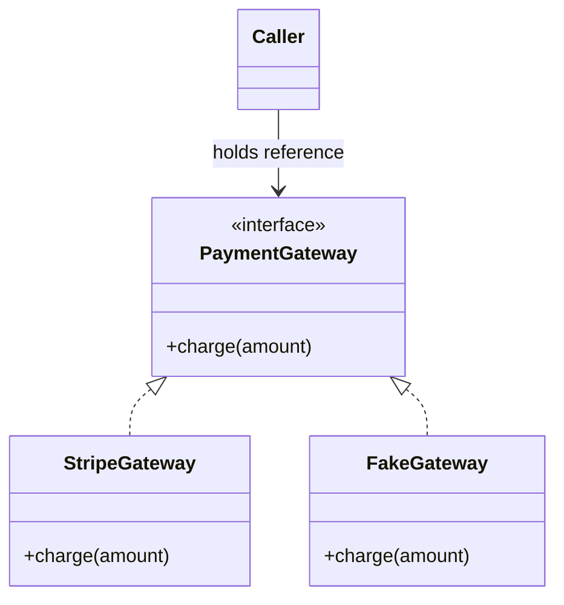
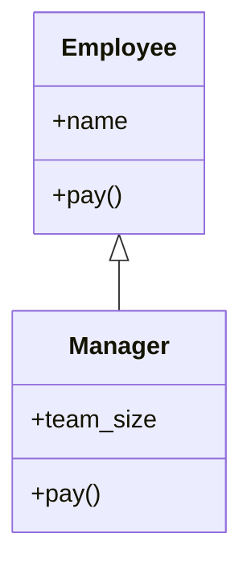
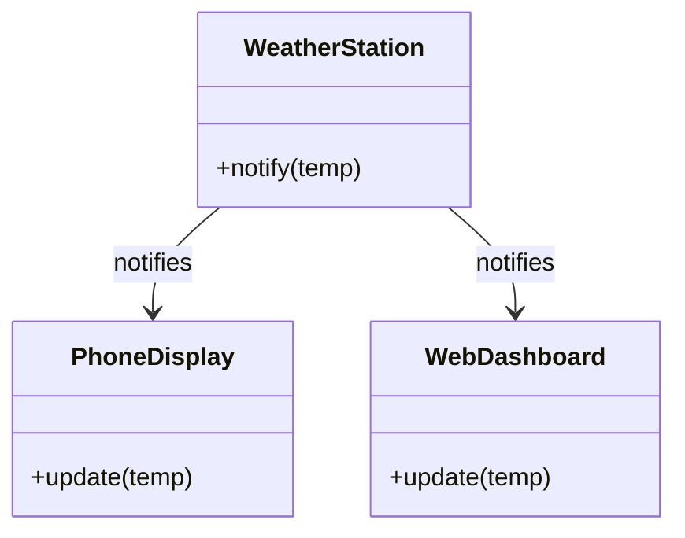
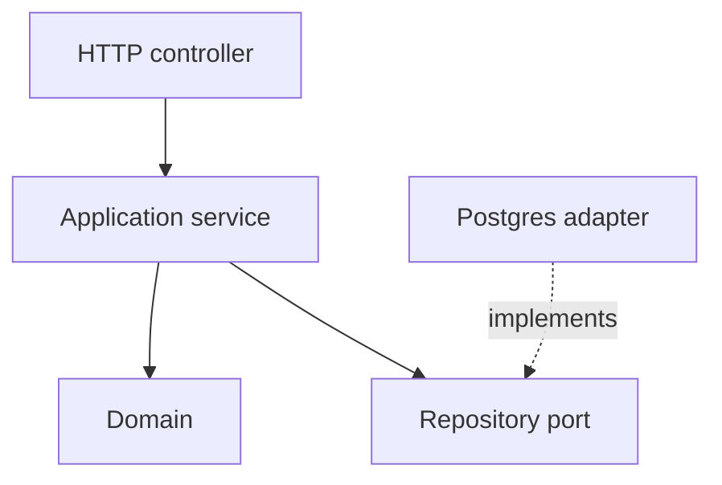

# The Zero-to-Hero Computer Science & Software Engineering Roadmap

*Mohammad Bilal's complete, self-paced path from true zero knowledge to professional-level engineering. Each new idea solves a problem left by the previous one.*

**Scope:** 15 stories · 105 phases · programming, mathematics, OOP, data structures, systems, networks, databases, security, engineering practice, distributed systems, and interviews.

Before You Write Code → Control the Machine → Mathematical Language → Organizing Software → Data Structures & Algorithms → Inside the Computer → Connecting Computers → Data That Survives → Security & Humans → Professional Engineering → Distributed Systems → Other CS Areas → Maintaining Real Software → Grand Capstone → Interview & Job Readiness

---

## How to Read This Document

### Start here if computer science is completely new to you

Do not try to memorize definitions before you have seen them work. For each topic, trace one tiny example by hand, run the code, change an input, and say what the computer does next. When a section compares two choices, focus on the reason for choosing one rather than trying to label one as always “best.”

**Everyday words**


| Word               | Meaning                                                                                        |
| ------------------ | ---------------------------------------------------------------------------------------------- |
| **Program**        | A set of **instructions** a computer follows                                                   |
| **Algorithm**      | The **ordered method** used to solve a problem                                                 |
| **Data structure** | The way **information** is arranged so the program can use it                                  |
| **Memory**         | The computer's **short-term working space**                                                    |
| **System**         | A group of parts: **programs**, **machines**, **storage**, and **networks** that work together |


**Words you will meet often**


| Word                   | Meaning                                                                                 |
| ---------------------- | --------------------------------------------------------------------------------------- |
| **Runtime**            | The time when a program is **executing**                                                |
| **Compiler**           | **Translates** code before it runs                                                      |
| **Interpreter**        | **Executes** code through another program, as it goes                                   |
| **Complexity**         | How **time** or **memory** needs grow as the input grows                                |
| **Stack**              | Stores active **function calls**                                                        |
| **Heap**               | Holds **longer-lived data** created while the program runs                              |
| **Process**            | A **running program** with its own memory                                               |
| **Thread**             | One **path of work** inside a process                                                   |
| **API**                | An **agreed way** for software parts to communicate                                     |
| **Distributed system** | One job performed by **multiple computers** that can communicate and fail independently |


Every concept in this roadmap answers the same set of questions, because that set of questions *is* how engineering knowledge actually accumulates:

- What is it, in plain language?
- Why does it exist - what problem forced someone to invent it?
- What did people do before it existed, and what broke?
- How does it solve that problem, step by step, inside the computer or system?
- What does it cost? (Every solution trades something for something.)
- Where does its own limitation show up - and what does *that* limitation force us to invent next?

That last question is the engine of the whole roadmap. Nothing here is "just a topic to cover." Every topic is a *reaction* to the topic before it.

### The Beginner-Friendly Pattern Every Topic Follows

Those questions are answered in the same order every single time, in every concept section. Once you have read one section you know the shape of all of them, which means you can work through to the part you need without re-reading the parts you don't:


| Element                     | What it gives you                                                                                    |
| --------------------------- | ---------------------------------------------------------------------------------------------------- |
| **Why This Matters**        | The previous concept's limitation, stated plainly, before any new machinery is introduced            |
| **The Problem**             | What broke, or what you cannot yet do                                                                |
| **The Idea That Solves It** | The concept in ordinary language                                                                     |
| **How It Works**            | A precise explanation in words                                                                       |
| **Inside the Computer**     | Mechanism, when the topic actually has one. Skipped for ethics, HCI, requirements, and similar       |
| **Visual Model**            | ASCII diagram, analogy, or animation pointer. Only when it teaches a mechanism                       |
| **Example**                 | A worked example: code, calculation, trace, query, or design sketch, whichever matches the topic     |
| **Trade-offs**              | What improved, what it cost, and where it fails. Skipped only when it genuinely does not apply       |
| **Learning Resources**      | A short, topic-specific set: visual, lecture, interactive, written, code, practice. Not a link farm  |
| **Practice**                | The activity the concept actually needs: coding, tracing, drawing, SQL, design, or written reasoning |
| **Interview Perspective**   | How the idea is tested, without turning every lesson into interview prep                             |
| **What This Unlocks Next**  | The exact limitation that makes the next concept necessary                                           |


Not every lesson uses every row. Binary needs conversion by hand. HCI does not need "Inside the Computer." Interview phases do not need projects. The order of the argument stays the same even when a row is omitted.

Two notes on using this. If you are learning something for the first time, read the elements in order, because the order is the argument. If you are revising something you once knew, go straight to **Why This Matters** and **What This Unlocks Next**: those two elements alone reconstruct the reasoning, and the middle is detail you can reload on demand.

Live lessons below still use older bold labels until rewritten. **Stories IV–VII (Phases 21–59)** follow the lean semantic vocabulary for authors; the renderer keeps **generic checklist labels in flow** (no repeated Why→Problem→How form chrome) and shows **utility chrome** plus **contextual journey headings** when authors write them. **Story VIII (Phases 60–65)** is authored against the amended **invisible-template** from the start — continuous prose, selective contextual headings, utility chrome only for ability/prereq/resources/practice/unlock. Every meaningful lesson ends with a **visible narrative closer** (Practice → What Comes Next → navigation). Authoring contract: [Learning Content Standard](../standards/LEARNING_CONTENT_STANDARD.md) and [CS Course Profile](../standards/course-profiles/cs.md). **Story IX (Phases 66–71)** is authored against the amended **invisible-template** from the start — continuous prose, selective contextual headings, utility chrome only for ability/prereq/resources/practice/unlock, and narrative closers after Practice. **Story X (Phases 72–80)** is authored against the amended **invisible-template** from the start — continuous prose, selective contextual headings, utility chrome only for ability/prereq/resources/practice/unlock, and narrative closers after Practice. **Story XI (Phases 81–88)** is authored against the amended **invisible-template** from the start — continuous prose, selective contextual headings, utility chrome only for ability/prereq/resources/practice/unlock, and narrative closers after Practice. **Story XII (Phases 89–91)** is authored against the amended **invisible-template** from the start — continuous prose, selective contextual headings, utility chrome only for ability/prereq/resources/practice/unlock, and narrative closers after Practice (survey maps, not Story XI depth). **Story XIII (Phases 92–94)** is authored against the amended **invisible-template** from the start — continuous prose, selective contextual headings, utility chrome only for ability/prereq/resources/practice/unlock, and narrative closers after Practice (maintenance workflow: observe → trace → hypothesis → smallest safe change → verify). **Story XIV (Phases 95–98)** is authored against the amended **invisible-template** from the start — continuous prose, selective contextual headings, utility chrome only for ability/prereq/resources/practice/unlock, and narrative closers after Practice (capstone integrate: plan → build → harden → release). **Story XV (Phases 99–105)** is authored against the amended **invisible-template** from the start — continuous prose, selective contextual headings, utility chrome only for ability/prereq/resources/practice/unlock, and narrative closers after Practice (interview application: narrate → timed DSA → recall → LLD → SD → STAR → dress rehearsal; no Phase 106). **Stories IV–XV** are now on the frozen lean / invisible-template authoring system. **Stories I–III (Phases 1–20)** still carry older bold labels in places — the planned whole-CS continuity audit (not this Story XV turn) should bring those openings and handoffs into the same teacher voice without adding a Phase 106.

**Diagram conventions.** Diagrams are plain ASCII inside code fences, deliberately, so that they render identically on GitHub, in any editor, in a terminal, and in a diff. Throughout, `|` and `v` mean "then this happens", `+--` joins related paths, `-->` and `->` mean a request or data movement, `X` marks a failure point, and boxes drawn with `+---+` are components or memory regions. Where a diagram shows a sequence over time, time runs downward.

---

> **Integrated Git practice:** Each linked phase-project card in `[Projects.md](../guides/Projects.md)` ends with one specific Git checkpoint. Test the finished project first, commit only its named project path, verify the commit and clean working tree, then continue. Use `Git.md` [Phases 2-3](./Git.md#phase-2) if staging or commit selection is unfamiliar.

---

## The Story Map

*This is the shape of the roadmap: 15 stories, each answering the question a learner is actually asking at that point. All 105 phases below are live — see [Migration Status](#migration-status) for the completed rebuild history.*


| Story                                              | Question it answers                                            |
| -------------------------------------------------- | -------------------------------------------------------------- |
| I. Before You Write Code                           | What is computing, and what is the machine actually doing?     |
| II. Learning to Control the Machine                | Now that we understand the machine, how do we program it?      |
| III. The Mathematical Language of Computer Science | How do computer scientists reason instead of guessing?         |
| IV. Organizing Large Software                      | Programs are growing - how do we keep them understandable?     |
| V. Data Structures & Algorithms                    | Two solutions work. Which one should we use, and why?          |
| VI. Inside the Computer                            | What is actually happening underneath our programs?            |
| VII. Connecting Computers                          | How does one computer talk to another?                         |
| VIII. Data That Survives                           | How does information survive after a program stops?            |
| IX. Security & Human-Centered Software             | Software has users and valuable data - how do we protect both? |
| X. Professional Software Engineering               | How do real engineering teams build and operate software?      |
| XI. System Design & Distributed Systems            | What happens when one server is no longer enough?              |
| XII. Other Core Computer Science Areas             | What else should a well-rounded computer scientist understand? |
| XIII. Maintaining Real Software                    | Real engineers usually work inside existing systems.           |
| XIV. Grand Capstone                                | Stop studying isolated concepts. Build the system.             |
| XV. Interview & Job Readiness                      | Now prove you can think and communicate like an engineer.      |


---

## The Whole-Journey Map

```text
STORY I     Phases  1-5    Computing, representation, logic, hardware, source-to-running-program
STORY II    Phases  6-15   Environment, variables, control flow, functions, collections, files, errors, debugging, modules
STORY III   Phases 16-20   Discrete math, proof, counting/probability, statistics, linear algebra/calculus intuition
STORY IV    Phases 21-30   Object thinking, classes, encapsulation/abstraction, inheritance/polymorphism, composition, SOLID, refactoring, patterns, LLD
STORY V     Phases 31-48   Complexity, arrays/strings, linked lists, stacks/queues, recursion, hashing, trees, heaps,
                           sorting, searching, graphs, patterns, greedy, backtracking, DP, specialized structures, correctness
STORY VI    Phases 49-54   Architecture, memory, PL foundations, operating systems, concurrency, systems programming
STORY VII   Phases 55-59   Networking foundations, TCP/UDP/sockets, DNS, HTTP, API design
STORY VIII  Phases 60-65   Database foundations, SQL, data modeling, internals, transactions, operating/scaling
STORY IX    Phases 66-71   Security foundations, cryptography, auth, appsec, HCI, graphics/interactive computing
STORY X     Phases 72-80   Git/collaboration, requirements, testing, architecture, process, CI/CD, containers, cloud, observability
STORY XI    Phases 81-88   System design foundations, scaling, caching, async/events, distributed systems, consensus,
                           reliability patterns, complete system design
STORY XII   Phases 89-91   AI foundations, specialized computing platforms, computing/society/ethics
STORY XIII  Phases 92-94   Working in existing codebases, legacy code, engineering communication
STORY XIV   Phases 95-98   Capstone planning, build, break/measure/harden, portfolio release
STORY XV    Phases 99-105  Coding interviews, DSA practice, CS fundamentals review, LLD interviews,
                           system design interviews, behavioral interviews, final mock loop
```

Every arrow in this map is a real prerequisite dependency argued for in the lesson text, not just drawn in a diagram. Complexity analysis (Phase 31) now sits at the start of Story V, once a learner already knows how to write and run code, instead of before any programming language has been taught. Databases, security, and HCI are no longer one bolted-on phase each - they get the depth their subject needs (6 phases apiece) and stay positioned exactly where the systems that need them first appear.


<a id="migration-status"></a>

### Migration status

This roadmap was rebuilt into the 15-story / 105-phase shape above in batches so that links, diagrams, projects, and playgrounds were not lost mid-rewrite. The old 1-43 numbering is fully renumbered and relocated (see the [Legacy Content Map](#legacy-content-map)). Every Phase Index row now has a `# PHASE N` body; Stories IV–XV follow the frozen invisible-template authoring system. Stories I–III remain pedagogically complete with some residual pre-template chrome — do not restyle them unless a factual or teaching defect appears.


| Batch | Scope                                                                                                                                        | Status                                                                                                                                                                                                                                                                                                                                                                                                                                                                                                                                                                                                                   |
| ----- | -------------------------------------------------------------------------------------------------------------------------------------------- | ------------------------------------------------------------------------------------------------------------------------------------------------------------------------------------------------------------------------------------------------------------------------------------------------------------------------------------------------------------------------------------------------------------------------------------------------------------------------------------------------------------------------------------------------------------------------------------------------------------------------ |
| 1     | Inspect the codebase and this file; publish the target Story Map, Phase Index, and legacy content map                                        | Done                                                                                                                                                                                                                                                                                                                                                                                                                                                                                                                                                                                                                     |
| 2     | Renumber/relocate all old Phase 1-43 content into its final 1-105 position                                                                   | Done                                                                                                                                                                                                                                                                                                                                                                                                                                                                                                                                                                                                                     |
| 3     | Story I - III (write new Phases 1-4, 10-13, 15-20; rewrite relocated Phases 5-9, 14)                                                         | Done - new Phases 1-4, 10-13, 15-20 written; relocated Phases 5, 9, 14 had stale cross-phase references and transitions corrected, full prose rewrite to the newer template still pending                                                                                                                                                                                                                                                                                                                                                                                                                                |
| 4     | Story IV (rewrite relocated Phases 21-30)                                                                                                    | Done - Phases 21-30 rewritten to lean lesson template (phase-level Learning Resources; Why/Problem/How/Visual/Example/Trade-offs; consolidated Practice; What This Unlocks Next); project links, nav, diagrams, and Phase 75 domain/infra bridge preserved; ~71% of prior Story IV length (~110k chars)                                                                                                                                                                                                                                                                                    |
| 5     | Story V (write new Phases 42, 47; rewrite relocated Phases 31-41, 43-46, 48)                                                                 | Done - new Phases 42/47 written; relocated Phases 31-41/43-46 corrected; Phase 48 = LRU capstone; **lean-template rewrite of Phases 31–48 complete** (see Batch I) |
| 6     | Stories VI - VIII (write new Phases 49, 51, 54; rewrite relocated Phases 50, 52, 53, 55-65)                                                  | Stories VI-VIII Done - Story VIII (60-65) audited with Composio (YouTube, web search, fetch, GitHub, DeepWiki, Drive); unique ability lines; prereqs/transitions fixed; stale 14.x/Phase 34.x refs remapped; resources refreshed (SQLBolt, Bustub, Spanning Tree B-trees, ByteByteGo ACID, Exponent sharding); disclaimers removed; full prose rewrite still pending |
| 7     | Stories IX - XI (write new Phases 70, 71, 73, 76, 78-80, 82-84, 87; rewrite relocated Phases 66, 67, 68, 69, 72, 74, 75, 77, 81, 85, 86, 88) | Stories IX-XI Done - Story IX-X as before; Story XI: new Phases 82-84, 87 written; relocated 81/85/86/88 unique abilities/prereqs/transitions fixed, stale 36.x/37.x/39.x/40.x/41.x refs remapped, disclaimers removed, Composio resources (YouTube, web, fetch, Scholar, GitHub, DeepWiki; Drive/Sheets empty; Gmail 403). |
| 8     | Stories XII - XV (write new Phases 89-94, 96-98, 100-101; rewrite relocated Phases 95, 99, 102-105)                                          | Done - Stories XII-XV: new Phases 89-94, 96-98, 100-101; Phase 95 SEE IT/nav refreshed; Phases 99, 102-105 rewritten to newer template. Composio resources (YouTube, web, fetch, Scholar, GitHub, DeepWiki, News). Semantic Scholar / scrape_do not connected; Gmail/Drive not used for curriculum links |
| 9     | Resource validation, anchor validation, formatting cleanup, duplicate removal, technical accuracy pass                                       | Done - validator accepts `#phase-N` short anchors (clears Projects.md/Git.md WARNs); Git.md CS links remapped 39→72; Phase 95 stale Phase 43.2 refs → 104; dead YouTube IDs replaced via Composio batch check (~20); channel/@ handles converted to watch/playlist URLs; no playground dupes; handbook/primer fetch verified |
| A     | Curriculum gap repair Stories I–III (Phases 1–20) — content only, no lean-template rewrite                                                  | Done this turn - missing/under-taught concepts filled; preview→formal labeled; Phase Index exit criteria updated; lean rewrite still deferred |
| B     | Curriculum gap repair Stories IV–V (Phases 21–48) — content only, no lean-template rewrite                                                  | Done - gap repair complete; lean rewrite of Story V completed in Batch I |
| C     | Curriculum gap repair Stories VI–VIII (Phases 49–65) — content only, no lean-template rewrite                                               | Done - 49 ISA/pipeline; 50 pointers (systems); 51 formal-after-5; 52 filesystem; 54 applies FS; 61 GROUP BY/HAVING/CTEs; 63/64/65 trade-offs & ACID/isolation & repl/part/shard clarity; Story VII untouched; Composio YouTube+web+fetch pass completed for new SEE IT blocks; lean rewrite still deferred |
| D     | Curriculum gap repair Stories IX–X (Phases 66–80) — content only, no lean-template rewrite                                                  | Done this turn - 66 foundations; 67 owns hash/encrypt/sign + TLS + passwords; 68 MFA/RBAC; 69 rate limiting; 78 env vs secrets; 79 shared-responsibility wording; 80 logs/metrics/traces + SLI/SLO; Story XI untouched; Composio resources; lean rewrite still deferred |
| E     | Curriculum gap repair Stories XI–XII (Phases 81–91) — content only, no lean-template rewrite                                                | Done this turn - 81 condensed to process/map/estimation; 82–87 clear ownership; CAP≠ACID C; 86 vs 87; 88 learning capstone; 89 broad AI; 90 platform compare; 91 ethics scenarios; Phase 92+ untouched; Composio resources; lean rewrite still deferred |
| F     | Curriculum gap repair Stories XIII–XV (Phases 92–105) — content only, no lean-template rewrite                                              | Done this turn - 95 planning-only (no build/harden/release theft); 96–98 ownership clear; 100/102/103 learn→interview distinctions; removed artificial interview mini-project pushes; Composio resources; lean rewrite still deferred; Batches A–F complete |
| G     | Pre-lean polish: 34.3 Deques; 29→75 architecture bridge; 56 vs 54 sockets ownership                                                       | Done this turn - hierarchy audit approved; Story V not modernized beyond 34.3 micro-fix |
| H     | Lean-template rewrite Story IV pilot (Phases 21–30)                                                                                         | Done - lean labels; ~71% prior length; Story V (31+) untouched except prior 34.3 micro-fix |
| I     | Lean-template rewrite Story V (Phases 31–48)                                                                                                | Done this turn - lean labels; phase-level Learning Resources; protected DSA mechanics/traces/complexity/Dijkstra/topo/Union-Find/Bloom/LRU/34.3 kept; ~87% prior length (prefer long over cutting mechanics); Story VI (49+) untouched |
| J     | Platform Learning Content Standard + kicker presentation (Stories IV–V)                                                                     | Done - standard + CS/Odoo profiles; lean labels as kickers; IV–V ALL-CAPS sections |
| K     | Teaching-flow audit Stories IV–V + freeze standard (practice catalog; no Story VI)                                                          | Done this turn - audit thin/long/broken; repaired Phase 28 Factory/Decorator/Strategy+Command + Phase 34 deque/practice only; standard FROZEN; Story VI not started |
| L     | Lean-to-standard rewrite Story VI (Phases 49–54)                                                                                            | Done this turn - frozen Learning Content Standard + CS profile; phase-level Learning Resources; protected FDE/cache/ISA-pipeline/VM/pointers/lang foundations/process-thread/FS/concurrency/syscalls-sockets kept; all 8 playground IDs unique once; nav 48→…→55; 105 phases; Story VII (55+) untouched |
| M     | Lean-to-standard rewrite Story VII (Phases 55–59)                                                                                           | Done this turn - frozen Learning Content Standard + CS profile; prereq-box rule applied (short orientation); phase-level Learning Resources; protected encapsulation/addressing/TCP-UDP/DNS/HTTP/REST + 54↔56 ownership callout; 5 playground IDs unique once; nav 54→…→60; 105 phases; Story VIII (60+) untouched |
| N     | Invisible-template amendment (standard + renderer flow/contextual/utility); Story VII representative contextual headings + bridges; 1.2→2.1 continuity; Phase 60 prereq lightened at boundary only | Done prior turn - Story VIII NOT started |
| O     | Invisible-template rewrite Story VIII (Phases 60–65) — data persistence journey; Story IX untouched | Done this turn - authored against amended standard from the start (contextual headings + bridges; no identical Why→Problem→How skeleton); bookstore running domain; protected WAL/SQL/normalization/B-trees/ACID/replication mechanisms kept; 4 playground IDs unique once; nav 59→…→66; 105 phases; Phase 59/66 bodies unchanged; Story IX (66+) untouched |
| P     | Narrative closer rule + handoff extractor fix (WHAT THIS UNLOCKS NEXT visible after Practice); Story VIII endings strengthened; Story IX not started | Done this turn |
| Q     | Invisible-template rewrite Story IX (Phases 66–71) — security/HCI/graphics journey; Story X untouched | Done this turn - authored against amended standard from the start (contextual headings + bridges; no identical Why→Problem→How skeleton); bookstore running domain; defensive security only; protected trust/CIA/STRIDE, hash≠encrypt≠sign, TLS, password hashing, sessions/MFA/RBAC, JWT/OAuth, SQLi/XSS/CSRF/CORS, rate limits, HCI heuristics, render/input loop kept; 4 playground IDs unique once; Projects.md#cs-phase-69-project preserved; nav 65→…→72; 105 phases; Phase 65/72 bodies unchanged; Story X (72+) untouched |
| R     | Invisible-template rewrite Story X (Phases 72–80) — professional SE journey; Story XI untouched | Done this turn - authored against amended standard from the start (contextual headings + bridges; no identical Why→Problem→How skeleton); depth preferred over cut %; spurious Phase-72 ## PR labels fixed to bold prose; protected Git/requirements/pyramid/architecture/WIP/CI-CD/containers/cloud/observability mechanisms kept; 5 playground IDs unique once; Projects.md#cs-phase-75-project and #cs-phase-77-project + Git.md companion preserved; nav 71→…→81; 105 phases; Phase 71/81 bodies unchanged; Story XI (81+) untouched |
| S     | Invisible-template rewrite Story XI (Phases 81–88) — system design & distributed systems; Story XII untouched | Done this turn - authored against amended standard from the start (contextual headings + bridges; no identical Why→Problem→How skeleton); depth preferred over cut %; strengthened thin 82–84/87; trimmed chrome/farms on 85–86/88 without gutting CAP/PACELC/consensus/walkthrough; protected estimation/bottleneck/cache-aside/queues/CAP≠ACID C/Raft intuition/reliability/88 learning capstone kept; 5 playground IDs unique once; Projects.md#cs-phase-86-project and #cs-phase-88-project preserved; nav 80→…→89; 105 phases; Phase 80/89 bodies unchanged; Story XII (89+) untouched |
| T     | Invisible-template rewrite Story XII (Phases 89–91) — AI/platforms/ethics survey; Story XIII untouched | Done this turn - authored against amended standard from the start (contextual headings + bridges; no identical Why→Problem→How skeleton); survey maps preferred over Story XI depth; removed SEE IT farms / legacy chrome; kept + slightly strengthened first-timer distinctions, comparison tables, diagrams, playgrounds; no encyclopedia inflation; 3 playground IDs unique once; no Projects.md cards; nav 88→89→90→91→92; 105 phases; Phase 88/92 bodies unchanged; Story XIII (92+) untouched |
| U     | Invisible-template rewrite Story XIII (Phases 92–94) — maintenance workflow; Story XIV untouched | Done this turn - authored against amended standard from the start (contextual headings + bridges; no identical Why→Problem→How skeleton); grew thin/checklist XIII for teaching quality (observe→trace→hypothesis→smallest safe change→verify); Quarry Bookstore running scenario; protected onboarding map, characterization+seams, refactor-vs-rewrite, light deprecation/compat, debt-as-risk, ADR scaffold; healthy callbacks to 74/75/73 only; 3 playground IDs unique once; no Projects.md cards; nav 91→92→93→94→95; 105 phases; Phase 91/95 bodies unchanged; Story XIV (95+) untouched |
| V     | Invisible-template rewrite Story XIV (Phases 95–98) — grand capstone integrate; Story XV untouched | Done this turn - authored against amended standard from the start (contextual headings + bridges; no identical Why→Problem→How skeleton); grew thin/checklist XIV for teaching quality (plan→walking skeleton→load/fail/fix/prove→portfolio release); preferred Open Community Resource Exchange + expense-splitter scaffold; Phase 95 planning-only; protected walking-skeleton order, over-eng safeguards, before/after evidence, hiring README; integrate callbacks only (no re-teach web/auth/DB/CI/design); 4 playground IDs unique once; Projects.md Phase 95 retargeted to planning deliverable + light 96–98 portfolio nav; nav 94→95→96→97→98→99; 105 phases; Phase 94/99 bodies unchanged; Story XV (99+) untouched |
| W     | Invisible-template rewrite Story XV (Phases 99–105) — interview & job readiness; Stories IV–XV on frozen standard | Done - authored against amended standard from the start (contextual headings + bridges; no identical Why→Problem→How skeleton); tone is retrieve/explain/design/communicate under pressure (not learn more CS); grew thin Phase 105 for course closure + full mock loop + weakness→owning-phase repair; strengthened six-step method, stuck/recovery, pattern journal, flash-card repair, 29→102 / 88→103 boundaries, STAR-from-real-work; stripped Composio chrome / SEE IT farms; 7 playground IDs unique once; Projects.md 102/105 retargeted to LLD rehearsal notes + mock/debrief log (not product builds); nav 98→…→105; exactly 105 phases; no Phase 106; Phase 95–98 (XIV) bodies unchanged; Stories I–III residual pre-template chrome left as-is under freeze |


Every phase number in the Phase Index below has a real `# PHASE N` teaching body in this document. All rows are marked *(current)*. Future edits should be factual corrections, broken resources, genuine pedagogical defects, or necessary maintenance — not stylistic rewrites.

---

<a id="phase-index"></a>

## Phase Index

*105 phases across 15 stories. Every row is *(current)* — a `# PHASE N` body exists below. See the [Legacy Content Map](#legacy-content-map) for how each old 1-43 phase mapped here.*

### Story I - Before You Write Code


| #   | Phase                                             | Goal                                   | Ready to continue when...                                 |
| --- | ------------------------------------------------- | -------------------------------------- | --------------------------------------------------------- |
| 1   | What Is Computer Science? *(current)*             | See the field before the tool          | Distinguish CS / programming / SE; name abstraction as a preview idea |
| 2   | How Computers Represent Information *(current)*   | Bits, bytes, encodings, numeric types  | Convert bases; explain signed ints, floats, and UTF-8 at a working level |
| 3   | Logic & Digital Computation *(current)*           | Boolean logic to gates                 | Build a truth table and a half adder                      |
| 4   | Computer Hardware *(current)*                     | CPU, memory, I/O (preview → 49)        | Name the parts a program runs on; know Phase 49 owns depth |
| 5   | From Source Code to a Running Program *(current)* | Syntax/semantics, compile paths, memory | Explain syntax vs semantics; bytecode/JIT; stack vs heap |


### Story II - Learning to Control the Machine


| #   | Phase                                        | Goal                           | Ready to continue when...                                      |
| --- | -------------------------------------------- | ------------------------------ | -------------------------------------------------------------- |
| 6   | Development Environment *(current)*          | Workspace + run Python         | Use folders/terminal/editor; run a script; read a traceback |
| 7   | Variables, Values & Types *(current)*        | Name and type data             | Predict a variable's type and value without running it         |
| 8   | Control Flow *(current)*                     | Branch and repeat              | Write nested decisions without panic                           |
| 9   | Functions & Scope *(current)*                | Reuse behavior, manage scope   | Split into functions; explain local vs global scope            |
| 10  | Collections *(current)*                      | Group related data             | Choose list, tuple, set, or dict for a given problem           |
| 11  | Strings & Files *(current)*                  | Text, files, JSON, CSV         | Parse text; read/write files; load/save JSON and CSV           |
| 12  | Errors & Defensive Programming *(current)*   | Anticipate failure             | Classify syntax/runtime/logic failures; handle exceptions      |
| 13  | Debugging *(current)*                        | Find the actual bug            | Isolate a failure with prints/debugger; use basic logging      |
| 14  | Modules, Packages & Environments *(current)* | Organize growing code          | Split across modules; create/activate a venv; freeze deps      |
| 15  | Programming Consolidation *(current)*        | Prove procedural fluency       | Build a small multi-file CLI tool without a tutorial           |


### Story III - The Mathematical Language of Computer Science


| #   | Phase                                           | Goal                               | Ready to continue when...                                  |
| --- | ----------------------------------------------- | ---------------------------------- | ---------------------------------------------------------- |
| 16  | Discrete Mathematics *(current)*                | Sets, logic, functions, relations  | Read and write basic discrete-math notation                |
| 17  | Proof & Mathematical Reasoning *(current)*      | Argue correctness, not vibes       | Use counterexamples; write an induction proof for a simple claim |
| 18  | Counting & Probability *(current)*              | Combinatorics, probability, E[X]   | Compute combinations; conditional probability; expected value |
| 19  | Statistics for Computing *(current)*            | Describe and compare data          | Explain mean/median/variance and distribution shape        |
| 20  | Linear Algebra & Calculus Intuition *(current)* | Vectors, matrices, rates of change | Read a matrix multiply and a derivative in plain language  |


### Story IV - Organizing Large Software


| #   | Phase                                   | Goal                                         | Ready to continue when...                                           |
| --- | --------------------------------------- | -------------------------------------------- | ------------------------------------------------------------------- |
| 21  | Object Thinking *(current)*             | See why OOP exists                           | Contrast procedural vs OOP failure modes                            |
| 22  | Classes & Objects *(current)*           | Blueprint vs instance, state & behavior      | Draw the heap picture of two objects and write a correct `__init__` |
| 23  | Encapsulation & Abstraction *(current)* | Protect invariants, hide implementation      | Make invalid state unreachable and design an ABC callers can trust  |
| 24  | Inheritance & Polymorphism *(current)*  | Reuse by is-a, one interface many forms      | Explain MRO and replace an if/elif type chain                       |
| 25  | Composition *(current)*                 | Prefer has-a                                 | Rewrite an inheritance hierarchy as composition; preview Phase 29 edges |
| 26  | SOLID *(current)*                       | Localize change                              | Apply each letter with a before/after                               |
| 27  | Code Quality & Refactoring *(current)*  | Spot bad design early                        | Name a smell and perform the matching refactor                      |
| 28  | Design Patterns *(current)*             | Shape construction, structure, collaboration | Apply one creational, one structural, one behavioral pattern        |
| 29  | Low-Level Design *(current)*            | Model relationships, design under pressure   | Map Phase 25 has-a to assoc/agg/comp; run the LLD checklist         |
| 30  | OOP Consolidation *(current)*           | Idiomatic Python OOP, prove skill            | Use `@property`/dunders correctly and publish a design write-up     |


### Story V - Data Structures & Algorithms


| #   | Phase                                   | Goal                            | Ready to continue when...                                      |
| --- | --------------------------------------- | ------------------------------- | -------------------------------------------------------------- |
| 31  | Complexity Analysis *(current)*         | A ruler for comparing solutions | State the Big O of your own code, unprompted                   |
| 32  | Arrays & Strings *(current)*            | Contiguous storage              | Implement common array/string operations from scratch          |
| 33  | Linked Lists *(current)*                | Pointer-chained storage         | Implement singly/doubly linked list operations from scratch    |
| 34  | Stacks, Queues & Deques *(current)*     | LIFO/FIFO + both-ends access    | Implement stacks/queues; use a deque when both ends matter     |
| 35  | Recursion *(current)*                   | Let structure branch            | Write a correct base case and trace a call stack by hand       |
| 36  | Hashing *(current)*                     | O(1) "have I seen this"         | Reach for a hash map by instinct                               |
| 37  | Trees *(current)*                       | Model hierarchy                 | Implement traversal and validate a BST                         |
| 38  | Heaps & Priority Queues *(current)*     | Model priority                  | Solve a top-k problem with a heap                              |
| 39  | Sorting *(current)*                     | Impose order                    | Implement merge sort by hand                                   |
| 40  | Searching *(current)*                   | Exploit order                   | Explain why binary search needs sorted input                   |
| 41  | Graphs *(current)*                      | Model arbitrary relationships   | BFS/DFS; topological sort; Dijkstra on non-negative weights |
| 42  | Algorithmic Patterns *(current)*        | Recognize repeated substructure | Spot array patterns (32) and greedy/DP/backtracking shapes  |
| 43  | Greedy Algorithms *(current)*           | Provably-correct local choices  | Prove a greedy choice is safe for a given problem              |
| 44  | Backtracking *(current)*                | Prune a search space            | Implement a constraint-satisfaction backtracking solution      |
| 45  | Dynamic Programming *(current)*         | Reuse overlapping subproblems   | Write both memoized and tabulated solutions                    |
| 46  | Specialized Data Structures *(current)* | Trie, Union-Find, Bloom         | Implement trie prefix search; union-find; explain Bloom filters |
| 47  | Algorithm Correctness *(current)*       | Prove it, don't just test it    | Write a loop invariant or induction argument for your own code |
| 48  | DSA Consolidation *(current)*           | Combine structures (LRU)        | Build LRU from hash map + doubly linked list under load        |


### Story VI - Inside the Computer


| #   | Phase                                       | Goal                             | Ready to continue when...                             |
| --- | ------------------------------------------- | -------------------------------- | ----------------------------------------------------- |
| 49  | Computer Architecture *(current)*           | Fetch-decode-execute, ISA, caches | Trace instructions; name ISA and one pipeline hazard   |
| 50  | Memory & Program Representation *(current)* | Virtual memory + pointers         | Explain a page fault and what a pointer stores         |
| 51  | Programming Language Foundations *(current)*| Syntax, semantics, execution      | Compare two languages' execution models precisely     |
| 52  | Operating Systems *(current)*               | Processes + filesystem basics     | Explain process vs thread and path → inode → data     |
| 53  | Concurrency & Parallelism *(current)*       | Shared state, races               | Identify a race condition and fix it with a lock      |
| 54  | Systems Programming *(current)*             | Syscalls, FDs, sockets (apply FS) | Write a small program using real syscalls or a socket |


### Story VII - Connecting Computers


| #   | Phase                              | Goal                            | Ready to continue when...                                     |
| --- | ---------------------------------- | ------------------------------- | ------------------------------------------------------------- |
| 55  | Networking Foundations *(current)* | Layers and addressing           | Trace a packet from laptop to server through the layers       |
| 56  | TCP, UDP & Sockets *(current)*     | Reliable vs unreliable delivery | Explain the TCP handshake and when UDP is the right choice    |
| 57  | DNS & The Internet *(current)*     | Names to addresses              | Trace a DNS resolution end to end                             |
| 58  | HTTP *(current)*                   | The web's protocol              | Read a raw HTTP request/response by hand                      |
| 59  | API Design *(current)*             | Contracts between programs      | Design a REST API with correct verbs, status codes, resources |


### Story VIII - Data That Survives


| #   | Phase                                     | Goal                    | Ready to continue when...                                  |
| --- | ----------------------------------------- | ----------------------- | ---------------------------------------------------------- |
| 60  | Database Foundations *(current, invisible-template)* | Why files aren't enough | Explain what a database adds over a flat file              |
| 61  | SQL *(current, invisible-template)*                 | Joins + aggregation     | Write a JOIN with GROUP BY/HAVING or a CTE correctly       |
| 62  | Data Modeling *(current, invisible-template)*       | Normalize a schema      | Design a normalized schema and justify a denormalization   |
| 63  | Database Internals *(current, invisible-template)*  | Indexes, B-trees        | Explain why an index speeds up one query and slows another |
| 64  | Transactions & Concurrency *(current, invisible-template)* | ACID under load         | Explain an isolation level and a race it prevents          |
| 65  | Operating & Scaling Databases *(current, invisible-template)* | Replication, sharding   | Contrast replication vs partitioning vs sharding           |


### Story IX - Security & Human-Centered Software


| #   | Phase                                      | Goal                         | Ready to continue when...                             |
| --- | ------------------------------------------ | ---------------------------- | ----------------------------------------------------- |
| 66  | Security Foundations *(current, invisible-template)*           | Threats, trust boundaries, CIA | Name trust boundaries and a light STRIDE threat        |
| 67  | Cryptography for Developers *(current, invisible-template)*    | Hash / encrypt / sign + TLS    | Explain hashing vs encryption vs signing; sketch TLS   |
| 68  | Authentication & Authorization *(current, invisible-template)* | Sessions, MFA, RBAC, JWT       | Explain MFA factors and an RBAC permission check       |
| 69  | Application Security *(current, invisible-template)*           | OWASP basics + rate limits     | Prevent SQLi/XSS/CSRF; apply a basic rate limit        |
| 70  | Human-Computer Interaction *(current, invisible-template)*     | Software has users           | Critique and redesign a confusing interface           |
| 71  | Graphics & Interactive Computing *(current, invisible-template)* | Pixels, frames, input        | Explain a basic rendering/input loop                  |


### Story X - Professional Software Engineering


| #   | Phase                                                            | Goal                            | Ready to continue when...                                |
| --- | ---------------------------------------------------------------- | ------------------------------- | -------------------------------------------------------- |
| 72  | Git & Collaboration *(current, invisible-template; see also* `[Git.md](./Git.md)`*)* | Safe collaboration history      | Review a PR and resolve a merge conflict confidently     |
| 73  | Requirements Engineering *(current, invisible-template)*                             | Turn ambiguity into a spec      | Write a spec a teammate could build from unaided         |
| 74  | Testing *(current, invisible-template)*                                              | Prove behavior automatically    | Write a test pyramid and explain what each layer catches |
| 75  | Software Architecture *(current, invisible-template)*                                | Keep policy independent         | Separate domain logic from I/O in a small service        |
| 76  | Development Process *(current, invisible-template)*                                  | Ship predictably                | Explain your team's workflow and why each gate exists    |
| 77  | CI/CD *(current, invisible-template)*                                                | Automate the path to production | Explain a pipeline stage and what it would catch         |
| 78  | Containers & Deployment *(current, invisible-template)*                              | Package and ship                | Containerize and run a small service                     |
| 79  | Cloud Fundamentals *(current, invisible-template)*                                   | Shared responsibility           | Explain IaaS/PaaS/SaaS and who owns which risk layer     |
| 80  | Observability & Production Debugging *(current, invisible-template)*                 | Logs, metrics, traces           | Separate logs/metrics/traces; define a simple SLI/SLO    |


### Story XI - System Design & Distributed Systems


| #   | Phase                                 | Goal                                 | Ready to continue when...                                    |
| --- | ------------------------------------- | ------------------------------------ | ------------------------------------------------------------ |
| 81  | System Design Foundations *(current, invisible-template)* | How to think + estimate          | Clarify, estimate, draw simplest shape, name next lever      |
| 82  | Scaling Applications *(current, invisible-template)*      | Handle more load                     | Identify a bottleneck and the fix that removes it            |
| 83  | Caching *(current, invisible-template)*                   | Trade staleness for speed            | Choose a cache strategy and explain its invalidation risk    |
| 84  | Asynchronous & Event-Driven Systems *(current, invisible-template)* | Decouple with queues/events  | Explain when a queue beats a direct call                     |
| 85  | Distributed Systems *(current, invisible-template)*       | CAP + consistency across machines | Explain CAP with a concrete partition (≠ ACID C)           |
| 86  | Coordination & Consensus *(current, invisible-template)*  | Agree despite failure                | Explain what a consensus algorithm buys you                  |
| 87  | Reliability Patterns *(current, invisible-template)*      | Survive partial failure              | Explain retries, timeouts, circuit breakers, and their risks |
| 88  | Complete System Design *(current, invisible-template)*    | Put it all together                  | Run a full system design walkthrough unprompted              |


### Story XII - Other Core Computer Science Areas


| #   | Phase                               | Goal                         | Ready to continue when...                                     |
| --- | ----------------------------------- | ---------------------------- | ------------------------------------------------------------- |
| 89  | Artificial Intelligence Foundations *(current, invisible-template)* | Broad AI/ML survey (not LLM-only) | Separate search/planning, classical ML, and deep learning |
| 90  | Specialized Computing Platforms *(current, invisible-template)*     | Platform constraint comparison   | Compare mobile/embedded/edge by scarce resource            |
| 91  | Computing, Society & Ethics *(current, invisible-template)*         | Ethical engineering scenarios    | Write case responses with stakeholders and mitigations     |


### Story XIII - Maintaining Real Software


| #   | Phase                         | Goal                             | Ready to continue when...                                |
| --- | ----------------------------- | -------------------------------- | -------------------------------------------------------- |
| 92  | Working in Existing Codebases *(current, invisible-template)* | Read before you write            | Onboard into an unfamiliar codebase and ship a small fix |
| 93  | Legacy Code & Maintenance *(current, invisible-template)*     | Change code safely without tests | Add a test seam to legacy code before changing it        |
| 94  | Engineering Communication *(current, invisible-template)*     | Explain decisions, not just code | Write a design doc or ADR for a real decision            |


### Story XIV - Grand Capstone


| #   | Phase                            | Goal                           | Ready to continue when...                               |
| --- | -------------------------------- | ------------------------------ | ------------------------------------------------------- |
| 95  | Capstone Planning *(current, invisible-template)*    | Scope MVP only                 | Write a buildable spec with musts, non-goals, done-when     |
| 96  | Build the Production Application *(current, invisible-template)* | Ship the walking app           | Multi-user MVP on a public URL with CI                      |
| 97  | Break, Measure & Harden *(current, invisible-template)*          | Find limits                    | Load-test, find a failure, fix and prove                    |
| 98  | Portfolio Release *(current, invisible-template)*                | Package the proof              | Publish docs, diagrams, and a decision write-up             |


### Story XV - Interview & Job Readiness


| #   | Phase                                   | Goal                                  | Ready to continue when...                                 |
| --- | --------------------------------------- | ------------------------------------- | --------------------------------------------------------- |
| 99  | Coding Interview Method *(current, invisible-template)*     | Narrate under observation         | Run the six-step timed coding process aloud               |
| 100 | DSA Interview Practice *(current, invisible-template)*      | Story V under a clock             | Timed mixed Mediums — not a second DSA course             |
| 101 | CS Fundamentals Interview Review *(current, invisible-template)* | Fast recall cards            | Two-minute answers without notes                          |
| 102 | Low-Level Design Interviews *(current, invisible-template)* | Phase 29 skill, interview pace    | 30–45 min LLD prompt — no artificial project              |
| 103 | System Design Interviews *(current, invisible-template)*    | Phase 88 process, live            | 45 min design interview — not a re-teach of 81–87         |
| 104 | Behavioral Interviews *(current, invisible-template)*       | STAR from real work               | Structured stories from your capstone/career              |
| 105 | Final Mock Interview Loop *(current, invisible-template)*   | Dress rehearsal only              | Full loop + debrief — not new curriculum                  |


<a id="legacy-content-map"></a>

### Legacy Content Map

*Historical record: where each old Phase 1-43 section landed in the 1-105 rebuild. The move is complete — this table is an audit trail, not a todo list.*


| Current phase | Current title                                  | Moves to (new phase #)                                                 |
| ------------- | ---------------------------------------------- | ---------------------------------------------------------------------- |
| 1             | Programming Foundations & How Programs Execute | 5, 50                                                                  |
| 2             | Complexity Analysis                            | 31                                                                     |
| 3             | How Programs Run                               | 6, 7                                                                   |
| 4             | Control Flow                                   | 8                                                                      |
| 5             | Functions and Modules                          | 9, 14                                                                  |
| 6             | Object Thinking                                | 21                                                                     |
| 7             | Classes & Objects                              | 22                                                                     |
| 8             | State & Behavior                               | 22                                                                     |
| 9             | Encapsulation                                  | 23                                                                     |
| 10            | Abstraction                                    | 23                                                                     |
| 11            | Inheritance                                    | 24                                                                     |
| 12            | Polymorphism                                   | 24                                                                     |
| 13            | Composition over Inheritance                   | 25                                                                     |
| 14            | Python Power Tools                             | 30                                                                     |
| 15            | Relationships & Modeling                       | 29                                                                     |
| 16            | Smells & Refactoring                           | 27                                                                     |
| 17            | SOLID                                          | 26                                                                     |
| 18            | Creational Patterns                            | 28                                                                     |
| 19            | Structural Patterns                            | 28                                                                     |
| 20            | Behavioral Patterns                            | 28                                                                     |
| 21            | Testing OOP                                    | 30, 74                                                                 |
| 22            | Layers & Clean-ish Architecture                | 75                                                                     |
| 23            | LLD Method                                     | 29                                                                     |
| 24            | Portfolio                                      | 30                                                                     |
| 25            | Interviews                                     | 102                                                                    |
| 26            | Linear Data Structures                         | 32, 33, 34                                                             |
| 27            | Recursion                                      | 35                                                                     |
| 28            | Hierarchical & Priority Structures             | 37, 38                                                                 |
| 29            | Hashing                                        | 36                                                                     |
| 30            | Order: Sorting & Binary Search                 | 39, 40                                                                 |
| 31            | Graphs                                         | 41                                                                     |
| 32            | Algorithmic Patterns                           | 42, 43, 44, 45, 46                                                     |
| 33            | OOP & Low-Level Design                         | 48 (merge into consolidation, not duplicated)                          |
| 34            | Operating Systems                              | 49, 50, 52, 53                                                         |
| 35            | Computer Networks                              | 55, 56, 57                                                             |
| 36            | Web, HTTP & APIs                               | 58, 59                                                                 |
| 37            | Databases & Data Modeling                      | 60, 61, 62, 63, 64, 65                                                 |
| 38            | Authentication & Security                      | 66, 67, 68, 69                                                         |
| 39            | Software Engineering & Testing                 | 72, 74, 76, 77                                                         |
| 40            | System Design & Scalability                    | 81, 82, 83, 88                                                         |
| 41            | Distributed Systems                            | 85, 86, 87                                                             |
| 42            | Projects                                       | 95, 96, 97, 98 (plus per-phase projects distributed via `Projects.md`) |
| 43            | Interview Mastery                              | 99, 103, 104, 105                                                      |


All Phase Index rows through Story XV have a `# PHASE N` body. Batch 9 (resource/anchor/format pass) and Stories IV–XV invisible-template modernization are complete. Stories I–III are pedagogically complete; residual pre-template chrome is frozen unless a factual or teaching defect appears.

---

---


# PHASE 1 - What Is Computer Science?

**Track:** Foundations

**WHAT YOU WILL BE ABLE TO DO:** Explain computing as problem-solving with precise, finite procedures - not as "typing code" - distinguish computer science from programming and from software engineering, and name the major areas of CS this roadmap covers, in order.

**WHAT YOU SHOULD KNOW FIRST:** Nothing. This is the true starting point.

## 1.1 Computation as Problem-Solving

**WHY YOU ARE LEARNING THIS:** Every later phase assumes you already know what an "algorithm" is before it ever mentions a programming language. If that word stays vague, everything built on top of it - loops, recursion, sorting - inherits the vagueness.

**THE PROBLEM THIS SOLVES:** Long before electronic computers existed, people already needed repeatable, reliable ways to solve problems: dividing a harvest fairly, following a recipe so it comes out the same way twice, finding a name in a phone book without reading every page. "Just think about it and figure it out" does not scale, does not transfer to someone else, and cannot be checked for correctness. Something more precise was needed.

**SEE IT BEFORE YOU MEMORIZE IT**

- [CS50x, Lecture 0 (Harvard, David J. Malan)](https://www.youtube.com/playlist?list=PLhQjrBD2T380F_inVRXMIHCqLaNUd7bN4) - starts from exactly this question, with no assumed background *(Composio YouTube)*
- [Early Computing: Crash Course Computer Science #1](https://www.youtube.com/watch?v=O5nskjZ_GoI) - frames computation as a human problem before it was ever an electronic one *(Composio YouTube + fetch verified)*
- Written overview: [CS50 course site](https://cs50.harvard.edu/x/) *(Composio fetch)*; curriculum map: [ossu/computer-science](https://github.com/ossu/computer-science) *(Composio DeepWiki)*

**STEP-BY-STEP EXPLANATION**

An **algorithm** is a precise, finite sequence of steps that turns an input into an output, and that produces the same output every time it is given the same input - whether the thing carrying out the steps is a person, a clockwork machine, or a CPU. "Precise" means every step is unambiguous enough that it cannot be misread. "Finite" means it is guaranteed to stop. A recipe that says "add salt to taste" is not yet an algorithm; a recipe that says "add 5 grams of salt" is.

**THE MAIN IDEA IN SIMPLE WORDS:** Computer science is not "the study of computers" any more than astronomy is "the study of telescopes." Computers are the tool; the subject is **computation itself** - what problems can be solved by a step-by-step procedure, how to describe that procedure precisely, and how to know it will actually work. Electronic computers just turned out to be an extremely fast, extremely reliable way to carry algorithms out.

Three words get mixed together constantly - keep them separate from day one:

| Term | What it means here | What it is *not* |
| ---- | ------------------ | ---------------- |
| **Computer science** | The study of computation: algorithms, representation, correctness, cost, systems, and the math underneath | Not "learning a programming language," and not "shipping products" |
| **Programming** | Writing precise instructions a machine can execute - one craft inside CS | Not the whole of CS; you can study algorithms on paper without shipping an app |
| **Software engineering** | Building and operating software that lasts: teams, testing, design for change, deployment (Stories IV, X–XI) | Not "writing any code that runs once" |

A second idea starts here and returns formally later: **abstraction** means hiding detail behind a clean interface so you can reason at one level without drowning in the next. "Open the middle of the phone book" is an abstraction over "compare character codes byte by byte." You will *use* abstraction constantly in Story II; you will *design* with it deliberately in Story IV (especially Phase 23). For now, just notice that every useful algorithm description hides some lower-level mess on purpose.

**PICTURE IT LIKE THIS**

Trace this by hand before reading the answer: you have a phone book with 1,024 names in alphabetical order, and you need to find "Ortiz." You could start at page 1 and read every name (that works, but could take 1,024 checks). Or you could open to the middle, see that the page you landed on is past "Ortiz," and throw away the entire second half in one move - then repeat on the half that's left.

```text
1024 names -> check middle -> keep the half that can contain "Ortiz" -> 512 names
 512 names -> check middle -> keep the half that can contain "Ortiz" -> 256 names
 256 names -> check middle -> keep the half that can contain "Ortiz" -> 128 names
   ... this halves every time, so it finishes in about 10 checks, not 1,024
```

Both procedures are algorithms - both are precise and both finish. But one throws away information faster than the other. You have not yet learned why that gap matters mathematically (that is Phase 31, much later); for now, just notice that "an algorithm" is not one fixed thing - there can be more than one correct procedure for the same problem, and they are not automatically equally good.

**PRACTICE UNTIL IT FEELS FAMILIAR**


| Difficulty | Task                                                                                                                                    |
| ---------- | --------------------------------------------------------------------------------------------------------------------------------------- |
| Easy       | Write down, in numbered steps precise enough for a stranger to follow exactly, how you tie a shoelace                                   |
| Easy       | Hand-trace the phone-book halving search above for the name "Baker" instead of "Ortiz" - write down each half you keep                  |
| Medium     | Write an algorithm (numbered steps) for finding the largest number in a list of 10 numbers written on paper, without sorting them first |


**WHY THE NEXT TOPIC IS NEEDED:** An algorithm describes what to do with data, in plain language. But a machine cannot "read English" or "understand a name" the way a person does - it only ever has electrical signals that are either on or off. Before any procedure can run on a real machine, that machine needs a way to represent the data the procedure operates on. That is Phase 2.

---

## 1.2 The Shape of the Field

**WHY YOU ARE LEARNING THIS:** "Computer science" sounds like a synonym for "programming," which sets the wrong expectation for a roadmap that also covers hardware, math, networks, databases, and security. Seeing the whole shape once, briefly, makes every later story feel like a planned destination instead of a detour.

**THE PROBLEM THIS SOLVES:** Without an orientation, it is easy to assume "I am learning to code" is the entire goal, and then feel lost when the roadmap spends whole stories on math (Story III) or operating systems (Story VI) that never touch a keyboard shortcut.

**STEP-BY-STEP EXPLANATION**


| Area                             | Question it asks                                                       | Where it lives in this roadmap |
| -------------------------------- | ---------------------------------------------------------------------- | ------------------------------ |
| Programming & software           | How do I instruct a machine precisely?                                 | Story II                       |
| Mathematical foundations         | How do I reason about correctness and cost, not just "it ran"?         | Story III, and Phase 31 onward |
| Software design                  | How do I keep a growing program understandable?                        | Story IV                       |
| Data structures & algorithms     | Two solutions work - which one, and why?                               | Story V                        |
| Systems (hardware, OS, networks) | What is actually happening underneath my program?                      | Stories VI-VII                 |
| Data & security                  | How does information survive, and who is allowed to see it?            | Stories VIII-IX                |
| Engineering practice             | How do real teams build and operate software for years, not just once? | Stories X-XI                   |
| Other CS, and people             | AI, ethics, working in existing code, communicating it                 | Stories XII-XIII               |


**THE MAIN IDEA IN SIMPLE WORDS:** Computer science is a small number of recurring questions - "how do I instruct precisely," "how do I compare two solutions," "what happens underneath," "how does this survive and stay safe," "how do people work on this together" - asked over and over, at different layers, from a single function up to a planet-scale system. This roadmap walks through those layers in the order a self-taught engineer actually needs them, not the order a university course catalog happens to list them.

**PICTURE IT LIKE THIS**

```text
              PROBLEM-SOLVING (Phase 1.1)
                       |
                       v
   HOW DO I INSTRUCT A MACHINE PRECISELY?  --------> Story II  (programming)
                       |
                       v
   HOW DO I REASON ABOUT IT INSTEAD OF GUESSING?  -> Story III (math), Phase 31+ (complexity)
                       |
                       v
   HOW DO I KEEP IT UNDERSTANDABLE AS IT GROWS?  --> Story IV  (design), Story V (data structures)
                       |
                       v
   WHAT IS ACTUALLY HAPPENING UNDERNEATH?  --------> Stories VI-VII (systems, networks)
                       |
                       v
   HOW DOES DATA SURVIVE, AND STAY SAFE?  ---------> Stories VIII-IX (data, security)
                       |
                       v
   HOW DO TEAMS BUILD & OPERATE THIS FOR YEARS?  --> Stories X-XI (engineering, distributed systems)
```

**PRACTICE UNTIL IT FEELS FAMILIAR**


| Difficulty | Task                                                                                                                                                                |
| ---------- | ------------------------------------------------------------------------------------------------------------------------------------------------------------------- |
| Easy       | Without looking back at the table, write from memory the six recurring questions above, in your own words                                                           |
| Medium     | Pick any app you use daily and name one thing about it that belongs to "systems" (Stories VI-VII) and one thing that belongs to "data & security" (Stories VIII-IX) |


**WHY THE NEXT TOPIC IS NEEDED:** Every one of those questions eventually touches actual data sitting inside actual memory. Before any of them can be answered precisely, you need to know what "data inside a machine" physically is - a machine that, underneath everything, only ever has electrical signals that are on or off. That is Phase 2.

---

> **Phase 1 complete?** [Continue to Phase 2](#phase-2)

---


# PHASE 2 - How Computers Represent Information

**Track:** Foundations

**WHAT YOU WILL BE ABLE TO DO:** Convert between binary, hexadecimal, and decimal by hand; explain how text is represented as numbers; and describe how signed integers (two's complement) and floating-point numbers approximate real quantities in fixed-width bits.

**WHAT YOU SHOULD KNOW FIRST:** Phase 1 (computation as problem-solving), informally.

## 2.1 Bits, Bytes, and Binary

**WHY YOU ARE LEARNING THIS:** An algorithm operates on data. Before asking how a machine executes steps, you need to know what the data those steps touch actually *is*, physically, inside that machine.

**THE PROBLEM THIS SOLVES:** A transistor is reliable at distinguishing two states - roughly "high voltage" and "low voltage" - but is not reliable at distinguishing ten finely-graded voltage levels the way a decimal digit would need. Any number system built on physical hardware has to work with what the hardware can actually do reliably.

**SEE IT BEFORE YOU MEMORIZE IT**

- [Early Computing: Crash Course Computer Science #1](https://www.youtube.com/watch?v=O5nskjZ_GoI) - the same episode from Phase 1, now watch the second half, on binary and transistors *(Composio YouTube + fetch verified)*
- [RapidTables Binary/Decimal/Hex Converter](https://www.rapidtables.com/convert/number/hex-dec-bin-converter.html) - type a number in any base and self-check your hand calculations instantly
- Video refresh: [Boolean Logic & Logic Gates: Crash Course CS #3](https://www.youtube.com/watch?v=gI-qXk7XojA) *(Composio YouTube)* - bridges representation → the logic of Phase 3

**STEP-BY-STEP EXPLANATION**

Decimal (base 10) uses ten symbols per digit (0-9), and each position is worth a power of 10: the number present in `247` means $2 \times 10^2 + 4 \times 10^1 + 7 \times 10^0$. **Binary (base 2)** uses exactly two symbols per digit - `0` and `1`, called **bits** - because a two-state system is what a transistor can distinguish reliably at high speed and low cost. The same place-value idea applies: each position is worth a power of 2 instead of a power of 10.

**THE MAIN IDEA IN SIMPLE WORDS:** Any number can be written in any base; binary is simply the base that matches what physical hardware can reliably switch between - on and off. Eight bits grouped together is called a **byte**, the standard smallest unit of addressable memory in nearly every modern computer.

**PICTURE IT LIKE THIS**

```text
   binary:     1  0  1  1
   position:   2^3 2^2 2^1 2^0   =  8   4   2   1
   value:      1x8 + 0x4 + 1x2 + 1x1  =  8 + 0 + 2 + 1  =  11 (decimal)
```

To convert decimal to binary, repeatedly divide by 2 and read the remainders bottom-up: $11 \div 2 = 5$ remainder $1$; $5 \div 2 = 2$ remainder $1$; $2 \div 2 = 1$ remainder $0$; $1 \div 2 = 0$ remainder $1$. Reading the remainders from last to first gives `1011`, matching the diagram above.

**PRACTICE UNTIL IT FEELS FAMILIAR**


| Difficulty | Task                                                                                                                                             |
| ---------- | ------------------------------------------------------------------------------------------------------------------------------------------------ |
| Easy       | Convert `1010` (binary) to decimal by hand, then check with [RapidTables](https://www.rapidtables.com/convert/number/hex-dec-bin-converter.html) |
| Easy       | Convert `19` (decimal) to binary by hand using the divide-by-2 method                                                                            |
| Medium     | A byte has 8 bits. What is the largest unsigned decimal number one byte can hold? Work it out, don't guess                                       |


**WHY THE NEXT TOPIC IS NEEDED:** Writing a 32-bit number out in raw binary - `01001111000010101100101111001100` - is technically correct and practically unreadable to a human. The next section fixes exactly that readability problem without changing what the number means to the machine.

---

## 2.2 Hexadecimal and Base Conversion

**WHY YOU ARE LEARNING THIS:** Long binary strings are correct but unreadable. Programmers need a shorthand that a human can scan quickly and that still maps back onto binary with zero ambiguity.

**THE PROBLEM THIS SOLVES:** Decimal does not divide evenly into binary's groups of 4 or 8 bits, so converting decimal to binary or back always needs arithmetic. A base that lines up exactly with binary would let you convert by inspection instead.

**STEP-BY-STEP EXPLANATION**

**Hexadecimal (base 16)** uses sixteen symbols per digit: `0-9`, then `A-F` for the values 10 through 15. It was chosen specifically because $16 = 2^4$: every hex digit corresponds to *exactly* 4 bits, with nothing left over.

**THE MAIN IDEA IN SIMPLE WORDS:** Split a binary number into groups of 4 bits, starting from the right, and convert each group independently to one hex digit. No carrying, no long division - just a lookup.

```text
binary:   1011  1111  0000  1010
group value: 11    15    0    10
hex digit:    B     F    0     A
result: 0xBF0A
```

**PRACTICE UNTIL IT FEELS FAMILIAR**


| Difficulty | Task                                                                                                                                                                  |
| ---------- | --------------------------------------------------------------------------------------------------------------------------------------------------------------------- |
| Easy       | Convert binary `11110000` to hex by splitting into two 4-bit groups                                                                                                   |
| Medium     | Convert decimal `500` to hex (hint: convert to binary first, then group into 4s - or divide repeatedly by 16 and read remainders, same idea as Phase 2.1 but base 16) |


**WHY THE NEXT TOPIC IS NEEDED:** Numbers explain how a machine stores quantities, but most of the data people actually work with - names, messages, code itself - is text, not numbers. The next section is where a fixed rule for turning *characters* into numbers comes from.

---

## 2.3 Representing Text (and a Peek Beyond)

**WHY YOU ARE LEARNING THIS:** A machine only ever stores numbers (in binary). Text, images, and audio are not exceptions to that rule - they are agreements about how to *interpret* those numbers.

**THE PROBLEM THIS SOLVES:** If every program picked its own private way to map the letter "A" to a number, no two programs could exchange text reliably. A shared standard was needed.

**SEE IT BEFORE YOU MEMORIZE IT**

- [ASCII table (asciitable.com)](https://www.asciitable.com/) - the full 128-character reference table
- [Unicode.org - What is Unicode?](https://home.unicode.org/basic-info/overview/) - the short official overview of why ASCII was not enough for the rest of the world's languages

**STEP-BY-STEP EXPLANATION**

**ASCII** assigns each of 128 characters (English letters, digits, punctuation, a few control codes) a number from 0 to 127, which fits in 7 bits. The letter `'A'` is, by fixed agreement, the number 65; `'a'` is 97. **Unicode** extends this idea to cover essentially every writing system in the world, using a much larger range of numbers (**code points**). **UTF-8** is the most common way to encode those code points into actual bytes: ASCII characters still take one byte, and many other characters take two, three, or four bytes. That variable width is why "number of characters" and "number of bytes" are not the same question in UTF-8 - a fact that bites file sizes, network payloads, and string indexing in real programs.

**THE MAIN IDEA IN SIMPLE WORDS:** "Text" is never stored as text - it is stored as a sequence of numbers, plus a shared agreement (an encoding) about which number means which character. Change the agreement without telling the reader, and the same bytes turn into different, wrong-looking text - which is exactly what "mojibake" (garbled text) is.

**SMALL WORKING EXAMPLE**

```python
# Run this to see the numbers behind the letters:
for ch in "CS!":
    print(ch, "->", ord(ch))   # ord() gives the underlying number
# C -> 67   S -> 83   ! -> 33
print(chr(65))   # chr() goes the other way: number -> character -> 'A'
```

Images and audio follow the exact same principle - a grid of numbers (pixel color values) or a sequence of numbers (sampled sound-wave amplitudes) plus an agreed-upon format for how to read them back. This roadmap does not go deeper into those formats; the one idea worth keeping is that **everything on a computer is a number, interpreted according to some agreed-upon rule.**

**PRACTICE UNTIL IT FEELS FAMILIAR**


| Difficulty | Task                                                                                                                                                                                              |
| ---------- | ------------------------------------------------------------------------------------------------------------------------------------------------------------------------------------------------- |
| Easy       | Look up the ASCII codes for the digits `'0'` through `'9'` - what pattern do you notice?                                                                                                          |
| Medium     | Explain, in your own words, why a text file that says it's "UTF-8" but is actually read as a different encoding can come out as garbled symbols even though not a single byte in the file changed |
| Medium     | In UTF-8, how many bytes does the character `'A'` need? How many might a single emoji need? Why can't you always treat "string length in characters" as "byte length"? |


**WHY THE NEXT TOPIC IS NEEDED:** Text and unsigned integers still leave two everyday questions open: how does a machine store *negative* numbers, and how does it store *fractions* when every slot is still a fixed pile of bits? That is the next section.

---

## 2.4 Signed Integers and Floating Point

**WHY YOU ARE LEARNING THIS:** Almost every bug that looks like "math is broken" - an unexpected negative wrap, or `0.1 + 0.2` not equaling `0.3` - comes from how fixed-width bits encode signed integers and real numbers. You need the mental model before you trust any numeric type in a language.

**THE PROBLEM THIS SOLVES:** With only unsigned binary you can represent 0 and positive integers. Real programs need negative values and approximate real numbers (money, measurements, graphics, ML weights). Both must fit in a fixed number of bits - so both make trade-offs you will feel forever.

**SEE IT BEFORE YOU MEMORIZE IT**

- [Twos complement: Negative numbers in binary (Ben Eater)](https://www.youtube.com/watch?v=4qH4unVtJkE) *(Composio YouTube)*
- [Floating Point Numbers - Computerphile](https://www.youtube.com/watch?v=PZRI1IfStY0) *(Composio YouTube)*; deeper layout: [IEEE 754 Standard for Floating Point Binary Arithmetic](https://www.youtube.com/watch?v=RuKkePyo9zk) *(Composio YouTube)*
- Visual: [How Floating-Point Numbers Are Represented (Spanning Tree)](https://www.youtube.com/watch?v=bbkcEiUjehk) *(Composio YouTube)*

**STEP-BY-STEP EXPLANATION**

**Signed integers** today almost always use **two's complement**. In an $n$-bit two's complement system, the high bit is a sign/weight bit: patterns with that bit clear are non-negative; patterns with it set represent negative values. To negate a number: flip every bit, then add 1. Addition of signed values uses the same hardware adder as unsigned - that is why two's complement won. The cost: a fixed width still wraps. An 8-bit signed range is $-128$ to $127$; go past either end and you wrap (overflow), which is a real source of security and correctness bugs.

**Floating-point** numbers (IEEE 754, the usual default for `float`/`double`) split bits into **sign**, **exponent**, and **fraction (mantissa)**. They store a value roughly like scientific notation in binary: $\pm \text{significand} \times 2^{\text{exponent}}$. That buys a huge dynamic range in few bits. The cost: most real numbers cannot be represented exactly - only a finite set of binary fractions can. So `0.1 + 0.2` may print as `0.30000000000000004` in many languages: not a Python bug, a representation fact. Never use binary floating point for money that must be exact; use integers of cents, or a decimal type, when exact base-10 amounts matter.

**THE MAIN IDEA IN SIMPLE WORDS:** Integers in a fixed width are modular clocks - they wrap. Floating-point values are rounded approximations on a grid of representable numbers - they accumulate tiny errors. Both are deliberate engineering choices, not accidents.

**SMALL WORKING EXAMPLE**

```python
# Two's-complement feel via wrap in fixed width (simulate 8-bit signed):
def to_signed8(n: int) -> int:
    n = n & 0xFF
    return n - 256 if n >= 128 else n

print(to_signed8(127), to_signed8(128), to_signed8(255))  # 127, -128, -1

# Floating-point surprise (run this):
print(0.1 + 0.2)          # often 0.30000000000000004
print(0.1 + 0.2 == 0.3)   # False in binary float
```

**PRACTICE UNTIL IT FEELS FAMILIAR**


| Difficulty | Task                                                                                                                                 |
| ---------- | ------------------------------------------------------------------------------------------------------------------------------------ |
| Easy       | Explain why an 8-bit unsigned byte maxes at 255, while an 8-bit signed byte tops out near 127                                        |
| Medium     | In your own words: why is `0.1 + 0.2 == 0.3` often false, and what would you store instead if this were currency in cents?           |
| Hard       | Convert $-5$ to 8-bit two's complement by hand (start from `00000101`, flip bits, add 1) and check against Ben Eater's video method |


**WHY THE NEXT TOPIC IS NEEDED:** Representation explains what data *looks like* sitting in memory, but bits sitting still do not decide anything. The next phase is about how a machine actually *uses* those bits to make a decision - built from a small number of physical primitives called logic gates.

---

> **Phase 2 complete?** [Continue to Phase 3](#phase-3)

---


# PHASE 3 - Logic & Digital Computation

**Track:** Foundations

**WHAT YOU WILL BE ABLE TO DO:** Build a truth table for AND/OR/NOT/XOR and combine gates into a half adder.

**WHAT YOU SHOULD KNOW FIRST:** Phase 2 (bits as the underlying representation).

## 3.1 Boolean Algebra

**WHY YOU ARE LEARNING THIS:** Bits can represent data, but "if this, then that" - the basis of every decision a program will ever make, starting with Phase 8's `if` statements - has to be built from somewhere. It is built from exactly three operations.

**THE PROBLEM THIS SOLVES:** A machine needs a precise, mechanical way to combine true/false facts into new true/false facts - "is the door locked AND is the alarm off," "is it raining OR is it a weekday" - without any human interpretation involved.

**STEP-BY-STEP EXPLANATION**

**Boolean algebra** works with exactly two values, `TRUE` and `FALSE` (or `1` and `0`), and three foundational operations:


| A   | B   | A AND B | A OR B | NOT A |
| --- | --- | ------- | ------ | ----- |
| 0   | 0   | 0       | 0      | 1     |
| 0   | 1   | 0       | 1      | 1     |
| 1   | 0   | 0       | 1      | 0     |
| 1   | 1   | 1       | 1      | 0     |


`AND` is true only when both inputs are true. `OR` is true when at least one input is true. `NOT` simply flips its single input. A fourth operation, `XOR` (exclusive or), is true only when its inputs *differ* - it is `1` for `(0,1)` and `(1,0)`, but `0` for `(0,0)` and `(1,1)`.

**THE MAIN IDEA IN SIMPLE WORDS:** Every decision, no matter how complicated, is built by combining these handful of operations. `A AND (NOT B)` reads exactly as it sounds: true when A holds and B does not.

**PRACTICE UNTIL IT FEELS FAMILIAR**


| Difficulty | Task                                                                                           |
| ---------- | ---------------------------------------------------------------------------------------------- |
| Easy       | Build the full truth table for `A XOR B` from scratch, without looking at the definition above |
| Medium     | Build the truth table for `(A AND B) OR (NOT C)` for all 8 combinations of A, B, C             |


**WHY THE NEXT TOPIC IS NEEDED:** A truth table is a description on paper. The next section is where that description becomes something physically built out of hardware.

---

## 3.2 From Truth Tables to Gates

**WHY YOU ARE LEARNING THIS:** "Boolean algebra" would be a purely abstract curiosity if nothing physically carried it out. Logic gates are the bridge from a table on paper to a signal moving through a wire.

**THE PROBLEM THIS SOLVES:** Somebody has to physically build a component that takes two voltage inputs and produces the voltage output the truth table demands, using nothing but transistors.

**SEE IT BEFORE YOU MEMORIZE IT**

- Interactive: [NandGame - Build a computer from scratch](https://www.nandgame.com/) - starts you with a single NAND gate and has you build AND, OR, NOT, XOR, and eventually a full CPU, level by level, entirely in the browser *(Composio fetch verified)*
- Video: [Boolean Logic & Logic Gates: Crash Course Computer Science #3](https://www.youtube.com/watch?v=gI-qXk7XojA) *(Composio YouTube)*
- Alternative: [Logic Gates, Truth Tables, Boolean Algebra (Organic Chemistry Tutor)](https://www.youtube.com/watch?v=JQBRzsPhw2w) *(Composio YouTube)*
- Written: boolean algebra / digital logic curriculum notes *(Composio web)*

**STEP-BY-STEP EXPLANATION**

A **logic gate** is a small physical circuit, built from transistors, that implements exactly one boolean operation: feed it the input voltages, and it produces the output voltage the truth table says it should. An `AND` gate, an `OR` gate, and a `NOT` gate are each their own small piece of hardware. Remarkably, every one of them - and every circuit in every computer ever built - can be constructed from nothing but copies of a single gate called **NAND** (NOT-AND), wired together in different patterns. That single fact is the whole premise of the NandGame resource linked above.

**PICTURE IT LIKE THIS**

```text
   A --+
       |--[ AND ]-- output   (output is 1 only when A=1 AND B=1)
   B --+

   A --+
       |--[ OR  ]-- output   (output is 1 when A=1 OR B=1, or both)
   B --+

   A ----[ NOT ]-- output    (output is the opposite of A)
```

**PRACTICE UNTIL IT FEELS FAMILIAR**


| Difficulty | Task                                                                                                |
| ---------- | --------------------------------------------------------------------------------------------------- |
| Easy       | On [NandGame](https://www.nandgame.com/), build the NOT gate and the AND gate from NAND gates alone |
| Medium     | On [NandGame](https://www.nandgame.com/), build an XOR gate from the gates you already built        |


**WHY THE NEXT TOPIC IS NEEDED:** A single gate only ever answers one small yes/no question. The next section combines several gates into something that actually computes a result you care about.

---

## 3.3 Synthesis: A Half Adder

**WHY YOU ARE LEARNING THIS:** Gates in isolation are demonstrations. Wiring a handful of them together into something that performs real arithmetic is the first proof that "a computer computes" is not a metaphor.

**THE PROBLEM THIS SOLVES:** Adding two binary digits needs both a result bit and a way to signal "this addition overflowed into the next column" (a carry) - exactly like carrying a 1 when adding two decimal digits by hand.

**STEP-BY-STEP EXPLANATION**

Adding two single bits, `A` and `B`, needs two outputs: the **sum** bit and the **carry** bit (for when both are 1, giving `10` in binary - too big for one bit).


| A   | B   | Sum | Carry |
| --- | --- | --- | ----- |
| 0   | 0   | 0   | 0     |
| 0   | 1   | 1   | 0     |
| 1   | 0   | 1   | 0     |
| 1   | 1   | 0   | 1     |


Compare this table to Phase 3.1's tables: `Sum` is exactly `A XOR B`, and `Carry` is exactly `A AND B`. A **half adder** is nothing more than one XOR gate and one AND gate, fed the same two inputs, wired to two separate outputs.

**PICTURE IT LIKE THIS**

```text
   A --+---[ XOR ]---- Sum
       |   |
   B --+---+
       |
       +---[ AND ]---- Carry
       |
   B --+
```

("Half" adder because it does not yet accept an incoming carry from a previous column - a **full adder**, which does, is one small extension of this circuit, and is what actually gets chained together to build a real multi-bit adder inside a CPU.)

**PRACTICE UNTIL IT FEELS FAMILIAR**


| Difficulty | Task                                                                                                            |
| ---------- | --------------------------------------------------------------------------------------------------------------- |
| Easy       | Verify by hand that `Sum = A XOR B` and `Carry = A AND B` match the table above for all four input combinations |
| Hard       | On [NandGame](https://www.nandgame.com/), build a half adder using the XOR and AND gates you already built      |


**WHY THE NEXT TOPIC IS NEEDED:** A half adder shows what a handful of gates *can* compute. It does not yet show what physically executes millions of gates like this, billions of times per second, or how they get organized into something you can actually buy and program. That is computer hardware - Phase 4.

---

> **Phase 3 complete?** [Continue to Phase 4](#phase-4)

---


# PHASE 4 - Computer Hardware

**Track:** Foundations

**WHAT YOU WILL BE ABLE TO DO:** Name the parts a program actually runs on, and describe, at a high level, how the CPU executes one instruction at a time. (Registers, caches, ISAs, and pipelines are *previewed* here and taught for real in Phase 49.)

**WHAT YOU SHOULD KNOW FIRST:** Phase 3 (gates combine into circuits that compute).

> **Preview note:** Phase 4 is a map of the machine, not Computer Architecture. If a sentence here feels shallow, that is intentional - Story VI (Phase 49) owns the depth.

## 4.1 The Big Picture: CPU, Memory, Storage, I/O

**WHY YOU ARE LEARNING THIS:** Every later phase will casually say "the CPU," "RAM," or "disk" as if they need no introduction. This section is that introduction, so those words point at real things instead of staying vague metaphors.

**THE PROBLEM THIS SOLVES:** Gates and adders show what a circuit *can* compute. They do not yet show how millions of such circuits are organized into a single machine you can buy, power on, and run a program on.

**SEE IT BEFORE YOU MEMORIZE IT**

- Series: [Early Computing: Crash Course Computer Science #1](https://www.youtube.com/watch?v=O5nskjZ_GoI) - already linked in Phase 1; continue episodes 2-9 for gates, CPU, and memory *(Composio YouTube + fetch verified)*
- Quick survey: [Every Computer Component Explained in 3 Minutes (The Paint Explainer)](https://www.youtube.com/watch?v=OdziYWEkDIM) *(Composio YouTube)*
- Interactive bridge from Phase 3: [NandGame](https://www.nandgame.com/) *(Composio fetch verified)* - keep building toward a CPU
- Later depth: Phase 49 revisits fetch-decode-execute in full

**STEP-BY-STEP EXPLANATION**

A computer is organized around four cooperating parts:

- **CPU (Central Processing Unit)** - executes instructions, one at a time, at billions per second. Built from the exact kind of gate-circuits Phase 3 introduced, scaled up enormously.
- **Memory (RAM)** - fast, temporary working space. Everything the CPU is actively using lives here, but it is emptied when the machine loses power.
- **Storage (disk/SSD)** - slower than RAM, but keeps its contents without power. This is where your files and installed programs live between runs.
- **I/O (Input/Output)** - keyboards, screens, network cards, anything that moves information in or out of the machine.

**PICTURE IT LIKE THIS**

```text
+-----------+        fast, but        +--------------------+
|    CPU    |<---------------------->|   MEMORY (RAM)      |
| executes  |     temporary, small     | working space,      |
+-----------+                          | wiped on power loss |
      ^                                 +--------------------+
      |
      v
+--------------------+     +--------------------+
|  STORAGE (disk/SSD) |     |   I/O (keyboard,   |
|  slow, but survives  |     |   screen, network) |
|  a power-off          |     +--------------------+
+--------------------+
```

**WHAT YOU GAIN, WHAT IT COSTS, AND WHERE IT CAN FAIL**


| Component | What it buys                        | What it costs                              |
| --------- | ----------------------------------- | ------------------------------------------ |
| RAM       | Extremely fast access while running | Loses everything the instant power is lost |
| Disk/SSD  | Survives a reboot or power loss     | Far slower to read/write than RAM          |


**PRACTICE UNTIL IT FEELS FAMILIAR**


| Difficulty | Task                                                                                                                |
| ---------- | ------------------------------------------------------------------------------------------------------------------- |
| Easy       | Without looking back, name all four parts and one sentence for what each one does                                   |
| Medium     | Explain, in your own words, why closing an application loses unsaved work but a saved file survives a full shutdown |


**WHY THE NEXT TOPIC IS NEEDED:** Knowing the four parts exist is not the same as knowing how the CPU actually gets anything done, one instruction after another. That's the subject of the next short section.

---

## 4.2 The Fetch-Decode-Execute Idea, at a Glance

**WHY YOU ARE LEARNING THIS:** "The CPU runs your program" should not stay a black box. Seeing the basic loop once - even at a shallow, preview level - is enough to make later phases (starting with Phase 5) feel like mechanism instead of magic.

**THE PROBLEM THIS SOLVES:** A CPU has no idea, on its own, what "your program" means. It needs a repeatable, mechanical loop for turning stored instructions into actions, one at a time.

**STEP-BY-STEP EXPLANATION**

At a glance, a CPU repeats a three-step loop, billions of times per second: **fetch** the next instruction from memory, **decode** what that instruction means, **execute** it (which might mean doing arithmetic, moving data, or deciding where to fetch the *next* instruction from). Then it does it again.

Inside that loop live pieces you will name again later: **registers** (tiny, fastest storage for values the CPU is actively using), the **ALU** (arithmetic/logic unit - the calculator built from Phase 3 gates), and **cache** (small fast memory between CPU and RAM). Treat those words as labels on the map for now - Phase 49 is where you learn why cache hierarchy and instruction sets matter to real performance.

```text
   +-------+     +--------+     +---------+
   | FETCH | --> | DECODE | --> | EXECUTE | --+
   +-------+     +--------+     +---------+   |
       ^                                       |
       +---------------------------------------+
              (repeats, billions of times per second)
```

**THE MAIN IDEA IN SIMPLE WORDS:** This section is deliberately shallow - a map, not the territory. Registers, the ALU, instruction sets, and cache all live inside this loop in real detail, but that depth belongs later in the roadmap (Phase 49, Computer Architecture), once you have written and run real programs and have something concrete to connect it to. For now, the one fact worth keeping is: **a CPU does not "understand" a program - it mechanically repeats fetch-decode-execute, one simple instruction at a time, extremely fast.**

**PRACTICE UNTIL IT FEELS FAMILIAR**


| Difficulty | Task                                                                                                   |
| ---------- | ------------------------------------------------------------------------------------------------------ |
| Easy       | In your own words, explain what would happen if the "fetch" step somehow fetched the wrong instruction |


**WHY THE NEXT TOPIC IS NEEDED:** Now that you know what a program runs *on*, the next question is what a program actually *is* - and how human-readable source code you type becomes the exact instructions this fetch-decode-execute loop can run. That is Phase 5.

---

> **Phase 4 complete?** [Continue to Phase 5](#phase-5)

---

---


# PHASE 5 - From Source Code to a Running Program

**Track:** Foundations

**WHAT YOU WILL BE ABLE TO DO:** Trace source code through tokens, syntax, and semantics to a running program; compare compiled, interpreted, bytecode, and JIT paths; and locate values on the stack vs the heap.

**WHAT YOU SHOULD KNOW FIRST:** Phases 1-4 lightly (what an algorithm is, how bits represent data, that a CPU fetch-decodes-executes).

## 5.1 From Source Code to a Running Program

**WHY YOU ARE LEARNING THIS - WHERE THE ROADMAP STARTS:** Every concept in this roadmap - a variable, a function call, a loop, a recursive call, a network request - eventually becomes electrical signals moving through a CPU. If you never see that translation happen even once, every later concept ("the stack," "a pointer," "a process") stays a metaphor instead of a mechanism. This phase exists to remove that ambiguity before it can compound.

**THE PROBLEM THIS SOLVES:** Early computers were programmed by physically rewiring circuits or feeding in raw binary. That worked, but it meant a program written for one machine could not run on another, and writing anything nontrivial took enormous, error-prone effort - humans do not think in ones and zeros.

**SEE IT BEFORE YOU MEMORIZE IT**

- Best animated explanation: [How do computers read code? (Frame of Essence)](https://www.youtube.com/watch?v=QXjU9qTsYCc) - builds the compiler pipeline visually, from characters on a screen to instructions in silicon
- Alternative: [How does source become code? (Low Level)](https://www.youtube.com/watch?v=2y1IgW2T8bo) - walks the same path with a real toolchain instead of an abstraction
- Another angle: [CS50x Lectures (Harvard, David J. Malan)](https://www.youtube.com/playlist?list=PLhQjrBD2T380F_inVRXMIHCqLaNUd7bN4) - Lectures 0 through 4 cover exactly this translation using a real compiler
- Interactive simulator: [Compiler Explorer (godbolt.org)](https://godbolt.org/) - paste C, C++, Rust, or Go on the left and watch the actual assembly appear on the right, instruction by instruction, as you type. This is the single most useful tool in this section: change a line, see the machine code change
- Second interactive simulator: [Python Tutor](https://pythontutor.com/) - steps through code line by line while drawing the stack and heap as live boxes and arrows
- Written documentation: [Crafting Interpreters (Robert Nystrom, free online)](https://craftinginterpreters.com/contents.html) - the clearest written treatment of lexing, parsing, and execution anywhere
- GitHub implementation: [jamiebuilds/the-super-tiny-compiler](https://github.com/jamiebuilds/the-super-tiny-compiler) - a complete, heavily-commented compiler in about 200 lines of readable JavaScript
- Practice platform: [Exercism](https://exercism.org/) - pick any language track and run the same program through both a compiled and an interpreted language to feel the build-step difference directly

**STEP-BY-STEP EXPLANATION**

Two words decide whether a program is "legal" versus "meaningful":

- **Syntax** is the grammar of the language - which tokens are allowed in which order. `print("hi"` with a missing `)` is a **syntax error**: the parser rejects it before anything runs. Syntax answers: "Is this even a well-formed program?"
- **Semantics** is what a well-formed program *means* when it runs - what values do, what side effects happen, when something is undefined. `x = 1 / 0` can be syntactically fine and still fail at runtime; swapping two lines can be syntactically fine and still be the wrong algorithm. Semantics answers: "What does this program do?"

You will classify failures with this split again in Phase 12 (syntax vs runtime vs logic). Phase 51 (Programming Language Foundations) returns to syntax and semantics as formal CS topics; here you only need the practical distinction.

A **compiler** is a translator that runs *once*, ahead of time, and emits a standalone file of machine instructions. An **interpreter** is a translator that runs *continuously*, converting and executing one piece of the program at a time, every time the program runs. The consequence of that single difference shows up everywhere: a compiled program has no translation cost at runtime but cannot start until the whole build finishes, while an interpreted program starts instantly but pays a translation tax on every line it executes.

Most modern languages sit between these poles:

- **Bytecode** is a portable intermediate instruction set - denser and easier to check than source, not yet native CPU code. CPython compiles your `.py` to bytecode, then a virtual machine interprets that bytecode.
- A **JIT (just-in-time) compiler** watches which bytecode paths run hot and translates *those* paths to native machine code while the program is already running. That is why a long-running Java (or PyPy) service often gets faster after a warm-up period.

Python compiles to bytecode and interprets that; Java compiles to bytecode and then a JIT often translates hot paths to native code *while the program is running*. C compiles ahead of time straight to native machine code.

**THE MAIN IDEA IN SIMPLE WORDS:** Source must be *syntactically* well-formed before it can mean anything; **semantics** is what that well-formed program does. A **compiler**, **interpreter**, **bytecode VM**, or **JIT** is just a different strategy for turning source into the fetch-decode-execute loop from Phase 4 - with different trade-offs for startup time, portability, and peak speed.

**Internal Working, Step by Step (compiled path):**

```text
your_program.c  --(compiler: lexing, parsing, optimization)-->  machine code (binary)
                                                                       |
                                                                       v
                                                          CPU fetches instructions,
                                                          one at a time, from memory
```

The compiler first breaks your source text into tokens (lexing), builds a tree representing the program's structure (parsing), and then emits CPU instructions that accomplish the same effect - often reordering or eliminating work the optimizer can prove is unnecessary. What you get back is a file of raw instructions the CPU can execute with no further translation.

**Where a variable actually lives:** A running program's memory is split into regions with very different lifetimes and costs:

- **The stack** a fixed-size, fast region that holds local variables and function call frames. It grows and shrinks automatically as functions are called and return (this is the *exact* mechanism recursion in Phase 35 depends on).
- **The heap** a larger, more flexible region for data whose size or lifetime isn't known until the program is running. Allocating and freeing heap memory is more expensive than stack memory, and in languages without automatic garbage collection, forgetting to free it causes a memory leak.
- **Static/global storage and the instruction segment** holds global variables and the compiled instructions themselves.

This split matters immediately: it's *why* a linked list (Phase 33) can grow one node at a time from the heap while an array is typically allocated as one contiguous block, and *why* a recursive function that goes too deep crashes with a stack overflow - it has run out of the stack's fixed space.

**Diagram - the memory layout of a running process, drawn to scale of lifetime, not size:**

```text
 HIGH ADDRESSES
+--------------------------------------+
|              STACK                   |  local variables, function call frames
|   grows DOWNWARD as calls are made   |  lifetime: exactly one function call
|   +---------------------------+      |  cost: nearly free (bump a pointer)
|   | frame: main()             |      |  limit: FIXED size -> stack overflow
|   +---------------------------+      |
|   | frame: factorial(4)       |      |
|   +---------------------------+      |
|   | frame: factorial(3)  <-- SP      |
|   +---------------------------+      |
|              |                       |
|              v                       |
|      (unused gap between them)       |
|              ^                       |
|              |                       |
|   grows UPWARD as memory is asked for|
|               HEAP                   |  data whose size/lifetime is unknown
|   +------+   +------+   +------+     |  until runtime (linked list nodes,
|   | node |-->| node |-->| node |     |  large buffers, objects)
|   +------+   +------+   +------+     |  cost: real bookkeeping per allocation
+--------------------------------------+  limit: leaks if never freed
|      STATIC / GLOBAL STORAGE         |  globals, string literals
+--------------------------------------+  lifetime: the whole program
|      INSTRUCTION SEGMENT (.text)     |  the compiled machine code itself
+--------------------------------------+  read-only while running
 LOW ADDRESSES
```

The stack and heap grow *toward* each other from opposite ends of the address space. That single picture explains three things you will otherwise memorize as unrelated facts: why deep recursion crashes (the stack grows until it runs out of its reserved region), why a linked list can grow one node at a time while an array wants one contiguous block (heap versus stack allocation), and why returning a pointer to a local variable is a bug (that stack frame is gone the moment the function returns).

**PICTURE IT LIKE THIS**

The stack is a spiral notebook you only ever write on the current page of: start a task, flip to a fresh page, and when the task is done, tear the page out and you are automatically back on the previous one. You never have to remember to clean up, because "done" and "cleaned up" are the same action. The heap is a warehouse with a clerk: you ask for space, the clerk finds a shelf somewhere and hands you the shelf number, and that space stays yours until you explicitly tell the clerk you are finished. The warehouse holds far more than the notebook and keeps things for as long as you want, but forget to release a shelf and it is occupied forever, which is exactly what a memory leak is.

**WHAT YOU GAIN, WHAT IT COSTS, AND WHERE IT CAN FAIL**


| Choice                 | What it buys                                                                 | What it costs                                                                                 |
| ---------------------- | ---------------------------------------------------------------------------- | --------------------------------------------------------------------------------------------- |
| Compiled ahead of time | No translation cost at runtime; the optimizer gets to see the whole program  | A build step before every run, and a binary that only works on the platform it was built for  |
| Interpreted            | Instant start, no build step, same source runs anywhere the interpreter runs | Translation cost paid on every execution, so the same loop is measurably slower               |
| JIT compiled (hybrid)  | Portable bytecode plus near-native speed on hot code paths                   | Slow first few seconds ("warm-up") and a much heavier runtime to ship                         |
| Stack allocation       | $O(1)$ allocate and $O(1)$ free, automatically, with no bookkeeping          | Fixed total size, and the memory dies when the function returns                               |
| Heap allocation        | Size and lifetime decided at runtime; survives the function that created it  | Allocation is far more expensive, and you (or a garbage collector) must track when it is free |


**SMALL WORKING EXAMPLE**

```python
# The same program, showing where each value physically lives.
# In CPython, id(x) is the object's memory address.

GREETING = "hello"          # static/global storage: exists for the whole program
print("static GREETING:", GREETING, "id=", id(GREETING))

def build_list(n):
    total = 0               # STACK: one slot in build_list's frame, gone on return
    values = []             # the list OBJECT lives on the HEAP;
                            # `values` is just a stack slot holding its address
    for i in range(n):      # `i` is also a stack slot, reused each iteration
        values.append(i)    # each append may grow the heap allocation
    print("  stack local total id=", id(total))
    print("  heap list id=", id(values), "value=", values)
    return values           # the heap object survives; the stack frame does not

def countdown(n):
    print("  stack frame: countdown(" + str(n) + ")")
    if n == 0:              # base case: without this, the stack grows forever
        return
    countdown(n - 1)        # each call pushes a NEW frame onto the stack

print("build_list returned:", build_list(4))
print("countdown(3) pushes 4 frames, then pops all 4:")
countdown(3)
# countdown(1_000_000) would raise RecursionError: Python stops you
# before a real stack overflow.
```

Run it and read the `id=` values: they are CPython's stand-in for a memory address, so the global, the heap list, and each `countdown` frame show up as different places. To watch the compiled version of this idea, paste any small C function into [Compiler Explorer](https://godbolt.org/) and look for the `sub rsp, N` instruction at the top of the assembly: that single instruction *is* the stack frame being allocated, and `N` is exactly how many bytes of stack your local variables needed. Then use [VisuAlgo - Recursion](https://visualgo.net/en/recursion) once you reach Phase 35 to see the same frames pushed and popped as an animation.

**HOW TO EXPLAIN THIS IN AN INTERVIEW:** Interviewers rarely ask "what is a compiler" directly, but they constantly probe whether you understand *why* your code has the memory behavior it does - "does this recursive solution risk a stack overflow," "is this large object on the stack or the heap," "why is this pass-by-reference and that pass-by-value." Those answers all come from the model built in this section.

**PRACTICE UNTIL IT FEELS FAMILIAR**


| Difficulty | Task                                                                                                                                                                                      |
| ---------- | ----------------------------------------------------------------------------------------------------------------------------------------------------------------------------------------- |
| Easy       | Write a three-line function, paste it into [Compiler Explorer](https://godbolt.org/), and identify which assembly instructions correspond to which source lines                           |
| Easy       | Write the same program twice, once in Python and once in C, time both on a loop of ten million iterations, and explain the gap using compiled versus interpreted                          |
| Medium     | Write a recursive function and find, experimentally, the exact depth at which your language crashes. Then explain what that number is actually measuring                                  |
| Medium     | In [Python Tutor](https://pythontutor.com/), step through a function that appends to a list and point to which drawn box is stack and which is heap                                       |
| Hard       | Read the first two chapters of [Crafting Interpreters](https://craftinginterpreters.com/contents.html) and hand-tokenize the expression `2 * (3 + 4)` into a token list, then into a tree |


**WHY THE NEXT TOPIC IS NEEDED - a place to actually run this:** Knowing what a compiler and an interpreter do is still theoretical until you have one installed and running on your own machine. The next phase is entirely practical: get Python running, run your first script, and learn to read the error messages it gives you when something goes wrong - because something will.

---

> **Phase 5 complete?** [Build the Phase 5 mini-project](../guides/Projects.md#cs-phase-5-project) · [Continue to Phase 6](#phase-6)

---


# PHASE 6 - Development Environment

**Track:** Programming Fundamentals

**WHAT YOU WILL BE ABLE TO DO:** Set up a real developer workspace (folders, terminal, editor/IDE), run Python from a `.py` file and from the REPL, and read a traceback from the bottom up.

**WHAT YOU SHOULD KNOW FIRST:** Phase 5 (source becomes instructions the machine can run).

## 6.1 Source, Interpreter, and Output

**WHY YOU ARE LEARNING THIS:** Computers only run machine instructions. Humans write source code. Something must translate and execute that source - in Python, the interpreter.

**THE PROBLEM THIS SOLVES:** You cannot "just tell the computer" what to do in English. Without a language and a runtime, there is no reproducible program.

**SEE IT BEFORE YOU MEMORIZE IT**

- [Mosh - Python for Beginners (1 Hour)](https://www.youtube.com/watch?v=kqtD5dpn9C8)
- [freeCodeCamp - Python for Beginners Full Course](https://www.youtube.com/watch?v=eWRfhZUzrAc)
- [Mosh - Python Full Course for Beginners](https://www.youtube.com/watch?v=K5KVEU3aaeQ)
- [Python Tutor visualizer](https://pythontutor.com/visualize.html)
- [W3Schools Python Tutorial](https://www.w3schools.com/python/)
- [How to Learn Python (2026 beginner guide)](https://scrimba.com/articles/how-to-learn-python-a-beginners-guide-2026/)
- [servinovich/python-basics](https://github.com/servinovich/python-basics)
- Practice: run `print("hello")` in a `.py` file and in the REPL

**STEP-BY-STEP EXPLANATION**

A `.py` file is text. When you run `python app.py`, the CPython interpreter reads the file, compiles it to bytecode, and executes it. `print` sends text to standard output. Errors raise exceptions with a traceback - read it from the bottom up for the failing line.

**THE MAIN IDEA IN SIMPLE WORDS:** Treat the interpreter as a strict coworker: it only does what the syntax allows, every time.

**WHAT HAPPENS INSIDE, ONE STEP AT A TIME**

```text
you type:  print("hi")
     |
     v
 Python reads tokens -> builds AST -> bytecode
     |
     v
 runtime executes PRINT -> stdout shows hi
```

**PICTURE IT LIKE THIS**

A recipe (source) and a cook (interpreter). The cook follows exact steps; vague English is not a recipe.

**WHAT YOU GAIN, WHAT IT COSTS, AND WHERE IT CAN FAIL**


| Choice           | What it buys          | What it costs       |
| ---------------- | --------------------- | ------------------- |
| REPL exploration | Instant feedback      | Easy to lose work   |
| `.py` scripts    | Reproducible programs | Slightly more setup |


**SMALL WORKING EXAMPLE**

```python
print("Interview Help")
print(2 + 2)
```

**HOW TO EXPLAIN THIS IN AN INTERVIEW**

"What happens when you run a Python file?" - mention interpreter, bytecode, and that errors produce tracebacks.

**PRACTICE UNTIL IT FEELS FAMILIAR**


| Difficulty | Task                                                  |
| ---------- | ----------------------------------------------------- |
| Easy       | Print your name and today's date string               |
| Medium     | Cause a `NameError` on purpose and read the traceback |
| Hard       | Explain REPL vs script in two sentences               |


**WHY THE NEXT TOPIC IS NEEDED:** Knowing how Python runs is useless if you cannot find your files, open a terminal, or save work outside a chat window. The next section is the physical workspace every later phase assumes you already have.

---

## 6.2 Your Workspace: Folders, Terminal, and Editor

**WHY YOU ARE LEARNING THIS:** From here on, "run this program" means: a file living in a folder, a command typed in a terminal, and an editor or IDE where you change that file. Skipping this lab is why beginners lose code, run the wrong file, or cannot reproduce their own work tomorrow.

**THE PROBLEM THIS SOLVES:** Browser playgrounds and notebook cells hide the real layout of a project. Real software is folders of files, launched by commands, edited in a tool that can open many files at once.

**SEE IT BEFORE YOU MEMORIZE IT**

- Official install / start: [Python.org downloads](https://www.python.org/downloads/) and [Using Python on Windows](https://docs.python.org/3/using/windows.html) (or the matching page for your OS)
- Editor options: [VS Code - Getting Started](https://code.visualstudio.com/docs/getstarted/gettingstarted) or any IDE you prefer (PyCharm, Cursor, etc.) - pick one and stick with it for Story II
- Terminal literacy: learn `cd`, `ls`/`dir`, `pwd`/`cd`, and how to run `python --version` and `python path/to/script.py`

**STEP-BY-STEP EXPLANATION**

1. **Folders and files** - Pick a home for learning, e.g. `~/cs-learning/` or `Documents/cs-learning/`. Inside it, create a folder per phase or project (`phase06/`, later `expense-tracker/`). Your `.py` files live *inside* those folders - not on the Desktop dump, not only in a chat history.
2. **Terminal (shell)** - A text window where you type commands. `cd` changes directory; `ls` (macOS/Linux) or `dir` (Windows) lists files; `python script.py` runs a file *from the folder you are currently in*. If the command fails with "can't open file," you are usually in the wrong folder - `pwd` (or `cd` with no args on Windows PowerShell: `Get-Location`) tells you where you are.
3. **Editor / IDE** - A program that opens folders, not just one file: syntax highlighting, go-to-definition later, an integrated terminal. Save the file (`Ctrl+S` / `Cmd+S`) *before* you run it, or you will debug yesterday's version.
4. **REPL vs file** - `python` with no script drops you into an interactive prompt (`>>>`) good for tiny experiments. Anything you want to keep belongs in a `.py` file you can re-run and commit later (Git arrives in Story X; the habit of "files in folders" starts now).

**THE MAIN IDEA IN SIMPLE WORDS:** Your project is a *directory tree*. The terminal is how you aim Python at a specific leaf of that tree. The editor is how you change the leaves without losing them.

**PICTURE IT LIKE THIS**

```text
cs-learning/
  phase06/
    hello.py          <- you edit this in VS Code / your IDE
  phase07/
    types_lab.py

Terminal (cwd = cs-learning/phase06):
  python hello.py     <- runs THAT file; wrong cwd = wrong file or "not found"
```

**PRACTICE UNTIL IT FEELS FAMILIAR**


| Difficulty | Task                                                                                                                                 |
| ---------- | ------------------------------------------------------------------------------------------------------------------------------------ |
| Easy       | Create a folder, save `hello.py` with one `print`, open a terminal in that folder, run `python hello.py`, confirm the output         |
| Medium     | From a *parent* folder, run the same script using a relative path (`python phase06/hello.py`) and explain what `cd` changed          |
| Hard       | Cause a traceback on purpose, then fix the file in the editor and re-run until the traceback is gone - without retyping in the REPL |


**WHY THE NEXT TOPIC IS NEEDED:** Programs need to remember values. That is **variables and types**.

---

> **Phase 6 complete?** [Continue to Phase 7](#phase-7)

---


# PHASE 7 - Variables, Values & Types

**Track:** Programming Fundamentals

**WHAT YOU WILL BE ABLE TO DO:** Name and reason about data with the right type, and tell the difference between rebinding a name and mutating the object it points to.

## 7.1 Variables, Types, and Expressions

**WHY YOU ARE LEARNING THIS:** Without naming values, every number and string must be rewritten. Variables bind names to objects so you can reuse and transform data.

**THE PROBLEM THIS SOLVES:** Hard-coded literals everywhere. Change one price, miss twelve places.

**SEE IT BEFORE YOU MEMORIZE IT**

- [Bro Code - Python variables for beginners](https://www.youtube.com/watch?v=LKFrQXaoSMQ)
- [Indently - Learn Python in Less than 10 Minutes](https://www.youtube.com/watch?v=fWjsdhR3z3c)
- [Python Tutor](https://pythontutor.com/visualize.html) - assign two names, mutate a list
- [Python Basics quick guide](https://www.beginnersly.com/article/python-basics-quick-guide)
- [Basic Python Theory - Variables, Loops and Functions](https://sergiolearns.com/en/basic-python-theory/)
- [GoLinuxCloud Python tutorial](https://www.golinuxcloud.com/python-tutorial/)
- [yusufcore/python_practise](https://github.com/yusufcore/python_practise)
- Assign `int`, `float`, `str`, `bool` and print `type(...)`

**STEP-BY-STEP EXPLANATION**

In Python, names refer to objects. `x = 3` binds `x` to an integer object. Types matter: `"3" + "3"` concatenates; `3 + 3` adds. Use `type()`, conversions like `int("7")`, and f-strings for readable output. Lists and dicts are mutable; rebinding a name is not the same as mutating an object.

**THE MAIN IDEA IN SIMPLE WORDS:** Names are labels on values. Know whether you changed the label or the thing labeled.

**WHAT HAPPENS INSIDE, ONE STEP AT A TIME**

```text
x = 3        # name x -> int 3
y = x        # y -> same int (immutable, safe)
nums = [1]   # name nums -> list
alias = nums
alias.append(2)  # nums also sees [1, 2]
```

**PICTURE IT LIKE THIS**

Sticky notes on boxes. Two notes can point at the same box.

**WHAT YOU GAIN, WHAT IT COSTS, AND WHERE IT CAN FAIL**


| Choice               | What it buys  | What it costs               |
| -------------------- | ------------- | --------------------------- |
| Dynamic typing       | Fast to start | Type bugs appear at runtime |
| Explicit conversions | Clear intent  | More verbose                |


**SMALL WORKING EXAMPLE**

```python
name = "Bilal"
age = 22
price = 19.99
active = True
print(f"{name} age={age} price={price} active={active}")
print(type(age), type(price))
```

**TRY IT YOURSELF**

```python playground=python-numeric-types
# Create an integer

# Create a float

# Create a complex number

# Print the types
```

**HOW TO EXPLAIN THIS IN AN INTERVIEW**

Be ready for `is` vs `==` later; for now, explain mutable vs immutable with a list example.

**PRACTICE UNTIL IT FEELS FAMILIAR**


| Difficulty | Task                                             |
| ---------- | ------------------------------------------------ |
| Easy       | Swap two variables                               |
| Medium     | Build a dict for a student record and print keys |
| Hard       | Show aliasing with a nested list                 |


**WHY THE NEXT TOPIC IS NEEDED:** Fixed sequences of statements are not enough. Programs must **choose and repeat** - control flow.

> **Phase 7 complete?** [Build the Phase 7 mini-project](../guides/Projects.md#cs-phase-7-project) · [Continue to Phase 8](#phase-8)

---


# PHASE 8 - Control Flow

**Track:** Programming Fundamentals

**WHAT YOU WILL BE ABLE TO DO:** Direct a program with conditions and loops so it can make decisions and repeat work.

## 8.1 Conditionals

**WHY YOU ARE LEARNING THIS:** Real problems branch: if balance is low, refuse the withdraw; if user is admin, show the panel.

**THE PROBLEM THIS SOLVES:** One linear script cannot encode decisions. You either run everything or nothing.

**SEE IT BEFORE YOU MEMORIZE IT**

- [Python docs - Control Flow](https://docs.python.org/3/tutorial/controlflow.html)
- [Mosh - Python Full Course](https://www.youtube.com/watch?v=_uQrJ0TkZlc)
- [Data with Baraa - Python Full Course](https://www.youtube.com/watch?v=Rq5gJVxz55Q)
- [Python Tutor](https://pythontutor.com/visualize.html)
- [Learning Python Foundations](https://binarylog.dev/post/learning-python-foundations-with-practical-examples-for-new-developers)
- [droidevs/python-projects-beginner](https://github.com/droidevs/python-projects-beginner)
- Write a grade classifier A-F from a score

**STEP-BY-STEP EXPLANATION**

`if` / `elif` / `else` evaluate boolean conditions. Comparisons (`<`, `==`, `in`) and boolean ops (`and`, `or`, `not`) build conditions. Keep branches shallow; nested `if` pyramids are a smell you will fix with functions and later polymorphism.

**THE MAIN IDEA IN SIMPLE WORDS:** Encode decisions as explicit branches with clear conditions.

**WHAT HAPPENS INSIDE, ONE STEP AT A TIME**

```python
score = 87
if score >= 90: grade = "A"
elif score >= 80: grade = "B"
else: grade = "C"
```

**PICTURE IT LIKE THIS**

A traffic light: only one color is active at a time based on rules.

**WHAT YOU GAIN, WHAT IT COSTS, AND WHERE IT CAN FAIL**


| Choice        | What it buys            | What it costs                      |
| ------------- | ----------------------- | ---------------------------------- |
| Many elifs    | Explicit                | Grows forever (polymorphism later) |
| Guard clauses | Flat readable functions | Must return/exit early             |


**SMALL WORKING EXAMPLE**

```python
def can_withdraw(balance: float, amount: float) -> bool:
    if amount <= 0:
        return False
    if amount > balance:
        return False
    return True

print(can_withdraw(100, 40), can_withdraw(100, 140))
```

**HOW TO EXPLAIN THIS IN AN INTERVIEW**

Talk through edge cases first (zero, negative, equal boundary).

**PRACTICE UNTIL IT FEELS FAMILIAR**


| Difficulty | Task                              |
| ---------- | --------------------------------- |
| Easy       | Fizz for multiples of 3           |
| Medium     | Leap year checker                 |
| Hard       | Nested menu with input validation |


**WHY THE NEXT TOPIC IS NEEDED:** Branching once is not enough when you must process many items - **loops**.

## 8.2 Loops and Iteration

**WHY YOU ARE LEARNING THIS:** You need to repeat work over ranges, lists, and files without copy-pasting lines.

**THE PROBLEM THIS SOLVES:** Writing `print(item1); print(item2); ...` does not scale.

**SEE IT BEFORE YOU MEMORIZE IT**

- [Corey Schafer - Loops and Iterations](https://www.youtube.com/watch?v=6iF8Xb7Z3wQ)
- [Bro Code - for loops in 5 minutes](https://www.youtube.com/watch?v=KWgYha0clzw)
- [Python docs - Control Flow](https://docs.python.org/3/tutorial/controlflow.html)
- [Python Tutor](https://pythontutor.com/visualize.html) - watch `for` index a list
- [Vedika-Sd/core-python-projects](https://github.com/Vedika-Sd/core-python-projects)
- Sum a list with a `for` loop, then with `sum()`

**STEP-BY-STEP EXPLANATION**

`for x in iterable` walks items. `while` repeats until a condition fails (careful: infinite loops). `break` exits early; `continue` skips to the next iteration. Prefer `for` when the collection is known; use `while` for open-ended processes.

**THE MAIN IDEA IN SIMPLE WORDS:** Separate "what to do to one item" from "visit every item".

**WHAT HAPPENS INSIDE, ONE STEP AT A TIME**

```python
nums = [2, 4, 6]
total = 0
for n in nums:
    total += n
# total == 12
```

**PICTURE IT LIKE THIS**

Checking every mailbox on a street: same action, many addresses.

**WHAT YOU GAIN, WHAT IT COSTS, AND WHERE IT CAN FAIL**


| Choice   | What it buys  | What it costs                              |
| -------- | ------------- | ------------------------------------------ |
| for-each | Clear         | Harder if you need indexes (use enumerate) |
| while    | Flexible exit | Easy infinite loop                         |


**SMALL WORKING EXAMPLE**

```python
nums = [3, 1, 4, 1, 5]
total = 0
for n in nums:
    total += n
print(total, max(nums))

i = 3
while i > 0:
    print("tick", i)
    i -= 1
```

**HOW TO EXPLAIN THIS IN AN INTERVIEW**

Know `range`, `enumerate`, and how to avoid mutating a list while iterating it carelessly.

**PRACTICE UNTIL IT FEELS FAMILIAR**


| Difficulty | Task                             |
| ---------- | -------------------------------- |
| Easy       | Print 1..10 with `range`         |
| Medium     | Count vowels in a string         |
| Hard       | Nested loop multiplication table |


**WHY THE NEXT TOPIC IS NEEDED:** Copy-pasted loop bodies become unmaintainable. Package reusable logic as **functions**.

> **Phase 8 complete?** [Build the Phase 8 mini-project](../guides/Projects.md#cs-phase-8-project) · [Continue to Phase 9](#phase-9)

---


# PHASE 9 - Functions & Scope

**Track:** Programming Fundamentals

**WHAT YOU WILL BE ABLE TO DO:** Split a program into named functions, explain local vs global scope, and keep side effects intentional.

## 9.1 Functions, Parameters, and Return Values

**WHY YOU ARE LEARNING THIS:** Named, reusable blocks keep programs short and testable. Functions are the unit of procedural design - and later, methods are functions attached to objects.

**THE PROBLEM THIS SOLVES:** A 200-line script with no structure. Change one rule, break three call sites you forgot existed.

**SEE IT BEFORE YOU MEMORIZE IT**

- [Python docs - Control Flow (defining functions)](https://docs.python.org/3/tutorial/controlflow.html)
- [Mosh - Python for Beginners](https://www.youtube.com/watch?v=kqtD5dpn9C8)
- [Python Tutor](https://pythontutor.com/visualize.html) - watch the call stack grow and shrink
- [W3Schools Python Tutorial](https://www.w3schools.com/python/)
- [muhammadwaheedairi/python-oop-practice](https://github.com/muhammadwaheedairi/python-oop-practice)
- Write `def average(xs):` with an empty-list guard

**STEP-BY-STEP EXPLANATION**

`def name(params):` creates a function object. Arguments bind to parameters. `return` sends a value back (default `None`). Prefer pure functions when possible (same inputs -> same outputs, no hidden mutation). Docstrings explain intent.

**Scope** is where a name is visible:

- **Local scope** - names assigned inside a function exist only for that call. They live in the function's stack frame (Phase 5) and disappear when the function returns. Two calls to the same function do not share each other's locals.
- **Global scope** - names assigned at the top level of a module (outside any `def`) are visible across that file. Functions can *read* globals, but assigning to a global name from inside a function requires an explicit `global` statement - otherwise Python treats the assignment as creating a new local. Prefer passing arguments and returning values over reaching for globals; hidden shared state is how bugs travel between distant call sites.

**THE MAIN IDEA IN SIMPLE WORDS:** Name the verb. Pass data in, get data out. Locals are private scratch paper for one call; globals are shared whiteboard for the whole file - use the whiteboard sparingly.

**WHAT HAPPENS INSIDE, ONE STEP AT A TIME**

```text
call average([2,4])
  | push frame
  | compute 3.0
  | pop frame, return 3.0
```

**PICTURE IT LIKE THIS**

A food processor: ingredients in, result out, same machine reused. Locals are whatever is inside the bowl right now; globals are the spices left on the counter that every recipe can grab - convenient, and easy to contaminate.

**WHAT YOU GAIN, WHAT IT COSTS, AND WHERE IT CAN FAIL**


| Choice          | What it buys    | What it costs       |
| --------------- | --------------- | ------------------- |
| Small functions | Testable pieces | More names to learn |
| Giant script    | Fast demo       | Unmaintainable      |
| Pass/return     | Clear data flow | Slightly more typing |
| Mutable globals | Convenient sharing | Surprising bugs across calls |


**SMALL WORKING EXAMPLE**

```python
COUNTER = 0  # global - visible to the whole module

def average(nums: list[float]) -> float:
    """Return arithmetic mean. Raises on empty input."""
    if not nums:
        raise ValueError("nums must be non-empty")
    total = sum(nums)   # local - only exists inside this call
    return total / len(nums)

def bump() -> int:
    global COUNTER
    COUNTER += 1        # without `global`, this would create a local and fail on +=
    return COUNTER

print(average([2, 4, 6]))
print(bump(), bump())
```

**HOW TO EXPLAIN THIS IN AN INTERVIEW**

Explain parameters vs arguments, local vs global scope, and why side effects matter for testing.

**PRACTICE UNTIL IT FEELS FAMILIAR**


| Difficulty | Task                                         |
| ---------- | -------------------------------------------- |
| Easy       | `is_even(n)`                                 |
| Medium     | `factorial(n)` iterative                     |
| Hard       | Function that returns min and max as a tuple |
| Medium     | Predict the output of a function that reads a global, then rewrite it to take the value as a parameter instead |


**WHY THE NEXT TOPIC IS NEEDED:** Functions organize *behavior* into reusable, testable pieces. But the *data* those functions pass around has, so far, only ever been single numbers, strings, and booleans. Real problems need many related values held together - a list of scores, a set of unique names, a lookup from username to account. That's collections.

---

> **Phase 9 complete?** [Continue to Phase 10](#phase-10)

---


# PHASE 10 - Collections

**Track:** Programming Fundamentals

**WHAT YOU WILL BE ABLE TO DO:** Choose a list, tuple, set, or dict for a given problem, and justify why the others would be worse fits.

**WHAT YOU SHOULD KNOW FIRST:** Phase 9 (functions) - collections are the data functions most commonly take in and return.

## 10.1 Lists and Tuples

**WHY YOU ARE LEARNING THIS:** Every function so far has taken and returned single values - one number, one string. Real problems almost never come as a single value; they come as many related values that need to travel together.

**THE PROBLEM THIS SOLVES:** Without a way to group values, you would need a separate variable for every score, every name, every item - `score1`, `score2`, `score3` - which does not scale past a handful of items and cannot be looped over.

**SEE IT BEFORE YOU MEMORIZE IT**

- [Corey Schafer - Python Lists](https://www.youtube.com/watch?v=W8KRzm-HUcc) - clear, practical walkthrough of list operations *(Composio YouTube)*
- [Python Tutor](https://pythontutor.com/) - already used in Phase 5; step through list operations and watch the boxes and arrows update live *(Composio fetch verified)*
- Official: [Python tutorial - Data Structures](https://docs.python.org/3/tutorial/datastructures.html)

**STEP-BY-STEP EXPLANATION**

A **list** is an ordered, mutable (changeable) collection: `scores = [88, 91, 76]`. Order is preserved, duplicates are allowed, and you can add, remove, or change elements after creation. A **tuple** is also ordered, but immutable: `point = (3, 4)` can never be changed after creation - only replaced entirely. Both are indexed starting at `0`, and support slicing (`scores[1:]` gives everything from index 1 onward).

**THE MAIN IDEA IN SIMPLE WORDS:** Use a list when the collection will change over the program's life (items get added, removed, or updated). Use a tuple when the values are fixed together and should never accidentally be mutated - a coordinate pair, a fixed-size record.

**SMALL WORKING EXAMPLE**

```python
scores = [88, 91, 76]
scores.append(95)          # lists can grow
scores[0] = 90             # and be changed in place
print(scores)               # [90, 91, 76, 95]

point = (3, 4)
# point[0] = 5              # would raise TypeError: tuples cannot be changed
x, y = point                # but tuples can be "unpacked" into separate names
print(f"x={x}, y={y}")
```

**TRY IT YOURSELF**

```python playground=python-collections-lists
scores = [88, 91, 76]

# Append 100 to scores

# Replace the first score with 90

# Print the final list
```

**WHAT YOU GAIN, WHAT IT COSTS, AND WHERE IT CAN FAIL**


| Choice | What it buys                            | What it costs                               |
| ------ | --------------------------------------- | ------------------------------------------- |
| List   | Grows/shrinks/changes freely            | Nothing stops accidental mutation           |
| Tuple  | Guaranteed not to change after creation | Must rebuild the whole thing to "change" it |


**PRACTICE UNTIL IT FEELS FAMILIAR**


| Difficulty | Task                                                                                                                             |
| ---------- | -------------------------------------------------------------------------------------------------------------------------------- |
| Easy       | Build a list of your last 5 grocery purchases, then remove the second one                                                        |
| Medium     | Write a function that takes a list of numbers and returns a new list with each value doubled, without changing the original list |


**WHY THE NEXT TOPIC IS NEEDED:** Lists happily keep duplicates and check membership by scanning every element. The next section is a collection built specifically to make "is this value already here" fast and to make duplicates automatically impossible.

---

## 10.2 Sets

**WHY YOU ARE LEARNING THIS:** "Does this list already contain the name I'm about to add?" is one of the most common questions a program asks - and checking a list for that answer means potentially reading every single element.

**THE PROBLEM THIS SOLVES:** A list has no built-in idea of "uniqueness," and checking membership (`value in my_list`) gets slower as the list grows, because in the worst case every element has to be checked.

**STEP-BY-STEP EXPLANATION**

A **set** is an unordered collection of unique values - adding a duplicate simply does nothing, silently. Sets also support the same operations as their mathematical namesake: union (`|`), intersection (`&`), and difference (`-`).

**THE MAIN IDEA IN SIMPLE WORDS:** Reach for a set the moment "does this already exist" or "give me only the unique values" is the actual question, instead of a list you keep scanning by hand. Checking membership in a set stays fast - close to instant - no matter how large the set grows, for reasons tied to *hashing*, which you'll formalize in Phase 36. For now, take it as an experienced fact: `in` on a set is dramatically faster than `in` on a list, once the collection gets large.

**SMALL WORKING EXAMPLE**

```python
seen = set()
names = ["ana", "bo", "ana", "cy", "bo", "ana"]
unique_in_order = []
for name in names:
    if name not in seen:      # near-instant check, even for huge `seen`
        seen.add(name)
        unique_in_order.append(name)
print(unique_in_order)         # ['ana', 'bo', 'cy']

admins = {"ana", "bo"}
online = {"bo", "cy"}
print(admins & online)         # intersection: {'bo'}
print(admins | online)         # union: {'ana', 'bo', 'cy'}
```

**PRACTICE UNTIL IT FEELS FAMILIAR**


| Difficulty | Task                                                                                     |
| ---------- | ---------------------------------------------------------------------------------------- |
| Easy       | Given a list with duplicate numbers, produce the list of unique values using a set       |
| Medium     | Given two lists of usernames, find the names that appear in both, using set intersection |


**WHY THE NEXT TOPIC IS NEEDED:** A set tells you *whether* something exists, but not what other information is attached to it. The next section pairs each unique key with a value - the single most-used data structure in real programs.

---

## 10.3 Dictionaries

**WHY YOU ARE LEARNING THIS:** Most real data is not just "a bag of values" - it's a *lookup*: given a username, find the account; given a word, find how many times it appeared.

**THE PROBLEM THIS SOLVES:** A list can tell you "the value at position 3," but real questions are usually "the value for the key `'ana'`," and a position number is not a meaningful key.

**STEP-BY-STEP EXPLANATION**

A **dictionary** (`dict`) stores key-value pairs: `ages = {"ana": 30, "bo": 25}`. Look up a value by its key - `ages["ana"]` - not by a numeric position. Keys must be unique (adding the same key again overwrites the old value) and, like set membership, key lookup stays fast regardless of how many entries the dictionary holds.

**THE MAIN IDEA IN SIMPLE WORDS:** Use a dictionary the moment you catch yourself thinking "given X, I need Y" - a username mapping to an account, a word mapping to a count, an ID mapping to a record. It is the single most commonly used data structure in real-world code for exactly that reason.

**SMALL WORKING EXAMPLE**

```python
word_counts = {}
words = "the quick fox the lazy fox the fox".split()
for word in words:
    word_counts[word] = word_counts.get(word, 0) + 1
print(word_counts)   # {'the': 3, 'quick': 1, 'fox': 3, 'lazy': 1}

for word, count in word_counts.items():
    print(f"{word}: {count}")
```

**TRY IT YOURSELF**

```python playground=python-collections-dicts
ages = {"ana": 30, "bo": 25}

# Add "cy" with age 40

# Print bo's age

# Print all names using a loop over ages
```

**PRACTICE UNTIL IT FEELS FAMILIAR**


| Difficulty | Task                                                                                                                                                         |
| ---------- | ------------------------------------------------------------------------------------------------------------------------------------------------------------ |
| Easy       | Build a dictionary mapping 3 country names to their capitals, then print one capital by looking it up                                                        |
| Medium     | Write the word-frequency counter above yourself, without looking at the answer, then find the most common word using `max(word_counts, key=word_counts.get)` |


**WHY THE NEXT TOPIC IS NEEDED:** You now have four different ways to group data. The next section is where you practice choosing the right one *before* writing code, instead of picking one out of habit.

---

## 10.4 Choosing the Right Collection

**WHY YOU ARE LEARNING THIS:** Knowing the syntax for four collections is not the same skill as knowing which one to reach for. This is the decision-making step that turns "I know four data structures" into "I chose the right one, on purpose."

**THE PROBLEM THIS SOLVES:** Picking a list where a dict or set would be a better fit is one of the most common sources of slow, tangled beginner code - not because the list is "wrong," but because it forces you to write extra scanning logic the right structure would have given you for free.

**STEP-BY-STEP EXPLANATION**


| Question you're actually asking                             | Structure to reach for |
| ----------------------------------------------------------- | ---------------------- |
| "Give me the *n*th item, in order, and duplicates are fine" | List                   |
| "This group of values must never change after creation"     | Tuple                  |
| "Does this already exist? Give me only the unique ones"     | Set                    |
| "Given this key, what's the associated value?"              | Dictionary             |


**PRACTICE UNTIL IT FEELS FAMILIAR**


| Difficulty | Task                                                                                                                                                              |
| ---------- | ----------------------------------------------------------------------------------------------------------------------------------------------------------------- |
| Easy       | For each of these, name the right structure and why: a shopping cart's items; a set of already-visited page URLs; a mapping from student ID to grade              |
| Medium     | Redesign a "check if a username is taken" feature that currently scans a list of 10,000 usernames on every signup - explain what you'd change and why it's faster |


**WHY THE NEXT TOPIC IS NEEDED:** Collections hold values in memory, but memory disappears the instant the program exits. Most real data - names, messages, file contents - is *text*, and eventually needs to survive after the program stops running. That's Strings & Files, Phase 11.

---

> **Phase 10 complete?** [Continue to Phase 11](#phase-11)

---


# PHASE 11 - Strings & Files

**Track:** Programming Fundamentals

**WHAT YOU WILL BE ABLE TO DO:** Parse and manipulate text confidently; read from and write to a file safely; and load/save structured data as JSON and CSV.

**WHAT YOU SHOULD KNOW FIRST:** Phase 10 (collections) - string processing routinely produces and consumes lists, and reading a file often produces a list of lines. JSON maps cleanly onto dicts/lists; CSV maps onto rows of fields.

## 11.1 String Operations

**WHY YOU ARE LEARNING THIS:** Phase 7 introduced strings as a type and f-strings for formatting output. Real programs also need to take strings *apart* - split user input, clean up whitespace, search and replace - which needs a proper toolbox, not just formatting.

**THE PROBLEM THIS SOLVES:** Raw text arriving from a user, a file, or a network request is messy - inconsistent capitalization, stray whitespace, and multiple pieces glued into one line - and needs to be pulled apart into usable values before a program can do anything with it.

**SEE IT BEFORE YOU MEMORIZE IT**

- [Corey Schafer - Python Strings (textual data & methods)](https://www.youtube.com/watch?v=k9TUPpGqYTo) *(Composio YouTube; replaced dead string-methods ID)*; formatting deep-dive: [String Formatting](https://www.youtube.com/watch?v=vTX3IwquFkc) *(Composio YouTube)*; files: [File Objects - Reading and Writing](https://www.youtube.com/watch?v=Uh2ebFW8OYM) *(Composio YouTube)*
- [Python docs - String Methods](https://docs.python.org/3/library/stdtypes.html#string-methods) *(Composio fetch verified)*; [Input and Output (files)](https://docs.python.org/3/tutorial/inputoutput.html) *(Composio fetch verified)*
- Practice: open a UTF-8 file, strip/split/join, and write a cleaned copy (ties Phase 2 text encoding to Phase 11 tools)

**STEP-BY-STEP EXPLANATION**

Strings support **slicing** (`text[2:5]`, reusing the same `[start:stop]` idea as list slicing from Phase 10) and a set of built-in **methods**: `.split()` breaks a string into a list on whitespace (or a given separator); `.join()` does the reverse, gluing a list back into one string; `.strip()` removes leading/trailing whitespace; `.replace(old, new)` substitutes text; `.lower()`/`.upper()` normalize case.

**THE MAIN IDEA IN SIMPLE WORDS:** Nearly every text-cleaning task is some combination of split, strip, replace, and join. Learn those four well before reaching for anything more powerful (like regular expressions, which this roadmap deliberately does not cover here - they solve pattern matching that is a different, more advanced problem than basic parsing).

**SMALL WORKING EXAMPLE**

```python
raw = "  Ana,  Bo,Cy  "
names = [name.strip() for name in raw.split(",")]
print(names)                    # ['Ana', 'Bo', 'Cy']
print(", ".join(names))         # 'Ana, Bo, Cy'
print(raw.strip().lower().replace(",", " "))   # 'ana,  bo,cy' -> 'ana   bo cy'
```

**TRY IT YOURSELF**

```python playground=python-strings-methods
raw = "  Ana,  Bo,Cy  "

# Split raw on "," and strip whitespace from each piece

# Print the cleaned list

# Join the cleaned list back into one comma-and-space separated string
```

**PRACTICE UNTIL IT FEELS FAMILIAR**


| Difficulty | Task                                                                                      |
| ---------- | ----------------------------------------------------------------------------------------- |
| Easy       | Take `" hello WORLD "` and produce `"hello world"` using only strip and lower             |
| Medium     | Given a sentence, count how many words it has without using any library beyond `.split()` |


**WHY THE NEXT TOPIC IS NEEDED:** Every string in this section existed only while the program was running. The next section is where text starts to *survive* after the program exits - by writing it to, and reading it back from, a file.

---

## 11.2 Reading and Writing Files

**WHY YOU ARE LEARNING THIS:** Every program so far has forgotten everything the instant it stopped running. Real programs need to save results and load them back later.

**THE PROBLEM THIS SOLVES:** All the variables and collections from earlier phases live only in RAM (recall Phase 5's memory diagram) - the moment the process ends, they are gone. Persisting data means deliberately moving it to storage.

**STEP-BY-STEP EXPLANATION**

`open(path, mode)` opens a file; `mode="r"` reads, `"w"` writes (overwriting anything already there), `"a"` appends. Always open files using a `with` block: `with open("notes.txt", "w") as f:` - it guarantees the file is properly closed and its contents flushed to disk even if an error happens partway through, without you having to remember to call `.close()` yourself.

**THE MAIN IDEA IN SIMPLE WORDS:** A file handle is a temporary connection to storage; `with` ties that connection's lifetime to a block of code so it can't accidentally be left open. This is the same "acquire, use, guarantee cleanup" shape you'll see formalized as a general pattern much later - for now, just always use `with`.

**SMALL WORKING EXAMPLE**

```python
# Run this locally (not in a browser playground - there's no real filesystem there):
with open("notes.txt", "w") as f:
    f.write("first line\n")
    f.write("second line\n")

with open("notes.txt", "r") as f:
    for line in f:
        print(line.strip())
# first line
# second line
```

**WHAT YOU GAIN, WHAT IT COSTS, AND WHERE IT CAN FAIL**


| Choice                     | What it buys                                                  | What it costs                                                  |
| -------------------------- | ------------------------------------------------------------- | -------------------------------------------------------------- |
| `with open(...)`           | File always closes, even if an error happens inside the block | None - there is no real downside; use this always              |
| Manual `open()`/`.close()` | Nothing extra                                                 | A forgotten `.close()` after an exception leaves the file open |


**PRACTICE UNTIL IT FEELS FAMILIAR**


| Difficulty | Task                                                                                              |
| ---------- | ------------------------------------------------------------------------------------------------- |
| Easy       | Write 3 lines to a file, then read them back and print only the second line                       |
| Medium     | Read a text file and count how many lines it has without loading the whole file into a list first |


**WHY THE NEXT TOPIC IS NEEDED:** Free-form text files are fine for notes. Most real data exchange uses *structured* formats - rows and columns, or nested key/value trees - so programs can load them without inventing a private parser every time. That is JSON and CSV next.

---

## 11.3 Structured Data Files: JSON and CSV

**WHY YOU ARE LEARNING THIS:** APIs speak JSON; spreadsheets and data dumps speak CSV. If you only know `f.read()` as one blob of text, you will reinvent fragile `split(",")` parsers and break on the first quoted comma.

**THE PROBLEM THIS SOLVES:** A plain `.txt` file has no agreed shape. Two programs exchanging a list of users need a shared format: either **JSON** (nested objects and arrays as text) or **CSV** (tabular rows with a header).

**SEE IT BEFORE YOU MEMORIZE IT**

- [Python Tutorial: Working with JSON Data using the json Module (Corey Schafer)](https://www.youtube.com/watch?v=9N6a-VLBa2I) *(Composio YouTube)*
- [Python Tutorial: CSV Module - How to Read, Parse, and Write CSV Files (Corey Schafer)](https://www.youtube.com/watch?v=q5uM4VKywbA) *(Composio YouTube)*
- Docs: [json — JSON encoder and decoder](https://docs.python.org/3/library/json.html); [csv — CSV File Reading and Writing](https://docs.python.org/3/library/csv.html)

**STEP-BY-STEP EXPLANATION**

**JSON** (JavaScript Object Notation) is a text format for nested data: objects (`{}` → Python `dict`), arrays (`[]` → Python `list`), strings, numbers, booleans, and null. Use `json.dump(obj, file)` / `json.load(file)` for files, and `json.dumps` / `json.loads` for strings. Prefer UTF-8. JSON is the default body format for most modern HTTP APIs (you will see it again in Story VII).

**CSV** (Comma-Separated Values) is a text table: first row often names columns; later rows are values. Use the `csv` module (`csv.DictReader` / `csv.DictWriter`) instead of splitting on commas by hand - quoted fields can contain commas and newlines. CSV is ideal for flat tabular data you might open in a spreadsheet; it is a poor fit for deeply nested structures (use JSON there).

**THE MAIN IDEA IN SIMPLE WORDS:** JSON ≈ "save a dict/list tree as text." CSV ≈ "save a list of same-shaped rows as text." Both are still files under `with open(...)`; the modules only handle the encoding rules.

**SMALL WORKING EXAMPLE**

```python
import csv
import json

user = {"name": "Ana", "scores": [88, 91]}
with open("user.json", "w", encoding="utf-8") as f:
    json.dump(user, f, indent=2)

with open("user.json", "r", encoding="utf-8") as f:
    loaded = json.load(f)
print(loaded["scores"])

rows = [{"name": "Ana", "score": "88"}, {"name": "Bo", "score": "91"}]
with open("scores.csv", "w", newline="", encoding="utf-8") as f:
    writer = csv.DictWriter(f, fieldnames=["name", "score"])
    writer.writeheader()
    writer.writerows(rows)

with open("scores.csv", "r", encoding="utf-8") as f:
    for row in csv.DictReader(f):
        print(row["name"], int(row["score"]))
```

**PRACTICE UNTIL IT FEELS FAMILIAR**


| Difficulty | Task                                                                                                                          |
| ---------- | ----------------------------------------------------------------------------------------------------------------------------- |
| Easy       | Write a dict to `settings.json`, quit Python, start again, and load it back                                                   |
| Medium     | Convert a small CSV of name/score into a list of dicts, then write that list as pretty-printed JSON                           |
| Hard       | Explain when you would choose CSV vs JSON for exporting 10,000 flat user records vs a nested config with lists inside objects |


**WHY THE NEXT TOPIC IS NEEDED:** Every file example above quietly assumed the file exists, is readable, and is well-formed. Try opening a file that doesn't exist and the program crashes outright. Every example so far has assumed the happy path - the next phase is what happens when it isn't.

---

> **Phase 11 complete?** [Continue to Phase 12](#phase-12)

---


# PHASE 12 - Errors & Defensive Programming

**Track:** Programming Fundamentals

**WHAT YOU WILL BE ABLE TO DO:** Raise and handle exceptions on purpose, instead of letting a program crash on the first bad input.

**WHAT YOU SHOULD KNOW FIRST:** Phase 11 - a missing file is the clearest, most common motivating failure.

## 12.1 Why Programs Fail

**WHY YOU ARE LEARNING THIS:** Phase 6 first showed you a traceback when something went wrong, but treated it as an accident to fix and move past. It's actually a formal, structured signal, and learning to work *with* it - not just react to it - is what this phase is about.

**THE PROBLEM THIS SOLVES:** A function that divides by a number it was given, or opens a file by a name it was given, has no way to guarantee the caller passed something valid. Something has to happen when they didn't - and "the program just stops" is rarely the right something.

**STEP-BY-STEP EXPLANATION**

Failures cluster into three buckets (this is the same syntax/semantics split from Phase 5, plus logic bugs that never raise):

| Kind | When it shows up | Example | Typical signal |
| ---- | ---------------- | ------- | -------------- |
| **Syntax** | Before the program really runs - the parser rejects the file | Missing `)`, bad indent | `SyntaxError` / parse error; no useful "business" result |
| **Runtime** | While executing a line that cannot complete | `/ 0`, missing file, wrong type | Exception + traceback (Phase 6/13) |
| **Logic** | Program finishes "successfully" with the *wrong answer* | Off-by-one loop; wrong formula | No exception - you must test or debug (Phase 13) |

When Python hits an operation it cannot complete - dividing by zero, opening a missing file, indexing past the end of a list - it **raises an exception**: it immediately stops normal execution and starts unwinding, function call by function call, looking for a handler. If nothing handles it, the program crashes and prints the traceback you saw back in Phase 6.

**THE MAIN IDEA IN SIMPLE WORDS:** An exception is not a bug notification - it is a *control-flow mechanism*, exactly as real and intentional as an `if` statement, just for the "something went wrong" path instead of the normal path. Syntax errors never get that far; logic bugs may never raise at all.

**PRACTICE UNTIL IT FEELS FAMILIAR**


| Difficulty | Task                                                                                                                |
| ---------- | ------------------------------------------------------------------------------------------------------------------- |
| Easy       | Write a one-line program that deliberately divides by zero, then read the exception type in the traceback it prints |
| Easy       | Classify each as syntax, runtime, or logic: missing `)`, `int("abc")`, sorting ascending when you meant descending  |
| Medium     | Predict, before running it, what exception `int("abc")` raises - then check                                         |


**WHY THE NEXT TOPIC IS NEEDED:** Knowing *that* an exception is raised is only half the story. The next section is how to catch it on purpose - and how to raise your own, when your own function detects something is wrong.

---

## 12.2 try/except/else/finally and Raising Your Own Errors

**WHY YOU ARE LEARNING THIS:** An uncaught exception crashes the whole program. Most of the time, that is the wrong response - a web server that crashes because one user typed letters into a number field is a bad server.

**THE PROBLEM THIS SOLVES:** Some failures are expected and recoverable (a file might not exist yet on first run; a user might mistype a number) and the program should be able to respond sensibly instead of dying.

**SEE IT BEFORE YOU MEMORIZE IT**

- [Corey Schafer - Python Exceptions - Try, Except, Else, Finally](https://www.youtube.com/watch?v=NIWwJbo-9_8) - the standard, clear walkthrough of exactly this syntax *(Composio YouTube)*
- Alternative: [Python Exception Handling (Dave Gray)](https://www.youtube.com/watch?v=PHzm_Iox1mE) *(Composio YouTube)*; quick: [EXCEPTION HANDLING in 5 minutes (Bro Code)](https://www.youtube.com/watch?v=V_NXT2-QIlE) *(Composio YouTube)*
- [Python docs - Errors and Exceptions](https://docs.python.org/3/tutorial/errors.html) *(Composio fetch verified)*
- Next: Phase 13 turns "I can catch exceptions" into "I can find silent logic bugs"

**STEP-BY-STEP EXPLANATION**

`try` wraps risky code; `except SomeError:` catches a *specific* exception type and handles it; `else` runs only if no exception occurred; `finally` always runs, whether or not one did - the right place for cleanup that must happen either way. `raise ValueError("message")` lets your *own* function refuse bad input on purpose, with a clear reason, instead of producing a wrong answer silently.

**THE MAIN IDEA IN SIMPLE WORDS:** Catch the *specific* exception you expect and know how to recover from - never a bare `except:`, which would also silently swallow bugs you actually needed to see. If your own function receives something it cannot work with, raising a clear exception is more honest than guessing or returning a wrong value.

**SMALL WORKING EXAMPLE**

```python
def safe_divide(a, b):
    try:
        result = a / b
    except ZeroDivisionError:
        print("Can't divide by zero - returning None instead")
        return None
    else:
        print("Division succeeded")
        return result
    finally:
        print("safe_divide finished, success or not")

print(safe_divide(10, 2))   # Division succeeded / finished / 5.0
print(safe_divide(10, 0))   # Can't divide by zero / finished / None

def set_age(age):
    if age < 0:
        raise ValueError(f"age cannot be negative, got {age}")
    return age

set_age(-5)   # raises ValueError with a message that says exactly what was wrong
```

**TRY IT YOURSELF**

```python playground=python-exceptions-basic
def safe_divide(a, b):
    # Try a / b, catch ZeroDivisionError, and return None if it happens
    pass

print(safe_divide(10, 2))
print(safe_divide(10, 0))
```

**PRACTICE UNTIL IT FEELS FAMILIAR**


| Difficulty | Task                                                                                                                                                                                                                              |
| ---------- | --------------------------------------------------------------------------------------------------------------------------------------------------------------------------------------------------------------------------------- |
| Easy       | Write a function that converts a string to an int, catching `ValueError` and returning `None` on failure instead of crashing                                                                                                      |
| Medium     | Write a function `set_age(age)` that raises `ValueError` for a negative age and `TypeError` if `age` isn't a number - then write three calls that trigger each path, including success                                            |
| Hard       | For any project you've already built in this roadmap, identify one place where invalid input would currently crash it, and add a boundary/invalid case exactly like every project brief has been asking you to test since Phase 5 |


**WHY THE NEXT TOPIC IS NEEDED:** Handling errors you *anticipated* is only half of defensive programming. The other half is finding the bugs you didn't see coming - the ones that don't announce themselves with a helpful exception at all. That's debugging, Phase 13.

---

> **Phase 12 complete?** [Continue to Phase 13](#phase-13)

---


# PHASE 13 - Debugging

**Track:** Programming Fundamentals

**WHAT YOU WILL BE ABLE TO DO:** Use a debugger or targeted prints to isolate a failure in under 10 minutes, and replace ad-hoc prints with basic structured logging when a program needs a lasting record of what happened.

**WHAT YOU SHOULD KNOW FIRST:** Phase 12 - you need to be able to read what an exception is telling you before you can hunt down bugs that don't raise one.

*This phase is a skill phase - it introduces debugging tools and logging, and reuses everything from Phases 6-12 more deliberately.*

## 13.1 Reading a Traceback Like a Detective

**WHY YOU ARE LEARNING THIS:** You've been seeing tracebacks since Phase 6 and reading exception types since Phase 12. This section turns "I see red text" into a repeatable method.

**THE PROBLEM THIS SOLVES:** A traceback contains the exact answer to "where did this break," but beginners often read it top-to-bottom (the order it's printed) instead of the order that actually locates the bug.

**STEP-BY-STEP EXPLANATION**

Read a traceback from the **bottom up**: the last line names the exception type and message - *what* went wrong. The frame directly above it is *where* it happened - the exact file and line. Frames further up show the chain of calls that led there, most recent call last. The bug is almost always at or near the bottom frame that's inside *your own* code, not inside a library.

**PICTURE IT LIKE THIS**

```text
Traceback (most recent call last):
  File "main.py", line 12, in <module>          <- called from here
    process(data)
  File "main.py", line 7, in process             <- then here
    return 100 / count(data)
  File "main.py", line 3, in count               <- READ FROM HERE UP:
    return len(data.items)                          this is where it broke
AttributeError: 'list' object has no attribute 'items'   <- READ THIS FIRST
```

**PRACTICE UNTIL IT FEELS FAMILIAR**


| Difficulty | Task                                                                                                                                                     |
| ---------- | -------------------------------------------------------------------------------------------------------------------------------------------------------- |
| Easy       | Given the traceback above, state in one sentence what's wrong and which line to fix                                                                      |
| Medium     | Deliberately write 3 small scripts that each raise a different exception type, then practice reading each traceback bottom-up before looking at the code |


**WHY THE NEXT TOPIC IS NEEDED:** A traceback only appears when Python itself detects something is wrong. Plenty of real bugs produce no exception at all - the program runs fine and just gives the *wrong answer*. Finding those needs different tools.

---

## 13.2 Debugging Tools and Techniques

**WHY YOU ARE LEARNING THIS:** "It ran without crashing" and "it's correct" are different claims. When a program gives a wrong answer silently, you need a way to watch it think.

**THE PROBLEM THIS SOLVES:** Staring at code and re-reading it rarely finds a subtle logic bug, because you re-read what you *meant* to write, not what you actually wrote. You need to watch the program's actual state change, step by step.

**SEE IT BEFORE YOU MEMORIZE IT**

- [Python Tutor](https://pythontutor.com/) - already used since Phase 5; step through any snippet and watch every variable's value at every line *(Composio fetch verified)*
- [Python docs - pdb, the Python Debugger](https://docs.python.org/3/library/pdb.html) - the official built-in debugger reference *(Composio fetch verified)*
- Video: [Start Python Debugging With pdb (Real Python)](https://www.youtube.com/watch?v=bHx8A8tbj2c) *(Composio YouTube)*; [pdb / breakpoint crash course (anthonywritescode)](https://www.youtube.com/watch?v=0LPuG825eAk) *(Composio YouTube)*
- Logging: [Python Tutorial: Logging Basics (Corey Schafer)](https://www.youtube.com/watch?v=-ARI4Cz-awo) *(Composio YouTube)*; docs: [logging — Logging facility for Python](https://docs.python.org/3/library/logging.html)

**STEP-BY-STEP EXPLANATION**

**Print-debugging** - adding `print()` calls at key points to see actual values - is fast to set up and enough for most small bugs. A **real debugger** (like `pdb`, or your editor's built-in debugger) lets you set a **breakpoint** (a line where execution pauses), then step through code one line at a time while inspecting any variable's current value, without editing the source at all.

**Logging** is what you reach for when prints are not enough: you need levels (`DEBUG`, `INFO`, `WARNING`, `ERROR`), optional timestamps, and often a file that survives after the program exits. `print` always goes to the console and has no severity; `logging` lets you leave diagnostic breadcrumbs in long-running or multi-file programs without drowning production output in debug noise. Start simple:

```python
import logging
logging.basicConfig(level=logging.INFO, format="%(levelname)s %(message)s")
logging.info("loaded %s rows", 3)
logging.error("missing file: %s", "scores.csv")
```

Prefer `%`-style or lazy formatting (`logging.info("x=%s", x)`) so expensive string work is skipped when that level is disabled. You will see richer observability (metrics, distributed tracing) much later in engineering practice; the habit of "record what happened with a level" starts here.

**THE MAIN IDEA IN SIMPLE WORDS:** Both print-debugging and a debugger answer "what does the program's state look like right now." Logging answers "what happened over time, at what severity, maybe after I've left the machine." Use prints for a 5-minute hunt; use a debugger when state is confusing; use logging when the program needs a durable diary.

**WHAT YOU GAIN, WHAT IT COSTS, AND WHERE IT CAN FAIL**


| Choice                       | What it buys                                               | What it costs                                                       |
| ---------------------------- | ---------------------------------------------------------- | ------------------------------------------------------------------- |
| Print-debugging              | Zero setup, works anywhere                                 | Must guess in advance what to print; easy to forget to remove       |
| Real debugger (pdb / editor) | Inspect *any* variable, at *any* point, without re-running | A little setup cost to learn the commands (step, continue, inspect) |
| `logging`                    | Levels, format, optional file; stays useful as programs grow | Slightly more setup than `print`; mis-set level hides needed detail |


**PRACTICE UNTIL IT FEELS FAMILIAR**


| Difficulty | Task                                                                                                                                                                                                    |
| ---------- | ------------------------------------------------------------------------------------------------------------------------------------------------------------------------------------------------------- |
| Easy       | Take any function you've written in an earlier phase and set a breakpoint inside it using your editor's debugger; step through one call                                                                 |
| Medium     | Debugging lab: take 3 small scripts that run without crashing but produce a wrong answer, and find the exact line responsible in under 10 minutes each, using either print-debugging or a real debugger |
| Medium     | Replace three diagnostic `print`s in a multi-step script with `logging.info` / `logging.error`, and run once with `INFO` and once with `ERROR` only                                                     |


**WHY THE NEXT TOPIC IS NEEDED:** You can now write, group, persist, defend, and debug within a single file. The moment a project needs helpers in another file - and dependencies that must not collide with other projects - you need modules and virtual environments. That is Phase 14.

---

> **Phase 13 complete?** [Continue to Phase 14](#phase-14)

---


# PHASE 14 - Modules, Packages & Environments

**Track:** Programming Fundamentals

**WHAT YOU WILL BE ABLE TO DO:** Split growing code across modules and packages, and manage an isolated virtual environment so one project's dependencies don't collide with another's.

**WHAT YOU SHOULD KNOW FIRST:** Phases 6-13 - everything you've written so far has lived in one file; this phase is what happens the moment that stops being enough.

## 14.1 Modules, Imports, and Small Scripts

**WHY YOU ARE LEARNING THIS:** You can now write, group, persist, defend, and debug data - all within a single file. Projects need organization: helpers in one file, CLI in another, tests elsewhere.

**THE PROBLEM THIS SOLVES:** Everything in `main.py`. Circular chaos and impossible reuse.

**SEE IT BEFORE YOU MEMORIZE IT**

- [W3Schools Python Tutorial](https://www.w3schools.com/python/)
- [Python mini projects ideas](https://www.beginnersly.com/tutorials/python/python-projects)
- [freeCodeCamp Python course](https://www.youtube.com/watch?v=eWRfhZUzrAc)
- [droidevs/python-projects-beginner](https://github.com/droidevs/python-projects-beginner)
- [yusufcore/python_practise](https://github.com/yusufcore/python_practise)
- Split a script into `utils.py` + `main.py` and import

**STEP-BY-STEP EXPLANATION**

`import math` loads a module. `from math import sqrt` binds a name. Packages are directories with imports. The `if __name__ == "__main__":` guard lets a file be both importable and runnable. Standard library starters: `math`, `random`, `pathlib`, `json`, `datetime`.

**THE MAIN IDEA IN SIMPLE WORDS:** Files are namespaces. Import what you need; keep entrypoints thin.

**WHAT HAPPENS INSIDE, ONE STEP AT A TIME**

```python
main.py
  import utils
  utils.helper()

Python loads utils.py once, caches in sys.modules
```

**PICTURE IT LIKE THIS**

A toolbox drawer: wrenches in one tray, not dumped on the floor with the instructions.

**WHAT YOU GAIN, WHAT IT COSTS, AND WHERE IT CAN FAIL**


| Choice            | What it buys     | What it costs         |
| ----------------- | ---------------- | --------------------- |
| Many tiny modules | Clear boundaries | Navigation overhead   |
| One module        | Simple           | Becomes a junk drawer |


**SMALL WORKING EXAMPLE**

```python
# save as demo_stats.py and run: python demo_stats.py
from statistics import mean

def main() -> None:
    samples = [1.5, 2.5, 3.0]
    print("mean", mean(samples))

if __name__ == "__main__":
    main()
```

**HOW TO EXPLAIN THIS IN AN INTERVIEW**

"What does `if __name__ == '__main__'` do?" - distinguish import vs execute.

**PRACTICE UNTIL IT FEELS FAMILIAR**


| Difficulty | Task                                            |
| ---------- | ----------------------------------------------- |
| Easy       | Import `random` and roll a die                  |
| Medium     | Read a text file with `pathlib` and count lines |
| Hard       | Package two modules and import across them      |


**WHY THE NEXT TOPIC IS NEEDED:** Splitting files is not enough once you install third-party packages. Project A needing library version 1.x and Project B needing 2.x will collide if both share one global Python. That is virtual environments and dependencies next.

---

## 14.2 Virtual Environments and Dependencies

**WHY YOU ARE LEARNING THIS:** The ability line for this phase promises isolated environments. Without `venv` (or an equivalent), `pip install` pollutes a single global site-packages folder - and "it works on my machine" becomes "it broke my other project."

**THE PROBLEM THIS SOLVES:** Two projects, two conflicting dependency versions, one system Python. Mixing them is how beginners spend a weekend reinstalling Python.

**SEE IT BEFORE YOU MEMORIZE IT**

- Official: [venv — Creation of virtual environments](https://docs.python.org/3/library/venv.html) *(Composio web)*
- Tutorial chapter: [Virtual Environments and Packages](https://docs.python.org/3/tutorial/venv.html) *(Composio web)*
- Installing packages: [Installing Python modules](https://docs.python.org/3/installing/index.html)

**STEP-BY-STEP EXPLANATION**

1. **Create** an environment inside the project folder (names like `.venv` are conventional):
   - `python -m venv .venv`
2. **Activate** it so `python` and `pip` point at that environment:
   - Windows (PowerShell): `.venv\Scripts\Activate.ps1`
   - macOS/Linux: `source .venv/bin/activate`
3. **Install** packages only while activated: `pip install requests` (example). They land in `.venv`, not the system Python.
4. **Freeze** what you need so others (and future-you) can recreate the env: `pip freeze > requirements.txt`, then later `pip install -r requirements.txt`.
5. **Do not commit** the whole `.venv` folder to Git later - commit `requirements.txt` (or an equivalent lock file). The environment is reproducible from the list.

**THE MAIN IDEA IN SIMPLE WORDS:** A virtual environment is a project-private copy of Python's package world. Activate before install; deactivate when you leave; list dependencies in a file so the environment is rebuildable.

**PICTURE IT LIKE THIS**

```text
project-a/                 project-b/
  .venv/   <- requests 1.x   .venv/  <- requests 2.x
  app.py                     app.py
Both can live on one machine; neither contaminates the other.
```

**PRACTICE UNTIL IT FEELS FAMILIAR**


| Difficulty | Task                                                                                                      |
| ---------- | --------------------------------------------------------------------------------------------------------- |
| Easy       | Create `.venv`, activate it, run `python -c "import sys; print(sys.prefix)"` and confirm it points at `.venv` |
| Medium     | `pip install` one small package, `pip freeze > requirements.txt`, delete `.venv`, recreate and `pip install -r requirements.txt` |
| Hard       | Explain in two sentences why installing everything into the system Python is a bad default for learning many projects |


**WHY THE NEXT TOPIC IS NEEDED:** You now have every procedural tool this roadmap's second story set out to teach: variables, control flow, functions, collections, text and files, error handling, debugging, modules, and isolated environments. The only way to know whether that's real fluency, instead of "I followed along," is to build something real with no tutorial guiding each step - Programming Consolidation, Phase 15.

---

> **Phase 14 complete?** [Build the Phase 14 mini-project](../guides/Projects.md#cs-phase-14-project) · [Continue to Phase 15](#phase-15)

---


# PHASE 15 - Programming Consolidation

**Track:** Programming Fundamentals

**WHAT YOU WILL BE ABLE TO DO:** Build a small multi-file CLI tool without a tutorial guiding each step.

**WHAT YOU SHOULD KNOW FIRST:** Phases 6-14, together - this phase adds no new syntax; it asks you to combine everything you already have.

## 15.1 Planning a Multi-File Program

**WHY YOU ARE LEARNING THIS:** Every project so far in this story came with the module boundaries already decided for you by the lesson. Real problems don't - deciding *where a piece of logic should live* before writing it is itself a skill, and it's the one thing this roadmap hasn't asked you to practice yet.

**THE PROBLEM THIS SOLVES:** Opening an editor and just starting to type usually produces one tangled file, discovered only *after* it's too big to easily untangle - the exact "everything in `main.py`" chaos Phase 14 named. Planning the split first is cheaper than untangling it later.

**SEE IT BEFORE YOU MEMORIZE IT**

- Project-shaped practice: [freeCodeCamp - Python for Beginners Full Course](https://www.youtube.com/watch?v=eWRfhZUzrAc) *(Composio YouTube)* - use as a *reference*, not a tutorial to copy; pause and build your own multi-file tool
- Structure: [5 Tips To Organize Python Code (Tech With Tim)](https://www.youtube.com/watch?v=e9yMYdnSlUA) *(Composio YouTube)*; [How to Organize Python Code into Modular Files](https://www.youtube.com/watch?v=Ju6tP03GI7c) *(Composio YouTube)*
- Written: [Python docs - Modules](https://docs.python.org/3/tutorial/modules.html) *(Composio fetch verified)*; [Real Python - Modules and Packages](https://realpython.com/python-modules-packages/) *(Composio fetch verified)*
- Curriculum map: [ossu/computer-science](https://github.com/ossu/computer-science) - this phase is the "build something without a guide" checkpoint

**STEP-BY-STEP EXPLANATION**

Before writing a line of code for a program bigger than one file, answer three questions on paper: **What does it need to do?** (a plain list of the actual behaviors, not the code) - **What data does it need to track, and in what shape?** (a list, a dict, something read from a file - this is where Phase 10's decision framework gets used for real) - **Which piece of logic belongs in which file?** (group by responsibility: one module owns storage, one owns the core logic, one owns the user-facing loop).

**THE MAIN IDEA IN SIMPLE WORDS:** A module boundary is a decision about *what changes together*. If two pieces of logic almost always change for the same reason, they probably belong in the same file; if they change for unrelated reasons, splitting them means a change to one can't accidentally break the other.

**PRACTICE UNTIL IT FEELS FAMILIAR**


| Difficulty | Task                                                                                                                       |
| ---------- | -------------------------------------------------------------------------------------------------------------------------- |
| Easy       | For a simple to-do list CLI, write down which functions would live in a `storage.py` versus a `main.py`                    |
| Medium     | Before starting the project below, write your one-page plan (behaviors, data shape, file split) and only then start coding |


**WHY THE NEXT TOPIC IS NEEDED:** A plan on paper is not proof of anything yet. The only way to know this fluency is real is to build something with it, start to finish, without a tutorial walking you through each step.

---

### Programming Consolidation Capstone

Build the [Phase 15 mini-project](../guides/Projects.md#cs-phase-15-project) now: a multi-file CLI tool (a guessing game or an expense tracker) that uses variables, control flow, functions split across at least two files, a collection to hold its data, file persistence, and at least one deliberately handled invalid-input case. If you can build it without looking anything up beyond documentation, you have the full procedural foundation the rest of this roadmap assumes you already have.

**WHY THE NEXT TOPIC IS NEEDED:** Everything in this story has been informal so far - "roughly a group of values," "roughly true or false," "this loop roughly runs until it's done." Computer science reasons about these ideas *precisely*, using a small, fixed notation. Story III steps back from syntax entirely to build that mathematical vocabulary - sets, logic, proof, counting, probability, statistics - which every later algorithm, database, and machine-learning phase in this roadmap will assume you can already read fluently.

---

> **Phase 15 complete?** [Build the Phase 15 mini-project](../guides/Projects.md#cs-phase-15-project) · [Continue to Phase 16](#phase-16)

---


# PHASE 16 - Discrete Mathematics

**Track:** Mathematical Foundations

**WHAT YOU WILL BE ABLE TO DO:** Read and write basic discrete-math notation - sets, quantifiers, functions and relations.

**WHAT YOU SHOULD KNOW FIRST:** Phase 3 (boolean logic) and Phase 10 (sets, as lived-in Python objects) - this phase gives precise notation to ideas you already have working intuition for.

## 16.1 Sets and Set Operations

**WHY YOU ARE LEARNING THIS:** Phase 10 taught you to *use* a Python `set` to solve real problems. This section gives you the mathematical notation for the same idea, which is how sets are described in papers, textbooks, and technical interviews.

**THE PROBLEM THIS SOLVES:** "A group of things, but each thing only counted once" needs a precise, compact way to write down - both the group itself, and operations like "everything in A or B" - without writing a paragraph of English every time.

**SEE IT BEFORE YOU MEMORIZE IT**

- Course: [MIT OCW 6.042J Mathematics for Computer Science](https://ocw.mit.edu/courses/6-042j-mathematics-for-computer-science-fall-2010/) *(Composio fetch verified)*
- Free book: [Discrete Mathematics: An Open Introduction](https://discrete.openmathbooks.org/dmoi3.html) *(Composio fetch verified)*
- Video survey: [Discrete Mathematics Full Course](https://www.youtube.com/watch?v=UwYJUKVc-Hs) *(Composio YouTube)*
- Path: [ossu/computer-science](https://github.com/ossu/computer-science) discrete-math recommendations *(Composio DeepWiki)*; Scholar: discrete math for CS education *(Composio Scholar)*

**STEP-BY-STEP EXPLANATION**

A set is written with curly braces: $A = 1, 2, 3$. Membership is written $x \in A$ ("x is an element of A") or $x \notin A$. The core operations mirror exactly what Phase 10's Python `set` already does: **union** $A \cup B$ (everything in A or B), **intersection** $A \cap B$ (only what's in both), **difference** $A - B$ (in A but not B), and **subset** $A \subseteq B$ (every element of A is also in B).

**THE MAIN IDEA IN SIMPLE WORDS:** Every one of these symbols already has a Python method you've used: $A \cup B$ is `a | b`, $A \cap B$ is `a & b`, $A - B$ is `a - b`. The math notation is not a new idea - it's a more compact, universal way to write the exact same operation.

**SMALL WORKING EXAMPLE**

$$A = 1, 2, 3, \quad B = 2, 3, 4$$
$$A \cup B = 1, 2, 3, 4 \qquad A \cap B = 2, 3 \qquad A - B = 1$$

```python
a = {1, 2, 3}
b = {2, 3, 4}
print(a | b)   # {1, 2, 3, 4}  <- same as A union B
print(a & b)   # {2, 3}        <- same as A intersect B
print(a - b)   # {1}           <- same as A minus B
```

**PRACTICE UNTIL IT FEELS FAMILIAR**


| Difficulty | Task                                                                                       |
| ---------- | ------------------------------------------------------------------------------------------ |
| Easy       | For $A = 2, 4, 6$ and $B = 4, 6, 8$, write out $A \cup B$, $A \cap B$, and $B - A$ by hand |
| Medium     | Is $2, 4 \subseteq 2, 4, 6$ true? Is $2, 4, 6 \subseteq 2, 4$ true? Explain both answers   |


**WHY THE NEXT TOPIC IS NEEDED:** Sets describe *groups*. The next section gives the same precise treatment to *true/false statements* - formalizing the boolean logic from Phase 3 into notation that can also say "for every element" and "there exists an element," which plain AND/OR/NOT cannot express.

---

## 16.2 Predicate Logic and Quantifiers

**WHY YOU ARE LEARNING THIS:** Phase 3's AND/OR/NOT can combine a fixed number of true/false facts, but cannot express "this is true for every item in a possibly huge collection" or "at least one item somewhere satisfies this." Those two ideas show up constantly once you start writing proofs (Phase 17) and reasoning about algorithms (Phase 31 onward).

**THE PROBLEM THIS SOLVES:** "All users have a valid email" and "some user's email is invalid" are different claims about a whole collection, not about two fixed variables - plain boolean logic from Phase 3 has no way to write either one directly.

**STEP-BY-STEP EXPLANATION**

The **universal quantifier** $\forall$ means "for all": $\forall x \in A, \ x > 0$ reads "for every $x$ in $A$, $x$ is greater than 0." The **existential quantifier** $\exists$ means "there exists": $\exists x \in A, \ x > 100$ reads "there exists some $x$ in $A$ such that $x$ is greater than 100" - true as soon as even one element satisfies it.

**THE MAIN IDEA IN SIMPLE WORDS:** $\forall$ is like a loop that must succeed for *every* element to be true overall (exactly like Python's `all(...)`); $\exists$ is like a loop that succeeds the moment *any* element matches (exactly like Python's `any(...)`).

**SMALL WORKING EXAMPLE**

```python
ages = [22, 35, 41, 19]
print(all(age >= 18 for age in ages))   # forall x in ages, x >= 18  -> True
print(any(age > 100 for age in ages))   # exists x in ages, x > 100 -> False
```

**PRACTICE UNTIL IT FEELS FAMILIAR**


| Difficulty | Task                                                                                                                                    |
| ---------- | --------------------------------------------------------------------------------------------------------------------------------------- |
| Easy       | Translate "every number in the list is even" into both $\forall$ notation and a Python `all(...)` expression                            |
| Medium     | Translate "at least one student failed" into $\exists$ notation, then explain what negating it ($\lnot \exists$) means in plain English |


**WHY THE NEXT TOPIC IS NEEDED:** Sets and quantifiers describe collections and claims about them. The next section gives the same precise treatment to *functions* - and deliberately contrasts the mathematical meaning of "function" with the programming meaning you already know from Phase 9, since the two are related but not identical.

---

## 16.3 Functions and Relations

**WHY YOU ARE LEARNING THIS:** You already know "function" as a named, callable block of code (Phase 9). CS theory, proofs, and algorithm analysis use "function" in a related but stricter sense, and confusing the two causes real misunderstandings later.

**THE PROBLEM THIS SOLVES:** Mathematical claims like "sorting is a function from a list of numbers to a sorted list of numbers" need a precise definition of "function" that doesn't depend on any particular programming language's syntax.

**STEP-BY-STEP EXPLANATION**

A mathematical **function** $f: A \to B$ is a rule that assigns to *every* element of set $A$ (the domain) *exactly one* element of set $B$ (the codomain). A **relation** is more general - it just associates elements of $A$ with elements of $B$, with no requirement of exactly one output per input.

**THE MAIN IDEA IN SIMPLE WORDS:** A Python function you write is one concrete *implementation* of a mathematical function, provided it always gives the same output for the same input (Phase 9's functions with no hidden side effects behave this way). A relation is the more general idea underneath a database's foreign key or a graph's edges (Phase 41) - "these things are associated," without the "exactly one output" guarantee a function requires.

**SMALL WORKING EXAMPLE**

$$f: \mathbb{Z} \to \mathbb{Z}, \quad f(x) = x^2$$

```python
def f(x: int) -> int:
    return x * x   # for every integer input, exactly one integer output - a true mathematical function
```

**PRACTICE UNTIL IT FEELS FAMILIAR**


| Difficulty | Task                                                                                                                                                                                      |
| ---------- | ----------------------------------------------------------------------------------------------------------------------------------------------------------------------------------------- |
| Easy       | Is "the capital city of a country" a function from countries to cities? Is "the language spoken in a country" a function? Explain the difference                                          |
| Medium     | Write a Python function that is NOT a mathematical function in the strict sense (hint: make its output depend on something other than its input) and explain why it breaks the definition |


**WHY THE NEXT TOPIC IS NEEDED:** Notation lets you *state* a claim about sets, quantifiers, and functions precisely. It does not yet let you *prove* one of those claims is actually true. That's Phase 17.

---

> **Phase 16 complete?** [Continue to Phase 17](#phase-17)

---


# PHASE 17 - Proof & Mathematical Reasoning

**Track:** Mathematical Foundations

**WHAT YOU WILL BE ABLE TO DO:** Write an induction proof for a simple claim.

**WHAT YOU SHOULD KNOW FIRST:** Phase 16 (notation for stating a claim precisely).

## 17.1 What a Proof Actually Is

**WHY YOU ARE LEARNING THIS:** "I tried it on a few examples and it worked" is not the same claim as "this is true for every case," and the gap between those two claims is exactly what a proof closes.

**THE PROBLEM THIS SOLVES:** Testing an algorithm on 5 inputs and seeing correct answers does not rule out the 6th input being wrong. A proof establishes correctness for *every* case, not just the ones checked.

**SEE IT BEFORE YOU MEMORIZE IT**

- Induction: [Intro to Mathematical Induction (Dr. Trefor Bazett)](https://www.youtube.com/watch?v=GdM_iA1Zek4) *(Composio YouTube)*
- Alternative: [What does mathematical induction really look like? (Zach Star)](https://www.youtube.com/watch?v=5Hn8vUE3cBQ) *(Composio YouTube)*
- Written: MIT 6.042J proof / induction materials on [OCW](https://ocw.mit.edu/courses/6-042j-mathematics-for-computer-science-fall-2010/) *(Composio fetch verified)*; open text: [Discrete Mathematics: An Open Introduction](https://discrete.openmathbooks.org/dmoi3.html) *(Composio fetch verified)*
- Practice: prove a simple closed form for a sum by induction on paper before touching code

**STEP-BY-STEP EXPLANATION**

A **direct proof** starts from what's already known (definitions, earlier facts) and reasons forward, step by step, to the claim. A **proof by contradiction** instead assumes the claim is *false*, shows that assumption leads to something impossible, and concludes the original claim must be true after all.

A **counterexample** is the opposite tool: a single concrete case that shows a universal claim is *false*. "Every sorting algorithm is stable" dies the moment you exhibit one unstable sort on one input. In CS you will use counterexamples constantly - to kill a wrong algorithm idea in five minutes instead of "proving" it with hopeful tests.

**THE MAIN IDEA IN SIMPLE WORDS:** Both proof styles have the same goal - eliminate every possible counterexample, not just the ones you happened to try - they just approach it from opposite directions: direct proof builds forward from what's true, contradiction works backward from assuming the opposite. When you *suspect* a claim is wrong, hunt a counterexample first; when you believe it is right, prove it.

**SMALL WORKING EXAMPLE**

*Claim: if $n^2$ is even, then $n$ is even.* Proof by contradiction: suppose $n$ is odd instead. Then $n = 2k+1$ for some integer $k$, so $n^2 = 4k^2 + 4k + 1 = 2(2k^2 + 2k) + 1$, which is odd. That contradicts the assumption that $n^2$ is even. So $n$ cannot be odd - it must be even.

*False claim, killed by counterexample:* "If $n$ is prime, then $n$ is odd." Counterexample: $n = 2$. One counterexample is enough; you do not need a proof that the claim is false in every case.

**PRACTICE UNTIL IT FEELS FAMILIAR**


| Difficulty | Task                                                                                                                           |
| ---------- | ------------------------------------------------------------------------------------------------------------------------------ |
| Easy       | In your own words, explain why testing an algorithm on 100 random inputs is not the same as proving it correct                 |
| Easy       | Give a counterexample to: "Every Python list method returns a new list"                                                        |
| Medium     | Prove, by contradiction, that there is no smallest positive rational number (hint: assume one exists, then find a smaller one) |


**WHY THE NEXT TOPIC IS NEEDED:** Direct proof and contradiction both work fine for a single, fixed claim. But many of the most useful CS claims are about *every natural number* ("this works for a list of any length") - and neither technique above naturally handles an infinite number of cases. That needs its own method.

---

## 17.2 Mathematical Induction

**WHY YOU ARE LEARNING THIS:** "This works for every list length" is a claim about infinitely many cases, and you cannot check infinitely many cases by hand. Induction is the technique that makes that kind of claim provable in a finite number of steps.

**THE PROBLEM THIS SOLVES:** Recursive functions (which you'll meet properly in Phase 35) and many algorithm-correctness arguments (Phase 47) are naturally stated as "true for size $n$, given it's true for something smaller" - and induction is the formal justification for why that reasoning is valid.

**STEP-BY-STEP EXPLANATION**

Mathematical induction proves a claim $P(n)$ for all natural numbers $n$ in two steps: the **base case** - show $P(0)$ (or $P(1)$) is true directly - and the **inductive step** - assume $P(k)$ is true for some arbitrary $k$ (the **inductive hypothesis**), and show that this assumption forces $P(k+1)$ to also be true. If both steps hold, $P(n)$ is true for every natural number, because the base case starts the chain and the inductive step guarantees each domino knocks over the next one, forever.

**THE MAIN IDEA IN SIMPLE WORDS:** This is the exact same shape as a recursive function's **base case** and **recursive case**, which you will meet formally in Phase 35 - a base case that stops the chain, and a step that reduces a bigger case to a smaller, already-handled one. Induction is why that pattern is trustworthy, not just convenient.

**SMALL WORKING EXAMPLE**

*Claim: $1 + 2 + \cdots + n = \frac{n(n+1)}{2}$ for all $n \geq 1$.*

- **Base case** ($n=1$): left side is $1$; right side is $\frac{1 \cdot 2}{2} = 1$. They match.
- **Inductive step:** assume $1 + 2 + \cdots + k = \frac{k(k+1)}{2}$ (the hypothesis). Add $(k+1)$ to both sides: $1 + \cdots + k + (k+1) = \frac{k(k+1)}{2} + (k+1) = \frac{k(k+1) + 2(k+1)}{2} = \frac{(k+1)(k+2)}{2}$, which is exactly the claimed formula for $n = k+1$.

Since the base case holds and each case forces the next, the formula holds for every $n \geq 1$.

**PRACTICE UNTIL IT FEELS FAMILIAR**


| Difficulty | Task                                                                                                                                    |
| ---------- | --------------------------------------------------------------------------------------------------------------------------------------- |
| Easy       | Verify the base case and write out the inductive step, in your own words, for the claim "the sum of the first $n$ odd numbers is $n^2$" |
| Medium     | Prove by induction that $2^n > n$ for all $n \geq 1$                                                                                    |


**WHY THE NEXT TOPIC IS NEEDED:** Proof lets you argue a claim is true with certainty. Before you can even state many interesting CS claims, though, you need to be able to count how many possibilities exist and reason about how likely one of them is. That's Phase 18.

---

> **Phase 17 complete?** [Continue to Phase 18](#phase-18)

---


# PHASE 18 - Counting & Probability

**Track:** Mathematical Foundations

**WHAT YOU WILL BE ABLE TO DO:** Compute a combination/permutation, a simple probability, a conditional probability, and an expected value for a small discrete experiment.

**WHAT YOU SHOULD KNOW FIRST:** Phase 16 (sets, for counting the size of a group of possibilities).

## 18.1 Counting: Permutations and Combinations

**WHY YOU ARE LEARNING THIS:** "How many ways can this happen" comes up constantly - how many possible passwords, how many possible orderings, how many possible teams - and guessing wrong on this is a classic, well-documented mistake.

**THE PROBLEM THIS SOLVES:** Listing every possibility by hand to count them stops working almost immediately - even a modest 10-item list has over 3.6 million possible orderings. Counting needs formulas, not enumeration.

**SEE IT BEFORE YOU MEMORIZE IT**

- Course: [Stanford CS109 - Combinatorics (Stanford Online)](https://www.youtube.com/watch?v=ag4Ei15CG0c) *(Composio YouTube)*
- Full survey: [Combinatorics and Probability (Complete Course)](https://www.youtube.com/watch?v=0GIwDazlUHs) *(Composio YouTube)*; [Discrete Probability (TrevTutor)](https://www.youtube.com/watch?v=FHRuqc0eHdw) *(Composio YouTube)*
- Interactive intuition: [Seeing Theory (Brown)](https://seeing-theory.brown.edu/) *(Composio fetch verified)*
- Written: MIT 6.042J counting/probability units *(Composio fetch)*

**STEP-BY-STEP EXPLANATION**

A **permutation** counts arrangements where **order matters**: the number of ways to arrange all $n$ distinct items is $n!$ (n factorial: $n \times (n-1) \times \cdots \times 1$). A **combination** counts selections where **order does not matter**: choosing $r$ items out of $n$, written $\binom{n}{r}$ (read "n choose r"), equals $\frac{n!}{r!(n-r)!}$.

**THE MAIN IDEA IN SIMPLE WORDS:** The single question that decides which formula to use is: *if you picked the same items in a different order, is that a different outcome?* Ranking 1st/2nd/3rd place - order matters, use permutations. Picking a 3-person team from 10 people - order doesn't matter, use combinations.

**SMALL WORKING EXAMPLE**

```python
from math import comb, factorial

print(factorial(5))     # 120  -> ways to arrange 5 distinct items in a row
print(comb(10, 3))       # 120  -> ways to choose 3 people from 10, order doesn't matter
```

**PRACTICE UNTIL IT FEELS FAMILIAR**


| Difficulty | Task                                                                                                                              |
| ---------- | --------------------------------------------------------------------------------------------------------------------------------- |
| Easy       | How many ways can 4 people line up for a photo? (Hint: this is a permutation of all 4)                                            |
| Medium     | A committee of 3 is chosen from 8 people. How many possible committees are there? Compute it by hand, then check with `math.comb` |


**WHY THE NEXT TOPIC IS NEEDED:** Counting tells you how many possibilities exist. The next section asks the natural follow-up question: given all those possibilities, how *likely* is any particular one?

---

## 18.2 Basic Probability

**WHY YOU ARE LEARNING THIS:** "How likely is it that two different inputs accidentally produce the same hash?" is a real engineering question you'll meet directly in Phase 36 - and answering it needs basic probability, not intuition.

**THE PROBLEM THIS SOLVES:** Human intuition about likelihood is famously unreliable at scale - most people badly misjudge how likely a coincidence is once enough independent chances to occur are stacked together.

**STEP-BY-STEP EXPLANATION**

The probability of an event is $P(\text{event}) = \frac{\text{favorable outcomes}}{\text{total outcomes}}$, a number between 0 (impossible) and 1 (certain). Two events are **independent** if one happening tells you nothing about whether the other happens - for independent events, $P(A \text{ and } B) = P(A) \times P(B)$.

**THE MAIN IDEA IN SIMPLE WORDS:** Probabilities of independent events multiply, and multiplying several numbers each less than 1 shrinks fast - which is exactly why "surely two of these won't collide" is a dangerous intuition once you're combining many independent chances, a fact known as the birthday paradox: in a room of just 23 people, there's better than even odds that two share a birthday, because you're not comparing 23 chances, you're comparing every *pair* of the 23 - $\binom{23}{2} = 253$ pairs, each an independent chance of a match.

**PRACTICE UNTIL IT FEELS FAMILIAR**


| Difficulty | Task                                                                                                                                                                                                               |
| ---------- | ------------------------------------------------------------------------------------------------------------------------------------------------------------------------------------------------------------------ |
| Easy       | A fair coin is flipped twice. What is the probability of getting heads both times?                                                                                                                                 |
| Medium     | If a hash function has a 1-in-1,000 chance of collision per pair compared, and you compare 10 independent pairs, is the chance of at least one collision closer to 1% or 10%? Reason it through before calculating |


**WHY THE NEXT TOPIC IS NEEDED:** Basic probability treats events in isolation. Real questions are often conditional ("given this already happened, how likely is that?") or about long-run average payoff (**expected value**). That is the next section.

---

## 18.3 Conditional Probability and Expected Value

**WHY YOU ARE LEARNING THIS:** Hash collisions, false positives in filters, and "average" cost of randomized algorithms all use conditional probability or expectation. Skipping them leaves Story V and later systems work under-taught at the math layer.

**THE PROBLEM THIS SOLVES:** $P(A)$ alone does not answer "how likely is $A$ *given that* $B$ already occurred?" And counting outcomes does not answer "if I repeat this random process many times, what do I get *on average*?"

**STEP-BY-STEP EXPLANATION**

**Conditional probability:** $P(A \mid B) = \frac{P(A \text{ and } B)}{P(B)}$ when $P(B) > 0$ - "probability of $A$ given $B$." If $A$ and $B$ are independent, knowing $B$ does not change $A$, so $P(A \mid B) = P(A)$. When they are not independent, the condition matters a lot (medical tests, spam filters, and many ML evaluations are conditional-probability stories).

**Expected value** for a discrete random variable $X$ that takes values $x_i$ with probabilities $p_i$ is $E[X] = \sum_i x_i p_i$ - the probability-weighted average. It is not "the value you will see most often"; it is the long-run average per trial if you could repeat forever. A game that pays $\$10$ with probability $0.1$ and $\$0$ otherwise has $E[\text{payoff}] = 1$, even though most plays pay nothing.

**THE MAIN IDEA IN SIMPLE WORDS:** Conditioning updates the denominator - you only count within the world where $B$ happened. Expectation blends outcomes by how often they occur - useful for "average cost" even when no single run hits the average.

**SMALL WORKING EXAMPLE**

Fair die. Let $A$ = "roll is even" $= \{2,4,6\}$, $B$ = "roll $> 3$" $= \{4,5,6\}$.
$P(A \mid B) = \frac{|\{4,6\}|}{|\{4,5,6\}|} = \frac{2}{3}$ (not $\frac{1}{2}$).

```python
# E[X] for a fair six-sided die face value:
faces = [1, 2, 3, 4, 5, 6]
expected = sum(faces) / len(faces)
print(expected)  # 3.5
```

**PRACTICE UNTIL IT FEELS FAMILIAR**


| Difficulty | Task                                                                                                                                                         |
| ---------- | ------------------------------------------------------------------------------------------------------------------------------------------------------------ |
| Easy       | A bag has 3 red and 2 blue balls. You draw one at random. What is $P(\text{red})$? If told "it was not blue," what is $P(\text{red} \mid \text{not blue})$? |
| Medium     | A randomized retry succeeds with probability $0.2$ each independent attempt and stops at success. What is $E[\text{number of attempts}]$? (Geometric: $1/p$) |
| Hard       | Explain why $E[X]$ can be a value $X$ never takes (like $3.5$ on a die), and when that average is still the right engineering summary                         |


**WHY THE NEXT TOPIC IS NEEDED:** Probability describes a single random event in isolation. Statistics is what happens when you look at lots of *real, already-collected* data and need to summarize and compare it honestly - which is a related but distinct skill.

---

> **Phase 18 complete?** [Continue to Phase 19](#phase-19)

---


# PHASE 19 - Statistics for Computing

**Track:** Mathematical Foundations

**WHAT YOU WILL BE ABLE TO DO:** Explain mean/median/variance and when each misleads.

**WHAT YOU SHOULD KNOW FIRST:** Phase 18 (probability).

## 19.1 Measures of Center and Spread

**WHY YOU ARE LEARNING THIS:** Every benchmark, every A/B test result, and every "average response time" claim you will read for the rest of your career is a statistic - and reading one without understanding what it hides is how wrong conclusions happen.

**THE PROBLEM THIS SOLVES:** A single number like "average load time: 200ms" can describe wildly different real situations - and choosing the wrong single number to summarize data can hide the exact problem you needed to see.

**SEE IT BEFORE YOU MEMORIZE IT**

- [StatQuest - Mean, Variance and Standard Deviation, Clearly Explained!!!](https://www.youtube.com/watch?v=SzZ6GpcfoQY) - exactly this topic, visually *(Composio YouTube)*; channel hub: [statquest.org](https://www.statquest.org/) *(Composio fetch verified)*
- Alternative: [Median, Mean, Mode, Percentile (codebasics)](https://www.youtube.com/watch?v=t4LOv9h-FJM) *(Composio YouTube)*; [Descriptive Statistics full tutorial (Grad Coach)](https://www.youtube.com/watch?v=SplCk-t1BeA) *(Composio YouTube)*
- Interactive: [Seeing Theory](https://seeing-theory.brown.edu/) *(Composio fetch verified)* - connect Phase 18 probability to summaries you will trust (or distrust) in systems work

**STEP-BY-STEP EXPLANATION**

The **mean** (average) is the sum divided by the count. The **median** is the middle value when sorted. The **mode** is the most frequent value. **Variance** measures how spread out the values are from the mean (the average of the squared differences from the mean); **standard deviation** is variance's square root, back in the original units.

A **distribution** (lightly, for now) is the shape of how values are spread - not just one summary number. Many measurements in computing look roughly **bell-shaped** (symmetric around a center); others are **skewed** (a long tail of rare large values - classic for latency: most requests are fast, a few are very slow). You do not need the full probability-density machinery here; you need the habit of asking "what does the *shape* look like?" before trusting a single mean. Histograms and percentiles (p50/p95/p99) are how engineers talk about distribution shape in production systems later.

**THE MAIN IDEA IN SIMPLE WORDS:** The mean is pulled toward extreme values (**outliers**); the median is not. "Average response time: 200ms" can be true even if 95% of requests finish in 50ms and 5% take 3 seconds - the mean blends them into one number that describes neither group well. When data is skewed by outliers, the median (or a high percentile) is usually the more honest summary.

**SMALL WORKING EXAMPLE**

```python
times_ms = [48, 52, 51, 49, 3000]   # one slow outlier request
mean = sum(times_ms) / len(times_ms)
sorted_times = sorted(times_ms)
median = sorted_times[len(sorted_times) // 2]
print(f"mean={mean:.0f}ms  median={median}ms")
# mean=640ms   median=51ms
# The mean makes it look like a typical request is slow. It isn't - one outlier dragged it up.
```

**PRACTICE UNTIL IT FEELS FAMILIAR**


| Difficulty | Task                                                                                                          |
| ---------- | ------------------------------------------------------------------------------------------------------------- |
| Easy       | For the list `[10, 12, 11, 13, 90]`, compute the mean and median by hand, and explain why they differ so much |
| Easy       | Sketch (on paper) a skewed latency distribution vs a symmetric one; mark roughly where mean vs median sit     |
| Medium     | Write a function that computes variance for a list of numbers, using only loops and arithmetic - no libraries |


**WHY THE NEXT TOPIC IS NEEDED:** Center and spread describe one variable at a time. The next section is about a different way statistics can mislead - drawing the wrong conclusion about *why* two things happened together.

---

## 19.2 Reading Data Honestly

**WHY YOU ARE LEARNING THIS:** Misreading correlation as causation, or trusting a biased sample, produces confident, well-formatted, completely wrong conclusions - and those are the most dangerous kind.

**THE PROBLEM THIS SOLVES:** Two things moving together in data does not tell you one *caused* the other, and data collected in a biased way does not represent what you think it represents.

**STEP-BY-STEP EXPLANATION**

**Correlation** measures whether two variables move together; it says nothing about *why*. **Sampling bias** happens when the data collected does not represent the population you actually care about - surveying only your app's power users about satisfaction, for example, silently excludes everyone who got frustrated and left.

**THE MAIN IDEA IN SIMPLE WORDS:** Before trusting any statistic, ask two questions: "could both of these things be caused by some third factor I'm not measuring?" and "who or what got left out of this data, and does that change what it actually represents?"

**PRACTICE UNTIL IT FEELS FAMILIAR**


| Difficulty | Task                                                                                                                                                                            |
| ---------- | ------------------------------------------------------------------------------------------------------------------------------------------------------------------------------- |
| Easy       | Ice cream sales and drowning incidents both rise in summer. Explain why this is correlation, not causation, and name the real common cause                                      |
| Medium     | A company surveys users who are still subscribed and finds 95% satisfaction. Explain what's wrong with using that number to claim "95% of users are satisfied with our product" |


**WHY THE NEXT TOPIC IS NEEDED:** Statistics summarizes numbers you already have. Linear algebra and calculus give you the language to describe how many numbers change *together*, and how quickly something changes - the last math tool this roadmap needs before it returns to building real software.

---

> **Phase 19 complete?** [Continue to Phase 20](#phase-20)

---


# PHASE 20 - Linear Algebra & Calculus Intuition

**Track:** Mathematical Foundations

**WHAT YOU WILL BE ABLE TO DO:** Read a matrix multiply and a derivative in plain language.

**WHAT YOU SHOULD KNOW FIRST:** Phase 19, lightly - this phase is intuition-first and does not depend heavily on statistics.

## 20.1 Vectors and Matrices

**WHY YOU ARE LEARNING THIS:** "Apply this transformation to this data" - resizing an image, rotating a game character, or transforming a batch of inputs in a machine-learning model (Phase 89, much later) - is, underneath, always a matrix multiplication. Seeing it once by hand makes that phrase concrete instead of jargon.

**THE PROBLEM THIS SOLVES:** A single number can describe one quantity, but many real quantities - a position in space, a batch of feature values - are naturally a *list* of numbers that need to be transformed together, consistently, in one operation.

**SEE IT BEFORE YOU MEMORIZE IT**

- [3Blue1Brown - Essence of Linear Algebra](https://www.youtube.com/playlist?list=PLZHQObOWTQDPD3MizzM2xVFitgF8hE_ab) - the canonical visual, geometric introduction *(Composio YouTube)*; topic hub: [3blue1brown.com linear algebra](https://www.3blue1brown.com/topics/linear-algebra) *(Composio fetch verified)*
- Sample chapters: [Linear transformations and matrices](https://www.youtube.com/watch?v=kYB8IZa5AuE) *(Composio YouTube)*; [Inverse matrices / column space](https://www.youtube.com/watch?v=uQhTuRlWMxw) *(Composio YouTube)*
- Written: linear algebra / calculus intuition resources for CS *(Composio web)*

**STEP-BY-STEP EXPLANATION**

A **vector** is an ordered list of numbers, thought of geometrically as an arrow from the origin: $\vec{v} = (3, 4)$. A **matrix** is a grid of numbers that represents a *transformation* - multiplying a vector by a matrix produces a new, transformed vector.

**THE MAIN IDEA IN SIMPLE WORDS:** Matrix multiplication is not "just a row-times-column arithmetic trick" - geometrically, it's applying a consistent transformation (rotate, scale, stretch) to every vector at once. The arithmetic is how you compute it; the transformation is what it *means*.

**SMALL WORKING EXAMPLE**

$$\begin{pmatrix} 2 & 0  0 & 2 \end{pmatrix} \begin{pmatrix} 3  4 \end{pmatrix} = \begin{pmatrix} 2 \times 3 + 0 \times 4  0 \times 3 + 2 \times 4 \end{pmatrix} = \begin{pmatrix} 6  8 \end{pmatrix}$$

Multiply out each row of the matrix against the vector's column, one at a time. This particular matrix scales every vector to exactly double its length - $(3,4)$ became $(6,8)$, the same direction, twice as far from the origin.

**PRACTICE UNTIL IT FEELS FAMILIAR**


| Difficulty | Task                                                                                                                                            |
| ---------- | ----------------------------------------------------------------------------------------------------------------------------------------------- |
| Easy       | Multiply $\begin{pmatrix} 1 & 0 0 & -1 \end{pmatrix}$ by the vector $(5, 2)$ by hand, and describe in words what this matrix does to any vector |
| Medium     | Multiply $\begin{pmatrix} 1 & 2 3 & 4 \end{pmatrix}$ by $(1, 1)$ by hand                                                                        |


**WHY THE NEXT TOPIC IS NEEDED:** Matrices describe a fixed transformation applied all at once. The next section asks a different question: how does a value change as one of its inputs changes *just slightly* - the idea underneath finding the best possible value of something.

---

## 20.2 Derivatives as Rate of Change

**WHY YOU ARE LEARNING THIS:** "Adjust this value to make the result a little better" - the core loop behind training a machine-learning model (Phase 89) - is a derivative in disguise, even before that term is ever used.

**THE PROBLEM THIS SOLVES:** Knowing a function's value at one point doesn't tell you which direction to move to make it bigger or smaller - you need to know how it's *changing* right at that point.

**SEE IT BEFORE YOU MEMORIZE IT**

- [3Blue1Brown - Essence of Calculus](https://www.youtube.com/playlist?list=PLZHQObOWTQDMsr9K-rj53DwVRMYO3t5Yr) - the same visual, intuition-first treatment as the linear algebra series above *(Composio YouTube)*
- Keep the playlist nearby when Phase 89 talks about gradients / loss landscapes - the intuition lives here

**STEP-BY-STEP EXPLANATION**

The **derivative** of a function at a point is the slope of the line that just touches the curve at that exact point (the tangent line) - in other words, how fast the function's output is changing right there. A steep positive slope means the function is increasing quickly; a slope of zero means, momentarily, it isn't changing at all - which is exactly what "the top of a hill" or "the bottom of a valley" looks like on a graph.

**THE MAIN IDEA IN SIMPLE WORDS:** If you are trying to find the input that makes a function as small as possible (imagine a function that measures "how wrong a model's prediction is"), the derivative tells you which direction is downhill from where you're standing, right now. Repeatedly taking small steps in the downhill direction is the entire idea behind an algorithm called gradient descent, which you'll meet by name in Phase 89 - nothing new will need to be learned then except the name.

**PICTURE IT LIKE THIS**

```text
   f(x)
    |         .--.
    |        /    \
    |       /      \   <- slope = 0 at the very top (momentarily flat)
    |      /        \
    |     /          \
    |    /            \
    +---------------------- x
         ^ slope positive (rising)      slope negative (falling) ^
```

**PRACTICE UNTIL IT FEELS FAMILIAR**


| Difficulty | Task                                                                                                                                                                                         |
| ---------- | -------------------------------------------------------------------------------------------------------------------------------------------------------------------------------------------- |
| Easy       | Sketch a curve that rises, flattens at the top, then falls - mark the one point where the slope is exactly zero                                                                              |
| Medium     | For $f(x) = x^2$, the derivative is $f'(x) = 2x$. Evaluate $f'(x)$ at $x = 3$ and at $x = -3$ - what does the sign of each answer tell you about which direction the function is increasing? |


**WHY THE NEXT TOPIC IS NEEDED:** You now have the mathematical vocabulary this roadmap will assume from here on: sets, logic, proof, counting, probability, statistics, vectors, matrices, and rates of change. It's time to put the math down and build something real again - starting with the single biggest shift in how a growing program gets organized: thinking in objects instead of loose functions and data.

---

> **Phase 20 complete?** [Continue to Phase 21](#phase-21)

---


# PHASE 21 - Object Thinking

**Track:** Foundations

**WHAT YOU WILL BE ABLE TO DO:** Feel the *problem* OOP was invented to solve before any class syntax.

**WHAT YOU SHOULD KNOW FIRST:** Phases 6-15 (programming fundamentals): variables, control flow, functions, collections, files, errors, debugging. Phases 16-20 (mathematical foundations) help but are not required to start object thinking.

**LEARNING RESOURCES:**

- [Object-Oriented Programming, Simplified (Programming with Mosh)](https://www.youtube.com/watch?v=pTB0EiLXUC8) - names the problem each pillar solves
- [Python Tutor](https://pythontutor.com/visualize.html) - run procedural vs class versions side by side
- [Real Python - OOP](https://realpython.com/python3-object-oriented-programming/)
- [cosmicpython/book](https://github.com/cosmicpython/book) - browse domain models once the idea clicks

## 21.1 Procedural Code Hits a Wall

**WHY THIS MATTERS:**

A program of standalone functions and loose variables works at small scale. As features grow, *who is allowed to touch this data* becomes untrackable - any function can mutate any dict, and a bug can come from anywhere.

**THE PROBLEM:**

Balance rules live in five functions; three call sites forget to check negatives; a typo mutates `balance` directly and bypasses every safeguard.

**HOW IT WORKS:**

**Procedural style** separates data (dicts, lists, globals) from behavior (functions). That is fine until invariants matter: "balance never goes negative," "an order always has at least one line item," "a user always has a unique id."

When invariants are enforced only by *convention* ("please call `withdraw` instead of editing the dict"), large codebases eventually violate the convention. OOP's first move is not inheritance - it is **ownership**: put the data next to the only functions allowed to change it.

**VISUAL MODEL:**

```text
PROCEDURAL (rules hope callers cooperate):

  balance = 100
  def withdraw(balance, amount): ...
  balance = -999999   # legal Python, illegal banking

OOP direction of travel:

  +------------------+
  | Account          |
  |  _balance        |  <-- state lives HERE
  |  withdraw()      |  <-- rules live HERE
  +------------------+
         ^
   callers may only talk to the public methods
```

**WORKED EXAMPLE:**

```python
# Procedural: nothing stops misuse
balance = 100

def withdraw(bal, amount):
    if amount > bal:
        raise ValueError("insufficient")
    return bal - amount

balance = withdraw(balance, 30)
balance = -1_000_000  # still "works" - invariant is dead
print(balance)
```

**TRADE-OFFS:**

| Choice                  | What it buys                   | What it costs                                            |
| ----------------------- | ------------------------------ | -------------------------------------------------------- |
| Loose functions + dicts | Fast to start; little ceremony | Invariants are optional; bugs multiply with contributors |
| Early OOP ceremony      | One place owns rules           | More boilerplate before it pays off                      |

**INTERVIEW NOTE:**

Interviewers ask "What's wrong with this procedural design?" Strong answers name *invariants* and *scattered responsibility*, not "because OOP is better."

## 21.2 Objects as Models of the Domain

**WHY THIS MATTERS:**

Syntax alone does not make good OOP. The point is to model *things that keep state and answer messages* - accounts, carts, rides, tickets - so the code reads like the problem.

**THE PROBLEM:**

Code organized by technical layer only (`utils.py` with 80 helpers) forces every feature to hunt across files for the rule that belongs to one business concept.

**HOW IT WORKS:**

An **object** is a bundle of state + behavior that represents something meaningful. Good OOP starts by listing nouns and verbs of the domain ("Customer places Order", "ParkingLot assigns Spot"), then asking which noun owns which verb. Bad OOP starts by inventing inheritance trees for sport. Prefer boring, accurate domain objects over clever hierarchies.

**VISUAL MODEL:**

```text
Domain sketch (parking lot):

  ParkingLot ---- assigns ----> Spot
      |                           ^
      |                           |
      +------ knows Vehicle ------+

Questions OOP forces you to answer:
  - Who owns the list of free spots?
  - Who knows pricing rules?
  - What is illegal state? (two cars, one spot)
```

**WORKED EXAMPLE:**

```python
class Ride:
    """Tiny domain object: state + allowed verbs."""
    def __init__(self, rider: str, distance_km: float):
        self.rider = rider
        self.distance_km = distance_km
        self.status = "requested"

    def start(self):
        if self.status != "requested":
            raise ValueError("can only start a requested ride")
        self.status = "ongoing"

    def complete(self):
        if self.status != "ongoing":
            raise ValueError("can only complete an ongoing ride")
        self.status = "done"
        return round(self.distance_km * 1.5, 2)  # naive fare

r = Ride("Bilal", 4.0)
r.start()
print(r.complete(), r.status)
```

**TRADE-OFFS:**

| Choice            | What it buys                  | What it costs                                           |
| ----------------- | ----------------------------- | ------------------------------------------------------- |
| Domain objects    | Code maps to product language | Requires talking to the problem, not only the framework |
| Utils-only design | Quick helpers                 | No clear owner of business rules                        |

**INTERVIEW NOTE:**

In LLD prompts, start by listing entities and illegal states out loud. Interviewers grade that more than fancy patterns.

**PRACTICE:**

| Difficulty | Task                                                                                          |
| ---------- | --------------------------------------------------------------------------------------------- |
| Easy       | Write procedural `deposit`/`withdraw` on a dict; list three ways a caller can corrupt it      |
| Easy       | For a library app, list entities and one invariant each                                       |
| Medium     | Refactor bank logic so invalid balances become impossible from outside                        |
| Medium     | For a food-delivery app, decide which object owns "cancel order"                              |
| Hard       | Explain when procedural style is still right (scripts, tiny tools, data pipelines)            |
| Hard       | Argue why `EmailSender` is usually *not* the same object as `Order`                           |

**WHAT THIS UNLOCKS NEXT:**

To turn domain nouns into running code, we need the blueprint/instance split: **classes and objects**.

---

> **Phase 21 complete?** [Build the Phase 21 mini-project](../guides/Projects.md#cs-phase-21-project) · [Continue to Phase 22](#phase-22)

---

# PHASE 22 - Classes & Objects

**Track:** Foundations

**WHAT YOU WILL BE ABLE TO DO:** Make the class/object distinction physical, not metaphorical.

**WHAT YOU SHOULD KNOW FIRST:** Phase 21.

**LEARNING RESOURCES:**

- [Corey Schafer - Classes and Instances](https://www.youtube.com/watch?v=ZDa-Z5JzLYM)
- [Python Tutor](https://pythontutor.com/visualize.html) - visualize two instances and method binding
- [Python docs - Classes](https://docs.python.org/3/tutorial/classes.html)
- [Real Python - Python Classes](https://realpython.com/python-classes/)

## 22.1 Class = Blueprint, Object = Instance

**WHY THIS MATTERS:**

We need a reusable definition of a domain thing without copying the same fields and methods by hand for every account, ride, or user.

**THE PROBLEM:**

Copy-pasting parallel dicts and helper functions: change one rule, miss three copies.

**HOW IT WORKS:**

A **class** is the blueprint: it declares what data instances hold and what operations they support. An **object** (instance) is one concrete thing built from that blueprint, with its own state. Methods live once on the class. Attribute values live per object on the heap. Beginners often think each object copies all methods into itself - Python Tutor cures that in sixty seconds.

**VISUAL MODEL:**

```text
Dog = class (blueprint)
  methods: bark, __init__   <--- stored ONCE on the class

After: a = Dog("Rex"); b = Dog("Sam")

  HEAP:
  +-----------+     +-----------+
  | name:Rex  |     | name:Sam  |
  | class* ----+    | class* ----+-----> Dog class
  +-----------+     +-----------+
   object a          object b
```

**WORKED EXAMPLE:**

```python
class Dog:
    def __init__(self, name: str):
        self.name = name

    def bark(self) -> str:
        return f"{self.name} says woof"

a, b = Dog("Rex"), Dog("Sam")
a.name = "MAX"
print(a.bark())  # MAX says woof
print(b.bark())  # Sam says woof
print(a.bark is b.bark)  # True: same function on the class
```

**TRADE-OFFS:**

| Choice              | What it buys                       | What it costs                                     |
| ------------------- | ---------------------------------- | ------------------------------------------------- |
| Class + instances   | Shared behavior, independent state | Requires learning object identity and `self`      |
| One big global dict | Simple                             | No isolation; collisions and accidental overwrite |

## 22.2 Identity, Equality, and References

**WHY THIS MATTERS:**

Once you have multiple objects, you must know whether two variables point at the *same* object or merely *look* the same.

**THE PROBLEM:**

Bugs like "I updated the user in the list but checkout still sees the old one" come from misunderstanding references.

**HOW IT WORKS:**

In Python, variables hold **references** to objects - the language's safe version of what lower-level languages call **pointers**: a name that *points at* a heap object rather than storing the whole object inline. You never do pointer arithmetic in Python, but every aliasing bug is still a "two names, one object" pointer bug. `a is b` asks identity (same object / same reference). `a == b` asks equality (same value via `__eq__`, defaulting to identity).

Aliasing means two names, one object: mutate through either name and both see the change. This is how every OOP language passes objects around. Linked lists (Phase 33) make the same idea explicit as `node.next` fields - those are references too.

**VISUAL MODEL:**

```text
aliasing:

  u1 -------------------+
                        v
                     +------+
                     | User |
                     +------+
                        ^
  u2 -------------------+

u1 is u2 -> True
mutate u1.name -> u2.name also changes
```

**WORKED EXAMPLE:**

```python
class User:
    def __init__(self, user_id: int, name: str):
        self.user_id = user_id
        self.name = name

    def __eq__(self, other):
        return isinstance(other, User) and self.user_id == other.user_id

a = User(1, "Ada")
b = a
c = User(1, "Ada")
print(a is b, a is c)   # True False
print(a == c)           # True
b.name = "Ada Lovelace"
print(a.name)           # Ada Lovelace - alias
```

**TRADE-OFFS:**

| Choice            | What it buys                       | What it costs                               |
| ----------------- | ---------------------------------- | ------------------------------------------- |
| `is` for identity | Detect shared mutable state        | Wrong tool for value comparison             |
| Custom `__eq__`   | Value semantics for domain objects | Must consider hashing if used in sets/dicts |

**INTERVIEW NOTE:**

If they ask `is` vs `==`, give a one-liner and a micro-example.

## 22.3 Attributes, Methods, and self

**WHY THIS MATTERS:**

Objects must respond to messages with access to their own state. Python passes the receiver explicitly as the first parameter.

**THE PROBLEM:**

Functions that take `account_dict` as the first argument everywhere - easy to pass the wrong dict and corrupt the wrong account.

**HOW IT WORKS:**

**Attributes** hold state (usually on `self`). **Methods** are functions bound to the class; when called on an instance, Python passes that instance as `self`. `account.withdraw(50)` desugars to `Account.withdraw(account, 50)`. That is not magic - it is explicit receiver passing, unlike some languages that hide `this`.

**VISUAL MODEL:**

```text
Call: acct.withdraw(30)

  1. Python finds withdraw on Account class
  2. Binds acct as first arg (self)
  3. Executes body with self._balance

  acct.withdraw(30)
       |
       v
  Account.withdraw(acct, 30)
       |
       v
  reads/writes acct._balance only
```

**WORKED EXAMPLE:**

```python
class Counter:
    def __init__(self):
        self.value = 0

    def increment(self, step: int = 1):
        self.value += step

    def reset(self):
        self.value = 0

c = Counter()
c.increment()
c.increment(4)
print(c.value)  # 5
Counter.increment(c, 10)  # same as c.increment(10) - explicit desugaring
print(c.value)  # 15
```

**TRADE-OFFS:**

| Choice                        | What it buys         | What it costs                                    |
| ----------------------------- | -------------------- | ------------------------------------------------ |
| Explicit self                 | Clear; easy to debug | Verbose compared to languages with implicit this |
| Module-level functions + dict | Less ceremony        | No enforced binding of data to operations        |

**INTERVIEW NOTE:**

Weak: "self means itself." Strong: "self is the instance Python passes as the first argument when a bound method is called."

## 22.4 __init__ and Object Lifecycle

**WHY THIS MATTERS:**

Every object needs a valid starting state. Scattered initialization after construction invites half-built objects in the wild.

**THE PROBLEM:**

Creating an object then calling five setter methods before it is usable - callers forget step 3 and invariants break silently.

**HOW IT WORKS:**

`__init__` runs immediately after the object is created. It should establish invariants: required fields set, defaults applied, invalid combinations rejected. Python separates allocation (`__new__`) from initialization (`__init__`). For 99% of classes you only customize `__init__`. Think: "What must be true the moment this object exists?"

**VISUAL MODEL:**

```text
obj = MyClass(a, b)

  1. __new__(cls, a, b)  -> allocates empty shell
  2. __init__(self, a, b) -> fills self._a, self._b
  3. reference returned to caller

If __init__ raises -> object discarded (no half-alive zombie)
```

**WORKED EXAMPLE:**

```python
class BankAccount:
    def __init__(self, owner: str, opening: float):
        if opening < 0:
            raise ValueError("opening balance cannot be negative")
        self.owner = owner
        self._balance = opening

    def balance(self) -> float:
        return self._balance

acct = BankAccount("Bilal", 100.0)
print(acct.balance())
# BankAccount("X", -1)  # ValueError at construction
```

**TRADE-OFFS:**

| Choice                                 | What it buys                     | What it costs                                      |
| -------------------------------------- | -------------------------------- | -------------------------------------------------- |
| Strict `__init__`                      | Fewer invalid objects downstream | Constructor can grow heavy - split factories later |
| Two-phase init (create then configure) | Flexible for ORMs/serialization  | Easy to forget configuration step                  |

**INTERVIEW NOTE:**

"What should happen if construction fails?" Answer: raise; never return a partially initialized object.

**PRACTICE:**

| Difficulty | Task                                                          |
| ---------- | ------------------------------------------------------------- |
| Easy       | Class `Book(title, pages)` with `summary()`; create two books |
| Easy       | Show aliasing with a list attribute on an object              |
| Easy       | `Timer` with `start`, `tick`, `seconds`                       |
| Easy       | `Rectangle(width, height)` rejecting non-positive dimensions  |
| Medium     | Explain why `a.bark is b.bark` is True but names may differ   |
| Medium     | Implement `__eq__` for `Money(amount, currency)`              |
| Medium     | Explain bound vs unbound method access on the class           |
| Medium     | `Order(customer, items)` requiring at least one line item     |
| Hard       | Explain why mutable objects as dict keys are dangerous        |
| Hard       | Implement a method that returns a new instance (immutable-style) |
| Hard       | Design a `Connection` that cannot exist without host + port   |

**WHAT THIS UNLOCKS NEXT:**

Once state exists on objects, the next wall is *who may change it* - that is encapsulation.

---

> **Phase 22 complete?** [Build the Phase 22 mini-project](../guides/Projects.md#cs-phase-22-project) · [Continue to Phase 23](#phase-23)

---

# PHASE 23 - Encapsulation & Abstraction

**Track:** Pillars

**WHAT YOU WILL BE ABLE TO DO:** Make invalid object states unreachable from outside callers.

**WHAT YOU SHOULD KNOW FIRST:** Phase 22 (state, methods, `__init__`).

**LEARNING RESOURCES:**

- [Object-Oriented Programming, Simplified (Mosh) - encapsulation pillar](https://www.youtube.com/watch?v=pTB0EiLXUC8)
- [Real Python - OOP in Python](https://realpython.com/python3-object-oriented-programming/)
- [Python docs - abc module](https://docs.python.org/3/library/abc.html) · [PEP 3119](https://peps.python.org/pep-3119/)
- [DigitalOcean - SOLID / ISP](https://www.digitalocean.com/community/tutorials/s-o-l-i-d-the-first-five-principles-of-object-oriented-design)
- [cosmicpython/book](https://github.com/cosmicpython/book) - domain invariants in Order/Batch examples
- [heykarimoff/solid.python](https://github.com/heykarimoff/solid.python)

## 23.1 Private State and Public API

**WHY THIS MATTERS:**

Once objects hold mutable state, every external mutation is a potential invariant violation. Encapsulation is the discipline of making *only* approved operations touch that state.

**THE PROBLEM:**

Callers do `account._balance = -999` or forget validation because nothing stops them from reaching into the object.

**HOW IT WORKS:**

**Encapsulation** bundles data with the operations allowed to change it, and hides everything else. In Python, privacy is *convention*: a leading underscore (`_balance`) signals "do not touch unless you are this class." Stronger tools (`@property`, name mangling) come later; the design habit comes first.

The public API is the contract: `deposit`, `withdraw`, `balance`. Internals (`_balance`, helper methods) are implementation details. When a bug appears, you fix one class - not fifty call sites that remembered the rules differently.

**VISUAL MODEL:**

```text
WITHOUT encapsulation:

  caller --> account._balance = -500   X invariant dead

WITH encapsulation:

  caller --> account.withdraw(50)
                 |
                 v
            checks _balance inside
            rejects or updates safely
```

**WORKED EXAMPLE:**

```python
class BankAccount:
    def __init__(self, owner: str, opening: float):
        if opening < 0:
            raise ValueError("opening balance cannot be negative")
        self.owner = owner
        self._balance = opening

    def deposit(self, amount: float) -> None:
        if amount <= 0:
            raise ValueError("deposit must be positive")
        self._balance += amount

    def withdraw(self, amount: float) -> None:
        if amount <= 0:
            raise ValueError("withdraw must be positive")
        if amount > self._balance:
            raise ValueError("insufficient funds")
        self._balance -= amount

    def balance(self) -> float:
        return self._balance

acct = BankAccount("Bilal", 100)
acct.deposit(50)
acct.withdraw(30)
print(acct.balance())  # 120
# acct._balance = -1  # possible in Python but violates the contract
```

**TRADE-OFFS:**

| Choice                                  | What it buys                                        | What it costs                                              |
| --------------------------------------- | --------------------------------------------------- | ---------------------------------------------------------- |
| Public methods only                     | One place enforces rules; easier to test and change | More boilerplate than raw dicts                            |
| Exposed attributes                      | Fast for prototypes                                 | Invariants become optional; refactors break silently       |
| Java-style private + getters everywhere | Hard boundary                                       | Ceremony overload in Python; prefer properties when needed |

**INTERVIEW NOTE:**

Encapsulation is about *invariants* and *change control*, not the `private` keyword.

## 23.2 Invariants and Validation

**WHY THIS MATTERS:**

Every domain object has truths that must never break: balance ≥ 0, item count ≥ 1, vehicles per spot ≤ 1. Encapsulation exists to enforce those invariants at the boundary.

**THE PROBLEM:**

Validation sprinkled at UI, API, and database layers while the object itself accepts garbage - fix one layer, miss another.

**HOW IT WORKS:**

An **invariant** is a condition that is always true for a valid object. Enforce invariants at **construction** (`__init__`) and at **every mutator** (methods that change state). Fail fast with clear exceptions. Do not rely on "callers will remember to validate." The object is the last line of defense. Layered validation (HTTP form + domain object) is fine - the domain object must still reject illegal state even if the UI is bypassed.

**VISUAL MODEL:**

```text
Order invariant: len(items) >= 1

  Order([])           -> ValueError at __init__
  order.add_item(x)   -> ok
  order.clear_items() -> must either forbid or auto-cancel order

  illegal state never exists in the wild
```

**WORKED EXAMPLE:**

```python
class Order:
    def __init__(self, customer: str, items: list[str]):
        if not items:
            raise ValueError("order needs at least one item")
        self.customer = customer
        self._items = list(items)

    def add_item(self, name: str) -> None:
        if not name.strip():
            raise ValueError("item name required")
        self._items.append(name)

    def remove_item(self, name: str) -> None:
        if name not in self._items:
            raise ValueError("item not in order")
        if len(self._items) == 1:
            raise ValueError("cannot remove last item - cancel order instead")
        self._items.remove(name)

    def items(self) -> tuple[str, ...]:
        return tuple(self._items)

o = Order("Ada", ["book"])
o.add_item("pen")
print(o.items())
# Order("Ada", [])  # ValueError
```

**TRADE-OFFS:**

| Choice                          | What it buys                            | What it costs                                              |
| ------------------------------- | --------------------------------------- | ---------------------------------------------------------- |
| Validate in object              | Single source of truth for domain rules | Constructor/methods can grow; extract validators if needed |
| Validate only at UI             | Fast demos                              | API/scripts/tests bypass UI and corrupt data               |
| Validate everywhere redundantly | Defense in depth if coordinated         | Drift: rules disagree across layers                        |

**INTERVIEW NOTE:**

LLD gold: state invariants out loud before drawing classes. "What illegal state must be impossible?"

## 23.3 Abstract Base Classes

**WHY THIS MATTERS:**

Callers that import concrete `StripePayment` and `PayPalPayment` everywhere cannot swap, test, or extend without rippling edits. Abstraction gives a *name* for the capability without picking an implementation.

**THE PROBLEM:**

Business logic full of `if provider == 'stripe': ... elif provider == 'paypal': ...` - every new provider rewrites the core.

**HOW IT WORKS:**

An **Abstract Base Class (ABC)** declares methods subclasses must implement. You cannot instantiate the ABC itself; you instantiate concrete classes that honor the contract. In Python, `abc.ABC` plus `@abstractmethod` makes missing implementations a construction-time error. Callers type-hint against `PaymentGateway`, not `StripeGateway`. Tests inject `FakeGateway`. New gateways add a file - they do not edit checkout.

**VISUAL MODEL:**



**WORKED EXAMPLE:**

```python
from abc import ABC, abstractmethod

class PaymentGateway(ABC):
    @abstractmethod
    def charge(self, amount: float) -> str:
        ...

class StripeGateway(PaymentGateway):
    def charge(self, amount: float) -> str:
        return f"stripe charged ${amount:.2f}"

class FakeGateway(PaymentGateway):
    def charge(self, amount: float) -> str:
        return f"fake ok ${amount:.2f}"

def checkout(gateway: PaymentGateway, amount: float) -> str:
    return gateway.charge(amount)

print(checkout(StripeGateway(), 19.99))
print(checkout(FakeGateway(), 19.99))
```

**TRADE-OFFS:**

| Choice                  | What it buys                            | What it costs                                         |
| ----------------------- | --------------------------------------- | ----------------------------------------------------- |
| ABC contract            | Swappable implementations; test doubles | More types/files; over-abstracting tiny scripts hurts |
| Concrete classes only   | Simple at first                         | Provider switches become surgery                      |
| Duck typing without ABC | Flexible, Pythonic                      | No compile-time-ish guard; typos fail at runtime      |

**INTERVIEW NOTE:**

Explain ABC vs Protocol vs duck typing. Strong: "ABC documents and enforces required methods for subclasses."

## 23.4 Interface Segregation at Object Level

**WHY THIS MATTERS:**

When one ABC has twelve methods, every implementer carries dead weight and callers accidentally depend on things they should not. Small, focused contracts keep changes local.

**THE PROBLEM:**

`Animal` ABC requires `fly()`, `swim()`, `bark()` - `Dog` throws on `fly()`; callers must know which animals support which verbs.

**HOW IT WORKS:**

**Interface Segregation Principle (ISP)** at object level means: many small, role-specific ABCs beat one "god interface." A `ReportExporter` exposes `to_pdf()`; a separate `ReportScheduler` exposes `schedule()`. Classes implement only what they need. This is abstraction applied to *surface area*: callers import the smallest type that satisfies their job. Tests stub one interface, not a kitchen-sink mock.

**VISUAL MODEL:**

```text
BEFORE (fat):

  Machine: print(), scan(), fax()  -> OldPrinter implements fax() as NotImplemented

AFTER (segregated):

  Printable.print()
  Scannable.scan()
  OldPrinter(Printable)
  OfficeBot(Printable, Scannable)
```

**WORKED EXAMPLE:**

```python
from abc import ABC, abstractmethod

class Printable(ABC):
    @abstractmethod
    def print_doc(self, text: str) -> None: ...

class Scannable(ABC):
    @abstractmethod
    def scan_doc(self) -> str: ...

class SimplePrinter(Printable):
    def print_doc(self, text: str) -> None:
        print(f"PRINT: {text}")

class OfficeDevice(Printable, Scannable):
    def print_doc(self, text: str) -> None:
        print(f"OFFICE PRINT: {text}")

    def scan_doc(self) -> str:
        return "scanned-image-bytes"

def print_report(device: Printable, report: str) -> None:
    device.print_doc(report)

print_report(SimplePrinter(), "Q3 summary")
print_report(OfficeDevice(), "Q3 summary")
```

**TRADE-OFFS:**

| Choice               | What it buys                           | What it costs                             |
| -------------------- | -------------------------------------- | ----------------------------------------- |
| Small ABCs           | Honest implementations; targeted mocks | More types to work through                |
| One mega-ABC         | One import                             | NotImplementedError mines; LSP violations |
| No ABCs, duck typing | Minimal files                          | Implicit contracts; harder onboarding     |

**INTERVIEW NOTE:**

Give a fat interface example and show the split. Callers depend on abstractions *they use*, not ones they happen to share.

**PRACTICE:**

| Difficulty | Task                                                                                   |
| ---------- | -------------------------------------------------------------------------------------- |
| Easy       | Add `transfer(to, amount)` that uses `withdraw`/`deposit` without exposing `_balance`  |
| Easy       | `Temperature` in Celsius rejecting below absolute zero                                 |
| Easy       | `Shape` ABC with `area()`; `Circle` and `Square`                                       |
| Easy       | Split `Bird` with fly/swim into `Flyer` and `Swimmer`                                  |
| Medium     | Explain why Python has no true private fields and what conventions replace them        |
| Medium     | `ParkingSpot` rejecting two vehicles                                                   |
| Medium     | `Storage` ABC with in-memory and fake S3 implementation                                |
| Medium     | Design interfaces for a library: `Borrowable`, `Reservable`                            |
| Hard       | Design a `Wallet` where balance is read-only outside but mutable internally            |
| Hard       | `BankAccount` with daily withdraw limit enforced in one place                          |
| Hard       | Why might you choose `typing.Protocol` instead of ABC in Python 3.10+?                 |
| Hard       | When is one combined interface still correct? (true cohesion case)                     |

**WHAT THIS UNLOCKS NEXT:**

Abstraction names capabilities. Inheritance reuses implementation along an is-a line - the next pillar, and the one most often misused.

---

> **Phase 23 complete?** [Build the Phase 23 mini-project](../guides/Projects.md#cs-phase-23-project) · [Continue to Phase 24](#phase-24)

---

# PHASE 24 - Inheritance & Polymorphism

**Track:** Pillars

**WHAT YOU WILL BE ABLE TO DO:** Use inheritance only when the subtype truly substitutable-is-a the supertype.

**WHAT YOU SHOULD KNOW FIRST:** Phase 23 (abstraction, ABCs).

**LEARNING RESOURCES:**

- [Corey Schafer - Inheritance](https://www.youtube.com/watch?v=RSl87lqOXDE)
- [CodeAesthetic - The Flaws of Inheritance](https://www.youtube.com/watch?v=hxGOiiR9ZKg)
- [Real Python - Inheritance and Composition](https://realpython.com/inheritance-composition-python/)
- [Refactoring Guru - Replace Conditional with Polymorphism](https://refactoring.guru/replace-conditional-with-polymorphism)
- [Python docs - Classes / inheritance](https://docs.python.org/3/tutorial/classes.html#inheritance)

## 24.1 is-a and super()

**WHY THIS MATTERS:**

When two classes share real behavior (not just names), duplicating methods violates DRY and guarantees drift. Inheritance shares implementation when the subtype *is a* specialized version of the supertype.

**THE PROBLEM:**

Copy-pasting `save()` into `AdminUser` and `GuestUser`; fix a bug in one, forget the other.

**HOW IT WORKS:**

**Inheritance** links classes: `Manager(Employee)` means every manager is an employee with extra behavior or overrides. Subclasses inherit attributes and methods; they extend or replace them. Use `super()` to delegate to parent implementation instead of hard-coding the parent class name - that keeps refactors safe when the MRO changes. Ask: "Would I say this sentence aloud? A Manager *is an* Employee." If not, prefer composition (Phase 25).

**VISUAL MODEL:**



Call `mgr.pay()`: find `pay` on `Manager` → `super()` calls `Employee.pay` → add the manager's bonus.

**WORKED EXAMPLE:**

```python
class Employee:
    def __init__(self, name: str, base: float):
        self.name = name
        self.base = base

    def pay(self) -> float:
        return self.base

class Manager(Employee):
    def __init__(self, name: str, base: float, team_size: int):
        super().__init__(name, base)
        self.team_size = team_size

    def pay(self) -> float:
        bonus = 100 * self.team_size
        return super().pay() + bonus

e = Employee("Sam", 50_000)
m = Manager("Pat", 70_000, 3)
print(e.pay(), m.pay())  # 50000 70300
```

**TRADE-OFFS:**

| Choice                 | What it buys                         | What it costs                                     |
| ---------------------- | ------------------------------------ | ------------------------------------------------- |
| is-a inheritance       | Shared code; polymorphic collections | Tight coupling; fragile hierarchies if misapplied |
| Copy-paste shared code | No hierarchy learning curve          | Drift; no substitutability story                  |
| Deep trees (4+ levels) | Maximum reuse on paper               | MRO pain; hard to reason; favor composition       |

**INTERVIEW NOTE:**

"When do you use inheritance?" Good: "True is-a and shared behavior." Bad: "Whenever I see two similar classes."

## 24.2 Overriding and Extension

**WHY THIS MATTERS:**

Subclasses must customize behavior without breaking callers who only know the parent type. Override methods deliberately; extend with `super()`, do not accidentally narrow guarantees.

**THE PROBLEM:**

`Square` extends `Rectangle` but overrides `set_width` to also set height - code expecting independent width/height breaks (classic LSP violation preview).

**HOW IT WORKS:**

**Overriding** replaces a parent method in the subclass. **Extension** adds new methods or calls parent logic via `super()`. Callers holding an `Employee` reference should not break when it actually points at `Manager`. Rules of thumb: override when behavior truly differs; call `super()` when you add to rather than replace logic; never weaken preconditions or strengthen postconditions in ways callers cannot expect.

**VISUAL MODEL:**

```text
Parent.send():
    validate()
    deliver()

Child.send():
    log()
    super().send()   # still validate + deliver
    metrics()
```

**WORKED EXAMPLE:**

```python
class Logger:
    def log(self, msg: str) -> None:
        print(f"LOG: {msg}")

class TimestampLogger(Logger):
    def log(self, msg: str) -> None:
        from datetime import datetime
        stamped = f"[{datetime.now().isoformat(timespec='seconds')}] {msg}"
        super().log(stamped)

class AuditLogger(TimestampLogger):
    def log(self, msg: str) -> None:
        super().log(msg)
        print("AUDIT: persisted")

AuditLogger().log("user login")
```

**TRADE-OFFS:**

| Choice                   | What it buys                             | What it costs                                   |
| ------------------------ | ---------------------------------------- | ----------------------------------------------- |
| Override + super()       | Specialization without losing base steps | Must read parent docs to avoid double work      |
| Override without super() | Clean break when parent logic is wrong   | Surprises callers expecting parent side effects |
| Hide parent method       | Quick hack                               | Breaks substitutability - smell for composition |

**INTERVIEW NOTE:**

They may show broken Square/Rectangle inheritance. Explain *why* callers break - substitutability, preview of LSP in Phase 26.

## 24.3 Duck Typing

**WHY THIS MATTERS:**

Python does not require a shared base class for polymorphism. If it walks like a duck and quacks (`write(data)`), treat it like a writer. That flexibility removes boilerplate - and demands discipline.

**THE PROBLEM:**

Forcing every adapter through one ABC before you have two implementations - design paralysis on day one.

**HOW IT WORKS:**

**Duck typing**: behavior determines usability. Functions accept any object with the needed methods. Static type checkers use `Protocol`; runtime Python just calls the method. Use duck typing when integrations are diverse and stable method names exist. Add ABCs when you need enforcement, documentation for a team, or test doubles with clear contracts.

**VISUAL MODEL:**

```text
def persist(doc, sink):
    sink.write(doc)

FileSink.write  ok
CloudSink.write ok
RandomSink      AttributeError at call site
```

**WORKED EXAMPLE:**

```python
class FileSink:
    def __init__(self, path: str):
        self.path = path

    def write(self, data: str) -> None:
        print(f"file:{self.path} <= {data}")

class CloudSink:
    def write(self, data: str) -> None:
        print(f"cloud:upload <= {data}")

def persist(doc: str, sink) -> None:
    sink.write(doc)

persist("hello", FileSink("/tmp/out.txt"))
persist("hello", CloudSink())
```

**TRADE-OFFS:**

| Choice                | What it buys                                 | What it costs                              |
| --------------------- | -------------------------------------------- | ------------------------------------------ |
| Duck typing           | Minimal ceremony; great for Python libraries | Errors at runtime if method missing        |
| Strict ABC everywhere | Early failure; clear docs                    | Heavy for one-off scripts                  |
| isinstance checks     | Explicit branches                            | Open/closed violation; grows without bound |

**INTERVIEW NOTE:**

Contrast duck typing vs Java interfaces. Mention `Protocol` for static typing without inheritance.

## 24.4 Replacing Type Checks

**WHY THIS MATTERS:**

`if isinstance(x, Dog): bark elif isinstance(x, Cat): meow` repeats everywhere and forgets new types. Polymorphism moves the variation *into* the object.

**THE PROBLEM:**

Adding `Bird` forces editing twelve functions; one branch typo silences errors.

**HOW IT WORKS:**

The refactor **Replace Conditional with Polymorphism** is interview-grade daily work. Each branch becomes a class or method on the object. The caller becomes `for pet in pets: pet.speak()`. No type registry. Open for extension (new class), closed for modification (caller unchanged). This is the behavioral heart of OOP before patterns name it Strategy.

**VISUAL MODEL:**

```text
BEFORE:
  if t=="email": ...
  elif t=="sms": ...

AFTER:
  notifier.send()
  EmailNotifier.send()
  SmsNotifier.send()
```

**WORKED EXAMPLE:**

```python
class Notifier:
    def send(self, msg: str) -> None:
        raise NotImplementedError

class EmailNotifier(Notifier):
    def send(self, msg: str) -> None:
        print(f"EMAIL: {msg}")

class SmsNotifier(Notifier):
    def send(self, msg: str) -> None:
        print(f"SMS: {msg}")

def broadcast(notifiers: list[Notifier], msg: str) -> None:
    for n in notifiers:
        n.send(msg)

broadcast([EmailNotifier(), SmsNotifier()], "deploy done")
```

**TRADE-OFFS:**

| Choice              | What it buys                      | What it costs                          |
| ------------------- | --------------------------------- | -------------------------------------- |
| Polymorphic call    | Add types without editing callers | Needs sensible type boundaries upfront |
| Central if/elif     | Obvious control flow in one file  | Becomes god-function; merge conflicts  |
| Dict dispatch table | Lightweight polymorphism          | Still central registry; less IDE help  |

**INTERVIEW NOTE:**

Show before/after of if/elif vs polymorphism on a whiteboard. Count how many files change when adding a type.

**PRACTICE:**

| Difficulty | Task                                                              |
| ---------- | ----------------------------------------------------------------- |
| Easy       | `Shape` base with `Circle`/`Rectangle` area                       |
| Easy       | `Animal.speak()` overridden in `Dog` and `Cat`                    |
| Easy       | Replace shape if/elif with `area()` polymorphism                  |
| Medium     | `User` -> `AdminUser` with extra `permissions` and `super()` init |
| Medium     | `DiscountPolicy` base with `HolidayDiscount` override             |
| Medium     | Add type hints with `Protocol` for `Writable`                     |
| Medium     | Payment if/elif -> polymorphic `charge()`                         |
| Hard       | Explain MRO for `class A(B,C): pass` with simple diagram          |
| Hard       | Refactor a bad `Stack extends List` into composition              |
| Hard       | When duck typing caused a production bug - how ABCs help          |
| Hard       | When *not* to polymorph (two cases, unlikely to grow)             |

**WHAT THIS UNLOCKS NEXT:**

Polymorphism shares interfaces; composition shares *objects* without pretending is-a - often the healthier reuse.

---

> **Phase 24 complete?** [Build the Phase 24 mini-project](../guides/Projects.md#cs-phase-24-project) · [Continue to Phase 25](#phase-25)

---

# PHASE 25 - Composition

**Track:** Pillars

**WHAT YOU WILL BE ABLE TO DO:** Model behavior by combining objects; use inheritance sparingly.

**WHAT YOU SHOULD KNOW FIRST:** Phase 24 (polymorphism, duck typing).

**LEARNING RESOURCES:**

- [CodeAesthetic - The Flaws of Inheritance](https://www.youtube.com/watch?v=hxGOiiR9ZKg)
- [ArjanCodes - Understanding Composition Over Inheritance](https://www.youtube.com/watch?v=P-N01AeMoX8)
- [Real Python - Inheritance and Composition](https://realpython.com/inheritance-composition-python/)
- [Refactoring Guru - Replace Inheritance with Delegation](https://refactoring.guru/replace-inheritance-with-delegation)

## 25.1 has-a vs is-a

**WHY THIS MATTERS:**

Inheritance couples you to parent implementation details forever. Most "reuse" is really *using* another object, not *being* a specialized version of it.

**THE PROBLEM:**

`class Car(Engine)` nonsense; `Car` breaks when `Engine` API changes because the hierarchy lied about the relationship.

**HOW IT WORKS:**

**has-a (composition)**: `Car` has an `Engine`. **is-a (inheritance)**: `ElectricCar` is a `Car`. Favor has-a when behavior is assembled from parts (logger, clock, repository) rather than a strict taxonomy. Composition keeps objects small and swappable. You pass an `Engine` interface into `Car` in tests; you do not subclass `Car` fifty times for every feature combo.

**VISUAL MODEL:**

```text
INHERITANCE (tight):
  FlyingCar extends Car extends Vehicle

COMPOSITION (flexible):
  Car
    engine: Engine
    gps: Navigator
    logger: Logger
```

**WORKED EXAMPLE:**

```python
class Engine:
    def start(self) -> str:
        return "engine on"

class GPS:
    def locate(self) -> str:
        return "31.95N, 35.91E"

class Car:
    def __init__(self, engine: Engine, gps: GPS):
        self.engine = engine
        self.gps = gps

    def start_trip(self) -> None:
        print(self.engine.start())
        print("at", self.gps.locate())

Car(Engine(), GPS()).start_trip()
```

**TRADE-OFFS:**

| Choice           | What it buys                        | What it costs                                   |
| ---------------- | ----------------------------------- | ----------------------------------------------- |
| Composition      | Flexible; avoids fragile base class | More wiring in `__init__`                       |
| Deep inheritance | Fast initial reuse                  | Parent change breaks children; diamond problems |
| Mixin soup       | Partial reuse                       | MRO confusion; hard debugging                   |

**INTERVIEW NOTE:**

"Stack extending List - what's wrong?" Answer: exposes full list API; violates is-a.

## 25.2 Delegation Patterns

**WHY THIS MATTERS:**

When a public method mostly forwards to a collaborator, you are **delegating**. Wrapping, adapters, and strategy injection all use delegation instead of subclassing.

**THE PROBLEM:**

Subclassing `dict` to add `to_json()` exposes every dict mutator and breaks JSON invariants silently.

**HOW IT WORKS:**

**Delegation** implements a method by calling a composed object's method. Python's `__getattr__` can forward unknown attributes automatically - use sparingly; explicit methods read better in interviews. Delegation powers Adapter (Phase 28), Strategy (Phase 28), and many stdlib types (`collections.UserDict`). Pattern: outer object controls policy; inner object provides mechanism.

**VISUAL MODEL:**

```text
Playlist.shuffle():
    self._items.shuffle()   # delegate storage

Playlist.add(track):
    validate(track)
    self._items.append(track)  # delegate after invariant
```

**WORKED EXAMPLE:**

```python
class UserDict:
    """Minimal delegation wrapper (stdlib idea, simplified)."""
    def __init__(self, data: dict | None = None):
        self._data = dict(data or {})

    def __getitem__(self, key):
        return self._data[key]

    def __setitem__(self, key, value):
        self._data[key] = value

    def keys(self):
        return self._data.keys()

class CountingDict(UserDict):
    def __init__(self):
        super().__init__()
        self.writes = 0

    def __setitem__(self, key, value):
        self.writes += 1
        super().__setitem__(key, value)

cd = CountingDict()
cd["a"] = 1
cd["b"] = 2
print(list(cd.keys()), cd.writes)
```

**TRADE-OFFS:**

| Choice                   | What it buys        | What it costs                       |
| ------------------------ | ------------------- | ----------------------------------- |
| Explicit delegation      | Clear API surface   | Boilerplate forwarding methods      |
| `__getattr__` auto-forward | Less code         | Hidden surface; harder stack traces |
| Inherit for delegation   | Quick super() calls | Couples to parent forever           |

**INTERVIEW NOTE:**

Inheritance is being; delegation is hiring.

**PRACTICE:**

| Difficulty | Task                                                            |
| ---------- | --------------------------------------------------------------- |
| Easy       | `Notebook` has `list` of pages, not extends list                |
| Easy       | `Timer` delegates sleep to a wrapper for tests                  |
| Medium     | `Report` has `Formatter` + `Exporter`                           |
| Medium     | `Repository` delegating to dict with extra logging              |
| Hard       | When inheritance *is* correct (uniform interface, true subtype) |
| Hard       | Implement transparent forwarding with `__getattr__` and list risks |

**WHAT THIS UNLOCKS NEXT:**

Composition in code answered "prefer has-a over is-a." Low-level design needs the *same* idea drawn as relationships with lifetimes: association, aggregation, and composition edges on a class diagram (Phase 29). First, though, the four pillars need a set of principles that say when each tool helps versus hurts - **SOLID**.

---

> **Phase 25 complete?** [Build the Phase 25 mini-project](../guides/Projects.md#cs-phase-25-project) · [Continue to Phase 26](#phase-26)

---

# PHASE 26 - SOLID

**Track:** Design

**WHAT YOU WILL BE ABLE TO DO:** Apply SRP, OCP, LSP, ISP, DIP with before/after examples - and know when not to over-apply.

**WHAT YOU SHOULD KNOW FIRST:** Phase 25 (composition, delegation).

**LEARNING RESOURCES:**

- [Alex Hyett - SOLID in Python](https://www.youtube.com/watch?v=kF7rQmSRlq0)
- [DigitalOcean - SOLID the first five principles](https://www.digitalocean.com/community/tutorials/s-o-l-i-d-the-first-five-principles-of-object-oriented-design)
- [heykarimoff/solid.python](https://github.com/heykarimoff/solid.python)
- [AlgoMaster - SOLID explained with code](https://blog.algomaster.io/p/solid-principles-explained-with-code)
- [cosmicpython/book](https://github.com/cosmicpython/book)

## 26.1 SRP / OCP / LSP

**WHY THIS MATTERS:**

**Single Responsibility**: one reason to change per class. **Open/Closed**: extend behavior without editing stable code. **Liskov Substitution**: subtypes must not break callers expecting the parent.

**THE PROBLEM:**

One `Report` class edits SQL, CSV formatting, and email delivery - any change risks everything.

**HOW IT WORKS:**

**SRP**: split classes until each has one job (data vs format vs transport). **OCP**: add `PdfExporter` without opening `ExportService` if it depends on abstractions. **LSP**: if `Rectangle` breaks when used as `Square`, the hierarchy lied. Caveat: SOLID is for code that *changes with teams*. A 50-line script does not need five interfaces. Over-application creates abstract forests - balance with YAGNI.

**VISUAL MODEL:**

```text
SRP: ReportData, CsvFormatter, EmailSender
OCP: ExportPipeline uses Exporter ABC; add JsonExporter
LSP: every PaymentGateway.charge works for checkout()
```

**WORKED EXAMPLE:**

```python
from abc import ABC, abstractmethod

class Exporter(ABC):
    @abstractmethod
    def export(self, rows: list[dict]) -> str: ...

class CsvExporter(Exporter):
    def export(self, rows: list[dict]) -> str:
        headers = ",".join(rows[0].keys())
        body = "\n".join(",".join(map(str, r.values())) for r in rows)
        return headers + "\n" + body

class JsonExporter(Exporter):
    def export(self, rows: list[dict]) -> str:
        import json
        return json.dumps(rows)

def publish(exporter: Exporter, rows: list[dict]) -> None:
    payload = exporter.export(rows)  # OCP: new exporter, no edit here
    print("OUT:", payload[:60], "...")

rows = [{"id": 1, "name": "Ada"}]
publish(CsvExporter(), rows)
publish(JsonExporter(), rows)
```

**TRADE-OFFS:**

| Choice                         | What it buys                  | What it costs                   |
| ------------------------------ | ----------------------------- | ------------------------------- |
| Apply SOLID on growing modules | Change isolation; testability | Upfront design time             |
| SOLID everywhere day one       | Theoretical purity            | Slow delivery; abstract fatigue |
| Ignore SOLID in shared libs    | Fast hack                     | Compound interest on pain       |

**INTERVIEW NOTE:**

They want letter expansions *and* a violation example. Mention pragmatic SOLID - not religion.

## 26.2 ISP / DIP (all five deeply)

**WHY THIS MATTERS:**

**Interface Segregation**: clients should not depend on methods they do not use. **Dependency Inversion**: high-level policy depends on abstractions; details implement them.

**THE PROBLEM:**

`Database` ABC with `query`, `send_email`, `generate_pdf` - tests mock twelve no-op methods.

**HOW IT WORKS:**

**ISP** (Phase 23 preview): split fat ports. **DIP**: `OrderService` depends on `OrderRepository` interface, not `PostgresOrderRepository`. Composition root (main/app wiring) constructs concrete implementations. All five together: SRP finds classes, OCP/LSP/ISP shape boundaries, DIP flips dependency direction for tests and swapping infra. Do not apply blindly in CRUD scripts - apply where change cost is real.

**VISUAL MODEL:**

```text
DIP wiring:

  main():
    repo = PostgresOrderRepository()
    svc = OrderService(repo)

  OrderService -> OrderRepository (ABC)
  PostgresOrderRepository implements ABC
```

**WORKED EXAMPLE:**

```python
from abc import ABC, abstractmethod
import time

class Clock(ABC):
    @abstractmethod
    def now(self) -> float: ...

class SystemClock(Clock):
    def now(self) -> float:
        return time.time()

class FakeClock(Clock):
    def __init__(self, fixed: float):
        self.fixed = fixed

    def now(self) -> float:
        return self.fixed

class SessionService:
    def __init__(self, clock: Clock):
        self.clock = clock
        self.start = clock.now()

    def elapsed(self) -> float:
        return self.clock.now() - self.start

fake = FakeClock(1000.0)
svc = SessionService(fake)
fake.fixed = 1005.0
print(svc.elapsed())  # 5.0 without sleeping
```

**TRADE-OFFS:**

| Choice                     | What it buys                    | What it costs                     |
| -------------------------- | ------------------------------- | --------------------------------- |
| DIP + ISP                  | Targeted mocks; swappable infra | More wiring/bootstrap code        |
| Concrete imports in domain | Less indirection                | Tests hit real DB; refactors hurt |
| Mega mock interfaces       | One fake file                   | Brittle when interface grows      |

**INTERVIEW NOTE:**

Connect SOLID to testing (Phase 30): DIP is *why* fakes work. Warn against SOLID buzzword salad without examples.

**PRACTICE:**

| Difficulty | Task                                                         |
| ---------- | ------------------------------------------------------------ |
| Easy       | SRP split on a god `Invoice` class                           |
| Easy       | ISP split on a fat `Worker` interface                        |
| Medium     | Show LSP violation with Square/Rectangle narrative           |
| Medium     | DIP repository injection for in-memory tests                 |
| Hard       | When would you violate OCP on purpose? (stable, tiny domain) |
| Hard       | Narrate all five letters for parking lot in 90 seconds       |

**WHAT THIS UNLOCKS NEXT:**

SOLID tells you what a healthy design looks like. It does not yet tell you how to *get there* from code that already violates it - that is refactoring: naming the smell, then applying a named, mechanical fix.

---

> **Phase 26 complete?** [Build the Phase 26 mini-project](../guides/Projects.md#cs-phase-26-project) · [Continue to Phase 27](#phase-27)

---

# PHASE 27 - Code Quality & Refactoring

**Track:** Design

**WHAT YOU WILL BE ABLE TO DO:** Name smells and apply extract-class refactors before patterns.

**WHAT YOU SHOULD KNOW FIRST:** Phase 26 (SOLID).

**LEARNING RESOURCES:**

- [Refactoring Guru - Code Smells](https://refactoring.guru/refactoring/smells)
- [Refactoring Guru - Feature Envy](https://refactoring.guru/smells/feature-envy)
- [Refactoring Guru - Extract Class](https://refactoring.guru/extract-class)
- [CodeAesthetic - design flaws](https://www.youtube.com/watch?v=hxGOiiR9ZKg)

## 27.1 God Object and Feature Envy

**WHY THIS MATTERS:**

A **god object** knows everything and does everything. **Feature envy** is when a method cares more about another class's fields than its own. Both scream misplaced responsibility.

**THE PROBLEM:**

`ApplicationManager` with 2,000 lines handling HTTP, SQL, email, PDF, and caching.

**HOW IT WORKS:**

Smells are heuristics, not sins. **God object** symptoms: imports half the project, name ends with `Manager`/`Util`/`Helper`, impossible unit test without booting the world. **Feature envy**: method takes other object's internals as parameters and never uses `self`. Fix direction: move behavior to the class whose data it uses (Tell, Don't Ask) or extract a new collaborator.

**VISUAL MODEL:**

```text
Feature Envy:
  InvoicePrinter.print(order):
    uses order.items, order.tax, order.customer.address
    never uses self state  -> move to Order or Formatter

God Object:
  AppController: auth + db + email + config  -> split layers
```

**WORKED EXAMPLE:**

```python
class Order:
    def __init__(self, items: list[tuple[str, float]]):
        self.items = items

    def subtotal(self) -> float:
        return sum(price for _, price in self.items)

    def tax(self, rate: float = 0.05) -> float:
        return round(self.subtotal() * rate, 2)

    def receipt_lines(self) -> list[str]:
        lines = [f"{name}: ${price:.2f}" for name, price in self.items]
        lines.append(f"Tax: ${self.tax():.2f}")
        lines.append(f"Total: ${self.subtotal() + self.tax():.2f}")
        return lines

class ReceiptPrinter:
    def print(self, order: Order) -> None:
        for line in order.receipt_lines():  # Order owns its formatting data
            print(line)

ReceiptPrinter().print(Order([("book", 20.0), ("pen", 2.0)]))
```

**TRADE-OFFS:**

| Choice        | What it buys                   | What it costs                         |
| ------------- | ------------------------------ | ------------------------------------- |
| Split early   | Tests shrink; changes localize | More classes to work through          |
| Wait for pain | Fewer files now                | Expensive, risky later extractions    |
| Pattern first | Names the fix                  | Patterns on smelly design still smell |

**INTERVIEW NOTE:**

Name smell, cite symptom, propose refactor - not a pattern name drop.

## 27.2 Extract Class

**WHY THIS MATTERS:**

**Extract Class** moves a cluster of fields + methods into a new type when one class has two distinct sub-models intertwined.

**THE PROBLEM:**

`User` stores profile, bcrypt hash, last_login, and email template strings - auth team and marketing team conflict every sprint.

**HOW IT WORKS:**

Steps: (1) identify cohesive field/method group, (2) create new class, (3) move members, (4) leave a reference from original object, (5) run tests. In Python, dataclasses often host extracted value objects. Extract Class often precedes introducing design patterns (Phase 28) and the interface-heavy relationships used in low-level design (Phase 29). Refactor first; pattern second.

**VISUAL MODEL:**

```text
BEFORE User: name, email, password_hash, verify(), reset_token

AFTER:
  User: name, email, credentials
  Credentials: password_hash, verify(), reset_token
```

**WORKED EXAMPLE:**

```python
class Credentials:
    def __init__(self, password_hash: str):
        self.password_hash = password_hash

    def verify(self, candidate: str, hasher) -> bool:
        return hasher(candidate) == self.password_hash

class User:
    def __init__(self, name: str, email: str, password_hash: str, hasher):
        self.name = name
        self.email = email
        self.credentials = Credentials(password_hash)
        self._hasher = hasher

    def authenticate(self, password: str) -> bool:
        return self.credentials.verify(password, self._hasher)

def dummy_hash(p: str) -> str:
    return p[::-1]  # toy hasher

u = User("Ada", "ada@ex.com", dummy_hash("secret"), dummy_hash)
print(u.authenticate("secret"), u.authenticate("wrong"))
```

**TRADE-OFFS:**

| Choice                | What it buys           | What it costs                                 |
| --------------------- | ---------------------- | --------------------------------------------- |
| Extract Class         | SRP win; clearer tests | Temporary indirection while migrating callers |
| Add comments/sections | Fast                   | Still one change hotspot                      |
| Inherit to split      | Reuse syntax           | Usually wrong relationship                    |

**INTERVIEW NOTE:**

Live refactor: show Extract Class on whiteboard without naming SOLID yet - then map to SRP.

**PRACTICE:**

| Difficulty | Task                                                       |
| ---------- | ---------------------------------------------------------- |
| Easy       | Find god method > 40 lines; list three responsibilities    |
| Easy       | Extract `Address` from `Customer`                          |
| Medium     | Spot feature envy; move method to correct class            |
| Medium     | Extract `Inventory` from `Store`                           |
| Hard       | When splitting goes too far (hyper-class explosion)        |
| Hard       | Sequence: Extract Class then introduce interface for tests |

**WHAT THIS UNLOCKS NEXT:**

Refactoring fixes one smelly design at a time by hand. **Design patterns** name the recurring shapes those refactors converge on, so you can recognize and apply them directly instead of rediscovering them from scratch.

---

> **Phase 27 complete?** [Build the Phase 27 mini-project](../guides/Projects.md#cs-phase-27-project) · [Continue to Phase 28](#phase-28)

---

# PHASE 28 - Design Patterns

**Track:** Patterns

**WHAT YOU WILL BE ABLE TO DO:** Apply one creational, one structural, and one behavioral pattern with a clear before/after and know when *not* to reach for a pattern.

**WHAT YOU SHOULD KNOW FIRST:** Phase 26 (SOLID, especially DIP/SRP).

**LEARNING RESOURCES:**

- [Fireship - Design Patterns in 10 minutes](https://www.youtube.com/watch?v=tv-_1er1mWI)
- [Refactoring Guru - Design Patterns](https://refactoring.guru/design-patterns/factory-method)
- [faif/python-patterns](https://github.com/faif/python-patterns)
- [kamranahmedse/design-patterns-for-humans](https://github.com/kamranahmedse/design-patterns-for-humans)
- [Christopher Okhravi - Strategy Pattern](https://www.youtube.com/watch?v=v9ejT8FO-7I)

## 28.1 Factory

**WHY THIS MATTERS:**

After SOLID, you know high-level code should depend on abstractions. That rule fails the moment `checkout.py` still contains `if provider == "stripe": return StripeGateway()`. Every new provider edits the same call sites. A **Factory** moves "which concrete class?" into one place so callers ask for a *capability*, not a brand name.

**THE PROBLEM:**

`main.py` (and billing, and tests) each import five concrete payment classes and branch on config. Adding Stripe means touching checkout, retries, webhooks, and every test that constructed gateways by hand. The construction knowledge is duplicated, so the design violates DIP in practice even if an interface exists on paper.

**HOW IT WORKS:**

Three related ideas share the word "factory" - learn the difference once:

1. **Simple factory** (most common in Python): a function or small class with a registry (`{"email": EmailNotifier, ...}`) that returns an interface type. Not a formal GoF pattern, but it solves most DIP construction problems.
2. **Factory Method**: a creator class declares `create_product()`; subclasses override it to pick the concrete type. Useful when the *framework* owns the lifecycle and the app plugs in product types.
3. **Abstract Factory**: builds *families* of related objects (WindowsButton + WindowsMenu vs MacButton + MacMenu) so you never mix one family's parts with another's.

Use a factory when construction varies by config/environment, when you want one swap point for tests (`FakeGateway`), or when hiding `Class()` details reduces coupling. Skip when there is one class, one constructor, and no variation - a factory then is ceremony.

**VISUAL MODEL:**

```text
BEFORE (branches leak everywhere):
  checkout.py -> if stripe: Stripe()  elif paypal: PayPal() ...
  tests.py    -> if stripe: Stripe()  ...   (duplicated knowledge)

AFTER (one construction door):
  checkout.py -> PaymentFactory.create(config) -> StripeGateway | PayPalGateway | FakeGateway
  tests.py    -> PaymentFactory.create("fake")  (same door)
```

**WORKED EXAMPLE:**

```python
class Notifier:
    def send(self, msg: str) -> None:
        raise NotImplementedError

class EmailNotifier(Notifier):
    def send(self, msg: str) -> None:
        print("EMAIL", msg)

class SmsNotifier(Notifier):
    def send(self, msg: str) -> None:
        print("SMS", msg)

def notifier_factory(kind: str) -> Notifier:
    registry = {"email": EmailNotifier, "sms": SmsNotifier}
    try:
        return registry[kind]()
    except KeyError:
        raise ValueError(f"unknown notifier: {kind}")

# Callers depend on Notifier, not on EmailNotifier / SmsNotifier.
notifier_factory("email").send("hello")
notifier_factory("sms").send("hello")
```

**TRADE-OFFS:**

| Choice                      | What it buys                         | What it costs                        |
| --------------------------- | ------------------------------------ | ------------------------------------ |
| Factory                     | Swap implementations; cleaner main() | Indirection; registry can hide types |
| Direct construction         | Obvious flow                         | Branches sprout everywhere           |
| DI container mega-framework | Enterprise wiring                    | Overkill for small apps              |

**INTERVIEW NOTE:**

Factory vs Abstract Factory vs Builder - one concrete example each. Strong answer: "I reach for a simple factory first; Abstract Factory only when I must keep product *families* consistent."

## 28.2 Singleton and Builder

**WHY THIS MATTERS:**

**Singleton** guarantees one instance (config, connection pool). **Builder** assembles complex objects stepwise when telescoping constructors explode.

**THE PROBLEM:**

Global `settings = Settings()` imported everywhere; tests cannot isolate. `Pizza(size, cheese, pepperoni, ... 12 args)` unreadable.

**HOW IT WORKS:**

**Singleton** in Python: module-level instance or `@classmethod` guarded `_instance`. Treat as scarce - hidden global state complicates tests. Prefer explicit app context injection when possible. **Builder** separates construction from representation: `RequestBuilder().url(...).header(...).build()`. Works with immutable products. Often pairs with Director in Gang of Four; Python often uses fluent builder methods.

**VISUAL MODEL:**

```text
Singleton (caution):
  Settings._instance created once

Builder:
  PizzaBuilder().size("L").pepperoni().build()
```

**WORKED EXAMPLE:**

```python
class HttpRequest:
    def __init__(self, method: str, url: str, headers: dict, body: str):
        self.method = method
        self.url = url
        self.headers = headers
        self.body = body

class HttpRequestBuilder:
    def __init__(self):
        self._method = "GET"
        self._url = "/"
        self._headers: dict = {}
        self._body = ""

    def method(self, m: str) -> "HttpRequestBuilder":
        self._method = m
        return self

    def url(self, u: str) -> "HttpRequestBuilder":
        self._url = u
        return self

    def header(self, k: str, v: str) -> "HttpRequestBuilder":
        self._headers[k] = v
        return self

    def body(self, b: str) -> "HttpRequestBuilder":
        self._body = b
        return self

    def build(self) -> HttpRequest:
        return HttpRequest(self._method, self._url, dict(self._headers), self._body)

req = HttpRequestBuilder().method("POST").url("/api").header("Auth", "x").body("{}").build()
print(req.method, req.url, req.headers)
```

**TRADE-OFFS:**

| Choice               | What it buys                                 | What it costs                                      |
| -------------------- | -------------------------------------------- | -------------------------------------------------- |
| Builder              | Readable optional params; immutable products | More classes                                       |
| Telescoping `__init__` | One class                                  | Call sites error-prone                             |
| Singleton            | Convenient global access                     | Hidden coupling; test pain - often an anti-pattern |

**INTERVIEW NOTE:**

Strong candidates criticize Singleton as global state and suggest DI instead. Builder: when `__init__` has >4 optional params.

## 28.3 Adapter and Facade

**WHY THIS MATTERS:**

**Adapter** translates one interface into another (legacy SDK -> your port). **Facade** offers a simple front door to a messy subsystem.

**THE PROBLEM:**

Checkout imports twelve modules from `payments/` with different method names; UI code knows every vendor quirk.

**HOW IT WORKS:**

**Adapter** implements your interface by delegating to an incompatible class (object adapter via composition preferred). **Facade** does not always implement a full interface - it coordinates calls (`start_video_call()` hides signaling, codec, network). Adapter = integration pattern. Facade = simplification for clients. Both reduce leak of complexity.

**VISUAL MODEL:**

```text
Adapter:
  YourPayment.charge($) -> LegacyPay.charge_cents(int)

Facade:
  HomeTheaterFacade.watch(movie):
    dims lights, projector.on, amp.set(), player.play()
```

**WORKED EXAMPLE:**

```python
class LegacyPay:
    def charge_cents(self, cents: int) -> bool:
        print(f"legacy charged {cents} cents")
        return True

class PaymentPort:
    def charge(self, dollars: float) -> bool:
        raise NotImplementedError

class LegacyPaymentAdapter(PaymentPort):
    def __init__(self, legacy: LegacyPay):
        self.legacy = legacy

    def charge(self, dollars: float) -> bool:
        return self.legacy.charge_cents(int(round(dollars * 100)))

class CheckoutFacade:
    def __init__(self, payment: PaymentPort):
        self.payment = payment

    def buy(self, label: str, price: float) -> None:
        ok = self.payment.charge(price)
        print(f"{label}: {'OK' if ok else 'FAIL'}")

CheckoutFacade(LegacyPaymentAdapter(LegacyPay())).buy("book", 19.5)
```

**TRADE-OFFS:**

| Choice             | What it buys                    | What it costs                            |
| ------------------ | ------------------------------- | ---------------------------------------- |
| Adapter            | Integrate third parties cleanly | Extra wrapper layer                      |
| Rewrite vendor SDK | Unified API native              | Time, legal, maintenance                 |
| Facade             | Simple client API               | Can hide needed knobs if over-simplified |

**INTERVIEW NOTE:**

Adapter vs Facade vs Proxy - one-line differentiation with example.

## 28.4 Decorator

**WHY THIS MATTERS:**

You often need to add logging, retries, or metrics around an object *without* editing its class and *without* creating a new subclass for every combination. **Decorator** wraps an object that shares the same interface, adds behavior before/after, then delegates.

**THE PROBLEM:**

Features multiply by subclassing: `LoggingEmail`, `RetryEmail`, `LoggingRetryEmail`, `CachingLoggingRetryEmail`, ... Each combo becomes its own type. The hierarchy explodes, and changing the base send path means hunting through every subclass.

**HOW IT WORKS:**

Object Decorator ≠ Python's `@decorator` syntax (related idea, different layer). The pattern: a wrapper holds an inner instance of the same interface, forwards calls, and inserts extra work. Stack wrappers to compose features (`Retry(Logging(Email()))`). Use for cross-cutting concerns. Stop when wrap order becomes hard to reason about - then prefer explicit middleware pipelines or a single orchestrator.

**VISUAL MODEL:**

```text
Notifier
  ^ wrapped by LoggingNotifier
  ^ wrapped by RetryNotifier

send(): log -> retry delegate -> inner.send()
```

**WORKED EXAMPLE:**

```python
class Notifier:
    def send(self, msg: str) -> None:
        print("SEND", msg)

class NotifierDecorator(Notifier):
    def __init__(self, inner: Notifier):
        self.inner = inner

    def send(self, msg: str) -> None:
        self.inner.send(msg)

class LoggingDecorator(NotifierDecorator):
    def send(self, msg: str) -> None:
        print("LOG before", msg)
        super().send(msg)

class UppercaseDecorator(NotifierDecorator):
    def send(self, msg: str) -> None:
        super().send(msg.upper())

stack = UppercaseDecorator(LoggingDecorator(Notifier()))
stack.send("hello")
```

**TRADE-OFFS:**

| Choice                   | What it buys            | What it costs                        |
| ------------------------ | ----------------------- | ------------------------------------ |
| Decorator stack          | Flexible feature combos | Debugging deep stacks; order matters |
| Inheritance stack        | Familiar OOP            | Combinatorial class explosion        |
| Copy-paste cross-cutting | Fast once               | Inconsistent behavior                |

**INTERVIEW NOTE:**

Compare Decorator vs Proxy vs Middleware. Python `@functools.wraps` is related but function-level.

## 28.5 Strategy and Command

**WHY THIS MATTERS:**

Conditionals that pick an *algorithm* (pricing, shipping, sort order) and conditionals that record an *action* (undo, queue, audit) both grow into unmaintainable switches. **Strategy** and **Command** replace those switches with objects - but they solve different problems.

**THE PROBLEM:**

`calculate_shipping()` is a giant if/elif on country and membership tier - every new rule edits the same function. Separately, UI buttons call functions directly, so there is no undo history, no retry queue, and no way to log "what the user asked for" as data.

**HOW IT WORKS:**

**Strategy** - the context holds a `PricingStrategy` (or similar) interface. Algorithms become classes (`StandardPricing`, `VIPPricing`) you swap at runtime. Open for extension: add a strategy class, do not reopen the context's switch.

**Command** - wrap a request as an object with `execute()` (and often `undo()`). An invoker runs commands, stores history, or queues them. Useful for editors, remote jobs, and transactional UI.

Both turn "behavior chosen by branching" into "behavior chosen by which object you hold." Strategy = pluggable algorithm. Command = pluggable *action with lifecycle*.

**VISUAL MODEL:**

```text
Strategy:
  Checkout.set_strategy(VIPDiscount())
  total = checkout.total(cart)

Command:
  invoker.run(SaveFileCommand(doc))
  invoker.undo()
```

**WORKED EXAMPLE:**

```python
from abc import ABC, abstractmethod

class PricingStrategy(ABC):
    @abstractmethod
    def price(self, base: float) -> float: ...

class StandardPricing(PricingStrategy):
    def price(self, base: float) -> float:
        return base

class VIPPricing(PricingStrategy):
    def price(self, base: float) -> float:
        return base * 0.85

class Checkout:
    def __init__(self, strategy: PricingStrategy):
        self.strategy = strategy

    def total(self, items: list[float]) -> float:
        return sum(self.strategy.price(x) for x in items)

class Command(ABC):
    @abstractmethod
    def execute(self) -> None: ...
    @abstractmethod
    def undo(self) -> None: ...

class AddTextCommand(Command):
    def __init__(self, doc: list[str], text: str):
        self.doc = doc
        self.text = text

    def execute(self) -> None:
        self.doc.append(self.text)

    def undo(self) -> None:
        self.doc.pop()

doc: list[str] = []
cmd = AddTextCommand(doc, "hello")
cmd.execute()
print(doc)
cmd.undo()
print(doc)
print("VIP total", Checkout(VIPPricing()).total([100, 50]))
```

**TRADE-OFFS:**

| Choice   | What it buys           | What it costs                  |
| -------- | ---------------------- | ------------------------------ |
| Strategy | Runtime algorithm swap | More classes than one function |
| Command  | Undo/macros/queues     | Overhead for trivial actions   |
| if/elif  | Visible in one place   | Grows without bound            |

**INTERVIEW NOTE:**

Map Strategy to polymorphism (Phase 24). Command to undo stacks in editors/transaction scripts.

## 28.6 Observer

**WHY THIS MATTERS:**

**Observer** lets dependents subscribe to subject changes without the subject knowing concrete subscriber types.

**THE PROBLEM:**

UI polling database every second; or subject imports twenty widgets and calls them directly - tight web.

**HOW IT WORKS:**

Subject maintains observer list; on state change, notifies all. Python uses callbacks, `@property` listeners, or frameworks (Django signals, event buses). Watch memory leaks - always unsubscribe. Modern twist: reactive streams and message queues are industrial Observer. Pattern teaches decoupling producers/consumers.

**VISUAL MODEL:**



**WORKED EXAMPLE:**

```python
class Subject:
    def __init__(self):
        self._observers: list = []

    def attach(self, obs) -> None:
        self._observers.append(obs)

    def notify(self, value: float) -> None:
        for obs in self._observers:
            obs.update(value)

class StockTicker(Subject):
    def __init__(self):
        super().__init__()
        self.price = 0.0

    def set_price(self, p: float) -> None:
        self.price = p
        self.notify(p)

class ConsoleDisplay:
    def update(self, price: float) -> None:
        print(f"console sees ${price:.2f}")

class AlertDisplay:
    def __init__(self, threshold: float):
        self.threshold = threshold

    def update(self, price: float) -> None:
        if price >= self.threshold:
            print(f"ALERT over ${self.threshold}")

t = StockTicker()
t.attach(ConsoleDisplay())
t.attach(AlertDisplay(150.0))
t.set_price(155.0)
```

**TRADE-OFFS:**

| Choice              | What it buys                        | What it costs                              |
| ------------------- | ----------------------------------- | ------------------------------------------ |
| Observer            | Loose coupling; dynamic subscribers | Notification order; leak if no unsubscribe |
| Direct calls        | Simple trace                        | Subject knows all dependents               |
| Event bus middleman | Scalable decoupling                 | Global indirection debugging               |

**INTERVIEW NOTE:**

Observer vs Pub/Sub vs Mediator - concise compare. Mention weak references for cleanup in long-lived subjects.

**PRACTICE:**

| Difficulty | Task                                                 |
| ---------- | ---------------------------------------------------- |
| Easy       | Factory for `Parser` json vs csv                     |
| Easy       | Builder for `EmailMessage`                           |
| Easy       | Adapter for CSV library with different read API      |
| Easy       | Strategy for compression formats; two observers on a Counter |
| Medium     | Factory Method with subclass `RegionalFactory`       |
| Medium     | Module-level config vs Singleton - trade-offs        |
| Medium     | Facade over file+zip+upload subsystem                |
| Medium     | Two decorators; explain call order                   |
| Medium     | Command stack with undo/redo                         |
| Medium     | Unsubscribe mechanism                                |
| Hard       | When factory registry is worse than explicit imports |
| Hard       | Director + Builder for report generation pipeline    |
| Hard       | Two-way adapter risks - when not worth it            |
| Hard       | When Aspect-Oriented style goes too far              |
| Hard       | Macro command composing multiple commands            |
| Hard       | Observer-driven UI without framework magic           |

**WHAT THIS UNLOCKS NEXT:**

Patterns are individual tools. **Low-Level Design** is the repeatable process for combining requirements, entities, relationships, and the right pattern under an interview clock - without it, pattern knowledge stays trivia.

---

> **Phase 28 complete?** [Build the Phase 28 mini-project](../guides/Projects.md#cs-phase-28-project) · [Continue to Phase 29](#phase-29)

---

# PHASE 29 - Low-Level Design

**Track:** Design

**WHAT YOU WILL BE ABLE TO DO:** Sketch domain structure before writing constructors.

**WHAT YOU SHOULD KNOW FIRST:** Phase 25 (composition / has-a in code - this phase names the same idea as diagram relationships with lifetimes), Phase 28 (patterns).

**LEARNING RESOURCES:**

- [ashishps1/awesome-low-level-design](https://github.com/ashishps1/awesome-low-level-design)
- [cosmicpython/book](https://github.com/cosmicpython/book)
- [UML Diagrams - Class diagrams overview](https://www.uml-diagrams.org/class-diagrams-overview.html)
- [InfoWorld - Association, aggregation, composition](https://www.infoworld.com/article/2243500/exploring-association-aggregation-and-composition-in-oop.html)
- [kumaransg/LLD](https://github.com/kumaransg/LLD) · [prasadgujar/low-level-design-primer](https://github.com/prasadgujar/low-level-design-primer)
- [Martin Fowler - Presentation Domain Data Layering](https://martinfowler.com/bliki/PresentationDomainDataLayering.html)

## 29.1 Association / Aggregation / Composition

**WHY THIS MATTERS:**

Phase 25 taught "prefer has-a" when writing classes. LLD asks a sharper question on paper: *what kind of has-a?* Not every link between classes is "inherits from," and not every has-a means the same lifetime or ownership. Modeling **relationships** correctly clarifies lifetimes, ownership, and deletion rules.

**THE PROBLEM:**

Everything connected with arrows in every direction; nobody knows who destroys a `ParkingSpot` when the `Lot` closes. Or: you composed objects in code (Phase 25) but cannot explain whether a `Book` dies with the `Library` or outlives it.

**HOW IT WORKS:**

**Association**: objects know each other (`Teacher` teaches `Student`) - the Phase 25 "uses" / "talks to" relationship with no ownership claim. **Aggregation**: whole has parts, parts can outlive whole (`Department` has `Professors`) - has-a without exclusive lifetime. **Composition**: whole owns parts; parts die with whole (`House` has `Rooms`) - the strongest has-a, matching "this object *creates and owns* its parts" in code. Strong composition = exclusive lifetime. LLD prompts (parking lot, library) test whether you pick the right edge - the same judgment Phase 25 practiced in code, now drawn before coding.

**VISUAL MODEL:**

| Relationship | Example                   | Lifetime / ownership                   |
| ------------ | ------------------------- | -------------------------------------- |
| Composition  | `Lot` owns `Spot`         | Destroying the lot destroys its spots  |
| Aggregation  | `Library` catalogs `Book` | The book can exist after deaccession   |
| Association  | `Driver` uses `Car`       | The objects have independent lifetimes |

**WORKED EXAMPLE:**

```python
class Room:
    def __init__(self, name: str):
        self.name = name

class House:
    def __init__(self, address: str):
        self.address = address
        self.rooms = [Room("kitchen"), Room("bedroom")]  # composition

    def rooms_named(self) -> list[str]:
        return [r.name for r in self.rooms]

class Library:
    def __init__(self):
        self.catalog: list["Book"] = []  # aggregation

class Book:
    def __init__(self, title: str):
        self.title = title

lib = Library()
b = Book("OOP Roadmap")
lib.catalog.append(b)
del lib
print(b.title)  # book still exists
```

**TRADE-OFFS:**

| Choice                 | What it buys                              | What it costs                          |
| ---------------------- | ----------------------------------------- | -------------------------------------- |
| Accurate composition   | Clear teardown; fewer dangling references | Harder to share parts across owners    |
| Everything aggregation | Flexible sharing                          | Unclear who deletes what               |
| Skip modeling          | Fast code start                           | Bugs when features add lifecycle rules |

**INTERVIEW NOTE:**

Whiteboard LLD: label edges composition vs aggregation. Interviewers listen for lifecycle words.

## 29.2 CRC and UML

**WHY THIS MATTERS:**

**Class-Responsibility-Collaborator (CRC)** cards force you to name who does what before coding. **UML** class diagrams communicate the same to teammates.

**THE PROBLEM:**

Jumping straight to code; `Manager` class ends up doing auth, email, and SQL because nobody wrote responsibilities on index cards.

**HOW IT WORKS:**

CRC card columns: **Class**, **Responsibilities** (verbs this class owns), **Collaborators** (other classes it talks to). UML class diagram: boxes with attributes/methods; lines for associations; filled diamond for composition. You do not need enterprise tooling - index cards or ASCII boxes beat premature code. In interviews, narrate CRC out loud while drawing.

**VISUAL MODEL:**

```text
CRC Example - ParkingLot:
  R: track free spots, assign vehicle
  C: Spot, Vehicle, RatePolicy

UML:
  ParkingLot ◆---- Spot
  ParkingLot ---- Vehicle (assoc)
```

**WORKED EXAMPLE:**

```python
# CRC captured as data (runnable documentation)
CRC = {
    "ParkingLot": {
        "responsibilities": ["assign spot", "compute fee"],
        "collaborators": ["Spot", "Vehicle", "RatePolicy"],
    },
    "Spot": {
        "responsibilities": ["know occupancy", "hold vehicle ref"],
        "collaborators": ["Vehicle"],
    },
}

def describe(cls: str) -> None:
    card = CRC[cls]
    print(cls, "does", ", ".join(card["responsibilities"]), "with", ", ".join(card["collaborators"]))

describe("ParkingLot")
```

**TRADE-OFFS:**

| Choice                | What it buys                               | What it costs                    |
| --------------------- | ------------------------------------------ | -------------------------------- |
| CRC / lightweight UML | Shared language; catches god objects early | Time upfront on tiny scripts     |
| Code-first            | Immediate feedback                         | Responsibility sprawl            |
| Heavy UML only        | Formal docs                                | Slow iteration for solo learners |

**INTERVIEW NOTE:**

LLD round: spend first 5 minutes on CRC/entities. Weak candidates start with `class Database`.

## 29.3 Domain vs Infrastructure

**WHY THIS MATTERS:**

**Domain** code expresses business rules (orders, fees, eligibility). **Infrastructure** talks to the world (SQL, HTTP, SMTP). Mixing them makes rules untestable and frameworks hard to swap. Learn the split here at **object / LLD** scale; Phase 75 reuses the same vocabulary for whole applications.

**THE PROBLEM:**

Flask request handlers compute tax, send email, and build SQL strings - changing web framework rewrites business logic.

**HOW IT WORKS:**

**Domain layer**: entities, value objects, domain services, no imports from Flask/SQLAlchemy. **Application layer**: use cases orchestrate domain + ports. **Infrastructure**: implements repositories, controllers, CLI. "Clean-ish" acknowledges pragmatism - small scripts skip layers; products that live years earn them. Business rules in the center; adapters on the outside. Same idea returns in Phase 75 - then the "center" is a package boundary, not only a class.

**VISUAL MODEL:**



**WORKED EXAMPLE:**

```python
# domain.py - no I/O imports
class Account:
    def __init__(self, balance: float):
        if balance < 0:
            raise ValueError("invalid")
        self._balance = balance

    def withdraw(self, amount: float) -> None:
        if amount > self._balance:
            raise ValueError("insufficient")
        self._balance -= amount

# application.py
class BankingService:
    def __init__(self, repo):
        self.repo = repo

    def cash_out(self, acct_id: str, amount: float) -> None:
        acct = self.repo.load(acct_id)
        acct.withdraw(amount)
        self.repo.save(acct_id, acct)

# infra fake
class MemoryRepo:
    def __init__(self):
        self.db = {"A1": Account(100)}

    def load(self, acct_id: str) -> Account:
        return self.db[acct_id]

    def save(self, acct_id: str, acct: Account) -> None:
        self.db[acct_id] = acct

svc = BankingService(MemoryRepo())
svc.cash_out("A1", 30)
print(svc.repo.load("A1")._balance)
```

**TRADE-OFFS:**

| Choice                 | What it buys                   | What it costs                           |
| ---------------------- | ------------------------------ | --------------------------------------- |
| Layered/domain-centric | Testable core; swappable infra | More modules; upfront discipline        |
| Framework-first        | Fast scaffold                  | Rules trapped in controllers            |
| Microservices day one  | Isolation                      | Distributed monolith if domains unclear |

**INTERVIEW NOTE:**

Draw circles: entities inside, adapters outside. Mention cosmicpython as study project.

## 29.4 Dependency Direction

**WHY THIS MATTERS:**

Source code dependencies should point **inward**: infrastructure depends on domain interfaces, never the reverse.

**THE PROBLEM:**

Domain imports `sqlalchemy` models - business rules now require ORM migrations to compile.

**HOW IT WORKS:**

**Dependency rule**: inner layers define interfaces; outer layers implement them. Domain never mentions HTTP status codes. Controllers translate HTTP <-> DTOs <-> domain commands. Violations to spot: domain importing Flask, entities inheriting ORM base classes (common leak - isolate with mappers).

**VISUAL MODEL:**

```text
ALLOWED:
  infra -> domain
  infra -> application

FORBIDDEN:
  domain -> infra
  domain -> flask
```

**WORKED EXAMPLE:**

```python
# port defined near domain
class UserStore:
    def get(self, user_id: str) -> dict: ...

# adapter in infra file (conceptually separate)
class InMemoryUserStore(UserStore):
    def __init__(self):
        self.data = {"u1": {"name": "Ada"}}

    def get(self, user_id: str) -> dict:
        return dict(self.data[user_id])

class GreetingPolicy:
    def greet(self, store: UserStore, user_id: str) -> str:
        user = store.get(user_id)
        return f"Hello, {user['name']}"

print(GreetingPolicy().greet(InMemoryUserStore(), "u1"))
```

**TRADE-OFFS:**

| Choice                       | What it buys                   | What it costs                      |
| ---------------------------- | ------------------------------ | ---------------------------------- |
| Strict dependency rule       | Portable domain; clearer tests | Mapping boilerplate DTO <-> entity |
| ORM-active record everywhere | Less mapping                   | DB schema drives model; rules leak |
| Shared utils grab-bag        | Quick helpers                  | Hidden coupling across layers      |

**INTERVIEW NOTE:**

Architecture interview: label arrows on diagram. Fix one backward dependency aloud.

## 29.5 Requirements to Entities

**WHY THIS MATTERS:**

LLD interviews fail when candidates code before clarifying scope. Start with actors, use cases, entities, and invariants - then methods.

**THE PROBLEM:**

Jumping to `class ParkingLot` with static methods and no spot lifecycle story.

**HOW IT WORKS:**

**LLD checklist (part 1):** (1) clarify functional reqs, (2) list nouns -> candidate classes, (3) define relationships composition/aggregation, (4) state invariants, (5) identify core use cases, (6) assign responsibilities (CRC), (7) sketch public APIs only. Classic prompts: **parking lot** (spot types, fees, entry/exit), **library** (copies, loans, fines), **elevator** (dispatch, direction, capacity). Same process every time.

**VISUAL MODEL:**

```text
Parking Lot (sketch):

Entities: ParkingLot, Spot, Ticket, Vehicle, RatePolicy
Use cases: enter, exit, pay, find spot
Invariant: one vehicle per spot
```

**WORKED EXAMPLE:**

```python
# Requirements -> entities captured as runnable sketch
class Spot:
    def __init__(self, spot_id: str):
        self.spot_id = spot_id
        self.vehicle_plate: str | None = None

    def occupy(self, plate: str) -> None:
        if self.vehicle_plate:
            raise ValueError("occupied")
        self.vehicle_plate = plate

    def vacate(self) -> None:
        self.vehicle_plate = None

class ParkingLot:
    def __init__(self, spots: list[Spot]):
        self.spots = spots

    def park(self, plate: str) -> str:
        for s in self.spots:
            if s.vehicle_plate is None:
                s.occupy(plate)
                return s.spot_id
        raise ValueError("full")

lot = ParkingLot([Spot("A1"), Spot("A2")])
print(lot.park("QAT-1"))
print(lot.park("QAT-2"))
```

**TRADE-OFFS:**

| Choice         | What it buys           | What it costs                       |
| -------------- | ---------------------- | ----------------------------------- |
| Structured LLD | Fewer dead-end designs | Feels slow first tries              |
| Code-first LLD | Shows syntax           | Misses edge reqs; rework under time |
| Over-UML       | Pretty diagrams        | No time left to code                |

**INTERVIEW NOTE:**

First five minutes: questions you ask interviewer matter more than code volume.

## 29.6 APIs Concurrency SOLID Check (parking lot, library, elevator)

**WHY THIS MATTERS:**

After entities, define method signatures, concurrency assumptions, and run a **SOLID sanity pass** before coding details.

**THE PROBLEM:**

Elevator design with global mutable list and no lock - two requests corrupt current floor.

**HOW IT WORKS:**

**LLD checklist (part 2):** (8) public APIs per use case, (9) concurrency: what is shared mutable? (locks, queues, actors), (10) extensibility: payment types, vehicle types, (11) SOLID pass: any god class? dependency direction? (12) optional code for hottest path. Parking lot: entry kiosk + fee at exit. Library: copy vs title, waitlists. Elevator: scan direction, request queue - mention trade-offs, do not over-engineer threading in a 45-min slot unless asked.

**VISUAL MODEL:**

```text
SOLID quick pass:
  SRP: FeeCalculator separate from Spot?
  OCP: new VehicleType via strategy?
  DIP: PaymentGateway injected?

Concurrency:
  ParkingLot.park -> lock spots list or fine-grained per spot
```

**WORKED EXAMPLE:**

```python
from threading import Lock

class Elevator:
    def __init__(self, floors: int):
        self.floors = floors
        self.current = 0
        self._lock = Lock()
        self.queue: list[int] = []

    def request(self, floor: int) -> None:
        if not 0 <= floor < self.floors:
            raise ValueError("invalid floor")
        with self._lock:
            self.queue.append(floor)

    def step(self) -> int | None:
        with self._lock:
            if not self.queue:
                return None
            target = self.queue.pop(0)
        # move outside lock in real system; simplified here
        self.current = target
        return self.current

e = Elevator(5)
e.request(3)
e.request(1)
print(e.step(), e.step())
```

**TRADE-OFFS:**

| Choice                    | What it buys               | What it costs                          |
| ------------------------- | -------------------------- | -------------------------------------- |
| Explicit concurrency note | Shows production awareness | Easy to over-talk threads without need |
| Ignore concurrency        | Simpler design             | Red flag for senior backend roles      |
| Pattern dump              | Sounds learned             | Misses requirements fit                |

**INTERVIEW NOTE:**

Closing LLD: recap extensibility + tests + one trade-off you deferred (e.g., persistent storage).

**PRACTICE:**

| Difficulty | Task                                                              |
| ---------- | ----------------------------------------------------------------- |
| Easy       | Is `Order`->`LineItem` composition or aggregation? Defend answer. |
| Easy       | CRC for `Library` + `Book` + `Member`                             |
| Easy       | List what belongs in domain for library LLD                       |
| Easy       | Library entities + invariants; SOLID pass on parking lot          |
| Medium     | Model `ParkingLot`, `Spot`, `Vehicle` relationships               |
| Medium     | UML for vending machine classes                                   |
| Medium     | Extract domain from bloated controller                            |
| Medium     | Mapper from ORM row to domain entity sketch                       |
| Medium     | Parking lot: hourly vs daily rate - where does policy live?       |
| Medium     | Library: fine policy as Strategy                                  |
| Hard       | When shared cache breaks composition assumptions                  |
| Hard       | Elevator: which class owns dispatch algorithm?                    |
| Hard       | Where does validation live - edge vs domain?                      |
| Hard       | Trade-offs of anemic domain model vs rich entities                |
| Hard       | Elevator: single vs multiple cars - what changes in model?        |
| Hard       | Elevator dispatch algorithm - nearest car vs SCAN                 |

**WHAT THIS UNLOCKS NEXT:**

Method without artifacts rarely convinces hiring managers - **portfolio** phase next.

---

> **Phase 29 complete?** [Build the Phase 29 mini-project](../guides/Projects.md#cs-phase-29-project) · [Continue to Phase 30](#phase-30)

---

# PHASE 30 - OOP Consolidation

**Track:** Language

**WHAT YOU WILL BE ABLE TO DO:** Write idiomatic Python OOP that reads natural in REPL and interviews.

**WHAT YOU SHOULD KNOW FIRST:** Phases 23-25 (pillars + composition).

**LEARNING RESOURCES:**

- [Corey Schafer - Special Methods](https://www.youtube.com/watch?v=3ohzBxoFHAY)
- [Corey Schafer - Property Decorators](https://www.youtube.com/watch?v=jCzT9XFZ5bw)
- [Python docs - Special method names](https://docs.python.org/3/reference/datamodel.html#special-method-names)
- [Real Python - Properties](https://realpython.com/python-property/) · [Real Python - Testing](https://realpython.com/python-testing/)
- [cosmicpython/book](https://github.com/cosmicpython/book) - testing and layering mindset
- [ashishps1/awesome-low-level-design](https://github.com/ashishps1/awesome-low-level-design) · [kumaransg/LLD](https://github.com/kumaransg/LLD)

## 30.1 Dunder Methods

**WHY THIS MATTERS:**

Objects should behave like the built-ins users expect: printable, comparable, callable containers. **Dunder** (double underscore) methods hook into Python syntax.

**THE PROBLEM:**

`print(order)` shows useless default address; `order1 == order2` compares identity; `len(order)` fails even though orders have items.

**HOW IT WORKS:**

Key dunders for interviews: `__init__`, `__repr__` (unambiguous dev string), `__str__` (user pretty), `__eq__`/`__hash__` (value semantics), `__len__`, `__getitem__` (container feel), `__enter__`/`__exit__` (context managers). Rule: `__repr__` should ideally let you recreate the object; `__str__` can be friendly. If you define `__eq__` and use objects in sets/dicts, understand hashability rules.

**VISUAL MODEL:**

```text
order = Order(...)
print(order)     -> __str__
repr(order)      -> __repr__
order == other   -> __eq__
len(order)       -> __len__
order[0]         -> __getitem__
```

**WORKED EXAMPLE:**

```python
class Hand:
    def __init__(self, cards: list[str]):
        self.cards = list(cards)

    def __repr__(self) -> str:
        return f"Hand({self.cards!r})"

    def __str__(self) -> str:
        return " ".join(self.cards)

    def __len__(self) -> int:
        return len(self.cards)

    def __eq__(self, other) -> bool:
        return isinstance(other, Hand) and self.cards == other.cards

    def __getitem__(self, idx: int) -> str:
        return self.cards[idx]

h = Hand(["AS", "KH"])
print(h, len(h), h[0], h == Hand(["AS", "KH"]))
```

**TRADE-OFFS:**

| Choice                 | What it buys                          | What it costs                       |
| ---------------------- | ------------------------------------- | ----------------------------------- |
| Rich dunders           | Objects feel native; better debugging | Easy to over-implement unused hooks |
| Plain objects          | Less code                             | Poor REPL/debug experience          |
| Implement every dunder | Feature complete on paper             | Maintenance burden; YAGNI           |

**INTERVIEW NOTE:**

Expect `__repr__` vs `__str__` and when `__eq__` without `__hash__` makes objects unhashable.

## 30.2 property / classmethod / staticmethod / MRO

**WHY THIS MATTERS:**

Python offers tools beyond instance methods: computed attributes, alternate constructors, utility functions namespaced on the class, and a predictable inheritance lookup order (MRO).

**THE PROBLEM:**

Getter/setter methods named `get_balance()`/`set_balance()` everywhere - Java in Python clothing; `@property` reads cleaner.

**HOW IT WORKS:**

**@property** exposes controlled read/write with attribute syntax. **@classmethod** gets `cls` - great for named constructors (`from_json`). **@staticmethod** needs neither `self` nor `cls`; use for helpers logically grouped with the class. **MRO** (Method Resolution Order) is Python's C3 linearization: `ClassName.__mro__` shows lookup order for multiple inheritance. Know it exists before mixin designs bite you.

**VISUAL MODEL:**

```text
Lookup: D(B,C).greet()

MRO: D -> B -> C -> object
first greet found wins

@property celsius:
  validate on setter
  store _celsius internally
```

**WORKED EXAMPLE:**

```python
class Temperature:
    def __init__(self, celsius: float):
        self.celsius = celsius

    @property
    def celsius(self) -> float:
        return self._c

    @celsius.setter
    def celsius(self, value: float) -> None:
        if value < -273.15:
            raise ValueError("below absolute zero")
        self._c = value

    @classmethod
    def from_fahrenheit(cls, f: float) -> "Temperature":
        return cls((f - 32) * 5 / 9)

    @staticmethod
    def is_boiling(t: "Temperature") -> bool:
        return t.celsius >= 100

t = Temperature.from_fahrenheit(212)
print(t.celsius, Temperature.is_boiling(t))
```

**TRADE-OFFS:**

| Choice                      | What it buys                    | What it costs                      |
| --------------------------- | ------------------------------- | ---------------------------------- |
| @property                   | Encapsulation + readable syntax | Overuse on cheap fields adds noise |
| Public attrs everywhere     | Simple                          | No validation hook                 |
| Multiple inheritance mixins | Powerful reuse                  | MRO surprises without study        |

**INTERVIEW NOTE:**

MRO question appears in senior loops. Bonus: `@classmethod` factory vs `__init__` overload patterns.

## 30.3 Unit Tests with Fakes

**WHY THIS MATTERS:**

Unit tests isolate one class's behavior. **Fakes** (in-memory repos, stub gateways) replace databases and networks so tests stay fast and deterministic.

**THE PROBLEM:**

Tests spin up Postgres and hit Stripe sandbox - flaky, slow, cannot run on a plane.

**HOW IT WORKS:**

A **fake** implements the same interface as production collaborator with simplified behavior (in-memory dict). **Stub** returns canned data. **Mock** asserts interactions were called - use sparingly on behavior, not every line. OOP helps testing when classes depend on abstractions (DIP) and have narrow public APIs (encapsulation). Test the unit; fake the edges.

**VISUAL MODEL:**

```text
OrderService -> OrderRepository (ABC)
tests: FakeOrderRepository (dict)
prod: PostgresOrderRepository

test place_order():
  svc = OrderService(FakeOrderRepository())
  svc.place(...)
  assert fake.count == 1
```

**WORKED EXAMPLE:**

```python
from abc import ABC, abstractmethod

class OrderRepository(ABC):
    @abstractmethod
    def save(self, order_id: str) -> None: ...

    @abstractmethod
    def count(self) -> int: ...

class FakeOrderRepository(OrderRepository):
    def __init__(self):
        self.orders: list[str] = []

    def save(self, order_id: str) -> None:
        self.orders.append(order_id)

    def count(self) -> int:
        return len(self.orders)

class OrderService:
    def __init__(self, repo: OrderRepository):
        self.repo = repo

    def place(self, order_id: str) -> None:
        if not order_id:
            raise ValueError("missing id")
        self.repo.save(order_id)

def test_place_order():
    repo = FakeOrderRepository()
    svc = OrderService(repo)
    svc.place("O-1")
    assert repo.count() == 1

test_place_order()
print("tests passed")
```

**TRADE-OFFS:**

| Choice                 | What it buys              | What it costs                                            |
| ---------------------- | ------------------------- | -------------------------------------------------------- |
| Fakes at boundaries    | Fast, reliable tests      | Fakes can drift from real behavior - contract tests help |
| Integration-only tests | High confidence once      | Slow feedback; hard to localize failures                 |
| Over-mocking           | Precise interaction tests | Brittle when refactoring internals                       |

**INTERVIEW NOTE:**

Mock vs stub vs fake - define clearly. Strong: "I fake repositories, assert domain state, integration-test DB separately."

## 30.4 Testability via DIP

**WHY THIS MATTERS:**

If high-level code imports concrete `S3Uploader`, tests must upload files. **Dependency Inversion** points domain at interfaces; composition root picks implementations.

**THE PROBLEM:**

`from db import postgres_conn` at top of domain module - every test drags database drivers.

**HOW IT WORKS:**

Design for testability: (1) push I/O to edges, (2) inject collaborators via constructor, (3) keep domain pure where possible, (4) wire real implementations only in `main()` or app factory. Test pyramid still applies: many fast unit tests with fakes, fewer integration tests, minimal E2E. OOP + DIP lowers the cost of the base layer.

**VISUAL MODEL:**

```text
domain/OrderService -> ports/Repository
infra/PostgresRepository implements Repository
tests/FakeRepository implements Repository
main() wires Postgres; tests wire Fake
```

**WORKED EXAMPLE:**

```python
from abc import ABC, abstractmethod

class Mailer(ABC):
    @abstractmethod
    def send(self, to: str, body: str) -> None: ...

class FakeMailer(Mailer):
    def __init__(self):
        self.sent: list[tuple[str, str]] = []

    def send(self, to: str, body: str) -> None:
        self.sent.append((to, body))

class WelcomeService:
    def __init__(self, mailer: Mailer):
        self.mailer = mailer

    def onboard(self, email: str) -> None:
        self.mailer.send(email, "welcome!")

mailer = FakeMailer()
WelcomeService(mailer).onboard("ada@ex.com")
assert mailer.sent == [("ada@ex.com", "welcome!")]
print("dip test ok")
```

**TRADE-OFFS:**

| Choice                | What it buys                      | What it costs                        |
| --------------------- | --------------------------------- | ------------------------------------ |
| Constructor injection | Explicit dependencies; easy fakes | Long parameter lists - factory helps |
| Service locator       | Central lookup                    | Hidden deps; tests harder            |
| Global singletons     | Easy access                       | Test pollution                       |

**INTERVIEW NOTE:**

Explain how you would test a service that sends email and charges card - name fakes for each port.

## 30.5 Documenting Designs

**WHY THIS MATTERS:**

Hiring managers skim GitHub for README depth: problem, model, trade-offs, diagrams - not just runnable code.

**THE PROBLEM:**

Repo named `lld-practice` with uncommented classes and no diagram - reviewer closes tab in thirty seconds.

**HOW IT WORKS:**

Portfolio doc template: **Problem**, **Requirements**, **Class diagram / CRC**, **Key patterns & SOLID**, **TRADE-OFFS:**, **Tests**, **Future work**. ASCII diagrams are fine. Quality beats quantity: two polished designs > ten half-finished repos.

**VISUAL MODEL:**

```text
README sections:
  1. Problem statement
  2. Entities + diagram
  3. API samples
  4. Patterns used (and why not others)
  5. How to run tests
```

**WORKED EXAMPLE:**

```python
PORTFOLIO_TEMPLATE = {
    "problem": "Design a public library loan system",
    "entities": ["BookCopy", "Title", "Member", "Loan", "FinePolicy"],
    "patterns": ["Strategy for fines", "Repository for persistence"],
    "solid": "FinePolicy SRP; MemberService DIP via MemberRepository",
    "tests": "unit tests with FakeMemberRepository",
}

for k, v in PORTFOLIO_TEMPLATE.items():
    print(k.upper() + ":", v)
```

**TRADE-OFFS:**

| Choice              | What it buys          | What it costs           |
| ------------------- | --------------------- | ----------------------- |
| Design-first README | Signals senior habits | Time investment         |
| Code-only repo      | Shows syntax          | Hard to assess thinking |
| Slides without code | Good storytelling     | Weak engineering proof  |

**INTERVIEW NOTE:**

Recruiters may not run code; they forward README to engineer - optimize for that skim.

## 30.6 Sample Projects

**WHY THIS MATTERS:**

Ship small but complete LLD samples: parking lot, library catalog, elevator controller - each with tests and clear boundaries.

**THE PROBLEM:**

Tutorial clones without personal design notes look identical to thousands of others.

**HOW IT WORKS:**

Suggested trio: (1) **Parking Lot** - composition, strategy for pricing, (2) **Library** - aggregation copy/title, fines, (3) **Elevator** - queue + state machine lite. Each ~300-500 lines Python, pytest, fake repos. Add "what I'd do with another week" section - shows prioritization, not perfectionism.

**VISUAL MODEL:**

```text
Sample project bar:
  - domain classes with invariants
  - one pattern named honestly
  - >= 5 meaningful unit tests
  - diagram in README
```

**WORKED EXAMPLE:**

```python
# Minimal portfolio manifest (run to keep scope honest)
PROJECTS = [
    {"name": "parking-lot-lld", "patterns": ["Factory", "Strategy"], "tests": 8},
    {"name": "library-lld", "patterns": ["State", "Repository"], "tests": 10},
    {"name": "elevator-lld", "patterns": ["Command", "Observer"], "tests": 6},
]
for p in PROJECTS:
    print(f"{p['name']}: {p['tests']} tests, patterns={p['patterns']}")
```

**TRADE-OFFS:**

| Choice           | What it buys            | What it costs                                     |
| ---------------- | ----------------------- | ------------------------------------------------- |
| Focused LLD trio | Clear interview stories | Repeats similar structure - vary domains slightly |
| One mega project | Depth                   | Hard to finish; muddy narrative                   |
| Pattern zoo fork | Shows reading           | Not your design decisions                         |

**INTERVIEW NOTE:**

Bring one portfolio project to interviews on a branch you can extend live.

**PRACTICE:**

| Difficulty | Task                                                                |
| ---------- | ------------------------------------------------------------------- |
| Easy       | Add `__repr__` to a domain class you already wrote                  |
| Easy       | `Circle` with `@property radius` validating positive                |
| Easy       | Fake clock for timeout logic                                        |
| Easy       | Inject Clock abstraction; add pytest to parking lot skeleton        |
| Medium     | `Vector` with `__add__` and `__eq__`                                |
| Medium     | Draw MRO for `class X(A,B): pass` with two simple parents           |
| Medium     | Test invariant violation raises                                     |
| Medium     | Composition root in `main` only                                     |
| Medium     | One-page trade-off section for parking lot                          |
| Medium     | Extract README design doc from code after the fact                  |
| Hard       | Context manager class with `__enter__`/`__exit__` for timing blocks |
| Hard       | When `@staticmethod` is wrong and module-level function is better   |
| Hard       | Contract test between fake and real repository                      |
| Hard       | Hexagonal view: domain vs adapter tests                             |
| Hard       | Compare your design to open-source LLD repo - gaps                  |
| Hard       | Record 5-min Loom explaining trade-offs                             |

**WHAT THIS UNLOCKS NEXT:**

Portfolio proves craft; **Story V** (Phase 31 onward) asks which solution is better under algorithm load - complexity, structures, and correctness.

---

> **Phase 30 complete?** [Build the Phase 30 mini-project](../guides/Projects.md#cs-phase-30-project) · [Build the CS OOP-block portfolio project](../guides/Projects.md#oop-main-portfolio-project) · [Continue to Phase 31](#phase-31)

*OOP block complete (Phases 21-30). Data structures begin at Phase 31; Phase 48 is revision of this block under algorithm load, not first exposure. For suggested path splits through this block and a curated OOP/design resource index, see [Appendix A](#appendix-a-suggested-path-splits) and [Appendix B](#appendix-b-resource-index-youtube-github-interactive-sites) at the end of this roadmap - both now include an "OOP & Design" section specifically for this point in the journey.*

---


# PHASE 31 - Complexity Analysis

**Track:** Foundations

**WHAT YOU WILL BE ABLE TO DO:** Get a ruler for comparing solutions, so "use an array" and "use a linked list" stop being arbitrary opinions.

**WHAT YOU SHOULD KNOW FIRST:** Phase 5 (a rough sense that every operation has a real, physical cost).

**LEARNING RESOURCES:**

- [Big-O Notation - For Coding Interviews (NeetCode)](https://www.youtube.com/watch?v=BgLTDT03QtU)
- [Big-O Notation in 100 Seconds (Fireship)](https://www.youtube.com/watch?v=g2o22C3CRfU)
- [Learn Big O notation in 6 minutes (Bro Code)](https://www.youtube.com/watch?v=XMUe3zFhM5c)
- [VisuAlgo - Sorting](https://visualgo.net/en/sorting) - watch the step-counter climb as array size grows, to *feel* $O(n)$ vs $O(n^2)$ instead of just reading it
- [MIT OCW 6.006 - Introduction to Algorithms](https://ocw.mit.edu/courses/6-006-introduction-to-algorithms-spring-2020/) (Lectures 1-2 cover asymptotic analysis from first principles)
- [jwasham/coding-interview-university](https://github.com/jwasham/coding-interview-university) - "Algorithmic complexity / Big-O" section

## 31.1 Big O Notation - Time & Space Complexity

**WHY THIS MATTERS:**

"This code works" is an incomplete sentence in professional engineering; the follow-up question is always "how does it behave as the input grows?" A function that's instant on 10 items but takes an hour on 10 million has a hidden problem you want to catch *before* you ship it, not after a customer hits it in production. There's no earlier concept to outgrow here beyond Phase 5's "everything costs something" - Big O is the ground floor everything from here on is built on.

**HOW IT WORKS:**

Big O describes the *upper bound* on how an algorithm's running time (or memory use) grows as input size $n$ grows, deliberately ignoring constant factors and hardware speed. $O(1)$ means constant. $O(\log n)$ grows, but so slowly that doubling the input barely moves it. $O(n)$ scales directly with input size. $O(n\log n)$ and $O(n^2)$ grow faster still. Big O lets you compare two solutions *before* running either one on real data.

**VISUAL MODEL:**

A single `for` loop over `n` elements: the cost counter increments `n` times - $O(n)$. Nest a second loop that also runs over the array: for every one of the `n` outer steps, the inner loop runs `n` more times, so the counter increments $n\times n=n^2$ times - $O(n^2)$. Big O is just naming the shape of that counter's growth curve.

```text
Time
 ^
 |                                        O(n^2)   (nested loops)
 |                                  ,.'
 |                            ,.'
 |                      ,.'                O(n log n)  (merge sort)
 |                ,.'
 |          ,.'                            O(n)   (single loop)
 |     ,.'
 |,.''''''''''''''''''''''''''''''''''''  O(log n)  (binary search)
 |_________________________________________ O(1)   (array index access)
 +------------------------------------------> Input size (n)
```

**Complexity Evolution - the pattern you'll see everywhere from here on**

```text
Unsorted array, is-it-here?
Search: O(n)   -- worst case, inspect every element

        Problem: can we search faster?

Sorted array + Binary Search (Phase 40)
Search: O(log n)  -- each comparison eliminates roughly half the remaining space

        New requirement introduced: the data must be sorted first
```

This is the shape of nearly every improvement in this roadmap: a complexity gets better *because* a new requirement or trade-off was introduced, never for free. Watch for this pattern - it will repeat with hash tables, indexes, caching, and replication.

**WORKED EXAMPLE:**

```python playground=cs-phase-31-complexity-examples
def constant_time(arr):        # O(1) - one index lookup, cost never grows
    return arr[0]

def logarithmic_time(n):       # O(log n) - each step halves n
    steps = 0
    while n > 1:
        n //= 2
        steps += 1
    return steps

def sqrt_time(n):              # O(sqrt(n)) - i grows until i*i reaches n
    count = 0
    i = 1
    while i * i <= n:
        count += 1
        i += 1
    return count

def linear_time(arr):          # O(n) - one loop over n elements
    total = 0
    for x in arr:
        total += x
    return total

def linearithmic_time(arr):    # O(n log n) - sort does n * log n comparisons
    return sorted(arr)

def quadratic_time(arr):       # O(n^2) - a loop nested inside a loop
    pairs = []
    for i in arr:
        for j in arr:
            pairs.append((i, j))
    return pairs

def cubic_time(arr):           # O(n^3) - three nested loops
    count = 0
    for a in arr:
        for b in arr:
            for c in arr:
                count += 1
    return count

def exponential_time(n):       # O(2^n) - each call splits into two more calls
    if n <= 1:
        return n
    return exponential_time(n - 1) + exponential_time(n - 2)

def factorial_time(items):     # O(n!) - every permutation of the list
    if len(items) <= 1:
        return [list(items)]
    out = []
    for i, item in enumerate(items):
        rest = items[:i] + items[i + 1:]
        for perm in factorial_time(rest):
            out.append([item] + perm)
    return out

sample = [3, 1, 4, 2]
print("O(1):      ", constant_time(sample))
print("O(log n):  ", logarithmic_time(16), "halves from 16")
print("O(sqrt n): ", sqrt_time(16), "steps until i*i > 16")
print("O(n):      ", linear_time(sample))
print("O(n log n):", linearithmic_time(sample))
print("O(n^2):    ", len(quadratic_time(sample)), "pairs")
print("O(n^3):    ", cubic_time(sample), "triples")
print("O(2^n):    ", exponential_time(6), "naive fib(6)")
print("O(n!):     ", len(factorial_time([1, 2, 3])), "perms of 3 items")
```

**INTERVIEW NOTE:**

An interviewer almost never asks "what is Big O" directly - they expect you to state the complexity of *your own solution*, unprompted, right after you write it. "This is $O(n^2)$ because of the nested loop, and I can bring it down to $O(n)$ using a hash map" in the same breath as your solution is one of the highest-signal moments in a technical interview.

**PRACTICE:**

| Difficulty | Task                                                                               |
| ---------- | ---------------------------------------------------------------------------------- |
| Easy       | State the time/space complexity of a single loop that sums an array                |
| Medium     | Compare two nested loops vs. two sequential (non-nested) loops over the same array |
| Hard       | Analyze naive recursive Fibonacci and explain why it's $O(2^n)$                    |

**WHAT THIS UNLOCKS NEXT:**

Big O is a ruler. A ruler is only useful once you have things to measure. The simplest possible way to store many values - lay them side by side in memory - is the array, and its trade-offs are where that ruler gets its first real workout.

---

> **Phase 31 complete?** [Build the Phase 31 mini-project](../guides/Projects.md#cs-phase-31-project) · [Continue to Phase 32](#phase-32)

---

# PHASE 32 - Arrays & Strings

**Track:** Foundations

**WHAT YOU WILL BE ABLE TO DO:** Store same-typed values in one contiguous block of memory to get $O(1)$ index access, and recognize the two-pointer/sliding-window patterns that depend on that layout.

**WHAT YOU SHOULD KNOW FIRST:** Phase 5 (stack vs. heap memory), Phase 31 (Big O).

**LEARNING RESOURCES:**

- [Top 6 Coding Interview Concepts (NeetCode)](https://www.youtube.com/watch?v=ft0owvS5tQA)
- [An Overview of Arrays and Memory - DS&A #2 (CS Dojo)](https://www.youtube.com/watch?v=pmN9ExDf3yQ)
- [Array Data Structure (Telusko)](https://www.youtube.com/watch?v=0OK-kbu9Cwo)
- [VisuAlgo - Array](https://visualgo.net/en/array)
- [GeeksforGeeks - Array Data Structure Guide](https://www.geeksforgeeks.org/dsa/array-data-structure-guide/)
- [trekhleb/javascript-algorithms](https://github.com/trekhleb/javascript-algorithms) (`array` and `string` folders) and [TheAlgorithms/Python](https://github.com/TheAlgorithms/Python)

## 32.1 Arrays & Strings

**WHY THIS MATTERS:**

An array solves a very specific problem: how do you store many values of the same kind so you can find any one of them instantly? The answer is contiguous memory - lay every element down next to its neighbor, in one unbroken block, so "find the 5th element" becomes pure arithmetic ($\text{start address}+5\times\text{element size}$) instead of a search. Big O is what lets you *prove* that arithmetic trick is $O(1)$ instead of just assuming it.

**HOW IT WORKS:**

An array is a fixed-layout block of memory where every element sits at `base_address + index x element_size` $O(1)$ random access. Strings are, inside the computer or system, arrays of characters, which is why the two most common interview patterns - **two pointers** and **sliding window** apply to both equally.

**VISUAL MODEL:** a sliding window across `[2, 1, 5, 1, 3, 2]`, window size 3:

```text
[2, 1, 5] 1  3  2   -> sum = 8
 2 [1, 5, 1] 3  2   -> sum = 7   (slide right: subtract what left, add what entered)
 2  1 [5, 1, 3] 2   -> sum = 9
 2  1  5 [1, 3, 2]  -> sum = 6
```

Each step reuses almost all of the previous sum instead of re-adding three numbers from scratch - the whole trick behind turning an $O(n\cdot k)$ brute force into an $O(n)$ sliding window.

**TRADE-OFFS:**

| Operation               | Array            | Notes                              |
| ----------------------- | ---------------- | ---------------------------------- |
| Access by index         | $O(1)$           | direct address arithmetic          |
| Search (unsorted)       | $O(n)$           | must check each element            |
| Insert/delete at end    | $O(1)$ amortized | no shifting needed                 |
| Insert/delete in middle | $O(n)$           | every following element must shift |

**WORKED EXAMPLE:**

```python playground=cs-phase-32-sliding-window
def max_sliding_window_sum(arr, k):
    window_sum = sum(arr[:k])
    best = window_sum
    for i in range(k, len(arr)):
        window_sum += arr[i] - arr[i - k]   # O(1) per step
        best = max(best, window_sum)
    return best
```

**INTERVIEW NOTE:**

Arrays and strings are where interviewers check whether you reach for $O(n)$ tools (two pointers, sliding window, prefix sums) by instinct, or default to an $O(n^2)$ brute force. Naming the pattern out loud before you code is a strong signal - and it is the same recognition habit Phase 42 will demand for greedy vs DP vs backtracking.

**PRACTICE:**

| Difficulty | Problem                                        |
| ---------- | ---------------------------------------------- |
| Easy       | Two Sum                                        |
| Easy       | Valid Anagram                                  |
| Medium     | Longest Substring Without Repeating Characters |
| Medium     | Product of Array Except Self                   |
| Hard       | Minimum Window Substring                       |

**WHAT THIS UNLOCKS NEXT:**

Arrays are fast to *read* and slow to *edit* in the middle, because every element's position is locked to its neighbors. What if a structure didn't need its elements to sit next to each other at all - what if each element just remembered where the next one lived? (Those "next" fields are the same references/pointers Phase 22 introduced, made explicit.)

---

> **Phase 32 complete?** [Continue to Phase 33](#phase-33)

---

# PHASE 33 - Linked Lists

**Track:** Foundations

**WHAT YOU WILL BE ABLE TO DO:** Trade an array's $O(1)$ index access for $O(1)$ insertion/deletion at a known node, by scattering elements across the heap and connecting them with pointers.

**WHAT YOU SHOULD KNOW FIRST:** Phase 5 (stack vs. heap memory), Phase 31 (Big O).

**LEARNING RESOURCES:**

- [Linked List - DS&A in Python #4 (codebasics)](https://www.youtube.com/watch?v=qp8u-frRAnU)
- [Harvard CS50 2018 - Lecture 4: Linked Lists](https://www.youtube.com/watch?v=wh4TS7RJDTA)
- [Introduction to Linked Lists - DS&A #5 (CS Dojo)](https://www.youtube.com/watch?v=WwfhLC16bis)
- [VisuAlgo - Linked List, Stack, Queue, Deque](https://visualgo.net/en/list)
- [GeeksforGeeks - Linked List Data Structure](https://www.geeksforgeeks.org/dsa/linked-list-data-structure/)
- [TheAlgorithms/Python - data_structures/linked_list](https://github.com/TheAlgorithms/Python) (singly, doubly, circular)

## 33.1 Linked Lists

**WHY THIS MATTERS:**

Arrays gave you $O(1)$ access but $O(n)$ middle-insertion, because shifting elements is the price of contiguity. A linked list gives up contiguity: each element (a "node") stores a pointer to where the next one lives - these nodes live on the heap from Phase 5, scattered, not contiguous. Insertion and deletion become $O(1)$ *once you're at the right spot*, because you're only rewiring two pointers - nothing has to move.

**HOW IT WORKS:**

A singly linked list is a chain of nodes; each holds a value and a pointer to the next node. There's no `base_address + index` trick, so random access degrades to $O(n)$. What you buy in exchange is $O(1)$ insertion/deletion *at a known position*.

**VISUAL MODEL:**

```text
ARRAY (contiguous memory)          LINKED LIST (scattered memory)
+----+----+----+----+----+         +----+----+   +----+----+   +----+------+
| 10 | 20 | 30 | 40 | 50 |         | 10 | *--+-->| 20 | *--+-->| 30 | NULL |
+----+----+----+----+----+         +----+----+   +----+----+   +----+------+
Index:  0    1    2    3   4        head                            tail
```

To reverse a linked list, walk it once, and at each node flip its pointer to face backward, carrying three running pointers (`previous`, `current`, `next`) so you never lose the rest of the chain mid-flip.

**TRADE-OFFS:**

| Operation                   | Linked List      | Array  |
| --------------------------- | ---------------- | ------ |
| Access by index             | $O(n)$           | $O(1)$ |
| Insert/delete at known node | $O(1)$           | $O(n)$ |
| Search                      | $O(n)$           | $O(n)$ |
| Extra memory per element    | pointer overhead | none   |

**WORKED EXAMPLE:**

```python playground=cs-phase-33-linked-list
class Node:
    def __init__(self, val, next=None):
        self.val = val
        self.next = next

def reverse(head):
    prev = None
    curr = head
    while curr:
        next_node = curr.next   # save the rest of the chain before overwriting it
        curr.next = prev        # flip this node's pointer backward
        prev = curr
        curr = next_node
    return prev                 # prev is now the new head
```

**INTERVIEW NOTE:**

Linked-list problems are chosen because pointer bugs are easy to spot: losing the head, forgetting to save `next` before overwriting it, an off-by-one that becomes an infinite loop. Interviewers watch how carefully you draw the pointers before touching the code.

**PRACTICE:**

| Difficulty | Problem                                       |
| ---------- | --------------------------------------------- |
| Easy       | Reverse a Linked List                         |
| Easy       | Merge Two Sorted Lists                        |
| Medium     | Linked List Cycle (Floyd's fast/slow pointer) |
| Medium     | Remove Nth Node From End of List              |
| Hard       | Merge k Sorted Lists                          |

**WHAT THIS UNLOCKS NEXT:**

A linked list lets you insert and delete anywhere in $O(1)$, but most real problems don't need "anywhere" - they need a strict, disciplined order of access. The first and simplest such order is "whatever went in last comes out first."

---

> **Phase 33 complete?** [Continue to Phase 34](#phase-34)

---

# PHASE 34 - Stacks, Queues & Deques

**Track:** Foundations

**WHAT YOU WILL BE ABLE TO DO:** Enforce a strict access order - LIFO or FIFO - on top of an array or linked list, and recognize when a problem is really "undo," "process in arrival order," or "match nesting" in disguise.

**WHAT YOU SHOULD KNOW FIRST:** Phase 5 (stack vs. heap memory), Phase 31 (Big O).

**LEARNING RESOURCES:**

- [Learn Stack data structures in 10 minutes (Bro Code)](https://www.youtube.com/watch?v=KInG04mAjO0)
- [Learn Queue data structures in 10 minutes (Bro Code)](https://www.youtube.com/watch?v=nqXaPZi99JI)
- [VisuAlgo - List (includes Deque)](https://visualgo.net/en/list)
- [Introduction to Stacks and Queues - DS&A #12 (CS Dojo)](https://www.youtube.com/watch?v=A3ZUpyrnCbM)
- [Queues in 3 minutes (Michael Sambol)](https://www.youtube.com/watch?v=D6gu-_tmEpQ)
- [Python `collections.deque`](https://docs.python.org/3/library/collections.html#collections.deque) - ring-buffer backed, $O(1)$ at both ends

## 34.1 Stacks

**WHY THIS MATTERS:**

A stack needs no new machinery - it's a linked list (or array) with a rule bolted on: add or remove from one end only. That restriction guarantees Last-In-First-Out (LIFO) order - exactly the discipline behind undo history, function call stacks (the very mechanism from Phase 5), and matching parentheses.

**HOW IT WORKS:**

A stack supports `push` (add to top) and `pop` (remove from top), both $O(1)$. There is no $O(1)$ way to reach into the middle - that restriction *is* the feature: whatever you look at is always the most recently added item.

**VISUAL MODEL:**

```text
 push(D)                    pop()
 +---+                     +---+
 | D | <- top                | C | <- D removed, C is now top
 +---+                     +---+
 | C |                     | B |
 +---+                     +---+
 | B |                     | A |
 +---+                     +---+
 | A |
 +---+
```

**TRADE-OFFS:**

| Operation                    | Cost   |
| ---------------------------- | ------ |
| push                         | $O(1)$ |
| pop                          | $O(1)$ |
| peek                         | $O(1)$ |
| search for arbitrary element | $O(n)$ |

**WORKED EXAMPLE:**

```python playground=cs-phase-34-valid-parentheses
def is_valid_parentheses(s):
    stack = []
    pairs = {')': '(', ']': '[', '}': '{'}
    for ch in s:
        if ch in '([{':
            stack.append(ch)
        elif not stack or stack.pop() != pairs[ch]:
            return False
    return not stack
```

**INTERVIEW NOTE:**

Stacks are expected for anything with nested or "most-recent-first" structure: parentheses matching, undo systems, and - critically for later - depth-first traversal, since recursion (below) uses a stack internally whether you write one explicitly or not.

**WHAT THIS UNLOCKS NEXT:**

A stack enforces "last in, first out" - perfect for undo history, wrong for anything needing fairness, like a print queue. Flip the rule to "first in, first out" and you get a queue.

## 34.2 Queues

**WHY THIS MATTERS:**

Same idea as a stack - restrict where you add and remove - but with the opposite rule: add at the rear, remove from the front (FIFO). This makes a queue the correct tool for processing items in arrival order, which is exactly what breadth-first search on a graph (Phase 41) needs.

**HOW IT WORKS:**

A queue supports `enqueue` (rear) and `dequeue` (front), both $O(1)$ when backed by a circular buffer or a linked list with head *and* tail pointers - a plain array would force an $O(n)$ shift on every dequeue.

That single access rule - out in the same order you went in - is why queues power print jobs, request buffers, and BFS: fairness is the feature. If you ever need both ends, you do not stretch a queue; you use a deque (next section).

**VISUAL MODEL:**

```text
enqueue(D)                          dequeue()
+---+---+---+---+                   +---+---+---+
| A | B | C | D |                   | B | C | D |  <- A removed, B is new front
+---+---+---+---+                   +---+---+---+
front           rear                 front       rear
```

**TRADE-OFFS:**

| Operation                    | Cost (linked-list or circular-buffer backed) |
| ---------------------------- | -------------------------------------------- |
| enqueue                      | $O(1)$                                       |
| dequeue                      | $O(1)$                                       |
| peek (front)                 | $O(1)$                                       |
| search for arbitrary element | $O(n)$                                       |

**WORKED EXAMPLE:**

```python playground=cs-phase-34-deque-window
from collections import deque

def first_negative_in_every_window(arr, k):
    q = deque()          # indices of negative numbers in the current window
    result = []
    for i, val in enumerate(arr):
        if q and q[0] <= i - k:
            q.popleft()
        if val < 0:
            q.append(i)
        if i >= k - 1:
            result.append(arr[q[0]] if q else 0)
    return result
```

**INTERVIEW NOTE:**

Queues rarely star on their own - they're the *engine* underneath breadth-first search, task scheduling, and rate limiting. "Process level by level" or "in the order received" is the expected cue for a queue.

**WHAT THIS UNLOCKS NEXT:**

Stacks and queues each open *one* end. Many real problems need both ends cheap - sliding windows, undo/redo with a capped history, BFS with inserts at both sides. That structure is the **deque**.

## 34.3 Deques

**WHY THIS MATTERS:**

A **deque** (double-ended queue) supports add/remove at *both* ends in $O(1)$. Stacks and queues are special cases of the same idea with one end sealed. The sliding-window sketch in 34.2 already *used* `collections.deque`; this section teaches it as a first-class structure so you reach for it by name, not by accident.

**HOW IT WORKS:**

Operations: `append` / `appendleft`, `pop` / `popleft` (names vary by language). Random middle access stays $O(n)$ - the win is *ends*, not indexing.

Under the hood, Python's `collections.deque` is a linked block of fixed-size arrays (a ring of chunks), so growth at either end stays amortized $O(1)$. That is why sliding-window algorithms keep indices in a deque: expire the front when it leaves the window, and pop the back while it is no longer useful - both cheap.

**VISUAL MODEL:**

```text
        front                         rear
          |                             |
          v                             v
        +---+---+---+---+---+---+---+---+
        | A | B | C | D | E |   |   |   |
        +---+---+---+---+---+---+---+---+
  popleft / appendleft          append / pop
```

**When to choose what**

| Need                         | Structure | Why                                      |
| ---------------------------- | --------- | ---------------------------------------- |
| Undo / call nesting          | Stack     | Only the most recent end matters         |
| Fair arrival order / BFS     | Queue     | Only front-out, rear-in                  |
| Both ends, or sliding window | Deque     | $O(1)$ at both ends; drop expired front  |

In Python, prefer `collections.deque` over `list` when you `pop(0)` or insert at the front - a list makes those $O(n)$. A list is fine as a pure stack (`append`/`pop` at the end only).

**WORKED EXAMPLE:**

```python
from collections import deque

# Bounded history: newest at the right; drop oldest from the left
history = deque(maxlen=3)
for page in ["home", "search", "item", "cart"]:
    history.append(page)
print(list(history))  # ['search', 'item', 'cart'] - 'home' fell off

# Monotonic deque idea (indices of useful candidates in a window)
def max_in_window(nums, k):
    dq = deque()  # indices, values decreasing from front to back
    out = []
    for i, x in enumerate(nums):
        while dq and dq[0] <= i - k:
            dq.popleft()
        while dq and nums[dq[-1]] <= x:
            dq.pop()
        dq.append(i)
        if i >= k - 1:
            out.append(nums[dq[0]])
    return out

print(max_in_window([1, 3, -1, -3, 5, 3, 6, 7], 3))
```

**INTERVIEW NOTE:**

Name the access pattern first: "I need $O(1)$ at both ends" → deque. "Only LIFO" → stack. "Only FIFO" → queue. For Sliding Window Maximum, say you keep candidates in a monotonic deque so the front is always the window max.

**PRACTICE:**

| Difficulty | Problem |
| ---------- | ------- |
| Easy | Valid Parentheses (stack) |
| Easy | Implement Queue using Stacks / Stack using Queues |
| Easy | Implement a deque with a doubly linked list |
| Medium | Min Stack ($O(1)$ getMin) |
| Medium | Design Circular Queue |
| Medium | Sliding Window Maximum (monotonic deque) |
| Medium | Design Front Middle Back Queue |
| Hard | Largest Rectangle in Histogram |
| Hard | Jump Game VI (deque optimization of DP) |
| Hard | Design a rate limiter (basic control in Phase 69; distributed depth in Story XI) |

**WHAT THIS UNLOCKS NEXT:**

Stacks, queues, and deques manage order *explicitly*, with data you hold. Recursion lets the *call stack itself* - a structure the runtime manages - do that job.

---

> **Phase 34 complete?** [Build the Phase 34 mini-project](../guides/Projects.md#cs-phase-34-project) · [Continue to Phase 35](#phase-35)

---

# PHASE 35 - Recursion

**Track:** Foundations

**WHAT YOU WILL BE ABLE TO DO:** Let a solution branch instead of only chaining linearly, by trusting a function to call itself correctly on a smaller version of the same problem.

**WHAT YOU SHOULD KNOW FIRST:** Phase 5 (the call stack lives in real memory), Phase 34 (stacks: recursion is a stack you don't manage by hand).

**LEARNING RESOURCES:**

- [This is a Better Way to Understand Recursion (Alex Hyett)](https://www.youtube.com/watch?v=Q83nN97LVOU)
- [5 Simple Steps for Solving Any Recursive Problem (Reducible)](https://www.youtube.com/watch?v=ngCos392W4w)
- [Recursion in 100 Seconds (Fireship)](https://www.youtube.com/watch?v=rf60MejMz3E)
- [VisuAlgo - Recursion](https://visualgo.net/en/recursion) - paste any recursive function and watch its actual call tree
- [MIT OCW 6.006](https://ocw.mit.edu/courses/6-006-introduction-to-algorithms-spring-2020/)
- [jwasham/coding-interview-university](https://github.com/jwasham/coding-interview-university) - "Recursion" section

## 35.1 Recursion & the Call Stack

**WHY THIS MATTERS:**

A stack you build by hand can hold "things to come back to." A recursive function uses exactly the same idea, except the "stack" is the program's own call stack, managed automatically every time a function calls itself. Recursion exists because some problems are naturally self-similar - a tree is a node with two smaller trees hanging off it; a large problem is a smaller version of the same problem plus one extra step - and forcing that into an explicit loop is often far more awkward than letting the function call itself.

**HOW IT WORKS:**

A recursive function calls itself on a smaller version of the same problem, guarded by a **base case** that stops the calls from continuing forever. Every call that hasn't returned yet sits on the call stack, waiting; when the base case is hit, the stack "unwinds," each waiting call finishing its remaining work as control returns to it.

**VISUAL MODEL:**

```text
factorial(4)
 +- 4 * factorial(3)
     +- 3 * factorial(2)
         +- 2 * factorial(1)
             +- 1 * factorial(0)
                 +- return 1        <- base case, stack stops growing
             return 1 * 1 = 1       <- stack unwinds
         return 2 * 1 = 2
     return 3 * 2 = 6
 return 4 * 6 = 24
```

Each downward arrow is a real stack frame being pushed onto the call stack from Phase 5; each `return` is a frame popped, handing its result to the frame above it - the exact same push/pop mechanic from Phase 34's stack, performed automatically by the language runtime.

**TRADE-OFFS:**

| Aspect                                       | Cost                                                                                     |
| -------------------------------------------- | ---------------------------------------------------------------------------------------- |
| Time (naive Fibonacci)                       | $O(2^n)$ - recomputes overlapping subproblems (fixed in Phase 45 by Dynamic Programming) |
| Time (single-path recursion, e.g. factorial) | $O(n)$                                                                                   |
| Space                                        | $O(\text{recursion depth})$ - every waiting call occupies a stack frame                  |

**WORKED EXAMPLE:**

```python playground=cs-phase-35-recursion-factorial
def factorial(n):
    if n == 0:            # base case
        return 1
    return n * factorial(n - 1)   # recursive case
```

**INTERVIEW NOTE:**

Interviewers watch for two things: can you state a correct base case on the first try (a missing or wrong base case causes infinite recursion and a crash), and can you trace what's "left to do" at each level without a debugger. Drawing the call stack on a whiteboard is often more convincing than the code itself.

**PRACTICE:**

| Difficulty | Problem                                              |
| ---------- | ---------------------------------------------------- |
| Easy       | Factorial / Fibonacci (naive recursive)              |
| Easy       | Reverse a String recursively                         |
| Medium     | Generate Parentheses                                 |
| Medium     | Power(x, n) via divide-and-conquer                   |
| Hard       | Sudoku Solver (a preview of Phase 44's backtracking) |

**WHAT THIS UNLOCKS NEXT:**

Every linear structure so far - array, linked list, stack, queue - has one predecessor and one successor per element. Recursion is the tool that lets a structure branch: one element pointing to *two* children instead of one "next." That branching structure, built with recursion as its native traversal method, is a tree.

**CHECK YOUR UNDERSTANDING AFTER PHASE 35:** Implement a stack and a queue from scratch (array-backed AND linked-list-backed), and write a recursive function that reverses a linked list without using a loop. If you can do this without looking anything up, move on.

---

> **Phase 35 complete?** [Build the Phase 35 mini-project](../guides/Projects.md#cs-phase-35-project) · [Continue to Phase 36](#phase-36)

---

# PHASE 36 - Hashing

**Track:** Data Structures & Algorithms

**WHAT YOU WILL BE ABLE TO DO:** Answer "have I seen this before" in average $O(1)$, by computing an address instead of comparing values.

**WHAT YOU SHOULD KNOW FIRST:** Phase 33 (contrast: even a good linked-list search is $O(n)$).

**LEARNING RESOURCES:**

- [Introduction to Hash Tables and Dictionaries - DS&A #13 (CS Dojo)](https://www.youtube.com/watch?v=sfWyugl4JWA)
- [Learn Hash Tables in 13 minutes (Bro Code)](https://www.youtube.com/watch?v=FsfRsGFHuv4)
- [Data Structures: Hash Tables](https://www.youtube.com/watch?v=shs0KM3wKv8)
- [VisuAlgo - Hash Table](https://visualgo.net/en/hashtable)
- [GeeksforGeeks - Binary Tree, BST, Heap and Hash overview](https://www.geeksforgeeks.org/overview-of-data-structures-set-2-binary-tree-bst-heap-and-hash/)
- [TheAlgorithms/Python - data_structures/hashing](https://github.com/TheAlgorithms/Python)

## 36.1 Hash Tables

**WHY THIS MATTERS:**

Every structure so far - array, linked list, tree, heap - answers "is X here" by comparing X to other values, costing at least $O(\log n)$ even in the best case. A hash table sidesteps comparison entirely: it runs a **hash function** on the key to compute exactly where it should live, the same way an array computes an address from an index. That's what gives it average $O(1)$ lookup, insert, and delete - arguably the single most-used data structure in real interview solutions.

**HOW IT WORKS:**

A hash table stores key-value pairs in an array of "buckets." A hash function converts each key into a bucket index; two keys hashing to the same bucket ("a collision") are chained together in a small list at that bucket. As long as the hash function spreads keys evenly and the table resizes as it fills, the average bucket holds close to one item, giving $O(1)$ average-case operations.

**VISUAL MODEL:**

```text
key "dog"  -> hash() -> 0     +---+-------------------------+
key "cat"  -> hash() -> 2     | 0 | "dog" -> 12              |
key "bird" -> hash() -> 2     | 1 | (empty)                  |
                               | 2 | "cat"->7 -> "bird"->3     |  <- collision, chained
                               | 3 | (empty)                  |
                               +---+-------------------------+
Average case: O(1) lookup/insert.  Worst case (many collisions): O(n)
```

**TRADE-OFFS:**

| Operation | Average | Worst Case (heavy collisions) |
| --------- | ------- | ----------------------------- |
| Insert    | $O(1)$  | $O(n)$                        |
| Lookup    | $O(1)$  | $O(n)$                        |
| Delete    | $O(1)$  | $O(n)$                        |

**WORKED EXAMPLE:**

```python playground=cs-phase-36-group-anagrams
def group_anagrams(words):
    groups = {}
    for w in words:
        key = ''.join(sorted(w))            # anagrams share the same sorted key
        groups.setdefault(key, []).append(w)
    return list(groups.values())
```

**TRADE-OFFS:** average $O(1)$ speed costs extra memory (the underlying array is kept intentionally sparse to keep collisions rare), gives up ordering entirely (iterate one and values come out in no particular sequence), and its worst case degrades badly if the hash function is poor or an attacker can choose keys that collide on purpose.

**INTERVIEW NOTE:**

The single most common upgrade path in an interview is "brute force with nested loops ($O(n^2)$) -> hash map ($O(n)$)." The moment you think "I need to check if I've seen this before," say "hash set" or "hash map" out loud.

**PRACTICE:**

| Difficulty | Problem                                                   |
| ---------- | --------------------------------------------------------- |
| Easy       | Two Sum (hash map version - revisit Phase 32, now $O(n)$) |
| Easy       | Contains Duplicate                                        |
| Medium     | Group Anagrams                                            |
| Medium     | Longest Consecutive Sequence                              |
| Hard       | LRU Cache (hash map + doubly linked list) - *preview of Phase 48; full teaching lives there* |

**WHAT THIS UNLOCKS NEXT:**

A hash table gives $O(1)$ lookup but no hierarchical shape and no ordering for free. Plenty of real data is a tree (file systems, org charts, ASTs), and the next structure makes that branching shape explicit - then adds one ordering rule (BST) so "find a value" becomes repeated halving instead of a full scan.

---

> **Phase 36 complete?** [Build the Phase 36 mini-project](../guides/Projects.md#cs-phase-36-project) · [Continue to Phase 37](#phase-37)

---

# PHASE 37 - Trees

**Track:** Data Structures & Algorithms

**WHAT YOU WILL BE ABLE TO DO:** Model hierarchy with a branching structure, traverse it with recursion, and add one ordering rule (BST) to turn "find a value" from a full scan into repeated halving.

**WHAT YOU SHOULD KNOW FIRST:** Phase 35 (recursion is the native traversal method for anything that branches).

**LEARNING RESOURCES:**

- [Learn Tree traversal in 3 minutes (Bro Code)](https://www.youtube.com/watch?v=b_NjndniOqY)
- [Learn Binary Search Trees in 20 minutes (Bro Code)](https://www.youtube.com/watch?v=Gt2yBZAhsGM)
- [Binary tree traversal: Preorder, Inorder, Postorder (mycodeschool)](https://www.youtube.com/watch?v=gm8DUJJhmY4)
- [Binary Search Trees (BST) Explained in Animated Demo](https://www.youtube.com/watch?v=mtvbVLK5xDQ)
- [Preorder, Inorder and Postorder in 5 minutes (Gate Smashers)](https://www.youtube.com/watch?v=XRcC7bAtL3c)
- [The 3 Levels of Binary Trees: Standard, BST, and AVL (Greg Hogg)](https://www.youtube.com/watch?v=VV-KdD9nbpc)

## 37.1 Trees & Tree Traversal

**WHY THIS MATTERS:**

Recursion just showed you a structure that branches instead of chaining linearly. A tree is that branching idea made concrete: one "root" node, with child nodes hanging off it, each of which can have children of its own. A huge number of real relationships are naturally hierarchical - a file system, an org chart, the structure of this very roadmap (Phases contain Concepts) - and forcing a hierarchy into a flat array or a single-chain linked list throws away exactly the relationship you care about.

**HOW IT WORKS:**

A tree is made of nodes; each holds a value and pointers to its children (in a *binary* tree, at most two: `left` and `right`). Traversal means visiting every node exactly once. Three standard recursive orders: **preorder** (node, left, right), **inorder** (left, node, right), **postorder** (left, right, node).

**VISUAL MODEL:**

```text
        A
      /   \
     B     C
    / \
   D   E

Preorder  (node, left, right):  A, B, D, E, C
Inorder   (left, node, right):  D, B, E, A, C
Postorder (left, right, node):  D, E, B, C, A
```

**TRADE-OFFS:**

| Operation                        | Cost                                 |
| -------------------------------- | ------------------------------------ |
| Traverse all n nodes (any order) | $O(n)$                               |
| Extra space (recursion stack)    | $O(h)$, where $h$ is the tree height |

**WORKED EXAMPLE:**

```python playground=cs-phase-37-tree-traversal
class TreeNode:
    def __init__(self, val, left=None, right=None):
        self.val, self.left, self.right = val, left, right

def inorder(node, out):
    if not node:
        return
    inorder(node.left, out)
    out.append(node.val)
    inorder(node.right, out)
```

**INTERVIEW NOTE:**

Tree problems test whether recursion has clicked - nearly every tree question ("max depth," "invert this tree," "is this balanced") is solved with a two-or-three-line recursive function once you trust the recursive call to correctly handle the subtree beneath it.

**WHAT THIS UNLOCKS NEXT:**

A plain tree gives hierarchy but no guarantee about *where* a value lives - finding something means checking every node, $O(n)$. What if one simple ordering rule turned "is this value here" into a series of yes/no turns instead of a full search?

## 37.2 Binary Search Trees (BST)

**WHY THIS MATTERS:**

A plain tree has no ordering rule, so searching is $O(n)$ - no better than a linked list. A BST adds one constraint: every left subtree holds smaller values, every right subtree holds larger ones. That rule turns "is this value in the tree" from a full scan into repeated halving - the same divide-and-conquer idea from Binary Search (Phase 40), baked directly into the data's shape.

**HOW IT WORKS:**

In a BST, every node satisfies: $\text{left subtree}<\text{node}<\text{right subtree}$. Searching compares the target to the current node and goes left or right - each step eliminates roughly half the remaining nodes, giving $O(\log n)$ search *if the tree is balanced*. In-order traversal of a BST always produces sorted values, for free.

**VISUAL MODEL:**

```text
              (50)
             /    \
          (30)     (70)
         /   \      /  \
      (20) (40)  (60) (80)

Searching for 60: 60>50 -> right -> 60<70 -> left -> found 60
In-order traversal: 20, 30, 40, 50, 60, 70, 80  -> always sorted
```

**TRADE-OFFS:**

| Operation | Balanced BST | Unbalanced (worst case, e.g. sorted insert order) |
| --------- | ------------ | ------------------------------------------------- |
| Search    | $O(\log n)$  | $O(n)$ - degenerates into a linked list           |
| Insert    | $O(\log n)$  | $O(n)$                                            |
| Delete    | $O(\log n)$  | $O(n)$                                            |

**WORKED EXAMPLE:**

```python playground=cs-phase-37-bst-search
def search_bst(node, target):
    if not node or node.val == target:
        return node
    return search_bst(node.left, target) if target < node.val else search_bst(node.right, target)
```

**INTERVIEW NOTE:**

"Validate BST" is asked because the naive check (each node's immediate children) is wrong - you must carry a valid `(min, max)` range down through the recursion. Getting this right signals you understand the *global* ordering invariant, not just the local one.

**PRACTICE:**

| Difficulty | Problem                                 |
| ---------- | --------------------------------------- |
| Easy       | Maximum Depth of Binary Tree            |
| Easy       | Invert a Binary Tree                    |
| Medium     | Binary Tree Level Order Traversal       |
| Hard       | Serialize and Deserialize a Binary Tree |
| Easy       | Search in a Binary Search Tree                 |
| Medium     | Validate Binary Search Tree                    |
| Medium     | Lowest Common Ancestor of a BST                |
| Hard       | Serialize and Deserialize a Binary Search Tree |

**WHAT THIS UNLOCKS NEXT:**

A BST is great at "find any value fast," but many real problems don't care about *any* value - they only ever need "give me the current minimum (or maximum), right now, as fast as possible," repeatedly, while other values keep getting added.

---

> **Phase 37 complete?** [Continue to Phase 38](#phase-38)

---

# PHASE 38 - Heaps & Priority Queues

**Track:** Data Structures & Algorithms

**WHAT YOU WILL BE ABLE TO DO:** Answer "what's the current min (or max)?" in $O(1)$ and keep that answer correct after every insert/remove, in $O(\log n)$, without maintaining full sorted order.

**WHAT YOU SHOULD KNOW FIRST:** Phase 32 (a heap is a binary tree stored compactly in a plain array), Phase 37 (the tree shape a heap is built on).

**LEARNING RESOURCES:**

- [Heaps & Priority Queues - DSA Course Lecture 9 (Greg Hogg)](https://www.youtube.com/watch?v=E2v9hBgG6gE)
- [Priority Queue Introduction (WilliamFiset)](https://www.youtube.com/watch?v=wptevk0bshY)
- [Heap - Heap Sort - Heapify - Priority Queues (Abdul Bari)](https://www.youtube.com/watch?v=HqPJF2L5h9U)
- [VisuAlgo - Heap](https://visualgo.net/en/heap) and [USF/Galles - Heap](https://www.cs.usfca.edu/~galles/visualization/Heap.html)
- [trekhleb/javascript-algorithms - data-structures/heap](https://github.com/trekhleb/javascript-algorithms)
- [LeetCode](https://leetcode.com/)

## 38.1 Heaps / Priority Queues

**WHY THIS MATTERS:**

A BST is built for general search - any value, anywhere. A heap narrows its ambition on purpose: it gives up general search entirely and optimizes for one repeated question - "what's the smallest (or largest) element right now?" - answering it in $O(1)$, with $O(\log n)$ insert/remove. Exactly right for "top-k," "k closest," and "process the most urgent thing first" problems.

**HOW IT WORKS:**

A binary heap is a complete binary tree (filled level by level, left to right) stored compactly in a plain array - a node at index $i$ has children at $2i+1$ and $2i+2$. A min-heap guarantees every parent is smaller than its children, so the smallest element sits at the root - index 0 - readable in $O(1)$.

**VISUAL MODEL:**

```text
Tree view (min-heap):        Array view:
        (5)                   [5, 8, 7, 20, 15, 9]
       /   \                    0  1  2   3   4  5
     (8)   (7)
     /  \    \
  (20) (15)  (9)

Parent of index i = (i-1)//2      Children of i = 2i+1, 2i+2
Inserting 3: place at the end, then "bubble up" against its parent
repeatedly while it's smaller, until the min-heap rule is restored.
```

**TRADE-OFFS:**

| Operation                  | Cost        |
| -------------------------- | ----------- |
| Peek min/max               | $O(1)$      |
| Insert                     | $O(\log n)$ |
| Extract min/max            | $O(\log n)$ |
| Build heap from n elements | $O(n)$      |

**WORKED EXAMPLE:**

```python playground=cs-phase-38-heap-k-largest
import heapq

def k_largest(nums, k):
    heap = nums[:k]
    heapq.heapify(heap)              # O(k)  first k elements into a min-heap
    for num in nums[k:]:
        if num > heap[0]:
            heapq.heapreplace(heap, num)   # O(log k)  swap out the current smallest
    return heap
```

**INTERVIEW NOTE:**

"Top k," "k closest," "kth largest," or "running median" should make a heap the first tool you reach for - reaching for a full sort ($O(n\log n)$) when a heap gets you $O(n\log k)$ is a common, noticeable miss.

**PRACTICE:**

| Difficulty | Problem                                                  |
| ---------- | -------------------------------------------------------- |
| Easy       | Kth Largest Element in a Stream                          |
| Medium     | Top K Frequent Elements                                  |
| Medium     | K Closest Points to Origin                               |
| Hard       | Find Median from Data Stream (two heaps)                 |
| Hard       | Merge k Sorted Lists (revisit from Phase 33 with a heap) |

**WHAT THIS UNLOCKS NEXT:**

A heap answers "what's the smallest/largest" instantly. A huge class of problems asks a completely different question: "have I seen this exact value before?" Neither a BST nor a heap answers that in $O(1)$ - searching either still costs at least $O(\log n)$.

---

> **Phase 38 complete?** [Build the Phase 38 mini-project](../guides/Projects.md#cs-phase-38-project) · [Continue to Phase 39](#phase-39)

---

# PHASE 39 - Sorting

**Track:** Data Structures & Algorithms

**WHAT YOU WILL BE ABLE TO DO:** Rearrange a collection into order, and choose between competing sorting algorithms by their time, space, and stability trade-offs instead of by habit.

**WHAT YOU SHOULD KNOW FIRST:** Phase 36 (contrast: hashing buys speed by discarding order; sorting buys order back, deliberately, because some problems need it).

**LEARNING RESOURCES:**

- [15 Sorting Algorithms in 6 Minutes (Timo Bingmann)](https://www.youtube.com/watch?v=kPRA0W1kECg) - the famous "sound of sorting" visualization
- [10 Sorting Algorithms Easily Explained (Coding with Lewis)](https://www.youtube.com/watch?v=rbbTd-gkajw)
- [Visualization and Comparison of Sorting Algorithms (Viktor Bohush)](https://www.youtube.com/watch?v=ZZuD6iUe3Pc)
- [VisuAlgo - Sorting](https://visualgo.net/en/sorting)
- [TheAlgorithms/Python - sorts/](https://github.com/TheAlgorithms/Python) and [vbohush/SortingAlgorithmAnimations](https://github.com/vbohush/SortingAlgorithmAnimations)
- [LeetCode](https://leetcode.com/)

## 39.1 Sorting Algorithms

**WHY THIS MATTERS:**

Hash tables solved "is X here" but deliberately threw away order to get there. Sorting restores it: rearranging a collection so comparisons become meaningful again ("is A before B") - the prerequisite for nearly every other ordering trick, including binary search (next) and the "sort first" opening move behind most of Phase 43's greedy algorithms.

**HOW IT WORKS:**

Merge sort splits the array in half recursively (down to single elements, trivially sorted), then merges sorted halves back together in linear time per level - $O(n\log n)$ overall, and the direct blueprint for the "divide, solve, combine" thinking reused in Dynamic Programming (Phase 45). Quick sort picks a "pivot," partitions smaller-left/larger-right, then recurses on each side.

**VISUAL MODEL:**

```text
Merge step, merging [1,4,7] and [2,3,9]:
compare 1,2 -> take 1   -> [1]
compare 4,2 -> take 2   -> [1,2]
compare 4,3 -> take 3   -> [1,2,3]
compare 4,9 -> take 4   -> [1,2,3,4]
compare 7,9 -> take 7   -> [1,2,3,4,7]
nothing left in left pile -> take remaining 9 -> [1,2,3,4,7,9]
```

**TRADE-OFFS:**

| Algorithm      | Best         | Average      | Worst        | Space       | Stable? |
| -------------- | ------------ | ------------ | ------------ | ----------- | ------- |
| Bubble Sort    | $O(n)$       | $O(n^2)$     | $O(n^2)$     | $O(1)$      | Yes     |
| Insertion Sort | $O(n)$       | $O(n^2)$     | $O(n^2)$     | $O(1)$      | Yes     |
| Merge Sort     | $O(n\log n)$ | $O(n\log n)$ | $O(n\log n)$ | $O(n)$      | Yes     |
| Quick Sort     | $O(n\log n)$ | $O(n\log n)$ | $O(n^2)$     | $O(\log n)$ | No      |
| Heap Sort      | $O(n\log n)$ | $O(n\log n)$ | $O(n\log n)$ | $O(1)$      | No      |

**WORKED EXAMPLE:**

```python playground=cs-phase-39-merge-sort
def merge_sort(arr):
    if len(arr) <= 1:
        return arr
    mid = len(arr) // 2
    left, right = merge_sort(arr[:mid]), merge_sort(arr[mid:])
    merged, i, j = [], 0, 0
    while i < len(left) and j < len(right):
        if left[i] <= right[j]:
            merged.append(left[i]); i += 1
        else:
            merged.append(right[j]); j += 1
    return merged + left[i:] + right[j:]
```

**INTERVIEW NOTE:**

You're rarely asked to implement sort from scratch, but you're expected to reach for "sort first" as an opening move - many problems that look $O(n^2)$ become $O(n\log n)$ the instant you sort and apply two pointers.

**PRACTICE:**

| Difficulty | Problem                                                |
| ---------- | ------------------------------------------------------ |
| Easy       | Sort Colors (Dutch national flag)                      |
| Medium     | Merge Intervals                                        |
| Medium     | Implement Merge Sort and Quick Sort by hand            |
| Hard       | Count of Smaller Numbers After Self (merge-sort based) |

**WHAT THIS UNLOCKS NEXT:**

Once a collection is sorted, you've unlocked a much faster way to search it than scanning left to right.

---

> **Phase 39 complete?** [Continue to Phase 40](#phase-40)

---

# PHASE 40 - Searching

**Track:** Data Structures & Algorithms

**WHAT YOU WILL BE ABLE TO DO:** Spend the order that sorting bought you, and search a sorted collection in $O(\log n)$ instead of scanning it left to right.

**WHAT YOU SHOULD KNOW FIRST:** Phase 39 (a sorted collection is what binary search requires).

**LEARNING RESOURCES:**

- [Learn Binary Search in 10 minutes (Bro Code)](https://www.youtube.com/watch?v=xrMppTpoqdw)
- [Binary Search Iterative Method (Abdul Bari)](https://www.youtube.com/watch?v=C2apEw9pgtw) and [Binary Search Recursive Method (Abdul Bari)](https://www.youtube.com/watch?v=uEUXGcc2VXM)
- [Binary Search Algorithm in 100 Seconds (Fireship)](https://www.youtube.com/watch?v=MFhxShGxHWc)
- [VisuAlgo - Array](https://visualgo.net/en/array)
- [seanprashad/leetcode-patterns](https://github.com/seanprashad/leetcode-patterns) (filter "Binary Search")
- [LeetCode](https://leetcode.com/)

## 40.1 Binary Search

**WHY THIS MATTERS:**

Sorting bought you order; binary search is what you spend that order on. Instead of scanning a sorted array left to right ($O(n)$), check the middle element and immediately discard half the remaining array based on one comparison - the same halving logic baked into a BST's shape (Phase 37), performed here on a flat, sorted array.

**HOW IT WORKS:**

Binary search maintains `low`/`high` boundaries over a sorted range. At each step, check the middle: if it's the target, done; if the target is smaller, discard the right half; if larger, discard the left half. Each comparison halves the search space - $O(\log n)$ instead of $O(n)$.

**VISUAL MODEL:**

```text
[1, 3, 5, 7, 9, 11, 13, 15, 17, 19]   target = 13

step 1: mid = index 4 (value 9)   9 < 13  -> search RIGHT half
        [11, 13, 15, 17, 19]
step 2: mid = index 2 (value 15)  15 > 13 -> search LEFT half
        [11, 13]
step 3: mid = 13 -> FOUND
3 comparisons instead of scanning all 10 elements
```

**TRADE-OFFS:**

| Case            | Cost                                        |
| --------------- | ------------------------------------------- |
| Best            | $O(1)$ - target is the first middle checked |
| Average / Worst | $O(\log n)$                                 |
| Space           | $O(1)$ iterative, $O(\log n)$ recursive     |

**WORKED EXAMPLE:**

```python playground=cs-phase-40-binary-search
def binary_search(arr, target):
    low, high = 0, len(arr) - 1
    while low <= high:
        mid = (low + high) // 2
        if arr[mid] == target:
            return mid
        elif arr[mid] < target:
            low = mid + 1
        else:
            high = mid - 1
    return -1
```

**INTERVIEW NOTE:**

Binary search is deceptively easy to state and notoriously easy to get wrong at the boundaries - an off-by-one in `low`/`high`/`mid` is one of the most common live-coding mistakes. Beyond the classic version, "binary search on the answer" - searching over a *range of possible answers* rather than an array - resurfaces constantly in Phase 43 and Phase 81.

**PRACTICE:**

| Difficulty | Problem                                                 |
| ---------- | ------------------------------------------------------- |
| Easy       | Binary Search (classic)                                 |
| Medium     | Search in Rotated Sorted Array                          |
| Medium     | Find First and Last Position of Element in Sorted Array |
| Hard       | Median of Two Sorted Arrays                             |

**WHAT THIS UNLOCKS NEXT:**

Every structure so far has one thing in common - each element points to at most two neighbors (a linked list's "next," a tree's two children). What happens when an element needs to connect to *any number* of other elements, in *any* pattern - friends on a social network, cities on a map, dependencies in a build system?

---

> **Phase 40 complete?** [Build the Phase 40 mini-project](../guides/Projects.md#cs-phase-40-project) · [Continue to Phase 41](#phase-41)

---

# PHASE 41 - Graphs

**Track:** Data Structures & Algorithms

**WHAT YOU WILL BE ABLE TO DO:** Model arbitrary relationships with graphs; implement BFS and DFS; produce a topological order on a DAG; and run Dijkstra for non-negative weighted shortest paths.

**WHAT YOU SHOULD KNOW FIRST:** Phase 34 (queues power BFS), Phase 35 (recursion powers DFS), Phase 38 (heaps power Dijkstra), Phase 39 (order still matters once you're inside a graph algorithm).

**LEARNING RESOURCES:**

- [Graph Data Structure Intro, including adjacency list, adjacency matrix, incidence matrix (freeCodeCamp)](https://www.youtube.com/watch?v=DBRW8nwZV-g) - builds all three representations side by side from the same graph
- [5.1 Graph Traversals: BFS and DFS (Abdul Bari)](https://www.youtube.com/watch?v=pcKY4hjDrxk) - runs both traversals on the same graph so the difference in visit order is unmistakable
- Topological sort (DFS): [Topological Sort Algorithm | Graph Theory (WilliamFiset)](https://www.youtube.com/watch?v=eL-KzMXSXXI) *(Composio YouTube)*
- [6.1 Graph Representation in Data Structure: Adjacency Matrix and Adjacency List (Jenny's Lectures CS IT)](https://www.youtube.com/watch?v=5hPfm_uqXmw) - slower, board-based, works through the space cost of each by hand
- [BFS vs DFS in a graph (Visualcoders)](https://www.youtube.com/watch?v=n6U5kbez_WM) - a short, purely visual side-by-side comparison
- Topological sort (Kahn): [Topological Sort | Kahn's Algorithm | Graph Theory (WilliamFiset)](https://www.youtube.com/watch?v=cIBFEhD77b4) *(Composio YouTube)*; alternate board walkthrough: [Kahn's Algorithm | Topological Sorting (Gate Smashers)](https://www.youtube.com/watch?v=96owfLr89Lk) *(Composio YouTube)*

## 41.1 Graph Representation

**WHY THIS MATTERS:**

A tree assumes a strict hierarchy - one parent, limited children, no cycles. Real relationships are messier: a city has roads to many other cities, in both directions, sometimes with cycles (you can drive in a loop). A graph drops every one of a tree's restrictions and keeps only the core idea: nodes (**vertices**) connected by relationships (**edges**), which may be directed (one-way, like a Twitter follow) or undirected (two-way, like a Facebook friendship), and may carry weights (a road's distance, a flight's cost).

**HOW IT WORKS:**

A tree is just a graph with two extra rules (no cycles, exactly one path between any two nodes) - so everything you already know about tree traversal is a *special case* of graph traversal, not a different subject.

A graph is a pair: a set of vertices, and a set of edges connecting them. Every meaningful decision about a graph comes from four independent properties, and naming them correctly is most of the work in a graph problem:

- **Directed or undirected.** In a directed graph, an edge from A to B does not imply an edge from B to A. "Alice follows Bob" is directed; "Alice and Bob are friends" is undirected. An undirected graph is usually stored as a directed graph with both edges present.
- **Weighted or unweighted.** An unweighted edge only says "these two are connected." A weighted edge attaches a number: distance, cost, capacity, latency. This one property decides which shortest-path algorithm you are allowed to use, because BFS assumes every edge costs the same.
- **Cyclic or acyclic.** A cycle is a path that returns to where it started. Cycles are why graph traversal needs a `visited` set and tree traversal does not. A directed graph with no cycles (a DAG) is special enough to have its own tools, most importantly topological sort.
- **Dense or sparse.** A graph with $V$ vertices can have at most roughly $V^2$ edges. If the actual edge count is near that maximum it is dense; if it is closer to $V$ it is sparse. Real graphs are almost always sparse, which is the entire reason the adjacency list wins in practice.

The two representations below are not competing answers to one question. They are answers to two different questions: "who are this node's neighbors?" (adjacency list, fast) versus "are these two specific nodes connected?" (adjacency matrix, fast). Pick based on which question your algorithm asks most.

**VISUAL MODEL:**

```text
The graph itself (undirected, unweighted, 4 vertices, 3 edges):

        A
       / \
      B   C
      |
      D

Adjacency List                      Adjacency Matrix
(store neighbors per node)          (store every possible pair)

A: [B, C]                               A  B  C  D
B: [A, D]                           A [ 0  1  1  0 ]
C: [A]                              B [ 1  0  0  1 ]
D: [B]                              C [ 1  0  0  0 ]
                                    D [ 0  1  0  0 ]
Space: 4 nodes + 6 directed         Space: 4 x 4 = 16 cells,
entries = O(V + E)                  of which 6 are used = O(V^2)

Weighted variant (add a cost to each edge):

        A
     4 / \ 9              A: [(B,4), (C,9)]        A  B  C  D
      B   C               B: [(A,4), (D,2)]    A [ 0  4  9  0 ]
    2 |                   C: [(A,9)]           B [ 4  0  0  2 ]
      D                   D: [(B,2)]           C [ 9  0  0  0 ]
                                               D [ 0  2  0  0 ]
                          The list stores pairs; the matrix stores the
                          weight instead of 1, and 0 (or infinity) for
                          "no edge" -- which is why weighted matrices
                          usually use infinity, so 0 can mean a real
                          zero-cost edge.
```

**VISUAL MODEL:**

```text
Adjacency List (the default choice  space-efficient for sparse graphs)
A: [B, C]
B: [A, D]
C: [A]
D: [B]

Adjacency Matrix (fast edge lookup, O(1) "are A and B connected?", but O(V^2) space)
    A  B  C  D
A [ 0  1  1  0 ]
B [ 1  0  0  1 ]
C [ 1  0  0  0 ]
D [ 0  1  0  0 ]
```

Almost every real interview and real system uses an adjacency list, because most real graphs are sparse (a social network has billions of users but each one only follows a few hundred, not billions).

**TRADE-OFFS:**

| Operation                   | Adjacency List | Adjacency Matrix                            |
| --------------------------- | -------------- | ------------------------------------------- |
| Space                       | $O(V+E)$       | $O(V^2)$                                    |
| Check if edge (u, v) exists | $O(\deg(u))$   | $O(1)$                                      |
| Iterate all neighbors of u  | $O(\deg(u))$   | $O(V)$                                      |
| Add an edge                 | $O(1)$         | $O(1)$                                      |
| Add a vertex                | $O(1)$         | $O(V^2)$ - the whole matrix must be resized |

The crossover point is edge density. A matrix only pays for itself when the graph is dense enough that most cells are actually used, or when the algorithm's inner loop asks "is there an edge here?" far more often than it asks "who are the neighbors?" (the Floyd-Warshall all-pairs shortest-path algorithm is the classic example). Everything else uses a list.

**WORKED EXAMPLE:**

```python playground=cs-phase-41-graph-adjacency
from collections import defaultdict

class Graph:
    """Adjacency-list graph. Handles directed/undirected and weighted/unweighted."""

    def __init__(self, directed=False):
        self.adj = defaultdict(list)
        self.directed = directed

    def add_edge(self, u, v, weight=1):
        self.adj[u].append((v, weight))
        if not self.directed:
            self.adj[v].append((u, weight))   # undirected == store both directions
        else:
            self.adj.setdefault(v, [])        # make sure v exists even with no outgoing edges

    def neighbors(self, u):
        return [v for v, _ in self.adj[u]]

def build_matrix(edges, vertices, directed=False):
    """Adjacency matrix as a list of lists. index_of maps a label to a row/column."""
    index_of = {name: i for i, name in enumerate(vertices)}
    n = len(vertices)
    matrix = [[0] * n for _ in range(n)]
    for u, v in edges:
        matrix[index_of[u]][index_of[v]] = 1
        if not directed:
            matrix[index_of[v]][index_of[u]] = 1
    return matrix

g = Graph()
for u, v in [('A', 'B'), ('A', 'C'), ('B', 'D')]:
    g.add_edge(u, v)

print(g.neighbors('A'))                                  # ['B', 'C']
print(build_matrix([('A','B'),('A','C'),('B','D')], ['A','B','C','D']))
# [[0, 1, 1, 0], [1, 0, 0, 1], [1, 0, 0, 0], [0, 1, 0, 0]]
```

A grid is a graph too, and this is the single most common disguise a graph wears in interviews. A cell at `(row, col)` in an $m\times n$ grid has up to four neighbors, `(row+1, col)`, `(row-1, col)`, `(row, col+1)`, `(row, col-1)`, and you never build an adjacency list at all: you compute the neighbors on demand. Recognizing "this maze/island/matrix problem is a graph problem" is worth more than memorizing any single graph algorithm.

**INTERVIEW NOTE:**

Almost no interviewer asks you to compare representations in the abstract. What they do instead is hand you a problem whose input is a list of pairs (`[[0,1],[1,2],[2,0]]`, "prerequisites," "flights," "friendships") and watch whether your first move is to build an adjacency list. Saying "let me convert this edge list into an adjacency map first" before writing any algorithm is a strong, immediate signal, because it shows you recognized the problem as a graph rather than trying to work directly off the raw input. The follow-up that separates candidates is being able to say *why* a list and not a matrix: "the graph is sparse, so a matrix would waste $O(V^2)$ space to store almost nothing."

**WHAT THIS UNLOCKS NEXT:**

Representation is just storage. The actual work - "find the shortest path," "is everything connected," "detect a cycle" - comes from *how you walk* the graph. There are exactly two fundamentally different ways to walk one, and they come from two structures you already have: a queue, and a stack (or recursion).

## 41.2 Breadth-First Search (BFS) & Depth-First Search (DFS)

**WHY THIS MATTERS:**

A tree only ever needed recursion to traverse, because a tree has no cycles - you can never walk in a circle forever. A graph can have cycles, so naive recursion can loop forever unless you explicitly remember what you've already visited. Once you add that "visited" bookkeeping, two natural traversal orders emerge, and each is powered by a structure from earlier phases: explore everything one step away before going further (BFS, powered by a **queue**, Phase 34), or go as deep as possible down one path before backtracking (DFS, powered by a **stack** or **recursion**, Phase 35).

**HOW IT WORKS:**

BFS and DFS are the *same algorithm* with one line changed. Both maintain a collection of nodes discovered but not yet processed, and both loop "take a node out, mark it, add its unvisited neighbors." The only difference is which end of that collection you take from: BFS takes from the front (a queue, so the oldest discovery is processed first), DFS takes from the back (a stack, so the newest discovery is processed first). That single choice produces every behavioral difference between them.

Because BFS processes nodes in strict order of discovery, and neighbors are discovered exactly one step further than the node that found them, BFS visits every node at distance 1 before any node at distance 2. That property is not a side effect, it is a guarantee, and it is the entire reason BFS finds shortest paths in unweighted graphs. The moment edges have *different* weights, the guarantee breaks: a path with three cheap edges can be shorter than a path with one expensive edge, and BFS has no way to know that. Fixing it means always expanding the cheapest-so-far node instead of the oldest-so-far node, which requires a min-heap instead of a queue. That change, and only that change, turns BFS into Dijkstra's algorithm.

One detail causes more bugs in this section than everything else combined: **mark a node visited when you enqueue it, not when you dequeue it.** If you wait until dequeue, a node with several neighbors pointing at it gets added to the queue multiple times before it is ever processed, and the traversal degrades or duplicates work. The code below marks on enqueue for exactly this reason.

**VISUAL MODEL:**

```text
queue = [A], visited = {A}
pop A -> visit neighbors B, C -> queue = [B, C], visited = {A, B, C}
pop B -> visit neighbor D (A already visited) -> queue = [C, D], visited = {A, B, C, D}
pop C -> no new neighbors -> queue = [D]
pop D -> no new neighbors -> queue = []
Visit order: A, B, C, D  -- exactly the order at increasing distance from A
```

DFS on the same graph, starting at A, would instead go A -> B -> D (as deep as possible), then backtrack to explore C.

**VISUAL MODEL:**

```text
                    SHARED SKELETON
        +--------------------------------------+
        | container = [start]; visited = {start}|
        | while container is not empty:         |
        |     node = TAKE ONE OUT   <-- the ONLY difference
        |     process(node)                     |
        |     for each unvisited neighbor:      |
        |         mark visited; add to container|
        +--------------------------------------+
              /                            \
   take from the FRONT              take from the BACK
   container = QUEUE                container = STACK
        = BFS                            = DFS

Graph:          A
               / \
              B   C
              |
              D

BFS from A (queue)                  DFS from A (stack / recursion)
--------------------------          ---------------------------------
[A]                                 [A]
pop A  -> push B, C   [B,C]         pop A  -> push B, C      [B,C]
pop B  -> push D      [C,D]         pop C  -> nothing new    [B]
pop C  -> nothing     [D]           pop B  -> push D         [D]
pop D  -> nothing     []            pop D  -> nothing        []

Visit order: A, B, C, D             Visit order: A, C, B, D
Shape: LEVEL BY LEVEL               Shape: ONE PATH TO THE BOTTOM,
                                           THEN BACK UP

  A          <- distance 0            A
 / \                                   \
B   C        <- distance 1              C  (dead end, back up)
|                                      /
D            <- distance 2            B
                                      |
Guarantees shortest path              D   (deepest point reached)
because it never looks at
distance 2 before finishing           No shortest-path guarantee:
every node at distance 1.             this path found D at depth 3,
                                      but D is really 2 steps from A.
```

**TRADE-OFFS:**

| Operation                                           | Cost                                                |
| --------------------------------------------------- | --------------------------------------------------- |
| BFS / DFS, full traversal                           | $O(V+E)$ - every vertex and every edge visited once |
| Space (BFS queue / DFS recursion stack, worst case) | $O(V)$                                              |

**WORKED EXAMPLE:**

```python playground=cs-phase-41-bfs
from collections import deque

def bfs(graph, start):
    visited, order = {start}, []
    queue = deque([start])
    while queue:
        node = queue.popleft()
        order.append(node)
        for neighbor in graph[node]:
            if neighbor not in visited:
                visited.add(neighbor)      # mark visited when enqueued, not when dequeued
                queue.append(neighbor)
    return order

def dfs(graph, start, visited=None, order=None):
    if visited is None:
        visited, order = set(), []
    visited.add(start)
    order.append(start)
    for neighbor in graph[start]:
        if neighbor not in visited:
            dfs(graph, neighbor, visited, order)
    return order
```

**Before vs. After / Trade-off:** BFS guarantees the *shortest path* in an unweighted graph (because it explores in strict order of distance) at the cost of $O(V)$ queue memory that can spike wide for bushy graphs. DFS uses less memory for deep, narrow graphs and is the natural fit for "does a path exist" or "find all connected components," but gives no shortest-path guarantee.

**INTERVIEW NOTE:**

"Shortest path in an unweighted graph" or "minimum number of steps" is a BFS cue. "Does a path exist," "all paths," or "detect a cycle" are DFS cues. **Topological sort** and **Dijkstra** are the next two named tools - taught in §41.3 - for DAG ordering and non-negative weighted shortest paths.

**WHAT THIS UNLOCKS NEXT:**

BFS only guarantees shortest paths when every edge costs the same. Real networks have different costs, and build systems need a valid order of tasks with dependencies. Those two jobs get their own algorithms next - still built from the same graph representation and the heap/DFS tools you already have.

---

## 41.3 Topological Sort & Dijkstra's Algorithm

**WHY THIS MATTERS:**

Two graph problems show up constantly in interviews and in real systems, and neither is solved by plain BFS/DFS alone: (1) order tasks so every dependency comes first (**topological sort** on a DAG), and (2) find cheapest paths when edges have different weights (**Dijkstra**).

**THE PROBLEM:**

"Course Schedule" / build pipelines need a linear order consistent with prerequisites. "Network Delay Time" / maps need weighted shortest paths. Treating either as unweighted BFS silently gives wrong answers.

**HOW IT WORKS:**

**Topological sort** applies only to a **DAG** (directed acyclic graph). It produces a linear order of vertices such that every directed edge `u → v` has `u` before `v` in the order. Two common implementations:

1. **DFS finishing times** - run DFS; push a node onto a stack only when its recursive exploration finishes; pop the stack for the order (or reverse the finish list).
2. **Kahn's algorithm** - compute in-degrees; repeatedly take a node with in-degree 0, append it to the order, and decrement its neighbors' in-degrees. If you ever cannot find an in-degree-0 node while nodes remain, a cycle exists - no valid topo order.

**Dijkstra's algorithm** finds shortest paths from a source in a graph with **non-negative** edge weights. It is "BFS with a priority queue": always expand the unsettled node with the smallest known distance so far (min-heap / Phase 38). Relax each outgoing edge: if `dist[u] + w(u,v) < dist[v]`, update `dist[v]` and push into the heap. Negative weights break the algorithm - use Bellman-Ford instead (out of scope here; know the limitation).

```text
Topo (Kahn sketch):
  in_degree[v] = count of incoming edges
  queue <- all v with in_degree 0
  while queue:
    u = pop
    order.append(u)
    for each edge u->v: decrement in_degree[v]; if 0, push v
  if len(order) < |V|: cycle detected

Dijkstra sketch:
  dist[source]=0, dist[others]=inf
  min-heap of (dist, node); push source
  while heap:
    d,u = pop smallest
    if d > dist[u]: continue
    for each edge u->v with weight w:
      if dist[u]+w < dist[v]:
        dist[v]=dist[u]+w; push (dist[v], v)
```

Topological sort = "dependencies first" on a DAG. Dijkstra = "always expand the currently cheapest unsettled node" when weights are non-negative. Both reuse Phase 41's adjacency list; Dijkstra adds Phase 38's heap.

**WORKED EXAMPLE:**

```python
from collections import defaultdict, deque
import heapq

def topo_kahn(n, edges):
    """n nodes labeled 0..n-1; edges are (u,v) meaning u before v."""
    adj = defaultdict(list)
    indeg = [0] * n
    for u, v in edges:
        adj[u].append(v)
        indeg[v] += 1
    q = deque([i for i in range(n) if indeg[i] == 0])
    order = []
    while q:
        u = q.popleft()
        order.append(u)
        for v in adj[u]:
            indeg[v] -= 1
            if indeg[v] == 0:
                q.append(v)
    return order if len(order) == n else None  # None => cycle

def dijkstra(n, edges, src):
    """edges: (u, v, w); non-negative w. Returns dist[] from src."""
    adj = defaultdict(list)
    for u, v, w in edges:
        adj[u].append((v, w))
    dist = [float("inf")] * n
    dist[src] = 0
    heap = [(0, src)]
    while heap:
        d, u = heapq.heappop(heap)
        if d > dist[u]:
            continue
        for v, w in adj[u]:
            nd = d + w
            if nd < dist[v]:
                dist[v] = nd
                heapq.heappush(heap, (nd, v))
    return dist

print(topo_kahn(4, [(0, 1), (0, 2), (1, 3), (2, 3)]))  # e.g. [0,1,2,3] or [0,2,1,3]
print(dijkstra(3, [(0, 1, 1), (0, 2, 4), (1, 2, 1)], 0))  # [0, 1, 2]
```

**PRACTICE:**

| Difficulty | Problem                                                                                                                                                         |
| ---------- | --------------------------------------------------------------------------------------------------------------------------------------------------------------- |
| Easy       | Convert an edge list `[[0,1],[1,2],[2,0]]` into both an adjacency list and an adjacency matrix by hand, then in code                                            |
| Easy       | Find the Town Judge - a pure representation-and-degree-counting problem, no traversal needed                                                                    |
| Medium     | Find Center of Star Graph - solvable in $O(1)$ once you see what the edge list guarantees                                                                       |
| Medium     | Given a grid of `0`s and `1`s, write only the `neighbors(row, col)` helper, with correct bounds checking, before writing any traversal                          |
| Hard       | Build a weighted, directed graph from a list of currency exchange rates, then state which representation you would choose and defend it against the alternative |
| Easy       | Number of Islands (grid BFS/DFS)           |
| Medium     | Course Schedule (topological sort via DFS) |
| Medium     | Clone Graph                                |
| Hard       | Word Ladder (shortest transformation, BFS) |
| Hard       | Network Delay Time (after you finish §41.3) |
| Easy       | Hand-topo-sort a 5-node DAG; then break it with one back-edge and show Kahn fails |
| Medium     | Course Schedule / Course Schedule II (topo) |
| Medium     | Network Delay Time (Dijkstra) |
| Hard       | Explain in two sentences why Dijkstra fails with a negative edge, using a tiny counterexample |

**WHAT THIS UNLOCKS NEXT:**

Every structure and algorithm so far answered one narrow question. Real "hard" problems rarely announce which tool they need - the skill that's still missing is reading a new, unfamiliar problem and recognizing *which* of these recurring shapes it actually is before writing a line of code.

---

> **Phase 41 complete?** [Build the Phase 41 mini-project](../guides/Projects.md#cs-phase-41-project) · [Continue to Phase 42](#phase-42)

---

# PHASE 42 - Algorithmic Patterns

**Track:** Data Structures & Algorithms

**WHAT YOU WILL BE ABLE TO DO:** Look at a new, unseen problem and recognize which recurring shape it is - wasted repeated work, a safe greedy local choice, exhaustive search with pruning, or a running-total trick - before committing to an approach.

**WHAT YOU SHOULD KNOW FIRST:** Phase 31 (Big O), Phase 32 (two-pointer / sliding-window are already *patterns* on arrays - this phase generalizes that recognition skill), Phase 35 (recursion), Phase 41 (a graph problem is often the same shape wearing a disguise).

**LEARNING RESOURCES:**

- [Dynamic Programming Patterns (NeetCode)](https://www.youtube.com/watch?v=oBt53YbR9Kk) - the opening segment is specifically about classifying a problem before solving it, which is this section's whole point
- [5 Simple Steps for Solving Any Recursive Problem (Reducible)](https://www.youtube.com/watch?v=ngCos392W4w) - revisit from Phase 35 with fresh eyes; it is really a classification method in disguise
- [seanprashad/leetcode-patterns](https://github.com/seanprashad/leetcode-patterns) - a table mapping problem statements to the pattern they belong to, built specifically to train this recognition skill
- Interactive practice: [NeetCode roadmap](https://neetcode.io/roadmap) - grouped by pattern rather than by data structure, so working through it in order trains classification directly
- [GeeksforGeeks - Prefix Sum Array](https://www.geeksforgeeks.org/dsa/prefix-sum-array-implementation-applications-competitive-programming/)
- [LeetCode](https://leetcode.com/) - read the first sentence of ten random "Medium" problems and classify each one before reading further, using the checklist below

## 42.1 Recognizing the Shape of a Problem

**WHY THIS MATTERS:**

Phase 32 already trained one habit: name the pattern (two pointers, sliding window) before coding. Every technique in the next four phases - greedy, backtracking, dynamic programming, and the specialized structures after them - solves a *different* family of problems, and picking the wrong one costs real time in an interview or a real bug in production. Before learning what each tool does, it pays to learn how to tell, from the problem statement alone, which tool a new problem actually needs - the same recognition skill, now across algorithm families rather than only array tricks.

**HOW IT WORKS:**

Four questions, asked in this order, sort almost any "hard" problem into the right family:

1. **Does the answer only need a running total or count over a range, with no branching decisions at all?** If yes, you likely need nothing more than a **prefix sum** (below) - the simplest and cheapest pattern, and the one most often missed because it doesn't feel like a "real" algorithm.
2. **Does solving it require trying multiple options, where a wrong choice can be detected and undone?** If yes, and there is no evidence that the same sub-choice gets repeated across different branches, it's **backtracking** (Phase 44).
3. **At every step, is there a locally-best choice that is provably part of some globally-best answer, with no need to revisit it?** If yes, it's **greedy** (Phase 43) - but "provably" is doing real work in that sentence; if you can't construct the proof, assume the answer is no.
4. **Does a brute-force recursive solution exist whose call tree visits the exact same subproblem more than once?** If yes, it's **dynamic programming** (Phase 45).

These are not mutually exclusive in the way a flowchart suggests - a problem can fail question 3, and only then does question 4 become the fallback. The order matters precisely because greedy is far cheaper than DP when it's provably safe, and DP is far cheaper than plain backtracking when subproblems overlap. Reaching for the most powerful tool (backtracking) by default, without checking whether a cheaper one applies, is a common and costly interview habit.

**The prefix sum - the pattern this phase introduces that no earlier phase covered:** given an array, precompute a running total once, so that the sum of *any* range `[i, j]` can be answered afterward in $O(1)$ instead of re-summing that range every time it's asked. `prefix[k]` holds the sum of the first `k` elements; the sum of range `[i, j]` (inclusive) is `prefix[j+1] - prefix[i]`, because that subtraction removes exactly the elements before index `i`, leaving only the range you asked for.

**VISUAL MODEL:**

```text
arr:      [2, 4, 1, 5, 3]
index:      0  1  2  3  4

prefix[0] = 0                              (empty prefix, sum of zero elements)
prefix[1] = 0 + 2            = 2
prefix[2] = 2 + 4            = 6
prefix[3] = 6 + 1            = 7
prefix[4] = 7 + 5            = 12
prefix[5] = 12 + 3           = 15

prefix: [0, 2, 6, 7, 12, 15]

Query: sum of arr[1..3] (indices 1,2,3 -> values 4,1,5 -> expect 10)
       = prefix[4] - prefix[1] = 12 - 2 = 10   correct, and O(1)

Query: sum of arr[0..4] (the whole array -> expect 15)
       = prefix[5] - prefix[0] = 15 - 0 = 15   correct
```

**TRADE-OFFS:**

| Approach                    | Build cost                | Cost per range-sum query |
| --------------------------- | ------------------------- | ------------------------ |
| Re-sum the range every time | $O(1)$ (nothing to build) | $O(n)$ per query         |
| Prefix sum                  | $O(n)$, once              | $O(1)$ per query         |

The trade-off is the same shape you have seen before, all the way back to Phase 31: pay a one-time upfront cost to make every later operation cheap - exactly what sorting-then-searching did in Phases 39-40, and what building a hash table does before any lookup.

**WORKED EXAMPLE:**

```python playground=cs-phase-42-prefix-sum
def build_prefix_sums(arr):
    prefix = [0]
    for x in arr:
        prefix.append(prefix[-1] + x)
    return prefix

def range_sum(prefix, i, j):          # inclusive range [i, j]
    return prefix[j + 1] - prefix[i]

arr = [2, 4, 1, 5, 3]
prefix = build_prefix_sums(arr)
print(range_sum(prefix, 1, 3))        # 10
print(range_sum(prefix, 0, 4))        # 15
```

**INTERVIEW NOTE:**

Naming the pattern before coding - "this is a prefix-sum problem because we're asked for repeated range sums" or "this needs DP because the brute-force recursion I'd write revisits the same state" - is worth more to an interviewer than the code itself, because it proves you classified the problem instead of pattern-matching to the nearest thing you memorized.

**PRACTICE:**

| Difficulty | Problem                            | Which question above applies                                            |
| ---------- | ---------------------------------- | ----------------------------------------------------------------------- |
| Easy       | Range Sum Query - Immutable        | Question 1 (prefix sum)                                                 |
| Easy       | Find Pivot Index                   | Question 1 (prefix sum)                                                 |
| Medium     | Subarray Sum Equals K              | Question 1 (prefix sum + hash map from Phase 36)                        |
| Medium     | Jump Game (can you reach the end?) | Question 3 vs 4 - work out which, and why, before looking at the answer |
| Hard       | Word Break                         | Question 4 (overlapping subproblems - DP)                               |

**WHAT THIS UNLOCKS NEXT:**

The cheapest tool on the checklist above, when it provably applies, is a locally-best choice made once and never revisited. The next phase is exactly that tool, and exactly how to prove it's safe to use before trusting it.

---

> **Phase 42 complete?** [Continue to Phase 43](#phase-43)

---

# PHASE 43 - Greedy Algorithms

**Track:** Data Structures & Algorithms

**WHAT YOU WILL BE ABLE TO DO:** Recognize when a locally-optimal choice, made once and never revisited, is provably enough to reach a globally-optimal answer - and prove it with an exchange argument instead of just trusting it.

**WHAT YOU SHOULD KNOW FIRST:** Phase 39 (sorting is the first step of nearly every greedy algorithm), Phase 42 (algorithmic patterns - why "try every option" is sometimes unnecessary).

**LEARNING RESOURCES:**

- [3. Greedy Method: Introduction (Abdul Bari)](https://www.youtube.com/watch?v=ARvQcqJ_-NY) - the clearest treatment of *feasible* versus *optimal* solutions, which is the distinction the whole technique hinges on
- [Greedy Algorithms Explained (Tech With Tim)](https://www.youtube.com/watch?v=lfQvPHGtu6Q) - code-first, with a worked failure case
- [Introduction to Greedy Algorithms (GeeksforGeeks)](https://www.youtube.com/watch?v=HzeK7g8cD0Y) - frames it through the activity-selection problem, the canonical example
- Worked example: [3.2 Job Sequencing with Deadlines, Greedy Method (Abdul Bari)](https://www.youtube.com/watch?v=zPtI8q9gvX8) - watch the sort-then-commit shape appear in a second, different problem
- [VisuAlgo - Minimum Spanning Tree](https://visualgo.net/en/mst) - Kruskal's and Prim's algorithms are both pure greedy, and stepping through them shows a greedy choice being made and never revisited, edge by edge
- [GeeksforGeeks - Greedy Algorithms](https://www.geeksforgeeks.org/dsa/greedy-algorithms/)

## 43.1 Greedy Algorithms

**WHY THIS MATTERS:**

The previous phase named a family of problems where trying every option is correct but wasteful. A greedy algorithm is the cheapest possible response to that waste: at each step, take whatever choice looks best right now, commit to it, and never reconsider - no exploring alternatives, no remembering past decisions. This is dramatically cheaper, but it is only *correct* for problems with a specific structure (the "greedy choice property": a locally optimal choice is guaranteed to lead to a globally optimal solution). Using greedy on a problem that lacks this property produces a wrong answer that still looks plausible - which is exactly why proving greedy works is as important as writing the loop.

**HOW IT WORKS:**

A greedy algorithm is correct when two properties hold, and they are worth stating separately because they fail separately:

1. **The greedy choice property.** There exists an optimal solution that contains the choice greedy makes first. Note the careful wording: not "greedy's choice is the only optimal one," but "at least one optimal solution agrees with it." That is enough, because it means committing to the greedy choice never eliminates every optimal answer.
2. **Optimal substructure.** After making that choice, what remains is a smaller instance of the same problem, and solving it optimally plus the choice already made yields a global optimum. This same property is what Dynamic Programming (Phase 45) leans on when the first property fails - it is why greedy and DP so often apply to the same problem with different costs.

There is a standard argument for proving the first property, and it is worth learning because interviewers accept it: the **exchange argument**. Assume some optimal solution does *not* contain the greedy choice. Show that you can swap the greedy choice into it, removing whatever conflicts, without making the solution worse. If that swap always works, an optimal solution containing the greedy choice must exist. For interval scheduling, the swap is concrete: take any optimal schedule, replace its first meeting with the meeting that ends earliest, and since the replacement ends no later, nothing that fit before still conflicts, so the schedule is still valid and still the same size.

Almost every greedy algorithm follows the same three-line shape: **sort by the right key, scan once, commit as you go.** Choosing the sort key *is* the algorithm, and choosing it wrong is how greedy silently produces plausible wrong answers. For interval scheduling, sorting by end time is correct and sorting by start time or by duration is not, and it is worth constructing the counterexample yourself once so the reason sticks.

**VISUAL MODEL:**

```text
Intervals (start, end):  (1,4)  (3,5)  (0,6)  (5,7)  (3,9)  (5,9)  (6,10)  (8,11)

Sorted by END time:      (1,4)  (3,5)  (0,6)  (5,7)  (3,9)  (5,9)  (6,10)  (8,11)
                           4      5      6      7      9      9      10      11

Timeline (each row is one interval, X marks the occupied span):

 time: 0  1  2  3  4  5  6  7  8  9 10 11
(1,4)     X--X--X--X
(3,5)              X--X--X
(0,6)  X--X--X--X--X--X--X
(5,7)                    X--X--X
(3,9)              X--X--X--X--X--X--X
(5,9)                    X--X--X--X--X
(6,10)                      X--X--X--X--X
(8,11)                            X--X--X--X

Scan, keeping the interval only if it starts at or after last_end:

 step 1: (1,4)   start 1 >= -inf   -> KEEP.  last_end = 4   count = 1
 step 2: (3,5)   start 3 <  4      -> skip  (overlaps)
 step 3: (0,6)   start 0 <  4      -> skip  (overlaps)
 step 4: (5,7)   start 5 >= 4      -> KEEP.  last_end = 7   count = 2
 step 5: (3,9)   start 3 <  7      -> skip
 step 6: (5,9)   start 5 <  7      -> skip
 step 7: (6,10)  start 6 <  7      -> skip
 step 8: (8,11)  start 8 >= 7      -> KEEP.  last_end = 11  count = 3

Answer: 3 intervals, and no decision was ever revisited.

WHY END TIME AND NOT START TIME:
sorted by START, the first interval chosen would be (0,6), which blocks
(1,4) AND (3,5) AND (5,7) -- one greedy pick destroys three options.
Ending earliest is the only key that provably leaves the most room behind.

WHY NOT SHORTEST DURATION EITHER:
      A: (1,5)      B: (4,6)      C: (5,9)
      A  X--X--X--X
      B           X--X
      C              X--X--X--X
B is the shortest (2 units), so duration-greedy takes B -- and B overlaps
both A and C, giving 1 interval where the true answer is 2 (A and C).
Same algorithm, wrong sort key, silently wrong answer.
```

**BEFORE VS. AFTER**

```text
Exhaustive (memoized) approach to "minimum coins for amount, coins = [1, 3, 4], amount = 6"
Explores every combination once, guaranteed correct for any coin system.
(this is Dynamic Programming, formally covered in Phase 45)
Time: O(amount x number of coin types)

        Problem: for some coin systems, this exhaustiveness is unnecessary 
        the "obviously best" choice at each step is always part of the optimal answer.

Greedy approach ("always take the largest denomination that fits")
Time: O(number of coin types)

        Trade-off: only correct for coin systems where greedy provably works
        (e.g. standard currency: 1, 5, 10, 25). For coins = [1, 3, 4], amount = 6,
        greedy picks 4 + 1 + 1 = 3 coins; the true optimum is 3 + 3 = 2 coins.
        Greedy is FASTER but SILENTLY WRONG here  this is the core lesson.
```

**VISUAL MODEL:**

Making change with the fewest physical coins by always grabbing the biggest coin that still fits - works perfectly with everyday currency, but the example above shows it can fail with an unusual set of denominations. Knowing *when* the shortcut is safe is the actual skill.

**TRADE-OFFS:**

| Approach                                                   | Time                                                      | Guarantee                                                   |
| ---------------------------------------------------------- | --------------------------------------------------------- | ----------------------------------------------------------- |
| Greedy                                                     | Usually $O(n\log n)$ (often dominated by an initial sort) | Correct ONLY when the greedy-choice property provably holds |
| Dynamic Programming (Phase 45, same problem, general case) | Higher, e.g. $O(n\times\text{target})$                    | Always correct                                              |

**WORKED EXAMPLE:**

```python playground=cs-phase-43-greedy-intervals
def max_non_overlapping_intervals(intervals):
    # Classic greedy: sort by END time, always keep the interval that frees up soonest
    intervals.sort(key=lambda x: x[1])
    count, last_end = 0, float('-inf')
    for start, end in intervals:
        if start >= last_end:
            count += 1
            last_end = end
    return count
```

**INTERVIEW NOTE:**

Interviewers expect you to justify *why* greedy works for the specific problem - "sorting by end time and always keeping the interval that ends soonest never blocks a better future choice" - not just apply it. If you can't articulate why the greedy choice is safe, default to the exhaustive, memoized approach (Dynamic Programming, Phase 45) instead and mention greedy as a possible optimization you'd need to prove.

**PRACTICE:**

| Difficulty | Problem                                    |
| ---------- | ------------------------------------------ |
| Easy       | Assign Cookies                             |
| Medium     | Non-overlapping Intervals                  |
| Medium     | Jump Game                                  |
| Hard       | Minimum Number of Arrows to Burst Balloons |

**WHAT THIS UNLOCKS NEXT:**

DP remembers every subproblem's answer; greedy commits to one choice and never looks back. Some problems need the opposite of both: try a choice, and if it turns out to be wrong partway through, *undo it* and try the next option. That controlled trial-and-error, with the ability to walk back a bad decision, is backtracking.

---

> **Phase 43 complete?** [Continue to Phase 44](#phase-44)

---

# PHASE 44 - Backtracking

**Track:** Data Structures & Algorithms

**WHAT YOU WILL BE ABLE TO DO:** Search a space of choices exhaustively but cheaply, by undoing a choice the instant it's proven invalid instead of building it out fully first.

**WHAT YOU SHOULD KNOW FIRST:** Phase 35 (recursion), Phase 41 (DFS over a branching structure, which backtracking specializes).

**LEARNING RESOURCES:**

- [6.1 N Queens Problem using Backtracking (Abdul Bari)](https://www.youtube.com/watch?v=xFv_Hl4B83A) - draws the state-space tree being pruned in real time, which is the single most useful image in this section
- [N-Queens, Backtracking, Leetcode 51 (NeetCode)](https://www.youtube.com/watch?v=Ph95IHmRp5M) - the same problem taken all the way to working code
- [Solve ANY Backtracking Problem on LeetCode: Template and Explanation (Bitflip)](https://www.youtube.com/watch?v=p9m2LHBW81M) - extracts the reusable choose/explore/unchoose skeleton
- Simplest starting point: [Subsets, Backtracking, Leetcode 78 (NeetCode)](https://www.youtube.com/watch?v=REOH22Xwdkk) - the smallest possible backtracking problem, worth watching before N-Queens
- [VisuAlgo - Recursion](https://visualgo.net/en/recursion) - paste a backtracking function and watch the decision tree grow and collapse, and [VisuAlgo - N-Queens](https://visualgo.net/en/recursion?slide=3) for the board-level animation
- [GeeksforGeeks - Backtracking Algorithms](https://www.geeksforgeeks.org/dsa/backtracking-algorithms/)

## 44.1 Backtracking

**WHY THIS MATTERS:**

Some problems ("generate every valid arrangement," "find any solution that satisfies these constraints") have no greedy shortcut and no useful overlapping-subproblem structure for DP - you genuinely have to try possibilities. Backtracking is recursion (Phase 35) with one addition: after exploring a choice, if it leads nowhere, **undo it** (remove it from the current partial solution) and try the next option. The saving grace that keeps this from being pure brute force is *pruning* the instant a partial choice can be proven invalid, stop exploring that branch immediately instead of building it out fully first.

**HOW IT WORKS:**

Every backtracking solution is the same three-step skeleton applied inside a loop over the available choices:

```text
for each candidate choice:
    if not valid(choice):  continue     # PRUNE: never even recurse
    make(choice)                        # CHOOSE
    recurse(deeper state)               # EXPLORE
    unmake(choice)                      # UN-CHOOSE (the "back" in backtracking)
```

The only genuinely hard parts are deciding what "state" means and getting the un-choose exactly right. Two rules prevent almost every bug in this section:

- **Undo exactly what you did, and nothing more.** If you appended one element, pop one element. If you set a flag, clear that flag. Asymmetry between choose and un-choose corrupts the state for every sibling branch that runs after it, and the resulting bug looks like a wrong answer rather than a crash, which makes it much harder to find.
- **Copy the solution when you record it, not when you build it.** `result.append(path)` stores a *reference* to the list you are still mutating, so every recorded answer ends up identical (usually empty) by the time the recursion finishes. `result.append(path[:])` takes a snapshot. This single missing `[:]` is the most common backtracking bug there is.

Pruning is what separates backtracking from brute force, and it comes in two flavours. **Constraint pruning** rejects a partial solution that already violates a rule, which is what makes N-Queens tractable: the moment two queens share a diagonal you stop, instead of placing the remaining six queens and only then checking. **Bound pruning** rejects a partial solution that cannot possibly beat the best answer found so far, which is the idea behind branch-and-bound. Neither changes the worst-case complexity, and that is fine: the worst case is a theoretical bound on a search space you usually never fully explore.

There is also a decision to make about *how* you avoid duplicates, and it distinguishes the three problem families that look alike:

| Family                                    | The loop                                                      | Why                                                                                                |
| ----------------------------------------- | ------------------------------------------------------------- | -------------------------------------------------------------------------------------------------- |
| Subsets / combinations                    | `for i in range(start, n)`                                    | Order does not matter, so never look backward; `start` prevents `[1,2]` and `[2,1]` both appearing |
| Permutations                              | `for i in range(n)` plus a `used` set                         | Order *does* matter, so every position is a candidate, but each element may appear once            |
| Combinations with duplicates in the input | sort first, then skip `nums[i] == nums[i-1]` when `i > start` | Identical values at the same tree level would generate identical branches                          |

**MENTAL MODEL**

Think of backtracking as DFS (Phase 41) over a tree of *decisions* rather than a tree of *data* each node is "the choices made so far," each edge is "one more choice," and a dead end triggers backing up to the parent node and trying a sibling choice instead.

**VISUAL MODEL:** `[1, 2]`**):**

```text
                  []
          /               \
       [1]                 []          <- choose 1, or don't
      /    \              /    \
   [1,2]   [1]          [2]    []      <- for each, choose 2, or don't
   (done)  (done)      (done) (done)

Each leaf is a complete decision path. Backtracking means: after fully
exploring "choose 1," UNDO that choice (pop it off), then explore "don't choose 1."
```

**TRADE-OFFS:**

| Aspect                | Cost                                                                                                                   |
| --------------------- | ---------------------------------------------------------------------------------------------------------------------- |
| Time, worst case      | Often exponential ($O(2^n)$ for subsets, $O(n!)$ for permutations) - inherent to exhaustive search                     |
| What pruning buys you | Cuts off entire invalid branches early; doesn't change the worst-case bound, but often the actual runtime dramatically |

**WORKED EXAMPLE:**

```python playground=cs-phase-44-backtracking-subsets
def subsets(nums):
    result, path = [], []
    def backtrack(start):
        result.append(path[:])              # record the current partial solution
        for i in range(start, len(nums)):
            path.append(nums[i])             # choose
            backtrack(i + 1)                 # explore
            path.pop()                       # un-choose (the "back" in backtracking)
    backtrack(0)
    return result
```

**INTERVIEW NOTE:**

"Generate all," "find all valid," "how many ways," combined with constraints to check along the way (N-Queens, Sudoku, valid parentheses combinations) are the classic backtracking cues. Interviewers watch for whether you prune early (check partial validity before recursing further) rather than generating every full combination and filtering at the end - the difference between a solution that finishes and one that times out.

**PRACTICE:**

| Difficulty | Problem         |
| ---------- | --------------- |
| Easy       | Subsets         |
| Medium     | Permutations    |
| Medium     | Combination Sum |
| Hard       | N-Queens        |
| Hard       | Sudoku Solver   |

**WHAT THIS UNLOCKS NEXT:**

Backtracking's pruning only helps when a branch is *invalid*. Plenty of exhaustive searches have no invalid branches to prune at all - every branch is valid, but many different branches end up solving the exact same smaller sub-problem over and over (naive Fibonacci, from Phase 35, is the simplest example). Undoing a choice doesn't fix that waste. Remembering an answer you've already computed does.

---

> **Phase 44 complete?** [Continue to Phase 45](#phase-45)

---

# PHASE 45 - Dynamic Programming

**Track:** Data Structures & Algorithms

**WHAT YOU WILL BE ABLE TO DO:** Spot a recursive brute force whose call tree revisits the same subproblem repeatedly, and turn it polynomial by remembering answers instead of recomputing them - both top-down (memoization) and bottom-up (tabulation).

**WHAT YOU SHOULD KNOW FIRST:** Phase 35 (recursion, and naive Fibonacci's $O(2^n)$ cost), Phase 44 (backtracking explores a search space; DP is what to do when that space has overlapping subproblems instead of invalid branches).

**LEARNING RESOURCES:**

- [Learn Dynamic Programming with Animations, Full Course for Beginners (freeCodeCamp)](https://www.youtube.com/watch?v=66hDgWottdA) - the whole course is built around animating the call tree collapsing into a cache
- [DP 1. Introduction to Dynamic Programming: Memoization, Tabulation, Space Optimization (take U forward)](https://www.youtube.com/watch?v=tyB0ztf0DNY) - the opening lecture of the most systematic free DP series available
- [Memoization and Dynamic Programming Explained (Web Dev Simplified)](https://www.youtube.com/watch?v=WbwP4w6TpCk) - the shortest path to the core insight if the longer courses feel heavy
- Fourth angle, worth the time: [Dynamic Programming: Learn to Solve Algorithmic Problems and Coding Challenges (freeCodeCamp, Alvin Zablan)](https://www.youtube.com/watch?v=oBt53YbR9Kk) - five hours that teach recursion-first DP better than most university courses
- [Algorithm Visualizer](https://algorithm-visualizer.org/) - run DP algorithms and watch the table fill cell by cell, and [VisuAlgo - Recursion](https://visualgo.net/en/recursion) to see the naive call tree you are about to prune
- [GeeksforGeeks - Dynamic Programming](https://www.geeksforgeeks.org/dsa/dynamic-programming/) - and [MIT OCW 6.006, Lectures 19-22](https://ocw.mit.edu/courses/6-006-introduction-to-algorithms-spring-2020/), which derive DP from first principles rather than from patterns

## 45.1 Dynamic Programming

**WHY THIS MATTERS:**

Naive recursive Fibonacci (Phase 35) is $O(2^n)$ because `fib(5)` calls `fib(3)` *twice* once through `fib(4)`, once directly - and each of those calls redundantly recomputes everything below it. Dynamic Programming (DP) is nothing more than recursion plus a memory: the moment you notice a recursive solution asks the exact same question more than once, store the answer the first time and look it up every time after. This single idea turns a wide class of exponential brute-force solutions into polynomial ones.

**HOW IT WORKS:**

Two conditions must both hold before DP applies, and checking them explicitly is faster than pattern-matching against problems you have seen:

1. **Overlapping subproblems.** The naive recursion asks the same question more than once. If every subproblem is distinct, caching buys you nothing but memory overhead. This is what separates DP from plain divide and conquer: merge sort (Phase 39) splits into halves that never overlap, so merge sort is *not* a DP problem no matter how recursive it looks.
2. **Optimal substructure.** The best answer to the whole problem can be assembled from the best answers to its subproblems. If a locally optimal piece can be wrong in a globally optimal solution, the recurrence is invalid and no amount of caching fixes it.

Once both hold, there are exactly two ways to implement the cache, and they differ in one practical respect:

- **Memoization (top-down)** keeps your recursion exactly as written and adds a dictionary check at the top. It only ever computes the subproblems your specific input actually needs, which matters when the state space is huge but sparsely visited. The cost is recursion depth, so a deep problem can still overflow the stack from Phase 5.
- **Tabulation (bottom-up)** throws away the recursion and fills an array from the smallest subproblem to the largest, in an order you choose. There is no stack risk and the constant factors are lower, and it opens the door to space optimization: if `dp[i]` only ever reads `dp[i-1]` and `dp[i-2]`, you do not need the whole array, only two variables, which drops space from $O(n)$ to $O(1)$.

The practical workflow that produces a correct DP solution every time: write the brute-force recursion, identify the parameters that actually change between calls (those parameters *are* your state), add a cache keyed on exactly those parameters, and only then, if you want, convert to a table. Skipping to the table is how people end up with a recurrence they cannot explain or debug.

**MENTAL MODEL**

DP is not a different way of thinking about a problem - it's the *same* recursive breakdown from Phase 35, with a cache bolted on. If you can write the naive recursive solution and identify its overlapping subproblems, you already know the DP solution; you just need to remember answers instead of recomputing them (**memoization**, top-down) or build the answer array from the smallest subproblem upward (**tabulation**, bottom-up).

**BEFORE VS. AFTER**

```text
Naive recursive Fibonacci
Time: O(2^n)
Why: fib(n) branches into fib(n-1) and fib(n-2), and those branches
     overlap massively  fib(3) gets recomputed from scratch dozens of times.

        Problem: the same subproblem is being solved over and over.

Memoized (top-down) Fibonacci
Time: O(n)
Why: each distinct subproblem fib(k) is computed exactly once, then
     looked up in O(1) for every subsequent call that needs it.

        Trade-off: O(n) extra space to store the cache.
```

**VISUAL MODEL:**

```text
fib(5) without memo:                    fib(5) with memo (cache = {}):
      fib(5)                                  fib(5)
     /      \                                /      \
  fib(4)    fib(3)   <-- fib(3) computed   fib(4)   cache[3]  <-- looked up,
  /   \     /   \        twice, wastefully  /   \      not recomputed
fib(3) fib(2) fib(2) fib(1)              fib(3) fib(2)
 ... (grows exponentially) ...            ... each fib(k) computed once,
                                               cached, reused
```

**VISUAL MODEL:**

Answering the same trivia question for the tenth time by re-deriving it from scratch versus just remembering the answer you worked out the first time - DP is the discipline of writing that answer down.

**TRADE-OFFS:**

| Approach                                  | Time                                       | Space                                                                      |
| ----------------------------------------- | ------------------------------------------ | -------------------------------------------------------------------------- |
| Naive recursion (overlapping subproblems) | Exponential, e.g. $O(2^n)$                 | $O(n)$ call stack                                                          |
| Memoized (top-down DP)                    | $O(\text{number of distinct subproblems})$ | $O(\text{subproblems})$ for cache + $O(\text{depth})$ call stack           |
| Tabulated (bottom-up DP)                  | Same as memoized                           | Often reducible to $O(1)$ or $O(k)$ if only the last few states are needed |

**WORKED EXAMPLE:**

```python playground=cs-phase-45-fib-memo
def fib_memo(n, cache={}):
    if n <= 1:
        return n
    if n not in cache:
        cache[n] = fib_memo(n - 1, cache) + fib_memo(n - 2, cache)
    return cache[n]

def coin_change(coins, amount):          # classic DP: fewest coins to make `amount`
    dp = [0] + [float('inf')] * amount
    for a in range(1, amount + 1):
        for c in coins:
            if c <= a:
                dp[a] = min(dp[a], dp[a - c] + 1)
    return dp[amount] if dp[amount] != float('inf') else -1
```

**INTERVIEW NOTE:**

The tell-tale sign of a DP problem is a recursive brute force whose call tree you can prove has overlapping branches - "count the ways," "minimum/maximum cost to reach," "can this be partitioned into." Interviewers want to see you write the brute-force recursion first, identify the repeated subproblem, and *then* add the cache - jumping straight to a DP table without showing that reasoning is a missed signal, not a shortcut.

**PRACTICE:**

| Difficulty | Problem                        |
| ---------- | ------------------------------ |
| Easy       | Climbing Stairs                |
| Medium     | Coin Change                    |
| Medium     | Longest Increasing Subsequence |
| Hard       | Edit Distance                  |
| Hard       | Regular Expression Matching    |

**WHAT THIS UNLOCKS NEXT:**

Greedy, backtracking, and DP are all *techniques* you apply on top of general-purpose structures - arrays, hash maps, trees. Some problem shapes are common enough, and awkward enough to solve efficiently with only those general tools, that a purpose-built structure exists for them. Backtracking over strings that share prefixes ("pre-", "pref-", "prefix-" all re-checking the same three letters) is exactly such a case - the trie is a tree built so a shared prefix is stored, and checked, exactly once.

---

> **Phase 45 complete?** [Continue to Phase 46](#phase-46)

---

# PHASE 46 - Specialized Data Structures

**Track:** Data Structures & Algorithms

**WHAT YOU WILL BE ABLE TO DO:** Reach for a purpose-built structure when a general one is the wrong tool - tries for shared-prefix search, Union-Find for disjoint sets / connectivity, and Bloom filters for probabilistic "definitely not present" membership.

**WHAT YOU SHOULD KNOW FIRST:** Phase 36 (hashing - Bloom filters and hash tables both hash; Union-Find answers a different connectivity question), Phase 37 (trees - a trie is a tree with one character per edge), Phase 41 (connectivity questions that Union-Find answers without a full graph walk every time).

**LEARNING RESOURCES:**

- [Trie Explained in 3 Minutes (Hello Byte)](https://www.youtube.com/watch?v=8H0Cj3GNniA) - builds the tree character by character on screen, which is exactly how the structure should first be seen
- [Union Find Introduction (WilliamFiset)](https://www.youtube.com/watch?v=ibjEGG7ylHk) *(Composio YouTube)*
- [What Are Bloom Filters? (Spanning Tree)](https://www.youtube.com/watch?v=kfFacplFY4Y) *(Composio YouTube)*
- [Data Structures: Tries (HackerRank, Gayle Laakmann McDowell)](https://www.youtube.com/watch?v=zIjfhVPRZCg) - from the author of *Cracking the Coding Interview*, framed around what interviewers actually probe
- [Union Find - Union and Find Operations (WilliamFiset)](https://www.youtube.com/watch?v=0jNmHPfA_yE) *(Composio YouTube)*
- [Bloom Filters | Algorithms You Should Know #2 (ByteByteGo)](https://www.youtube.com/watch?v=V3pzxngeLqw) *(Composio YouTube)*

## 46.1 Tries (Prefix Trees)

**WHY THIS MATTERS:**

A hash table (Phase 36) answers "is this exact word in the set" in $O(1)$, but it cannot answer "what words start with this prefix" without scanning every entry - hashing deliberately destroys any relationship between similar keys. A trie is a tree (Phase 37) where each node represents one character, and any path from the root spells out a prefix; words that share a prefix literally share the same nodes in the tree. That shared structure is what makes prefix search fast and memory-efficient for large dictionaries.

**HOW IT WORKS:**

A trie node holds two things: a map from a single character to a child node, and a boolean marking whether a complete word ends here. The characters themselves are never stored inside nodes; they are stored as the *edges* between nodes, which is why a path from the root spells a prefix. That distinction matters because it explains the `is_word` flag: without it, inserting "cars" would make "car" appear to be in the trie too, since walking `c` then `a` then `r` succeeds either way. The flag is how a trie tells "this is a real word" apart from "this is merely a prefix of one."

The complexity comparison against a hash table (Phase 36) is genuinely interesting, because a trie is not simply better or worse:

- **Exact lookup:** a hash map is $O(1)$ on average but must hash the entire key first, which is itself $O(L)$ work for a string of length L. A trie is $O(L)$ with no hashing and no collision handling. In practice these are comparable, and the hash map usually wins on constant factors.
- **Prefix lookup:** a trie is $O(L)$ to reach the prefix node. A hash map cannot do this at all without scanning every key, which is $O(\text{total characters in the dictionary})$. This is not a constant-factor difference, it is the entire reason tries exist.
- **Memory:** a trie shares prefixes, so a dictionary of "car," "cars," "cart," "carts" stores `c-a-r` exactly once. But each node carries a map, and per-node overhead is real, so a trie over keys with *no* shared prefixes uses considerably more memory than a hash map would. Tries pay off precisely when the key set is prefix-dense, which is exactly what natural-language dictionaries are.
- **Ordering:** a trie's children are naturally traversable in sorted order, so a depth-first walk emits every stored word alphabetically for free. A hash map has no order at all.

Two variants are worth knowing by name. A **compressed trie** (radix tree) merges any chain of single-child nodes into one node holding a whole substring, which cuts the node count dramatically for sparse key sets. **Aho-Corasick** adds failure links to a trie so it can find all occurrences of thousands of patterns in a single pass over the text, and it is the algorithm behind real-world content filters and intrusion-detection signature matching.

**VISUAL MODEL:**

```text
        root
         |
         c
         |
         a
        / \
       t   r
     (end)(end)      <- "cat" and "car" share the "c" -> "a" path;
                          they only diverge at the third character
```

**TRADE-OFFS:**

| Operation                                | Cost                                                                                        |
| ---------------------------------------- | ------------------------------------------------------------------------------------------- |
| Insert a word of length L                | $O(L)$                                                                                      |
| Search for a word of length L            | $O(L)$ - not $O(n)$ over all stored words                                                   |
| Search for all words with a given prefix | $O(L)$ to reach the prefix node, then $O(\text{nodes in that subtree})$ to collect matches  |
| Space                                    | $O(\text{total characters across all inserted words})$, but shared prefixes are stored once |

**WORKED EXAMPLE:**

```python playground=cs-phase-46-trie
class TrieNode:
    def __init__(self):
        self.children = {}
        self.is_word = False

class Trie:
    def __init__(self):
        self.root = TrieNode()

    def insert(self, word):
        node = self.root
        for ch in word:
            node = node.children.setdefault(ch, TrieNode())
        node.is_word = True

    def starts_with(self, prefix):
        node = self.root
        for ch in prefix:
            if ch not in node.children:
                return False
            node = node.children[ch]
        return True
```

**INTERVIEW NOTE:**

"Autocomplete," "spell checker," "longest common prefix," or "word search on a grid with a dictionary" are the direct cues for a trie - the shared-prefix structure is what makes the difference between checking one word against the whole dictionary (slow) and walking one path per character (fast).

**WHAT THIS UNLOCKS NEXT:**

Prefix search is only one specialized shape. Two other recurring shapes - "are these in the same connected component / set?" and "might this element already be in a huge set?" - need Union-Find and Bloom filters next.

---

## 46.2 Union-Find (Disjoint Set Union)

**WHY THIS MATTERS:**

Many problems ask only "are A and B already connected?" and "connect A and B" - Kruskal's MST, dynamic connectivity, account merging. Rebuilding a full graph BFS after every link is wasteful. Union-Find maintains a partition of elements into disjoint sets with nearly $O(1)$ amortized find/union.

**THE PROBLEM:**

Checking connectivity with repeated BFS/DFS after each merge is too slow when you have thousands of unions.

**HOW IT WORKS:**

Each element starts in its own set. `find(x)` returns the **representative** (root) of x's set. `union(x, y)` merges the two sets if they differ. Two optimizations make it fast:

- **Path compression** - during `find`, point nodes directly at the root so future finds are shorter.
- **Union by rank/size** - always attach the smaller tree under the larger root to keep trees shallow.

Amortized cost per operation is effectively constant (inverse Ackermann) - treat it as near-$O(1)$ in interviews.

Forest of trees, one tree per set. Find the root to name the set; link roots to merge.

**WORKED EXAMPLE:**

```python
class UnionFind:
    def __init__(self, n):
        self.parent = list(range(n))
        self.rank = [0] * n

    def find(self, x):
        if self.parent[x] != x:
            self.parent[x] = self.find(self.parent[x])  # path compression
        return self.parent[x]

    def union(self, a, b):
        ra, rb = self.find(a), self.find(b)
        if ra == rb:
            return False
        if self.rank[ra] < self.rank[rb]:
            ra, rb = rb, ra
        self.parent[rb] = ra
        if self.rank[ra] == self.rank[rb]:
            self.rank[ra] += 1
        return True

    def connected(self, a, b):
        return self.find(a) == self.find(b)

uf = UnionFind(5)
uf.union(0, 1)
uf.union(1, 2)
print(uf.connected(0, 2), uf.connected(0, 3))  # True False
```

---

## 46.3 Bloom Filters

**WHY THIS MATTERS:**

Sometimes you need a tiny, fast answer to "have I *probably* seen this key?" over a huge set - caches, spell-checkers, databases avoiding disk hits. A **Bloom filter** is a bit array plus several hash functions: false positives are possible; **false negatives are not** (if it says "no," the key was never inserted).

**THE PROBLEM:**

Storing every key in a hash set can be too memory-heavy when you only need a cheap membership *hint*.

**HOW IT WORKS:**

Start with a bit array of size $m$, all zeros. To insert a key, compute $k$ hash values modulo $m$ and set those bits. To query, compute the same $k$ positions: if any bit is 0, the key is definitely absent; if all are 1, the key is *probably* present (or hashes collided with other keys). You cannot safely delete without extra structure (counting Bloom filters) - plain Bloom filters are insert-and-query only.

Trade-off knobs: larger $m$ and well-chosen $k$ lower the false-positive rate; you never get certainty on "yes" without a slower exact check behind the filter.

A compressed, lossy set: "no" is trustworthy; "yes" means "check the real store."

**WORKED EXAMPLE:**

```python
import hashlib

class BloomFilter:
    def __init__(self, size=64, k=3):
        self.size = size
        self.k = k
        self.bits = 0  # use an int as a bitset for a tiny demo

    def _hashes(self, key: str):
        for i in range(self.k):
            h = hashlib.md5(f"{i}:{key}".encode()).hexdigest()
            yield int(h, 16) % self.size

    def add(self, key: str):
        for pos in self._hashes(key):
            self.bits |= 1 << pos

    def might_contain(self, key: str) -> bool:
        return all(self.bits & (1 << pos) for pos in self._hashes(key))

bf = BloomFilter()
bf.add("apple")
print(bf.might_contain("apple"), bf.might_contain("orange"))  # True, likely False
```

**PRACTICE:**

| Difficulty | Problem                                        |
| ---------- | ---------------------------------------------- |
| Easy       | Implement Trie (Prefix Tree)                   |
| Medium     | Design Add and Search Words Data Structure     |
| Hard       | Word Search II (trie + backtracking on a grid) |
| Easy       | Number of Provinces (connected components via Union-Find) |
| Medium     | Redundant Connection |
| Medium     | Accounts Merge |
| Easy       | Explain why Bloom filters never false-negative on membership |
| Medium     | When would you put a Bloom filter *in front of* a disk-backed key-value store? |
| Hard       | Sketch how false-positive rate grows as you insert more keys into a fixed-size filter |

**CHECK YOUR UNDERSTANDING AFTER PHASE 46:** Given an unsorted array, implement (1) a hash-map solution to find duplicates in $O(n)$ (Phase 36), (2) a heap-based solution for the k largest elements (Phase 38), (3) merge sort by hand (Phase 39), and (4) a memoized recursive solution to a DP problem where you can point to exactly which subproblem was being recomputed in the naive version. Also: union two sets with Union-Find and explain one Bloom-filter false-positive scenario. If those come out correct and you can state complexities unprompted, you have the full data-structures foundation the rest of Story V builds on.

**WHAT THIS UNLOCKS NEXT:**

Every technique in this story so far has been justified with intuition, a worked example, and a complexity table - convincing, but informal. "It worked on every test I tried" and "it is provably correct for every valid input" are different claims, and an interviewer (or a production incident) can tell which one you actually made. The next phase is the formal tools - loop invariants and induction - for proving an algorithm correct instead of just trusting it.

---

> **Phase 46 complete?** [Build the Phase 46 mini-project](../guides/Projects.md#cs-phase-46-project) · [Continue to Phase 47](#phase-47)

---

# PHASE 47 - Algorithm Correctness

**Track:** Data Structures & Algorithms

**WHAT YOU WILL BE ABLE TO DO:** Prove a loop or a recursive algorithm correct for every valid input, using a loop invariant or an induction argument, instead of trusting it because your test cases passed.

**WHAT YOU SHOULD KNOW FIRST:** Phase 17 (induction - the proof technique this phase applies), Phase 35 (recursion), Phase 40 (binary search - the running example below).

**LEARNING RESOURCES:**

- [Insertion Sort — Proof of correctness using loop invariance (Anand Seetharam)](https://www.youtube.com/watch?v=SElE4RlAji0) - works through the invariant for a real algorithm step by step, on screen *(Composio YouTube)*
- [MIT OCW 6.006, Lecture 3 - Insertion Sort, Merge Sort](https://ocw.mit.edu/courses/6-006-introduction-to-algorithms-spring-2020/) - the lecture that introduces loop invariants formally, using insertion sort as the running example
- [Intro to Mathematical Induction (Dr. Trefor Bazett)](https://www.youtube.com/watch?v=GdM_iA1Zek4) - revisit Phase 17's induction from the "this is really the same idea as a loop invariant" angle *(Composio YouTube)*
- [CLRS-style loop invariant explanation (GeeksforGeeks)](https://www.geeksforgeeks.org/dsa/loop-invariant-condition-examples-sorting-algorithms/)

## 47.1 Loop Invariants & Induction

**WHY THIS MATTERS:**

Every algorithm in this story has been justified by a worked example, a diagram, and a complexity table - genuinely useful for building intuition, but none of that is *proof*. "I ran it on the examples I thought of and it worked" and "this is correct for every valid input, including ones no one has thought of yet" are different claims. Phase 17 already gave you the tool for the second claim - induction - and this phase is that same tool, applied specifically to loops and recursive algorithms instead of to abstract number-theory statements.

**HOW IT WORKS:**

A **loop invariant** is a statement about the program's state that is true *before the loop begins*, true *before and after every iteration*, and, combined with the fact that the loop has ended, is strong enough to *imply the algorithm is correct*. Proving one requires exactly three steps, and they map directly onto induction from Phase 17:

1. **Initialization.** The invariant holds the first time it's checked, before the loop runs even once. (This is induction's base case.)
2. **Maintenance.** If the invariant holds at the start of an iteration, one execution of the loop body preserves it, so it still holds at the start of the next iteration. (This is induction's inductive step - assume it's true for iteration $k$, prove it's still true for iteration $k+1$.)
3. **Termination.** When the loop condition finally becomes false, the invariant, combined with the reason the loop stopped, proves the algorithm produced a correct result.

Recursion needs the identical three-part argument, just renamed: the base case is initialization, "assume the recursive call on a smaller input is correct, and show the current call is then also correct" is maintenance, and showing the recursion actually terminates (the input strictly shrinks toward the base case) is the termination step. This is exactly why Phase 35 insisted on a correct base case - a missing or wrong one breaks initialization, and everything built on top of it is unproven.

**Worked example - proving binary search (Phase 40) correct:**

- **Invariant:** if the target is anywhere in the array, it is always somewhere within `arr[low..high]`.
- **Initialization:** before the first iteration, `low = 0` and `high = len(arr) - 1`, so `arr[low..high]` is the entire array - trivially true if the target exists at all.
- **Maintenance:** each iteration checks `arr[mid]`. If it's the target, done. If the target is smaller, the invariant plus the array being sorted (Phase 39) *guarantees* the target cannot be in `arr[mid..high]`, so shrinking to `arr[low..mid-1]` keeps the invariant true. The symmetric argument holds for the other branch.
- **Termination:** the loop stops when `low > high`, meaning the range `arr[low..high]` is empty. By the invariant, the target could only be in that range - so an empty range proves the target is not in the array at all. This is the step that's easy to skip and that a hand-wavy "it just works" explanation always skips: the invariant is what turns "we didn't find it" into "it provably isn't there."

**VISUAL MODEL:** `[1,3,5,7,9,11,13]`**, target 7:**

```text
Invariant: "if 7 is in the array, it's within arr[low..high]"

low=0, high=6   arr[low..high] = [1,3,5,7,9,11,13]   invariant holds (whole array)
  mid=3, arr[3]=7  -> FOUND, loop ends

Target 8 instead (not in the array):
low=0, high=6   [1,3,5,7,9,11,13]
  mid=3, arr[3]=7 < 8  -> low = 4      invariant: 8 must be in [9,11,13] if present
low=4, high=6   [9,11,13]
  mid=5, arr[5]=11 > 8 -> high = 4     invariant: 8 must be in [9] if present
low=4, high=4   [9]
  mid=4, arr[4]=9 > 8  -> high = 3     invariant: 8 must be in [] if present
low=4, high=3   -> low > high, loop ends

The invariant at termination says "8 is in arr[4..3]", the empty range -
which is only possible if 8 is not in the array at all. That IS the proof
of correctness for "not found", not just an absence of a positive result.
```

**TRADE-OFFS:**

Proving correctness costs nothing at runtime - it's a one-time investment in your understanding, not an extra check the program performs. What it buys is knowing an algorithm is correct for every input in its domain, including the ones you never tested, which no amount of example-based testing can ever fully guarantee (testing can prove an algorithm is *wrong*, by finding one failing case, but it can never prove one is *right* for every case - only a proof can).

**WORKED EXAMPLE:**

```python playground=cs-phase-47-invariant-check
def binary_search(arr, target):
    low, high = 0, len(arr) - 1
    while low <= high:
        # INVARIANT (checked here, at the top of every iteration):
        # if target is in arr, it is within arr[low..high]
        assert all(arr[i] != target for i in range(0, low)), "invariant broken: target skipped on the left"
        assert all(arr[i] != target for i in range(high + 1, len(arr))), "invariant broken: target skipped on the right"
        mid = (low + high) // 2
        if arr[mid] == target:
            return mid
        elif arr[mid] < target:
            low = mid + 1
        else:
            high = mid - 1
    return -1   # low > high: invariant + empty range proves target is absent

arr = [1, 3, 5, 7, 9, 11, 13]
print(binary_search(arr, 7))    # 3
print(binary_search(arr, 8))    # -1, and the asserts above never fire - the invariant held throughout
```

**INTERVIEW NOTE:**

Senior-level interviews sometimes ask you to state a loop invariant explicitly, especially for anything binary-search-shaped or greedy. Saying "the invariant here is X, it holds before the loop, each iteration preserves it, and when the loop ends it proves Y" is a recognizable, gradeable structure that a vague "and then it just keeps narrowing down" is not.

**PRACTICE:**

| Difficulty | Task                                                                                                                        |
| ---------- | --------------------------------------------------------------------------------------------------------------------------- |
| Easy       | State the loop invariant for the linear-search "have I seen this before" pattern from Phase 32                              |
| Medium     | Write the three-part invariant proof (initialization, maintenance, termination) for insertion sort: "arr[0..i] is sorted"   |
| Medium     | Write the induction argument (base case, inductive step) for why `factorial(n)` from Phase 35 is correct for every `n >= 0` |
| Hard       | Write the invariant that proves the interval-scheduling greedy algorithm from Phase 43 never discards an interval it needed |

**WHAT THIS UNLOCKS NEXT:**

Proof shows a *single* algorithm is correct in isolation. Real problems are rarely solved by one algorithm working alone - the next phase is where you combine structures and techniques from this entire story to meet requirements that no single one of them satisfies by itself.

---

> **Phase 47 complete?** [Continue to Phase 48](#phase-48)

---

# PHASE 48 - DSA Consolidation

**Track:** Data Structures & Algorithms

**WHAT YOU WILL BE ABLE TO DO:** Recognize when a problem's requirements can't be satisfied by any single structure from Phases 31-46 alone, and combine two of them - keeping them in sync - to satisfy both at once. Canonical capstone: **LRU cache** (hash map + doubly linked list), not a new "data structure library" phase.

**WHAT YOU SHOULD KNOW FIRST:** Phases 31-47, together - this phase introduces no new structure or technique; it asks you to combine everything you already have. Hashing (36) and linked lists (33) are the two halves of the LRU example.

**LEARNING RESOURCES:**

- [LRU Cache - DSA Sheet (NeetCode)](https://www.youtube.com/watch?v=7ABFKPK2hD4) - builds the hash-map-plus-linked-list combination piece by piece, from the requirement backward to the design
- [LRU Cache Implementation (Tech With Tim)](https://www.youtube.com/watch?v=Nu4lHaSh7D4) - a slower, code-first walkthrough of the same structure
- [Design Twitter, Leetcode 355 (NeetCode)](https://www.youtube.com/watch?v=pNichitDD2E) - a second worked example combining a heap with a hash map, so the pattern generalizes beyond LRU *(Composio YouTube)*
- [VisuAlgo - List (Doubly Linked List)](https://visualgo.net/en/list) - step through insert/delete-at-both-ends by hand, the exact operation an LRU cache needs on every access
- [GeeksforGeeks - LRU Cache Implementation](https://www.geeksforgeeks.org/dsa/lru-cache-implementation/)
- [TheAlgorithms/Python - data_structures/hashing (lru_cache concepts)](https://github.com/TheAlgorithms/Python) and Python's own `functools.lru_cache` [source](https://github.com/python/cpython/blob/main/Lib/functools.py), a real production implementation of exactly this idea

## 48.1 Combining Structures Under Load

**WHY THIS MATTERS:**

Every structure from Phases 32-46 was taught in isolation, each one optimized for a narrow question: an array for "give me index $i$," a hash map for "have I seen this," a heap for "what's the current min." Real problems are rarely that narrow - they ask for two different guarantees *at the same time* ("$O(1)$ lookup by key" **and** "$O(1)$ know-what-was-least-recently-used"), and no single structure from earlier phases provides both. The fix is not a new structure - it's composing two structures you already know, and writing the discipline that keeps them consistent with each other on every operation.

**HOW IT WORKS:**

Take the LRU (Least Recently Used) cache as the canonical example, because its requirement is stated as two guarantees that sound like they belong to two different structures: `get(key)` and `put(key, value)` must both run in $O(1)$, **and** when the cache is full, the item to evict must be whichever one was used furthest in the past. A hash map alone gives you $O(1)$ `get`/`put` but no idea of *order of use*. A linked list alone gives you order but only $O(n)$ lookup by key. Neither one, alone, satisfies the requirement - so you run both at once, over the *same* set of items, and make every operation touch both structures together:

- A **hash map** from key to a *node* in a linked list (not to the value directly) - this is what gives `get` and `put` their $O(1)$ lookup.
- A **doubly linked list** ordered by recency, with the most-recently-used node at one end and the least-recently-used at the other - this is what gives you $O(1)$ "move this to the front" and $O(1)$ "evict whoever is at the back," because a doubly linked list (Phase 33) can remove any node it already has a reference to without walking the list.

The discipline that makes this work is doing both halves of every operation *together, every time, with no exceptions*: every `get` that hits must move that node to the front of the list; every `put` must insert into both the map and the list, and evict from both when over capacity. Update one structure and forget the other, even once, and the two fall out of sync - the map points at a node no longer in the list, or the list has a node the map can no longer find.

**VISUAL MODEL:** `get` **and** `put` **on a capacity-2 LRU cache:**

```text
map = {}                       list (front=MRU ... back=LRU) = []

put(1, "A")   map={1:node1}                    [1]
put(2, "B")   map={1:node1, 2:node2}            [2, 1]     <- 2 is now most-recent
get(1)        found via map -> move node1 to front:
              map unchanged                    [1, 2]     <- 1 moved to front
put(3, "C")   over capacity (2) -> evict BACK of list (2):
              map={1:node1, 3:node3}            [3, 1]     <- 2 evicted from BOTH structures

Every operation touched the map AND the list. Neither one, alone,
could have told you the answer both parts of the requirement need.
```

**TRADE-OFFS:**

| Operation                 | Hash map alone                 | Linked list alone                               | Combined (LRU cache)                                           |
| ------------------------- | ------------------------------ | ----------------------------------------------- | -------------------------------------------------------------- |
| `get(key)`                | $O(1)$, but no recency info    | $O(n)$                                          | $O(1)$                                                         |
| `put(key, value)`         | $O(1)$, but no eviction order  | $O(n)$ to find, $O(1)$ to insert                | $O(1)$                                                         |
| Evict least-recently-used | Not possible - no order at all | $O(1)$ once found, but finding it needs the map | $O(1)$                                                         |
| Extra space               | $O(\text{capacity})$           | $O(\text{capacity})$                            | $O(\text{capacity})$ - roughly double the constant, same order |

Combining two structures essentially never improves the *asymptotic* complexity beyond what the better of the two already offered on its own operation - what it buys is a guarantee that *no single structure* could offer for *all* required operations simultaneously. That trade-off - some extra constant-factor memory and bookkeeping, in exchange for meeting every guarantee at once - is the pattern to recognize, not a specific pair of structures to memorize.

**WORKED EXAMPLE:**

```python playground=cs-phase-48-lru-cache
class Node:
    def __init__(self, key=None, value=None):
        self.key, self.value = key, value
        self.prev, self.next = None, None

class LRUCache:
    def __init__(self, capacity):
        self.capacity = capacity
        self.map = {}                        # key -> Node, O(1) lookup
        # sentinel head/tail keep the "remove/insert at either end" code branch-free
        self.head, self.tail = Node(), Node()
        self.head.next, self.tail.prev = self.tail, self.head

    def _remove(self, node):
        node.prev.next, node.next.prev = node.next, node.prev

    def _insert_at_front(self, node):
        node.next, node.prev = self.head.next, self.head
        self.head.next.prev = node
        self.head.next = node

    def get(self, key):
        if key not in self.map:
            return -1
        node = self.map[key]
        self._remove(node)
        self._insert_at_front(node)          # touched -> now most recently used
        return node.value

    def put(self, key, value):
        if key in self.map:
            self._remove(self.map[key])
        node = Node(key, value)
        self.map[key] = node
        self._insert_at_front(node)
        if len(self.map) > self.capacity:    # evict from BOTH structures together
            lru = self.tail.prev
            self._remove(lru)
            del self.map[lru.key]

cache = LRUCache(2)
cache.put(1, "A"); cache.put(2, "B")
print(cache.get(1))       # "A" -- 1 is now most-recently-used
cache.put(3, "C")         # capacity exceeded -> evicts 2 (least recently used)
print(cache.get(2))       # -1 -- 2 was evicted
print(cache.get(3))       # "C"
```

**INTERVIEW NOTE:**

"Design" problems (LRU Cache, LFU Cache, Design Twitter, a rate limiter, a leaderboard) are graded on whether you notice the requirement needs two guarantees no single structure gives you, name both structures explicitly, and are precise about which operations touch which structure. Saying "I'll use a hash map for O(1) lookup and a doubly linked list for O(1) recency ordering, and every get and put updates both" before writing code is the strongest possible opening.

**PRACTICE:**

| Difficulty | Problem                      | Structures combined                                               |
| ---------- | ---------------------------- | ----------------------------------------------------------------- |
| Easy       | Insert Delete GetRandom O(1) | Hash map + array (for O(1) random access)                         |
| Medium     | LRU Cache                    | Hash map + doubly linked list                                     |
| Medium     | Time Based Key-Value Store   | Hash map + sorted list (binary search on timestamps)              |
| Hard       | LFU Cache                    | Hash map + hash map of doubly linked lists, bucketed by frequency |
| Hard       | Design Twitter               | Hash map + heap (merge k most-recent feeds)                       |
| Capstone | Build the [Phase 48 mini-project](../guides/Projects.md#cs-phase-48-project): LRU from scratch (no `functools`), then a "recently viewed items" service with `get`, `put`, and `most_recent(n)` — still $O(1)$ / $O(n)$ in answer size only. |

**CHECK YOUR UNDERSTANDING AFTER PHASE 48 - Story V complete.** Without looking anything up: implement an LRU cache from scratch; state, for any structure from Phases 32-46, its access/insert/delete complexity and the one guarantee it cannot give you; and for a new problem you have not seen before, identify which single guarantee is missing from any one structure, and which second structure fills the gap. If you can do all three, you have the full data-structures-and-algorithms foundation the rest of this roadmap assumes.

**WHAT THIS UNLOCKS NEXT:**

We now know how to organize data and choose efficient algorithms. But complexity analysis has been treating operations like memory access and function calls as abstract, uniform costs - one array access counted the same as any other, one function call counted the same as any other. Real computers are not abstract. Memory has levels, from a tiny fast cache down to slow disk. CPUs execute instructions one step at a time, in a fixed cycle. Caches change performance dramatically depending on *how* you access memory, not just *how much*. Programs occupy real, physical memory with a real layout. To understand why our algorithms behave the way they do on actual hardware - not just on the whiteboard - we now need to look inside the computer.

---

> **Phase 48 complete?** [Build the Phase 48 mini-project](../guides/Projects.md#cs-phase-48-project) · [Continue to Phase 49](#phase-49)

---


# PHASE 49 - Computer Architecture

**Track:** Systems

**WHAT YOU WILL BE ABLE TO DO:** Trace a short sequence of machine instructions through the fetch-decode-execute cycle by hand, say what an ISA is in one sentence, name one reason pipelines stall, and explain why two algorithms with the same Big O can differ dramatically in wall-clock time once caches enter the picture.

**WHAT YOU SHOULD KNOW FIRST:** Phase 3 (logic gates and the half adder - the ALU is gates at scale), Phase 4 (the shallow fetch-decode-execute / registers / cache *preview* this phase deepens), Phase 5 (source code becomes machine instructions), Phase 31 (Big O treats every memory access as the same abstract cost - this phase shows why that is an approximation).

> **Formal after Phase 4:** Phase 4 was the map. Phase 49 is the mechanism - named hardware, an instruction set, caches that change wall-clock time, and a light look at pipelining. Do not skip back to Phase 4 looking for depth that was intentionally deferred here.

**LEARNING RESOURCES:**

- [The Central Processing Unit (CPU): Crash Course Computer Science #7](https://www.youtube.com/watch?v=FZGugFqdr60) - tiny CPU stepped through clock cycles
- [How Computers Calculate - the ALU: Crash Course Computer Science #5](https://www.youtube.com/watch?v=1I5ZMmrOfnA) - what Execute actually uses
- [Advanced CPU Designs: Crash Course Computer Science #9](https://www.youtube.com/watch?v=rtAlC5J1U40) - cache, pipelining, and why "wait for RAM" dominates
- [ISA 1.1 Introduction to the ISA (David Black-Schaffer)](https://www.youtube.com/watch?v=PlavjNH_RRU) - ISA as the software/hardware contract
- [Fetch-Decode-Execute Cycle visualiser](https://cpu.toolsforteaching.co.uk/) and [NandGame](https://www.nandgame.com/) - step micro-operations; build toward a CPU
- [What Every Programmer Should Know About Memory (Ulrich Drepper, PDF)](https://people.freebsd.org/~lstewart/articles/cpumemory.pdf) - skim hierarchy/caches; [Nand2Tetris](https://www.nand2tetris.org/) for a full build-from-gates path

## 49.1 The Fetch-Decode-Execute Cycle

**WHY THIS MATTERS:**

Phase 4 showed the three-step loop at a glance - enough to stop treating "the CPU runs your program" as magic. Now you need the *parts* inside that loop: the program counter, the instruction register, the ALU, and a handful of general-purpose registers. Every later systems idea (a stack overflow, a context switch, a cache miss) is a story about what those parts are doing when something goes wrong or slow.

**HOW IT WORKS:**

A modern CPU still does what Phase 4 sketched, but with named hardware pieces:

1. **Fetch.** The **program counter (PC)** holds the address of the next instruction. That address goes on the address bus; memory returns the instruction bits into the **instruction register (IR)**. The PC then advances to the next instruction (unless a jump overrides it).
2. **Decode.** The control unit reads the opcode in the IR and turns it into control signals: which registers to read, whether the ALU should add or compare, whether memory should be written.
3. **Execute.** The **ALU** (arithmetic/logic unit) does the work - add, subtract, AND, compare - using values from **registers** (tiny, on-chip storage, a handful of words) and sometimes from RAM. Results go back into a register or into memory.

This is the **von Neumann** model: instructions and data share the same addressable memory. The CPU cannot tell a number from an instruction except by *when* it fetches it - which is why a wrong jump can "execute" data and crash.

**VISUAL MODEL:**

```text
        +------------------+
        |   CPU            |
        |  PC  --> address |---- address bus ---->  MEMORY
        |  IR  <-----------|<--- data bus --------  (code + data)
        |  regs A,B,...    |
        |  ALU             |
        +------------------+

Clock tick 1: FETCH   PC=0x100 -> load word at 0x100 into IR; PC becomes 0x104
Clock tick 2: DECODE  IR says "ADD R1, R2" -> wire R1 and R2 into ALU, opcode=ADD
Clock tick 3: EXECUTE ALU computes R1+R2 -> write result into R1
(repeat billions of times per second)
```

Think of a chef with a recipe card (IR), a bookmark on the current step (PC), a few mixing bowls on the counter (registers), a big pantry down the hall (RAM), and a knife/stove (ALU). Fetch grabs the next recipe line; decode decides whether to chop or heat; execute does it. The pantry trip is the expensive part - which is why the next section exists.

**WORKED EXAMPLE:**

A toy CPU in Python. Each "instruction" is a tuple. Trace it on paper first; then run it.

```python playground=cs-phase-49-tiny-cpu
# Tiny von Neumann machine: one array is both code and data.
# Instructions: ("LOAD", dest, addr), ("ADD", dest, src), ("STORE", src, addr), ("HALT",)

memory = [
    ("LOAD", "A", 10),   # 0: A = memory[10]
    ("LOAD", "B", 11),   # 1: B = memory[11]
    ("ADD", "A", "B"),   # 2: A = A + B
    ("STORE", "A", 12),  # 3: memory[12] = A
    ("HALT",),           # 4
    0, 0, 0, 0, 0,       # 5-9 unused
    7,                   # 10: input x
    5,                   # 11: input y
    0,                   # 12: output slot
]

regs = {"A": 0, "B": 0}
pc = 0

while True:
    instr = memory[pc]
    pc += 1
    op = instr[0]
    if op == "LOAD":
        _, dest, addr = instr
        regs[dest] = memory[addr]
    elif op == "ADD":
        _, dest, src = instr
        regs[dest] = regs[dest] + regs[src]
    elif op == "STORE":
        _, src, addr = instr
        memory[addr] = regs[src]
    elif op == "HALT":
        break
    print(f"after {op}: pc={pc} regs={regs} mem[12]={memory[12]}")

print("result:", memory[12])  # 12
```

**INTERVIEW NOTE:**

You rarely implement a CPU, but you *do* explain crashes and performance. "A segfault is the CPU trying to execute or access an address the OS has not mapped" and "this loop is slow because it thrashes the cache" both require the fetch-decode-execute + memory model, not just Big O.

---

## 49.2 The Memory Hierarchy & Caches

**WHY THIS MATTERS:**

Phase 31's Big O deliberately ignores constant factors and hardware. That is the right tool for comparing algorithms *in the abstract*. It is the wrong tool for explaining why scanning an array beats chasing a linked list of the same length on a real machine - both are $O(n)$, but one walks contiguous cache lines and the other jumps around RAM. Architecture is where that gap becomes a mechanism, not a mystery.

**THE PROBLEM:**

The cycle in 49.1 pretends every memory access costs the same. On real hardware, RAM is orders of magnitude slower than a register. Without a fix, the CPU would spend most of its life waiting.

**HOW IT WORKS:**

Memory is arranged as a pyramid: tiny and fast near the CPU, large and slow farther away.

```text
  registers     ~1 cycle      bytes
  L1 cache      ~4 cycles     tens of KB
  L2 cache      ~10+ cycles   hundreds of KB / few MB
  L3 cache      ~40 cycles    tens of MB (often shared by cores)
  RAM           ~100+ cycles  GBs
  SSD / disk    ~100,000+     TBs
```

When the CPU needs a value, it asks the nearest level first. A **cache hit** returns data in a few cycles. A **cache miss** fetches a whole **cache line** (typically 64 bytes) from the next level, hoping nearby addresses will be needed soon - **spatial locality**. Values used recently tend to be used again - **temporal locality**. Sequential array scans exploit both; pointer-chasing linked lists often exploit neither.

**VISUAL MODEL:**

```text
Big O view (Phase 31):
  for x in arr: total += x     and     node = node.next
  both O(n) memory accesses - "the same"

Hardware view:
  array walk:     mostly L1 hits after the first miss fills a cache line
  linked list:    almost every next pointer can be a new cache line / TLB miss
  wall-clock:     often 5-20x apart on the same n
```

A desk (registers), a bookshelf at arm's reach (L1/L2), a library across town (RAM), and a warehouse in another city (disk). Algorithms that keep working on the same few pages of the bookshelf look "mysteriously fast." Algorithms that keep requesting a random warehouse box look "mysteriously slow" - even when both do $n$ abstract operations.

**TRADE-OFFS:**

| Access pattern                         | Typical behavior                         | Why |
| -------------------------------------- | ---------------------------------------- | --- |
| Sequential array scan                  | High cache hit rate                      | Spatial locality fills whole lines |
| Strided access (step = cache line size)| More misses                              | Each touch may skip to a new line |
| Random pointer chasing                 | Many misses                              | No predictable next address |
| Working set fits in L1                 | Near-register speed                      | Temporal locality |
| Working set exceeds RAM                | Thrashing (Phase 50)                     | Disk enters the hierarchy |

---

## 49.3 Instruction Sets & Pipelining (Light)

**WHY THIS MATTERS:**

Phase 4 named "ISA" as a label. Without a short formal pass, "x86 vs ARM" and "why is my CPU waiting" stay marketing words. You need just enough to know that software targets an **instruction set architecture**, and that real CPUs **pipeline** the cycle from 49.1 so stages overlap - with hazards that stall the pipeline.

**HOW IT WORKS:**

An **ISA** (instruction set architecture) is the contract between software and hardware: which opcodes exist, how many registers there are, how memory is addressed, and what a "word" means. Compilers and interpreters from Phase 5 / Phase 51 target an ISA; the silicon implements it. Two machines can share an ISA (same binaries) or differ (x86-64 laptop vs ARM phone) even when both run a fetch-decode-execute loop. You do not need RISC vs CISC taxonomy here - only: **programs are sequences of ISA instructions, not Python source.**

**Pipelining** overlaps stages so that while instruction N executes, N+1 may decode and N+2 may fetch - like a laundry line where washing, drying, and folding happen on different loads at once. Ideal throughput approaches one instruction completed per clock, but **hazards** break the ideal:

1. **Data hazard** - instruction N+1 needs a register that N has not finished writing yet → stall or forward.
2. **Control hazard** - a branch / jump means the wrong next instruction may already be in the pipeline → flush or predict (branch prediction is the common fix; mispredicts cost bubbles).
3. **Structural hazard** - two stages need the same hardware unit at once → rare on modern designs with separate resources.

This phase stops before out-of-order execution, speculation depth, or microcode. Those are advanced architecture. You only need: **pipeline = overlap stages; hazards = reasons the overlap pauses.**

**VISUAL MODEL:**

```text
Non-pipelined (Phase 4 / early 49.1 picture):
  [F][D][E]  [F][D][E]  [F][D][E]     <- one instruction finished every 3 stages

Pipelined (same stages, overlapped):
  [F][D][E]
     [F][D][E]
        [F][D][E]                     <- ideally one finish per clock

After a mispredicted branch:
  ...[F][D][E]
        [F][D]  X  <- wrong path flushed; bubbles until correct target is fetched
```

The ISA is the menu the kitchen (CPU) knows how to cook. Pipelining is hiring three cooks who each own one station (fetch / decode / execute) and keep all stations busy - until someone orders "cancel that plate" (a branch) and half-finished wrong plates get thrown out.

**TRADE-OFFS:**

Pipelining raises throughput without making any single instruction finish in fewer stages - but hazards force stalls and flushes. Poor locality (49.2) hurts both cache hit rate *and* how useful the pipeline is, because the next fetch or data load is hard to predict.

**PRACTICE:**

| Difficulty | Task |
| ---------- | ---- |
| Easy       | On [cpu.toolsforteaching.co.uk](https://cpu.toolsforteaching.co.uk/), step one LOAD and one ADD; write down PC, MAR, MDR, CIR, ACC after each micro-step |
| Easy       | Without looking, order registers, L1, RAM, SSD from fastest to slowest |
| Easy       | In one sentence: what does an ISA define that a programming language does not? |
| Medium     | Extend the toy CPU above with a `JMP` instruction that sets `pc` to an address; write a 3-instruction loop that adds 1 to a counter ten times |
| Medium     | Explain why `sum(arr)` on a contiguous buffer often beats summing a linked list of the same integers, even though both are $O(n)$ |
| Medium     | Name one data hazard and one control hazard using the toy CPU instructions from 49.1 |
| Hard       | On [NandGame](https://www.nandgame.com/), reach the CPU levels (or start Nand2Tetris Project 5) and explain what the program counter must do on a conditional jump |
| Hard       | Write two loops over a large list of ints: one sequential, one jumping by 16 elements; measure and explain the gap using cache lines (not Big O) |
| Hard       | Explain why a linked-list walk can hurt *both* cache hit rate (49.2) *and* pipeline usefulness without changing Big O |

**WHAT THIS UNLOCKS NEXT:**

Trace three instructions through fetch-decode-execute naming PC, IR, and ALU; say what an ISA is; name one pipeline hazard; and explain one case where cache behavior changes performance without changing Big O. The CPU fetches *addresses* - so far a flat fiction. On a real machine, every process believes it owns a private address space while physical RAM is shared and sometimes paged out. How that illusion is maintained - and why a bad pointer becomes a segfault - is Phase 50.

---

> **Phase 49 complete?** [Continue to Phase 50](#phase-50)

---


# PHASE 50 - Memory & Program Representation

**Track:** Systems

**WHAT YOU WILL BE ABLE TO DO:** Explain why deep recursion overflows the stack, walk a virtual address through a page table to a physical frame, say what a segmentation fault is in hardware terms, and explain what a pointer stores (an address) versus what Phase 22's Python references were previewing at OOP level.

**WHAT YOU SHOULD KNOW FIRST:** Phase 5 (stack vs heap layout inside one process - the *preview*), Phase 22.2 (Python references / identity as an OOP-level preview of "names that point"), Phase 49 (the CPU issues virtual addresses on every fetch and every load/store).

> **Formal after Phase 5:** Phase 5 sketched stack vs heap inside one process. Phase 50 is where virtual memory, page faults, and **systems-depth pointers** (addresses the CPU and MMU actually use) become mechanisms. Phase 22.2's reference semantics were *not* this - do not treat pointers as "already done."

**LEARNING RESOURCES:**

- [Virtual Memory Explained, including Paging (BitLemon)](https://www.youtube.com/watch?v=fGP6VHxqkIM) - virtual-to-physical translation as boxes and arrows
- [Page Tables and MMU (BitLemon)](https://www.youtube.com/watch?v=B6tJxvYBNrU) and [MultiLevel Page Tables](https://www.youtube.com/watch?v=zNPVmTGt7Ds) - why a flat page table cannot fit, and how levels fix it
- [Virtual Memory: Address Translation Example Walkthrough (David Black-Schaffer)](https://www.youtube.com/watch?v=6neHHkI0Z0o) - one translation by hand with real numbers
- [Essentials: Pointer Power! (Computerphile)](https://www.youtube.com/watch?v=t5NszbIerYc) and [Hidden Pointers](https://www.youtube.com/watch?v=knP_5e57biw) - pointers as addresses; the PC as the CPU's pointer
- [OSTEP chapters 13–23](https://pages.cs.wisc.edu/~remzi/OSTEP/) - address spaces through TLBs and swapping; [xv6-riscv `vm.c`](https://github.com/mit-pdos/xv6-riscv) - a readable page-table implementation
- [OSTEP homework simulators](https://github.com/remzi-arpacidusseau/ostep-homework) (`paging-linear-translate.py`, `paging-multilevel-translate.py`) - quiz yourself on translations

## 50.1 Memory & Virtual Memory

**WHY THIS MATTERS:**

If every process addressed physical RAM directly, one process could read or overwrite another's memory just by guessing an address - exactly the isolation failure Phase 52 will solve with processes. Virtual memory is the mechanism underneath that isolation: each process gets its own private *virtual* address space; the OS (with hardware help from the CPU's memory management unit) translates virtual addresses to real physical addresses behind the scenes.

**THE PROBLEM:**

Direct physical addressing makes process isolation impossible, and a program that needs more memory than physically exists simply cannot run.

**HOW IT WORKS:**

Address translation splits every virtual address into two parts. The low bits are the **offset** within a page, and the high bits are the **virtual page number**. With 4 KB pages, the low 12 bits are the offset (because $2^{12}=4096$) and everything above is the page number. Translation never touches the offset: it looks up the page number in a page table to find a physical frame number, then concatenates that frame number with the untouched offset.

The obvious problem is table size. A 48-bit virtual address space with 4 KB pages has $2^{36}$ pages, which at 8 bytes per entry would be a 512 GB page table per process. The fix is a **multi-level page table**: the page number is itself split into several indices, each selecting an entry in a smaller table that points to the next level down. Most of the address space is unmapped, so most intermediate tables never exist, and table size grows with memory actually used. x86-64 uses four levels - a naive translation would take four memory reads before the real one.

That cost is what the **TLB** (translation lookaside buffer) exists to eliminate: a small hardware cache of recent virtual-page-to-physical-frame mappings. On a hit, translation is effectively free. TLB hit rates above 99 percent are normal - the only reason paging is practical. It is also why locality matters so much: an array traversal touches few pages and hits the TLB constantly; chasing pointers through a scattered linked list misses the TLB repeatedly. The array-versus-linked-list gap from Phase 32/49.2 is partly this.

When a process touches a page that is not in physical memory, the hardware raises a **page fault** - not an error, but a designed control transfer to the OS. The OS finds a free physical frame (evicting some other page if needed), reads the needed page from disk, updates the page table, and restarts the faulting instruction. Choosing what to evict is page replacement (clock / second-chance approximate LRU). When the working set of all running processes exceeds physical RAM, every fault evicts a page that is about to be needed again - **thrashing** - and the machine falls off a cliff rather than slowing gracefully.

Paging also buys sharing you have used without naming it: two processes can map the same read-only code frames; `fork()` can be nearly free via **copy-on-write**; **memory-mapped files** treat a file as an array with page faults fetching pages on demand.

**VISUAL MODEL:**

```text
A VIRTUAL ADDRESS, 4 KB pages (so a 12-bit offset):

     +----------------------------+------------------+
     |   virtual page number      |     offset       |
     |        (high bits)         |   (low 12 bits)  |
     +----------------------------+------------------+
                  |                        |
        used to INDEX the page table       |  passed through UNCHANGED
                  |                        |
                  v                        v
     +----------------------------+------------------+
     |  physical frame number     |     offset       |
     +----------------------------+------------------+
                 A PHYSICAL ADDRESS

Example: virtual 0x00004AB8, page size 4 KB
   offset          = 0xAB8          (low 12 bits)
   virtual page #  = 0x4            (the rest)
   page table[4]   = frame 0x11
   physical addr   = 0x00011AB8     <- frame concatenated with the SAME offset

THE FULL LOOKUP PATH:

  CPU issues virtual address
        |
        v
  [1] TLB  (small hardware cache of recent translations)
        |
        +-- HIT (>99% of the time) --> physical address. Done. ~0 extra cost.
        |
        +-- MISS
              |
              v
  [2] PAGE TABLE WALK (4 memory reads on x86-64, one per level)
        |
        +-- entry present --> fill the TLB, produce the physical address
        |
        +-- entry NOT present --> PAGE FAULT, trap into the OS
                                       |
                                       v
  [3] OS handles the fault:
        - is this address even legal for this process?
            NO  -> SIGSEGV. This is precisely what a segmentation fault IS:
                   a virtual address with no valid mapping.
            YES -> find a free physical frame (evict one if necessary),
                   read the page in from disk (~100 microseconds on SSD,
                   ~10 milliseconds on spinning disk),
                   update the page table, then RESTART the instruction.

  Cost ladder:
      TLB hit ................ ~1 ns
      TLB miss, table walk ... ~100 ns
      page fault, from SSD ... ~100,000 ns
      page fault, from HDD ... ~10,000,000 ns
  A page fault is roughly a MILLION times more expensive than a TLB hit.

TWO PROCESSES, SAME VIRTUAL ADDRESS, AND ONE SHARED FRAME:

  Process A virtual space          PHYSICAL RAM         Process B virtual space
  +--------------------+          +-------------+       +--------------------+
  | 0x1000 (stack)     |--------->| frame 08    |       | 0x1000 (stack)     |
  | 0x4000 (heap)      |--------->| frame 17    |       | 0x4000 (heap)      |
  | 0x8000 (code)      |----+     | frame 42    |<------| 0x4000 (heap)      |
  +--------------------+    |     | frame 55    |<------| 0x1000 (stack)     |
                            |     |             |       +--------------------+
                            +---->| frame 63    |<--+
                                  | (shared     |   |
                                  |  read-only  |   |
                                  |  code)      |   |
                                  +-------------+   |
  Both A and B use virtual 0x1000, mapped to DIFFERENT frames: isolation.
  Both A and B map their code to the SAME frame: sharing.
```

Virtual memory is like every hotel room having its own "Room 101" nameplate - guests never see the building's actual room numbering; the front desk (OS + MMU) silently translates.

**TRADE-OFFS:**

| Mechanism               | What it buys                                                       | What it costs                                                                                     |
| ----------------------- | ------------------------------------------------------------------ | ------------------------------------------------------------------------------------------------- |
| Paging                  | Hard isolation between processes, and programs larger than RAM     | A translation on every single memory access                                                       |
| TLB                     | Makes that translation effectively free on a hit                   | A fixed, small number of entries, so poor locality destroys the hit rate                          |
| Multi-level page tables | Table size grows with memory actually used, not address space size | Four memory reads on every TLB miss                                                               |
| Swapping to disk        | The machine keeps running instead of refusing to start a program   | Thrashing, where the system does nothing but swap                                                 |
| Copy-on-write           | `fork()` becomes nearly free                                       | A page fault on the first write to each shared page                                               |
| Shared read-only frames | A second instance of a program costs almost no extra memory        | Requires the OS to track how many mappings point at each frame                                    |

**WORKED EXAMPLE:**

```python playground=cs-phase-50-virtual-memory
import os, mmap

# 1. See your own virtual address space, region by region (Linux).
#    Each line is: virtual range, permissions, and what is mapped there.
try:
    with open("/proc/self/maps") as f:
        for line in list(f)[:8]:
            print(line.rstrip())
except FileNotFoundError:
    print("run on Linux, or use `vmmap` on macOS / VMMap on Windows")

# Typical output, annotated:
#   55a3...000-55a3...000 r-xp ... /usr/bin/python3   <- .text, READ+EXECUTE, no write
#   55a3...000-55a3...000 rw-p ... /usr/bin/python3   <- .data, READ+WRITE, no execute
#   55a3...000-55a3...000 rw-p ... [heap]             <- the heap from Phase 5
#   7ffd...000-7ffd...000 rw-p ... [stack]            <- the stack from Phase 5
# The permission bits are per-page and enforced by hardware. Writing to an
# r-xp page raises a page fault the OS turns into SIGSEGV. That is also the
# mechanism that makes code injection hard: writable pages are not executable.

# 2. Memory-mapped file: treat a file on disk as if it were a bytes object.
#    No read() call is issued for data you never touch. The page-fault
#    handler fetches each 4 KB page on demand, the first time you touch it.
with open("demo.bin", "wb") as f:
    f.write(b"A" * 4096 * 4)               # 4 pages worth

with open("demo.bin", "r+b") as f:
    mm = mmap.mmap(f.fileno(), 0)
    print(mm[0])          # touches page 0 only -> exactly one page fault
    print(mm[4096 * 3])   # touches page 3 only -> exactly one more
    mm[0:1] = b"Z"        # a write, which the OS will flush back to disk
    mm.close()
os.remove("demo.bin")

# This is how databases (Phase 60) read index pages, and how a 50 GB file can
# be "opened" instantly on a machine with 8 GB of RAM: nothing is loaded until
# an address inside it is actually touched.
```

**INTERVIEW NOTE:**

Virtual memory is what makes "why did my program crash with a segmentation fault" and "why is my program suddenly slow under memory pressure" answerable rather than mysterious.

---

## 50.2 Pointers & Addresses (Systems Depth)

**WHY THIS MATTERS:**

Phase 22.2 taught that Python names hold *references* to heap objects - identity vs equality, aliasing bugs. That was correct for OOP, and incomplete for systems: underneath, a reference is still "here is a numeric address the MMU must translate." Linked lists (Phase 33), the stack pointer, the program counter (Phase 49), and every `*` in C are the same idea made explicit. If you stop at Python references, segfaults and "dangling pointer" stay metaphors.

**THE PROBLEM:**

Virtual memory explains *which* addresses are legal. It does not yet teach what a **pointer** is: a value that *is* an address, used deliberately by programs (and by every load/store the CPU issues).

**HOW IT WORKS:**

1. **An address is a number.** RAM (and the virtual address space) is a huge array of bytes. Location `0x7ffd...` is an integer the CPU puts on the address bus during a load/store (Phase 49).
2. **A pointer is a value that stores an address.** In C: `int *p = &x;` means `p` holds the address of `x`. Dereference `*p` means "load/store the bytes *at* that address." In Python you rarely see `*`, but every object reference is still an address-sized handle the runtime follows.
3. **Null / None.** Address `0` (or a sentinel) means "points nowhere." Dereferencing it is illegal → page fault → usually SIGSEGV.
4. **Dangling / use-after-free.** A pointer still holds an old address after the object is gone (stack frame returned, heap block freed). The address may now be unmapped (clean crash) or remapped to something else (silent corruption). Returning a pointer to a local is a classic bug - Phase 5's stack layout made that inevitable once you see addresses.
5. **Pointer arithmetic (idea only).** `p + 1` advances by `sizeof(*p)` bytes, not by one - arrays are contiguous addresses (Phase 32). You do not need to master C arithmetic here; you need to know *why* contiguous layout enables $O(1)$ indexing.

**VISUAL MODEL:**

```text
Phase 22.2 (OOP preview)          Phase 50.2 (systems)
  name ──reference──> object         pointer variable
                                     holds ADDRESS ──> bytes at that VA
  a is b  (same object?)             same numeric address?
  a == b  (same value?)              compare values AFTER dereference

  Python hides * and &               CPU / C / OS see addresses + page tables
```

A pointer is a sticky note with a room number (virtual address). Dereferencing is walking to that room. Virtual memory (50.1) is the hotel front desk that maps room numbers to physical keys. A sticky note for a demolished room is a dangling pointer; a blank sticky note is null.

**WORKED EXAMPLE:**

```python playground=cs-phase-50-pointers
# Systems idea in Python: ids are address-like identities; aliases share one object.
# This is NOT C pointer arithmetic - it is the same "two names, one location" fact.

a = [10, 20, 30]
b = a                 # b holds a reference to the SAME list object
c = [10, 20, 30]      # different object, same contents

print(id(a), id(b), id(c))
print(a is b)         # True  - same address/identity
print(a is c)         # False - different objects
print(a == c)         # True  - equal values

b[0] = 99
print(a[0])           # 99 - mutation through an alias (pointer-like sharing)

# "Null":
p = None
# print(p[0])         # would fail - no object to follow (null dereference analogue)

# "Dangling" analogue: name still exists, object lifetime ended for a temporary
def bad_escape():
    local = [1, 2, 3]
    return local      # OK in Python (objects live on the heap)
# In C, returning &local_array would be a dangling stack pointer - frame is gone.
print("Python GC/heap hides stack dangling; C would not.")
```

**INTERVIEW NOTE:**

"A pointer stores an address; dereferencing follows it." Tie segfaults to invalid mappings (50.1), and say Python references are a safer packaging of the same idea - not a reason to skip addresses.

**PRACTICE:**

| Difficulty | Task                                                                                                                                                                                                  |
| ---------- | ----------------------------------------------------------------------------------------------------------------------------------------------------------------------------------------------------- |
| Easy       | Print `/proc/self/maps` (or the equivalent on your OS) and identify the stack, the heap, and the code segment. Confirm the code segment is not writable                                               |
| Easy       | Given 4 KB pages, translate virtual address `0x00007C34` by hand if the page table maps virtual page `0x7` to frame `0x23`                                                                            |
| Easy       | Draw box-and-arrow: variable `p` stores address `0x1000`; memory at `0x1000` holds `42`. Show `*p`                                                                                                    |
| Medium     | Write two loops over the same large array, one sequential and one strided by 4096 bytes, and measure the difference. Explain the gap in terms of TLB misses rather than cache misses                 |
| Medium     | Run `paging-linear-translate.py` from the [OSTEP homework set](https://github.com/remzi-arpacidusseau/ostep-homework) with `-c` until you can do translations without the tool                        |
| Medium     | Explain how Phase 33's linked-list `next` field is a pointer, and why chasing `next` thrashes caches (49.2)                                                                                           |
| Hard       | Simulate LRU, FIFO, and clock page replacement on the same reference string and count the faults for each. Then find a reference string where FIFO beats LRU                                          |
| Hard       | Map three failures to 50.1: null deref, write to read-only page, use-after-unmap - which become SIGSEGV vs silent corruption?                                                                         |
| Hard       | Read `vm.c` in [xv6-riscv](https://github.com/mit-pdos/xv6-riscv) and write down what `walk()` does in three sentences                                                                                |

**WHAT THIS UNLOCKS NEXT:**

Hardware now has a clear story: instructions cycle through a CPU, addresses go through page tables, pointers are addresses programs manipulate. But the *language* you write in is still a black box between "source" (Phase 5) and those instructions. Two languages can compile to similar machine code and still disagree about types, memory ownership, and when errors are caught. Before the OS (Phase 52) manages many programs at once, it helps to know what a programming language *is* as a formal system - syntax, semantics, and execution model.

---

> **Phase 50 complete?** [Continue to Phase 51](#phase-51)

---


# PHASE 51 - Programming Language Foundations

**Track:** Systems

**WHAT YOU WILL BE ABLE TO DO:** Compare two languages' execution models precisely - compiled vs interpreted vs VM bytecode, and static vs dynamic typing - and explain what "syntax" and "semantics" each contribute when a program runs or fails to.

**WHAT YOU SHOULD KNOW FIRST:** Phase 5 (source → tokens → AST → bytecode/machine code - the *preview*), Phase 49 (what the CPU eventually executes), Phase 50 (the address space and pointers that running programs use).

> **Formal after Phase 5:** Phase 5 introduced syntax vs semantics and compiler/interpreter/bytecode/JIT as a map so early coding made sense. Phase 51 is the CS foundations pass - execution models and typing as *guarantees*, not brand names. Do not expect advanced compiler theory (parsers, SSA, optimization pipelines) here.

**LEARNING RESOURCES:**

- [The First Programming Languages: Crash Course Computer Science #11](https://www.youtube.com/watch?v=RU1u-js7db8) - assembly, compilers, and why high-level languages exist
- [Crafting Interpreters - Introduction](https://craftinginterpreters.com/introduction.html) and [A Map of the Territory](https://craftinginterpreters.com/a-map-of-the-territory.html) - syntax, semantics, and what an implementation is
- [Code Faster or Safer? Static vs Dynamic Typing](https://www.youtube.com/watch?v=87VOk4aoEkA) - the typing trade-off without language tribalism
- [Python Tutor](https://pythontutor.com/) - watch Python's execution model (name bindings, heap objects) step by step
- [munificent/craftinginterpreters](https://github.com/munificent/craftinginterpreters) - complete jlox/clox implementations to skim

## 51.1 What Makes a Language a Language

**WHY THIS MATTERS:**

You have been writing Python for dozens of phases. "Python" is not just a syntax you memorized - it is a set of rules for what programs *mean*, plus a concrete implementation that carries those rules out on the hardware from Phases 49-50. When you later pick up Java, Rust, or Go, or when an interviewer asks "compiled or interpreted?", the useful answer is about *execution models and guarantees*, not brand names.

**THE PROBLEM:**

Phase 5's map (`source → compiler/interpreter → running program`) is enough to write early code, but too coarse for comparing languages: two tools can both "compile" and still disagree about when types are checked, what the CPU actually runs, and which errors appear before the first instruction executes.

**HOW IT WORKS:**

A programming language has at least three layers:

1. **Syntax** - which sequences of characters are well-formed programs (parentheses balance, keywords in the right places). Syntax errors are caught before meaning is considered.
2. **Semantics** - what a well-formed program *means*: when names bind, how evaluation order works, what `+` does on integers vs strings, whether variables can change type.
3. **Pragmatics / implementation** - how an actual system carries those semantics out on hardware: a compiler to native code, a bytecode VM, a tree-walk interpreter, or a mix (CPython compiles to bytecode, then interprets it; PyPy can JIT).

**Execution models (the comparison that matters):**

| Model | What runs on the CPU | When errors show up | Examples |
| ----- | -------------------- | ------------------- | -------- |
| Native compile | Machine instructions for this ISA | Many errors at compile time | C, Go, Rust |
| Bytecode + VM | Portable bytecode; VM interprets or JITs | Mix of compile-time and runtime | Java, C#, CPython |
| Tree-walk interpret | Walk the AST at runtime | Mostly runtime | Early teaching interpreters, some scripting embeds |

"Interpreted vs compiled" is a spectrum, not a binary. Python is compiled to bytecode, then interpreted (or JITed). Java is compiled to bytecode, then usually JITed to native. C is compiled ahead of time to native. The useful question is: **what is checked before the program runs, and what is left until an instruction actually executes?**

**Typing:**

| | Static | Dynamic |
| --- | --- | --- |
| When types are checked | Before the program runs (compile/typecheck) | While the program runs |
| What you gain | Whole classes of bugs impossible at runtime; better tooling | Faster to prototype; less annotation |
| What you pay | More upfront ceremony; fighting the type checker | Type errors in production; harder refactors |
| Rough examples | Java, Go, Rust, TypeScript | Python, JavaScript, Ruby |

Static vs dynamic is about *when* types are known, not about whether the language has types at all. Python has types; they are attached to *values at runtime*, not to variable names at compile time.

**VISUAL MODEL:**

```text
Phase 5 view:
  "source -> compiler/interpreter -> running program"

Language-foundations view:
  source
    -> syntax check (is this even a program?)
    -> semantic analysis / type check (does it mean something coherent?)
    -> codegen or eval (AST / bytecode / native)
    -> CPU fetch-decode-execute on real addresses (Phases 49-50)
```

Syntax is grammar. Semantics is meaning. The implementation is the actor who performs the script on a stage (the CPU + memory from Phases 49-50). Two actors can perform the same script differently - one memorises every line in advance (AOT compile), one reads from cue cards (interpreter) - and the audience cares about the performance, not which method was used backstage.

**WORKED EXAMPLE:**

```python playground=cs-phase-51-execution-model
# Dynamic typing: names are labels; types live on values.
x = 10
print(type(x))       # <class 'int'>
x = "ten"
print(type(x))       # <class 'str'>  - allowed; checked when used

def add(a, b):
    return a + b

print(add(2, 3))     # 5
print(add("a", "b")) # "ab"
# print(add(2, "b"))  # TypeError at RUNTIME - not before

# Contrast (conceptual): in a statically typed language, `add` would declare
# argument types, and `add(2, "b")` would be rejected before any CPU cycle.
```

**TRADE-OFFS:**

Native AOT compile buys early error detection and peak speed; bytecode VMs buy portability and often a JIT sweet spot; dynamic typing buys iteration speed and pays with late type errors. There is no universally best point on these axes - only a fit to the failure mode you care about most.

**INTERVIEW NOTE:**

"Is Python compiled or interpreted?" - answer the spectrum: CPython compiles to bytecode, then the VM interprets it; say what that implies for startup time, portability, and where type errors appear. "Static vs dynamic" - give one concrete bug each model catches earlier.

**PRACTICE:**

| Difficulty | Task |
| ---------- | ---- |
| Easy       | Name one error Python catches only at runtime that a statically typed language would catch before running |
| Medium     | Read [Crafting Interpreters - A Map of the Territory](https://craftinginterpreters.com/a-map-of-the-territory.html) and sketch the pipeline from characters → tokens → AST → values for a one-line expression |
| Hard       | Implement a 50-line tree-walk evaluator for `+` and integer literals only (tokenize, parse to nested tuples, eval) - enough to feel what an interpreter *is* |

**WHAT THIS UNLOCKS NEXT:**

A language implementation turns source into a running process image. But a real machine runs *many* programs "at once," isolates them, and decides which one gets the CPU this millisecond. That shared-resource manager is the operating system - Phase 52.

---

> **Phase 51 complete?** [Continue to Phase 52](#phase-52)

---


# PHASE 52 - Operating Systems

**Track:** Systems

**WHAT YOU WILL BE ABLE TO DO:** Explain process vs thread, sketch a context switch, say why a deadlock can happen once shared resources and waiting enter the picture (full sync in Phase 53), and walk a path through directories to an inode to data blocks.

**WHAT YOU SHOULD KNOW FIRST:** Phase 50 (each process gets an isolated virtual address space; pointers are addresses), Phase 34 (queues - ready queues and scheduling are queue management), Phase 51 (a language runtime still runs as one or more OS processes).

**LEARNING RESOURCES:**

- [What is a Thread? (Geekific)](https://www.youtube.com/watch?v=hN2Yrf4tqTY) - program → process → thread in the right order
- [Process vs Thread (ByteByteGo)](https://www.youtube.com/watch?v=4rLW7zg21gI) - memory diagrams framed the way interviews expect
- [CPU Cores vs Threads Explained (Max's Tech)](https://www.youtube.com/watch?v=hwTYDQ0zZOw) - OS threads vs hardware hyperthreads
- [Linux inodes Explained (tutoriaLinux)](https://www.youtube.com/watch?v=6KjMlm8hhFA) and [What is an inode? (You Suck at Programming)](https://www.youtube.com/watch?v=ScDv02ff8oc) - pathnames vs metadata vs hard/symlinks
- [OSTEP](https://pages.cs.wisc.edu/~remzi/OSTEP/) - chapters 4–6 (processes), 26–27 (threads), 39–40 (filesystems); [xv6-riscv](https://github.com/mit-pdos/xv6-riscv) `proc.c` for a readable scheduler
- [Linuxize: What Is an Inode](https://linuxize.com/post/what-is-an-inode-in-linux/) and OSTEP `vsfs.py` homework - create/link/unlink bitmaps by hand

## 52.1 Processes & Threads

**WHY THIS MATTERS:**

Phase 5 described a single program's memory. But a real computer runs many programs "at once" on a CPU that can only truly execute one instruction stream per core at any instant. Something has to decide which program's instructions the CPU is executing right now, isolate programs from accidentally corrupting each other's memory, and give the illusion of simultaneity. That something is the operating system, and the unit it manages is the **process** - a running program plus everything it needs (its own memory space, open files, and at least one thread of execution).

**THE PROBLEM:**

Without an OS abstraction, a program has direct, unrestricted hardware access - one buggy or malicious program can read/corrupt another's memory, or hog the CPU forever, freezing the whole machine.

**HOW IT WORKS:**

A process is defined by what the OS keeps about it in a **process control block (PCB)**: process ID, saved register state, the page table that defines its address space (Phase 50), a table of open file descriptors, the current working directory, and scheduling state. A **thread**, by contrast, owns only four things: a program counter, a register set, a stack, and a scheduling state. Everything else - the heap, the code, the open files - is shared with every other thread in the same process. That single asymmetry is the whole subject.

Processes move through a small set of states: **new** while being created, **ready** when it could run and is waiting for a core, **running** when it is actually on a core, **blocked** (waiting) when it has asked for something slow like disk or network, and **terminated** when finished. A CPU-bound program spends its life bouncing between ready and running. An I/O-bound program spends most of its life blocked - which is why a web server can handle thousands of connections on four cores: almost all of those connections are blocked on the network at any instant.

The scheduler chooses which ready thread becomes running. Round-robin is fair but slow for short tasks stuck behind long ones. Shortest-job-first minimizes average waiting time but can starve long jobs. Priority scheduling respects importance but needs aging to avoid starvation. Linux's CFS approximates "give every thread an equal share of CPU time so far."

Two more distinctions carry weight. **Concurrency is not parallelism**: concurrency is structuring (multiple things are in progress and interleave); parallelism is hardware (multiple things execute in the same instant on different cores). And in Python specifically, the **Global Interpreter Lock** means only one thread executes Python bytecode at a time, so Python threads give concurrency for I/O-bound work and no parallelism for CPU-bound work - which is why `multiprocessing` exists alongside `threading`.

**VISUAL MODEL:**

```text
ONE PROCESS, ONE THREAD              ONE PROCESS, THREE THREADS
+---------------------------+        +---------------------------------------+
| Process 1234              |        | Process 1234                          |
|                           |        |                                       |
|  .text  (code)   SHARED   |        |  .text  (code)   <---- SHARED --------|
|  .data  (globals)         |        |  .data  (globals) <---- SHARED --------|
|  HEAP                     |        |  HEAP             <---- SHARED --------|
|  file descriptors         |        |  file descriptors <---- SHARED --------|
|                           |        |                                       |
|  +---------------------+  |        |  +--------+  +--------+  +--------+   |
|  | thread: PC, regs,   |  |        |  | T1     |  | T2     |  | T3     |   |
|  |         own STACK   |  |        |  | PC     |  | PC     |  | PC     |   |
|  +---------------------+  |        |  | regs   |  | regs   |  | regs   |   |
+---------------------------+        |  | STACK  |  | STACK  |  | STACK  |   |
                                     |  +--------+  +--------+  +--------+   |
                                     |   ^ private   ^ private   ^ private   |
                                     +---------------------------------------+

TWO PROCESSES                        Each thread has its OWN stack and registers.
+-------------+  +-------------+     Everything else is shared - speed AND bug source.
| Process A   |  | Process B   |
| own page    |  | own page    |     To share data between PROCESSES you need an
| table ->    |  | table ->    |     explicit channel: pipe, socket, shared memory,
| own address |  | own address |     or a file.
| space       |  | space       |
+-------------+  +-------------+

A context switch, step by step:
  CPU running Process A's thread
        |
   Timer interrupt fires (A's time slice is up), or A blocks on I/O
        |
   OS saves A's registers, stack pointer, program counter (PCB)
        |
   OS picks the next ready thread and restores ITS saved state
        |
  CPU resumes - now running Process B

COST (rough, modern Linux):
  create a thread ..................... tens of microseconds
  create a process (fork+exec) ........ hundreds of microseconds to milliseconds
  switch between threads (same proc) ... ~1-2 microseconds  (no page table change)
  switch between processes ............. ~2-5 microseconds  (page table + TLB flush)
  a function call ...................... ~1 nanosecond
```

A process is like a separate office building - the people (threads) inside can freely share resources on the same floor, but two different buildings cannot reach into each other's filing cabinets without an explicit channel (IPC).

**TRADE-OFFS:**

Isolation and fairness cost overhead: creating a process and switching between processes both take measurable time. Threads are cheaper to switch (no page-table change) but reintroduce the shared-memory race problem Phase 53 must solve. Thread pools exist because creating a thread for every tiny task can spend half the budget on setup.

**WORKED EXAMPLE:**

```python playground=cs-phase-52-process-vs-thread
import os, threading, multiprocessing, time

counter = 0        # lives on the heap: SHARED by every thread in this process

def show_sharing():
    global counter
    counter += 1
    print(f"  thread {threading.get_ident()} in process {os.getpid()} -> counter={counter}")

# --- THREADS: same process id, shared `counter` ---
print("threads (note: one pid, one shared counter):")
threads = [threading.Thread(target=show_sharing) for _ in range(3)]
for t in threads: t.start()
for t in threads: t.join()          # join = "wait until this finishes"

# --- PROCESSES: different process ids, and each gets its OWN copy of `counter` ---
def show_isolation():
    global counter
    counter += 1                     # modifies THIS process's copy only
    print(f"  process {os.getpid()} -> counter={counter}")

if __name__ == "__main__":
    print("processes (note: different pids, and every counter is 1):")
    procs = [multiprocessing.Process(target=show_isolation) for _ in range(3)]
    for p in procs: p.start()
    for p in procs: p.join()
    print(f"parent's counter is still {counter}, untouched by any child")

# In CPython, four threads doing CPU work take about as long as one (GIL).
# Four PROCESSES genuinely use four cores.
```

The threads print one shared, incrementing counter. The processes each print `1`. Nothing about the code changed except which class was used - that difference is exactly the memory-isolation boundary.

**INTERVIEW NOTE:**

"What's the difference between a process and a thread" centers on memory isolation (separate vs shared) and the cost trade-off that follows (safer but heavier vs faster but riskier).

---

## 52.2 Filesystem Fundamentals

**WHY THIS MATTERS:**

Phase 6 taught you to navigate folders in a terminal - user literacy. The OS view is different: a **filesystem** maps human pathnames to on-disk structures so `open` / `read` / `write` work. If Phase 54 teaches file descriptors first, students memorize integers without knowing an **inode**. This phase owns the fundamentals; Phase 54 applies them.

**THE PROBLEM:**

A path like `/home/you/notes.txt` is not "the file" - it is a name lookup into a tree of directories. Without the inode model, "open a file" stays a slogan.

**HOW IT WORKS:**

Three different "names" for the same file, on purpose:

1. **Pathname** (`/home/ada/notes.txt`) - for humans. Directories are special files: lists of `(name → inode number)` entries.
2. **Inode** - on-disk metadata: type, size, permissions, timestamps, and pointers (or extents) to **data blocks**. The filename is *not* in the inode - that is why hard links work (many names → one inode).
3. **File descriptor** - a small integer in a *per-process* table, allocated when you `open` a path. After open, reads/writes use the fd and a current offset; the kernel no longer re-walks the whole path each time. **Phase 54 applies fds and syscalls; you learn the inode/path story here.**

Path resolution: start at root inode (or current working directory), look up each path component in that directory's data, load the next inode, repeat until the final component. Permissions are checked at each step. Soft (symbolic) links store another path string; hard links are extra directory entries to the same inode.

**VISUAL MODEL:**

```text
open("/home/ada/notes.txt")

  root dir  --"home"-->  inode(home)  --"ada"-->  inode(ada)  --"notes.txt"-->  inode(N)
                                                                      |
                                                                      v
                                                              data blocks on disk

  Then: allocate fd=3 in this process's table -> points at open-file object -> inode N
  Later: read(3, buf, n) uses inode N + offset  (no second path walk)
```

A library: the card catalog entry is the directory name→inode mapping; the catalog card's shelf code and book facts are the inode; the pages on the shelf are data blocks; your checkout receipt number is the file descriptor - useful only while you still have the book checked out (the open file).

**WORKED EXAMPLE:**

```python playground=cs-phase-52-filesystem
import os
from pathlib import Path

# Create a tiny file and inspect "pathname vs identity" ideas available in Python.
p = Path("fs_demo.txt")
p.write_text("hello filesystem\n", encoding="utf-8")

st = p.stat()
print("size bytes:", st.st_size)
print("inode (st_ino):", getattr(st, "st_ino", "n/a on this OS"))
print("mode:", oct(st.st_mode))

# Open -> file descriptor (integer) on Unix-like systems
with open(p, "rb") as f:
    fd = f.fileno()
    print("fd after open:", fd)
    print("first 5 bytes:", f.read(5))

p.unlink()
print("removed; fd table entry is gone after close")
```

**INTERVIEW NOTE:**

"A path is a lookup; an inode is the file's metadata and block map; a file descriptor is a process-local handle from `open`." That sentence alone separates filesystem design from "folders in Finder."

**PRACTICE:**

| Difficulty | Task                                                                                                                                                                                           |
| ---------- | ---------------------------------------------------------------------------------------------------------------------------------------------------------------------------------------------- |
| Easy       | Run the process/thread playground and explain in one sentence why the thread counters differ from the process counters                                                                         |
| Easy       | Open Task Manager or `htop`, find your browser, and note its process count and thread count. Explain why a browser deliberately uses many processes                                            |
| Easy       | Run `ls -li` (or Windows equivalent) and point at the inode/file-id column                                                                                                                     |
| Medium     | Write the CPU-bound benchmark with four threads versus four processes, and report wall-clock times on your machine                                                                             |
| Medium     | Explain hard link vs symlink using "same inode" vs "stored path string"                                                                                                                        |
| Medium     | Write a program that spawns a child process, has the parent send a message through a pipe, and has the child reply - compare code length to sharing a variable between two threads            |
| Hard       | Implement a fixed-size thread pool from scratch (queue + N worker threads); benchmark against creating one thread per task for 10,000 tiny tasks                                               |
| Hard       | Using OSTEP `vsfs.py`, predict bitmaps after `creat` + `link`, then check with `-c`                                                                                                            |

**WHAT THIS UNLOCKS NEXT:**

Isolating processes from each other solves one safety problem. It does nothing for the *new* problem threads reintroduced: multiple threads inside the *same* process sharing the same memory, potentially reading and writing the same variable at the same time. That is Phase 53. Phase 54 will *use* open file descriptors; you now know what those descriptors point at.

---

> **Phase 52 complete?** [Continue to Phase 53](#phase-53)

---


# PHASE 53 - Concurrency & Parallelism

**Track:** Systems

**WHAT YOU WILL BE ABLE TO DO:** Identify a race condition in shared mutable state, fix it with a lock, and state the four conditions for deadlock plus one practical way to prevent it.

**WHAT YOU SHOULD KNOW FIRST:** Phase 52 (threads share an address space; processes do not), Phase 49 (a context switch can interleave two threads between any two machine instructions).

**LEARNING RESOURCES:**

- [Race Conditions and How to Prevent Them (Spanning Tree)](https://www.youtube.com/watch?v=MqnpIwN7dz0) - interleaving on shared data, then a correct lock from scratch
- [OS Synchronization Explained (BitLearn)](https://www.youtube.com/watch?v=lrzCATSCWP8) - mutex, semaphore, and condition variable vocabulary in one pass
- [How does a Mutex even work? (Low Level)](https://www.youtube.com/watch?v=1tZhmTnk-vc) - compare-and-swap under a mutex
- [The Deadlock Empire](https://deadlockempire.github.io/) - play the scheduler and break concurrent code by choosing interleavings
- [OSTEP chapters 25–34](https://pages.cs.wisc.edu/~remzi/OSTEP/) on concurrency; [The Little Book of Semaphores](https://greenteapress.com/wp/semaphores/) - synchronization puzzles with solutions
- [LeetCode Concurrency tag](https://leetcode.com/tag/concurrency/) - Print in Order, FooBar, Dining Philosophers, Building H2O

## 53.1 Concurrency, Synchronization & Deadlock

**WHY THIS MATTERS:**

Threads share memory for speed and easy communication (Phase 52) - but that shared memory means two threads can interleave their operations on the same variable in an order neither programmer intended, producing a **race condition**: a bug that depends on timing, and so may not show up in testing at all, only in production under load.

**THE PROBLEM:**

Two threads both run `balance = balance + 10` unsynchronized. "Read balance" and "write balance" are separate machine steps. If Thread A reads 100, then Thread B reads 100 before A writes back, both write 110 - one of the two `+10` updates is silently lost.

**HOW IT WORKS:**

A race condition requires three ingredients; removing any one removes the bug: shared mutable state, at least two threads accessing it, and at least one write. Fixes: remove sharing (private copies, combine at the end), remove mutability (immutable data), or serialize access with a lock. Most real fixes are the third; the first is often available and always cheaper.

The region of code that must not be interleaved is the **critical section**. A correct solution needs three properties: **mutual exclusion** (at most one thread inside), **progress** (if no one is inside and someone wants in, someone gets in), and **bounded waiting** (no permanent starvation). Mutual exclusion alone is easy; all three is what makes locks subtle.

Primitives worth separating clearly:

- A **mutex** is binary ownership. One thread holds it; others block. The thread that locks must unlock - that ownership is what makes it a lock rather than a signal.
- A **semaphore** is a counter with wait (decrement, block at zero) and signal (increment). Initialized to 1 it behaves like a mutex; initialized to N it limits concurrency to a pool. No ownership requirement - one thread can signal what another waited on.
- A **condition variable** waits for a *state*, not a *turn*. A consumer holding a lock on an empty queue cannot spin (it holds the lock the producer needs). A CV lets it atomically release the lock and sleep, then reacquire when signaled. Every correct use is inside a `while` loop, not `if` - spurious wakeups and lost races after notify are real.
- A **read-write lock** allows many concurrent readers or one exclusive writer - a win for read-heavy data, and a writer-starvation risk if careless.
- An **atomic operation** (compare-and-swap) avoids locks for single-variable updates - the foundation of lock-free structures.

Deadlock has four necessary conditions; breaking any one prevents it: **mutual exclusion**, **hold and wait**, **no preemption**, and **circular wait**. Real systems almost always attack circular wait with a global lock ordering. Related failures: **livelock** (threads actively running but making no progress) and **starvation** (a thread never wins the lock - fairness failure, not a cycle).

**VISUAL MODEL:**

```text
THE RACE, instruction by instruction. balance starts at 100.
Each thread runs three machine steps; the OS may switch between ANY two.

  time ->   Thread A                    Thread B              balance
  ------------------------------------------------------------------------
    t1      READ balance (gets 100)                             100
    t2                                  READ balance (gets 100) 100
    t3      ADD 10 (local: 110)                                 100
    t4                                  ADD 10 (local: 110)     100
    t5      WRITE 110                                           110
    t6                                  WRITE 110               110   <-- LOST UPDATE

  Expected 120. Got 110. No line of code is wrong alone - the bug lives in the INTERLEAVING.

WITH A MUTEX, the window is closed:

  time ->   Thread A                    Thread B              balance
  ------------------------------------------------------------------------
    t1      LOCK (acquired)                                      100
    t2                                  LOCK (BLOCKS, sleeps)    100
    t3      READ 100, ADD 10, WRITE 110                          110
    t4      UNLOCK                                               110
    t5                                  LOCK (now acquired)      110
    t6                                  READ 110, ADD, WRITE 120 120
    t7                                  UNLOCK                   120

DEADLOCK as a wait-for graph (a cycle means nobody moves):

     Thread A ------ holds -----> [ Lock 1 ]
        ^                              ^
        |                              |
      waits for                    waits for
        |                              |
     [ Lock 2 ] <----- holds ------ Thread B

THE FIX: impose a global order (always Lock 1 before Lock 2).
  Now arrows only point "up" the order - a cycle is impossible.
```

A single-occupancy bathroom key: only the person holding the key can be inside; everyone else waits. The key is the mutex; the bathroom is the shared mutable data.

**TRADE-OFFS:**

| Approach                          | What it buys                                 | What it costs                                                                                       |
| --------------------------------- | -------------------------------------------- | --------------------------------------------------------------------------------------------------- |
| No synchronization                | Maximum speed                                | Silent, load-dependent corruption that testing will not catch                                       |
| One coarse lock                   | Trivially correct and easy to reason about   | Serializes everything; eight cores perform like one inside the locked region                        |
| Many fine-grained locks           | Real parallelism                             | Deadlock risk; correctness depends on lock-ordering discipline                                      |
| Read-write lock                   | Read-heavy workloads scale nearly linearly   | More complex; writers can starve under sustained read load                                          |
| Atomics / lock-free               | No blocking, no deadlock                     | Only small updates; hard to prove correct                                                           |
| Immutable data                    | The race becomes structurally impossible     | Copying cost and more heap pressure                                                                 |
| Message passing (no shared state) | Removes the shared-state ingredient entirely | Serialization overhead; design must be restructured around it                                       |

**WORKED EXAMPLE:**

```python playground=cs-phase-53-race-and-lock
import threading

# ---------- 1. The race, made reproducible ----------
balance = 0

def deposit_unsafe(n):
    global balance
    for _ in range(n):
        balance += 1          # NOT atomic: load, add, store. Three steps.

balance = 0
ts = [threading.Thread(target=deposit_unsafe, args=(200_000,)) for _ in range(4)]
for t in ts: t.start()
for t in ts: t.join()
print("unsafe:", balance, "(expected 800000)")     # almost always short

# ---------- 2. The fix: a mutex around the critical section ----------
lock = threading.Lock()

def deposit_safe(n):
    global balance
    for _ in range(n):
        with lock:            # `with` guarantees release even if the body raises
            balance += 1

balance = 0
ts = [threading.Thread(target=deposit_safe, args=(200_000,)) for _ in range(4)]
for t in ts: t.start()
for t in ts: t.join()
print("safe:  ", balance, "(expected 800000)")     # always exactly right

# ---------- 3. Deadlock, and the ordering fix ----------
lock_a, lock_b = threading.Lock(), threading.Lock()

def deadlocks_1():
    with lock_a:
        with lock_b:          # A then B
            pass

def deadlocks_2():
    with lock_b:
        with lock_a:          # B then A  <-- opposite order: the cycle
            pass

# The fix is a rule: every function acquires locks in one fixed global order.
def ordered(*locks):
    for lk in sorted(locks, key=id):
        lk.acquire()
    try:
        yield
    finally:
        for lk in sorted(locks, key=id, reverse=True):
            lk.release()

# ---------- 4. Condition variable: waiting for STATE, not for a turn ----------
class BoundedQueue:
    """A producer/consumer queue. Note that both waits are `while`, not `if`."""

    def __init__(self, capacity):
        self._items, self._capacity = [], capacity
        self._cv = threading.Condition()

    def put(self, item):
        with self._cv:
            while len(self._items) == self._capacity:   # while, never if
                self._cv.wait()
            self._items.append(item)
            self._cv.notify_all()

    def get(self):
        with self._cv:
            while not self._items:
                self._cv.wait()
            item = self._items.pop(0)
            self._cv.notify_all()
            return item

# Why `while` and not `if`: notify_all wakes every waiter, but only one holds
# the lock at a time. By the time the second waiter runs, the first may have
# already taken the only item. `while` re-checks after waking.

# ---------- 5. Semaphore: limit concurrency to N, not to 1 ----------
connection_pool = threading.Semaphore(5)     # at most 5 threads in here at once

def query(sql):
    with connection_pool:
        ...                                   # up to 5 run concurrently
```

**INTERVIEW NOTE:**

"Explain a race condition and how you'd fix it" and "four conditions for deadlock, and how you prevent it" are standard. Concurrency also connects forward: a database transaction (Phase 64) is the same mutual-exclusion problem applied to rows instead of variables.

**PRACTICE:**

| Difficulty | Task                                                                                                                                                                 |
| ---------- | -------------------------------------------------------------------------------------------------------------------------------------------------------------------- |
| Easy       | Run the unsafe counter ten times and record the different wrong answers - that variability is the signature of a race                                                |
| Easy       | Explain why `balance += 1` is not atomic, in terms of the machine instructions it becomes                                                                            |
| Easy       | Play the first five levels of [The Deadlock Empire](https://deadlockempire.github.io/) and write down which interleaving broke each one                              |
| Medium     | LeetCode 1114 (Print in Order) and 1115 (Print FooBar Alternately)                                                                                                   |
| Medium     | Change both `while` loops in `BoundedQueue` to `if`, and construct a test with three producers and three consumers that fails                                        |
| Medium     | Write a program that deadlocks reliably, then fix it with a global lock order, then run it 10,000 times                                                              |
| Hard       | LeetCode 1226 (Dining Philosophers) - solve three ways: lock ordering, limiting semaphore, arbitrator                                                                |
| Hard       | Implement a lock-free counter using only atomic compare-and-swap; explain the ABA problem                                                                            |

**WHAT THIS UNLOCKS NEXT:**

Without notes: what makes a race possible, how a mutex restores mutual exclusion, and one practical rule that breaks circular wait. Synchronization keeps threads inside one process honest. The next skill is talking to the OS itself - opening files, creating sockets, calling into the kernel on purpose - so a program can use real OS services instead of only the language's high-level wrappers. That is Phase 54.

---

> **Phase 53 complete?** [Build the Phase 53 mini-project](../guides/Projects.md#cs-phase-53-project) · [Continue to Phase 54](#phase-54)

---


# PHASE 54 - Systems Programming

**Track:** Systems

**WHAT YOU WILL BE ABLE TO DO:** Write a small program that uses real OS interfaces - file descriptors or sockets - and explain what a system call is doing when control crosses from your process into the kernel.

**WHAT YOU SHOULD KNOW FIRST:** Phase 50 (your process has an isolated address space; the kernel mediates access to everything outside it), Phase 52 (processes, **filesystem path → inode → data**, and the idea that the OS owns the hardware), Phase 53 (if you add threads later, shared use of those OS handles still needs care).

**LEARNING RESOURCES:**

- [Syscalls, Kernel vs. User Mode (bin 0x09)](https://www.youtube.com/watch?v=fLS99zJDHOc) - why user mode cannot touch devices directly
- [How a Linux System Call Works (Linux Foundation)](https://www.youtube.com/watch?v=FkIWDAtVIUM) - short whiteboard walk of the trap into the kernel
- [Python Sockets Explained in 10 Minutes (NeuralNine)](https://www.youtube.com/watch?v=bwTAVGg_kVs) - a TCP client/server you can type along with
- [Beej's Guide to Network Programming](https://beej.us/guide/bgnet/) - classic free sockets book (C-focused; ideas transfer); [syscalls(2)](https://man7.org/linux/man-pages/man2/syscalls.2.html)
- [python/cpython - Lib/socket.py](https://github.com/python/cpython/blob/main/Lib/socket.py) - thin wrappers over the same OS calls
- Interactive: on Linux run `strace -e openat,read,write,socket,connect python3 -c 'print("hi")'` (or `dtruss` on macOS) and watch the syscalls a "simple" print actually makes

## 54.1 Talking to the Kernel: Syscalls, File Descriptors & Sockets

**WHY THIS MATTERS:**

High-level languages hide the boundary between "your code" and "the operating system." `open("notes.txt")`, `socket.connect(...)`, and even `print(...)` eventually become **system calls** - controlled entries into the kernel that perform privileged work your process is not allowed to do directly (touch the disk controller, the network card, another process's memory). Systems programming is the skill of seeing that boundary clearly and using it deliberately.

> **Applies Phase 52.2:** You already know pathnames, inodes, and data blocks. This phase does *not* re-teach the filesystem. It teaches the **syscall / file-descriptor / socket** interface your process uses to *talk to* that filesystem and the network.

**THE PROBLEM:**

Your process runs in user mode and cannot issue raw device commands. Without a controlled kernel entry, there is no safe way to open a file, talk on the network, or create another process - and without file descriptors, every I/O operation would re-walk the whole pathname tree from Phase 52.2.

**HOW IT WORKS:**

Three ideas unlock most of systems programming:

1. **User mode vs kernel mode.** Your process runs in user mode: it cannot issue raw device commands. A **syscall** traps into kernel mode, the kernel checks permissions and does the work, then returns. That trap is why syscalls are slower than ordinary function calls - and why batching I/O matters.

2. **File descriptors (handles).** On Unix-like systems, almost every open resource - a file, a pipe, a socket, even stdin/stdout - is an integer **file descriptor** in a per-process table. `open(path)` walks the filesystem (Phase 52.2) once, then returns an fd keyed to that inode + offset. After that, `read(fd, ...)` and `write(fd, ...)` are the same shape whether `fd` is a disk file or a network connection. Windows uses HANDLE objects with the same spirit.

3. **Sockets.** A socket is a file-descriptor-shaped endpoint for network communication. Creating one does not send packets yet; `bind`/`listen`/`accept` (server) or `connect` (client) attach it to an address. **This phase owns the OS-handle view.** Story VII (Phases 55–56) deepens protocols (TCP, UDP, DNS, HTTP) - the packet and reliability story. Here you only need to *touch* a socket so the OS boundary is real; do not confuse "I opened a socket" with "I understand TCP."

**VISUAL MODEL:**

```text
Your process (user mode)
   open / read / write / socket / connect / listen
              |
              v   (syscall trap)
         KERNEL
              |
    +---------+----------+
    | disk    | network  |  other processes
    +---------+----------+
```

Your program is a guest in a hotel room (the process). It can rearrange furniture inside the room freely (user-space memory). To order room service, open the building's front door, or talk to another guest, it must call the front desk (the kernel). The front desk returns a ticket number (a file descriptor) for each open request - "room service order #3," "phone line #7" - and later `read`/`write` use that ticket.

**WORKED EXAMPLE:**

```python playground=cs-phase-54-socket-echo
import socket
import threading

HOST = "127.0.0.1"

def serve(sock):
    sock.listen(1)
    conn, _ = sock.accept()
    with conn:
        data = conn.recv(1024)
        conn.sendall(b"ECHO:" + data)

# Bind first so the client knows the port, then hand the listening socket to a thread.
srv = socket.socket(socket.AF_INET, socket.SOCK_STREAM)
srv.setsockopt(socket.SOL_SOCKET, socket.SO_REUSEADDR, 1)
srv.bind((HOST, 0))
port = srv.getsockname()[1]
threading.Thread(target=serve, args=(srv,), daemon=True).start()

with socket.create_connection((HOST, port), timeout=2) as cli:
    cli.sendall(b"hello-kernel")
    print(cli.recv(1024))   # b'ECHO:hello-kernel'
```

**TRADE-OFFS:**

Calling the kernel is powerful and necessary for I/O - and expensive compared to pure CPU work. High-performance systems minimize syscall count (buffering, `io_uring`, batching) for the same reason Phase 49 minimized cache misses: the abstract algorithm can be fine while the *implementation boundary* dominates cost.

**INTERVIEW NOTE:**

"What happens when you call `read`?" - user → syscall trap → kernel checks fd table → device or socket buffer → copy data back → return. Naming file descriptors and user/kernel mode is the signal; diving into driver code is not required.

**PRACTICE:**

| Difficulty | Task |
| ---------- | ---- |
| Easy       | On Linux, run `strace -c python3 -c "print(1)"` and name the three most frequent syscalls |
| Medium     | Write a TCP client that connects to `example.com:80`, sends a minimal `GET / HTTP/1.0` request, and prints the first response line (preview of Phases 56-58) |
| Hard       | Implement a tiny line-based chat: one process listens, another connects; both can send lines until either types `quit` |

**WHAT THIS UNLOCKS NEXT:**

Without notes: trace one instruction through fetch-decode-execute; explain a page fault; contrast process vs thread; fix a race with a lock; and describe what a socket syscall does that ordinary Python assignment cannot. Everything in Story VI still assumes one machine - or at most a localhost socket that never leaves your laptop. The moment two processes need to talk across *different* machines - a browser and a server, two microservices, a phone and a database - you need addressing, routing, and protocols designed for an unreliable network. That is Story VII, starting at Phase 55.

---

> **Phase 54 complete?** [Continue to Phase 55](#phase-55)

---


# PHASE 55 - Networking Foundations

**Track:** Systems

**WHAT YOU WILL BE ABLE TO DO:** Trace a packet from your laptop to a remote server through the layers that matter in practice - Application, Transport, Network, Link - and name which layer owns MAC addresses, IP addresses, and ports.

**WHAT YOU SHOULD KNOW FIRST:** Phase 54 — sockets as OS handles.

**LEARNING RESOURCES:**

- [MASTER the OSI Model in Just 5 Minutes (KnowledgeCatch)](https://www.youtube.com/watch?v=8YkL_qc6ozc) - message descending and climbing the layers
- [What is OSI Model, Real World Examples (ByteByteGo)](https://www.youtube.com/watch?v=0y6FtKsg6J4) - each layer tied to a device or protocol you have used
- [Cloudflare Learning Center: What is the OSI model](https://www.cloudflare.com/learning/ddos/glossary/open-systems-interconnection-model-osi/)
- [Beej's Guide to Network Concepts](https://beej.us/guide/bgnet0/html/index-wide.html) - readable foundations before the C sockets book
- [Wireshark](https://www.wireshark.org/) - capture traffic and expand the packet tree; [Sample Captures](https://wiki.wireshark.org/SampleCaptures) if you want packets without sniffing live
- [Stanford CS144](https://cs144.github.io/) - build networking pieces from scratch

## 55.1 Layered Model OSI/TCP-IP & Addressing

**WHY THIS MATTERS:**

Phase 54 gave you a socket - an OS handle your process uses to talk through the kernel. That handle does not explain how bytes leave *your machine* and reach another one among billions. Getting a message across the network requires solving several independent problems at once: how signals move on a wire or air, how to find the right machine, how to deliver bytes (reliably or fast), and how to interpret what those bytes *mean*. A layered model keeps those problems separate so Wi-Fi can replace Ethernet without rewriting every web app.

**THE PROBLEM:**

Without layers, a change to physical hardware forces a rewrite of application logic. Without separate addresses per layer, you cannot say "this NIC on this cable," "this machine on the internet," and "this process on that machine" at the same time - and one IP could not host a web server on 443 and a database on 5432 simultaneously.

**HOW IT WORKS:**

**Encapsulation** is the mechanism: each layer takes the data handed down from above, treats it as an opaque payload, and wraps it in its own header. The receiver unwraps in reverse. One Ethernet frame on the wire physically contains an IP header containing a TCP header containing your HTTP request - envelopes inside envelopes - so each layer can be replaced independently.

Unit names matter in debugging. Application produces a **message**. Transport wraps a **segment** (TCP) or **datagram** (UDP). Network wraps a **packet**. Link wraps a **frame**. Physical transmits **bits**. "Packet loss" is a Network-layer statement; Wireshark's tree shows all five names for the same bytes.

Addressing is a hierarchy on purpose:

- **MAC** - 48-bit hardware id for a NIC; meaningful only on the local segment.
- **IP** - logical, routable location in the topology; changes when the machine moves networks.
- **Port** - 16 bits naming which process on that machine should receive the data.

The **four-tuple** (source IP, source port, destination IP, destination port) uniquely names one connection. Open a second browser tab to the same site and only the local port changes - that is how one server on one port serves millions of clients.

Two glue protocols: **ARP** answers "I have this local IP - what MAC goes in the frame?" by broadcasting on the segment. **NAT** lets a router present one public IPv4 address and rewrite ports so replies map back to the right internal machine - also why two devices behind different home NATs cannot simply connect directly.

Subnetting is routing arithmetic. `192.168.1.10/24` means the first 24 bits identify the network and the remaining 8 the host (256 addresses, 254 usable). Routers need entries for networks, not every host - that is what makes a global routing table possible.

In practice engineers use the **four-layer TCP/IP view** more than all seven OSI boxes: Application / Transport / Network / Link+Physical. OSI remains useful vocabulary; TCP/IP is how stacks are built.

**VISUAL MODEL:**

```text
Application  (HTTP, DNS, …)         "what does this message MEAN"
Transport    (TCP, UDP)             "how do I get bytes there reliably (or fast)"
Network      (IP)                   "which machine, among billions, is this for"
Link/Physical (Ethernet, Wi-Fi)     "how do bits actually move"

SENDING: your data descends; each layer ADDS its own header.

  APPLICATION   [ GET /index.html HTTP/1.1  Host: example.com ]
                                |
                                v  hand down to Transport
  TRANSPORT     [ TCP hdr ][ GET /index.html HTTP/1.1 ... ]
                  ^-- src port 51234, dst port 443, seq #, ACK #, flags
                                |
                                v  hand down to Network
  NETWORK       [ IP hdr ][ TCP hdr ][ GET /index.html ... ]
                  ^-- src IP 192.168.1.10, dst IP 93.184.216.34, TTL
                                |
                                v  hand down to Link
  LINK          [ Eth hdr ][ IP hdr ][ TCP hdr ][ GET /index... ][ CRC ]
                  ^-- src MAC, dst MAC (the ROUTER's MAC, not the server's!)
                                |
                                v
  PHYSICAL      101101000111010110100011101011010001110101101000111010...

RECEIVING: the server's stack REMOVES headers in reverse order,
each layer reading only its own header and passing the rest up untouched.

  PHYSICAL  --> LINK      strips Eth hdr, checks CRC, "this frame is for me"
            --> NETWORK   strips IP hdr,  "this packet is for my IP"
            --> TRANSPORT strips TCP hdr, "port 443 -> web server; reorder if needed"
            --> APPLICATION receives exactly the original bytes:
                            GET /index.html HTTP/1.1

THE DETAIL WORTH PAUSING ON:
destination MAC is your ROUTER's, not the server's. MAC addresses only
have meaning on one local segment. Frames are addressed hop by hop;
the IP packet inside is addressed end to end:

   You            Router          ISP router        ...        Server
   |                |                 |                          |
   |--frame 1------>|                 |                          |
   |  dst MAC =     |--frame 2------->|                          |
   |  router        |  dst MAC =      |--frame 3-->  ...  ------>|
   |                |  ISP router     |                          |
   +----------------+-----------------+--------------------------+
     ^ Ethernet header REWRITTEN every hop.
     ^ IP src/dst stay the SAME (only TTL decrements - traceroute's trick).

ADDRESSING for one connection:

   MAC  aa:bb:cc:dd:ee:ff   <- NIC on this cable segment     (Link)
   IP   93.184.216.34       <- machine on the internet       (Network)
   PORT 443                 <- process on that machine       (Transport)

   Four-tuple naming ONE connection:
       (192.168.1.10, 51234)  <-->  (93.184.216.34, 443)
   Second tab - only the local port changes:
       (192.168.1.10, 51235)  <-->  (93.184.216.34, 443)
```

Mailing a letter: you write the message (Application), address the envelope (Network/IP), use a postal service that may guarantee delivery (Transport), and trucks move the physical mail (Link) - you never drive the truck, and the driver never reads the letter.

**WORKED EXAMPLE:**

```python playground=cs-phase-55-layered-fetch
import socket

# The socket API is where the layered model becomes something you can type.
# Notice what you specify and what you do NOT.

def fetch(host, path="/"):
    # AF_INET     = the NETWORK layer is IPv4
    # SOCK_STREAM = the TRANSPORT layer is TCP (SOCK_DGRAM would be UDP)
    with socket.socket(socket.AF_INET, socket.SOCK_STREAM) as s:
        s.settimeout(5)

        # DNS (Phase 57) turns the name into an IP. This one line is a whole
        # protocol exchange hiding inside a function call.
        ip = socket.gethostbyname(host)
        print(f"resolved {host} -> {ip}")

        # connect() performs the TCP three-way handshake (Phase 56).
        s.connect((ip, 80))                      # (IP, PORT): Network + Transport

        # Application layer: bytes with an agreed meaning.
        request = f"GET {path} HTTP/1.1\r\nHost: {host}\r\nConnection: close\r\n\r\n"
        s.sendall(request.encode())

        # You never chose a MAC, built an IP header, or ACKed a segment.
        # Layers below Transport were handled by the OS - that is the point.
        chunks = []
        while True:
            data = s.recv(4096)
            if not data:
                break
            chunks.append(data)
        return b"".join(chunks)

response = fetch("example.com")
print(response.split(b"\r\n\r\n")[0].decode())   # just the HTTP headers

# See the four-tuple live:
s = socket.create_connection(("example.com", 80))
print("local  (your IP, your port): ", s.getsockname())
print("remote (their IP, their port):", s.getpeername())
s.close()
# Open two of these at once and only the local port differs.
```

**TRADE-OFFS:**

| Decision                   | What it buys                                                                 | What it costs                                                                                          |
| -------------------------- | ---------------------------------------------------------------------------- | ------------------------------------------------------------------------------------------------------ |
| Layering at all            | Replace Wi-Fi, IPv6, HTTP/2 without rewriting applications                   | Header overhead; copies at each boundary in naive stacks                                               |
| Fixed layer boundaries     | Universal interface over any medium                                          | One layer cannot see info another has (classic: TCP mistaking wireless loss for congestion)            |
| Hop-by-hop Link addressing | Routers only need neighbors                                                  | Every hop rewrites the frame header                                                                    |
| End-to-end IP addressing   | Path can change mid-connection                                               | Global routing state (BGP and friends)                                                                 |
| 16-bit ports               | Tens535 services per protocol per IP                                        | Hard ceiling on outbound connections per source IP toward one destination                              |
| NAT                        | IPv4 survived past expected exhaustion                                       | Machines behind different NATs cannot connect directly (STUN/TURN/relays)                              |

**INTERVIEW NOTE:**

"Walk me through what happens when you type a URL" is a tour down and up these layers. "Why can't two home machines connect directly?" is NAT. "How does one server handle a million connections on 443?" is the four-tuple. Naming the layer a failure lives in is the fastest debugging habit: ping works but the name fails → DNS; name resolves but connection refused → Transport or above.

**PRACTICE:**

| Difficulty | Task                                                                                                                                                           |
| ---------- | -------------------------------------------------------------------------------------------------------------------------------------------------------------- |
| Easy       | Run `ping example.com`, `nslookup example.com`, and `traceroute`/`tracert`, and say which layer each exercises                                                 |
| Easy       | Explain why TTL decrementing per hop makes traceroute possible                                                                                                 |
| Easy       | Given `10.0.5.37/24`, state network address, broadcast address, and usable host count                                                                          |
| Medium     | Capture one HTTP request in Wireshark, expand the packet tree, and label Application / Transport / Network / Link                                              |
| Medium     | Write a TCP echo client/server; run two clients; print each connection's four-tuple                                                                            |
| Medium     | Run `arp -a` and explain why your router's MAC appears and a remote web server's does not                                                                      |
| Hard       | Sketch (or start) Stanford CS144's approach: a real transport on top of a provided IP layer                                                                    |

**WHAT THIS UNLOCKS NEXT:**

The layered model explains *that* Transport moves bytes between machines. It does not yet explain the fundamental Transport trade-off: guarantee delivery (and pay in latency), or skip the guarantees (and leave loss to the application). That is Phase 56.

---

> **Phase 55 complete?** [Continue to Phase 56](#phase-56)

---


# PHASE 56 - TCP, UDP & Sockets

**Track:** Systems

**WHAT YOU WILL BE ABLE TO DO:** Explain the TCP three-way handshake and sequence/ACK model, and choose TCP or UDP for a given problem by naming which failure mode (loss vs delay) is worse for that use case.

**WHAT YOU SHOULD KNOW FIRST:** Phase 55 (layers, four-tuple); Phase 54 (socket = OS handle).

**LEARNING RESOURCES:**

- [TCP vs UDP Comparison (PowerCert Animated Videos)](https://www.youtube.com/watch?v=uwoD5YsGACg) - steps TCP performs that UDP skips
- [TCP Three-way Handshake in Detail (Sunny Classroom)](https://www.youtube.com/watch?v=xMtP5ZB3wSk) - flags and sequence numbers
- [TCP vs UDP Explained with a Hands-On Wireshark Lab (Chris Greer)](https://www.youtube.com/watch?v=V1CxV6Vg7_U) - real captures
- [RFC 9293 (TCP)](https://www.rfc-editor.org/rfc/rfc9293.html); [High Performance Browser Networking](https://hpbn.co/) chapter 2
- [Beej's Guide to Network Programming](https://beej.us/guide/bgnet/html/) - sockets API that selects TCP vs UDP
- [Stanford CS144](https://cs144.github.io/) - byte-stream reassembler and retransmission labs

> **Ownership split — Phase 54 vs Phase 56:** Phase 54 taught the **OS view**: a socket is a file-descriptor-like handle created with syscalls (`socket` / `bind` / `listen` / `accept` / `connect`). This phase teaches the **network view**: what TCP and UDP guarantee (or refuse to guarantee) on the wire, and how that shows up when you use those handles. Same word "socket," two layers — do not re-learn file descriptors here.

## 56.1 TCP vs UDP (and how sockets expose them)

**WHY THIS MATTERS:**

Every network is unreliable at some level - packets can be lost, reordered, or duplicated. The Transport layer must decide how to handle that. Phase 54's socket API is how user code *selects* the choice (`SOCK_STREAM` ≈ TCP, `SOCK_DGRAM` ≈ UDP). The handle is old news; the protocol behavior is new.

**THE PROBLEM:**

A file transfer or bank transaction cannot tolerate silent loss. A live video frame that arrives late is worse than one that never arrives. There is no free answer that fits both: guaranteeing perfect delivery costs round trips and bookkeeping; skipping guarantees is faster but leaves the application to handle loss.

**HOW IT WORKS:**

TCP's guarantees are four mechanisms stacked:

1. **Sequence numbers** - every byte has a number so the receiver can reorder and detect gaps. The initial sequence number is random (security: predictable ISNs invite injection).
2. **Acknowledgments and retransmission timers** - receiver ACKs the highest contiguous byte; sender keeps unacked data until ACK or timeout. Timeout is estimated from measured RTT, not a fixed constant.
3. **Flow control** - every ACK carries a receive window; the sender may not have more than that outstanding. Endpoint-only; unrelated to network congestion.
4. **Congestion control** - a congestion window starts small (**slow start**, exponential), then grows linearly (**congestion avoidance**). Loss cuts the window (timeout → severe cut; three duplicate ACKs → **fast retransmit/recovery**, often halve). The classic throughput graph is a sawtooth. The load-bearing assumption is "loss means congestion," which fails on Wi-Fi/cellular where loss is often interference - hence algorithms like **BBR** that measure bandwidth and RTT directly.

UDP is an 8-byte header (ports, length, checksum) against TCP's 20+ and provides *not getting in the way*: no connection, ordering, retransmission, flow control, or congestion control. That is why **QUIC** (HTTP/3's transport) rides UDP - reliability and congestion live in user space and can update without waiting for kernel TCP. QUIC also fixes TCP **head-of-line blocking**: one lost segment on a TCP connection stalls every multiplexed stream; QUIC orders per stream.

Two practical distinctions:

- TCP is a **byte stream** with no message boundaries - three `send()`s may arrive as one `recv()` or five. Protocols must frame (length prefix, delimiter; HTTP's blank line after headers).
- UDP is **datagram**-oriented - one `sendto()` is one `recvfrom()` or nothing. Getting stream vs datagram wrong is the classic first-time socket bug.

**VISUAL MODEL:**

```text
TCP: CONNECTION SETUP, DATA, AND TEARDOWN

  CLIENT                                              SERVER
    |                                                    |
    |------ SYN,  seq=1000 ----------------------------->|   \
    |                                                    |    | 1 RTT
    |<----- SYN-ACK, seq=5000, ack=1001 -----------------|    | BEFORE any
    |                                                    |    | data moves
    |------ ACK,  seq=1001, ack=5001 ------------------->|   /
    |                                                    |
    |  === ESTABLISHED. Only now: application data. ===  |
    |------ "GET /" seq=1001, 5 bytes ------------------>|
    |<----- ACK ack=1006 -------------------------------|
    |------ FIN --------------------------------------->|   \
    |<----- ACK ----------------------------------------|    | 4-way teardown
    |<----- FIN ----------------------------------------|    | (each direction
    |------ ACK --------------------------------------->|   /  closes separately)

  Client often waits in TIME_WAIT (~2 x max segment lifetime) so a delayed
  duplicate cannot be mistaken for data on a NEW connection reusing the same
  four-tuple - why a restarted server hits "address already in use"
  (mitigate with SO_REUSEADDR when appropriate).

UDP: THERE IS NO SETUP AND NO TEARDOWN

  CLIENT                                              SERVER
    |------ datagram ---------------------------------->|   0 RTT of setup.
    |------ datagram ------------------------X (lost)   |   First packet
    |------ datagram ---------------------------------->|   IS the data.
  Nobody notices the loss. Nobody retransmits. Nobody reorders.

Cost at ~50 ms RTT (order of magnitude):
  TCP          ~100 ms to first app byte (handshake + request)
  TCP+TLS 1.3  ~150 ms
  UDP          ~50 ms
  QUIC         ~50 ms with crypto + reliability combined
  That saved RTT is a commercial reason HTTP/3 exists.

CONGESTION CONTROL: the sawtooth

  congestion
  window
    ^
    |                              /|                 /|
    |                            /  |               /  |
    |                          /    |             /    |  <- congestion avoidance:
    |                        /      |           /      |     +1 per RTT (LINEAR)
    |            ________/          |       /          |
    |           /  <- slow start:   |     /            |
    |         /     window DOUBLES  |   /              |
    |       /       per RTT (EXP)   | /                |
    |     /                         v  loss: cut half  v
    +----------------------------------------------------> time
                                    (3 dup ACKs) or to 1 (timeout)

  Policy: increase gently while things work; back off hard on loss.
  Assumption: LOSS MEANS CONGESTION - false on many Wi-Fi/cellular links
  (interference). BBR measures bandwidth/RTT directly instead.

HEAD-OF-LINE BLOCKING (why HTTP/3 left TCP)

  TCP, three HTTP/2 streams on ONE connection:
      byte stream:  [A1][B1][C1][A2][XX][C2][A3][B3]
                                     ^ B2 LOST → TCP cannot deliver C2/A3/B3
                                       until B2 is retransmitted. A and C stall.

  QUIC, same three streams over UDP:
      stream A: [A1][A2][A3]  ---> delivered
      stream B: [B1][XX]      ---> stalled (its own loss)
      stream C: [C1][C2]      ---> delivered
  Ordering per stream - only possible because QUIC implements it on UDP.
```

TCP is a signed-for courier (numbered parcels, keep copies until signed, reorder on arrival). UDP is postcards in a mailbox (no receipt; a late live commentary postcard is worse than useless). The interview framing is not "reliable vs unreliable" - it is "which failure would you rather have."

**WORKED EXAMPLE:**

```python playground=cs-phase-56-tcp-udp-framing
import socket, time

# ---------- TCP: a stream, with framing you must supply yourself ----------
def tcp_server(port=9001):
    srv = socket.socket(socket.AF_INET, socket.SOCK_STREAM)
    srv.setsockopt(socket.SOL_SOCKET, socket.SO_REUSEADDR, 1)   # skip TIME_WAIT bind pain
    srv.bind(("127.0.0.1", port))
    srv.listen(5)
    conn, addr = srv.accept()          # blocks until a handshake completes
    print("connected:", addr)

    # THE CLASSIC BUG: assumes one send() == one recv(). It does not.
    data = conn.recv(4096)
    print("naive recv got:", data)      # may be partial or merged

    conn.close(); srv.close()

def recv_exactly(sock, n):
    """Explicit framing: read until you have exactly n bytes."""
    buf = b""
    while len(buf) < n:
        chunk = sock.recv(n - len(buf))
        if not chunk:
            raise ConnectionError("peer closed mid-message")
        buf += chunk
    return buf

def send_framed(sock, payload: bytes):
    sock.sendall(len(payload).to_bytes(4, "big") + payload)

def recv_framed(sock) -> bytes:
    length = int.from_bytes(recv_exactly(sock, 4), "big")
    return recv_exactly(sock, length)

# ---------- UDP: datagrams, boundaries preserved, nothing else ----------
def udp_server(port=9002):
    srv = socket.socket(socket.AF_INET, socket.SOCK_DGRAM)
    srv.bind(("127.0.0.1", port))
    while True:
        data, addr = srv.recvfrom(65535)   # ONE datagram, exactly as sent
        srv.sendto(data.upper(), addr)

def udp_client(port=9002, message=b"hello"):
    s = socket.socket(socket.AF_INET, socket.SOCK_DGRAM)
    s.settimeout(1.0)
    s.sendto(message, ("127.0.0.1", port))   # no connect(), no handshake
    try:
        reply, _ = s.recvfrom(65535)
        return reply
    except socket.timeout:
        return None        # UDP failure mode: silence - you decide retries

def time_tcp_connect(host="example.com", port=80):
    start = time.perf_counter()
    s = socket.create_connection((host, port))   # includes 3-way handshake
    elapsed = (time.perf_counter() - start) * 1000
    s.close()
    return elapsed

print(f"TCP connect (one RTT of setup): {time_tcp_connect():.1f} ms")
```

**TRADE-OFFS:**

|                    | TCP                                               | UDP                                              |
| ------------------ | ------------------------------------------------- | ------------------------------------------------ |
| Delivery / order   | Yes (retransmit + reorder)                        | No                                               |
| Setup cost         | Handshake (extra RTT)                             | None                                             |
| Typical use        | HTTP, file transfer, databases                    | Video/gaming, DNS queries, custom reliability    |
| Header             | ≥20 bytes                                         | 8 bytes                                          |
| Message boundaries | None - you must frame                             | Preserved                                        |
| Flow / congestion  | Yes                                               | No (a bad UDP sender can flood a path)           |
| Connection state   | Per-connection state on both ends                 | Stateless; one socket, many peers                |
| Failure mode       | Slow (stalls / retransmits)                       | Lossy (silent disappearance)                     |

**INTERVIEW NOTE:**

"When would you choose UDP?" - name which failure is worse. Follow-ups: walk the handshake; what is TIME_WAIT; why HTTP/3 over UDP; "2% loss on cellular vs Ethernet, same loss rate, different performance" → congestion control mistaking interference for congestion.

**PRACTICE:**

| Difficulty | Task                                                                                                                                                         |
| ---------- | ------------------------------------------------------------------------------------------------------------------------------------------------------------ |
| Easy       | In Wireshark, filter `tcp.flags.syn == 1` on a page load; count connections your browser opened                                                              |
| Easy       | Pick TCP or UDP for: bank transfer, DNS query, live video, software download, game position update - one sentence each on which failure is worse             |
| Easy       | Explain why the initial sequence number is random                                                                                                            |
| Medium     | TCP echo: send three 5-byte messages in a tight loop; show naive `recv` merging; fix with length-prefix framing                                              |
| Medium     | UDP client with up to three retries and exponential backoff; say what duplicate delivery now risks                                                           |
| Medium     | Trigger "address already in use," explain TIME_WAIT, mitigate with `SO_REUSEADDR`                                                                            |
| Hard       | Implement sequence numbers + ACK + retransmit timer over UDP (a tiny piece of TCP)                                                                           |

**WHAT THIS UNLOCKS NEXT:**

TCP and UDP both need a destination IP. Humans type names, not `142.250.64.78`. Something must translate names to addresses - Phase 57.

---

> **Phase 56 complete?** [Continue to Phase 57](#phase-57)

---


# PHASE 57 - DNS & The Internet

**Track:** Systems

**WHAT YOU WILL BE ABLE TO DO:** Trace a DNS resolution end to end - stub resolver → recursive resolver → root → TLD → authoritative - and explain why TTL caching makes DNS changes take predictable time rather than "mysterious propagation."

**WHAT YOU SHOULD KNOW FIRST:** Phase 55 — IP addressing; Phase 56 — UDP/TCP.

**LEARNING RESOURCES:**

- [How a DNS Server works (PowerCert)](https://www.youtube.com/watch?v=mpQZVYPuDGU) - full recursive walk
- [DNS Explained in 100 Seconds (Fireship)](https://www.youtube.com/watch?v=UVR9lhUGAyU)
- [Cloudflare Learning Center: What is DNS](https://www.cloudflare.com/learning/dns/what-is-dns/)
- [RFC 1035](https://www.rfc-editor.org/rfc/rfc1035) - the wire format still underneath modern DNS
- Interactive: `dig +trace example.com`; [dnschecker.org](https://dnschecker.org/) for worldwide views
- [EmilHernvall/dnsguide](https://github.com/EmilHernvall/dnsguide) - build a resolver step by step

## 57.1 DNS

**WHY THIS MATTERS:**

Phase 55's Network layer routes IP addresses. Phase 56's Transport delivers to those IPs. Humans type `example.com`, and those addresses change when infrastructure moves. DNS is the distributed hierarchical lookup that maps names to current addresses - distributed and cached because one central phone book for the internet would be both a bottleneck and a single point of failure.

**THE PROBLEM:**

Without DNS, every config would hardcode brittle IPs. Without hierarchy and caching, every lookup would walk the whole world and slam the root. Without TTLs, there would be no honest story for how long an old answer may still be served after you "already changed" the record.

**HOW IT WORKS:**

Read names **right to left**. In `www.example.com.` the trailing dot is the root, `com` the TLD, `example` the registered domain, `www` a subdomain under that zone's own name servers. Each level **delegates** authority for everything below it - root does not know `example.com`; it only knows who handles `com`.

Three roles (do not conflate them):

- **Stub resolver** - tiny OS client: ask one question, take the answer.
- **Recursive resolver** - ISP / `8.8.8.8` / `1.1.1.1`: does the multi-hop walk and caches.
- **Authoritative name server** - source of truth for a zone.

The thirteen root *addresses* are hardcoded into resolvers; **anycast** means hundreds of physical machines answer those IPs, and your packet hits a nearby one.

Record types you will actually use: **A** / **AAAA** (IPv4 / IPv6), **CNAME** (alias - cannot coexist with other data at the apex), **MX** (mail + priority), **TXT** (SPF/DKIM/verification abuse), **NS** (delegation), **SOA** (zone metadata including default TTL), **PTR** (reverse - IP → name).

**TTL** is the design's real trade-off. Every cache may serve a record until expiry. DNS is fast because of that - and changes are not instant because you cannot recall a record already handed out. Migration playbook (strong interview answer): lower TTL to ~60s → wait for the *old* long TTL to expire everywhere → change the address → raise TTL once confirmed. "Propagation" is expiry arithmetic, not magic.

DNS also load-balances: multiple A records (round-robin) and **geo-aware** answers (CDNs). Plaintext UDP/53 historically meant on-path visibility/tampering - hence DNSSEC (integrity), DoH/DoT (confidentiality). They solve different problems.

**VISUAL MODEL:**

```text
CACHE LADDER. Each layer checked in order; most lookups never leave the top.

  browser DNS cache ................ ~seconds to minutes
        | miss
  OS stub resolver cache ........... honors the record's TTL
        | miss
  (home router cache, often)
        | miss
  RECURSIVE RESOLVER (ISP, 8.8.8.8, 1.1.1.1)
        |
        +-- HIT  -> answer in ~1-20 ms. THIS IS THE COMMON CASE.
        |
        +-- MISS -> recursive walk below

THE RECURSIVE WALK for www.example.com

  RESOLVER                                            SERVER ASKED
     |
     |-- "A for www.example.com?" -----------------> [ ROOT ]
     |<- NS referral: .com handled by a.gtld-... ---  (knows only TLDs)
     |
     |-- "A for www.example.com?" -----------------> [ .com TLD ]
     |<- NS referral: example.com -> ns1.example...   (knows zone owners)
     |
     |-- "A for www.example.com?" -----------------> [ authoritative ]
     |<- "93.184.216.34, TTL 3600"  <-- AUTHORITATIVE ANSWER
     |
     v
  cache 3600s, return to client. Next asker: ~1 ms.

  Pattern: nobody except the last server knows the answer. Earlier servers
  only know WHO TO ASK NEXT - why roots are not crushed by all internet traffic.

READING A NAME, right to left (order the walk follows):

     www  .  example  .  com  .
      |         |        |    |
      |         |        |    +-- ROOT
      |         |        +------- TLD (delegated by root)
      |         +---------------- registered domain (delegated by .com)
      +-------------------------- subdomain (controlled by example.com)

WHY A TTL CHANGE IS NOT INSTANT:

  t=0     record had TTL 86400. You change the IP on YOUR auth server.
  t=0     resolvers that cached 1h ago keep serving OLD IP for ~23h more.
  Playbook: (1) lower TTL to 60s  (2) WAIT for old TTL to expire everywhere
            (3) change IP  (4) raise TTL once confirmed.
  There is no step that recalls an already-handed-out record.
  "DNS propagation" is expiry arithmetic, not magic.

ONE NAME, MANY ANSWERS (load balancing / CDN):

  dig example.com  ->  several A records  (crude round-robin)
  query from EU    ->  Frankfurt edge A
  query from Asia  ->  Singapore edge A
  Same name. Different truthful answers. DNS is routing infrastructure.
```

**WORKED EXAMPLE:**

```python playground=cs-phase-57-dns-lookup
import socket

# 1. The one-line version - hides the entire walk.
print(socket.gethostbyname("example.com"))

# 2. ALL answers (CDN / round-robin: taking only the first can be a bug).
for family, socktype, proto, canonname, sockaddr in socket.getaddrinfo(
        "example.com", 443, proto=socket.IPPROTO_TCP):
    print(family.name, sockaddr)

# 3. Reverse lookup (PTR).
try:
    print(socket.gethostbyaddr("8.8.8.8"))
except socket.herror:
    print("no PTR record")

# 4. Specific record types (optional: pip install dnspython).
try:
    import dns.resolver
    for rtype in ("A", "AAAA", "MX", "NS", "TXT", "SOA"):
        try:
            answer = dns.resolver.resolve("example.com", rtype)
            print(f"{rtype:5} TTL={answer.rrset.ttl:<6}",
                  [r.to_text() for r in answer])
        except (dns.resolver.NoAnswer, dns.resolver.NXDOMAIN):
            print(f"{rtype:5} (none)")
except ImportError:
    print("dnspython not installed - use dig for typed queries")

# 5. On your machine: dig +trace example.com  (the diagram as output)
# 6. dig @1.1.1.1 example.com  vs  dig @<authoritative NS> example.com
#    Disagreement → you are looking at a cache, not the truth.
```

**TRADE-OFFS:**

| Design decision                   | What it buys                                      | What it costs                                              |
| --------------------------------- | ------------------------------------------------- | ---------------------------------------------------------- |
| Hierarchical delegation           | No server holds the whole internet                | Cold lookup: multiple RTTs                                 |
| Caching with TTLs                 | Most lookups finish in milliseconds               | Changes wait for expiry                                    |
| UDP/53 by default                 | One packet each way                               | Size limits; spoofing / amplification risk                 |
| Anycast roots                     | Thirteen addresses, many machines                 | Hard to debug "which root did I hit"                       |
| Multiple / geo A records          | Free LB and CDN steering                          | Clients cache one answer - slow failover                   |
| DNSSEC vs DoH                     | Integrity vs confidentiality                      | Neither alone is "secure DNS" end to end                   |

**INTERVIEW NOTE:**

Inside "type a URL," name the cache ladder. "Some users see the new server, some don't" → TTL, not the app. System design: DNS for nearest PoP / crude LB, with the caveat clients cache. "UDP vs TCP for DNS" → size and zone transfers. "Compare resolver vs authoritative" is a strong debugging signal.

**PRACTICE:**

| Difficulty | Task                                                                                                                                     |
| ---------- | ---------------------------------------------------------------------------------------------------------------------------------------- |
| Easy       | Run `dig +trace example.com` and label each block against the recursive-walk diagram                                                     |
| Easy       | Look up A, MX, NS, TXT for a domain you use; say what each is for                                                                        |
| Easy       | In two sentences: why lowering TTL only helps after the *old* TTL expires                                                                |
| Medium     | `dig @1.1.1.1` vs `dig @8.8.8.8` for the same name; explain differing remaining TTLs                                                    |
| Medium     | Compare A records via dnschecker.org from two regions; say what that implies about infrastructure                                        |
| Medium     | Write the full TTL-lowering cutover playbook for a domain currently on 86400                                                             |
| Hard       | Sketch parsing a DNS response from a raw UDP socket (RFC 1035); name compression will surprise you                                       |

**WHAT THIS UNLOCKS NEXT:**

DNS gets you an IP. TCP gets you a reliable byte stream to it. Neither defines what the message *means*. For the web, that application protocol is HTTP - Phase 58.

---

> **Phase 57 complete?** [Build the Phase 57 mini-project](../guides/Projects.md#cs-phase-57-project) · [Continue to Phase 58](#phase-58)

---


# PHASE 58 - HTTP

**Track:** Systems & Web

**WHAT YOU WILL BE ABLE TO DO:** Read a raw HTTP request and response by hand - method, path, headers, status code, body - and explain safe vs idempotent methods, plus why HTTP/2 and HTTP/3 exist.

**WHAT YOU SHOULD KNOW FIRST:** Phase 56 — TCP byte streams; Phase 57 — DNS.

**LEARNING RESOURCES:**

- [HTTP Explained (NeetCodeIO)](https://www.youtube.com/watch?v=wOPrIhmi7l0) - request/response from the socket up
- [HTTP 1 vs HTTP 2 vs HTTP 3 (ByteByteGo)](https://www.youtube.com/watch?v=UMwQjFzTQXw)
- [HTTP Status Codes Explained in 5 Minutes (ByteByteGo)](https://www.youtube.com/watch?v=qmpUfWN7hh4)
- [MDN - Overview of HTTP](https://developer.mozilla.org/en-US/docs/Web/HTTP/Guides/Overview)
- [High Performance Browser Networking](https://hpbn.co/) - latency and version history with measurements
- Practice: browser DevTools Network tab; [httpbin.org](https://httpbin.org/); [Codecrafters HTTP server](https://codecrafters.io/challenges/http-server)

**COMPANION DEEP-DIVE:** Protocol foundation here. Continue with `[Web.md](./Web.md)` for HTML/CSS/JS, frameworks, auth, and production web systems.

## 58.1 HTTP

**WHY THIS MATTERS:**

TCP (Phase 56) delivers an ordered byte stream with no notion of "please fetch this page." HTTP is the application-layer convention on top: a client sends a structured **request** (method, target, headers, optional body); a server returns a structured **response** (status, headers, body). After DNS (Phase 57) and the TCP handshake, this is the text (or frames) you can read with your eyes on HTTP/1.1.

**THE PROBLEM:**

Without a shared request/response shape, every app invents a private dialect on the socket. Without method properties (safe / idempotent), clients and proxies cannot know when a retry is harmless. Without version evolution, a page of twenty assets would still pay a full handshake per file.

**HOW IT WORKS:**

HTTP is **stateless** client-server request/response: the server keeps no memory of prior requests unless you bolt on cookies/sessions (later security story). Methods carry intent (`GET`, `POST`, `PUT`/`PATCH`, `DELETE`, …). Status classes: `2xx` success, `3xx` redirect, `4xx` client error, `5xx` server error.

Two properties matter operationally:

- **Safe** - does not change server state (`GET`, `HEAD`, `OPTIONS`). Crawlers may fetch every safe URL; they must not blindly `POST`.
- **Idempotent** - N identical requests leave the same state as one (`GET`, `PUT`, `DELETE`; not `POST`). A timed-out `PUT` may be retried; a timed-out `POST` may have already created the order - hence **idempotency keys** on payment APIs.

Headers carry most real behavior: `Host` (mandatory in 1.1 - virtual hosting on one IP), `Content-Type` / `Accept`, `Content-Length` or chunked transfer (Phase 56's framing problem at the app layer), `Cache-Control` / `ETag` / `If-None-Match` → `304`, `Authorization`, `Cookie` / `Set-Cookie`.

Versions fix measured pain: **1.0** new TCP per request; **1.1** persistence (pipelining still ordered; browsers opened ~6 connections); **2** binary frames, multiplexing, header compression - still one TCP stream → HOL blocking from Phase 56; **3** QUIC/UDP, per-stream ordering, combined transport+TLS handshake.

**VISUAL MODEL:**

```text
THE ACTUAL BYTES (HTTP/1.1 is plain text - readable by eye / curl -v).

  REQUEST                                 RESPONSE
  ----------------------------------      ----------------------------------
  GET /index.html HTTP/1.1                HTTP/1.1 200 OK
  Host: example.com                       Content-Type: text/html
  User-Agent: Mozilla/5.0                 Content-Length: 1256
  Accept: text/html                       Cache-Control: max-age=3600
  If-None-Match: "a1b2c3"                 ETag: "a1b2c3"
  <BLANK LINE>                            <BLANK LINE>
  (no body for GET)                       <html>...1256 bytes...</html>

  Blank line ends headers. Content-Length (or chunked) ends the body
  without closing the socket. Conditional match may yield:

  HTTP/1.1 304 Not Modified
  ETag: "a1b2c3"
  <BLANK LINE>
  (NO BODY - client already has it)

FULL TIMELINE (~50 ms RTT, cold cache) - earlier phases attributed:

  t=0     DNS lookup (Phase 57) .................... ~20 ms cached / ~120 cold
  t=20    TCP handshake (Phase 56) ................. 1 RTT
  t=70    TLS handshake ............................ ~1 RTT (TLS 1.3)
  t=120   HTTP request + response .................. ~1 RTT + server work
  t=180   HTML discovers css/js/img -> repeat above
  Notice: tiny fraction is server CPU. Latency (RTTs) dominates perception -
  every HTTP version since 1.0 attacks round trips.

VERSIONS as the same page load:

  HTTP/1.0: one connection per request - handshake per file.
  HTTP/1.1: persistent; responses still ordered; browsers open ~6 conns/host.
  HTTP/2:   one connection, binary frames, true multiplexing - but one TCP
            byte stream, so one lost packet stalls every stream (Phase 56 HOL).
  HTTP/3:   same multiplexing over QUIC/UDP; ordering PER STREAM;
            combined transport+TLS handshake (~1 RTT total).
```

**WORKED EXAMPLE:**

```python playground=cs-phase-58-raw-http
import socket

def raw_http_get(host, path="/"):
    with socket.create_connection((host, 80), timeout=5) as s:
        request = (
            f"GET {path} HTTP/1.1\r\n"
            f"Host: {host}\r\n"
            f"Connection: close\r\n"
            f"Accept: text/html\r\n"
            f"\r\n"
        )
        s.sendall(request.encode("ascii"))
        raw = b""
        while chunk := s.recv(65536):
            raw += chunk
    head, _, body = raw.partition(b"\r\n\r\n")
    return head.decode(), body

head, body = raw_http_get("example.com")
print(head)
print(f"\n[body: {len(body)} bytes]")

def conditional_get(host, path, etag):
    with socket.create_connection((host, 80), timeout=5) as s:
        s.sendall((
            f"GET {path} HTTP/1.1\r\n"
            f"Host: {host}\r\n"
            f'If-None-Match: "{etag}"\r\n'
            f"Connection: close\r\n\r\n"
        ).encode())
        return s.recv(65536).split(b"\r\n")[0]

# Idempotency sketch: same Idempotency-Key on every POST retry so a lost
# response cannot create a second charge. (Use requests + a real API in practice.)

from http.server import BaseHTTPRequestHandler, HTTPServer

class Handler(BaseHTTPRequestHandler):
    def do_GET(self):
        body = b"<h1>hello</h1>"
        self.send_response(200)
        self.send_header("Content-Type", "text/html")
        self.send_header("Content-Length", str(len(body)))
        self.send_header("Cache-Control", "max-age=60")
        self.end_headers()
        self.wfile.write(body)

# HTTPServer(("127.0.0.1", 8000), Handler).serve_forever()
# curl -v http://127.0.0.1:8000/  and match lines to the byte diagram.
```

**TRADE-OFFS:**

| Design decision                | What it buys                                      | What it costs                                            |
| ------------------------------ | ------------------------------------------------- | -------------------------------------------------------- |
| Statelessness                  | Any server can handle any request (scale-out)     | Context must ride every request (cookies/tokens)         |
| Plain text through 1.1         | Debuggable with eyes / `curl -v`                  | Verbose; headers can dwarf small bodies                  |
| Binary framing (2/3)           | Multiplex + compression                           | Need tooling to inspect                                  |
| Caching semantics              | 304 saves bandwidth                               | Wrong Cache-Control pins stale content                   |
| Safe/idempotent conventions    | Proxies and clients can retry/prefetch safely     | Only conventions - a mutating GET breaks the web         |
| HTTP/2 on TCP vs HTTP/3 on QUIC| Multiplex without 6 connections                   | TCP HOL vs new UDP path / middlebox issues               |

**INTERVIEW NOTE:**

Narrate URL bar → DNS → TCP → TLS → HTTP → render. Follow-ups: 401 vs 403; PUT vs PATCH; retry a timed-out POST?; how one IP hosts many sites (`Host`); why HTTP/3 uses UDP. Volunteering safe vs idempotent is a strong signal.

**PRACTICE:**

| Difficulty | Task                                                                                                              |
| ---------- | ----------------------------------------------------------------------------------------------------------------- |
| Easy       | `curl -v https://example.com` and label lines against the byte diagram                                            |
| Easy       | One sentence each for when you return 200, 201, 301, 304, 400, 401, 403, 404, 409, 422, 429, 500, 502, 503       |
| Easy       | Load a page twice in DevTools; find a 304; say what bandwidth was saved                                           |
| Medium     | Extend the raw-socket GET to follow 301/302 with a hop limit                                                      |
| Medium     | Classify methods as safe, idempotent, both, or neither; say which lets a proxy retry                              |
| Medium     | Hit httpbin.org/anything and list headers your client added unprompted                                            |
| Hard       | Implement ETag / If-None-Match end to end with a real 304                                                         |

**WHAT THIS UNLOCKS NEXT:**

HTTP gives methods, status codes, and headers. It does not tell you how to organize a whole API so other developers can guess the next endpoint. That convention is REST - Phase 59.

---

> **Phase 58 complete?** [Continue to Phase 59](#phase-59)

---


# PHASE 59 - API Design

**Track:** Systems & Web

**WHAT YOU WILL BE ABLE TO DO:** Design a small REST API with correct resource nouns, HTTP methods, and status codes - including pagination, versioning, and how to model non-CRUD actions without inventing a private RPC dialect.

**WHAT YOU SHOULD KNOW FIRST:** Phase 58 — methods, status codes, safe vs idempotent.

**LEARNING RESOURCES:**

- [What is REST API? Examples and How To Use It (ByteByteGo)](https://www.youtube.com/watch?v=-mN3VyJuCjM)
- [Good APIs vs Bad APIs: 7 Tips for API Design (ByteByteGo)](https://www.youtube.com/watch?v=_gQaygjm_hg)
- [Microsoft REST API Guidelines](https://github.com/microsoft/api-guidelines/blob/vNext/azure/Guidelines.md); [Google API Design Guide](https://cloud.google.com/apis/design)
- [Stripe API reference](https://docs.stripe.com/api) - production taste worth studying
- [Fielding dissertation, chapter 5](https://ics.uci.edu/~fielding/pubs/dissertation/rest_arch_style.htm) - original REST constraints
- [FastAPI](https://github.com/fastapi/fastapi); try [Swagger Editor](https://editor.swagger.io/) / [JSONPlaceholder](https://jsonplaceholder.typicode.com/)

**COMPANION DEEP-DIVE:** API-design layer on HTTP. Continue with `[Web.md](./Web.md)` for frameworks, OpenAPI, auth, and production systems.

## 59.1 REST API Design

**WHY THIS MATTERS:**

Phase 58 gave you the HTTP vocabulary. Without conventions, teams invent `/getUser?id=5`, `/fetch_user/5`, and `/api/v2/user-lookup` for the same idea - every API learned from scratch. REST's useful core: **resources** (nouns) addressed by URL; **HTTP methods** carry the verb - so the path says *what*, not *what to do to it*.

**THE PROBLEM:**

Ad hoc RPC-style paths do not compose with caching, uniform auth, or guessable documentation. Returning `200 OK` with an error buried in JSON breaks every generic client. Collections without pagination melt under growth. Non-CRUD actions ("cancel order") tempt verb URLs that throw away the uniform interface - or over-purist nouns nobody can read.

**HOW IT WORKS:**

Fielding's constraints that carry day-to-day value: **client-server**, **stateless** (every request carries what the server needs - scale-out precondition), **cacheable** responses, **uniform interface** (resource + method), **layered system**. Optional code-on-demand is rare. Calling something "REST" while violating statelessness drops the scaling benefit.

Naming habits: plural collections (`/users`, `/users/5`); nest only for ownership (`/users/5/orders`) and stop at one or two levels; hyphens in paths; filtering/sorting/pagination in the **query string** (`GET /orders?status=pending&sort=-created_at`), not the path.

Non-CRUD options (name the trade-off; no single "correct"):

1. Result as resource: `POST /users/5/password-resets`
2. State change: `PATCH /articles/9` with `{"status": "published"}`
3. Controller-style: `POST /orders/9/cancel` - not purist, often clearest

**Pagination:** offset (`?page=2&per_page=20`) is simple and breaks under concurrent inserts; cursor (`?after=…`) is stable and index-friendly but cannot jump to "page 7." **Versioning:** `/v1/…`, header version, or additive-only forever. **Errors:** structured bodies ([RFC 9457 Problem Details](https://www.rfc-editor.org/rfc/rfc9457.html)) - type, title, status, detail. Use real status codes: 401 vs 403, 400 vs 422, 409 for business conflict, 201 + `Location` on create, 204 on empty delete success.

**VISUAL MODEL:**

```text
Ad hoc / RPC-style:
  /getUser?id=5   /createUser   /deleteUserById?id=5
REST - nouns in the path, verbs in the method:
  GET|POST /users     GET|PUT|PATCH|DELETE /users/5

One PATCH request, step by step:

  PATCH /v1/orders/9  + Authorization + Idempotency-Key + {"status":"shipped"}
   [1] ROUTING: method+path match → else 404; path ok method wrong → 405 + Allow
   [2] AUTHENTICATION: who? fail → 401
   [3] AUTHORIZATION: may THIS user? fail → 403
       (401 = I don't know you; 403 = I know you and no)
   [4] VALIDATION: malformed → 400; well-formed but invalid → 422
   [5] IDEMPOTENCY: seen key? return ORIGINAL response; do nothing else
   [6] BUSINESS RULE: cancelled→shipped is CONFLICT → 409 (not 422)
   [7] PERSIST (Story VIII owns durable storage)
   [8] 200 + representation (+ ETag for later conditional requests)

RESOURCE / METHOD GRID (uniform interface):

                    COLLECTION /orders        MEMBER /orders/9
  GET               list/filter/paginate      fetch one (200/404)
  POST              create (201+Location)     405
  PUT               (rare replace-all)        full replace
  PATCH             —                         partial update
  DELETE            (rare clear-all)          remove (204/404)

  Predictability IS the value: you already know what GET /invoices/44 means.
  On 201: MUST include Location - client did not choose the id.

PAGINATION:

  OFFSET  ?page=2&per_page=20  → LIMIT/OFFSET
    Insert at top while paging → duplicates/skips; deep OFFSET gets slow.

  CURSOR  ?after=<token>&limit=20  → WHERE id > cursor ORDER BY id LIMIT n
    Stable under inserts; page 50,000 as fast as page 1; no jump to "page 7".

  Offset fits admin tables with page numbers. Cursor fits infinite scroll /
  third-party iteration. Saying which and why is a strong interview answer.
```

**WORKED EXAMPLE:**

```python playground=cs-phase-59-rest-fastapi
from fastapi import FastAPI, HTTPException, Response, status, Query, Header
from pydantic import BaseModel, Field
from typing import Literal
from datetime import datetime, timezone
import base64, json

app = FastAPI(title="Orders API", version="1.0.0")

class OrderIn(BaseModel):
    item: str = Field(min_length=1, max_length=200)
    quantity: int = Field(gt=0, le=1000)

class OrderPatch(BaseModel):
    status: Literal["paid", "shipped", "cancelled"] | None = None
    quantity: int | None = Field(default=None, gt=0, le=1000)

DB: dict[int, dict] = {}
NEXT_ID = 1
SEEN_KEYS: dict[str, dict] = {}

@app.get("/v1/orders")
def list_orders(
    status_filter: str | None = Query(default=None, alias="status"),
    after: str | None = None,
    limit: int = Query(default=20, ge=1, le=100),
):
    rows = sorted(DB.values(), key=lambda r: r["id"])
    if status_filter:
        rows = [r for r in rows if r["status"] == status_filter]
    if after:
        last_id = json.loads(base64.urlsafe_b64decode(after))["id"]
        rows = [r for r in rows if r["id"] > last_id]
    page = rows[:limit]
    next_cursor = None
    if len(rows) > limit:
        next_cursor = base64.urlsafe_b64encode(
            json.dumps({"id": page[-1]["id"]}).encode()).decode()
    return {"data": page, "next_cursor": next_cursor}

@app.post("/v1/orders", status_code=status.HTTP_201_CREATED)
def create_order(
    body: OrderIn,
    response: Response,
    idempotency_key: str | None = Header(default=None, alias="Idempotency-Key"),
):
    if idempotency_key and idempotency_key in SEEN_KEYS:
        return SEEN_KEYS[idempotency_key]
    global NEXT_ID
    order = {"id": NEXT_ID, "status": "paid",
             "created_at": datetime.now(timezone.utc).isoformat(), **body.model_dump()}
    DB[NEXT_ID] = order
    NEXT_ID += 1
    response.headers["Location"] = f"/v1/orders/{order['id']}"
    if idempotency_key:
        SEEN_KEYS[idempotency_key] = order
    return order

@app.get("/v1/orders/{order_id}")
def get_order(order_id: int):
    if order_id not in DB:
        raise HTTPException(404, detail={
            "type": "https://api.example.com/errors/not-found",
            "title": "Order not found",
            "status": 404,
            "detail": f"No order with id {order_id}",
        })
    return DB[order_id]

@app.patch("/v1/orders/{order_id}")
def update_order(order_id: int, body: OrderPatch):
    if order_id not in DB:
        raise HTTPException(404, detail="Order not found")
    order = DB[order_id]
    changes = body.model_dump(exclude_unset=True)
    if order["status"] == "cancelled" and changes.get("status") == "shipped":
        raise HTTPException(409, detail="Cannot ship a cancelled order")
    order.update(changes)
    return order

@app.delete("/v1/orders/{order_id}", status_code=status.HTTP_204_NO_CONTENT)
def delete_order(order_id: int):
    if DB.pop(order_id, None) is None:
        raise HTTPException(404, detail="Order not found")
    return Response(status_code=status.HTTP_204_NO_CONTENT)

@app.get("/v1/users/{user_id}/orders")
def orders_for_user(user_id: int):
    return {"data": [o for o in DB.values() if o.get("user_id") == user_id]}

# Run: uvicorn main:app --reload  → http://127.0.0.1:8000/docs
```

**TRADE-OFFS:**

| Decision                     | What it buys                         | What it costs                                      |
| ---------------------------- | ------------------------------------ | -------------------------------------------------- |
| Nouns + method verbs         | Guessable API                        | Non-CRUD actions need careful modeling             |
| Statelessness                | Horizontal scale                     | Auth/context on every request                      |
| One resource per endpoint    | Cacheable, clear authz               | Chatty UIs (motivation for GraphQL later)          |
| Offset vs cursor pagination  | Pages/totals vs stability/speed      | Duplicates vs no random access                     |
| URL versioning vs additive   | Clear dual-run vs one path forever   | Version sprawl vs never removing fields            |
| Structured errors            | Machine-readable clients             | Discipline on every error path                     |

**INTERVIEW NOTE:**

"Design a bookstore API" is graded on nouns, methods, status codes, relationships, and pagination. Follow-ups: offset vs cursor under inserts; versioning; filter in query string; model cancel; 401/403 and 400/422; timed-out POST → idempotency key (Phase 58). State errors as you design - do not wait to be asked.

**PRACTICE:**

| Difficulty | Task                                                                                                                           |
| ---------- | ------------------------------------------------------------------------------------------------------------------------------ |
| Easy       | Rewrite: `/getAllBooks`, `/createBook`, `/deleteBookById?id=7`, `/searchBooksByAuthor?name=x`                                  |
| Easy       | Method/path grid for books, authors, orders with success and failure status codes                                              |
| Easy       | Why `POST /v1/orders` returns `Location` and `GET /v1/orders/9` does not                                                       |
| Medium     | Run the FastAPI example; exercise `/docs`; force a 409 and a 422                                                               |
| Medium     | Design "mark task complete" and "list incomplete" three ways; argue for one                                                    |
| Medium     | Study Stripe's API: three decisions this phase recommends, one deliberate exception                                            |
| Hard       | Design REST for a multi-step approval workflow; justify every non-plain-noun endpoint                                          |

**WHAT THIS UNLOCKS NEXT:**

An API exposes data across machines - but HTTP remembers nothing between requests. Now that machines can communicate, persistent applications need somewhere to store and query shared data. A flat file collapses under concurrency, crash safety, and ad-hoc queries. That is why Story VIII starts with database foundations at Phase 60.

---

> **Phase 59 complete?** [Build the Phase 59 mini-project](../guides/Projects.md#cs-phase-59-project) · [Continue to Phase 60](#phase-60)

---


# PHASE 60 - Database Foundations

**Track:** Data & Security

**WHAT YOU WILL BE ABLE TO DO:** Explain what a database management system adds over a flat file — storage engine, write-ahead log, query planner, concurrency control, and schema enforcement — and name when a document, key-value, column, or graph store fits better than relational.

**WHAT YOU SHOULD KNOW FIRST:** Phase 59 — APIs over HTTP (stateless requests).

**LEARNING RESOURCES:**

- [How Databases Find Data So Fast (Database Dive)](https://www.youtube.com/watch?v=whBMD3RP1Hs) — why not just a file
- [SQLite How It Works](https://www.sqlite.org/arch.html) — pages, WAL, planner in one readable architecture
- [cstack/db_tutorial](https://github.com/cstack/db_tutorial) — build a tiny DB from scratch
- [CMU Database Systems (Andy Pavlo)](https://www.youtube.com/playlist?list=PLSE8ODhjZXjbj8BMuIrRcacnQh20hmY9g) — deeper internals track
- Interactive: [SQLite CLI](https://sqlite.org/cli.html); [DB Fiddle](https://www.db-fiddle.com/)

## 60.1 From Files to Databases

Phase 59's API can accept an order and return JSON — then the process restarts and the order is gone. HTTP remembers nothing between requests. A plain file feels like the obvious fix: append a line, read it back later. That works for a single-user script. The moment two requests write at once, a crash interrupts a write, or you need "every order over $100 for Ada," the file stops being a storage strategy and starts being a liability.

**WHY A FLAT FILE COLLAPSES:**

```text
Plain file (e.g. orders.csv for a bookstore)
  Problem 1: two processes appending at once can corrupt the file
             (Phase 53's race, now permanent on disk).
  Problem 2: "orders over $100" means reading EVERY byte, every time.
  Problem 3: nothing rejects a row missing a required field.
  Problem 4: power loss mid-write can leave a half-written line forever.
```

A **database management system (DBMS)** is a dedicated program that owns all reads and writes. It is not "a fancy file." It is five pieces of machinery that each kill one failure mode above.

**WHAT A DBMS ADDS:**

A **storage engine** arranges bytes into fixed-size **pages** (commonly 4 KB, 8 KB, or 16 KB). Disks and the OS virtual memory (Phase 50) already work in pages, so one logical read is one physical read. The engine keeps a **buffer pool** in memory — recently used pages, with an eviction policy. That is why the same query is slow the first time (cold) and fast the second (warm).

A **write-ahead log (WAL)** provides durability and crash recovery. Before modifying a page, append a record describing the change to a sequential log and flush that log to disk. If power dies mid-write, recovery replays the log to finish or undo whatever was in flight. Half-written rows become structurally impossible. Sequential log appends are also far cheaper than scattering random writes across a data file — which is why databases feel faster than "write twice" suggests.

A **query planner** turns a declarative request into a physical plan: scan the table, use an index, join order. It uses statistics about your data. The same SQL can suddenly slow down when those statistics drift — which is why `EXPLAIN` is the single most useful diagnostic in this story.

**Concurrency control** solves Phase 53's race on durable rows. Most modern engines use **multi-version concurrency control (MVCC)**: keep multiple versions of each row so readers need not block writers and writers need not block readers. Each transaction sees a consistent snapshot. Details deepen in Phase 64.

An **access layer** enforces structure and permissions: a schema that rejects invalid rows, constraints that reject invalid relationships, and who may read or write what.

**FROM FILE WRITE TO COMMITTED CHANGE:**

```text
YOUR CODE WRITING TO A FILE:

  open("orders.csv", "a")
  write("9,shipped,120\n")   <-- if power dies HERE, you may have
  close()                        "9,ship" on disk forever

  Two processes appending at once:
  A and B both seek to offset 5000 and write
  -> one silently overwrites the other, or bytes interleave.

THE SAME WRITE THROUGH A DATABASE:

  UPDATE orders SET status='shipped' WHERE id=9;
        |
        v
  [1] PARSE + PLAN
        "orders has an index on id -> seek, not scan"
        |
        v
  [2] BEGIN (implicit if you did not say so)
        |
        v
  [3] WRITE-AHEAD LOG first, flushed BEFORE data pages change:
        | LSN 4412 | txn 88 | page 27 | BEFORE: paid AFTER: shipped |
        Sequential append. Log first, then data. Absolute rule.
        |
        v
  [4] MODIFY THE PAGE in the buffer pool (memory). Mark dirty.
        Disk write of the page may happen later, in a batch.
        |
        v
  [5] COMMIT: append COMMIT to the log and flush.
        That flush IS durability — even if the data page is still only
        in memory.
        |
        v
  [6] Reply "1 row affected"

CRASH AFTER STEP 5:
  Restart reads the WAL from the last checkpoint.
  txn 88 has COMMIT -> REDO the change to page 27.
  txn 91 has no COMMIT -> UNDO every partial change.
  Result: every committed transaction applied; no uncommitted leftovers.
```

**PAGES, NOT LINES:**

A disk cannot fetch one byte; its unit is a block. The OS maps memory in pages. Aligning row storage to pages means neighbors ride along for free in the buffer pool — the same locality argument as CPU cache lines (Phase 32), one level down the hierarchy.

**WHEN RELATIONAL IS NOT THE DEFAULT:**

The relational model (tables, keys, SQL — Phase 61) is still the right default for most applications: strong consistency, ad-hoc queries, enforced relationships. Alternatives earn their place by access pattern:

| Store | Wins when… | Loses when… |
| ----- | ---------- | ----------- |
| Document (e.g. MongoDB) | Data is naturally nested and read as a whole | You need cross-document joins and strong consistency between them |
| Key-value (e.g. Redis) | Point lookups by key at extreme speed | Any question other than "what is at this key" |
| Column store (e.g. ClickHouse) | Aggregates over one column across huge tables | Fetching one complete transactional row |
| Graph (e.g. Neo4j) | Deep traversals ("friends of friends") | Ordinary tabular reporting without path queries |

"SQL or NoSQL" in an interview is answered by naming the access pattern — not by brand loyalty.

**FILE VERSUS SQLITE, SIDE BY SIDE:**

```python playground=cs-phase-60-file-vs-sqlite
import sqlite3, csv, os, time, random

# ---------- The file version ----------
with open("orders.csv", "w", newline="") as f:
    w = csv.writer(f)
    for i in range(1, 200_001):
        w.writerow([i, random.choice(["paid", "shipped"]), random.randint(1, 500)])

def file_query_over(threshold):
    hits = 0
    with open("orders.csv", newline="") as f:
        for row in csv.reader(f):
            if int(row[2]) > threshold:
                hits += 1
    return hits

start = time.perf_counter()
print("file scan:", file_query_over(400), f"in {time.perf_counter()-start:.3f}s")

# ---------- The database version ----------
conn = sqlite3.connect("orders.db")
conn.execute("PRAGMA journal_mode=WAL")

conn.execute("""
CREATE TABLE IF NOT EXISTS orders (
    id      INTEGER PRIMARY KEY,
    status  TEXT    NOT NULL CHECK (status IN ('paid','shipped','cancelled')),
    total   INTEGER NOT NULL CHECK (total > 0)
)""")

with conn:
    conn.executemany(
        "INSERT OR REPLACE INTO orders (id, status, total) VALUES (?,?,?)",
        ((i, random.choice(["paid", "shipped"]), random.randint(1, 500))
         for i in range(1, 200_001)))

start = time.perf_counter()
print("db scan:  ", conn.execute(
    "SELECT COUNT(*) FROM orders WHERE total > 400").fetchone()[0],
    f"in {time.perf_counter()-start:.3f}s")

conn.execute("CREATE INDEX IF NOT EXISTS idx_total ON orders(total)")
start = time.perf_counter()
print("db indexed:", conn.execute(
    "SELECT COUNT(*) FROM orders WHERE total > 400").fetchone()[0],
    f"in {time.perf_counter()-start:.3f}s")

for row in conn.execute(
        "EXPLAIN QUERY PLAN SELECT COUNT(*) FROM orders WHERE total > 400"):
    print("plan:", row)

try:
    conn.execute("INSERT INTO orders (id,status,total) VALUES (999999,'???',-5)")
except sqlite3.IntegrityError as e:
    print("rejected:", e)

try:
    with conn:
        conn.execute("UPDATE orders SET total = total - 100 WHERE id = 1")
        raise RuntimeError("simulated crash mid-transaction")
except RuntimeError:
    pass
print("after failed txn, id=1 total unchanged:",
      conn.execute("SELECT total FROM orders WHERE id=1").fetchone())

conn.close()
os.remove("orders.csv")
```

Without an index, the database scan is not magic — it still touches every row. The index (Phase 63) is what turns "check everything" into "seek." The schema rejects bad rows the CSV would accept. The aborted transaction rolls back; a CSV write would already be on disk with nothing to undo.

| Mechanism | Buys you | Costs you |
| --------- | -------- | --------- |
| Schema | Invalid data becomes unwritable | Shape changes are migrations |
| Pages + buffer pool | Hot data from memory; aligned I/O | Memory dedicated to the DB; cold vs warm gap |
| WAL | Exact crash recovery; cheap sequential commits | Every change written twice (log + later pages) |
| Query planner | Declarative SQL; indexes change perf without rewriting queries | Plans shift when statistics shift |
| MVCC | Readers and writers coexist | Old versions accumulate; long txns hold them alive |
| Single owning process | Correct concurrency and permissions | That process must be run, backed up, and scaled (Phase 65) |

**PRACTICE:**

| Difficulty | Task |
| ---------- | ---- |
| Easy | Run the playground; record the three timings. Why is the unindexed DB scan close to the file scan? |
| Easy | Name which file problem each of schema, WAL, index, and concurrency control kills |
| Medium | Turn WAL off in SQLite and measure insert throughput; explain sequential vs random writes |
| Medium | For each domain, pick a store type in one sentence: bank ledger, session cache, product catalog with varying attributes, clickstream analytics, social graph |
| Hard | Work through [cstack/db_tutorial](https://github.com/cstack/db_tutorial) through pages; explain why an unsorted array stops scaling |
| Hard | Implement a tiny WAL: append intent, apply, kill mid-write, recover |

**WHAT THIS UNLOCKS NEXT:**

A DBMS solves the mechanical problems — concurrency, durability, crash safety. It still needs a *model* for how facts relate: tables, keys, and a language for asking questions. That language is SQL — Phase 61.


---

> **Phase 60 complete?** [Continue to Phase 61](#phase-61)

---


# PHASE 61 - SQL

**Track:** Data & Security

**WHAT YOU WILL BE ABLE TO DO:** Write a correct multi-table JOIN (inner vs left), aggregate with `GROUP BY` / `HAVING`, factor a multi-step query with a CTE (`WITH`), choose primary/foreign keys for a small schema, and read a basic `EXPLAIN` well enough to say whether the planner used an index.

**WHAT YOU SHOULD KNOW FIRST:** Phase 60 — what a DBMS adds over a file.

**LEARNING RESOURCES:**

- [6 SQL Joins You MUST Know (Anton Putra)](https://www.youtube.com/watch?v=Yh4CrPHVBdE) — row pairing, not Venn diagrams
- [SQLBolt](https://sqlbolt.com/) — interactive joins and aggregates
- [PostgreSQL Tutorial](https://www.postgresql.org/docs/current/tutorial.html)
- [SQL Execution Order (ByteByteGo)](https://www.youtube.com/watch?v=BHwzDmr6d7s)
- [pgexercises.com](https://pgexercises.com/); [SQL Murder Mystery](https://mystery.knightlab.com/)

## 61.1 The Relational Model, Tables, Keys & SQL

Phase 60 gave you a clerk who will not corrupt the cabinet. You still have to tell the clerk how facts relate. For a **bookstore**: a customer places many orders; an order contains many line items; a line item names a book. The **relational model** represents everything as **tables** (rows and columns) and relationships as **keys**.

**TABLES ARE SETS OF FACTS:**

A row is one fact. A **primary key (PK)** minimally identifies which fact you mean — without it you cannot reliably update or delete a single row. A **foreign key (FK)** is a claim that another table's fact must exist; the database *enforces* that claim. `ON DELETE CASCADE`, `SET NULL`, and `RESTRICT` are the three answers to "what happens to orders when a customer is deleted" — a real design choice, not trivia.

**Natural keys** (email, ISBN) read well until the real world changes them. **Surrogate keys** (auto-increment, UUID) never change and leak no business meaning. **Composite keys** fit junction tables where the *pair* is the fact. **Candidate keys** are any unique column set — uniqueness constraints on them catch bugs the PK alone would miss.

**WHERE THE FOREIGN KEY LIVES:**

```text
ONE-TO-MANY (one customer, many orders)  -- FK on the MANY side
   customers                 orders
   +----+--------+           +----+-------------+-------+
   | id | name   |           | id | customer_id | total |
   +----+--------+           +----+-------------+-------+
   |  1 | Ada    |<---+      |  9 |           1 |   120 |
   |  2 | Grace  |<-+ |      | 10 |           1 |    45 |
   +----+--------+  | |      | 11 |           2 |   300 |
                    | +--------------+
                    +----------------+

   WRONG: customers(id, name, order_ids TEXT)  -- "9,10"
          cannot index, constrain, or join cleanly.

MANY-TO-MANY (books <-> authors)  -- needs a THIRD (junction) table
   books        book_authors              authors
   +----+       +---------+----------+    +----+
   | id |<------| book_id | author_id|--->| id |
   +----+       +---------+----------+    +----+
                PRIMARY KEY (book_id, author_id)
                Per-pairing facts (role, ordinal) belong HERE.

ONE-TO-ONE (customer <-> profile)  -- FK + UNIQUE
   Without UNIQUE this is just one-to-many. Often one table would do,
   unless you split rarely-read columns or different permissions.
```

**ASKING QUESTIONS WITH SQL:**

SQL describes *what* you want; the planner decides *how*. Joins are **row-pairing**, not set Venn diagrams.

```text
customers                    orders
+----+-------+               +----+-------------+
| id | name  |               | id | customer_id |
+----+-------+               +----+-------------+
|  1 | Ada   |               |  9 |           1 |
|  2 | Grace |               | 10 |           1 |
|  3 | Lin   | <- no orders  | 11 |           2 |
+----+-------+               | 12 |        NULL | <- orphan
                             +----+-------------+

 INNER JOIN  -> only matched pairs. Lin vanishes. Orphan vanishes.
               Ada appears TWICE (one per order) — not a bug.

 LEFT JOIN (customers left) -> every customer; Lin with NULLs.
               COUNT(orders.id) gives Lin 0; COUNT(*) gives Lin 1.

 CROSS JOIN -> every pairing (3×4=12). Usually a missing ON clause.
```

Three planner strategies (same query, different costs):

```text
SELECT c.name, o.total FROM customers c JOIN orders o ON c.id = o.customer_id;

 [1] NESTED LOOP  — for each customer, probe orders.
     O(n·m); with an index on orders.customer_id → O(n log m).
     Right when one side is tiny.

 [2] HASH JOIN    — build a hash table of the smaller side (Phase 36),
     probe once per row of the larger. O(n+m). Workhorse for equality.

 [3] MERGE JOIN   — both sides sorted; walk in lockstep (Phase 39 merge).
     O(n+m), little memory; needs sorted input (often from an index).

 EXPLAIN tells you which. A sudden slowdown is often a plan change
 after statistics went stale.
```

**NULL** is unknown, not a value: `NULL = NULL` is unknown; use `IS NULL`. `COUNT(col)` skips nulls; `COUNT(*)` does not. `NOT IN (subquery)` returns nothing if the subquery yields any NULL — use `NOT EXISTS` or an anti-join instead.

```sql
CREATE TABLE customers (
    id    INTEGER PRIMARY KEY,
    email TEXT NOT NULL UNIQUE,
    name  TEXT NOT NULL
);

CREATE TABLE orders (
    id          INTEGER PRIMARY KEY,
    customer_id INTEGER NOT NULL REFERENCES customers(id) ON DELETE RESTRICT,
    total       INTEGER NOT NULL CHECK (total > 0),
    status      TEXT NOT NULL DEFAULT 'paid'
);

CREATE TABLE books (
    id    INTEGER PRIMARY KEY,
    title TEXT NOT NULL,
    price INTEGER NOT NULL
);

CREATE TABLE order_items (
    order_id   INTEGER NOT NULL REFERENCES orders(id) ON DELETE CASCADE,
    book_id    INTEGER NOT NULL REFERENCES books(id) ON DELETE RESTRICT,
    quantity   INTEGER NOT NULL CHECK (quantity > 0),
    unit_price INTEGER NOT NULL,  -- captured at purchase time (Phase 62)
    PRIMARY KEY (order_id, book_id)
);

-- INNER: buyers who actually ordered
SELECT c.name, o.id AS order_id, o.total
FROM customers c
JOIN orders o ON c.id = o.customer_id
WHERE o.total > 100;

-- LEFT: every customer, including zero orders
SELECT c.name,
       COUNT(o.id) AS order_count,
       COALESCE(SUM(o.total), 0) AS lifetime_value
FROM customers c
LEFT JOIN orders o ON c.id = o.customer_id
GROUP BY c.id, c.name;

-- Never ordered (safe anti-join)
SELECT c.name FROM customers c
LEFT JOIN orders o ON c.id = o.customer_id
WHERE o.id IS NULL;
```

| Decision | Buys | Costs |
| -------- | ---- | ----- |
| Surrogate PK | Stable joins | Extra column; join for human labels |
| Natural PK | Self-describing rows | Real-world renames cascade |
| Enforced FKs | No dangling refs | Write-time checks; pain across shards (Phase 65) |
| Split tables | One home per fact (Phase 62) | Reads need joins |

**PRACTICE:**

| Difficulty | Task |
| ---------- | ---- |
| Easy | SQLBolt lessons 1–6; then write: orders over 100 with buyer name; every customer with order count including zero; books never ordered |
| Easy | Draw relationship shapes for: authors↔books, students↔courses, customer↔profile photo, orders↔line items |
| Medium | Demonstrate `NOT IN` returning nothing after inserting a NULL `customer_id`; fix with `NOT EXISTS` |
| Medium | `EXPLAIN` a join before/after an index on the FK; name nested loop vs hash vs merge |
| Hard | Schema for ride-sharing: riders, drivers, trips, ratings — justify every `ON DELETE` |

**WHAT THIS UNLOCKS NEXT:**

Joins reconstruct relationships row by row. Real questions ask for *summaries* ("total per customer") and *multi-step* logic ("customers above average spend"). That is `GROUP BY` / `HAVING` and `WITH` — next.

---

## 61.2 GROUP BY, HAVING & CTEs

Section 61.1 already used `GROUP BY` in a LEFT JOIN example. Aggregation is how you answer "per group" without pulling every row into application code. **CTEs** name intermediate results so multi-step questions stay readable.

**COLLAPSING ROWS INTO GROUPS:**

**GROUP BY** collapses many rows into one row per group. After grouping, you may only `SELECT` grouping columns and aggregates (`COUNT`, `SUM`, `AVG`, `MIN`, `MAX`). A non-grouped, non-aggregated column is illegal in strict SQL (and a silent wrong answer in loose modes).

| Clause | When it runs | Filters |
| ------ | ------------ | ------- |
| `WHERE` | *Before* grouping | Individual rows |
| `HAVING` | *After* grouping | Groups (usually with aggregates) |

"Orders over $100" → `WHERE total > 100`. "Customers with more than 3 orders" → `GROUP BY customer_id HAVING COUNT(*) > 3`. Putting the second filter in `WHERE` fails because `COUNT(*)` does not exist yet per row.

Logical order (simplified): `FROM/JOIN` → `WHERE` → `GROUP BY` → `HAVING` → `SELECT` → `ORDER BY`.

**NAMING THE STEPS WITH WITH:**

A **CTE** (`WITH name AS (SELECT ...)`) is a named temporary result for one statement — same power as a subquery, clearer with two or more steps. Recursive CTEs exist for hierarchies; know they exist; deep graph patterns can wait.

```sql
SELECT customer_id, SUM(total) AS lifetime
FROM orders
GROUP BY customer_id
HAVING SUM(total) > 500;

WITH per_customer AS (
    SELECT customer_id, SUM(total) AS lifetime
    FROM orders
    GROUP BY customer_id
),
big AS (
    SELECT * FROM per_customer WHERE lifetime > 500
)
SELECT c.name, b.lifetime
FROM big b
JOIN customers c ON c.id = b.customer_id
ORDER BY b.lifetime DESC;
```

```python playground=cs-phase-61-groupby-cte
# Rows -> buckets by key -> aggregate -> filter buckets (HAVING).

orders = [
    {"customer_id": 1, "total": 120},
    {"customer_id": 1, "total": 80},
    {"customer_id": 2, "total": 50},
    {"customer_id": 3, "total": 400},
    {"customer_id": 3, "total": 200},
]

from collections import defaultdict
buckets = defaultdict(list)
for row in orders:
    buckets[row["customer_id"]].append(row["total"])

per_customer = {cid: sum(totals) for cid, totals in buckets.items()}
big = {cid: life for cid, life in per_customer.items() if life > 500}

print("per_customer:", dict(per_customer))
print("HAVING lifetime > 500:", big)
```

**PRACTICE:**

| Difficulty | Task |
| ---------- | ---- |
| Easy | `GROUP BY` + `COUNT` for orders per customer; add `HAVING COUNT(*) >= 2` |
| Medium | Rewrite "above average lifetime spend" from a nested subquery as a two-step CTE |
| Hard | Why is `WHERE COUNT(*) > 2` wrong, and what do you write instead? |

**WHAT THIS UNLOCKS NEXT:**

Keys, JOINs, and aggregates let you *query* split data. Nothing yet tells you *where* the splits should go. Get that wrong and you are back to duplicated, inconsistent facts — just spread across tables. That is normalization — Phase 62.


---

> **Phase 61 complete?** [Continue to Phase 62](#phase-62)

---


# PHASE 62 - Data Modeling

**Track:** Data & Security

**WHAT YOU WILL BE ABLE TO DO:** Design a normalized schema through 3NF for a small domain, name the update/insert/delete anomalies each form prevents, and justify one deliberate denormalization.

**WHAT YOU SHOULD KNOW FIRST:** Phase 61 — tables, keys, and JOINs.

**LEARNING RESOURCES:**

- [Database Normalization 1NF–5NF (Decomplexify)](https://www.youtube.com/watch?v=GFQaEYEc8_8)
- [dbdiagram.io](https://dbdiagram.io/) — sketch ER diagrams quickly
- [GeeksforGeeks — Normal Forms](https://www.geeksforgeeks.org/dbms/normal-forms-in-dbms/)
- [Designing Data-Intensive Applications](https://dataintensive.net/) ch. 2 — when document stores push back
- [Pagila sample schema](https://github.com/devrimgunduz/pagila) — read a real normalized design

## 62.1 Normalization

Our bookstore can already JOIN customers to orders. Put `customer_email` on every order row and the next email change becomes a scavenger hunt — miss one row and the database disagrees with itself about one fact. **Normalization** is the mechanical fix: each fact lives in exactly one place.

**FUNCTIONAL DEPENDENCIES DRIVE THE FORMS:**

A **functional dependency** `A → B` means "if you know A, B is determined." In a bad orders table, `customer_id → email`. Normal forms require every dependency to point *from the primary key* (and nothing else).

- **1NF:** atomic columns — no lists, no repeating groups. `"widget, gizmo"` in one cell cannot be indexed or joined cleanly.
- **2NF:** 1NF + no **partial dependency** on part of a composite key. `order_items(order_id, book_id, …, book_title)` repeats the title on every line; title depends only on `book_id`. Surrogate single-column keys are in 2NF for free.
- **3NF:** 2NF + no **transitive dependency**. `orders(…, dept_id, dept_name)` with `id → dept_id → dept_name` duplicates department names. Move `dept_name` to `departments`. **BCNF** is a slightly stricter 3NF; if you are solidly in 3NF you are almost always in BCNF.
- **4NF / 5NF:** multi-valued and join dependencies — know they exist; rarely needed below specialist work.

Practical shortcut: *every table describes one kind of thing; every column is a fact about that thing only.* If a column on `orders` is really about the customer, it belongs on `customers`.

**THE THREE ANOMALIES:**

```text
orders_bad (not even 1NF)
 +----+---------+--------------+------------------+-------+
 | id | cust_id | cust_email   | products         | total |
 +----+---------+--------------+------------------+-------+
 |  1 |      42 | ada@x.com    | "widget, gizmo"  |   150 |
 |  2 |      42 | ada@x.com    | "widget"         |    50 |
 |  3 |      43 | bob@x.com    | "gizmo"          |   200 |
 +----+---------+--------------+------------------+-------+

 UPDATE anomaly: change Ada's email on row 1 only -> two emails for one person.
 INSERT anomaly: new customer with zero orders -> nowhere to store email.
 DELETE anomaly: delete Bob's only order -> Bob disappears from the database.
```

**SPLITTING TABLES WITHOUT LOSING THE WORLD:**

```text
1NF: split the list
  order_items(order_id, product, quantity)  -- "gizmo, gizmo" -> quantity 2

2NF: move attributes that depend on part of a composite key
  books(id, title, price)  <-  order_items(order_id, book_id, quantity, unit_price)

3NF: break transitive chains
  departments(id, name)  <-  orders(..., dept_id)

FINAL BOOKSTORE SHAPE:
  customers --< orders --< order_items >-- books
                  \
                   >-- departments   (if you track fulfillment dept)

  Ada's email exists in EXACTLY ONE PLACE.
  Price to pay: "Ada's history with titles" needs joins — that is the deal.
```

**WHEN DUPLICATION IS ON PURPOSE:**

**Denormalization** reintroduces redundancy when reads dominate and join cost is *measured*. Forms: precomputed counters (`comment_count`), duplicated display columns (`author_name` on a post), materialized views, cached read models (later). Every copy needs a sync story — triggers, app code, or the DB owning a materialized view. Miss a path and you recreate the anomaly.

One case that is **not** a violation: `order_items.unit_price` vs `books.price`. Those are different facts — what the customer paid vs what it costs today. Normalize the first away and old invoices change when prices change.

```sql
CREATE TABLE customers (
    id    INTEGER PRIMARY KEY,
    email TEXT NOT NULL UNIQUE,
    city  TEXT NOT NULL
);

CREATE TABLE books (
    id    INTEGER PRIMARY KEY,
    title TEXT NOT NULL UNIQUE,
    price INTEGER NOT NULL          -- price TODAY
);

CREATE TABLE orders (
    id          INTEGER PRIMARY KEY,
    customer_id INTEGER NOT NULL REFERENCES customers(id),
    placed_at   TIMESTAMP NOT NULL DEFAULT CURRENT_TIMESTAMP
);

CREATE TABLE order_items (
    order_id   INTEGER NOT NULL REFERENCES orders(id) ON DELETE CASCADE,
    book_id    INTEGER NOT NULL REFERENCES books(id),
    quantity   INTEGER NOT NULL CHECK (quantity > 0),
    unit_price INTEGER NOT NULL,    -- what was ACTUALLY PAID
    PRIMARY KEY (order_id, book_id)
);

UPDATE customers SET email = 'ada@new.com' WHERE id = 42;
-- one row; every JOIN reflects it

-- Deliberate denormalization with an explicit sync obligation:
ALTER TABLE orders ADD COLUMN item_count INTEGER NOT NULL DEFAULT 0;
-- Prefer a VIEW / MATERIALIZED VIEW when the DB can own the copy.
```

| Decision | Buys | Costs |
| -------- | ---- | ----- |
| 1NF | Indexable, joinable columns | Extra table for former lists |
| 2NF / 3NF | One home per fact; anomalies gone | More joins on read |
| Precomputed counters | O(1) reads | Every write path must maintain them |
| Captured `unit_price` | Historically correct invoices | Looks like duplication to a rushed reviewer |

**PRACTICE:**

| Difficulty | Task |
| ---------- | ---- |
| Easy | Produce the update and delete anomalies on an `orders_bad` table, then fix to 3NF |
| Easy | `books(isbn, title, author_id, author_name, author_country)` — name the transitive dependency and normalize |
| Medium | Normalize `enrollments(student_id, course_id, student_name, course_title, instructor)` step by step |
| Medium | Explain why `order_items.unit_price` is not a 3NF violation in dependency language |
| Hard | Hospital schema (patients, doctors, appointments, prescriptions); pick one deliberate denormalization and justify the read path |

**WHAT THIS UNLOCKS NEXT:**

The schema is correct and non-redundant. `SELECT * FROM orders WHERE customer_id = 5` still checks every row — O(n). Hashing and trees already solved that in memory (Phases 36–37). Databases need the same idea on disk: indexes — Phase 63.


---

> **Phase 62 complete?** [Continue to Phase 63](#phase-63)

---


# PHASE 63 - Database Internals

**Track:** Data & Security

**WHAT YOU WILL BE ABLE TO DO:** Explain why a B+ tree index makes one query fast and another write slower, choose a useful composite index column order, and read `EXPLAIN (ANALYZE)` well enough to spot a sequential scan you did not expect.

**WHAT YOU SHOULD KNOW FIRST:** Phase 62 — correct schema; Phase 37 — tree search intuition; Phase 50 — pages / buffer pool.

**LEARNING RESOURCES:**

- [Understanding B-Trees (Spanning Tree)](https://www.youtube.com/watch?v=K1WeoKxLZ5o) — wait, use: [Understanding B-Trees (Spanning Tree)](https://www.youtube.com/watch?v=K1a2Bk8NrYQ)
- [B+ Tree visualization (USFCA)](https://www.cs.usfca.edu/~galles/visualization/BPlusTree.html)
- [Use The Index, Luke](https://use-the-index-luke.com/) — vendor-neutral indexing book
- [PostgreSQL index types](https://www.postgresql.org/docs/current/indexes-types.html)
- [explain.dalibo.com](https://explain.dalibo.com/) — paste real `EXPLAIN` output

## 63.1 Indexes & B-Trees

A normalized bookstore schema still dies on `WHERE customer_id = 5` if every order row must be checked. An **index** is a separate structure that buys seeks on a chosen access pattern. Every index makes some reads cheaper and every `INSERT`/`UPDATE`/`DELETE` more expensive — that trade is the whole topic.

**FINDING ROWS WITHOUT SCANNING EVERYTHING:**

Most relational engines use a **B+ tree**: all row pointers live in **leaf** nodes; leaves are linked in sorted order; internal nodes hold only keys (signposts). Consequences: higher fanout (shallower tree), and range queries descend once then walk the leaf chain. A **hash index** is O(1) for equality only — no ranges, no `ORDER BY`.

**Why not a BST (Phase 37)?** On disk, minimize *page reads*, not comparisons. High fanout keeps millions of rows at height 3–4.

```text
FANOUT (8 KB page, ~16-byte key+pointer → ~400 entries/node):

  height 3 → ~64 million rows in 3 page reads
  height 4 → ~25 billion
  Binary tree over 64M rows → ~26 levels → up to 26 random reads

  Root (and often level 2) stay in the buffer pool → often 1 real disk I/O.
```

**B+ TREE SHAPE:**

```text
A B+ TREE on orders(id):

                        [ 30 | 60 ]          internal: keys only
                       /     |      \
              [10|20]     [40|50]    [70|80]
               / | \       / | \      / | \
  LEAVES: [5,8]->[10..]->[20..]->...->[70..]->[80..]
          linked in sorted order; ONLY leaves point at rows

  INSERT into a full leaf → SPLIT; middle key goes UP.
  If the root splits, the tree grows by one level at the TOP —
  always balanced without separate rebalancing logic.

  COST: each INSERT is O(log n) per index. Five indexes ⇒ five trees
  to update on every write.
```

**CLUSTERED VS NON-CLUSTERED; COVERING:**

A **clustered** index defines physical row order (at most one; InnoDB clusters on the PK). Random UUIDv4 PKs cause page splits and cache misses; monotonic keys (or UUIDv7/ULID) append cleanly. A **non-clustered** index stores key + pointer — using it may fetch the heap row next. A **covering** index includes every column the query needs so the table is never touched (index-only scan).

**COMPOSITE ORDER — THE PHONE BOOK RULE:**

Index on `(a, b, c)` serves filters on `a`, `(a,b)`, or `(a,b,c)` — not `b` alone. Put equality columns before range columns: `(status, created_at)` serves `status = 'paid' AND created_at > X`; `(created_at, status)` wastes the status part after the range.

**WHY THE PLANNER IGNORES YOUR INDEX:**

1. Function on the column (`LOWER(email)`) — use an expression index  
2. Leading wildcard (`LIKE '%son'`) — prefix `LIKE 'John%'` is fine  
3. Type mismatch / implicit cast  
4. Low selectivity (40% of rows match → seq scan is cheaper)  
5. Stale statistics — `ANALYZE`  
6. `OR` across different columns — often rewrite as `UNION`

```sql
-- Illustrative Postgres-shaped workflow (run where you have a live engine)
CREATE TABLE orders (
    id         SERIAL PRIMARY KEY,
    customer_id INTEGER NOT NULL,
    status     TEXT NOT NULL,
    total      INTEGER NOT NULL,
    email      TEXT NOT NULL,
    created_at TIMESTAMP NOT NULL DEFAULT now()
);

CREATE INDEX idx_orders_customer ON orders (customer_id);
CREATE INDEX idx_status_created ON orders (status, created_at);
CREATE INDEX idx_cover ON orders (customer_id) INCLUDE (status, total);
CREATE INDEX idx_email_lower ON orders (lower(email));

EXPLAIN (ANALYZE, BUFFERS)
SELECT status, total FROM orders WHERE customer_id = 4242;
-- Prefer "Index Only Scan" when covering works
```

| Operation | No index | With B+ tree |
| --------- | -------- | ------------ |
| Point lookup | O(n) | O(log n) |
| Range | O(n) | O(log n + k) |
| Write | cheap | O(log n) per index |
| `ORDER BY` indexed col | sort | walk leaves |

**PRACTICE:**

| Difficulty | Task |
| ---------- | ---- |
| Easy | Insert keys into the B+ tree visualizer (max degree 3); draw after each split |
| Easy | Index `(country, city, postcode)` — which filters can use it? |
| Medium | Same composite in both column orders; prove equality-before-range with `EXPLAIN` |
| Medium | Covering index → index-only scan; compare buffer reads |
| Medium | Time 50k inserts with 1 index vs 6; report the write tax |
| Hard | Why can a random UUID PK hurt inserts more than `bigserial`? (clustering + page splits) |

**WHAT THIS UNLOCKS NEXT:**

Indexes make a *single* query fast. They say nothing about two related writes that must succeed or fail together — debit one account, credit another. Crash between them and money vanishes or doubles. That unit of work is a **transaction** — Phase 64.


---

> **Phase 63 complete?** [Continue to Phase 64](#phase-64)

---


# PHASE 64 - Transactions & Concurrency

**Track:** Data & Security

**WHAT YOU WILL BE ABLE TO DO:** Explain each ACID letter with a concrete failure it prevents, name the anomaly an isolation level blocks (dirty / non-repeatable / phantom / write skew), and say when your app must retry a serialization failure.

**WHAT YOU SHOULD KNOW FIRST:** Phase 63 — fast single queries; Phase 53 — races on shared state.

**LEARNING RESOURCES:**

- [ACID Properties With Examples (ByteByteGo)](https://www.youtube.com/watch?v=GAe5oB742dw)
- [PostgreSQL Transaction Isolation](https://www.postgresql.org/docs/current/transaction-iso.html)
- [PostgreSQL MVCC intro](https://www.postgresql.org/docs/current/mvcc-intro.html)
- [ept/hermitage](https://github.com/ept/hermitage) — anomalies vs real engines
- [DDIA](https://dataintensive.net/) chapter 7

## 64.1 Transactions & ACID

Indexes keep bookstore lookups fast. Checkout still needs two writes — decrement stock, insert the order — that must not leave a half-applied world. A **transaction** is that all-or-nothing unit. The guarantees are **ACID**.

**ALL OR NOTHING ACROSS MULTIPLE WRITES:**

- **Atomicity** — all statements commit, or none do. Crash between debit and credit → undo via WAL (Phase 60); money does not vanish.
- **Consistency** — commit only leaves a valid state (constraints still hold). An order referencing a deleted customer is rejected. *Not* the same as CAP "consistency" (later stories): ACID C is invariants *inside one database*.
- **Isolation** — concurrent transactions behave as if they ran one after another, even though they interleave. This is Phase 53's race on rows — and it is a *dial*, not a single absolute.
- **Durability** — after commit returns, the change survives a crash (WAL flushed). A "success" that disappears on power loss is a silent lie.

**THE ANOMALIES ISOLATION IS DEFINED AGAINST:**

```text
DIRTY READ — read another txn's uncommitted write; it may ROLLBACK.
NON-REPEATABLE READ — same row, two SELECTs, different values after a commit.
PHANTOM READ — same query, different *row set* after inserts/deletes.
WRITE SKEW — each txn is locally valid; together they break a multi-row invariant.
  Classic: two on-call doctors each see the other on duty, both go off duty.
  They never touched the SAME row — only SERIALIZABLE catches this.
```

| Level | Dirty | Non-rep. | Phantom | Write skew |
| ----- | ----- | -------- | ------- | ---------- |
| Read Uncommitted | yes | yes | yes | yes |
| Read Committed (PG default) | no | yes | yes | yes |
| Repeatable Read (MySQL default*) | no | no | maybe* | yes |
| Serializable | no | no | no | no |

\* Names are standard; behavior differs (Postgres RR ≈ snapshot isolation and prevents phantoms; still allows write skew). Saying "which database?" is a strong answer.

Throughput ←————————→ correctness. Raise the dial, expect more aborts.

**MVCC VS LOCKS; APP PATTERNS:**

**Two-phase locking** — readers block writers and vice versa; simple, can stall writes behind analytics. **MVCC** — version chains; readers never block writers; writers still conflict with writers (one aborts). Costs: vacuum/GC; long reads pin old versions.

Lost update on the last seat:

```text
BUG:  both read seats=1; both write seats=0  → two tickets, one seat.

PESSIMISTIC: SELECT ... FOR UPDATE  (lock first; right when conflicts common)
OPTIMISTIC:  version column; UPDATE ... WHERE version = :old  (0 rows → retry)
BEST WHEN EXPRESSIBLE:
  UPDATE events SET seats = seats - 1 WHERE id = 1 AND seats > 0;
  -- 0 rows means sold out; no lock, no retry
```

ACID stops at **one database**. Across two services you get 2PC (blocks if coordinator dies) or **sagas** with compensating actions — Story XI territory. Know the boundary; do not pretend one `BEGIN` spans microservices.

```sql
BEGIN;
  UPDATE accounts SET balance = balance - 100 WHERE id = 1;
  UPDATE accounts SET balance = balance + 100 WHERE id = 2;
COMMIT;
-- Both or neither — even if power fails between the UPDATEs.
```

```python playground=cs-phase-64-serializable-retry
# SERIALIZABLE (and often RR) can abort through no fault of your logic.
# Code without a retry loop works in dev and fails under concurrency.

def run_serializable(conn, work, max_attempts=5):
    """Pseudo-API shaped like psycopg2 — adapt to your driver."""
    import time
    for attempt in range(max_attempts):
        try:
            conn.execute("BEGIN ISOLATION LEVEL SERIALIZABLE")
            result = work(conn)
            conn.execute("COMMIT")
            return result
        except Exception as e:
            conn.execute("ROLLBACK")
            if "could not serialize" not in str(e).lower() and type(e).__name__ != "SerializationFailure":
                raise
            time.sleep(0.05 * (2 ** attempt))
    raise RuntimeError("gave up after serialization conflicts")

def go_off_call(conn, doctor="alice"):
    n = conn.execute("SELECT COUNT(*) FROM shifts WHERE on_call").fetchone()[0]
    if n <= 1:
        raise ValueError("cannot leave: last doctor on call")
    conn.execute("UPDATE shifts SET on_call = false WHERE doctor = ?", (doctor,))

# Two concurrent callers: one commits; the other retries and then correctly refuses.
```

| Choice | Buys | Costs |
| ------ | ---- | ----- |
| Read Committed | No dirty reads; high concurrency | Non-repeatable reads legal |
| Serializable | Prevents write skew | More aborts; retry mandatory |
| MVCC | Readers ∥ writers | Version bloat; vacuum |
| `FOR UPDATE` | Safe under hot conflicts | Contention / deadlock risk |
| Optimistic version | No long locks | You own the retry |

**PRACTICE:**

| Difficulty | Task |
| ---------- | ---- |
| Easy | One sentence per ACID letter: the bug without it |
| Easy | Produce a non-repeatable read at Read Committed in two sessions; raise to RR and show it vanish |
| Medium | Lost update on last seat — fix three ways (`FOR UPDATE`, version column, conditional `UPDATE`) |
| Medium | Write skew with on-call doctors at RR; show Serializable aborting one |
| Medium | Implement the serialization retry loop with backoff in your stack |
| Hard | Checkout spanning inventory DB + payments API — why not one txn; sketch a saga |

**WHAT THIS UNLOCKS NEXT:**

One well-indexed, transactional database still has a ceiling: one machine's CPU, memory, and disk. Availability and throughput beyond that mean copies and splits — replication, partitioning, sharding — Phase 65. Not full distributed consensus yet; that is a later story.


---

> **Phase 64 complete?** [Continue to Phase 65](#phase-65)

---


# PHASE 65 - Operating & Scaling Databases

**Track:** Data & Security

**WHAT YOU WILL BE ABLE TO DO:** Explain replication lag and a read-your-own-writes fix; contrast **replication** (copies) vs **partitioning** (split data) vs **sharding** (partitioning across servers); and name cheaper options to try before you shard.

**WHAT YOU SHOULD KNOW FIRST:** Phase 64 — ACID on one machine.

> **Boundary:** Phase 65 is database *operations* scaling — replicas, lag, shard keys, the "try cheaper things first" ladder. It does **not** teach CAP, consensus, or multi-service design (Phases 81–88). Stop when the answer becomes "we need a consensus algorithm."

**LEARNING RESOURCES:**

- [Database Sharding and Partitioning (Exponent)](https://www.youtube.com/watch?v=be6PLMKKSto)
- [Database Replication Explained (Exponent)](https://www.youtube.com/watch?v=bI8Ry6GhMSE)
- [7 Strategies to Scale Your Database (ByteByteGo)](https://www.youtube.com/watch?v=_1IKwnbscQU)
- [PostgreSQL High Availability](https://www.postgresql.org/docs/current/high-availability.html)
- [DDIA](https://dataintensive.net/) chapters 5–6; [Vitess](https://vitess.io/docs/) for practiced sharding

## 65.1 Replication, Partitioning & Sharding

One bookstore primary that is correctly ACID is still one failure domain and one throughput ceiling. Scaling spreads load along two axes that people constantly mash together.

**WHEN ONE MACHINE IS NOT ENOUGH:**

| Term | What it does | Buys you |
| ---- | ------------ | -------- |
| **Replication** | Same data on multiple machines | Availability + read capacity; writes usually still hit one leader |
| **Partitioning** | Split different rows/tables into pieces | Smaller working sets; can stay on *one* machine |
| **Sharding** | Partitioning **across** database servers | Storage + write throughput beyond one box; pays with cross-shard pain |

Real systems do both: each shard is itself replicated.

**LEADER / FOLLOWERS AND THE LAG BUG:**

```text
SINGLE-LEADER (default in Postgres/MySQL):

                 writes
                   |
                   v
              +--------+
              | LEADER |  owns the WAL — stream = same log as crash recovery
              +--------+
              /   |    \
         follower follower follower   <-- reads may go here

ASYNCHRONOUS: ACK after local fsync → fast; leader death can lose recent ACKs.
SYNCHRONOUS:  ACK after a follower has it → safe; network RTT; slow follower stalls writes.
SEMI-SYNC:    one sync follower + async rest — common production compromise.

REPLICATION LAG (every naive app hits this):
  t=0  user POSTs a review          -> LEADER
  t=1  redirect to the product page -> REPLICA 200ms behind
       -> user's own review is MISSING

  FIX — read-your-own-writes:
    (a) stick that user's reads to the leader for N seconds after a write
    (b) pin reads for recently written keys to the leader
    (c) client remembers log position (LSN); replica answers only when caught up

  Also name: monotonic reads (time must not go backwards across replicas);
  consistent prefix (do not see a reply before its question).
```

Failover: detect timeout → promote newest follower → repoint clients. Async gaps lose acknowledged writes; a resurrected old leader can cause **split brain**. Making "who is leader" a cluster agreement is why consensus appears in Story XI — not here.

**PARTITIONING VS SHARDING:**

**Range** partitioning keeps range queries local and creates hotspots (date keys → all of today's writes hit one piece). **Hash** distributes evenly and destroys range locality; `hash % N` remaps almost everything when N changes. **Consistent hashing** places shards and keys on a ring so adding a shard moves ~1/N of keys; **virtual nodes** even the load. **Directory** maps key→shard explicitly — flexible, and the directory becomes critical.

**Shard key** is the least reversible decision: shard the bookstore by `customer_id` and "Ada's orders" stay local while "top sellers in Doha today" scatter-gather. There is no key that makes every query local — choose which queries you are willing to make expensive.

What sharding takes away: cross-shard joins (denormalize, app join, or co-locate), cross-shard ACID (sagas), `SERIAL` IDs (Snowflake / UUIDv7), global secondary indexes, cheap global `ORDER BY … LIMIT`.

**CLIMB THIS LADDER FIRST:**

```text
 1. indexes (Phase 63)           5. read replicas
 2. fix EXPLAIN-exposed queries  6. blobs → object storage
 3. cache                        7. PARTITION within one DB
 4. bigger machine               8. only then: SHARD
Rungs 1–7 are reversible. Rung 8 is not.
```

```python playground=cs-phase-65-replica-routing
import random, time, hashlib, bisect
from collections import Counter

class Cluster:
    """Route writes to the leader; fix read-your-own-writes with stickiness."""

    def __init__(self, leader, replicas, stickiness_seconds=5.0):
        self.leader = leader
        self.replicas = replicas
        self.stickiness = stickiness_seconds
        self._recent_writers: dict[str, float] = {}

    def write(self, user_id, sql, params=()):
        self._recent_writers[user_id] = time.monotonic()
        return self.leader.execute(sql, params)

    def read(self, user_id, sql, params=()):
        last = self._recent_writers.get(user_id, 0)
        if time.monotonic() - last < self.stickiness:
            return self.leader.execute(sql, params)
        return random.choice(self.replicas).execute(sql, params)


def naive_shard(key, num_shards):
    return int(hashlib.md5(str(key).encode()).hexdigest(), 16) % num_shards

keys = list(range(10_000))
before = {k: naive_shard(k, 4) for k in keys}
after = {k: naive_shard(k, 5) for k in keys}
moved = sum(1 for k in keys if before[k] != after[k])
print(f"naive hash: adding 1 shard to 4 moves {moved/len(keys):.0%} of keys")


class ConsistentHashRing:
    def __init__(self, shards=(), virtual_nodes=150):
        self.vnodes = virtual_nodes
        self._ring: dict[int, str] = {}
        self._sorted: list[int] = []
        for s in shards:
            self.add(s)

    @staticmethod
    def _hash(value) -> int:
        return int(hashlib.md5(str(value).encode()).hexdigest(), 16)

    def add(self, shard):
        for i in range(self.vnodes):
            point = self._hash(f"{shard}#{i}")
            self._ring[point] = shard
            bisect.insort(self._sorted, point)

    def route(self, key) -> str:
        if not self._sorted:
            raise RuntimeError("empty ring")
        point = self._hash(key)
        idx = bisect.bisect_right(self._sorted, point) % len(self._sorted)
        return self._ring[self._sorted[idx]]


ring = ConsistentHashRing(["shard-a", "shard-b", "shard-c", "shard-d"])
before = {k: ring.route(k) for k in keys}
ring.add("shard-e")
after = {k: ring.route(k) for k in keys}
moved = sum(1 for k in keys if before[k] != after[k])
print(f"consistent hash: adding 1 shard to 4 moves {moved/len(keys):.0%}")
print(Counter(after.values()))
```

```sql
-- Partitioning WITHIN one database (ladder rung 7) — no lost joins
CREATE TABLE events (
    id         BIGSERIAL,
    created_at TIMESTAMPTZ NOT NULL,
    payload    JSONB
) PARTITION BY RANGE (created_at);

CREATE TABLE events_2026_08 PARTITION OF events
    FOR VALUES FROM ('2026-08-01') TO ('2026-09-01');

-- Dropping old data is metadata, not a million-row DELETE:
-- DROP TABLE events_2026_07;
```

| Decision | Buys | Costs |
| -------- | ---- | ----- |
| Read replicas | Read scale + failover candidate | Lag; read-your-own-writes bugs |
| Async replication | Fast writes | Possible loss of recent ACKs |
| Sync replication | No lost ACKs | Latency; stalled writes |
| Hash sharding | Even writes | Range queries; resize pain without consistent hashing |
| Sharding at all | Horizontal write/storage scale | Cross-shard joins/txns/indexes become projects |

**PRACTICE:**

| Difficulty | Task |
| ---------- | ---- |
| Easy | Report naive-hash vs consistent-hash move % from the playground; list the eight ladder rungs |
| Easy | Three queries local if sharded by `customer_id`; three that are not |
| Medium | Docker Postgres primary+replica; measure lag; reproduce then fix read-your-own-writes |
| Medium | Partition by month; confirm pruning with `EXPLAIN`; time `DROP` vs bulk `DELETE` |
| Hard | Shard key design for chat (users, conversations, messages) — which features become expensive? |

**PRACTICE WITH A SMALL PROJECT:**

Design a normalized bookstore schema (customers, books, orders, order_items), write the JOIN for "a customer's order history with titles," name indexes and their write cost, and describe adding a read replica if read traffic triples. Then build the [Phase 65 mini-project](../guides/Projects.md#cs-phase-65-project).

**WHAT THIS UNLOCKS NEXT:**

Data can survive, be queried, structured, indexed, transacted, and scaled across machines. None of that asks *who* is allowed to read or change it — or what happens when the network and clients are untrusted. Packets already crossed machines you do not control (Phases 55–58). Persistent stores concentrate the blast radius of a stolen dump, a forged identity, or a query that turns input into instructions. That map of trust boundaries and threats is Story IX, starting at Phase 66.


---

> **Phase 65 complete?** [Build the Phase 65 mini-project](../guides/Projects.md#cs-phase-65-project) · [Continue to Phase 66](#phase-66)

---

# PHASE 66 - Security Foundations

**Track:** Data & Security

**WHAT YOU WILL BE ABLE TO DO:** Draw trust boundaries for a small web app, name CIA failures and a light STRIDE pass, and explain why "encrypt the wire later" is not a substitute for knowing who you trust.

**WHAT YOU SHOULD KNOW FIRST:** Phase 55–58 — packets and HTTP cross machines you do not control; Phase 60–65 — durable data concentrates blast radius.

**LEARNING RESOURCES:**

- [Trust Boundaries vs Attack Surfaces (Practical DevSecOps)](https://www.youtube.com/watch?v=wkqzZZBe6jE)
- [STRIDE Threat Modeling for Beginners (Netsec Explained)](https://www.youtube.com/watch?v=rEnJYNkUde0)
- [OWASP Threat Modeling](https://owasp.org/www-community/Threat_Modeling)
- [Cloudflare — What is the CIA triad?](https://www.cloudflare.com/learning/privacy/what-is-the-cia-triad/)

## 66.1 Threats, Trust Boundaries & the CIA Triad

Story VIII made the bookstore's data survive restarts, answer JOINs, stay correct under concurrency, and stretch across replicas. None of that asks *who* may read Ada's orders, change stock, or dump the customer table — or what happens when the browser and the public internet are untrusted. Packets already crossed machines you do not control. A durable store concentrates the blast radius of a stolen dump, a forged identity, or a query that turns input into instructions. Security foundations are the map; crypto, auth, and app defenses later hang on that map.

**WHERE TRUST STOPS:**

A **trust boundary** is a line where data or control crosses from a less-trusted place to a more-trusted place. Attacks concentrate on those lines. For the bookstore:

```text
Browser  --HTTPS-->  API / app  --SQL-->  Postgres
   ^                    ^                   ^
 untrusted          semi-trusted         most trusted
                    (after AuthN)        (DB creds + network)

Also: CI runner → production secrets
      Mobile app → same API
      Admin laptop → ops tooling
```

TLS protects the first hop *in transit*. Password hashing protects secrets if the DB dump leaks. Authorization stops elevation after login. Parameterized SQL stops "data" becoming "instructions" at the DB boundary. Each defense sits on a named boundary — without the map, you buy locks for the wrong door.

**CIA — WHAT YOU ARE TRYING TO PRESERVE:**

| Letter | Means | Broken when… |
| ------ | ----- | ------------ |
| **Confidentiality** | Only intended parties can read | Packet sniffing, leaked dump, chatty logs |
| **Integrity** | Data is not silently altered | Tampered cookies, unsigned updates, bit-flips |
| **Availability** | The service can be used when needed | DDoS, lockout-as-DoS, accidental `DROP TABLE` |

"Encrypt everything" alone is not a strategy: encryption buys confidentiality (and sometimes integrity). It does not decide who may act, and it does not keep the site up under a flood of login attempts.

**LIGHT STRIDE — NAME THE THREAT CLASS:**

You are not running a pen-test course. You are naming *kinds* of bad things so later phases have a vocabulary:

1. **S**poofing identity — pretend to be Ada  
2. **T**ampering — change an order total in transit or in a cookie  
3. **R**epudiation — deny placing an order with no audit trail  
4. **I**nformation disclosure — dump the customer table  
5. **D**enial of service — exhaust login hashing or scrape the catalog  
6. **E**levation of privilege — viewer becomes admin  

A museum analogy still helps: the street is untrusted, the lobby is semi-trusted, the vault is trusted. Guards (auth), locked cases (encryption), badges (sessions), and "staff only" ropes (authorization) protect different boundaries. A better street door (TLS) does not replace knowing which rooms are vaults.

```python playground=cs-phase-66-trust-map
# Sketch trust boundaries for a tiny bookstore. Not crypto — ownership of risk.

components = ["browser", "load_balancer", "app", "postgres", "object_storage"]
edges = [
    ("browser", "load_balancer", "public internet"),
    ("load_balancer", "app", "private VPC"),
    ("app", "postgres", "private VPC + DB creds"),
    ("app", "object_storage", "cloud IAM"),
]

print("Trust map:")
for src, dst, zone in edges:
    print(f"  {src:14} -> {dst:14}  [{zone}]")

threats = {
    "browser->load_balancer": "eavesdropping / MITM if no TLS (Phase 67)",
    "app->postgres": "SQLi if input crosses as instructions (Phase 69)",
    "stolen postgres dump": "password hashes must not be reversible (Phase 67)",
}
print("\nNamed risks:")
for k, v in threats.items():
    print(f"  {k}: {v}")
```

**PRACTICE:**

| Difficulty | Task |
| ---------- | ---- |
| Easy | Define CIA in your own words with one bookstore failure each |
| Medium | STRIDE a login form: one concrete threat per letter (no fancy tooling) |
| Hard | Draw trust boundaries for "mobile app + API + managed DB + third-party email" |

**WHAT THIS UNLOCKS NEXT:**

You can name *what* must stay secret, intact, and available — and *where* trust ends. You still cannot protect the channel or stored passwords with the right developer tools. Hashing, encryption, signing, TLS, and password hashing are Phase 67 — not a cryptography degree, a toolbox keyed to this map.

---

> **Phase 66 complete?** [Continue to Phase 67](#phase-67)

---

# PHASE 67 - Cryptography for Developers

**Track:** Data & Security

**WHAT YOU WILL BE ABLE TO DO:** Separate hashing, encryption, and signing; sketch a TLS handshake at developer depth; store passwords with a slow adaptive hash (Argon2id / bcrypt) — never plaintext, never a fast general-purpose hash alone.

**WHAT YOU SHOULD KNOW FIRST:** Phase 66 — trust boundaries and CIA; Phase 55–58 — HTTP rides TCP across untrusted networks.

**LEARNING RESOURCES:**

- [7 Cryptography Concepts EVERY Developer Should Know (Fireship)](https://www.youtube.com/watch?v=NuyzuNBFWxQ)
- [SSL, TLS, HTTPS Explained (ByteByteGo)](https://www.youtube.com/watch?v=j9QmMEWmcfo)
- [The Illustrated TLS 1.3 Connection](https://tls13.xargs.org/)
- [OWASP Password Storage Cheat Sheet](https://cheatsheetseries.owasp.org/cheatsheets/Password_Storage_Cheat_Sheet.html)
- [How NOT to Store Passwords! (Computerphile)](https://www.youtube.com/watch?v=8ZtInClXe1Q)
- [Cloudflare — What happens in a TLS handshake?](https://www.cloudflare.com/learning/ssl/what-happens-in-a-tls-handshake/)

## 67.1 Hashing vs Encryption vs Signing

Phase 66 named the bookstore vault and the street. Interviews and production bugs both start from mixing three words that are different tools: one-way fingerprints, reversible secrecy, and proof of origin. TLS and password storage are *applications* of these ideas — not synonyms for "crypto."

**THREE TOOLS, THREE JOBS:**

| Tool | Direction | Main job | Example use |
| ---- | --------- | -------- | ----------- |
| **Hash** | One-way | Integrity / fingerprints / password storage (with slow KDF) | `SHA-256(file)`, Argon2id(password) |
| **Encryption** | Reversible with a key | Confidentiality | TLS record layer, sealed DB fields |
| **Signing** | Private key signs; public verifies | Authenticity + integrity | TLS certificates, JWT `RS256`, software updates |

```text
Hash:        message ──► digest          (cannot get message back)
Encrypt:     plaintext + key ──► ciphertext ──(+ key)──► plaintext
Sign:        message + private key ──► signature
             verify(message, signature, public key) → ok / fail
```

Rules of thumb: hashes are not encryption; encrypting a password for login is usually the wrong design (use a slow hash); a signature proves who produced the bytes, not that the bytes are secret. Prefer battle-tested libraries — never invent protocols.

**PRACTICE:**

| Difficulty | Task |
| ---------- | ---- |
| Easy | For each of hash / encrypt / sign, name one bookstore use and one misuse |
| Medium | Explain why "we encrypt passwords with AES" is usually the wrong login design |
| Hard | Sketch which tool protects a downloadable ebook update vs a TLS session vs a password dump |

**WHAT THIS UNLOCKS NEXT:**

You can tell the tools apart. The bookstore's HTTP channel is still readable text on an untrusted path (Phases 55–58). TLS is how browsers and servers combine asymmetric crypto (handshake / certificates) with symmetric crypto (bulk data) to buy confidentiality, integrity, and *server authentication* on that channel — Phase 67.2.

---

## 67.2 TLS/HTTPS - Securing the Connection Itself (Canonical)

Every layer from Phase 55 and Phase 58 assumed a network where nobody was listening. IP routes through machines you cannot see. TCP delivers bytes intact and says nothing about who else read them. HTTP writes credentials and cookies as plain text into those bytes. Phase 66 named the trust boundary; TLS is the protocol that defends the wire.

**THREE PROPERTIES, NOT ONE WORD:**

TLS buys **confidentiality** (observer cannot read), **integrity** (observer cannot modify undetected), and **authentication** (you know who you are talking to). Encryption alone gives only the first. An encrypted connection to an attacker is worthless — authentication does the heavy lifting.

**WHY BOTH KINDS OF CRYPTO:**

**Asymmetric** crypto (keypair) solves agreeing on a secret while someone watches, but it is slow. **Symmetric** crypto is fast once both sides share a key, but cannot invent that shared key in public. TLS uses asymmetric work during the handshake to establish a **session key**, then uses that key for every application byte.

Modern TLS uses **Diffie–Hellman key exchange**: both sides contribute randomness and derive the same secret without sending it. That buys **forward secrecy** — steal the server's long-term private key next year and yesterday's recorded traffic still stays sealed. TLS 1.3 made forward secrecy mandatory and cut the handshake toward one round trip.

**CERTIFICATES ARE SIGNED STATEMENTS:**

A certificate holds the server's public key, valid names, expiry, and a signature from a **certificate authority**. Your browser trusts a root store; validation walks the chain and checks signature, dates, hostname (SAN), and revocation. Self-signed encryption can still work — authentication fails, which is why the browser warns.

```text
Client -> Server: ClientHello (versions, cipher suites, key share)
Server -> Client: ServerHello + certificate + key share + Finished
Client verifies chain; both derive session keys
        -- from here, HTTP bytes are ciphertext on the wire --
```

```text
TLS 1.2: often 2 RTTs after TCP before application data
TLS 1.3: 1 RTT (resumption / 0-RTT can go lower; 0-RTT data is replayable
         — only safe for idempotent requests, Phase 59)
```

**Operational details that bite:** **SNI** names the hostname before the cert is chosen (still visible to observers unless Encrypted Client Hello). **HSTS** tells the browser to refuse plain HTTP later, closing the "first request in the clear" gap. Prefer TLS 1.3; disable ancient suites.

```python
import socket, ssl

HOST = "example.com"
context = ssl.create_default_context()  # verify chain + hostname; TLS ≥ 1.2

with socket.create_connection((HOST, 443), timeout=10) as raw:
    with context.wrap_socket(raw, server_hostname=HOST) as tls:
        print("version:", tls.version())
        print("cipher :", tls.cipher()[0])
        cert = tls.getpeercert()
        print("subject:", dict(x[0] for x in cert["subject"]).get("commonName"))
        tls.sendall(f"GET / HTTP/1.1\r\nHost: {HOST}\r\nConnection: close\r\n\r\n".encode())
        print("http   :", tls.recv(256).split(b"\r\n")[0])

# badssl.com shows authentication failures, not "encryption broke":
for host in ["expired.badssl.com", "wrong.host.badssl.com", "self-signed.badssl.com"]:
    try:
        with socket.create_connection((host, 443), timeout=10) as raw:
            with context.wrap_socket(raw, server_hostname=host):
                print(host, "connected (unexpected)")
    except ssl.SSLCertVerificationError as e:
        print(host, "refused:", e.verify_message)
```

| Property | Plain HTTP | TLS 1.3 (typical) |
| -------- | ---------- | ----------------- |
| Confidentiality / integrity | none | yes |
| Forward secrecy | n/a | mandatory |
| Hostname visible (SNI) | yes | usually yes |
| Real cost | — | handshake latency more than bulk AES |

**PRACTICE:**

| Difficulty | Task |
| ---------- | ---- |
| Easy | Explain in three sentences why TLS uses asymmetric crypto for the handshake and symmetric for data |
| Easy | Run the `badssl.com` loop; name which verification step failed for each host |
| Medium | Use `openssl s_client -connect example.com:443 -servername example.com` and report version, issuer, expiry |
| Hard | Read [Illustrated TLS 1.3](https://tls13.xargs.org/) once; annotate which messages establish the session key vs authenticate the server |

**WHAT THIS UNLOCKS NEXT:**

TLS protects secrets *in transit*. The bookstore still must verify passwords later (Phase 68) without storing them readable in Postgres. That storage design — slow salted hashes, not cracking tutorials — is Phase 67.3.

---

## 67.3 Password Hashing

When Phase 68 builds login, verification must not require storing Ada's real password. Backups, replicas, logs, and admins all touch the database. People reuse passwords; a plaintext dump becomes a breach of email and banking elsewhere. Password hashing exists because the naive storage design makes your DB the most dangerous asset you own.

**FAST HASHES FAIL HERE ON PURPOSE:**

General-purpose hashes (SHA-256) are built for *speed*. An attacker with a stolen table does not "decrypt" — they guess, hash, compare. GPUs do billions of fast hashes per second. The defense is a **deliberately slow**, tunable function: **bcrypt**, **scrypt**, or **Argon2id** (current recommendation). Raise the work factor as hardware improves.

**SALT (AND OPTIONAL PEPPER):**

Identical passwords must not produce identical stored values. A **salt** is unique random bytes per user, stored with the hash — not secret; its job is to kill rainbow tables and force per-row work. A **pepper** is an optional app-wide secret kept *outside* the DB so a pure dump is harder to attack.

**WHAT YOU STORE AND HOW YOU VERIFY:**

```text
REGISTER
  salt = random(16+)
  hash = Argon2id(password, salt, memory, time, parallelism)
  store one string: algorithm + params + salt + hash

LOGIN
  look up by username (if missing: still burn hash time → same error)
  recompute with stored params; compare with CONSTANT-TIME compare
  if ok and params outdated: rehash at new cost (transparent upgrade)
```

Never invent the primitive — use `argon2-cffi`, `bcrypt`, or libsodium. Comparison with `==` can leak match length via timing; use `hmac.compare_digest` or the library's verify. Wrong password and unknown user must look the same (no user-enumeration oracle). NIST guidance favors long passphrases and breached-password checks over mandatory rotation theater.

```python
import hmac, hashlib, secrets, time

# Production: argon2-cffi / bcrypt. PBKDF2 here only to show work factor.
def pbkdf2_hash(password: str, iterations: int = 600_000) -> str:
    salt = secrets.token_bytes(16)
    dk = hashlib.pbkdf2_hmac("sha256", password.encode(), salt, iterations)
    return f"pbkdf2_sha256${iterations}${salt.hex()}${dk.hex()}"

def pbkdf2_verify(stored: str, submitted: str) -> bool:
    _, iters, salt_hex, hash_hex = stored.split("$")
    dk = hashlib.pbkdf2_hmac(
        "sha256", submitted.encode(), bytes.fromhex(salt_hex), int(iters)
    )
    return hmac.compare_digest(dk.hex(), hash_hex)

pw = "correct horse battery staple"
h1, h2 = pbkdf2_hash(pw), pbkdf2_hash(pw)
print("same password, different salts → different strings:", h1 != h2)
print("verify ok:", pbkdf2_verify(h1, pw))
print("verify bad:", pbkdf2_verify(h1, "wrong"))

t0 = time.perf_counter()
hashlib.sha256(pw.encode()).hexdigest()
fast = (time.perf_counter() - t0) * 1000
t0 = time.perf_counter()
pbkdf2_hash(pw)
slow = (time.perf_counter() - t0) * 1000
print(f"sha256 ~{fast:.3f} ms vs pbkdf2 ~{slow:.1f} ms — asymmetry is the defense")
```

| Approach | Verdict for password storage |
| -------- | ---------------------------- |
| Plaintext / MD5 / unsalted SHA | broken |
| Salted SHA-256 alone | still too fast |
| PBKDF2 (high iterations) | acceptable where required |
| bcrypt / scrypt / **Argon2id** | preferred |

Budget the cost: slow verify is a DoS surface — rate-limit *before* hashing (Phase 69.2).

**PRACTICE:**

| Difficulty | Task |
| ---------- | ---- |
| Easy | Hash the same password twice with a real library; explain why outputs differ |
| Medium | Implement register/login with Argon2id or bcrypt; same message + similar timing for bad user vs bad password |
| Hard | Design transparent rehash-on-login when raising cost factor; list what an attacker still can do during migration from unsalted MD5 |

**WHAT THIS UNLOCKS NEXT:**

Crypto protects channels and stored secrets. It still does not answer *who* is calling the bookstore API or *what* they may do. Sessions, MFA, RBAC, JWT, and OAuth live in Phase 68.

---

> **Phase 67 complete?** [Continue to Phase 68](#phase-68)

---

# PHASE 68 - Authentication & Authorization

**Track:** Data & Security

**WHAT YOU WILL BE ABLE TO DO:** Explain sessions vs JWT; apply MFA and RBAC at working depth; design a permission check (authentication vs authorization); choose cookie attributes that close common session-theft paths.

**WHAT YOU SHOULD KNOW FIRST:** Phase 58 — HTTP is stateless; Phase 66 — trust boundaries; Phase 67 — TLS in transit, slow password hashes at rest.

**LEARNING RESOURCES:**

- [Session Vs JWT (ByteByteGo)](https://www.youtube.com/watch?v=fyTxwIa-1U0)
- [HTTP Cookies Crash Course (Web Dev Simplified)](https://www.youtube.com/watch?v=sovAIX4doOE)
- [OWASP Session Management Cheat Sheet](https://cheatsheetseries.owasp.org/cheatsheets/Session_Management_Cheat_Sheet.html)
- [RBAC vs ABAC (IBM Technology)](https://www.youtube.com/watch?v=rvZ35YW4t5k)
- [OAuth 2 Explained (ByteByteGo)](https://www.youtube.com/watch?v=ZV5yTm4pT8g)
- [MDN — Using HTTP cookies](https://developer.mozilla.org/en-US/docs/Web/HTTP/Cookies)

## 68.1 Authentication, Sessions & Cookies

TLS gave the bookstore a private channel. Privacy is not identity. HTTP's statelessness means the next request arrives with no memory of login. Resending the password on every click is worse. Sessions carry identity forward without re-transmitting the secret that established it.

**COOKIE AS TRANSPORT, SESSION AS MEMORY:**

A cookie is a small string the browser stores and **automatically attaches** to matching requests. That automatic attachment is both the feature and the CSRF surface (Phase 69).

In the **server-side session** model, the cookie holds only an opaque, unguessable id. Real state (`user_id`, roles) lives in a server store. Generate ids with `secrets`, not `random`. At **login**, regenerate the id (session fixation). At **logout**, delete the server record — clearing the cookie alone leaves a stolen copy valid. Use idle and absolute timeouts.

**Authentication** asks who you are. **Authorization** asks whether this identity may perform this action on this object — checked every request, not inferred from "logged in." An endpoint that trusts `invoice_id` from the URL because a session exists is a classic bug.

**COOKIE ATTRIBUTES THAT MATTER:**

```text
Set-Cookie: sid=…; HttpOnly; Secure; SameSite=Lax; Path=/; Max-Age=…

  HttpOnly  — JS cannot read it (blunts XSS session theft)
  Secure    — never sent on plain HTTP
  SameSite  — not attached to most cross-site POSTs (CSRF)
  Path/Domain — scope narrowly; avoid Domain=.example.com sprawl
```

```python
import secrets, time

SESSIONS = {}
IDLE, ABSOLUTE = 30 * 60, 12 * 3600

def login(user_id: int, old_sid: str | None) -> str:
    if old_sid:
        SESSIONS.pop(old_sid, None)  # fixation defense
    sid = secrets.token_urlsafe(32)
    now = time.time()
    SESSIONS[sid] = {"user_id": user_id, "created": now, "last_seen": now}
    return sid

def resolve(sid: str | None) -> int | None:
    if not sid or sid not in SESSIONS:
        return None
    s = SESSIONS[sid]
    now = time.time()
    if now - s["created"] > ABSOLUTE or now - s["last_seen"] > IDLE:
        SESSIONS.pop(sid, None)
        return None
    s["last_seen"] = now
    return s["user_id"]

def get_order(sid: str, order_id: int, db):
    user_id = resolve(sid)
    if user_id is None:
        return 401, "not authenticated"
    order = db.fetch_order(order_id)
    if order is None:
        return 404, "not found"
    if order.owner_id != user_id:
        return 403, "not authorized"  # AuthN ≠ AuthZ
    return 200, order
```

| Concern | Server session | Signed cookie / JWT (68.3) |
| ------- | -------------- | -------------------------- |
| Revocation | delete record | hard without a store |
| Scaling | shared store or sticky | verify signature |
| Lookup | every request | often none |

**PRACTICE:**

| Difficulty | Task |
| ---------- | ---- |
| Easy | Inspect a real session cookie in DevTools; explain HttpOnly / Secure / SameSite |
| Medium | Sketch login that regenerates sid; show why reusing the pre-login id enables fixation |
| Hard | Add ownership checks to a bookstore `GET /orders/{id}` and write the test that fails without them |

**WHAT THIS UNLOCKS NEXT:**

A password plus session proves *something Ada knows*. Credential stuffing and phishing still win against single-factor login. Real systems add *something she has* (MFA) and then decide *what that identity may do* (RBAC) — otherwise every logged-in user is effectively staff. That is Phase 68.2.

---

## 68.2 MFA & RBAC

Password theft still defeats single-factor login. **MFA** adds an independent factor. Separately, knowing *who* someone is does not say whether they may delete a user or refund an order — that is **authorization**, commonly **RBAC**.

**FACTOR CLASSES:**

1. **Something you know** — password, PIN  
2. **Something you have** — TOTP app, hardware key; SMS is weaker (SIM swap)  
3. **Something you are** — biometrics (usually unlocks a device key)

Prefer TOTP / WebAuthn over SMS when you can. After MFA succeeds, **regenerate the session id** (same fixation rule). Use step-up MFA for dangerous actions (change payout bank, delete account).

**RBAC:**

```text
user Ada  → roles {editor, billing_viewer}
role editor → {post:write, post:read}
role billing_viewer → {invoice:read}

DELETE /users/9  needs user:delete
  Ada logged in? yes
  Ada has user:delete? no  → 403 (authenticated, not authorized)
```

Least privilege; deny by default. Roles do not replace per-object checks ("may Ada edit *this* book listing?").

```python playground=cs-phase-68-rbac
ROLE_PERMS = {
    "viewer": {"book:read"},
    "editor": {"book:read", "book:write"},
    "admin": {"book:read", "book:write", "user:delete"},
}

def allowed(roles, permission):
    have = set()
    for r in roles:
        have |= ROLE_PERMS.get(r, set())
    return permission in have

ada = ["editor"]
print("Ada write book?", allowed(ada, "book:write"))
print("Ada delete user?", allowed(ada, "user:delete"))
print("step-up MFA for user:delete: yes")
```

**PRACTICE:**

| Difficulty | Task |
| ---------- | ---- |
| Easy | Name three MFA factor classes; say why SMS is weaker than TOTP |
| Medium | Design roles for the bookstore (customer, clerk, admin) and list permissions |
| Hard | Sketch middleware that returns 401 vs 403 correctly; note where object ownership still applies |

**WHAT THIS UNLOCKS NEXT:**

Server-side sessions fit one app and one session store. Many services, or "print my Google Photos at a third-party shop," need self-verifying tokens and **delegated** access without sharing passwords. JWT and OAuth address those shapes — Phase 68.3.

---

## 68.3 JWT & OAuth

Once requests land on many bookstore services, every instance consulting one session store is awkward. Separately, sessions have no good answer for *another company's* app acting on Ada's behalf without her password. JWT makes assertions self-verifying; OAuth makes delegation first-class.

**JWT — SIGNED CLAIMS, NOT ENCRYPTION:**

Three base64url segments: header, payload, signature. The payload is **readable to anyone holding the token** — never put secrets in it. The signature proves integrity and issuer.

- **HS256** — shared secret; every verifier can also mint tokens  
- **RS256 / ES256** — private signs, public verifies; better across services  

Verifiers must enforce expected `alg`, check `exp` / `iss` / `aud`, and **not** trust the token's requested algorithm (`alg: none` and algorithm-confusion bugs are library mistakes, not magic crypto).

**REVOCATION PROBLEM → TWO-TOKEN DESIGN:**

A session row can be deleted. A JWT cannot be un-issued. Mitigate with a short-lived **access token** (JWT, minutes) plus a long-lived **refresh token** (opaque, server-stored, rotated). Stolen access tokens die quickly; stolen refresh tokens are revocable.

**OAUTH IS DELEGATION; OIDC ADDS LOGIN:**

OAuth answers "may this client access these scopes on this user's behalf?" — not "who is this user?" **OpenID Connect** adds identity (`id_token`). Prefer **authorization code + PKCE**; the implicit flow is deprecated. User authenticates at the provider; the client receives scoped tokens, never Ada's Google password.

```text
HEADER   { "alg": "RS256", "kid": "2026-08" }   # never let token choose alg
PAYLOAD  { "sub": "5", "aud": "api.bookstore", "exp": …, "scope": "orders:read" }
SIGNATURE over base64(header)+"."+base64(payload)
```

**PRACTICE:**

| Difficulty | Task |
| ---------- | ---- |
| Easy | Decode a sample JWT at jwt.io; change one payload character; explain why verify fails |
| Medium | Compare session logout vs JWT logout; justify access+refresh lifetimes for the bookstore API |
| Hard | Sketch authorization-code + PKCE for "Sign in with IdP"; list roles: resource owner, client, authorization server, resource server |

**WHAT THIS UNLOCKS NEXT:**

Identity and permissions are in place. A correctly encrypted, correctly authenticated request can still make the app obey malicious *input* or forged browser intent — SQL injection, XSS, CSRF — and floods can burn your Argon2 budget. Application security and rate limits are Phase 69.

---

> **Phase 68 complete?** [Continue to Phase 69](#phase-69)

---

# PHASE 69 - Application Security

**Track:** Data & Security

**WHAT YOU WILL BE ABLE TO DO:** Stop common web failures — SQL injection with parameterized queries, XSS with context-aware escaping, CSRF with SameSite plus tokens — apply basic rate limiting, and map each to an OWASP Top Ten risk.

**WHAT YOU SHOULD KNOW FIRST:** Phase 61 — SQL is an injection surface; Phase 58 — browsers attach cookies; Phase 68 — sessions are what CSRF rides.

**LEARNING RESOURCES:**

- [OWASP Top Ten](https://owasp.org/www-project-top-ten/)
- [SQL Injection (Computerphile)](https://www.youtube.com/watch?v=_jKylhJtPmI)
- [Cross-Site Scripting (Computerphile)](https://www.youtube.com/watch?v=L5l9lSnNMxg)
- [Cross-Site Request Forgery (Computerphile)](https://www.youtube.com/watch?v=vRBihr41JTo)
- [CORS in 100 Seconds (Fireship)](https://www.youtube.com/watch?v=4KHiSt0oLJ0)
- [PortSwigger Web Security Academy](https://portswigger.net/web-security) — practice labs (authorized / educational)

## 69.1 The Web Attack Surface - SQL Injection, XSS, CSRF, CORS

Phases 66–68 secured the channel and established identity. A valid, encrypted request can still make your code treat **data as instructions**. TLS does not help — the attack rides inside the tunnel. Auth does not always help — CSRF borrows a real session; some injections need none. This is defense education: failure mode + fix, not an exploit playbook.

**ONE PATTERN:**

At a boundary, ordinary data enters a place that may interpret it as code. Safe design keeps data separate from instructions — not "filter the bad characters."

**SQL INJECTION → PARAMETERIZE:**

Concatenation builds one string the DB parses as SQL. A prepared statement sends the **template first**, then binds values as data. Quotes in input cannot change the parse tree. Placeholders cannot substitute identifiers — allowlist column/sort names. Run the app DB user with least privilege.

```text
UNSAFE:  "SELECT * FROM books WHERE title = '" + q + "'"
SAFE:    "SELECT * FROM books WHERE title = ?"  + bind(q)
```

**XSS → ESCAPE IN CONTEXT (+ CSP):**

User text rendered as HTML becomes script in visitors' browsers (stored / reflected / DOM-based). Escape with a context-aware template engine; prefer `textContent` over `innerHTML`. Sanitize with a maintained library if HTML is required. **Content-Security-Policy** is depth when escaping fails. `HttpOnly` cookies (Phase 68) blunt cookie theft if XSS still occurs.

**CSRF → TOKEN + SAMESITE:**

The browser attaches cookies automatically. A third-party page can trigger a state-changing request; your server sees a valid session. Defenses: synchronizer CSRF token (attacker cannot read your HTML), `SameSite=Lax/Strict` on the session cookie, custom headers for JSON APIs. CORS blocking the *response* does **not** stop the side effect — CSRF is not cured by CORS.

**CORS → RELAX SAME-ORIGIN ON PURPOSE:**

Same-origin policy: script may often *send* cross-origin requests but may not *read* responses unless the server allows. Allowlist exact origins; never reflect arbitrary `Origin` with `Allow-Credentials: true`.

```python
import sqlite3, html, secrets

db = sqlite3.connect(":memory:")
db.executescript("""
CREATE TABLE books (id INTEGER PRIMARY KEY, title TEXT);
INSERT INTO books VALUES (1, 'Dune'), (2, 'Neuromancer');
""")

def vulnerable_search(q):
    return db.execute(f"SELECT id, title FROM books WHERE title = '{q}'").fetchall()

def safe_search(q):
    return db.execute("SELECT id, title FROM books WHERE title = ?", (q,)).fetchall()

for q in ["Dune", "' OR '1'='1"]:
    print("input", repr(q))
    print("  unsafe:", vulnerable_search(q))
    print("  safe  :", safe_search(q))

comment = "<script>alert(1)</script>"
print("escaped comment:", html.escape(comment))

csrf = secrets.token_urlsafe(32)  # embed in form; verify on POST
print("csrf token set for session")
```

| Failure | Fix |
| ------- | --- |
| SQLi | Prepared statements; allowlist identifiers |
| XSS | Context-aware escaping; CSP; careful DOM APIs |
| CSRF | SameSite + synchronizer token |
| CORS misconfig | Exact origin allowlist; no credentialed wildcards |

**PRACTICE:**

| Difficulty | Task |
| ---------- | ---- |
| Easy | Rewrite one concatenated bookstore query as parameterized; explain why the parse tree cannot change |
| Medium | For a comment box, list stored vs reflected vs DOM XSS and one defense each |
| Hard | Explain why CORS does not stop CSRF; design SameSite + token for `POST /orders` |

**PRACTICE WITH A SMALL PROJECT:**

Harden a tiny bookstore endpoint set against SQLi/XSS/CSRF and document rate limits on login — then build the [Phase 69 mini-project](../guides/Projects.md#cs-phase-69-project).

**WHAT THIS UNLOCKS NEXT:**

Injection and CSRF defenses assume the attacker still has to *reach* expensive endpoints. Without a throttle, Argon2 login, password spraying, and scrapers become availability and cost problems. Basic rate limiting is Phase 69.2 — not distributed system-design depth (that returns in Story XI).

---

## 69.2 Basic Rate Limiting

Application security is also "too many attempts." Rate limiting bounds how often an IP, user, or API key may call a sensitive route. Keep this **basic**: fixed window or token bucket on one machine. Multi-region limiters belong with later system design.

**ALGORITHMS:**

| Algorithm | Idea | Good for |
| --------- | ---- | -------- |
| Fixed window | Count per minute/hour | Simple quotas |
| Sliding window | Smooth the window edge | Fairer quotas |
| Token bucket | Refill tokens; spend per request | Bursts + sustained cap |

Apply limits **before** expensive work (Argon2, SMS). Keys like `(ip, route)` anonymous and `(user_id, route)` when authenticated. Return **429** with `Retry-After`. Naive per-username lockout without care becomes DoS against Ada's account.

```text
Login:
  1. rate_limit(ip) and rate_limit(username_attempt)
  2. only then Argon2 verify
  3. on success: regenerate session; optional MFA
```

```python playground=cs-phase-69-rate-limit
import time

class TokenBucket:
    def __init__(self, capacity, refill_per_sec):
        self.capacity = capacity
        self.refill = refill_per_sec
        self.tokens = float(capacity)
        self.t = time.monotonic()

    def allow(self):
        now = time.monotonic()
        self.tokens = min(self.capacity, self.tokens + (now - self.t) * self.refill)
        self.t = now
        if self.tokens >= 1:
            self.tokens -= 1
            return True
        return False

bucket = TokenBucket(5, 1.0)
print([bucket.allow() for _ in range(7)])  # five True, then False…
```

**PRACTICE:**

| Difficulty | Task |
| ---------- | ---- |
| Easy | Explain 429 and when to send `Retry-After` |
| Medium | Place different limits on bookstore login vs public catalog read; justify |
| Hard | Show how account lockout without rate limits becomes DoS against a victim username |

**WHAT THIS UNLOCKS NEXT:**

Defenses exist — and users still write passwords on sticky notes, click through warnings, and approve every MFA prompt. A secure system that is confusing will be circumvented. Usable security and HCI heuristics are Phase 70.

---

> **Phase 69 complete?** [Build the Phase 69 mini-project](../guides/Projects.md#cs-phase-69-project) · [Continue to Phase 70](#phase-70)

---

# PHASE 70 - Human-Computer Interaction

**Track:** Human-Centered Software

**WHAT YOU WILL BE ABLE TO DO:** Critique and redesign a confusing interface using Nielsen's usability heuristics, and explain why usable security (clear recovery, password managers, honest defaults) is part of defense — not optional polish.

**WHAT YOU SHOULD KNOW FIRST:** Phase 68–69 — auth and attack surfaces create UI states users must navigate safely.

**LEARNING RESOURCES:**

- [Jakob Nielsen's 10 Usability Heuristics (IxDF)](https://www.youtube.com/watch?v=ETGtsleVOpE)
- [10 Usability Heuristics for User Interface Design (NN/g)](https://www.nngroup.com/articles/ten-usability-heuristics/)
- [How to Conduct a Heuristic Evaluation (NN/g)](https://www.nngroup.com/articles/how-to-conduct-a-heuristic-evaluation/)
- [NIST SP 800-63B — Digital Identity (passwords & authenticators)](https://pages.nist.gov/800-63-3/sp800-63b.html)

## 70.1 Users, Heuristics, and Usable Security

You can parameterize SQL and hash passwords — and still lose if the secure path is harder than the insecure one. A login that forbids paste blocks password managers. An MFA prompt on every low-risk click trains blind approval. HCI is a short survey with a sharp security edge: make the right behavior the easy behavior.

**NIELSEN'S HEURISTICS AS A CHECKLIST:**

1. **Visibility of system status** — loading, saved, failed  
2. **Match the real world** — words users know  
3. **User control and freedom** — undo, cancel, escape  
4. **Consistency and standards** — same words mean the same things  
5. **Error prevention** — disable impossible actions  
6. **Recognition rather than recall** — show options  
7. **Flexibility and efficiency** — shortcuts for experts  
8. **Aesthetic and minimalist design** — every extra element competes  
9. **Help recognize, diagnose, recover from errors** — plain language + a fix  
10. **Help and documentation** — short, task-oriented  

**USABLE SECURITY — SAME LIST, AUTH UI:**

```text
Insecure-but-easy                 Secure-but-hard (today)
-----------------                 ----------------------
Reuse Password1!                  Unique passphrase + manager
Click through cert warning        Read, cancel, ask IT
Approve every 2FA prompt          Approve only intentional logins

HCI goal: make the RIGHT column the easier column.
```

Bookstore login example: "wrong password" vs "user not found" trades enumeration risk against recovery clarity — pair vague errors with rate limits (69.2). Do not disable paste. Certificate errors need human language (heuristic 9), not only `NET::ERR_CERT_AUTHORITY_INVALID`. Step-up MFA for refunds; friction proportional to risk.

```text
Heuristic review (5 minutes) — bookstore login:

  [ ] Status: failed login recoverable without support?
  [ ] Prevention: is paste disabled? (usually anti-pattern)
  [ ] Consistency: "Sign in" same on mobile and desktop?
  [ ] Freedom: forgot-password path exists and is rate-limited?
  [ ] Errors: plain language + next step, not a stack trace

One redesign note per failing item is an HCI deliverable.
```

This phase is intentionally survey-depth: enough vocabulary to critique and redesign, not a UX career track.

**PRACTICE:**

| Difficulty | Task |
| ---------- | ---- |
| Easy | List five Nielsen heuristics and one bookstore UI example each |
| Medium | Heuristic-evaluate a settings or checkout page; file three issues with severity |
| Hard | Redesign MFA enrollment so the secure path is the default path |

**WHAT THIS UNLOCKS NEXT:**

Interfaces are not only forms — interactive software draws pixels on a budget and reacts to input. Understanding the rendering/input loop lets you reason about laggy UIs, visualizations, and simple games. That survey is Phase 71.

---

> **Phase 70 complete?** [Continue to Phase 71](#phase-71)

---

# PHASE 71 - Graphics & Interactive Computing

**Track:** Human-Centered Software / Systems

**WHAT YOU WILL BE ABLE TO DO:** Explain a basic rendering and input loop — scene → transform → rasterize → framebuffer → display — and say why frame time and input latency feel like "responsiveness."

**WHAT YOU SHOULD KNOW FIRST:** Phase 49 — CPU vs parallel GPU work; Phase 70 — perceived lag is often a missed frame budget.

**LEARNING RESOURCES:**

- [The Programmable Graphics Pipeline (Mike Shah)](https://www.youtube.com/watch?v=kpA5X6eI6fM)
- [LearnOpenGL — Hello Triangle](https://learnopengl.com/Getting-started/Hello-Triangle)
- [An intro to modern OpenGL — The Graphics Pipeline](https://duriansoftware.com/joe/an-intro-to-modern-opengl.-chapter-1:-the-graphics-pipeline)
- [A Jog Down the Pipeline (Udacity)](https://www.youtube.com/watch?v=kNrJTjKoYx4)

## 71.1 The Rendering and Input Loop

Secure, usable software still has to *present* itself. Every interactive program — a game, a map, a chart, even a scrolling feed — is a loop: read input, update state, draw a frame, present to the display. Missing that structure makes "the UI is janky" an unsolvable mystery. This is CS vocabulary, not a game-engine course.

**THE LOOP:**

```text
while running:
    process_input()   # keyboard, mouse, touch, gamepad
    update(dt)        # simulate for dt seconds
    render(scene)     # produce pixels
    present()         # swap buffers / vsync
```

Miss the frame budget (often ~16.7 ms at 60 Hz) and motion stutters; delay between input and the frame that shows it and the UI feels laggy — Phase 70's "responsiveness" in milliseconds.

**PIPELINE (SIMPLIFIED):**

1. **Vertices** — points with attributes (position, color, UV)  
2. **Vertex transform** — model → world → camera → clip  
3. **Rasterization** — triangles → fragments  
4. **Fragment shading** — color (textures, lights)  
5. **Framebuffer** — image in memory; **swap** shows it  

GPUs run steps 2–4 massively in parallel (Phase 49). **Double buffering** draws off-screen while the previous frame displays; **vsync** can reduce tearing and add a frame of latency — a real trade-off.

```python playground=cs-phase-71-tiny-framebuffer
# Tiny CPU "framebuffer": bounce a block. Mental model only — not OpenGL.

WIDTH, HEIGHT = 40, 12
buf = [[" "] * WIDTH for _ in range(HEIGHT)]
x, y, vx = 2, 5, 1

def clear():
    for row in buf:
        for i in range(WIDTH):
            row[i] = " "

def draw_block(px, py):
    for dy in range(3):
        for dx in range(5):
            r, c = py + dy, px + dx
            if 0 <= r < HEIGHT and 0 <= c < WIDTH:
                buf[r][c] = "#"

def present():
    print("\n".join("".join(row) for row in buf))
    print("-" * WIDTH)

for _ in range(8):
    clear()
    draw_block(x, y)
    present()
    x += vx
    if x <= 0 or x + 5 >= WIDTH:
        vx = -vx
# update position → render into buf → present (print)
```

Survey honesty: real engines add scene graphs, materials, compute passes, and audio. You now know where "frame time" and "input lag" live so later systems talk stays grounded.

**PRACTICE:**

| Difficulty | Task |
| ---------- | ---- |
| Easy | Draw the while-loop of input → update → render → present from memory |
| Medium | Explain why vsync can reduce tearing but add input lag |
| Hard | Skim LearnOpenGL Hello Triangle; name which pipeline stage each major call configures |

**WHAT THIS UNLOCKS NEXT:**

Story IX made software *responsible*: you can map trust, use crypto correctly for developers, prove identity and authorize actions, defend the web attack surface, design for humans, and present interactive pixels. Building alone still breaks the moment more than one person (or one person across time) must change the same codebase safely. Shared history, review, and recovery are Story X — Git & Collaboration starts at Phase 72.

---

> **Phase 71 complete?** [Continue to Phase 72](#phase-72)

---

# PHASE 72 - Git & Collaboration

**Track:** Professional Software Engineering

**WHAT YOU WILL BE ABLE TO DO:** Keep a safe collaboration history — review a pull request, resolve a merge conflict, and explain what a commit graph records that a shared folder never can.

**WHAT YOU SHOULD KNOW FIRST:** Phase 71 — you can already build and present software; teams need shared history before they need more features. Phase 48 — well-structured code makes reviewable diffs possible.

**LEARNING RESOURCES:**

- [Learn Git Branching](https://learngitbranching.js.org/) — draw the commit graph as you type
- [Pro Git (free book)](https://git-scm.com/book/en/v2) — especially Ch. 10 on internals
- [Git MERGE vs REBASE (Academind)](https://www.youtube.com/watch?v=0chZFIZLR_0)
- [Google's Code Review Developer Guide](https://google.github.io/eng-practices/review/)
- Companion deep dive: `[Git.md](./Git.md)` Phases [2–4](./Git.md#phase-2) (state/internals), [6–10](./Git.md#phase-6) (merge/recovery/rebase), [14–15](./Git.md#phase-14) (team workflow) — plus matching [Git projects](../guides/Projects.md#git-and-git-workflows)

## 72.1 Version Control & Code Review

Story IX made software *responsible*. You can still break the moment more than one person — or one person across months — must change the same codebase safely. A shared folder with `final_v2_REAL.py` has no attributable history, no safe concurrent work, and no honest undo. Git is the shared history layer; this phase teaches the *software-engineering* model (snapshots, branches, review, recovery). For command-by-command internals, keep the companion `[Git.md](./Git.md)` open — do not treat this section as a paste of that course.

**SNAPSHOTS, NOT DIFFS:**

Git does not primarily store “patches.” It stores **snapshots** in a content-addressed object database. Four object types matter:

| Object | What it is |
| ------ | ---------- |
| **blob** | File contents with no name |
| **tree** | Directory: names → blobs and trees |
| **commit** | One tree + parent commit(s) + author, time, message |
| **tag** | Annotated pointer (releases) |

Every object's identity is the hash of its own contents. Identical content is stored once; change one byte and hashes change all the way up — history is tamper-evident by construction.

A **branch** is not a copy of the project. It is a movable label (often a 41-byte file) holding one commit hash. That is why branching is cheap. `HEAD` points at the current branch (or, when detached, directly at a commit). Commits form a **DAG**; `merge`, `rebase`, `reset`, and `cherry-pick` are different ways of adding nodes and moving labels.

```text
$ echo "hello" > greeting.txt && git add . && git commit -m "first"

commit  a1b2c3d
    tree      f4e5d6c
    parent    (none)
    message   "first"
        |
        v
tree    f4e5d6c
    100644 blob 9a2c1f8    greeting.txt
        |
        v
blob  9a2c1f8  →  "hello\n"

Verify:  git cat-file -p HEAD
         git cat-file -p HEAD^{tree}
         git cat-file -p HEAD:greeting.txt
```

**THREE AREAS:**

| Area | Role |
| ---- | ---- |
| Working directory | Files on disk |
| Staging area (index) | What the *next* commit will contain |
| Repository | Committed history |

`git add` moves working → index; `git commit` moves index → repository. The staging area lets you commit a coherent *subset* of a messy desk — `git add -p` stages hunks so reviews stay small.

```text
  working directory        staging (index)           repository
   (disk)                  (next commit)             (history)
        |----- git add ----------->|                        |
        |                          |----- git commit ------>|
```

**MERGE VS REBASE (REAL TRADE-OFF):**

```text
START
  main      A---B---C
                  \
  feature          D---E

MERGE into main →  A---B---C---M   (M has two parents: C and E)
  + true record of concurrency; safe on shared branches
  - noisier graph; bisect has more paths

REBASE feature onto main →  A---B---C---D'---E'
  D'/E' are NEW commits (new hashes); D/E orphaned (reflog ~90 days)
  + linear history; easy bisect
  - never rebase commits others already pulled

SQUASH → one commit F on main with all of D+E
  + one logical change on main
  - loses granular revert/blame of intermediate steps
```

**Conflict markers** mean both sides edited the same lines:

```text
<<<<<<< HEAD
price = compute(base)          # branch you are ON
=======
price = compute(base, tax)     # incoming
>>>>>>> feature
```

Edit to the correct final state, then `git add`. Prefer understanding the *intent* of both sides over blindly `--ours` / `--theirs`.

**RECOVERY WITHOUT PANIC:**

| Tool | What it buys |
| ---- | ------------ |
| `git reflog` | Every position `HEAD` held (~90 days) — nearly nothing is truly lost after a bad `reset --hard` |
| `git bisect` | Binary search history for the first bad commit (~log₂ *n* checks) — Phase 30.2 applied to time |
| `reset --soft / --mixed / --hard` | How far the three areas rewind; only `--hard` throws disk work away |
| `git revert` | New commit that undoes an old one — safe on *shared* history where rewrite is not |

Atomic commits make bisect useful: a 40-file “fix everything” commit answers “which commit?” poorly.

**CODE REVIEW AS A GATE:**

Review quality collapses as diffs grow. Empirical habit: changes a colleague can hold in their head in ~20 minutes get real scrutiny; thousand-line PRs get rubber stamps. Ask for review within a day; finish review within a day — stale branches diverge. Separate **blocking** comments from suggestions. Review for correctness, design fit, tests, and readability — not formatting (linters own that). Prefer questions over edicts; the author usually has context you lack.

A PR description that helps reviewers (labels inside the lesson body — **not** fake `##` lesson headings):

**What changed and why** — two sentences; the reviewer has none of your context.

**How I verified it** — which tests, which manual check, which failure path.

**Risk and rollback** — what breaks if this is wrong, and how to undo.

**Reviewer, please focus on** — direct attention; undirected review finds typos, not bugs.

Checklist habits: diff small enough to review; tests cover new behaviour *and* failure path; no formatting-only churn mixed with logic; commit messages explain *why* (the diff already shows *what*).

**WORKED COLLABORATION SCENARIO:**

Two bookstore engineers diverge:

```text
Ada on feature/checkout:   adds tax line to calculate_total
Sam on main hotfix:        renames calculate_total → order_total

Ada rebases onto main → conflict in the rename + edit.
Resolve: keep order_total, preserve Ada's tax logic.
Open PR: small diff, link to acceptance criteria from Phase 73,
         note "verified with unit tests for GB VAT + US no-VAT."
Reviewer checks: tax cap boundary, no secret in commit, DoD.
Merge (squash if intermediate commits were "wip").
```

That loop — branch, conflict, review, merge — is the daily texture of Story X. Git.md deepens the object model and recovery drills; Projects.md Git cards make the muscle memory.

**PRACTICE:**

| Difficulty | Task |
| ---------- | ---- |
| Easy | Run `git cat-file -p HEAD` and walk commit → tree → blob by hand; explain why a branch is *O*(1) |
| Easy | Complete Learn Git Branching Main + Remote intro sequences |
| Medium | Create a deliberate merge conflict, resolve markers by hand, draw merge vs rebase vs squash graphs for the same divergence |
| Medium | `reset --hard` then recover via reflog; use `git bisect` (or `bisect run`) across ≥30 commits |
| Hard | Stage two unrelated hunks from one file into two commits with `git add -p`; write a review checklist tailored to your repo from Google's guide |

**WHAT THIS UNLOCKS NEXT:**

Git records *what* changed and *who* reviewed it. It does not decide *what should be built*. Ambiguous requests (“make it better,” “add a dashboard”) produce thrashing commits and angry reviews. Turning ambiguity into a buildable spec is Phase 73.

---

> **Phase 72 complete?** [Continue to Phase 73](#phase-73)

---

# PHASE 73 - Requirements Engineering

**Track:** Professional Software Engineering

**WHAT YOU WILL BE ABLE TO DO:** Turn an ambiguous stakeholder request into a short specification a teammate could build from unaided — with goals, constraints, acceptance criteria, and explicit non-goals.

**WHAT YOU SHOULD KNOW FIRST:** Phase 72 — you can propose changes as PRs; requirements decide *which* changes are worth proposing. Phases 21–30 — interfaces and invariants are how specs become code.

**LEARNING RESOURCES:**

- [Software Requirements vs User Stories (Modern Software Engineering)](https://www.youtube.com/watch?v=KP0U3I-f9-Y)
- [IEEE-style SRS qualities](https://www.inf.ed.ac.uk/teaching/courses/seoc/2004_2005/resources/re_intro.pdf) — correct, unambiguous, complete, consistent, verifiable, modifiable (skim)
- [Atlassian — User stories with acceptance criteria](https://www.atlassian.com/agile/project-management/user-stories)
- Practice: rewrite one vague ticket from any open-source issue tracker into goal + constraints + acceptance criteria

## 73.1 From Ambiguity to a Buildable Spec

You can now propose a clean PR and survive a conflict. That skill is wasted if the ticket said “add notifications” and three engineers built three different products. Most “failed” projects did not fail at Git or syntax — they failed because nobody agreed what *done* meant. Requirements engineering is the cheap agreement: who the user is, what problem you solve, what you will *not* build, and how you will know it works.

**THE MINI-SPEC:**

A useful one-pager (or ticket body) answers:

1. **Goal** — what user outcome improves if we succeed?
2. **Users & context** — who, where, under what constraints (time, device, permissions)?
3. **Functional behavior** — inputs → outputs / states the system must produce.
4. **Non-functional** — speed, safety, privacy, accessibility — measurable where possible.
5. **Acceptance criteria** — concrete checks a reviewer can run without re-interpreting the ask.
6. **Non-goals** — what is explicitly out of scope for *this* slice.

**User stories** (“As a … I want … so that …”) are a *format*, not a substitute for acceptance criteria. A story without Given/When/Then (or equivalent checks) is still ambiguous. Good acceptance criteria become Phase 74 tests almost verbatim — if you cannot say how you will *check* done, you do not yet have a requirement.

**FROM VAGUE TO BUILDABLE (BOOKSTORE):**

```text
Vague:  "Add notifications"

Still vague: "Notify users about activity"

Buildable slice:
  Goal: Signed-in users reply to PR comments within one business day
        without refreshing endlessly.
  Users: bookstore staff using the admin web app on desktop.
  Behavior: in-app badge when a teammate comments on a PR I watch.
  Non-functional: badge visible within 30s of next page load;
                  no PII in badge text beyond display name.
  Acceptance:
    Given I am signed in and watching PR #42,
    When a teammate posts a comment,
    Then I see a badge on next page load within 30s
    And the badge clears when I open that PR.
  Non-goals: email/SMS, mobile push, @-mention storms, Slack bots.
```

Same pattern for a worse ticket:

```text
Vague: "Make login better"

Better:
  Goal: Reduce password-reset tickets from staff who mistype once.
  Constraints: keep Phase 68 session model; no SMS MFA in this slice.
  Acceptance:
    Given valid email+password,
    When I submit login,
    Then I reach /dashboard within 2s on a warm server
    And a wrong password shows a generic error (no user enumeration).
  Non-goals: OAuth providers, magic links, redesign of the whole nav.
```

**QUALITY BAR (LIGHT IEEE HABITS):**

| Quality | Failure mode if missing |
| ------- | ----------------------- |
| Unambiguous | Two readers build different things |
| Verifiable | “Fast” / “intuitive” with no check |
| Complete *for the slice* | Hidden “obvious” assumptions |
| Consistent | Criteria contradict non-goals |
| Modifiable | Spec buried in a Slack thread nobody can update |

You are not writing a 40-page SRS for a student bookstore feature. You *are* writing something a stranger on the team could implement for one sprint without pinging you every hour.

**WORKED FLOW — TICKET → PR DESCRIPTION:**

```text
1. Stakeholder: "Customers should know when stock is back."
2. Clarify: in-app only? email? which SKUs? guest users?
3. Mini-spec + non-goals (email out of scope this sprint).
4. Split: (a) watchlist table (b) badge on product page (c) clear-on-view.
5. Each slice → Phase 72 PR with acceptance criteria pasted into
   "How I verified it" as manual + automated checks.
```

```python playground=cs-phase-73-acceptance-check
# Tiny acceptance harness: a "spec" is a list of checks.
# Passing checks = the slice is done. Failing = not shippable.

def badge_visible(state):
    return state.get("signed_in") and state.get("unseen_comments", 0) > 0

acceptance = [
    ("signed-in user with new comment sees badge",
     {"signed_in": True, "unseen_comments": 1}, True),
    ("signed-out user never sees badge",
     {"signed_in": False, "unseen_comments": 3}, False),
    ("after open, badge clears",
     {"signed_in": True, "unseen_comments": 0}, False),
]

for name, state, expected in acceptance:
    got = badge_visible(state)
    status = "PASS" if got == expected else "FAIL"
    print(f"{status}: {name}")
```

That harness is deliberately tiny — it shows the *shape*. Phase 74 turns the same Given/When/Then into a lasting automated pyramid.

**PRACTICE:**

| Difficulty | Task |
| ---------- | ---- |
| Easy | List the six mini-spec questions from memory |
| Medium | Turn “make checkout better” into goal, constraints, ≥3 acceptance criteria, ≥2 non-goals |
| Hard | Take a real open-source issue; write a one-page spec a stranger could implement for one sprint, then mark which criteria become unit vs E2E checks |

**WHAT THIS UNLOCKS NEXT:**

A spec says what *should* happen. Automated tests keep proving it still happens after every change — without relying on memory or a lucky demo. That is Phase 74.

---

> **Phase 73 complete?** [Continue to Phase 74](#phase-74)

---

# PHASE 74 - Testing

**Track:** Professional Software Engineering

**WHAT YOU WILL BE ABLE TO DO:** Prove behavior automatically — sketch a test pyramid and explain what unit, integration, and end-to-end layers each catch (and what they cost).

**WHAT YOU SHOULD KNOW FIRST:** Phase 73 — acceptance criteria become the first tests worth writing. Phase 48 — testable design follows dependency inversion.

**LEARNING RESOURCES:**

- [The Practical Test Pyramid (Ham Vocke / Martin Fowler)](https://martinfowler.com/articles/practical-test-pyramid.html)
- [The Testing Pyramid (Continuous Delivery, Dave Farley)](https://www.youtube.com/watch?v=Af4M8GMoxi4)
- [TDD, Where Did It All Go Wrong (Ian Cooper)](https://www.youtube.com/watch?v=EZ05e7EMOLM)
- [Google Testing Blog — Test sizes](https://testing.googleblog.com/2010/12/test-sizes.html)
- [pytest documentation](https://docs.pytest.org/) · [Hypothesis](https://hypothesis.readthedocs.io/) for property-based testing

## 74.1 The Testing Pyramid

Acceptance criteria from Phase 73 are useless if “done” means “worked on my laptop once.” Manually re-checking every feature after every change does not scale — people skip it under deadline pressure. Automated tests encode “this should still be true” as code, so it can re-verify in seconds, forever.

**ARRANGE / ACT / ASSERT:**

Every test has the same three phases: set up state, exercise the behaviour, assert the outcome. A test that mixes these — or asserts several unrelated things — is the one nobody understands when it fails in six months.

**WHY A PYRAMID (NOT AN ICE-CREAM CONE):**

```text
        /\
       /  \      End-to-End — FEW
      /----\     whole system as a user would (slow, brittle, catches wiring)
     /      \
    /--------\   Integration — SOME
   /          \  a few real components together (DB, queue)
  /------------\ Unit — MANY
 /______________\ pure logic, no I/O (fast, precise failures)
```

As you move up, a test covers more of the real system and catches more *classes* of bug — and simultaneously becomes slower, costlier to maintain, and less precise about *what* broke. Total feedback time governs behaviour: a suite you run on every save must finish in seconds; anything slower gets run less often.

```text
                          count   speed        failure tells you
  E2E                        ~10   30s–5min    "something in the system"
  Integration               ~100   0.1–2s      "these two components disagree"
  Unit                     ~1000   <10ms       "THIS function, THIS input"

  1000 unit × 5ms  = 5s     → every save
   100 integ × 500ms = 50s  → before push
    10 e2e  × 60s  = 600s   → CI on the branch

  Invert (mostly E2E): hours of suite → ignored → NEGATIVE value
```

**WHAT A “UNIT” IS:**

If a unit is “one class,” every refactor that moves logic breaks tests that asserted structure, not behaviour. If a unit is “one observable behaviour through a stable public interface,” you restructure freely and tests keep verifying what users care about. Practical test: can you rename internals without editing a single test?

**TEST DOUBLES (USE THE RIGHT TOOL):**

| Double | Role | Asserts on | Risk |
| ------ | ---- | ---------- | ---- |
| **Real** | Actual dependency | Outcomes | Best when affordable |
| **Fake** | Working lightweight (in-memory repo) | Outcomes | Usually the right default inside your system |
| **Stub** | Canned answers | Outcomes | Fine for inputs |
| **Mock** | Records calls | *Implementation* | Breaks on refactor; can pass while production is broken |

Defensible rule: mock only boundaries you do not own (payment provider, SMS, clock). Prefer real DB via containers over mocking *your own* SQL. For anything you mock, add one **contract** check against the real sandbox on a schedule so drift surfaces as a red build, not a customer ticket.

**COVERAGE VS MUTATION:**

Line coverage measures which lines *ran*, not whether anything was asserted. A suite that calls every function and asserts nothing can hit 100%. Branch coverage is better. **Mutation testing** asks the only question that matters: if I break the code on purpose, does a test fail?

```text
def apply_discount(price, percent):
    if percent > 50:
        percent = 50
    return price * (1 - percent / 100)

# Assert only apply_discount(100, 10) == 90
# Mutant: percent > 50  →  percent >= 50  may SURVIVE
# Fix: also assert apply_discount(100, 50) == 50  (the boundary)
```

**TDD AS DESIGN FEEDBACK:**

Red → green → refactor: write a failing test, simplest code that passes, improve with the test holding you steady. Difficulty writing a test is usually feedback about too many dependencies or unclear responsibilities — Phase 75 will make that cheap at application scale.

**WORKED PYRAMID (BOOKSTORE ORDER TOTAL):**

```python
from dataclasses import dataclass

@dataclass(frozen=True)
class Order:
    subtotal_cents: int
    discount_percent: int
    country: str

def calculate_total(order: Order) -> int:
    """Pure domain: no clock, no DB, no network — trivially unit-testable."""
    if not 0 <= order.discount_percent <= 100:
        raise ValueError("discount must be between 0 and 100")
    percent = min(order.discount_percent, 50)
    discounted = order.subtotal_cents * (100 - percent) // 100
    vat = {"GB": 20, "DE": 19, "US": 0}.get(order.country, 0)
    return discounted + discounted * vat // 100

# --- UNIT (many) ---
def test_vat_after_discount():
    assert calculate_total(Order(10_000, 10, "GB")) == 10_800

def test_discount_cap_boundary():
    assert calculate_total(Order(10_000, 50, "US")) == 5_000
    assert calculate_total(Order(10_000, 51, "US")) == 5_000

# --- INTEGRATION (some): real DB constraint, not a mock ---
# INSERT negative subtotal → CheckViolation only a real Postgres catches

# --- E2E (few): Playwright on critical path ---
# click Checkout → see "Order confirmed" by role/text, not CSS class

# --- MOCK only at unpaid boundary ---
# payment_gateway.charge(...) asserted; own calculate_total NOT mocked
```

| Layer | Catches | Blind to | Maintenance |
| ----- | ------- | -------- | ----------- |
| Unit | Logic, edges, off-by-one | Wiring, real I/O | Low if behaviour-focused |
| Integration | Schema, transactions, serialization | Full browser journeys | Needs real deps |
| E2E | Config, deploy, full paths | Precise localization of fault | Highest flake risk |

Flaky tests train teams to ignore red builds — fix or delete. Independence (any subset, any order) enables parallel runs and keeps the fast loop honest.

**PRACTICE:**

| Difficulty | Task |
| ---------- | ---- |
| Easy | Write three unit tests with clear arrange/act/assert; explain why an inverted pyramid gets ignored |
| Medium | Parameterize boundaries for a function with ≥2 conditionals; replace a mocked DB with a containerized real one (or sketch the fixture) |
| Hard | Add one property-based invariant (Hypothesis-style) and one Playwright-style E2E that asserts on roles/text; name three structure-coupled tests you would rewrite |

**WHAT THIS UNLOCKS NEXT:**

Tests stay cheap only when business rules can run without spinning up a database or a web server. Keeping policy independent of frameworks and I/O — application architecture, lifting Phase 29’s object-scale lesson — is Phase 75.

---

> **Phase 74 complete?** [Continue to Phase 75](#phase-75)

---

# PHASE 75 - Software Architecture

**Track:** Professional Software Engineering

**WHAT YOU WILL BE ABLE TO DO:** Keep policy independent of frameworks and I/O — separate domain logic from adapters so tests and swaps stay cheap.

**WHAT YOU SHOULD KNOW FIRST:** Phase 74 — tests stay cheap when domain can run without a real database or web server. **Phase 29** — you already drew domain vs infrastructure and dependency direction at *object / LLD* scale.

> **Bridge from Phase 29:** In Story IV you practiced the same two ideas on a whiteboard for one feature: which classes hold business rules vs plumbing, and which way imports may point. Phase 75 does **not** reteach OOP. It lifts that object-level design into **application architecture**: the same domain/infra split and inward dependency rule, now across packages, deployable services, and framework boundaries. If Phase 29 felt like “draw the parking lot,” this phase is “keep the whole product’s rules out of Flask and SQLAlchemy.”

**LEARNING RESOURCES:**

- [The Clean Architecture (Uncle Bob)](https://blog.cleancoder.com/uncle-bob/2012/08/13/the-clean-architecture.html)
- [cosmicpython/book](https://github.com/cosmicpython/book) — layered Python example
- [Martin Fowler — Presentation Domain Data Layering](https://martinfowler.com/bliki/PresentationDomainDataLayering.html)
- [Hexagonal architecture primer](https://alistair.cockburn.us/hexagonal-architecture/)

## 75.1 Domain vs Infrastructure

Phase 74’s fast unit layer assumed something important: `calculate_total` imported nothing from Flask or Postgres. That was not an accident — it was architecture. **Domain** code expresses business rules (orders, fees, eligibility). **Infrastructure** talks to the world (SQL, HTTP, SMTP). Mixing them makes rules untestable and frameworks hard to swap. You met this vocabulary in Phase 29; here the unit of design is the *application*, not a single class diagram.

**THE FAILURE MODE:**

```text
@app.post("/checkout")
def checkout():
    # tax math + SQL string + SMTP send all in one handler
    # swap Flask → rewrite business rules
    # unit-test tax → need a fake HTTP stack
```

**LAYERS (PRAGMATIC “CLEAN-ISH”):**

| Layer | Owns | Must not own |
| ----- | ---- | ------------ |
| **Domain** | Entities, value objects, domain services | Flask, SQLAlchemy, status codes |
| **Application** | Use cases; orchestrates domain + ports | Vendor SQL dialects, raw sockets |
| **Infrastructure** | Repositories, controllers, CLI, mailers | Business policy (keep it thin) |

Small scripts skip layers; products that live years earn them. Microservices on day one without clear domains become a distributed monolith.

```text
HTTP controller  →  Application service  →  Domain
                         │
                         └→ Repository port  ←implements─  Postgres adapter
```

Restaurant analogy: recipes (domain) survive when you swap the stove brand (infra).

```python
# domain.py — no I/O imports
class Account:
    def __init__(self, balance: float):
        if balance < 0:
            raise ValueError("invalid")
        self._balance = balance

    def withdraw(self, amount: float) -> None:
        if amount > self._balance:
            raise ValueError("insufficient")
        self._balance -= amount

# application.py
class BankingService:
    def __init__(self, repo):
        self.repo = repo

    def cash_out(self, acct_id: str, amount: float) -> None:
        acct = self.repo.load(acct_id)
        acct.withdraw(amount)
        self.repo.save(acct_id, acct)

# infra fake — swap for Postgres adapter later without touching Account
class MemoryRepo:
    def __init__(self):
        self.db = {"A1": Account(100)}

    def load(self, acct_id: str) -> Account:
        return self.db[acct_id]

    def save(self, acct_id: str, acct: Account) -> None:
        self.db[acct_id] = acct

svc = BankingService(MemoryRepo())
svc.cash_out("A1", 30)
print(svc.repo.load("A1")._balance)
```

| Choice | Buys | Costs |
| ------ | ---- | ----- |
| Domain-centric layers | Testable core; swappable infra | More modules; discipline |
| Framework-first | Fast scaffold | Rules trapped in controllers |
| Microservices day one | Isolation fantasy | Network + unclear domains |

**PRACTICE:**

| Difficulty | Task |
| ---------- | ---- |
| Easy | List what belongs in domain vs infra for a library checkout feature |
| Medium | Extract domain from a bloated controller sketch (handler + service + repo) |
| Hard | Decide where validation lives (HTTP edge vs domain invariant) and justify with a failing test story |

**WHAT THIS UNLOCKS NEXT:**

Separating layers is only half the rule. Source dependencies must point **inward** — infrastructure depends on domain ports, never the reverse. That enforcement is 75.2.

---

## 75.2 Dependency Direction

A clean folder tree still fails if `domain/order.py` imports `sqlalchemy`. The **dependency rule**: inner layers define interfaces (ports); outer layers implement them (adapters). Domain never mentions HTTP status codes. Controllers translate HTTP ↔ DTOs ↔ domain commands.

**ALLOWED VS FORBIDDEN:**

```text
ALLOWED:
  infra → application → domain
  infra → domain (via port interfaces)

FORBIDDEN:
  domain → infra
  domain → flask / django / sqlalchemy base models
```

Common leak: entities inheriting ORM base classes so the schema *is* the model. Isolate with mappers: ORM row ↔ domain entity at the boundary.

```python
# port near domain
class UserStore:
    def get(self, user_id: str) -> dict: ...

# adapter in infra
class InMemoryUserStore(UserStore):
    def __init__(self):
        self.data = {"u1": {"name": "Ada"}}

    def get(self, user_id: str) -> dict:
        return dict(self.data[user_id])

class GreetingPolicy:
    def greet(self, store: UserStore, user_id: str) -> str:
        user = store.get(user_id)
        return f"Hello, {user['name']}"

print(GreetingPolicy().greet(InMemoryUserStore(), "u1"))
```

City ordinance vs construction company: laws do not reference a builder’s toolbox brand. ORM-active-record everywhere buys less mapping and sells “DB schema drives the model.” Shared utils grab-bags hide coupling across layers.

**PRACTICE:**

| Difficulty | Task |
| ---------- | ---- |
| Easy | Name three forbidden imports in a domain package |
| Medium | Sketch a mapper from ORM row → domain entity for `Order` |
| Hard | Trade-offs of anemic domain model vs rich entities for the bookstore |

**WHAT THIS UNLOCKS NEXT:**

Clean layers tell you *where* code belongs. They do not tell a team *how* work moves from idea to production — who prioritizes, what “ready” means, which gates exist. That workflow is Phase 76.

---

> **Phase 75 complete?** [Build the Phase 75 mini-project](../guides/Projects.md#cs-phase-75-project) · [Continue to Phase 76](#phase-76)

---

# PHASE 76 - Development Process

**Track:** Professional Software Engineering

**WHAT YOU WILL BE ABLE TO DO:** Explain a team’s delivery workflow (backlog → ready → in progress → review → done) and why each gate exists — without pretending one ceremony fits every team.

**WHAT YOU SHOULD KNOW FIRST:** Phase 75 — architecture boundaries. Phase 73 — specs and acceptance criteria feed the backlog. Phase 72 — PRs are a process gate, not only a Git command.

**LEARNING RESOURCES:**

- [Scrum vs Kanban (Development That Pays)](https://www.youtube.com/watch?v=rIaz-l1Kf8w)
- [The Twelve-Factor App](https://12factor.net/) — habits that survive cloud deploys
- [Agile Manifesto principles](https://agilemanifesto.org/principles.html) — skim, then compare to how your last project *actually* worked
- [Kanban WIP limits (Atlassian)](https://www.atlassian.com/agile/kanban/wip-limits)

## 76.1 Shipping Predictably

Brilliant architecture still ships late when work is invisible, oversized, or blocked without a named owner. Process is not bureaucracy for its own sake — it is a shared map of *how unfinished work becomes finished work*, so the team can spot stuck items and improve the system instead of blaming individuals.

**GATES (NAMES VARY):**

| State | Purpose of the gate |
| ----- | ------------------- |
| **Backlog** | Ordered ideas; only the top is refined |
| **Ready** | Has acceptance criteria (Phase 73), owner, size small enough to finish soon |
| **In progress** | WIP limits stop multitasking from faking progress |
| **Review** | Code review (Phase 72) + product acceptance against criteria |
| **Done** | Definition of done: tests, notes, deployability, no secrets committed — not “merged somehow” |

**Scrum** time-boxes planning/review/retro. **Kanban** optimizes flow and WIP. Healthy teams borrow: small batches, visible work, frequent feedback, retrospectives that change the process.

```text
Bad smell                    Usually means
-------------------------    ----------------------------------
Everything is "urgent"       No prioritization / no capacity
Tickets stay "90% done"      No DoD / oversized stories
Review queue forever         Reviews unscheduled; PRs too big
Heroics every release        Missing automation (77+) or missing DoD
Context-switch soup          WIP limit ignored; five half-done slices
```

**WIP IS A FORCE MULTIPLIER:**

Starting ticket #6 while five are “almost done” increases cycle time for *all* of them. Finishing one unlocks review capacity and clears the board. The playground below encodes that as a hard gate — the same idea as a physical kanban column with two slots.

**DEFINITION OF DONE (EXAMPLE FOR A STUDENT BOOKSTORE SLICE):**

```text
[ ] Acceptance criteria from the ticket all pass (manual or automated)
[ ] Unit tests for new domain behaviour; failure path covered
[ ] PR reviewed; blocking comments resolved
[ ] No secrets in the diff; config via env at runtime (Phase 78 preview)
[ ] Deployable from main (or documented why not yet)
[ ] One-line note for the next engineer (what surprised you)
```

```python playground=cs-phase-76-wip-limit
# Toy board: enforce a WIP limit of 2 "in_progress" items.

board = [
    {"id": "A", "state": "ready"},
    {"id": "B", "state": "in_progress"},
    {"id": "C", "state": "in_progress"},
    {"id": "D", "state": "ready"},
]
WIP_LIMIT = 2

def start(ticket_id):
    in_prog = [t for t in board if t["state"] == "in_progress"]
    if len(in_prog) >= WIP_LIMIT:
        print(f"BLOCKED: cannot start {ticket_id}; WIP={len(in_prog)}")
        return
    for t in board:
        if t["id"] == ticket_id and t["state"] == "ready":
            t["state"] = "in_progress"
            print(f"STARTED {ticket_id}")
            return
    print(f"NO-OP {ticket_id}")

start("A")  # blocked — already at limit
for t in board:
    if t["id"] == "B":
        t["state"] = "done"
start("A")
print(board)
```

**BOOKSTORE SPRINT SKETCH:**

```text
Mon: refine top 3 backlog items into mini-specs (Phase 73)
Tue–Wed: WIP≤2; Ada on badge API, Sam on UI — both Ready→In progress→Review
Thu: review gate; squash-merge small PRs (Phase 72)
Fri: demo against acceptance; retro changes WIP or DoD if reviews stalled
Manual "run tests then FTP to server" still hurts → Phase 77 automates the path
```

**PRACTICE:**

| Difficulty | Task |
| ---------- | ---- |
| Easy | Name five workflow states and one purpose for each gate |
| Medium | Write a one-paragraph Definition of Done for a student project |
| Hard | Compare Scrum vs Kanban for a 3-person team shipping weekly; pick and justify with WIP and review-queue risks |

**WHAT THIS UNLOCKS NEXT:**

Manual “run the tests on my laptop then copy files to the server” does not scale and is not repeatable. Automating build, test, and deploy gates is Phase 77.

---

> **Phase 76 complete?** [Continue to Phase 77](#phase-77)

---

# PHASE 77 - CI/CD

**Track:** Professional Software Engineering

**WHAT YOU WILL BE ABLE TO DO:** Automate the path to production — explain what each pipeline stage (lint, test, build, deploy) would catch if it failed.

**WHAT YOU SHOULD KNOW FIRST:** Phase 76 — process gates become machine-checkable. Phase 74 — the test suite is what CI actually runs. Phase 72 — pipelines usually trigger on branches and PRs.

**LEARNING RESOURCES:**

- [Understanding GitHub Actions](https://docs.github.com/en/actions/learn-github-actions/understanding-github-actions)
- [CI/CD In 5 Minutes (Fireship)](https://www.youtube.com/watch?v=42UP1fxi2SY) · [IBM — What is CI/CD?](https://www.youtube.com/watch?v=scEDHsr3APg)
- [Continuous Delivery vs Continuous Deployment (Dave Farley)](https://www.youtube.com/watch?v=7SNbDWob6cI)
- [DORA research / quick check](https://dora.dev/research/) · [Google SRE — Release engineering](https://sre.google/sre-book/release-engineering/)
- [nektos/act](https://github.com/nektos/act) — run workflows locally

## 77.1 CI/CD (Continuous Integration & Continuous Deployment)

A Definition of Done that says “tests pass” is theatre if tests only run when someone remembers. CI/CD automates the path from commit to safely running software — and makes the Phase 76 gates enforceable by machine.

**THREE TERMS (DO NOT BLUR THEM):**

| Term | Means |
| ---- | ----- |
| **Continuous integration** | Merge to shared main frequently; every merge triggers build + tests. Frequency is the point — long-lived branches diverge superlinearly |
| **Continuous delivery** | Every green commit produces a *deployable* artifact; shipping is a business decision (one click / approval) |
| **Continuous deployment** | Green commits go to production with no human gate — needs strong verification and rollback |

Most teams should reach delivery; deployment is optional and honest about risk.

**PIPELINE ORDERED BY COST:**

```text
git push
  → [1] lint + format ........... ~10s   style / obvious errors
  → [2] type check .............. ~30s
  → [3] unit tests .............. ~60s   logic (Phase 74)
  → [4] BUILD ARTIFACT ......... ~2min  ONCE — tagged with commit SHA
  → [5] integration tests ....... ~4min  real DB in container
  → [6] security scan ........... ~1min  deps, secrets, image CVEs
  → [7] deploy SAME artifact → staging
  → [8] E2E smoke ............... ~5min  few critical paths
  → [9] deploy SAME artifact → production (progressive)
  → [10] verify metrics; degrade → rollback
```

Median failures are lint/unit — report them in under ~90 seconds or people route around the pipeline. **Build once, promote the same artifact**: rebuilding per environment reintroduces the variance CI exists to remove. Environment config and **secrets are injected at runtime**, never baked into the image (Phase 78 owns the packaging detail; the pipeline rule starts here).

**DEPLOY STRATEGIES:**

| Strategy | Idea | Rollback | Catches prod-only bugs? |
| -------- | ---- | -------- | ----------------------- |
| Rolling | Replace instances in batches | Another roll (slow) | Partially |
| Blue-green | Two environments; flip router | Instant flip back | No (all-or-nothing traffic) |
| Canary | Small % real traffic; compare metrics | Shift traffic back | **Yes** — that is its job |

All three require **backward-compatible migrations** while two code versions share one database — expand / migrate / contract:

```text
Rename users.name → users.full_name with zero downtime:

1 EXPAND   ADD COLUMN full_name; v1 ignores it
2 DUAL WRITE  write both; read name; backfill batches
3 SWITCH READS  read full_name; still write both
4 CONTRACT  stop writing name; later DROP name

Each step independently deployable and reversible.
```

**DEPLOY ≠ RELEASE:**

Feature flags put unfinished code on servers while behaviour stays off. Deploy continuously; release when metrics and product say so. Cost: every flag is a branch; flags need owners and expiry dates or they become permanent complexity.

**SECURITY IN THE PIPELINE:**

Secret scanning, dependency audit, image CVE scan, pin third-party Actions to commit SHAs (mutable tags are supply-chain risk). Pipeline credentials are high value — short-lived tokens, least privilege, secrets from a store at runtime.

**DORA (EMPIRICAL BACKING):**

Deployment frequency, lead time commit→prod, change failure rate, time to restore. Speed and stability reinforce each other: small changes are easier to verify and faster to undo. Ceremonial monthly batches buy *larger* risk, not safety.

```yaml
# Shape of a cost-ordered GitHub Actions pipeline (illustrative)
name: CI
on:
  push: { branches: [main] }
  pull_request: {}
jobs:
  fast-checks:
    runs-on: ubuntu-latest
    steps:
      - uses: actions/checkout@v4
      - run: ruff check . && ruff format --check .
      - run: pytest tests/unit -n auto
      - uses: gitleaks/gitleaks-action@v2   # secrets never reach history
  integration:
    needs: fast-checks
    services:
      postgres:
        image: postgres:16
        # pin by digest in real repos; inject DATABASE_URL at runtime
    steps:
      - run: pytest tests/integration -q
  build:
    needs: [integration]
    steps:
      - run: echo "build image tagged :${{ github.sha }} — promote, do not rebuild"
  production:
    needs: build
    if: github.ref == 'refs/heads/main'
    environment: production   # approval = delivery; omit for deployment
    steps:
      - run: ./deploy.sh --image ":${{ github.sha }}" --weight 5   # canary
      - run: ./verify-canary.sh && ./deploy.sh --weight 100
```

```python
# Feature flag: stable bucketing (not random() per request)
import hashlib
from dataclasses import dataclass
import datetime

@dataclass
class Flag:
    percentage: int
    allowlist: set[str]
    owner: str
    expires: datetime.date

def enabled(flag: Flag, name: str, user_id: str) -> bool:
    if user_id in flag.allowlist:
        return True
    bucket = int(hashlib.sha256(f"{name}:{user_id}".encode()).hexdigest()[:8], 16) % 100
    return bucket < flag.percentage
```

**PRACTICE:**

| Difficulty | Task |
| ---------- | ---- |
| Easy | Add a workflow that runs lint + unit tests on every PR; break it three ways and read each log |
| Medium | Build an image tagged by commit SHA; deploy the *same* digest to two environments with runtime config only; add secret scanning |
| Hard | Walk expand-contract for a column rename; implement canary verification sketch (error rate + p99 vs baseline → rollback) |

**WHAT THIS UNLOCKS NEXT:**

A green pipeline that builds artifacts still leaves “works on my machine.” Packaging the app and its runtime so the same image runs in CI and production is Phase 78.

---

> **Phase 77 complete?** [Build the Phase 77 mini-project](../guides/Projects.md#cs-phase-77-project) · [Continue to Phase 78](#phase-78)

---

# PHASE 78 - Containers & Deployment

**Track:** Professional Software Engineering

**WHAT YOU WILL BE ABLE TO DO:** Package a small service in a container image; explain Dockerfile layers; and distinguish **config env vars** from **secrets** (never bake secrets into an image).

**WHAT YOU SHOULD KNOW FIRST:** Phase 77 — CI builds artifacts; containers are a common artifact shape; pipelines inject secrets at runtime. Phases 60–65 — the app still needs a real filesystem and network underneath the box.

**LEARNING RESOURCES:**

- [Docker explained (The Coding Sloth)](https://www.youtube.com/watch?v=DQdB7wFEygo)
- [Docker docs — Get Started](https://docs.docker.com/get-started/)
- [What is Secrets Management? (IBM Technology)](https://www.youtube.com/watch?v=iETENR5MEB8)
- [prakhar1989/docker-curriculum](https://github.com/prakhar1989/docker-curriculum)
- [12factor.net — Config](https://12factor.net/config)

## 78.1 Package Once, Run Anywhere (Almost)

CI can be green while three laptops disagree on Python minor versions and system libraries. Containers bundle the process and its runtime dependencies into an **image** you run the same way on a laptop, a CI runner, or a server. “Almost” remains honest: kernel, hardware, and external services still differ — but the *app runtime* stops being a mystery.

**CORE VOCABULARY:**

| Concept | What it is |
| ------- | ---------- |
| **Image** | Immutable filesystem snapshot + metadata (entrypoint, default env) |
| **Container** | Running (or stopped) instance — process isolation + namespaces |
| **Dockerfile** | Recipe of **layers**: base → deps → code → command |
| **Registry** | Where images are stored/pulled (GHCR, Docker Hub, private) |

**LAYERS AND CACHE:**

Each Dockerfile instruction typically adds a layer. Changing an early layer invalidates every later cache — so copy dependency manifests *before* application code so code edits do not reinstall the world.

```text
FROM python:3.12-slim          # layer 0 base
COPY requirements.txt .        # layer 1 deps-meta  ← change rarely
RUN pip install -r ...         # layer 2 deps
COPY app.py .                  # layer 3 app        ← change often
CMD ["python", "app.py"]       # layer 4 cmd

Edit app.py  → rebuild layers 3–4 only (CACHE on 0–2)
Edit requirements.txt → rebuild from layer 1 onward
```

**CONFIG VS SECRETS (DO NOT BLUR):**

| | Environment variables | Secrets |
| - | --------------------- | ------- |
| **Purpose** | Non-sensitive config (`PORT`, `LOG_LEVEL`, feature flags) | Credentials (`DB_PASSWORD`, API keys) |
| **OK in image?** | Defaults sometimes | **Never** bake into layers or `ENV` in Dockerfile |
| **Where they live** | Process env / orchestrator config | Secret store / CI injector / sealed volume |
| **Leak risk** | Crash dumps, `docker inspect` | Same — rotate when exposed |

Twelve-factor “store config in the environment” means *inject at runtime*, not commit production passwords in `.env` to Git. Local gitignored `.env` is a convenience; production uses a secrets manager or platform secret. Phase 77’s “promote the same artifact” depends on this: one image, many environments, different runtime injections.

```text
Host OS
  └─ container runtime
       └─ your process (only what the image installed)
Networks/volumes attach storage and ports.
Runtime injects: PORT=8080 (config) + DB_PASSWORD from secret store.
```

```dockerfile
# Good shape (secrets NOT present)
FROM python:3.12-slim
WORKDIR /app
COPY requirements.txt .
RUN pip install --no-cache-dir -r requirements.txt
COPY app.py .
ENV PORT=8080
CMD ["python", "app.py"]
# DB_PASSWORD comes from orchestrator/CI at `docker run -e` / secret mount
```

```python playground=cs-phase-78-image-layers
# Model a tiny "Dockerfile" as ordered layers. Changing an early layer
# invalidates everything after it (cache bust) — same idea as real Docker.

layers = [
    ("FROM python:3.12-slim", "base"),
    ("COPY requirements.txt .", "deps-meta"),
    ("RUN pip install -r requirements.txt", "deps"),
    ("COPY app.py .", "app"),
    ("CMD python app.py", "cmd"),
]

def rebuild_from(change_index):
    print(f"Changed layer {change_index}: {layers[change_index][0]}")
    for i, (insn, name) in enumerate(layers):
        status = "REBUILD" if i >= change_index else "CACHE"
        print(f"  [{status}] {name}: {insn}")

rebuild_from(3)  # only app + cmd rebuild
rebuild_from(1)  # deps onward rebuild

bad = "ENV DB_PASSWORD=supersecret"  # baked into image history forever
good = "runtime inject from secret store / orchestrator"
print("bad:", bad)
print("good:", good)
```

**PRACTICE:**

| Difficulty | Task |
| ---------- | ---- |
| Easy | Define image vs container; give one example of config vs secret |
| Medium | Write a short Dockerfile for a hello HTTP server; explain layer order and where the DB password comes from |
| Hard | Containerize a Phase 75-style service with a mapped port — password via runtime env, not the image; argue why CI must promote one digest |

**WHAT THIS UNLOCKS NEXT:**

Containers still need somewhere to run — VMs, managed container services, object storage, load balancers. Cloud is “someone else’s computer” as productized building blocks. That is Phase 79 — not full Kubernetes or distributed Story XI.

---

> **Phase 78 complete?** [Continue to Phase 79](#phase-79)

---

# PHASE 79 - Cloud Fundamentals

**Track:** Professional Software Engineering

**WHAT YOU WILL BE ABLE TO DO:** Explain cloud building blocks — compute, storage, and networking — and map IaaS / PaaS / SaaS to who manages which layer.

**WHAT YOU SHOULD KNOW FIRST:** Phase 78 — containers are one compute packaging. Phases 55–59 — networks still apply; the cloud does not erase packets and DNS. Phases 60–65 — managed databases are still databases with the same consistency trade-offs.

**LEARNING RESOURCES:**

- [IaaS vs PaaS vs SaaS (Google Cloud)](https://cloud.google.com/learn/paas-vs-iaas-vs-saas)
- [Cloud Computing fundamentals (Great Learning)](https://www.youtube.com/watch?v=UH6qCty0nF4)
- [AWS shared responsibility model](https://aws.amazon.com/compliance/shared-responsibility-model/) — read the diagram; ideas transfer across vendors
- Skim one provider’s free-tier docs for compute + object storage + VPC

## 79.1 Someone Else's Computer, Productized

An image from Phase 78 still needs a machine, a disk, a network path, and an identity policy. Cloud providers rent elastic capacity and managed services so you stop racking hardware — but you still choose shapes. Wrong choices look like “the cloud is slow” when the real issue is chatty cross-AZ traffic or a tiny instance. This phase is **fundamentals**, not Kubernetes or the full distributed design Story XI owns.

**SHARED RESPONSIBILITY (ACCURATE WORDING):**

The provider secures *of* the cloud (hardware, hypervisor, facilities, often the managed control plane). You secure *in* the cloud (guest OS on IaaS, app code, IAM policies, data classification, keys you choose to manage, network allow-lists). Moving to PaaS shifts more of the stack to the provider — it does **not** move responsibility for *your* application bugs, leaked secrets, or public buckets.

```text
                 You manage ←――――――――――――――→ Provider manages
IaaS (VMs):      OS patches, runtime, app, data, IAM     hardware, hypervisor, regions
PaaS:            app code, data, secrets, IAM            OS, runtime, much scaling plumbing
SaaS:            users, config, data you enter           almost the product stack
```

Misread to avoid: “we’re on a big cloud so security is handled.” Shared responsibility means **both** parties have jobs.

**BUILDING BLOCKS YOU WILL KEEP MEETING:**

| Block | Examples | Trap |
| ----- | -------- | ---- |
| **Compute** | VMs, containers, serverless functions | Undersized instance blamed on “cloud” |
| **Storage** | Block disks, object blobs, file shares | Durability ≠ a backup you tested restoring |
| **Networking** | VPC, subnets, security groups, LB, DNS | Cross-AZ chatter bills and latency |
| **Identity** | IAM who/what may call which API | Over-broad roles (ties to Story IX) |

```text
Bookstore sketch (vendor-neutral):

  DNS + load balancer
        │
   web container(s)  ── object storage (cover images)
        │
   api container(s)  ── managed relational DB (orders)
        │
   managed cache (sessions)     secrets from vault / platform store
```

Managed services buy speed and ops relief; they cost money and create vendor-shaped constraints. Design for *portability of ideas* (twelve-factor: config, logs, disposability) even when you embrace a managed DB. Full multi-region failover, consensus, and CAP trade-offs wait for Story XI — here you need to know which *layer* you bought and which risks remain yours.

```python playground=cs-phase-79-cloud-map
# Map a toy app to cloud building blocks (no vendor lock-in in the sketch).

app = {
    "web": "container on compute",
    "api": "container on compute",
    "uploads": "object storage",
    "sessions": "managed cache or DB",
    "users": "managed relational DB",
    "public_dns": "DNS + load balancer → web",
}

for component, block in app.items():
    print(f"{component:12} → {block}")

print("\nIf PaaS for web: you still own app code, secrets, and data correctness.")
print("IaaS VM: you also own OS patches and runtime upgrades.")
print("SaaS email: you own who may send and what PII goes in the body.")
```

**PRACTICE:**

| Difficulty | Task |
| ---------- | ---- |
| Easy | Define IaaS, PaaS, SaaS with one example each; state one responsibility that remains yours on PaaS |
| Medium | Draw compute/storage/network/IAM for a photo-sharing toy app |
| Hard | Argue when a managed database is worth the lock-in for a student project vs a self-hosted container |

**WHAT THIS UNLOCKS NEXT:**

Once software runs on machines you do not sit next to, “print debugging” stops working. You need logs, metrics, and traces — and SLI/SLO language — to see what production is actually doing. That is Phase 80.

---

> **Phase 79 complete?** [Continue to Phase 80](#phase-80)

---

# PHASE 80 - Observability & Production Debugging

**Track:** Professional Software Engineering

**WHAT YOU WILL BE ABLE TO DO:** Use the three pillars — logs, metrics, and traces — to form a hypothesis about a live problem and say what signal would confirm or kill it; define a simple SLI/SLO pair.

**WHAT YOU SHOULD KNOW FIRST:** Phases 77–79 — you can ship to somewhere not-your-laptop. Phases 55–59 — latency and partial failure are network facts. Phase 74 — tests catch regressions before prod; observability catches what tests never saw.

**LEARNING RESOURCES:**

- [Metrics, Logs and Traces: What To Observe and Why](https://www.youtube.com/watch?v=aJpzr8648XE)
- [Observability primer (OpenTelemetry)](https://opentelemetry.io/docs/concepts/observability-primer/)
- [What is OpenTelemetry? (Better Stack)](https://www.youtube.com/watch?v=LzLULxhyIpU)
- [Google SRE book — SLIs, SLOs, SLAs](https://sre.google/sre-book/service-level-objectives/) (definitions)

## 80.1 See What Is Actually Happening

Story X taught you to collaborate, specify, test, structure, gate work, automate the path to production, package once, and host on shared infrastructure. Production still fails in ways unit tests never invent — bad deploys, dependency slowdowns, rare races, capacity cliffs. Observability is the ability to ask new questions of a running system without shipping new code for every question.

**THREE PILLARS:**

| Signal | Good for | Weak at |
| ------ | -------- | ------- |
| **Logs** | Exact errors, audit trail, “what happened to request X” | High-cardinality noise; hard to aggregate alone |
| **Metrics** | Rates, saturation, SLI time series | Often lose per-user detail |
| **Traces** | Where time went across services (spans + trace id) | Need context propagation; sampling trade-offs |

```text
Request abc123
  ├─ api.handle_checkout          920ms
  │    ├─ domain.calculate_total    2ms
  │    ├─ db.insert_order          40ms
  │    └─ payments.charge         850ms   ← culprit span
  └─ log: "timeout talking to payments"  trace=abc123
metric: http_p95_ms = 900 (was 120)
```

Correlate with a **request id / trace id**. Prefer structured logs (JSON fields) over free prose. Never paste secrets into logs.

**SLI / SLO / SLA (LIGHT):**

| Term | Meaning | Example |
| ---- | ------- | ------- |
| **SLI** | Measurement of user-visible goodness | Fraction of HTTP requests < 300 ms; successful checkouts / attempts |
| **SLO** | Target on an SLI over a window | 99.9% of requests < 300 ms over 30 days |
| **SLA** | Business/legal contract (often uses SLOs) | Outside beginner scope — know it exists |

Pick SLIs from **user journeys**, not from “CPU is high.” Metrics power SLOs; logs and traces explain *why* an error budget is burning. Canary deploys in Phase 77 only work if these signals exist.

**PRODUCTION DEBUG LOOP:**

```text
1 Symptom (checkout slow / error spike)
2 Which signal moved? (p95, error rate, saturation)
3 Narrow blast radius (one region? one dependency? one deploy SHA?)
4 Confirm with a trace or log field
5 Fix + regression test (Phase 74)
6 Alert so it cannot silently return
```

```python playground=cs-phase-80-debug-signals
# Toy "incident": p95 latency jumped. Which signal supports which hypothesis?

events = [
    {"type": "metric", "name": "http_p95_ms", "value": 900},  # was ~120
    {"type": "metric", "name": "db_error_rate", "value": 0.02},
    {"type": "log", "msg": "timeout talking to payments", "trace": "abc"},
    {"type": "trace_span", "name": "payments.charge", "ms": 850, "trace": "abc"},
]

def hypothesize(events):
    p95 = next(e["value"] for e in events if e.get("name") == "http_p95_ms")
    pay = next(e for e in events if e.get("name") == "payments.charge")
    if p95 > 500 and pay["ms"] > 500:
        return "Hypothesis: payments dependency is the latency culprit (trace confirms)."
    return "Hypothesis unclear — gather more signals."

print(hypothesize(events))
for e in events:
    print(e)
```

**BOOKSTORE SLI SKETCH:**

```text
Journey: complete paid checkout
SLI:     success_rate = paid_orders / checkout_attempts
SLO:     99.5% over 30 days rolling
Burn:    success_rate drops after deploy :a1b2 → check canary metrics,
         then trace slow spans, then logs for payment timeouts
Alert:   page when burn rate would exhaust monthly error budget in 2 hours
```

**PRACTICE:**

| Difficulty | Task |
| ---------- | ---- |
| Easy | Define logs vs metrics vs traces in one line each; define SLI vs SLO in one line each |
| Medium | Given “checkout is slow,” list two metrics and one trace question you would check first |
| Hard | Sketch an OpenTelemetry-style plan for a 2-service app; name one SLI/SLO pair and what alert fires when the SLO burns |

**WHAT THIS UNLOCKS NEXT:**

Story X made you able to **ship with teammates safely**: shared history and review, buildable specs, automated proof, domain-centered architecture, visible process gates, CI/CD, containers with runtime secrets, cloud shared responsibility, and production signals with SLIs/SLOs. That toolkit still assumes *one coherent system you can reason about as a unit*. The next limit is load, partial failure, and multiple machines — when one server is no longer enough. System design foundations open Story XI at Phase 81: clarify, estimate, draw the simplest shape, and name which later lever (scale, cache, queue, consensus, reliability) you reach for when the numbers force it.

---

> **Phase 80 complete?** [Continue to Phase 81](#phase-81)

---

# PHASE 81 - System Design Foundations

**Track:** System Design & Distributed Systems

**WHAT YOU WILL BE ABLE TO DO:** Clarify a vague system-design prompt, run back-of-the-envelope estimates, draw the simplest shape that could work, and name which later lever (scale, cache, queue, consistency, consensus, reliability) the numbers force you to open next.

**WHAT YOU SHOULD KNOW FIRST:** Phase 80 — you can ship and observe one coherent system. Phases 55–65 — networks and databases already exist. Phase 68 — sticky in-process sessions break the moment a second app server appears.

**LEARNING RESOURCES:**

- [How to Answer System Design Interview Questions (Exponent)](https://www.youtube.com/watch?v=L9TfZdODuFQ) — process shape, not mechanisms
- [How to Approach Capacity Estimation (System Design Daily)](https://www.youtube.com/watch?v=L_ZwlSRIG5E)
- [System Design Primer](https://github.com/donnemartin/system-design-primer) — reference atlas; Phases 82–87 own the depth
- [Excalidraw](https://excalidraw.com/) — diagram + timer practice

## 81.1 How to Think About System Design

Story X left you able to ship and observe a system you can still reason about as a unit. The next limit is not “write better code.” It is load, partial failure, and more than one machine — when one coherent box stops being enough. System design is the skill of *selecting* components under incomplete requirements. This phase owns the **process and the map**. Phases 82–87 own the mechanisms. Phase 88 is the learning walkthrough that combines them; Story XV / Phase 103 applies the same skill under interview pressure.

**THE SIX MOVES (REHEARSE EVERY TIME):**

1. **Clarify** — functional requirements, explicit non-goals, users, read:write ratio, latency, availability, consistency needs. A vague prompt is a trap; narrowing it is the first graded skill.
2. **Estimate** — average and peak RPS, storage per year, bandwidth, working-set size. Numbers license every later choice — including *not* sharding.
3. **API + data sketch** — endpoints and primary tables/keys (Phases 59–65). Access patterns surface here before boxes do.
4. **Simplest design** — one box, or app + DB. Do not draw nine boxes first.
5. **Walk bottlenecks** — what breaks first; which phase owns the fix.
6. **Trade-offs + failure** — every stage costs complexity; name the cost and the new failure mode.

**WHY ESTIMATION IS NOT OPTIONAL:**

Without numbers, “we need microservices” and “one Postgres is fine” are both opinions. With numbers, they become decisions. A design review (or a good interview) rewards the candidate who can say “~200 peak writes/s → one primary; ~20k peak reads/s → cache first, not shard.” Arithmetic is how you earn the right to stay simple.

Rough constants you will reuse:

```text
Seconds per day ≈ 86_400
Peak ≈ 2–5× average (state your assumption)
Storage ≈ rows × bytes_per_row × retention
Working set ≈ hot_fraction × total (often Zipfian: few keys get most reads)
```

**VERTICAL VS HORIZONTAL (NAMED HERE; DIAGNOSED IN 82):**

| | Vertical | Horizontal |
| - | -------- | ---------- |
| Idea | Bigger machine | More machines |
| Wins | Simple; no app rewrite | Near-unbounded; redundancy |
| Costs | Finite ceiling; one failure domain | Statelessness required; shared state moves out |

“Stateless app tier” means session files, job state, and uploads do **not** live in the app process. When you add a second server, sticky sessions fight you — shared session store or tokens (Phase 68) become necessary. Phase 82 practices finding *which* scarce resource forces that move.

**OWNERSHIP MAP (DO NOT RE-TEACH HERE):**

```text
Phase 81  process + map + estimation habit
Phase 82  find the scarce resource; scale that tier (LB, replicas)
Phase 83  caching strategies + invalidation / stampede
Phase 84  queues / events; at-least-once + idempotency
Phase 85  CAP / PACELC; consistency models across machines
Phase 86  consensus (Raft-level intuition); leader agreement
Phase 87  timeouts, retries, circuit breakers (caller-side survival)
Phase 88  full walkthrough combining the toolbox
```

**JOURNEY MAP (PREVIEW ONLY — MECHANISMS LIVE LATER):**

```text
1 single server          → ceiling: one box
2 vertical scale         → still one failure domain
3 LB + N app servers     → Phase 82 (sessions must leave local memory)
4 cache                  → Phase 83 (staleness budget)
5 DB replication         → Phase 65 revisit + Phase 85 consistency
6 sharding               → Phase 65 write scale; Phase 85 coordination cost
7 service split          → organizational scale; network failure → 85–87
(+ async off request path → Phase 84; reliability wrappers → Phase 87)
```

**HEALTHY REVISIT:** Phase 65 already taught replication vs partitioning vs sharding as *database ops*. Here you only ask *when the numbers force them*. CAP (Phase 85) is the limit those choices operate under — not something you solve with “add a cache.”

Keep one running domain across Story XI: **Quarry Bookstore** (catalog, cart, checkout — from Story VIII) plus a **marketing URL shortener** the bookstore uses for campaign links. Same company; different load shapes. That reuse makes trade-offs comparable phase to phase.

**BOOKSTORE SHORT LINKS — ESTIMATION BEFORE ARCHITECTURE:**

```text
"URL shortener for bookstore campaigns: 100M new links / month"

WRITES: 100M/30/86400 ≈ 40/s avg → ~200/s peak
  → one primary DB is fine. Do not shard yet.

READS: assume 100:1 → ~4k/s avg, ~20k peak
  → cache becomes necessary (Phase 83); replicas if miss path still hot (65/82).

STORAGE: ~260B/row → ~26 GB/month → ~1.5 TB / 5 years
  → fits one disk. Sharding is for write volume or working set, not vanity.

CONCLUSION WITH NUMBERS: stages 1–5, not 6–7.
Designing microservices unasked is the common failure mode.
```

An architect does not start by picking marble finishes. First: how many people, what loads, what the code allows, what fails in a fire. Estimation is the load calculation. The stage map is the structural system. Finishes (Redis, Kafka, Raft) come after the arithmetic says you need them — that is Phases 82–87.

```python playground=cs-phase-81-estimate
# Estimation habit - arithmetic first, architecture second.
# Caching/queue code belongs in Phases 83–84; this only sizes the problem.

def estimate(name, monthly_writes, read_write_ratio, bytes_per_row,
             peak_multiplier=5, hot_fraction=0.2, years=5):
    w_avg = monthly_writes / 30 / 86_400
    w_peak = w_avg * peak_multiplier
    r_peak = w_peak * read_write_ratio
    storage_year = monthly_writes * 12 * bytes_per_row
    hot_bytes = monthly_writes * bytes_per_row * hot_fraction

    print(f"=== {name} ===")
    print(f"writes peak ≈ {w_peak:,.0f}/s   reads peak ≈ {r_peak:,.0f}/s")
    print(f"storage ≈ {storage_year/1e9:.1f} GB/yr; hot set ≈ {hot_bytes/1e9:.1f} GB")
    print(f"  shard writes (>10k/s)? {'YES' if w_peak > 10_000 else 'no → stay simple'}")
    print(f"  need cache (>5k reads/s)? {'YES → Phase 83' if r_peak > 5_000 else 'maybe later'}")
    print(f"  need async off path? ask: must user wait? (Phase 84)")

estimate("Bookstore URL shortener", 100_000_000, 100, 260)
estimate("Bookstore checkout ledger", 10_000_000, 10, 500)
estimate("Social-style activity feed", 50_000_000, 200, 400)
```

**PRACTICE:**

| Difficulty | Task |
| ---------- | ---- |
| Easy | List the six process steps from memory |
| Easy | Vertical vs horizontal in one sentence each; say what “stateless app” means |
| Medium | Estimate Quarry Bookstore checkout (state your assumptions). Name which phase owns your first scaling lever |
| Medium | Draw (Excalidraw) single-server → LB+apps → DB only — stop before inventing cache/queue detail |
| Hard | For shortener, feed, and ledger: write which stages the *numbers* force and which phases teach them |

**WHAT THIS UNLOCKS NEXT:**

A journey map is not a diagnosis. Under load you must name the scarce resource — CPU, disk, lock, network — and pick the move that multiplies *that* resource. Scaling without a bottleneck is cargo-cult architecture. That diagnosis habit is Phase 82.

---

> **Phase 81 complete?** [Continue to Phase 82](#phase-82)

---

# PHASE 82 - Scaling Applications

**Track:** System Design & Distributed Systems

**WHAT YOU WILL BE ABLE TO DO:** Identify a concrete bottleneck (CPU, memory, disk, network, or lock) under load and name the scaling move that removes *that* bottleneck — not a generic “add servers” answer.

**WHAT YOU SHOULD KNOW FIRST:** Phase 81 — process, estimation, journey map. Phases 49–54 — machines have finite CPU/RAM/I/O. Phases 55–59 — networks add latency and failure.

**LEARNING RESOURCES:**

- [Load Balancing system design (Exponent)](https://www.youtube.com/watch?v=chyZRNT7eEo)
- [Load Balancing Algorithms (ByteByteGo)](https://www.youtube.com/watch?v=dBmxNsS3BGE)
- DDIA chapter 1 vocabulary — reliability, scalability, maintainability (book)
- [system-design-primer — performance vs scalability notes](https://github.com/donnemartin/system-design-primer)

## 82.1 Find the Bottleneck, Then Scale

Phase 81 taught you to estimate and draw the simplest shape. “Scale it” is still not a design. Vertical scaling (bigger box) and horizontal scaling (more boxes) fix different limits. Guessing wrong wastes money and still leaves bookstore shoppers waiting on checkout. This phase owns the habit: **measure → name the scarce resource → pick the fix that multiplies that resource**.

**WHY A BOTTLENECK MUST COME FIRST:**

Adding app replicas when the database is pegged makes the outage *worse* — more workers hammer the same scarce disk. Adding a bigger CPU when the lock is global does nothing. The first skill is reading symptoms the way Phase 80 taught you to read signals: which resource is saturated, and what would happen if you only multiplied the *wrong* tier.

| Symptom | Likely scarce resource | First moves |
| ------- | ---------------------- | ----------- |
| CPU pegged; latency climbs with compute | CPU | Profile hot path; then more app replicas behind a **load balancer** |
| RAM grows with sessions / unbounded caches | Memory | Externalize session (Phase 68); bound caches (Phase 83); then more nodes |
| Disk / DB IOPS saturated; query queue depth rising | Storage I/O | Indexes, read replicas; shard later only if writes force it (Phase 65) |
| Timeouts while DB looks fine | Network / downstream | Connection pools; async off path (Phase 84); circuit breakers (Phase 87) |
| One lock / global mutex / single-threaded critical section | Contention | Partition work; avoid global serialization |

**VERTICAL THEN HORIZONTAL — AND THE NEW PROBLEM EACH CREATES:**

**Vertical** is the right first answer when you are still on one box and the numbers fit: bigger instance, more RAM, faster disk. It buys time without rewriting the app. The new problem: there is a hard ceiling, and the whole service is still one failure domain — one power event, one kernel panic, one bad deploy takes everything.

**Horizontal** multiplies capacity by adding machines. The new problem: anything stored *in* the process (sessions, uploads, in-memory job state) becomes wrong the moment request #2 hits a different node. You must make the app tier **stateless** and put durable shared state in DB, cache, or queue. Sticky sessions at the load balancer are a conscious trade-off that fights horizontal scale — prefer shared session store or tokens.

```text
BEFORE (one box):
  Client → [app + local sessions + DB on same machine]
  Ceiling: CPU or disk; failure domain: everything

AFTER (horizontal app tier):
  Client → LB → [app][app][app] → shared DB / cache / queue
                    ↑
           scale this tier when CPU-bound AND stateless
```

**LOAD BALANCER (THIS PHASE OWNS THE APP-TIER SHAPE):**

Clients hit one VIP (or DNS name). The LB distributes to healthy app instances — round-robin, least-connections, or consistent hashing when affinity is unavoidable. Health checks remove bad nodes so traffic stops landing on a dying process. The LB does **not** fix a saturated database; it only multiplies the app tier.

What the LB introduces: another hop, another config surface, and the temptation to sticky-session your way out of shared state. Say the trade-off out loud when you choose stickiness.

**BOOKSTORE CHECKOUT UNDER LOAD — WORKED DIAGNOSIS:**

```text
Observation (Phase 80 signals):
  http_p95_ms ↑     app CPU 25%     db_cpu 92%     checkout_errors ↑

Wrong move:  add 10 app pods
  → more connections → DB worse → error storm

Right move:  name scarce resource = DB CPU / query path
  → check slow queries / missing indexes
  → then read replicas for catalog reads (Phase 65 ops)
  → app replicas ONLY after DB headroom returns

If instead app CPU were 95% and DB 20%:
  → horizontal app scale behind LB is the lever
  → but first confirm sessions are not in-process
```

**NOT OWNED HERE:** cache-aside and invalidation detail (83), queue design (84), CAP proofs (85). You may *name* those as next levers when the bottleneck is “same hot rows” or “slow side effects” — you do not design them yet.

```python playground=cs-phase-82-bottleneck
# Toy capacity model: find which resource hits 100% first.

def diagnose(rps, cpu_ms_per_req, db_ms_per_req, cpu_cores, db_qps_cap):
    cpu_util = (rps * cpu_ms_per_req / 1000) / cpu_cores
    # crude: each request holds DB for db_ms; convert to equivalent QPS pressure
    db_util = (rps * db_ms_per_req / 1000) / (db_qps_cap * (db_ms_per_req / 1000))
    # simpler saturation model used in the lesson:
    db_util_simple = rps / db_qps_cap
    print(f"rps={rps}  CPU util≈{cpu_util:.2f}  DB util≈{db_util_simple:.2f}")
    if db_util_simple >= 1 and db_util_simple >= cpu_util:
        print("Bottleneck: DB — indexes/replicas/cut queries before more app pods.")
    elif cpu_util >= 1:
        print("Bottleneck: CPU — add app replicas after confirming stateless tier.")
    else:
        print("Headroom remains — measure again under real traffic.")

print("--- bookstore catalog browse spike ---")
diagnose(rps=800, cpu_ms_per_req=1.5, db_ms_per_req=4.0, cpu_cores=4, db_qps_cap=200)

print("--- CPU-heavy recommendation toy ---")
diagnose(rps=200, cpu_ms_per_req=25.0, db_ms_per_req=1.0, cpu_cores=4, db_qps_cap=500)
```

**PRACTICE:**

| Difficulty | Task |
| ---------- | ---- |
| Easy | Define vertical vs horizontal scaling in one sentence each |
| Medium | Given “p99 latency up, CPU 30%, DB CPU 95%,” pick the first fix and why adding app pods would hurt |
| Medium | Draw before/after for making a session-sticky bookstore monolith horizontally scalable |
| Hard | For three symptoms (CPU pegged; disk saturated; global lock), name the scarce resource, the scale move, and the *new* problem that move introduces |

**WHAT THIS UNLOCKS NEXT:**

Scaling compute does not help if every request still hits a slow dependency for the same hot catalog row. Caching trades freshness for speed — and creates invalidation risk and stampedes. That staleness budget is Phase 83.

---

> **Phase 82 complete?** [Continue to Phase 83](#phase-83)

---

# PHASE 83 - Caching

**Track:** System Design & Distributed Systems

**WHAT YOU WILL BE ABLE TO DO:** Choose a cache strategy (cache-aside, read-through, write-through/write-behind) for a concrete read path and explain the invalidation risk, TTL trade-off, and stampede failure mode if the data changes or the cache goes cold.

**WHAT YOU SHOULD KNOW FIRST:** Phase 82 — you only cache after you know what is slow. Phases 60–65 — the source of truth is still the database. Phase 48 — LRU is one eviction policy you already built.

**LEARNING RESOURCES:**

- [Cache Invalidation (CodeOpinion)](https://www.youtube.com/watch?v=OYZCcVbKCKE)
- Caching section in [system-design-primer](https://github.com/donnemartin/system-design-primer)
- [Patterns of Distributed Systems (Fowler catalog)](https://martinfowler.com/articles/patterns-of-distributed-systems/)
- Redis docs: eviction policies overview (skim; mechanisms matter more than product)

## 83.1 Speed With a Staleness Budget

Phase 82 can multiply app servers until every replica still asks Postgres for the same bestseller ISBN. More boxes do not help when the scarce resource is **repeated origin reads**. A cache is a copy kept for speed. Copies go wrong. This phase owns **who fills the cache**, **who updates it on write**, and **what users see when the copy is stale or missing** — including stampede, penetration, and cold-start failure modes. Full distributed consistency across replicas is Phase 85; here you own the *application cache* contract.

**WHY A CACHE BECOMES NECESSARY NOW:**

When estimates (Phase 81) show read peaks far above what the origin can serve, or profiles (Phase 82) show the same keys dominating DB time, you introduce a faster tier closer to the app. The new problem is not “Redis config.” It is: **how wrong may the answer be, for how long, and what happens when everyone misses at once.**

**CACHE-ASIDE (THE DEFAULT YOU SHOULD BE ABLE TO DRAW):**

```text
Read path:
  Client → App → Cache ─hit→ return
                   │
                 miss
                   ↓
                  DB → fill cache → return

Write path (invalidate):
  Client → App → update DB → DELETE cache key
  Next read misses and refills with fresh data
```

Cache-aside (lazy loading) keeps the database as source of truth. The app owns the fill and the invalidate. That is why it is the most common interview and production pattern for read-heavy catalog data.

| Pattern | Read miss | Write | Typical risk |
| ------- | --------- | ----- | ------------ |
| **Cache-aside** | App loads DB → fills cache | App updates DB, then deletes/updates key | Stale if delete fails; thundering herd on miss |
| **Read-through** | Cache library loads DB | Usually paired with a write policy | Hides DB details; still need TTL/invalidation |
| **Write-through** | From cache | Write cache + DB together | Slower writes; cache and DB stay closer |
| **Write-behind** | From cache | Write cache, flush DB async | Fast writes; **data-loss window** if crash before flush |

**STALENESS BUDGET — SAY IT EXPLICITLY:**

Every cache choice is a product decision wearing infrastructure clothes:

- **Price / stock for checkout** — often needs short TTL *plus* invalidate-on-write; money and inventory are where “eventually” hurts.
- **Book cover URL / blurb** — minutes of staleness may be fine.
- **Immutable short-link target** (bookstore campaign URLs) — almost free to cache forever until expiry; invalidation is rare.

TTL alone is not a correctness strategy for permissions or money. Use explicit invalidation, or short TTL plus careful read paths. Eviction (LRU/LFU) only bounds **memory**; it does not guarantee freshness.

**THE NEW PROBLEMS CACHING INTRODUCES:**

1. **Stale reads** — write succeeded in DB; cache still holds yesterday’s price.
2. **Cache penetration** — repeated reads for keys that do not exist hammer the DB (negative caching / bloom filters help; do not invent them as magic).
3. **Stampede / thundering herd** — popular key expires; thousands of apps miss together; origin melts. Mitigations: singleflight (one filler), soft TTL + probabilistic early refresh, lock around fill.
4. **Cold cache after restart** — traffic that was fine suddenly looks like an origin DDoS.

```text
STAMPEDE (why “just add Redis” can make outages worse):

  t=0   key "isbn:978..." expires
  t=0+  5,000 app workers miss at once → 5,000 identical DB queries
  t=1   DB CPU pegged → even uncached paths fail

  Fix idea: only ONE worker fills; others wait or serve slightly stale
```

**BOOKSTORE CATALOG — WORKED CHOICE:**

```text
Hot path: GET /books/{isbn}  (read-heavy, Zipfian bestsellers)

Choose: cache-aside in Redis
  key: book:{isbn}
  value: JSON of display fields
  on admin update title/price: UPDATE db; DEL book:{isbn}
  TTL: 5 minutes as safety net if delete fails

Not choose write-behind for price:
  crash between cache write and DB flush → wrong price sold
```

Distributed “is this replica consistent?” questions wait for Phase 85. Here the contract is simpler and still hard: **app cache vs database of record**, with an explicit staleness budget.

```python playground=cs-phase-83-cache-aside
# Cache-aside toy: dict cache + "DB". Write deletes the key (invalidate).
# Also shows a tiny singleflight lock so two misses do not double-fill.

import threading

db = {"book:1": {"title": "Dune", "price": 12}}
cache = {}
fill_locks = {}
lock_guard = threading.Lock()

def get_book(bid):
    key = f"book:{bid}"
    if key in cache:
        print("HIT", cache[key])
        return cache[key]
    with lock_guard:
        filler = fill_locks.setdefault(key, threading.Lock())
    with filler:
        if key in cache:  # another waiter may have filled
            print("HIT-after-wait", cache[key])
            return cache[key]
        row = dict(db[key])
        cache[key] = row
        print("MISS→fill", row)
        return row

def update_price(bid, price):
    key = f"book:{bid}"
    db[key]["price"] = price
    cache.pop(key, None)  # invalidate
    print("WRITE+invalidate", price)

get_book(1)
get_book(1)
update_price(1, 15)
get_book(1)
```

**PRACTICE:**

| Difficulty | Task |
| ---------- | ---- |
| Easy | Define cache-aside in three steps (read miss, fill, write invalidate) |
| Medium | Argue TTL vs delete-on-write for a bookstore product price page |
| Medium | Explain stampede: what triggers it, what it does to the origin, one mitigation |
| Hard | Design cache keys + invalidation for “book detail” vs “inventory remaining” with different staleness budgets |

**WHAT THIS UNLOCKS NEXT:**

Not every slow thing should be cached. Some work — receipt email, search reindex, thumbnail resize — should leave the request path entirely. Synchronous call chains couple failure: if email is down, checkout looks down. Queues and events decouple producers from consumers. That is Phase 84.

---

> **Phase 83 complete?** [Continue to Phase 84](#phase-84)

---

# PHASE 84 - Asynchronous & Event-Driven Systems

**Track:** System Design & Distributed Systems

**WHAT YOU WILL BE ABLE TO DO:** Explain when a message queue or event log beats a synchronous call — including at-least-once delivery, idempotent consumers, and the new problems of lag, duplicates, and harder debugging.

**WHAT YOU SHOULD KNOW FIRST:** Phases 82–83 — you have scaled and cached the sync path. Phases 55–59 — networks fail; timeouts matter. Phase 80 — traces help when work leaves the request thread.

**LEARNING RESOURCES:**

- [Kafka introduction (Apache)](https://kafka.apache.org/intro) — event log mental model
- [Message queues vs event streams overview](https://www.youtube.com/watch?v=PQHf_IzmUXE)
- [Patterns of Distributed Systems](https://martinfowler.com/articles/patterns-of-distributed-systems/)
- Phase 80 observability — follow a message across services with correlation ids

## 84.1 Decouple With Queues and Events

A bookstore checkout HTTP handler that also sends email, resizes the gift-wrap image, and updates search will time out and fail partially. Caching (83) helps repeated *reads*. It does not help slow *side effects* that must not block the user’s “order placed” response. This phase owns asynchronous designs that **accept work quickly**, then process it elsewhere — at the cost of eventual visibility, duplicate delivery, and harder debugging. Not a Kafka internals course; not consensus (86).

**WHY DECOUPLING BECOMES NECESSARY NOW:**

Synchronous chains create a failure union: any dependency down → caller fails. They also create a latency sum: every side effect adds to p99. When Phase 81’s clarify step says “user must not wait for email,” or Phase 82 shows timeouts while the DB is fine, you pull work off the request path. The new problem: the user may see “accepted” before side effects finish — and the same message may be delivered more than once.

**WHEN A QUEUE / EVENT BEATS A DIRECT CALL:**

1. Work is slow, bursty, or optional to the immediate user response.
2. Multiple independent consumers need the same fact (email + analytics + search).
3. You want **backpressure** (a buffer) instead of cascading timeouts into the API tier.

**WHEN A DIRECT CALL STILL WINS:**

The caller must know the result to continue — auth check, price quote, inventory reservation that must be sync-consistent for the next screen. Do not async your way out of a consistency requirement you have not designed (that conversation continues in Phase 85).

| Model | Strength | Watch-outs |
| ----- | -------- | ---------- |
| **Work queue** (compete consumers) | Parallelize jobs | Poison messages; visibility timeout; ordering not global |
| **Pub/sub** | Fan-out to many subscribers | Independent failure per subscriber |
| **Event log** (Kafka-style) | Replay; multiple consumer groups | Offset management; retention; **ordering per partition**, not globally |

```text
SYNC (coupled):
  API ──email──► mailer ──resize──► images ──index──► search
    └── user waits; any X fails the whole request

ASYNC (decoupled):
  API ──enqueue──► Queue/Log ──► Workers (email, images, search)
    │                              │
    └── fast 202 / "accepted"      └── side effects later
```

**AT-LEAST-ONCE IS THE DEFAULT — DESIGN FOR IT:**

Most practical queues give **at-least-once** delivery: after a crash, a message may be redelivered. Exactly-once is a special claim that usually means “effectively once” via idempotent writes + careful offsets — not magic.

Therefore consumers must be **idempotent**:

- Dedupe on a business key (`order_id`) stored in a processed-set or unique constraint.
- Prefer upserts over blind inserts.
- Never “debit account += amount” without a unique operation id.

```text
Message: { "order_id": "9", "action": "send_receipt" }

Delivery 1 → send email, record processed(order_id=9)
Delivery 2 → see processed → SKIP
Without dedupe → customer gets two receipts (annoying)
With money    → customer gets charged twice (catastrophic)
```

**THE NEW PROBLEMS ASYNC INTRODUCES:**

1. **Consumer lag** — producers are fine; workers fall behind; “eventual” becomes “hours.”
2. **Poison messages** — one bad payload blocks a partition/queue if you retry forever.
3. **Ordering illusions** — two partitions do not preserve global order; key by `user_id` when per-user order matters.
4. **Debuggability** — the HTTP request returned 202; the failure is elsewhere. Correlation ids and traces (Phase 80) become mandatory, not nice-to-have.
5. **Dual writes** — API writes DB *and* publishes an event; one can succeed without the other. Outbox pattern exists for a reason (name it; do not turn this phase into a catalog of every pattern).

**BOOKSTORE CHECKOUT — WORKED SPLIT:**

```text
Must be sync in the request:
  reserve inventory, charge payment, write order row

May be async after commit:
  send receipt email
  update recommendations
  reindex search
  notify warehouse

API returns 201 with order_id once the sync truth is durable.
Workers consume order_placed events; email consumer is idempotent on order_id.
```

Consensus about *who is leader* is Phase 86. Surviving a sick dependency with retries and breakers is Phase 87. Here you own the **decoupling contract**.

```python playground=cs-phase-84-queue-dedupe
# At-least-once delivery: same message may arrive twice. Idempotent handler.

inbox = ["order-9", "order-9", "order-10"]  # duplicate redelivery
done = set()
actions = []

for msg in inbox:
    if msg in done:
        print("SKIP duplicate", msg)
        continue
    actions.append(f"email:{msg}")
    done.add(msg)
    print("PROCESS", msg)

print("actions", actions)

# Contrast: non-idempotent debit would double-charge on the duplicate.
```

**PRACTICE:**

| Difficulty | Task |
| ---------- | ---- |
| Easy | Name one sync call and one async job in a typical bookstore checkout |
| Medium | Explain why at-least-once + non-idempotent debit is dangerous |
| Medium | Sketch when a work queue beats pub/sub for “send receipt,” and when fan-out wins |
| Hard | Design partition keys for “user_id ordered events” vs a case that needs global ordering — and say why global ordering hurts throughput |

**WHAT THIS UNLOCKS NEXT:**

Queues and replicas assume machines keep agreeing on reality. When you keep multiple copies — caches, DB replicas, event consumers — and the network partitions, you face a hard limit: during a partition you cannot have both perfect consistency and perfect availability. That limit is CAP, and it is Phase 85.

---

> **Phase 84 complete?** [Continue to Phase 85](#phase-85)

---

# PHASE 85 - Distributed Systems

**Track:** System Design & Distributed Systems

**WHAT YOU WILL BE ABLE TO DO:** Explain the CAP theorem with a concrete partition example, distinguish CAP consistency from ACID consistency, apply PACELC lightly to everyday latency trade-offs, and reason about replication consistency models when the bookstore’s data lives on more than one machine.

**WHAT YOU SHOULD KNOW FIRST:** Phases 81–84 — you already scale, cache, and queue; CAP is the limit those techniques operate under. Phases 64–65 — ACID and replication/partitioning/sharding at the database layer (ops story). This phase revisits that machinery as *consistency theory*, not a second ops chapter.

**LEARNING RESOURCES:**

- [CAP Theorem Simplified (ByteByteGo)](https://www.youtube.com/watch?v=BHqjEjzAicA)
- [Eric Brewer — CAP twelve years later](https://www.infoq.com/articles/cap-twelve-years-later-how-the-rules-have-changed/)
- [Kleppmann — A Critique of the CAP Theorem](https://arxiv.org/abs/1509.05393)
- [Daniel Abadi on PACELC](https://dbmsmusings.blogspot.com/2010/04/problems-with-cap-and-yahoos-little.html)
- [Jepsen analyses](https://jepsen.io/analyses) — read one database you use; see which guarantees broke

## 85.1 The CAP Theorem

Phases 82–84 gave you more machines, more copies, and more asynchronous paths. The moment those machines can lose contact, a fundamental limit appears. No amount of clever caching invents a third option that Gilbert and Lynch already ruled out. This lesson owns that limit with a **concrete partition** — not a buzzword triangle.

**PROGRESSION 65 → 85 (HEALTHY REVISIT, NOT A DUPLICATE):**

Phase 65 taught *how* replication, partitioning, and sharding work inside a database story — failover, write scale, operational shapes. Phase 85 teaches what those techniques *cannot* promise once the network can partition: **CAP consistency is not ACID consistency**. The C in ACID (Phase 64) is about integrity constraints inside a database transaction. The C in CAP means *linearizability* (single-copy semantics) across replicas during a partition — a different, stronger, easier-to-lose property. Conflating them is a common interview failure.

**FORMAL PROPERTIES (PRECISE ENOUGH TO USE):**

The Gilbert–Lynch result concerns three properties:

- **Consistency (linearizability):** the system behaves as if there is a single copy of the data; every operation happens at one instant; any read returns the most recently completed write.
- **Availability:** every request to a non-failed node eventually receives a non-error response.
- **Partition tolerance:** the system continues to operate despite arbitrary message loss between nodes.

Most popular restatements are sloppy. Precision matters because “consistent enough” and “available enough” are how people talk themselves into believing they escaped the theorem.

**YOU DO NOT “PICK TWO OF THREE”:**

Partitions are not a product feature you enable. Cables get cut, switches fail, routes flap, and a sufficiently long delay is indistinguishable from a partition. **P is compulsory** for any system spread across a network. The theorem is a conditional about the partition window: choose C or A *then*. A system marketed as “CA” is really a single node — or a system that will be wrong when the network misbehaves.

**THE PROOF YOU SHOULD BE ABLE TO RECONSTRUCT:**

```text
Two nodes, one value, replicated. A cable is cut.

    client A                                    client B
       |                                            |
       v                                            v
   [ node 1 ]  x  x  x  PARTITION  x  x  x  [ node 2 ]
    v = "old"                                  v = "old"

  1. client A writes v = "new" to node 1
  2. node 1 tries to replicate to node 2 ......... message lost
  3. client B reads from node 2 RIGHT NOW
  4. node 2 has exactly two options:

     OPTION A (Availability):
         return "old" — successful, possibly wrong vs completed write
         → linearizability broken

     OPTION B (Consistency):
         refuse until it can confirm with node 1 — impossible while cut
         → unavailable for this read until the partition heals

  5. No option C. The bytes for "new" have not crossed the gap.
     No algorithm creates information that has not arrived.

  6. Therefore: during a partition, C and A cannot both hold.

  What the theorem does NOT say:
     * nothing about behaviour when the network is healthy
     * "pick 2 of 3" is a misstatement — P is not optional
     * a "CA system" is a single node, or wrong under partition
```

Two bank branches with the line down, both asked for a balance: refuse until the line returns (C over A), or answer with last-known and risk staleness (A over C). There is no third option that is both instantly available and guaranteed fresh while the line is down.

**BOOKSTORE INVENTORY DURING A PARTITION:**

```text
Warehouse node W and Storefront node S lose contact.
Customer buys the last copy of Dune on S.
Warehouse staff adjusts stock on W for a damaged return.

AP choice: both sides accept writes → oversell / negative stock later → reconcile.
CP choice: minority side refuses writes → lost sales during the outage → no silent conflict.

Neither is free. The business cost decides: "sold the same book twice"
is not the same as "recommendation widget was three seconds stale."
```

Practical judgment: choose consistency when a stale or conflicting answer causes harm that cannot be reconciled — ledgers, inventory that cannot oversell, unique username registration, distributed locks. Choose availability when staleness is briefly tolerable and reconciliation is possible — feeds, view counts, likes, recommendations, caches, analytics.

**PACELC — THE CLAUSE YOU PAY EVERY DAY:**

CAP is about the rare emergency. **PACELC** adds: if Partition, choose A or C; **Else** (normal operation), choose **Latency** or **Consistency**. That second clause dominates operating time. Quorum reads across three regions cost a cross-region round trip on *every* healthy read, forever. Designing only for the disaster and ignoring the permanent latency bill is the common mistake.

```text
                   is there a Partition?
                    /                  \
                 YES                    NO  (most of the time)
                  |                      |
          Availability                Latency
              or                          or
          Consistency                Consistency

  Three replicas in three regions, quorum reads:
      same region        ~1 ms
      cross-region       ~70 ms   ← EVERY read, forever, healthy network or not
      a quorum read waits for the 2nd fastest of 3
      → your p50 read latency becomes a geography problem
```

| Shape | Partition behavior | Else (healthy) | Examples (typical configs) |
| ----- | ------------------ | -------------- | -------------------------- |
| PC/EC | prefer C | prefer C (pay latency) | etcd, ZooKeeper, Spanner-like |
| PA/EL | prefer A | prefer low latency | Cassandra/Dynamo-style defaults |
| PA/EC | prefer A under partition | prefer C when healthy | some MongoDB defaults |
| PC/EL | prefer C under partition | prefer low latency when healthy | rare / interesting |

Do not memorize vendor logos as destiny — configs change. Use the labels to ask *which bill you are paying*.

**CONSISTENCY AS A DIAL (BRIDGE INTO 85.2):**

Modern systems often expose consistency **per operation**. With N replicas, if write quorum W plus read quorum R exceeds N, read and write sets must overlap — the read sees the latest write. Same cluster: linearizable balance updates, eventual view counters. Labelling an entire database “CP” or “AP” is usually too coarse for the bookstore.

```text
N=3  W=2 R=2  (W+R>N)  → strong; minority side of a 2/1 split stops
N=3  W=1 R=1  (not >N) → fast; stale reads legal by design
```

**PRACTICE:**

| Difficulty | Task |
| ---------- | ---- |
| Easy | State CAP in one sentence that mentions *during a partition*; say why “pick 2 of 3” is misleading |
| Medium | Give a two-node partition example for bookstore stock; argue CP vs AP with a business cost |
| Medium | Explain CAP C ≠ ACID C in two sentences |
| Hard | Using PACELC, explain why cross-region quorum reads hurt p50 even when the network is healthy |

**WHAT THIS UNLOCKS NEXT:**

CAP tells you the emergency trade-off. Day-to-day you still need vocabulary for what “replica lag,” “read your own writes,” and “eventual consistency” mean when the bookstore serves from multiple copies. That consistency-model toolkit is lesson 85.2.

---

> **Continue:** [85.2 Replication & Consistency Models](#phase-85)

---

## 85.2 Replication & Consistency Models, Revisited

Lesson 85.1 made the partition limit inevitable. This lesson owns the **models you use when the network is mostly fine** — the language of replication lag, session guarantees, and quorum arithmetic. Phase 65 already showed *how* to run replicas and shards. Here you ask *what readers are allowed to observe*.

**WHY MODELS BECOME NECESSARY NOW:**

Once you have a primary plus replicas (Phase 65) or an AP store that accepts concurrent writes, “the database” is no longer one timeline. A customer who updates their shipping address and immediately refreshes may hit a lagging replica and see the old address — **read-your-own-writes** violated. A feed that jumps backward in time violates **monotonic reads**. These are not CAP corner cases; they are everyday replica physics.

**COMMON MODELS (STRONGER → WEAKER — INTUITION, NOT A TAXONOMY EXAM):**

| Model | Promise (intuition) | Typical cost |
| ----- | ------------------- | ------------ |
| **Linearizability** | Single-copy semantics; operations appear at one instant | Coordination / quorums; higher latency |
| **Sequential consistency** | Same order for all viewers, not necessarily wall-clock real-time | Still strong; subtle gap vs linearizability |
| **Causal consistency** | If A happened-before B, everyone sees A before B | Track dependencies; often a sweet spot |
| **Read-your-own-writes** | A client sees its own updates | Session stickiness or version tokens |
| **Monotonic reads** | A client never goes backward in time | Track high-water mark |
| **Eventual consistency** | If writes stop, replicas converge | Fast; conflicts need merge/reconcile |

**QUORUM ARITHMETIC — THE DIAL MADE CONCRETE:**

```text
N = 3 replicas.  W = replicas that must ack a write.
                 R = replicas that must answer a read.

RULE:  W + R > N  ⇒  read set and write set MUST overlap
                     ⇒  read can see the latest write.

  W=1, R=1   (1+1=2, NOT > 3)   FAST, eventually consistent
      write →  [n1*] [n2 ] [n3 ]        only n1 has it
      read  ←        [n2 ]              STALE. legal. by design.
      latency: one node. survives 2 failures. AP-shaped.

  W=2, R=2   (2+2=4 > 3)         STRONGLY consistent
      write →  [n1*] [n2*] [n3 ]        2 acked
      read  ←        [n2*] [n3 ]        n2 in both sets → fresh
      latency: slower of two. survives 1 failure. CP-shaped.

  W=3, R=1   fragile writes — ANY node down blocks writes
  W=1, R=3   fragile reads — mirror image

DURING A PARTITION with W=2, R=2 and a 2/1 split:
  majority side (2): can still reach W=2 → keeps serving
  minority side (1): cannot → unavailable
  That is CP in practice: the minority side stops, it does not silently diverge.
```

Same system, per query: `balance` at quorum, `views` at one. The engineering work is classifying **operations**, not branding the database.

**SESSION GUARANTEES — THE BUGS USERS ACTUALLY REPORT:**

```text
READ-YOUR-OWN-WRITES VIOLATION
  user writes address="New" to primary
  user immediately GETs from lagging replica → still "Old"
  feels like the site "ate" their edit

FIXES (pick one consciously):
  • pin session reads to primary for a short window after write
  • track last-write version; refuse replicas below that version
  • write-through the cache on update (Phase 83) so the hot path
    never depends on replica lag for that key

MONOTONIC READS VIOLATION
  read1 sees version 5 from replica A
  read2 sees version 3 from replica B  → time went backwards

FIX: client high-water mark; only accept replicas ≥ mark
```

**CONFLICTS UNDER AP WRITES:**

If both sides of a partition accept writes to the same key, you need a merge story:

- **Last-write-wins** — simple; can discard a warehouse adjustment the storefront never saw.
- **Application merge** — business rules (e.g. stock = min of both sides, then reconcile).
- **Version vectors** — detect concurrent updates instead of guessing causality from timestamps.

Name the cost out loud. Timestamps lie under clock skew; “newest wins” is a product decision wearing a systems costume.

**BOOKSTORE — PER-OPERATION CHOICES:**

```text
Charge card / finalize order     → strong: W+R>N or primary reads
Update "pages viewed" counter    → eventual is fine
Creator clicks their new short link immediately
  → read-your-own-writes: write-through cache on create (Phase 83)
Catalog blurb edited by staff    → short stale window OK; invalidate cache
Inventory under multi-warehouse  → decide CP vs AP with oversell cost (85.1)
```

**WHAT THIS PHASE STILL DOES NOT OWN:**

How replicas *agree* on a leader under failure is Phase 86 (consensus). How your *caller* survives a sick dependency with retries and breakers is Phase 87. Do not turn consistency models into a reliability-pattern catalog. Do not re-teach Phase 65’s runbooks for failover — bridge to them, do not duplicate the ops chapter.

```python
# Quorum overlap rule — mechanism, not a database.
def is_strong(N, W, R):
    return W + R > N

print("W2R2 strong?", is_strong(3, 2, 2))
print("W1R1 strong?", is_strong(3, 1, 1))

write_set, read_set = {"n1"}, {"n2"}
print("eventual path overlap?", bool(write_set & read_set))  # False → stale legal
```

**PRACTICE:**

| Difficulty | Task |
| ---------- | ---- |
| Easy | Define eventual consistency vs linearizability in one sentence each |
| Medium | Show W,R,N values that give strong reads and values that allow stale reads |
| Medium | Explain read-your-own-writes for a customer who edits an address then reloads — and one fix |
| Hard | For bookstore checkout vs view-counter vs short-link redirect, assign a consistency model and justify the cost |

**WHAT THIS UNLOCKS NEXT:**

Consistency models describe what readers may see. They do not by themselves elect a new primary when the old one dies mid-write without risking split brain. Getting unreliable machines to **agree on one value** (who is leader; what is committed) is the consensus problem — Phase 86.

---

> **Phase 85 complete?** [Continue to Phase 86](#phase-86)

---

# PHASE 86 - Coordination & Consensus

**Track:** System Design & Distributed Systems

**WHAT YOU WILL BE ABLE TO DO:** Explain what a consensus algorithm (Raft-level intuition) buys you — leader election and replicated log agreement — when machines can fail or lose contact. Distinct from Phase 87: consensus is *how replicas agree*; reliability patterns are *how a client survives a sick dependency*.

**WHAT YOU SHOULD KNOW FIRST:** Phase 85 — CAP is the problem statement consensus responds to. Phase 65 — “promote a replica” was named operationally; this phase asks *how the remaining nodes agree which one*. Phase 53 — agreement across threads foreshadows agreement across machines.

**LEARNING RESOURCES:**

- [The Secret Lives of Data — Raft visualized](http://thesecretlivesofdata.com/raft/) — click through first
- [Raft Explained (ByteByteGo)](https://www.youtube.com/watch?v=IujMVjKvWP4)
- [Raft paper (Ongaro & Ousterhout)](https://raft.github.io/raft.pdf) — unusually readable
- [Raftscope](https://raft.github.io/) — pause nodes; watch elections
- Optional depth: [MIT 6.5840](https://pdos.csail.mit.edu/6.824/) Raft lab overview page

## 86.1 Consensus & Fault Tolerance

Phase 65/82 said “if the primary fails, a replica can be promoted.” Phase 85 showed that during a partition, two sides can disagree. So *how* do the remaining machines agree on exactly *which* replica becomes primary — especially if several cannot talk, and any one may crash mid-decision? Getting unreliable machines to agree on a single value is the **consensus** problem. This phase owns Raft-level intuition: leader election, log replication, majority quorums, split-brain prevention. Not a Paxos research dump; not a caller-side retry catalog (87).

**WHY CONSENSUS BECOMES NECESSARY NOW:**

Replication without agreement risks **split brain**: two nodes both believe they are primary, both accept writes, and the bookstore’s order ledger forks into two histories that cannot both be true. CAP told you the minority side must become unavailable under a CP choice. Consensus is the mechanism that *implements* that choice for leadership and committed history.

**WHAT CONSENSUS BUYS YOU:**

- A single decided value (or log entry) that a **majority** has accepted.
- Leader election that remains safe under crash faults.
- A replicated log so followers apply the same commands in the same order.

What it costs: a round trip to a majority on the decision path; careful timeouts; you keep the consensus layer **small** (metadata / leadership / config), not every product page view.

**FLP — WHY TIMEOUTS EXIST:**

In a fully asynchronous network, FLP impossibility says no deterministic algorithm can guarantee consensus if even one node may fail — because you cannot distinguish “crashed” from “slow.” Real systems add **partial synchrony** via timeouts: preserve **safety** always; guarantee **liveness** when the network behaves. That is why election timeouts are load-bearing configuration, not trivia.

**RAFT IN THREE PIECES:**

Raft was designed to be understandable. Every node is **follower**, **candidate**, or **leader**. Time is divided into **terms**; at most one leader per term. Term numbers act as a logical clock so stale leaders get rejected.

**1. Leader election**

Followers expect heartbeats. If a randomised election timeout expires without one, a follower increments the term, becomes candidate, votes for itself, and requests votes. A node grants at most one vote per term, and only if the candidate’s log is at least as up to date. Majority of votes → leader. Randomised timeouts break permanent split votes.

**2. Log replication**

Clients write to the leader. Leader appends a log entry, ships `AppendEntries` to followers. When a **majority** has stored it, the leader marks it **committed**, applies it to its state machine, answers the client. Followers may catch up later; commit does not wait for every node. A subtle safety rule: a leader does not treat entries from a previous term as committed by replica count alone — that hole is how committed entries can otherwise vanish across a leadership change.

**3. Safety from majority overlap**

Any two majorities of the same set share at least one member, so two conflicting decisions cannot both achieve a majority in the same term. That is arithmetic, not timing luck.

```text
NORMAL OPERATION, term 4
   [L n1] --heartbeat--> [F n2]
      |   --heartbeat--> [F n3]
   followers reset election timers on every heartbeat

THE LEADER DIES
   t=0     n1 crashes. Heartbeats stop.
   t=150ms n2's election timeout fires FIRST (randomised: 150-300ms)
           n2: term 4 → 5, follower → candidate, votes for itself

   n2 --RequestVote(term=5)--> n3
   n3 checks: higher term? unused vote? log up-to-date? → GRANTS

   n2 has 2 of 3 = MAJORITY → LEADER, term 5
   n2 sends heartbeats immediately

THE OLD LEADER RETURNS
   n1 wakes, still "leader" of term 4
   n1 --heartbeat(term=4)--> n2
   n2 replies with term 5 → n1 steps down to follower
   Term number is what makes this safe.

SPLIT VOTE (why randomisation matters)
   n2 and n3 time out together, both candidates for term 5,
   each has 1 vote → neither reaches majority → both time out
   again with NEW random delays → one almost certainly wins.
```

**LOG REPLICATION AND WHY MAJORITY IS THE MAGIC NUMBER:**

```text
CLIENT WRITE, term 5, leader n2

  client --set x=1--> [n2 leader]
      n2 appends log index 8: {term 5, x=1}   NOT committed yet
      n2 --AppendEntries(8)--> n1, n3

      n3 stores + acks.   n2 + n3 = 2 of 3 = MAJORITY
      → n2 marks index 8 COMMITTED, applies, replies 200
      → n1 may catch up later; not required for commit

WHY A MAJORITY, SPECIFICALLY
  Any two majorities of the same set MUST overlap in ≥ 1 node.

     N=5, majority=3
       group A = {n1,n2,n3}      group B = {n3,n4,n5}
                        \_______________/
                         n3 is in both

  n3 cannot vote for two conflicting decisions in the same term.

WHY ODD NUMBERS
     N   majority   failures tolerated
     1      1              0
     2      2              0   ← worse than 1 for writes
     3      2              1
     4      3              1   ← 4th node: cost, not more tolerance
     5      3              2

SPLIT BRAIN, PREVENTED
     partition:  {n1,n2,n3} | {n4,n5}
     majority side: can elect and commit
     minority side: cannot reach 3 → UNAVAILABLE, not WRONG
     → CP from Phase 85, as a mechanism
```

**FENCING — THE PAUSED LEADER TRAP:**

Quorums alone do not stop a leader that was paused (long GC, VM stall) past a new election, then resumes and writes. **Fencing tokens** (often the term number) travel with every privileged action; the storage resource refuses older tokens. A lock or lease without a fence is incomplete — the holder can be frozen past expiry and still believe it owns the resource.

```text
  t=0  n1 leader, begins write
  t=1  n1 paused (GC). Not dead — frozen.
  t=2  others elect n2, term 6
  t=3  n2 writes with token 6
  t=4  n1 resumes, completes old write with token 5
       WITHOUT fencing → corruption
       WITH fencing: storage highest=6; token 5 REJECTED
```

**CRASH VS BYZANTINE (LIGHT):**

Raft assumes **crash faults** (stop or silent) — enough for most datacenters you control (2f+1 nodes for f failures). **Byzantine** faults (nodes lie) need heavier protocols (often 3f+1). Do not reach for BFT for a bookstore inventory service.

**KEEP CONSENSUS OFF THE HOT DATA PATH:**

| Choice | Gain | Cost |
| ------ | ---- | ---- |
| 3 nodes | cheapest quorum, lowest latency | tolerates only one failure |
| 5 nodes | tolerates two failures | every write waits for 3 acks |
| Nodes in one DC | fast elections | DC is one failure domain |
| Nodes across regions | survive losing a region | every write pays cross-region RTT |
| Consensus for all data | strong everywhere | throughput capped at one leader |
| Consensus for metadata only | cheap, scalable (standard) | data path needs its own correctness argument |

```text
Good:  etcd/ZooKeeper decides who is primary; primary serves traffic
Bad:   every "add to cart" waits for a Raft round across regions

Kubernetes cluster state → etcd
Kafka partition leadership → consensus layer
Bookstore product reads → not through Raft on every request
```

**ROLE SPLIT REMINDER:** Phase 86 = agreement among replicas. Phase 87 = timeouts/retries/breakers on the *caller* when a dependency is sick — even when consensus elsewhere is healthy.

```python
# Majority overlap + odd-size intuition (not a full Raft implementation).
def majority(n):
    return n // 2 + 1

def majorities_overlap(n, a, b):
    need = majority(n)
    return len(a) >= need and len(b) >= need and len(set(a) & set(b)) >= 1

print("overlap safe?", majorities_overlap(5, [1, 2, 3], [3, 4, 5]))
for n in range(1, 8):
    print(f"N={n} majority={majority(n)} tolerate={majority(n)-1}")
```

**PRACTICE:**

| Difficulty | Task |
| ---------- | ---- |
| Easy | In one sentence: what does consensus buy that “just promote the newest replica” does not? |
| Medium | Walk a 3-node election: timeout, votes, majority, old leader returns with stale term |
| Medium | Explain why N=4 often tolerates the same failures as N=3 for majority quorums |
| Hard | Sketch where bookstore order-service leadership uses consensus vs where Phase 87 patterns protect the checkout API from a sick payments dependency; include why fencing matters for a paused leader |

**WHAT THIS UNLOCKS NEXT:**

Agreement exists inside the cluster. Callers still face partial failure: slow dependencies, retry storms, cascading timeouts. Surviving *that* without melting the fleet is Phase 87.

---

> **Phase 86 complete?** [Build the Phase 86 mini-project](../guides/Projects.md#cs-phase-86-project) · [Continue to Phase 87](#phase-87)

---

# PHASE 87 - Reliability Patterns

**Track:** System Design & Distributed Systems

**WHAT YOU WILL BE ABLE TO DO:** Explain retries, timeouts, circuit breakers, and bulkheads — the failure mode each pattern prevents *and* the failure mode it introduces if misconfigured. This is *caller-side* survival, not replica agreement (Phase 86).

**WHAT YOU SHOULD KNOW FIRST:** Phases 84–86 — async and consensus still sit on unreliable networks. Phase 80 — you need signals to know a dependency is sick. Phase 77 — deploy/rollback is part of surviving bad releases.

**LEARNING RESOURCES:**

- [Circuit Breaker (Microsoft Azure Architecture Center)](https://learn.microsoft.com/en-us/azure/architecture/patterns/circuit-breaker)
- [Retry pattern (Azure Architecture Center)](https://learn.microsoft.com/en-us/azure/architecture/patterns/retry)
- [Bulkhead pattern](https://learn.microsoft.com/en-us/azure/architecture/patterns/bulkhead)
- Resilience4j concepts (circuit breaker, retry, bulkhead) — skim one library overview

## 87.1 Survive Partial Failure

Consensus (86) keeps a *cluster* agreeing. Reliability patterns keep *your service* from melting when a dependency is sick. In a distributed bookstore, **something is always broken** — payments slow, mailer down, search timeout. Retries without backoff amplify outages. Missing timeouts hold threads forever. Without a circuit breaker, a dead dependency takes the whole fleet down. These patterns make services fail *locally* instead of globally. This phase does **not** re-teach CAP.

**WHY CALLER-SIDE PATTERNS BECOME NECESSARY NOW:**

Even with a correctly elected leader and a consistent quorum, the checkout API still calls payments over the network. Partial failure looks like: some calls succeed, some hang, some return 503. If every app thread waits forever, the app tier becomes the outage — even though your DB is fine (Phase 82’s wrong-bottleneck lesson, from the other side).

| Pattern | Prevents | Can cause if wrong |
| ------- | -------- | ------------------ |
| **Timeout** | Threads stuck on dead peers | False failures if too aggressive |
| **Retry + backoff + jitter** | Transient blips | **Retry storms** that melt the dependency |
| **Circuit breaker** | Repeated calls to a known-bad dependency | Cascading “open” if too sensitive; stuck open without half-open probes |
| **Bulkhead** | One pool of work starving all resources | Under-utilization; tuning complexity |
| **Idempotency keys** | Double effects under retry | Key mismanagement / too-short TTL |

**TIMEOUTS — THE FIRST LINE:**

Every outbound call needs a deadline. Without one, a slow payments service holds checkout workers until the whole site looks “down.” The new problem: timeouts that are too tight turn healthy-but-slow into false errors and unnecessary retries.

**RETRIES — HELP AND HARM:**

Retries fix transient network blips and brief leader elections. Unbounded immediate retries turn one slow dependency into a **retry storm**: N app instances × M retries × failing calls = accidental DDoS of the victim.

Rules of thumb:

- Cap attempts (often 2–3 for user-facing paths).
- Exponential backoff **with jitter** so clients do not align.
- Retry only **idempotent** or explicitly safe operations (Phase 84).
- Prefer fail-fast + degrade over hammering.

```text
WITHOUT JITTER (herd):
  t=0 fail → all retry at t=100ms → all retry at t=200ms → dependency dies harder

WITH JITTER:
  retries spread across a window → victim gets a chance to recover
```

**CIRCUIT BREAKER — STOP CALLING THE DEAD:**

```text
Closed ──failures──► Open ──cooldown──► Half-open ──success──► Closed
                         │                    │
                         └── fail fast        └── trial requests
```

- **Closed:** calls flow; track error rate / latency.
- **Open:** fail fast; do not touch the dependency; optionally serve degraded response (cached price, “payments temporarily unavailable”).
- **Half-open:** allow a few probes; success closes; failure re-opens.

The new problem: a breaker that opens on one blip flaps; a breaker that never half-opens stays dark forever. Thresholds need Phase 80 metrics — error rate and latency, not a single 500.

**BULKHEADS — LIMIT THE BLAST RADIUS:**

Isolate pools: checkout’s payments client gets its own connection/thread budget so a stuck search indexer cannot consume every worker. The new problem: more pools to size; idle capacity in one bulkhead while another saturates.

**BOOKSTORE CHECKOUT — COMBINED SKETCH:**

```text
Checkout API → payments (timeout 2s, max 2 retries with jitter, idempotency key)
            → inventory (timeout 500ms, breaker; on open: fail the order, do not guess stock)
            → enqueue receipt email (async; Phase 84) — never block checkout on SMTP

If payments breaker open:
  return 503 with retry-after — better than 30s hangs × 200 workers
```

Golden rules: every outbound call has a timeout; retries are capped and idempotent; breakers trip on error rate/latency; degrade gracefully when you can (cached non-critical reads) and fail loudly when you cannot (money).

```python playground=cs-phase-87-circuit-breaker
# Tiny circuit breaker: open after 3 failures; half-open after cooldown.

class Breaker:
    def __init__(self, threshold=3, cooldown=2):
        self.failures = 0
        self.threshold = threshold
        self.cooldown = cooldown
        self.state = "closed"
        self.open_until = 0

    def allow(self, t):
        if self.state == "open" and t >= self.open_until:
            self.state = "half-open"
        return self.state != "open"

    def record(self, ok, t):
        if ok:
            self.failures = 0
            self.state = "closed"
            return
        self.failures += 1
        if self.failures >= self.threshold:
            self.state = "open"
            self.open_until = t + self.cooldown

b = Breaker()
for t, ok in enumerate([False, False, False, False, True], start=1):
    if not b.allow(t):
        print(t, "FAIL-FAST", b.state)
        continue
    print(t, "CALL", "ok" if ok else "err")
    b.record(ok, t)
    print("   →", b.state)
```

**PRACTICE:**

| Difficulty | Task |
| ---------- | ---- |
| Easy | Define timeout, retry, circuit breaker in one line each |
| Medium | Explain why retries without jitter worsen an outage |
| Medium | Contrast Phase 86 consensus vs Phase 87 breaker for “payments is sick” |
| Hard | Design breaker + timeout + retry budget for bookstore payments (what opens, what half-open means, what the user sees) |

**WHAT THIS UNLOCKS NEXT:**

You now have the Story XI toolbox: process and estimates (81), bottlenecks (82), cache (83), async (84), CAP/consistency (85), consensus (86), caller survival (87). Knowing each tool is not the same as choosing among them when a prompt is underspecified. Phase 88 forces an end-to-end **learning** walkthrough that uses the levers together — not interview theater (that returns in Phase 103).

---

> **Phase 87 complete?** [Continue to Phase 88](#phase-88)

---

# PHASE 88 - Complete System Design

**Track:** System Design & Distributed Systems

**WHAT YOU WILL BE ABLE TO DO:** Run a full system-design walkthrough unprompted — requirements → capacity → components → data → trade-offs → failure modes — using Phases 81–87 as a toolbox. This is the **Story XI learning capstone**. Interview application of the same skill under clock pressure returns in Story XV / Phase 103.

**WHAT YOU SHOULD KNOW FIRST:** Phases 81–87 — foundations through reliability patterns. This phase combines them; it does not introduce a new building block.

**LEARNING RESOURCES:**

- [Design a URL Shortener (ByteByteGo)](https://www.youtube.com/watch?v=JQDHz72OA3c) — compare after you draft your own
- [System Design Primer — worked solutions](https://github.com/donnemartin/system-design-primer#system-design-interview-questions-with-solutions)
- [Excalidraw](https://excalidraw.com/) — diagram the walkthrough cold
- Re-skim your own Story XI notes for 82–87 levers before starting

## 88.1 Putting It Together - Worked System Design Walkthrough

Phases 81–87 gave you a process, mechanisms, and a fundamental limit. Knowing every technique does not tell you which to reach for when a requirement arrives underspecified. That **selection** skill is what this phase trains: a learning walkthrough you can run without a tutor pointing at the next lever.

**PHASE 88 VS PHASE 103 (OWNERSHIP):**

| | Phase 88 (here) | Phase 103 (Story XV) |
| - | --------------- | -------------------- |
| Goal | Internalize the toolbox by walking a design calmly | Apply the same process under interview time pressure |
| Framing | Curriculum capstone — teach yourself the integration | Live interview application — narration graded under clock |
| New mechanisms | None | None |
| Avoid | Turning this page into mock-interview theater | Re-teaching CAP/Raft from scratch |

Do not invent portfolio work that steals later stories. The Projects.md card for this phase is a focused design exercise, not a second capstone product.

**THE WALKTHROUGH SHAPE (SAME SIX MOVES AS 81, NOW WITH DEPTH):**

1. Clarify and scope — functional list, explicit non-goals, NFRs that decide architecture.
2. Estimate — RPS, storage, working set (Phase 81 arithmetic).
3. API + data model — endpoints and keys; access patterns surface (59–65).
4. Simplest design — deliberately too small.
5. Scale by named bottlenecks — pull 82–87 only when a number forces each lever; each lever names the **new problem** it introduces.
6. Failure modes and operations — what breaks, what Phase 80 would show, what you alert on.

Narrate options you reject. Name costs. Arrive at complexity through bottlenecks — do not draw nine boxes in minute one.

**WORKED EXAMPLE — BOOKSTORE CAMPAIGN URL SHORTENER:**

Quarry Bookstore runs campaigns: print ads and emails point at short links that redirect to product pages. Same company as the catalog; different load shape (read-heavy redirects).

```text
PROMPT: Design the bookstore's URL shortener.

1. CLARIFY
     in scope:  create short link, redirect, optional alias/expiry,
                aggregate click counts
     out:       full user accounts UI, per-click forensic detail, spam ML
     scale:     100M new links/month, ~100:1 read:write
     latency:   redirect p99 < 100 ms (user-facing)
     available: 99.99% redirects; 99.9% creation OK
     consist.:  a created link MUST resolve immediately for its creator;
                analytics may be eventually consistent
                ^ different operations → different levers (85.2)

2. ESTIMATE                                    (Phase 81)
     writes   ~40/s avg, ~200/s peak       → one primary; NO sharding yet
     reads    ~4k/s avg, ~20k/s peak       → cache mandatory (83)
     storage  ~1.5 TB / 5 years            → one disk class machine
     hot set  few GB Zipfian               → fits RAM
     keyspace base62^7 plenty of headroom

3. API + DATA
     POST /links      {url, alias?, ttl?}  → 201 {code, short_url}
     GET  /{code}                          → 302 Location: long_url
     GET  /links/{code}/stats              → {clicks}

     links(code PK, long_url, created_at, expires_at)
     clicks_daily(code, day, count) PK(code, day)
       — do NOT store one row per click at this volume

4. SIMPLEST DESIGN
     Client → App → Postgres
     Serves ~200 rps writes easily. Stops here until a bottleneck appears.

5. SCALE — one bottleneck at a time

     Bottleneck: 20k reads/s >> one Postgres
       Lever 83: Redis cache-aside code → long_url
       New problem: staleness / invalidation
       Mitigation: links are mostly immutable until expiry;
                   TTL = link TTL; DEL on admin disable
       Remaining miss traffic ~1k/s — fine

     Bottleneck: app CPU at high QPS
       Lever 82: LB + N stateless app instances
       New problem: sticky sessions — N/A here (no server sessions). Say so.

     Bottleneck: single Postgres SPOF
       Lever 65/82: primary + replicas for misses/failover
       New problem: replication lag vs "creator clicks immediately"
       Fix: write-through cache on create (83) so redirect never needs
            a lagging replica — read-your-own-writes for free on this path

     Analytics path:
       Lever 84: enqueue click events; workers upsert clicks_daily
       New problem: at-least-once → idempotent upserts / dedupe keys

     Leadership / metadata (if multi-primary fantasy appears):
       Lever 86: only if you truly need automated leader election —
                 at this scale a managed primary is enough; say why
       Do not put redirects through Raft.

     Caller survival:
       Lever 87: timeouts on Redis/DB; breaker on dependency; retries
                 only on idempotent redirect path as appropriate
       New problem: retry storms if misconfigured

     NOT needed (and say why): sharding (200 w/s), microservices split,
       cross-region quorum on every redirect (PACELC latency bill — 85.1)

6. FAILURE MODES
     Redis down → fall through to Postgres (capacity plan for this)
     Postgres primary down → failover; accept brief create unavailability
     Worker lag → stats delayed, redirects unaffected (async win)
     Partition between regions → prefer CP for link create if dual-write
       risk; redirects from edge cache of immutable data can stay available
```

```text
                    ┌──────────────┐
   create/redirect  │  LB + apps   │
         ──────────►│  (stateless) │
                    └──────┬───────┘
                           │
              ┌────────────┼────────────┐
              v            v            v
           Redis        Postgres     Queue
         (cache-aside)  primary+     (clicks)
                         replicas       │
                                        v
                                     workers
                                  (idempotent)
```

**SECOND SKETCH (SHORTER) — SOCIAL-STYLE ACTIVITY FEED FOR “FOLLOWED AUTHORS”:**

Only enough to show the toolbox transfers. Clarify: fan-out on write vs fan-out on read. Estimate: write amplification if every follower gets a copy. Cache timelines (83). Async fan-out (84). Eventual consistency for “like counts” vs stronger for “purchase receipt” (85). Do not start with Kafka + seven services. Numbers first; name the first scarce resource (82).

**COMMON FAILURE MODES OF THE *DESIGN PROCESS*:**

1. Drawing the final architecture before a bottleneck is named.
2. Never doing the arithmetic — even correct boxes are unjustified.
3. One global consistency label for every operation.
4. Retries without idempotency or breakers (87) bolted on as afterthoughts.
5. Treating Phase 88 like a timed interview rehearsal — save that energy for 103.

**PRACTICE:**

| Difficulty | Task |
| ---------- | ---- |
| Easy | List the walkthrough steps and which Story XI phase arms each |
| Medium | Cold-draw the shortener: clarify → estimate → simplest → two bottlenecks with levers and new problems |
| Medium | For the feed sketch, argue fan-out-on-write vs fan-out-on-read with one number each |
| Hard | Take “bookstore checkout” and produce a one-page design that explicitly uses 82, 83, 84, 85, and 87 at least once each — and names what you are *not* doing |

**WHAT THIS UNLOCKS NEXT:**

Story XI made you able to **design for scale, asynchrony, partitions, consensus, and partial failure** — clarify and estimate first, then pull levers only when numbers force them, always naming the new problem each lever introduces. That distributed-systems toolkit still leaves large regions of CS untouched: learning from data, specialized platforms, and the societal consequences of software. Story XII steps sideways into those areas, starting with Artificial Intelligence foundations at Phase 89 — a survey vocabulary, not an LLM specialty track, and not more CAP.

---

> **Phase 88 complete?** [Build the Phase 88 mini-project](../guides/Projects.md#cs-phase-88-project) · [Continue to Phase 89](#phase-89)

---

# PHASE 89 - Artificial Intelligence Foundations

**Track:** Other Core Computer Science Areas

**WHAT YOU WILL BE ABLE TO DO:** Explain what AI/ML means in CS terms — learning from data, search/planning over large spaces, and classical ML vs deep learning — without collapsing everything into “LLMs.”

**WHAT YOU SHOULD KNOW FIRST:** Phases 31–48 — graphs, search, and optimization under constraints. Phases 60–65 — training data is still data (quality, privacy). Phases 66–69 — models can become attack surfaces and privacy leaks.

**LEARNING RESOURCES:**

- [Neural Networks (3Blue1Brown)](https://www.youtube.com/watch?v=aircAruvnKk) — intuition for stacked transforms
- [ML vs deep learning overview (IBM Technology)](https://www.youtube.com/watch?v=q6kJ71tEYqM)
- [A* Search and Heuristics Intuition](https://www.youtube.com/watch?v=71CEj4gKDnE) — classical AI is search/planning too
- [Google Machine Learning Crash Course](https://developers.google.com/machine-learning/crash-course)
- [ageron/handson-ml3](https://github.com/ageron/handson-ml3) — classical notebooks before deep chapters

## 89.1 Learning From Data (Without the Hype)

Story XI taught you to design for load, partitions, and partial failure. That toolkit still leaves large regions of CS untouched. Product marketing says “AI” whenever a demo feels clever. In computer science the word usually covers two families that share a goal — **useful decisions under uncertainty** — but not a single mechanism:

1. **Learn from data** — improve a task by fitting a model to examples (spam scores, prices, image labels).
2. **Search / plan** — explore a huge state space with heuristics (pathfinding, game trees, many “agents”).

You already met the second family in DSA: BFS, A*, and constrained optimization (Phases 31–48). You already met the data side as *data*: quality, splits, and privacy matter before any fancy model (Phases 60–65, 66–69). This phase is a **survey map** so later specialty study has a place to land — not an LLM track, not a training-loop course, and not more CAP.

**NOT ONE THING CALLED “AI”:**

| Idea | Meaning | Typical win condition |
| ---- | ------- | --------------------- |
| **Search / planning** | Explore states with a heuristic (BFS/A*, game trees) | Correct path / plan without “training” |
| **Supervised learning** | Examples → labels (spam/not, price, class) | Labeled data you trust |
| **Unsupervised learning** | Structure without labels (clusters, compression of dimensions) | Patterns you did not annotate |
| **Classical ML** | Hand-designed features + models (linear/logistic, trees, SVM, k-NN) | Tabular data, smaller sets, interpretability |
| **Deep learning** | Multi-layer nets learn representations from raw-ish inputs | Lots of data; features hard to hand-engineer |
| **Generative / LLMs** | Sample text/images; still trained with a loss on data | One useful branch — not the whole field |
| **Train / validation / test** | Fit on train; tune on validation; report on held-out test | Honest generalization claims |

Deep learning is still **optimization of a loss on data** — stacked transforms, not magic. Classical ML often wins when rows are tables, data is scarce, or a human must explain *why*. Search/planning still powers routing, compilers, games, and many agents that never “trained” in the ML sense. An LLM that predicts next tokens is a powerful tool; it is not a substitute for a fraud system design, a labeled evaluation set, or a planner with hard constraints.

```text
Rules engine:     if amount > 1000 and country_new → flag
Search/planning:  explore moves / paths with a heuristic
Classical ML:     features (amount, velocity, …) → model → score
Deep learning:    raw pixels / tokens → layers → score
LLM (narrow):     next-token prediction → useful text tools (≠ all of AI)
```

**THREE MECHANISMS, ONE FAMILY:**

```python playground=cs-phase-89-classical-vs-deep
# Tiny analogy: classical features vs stacked transforms vs search.
# Prefer reasoning over training loops here.

def classical_score(amount, velocity):
    return 0.7 * amount + 0.3 * velocity

def deep_ish(x, weights_layers):
    for W in weights_layers:
        x = [sum(a * b for a, b in zip(x, row)) for row in W]
    return x[0]

def greedy_plan(start, goal, neighbors):
    # toy "planning": always step to neighbor closest to goal
    path = [start]
    cur = start
    for _ in range(20):
        if cur == goal:
            break
        opts = neighbors(cur)
        cur = min(opts, key=lambda p: abs(p - goal))
        path.append(cur)
    return path

print("classical", classical_score(10, 2))
print("deep-ish", deep_ish([10, 2], [[[0.5, 0.1], [0.2, 0.4]], [[0.6, 0.3]]]))
print("plan", greedy_plan(0, 10, lambda x: [x + 1, x + 2, x - 1]))
print("Same CS family: map inputs → useful decisions. Different mechanisms.")
```

**WHERE THIS MAP STOPS:**

| You can now | You still cannot (here) |
| ----------- | ----------------------- |
| Separate search, classical ML, deep learning, and LLMs | Train production models or run a deep-learning course |
| Demand train/val/test honesty | Fix every data-quality or privacy issue (60–65, 66–69) |
| Spot “we added an LLM” as incomplete design | Specialize into NLP, vision, or RL tracks |

**PRACTICE:**

| Difficulty | Task |
| ---------- | ---- |
| Easy | Define supervised vs unsupervised; name one classical-AI search problem from Phases 31–48 |
| Medium | Give one problem better for classical ML, one for deep learning, one for search/planning — and say *why* |
| Hard | Explain why “we added an LLM” is not a system design for fraud detection by itself |

**WHAT THIS UNLOCKS NEXT:**

You can place “AI” on a map without marketing collapse. The next sideways step is the machine itself: most of this roadmap assumed a laptop or server with RAM, power, and a screen. Phones, sensors, browsers, and robots run the same physics under **scarce budgets** — and those budgets change which algorithms and which of today’s AI techniques even fit. That survey is Phase 90.

---

> **Phase 89 complete?** [Continue to Phase 90](#phase-90)

---


# PHASE 90 - Specialized Computing Platforms

**Track:** Other Core Computer Science Areas

**WHAT YOU WILL BE ABLE TO DO:** Compare specialized platforms (mobile, embedded/IoT, browser/edge) by scarce resource — and redesign one feature for a non-laptop constraint — without turning this into five specialist courses.

**WHAT YOU SHOULD KNOW FIRST:** Phases 49–54 — CPU, memory, OS, concurrency (same physics, tighter budgets). Phases 78–79 — packaging and cloud do not erase device limits. Phase 89 — on-device ML is a special case of those limits.

**LEARNING RESOURCES:**

- [Edge Devices Explained | Edge vs IoT vs Embedded](https://www.youtube.com/watch?v=aGOQIJJv1Tw)
- [What is edge computing?](https://www.youtube.com/watch?v=3hScMLH7B4o)
- [Mobile Development: Native or Cross-Platform](https://www.youtube.com/watch?v=V3VUf9rB--8) — constraint awareness, not framework wars
- Practice here is diagrammatic: one feature, three platform budgets

## 90.1 When the Machine Is Not a Laptop

Phase 89 asked *which decision mechanism* fits a problem. This phase asks *which machine* the mechanism must survive on. Most of this roadmap assumed a general-purpose computer: gigabytes of RAM, AC power, easy debugging. Phones, watches, cars, factory controllers, and browser tabs are computers too — with **power, memory, real-time, and safety** budgets that make “just add another service” absurd. Story VI already taught the physics (Phases 49–54); Story X showed packaging and cloud (78–79) do not repeal those laws. This is a **scarce-resource survey**, not React Native school or Arduino certification.

**SCARCE RESOURCE FIRST:**

| Platform family | Scarce resource | Typical hard constraints | Design move that shows you got it |
| --------------- | --------------- | ------------------------ | --------------------------------- |
| **Mobile** | Battery + thermal | Flaky networks, background limits, store review, permissions | Offline queue; defer sync; respect OS kill |
| **Embedded / IoT** | RAM/flash + mW | Real-time deadlines, years on battery, rare OTA | Duty-cycle radio; bounded buffers; fail-safe defaults |
| **Browser / edge** | Main-thread ms | Sandbox, cold starts, offline expectations | Ship less JS; cache carefully; degrade UI |
| **Cloud server** (baseline) | Usually $ / ops | Elastic CPU/RAM if you pay | Not always available on-device |

Same feature, different winner: a chat client on a phone batches sync; a sensor may uplink hourly; a server can fan work out when capacity exists. On-device ML from Phase 89 is just another special case of this table — inference may win for privacy or latency, and lose when the chip cannot afford the model.

```text
Laptop assumption          Device reality
------------------         --------------
GB of RAM                  KB–MB budgets
AC power                   mW budgets / sleep
Wired or Wi-Fi             Intermittent radio
Easy SSH debug             Field devices, OTA risk
```

**SURVEY-LEVEL DESIGN MOVES:**

1. **Measure the scarce resource** (mAh, ms, KB) before polishing UI.
2. **Fail soft offline** — queue writes; do not assume always-on APIs.
3. **Push work up or down the stack** — server when the device cannot; on-device when privacy or latency demands it.
4. **Respect update reality** — cars and sensors may update rarely; bugs live longer.

**ONE FEATURE, THREE BUDGETS:**

```text
Feature: "upload photo + notify friends"

Mobile:   compress on device; queue if offline; push via OS APIs
IoT cam:  maybe no friends — uplink event only; tiny buffer; sleep radio
Server:   fan-out notifications when capacity exists (async patterns you already met)
Ethics:   who consented to the photo? → Phase 91
```

```python playground=cs-phase-90-budget
# Toy budget check — illustration only, not an embedded SDK.

battery_mah = 200
radio_cost_mah = 15
syncs_per_day = 48
radio_day = syncs_per_day * radio_cost_mah
print(f"radio/day={radio_day} mAh  battery={battery_mah}")
print("FAIL" if radio_day > battery_mah * 0.3 else "OK", "- batch or duty-cycle the radio")
```

**WHERE THIS MAP STOPS:**

| You can now | You still cannot (here) |
| ----------- | ----------------------- |
| Compare platforms by scarce resource | Ship a production mobile or firmware app |
| Redesign a feature for offline / mW / main-thread | Choose native vs cross-platform frameworks as a career track |
| Argue on-device vs cloud ML with constraints | Deep-dive RTOS, BLE stacks, or browser internals |

**PRACTICE:**

| Difficulty | Task |
| ---------- | ---- |
| Easy | Fill the comparison table for one app you use daily |
| Medium | Redesign chat sync for airplane mode vs a battery-powered sensor |
| Hard | Argue when on-device ML beats cloud ML for a wearable — constraints only (link to Phase 89 vocabulary) |

**WHAT THIS UNLOCKS NEXT:**

You can redesign under device budgets. AI systems and specialized platforms amplify who is scored, watched, locked out, or put at risk. Technical ability without a professional way to reason about harm is incomplete CS. Phase 91 treats ethics as **case practice** — stakeholders, harms, mitigations — not slogans.

---

> **Phase 90 complete?** [Continue to Phase 91](#phase-91)

---


# PHASE 91 - Computing, Society & Ethics

**Track:** Other Core Computer Science Areas

**WHAT YOU WILL BE ABLE TO DO:** Write a short case-study response on a real ethical trade-off in software — naming stakeholders, harms, and a concrete mitigation — not just a slogan.

**WHAT YOU SHOULD KNOW FIRST:** Phases 66–71 — security and HCI already showed that “users” and “attackers” are people. Phases 89–90 — AI and devices concentrate power and risk. Phases 72–80 — shipping process is where ethical review either happens or is skipped.

**LEARNING RESOURCES:**

- [ACM Code of Ethics and Professional Conduct](https://www.acm.org/code-of-ethics)
- [Software Engineering Ethics Explained — IEEE CS/ACM](https://www.youtube.com/watch?v=OgZq59CVjTA)
- [Engineering Ethics (Crash Course)](https://www.youtube.com/watch?v=5KZx81crb48)
- Prefer written case responses over more code for this phase

## 91.1 Software Has Consequences

Phases 89–90 widened the map: learning systems that score people, and devices that sense and act in the world. Phases 66–71 already showed that security and interfaces fail *people*; Phases 72–80 showed that shipping process is where review either happens or is skipped. Code reaches hiring, credit, medicine, policing, content feeds, and critical infrastructure. Ethics here is not optional philosophy — it is **professional practice**: foresee harm, refuse reckless designs, document trade-offs, and build mitigations. The ACM Code of Ethics exists because the field learned this the hard way.

**A USABLE MINI-RESPONSE (FOUR PARTS):**

1. **Facts** — what the system does; who is scored or affected.
2. **Stakeholders** — users, non-users, operators, regulators, future selves.
3. **Harms & benefits** — unequal error rates, privacy, autonomy, safety.
4. **Mitigations** — technical (thresholds, human review, opt-out) *and* process (audit, red team, refuse to ship).

Slogan answers fail interviews and fail production. Concrete answers name a metric, a group, and a change you would defend.

```text
Bad ethics answer:  "Be careful and fair."
Better:             "False positives deny loans to group X at 3× rate.
                     Mitigation: threshold review + human appeal +
                     stop using feature F correlated with zip code proxy."
```

**SCENARIO DRILLS (PICK TWO — HALF A PAGE EACH):**

| Scenario | Tension | Ask yourself |
| -------- | ------- | ------------ |
| Resume screening model | Accuracy vs historical bias in labels | Which features are proxies? Who appeals? |
| Content moderation | Safety vs over-censorship / speech | False positive cost vs false negative cost? |
| Location-sharing “for safety” | Care vs surveillance | Consent, retention, who can subpoena? |
| Medical triage ranking | Throughput vs fairness across groups | Error rates by group; human override? |
| Dark-pattern checkout | Conversion vs informed consent | Would you defend this under the ACM Code? |

Common failure modes: optimizing a metric that is not the moral goal; training data that encodes historical injustice (callback to 89 + 60–65); dark patterns that “win” A/B tests; security that excludes accessibility (callback to 66–71).

```python playground=cs-phase-91-case-scaffold
# Scaffold only — the deliverable is the written case, not the dict.

case = {
    "system": "resume screening model",
    "stakeholders": ["applicants", "recruiters", "company", "regulators"],
    "metric_optimized": "interview invite rate for past 'successful' hires",
    "risk": "replicates historical hiring bias encoded in labels",
    "mitigations": [
        "remove proxy features (name, zip)",
        "measure error rates by group",
        "human review for borderline rejects",
        "document known limits in a model card",
    ],
}

print("CASE:", case["system"])
print("RISK:", case["risk"])
for m in case["mitigations"]:
    print(" -", m)
print("NOW: rewrite as a half-page stakeholder response (no more code).")
```

**WHERE THIS MAP STOPS:**

| You can now | You still cannot (here) |
| ----------- | ----------------------- |
| Structure a case with stakeholders + mitigations | Complete an STS or policy degree |
| Point to the ACM Code as a professional baseline | Litigate every jurisdiction’s regulation |
| Tie AI/device impact to shipping gates (72–80) | Replace product/legal ownership of risk |

**PRACTICE:**

| Difficulty | Task |
| ---------- | ---- |
| Easy | Quote one ACM Code principle and give a software example |
| Medium | Write a half-page case for a content-moderation false positive *and* for location-sharing |
| Hard | Critique an AI or device feature you use daily: metric, harm, mitigation, residual risk |

**WHAT THIS UNLOCKS NEXT:**

Story XII stepped sideways after distributed systems: an honest AI vocabulary (89), platform budgets that rewrite designs (90), and ethics as case practice rather than slogans (91). That survey makes you a safer designer of *new* ideas — but most of a career is changing systems **you did not create**, already running for real users under the constraints and consequences you just named. Story XIII opens with reading unfamiliar codebases deliberately at Phase 92: map entry points, follow one request path, then ship the smallest reviewable fix.

---

> **Phase 91 complete?** [Continue to Phase 92](#phase-92)

---

# PHASE 92 - Working in Existing Codebases

**Track:** Maintaining Real Software

**WHAT YOU WILL BE ABLE TO DO:** Onboard into an unfamiliar production codebase deliberately — run it, map entry points, follow one real request path, form a hypothesis — and ship a small, reviewable fix without rewriting the world.

**WHAT YOU SHOULD KNOW FIRST:** Phase 72 — PRs and reviewable diffs. Phases 74–75 — tests and boundaries help you find safe places to change. Phase 91 — you are changing something that already affects real users.

**LEARNING RESOURCES:**

- [How to approach large/unfamiliar codebases (ForrestKnight)](https://www.youtube.com/watch?v=jqHXJ3O7WGw)
- [Google's Code Review Developer Guide](https://google.github.io/eng-practices/review/) — what “small and reviewable” looks like from the reviewer’s side
- [Working Effectively with Legacy Code themes (Tech Lead Journal)](https://www.youtube.com/watch?v=mwVRHDD0tEk) — preview of Phase 93’s lens
- Practice: clone any mid-size open-source web app, run it, and write a one-page map before changing a line

## 92.1 Read Before You Write

Phase 91 closed Story XII with a hard truth: software reaches people, and ethical judgment is professional practice. That judgment does not mostly show up on greenfield side projects. Most of a career is **changing systems you did not create** — already running for real users, under constraints and consequences you just named. Story XIII teaches the maintenance workflow: **observe → trace → form a hypothesis → make the smallest safe change → verify**.

You join the Quarry Bookstore team. Checkout has been live for years. Your first ticket is not “redesign payments.” It is something confusing and narrow: some customers see a **wrong gift-card balance** on the checkout summary, only on retry after a failed card charge. Nobody on the current team wrote the original path. Opening folders at random and “cleaning up” until production breaks is the expensive mistake. Onboarding is a skill: build a **mental map**, then prove you can navigate with a **tiny, reviewable change**.

**THE FIRST-WEEK LOOP (DO NOT SKIP STEPS):**

1. **Run it** — install, seed data, hit a happy-path checkout; record the exact commands that worked. If you cannot run it, you cannot verify a fix.
2. **Find the front door** — HTTP routes, CLI `main`, job scheduler, message consumer. For this ticket: whatever serves `POST /checkout` and the balance widget.
3. **Trace one vertical slice** — request → handler → domain → DB / outbound call → response. Draw it. Do not skim the whole repo.
4. **Locate ownership signals** — README, CONTRIBUTING, CODEOWNERS, existing ADRs (Phase 94), recent PRs that touched checkout or wallet.
5. **Form a hypothesis** — “balance is cached from the first attempt and not refreshed on retry,” or “the UI reads a stale field while the charge path updates another.” Write it in one sentence before editing.
6. **Ship a tiny fix** — logging, a null check, a test, docs, or a narrowly scoped bug — sized so a teammate can review in minutes and you learn the review culture.

```text
Bad onboarding:  "I'll refactor the folder structure first."
Good onboarding: "I can run it, draw the request path, and merged a 20-line fix."

Ticket shape (example):
  Observe:   balance wrong only after failed charge + retry
  Trace:     POST /checkout → CheckoutController → WalletBalance
             → GiftCardRepo.read → CheckoutSummaryDTO
  Hypothesis: summary DTO keeps first-attempt balance; retry skips refresh
  Tiny fix:   refresh balance before building summary on retry
  Verify:     reproduce with seed gift card; assert summary matches repo
```

**OBSERVE BEFORE YOU TOUCH:**

Production symptoms are data. Reproduce locally with the same seed if you can. Read the last few commits and open incidents on that path. Ask who owns the wallet service — a CODEOWNERS hit or a Slack channel is a signal, not bureaucracy. Phase 80’s observability habits help: a structured log on checkout failure is often a better first PR than a speculative rewrite of pricing.

**YOUR ONE-PAGE ONBOARDING MAP:**

Fill this while reading — not after you “feel ready.” The map is the deliverable of week one; the tiny PR is the proof.

```python playground=cs-phase-92-onboard-map
# Toy "codebase map" you fill while reading a real repo.
# Replace entries with what you actually find in Quarry Bookstore (or any OSS app).

map_ = {
    "how_to_run": ["docker compose up", "npm test", "seed: gift card + cart"],
    "entry_points": ["POST /checkout", "GET /wallet/balance", "worker: emails"],
    "slice_balance_bug": [
        "route → CheckoutController",
        "→ WalletBalance.read_for_cart",
        "→ GiftCardRepo",
        "→ CheckoutSummaryDTO",
    ],
    "ownership_signals": ["CODEOWNERS: /wallet", "ADR-004 payments", "PR #1842"],
    "hypothesis": "summary keeps first-attempt balance; retry skips refresh",
    "first_safe_change": "refresh balance before summary on retry + log attempt_id",
}

for k, v in map_.items():
    print(k.upper())
    if isinstance(v, list):
        for item in v:
            print(" -", item)
    else:
        print(" ", v)
```

**WHAT “SMALL” MEANS:**

A first PR teaches the pipeline, the reviewers’ expectations, and whether your mental map was wrong. A 400-line “cleanup” teaches fear. Prefer: add a characterization-friendly log line, fix the one null the ticket names, or add a regression test once you understand the path. Phase 72 already taught reviewable diffs — use that muscle here. Architecture cleanup and “proper” seams come after you can find the door (Phase 93).

**COMMON ONBOARDING FAILURES:**

| Failure | What goes wrong |
| ------- | --------------- |
| Folder tourism | You rename and rearrange without a running happy path |
| Big-bang rewrite | You invent a second system while checkout still serves customers |
| Silent drive-by | You “fix style” in files unrelated to the ticket |
| No hypothesis | You edit until symptoms move, then cannot explain why |
| No verify | You ship without reproducing the bug or the fix |

**PRACTICE:**

| Difficulty | Task |
| ---------- | ---- |
| Easy | List the first-week loop steps from memory; mark which step your last project skipped |
| Medium | Map one open-source web app from one route to one database write; one page, one slice |
| Hard | Submit a real small PR to an unfamiliar repo — or a local Quarry-style checkout fix — and write three sentences on what the review taught you |

**WHAT THIS UNLOCKS NEXT:**

You can run the bookstore service, name the checkout front door, and ship a tiny fix with a written hypothesis. That still fails when the scary file — say `legacy_pricing.py` — has **almost no tests**, and every edit feels like a production bet. You need techniques to **characterize** what the code does today and introduce **seams** before you change logic. That is Phase 93.

---

> **Phase 92 complete?** [Continue to Phase 93](#phase-93)

---

# PHASE 93 - Legacy Code & Maintenance

**Track:** Maintaining Real Software

**WHAT YOU WILL BE ABLE TO DO:** Add characterization tests and a test seam around legacy behavior so you can change code safely when the original authors and tests are gone — and judge refactor vs rewrite without turning debt into a moral panic.

**WHAT YOU SHOULD KNOW FIRST:** Phase 92 — you can navigate the system. Phase 74 — you already know a test pyramid; here the first tests often pin *current* behavior, not ideal behavior. Phase 75 — seams are often dependency boundaries.

**LEARNING RESOURCES:**

- [Seams: How to Test Legacy Code (Michael Feathers)](https://www.youtube.com/watch?v=j4VkzzYM4k4)
- [Characterization Test (Martin Fowler bliki)](https://martinfowler.com/bliki/CharacterizationTest.html)
- [emilybache/GildedRose-Refactoring-Kata](https://github.com/emilybache/GildedRose-Refactoring-Kata) — pin behavior, then refactor
- [Working Effectively with Legacy Code themes (Tech Lead Journal)](https://www.youtube.com/watch?v=mwVRHDD0tEk)

## 93.1 Change Safely When Tests Are Missing

Phase 92 got you into the bookstore checkout path with a map and a small merge. The next ticket is nastier: **discount stacking** in `legacy_pricing` looks wrong for multi-item carts, and there is no meaningful test suite around it. The author left two years ago. Teammates say “don’t touch pricing.” Fear is rational — without a safety net, “quick fixes” accumulate accidental breakage. Michael Feathers’ practical definition still holds: **legacy code is code without tests**. This phase is not a second testing-pyramid course (that was Phase 74) and not a full architecture redesign (Phase 75). It is the **maintenance move**: characterize → seam → smallest change → verify — then decide whether to refactor behind green lights or leave well enough alone.

**CHARACTERIZATION FIRST:**

A characterization test locks **what the system does today** for known inputs — including weird edge cases — before you decide what it *should* do. You are not blessing bad behavior forever; you are installing a tripwire so a rename or extract cannot silently change totals. When intent becomes clear, replace pure characterization with intentional behavior tests. Until then, green means “still the same strange world.”

```text
1) Capture:  assert legacy_price(cart) == <whatever it returns today>
2) Seam:     pass clock / tax table / catalog as parameters (or wrap statics)
3) Change:   implement the fix behind the tripwire
4) Tighten:  replace pure characterization with intentional tests when intent is clear
```

**SEAMS, SPROUT, WRAP:**

A **seam** is a place you can alter behavior without editing every call site — inject a collaborator, pass a function parameter, subclass, or wrap a static call. **Sprout** means grow new code beside the old (new method/class) and call it from a narrow place. **Wrap** means put a thin layer around the ball of mud so callers talk to something testable. Only then refactor: rename, extract, simplify behind green tests. Phase 75’s dependency boundaries are the same idea with better vocabulary; here you may invent a temporary seam that is ugly but safe.

**WORKED SLICE — BOOKSTORE LEGACY PRICING:**

```python playground=cs-phase-93-characterization
# Legacy pricing with a hidden global tax table — characterize, then seam.

TAX = {"default": 0.10}  # pretend module-global config

def legacy_line_total(unit_price, qty):
    # "legacy": hard to test because tax comes from a global
    return round(unit_price * qty * (1 + TAX["default"]), 2)

def line_total(unit_price, qty, tax_rate):
    # sprouted seam: tax injected
    return round(unit_price * qty * (1 + tax_rate), 2)

# Characterization of current behavior (including the weird rounding you inherit)
assert legacy_line_total(10.00, 3) == 33.0

# Same behavior via seam — now testable without mutating globals
assert line_total(10.00, 3, tax_rate=0.10) == 33.0

# After the seam exists, you can characterize edge cases deliberately
cases = [(0, 1, 0.0), (19.99, 2, 43.98), (5.00, 0, 0.0)]
for price, qty, expected in cases:
    assert line_total(price, qty, tax_rate=0.10) == expected

print("characterization OK; seam ready for safer discount-stacking changes")
```

In the real checkout module the “global” might be a static DB lookup, a file read, or `datetime.now()`. The move is the same: capture outputs, introduce a seam, then change discount stacking with the tripwire on.

**REFACTOR VS REWRITE (JUDGMENT, NOT SLOGAN):**

| Path | When it fits | Failure mode |
| ---- | ------------ | ------------ |
| **Refactor behind tests** | Behavior is mostly right; structure blocks the fix | Endless tidy with no product outcome |
| **Sprout / strangler** | New behavior can live beside old; cut over gradually | Two systems forever if you never delete the old path |
| **Rewrite** | Boundary is clear, characterization is hopeless, or compliance forces a clean break | Second system while checkout still serves customers |

Rewrites feel virtuous and often destroy institutional knowledge. Prefer the smallest path that makes the next change safe. Technical debt is **managed risk** — interest you pay in fear and slow delivery — not a moral failing of the previous team. Pay down the debt that sits on the change you need; do not declare holy war on every ugly file.

**COMPATIBILITY AND DEPRECATION (LIGHT DEPTH):**

When you extract or replace a pricing helper that other services still call, honesty requires a **compatibility story**: keep the old signature for a release, mark it deprecated, log call sites, and migrate callers. Feature flags and dual-run (old vs new total compared in logs) are maintenance tools, not Phase 81 system design. Skip them and you “fixed” pricing by breaking the mobile client.

**WHAT THIS PHASE IS NOT:**

- Not re-teaching the test pyramid end-to-end (74) — you already know unit/integration/e2e roles; characterization is the *first* net when none exists.
- Not a microservice redesign course (75 / 81–88) — seams here are surgical, not an excuse to invent seven new services for one discount bug.

**PRACTICE:**

| Difficulty | Task |
| ---------- | ---- |
| Easy | Define legacy code (Feathers) and characterization test in one line each |
| Medium | Add characterization tests for one Gilded Rose rule *before* refactoring; show the red/green you expected |
| Hard | Introduce a seam in a static-heavy module (clock, config, or HTTP) and cover it; write three sentences on refactor vs rewrite for that module |

**WHAT THIS UNLOCKS NEXT:**

You can change `legacy_pricing` without praying — characterize, seam, smallest fix, verify. Safe technical change still fails if the **decision** is invisible: six months from now the team will re-litigate “why did we extract a pricing port?” from Slack archaeology. Design docs and Architecture Decision Records leave a trail teammates can act on without a meeting. That is Phase 94.

---

> **Phase 93 complete?** [Continue to Phase 94](#phase-94)

---

# PHASE 94 - Engineering Communication

**Track:** Maintaining Real Software

**WHAT YOU WILL BE ABLE TO DO:** Write a short Architecture Decision Record (ADR) or design note for a real maintenance decision — context, options, choice, and consequences — that a teammate can act on without a meeting.

**WHAT YOU SHOULD KNOW FIRST:** Phase 73 — requirements clarify *what* to build. Phases 75–76 — architecture and process clarify *how we work*. Phases 92–93 — you now change systems others built; leave a trail.

**LEARNING RESOURCES:**

- [Documenting Architecture Decisions (Michael Nygard)](https://cognitect.com/blog/2011/11/15/documenting-architecture-decisions)
- [adr.github.io](https://adr.github.io/)
- [Architecture Decision Records (CodeOpinion)](https://www.youtube.com/watch?v=6H6zfCNeqek)
- [adr/madr](https://github.com/adr/madr) — a practical template family
- [joelparkerhenderson/architecture-decision-record](https://github.com/joelparkerhenderson/architecture-decision-record)

## 94.1 Explain Decisions, Not Just Code

Phases 92–93 made you able to onboard into Quarry Bookstore checkout and change legacy pricing behind characterization tests. The next pressure is organizational, not mechanical: the team wants to **extract a pricing port** so web checkout and a new mobile BFF stop duplicating discount rules. The code change is doable. What usually dies is the *why* — which option lost, what staleness or coupling you accepted, what you will not do yet. Code shows what shipped. It rarely shows why alternatives lost. ADRs and short design docs are how teams stay fast without re-deriving every crossroads from chat history.

This is not Phase 73’s requirements rewrite (you are not restating the whole product) and not Phase 81’s system-design interview walkthrough (you are not estimating RPS for a URL shortener). It is **engineering communication for maintenance**: durable, dated, honest about trade-offs, short enough that people read it.

**NYGARD-STYLE ADR (MINIMUM VIABLE):**

1. **Title** — short name of the decision  
2. **Status** — proposed / accepted / deprecated / superseded  
3. **Context** — forces that make a decision necessary *now*  
4. **Decision** — what we will do  
5. **Consequences** — good, bad, and neutral follow-ons  

A longer **design doc** adds goals/non-goals, detailed design, rollout, risks, and alternatives — use it for larger bets. Use ADRs for durable crossroads (“we will extract a pricing port”; “we will not rewrite checkout this quarter”). Good ones fit on one page. Bad ones are novels nobody updates, or slogans with no rejected options.

```text
Context:   web checkout and mobile BFF duplicate discount rules;
           Phase 93 characterization shows drift on multi-item carts
Options:   (A) keep duplicating + sync by hand
           (B) extract PricingPort; both callers use one module
           (C) full rewrite of checkout + pricing as a new service
Decision:  B — extract in-process port first; no new network hop yet
Consequences: + one rule source; - migration of two call sites;
              - must deprecate old helpers; NOT solving multi-region yet
```

**WORKED SCAFFOLD — PRICING PORT ADR:**

```python playground=cs-phase-94-adr-scaffold
# Fill this scaffold; the point is the structure, not fancy formatting.

adr = {
    "title": "ADR-014: Extract in-process PricingPort for checkout",
    "status": "accepted",
    "context": (
        "Web checkout and mobile BFF diverge on multi-item discounts; "
        "legacy_pricing characterized in Phase 93; duplicate fixes shipping twice"
    ),
    "options": [
        "A: keep two copies; document the formula in the wiki",
        "B: extract PricingPort module; both callers depend on it",
        "C: rewrite pricing as a standalone microservice now",
    ],
    "decision": "B",
    "consequences": [
        "+ single source of discount truth for current clients",
        "- migrate two call sites; deprecate legacy helpers for one release",
        "- new module ownership in CODEOWNERS",
        "neutral: microservice split deferred until a second bounded context appears",
    ],
}

print(adr["title"], f"[{adr['status']}]")
print("Context:", adr["context"])
print("Decision:", adr["decision"])
for c in adr["consequences"]:
    print(" ", c)
```

**STATUS OVER TIME:**

ADRs are living records. When a later choice replaces this one, mark the old ADR **superseded**, link the new ID, and say what changed — e.g. “PricingPort moves to its own service after mobile traffic forces an independent deploy.” Deprecation without a link is how archaeology starts again.

**DESIGN DOC VS ADR (PICK THE LIGHTWEIGHT TOOL):**

| Artifact | Best for | Smell of misuse |
| -------- | -------- | --------------- |
| **ADR** | One crossroads; options + consequences | Writing an ADR for every rename |
| **Design doc** | Multi-week bet; rollout and risks | Using a design doc to avoid a decision |
| **PR description** | What *this* diff does | Hiding architecture choice only in a PR |

Phase 92’s ownership signals should point at these files. Future onboarders (including you) will thank the trail.

**PRACTICE:**

| Difficulty | Task |
| ---------- | ---- |
| Easy | List the five Nygard ADR fields from memory |
| Medium | Write an ADR for extracting PricingPort (or a real choice in one of your projects) — include one rejected option with why |
| Hard | Supersede an old ADR: mark status, link the new one, explain what force changed |

**WHAT THIS UNLOCKS NEXT:**

Story XIII made you able to **maintain real software**: onboard with a map and a tiny fix (92), change legacy behavior behind characterization and seams (93), and leave a durable decision record (94). You can join a production team without rewriting the world — and without losing the *why*. That maintenance fluency is exactly what you need before you **own an end-to-end build** of your own. Story XIV’s Grand Capstone starts at Phase 95 with an honestly scoped MVP: musts, non-goals, architecture sketch, and a trade-off log *before* you implement production features. Building, hardening, and portfolio packaging are 96–98 — do not start coding the dream yet; start by scoping what you can finish.

---

> **Phase 94 complete?** [Continue to Phase 95](#phase-95)

---

# PHASE 95 - Capstone Planning

**Track:** Ship & Hire

**WHAT YOU WILL BE ABLE TO DO:** Write a one-page capstone plan that is honestly finishable — MVP musts, explicit non-goals, architecture sketch, risks, empty trade-off log, and stranger-runnable done-when checks — *before* you implement production features.

**WHAT YOU SHOULD KNOW FIRST:** Phases 92–94 — onboard, change safely, record decisions. Phase 73 — specs name *what*. Phase 81 — estimation habit, not a second system-design course. Building, hardening, and portfolio packaging are Phases **96–98**.

**LEARNING RESOURCES:**

- [Michael Seibel — How to Plan an MVP (Y Combinator)](https://www.youtube.com/watch?v=1hHMwLxN6EM)
- [How To Create An MVP (Rob Walling)](https://www.youtube.com/watch?v=YwEEV0wHnaA)
- [Technical Design | CS Capstone Handbook](https://capstone.alexulbrich.com/guides/technical-design/)
- [The Twelve-Factor App](https://12factor.net/) — deployability contract you will *apply* in 96–97, not rebuild here
- Preferred portfolio product: [Open Community Resource Exchange](../guides/Projects.md#cs-main-portfolio-project)

## 95.1 Scope a Capstone You Can Actually Finish

Phase 94 closed Story XIII with a durable decision trail. You can maintain other people’s software and leave a *why*. Story XIV asks a different question: can you **own one coherent product end to end** — plan → build → harden → release — without abandoning it halfway? Capstones fail most often from unbounded ambition, not from missing a framework. This phase owns **planning only**. Do not implement auth, CI, caches, workers, or load tests here. Name them as work owned by 96–97.

**PICK ONE RUNNING PRODUCT (AND KEEP ITS NOUNS):**

| Path | When it fits | Core verb (example) |
| ---- | ------------ | ------------------- |
| **Preferred:** [Open Community Resource Exchange](../guides/Projects.md#cs-main-portfolio-project) | You have been building it through earlier phases | neighbors **list / request / approve / return** items |
| **Teaching scaffold:** multi-user expense splitter (examples below) | You need a small alternate with the same shape | roommates **split / settle** shared costs |
| **Alternate mini:** Integrated Systems Capstone (planning card only this phase) | You want a tiny API+DB+auth sketch as practice scope | one clear main action + persistence |

Whatever you choose, lock **users**, **one core verb**, a future **deploy URL**, a **critical load path**, and a **README** as the same nouns through Phases 95–98. Do not switch products mid-story.

**STORY XIV OWNERSHIP MAP:**

```text
95  PLAN    MVP musts, non-goals, sketch, risks, empty trade-off log, done-when
96  BUILD   walking skeleton → multi-user app on a public URL (CI + auth + one CRUD)
97  HARDEN  load / fail / fix / prove with before-after numbers + health/logs
98  RELEASE hiring-grade README, diagram, demo, decisions, limitations, license
```

A project is “real” when it has (1) a user, (2) state that survives restarts, and (3) a way to fail. Those three force auth, persistence, and error handling in Phase 96 — you only **name** them here. You already learned sessions/RBAC (66–69), HTTP/APIs (58–59), and databases (60–65). Phase 95 does not re-teach them; it decides *which* of those tools this product will use.

**THE ONE-PAGE SPEC (FILL EVERY LINE):**

1. **Problem** — who hurts, what outcome improves  
2. **MVP musts** — 3–5 *user-visible* capabilities (not “add Redis”)  
3. **Non-goals** — at least five temptations you refuse for v1  
4. **Users & auth** — anonymous? registered? roles? (apply 68; do not redesign auth theory)  
5. **Data** — core nouns/tables (sketch only — normalize later in 96)  
6. **Architecture sketch** — boxes: client / API / DB (+ optional queue *later*)  
7. **Risks** — top three (security, scope, ops) and mitigation *ideas*  
8. **Trade-off log** — empty table ready for decisions you will make in 96–97 (Phase 94 ADR muscle)  
9. **Done when** — concrete acceptance checks a stranger could run  

**SCOPE DISCIPLINE:**

A finished small capstone teaches more than an abandoned distributed system. Prefer “two users can list and borrow one resource” (or “two roommates share one expense group”) over “Uber for X with Kafka.” Microservices, multi-region, receipt OCR, native apps, and real-time collab are **non-goals** unless your Phase 95 done-when already depends on them — and it should not. Distributed extensions are optional stretch *after* 96–97 prove the MVP, not the definition of MVP.

```text
Blueprint before concrete:
  95 names rooms, doors, and the load path you will stress later
  96 pours the walking skeleton (repo → URL → DB → auth → one CRUD)
  97 stress-tests the structure and leaves numbers
  98 is the open-house brochure a stranger can skim in five minutes
```

**WORKED PLANNING SCAFFOLD (EXPENSE SPLITTER — SWAP NOUNS FOR YOUR PRODUCT):**

```python playground=cs-phase-95-capstone-spec
# Capstone planning scaffold — fill strings; do not build features here.
# Prefer Open Community Resource Exchange nouns if that is your portfolio path:
#   problem / list item / request loan / approve / return

spec = {
    "product": "Shared Expense Groups",  # or "Open Community Resource Exchange"
    "problem": "Roommates lose track of shared expenses",
    "mvp_musts": [
        "signup/login",
        "create a group",
        "add an expense",
        "see balances per person",
    ],
    "non_goals": [
        "receipt OCR",
        "native mobile apps",
        "real-time collab",
        "multi-currency FX",
        "microservice split",
    ],
    "users_auth": "registered users; group membership as authorization",
    "data_sketch": ["User", "Group", "Membership", "Expense"],
    "architecture": "Browser → API → Postgres (no queue in MVP)",
    "risks": [
        "scope creep into OCR/mobile (cut via non-goals)",
        "auth half-done (owned by Phase 96 walking skeleton)",
        "no public URL until late (owned by Phase 96 step 2)",
    ],
    "tradeoff_log": [],  # fill in 96–97; leave ready
    "done_when": [
        "two users can register and share one group",
        "CI green + public URL reachable",
        "README clone/run works for a stranger",
    ],
    "owned_later": {
        "96": "walking skeleton + MVP vertical slice + deploy",
        "97": "load-test list path; fix first cliff; health + logs",
        "98": "README, diagram, demo, decisions, limitations, license",
    },
}

print("PRODUCT:", spec["product"])
print("MVP:")
for m in spec["mvp_musts"]:
    print(" [ ]", m)
print("\nExplicitly NOT now:")
for n in spec["non_goals"]:
    print(" ---", n)
print("\nHandoff:", spec["owned_later"])
assert len(spec["tradeoff_log"]) == 0, "Phase 95: log stays empty until you decide in 96–97"
```

If your product is the Resource Exchange, rewrite `mvp_musts` to list/search, request, approve, return — same nine fields, same ownership handoff. The planning card at [Projects.md — Phase 95](../guides/Projects.md#cs-phase-95-project) is a **planning deliverable**, not a build sprint.

**WHAT THIS PHASE IS NOT:**

- Not implementing auth, migrations, CI, caches, workers, or load scripts (96–97).  
- Not re-teaching web stacks, OWASP, or system design (VII–XI).  
- Not picking five products “to explore.” One coherent capstone.

**PRACTICE:**

| Difficulty | Task |
| ---------- | ---- |
| Easy | Fill the nine-line template for the product you will actually ship through 98 |
| Medium | Cut MVP until a stranger could use the core verb in one sitting; list ≥5 non-goals |
| Hard | Write risks + done-when checks; have a peer mark anything still vague or implementation-shaped |

**WHAT THIS UNLOCKS NEXT:**

A finished spec is still a plan. Fiction dies when you must put a multi-user app on a **public URL** with CI green. Phase 96 ships a **walking skeleton** — vertical slices in a ruthless order — against this plan, and discovers which lines were hopeful.

---

> **Phase 95 complete?** [Build the Phase 95 mini-project](../guides/Projects.md#cs-phase-95-project) · [Main portfolio](../guides/Projects.md#cs-main-portfolio-project) · [Continue to Phase 96](#phase-96)

---

# PHASE 96 - Build the Production Application

**Track:** Ship & Hire

**WHAT YOU WILL BE ABLE TO DO:** Ship a working multi-user application from your Phase 95 spec — auth, persistence, API, UI, CI, and a public URL — without abandoning the MVP or inventing a second architecture mid-build.

**WHAT YOU SHOULD KNOW FIRST:** Phase 95 — honest MVP and empty trade-off log. Phases 55–65 and 66–69 — web, data, auth/security (apply; do not re-course). Phases 72 and 77 — Git and CI/deploy habits.

**LEARNING RESOURCES:**

- [How to Approach a Fullstack Project (The Coding Koala)](https://www.youtube.com/watch?v=vUXKot0bpWQ) — order of attack, not a stack mandate
- [The Twelve-Factor App](https://12factor.net/) — config, backing services, disposability
- [Dev → Staging → Production (Cloud Champ)](https://www.youtube.com/watch?v=J9JbzsufemE) — prove the pipeline early
- Capstone build target: [Open Community Resource Exchange](../guides/Projects.md#cs-main-portfolio-project) (or your Phase 95 alternate with the same walking-skeleton order)

## 96.1 Walking Skeleton Before Features

Phase 95 locked musts, non-goals, and done-when. Capstones still die in the middle: a beautiful UI with no auth, or a perfect schema that never leaves localhost. This phase owns **shipping** — a walking skeleton, then vertical slices, until a second person can use the core verb on a **public URL**. Hardening with numbers is Phase 97. Portfolio packaging is Phase 98.

You already have the ingredients. Auth is Phase 68 knowledge. Migrations and indexes are Story VIII. CI is Phase 77. Here you **integrate** them into one product under your Phase 95 constraints — not replay those lessons.

**WALKING SKELETON ORDER (DO NOT SKIP AHEAD):**

```text
1. Repo + CI green on an empty "hello" test
2. Deploy empty app to a public URL (prove the pipeline before features)
3. Database + one table + one migration
4. Register / login (or magic link) — real password hashing (you already know why from 67–68)
5. One authenticated CRUD path (your product's core noun / verb)
6. Minimal UI that exercises that path end to end
7. Seed data + README "how to run" for a stranger
8. ONLY THEN: second feature from the Phase 95 backlog
```

Looks do not count. **Done for Phase 96** means: a second person can create an account, use the core feature, CI is green, and the public URL works. If step 2 is still “I’ll deploy later,” you do not have a walking skeleton — you have a laptop demo.

**VERTICAL SLICE, NOT HORIZONTAL LAYERS:**

```text
Wrong:  perfect UI week → perfect schema week → auth week → "deploy someday"
Right:  thin path: signup → create resource/group → one write → one list → on URL
```

For Open Community Resource Exchange, the first authenticated CRUD might be “list an item” or “create a borrow request” — pick **one** core verb from your Phase 95 musts. For the expense splitter scaffold, it is “add an expense to a shared group.” Same skeleton either way.

**OVER-ENGINEERING SAFEGUARDS (WRITE THESE ON A STICKY):**

| Temptation | Why it kills MVP | What to do instead |
| ---------- | ---------------- | ------------------ |
| Microservices / message bus “for scale” | Two deploys before one user | One API process + one DB until 97 proves a bottleneck |
| Custom auth framework | Weeks of crypto theater | Use a boring session/cookie or known library; apply 66–69 |
| Perfect design system | Pixels without a public URL | Minimal HTML/UI that exercises the path |
| Premature cache/queue | Invalidation bugs before traffic | Add only if Phase 97 evidence demands it |
| Second feature before seed + README | Nobody else can run it | Finish steps 1–7 first |

When you make a real crossroads (sessions vs JWT-in-localStorage, monolith vs extract), **log it in the Phase 95 trade-off table** or a short ADR (Phase 94). Do not invent architecture essays instead of shipping the slice.

**SLICE CHECKLIST (FILL AS YOU SHIP):**

```python playground=cs-phase-96-slice-checklist
# Capstone vertical-slice checklist — same nouns as Phase 95.

slice_ = {
    "product": "Shared Expense Groups",  # or Resource Exchange
    "must": [
        "signup/login",
        "create group",
        "add expense",
        "list expenses for group",
    ],
    "explicitly_not_now": [
        "receipt OCR",
        "mobile apps",
        "real-time collab",
        "multi-currency FX",
        "Kafka / microservices",
    ],
    "skeleton_order": [
        "CI green",
        "public URL (empty ok first)",
        "DB + migration",
        "auth",
        "authenticated CRUD",
        "minimal UI",
        "seed + README",
        "second feature only after",
    ],
    "evidence": {
        "public_url": None,  # fill when deployed
        "ci_green": False,
        "seed_script": False,
        "readme_clone_ok": False,
        "second_user_ok": False,
    },
}

print("MVP musts:")
for m in slice_["must"]:
    print(" [ ]", m)
print("\nNot in MVP:")
for n in slice_["explicitly_not_now"]:
    print(" ---", n)
print("\nEvidence keys:", list(slice_["evidence"].keys()))
```

**WHAT THIS PHASE IS NOT:**

- Not a fullstack YouTube course — pick a stack you already practiced and walk the skeleton.  
- Not Phase 97 load testing or Phase 98 portfolio polish (light README “how to run” yes; hiring-grade case study no).  
- Not expanding MVP because a tutorial looked cool — non-goals still win.

**PRACTICE:**

| Difficulty | Task |
| ---------- | ---- |
| Easy | Convert your Phase 95 spec into must / not-now / evidence keys like the playground |
| Medium | Ship skeleton steps 1–7 for your product; stop when two users can exercise the core verb on a public URL |
| Hard | Add *one* second Phase 95 backlog feature only after seed + README work; log one trade-off decision |

**WHAT THIS UNLOCKS NEXT:**

A demo that works for you is not evidence it works under load or failure. Phase 97 is where you **break, measure, and harden** on purpose — same critical path, before/after numbers, health and logs — without turning the capstone into a second system-design course.

---

> **Phase 96 complete?** [Continue the main portfolio build](../guides/Projects.md#cs-main-portfolio-project) · [Continue to Phase 97](#phase-97)

---

# PHASE 97 - Break, Measure & Harden

**Track:** Ship & Hire

**WHAT YOU WILL BE ABLE TO DO:** Load-test your capstone’s critical path, find a real failure mode, fix it with before/after evidence, and leave health checks plus structured logs behind — so Phase 98 can show proof, not vibes.

**WHAT YOU SHOULD KNOW FIRST:** Phase 96 — deployed multi-user app on a public URL. Phases 74 and 80 — tests and observability signals. Phases 82–83 — bottleneck/cache levers if evidence points there. This phase owns **evidence of breakage and repair**, not a pen-test course or a redesign of 81–88.

**LEARNING RESOURCES:**

- [Load testing websites (Grafana k6 docs)](https://grafana.com/docs/k6/latest/testing-guides/load-testing-websites/)
- [How to do Performance Testing with k6 (Alex Hyett)](https://www.youtube.com/watch?v=ghuo8m7AXEM)
- [locust.io](https://locust.io/) — Python alternative if that matches your stack
- [API Load Testing types (Nick Chapsas)](https://www.youtube.com/watch?v=r-Jte8Y8zag) — smoke / load / stress / soak vocabulary
- Harden the same product: [Open Community Resource Exchange](../guides/Projects.md#cs-main-portfolio-project)

## 97.1 Load, Fail, Fix, Prove

Phase 96 put your Resource Exchange (or expense splitter) on a URL. Production systems are graded on what happens when traffic spikes or a dependency slows. Finding that yourself — with **numbers** — turns a student project into an engineering artifact. Portfolio packaging is still Phase 98.

**THE HARDENING LOOP:**

```text
1. Pick ONE critical path (login + create + list) — same nouns as 95/96
2. Write a load script (k6 or Locust) with a success threshold
   e.g. p95 < 500ms at 20 VUs for 2 minutes
3. Run it. Capture: RPS, error %, p95, which endpoint broke first
4. Fix ONE bottleneck (index, N+1 query, missing cache, timeout, pool size)
5. Re-run the SAME script. Paste before/after into the README draft
6. Add: /health (liveness) + structured error logs + one alert stub
```

Pick at least two test types: **smoke** (1 VU — does it work?), **load** (expected traffic), **stress** (push until break), **soak** (low load, long duration — leaks and connection exhaustion). Do not collect five tools; collect one comparable before/after pair.

**SECURITY AND FAILURE (LIGHT APPLICATION OF STORY IX — NOT A PEN-TEST COURSE):**

You already practiced trust boundaries, authz, and OWASP basics in 66–69. Here, apply a **short checklist** against *your* app: unauthenticated write blocked? IDOR on another user’s group/resource rejected? Rate limit or basic abuse control on login/create? Crash on empty input handled? That is enough. Do not turn Phase 97 into a red-team curriculum or a second Story IX. If you find a real auth hole, fix it and note it in the trade-off / limitations log — then return to load evidence.

**WORKED LOAD SKETCH + EVIDENCE RECORD:**

```javascript
// k6 sketch — save as load.js; point BASE_URL at YOUR deployed URL
import http from "k6/http";
import { check, sleep } from "k6";

export const options = {
  vus: 20,
  duration: "2m",
  thresholds: {
    http_req_failed: ["rate<0.01"],
    http_req_duration: ["p(95)<500"],
  },
};

export default function () {
  const res = http.get(`${__ENV.BASE_URL}/api/health`);
  check(res, { "health 200": (r) => r.status === 200 });
  // Extend: login → create → list on your critical path
  sleep(1);
}
```

```python playground=cs-phase-97-before-after
# Record the evidence Phase 98's README needs. Swap path for Resource Exchange
# e.g. GET /api/resources?category=tools or GET /api/groups/{id}/expenses

run = {
    "path": "GET /api/groups/{id}/expenses",
    "before": {"p95_ms": 1800, "error_rate": 0.04, "bottleneck": "full table scan"},
    "fix": "CREATE INDEX idx_expenses_group_id ON expenses(group_id)",
    "after": {"p95_ms": 120, "error_rate": 0.0},
    "ops": ["/health returns 200", "structured error logs on 5xx", "alert stub on error_rate"],
}

print("Path:", run["path"])
print("Before p95:", run["before"]["p95_ms"], "ms | errors:", run["before"]["error_rate"])
print("Fix:", run["fix"])
print("After  p95:", run["after"]["p95_ms"], "ms | errors:", run["after"]["error_rate"])
print("Speedup ~", round(run["before"]["p95_ms"] / run["after"]["p95_ms"], 1), "x")
for o in run["ops"]:
    print(" ops:", o)
```

**FIX ONE THING THAT EVIDENCE NAMED:**

| Symptom | Likely lever (you already met these) | Trap |
| ------- | ------------------------------------ | ---- |
| List path p95 collapses under VUs | Index on foreign key / filter (Story VIII) | Rewriting the whole ORM layer |
| N+1 queries in list | Eager load / single query | “Add Redis” before measuring |
| Pool exhaustion on soak | Cap connections; timeouts (80 / 82) | Ignoring soak because smoke passed |
| Auth endpoint hammered | Basic rate limit (69) | Building a WAF course |

Log the decision in your trade-off table. Phase 98 will quote these numbers; inventing them later is not hardening.

**WHAT THIS PHASE IS NOT:**

- Not a second complete system-design interview (81–88).  
- Not a penetration-testing certification.  
- Not adding microservices because stress failed once — fix the measured bottleneck first.

**PRACTICE:**

| Difficulty | Task |
| ---------- | ---- |
| Easy | Add `/health` and hit it from k6/Locust with 1 VU; record the command |
| Medium | Break your critical path under stress; fix one root cause; show before/after numbers |
| Hard | Soak ≥30 minutes; fix a leak or pool issue a 2-minute run would miss; note one Story IX checklist finding |

**WHAT THIS UNLOCKS NEXT:**

A hardened system that only you understand still fails the hiring test. Phase 98 turns the build into a **professional release**: README, diagram, demo, decisions, load evidence, and known limitations a stranger can evaluate in minutes.

---

> **Phase 97 complete?** [Continue portfolio harden/release work](../guides/Projects.md#cs-main-portfolio-project) · [Continue to Phase 98](#phase-98)

---

# PHASE 98 - Portfolio Release

**Track:** Ship & Hire

**WHAT YOU WILL BE ABLE TO DO:** Publish the capstone with a hiring-grade README, architecture diagram, demo (live URL and/or 30s walkthrough), trade-off write-up, load evidence, known limitations, and license — so a stranger can evaluate you in under five minutes.

**WHAT YOU SHOULD KNOW FIRST:** Phases 95–97 — spec, shipped app, measured fix. Phase 94 — ADRs / decision writing. You are packaging proof, not starting a new product.

**LEARNING RESOURCES:**

- [How To Write a USEFUL README (Learn Fast Make Things)](https://www.youtube.com/watch?v=E6NO0rgFub4)
- [Portfolio Checklist for Software Engineers (Vets Who Code)](https://vetswhocode.io/portfolio-checklist)
- [How to Write a Portfolio Case Study](https://cloudwebschool.com/docs/career/portfolio-projects/portfolio-case-study-writing/)
- [Documenting Architecture Decisions (Michael Nygard)](https://cognitect.com/blog/2011/11/15/documenting-architecture-decisions) — decisions section borrows Phase 94 shape
- Release the same product: [Open Community Resource Exchange](../guides/Projects.md#cs-main-portfolio-project)

## 98.1 Package the Proof

Phases 95–97 gave you an honestly scoped, publicly deployed, load-evidenced system. Recruiters and engineers do not run your mental model. They skim a README, click a demo, and decide in minutes whether you can ship. The release is not decoration — it is the **interface** to everything you integrated across Stories I–XIII into one coherent capstone.

**README ORDER THAT SURVIVES A 60-SECOND SKIM:**

```text
1. One-sentence outcome (product + auth + deploy + load evidence)
2. Live demo URL + 30s screen recording / walkthrough
3. Architecture diagram (C4 context or one Mermaid/Excalidraw box diagram)
4. 3–5 decisions with costs (from Phase 95 log / 96–97 ADRs)
5. Before/after load numbers (from Phase 97 — real script, same thresholds)
6. Clone → run in <10 minutes (exact commands)
7. How to run tests / load script
8. Known limitations / what you would do next (honor Phase 95 non-goals)
9. License
```

If removing the demo link would make the README feel empty, you over-wrote marketing and under-shipped proof.

**ENGINEERING DEMO (30 SECONDS):**

Show the core verb, not a slide tour: sign in → perform the main action (list/request/approve, or add expense) → show the result → glance at `/health` or the before/after line in the README. Narrate one decision (“sessions in httpOnly cookies, not JWT in localStorage — cost is shared session store”). That recording is what Story XV will force you to explain under time pressure — package it now while the path is fresh.

**RELEASE SKELETON (SWAP NOUNS FOR RESOURCE EXCHANGE):**

```text playground=cs-phase-98-readme-skeleton
# Shared Expense Groups
# (Resource Exchange: "Open Community Resource Exchange — list, request, approve, return")

Multi-user expense tracking with auth, Postgres, CI, and a public deploy.

Demo: https://example.com
Walkthrough: docs/demo-30s.mp4
Load evidence: p95 120ms @ 20 VUs (was 1800ms) — scripts/load.js

## Architecture (draw as Mermaid/Excalidraw in the real README)
Browser --> API --> Postgres
                 \-> Redis (only if Phase 97 required it)

## Key decisions
Auth: sessions + httpOnly cookie (not JWT in localStorage)
      cost: sticky sessions / shared session store
List: indexed group_id (not full scan)
      cost: migration; slightly slower writes

## Run locally
cp .env.example .env
docker compose up --build
# open http://localhost:3000

## Known limitations
- No receipt OCR (explicit Phase 95 cut)
- Single-region deploy only
- No microservice split (on purpose)

## License
MIT (or your chosen OSI license)
```

**HONESTY BEATS HYPE:**

Known limitations that match Phase 95 non-goals read as engineering judgment. Fake “handles millions of users” claims die in the first follow-up. Paste real p95 numbers. Link the load script. Prefer one crisp diagram over three decorative ones.

**WHAT THIS PHASE IS NOT:**

- Not building a fifth feature “for the portfolio.”  
- Not a job-application tracker (keep that separate from the product README).  
- Not Story XV — you are not yet training timed interview narration; you are leaving the artifact those interviews will interrogate.

**PRACTICE:**

| Difficulty | Task |
| ---------- | ---- |
| Easy | Rewrite your README to the nine-section order; include real Phase 97 numbers |
| Medium | Add a Mermaid/Excalidraw diagram and a ≤30s demo video of the core verb |
| Hard | Peer cold-clone: time them to first successful use of the core verb; fix every friction point |

**WHAT THIS UNLOCKS NEXT:**

Story XIV ends here: you planned an MVP you could finish (95), shipped a walking multi-user system on a public URL (96), hardened it with before/after evidence (97), and packaged proof a stranger can trust (98). The portfolio **proves you can ship**. What it does not yet prove is that you can **explain** that work under a clock — coding, design, and behavioral interviews with follow-ups. Story XV (Phase 99+) is interview readiness: narrate, timebox, and defend decisions from *this* capstone — not a new product, and not a second DSA or system-design course. Phase 99 starts with narrating before you code.

---

> **Phase 98 complete?** [Finish main portfolio release checkpoint](../guides/Projects.md#cs-main-portfolio-project) · [Continue to Phase 99](#phase-99)

---

# PHASE 99 - Coding Interview Method

**Track:** Ship & Hire

**WHAT YOU WILL BE ABLE TO DO:** Run a timed coding interview with a repeatable six-step process — clarify, hand example, approach + Big O, code, self-test, trade-offs — narrating decisions out loud so an observer can score you on more than a silent green check.

**WHAT YOU SHOULD KNOW FIRST:** Stories IV–V DSA (you can already solve Mediums alone). Phase 98 portfolio — proof you can ship. This phase is **communication under observation**, not new algorithms.

**LEARNING RESOURCES:**

- [How to Solve ANY Coding Interview Question in 6 Steps](https://www.youtube.com/watch?v=Q4C3ZRJLnac)
- [Software Engineering Job Interview – Full Mock Interview (freeCodeCamp)](https://www.youtube.com/watch?v=1qw5ITr3k9E)
- [Tech Interview Handbook – coding interview prep](https://www.techinterviewhandbook.org/coding-interview-prep/)
- [NeetCode roadmap](https://neetcode.io/roadmap) — pattern map for Phase 100 reps, not a second syllabus here
- Peer practice: [Pramp](https://www.pramp.com/) or [interviewing.io](https://interviewing.io/)

## 99.1 Narrate Before You Code

Phase 98 closed Story XIV: a stranger can evaluate your capstone in five minutes. Recruiters still cannot hear how you think. Story XV is not “learn more CS.” It is **retrieve, explain, design, and communicate under a clock** using everything this roadmap already taught. Coding rounds score four axes — problem solving, coding, verification, and communication. A silent optimal solution still loses on two of them. Externalizing your thinking is a separate, trainable skill from solving the problem alone at home.

**THE SIX-STEP CLOCK (≈40 MINUTES):**

```text
0–2 min   CLARIFY     restate; sizes; empties; duplicates; may I mutate input?
2–5       EXAMPLE     work one case by hand (insight often arrives here)
5–8       APPROACH    name pattern + time/space; ask “code this?”
8–28      CODE        narrate decisions, not keystrokes
28–35     SELF-TEST   normal + empty + single + duplicates + large
35–40/45  TRADE-OFFS  can it be better? at what cost?
```

Treat the clock as a script, not a vibe. If you skip clarify, you invent constraints. If you skip the hand example, you code the wrong problem. If you skip self-test, you “finish” with a bug the interviewer finds in ten seconds.

**CONSTRAINTS ARE FREE HINTS:**

| Constraint signal | Likely direction |
| ----------------- | ---------------- |
| $n \approx 10^5$ | Avoid $O(n^2)$; prefer $O(n)$ / $O(n \log n)$ |
| $n \approx 20$ | Backtracking / subsets often fit |
| Sorted + large $n$ | Binary search or two pointers |
| “Contiguous subarray” | Sliding window |
| “Nearest / shortest unweighted” | BFS |

Say the trigger out loud before you reach for a template. Naming the pattern is part of the score.

**WHEN YOU ARE STUCK — RECOVERY SCRIPT (SAY IT ALOUD):**

1. “Here is what I have tried…” (one sentence)  
2. “The blocker is…” (one concrete unknown — not “I’m confused”)  
3. “I will solve a simpler version first…” (drop a constraint; fix $n$; ignore duplicates)  
4. Ask **one** specific question (“May the input contain negatives?”)  
5. If still blocked after ~3 minutes of productive struggle, state a brute force with its complexity and ask whether to optimize next  

Silence and bluffing both fail. Productive stuckness is visible work.

**FOUR AXES — SELF-GRADE AFTER EVERY MOCK:**

| Axis | You pass when… |
| ---- | -------------- |
| Problem solving | Constraints → approach before code |
| Coding | Readable structure; edge cases considered while writing |
| Verification | Self-test catches a bug *before* the interviewer does |
| Communication | Observer could restate your plan without reading the editor |

```python playground=cs-phase-99-interview-timer
# Interview timer checklist — run before every timed practice.

steps = [
    ("clarify", 2),
    ("hand_example", 3),
    ("approach_big_o", 3),
    ("code", 20),
    ("self_test", 7),
    ("tradeoffs", 5),
]

assert sum(m for _, m in steps) == 40
for name, mins in steps:
    print(f"{mins:2d} min  {name}")

# Pattern triggers (name the trigger before the template)
triggers = {
    "two_pointers": "sorted array / in-place partition",
    "sliding_window": "contiguous subarray with a constraint",
    "hash_map": "count / group / O(1) lookup in one pass",
    "bfs": "shortest path unweighted / level order",
    "dp": "overlapping subproblems + optimal substructure",
}
for pattern, when in triggers.items():
    print(f"{pattern:16s} <- {when}")
```

**WHAT THIS PHASE IS NOT:**

- Not a second DSA course (Story V owns that).  
- Not building a new portfolio app.  
- Not “grind until mute fluency” — narration is the product.

**PRACTICE:**

| Difficulty | Task |
| ---------- | ---- |
| Easy | Record yourself clarifying + stating approach + Big O for two Easy problems (no code yet) |
| Medium | Full 40-minute mock on one Medium; self-grade the four axes; note where the recovery script was needed |
| Hard | Two Mediums back-to-back with a partner; watch the recording and mark silent stretches |

**WHAT THIS UNLOCKS NEXT:**

A method without reps still freezes when the pattern is unfamiliar. Phase 100 is timed mixed-topic practice plus an error/pattern journal so the six steps become automatic — Story V under a clock, not a second syllabus.

---

> **Phase 99 complete?** [Continue to Phase 100](#phase-100)

---

# PHASE 100 - DSA Interview Practice

**Track:** Ship & Hire

**WHAT YOU WILL BE ABLE TO DO:** Solve mixed-topic Medium problems at interview pace — pick a pattern from constraints, implement cleanly, self-test within ~40 minutes, and log every miss so the next week’s drill is targeted.

**WHAT YOU SHOULD KNOW FIRST:** Phase 99 six-step method. **Story V taught the DSA.** This phase is **timed interview practice**, not a second DSA course — no new syllabus chapters.

**LEARNING RESOURCES:**

- [NeetCode roadmap](https://neetcode.io/roadmap)
- [Sean Prashad LeetCode Patterns](https://seanprashad.com/leetcode-patterns/)
- [Tech Interview Handbook – study plan](https://www.techinterviewhandbook.org/coding-interview-study-plan/)
- [How I would learn LeetCode if I could start over (NeetCodeIO)](https://www.youtube.com/watch?v=aHZW7TuY_yo)
- Solutions *after* your attempt only: [neetcode-gh/leetcode](https://github.com/neetcode-gh/leetcode)

## 100.1 Patterns Under Time Pressure

Phase 99 gave you a script. Under a clock, volume without pattern recognition still plateaus. Interview problems cluster into a few shapes; the transferable skill is **identifying the shape from constraints**, then applying a template you already learned in Story V. Do not re-read Phases 31–48 as a course here. Drill triggers, timing, and an honest journal of what broke.

**WEEKLY LOOP (ADJUST VOLUME TO YOUR CALENDAR):**

```text
1. Pick ONE pattern bucket (e.g. sliding window) for 3 days
2. 2 Easy warmups + 2 Mediums timed (40 min each, Phase 99 process)
3. After each attempt: write 3–5 lines — trigger, template, mistake, next drill
4. Day 4: MIXED set (the interviewer will not announce the pattern)
5. Day 5: one mock with a human or recorded self-mock
6. Skip Hard until Mediums are reliable under the clock
```

**QUALITY BAR FOR A MEDIUM:**

Correct on first self-test pass, named complexity unprompted, and you can explain *why not* the obvious brute force. If you “got it” after peeking at a solution, log it as a miss — the journal is for truth, not ego.

**ERROR / PATTERN JOURNAL (THE REAL ARTIFACT):**

After every timed problem, capture:

| Field | Why it matters |
| ----- | -------------- |
| Problem + minutes | Pace reality |
| Pattern guessed vs actual | Pattern-ID skill |
| Passed self-test? | Verification habit |
| One-line mistake | Actionable repair |
| Score tag | `keep` / `re-drill pattern ID` / `re-drill self-test` |

Weekly review: the tags tell you whether next week is “more sliding window” or “always test empties before done.” Without the log, Phase 100 becomes random grinding — a second Story V without teaching.

```python playground=cs-phase-100-pattern-log
# Tiny pattern journal — fill after each timed problem.

from dataclasses import dataclass

@dataclass
class Attempt:
    problem: str
    minutes: int
    pattern_guess: str
    actual_pattern: str
    passed_self_test: bool
    note: str

    def score(self) -> str:
        if self.pattern_guess == self.actual_pattern and self.passed_self_test:
            return "keep"
        if not self.passed_self_test:
            return "re-drill self-test"
        return "re-drill pattern ID"

log = [
    Attempt("two sum", 18, "hash_map", "hash_map", True, "stated O(n) before code"),
    Attempt("longest substring", 45, "two_pointers", "sliding_window", False, "forgot shrink left"),
]
for a in log:
    print(f"[{a.score():20s}] {a.problem} ({a.minutes}m) — {a.note}")
```

**WHAT THIS PHASE IS NOT:**

- Not re-teaching arrays, graphs, DP, or Union-Find from scratch.  
- Not collecting Hard trophies before Medium pace is stable.  
- Not a portfolio feature build.

**PRACTICE:**

| Difficulty | Task |
| ---------- | ---- |
| Easy | Complete one NeetCode Arrays & Hashing Easy set with Phase 99 narration; log every attempt |
| Medium | Mixed 5 Mediums from different roadmap buckets in one week, timed; journal scores |
| Hard | Blind mock: partner picks any Medium; you may not look up the pattern name; debrief from the log |

**WHAT THIS UNLOCKS NEXT:**

Coding rounds prove invention under pressure. Many loops also ask OS, networking, and databases cold. Phase 101 is fast recall of models this roadmap already taught — two-minute cards, failed card → revisit the **owning phase by number**, not a new YouTube marathon.

---

> **Phase 100 complete?** [Continue to Phase 101](#phase-101)

---

# PHASE 101 - CS Fundamentals Interview Review

**Track:** Ship & Hire

**WHAT YOU WILL BE ABLE TO DO:** Answer common fundamentals questions — processes/threads, memory, HTTP, ACID/indexes, CAP trade-offs — in under two minutes each without notes, and map every failed card back to the phase that owns the model.

**WHAT YOU SHOULD KNOW FIRST:** Stories I–III and VI–VIII (already taught). Phase 99 narration habits. This is **fast recall**, not a new OS/DB course.

**LEARNING RESOURCES:**

- Your own notes / diagrams from Phases 49–65 and 85 — primary drill source
- [Tech Interview Handbook](https://www.techinterviewhandbook.org/) cheatsheets — skim anchors, do not restart the curriculum
- Optional after a failed card only: reopen the owning `#phase-N` body in this roadmap
- Pair timer: speak cards aloud; wrong → owning phase, not a binge playlist

## 101.1 Fast Recall Without Notes

Phases 99–100 prove you can invent under a clock. Fundamentals rounds prove you **retained** the models Stories I–III and VI–VIII already taught. Two-minute cards only. If a card fails, the repair path is numbered: reopen the owning phase, re-explain once, re-drill the card — the same weakness→repair loop Phase 105 will demand after a full mock.

**TWO-MINUTE CARD SHAPE:**

```text
definition → one diagram in words → one failure mode → one interview follow-up
```

**SAMPLE CARDS (BUILD YOUR OWN DECK FROM YOUR NOTES):**

```text
PROCESSES vs THREADS
  def: process = isolated address space; thread = shared heap, own stack
  fail: data race when threads share without sync
  follow-up: when would you prefer processes?
  owning phases: 52–53 (process/thread); concurrency in 53

INDEXES
  def: secondary structure for lookups; speeds reads, slows writes
  fail: wrong/missing index → full scan
  follow-up: composite index column order?
  owning phase: 63

ACID vs CAP
  ACID: single-node transaction guarantees (Phase 64)
  CAP: distributed — pick 2 under partition; usually CP or AP (Phase 85)
  fail: claiming “CAP consistency and ACID” without scope
```

Drill aloud. If you need the book mid-answer, you are not interview-ready on that card yet — mark it failed and schedule the owning-phase revisit the same day.

**WEAKNESS → OWNING-PHASE REPAIR (DO NOT SKIP):**

| Failed topic (examples) | Revisit first |
| ----------------------- | ------------- |
| Process vs thread / VM / page fault | 49–53 |
| TCP vs UDP / DNS / HTTP status | 56–58 |
| Indexes / normalization / isolation | 62–64 |
| CAP / partition trade-offs | 85 (and 88 only for walkthrough habit) |
| Authn vs authz / sessions | 68 |

Do not open a random “OS crash course” video series. The roadmap already owns the depth; interview prep owns the **speed**.

```python playground=cs-phase-101-flash-cards
# Fundamentals flash deck — answer aloud, then flip.

cards = [
    ("process vs thread", "isolation of memory; cost of context switch"),
    ("virtual memory", "pages; page fault; thrashing when working set > RAM"),
    ("TCP vs UDP", "reliability + ordering vs low latency / datagrams"),
    ("HTTP 401 vs 403", "unauthenticated vs authenticated-but-forbidden"),
    ("index trade-off", "faster reads / slower writes + storage"),
    ("ACID", "Atomicity Consistency Isolation Durability"),
    ("CAP under partition", "must choose consistency or availability"),
    ("idempotent API", "same request twice → same effect (safe retries)"),
]

for q, a in cards:
    print("Q:", q)
    print("A:", a)
    print("-" * 40)
```

Extend the deck with cards from *your* capstone stack (Phase 98 README nouns): whatever you deployed is fair game for follow-ups.

**WHAT THIS PHASE IS NOT:**

- Not re-watching Story VI–VIII end to end.  
- Not memorizing encyclopedia lists without failure modes.  
- Not a coding round in disguise.

**PRACTICE:**

| Difficulty | Task |
| ---------- | ---- |
| Easy | Speak eight cards with a timer (≤2 min each); mark fails |
| Medium | Partner asks follow-ups (“what breaks if…”) for OS + DB; repair fails via owning phases |
| Hard | Whiteboard a request path: browser → TLS → load balancer → app → DB index; name owning phases when stuck |

**WHAT THIS UNLOCKS NEXT:**

Recall is still retrieval of known models. Next comes **design under a clock**: classes, APIs, and SOLID judgment live. Phase 102 is the interview application of Phase 29 / Story IV — timed LLD, not a new OOP course and not a new portfolio product.

---

> **Phase 101 complete?** [Continue to Phase 102](#phase-102)

---

# PHASE 102 - Low-Level Design Interviews

**Track:** Ship & Hire

**WHAT YOU WILL BE ABLE TO DO:** Run an LLD prompt end to end in 30–45 minutes — clarify requirements, model entities, define APIs, apply SOLID sparingly, and justify one real trade-off out loud.

**WHAT YOU SHOULD KNOW FIRST:** **Phase 29 (and Story IV) taught OOP/LLD for learning.** This phase is the **interview application** of that skill under a clock — not a second design curriculum. Prefer composition over inheritance unless you have a true is-a. Capstone domain from Story XIV is fair rehearsal material.

**LEARNING RESOURCES:**

- [Parking Lot Design | OOD Interview](https://www.youtube.com/watch?v=tVRyb4HaHgw)
- [How to Answer a LLD Interview Problem (AlgoMaster)](https://blog.algomaster.io/p/how-to-answer-a-lld-interview-problem)
- [Object-Oriented Design Interview guide](https://www.systemdesignhandbook.com/guides/object-oriented-design-interview/)
- Patterns late, not first: [Refactoring Guru](https://refactoring.guru/design-patterns)
- Rehearsal card (notes/sketch, not a product): [Projects.md — Phase 102 LLD rehearsal](../guides/Projects.md#cs-phase-102-project)

## 102.1 Design Objects Under Pressure

Phase 29 built the models. Senior interview signal is *when not* to apply a pattern under time pressure. Naming twelve patterns without justifying composition vs inheritance fails. LLD rounds grade judgment and clear API boundaries, not buzzword density — and they are **not** a place to invent portfolio projects. Use parking-lot / elevator / library prompts, **or** sketch objects from your Story XIV capstone domain (Resource Exchange nouns, expense groups) as talking practice. Do not start a new app “for LLD.”

**PHASE 29 → 102 BOUNDARY:**

```text
29   LEARN   CRC, relationships, LLD method, SOLID with time to think
102  APPLY   same skill, 30–45 min, observed, narrated, one trade-off deep
```

No artificial “Timed OOP Design Kata” product. The artifact is a timed sketch, API list, and spoken trade-off — see the rehearsal card if you want a checklist file to commit.

**30–45 MINUTE SCRIPT:**

```text
1. Clarify actors, scale, must-have vs out-of-scope (5 min)
2. Nouns → entities; verbs → methods; list relationships (10 min)
3. Sketch class diagram + public APIs (10 min)
4. Walk one happy path + one failure path (10 min)
5. Trade-off: inheritance vs composition OR sync vs async (5 min)
6. Patterns ONLY if an axis of change appears (Strategy, Factory, Observer…)
```

**ANTI-PATTERNS UNDER THE CLOCK:**

- Singleton everywhere  
- Deep inheritance for convenience  
- Designing the database schema before the domain API  
- Building a working multi-file product instead of a design conversation  

```python playground=cs-phase-102-parking-lot-sketch
# Tiny parking-lot LLD sketch — entities and APIs, not a full app.

from dataclasses import dataclass
from typing import Optional

@dataclass
class Spot:
    id: str
    size: str  # S/M/L
    occupied_by: Optional[str] = None

class ParkingLot:
    def __init__(self, spots: list[Spot]):
        self.spots = {s.id: s for s in spots}

    def park(self, vehicle_id: str, size: str) -> Optional[str]:
        for spot in self.spots.values():
            if spot.occupied_by is None and spot.size == size:
                spot.occupied_by = vehicle_id
                return spot.id
        return None  # full — say this failure mode out loud

    def leave(self, spot_id: str) -> None:
        self.spots[spot_id].occupied_by = None

lot = ParkingLot([Spot("A1", "M"), Spot("A2", "L")])
print("parked at", lot.park("car-9", "M"))
print("no medium left?", lot.park("car-10", "M"))
```

Swap nouns for your capstone if that helps: `Spot` → `Resource`, `park` → `approve_loan`, same discipline — entities, APIs, failure modes, one trade-off.

**PRACTICE:**

| Difficulty | Task |
| ---------- | ---- |
| Easy | 2-minute trade-off story: composition vs inheritance for one domain you already built |
| Medium | 40-minute LLD: parking lot **or** elevator **or** your capstone domain; record yourself; keep notes only (rehearsal card) |
| Hard | Add concurrency: two threads call `park` — what breaks, how do you fix it? Speak locks vs queues without implementing a product |

**WHAT THIS UNLOCKS NEXT:**

LLD still has classes you can name. System design removes the bounding box: scale, APIs, and bottlenecks under ambiguity while someone watches. Phase 103 is the **live interview application** of Phase 88’s process — not a re-teach of Phases 81–87.

---

> **Phase 102 complete?** [LLD rehearsal card](../guides/Projects.md#cs-phase-102-project) · [Continue to Phase 103](#phase-103)

---

# PHASE 103 - System Design Interviews

**Track:** Ship & Hire

**WHAT YOU WILL BE ABLE TO DO:** Run a 45-minute system design interview without notes — scope requirements, estimate, sketch a simple design, walk bottlenecks, and name trade-offs and ops.

**WHAT YOU SHOULD KNOW FIRST:** **Phase 88 taught system design as learning** (full walkthrough with the 81–87 toolbox). This phase is the **live interview application** of that process — timed, narrated, no new mechanisms. Your Story XIV capstone is a concrete example you can deepen under questions.

**LEARNING RESOURCES:**

- [System Design Interview: A Step-By-Step Guide](https://www.youtube.com/watch?v=i7twT3x5yv8)
- [5 Tips for System Design Interviews (Gaurav Sen)](https://www.youtube.com/watch?v=CtmBGH8MkX4)
- [How to Answer System Design Interview Questions (Exponent)](https://www.youtube.com/watch?v=L9TfZdODuFQ)
- Draw where you’ll interview: [Excalidraw](https://excalidraw.com/)
- Atlas only if stuck: [system-design-primer](https://github.com/donnemartin/system-design-primer)

## 103.1 Structure Ambiguity Live

Phase 88 practiced the toolbox without interview theater. Coding has a right answer; system design interviews grade how you **impose structure** on an underspecified prompt while someone watches. Jumping to a final diagram in five minutes fails. Clarifying scale, estimating, then iterating bottlenecks is the skill. Revisit Phase 81’s process and Phase 88’s walkthrough when rusty. Do **not** re-teach Redis, Kafka, or Raft here — those live in 83–86.

**PHASE 88 → 103 BOUNDARY:**

```text
88   LEARN   full walkthrough; toolbox from 81–87; learning capstone
103  APPLY   45 min live; narrate; deepen YOUR capstone under follow-ups
```

When the interviewer asks “how would this handle 10× traffic?”, answer with **your** Phase 97 load evidence and Phase 98 diagram as talking points — then generalize. That is interview application of Story XIV, not a new build.

**45-MINUTE SCRIPT (PHASE 88 PROCESS, LIVE):**

```text
1. Clarify functional + non-functional (latency, consistency, budget)
2. Back-of-envelope: QPS, storage, bandwidth (compute out loud)
3. API + data model (one paragraph each)
4. Simplest design that could work
5. Bottleneck walk: what breaks at 10x? 100x?
6. Go deep where probed (cache keys, TTL, shard key, failure mode)
7. Close with ops: metrics, alerts, deploy, top failure modes
```

**DEPTH LEVELS:** mid names a cache; senior names key/TTL/invalidation/cold-start; staff also covers migration and org cost. State what you *chose not* to build and why — Phase 95 non-goals are excellent honesty.

```text playground=cs-phase-103-url-shortener-outline
PROMPT: URL shortener

REQUIREMENTS (example):
  - create short link; redirect; optional TTL; analytics later = out of scope

ESTIMATES (say numbers aloud):
  - 100 writes/s, 10k reads/s → cache reads; single primary may hold writes

API:
  POST /links {url} -> {code}
  GET  /{code} -> 302

SIMPLE DESIGN:
  Client -> API -> DB (code, url, created_at)
  + Redis cache-aside on code -> url

BOTTLENECKS:
  - unique code generation under concurrency
  - cache stampede on hot codes
  - analytics fan-out (defer)

OPS:
  - monitor: redirect p95, cache hit rate, DB write lag
  - alert: error rate > 1%, cache miss storm
```

Alternate prompts: chat, feed, rate limiter — **or** “design the next 10× of your Resource Exchange / expense splitter” using Phase 98 nouns. Same script; different nouns.

**WHAT THIS PHASE IS NOT:**

- Not Phases 81–87 again as a lecture.  
- Not implementing Kafka for the portfolio “because interviews mention it.”  
- Not skipping estimates to draw pretty boxes.

**PRACTICE:**

| Difficulty | Task |
| ---------- | ---- |
| Easy | Estimate QPS + storage for a URL shortener on paper in 10 minutes |
| Medium | Full 45-minute Excalidraw mock: chat **or** feed **or** rate limiter **or** your capstone at 10× |
| Hard | Same prompt twice: once CP-leaning, once AP-leaning; defend both with Phase 85 vocabulary |

**WHAT THIS UNLOCKS NEXT:**

Technical rounds do not cover teamwork, conflict, or ownership. Phase 104 is behavioral interviews with **STAR stories mined from real work and your capstone** — invented stories fail under follow-ups.

---

> **Phase 103 complete?** [Continue to Phase 104](#phase-104)

---

# PHASE 104 - Behavioral Interviews

**Track:** Ship & Hire

**WHAT YOU WILL BE ABLE TO DO:** Answer a behavioral question with a structured STAR story from *your* projects — situation, task, action, result — in about two minutes with a clear lesson.

**WHAT YOU SHOULD KNOW FIRST:** Story XIV portfolio work and real team/school/career projects. Invented stories fail under follow-ups; mine your own timeline. Phase 94 ADR muscle helps when the story is a technical decision.

**LEARNING RESOURCES:**

- [SOFTWARE ENGINEER Behavioral Interview Questions & ANSWERS (STAR)](https://www.youtube.com/watch?v=ktUHzfvCNs8)
- [Cracking the Behavioral Interview for Software Developers](https://www.youtube.com/watch?v=ld0cvWnrVsU)
- [Behavioral interviews – Tech Interview Handbook](https://www.techinterviewhandbook.org/behavioral-interview/)
- [Behavioral questions list](https://www.techinterviewhandbook.org/behavioral-interview-questions/)
- Your Phase 98 README + Phase 97 before/after numbers — primary story fuel

## 104.1 STAR From Your Real Work

Behavioral rounds test judgment, collaboration, and ownership. Vague answers (“I worked hard with the team”) score poorly. Concrete actions and measurable results score. The structure is STAR; the content must be **yours** — capstone load cliffs, auth decisions, scope cuts from Phase 95, PR conflicts from Phase 72, maintenance choices from Story XIII.

**PREPARE 6–8 STORIES THAT COVER:**

conflict · failure · leadership without title · tight deadline · disagreement with a decision · mentoring · a technical trade-off you owned · (optional) customer/user impact

**STAR SHAPE:**

```text
S  Situation   context in 2 sentences (who, when, stakes)
T  Task        your responsibility (not the team's)
A  Action      what YOU did (verbs); trade-offs; communication
R  Result      measurable if possible + what you learned
```

Keep Action longest. Practice cutting Situation. End with one sentence lesson so follow-ups have a hook. Capstone talking points that interviewers love: demo path, one decision with cost, Phase 97 p95 numbers, known limitations that match non-goals.

**INVENTED STORIES FAIL:**

If you cannot answer “What would you do differently?” with a real alternative you considered, the story was fiction. Prefer an honest small failure from Phase 97 over a heroic fake.

```python playground=cs-phase-104-star-card
# STAR card template — fill with YOUR project, then speak it in ≤2 min.

story = {
    "prompt": "Tell me about a time you disagreed with a technical decision",
    "S": "Capstone: teammate wanted Mongo for relational enrollments",
    "T": "I owned the data model and migration risk",
    "A": [
        "listed query shapes (joins, transactions)",
        "prototyped both for one endpoint",
        "presented latency + integrity trade-off to the team",
        "agreed Postgres + clear revisit criteria",
    ],
    "R": "shipped without dual-write debt; revisit doc in README",
    "lesson": "Disagree with evidence and an exit criterion, not ego",
}

print("PROMPT:", story["prompt"])
print("S:", story["S"])
print("T:", story["T"])
print("A:")
for step in story["A"]:
    print(" -", step)
print("R:", story["R"])
print("→", story["lesson"])
```

Rewrite every field with *your* Resource Exchange / expense / career nouns before you call the card done.

**PRACTICE:**

| Difficulty | Task |
| ---------- | ---- |
| Easy | Write 6 STAR cards from real work; no fiction; at least two from Story XIV |
| Medium | Record answers to conflict + failure + leadership prompts (≤2 min each) |
| Hard | Partner interrupts with “what would you do differently?” after each; revise cards |

**WHAT THIS UNLOCKS NEXT:**

Separate rounds hide stamina and context-switching cost. Phase 105 is the dress rehearsal: coding + design + behavioral back to back, then an honest debrief that maps weaknesses back to owning phases — and closes this roadmap.

---

> **Phase 104 complete?** [Continue to Phase 105](#phase-105)

---

# PHASE 105 - Final Mock Interview Loop

**Track:** Ship & Hire

**WHAT YOU WILL BE ABLE TO DO:** Complete a coding + design + behavioral loop back to back in one sitting, write a debrief that maps each weakness to an owning phase or drill, and leave this roadmap ready for real interviews — not for a Phase 106.

**WHAT YOU SHOULD KNOW FIRST:** Phases 99–104. Treat this as a **dress rehearsal**, not new curriculum and not a new portfolio product. Your Phase 98 release is the example you defend; Phases 99–104 are the skills you stack under fatigue.

**LEARNING RESOURCES:**

- [Software Engineering Job Interview – Full Mock Interview (freeCodeCamp)](https://www.youtube.com/watch?v=1qw5ITr3k9E)
- Book peers: [Pramp](https://www.pramp.com/) / [interviewing.io](https://interviewing.io/)
- Loop + debrief log (schedule/rubrics/repair list — not software): [Projects.md — Phase 105 mock loop](../guides/Projects.md#cs-phase-105-project)
- Portfolio as interview example: [Open Community Resource Exchange / main portfolio](../guides/Projects.md#cs-main-portfolio-project)
- Return bridges when a card or round fails: [Phase Index](#phase-index) (Phase 1 onward by number)

## 105.1 Dress Rehearsal End to End

Real interview loops stack fatigue. Candidates who ace a single practice round still fumble the third hour. The skill is **recovery between rounds** and an honest debrief after — not another chapter of CS. There is no Phase 106. When this dress rehearsal is done, the curriculum body is complete; what remains is the job loop: apply, mock weekly, repair by owning phase, ship improvements to the portfolio when evidence demands it.

**ONE-DAY SCHEDULE (ADJUST LENGTHS TO TARGET COMPANIES):**

```text
09:00  Coding Medium (40 min) — Phase 99 process, record screen
10:00  Break + water (10 min) — no scrolling solutions
10:10  LLD or System Design (45 min) — Excalidraw / shared doc
       (pick 102 or 103 based on the role; do the other later in the week)
11:00  Break (10 min)
11:10  Behavioral (30 min) — 3 STAR prompts from your Phase 104 deck
11:45  DEBRIEF (30–45 min) — write scores BEFORE watching the recording
```

Half-day option if you cannot block a morning: coding + one design **or** behavioral, full debrief — still counts as a rehearsal, then fill the missing round within three days.

**BETWEEN-ROUND RECOVERY:**

- Stand, water, bathroom — no Twitter, no solution tabs  
- One sentence intention for the next round (“I will estimate before boxes”)  
- If the coding round went badly, do **not** rewrite it during the break; park it for debrief  

**DEBRIEF RUBRIC (1–5 EACH) — WRITE BEFORE THE RECORDING:**

| Round | Axes |
| ----- | ---- |
| Coding | clarify · approach · correctness · tests · communication · trade-offs · recovery after mistakes |
| Design (LLD or SD) | scope · estimates · depth · ops / failure modes · trade-off clarity |
| Behavioral | specificity · your actions · measurable result · lesson |

Pick **one** coding fix, **one** design fix, **one** story fix for the next week — not twenty. Ambition without prioritization is how rehearsals become anxiety.

**WEAKNESS → OWNING-PHASE REPAIR LIST:**

| Symptom in the mock | Repair target |
| ------------------- | ------------- |
| Froze / silent stretch | Phase 99 recovery script; re-record clarify+approach only |
| Wrong pattern / overtime | Phase 100 journal; drill that bucket timed |
| Blank on OS/HTTP/DB | Phase 101 card → owning phase number same day |
| Pattern soup / no API | Phase 102 timed sketch (rehearsal card) |
| Skipped estimates / jumped to Kafka | Phase 103 script; reopen 81/88 process only |
| Vague “we” stories | Phase 104 STAR rewrite from real capstone/career |
| Stamina collapse in round 3 | Another Phase 105 half-loop within a week |

This is the same loop Phase 101 taught for cards, now applied to the whole interview surface.

```python playground=cs-phase-105-debrief
# Post-mock debrief — fill immediately after the loop.

debrief = {
    "coding": {"clarify": 4, "approach": 3, "tests": 2, "comms": 4},
    "design": {"scope": 4, "estimates": 2, "depth": 3, "ops": 1},
    "behavioral": {"specificity": 3, "actions": 4, "results": 2},
    "repair_by_phase": [
        "101: re-drill CAP card → Phase 85",
        "100: sliding_window self-test before 'done'",
        "104: quantify STAR results with Phase 97 p95",
    ],
    "next_week_only": [
        "always self-test before saying done",
        "speak estimates before drawing boxes",
        "quantify STAR results (time saved, bugs avoided)",
    ],
}

def avg(d: dict) -> float:
    return sum(d.values()) / len(d)

print("coding", round(avg(debrief["coding"]), 1))
print("design", round(avg(debrief["design"]), 1))
print("behavioral", round(avg(debrief["behavioral"]), 1))
print("repair:")
for item in debrief["repair_by_phase"]:
    print(" *", item)
print("focus:")
for item in debrief["next_week_only"]:
    print(" *", item)
```

**USE THE PORTFOLIO AS EVIDENCE, NOT A NEW BUILD:**

In design and behavioral rounds, point at the live URL, the 30s demo, the before/after load line, and one decision with cost. Do **not** start a “timed interview harness” app. The rehearsal card is a schedule + rubrics + repair list you can keep in Markdown.

**COURSE CLOSURE — WHAT COMPLETION MEANS:**

You have walked Phases 1–105: foundations → systems → design → maintenance → a shipped capstone → interview readiness. Story XV’s job was never to teach a new field; it was to prove you can **retrieve and communicate** under pressure. Celebrate that. Then:

1. Keep a weekly mock habit (even half-loops).  
2. Repair by owning phase number — the Phase Index is your map back to Phase 1 bridges.  
3. Treat the portfolio as living proof: update README/evidence when you harden further; do not invent interview-only products.  
4. Apply to roles; use real loops as the next practice surface.  

There is **no Phase 106** in this roadmap. The “next topic” is the job market and deliberate practice — not another curriculum chapter.

**PRACTICE:**

| Difficulty | Task |
| ---------- | ---- |
| Easy | Half-loop: coding + one behavioral; full debrief with repair-by-phase list |
| Medium | Full three-round loop with a peer interviewer; fill the Phase 105 rehearsal log |
| Hard | Two full loops in one week; compare debriefs — scores should rise; no new product features |

**WHAT COMES NEXT:**

This roadmap’s teaching body ends here. You are not missing a secret advanced story after 105. Return to the [Phase Index](#phase-index) when a weakness needs depth; keep [the main portfolio](../guides/Projects.md#cs-main-portfolio-project) as the artifact you defend; schedule real interviews and keep the mock → debrief → owning-phase repair loop alive. End of the CS path — beginning of professional practice.

---

> **Phase 105 complete?** [Mock loop + debrief log](../guides/Projects.md#cs-phase-105-project) · [Main portfolio (interview example)](../guides/Projects.md#cs-main-portfolio-project) · [Return to the phase index](#phase-index)

---

<a id="appendix-a-suggested-path-splits"></a>

## Appendix A - Suggested Path Splits

*Every path below still passes through programming, OOP/design basics, DSA fundamentals, networking, databases, security, and Git/testing - specializing shortens how deep you go on each, not which ones you skip. Phase numbers below are the current 1-105 numbering; see the [Legacy Content Map](#legacy-content-map) if you're matching this against an old bookmark.*

**If you want interview readiness first (coding + design + behavioral)**

1-20 (skim if you already program) -> 21-30 -> 31-48 -> 72 -> 99 -> 102 -> 103 -> 104 -> 105
Practice heavily on LeetCode / NeetCode while Phases 31-48 are still warm. Skim Phases 55-69 (networking, databases, security) on the way past so system-design and take-home rounds don't blindside you - do not delete them from the plan.

**If you want systems / backend engineering first**

1-20 -> 21-30 (survey pace if you already know OOP) -> 31-48 -> 49-54 -> 55-59 -> 60-65 -> 66-69 -> 72 -> 74 -> 77 -> 81-88
Do not skip Big O (Phase 31) or graphs (Phase 41) even at survey pace - both resurface constantly in backend work, not just interviews.

**If you want full-stack product engineering (web development)**

1-20 -> 21-30 (survey pace) -> 31-41 (arrays through graphs; skim 42-46's advanced patterns) -> 55-59 -> 60-65 -> 66-69 -> 72 -> 74 -> 77
You still need working knowledge of OOP/design, DSA fundamentals, networking, databases, security, and Git/testing - this path shortens *depth*, not *scope*. Add Phases 42-46 in full and 99-105 if a coding interview enters the picture; add 81-88 once you own production traffic at scale.

**If you want the complete chain (recommended first pass)**

Phases 1 through 105, in order. Do not skip the bridges - the "WHY THE NEXT TOPIC IS NEEDED" note at the end of each phase is what the next phase assumes you already feel, not just know. Mastery checkpoints are the only clocks that matter.

---

### OOP & Design (Phases 21-30) Quick Paths

*Placement: the OOP + LLD block is Phases 21-30. Data structures begin at Phase 31 (Phase 32 is the first actual data structure); Phase 48 is revision of this block under algorithm load, not first exposure.*

**If you want hire-ready OOP + LLD in minimum time (already comfortable with classes/objects)**

23 -> 24 -> 25 -> 26 -> 27 -> 29 (skim patterns, Phase 28, as a catalog rather than in depth) -> then 102 for interview framing

**If you want the complete pillar + language-confident working knowledge (recommended if OOP is new)**

21 -> 22 -> 23 -> 24 -> 25 -> 26 -> 27 -> 28 -> 29 -> 30 (checkpoint)

**If you want design + patterns depth (staff-track design interviews)**

26 -> 27 -> 28 -> 29 -> 30 -> 75 -> 102

**If you are Python-first and already know Java/C#-style OOP**

21 (skim) -> 22 (skim) -> 25 -> 26 -> 28 (catalog) -> 29 -> 30

**If you are bridging straight to data structures next**

Finish 23-25 and 30 (pillars + Python idioms) -> **Phase 31** -> return for 26-29 and 75 before **Phase 48** revision

---

<a id="appendix-b-resource-index-youtube-github-interactive-sites"></a>

## Appendix B - Resource Index (YouTube + GitHub + Interactive Sites)

Resources below were cross-checked via Composio (YouTube Search, GitHub Search, Web Search) and against links already used in the phases above.

### OOP & Design (Phases 21-30)


| Topic                        | Video                                                                                                                                                                                                                                                                                                      |
| ---------------------------- | ---------------------------------------------------------------------------------------------------------------------------------------------------------------------------------------------------------------------------------------------------------------------------------------------------------- |
| OOP overview / pillars       | [Mosh - OOP Simplified](https://www.youtube.com/watch?v=pTB0EiLXUC8) · [Keep On Coding - Four Pillars](https://www.youtube.com/watch?v=1ONhXmQuWP8)                                                                                                                                                        |
| Classes & instances          | [Corey Schafer OOP #1](https://www.youtube.com/watch?v=ZDa-Z5JzLYM) · [Tech With Tim](https://www.youtube.com/watch?v=JeznW_7DlB0)                                                                                                                                                                         |
| Inheritance / polymorphism   | [Dave Gray](https://www.youtube.com/watch?v=RpBBzci_cBk) · [Corey Schafer inheritance](https://www.youtube.com/watch?v=RSl87lqOXDE)                                                                                                                                                                        |
| Class vs instance variables  | [Corey Schafer](https://www.youtube.com/watch?v=BJ-VvGyQxho)                                                                                                                                                                                                                                               |
| Composition                  | [ArjanCodes](https://www.youtube.com/watch?v=P-N01AeMoX8) · [Metaphorically Speaking](https://www.youtube.com/watch?v=HNzP1aLAffM)                                                                                                                                                                         |
| Inheritance critique         | [CodeAesthetic](https://www.youtube.com/watch?v=hxGOiiR9ZKg)                                                                                                                                                                                                                                               |
| SOLID                        | [Alex Hyett](https://www.youtube.com/watch?v=kF7rQmSRlq0) · [in28minutes](https://www.youtube.com/watch?v=yxf2spbpTSw)                                                                                                                                                                                     |
| Design patterns              | [Fireship - 10 patterns](https://www.youtube.com/watch?v=tv-_1er1mWI) · [NeetCode - 8 patterns](https://www.youtube.com/watch?v=tAuRQs_d9F8)                                                                                                                                                               |
| Pattern deep dives           | [Okhravi - Strategy](https://www.youtube.com/watch?v=v9ejT8FO-7I) · [Observer](https://www.youtube.com/watch?v=_BpmfnqjgzQ) · [Factory](https://www.youtube.com/watch?v=EcFVTgRHJLM) · [Singleton](https://www.youtube.com/watch?v=hUE_j6q0LTQ) · [Decorator](https://www.youtube.com/watch?v=GCraGHx6gso) |
| Special methods / properties | [Corey dunders](https://www.youtube.com/watch?v=3ohzBxoFHAY) · [Corey properties](https://www.youtube.com/watch?v=jCzT9XFZ5bw) · [Corey class/static methods](https://www.youtube.com/watch?v=rq8cL2XMM5M)                                                                                                 |


| Resource                                                                                                                                                                            | Use for                 |
| ----------------------------------------------------------------------------------------------------------------------------------------------------------------------------------- | ----------------------- |
| [Real Python OOP](https://realpython.com/python3-object-oriented-programming/) · [OOP learning path](https://realpython.com/learning-paths/object-oriented-programming-oop-python/) | Core tutorials          |
| [Python docs - Classes](https://docs.python.org/3/tutorial/classes.html) · `[abc](https://docs.python.org/3/library/abc.html)`                                                      | Official reference      |
| [PEP 3119](https://peps.python.org/pep-3119/)                                                                                                                                       | ABC rationale           |
| [Refactoring Guru](https://refactoring.guru/design-patterns/) · [SOLID](https://www.digitalocean.com/community/tutorials/s-o-l-i-d-the-first-five-principles-of-object-oriented-design)                                                 | Patterns + smells       |
| [GeeksforGeeks OOP](https://www.geeksforgeeks.org/interview-prep/object-oriented-programming-oop-tutorial/)                                                                         | Interview breadth       |
| [DigitalOcean SOLID](https://www.digitalocean.com/community/tutorials/s-o-l-i-d-the-first-five-principles-of-object-oriented-design)                                                | SOLID prose             |
| [AlgoMaster SOLID with code](https://blog.algomaster.io/p/solid-principles-explained-with-code)                                                                                     | SOLID examples          |
| [Low Level Design Mastery SOLID](https://www.lowleveldesignmastery.com/blog/solid-principles/)                                                                                      | Visual SOLID            |
| [InfoWorld association/aggregation/composition](https://www.infoworld.com/article/2243500/exploring-association-aggregation-and-composition-in-oop.html)                                             | Relationships           |
| [UML Diagrams - Class diagrams overview](https://www.uml-diagrams.org/class-diagrams-overview.html)                                                                               | Diagrams                |
| [Chanh Le OOP roadmap](https://chanhle.dev/en/blog/object-oriented-programming-design-patterns-roadmap)                                                                             | Sequencing              |
| [freeCodeCamp OOP crash course](https://www.freecodecamp.org/news/crash-course-object-oriented-programming-in-python/)                                                              | Fast recap              |
| [Python Tutor](https://pythontutor.com/visualize.html)                                                                                                                              | Heap, methods, MRO      |
| [python-academy.org OOP](https://python-academy.org/en/guide/oop)                                                                                                                   | Guided practice         |
| [faif/python-patterns](https://github.com/faif/python-patterns)                                                                                                                     | Pattern implementations |
| [kamranahmedse/design-patterns-for-humans](https://github.com/kamranahmedse/design-patterns-for-humans)                                                                             | Plain-language patterns |
| [ashishps1/awesome-low-level-design](https://github.com/ashishps1/awesome-low-level-design)                                                                                         | LLD prompts + solutions |
| [heykarimoff/solid.python](https://github.com/heykarimoff/solid.python)                                                                                                             | SOLID in Python         |
| [cosmicpython/book](https://github.com/cosmicpython/book)                                                                                                                           | Layered architecture    |
| [kumaransg/LLD](https://github.com/kumaransg/LLD)                                                                                                                                   | LLD samples             |
| [prasadgujar/low-level-design-primer](https://github.com/prasadgujar/low-level-design-primer)                                                                                       | LLD primer              |


**Curriculum bridges for this block:** `[Git.md](./Git.md)` is the version-control prerequisite (history, collaboration, recovery, portfolio evidence); Phases 1-20 are the prerequisite (programming + math foundations); Phase 31+ is next (data structures after OOP pillars); Phase 48 is revision (LLD + patterns under algorithm load); `[Interview.md](../guides/Interview.md)` Track A is the hiring loop (behavioral + OOP/LLD).

### Flagship GitHub


| Resource                                                                                                  | Why                                                  |
| --------------------------------------------------------------------------------------------------------- | ---------------------------------------------------- |
| [jwasham/coding-interview-university](https://github.com/jwasham/coding-interview-university)             | Complete CS study plan to become a software engineer |
| [donnemartin/system-design-primer](https://github.com/donnemartin/system-design-primer)                   | Large-scale system design + interview prep           |
| [yangshun/tech-interview-handbook](https://github.com/yangshun/tech-interview-handbook)                   | Coding + behavioral interview materials              |
| [codecrafters-io/build-your-own-x](https://github.com/codecrafters-io/build-your-own-x)                   | Rebuild real systems from scratch                    |
| [EbookFoundation/free-programming-books](https://github.com/EbookFoundation/free-programming-books)       | Massive free book index                              |
| [TheAlgorithms/Python](https://github.com/TheAlgorithms/Python)                                           | Algorithm implementations to read and compare        |
| [trekhleb/javascript-algorithms](https://github.com/trekhleb/javascript-algorithms)                       | Algorithms and DS with explanations                  |
| [tayllan/awesome-algorithms](https://github.com/tayllan/awesome-algorithms)                               | Curated places to learn/practice algorithms          |
| [ashishps1/awesome-leetcode-resources](https://github.com/ashishps1/awesome-leetcode-resources)           | DSA + LeetCode prep map                              |
| [ashishps1/awesome-system-design-resources](https://github.com/ashishps1/awesome-system-design-resources) | System design reading list                           |
| [binhnguyennus/awesome-scalability](https://github.com/binhnguyennus/awesome-scalability)                 | Scalability patterns and case studies                |
| [algorithm-visualizer/algorithm-visualizer](https://github.com/algorithm-visualizer/algorithm-visualizer) | Visualize algorithms from code                       |
| [jamiebuilds/the-super-tiny-compiler](https://github.com/jamiebuilds/the-super-tiny-compiler)             | Tiny compiler you can actually read                  |
| [remzi-arpacidusseau/ostep-projects](https://github.com/remzi-arpacidusseau/ostep-projects)               | Operating Systems projects (OSTEP)                   |
| [mit-pdos/xv6-riscv](https://github.com/mit-pdos/xv6-riscv)                                               | Teaching OS you can read end to end                  |
| [cstack/db_tutorial](https://github.com/cstack/db_tutorial)                                               | Build a SQLite-like DB from scratch                  |
| [jepsen-io/maelstrom](https://github.com/jepsen-io/maelstrom)                                             | Distributed systems workload lab                     |
| [seanprashad/leetcode-patterns](https://github.com/seanprashad/leetcode-patterns)                         | Pattern-based problem practice                       |


### Animated / Visual Videos


| Topic                    | Video                                                                                                                                                                     |
| ------------------------ | ------------------------------------------------------------------------------------------------------------------------------------------------------------------------- |
| How code runs            | [How do computers read code? (Frame of Essence)](https://www.youtube.com/watch?v=QXjU9qTsYCc)                                                                             |
| Big O                    | [Big-O Notation in 100 Seconds (Fireship)](https://www.youtube.com/watch?v=g2o22C3CRfU)                                                                                   |
| Graph traversal          | [BFS & DFS (Abdul Bari)](https://www.youtube.com/watch?v=pcKY4hjDrxk)                                                                                                     |
| Merge sort               | [Merge Sort Algorithm (Abdul Bari)](https://www.youtube.com/watch?v=mB5HXBb_HY8)                                                                                          |
| DNS                      | [How a DNS Server works (PowerCert Animated)](https://www.youtube.com/watch?v=mpQZVYPuDGU) / [DNS in 100 Seconds (Fireship)](https://www.youtube.com/watch?v=UVR9lhUGAyU) |
| TCP handshake            | [TCP Three-way Handshake (Sunny Classroom)](https://www.youtube.com/watch?v=xMtP5ZB3wSk)                                                                                  |
| REST APIs                | [RESTful APIs in 100 Seconds (Fireship)](https://www.youtube.com/watch?v=-MTSQjw5DrM)                                                                                     |
| Load balancing           | [Top 6 Load Balancing Algorithms (ByteByteGo)](https://www.youtube.com/watch?v=dBmxNsS3BGE)                                                                               |
| Caching                  | [Cache Systems Every Developer Should Know (ByteByteGo)](https://www.youtube.com/watch?v=dGAgxozNWFE)                                                                     |
| CAP theorem              | [CAP Theorem Simplified (ByteByteGo)](https://www.youtube.com/watch?v=BHqjEjzAicA)                                                                                        |
| Design patterns          | [10 Design Patterns in 10 Minutes (Fireship)](https://www.youtube.com/watch?v=tv-_1er1mWI)                                                                                |
| Indexes                  | [How Databases Find Data So Fast (Database Dive)](https://www.youtube.com/watch?v=whBMD3RP1Hs)                                                                            |
| Normalization            | [Database Normalization (Decomplexify)](https://www.youtube.com/watch?v=GFQaEYEc8_8)                                                                                      |
| SQL injection            | [What Is SQL Injection? (Hacksplaining)](https://www.youtube.com/watch?v=wcaiKgQU6VE)                                                                                     |
| Injection / XSS overview | [Injection Attacks 101 (Aikido Security)](https://www.youtube.com/watch?v=wu6FAsiFhv0)                                                                                    |


### Interactive Websites


| Site                                                                                       | Use for                               |
| ------------------------------------------------------------------------------------------ | ------------------------------------- |
| [Python Tutor](https://pythontutor.com/)                                                   | Step through code; stack/heap visuals |
| [Compiler Explorer (godbolt.org)](https://godbolt.org/)                                    | Source to assembly, live              |
| [Algorithm Visualizer](https://algorithm-visualizer.org/)                                  | Watch algorithms run from code        |
| [VisuAlgo](https://visualgo.net/)                                                          | Classic DS/algorithm animations       |
| [LeetCode](https://leetcode.com/)                                                          | Coding interview drills               |
| [NeetCode Roadmap](https://neetcode.io/roadmap)                                            | Structured DSA practice path          |
| [Exercism](https://exercism.org/)                                                          | Mentored language tracks              |
| [Crafting Interpreters](https://craftinginterpreters.com/contents.html)                    | Build a language end to end           |
| [Git Visualizer](https://git-school.github.io/visualizing-git/)                            | See commits, branches, merges         |
| [The Secret Lives of Data (Raft)](http://thesecretlivesofdata.com/raft/)                   | Raft consensus animation              |
| [Raft site](https://raft.github.io/)                                                       | Spec + visualizations                 |
| [Excalidraw](https://excalidraw.com/)                                                      | System design whiteboard practice     |
| [Pramp](https://www.pramp.com/)                                                            | Peer mock interviews                  |
| [interviewing.io](https://interviewing.io/)                                                | Anonymous mocks with engineers        |
| [OWASP Top 10](https://owasp.org/www-project-top-ten/)                                     | Web attack surface map                |
| [OWASP Juice Shop](https://owasp.org/www-project-juice-shop/)                              | Hands-on vulnerable app lab           |
| [CodeCrafters](https://codecrafters.io/)                                                   | Build Redis/Git/HTTP from scratch     |
| [MIT 6.006 OCW](https://ocw.mit.edu/courses/6-006-introduction-to-algorithms-spring-2020/) | Algorithms course materials           |


---

*End of roadmap. Start at Phase 1. Do not skip the bridges.*