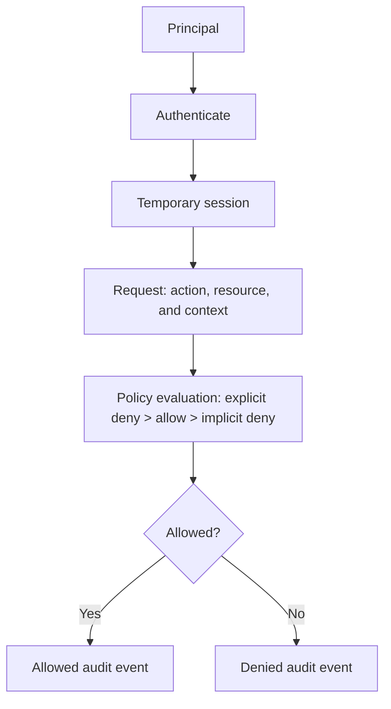
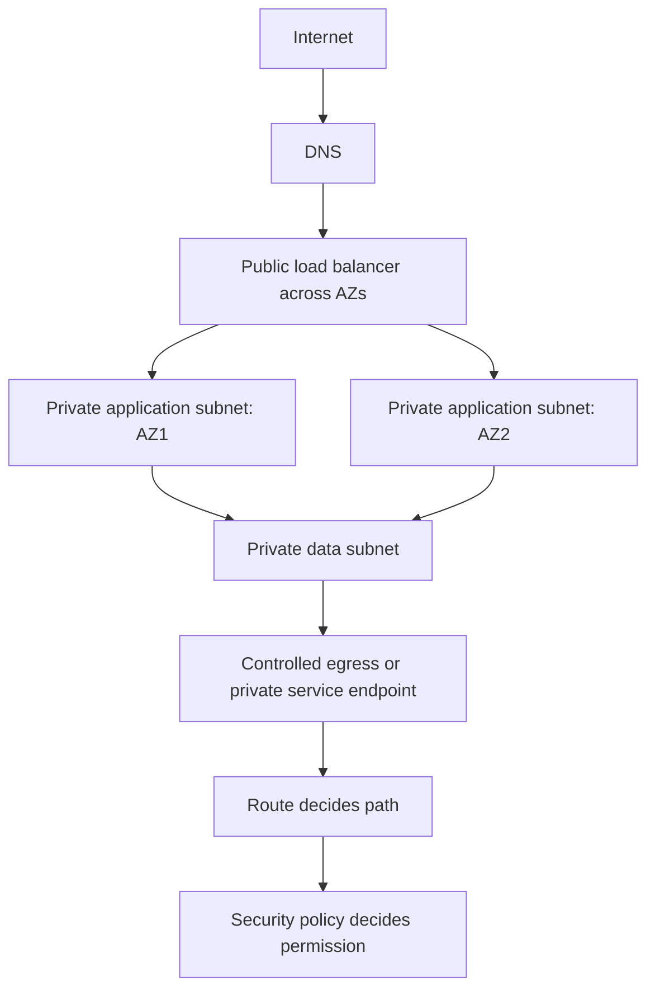
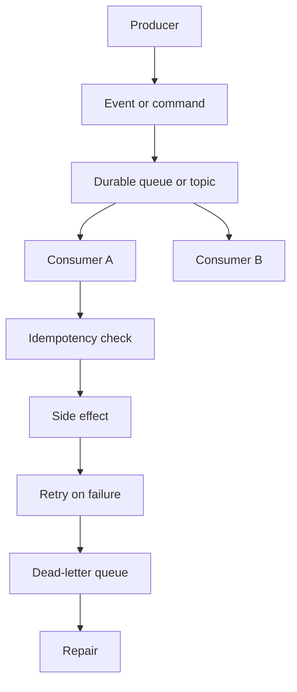
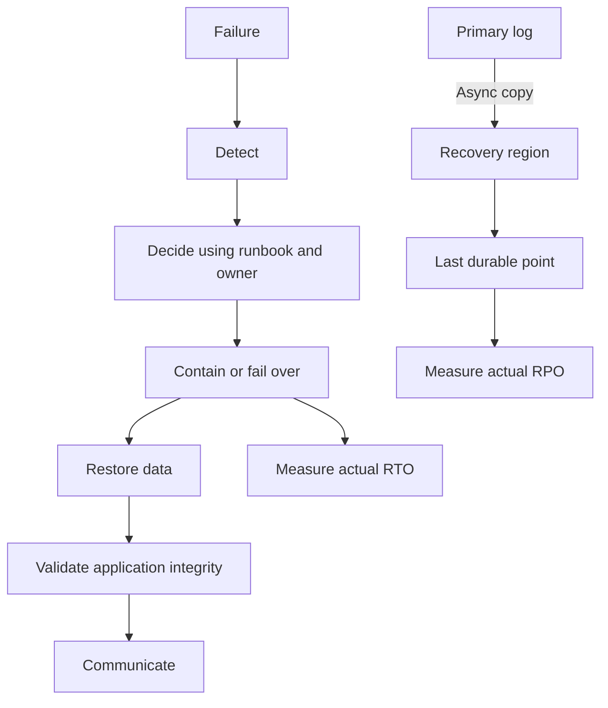

# The Zero-to-Hero Cloud Engineer Roadmap

*Mohammad Bilal's provider-aware path from Linux and networks to secure, reliable, cost-controlled cloud architecture - told as a connected story in which each engineering problem leads to the next solution.*

*Resources researched with Composio on 2026-08-12 using connected YouTube and GitHub discovery. Selected videos were batch-checked as public and available; primary documentation and hands-on repositories are placed inside the concept they support.*

**Scope:** 20 phases · AWS/Azure/GCP mappings · architecture, operations, security, FinOps, migration, portfolio, and interviews · no artificial weekly deadline.

```text
FOUNDATIONS -> CLOUD CORE -> DATA SERVICES -> TRAFFIC & EVENTS
     |              |                |                 |
 Linux/network   regions/IAM/VPC   storage/database   DNS/CDN/serverless
     +--------------+----------------+-----------------+
                            |
                            v
 CLOUD NATIVE -> AUTOMATION -> GOVERNANCE/SECURITY -> OPERATIONS
 containers/K8s     IaC       landing zone/keys       observability
                            |
                            v
 RELIABILITY -> FINOPS -> MIGRATION/HYBRID -> PROJECTS -> INTERVIEWS
```

---

## How to Read This Document

### Start here if cloud computing is completely new to you

The **cloud** is someone else's collection of computers, storage devices, and network equipment that you rent and control through software. A **cloud provider** is the company operating that equipment. A **region** is a geographic area containing provider facilities, a **service** is a ready-made capability such as storage or a database, and a **workload** is simply the application or job you run there. **Deployment** means putting that workload into an environment where it can run for its intended users.

For every phase, first ask: “What would I have to buy, connect, protect, and repair if the provider did not do this part for me?” Then draw the request path, perform the small lab, and explain which responsibilities belong to you and which belong to the provider. The names will become easier once you can picture the physical job behind them.

**Words you will meet often:** a **virtual machine (VM)** is a software-made computer; a **container** is a packaged application that shares the host operating system; **IAM** controls who can sign in and what they may do; a **VPC** or **VNet** is your private network area inside a provider; a **load balancer** spreads requests across healthy servers; **autoscaling** changes the number of running servers as demand changes; **infrastructure as code (IaC)** stores infrastructure instructions in versioned files; **observability** means collecting enough signals to understand a running system; **RTO** is the target recovery time; **RPO** is the acceptable amount of recent data loss; and **FinOps** is the practice of connecting cloud cost to engineering and business decisions.

This roadmap teaches ideas, not a product list or a collection of exam objectives. The phases form one connected explanation: every phase begins where the previous design reached a practical limit, explains the mechanism invented to answer that limit, names what the mechanism costs, and closes on the pressure that forces the next phase. Read in order once; on revision, jump to **Why You Are Learning This**, **What Happens Inside**, and **Why the Next Topic Is Needed**.

There is no week clock. Move when you can trace the mechanism, produce the lab evidence, explain one trade-off, and diagnose one failure without hiding behind a console screenshot.

### The Beginner-Friendly Pattern Every Topic Follows

| Element | What it gives you |
| --- | --- |
| **Why You Are Learning This** | The limitation inherited from the previous phase |
| **See It Before You Memorize It** | Three annotated videos, primary docs, a real repository, and a lab |
| **Step-by-Step Explanation** | The theory and mechanics in connected prose |
| **The Idea That Fixed It** | The design move in one sentence |
| **What Happens Inside** | A provider-neutral ASCII trace |
| **Complexity / Trade-offs** | What improved and what moved elsewhere |
| **Picture It Like This** | A picture that survives after syntax fades |
| **Small Working Example** | A small reproducible lab that produces evidence |
| **How to Explain This in an Interview** | The model under time pressure |
| **Practice** | Easy to hard, ending in a defendable artifact |
| **Why the Next Topic Is Needed** | The next limitation, stated explicitly |

---

> **Integrated Git practice:** Each linked phase-project card in [`Projects.md`](../guides/Projects.md) ends with one specific Git checkpoint. Test the finished project first, commit only its named project path, verify the commit and clean working tree, then continue. Use [`Git.md` Phases 2-3](./Git.md#phase-2) if staging or commit selection is unfamiliar.

---

## The Whole-Journey Map

```text
FOUNDATIONS -> CLOUD CORE -> DATA SERVICES -> TRAFFIC & EVENTS
     |              |                |                 |
 Linux/network   regions/IAM/VPC   storage/database   DNS/CDN/serverless
     +--------------+----------------+-----------------+
                            |
                            v
 CLOUD NATIVE -> AUTOMATION -> GOVERNANCE/SECURITY -> OPERATIONS
 containers/K8s     IaC       landing zone/keys       observability
                            |
                            v
 RELIABILITY -> FINOPS -> MIGRATION/HYBRID -> PROJECTS -> INTERVIEWS
```

---

## Phase Index

| # | Phase | Goal | Ready to move on when you can... |
| ---: | --- | --- | --- |
| 01 | [The Cloud Engineer's Ground Floor](#phase-1---the-cloud-engineers-ground-floor) | Build the operating-system, networking, and automation base that every cloud console hides. | Trace a request from a shell process through DNS and a network interface, and automate the trace with a small script. |
| 02 | [Virtualization and Cloud Service Models](#phase-2---virtualization-and-cloud-service-models) | Understand what a provider pools, what you still operate, and how IaaS, PaaS, SaaS, containers, and serverless move the boundary. | Place compute, network, OS, runtime, data, and application responsibilities correctly for five service models. |
| 03 | [Providers, Regions, Zones, and Shared Responsibility](#phase-3---providers-regions-zones-and-shared-responsibility) | Read global infrastructure as a failure map and map AWS, Azure, and GCP vocabulary without confusing names for capabilities. | Choose a region and zone topology from latency, residency, service availability, failure, and cost requirements. |
| 04 | [Identity and Access Management](#phase-4---identity-and-access-management) | Make every human and workload prove identity and receive only the permissions required for the current task. | Explain authentication, authorization, federation, roles, policies, resource policies, and short-lived credentials with a denied-request trace. |
| 05 | [Cloud Networking: VPCs, Subnets, Routes, and Private Access](#phase-5---cloud-networking-vpcs-subnets-routes-and-private-access) | Build an address and routing plan in which every allowed path is intentional and every forbidden path is testable. | Draw a multi-zone VPC/VNet with public and private subnets, egress, endpoints, load balancing, and security controls, then trace one packet. |
| 06 | [Compute, Images, Load Balancing, and Autoscaling](#phase-6---compute-images-load-balancing-and-autoscaling) | Run stateless workloads as replaceable groups that scale from measured demand and survive instance or zone failure. | Build an image, place instances behind health-checked load balancing, and explain scaling signals, warm-up, draining, and failure behavior. |
| 07 | [Object, Block, and File Storage](#phase-7---object-block-and-file-storage) | Choose storage from access pattern, durability, consistency, throughput, sharing, lifecycle, and recovery rather than from familiar filesystem habits. | Explain where an uploaded object, VM disk, and shared application file belong and prove retention and restore behavior. |
| 08 | [Managed Databases, NoSQL, Replication, and Caching](#phase-8---managed-databases-nosql-replication-and-caching) | Select a data service from consistency, query, transaction, scale, and recovery requirements, then operate its failure modes. | Defend a relational or NoSQL choice, inspect one query, design backups, and explain cache invalidation and failover. |
| 09 | [DNS, Load Balancing, CDN, and Edge Delivery](#phase-9---dns-load-balancing-cdn-and-edge-delivery) | Route users to healthy origins and cache safe content near demand while preserving correctness and observability. | Trace authoritative DNS to edge cache to origin and explain TTL, cache key, TLS, health, and failover behavior. |
| 10 | [Serverless and Event-Driven Architecture](#phase-10---serverless-and-event-driven-architecture) | Decouple producers from work using events, queues, topics, functions, retries, and dead-letter handling. | Design an idempotent event consumer and explain delivery semantics, ordering, backpressure, retries, and poison messages. |
| 11 | [Containers and Managed Kubernetes](#phase-11---containers-and-managed-kubernetes) | Choose between managed containers and Kubernetes from scheduling, portability, team maturity, and operational needs. | Deploy a container with health, identity, configuration, limits, and a safe rollout, then explain what the managed control plane does not own. |
| 12 | [Infrastructure as Code with Terraform and Native Tools](#phase-12---infrastructure-as-code-with-terraform-and-native-tools) | Represent infrastructure as versioned desired state with plans, modules, remote state, policy, and controlled delivery. | Create a module, review a plan, explain state locking and drift, and recover safely from an interrupted change. |
| 13 | [Landing Zones, Accounts, Governance, and Policy](#phase-13---landing-zones-accounts-governance-and-policy) | Create a scalable organization boundary with identity, logging, network, policy, billing, and workload vending built in. | Draw an account/subscription/project hierarchy and show where audit, security, networking, budgets, and exceptions are owned. |
| 14 | [Secrets, Encryption, and Key Management](#phase-14---secrets-encryption-and-key-management) | Keep credentials out of code, encrypt data with controlled keys, and rotate access without redeploying permanent secrets. | Trace envelope encryption and a workload-identity secret retrieval, including audit, rotation, revocation, and recovery. |
| 15 | [Cloud Observability and Operations](#phase-15---cloud-observability-and-operations) | Turn metrics, logs, traces, events, and configuration changes into fast detection and evidence-based diagnosis. | Instrument one request end to end, define a useful alert, and move from symptom to responsible dependency with a trace and correlated logs. |
| 16 | [Cloud Security, Governance, and Compliance](#phase-16---cloud-security-governance-and-compliance) | Continuously reduce attack paths with posture controls, segmentation, detection, evidence, and risk-based remediation. | Threat-model a cloud workload and connect each risk to a preventive, detective, and recovery control with an owner. |
| 17 | [Reliability, High Availability, and Disaster Recovery](#phase-17---reliability-high-availability-and-disaster-recovery) | Design failure containment and tested recovery from component, zone, region, dependency, and operator failures. | Derive topology and recovery procedures from availability, RTO, RPO, integrity, dependency, and cost requirements. |
| 18 | [FinOps and Cloud Cost Engineering](#phase-18---finops-and-cloud-cost-engineering) | Make unit cost, ownership, budgets, anomalies, and optimization part of architecture and daily operation. | Allocate spend, calculate one unit metric, find waste, and defend an optimization without transferring unacceptable reliability or labor cost. |
| 19 | [Hybrid Cloud, Multi-Cloud, and Migration](#phase-19---hybrid-cloud-multi-cloud-and-migration) | Move or connect workloads from business constraints while avoiding accidental lowest-common-denominator architecture. | Assess one workload, select a migration strategy, map dependencies and data movement, and define cutover and rollback evidence. |
| 20 | [Cloud Projects, Architecture Interviews, and Career Proof](#phase-20---cloud-projects-architecture-interviews-and-career-proof) | Turn the full chain into operated projects, architecture decisions, incident stories, and concise interview reasoning. | Present a deployed architecture with IaC, security, observability, cost, recovery evidence, and a five-minute design narrative. |

---

<a id="phase-1"></a>

# PHASE 1 - The Cloud Engineer's Ground Floor

**Track:** Foundations

**WHAT YOU WILL BE ABLE TO DO:** Build the operating-system, networking, and automation base that every cloud console hides.

**WHAT YOU SHOULD KNOW FIRST:** None - this is the ground floor.

**WHAT YOU HAVE LEARNED SO FAR:** Cloud services are remote computers, networks, and storage exposed through APIs. Without the layers underneath, service names become flash cards and troubleshooting becomes random clicking. Teams treated the cloud console as the system itself. When an instance could not resolve DNS, open a port, mount storage, or start a process, they had no model below the dashboard and no reliable place to look.

## 1.1 The Cloud Engineer's Ground Floor

**WHY YOU ARE LEARNING THIS:** Cloud services are remote computers, networks, and storage exposed through APIs. Without the layers underneath, service names become flash cards and troubleshooting becomes random clicking.

**THE PROBLEM THIS SOLVES:** Teams treated the cloud console as the system itself. When an instance could not resolve DNS, open a port, mount storage, or start a process, they had no model below the dashboard and no reliable place to look.

**SEE IT BEFORE YOU MEMORIZE IT**

- Best animated explanation: [Cloud Computing Explained: The Most Important Concepts To Know (Be A Better Dev)](https://www.youtube.com/watch?v=ZaA0kNm18pE) - start here for the clearest visual model of the cloud engineer's ground floor before the detailed internal steps
- Alternative: [What Does a Cloud Engineer ACTUALLY Do? (Tech With Soleyman)](https://www.youtube.com/watch?v=kriafQfqGZE) - use this second to compare terminology and see the same pressure from another engineering angle
- Another angle: [Learn Networking in 3 Hours | Networking Fundamentals + AWS VPC Networking (Abhishek.Veeramalla)](https://www.youtube.com/watch?v=iSOfkw_YyOU) - use this after the theory to connect the model to an implementation or provider-specific case
- Interactive simulator: [SadServers troubleshooting scenarios](https://sadservers.com/) - turn the chapter into observable behavior instead of console tourism
- Written documentation: [Microsoft Learn: describe cloud concepts](https://learn.microsoft.com/en-us/training/paths/microsoft-azure-fundamentals-describe-cloud-concepts/) - use the primary source for current limits, semantics, and supported configuration
- GitHub implementation: [bregman-arie/devops-exercises](https://github.com/bregman-arie/devops-exercises) - inspect how the concept is represented in real code and configuration

**STEP-BY-STEP EXPLANATION**

A cloud engineer works at boundaries: application to operating system, process to socket, private network to public network, identity to API, and desired configuration to real infrastructure. Linux supplies the process, filesystem, permission, and logging model used by most cloud workloads. Networking supplies addressing, routing, DNS, transport, and TLS. Scripting turns a one-off diagnosis into a repeatable check.

Begin with evidence. A hostname is resolved to an address, a route selects an interface and gateway, a transport connection targets a port, and a process accepts the connection. `dig`, `ip`, `ss`, `curl`, `traceroute`, `ps`, `systemctl`, and the system journal expose different parts of that chain. The cloud later adds virtual versions of the same components; it does not repeal them.

The career distinction matters immediately. A software developer primarily owns application behavior. A cloud engineer owns the environment and architecture that make many applications secure, reachable, durable, observable, and affordable. Code remains essential, but the output is often a platform capability or automated control rather than a product feature.

**THE MAIN IDEA IN SIMPLE WORDS:** Learn the physical and operating-system model first; cloud vocabulary should name a mechanism you can already trace.

**WHAT HAPPENS INSIDE, ONE STEP AT A TIME**

```text
application
    |
    v
Linux process -> socket -> DNS -> route -> network -> remote service
    ^                                                |
    +----------- logs, metrics, and packets <--------+
```

**WHAT YOU GAIN, WHAT IT COSTS, AND WHERE IT CAN FAIL**

| Choice | What it buys | What it costs |
| --- | --- | --- |
| Keep the earlier approach | Avoid one more abstraction | Teams treated the cloud console as the system itself. When an instance could not resolve DNS, open a port, mount storage, or start a process, they had no model below the dashboard and no reliable place to look. |
| Adopt this phase's model | A portable troubleshooting model that works across every provider | It delays the excitement of managed services and requires command-line practice |
| Push it beyond its fit | Delays a redesign | Once one machine is understandable, the next pressure is how to create, isolate, and rent machines on demand. That is the problem virtualization and cloud service models solve. |

**PICTURE IT LIKE THIS**

Learning cloud without Linux and networking is like managing an airport from the departures screen without knowing what runways, gates, or radio calls do.

**SMALL WORKING EXAMPLE**

```bash
host=example.com
dig +short "$host"
ip route get 1.1.1.1
curl -sS -o /dev/null -w '%{http_code} %{remote_ip} %{time_total}
' "https://$host"
ss -tupn | head
```

Run the lab, save the output, change one assumption, and run it again. The evidence and the explanation of the difference belong in the project README.

**HOW TO EXPLAIN THIS IN AN INTERVIEW**

A VM can ping an IP but cannot reach `https://service.example`. Walk the layers in order and state the command that tests each assumption.

A strong answer begins with requirements and the previous limitation, traces the diagram, states one failure mode, and only then names a service or tool.

**PRACTICE UNTIL IT FEELS FAMILIAR**

| Difficulty | Task |
| --- | --- |
| Easy | Redraw the internal flow for **The Cloud Engineer's Ground Floor** from memory and label every ownership boundary. |
| Medium | Complete the lab, deliberately break one assumption, and diagnose it with evidence rather than a guessed fix. |
| Hard | Build a small provider-neutral artifact, map it to AWS/Azure/GCP where relevant, measure one trade-off, and defend the design in five minutes. |

**WHY THE NEXT TOPIC IS NEEDED:** Once one machine is understandable, the next pressure is how to create, isolate, and rent machines on demand. That is the problem virtualization and cloud service models solve.

---

> **Phase 1 complete?** [Build the Phase 1 mini-project](../guides/Projects.md#cloud-phase-1-project) · [Continue to Phase 2](#phase-2---virtualization-and-cloud-service-models)

<a id="phase-2"></a>

# PHASE 2 - Virtualization and Cloud Service Models

**Track:** Foundations

**WHAT YOU WILL BE ABLE TO DO:** Understand what a provider pools, what you still operate, and how IaaS, PaaS, SaaS, containers, and serverless move the boundary.

**WHAT YOU SHOULD KNOW FIRST:** Phase 1 (The Cloud Engineer's Ground Floor)

**WHAT YOU HAVE LEARNED SO FAR:** Buying a physical server for every workload wastes capacity and turns growth into a procurement project. Virtualization pools hardware; cloud computing adds an API, elastic capacity, measured billing, and managed services. Provisioning meant tickets, rack space, cables, firmware, operating-system installation, and weeks of lead time. Capacity was purchased for the peak and sat idle outside it.

## 2.1 Virtualization and Cloud Service Models

**WHY YOU ARE LEARNING THIS:** Buying a physical server for every workload wastes capacity and turns growth into a procurement project. Virtualization pools hardware; cloud computing adds an API, elastic capacity, measured billing, and managed services.

**THE PROBLEM THIS SOLVES:** Provisioning meant tickets, rack space, cables, firmware, operating-system installation, and weeks of lead time. Capacity was purchased for the peak and sat idle outside it.

**SEE IT BEFORE YOU MEMORIZE IT**

- Best animated explanation: [Virtual Machines vs Containers (PowerCert Animated Videos)](https://www.youtube.com/watch?v=eyNBf1sqdBQ) - start here for the clearest visual model of virtualization and cloud service models before the detailed internal steps
- Alternative: [IaaS vs PaaS vs SaaS cloud service models (Adam Marczak - Azure for Everyone)](https://www.youtube.com/watch?v=9CVBohl6w0Q) - use this second to compare terminology and see the same pressure from another engineering angle
- Another angle: [Cloud Computing In 6 Minutes (Simplilearn)](https://www.youtube.com/watch?v=M988_fsOSWo) - use this after the theory to connect the model to an implementation or provider-specific case
- Interactive simulator: [Microsoft Learn sandbox modules](https://learn.microsoft.com/en-us/training/) - turn the chapter into observable behavior instead of console tourism
- Written documentation: [NIST definition of cloud computing](https://csrc.nist.gov/publications/detail/sp/800-145/final) - use the primary source for current limits, semantics, and supported configuration
- GitHub implementation: [kelseyhightower/kubernetes-the-hard-way](https://github.com/kelseyhightower/kubernetes-the-hard-way) - inspect how the concept is represented in real code and configuration

**STEP-BY-STEP EXPLANATION**

A hypervisor multiplexes CPU, memory, storage, and network devices among virtual machines, each with its own kernel. Containers share a kernel and isolate processes with namespaces and resource controls, so they start faster but expose a different security boundary. Cloud providers automate the surrounding control plane: identity, quota, placement, networking, images, metering, and lifecycle.

Service models move responsibility. In IaaS the provider owns facilities and hardware while you own the guest OS upward. PaaS also operates the OS and runtime, leaving application and data. SaaS exposes a finished product. Functions and other serverless services remove server lifecycle from the customer view, but code, data, permissions, dependency security, and cost behavior remain yours.

The correct model follows constraints. VMs maximize control and compatibility; containers package processes consistently; managed platforms reduce undifferentiated operations; serverless aligns cost with sporadic events. Every step toward management trades control, portability, and sometimes predictable cost for a smaller operational surface.

**THE MAIN IDEA IN SIMPLE WORDS:** Treat managed services as deliberate responsibility transfers, not as magic or automatic upgrades.

**WHAT HAPPENS INSIDE, ONE STEP AT A TIME**

```text
physical hardware
      |
   hypervisor
   /       VM+OS   VM+OS        IaaS: you operate OS upward
                  ->  PaaS: provider operates runtime
                  ->  SaaS: provider operates application
                  ->  serverless: you supply event code and policy
```

**WHAT YOU GAIN, WHAT IT COSTS, AND WHERE IT CAN FAIL**

| Choice | What it buys | What it costs |
| --- | --- | --- |
| Keep the earlier approach | Avoid one more abstraction | Provisioning meant tickets, rack space, cables, firmware, operating-system installation, and weeks of lead time. Capacity was purchased for the peak and sat idle outside it. |
| Adopt this phase's model | Elastic provisioning and less undifferentiated hardware work | Less control, new provider constraints, and a billing model that rewards measurement |
| Push it beyond its fit | Delays a redesign | Renting compute solves acquisition, but workloads still fail together if location and ownership boundaries are vague. Regions, availability zones, and shared responsibility define those boundaries. |

**PICTURE IT LIKE THIS**

It is the difference between owning a kitchen, renting a fitted kitchen, ordering meal kits, and eating at a restaurant: convenience rises while control moves away.

**SMALL WORKING EXAMPLE**

```bash
docker run --rm alpine:3.20 sh -c 'cat /etc/os-release; ps'
docker run --rm --memory=64m --cpus=.25 alpine:3.20 sh -c 'ulimit -a'
# Compare the visible kernel and process boundary with a VM you create later.
```

Run the lab, save the output, change one assumption, and run it again. The evidence and the explanation of the difference belong in the project README.

**HOW TO EXPLAIN THIS IN AN INTERVIEW**

Given a spiky image-processing job, compare VM, container platform, and function choices using control, startup, duration, scaling, and cost.

A strong answer begins with requirements and the previous limitation, traces the diagram, states one failure mode, and only then names a service or tool.

**PRACTICE UNTIL IT FEELS FAMILIAR**

| Difficulty | Task |
| --- | --- |
| Easy | Redraw the internal flow for **Virtualization and Cloud Service Models** from memory and label every ownership boundary. |
| Medium | Complete the lab, deliberately break one assumption, and diagnose it with evidence rather than a guessed fix. |
| Hard | Build a small provider-neutral artifact, map it to AWS/Azure/GCP where relevant, measure one trade-off, and defend the design in five minutes. |

**WHY THE NEXT TOPIC IS NEEDED:** Renting compute solves acquisition, but workloads still fail together if location and ownership boundaries are vague. Regions, availability zones, and shared responsibility define those boundaries.

---

> **Phase 2 complete?** [Build the Phase 2 mini-project](../guides/Projects.md#cloud-phase-2-project) · [Continue to Phase 3](#phase-3---providers-regions-zones-and-shared-responsibility)

<a id="phase-3"></a>

# PHASE 3 - Providers, Regions, Zones, and Shared Responsibility

**Track:** Cloud Core

**WHAT YOU WILL BE ABLE TO DO:** Read global infrastructure as a failure map and map AWS, Azure, and GCP vocabulary without confusing names for capabilities.

**WHAT YOU SHOULD KNOW FIRST:** Phase 2 (Virtualization and Cloud Service Models)

**WHAT YOU HAVE LEARNED SO FAR:** Elastic resources need a place to run, and customers need to know which failures and controls belong to the provider and which still belong to them. Early hosted systems blurred responsibility: customers assumed the host secured everything, while hosts assumed customers patched, configured access, and protected their data.

## 3.1 Providers, Regions, Zones, and Shared Responsibility

**WHY YOU ARE LEARNING THIS:** Elastic resources need a place to run, and customers need to know which failures and controls belong to the provider and which still belong to them.

**THE PROBLEM THIS SOLVES:** Early hosted systems blurred responsibility: customers assumed the host secured everything, while hosts assumed customers patched, configured access, and protected their data.

**SEE IT BEFORE YOU MEMORIZE IT**

- Best animated explanation: [AWS Shared Responsibility Model for Beginners (BeSA Cloud Academy)](https://www.youtube.com/watch?v=WopTpel6DUY) - start here for the clearest visual model of providers, regions, zones, and shared responsibility before the detailed internal steps
- Alternative: [Microsoft Azure Fundamentals - Shared Responsibility Model (Avinash Seth)](https://www.youtube.com/watch?v=xMZNpJ-xho0) - use this second to compare terminology and see the same pressure from another engineering angle
- Another angle: [AWS Fundamentals - Shared Responsibility Model (Julie Elkins)](https://www.youtube.com/watch?v=5XSq8OAeavg) - use this after the theory to connect the model to an implementation or provider-specific case
- Interactive simulator: [CloudPing latency comparison](https://www.cloudping.info/) - turn the chapter into observable behavior instead of console tourism
- Written documentation: [AWS global infrastructure](https://aws.amazon.com/about-aws/global-infrastructure/) - use the primary source for current limits, semantics, and supported configuration
- GitHub implementation: [awsdocs/aws-doc-sdk-examples](https://github.com/awsdocs/aws-doc-sdk-examples) - inspect how the concept is represented in real code and configuration

**STEP-BY-STEP EXPLANATION**

A region is a geographic service boundary. Availability zones are separate fault domains within a region, connected by low-latency networks but designed not to share every power, cooling, and physical risk. AWS uses Regions and AZs; Azure uses Regions and Availability Zones; GCP uses Regions and Zones. The nouns differ around accounts, subscriptions, and projects, but the design questions remain location, isolation, quota, identity, and billing.

Multi-AZ protects against a zonal failure only when every critical tier actually spans zones and the data layer can fail over. Multi-region protects a wider boundary but introduces replication lag, routing, data sovereignty, operational rehearsal, and significant cost. Selecting a famous region without verifying service availability or user latency is not architecture.

Shared responsibility changes by service model. The provider secures physical facilities and managed control planes; the customer still owns identities, data classification, application code, configuration, and allowed network paths. A managed database removes patching work but does not prevent a public endpoint, weak password, destructive query, or missing backup policy.

**THE MAIN IDEA IN SIMPLE WORDS:** Design against explicit failure domains and write every security control beside its owner.

**WHAT HAPPENS INSIDE, ONE STEP AT A TIME**

```text
world
  |
region A ---------------- region B
 |       |                   |
AZ-1    AZ-2               recovery copy
 |       |
app     app   -> managed data across zones

provider: facilities/control plane | customer: identity/data/config/code
```

**WHAT YOU GAIN, WHAT IT COSTS, AND WHERE IT CAN FAIL**

| Choice | What it buys | What it costs |
| --- | --- | --- |
| Keep the earlier approach | Avoid one more abstraction | Early hosted systems blurred responsibility: customers assumed the host secured everything, while hosts assumed customers patched, configured access, and protected their data. |
| Adopt this phase's model | Geographic choice, fault isolation, and a clear ownership model | Cross-zone and cross-region resilience add cost, latency, and operational complexity |
| Push it beyond its fit | Delays a redesign | Location and ownership are now visible, but nothing prevents an overpowered human or workload from changing everything. Identity and access management becomes the next control plane. |

**PICTURE IT LIKE THIS**

A region is a city and zones are independently supplied buildings; renting two rooms in one building is not disaster recovery.

**SMALL WORKING EXAMPLE**

```bash
# Build a provider vocabulary matrix in CSV or Markdown:
# capability,AWS,Azure,GCP,failure_boundary,customer_responsibility
# identity_account,Account,Subscription,Project,...
# region_zone,Region/AZ,Region/Zone,Region/Zone,...
```

Run the lab, save the output, change one assumption, and run it again. The evidence and the explanation of the difference belong in the project README.

**HOW TO EXPLAIN THIS IN AN INTERVIEW**

A company needs low latency in Qatar, EU data residency, and a four-hour regional recovery target. Explain the topology and the questions you must verify before naming services.

A strong answer begins with requirements and the previous limitation, traces the diagram, states one failure mode, and only then names a service or tool.

**PRACTICE UNTIL IT FEELS FAMILIAR**

| Difficulty | Task |
| --- | --- |
| Easy | Redraw the internal flow for **Providers, Regions, Zones, and Shared Responsibility** from memory and label every ownership boundary. |
| Medium | Complete the lab, deliberately break one assumption, and diagnose it with evidence rather than a guessed fix. |
| Hard | Build a small provider-neutral artifact, map it to AWS/Azure/GCP where relevant, measure one trade-off, and defend the design in five minutes. |

**WHY THE NEXT TOPIC IS NEEDED:** Location and ownership are now visible, but nothing prevents an overpowered human or workload from changing everything. Identity and access management becomes the next control plane.

---

> **Phase 3 complete?** [Build the Phase 3 mini-project](../guides/Projects.md#cloud-phase-3-project) · [Continue to Phase 4](#phase-4---identity-and-access-management)

<a id="phase-4"></a>

# PHASE 4 - Identity and Access Management

**Track:** Cloud Core

**WHAT YOU WILL BE ABLE TO DO:** Make every human and workload prove identity and receive only the permissions required for the current task.

**WHAT YOU SHOULD KNOW FIRST:** Phase 3 (Providers, Regions, Zones, and Shared Responsibility)

**WHAT YOU HAVE LEARNED SO FAR:** APIs make infrastructure fast to change, so one stolen permanent credential or wildcard policy can change an entire estate just as quickly. Shared administrator accounts and long-lived access keys made attribution weak, rotation painful, and compromise impact nearly unlimited.

## 4.1 Identity and Access Management

**WHY YOU ARE LEARNING THIS:** APIs make infrastructure fast to change, so one stolen permanent credential or wildcard policy can change an entire estate just as quickly.

**THE PROBLEM THIS SOLVES:** Shared administrator accounts and long-lived access keys made attribution weak, rotation painful, and compromise impact nearly unlimited.

**SEE IT BEFORE YOU MEMORIZE IT**

- Best animated explanation: [AWS IAM Core Concepts You NEED to Know (Be A Better Dev)](https://www.youtube.com/watch?v=_ZCTvmaPgao) - start here for the clearest visual model of identity and access management before the detailed internal steps
- Alternative: [AWS IAM Basics (Tiny Technical Tutorials)](https://www.youtube.com/watch?v=hAk-7ImN6iM) - use this second to compare terminology and see the same pressure from another engineering angle
- Another angle: [Cloud IAM Deep Dive: AWS, Entra ID, GCP (CyberXplain Academy)](https://www.youtube.com/watch?v=iPoJL8EY27E) - use this after the theory to connect the model to an implementation or provider-specific case
- Interactive simulator: [AWS policy simulator](https://policysim.aws.amazon.com/) - turn the chapter into observable behavior instead of console tourism
- Written documentation: [AWS IAM best practices](https://docs.aws.amazon.com/IAM/latest/UserGuide/best-practices.html) - use the primary source for current limits, semantics, and supported configuration
- GitHub implementation: [cloud-custodian/cloud-custodian](https://github.com/cloud-custodian/cloud-custodian) - inspect how the concept is represented in real code and configuration

**STEP-BY-STEP EXPLANATION**

IAM evaluates a request using identity, requested action, target resource, context, and applicable policies. Authentication proves the principal; authorization decides whether that principal may perform the action. An explicit deny wins over an allow, and absence of an allow is a deny. Identity policies attach to principals, resource policies attach to resources, and organization controls can set a maximum permission boundary.

Humans should federate from an identity provider and obtain short-lived sessions with multi-factor authentication. Workloads should assume roles through platform identity rather than carry static keys in files or environment variables. AWS roles and STS, Azure managed identities and Entra ID, and GCP service accounts/workload identity implement the same central idea: exchange a trusted runtime identity for scoped temporary authority.

Least privilege is an iterative engineering process. Begin with a narrow job, observe required actions, constrain resources and conditions, review unused permissions, and separate break-glass access. Permission to pass or impersonate another role is as powerful as that role and must be treated accordingly.

**THE MAIN IDEA IN SIMPLE WORDS:** Replace shared and permanent authority with federated, short-lived, least-privilege sessions.

**WHAT HAPPENS INSIDE, ONE STEP AT A TIME**



**WHAT YOU GAIN, WHAT IT COSTS, AND WHERE IT CAN FAIL**

| Choice | What it buys | What it costs |
| --- | --- | --- |
| Keep the earlier approach | Avoid one more abstraction | Shared administrator accounts and long-lived access keys made attribution weak, rotation painful, and compromise impact nearly unlimited. |
| Adopt this phase's model | Strong attribution and a small compromise radius | Fine-grained policy is complex and requires continuous review |
| Push it beyond its fit | Delays a redesign | Identity controls who may ask. Cloud networking now controls which paths exist between the caller, workloads, managed services, and the internet. |

**PICTURE IT LIKE THIS**

IAM is a building badge system where identity, door, time, job, and emergency lockdown all participate in the decision.

**SMALL WORKING EXAMPLE**

```bash
# AWS example: inspect who the CLI is acting as, never print secret values.
aws sts get-caller-identity
aws iam simulate-principal-policy   --policy-source-arn "$ROLE_ARN"   --action-names s3:GetObject   --resource-arns "$OBJECT_ARN"

```

Run the lab, save the output, change one assumption, and run it again. The evidence and the explanation of the difference belong in the project README.

**HOW TO EXPLAIN THIS IN AN INTERVIEW**

A developer needs read access to one production log prefix for one hour. Design the identity flow and explain why an access key is the wrong answer.

A strong answer begins with requirements and the previous limitation, traces the diagram, states one failure mode, and only then names a service or tool.

**PRACTICE UNTIL IT FEELS FAMILIAR**

| Difficulty | Task |
| --- | --- |
| Easy | Redraw the internal flow for **Identity and Access Management** from memory and label every ownership boundary. |
| Medium | Complete the lab, deliberately break one assumption, and diagnose it with evidence rather than a guessed fix. |
| Hard | Build a small provider-neutral artifact, map it to AWS/Azure/GCP where relevant, measure one trade-off, and defend the design in five minutes. |

**WHY THE NEXT TOPIC IS NEEDED:** Identity controls who may ask. Cloud networking now controls which paths exist between the caller, workloads, managed services, and the internet.

---

> **Phase 4 complete?** [Build the Phase 4 mini-project](../guides/Projects.md#cloud-phase-4-project) · [Continue to Phase 5](#phase-5---cloud-networking-vpcs-subnets-routes-and-private-access)

<a id="phase-5"></a>

# PHASE 5 - Cloud Networking: VPCs, Subnets, Routes, and Private Access

**Track:** Cloud Core

**WHAT YOU WILL BE ABLE TO DO:** Build an address and routing plan in which every allowed path is intentional and every forbidden path is testable.

**WHAT YOU SHOULD KNOW FIRST:** Phase 4 (Identity and Access Management)

**WHAT YOU HAVE LEARNED SO FAR:** Identity cannot replace reachability. Workloads need controlled paths to users, dependencies, provider APIs, and operations without making every component public. Flat networks relied on host firewalls and tribal knowledge. One routing or firewall mistake exposed large parts of the environment, and overlapping address plans made later connection painful.

## 5.1 Cloud Networking: VPCs, Subnets, Routes, and Private Access

**WHY YOU ARE LEARNING THIS:** Identity cannot replace reachability. Workloads need controlled paths to users, dependencies, provider APIs, and operations without making every component public.

**THE PROBLEM THIS SOLVES:** Flat networks relied on host firewalls and tribal knowledge. One routing or firewall mistake exposed large parts of the environment, and overlapping address plans made later connection painful.

**SEE IT BEFORE YOU MEMORIZE IT**

- Best animated explanation: [AWS VPC & Subnets For Beginners (Sam Meech-Ward)](https://www.youtube.com/watch?v=TUTqYEZZUdc) - start here for the clearest visual model of cloud networking: vpcs, subnets, routes, and private access before the detailed internal steps
- Alternative: [Amazon VPC Basics (Tiny Technical Tutorials)](https://www.youtube.com/watch?v=7_NNlnH7sAg) - use this second to compare terminology and see the same pressure from another engineering angle
- Another angle: [AWS VPC vs Real Network (Network Educative)](https://www.youtube.com/watch?v=9pbD4L5M-mY) - use this after the theory to connect the model to an implementation or provider-specific case
- Interactive simulator: [AWS Networking workshops](https://networking.workshop.aws/) - turn the chapter into observable behavior instead of console tourism
- Written documentation: [AWS VPC documentation](https://docs.aws.amazon.com/vpc/latest/userguide/what-is-amazon-vpc.html) - use the primary source for current limits, semantics, and supported configuration
- GitHub implementation: [aws-samples/aws-vpc-networking-workshops](https://github.com/aws-samples/aws-vpc-networking-workshops) - inspect how the concept is represented in real code and configuration

**STEP-BY-STEP EXPLANATION**

A VPC or VNet is a software-defined routing domain with an IP range. Subnets divide the range and normally align with availability zones and workload roles. Route tables decide the next hop. An internet gateway enables public routing; NAT enables outbound connections from private addresses without accepting unsolicited inbound sessions. Security groups are stateful workload filters, while network ACLs are stateless subnet filters.

Public and private describe routing, not moral value. A public subnet has a route to an internet gateway; a private subnet does not. A resource also needs a public address and permissive policy before it is reachable. Private service endpoints keep traffic to managed APIs off public paths and reduce dependence on NAT.

Plan address space before peering or hybrid connectivity because overlapping CIDRs do not route cleanly. Prefer hub-and-spoke or transit designs when many networks must connect, centralize inspection deliberately, and keep application trust in identity and encryption rather than assuming every packet inside the VPC is safe.

**THE MAIN IDEA IN SIMPLE WORDS:** Separate workloads with software-defined routing and expose only the narrow ingress and egress paths the system requires.

**WHAT HAPPENS INSIDE, ONE STEP AT A TIME**



**WHAT YOU GAIN, WHAT IT COSTS, AND WHERE IT CAN FAIL**

| Choice | What it buys | What it costs |
| --- | --- | --- |
| Keep the earlier approach | Avoid one more abstraction | Flat networks relied on host firewalls and tribal knowledge. One routing or firewall mistake exposed large parts of the environment, and overlapping address plans made later connection painful. |
| Adopt this phase's model | Repeatable isolation, multi-zone layout, and explicit traffic paths | Address planning, egress cost, and layered controls create operational complexity |
| Push it beyond its fit | Delays a redesign | A secure path reaches a workload, but one workload instance is still a capacity and failure bottleneck. Compute groups, health checks, load balancing, and elasticity address that limit. |

**PICTURE IT LIKE THIS**

A VPC is a planned city: CIDRs are land, subnets are districts, routes are roads, gateways are border crossings, and security groups are building doors.

**SMALL WORKING EXAMPLE**

```bash
python - <<'PY'
import ipaddress
vpc=ipaddress.ip_network('10.40.0.0/16')
for i,net in enumerate(vpc.subnets(new_prefix=20)):
    if i == 6: break
    print(i, net, net.num_addresses)
PY
```

Run the lab, save the output, change one assumption, and run it again. The evidence and the explanation of the difference belong in the project README.

**HOW TO EXPLAIN THIS IN AN INTERVIEW**

An application in a private subnet cannot download updates, while its public load balancer works. Trace routes, addresses, stateful rules, DNS, and NAT without opening the application to the internet.

A strong answer begins with requirements and the previous limitation, traces the diagram, states one failure mode, and only then names a service or tool.

**PRACTICE UNTIL IT FEELS FAMILIAR**

| Difficulty | Task |
| --- | --- |
| Easy | Redraw the internal flow for **Cloud Networking: VPCs, Subnets, Routes, and Private Access** from memory and label every ownership boundary. |
| Medium | Complete the lab, deliberately break one assumption, and diagnose it with evidence rather than a guessed fix. |
| Hard | Build a small provider-neutral artifact, map it to AWS/Azure/GCP where relevant, measure one trade-off, and defend the design in five minutes. |

**WHY THE NEXT TOPIC IS NEEDED:** A secure path reaches a workload, but one workload instance is still a capacity and failure bottleneck. Compute groups, health checks, load balancing, and elasticity address that limit.

---

> **Phase 5 complete?** [Build the Phase 5 mini-project](../guides/Projects.md#cloud-phase-5-project) · [Continue to Phase 6](#phase-6---compute-images-load-balancing-and-autoscaling)

<a id="phase-6"></a>

# PHASE 6 - Compute, Images, Load Balancing, and Autoscaling

**Track:** Cloud Core

**WHAT YOU WILL BE ABLE TO DO:** Run stateless workloads as replaceable groups that scale from measured demand and survive instance or zone failure.

**WHAT YOU SHOULD KNOW FIRST:** Phase 5 (Cloud Networking: VPCs, Subnets, Routes, and Private Access)

**WHAT YOU HAVE LEARNED SO FAR:** A single virtual machine has finite capacity and a lifecycle. Increasing its size eventually stops working, maintenance creates downtime, and its local state makes replacement risky. Servers were named, repaired by hand, and treated as unique pets. Capacity changes were slow and deployments accumulated hidden differences between machines.

## 6.1 Compute, Images, Load Balancing, and Autoscaling

**WHY YOU ARE LEARNING THIS:** A single virtual machine has finite capacity and a lifecycle. Increasing its size eventually stops working, maintenance creates downtime, and its local state makes replacement risky.

**THE PROBLEM THIS SOLVES:** Servers were named, repaired by hand, and treated as unique pets. Capacity changes were slow and deployments accumulated hidden differences between machines.

**SEE IT BEFORE YOU MEMORIZE IT**

- Best animated explanation: [Horizontal Scaling, Load Balancing, Immutable Infrastructure (Sam Meech-Ward)](https://www.youtube.com/watch?v=FEbfvTZCYQQ) - start here for the clearest visual model of compute, images, load balancing, and autoscaling before the detailed internal steps
- Alternative: [AWS Auto Scaling Groups and Load Balancers (Sam Meech-Ward)](https://www.youtube.com/watch?v=AmQeeB4ygZc) - use this second to compare terminology and see the same pressure from another engineering angle
- Another angle: [AWS Auto Scaling Group Introduction (Cloud Guru)](https://www.youtube.com/watch?v=s-H2kbGWWe4) - use this after the theory to connect the model to an implementation or provider-specific case
- Interactive simulator: [AWS Well-Architected performance labs](https://www.wellarchitectedlabs.com/performance-efficiency/) - turn the chapter into observable behavior instead of console tourism
- Written documentation: [AWS EC2 Auto Scaling concepts](https://docs.aws.amazon.com/autoscaling/ec2/userguide/what-is-amazon-ec2-auto-scaling.html) - use the primary source for current limits, semantics, and supported configuration
- GitHub implementation: [aws-samples/amazon-ec2-auto-scaling-group-examples](https://github.com/aws-samples/amazon-ec2-auto-scaling-group-examples) - inspect how the concept is represented in real code and configuration

**STEP-BY-STEP EXPLANATION**

An image captures the base operating system and application prerequisites. A launch template turns that image, instance shape, network identity, storage, and bootstrap into a repeatable instance definition. A load balancer distributes requests only to healthy targets. An autoscaling group reconciles desired capacity and changes it from policies or schedules.

Horizontal scaling requires stateless request handling or externalized shared state. Health checks must represent readiness to serve, not merely a running process. During replacement, connection draining lets in-flight work finish. Scaling needs a signal correlated with demand-queue depth or requests per target can be better than average CPU-and a warm-up period that prevents new capacity from distorting the metric.

Immutable deployment replaces instances from a new image instead of editing running hosts. This makes rollback and drift easier to reason about, but images must be rebuilt for patches and boot time matters. Vertical scaling remains useful for stateful or licensed workloads; the point is to choose from workload evidence rather than repeat 'horizontal is always better'.

**THE MAIN IDEA IN SIMPLE WORDS:** Replace individually maintained servers with health-checked, reproducible groups whose capacity follows a meaningful demand signal.

**WHAT HAPPENS INSIDE, ONE STEP AT A TIME**

```text
image + launch template
          |
load balancer -> healthy instance AZ1
          |    -> healthy instance AZ2
          |
 autoscaler reads demand -> changes desired count
 deployment replaces old group -> drains connections
```

**WHAT YOU GAIN, WHAT IT COSTS, AND WHERE IT CAN FAIL**

| Choice | What it buys | What it costs |
| --- | --- | --- |
| Keep the earlier approach | Avoid one more abstraction | Servers were named, repaired by hand, and treated as unique pets. Capacity changes were slow and deployments accumulated hidden differences between machines. |
| Adopt this phase's model | Elastic capacity, safer replacement, and zonal failure tolerance | Warm-up, noisy metrics, state externalization, and load-balancer cost must be designed |
| Push it beyond its fit | Delays a redesign | Replaceable compute still needs durable bytes and shared state. Storage models determine whether data survives replacement and how it is accessed. |

**PICTURE IT LIKE THIS**

It is a taxi fleet rather than one limousine: dispatch sends work to available cars and adds cars when the queue grows.

**SMALL WORKING EXAMPLE**

```bash
# Create a small load test and record latency while concurrency rises.
for c in 1 5 20 50; do
  echo "concurrency=$c"
  hey -n 200 -c "$c" "$TARGET_URL/health" | grep -E 'Requests/sec|Average'
done
```

Run the lab, save the output, change one assumption, and run it again. The evidence and the explanation of the difference belong in the project README.

**HOW TO EXPLAIN THIS IN AN INTERVIEW**

Traffic doubles, CPU stays moderate, but latency and queue time rise. Choose a scaling metric and explain cooldown, maximum capacity, and overload behavior.

A strong answer begins with requirements and the previous limitation, traces the diagram, states one failure mode, and only then names a service or tool.

**PRACTICE UNTIL IT FEELS FAMILIAR**

| Difficulty | Task |
| --- | --- |
| Easy | Redraw the internal flow for **Compute, Images, Load Balancing, and Autoscaling** from memory and label every ownership boundary. |
| Medium | Complete the lab, deliberately break one assumption, and diagnose it with evidence rather than a guessed fix. |
| Hard | Build a small provider-neutral artifact, map it to AWS/Azure/GCP where relevant, measure one trade-off, and defend the design in five minutes. |

**WHY THE NEXT TOPIC IS NEEDED:** Replaceable compute still needs durable bytes and shared state. Storage models determine whether data survives replacement and how it is accessed.

---

> **Phase 6 complete?** [Build the Phase 6 mini-project](../guides/Projects.md#cloud-phase-6-project) · [Continue to Phase 7](#phase-7---object-block-and-file-storage)

<a id="phase-7"></a>

# PHASE 7 - Object, Block, and File Storage

**Track:** Data Services

**WHAT YOU WILL BE ABLE TO DO:** Choose storage from access pattern, durability, consistency, throughput, sharing, lifecycle, and recovery rather than from familiar filesystem habits.

**WHAT YOU SHOULD KNOW FIRST:** Phase 6 (Compute, Images, Load Balancing, and Autoscaling)

**WHAT YOU HAVE LEARNED SO FAR:** Replaceable compute cannot be durable if important data lives only on its local root disk. Different data shapes also require different access semantics. Teams copied files among servers, expanded disks manually, and discovered during failure that a backup job was not the same as a tested restore.

## 7.1 Object, Block, and File Storage

**WHY YOU ARE LEARNING THIS:** Replaceable compute cannot be durable if important data lives only on its local root disk. Different data shapes also require different access semantics.

**THE PROBLEM THIS SOLVES:** Teams copied files among servers, expanded disks manually, and discovered during failure that a backup job was not the same as a tested restore.

**SEE IT BEFORE YOU MEMORIZE IT**

- Best animated explanation: [Amazon S3: Data Durability and Global Resiliency (Amazon Web Services)](https://www.youtube.com/watch?v=9vhEqjR2zsc) - start here for the clearest visual model of object, block, and file storage before the detailed internal steps
- Alternative: [Bucket options in Cloud Storage (Google Cloud Tech)](https://www.youtube.com/watch?v=8DMOJ6Lgm7s) - use this second to compare terminology and see the same pressure from another engineering angle
- Another angle: [System Design of S3 and Azure Blob (Code And Joy)](https://www.youtube.com/watch?v=U_FkdTdJrqo) - use this after the theory to connect the model to an implementation or provider-specific case
- Interactive simulator: [MinIO object storage quickstart](https://min.io/docs/minio/container/index.html) - turn the chapter into observable behavior instead of console tourism
- Written documentation: [AWS storage services overview](https://aws.amazon.com/products/storage/) - use the primary source for current limits, semantics, and supported configuration
- GitHub implementation: [minio/minio](https://github.com/minio/minio) - inspect how the concept is represented in real code and configuration

**STEP-BY-STEP EXPLANATION**

Object storage addresses immutable or replaceable blobs by key through an API. It scales enormously, offers lifecycle tiers and high durability, but is not a normal low-latency POSIX disk. Block storage exposes volumes to operating systems and suits filesystems and databases that need random reads and writes. File storage exposes a shared hierarchy and locking semantics to multiple clients.

Durability is the probability bytes survive; availability is whether the service answers now. Replication protects against hardware failure but also replicates accidental deletion, so versioning, retention, independent backup, and restore testing remain separate controls. Encryption protects media and transport, while authorization decides who can read the logical object.

Cost includes operations, retrieval, replication, minimum storage duration, provisioned performance, and data transfer-not only gigabytes. Lifecycle rules should follow measured access and regulatory retention. A backup is credible only when recovery time and recovered content have been tested.

**THE MAIN IDEA IN SIMPLE WORDS:** Decouple durable data from compute and select object, block, or file semantics from the workload's access and recovery needs.

**WHAT HAPPENS INSIDE, ONE STEP AT A TIME**

```text
application
  |-- object API -> bucket/key -> versions -> lifecycle archive
  |-- block device -> filesystem/database -> snapshots
  +-- file protocol -> shared hierarchy -> multiple clients

replication != versioning != backup != tested restore
```

**WHAT YOU GAIN, WHAT IT COSTS, AND WHERE IT CAN FAIL**

| Choice | What it buys | What it costs |
| --- | --- | --- |
| Keep the earlier approach | Avoid one more abstraction | Teams copied files among servers, expanded disks manually, and discovered during failure that a backup job was not the same as a tested restore. |
| Adopt this phase's model | High durability, independent scaling, and storage tiers | Retrieval, operations, consistency, and egress can dominate cost and behavior |
| Push it beyond its fit | Delays a redesign | Durable bytes are useful, but applications need indexed queries, transactions, and low-latency shared state. Managed databases and caches provide those higher-level semantics. |

**PICTURE IT LIKE THIS**

Object storage is a warehouse addressed by item code, block storage is a private workbench, and file storage is a shared filing cabinet.

**SMALL WORKING EXAMPLE**

```bash
# Run MinIO locally, upload an object, create a second version, then inspect it.
docker run -d --name minio -p 9000:9000 -p 9001:9001   -e MINIO_ROOT_USER=minioadmin -e MINIO_ROOT_PASSWORD=minioadmin   quay.io/minio/minio server /data --console-address :9001
```

Run the lab, save the output, change one assumption, and run it again. The evidence and the explanation of the difference belong in the project README.

**HOW TO EXPLAIN THIS IN AN INTERVIEW**

A compliance archive is rarely read, must survive account mistakes, and must be recoverable within 12 hours. Design storage, retention, key ownership, and restore testing.

A strong answer begins with requirements and the previous limitation, traces the diagram, states one failure mode, and only then names a service or tool.

**PRACTICE UNTIL IT FEELS FAMILIAR**

| Difficulty | Task |
| --- | --- |
| Easy | Redraw the internal flow for **Object, Block, and File Storage** from memory and label every ownership boundary. |
| Medium | Complete the lab, deliberately break one assumption, and diagnose it with evidence rather than a guessed fix. |
| Hard | Build a small provider-neutral artifact, map it to AWS/Azure/GCP where relevant, measure one trade-off, and defend the design in five minutes. |

**WHY THE NEXT TOPIC IS NEEDED:** Durable bytes are useful, but applications need indexed queries, transactions, and low-latency shared state. Managed databases and caches provide those higher-level semantics.

---

> **Phase 7 complete?** [Build the Phase 7 mini-project](../guides/Projects.md#cloud-phase-7-project) · [Continue to Phase 8](#phase-8---managed-databases-nosql-replication-and-caching)

<a id="phase-8"></a>

# PHASE 8 - Managed Databases, NoSQL, Replication, and Caching

**Track:** Data Services

**WHAT YOU WILL BE ABLE TO DO:** Select a data service from consistency, query, transaction, scale, and recovery requirements, then operate its failure modes.

**WHAT YOU SHOULD KNOW FIRST:** Phase 7 (Object, Block, and File Storage)

**WHAT YOU HAVE LEARNED SO FAR:** Object storage persists blobs but does not give applications relational constraints, secondary indexes, transactions, or predictable record access. Self-managed databases consumed patching, backup, replication, monitoring, and failover work, while schema and access-pattern mistakes still remained the customer's problem.

## 8.1 Managed Databases, NoSQL, Replication, and Caching

**WHY YOU ARE LEARNING THIS:** Object storage persists blobs but does not give applications relational constraints, secondary indexes, transactions, or predictable record access.

**THE PROBLEM THIS SOLVES:** Self-managed databases consumed patching, backup, replication, monitoring, and failover work, while schema and access-pattern mistakes still remained the customer's problem.

**SEE IT BEFORE YOU MEMORIZE IT**

- Best animated explanation: [7 Must-know Strategies to Scale Your Database (ByteByteGo)](https://www.youtube.com/watch?v=_1IKwnbscQU) - start here for the clearest visual model of managed databases, nosql, replication, and caching before the detailed internal steps
- Alternative: [Database Replication & Sharding Explained (Hayk Simonyan)](https://www.youtube.com/watch?v=jLEp1XI_L6Q) - use this second to compare terminology and see the same pressure from another engineering angle
- Another angle: [How do NoSQL databases work? (Simply Explained)](https://www.youtube.com/watch?v=0buKQHokLK8) - use this after the theory to connect the model to an implementation or provider-specific case
- Interactive simulator: [SQLBolt interactive SQL](https://sqlbolt.com/) - turn the chapter into observable behavior instead of console tourism
- Written documentation: [AWS database services](https://aws.amazon.com/products/databases/) - use the primary source for current limits, semantics, and supported configuration
- GitHub implementation: [aws-samples/aws-database-migration-samples](https://github.com/aws-samples/aws-database-migration-samples) - inspect how the concept is represented in real code and configuration

**STEP-BY-STEP EXPLANATION**

A managed relational service operates infrastructure around a SQL engine but does not design tables or queries. Primary and foreign keys protect facts, transactions group changes, indexes trade write and storage cost for selected reads, and replicas scale certain reads or provide failover. Recovery requires automated backups, point-in-time logs, retention, and rehearsed restore.

NoSQL is a family, not one trade-off. Key-value and document stores optimize known access patterns and horizontal partitioning; wide-column and graph models serve different relationships. Denormalization can remove joins but moves consistency work into writes and repair. Choose after listing access patterns, item sizes, ordering, transaction boundaries, and hot-key risk.

A cache copies data closer to demand. Cache-aside is simple but allows stale reads; write-through coordinates updates at added latency; TTL limits staleness without proving freshness. Cache hit rate, eviction, stampedes, and invalidation must be observable. A cache is not a durable database merely because it has persistence options.

**THE MAIN IDEA IN SIMPLE WORDS:** Use managed data services to transfer infrastructure operations, while keeping schema, query, consistency, backup, and recovery decisions explicit.

**WHAT HAPPENS INSIDE, ONE STEP AT A TIME**

```text
write -> primary database -> transaction log -> standby/replica
read  -> cache hit? yes -> return
                  no  -> database -> fill cache -> return

failure -> promote/fail over -> reconnect -> verify recovery point
```

**WHAT YOU GAIN, WHAT IT COSTS, AND WHERE IT CAN FAIL**

| Choice | What it buys | What it costs |
| --- | --- | --- |
| Keep the earlier approach | Avoid one more abstraction | Self-managed databases consumed patching, backup, replication, monitoring, and failover work, while schema and access-pattern mistakes still remained the customer's problem. |
| Adopt this phase's model | Managed patching, backups, replication, and elastic data products | Service limits, data transfer, query mistakes, and provider coupling remain |
| Push it beyond its fit | Delays a redesign | Data is now queryable, but global users still need a fast route to the correct endpoint and cached content near them. DNS, load balancing, and edge delivery solve the traffic path. |

**PICTURE IT LIKE THIS**

The managed database is a professionally maintained library building; you still decide the catalog, indexing, access rules, and disaster plan.

**SMALL WORKING EXAMPLE**

```bash
docker run --rm -d --name pg -e POSTGRES_PASSWORD=demo -p 5432:5432 postgres:16
sleep 5
docker exec pg psql -U postgres -c 'create table events(id bigserial primary key, kind text, created_at timestamptz default now());'
docker exec pg psql -U postgres -c 'explain analyze select * from events where kind=''login'';'
```

Run the lab, save the output, change one assumption, and run it again. The evidence and the explanation of the difference belong in the project README.

**HOW TO EXPLAIN THIS IN AN INTERVIEW**

A read-heavy catalog has 10 ms latency goals, rare writes, and inventory that must never oversell. Separate what may be cached from what needs a transaction.

A strong answer begins with requirements and the previous limitation, traces the diagram, states one failure mode, and only then names a service or tool.

**PRACTICE UNTIL IT FEELS FAMILIAR**

| Difficulty | Task |
| --- | --- |
| Easy | Redraw the internal flow for **Managed Databases, NoSQL, Replication, and Caching** from memory and label every ownership boundary. |
| Medium | Complete the lab, deliberately break one assumption, and diagnose it with evidence rather than a guessed fix. |
| Hard | Build a small provider-neutral artifact, map it to AWS/Azure/GCP where relevant, measure one trade-off, and defend the design in five minutes. |

**WHY THE NEXT TOPIC IS NEEDED:** Data is now queryable, but global users still need a fast route to the correct endpoint and cached content near them. DNS, load balancing, and edge delivery solve the traffic path.

---

> **Phase 8 complete?** [Build the Phase 8 mini-project](../guides/Projects.md#cloud-phase-8-project) · [Continue to Phase 9](#phase-9---dns-load-balancing-cdn-and-edge-delivery)

<a id="phase-9"></a>

# PHASE 9 - DNS, Load Balancing, CDN, and Edge Delivery

**Track:** Traffic and Integration

**WHAT YOU WILL BE ABLE TO DO:** Route users to healthy origins and cache safe content near demand while preserving correctness and observability.

**WHAT YOU SHOULD KNOW FIRST:** Phase 8 (Managed Databases, NoSQL, Replication, and Caching)

**WHAT YOU HAVE LEARNED SO FAR:** Healthy compute and databases can still feel slow or unavailable if users resolve stale endpoints, cross long distances, or overload one origin. Applications exposed server addresses directly and served every byte from one location, coupling users to origin latency and failure.

## 9.1 DNS, Load Balancing, CDN, and Edge Delivery

**WHY YOU ARE LEARNING THIS:** Healthy compute and databases can still feel slow or unavailable if users resolve stale endpoints, cross long distances, or overload one origin.

**THE PROBLEM THIS SOLVES:** Applications exposed server addresses directly and served every byte from one location, coupling users to origin latency and failure.

**SEE IT BEFORE YOU MEMORIZE IT**

- Best animated explanation: [What Is A CDN? How Does It Work? (ByteByteGo)](https://www.youtube.com/watch?v=RI9np1LWzqw) - start here for the clearest visual model of dns, load balancing, cdn, and edge delivery before the detailed internal steps
- Alternative: [What is a Content Delivery Network? (IBM Technology)](https://www.youtube.com/watch?v=Bsq5cKkS33I) - use this second to compare terminology and see the same pressure from another engineering angle
- Another angle: [What is a Load Balancer? (IBM Technology)](https://www.youtube.com/watch?v=sCR3SAVdyCc) - use this after the theory to connect the model to an implementation or provider-specific case
- Interactive simulator: [WebPageTest](https://www.webpagetest.org/) - turn the chapter into observable behavior instead of console tourism
- Written documentation: [Cloudflare CDN learning center](https://www.cloudflare.com/learning/cdn/what-is-a-cdn/) - use the primary source for current limits, semantics, and supported configuration
- GitHub implementation: [varnishcache/varnish-cache](https://github.com/varnishcache/varnish-cache) - inspect how the concept is represented in real code and configuration

**STEP-BY-STEP EXPLANATION**

DNS maps names to records and can steer by health, geography, latency, or weight. Its TTL controls how long resolvers may retain an answer, so failover speed and query load trade against one another. DNS does not proxy the connection; it tells the client where to connect.

A load balancer terminates or forwards connections and chooses a healthy backend. Layer 4 balances transports; Layer 7 understands HTTP host, path, headers, and cookies. A CDN operates distributed edge caches. The cache key decides which requests share an object; `Cache-Control`, validators, cookies, and authorization determine safe reuse.

Edge delivery moves static content and selected computation closer to users, protects origins from volume, and can absorb attacks. It can also serve stale or wrongly shared data when cache policy is careless. Purges are operational tools, not a replacement for versioned asset URLs and deliberate freshness.

**THE MAIN IDEA IN SIMPLE WORDS:** Separate name resolution, connection distribution, and content caching, then configure each from measured latency and correctness needs.

**WHAT HAPPENS INSIDE, ONE STEP AT A TIME**

```text
user -> recursive DNS -> authoritative traffic policy
  |
  v
nearest edge: cache hit -> response
             cache miss
                 |
          regional load balancer -> healthy origin -> data
```

**WHAT YOU GAIN, WHAT IT COSTS, AND WHERE IT CAN FAIL**

| Choice | What it buys | What it costs |
| --- | --- | --- |
| Keep the earlier approach | Avoid one more abstraction | Applications exposed server addresses directly and served every byte from one location, coupling users to origin latency and failure. |
| Adopt this phase's model | Lower latency, origin protection, and traffic failover | Cache correctness, invalidation, TLS certificates, and data transfer require care |
| Push it beyond its fit | Delays a redesign | Request-response traffic works, but some work is bursty, asynchronous, or naturally event-driven. Queues, topics, and functions decouple that work. |

**PICTURE IT LIKE THIS**

DNS is the directory, the load balancer is the dispatcher, and the CDN is a network of local warehouses stocked from the origin.

**SMALL WORKING EXAMPLE**

```bash
dig +trace example.com
curl -I https://example.com
curl -sS -o /dev/null -w 'dns=%{time_namelookup} connect=%{time_connect} tls=%{time_appconnect} total=%{time_total}
' https://example.com
```

Run the lab, save the output, change one assumption, and run it again. The evidence and the explanation of the difference belong in the project README.

**HOW TO EXPLAIN THIS IN AN INTERVIEW**

Users in one region receive stale private content from the CDN. Explain the cache-key and header evidence you inspect before purging anything.

A strong answer begins with requirements and the previous limitation, traces the diagram, states one failure mode, and only then names a service or tool.

**PRACTICE UNTIL IT FEELS FAMILIAR**

| Difficulty | Task |
| --- | --- |
| Easy | Redraw the internal flow for **DNS, Load Balancing, CDN, and Edge Delivery** from memory and label every ownership boundary. |
| Medium | Complete the lab, deliberately break one assumption, and diagnose it with evidence rather than a guessed fix. |
| Hard | Build a small provider-neutral artifact, map it to AWS/Azure/GCP where relevant, measure one trade-off, and defend the design in five minutes. |

**WHY THE NEXT TOPIC IS NEEDED:** Request-response traffic works, but some work is bursty, asynchronous, or naturally event-driven. Queues, topics, and functions decouple that work.

---

> **Phase 9 complete?** [Build the Phase 9 mini-project](../guides/Projects.md#cloud-phase-9-project) · [Continue to Phase 10](#phase-10---serverless-and-event-driven-architecture)

<a id="phase-10"></a>

# PHASE 10 - Serverless and Event-Driven Architecture

**Track:** Traffic and Integration

**WHAT YOU WILL BE ABLE TO DO:** Decouple producers from work using events, queues, topics, functions, retries, and dead-letter handling.

**WHAT YOU SHOULD KNOW FIRST:** Phase 9 (DNS, Load Balancing, CDN, and Edge Delivery)

**WHAT YOU HAVE LEARNED SO FAR:** Synchronous request chains make every caller wait for every dependency and allow one slow service or burst to cascade through the system. Teams added threads and larger servers but kept temporal coupling: if the downstream service was unavailable at the exact moment of a request, the whole operation failed.

## 10.1 Serverless and Event-Driven Architecture

**WHY YOU ARE LEARNING THIS:** Synchronous request chains make every caller wait for every dependency and allow one slow service or burst to cascade through the system.

**THE PROBLEM THIS SOLVES:** Teams added threads and larger servers but kept temporal coupling: if the downstream service was unavailable at the exact moment of a request, the whole operation failed.

**SEE IT BEFORE YOU MEMORIZE IT**

- Best animated explanation: [Event-Driven Architecture: Explained in 7 Minutes (Alex Hyett)](https://www.youtube.com/watch?v=gOuAqRaDdHA) - start here for the clearest visual model of serverless and event-driven architecture before the detailed internal steps
- Alternative: [AWS SQS vs SNS vs EventBridge (Be A Better Dev)](https://www.youtube.com/watch?v=RoKAEzdcr7k) - use this second to compare terminology and see the same pressure from another engineering angle
- Another angle: [Cloud Pub/Sub in a minute (Google Cloud Tech)](https://www.youtube.com/watch?v=jLI-84UjZLE) - use this after the theory to connect the model to an implementation or provider-specific case
- Interactive simulator: [Serverless Land workshops](https://serverlessland.com/learn) - turn the chapter into observable behavior instead of console tourism
- Written documentation: [AWS serverless decision guide](https://docs.aws.amazon.com/decision-guides/latest/serverless-or-containers-on-aws-how-to-choose/welcome.html) - use the primary source for current limits, semantics, and supported configuration
- GitHub implementation: [aws-samples/serverless-patterns](https://github.com/aws-samples/serverless-patterns) - inspect how the concept is represented in real code and configuration

**STEP-BY-STEP EXPLANATION**

A queue stores work until a consumer is ready and normally distributes each message to one consumer group. A topic fans an event to multiple subscribers. Functions map event arrival to short-lived execution without customers managing workers. These pieces absorb bursts and let producers complete before slow side effects finish.

Delivery is usually at least once, so a consumer must tolerate duplicates. An idempotency key or processed-event record makes a repeated delivery return the original effect. Visibility timeouts, retry delay, maximum attempts, and a dead-letter queue keep transient failures moving while isolating poison messages for repair.

Events reduce temporal coupling but increase reasoning about eventual consistency, ordering, schemas, correlation, and observability. Serverless billing is attractive for intermittent demand and can be expensive or constrained for steady long-running work. Architecture begins with event shape and failure behavior, not with the function product name.

**THE MAIN IDEA IN SIMPLE WORDS:** Put durable buffers between independently failing components and make every side effect safe under repeated delivery.

**WHAT HAPPENS INSIDE, ONE STEP AT A TIME**



**WHAT YOU GAIN, WHAT IT COSTS, AND WHERE IT CAN FAIL**

| Choice | What it buys | What it costs |
| --- | --- | --- |
| Keep the earlier approach | Avoid one more abstraction | Teams added threads and larger servers but kept temporal coupling: if the downstream service was unavailable at the exact moment of a request, the whole operation failed. |
| Adopt this phase's model | Burst absorption, independent scaling, and reduced temporal coupling | Eventual consistency, duplicate delivery, schema evolution, and tracing become explicit problems |
| Push it beyond its fit | Delays a redesign | Event workers can run on functions or machines, but packaging many services consistently creates a new pressure. Containers and managed orchestration address it. |

**PICTURE IT LIKE THIS**

A queue is a numbered ticket system: arrivals do not need a free clerk now, but tickets can be retried and the service must not charge twice.

**SMALL WORKING EXAMPLE**

```bash
# Local queue lab with Redis Streams
docker run -d --rm --name redis -p 6379:6379 redis:7
docker exec redis redis-cli XADD orders '*' order_id 42 action charge
docker exec redis redis-cli XGROUP CREATE orders workers 0 MKSTREAM
docker exec redis redis-cli XREADGROUP GROUP workers worker-1 COUNT 1 STREAMS orders '>'
```

Run the lab, save the output, change one assumption, and run it again. The evidence and the explanation of the difference belong in the project README.

**HOW TO EXPLAIN THIS IN AN INTERVIEW**

A payment event is delivered three times after a timeout. Show where idempotency state lives and distinguish business success from message acknowledgement.

A strong answer begins with requirements and the previous limitation, traces the diagram, states one failure mode, and only then names a service or tool.

**PRACTICE UNTIL IT FEELS FAMILIAR**

| Difficulty | Task |
| --- | --- |
| Easy | Redraw the internal flow for **Serverless and Event-Driven Architecture** from memory and label every ownership boundary. |
| Medium | Complete the lab, deliberately break one assumption, and diagnose it with evidence rather than a guessed fix. |
| Hard | Build a small provider-neutral artifact, map it to AWS/Azure/GCP where relevant, measure one trade-off, and defend the design in five minutes. |

**WHY THE NEXT TOPIC IS NEEDED:** Event workers can run on functions or machines, but packaging many services consistently creates a new pressure. Containers and managed orchestration address it.

---

> **Phase 10 complete?** [Build the Phase 10 mini-project](../guides/Projects.md#cloud-phase-10-project) · [Continue to Phase 11](#phase-11---containers-and-managed-kubernetes)

<a id="phase-11"></a>

# PHASE 11 - Containers and Managed Kubernetes

**Track:** Cloud Native

**WHAT YOU WILL BE ABLE TO DO:** Choose between managed containers and Kubernetes from scheduling, portability, team maturity, and operational needs.

**WHAT YOU SHOULD KNOW FIRST:** Phase 10 (Serverless and Event-Driven Architecture)

**WHAT YOU HAVE LEARNED SO FAR:** Containers make packaging consistent, but a fleet still needs placement, discovery, rollout, health reconciliation, capacity, secrets, and policy. Teams ran containers with scripts on individual VMs; failed processes stayed failed, ports collided, and deployment state existed only in shell history.

## 11.1 Containers and Managed Kubernetes

**WHY YOU ARE LEARNING THIS:** Containers make packaging consistent, but a fleet still needs placement, discovery, rollout, health reconciliation, capacity, secrets, and policy.

**THE PROBLEM THIS SOLVES:** Teams ran containers with scripts on individual VMs; failed processes stayed failed, ports collided, and deployment state existed only in shell history.

**SEE IT BEFORE YOU MEMORIZE IT**

- Best animated explanation: [Containers on AWS Overview: ECS, EKS, Fargate, ECR (TechWorld with Nana)](https://www.youtube.com/watch?v=AYAh6YDXuho) - start here for the clearest visual model of containers and managed kubernetes before the detailed internal steps
- Alternative: [Kubernetes Explained in 6 Minutes (ByteByteGo)](https://www.youtube.com/watch?v=TlHvYWVUZyc) - use this second to compare terminology and see the same pressure from another engineering angle
- Another angle: [What is Managed Kubernetes AKS, EKS, GKE (Cloud Security Podcast)](https://www.youtube.com/watch?v=0_c4vblP_7U) - use this after the theory to connect the model to an implementation or provider-specific case
- Interactive simulator: [Killercoda Kubernetes scenarios](https://killercoda.com/kubernetes) - turn the chapter into observable behavior instead of console tourism
- Written documentation: [Kubernetes concepts](https://kubernetes.io/docs/concepts/) - use the primary source for current limits, semantics, and supported configuration
- GitHub implementation: [kubernetes/examples](https://github.com/kubernetes/examples) - inspect how the concept is represented in real code and configuration

**STEP-BY-STEP EXPLANATION**

A container image is an immutable filesystem plus metadata. A registry distributes it, a scheduler places it, and a runtime creates isolated processes. Managed container services reduce the orchestration surface; Kubernetes standardizes a declarative control plane where controllers continuously reconcile actual state toward desired state.

Pods are scheduling units, Deployments manage replica sets and rollout, Services provide stable discovery, Ingress or Gateway resources route traffic, and ConfigMaps and Secrets supply configuration. Requests help scheduling; limits constrain consumption. Readiness controls traffic, liveness triggers restart, and startup probes protect slow initialization.

Managed Kubernetes operates the software that coordinates the cluster, but it does not design your application for you. You still choose computing capacity, identities, network rules, upgrades, configuration files, application security, backups, and cost limits. Choose Kubernetes when its standard way of running applications and its surrounding tools solve problems your organization faces repeatedly. One small service is usually easier to run on a simpler managed container platform.

**THE MAIN IDEA IN SIMPLE WORDS:** Describe workloads declaratively and let controllers restore healthy desired state, while choosing the smallest orchestration surface the team can operate.

**WHAT HAPPENS INSIDE, ONE STEP AT A TIME**

```text
image -> registry -> scheduler -> node/runtime -> pod
desired replicas -> controller -> create/replace pods
service -> ready endpoints -> traffic
managed control plane | customer workloads, policy, data, cost
```

**WHAT YOU GAIN, WHAT IT COSTS, AND WHERE IT CAN FAIL**

| Choice | What it buys | What it costs |
| --- | --- | --- |
| Keep the earlier approach | Avoid one more abstraction | Teams ran containers with scripts on individual VMs; failed processes stayed failed, ports collided, and deployment state existed only in shell history. |
| Adopt this phase's model | Portable declarative orchestration and self-healing | A large API, upgrades, networking, policy, and capacity create a platform to operate |
| Push it beyond its fit | Delays a redesign | Declarative workloads still depend on manually created networks, clusters, roles, and databases. Infrastructure as code makes the environment reproducible and reviewable. |

**PICTURE IT LIKE THIS**

Kubernetes is an airport control system: powerful when many flights share runways, excessive when you only need to park one bicycle.

**SMALL WORKING EXAMPLE**

```bash
kubectl create deployment web --image=nginx:1.27
kubectl expose deployment web --port=80
kubectl scale deployment web --replicas=3
kubectl rollout status deployment/web
kubectl get pods -o wide
```

Run the lab, save the output, change one assumption, and run it again. The evidence and the explanation of the difference belong in the project README.

**HOW TO EXPLAIN THIS IN AN INTERVIEW**

Your pod is Running but receives no traffic. Trace Service selectors, endpoints, readiness, ports, network policy, and ingress in that order.

A strong answer begins with requirements and the previous limitation, traces the diagram, states one failure mode, and only then names a service or tool.

**PRACTICE UNTIL IT FEELS FAMILIAR**

| Difficulty | Task |
| --- | --- |
| Easy | Redraw the internal flow for **Containers and Managed Kubernetes** from memory and label every ownership boundary. |
| Medium | Complete the lab, deliberately break one assumption, and diagnose it with evidence rather than a guessed fix. |
| Hard | Build a small provider-neutral artifact, map it to AWS/Azure/GCP where relevant, measure one trade-off, and defend the design in five minutes. |

**WHY THE NEXT TOPIC IS NEEDED:** Declarative workloads still depend on manually created networks, clusters, roles, and databases. Infrastructure as code makes the environment reproducible and reviewable.

---

> **Phase 11 complete?** [Build the Phase 11 mini-project](../guides/Projects.md#cloud-phase-11-project) · [Continue to Phase 12](#phase-12---infrastructure-as-code-with-terraform-and-native-tools)

<a id="phase-12"></a>

# PHASE 12 - Infrastructure as Code with Terraform and Native Tools

**Track:** Automation

**WHAT YOU WILL BE ABLE TO DO:** Represent infrastructure as versioned desired state with plans, modules, remote state, policy, and controlled delivery.

**WHAT YOU SHOULD KNOW FIRST:** Phase 11 (Containers and Managed Kubernetes)

**WHAT YOU HAVE LEARNED SO FAR:** Click-built environments cannot be reproduced, reviewed, tested, or compared reliably. Configuration lived in screenshots and operator memory; recovery meant manually rebuilding something that was never exactly documented.

## 12.1 Infrastructure as Code with Terraform and Native Tools

> **Git prerequisite:** Versioned desired state depends on reviewable commits and safe shared history. Complete [`Git.md`](./Git.md) Phases [1-7](./Git.md#phase-1), then pair this phase with Git [Phases 14-15](./Git.md#phase-14) for workflow and trusted CI gates.

**WHY YOU ARE LEARNING THIS:** Click-built environments cannot be reproduced, reviewed, tested, or compared reliably.

**THE PROBLEM THIS SOLVES:** Configuration lived in screenshots and operator memory; recovery meant manually rebuilding something that was never exactly documented.

**SEE IT BEFORE YOU MEMORIZE IT**

- Best animated explanation: [Terraform explained in 15 mins (TechWorld with Nana)](https://www.youtube.com/watch?v=l5k1ai_GBDE) - start here for the clearest visual model of infrastructure as code with terraform and native tools before the detailed internal steps
- Alternative: [Complete Terraform Course - Beginner to Pro (DevOps Directive)](https://www.youtube.com/watch?v=7xngnjfIlK4) - use this second to compare terminology and see the same pressure from another engineering angle
- Another angle: [Terraform remote state backends explained (Learn @ Qodea)](https://www.youtube.com/watch?v=jSoMQCBxp7E) - use this after the theory to connect the model to an implementation or provider-specific case
- Interactive simulator: [HashiCorp Terraform tutorials](https://developer.hashicorp.com/terraform/tutorials) - turn the chapter into observable behavior instead of console tourism
- Written documentation: [Terraform language documentation](https://developer.hashicorp.com/terraform/language) - use the primary source for current limits, semantics, and supported configuration
- GitHub implementation: [hashicorp/terraform](https://github.com/hashicorp/terraform) - inspect how the concept is represented in real code and configuration

**STEP-BY-STEP EXPLANATION**

Infrastructure as code turns resource configuration and dependencies into source. Terraform builds a dependency graph, refreshes observed state, compares it with configuration and state, then proposes actions. CloudFormation, Bicep, and Deployment Manager use provider-native control planes; Terraform supplies a multi-provider workflow.

State maps configuration addresses to remote objects and stores sensitive attributes, so it needs encryption, access control, versioning, and locking. A plan is a review artifact, not proof that runtime behavior is correct. Modules package stable interfaces; environments should pass values rather than copy entire stacks.

Drift can be imported, accepted in code, or reverted deliberately. Never repair a state conflict by editing remote objects and state blindly. Separate high-blast-radius stacks, pin providers, run validation and policy in CI, and apply through a controlled identity.

**THE MAIN IDEA IN SIMPLE WORDS:** Make infrastructure changes declarative, reviewable, and repeatable, with protected state as part of the system.

**WHAT HAPPENS INSIDE, ONE STEP AT A TIME**

```text
configuration + provider schemas + prior state
                    |
                  plan
                    |
review/policy -> apply -> cloud APIs -> real resources
                    |                    |
                new state <--- refresh/drift
```

**WHAT YOU GAIN, WHAT IT COSTS, AND WHERE IT CAN FAIL**

| Choice | What it buys | What it costs |
| --- | --- | --- |
| Keep the earlier approach | Avoid one more abstraction | Configuration lived in screenshots and operator memory; recovery meant manually rebuilding something that was never exactly documented. |
| Adopt this phase's model | Reproducibility, review, dependency ordering, and recovery | State, provider upgrades, destructive plans, and module interfaces require discipline |
| Push it beyond its fit | Delays a redesign | IaC can create resources, but large estates need account structure, policy inheritance, network baselines, and controlled exceptions. That is the landing-zone problem. |

**PICTURE IT LIKE THIS**

IaC is a construction blueprint tied to a surveyed property ledger; the drawing and the record must agree with the building.

**SMALL WORKING EXAMPLE**

```bash
terraform fmt -check
terraform init
terraform validate
terraform plan -out=tfplan
terraform show tfplan
# Apply only after review in a disposable sandbox.
```

Run the lab, save the output, change one assumption, and run it again. The evidence and the explanation of the difference belong in the project README.

**HOW TO EXPLAIN THIS IN AN INTERVIEW**

A plan wants to replace a production database after a module refactor. Explain how you prove why, preserve data, and change the migration safely.

A strong answer begins with requirements and the previous limitation, traces the diagram, states one failure mode, and only then names a service or tool.

**PRACTICE UNTIL IT FEELS FAMILIAR**

| Difficulty | Task |
| --- | --- |
| Easy | Redraw the internal flow for **Infrastructure as Code with Terraform and Native Tools** from memory and label every ownership boundary. |
| Medium | Complete the lab, deliberately break one assumption, and diagnose it with evidence rather than a guessed fix. |
| Hard | Build a small provider-neutral artifact, map it to AWS/Azure/GCP where relevant, measure one trade-off, and defend the design in five minutes. |

**WHY THE NEXT TOPIC IS NEEDED:** IaC can create resources, but large estates need account structure, policy inheritance, network baselines, and controlled exceptions. That is the landing-zone problem.

---

> **Phase 12 complete?** [Build the Phase 12 mini-project](../guides/Projects.md#cloud-phase-12-project) · [Continue to Phase 13](#phase-13---landing-zones-accounts-governance-and-policy)

<a id="phase-13"></a>

# PHASE 13 - Landing Zones, Accounts, Governance, and Policy

**Track:** Governance

**WHAT YOU WILL BE ABLE TO DO:** Create a scalable organization boundary with identity, logging, network, policy, billing, and workload vending built in.

**WHAT YOU SHOULD KNOW FIRST:** Phase 12 (Infrastructure as Code with Terraform and Native Tools)

**WHAT YOU HAVE LEARNED SO FAR:** A handful of well-built resources does not prevent hundreds of teams from creating inconsistent identity, networks, logs, and bills. Everything lived in one account with broad administrators; blast radius, cost ownership, quota, and audit boundaries were entangled.

## 13.1 Landing Zones, Accounts, Governance, and Policy

**WHY YOU ARE LEARNING THIS:** A handful of well-built resources does not prevent hundreds of teams from creating inconsistent identity, networks, logs, and bills.

**THE PROBLEM THIS SOLVES:** Everything lived in one account with broad administrators; blast radius, cost ownership, quota, and audit boundaries were entangled.

**SEE IT BEFORE YOU MEMORIZE IT**

- Best animated explanation: [Azure Landing Zones - Blueprint and Best Practices (Microsoft Mechanics)](https://www.youtube.com/watch?v=VTnqUDMchXA) - start here for the clearest visual model of landing zones, accounts, governance, and policy before the detailed internal steps
- Alternative: [Azure Governance Explained (Mike in the Cloud)](https://www.youtube.com/watch?v=1I40-HIq7Qs) - use this second to compare terminology and see the same pressure from another engineering angle
- Another angle: [What Is A Cloud Landing Zone? (Cloud Stack Studio)](https://www.youtube.com/watch?v=N0_jxxGvJW4) - use this after the theory to connect the model to an implementation or provider-specific case
- Interactive simulator: [Azure landing zone sandbox](https://learn.microsoft.com/en-us/azure/cloud-adoption-framework/ready/landing-zone/) - turn the chapter into observable behavior instead of console tourism
- Written documentation: [AWS Control Tower landing zone](https://docs.aws.amazon.com/controltower/latest/userguide/getting-started-with-control-tower.html) - use the primary source for current limits, semantics, and supported configuration
- GitHub implementation: [awslabs/landing-zone-accelerator-on-aws](https://github.com/awslabs/landing-zone-accelerator-on-aws) - inspect how the concept is represented in real code and configuration

**STEP-BY-STEP EXPLANATION**

A landing zone is the governed starting environment from which workloads are created. Organization units group accounts or subscriptions, policy sets establish non-negotiable boundaries, centralized identity removes local users, and log archives preserve evidence outside workload administrator control.

Separate production, non-production, security, logging, and shared-network duties where their risk and ownership differ. Account vending automates a compliant baseline rather than asking every team to copy a checklist. Tags and metadata establish owner, environment, data class, and cost center, but policy must handle missing or false values.

Safety checks and limits can prevent, detect, or repair. Preventive policy should target dangerous invariants; too many blanket denies drive shadow systems. Exceptions need an owner, reason, expiry, and review trail. Governance is a paved road plus visible escape process, not a central team clicking every button.

**THE MAIN IDEA IN SIMPLE WORDS:** Make the safe organizational path automatic and place high-blast-radius controls outside workload administrator reach.

**WHAT HAPPENS INSIDE, ONE STEP AT A TIME**

```text
organization/root
 |-- security + immutable log archive
 |-- shared network/platform
 |-- production workloads
 +-- non-production sandboxes

account vending -> baseline identity/network/logging/budget/policy
```

**WHAT YOU GAIN, WHAT IT COSTS, AND WHERE IT CAN FAIL**

| Choice | What it buys | What it costs |
| --- | --- | --- |
| Keep the earlier approach | Avoid one more abstraction | Everything lived in one account with broad administrators; blast radius, cost ownership, quota, and audit boundaries were entangled. |
| Adopt this phase's model | Blast-radius separation, consistent evidence, and scalable workload onboarding | Central design, policy debugging, exceptions, and organizational change are real work |
| Push it beyond its fit | Delays a redesign | Governed accounts still contain secrets, keys, and configuration that must move safely to workloads. Key and secret management is the next boundary. |

**PICTURE IT LIKE THIS**

A landing zone is a city plan with utilities and building codes already in place before residents receive plots.

**SMALL WORKING EXAMPLE**

```rego
# Policy-as-code sketch: deny public object storage unless an approved exception exists.
package cloud.guardrails
deny[msg] {
  input.resource.type == "object_bucket"
  input.resource.public == true
  not input.resource.approved_exception
  msg := "public bucket requires an approved, expiring exception"
}
```

Run the lab, save the output, change one assumption, and run it again. The evidence and the explanation of the difference belong in the project README.

**HOW TO EXPLAIN THIS IN AN INTERVIEW**

A team asks for production in the shared sandbox to ship faster. Explain the boundary risks and offer a paved alternative.

A strong answer begins with requirements and the previous limitation, traces the diagram, states one failure mode, and only then names a service or tool.

**PRACTICE UNTIL IT FEELS FAMILIAR**

| Difficulty | Task |
| --- | --- |
| Easy | Redraw the internal flow for **Landing Zones, Accounts, Governance, and Policy** from memory and label every ownership boundary. |
| Medium | Complete the lab, deliberately break one assumption, and diagnose it with evidence rather than a guessed fix. |
| Hard | Build a small provider-neutral artifact, map it to AWS/Azure/GCP where relevant, measure one trade-off, and defend the design in five minutes. |

**WHY THE NEXT TOPIC IS NEEDED:** Governed accounts still contain secrets, keys, and configuration that must move safely to workloads. Key and secret management is the next boundary.

---

> **Phase 13 complete?** [Build the Phase 13 mini-project](../guides/Projects.md#cloud-phase-13-project) · [Continue to Phase 14](#phase-14---secrets-encryption-and-key-management)

<a id="phase-14"></a>

# PHASE 14 - Secrets, Encryption, and Key Management

**Track:** Security

**WHAT YOU WILL BE ABLE TO DO:** Keep credentials out of code, encrypt data with controlled keys, and rotate access without redeploying permanent secrets.

**WHAT YOU SHOULD KNOW FIRST:** Phase 13 (Landing Zones, Accounts, Governance, and Policy)

**WHAT YOU HAVE LEARNED SO FAR:** IAM protects API actions, but applications still need database credentials, certificates, and encryption keys without placing them in repositories or images. Secrets were copied into `.env` files, CI variables, AMIs, chat, and long-lived deployment manifests, making inventory and rotation nearly impossible.

## 14.1 Secrets, Encryption, and Key Management

> **Committed-secret response:** If a credential enters Git, rotation/revocation comes before coordinated history cleanup. Use [`Git.md`](./Git.md#phase-9) Phase 9 for the full reflog, `git-filter-repo`, and `--force-with-lease` incident drill.

**WHY YOU ARE LEARNING THIS:** IAM protects API actions, but applications still need database credentials, certificates, and encryption keys without placing them in repositories or images.

**THE PROBLEM THIS SOLVES:** Secrets were copied into `.env` files, CI variables, AMIs, chat, and long-lived deployment manifests, making inventory and rotation nearly impossible.

**SEE IT BEFORE YOU MEMORIZE IT**

- Best animated explanation: [Secrets Management: Secure Credentials and Avoid Data Leaks (IBM Technology)](https://www.youtube.com/watch?v=BqekRTA6VCs) - start here for the clearest visual model of secrets, encryption, and key management before the detailed internal steps
- Alternative: [Encryption with Cloud KMS Keys (Google Cloud Tech)](https://www.youtube.com/watch?v=WKZC93y-aWI) - use this second to compare terminology and see the same pressure from another engineering angle
- Another angle: [AWS Key Management Service (Digital Cloud Training)](https://www.youtube.com/watch?v=zSUUBAxjIbk) - use this after the theory to connect the model to an implementation or provider-specific case
- Interactive simulator: [Gitleaks](https://github.com/gitleaks/gitleaks) - turn the chapter into observable behavior instead of console tourism
- Written documentation: [AWS KMS concepts](https://docs.aws.amazon.com/kms/latest/developerguide/concepts.html) - use the primary source for current limits, semantics, and supported configuration
- GitHub implementation: [external-secrets/external-secrets](https://github.com/external-secrets/external-secrets) - inspect how the concept is represented in real code and configuration

**STEP-BY-STEP EXPLANATION**

A secret manager stores sensitive values with versioning, access policy, audit, and rotation hooks. Workloads authenticate with runtime identity and retrieve a secret at startup or on demand. Configuration that is not secret should remain separately visible; hiding all configuration makes operations harder without increasing security.

Envelope encryption uses a data key for bulk data and a key-encryption key in KMS or HSM to protect that data key. The plaintext data key exists only briefly in memory. Rotation changes which key protects new data; deletion and disabled keys can make old ciphertext unrecoverable, so lifecycle and recovery controls are deliberate.

Encryption at rest and in transit does not fix an authorized application leaking plaintext. Minimize principals, scope secrets, avoid logging values, scan repositories and images, and rehearse rotation. A secret with no owner or consumer inventory is not rotatable in practice.

**THE MAIN IDEA IN SIMPLE WORDS:** Use workload identity to obtain short-lived authority and central services to protect, audit, and rotate the remaining secrets and keys.

**WHAT HAPPENS INSIDE, ONE STEP AT A TIME**

```text
workload identity -> token -> secret manager -> versioned secret
data -> random data key -> ciphertext
             |
       KMS encrypts data key -> encrypted data key beside ciphertext
audit records principal, secret/key, action, time
```

**WHAT YOU GAIN, WHAT IT COSTS, AND WHERE IT CAN FAIL**

| Choice | What it buys | What it costs |
| --- | --- | --- |
| Keep the earlier approach | Avoid one more abstraction | Secrets were copied into `.env` files, CI variables, AMIs, chat, and long-lived deployment manifests, making inventory and rotation nearly impossible. |
| Adopt this phase's model | Central inventory, audited access, and practical rotation | Availability, key deletion, secret caching, and consumer coordination become design concerns |
| Push it beyond its fit | Delays a redesign | Secure configuration still does not tell operators whether the system is healthy or why it failed. Observability creates that feedback loop. |

**PICTURE IT LIKE THIS**

A secret manager is a guarded key cabinet; KMS is the locksmith and tamper-evident key registry, not the room the key opens.

**SMALL WORKING EXAMPLE**

```bash
# Detect likely secrets before commit; tune rules and review findings.
docker run --rm -v "$PWD:/repo" zricethezav/gitleaks:latest detect   --source=/repo --no-git --redact
```

Run the lab, save the output, change one assumption, and run it again. The evidence and the explanation of the difference belong in the project README.

**HOW TO EXPLAIN THIS IN AN INTERVIEW**

A credential was committed, then deleted in the next commit. Explain why deletion is insufficient and give the containment, rotation, history, and prevention sequence.

A strong answer begins with requirements and the previous limitation, traces the diagram, states one failure mode, and only then names a service or tool.

**PRACTICE UNTIL IT FEELS FAMILIAR**

| Difficulty | Task |
| --- | --- |
| Easy | Redraw the internal flow for **Secrets, Encryption, and Key Management** from memory and label every ownership boundary. |
| Medium | Complete the lab, deliberately break one assumption, and diagnose it with evidence rather than a guessed fix. |
| Hard | Build a small provider-neutral artifact, map it to AWS/Azure/GCP where relevant, measure one trade-off, and defend the design in five minutes. |

**WHY THE NEXT TOPIC IS NEEDED:** Secure configuration still does not tell operators whether the system is healthy or why it failed. Observability creates that feedback loop.

---

> **Phase 14 complete?** [Build the Phase 14 mini-project](../guides/Projects.md#cloud-phase-14-project) · [Continue to Phase 15](#phase-15---cloud-observability-and-operations)

<a id="phase-15"></a>

# PHASE 15 - Cloud Observability and Operations

**Track:** Operations

**WHAT YOU WILL BE ABLE TO DO:** Turn metrics, logs, traces, events, and configuration changes into fast detection and evidence-based diagnosis.

**WHAT YOU SHOULD KNOW FIRST:** Phase 14 (Secrets, Encryption, and Key Management)

**WHAT YOU HAVE LEARNED SO FAR:** A managed service can be running while users are failing. Resource dashboards alone do not express request health or business impact. Operators collected many logs and host metrics but lacked correlation, service objectives, ownership, and alerts tied to action.

## 15.1 Cloud Observability and Operations

**WHY YOU ARE LEARNING THIS:** A managed service can be running while users are failing. Resource dashboards alone do not express request health or business impact.

**THE PROBLEM THIS SOLVES:** Operators collected many logs and host metrics but lacked correlation, service objectives, ownership, and alerts tied to action.

**SEE IT BEFORE YOU MEMORIZE IT**

- Best animated explanation: [Observability vs APM vs Monitoring (IBM Technology)](https://www.youtube.com/watch?v=CAQ_a2-9UOI) - start here for the clearest visual model of cloud observability and operations before the detailed internal steps
- Alternative: [Metrics, Logs and Traces (Tech Upskill)](https://www.youtube.com/watch?v=aJpzr8648XE) - use this second to compare terminology and see the same pressure from another engineering angle
- Another angle: [Observability vs Monitoring vs Logging vs Alerting (Cloud Native Consulting)](https://www.youtube.com/watch?v=TYE2u7QZNVA) - use this after the theory to connect the model to an implementation or provider-specific case
- Interactive simulator: [Grafana Play](https://play.grafana.org/) - turn the chapter into observable behavior instead of console tourism
- Written documentation: [OpenTelemetry documentation](https://opentelemetry.io/docs/) - use the primary source for current limits, semantics, and supported configuration
- GitHub implementation: [open-telemetry/opentelemetry-demo](https://github.com/open-telemetry/opentelemetry-demo) - inspect how the concept is represented in real code and configuration

**STEP-BY-STEP EXPLANATION**

Metrics aggregate behavior over time, logs preserve discrete events, traces follow a request across boundaries, and events record state changes in the cloud control plane. Consistent service, environment, version, request, and tenant attributes allow those signals to join into one story.

Instrument from user symptom inward. Golden signals-latency, traffic, errors, and saturation-provide a service view; dependency and resource signals explain causes. Percentiles expose tail pain hidden by averages. Alerts should identify an actionable condition with owner, severity, runbook, and evidence link.

Telemetry has cost and privacy risk. High-cardinality labels can explode metrics cost; indiscriminate logs create noise and leak data; sampling can hide rare traces. Define retention and redaction, control cardinality, and test alerts. Observability is the ability to ask new questions of system output, not the purchase of a dashboard.

**THE MAIN IDEA IN SIMPLE WORDS:** Correlate user-visible service signals with structured telemetry across every dependency and configuration boundary.

**WHAT HAPPENS INSIDE, ONE STEP AT A TIME**

```text
user request -> edge -> service A -> queue -> service B -> database
      |           |         |          |          |
    metric      span      logs       span       query
      +----------- trace/request ID -----------+
alert -> owner -> runbook -> evidence -> action
```

**WHAT YOU GAIN, WHAT IT COSTS, AND WHERE IT CAN FAIL**

| Choice | What it buys | What it costs |
| --- | --- | --- |
| Keep the earlier approach | Avoid one more abstraction | Operators collected many logs and host metrics but lacked correlation, service objectives, ownership, and alerts tied to action. |
| Adopt this phase's model | Faster detection, cross-service diagnosis, and measurable reliability | Telemetry volume, cardinality, privacy, retention, and alert quality need governance |
| Push it beyond its fit | Delays a redesign | Signals reveal failures, but architecture must limit their impact and restore service within explicit targets. Reliability and disaster recovery formalize that work. |

**PICTURE IT LIKE THIS**

Observability is an aircraft cockpit plus flight recorder: live instruments show the symptom and correlated history explains the sequence.

**SMALL WORKING EXAMPLE**

```bash
docker compose -f https://raw.githubusercontent.com/open-telemetry/opentelemetry-demo/main/docker-compose.yml up -d
# Generate requests, open the bundled dashboards, and follow one trace across services.
```

Run the lab, save the output, change one assumption, and run it again. The evidence and the explanation of the difference belong in the project README.

**HOW TO EXPLAIN THIS IN AN INTERVIEW**

p50 is normal but p99 tripled after a release. Explain which signals separate a slow dependency, saturation, retries, and one noisy tenant.

A strong answer begins with requirements and the previous limitation, traces the diagram, states one failure mode, and only then names a service or tool.

**PRACTICE UNTIL IT FEELS FAMILIAR**

| Difficulty | Task |
| --- | --- |
| Easy | Redraw the internal flow for **Cloud Observability and Operations** from memory and label every ownership boundary. |
| Medium | Complete the lab, deliberately break one assumption, and diagnose it with evidence rather than a guessed fix. |
| Hard | Build a small provider-neutral artifact, map it to AWS/Azure/GCP where relevant, measure one trade-off, and defend the design in five minutes. |

**WHY THE NEXT TOPIC IS NEEDED:** Signals reveal failures, but architecture must limit their impact and restore service within explicit targets. Reliability and disaster recovery formalize that work.

---

> **Phase 15 complete?** [Build the Phase 15 mini-project](../guides/Projects.md#cloud-phase-15-project) · [Continue to Phase 16](#phase-16---cloud-security-governance-and-compliance)

<a id="phase-16"></a>

# PHASE 16 - Cloud Security, Governance, and Compliance

**Track:** Security

**WHAT YOU WILL BE ABLE TO DO:** Continuously reduce attack paths with posture controls, segmentation, detection, evidence, and risk-based remediation.

**WHAT YOU SHOULD KNOW FIRST:** Phase 15 (Cloud Observability and Operations)

**WHAT YOU HAVE LEARNED SO FAR:** Identity, networks, and encryption are individual controls; attackers exploit their combinations, stale assets, supply chains, and gaps between teams. Security reviews happened before launch, while environments changed every day and evidence was assembled manually only when an audit arrived.

## 16.1 Cloud Security, Governance, and Compliance

**WHY YOU ARE LEARNING THIS:** Identity, networks, and encryption are individual controls; attackers exploit their combinations, stale assets, supply chains, and gaps between teams.

**THE PROBLEM THIS SOLVES:** Security reviews happened before launch, while environments changed every day and evidence was assembled manually only when an audit arrived.

**SEE IT BEFORE YOU MEMORIZE IT**

- Best animated explanation: [Cybersecurity and Zero Trust (IBM Technology)](https://www.youtube.com/watch?v=FMMWSLIcaME) - start here for the clearest visual model of cloud security, governance, and compliance before the detailed internal steps
- Alternative: [What is Zero Trust Network Access? (The CISO Perspective)](https://www.youtube.com/watch?v=DLQAbJm4gFM) - use this second to compare terminology and see the same pressure from another engineering angle
- Another angle: [Accelerating Zero Trust (Varonis)](https://www.youtube.com/watch?v=LCRSuIz5D24) - use this after the theory to connect the model to an implementation or provider-specific case
- Interactive simulator: [flaws.cloud](http://flaws.cloud/) - turn the chapter into observable behavior instead of console tourism
- Written documentation: [AWS Security Pillar](https://docs.aws.amazon.com/wellarchitected/latest/security-pillar/welcome.html) - use the primary source for current limits, semantics, and supported configuration
- GitHub implementation: [cloud-custodian/cloud-custodian](https://github.com/cloud-custodian/cloud-custodian) - inspect how the concept is represented in real code and configuration

**STEP-BY-STEP EXPLANATION**

Cloud security begins with asset and data inventory, then models identities, trust boundaries, entry points, sensitive actions, and recovery. Preventive controls include least privilege, secure baselines, segmentation, hardened images, and policy. Detective controls analyze audit, network, workload, identity, and data events. Recovery controls revoke, isolate, restore, and preserve evidence.

Security posture management evaluates configuration continuously, but findings must be prioritized by exploitability, data sensitivity, exposure, and compensating controls. Vulnerability severity without reachability or ownership becomes an unmanageable queue. Compliance maps controls to evidence; it does not prove the system is secure.

Zero trust means no location grants implicit trust: authenticate identities strongly, authorize each action, encrypt paths, and evaluate context. It is not a product. Safety checks and limits should run in account vending, IaC policy, CI, runtime detection, and periodic access review so secure behavior is the paved path.

**THE MAIN IDEA IN SIMPLE WORDS:** Treat security as a continuously measured system of prevention, detection, and recovery across every trust boundary.

**WHAT HAPPENS INSIDE, ONE STEP AT A TIME**

```text
assets/data -> classify -> threat model
      |
prevent: identity/network/image/policy
detect: audit/runtime/data signals -> triage
respond: revoke/isolate/recover/preserve evidence
      |
control evidence -> risk and compliance review
```

**WHAT YOU GAIN, WHAT IT COSTS, AND WHERE IT CAN FAIL**

| Choice | What it buys | What it costs |
| --- | --- | --- |
| Keep the earlier approach | Avoid one more abstraction | Security reviews happened before launch, while environments changed every day and evidence was assembled manually only when an audit arrived. |
| Adopt this phase's model | Continuous visibility, smaller attack paths, and reusable evidence | False positives, ownership, policy exceptions, and response capacity must be engineered |
| Push it beyond its fit | Delays a redesign | A secure design can still fail during zone, region, dependency, or operator loss. Reliability architecture makes recovery targets executable. |

**PICTURE IT LIKE THIS**

Cloud security is public-health engineering: prevention, surveillance, rapid response, and recovery matter together.

**SMALL WORKING EXAMPLE**

```bash
# Scan a Terraform directory for common cloud misconfiguration.
docker run --rm -v "$PWD:/src" bridgecrew/checkov -d /src --framework terraform
# Record finding, reachable path, owner, decision, and verification.
```

Run the lab, save the output, change one assumption, and run it again. The evidence and the explanation of the difference belong in the project README.

**HOW TO EXPLAIN THIS IN AN INTERVIEW**

A public storage finding is marked critical, but access requires signed URLs and no sensitive data is present. Show how you validate and prioritize without dismissing it blindly.

A strong answer begins with requirements and the previous limitation, traces the diagram, states one failure mode, and only then names a service or tool.

**PRACTICE UNTIL IT FEELS FAMILIAR**

| Difficulty | Task |
| --- | --- |
| Easy | Redraw the internal flow for **Cloud Security, Governance, and Compliance** from memory and label every ownership boundary. |
| Medium | Complete the lab, deliberately break one assumption, and diagnose it with evidence rather than a guessed fix. |
| Hard | Build a small provider-neutral artifact, map it to AWS/Azure/GCP where relevant, measure one trade-off, and defend the design in five minutes. |

**WHY THE NEXT TOPIC IS NEEDED:** A secure design can still fail during zone, region, dependency, or operator loss. Reliability architecture makes recovery targets executable.

---

> **Phase 16 complete?** [Build the Phase 16 mini-project](../guides/Projects.md#cloud-phase-16-project) · [Continue to Phase 17](#phase-17---reliability-high-availability-and-disaster-recovery)

<a id="phase-17"></a>

# PHASE 17 - Reliability, High Availability, and Disaster Recovery

**Track:** Architecture

**WHAT YOU WILL BE ABLE TO DO:** Design failure containment and tested recovery from component, zone, region, dependency, and operator failures.

**WHAT YOU SHOULD KNOW FIRST:** Phase 16 (Cloud Security, Governance, and Compliance)

**WHAT YOU HAVE LEARNED SO FAR:** Autoscaling handles load, not every failure. Backups, replicas, zones, and regions solve different loss scenarios and can all fail operationally if never tested. Teams bought redundant components but lacked recovery targets, dependency maps, failover authority, data validation, and a practiced return path.

## 17.1 Reliability, High Availability, and Disaster Recovery

**WHY YOU ARE LEARNING THIS:** Autoscaling handles load, not every failure. Backups, replicas, zones, and regions solve different loss scenarios and can all fail operationally if never tested.

**THE PROBLEM THIS SOLVES:** Teams bought redundant components but lacked recovery targets, dependency maps, failover authority, data validation, and a practiced return path.

**SEE IT BEFORE YOU MEMORIZE IT**

- Best animated explanation: [Disaster Recovery of Workloads on AWS (AWS Events)](https://www.youtube.com/watch?v=cJZw5mrxryA) - start here for the clearest visual model of reliability, high availability, and disaster recovery before the detailed internal steps
- Alternative: [Disaster Recovery vs High Availability vs Resiliency (SoftWiz Circle)](https://www.youtube.com/watch?v=gbsG1i3zqHM) - use this second to compare terminology and see the same pressure from another engineering angle
- Another angle: [High Availability and Disaster Recovery on AWS (Pluralsight)](https://www.youtube.com/watch?v=ci1Nv2iVo6s) - use this after the theory to connect the model to an implementation or provider-specific case
- Interactive simulator: [AWS Well-Architected reliability labs](https://www.wellarchitectedlabs.com/reliability/) - turn the chapter into observable behavior instead of console tourism
- Written documentation: [AWS Reliability Pillar](https://docs.aws.amazon.com/wellarchitected/latest/reliability-pillar/welcome.html) - use the primary source for current limits, semantics, and supported configuration
- GitHub implementation: [aws-samples/aws-resilience-hub-tools](https://github.com/aws-samples/aws-resilience-hub-tools) - inspect how the concept is represented in real code and configuration

**STEP-BY-STEP EXPLANATION**

High availability keeps service running through expected component failure. Disaster recovery restores an acceptable service after a larger event. RTO is the maximum acceptable recovery duration; RPO is the maximum acceptable data loss measured in time. These numbers must be set by business impact and then tested.

Multi-zone active capacity handles a zonal event; asynchronous cross-region copies may satisfy a looser RPO; active-active can reduce RTO while greatly increasing data consistency and operational complexity. Backups need isolation from the same credentials and failure domain as production.

Reliability uses timeouts, retries with jitter, idempotency, bulkheads, load shedding, graceful degradation, and capacity headroom. Run game days, restore data, verify application integrity, measure actual RTO/RPO, and document who declares, executes, communicates, and returns from disaster mode.

**THE MAIN IDEA IN SIMPLE WORDS:** Start from explicit recovery targets, contain ordinary failures automatically, and rehearse the remaining recovery path with real evidence.

**WHAT HAPPENS INSIDE, ONE STEP AT A TIME**



**WHAT YOU GAIN, WHAT IT COSTS, AND WHERE IT CAN FAIL**

| Choice | What it buys | What it costs |
| --- | --- | --- |
| Keep the earlier approach | Avoid one more abstraction | Teams bought redundant components but lacked recovery targets, dependency maps, failover authority, data validation, and a practiced return path. |
| Adopt this phase's model | Predictable failure containment and business-aligned recovery | Redundancy, replication, testing, and data consistency can be expensive and complex |
| Push it beyond its fit | Delays a redesign | Reliable systems can still become financially unsustainable. FinOps turns cost into a design and operating signal rather than a monthly surprise. |

**PICTURE IT LIKE THIS**

A spare bridge helps only if it reaches the same destination, is maintained, and drivers have rehearsed the diversion.

**SMALL WORKING EXAMPLE**

```bash
# Tabletop artifact: capture timestamps during a restore drill.
date -Is; echo incident-declared
# restore into an isolated target, run integrity and smoke checks
date -Is; echo data-restored
date -Is; echo service-validated
# Compare actual duration and recovered timestamp with RTO/RPO.
```

Run the lab, save the output, change one assumption, and run it again. The evidence and the explanation of the difference belong in the project README.

**HOW TO EXPLAIN THIS IN AN INTERVIEW**

A team says 'multi-AZ means zero downtime and backups mean zero data loss.' Correct both claims and ask for the evidence that would prove the real targets.

A strong answer begins with requirements and the previous limitation, traces the diagram, states one failure mode, and only then names a service or tool.

**PRACTICE UNTIL IT FEELS FAMILIAR**

| Difficulty | Task |
| --- | --- |
| Easy | Redraw the internal flow for **Reliability, High Availability, and Disaster Recovery** from memory and label every ownership boundary. |
| Medium | Complete the lab, deliberately break one assumption, and diagnose it with evidence rather than a guessed fix. |
| Hard | Build a small provider-neutral artifact, map it to AWS/Azure/GCP where relevant, measure one trade-off, and defend the design in five minutes. |

**WHY THE NEXT TOPIC IS NEEDED:** Reliable systems can still become financially unsustainable. FinOps turns cost into a design and operating signal rather than a monthly surprise.

---

> **Phase 17 complete?** [Build the Phase 17 mini-project](../guides/Projects.md#cloud-phase-17-project) · [Continue to Phase 18](#phase-18---finops-and-cloud-cost-engineering)

<a id="phase-18"></a>

# PHASE 18 - FinOps and Cloud Cost Engineering

**Track:** Economics

**WHAT YOU WILL BE ABLE TO DO:** Make unit cost, ownership, budgets, anomalies, and optimization part of architecture and daily operation.

**WHAT YOU SHOULD KNOW FIRST:** Phase 17 (Reliability, High Availability, and Disaster Recovery)

**WHAT YOU HAVE LEARNED SO FAR:** Elastic billing converts technical decisions into a continuous financial system. Capacity can scale faster than review, and shared resources hide who creates value or waste. Finance received an unexplained invoice after usage occurred; engineers optimized headline compute prices while ignoring transfer, NAT, logs, licenses, and operations.

## 18.1 FinOps and Cloud Cost Engineering

**WHY YOU ARE LEARNING THIS:** Elastic billing converts technical decisions into a continuous financial system. Capacity can scale faster than review, and shared resources hide who creates value or waste.

**THE PROBLEM THIS SOLVES:** Finance received an unexplained invoice after usage occurred; engineers optimized headline compute prices while ignoring transfer, NAT, logs, licenses, and operations.

**SEE IT BEFORE YOU MEMORIZE IT**

- Best animated explanation: [Cloud Cost Optimization Strategy Explained - FinOps (Abhishek.Veeramalla)](https://www.youtube.com/watch?v=B3kC9gBqO88) - start here for the clearest visual model of finops and cloud cost engineering before the detailed internal steps
- Alternative: [Cloud Cost Management Explained (Harness)](https://www.youtube.com/watch?v=1d72POCv3Dg) - use this second to compare terminology and see the same pressure from another engineering angle
- Another angle: [FinOps in GCP (TechTrapture)](https://www.youtube.com/watch?v=cR7P4i-yTvU) - use this after the theory to connect the model to an implementation or provider-specific case
- Interactive simulator: [Infracost get started](https://www.infracost.io/docs/) - turn the chapter into observable behavior instead of console tourism
- Written documentation: [FinOps Framework](https://www.finops.org/framework/) - use the primary source for current limits, semantics, and supported configuration
- GitHub implementation: [infracost/infracost](https://github.com/infracost/infracost) - inspect how the concept is represented in real code and configuration

**STEP-BY-STEP EXPLANATION**

FinOps joins engineering, finance, and product around timely cost data. Allocation requires accounts, tags, labels, and ownership. Unit economics divides spend by a meaningful output-active tenant, transaction, job, or gigabyte-so growth and efficiency can be separated.

Optimization begins with eliminating idle resources, rightsizing from utilization, scheduling non-production, storage lifecycle, reducing transfer paths, tuning observability volume, and selecting commitment discounts only after stable usage is known. Spot capacity is excellent for interruptible work and dangerous when the interruption model is ignored.

Budgets set expectations; anomaly detection catches unexpected change; forecasts expose future pressure. Cost must be reviewed beside performance and reliability because the cheapest architecture on a calculator can create expensive incidents or engineering toil. Every recommendation needs owner, expected saving, risk, measurement, and rollback.

**THE MAIN IDEA IN SIMPLE WORDS:** Expose cost per owner and per useful unit, then optimize waste without hiding reliability or labor trade-offs.

**WHAT HAPPENS INSIDE, ONE STEP AT A TIME**

```text
usage + price + allocation metadata -> cost and owner
                                  |
                         unit cost / forecast
                                  |
anomaly -> investigate -> optimize -> verify saving and service health
```

**WHAT YOU GAIN, WHAT IT COSTS, AND WHERE IT CAN FAIL**

| Choice | What it buys | What it costs |
| --- | --- | --- |
| Keep the earlier approach | Avoid one more abstraction | Finance received an unexplained invoice after usage occurred; engineers optimized headline compute prices while ignoring transfer, NAT, logs, licenses, and operations. |
| Adopt this phase's model | Cost accountability, earlier anomalies, and value-based optimization | Allocation disputes, commitment risk, pricing complexity, and optimization toil |
| Push it beyond its fit | Delays a redesign | A well-operated single provider may still face migration, acquisition, regulation, latency, or on-premises constraints. Hybrid and multi-cloud decisions must be made from those pressures. |

**PICTURE IT LIKE THIS**

FinOps is a utility meter attached to each production line, not one electricity bill taped to the company door.

**SMALL WORKING EXAMPLE**

```bash
# Infracost estimates Terraform changes before apply.
infracost breakdown --path . --format table
infracost diff --path . --compare-to infracost-base.json
# Add owner, monthly delta, risk, and decision to the pull request.
```

Run the lab, save the output, change one assumption, and run it again. The evidence and the explanation of the difference belong in the project README.

**HOW TO EXPLAIN THIS IN AN INTERVIEW**

Spend rose $40\%$ while traffic rose $10\%$. Give the investigation tree before recommending reserved capacity or deleting resources.

A strong answer begins with requirements and the previous limitation, traces the diagram, states one failure mode, and only then names a service or tool.

**PRACTICE UNTIL IT FEELS FAMILIAR**

| Difficulty | Task |
| --- | --- |
| Easy | Redraw the internal flow for **FinOps and Cloud Cost Engineering** from memory and label every ownership boundary. |
| Medium | Complete the lab, deliberately break one assumption, and diagnose it with evidence rather than a guessed fix. |
| Hard | Build a small provider-neutral artifact, map it to AWS/Azure/GCP where relevant, measure one trade-off, and defend the design in five minutes. |

**WHY THE NEXT TOPIC IS NEEDED:** A well-operated single provider may still face migration, acquisition, regulation, latency, or on-premises constraints. Hybrid and multi-cloud decisions must be made from those pressures.

---

> **Phase 18 complete?** [Build the Phase 18 mini-project](../guides/Projects.md#cloud-phase-18-project) · [Continue to Phase 19](#phase-19---hybrid-cloud-multi-cloud-and-migration)

<a id="phase-19"></a>

# PHASE 19 - Hybrid Cloud, Multi-Cloud, and Migration

**Track:** Architecture

**WHAT YOU WILL BE ABLE TO DO:** Move or connect workloads from business constraints while avoiding accidental lowest-common-denominator architecture.

**WHAT YOU SHOULD KNOW FIRST:** Phase 18 (FinOps and Cloud Cost Engineering)

**WHAT YOU HAVE LEARNED SO FAR:** Organizations inherit data centers, acquisitions, regulated data, edge locations, and provider commitments; one clean greenfield cloud is often not reality. Migration plans copied servers first and discovered latency, identity, licensing, data gravity, and operational dependencies during cutover.

## 19.1 Hybrid Cloud, Multi-Cloud, and Migration

**WHY YOU ARE LEARNING THIS:** Organizations inherit data centers, acquisitions, regulated data, edge locations, and provider commitments; one clean greenfield cloud is often not reality.

**THE PROBLEM THIS SOLVES:** Migration plans copied servers first and discovered latency, identity, licensing, data gravity, and operational dependencies during cutover.

**SEE IT BEFORE YOU MEMORIZE IT**

- Best animated explanation: [Multi vs Hybrid vs Single Cloud (SAP LeanIX)](https://www.youtube.com/watch?v=8Iveev7-fsU) - start here for the clearest visual model of hybrid cloud, multi-cloud, and migration before the detailed internal steps
- Alternative: [6 Cloud Migration Strategies (IT k Funde)](https://www.youtube.com/watch?v=H_ShSkRTNnM) - use this second to compare terminology and see the same pressure from another engineering angle
- Another angle: [Migration of a Containerized Legacy Application (HashiCorp)](https://www.youtube.com/watch?v=fLZX5Qdjhfk) - use this after the theory to connect the model to an implementation or provider-specific case
- Interactive simulator: [Azure Cloud Adoption Framework](https://learn.microsoft.com/en-us/azure/cloud-adoption-framework/) - turn the chapter into observable behavior instead of console tourism
- Written documentation: [AWS migration strategy](https://docs.aws.amazon.com/prescriptive-guidance/latest/large-migration-guide/migration-strategies.html) - use the primary source for current limits, semantics, and supported configuration
- GitHub implementation: [GoogleCloudPlatform/cloud-foundation-fabric](https://github.com/GoogleCloudPlatform/cloud-foundation-fabric) - inspect how the concept is represented in real code and configuration

**STEP-BY-STEP EXPLANATION**

Hybrid cloud connects on-premises and cloud control or data planes. Multi-cloud intentionally uses more than one provider. Both require identity federation, address and DNS planning, private connectivity, encryption, observability, support, and a clear operating model.

Migration strategies include retire, retain, rehost, relocate, replatform, repurchase, and refactor. Rehosting is fast but preserves old operating assumptions; refactoring can gain cloud-native properties but expands schedule and risk. Discover dependencies and data flows before assigning a strategy.

Cutover needs replication, validation, freeze or dual-write decisions, DNS or routing transition, rollback criteria, and communication. Portability is selective: containers and Terraform do not make managed databases, identities, network semantics, or teams interchangeable. Use multiple providers only when a named requirement is worth duplicated skill and control planes.

**THE MAIN IDEA IN SIMPLE WORDS:** Choose migration and provider boundaries per workload constraint, with dependency discovery and reversible cutover ahead of service selection.

**WHAT HAPPENS INSIDE, ONE STEP AT A TIME**

```text
inventory -> dependencies/data/classification -> strategy per workload
       |
target foundation -> replicate/test -> cutover -> validate
                         |                |
                     rollback point   decommission later

hybrid link: identity + routing + DNS + encryption + observability
```

**WHAT YOU GAIN, WHAT IT COSTS, AND WHERE IT CAN FAIL**

| Choice | What it buys | What it costs |
| --- | --- | --- |
| Keep the earlier approach | Avoid one more abstraction | Migration plans copied servers first and discovered latency, identity, licensing, data gravity, and operational dependencies during cutover. |
| Adopt this phase's model | Business-aligned modernization and location choice | Duplicate platforms, transfer, consistency, skills, and support boundaries |
| Push it beyond its fit | Delays a redesign | Architecture knowledge becomes employable only when it is proved in artifacts and communicated under pressure. Projects and interviews form the final phase. |

**PICTURE IT LIKE THIS**

Migration is moving a hospital, not moving boxes: dependencies, continuity, validation, and return plans matter more than truck speed.

**SMALL WORKING EXAMPLE**

```bash
# Create a migration assessment table:
# workload,owner,users,dependencies,data_class,RTO,RPO,latency,
# strategy,target,cutover_signal,rollback_signal,decommission_date
```

Run the lab, save the output, change one assumption, and run it again. The evidence and the explanation of the difference belong in the project README.

**HOW TO EXPLAIN THIS IN AN INTERVIEW**

A CTO says multi-cloud prevents vendor lock-in. Ask which failure or negotiation risk matters, then show the new dependencies and costs created by that decision.

A strong answer begins with requirements and the previous limitation, traces the diagram, states one failure mode, and only then names a service or tool.

**PRACTICE UNTIL IT FEELS FAMILIAR**

| Difficulty | Task |
| --- | --- |
| Easy | Redraw the internal flow for **Hybrid Cloud, Multi-Cloud, and Migration** from memory and label every ownership boundary. |
| Medium | Complete the lab, deliberately break one assumption, and diagnose it with evidence rather than a guessed fix. |
| Hard | Build a small provider-neutral artifact, map it to AWS/Azure/GCP where relevant, measure one trade-off, and defend the design in five minutes. |

**WHY THE NEXT TOPIC IS NEEDED:** Architecture knowledge becomes employable only when it is proved in artifacts and communicated under pressure. Projects and interviews form the final phase.

---

> **Phase 19 complete?** [Build the Phase 19 mini-project](../guides/Projects.md#cloud-phase-19-project) · [Continue to Phase 20](#phase-20---cloud-projects-architecture-interviews-and-career-proof)

<a id="phase-20"></a>

# PHASE 20 - Cloud Projects, Architecture Interviews, and Career Proof

**Track:** Hire

**WHAT YOU WILL BE ABLE TO DO:** Turn the full chain into operated projects, architecture decisions, incident stories, and concise interview reasoning.

**WHAT YOU SHOULD KNOW FIRST:** Phase 19 (Hybrid Cloud, Multi-Cloud, and Migration)

**WHAT YOU HAVE LEARNED SO FAR:** Certifications and service vocabulary do not prove that you can choose, build, operate, diagnose, or recover a cloud system. Candidates listed dozens of services but could not explain one failure boundary, estimate one cost, or show one reproducible environment.

## 20.1 Cloud Projects, Architecture Interviews, and Career Proof

**WHY YOU ARE LEARNING THIS:** Certifications and service vocabulary do not prove that you can choose, build, operate, diagnose, or recover a cloud system.

**THE PROBLEM THIS SOLVES:** Candidates listed dozens of services but could not explain one failure boundary, estimate one cost, or show one reproducible environment.

**SEE IT BEFORE YOU MEMORIZE IT**

- Best animated explanation: [How to Answer System Design Interview Questions (Exponent)](https://www.youtube.com/watch?v=L9TfZdODuFQ) - start here for the clearest visual model of cloud projects, architecture interviews, and career proof before the detailed internal steps
- Alternative: [AWS Cloud Interview Questions That Catch Senior Engineers (Cloud With Raj)](https://www.youtube.com/watch?v=8idaesu3tRM) - use this second to compare terminology and see the same pressure from another engineering angle
- Another angle: [Top Cloud Infrastructure Interview Questions (tutoriaLinux)](https://www.youtube.com/watch?v=yulGNwmync0) - use this after the theory to connect the model to an implementation or provider-specific case
- Interactive simulator: [Cloud Resume Challenge](https://cloudresumechallenge.dev/) - turn the chapter into observable behavior instead of console tourism
- Written documentation: [AWS Well-Architected Framework](https://docs.aws.amazon.com/wellarchitected/latest/framework/welcome.html) - use the primary source for current limits, semantics, and supported configuration
- GitHub implementation: [acantril/learn-cantrill-io-labs](https://github.com/acantril/learn-cantrill-io-labs) - inspect how the concept is represented in real code and configuration

**STEP-BY-STEP EXPLANATION**

A credible cloud portfolio contains a small number of complete systems. Each should have requirements, a provider-neutral diagram, service mapping, IaC, least-privilege identity, network paths, deployment, observability, cost estimate, backup or recovery test, and a postmortem from one induced failure.

Architecture interviews begin with users, actions, traffic, data, compliance, availability, RTO/RPO, budget, and team maturity. Estimate before adding components. Use provider names after choosing the required property, and discuss failure, security, observability, cost, migration, and what you deliberately excluded.

Certifications can structure revision and improve vocabulary, especially for a target provider. Pair every objective with a lab and artifact. Behavioral stories should come from the same projects: a bad permission, failed rollout, cost anomaly, broken restore, or design trade-off produces stronger evidence than a generic teamwork claim.

**THE MAIN IDEA IN SIMPLE WORDS:** Build fewer systems end to end and make every architecture claim traceable to code, telemetry, cost, or recovery evidence.

**WHAT HAPPENS INSIDE, ONE STEP AT A TIME**

```text
requirements -> estimates -> provider-neutral design -> service mapping
      |              |                    |
   IaC/security -> deploy -> observe/cost -> fail/recover
      |
README + diagram + runbook + evidence + five-minute narrative
```

**WHAT YOU GAIN, WHAT IT COSTS, AND WHERE IT CAN FAIL**

| Choice | What it buys | What it costs |
| --- | --- | --- |
| Keep the earlier approach | Avoid one more abstraction | Candidates listed dozens of services but could not explain one failure boundary, estimate one cost, or show one reproducible environment. |
| Adopt this phase's model | Hire-ready evidence and repeatable design reasoning | Complete projects take longer than certificates and expose uncomfortable gaps |
| Push it beyond its fit | Delays a redesign | There is no new product after this bridge. Repeat the loop at greater scale: design, automate, observe, fail, recover, optimize, and teach. |

**PICTURE IT LIKE THIS**

A portfolio is a flight log, not a brochure: it proves routes flown, failures handled, and decisions made.

**SMALL WORKING EXAMPLE**

```bash
# Minimum repository evidence
mkdir -p docs runbooks infra
touch README.md docs/architecture.md docs/cost.md   runbooks/restore.md runbooks/incident.md
# CI should validate IaC; screenshots support evidence but never replace code.
```

Run the lab, save the output, change one assumption, and run it again. The evidence and the explanation of the difference belong in the project README.

**HOW TO EXPLAIN THIS IN AN INTERVIEW**

Design a secure, multi-zone SaaS for 10k users under a fixed budget. Clarify, estimate, draw the simplest path, then add only components justified by a requirement.

A strong answer begins with requirements and the previous limitation, traces the diagram, states one failure mode, and only then names a service or tool.

**PRACTICE UNTIL IT FEELS FAMILIAR**

| Difficulty | Task |
| --- | --- |
| Easy | Redraw the internal flow for **Cloud Projects, Architecture Interviews, and Career Proof** from memory and label every ownership boundary. |
| Medium | Complete the lab, deliberately break one assumption, and diagnose it with evidence rather than a guessed fix. |
| Hard | Build a small provider-neutral artifact, map it to AWS/Azure/GCP where relevant, measure one trade-off, and defend the design in five minutes. |

**WHY THE NEXT TOPIC IS NEEDED:** There is no new product after this bridge. Repeat the loop at greater scale: design, automate, observe, fail, recover, optimize, and teach.

---

> **Phase 20 complete?** [Build the Phase 20 mini-project](../guides/Projects.md#cloud-phase-20-project) · [Build the complete cloud portfolio project](../guides/Projects.md#cloud-main-portfolio-project) · [Return to the phase index](#phase-index)

---

# A Closing Note on How This Roadmap Was Built

The sequence follows dependency and pressure, not product marketing. Provider names appear only after the provider-neutral mechanism is clear. Every lab is intentionally small enough to repeat and substantial enough to produce evidence for a portfolio or interview story.

## Appendix A - Companion Bridges

| Need | Continue in |
| --- | --- |
| Git history, IaC review, secret recovery, releases, and trusted CI | [`Git.md`](./Git.md) |
| Linux, networking, and systems depth | [`CS.md`](./CS.md) Phases 34-35 and [`Networks.md`](./Networks.md) |
| Web workloads and APIs | [`Web.md`](./Web.md) Phases 11-18 |
| Delivery automation and operations | [`DevOps.md`](./DevOps.md) |
| Cloud security depth | [`ICT_Cybersecurity.md`](./ICT_Cybersecurity.md) |
| Hands-on proof and spoken drills | [`Projects.md`](../guides/Projects.md) and [`Interview.md`](../guides/Interview.md) |

## Appendix B - Resource Policy

Videos provide visual entry, primary documentation owns current behavior, GitHub shows implementation, and labs create proof. A certificate may structure review; it never replaces the artifact, failure analysis, or bridge explanation.

## Author

**Mohammad Bilal** - zero-to-hero engineering roadmap for the Interview Help repo. Learn the mechanism, automate the evidence, narrate the trade-off.
