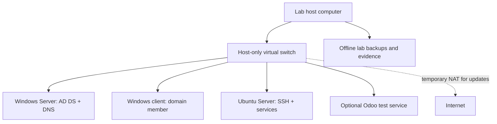
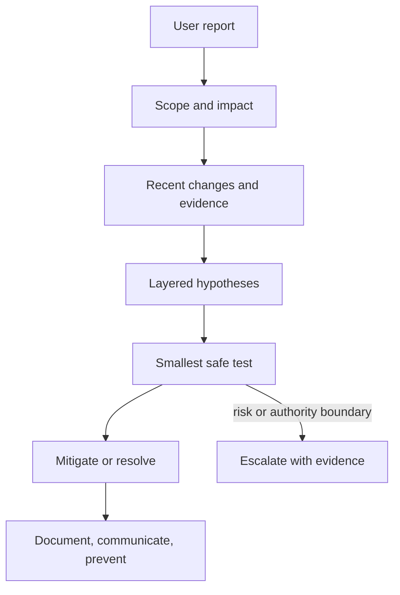
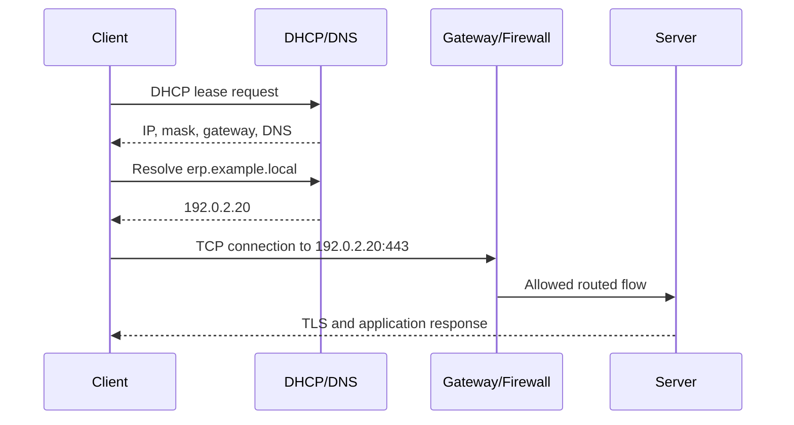
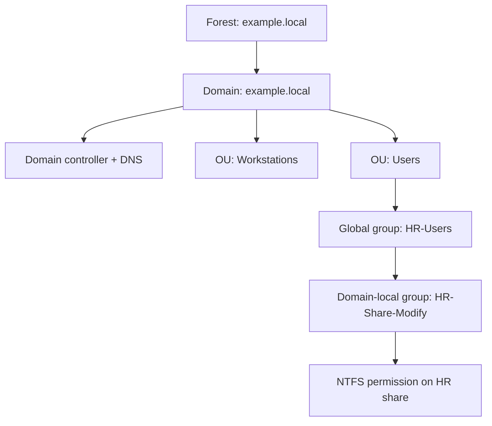
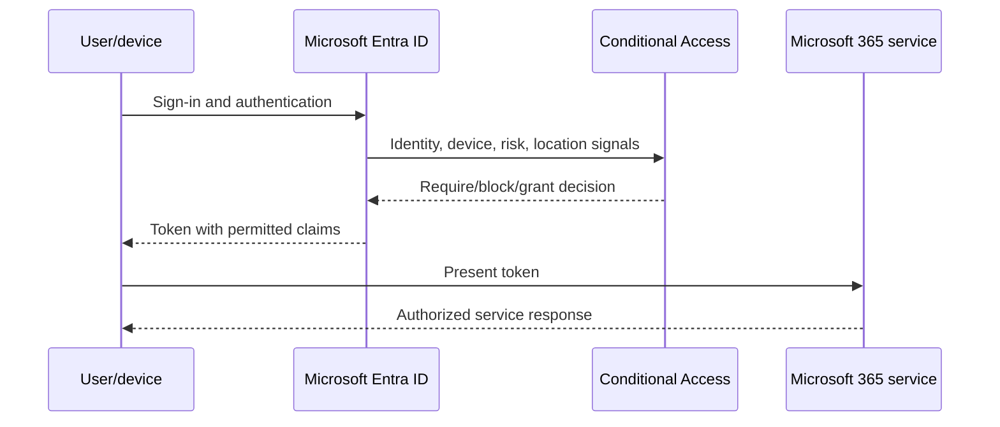
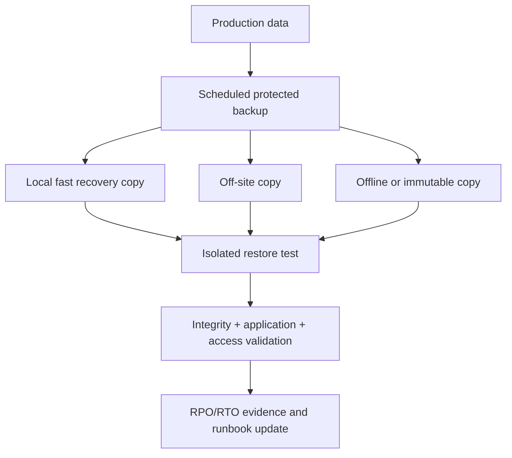
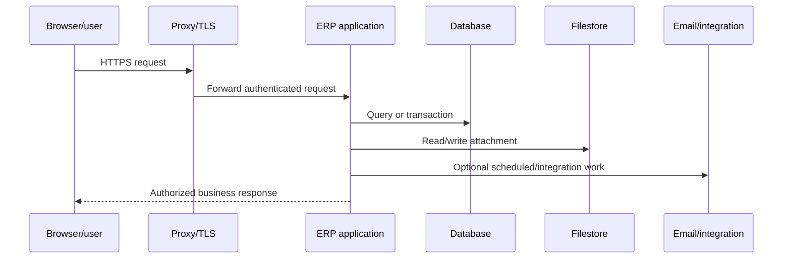
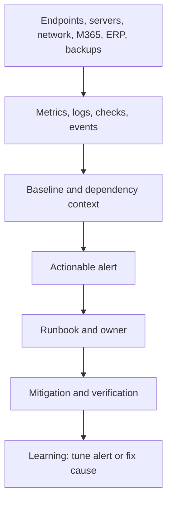
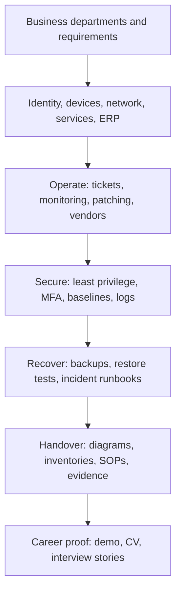

# The Zero-to-Hero IT Administrator Roadmap

*A connected path from first-contact support and operating-system fundamentals to secure, reliable administration of company endpoints, servers, identity, networks, Microsoft 365, ERP systems, backups, and hybrid infrastructure.*

*Resources researched with Composio on 2026-08-17 through official web documentation, connected GitHub discovery, and connected YouTube discovery. Selected videos were checked through the YouTube API as public and embeddable. Product behavior, licensing, and certification availability can change; verify current vendor documentation before a production change or exam purchase.*

**Scope:** 18 phases · complete beginner to job-ready · Windows and Linux · on-premises and cloud identity · physical and virtual infrastructure · operations, support, security, recovery, and business systems.

## What IT Administration Means

An **IT environment** is the connected set of people, devices, applications, servers, identities, networks, data, suppliers, and procedures that lets an organization work. **IT administration** is the practical ownership of that environment: keep it available, secure, supportable, recoverable, documented, and aligned with business needs.

An IT administrator does not merely “fix computers.” The administrator creates accounts, applies access rules, prepares endpoints, runs servers, maintains networks, supports Microsoft 365 and business applications, verifies backups, responds to incidents, coordinates vendors, documents decisions, and explains risk to nontechnical colleagues. Administrator access is borrowed trust. Use it only for authorized work, prefer a separate daily account and admin account, preserve evidence, and never inspect user data without a legitimate business reason.

### Who this roadmap is for

- A complete beginner with basic computer literacy.
- A help-desk technician moving into infrastructure ownership.
- A junior administrator supporting a small or midsize organization.
- A developer, ERP specialist, or cloud learner who needs operational foundations.
- A learner preparing for roles such as IT Administrator, Systems Administrator, Infrastructure Support Engineer, Microsoft 365 Administrator, Windows Server Administrator, Hybrid IT Administrator, or ERP/Business Systems Administrator.

### Nearby roles are different

| Role | Primary responsibility | Where it overlaps |
| --- | --- | --- |
| Help-desk technician | Restore individual user service and route unresolved work | Endpoints, tickets, communication, first diagnosis |
| IT administrator | Own the connected day-to-day environment | Users, devices, servers, SaaS, networks, vendors, recovery |
| Systems administrator | Operate server operating systems and core services deeply | Windows/Linux, identity, storage, automation |
| Network administrator | Own switching, routing, wireless, VPN, and network security | DNS, DHCP, firewalls, connectivity |
| DevOps engineer | Improve software delivery and production platform flow | Linux, automation, monitoring, cloud |
| Cloud engineer | Design and operate provider infrastructure | Identity, virtual networks, compute, storage, recovery |
| Cybersecurity analyst | Detect, investigate, and reduce threats | Hardening, logs, incidents, access reviews |
| ERP administrator | Operate users, configuration, data, jobs, access, and continuity | Servers, databases, vendors, business processes |
| ERP/Odoo developer | Build code, modules, integrations, ORM models, XML, and OWL UI | Application debugging and release change control |

For packet-level routing depth continue with [`Networks.md`](./Networks.md). For security engineering and SOC depth continue with [`ICT_Cybersecurity.md`](./ICT_Cybersecurity.md). For cloud architecture continue with [`Cloud.md`](./Cloud.md); for CI/CD, Kubernetes, and SRE continue with [`DevOps.md`](./DevOps.md); for Odoo module development continue with [`ODOO.md`](./ODOO.md); and for professional version-control workflows continue with [`Git.md`](./Git.md).

## Beginner Vocabulary

| Word | Meaning |
| --- | --- |
| **Endpoint** | A **user device** |
| **Server** | Provides a **shared service** |
| **Account** | Proves **who or what** is acting |
| **Group** | Collects **accounts** |
| **Permission** | Allows an **action** |
| **Role** | Packages **permissions** |
| **Directory** | Centrally stores **identities and computers** |
| **Authentication** | Proves **identity** |
| **Authorization** | Decides **what that identity may do** |
| **DNS** | Maps **names** to addresses |
| **DHCP** | Leases **network settings** |
| **Gateway** | Moves traffic **outside the local network** |
| **Hypervisor** | Runs **virtual machines** |
| **Backup** | A **recoverable copy** |
| **RPO** | The acceptable **data-loss window** |
| **RTO** | The target **recovery time** |
| **Incident** | Interrupts **service** |
| **Request** | Asks for a **standard service** |
| **Problem** | An underlying **recurring cause** |
| **Change** | Deliberately **alters a service** |

## How to Use This Roadmap

Read the phases in order once. In each phase: understand the business problem, draw the request or control flow, run the smallest safe lab, induce only the named harmless failure, collect evidence, complete the linked project milestone, and explain the result aloud. Move on when the mastery checkpoint is true-not when a video ends.

Every command example states its platform, privilege, effect, expected result, verification, and reversal. Read those notes before copying. Use only systems you own or are authorized to administer. Never expose RDP, SSH, databases, hypervisor consoles, or ERP services directly to the public internet.

**Prerequisites:** basic computer use, permission to install local software, and willingness to keep a lab journal. Programming is not required. If the computer cannot run multiple VMs, use one Linux VM at a time, Microsoft Learn sandboxes where offered, diagrams and exported configuration samples, or pair with a classmate. Paid Microsoft 365, Intune, Azure, AWS, GCP, VMware, and commercial monitoring exercises are always optional; each paid lab below has a local or simulated alternative.

## Safe One-Computer Homelab

Aim for a 64-bit computer with hardware virtualization enabled, 16 GB RAM and 150 GB free SSD space; 8 GB works if you run one or two small VMs at a time. Use Hyper-V where licensed and available, or [VirtualBox](https://www.virtualbox.org/manual/UserManual.html). A comfortable lab contains one Windows Server evaluation VM, one Windows client VM, and one Ubuntu Server VM on an **internal/host-only** network. Windows evaluation media and Microsoft cloud trials have legal time limits and license terms-read them before use and never reuse evaluation software as production.

Use documentation-only or Linux/Samba simulations when hardware or licensing prevents a Windows lab. Keep a NAT adapter only when a VM needs updates, disconnect it afterward, and do not bridge the domain lab to an untrusted LAN. Save configuration exports and backups outside the VM. Hypervisor checkpoints are short-lived experiment rewind points, not backups. Record how to reset every phase before you break anything.



Read the diagram from the host down: the virtual switch is the isolation boundary, services communicate inside it, and only a temporary NAT path reaches the internet. This picture helps diagnose “the lab cannot update” versus “the domain cannot resolve internal names” without opening inbound internet access.

## Whole-Journey Map

```text
SUPPORT MINDSET -> ENDPOINTS -> WINDOWS + LINUX -> NETWORKS -> VIRTUALIZATION
       -> WINDOWS SERVER -> ACTIVE DIRECTORY -> GROUP POLICY + IDENTITY OPERATIONS
       -> ENTRA + MICROSOFT 365 + INTUNE -> STORAGE + RECOVERY -> DATABASES + ERP
       -> SECURITY -> MONITORING + PATCHING -> AUTOMATION -> ITSM + ASSETS + DOCS
       -> CLOUD + HYBRID -> CAPSTONE + INTERVIEW
```

## Phase Index

| # | Phase | Mastery checkpoint |
| ---: | --- | --- |
| 1 | [Support Mindset and Operational Ownership](#phase-1) | Triage a vague report into scope, evidence, safe action, communication, and a documented escalation. |
| 2 | [Hardware, Endpoints, and Device Lifecycle](#phase-2) | Diagnose a workstation and justify repair, replace, warranty, or secure disposal. |
| 3 | [Windows Client Administration](#phase-3) | Build, secure, inspect, recover, and remotely support a Windows workstation. |
| 4 | [Linux Administration](#phase-4) | Operate users, permissions, services, logs, storage, firewall, jobs, and SSH safely. |
| 5 | [Networking for Administrators](#phase-5) | Trace name resolution and a connection from endpoint to service and isolate the failing layer. |
| 6 | [Virtualization and Homelab Infrastructure](#phase-6) | Build an isolated multi-VM lab with resource, switch, checkpoint, and reset plans. |
| 7 | [Windows Server, Storage, File, and Print Services](#phase-7) | Run a hardened shared service and prove effective access and maintenance behavior. |
| 8 | [Active Directory Domain Services](#phase-8) | Build a safe local domain with sound OU, user, computer, group, DNS, and delegation design. |
| 9 | [Group Policy, Authentication, and Identity Lifecycle](#phase-9) | Trace Kerberos/GPO, perform joiner-mover-leaver work, and diagnose common identity failures. |
| 10 | [Microsoft Entra ID, Microsoft 365, and Intune](#phase-10) | Explain cloud versus on-prem identity and administer a simulated tenant and device policy safely. |
| 11 | [Storage, Backups, and Disaster Recovery](#phase-11) | Design 3-2-1-style protection and prove a timed, isolated restore against RPO/RTO. |
| 12 | [Databases and ERP Operations](#phase-12) | Triage an ERP request across app, database, storage, identity, integration, and custom-code layers. |
| 13 | [Security for Administrators](#phase-13) | Apply a least-privilege defensive baseline and run a safe incident tabletop with evidence preservation. |
| 14 | [Monitoring, Patching, and Maintenance](#phase-14) | Build actionable health/expiry/backup alerts and complete a verified maintenance window. |
| 15 | [Administration Automation](#phase-15) | Deliver an idempotent, logged, validated, dry-run-capable PowerShell/Bash toolkit. |
| 16 | [Help Desk, ITSM, Assets, Vendors, and Documentation](#phase-16) | Operate a ticket/change/asset workflow and produce handover-ready records without secrets. |
| 17 | [Cloud and Hybrid Administration](#phase-17) | Map identity, network, workload, backup, monitoring, cost, and responsibility across a hybrid design. |
| 18 | [Small-Company Capstone and Career Readiness](#phase-18) | Demonstrate, fail, recover, document, and explain a complete small-company environment. |

---

<a id="phase-1"></a>

# PHASE 1 - Support Mindset and Operational Ownership

**WHAT YOU WILL BE ABLE TO DO:** Turn an unclear complaint into a controlled investigation that protects users and the business.

**WHAT YOU SHOULD KNOW FIRST:** Nothing beyond basic computer use.

## 1.1 Evidence Before Action

**WHY YOU ARE LEARNING THIS:** Administrator tools are powerful, but random fixes destroy evidence and can widen an outage.

**THE PROBLEM THIS SOLVES:** “The system is down” could mean one browser, one account, one office, or every customer. Without scope and a timeline, urgency becomes guessing.

**SEE IT BEFORE YOU MEMORIZE IT**

- Written guidance: [Microsoft troubleshooting methodology](https://learn.microsoft.com/en-us/troubleshoot/windows-client/windows-tips-and-tricks/basic-troubleshooting-guide-for-windows) and [ITIL certification family](https://www.peoplecert.org/products/itil-certification-family).
- Practice: use any spreadsheet or local ticket tool to record a symptom, impact, evidence, owner, next update, and resolution.
- GitHub example: [bregman-arie/devops-exercises](https://github.com/bregman-arie/devops-exercises) contains troubleshooting prompts where evidence matters more than memorized commands.

**STEP-BY-STEP EXPLANATION:** First protect safety and data. Confirm the reporter, exact symptom, start time, affected people/sites/services, business impact, and recent changes. Reproduce only if safe. Separate facts from hypotheses. Inspect the closest observable layer, make the smallest reversible test, record results, mitigate impact, then identify root cause and prevention. Escalate with a compact evidence packet-not “it does not work.” Communicate what is known, what is not, the current workaround, owner, and next update time.

**THE MAIN IDEA IN SIMPLE WORDS:** Reduce uncertainty before changing the system.

**WHAT HAPPENS INSIDE, ONE STEP AT A TIME**



Read downward; escalation is a valid controlled outcome, not failure. The diagram helps when a technician jumps from complaint straight to rebooting or reinstalling.

**PICTURE IT LIKE THIS:** A good administrator is a careful paramedic: stabilize, observe, test, communicate, and hand over cleanly.

**WHAT YOU GAIN, WHAT IT COSTS, AND WHERE IT CAN FAIL:** Structured triage is slower for the first minute and much faster over the incident. It fails when tickets contain conclusions instead of observations, when changes are undocumented, or when status updates stop.

**SMALL WORKING EXAMPLE:** Create `evidence/incident-001.md` with `scope`, `impact`, `timeline`, `facts`, `hypotheses`, `tests`, `mitigation`, and `prevention`. This is platform-neutral, read-only to systems, needs no privileges, should produce a reproducible case record, and is reversed by deleting only your lab file.

**HOW TO EXPLAIN THIS IN AN INTERVIEW:** “I start with scope, impact, time, and recent changes; form layer-based hypotheses; make the smallest reversible test; mitigate; then document root cause, prevention, and user communication.”

**PRACTICE UNTIL IT FEELS FAMILIAR:** Triage one-user login failure, all-user login failure, and a slow ERP. For each, state the first three facts you need, one unsafe action to avoid, and the escalation boundary.

**PRACTICAL MASTERY CHECKPOINT:** Given a vague report, produce a five-minute triage note another technician could continue without calling you.

**WHY THE NEXT TOPIC IS NEEDED:** Many first incidents begin at a physical endpoint; evidence is useful only if you understand the components producing it.

> **Phase 1 complete?** [Build the Phase 1 IT Administration project](../guides/Projects.md#it-admin-phase-1-project) · [Continue to Phase 2](#phase-2)

**SAFE GIT CHECKPOINT:** After validating the report contains no names, credentials, or company data, run `git status`, stage only the Phase 1 lab folder, commit `docs(it-admin): add support triage evidence`, then verify `git status` is clean.

---

<a id="phase-2"></a>

# PHASE 2 - Hardware, Endpoints, and Device Lifecycle

**WHAT YOU WILL BE ABLE TO DO:** Diagnose, standardize, protect, and retire user devices responsibly.

**WHAT YOU SHOULD KNOW FIRST:** Phase 1 evidence-based troubleshooting.

## 2.1 From Components to a Managed Device

**WHY YOU ARE LEARNING THIS:** Users experience IT through laptops, desktops, displays, docks, printers, and mobile devices.

**THE PROBLEM THIS SOLVES:** Replacing parts blindly wastes money; keeping unstable hardware loses work; disposing of storage carelessly leaks data.

**SEE IT BEFORE YOU MEMORIZE IT**

- Written documentation: [Microsoft disk error troubleshooting](https://learn.microsoft.com/en-us/troubleshoot/windows-server/backup-and-storage/troubleshoot-data-corruption-and-disk-errors) and [Windows UEFI security](https://learn.microsoft.com/en-us/windows-hardware/drivers/bringup/uefi-security).
- Practical tools: vendor diagnostics, Windows Memory Diagnostic, SMART data, Device Manager, firmware support pages, and a standardized build checklist.
- Deeper hardware objective map: [CompTIA A+](https://www.comptia.org/en/certifications/a/)-use it as optional validation, not a substitute for diagnosis.
- GitHub practice set: [bregman-arie/devops-exercises](https://github.com/bregman-arie/devops-exercises)-use only the endpoint/system exercises that match your isolated lab.

**STEP-BY-STEP EXPLANATION:** CPU executes instructions; RAM holds active working data; storage retains data; the motherboard connects components; firmware (BIOS/UEFI) initializes hardware and selects a boot path; drivers let the operating system control devices. Diagnose power, physical connection, firmware detection, OS detection, driver state, resource saturation, logs, and a known-good substitution in that order. Disk media errors, memory corruption, and thermal throttling can look like software faults. Compare repair cost, remaining warranty, failure recurrence, downtime, security support, and data risk before choosing repair or replacement. Standard builds reduce configuration drift. Record asset tag, owner, model, serial, warranty, encryption state, and disposal evidence. Mobile devices need screen lock, updates, managed accounts, remote-wipe readiness, and separation of business data.

**THE MAIN IDEA IN SIMPLE WORDS:** A workstation is both a machine and a managed business asset.

**WHAT HAPPENS INSIDE, ONE STEP AT A TIME:** Power → firmware/POST → boot device → operating-system loader → kernel/drivers → services → user session. A failure before firmware is hardware/power; after boot but before sign-in is OS/service; after sign-in may be profile, policy, app, or network.

**PICTURE IT LIKE THIS:** The boot chain is a relay race; inspect the last runner that definitely received the baton.

**WHAT YOU GAIN, WHAT IT COSTS, AND WHERE IT CAN FAIL:** Standardization lowers support time but requires inventory and exceptions. Firmware updates can fail if power is lost. SMART “healthy” does not guarantee a disk is healthy. Data wiping must follow organizational policy and the drive/vendor method; never improvise on production devices.

**SMALL WORKING EXAMPLE:** On Windows, as a standard user, run `Get-PhysicalDisk | Select FriendlyName,HealthStatus,OperationalStatus,Size` in PowerShell. It is read-only; expect disk health rows; verify against Disk Management and vendor diagnostics. No reversal is needed. If the cmdlet is unavailable, record that limitation rather than installing unapproved tools.

**HOW TO EXPLAIN THIS IN AN INTERVIEW:** Describe the boot boundary, evidence checked, known-good substitution, data protection, downtime, warranty, and why your repair/replace decision was economical.

**PRACTICE UNTIL IT FEELS FAMILIAR:** Diagnose a loose dock, a nearly full SSD, a simulated RAM error report, overheating under load, and a printer that only one department can use. Build a one-page standard device specification and secure-disposal checklist.

**PRACTICAL MASTERY CHECKPOINT:** Produce a workstation diagnosis report with evidence, risk, recommendation, asset update, and user-friendly summary.

**WHY THE NEXT TOPIC IS NEEDED:** Healthy hardware still fails users when the Windows installation, permissions, services, updates, or security controls are wrong.

> **Phase 2 complete?** [Build the Phase 2 IT Administration project](../guides/Projects.md#it-admin-phase-2-project) · [Continue to Phase 3](#phase-3)

**SAFE GIT CHECKPOINT:** Sanitize serial numbers, stage only the endpoint report, commit `docs(it-admin): add workstation diagnosis`, and verify the diff contains no personal or company identifiers.

---

<a id="phase-3"></a>

# PHASE 3 - Windows Client Administration

**WHAT YOU WILL BE ABLE TO DO:** Install, secure, inspect, recover, and support a Windows workstation.

**WHAT YOU SHOULD KNOW FIRST:** Phase 2 hardware and boot flow.

## 3.1 Windows as an Operated System

**WHY YOU ARE LEARNING THIS:** A working desktop hides identities, ACLs, services, scheduled work, updates, logs, encryption, and recovery paths.

**THE PROBLEM THIS SOLVES:** Reimaging every issue loses evidence and user time; changing the Registry or permissions blindly can make the machine unbootable or expose data.

**SEE IT BEFORE YOU MEMORIZE IT**

- Primary documentation: [BitLocker operations guide](https://learn.microsoft.com/en-us/windows/security/operating-system-security/data-protection/bitlocker/operations-guide), [Windows Event Viewer](https://learn.microsoft.com/en-us/shows/inside/event-viewer), and [PowerShell 101](https://learn.microsoft.com/en-us/powershell/scripting/learn/ps101/00-introduction).
- Practical reference: [Microsoft Sysinternals](https://learn.microsoft.com/en-us/sysinternals/) for process, startup, and system evidence.
- Lab: install a Windows evaluation/client VM, create a standard account, inspect-not edit-the Registry, and document its recovery options.
- GitHub lab framework: [AutomatedLab/AutomatedLab](https://github.com/AutomatedLab/AutomatedLab)-inspect how reproducible Windows labs describe machines and roles; manual understanding comes first.

**STEP-BY-STEP EXPLANATION:** Learn installation media, editions, partitions, drivers, activation/licensing boundaries, recovery environment, restore points, and safe reimage criteria. Local users and groups determine identity; NTFS access control entries determine file actions. Services run background workloads; Task Scheduler starts work from triggers; Event Viewer records provider events; Windows Update changes the platform; Remote Desktop creates an interactive remote session and must never be internet-exposed. Defender reduces malware risk; BitLocker protects offline data but requires protected recovery-key handling. The Registry is a configuration database-export the relevant key, understand ownership, and prefer supported settings before editing. PowerShell returns objects, enabling precise inspection and automation.

**THE MAIN IDEA IN SIMPLE WORDS:** Treat Windows as observable layers, not a screen that must be reinstalled when it misbehaves.

**WHAT HAPPENS INSIDE, ONE STEP AT A TIME:** Sign-in validates credentials → creates a token containing user/group identities → NTFS compares the token with the ACL → the process accesses or is denied → auditing/logs record selected events.

**PICTURE IT LIKE THIS:** A Windows access token is a staff badge carrying several group memberships; the door reads the badge and its own access list.

**WHAT YOU GAIN, WHAT IT COSTS, AND WHERE IT CAN FAIL:** Encryption protects a stolen disk but a lost recovery key can make authorized recovery impossible. Remote support saves travel but expands attack surface. Updates fix vulnerabilities but require testing, restart planning, and post-update verification.

**SMALL WORKING EXAMPLE**

```powershell
# Windows; standard user; read-only.
Get-ComputerInfo | Select-Object WindowsProductName,WindowsVersion,OsBuildNumber
Get-Service | Where-Object Status -eq 'Stopped' | Select-Object -First 10 Name,StartType
Get-WinEvent -LogName System -MaxEvents 20 | Select-Object TimeCreated,Id,LevelDisplayName
```

Expect system identity, stopped services, and recent events. Verify the same build in Settings and one event in Event Viewer. No reversal is needed. A stopped service is not automatically a fault; compare its start type and dependency.

**HOW TO EXPLAIN THIS IN AN INTERVIEW:** For a slow client, state how you separate hardware pressure, startup/process load, disk capacity, update state, service errors, profile scope, security scan results, and network dependency.

**PRACTICE UNTIL IT FEELS FAMILIAR:** Create/remove a lab local user; apply a test-folder ACL; create and reverse a harmless scheduled task; export event evidence; confirm Defender and BitLocker state; use recovery options in a VM checkpoint.

**PRACTICAL MASTERY CHECKPOINT:** Rebuild a disposable Windows VM from a checklist and diagnose one deliberately stopped noncritical test service without reinstalling.

**WHY THE NEXT TOPIC IS NEEDED:** Companies also run Linux servers whose filesystem, service, log, and remote-access models differ from Windows.

> **Phase 3 complete?** [Build the Phase 3 IT Administration project](../guides/Projects.md#it-admin-phase-3-project) · [Continue to Phase 4](#phase-4)

**SAFE GIT CHECKPOINT:** Export only configuration evidence without keys or usernames, commit `feat(it-admin): document windows client baseline`, and verify the VM remains recoverable.

---

<a id="phase-4"></a>

# PHASE 4 - Linux Administration

**WHAT YOU WILL BE ABLE TO DO:** Administer an Ubuntu/RHEL-style server safely from the shell and through SSH.

**WHAT YOU SHOULD KNOW FIRST:** Phase 3 operating-system layers; Linux is related, not identical.

## 4.1 Files, Processes, Services, and Remote Control

**WHY YOU ARE LEARNING THIS:** Web, database, monitoring, ERP, network, and cloud services commonly run on Linux.

**THE PROBLEM THIS SOLVES:** Treating Linux as “Windows with different commands” causes unsafe root use, broken permissions, hidden service failures, and untraceable configuration changes.

**SEE IT BEFORE YOU MEMORIZE IT**

- Visual demonstration: [Systemd Explained: How to Manage Linux Services Easily](https://www.youtube.com/watch?v=Kzpm-rGAXos)-a public, embeddable service-management walkthrough.
- Primary documentation: [Ubuntu Server](https://ubuntu.com/server/docs/), [Ubuntu OpenSSH](https://ubuntu.com/server/docs/how-to/security/openssh-server/), and [Red Hat SELinux introduction](https://docs.redhat.com/en/documentation/red_hat_enterprise_linux/10/html/using_selinux/getting-started-with-selinux).
- Practice: [SadServers](https://sadservers.com/) and [bregman-arie/devops-exercises](https://github.com/bregman-arie/devops-exercises).

**STEP-BY-STEP EXPLANATION:** `/` is the filesystem root; paths, mounts, and files expose most resources. Users have numeric IDs; groups share access; owner/group/other permissions grant read, write, execute; `sudo` provides controlled elevation. Processes consume resources; signals request behavior. `systemd` starts and supervises units, while `journalctl` queries its journal. Distribution package managers install signed packages and track dependencies. SSH provides encrypted remote shell access; prefer keys, validate host keys, restrict administrators, and keep a recovery path before hardening. Mounts attach storage; cron/systemd timers schedule work; `ufw` or `firewalld` controls host traffic. Bash combines commands, but quoting, input validation, and exit codes matter.

**THE MAIN IDEA IN SIMPLE WORDS:** Linux administration is controlled text-based state: files, identities, processes, units, logs, packages, mounts, and sockets.

**WHAT HAPPENS INSIDE, ONE STEP AT A TIME:** SSH client validates server host key → server validates user key → shell starts with user privileges → `sudo` checks policy → command affects a service/file → journal records events.

**PICTURE IT LIKE THIS:** Linux is a building whose rooms and equipment are represented by paths; ownership and mode bits are the locks.

**WHAT YOU GAIN, WHAT IT COSTS, AND WHERE IT CAN FAIL:** SSH keys resist password guessing but private-key loss or theft matters. `sudo` gives accountability but broad rules become hidden root access. Package updates improve security but can change services, so use snapshots only as temporary rollback plus real backups and verification.

**SMALL WORKING EXAMPLE**

```bash
# Ubuntu Linux; standard user; read-only.
id
findmnt
systemctl --failed
journalctl -p warning -b --no-pager | tail -n 20
ss -lntup
```

Expect identity, mounted filesystems, failed units, current-boot warnings, and listening sockets. Verify a listed socket against its service unit. No reversal is needed.

**HOW TO EXPLAIN THIS IN AN INTERVIEW:** For a failed Linux service, check unit status, recent journal, configuration validation, process/port, permissions, storage, dependencies, and recent package/config changes before restarting.

**PRACTICE UNTIL IT FEELS FAMILIAR:** Manage lab users/groups; build a shared directory; start/stop/enable a harmless service; inspect its journal; add and remove an SSH key; mount a small virtual disk; create and remove a timer; allow then revoke a lab firewall port.

**PRACTICAL MASTERY CHECKPOINT:** Recover a deliberately stopped or misconfigured lab service, show the evidence, and restore the secure baseline.

**WHY THE NEXT TOPIC IS NEEDED:** Two well-managed hosts still cannot collaborate unless addressing, naming, routes, transport, wireless, and security devices agree.

> **Phase 4 complete?** [Build the Phase 4 IT Administration project](../guides/Projects.md#it-admin-phase-4-project) · [Continue to Phase 5](#phase-5)

**SAFE GIT CHECKPOINT:** Store sanitized command output and configuration diffs, never private keys, commit `feat(it-admin): add linux operations lab`, and confirm permissions still match the baseline.

---

<a id="phase-5"></a>

# PHASE 5 - Networking for Administrators

**WHAT YOU WILL BE ABLE TO DO:** Trace and troubleshoot endpoint-to-service connectivity without becoming a full network engineer.

**WHAT YOU SHOULD KNOW FIRST:** Windows and Linux process/service models.

## 5.1 Address, Name, Route, Port, and Policy

**WHY YOU ARE LEARNING THIS:** Almost every shared IT service is reached through a network and many “server” problems are DNS, DHCP, route, Wi-Fi, VPN, firewall, or proxy problems.

**THE PROBLEM THIS SOLVES:** Rebooting the router or blaming “the internet” cannot distinguish local link, IP configuration, name resolution, transport reachability, or application failure.

**SEE IT BEFORE YOU MEMORIZE IT**

- Animated explanations: [What is DNS?](https://www.youtube.com/watch?v=K9YWlljNsNw), [DHCP Explained](https://www.youtube.com/watch?v=e6-TaH5bkjo), [What is a Firewall?](https://www.youtube.com/watch?v=kDEX1HXybrU), and [How a VPN Works](https://www.youtube.com/watch?v=sr2-K6AaHNI). Each was verified public and embeddable.
- Primary documentation: [Cisco DNS configuration](https://www.cisco.com/c/en/us/td/docs/routers/ios/config/17-x/ip-addressing/b-ip-addressing/m_configuring_dns.html).
- GitHub exercises: [bregman-arie/devops-exercises networking questions](https://github.com/bregman-arie/devops-exercises/tree/master/topics/network)-practice reasoning before looking at answers.
- Deep bridge: [`Networks.md`](./Networks.md) for packet captures, routing protocols, TCP depth, and network design.

**STEP-BY-STEP EXPLANATION:** Ethernet/Wi-Fi moves frames between local MAC addresses; ARP maps local IPv4 addresses to MACs. IP addresses identify interfaces across networks; a subnet mask separates local from remote; the default gateway routes remote traffic. IPv4 subnet usable-host capacity is usually $2^{(32-p)}-2$ for prefix length $p$; `/24` gives $2^8-2=254$ traditional usable host addresses. DHCP uses Discover, Offer, Request, Acknowledge to lease address, mask, gateway, and DNS. DNS resolves names. TCP provides connection-oriented ordered bytes; UDP sends independent datagrams. Ports select services. Switches connect a LAN; VLANs divide broadcast/security zones; routers move between networks; NAT translates addresses; firewalls allow/deny flows; proxies act on behalf of clients; VPNs protect traffic across an untrusted path. Wi-Fi adds radio, channel, interference, authentication, and roaming. An intranet is private organizational content; the internet is the public network of networks.

**THE MAIN IDEA IN SIMPLE WORDS:** Test the path in order: link → address → gateway/route → DNS → port → protocol/TLS → application.

**WHAT HAPPENS INSIDE, ONE STEP AT A TIME**



Read top to bottom: configuration precedes name resolution, which precedes connection and application response. It helps diagnose “works by IP but not hostname” as a DNS branch, not a firewall guess.

**PICTURE IT LIKE THIS:** An IP address is a building address, a port is a department desk, DNS is the directory, and the route is the delivery path.

**WHAT YOU GAIN, WHAT IT COSTS, AND WHERE IT CAN FAIL:** VLANs and firewalls reduce blast radius but add policy and troubleshooting boundaries. VPNs secure transit, not infected endpoints. Wi-Fi convenience trades predictable radio conditions for interference and roaming complexity. Network printers combine every layer plus drivers and permissions.

**SMALL WORKING EXAMPLE**

```powershell
# Windows; standard user; read-only.
ipconfig /all
nslookup example.com
Test-NetConnection example.com -Port 443
tracert example.com
arp -a
route print
```

On Linux use `ip address`, `ip route`, `dig`, `ping`, `traceroute`, `ip neigh`, `ss`, and `curl -I https://example.com`. Expect address, resolver, route, port, neighbor, and HTTP evidence. No reversal is needed; ICMP may be intentionally blocked.

**HOW TO EXPLAIN THIS IN AN INTERVIEW:** If IP works but hostname fails, verify resolver configuration, query the expected DNS server, compare records/suffix/TTL, check local cache/hosts file, and fix authoritative data or DHCP-provided DNS-not the web server.

**PRACTICE UNTIL IT FEELS FAMILIAR:** Create a small-office IP/VLAN/DHCP plan; diagnose a wrong gateway, wrong DNS, closed TCP port, Wi-Fi interference hypothesis, department printer rule, and remote-access VPN path.

**PRACTICAL MASTERY CHECKPOINT:** Draw and demonstrate a connection from one lab endpoint to a service, with one command proving each layer.

**WHY THE NEXT TOPIC IS NEEDED:** A single computer is expensive and inflexible for labs and servers; virtualization lets one host safely model several systems and networks.

> **Phase 5 complete?** [Build the Phase 5 IT Administration project](../guides/Projects.md#it-admin-phase-5-project) · [Continue to Phase 6](#phase-6)

**SAFE GIT CHECKPOINT:** Use documentation address ranges such as `192.0.2.0/24`, stage only the sanitized network plan, commit `docs(it-admin): add small-office network plan`, and verify no real public IP or Wi-Fi credential appears.

---

<a id="phase-6"></a>

# PHASE 6 - Virtualization and Homelab Infrastructure

**WHAT YOU WILL BE ABLE TO DO:** Build a resource-aware, isolated, recoverable virtual lab.

**WHAT YOU SHOULD KNOW FIRST:** Phase 5 addressing and virtual network purpose.

## 6.1 Hosts, Guests, Switches, and Failure Boundaries

**WHY YOU ARE LEARNING THIS:** Administrators need safe places to practice domains, policies, server changes, ERP, monitoring, and recovery.

**THE PROBLEM THIS SOLVES:** Physical servers are costly, snapshots are mistaken for backups, and bridged labs can accidentally expose insecure services.

**SEE IT BEFORE YOU MEMORIZE IT**

- Animated explanation: [Virtualization Explained](https://www.youtube.com/watch?v=UBVVq-xz5i0)-verified public and embeddable.
- Primary documentation: [Hyper-V networking](https://learn.microsoft.com/en-us/windows-server/virtualization/hyper-v/plan/plan-hyper-v-networking-in-windows-server) and [Hyper-V checkpoints](https://learn.microsoft.com/en-us/windows-server/virtualization/hyper-v/checkpoints).
- Product awareness: [Proxmox VE documentation](https://pve.proxmox.com/pve-docs/) and [VMware documentation](https://docs.vmware.com/); licensing and feature availability vary.
- GitHub reference: [Corsinvest/awesome-proxmox-ve](https://github.com/Corsinvest/awesome-proxmox-ve).

**STEP-BY-STEP EXPLANATION:** The physical **host** supplies CPU, RAM, storage, and networking; a **guest** VM sees virtual hardware. A type-1 hypervisor runs directly on hardware (or as an OS role close to it); a type-2 hypervisor runs as a host application. Virtual CPUs are scheduled on physical CPUs; allocated RAM and disk still consume real resources; virtual switches connect guests. Templates standardize new VMs; clones copy them. A snapshot/checkpoint records a short-term dependency on earlier virtual disk state and is useful before a risky lab change, but it shares the host and failure domain-therefore it is not a backup. Resource overcommitment can cause swapping and latency. High availability restarts or moves VMs after host failure but does not recover deleted/corrupt data.

**THE MAIN IDEA IN SIMPLE WORDS:** Virtual hardware is flexible, not free, and its rewind button is not independent recovery.

**WHAT HAPPENS INSIDE, ONE STEP AT A TIME:** Guest process → guest kernel → virtual device → hypervisor → physical CPU/disk/NIC. Monitoring must inspect both guest demand and host contention.

**PICTURE IT LIKE THIS:** VMs are apartments in one building: separate doors do not prevent a building-wide power or storage failure.

**WHAT YOU GAIN, WHAT IT COSTS, AND WHERE IT CAN FAIL:** Consolidation saves hardware and accelerates labs, while concentrating failure and capacity risk. Overcommitted RAM can make every VM slow. Long checkpoint chains consume space and complicate recovery. Templates spread mistakes quickly unless patched and versioned.

**SMALL WORKING EXAMPLE:** In an isolated lab, create one 2-vCPU/2-GB Ubuntu VM, attach a host-only switch, document its virtual disk and MAC, take a named pre-change checkpoint, make a harmless file change, revert, then delete the checkpoint. This changes only the lab; verify network isolation and file rollback; reverse by removing the disposable VM through the hypervisor UI.

**HOW TO EXPLAIN THIS IN AN INTERVIEW:** Contrast type 1/type 2, host/guest, virtual switch modes, template/clone/checkpoint/backup, resource overcommit, monitoring, and the host failure boundary.

**PRACTICE UNTIL IT FEELS FAMILIAR:** Build the three-VM topology from the homelab section; calculate RAM/storage budget; test internal DNS reachability; prove no unsolicited inbound internet path; document reset and low-resource modes.

**PRACTICAL MASTERY CHECKPOINT:** Recreate the lab from inventory and network documents, then reset one guest without losing independent evidence or backups.

**WHY THE NEXT TOPIC IS NEEDED:** The lab now needs shared Windows services-files, printers, remote management, roles, logs, updates, and maintenance controls.

> **Phase 6 complete?** [Build the Phase 6 IT Administration project](../guides/Projects.md#it-admin-phase-6-project) · [Continue to Phase 7](#phase-7)

**SAFE GIT CHECKPOINT:** Commit diagrams and manifests, not VM disks or license material: `docs(it-admin): record virtual lab inventory`; verify ignore rules exclude large/sensitive images.

---

<a id="phase-7"></a>

# PHASE 7 - Windows Server, Storage, File, and Print Services

**WHAT YOU WILL BE ABLE TO DO:** Operate shared Windows services with controlled access, remote management, hardening, and maintenance.

**WHAT YOU SHOULD KNOW FIRST:** Windows client, networks, and virtualization.

## 7.1 A Shared Service Is More Than a Server Role

**WHY YOU ARE LEARNING THIS:** Organizations centralize files, printers, applications, and management so every endpoint does not become an island.

**THE PROBLEM THIS SOLVES:** A share can be reachable but insecure; a service can be healthy while storage is full; an update can succeed while the business service remains broken.

**SEE IT BEFORE YOU MEMORIZE IT**

- Primary documentation: [Windows Server administration](https://learn.microsoft.com/en-us/windows-server/administration/overview), [SMB security hardening](https://learn.microsoft.com/en-us/windows-server/storage/file-server/smb-security-hardening), and [Windows Admin Center overview](https://learn.microsoft.com/en-us/windows-server/manage/windows-admin-center/overview).
- Practical lab: a Windows Server evaluation VM with a non-sensitive department share and a client VM.
- GitHub lab framework: [AutomatedLab/AutomatedLab](https://github.com/AutomatedLab/AutomatedLab)-compare its declarative Windows lab examples with your manual role checklist.
- Deeper automation bridge: [`DevOps.md`](./DevOps.md) Phases 2, 3, and 5.

**STEP-BY-STEP EXPLANATION:** Server roles add capabilities such as file, print, DNS, or directory services; features support them. Server Manager and Windows Admin Center provide views, but PowerShell makes state repeatable. File and Storage Services manage disks, volumes, quotas, and SMB. NTFS permissions apply on the filesystem; share permissions apply across SMB; network access receives the most restrictive effective combination. Grant groups, not individuals. Print servers centralize queues and drivers but require careful driver and spooler security. Remote management should use protected admin paths and dedicated accounts. Event logs, service state, scheduled tasks, capacity, and backup status form the operating evidence. WSUS concepts include approving, staging, and reporting updates; current deployment choices vary by organization. Server Core reduces GUI surface but requires remote/CLI skill. Service accounts need minimal rights and managed credentials where possible. Maintenance windows need approval, communication, backup/rollback, execution, validation, and closure.

**THE MAIN IDEA IN SIMPLE WORDS:** A server role is only ready when access, capacity, updates, logs, recovery, ownership, and verification are ready.

**WHAT HAPPENS INSIDE, ONE STEP AT A TIME:** Client resolves server name → authenticates → opens SMB session → share ACL filters → NTFS ACL filters → file operation runs → audit/event evidence is recorded.

**PICTURE IT LIKE THIS:** Share and NTFS permissions are two security desks in sequence; passing the first does not bypass the second.

**WHAT YOU GAIN, WHAT IT COSTS, AND WHERE IT CAN FAIL:** Central services improve control and sharing but create dependencies. “Everyone: Full Control” destroys least privilege. Complex deny rules confuse effective access. A full system volume can stop logs, updates, and services. A maintenance window without business verification can close while users are still broken.

**SMALL WORKING EXAMPLE**

```powershell
# Windows Server; administrator; read-only.
Get-WindowsFeature | Where-Object InstallState -eq 'Installed'
Get-SmbShare | Select-Object Name,Path,EncryptData
Get-SmbShareAccess -Name 'LabShare'
Get-Volume | Select-Object DriveLetter,FileSystemLabel,SizeRemaining,Size
```

Expect installed roles, lab share policy, access entries, and capacity. Verify effective access from both an allowed and denied lab user. No reversal is needed because the commands do not change state.

**HOW TO EXPLAIN THIS IN AN INTERVIEW:** Explain effective SMB access, group-based permission design, service accounts, hardening, maintenance communication, validation, and rollback-not only the wizard clicks.

**PRACTICE UNTIL IT FEELS FAMILIAR:** Build Management/HR/Finance shares using groups; add a quota; simulate a full volume alert; map a printer conceptually; inspect events; draft a patch window; compare GUI versus Server Core operations.

**PRACTICAL MASTERY CHECKPOINT:** Prove an authorized user can create/read a file, an unauthorized user cannot, and the service/capacity/log/backup evidence is recorded.

**WHY THE NEXT TOPIC IS NEEDED:** Local server accounts and per-server groups do not scale across many employees, computers, services, and shared resources.

> **Phase 7 complete?** [Build the Phase 7 IT Administration project](../guides/Projects.md#it-admin-phase-7-project) · [Continue to Phase 8](#phase-8)

**SAFE GIT CHECKPOINT:** Export only sanitized role/share/ACL reports, commit `feat(it-admin): add secure windows file service`, and confirm no real share names or user identifiers remain.

---

<a id="phase-8"></a>

# PHASE 8 - Active Directory Domain Services

**WHAT YOU WILL BE ABLE TO DO:** Build and reason about a safe local Windows domain and its identity/resource structure.

**WHAT YOU SHOULD KNOW FIRST:** DNS, Windows Server, groups, and permissions.

## 8.1 Central Identity, Devices, and Delegation

**WHY YOU ARE LEARNING THIS:** Companies need one controlled identity plane for many users, computers, groups, and Windows resources.

**THE PROBLEM THIS SOLVES:** Local accounts create password drift, slow onboarding/offboarding, inconsistent access, and no practical delegation model.

**SEE IT BEFORE YOU MEMORIZE IT**

- Visual overview: [Active Directory Explained in 5 Minutes](https://www.youtube.com/watch?v=OfXJlmuoc20)-verified public and embeddable.
- Practical lab: [Josh Madakor's VirtualBox Active Directory homelab](https://www.youtube.com/watch?v=MHsI8hJmggI)-verified public and embeddable; adapt names and network settings to this isolated lab.
- Primary documentation: [AD DS overview](https://learn.microsoft.com/en-us/windows-server/identity/ad-ds/get-started/virtual-dc/active-directory-domain-services-overview) and [logical structure design](https://learn.microsoft.com/en-us/windows-server/identity/ad-ds/plan/designing-the-logical-structure).
- GitHub lab framework: [AutomatedLab/AutomatedLab](https://github.com/AutomatedLab/AutomatedLab)-a real PowerShell-based lab project for later reproducibility, not a shortcut around AD fundamentals.

**STEP-BY-STEP EXPLANATION:** A **domain** is an administrative identity and policy boundary with a DNS name. A **forest** is the top security boundary containing one or more domain trees; a **tree** contains related DNS namespaces. A **domain controller (DC)** stores AD DS data, authenticates requests, publishes directory services in DNS, and replicates changes. **Organizational units (OUs)** organize objects for policy and delegation-not primarily to mirror an org chart. User, computer, and group objects represent principals/resources. Security groups receive permissions; distribution groups are for messaging. Group scopes-domain local, global, universal-control where members and permissions fit; a practical pattern is accounts → global role group → domain-local resource group → permission. Join a client only after it uses the domain DNS server and time is correct. Delegate narrow tasks at an OU instead of granting Domain Admin. Use separate admin accounts and keep the highest privilege rare.

**THE MAIN IDEA IN SIMPLE WORDS:** AD DS is a replicated directory and trust system whose design should make normal access group-based and privileged work exceptional.

**WHAT HAPPENS INSIDE, ONE STEP AT A TIME**



Read from identity boundary down to permission. It helps diagnose why putting a user directly on every ACL makes role changes and offboarding unreliable.

**PICTURE IT LIKE THIS:** AD is a company directory plus badge office replicated to trusted desks; DNS tells clients where the desks are.

**WHAT YOU GAIN, WHAT IT COSTS, AND WHERE IT CAN FAIL:** Central identity improves control but makes DNS, time, DC health, replication, and privileged administration critical. Over-deep OUs create policy confusion. Domain Admin used for daily work magnifies phishing and mistakes. One DC is a lab convenience, not production resilience.

**SMALL WORKING EXAMPLE**

```powershell
# Domain controller; delegated lab admin; read-only.
Get-ADDomain | Select-Object DNSRoot,DomainMode,PDCEmulator
Get-ADOrganizationalUnit -Filter * | Select-Object Name,DistinguishedName
Get-ADGroup -Filter * | Select-Object -First 10 Name,GroupCategory,GroupScope
dcdiag /test:dns
```

Expect domain, OU, group, and DNS-health evidence. Verify the client resolves the AD DNS zone and can join. No reversal is needed.

**HOW TO EXPLAIN THIS IN AN INTERVIEW:** Define forest/domain/DC/OU/object, explain DNS dependency, group nesting and delegation, then trace a join or sign-in failure without resetting the account first.

**PRACTICE UNTIL IT FEELS FAMILIAR:** Build `example.local`; create Management, HR, Finance, Sales, IT OUs; create role/resource groups; join a client; delegate password reset for one OU; test allowed/denied share access.

**PRACTICAL MASTERY CHECKPOINT:** Rebuild the company structure from a diagram and prove access changes by changing group membership-not ACLs per user.

**WHY THE NEXT TOPIC IS NEEDED:** A directory stores identities, but administrators still need repeatable configuration, authentication understanding, lifecycle controls, replication, and recovery.

> **Phase 8 complete?** [Build the Phase 8 IT Administration project](../guides/Projects.md#it-admin-phase-8-project) · [Continue to Phase 9](#phase-9)

**SAFE GIT CHECKPOINT:** Export a fictitious domain design and scripts with no secrets, commit `feat(it-admin): build active directory company lab`, and verify the repository contains no VM/database files.

---

<a id="phase-9"></a>

# PHASE 9 - Group Policy, Authentication, and Identity Lifecycle

**WHAT YOU WILL BE ABLE TO DO:** Apply policy, trace Windows authentication, operate joiner-mover-leaver workflows, and reason about AD resilience.

**WHAT YOU SHOULD KNOW FIRST:** Phase 8 AD objects, DNS, groups, and domain joining.

## 9.1 From Sign-In to Controlled Access

**WHY YOU ARE LEARNING THIS:** Central accounts are insufficient if devices drift, policies do not apply, service passwords stagnate, or former employees retain sessions and access.

**THE PROBLEM THIS SOLVES:** Blind `gpupdate /force`, account deletion, or DC rebooting can hide DNS/time/replication faults and destroy recovery options.

**SEE IT BEFORE YOU MEMORIZE IT**

- Visual demonstrations: [How Kerberos Works](https://www.youtube.com/watch?v=1yWW7VQUX0A) and [Learn Microsoft Group Policy the Easy Way](https://www.youtube.com/watch?v=rEhTzP-ScBo)-both verified public and embeddable.
- Primary documentation: [Kerberos authentication overview](https://learn.microsoft.com/en-us/windows-server/security/kerberos/kerberos-authentication-overview), [Group Policy overview](https://learn.microsoft.com/en-us/previous-versions/windows/desktop/policy/group-policy-start-page), [AD replication concepts](https://learn.microsoft.com/en-us/windows-server/identity/ad-ds/get-started/replication/active-directory-replication-concepts), and [FSMO role management](https://learn.microsoft.com/en-us/windows-server/identity/ad-ds/manage/manage-fsmo-roles).
- GitHub lab framework: [AutomatedLab/AutomatedLab](https://github.com/AutomatedLab/AutomatedLab)-inspect its domain examples only after you can explain every generated component.

**STEP-BY-STEP EXPLANATION:** Authentication proves identity; authorization evaluates the resulting token and resource policy. Kerberos uses a Key Distribution Center on a DC: the client obtains a ticket-granting ticket, then a service ticket, then presents it to the service. Correct DNS, names/SPNs, time, trust, and reachable DCs matter. NTLM is an older challenge-response fallback; detect and reduce reliance rather than disabling it blindly. Group Policy Objects contain computer/user settings linked to sites, domains, or OUs; processing considers local/site/domain/OU order, inheritance, security filtering, WMI filters, loopback, and client-side extensions. Password/lockout policy, scripts, security settings, and folder redirection have operational trade-offs.

Onboard from an approved request: create identity, role groups, license/device, MFA, manager/expiry, and verification. For a role change, remove old access before adding new where conflict matters. For offboarding, confirm authority, disable sign-in promptly, revoke sessions/tokens, remove privileged access, preserve/transfer data under policy, recover assets, then delete only after retention/ownership checks. Disabled is reversible; deleted may not be. Prefer group managed service accounts (gMSAs) where supported. Replication distributes changes; FSMO roles coordinate operations that cannot be safely multi-master. Back up system state and practice forest/domain recovery concepts; never improvise authoritative restores in production.

**THE MAIN IDEA IN SIMPLE WORDS:** Identity operations are a lifecycle and evidence chain, not a “create user” button.

**WHAT HAPPENS INSIDE, ONE STEP AT A TIME:** DNS finds DC → user proves identity → DC issues Kerberos tickets → client builds token → GPOs configure user/computer → resource evaluates token and ACL → logs record outcomes.

**PICTURE IT LIKE THIS:** Kerberos is a trusted ticket office; Group Policy is the rulebook delivered to the correct rooms; lifecycle is badge issuance through return.

**WHAT YOU GAIN, WHAT IT COSTS, AND WHERE IT CAN FAIL:** GPO scales configuration but broad links and untested changes scale mistakes. Cached credentials may allow laptop sign-in while network resources fail. Deleting before data transfer creates business loss. Replication delay can produce temporarily different answers across DCs.

**SMALL WORKING EXAMPLE**

```powershell
# Domain-joined Windows client; standard user; read-only.
whoami /groups
klist
gpresult /r
nltest /dsgetdc:example.local
```

Expect group token, Kerberos tickets, applied GPO summary, and DC discovery. Verify timestamps, DNS, and `gpresult /h lab-gpo.html` in the lab. No reversal is needed.

**HOW TO EXPLAIN THIS IN AN INTERVIEW:** For GPO failure, confirm scope, OU/link/order, security/WMI filtering, replication, DNS/DC reachability, client processing logs, and resultant set before editing the GPO.

**PRACTICE UNTIL IT FEELS FAMILIAR:** Create a test GPO for a harmless desktop setting; test password/lockout reasoning; perform joiner-mover-leaver checklists; diagnose clock skew, wrong DNS, filtered GPO, disabled account, and replication mismatch.

**PRACTICAL MASTERY CHECKPOINT:** Explain one sign-in end to end, prove a targeted GPO applies only to its intended lab group, and complete a reversible offboarding drill.

**WHY THE NEXT TOPIC IS NEEDED:** Employees also use cloud identities, email, collaboration, SaaS roles, and managed devices outside the on-prem domain boundary.

> **Phase 9 complete?** [Build the Phase 9 IT Administration project](../guides/Projects.md#it-admin-phase-9-project) · [Continue to Phase 10](#phase-10)

**SAFE GIT CHECKPOINT:** Commit sanitized GPO reports and lifecycle checklists as `feat(it-admin): add identity lifecycle controls`; do not store ticket caches, user exports, or recovery secrets.

---

<a id="phase-10"></a>

# PHASE 10 - Microsoft Entra ID, Microsoft 365, and Intune

**WHAT YOU WILL BE ABLE TO DO:** Administer cloud identities and services conceptually and in a licensed sandbox where available.

**WHAT YOU SHOULD KNOW FIRST:** AD DS, authentication, lifecycle, endpoints, and groups.

## 10.1 Cloud Identity Is Not a Hosted Domain Controller

**WHY YOU ARE LEARNING THIS:** Microsoft 365 organizations depend on cloud identity, licenses, email, collaboration, audit, and managed devices.

**THE PROBLEM THIS SOLVES:** Confusing Microsoft Entra ID (formerly Azure AD) with AD DS leads to wrong assumptions about LDAP, domain join, GPO, Kerberos, roles, and device management.

**SEE IT BEFORE YOU MEMORIZE IT**

- Official visual explanation: [Microsoft Entra ID Beginner's Tutorial](https://www.youtube.com/watch?v=0qZzcK1mHwA)-Microsoft Mechanics; verified public and embeddable.
- Primary documentation: [Entra versus AD](https://learn.microsoft.com/en-us/entra/fundamentals/compare), [Conditional Access](https://learn.microsoft.com/en-us/entra/identity/conditional-access/overview), [Microsoft 365 admin overview](https://learn.microsoft.com/en-us/microsoft-365/admin/admin-overview/admin-center-overview), and [Intune core concepts](https://learn.microsoft.com/en-us/intune/fundamentals/core-concepts).
- Cost note: tenant trials, Conditional Access, SSPR, Intune, and some audit/security features depend on current licenses. Free alternative: design fictional users/groups/licenses/policies, use screenshots/docs, and run decision table simulations without creating a tenant.
- GitHub practical resource: [Microsoft Graph PowerShell training](https://github.com/microsoftgraph/msgraph-training-powershell)-use a disposable tenant only and keep tokens outside the repository.

**STEP-BY-STEP EXPLANATION:** Entra ID is a cloud identity and access service using modern protocols/tokens, cloud roles, groups, applications, devices, sign-in logs, and audit logs. AD DS is a domain directory using domain controllers, LDAP/Kerberos/NTLM, domain join, and GPO. Hybrid identity synchronizes or federates selected identity data and increases dependency/change complexity. Microsoft 365 Admin Center coordinates users, groups, licenses, service health, domains, and roles. Exchange Online administers mailboxes and mail flow basics; Teams administers collaboration/meeting policy; SharePoint and OneDrive administer sites, sharing, storage, and retention boundaries. Assign licenses deliberately, use least-privilege roles, require MFA, understand Conditional Access signal/condition/control logic, and design SSPR with registration and verification. Intune enrolls devices, evaluates compliance, applies configuration profiles, deploys applications, and performs remote actions; integration with Entra and Defender can affect access decisions.

**THE MAIN IDEA IN SIMPLE WORDS:** Entra answers cloud identity and access; Intune answers device management; Microsoft 365 services each have their own administration surface.

**WHAT HAPPENS INSIDE, ONE STEP AT A TIME**



Read from sign-in to token use. The diagram helps distinguish authentication failure, Conditional Access denial, missing license, and service authorization.

**PICTURE IT LIKE THIS:** Entra is the cloud badge office, Conditional Access is the adaptive checkpoint, and each Microsoft 365 service still controls its rooms.

**WHAT YOU GAIN, WHAT IT COSTS, AND WHERE IT CAN FAIL:** SaaS reduces server ownership but adds license, vendor, internet, identity, and configuration dependencies. Conditional Access can block everyone if deployed broadly without report-only/testing and emergency access. Remote wipe is consequential; validate device ownership and action scope.

**SMALL WORKING EXAMPLE:** Build a table with fictional HR/Finance/Sales users, group-based licenses, admin roles, MFA status, device state, a Conditional Access result, and expected Exchange/Teams/SharePoint access. This is free and makes no changes. If using a trial, test only disposable accounts, use report-only where available, keep a protected emergency account, capture expected sign-in logs, and remove the trial resources before expiry.

**HOW TO EXPLAIN THIS IN AN INTERVIEW:** Contrast Entra and AD DS, then trace a user who can authenticate but cannot open email through token, policy, license, role, mailbox/service health, and audit evidence.

**PRACTICE UNTIL IT FEELS FAMILIAR:** Simulate joiner-mover-leaver; group-based licensing; MFA/SSPR registration; Conditional Access report; Exchange mailbox/shared mailbox choice; Teams policy; SharePoint external sharing; Intune enrollment, compliance, profile, app, and retire/wipe decision.

**PRACTICAL MASTERY CHECKPOINT:** Diagnose five fictional sign-in/access cases with the correct admin center/log/policy layer and no blanket Global Administrator assignment.

**WHY THE NEXT TOPIC IS NEEDED:** Identity protects access, but the organization still loses service when storage fails, data is corrupted, or backups cannot restore.

> **Phase 10 complete?** [Build the Phase 10 IT Administration project](../guides/Projects.md#it-admin-phase-10-project) · [Continue to Phase 11](#phase-11)

**SAFE GIT CHECKPOINT:** Commit only fictional tenant matrices and redacted screenshots as `docs(it-admin): add entra m365 simulation`; never commit tenant IDs, tokens, user exports, or recovery codes.

---

<a id="phase-11"></a>

# PHASE 11 - Storage, Backups, and Disaster Recovery

**WHAT YOU WILL BE ABLE TO DO:** Plan storage and prove recoverability for files, VMs, servers, databases, and ERP systems.

**WHAT YOU SHOULD KNOW FIRST:** Servers, virtualization, identity, and business impact.

## 11.1 Recovery Is the Product

**WHY YOU ARE LEARNING THIS:** Hardware redundancy and successful backup jobs do not prove that usable data can return within business targets.

**THE PROBLEM THIS SOLVES:** Snapshots share failure domains, replication copies deletion/ransomware, untested backups hide missing credentials or corrupt chains, and restore steps exist only in one person's memory.

**SEE IT BEFORE YOU MEMORIZE IT**

- Animated explanations: [What is RAID 0, 1, 5, and 10?](https://www.youtube.com/watch?v=U-OCdTeZLac) and [Incremental vs Differential vs Full Backup](https://www.youtube.com/watch?v=o-83E6levzM)-verified public and embeddable.
- Primary guidance: [NIST contingency planning](https://csrc.nist.gov/pubs/sp/800/34/r1/upd1/final), [CISA StopRansomware Guide](https://www.cisa.gov/stopransomware/ransomware-guide), and [Veeam 3-2-1 backup rule](https://www.veeam.com/blog/321-backup-rule.html).
- GitHub implementation: [restic/restic](https://github.com/restic/restic)-inspect a mature encrypted backup tool and use generated lab data for any experiment.

**STEP-BY-STEP EXPLANATION:** HDDs are mechanical and economical; SSD/NVMe are solid-state and fast with endurance considerations. Partitions divide devices; filesystems organize data; volumes abstract capacity. DAS attaches to one host, NAS provides file protocols, SAN provides block storage. RAID 0 stripes without redundancy; RAID 1 mirrors; RAID 5/6 use parity; RAID 10 mirrors and stripes. RAID improves availability/performance but is not backup. Usable capacity depends on layout; for equal disks of size $S$, RAID 1 is approximately $S$, RAID 5 approximately $(N-1)S$, RAID 6 approximately $(N-2)S$, and RAID 10 approximately $NS/2$. With four 2-TB disks, RAID 6 gives about $(4-2)\times2=4$ TB before formatting/metadata.

A full backup captures the set; incremental captures changes since the last backup of any type; differential captures changes since the last full. Snapshots are point-in-time storage state; replication maintains another copy/state, often including bad changes. Use at least three copies, two media/failure types, one off-site; modern plans add an offline/immutable copy and verified zero-error restore checks. RPO answers “how much recent data may be lost?” RTO answers “how long may recovery take?” Protect backup credentials separately, encrypt, restrict deletion, monitor jobs/capacity, define retention, and test file, VM, bare-metal awareness, database-consistent, and ERP file-store/database restores. A runbook names trigger, authority, dependencies, sequence, validation, communication, and failback.

**THE MAIN IDEA IN SIMPLE WORDS:** Backups are inputs; a tested restore is evidence of the outcome.

**WHAT HAPPENS INSIDE, ONE STEP AT A TIME**



Read from production to independent copies and then back through a restore. This exposes the failure where jobs are green but no isolated application-level validation occurs.

**PICTURE IT LIKE THIS:** RAID is spare wheels on the moving vehicle; backup is another vehicle with a tested route and keys.

**WHAT YOU GAIN, WHAT IT COSTS, AND WHERE IT CAN FAIL:** More copies and immutability cost capacity, bandwidth, administration, and restore time. Short retention may preserve ransomware but not older clean data. Long retention creates privacy/cost obligations. Database files copied while running may be inconsistent unless the supported backup method coordinates them.

**SMALL WORKING EXAMPLE:** Back up a fictional `finance-lab` folder with file hashes to two destinations, disconnect one copy, delete one source file deliberately, restore to a new isolated path, compare hashes, test access, measure duration, and record recovered timestamp. This changes lab files only; no admin rights are required; reverse by removing the restored copy after evidence is saved.

**HOW TO EXPLAIN THIS IN AN INTERVIEW:** Define backup/snapshot/replication, full/incremental/differential, RPO/RTO, 3-2-1 plus immutability, application consistency, credential separation, monitoring, and restore evidence.

**PRACTICE UNTIL IT FEELS FAMILIAR:** Design protection for one file share, VM, DC/system state, PostgreSQL database, and Odoo database plus filestore. Run a tabletop for ransomware, host loss, accidental deletion, and unavailable vendor.

**PRACTICAL MASTERY CHECKPOINT:** Restore a deliberately deleted lab artifact within a declared RTO and data point within RPO; another learner can follow the runbook.

**WHY THE NEXT TOPIC IS NEEDED:** Many business systems store truth in a database and files behind an application; recovery and diagnosis must respect those layers.

> **Phase 11 complete?** [Build the Phase 11 IT Administration project](../guides/Projects.md#it-admin-phase-11-project) · [Continue to Phase 12](#phase-12)

**SAFE GIT CHECKPOINT:** Commit hashes, timings, diagrams, and runbooks-not backup archives or business data-as `test(it-admin): prove backup restore`; verify evidence contains only generated data.

---

<a id="phase-12"></a>

# PHASE 12 - Databases and ERP Operations

**WHAT YOU WILL BE ABLE TO DO:** Support database-backed ERP services operationally and escalate at the right boundary.

**WHAT YOU SHOULD KNOW FIRST:** Services, storage, permissions, networking, backups, and business impact.

## 12.1 Application, Database, Files, and Business Configuration

**WHY YOU ARE LEARNING THIS:** ERP systems connect finance, employees, sales, inventory, and operations; one fault may live in several different layers.

**THE PROBLEM THIS SOLVES:** Reinstalling the ERP when a database is full, changing custom code for a permission issue, or restoring only the database without attachments can worsen the incident.

**SEE IT BEFORE YOU MEMORIZE IT**

- Primary documentation: [PostgreSQL server administration](https://www.postgresql.org/docs/18/admin.html), [PostgreSQL backup and restore](https://www.postgresql.org/docs/18/backup.html), and [Odoo on-premise deployment](https://www.odoo.com/documentation/19.0/administration/on_premise/deploy.html).
- Practical demonstration: [Odoo.sh projects, staging, and backups](https://www.youtube.com/watch?v=vsqzfA3ERD8)-verified public and embeddable; product tier and features can differ.
- Open deployment reference: [Odoo Docker](https://hub.docker.com/_/odoo) and [Odoo source](https://github.com/odoo/odoo).
- Developer bridge: [`ODOO.md`](./ODOO.md) for modules, ORM, XML, APIs, and OWL; this phase remains operations-focused.

**STEP-BY-STEP EXPLANATION:** A database server stores structured records and enforces connections, users/roles, permissions, transactions, logs, and recovery. PostgreSQL, MySQL, and SQL Server differ, but administrators monitor service health, listening address/port, authentication, connection count, disk growth, logs, backup/restore, updates, and basic performance symptoms such as locks, slow queries, saturation, or missing capacity. Do not edit production data directly without an approved supported procedure. Protect connection strings and credentials; know when a DBA/developer/vendor must take over.

An ERP has web/client, application, database, and file/object-storage layers plus email, scheduled jobs, identity, integrations, licenses, and custom code. ERP administrators manage users, roles/access, companies/departments, master-data governance, standard configuration, module enablement, schedules, email, attachments, logs, backups, audit trails, upgrades, vendors, and continuity. **Configuration** uses supported settings; **customization** changes/deploys code or schema and needs development/testing. Test module/config/integration changes in staging, record approval and rollback, and protect financial/employee data. Diagnose category first: configuration, infrastructure, data, permission, integration, or custom code.

**THE MAIN IDEA IN SIMPLE WORDS:** Follow the ERP request across layers and change only the layer proven faulty.

**WHAT HAPPENS INSIDE, ONE STEP AT A TIME**



Read top to bottom. “Website works but database connection fails” stops between application and database; a missing attachment may be filestore rather than record failure.

**PICTURE IT LIKE THIS:** ERP is a restaurant: the website is the dining room, app is the kitchen, database is the order ledger, filestore is the warehouse, and integrations are suppliers.

**WHAT YOU GAIN, WHAT IT COSTS, AND WHERE IT CAN FAIL:** ERP centralization improves business flow but concentrates sensitive data and cross-department dependency. Enabling a module can create schema/config changes. A database-only restore may orphan attachments. Vendor support is valuable but does not replace logs, timestamps, reproduction, change history, and a tested backup.

**SMALL WORKING EXAMPLE**

```bash
# Linux Odoo/PostgreSQL lab; standard user; read-only.
systemctl --no-pager --full status postgresql
ss -lnt | grep 5432
df -h
journalctl -u postgresql --since '15 minutes ago' --no-pager
```

Expect service, port, capacity, and recent log evidence. Verify the ERP test page and application log separately. No reversal is needed. Never print database passwords or run ad-hoc production SQL.

**HOW TO EXPLAIN THIS IN AN INTERVIEW:** For a slow ERP, define scope/time/change, compare web/app/database/storage/integration metrics and logs, identify blocking/capacity patterns, mitigate safely, involve vendor/developer/DBA with evidence, and verify business transactions.

**PRACTICE UNTIL IT FEELS FAMILIAR:** Run a small Odoo container/VM with generated data or map the architecture conceptually; create roles; schedule a safe job; simulate database service stopped, full disk warning, mail failure, broken integration, denied access, and custom-code regression; back up and restore database plus filestore in isolation.

**PRACTICAL MASTERY CHECKPOINT:** Produce an operational Odoo runbook and diagnose five faults into the correct ownership layer without modifying business data.

**WHY THE NEXT TOPIC IS NEEDED:** Central identities, remote tools, servers, backups, and ERP contain powerful privileges and sensitive data; normal administration must be secure by design.

> **Phase 12 complete?** [Build the Phase 12 IT Administration project](../guides/Projects.md#it-admin-phase-12-project) · [Continue to Phase 13](#phase-13)

**SAFE GIT CHECKPOINT:** Commit generated configuration samples, redacted logs, and restore evidence as `feat(it-admin): add odoo operations lab`; ensure `.env`, database dumps, filestore, and credentials are ignored.

---

<a id="phase-13"></a>

# PHASE 13 - Security for Administrators

**WHAT YOU WILL BE ABLE TO DO:** Build defensive controls into daily administration and respond safely to common incidents.

**WHAT YOU SHOULD KNOW FIRST:** Identity, endpoints, networks, servers, cloud services, and recovery.

## 13.1 Reduce Privilege, Exposure, and Recovery Risk

**WHY YOU ARE LEARNING THIS:** Administrators control the paths attackers value most: accounts, remote access, endpoints, servers, business data, and backups.

**THE PROBLEM THIS SOLVES:** One phished daily-use admin, public RDP port, shared password, unpatched endpoint, or deletable backup can turn a user incident into organization-wide compromise.

**SEE IT BEFORE YOU MEMORIZE IT**

- Primary guidance: [NIST Cybersecurity Framework 2.0](https://www.nist.gov/publications/nist-cybersecurity-framework-csf-20), [CISA small-business guidance](https://www.cisa.gov/cyber-guidance-small-businesses), [CISA StopRansomware](https://www.cisa.gov/stopransomware/ransomware-guide), and [CIS Benchmarks](https://resources.cisecurity.org/benchmarks).
- Short response demonstration: [CISA ransomware response tech tip](https://www.youtube.com/watch?v=J6UdZakG2Ns)-verified public and embeddable.
- Deeper bridge: [`ICT_Cybersecurity.md`](./ICT_Cybersecurity.md); all labs here are defensive, isolated, and authorized.
- GitHub exercises: [bregman-arie/devops-exercises](https://github.com/bregman-arie/devops-exercises)-choose only defensive system, identity, and troubleshooting prompts.

**STEP-BY-STEP EXPLANATION:** **Least privilege** grants only required access; **defense in depth** assumes one control may fail. Use separate daily/admin identities, MFA, privileged workstations or hardened paths, time-bound elevation where available, unique managed service credentials, and audited emergency access. Apply supported secure baselines, patch by risk and testing, run antivirus/EDR, host firewalls, disk encryption, screen lock, and secure boot where appropriate. Protect remote access behind VPN/zero-trust gateways, restrict RDP, use SSH keys and host verification, and keep secrets in approved managers-not scripts or tickets. Train users and administrators against phishing. Collect identity, endpoint, server, network, cloud, and ERP audit logs with correct time.

For device loss: revoke sessions, locate/lock/wipe only with authority, rotate exposed secrets, and document. For ransomware: isolate affected systems from networks without destroying evidence, activate incident leadership, preserve logs/images per policy, identify scope and backups, follow legal/regulatory/insurance procedures, rebuild from known-clean sources, restore and validate. For phishing affecting many users: preserve messages/headers, block indicators through approved tools, search scope, reset/revoke only affected identities based on evidence, communicate, and monitor. Physical access, locked racks, visitor control, and disposal are security controls. Administrator ethics require necessity, proportionality, confidentiality, and traceable approval.

**THE MAIN IDEA IN SIMPLE WORDS:** Make compromise harder, blast radius smaller, detection faster, and recovery provable.

**WHAT HAPPENS INSIDE, ONE STEP AT A TIME:** Govern → identify assets/risks → protect identities/devices/data → detect events → respond with containment/evidence/communication → recover from trusted sources → feed lessons back into controls.

**PICTURE IT LIKE THIS:** Security is several locked compartments plus smoke alarms and practiced exits-not one perfect front door.

**WHAT YOU GAIN, WHAT IT COSTS, AND WHERE IT CAN FAIL:** Strong controls add user friction and operational work; poorly designed exceptions cause bypasses. EDR can alert noisily. Aggressive containment can interrupt evidence or business. A baseline applied without compatibility testing can break required services.

**SMALL WORKING EXAMPLE:** Audit a disposable endpoint against ten controls: standard daily account, separate admin, MFA simulation, updates, encryption status, firewall, Defender/AV, remote-access exposure, backup protection, and log retention. This is read-only; expect a gap list with owner and due date; verify each observation in the native console; no reversal is needed.

**HOW TO EXPLAIN THIS IN AN INTERVIEW:** Connect each risk to prevention, detection, response, and recovery. State authority and evidence boundaries before containment actions.

**PRACTICE UNTIL IT FEELS FAMILIAR:** Tabletop a lost laptop, former employee access, phishing wave, ransomware alert, public RDP discovery, stolen SSH key, and accidental admin change. Record who decides, what is isolated, what evidence is preserved, and how users are updated.

**PRACTICAL MASTERY CHECKPOINT:** Produce and defend a prioritized endpoint/server/admin baseline plus a safe ransomware response card.

**WHY THE NEXT TOPIC IS NEEDED:** Controls drift and services degrade; administrators need signals that reveal health, capacity, expiry, backup failure, and patch risk before users report them.

> **Phase 13 complete?** [Build the Phase 13 IT Administration project](../guides/Projects.md#it-admin-phase-13-project) · [Continue to Phase 14](#phase-14)

**SAFE GIT CHECKPOINT:** Commit only control descriptions and fictional findings as `docs(it-admin): add defensive administration baseline`; do not commit vulnerability details tied to real systems.

---

<a id="phase-14"></a>

# PHASE 14 - Monitoring, Patching, and Maintenance

**WHAT YOU WILL BE ABLE TO DO:** Detect meaningful service degradation and execute changes with verification and rollback.

**WHAT YOU SHOULD KNOW FIRST:** Service dependencies, security, backup, and incident workflow.

## 14.1 Turn Signals into Action

**WHY YOU ARE LEARNING THIS:** Availability is a user outcome; CPU, logs, certificates, storage, jobs, and dependencies are clues.

**THE PROBLEM THIS SOLVES:** Monitoring everything creates alert fatigue, while monitoring only ping misses broken logins, full disks, failed backups, stopped ERP jobs, or expiring certificates.

**SEE IT BEFORE YOU MEMORIZE IT**

- Primary documentation: [Windows Admin Center](https://learn.microsoft.com/en-us/windows-server/manage/windows-admin-center/overview), [Zabbix documentation](https://www.zabbix.com/documentation/current/en/manual), [Cockpit guide](https://cockpit-project.org/guide/latest/), and [Uptime Kuma](https://github.com/louislam/uptime-kuma).
- Tool awareness: Sysinternals, PRTG, Prometheus/Grafana, and Wazuh; choose the smallest tool that answers the operating question.
- Practical repository: [louislam/uptime-kuma](https://github.com/louislam/uptime-kuma) for a local uptime/expiry lab.

**STEP-BY-STEP EXPLANATION:** Availability asks whether users can complete a function. Health asks whether components behave normally. Performance asks how fast and with what saturation. Establish baselines for CPU, RAM, disk capacity/latency, network, service response, queue/connection counts, and job duration. Use Event Viewer and Linux journals for causal detail. Monitor external reachability and internal dependencies, certificate expiry, disk space, backup outcomes and last verified restore, ERP web/app/database/jobs, and endpoint/patch compliance. An alert must name symptom, threshold/window, affected service, likely owner, runbook, and urgency. Avoid paging on non-actionable noise. Patch in rings: inventory → risk/compatibility review → backup/rollback → pilot → maintenance communication → deploy → reboot if required → business/technical verification → close or roll back. Maintenance success is not “command returned zero”; it is service behavior restored and monitored.

Availability over a measured interval can be expressed as:

$$A = \frac{T - D}{T} \times 100\%$$

where $T$ is total measured time and $D$ is downtime. If a service is down 43.2 minutes in a 30-day month ($43{,}200$ minutes), $A=(43{,}200-43.2)/43{,}200\times100\%=99.9\%$. Define measurement and exclusions before quoting it.

**THE MAIN IDEA IN SIMPLE WORDS:** Monitor user-impacting dependencies and alert only when a person can take a useful action.

**WHAT HAPPENS INSIDE, ONE STEP AT A TIME**



Read from service signals to human action and feedback. It helps detect alert rules that stop at “disk 90%” without owner, growth rate, cleanup/runbook, or user impact.

**PICTURE IT LIKE THIS:** Monitoring is a dashboard plus smoke detector; baselines tell whether smoke is cooking or a fire.

**WHAT YOU GAIN, WHAT IT COSTS, AND WHERE IT CAN FAIL:** Earlier detection costs storage, setup, tuning, and on-call attention. Static thresholds miss trends and create noise. Agents and monitoring servers need patching and access control. Monitoring from only one location hides network-path failures.

**SMALL WORKING EXAMPLE:** Run Uptime Kuma locally, monitor a disposable web service, certificate expiry on a public test site, and a simulated backup status file. Stop the test service, record detection/recovery time, restart it, and confirm resolution. This changes only the lab; follow the tool's local install privileges; reverse by removing the monitor/container and its test data.

**HOW TO EXPLAIN THIS IN AN INTERVIEW:** For a nearly full disk, identify filesystem, growth rate, largest safe categories, application impact, backup/log retention, emergency mitigation, capacity plan, owner, alert improvement, and post-change validation.

**PRACTICE UNTIL IT FEELS FAMILIAR:** Create service, disk, certificate, backup, ERP job, and dependency checks; tune duplicate/noisy alerts; run a maintenance notification, patch rehearsal, failed-service rollback, and post-maintenance checklist.

**PRACTICAL MASTERY CHECKPOINT:** A deliberately stopped lab service triggers one useful alert, links to a runnable procedure, clears after recovery, and produces a timeline.

**WHY THE NEXT TOPIC IS NEEDED:** Manual checks and repeated account/device tasks consume time and create inconsistent results; safe automation turns procedures into repeatable evidence.

> **Phase 14 complete?** [Build the Phase 14 IT Administration project](../guides/Projects.md#it-admin-phase-14-project) · [Continue to Phase 15](#phase-15)

**SAFE GIT CHECKPOINT:** Commit monitor definitions and redacted screenshots as `feat(it-admin): add actionable monitoring`; exclude monitor databases, tokens, and real target inventories.

---

<a id="phase-15"></a>

# PHASE 15 - Administration Automation

**WHAT YOU WILL BE ABLE TO DO:** Automate repetitive work with validation, least privilege, idempotence, logs, dry runs, and rollback.

**WHAT YOU SHOULD KNOW FIRST:** Manual user, service, log, network, backup, and monitoring procedures.

## 15.1 Make the Safe Path Repeatable

**WHY YOU ARE LEARNING THIS:** Bulk onboarding, inventory, health checks, log collection, and backup verification are slow and error-prone by hand.

**THE PROBLEM THIS SOLVES:** Automation with administrator privileges can make the same destructive mistake on every account or server in seconds.

**SEE IT BEFORE YOU MEMORIZE IT**

- Primary documentation: [PowerShell 101](https://learn.microsoft.com/en-us/powershell/scripting/learn/ps101/00-introduction), [PSScriptAnalyzer recommendations](https://learn.microsoft.com/en-us/powershell/utility-modules/psscriptanalyzer/rules-recommendations), [Bash manual](https://www.gnu.org/software/bash/manual/), and [Ansible playbook introduction](https://docs.ansible.com/ansible/latest/playbook_guide/playbooks_intro.html).
- GitHub practice: [bregman-arie/devops-exercises](https://github.com/bregman-arie/devops-exercises).
- Bridges: [`Git.md`](./Git.md) for review/recovery and [`DevOps.md`](./DevOps.md) Phases 5 and 12 for automation/configuration management depth.

**STEP-BY-STEP EXPLANATION:** PowerShell pipelines typed objects; Bash composes text/processes; small Python scripts help with structured data and APIs. Start by writing the manual invariant and input schema. Validate CSV headings and each row; reject duplicates and impossible values. Query current state before changing it. **Idempotence** means rerunning converges to the same intended state instead of duplicating work. Add `-WhatIf`/dry run, explicit confirmation for consequential actions, structured logs without secrets, bounded retries/timeouts, error handling, per-item results, and a rollback or compensating action. Use a least-privilege service identity and protected secret store; never hard-code credentials. Schedule only after interactive testing. Remote commands multiply scope, so use allowlisted targets and small batches. Git stores scripts/config, not secrets. Ansible expresses desired state across hosts; learn the model without turning this course into configuration-management engineering.

**THE MAIN IDEA IN SIMPLE WORDS:** Automate the decision checks and evidence, not only the click.

**WHAT HAPPENS INSIDE, ONE STEP AT A TIME:** Approved input → schema/value validation → current-state query → dry-run plan → authorization/confirmation → bounded changes → per-item verification → log summary → rollback/escalation for failures.

**PICTURE IT LIKE THIS:** Automation is a conveyor belt; guards and sensors matter more as speed and privilege increase.

**WHAT YOU GAIN, WHAT IT COSTS, AND WHERE IT CAN FAIL:** Automation improves consistency and auditability but creates code ownership, testing, dependency, and credential risks. “Succeeded” may only mean the API accepted a request. Partial failure needs resumable state. Logging passwords to simplify debugging creates a new incident.

**SMALL WORKING EXAMPLE**

```powershell
# Windows; standard user; read-only health inventory. No secrets.
$targets = Get-Content .\lab-hosts.txt
foreach ($target in $targets) {
  if ($target -notmatch '^[a-z0-9.-]+$') { Write-Warning "Invalid target"; continue }
  Test-NetConnection -ComputerName $target -Port 443 |
    Select-Object ComputerName,RemotePort,TcpTestSucceeded
}
```

Expect one result per validated host. Verify manually for one target. No reversal is needed. Before adding remoting or state changes, implement `SupportsShouldProcess`, allowlists, per-target logs, and a rollback test.

**HOW TO EXPLAIN THIS IN AN INTERVIEW:** Describe inputs, validation, current-state checks, idempotence, dry run, least privilege, secrets, error boundaries, logging, verification, rollback, and staged rollout.

**PRACTICE UNTIL IT FEELS FAMILIAR:** Build CSV-driven fictional account plans; inventory Windows/Linux hosts; collect bounded logs; verify backup timestamps/hashes; schedule a health report; create onboarding/offboarding dry runs; compare a PowerShell script, Bash script, small Python parser, and Ansible desired-state example.

**PRACTICAL MASTERY CHECKPOINT:** Rerun the toolkit twice: the second run makes no unintended changes, invalid rows are rejected, failures are isolated, and every action is explainable from logs.

**WHY THE NEXT TOPIC IS NEEDED:** Reliable tools still need requests, priorities, approvals, ownership, assets, vendor relationships, and documentation that people can operate.

> **Phase 15 complete?** [Build the Phase 15 IT Administration project](../guides/Projects.md#it-admin-phase-15-project) · [Continue to Phase 16](#phase-16)

**SAFE GIT CHECKPOINT:** Run tests and a secret scan, review `git diff --staged`, commit `feat(it-admin): add safe admin toolkit`, and confirm generated inventories/logs are ignored.

---

<a id="phase-16"></a>

# PHASE 16 - Help Desk, ITSM, Assets, Vendors, and Documentation

**WHAT YOU WILL BE ABLE TO DO:** Operate work from request to closure and leave records another administrator can trust.

**WHAT YOU SHOULD KNOW FIRST:** Troubleshooting, change/maintenance, automation, and security boundaries.

## 16.1 Administration as a Service System

**WHY YOU ARE LEARNING THIS:** Technical fixes fail organizationally when nobody knows priority, ownership, approval, asset state, supplier obligation, or recovery procedure.

**THE PROBLEM THIS SOLVES:** Untracked work repeats, urgent noise displaces high-impact incidents, former devices/licenses remain assigned, vendors receive weak tickets, and only one person knows how systems work.

**SEE IT BEFORE YOU MEMORIZE IT**

- Authoritative orientation: [PeopleCert ITIL family](https://www.peoplecert.org/products/itil-certification-family). Learn useful concepts without memorizing jargon.
- Practice tools: a spreadsheet, GLPI/Snipe-IT awareness, or any local ticket/asset system using fictional records.
- GitHub implementation: [grokability/snipe-it](https://github.com/grokability/snipe-it)-inspect how a real asset system models assignment and lifecycle; do not import real assets into a public lab.
- Diagramming: Mermaid, draw.io, or another approved tool; never put secrets in a diagram.

**STEP-BY-STEP EXPLANATION:** An incident restores interrupted service; a service request fulfills a standard need; a problem investigates recurring cause; a change alters a service. Priority derives from impact and urgency, not the loudest voice. SLAs set response/resolution expectations but do not replace communication. A ticket moves through intake, categorization, priority, ownership, diagnosis/approval, action, validation with the requester/service owner, knowledge capture, and closure. Escalate functionally for expertise or hierarchically for authority/impact. Verify identity before password reset. Use onboarding/offboarding checklists and analyze repeated categories. Changes need risk, dependencies, test, approval, schedule, communication, implementation, verification, rollback, and review. Post-incident reviews seek learning and system improvement, not blame.

Asset management records tag, owner/assignee, location, model/serial, configuration, encryption, warranty, lifecycle, and disposal. Track software/license entitlement and assignment; terms vary. Maintain spares and procurement lead times. A CMDB represents service components and relationships; begin small and keep ownership/currentness explicit. Vendor tickets need contract/account reference, impact, timeline, environment, versions, logs, reproduction, actions tried, contact, and requested outcome-without unapproved sensitive data. Coordinate ISP and ERP vendors against business impact and escalation terms.

Documentation includes network/system diagrams, server and IP inventories, account-role matrices, SOPs, runbooks, recovery procedures, change logs, configuration records, secret-handling policy, audit evidence, and handover. Reference where secrets are stored; do not copy them. Assign owner, review date, scope, prerequisites, verification, rollback, and last-tested date. Good documentation reduces the bus factor.

**THE MAIN IDEA IN SIMPLE WORDS:** Operational memory belongs in a controlled system, not one administrator's head or inbox.

**WHAT HAPPENS INSIDE, ONE STEP AT A TIME:** Need/event → ticket → impact/urgency → owner → evidence/approval → safe action → user/service validation → asset/config/knowledge update → review and trend analysis.

**PICTURE IT LIKE THIS:** Tickets are the flight log, assets are the fleet register, vendors are external maintenance teams, and runbooks are checklists.

**WHAT YOU GAIN, WHAT IT COSTS, AND WHERE IT CAN FAIL:** Records improve accountability and continuity but become bureaucracy if fields lack decisions. A stale CMDB is confidently wrong. Over-detailed tickets may expose personal/security data. Vendor contracts do not transfer internal ownership.

**SMALL WORKING EXAMPLE:** Create fictional tickets for password reset, printer incident, server certificate change, and ERP outage; link them to five fictional assets and one vendor. This makes no system changes and needs no privileges. Verify required fields and that each closure updates knowledge/asset/config records. Reverse by deleting the generated lab dataset.

**HOW TO EXPLAIN THIS IN AN INTERVIEW:** Explain incident/request/problem/change, priority from impact/urgency, identity verification, escalation, SLA communication, change rollback, asset lifecycle, vendor evidence, and a blameless prevention action.

**PRACTICE UNTIL IT FEELS FAMILIAR:** Simulate remote support consent; onboarding/offboarding; repeated printer root-cause review; maintenance notice; failed change; post-incident review; warranty replacement; license reconciliation; ISP and ERP vendor escalation; executive-friendly outage update.

**PRACTICAL MASTERY CHECKPOINT:** Hand your fictional environment to another learner; they can find owners, dependencies, IPs, access model, change history, recovery steps, vendor path, and asset status without a secret.

**WHY THE NEXT TOPIC IS NEEDED:** Modern organizations spread services across on-premises systems, SaaS, and cloud providers; operations and responsibility cross those boundaries.

> **Phase 16 complete?** [Build the Phase 16 IT Administration project](../guides/Projects.md#it-admin-phase-16-project) · [Continue to Phase 17](#phase-17)

**SAFE GIT CHECKPOINT:** Commit sanitized templates and generated records as `docs(it-admin): add service operations handover`; verify contacts, contracts, serials, internal IPs, and secrets are fictional.

---

<a id="phase-17"></a>

# PHASE 17 - Cloud and Hybrid Administration

**WHAT YOU WILL BE ABLE TO DO:** Operate across on-premises, SaaS, and cloud boundaries without losing responsibility, cost, or recovery visibility.

**WHAT YOU SHOULD KNOW FIRST:** Virtualization, networks, identity, backups, monitoring, security, and vendor management.

## 17.1 One Service Across Several Owners

**WHY YOU ARE LEARNING THIS:** A user may authenticate in Entra, use a cloud VM/application, reach on-prem data through VPN, and depend on provider networking/storage/monitoring.

**THE PROBLEM THIS SOLVES:** “The cloud provider handles it” hides customer-owned identity, configuration, data, endpoints, backup, logs, cost, and application availability.

**SEE IT BEFORE YOU MEMORIZE IT**

- Primary documentation: [Azure shared responsibility](https://learn.microsoft.com/en-us/azure/security/fundamentals/shared-responsibility), [Azure hybrid architecture](https://learn.microsoft.com/en-us/azure/architecture/hybrid/hybrid-start-here), [AWS shared responsibility](https://aws.amazon.com/compliance/shared-responsibility-model/), and [Google Cloud shared responsibility](https://cloud.google.com/architecture/framework/security/shared-responsibility-shared-fate).
- Deep bridge: [`Cloud.md`](./Cloud.md) for architecture, provider mapping, IaC, reliability, security, FinOps, and migration.
- Free alternative: build provider-neutral diagrams, pricing-estimate worksheets, and local VM/object-storage simulations; no paid cloud account is required.
- GitHub examples: [Azure quickstart templates](https://github.com/Azure/azure-quickstart-templates)-read examples critically and validate current service guidance before deploying anything.

**STEP-BY-STEP EXPLANATION:** On-premises systems place facilities through applications largely on the organization. Cloud changes who operates layers; SaaS moves more to the vendor but the customer still owns identities, access, data use, configuration, endpoint security, and continuity planning. IaaS VMs still need OS hardening, patching, backup, monitoring, and least privilege. Cloud networks use virtual networks, subnets, routes, gateways, security groups/firewalls, DNS, and private/public endpoints. Cloud storage and backups need access, encryption, retention, immutability, restore, region, and egress-cost reasoning. Monitor service health and your workload separately. Azure is especially relevant to Microsoft identity/device/server environments; AWS and GCP use different names for similar capabilities. Site-to-site VPNs connect networks, while hybrid identity connects identity lifecycle; neither automatically makes applications compatible. Migration begins with inventory, dependencies, data classification, latency, licensing, RTO/RPO, cost, test, cutover, rollback, and decommission. Budgets, tagging, rightsizing, schedules, and deletion protection reduce uncontrolled cost.

**THE MAIN IDEA IN SIMPLE WORDS:** Every hybrid path must name the identity, network, data, service, owner, cost, monitoring, and recovery boundary.

**WHAT HAPPENS INSIDE, ONE STEP AT A TIME:** User/device → cloud identity/policy → public/private service endpoint → virtual network/security control → VM/managed service → optional VPN → on-prem dependency; logs, cost, backups, and provider health surround the path.

**PICTURE IT LIKE THIS:** Hybrid IT is a supply chain; outsourcing a link changes the contract, not the need to verify the delivered outcome.

**WHAT YOU GAIN, WHAT IT COSTS, AND WHERE IT CAN FAIL:** Cloud improves speed and service choice but adds variable cost, quotas, provider dependency, skill boundaries, and misconfiguration risk. A VPN can become a broad trust bridge. Replicated cloud data may violate residency/retention requirements. Turning off a VM does not remove storage/IP/snapshot costs.

**SMALL WORKING EXAMPLE:** Design a fictional hybrid Odoo/reporting service with Entra users, one cloud VM or managed-app box, a virtual network, site-to-site VPN, on-prem database alternative, backups, health checks, monthly cost ceiling, and a shared-responsibility table. This is free and non-mutating. If using provider free tiers, set a budget alert first and delete resources after evidence; verify billing shows no lingering resource.

**HOW TO EXPLAIN THIS IN AN INTERVIEW:** Start provider-neutral, state shared responsibility, then trace identity/network/data/monitoring/backup/cost. Explain why VPN, replication, and cloud HA do not replace least privilege or tested recovery.

**PRACTICE UNTIL IT FEELS FAMILIAR:** Compare on-prem/IaaS/PaaS/SaaS responsibility; map Azure/AWS/GCP terms; design site-to-site VPN and DNS; review cloud backup and security group; build a migration wave with rollback; find five cost-leak risks.

**PRACTICAL MASTERY CHECKPOINT:** Defend a hybrid design and point to an owner and validation signal for every arrow and data copy.

**WHY THE NEXT TOPIC IS NEEDED:** Individual skills become job-ready only when one complete environment is designed, operated, failed, recovered, handed over, and explained under interview pressure.

> **Phase 17 complete?** [Build the Phase 17 IT Administration project](../guides/Projects.md#it-admin-phase-17-project) · [Continue to Phase 18](#phase-18)

**SAFE GIT CHECKPOINT:** Commit diagrams, responsibility/cost tables, and fictional migration plan as `docs(it-admin): design hybrid operations`; verify no subscription IDs, keys, or real topology is included.

---

<a id="phase-18"></a>

# PHASE 18 - Small-Company Capstone and Career Readiness

**WHAT YOU WILL BE ABLE TO DO:** Present job-ready evidence from a complete, supportable, secure, and recoverable small-company environment.

**WHAT YOU SHOULD KNOW FIRST:** Phases 1-17.

## 18.1 From Lab Tasks to Operational Judgment

**WHY YOU ARE LEARNING THIS:** Employers need evidence that you can connect users, technology, risk, recovery, communication, and business constraints-not only recall definitions.

**THE PROBLEM THIS SOLVES:** A certificate list or screenshots of consoles do not prove design choices, troubleshooting, safe changes, restore ability, or handover quality.

**SEE IT BEFORE YOU MEMORIZE IT**

- Project brief: [complete IT Administration capstone](../guides/Projects.md#it-admin-main-portfolio-project).
- Interview drill: [IT Administrator interview track](../guides/Interview.md#track-i).
- Optional current certifications: [CompTIA A+](https://www.comptia.org/en/certifications/a/), [Network+](https://www.comptia.org/en/certifications/network/), [Security+](https://www.comptia.org/en/certifications/security/), [Microsoft credentials](https://learn.microsoft.com/en-us/credentials/), Linux certifications, [ITIL](https://www.peoplecert.org/browse-certifications/itil-1), and [CCNA](https://www.cisco.com/site/us/en/learn/training-certifications/certifications/enterprise/ccna/index.html). Codes, names, prerequisites, prices, and availability change; verify official pages before paying.

**STEP-BY-STEP EXPLANATION:** Junior administrators should execute documented work safely, recognize boundaries, communicate, and escalate with evidence. Intermediate administrators own services, automate repeatable operations, improve controls, plan changes/capacity/recovery, coordinate vendors, and mentor others. Build a small fictional organization with Management, HR, Finance, Sales, and IT. Show users/groups/roles, devices, server/service inventory, DNS/DHCP/IP design, shared storage, ERP access, monitoring, backups and restore evidence, patch plan, security controls, onboarding/offboarding, incident response, asset inventory, diagrams, runbooks, change history, and executive handover.

For interviews, use: scope/impact → recent changes → evidence → layer-by-layer hypotheses → smallest safe test → mitigation → root cause → prevention → documentation/communication. Demonstrate one induced failure and recovery live or in a short recording. Keep CV language honest: “built an isolated AD lab with group-based shares and tested restore,” not “managed enterprise infrastructure.” Certifications can validate structured knowledge; they do not replace practiced administration.

**THE MAIN IDEA IN SIMPLE WORDS:** Job readiness is a chain of verifiable outcomes and judgment, not product-name memory.

**WHAT HAPPENS INSIDE, ONE STEP AT A TIME**



Read the loop as increasing confidence: requirements become services, services become operated/security/recovery evidence, and evidence becomes a handover and honest career story. It diagnoses portfolios that show builds but no operations or recovery.

**PICTURE IT LIKE THIS:** Your portfolio is an aircraft logbook: configuration matters, but inspected flights, faults, repairs, and handovers prove capability.

**WHAT YOU GAIN, WHAT IT COSTS, AND WHERE IT CAN FAIL:** A complete capstone takes longer than many small screenshots and exposes gaps. Overbuilding consumes hardware and hides fundamentals. Copying real company data into a portfolio creates security/privacy risk. A polished diagram without validation is not evidence.

**SMALL WORKING EXAMPLE:** Give a five-minute handover: requirements, topology, identity/access, monitoring, one change, one incident, one restore with RPO/RTO result, top three risks, next 90-day priorities, and where the runbooks live. No system change is required. Verify a peer can answer “who owns it, how do we know it works, and how do we recover?”

**HOW TO EXPLAIN THIS IN AN INTERVIEW:** Lead with scope and outcome, draw the smallest architecture, trace one user transaction, show one trade-off/failure, and point to test, log, backup, or change evidence.

**PRACTICE UNTIL IT FEELS FAMILIAR:** Drill one-user versus all-user sign-in; IP works/name fails; share/GPO/printer access; low disk; service after update; slow ERP/database failure; green backup/failed restore; former employee access; phishing wave; certificate expiry; accidental production change; remote-office outage; and the small-company design exercise.

**PRACTICAL MASTERY CHECKPOINT:** A reviewer can rebuild key parts, run the health check, induce and recover one failure, verify access and restore evidence, and understand risks from your repository alone.

**WHY THE NEXT TOPIC IS NEEDED:** The roadmap now loops at greater scale: operate, measure, automate, recover, document, and teach. Specialize through Networks, Cybersecurity, Cloud, DevOps, or Odoo development as the target role requires.

> **Phase 18 complete?** [Build the Phase 18 IT Administration project](../guides/Projects.md#it-admin-phase-18-project) · [Build the complete capstone](../guides/Projects.md#it-admin-main-portfolio-project) · [Practice Track I interviews](../guides/Interview.md#track-i) · [Return to the phase index](#phase-index)

**SAFE GIT CHECKPOINT:** Run every validation, review for secrets/private data and oversized artifacts, commit `feat(it-admin): complete small-company capstone`, tag locally only if desired, and keep publishing/remote pushes under your control.

---

## Companion Roadmap Bridges

- Packet-level networking, routing, captures, and design: [`Networks.md`](./Networks.md).
- Security engineering, SOC, detection, incident response, and authorized testing: [`ICT_Cybersecurity.md`](./ICT_Cybersecurity.md).
- Provider architecture, IAM, networks, reliability, FinOps, and migrations: [`Cloud.md`](./Cloud.md).
- Delivery automation, containers, Kubernetes, IaC, and SRE: [`DevOps.md`](./DevOps.md).
- Odoo module development, ORM, XML, controllers, integrations, and OWL: [`ODOO.md`](./ODOO.md).
- Professional Git internals, collaboration, recovery, release, and repository trust: [`Git.md`](./Git.md).

## Source and Safety Policy

Vendor documentation is authoritative for product behavior and licensing; NIST/CISA/CIS material anchors defensive and recovery practice; videos support visualization but do not override current documentation. Verify production changes in the exact supported product/version and through organizational change control. All addresses, accounts, departments, and incidents in this roadmap are fictional. Keep offensive testing outside this roadmap and inside explicitly authorized labs.

## Author

**Mohammad Bilal** - Interview Help roadmaps.
