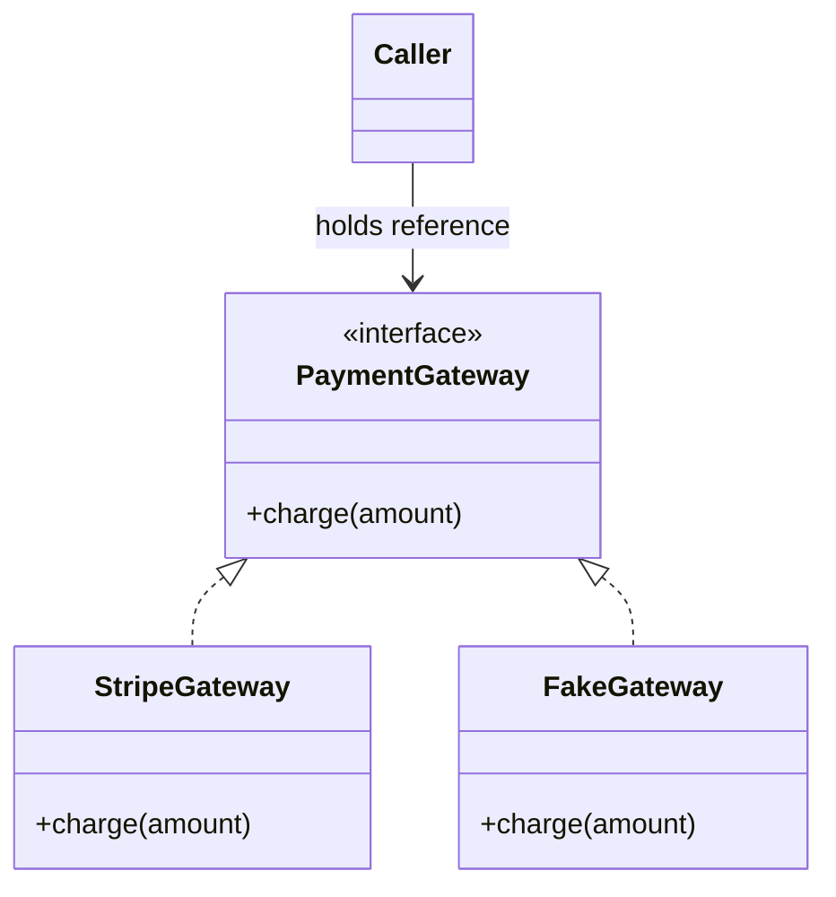
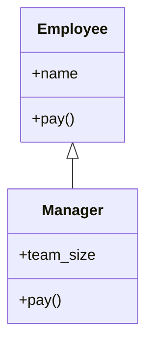
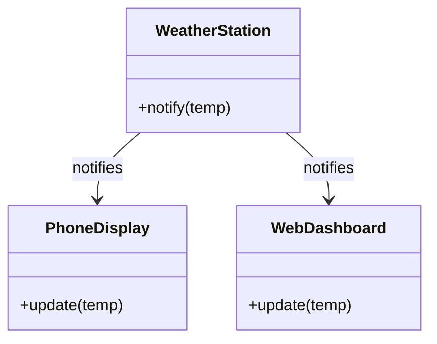
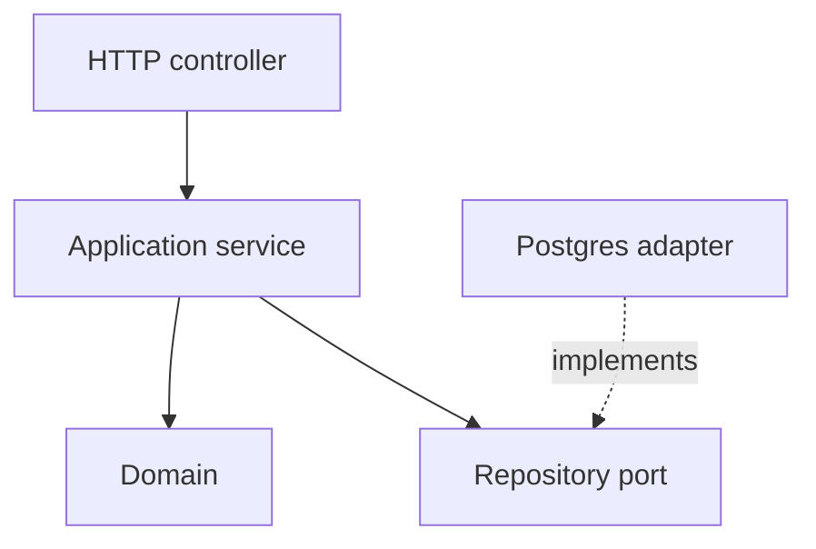

# The Zero-to-Hero Object-Oriented Programming Roadmap

*Mohammad Bilal's complete, self-paced path from first principles to hire-ready OOP - programming fundamentals, classes, the four pillars, composition, SOLID, design patterns, low-level design, and interview confident working knowledge - told as a connected story in which each new idea solves a problem left by the previous one.*

*Resources curated with Composio (web search, YouTube, GitHub) against the [Python Tutorial](https://docs.python.org/3/tutorial/index.html), [Real Python OOP](https://realpython.com/python3-object-oriented-programming/), [Refactoring Guru](https://refactoring.guru/design-patterns/), [faif/python-patterns](https://github.com/faif/python-patterns), [ashishps1/awesome-low-level-design](https://github.com/ashishps1/awesome-low-level-design), Corey Schafer / Mosh / Fireship / Christopher Okhravi, and 2026 LLD guides.*

*Where this sits:* start with **Part 0 (Programming Fundamentals)** if you are new to coding, then Phases 1-20. Ideal path relative to [`CS.md`](./CS.md): after CS Phase 1-2 (or in parallel with basics), **before** CS Phase 3 (data structures). [`CS.md`](./CS.md) Phase 10 then becomes revision + LLD polish, not first exposure.

**Scope:** Part 0 fundamentals + 40 OOP concepts · 20 phases · no artificial weekly deadline.

Code basics → Think → Pillars → SOLID → Patterns → Hire

---

## How to Read This Document

### Start here if programming and OOP are completely new to you

**Object-oriented programming (OOP)** is a way to organize code around small units that hold information and perform related actions. A **class** describes what one kind of unit can contain and do; an **object** is one actual example created from that class. **State** is the information the object currently holds, **behavior** is what it can do, and an **interface** is the set of actions other code is allowed to request.

Use ordinary examples first: a bank account has a balance and can accept a deposit; a library book has a status and can be borrowed. Type every small example, change it, and watch what happens. Do not memorize the “four pillars” as slogans. Learn each idea as a response to a real code problem you have already seen.

**Words you will meet often:** an **instance** is another name for an object created from a class; an **attribute** stores information on an object; a **method** is a function connected to an object or class; **encapsulation** protects valid state behind allowed actions; **abstraction** presents the useful controls while hiding unnecessary detail; **inheritance** creates a class from another class's behavior; **polymorphism** lets different objects answer the same kind of request in their own way; **composition** builds an object from other objects; a **dependency** is something a piece of code needs; a **design pattern** is a named, repeatable approach to a common design problem; and **refactoring** improves code structure without changing its promised behavior.

This is not a glossary of OOP buzzwords. It is one connected explanation: every section exists because the section before it reached a practical limit. Encapsulation only matters once shared mutable state burned you. Polymorphism only matters once `if type == ...` chains started rotting. SOLID only matters once "it works" stopped being enough for change.

**There is no clock on this document.** Move when you can explain *why the previous idea wasn't enough*. That is the only unit of progress.

Every concept answers the same questions:

- What is it, in plain language?
- Why does it exist - what problem forced someone to invent it?
- What did people do before, and what broke?
- What happens inside, one step at a time?
- What does it cost?
- What limitation forces the next idea?

### Two Ways to Use the Same Foundation

| Role | Primary question |
| --- | --- |
| **Language OOP** | How do classes, methods, and inheritance work in code? |
| **Design OOP** | How do I draw boundaries so change stays cheap? |

Phases 1-10 build language + modeling confident working knowledge. Phases 11-18 build design judgment. Phases 19-20 are portfolio and hiring. Skip neither - LLD without pillars is cargo cult; pillars without LLD never ship.

### The Beginner-Friendly Pattern Every Topic Follows

| Element | What it gives you |
| --- | --- |
| **Why You Are Learning This** | The previous limitation, stated plainly |
| **See It Before You Memorize It** | Videos, interactive tools, docs, GitHub, practice |
| **Step-by-Step Explanation** | A step-by-step explanation in words |
| **The Idea That Fixed It** | The main idea in one clear sentence |
| **What Happens Inside** | ASCII "animation" of what happens |
| **Picture It Like This** | An everyday comparison you can picture without a screen |
| **Trade-offs** | What you gain and what you give up |
| **Code** | Minimal runnable Python |
| **Interview** | How an interviewer may ask about it |
| **Practice** | Easy → Medium → Hard |
| **Why the Next Topic Is Needed** | The remaining problem that makes the next topic useful |

**Diagram conventions.** `|` and `v` mean sequence, `+--` joins paths, `-->` means a call or dependency, `X` marks a failure, boxes are classes or objects. Time usually runs downward.

---

> **Integrated Git practice:** Each linked phase-project card in [`Projects.md`](../guides/Projects.md) ends with one specific Git checkpoint. Test the finished project first, commit only its named project path, verify the commit and clean working tree, then continue. Use [`Git.md` Phases 2-3](./Git.md#phase-2) if staging or commit selection is unfamiliar.

---

## The Whole-Journey Map

```text
 PART 0 FUNDAMENTALS
 F1 How programs run + variables
 F2 Conditionals + loops
 F3 Functions + modules  -------------------+
                                            |
                                            v
 PHASE 1                 PHASE 2                PHASE 3                PHASE 4
 OBJECT THINKING         CLASSES & OBJECTS      STATE & BEHAVIOR       ENCAPSULATION
    |                       |                      |                      |
 Why procedural hits        Blueprints vs          attrs, methods,        Hide state;
 a wall                     living instances       __init__, self         public API
    +-----------------------+----------------------+----------------------+
                                       |
                                       v
 PHASE 5                 PHASE 6                PHASE 7                PHASE 8
 ABSTRACTION             INHERITANCE            POLYMORPHISM           COMPOSITION
    |                       |                      |                      |
 ABC / contracts            is-a reuse             same call,            has-a > is-a
                            + extend               different behavior     when coupling hurts
    +-----------------------+----------------------+----------------------+
                                       |
                                       v
 PHASE 9                 PHASE 10               PHASE 11               PHASE 12
 PYTHON POWER TOOLS      RELATIONSHIPS          SMELLS & REFACTOR      SOLID
    |                       |                      |                      |
 dunder, property,          assoc / agg /          God object →          five principles
 MRO, classmethod           composition UML       extract class          that localize change
    +-----------------------+----------------------+----------------------+
                                       |
                                       v
 PHASE 13                PHASE 14               PHASE 15               PHASE 16
 CREATIONAL              STRUCTURAL             BEHAVIORAL             TESTING OOP
 PATTERNS                PATTERNS               PATTERNS                  |
 Factory, Singleton,        Adapter, Decorator,    Strategy, Observer,   Fake collaborators
 Builder                    Facade                 Command               via DIP
    +-----------------------+----------------------+----------------------+
                                       |
                                       v
 PHASE 17                PHASE 18               PHASE 19               PHASE 20
 LAYERS & CLEAN-ISH      LLD METHOD             PORTFOLIO              INTERVIEWS
    |                       |                      |                      |
 Separate policy from       Clarify → entities →   Ship 2-3 designs      Speak pillars,
 details                    APIs → SOLID check     with write-ups         SOLID, patterns
```

---

## Phase Index

| # | Phase | Goal | Move on when you can... |
| --- | --- | --- | --- |
| F1 | [How Programs Run](#f1---how-programs-run) | Source, interpreter, variables | Run a script and explain a traceback |
| F2 | [Control Flow](#f2---control-flow) | if/else and loops | Write nested decisions without panic |
| F3 | [Functions & Modules](#f3---functions-and-modules) | Reuse and organize | Split a script across two files |
| 01 | [Object Thinking](#phase-1---object-thinking) | See why OOP exists | Contrast procedural vs OOP failure modes |
| 02 | [Classes & Objects](#phase-2---classes--objects) | Blueprint vs instance | Draw heap picture of two objects |
| 03 | [State & Behavior](#phase-3---state--behavior) | Attrs, methods, `self` | Write a correct `__init__` without guessing |
| 04 | [Encapsulation](#phase-4---encapsulation) | Protect invariants | Make invalid state unreachable |
| 05 | [Abstraction](#phase-5---abstraction) | Expose what, hide how | Design an ABC callers can trust |
| 06 | [Inheritance](#phase-6---inheritance) | Reuse by is-a | Explain MRO for a small hierarchy |
| 07 | [Polymorphism](#phase-7---polymorphism) | One interface, many forms | Replace an if/elif type chain |
| 08 | [Composition](#phase-8---composition-over-inheritance) | Prefer has-a | Rewrite inheritance as composition |
| 09 | [Python Power Tools](#phase-9---python-power-tools) | Idiomatic OOP | Use `@property` and `__repr__` correctly |
| 10 | [Relationships](#phase-10---relationships--modeling) | Model the domain | Sketch a UML-ish class diagram |
| 11 | [Smells & Refactor](#phase-11---smells--refactoring) | Spot bad design early | Name a smell and the refactor |
| 12 | [SOLID](#phase-12---solid) | Localize change | Apply each letter with a before/after |
| 13 | [Creational Patterns](#phase-13---creational-patterns) | Control construction | Justify Factory vs direct `new` |
| 14 | [Structural Patterns](#phase-14---structural-patterns) | Shape object graphs | Apply Adapter or Decorator once |
| 15 | [Behavioral Patterns](#phase-15---behavioral-patterns) | Shape collaboration | Apply Strategy and Observer |
| 16 | [Testing OOP](#phase-16---testing-oop) | Prove designs | Unit-test with a fake collaborator |
| 17 | [Layers](#phase-17---layers--clean-ish-architecture) | Keep policy independent | Separate domain from I/O |
| 18 | [LLD Method](#phase-18---lld-method) | Design under pressure | Run the LLD checklist on a prompt |
| 19 | [Portfolio](#phase-19---portfolio) | Prove skill | Publish designs with write-ups |
| 20 | [Interviews](#phase-20---interviews) | Get hired | Narrate trade-offs out loud |

### Anchor Resources (bookmark these)

- [Real Python - OOP in Python](https://realpython.com/python3-object-oriented-programming/) · [Real Python OOP learning path](https://realpython.com/learning-paths/object-oriented-programming-oop-python/)
- [Python docs - Classes](https://docs.python.org/3/tutorial/classes.html) · [`abc` module](https://docs.python.org/3/library/abc.html)
- [Refactoring Guru - Design Patterns](https://refactoring.guru/design-patterns/) · [SOLID / design principles](https://refactoring.guru/design-patterns/design-principles)
- [GeeksforGeeks OOP tutorial](https://www.geeksforgeeks.org/interview-prep/object-oriented-programming-oop-tutorial/)
- [DigitalOcean SOLID](https://www.digitalocean.com/community/tutorials/s-o-l-i-d-the-first-five-principles-of-object-oriented-design) · [AlgoMaster SOLID with code](https://blog.algomaster.io/p/solid-principles-explained-with-code)
- [Low Level Design Mastery - SOLID visual guide](https://www.lowleveldesignmastery.com/blog/solid-principles/)
- [Python Tutor visualizer](https://pythontutor.com/visualize.html)
- [faif/python-patterns](https://github.com/faif/python-patterns) · [kamranahmedse/design-patterns-for-humans](https://github.com/kamranahmedse/design-patterns-for-humans) (also mirrored as popular forks)
- [ashishps1/awesome-low-level-design](https://github.com/ashishps1/awesome-low-level-design) · [heykarimoff/solid.python](https://github.com/heykarimoff/solid.python)
- [cosmicpython/book](https://github.com/cosmicpython/book) · [kumaransg/LLD](https://github.com/kumaransg/LLD)
- Fundamentals: [Python Tutorial](https://docs.python.org/3/tutorial/index.html) · [Mosh 1-hour Python](https://www.youtube.com/watch?v=kqtD5dpn9C8) · [Bro Code variables](https://www.youtube.com/watch?v=LKFrQXaoSMQ) · [Corey loops](https://www.youtube.com/watch?v=6iF8Xb7Z3wQ) · [freeCodeCamp Python](https://www.youtube.com/watch?v=eWRfhZUzrAc)
- [Mosh - OOP Simplified](https://www.youtube.com/watch?v=pTB0EiLXUC8) · [Corey Schafer OOP #1](https://www.youtube.com/watch?v=ZDa-Z5JzLYM)
- [Alex Hyett - SOLID](https://www.youtube.com/watch?v=kF7rQmSRlq0) · [Fireship - 10 Patterns](https://www.youtube.com/watch?v=tv-_1er1mWI) · [CodeAesthetic - Flaws of Inheritance](https://www.youtube.com/watch?v=hxGOiiR9ZKg)

---

# PART 0 - Programming Fundamentals

*If you cannot yet write a small script with loops and functions, start here. OOP only pays off once procedural Python is comfortable. Resources curated with Composio against the [Python Tutorial](https://docs.python.org/3/tutorial/index.html), [Python Tutor](https://pythontutor.com/visualize.html), Mosh / Bro Code / Corey Schafer / freeCodeCamp.*

**WHAT YOU WILL BE ABLE TO DO:** Write clear procedural Python so classes in Phase 1 feel like a *choice*, not a mystery.

**WHAT YOU SHOULD KNOW FIRST:** A laptop and Python 3 installed. No prior coding required.

<a id="phase-f1"></a>

## F1 - How Programs Run

**Track:** Programming Fundamentals

### F1.1 Source, Interpreter, and Output

**WHY YOU ARE LEARNING THIS:** Computers only run machine instructions. Humans write source code. Something must translate and execute that source - in Python, the interpreter.

**THE PROBLEM THIS SOLVES:** You cannot "just tell the computer" what to do in English. Without a language and a runtime, there is no reproducible program.

**SEE IT BEFORE YOU MEMORIZE IT**

- [Mosh - Python for Beginners (1 Hour)](https://www.youtube.com/watch?v=kqtD5dpn9C8)
- [freeCodeCamp - Python for Beginners Full Course](https://www.youtube.com/watch?v=eWRfhZUzrAc)
- [Mosh - Python Full Course for Beginners](https://www.youtube.com/watch?v=K5KVEU3aaeQ)
- [Python Tutor visualizer](https://pythontutor.com/visualize.html)
- [The Python Tutorial](https://docs.python.org/3/tutorial/index.html)
- [How to Learn Python (2026 beginner guide)](https://scrimba.com/articles/how-to-learn-python-a-beginners-guide-2026/)
- [servinovich/python-basics](https://github.com/servinovich/python-basics)
- Practice: run `print("hello")` in a `.py` file and in the REPL

**STEP-BY-STEP EXPLANATION**

A `.py` file is text. When you run `python app.py`, the CPython interpreter reads the file, compiles it to bytecode, and executes it. `print` sends text to standard output. Errors raise exceptions with a traceback - read it from the bottom up for the failing line.

**THE MAIN IDEA IN SIMPLE WORDS:** Treat the interpreter as a strict coworker: it only does what the syntax allows, every time.

**WHAT HAPPENS INSIDE, ONE STEP AT A TIME**

```text
you type:  print("hi")
     |
     v
 Python reads tokens -> builds AST -> bytecode
     |
     v
 runtime executes PRINT -> stdout shows hi
```

**PICTURE IT LIKE THIS**

A recipe (source) and a cook (interpreter). The cook follows exact steps; vague English is not a recipe.

**WHAT YOU GAIN, WHAT IT COSTS, AND WHERE IT CAN FAIL**

| Choice | What it buys | What it costs |
| --- | --- | --- |
| REPL exploration | Instant feedback | Easy to lose work |
| `.py` scripts | Reproducible programs | Slightly more setup |

**SMALL WORKING EXAMPLE**

```python
print("Interview Help")
print(2 + 2)
```

**HOW TO EXPLAIN THIS IN AN INTERVIEW**

"What happens when you run a Python file?" - mention interpreter, bytecode, and that errors produce tracebacks.

**PRACTICE UNTIL IT FEELS FAMILIAR**

| Difficulty | Task |
| --- | --- |
| Easy | Print your name and today's date string |
| Medium | Cause a `NameError` on purpose and read the traceback |
| Hard | Explain REPL vs script in two sentences |

**WHY THE NEXT TOPIC IS NEEDED:** Programs need to remember values. That is **variables and types**.

### F1.2 Variables, Types, and Expressions

**WHY YOU ARE LEARNING THIS:** Without naming values, every number and string must be rewritten. Variables bind names to objects so you can reuse and transform data.

**THE PROBLEM THIS SOLVES:** Hard-coded literals everywhere. Change one price, miss twelve places.

**SEE IT BEFORE YOU MEMORIZE IT**

- [Bro Code - Python variables for beginners](https://www.youtube.com/watch?v=LKFrQXaoSMQ)
- [Indently - Learn Python in Less than 10 Minutes](https://www.youtube.com/watch?v=fWjsdhR3z3c)
- [Python Tutor](https://pythontutor.com/visualize.html) - assign two names, mutate a list
- [Python Basics quick guide](https://www.beginnersly.com/article/python-basics-quick-guide)
- [Basic Python Theory - Variables, Loops and Functions](https://sergiolearns.com/en/basic-python-theory/)
- [GoLinuxCloud Python tutorial](https://www.golinuxcloud.com/python-tutorial/)
- [yusufcore/python_practise](https://github.com/yusufcore/python_practise)
- Assign `int`, `float`, `str`, `bool` and print `type(...)`

**STEP-BY-STEP EXPLANATION**

In Python, names refer to objects. `x = 3` binds `x` to an integer object. Types matter: `"3" + "3"` concatenates; `3 + 3` adds. Use `type()`, conversions like `int("7")`, and f-strings for readable output. Lists and dicts are mutable; rebinding a name is not the same as mutating an object.

**THE MAIN IDEA IN SIMPLE WORDS:** Names are labels on values. Know whether you changed the label or the thing labeled.

**WHAT HAPPENS INSIDE, ONE STEP AT A TIME**

```text
x = 3        # name x -> int 3
y = x        # y -> same int (immutable, safe)
nums = [1]   # name nums -> list
alias = nums
alias.append(2)  # nums also sees [1, 2]
```

**PICTURE IT LIKE THIS**

Sticky notes on boxes. Two notes can point at the same box.

**WHAT YOU GAIN, WHAT IT COSTS, AND WHERE IT CAN FAIL**

| Choice | What it buys | What it costs |
| --- | --- | --- |
| Dynamic typing | Fast to start | Type bugs appear at runtime |
| Explicit conversions | Clear intent | More verbose |

**SMALL WORKING EXAMPLE**

```python
name = "Bilal"
age = 22
price = 19.99
active = True
print(f"{name} age={age} price={price} active={active}")
print(type(age), type(price))
```

**HOW TO EXPLAIN THIS IN AN INTERVIEW**

Be ready for `is` vs `==` later; for now, explain mutable vs immutable with a list example.

**PRACTICE UNTIL IT FEELS FAMILIAR**

| Difficulty | Task |
| --- | --- |
| Easy | Swap two variables |
| Medium | Build a dict for a student record and print keys |
| Hard | Show aliasing with a nested list |

**WHY THE NEXT TOPIC IS NEEDED:** Fixed sequences of statements are not enough. Programs must **choose and repeat** - control flow.

> **Phase F1 complete?** [Build the Phase F1 mini-project](../guides/Projects.md#oop-phase-f1-project) · [Continue to Phase F2](#f2---control-flow)

<a id="phase-f2"></a>

## F2 - Control Flow

**Track:** Programming Fundamentals

### F2.1 Conditionals

**WHY YOU ARE LEARNING THIS:** Real problems branch: if balance is low, refuse the withdraw; if user is admin, show the panel.

**THE PROBLEM THIS SOLVES:** One linear script cannot encode decisions. You either run everything or nothing.

**SEE IT BEFORE YOU MEMORIZE IT**

- [Python docs - Control Flow](https://docs.python.org/3/tutorial/controlflow.html)
- [Mosh - Python Full Course](https://www.youtube.com/watch?v=_uQrJ0TkZlc)
- [Data with Baraa - Python Full Course](https://www.youtube.com/watch?v=Rq5gJVxz55Q)
- [Python Tutor](https://pythontutor.com/visualize.html)
- [Learning Python Foundations](https://binarylog.dev/post/learning-python-foundations-with-practical-examples-for-new-developers)
- [droidevs/python-projects-beginner](https://github.com/droidevs/python-projects-beginner)
- Write a grade classifier A-F from a score

**STEP-BY-STEP EXPLANATION**

`if` / `elif` / `else` evaluate boolean conditions. Comparisons (`<`, `==`, `in`) and boolean ops (`and`, `or`, `not`) build conditions. Keep branches shallow; nested `if` pyramids are a smell you will fix with functions and later polymorphism.

**THE MAIN IDEA IN SIMPLE WORDS:** Encode decisions as explicit branches with clear conditions.

**WHAT HAPPENS INSIDE, ONE STEP AT A TIME**

```python
score = 87
if score >= 90: grade = "A"
elif score >= 80: grade = "B"
else: grade = "C"
```

**PICTURE IT LIKE THIS**

A traffic light: only one color is active at a time based on rules.

**WHAT YOU GAIN, WHAT IT COSTS, AND WHERE IT CAN FAIL**

| Choice | What it buys | What it costs |
| --- | --- | --- |
| Many elifs | Explicit | Grows forever (polymorphism later) |
| Guard clauses | Flat readable functions | Must return/exit early |

**SMALL WORKING EXAMPLE**

```python
def can_withdraw(balance: float, amount: float) -> bool:
    if amount <= 0:
        return False
    if amount > balance:
        return False
    return True

print(can_withdraw(100, 40), can_withdraw(100, 140))
```

**HOW TO EXPLAIN THIS IN AN INTERVIEW**

Talk through edge cases first (zero, negative, equal boundary).

**PRACTICE UNTIL IT FEELS FAMILIAR**

| Difficulty | Task |
| --- | --- |
| Easy | Fizz for multiples of 3 |
| Medium | Leap year checker |
| Hard | Nested menu with input validation |

**WHY THE NEXT TOPIC IS NEEDED:** Branching once is not enough when you must process many items - **loops**.

### F2.2 Loops and Iteration

**WHY YOU ARE LEARNING THIS:** You need to repeat work over ranges, lists, and files without copy-pasting lines.

**THE PROBLEM THIS SOLVES:** Writing `print(item1); print(item2); ...` does not scale.

**SEE IT BEFORE YOU MEMORIZE IT**

- [Corey Schafer - Loops and Iterations](https://www.youtube.com/watch?v=6iF8Xb7Z3wQ)
- [Bro Code - for loops in 5 minutes](https://www.youtube.com/watch?v=KWgYha0clzw)
- [Python docs - Control Flow](https://docs.python.org/3/tutorial/controlflow.html)
- [Python Tutor](https://pythontutor.com/visualize.html) - watch `for` index a list
- [Vedika-Sd/core-python-projects](https://github.com/Vedika-Sd/core-python-projects)
- Sum a list with a `for` loop, then with `sum()`

**STEP-BY-STEP EXPLANATION**

`for x in iterable` walks items. `while` repeats until a condition fails (careful: infinite loops). `break` exits early; `continue` skips to the next iteration. Prefer `for` when the collection is known; use `while` for open-ended processes.

**THE MAIN IDEA IN SIMPLE WORDS:** Separate "what to do to one item" from "visit every item".

**WHAT HAPPENS INSIDE, ONE STEP AT A TIME**

```python
nums = [2, 4, 6]
total = 0
for n in nums:
    total += n
# total == 12
```

**PICTURE IT LIKE THIS**

Checking every mailbox on a street: same action, many addresses.

**WHAT YOU GAIN, WHAT IT COSTS, AND WHERE IT CAN FAIL**

| Choice | What it buys | What it costs |
| --- | --- | --- |
| for-each | Clear | Harder if you need indexes (use enumerate) |
| while | Flexible exit | Easy infinite loop |

**SMALL WORKING EXAMPLE**

```python
nums = [3, 1, 4, 1, 5]
total = 0
for n in nums:
    total += n
print(total, max(nums))

i = 3
while i > 0:
    print("tick", i)
    i -= 1
```

**HOW TO EXPLAIN THIS IN AN INTERVIEW**

Know `range`, `enumerate`, and how to avoid mutating a list while iterating it carelessly.

**PRACTICE UNTIL IT FEELS FAMILIAR**

| Difficulty | Task |
| --- | --- |
| Easy | Print 1..10 with `range` |
| Medium | Count vowels in a string |
| Hard | Nested loop multiplication table |

**WHY THE NEXT TOPIC IS NEEDED:** Copy-pasted loop bodies become unmaintainable. Package reusable logic as **functions**.

> **Phase F2 complete?** [Build the Phase F2 mini-project](../guides/Projects.md#oop-phase-f2-project) · [Continue to Phase F3](#f3---functions-and-modules)

<a id="phase-f3"></a>

## F3 - Functions and Modules

**Track:** Programming Fundamentals

### F3.1 Functions, Parameters, and Return Values

**WHY YOU ARE LEARNING THIS:** Named, reusable blocks keep programs short and testable. Functions are the unit of procedural design - and later, methods are functions attached to objects.

**THE PROBLEM THIS SOLVES:** A 200-line script with no structure. Change one rule, break three call sites you forgot existed.

**SEE IT BEFORE YOU MEMORIZE IT**

- [Python docs - Control Flow (defining functions)](https://docs.python.org/3/tutorial/controlflow.html)
- [Mosh - Python for Beginners](https://www.youtube.com/watch?v=kqtD5dpn9C8)
- [Python Tutor](https://pythontutor.com/visualize.html) - watch the call stack grow and shrink
- [Python Tutorial index](https://docs.python.org/3/tutorial/index.html)
- [muhammadwaheedairi/python-oop-practice](https://github.com/muhammadwaheedairi/python-oop-practice)
- Write `def average(xs):` with an empty-list guard

**STEP-BY-STEP EXPLANATION**

`def name(params):` creates a function object. Arguments bind to parameters. `return` sends a value back (default `None`). Scope: locals inside the function do not leak. Prefer pure functions when possible (same inputs -> same outputs, no hidden mutation). Docstrings explain intent.

**THE MAIN IDEA IN SIMPLE WORDS:** Name the verb. Pass data in, get data out.

**WHAT HAPPENS INSIDE, ONE STEP AT A TIME**

```text
call average([2,4])
  | push frame
  | compute 3.0
  | pop frame, return 3.0
```

**PICTURE IT LIKE THIS**

A food processor: ingredients in, result out, same machine reused.

**WHAT YOU GAIN, WHAT IT COSTS, AND WHERE IT CAN FAIL**

| Choice | What it buys | What it costs |
| --- | --- | --- |
| Small functions | Testable pieces | More names to learn |
| Giant script | Fast demo | Unmaintainable |

**SMALL WORKING EXAMPLE**

```python
def average(nums: list[float]) -> float:
    """Return arithmetic mean. Raises on empty input."""
    if not nums:
        raise ValueError("nums must be non-empty")
    return sum(nums) / len(nums)

print(average([2, 4, 6]))
```

**HOW TO EXPLAIN THIS IN AN INTERVIEW**

Explain parameters vs arguments, and why side effects matter for testing.

**PRACTICE UNTIL IT FEELS FAMILIAR**

| Difficulty | Task |
| --- | --- |
| Easy | `is_even(n)` |
| Medium | `factorial(n)` iterative |
| Hard | Function that returns min and max as a tuple |

**WHY THE NEXT TOPIC IS NEEDED:** One file grows huge. Split code across **modules** and learn the standard library basics.

### F3.2 Modules, Imports, and Small Scripts

**WHY YOU ARE LEARNING THIS:** Projects need organization: helpers in one file, CLI in another, tests elsewhere.

**THE PROBLEM THIS SOLVES:** Everything in `main.py`. Circular chaos and impossible reuse.

**SEE IT BEFORE YOU MEMORIZE IT**

- [Python Tutorial](https://docs.python.org/3/tutorial/index.html)
- [Python mini projects ideas](https://www.beginnersly.com/tutorials/python/python-projects)
- [freeCodeCamp Python course](https://www.youtube.com/watch?v=eWRfhZUzrAc)
- [droidevs/python-projects-beginner](https://github.com/droidevs/python-projects-beginner)
- [yusufcore/python_practise](https://github.com/yusufcore/python_practise)
- Split a script into `utils.py` + `main.py` and import

**STEP-BY-STEP EXPLANATION**

`import math` loads a module. `from math import sqrt` binds a name. Packages are directories with imports. The `if __name__ == "__main__":` guard lets a file be both importable and runnable. Standard library starters: `math`, `random`, `pathlib`, `json`, `datetime`.

**THE MAIN IDEA IN SIMPLE WORDS:** Files are namespaces. Import what you need; keep entrypoints thin.

**WHAT HAPPENS INSIDE, ONE STEP AT A TIME**

```python
main.py
  import utils
  utils.helper()

Python loads utils.py once, caches in sys.modules
```

**PICTURE IT LIKE THIS**

A toolbox drawer: wrenches in one tray, not dumped on the floor with the instructions.

**WHAT YOU GAIN, WHAT IT COSTS, AND WHERE IT CAN FAIL**

| Choice | What it buys | What it costs |
| --- | --- | --- |
| Many tiny modules | Clear boundaries | Navigation overhead |
| One module | Simple | Becomes a junk drawer |

**SMALL WORKING EXAMPLE**

```python
# save as demo_stats.py and run: python demo_stats.py
from statistics import mean

def main() -> None:
    samples = [1.5, 2.5, 3.0]
    print("mean", mean(samples))

if __name__ == "__main__":
    main()
```

**HOW TO EXPLAIN THIS IN AN INTERVIEW**

"What does `if __name__ == '__main__'` do?" - distinguish import vs execute.

**PRACTICE UNTIL IT FEELS FAMILIAR**

| Difficulty | Task |
| --- | --- |
| Easy | Import `random` and roll a die |
| Medium | Read a text file with `pathlib` and count lines |
| Hard | Package two modules and import across them |

**WHY THE NEXT TOPIC IS NEEDED:** Procedural tools still leave invariants unprotected when many functions touch the same data. That wall is why **Object Thinking (Phase 1)** exists.

**MASTERY CHECKPOINT - Part 0:** Build a tiny CLI (guessing game or expense adder) using variables, if/else, loops, and at least two functions in two files. Then begin Phase 1.

---

> **Phase F3 complete?** [Build the Phase F3 mini-project](../guides/Projects.md#oop-phase-f3-project) · [Continue to Phase 1](#phase-1---object-thinking)

<a id="phase-1"></a>

# PHASE 1 - Object Thinking

**Track:** Foundations

**WHAT YOU WILL BE ABLE TO DO:** Feel the *problem* OOP was invented to solve before any class syntax.

**WHAT YOU SHOULD KNOW FIRST:** Part 0 (Programming Fundamentals) or equivalent: variables, control flow, functions. [`CS.md`](./CS.md) Phase 1-2 helps but Part 0 is enough to start.

## 1.1 Procedural Code Hits a Wall

**WHY YOU ARE LEARNING THIS:** A program of standalone functions and loose variables works at small scale. As features grow, *who is allowed to touch this data* becomes untrackable - any function can mutate any dict, and a bug can come from anywhere.

**THE PROBLEM THIS SOLVES:** Balance rules live in five functions; three call sites forget to check negatives; a typo mutates `balance` directly and bypasses every safeguard.

**SEE IT BEFORE YOU MEMORIZE IT**

- Best animated: [Object-Oriented Programming, Simplified (Programming with Mosh)](https://www.youtube.com/watch?v=pTB0EiLXUC8) - names the problem each pillar solves
- Alternative: [Object Oriented Programming - The Four Pillars of OOP (Keep On Coding)](https://www.youtube.com/watch?v=1ONhXmQuWP8)
- Another angle: [What is Object Oriented Programming? Explained in 2 Minutes](https://www.youtube.com/watch?v=fZ8SAf99JbQ)
- Interactive: [Python Tutor](https://pythontutor.com/visualize.html) - run procedural vs class versions side by side later
- Written: [GeeksforGeeks - Introduction of OOP](https://www.geeksforgeeks.org/dsa/introduction-of-object-oriented-programming/) · [OOP Tutorial Roadmap](https://adnantasdemir.com/en/posts/oop-tutorial-roadmap)
- GitHub: [hassan-mohagheghian/python-software-engineering-roadmap](https://github.com/hassan-mohagheghian/python-software-engineering-roadmap)
- Practice: List three bugs in a procedural bank sketch that encapsulation would have prevented

**STEP-BY-STEP EXPLANATION**

**Procedural style** separates data (dicts, lists, globals) from behavior (functions). That is fine until invariants matter: "balance never goes negative," "an order always has at least one line item," "a user always has a unique id."

When invariants are enforced only by *convention* ("please call `withdraw` instead of editing the dict"), large codebases eventually violate the convention. OOP's first move is not inheritance - it is **ownership**: put the data next to the only functions allowed to change it.

**THE MAIN IDEA IN SIMPLE WORDS:** Stop scattering rules across call sites. Make one unit own both the data and the rules.

**WHAT HAPPENS INSIDE, ONE STEP AT A TIME**

```text
PROCEDURAL (rules hope callers cooperate):

  balance = 100
  def withdraw(balance, amount): ...
  balance = -999999   # legal Python, illegal banking


OOP direction of travel:

  +------------------+
  | Account          |
  |  _balance        |  <-- state lives HERE
  |  withdraw()      |  <-- rules live HERE
  +------------------+
         ^
   callers may only talk to the public methods

```

**PICTURE IT LIKE THIS**

A kitchen where anyone can open the oven mid-bake versus a restaurant line where only the chef touches the mise en place.

**WHAT YOU GAIN, WHAT IT COSTS, AND WHERE IT CAN FAIL**

| Choice | What it buys | What it costs |
| --- | --- | --- |
| Loose functions + dicts | Fast to start; little ceremony | Invariants are optional; bugs multiply with contributors |
| Early OOP ceremony | One place owns rules | More boilerplate before it pays off |

**SMALL WORKING EXAMPLE**

```python
# Procedural: nothing stops misuse
balance = 100

def withdraw(bal, amount):
    if amount > bal:
        raise ValueError("insufficient")
    return bal - amount

balance = withdraw(balance, 30)
balance = -1_000_000  # still "works" - invariant is dead

print(balance)

```

**HOW TO EXPLAIN THIS IN AN INTERVIEW**

Interviewers ask: "What's wrong with this procedural design?" Strong answers name *invariants* and *scattered responsibility*, not "because OOP is better."

**PRACTICE UNTIL IT FEELS FAMILIAR**

| Difficulty | Task |
| --- | --- |
| Easy | Write procedural `deposit`/`withdraw` on a dict; then list three ways a caller can corrupt it |
| Medium | Refactor the same logic so invalid balances become impossible from outside |
| Hard | Explain when procedural style is still the right call (scripts, tiny tools, data pipelines) |

**WHY THE NEXT TOPIC IS NEEDED:** We need a language construct that says: this data and these operations are one thing. That construct is the **class**.

## 1.2 Objects as Models of the Domain

**WHY YOU ARE LEARNING THIS:** Syntax alone does not make good OOP. The point is to model *things that keep state and answer messages* - accounts, carts, rides, tickets - so the code reads like the problem.

**THE PROBLEM THIS SOLVES:** Code organized by technical layer only (`utils.py` with 80 helpers) forces every feature to hunt across files for the rule that belongs to one business concept.

**SEE IT BEFORE YOU MEMORIZE IT**

- [Four Pillars of OOP Explained! (The Python Dude)](https://www.youtube.com/watch?v=eo5WSe8pOB0)
- [OOP Concepts Simplified (Hayk Simonyan)](https://www.youtube.com/watch?v=BwS2IR_TEVE)
- [Fundamental Concepts of OOP (Computer Science Lessons)](https://www.youtube.com/watch?v=m_MQYyJpIjg)
- [Real Python - OOP](https://realpython.com/python3-object-oriented-programming/) · [OOP & Design Patterns Roadmap (Chanh Le)](https://chanhle.dev/en/blog/object-oriented-programming-design-patterns-roadmap)
- [Interactive Python OOP guide](https://python-academy.org/en/guide/oop)
- Browse domain models in [cosmicpython/book](https://github.com/cosmicpython/book)
- Name five nouns in an app you use daily that deserve to be objects

**STEP-BY-STEP EXPLANATION**

An **object** is a bundle of state + behavior that represents something meaningful. Good OOP starts by listing nouns and verbs of the domain ("Customer places Order", "ParkingLot assigns Spot"), then asking which noun owns which verb.

Bad OOP starts by inventing inheritance trees for sport. Prefer boring, accurate domain objects over clever hierarchies.

**THE MAIN IDEA IN SIMPLE WORDS:** Model the nouns that own rules. Methods are the verbs those nouns can honestly perform.

**WHAT HAPPENS INSIDE, ONE STEP AT A TIME**

```text
Domain sketch (parking lot):

  ParkingLot ---- assigns ----> Spot
      |                           ^
      |                           |
      +------ knows Vehicle ------+

Questions OOP forces you to answer:
  - Who owns the list of free spots?
  - Who knows pricing rules?
  - What is illegal state? (two cars, one spot)

```

**PICTURE IT LIKE THIS**

A board game: pieces have positions and legal moves. The rulebook is not a random pile of free functions - it is attached to what you can do with each piece.

**WHAT YOU GAIN, WHAT IT COSTS, AND WHERE IT CAN FAIL**

| Choice | What it buys | What it costs |
| --- | --- | --- |
| Domain objects | Code maps to product language | Requires talking to the problem, not only the framework |
| Utils-only design | Quick helpers | No clear owner of business rules |

**SMALL WORKING EXAMPLE**

```python
class Ride:
    """Tiny domain object: state + allowed verbs."""
    def __init__(self, rider: str, distance_km: float):
        self.rider = rider
        self.distance_km = distance_km
        self.status = "requested"

    def start(self):
        if self.status != "requested":
            raise ValueError("can only start a requested ride")
        self.status = "ongoing"

    def complete(self):
        if self.status != "ongoing":
            raise ValueError("can only complete an ongoing ride")
        self.status = "done"
        return round(self.distance_km * 1.5, 2)  # naive fare

r = Ride("Bilal", 4.0)
r.start()
print(r.complete(), r.status)

```

**HOW TO EXPLAIN THIS IN AN INTERVIEW**

In LLD prompts, start by listing entities and illegal states out loud. Interviewers grade that more than fancy patterns.

**PRACTICE UNTIL IT FEELS FAMILIAR**

| Difficulty | Task |
| --- | --- |
| Easy | For a library app, list entities and one invariant each |
| Medium | For a food-delivery app, decide which object owns "cancel order" |
| Hard | Argue why `EmailSender` is usually *not* the same object as `Order` |

**WHY THE NEXT TOPIC IS NEEDED:** To turn domain nouns into running code, we need the blueprint/instance split: **classes and objects**.

**CHECK YOUR UNDERSTANDING AFTER PHASE 1:** Explain, without jargon, why "just use functions" fails for invariants. Name one domain object from an app you know and one illegal state it must prevent.

---

> **Phase 1 complete?** [Build the Phase 1 mini-project](../guides/Projects.md#oop-phase-1-project) · [Continue to Phase 2](#phase-2---classes--objects)

<a id="phase-2"></a>

# PHASE 2 - Classes & Objects

**Track:** Foundations

**WHAT YOU WILL BE ABLE TO DO:** Make the class/object distinction physical, not metaphorical.

**WHAT YOU SHOULD KNOW FIRST:** Phase 1.

## 2.1 Class = Blueprint, Object = Instance

**WHY YOU ARE LEARNING THIS:** We need a reusable definition of a domain thing without copying the same fields and methods by hand for every account, ride, or user.

**THE PROBLEM THIS SOLVES:** Copy-pasting parallel dicts and helper functions: change one rule, miss three copies.

**SEE IT BEFORE YOU MEMORIZE IT**

- [Corey Schafer - Classes and Instances](https://www.youtube.com/watch?v=ZDa-Z5JzLYM)
- [Tech With Tim - Python OOP For Beginners](https://www.youtube.com/watch?v=JeznW_7DlB0)
- [freeCodeCamp - OOP Crash Course in Python](https://www.freecodecamp.org/news/crash-course-object-oriented-programming-in-python/)
- [Python Tutor - visualize two instances](https://pythontutor.com/visualize.html)
- [Python docs - Classes](https://docs.python.org/3/tutorial/classes.html) · [Real Python - Python Classes](https://realpython.com/python-classes/)
- [faif/python-patterns](https://github.com/faif/python-patterns) - scan class examples
- Create two `Dog` instances; mutate one; prove the other is unchanged

**STEP-BY-STEP EXPLANATION**

A **class** is the blueprint: it declares what data instances hold and what operations they support. An **object** (instance) is one concrete thing built from that blueprint, with its own state.

Methods live once on the class. Attribute values live per object on the heap. Beginners often think each object copies all methods into itself - Python Tutor cures that in sixty seconds.

**THE MAIN IDEA IN SIMPLE WORDS:** Share behavior once; give each instance its own state.

**WHAT HAPPENS INSIDE, ONE STEP AT A TIME**

```text
Dog = class (blueprint)
  methods: bark, __init__   <--- stored ONCE on the class

After: a = Dog("Rex"); b = Dog("Sam")

  HEAP:
  +-----------+     +-----------+
  | name:Rex  |     | name:Sam  |
  | class* ----+    | class* ----+-----> Dog class
  +-----------+     +-----------+
   object a          object b
```

**PICTURE IT LIKE THIS**

Cookie cutter vs cookies. One cutter; many cookies with different icing.

**WHAT YOU GAIN, WHAT IT COSTS, AND WHERE IT CAN FAIL**

| Choice | What it buys | What it costs |
| --- | --- | --- |
| Class + instances | Shared behavior, independent state | Requires learning object identity and `self` |
| One big global dict | Simple | No isolation; collisions and accidental overwrite |

**SMALL WORKING EXAMPLE**

```python
class Dog:
    def __init__(self, name: str):
        self.name = name

    def bark(self) -> str:
        return f"{self.name} says woof"

a, b = Dog("Rex"), Dog("Sam")
a.name = "MAX"
print(a.bark())  # MAX says woof
print(b.bark())  # Sam says woof
print(a.bark is b.bark)  # True: same function on the class
```

**HOW TO EXPLAIN THIS IN AN INTERVIEW**

Be ready to draw two objects on the heap and say where methods live.

**PRACTICE UNTIL IT FEELS FAMILIAR**

| Difficulty | Task |
| --- | --- |
| Easy | Class `Book(title, pages)` with `summary()`; create two books |
| Medium | Explain why `a.bark is b.bark` is True but names may differ |
| Hard | Implement `__eq__` for books by title (preview Phase 9) |

**WHY THE NEXT TOPIC IS NEEDED:** Creating an object needs initial state wiring - the constructor and the first parameter `self`.

## 2.2 Identity, Equality, and References

**WHY YOU ARE LEARNING THIS:** Once you have multiple objects, you must know whether two variables point at the *same* object or merely *look* the same.

**THE PROBLEM THIS SOLVES:** Bugs like "I updated the user in the list but checkout still sees the old one" come from misunderstanding references.

**SEE IT BEFORE YOU MEMORIZE IT**

- [Dave Gray - Classes, Objects, Inheritance & Polymorphism](https://www.youtube.com/watch?v=RpBBzci_cBk)
- [Python Tutor](https://pythontutor.com/visualize.html) - alias two names, mutate, watch both change
- [Real Python OOP](https://realpython.com/python3-object-oriented-programming/)
- [Corey Schafer - Class Variables](https://www.youtube.com/watch?v=BJ-VvGyQxgo) - shared vs instance state
- Experiment in a scratch file until `is` vs `==` is muscle memory
- Predict outputs before running; verify in Python Tutor

**STEP-BY-STEP EXPLANATION**

In Python, variables hold **references** to objects. `a is b` asks identity (same object). `a == b` asks equality (same value via `__eq__`, defaulting to identity).

Aliasing means two names, one object: mutate through either name and both see the change. This is how every OOP language passes objects around.

**THE MAIN IDEA IN SIMPLE WORDS:** Separate "same object" from "same value." Design equality intentionally.

**WHAT HAPPENS INSIDE, ONE STEP AT A TIME**

```text
aliasing:

  u1 -------------------+
                        v
                     +------+
                     | User |
                     +------+
                        ^
  u2 -------------------+

u1 is u2 -> True
mutate u1.name -> u2.name also changes
```

**PICTURE IT LIKE THIS**

Two house keys to the same apartment versus two apartments with the same floor plan.

**WHAT YOU GAIN, WHAT IT COSTS, AND WHERE IT CAN FAIL**

| Choice | What it buys | What it costs |
| --- | --- | --- |
| `is` for identity | Detect shared mutable state | Wrong tool for value comparison |
| Custom `__eq__` | Value semantics for domain objects | Must consider hashing if used in sets/dicts |

**SMALL WORKING EXAMPLE**

```python
class User:
    def __init__(self, user_id: int, name: str):
        self.user_id = user_id
        self.name = name

    def __eq__(self, other):
        return isinstance(other, User) and self.user_id == other.user_id

a = User(1, "Ada")
b = a
c = User(1, "Ada")
print(a is b, a is c)   # True False
print(a == c)           # True
b.name = "Ada Lovelace"
print(a.name)           # Ada Lovelace - alias
```

**HOW TO EXPLAIN THIS IN AN INTERVIEW**

If they ask `is` vs `==`, give a one-liner and a micro-example.

**PRACTICE UNTIL IT FEELS FAMILIAR**

| Difficulty | Task |
| --- | --- |
| Easy | Show aliasing with a list attribute on an object |
| Medium | Implement `__eq__` for `Money(amount, currency)` |
| Hard | Explain why mutable objects as dict keys are dangerous |

**WHY THE NEXT TOPIC IS NEEDED:** Next we flesh out what lives on an object: attributes, methods, and how `self` wires them.

**CHECK YOUR UNDERSTANDING AFTER PHASE 2:** In Python Tutor, create two instances, alias one, and narrate identity vs equality out loud.

---

> **Phase 2 complete?** [Build the Phase 2 mini-project](../guides/Projects.md#oop-phase-2-project) · [Continue to Phase 3](#phase-3---state--behavior)

<a id="phase-3"></a>

# PHASE 3 - State & Behavior

**Track:** Foundations

**WHAT YOU WILL BE ABLE TO DO:** Write correct instance methods without guessing what `self` is.

**WHAT YOU SHOULD KNOW FIRST:** Phase 2.

## 3.1 Attributes, Methods, and self

**WHY YOU ARE LEARNING THIS:** Objects must respond to messages with access to their own state. Python passes the receiver explicitly as the first parameter.

**THE PROBLEM THIS SOLVES:** Functions that take `account_dict` as the first argument everywhere - easy to pass the wrong dict and corrupt the wrong account.

**SEE IT BEFORE YOU MEMORIZE IT**

- [Corey Schafer - Classes and Instances](https://www.youtube.com/watch?v=ZDa-Z5JzLYM) - watch the `self` explanation
- [Tech With Tim - Python OOP](https://www.youtube.com/watch?v=JeznW_7DlB0)
- [Python Tutor](https://pythontutor.com/visualize.html) - step through a method call
- [Python docs - Classes](https://docs.python.org/3/tutorial/classes.html)
- [python-academy.org OOP guide](https://python-academy.org/en/guide/oop)
- Trace method dispatch in [faif/python-patterns](https://github.com/faif/python-patterns)
- Rewrite three free functions as methods on one class

**STEP-BY-STEP EXPLANATION**

**Attributes** hold state (usually on `self`). **Methods** are functions bound to the class; when called on an instance, Python passes that instance as `self`.

`account.withdraw(50)` desugars to `Account.withdraw(account, 50)`. That is not magic - it is explicit receiver passing, unlike some languages that hide `this`.

**THE MAIN IDEA IN SIMPLE WORDS:** `self` is the instance receiving the message. Methods are functions that always know which object they operate on.

**WHAT HAPPENS INSIDE, ONE STEP AT A TIME**

```text
Call: acct.withdraw(30)

  1. Python finds withdraw on Account class
  2. Binds acct as first arg (self)
  3. Executes body with self._balance

  acct.withdraw(30)
       |
       v
  Account.withdraw(acct, 30)
       |
       v
  reads/writes acct._balance only
```

**PICTURE IT LIKE THIS**

A vending machine button that only works on *your* selected item - the machine knows which slot is active.

**WHAT YOU GAIN, WHAT IT COSTS, AND WHERE IT CAN FAIL**

| Choice | What it buys | What it costs |
| --- | --- | --- |
| Explicit self | Clear; easy to debug | Verbose compared to languages with implicit this |
| Module-level functions + dict | Less ceremony | No enforced binding of data to operations |

**SMALL WORKING EXAMPLE**

```python
class Counter:
    def __init__(self):
        self.value = 0

    def increment(self, step: int = 1):
        self.value += step

    def reset(self):
        self.value = 0

c = Counter()
c.increment()
c.increment(4)
print(c.value)  # 5
Counter.increment(c, 10)  # same as c.increment(10) - explicit desugaring
print(c.value)  # 15
```

**HOW TO EXPLAIN THIS IN AN INTERVIEW**

Weak: "self means itself." Strong: "self is the instance Python passes as the first argument when a bound method is called."

**PRACTICE UNTIL IT FEELS FAMILIAR**

| Difficulty | Task |
| --- | --- |
| Easy | `Timer` with `start`, `tick`, `seconds` attributes/methods |
| Medium | Explain bound vs unbound method access on the class |
| Hard | Implement a method that returns a new instance (immutable-style) |

**WHY THE NEXT TOPIC IS NEEDED:** Objects are born with initial state - that birth ceremony is `__init__` and the object lifecycle.

## 3.2 __init__ and Object Lifecycle

**WHY YOU ARE LEARNING THIS:** Every object needs a valid starting state. Scattered initialization after construction invites half-built objects in the wild.

**THE PROBLEM THIS SOLVES:** Creating an object then calling five setter methods before it is usable - callers forget step 3 and invariants break silently.

**SEE IT BEFORE YOU MEMORIZE IT**

- [Corey Schafer - Classes and Instances](https://www.youtube.com/watch?v=ZDa-Z5JzLYM) - `__init__` section
- [Mosh - OOP Simplified](https://www.youtube.com/watch?v=pTB0EiLXUC8)
- [Python Tutor](https://pythontutor.com/visualize.html) - watch `__new__` then `__init__` (optional deep dive)
- [Real Python - Python Classes](https://realpython.com/python-classes/)
- [GeeksforGeeks OOP tutorial](https://www.geeksforgeeks.org/interview-prep/object-oriented-programming-oop-tutorial/)
- Study constructors in [ashishps1/awesome-low-level-design](https://github.com/ashishps1/awesome-low-level-design)
- Make invalid construction raise `ValueError`

**STEP-BY-STEP EXPLANATION**

`__init__` runs immediately after the object is created. It should establish invariants: required fields set, defaults applied, invalid combinations rejected.

Python separates allocation (`__new__`) from initialization (`__init__`). For $99\%$ of classes you only customize `__init__`. Think: "What must be true the moment this object exists?"

**THE MAIN IDEA IN SIMPLE WORDS:** Construction is the gatekeeper - reject illegal objects at birth, not after they enter the system.

**WHAT HAPPENS INSIDE, ONE STEP AT A TIME**

```text
obj = MyClass(a, b)

  1. __new__(cls, a, b)  -> allocates empty shell
  2. __init__(self, a, b) -> fills self._a, self._b
  3. reference returned to caller

If __init__ raises -> object discarded (no half-alive zombie)
```

**PICTURE IT LIKE THIS**

Hospital intake: vitals checked at admission, not after the patient is already in surgery.

**WHAT YOU GAIN, WHAT IT COSTS, AND WHERE IT CAN FAIL**

| Choice | What it buys | What it costs |
| --- | --- | --- |
| Strict __init__ | Fewer invalid objects downstream | Constructor can grow heavy - split factories later |
| Two-phase init (create then configure) | Flexible for ORMs/serialization | Easy to forget configuration step |

**SMALL WORKING EXAMPLE**

```python
class BankAccount:
    def __init__(self, owner: str, opening: float):
        if opening < 0:
            raise ValueError("opening balance cannot be negative")
        self.owner = owner
        self._balance = opening

    def balance(self) -> float:
        return self._balance

acct = BankAccount("Bilal", 100.0)
print(acct.balance())
# BankAccount("X", -1)  # ValueError at construction
```

**HOW TO EXPLAIN THIS IN AN INTERVIEW**

Interviewers love: "What should happen if construction fails?" Answer: raise; never return a partially initialized object.

**PRACTICE UNTIL IT FEELS FAMILIAR**

| Difficulty | Task |
| --- | --- |
| Easy | `Rectangle(width, height)` rejecting non-positive dimensions |
| Medium | `Order(customer, items)` requiring at least one line item |
| Hard | Design a `Connection` that cannot exist without host + port |

**WHY THE NEXT TOPIC IS NEEDED:** Once state exists on objects, the next wall is *who may change it* - that is encapsulation.

**CHECK YOUR UNDERSTANDING AFTER PHASE 3:** Write a class whose `__init__` rejects invalid input and explain what Python does if `__init__` raises.

---

> **Phase 3 complete?** [Build the Phase 3 mini-project](../guides/Projects.md#oop-phase-3-project) · [Continue to Phase 4](#phase-4---encapsulation)

<a id="phase-4"></a>

# PHASE 4 - Encapsulation

**Track:** Pillars

**WHAT YOU WILL BE ABLE TO DO:** Make invalid object states unreachable from outside callers.

**WHAT YOU SHOULD KNOW FIRST:** Phase 3 (state, methods, __init__).

## 4.1 Private State and Public API

**WHY YOU ARE LEARNING THIS:** Once objects hold mutable state, every external mutation is a potential invariant violation. Encapsulation is the discipline of making *only* approved operations touch that state.

**THE PROBLEM THIS SOLVES:** Callers do `account._balance = -999` or forget validation because nothing stops them from reaching into the object.

**SEE IT BEFORE YOU MEMORIZE IT**

- [Mosh - OOP Simplified (encapsulation pillar)](https://www.youtube.com/watch?v=pTB0EiLXUC8)
- [Four Pillars of OOP (Keep On Coding)](https://www.youtube.com/watch?v=1ONhXmQuWP8)
- [Corey Schafer - Python OOP #1](https://www.youtube.com/watch?v=ZDa-Z5JzLYM)
- [Python Tutor](https://pythontutor.com/visualize.html) - step through a method that guards `_balance`
- [Real Python - OOP in Python](https://realpython.com/python3-object-oriented-programming/) · [Python docs - Classes](https://docs.python.org/3/tutorial/classes.html)
- [python-academy.org OOP guide](https://python-academy.org/en/guide/oop)
- [heykarimoff/solid.python](https://github.com/heykarimoff/solid.python) - see how public APIs stay small
- Refactor a procedural bank dict so `_balance` cannot be set from outside

**STEP-BY-STEP EXPLANATION**

**Encapsulation** bundles data with the operations allowed to change it, and hides everything else. In Python, privacy is *convention*: a leading underscore (`_balance`) signals "do not touch unless you are this class." Stronger tools (`@property`, name mangling) come later; the design habit comes first.

The public API is the contract: `deposit`, `withdraw`, `balance`. Internals (`_balance`, helper methods) are implementation details. When a bug appears, you fix one class - not fifty call sites that remembered the rules differently.

**THE MAIN IDEA IN SIMPLE WORDS:** Hide mutable state behind methods. Callers talk to the API, not the fields.

**WHAT HAPPENS INSIDE, ONE STEP AT A TIME**

```text
WITHOUT encapsulation:

  caller --> account._balance = -500   X invariant dead

WITH encapsulation:

  caller --> account.withdraw(50)
                 |
                 v
            checks _balance inside
            rejects or updates safely
```

**PICTURE IT LIKE THIS**

ATM vs open vault. You interact with buttons; you never wire the cash drawer yourself.

**WHAT YOU GAIN, WHAT IT COSTS, AND WHERE IT CAN FAIL**

| Choice | What it buys | What it costs |
| --- | --- | --- |
| Public methods only | One place enforces rules; easier to test and change | More boilerplate than raw dicts |
| Exposed attributes | Fast for prototypes | Invariants become optional; refactors break silently |
| Java-style private + getters everywhere | Hard boundary | Ceremony overload in Python; prefer properties when needed |

**SMALL WORKING EXAMPLE**

```python
class BankAccount:
    def __init__(self, owner: str, opening: float):
        if opening < 0:
            raise ValueError("opening balance cannot be negative")
        self.owner = owner
        self._balance = opening

    def deposit(self, amount: float) -> None:
        if amount <= 0:
            raise ValueError("deposit must be positive")
        self._balance += amount

    def withdraw(self, amount: float) -> None:
        if amount <= 0:
            raise ValueError("withdraw must be positive")
        if amount > self._balance:
            raise ValueError("insufficient funds")
        self._balance -= amount

    def balance(self) -> float:
        return self._balance

acct = BankAccount("Bilal", 100)
acct.deposit(50)
acct.withdraw(30)
print(acct.balance())  # 120
# acct._balance = -1  # possible in Python but violates the contract
```

**HOW TO EXPLAIN THIS IN AN INTERVIEW**

Strong answer: encapsulation is about *invariants* and *change control*, not the `private` keyword. Weak answer: "underscore makes it private."

**PRACTICE UNTIL IT FEELS FAMILIAR**

| Difficulty | Task |
| --- | --- |
| Easy | Add `transfer(to, amount)` that uses `withdraw`/`deposit` without exposing `_balance` |
| Medium | Explain why Python has no true private fields and what conventions replace them |
| Hard | Design a `Wallet` where balance is read-only from outside but still mutable internally |

**WHY THE NEXT TOPIC IS NEEDED:** Hiding fields is step one. Step two is deciding *which rules must always hold* - that is invariants and validation.

## 4.2 Invariants and Validation

**WHY YOU ARE LEARNING THIS:** Every domain object has truths that must never break: $\text{balance}\geq0$, $\text{item count}\geq1$, and $\text{vehicles per spot}\leq1$. Encapsulation exists to enforce those invariants at the boundary.

**THE PROBLEM THIS SOLVES:** Validation sprinkled at UI, API, and database layers while the object itself accepts garbage - fix one layer, miss another.

**SEE IT BEFORE YOU MEMORIZE IT**

- [Corey Schafer - Class Variables](https://www.youtube.com/watch?v=BJ-VvGyQxgo) - shared vs instance invariants
- [Dave Gray - OOP in Python](https://www.youtube.com/watch?v=RpBBzci_cBk)
- [Python Tutor](https://pythontutor.com/visualize.html) - watch `__init__` reject bad input
- [Real Python OOP learning path](https://realpython.com/learning-paths/object-oriented-programming-oop-python/)
- [GeeksforGeeks OOP tutorial](https://www.geeksforgeeks.org/interview-prep/object-oriented-programming-oop-tutorial/)
- [cosmicpython/book](https://github.com/cosmicpython/book) - domain invariants in `Order`/`Batch` examples
- List three invariants for a parking spot; enforce them in one class

**STEP-BY-STEP EXPLANATION**

An **invariant** is a condition that is always true for a valid object. Enforce invariants at **construction** (`__init__`) and at **every mutator** (methods that change state). Fail fast with clear exceptions.

Do not rely on "callers will remember to validate." The object is the last line of defense. Layered validation (HTTP form + domain object) is fine - the domain object must still reject illegal state even if the UI is bypassed.

**THE MAIN IDEA IN SIMPLE WORDS:** Identify invariants early. Reject illegal transitions inside the object, not across the codebase.

**WHAT HAPPENS INSIDE, ONE STEP AT A TIME**

```text
Order invariant: len(items) >= 1

  Order([])           -> ValueError at __init__
  order.add_item(x)   -> ok
  order.clear_items() -> must either forbid or auto-cancel order

  illegal state never exists in the wild
```

**PICTURE IT LIKE THIS**

Seatbelt and airbag: multiple layers, but the car frame still must not crumple on a fender bump.

**WHAT YOU GAIN, WHAT IT COSTS, AND WHERE IT CAN FAIL**

| Choice | What it buys | What it costs |
| --- | --- | --- |
| Validate in object | Single source of truth for domain rules | Constructor/methods can grow; extract validators if needed |
| Validate only at UI | Fast demos | API/scripts/tests bypass UI and corrupt data |
| Validate everywhere redundantly | Defense in depth if coordinated | Drift: rules disagree across layers |

**SMALL WORKING EXAMPLE**

```python
class Order:
    def __init__(self, customer: str, items: list[str]):
        if not items:
            raise ValueError("order needs at least one item")
        self.customer = customer
        self._items = list(items)

    def add_item(self, name: str) -> None:
        if not name.strip():
            raise ValueError("item name required")
        self._items.append(name)

    def remove_item(self, name: str) -> None:
        if name not in self._items:
            raise ValueError("item not in order")
        if len(self._items) == 1:
            raise ValueError("cannot remove last item - cancel order instead")
        self._items.remove(name)

    def items(self) -> tuple[str, ...]:
        return tuple(self._items)

o = Order("Ada", ["book"])
o.add_item("pen")
print(o.items())
# Order("Ada", [])  # ValueError
```

**HOW TO EXPLAIN THIS IN AN INTERVIEW**

LLD interview gold: state invariants out loud before drawing classes. "What illegal state must be impossible?"

**PRACTICE UNTIL IT FEELS FAMILIAR**

| Difficulty | Task |
| --- | --- |
| Easy | `Temperature` in Celsius rejecting below absolute zero |
| Medium | `ParkingSpot` rejecting two vehicles |
| Hard | `BankAccount` with daily withdraw limit enforced in one place |

**WHY THE NEXT TOPIC IS NEEDED:** Encapsulation hides *how*. Abstraction hides *which implementation* callers depend on - contracts over concrete classes.

**CHECK YOUR UNDERSTANDING AFTER PHASE 4:** Write a class whose invalid states are unreachable and name three invariants it enforces.

---

> **Phase 4 complete?** [Build the Phase 4 mini-project](../guides/Projects.md#oop-phase-4-project) · [Continue to Phase 5](#phase-5---abstraction)

<a id="phase-5"></a>

# PHASE 5 - Abstraction

**Track:** Pillars

**WHAT YOU WILL BE ABLE TO DO:** Design contracts (ABCs) so callers depend on capabilities, not concrete classes.

**WHAT YOU SHOULD KNOW FIRST:** Phase 4 (encapsulation, invariants).

## 5.1 Abstract Base Classes

**WHY YOU ARE LEARNING THIS:** Callers that import concrete `StripePayment` and `PayPalPayment` everywhere cannot swap, test, or extend without rippling edits. Abstraction gives a *name* for the capability without picking an implementation.

**THE PROBLEM THIS SOLVES:** Business logic full of `if provider == 'stripe': ... elif provider == 'paypal': ...` - every new provider rewrites the core.

**SEE IT BEFORE YOU MEMORIZE IT**

- [Corey Schafer - Python OOP (ABC preview)](https://www.youtube.com/watch?v=ZDa-Z5JzLYM)
- [Tech With Tim - Python OOP](https://www.youtube.com/watch?v=JeznW_7DlB0)
- [Mosh - OOP Simplified](https://www.youtube.com/watch?v=pTB0EiLXUC8)
- [Python docs - abc module](https://docs.python.org/3/library/abc.html) · [PEP 3119](https://peps.python.org/pep-3119/)
- [Python Tutor](https://pythontutor.com/visualize.html) - trace polymorphic call through ABC reference
- [faif/python-patterns](https://github.com/faif/python-patterns) - see Strategy/Factory using abstractions
- Define `Notifier` ABC with two concrete notifiers; write code that only imports `Notifier`

**STEP-BY-STEP EXPLANATION**

An **Abstract Base Class (ABC)** declares methods subclasses must implement. You cannot instantiate the ABC itself; you instantiate concrete classes that honor the contract.

In Python, `abc.ABC` plus `@abstractmethod` makes missing implementations a construction-time error. Callers type-hint against `PaymentGateway`, not `StripeGateway`. Tests inject `FakeGateway`. New gateways add a file - they do not edit checkout.

**THE MAIN IDEA IN SIMPLE WORDS:** Program to interfaces (capabilities), not implementations.

**WHAT HAPPENS INSIDE, ONE STEP AT A TIME**



**PICTURE IT LIKE THIS**

Electrical outlet standard: any compliant plug works; you do not rewire the house per appliance brand.

**WHAT YOU GAIN, WHAT IT COSTS, AND WHERE IT CAN FAIL**

| Choice | What it buys | What it costs |
| --- | --- | --- |
| ABC contract | Swappable implementations; test doubles | More types/files; over-abstracting tiny scripts hurts |
| Concrete classes only | Simple at first | Provider switches become surgery |
| Duck typing without ABC | Flexible, Pythonic | No compile-time-ish guard; typos fail at runtime |

**SMALL WORKING EXAMPLE**

```python
from abc import ABC, abstractmethod

class PaymentGateway(ABC):
    @abstractmethod
    def charge(self, amount: float) -> str:
        ...

class StripeGateway(PaymentGateway):
    def charge(self, amount: float) -> str:
        return f"stripe charged ${amount:.2f}"

class FakeGateway(PaymentGateway):
    def charge(self, amount: float) -> str:
        return f"fake ok ${amount:.2f}"

def checkout(gateway: PaymentGateway, amount: float) -> str:
    return gateway.charge(amount)

print(checkout(StripeGateway(), 19.99))
print(checkout(FakeGateway(), 19.99))
```

**HOW TO EXPLAIN THIS IN AN INTERVIEW**

Explain ABC vs Protocol vs duck typing. Strong: "ABC documents and enforces required methods for subclasses."

**PRACTICE UNTIL IT FEELS FAMILIAR**

| Difficulty | Task |
| --- | --- |
| Easy | `Shape` ABC with `area()`; `Circle` and `Square` implementations |
| Medium | `Storage` ABC with in-memory and fake S3 implementation |
| Hard | Why might you choose `typing.Protocol` instead of ABC in Python 3.10+? |

**WHY THE NEXT TOPIC IS NEEDED:** One fat interface forces implementers to stub unused methods - interface segregation fixes that at object level.

## 5.2 Interface Segregation at Object Level

**WHY YOU ARE LEARNING THIS:** When one ABC has twelve methods, every implementer carries dead weight and callers accidentally depend on things they should not. Small, focused contracts keep changes local.

**THE PROBLEM THIS SOLVES:** `Animal` ABC requires `fly()`, `swim()`, `bark()` - `Dog` throws on `fly()`; callers must know which animals support which verbs.

**SEE IT BEFORE YOU MEMORIZE IT**

- [Alex Hyett - SOLID in Python (ISP segment)](https://www.youtube.com/watch?v=kF7rQmSRlq0)
- [Fireship - Design Patterns in 10 minutes](https://www.youtube.com/watch?v=tv-_1er1mWI)
- [Refactoring Guru - SOLID / ISP](https://refactoring.guru/design-patterns/design-principles)
- [DigitalOcean SOLID](https://www.digitalocean.com/community/tutorials/s-o-l-i-d-the-first-five-principles-of-object-oriented-design)
- [heykarimoff/solid.python](https://github.com/heykarimoff/solid.python)
- [AlgoMaster SOLID with code](https://blog.algomaster.io/p/solid-principles-explained-with-code)
- Split a fat `Worker` interface into `Payable` + `Schedulable`

**STEP-BY-STEP EXPLANATION**

**Interface Segregation Principle (ISP)** at object level means: many small, role-specific ABCs beat one "god interface." A `ReportExporter` exposes `to_pdf()`; a separate `ReportScheduler` exposes `schedule()`. Classes implement only what they need.

This is abstraction applied to *surface area*: callers import the smallest type that satisfies their job. Tests stub one interface, not a kitchen-sink mock.

**THE MAIN IDEA IN SIMPLE WORDS:** Split interfaces by client need. No class should implement methods it cannot honestly support.

**WHAT HAPPENS INSIDE, ONE STEP AT A TIME**

```text
BEFORE (fat):

  Machine: print(), scan(), fax()  -> OldPrinter implements fax() as NotImplemented

AFTER (segregated):

  Printable.print()
  Scannable.scan()
  OldPrinter(Printable)
  OfficeBot(Printable, Scannable)
```

**PICTURE IT LIKE THIS**

Swiss Army knife vs dedicated chef's knife. Bring the tool the task needs, not every blade ever made.

**WHAT YOU GAIN, WHAT IT COSTS, AND WHERE IT CAN FAIL**

| Choice | What it buys | What it costs |
| --- | --- | --- |
| Small ABCs | Honest implementations; targeted mocks | More types to work through |
| One mega-ABC | One import | NotImplementedError mines; LSP violations |
| No ABCs, duck typing | Minimal files | Implicit contracts; harder onboarding |

**SMALL WORKING EXAMPLE**

```python
from abc import ABC, abstractmethod

class Printable(ABC):
    @abstractmethod
    def print_doc(self, text: str) -> None: ...

class Scannable(ABC):
    @abstractmethod
    def scan_doc(self) -> str: ...

class SimplePrinter(Printable):
    def print_doc(self, text: str) -> None:
        print(f"PRINT: {text}")

class OfficeDevice(Printable, Scannable):
    def print_doc(self, text: str) -> None:
        print(f"OFFICE PRINT: {text}")

    def scan_doc(self) -> str:
        return "scanned-image-bytes"

def print_report(device: Printable, report: str) -> None:
    device.print_doc(report)

print_report(SimplePrinter(), "Q3 summary")
print_report(OfficeDevice(), "Q3 summary")
```

**HOW TO EXPLAIN THIS IN AN INTERVIEW**

ISP interview: give a fat interface example and show the split. Mention callers depend on abstractions *they use*, not ones they happen to share.

**PRACTICE UNTIL IT FEELS FAMILIAR**

| Difficulty | Task |
| --- | --- |
| Easy | Split `Bird` with fly/swim into `Flyer` and `Swimmer` |
| Medium | Design interfaces for a library: `Borrowable`, `Reservable` |
| Hard | When is one combined interface still correct? (true cohesion case) |

**WHY THE NEXT TOPIC IS NEEDED:** Abstraction names capabilities. Inheritance reuses implementation along an is-a line - the next pillar, and the one most often misused.

**CHECK YOUR UNDERSTANDING AFTER PHASE 5:** Define an ABC with two implementations and explain why a caller should depend on the ABC, not a concrete class.

---

> **Phase 5 complete?** [Build the Phase 5 mini-project](../guides/Projects.md#oop-phase-5-project) · [Continue to Phase 6](#phase-6---inheritance)

<a id="phase-6"></a>

# PHASE 6 - Inheritance

**Track:** Pillars

**WHAT YOU WILL BE ABLE TO DO:** Use inheritance only when the subtype truly substitutable-is-a the supertype.

**WHAT YOU SHOULD KNOW FIRST:** Phase 5 (abstraction, ABCs).

## 6.1 is-a and super()

**WHY YOU ARE LEARNING THIS:** When two classes share real behavior (not just names), duplicating methods violates DRY and guarantees drift. Inheritance shares implementation when the subtype *is a* specialized version of the supertype.

**THE PROBLEM THIS SOLVES:** Copy-pasting `save()` into `AdminUser` and `GuestUser`; fix a bug in one, forget the other.

**SEE IT BEFORE YOU MEMORIZE IT**

- [Dave Gray - Inheritance & Polymorphism](https://www.youtube.com/watch?v=RpBBzci_cBk)
- [Corey Schafer - Inheritance](https://www.youtube.com/watch?v=RSl87lqOXDE)
- [Mosh - OOP Simplified](https://www.youtube.com/watch?v=pTB0EiLXUC8)
- [Python docs - Classes / inheritance](https://docs.python.org/3/tutorial/classes.html#inheritance)
- [Real Python - Inheritance and Composition](https://realpython.com/inheritance-composition-python/)
- [Python Tutor](https://pythontutor.com/visualize.html) - watch MRO lookup for `greet()`
- [faif/python-patterns](https://github.com/faif/python-patterns)
- Model `Employee` -> `Manager` with shared `pay()` using `super()`

**STEP-BY-STEP EXPLANATION**

**Inheritance** links classes: `Manager(Employee)` means every manager is an employee with extra behavior or overrides. Subclasses inherit attributes and methods; they extend or replace them.

Use **`super()`** to delegate to parent implementation instead of hard-coding the parent class name. That keeps refactors safe when the MRO changes. Ask: "Would I say this sentence aloud? A Manager *is an* Employee." If not, prefer composition (Phase 8).

**THE MAIN IDEA IN SIMPLE WORDS:** Inherit when the relationship is true is-a and you need shared implementation.

**WHAT HAPPENS INSIDE, ONE STEP AT A TIME**



Call `mgr.pay()`:

1. Find `pay` on `Manager`.
2. `super()` calls `Employee.pay`.
3. Add the manager's bonus.

**PICTURE IT LIKE THIS**

Biological taxonomy: a golden retriever is a dog is a mammal. You do not inherit from "Vehicle" just because both have wheels.

**WHAT YOU GAIN, WHAT IT COSTS, AND WHERE IT CAN FAIL**

| Choice | What it buys | What it costs |
| --- | --- | --- |
| is-a inheritance | Shared code; polymorphic collections | Tight coupling; fragile hierarchies if misapplied |
| Copy-paste shared code | No hierarchy learning curve | Drift; no substitutability story |
| Deep trees (4+ levels) | Maximum reuse on paper | MRO pain; hard to reason; favor composition |

**SMALL WORKING EXAMPLE**

```python
class Employee:
    def __init__(self, name: str, base: float):
        self.name = name
        self.base = base

    def pay(self) -> float:
        return self.base

class Manager(Employee):
    def __init__(self, name: str, base: float, team_size: int):
        super().__init__(name, base)
        self.team_size = team_size

    def pay(self) -> float:
        bonus = 100 * self.team_size
        return super().pay() + bonus

e = Employee("Sam", 50_000)
m = Manager("Pat", 70_000, 3)
print(e.pay(), m.pay())  # 50000 70300
```

**HOW TO EXPLAIN THIS IN AN INTERVIEW**

Classic trap: "When do you use inheritance?" Good: "True is-a and shared behavior." Bad: "Whenever I see two similar classes."

**PRACTICE UNTIL IT FEELS FAMILIAR**

| Difficulty | Task |
| --- | --- |
| Easy | `Shape` base with `Circle`/`Rectangle` area |
| Medium | `User` -> `AdminUser` with extra `permissions` and `super()` init |
| Hard | Explain MRO for `class A(B,C): pass` with simple diagram |

**WHY THE NEXT TOPIC IS NEEDED:** Sharing code is not enough - subtypes must honor the parent's contract when they replace behavior (overriding).

## 6.2 Overriding and Extension

**WHY YOU ARE LEARNING THIS:** Subclasses must customize behavior without breaking callers who only know the parent type. Override methods deliberately; extend with `super()`, do not accidentally narrow guarantees.

**THE PROBLEM THIS SOLVES:** `Square` extends `Rectangle` but overrides `set_width` to also set height - code expecting independent width/height breaks (classic LSP violation preview).

**SEE IT BEFORE YOU MEMORIZE IT**

- [CodeAesthetic - The Flaws of Inheritance](https://www.youtube.com/watch?v=hxGOiiR9ZKg)
- [Corey Schafer - Inheritance](https://www.youtube.com/watch?v=RSl87lqOXDE)
- [Refactoring Guru - LSP](https://refactoring.guru/design-patterns/design-principles)
- [GeeksforGeeks OOP](https://www.geeksforgeeks.org/interview-prep/object-oriented-programming-oop-tutorial/)
- [ashishps1/awesome-low-level-design](https://github.com/ashishps1/awesome-low-level-design)
- [Low Level Design Mastery SOLID](https://www.lowleveldesignmastery.com/blog/solid-principles/)
- Override `greet()` in subclass; call `super().greet()` then add role-specific text

**STEP-BY-STEP EXPLANATION**

**Overriding** replaces a parent method in the subclass. **Extension** adds new methods or calls parent logic via `super()`. Callers holding a `Employee` reference should not break when it actually points at `Manager`.

Rules of thumb: override when behavior truly differs; call `super()` when you add to rather than replace logic; never weaken preconditions or strengthen postconditions in ways callers cannot expect.

**THE MAIN IDEA IN SIMPLE WORDS:** Override to specialize; extend with super() to accumulate behavior.

**WHAT HAPPENS INSIDE, ONE STEP AT A TIME**

```text
Parent.send():
    validate()
    deliver()

Child.send():
    log()
    super().send()   # still validate + deliver
    metrics()
```

**PICTURE IT LIKE THIS**

Recipe variation: you still bake a cake, but add frosting. You do not substitute salt for sugar and call it the same recipe.

**WHAT YOU GAIN, WHAT IT COSTS, AND WHERE IT CAN FAIL**

| Choice | What it buys | What it costs |
| --- | --- | --- |
| Override + super() | Specialization without losing base steps | Must read parent docs to avoid double work |
| Override without super() | Clean break when parent logic is wrong | Surprises callers expecting parent side effects |
| Hide parent method | Quick hack | Breaks substitutability - smell for composition |

**SMALL WORKING EXAMPLE**

```python
class Logger:
    def log(self, msg: str) -> None:
        print(f"LOG: {msg}")

class TimestampLogger(Logger):
    def log(self, msg: str) -> None:
        from datetime import datetime
        stamped = f"[{datetime.now().isoformat(timespec='seconds')}] {msg}"
        super().log(stamped)

class AuditLogger(TimestampLogger):
    def log(self, msg: str) -> None:
        super().log(msg)
        print("AUDIT: persisted")

AuditLogger().log("user login")
```

**HOW TO EXPLAIN THIS IN AN INTERVIEW**

They may show broken inheritance (Square/Rectangle). Explain *why* callers break - substitutability, preview of LSP in Phase 12.

**PRACTICE UNTIL IT FEELS FAMILIAR**

| Difficulty | Task |
| --- | --- |
| Easy | `Animal.speak()` overridden in `Dog` and `Cat` |
| Medium | `DiscountPolicy` base with `HolidayDiscount` override |
| Hard | Refactor a bad `Stack extends List` into composition |

**WHY THE NEXT TOPIC IS NEEDED:** When many subtypes share one method name but different behavior, callers want one call - that is polymorphism.

**CHECK YOUR UNDERSTANDING AFTER PHASE 6:** Implement a small hierarchy with `super()` and explain when inheritance would be the wrong tool.

---

> **Phase 6 complete?** [Build the Phase 6 mini-project](../guides/Projects.md#oop-phase-6-project) · [Continue to Phase 7](#phase-7---polymorphism)

<a id="phase-7"></a>

# PHASE 7 - Polymorphism

**Track:** Pillars

**WHAT YOU WILL BE ABLE TO DO:** Write code that calls the same method on different types without `if isinstance` chains.

**WHAT YOU SHOULD KNOW FIRST:** Phase 6 (inheritance, overriding).

## 7.1 Duck Typing

**WHY YOU ARE LEARNING THIS:** Python does not require a shared base class for polymorphism. If it walks like a duck and quacks (`write(data)`), treat it like a writer. That flexibility removes boilerplate - and demands discipline.

**THE PROBLEM THIS SOLVES:** Forcing every adapter through one ABC before you have two implementations - design paralysis on day one.

**SEE IT BEFORE YOU MEMORIZE IT**

- [Dave Gray - Polymorphism section](https://www.youtube.com/watch?v=RpBBzci_cBk)
- [Tech With Tim - OOP](https://www.youtube.com/watch?v=JeznW_7DlB0)
- [Mosh - OOP Simplified](https://www.youtube.com/watch?v=pTB0EiLXUC8)
- [Real Python - Duck Typing](https://realpython.com/python3-object-oriented-programming/)
- [PEP 3119 / abc vs duck typing](https://peps.python.org/pep-3119/)
- [Python Tutor](https://pythontutor.com/visualize.html)
- [faif/python-patterns](https://github.com/faif/python-patterns)
- Write `save(doc, sink)` that works for `FileSink` and `CloudSink` without a shared base

**STEP-BY-STEP EXPLANATION**

**Duck typing**: behavior determines usability. Functions accept any object with the needed methods. Static type checkers use `Protocol`; runtime Python just calls the method.

Use duck typing when integrations are diverse and stable method names exist. Add ABCs when you need enforcement, documentation for a team, or test doubles with clear contracts.

**THE MAIN IDEA IN SIMPLE WORDS:** Call the method you need; trust (or type-hint) the behavior, not the class name.

**WHAT HAPPENS INSIDE, ONE STEP AT A TIME**

```text
def persist(doc, sink):
    sink.write(doc)

FileSink.write  ok
CloudSink.write ok
RandomSink      AttributeError at call site
```

**PICTURE IT LIKE THIS**

USB-C: if the plug fits and negotiates power, the port does not ask for the manufacturer's inheritance tree.

**WHAT YOU GAIN, WHAT IT COSTS, AND WHERE IT CAN FAIL**

| Choice | What it buys | What it costs |
| --- | --- | --- |
| Duck typing | Minimal ceremony; great for Python libraries | Errors at runtime if method missing |
| Strict ABC everywhere | Early failure; clear docs | Heavy for one-off scripts |
| isinstance checks | Explicit branches | Open/closed violation; grows without bound |

**SMALL WORKING EXAMPLE**

```python
class FileSink:
    def __init__(self, path: str):
        self.path = path

    def write(self, data: str) -> None:
        print(f"file:{self.path} <= {data}")

class CloudSink:
    def write(self, data: str) -> None:
        print(f"cloud:upload <= {data}")

def persist(doc: str, sink) -> None:
    sink.write(doc)

persist("hello", FileSink("/tmp/out.txt"))
persist("hello", CloudSink())
```

**HOW TO EXPLAIN THIS IN AN INTERVIEW**

Contrast duck typing vs Java interfaces. Mention `Protocol` for static typing without inheritance.

**PRACTICE UNTIL IT FEELS FAMILIAR**

| Difficulty | Task |
| --- | --- |
| Easy | One function, three shapes with `area()` |
| Medium | Add type hints with `Protocol` for `Writable` |
| Hard | When duck typing caused a production bug - how ABCs help |

**WHY THE NEXT TOPIC IS NEEDED:** Production codebases often still have legacy `if type == ...` - replacing those chains is the payoff.

## 7.2 Replacing Type Checks

**WHY YOU ARE LEARNING THIS:** `if isinstance(x, Dog): bark elif isinstance(x, Cat): meow` repeats everywhere and forgets new types. Polymorphism moves the variation *into* the object.

**THE PROBLEM THIS SOLVES:** Adding `Bird` forces editing twelve functions; one branch typo silences errors.

**SEE IT BEFORE YOU MEMORIZE IT**

- [CodeAesthetic - Inheritance flaws / type checks](https://www.youtube.com/watch?v=hxGOiiR9ZKg)
- [Fireship - Design Patterns](https://www.youtube.com/watch?v=tv-_1er1mWI)
- [Refactoring Guru - Replace Conditional with Polymorphism](https://refactoring.guru/refactoring/replace-conditional-with-polymorphism)
- [Chanh Le OOP roadmap](https://chanhle.dev/en/blog/object-oriented-programming-design-patterns-roadmap)
- [kamranahmedse/design-patterns-for-humans](https://github.com/kamranahmedse/design-patterns-for-humans)
- [python-academy.org OOP](https://python-academy.org/en/guide/oop)
- Refactor one `if/elif` animal zoo into polymorphic `speak()`

**STEP-BY-STEP EXPLANATION**

The refactor **Replace Conditional with Polymorphism** is interview-grade daily work. Each branch becomes a class or method on the object. The caller becomes:

```python
for pet in pets:
    pet.speak()
```

No type registry. Open for extension (new class), closed for modification (caller unchanged). This is the behavioral heart of OOP before patterns name it Strategy.

**THE MAIN IDEA IN SIMPLE WORDS:** Push variation into objects; callers stay dumb and stable.

**WHAT HAPPENS INSIDE, ONE STEP AT A TIME**

```text
BEFORE:
  if t=="email": ...
  elif t=="sms": ...

AFTER:
  notifier.send()
  EmailNotifier.send()
  SmsNotifier.send()
```

**PICTURE IT LIKE THIS**

Thermostat vs telling every guest how to adjust the boiler. Set the temperature; let the device decide how to heat.

**WHAT YOU GAIN, WHAT IT COSTS, AND WHERE IT CAN FAIL**

| Choice | What it buys | What it costs |
| --- | --- | --- |
| Polymorphic call | Add types without editing callers | Needs sensible type boundaries upfront |
| Central if/elif | Obvious control flow in one file | Becomes god-function; merge conflicts |
| Dict dispatch table | Lightweight polymorphism | Still central registry; less IDE help |

**SMALL WORKING EXAMPLE**

```python
class Notifier:
    def send(self, msg: str) -> None:
        raise NotImplementedError

class EmailNotifier(Notifier):
    def send(self, msg: str) -> None:
        print(f"EMAIL: {msg}")

class SmsNotifier(Notifier):
    def send(self, msg: str) -> None:
        print(f"SMS: {msg}")

def broadcast(notifiers: list[Notifier], msg: str) -> None:
    for n in notifiers:
        n.send(msg)

broadcast([EmailNotifier(), SmsNotifier()], "deploy done")
```

**HOW TO EXPLAIN THIS IN AN INTERVIEW**

Show before/after of if/elif vs polymorphism on a whiteboard. Count how many files change when adding a type.

**PRACTICE UNTIL IT FEELS FAMILIAR**

| Difficulty | Task |
| --- | --- |
| Easy | Replace shape if/elif with `area()` polymorphism |
| Medium | Payment if/elif -> polymorphic `charge()` |
| Hard | When *not* to polymorph (two cases, unlikely to grow) |

**WHY THE NEXT TOPIC IS NEEDED:** Polymorphism shares interfaces; composition shares *objects* without pretending is-a - often the healthier reuse.

**CHECK YOUR UNDERSTANDING AFTER PHASE 7:** Refactor a three-branch type check into polymorphic method calls and count files touched when adding a fourth type.

---

> **Phase 7 complete?** [Build the Phase 7 mini-project](../guides/Projects.md#oop-phase-7-project) · [Continue to Phase 8](#phase-8---composition-over-inheritance)

<a id="phase-8"></a>

# PHASE 8 - Composition over Inheritance

**Track:** Pillars

**WHAT YOU WILL BE ABLE TO DO:** Model behavior by combining objects; use inheritance sparingly.

**WHAT YOU SHOULD KNOW FIRST:** Phase 7 (polymorphism, duck typing).

## 8.1 has-a vs is-a

**WHY YOU ARE LEARNING THIS:** Inheritance couples you to parent implementation details forever. Most "reuse" is really *using* another object, not *being* a specialized version of it.

**THE PROBLEM THIS SOLVES:** `class Car(Engine)` nonsense; `Car` breaks when `Engine` API changes because the hierarchy lied about the relationship.

**SEE IT BEFORE YOU MEMORIZE IT**

- [CodeAesthetic - Flaws of Inheritance](https://www.youtube.com/watch?v=hxGOiiR9ZKg)
- [ArjanCodes - Understanding Composition Over Inheritance](https://www.youtube.com/watch?v=P-N01AeMoX8)
- [Mosh - OOP Simplified](https://www.youtube.com/watch?v=pTB0EiLXUC8)
- [Real Python - Inheritance and Composition](https://realpython.com/inheritance-composition-python/)
- [Refactoring Guru - composition over inheritance](https://refactoring.guru/design-patterns/design-principles)
- [faif/python-patterns](https://github.com/faif/python-patterns)
- Rewrite `Stack extends list` as `Stack` with internal `list`

**STEP-BY-STEP EXPLANATION**

**has-a (composition)**: `Car` has an `Engine`. **is-a (inheritance)**: `ElectricCar` is a `Car`. Favor has-a when behavior is assembled from parts (logger, clock, repository) rather than a strict taxonomy.

Composition keeps objects small and swappable. You pass a `Engine` interface into `Car` in tests; you do not subclass `Car` fifty times for every feature combo.

**THE MAIN IDEA IN SIMPLE WORDS:** Combine objects. Inherit only when substitutability is true and stable.

**WHAT HAPPENS INSIDE, ONE STEP AT A TIME**

```text
INHERITANCE (tight):
  FlyingCar extends Car extends Vehicle

COMPOSITION (flexible):
  Car
    engine: Engine
    gps: Navigator
    logger: Logger
```

**PICTURE IT LIKE THIS**

Lego bricks vs melting wax into one blob. Swap one brick without remolding the sculpture.

**WHAT YOU GAIN, WHAT IT COSTS, AND WHERE IT CAN FAIL**

| Choice | What it buys | What it costs |
| --- | --- | --- |
| Composition | Flexible; avoids fragile base class | More wiring in __init__ |
| Deep inheritance | Fast initial reuse | Parent change breaks children; diamond problems |
| Mixin soup | Partial reuse | MRO confusion; hard debugging |

**SMALL WORKING EXAMPLE**

```python
class Engine:
    def start(self) -> str:
        return "engine on"

class GPS:
    def locate(self) -> str:
        return "31.95N, 35.91E"

class Car:
    def __init__(self, engine: Engine, gps: GPS):
        self.engine = engine
        self.gps = gps

    def start_trip(self) -> None:
        print(self.engine.start())
        print("at", self.gps.locate())

Car(Engine(), GPS()).start_trip()
```

**HOW TO EXPLAIN THIS IN AN INTERVIEW**

Favorite senior question: "Stack extending List - what's wrong?" Answer: exposes full list API; violates is-a.

**PRACTICE UNTIL IT FEELS FAMILIAR**

| Difficulty | Task |
| --- | --- |
| Easy | `Notebook` has `list` of pages, not extends list |
| Medium | `Report` has `Formatter` + `Exporter` |
| Hard | When inheritance *is* correct (uniform interface, true subtype) |

**WHY THE NEXT TOPIC IS NEEDED:** Composition often delegates work to parts - explicit delegation patterns come next.

## 8.2 Delegation Patterns

**WHY YOU ARE LEARNING THIS:** When a public method mostly forwards to a collaborator, you are **delegating**. Wrapping, adapters, and strategy injection all use delegation instead of subclassing.

**THE PROBLEM THIS SOLVES:** Subclassing `dict` to add `to_json()` exposes every dict mutator and breaks JSON invariants silently.

**SEE IT BEFORE YOU MEMORIZE IT**

- [Fireship - 10 Design Patterns](https://www.youtube.com/watch?v=tv-_1er1mWI)
- [Composition over Inheritance Explained (Metaphorically Speaking)](https://www.youtube.com/watch?v=HNzP1aLAffM)
- [Refactoring Guru - Delegation](https://refactoring.guru/design-patterns/delegation)
- [GeeksforGeeks OOP](https://www.geeksforgeeks.org/interview-prep/object-oriented-programming-oop-tutorial/)
- [kamranahmedse/design-patterns-for-humans](https://github.com/kamranahmedse/design-patterns-for-humans)
- [freeCodeCamp OOP crash course](https://www.freecodecamp.org/news/crash-course-object-oriented-programming-in-python/)
- Implement `Playlist` that delegates storage to `list` but controls shuffle API

**STEP-BY-STEP EXPLANATION**

**Delegation** implements a method by calling a composed object's method. Python's `__getattr__` can forward unknown attributes automatically - use sparingly; explicit methods read better in interviews.

Delegation powers Adapter (Phase 14), Strategy (Phase 15), and many stdlib types (`collections.UserDict`). Pattern: outer object controls policy; inner object provides mechanism.

**THE MAIN IDEA IN SIMPLE WORDS:** Outer object owns policy; inner object provides mechanism - forward calls deliberately.

**WHAT HAPPENS INSIDE, ONE STEP AT A TIME**

```text
Playlist.shuffle():
    self._items.shuffle()   # delegate storage

Playlist.add(track):
    validate(track)
    self._items.append(track)  # delegate after invariant
```

**PICTURE IT LIKE THIS**

Hotel concierge: you ask the desk; they call housekeeping. You do not inherit from housekeeping.

**WHAT YOU GAIN, WHAT IT COSTS, AND WHERE IT CAN FAIL**

| Choice | What it buys | What it costs |
| --- | --- | --- |
| Explicit delegation | Clear API surface | Boilerplate forwarding methods |
| __getattr__ auto-forward | Less code | Hidden surface; harder stack traces |
| Inherit for delegation | Quick super() calls | Couples to parent forever |

**SMALL WORKING EXAMPLE**

```python
class UserDict:
    """Minimal delegation wrapper (stdlib idea, simplified)."""
    def __init__(self, data: dict | None = None):
        self._data = dict(data or {})

    def __getitem__(self, key):
        return self._data[key]

    def __setitem__(self, key, value):
        self._data[key] = value

    def keys(self):
        return self._data.keys()

class CountingDict(UserDict):
    def __init__(self):
        super().__init__()
        self.writes = 0

    def __setitem__(self, key, value):
        self.writes += 1
        super().__setitem__(key, value)

cd = CountingDict()
cd["a"] = 1
cd["b"] = 2
print(list(cd.keys()), cd.writes)
```

**HOW TO EXPLAIN THIS IN AN INTERVIEW**

Explain delegation vs inheritance in one sentence: "Inheritance is being; delegation is hiring."

**PRACTICE UNTIL IT FEELS FAMILIAR**

| Difficulty | Task |
| --- | --- |
| Easy | `Timer` delegates sleep to `time.sleep` wrapper for tests |
| Medium | `Repository` delegating to dict with extra logging |
| Hard | Implement transparent forwarding with `__getattr__` and list risks |

**WHY THE NEXT TOPIC IS NEEDED:** Python's idioms (`@property`, dunder methods) make composed objects feel native - Phase 9.

**CHECK YOUR UNDERSTANDING AFTER PHASE 8:** Convert one bad is-a hierarchy into has-a composition and explain what became easier to test.

---

> **Phase 8 complete?** [Build the Phase 8 mini-project](../guides/Projects.md#oop-phase-8-project) · [Continue to Phase 9](#phase-9---python-power-tools)

<a id="phase-9"></a>

# PHASE 9 - Python Power Tools

**Track:** Language

**WHAT YOU WILL BE ABLE TO DO:** Write idiomatic Python OOP that reads natural in REPL and interviews.

**WHAT YOU SHOULD KNOW FIRST:** Phases 4-8 (pillars + composition).

## 9.1 Dunder Methods

**WHY YOU ARE LEARNING THIS:** Objects should behave like the built-ins users expect: printable, comparable, callable containers. **Dunder** (double underscore) methods hook into Python syntax.

**THE PROBLEM THIS SOLVES:** `print(order)` shows useless default address; `order1 == order2` compares identity; `len(order)` fails even though orders have items.

**SEE IT BEFORE YOU MEMORIZE IT**

- [Corey Schafer - Special Methods](https://www.youtube.com/watch?v=3ohzBxoFHAY)
- [Tech With Tim - OOP](https://www.youtube.com/watch?v=JeznW_7DlB0)
- [Real Python video topics / OOP](https://realpython.com/python3-object-oriented-programming/)
- [Python docs - Special method names](https://docs.python.org/3/reference/datamodel.html#special-method-names)
- [Real Python - Operator Overloading](https://realpython.com/operator-function-overloading/)
- [Python Tutor](https://pythontutor.com/visualize.html) - watch `__repr__` vs `__str__`
- [faif/python-patterns](https://github.com/faif/python-patterns)
- Implement `__repr__`, `__eq__`, `__len__` on a `Hand` of cards

**STEP-BY-STEP EXPLANATION**

Key dunders for interviews: `__init__`, `__repr__` (unambiguous dev string), `__str__` (user pretty), `__eq__`/`__hash__` (value semantics), `__len__`, `__getitem__` (container feel), `__enter__`/`__exit__` (context managers).

Rule: `__repr__` should ideally let you recreate the object; `__str__` can be friendly. If you define `__eq__` and use objects in sets/dicts, understand hashability rules.

**THE MAIN IDEA IN SIMPLE WORDS:** Dunder methods teach Python how your objects participate in language syntax.

**WHAT HAPPENS INSIDE, ONE STEP AT A TIME**

```text
order = Order(...)
print(order)     -> __str__
repr(order)      -> __repr__
order == other   -> __eq__
len(order)       -> __len__
order[0]         -> __getitem__
```

**PICTURE IT LIKE THIS**

Car dashboard symbols: speedometer hookup is standard even if engines differ.

**WHAT YOU GAIN, WHAT IT COSTS, AND WHERE IT CAN FAIL**

| Choice | What it buys | What it costs |
| --- | --- | --- |
| Rich dunders | Objects feel native; better debugging | Easy to over-implement unused hooks |
| Plain objects | Less code | Poor REPL/debug experience |
| Implement every dunder | Feature complete on paper | Maintenance burden; YAGNI |

**SMALL WORKING EXAMPLE**

```python
class Hand:
    def __init__(self, cards: list[str]):
        self.cards = list(cards)

    def __repr__(self) -> str:
        return f"Hand({self.cards!r})"

    def __str__(self) -> str:
        return " ".join(self.cards)

    def __len__(self) -> int:
        return len(self.cards)

    def __eq__(self, other) -> bool:
        return isinstance(other, Hand) and self.cards == other.cards

    def __getitem__(self, idx: int) -> str:
        return self.cards[idx]

h = Hand(["AS", "KH"])
print(h, len(h), h[0], h == Hand(["AS", "KH"]))
```

**HOW TO EXPLAIN THIS IN AN INTERVIEW**

Expect `__repr__` vs `__str__` and when `__eq__` without `__hash__` makes objects unhashable.

**PRACTICE UNTIL IT FEELS FAMILIAR**

| Difficulty | Task |
| --- | --- |
| Easy | Add `__repr__` to a domain class you already wrote |
| Medium | `Vector` with `__add__` and `__eq__` |
| Hard | Context manager class with `__enter__`/`__exit__` for timing blocks |

**WHY THE NEXT TOPIC IS NEEDED:** Not every attribute should be public - `@property` bridges encapsulation and Pythonic access.

## 9.2 property / classmethod / staticmethod / MRO

**WHY YOU ARE LEARNING THIS:** Python offers tools beyond instance methods: computed attributes, alternate constructors, utility functions namespaced on the class, and a predictable inheritance lookup order (MRO).

**THE PROBLEM THIS SOLVES:** Getter/setter methods named `get_balance()`/`set_balance()` everywhere - Java in Python clothing; `@property` reads cleaner.

**SEE IT BEFORE YOU MEMORIZE IT**

- [Corey Schafer - Class Variables & Methods](https://www.youtube.com/watch?v=BJ-VvGyQxgo)
- [Corey Schafer - Property Decorators](https://www.youtube.com/watch?v=jCzT9XFZ5UQ)
- [Python docs - @property, classmethod, staticmethod](https://docs.python.org/3/library/functions.html#classmethod)
- [Real Python - Properties](https://realpython.com/python-property/)
- [Python Tutor](https://pythontutor.com/visualize.html) - MRO walk with multiple inheritance
- [heykarimoff/solid.python](https://github.com/heykarimoff/solid.python)
- Replace `get_temperature()` with `@property`; add `@classmethod from_celsius`

**STEP-BY-STEP EXPLANATION**

**@property** exposes controlled read/write with attribute syntax. **@classmethod** gets `cls` - great for named constructors (`from_json`). **@staticmethod** needs neither `self` nor `cls`; use for helpers logically grouped with the class.

**MRO** (Method Resolution Order) is Python's C3 linearization: `ClassName.__mro__` shows lookup order for multiple inheritance. Know it exists before mixin designs bite you.

**THE MAIN IDEA IN SIMPLE WORDS:** Use properties for invariants; classmethods for factories; staticmethods for namespaced helpers; read MRO before mixins.

**WHAT HAPPENS INSIDE, ONE STEP AT A TIME**

```text
Lookup: D(B,C).greet()

MRO: D -> B -> C -> object
first greet found wins

@property celsius:
  validate on setter
  store _celsius internally
```

**PICTURE IT LIKE THIS**

Property = reception desk: ask for room number politely; desk enforces hotel rules. Classmethod = alternate entrance labeled "staff only."

**WHAT YOU GAIN, WHAT IT COSTS, AND WHERE IT CAN FAIL**

| Choice | What it buys | What it costs |
| --- | --- | --- |
| @property | Encapsulation + readable syntax | Overuse on cheap fields adds noise |
| Public attrs everywhere | Simple | No validation hook |
| Multiple inheritance mixins | Powerful reuse | MRO surprises without study |

**SMALL WORKING EXAMPLE**

```python
class Temperature:
    def __init__(self, celsius: float):
        self.celsius = celsius

    @property
    def celsius(self) -> float:
        return self._c

    @celsius.setter
    def celsius(self, value: float) -> None:
        if value < -273.15:
            raise ValueError("below absolute zero")
        self._c = value

    @classmethod
    def from_fahrenheit(cls, f: float) -> "Temperature":
        return cls((f - 32) * 5 / 9)

    @staticmethod
    def is_boiling(t: "Temperature") -> bool:
        return t.celsius >= 100

t = Temperature.from_fahrenheit(212)
print(t.celsius, Temperature.is_boiling(t))
```

**HOW TO EXPLAIN THIS IN AN INTERVIEW**

MRO question appears in senior loops. Bonus: `@classmethod` factory vs `__init__` overload patterns.

**PRACTICE UNTIL IT FEELS FAMILIAR**

| Difficulty | Task |
| --- | --- |
| Easy | `Circle` with `@property radius` validating positive |
| Medium | Draw MRO for `class X(A,B): pass` with two simple parents |
| Hard | When `@staticmethod` is wrong and module-level function is better |

**WHY THE NEXT TOPIC IS NEEDED:** Tools are sharp; modeling relationships (who owns whom) is how you avoid cutting yourself - Phase 10.

**CHECK YOUR UNDERSTANDING AFTER PHASE 9:** Use `@property` and one `@classmethod` factory correctly; explain MRO in one sentence.

---

> **Phase 9 complete?** [Build the Phase 9 mini-project](../guides/Projects.md#oop-phase-9-project) · [Continue to Phase 10](#phase-10---relationships--modeling)

<a id="phase-10"></a>

# PHASE 10 - Relationships & Modeling

**Track:** Design

**WHAT YOU WILL BE ABLE TO DO:** Sketch domain structure before writing constructors.

**WHAT YOU SHOULD KNOW FIRST:** Phase 9 (Python idioms).

## 10.1 Association / Aggregation / Composition

**WHY YOU ARE LEARNING THIS:** Not every link between classes is "inherits from." Modeling **relationships** correctly clarifies lifetimes, ownership, and deletion rules.

**THE PROBLEM THIS SOLVES:** Everything connected with arrows in every direction; nobody knows who destroys a `ParkingSpot` when the `Lot` closes.

**SEE IT BEFORE YOU MEMORIZE IT**

- [InfoWorld - Association, aggregation, composition](https://www.infoworld.com/article/2165949/association-aggregation-and-composition.html)
- [GeeksforGeeks - Types of relationships](https://www.geeksforgeeks.org/system-design/association-aggregation-composition-in-oop/)
- [Mosh - OOP Simplified (modeling nouns)](https://www.youtube.com/watch?v=pTB0EiLXUC8)
- [Dave Gray - OOP](https://www.youtube.com/watch?v=RpBBzci_cBk)
- Sketch diagrams on paper or [Sparx UML trial concepts](https://sparxsystems.com/resources/user-guides/15.1/model-domains/uml.html)
- [ashishps1/awesome-low-level-design](https://github.com/ashishps1/awesome-low-level-design) - parking lot / library diagrams
- Classify relationships in a library system as assoc/agg/comp

**STEP-BY-STEP EXPLANATION**

**Association**: objects know each other (`Teacher` teaches `Student`). **Aggregation**: whole has parts, parts can outlive whole (`Department` has `Professors`). **Composition**: whole owns parts; parts die with whole (`House` has `Rooms`).

Strong composition = exclusive lifetime. LLD prompts (parking lot, library) test whether you pick the right edge.

**THE MAIN IDEA IN SIMPLE WORDS:** Draw edges by lifetime and ownership, not by convenience.

**WHAT HAPPENS INSIDE, ONE STEP AT A TIME**

| Relationship | Example | Lifetime / ownership |
| --- | --- | --- |
| Composition | `Lot` owns `Spot` | Destroying the lot destroys its spots |
| Aggregation | `Library` catalogs `Book` | The book can exist after deaccession |
| Association | `Driver` uses `Car` | The objects have independent lifetimes |

**PICTURE IT LIKE THIS**

Playlist (composition of tracks on a streaming copy) vs borrowed library books (aggregation).

**WHAT YOU GAIN, WHAT IT COSTS, AND WHERE IT CAN FAIL**

| Choice | What it buys | What it costs |
| --- | --- | --- |
| Accurate composition | Clear teardown; fewer dangling references | Harder to share parts across owners |
| Everything aggregation | Flexible sharing | Unclear who deletes what |
| Skip modeling | Fast code start | Bugs when features add lifecycle rules |

**SMALL WORKING EXAMPLE**

```python
class Room:
    def __init__(self, name: str):
        self.name = name

class House:
    def __init__(self, address: str):
        self.address = address
        self.rooms = [Room("kitchen"), Room("bedroom")]  # composition

    def rooms_named(self) -> list[str]:
        return [r.name for r in self.rooms]

class Library:
    def __init__(self):
        self.catalog: list["Book"] = []  # aggregation

class Book:
    def __init__(self, title: str):
        self.title = title

lib = Library()
b = Book("OOP Roadmap")
lib.catalog.append(b)
del lib
print(b.title)  # book still exists
```

**HOW TO EXPLAIN THIS IN AN INTERVIEW**

Whiteboard LLD: label edges composition vs aggregation. Interviewers listen for lifecycle words.

**PRACTICE UNTIL IT FEELS FAMILIAR**

| Difficulty | Task |
| --- | --- |
| Easy | Is `Order`->`LineItem` composition or aggregation? Defend answer. |
| Medium | Model `ParkingLot`, `Spot`, `Vehicle` relationships |
| Hard | When shared cache breaks composition assumptions |

**WHY THE NEXT TOPIC IS NEEDED:** CRC cards and UML turn relationship talk into a repeatable design ritual.

## 10.2 CRC and UML

**WHY YOU ARE LEARNING THIS:** **Class-Responsibility-Collaborator (CRC)** cards force you to name who does what before coding. **UML** class diagrams communicate the same to teammates.

**THE PROBLEM THIS SOLVES:** Jumping straight to code; `Manager` class ends up doing auth, email, and SQL because nobody wrote responsibilities on index cards.

**SEE IT BEFORE YOU MEMORIZE IT**

- [Sparx Systems - UML class diagrams](https://sparxsystems.com/resources/user-guides/15.1/model-domains/uml.html)
- [Refactoring Guru - UML](https://refactoring.guru/design-patterns/uml)
- [Fireship - Design Patterns (diagram literacy)](https://www.youtube.com/watch?v=tv-_1er1mWI)
- [kumaransg/LLD](https://github.com/kumaransg/LLD) · [prasadgujar/low-level-design-primer](https://github.com/prasadgujar/low-level-design-primer)
- [python-academy.org OOP](https://python-academy.org/en/guide/oop)
- Write CRC cards for elevator system: 4 classes, 2 responsibilities each

**STEP-BY-STEP EXPLANATION**

CRC card columns: **Class**, **Responsibilities** (verbs this class owns), **Collaborators** (other classes it talks to). UML class diagram: boxes with attributes/methods; lines for associations; filled diamond for composition.

You do not need enterprise tooling - index cards or ASCII boxes beat premature code. In interviews, narrate CRC out loud while drawing.

**THE MAIN IDEA IN SIMPLE WORDS:** Name responsibilities before methods. Diagrams are cheap; refactors are expensive.

**WHAT HAPPENS INSIDE, ONE STEP AT A TIME**

```text
CRC Example - ParkingLot:
  R: track free spots, assign vehicle
  C: Spot, Vehicle, RatePolicy

UML:
  ParkingLot ◆---- Spot
  ParkingLot ---- Vehicle (assoc)
```

**PICTURE IT LIKE THIS**

Architect blueprint before concrete pour. CRC is the quick sketch; UML is the sheet the crew shares.

**WHAT YOU GAIN, WHAT IT COSTS, AND WHERE IT CAN FAIL**

| Choice | What it buys | What it costs |
| --- | --- | --- |
| CRC / lightweight UML | Shared language; catches god objects early | Time upfront on tiny scripts |
| Code-first | Immediate feedback | Responsibility sprawl |
| Heavy UML only | Formal docs | Slow iteration for solo learners |

**SMALL WORKING EXAMPLE**

```python
# CRC captured as data (runnable documentation)
CRC = {
    "ParkingLot": {
        "responsibilities": ["assign spot", "compute fee"],
        "collaborators": ["Spot", "Vehicle", "RatePolicy"],
    },
    "Spot": {
        "responsibilities": ["know occupancy", "hold vehicle ref"],
        "collaborators": ["Vehicle"],
    },
}

def describe(cls: str) -> None:
    card = CRC[cls]
    print(cls, "does", ", ".join(card["responsibilities"]), "with", ", ".join(card["collaborators"]))

describe("ParkingLot")
```

**HOW TO EXPLAIN THIS IN AN INTERVIEW**

LLD round: spend first 5 minutes on CRC/entities. Weak candidates start with `class Database`.

**PRACTICE UNTIL IT FEELS FAMILIAR**

| Difficulty | Task |
| --- | --- |
| Easy | CRC for `Library` + `Book` + `Member` |
| Medium | UML for vending machine classes |
| Hard | Elevator: which class owns dispatch algorithm? |

**WHY THE NEXT TOPIC IS NEEDED:** Diagrams reveal smells - god objects and misplaced methods - the subject of Phase 11.

**CHECK YOUR UNDERSTANDING AFTER PHASE 10:** Produce CRC cards for one LLD prompt and label composition vs aggregation edges.

---

> **Phase 10 complete?** [Build the Phase 10 mini-project](../guides/Projects.md#oop-phase-10-project) · [Continue to Phase 11](#phase-11---smells--refactoring)

<a id="phase-11"></a>

# PHASE 11 - Smells & Refactoring

**Track:** Design

**WHAT YOU WILL BE ABLE TO DO:** Name smells and apply extract-class refactors before patterns.

**WHAT YOU SHOULD KNOW FIRST:** Phase 10 (modeling).

## 11.1 God Object and Feature Envy

**WHY YOU ARE LEARNING THIS:** A **god object** knows everything and does everything. **Feature envy** is when a method cares more about another class's fields than its own. Both scream misplaced responsibility.

**THE PROBLEM THIS SOLVES:** `ApplicationManager` with 2,000 lines handling HTTP, SQL, email, PDF, and caching.

**SEE IT BEFORE YOU MEMORIZE IT**

- [CodeAesthetic - inheritance / design flaws](https://www.youtube.com/watch?v=hxGOiiR9ZKg)
- [Alex Hyett - SOLID intro](https://www.youtube.com/watch?v=kF7rQmSRlq0)
- [Refactoring Guru - Code Smells](https://refactoring.guru/refactoring/smells)
- [Refactoring Guru - Feature Envy](https://refactoring.guru/refactoring/smells/feature-envy)
- [cosmicpython/book](https://github.com/cosmicpython/book) - watch service layer boundaries
- Highlight feature envy in a 30-line sample; propose new class

**STEP-BY-STEP EXPLANATION**

Smells are heuristics, not sins. **God object** symptoms: imports half the project, name ends with `Manager`/`Util`/`Helper`, impossible unit test without booting the world. **Feature envy**: method takes other object's internals as parameters and never uses `self`.

Fix direction: move behavior to the class whose data it uses (Tell, Don't Ask) or extract a new collaborator.

**THE MAIN IDEA IN SIMPLE WORDS:** If a class or method cannot be described in one sentence, split it.

**WHAT HAPPENS INSIDE, ONE STEP AT A TIME**

```text
Feature Envy:
  InvoicePrinter.print(order):
    uses order.items, order.tax, order.customer.address
    never uses self state  -> move to Order or Formatter

God Object:
  AppController: auth + db + email + config  -> split layers
```

**PICTURE IT LIKE THIS**

One person trying to be cashier, chef, and plumber simultaneously versus a team with clear jobs.

**WHAT YOU GAIN, WHAT IT COSTS, AND WHERE IT CAN FAIL**

| Choice | What it buys | What it costs |
| --- | --- | --- |
| Split early | Tests shrink; changes localize | More classes to work through |
| Wait for pain | Fewer files now | Expensive, risky later extractions |
| Pattern first | Names the fix | Patterns on smelly design still smell |

**SMALL WORKING EXAMPLE**

```python
class Order:
    def __init__(self, items: list[tuple[str, float]]):
        self.items = items

    def subtotal(self) -> float:
        return sum(price for _, price in self.items)

    def tax(self, rate: float = 0.05) -> float:
        return round(self.subtotal() * rate, 2)

    def receipt_lines(self) -> list[str]:
        lines = [f"{name}: ${price:.2f}" for name, price in self.items]
        lines.append(f"Tax: ${self.tax():.2f}")
        lines.append(f"Total: ${self.subtotal() + self.tax():.2f}")
        return lines

class ReceiptPrinter:
    def print(self, order: Order) -> None:
        for line in order.receipt_lines():  # Order owns its formatting data
            print(line)

ReceiptPrinter().print(Order([("book", 20.0), ("pen", 2.0)]))
```

**HOW TO EXPLAIN THIS IN AN INTERVIEW**

Code smell round: name smell, cite symptom, propose refactor - not a pattern name drop.

**PRACTICE UNTIL IT FEELS FAMILIAR**

| Difficulty | Task |
| --- | --- |
| Easy | Find god method > 40 lines; list three responsibilities |
| Medium | Spot feature envy; move method to correct class |
| Hard | When splitting goes too far (hyper-class explosion) |

**WHY THE NEXT TOPIC IS NEEDED:** Extract Class is the workhorse refactor that implements those splits.

## 11.2 Extract Class

**WHY YOU ARE LEARNING THIS:** **Extract Class** moves a cluster of fields + methods into a new type when one class has two distinct sub-models intertwined.

**THE PROBLEM THIS SOLVES:** `User` stores profile, bcrypt hash, last_login, and email template strings - auth team and marketing team conflict every sprint.

**SEE IT BEFORE YOU MEMORIZE IT**

- [Refactoring Guru - Extract Class](https://refactoring.guru/extract-class)
- [Real Python OOP](https://realpython.com/python3-object-oriented-programming/)
- [Fireship - Design Patterns](https://www.youtube.com/watch?v=tv-_1er1mWI)
- [heykarimoff/solid.python](https://github.com/heykarimoff/solid.python)
- [Refactoring.Guru refactoring catalog](https://refactoring.guru/refactoring)
- Extract `Credentials` from bloated `User`

**STEP-BY-STEP EXPLANATION**

Steps: (1) identify cohesive field/method group, (2) create new class, (3) move members, (4) leave a reference from original object, (5) run tests. In Python, dataclasses often host extracted value objects.

Extract Class often precedes introducing interfaces (Phase 12) and patterns (Phases 13-15). Refactor first; pattern second.

**THE MAIN IDEA IN SIMPLE WORDS:** When one class has two stories, give the second story its own class.

**WHAT HAPPENS INSIDE, ONE STEP AT A TIME**

```text
BEFORE User: name, email, password_hash, verify(), reset_token

AFTER:
  User: name, email, credentials
  Credentials: password_hash, verify(), reset_token
```

**PICTURE IT LIKE THIS**

Splitting a wallet: cash pouch vs ID pouch - same owner, different compartments, easier to audit.

**WHAT YOU GAIN, WHAT IT COSTS, AND WHERE IT CAN FAIL**

| Choice | What it buys | What it costs |
| --- | --- | --- |
| Extract Class | SRP win; clearer tests | Temporary indirection while migrating callers |
| Add comments/sections | Fast | Still one change hotspot |
| Inherit to split | Reuse syntax | Usually wrong relationship |

**SMALL WORKING EXAMPLE**

```python
class Credentials:
    def __init__(self, password_hash: str):
        self.password_hash = password_hash

    def verify(self, candidate: str, hasher) -> bool:
        return hasher(candidate) == self.password_hash

class User:
    def __init__(self, name: str, email: str, password_hash: str, hasher):
        self.name = name
        self.email = email
        self.credentials = Credentials(password_hash)
        self._hasher = hasher

    def authenticate(self, password: str) -> bool:
        return self.credentials.verify(password, self._hasher)

def dummy_hash(p: str) -> str:
    return p[::-1]  # toy hasher

u = User("Ada", "ada@ex.com", dummy_hash("secret"), dummy_hash)
print(u.authenticate("secret"), u.authenticate("wrong"))
```

**HOW TO EXPLAIN THIS IN AN INTERVIEW**

Live refactor question: show Extract Class on whiteboard without naming SOLID yet - then map to SRP.

**PRACTICE UNTIL IT FEELS FAMILIAR**

| Difficulty | Task |
| --- | --- |
| Easy | Extract `Address` from `Customer` |
| Medium | Extract `Inventory` from `Store` |
| Hard | Sequence: Extract Class then introduce interface for tests |

**WHY THE NEXT TOPIC IS NEEDED:** Smells motivate **SOLID** - five principles that explain *why* extractions work.

**CHECK YOUR UNDERSTANDING AFTER PHASE 11:** Name one smell in sample code and demonstrate Extract Class in under fifteen minutes.

---

> **Phase 11 complete?** [Build the Phase 11 mini-project](../guides/Projects.md#oop-phase-11-project) · [Continue to Phase 12](#phase-12---solid)

<a id="phase-12"></a>

# PHASE 12 - SOLID

**Track:** Design

**WHAT YOU WILL BE ABLE TO DO:** Apply SRP, OCP, LSP, ISP, DIP with before/after examples - and know when not to over-apply.

**WHAT YOU SHOULD KNOW FIRST:** Phase 11 (smells, refactoring).

## 12.1 SRP / OCP / LSP

**WHY YOU ARE LEARNING THIS:** **Single Responsibility**: one reason to change per class. **Open/Closed**: extend behavior without editing stable code. **Liskov Substitution**: subtypes must not break callers expecting the parent.

**THE PROBLEM THIS SOLVES:** One `Report` class edits SQL, CSV formatting, and email delivery - any change risks everything.

**SEE IT BEFORE YOU MEMORIZE IT**

- [Alex Hyett - SOLID in Python](https://www.youtube.com/watch?v=kF7rQmSRlq0)
- [in28minutes - SOLID Principles in 8 Minutes](https://www.youtube.com/watch?v=yxf2spbpTSw)
- [DigitalOcean SOLID](https://www.digitalocean.com/community/tutorials/s-o-l-i-d-the-first-five-principles-of-object-oriented-design)
- [AlgoMaster SOLID with code](https://blog.algomaster.io/p/solid-principles-explained-with-code)
- [Low Level Design Mastery SOLID visual](https://www.lowleveldesignmastery.com/blog/solid-principles/)
- [heykarimoff/solid.python](https://github.com/heykarimoff/solid.python)
- Map each letter S/O/L to a refactor on a report exporter

**STEP-BY-STEP EXPLANATION**

**SRP**: split classes until each has one job (data vs format vs transport). **OCP**: add `PdfExporter` without opening `ExportService` if it depends on abstractions. **LSP**: if `Rectangle` breaks when used as `Square`, the hierarchy lied.

Caveat: SOLID is for code that *changes with teams*. A 50-line script does not need five interfaces. Over-application creates abstract forests - balance with YAGNI.

**THE MAIN IDEA IN SIMPLE WORDS:** One class, one job; extend via new types; subtypes must honor contracts.

**WHAT HAPPENS INSIDE, ONE STEP AT A TIME**

```text
SRP: ReportData, CsvFormatter, EmailSender
OCP: ExportPipeline uses Exporter ABC; add JsonExporter
LSP: every PaymentGateway.charge works for checkout()
```

**PICTURE IT LIKE THIS**

Building codes: electrical, plumbing, structural - separate inspectors (SRP); add solar without rewiring entire city (OCP); any licensed door fits frame (LSP).

**WHAT YOU GAIN, WHAT IT COSTS, AND WHERE IT CAN FAIL**

| Choice | What it buys | What it costs |
| --- | --- | --- |
| Apply SOLID on growing modules | Change isolation; testability | Upfront design time |
| SOLID everywhere day one | Theoretical purity | Slow delivery; abstract fatigue |
| Ignore SOLID in shared libs | Fast hack | Compound interest on pain |

**SMALL WORKING EXAMPLE**

```python
from abc import ABC, abstractmethod

class Exporter(ABC):
    @abstractmethod
    def export(self, rows: list[dict]) -> str: ...

class CsvExporter(Exporter):
    def export(self, rows: list[dict]) -> str:
        headers = ",".join(rows[0].keys())
        body = "\n".join(",".join(map(str, r.values())) for r in rows)
        return headers + "\n" + body

class JsonExporter(Exporter):
    def export(self, rows: list[dict]) -> str:
        import json
        return json.dumps(rows)

def publish(exporter: Exporter, rows: list[dict]) -> None:
    payload = exporter.export(rows)  # OCP: new exporter, no edit here
    print("OUT:", payload[:60], "...")

rows = [{"id": 1, "name": "Ada"}]
publish(CsvExporter(), rows)
publish(JsonExporter(), rows)
```

**HOW TO EXPLAIN THIS IN AN INTERVIEW**

They want letter expansions *and* a violation example. Mention pragmatic SOLID - not religion.

**PRACTICE UNTIL IT FEELS FAMILIAR**

| Difficulty | Task |
| --- | --- |
| Easy | SRP split on a god `Invoice` class |
| Medium | Show LSP violation with Square/Rectangle narrative |
| Hard | When would you violate OCP on purpose? (stable, tiny domain) |

**WHY THE NEXT TOPIC IS NEEDED:** ISP and DIP complete the set - shrinking interfaces and inverting dependencies.

## 12.2 ISP / DIP (all five deeply)

**WHY YOU ARE LEARNING THIS:** **Interface Segregation**: clients should not depend on methods they do not use. **Dependency Inversion**: high-level policy depends on abstractions; details implement them.

**THE PROBLEM THIS SOLVES:** `Database` ABC with `query`, `send_email`, `generate_pdf` - tests mock twelve no-op methods.

**SEE IT BEFORE YOU MEMORIZE IT**

- [Alex Hyett - SOLID](https://www.youtube.com/watch?v=kF7rQmSRlq0)
- [in28minutes - SOLID Principles in 8 Minutes](https://www.youtube.com/watch?v=yxf2spbpTSw)
- [Refactoring Guru - DIP / ISP](https://refactoring.guru/design-patterns/design-principles)
- [DigitalOcean SOLID](https://www.digitalocean.com/community/tutorials/s-o-l-i-d-the-first-five-principles-of-object-oriented-design)
- [heykarimoff/solid.python](https://github.com/heykarimoff/solid.python) · [cosmicpython/book](https://github.com/cosmicpython/book)
- DIP: inject `Clock` abstraction into service; fake in tests

**STEP-BY-STEP EXPLANATION**

**ISP** (Phase 5 preview): split fat ports. **DIP**: `OrderService` depends on `OrderRepository` interface, not `PostgresOrderRepository`. Composition root (main/app wiring) constructs concrete implementations.

All five together: SRP finds classes, OCP/LSP/ISP shape boundaries, DIP flips dependency direction for tests and swapping infra. Do not apply blindly in CRUD scripts - apply where change cost is real.

**THE MAIN IDEA IN SIMPLE WORDS:** Small interfaces; high-level code owns policy; low-level details plug in.

**WHAT HAPPENS INSIDE, ONE STEP AT A TIME**

```text
DIP wiring:

  main():
    repo = PostgresOrderRepository()
    svc = OrderService(repo)

  OrderService -> OrderRepository (ABC)
  PostgresOrderRepository implements ABC
```

**PICTURE IT LIKE THIS**

Power strip with universal sockets (abstraction) vs hard-wiring every appliance to the breaker (concrete dependency).

**WHAT YOU GAIN, WHAT IT COSTS, AND WHERE IT CAN FAIL**

| Choice | What it buys | What it costs |
| --- | --- | --- |
| DIP + ISP | Targeted mocks; swappable infra | More wiring/bootstrap code |
| Concrete imports in domain | Less indirection | Tests hit real DB; refactors hurt |
| Mega mock interfaces | One fake file | Brittle when interface grows |

**SMALL WORKING EXAMPLE**

```python
from abc import ABC, abstractmethod
import time

class Clock(ABC):
    @abstractmethod
    def now(self) -> float: ...

class SystemClock(Clock):
    def now(self) -> float:
        return time.time()

class FakeClock(Clock):
    def __init__(self, fixed: float):
        self.fixed = fixed

    def now(self) -> float:
        return self.fixed

class SessionService:
    def __init__(self, clock: Clock):
        self.clock = clock
        self.start = clock.now()

    def elapsed(self) -> float:
        return self.clock.now() - self.start

fake = FakeClock(1000.0)
svc = SessionService(fake)
fake.fixed = 1005.0
print(svc.elapsed())  # 5.0 without sleeping
```

**HOW TO EXPLAIN THIS IN AN INTERVIEW**

Connect SOLID to testing (Phase 16): DIP is *why* fakes work. Warn against SOLID buzzword salad without examples.

**PRACTICE UNTIL IT FEELS FAMILIAR**

| Difficulty | Task |
| --- | --- |
| Easy | ISP split on a fat `Worker` interface |
| Medium | DIP repository injection for in-memory tests |
| Hard | Narrate all five letters for parking lot in 90 seconds |

**WHY THE NEXT TOPIC IS NEEDED:** Principles guide object graphs; **patterns** name recurring solutions - Phase 13 onward.

**CHECK YOUR UNDERSTANDING AFTER PHASE 12:** Give a before/after for each SOLID letter and one case where over-application hurts.

---

> **Phase 12 complete?** [Build the Phase 12 mini-project](../guides/Projects.md#oop-phase-12-project) · [Continue to Phase 13](#phase-13---creational-patterns)

<a id="phase-13"></a>

# PHASE 13 - Creational Patterns

**Track:** Patterns

**WHAT YOU WILL BE ABLE TO DO:** Choose creational patterns when construction logic is complex or must stay centralized.

**WHAT YOU SHOULD KNOW FIRST:** Phase 12 (SOLID, especially DIP/SRP).

## 13.1 Factory

**WHY YOU ARE LEARNING THIS:** Callers should not embed `if env == prod` construction logic. A **Factory** centralizes which concrete class gets built.

**THE PROBLEM THIS SOLVES:** `main.py` imports five concrete payment classes and branches - adding Stripe edits checkout, billing, and tests.

**SEE IT BEFORE YOU MEMORIZE IT**

- [Fireship - Design Patterns](https://www.youtube.com/watch?v=tv-_1er1mWI)
- [Christopher Okhravi - Factory pattern](https://www.youtube.com/watch?v=EcFVTgRHJLM)
- [Refactoring Guru - Factory Method / Abstract Factory](https://refactoring.guru/design-patterns/factory-method)
- [faif/python-patterns](https://github.com/faif/python-patterns) - factory folder
- [kamranahmedse/design-patterns-for-humans](https://github.com/kamranahmedse/design-patterns-for-humans)
- Factory that returns `Notifier` by config string

**STEP-BY-STEP EXPLANATION**

**Simple factory** function maps keys to objects. **Factory Method** subclass decides product type. **Abstract Factory** builds families (UI widgets for Windows vs Mac).

Use when: construction varies by config, you want one place to swap implementations (DIP), or hiding `new` details reduces coupling. Skip when: one class, one constructor, no variation.

**THE MAIN IDEA IN SIMPLE WORDS:** Centralize object creation; callers ask for capability, not concrete type.

**WHAT HAPPENS INSIDE, ONE STEP AT A TIME**

```text
checkout.py -> PaymentFactory.create("stripe")
                         -> StripeGateway()

tests pass factory FakeGateway without editing checkout
```

**PICTURE IT LIKE THIS**

Restaurant kitchen pass: waiters call "one pasta"; kitchen picks the right station - diners don't enter the walk-in freezer.

**WHAT YOU GAIN, WHAT IT COSTS, AND WHERE IT CAN FAIL**

| Choice | What it buys | What it costs |
| --- | --- | --- |
| Factory | Swap implementations; cleaner main() | Indirection; registry can hide types |
| Direct construction | Obvious flow | Branches sprout everywhere |
| DI container mega-framework | Enterprise wiring | Overkill for small apps |

**SMALL WORKING EXAMPLE**

```python
class Notifier:
    def send(self, msg: str) -> None:
        raise NotImplementedError

class EmailNotifier(Notifier):
    def send(self, msg: str) -> None:
        print("EMAIL", msg)

class SmsNotifier(Notifier):
    def send(self, msg: str) -> None:
        print("SMS", msg)

def notifier_factory(kind: str) -> Notifier:
    registry = {"email": EmailNotifier, "sms": SmsNotifier}
    try:
        return registry[kind]()
    except KeyError:
        raise ValueError(f"unknown notifier: {kind}")

notifier_factory("email").send("hello")
notifier_factory("sms").send("hello")
```

**HOW TO EXPLAIN THIS IN AN INTERVIEW**

Factory vs Abstract Factory vs Builder - know the interview distinctions with one example each.

**PRACTICE UNTIL IT FEELS FAMILIAR**

| Difficulty | Task |
| --- | --- |
| Easy | Factory for `Parser` json vs csv |
| Medium | Factory Method with subclass `RegionalFactory` |
| Hard | When factory registry is worse than explicit imports |

**WHY THE NEXT TOPIC IS NEEDED:** Singleton and Builder handle *one instance* and *step-by-step construction* - different creational problems.

## 13.2 Singleton and Builder

**WHY YOU ARE LEARNING THIS:** **Singleton** guarantees one instance (config, connection pool). **Builder** assembles complex objects stepwise when telescoping constructors explode.

**THE PROBLEM THIS SOLVES:** Global `settings = Settings()` imported everywhere; tests cannot isolate. ` Pizza(size, cheese, pepperoni, ... 12 args)` unreadable.

**SEE IT BEFORE YOU MEMORIZE IT**

- [Fireship - Design Patterns](https://www.youtube.com/watch?v=tv-_1er1mWI)
- [Christopher Okhravi - Singleton Pattern](https://www.youtube.com/watch?v=hUE_j6q0LTQ)
- [Refactoring Guru - Singleton / Builder](https://refactoring.guru/design-patterns/singleton)
- [faif/python-patterns](https://github.com/faif/python-patterns)
- [Real Python OOP](https://realpython.com/python3-object-oriented-programming/)
- Builder for `HttpRequest` with method, headers, body

**STEP-BY-STEP EXPLANATION**

**Singleton** in Python: module-level instance or `@classmethod` guarded `_instance`. Treat as scarce - hidden global state complicates tests. Prefer explicit app context injection when possible.

**Builder** separates construction from representation: `RequestBuilder().url(...).header(...).build()`. Works with immutable products. Often pairs with Director in Gang of Four; Python often uses fluent builder methods.

**THE MAIN IDEA IN SIMPLE WORDS:** Singleton sparingly for true single resources; Builder for complex, optional-heavy products.

**WHAT HAPPENS INSIDE, ONE STEP AT A TIME**

```text
Singleton (caution):
  Settings._instance created once

Builder:
  PizzaBuilder().size("L").pepperoni().build()
```

**PICTURE IT LIKE THIS**

Singleton = city mayor (one office). Builder = custom sandwich line - add toppings step by step.

**WHAT YOU GAIN, WHAT IT COSTS, AND WHERE IT CAN FAIL**

| Choice | What it buys | What it costs |
| --- | --- | --- |
| Builder | Readable optional params; immutable products | More classes |
| Telescoping __init__ | One class | Call sites error-prone |
| Singleton | Convenient global access | Hidden coupling; test pain - often an anti-pattern |

**SMALL WORKING EXAMPLE**

```python
class HttpRequest:
    def __init__(self, method: str, url: str, headers: dict, body: str):
        self.method = method
        self.url = url
        self.headers = headers
        self.body = body

class HttpRequestBuilder:
    def __init__(self):
        self._method = "GET"
        self._url = "/"
        self._headers: dict = {}
        self._body = ""

    def method(self, m: str) -> "HttpRequestBuilder":
        self._method = m
        return self

    def url(self, u: str) -> "HttpRequestBuilder":
        self._url = u
        return self

    def header(self, k: str, v: str) -> "HttpRequestBuilder":
        self._headers[k] = v
        return self

    def body(self, b: str) -> "HttpRequestBuilder":
        self._body = b
        return self

    def build(self) -> HttpRequest:
        return HttpRequest(self._method, self._url, dict(self._headers), self._body)

req = HttpRequestBuilder().method("POST").url("/api").header("Auth", "x").body("{}").build()
print(req.method, req.url, req.headers)
```

**HOW TO EXPLAIN THIS IN AN INTERVIEW**

Strong candidates criticize Singleton as global state and suggest DI instead. Builder: when __init__ has >4 optional params.

**PRACTICE UNTIL IT FEELS FAMILIAR**

| Difficulty | Task |
| --- | --- |
| Easy | Builder for `EmailMessage` |
| Medium | Module-level config vs Singleton - trade-offs |
| Hard | Director + Builder for report generation pipeline |

**WHY THE NEXT TOPIC IS NEEDED:** Creational patterns birth objects; **structural** patterns reshape relationships between existing ones.

**CHECK YOUR UNDERSTANDING AFTER PHASE 13:** Implement a factory and a builder; articulate when Singleton hurts testing.

---

> **Phase 13 complete?** [Build the Phase 13 mini-project](../guides/Projects.md#oop-phase-13-project) · [Continue to Phase 14](#phase-14---structural-patterns)

<a id="phase-14"></a>

# PHASE 14 - Structural Patterns

**Track:** Patterns

**WHAT YOU WILL BE ABLE TO DO:** Integrate legacy APIs and add behavior without subclass explosion.

**WHAT YOU SHOULD KNOW FIRST:** Phase 13 (creational patterns).

## 14.1 Adapter and Facade

**WHY YOU ARE LEARNING THIS:** **Adapter** translates one interface into another (legacy SDK -> your port). **Facade** offers a simple front door to a messy subsystem.

**THE PROBLEM THIS SOLVES:** Checkout imports twelve modules from `payments/` with different method names; UI code knows every vendor quirk.

**SEE IT BEFORE YOU MEMORIZE IT**

- [Fireship - Design Patterns](https://www.youtube.com/watch?v=tv-_1er1mWI)
- [Christopher Okhravi - Strategy Pattern (dispatch mindset)](https://www.youtube.com/watch?v=v9ejT8FO-7I)
- [Refactoring Guru - Adapter / Facade](https://refactoring.guru/design-patterns/adapter)
- [faif/python-patterns](https://github.com/faif/python-patterns)
- [kamranahmedse/design-patterns-for-humans](https://github.com/kamranahmedse/design-patterns-for-humans)
- Adapter wrapping third-party `legacy_charge(amount_cents)` to your `charge(dollars)`

**STEP-BY-STEP EXPLANATION**

**Adapter** implements your interface by delegating to incompatible class (object adapter via composition preferred). **Facade** does not always implement a full interface - it coordinates calls (`start_video_call()` hides signaling, codec, network).

Adapter = integration pattern. Facade = simplification for clients. Both reduce leak of complexity.

**THE MAIN IDEA IN SIMPLE WORDS:** Wrap mismatched APIs (Adapter); hide subsystem noise (Facade).

**WHAT HAPPENS INSIDE, ONE STEP AT A TIME**

```text
Adapter:
  YourPayment.charge($) -> LegacyPay.charge_cents(int)

Facade:
  HomeTheaterFacade.watch(movie):
    dims lights, projector.on, amp.set(), player.play()
```

**PICTURE IT LIKE THIS**

Travel plug adapter vs hotel concierge who handles check-in, bags, and reservations as one request.

**WHAT YOU GAIN, WHAT IT COSTS, AND WHERE IT CAN FAIL**

| Choice | What it buys | What it costs |
| --- | --- | --- |
| Adapter | Integrate third parties cleanly | Extra wrapper layer |
| Rewrite vendor SDK | Unified API native | Time, legal, maintenance |
| Facade | Simple client API | Can hide needed knobs if over-simplified |

**SMALL WORKING EXAMPLE**

```python
class LegacyPay:
    def charge_cents(self, cents: int) -> bool:
        print(f"legacy charged {cents} cents")
        return True

class PaymentPort:
    def charge(self, dollars: float) -> bool:
        raise NotImplementedError

class LegacyPaymentAdapter(PaymentPort):
    def __init__(self, legacy: LegacyPay):
        self.legacy = legacy

    def charge(self, dollars: float) -> bool:
        return self.legacy.charge_cents(int(round(dollars * 100)))

class CheckoutFacade:
    def __init__(self, payment: PaymentPort):
        self.payment = payment

    def buy(self, label: str, price: float) -> None:
        ok = self.payment.charge(price)
        print(f"{label}: {'OK' if ok else 'FAIL'}")

CheckoutFacade(LegacyPaymentAdapter(LegacyPay())).buy("book", 19.5)
```

**HOW TO EXPLAIN THIS IN AN INTERVIEW**

Adapter vs Facade vs Proxy - one-line differentiation with example.

**PRACTICE UNTIL IT FEELS FAMILIAR**

| Difficulty | Task |
| --- | --- |
| Easy | Adapter for CSV library with different read API |
| Medium | Facade over file+zip+upload subsystem |
| Hard | Two-way adapter risks - when not worth it |

**WHY THE NEXT TOPIC IS NEEDED:** Decorator adds responsibilities dynamically - alternative to subclassing every combo.

## 14.2 Decorator

**WHY YOU ARE LEARNING THIS:** **Decorator** wraps an object to add behavior before/after delegating, composing features like nesting gifts.

**THE PROBLEM THIS SOLVES:** Subclass explosion: `LoggingEmail`, `RetryEmail`, `LoggingRetryEmail`, ...

**SEE IT BEFORE YOU MEMORIZE IT**

- [Fireship - Design Patterns](https://www.youtube.com/watch?v=tv-_1er1mWI)
- [Christopher Okhravi - Decorator Pattern](https://www.youtube.com/watch?v=GCraGHx6gso)
- [Refactoring Guru - Decorator](https://refactoring.guru/design-patterns/decorator)
- [faif/python-patterns](https://github.com/faif/python-patterns/tree/master/decorator)
- [Real Python - Decorators vs Decorator pattern](https://realpython.com/primer-on-python-decorators/)
- Stack `Logging` + `Timing` decorators on `Repository`

**STEP-BY-STEP EXPLANATION**

Decorator and Python function decorators share a name but differ: pattern wraps objects with same interface; `@decorator` wraps functions. Object decorator holds inner instance, forwards calls, adds behavior.

Use for cross-cutting concerns (metrics, caching, auth) without editing core class. Stop when stack order becomes incomprehensible.

**THE MAIN IDEA IN SIMPLE WORDS:** Wrap collaborators to add behavior; compose stacks instead of multiplying subclasses.

**WHAT HAPPENS INSIDE, ONE STEP AT A TIME**

```text
Notifier
  ^ wrapped by LoggingNotifier
  ^ wrapped by RetryNotifier

send(): log -> retry delegate -> inner.send()
```

**PICTURE IT LIKE THIS**

Russian nesting dolls: each layer adds a ring; core doll unchanged.

**WHAT YOU GAIN, WHAT IT COSTS, AND WHERE IT CAN FAIL**

| Choice | What it buys | What it costs |
| --- | --- | --- |
| Decorator stack | Flexible feature combos | Debugging deep stacks; order matters |
| Inheritance stack | Familiar OOP | Combinatorial class explosion |
| Copy-paste cross-cutting | Fast once | Inconsistent behavior |

**SMALL WORKING EXAMPLE**

```python
class Notifier:
    def send(self, msg: str) -> None:
        print("SEND", msg)

class NotifierDecorator(Notifier):
    def __init__(self, inner: Notifier):
        self.inner = inner

    def send(self, msg: str) -> None:
        self.inner.send(msg)

class LoggingDecorator(NotifierDecorator):
    def send(self, msg: str) -> None:
        print("LOG before", msg)
        super().send(msg)

class UppercaseDecorator(NotifierDecorator):
    def send(self, msg: str) -> None:
        super().send(msg.upper())

stack = UppercaseDecorator(LoggingDecorator(Notifier()))
stack.send("hello")
```

**HOW TO EXPLAIN THIS IN AN INTERVIEW**

Compare Decorator vs Proxy vs Middleware. Python `@functools.wraps` is related but function-level.

**PRACTICE UNTIL IT FEELS FAMILIAR**

| Difficulty | Task |
| --- | --- |
| Easy | Caching decorator on expensive `compute()` |
| Medium | Two decorators; explain call order |
| Hard | When Aspect-Oriented style goes too far |

**WHY THE NEXT TOPIC IS NEEDED:** Structural patterns shape objects; **behavioral** patterns shape collaboration and algorithms.

**CHECK YOUR UNDERSTANDING AFTER PHASE 14:** Build an Adapter and a two-layer Decorator; explain difference from Facade.

---

> **Phase 14 complete?** [Build the Phase 14 mini-project](../guides/Projects.md#oop-phase-14-project) · [Continue to Phase 15](#phase-15---behavioral-patterns)

<a id="phase-15"></a>

# PHASE 15 - Behavioral Patterns

**Track:** Patterns

**WHAT YOU WILL BE ABLE TO DO:** Encapsulate algorithms, actions, and event flows.

**WHAT YOU SHOULD KNOW FIRST:** Phase 14 (structural patterns).

## 15.1 Strategy and Command

**WHY YOU ARE LEARNING THIS:** **Strategy** swaps algorithms at runtime. **Command** encapsulates a request as an object (undo, queue, logging).

**THE PROBLEM THIS SOLVES:** Giant `calculate_shipping()` if/elif on country and membership tier; UI buttons call functions directly with no undo history.

**SEE IT BEFORE YOU MEMORIZE IT**

- [Fireship - Design Patterns](https://www.youtube.com/watch?v=tv-_1er1mWI)
- [Christopher Okhravi - Strategy Pattern](https://www.youtube.com/watch?v=v9ejT8FO-7I)
- [Refactoring Guru - Strategy / Command](https://refactoring.guru/design-patterns/strategy)
- [faif/python-patterns](https://github.com/faif/python-patterns)
- [kamranahmedse/design-patterns-for-humans](https://github.com/kamranahmedse/design-patterns-for-humans)
- Strategy for pricing rules; Command for text editor actions with undo

**STEP-BY-STEP EXPLANATION**

**Strategy**: context holds `PricingStrategy` interface; BlackFridayStrategy vs StandardStrategy plug in. **Command**: `SaveCommand.execute()` / `undo()`; invoker queue commands for batch or replay.

Both replace conditional logic with objects - Strategy for algorithms, Command for actions with lifecycle.

**THE MAIN IDEA IN SIMPLE WORDS:** Strategy varies how; Command varies what to do and when to undo.

**WHAT HAPPENS INSIDE, ONE STEP AT A TIME**

```text
Strategy:
  Checkout.set_strategy(VIPDiscount())
  total = checkout.total(cart)

Command:
  invoker.run(SaveFileCommand(doc))
  invoker.undo()
```

**PICTURE IT LIKE THIS**

Strategy = choose navigation app (fastest vs scenic). Command = write order ticket kitchen can queue or void.

**WHAT YOU GAIN, WHAT IT COSTS, AND WHERE IT CAN FAIL**

| Choice | What it buys | What it costs |
| --- | --- | --- |
| Strategy | Runtime algorithm swap | More classes than one function |
| Command | Undo/macros/queues | Overhead for trivial actions |
| if/elif | Visible in one place | Grows without bound |

**SMALL WORKING EXAMPLE**

```python
from abc import ABC, abstractmethod

class PricingStrategy(ABC):
    @abstractmethod
    def price(self, base: float) -> float: ...

class StandardPricing(PricingStrategy):
    def price(self, base: float) -> float:
        return base

class VIPPricing(PricingStrategy):
    def price(self, base: float) -> float:
        return base * 0.85

class Checkout:
    def __init__(self, strategy: PricingStrategy):
        self.strategy = strategy

    def total(self, items: list[float]) -> float:
        return sum(self.strategy.price(x) for x in items)

class Command(ABC):
    @abstractmethod
    def execute(self) -> None: ...
    @abstractmethod
    def undo(self) -> None: ...

class AddTextCommand(Command):
    def __init__(self, doc: list[str], text: str):
        self.doc = doc
        self.text = text

    def execute(self) -> None:
        self.doc.append(self.text)

    def undo(self) -> None:
        self.doc.pop()

doc: list[str] = []
cmd = AddTextCommand(doc, "hello")
cmd.execute()
print(doc)
cmd.undo()
print(doc)
print("VIP total", Checkout(VIPPricing()).total([100, 50]))
```

**HOW TO EXPLAIN THIS IN AN INTERVIEW**

Map Strategy to polymorphism (Phase 7). Command to undo stacks in editors/transaction scripts.

**PRACTICE UNTIL IT FEELS FAMILIAR**

| Difficulty | Task |
| --- | --- |
| Easy | Strategy for compression formats |
| Medium | Command stack with undo/redo |
| Hard | Macro command composing multiple commands |

**WHY THE NEXT TOPIC IS NEEDED:** Observer broadcasts state changes - critical for UI and event-driven services.

## 15.2 Observer

**WHY YOU ARE LEARNING THIS:** **Observer** lets dependents subscribe to subject changes without the subject knowing concrete subscriber types.

**THE PROBLEM THIS SOLVES:** UI polling database every second; or subject imports twenty widgets and calls them directly - tight web.

**SEE IT BEFORE YOU MEMORIZE IT**

- [Fireship - Design Patterns](https://www.youtube.com/watch?v=tv-_1er1mWI)
- [Christopher Okhravi - Observer Pattern](https://www.youtube.com/watch?v=_BpmfnqjgzQ)
- [Refactoring Guru - Observer](https://refactoring.guru/design-patterns/observer)
- [faif/python-patterns](https://github.com/faif/python-patterns)
- [GeeksforGeeks Observer](https://www.geeksforgeeks.org/system-design/observer-pattern-set-1-introduction/)
- Stock ticker subject with two display observers

**STEP-BY-STEP EXPLANATION**

Subject maintains observer list; on state change, notifies all. Python uses callbacks, `@property` listeners, or frameworks (Django signals, event buses). Watch memory leaks - always unsubscribe.

Modern twist: reactive streams and message queues are industrial Observer. Pattern teaches decoupling producers/consumers.

**THE MAIN IDEA IN SIMPLE WORDS:** Subjects notify; observers react; neither hard-codes the other's class.

**WHAT HAPPENS INSIDE, ONE STEP AT A TIME**



**PICTURE IT LIKE THIS**

Newsletter subscribers: publisher sends edition; readers choose to listen; publisher doesn't know each reader's name.

**WHAT YOU GAIN, WHAT IT COSTS, AND WHERE IT CAN FAIL**

| Choice | What it buys | What it costs |
| --- | --- | --- |
| Observer | Loose coupling; dynamic subscribers | Notification order; leak if no unsubscribe |
| Direct calls | Simple trace | Subject knows all dependents |
| Event bus middleman | Scalable decoupling | Global indirection debugging |

**SMALL WORKING EXAMPLE**

```python
class Subject:
    def __init__(self):
        self._observers: list = []

    def attach(self, obs) -> None:
        self._observers.append(obs)

    def notify(self, value: float) -> None:
        for obs in self._observers:
            obs.update(value)

class StockTicker(Subject):
    def __init__(self):
        super().__init__()
        self.price = 0.0

    def set_price(self, p: float) -> None:
        self.price = p
        self.notify(p)

class ConsoleDisplay:
    def update(self, price: float) -> None:
        print(f"console sees ${price:.2f}")

class AlertDisplay:
    def __init__(self, threshold: float):
        self.threshold = threshold

    def update(self, price: float) -> None:
        if price >= self.threshold:
            print(f"ALERT over ${self.threshold}")

t = StockTicker()
t.attach(ConsoleDisplay())
t.attach(AlertDisplay(150.0))
t.set_price(155.0)
```

**HOW TO EXPLAIN THIS IN AN INTERVIEW**

Observer vs Pub/Sub vs Mediator - concise compare. Mention weak references for cleanup in long-lived subjects.

**PRACTICE UNTIL IT FEELS FAMILIAR**

| Difficulty | Task |
| --- | --- |
| Easy | Two observers on a `Counter` subject |
| Medium | Unsubscribe mechanism |
| Hard | Observer-driven UI without framework magic |

**WHY THE NEXT TOPIC IS NEEDED:** Patterns only help if designs are **testable** - Phase 16.

**CHECK YOUR UNDERSTANDING AFTER PHASE 15:** Implement Strategy + Observer in one domain (e.g., pricing + alerts) without if/elif chains.

---

> **Phase 15 complete?** [Build the Phase 15 mini-project](../guides/Projects.md#oop-phase-15-project) · [Continue to Phase 16](#phase-16---testing-oop)

<a id="phase-16"></a>

# PHASE 16 - Testing OOP

**Track:** Quality

**WHAT YOU WILL BE ABLE TO DO:** Prove designs by testing domain logic without real I/O.

**WHAT YOU SHOULD KNOW FIRST:** Phases 12 (DIP) and 15 (patterns).

## 16.1 Unit Tests with Fakes

**WHY YOU ARE LEARNING THIS:** Unit tests isolate one class's behavior. **Fakes** (in-memory repos, stub gateways) replace databases and networks so tests stay fast and deterministic.

**THE PROBLEM THIS SOLVES:** Tests spin up Postgres and hit Stripe sandbox - flaky, slow, cannot run on a plane.

**SEE IT BEFORE YOU MEMORIZE IT**

- [Alex Hyett - SOLID / testability](https://www.youtube.com/watch?v=kF7rQmSRlq0)
- [cosmicpython/book](https://github.com/cosmicpython/book) - testing chapters mindset
- [heykarimoff/solid.python](https://github.com/heykarimoff/solid.python)
- [Real Python - Testing](https://realpython.com/python-testing/)
- Run tests locally with `pytest` on tiny examples
- Fake `OrderRepository` proving `OrderService.place` without DB

**STEP-BY-STEP EXPLANATION**

A **fake** implements the same interface as production collaborator with simplified behavior (in-memory dict). **Stub** returns canned data. **Mock** asserts interactions were called - use sparingly on behavior, not every line.

OOP helps testing when classes depend on abstractions (DIP) and have narrow public APIs (encapsulation). Test the unit; fake the edges.

**THE MAIN IDEA IN SIMPLE WORDS:** Inject fakes at boundaries; assert domain outcomes, not implementation trivia.

**WHAT HAPPENS INSIDE, ONE STEP AT A TIME**

```text
OrderService -> OrderRepository (ABC)
tests: FakeOrderRepository (dict)
prod: PostgresOrderRepository

test place_order():
  svc = OrderService(FakeOrderRepository())
  svc.place(...)
  assert fake.count == 1
```

**PICTURE IT LIKE THIS**

Flight simulator vs flying a real plane to practice takeoff checklist.

**WHAT YOU GAIN, WHAT IT COSTS, AND WHERE IT CAN FAIL**

| Choice | What it buys | What it costs |
| --- | --- | --- |
| Fakes at boundaries | Fast, reliable tests | Fakes can drift from real behavior - contract tests help |
| Integration-only tests | High confidence once | Slow feedback; hard to localize failures |
| Over-mocking | Precise interaction tests | Brittle when refactoring internals |

**SMALL WORKING EXAMPLE**

```python
from abc import ABC, abstractmethod

class OrderRepository(ABC):
    @abstractmethod
    def save(self, order_id: str) -> None: ...

    @abstractmethod
    def count(self) -> int: ...

class FakeOrderRepository(OrderRepository):
    def __init__(self):
        self.orders: list[str] = []

    def save(self, order_id: str) -> None:
        self.orders.append(order_id)

    def count(self) -> int:
        return len(self.orders)

class OrderService:
    def __init__(self, repo: OrderRepository):
        self.repo = repo

    def place(self, order_id: str) -> None:
        if not order_id:
            raise ValueError("missing id")
        self.repo.save(order_id)

def test_place_order():
    repo = FakeOrderRepository()
    svc = OrderService(repo)
    svc.place("O-1")
    assert repo.count() == 1

test_place_order()
print("tests passed")
```

**HOW TO EXPLAIN THIS IN AN INTERVIEW**

Mock vs stub vs fake - define clearly. Strong: "I fake repositories, assert domain state, integration-test DB separately."

**PRACTICE UNTIL IT FEELS FAMILIAR**

| Difficulty | Task |
| --- | --- |
| Easy | Fake clock for timeout logic |
| Medium | Test invariant violation raises |
| Hard | Contract test between fake and real repository |

**WHY THE NEXT TOPIC IS NEEDED:** Testability is a design outcome - DIP makes it natural, not bolted on.

## 16.2 Testability via DIP

**WHY YOU ARE LEARNING THIS:** If high-level code imports concrete `S3Uploader`, tests must upload files. **Dependency Inversion** points domain at interfaces; composition root picks implementations.

**THE PROBLEM THIS SOLVES:** `from db import postgres_conn` at top of domain module - every test drags database drivers.

**SEE IT BEFORE YOU MEMORIZE IT**

- [cosmicpython/book](https://github.com/cosmicpython/book)
- [ashishps1/awesome-low-level-design](https://github.com/ashishps1/awesome-low-level-design)
- [Refactoring Guru - DIP](https://refactoring.guru/design-patterns/design-principles)
- [Alex Hyett - SOLID](https://www.youtube.com/watch?v=kF7rQmSRlq0)
- Refactor static import to injected port; rerun unit tests

**STEP-BY-STEP EXPLANATION**

Design for testability: (1) push I/O to edges, (2) inject collaborators via constructor, (3) keep domain pure where possible, (4) wire real implementations only in `main()` or app factory.

Test pyramid still applies: many fast unit tests with fakes, fewer integration tests, minimal E2E. OOP + DIP lowers the cost of the base layer.

**THE MAIN IDEA IN SIMPLE WORDS:** Domain depends on ports; adapters are swappable; tests use fakes at the port.

**WHAT HAPPENS INSIDE, ONE STEP AT A TIME**

```text
domain/OrderService -> ports/Repository
infra/PostgresRepository implements Repository
tests/FakeRepository implements Repository
main() wires Postgres; tests wire Fake
```

**PICTURE IT LIKE THIS**

Modular power strip: test lamp with bench supply before plugging into wall grid.

**WHAT YOU GAIN, WHAT IT COSTS, AND WHERE IT CAN FAIL**

| Choice | What it buys | What it costs |
| --- | --- | --- |
| Constructor injection | Explicit dependencies; easy fakes | Long parameter lists - factory helps |
| Service locator | Central lookup | Hidden deps; tests harder |
| Global singletons | Easy access | Test pollution |

**SMALL WORKING EXAMPLE**

```python
from abc import ABC, abstractmethod

class Mailer(ABC):
    @abstractmethod
    def send(self, to: str, body: str) -> None: ...

class FakeMailer(Mailer):
    def __init__(self):
        self.sent: list[tuple[str, str]] = []

    def send(self, to: str, body: str) -> None:
        self.sent.append((to, body))

class WelcomeService:
    def __init__(self, mailer: Mailer):
        self.mailer = mailer

    def onboard(self, email: str) -> None:
        self.mailer.send(email, "welcome!")

mailer = FakeMailer()
WelcomeService(mailer).onboard("ada@ex.com")
assert mailer.sent == [("ada@ex.com", "welcome!")]
print("dip test ok")
```

**HOW TO EXPLAIN THIS IN AN INTERVIEW**

Explain how you would test a service that sends email and charges card - name fakes for each port.

**PRACTICE UNTIL IT FEELS FAMILIAR**

| Difficulty | Task |
| --- | --- |
| Easy | Inject `Random`/`Clock` abstraction |
| Medium | Composition root in `main` only |
| Hard | Hexagonal view: domain vs adapter tests |

**WHY THE NEXT TOPIC IS NEEDED:** Tests guard classes; **layers** guard architecture - Phase 17.

**CHECK YOUR UNDERSTANDING AFTER PHASE 16:** Write unit tests using a fake collaborator; explain what DIP changed in your imports.

---

> **Phase 16 complete?** [Build the Phase 16 mini-project](../guides/Projects.md#oop-phase-16-project) · [Continue to Phase 17](#phase-17---layers--clean-ish-architecture)

<a id="phase-17"></a>

# PHASE 17 - Layers & Clean-ish Architecture

**Track:** Architecture

**WHAT YOU WILL BE ABLE TO DO:** Keep business rules independent of frameworks and I/O.

**WHAT YOU SHOULD KNOW FIRST:** Phase 16 (testing, DIP).

## 17.1 Domain vs Infrastructure

**WHY YOU ARE LEARNING THIS:** **Domain** code expresses business rules (orders, fees, eligibility). **Infrastructure** talks to the world (SQL, HTTP, SMTP). Mixing them makes rules untestable and frameworks hard to swap.

**THE PROBLEM THIS SOLVES:** Flask request handlers compute tax, send email, and build SQL strings - changing web framework rewrites business logic.

**SEE IT BEFORE YOU MEMORIZE IT**

- [cosmicpython/book](https://github.com/cosmicpython/book) - canonical layered example
- [Refactoring Guru - layered architecture](https://refactoring.guru/design-patterns/layers)
- [Alex Hyett - SOLID / layering mindset](https://www.youtube.com/watch?v=kF7rQmSRlq0)
- [prasadgujar/low-level-design-primer](https://github.com/prasadgujar/low-level-design-primer)
- Split a Flask route into handler + service + repo

**STEP-BY-STEP EXPLANATION**

**Domain layer**: entities, value objects, domain services, no imports from Flask/SQLAlchemy. **Application layer**: use cases orchestrate domain + ports. **Infrastructure**: implements repositories, controllers, CLI.

"Clean-ish" acknowledges pragmatism - small scripts skip layers; products that live years earn them.

**THE MAIN IDEA IN SIMPLE WORDS:** Business rules in the center; adapters on the outside.

**WHAT HAPPENS INSIDE, ONE STEP AT A TIME**



**PICTURE IT LIKE THIS**

Restaurant: recipes (domain) vs kitchen equipment brand (infra). Recipes survive if you switch gas to induction.

**WHAT YOU GAIN, WHAT IT COSTS, AND WHERE IT CAN FAIL**

| Choice | What it buys | What it costs |
| --- | --- | --- |
| Layered/domain-centric | Testable core; swappable infra | More modules; upfront discipline |
| Framework-first | Fast scaffold | Rules trapped in controllers |
| Microservices day one | Isolation | Distributed monolith if domains unclear |

**SMALL WORKING EXAMPLE**

```python
# domain.py - no I/O imports
class Account:
    def __init__(self, balance: float):
        if balance < 0:
            raise ValueError("invalid")
        self._balance = balance

    def withdraw(self, amount: float) -> None:
        if amount > self._balance:
            raise ValueError("insufficient")
        self._balance -= amount

# application.py
class BankingService:
    def __init__(self, repo):
        self.repo = repo

    def cash_out(self, acct_id: str, amount: float) -> None:
        acct = self.repo.load(acct_id)
        acct.withdraw(amount)
        self.repo.save(acct_id, acct)

# infra fake
class MemoryRepo:
    def __init__(self):
        self.db = {"A1": Account(100)}

    def load(self, acct_id: str) -> Account:
        return self.db[acct_id]

    def save(self, acct_id: str, acct: Account) -> None:
        self.db[acct_id] = acct

svc = BankingService(MemoryRepo())
svc.cash_out("A1", 30)
print(svc.repo.load("A1")._balance)
```

**HOW TO EXPLAIN THIS IN AN INTERVIEW**

Draw circles: entities inside, adapters outside. Mention cosmicpython as study project.

**PRACTICE UNTIL IT FEELS FAMILIAR**

| Difficulty | Task |
| --- | --- |
| Easy | List what belongs in domain for library LLD |
| Medium | Extract domain from bloated controller |
| Hard | Where does validation live - edge vs domain? |

**WHY THE NEXT TOPIC IS NEEDED:** Dependency direction enforces which layer may import which.

## 17.2 Dependency Direction

**WHY YOU ARE LEARNING THIS:** Source code dependencies should point **inward**: infrastructure depends on domain interfaces, never the reverse.

**THE PROBLEM THIS SOLVES:** Domain imports `sqlalchemy` models - business rules now require ORM migrations to compile.

**SEE IT BEFORE YOU MEMORIZE IT**

- [cosmicpython/book](https://github.com/cosmicpython/book)
- [Refactoring Guru - DIP](https://refactoring.guru/design-patterns/design-principles)
- [AlgoMaster SOLID](https://blog.algomaster.io/p/solid-principles-explained-with-code)
- [kumaransg/LLD](https://github.com/kumaransg/LLD)
- Draw forbidden import arrows for a sample project tree

**STEP-BY-STEP EXPLANATION**

**Dependency rule**: inner layers define interfaces; outer layers implement them. Domain never mentions HTTP status codes. Controllers translate HTTP <-> DTOs <-> domain commands.

Violations to spot: domain importing Flask, entities inheriting ORM base classes (common leak - isolate with mappers).

**THE MAIN IDEA IN SIMPLE WORDS:** Depend inward on abstractions; adapters implement those abstractions outward.

**WHAT HAPPENS INSIDE, ONE STEP AT A TIME**

```text
ALLOWED:
  infra -> domain
  infra -> application

FORBIDDEN:
  domain -> infra
  domain -> flask
```

**PICTURE IT LIKE THIS**

City ordinance vs construction company: laws don't reference a builder's toolbox brand.

**WHAT YOU GAIN, WHAT IT COSTS, AND WHERE IT CAN FAIL**

| Choice | What it buys | What it costs |
| --- | --- | --- |
| Strict dependency rule | Portable domain; clearer tests | Mapping boilerplate DTO <-> entity |
| ORM-active record everywhere | Less mapping | DB schema drives model; rules leak |
| Shared utils grab-bag | Quick helpers | Hidden coupling across layers |

**SMALL WORKING EXAMPLE**

```python
# port defined near domain
class UserStore:
    def get(self, user_id: str) -> dict: ...

# adapter in infra file (conceptually separate)
class InMemoryUserStore(UserStore):
    def __init__(self):
        self.data = {"u1": {"name": "Ada"}}

    def get(self, user_id: str) -> dict:
        return dict(self.data[user_id])

class GreetingPolicy:
    def greet(self, store: UserStore, user_id: str) -> str:
        user = store.get(user_id)
        return f"Hello, {user['name']}"

print(GreetingPolicy().greet(InMemoryUserStore(), "u1"))
```

**HOW TO EXPLAIN THIS IN AN INTERVIEW**

Architecture interview: label arrows on diagram. Fix one backward dependency aloud.

**PRACTICE UNTIL IT FEELS FAMILIAR**

| Difficulty | Task |
| --- | --- |
| Easy | Name three forbidden imports in domain layer |
| Medium | Mapper from ORM row to domain entity sketch |
| Hard | Trade-offs of anemic domain model vs rich entities |

**WHY THE NEXT TOPIC IS NEEDED:** Layers scale to **LLD method** - repeatable steps under interview clock - Phase 18.

**CHECK YOUR UNDERSTANDING AFTER PHASE 17:** Sketch domain vs infra for one app and mark allowed dependency arrows.

---

> **Phase 17 complete?** [Build the Phase 17 mini-project](../guides/Projects.md#oop-phase-17-project) · [Continue to Phase 18](#phase-18---lld-method)

<a id="phase-18"></a>

# PHASE 18 - LLD Method

**Track:** Interview

**WHAT YOU WILL BE ABLE TO DO:** Run a repeatable low-level design process on classic prompts.

**WHAT YOU SHOULD KNOW FIRST:** Phases 10-17 (modeling, SOLID, patterns, layers).

## 18.1 Requirements to Entities

**WHY YOU ARE LEARNING THIS:** LLD interviews fail when candidates code before clarifying scope. Start with actors, use cases, entities, and invariants - then methods.

**THE PROBLEM THIS SOLVES:** Jumping to `class ParkingLot` with static methods and no spot lifecycle story.

**SEE IT BEFORE YOU MEMORIZE IT**

- [ashishps1/awesome-low-level-design](https://github.com/ashishps1/awesome-low-level-design)
- [kumaransg/LLD](https://github.com/kumaransg/LLD) · [prasadgujar/low-level-design-primer](https://github.com/prasadgujar/low-level-design-primer)
- [NeetCode - 8 Design Patterns EVERY Developer Should Know](https://www.youtube.com/watch?v=tAuRQs_d9F8)
- [GeeksforGeeks LLD](https://www.geeksforgeeks.org/system-design/what-is-low-level-design-or-lld/)
- 15-minute entity list for public library system

**STEP-BY-STEP EXPLANATION**

**LLD checklist (part 1):** (1) clarify functional reqs, (2) list nouns -> candidate classes, (3) define relationships composition/aggregation, (4) state invariants, (5) identify core use cases, (6) assign responsibilities (CRC), (7) sketch public APIs only.

Classic prompts: **parking lot** (spot types, fees, entry/exit), **library** (copies, loans, fines), **elevator** (dispatch, direction, capacity). Same process every time.

**THE MAIN IDEA IN SIMPLE WORDS:** Clarify, entity, relate, invariant, API - in that order.

**WHAT HAPPENS INSIDE, ONE STEP AT A TIME**

```text
Parking Lot (sketch):

Entities: ParkingLot, Spot, Ticket, Vehicle, RatePolicy
Use cases: enter, exit, pay, find spot
Invariant: one vehicle per spot
```

**PICTURE IT LIKE THIS**

Architect interview: measure twice (requirements), cut once (classes).

**WHAT YOU GAIN, WHAT IT COSTS, AND WHERE IT CAN FAIL**

| Choice | What it buys | What it costs |
| --- | --- | --- |
| Structured LLD | Fewer dead-end designs | Feels slow first tries |
| Code-first LLD | Shows syntax | Misses edge reqs; rework under time |
| Over-UML | Pretty diagrams | No time left to code |

**SMALL WORKING EXAMPLE**

```python
# Requirements -> entities captured as runnable sketch
class Spot:
    def __init__(self, spot_id: str):
        self.spot_id = spot_id
        self.vehicle_plate: str | None = None

    def occupy(self, plate: str) -> None:
        if self.vehicle_plate:
            raise ValueError("occupied")
        self.vehicle_plate = plate

    def vacate(self) -> None:
        self.vehicle_plate = None

class ParkingLot:
    def __init__(self, spots: list[Spot]):
        self.spots = spots

    def park(self, plate: str) -> str:
        for s in self.spots:
            if s.vehicle_plate is None:
                s.occupy(plate)
                return s.spot_id
        raise ValueError("full")

lot = ParkingLot([Spot("A1"), Spot("A2")])
print(lot.park("QAT-1"))
print(lot.park("QAT-2"))
```

**HOW TO EXPLAIN THIS IN AN INTERVIEW**

First five minutes: questions you ask interviewer matter more than code volume.

**PRACTICE UNTIL IT FEELS FAMILIAR**

| Difficulty | Task |
| --- | --- |
| Easy | Library: list entities + two invariants |
| Medium | Parking lot: hourly vs daily rate - where does policy live? |
| Hard | Elevator: single vs multiple cars - what changes in model? |

**WHY THE NEXT TOPIC IS NEEDED:** Entities need thread-safe APIs and concurrency story in modern LLD - part 2.

## 18.2 APIs Concurrency SOLID Check (parking lot, library, elevator)

**WHY YOU ARE LEARNING THIS:** After entities, define method signatures, concurrency assumptions, and run a **SOLID sanity pass** before coding details.

**THE PROBLEM THIS SOLVES:** Elevator design with global mutable list and no lock - two requests corrupt current floor.

**SEE IT BEFORE YOU MEMORIZE IT**

- [ashishps1/awesome-low-level-design](https://github.com/ashishps1/awesome-low-level-design)
- [Corey Schafer - Property Decorators (clean APIs)](https://www.youtube.com/watch?v=jCzT9XFZ5UQ)
- [Low Level Design Mastery](https://www.lowleveldesignmastery.com/blog/solid-principles/)
- [kumaransg/LLD](https://github.com/kumaransg/LLD)
- Full 45-min mock: library loan + fine calculation

**STEP-BY-STEP EXPLANATION**

**LLD checklist (part 2):** (8) public APIs per use case, (9) concurrency: what is shared mutable? (locks, queues, actors), (10) extensibility: payment types, vehicle types, (11) SOLID pass: any god class? dependency direction? (12) optional code for hottest path.

Parking lot: entry kiosk + fee at exit. Library: copy vs title, waitlists. Elevator: scan direction, request queue - mention trade-offs, do not over-engineer threading in a 45-min slot unless asked.

**THE MAIN IDEA IN SIMPLE WORDS:** APIs first; note shared state; SOLID pass; then code the critical path.

**WHAT HAPPENS INSIDE, ONE STEP AT A TIME**

```text
SOLID quick pass:
  SRP: FeeCalculator separate from Spot?
  OCP: new VehicleType via strategy?
  DIP: PaymentGateway injected?

Concurrency:
  ParkingLot.park -> lock spots list or fine-grained per spot
```

**PICTURE IT LIKE THIS**

Building inspector final walkthrough before residents move in - checklist, not decoration.

**WHAT YOU GAIN, WHAT IT COSTS, AND WHERE IT CAN FAIL**

| Choice | What it buys | What it costs |
| --- | --- | --- |
| Explicit concurrency note | Shows production awareness | Easy to over-talk threads without need |
| Ignore concurrency | Simpler design | Red flag for senior backend roles |
| Pattern dump | Sounds learned | Misses requirements fit |

**SMALL WORKING EXAMPLE**

```python
from threading import Lock

class Elevator:
    def __init__(self, floors: int):
        self.floors = floors
        self.current = 0
        self._lock = Lock()
        self.queue: list[int] = []

    def request(self, floor: int) -> None:
        if not 0 <= floor < self.floors:
            raise ValueError("invalid floor")
        with self._lock:
            self.queue.append(floor)

    def step(self) -> int | None:
        with self._lock:
            if not self.queue:
                return None
            target = self.queue.pop(0)
        # move outside lock in real system; simplified here
        self.current = target
        return self.current

e = Elevator(5)
e.request(3)
e.request(1)
print(e.step(), e.step())
```

**HOW TO EXPLAIN THIS IN AN INTERVIEW**

Closing LLD: recap extensibility + tests + one trade-off you deferred (e.g., persistent storage).

**PRACTICE UNTIL IT FEELS FAMILIAR**

| Difficulty | Task |
| --- | --- |
| Easy | SOLID pass on parking lot classes |
| Medium | Library: fine policy as Strategy |
| Hard | Elevator dispatch algorithm - nearest car vs SCAN |

**WHY THE NEXT TOPIC IS NEEDED:** Method without artifacts rarely convinces hiring managers - **portfolio** phase next.

**CHECK YOUR UNDERSTANDING AFTER PHASE 18:** Run full LLD checklist on parking lot or library out loud in under 45 minutes.

---

> **Phase 18 complete?** [Build the Phase 18 mini-project](../guides/Projects.md#oop-phase-18-project) · [Continue to Phase 19](#phase-19---portfolio)

<a id="phase-19"></a>

# PHASE 19 - Portfolio

> **Git prerequisite:** Before publishing portfolio work, complete [`Git.md`](./Git.md) Phases [1-7](./Git.md#phase-1) and use its [Phase 3](./Git.md#phase-3) atomic-history standard plus [Phase 7](./Git.md#phase-7) review workflow.

**Track:** Career

**WHAT YOU WILL BE ABLE TO DO:** Publish 2-3 LLD write-ups that prove you can think in objects.

**WHAT YOU SHOULD KNOW FIRST:** Phase 18 (LLD method).

## 19.1 Documenting Designs

**WHY YOU ARE LEARNING THIS:** Hiring managers skim GitHub for README depth: problem, model, trade-offs, diagrams - not just runnable code.

**THE PROBLEM THIS SOLVES:** Repo named `lld-practice` with uncommented classes and no diagram - reviewer closes tab in thirty seconds.

**SEE IT BEFORE YOU MEMORIZE IT**

- [kumaransg/LLD](https://github.com/kumaransg/LLD) - README patterns
- [prasadgujar/low-level-design-primer](https://github.com/prasadgujar/low-level-design-primer)
- [ashishps1/awesome-low-level-design](https://github.com/ashishps1/awesome-low-level-design)
- [Chanh Le OOP roadmap](https://chanhle.dev/en/blog/object-oriented-programming-design-patterns-roadmap)
- Write one-page design doc for vending machine LLD

**STEP-BY-STEP EXPLANATION**

Portfolio doc template: **Problem**, **Requirements**, **Class diagram / CRC**, **Key patterns & SOLID**, **Trade-offs**, **Tests**, **Future work**. ASCII diagrams are fine. Link to [`CS.md`](./CS.md) Phase 3 only after OOP doc - show you know curriculum order.

Quality beats quantity: two polished designs > ten half-finished repos.

**THE MAIN IDEA IN SIMPLE WORDS:** Treat design docs as deliverables, not afterthoughts.

**WHAT HAPPENS INSIDE, ONE STEP AT A TIME**

```text
README sections:
  1. Problem statement
  2. Entities + diagram
  3. API samples
  4. Patterns used (and why not others)
  5. How to run tests
```

**PICTURE IT LIKE THIS**

Case study in a textbook: figures + narrative + exercises - not only answer key at the back.

**WHAT YOU GAIN, WHAT IT COSTS, AND WHERE IT CAN FAIL**

| Choice | What it buys | What it costs |
| --- | --- | --- |
| Design-first README | Signals senior habits | Time investment |
| Code-only repo | Shows syntax | Hard to assess thinking |
| Slides without code | Good storytelling | Weak engineering proof |

**SMALL WORKING EXAMPLE**

```python
PORTfolio_TEMPLATE = {
    "problem": "Design a public library loan system",
    "entities": ["BookCopy", "Title", "Member", "Loan", "FinePolicy"],
    "patterns": ["Strategy for fines", "Repository for persistence"],
    "solid": "FinePolicy SRP; MemberService DIP via MemberRepository",
    "tests": "unit tests with FakeMemberRepository",
}

for k, v in PORTfolio_TEMPLATE.items():
    print(k.upper()+":", v)
```

**HOW TO EXPLAIN THIS IN AN INTERVIEW**

Recruiters may not run code; they forward README to engineer - optimize for that skim.

**PRACTICE UNTIL IT FEELS FAMILIAR**

| Difficulty | Task |
| --- | --- |
| Easy | Add CRC ASCII to an existing project README |
| Medium | One-page trade-off section for parking lot |
| Hard | Compare your design to open-source LLD repo - gaps |

**WHY THE NEXT TOPIC IS NEEDED:** Documented designs feed **interview** narration - Phase 20.

## 19.2 Sample Projects

**WHY YOU ARE LEARNING THIS:** Ship small but complete LLD samples: parking lot, library catalog, elevator controller - each with tests and clear boundaries.

**THE PROBLEM THIS SOLVES:** Tutorial clones without personal design notes look identical to thousands of others.

**SEE IT BEFORE YOU MEMORIZE IT**

- [ashishps1/awesome-low-level-design](https://github.com/ashishps1/awesome-low-level-design)
- [kumaransg/LLD](https://github.com/kumaransg/LLD)
- [faif/python-patterns](https://github.com/faif/python-patterns) - contrast pattern demos vs your domain LLD
- [Fireship patterns overview](https://www.youtube.com/watch?v=tv-_1er1mWI) - cite what you used
- Pick one prompt; ship code + tests + diagram this week

**STEP-BY-STEP EXPLANATION**

Suggested trio: (1) **Parking Lot** - composition, strategy for pricing, (2) **Library** - aggregation copy/title, fines, (3) **Elevator** - queue + state machine lite. Each ~300-500 lines Python, pytest, fake repos.

Add "what I'd do with another week" section - shows prioritization, not perfectionism.

**THE MAIN IDEA IN SIMPLE WORDS:** Two or three crisp LLD repos beat a graveyard of unfinished tutorials.

**WHAT HAPPENS INSIDE, ONE STEP AT A TIME**

```text
Sample project bar:
  - domain classes with invariants
  - one pattern named honestly
  - >= 5 meaningful unit tests
  - diagram in README
```

**PICTURE IT LIKE THIS**

Music portfolio: three pieces, well recorded, with liner notes - not fifty voice memos.

**WHAT YOU GAIN, WHAT IT COSTS, AND WHERE IT CAN FAIL**

| Choice | What it buys | What it costs |
| --- | --- | --- |
| Focused LLD trio | Clear interview stories | Repeats similar structure - vary domains slightly |
| One mega project | Depth | Hard to finish; muddy narrative |
| Pattern zoo fork | Shows reading | Not your design decisions |

**SMALL WORKING EXAMPLE**

```python
# Minimal portfolio manifest (run to keep scope honest)
PROJECTS = [
    {"name": "parking-lot-lld", "patterns": ["Factory", "Strategy"], "tests": 8},
    {"name": "library-lld", "patterns": ["State", "Repository"], "tests": 10},
    {"name": "elevator-lld", "patterns": ["Command", "Observer"], "tests": 6},
]
for p in PROJECTS:
    print(f"{p['name']}: {p['tests']} tests, patterns={p['patterns']}")
```

**HOW TO EXPLAIN THIS IN AN INTERVIEW**

Bring one portfolio project to interviews on a branch you can extend live.

**PRACTICE UNTIL IT FEELS FAMILIAR**

| Difficulty | Task |
| --- | --- |
| Easy | Add pytest to parking lot skeleton |
| Medium | Extract README design doc from code after the fact |
| Hard | Record 5-min Loom explaining trade-offs |

**WHY THE NEXT TOPIC IS NEEDED:** Portfolio proves craft; **interviews** test whether you can defend it under pressure.

**CHECK YOUR UNDERSTANDING AFTER PHASE 19:** Publish one LLD README with diagram, patterns, trade-offs, and tests listed.

---

> **Phase 19 complete?** [Build the Phase 19 mini-project](../guides/Projects.md#oop-phase-19-project) · [Continue to Phase 20](#phase-20---interviews)

<a id="phase-20"></a>

# PHASE 20 - Interviews

**Track:** Career

**WHAT YOU WILL BE ABLE TO DO:** Speak OOP fluently: pillars, SOLID, patterns, LLD - with humility about over-design.

**WHAT YOU SHOULD KNOW FIRST:** Phases 1-19; [`Interview.md`](../guides/Interview.md) Track A; [`CS.md`](./CS.md) Phase 3 next.

## 20.1 Explaining Trade-offs

**WHY YOU ARE LEARNING THIS:** Senior signals come from *when not to* apply a pattern as much as when to. Interviewers probe judgment, not buzzword bingo.

**THE PROBLEM THIS SOLVES:** Candidate names twelve patterns; cannot explain why composition beat inheritance for their parking lot.

**SEE IT BEFORE YOU MEMORIZE IT**

- [Alex Hyett - SOLID](https://www.youtube.com/watch?v=kF7rQmSRlq0)
- [CodeAesthetic - Inheritance flaws](https://www.youtube.com/watch?v=hxGOiiR9ZKg)
- [Fireship - Patterns](https://www.youtube.com/watch?v=tv-_1er1mWI)
- [Refactoring Guru](https://refactoring.guru/design-patterns)
- [AlgoMaster SOLID](https://blog.algomaster.io/p/solid-principles-explained-with-code)
- Record yourself: 2-min trade-off story for Singleton vs DI

**STEP-BY-STEP EXPLANATION**

Trade-off framework: **Context** (team size, change rate), **Option A/B**, **Benefits**, **Costs**, **Decision**, **Revert trigger** (when you'd undo it).

Examples: inheritance vs composition; ABC vs duck typing; Repository vs active record; microservices vs modular monolith (high level). Always tie to *change* and *testability*.

**THE MAIN IDEA IN SIMPLE WORDS:** Every design choice has costs - name them before the interviewer has to.

**WHAT HAPPENS INSIDE, ONE STEP AT A TIME**

```text
Trade-off template (speak aloud):

  Context: 3-person team, LLD interview
  Choice: Strategy for pricing rules
  Buys: add VIP rule without editing checkout
  Costs: extra classes
  Revert if: only one rule forever
```

**PICTURE IT LIKE THIS**

Doctor explaining treatment options with side effects - not selling the most expensive pill.

**WHAT YOU GAIN, WHAT IT COSTS, AND WHERE IT CAN FAIL**

| Choice | What it buys | What it costs |
| --- | --- | --- |
| Explicit trade-offs | Builds trust; shows experience | Requires prep - rambling hurts |
| Pattern catalog recital | Sounds smart briefly | Collapses on "why not X?" |
| False humility | Safe | Reads as no opinion - weak senior signal |

**SMALL WORKING EXAMPLE**

```python
def tradeoff(context: str, choice: str, buys: str, costs: str) -> str:
    return f"In {context}, I chose {choice} because it {buys}. It costs {costs}."

print(tradeoff(
    "library fines changing every quarter",
    "Strategy objects per policy",
    "lets us add policies without editing LoanService",
    "more classes than one if/elif block",
))
```

**HOW TO EXPLAIN THIS IN AN INTERVIEW**

Behavioral + LLD hybrid: "Tell me about a time you refactored a god object" - use Phase 11 story structure.

**PRACTICE UNTIL IT FEELS FAMILIAR**

| Difficulty | Task |
| --- | --- |
| Easy | One trade-off paragraph for `@property` vs getters |
| Medium | Compare Adapter vs rewriting vendor API |
| Hard | When would you accept Singleton? When reject? |

**WHY THE NEXT TOPIC IS NEEDED:** OOP mastery unlocks [`CS.md`](./CS.md) Phase 3 - data structures as object-based APIs.

## 20.2 Bridge to CS.md Phase 3 and Interview.md Track A

**WHY YOU ARE LEARNING THIS:** This roadmap ends where algorithms pick up the baton: stacks, queues, trees, and graphs - often taught as classes implementing clear interfaces.

**THE PROBLEM THIS SOLVES:** Treating DS/A as unrelated memorization after OOP - missing that `PriorityQueue` *is* a design problem.

**SEE IT BEFORE YOU MEMORIZE IT**

- [`CS.md`](./CS.md) - Phase 3 data structures after this doc
- [`Interview.md`](../guides/Interview.md) Track A - hiring loop
- [Real Python OOP learning path](https://realpython.com/learning-paths/object-oriented-programming-oop-python/)
- [Mosh OOP](https://www.youtube.com/watch?v=pTB0EiLXUC8) - revisit pillars before DS phase
- [ashishps1/awesome-low-level-design](https://github.com/ashishps1/awesome-low-level-design)
- Map `Stack` LLD to CS Phase 3 stack ADT - what's shared?

**STEP-BY-STEP EXPLANATION**

**Placement reminder:** complete this OOP roadmap **after** [`CS.md`](./CS.md) Phase 1-2, **before** Phase 3. When you reach [`CS.md`](./CS.md) Phase 10, return for revision - LLD + patterns + SOLID polish, not first exposure.

[`Interview.md`](../guides/Interview.md) Track A weaves behavioral, OOP/LLD, and DS/A. Your OOP stories (refactors, trade-offs, portfolio projects) feed behavioral rounds; LLD rounds reuse Phase 18 checklist.

**THE MAIN IDEA IN SIMPLE WORDS:** OOP is the foundation; CS Phase 3 adds algorithmic structures; Interview.md choreographs hiring.

**WHAT HAPPENS INSIDE, ONE STEP AT A TIME**

```text
Learning path:

  CS.md Ph1-2 (done before OOP.md)
       -> OOP.md Ph1-20 (you are here)
       -> CS.md Ph3+ (data structures as objects)
       -> CS.md Ph10 revision (LLD + patterns)
       -> Interview.md Track A (hire)
```

**PICTURE IT LIKE THIS**

Driver's ed (OOP) before highway merge (CS DS/A) before road test (Interview Track A).

**WHAT YOU GAIN, WHAT IT COSTS, AND WHERE IT CAN FAIL**

| Choice | What it buys | What it costs |
| --- | --- | --- |
| Follow curriculum order | Concepts reinforce; less cramming | Temptation to skip to interviews early |
| Skip to LeetCode only | Fast problem count | LLD and design rounds suffer |
| Never revisit Phase 10 CS | Move on feeling done | Rusty SOLID when staff loop hits |

**SMALL WORKING EXAMPLE**

```python
NEXT_STEPS = [
    "CS.md Phase 3: Stack/Queue as ADTs with clear interfaces",
    "CS.md Phase 10: revisit SOLID + patterns under algorithm load",
    "Interview.md Track A: mock LLD + trade-off stories from Phase 19 portfolio",
    "Keep faif/python-patterns nearby - patterns after problems, not before",
]
for i, step in enumerate(NEXT_STEPS, 1):
    print(f"{i}. {step}")
```

**HOW TO EXPLAIN THIS IN AN INTERVIEW**

Close interviews by linking pillars → SOLID → one pattern → one LLD → CS next step. Confident, not rehearsed.

**PRACTICE UNTIL IT FEELS FAMILIAR**

| Difficulty | Task |
| --- | --- |
| Easy | List three topics from CS Phase 3 that use OOP |
| Medium | Outline Interview Track A study week using this doc |
| Hard | 90-second "what's next after OOP.md" speech |

**WHY THE NEXT TOPIC IS NEEDED:** Production keeps changing - [`CS.md`](./CS.md) Phase 10 and real repos become your continuing revision loop.

**CHECK YOUR UNDERSTANDING AFTER PHASE 20:** Deliver a two-minute trade-off story and state your next step: CS.md Phase 3 vs Interview.md Track A.

---

> **Phase 20 complete?** [Build the Phase 20 mini-project](../guides/Projects.md#oop-phase-20-project) · [Build the complete OOP portfolio project](../guides/Projects.md#oop-main-portfolio-project) · [Return to the phase index](#phase-index)

---

## Appendix A - Suggested Path Splits

**Placement:** do this document **after** [`CS.md`](./CS.md) Phase 1-2, **before** Phase 3 (data structures). [`CS.md`](./CS.md) Phase 10 becomes **revision** (LLD + patterns polish), not first exposure.

**If you want hire-ready OOP + LLD in minimum time**

4 -> 5 -> 7 -> 8 -> 11 -> 12 -> 18 -> 20 (skim patterns 13-15 as catalog)

**If you want complete pillar + language confident working knowledge**

1 -> 2 -> 3 -> 4 -> 5 -> 6 -> 7 -> 8 -> 9 -> 10 -> 20 (checkpoint)

**If you want design + patterns depth (staff-track design interviews)**

10 -> 11 -> 12 -> 13 -> 14 -> 15 -> 16 -> 17 -> 18 -> 19 -> 20

**If you are Python-first and already know Java OOP**

1 (skim) -> 3 (skim) -> 8 -> 9 -> 12 -> 13-15 (catalog) -> 18 -> 19

**If you are bridging to [`CS.md`](./CS.md) Phase 3 next**

Finish Phases 4-9 (pillars + Python tools) -> **CS.md Phase 3** -> return for Phases 11-18 before **CS.md Phase 10** revision

---

## Appendix B - Resource Index (YouTube + GitHub + Interactive Sites)

*Gathered and verified via Composio Search / YouTube / GitHub toolkits during roadmap authoring.*

### Animated / Visual Videos (OOP & Design)

| Topic | Video |
| --- | --- |
| OOP overview / pillars | [Mosh - OOP Simplified](https://www.youtube.com/watch?v=pTB0EiLXUC8) · [Keep On Coding - Four Pillars](https://www.youtube.com/watch?v=1ONhXmQuWP8) |
| Classes & instances | [Corey Schafer OOP #1](https://www.youtube.com/watch?v=ZDa-Z5JzLYM) · [Tech With Tim](https://www.youtube.com/watch?v=JeznW_7DlB0) |
| Inheritance / polymorphism | [Dave Gray](https://www.youtube.com/watch?v=RpBBzci_cBk) · [Corey Schafer inheritance](https://www.youtube.com/watch?v=RSl87lqOXDE) |
| Class vs instance variables | [Corey Schafer](https://www.youtube.com/watch?v=BJ-VvGyQxgo) |
| Composition | [ArjanCodes](https://www.youtube.com/watch?v=P-N01AeMoX8) · [Metaphorically Speaking](https://www.youtube.com/watch?v=HNzP1aLAffM) |
| Inheritance critique | [CodeAesthetic](https://www.youtube.com/watch?v=hxGOiiR9ZKg) |
| SOLID | [Alex Hyett](https://www.youtube.com/watch?v=kF7rQmSRlq0) · [in28minutes](https://www.youtube.com/watch?v=yxf2spbpTSw) |
| Design patterns | [Fireship - 10 patterns](https://www.youtube.com/watch?v=tv-_1er1mWI) · [NeetCode - 8 patterns](https://www.youtube.com/watch?v=tAuRQs_d9F8) |
| Pattern deep dives | [Okhravi - Strategy](https://www.youtube.com/watch?v=v9ejT8FO-7I) · [Observer](https://www.youtube.com/watch?v=_BpmfnqjgzQ) · [Factory](https://www.youtube.com/watch?v=EcFVTgRHJLM) · [Singleton](https://www.youtube.com/watch?v=hUE_j6q0LTQ) · [Decorator](https://www.youtube.com/watch?v=GCraGHx6gso) |
| Special methods / properties | [Corey dunders](https://www.youtube.com/watch?v=3ohzBxoFHAY) · [Corey properties](https://www.youtube.com/watch?v=jCzT9XFZ5UQ) · [Corey class/static methods](https://www.youtube.com/watch?v=AgxwzKpCN60) |

### Written Documentation

| Resource | Use for |
| --- | --- |
| [Real Python OOP](https://realpython.com/python3-object-oriented-programming/) · [OOP learning path](https://realpython.com/learning-paths/object-oriented-programming-oop-python/) | Core tutorials |
| [Python docs - Classes](https://docs.python.org/3/tutorial/classes.html) · [`abc`](https://docs.python.org/3/library/abc.html) | Official reference |
| [PEP 3119](https://peps.python.org/pep-3119/) | ABC rationale |
| [Refactoring Guru](https://refactoring.guru/design-patterns/) · [SOLID](https://refactoring.guru/design-patterns/design-principles) | Patterns + smells |
| [GeeksforGeeks OOP](https://www.geeksforgeeks.org/interview-prep/object-oriented-programming-oop-tutorial/) | Interview breadth |
| [DigitalOcean SOLID](https://www.digitalocean.com/community/tutorials/s-o-l-i-d-the-first-five-principles-of-object-oriented-design) | SOLID prose |
| [AlgoMaster SOLID with code](https://blog.algomaster.io/p/solid-principles-explained-with-code) | SOLID examples |
| [Low Level Design Mastery SOLID](https://www.lowleveldesignmastery.com/blog/solid-principles/) | Visual SOLID |
| [InfoWorld association/aggregation/composition](https://www.infoworld.com/article/2165949/association-aggregation-and-composition.html) | Relationships |
| [Sparx Systems UML guide](https://sparxsystems.com/resources/user-guides/15.1/model-domains/uml.html) | Diagrams |
| [Chanh Le OOP roadmap](https://chanhle.dev/en/blog/object-oriented-programming-design-patterns-roadmap) | Sequencing |
| [freeCodeCamp OOP crash course](https://www.freecodecamp.org/news/crash-course-object-oriented-programming-in-python/) | Fast recap |

### Interactive

| Site | Use for |
| --- | --- |
| [Python Tutor](https://pythontutor.com/visualize.html) | Heap, methods, MRO |
| [python-academy.org OOP](https://python-academy.org/en/guide/oop) | Guided practice |

### Flagship GitHub

| Resource | Why |
| --- | --- |
| [faif/python-patterns](https://github.com/faif/python-patterns) | Pattern implementations |
| [kamranahmedse/design-patterns-for-humans](https://github.com/kamranahmedse/design-patterns-for-humans) | Plain-language patterns |
| [ashishps1/awesome-low-level-design](https://github.com/ashishps1/awesome-low-level-design) | LLD prompts + solutions |
| [heykarimoff/solid.python](https://github.com/heykarimoff/solid.python) | SOLID in Python |
| [cosmicpython/book](https://github.com/cosmicpython/book) | Layered architecture |
| [kumaransg/LLD](https://github.com/kumaransg/LLD) | LLD samples |
| [prasadgujar/low-level-design-primer](https://github.com/prasadgujar/low-level-design-primer) | LLD primer |

### Curriculum Bridges

| Document | Relationship |
| --- | --- |
| [`Git.md`](./Git.md) | **Version-control prerequisite** - history, collaboration, recovery, and portfolio evidence |
| [`CS.md`](./CS.md) Phase 1-2 | **Prerequisites** - functions, Big O |
| [`CS.md`](./CS.md) Phase 3+ | **Next** - data structures after OOP pillars |
| [`CS.md`](./CS.md) Phase 10 | **Revision** - LLD + patterns under algorithm load |
| [`Interview.md`](../guides/Interview.md) Track A | **Hiring** - behavioral + OOP/LLD loop |

---

*End of roadmap. Start at Phase 1. Do not skip the bridges.*
