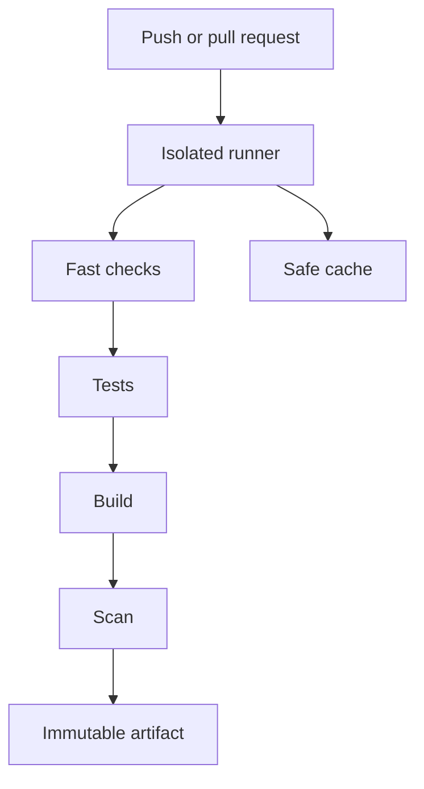
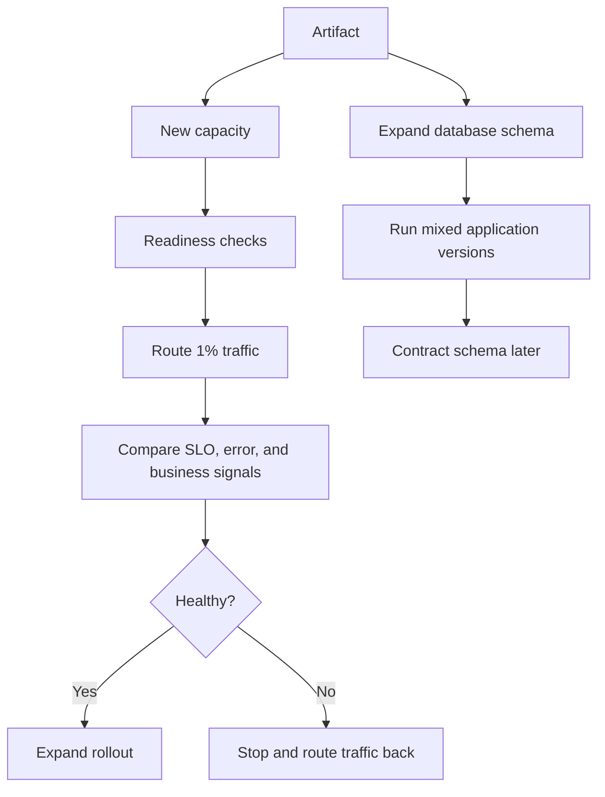
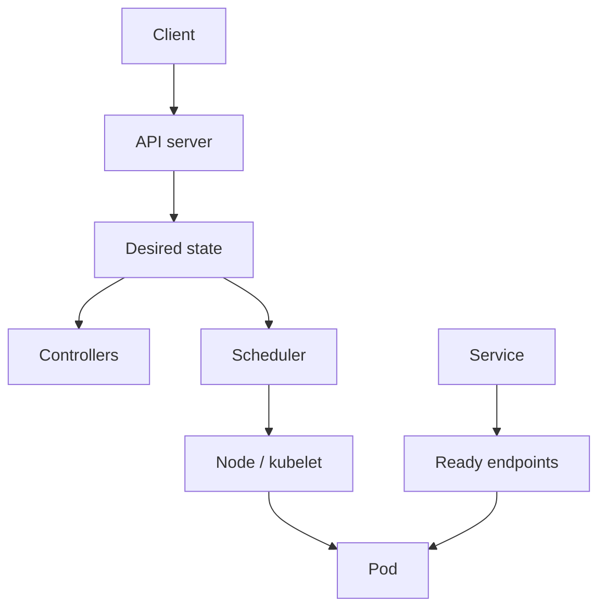
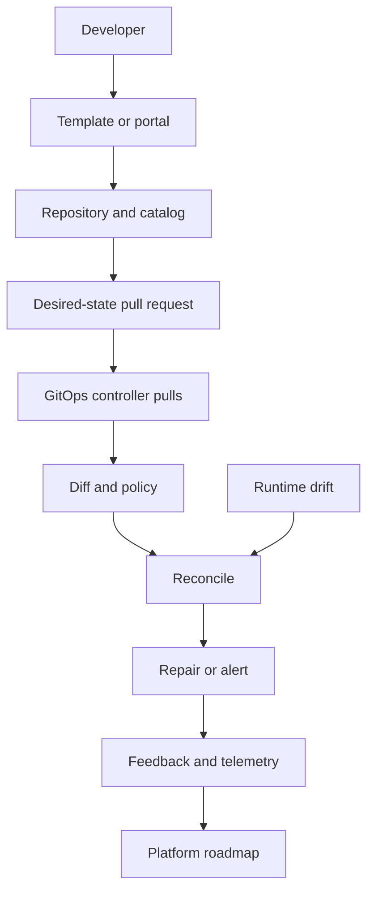

# The Zero-to-Hero DevOps Engineer Roadmap

*Mohammad Bilal's path from delivery flow and Linux to CI/CD, containers, Kubernetes, IaC, observability, SRE, DevSecOps, platform engineering, incident response, and hire-ready proof - told as one connected learning story.*

*Resources researched with Composio on 2026-08-12 using connected YouTube and GitHub discovery. Selected videos were batch-checked as public and available; primary documentation and hands-on repositories are placed inside the concept they support.*

**Scope:** 20 phases · delivery, automation, runtime, reliability, security, platform, projects, and interviews · no artificial weekly deadline.

```text
FLOW/CULTURE -> LINUX/TROUBLESHOOTING -> GIT/AUTOMATION
      |                    |                    |
      +--------------------+--------------------+
                           v
 ARTIFACTS -> CI -> DELIVERY -> CONTAINERS -> KUBERNETES
                           |
                           v
 TERRAFORM -> ANSIBLE -> CLOUD -> OBSERVABILITY -> SRE
                           |
                           v
 DEVSECOPS -> GITOPS/PLATFORM -> INCIDENTS -> PROJECTS -> INTERVIEWS
```

---

## How to Read This Document

### Start here if DevOps is completely new to you

**DevOps** is the work of helping software move safely and repeatedly from a developer's computer to the people who use it. A **deployment** is a release into a running environment. A **pipeline** is an automated sequence of checks and delivery steps. An **environment** is a place where the software runs, such as testing or production. **Reliability** means the service keeps doing the promised job, including when parts fail.

Treat every tool name as an answer to a practical question: What manual step is slow, inconsistent, or risky? Run the smallest lab, observe the files and processes it creates, break one safe thing on purpose, and restore it. If you can describe the failure and recovery without hiding behind a dashboard, you understand the idea.

**Words you will meet often:** **CI** means automatically building and checking each change; **CD** means automatically preparing or delivering a checked change; an **artifact** is the saved build output, such as a package or container image; a **container image** is the reusable package from which containers start; **Kubernetes** coordinates many containers; **infrastructure as code (IaC)** describes infrastructure in versioned files; **observability** means collecting enough logs, measurements, and request traces to explain behavior; **SRE** applies engineering methods to reliability work; an **incident** is an interruption or serious risk that needs coordinated response; a **rollback** returns to a known working release; and **idempotent** means repeating an action produces the same intended final state.

This roadmap teaches ideas, not a product list or a collection of exam objectives. The phases form one connected explanation: every phase begins where the previous design reached a practical limit, explains the mechanism invented to answer that limit, names what the mechanism costs, and closes on the pressure that forces the next phase. Read in order once; on revision, jump to **Why You Are Learning This**, **What Happens Inside**, and **Why the Next Topic Is Needed**.

There is no week clock. Move when you can trace the mechanism, produce the lab evidence, explain one trade-off, and diagnose one failure without hiding behind a console screenshot.

### The Beginner-Friendly Pattern Every Topic Follows

| Element | What it gives you |
| --- | --- |
| **Why You Are Learning This** | The limitation inherited from the previous phase |
| **See It Before You Memorize It** | Three annotated videos, primary docs, a real repository, and a lab |
| **Step-by-Step Explanation** | The theory and mechanics in connected prose |
| **The Idea That Fixed It** | The design move in one sentence |
| **What Happens Inside** | A provider-neutral ASCII trace |
| **Complexity / Trade-offs** | What improved and what moved elsewhere |
| **Picture It Like This** | A picture that survives after syntax fades |
| **Small Working Example** | A small reproducible lab that produces evidence |
| **How to Explain This in an Interview** | The model under time pressure |
| **Practice** | Easy to hard, ending in a defendable artifact |
| **Why the Next Topic Is Needed** | The next limitation, stated explicitly |

---

## The Whole-Journey Map

```text
FLOW/CULTURE -> LINUX/TROUBLESHOOTING -> GIT/AUTOMATION
      |                    |                    |
      +--------------------+--------------------+
                           v
 ARTIFACTS -> CI -> DELIVERY -> CONTAINERS -> KUBERNETES
                           |
                           v
 TERRAFORM -> ANSIBLE -> CLOUD -> OBSERVABILITY -> SRE
                           |
                           v
 DEVSECOPS -> GITOPS/PLATFORM -> INCIDENTS -> PROJECTS -> INTERVIEWS
```

---

## Phase Index

| # | Phase | Goal | Ready to move on when you can... |
| ---: | --- | --- | --- |
| 01 | [DevOps as a Delivery System](#phase-1---devops-as-a-delivery-system) | Understand DevOps as a sociotechnical feedback system rather than a job title or tool list. | Map one change from idea to verified customer outcome and identify queues, handoffs, feedback, ownership, and the next bottleneck. |
| 02 | [Linux, the Shell, Files, Permissions, and Services](#phase-2---linux-the-shell-files-permissions-and-services) | Operate Linux confidently through processes, files, permissions, services, packages, and logs. | Create a service, grant minimum access, inspect its process and journal, and explain every permission involved. |
| 03 | [Systems and Network Troubleshooting](#phase-3---systems-and-network-troubleshooting) | Diagnose from user symptom through DNS, route, transport, process, resource, and dependency using falsifiable checks. | Resolve a broken service without changing multiple variables and preserve a timeline of evidence and hypotheses. |
| 04 | [Git, Collaboration, and Change History](#phase-4---git-collaboration-and-change-history) | Use Git as a reviewable graph of small changes and choose branching practices that support continuous integration. | Recover from a bad commit, explain merge versus rebase, resolve a conflict, and preserve a readable rationale. |
| 05 | [Shell and Python Automation](#phase-5---shell-and-python-automation) | Replace fragile runbooks with validated, idempotent, testable automation that fails visibly and cleans up safely. | Write a script with inputs, logs, exit codes, dry-run behavior, error handling, and a repeatable second execution. |
| 06 | [Builds, Dependencies, Artifacts, and Registries](#phase-6---builds-dependencies-artifacts-and-registries) | Produce immutable, traceable artifacts once and promote the same bytes through every environment. | Build an artifact with version and provenance, publish it, verify its digest, and explain dependency and retention policy. |
| 07 | [Continuous Integration](#phase-7---continuous-integration) | Integrate every small change through fast, deterministic, security-aware feedback and produce one trusted artifact. | Design a pipeline ordered by feedback value and explain cache, flake, secret, and branch-protection behavior. |
| 08 | [Continuous Delivery and Deployment Strategies](#phase-8---continuous-delivery-and-deployment-strategies) | Promote immutable artifacts with progressive exposure, automated verification, database compatibility, and a rehearsed rollback. | Compare rolling, blue-green, and canary delivery and execute a rollback from service evidence. |
| 09 | [Docker and Container Engineering](#phase-9---docker-and-container-engineering) | Build small, non-root, reproducible images and operate container networking, storage, resources, and lifecycle correctly. | Explain image layers and isolation, debug a container, reduce its image, and preserve data outside its writable layer. |
| 10 | [Kubernetes Operations](#phase-10---kubernetes-operations) | Operate declarative workloads through controllers, scheduling, networking, storage, health, policy, and upgrades. | Debug a workload from pod through Service and Ingress, then perform a safe rollout and recovery. |
| 11 | [Terraform and Infrastructure Lifecycle](#phase-11---terraform-and-infrastructure-lifecycle) | Plan and reconcile versioned infrastructure through protected state, modules, policy, drift handling, and CI. | Review a plan, explain every replacement, and recover from state lock or drift without blind edits. |
| 12 | [Ansible and Configuration Management](#phase-12---ansible-and-configuration-management) | Converge host configuration through inventories, variables, roles, handlers, templates, idempotent modules, and protected secrets. | Run a playbook twice with no second change and limit a safe rollout to a controlled host batch. |
| 13 | [Cloud Infrastructure for DevOps](#phase-13---cloud-infrastructure-for-devops) | Automate cloud identity, VPC paths, compute, storage, DNS, and managed services without confusing provider names for architecture. | Trace a deployment identity through IaC to a private workload and explain region, network, state, and cost boundaries. |
| 14 | [Observability: Metrics, Logs, Traces, and Alerts](#phase-14---observability-metrics-logs-traces-and-alerts) | Instrument delivery and runtime so one user symptom correlates with version, dependency, resource, and change. | Follow a trace, write a structured log, query a metric, and define an actionable alert with owner and runbook. |
| 15 | [SRE, SLIs, SLOs, Error Budgets, and Toil](#phase-15---sre-slis-slos-error-budgets-and-toil) | Define reliability from user outcomes and balance feature velocity against measured risk. | Write an SLI and SLO from events, calculate budget consumption, and propose action from burn rather than intuition. |
| 16 | [DevSecOps and Software Supply-Chain Security](#phase-16---devsecops-and-software-supply-chain-security) | Protect source, dependencies, CI identities, artifacts, deployments, and runtime with verifiable provenance and least privilege. | Produce an SBOM, scan and sign an image, verify policy before deployment, and explain each control's limit. |
| 17 | [GitOps and Platform Engineering](#phase-17---gitops-and-platform-engineering) | Provide a self-service paved road where Git declares runtime state and platform capabilities reduce cognitive load. | Trace a pull request through reconciliation, drift repair, policy, and developer self-service. |
| 18 | [Incident Response, Postmortems, and Chaos Engineering](#phase-18---incident-response-postmortems-and-chaos-engineering) | Mitigate impact, preserve evidence, coordinate clearly, learn without blame, and test resilience hypotheses. | Run a tabletop incident with roles and timeline, write a causal postmortem, and design one bounded chaos experiment. |
| 19 | [DevOps Projects and Portfolio Evidence](#phase-19---devops-projects-and-portfolio-evidence) | Build complete delivery and operations systems whose claims are backed by code, telemetry, failure tests, and runbooks. | Show a commit reaching a monitored environment through a secured pipeline, then induce failure, recover, and explain evidence. |
| 20 | [DevOps Interviews and Career Mastery](#phase-20---devops-interviews-and-career-mastery) | Communicate systems reasoning through troubleshooting, delivery design, reliability, security, and behavioral evidence. | Run a 45-minute design and troubleshooting mock using only project evidence and a hypothesis-driven process. |

---

<a id="phase-1"></a>

# PHASE 1 - DevOps as a Delivery System

**Track:** Foundations

**WHAT YOU WILL BE ABLE TO DO:** Understand DevOps as a sociotechnical feedback system rather than a job title or tool list.

**WHAT YOU SHOULD KNOW FIRST:** None - this is the ground floor.

**WHAT YOU HAVE LEARNED SO FAR:** Software value crosses development, testing, security, release, and operations, so optimizing one team can make the complete path slower and less safe. Separate teams threw tickets and artifacts across walls, deployed in large batches, and learned about production behavior only after failure.

## 1.1 DevOps as a Delivery System

**WHY YOU ARE LEARNING THIS:** Software value crosses development, testing, security, release, and operations, so optimizing one team can make the complete path slower and less safe.

**THE PROBLEM THIS SOLVES:** Separate teams threw tickets and artifacts across walls, deployed in large batches, and learned about production behavior only after failure.

**SEE IT BEFORE YOU MEMORIZE IT**

- Best animated explanation: [DevOps vs SRE vs Platform Engineering (ByteByteGo)](https://www.youtube.com/watch?v=an8SrFtJBdM) - start here for the clearest visual model of devops as a delivery system before the detailed internal steps
- Alternative: [If I Would Start DevOps from Zero (TechWorld with Nana)](https://www.youtube.com/watch?v=Cpy20DnIDTI) - use this second to compare terminology and see the same pressure from another engineering angle
- Another angle: [What Is DevOps? (Simplilearn)](https://www.youtube.com/watch?v=Xrgk023l4lI) - use this after the theory to connect the model to an implementation or provider-specific case
- Interactive simulator: [DORA Quick Check](https://dora.dev/quickcheck/) - turn the chapter into observable behavior instead of console tourism
- Written documentation: [Google Cloud DevOps capabilities](https://cloud.google.com/architecture/devops) - use the primary source for current limits, semantics, and supported configuration
- GitHub implementation: [bregman-arie/devops-exercises](https://github.com/bregman-arie/devops-exercises) - inspect how the concept is represented in real code and configuration

**STEP-BY-STEP EXPLANATION**

Software value crosses development, testing, security, release, and operations, so optimizing one team can make the complete path slower and less safe. DevOps combines culture, automation, lean flow, measurement, and sharing. Lead time includes waiting and approval as well as active work. Small batches make causes visible; automated checks move feedback left; production telemetry moves learning right. DORA delivery metrics describe the system and must never become individual quotas.

The central design move is this: Optimize the whole feedback loop with small changes, shared ownership, automation, and measurable outcomes. That move changes ownership and failure rather than making either disappear. The operator must be able to observe the current state, compare it with intent, apply the smallest safe change, and verify the result.

Operationally, cultural change, platform investment, and metric misuse require leadership. Treat that cost as part of the design: give it an owner, evidence, a failure path, and a rollback or recovery procedure before scaling the mechanism across teams.

**THE MAIN IDEA IN SIMPLE WORDS:** Optimize the whole feedback loop with small changes, shared ownership, automation, and measurable outcomes.

**WHAT HAPPENS INSIDE, ONE STEP AT A TIME**

```text
idea -> code -> review -> build -> test -> release -> deploy -> operate
 ^                                                        |
 +----------- customer and production feedback -----------+
```

**WHAT YOU GAIN, WHAT IT COSTS, AND WHERE IT CAN FAIL**

| Choice | What it buys | What it costs |
| --- | --- | --- |
| Keep the earlier approach | Avoid one more abstraction | Separate teams threw tickets and artifacts across walls, deployed in large batches, and learned about production behavior only after failure. |
| Adopt this phase's model | Faster learning and safer delivery across boundaries | Cultural change, platform investment, and metric misuse require leadership |
| Push it beyond its fit | Delays a redesign | Once flow is the goal, engineers need direct control of the machines running build and production work. Linux is the operational ground floor. |

**PICTURE IT LIKE THIS**

DevOps is a restaurant improving the complete order-to-meal flow, not buying a faster oven while tickets wait.

**SMALL WORKING EXAMPLE**

```bash
printf 'stage,elapsed_minutes,active_minutes,owner\n' > value_stream.csv
printf 'review,180,15,team\nbuild,12,12,ci\ndeploy,45,5,platform\n' >> value_stream.csv
```

Run the lab, save the output, change one assumption, and run it again. The evidence and the explanation of the difference belong in the project README.

**HOW TO EXPLAIN THIS IN AN INTERVIEW**

A company has fast builds but monthly releases and frequent rollbacks. Identify queues and feedback gaps before recommending tools.

A strong answer begins with requirements and the previous limitation, traces the diagram, states one failure mode, and only then names a service or tool.

**PRACTICE UNTIL IT FEELS FAMILIAR**

| Difficulty | Task |
| --- | --- |
| Easy | Redraw the internal flow for **DevOps as a Delivery System** from memory and label every ownership boundary. |
| Medium | Complete the lab, deliberately break one assumption, and diagnose it with evidence rather than a guessed fix. |
| Hard | Build a small provider-neutral artifact, map it to AWS/Azure/GCP where relevant, measure one trade-off, and defend the design in five minutes. |

**WHY THE NEXT TOPIC IS NEEDED:** Once flow is the goal, engineers need direct control of the machines running build and production work. Linux is the operational ground floor.

---

> **Phase 1 complete?** [Build the Phase 1 mini-project](./Projects.md#devops-phase-1-project) · [Continue to Phase 2](#phase-2---linux-the-shell-files-permissions-and-services)

<a id="phase-2"></a>

# PHASE 2 - Linux, the Shell, Files, Permissions, and Services

**Track:** Systems

**WHAT YOU WILL BE ABLE TO DO:** Operate Linux confidently through processes, files, permissions, services, packages, and logs.

**WHAT YOU SHOULD KNOW FIRST:** Phase 1 (DevOps as a Delivery System)

**WHAT YOU HAVE LEARNED SO FAR:** Delivery automation executes on operating systems; a pipeline cannot repair or secure a machine its owner cannot inspect below the tool UI. Operators copied commands without understanding identity, ownership, exit status, signals, or service lifecycle.

## 2.1 Linux, the Shell, Files, Permissions, and Services

**WHY YOU ARE LEARNING THIS:** Delivery automation executes on operating systems; a pipeline cannot repair or secure a machine its owner cannot inspect below the tool UI.

**THE PROBLEM THIS SOLVES:** Operators copied commands without understanding identity, ownership, exit status, signals, or service lifecycle.

**SEE IT BEFORE YOU MEMORIZE IT**

- Best animated explanation: [Linux File Permissions in 5 Minutes (Travis Media)](https://www.youtube.com/watch?v=LnKoncbQBsM) - start here for the clearest visual model of linux, the shell, files, permissions, and services before the detailed internal steps
- Alternative: [systemd on Linux: Intro and Unit Files (tutoriaLinux)](https://www.youtube.com/watch?v=N1vgvhiyq0E) - use this second to compare terminology and see the same pressure from another engineering angle
- Another angle: [Linux Permissions Crash Course (Learn Linux TV)](https://www.youtube.com/watch?v=4e669hSjaX8) - use this after the theory to connect the model to an implementation or provider-specific case
- Interactive simulator: [OverTheWire Bandit](https://overthewire.org/wargames/bandit/) - turn the chapter into observable behavior instead of console tourism
- Written documentation: [Linux man pages](https://www.kernel.org/doc/man-pages/) - use the primary source for current limits, semantics, and supported configuration
- GitHub implementation: [snori74/linuxupskillchallenge](https://github.com/snori74/linuxupskillchallenge) - inspect how the concept is represented in real code and configuration

**STEP-BY-STEP EXPLANATION**

Delivery automation executes on operating systems; a pipeline cannot repair or secure a machine its owner cannot inspect below the tool UI. Linux exposes resources through processes, files, users, groups, namespaces, and file descriptors. The shell composes programs through arguments, environment, redirection, pipes, and exit status. systemd declares service startup, ordering, restart, identity, and logging. Evidence comes from `ps`, `ss`, `lsof`, `systemctl`, `journalctl`, CPU, memory, disk, and I/O tools.

The central design move is this: Use the shell as a precise interface to observable operating-system state with least privilege and declarative service lifecycle. That move changes ownership and failure rather than making either disappear. The operator must be able to observe the current state, compare it with intent, apply the smallest safe change, and verify the result.

Operationally, shell power makes quoting, privilege, and irreversible commands dangerous. Treat that cost as part of the design: give it an owner, evidence, a failure path, and a rollback or recovery procedure before scaling the mechanism across teams.

**THE MAIN IDEA IN SIMPLE WORDS:** Use the shell as a precise interface to observable operating-system state with least privilege and declarative service lifecycle.

**WHAT HAPPENS INSIDE, ONE STEP AT A TIME**

```text
shell -> process -> files/sockets/memory
          |             |
       exit code   permission/ownership
systemd -> service -> journal
```

**WHAT YOU GAIN, WHAT IT COSTS, AND WHERE IT CAN FAIL**

| Choice | What it buys | What it costs |
| --- | --- | --- |
| Keep the earlier approach | Avoid one more abstraction | Operators copied commands without understanding identity, ownership, exit status, signals, or service lifecycle. |
| Adopt this phase's model | Direct, portable operational control | Shell power makes quoting, privilege, and irreversible commands dangerous |
| Push it beyond its fit | Delays a redesign | One host is understandable, but most outages cross DNS, routing, ports, resources, and dependencies. Structured troubleshooting connects those signals. |

**PICTURE IT LIKE THIS**

Linux is the machine room; dashboards are windows into it, not replacements for the controls.

**SMALL WORKING EXAMPLE**

```bash
id
umask
namei -l /var/log
systemctl status ssh || true
journalctl -u ssh --since '10 minutes ago' --no-pager | tail
```

Run the lab, save the output, change one assumption, and run it again. The evidence and the explanation of the difference belong in the project README.

**HOW TO EXPLAIN THIS IN AN INTERVIEW**

A service works manually but fails under systemd. Compare identity, directory, environment, permission, dependency, and logs.

A strong answer begins with requirements and the previous limitation, traces the diagram, states one failure mode, and only then names a service or tool.

**PRACTICE UNTIL IT FEELS FAMILIAR**

| Difficulty | Task |
| --- | --- |
| Easy | Redraw the internal flow for **Linux, the Shell, Files, Permissions, and Services** from memory and label every ownership boundary. |
| Medium | Complete the lab, deliberately break one assumption, and diagnose it with evidence rather than a guessed fix. |
| Hard | Build a small provider-neutral artifact, map it to AWS/Azure/GCP where relevant, measure one trade-off, and defend the design in five minutes. |

**WHY THE NEXT TOPIC IS NEEDED:** One host is understandable, but most outages cross DNS, routing, ports, resources, and dependencies. Structured troubleshooting connects those signals.

---

> **Phase 2 complete?** [Build the Phase 2 mini-project](./Projects.md#devops-phase-2-project) · [Continue to Phase 3](#phase-3---systems-and-network-troubleshooting)

<a id="phase-3"></a>

# PHASE 3 - Systems and Network Troubleshooting

**Track:** Systems

**WHAT YOU WILL BE ABLE TO DO:** Diagnose from user symptom through DNS, route, transport, process, resource, and dependency using falsifiable checks.

**WHAT YOU SHOULD KNOW FIRST:** Phase 2 (Linux, the Shell, Files, Permissions, and Services)

**WHAT YOU HAVE LEARNED SO FAR:** A running process can still be unreachable, saturated, misrouted, unable to resolve names, or blocked by a dependency. Incident response became restarts and firewall openings that erased evidence and sometimes created a second outage.

## 3.1 Systems and Network Troubleshooting

**WHY YOU ARE LEARNING THIS:** A running process can still be unreachable, saturated, misrouted, unable to resolve names, or blocked by a dependency.

**THE PROBLEM THIS SOLVES:** Incident response became restarts and firewall openings that erased evidence and sometimes created a second outage.

**SEE IT BEFORE YOU MEMORIZE IT**

- Best animated explanation: [Network Troubleshooting for Beginners (IT k Funde)](https://www.youtube.com/watch?v=vgisbCjtHz4) - start here for the clearest visual model of systems and network troubleshooting before the detailed internal steps
- Alternative: [Linux Networking Commands for DevOps (TrainWithShubham)](https://www.youtube.com/watch?v=EjiX1cjm_H8) - use this second to compare terminology and see the same pressure from another engineering angle
- Another angle: [Process, Monitoring, Networking and Disk Management (Abhishek.Veeramalla)](https://www.youtube.com/watch?v=H9DAWegYpag) - use this after the theory to connect the model to an implementation or provider-specific case
- Interactive simulator: [SadServers](https://sadservers.com/) - turn the chapter into observable behavior instead of console tourism
- Written documentation: [Red Hat monitoring and performance](https://docs.redhat.com/en/documentation/red_hat_enterprise_linux/9/html/monitoring_and_managing_system_status_and_performance/) - use the primary source for current limits, semantics, and supported configuration
- GitHub implementation: [bregman-arie/devops-exercises](https://github.com/bregman-arie/devops-exercises) - inspect how the concept is represented in real code and configuration

**STEP-BY-STEP EXPLANATION**

A running process can still be unreachable, saturated, misrouted, unable to resolve names, or blocked by a dependency. Define affected users, actions, time, scope, and recent changes. Trace name resolution, route, connection, TLS, listener, process, saturation, application, and downstream calls. `dig`, `ip route`, `curl`, `ss`, `tcpdump`, and resource tools are experiments. A timeout, refusal, and HTTP 500 are different classes. Mitigate active impact safely, preserve evidence, and change one variable at a time.

The central design move is this: Turn every troubleshooting action into a hypothesis test and climb the stack only after the lower boundary is proven. That move changes ownership and failure rather than making either disappear. The operator must be able to observe the current state, compare it with intent, apply the smallest safe change, and verify the result.

Operationally, it requires broad layer knowledge and patience under pressure. Treat that cost as part of the design: give it an owner, evidence, a failure path, and a rollback or recovery procedure before scaling the mechanism across teams.

**THE MAIN IDEA IN SIMPLE WORDS:** Turn every troubleshooting action into a hypothesis test and climb the stack only after the lower boundary is proven.

**WHAT HAPPENS INSIDE, ONE STEP AT A TIME**

```text
symptom -> scope/time/change
DNS -> route -> TCP/TLS -> listener -> process -> dependency
 |       |       |           |          |
evidence + hypothesis -> one change -> verify
```

**WHAT YOU GAIN, WHAT IT COSTS, AND WHERE IT CAN FAIL**

| Choice | What it buys | What it costs |
| --- | --- | --- |
| Keep the earlier approach | Avoid one more abstraction | Incident response became restarts and firewall openings that erased evidence and sometimes created a second outage. |
| Adopt this phase's model | Fast diagnosis with less collateral change | It requires broad layer knowledge and patience under pressure |
| Push it beyond its fit | Delays a redesign | Once fixes are understood, their history and collaboration must be reliable. Git provides the shared change graph used by every later automation stage. |

**PICTURE IT LIKE THIS**

Troubleshooting is diagnosis before treatment, not prescribing five medicines to see what works.

**SMALL WORKING EXAMPLE**

```bash
name=example.com
dig +short "$name"
ip route get 1.1.1.1
curl -vk --connect-timeout 3 "https://$name/" -o /dev/null
ss -lntp; df -h; free -h
```

Run the lab, save the output, change one assumption, and run it again. The evidence and the explanation of the difference belong in the project README.

**HOW TO EXPLAIN THIS IN AN INTERVIEW**

A service times out from one subnet but works locally. Distinguish routing, policy, listener, and application evidence.

A strong answer begins with requirements and the previous limitation, traces the diagram, states one failure mode, and only then names a service or tool.

**PRACTICE UNTIL IT FEELS FAMILIAR**

| Difficulty | Task |
| --- | --- |
| Easy | Redraw the internal flow for **Systems and Network Troubleshooting** from memory and label every ownership boundary. |
| Medium | Complete the lab, deliberately break one assumption, and diagnose it with evidence rather than a guessed fix. |
| Hard | Build a small provider-neutral artifact, map it to AWS/Azure/GCP where relevant, measure one trade-off, and defend the design in five minutes. |

**WHY THE NEXT TOPIC IS NEEDED:** Once fixes are understood, their history and collaboration must be reliable. Git provides the shared change graph used by every later automation stage.

---

> **Phase 3 complete?** [Build the Phase 3 mini-project](./Projects.md#devops-phase-3-project) · [Continue to Phase 4](#phase-4---git-collaboration-and-change-history)

<a id="phase-4"></a>

# PHASE 4 - Git, Collaboration, and Change History

**Track:** Source Control

**WHAT YOU WILL BE ABLE TO DO:** Use Git as a reviewable graph of small changes and choose branching practices that support continuous integration.

**WHAT YOU SHOULD KNOW FIRST:** Phase 3 (Systems and Network Troubleshooting)

**WHAT YOU HAVE LEARNED SO FAR:** Automation needs an authoritative change history while teams need to work concurrently and review before shared systems change. Files were copied, renamed final, merged by hand, and deployed without a trustworthy record of what changed or why.

## 4.1 Git, Collaboration, and Change History

> **Required Git companion:** This phase explains Git in a delivery-system context. Use [`Git.md`](./Git.md) Phases [1-7](./Git.md#phase-1) for the full state/branch/remote model, [8-10](./Git.md#phase-8) for safe undo/recovery/rewrite, and [14-15](./Git.md#phase-14) for workflow, CI, trust, and security.

**WHY YOU ARE LEARNING THIS:** Automation needs an authoritative change history while teams need to work concurrently and review before shared systems change.

**THE PROBLEM THIS SOLVES:** Files were copied, renamed final, merged by hand, and deployed without a trustworthy record of what changed or why.

**SEE IT BEFORE YOU MEMORIZE IT**

- Best animated explanation: [Git Merge vs Rebase (ByteByteGo)](https://www.youtube.com/watch?v=0chZFIZLR_0) - start here for the clearest visual model of git, collaboration, and change history before the detailed internal steps
- Alternative: [Why Trunk Based Development Matters (Interview DOT)](https://www.youtube.com/watch?v=1h2rpoi5YeE) - use this second to compare terminology and see the same pressure from another engineering angle
- Another angle: [Gitflow Explained (The Modern Coder)](https://www.youtube.com/watch?v=Aa8RpP0sf-Y) - use this after the theory to connect the model to an implementation or provider-specific case
- Interactive simulator: [Learn Git Branching](https://learngitbranching.js.org/) - turn the chapter into observable behavior instead of console tourism
- Written documentation: [Pro Git book](https://git-scm.com/book/en/v2) - use the primary source for current limits, semantics, and supported configuration
- GitHub implementation: [skills/introduction-to-github](https://github.com/skills/introduction-to-github) - inspect how the concept is represented in real code and configuration

**STEP-BY-STEP EXPLANATION**

Automation needs an authoritative change history while teams need to work concurrently and review before shared systems change. Git stores commits in a directed graph; branches and tags name commits. Merge preserves histories, while rebase copies commits onto a new base and changes identities. Short-lived branches reduce divergence. Pull requests combine a diff, discussion, ownership, and automated evidence. Revert creates a safe inverse on shared history; reset and force push rewrite references and need care.

The central design move is this: Make every operational and application change a small, attributable, reviewable graph transition. That move changes ownership and failure rather than making either disappear. The operator must be able to observe the current state, compare it with intent, apply the smallest safe change, and verify the result.

Operationally, conflicts, long branches, rewritten history, and secret leakage require discipline. Treat that cost as part of the design: give it an owner, evidence, a failure path, and a rollback or recovery procedure before scaling the mechanism across teams.

**THE MAIN IDEA IN SIMPLE WORDS:** Make every operational and application change a small, attributable, reviewable graph transition.

**WHAT HAPPENS INSIDE, ONE STEP AT A TIME**

```text
main: A---B------M---R
          \     /    ^ revert
feature:   C---D
PR = diff + discussion + checks + decision
```

**WHAT YOU GAIN, WHAT IT COSTS, AND WHERE IT CAN FAIL**

| Choice | What it buys | What it costs |
| --- | --- | --- |
| Keep the earlier approach | Avoid one more abstraction | Files were copied, renamed final, merged by hand, and deployed without a trustworthy record of what changed or why. |
| Adopt this phase's model | Collaboration, rollback history, and automation triggers | Conflicts, long branches, rewritten history, and secret leakage require discipline |
| Push it beyond its fit | Delays a redesign | Versioned changes still need repeatable execution. Shell and Python automation turn instructions into tested, idempotent tools. |

**PICTURE IT LIKE THIS**

Git is a laboratory notebook with branching experiments, not a shared folder with better filenames.

**SMALL WORKING EXAMPLE**

```bash
git switch -c lab
echo change >> evidence.txt
git add evidence.txt
git commit -m 'Record reproducible evidence'
git log --graph --oneline --decorate --all
```

Run the lab, save the output, change one assumption, and run it again. The evidence and the explanation of the difference belong in the project README.

**HOW TO EXPLAIN THIS IN AN INTERVIEW**

When do you merge, rebase, revert, reset, and cherry-pick? Answer from shared-history risk.

A strong answer begins with requirements and the previous limitation, traces the diagram, states one failure mode, and only then names a service or tool.

**PRACTICE UNTIL IT FEELS FAMILIAR**

| Difficulty | Task |
| --- | --- |
| Easy | Redraw the internal flow for **Git, Collaboration, and Change History** from memory and label every ownership boundary. |
| Medium | Complete the lab, deliberately break one assumption, and diagnose it with evidence rather than a guessed fix. |
| Hard | Build a small provider-neutral artifact, map it to AWS/Azure/GCP where relevant, measure one trade-off, and defend the design in five minutes. |

**WHY THE NEXT TOPIC IS NEEDED:** Versioned changes still need repeatable execution. Shell and Python automation turn instructions into tested, idempotent tools.

---

> **Phase 4 complete?** [Build the Phase 4 mini-project](./Projects.md#devops-phase-4-project) · [Continue to Phase 5](#phase-5---shell-and-python-automation)

<a id="phase-5"></a>

# PHASE 5 - Shell and Python Automation

**Track:** Automation

**WHAT YOU WILL BE ABLE TO DO:** Replace fragile runbooks with validated, idempotent, testable automation that fails visibly and cleans up safely.

**WHAT YOU SHOULD KNOW FIRST:** Phase 4 (Git, Collaboration, and Change History)

**WHAT YOU HAVE LEARNED SO FAR:** Manual procedures are slow, inconsistent, hard to audit, and impossible to scale across environments. Scripts became undocumented command dumps with hard-coded values, swallowed failures, leaked secrets, and unsafe partial execution.

## 5.1 Shell and Python Automation

**WHY YOU ARE LEARNING THIS:** Manual procedures are slow, inconsistent, hard to audit, and impossible to scale across environments.

**THE PROBLEM THIS SOLVES:** Scripts became undocumented command dumps with hard-coded values, swallowed failures, leaked secrets, and unsafe partial execution.

**SEE IT BEFORE YOU MEMORIZE IT**

- Best animated explanation: [10 Real-Time Corporate Python Automation Scripts (DevOps Shack)](https://www.youtube.com/watch?v=PiRNGGSCaIs) - start here to see repetitive operational work become small, inspectable Python programs before studying the safety mechanics
- Alternative: [How Ansible Works in DevOps (iTrainU Institute)](https://www.youtube.com/watch?v=buik9olK5OE) - use this second to compare terminology and see the same pressure from another engineering angle
- Another angle: [Create a DevOps User with Ansible (LinuxCert Guru)](https://www.youtube.com/watch?v=qCzmIwSWahA) - use this after the theory to connect the model to an implementation or provider-specific case
- Interactive simulator: [Exercism Bash track](https://exercism.org/tracks/bash) - turn the chapter into observable behavior instead of console tourism
- Written documentation: [Google Shell Style Guide](https://google.github.io/styleguide/shellguide.html) - use the primary source for current limits, semantics, and supported configuration
- GitHub implementation: [koalaman/shellcheck](https://github.com/koalaman/shellcheck) - inspect how the concept is represented in real code and configuration

**STEP-BY-STEP EXPLANATION**

Manual procedures are slow, inconsistent, hard to audit, and impossible to scale across environments. Good automation defines inputs, preconditions, actions, outputs, failure behavior, and idempotency. Shell excels at composing operating-system tools; Python fits structured data, APIs, concurrency, and tests. Quote shell values, trap cleanup, separate diagnostics, use timeouts and typed functions, inspect current state, calculate a diff, apply the smallest change, and verify the postcondition. Dry-run behavior exposes blast radius.

The central design move is this: Encode operations as small programs that converge on desired state and expose failure as data. That move changes ownership and failure rather than making either disappear. The operator must be able to observe the current state, compare it with intent, apply the smallest safe change, and verify the result.

Operationally, automation can amplify a bad assumption faster than a human. Treat that cost as part of the design: give it an owner, evidence, a failure path, and a rollback or recovery procedure before scaling the mechanism across teams.

**THE MAIN IDEA IN SIMPLE WORDS:** Encode operations as small programs that converge on desired state and expose failure as data.

**WHAT HAPPENS INSIDE, ONE STEP AT A TIME**

```text
validated input -> inspect state -> compute diff
       |                   |
    dry run            safe apply
       |                   |
 structured output <- verify postcondition
```

**WHAT YOU GAIN, WHAT IT COSTS, AND WHERE IT CAN FAIL**

| Choice | What it buys | What it costs |
| --- | --- | --- |
| Keep the earlier approach | Avoid one more abstraction | Scripts became undocumented command dumps with hard-coded values, swallowed failures, leaked secrets, and unsafe partial execution. |
| Adopt this phase's model | Repeatability, auditability, and scale | Automation can amplify a bad assumption faster than a human |
| Push it beyond its fit | Delays a redesign | Automation can produce outputs, but delivery needs immutable, versioned artifacts promoted unchanged. Build and artifact management establish that chain. |

**PICTURE IT LIKE THIS**

Automation is a power tool: guards, measurement, and an emergency stop matter because it multiplies force.

**SMALL WORKING EXAMPLE**

```bash
set -Eeuo pipefail
trap 'echo "failed line $LINENO" >&2' ERR
target=${1:?usage: script TARGET}
command -v curl >/dev/null
curl --fail --silent --show-error --max-time 5 "$target" >/dev/null
```

Run the lab, save the output, change one assumption, and run it again. The evidence and the explanation of the difference belong in the project README.

**HOW TO EXPLAIN THIS IN AN INTERVIEW**

How do you make a user-creation or deployment script idempotent, observable, secure, and safe after partial failure?

A strong answer begins with requirements and the previous limitation, traces the diagram, states one failure mode, and only then names a service or tool.

**PRACTICE UNTIL IT FEELS FAMILIAR**

| Difficulty | Task |
| --- | --- |
| Easy | Redraw the internal flow for **Shell and Python Automation** from memory and label every ownership boundary. |
| Medium | Complete the lab, deliberately break one assumption, and diagnose it with evidence rather than a guessed fix. |
| Hard | Build a small provider-neutral artifact, map it to AWS/Azure/GCP where relevant, measure one trade-off, and defend the design in five minutes. |

**WHY THE NEXT TOPIC IS NEEDED:** Automation can produce outputs, but delivery needs immutable, versioned artifacts promoted unchanged. Build and artifact management establish that chain.

---

> **Phase 5 complete?** [Build the Phase 5 mini-project](./Projects.md#devops-phase-5-project) · [Continue to Phase 6](#phase-6---builds-dependencies-artifacts-and-registries)

<a id="phase-6"></a>

# PHASE 6 - Builds, Dependencies, Artifacts, and Registries

**Track:** Delivery

**WHAT YOU WILL BE ABLE TO DO:** Produce immutable, traceable artifacts once and promote the same bytes through every environment.

**WHAT YOU SHOULD KNOW FIRST:** Phase 5 (Shell and Python Automation)

**WHAT YOU HAVE LEARNED SO FAR:** Source is not the deployable product; compilers, dependencies, configuration, and packaging can change the result. Each environment rebuilt independently, downloaded latest dependencies, and produced different bytes from the same commit.

## 6.1 Builds, Dependencies, Artifacts, and Registries

**WHY YOU ARE LEARNING THIS:** Source is not the deployable product; compilers, dependencies, configuration, and packaging can change the result.

**THE PROBLEM THIS SOLVES:** Each environment rebuilt independently, downloaded latest dependencies, and produced different bytes from the same commit.

**SEE IT BEFORE YOU MEMORIZE IT**

- Best animated explanation: [Nexus Repository Manager Explained (Fusionpact)](https://www.youtube.com/watch?v=87Nd0kx4ZG0) - start here for the clearest visual model of builds, dependencies, artifacts, and registries before the detailed internal steps
- Alternative: [Dependency Management Fundamentals (Develocity)](https://www.youtube.com/watch?v=I4HICQ-KoV4) - use this second to compare terminology and see the same pressure from another engineering angle
- Another angle: [Versioning Build Artifacts (CloudBeesTV)](https://www.youtube.com/watch?v=zYHfufu7Clk) - use this after the theory to connect the model to an implementation or provider-specific case
- Interactive simulator: [GitHub Packages quickstart](https://docs.github.com/en/packages/quickstart) - turn the chapter into observable behavior instead of console tourism
- Written documentation: [Reproducible Builds](https://reproducible-builds.org/docs/) - use the primary source for current limits, semantics, and supported configuration
- GitHub implementation: [actions/upload-artifact](https://github.com/actions/upload-artifact) - inspect how the concept is represented in real code and configuration

**STEP-BY-STEP EXPLANATION**

Source is not the deployable product; compilers, dependencies, configuration, and packaging can change the result. A build resolves pinned dependencies, runs checks, and emits a package, image, or binary. Reproducibility requires lockfiles and controlled toolchains. A registry stores immutable versions and metadata. Tags are references; content digests identify bytes. Attach commit, build identity, SBOM, tests, and signature, then promote by digest. Registry access, retention, vulnerability response, and cleanup are operational policies.

The central design move is this: Build once, identify by digest, attach provenance, and promote the same artifact through controlled environments. That move changes ownership and failure rather than making either disappear. The operator must be able to observe the current state, compare it with intent, apply the smallest safe change, and verify the result.

Operationally, storage, dependency risk, build isolation, and retention require governance. Treat that cost as part of the design: give it an owner, evidence, a failure path, and a rollback or recovery procedure before scaling the mechanism across teams.

**THE MAIN IDEA IN SIMPLE WORDS:** Build once, identify by digest, attach provenance, and promote the same artifact through controlled environments.

**WHAT HAPPENS INSIDE, ONE STEP AT A TIME**

```text
commit + lockfile + toolchain -> build/test -> artifact digest
                                      |
                               registry + evidence
                                      |
                          dev -> stage -> production
```

**WHAT YOU GAIN, WHAT IT COSTS, AND WHERE IT CAN FAIL**

| Choice | What it buys | What it costs |
| --- | --- | --- |
| Keep the earlier approach | Avoid one more abstraction | Each environment rebuilt independently, downloaded latest dependencies, and produced different bytes from the same commit. |
| Adopt this phase's model | Traceability, reproducibility, and reliable rollback | Storage, dependency risk, build isolation, and retention require governance |
| Push it beyond its fit | Delays a redesign | A trustworthy artifact still arrives too late if integration waits until release day. CI moves conflict and quality feedback to every change. |

**PICTURE IT LIKE THIS**

An artifact is a sealed shipment; environments choose its destination but do not repack it.

**SMALL WORKING EXAMPLE**

```bash
docker build -t demo:git-$(git rev-parse --short HEAD) .
docker image inspect demo:git-$(git rev-parse --short HEAD) --format '{{json .Id}}'
```

Run the lab, save the output, change one assumption, and run it again. The evidence and the explanation of the difference belong in the project README.

**HOW TO EXPLAIN THIS IN AN INTERVIEW**

Why is rebuilding in production unsafe even from the same commit? Discuss dependencies, toolchain, provenance, and rollback.

A strong answer begins with requirements and the previous limitation, traces the diagram, states one failure mode, and only then names a service or tool.

**PRACTICE UNTIL IT FEELS FAMILIAR**

| Difficulty | Task |
| --- | --- |
| Easy | Redraw the internal flow for **Builds, Dependencies, Artifacts, and Registries** from memory and label every ownership boundary. |
| Medium | Complete the lab, deliberately break one assumption, and diagnose it with evidence rather than a guessed fix. |
| Hard | Build a small provider-neutral artifact, map it to AWS/Azure/GCP where relevant, measure one trade-off, and defend the design in five minutes. |

**WHY THE NEXT TOPIC IS NEEDED:** A trustworthy artifact still arrives too late if integration waits until release day. CI moves conflict and quality feedback to every change.

---

> **Phase 6 complete?** [Build the Phase 6 mini-project](./Projects.md#devops-phase-6-project) · [Continue to Phase 7](#phase-7---continuous-integration)

<a id="phase-7"></a>

# PHASE 7 - Continuous Integration

**Track:** Delivery

**WHAT YOU WILL BE ABLE TO DO:** Integrate every small change through fast, deterministic, security-aware feedback and produce one trusted artifact.

**WHAT YOU SHOULD KNOW FIRST:** Phase 6 (Builds, Dependencies, Artifacts, and Registries)

**WHAT YOU HAVE LEARNED SO FAR:** Long integration intervals allow conflicts and defects to accumulate until diagnosis is expensive. Teams merged large branches, relied on manual test days, and treated a flaky green build as proof.

## 7.1 Continuous Integration

**WHY YOU ARE LEARNING THIS:** Long integration intervals allow conflicts and defects to accumulate until diagnosis is expensive.

**THE PROBLEM THIS SOLVES:** Teams merged large branches, relied on manual test days, and treated a flaky green build as proof.

**SEE IT BEFORE YOU MEMORIZE IT**

- Best animated explanation: [DevOps CI/CD Explained in 100 Seconds (Fireship)](https://www.youtube.com/watch?v=scEDHsr3APg) - start here for the clearest visual model of continuous integration before the detailed internal steps
- Alternative: [Making CI/CD Builds Faster (The Linux Foundation)](https://www.youtube.com/watch?v=_Dk6X-S1AJM) - use this second to compare terminology and see the same pressure from another engineering angle
- Another angle: [GitLab CI/CD Pipelines (Uplatz)](https://www.youtube.com/watch?v=zmrnljuPIn4) - use this after the theory to connect the model to an implementation or provider-specific case
- Interactive simulator: [GitHub Skills](https://skills.github.com/) - turn the chapter into observable behavior instead of console tourism
- Written documentation: [GitHub Actions documentation](https://docs.github.com/en/actions) - use the primary source for current limits, semantics, and supported configuration
- GitHub implementation: [actions/starter-workflows](https://github.com/actions/starter-workflows) - inspect how the concept is represented in real code and configuration

**STEP-BY-STEP EXPLANATION**

Long integration intervals allow conflicts and defects to accumulate until diagnosis is expensive. CI creates an isolated environment and runs formatting, static analysis, tests, security checks, and build. Cheap high-signal checks go first. Workflows should be code, reusable, pinned, and least-privileged; untrusted contributions receive no production secrets. Cache keys include relevant inputs, branch protection requires meaningful checks, and flaky tests are defects in the feedback system with owners and deadlines.

The central design move is this: Make integration ordinary by giving every small change fast, deterministic, protected evidence. That move changes ownership and failure rather than making either disappear. The operator must be able to observe the current state, compare it with intent, apply the smallest safe change, and verify the result.

Operationally, pipeline cost, secrets, flakes, and supply-chain trust become operational systems. Treat that cost as part of the design: give it an owner, evidence, a failure path, and a rollback or recovery procedure before scaling the mechanism across teams.

**THE MAIN IDEA IN SIMPLE WORDS:** Make integration ordinary by giving every small change fast, deterministic, protected evidence.

**WHAT HAPPENS INSIDE, ONE STEP AT A TIME**



**WHAT YOU GAIN, WHAT IT COSTS, AND WHERE IT CAN FAIL**

| Choice | What it buys | What it costs |
| --- | --- | --- |
| Keep the earlier approach | Avoid one more abstraction | Teams merged large branches, relied on manual test days, and treated a flaky green build as proof. |
| Adopt this phase's model | Early defect discovery and one repeatable release candidate | Pipeline cost, secrets, flakes, and supply-chain trust become operational systems |
| Push it beyond its fit | Delays a redesign | CI proves an artifact; continuous delivery must move it through environments safely and reverse course when production evidence disagrees. |

**PICTURE IT LIKE THIS**

CI is a laboratory conveyor belt: every sample follows the same tests and carries its evidence.

**SMALL WORKING EXAMPLE**

```bash
shellcheck scripts/*.sh
terraform fmt -check -recursive
pytest -q
docker build -t app:ci .
```

Run the lab, save the output, change one assumption, and run it again. The evidence and the explanation of the difference belong in the project README.

**HOW TO EXPLAIN THIS IN AN INTERVIEW**

A pipeline is green locally but intermittently red in CI. Classify nondeterminism, shared state, timing, resource, order, and environment causes.

A strong answer begins with requirements and the previous limitation, traces the diagram, states one failure mode, and only then names a service or tool.

**PRACTICE UNTIL IT FEELS FAMILIAR**

| Difficulty | Task |
| --- | --- |
| Easy | Redraw the internal flow for **Continuous Integration** from memory and label every ownership boundary. |
| Medium | Complete the lab, deliberately break one assumption, and diagnose it with evidence rather than a guessed fix. |
| Hard | Build a small provider-neutral artifact, map it to AWS/Azure/GCP where relevant, measure one trade-off, and defend the design in five minutes. |

**WHY THE NEXT TOPIC IS NEEDED:** CI proves an artifact; continuous delivery must move it through environments safely and reverse course when production evidence disagrees.

---

> **Phase 7 complete?** [Build the Phase 7 mini-project](./Projects.md#devops-phase-7-project) · [Continue to Phase 8](#phase-8---continuous-delivery-and-deployment-strategies)

<a id="phase-8"></a>

# PHASE 8 - Continuous Delivery and Deployment Strategies

**Track:** Delivery

**WHAT YOU WILL BE ABLE TO DO:** Promote immutable artifacts with progressive exposure, automated verification, database compatibility, and a rehearsed rollback.

**WHAT YOU SHOULD KNOW FIRST:** Phase 7 (Continuous Integration)

**WHAT YOU HAVE LEARNED SO FAR:** A tested artifact can still fail with production traffic, data, dependencies, scale, or configuration. Releases were risky all-at-once events with manual checklists, coupled database changes, and no clean return path.

## 8.1 Continuous Delivery and Deployment Strategies

**WHY YOU ARE LEARNING THIS:** A tested artifact can still fail with production traffic, data, dependencies, scale, or configuration.

**THE PROBLEM THIS SOLVES:** Releases were risky all-at-once events with manual checklists, coupled database changes, and no clean return path.

**SEE IT BEFORE YOU MEMORIZE IT**

- Best animated explanation: [Top 5 Most-Used Deployment Strategies (ByteByteGo)](https://www.youtube.com/watch?v=AWVTKBUnoIg) - start here for the clearest visual model of continuous delivery and deployment strategies before the detailed internal steps
- Alternative: [Blue-Green vs Canary vs Rolling (CodeLucky)](https://www.youtube.com/watch?v=H5z70EBtEow) - use this second to compare terminology and see the same pressure from another engineering angle
- Another angle: [Why a CI/CD Rollback Strategy Matters (Server Logic Simplified)](https://www.youtube.com/watch?v=oTTAu_OcJD4) - use this after the theory to connect the model to an implementation or provider-specific case
- Interactive simulator: [Killercoda rolling updates](https://killercoda.com/kubernetes/scenario/rolling-updates) - turn the chapter into observable behavior instead of console tourism
- Written documentation: [Argo Rollouts concepts](https://argo-rollouts.readthedocs.io/en/stable/concepts/) - use the primary source for current limits, semantics, and supported configuration
- GitHub implementation: [argoproj/argo-rollouts](https://github.com/argoproj/argo-rollouts) - inspect how the concept is represented in real code and configuration

**STEP-BY-STEP EXPLANATION**

A tested artifact can still fail with production traffic, data, dependencies, scale, or configuration. Continuous delivery keeps the branch releasable; continuous deployment releases every qualifying change. Rolling replaces capacity gradually, blue-green switches complete environments, and canary expands traffic only while service and business signals stay healthy. Readiness, draining, abort thresholds, and deployment markers create evidence. Database changes use expand-and-contract so old and new versions coexist. Rollback must restore compatible application, configuration, traffic, and data behavior.

The central design move is this: Change production gradually, verify real behavior at each step, and keep versions compatible until reversal is safe. That move changes ownership and failure rather than making either disappear. The operator must be able to observe the current state, compare it with intent, apply the smallest safe change, and verify the result.

Operationally, parallel capacity, schema compatibility, flag debt, and rollback logic. Treat that cost as part of the design: give it an owner, evidence, a failure path, and a rollback or recovery procedure before scaling the mechanism across teams.

**THE MAIN IDEA IN SIMPLE WORDS:** Change production gradually, verify real behavior at each step, and keep versions compatible until reversal is safe.

**WHAT HAPPENS INSIDE, ONE STEP AT A TIME**



**WHAT YOU GAIN, WHAT IT COSTS, AND WHERE IT CAN FAIL**

| Choice | What it buys | What it costs |
| --- | --- | --- |
| Keep the earlier approach | Avoid one more abstraction | Releases were risky all-at-once events with manual checklists, coupled database changes, and no clean return path. |
| Adopt this phase's model | Lower release blast radius and evidence-driven promotion | Parallel capacity, schema compatibility, flag debt, and rollback logic |
| Push it beyond its fit | Delays a redesign | Repeatable deployment still depends on a consistent runtime package. Containers make process environments portable and immutable. |

**PICTURE IT LIKE THIS**

A canary release is tasting one tray before serving the banquet while the old kitchen remains ready.

**SMALL WORKING EXAMPLE**

```bash
kubectl set image deployment/app app="$IMAGE_DIGEST"
kubectl rollout status deployment/app --timeout=2m
kubectl get events --sort-by=.lastTimestamp | tail
# practise: kubectl rollout undo deployment/app
```

Run the lab, save the output, change one assumption, and run it again. The evidence and the explanation of the difference belong in the project README.

**HOW TO EXPLAIN THIS IN AN INTERVIEW**

A canary has normal CPU but doubled checkout errors. Which signals stop promotion, and what must rollback preserve?

A strong answer begins with requirements and the previous limitation, traces the diagram, states one failure mode, and only then names a service or tool.

**PRACTICE UNTIL IT FEELS FAMILIAR**

| Difficulty | Task |
| --- | --- |
| Easy | Redraw the internal flow for **Continuous Delivery and Deployment Strategies** from memory and label every ownership boundary. |
| Medium | Complete the lab, deliberately break one assumption, and diagnose it with evidence rather than a guessed fix. |
| Hard | Build a small provider-neutral artifact, map it to AWS/Azure/GCP where relevant, measure one trade-off, and defend the design in five minutes. |

**WHY THE NEXT TOPIC IS NEEDED:** Repeatable deployment still depends on a consistent runtime package. Containers make process environments portable and immutable.

---

> **Phase 8 complete?** [Build the Phase 8 mini-project](./Projects.md#devops-phase-8-project) · [Continue to Phase 9](#phase-9---docker-and-container-engineering)

<a id="phase-9"></a>

# PHASE 9 - Docker and Container Engineering

**Track:** Runtime

**WHAT YOU WILL BE ABLE TO DO:** Build small, non-root, reproducible images and operate container networking, storage, resources, and lifecycle correctly.

**WHAT YOU SHOULD KNOW FIRST:** Phase 8 (Continuous Delivery and Deployment Strategies)

**WHAT YOU HAVE LEARNED SO FAR:** Applications behaved differently across developer machines, CI, and servers because runtime dependencies were implicit. Teams shipped setup documents and mutable hosts, then blamed environments when versions diverged.

## 9.1 Docker and Container Engineering

**WHY YOU ARE LEARNING THIS:** Applications behaved differently across developer machines, CI, and servers because runtime dependencies were implicit.

**THE PROBLEM THIS SOLVES:** Teams shipped setup documents and mutable hosts, then blamed environments when versions diverged.

**SEE IT BEFORE YOU MEMORIZE IT**

- Best animated explanation: [100+ Docker Concepts You Need to Know (Fireship)](https://www.youtube.com/watch?v=rIrNIzy6U_g) - start here for the clearest visual model of docker and container engineering before the detailed internal steps
- Alternative: [Containerization Explained (IBM Technology)](https://www.youtube.com/watch?v=0qotVMX-J5s) - use this second to compare terminology and see the same pressure from another engineering angle
- Another angle: [Docker Networking (NetworkChuck)](https://www.youtube.com/watch?v=bKFMS5C4CG0) - use this after the theory to connect the model to an implementation or provider-specific case
- Interactive simulator: [Play with Docker](https://labs.play-with-docker.com/) - turn the chapter into observable behavior instead of console tourism
- Written documentation: [Docker manuals](https://docs.docker.com/manuals/) - use the primary source for current limits, semantics, and supported configuration
- GitHub implementation: [moby/moby](https://github.com/moby/moby) - inspect how the concept is represented in real code and configuration

**STEP-BY-STEP EXPLANATION**

Applications behaved differently across developer machines, CI, and servers because runtime dependencies were implicit. An image is immutable filesystem layers plus metadata; a container adds a writable layer and runs a process with namespaces and cgroup limits on the host kernel. Multi-stage builds, pinned bases, `.dockerignore`, and locked dependencies improve reproducibility. Run as non-root, remove tools and credentials from the final stage, scan images, and constrain capabilities. Networks provide names and interfaces; volumes preserve data; PID 1 handles signals; logs go to stdout and stderr.

The central design move is this: Package one process and its runtime immutably, then keep identity, configuration, state, and lifecycle outside the image. That move changes ownership and failure rather than making either disappear. The operator must be able to observe the current state, compare it with intent, apply the smallest safe change, and verify the result.

Operationally, kernel sharing, image supply chain, state, and limits still need engineering. Treat that cost as part of the design: give it an owner, evidence, a failure path, and a rollback or recovery procedure before scaling the mechanism across teams.

**THE MAIN IDEA IN SIMPLE WORDS:** Package one process and its runtime immutably, then keep identity, configuration, state, and lifecycle outside the image.

**WHAT HAPPENS INSIDE, ONE STEP AT A TIME**

```text
Dockerfile + context -> layered image -> registry
host kernel -> namespaces/cgroups -> container PID 1
                            |-- network
                            |-- writable layer
                            +-- volume/config/secret
```

**WHAT YOU GAIN, WHAT IT COSTS, AND WHERE IT CAN FAIL**

| Choice | What it buys | What it costs |
| --- | --- | --- |
| Keep the earlier approach | Avoid one more abstraction | Teams shipped setup documents and mutable hosts, then blamed environments when versions diverged. |
| Adopt this phase's model | Consistent runtime and fast immutable distribution | Kernel sharing, image supply chain, state, and limits still need engineering |
| Push it beyond its fit | Delays a redesign | Containers solve packaging, not fleet scheduling or reconciliation. Kubernetes coordinates many workloads. |

**PICTURE IT LIKE THIS**

A container is a sealed equipment case with a standard connector, not a complete building.

**SMALL WORKING EXAMPLE**

```bash
docker build --pull -t app:lab .
docker history app:lab
docker run --rm --read-only --cap-drop=ALL --memory=128m app:lab
docker inspect app:lab --format '{{json .Config.User}}'
```

Run the lab, save the output, change one assumption, and run it again. The evidence and the explanation of the difference belong in the project README.

**HOW TO EXPLAIN THIS IN AN INTERVIEW**

A container exits in production but works interactively. Explain PID 1, command, environment, filesystem, permissions, signals, and logs.

A strong answer begins with requirements and the previous limitation, traces the diagram, states one failure mode, and only then names a service or tool.

**PRACTICE UNTIL IT FEELS FAMILIAR**

| Difficulty | Task |
| --- | --- |
| Easy | Redraw the internal flow for **Docker and Container Engineering** from memory and label every ownership boundary. |
| Medium | Complete the lab, deliberately break one assumption, and diagnose it with evidence rather than a guessed fix. |
| Hard | Build a small provider-neutral artifact, map it to AWS/Azure/GCP where relevant, measure one trade-off, and defend the design in five minutes. |

**WHY THE NEXT TOPIC IS NEEDED:** Containers solve packaging, not fleet scheduling or reconciliation. Kubernetes coordinates many workloads.

---

> **Phase 9 complete?** [Build the Phase 9 mini-project](./Projects.md#devops-phase-9-project) · [Continue to Phase 10](#phase-10---kubernetes-operations)

<a id="phase-10"></a>

# PHASE 10 - Kubernetes Operations

**Track:** Runtime

**WHAT YOU WILL BE ABLE TO DO:** Operate declarative workloads through controllers, scheduling, networking, storage, health, policy, and upgrades.

**WHAT YOU SHOULD KNOW FIRST:** Phase 9 (Docker and Container Engineering)

**WHAT YOU HAVE LEARNED SO FAR:** A fleet of containers needs placement, stable discovery, desired-state repair, coordinated rollout, capacity, and policy. Home-grown schedulers could start containers but did not continuously reconcile failure or expose one platform API.

## 10.1 Kubernetes Operations

**WHY YOU ARE LEARNING THIS:** A fleet of containers needs placement, stable discovery, desired-state repair, coordinated rollout, capacity, and policy.

**THE PROBLEM THIS SOLVES:** Home-grown schedulers could start containers but did not continuously reconcile failure or expose one platform API.

**SEE IT BEFORE YOU MEMORIZE IT**

- Best animated explanation: [Kubernetes Components Explained (TechWorld with Nana)](https://www.youtube.com/watch?v=Krpb44XR0bk) - start here for the clearest visual model of kubernetes operations before the detailed internal steps
- Alternative: [Kubernetes Architecture in 6 Minutes (ByteByteGo)](https://www.youtube.com/watch?v=TlHvYWVUZyc) - use this second to compare terminology and see the same pressure from another engineering angle
- Another angle: [Kubernetes ConfigMaps and Secrets Project (Abhishek.Veeramalla)](https://www.youtube.com/watch?v=f-DqMTxs5z8) - use this after the theory to connect the model to an implementation or provider-specific case
- Interactive simulator: [Killercoda Kubernetes](https://killercoda.com/kubernetes) - turn the chapter into observable behavior instead of console tourism
- Written documentation: [Kubernetes documentation](https://kubernetes.io/docs/home/) - use the primary source for current limits, semantics, and supported configuration
- GitHub implementation: [kubernetes/kubernetes](https://github.com/kubernetes/kubernetes) - inspect how the concept is represented in real code and configuration

**STEP-BY-STEP EXPLANATION**

A fleet of containers needs placement, stable discovery, desired-state repair, coordinated rollout, capacity, and policy. The API server stores desired state; controllers reconcile it; the scheduler assigns pods; kubelets make pod state real. Deployments, StatefulSets, DaemonSets, Jobs, Services, Ingress, configuration, and volumes express distinct lifecycles. Requests influence scheduling and limits constrain use. Readiness controls traffic, liveness restarts stuck processes, and disruption budgets constrain voluntary loss. Debug through desired object, events, pod status, logs, probes, endpoints, DNS, policy, and node resources.

The central design move is this: Expose desired workload state to controllers and operate the policy and capacity that let reconciliation succeed. That move changes ownership and failure rather than making either disappear. The operator must be able to observe the current state, compare it with intent, apply the smallest safe change, and verify the result.

Operationally, capacity, security, networking, upgrades, and noisy neighbors create a platform. Treat that cost as part of the design: give it an owner, evidence, a failure path, and a rollback or recovery procedure before scaling the mechanism across teams.

**THE MAIN IDEA IN SIMPLE WORDS:** Expose desired workload state to controllers and operate the policy and capacity that let reconciliation succeed.

**WHAT HAPPENS INSIDE, ONE STEP AT A TIME**



**WHAT YOU GAIN, WHAT IT COSTS, AND WHERE IT CAN FAIL**

| Choice | What it buys | What it costs |
| --- | --- | --- |
| Keep the earlier approach | Avoid one more abstraction | Home-grown schedulers could start containers but did not continuously reconcile failure or expose one platform API. |
| Adopt this phase's model | Standard orchestration, rollout, discovery, and reconciliation | Capacity, security, networking, upgrades, and noisy neighbors create a platform |
| Push it beyond its fit | Delays a redesign | Clusters still need networks, identities, and infrastructure across environments. Terraform makes those dependencies reviewable. |

**PICTURE IT LIKE THIS**

Kubernetes is a city operating system: it assigns plots and restores declared buildings, but planners own zoning and utilities.

**SMALL WORKING EXAMPLE**

```bash
kubectl create deployment web --image=nginx:1.27
kubectl expose deployment web --port=80
kubectl get deploy,pods,svc,endpoints
kubectl set image deployment/web nginx=nginx:does-not-exist
kubectl rollout status deployment/web --timeout=30s || true
```

Run the lab, save the output, change one assumption, and run it again. The evidence and the explanation of the difference belong in the project README.

**HOW TO EXPLAIN THIS IN AN INTERVIEW**

A Service has no endpoints. Give the evidence path through selector, labels, readiness, ports, and policy.

A strong answer begins with requirements and the previous limitation, traces the diagram, states one failure mode, and only then names a service or tool.

**PRACTICE UNTIL IT FEELS FAMILIAR**

| Difficulty | Task |
| --- | --- |
| Easy | Redraw the internal flow for **Kubernetes Operations** from memory and label every ownership boundary. |
| Medium | Complete the lab, deliberately break one assumption, and diagnose it with evidence rather than a guessed fix. |
| Hard | Build a small provider-neutral artifact, map it to AWS/Azure/GCP where relevant, measure one trade-off, and defend the design in five minutes. |

**WHY THE NEXT TOPIC IS NEEDED:** Clusters still need networks, identities, and infrastructure across environments. Terraform makes those dependencies reviewable.

---

> **Phase 10 complete?** [Build the Phase 10 mini-project](./Projects.md#devops-phase-10-project) · [Continue to Phase 11](#phase-11---terraform-and-infrastructure-lifecycle)

<a id="phase-11"></a>

# PHASE 11 - Terraform and Infrastructure Lifecycle

**Track:** Infrastructure as Code

**WHAT YOU WILL BE ABLE TO DO:** Plan and reconcile versioned infrastructure through protected state, modules, policy, drift handling, and CI.

**WHAT YOU SHOULD KNOW FIRST:** Phase 10 (Kubernetes Operations)

**WHAT YOU HAVE LEARNED SO FAR:** Declarative workloads are reproducible only when networks, identities, clusters, databases, and DNS are also reproducible. Operators clicked infrastructure into existence and discovered hidden drift during outages.

## 11.1 Terraform and Infrastructure Lifecycle

**WHY YOU ARE LEARNING THIS:** Declarative workloads are reproducible only when networks, identities, clusters, databases, and DNS are also reproducible.

**THE PROBLEM THIS SOLVES:** Operators clicked infrastructure into existence and discovered hidden drift during outages.

**SEE IT BEFORE YOU MEMORIZE IT**

- Best animated explanation: [Terraform Explained in 15 Minutes (TechWorld with Nana)](https://www.youtube.com/watch?v=l5k1ai_GBDE) - start here for the clearest visual model of terraform and infrastructure lifecycle before the detailed internal steps
- Alternative: [How Terraform Works (ByteMonk)](https://www.youtube.com/watch?v=mhJaoyx-afs) - use this second to compare terminology and see the same pressure from another engineering angle
- Another angle: [Terraform Infrastructure Drift Detection (env zero)](https://www.youtube.com/watch?v=-aE7nuAN48g) - use this after the theory to connect the model to an implementation or provider-specific case
- Interactive simulator: [HashiCorp Terraform tutorials](https://developer.hashicorp.com/terraform/tutorials) - turn the chapter into observable behavior instead of console tourism
- Written documentation: [Terraform documentation](https://developer.hashicorp.com/terraform/docs) - use the primary source for current limits, semantics, and supported configuration
- GitHub implementation: [hashicorp/terraform](https://github.com/hashicorp/terraform) - inspect how the concept is represented in real code and configuration

**STEP-BY-STEP EXPLANATION**

Declarative workloads are reproducible only when networks, identities, clusters, databases, and DNS are also reproducible. Terraform combines configuration, providers, dependencies, state, and refreshed remote objects into a plan. State is a sensitive mapping and coordination record, so remote encryption and locking matter. Modules create stable interfaces; pin versions, separate stacks by lifecycle and blast radius, validate and run policy in CI, and apply through a controlled identity. Drift is investigated and either imported, encoded, or reverted; replacements and provider upgrades need explicit review.

The central design move is this: Make infrastructure a reviewed desired-state change with protected state and an observable reconciliation plan. That move changes ownership and failure rather than making either disappear. The operator must be able to observe the current state, compare it with intent, apply the smallest safe change, and verify the result.

Operationally, state, providers, replacements, drift, and module compatibility. Treat that cost as part of the design: give it an owner, evidence, a failure path, and a rollback or recovery procedure before scaling the mechanism across teams.

**THE MAIN IDEA IN SIMPLE WORDS:** Make infrastructure a reviewed desired-state change with protected state and an observable reconciliation plan.

**WHAT HAPPENS INSIDE, ONE STEP AT A TIME**

```text
HCL/modules + prior state + remote refresh
                 |
               plan -> policy/review -> apply
                 |                      |
            evidence <--- new state + resources
```

**WHAT YOU GAIN, WHAT IT COSTS, AND WHERE IT CAN FAIL**

| Choice | What it buys | What it costs |
| --- | --- | --- |
| Keep the earlier approach | Avoid one more abstraction | Operators clicked infrastructure into existence and discovered hidden drift during outages. |
| Adopt this phase's model | Repeatable environments and reviewable infrastructure change | State, providers, replacements, drift, and module compatibility |
| Push it beyond its fit | Delays a redesign | Provisioning creates machines, but their internal configuration must also converge. Configuration management handles mutable host state. |

**PICTURE IT LIKE THIS**

Terraform is a surveyor comparing blueprint, registry, and actual site before construction.

**SMALL WORKING EXAMPLE**

```bash
terraform fmt -check -recursive
terraform init
terraform validate
terraform plan -out=tfplan
terraform show tfplan
```

Run the lab, save the output, change one assumption, and run it again. The evidence and the explanation of the difference belong in the project README.

**HOW TO EXPLAIN THIS IN AN INTERVIEW**

Why is state sensitive, and what is the safe response when a resource was changed manually?

A strong answer begins with requirements and the previous limitation, traces the diagram, states one failure mode, and only then names a service or tool.

**PRACTICE UNTIL IT FEELS FAMILIAR**

| Difficulty | Task |
| --- | --- |
| Easy | Redraw the internal flow for **Terraform and Infrastructure Lifecycle** from memory and label every ownership boundary. |
| Medium | Complete the lab, deliberately break one assumption, and diagnose it with evidence rather than a guessed fix. |
| Hard | Build a small provider-neutral artifact, map it to AWS/Azure/GCP where relevant, measure one trade-off, and defend the design in five minutes. |

**WHY THE NEXT TOPIC IS NEEDED:** Provisioning creates machines, but their internal configuration must also converge. Configuration management handles mutable host state.

---

> **Phase 11 complete?** [Build the Phase 11 mini-project](./Projects.md#devops-phase-11-project) · [Continue to Phase 12](#phase-12---ansible-and-configuration-management)

<a id="phase-12"></a>

# PHASE 12 - Ansible and Configuration Management

**Track:** Infrastructure as Code

**WHAT YOU WILL BE ABLE TO DO:** Converge host configuration through inventories, variables, roles, handlers, templates, idempotent modules, and protected secrets.

**WHAT YOU SHOULD KNOW FIRST:** Phase 11 (Terraform and Infrastructure Lifecycle)

**WHAT YOU HAVE LEARNED SO FAR:** IaC can create a VM but does not automatically configure packages, files, users, and services inside it. SSH runbooks changed hosts differently, restarted services unnecessarily, and left no reliable intent.

## 12.1 Ansible and Configuration Management

**WHY YOU ARE LEARNING THIS:** IaC can create a VM but does not automatically configure packages, files, users, and services inside it.

**THE PROBLEM THIS SOLVES:** SSH runbooks changed hosts differently, restarted services unnecessarily, and left no reliable intent.

**SEE IT BEFORE YOU MEMORIZE IT**

- Best animated explanation: [Ansible in 100 Seconds (Fireship)](https://www.youtube.com/watch?v=xRMPKQweySE) - start here for the clearest visual model of ansible and configuration management before the detailed internal steps
- Alternative: [Ansible Playbook Basics (Alta3 Research)](https://www.youtube.com/watch?v=p9bda0-TIRc) - use this second to compare terminology and see the same pressure from another engineering angle
- Another angle: [Ansible Desired State and Idempotency (Packet Pushers)](https://www.youtube.com/watch?v=ZHitVBLH0z8) - use this after the theory to connect the model to an implementation or provider-specific case
- Interactive simulator: [Ansible community guide](https://docs.ansible.com/ansible/latest/community/index.html) - turn the chapter into observable behavior instead of console tourism
- Written documentation: [Ansible documentation](https://docs.ansible.com/ansible/latest/index.html) - use the primary source for current limits, semantics, and supported configuration
- GitHub implementation: [ansible/ansible](https://github.com/ansible/ansible) - inspect how the concept is represented in real code and configuration

**STEP-BY-STEP EXPLANATION**

IaC can create a VM but does not automatically configure packages, files, users, and services inside it. Ansible evaluates inventory, facts, variables, tasks, and modules to converge state. Roles package defaults, tasks, handlers, templates, and tests. Handlers restart only after notified change. Idempotent modules inspect before changing; raw shell commands need explicit state checks. Use check mode and diff, lint playbooks, protect Vault access, and roll out with `serial`, limits, and failure thresholds. Immutable images reduce but do not eliminate configuration-management use cases.

The central design move is this: Express host configuration as convergent roles and make a second safe run produce no changes. That move changes ownership and failure rather than making either disappear. The operator must be able to observe the current state, compare it with intent, apply the smallest safe change, and verify the result.

Operationally, variable precedence, secret access, host drift, and unsafe shell tasks. Treat that cost as part of the design: give it an owner, evidence, a failure path, and a rollback or recovery procedure before scaling the mechanism across teams.

**THE MAIN IDEA IN SIMPLE WORDS:** Express host configuration as convergent roles and make a second safe run produce no changes.

**WHAT HAPPENS INSIDE, ONE STEP AT A TIME**

```text
inventory + vars + role -> host facts
controller -> module checks state -> change if needed
change -> handler -> verified service
second run -> changed=0
```

**WHAT YOU GAIN, WHAT IT COSTS, AND WHERE IT CAN FAIL**

| Choice | What it buys | What it costs |
| --- | --- | --- |
| Keep the earlier approach | Avoid one more abstraction | SSH runbooks changed hosts differently, restarted services unnecessarily, and left no reliable intent. |
| Adopt this phase's model | Consistent fleet configuration and readable operational intent | Variable precedence, secret access, host drift, and unsafe shell tasks |
| Push it beyond its fit | Delays a redesign | Configured platforms normally live in cloud control planes. DevOps needs enough cloud architecture to automate identity, network, compute, storage, and cost safely. |

**PICTURE IT LIKE THIS**

Ansible is a checklist executed by an inspector who skips work already correct and records corrections.

**SMALL WORKING EXAMPLE**

```bash
ansible-playbook -i inventory.ini site.yml --check --diff
ansible-playbook -i inventory.ini site.yml --limit canary --diff
ansible-playbook -i inventory.ini site.yml --diff
ansible-lint
```

Run the lab, save the output, change one assumption, and run it again. The evidence and the explanation of the difference belong in the project README.

**HOW TO EXPLAIN THIS IN AN INTERVIEW**

A play reports changed every run and restarts 500 servers. Find the non-idempotent task and redesign rollout.

A strong answer begins with requirements and the previous limitation, traces the diagram, states one failure mode, and only then names a service or tool.

**PRACTICE UNTIL IT FEELS FAMILIAR**

| Difficulty | Task |
| --- | --- |
| Easy | Redraw the internal flow for **Ansible and Configuration Management** from memory and label every ownership boundary. |
| Medium | Complete the lab, deliberately break one assumption, and diagnose it with evidence rather than a guessed fix. |
| Hard | Build a small provider-neutral artifact, map it to AWS/Azure/GCP where relevant, measure one trade-off, and defend the design in five minutes. |

**WHY THE NEXT TOPIC IS NEEDED:** Configured platforms normally live in cloud control planes. DevOps needs enough cloud architecture to automate identity, network, compute, storage, and cost safely.

---

> **Phase 12 complete?** [Build the Phase 12 mini-project](./Projects.md#devops-phase-12-project) · [Continue to Phase 13](#phase-13---cloud-infrastructure-for-devops)

<a id="phase-13"></a>

# PHASE 13 - Cloud Infrastructure for DevOps

**Track:** Cloud

**WHAT YOU WILL BE ABLE TO DO:** Automate cloud identity, VPC paths, compute, storage, DNS, and managed services without confusing provider names for architecture.

**WHAT YOU SHOULD KNOW FIRST:** Phase 12 (Ansible and Configuration Management)

**WHAT YOU HAVE LEARNED SO FAR:** Delivery platforms need elastic runners, registries, clusters, secrets, networks, and managed data beyond one machine. Pipelines depended on manually provisioned resources and permanent administrator credentials.

## 13.1 Cloud Infrastructure for DevOps

**WHY YOU ARE LEARNING THIS:** Delivery platforms need elastic runners, registries, clusters, secrets, networks, and managed data beyond one machine.

**THE PROBLEM THIS SOLVES:** Pipelines depended on manually provisioned resources and permanent administrator credentials.

**SEE IT BEFORE YOU MEMORIZE IT**

- Best animated explanation: [AWS Tutorial for Beginners (Kevin Stratvert)](https://www.youtube.com/watch?v=Nzv-tzU-UAw) - start here for the clearest visual model of cloud infrastructure for devops before the detailed internal steps
- Alternative: [Best VPC Explanation (Abhishek.Veeramalla)](https://www.youtube.com/watch?v=P8g7Z4NYk3Q) - use this second to compare terminology and see the same pressure from another engineering angle
- Another angle: [AWS IAM Core Concepts (Be A Better Dev)](https://www.youtube.com/watch?v=_ZCTvmaPgao) - use this after the theory to connect the model to an implementation or provider-specific case
- Interactive simulator: [LocalStack getting started](https://docs.localstack.cloud/getting-started/) - turn the chapter into observable behavior instead of console tourism
- Written documentation: [AWS DevOps guidance](https://docs.aws.amazon.com/whitepapers/latest/introduction-devops-aws/welcome.html) - use the primary source for current limits, semantics, and supported configuration
- GitHub implementation: [localstack/localstack](https://github.com/localstack/localstack) - inspect how the concept is represented in real code and configuration

**STEP-BY-STEP EXPLANATION**

Delivery platforms need elastic runners, registries, clusters, secrets, networks, and managed data beyond one machine. Cloud APIs expose governed infrastructure capabilities. The delivery path uses federated pipeline identity, artifact registry, private networks, compute or orchestration, configuration, secrets, telemetry, and controlled promotion. Shared responsibility and failure domains still apply. Managed services remove selected operations, not IAM, data, configuration, recovery, or cost ownership. Map products to capability and estimate transfer, logs, NAT, idle capacity, and commitment risk.

The central design move is this: Treat cloud as an authenticated API for governed capabilities and automate the full delivery-to-runtime path with short-lived identity. That move changes ownership and failure rather than making either disappear. The operator must be able to observe the current state, compare it with intent, apply the smallest safe change, and verify the result.

Operationally, iAM, networking, provider semantics, transfer, quotas, and cost add failure modes. Treat that cost as part of the design: give it an owner, evidence, a failure path, and a rollback or recovery procedure before scaling the mechanism across teams.

**THE MAIN IDEA IN SIMPLE WORDS:** Treat cloud as an authenticated API for governed capabilities and automate the full delivery-to-runtime path with short-lived identity.

**WHAT HAPPENS INSIDE, ONE STEP AT A TIME**

```text
source -> CI federation -> registry/IaC APIs
                         |
VPC: load balancer -> workload -> managed data
identity + policy + telemetry + cost surround all
```

**WHAT YOU GAIN, WHAT IT COSTS, AND WHERE IT CAN FAIL**

| Choice | What it buys | What it costs |
| --- | --- | --- |
| Keep the earlier approach | Avoid one more abstraction | Pipelines depended on manually provisioned resources and permanent administrator credentials. |
| Adopt this phase's model | Elastic managed capabilities and programmable environments | IAM, networking, provider semantics, transfer, quotas, and cost add failure modes |
| Push it beyond its fit | Delays a redesign | Infrastructure and delivery are automated, but without correlated telemetry the team cannot know whether releases improved service. Observability closes the loop. |

**PICTURE IT LIKE THIS**

Cloud automation is ordering a governed factory through APIs; the catalog helps only when access and output paths are understood.

**SMALL WORKING EXAMPLE**

```bash
aws sts get-caller-identity 2>/dev/null || true
az account show 2>/dev/null || true
gcloud auth list 2>/dev/null || true
```

Run the lab, save the output, change one assumption, and run it again. The evidence and the explanation of the difference belong in the project README.

**HOW TO EXPLAIN THIS IN AN INTERVIEW**

A CI job deploys only when an engineer pastes an access key. Replace it with federation and explain trust, scope, audit, and revocation.

A strong answer begins with requirements and the previous limitation, traces the diagram, states one failure mode, and only then names a service or tool.

**PRACTICE UNTIL IT FEELS FAMILIAR**

| Difficulty | Task |
| --- | --- |
| Easy | Redraw the internal flow for **Cloud Infrastructure for DevOps** from memory and label every ownership boundary. |
| Medium | Complete the lab, deliberately break one assumption, and diagnose it with evidence rather than a guessed fix. |
| Hard | Build a small provider-neutral artifact, map it to AWS/Azure/GCP where relevant, measure one trade-off, and defend the design in five minutes. |

**WHY THE NEXT TOPIC IS NEEDED:** Infrastructure and delivery are automated, but without correlated telemetry the team cannot know whether releases improved service. Observability closes the loop.

---

> **Phase 13 complete?** [Build the Phase 13 mini-project](./Projects.md#devops-phase-13-project) · [Continue to Phase 14](#phase-14---observability-metrics-logs-traces-and-alerts)

<a id="phase-14"></a>

# PHASE 14 - Observability: Metrics, Logs, Traces, and Alerts

**Track:** Operations

**WHAT YOU WILL BE ABLE TO DO:** Instrument delivery and runtime so one user symptom correlates with version, dependency, resource, and change.

**WHAT YOU SHOULD KNOW FIRST:** Phase 13 (Cloud Infrastructure for DevOps)

**WHAT YOU HAVE LEARNED SO FAR:** Automation increases change speed; without feedback it also increases the speed at which invisible failures spread. Teams collected host graphs and unstructured logs but could not join a failed request to a deploy, queue, database, or service.

## 14.1 Observability: Metrics, Logs, Traces, and Alerts

**WHY YOU ARE LEARNING THIS:** Automation increases change speed; without feedback it also increases the speed at which invisible failures spread.

**THE PROBLEM THIS SOLVES:** Teams collected host graphs and unstructured logs but could not join a failed request to a deploy, queue, database, or service.

**SEE IT BEFORE YOU MEMORIZE IT**

- Best animated explanation: [Learn Observability with OpenTelemetry (Abhishek.Veeramalla)](https://www.youtube.com/watch?v=cYAE0ZhT43c) - start here for the clearest visual model of observability: metrics, logs, traces, and alerts before the detailed internal steps
- Alternative: [OpenTelemetry for Hybrid Cloud Monitoring (IBM Technology)](https://www.youtube.com/watch?v=hLvwoow3XTk) - use this second to compare terminology and see the same pressure from another engineering angle
- Another angle: [How Prometheus and Grafana Work (Cloud Champ)](https://www.youtube.com/watch?v=dGBpBhKRvdE) - use this after the theory to connect the model to an implementation or provider-specific case
- Interactive simulator: [Prometheus demo service](https://demo.promlabs.com/) - turn the chapter into observable behavior instead of console tourism
- Written documentation: [OpenTelemetry documentation](https://opentelemetry.io/docs/) - use the primary source for current limits, semantics, and supported configuration
- GitHub implementation: [open-telemetry/opentelemetry-demo](https://github.com/open-telemetry/opentelemetry-demo) - inspect how the concept is represented in real code and configuration

**STEP-BY-STEP EXPLANATION**

Automation increases change speed; without feedback it also increases the speed at which invisible failures spread. Metrics summarize numeric behavior, logs record events, traces connect operations, and profiles explain code cost. Standard resource and service attributes plus trace IDs create correlation. Monitor latency, traffic, errors, and saturation, then use dependency and resource signals for causes. Attach version and deployment markers. Alerts need impact, owner, evidence, and a runbook. Control cardinality, volume, sampling, retention, and sensitive fields.

The central design move is this: Correlate service behavior with change and dependency context, and alert only when a useful action exists. That move changes ownership and failure rather than making either disappear. The operator must be able to observe the current state, compare it with intent, apply the smallest safe change, and verify the result.

Operationally, cardinality, volume, privacy, sampling, and alert fatigue. Treat that cost as part of the design: give it an owner, evidence, a failure path, and a rollback or recovery procedure before scaling the mechanism across teams.

**THE MAIN IDEA IN SIMPLE WORDS:** Correlate service behavior with change and dependency context, and alert only when a useful action exists.

**WHAT HAPPENS INSIDE, ONE STEP AT A TIME**

```text
deploy marker/version
        |
request -> trace -> services/queue/database
   |          |             |
metrics    logs       resource signals
   +-------- correlate --------+
```

**WHAT YOU GAIN, WHAT IT COSTS, AND WHERE IT CAN FAIL**

| Choice | What it buys | What it costs |
| --- | --- | --- |
| Keep the earlier approach | Avoid one more abstraction | Teams collected host graphs and unstructured logs but could not join a failed request to a deploy, queue, database, or service. |
| Adopt this phase's model | Evidence-based release decisions and faster diagnosis | Cardinality, volume, privacy, sampling, and alert fatigue |
| Push it beyond its fit | Delays a redesign | Telemetry shows reliability, but teams need explicit objectives and a budget for risk. SRE turns reliability into a control loop. |

**PICTURE IT LIKE THIS**

Observability is synchronized cameras, sensors, and logbooks; each signal alone tells only part of the accident.

**SMALL WORKING EXAMPLE**

```bash
docker compose -f https://raw.githubusercontent.com/open-telemetry/opentelemetry-demo/main/docker-compose.yml up -d
# Generate traffic and pivot from one trace to logs and metrics by version.
```

Run the lab, save the output, change one assumption, and run it again. The evidence and the explanation of the difference belong in the project README.

**HOW TO EXPLAIN THIS IN AN INTERVIEW**

CPU and average latency are normal but users report slowness. Explain percentiles, traces, saturation, dependencies, and cohorts.

A strong answer begins with requirements and the previous limitation, traces the diagram, states one failure mode, and only then names a service or tool.

**PRACTICE UNTIL IT FEELS FAMILIAR**

| Difficulty | Task |
| --- | --- |
| Easy | Redraw the internal flow for **Observability: Metrics, Logs, Traces, and Alerts** from memory and label every ownership boundary. |
| Medium | Complete the lab, deliberately break one assumption, and diagnose it with evidence rather than a guessed fix. |
| Hard | Build a small provider-neutral artifact, map it to AWS/Azure/GCP where relevant, measure one trade-off, and defend the design in five minutes. |

**WHY THE NEXT TOPIC IS NEEDED:** Telemetry shows reliability, but teams need explicit objectives and a budget for risk. SRE turns reliability into a control loop.

---

> **Phase 14 complete?** [Build the Phase 14 mini-project](./Projects.md#devops-phase-14-project) · [Continue to Phase 15](#phase-15---sre-slis-slos-error-budgets-and-toil)

<a id="phase-15"></a>

# PHASE 15 - SRE, SLIs, SLOs, Error Budgets, and Toil

**Track:** Reliability

**WHAT YOU WILL BE ABLE TO DO:** Define reliability from user outcomes and balance feature velocity against measured risk.

**WHAT YOU SHOULD KNOW FIRST:** Phase 14 (Observability: Metrics, Logs, Traces, and Alerts)

**WHAT YOU HAVE LEARNED SO FAR:** Dashboards can show healthy infrastructure while a critical user journey fails, and teams can argue about whether reliability is good enough. Operations chased every alert equally, promised vague $100\%$ uptime, and accumulated repetitive manual work.

## 15.1 SRE, SLIs, SLOs, Error Budgets, and Toil

**WHY YOU ARE LEARNING THIS:** Dashboards can show healthy infrastructure while a critical user journey fails, and teams can argue about whether reliability is good enough.

**THE PROBLEM THIS SOLVES:** Operations chased every alert equally, promised vague $100\%$ uptime, and accumulated repetitive manual work.

**SEE IT BEFORE YOU MEMORIZE IT**

- Best animated explanation: [SLO vs SLI vs SLA vs Error Budget (Tech Tutorials with Piyush)](https://www.youtube.com/watch?v=Akri1BlGp10) - start here for the clearest visual model of sre, slis, slos, error budgets, and toil before the detailed internal steps
- Alternative: [Understanding SLI, SLO, SLA and Error Budgeting (Simple Thinker)](https://www.youtube.com/watch?v=XEOg17OKMKw) - use this second to compare terminology and see the same pressure from another engineering angle
- Another angle: [SRE Principles with Real Examples (Let's Crack IT)](https://www.youtube.com/watch?v=vK88U8BOdE8) - use this after the theory to connect the model to an implementation or provider-specific case
- Interactive simulator: [OpenSLO](https://openslo.com/) - turn the chapter into observable behavior instead of console tourism
- Written documentation: [Google SRE Workbook - SLOs](https://sre.google/workbook/implementing-slos/) - use the primary source for current limits, semantics, and supported configuration
- GitHub implementation: [dastergon/awesome-sre](https://github.com/dastergon/awesome-sre) - inspect how the concept is represented in real code and configuration

**STEP-BY-STEP EXPLANATION**

Dashboards can show healthy infrastructure while a critical user journey fails, and teams can argue about whether reliability is good enough. An SLI measures a service behavior; an SLO sets its target over a window; an SLA is an external commitment. Error budget is the allowed unreliability. Multi-window burn alerts detect fast and slow consumption. A pre-agreed policy changes release risk when budget is exhausted. Toil is manual, repetitive, automatable, tactical work that scales with service growth; measure it and eliminate, automate, or deliberately accept it.

The central design move is this: Measure user-visible reliability, spend a finite error budget deliberately, and reduce toil that blocks durable improvement. That move changes ownership and failure rather than making either disappear. The operator must be able to observe the current state, compare it with intent, apply the smallest safe change, and verify the result.

Operationally, meaningful events, missing data, policy conflict, and gaming require care. Treat that cost as part of the design: give it an owner, evidence, a failure path, and a rollback or recovery procedure before scaling the mechanism across teams.

**THE MAIN IDEA IN SIMPLE WORDS:** Measure user-visible reliability, spend a finite error budget deliberately, and reduce toil that blocks durable improvement.

**WHAT HAPPENS INSIDE, ONE STEP AT A TIME**

```text
good events / valid events = SLI
SLO target -> allowed bad events = error budget
actual failures -> burn rate -> alert/policy
toil inventory -> automate/eliminate/accept
```

**WHAT YOU GAIN, WHAT IT COSTS, AND WHERE IT CAN FAIL**

| Choice | What it buys | What it costs |
| --- | --- | --- |
| Keep the earlier approach | Avoid one more abstraction | Operations chased every alert equally, promised vague $100\%$ uptime, and accumulated repetitive manual work. |
| Adopt this phase's model | A shared language for reliability and delivery risk | Meaningful events, missing data, policy conflict, and gaming require care |
| Push it beyond its fit | Delays a redesign | Reliability controls delivery risk, but the software supply chain itself can be attacked. DevSecOps brings evidence and policy into each stage. |

**PICTURE IT LIKE THIS**

An error budget is an aircraft's fuel reserve: it permits planned movement, but burning it unknowingly changes what is safe.

**SMALL WORKING EXAMPLE**

```bash
python - <<'PY'
total=2_000_000; bad=3500; target=.999
allowed=total*(1-target)
print({'sli':1-bad/total,'allowed_bad':allowed,'budget_used':bad/allowed})
PY
```

Run the lab, save the output, change one assumption, and run it again. The evidence and the explanation of the difference belong in the project README.

**HOW TO EXPLAIN THIS IN AN INTERVIEW**

Define a checkout availability SLI without counting client mistakes or hiding timeouts, then choose an SLO and alert.

A strong answer begins with requirements and the previous limitation, traces the diagram, states one failure mode, and only then names a service or tool.

**PRACTICE UNTIL IT FEELS FAMILIAR**

| Difficulty | Task |
| --- | --- |
| Easy | Redraw the internal flow for **SRE, SLIs, SLOs, Error Budgets, and Toil** from memory and label every ownership boundary. |
| Medium | Complete the lab, deliberately break one assumption, and diagnose it with evidence rather than a guessed fix. |
| Hard | Build a small provider-neutral artifact, map it to AWS/Azure/GCP where relevant, measure one trade-off, and defend the design in five minutes. |

**WHY THE NEXT TOPIC IS NEEDED:** Reliability controls delivery risk, but the software supply chain itself can be attacked. DevSecOps brings evidence and policy into each stage.

---

> **Phase 15 complete?** [Build the Phase 15 mini-project](./Projects.md#devops-phase-15-project) · [Continue to Phase 16](#phase-16---devsecops-and-software-supply-chain-security)

<a id="phase-16"></a>

# PHASE 16 - DevSecOps and Software Supply-Chain Security

**Track:** Security

**WHAT YOU WILL BE ABLE TO DO:** Protect source, dependencies, CI identities, artifacts, deployments, and runtime with verifiable provenance and least privilege.

**WHAT YOU SHOULD KNOW FIRST:** Phase 15 (SRE, SLIs, SLOs, Error Budgets, and Toil)

**WHAT YOU HAVE LEARNED SO FAR:** Fast pipelines distribute dependencies and artifacts quickly; compromise in one trusted build step can reach every environment. Security was a late scan while pipelines held permanent credentials and downloaded mutable third-party actions.

## 16.1 DevSecOps and Software Supply-Chain Security

**WHY YOU ARE LEARNING THIS:** Fast pipelines distribute dependencies and artifacts quickly; compromise in one trusted build step can reach every environment.

**THE PROBLEM THIS SOLVES:** Security was a late scan while pipelines held permanent credentials and downloaded mutable third-party actions.

**SEE IT BEFORE YOU MEMORIZE IT**

- Best animated explanation: [SBOM: Software Supply Chain Transparency (RSAC Cybersecurity)](https://www.youtube.com/watch?v=rZPLfs7PwOM) - start here for the clearest visual model of devsecops and software supply-chain security before the detailed internal steps
- Alternative: [SBOMs: What Are They? (GitHub)](https://www.youtube.com/watch?v=QwFnmytSEiE) - use this second to compare terminology and see the same pressure from another engineering angle
- Another angle: [CI/CD Pipeline Security Explained (Tech Explained)](https://www.youtube.com/watch?v=wSe1z9XLZ88) - use this after the theory to connect the model to an implementation or provider-specific case
- Interactive simulator: [GitHub Skills](https://skills.github.com/) - turn the chapter into observable behavior instead of console tourism
- Written documentation: [SLSA framework](https://slsa.dev/) - use the primary source for current limits, semantics, and supported configuration
- GitHub implementation: [sigstore/cosign](https://github.com/sigstore/cosign) - inspect how the concept is represented in real code and configuration

**STEP-BY-STEP EXPLANATION**

Fast pipelines distribute dependencies and artifacts quickly; compromise in one trusted build step can reach every environment. Threat-model developer identity, repository settings, dependencies, runner isolation, secrets, build inputs, registry, deployment identity, admission, and runtime. Protect branches, pin actions, isolate untrusted builds, and federate short-lived identity. SBOM inventories components; scanning finds known issues; signatures bind identity to digest; provenance records build origin; policy verifies evidence before runtime. Prioritize by exploitability, reachability, exposure, and data sensitivity.

The central design move is this: Attach verifiable identity and evidence to every artifact and enforce least privilege at each supply-chain boundary. That move changes ownership and failure rather than making either disappear. The operator must be able to observe the current state, compare it with intent, apply the smallest safe change, and verify the result.

Operationally, tool noise, trust roots, exceptions, and runner isolation become systems to operate. Treat that cost as part of the design: give it an owner, evidence, a failure path, and a rollback or recovery procedure before scaling the mechanism across teams.

**THE MAIN IDEA IN SIMPLE WORDS:** Attach verifiable identity and evidence to every artifact and enforce least privilege at each supply-chain boundary.

**WHAT HAPPENS INSIDE, ONE STEP AT A TIME**

```text
developer -> reviewed commit -> isolated build
dependencies -> SBOM/scan -> digest -> sign/provenance
registry -> admission verifies -> runtime detection
short-lived identity + audit across arrows
```

**WHAT YOU GAIN, WHAT IT COSTS, AND WHERE IT CAN FAIL**

| Choice | What it buys | What it costs |
| --- | --- | --- |
| Keep the earlier approach | Avoid one more abstraction | Security was a late scan while pipelines held permanent credentials and downloaded mutable third-party actions. |
| Adopt this phase's model | Earlier detection and stronger artifact trust | Tool noise, trust roots, exceptions, and runner isolation become systems to operate |
| Push it beyond its fit | Delays a redesign | Secure pipelines still leave teams assembling delivery paths repeatedly. GitOps and platform engineering create a supported paved road. |

**PICTURE IT LIKE THIS**

Supply-chain security is food traceability: ingredients, kitchen, seal, transport, and receiving inspection all matter.

**SMALL WORKING EXAMPLE**

```bash
syft packages dir:. -o spdx-json > sbom.spdx.json
trivy fs --scanners vuln,secret,misconfig .
cosign sign --yes "$IMAGE_DIGEST"
cosign verify "$IMAGE_DIGEST"
```

Run the lab, save the output, change one assumption, and run it again. The evidence and the explanation of the difference belong in the project README.

**HOW TO EXPLAIN THIS IN AN INTERVIEW**

What does image signing prove, what does it not prove, and how should a cluster decide whether to admit the image?

A strong answer begins with requirements and the previous limitation, traces the diagram, states one failure mode, and only then names a service or tool.

**PRACTICE UNTIL IT FEELS FAMILIAR**

| Difficulty | Task |
| --- | --- |
| Easy | Redraw the internal flow for **DevSecOps and Software Supply-Chain Security** from memory and label every ownership boundary. |
| Medium | Complete the lab, deliberately break one assumption, and diagnose it with evidence rather than a guessed fix. |
| Hard | Build a small provider-neutral artifact, map it to AWS/Azure/GCP where relevant, measure one trade-off, and defend the design in five minutes. |

**WHY THE NEXT TOPIC IS NEEDED:** Secure pipelines still leave teams assembling delivery paths repeatedly. GitOps and platform engineering create a supported paved road.

---

> **Phase 16 complete?** [Build the Phase 16 mini-project](./Projects.md#devops-phase-16-project) · [Continue to Phase 17](#phase-17---gitops-and-platform-engineering)

<a id="phase-17"></a>

# PHASE 17 - GitOps and Platform Engineering

**Track:** Platform

**WHAT YOU WILL BE ABLE TO DO:** Provide a self-service paved road where Git declares runtime state and platform capabilities reduce cognitive load.

**WHAT YOU SHOULD KNOW FIRST:** Phase 16 (DevSecOps and Software Supply-Chain Security)

**WHAT YOU HAVE LEARNED SO FAR:** Every team can build pipelines and clusters, but duplicated expertise and permissions make delivery inconsistent and slow. Central operations became a ticket bottleneck or gave teams raw cloud APIs with overwhelming cognitive load.

## 17.1 GitOps and Platform Engineering

> **Boundary to keep clear:** GitOps uses reviewed Git state as desired-state input; it does not replace Git mechanics or safe history policy. Review [`Git.md`](./Git.md#phase-14) Phases 14-15 before designing reconciliation, protected promotion, or emergency bypass.

**WHY YOU ARE LEARNING THIS:** Every team can build pipelines and clusters, but duplicated expertise and permissions make delivery inconsistent and slow.

**THE PROBLEM THIS SOLVES:** Central operations became a ticket bottleneck or gave teams raw cloud APIs with overwhelming cognitive load.

**SEE IT BEFORE YOU MEMORIZE IT**

- Best animated explanation: [Internal Developer Platform Reference Architecture (Virtual Elephant)](https://www.youtube.com/watch?v=N3GSgeY2zaM) - start here for the clearest visual model of gitops and platform engineering before the detailed internal steps
- Alternative: [ArgoCD and Tekton for GitOps (IBM Technology)](https://www.youtube.com/watch?v=nOtxRNQAKXA) - use this second to compare terminology and see the same pressure from another engineering angle
- Another angle: [Kubernetes Platform Engineering and IDP (Cloud With Raj)](https://www.youtube.com/watch?v=GuAz4KZL9fk) - use this after the theory to connect the model to an implementation or provider-specific case
- Interactive simulator: [Killercoda Argo CD](https://killercoda.com/argoproj) - turn the chapter into observable behavior instead of console tourism
- Written documentation: [OpenGitOps principles](https://opengitops.dev/) - use the primary source for current limits, semantics, and supported configuration
- GitHub implementation: [argoproj/argo-cd](https://github.com/argoproj/argo-cd) - inspect how the concept is represented in real code and configuration

**STEP-BY-STEP EXPLANATION**

Every team can build pipelines and clusters, but duplicated expertise and permissions make delivery inconsistent and slow. GitOps stores desired runtime state in version control and lets a controller pull and reconcile it. Pull-based operation avoids broad CI cluster credentials, records review, and detects drift. Platform engineering treats reusable capabilities as an internal product: templates, build and deploy paths, environment APIs, secrets, observability, policy, and cost visibility. Measure time to first deploy, lead time, reliability, support burden, and adoption. A portal alone is not a platform.

The central design move is this: Move reusable operational complexity behind supported self-service interfaces and reconcile state continuously from reviewed declarations. That move changes ownership and failure rather than making either disappear. The operator must be able to observe the current state, compare it with intent, apply the smallest safe change, and verify the result.

Operationally, platform product work, abstraction leaks, controller risk, and exceptions. Treat that cost as part of the design: give it an owner, evidence, a failure path, and a rollback or recovery procedure before scaling the mechanism across teams.

**THE MAIN IDEA IN SIMPLE WORDS:** Move reusable operational complexity behind supported self-service interfaces and reconcile state continuously from reviewed declarations.

**WHAT HAPPENS INSIDE, ONE STEP AT A TIME**



**WHAT YOU GAIN, WHAT IT COSTS, AND WHERE IT CAN FAIL**

| Choice | What it buys | What it costs |
| --- | --- | --- |
| Keep the earlier approach | Avoid one more abstraction | Central operations became a ticket bottleneck or gave teams raw cloud APIs with overwhelming cognitive load. |
| Adopt this phase's model | Consistent self-service, smaller cognitive load, and visible drift | Platform product work, abstraction leaks, controller risk, and exceptions |
| Push it beyond its fit | Delays a redesign | A mature platform still experiences incidents and unexpected interactions. Incident response and chaos turn failure into structured learning. |

**PICTURE IT LIKE THIS**

A platform is a transit system: standard routes remove the need for everyone to build a car while exceptional freight keeps a process.

**SMALL WORKING EXAMPLE**

```bash
kubectl create namespace argocd
kubectl apply -n argocd -f https://raw.githubusercontent.com/argoproj/argo-cd/stable/manifests/install.yaml
# Register a disposable repo and watch reconciliation.
```

Run the lab, save the output, change one assumption, and run it again. The evidence and the explanation of the difference belong in the project README.

**HOW TO EXPLAIN THIS IN AN INTERVIEW**

How is GitOps different from CI running kubectl, and when does a platform become a bottleneck?

A strong answer begins with requirements and the previous limitation, traces the diagram, states one failure mode, and only then names a service or tool.

**PRACTICE UNTIL IT FEELS FAMILIAR**

| Difficulty | Task |
| --- | --- |
| Easy | Redraw the internal flow for **GitOps and Platform Engineering** from memory and label every ownership boundary. |
| Medium | Complete the lab, deliberately break one assumption, and diagnose it with evidence rather than a guessed fix. |
| Hard | Build a small provider-neutral artifact, map it to AWS/Azure/GCP where relevant, measure one trade-off, and defend the design in five minutes. |

**WHY THE NEXT TOPIC IS NEEDED:** A mature platform still experiences incidents and unexpected interactions. Incident response and chaos turn failure into structured learning.

---

> **Phase 17 complete?** [Build the Phase 17 mini-project](./Projects.md#devops-phase-17-project) · [Continue to Phase 18](#phase-18---incident-response-postmortems-and-chaos-engineering)

<a id="phase-18"></a>

# PHASE 18 - Incident Response, Postmortems, and Chaos Engineering

**Track:** Reliability

**WHAT YOU WILL BE ABLE TO DO:** Mitigate impact, preserve evidence, coordinate clearly, learn without blame, and test resilience hypotheses.

**WHAT YOU SHOULD KNOW FIRST:** Phase 17 (GitOps and Platform Engineering)

**WHAT YOU HAVE LEARNED SO FAR:** Automation and redundancy reduce common failures but cannot eliminate unknown interactions, dependency events, or mistakes. Incidents became noisy chats, speculative changes, hidden timelines, and blame-focused reviews.

## 18.1 Incident Response, Postmortems, and Chaos Engineering

**WHY YOU ARE LEARNING THIS:** Automation and redundancy reduce common failures but cannot eliminate unknown interactions, dependency events, or mistakes.

**THE PROBLEM THIS SOLVES:** Incidents became noisy chats, speculative changes, hidden timelines, and blame-focused reviews.

**SEE IT BEFORE YOU MEMORIZE IT**

- Best animated explanation: [Postmortems, Learning and Blameless Culture (Conf42)](https://www.youtube.com/watch?v=Gdm96CtmrL0) - start here for the clearest visual model of incident response, postmortems, and chaos engineering before the detailed internal steps
- Alternative: [Blameless Postmortem Culture (Conf42)](https://www.youtube.com/watch?v=6bAqj6B4m-Q) - use this second to compare terminology and see the same pressure from another engineering angle
- Another angle: [How to Do Post-Mortems (Wix Engineering)](https://www.youtube.com/watch?v=YAaWyf1arg8) - use this after the theory to connect the model to an implementation or provider-specific case
- Interactive simulator: [Killercoda Chaos Mesh](https://killercoda.com/chaos-mesh) - turn the chapter into observable behavior instead of console tourism
- Written documentation: [Google incident response guide](https://sre.google/workbook/incident-response/) - use the primary source for current limits, semantics, and supported configuration
- GitHub implementation: [chaos-mesh/chaos-mesh](https://github.com/chaos-mesh/chaos-mesh) - inspect how the concept is represented in real code and configuration

**STEP-BY-STEP EXPLANATION**

Automation and redundancy reduce common failures but cannot eliminate unknown interactions, dependency events, or mistakes. Incident command separates coordination, technical response, communication, and documentation. Declare severity, scope, owner, and update cadence. Mitigate user impact first when rollback or traffic shift is safe; preserve evidence and avoid simultaneous undocumented changes. Postmortems reconstruct conditions, trigger, detection, response, and system factors; human error is a starting point, not a cause. Chaos experiments define steady state, bounded fault, observation, and abort condition.

The central design move is this: Treat incidents as coordinated risk reduction and convert every failure into verified system improvement. That move changes ownership and failure rather than making either disappear. The operator must be able to observe the current state, compare it with intent, apply the smallest safe change, and verify the result.

Operationally, on-call load, psychological safety, rehearsal time, and action follow-through. Treat that cost as part of the design: give it an owner, evidence, a failure path, and a rollback or recovery procedure before scaling the mechanism across teams.

**THE MAIN IDEA IN SIMPLE WORDS:** Treat incidents as coordinated risk reduction and convert every failure into verified system improvement.

**WHAT HAPPENS INSIDE, ONE STEP AT A TIME**

```text
detect -> declare -> roles/channel/timeline
        -> mitigate -> diagnose -> recover -> verify
evidence -> causal postmortem -> owned actions -> verify
chaos: steady state -> bounded fault -> observe/abort
```

**WHAT YOU GAIN, WHAT IT COSTS, AND WHERE IT CAN FAIL**

| Choice | What it buys | What it costs |
| --- | --- | --- |
| Keep the earlier approach | Avoid one more abstraction | Incidents became noisy chats, speculative changes, hidden timelines, and blame-focused reviews. |
| Adopt this phase's model | Faster mitigation, clearer coordination, and durable learning | On-call load, psychological safety, rehearsal time, and action follow-through |
| Push it beyond its fit | Delays a redesign | Operational learning must become visible career evidence. Projects combine the chain into systems a reviewer can run and question. |

**PICTURE IT LIKE THIS**

Incident command is an emergency room: stabilize first, assign roles, record facts, diagnose, then improve the system.

**SMALL WORKING EXAMPLE**

```bash
date -Is; echo 'SEV declared; commander=__; impact=__'
date -Is; echo 'mitigation=__; owner=__; abort=__'
date -Is; echo 'next update in 15m'
```

Run the lab, save the output, change one assumption, and run it again. The evidence and the explanation of the difference belong in the project README.

**HOW TO EXPLAIN THIS IN AN INTERVIEW**

Two engineers want to restart everything and another wants a deep trace. Explain command, mitigation, evidence, and change control.

A strong answer begins with requirements and the previous limitation, traces the diagram, states one failure mode, and only then names a service or tool.

**PRACTICE UNTIL IT FEELS FAMILIAR**

| Difficulty | Task |
| --- | --- |
| Easy | Redraw the internal flow for **Incident Response, Postmortems, and Chaos Engineering** from memory and label every ownership boundary. |
| Medium | Complete the lab, deliberately break one assumption, and diagnose it with evidence rather than a guessed fix. |
| Hard | Build a small provider-neutral artifact, map it to AWS/Azure/GCP where relevant, measure one trade-off, and defend the design in five minutes. |

**WHY THE NEXT TOPIC IS NEEDED:** Operational learning must become visible career evidence. Projects combine the chain into systems a reviewer can run and question.

---

> **Phase 18 complete?** [Build the Phase 18 mini-project](./Projects.md#devops-phase-18-project) · [Continue to Phase 19](#phase-19---devops-projects-and-portfolio-evidence)

<a id="phase-19"></a>

# PHASE 19 - DevOps Projects and Portfolio Evidence

**Track:** Proof

**WHAT YOU WILL BE ABLE TO DO:** Build complete delivery and operations systems whose claims are backed by code, telemetry, failure tests, and runbooks.

**WHAT YOU SHOULD KNOW FIRST:** Phase 18 (Incident Response, Postmortems, and Chaos Engineering)

**WHAT YOU HAVE LEARNED SO FAR:** Knowing individual tools does not prove you can connect them into a safe delivery system or operate the result. Portfolios displayed copied YAML and screenshots without requirements, threat model, failure behavior, cost, or reproducible setup.

## 19.1 DevOps Projects and Portfolio Evidence

**WHY YOU ARE LEARNING THIS:** Knowing individual tools does not prove you can connect them into a safe delivery system or operate the result.

**THE PROBLEM THIS SOLVES:** Portfolios displayed copied YAML and screenshots without requirements, threat model, failure behavior, cost, or reproducible setup.

**SEE IT BEFORE YOU MEMORIZE IT**

- Best animated explanation: [Resume Projects for Cloud and DevOps Jobs (Vishakha Sadhwani)](https://www.youtube.com/watch?v=X6Kw2_wZr1E) - start here for the clearest visual model of devops projects and portfolio evidence before the detailed internal steps
- Alternative: [Five DevOps Projects for a Strong Resume (BashOps)](https://www.youtube.com/watch?v=BcFtozm7UUo) - use this second to compare terminology and see the same pressure from another engineering angle
- Another angle: [End-to-End DevOps Project (Prathamxdev)](https://www.youtube.com/watch?v=oq3DoG_yabs) - use this after the theory to connect the model to an implementation or provider-specific case
- Interactive simulator: [Cloud Resume Challenge](https://cloudresumechallenge.dev/) - turn the chapter into observable behavior instead of console tourism
- Written documentation: [CNCF Landscape](https://landscape.cncf.io/) - use the primary source for current limits, semantics, and supported configuration
- GitHub implementation: [NotHarshhaa/DevOps-Projects](https://github.com/NotHarshhaa/DevOps-Projects) - inspect how the concept is represented in real code and configuration

**STEP-BY-STEP EXPLANATION**

Knowing individual tools does not prove you can connect them into a safe delivery system or operate the result. A strong project uses a small application and emphasizes the system around it: tests, immutable artifact, registry, IaC, configuration, progressive deployment, workload identity, observability, SLO, security evidence, cost, rollback, and incident runbook. Build vertical slices from local repeatability through CI, environment, deploy, telemetry, and failure exercise. The README is an operational interface with architecture, commands, trust boundaries, pipeline, dashboards, recovery, and known limits.

The central design move is this: Build one end-to-end delivery system and make every reliability, security, and automation claim reproducible. That move changes ownership and failure rather than making either disappear. The operator must be able to observe the current state, compare it with intent, apply the smallest safe change, and verify the result.

Operationally, end-to-end work exposes gaps and requires disciplined scope. Treat that cost as part of the design: give it an owner, evidence, a failure path, and a rollback or recovery procedure before scaling the mechanism across teams.

**THE MAIN IDEA IN SIMPLE WORDS:** Build one end-to-end delivery system and make every reliability, security, and automation claim reproducible.

**WHAT HAPPENS INSIDE, ONE STEP AT A TIME**

```text
commit -> CI -> signed artifact -> IaC environment
                     |
GitOps/progressive deploy -> telemetry/SLO -> failure drill
rollback/runbook <------ postmortem
README links claims to evidence
```

**WHAT YOU GAIN, WHAT IT COSTS, AND WHERE IT CAN FAIL**

| Choice | What it buys | What it costs |
| --- | --- | --- |
| Keep the earlier approach | Avoid one more abstraction | Portfolios displayed copied YAML and screenshots without requirements, threat model, failure behavior, cost, or reproducible setup. |
| Adopt this phase's model | Integrated portfolio proof and reusable interview stories | End-to-end work exposes gaps and requires disciplined scope |
| Push it beyond its fit | Delays a redesign | The final pressure is communicating this judgment under time limits. Interview mastery rehearses troubleshooting and trade-offs, not trivia. |

**PICTURE IT LIKE THIS**

A DevOps portfolio is a fire-drill record and factory tour, not a shelf of tool logos.

**SMALL WORKING EXAMPLE**

```bash
mkdir -p app infra platform observability runbooks docs
touch README.md docs/architecture.md docs/threat-model.md runbooks/deploy.md runbooks/rollback.md runbooks/incident.md
```

Run the lab, save the output, change one assumption, and run it again. The evidence and the explanation of the difference belong in the project README.

**HOW TO EXPLAIN THIS IN AN INTERVIEW**

Walk through one project from commit to rollback. At each boundary state identity, artifact, evidence, failure, and owner.

A strong answer begins with requirements and the previous limitation, traces the diagram, states one failure mode, and only then names a service or tool.

**PRACTICE UNTIL IT FEELS FAMILIAR**

| Difficulty | Task |
| --- | --- |
| Easy | Redraw the internal flow for **DevOps Projects and Portfolio Evidence** from memory and label every ownership boundary. |
| Medium | Complete the lab, deliberately break one assumption, and diagnose it with evidence rather than a guessed fix. |
| Hard | Build a small provider-neutral artifact, map it to AWS/Azure/GCP where relevant, measure one trade-off, and defend the design in five minutes. |

**WHY THE NEXT TOPIC IS NEEDED:** The final pressure is communicating this judgment under time limits. Interview mastery rehearses troubleshooting and trade-offs, not trivia.

---

> **Phase 19 complete?** [Build the Phase 19 mini-project](./Projects.md#devops-phase-19-project) · [Continue to Phase 20](#phase-20---devops-interviews-and-career-mastery)

<a id="phase-20"></a>

# PHASE 20 - DevOps Interviews and Career Mastery

**Track:** Hire

**WHAT YOU WILL BE ABLE TO DO:** Communicate systems reasoning through troubleshooting, delivery design, reliability, security, and behavioral evidence.

**WHAT YOU SHOULD KNOW FIRST:** Phase 19 (DevOps Projects and Portfolio Evidence)

**WHAT YOU HAVE LEARNED SO FAR:** A portfolio proves ability asynchronously, but interviews require reasoning to remain visible while information is incomplete. Candidates recited commands and product definitions, jumped to Kubernetes, and changed multiple variables without clarifying impact.

## 20.1 DevOps Interviews and Career Mastery

**WHY YOU ARE LEARNING THIS:** A portfolio proves ability asynchronously, but interviews require reasoning to remain visible while information is incomplete.

**THE PROBLEM THIS SOLVES:** Candidates recited commands and product definitions, jumped to Kubernetes, and changed multiple variables without clarifying impact.

**SEE IT BEFORE YOU MEMORIZE IT**

- Best animated explanation: [How to Answer System Design Interview Questions (Exponent)](https://www.youtube.com/watch?v=L9TfZdODuFQ) - start here for the clearest visual model of devops interviews and career mastery before the detailed internal steps
- Alternative: [Real DevOps Interview: Troubleshooting and Design (InfraWithVishal)](https://www.youtube.com/watch?v=DGjbi2alZK4) - use this second to compare terminology and see the same pressure from another engineering angle
- Another angle: [System Design Basics for Interviews (Kiki's Bytes)](https://www.youtube.com/watch?v=FxAom29OEKE) - use this after the theory to connect the model to an implementation or provider-specific case
- Interactive simulator: [SadServers](https://sadservers.com/) - turn the chapter into observable behavior instead of console tourism
- Written documentation: [Google SRE resources](https://sre.google/resources/) - use the primary source for current limits, semantics, and supported configuration
- GitHub implementation: [rohitg00/devops-interview-questions](https://github.com/rohitg00/devops-interview-questions) - inspect how the concept is represented in real code and configuration

**STEP-BY-STEP EXPLANATION**

A portfolio proves ability asynchronously, but interviews require reasoning to remain visible while information is incomplete. For troubleshooting, define users, action, time, scope, and recent change; trace DNS, network, process, resource, application, and dependency evidence; mitigate safely; verify. For design, clarify delivery volume, compliance, availability, team, stack, and budget before drawing the smallest source-to-runtime path. Justify tools by property. Behavioral answers use specific project and incident evidence with action, measurable result, and what changed afterward. Practise aloud, record, score, and re-solve.

The central design move is this: Expose a stable reasoning process: clarify, trace, choose, automate, verify, recover, and discuss trade-offs aloud. That move changes ownership and failure rather than making either disappear. The operator must be able to observe the current state, compare it with intent, apply the smallest safe change, and verify the result.

Operationally, timed practice is uncomfortable and reveals gaps reading can hide. Treat that cost as part of the design: give it an owner, evidence, a failure path, and a rollback or recovery procedure before scaling the mechanism across teams.

**THE MAIN IDEA IN SIMPLE WORDS:** Expose a stable reasoning process: clarify, trace, choose, automate, verify, recover, and discuss trade-offs aloud.

**WHAT HAPPENS INSIDE, ONE STEP AT A TIME**

```text
prompt -> clarify impact/constraints
       -> simple model
       -> hypothesis or design choice
       -> evidence/failure/trade-off
       -> verify and summarize
project + incident + metric -> story bank
```

**WHAT YOU GAIN, WHAT IT COSTS, AND WHERE IT CAN FAIL**

| Choice | What it buys | What it costs |
| --- | --- | --- |
| Keep the earlier approach | Avoid one more abstraction | Candidates recited commands and product definitions, jumped to Kubernetes, and changed multiple variables without clarifying impact. |
| Adopt this phase's model | Reliable interview communication and role-specific judgment | Timed practice is uncomfortable and reveals gaps reading can hide |
| Push it beyond its fit | Delays a redesign | There is no final tool. Repeat the loop with harder constraints: reduce toil, shorten feedback, secure the chain, improve reliability, and teach. |

**PICTURE IT LIKE THIS**

An interview is a live incident and design review in miniature: process creates a dependable floor when recall is imperfect.

**SMALL WORKING EXAMPLE**

```bash
# Weekly: one Linux incident, one pipeline design, one Kubernetes debug,
# one system design, and two behavioral stories. Record and score.
# Re-solve failed scenarios on day 7 and day 30.
```

Run the lab, save the output, change one assumption, and run it again. The evidence and the explanation of the difference belong in the project README.

**HOW TO EXPLAIN THIS IN AN INTERVIEW**

Design delivery for a regulated API, then diagnose a canary regression. Clarify first and state rollback evidence.

A strong answer begins with requirements and the previous limitation, traces the diagram, states one failure mode, and only then names a service or tool.

**PRACTICE UNTIL IT FEELS FAMILIAR**

| Difficulty | Task |
| --- | --- |
| Easy | Redraw the internal flow for **DevOps Interviews and Career Mastery** from memory and label every ownership boundary. |
| Medium | Complete the lab, deliberately break one assumption, and diagnose it with evidence rather than a guessed fix. |
| Hard | Build a small provider-neutral artifact, map it to AWS/Azure/GCP where relevant, measure one trade-off, and defend the design in five minutes. |

**WHY THE NEXT TOPIC IS NEEDED:** There is no final tool. Repeat the loop with harder constraints: reduce toil, shorten feedback, secure the chain, improve reliability, and teach.

---

> **Phase 20 complete?** [Build the Phase 20 mini-project](./Projects.md#devops-phase-20-project) · [Build the complete DevOps portfolio project](./Projects.md#devops-main-portfolio-project) · [Return to the phase index](#phase-index)

---

# A Closing Note on How This Roadmap Was Built

The sequence follows dependency and pressure, not product marketing. Provider names appear only after the provider-neutral mechanism is clear. Every lab is intentionally small enough to repeat and substantial enough to produce evidence for a portfolio or interview story.

## Appendix A - Companion Bridges

| Need | Continue in |
| --- | --- |
| Git internals, recovery, workflows, and trusted repository gates | [`Git.md`](./Git.md) |
| Operating systems, concurrency, and system design | [`CS.md`](./CS.md) Phases 11, 16-18 |
| Networking and HTTP diagnosis | [`Networks.md`](./Networks.md) and [`Web.md`](./Web.md) |
| Cloud architecture and FinOps | [`cloud.md`](./cloud.md) |
| DevSecOps and incident security | [`ICT_Cybersecurity.md`](./ICT_Cybersecurity.md) |
| Hands-on proof and spoken drills | [`Projects.md`](./Projects.md) and [`Interview.md`](./Interview.md) |

## Appendix B - Resource Policy

Videos provide visual entry, primary documentation owns current behavior, GitHub shows implementation, and labs create proof. A certificate may structure review; it never replaces the artifact, failure analysis, or bridge explanation.

## Author

**Mohammad Bilal** - zero-to-hero engineering roadmap for the Interview Help repo. Learn the mechanism, automate the evidence, narrate the trade-off.
